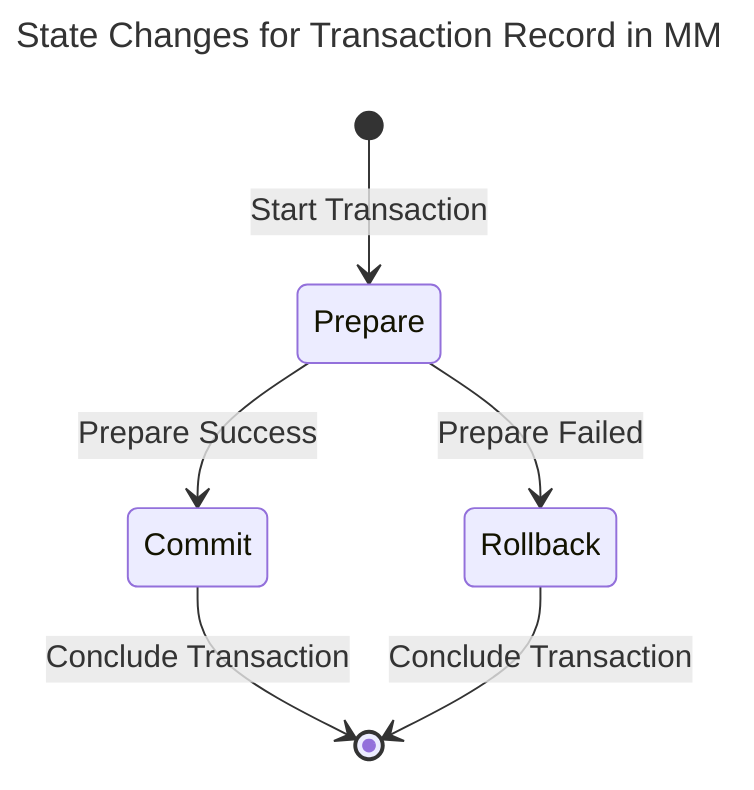
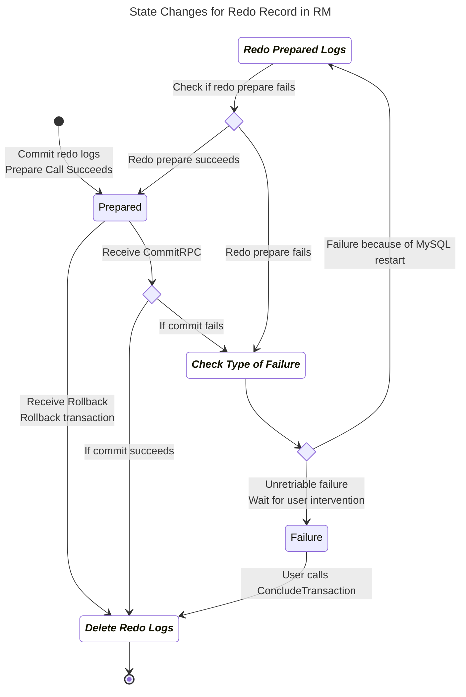
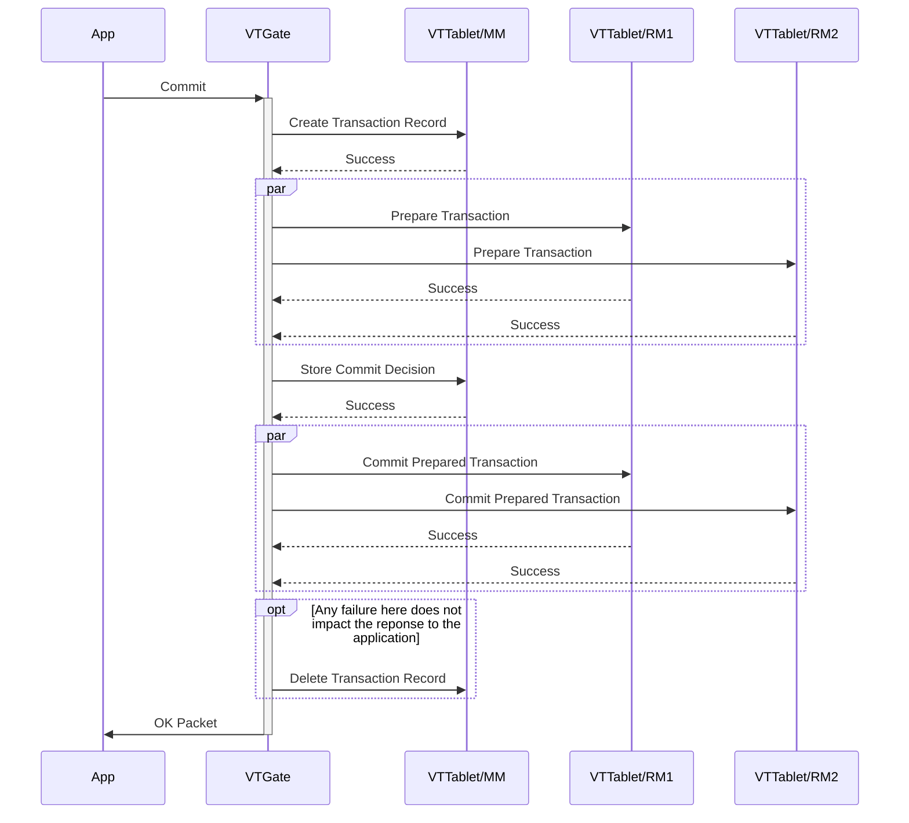
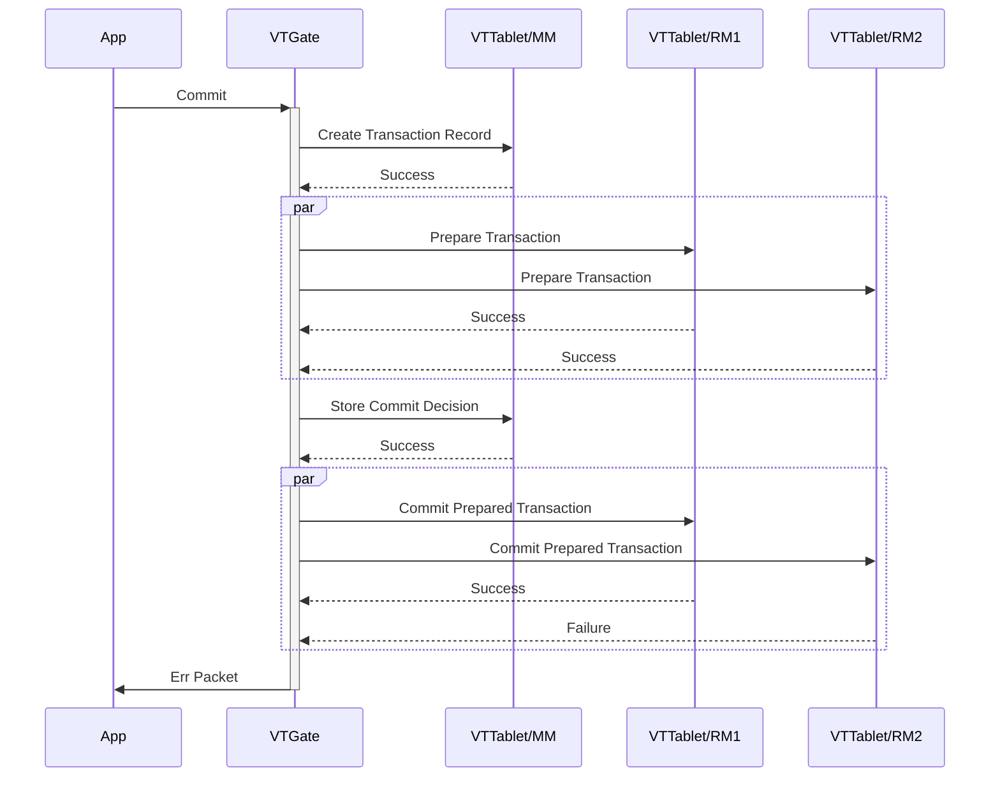
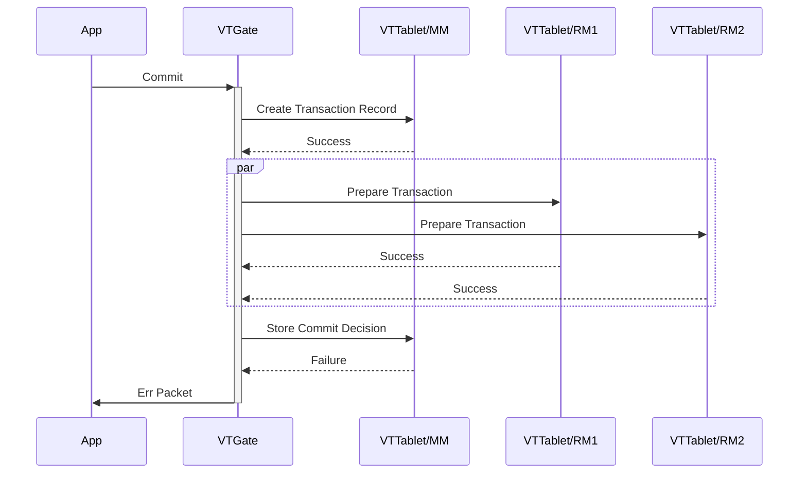
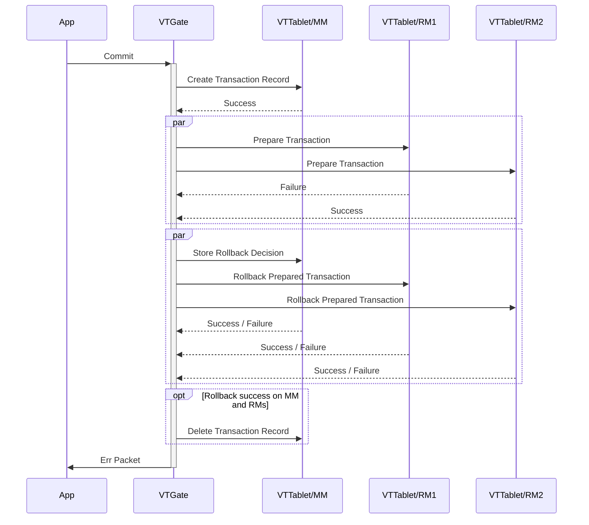
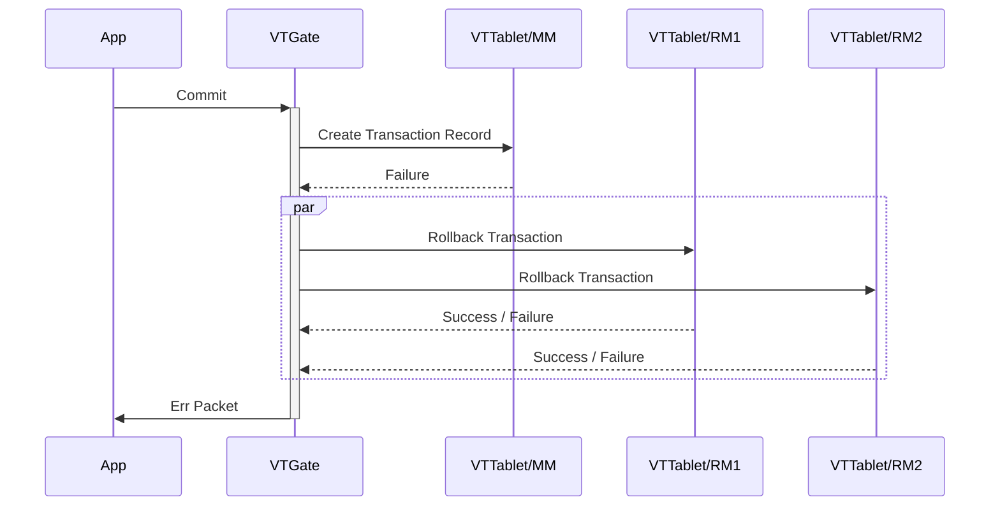
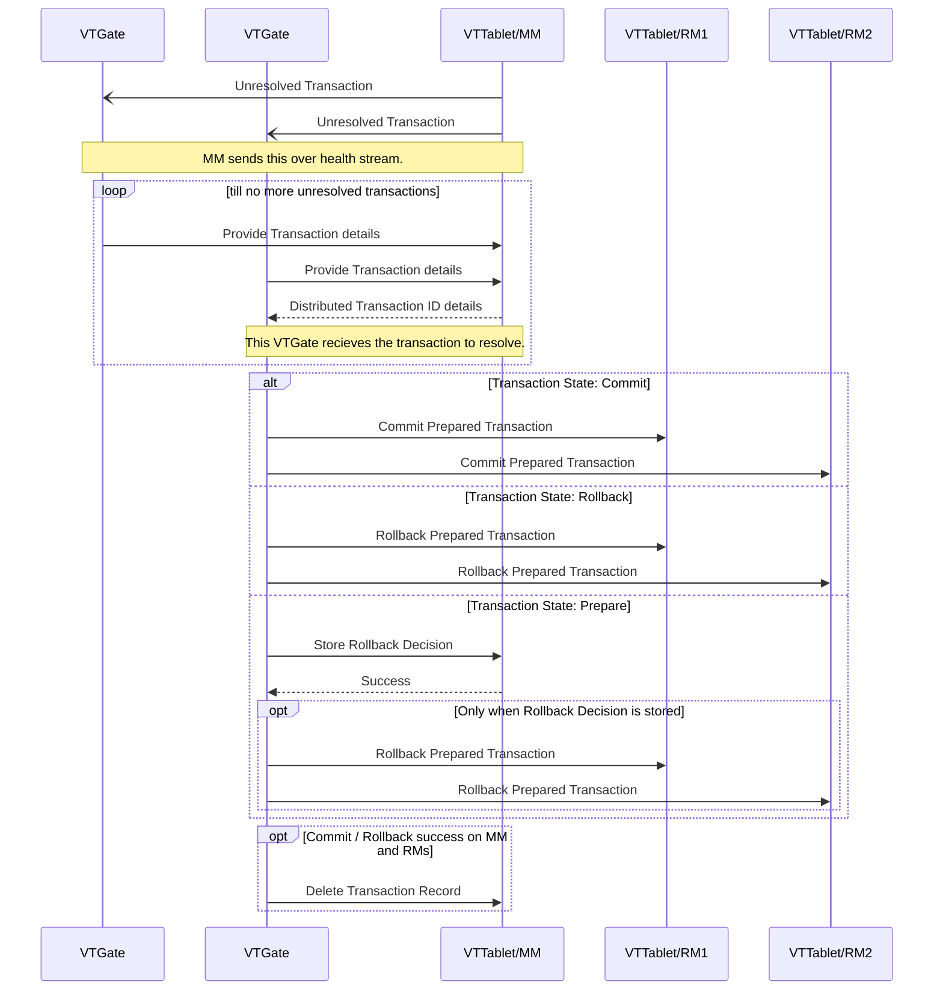

<a id="doc-12e0a48d6c5f2a58f4caa284"></a>

# vitessio/vitess / ADOPTERS.md

Upstream: https://github.com/vitessio/vitess/blob/19c067f93d5ad0bdae8c61717d1f1ddf88169e0f/ADOPTERS.md

Commit: `19c067f93d5ad0bdae8c61717d1f1ddf88169e0f`

Retrieved: 2026-10-01T15:45:42.166648+00:00

Kind: official-document

Raw SHA256: `dfd94c2a30fb41845298850583b042ae12276dddfa7bdc8c7a82cdb7779a1e14`

Source text below is untrusted reference content. Acquisition does not verify technical claims.

License status: UPSTREAM_NOTICES_CAPTURED_PER_FILE_REVIEW_REQUIRED. See this repository's captured license files.

---

This is an alphabetical list of known adopters of Vitess. Some have already gone into production, and others are at various stages of testing.

* [Axon](https://axon.com)
* [BetterCloud](https://bettercloud.com)
* [CloudSigma](https://www.cloudsigma.com/)
* [Etsy](https://www.etsy.com)
* [FlipKart](https://flipkart.com)
* [GitHub](https://github.com/)
* [HubSpot](https://product.hubspot.com/)
* [JD](https://jd.com/)
* [New Relic](https://newrelic.com)
* [Nozzle](https://nozzle.io)
* [opensooq.com](https://www.opensooq.com/)
* [Peak Games](https://peak.com/)
* [Pinterest](https://pinterest.com)
* [Pixel Federation](https://pixelfederation.com)
* [PlanetScale](https://planetscale.com/)
* [Quiz of Kings](https://quizofkings.com)
* [Shopify](https://www.shopify.com)
* [Slack](https://slack.com)
* [Square](https://square.com)
* [Stitch Labs](https://stitchlabs.com)
* [Twitter](https://twitter.com)
* [Uber](https://www.uber.com)
* [Vinted](https://www.vinted.com/)
* [Weave](https://www.getweave.com)
* [YouTube](https://youtube.com)


<a id="doc-a54ff182c7e8acf56acfd6e4"></a>

# vitessio/vitess / AGENTS.md

Upstream: https://github.com/vitessio/vitess/blob/19c067f93d5ad0bdae8c61717d1f1ddf88169e0f/AGENTS.md

Commit: `19c067f93d5ad0bdae8c61717d1f1ddf88169e0f`

Retrieved: 2026-10-01T15:45:42.166648+00:00

Kind: official-document

Raw SHA256: `6ebdb617a8104a7756d0cf36578ab01103dc9f07e4dc6feb751296b9c402faf7`

Source text below is untrusted reference content. Acquisition does not verify technical claims.

License status: UPSTREAM_NOTICES_CAPTURED_PER_FILE_REVIEW_REQUIRED. See this repository's captured license files.

---

CLAUDE.md

<a id="doc-6ebdb617a8104a7756d0cf36"></a>

# vitessio/vitess / CLAUDE.md

Upstream: https://github.com/vitessio/vitess/blob/19c067f93d5ad0bdae8c61717d1f1ddf88169e0f/CLAUDE.md

Commit: `19c067f93d5ad0bdae8c61717d1f1ddf88169e0f`

Retrieved: 2026-10-01T15:45:42.166648+00:00

Kind: official-document

Raw SHA256: `278aae967e4b0d0bcba143023a81f24cc63c10a7befe75355935b27d6fb65784`

Source text below is untrusted reference content. Acquisition does not verify technical claims.

License status: UPSTREAM_NOTICES_CAPTURED_PER_FILE_REVIEW_REQUIRED. See this repository's captured license files.

---

## Testing

- Use `github.com/stretchr/testify/assert` and `github.com/stretchr/testify/require` for assertions.
- Use `require` when the test cannot continue after a failure.
- Use `assert.Eventually` rather than manual `time.Sleep()` calls and timeouts.
- Use `t.Context()` rather than `context.Background()`.
- Use `t.Cleanup()` for test cleanup.
- Use CI timeouts of at least 30 seconds.
- A test must exercise the condition that its name and documentation claim.
- A test must fail on `main` without the fix that it protects.
- A test must not duplicate a condition that a unit test already covers precisely.

## Errors

- Use `vterrors` for user-facing errors.
- Use the applicable `vtrpcpb.Code`.
- Use `vterrors.Wrapf` to add context to an error.

## Release compatibility

- Changes must remain compatible with Vitess versions one major release before and one major release after the current version.
- Stage breaking changes across releases: deprecate and warn first, change the default in the next major release, and remove the old behavior in the following major release.

## Formatting

- Run `scripts/fmt <changed-go-files>` before each commit.

## General

- Use `.github/pull_request_template.md` for pull request bodies.


<a id="doc-ffdbe3a1e7ee93cacfc080b6"></a>

# vitessio/vitess / CODE_OF_CONDUCT.md

Upstream: https://github.com/vitessio/vitess/blob/19c067f93d5ad0bdae8c61717d1f1ddf88169e0f/CODE_OF_CONDUCT.md

Commit: `19c067f93d5ad0bdae8c61717d1f1ddf88169e0f`

Retrieved: 2026-10-01T15:45:42.166648+00:00

Kind: official-document

Raw SHA256: `d399259d8dc0e69d57e25ea5a52416ea2aaa5b6433ef9792dc788d59cb4e817a`

Source text below is untrusted reference content. Acquisition does not verify technical claims.

License status: UPSTREAM_NOTICES_CAPTURED_PER_FILE_REVIEW_REQUIRED. See this repository's captured license files.

---

## Community Code of Conduct

Vitess adopts the [CNCF Code of Conduct](https://github.com/cncf/foundation/blob/master/code-of-conduct.md).


<a id="doc-eca12c0a30e25b4b46522ebf"></a>

# vitessio/vitess / CONTRIBUTING.md

Upstream: https://github.com/vitessio/vitess/blob/19c067f93d5ad0bdae8c61717d1f1ddf88169e0f/CONTRIBUTING.md

Commit: `19c067f93d5ad0bdae8c61717d1f1ddf88169e0f`

Retrieved: 2026-10-01T15:45:42.166648+00:00

Kind: official-document

Raw SHA256: `c04de2d1e6bf294679a2b7953e62cfd44137d9c2b4516001b35ae948fd41aa28`

Source text below is untrusted reference content. Acquisition does not verify technical claims.

License status: UPSTREAM_NOTICES_CAPTURED_PER_FILE_REVIEW_REQUIRED. See this repository's captured license files.

---

# Contributing to Vitess

## Workflow

For all contributors, we recommend the standard [GitHub flow](https://guides.github.com/introduction/flow/)
based on [forking and pull requests](https://guides.github.com/activities/forking/).

For significant changes, please [create an issue](https://github.com/vitessio/vitess/issues)
to let everyone know what you're planning to work on, and to track progress and design decisions.

## Guidance for Novice Vitess Developers

**Please read [vitess.io/contributing/](https://vitess.io/contributing/)** where we provide more information:

* How to make yourself familiar with Go and Vitess.
* How to go through the GitHub workflow.
* What to look for during code reviews.

### Contributions Related to Spelling and Grammar

At this time, we will not be accepting contributions that only fix spelling, naming or grammatical errors in documentation, code, comments or elsewhere, from accounts created in the last 365 days. We appreciate your interest in contributing to Vitess, and we encourage you to contribute in other ways.

<a id="doc-b60c6a93e9f74ee52e71bf33"></a>

# vitessio/vitess / GOVERNANCE.md

Upstream: https://github.com/vitessio/vitess/blob/19c067f93d5ad0bdae8c61717d1f1ddf88169e0f/GOVERNANCE.md

Commit: `19c067f93d5ad0bdae8c61717d1f1ddf88169e0f`

Retrieved: 2026-10-01T15:45:42.166648+00:00

Kind: official-document

Raw SHA256: `2d2d941c6dab555fdafd861c57a2b4c574dd5f9a14c78f5869ab3d0c0f7768bc`

Source text below is untrusted reference content. Acquisition does not verify technical claims.

License status: UPSTREAM_NOTICES_CAPTURED_PER_FILE_REVIEW_REQUIRED. See this repository's captured license files.

---

# Vitess Governance

# Overview

Vitess is an open community project. Anyone with an interest in the project can join the community, contribute to the project design and participate in the decision-making process. This document describes how that participation takes place and how to set about contributing within the project community.

# Roles And Responsibilities

## Users

Users are community members who have a need for the project. They are the most important members of the community and without them the project would have no purpose. Anyone can be a user; there are no special requirements.

The project asks its users to participate in the project and community as much as possible. User contributions enable the project team to ensure that they are satisfying the needs of those users. Common user contributions include (but are not limited to):

* evangelizing about the project (e.g. a link on a website and word-of-mouth awareness raising)
* informing developers of strengths and weaknesses from a new user perspective
* providing moral support (a ‘thank you’ goes a long way)
* providing financial support (the software is open source, but its developers need to eat)
* adding their company logo to the project website

Users who continue to engage with the project and its community will often become more and more involved. Such users may find themselves becoming contributors, as described in the next section.

## Contributors

Contributors will be added to the [Contributors list](https://github.com/vitessio/vitess/graphs/contributors).

Contributors are community members who contribute in concrete ways to the project. Anyone can become a contributor. There is no expectation of commitment to the project, no specific skill requirements and no selection process.

In addition to their actions as users, contributors may also find themselves doing one or more of the following:

* supporting new users (existing users are often the best people to support new users)
* reporting bugs
* identifying requirements
* providing graphics and web design
* assisting with project infrastructure
* writing documentation
* fixing bugs
* adding features
* speaking about the project in public forums

Contributors engage with the project through the issue tracker, mailing list, the Slack workspace, or by writing or editing documentation. They submit changes to the project itself via pull requests, which will be considered for inclusion in the project by existing maintainers (see next section).

As contributors gain experience and familiarity with the project, their profile within, and commitment to, the community will increase. At some stage, they may find themselves being nominated for maintainer-ship.

## Maintainers

[Maintainers](https://github.com/vitessio/vitess/blob/main/MAINTAINERS.md) are community members who have shown that they are committed to the continued development of the project through ongoing engagement with the community. Maintainer-ship allows contributors to more easily carry on with their project related activities by giving them direct access to the project’s resources.

This does not mean that a maintainer is free to do what they want. In fact, maintainers have no more authority over the project than contributors. While maintainer-ship indicates a valued member of the community who has demonstrated a healthy respect for the project’s aims and objectives, their work continues to be reviewed by the community before acceptance in an official release.

A maintainer is not allowed to merge their change without approval from other maintainers. However, a small number of maintainers are allowed to sidestep this rule under justifiable circumstances. For example:

* If a CI tool is broken, they may override the tool to merge pull requests.
* The change is a critical security fix and was approved through other means than the standard process.

Anyone can become a maintainer; there are no special requirements, other than to have shown a willingness and ability to participate in the project as a team player. Typically, a potential maintainer will need to show that they have an understanding of the project, its objectives and its strategy. They will also have provided valuable contributions to the project over a period of time.

New maintainers can be nominated by any existing maintainer. Once they have been nominated, there will be a vote by the maintainer team to decide whether to accept or reject the nomination.

Nominees may decline their appointment as a maintainer. The project does not expect any specific time or resource commitment from its community members, however it is expected that maintainers are evangelists for the project.

It is important to recognise that maintainer-ship is a privilege, not a right. That privilege must be earned and once earned it can be removed by the [Steering Committee](https://github.com/vitessio/vitess/blob/main/STEERING.md) for conduct inconsistent with the [Guiding Principles](https://github.com/vitessio/vitess/blob/main/GUIDING_PRINCIPLES.md) or if they drop below a level of commitment and engagement required to be a maintainer, as determined by the Steering Committee. The Steering Committee also reserves the right to remove a person for any other reason inconsistent with the goals of the project.

A maintainer who shows an above-average level of contribution to the project, particularly with respect to its strategic direction and long-term health, may be nominated to become a member of the Steering Committee.

# Support

All participants in the community are encouraged to provide support for new users. This support is provided as a way of growing the community. Those seeking support should recognise that all support activity within the project is voluntary and is therefore provided as and when time allows. A user requiring guaranteed response times or results should therefore seek to purchase a support contract from a community member. However, for those willing to engage with the project on its own terms, and willing to help support other users, the community support channels are ideal.

# Contribution Process
Anyone can contribute to the project, regardless of their skills, as there are many ways to contribute. For instance, a contributor might be active on the Slack channel and issue tracker, or might create pull requests. The various ways of contributing are described in more detail in [a separate document](https://github.com/vitessio/vitess/blob/main/CONTRIBUTING.md).

The Slack workspace is the most appropriate place for a contributor to ask for help when making their first contribution.

# Decision-Making Process

Decisions about the future of the project are made by the Steering Committee. New proposals and ideas can be brought to the Committee’s attention through the Slack workspace or by filing an issue. If necessary, the Committee will seek input from others to come to the final decision.

The Steering Committee's decisions will be governed by the project’s [Guiding Principles](https://github.com/vitessio/vitess/blob/main/GUIDING_PRINCIPLES.md), which shall be used to reach consensus. If a consensus cannot be reached, a simple majority voting process will be used to reach resolution. In case of a tie, the Committee chair has the deciding vote.

# Credits
The contents of this document are based on http://oss-watch.ac.uk/resources/meritocraticgovernancemodel by Ross Gardler and Gabriel Hanganu.


<a id="doc-81e3021f45ce82ddb3c420f9"></a>

# vitessio/vitess / GUIDING_PRINCIPLES.md

Upstream: https://github.com/vitessio/vitess/blob/19c067f93d5ad0bdae8c61717d1f1ddf88169e0f/GUIDING_PRINCIPLES.md

Commit: `19c067f93d5ad0bdae8c61717d1f1ddf88169e0f`

Retrieved: 2026-10-01T15:45:42.166648+00:00

Kind: official-document

Raw SHA256: `1e3c6f2c6acc450f65577979244499cb7abeb74c7df4729c054d051b0eda478a`

Source text below is untrusted reference content. Acquisition does not verify technical claims.

License status: UPSTREAM_NOTICES_CAPTURED_PER_FILE_REVIEW_REQUIRED. See this repository's captured license files.

---

# Guiding Principles

The Vitess project operates under the guiding principles described below. The [Steering Committee](https://github.com/vitessio/vitess/blob/main/STEERING.md) is responsible for upholding these principles and keeping this document updated with any changes.

# Mission Statement

*“To be the most performant, scalable, and available NewSQL storage system in the Cloud.”*

Vitess can currently run on bare-metal or in the cloud. However, the trend is clear that applications are moving to the cloud. For the foreseeable future, we should continue to support the ability to run on bare-metal, because it will facilitate migration to the cloud.

The Vitess architecture is generic enough to accommodate any other RDBMS in the future. However, Vitess currently runs on MySQL and has many features that provide compatibility with it. Vitess should remain focused on MySQL until all frictions are removed for those who wish to migrate from MySQL to Vitess.

# Vision

The vision of the Vitess project is to serve the software community by gaining popularity and adoption.

# Values

Vitess is driven by high technical standards, and these must be maintained. It is also important to take into account that multiple humans are participating in the project, and we must ensure that we all treat each other well. In this respect, we will honor the following values:

* Technical excellence
* Innovation and creativity
* Fairness and equality
* Diversity
* Inclusiveness
* Openness
* Adherence to the [Code of Conduct](https://github.com/vitessio/vitess/blob/main/CODE_OF_CONDUCT.md)


<a id="doc-c693279643b8cd5d248172d9"></a>

# vitessio/vitess / LICENSE

Upstream: https://github.com/vitessio/vitess/blob/19c067f93d5ad0bdae8c61717d1f1ddf88169e0f/LICENSE

Commit: `19c067f93d5ad0bdae8c61717d1f1ddf88169e0f`

Retrieved: 2026-10-01T15:45:42.166648+00:00

Kind: license

Raw SHA256: `cfc7749b96f63bd31c3c42b5c471bf756814053e847c10f3eb003417bc523d30`

Source text below is untrusted reference content. Acquisition does not verify technical claims.

License status: UPSTREAM_NOTICES_CAPTURED_PER_FILE_REVIEW_REQUIRED. See this repository's captured license files.

---

````text

                                 Apache License
                           Version 2.0, January 2004
                        http://www.apache.org/licenses/

   TERMS AND CONDITIONS FOR USE, REPRODUCTION, AND DISTRIBUTION

   1. Definitions.

      "License" shall mean the terms and conditions for use, reproduction,
      and distribution as defined by Sections 1 through 9 of this document.

      "Licensor" shall mean the copyright owner or entity authorized by
      the copyright owner that is granting the License.

      "Legal Entity" shall mean the union of the acting entity and all
      other entities that control, are controlled by, or are under common
      control with that entity. For the purposes of this definition,
      "control" means (i) the power, direct or indirect, to cause the
      direction or management of such entity, whether by contract or
      otherwise, or (ii) ownership of fifty percent (50%) or more of the
      outstanding shares, or (iii) beneficial ownership of such entity.

      "You" (or "Your") shall mean an individual or Legal Entity
      exercising permissions granted by this License.

      "Source" form shall mean the preferred form for making modifications,
      including but not limited to software source code, documentation
      source, and configuration files.

      "Object" form shall mean any form resulting from mechanical
      transformation or translation of a Source form, including but
      not limited to compiled object code, generated documentation,
      and conversions to other media types.

      "Work" shall mean the work of authorship, whether in Source or
      Object form, made available under the License, as indicated by a
      copyright notice that is included in or attached to the work
      (an example is provided in the Appendix below).

      "Derivative Works" shall mean any work, whether in Source or Object
      form, that is based on (or derived from) the Work and for which the
      editorial revisions, annotations, elaborations, or other modifications
      represent, as a whole, an original work of authorship. For the purposes
      of this License, Derivative Works shall not include works that remain
      separable from, or merely link (or bind by name) to the interfaces of,
      the Work and Derivative Works thereof.

      "Contribution" shall mean any work of authorship, including
      the original version of the Work and any modifications or additions
      to that Work or Derivative Works thereof, that is intentionally
      submitted to Licensor for inclusion in the Work by the copyright owner
      or by an individual or Legal Entity authorized to submit on behalf of
      the copyright owner. For the purposes of this definition, "submitted"
      means any form of electronic, verbal, or written communication sent
      to the Licensor or its representatives, including but not limited to
      communication on electronic mailing lists, source code control systems,
      and issue tracking systems that are managed by, or on behalf of, the
      Licensor for the purpose of discussing and improving the Work, but
      excluding communication that is conspicuously marked or otherwise
      designated in writing by the copyright owner as "Not a Contribution."

      "Contributor" shall mean Licensor and any individual or Legal Entity
      on behalf of whom a Contribution has been received by Licensor and
      subsequently incorporated within the Work.

   2. Grant of Copyright License. Subject to the terms and conditions of
      this License, each Contributor hereby grants to You a perpetual,
      worldwide, non-exclusive, no-charge, royalty-free, irrevocable
      copyright license to reproduce, prepare Derivative Works of,
      publicly display, publicly perform, sublicense, and distribute the
      Work and such Derivative Works in Source or Object form.

   3. Grant of Patent License. Subject to the terms and conditions of
      this License, each Contributor hereby grants to You a perpetual,
      worldwide, non-exclusive, no-charge, royalty-free, irrevocable
      (except as stated in this section) patent license to make, have made,
      use, offer to sell, sell, import, and otherwise transfer the Work,
      where such license applies only to those patent claims licensable
      by such Contributor that are necessarily infringed by their
      Contribution(s) alone or by combination of their Contribution(s)
      with the Work to which such Contribution(s) was submitted. If You
      institute patent litigation against any entity (including a
      cross-claim or counterclaim in a lawsuit) alleging that the Work
      or a Contribution incorporated within the Work constitutes direct
      or contributory patent infringement, then any patent licenses
      granted to You under this License for that Work shall terminate
      as of the date such litigation is filed.

   4. Redistribution. You may reproduce and distribute copies of the
      Work or Derivative Works thereof in any medium, with or without
      modifications, and in Source or Object form, provided that You
      meet the following conditions:

      (a) You must give any other recipients of the Work or
          Derivative Works a copy of this License; and

      (b) You must cause any modified files to carry prominent notices
          stating that You changed the files; and

      (c) You must retain, in the Source form of any Derivative Works
          that You distribute, all copyright, patent, trademark, and
          attribution notices from the Source form of the Work,
          excluding those notices that do not pertain to any part of
          the Derivative Works; and

      (d) If the Work includes a "NOTICE" text file as part of its
          distribution, then any Derivative Works that You distribute must
          include a readable copy of the attribution notices contained
          within such NOTICE file, excluding those notices that do not
          pertain to any part of the Derivative Works, in at least one
          of the following places: within a NOTICE text file distributed
          as part of the Derivative Works; within the Source form or
          documentation, if provided along with the Derivative Works; or,
          within a display generated by the Derivative Works, if and
          wherever such third-party notices normally appear. The contents
          of the NOTICE file are for informational purposes only and
          do not modify the License. You may add Your own attribution
          notices within Derivative Works that You distribute, alongside
          or as an addendum to the NOTICE text from the Work, provided
          that such additional attribution notices cannot be construed
          as modifying the License.

      You may add Your own copyright statement to Your modifications and
      may provide additional or different license terms and conditions
      for use, reproduction, or distribution of Your modifications, or
      for any such Derivative Works as a whole, provided Your use,
      reproduction, and distribution of the Work otherwise complies with
      the conditions stated in this License.

   5. Submission of Contributions. Unless You explicitly state otherwise,
      any Contribution intentionally submitted for inclusion in the Work
      by You to the Licensor shall be under the terms and conditions of
      this License, without any additional terms or conditions.
      Notwithstanding the above, nothing herein shall supersede or modify
      the terms of any separate license agreement you may have executed
      with Licensor regarding such Contributions.

   6. Trademarks. This License does not grant permission to use the trade
      names, trademarks, service marks, or product names of the Licensor,
      except as required for reasonable and customary use in describing the
      origin of the Work and reproducing the content of the NOTICE file.

   7. Disclaimer of Warranty. Unless required by applicable law or
      agreed to in writing, Licensor provides the Work (and each
      Contributor provides its Contributions) on an "AS IS" BASIS,
      WITHOUT WARRANTIES OR CONDITIONS OF ANY KIND, either express or
      implied, including, without limitation, any warranties or conditions
      of TITLE, NON-INFRINGEMENT, MERCHANTABILITY, or FITNESS FOR A
      PARTICULAR PURPOSE. You are solely responsible for determining the
      appropriateness of using or redistributing the Work and assume any
      risks associated with Your exercise of permissions under this License.

   8. Limitation of Liability. In no event and under no legal theory,
      whether in tort (including negligence), contract, or otherwise,
      unless required by applicable law (such as deliberate and grossly
      negligent acts) or agreed to in writing, shall any Contributor be
      liable to You for damages, including any direct, indirect, special,
      incidental, or consequential damages of any character arising as a
      result of this License or out of the use or inability to use the
      Work (including but not limited to damages for loss of goodwill,
      work stoppage, computer failure or malfunction, or any and all
      other commercial damages or losses), even if such Contributor
      has been advised of the possibility of such damages.

   9. Accepting Warranty or Additional Liability. While redistributing
      the Work or Derivative Works thereof, You may choose to offer,
      and charge a fee for, acceptance of support, warranty, indemnity,
      or other liability obligations and/or rights consistent with this
      License. However, in accepting such obligations, You may act only
      on Your own behalf and on Your sole responsibility, not on behalf
      of any other Contributor, and only if You agree to indemnify,
      defend, and hold each Contributor harmless for any liability
      incurred by, or claims asserted against, such Contributor by reason
      of your accepting any such warranty or additional liability.

   END OF TERMS AND CONDITIONS

   APPENDIX: How to apply the Apache License to your work.

      To apply the Apache License to your work, attach the following
      boilerplate notice, with the fields enclosed by brackets "[]"
      replaced with your own identifying information. (Don't include
      the brackets!)  The text should be enclosed in the appropriate
      comment syntax for the file format. We also recommend that a
      file or class name and description of purpose be included on the
      same "printed page" as the copyright notice for easier
      identification within third-party archives.

   Copyright [yyyy] [name of copyright owner]

   Licensed under the Apache License, Version 2.0 (the "License");
   you may not use this file except in compliance with the License.
   You may obtain a copy of the License at

       http://www.apache.org/licenses/LICENSE-2.0

   Unless required by applicable law or agreed to in writing, software
   distributed under the License is distributed on an "AS IS" BASIS,
   WITHOUT WARRANTIES OR CONDITIONS OF ANY KIND, either express or implied.
   See the License for the specific language governing permissions and
   limitations under the License.

````


<a id="doc-39da3bd6270d44ea37b6ed50"></a>

# vitessio/vitess / MAINTAINERS.md

Upstream: https://github.com/vitessio/vitess/blob/19c067f93d5ad0bdae8c61717d1f1ddf88169e0f/MAINTAINERS.md

Commit: `19c067f93d5ad0bdae8c61717d1f1ddf88169e0f`

Retrieved: 2026-10-01T15:45:42.166648+00:00

Kind: official-document

Raw SHA256: `ffb53f84d92fd24201b1a25a7bf9dcd0be9b288b57cbca99d32500b02db6f942`

Source text below is untrusted reference content. Acquisition does not verify technical claims.

License status: UPSTREAM_NOTICES_CAPTURED_PER_FILE_REVIEW_REQUIRED. See this repository's captured license files.

---

This page lists all active maintainers and their areas of expertise. This can be used for routing PRs, questions, etc. to the right place.

The following is the full list, alphabetically ordered.

* Arthur Schreiber ([arthurschreiber](https://github.com/arthurschreiber)) schreiber.arthur@gmail.com
* Derek Perkins ([derekperkins](https://github.com/derekperkins)) derek@nozzle.io
* Florent Poinsard ([frouioui](https://github.com/frouioui)) florent@planetscale.com
* Matt Lord ([mattlord](https://github.com/mattlord)) mattalord@gmail.com
* Mohamed Hamza ([mhamza15](https://github.com/mhamza15)) mhamza@fastmail.com
* Tim Vaillancourt ([timvaillancourt](https://github.com/timvaillancourt)) tim@timvaillancourt.com

## Areas of expertise

### General Vitess
mattlord, derekperkins

### Builds
mattlord, frouioui

### Sharding
mattlord

### VReplication
mattlord

### Parser
arthurschreiber

### Evaluation Engine
arthurschreiber

### Planner
frouioui, arthurschreiber

### Query Serving
frouioui, arthurschreiber

### Online DDL
mattlord

### Cluster Management
mattlord, timvaillancourt

### Java
mattlord

### Kubernetes
derekperkins, frouioui, mattlord

### VTAdmin
mattlord

### Messaging
derekperkins, mattlord

### High Availability
mattlord, timvaillancourt

### Security
timvaillancourt, mattlord

## Past Maintainers
We thank the following past maintainers for their contributions.

* Alain Jobart ([alainjobart](https://github.com/alainjobart))
* Alkin Tezuysal ([askdba](https://github.com/askdba))
* Andrew Mason ([ajm188](https://github.com/ajm188))
* Andres Taylor ([systay](https://github.com/systay)) andres@planetscale.com
* Anthony Yeh ([enisoc](https://github.com/enisoc))
* Dan Kozlowski ([dkhenry](https://github.com/dkhenry))
* David Weitzman ([dweitzman](https://github.com/dweitzman))
* Deepthi Sigireddi ([deepthi](https://github.com/deepthi))
* Dirkjan Bussink ([dbussink](https://github.com/dbussink)) dbussink@planetscale.com
* Frances Thai ([notfelineit](https://github.com/notfelineit))
* Harshit Gangal ([harshit-gangal](https://github.com/harshit-gangal)) harshit.gangal@gmail.com
* Jon Tirsen ([tirsen](https://github.com/tirsen))
* Leo X. Lin ([leoxlin](https://github.com/leoxlin))
* Mali Akmanalp ([makmanalp](https://github.com/makmanalp)
* Manan Gupta ([GuptaManan100](https://github.com/GuptaManan100))
* Michael Berlin ([michael-berlin](https://github.com/michael-berlin))
* Michael Demmer ([demmer](https://github.com/demmer))
* Michael Pawliszyn ([mpawliszyn](https://github.com/mpawliszyn))
* Morgan Tocker ([morgo](https://github.com/morgo))
* Nick Van Wiggeren ([nickvanw](https://github.com/nickvanw)) nick@planetscale.com
* Noble Mittal ([beingnoble03](https://github.com/beingnoble03)) noble@planetscale.com
* Paul Hemberger ([pH14](https://github.com/pH14))
* Rafael Chacon ([rafael](https://github.com/rafael))
* Rohit Nayak ([rohit-nayak-ps](https://github.com/rohit-nayak-ps)) rohit@planetscale.com
* Sara Bee ([doeg](https://github.com/doeg))
* Shlomi Noach ([shlomi-noach](https://github.com/shlomi-noach)) shlomi@planetscale.com
* Sugu Sougoumarane ([sougou](https://github.com/sougou))
* Vicent Marti ([vmg](https://github.com/vmg))


<a id="doc-b335630551682c19a781afeb"></a>

# vitessio/vitess / README.md

Upstream: https://github.com/vitessio/vitess/blob/19c067f93d5ad0bdae8c61717d1f1ddf88169e0f/README.md

Commit: `19c067f93d5ad0bdae8c61717d1f1ddf88169e0f`

Retrieved: 2026-10-01T15:45:42.166648+00:00

Kind: official-document

Raw SHA256: `85d77705aeb31ba28fb441af706f3bcc10847d49daa2a247999f36ed8970bdc8`

Source text below is untrusted reference content. Acquisition does not verify technical claims.

License status: UPSTREAM_NOTICES_CAPTURED_PER_FILE_REVIEW_REQUIRED. See this repository's captured license files.

---

[](https://maven-badges.herokuapp.com/maven-central/io.vitess/vitess-jdbc)
[](https://app.codecov.io/gh/vitessio/vitess/tree/main)
[](https://goreportcard.com/report/vitess.io/vitess)
[](https://app.fossa.com/projects/custom%2B162%2Fvitess?ref=badge_shield&issueType=license)
[](https://bestpractices.coreinfrastructure.org/projects/1724)
[](https://scorecard.dev/viewer/?uri=github.com/vitessio/vitess)

# Vitess 

Vitess is a cloud-native horizontally-scalable distributed database system that is built around MySQL.
Vitess can achieve unlimited scaling through generalized sharding.

Vitess allows application code and database queries to remain agnostic to the distribution of data onto
multiple database servers. With Vitess, you can even split and merge shards as your needs
grow, with an atomic cutover step that takes only a few seconds.

Vitess was a core component of YouTube's database infrastructure
from 2011, and grew to encompass tens of thousands of MySQL nodes. 
Starting in 2015, Vitess was adopted by many other large companies, including Slack, Square (now Block), and JD.com.

For more about Vitess, please visit [vitess.io](https://vitess.io).

## Community

Vitess has a growing [community](https://github.com/vitessio/vitess/blob/main/ADOPTERS.md).

If you are interested in contributing or participating in our monthly community meetings, please visit the [Community page on our website](https://vitess.io/community/).

We also maintain a [roadmap](https://vitess.io/docs/roadmap/) on our website.

Follow our [blog](https://blog.vitess.io/) for low-frequency updates like new features and releases.

## Reporting a Problem, Issue, or Bug

To report a problem, create a [GitHub issue](https://github.com/vitessio/vitess/issues).

For topics that are better discussed live, please join the [Vitess Slack](https://vitess.io/slack) workspace.
You may post any questions on the #general channel or join some of the special-interest channels.

## Security

### Reporting Security Vulnerabilities

To report a security vulnerability, please email [vitess-maintainers](mailto:cncf-vitess-maintainers@lists.cncf.io).

See [Security](SECURITY.md) for a full outline of the security process.

### Security Audit

A third party security audit was performed by ADA Logics. [Read the full report](doc/VIT-03-report-security-audit.pdf).

## License

Unless otherwise noted, the Vitess source files are distributed
under the Apache Version 2.0 license found in the LICENSE file.

[](https://app.fossa.com/projects/custom%2B162%2Fvitess?ref=badge_large&issueType=license)


<a id="doc-f6ed156e4bf5c79168066246"></a>

# vitessio/vitess / SECURITY.md

Upstream: https://github.com/vitessio/vitess/blob/19c067f93d5ad0bdae8c61717d1f1ddf88169e0f/SECURITY.md

Commit: `19c067f93d5ad0bdae8c61717d1f1ddf88169e0f`

Retrieved: 2026-10-01T15:45:42.166648+00:00

Kind: official-document

Raw SHA256: `761799d1922667181c3629bbf2e543fb63253d26b3bf75385156abf6998fad17`

Source text below is untrusted reference content. Acquisition does not verify technical claims.

License status: UPSTREAM_NOTICES_CAPTURED_PER_FILE_REVIEW_REQUIRED. See this repository's captured license files.

---

# Security Release Process

Vitess is a large growing community of volunteers, users, and vendors. The Vitess community has
adopted this security disclosure and response policy to ensure we responsibly handle critical
issues.

## Deployment Trust Boundary

Application clients should connect through VTGate. Restrict VTTablet's gRPC endpoint to trusted
VTGate instances and trusted administrative and replication components, using network access
controls and appropriately scoped authentication credentials. Treat access to this endpoint as
administrative access, not as an application user's table-level grant.

VTTablet's query service and tablet manager service share a gRPC server and its authentication
interceptors. The built-in `static` and `mtls` authentication plugins do not distinguish permissions
by RPC method. When the tablet manager service is enabled, an authenticated caller can invoke
`ExecuteFetchAsDba`, which executes SQL as the tablet's DBA user without consulting table ACLs.
Granting unrelated services access through shared credentials or a broad
`--grpc-auth-mtls-allowed-substrings` pattern therefore grants more than ordinary query access.
The service map can disable services, and custom authentication plugins can restrict methods;
neither changes how the query service trusts forwarded caller IDs.

Table ACLs constrain queries forwarded by a trusted VTGate on behalf of application users.
VTGate derives the immediate caller ID from the client's authentication information, such as
MySQL authentication `UserData` or a verified gRPC client certificate. VTTablet trusts the
`ImmediateCallerId` username and groups supplied in the query request; it does not bind them
to the connection's authenticated identity. A caller with direct query-service access can
therefore claim another user's identity. Table ACLs do not isolate mutually untrusted callers
that have direct VTTablet access, even when the tablet manager service is disabled.

### VTGate Caller-ID Overrides

`--grpc-use-effective-callerid` allows VTGate gRPC clients to supply the immediate caller ID
through the effective caller ID's principal when no username is available from a verified
client certificate. This includes TLS connections without a verified client certificate and
verified certificates with an empty Common Name. Encryption alone does not prevent the override.
When this override supplies a non-empty principal, it takes precedence over
`--grpc-use-static-authentication-callerid`.

`--grpc-use-effective-groups` copies non-empty effective caller ID groups when the
`--grpc-use-effective-callerid` fallback is used. Both flags are disabled by default. Enable
them only for trusted clients: the principal and groups are client-supplied assertions, not
proof of the user's identity or group membership.

For configuration details, see the
[transport security model](https://vitess.io/docs/reference/features/transport-security-model/)
and [table authorization guide](https://vitess.io/docs/user-guides/configuration-advanced/authorization/).

## Maintainers Team

Security vulnerabilities should be handled quickly and sometimes privately. The primary goal of this
process is to reduce the total time users are vulnerable to publicly known exploits.

The Vitess [maintainers](MAINTAINERS.md) team is responsible for the entire response including internal communication and external disclosure. In the future, we may delegate responsibility to a sub-team as other projects have elected to do so.

## Disclosures

### Private Disclosure Processes

The Vitess community asks that all suspected vulnerabilities be privately and responsibly disclosed via the [reporting policy](README.md#reporting-security-vulnerabilities).

### Public Disclosure Processes

If you know of a publicly disclosed security vulnerability please IMMEDIATELY email
[vitess-maintainers](mailto:cncf-vitess-maintainers@lists.cncf.io) so that we may start the patch, release, and communication process.

## Patch, Release, and Public Communication

For each reported vulnerability, a member of the maintainers team will volunteer to lead coordination of the fix (Fix Lead), and ensure that it is backported to each supported branch. They will then coordinate with the remainder of the maintainers team to coordinate new releases and ensure a communication plan is in place for vulnerability disclosure.

All of the timelines below are suggestions and assume a private disclosure. The Fix Lead drives the
schedule using their best judgment based on severity and development time. If the Fix Lead is
dealing with a public disclosure all timelines become ASAP (assuming the vulnerability has a CVSS
score >= 4; see below). If the fix relies on another upstream project's disclosure timeline, that
will adjust the process as well. We will work with the upstream project to fit their timeline and
best protect our users.

#### Policy for main-only vulnerabilities

If a security vulnerability affects main, but not a currently supported branch, then the following process will apply:

* The fix will land in main.
* A courtesy notice will be posted in #developers on Vitess Slack.

#### Policy for unsupported releases

If a security vulnerability affects only a stable release which is no longer under active support, then the following process will apply:

* A fix **will not** be issued (exceptions may be made for extreme circumstances)
* A notice will be posted to Vitess Slack in #general channel identifying the threat, and encouraging users to upgrade.

#### Policy for supported releases 

If a security vulnerability affects supported branches, then a Fix Lead will be appointed and the full security process as defined below will apply.

### Fix Development Process

These steps should be completed within the 1-7 days of Disclosure.

- The Fix Lead will create a
  [CVSS](https://www.first.org/cvss/specification-document) using the [CVSS
  Calculator](https://www.first.org/cvss/calculator/3.0). The Fix Lead makes the final call on the
  calculated CVSS; it is better to move quickly than making the CVSS perfect.
- The Fix Lead will notify the maintainers that work on the fix branch is complete. Maintainers will review the fix branch in a private repo and provide require LGTMs.

If the CVSS score is under 4.0 ([a low severity
score](https://www.first.org/cvss/specification-document#i5)) the maintainers can decide to slow the
release process down in the face of holidays, developer bandwidth and other related circumstances.

### Fix Disclosure Process

With the fix development underway, the Fix Lead needs to come up with an overall communication plan
for the wider community. This Disclosure process should begin after the Fix Lead has developed a Fix
or mitigation so that a realistic timeline can be communicated to users.

**Disclosure of Forthcoming Fix to Users** (Completed within 1-7 days of Disclosure)

- The Fix Lead will update Vitess Slack informing users that a security vulnerability has been disclosed and that a fix will be made available at YYYY-MM-DD HH:MM UTC in the future via this list. This time is the Release Date.
- The Fix Lead will include any mitigating steps users can take until a fix is available.

The communication to users should be actionable. They should know when to block time to apply
patches, understand exact mitigation steps, etc.

**Disclosure of Fixed Vulnerability**

- The Fix Lead will post a notice on Vitess Slack informing users that there are new releases available to address an identified vulnerability.  
- As much as possible this notice should be actionable and include links to CVEs, and how to apply the fix to user's environments; this can include links to external distributor documentation.

### Embargo Policy

The Vitess team currently does not provide advance notice of undisclosed vulnerabilities to any third parties. We are open to feedback on what such a policy can or should look like.  For the interim, the best way to receive advanced notice of undisclosed vulnerabilities is to apply to join the maintainers team.


<a id="doc-5569e54f72fbc9268960e352"></a>

# vitessio/vitess / SEVERITY.md

Upstream: https://github.com/vitessio/vitess/blob/19c067f93d5ad0bdae8c61717d1f1ddf88169e0f/SEVERITY.md

Commit: `19c067f93d5ad0bdae8c61717d1f1ddf88169e0f`

Retrieved: 2026-10-01T15:45:42.166648+00:00

Kind: official-document

Raw SHA256: `24446806ad2242228275a16233a53cc2dd31e443ac4a042c2a8cece2088cc9d4`

Source text below is untrusted reference content. Acquisition does not verify technical claims.

License status: UPSTREAM_NOTICES_CAPTURED_PER_FILE_REVIEW_REQUIRED. See this repository's captured license files.

---

Please search the existing issues for relevant feature requests, and use the [reaction feature](https://blog.github.com/2016-03-10-add-reactions-to-pull-requests-issues-and-comments/) to add upvotes to pre-existing requests.

#### Feature Description

In order to improve the quality of the issue queue handling and automation purposes, we’d like to open this RFC. Tags are provided to rate both the severity and priority of issues for the Vitess maintainers’ team:


**Severity** is used to indicate how "critical" a problem is. It's a more objective rating that in theory should typically stay constant throughout the life of the issue.

**Priority** is used as a project management tool to indicate how important an issue is for the current release, milestone, and/or sprint. Because it's used for planning, the priority value is more likely than severity to be dynamic over the life of the issue.

Severity

The available tags for severity are as follows:

### Severity 1

Critical feature impact. This indicates you are unable to use the overall product resulting in a critical impact on operations. This condition requires an immediate solution. Your cluster is down or unable to serve traffic. The Vitess is unable to operate or the product caused other critical software to fail and there is no acceptable way to work around the problem. You have a significant security breach or data leak. You have data corruption, both on disk, and in the results from the cluster. 

### Severity 2

Significant feature impact. This indicates the Vitess is usable but is severely limited or degraded. Severely limited can mean that a task is unable to operate, the task caused other critical software to fail, or the task is usable but not without severe difficulty.
A serious performance degradation might fall into this category unless it was so bad as to render the system completely inoperative. This can mean that function which you were attempting to use failed to function, but a temporary workaround is available hence needs immediate attention.

### Severity 3

Some feature impact. This indicates the feature is usable but a Vitess cluster runs with minor issues/limitations. The task that you were attempting to use behaved in a manner that is incorrect and/or unexpected, or presented misleading or confusing information.
This can include documentation that was incomplete or incorrect, making it difficult to know how to use a task. This can include poor or unexplained log messages where no clear error was evident. This can include situations where some side effect is observed which does not significantly harm operations.
Documentation that causes the customer to perform some operation that damaged data (unintentional deletion, corruption, etc.) would more likely be listed as a severity 2 problem.
This can not include cases where customer data is inaccurately stored, or retrieved. Data integrity problems require a severity of 2 or higher.

### Severity 4

Minimal feature impact. This indicates the problem causes little impact on operations or that a reasonable circumvention to the problem has been implemented.
The function you were attempting to use suffers from usability quirks, requires minor documentation updates, or could be enhanced with some minor changes to the function.
This is also the place for general Help/DOC suggestions where data is NOT missing or incorrect.


**Priority**

The available tags for priority are as follows:

**P-1 Priority Critical**
Cannot ship the release/milestone until completed.
Should be addressed immediately before any lower priority items.

**_P-2 Priority High_**
Part of the "must-include" plan for the given milestone

**P-3 Priority Medium**
Highly desirable but not essential for the given milestone.

**Priority Low**
Desirable for given milestone but not essential, should be pursued if an opportunity arises to address in a safe and timely manner


#### Use Case(s)

Any relevant use-cases that you see.


<a id="doc-749e3cd11ae0b70bbb7da1cf"></a>

# vitessio/vitess / STEERING.md

Upstream: https://github.com/vitessio/vitess/blob/19c067f93d5ad0bdae8c61717d1f1ddf88169e0f/STEERING.md

Commit: `19c067f93d5ad0bdae8c61717d1f1ddf88169e0f`

Retrieved: 2026-10-01T15:45:42.166648+00:00

Kind: official-document

Raw SHA256: `579a49d3a201281cc1c6733f8e27dbfb209622d17ed1f7e1b72c0013cee11a91`

Source text below is untrusted reference content. Acquisition does not verify technical claims.

License status: UPSTREAM_NOTICES_CAPTURED_PER_FILE_REVIEW_REQUIRED. See this repository's captured license files.

---

# Vitess Steering Committee

## Overview
This document outlines the mission, scope, and objectives of the Vitess Steering Committee.

## Goals
The Steering Committee exists as the overall governing body of the Vitess project, providing the project values, operations and structure.

## Scope
The Steering Committee has a set of rights and responsibilities including the following:

* Charter for Steering Committee.
* Define and evolve project governance structures and policies, including how contributors become maintainers.
* Define Steering Committee structure, terms and elections.
* Decide, for the purpose of elections, who can vote.
* Logo/landing page/marketing.
* Maintain relationships with CNCF in conjunction with the technical lead and community advocate
* Define, evolve, and defend the vision, values, mission, and scope of the project.
* Establish processes regarding, and provide a final escalation path for any contested project governance related decision.
* Establish processes regarding other project resources/assets, including artifact repositories, build and test infrastructure, web sites and their domains, blogs, social-media accounts, etc.
* Request funds and other support from the CNCF (e.g. marketing, press, etc.).
* Delegate appropriate authority to trusted individuals.

## Committee Structure
Committee structure will initially be determined by a bootstrap steering committee (see below). Beyond that the steering committee can itself decide to change the committee structure if necessary.

## Bootstrap Steering Committee
We will form a bootstrap Steering Committee to serve for one year. The responsibilities of the bootstrap committee will be as follows.

* Charter for Steering Committee.
* Define Steering Committee structure, terms and elections.
* Decide, for the purpose of elections, who can vote.
* Conduct elections to form the next Steering Committee.

### Members
* Andres Taylor @systay
* Arthur Schreiber @arthurschreiber
* Derek Perkins @derekperkins
* Matt Lord @mattlord
* Rohit Nayak @rohit-nayak-ps
* Tim Vaillancourt @timvaillancourt

## Credits
This document was inspired by

https://github.com/open-telemetry/community/blob/master/governance-charter.md
https://github.com/kubernetes/steering/blob/master/charter.md
https://github.com/todogroup/governance/blob/master/CHARTER.adoc 


<a id="doc-fc2cb6b7936edb477d225d8d"></a>

# vitessio/vitess / changelog/10.0/10.0.0/release_notes.md

Upstream: https://github.com/vitessio/vitess/blob/19c067f93d5ad0bdae8c61717d1f1ddf88169e0f/changelog/10.0/10.0.0/release_notes.md

Commit: `19c067f93d5ad0bdae8c61717d1f1ddf88169e0f`

Retrieved: 2026-10-01T15:45:42.166648+00:00

Kind: official-document

Raw SHA256: `e71a83a98951970158ca2ad905db7bc76789647bc851e5e435b938d07b0f266c`

Source text below is untrusted reference content. Acquisition does not verify technical claims.

License status: UPSTREAM_NOTICES_CAPTURED_PER_FILE_REVIEW_REQUIRED. See this repository's captured license files.

---

This release complies with VEP-3 which removes the upgrade order requirement. Components can be upgraded in any order. It is recommended that the upgrade order should still be followed if possible, except to canary test the new version of VTGate before upgrading the rest of the components.

## Known Issues
* Running binaries with `--version` or running `select @@version` from a MySQL client still shows `10.0.0-RC1`
* Online DDL [cannot be used](https://github.com/vitessio/vitess/pull/7873#issuecomment-822798180) if you are using the keyspace filtering feature of VTGate
* VReplication errors when a fixed-length binary column is used as the sharding key #8080

* A critical vulnerability [CVE-2021-44228](https://cve.mitre.org/cgi-bin/cvename.cgi?name=CVE-2021-44228) in the Apache Log4j logging library was disclosed on Dec 9 2021.
  The project provided release `2.15.0` with a patch that mitigates the impact of this CVE. It was quickly found that the initial patch was insufficient, and additional CVEs
  [CVE-2021-45046](https://cve.mitre.org/cgi-bin/cvename.cgi?name=CVE-2021-45046) and [CVE-2021-44832](https://cve.mitre.org/cgi-bin/cvename.cgi?name=CVE-2021-44832) followed.
  These have been fixed in release `2.17.1`. This release of Vitess, `v10.0.0`, uses a version of Log4j below `2.17.1`, for this reason, we encourage you to use version `v10.0.5` instead, to benefit from the vulnerability patches.

* An issue where the value of the `-force` flag is used instead of `-keep_data` flag's value in v2 vreplication workflows (#9174) is known to be present in this release. A workaround is available in the description of issue #9174.

## Bugs Fixed

### VTGate / MySQL compatibility
* Remove printing of ENFORCED word so that statements remain compatible with mysql 5.7 #7458
* Allow any ordering of generic options in column definitions #7459
* Corrects the comment handling in vitess #7581
* Fix regression - should be able to plan subquery on top of subquery #7682
* Nullable Timestamp Column Fix #7740
* VTGate: Fix the error messages in drop, create and alter database commands #7397
* VTGate: Fix information_schema query with system schema in table_schema filter #7430
* VTGate: Fix Set Statement in Tablet when executed with bindvars #7431
* VTGate: Fix for Query Serving when Toposerver is Down #7484
* VTGate: Add necessary bindvars when preparing queries #7493
* VTGate: Show anywhere plan fix to consider default keyspace #7531
* VTGate: Fix table parsing on VSchema generation #7511
* VTGate: Use the emulated MySQL version for special comments #7510
* VTGate: Reset Session for Reserved Connection when the connection id is not found #7539
* VTGate: Healthcheck: update healthy tablets correctly when a stream returns an error or timeout #7732
* VTGate: Fix for reserved connection usage with transaction #7646
* VTGate: Fix MySQL Workbench failure on login with `select current_user()` #7705
* VTGate: Constraint names and database names with spaces. #7745
* VTGate: Fix dual table query when system schema is selected database #7734

### Other
* VTTablet: Correctly initialize statsTabletTypeCounts during startup #7390
* Backup/Restore: Respect -disable_active_reparents in backup/restore #7576
* Backup/Restore: check disable_active_reparents properly before waiting for position update #7703


## Functionality Added or Changed

### VTGate / MySQL compatibility / Query Serving

* VTGate: Gen4 Planner: AxB vs BxA #7274
* VTGAte: Gen4 fallback planning #7370
* VTGate: Support for CALL procedures #7287
* VTGate: Set default for @@workload to OLTP #7288
* VTGate: Change @@version and @@version_comment #7337
* VTGate: Fix VitessAware system variables of type boolean return NULL when MySQL is not involved #7353
* VTGate: Add stats for RowsAffected similar to RowsReturned #7380
* VTGate: Added information_schema_stats_expiry to allowed list of set vars #7435
* VTGate: LFU Cache Implementation #7439
* VTGate: Describe table to route based on table name and qualifier #7445
* VTGate: Olap error message fix #7448
* VTGate: Temporary Table support in unsharded keyspace #7411
* VTGate: Publish table size on schema #7444
* VTGate: Support for caching_sha2_password plugin in mysql/client #6716
* VTGate: Moving Show plan from executor to planbuilder #7475
* VTGate: Adds another case to merge routes for information_schema queries #7504
* VTGate: Add innodb_read_rows as vttablet metric #7520
* VTGate: Adds support for Show variables #7547
* VTGate: gen4: fail unsupported queries #7409
* VTGate: Fix Metadata in SHOW queries #7540
* VTGate: Update AST helper generation #7558
* VTGate: Avoiding addition of redundant unary operators #7579
* VTGate: Optimise AST rewriting #7583
* VTGate: Add Show Status query to vtexplain and make asthelpergen/sizegen quiet #7590
* VTGate: Add support for SELECT ALL #7593
* VTGate: Empty statement error code change in sql parsing #7618
* VTGate: Socket system variable to return vitess mysql socket #7637
* VTGate: Make DROP/CREATE DATABASE pluggable #7381
* VTGate: Allow Select with lock to pass through in vttablet #7584
* VTGate: Fix ordering in SELECT INTO and printing of strings #7655
* VTGate: AST Equals code generator #7672
* VTGate:  [tabletserver] More resilient wait for schema changes #7684
* VTGate: Fix flush statement planner #7695
* VTGate: Produce query warnings for using features not supported when sharded #7538
* VTGate: Support for ALTER VITESS_MIGRATION statements #7663
* VTGate: Solve I_S queries using CNF rewriting #7677
* VTGate: System schema queries #7685
* VTGate: Make the AST visitor faster #7701
* VTGate: COM_PREPARE - Single TCP response packet with all MySQL Packets #7713
* VTGate: Replace the database name in result fields only if needed #7714
* VTGate: Split ast_helper into individual gen files #7727
* VTGate: Adds support for ordering on character fields for sharded keyspace queries #7678
* VTGate: Show columns query on system schema #7729
* VTGate: Disallow foreign key constraint on ddl #7780
* VTGate: VTGate: support -enable_online_ddl flag #7694
* VTGate: Default to false for system settings to be changed per session at the database connection level #7921
* VTGate: vtctl: return error on invalid ddl_strategy #7924
* VTGate: [10.0] Squashed backport of #7903 #7927
* VTGate: [10.0] Fix bug with reserved connections to stale tablets #7935
* VTGate: [10.0] Fix for keyspaces_to_watch regression #7936
* VTGate: [10.0] Update healthy tablets correctly for primary down #7937
* VTGate: [10.0] Allow modification of tablet unhealthy_threshold via debugEnv #7938

### Testing 
* Fuzzing: Add vtctl fuzzer #7605
* Fuzzing: Add more fuzzers #7622
* Fuzzing: Add 3 fuzzers for mysql endpoints #7639
* Fuzzing: Add oss-fuzz build script #7591
* Fuzzing: Add requirement for minimum length of input data #7722
* Fuzzing: Add new mysql fuzzer #7660
* Fuzzing: Add [grpcvtgateconn]  fuzzer #7689
* Fuzzing: Make mysql fuzzer more calls during each iteration #7766

### Performance
* VTGate: [perf] zero-copy tokenizer #7619
* VTGate: [perf: sqlparser faster formatting #7710
* VTGate :[perf] Cache reserved bind variables in queries #7698
* VTGate: [perf] sqlparser yacc codegen #7669
* VTGate: Making fast AST rewriter faster #7726
* VTGate: Cached Size Implementation #7387
* VTGate: Plan remove mutexes #7468
* LFU Cache Bug Fixes #7479
* [cache] Handle all possible initialization cases #7556
* VTGate: [servenv] provide a global flag for profiling #7496
* VTGate: [vttablet] Benchmarks and two small optimizations #7560
* [pprof]: allow stopping profiling early with a signal #7594
* perf: RPC Serialization #7519
* perf: keyword lookups in the tokenizer #7606

### Cluster Management
* [vtctld] Migrate topo management RPCs #7395
* [vtctldclient] Set `SilenceErrors` on the root command, so we don't double-log #7404
* [vtctldclient] Command line flags: dashes and underscores synonyms #7406
* Extract the `maxReplPosSearch` struct out to `topotools` #7420
* Add protoutil package, refactor ISP to use it #7421
* Add `ErrorGroup` to package concurrency, use in `waitOnNMinusOneTablets` #7429
* [vtctld / wrangler] Extract some reparent methods out to functions for shared use between wrangler and VtctldServer #7434
* [vtctld/wrangler] Extract `EmergencyReparentShard` logic to dedicated struct and add unit tests #7464
* Provide named function for squashing usage errors; start using it #7451
* [concurrency] Add guard against potentially blocking forever in ErrorGroup.Wait() when NumGoroutines is 0 #7463
* Add hook for statsd integration #7417
* [concurrency] Add guard against potentially blocking forever in ErrorGroup.Wait() when NumGoroutines is 0 #7463
* Resilient rebuild keyspace graph check, tablet controls not in `RebuildKeyspaceGraph` command  #7442
* [reparentutil / ERS] confirm at least one replica succeeded to `SetMaster`, or fail #7486
* [reparentutil / wrangler] Extract PlannedReparentShard logic from wrangler to PlannedReparenter struct #7501
* Add backup/restore duration stats #7512
* Refresh replicas and rdonly after MigrateServedTypes except on skipRefreshState. #7327
* [eparentutil] ERS should not attempt to WaitForRelayLogsToApply on primary tablets that were not running replication #7523
* [orchestrator] prevent XSS attack via 'orchestrator-msg' params #7526
* [vtctld] Add remaining reparent commands to VtctldServer #7536
* [reparentutil] ERS should not attempt to WaitForRelayLogsToApply on primary tablets that were not running replication #7523
* Shutdown vttablet gracefully if tablet record disappears #7563
* ApplySchema: -skip_preflight #7587
* Table GC: disable binary logging on best effort basis #7588
* Addition of waitSig pprof argument to start recording on USR1 #7616
* Add combine TLS certs feature #7609
* Check error response before attempting to access InitShardPrimary response #7658
* [vtctld] Migrate GetSrvKeyspace as GetSrvKeyspaces in VtctldServer #7680
* [vtctld] Migrate ShardReplicationPositions #7690
* [reparentutil | ERS] Bind status variable to each goroutine in WaitForRelayLogsToApply #7692
* [servenv] Fix var shadowing caused by short variable declaration #7702
* [vtctl|vtctldserver] List/Get Tablets timeouts #7715
* vtctl ApplySchema supports '-request_context' flag #7777

### VReplication

* VReplication: vstreamer to throttle on source endpoint #7324
* VReplication: Throttle on target tablet #7364
* VReplication: Throttler: fix to client usage in vreplication and table GC #7422
* VReplication: MoveTables/Reshard add flags to start workflows in a stopped state and to stop workflow once copy is completed #7449
* VReplication: Support for caching_sha2_password plugin in mysql/client #6716
* VReplication: Validate SrvKeyspace during Reshard/SwitchReads #7481
* VReplication: [MoveTables] Refresh SrvVSchema (for Routing Rules) and source tablets (for Blacklisted Tables) on completion #7505
* VReplication : Data migration from another Vitess cluster #7546
* VReplication : [materialize] Add cells and tablet_types parameters #7562
* VReplication:  JSON Columns: fix bug where vreplication of update statements were failing #7640
* VReplication: Make the frequency at which heartbeats update the _vt.vreplication table configurable #7659
* VReplication: Error out if binlog compression is turned on #7670
* VReplication: Tablet throttler: support for custom query & threshold #7541
* VStream API: allow aligning streams from different shards to minimize skews across the streams #7626
* VReplication: Backport 7809: Update rowlog for the API change made for the vstream skew alignment feature #7890

### OnlineDDL

* OnlineDDL: update gh-ost binary to v1.1.1 #7394
* Online DDL via VReplication #7419
* Online DDL: VReplicatoin based mini stress test CI #7492
* OnlineDDL: Revert for VReplication based migrations #7478
* Online DDL: Internal support for eta_seconds #7630
* Online DDL: Support 'SHOW VITESS_MIGRATIONS' queries #7638
* Online DDL: Support for REVERT VITESS_MIGRATION statement #7656
* Online DDL: Declarative Online DDL #7725

### VTAdmin

Vitess 10.0 introduces a highly-experimental multi-cluster admin API and web UI, called VTAdmin. Deploying the vtadmin-api and vtadmin-web components is completely opt-in. If you're interested in trying it out and providing early feedback, come find us in #feat-vtadmin in the Vitess slack. Note that VTAdmin relies on the new VtctldServer API, so you must be running the new grpc-vtctld service on your vtctlds in order to use it.

* VTAdmin: Add vtadmin-web build flag for configuring fetch credentials #7414
* VTAdmin: Add `cluster` field to vtadmin-api's /api/gates response #7425
* VTAdmin: Add /api/clusters endpoint to vtadmin-api #7426
* VTAdmin: Add /api/schemas endpoint to vtadmin-api #7432
* VTAdmin: [vtadmin-web] Add routes and simple tables for all entities #7440
* VTAdmin: [vtadmin-web] Set document.title from route components #7450
* VTAdmin: [vtadmin-web] Add DataTable component with URL pagination #7487
* VTAdmin: [vtadmin-api] Add shards to /api/keyspaces response #7453
* VTAdmin: [vtadmin-web] Add replaceQuery + pushQuery to useURLQuery hook #7507
* VTAdmin: [vtadmin-web] An initial pass for tablet filters #7515
* VTAdmin: [vtadmin-web] Add a Select component #7524
* VTAdmin: [vtadmin-api] Add /vtexplain endpoint #7528
* VTAdmin: [vtadmin-api] Reorganize tablet-related functions into vtadmin/cluster/cluster.go #7553
* VTAdmin: Three small bugfixes in Tablets table around stable sort order, display type lookup, and filtering by type #7568
* VTAdmin: [vtadmin] Add GetSchema endpoint #7596
* VTAdmin: [vtadmin/testutil] Add testutil helper to manage the complexity of recursively calling WithTestServer #7601
* VTAdmin: [vtadmin] Add FindSchema route #7610
* VTAdmin: [vtadmin-web] Add simple /schema view with table definition #7615
* VTAdmin: [vtadmin] vschemas api endpoints #7625
* VTAdmin: [vtadmin] Add support for additional service healthchecks in grpcserver #7635
* VTAdmin: [vtadmin] test refactors #7641
* VTAdmin: [vtadmin] propagate error contexts #7642
* VTAdmin: [vtadmin] tracing refactor #7649
* VTAdmin: [vtadmin] GetWorkflow(s) endpoints #7662
* VTAdmin: [vitessdriver|vtadmin] Support Ping in vitessdriver, use in vtadmin to healthcheck connections during Dial #7709
* VTAdmin: [vtadmin]  Add to local example #7699
* VTAdmin: [vtexplain] lock #7724
* VTAdmin: [vtadmin] Aggregate schema sizes #7751
* VTAdmin: [vtadmin-web] Add comments + 'options' parameter to API hooks #7754
* VTAdmin: [vtadmin-web] Add common max-width to infrastructure table views #7760
* VTAdmin: [vtadmin-web] Add hooks + skeleton view for workflows #7762
* VTAdmin: [vtadmin-web] Add a hasty filter input to the /schemas view #7779

### Other / Tools

* [rulesctl] Implements CLI tool for rule management #7712

## Examples / Tutorials

* Source correct shell script in README #7749

## Documentation

* Add Severity Labels document #7542
* Remove Google Groups references #7664
* Move some commas around in README.md :) #7671
* Add Andrew Mason to Maintainers List #7757

## Build/CI Environment Changes

* Update java build versions to vitess 10.0.0 #7383
* CI: check run analysis to post JSON from file #7386
* Fix Dockerfiles for vtexplain and vtctlclient #7418
* CI: Add descriptive names to vrep shards. Update test generator script #7454
* CI: adding 'go mod tidy' test #7461
* Docker builds vitess/vtctlclient to install curl #7466
* Add VT_BASE_VER to vtexplain/Dockerfile #7467
* Enable -mysql_server_version in vttestserver, and utilize it in vttestserver container images #7474
* [vtctld | tests only] testtmclient refactor #7518
* CI: skip some tests on forked repos #7527
* Workflow to check make sizegen #7535
* Add mysqlctl docker image #7557
* Restore CI workflow shard 26, accidentally dropped #7569
* Update CODEOWNERS #7586
* CI: ci-workflow-gen  turn string to array to reduce conflicts #7582
* Add percona-toolkit (for pt-osc/pt-online-schema-change) to the docker/lite images #7603
* CI: Use ubuntu-18.04 in tests #7614
* [vttestserver] Fix to work with sharded keyspaces #7617
* Add tools.go #7517
* Make vttestserver compatible with persistent data directories #7718
* Add vtorc binary for rpm,deb builds #7750
* Fixes bug that prevents creation of logs directory #7761
* [Java] Guava update to 31.1.1 #7764
* make: build vitess as static binaries by default #7795 ← Potentially breaking change
* make: build vitess as static binaries by default (10.0 backport) #7808
* java: prepare java version for release 10.0 #7922

## Functionality Neutral Changes
* VTGate: Remove unused key.Destination.IsUnique() #7565
* VTGate: Add information_schema query on prepare statement #7746
* VTGate: Tests for numeric_precision and numeric_scale columns in information_schema #7763
* Disable flaky test until it can be fixed #7623
* Tests: reset stat at the beginning of test #7644
* Cleanup mysql server_test #7645
* vttablet: fix flaky tests #7543
* Removed unused tests for Wordpress installation #7516
* Fix unit test fail after merge #7550
* Add test with NULL input values for vindexes that did not have any. #7552


## VtctldServer
As part of an ongoing effort to transition from the VtctlServer gRPC API to the newer VtctldServer gRPC API, we have updated the local example to use the corresponding new vtctldclient to perform InitShardPrimary (formerly, InitShardMaster) operations.

To enable the new VtctldServer in your vtctld components, update the -service_map flag to include grpc-vtctld. You may specify both grpc-vtctl,grpc-vtctld to gracefully transition.

The migration is still underway, but you may begin to transition to the new client for migrated commands. For a full listing, refer either to proto/vtctlservice.proto or consult vtctldclient --help.


<a id="doc-b81a3dd317ce39d3ff7e8cec"></a>

# vitessio/vitess / changelog/10.0/10.0.1/release_notes.md

Upstream: https://github.com/vitessio/vitess/blob/19c067f93d5ad0bdae8c61717d1f1ddf88169e0f/changelog/10.0/10.0.1/release_notes.md

Commit: `19c067f93d5ad0bdae8c61717d1f1ddf88169e0f`

Retrieved: 2026-10-01T15:45:42.166648+00:00

Kind: official-document

Raw SHA256: `ea55ef52c2867d4b54f71bd1b519c4166d21ec72d44a9bb88904a2fd2296316a`

Source text below is untrusted reference content. Acquisition does not verify technical claims.

License status: UPSTREAM_NOTICES_CAPTURED_PER_FILE_REVIEW_REQUIRED. See this repository's captured license files.

---

## Known Issues

* A critical vulnerability [CVE-2021-44228](https://cve.mitre.org/cgi-bin/cvename.cgi?name=CVE-2021-44228) in the Apache Log4j logging library was disclosed on Dec 9 2021.
  The project provided release `2.15.0` with a patch that mitigates the impact of this CVE. It was quickly found that the initial patch was insufficient, and additional CVEs
  [CVE-2021-45046](https://cve.mitre.org/cgi-bin/cvename.cgi?name=CVE-2021-45046) and [CVE-2021-44832](https://cve.mitre.org/cgi-bin/cvename.cgi?name=CVE-2021-44832) followed.
  These have been fixed in release `2.17.1`. This release of Vitess, `v10.0.1`, uses a version of Log4j below `2.17.1`, for this reason, we encourage you to use version `v10.0.5` instead, to benefit from the vulnerability patches.

* An issue where the value of the `-force` flag is used instead of `-keep_data` flag's value in v2 vreplication workflows (#9174) is known to be present in this release. A workaround is available in the description of issue #9174.

## Bugs Fixed
* Running binaries with `--version` or calling @@version from a MySQL client still shows `10.0.0-RC1`


<a id="doc-1328147a3dcf4ea81def343e"></a>

# vitessio/vitess / changelog/10.0/10.0.2/release_notes.md

Upstream: https://github.com/vitessio/vitess/blob/19c067f93d5ad0bdae8c61717d1f1ddf88169e0f/changelog/10.0/10.0.2/release_notes.md

Commit: `19c067f93d5ad0bdae8c61717d1f1ddf88169e0f`

Retrieved: 2026-10-01T15:45:42.166648+00:00

Kind: official-document

Raw SHA256: `c821cb5762526638e22e6e6615ab1d0b0245f177c9df97871412f20b4423635c`

Source text below is untrusted reference content. Acquisition does not verify technical claims.

License status: UPSTREAM_NOTICES_CAPTURED_PER_FILE_REVIEW_REQUIRED. See this repository's captured license files.

---

## Known Issues

* A critical vulnerability [CVE-2021-44228](https://cve.mitre.org/cgi-bin/cvename.cgi?name=CVE-2021-44228) in the Apache Log4j logging library was disclosed on Dec 9 2021.
  The project provided release `2.15.0` with a patch that mitigates the impact of this CVE. It was quickly found that the initial patch was insufficient, and additional CVEs
  [CVE-2021-45046](https://cve.mitre.org/cgi-bin/cvename.cgi?name=CVE-2021-45046) and [CVE-2021-44832](https://cve.mitre.org/cgi-bin/cvename.cgi?name=CVE-2021-44832) followed.
  These have been fixed in release `2.17.1`. This release of Vitess, `v10.0.2`, uses a version of Log4j below `2.17.1`, for this reason, we encourage you to use version `v10.0.5` instead, to benefit from the vulnerability patches.

* An issue where the value of the `-force` flag is used instead of `-keep_data` flag's value in v2 vreplication workflows (#9174) is known to be present in this release. A workaround is available in the description of issue #9174.

## Bug fixes
### Query Serving
 * Fixes encoding of sql strings #8029
 * Fix for issue with information_schema queries with both table name and schema name predicates #8099
 * PRIMARY in index hint list for release 10.0 #8159
### VReplication
 * VReplication: Pad binlog values for binary() columns to match the value returned by mysql selects #8137
## CI/Build
### Build/CI
 * update release notes with known issue #8081
## Documentation
### Other
 * Post v10.0.1 updates #8045
## Enhancement
### Build/CI
 * Added release script to the makefile #8030
### Other
 * Add optional TLS feature to gRPC servers #8176
## Other
### Build/CI
 * Release 10.0.1 #8031

The release includes 14 commits (excluding merges)
Thanks to all our contributors: @GuptaManan100, @askdba, @deepthi, @harshit-gangal, @noxiouz, @rohit-nayak-ps, @systay


<a id="doc-e902c4cceb9d70b8e2e17e32"></a>

# vitessio/vitess / changelog/10.0/10.0.3/release_notes.md

Upstream: https://github.com/vitessio/vitess/blob/19c067f93d5ad0bdae8c61717d1f1ddf88169e0f/changelog/10.0/10.0.3/release_notes.md

Commit: `19c067f93d5ad0bdae8c61717d1f1ddf88169e0f`

Retrieved: 2026-10-01T15:45:42.166648+00:00

Kind: official-document

Raw SHA256: `9770821c32d6722909879d66c670ad3f69f92b2def270665e51a8a7d6e1f9f6f`

Source text below is untrusted reference content. Acquisition does not verify technical claims.

License status: UPSTREAM_NOTICES_CAPTURED_PER_FILE_REVIEW_REQUIRED. See this repository's captured license files.

---

# Release of Vitess v10.0.3
## Announcement

This patch is providing an update regarding the Apache Log4j security vulnerability (CVE-2021-44228) (#9363).

## Known Issues

* A critical vulnerability [CVE-2021-44228](https://cve.mitre.org/cgi-bin/cvename.cgi?name=CVE-2021-44228) in the Apache Log4j logging library was disclosed on Dec 9 2021.
  The project provided release `2.15.0` with a patch that mitigates the impact of this CVE. It was quickly found that the initial patch was insufficient, and additional CVEs
  [CVE-2021-45046](https://cve.mitre.org/cgi-bin/cvename.cgi?name=CVE-2021-45046) and [CVE-2021-44832](https://cve.mitre.org/cgi-bin/cvename.cgi?name=CVE-2021-44832) followed.
  These have been fixed in release `2.17.1`. This release of Vitess, `v10.0.3`, uses a version of Log4j below `2.17.1`, for this reason, we encourage you to use version `v10.0.5` instead, to benefit from the vulnerability patches.

* An issue where the value of the `-force` flag is used instead of `-keep_data` flag's value in v2 vreplication workflows (#9174) is known to be present in this release. A workaround is available in the description of issue #9174.

 ------------
## Changelog

### CI/Build
#### Build/CI
CI: ubuntu-latest now has MySQL 8.0.26, let us override it with latest 8.0.x #9375
### Internal Cleanup
#### Java
* build(deps): bump log4j-api from 2.13.3 to 2.15.0 in /java #9363


The release includes 5 commits (excluding merges)

Thanks to all our contributors: @deepthi, @frouioui

<a id="doc-5d504e8a5e09fe01090395d0"></a>

# vitessio/vitess / changelog/10.0/10.0.4/release_notes.md

Upstream: https://github.com/vitessio/vitess/blob/19c067f93d5ad0bdae8c61717d1f1ddf88169e0f/changelog/10.0/10.0.4/release_notes.md

Commit: `19c067f93d5ad0bdae8c61717d1f1ddf88169e0f`

Retrieved: 2026-10-01T15:45:42.166648+00:00

Kind: official-document

Raw SHA256: `55a1fe21b844e3be2c159628f16405cdaa133687e1248dc0e211446a024f8708`

Source text below is untrusted reference content. Acquisition does not verify technical claims.

License status: UPSTREAM_NOTICES_CAPTURED_PER_FILE_REVIEW_REQUIRED. See this repository's captured license files.

---

# Release of Vitess v10.0.4
## Announcement

This patch is providing an update regarding the Apache Log4j security vulnerability (CVE-2021-45046) (#9394).

## Known Issues

* A critical vulnerability [CVE-2021-44228](https://cve.mitre.org/cgi-bin/cvename.cgi?name=CVE-2021-44228) in the Apache Log4j logging library was disclosed on Dec 9 2021.
  The project provided release `2.15.0` with a patch that mitigates the impact of this CVE. It was quickly found that the initial patch was insufficient, and additional CVEs
  [CVE-2021-45046](https://cve.mitre.org/cgi-bin/cvename.cgi?name=CVE-2021-45046) and [CVE-2021-44832](https://cve.mitre.org/cgi-bin/cvename.cgi?name=CVE-2021-44832) followed.
  These have been fixed in release `2.17.1`. This release of Vitess, `v10.0.4`, uses a version of Log4j below `2.17.1`, for this reason, we encourage you to use version `v10.0.5` instead, to benefit from the vulnerability patches.

* An issue where the value of the `-force` flag is used instead of `-keep_data` flag's value in v2 vreplication workflows (#9174) is known to be present in this release. A workaround is available in the description of issue #9174.

------------
## Changelog

### Dependabot
#### Java
* build(deps): bump log4j-core from 2.15.0 to 2.16.0 in /java  #9394
### Documentation
#### Examples
* change operator example to use v10.0.4 docker images #9402

The release includes 2 commits (excluding merges)
Thanks to all our contributors: @frouioui

<a id="doc-2d469ec43f08e1dc83661f3b"></a>

# vitessio/vitess / changelog/10.0/10.0.5/release_notes.md

Upstream: https://github.com/vitessio/vitess/blob/19c067f93d5ad0bdae8c61717d1f1ddf88169e0f/changelog/10.0/10.0.5/release_notes.md

Commit: `19c067f93d5ad0bdae8c61717d1f1ddf88169e0f`

Retrieved: 2026-10-01T15:45:42.166648+00:00

Kind: official-document

Raw SHA256: `9881ab57973c5e94f6ef11958db88a027c8b256ab8313ea0c46a052b30723181`

Source text below is untrusted reference content. Acquisition does not verify technical claims.

License status: UPSTREAM_NOTICES_CAPTURED_PER_FILE_REVIEW_REQUIRED. See this repository's captured license files.

---

# Release of Vitess v10.0.5
## Announcement

This patch is providing an update regarding the Apache Log4j security vulnerability ([CVE-2021-44832](https://cve.mitre.org/cgi-bin/cvename.cgi?name=CVE-2021-44832)) (#9463).

## Known Issues

* An issue where the value of the `-force` flag is used instead of `-keep_data` flag's value in v2 vreplication workflows (#9174) is known to be present in this release. A workaround is available in the description of issue #9174.

------------
## Changelog

### Dependabot
#### Java
* build(deps): bump log4j-api from 2.16.0 to 2.17.1 in /java #9463

The release includes 7 commits (excluding merges)

Thanks to all our contributors: @dbussink, @frouioui

<a id="doc-a35f6d7cd2c5e79da9308a2a"></a>

# vitessio/vitess / changelog/10.0/README.md

Upstream: https://github.com/vitessio/vitess/blob/19c067f93d5ad0bdae8c61717d1f1ddf88169e0f/changelog/10.0/README.md

Commit: `19c067f93d5ad0bdae8c61717d1f1ddf88169e0f`

Retrieved: 2026-10-01T15:45:42.166648+00:00

Kind: official-document

Raw SHA256: `b803c869d7388ca451c0cb2f48dd02728145d2b96fcd12ff5ff19e59fa9a1585`

Source text below is untrusted reference content. Acquisition does not verify technical claims.

License status: UPSTREAM_NOTICES_CAPTURED_PER_FILE_REVIEW_REQUIRED. See this repository's captured license files.

---

## v10.0
* **[10.0.5](10.0.5)**
	* [Release Notes](10.0.5/release_notes.md)

* **[10.0.4](10.0.4)**
	* [Release Notes](10.0.4/release_notes.md)

* **[10.0.3](10.0.3)**
	* [Release Notes](10.0.3/release_notes.md)

* **[10.0.2](10.0.2)**
	* [Release Notes](10.0.2/release_notes.md)

* **[10.0.1](10.0.1)**
	* [Release Notes](10.0.1/release_notes.md)

* **[10.0.0](10.0.0)**
	* [Release Notes](10.0.0/release_notes.md)


<a id="doc-7e459312615d7abc37d574b5"></a>

# vitessio/vitess / changelog/11.0/11.0.0/release_notes.md

Upstream: https://github.com/vitessio/vitess/blob/19c067f93d5ad0bdae8c61717d1f1ddf88169e0f/changelog/11.0/11.0.0/release_notes.md

Commit: `19c067f93d5ad0bdae8c61717d1f1ddf88169e0f`

Retrieved: 2026-10-01T15:45:42.166648+00:00

Kind: official-document

Raw SHA256: `0f0a34714c6e6afb3aa88142eec08cce00904ca95c9bb1ba62acf4c99d68be0e`

Source text below is untrusted reference content. Acquisition does not verify technical claims.

License status: UPSTREAM_NOTICES_CAPTURED_PER_FILE_REVIEW_REQUIRED. See this repository's captured license files.

---

This release complies with VEP-3 which removes the upgrade order requirement. Components can be upgraded in any order. It is recommended that the upgrade order should still be followed if possible, except to canary test the new version of VTGate before upgrading the rest of the components.

## Known Issues

- A critical vulnerability [CVE-2021-44228](https://cve.mitre.org/cgi-bin/cvename.cgi?name=CVE-2021-44228) in the Apache Log4j logging library was disclosed on Dec 9 2021.
  The project provided release `2.15.0` with a patch that mitigates the impact of this CVE. It was quickly found that the initial patch was insufficient, and additional CVEs
  [CVE-2021-45046](https://cve.mitre.org/cgi-bin/cvename.cgi?name=CVE-2021-45046) and [CVE-2021-44832](https://cve.mitre.org/cgi-bin/cvename.cgi?name=CVE-2021-44832) followed.
  These have been fixed in release `2.17.1`. This release of Vitess, `v11.0.0`, uses a version of Log4j below `2.17.1`, for this reason, we encourage you to use version `v11.0.4` instead, to benefit from the vulnerability patches.

- An issue where the value of the `-force` flag is used instead of `-keep_data` flag's value in v2 vreplication workflows (#9174) is known to be present in this release. A workaround is available in the description of issue #9174.

## Bug fixes
### Build/CI
* update moby/term to fix darwin build issue #7787
* Removing Linux/amd64 specific subdependencies #7796
* CI: run some tests inside docker to workaround GH Actions issue #7868
* Fix flaky race condition in vtexplain #7930
* Fixing flaky endtoend/tablegc tests #7947
* Add libwww-perl to allow pt-osc wrapper to work in vitess/lite #8141
### Cluster management
* Add missing return on a failed `GetShard` call in `FindAllShardsInKeyspace` #7992
* Increase the default srv_topo_timeout #8011
* parser: support index name in FOREIGN KEY clause; Online DDL to reject FK clauses #8058
* Correctly parse cell names with dashes in tablet aliases #8167
* /healthz should not report ok when vttablet is not connected to mysql #8238
* [topo] Refactor `ExpandCells` to not error on valid aliases #8291
* tm state: don't populate metadata in updateLocked  #8362
* [grpcvtctldserver] Fix backup detail limit math #8402
### Query Serving
* fix select star, col1 orderby col1 bug. #7743
* VTExplain: Add support for multi table join query #7829
* Routing of Information Schema Queries #7841
* Fix + integration test for `keyspaces_to_watch` routing regression [fixes #7882] #7873
* Revert "[tablet, queryrules] Extend query rules to check comments" #7897
* vtctl: return error on invalid ddl_strategy #7923
* Panic when EOF after @ symbol #7925
* Fixes encoding of sql strings #8033
* Make TwoPC engine initialization async. #8048
* Fix for issue with information_schema queries with both table name and schema name predicates #8087
* Fix for transactions not allowed to finish during PlannedReparentShard #8089
* Set fully parsed to false when ignoring errors #8094
* Fix for query and sub query with limits #8097
* Fix buffering when using reserved connections #8102
* Parse generated columns in DDL #8117
* More explicit message on online DDL parsing error #8118
* healthcheck: attempt to update primary only if the current tablet is serving #8121
* PRIMARY in index hint list for master #8160
* Signed int parse #8189
* Delete table reference alias support #8393
* Fix for function calls in DEFAULT value of CREATE TABLE statement in release-11.0 #8476
* Backport: Fixing multiple issues related to onlineddl/lifecycle #8517
* boolean values should not be parenthesised in default clause - release 11 #8531


### VReplication
* VDiff: Use byte compare if weight_string() returns null for either source or target #7696
* Rowlog: Update rowlog for the API change made for the vstream skew alignment feature #7809
* Pad binlog values for binary() columns to match the value returned by mysql selects #7969
* Change vreplication error metric name to start with a string to pass prometheus validations #7983
* Pass the provided keyspace through to `UpdateDisableQueryService` rather than hard-coding the sourceKeyspace #8020
* Fix vreplication timing metrics #8024
* Switchwrites: error if no tablets available on target for reverse replication #8142
* Remove noisy vexec logs #8144
* VReplicationExec: don't create new stats objects on a select #8166
* Binlog JSON Parser: handle inline types correctly for large documents #8187
* Schema Tracking Flaky Test: Ignore unrelated gtid progress events #8283
* Adds padding to keyrange comparison #8296
* VReplication Reverse Workflows: add keyspace scope to vindex while creating reverse vreplication streams #8385
* OnlineDDL/Vreplication stress test: investigating failures #8390
* Ignore SBR statements from pt-table-checksum #8396
* Return from throttler goroutine if context is cancelled to prevent goroutine leaks #8489
* VDiff: Add BIT datatype to list of byte comparable types #8401
* Fix excessive VReplication logging to file and db #8521

### VTAdmin
* Add missing return in `vtctld-*` DSN case, and log any flag that gets ignored #7872
* [vtadmin-web] Do not parse numbers/booleans in URL query parameters by default #8100
* [vtadmin-web] Small bugfix where stream source displayed instead of target #8311
## CI/Build
### Build/CI
* Planbuilder: Fix fuzzer #7952
* java: Bump SNAPSHOT version to 11.0.0-SNAPSHOT after Vitess release v10 #7968
* Add optional TLS feature to gRPC servers #8049
* Add image and base image arguments to build.sh #8064
* [fuzzing] Add report #8128
* CI: fail PR if it does not have required labels #8147
* trigger pr-labels workflow when labels added/removed from PR #8157
* Add vmg as a maintainer #8186
* Refactor vtorc endtoend tests #8215
* Use shared testing helper which guards against races in tmclient construction #8300
* moved multiple vtgate and tabletgateway to individual shards #8305
* include squashed PRs in release notes #8326
* pr-labels workflow: only check actual PRs #8327
* Heuristic fix for a flaky test: allow for some noise to pass through #8339
* ci: upgrade to Go 1.16 #8274
* mod: upgrade etcd to stable version #8357
* Resolve go.mod issue with direct dependency on planetscale/tengo #8383
* Initial GitHub Docker Build Setup #8399

### Cluster management
* make: build vitess as static binaries by default #7795
* Fix TableGC flaky test by reducing check interval #8270
### Java
* Bump commons-io from 2.6 to 2.7 in /java #7953
### Other
* Bump MySQL version for docker builds to 8.0.23 #7811
### Query Serving
* Online DDL Vreplication test suite: adding tests #8213
* Online DDL/VReplication: more passing tests (no UK/PK) #8225
* Online DDL: reject ALTER TABLE...RENAME statements #8227
* Online DDL/VReplication: fail on existence of FOREIGN KEY #8228
* Online DDL/VReplication: test PK column case change #8336
* Online DDL/VReplication: add PK DATETIME->TIMESTAMP test #8338
* Bugfix: assign cexpr.references for column CONVERTed to utf8mb4 #8355


### VReplication
* Towards a VReplication/OnlineDDL testing suite #8181
* Online DDL/Vreplication: column type awareness #8239
* remove duplicate ReadMigrations, fixing build #8258
* VReplication (and by product, Online DDL): support GENERATED column as part of PRIMARY KEY #8335
### vttestserver
* docker/vttestserver:  Set max_connections in default-fast.cnf at container build time #7810
## Documentation
### Cluster management
* Enhance k8stopo flag documentation #8458
### Build/CI
* Update version for latest snapshot #7801
* v10 GA Release Notes #7964
* Updates and Corrections to v9 Release Notes #8295
### Query Serving
* Update link to 'Why FK not supported in Online DDL' blog post #8372
### Other
* correct several wrong words #7822
* MAINTAINERS.md: Update enisoc's email. #7909
* Modification of the Markdown list format in the release notes template #7962
* Update vreplicator docs #8014
* Release notes: add Known Issues #8027
## Enhancement
### Observability
* [trace] Add logging support to opentracing plugins #8289


### Build/CI
* Makefile: add cross-build target for cross-compiling client binaries #7806
* git: improve signoff detection #7852
* Release notes generation #7932
* vitess/lite docker build fails for mysql80 #7943
* Fix a gofmt warning #7959
* docker/vttestserver/run.sh:  Add $CHARSET environment variable #7970
* docker/lite/install_dependencies.sh:  If the dependency install loop reaches its max number of retries, consider that a failure; exit the script nonzero so the build halts. #7976
* Add commit count and authors to the release notes #7982
* Automate version naming and release tagging #8034
* Make sure to only allow codegen when the rest of the code compiles #8169
* Add options to vttestserver to pass -foreign_key_mode, -enable_online_ddl, and -enable_direct_ddl through to vtcombo #8177
### Cluster management
* Dynamic throttle metric threshold #7742
* Bump Bootstrap version, per CVE-2018-14040 (orchestrator/vtorc) #7824
* Check tablet alias before removing after error stream #7915
* vttablet/tabletmanager - add additional test for tmstate.Open() #7993
* Add `vttablet_restore_done` hook #8007
* Added ValidateVSchema #8012
* Add RemoteOperationTimeout to both legacy and grpc `ChangeTabletType` implementations. #8052
* [vtctldserver] Add guard against self-reparent, plus misc updates #8084
* [tm_state] updateLocked should re-populate local metadata tables to reflect promotion rule changes #8107
* [vtctld] Migrate `ApplyVSchema` to `VtctldServer` #8113
* vtctl.generateShardRanges -> key.GenerateShardRanges #8134
* etcd: add grpc.WithBlock to client config #8205
* [workflow] Add tracing to `GetWorkflows` endpoint #8266
* [vtctldclient] Add legacy shim #8284
* [vtctldserver] Add tracing #8285
* [vtctldserver] Add additional backup info fields #8321
* [workflow] Call `scanWorkflow` concurrently #8272
### Query Serving
* [Gen4] Implemented table alias functionality in the semantic analysis #7629
* Improved error messages (tabletserver) #7747
* Allow modification of tablet unhealthy_threshold via debugEnv #7753
* [Gen4] Initial Horizon Planning #7775
* [tablet, queryrules] Extend query rules to check comments #7784
* Add support for showing global gtid executed per shard #7856
* Minor cleanups around errors on the vtgate #7864
* log unsupported queries #7865
* Show databases like #7912
* Add rank as reserved keyword #7944
* Online DDL: introducing ddl_strategy `-singleton-context` flag #7946
* Ignore the error and log as warn if not able to validate the current system setting for check and ignore case #8004
* Detect and signal schema changes on vttablets #8005
* DDL bypass plan #8013
* Online DDL: progress & ETA for Vreplication migrations #8015
* Scatter errors as warning in olap query #8018
* livequeryz: livequeryz/terminate link should be relative #8025
* Handle online DDL user creation if we do not have SUPER privs (e.g. AWS Aurora) #8038
* Update the schema copy with minimal changes #8067
* Gen4: Support for order by column not present in projection #8070
* Schema tracking in vtgate #8074
* protobuf: upgrade #8075
* added mysql 8.0 reserved keywords #8086
* Fix ghost/pt-osc in the external DB case where MySQL might be reporting #8115
* Support for vtgate -enable_direct_ddl flag #8116
* add transaction ID to query log for acquisition and analysis #8133
* Inline reference #8136
* Improve ScatterErrorsAsWarnings functionality #8139
* Gen4: planning Select IN #8155
* Primary key name #8188
* Online DDL: read and publish gh-ost FATAL message where possible #8192
* Expose inner net.Conn to be able to write better unit tests #8217
* vtgate: validate important flags during startup #8218
* Online DDL/VReplication: AUTO_INCREMENT support and tests #8223
* [Gen4] some renaming from v4 to Gen4  #8234
* Schema Tracking: Optimize and Bug Fix #8243
* gen4: minor refactoring to improve readability #8245
* gen4: plan more opcodes #8254
* Online DDL: report rows_copied for migration (initial support in gh-ost) #8255
* Schema tracking: new tables in sharded keyspace #8256
* [parser] use table_alias for ENGINE option in CREATE TABLE stmt #8307
* Add /debug/env for vtgate #8292
* gen4: outer joins #8312
* Gen4: expand star in projection list #8325
* gen4: Fail all queries not handled well by gen4 #8359
* Gen4 fail more2 #8382
* SHOW VITESS_MIGRATION '...' LOGS, retain logs for 24 hours #8532
* [11.0] query serving to continue when topo server restarts #8533
* [11.0] Disable allowing set statements on system settings by default #8540
### VReplication
* Change local example to use v2 vreplication flows and make v2 flows as the default #8527
* Use Dba user when Vexec is runAsAdmin #7731
* Add table for logging stream errors, state changes and key workflow steps #7831
* Fix some static check warning #7960
* VSchema Validation on ReshardWorkflow Creation #7977
* Tracking `rows_copied` #7980
* Vdiff formatting improvements #8079
* Ignore generated columns in workflows #8129
* VReplication Copy Phase: Increase default replica lag tolerance. Also make it and copy timeout modifiable via flags #8130
* Materialize: Add additional comparison operators in Materialize and fix bug where they not applied for sharded keyspaces #8247
* Copy Phase: turn on OptimizeInserts by default #8248
* Tracker/VStreamer: only reload schema for tables in current database and not for internal table artifacts #8257
* Online DDL/Vreplication suite: support ENUM->VARCHAR/TEXT type change #8275
* Added TableName to DiffReport struct. #8279
* New VReplication lag metric  #8306
* VStream API: add heartbeat for idle streams #8244
* Online DDL/VReplication: support non-UTF8 character sets #8322
* Online DDL/Vreplication suite: fix test for no shared UK #8334
* Online DDL/VReplication: support DROP+ADD column of same name #8337
* Online DDL/VReplication test suite: support ENUM as part of PRIMARY KEY #8345
* Change local example to use v2 vreplication flows #8527
* Tablet Picker: add metric to record lack of available tablets #8403
### VTAdmin
* [vtadmin-web] Add useSyncedURLParam hook to persist filter parameter in the URL #7857
* [vtadmin-web] Display more data on /gates view and add filtering #7876
* [vtadmin] Promote ErrNoSchema to a TypedError which returns http 404 #7885
* [vtadmin] gate/tablet/vtctld FQDNs #7886
* [vtadmin-web] Display vindex data on Schema view #7917
* [vtadmin-web] Add filtering and source/target shards to Workflows view #7948
* [vtadmin-web] Add filtering + shard counts/status to Keyspaces view #7991
* [vtadmin-web] Display shard state on Tablets view + extract tablet utilities  #7999
* [vtadmin] experimental tabletdebug #8003
* [vtadmin-web] Display timestamps + stream counts on Workflows view #8009
* [vtadmin-web] Updates to table styling + other CSS #8072
* [vtadmin-web] Add Tab components #8119
* [vtadmin-api] Update GetTablet to use alias instead of hostname #8163
* [vtadmin-api] Rename flag 'http-tablet-fqdn-tmpl' to 'http-tablet-url-tmpl' + update vtadmin flags for local example #8164
* Add `--tracer` flag to vtadmin and actually start tracing #8165
* [vtadmin-web] The hastiest Tablet view (+ experimental debug vars) #8170
* [vtadmin-web] Add tabs to Workflow view #8203
* [vtctld] Add GetSrvVSchemas command #8221
* [vtadmin-api] Add HTTP endpoints for /api/srvvschemas and /api/srvvschema/{cluster}/{cell} #8226
* [vtadmin-web] Add QPS and VReplicationQPS charts to Tablet view #8263
* [vtadmin-web] Add client-side error handling interface + Bugsnag implementation #8287
* [vtadmin-web] Add chart for stream vreplication lag across all streams in a workflow #8331
* [vtctldproxy] Add more annotations to vtctld Dial calls #8346


### vttestserver
* Vttest create db #7989
* Adds an environment variable to set the MySQL max connections limit in vttestserver docker image #8210
## Feature Request
### Build/CI
* [trace] Add optional flags to support flexible jaeger configs #8199
### Cluster management
* Add VtctldServer to vtcombo #7896
* [vtctldserver] Migrate routing rules RPCs, and also `RebuildVSchemaGraph` #8197
* [vtctldserver] Migrate `CellInfo`, `CellAlias` rw RPCs #8219
* [vtctldserver] Add RefreshState RPCs #8232
### Query Serving
* VTGate grpc implementation of Prepare and CloseSession #8211
* Schema tracking: One schema load at a time per keyspace #8224
### VTAdmin
* [vtadmin-web] Add DataFilter + Workspace layout components #8032
* [vtadmin-web] Add Tooltip + HelpTooltip components #8076
* [vtadmin-web] Add initial Stream view, render streams on Workflow view #8091
* [vtadmin-web] The hastiest-ever VTExplain UI #8092
* [vtadmin-web] Add source-map-explorer util #8093
* [vtadmin-web] Add Keyspace detail view #8111
* [vtadmin-api] Add GetKeyspace endpoint #8125
* [workflow] Add vreplication_log data to workflow protos, and `VtctldServer.GetWorkflows` method #8261
* [vtadmin] Add debug endpoints #8268
## Internal Cleanup
### Build/CI
* Makefile: fix cross-build comments #8246
* remove unused hooks with refs to master branch #8250
* [vtctldserver] Update tests to prevent races during tmclient init #8320
* sks-keyservers.net seems to be finally dead, replace with #8363
* endtoend: change log level of etcd start from error to info #8370
### Cluster management
* Online DDL: code cleanup #7589
* [wrangler|topotools] Migrate `UpdateShardRecords`, `RefreshTabletsByShard`, and `{Get,Save}RoutingRules` #7965
* Tear down old stream_migrater shim, now that we're fully in `package workflow` #8073
* [mysqlctl] Restructure `MetadataManager` to reduce public API surface area #8152
* naming: master to primary #8251
* vtorc: code cleanup #8269
### Query Serving
* Plan StreamExecute Queries #7941
### VReplication
* [workflow] extract migration targets from wrangler #7934
* [wrangler|workflow] Extract vrStream type to workflow.VReplicationStream #7966
* [wrangler|workflow] Extract `workflowState` and `workflowType` out to `package workflow` #7967
* [wrangler|workflow] extract `*wrangler.streamMigrater` to `workflow.StreamMigrator` #8008
* [workflow] Migrate `getCellsWith{Shard,Table}ReadsSwitched`, `TrafficSwitchDirection` and `TableRemovalType` to package workflow #8190
* [workflow] Cleanup wrangler wrappers, migrate `checkIfJournalExistsOnTablet` to package workflow #8193
* Backports of #8403 #8483 #8489 #8401 #8521 #8396 from main into release 11.0 #8536
### VTAdmin
* [vtadmin-api] Replace magic numbers with `net/http` constants #8127
* [vtadmin-web] Move single-entity view components into subfolders #8202
* [vtadmin] Ensure we log any errors when closing the tracer #8262
## Other
### Build/CI
* add vtctldclient to binary directory #7889
### Cluster management
* vttablet/tabletmanager: add isInSRVKeyspace/isShardServing #7929
### Other
* Change VitessInputFormat key type #199
* Online DDL plan via Send; "singleton" migrations on tablets #7785
* flaky onlineddl tests: reduce -online_ddl_check_interval #7847
* Looking into flaky endtoend upgrade test #7900
* fixing flaky upgrade test #7901
### Query Serving
* Introduce Concatenated Fixed-width Composite or CFC vindex #7537
* Add common tags for stats backends that support it #7651
* Add support for showing global vgtid executed #7797
* perf: vttablet/mysql optimizations #7800
* Fix bug with reserved connections to stale tablets #7879
* Memory Sort to close the goroutines when callback returns error  #7903
* OnlineDDL: more migration check ticks upon migration start #7961
* Update gh-ost binary to v1.1.3 #8021
* VReplication Online DDL: fix classification of virtual columns #8043
### VReplication
* VReplicationErrors metric: use . as delimiter instead of _ to behave well with Prometheus #7807
### VTAdmin
* Update `GetSchema` filtering to exclude shards where `IsMasterServing` but no `MasterAlias` #7805
* [vtadmin-api] Reintroduce include_non_serving_shards opt to GetSchema #7814
* [vtadmin-web] Add DataCell component #7817
* Rewrite useTableDefinitions hook as getTableDefinitions util #7821
* [vtadmin-web] Display (approximate) table sizes + row count on /schemas view #7826
* [vtadmin-web] Add Pip + TabletServingPip components #7827
## Performance
### Query Serving
* vttablet: stream consolidation #7752
* perf: optimize bind var generation #7828
### VReplication
* Optimize the catchup phases by filtering out rows which not within range of copied pks during inserts #7708
* Ability to compress gtid when stored in _vt.vreplication's pos column #7877
* Performance & benchmarks (table copying) #7881
* Dynamic packet sizing #7933
* perf: vreplication client CPU usage #7951
* VDIff: fix performance regression introduced by progress logging  #8016
* proto: Generate faster code using vtprotobuf #8173
* proto: enable pooling for vreplication #8273
## Testing
### Build/CI
* Attempt to fix TLS Server Flaky test #7842
* TestMakeCommonTags Flaky Test: match elements  #7843
* upgrade tests: test against v9.0.0 #7848
* FOSSA scan added #7862
* ci: fix all racy tests #7904
* CI: Revert docker change for unit tests from #7868 #7940
* Add online ddl on start queries to schema list in vtexplain tablet #8397
### Java
* [Java] JDBC mysql driver test #8154
### Other
* Fuzzing: Fixup oss-fuzz build script #7782
* Wrangler tests: Return a fake tablet in the wrangler test dialer to avoid tablet picker errors spamming the test logs #7863
### Query Serving
* clean up test #7816
* tabletserver: fix flaky test #7851
* Planbuilder: Add fuzzer #7902
* mysql: Small adjustments to fuzzer #7907
* vtgate/engine: Add fuzzer #7914
* Adding Fuzzer Test Cases #8106
* Addition of fuzzer issues #8195
### VReplication
* vstreamer: Add fuzzer #7918
### vttestserver
* Speedup new vttestserver tests #8229
* Vttestserver docker test #8253
### Cluster management
* Make timestamp authoritative for master information #8381


The release includes 1080 commits (excluding merges)

Thanks to all our contributors: @AdamKorcz, @GuptaManan100, @Hellcatlk, @Johnny-Three, @acharisshopify, @ajm188, @alexrs, @aquarapid, @askdba, @deepthi, @doeg, @dyv, @enisoc, @frouioui, @gedgar, @guidoiaquinti, @harshit-gangal, @hkdsun, @idvoretskyi, @jmoldow, @kirs, @mcronce, @narcsfz, @noxiouz, @rafael, @rohit-nayak-ps, @setassociative, @shlomi-noach, @systay, @tokikanno, @vmg, @wangmeng99, @yangxuanjia, @zhangshj-inspur

<a id="doc-d723db47e62fc64344a64139"></a>

# vitessio/vitess / changelog/11.0/11.0.1/release_notes.md

Upstream: https://github.com/vitessio/vitess/blob/19c067f93d5ad0bdae8c61717d1f1ddf88169e0f/changelog/11.0/11.0.1/release_notes.md

Commit: `19c067f93d5ad0bdae8c61717d1f1ddf88169e0f`

Retrieved: 2026-10-01T15:45:42.166648+00:00

Kind: official-document

Raw SHA256: `302fb261faaba7a24e93f9a8430ea355c84216c195c4fa33519ea8f4a14dae4a`

Source text below is untrusted reference content. Acquisition does not verify technical claims.

License status: UPSTREAM_NOTICES_CAPTURED_PER_FILE_REVIEW_REQUIRED. See this repository's captured license files.

---

## Known Issues

- A critical vulnerability [CVE-2021-44228](https://cve.mitre.org/cgi-bin/cvename.cgi?name=CVE-2021-44228) in the Apache Log4j logging library was disclosed on Dec 9 2021.
  The project provided release `2.15.0` with a patch that mitigates the impact of this CVE. It was quickly found that the initial patch was insufficient, and additional CVEs
  [CVE-2021-45046](https://cve.mitre.org/cgi-bin/cvename.cgi?name=CVE-2021-45046) and [CVE-2021-44832](https://cve.mitre.org/cgi-bin/cvename.cgi?name=CVE-2021-44832) followed.
  These have been fixed in release `2.17.1`. This release of Vitess, `v11.0.1`, uses a version of Log4j below `2.17.1`, for this reason, we encourage you to use version `v11.0.4` instead, to benefit from the vulnerability patches.

- An issue where the value of the `-force` flag is used instead of `-keep_data` flag's value in v2 vreplication workflows (#9174) is known to be present in this release. A workaround is available in the description of issue #9174.


## Bug fixes
### Cluster management
* Port #8422 to 11.0 branch #8744
### Query Serving
* Handle subquery merging with references correctly #8661
* onlineddl Executor: build schema with DBA user #8667
* Backport to 11: Fixing a panic in vtgate with OLAP mode #8746
* Backport into 11: default to primary tablet if not set in VStream api #8766
### VReplication
* Refresh SrvVSchema after an ExternalizeVindex: was missing #8669
## CI/Build
### Build/CI
* Vitess  Release 11.0.0 #8549
* Backport to 11: Updated Makefile do_release script to include godoc steps #8787

The release includes 18 commits (excluding merges)
Thanks to all our contributors: @aquarapid, @askdba, @frouioui, @harshit-gangal, @rohit-nayak-ps, @shlomi-noach, @systay

<a id="doc-c626126dd589d1951340e368"></a>

# vitessio/vitess / changelog/11.0/11.0.2/release_notes.md

Upstream: https://github.com/vitessio/vitess/blob/19c067f93d5ad0bdae8c61717d1f1ddf88169e0f/changelog/11.0/11.0.2/release_notes.md

Commit: `19c067f93d5ad0bdae8c61717d1f1ddf88169e0f`

Retrieved: 2026-10-01T15:45:42.166648+00:00

Kind: official-document

Raw SHA256: `9466122906e61e4db732d00d2efaed6c51c02be018e43218ab01714db7c72fee`

Source text below is untrusted reference content. Acquisition does not verify technical claims.

License status: UPSTREAM_NOTICES_CAPTURED_PER_FILE_REVIEW_REQUIRED. See this repository's captured license files.

---

# Release of Vitess v11.0.2
## Announcement

This patch is providing an update regarding the Apache Log4j security vulnerability (CVE-2021-44228) (#9364), along with a few bug fixes.

## Known Issues

- A critical vulnerability [CVE-2021-44228](https://cve.mitre.org/cgi-bin/cvename.cgi?name=CVE-2021-44228) in the Apache Log4j logging library was disclosed on Dec 9 2021.
  The project provided release `2.15.0` with a patch that mitigates the impact of this CVE. It was quickly found that the initial patch was insufficient, and additional CVEs
  [CVE-2021-45046](https://cve.mitre.org/cgi-bin/cvename.cgi?name=CVE-2021-45046) and [CVE-2021-44832](https://cve.mitre.org/cgi-bin/cvename.cgi?name=CVE-2021-44832) followed.
  These have been fixed in release `2.17.1`. This release of Vitess, `v11.0.2`, uses a version of Log4j below `2.17.1`, for this reason, we encourage you to use version `v11.0.4` instead, to benefit from the vulnerability patches.

- An issue where the value of the `-force` flag is used instead of `-keep_data` flag's value in v2 vreplication workflows (#9174) is known to be present in this release. A workaround is available in the description of issue #9174.

------------
## Changelog

### Bug fixes
#### VReplication
* Fix how we identify MySQL generated columns #8796
### CI/Build
#### Build/CI
* CI: ubuntu-latest now has MySQL 8.0.26, let us override it with latest 8.0.x #9374
### Internal Cleanup
#### Java
* build(deps): bump log4j-api from 2.13.3 to 2.15.0 in /java #9364


The release includes 7 commits (excluding merges)

Thanks to all our contributors: @askdba, @deepthi, @systay, @tokikanno

<a id="doc-ff0508181cd4cbfaa37da24e"></a>

# vitessio/vitess / changelog/11.0/11.0.3/release_notes.md

Upstream: https://github.com/vitessio/vitess/blob/19c067f93d5ad0bdae8c61717d1f1ddf88169e0f/changelog/11.0/11.0.3/release_notes.md

Commit: `19c067f93d5ad0bdae8c61717d1f1ddf88169e0f`

Retrieved: 2026-10-01T15:45:42.166648+00:00

Kind: official-document

Raw SHA256: `2803cf7b7b94e15abbcba8517fe842b428c43fccc1a483615963193f2fe5826b`

Source text below is untrusted reference content. Acquisition does not verify technical claims.

License status: UPSTREAM_NOTICES_CAPTURED_PER_FILE_REVIEW_REQUIRED. See this repository's captured license files.

---

# Release of Vitess v11.0.3
## Announcement

This patch is providing an update regarding the Apache Log4j security vulnerability (CVE-2021-45046) (#9395).

## Known Issues

- A critical vulnerability [CVE-2021-44228](https://cve.mitre.org/cgi-bin/cvename.cgi?name=CVE-2021-44228) in the Apache Log4j logging library was disclosed on Dec 9 2021.
  The project provided release `2.15.0` with a patch that mitigates the impact of this CVE. It was quickly found that the initial patch was insufficient, and additional CVEs
  [CVE-2021-45046](https://cve.mitre.org/cgi-bin/cvename.cgi?name=CVE-2021-45046) and [CVE-2021-44832](https://cve.mitre.org/cgi-bin/cvename.cgi?name=CVE-2021-44832) followed.
  These have been fixed in release `2.17.1`. This release of Vitess, `v11.0.3`, uses a version of Log4j below `2.17.1`, for this reason, we encourage you to use version `v11.0.4` instead, to benefit from the vulnerability patches.

- An issue where the value of the `-force` flag is used instead of `-keep_data` flag's value in v2 vreplication workflows (#9174) is known to be present in this release. A workaround is available in the description of issue #9174.

------------
## Changelog

### Dependabot
#### Java
* build(deps): bump log4j-core from 2.15.0 to 2.16.0 in /java #9395
### Documentation
#### Examples
* change operator example to use v11.0.3 docker images #9403


The release includes 3 commits (excluding merges)
Thanks to all our contributors: @frouioui

<a id="doc-c9473e7d49655f560cfa3fee"></a>

# vitessio/vitess / changelog/11.0/11.0.4/release_notes.md

Upstream: https://github.com/vitessio/vitess/blob/19c067f93d5ad0bdae8c61717d1f1ddf88169e0f/changelog/11.0/11.0.4/release_notes.md

Commit: `19c067f93d5ad0bdae8c61717d1f1ddf88169e0f`

Retrieved: 2026-10-01T15:45:42.166648+00:00

Kind: official-document

Raw SHA256: `d1e297de182ccdafc54bf5def573461c70d429a37f63be90cc47838ec5a6997a`

Source text below is untrusted reference content. Acquisition does not verify technical claims.

License status: UPSTREAM_NOTICES_CAPTURED_PER_FILE_REVIEW_REQUIRED. See this repository's captured license files.

---

# Release of Vitess v11.0.4
## Announcement

This patch is providing an update regarding the Apache Log4j security vulnerability ([CVE-2021-44832](https://cve.mitre.org/cgi-bin/cvename.cgi?name=CVE-2021-44832)) (#9464).

## Known Issues

- An issue where the value of the `-force` flag is used instead of `-keep_data` flag's value in v2 vreplication workflows (#9174) is known to be present in this release. A workaround is available in the description of issue #9174.

------------
## Changelog

### Dependabot
#### Java
* build(deps): bump log4j-api from 2.16.0 to 2.17.1 in /java #9464

The release includes 6 commits (excluding merges)

Thanks to all our contributors: @dbussink, @frouioui

<a id="doc-7b351a71b700d5077a33090e"></a>

# vitessio/vitess / changelog/11.0/README.md

Upstream: https://github.com/vitessio/vitess/blob/19c067f93d5ad0bdae8c61717d1f1ddf88169e0f/changelog/11.0/README.md

Commit: `19c067f93d5ad0bdae8c61717d1f1ddf88169e0f`

Retrieved: 2026-10-01T15:45:42.166648+00:00

Kind: official-document

Raw SHA256: `4169d1822315991869538466bf46941c852a5c3d92eaa89866f5c8ee32a99cfa`

Source text below is untrusted reference content. Acquisition does not verify technical claims.

License status: UPSTREAM_NOTICES_CAPTURED_PER_FILE_REVIEW_REQUIRED. See this repository's captured license files.

---

## v11.0
* **[11.0.4](11.0.4)**
	* [Release Notes](11.0.4/release_notes.md)

* **[11.0.3](11.0.3)**
	* [Release Notes](11.0.3/release_notes.md)

* **[11.0.2](11.0.2)**
	* [Release Notes](11.0.2/release_notes.md)

* **[11.0.1](11.0.1)**
	* [Release Notes](11.0.1/release_notes.md)

* **[11.0.0](11.0.0)**
	* [Release Notes](11.0.0/release_notes.md)


<a id="doc-d652c67aa80edcdf862a8319"></a>

# vitessio/vitess / changelog/12.0/12.0.0/release_notes.md

Upstream: https://github.com/vitessio/vitess/blob/19c067f93d5ad0bdae8c61717d1f1ddf88169e0f/changelog/12.0/12.0.0/release_notes.md

Commit: `19c067f93d5ad0bdae8c61717d1f1ddf88169e0f`

Retrieved: 2026-10-01T15:45:42.166648+00:00

Kind: official-document

Raw SHA256: `c0418b22f60eea0eb5de09610aee10b8435197aed4f93dbb5f7c66f4f4217e39`

Source text below is untrusted reference content. Acquisition does not verify technical claims.

License status: UPSTREAM_NOTICES_CAPTURED_PER_FILE_REVIEW_REQUIRED. See this repository's captured license files.

---

# Release of Vitess v12.0.0
## Major Changes

This release includes the following major changes or new features.

### Inclusive Naming
A number of CLI commands and vttablet RPCs have been deprecated as we move from `master` to `primary`.
All functionality is backwards compatible except as noted under Incompatible Changes.
**Deprecated commands and flags will be removed in the next release (13.0).
Deprecated vttablet RPCs will be removed in the subsequent release (14.0).**

### Gen4 Planner
The newest version of the query planner, `Gen4`, becomes an experimental feature as part of this release.
While `Gen4` has been under development for a few release cycles, we have now reached parity with its predecessor, `v3`.

To use `Gen4`, VTGate's `-planner_version` flag needs to be set to `Gen4Fallback`.

### Query Buffering during failovers
In order to support buffering during resharding cutovers in addition to primary failovers, a new implementation
of query buffering has been added.
This is considered experimental. To enable it the flag `buffer_implementation` should be set to `keyspace_events`.
The existing implementation (flag value `healthcheck`) will be deprecated in a future release.

## Known Issues

- A critical vulnerability CVE-2021-44228 in the Apache Log4j logging library was disclosed on Dec 9 2021.
  The project provided release `2.15.0` with a patch that mitigates the impact of this CVE. It was quickly found that the initial patch was insufficient, and additional CVEs
  CVE-2021-45046 and CVE-2021-44832 followed.
  These have been fixed in release `2.17.1`. This release of Vitess, `v12.0.0`, uses a version of Log4j below `2.17.1`, for this reason, we encourage you to use version `v12.0.3` instead, to benefit from the vulnerability patches.

- An issue where the value of the -force flag is used instead of -keep_data flag's value in v2 vreplication workflows (#9174) is known to be present in this release. A workaround is available in the description of issue #9174. This issue is fixed in release >= `v12.0.1`.

## Incompatible Changes

### CLI command output
Wherever CLI commands produced `master` or `MASTER` for tablet type, they now produce `primary` or `PRIMARY`.
Scripts and tools that depend on parsing command output will need to change.

Example:
```sh
$ vtctlclient -server localhost:15999 ListAllTablets 
zone1-0000000100 sourcekeyspace 0 primary 192.168.0.134:15100 192.168.0.134:17100 [] 2021-09-24T01:12:00Z
zone1-0000000101 sourcekeyspace 0 rdonly 192.168.0.134:15101 192.168.0.134:17101 [] <null>
zone1-0000000102 sourcekeyspace 0 replica 192.168.0.134:15102 192.168.0.134:17102 [] <null>
zone1-0000000103 sourcekeyspace 0 rdonly 192.168.0.134:15103 192.168.0.134:17103 [] <null>
```

## Default Behaviour Changes

### Enabling reserved connections
Use of reserved connections is controlled by the vtgate flag `-enable_system_settings`. This flag has in the past defaulted to `false` (or `OFF`) in release versions (i.e. x.0 and x.0.y) of Vitess, and to `true` (or `ON`) in development versions.

From Vitess 12.0.0 onwards, it defaults to ***true*** in all release and development versions. You can read more about this [here](https://github.com/vitessio/vitess/issues/9125). Hence you should specify this flag explicitly, so that you are sure whether it is enabled or not, regardless of which Vitess release/build/version you are running.

If you have reserved connections disabled, you will get the ***old*** Vitess behavior: where most system settings (e.g. `sql_mode`) are just silently ignored by Vitess. In situations where you know your backend MySQL defaults are acceptable, this may be the correct setting to ensure the best possible performance of the vttablet <-> MySQL connection pools. This comes down to a trade-off between compatibility and performance/scalability. You should also review [this section](https://vitess.io/docs/reference/query-serving/reserved-conn/#number-of-vttablet---mysql-connections) of the documentation when deciding whether or not to enable reserved connections.

## Deprecations

### CLI commands
`VExec` is deprecated and removed. All Online DDL commands should be run through `OnlineDDL`.

`OnlineDDL revert` is deprecated. Use `REVERT VITESS_MIGRATION '...'` SQL command either via `ApplySchema` or via `vtgate`.

`InitShardMaster` is deprecated, use `InitShardPrimary` instead.

`SetShardIsMasterServing` is deprecated, use `SetShardIsPrimaryServing` instead.

Various command flags have been deprecated and new variants provided.
* `DeleteTablet` flag `allow_master` replaced with `allow_primary`
* `PlannedReparentShard` flag `avoid_master` replaced with `avoid_tablet`
* `PlannedReparentShard` flag `new_master` replaced with `new_primary`
* `BackupShard` flag `allow_master` replaced with `allow_primary`
* `Backup` flag `allow_master` replaced with `allow_primary`
* `EmergencyReparentShard` flag `new_master` replaced with `new_primary`
* `ReloadSchemeShard` flag `include_master` replaced with `include_primary`
* `ReloadSchemaKeyspace` flag `include_master` replaced with `include_primary`
* `ValidateSchemaKeyspace` flag `skip-no-master` replaced with `skip-no-primary`

## Minor Changes

### Query Serving
* Add `SHOW VITESS_REPLICATION_STATUS` Query Support #8900
  * The new `SHOW VITESS_REPLICATION_STATUS` command/query shows the MySQL replica/replication (not `vreplication`) health for the vitess deployment.

## Governance
* Added @GuptaManan100 to maintainers #8833

------------
## Changelog

### Bug fixes
#### Build/CI
* Update golang/x dependencies #8688
* tests: use AtomicInt32 instead of int to fix races #8696
#### Cluster management
* Use consul lock properly #8310
* Trivial: mysqlctl reinit_config -h  was not showing help #8369
* Port #8422 to main branch #8745
* [vtctl] Add missing call to `flag.Parse` in `commandGetRoutingRules` #8795
* Fix for padding in OrderAndCheckPartitions  #8873
* tabletmanager: correct implementations of deprecated RPCs for backwards compatibility #9059
#### General
* Avoid some pollution of CLI argument namespace across vtgate and vttablet #9026
#### Observability
* schema engine: reset table size stats when a table is dropped #8634
#### Query Serving
* Fix for function calls in DEFAULT value of CREATE TABLE statement in main #8477
* Fixing multiple issues related to onlineddl/lifecycle #8500
* boolean values should not be parenthesised in default clause #8502
* mysql/server: abort connection if secure transport is required #8504
* Clear only the current shard's schemacopy rows  during schema reload #8519
* go/mysql/auth: fix error message for wrong auth method. #8525
* Fix handshake protocol with MySQL client #8537
* Copy parameter data from byte buffer in COM_STMT_SEND_LONG_DATA #8562
* Negative float default #8587
* [vtexplain] prevent panic on show tables/show full tables #8601
* OnlineDDL: better scheduling/cancellation logic #8603
* Fix parsing of FIRST clause in ALTER TABLE #8614
* onlineddl Executor: build schema with DBA user #8624
* Handle subquery merging with references correctly #8662
* Fixing error on deletes from owning table for a lookup being populated by CreateLookupVindex after a SwitchWrites #8701
* Fixing a panic in vtgate with OLAP mode #8722
* default to primary tablet if not set in VStream api #8755
* Fix bug in parsing of version comments #8770
* Proper merge of the SysTableTableName fields when joining two routes #8771
* fix parsing of MySQL Server Version flag #8791
* Fix typo in pool config syntax.  Fixes #8819 #8820
* VtGate schema tracker to use provided user #8857
* fix merging dba query as a subquery both in v3 and gen4 #8871
* sql_select_limit support #9027
* [12.0] Handle sql_mode setting to compare modes in any order #9041
* [12.0] Fix for schema tracker not recognizing RENAME for schema reloading #9043
* [12.0] Fix savepoint support with reserved connections #9047
* [12.0] Gen4: Handle single column vindex correctly with multi column #9061
#### VReplication
* MoveTables: don't create unnecessary streams on the target for non-intersecting sources and targets #8090
* VDiff: Add BIT datatype to list of byte comparable types #8401
* Fix vreplication error metric #8483
* Return from throttler goroutine if context is cancelled to prevent goroutine leaks #8489
* Fix VReplication logging to file and db #8521
* Fix passing the wrong cell/cells variable to CreateLookupVindex #8590
* Refresh SrvVSchema after an ExternalizeVindex: was missing #8670
* Fixing missing argument in function call #8692
* Fix how we identify MySQL generated columns #8763
#### VTAdmin
* [vtadmin-web] Set Backup status indicators to the correct colours  #8410
* [vtadmin] Fix bad copy-paste in pool config flag parsing #8518
#### vtctl
* Print actual current datetime for vtctl dry run commands #8778
#### vttestserver
* Remove lingering mysqld sock files on vttestserver container startup #8463
* Fixed filename for the configuration file in Vttestserver #8809
### CI/Build
#### Build/CI
* Update release process #7759
* [ci] Add `errcheck` to golangci-lint #7996
* gomod: do not replace GRPC #8416
* consolidation: Fix flaky test #8417
* Small build improvements #8418
* proto: upgrade vtprotobuf version #8454
* Automatically use the latest tag of Vitess for cluster upgrade E2E test #8471
* Addition of known issues to release notes #8482
* Fix Cluster 14 flakiness #8494
* add question on backporting back to PR template #8541
* Enable GitHub Actions concurrency feature #8546
* Updated Makefile do_release script to include godoc steps #8550
* Changing codahale/hdrhistogram import path #8637
* Upgrade to Go 1.17 #8640
* Fixes for reparent endtoend test flakiness #8642
* hooks: remove govet because it already runs as part of golangci-lint #8674
* Enhancement of the release instructions #8790
* Remove consul-api usage in favor of official consul/api #8794
* Enhancement of the release notes generation #8877
#### Governance
* update MAINTAINERS and CODEOWNERS for deepthi, pH14 and vmg #8675
#### Query Serving
* Cleanup: import of gh-ost test suite is complete #8459
#### VReplication
* VReplication support for non-PRIMARY KEY (Online DDL context) #8364
### Documentation
#### Build/CI
* maintainers: add Messaging as area of expertise #8578
#### Cluster management
* Enhance k8stopo flag documentation  #8464
* Update some vtctl/vtctlclient command help #8560
* Trivial:  fix the GenerateShardRanges vtctl[client] help #8586
#### Examples
* examples: update README to use new vreplication command syntax #8825
#### Governance
* update governance #8609
#### Query Serving
* vtexplain examples #8652
#### VReplication
* vtctl help/usage update #8879
#### VTAdmin
* [vtadmin] Remove outdated commands from vtadmin-web README #8496
* Initial pass at some vtadmin docs #8526
### Enhancement
#### Backup and Restore
* Add Support for Restoring Specific Backups #8824
#### Build/CI
* Initial support for stress testing in end-to-end tests #8406
* CI: Remove mariadb101 which is well past eol and no longer available in distributions #8446
* Adding GitHub Self Hosted Runner tests #8721
#### Cluster management
* Vitess mixin improvements #7499
* Expose topo_consul_lock_session_checks to allow customized consul session check #8298
* Handle lock release with SIGHUP in VTGR #8472
* Enhance PRS error message #8529
* srvtopo: resilient watcher #8583
* Add `-restart_before_backup` parameter for vtbackup #8608
* srvtopo: allow unwatching from watch callbacks #8633
* introduced cluster_operation as a new error code in vtrpc #8646
* servenv: add `--onclose_timeout` flag #8651
* Improve determinism of bootstrap #8840
* OnlineDDL in v12: remove legacy code deprecated in earlier version #8972
#### Observability
* [vtadmin] cluster debug pages #8427
* Export memstats for statsd backend #8777
#### Query Serving
* [tablet, queryrules] Extend query rules to check comments #8233
* Add "show global status" support #8344
* added batch lookup param to lookup vindex #8398
* Online DDL/VReplication: able to read from replica #8405
* multishard autocommit should work for bypass routing #8428
* Add "no-scatter" flag to prohibit the use of scatter queries #8439
* OnlineDDL: -skip-topo is always 'true' #8450
* Add `rows` as keyword in sqlparser #8467
* Periodic update of gh-ost binary #8470
* fix when show tables record too much error log "Got unhandled packet.." #8478
* SHOW VITESS_MIGRATION '...' LOGS, retain logs for 24 hours #8493
* NativeDDL: analyzing added&removed unique keys #8495
* Refactor authentication server plugin mechanism #8503
* Update to planetscale/tengo v0.10.1-ps.v4 #8516
* query serving to continue when topo server restarts - main #8534
* support grpc reflection on APIs #8551
* Customized CreateLookUpVindex to be Compatible with non-consistent Lookup Vindex #8570
* Add additional options for configuring SSL modes as a client #8588
* Fail plan for unsupported aggregate function #8593
* gateway: use keyspace events when buffering requests #8700
* Add optional query annotations, i.e. prefix SQL comments indicating the #8783
* Slight improvement of the ACL error message #8805
* Changed parsing for unions #8821
* Use vt_dba user for online schema migration cutover phase #8836
* Add parsing support for column list with subquery alias #8884
* Add planner-version flag to vtexplain #8979
* [Backport 12.0]: Add planner-version flag to vtexplain #9003
#### TabletManager
* Allow min TLS version for tablet to mysqld conns #8757
#### VReplication
* VReplication: Add ability to tag workflows #8388
* Ignore SBR statements from pt-table-checksum #8396
* Tablet Picker: add metric to record lack of available tablets #8403
* VReplication: support different keys on source and target tables (different covered columns) #8423
* VStream API: handle reparenting and unhealthy tablets #8445
* Change local example to use v2 vreplication flows and change default to v2 from v1 #8553
* Customized CreateLookUpVindex to Include a Flag to Continue Vreplication After Backfill with an Owner Provided #8572
* Update MoveTables CLI help to reflect change we made at the beginning of #8597
* VStreamer Field/Row Events: add Keyspace/Shard #8598
* VStream API: Add flag to stop streaming on a reshard #8628
#### VTAdmin
* [vtadmin] cluster rpc pools #8421
* Add support for passing custom interceptors to vtadmin grpcserver #8507
### Feature Request
#### Cluster management
* [vtctldserver] Migrate remaining ServingGraph rpcs to VtctldServer #8249
* [grpctmclient] Add support for (bounded) per-host connection reuse #8368
* VTGR: Vitess + MySQL group replication #8387
* Add isActive flag to vtgr to support multi-cell topology #8780
* [vtctld] Add `SetWritable`, `StartReplication` and `StopReplication` rpcs #8816
* [vtctld] sleep/ping tablets #8826
* [vtctld] migrate more util rpcs #8843
* [vtctld] migrate validator rpcs #8849
* [vtctld] localvtctldclient #8882
* [vtctldserver] Migrate RunHealthCheck #8892
* [vtctl] run new commands as standalone binary #8893
#### VTAdmin
* [vtadmin] [experimental] add per-api RBAC implementation #8515
* [vtadmin] shard replication positions #8775
* [vtadmin] GetVtctlds #8792
### Internal Cleanup
#### Build/CI
* Bump aws-sdk-go to v1.34.2 #8632
* Upgrade consul api: `go get github.com/hashicorp/consul/api@v1.10.1` #8784
#### Cluster management
* topodata: remove deprecated field 'ServedTypes' #8566
* Upgrade to k8s 1.18 client #8762
* [vtctl] command deprecations #8967
#### Deployments
* Remove the deprecated Helm charts and related code #8868
#### Examples
* Bump ini from 1.3.5 to 1.3.8 in /vitess-mixin/e2e #8823
* backport operator updates to v12 branch . #9057
#### General
* Migrate k8s topo CRD to v1 api (v12 branch) #9046
#### Governance
* fix copyright #8611
#### Query Serving
* Adds flag to vttablet to disallow online DDL statements #8433
* Remove vtrpc.LegacyErrorCode #8456
* Allow for configuration of the minimal TLS version #8460
* engine: allow retrying partial primitives #8727
* srvtopo: expose WatchSrvKeyspace #8752
* Clean up Primitive interface implementations #8901
#### VReplication
* LegacySplitCloneWorker is no longer used in any code paths #8867
#### VTAdmin
* [vtadmin] Add Options struct to wrap grpc/http options #8461
* Update vtadmin local scripts to enable basic rbac #8801
#### vtctl
* Correctly identify backup timestamp var as a string #8891
### Other
#### Examples
* Improve the Docker local and compose examples #8685
### Performance
#### Cluster management
* throttler: don't allocate any resources unless it is actually enabled #8643
#### Query Serving
* cache: track memory usage more closely #8804
#### VTAdmin
* Use `fmt.Fprintf` instead of `fmt.Sprintf` #8922
### Testing
#### Cluster management
* Alter tests to reuse cluster components #8276
* Adds some more orchestrator tests to vtorc #8535
#### Query Serving
* increase conn killer check to double the tx timeout value #8649
* Added UNION testcases and auxiliary code for running tests #8797
* fixed regression in v3 for grouping by integer functions #8856
#### VTAdmin
* [vtadmin] Add a vtctld Dialer unit test #8455


The release includes 1351 commits (excluding merges)

Thanks to all our contributors: @Anders-PlanetScale, @GuptaManan100, @Johnny-Three, @Juneezee, @ajm188, @aquarapid, @askdba, @bnu0, @carsonoid, @choo-stripe, @dbussink, @dctrwatson, @deepthi, @demmer, @dependabot[bot], @derekperkins, @doeg, @eeSeeGee, @falun, @fatih, @frouioui, @hallaroo, @harshit-gangal, @ilikeorangutans, @mattlord, @rafael, @ritwizsinha, @rohit-nayak-ps, @sahutd, @shlomi-noach, @sonne5, @systay, @tdakkota, @tokikanno, @utk9, @vmg

<a id="doc-19c63f4082caf16acd91d94b"></a>

# vitessio/vitess / changelog/12.0/12.0.1/release_notes.md

Upstream: https://github.com/vitessio/vitess/blob/19c067f93d5ad0bdae8c61717d1f1ddf88169e0f/changelog/12.0/12.0.1/release_notes.md

Commit: `19c067f93d5ad0bdae8c61717d1f1ddf88169e0f`

Retrieved: 2026-10-01T15:45:42.166648+00:00

Kind: official-document

Raw SHA256: `5b9b9348724b39c6ed765b60ec6bf72042e990b2241e468277488f6f179d76d7`

Source text below is untrusted reference content. Acquisition does not verify technical claims.

License status: UPSTREAM_NOTICES_CAPTURED_PER_FILE_REVIEW_REQUIRED. See this repository's captured license files.

---

# Release of Vitess v12.0.1

## Announcement

This patch is providing an update regarding the Apache Log4j security vulnerability (CVE-2021-44228) (#9357), along with a few bug fixes.

## Known Issues

* A critical vulnerability CVE-2021-44228 in the Apache Log4j logging library was disclosed on Dec 9 2021.
  The project provided release `2.15.0` with a patch that mitigates the impact of this CVE. It was quickly found that the initial patch was insufficient, and additional CVEs
  CVE-2021-45046 and CVE-2021-44832 followed.
  These have been fixed in release `2.17.1`. This release of Vitess, `v12.0.1`, uses a version of Log4j below `2.17.1`, for this reason, we encourage you to use version `v12.0.3` instead, to benefit from the vulnerability patches.

------------
## Changelog

### Bug fixes
#### Query Serving
* Ensure that hex query predicates are normalized for planner cache #9145
* Gen4: Fail cross-shard join query with aggregation and grouping #9167
* Make sure to copy bindvars when using them concurrently #9246
* Remove keyspace from query before sending it on #9247
* Use decoded hex string when calculating the keyspace ID #9293
#### VReplication
* Fix boolean parameter order in DropSources call for v2 flows #9178
* Take MySQL Column Type Into Account in VStreamer #9355
#### Cluster management
* Restoring 'vtctl VExec' command #9227
  * This change restores vtctl VExec functionality. It was removed based on the assumption the only uses for this command were for Online DDL command. This was wrong, and VExec is also used as a wrapper around VReplication.

### CI/Build
#### Build/CI
* CI: ubuntu-latest now has MySQL 8.0.26, let us override it with latest 8.0.x #9373
### Internal Cleanup
#### Java
* build(deps): bump log4j-api from 2.13.3 to 2.15.0 in /java #9357


The release includes 21 commits (excluding merges)

Thanks to all our contributors: @GuptaManan100, @askdba, @deepthi, @dependabot[bot], @frouioui, @hallaroo, @harshit-gangal, @mattlord, @rohit-nayak-ps, @shlomi-noach, @systay, @vmg 

<a id="doc-c26eb46aa81f3157643587e9"></a>

# vitessio/vitess / changelog/12.0/12.0.2/release_notes.md

Upstream: https://github.com/vitessio/vitess/blob/19c067f93d5ad0bdae8c61717d1f1ddf88169e0f/changelog/12.0/12.0.2/release_notes.md

Commit: `19c067f93d5ad0bdae8c61717d1f1ddf88169e0f`

Retrieved: 2026-10-01T15:45:42.166648+00:00

Kind: official-document

Raw SHA256: `c6547a0bdb209622f2753dc4465179e0a994293d82df5e328f90dfe401b5fb16`

Source text below is untrusted reference content. Acquisition does not verify technical claims.

License status: UPSTREAM_NOTICES_CAPTURED_PER_FILE_REVIEW_REQUIRED. See this repository's captured license files.

---

# Release of Vitess v12.0.2
## Announcement

This patch is providing an update regarding the Apache Log4j security vulnerability (CVE-2021-45046) (#9396).

## Known Issues

* A critical vulnerability CVE-2021-44228 in the Apache Log4j logging library was disclosed on Dec 9 2021.
  The project provided release `2.15.0` with a patch that mitigates the impact of this CVE. It was quickly found that the initial patch was insufficient, and additional CVEs (CVE-2021-45046 and CVE-2021-44832) followed.
  These have been fixed in release `2.17.1`. This release of Vitess, `v12.0.2`, uses a version of Log4j below `2.17.1`, for this reason, we encourage you to use version `v12.0.3` instead, to benefit from the vulnerability patches.

 ------------
## Changelog

### Dependabot
#### Java
* build(deps): bump log4j-core from 2.15.0 to 2.16.0 in /java #9396


The release includes 2 commits (excluding merges)

Thanks to all our contributors: @frouioui

<a id="doc-6e4b60544ea5328f8c83b351"></a>

# vitessio/vitess / changelog/12.0/12.0.3/release_notes.md

Upstream: https://github.com/vitessio/vitess/blob/19c067f93d5ad0bdae8c61717d1f1ddf88169e0f/changelog/12.0/12.0.3/release_notes.md

Commit: `19c067f93d5ad0bdae8c61717d1f1ddf88169e0f`

Retrieved: 2026-10-01T15:45:42.166648+00:00

Kind: official-document

Raw SHA256: `a16d197f7f582a343d3c35501fd4883710fb6ee5969bb8aae0b49f25dc384381`

Source text below is untrusted reference content. Acquisition does not verify technical claims.

License status: UPSTREAM_NOTICES_CAPTURED_PER_FILE_REVIEW_REQUIRED. See this repository's captured license files.

---

# Release of Vitess v12.0.3
## Announcement

This patch is providing an update regarding the Apache Log4j security vulnerability ([CVE-2021-44832](https://cve.mitre.org/cgi-bin/cvename.cgi?name=CVE-2021-44832)) (#9465).

 ------------
## Changelog

### Dependabot
#### Java
* build(deps): bump log4j-api from 2.16.0 to 2.17.1 in /java #9465


The release includes 4 commits (excluding merges)

Thanks to all our contributors: @dbussink, @frouioui

<a id="doc-573cff06cc03f068b4fe1d3b"></a>

# vitessio/vitess / changelog/12.0/12.0.4/release_notes.md

Upstream: https://github.com/vitessio/vitess/blob/19c067f93d5ad0bdae8c61717d1f1ddf88169e0f/changelog/12.0/12.0.4/release_notes.md

Commit: `19c067f93d5ad0bdae8c61717d1f1ddf88169e0f`

Retrieved: 2026-10-01T15:45:42.166648+00:00

Kind: official-document

Raw SHA256: `7494859ee836cb710f8367283285cd36266c93fbcf5d6838ddf14e998c4c7a7b`

Source text below is untrusted reference content. Acquisition does not verify technical claims.

License status: UPSTREAM_NOTICES_CAPTURED_PER_FILE_REVIEW_REQUIRED. See this repository's captured license files.

---

# Release of Vitess v12.0.4
## Major Changes

### Cluster management

A race condition #9819 that happens when running `PlannedReparentShard` was fixed through #9859.

### Query Serving

Two major bugs on `UNION` are fixed via this release. The first one, #10257, solves an issue around the `UNION` executor,
where the execution context was not handled properly in a concurrent environment. The second one, #9945, was detected by
one of our `UNION` tests becoming flaky in the CI, it got solved by #9979, which focuses on improving the concurrency of `UNION`
executions.

A panic when ordering results in descending order on a `hash` vindex is also fixed. The original issue can be found here #10019. 

## Changelog

### Bug fixes
#### Cluster management
* Fix the race between PromoteReplica and replication manager tick #9859
#### Query Serving
* Route explain table plan to the proper Keyspace #10028
* Multiple fixes to UNION planning and execution #10344


The release includes 5 commits (excluding merges)

Thanks to all our contributors: @GuptaManan100, @frouioui, @systay

<a id="doc-7700d15b6f96b594709b1d4c"></a>

# vitessio/vitess / changelog/12.0/12.0.5/changelog.md

Upstream: https://github.com/vitessio/vitess/blob/19c067f93d5ad0bdae8c61717d1f1ddf88169e0f/changelog/12.0/12.0.5/changelog.md

Commit: `19c067f93d5ad0bdae8c61717d1f1ddf88169e0f`

Retrieved: 2026-10-01T15:45:42.166648+00:00

Kind: official-document

Raw SHA256: `88b85d53ef4bf9049bbd20e45420ad69de05a8ef2be93f1d4f92325a1336399e`

Source text below is untrusted reference content. Acquisition does not verify technical claims.

License status: UPSTREAM_NOTICES_CAPTURED_PER_FILE_REVIEW_REQUIRED. See this repository's captured license files.

---

# Changelog of Vitess v12.0.5

### Bug fixes 
#### Build/CI
 * Fixed the release notes CI check helper [#10574](https://github.com/vitessio/vitess/pull/10574)
### CI/Build 
#### Build/CI
 * Remove the review checklist workflow [#10656](https://github.com/vitessio/vitess/pull/10656)
 * Upgrade v12 to go1.17.12 [#10865](https://github.com/vitessio/vitess/pull/10865)
### Release 
#### Build/CI
 * Rework how the `release notes` labels are handled by the CI [#10508](https://github.com/vitessio/vitess/pull/10508)
 * Rework the generation of the release notes [#10510](https://github.com/vitessio/vitess/pull/10510) 
#### General
 * Release `12.0.4` [#10349](https://github.com/vitessio/vitess/pull/10349)
 * Addition of the release summary for v12.0.5 [#10864](https://github.com/vitessio/vitess/pull/10864)


<a id="doc-ff5e25224fdfa6b5ad8c69f2"></a>

# vitessio/vitess / changelog/12.0/12.0.5/release_notes.md

Upstream: https://github.com/vitessio/vitess/blob/19c067f93d5ad0bdae8c61717d1f1ddf88169e0f/changelog/12.0/12.0.5/release_notes.md

Commit: `19c067f93d5ad0bdae8c61717d1f1ddf88169e0f`

Retrieved: 2026-10-01T15:45:42.166648+00:00

Kind: official-document

Raw SHA256: `ff9ec3136fc934639cc4116442be36720e67d77350797d109034f97720cad1df`

Source text below is untrusted reference content. Acquisition does not verify technical claims.

License status: UPSTREAM_NOTICES_CAPTURED_PER_FILE_REVIEW_REQUIRED. See this repository's captured license files.

---

# Release of Vitess v12.0.5
## Major Changes

### Upgrade to `go1.17.12`

Vitess `v12.0.5` now runs on `go1.17.12`.
The patch release of Go, `go1.17.12`, is the reason for this release as it includes important security fixes to packages used by Vitess.
Below is a summary of this patch release. You can learn more [here](https://go.dev/doc/devel/release#go1.17).

> go1.17.12 (released 2022-07-12) includes security fixes to the compress/gzip, encoding/gob, encoding/xml, go/parser, io/fs, net/http, and path/filepath packages, as well as bug fixes to the compiler, the go command, the runtime, and the runtime/metrics package. [See the Go 1.17.12 milestone](https://github.com/golang/go/issues?q=milestone%3AGo1.17.12+label%3ACherryPickApproved) on our issue tracker for details.
------------
The entire changelog for this release can be found [here](https://github.com/vitessio/vitess/blob/main/changelog/12.0/12.0.5/changelog.md).

The release includes 7 commits (excluding merges)

Thanks to all our contributors: @deepthi, @frouioui


<a id="doc-2971878ef7968112d43f9d09"></a>

# vitessio/vitess / changelog/12.0/12.0.6/changelog.md

Upstream: https://github.com/vitessio/vitess/blob/19c067f93d5ad0bdae8c61717d1f1ddf88169e0f/changelog/12.0/12.0.6/changelog.md

Commit: `19c067f93d5ad0bdae8c61717d1f1ddf88169e0f`

Retrieved: 2026-10-01T15:45:42.166648+00:00

Kind: official-document

Raw SHA256: `5482f072522020ba4c81d31547c473b32c4fd829515894a75bc600bc326769f3`

Source text below is untrusted reference content. Acquisition does not verify technical claims.

License status: UPSTREAM_NOTICES_CAPTURED_PER_FILE_REVIEW_REQUIRED. See this repository's captured license files.

---

# Changelog of Vitess v12.0.6

### Bug fixes
#### Query Serving
* Fix AST copying of basic types in release-12.0 [#11053](https://github.com/vitessio/vitess/pull/11053)
* fix: return when instructions are nil in checkThatPlanIsValid [#11070](https://github.com/vitessio/vitess/pull/11070)
#### VReplication
* VStreamer: recompute table plan if a new table is encountered for the same id [#9978](https://github.com/vitessio/vitess/pull/9978)
* VStream API: Fix vtgate memory leaks when context gets cancelled [#10571](https://github.com/vitessio/vitess/pull/10571)
* VStream API: Fix vtgate memory leaks when context gets cancelled [#10923](https://github.com/vitessio/vitess/pull/10923)
### CI/Build
#### Build/CI
* Fix mariadb102 and mariadb103 tests on release-12.0 [#11025](https://github.com/vitessio/vitess/pull/11025)
* Remove MariaDB 10.2 test from release-12.0 [#11074](https://github.com/vitessio/vitess/pull/11074)
### Enhancement
#### General
* Upgrade go version to `1.17.13` on `release-12.0` [#11129](https://github.com/vitessio/vitess/pull/11129)
### Release
#### Documentation
* Addition of the release summary for `v12.0.6` [#11140](https://github.com/vitessio/vitess/pull/11140)
#### General
* Release `v12.0.5` [#10872](https://github.com/vitessio/vitess/pull/10872)
* Include the compose examples in the `do_release` script [#11130](https://github.com/vitessio/vitess/pull/11130)


<a id="doc-83b857e31fe92d0b6b7c33d5"></a>

# vitessio/vitess / changelog/12.0/12.0.6/release_notes.md

Upstream: https://github.com/vitessio/vitess/blob/19c067f93d5ad0bdae8c61717d1f1ddf88169e0f/changelog/12.0/12.0.6/release_notes.md

Commit: `19c067f93d5ad0bdae8c61717d1f1ddf88169e0f`

Retrieved: 2026-10-01T15:45:42.166648+00:00

Kind: official-document

Raw SHA256: `b662cc06c0899307e6775d4344b2b759fb987cb245450851748283f732070363`

Source text below is untrusted reference content. Acquisition does not verify technical claims.

License status: UPSTREAM_NOTICES_CAPTURED_PER_FILE_REVIEW_REQUIRED. See this repository's captured license files.

---

# Release of Vitess v12.0.6
## Major Changes

### Upgrade to `go1.17.13`

Vitess `v12.0.6` now runs on `go1.17.13`.
The patch release of Go, `go1.17.13`, was the main reason for this release as it includes important security fixes to packages used by Vitess.
Below is a summary of this patch release. You can learn more [here](https://go.dev/doc/devel/release#go1.17).

> go1.17.13 (released 2022-08-01) includes security fixes to the encoding/gob and math/big packages, as well as bug fixes to the compiler and the runtime.
### End of life of MariadDB 10.2

Since the end-of-life of MariaDB 10.2, its Docker image is unavailable, and we decided to remove the unit tests using this version of MariaDB. The Pull Request doing this change is available [here](https://github.com/vitessio/vitess/pull/11074).
This change is documented on our website [here](https://vitess.io/docs/12.0/overview/supported-databases/#mariadb-versions-100-to-103).


------------
The entire changelog for this release can be found [here](https://github.com/vitessio/vitess/blob/main/changelog/12.0/12.0.6/changelog.md).

The release includes 11 commits (excluding merges)

Thanks to all our contributors: @GuptaManan100, @dbussink, @deepthi, @frouioui, @harshit-gangal, @rohit-nayak-ps

<a id="doc-49bd6a12d4cd8319f7e75999"></a>

# vitessio/vitess / changelog/12.0/README.md

Upstream: https://github.com/vitessio/vitess/blob/19c067f93d5ad0bdae8c61717d1f1ddf88169e0f/changelog/12.0/README.md

Commit: `19c067f93d5ad0bdae8c61717d1f1ddf88169e0f`

Retrieved: 2026-10-01T15:45:42.166648+00:00

Kind: official-document

Raw SHA256: `0568976ef5868b54977155617a89ffd73f9ea82cc58e76572dde2f40512516de`

Source text below is untrusted reference content. Acquisition does not verify technical claims.

License status: UPSTREAM_NOTICES_CAPTURED_PER_FILE_REVIEW_REQUIRED. See this repository's captured license files.

---

## v12.0
* **[12.0.6](12.0.6)**
	* [Changelog](12.0.6/changelog.md)
	* [Release Notes](12.0.6/release_notes.md)

* **[12.0.5](12.0.5)**
	* [Changelog](12.0.5/changelog.md)
	* [Release Notes](12.0.5/release_notes.md)

* **[12.0.4](12.0.4)**
	* [Release Notes](12.0.4/release_notes.md)

* **[12.0.3](12.0.3)**
	* [Release Notes](12.0.3/release_notes.md)

* **[12.0.2](12.0.2)**
	* [Release Notes](12.0.2/release_notes.md)

* **[12.0.1](12.0.1)**
	* [Release Notes](12.0.1/release_notes.md)

* **[12.0.0](12.0.0)**
	* [Release Notes](12.0.0/release_notes.md)


<a id="doc-251e9fd4f1196c19d51075f1"></a>

# vitessio/vitess / changelog/13.0/13.0.0/release_notes.md

Upstream: https://github.com/vitessio/vitess/blob/19c067f93d5ad0bdae8c61717d1f1ddf88169e0f/changelog/13.0/13.0.0/release_notes.md

Commit: `19c067f93d5ad0bdae8c61717d1f1ddf88169e0f`

Retrieved: 2026-10-01T15:45:42.166648+00:00

Kind: official-document

Raw SHA256: `d58aa2de74f863ea674829dbf07bfa4a3e12879885f06ad22e36f77e6865ffba`

Source text below is untrusted reference content. Acquisition does not verify technical claims.

License status: UPSTREAM_NOTICES_CAPTURED_PER_FILE_REVIEW_REQUIRED. See this repository's captured license files.

---

# Release of Vitess v13.0.0
## Major Changes

### Vitess now has native support for MySQL collations

When using the gen4 planner, Vitess is now capable of performing collation-aware string comparisons in the vtgates. This
improves the performance and reliability of several query plans that were previously relying on a debug-only SQL API in
MySQL to perform these comparisons remotely. It also enables new query plans that were previously not possible.

A full list of the supported collations can be
found [in the Vitess documentation](https://vitess.io/docs/13.0/user-guides/configuration-basic/collations/).

### The native Evaluation engine in vtgate has been greatly improved

The SQL evaluation engine that runs inside the vtgates has been rewritten mostly from scratch to more closely match
MySQL's behavior. This allows Vitess to execute more parts of the query plans locally, and increases the complexity and
semantics of the SQL expressions that can be used to perform cross-shard queries.

### vttablet -use_super_read_only flag now defaults to true

The default value used to be false. What this means is that during a failover, we will set `super_read_only` on database
flavors that support them (MySQL 5.7+ and Percona 5.7+). In addition, all Vitess-managed databases will be started
with `super-read-only` in the cnf file. It is expected that this change is safe and backwards-compatible. Anyone who is
relying on the current behavior should pass `-use_super_read_only=false` on the vttablet command line, and make sure
they are using a custom my.cnf instead of the one provided as the default by Vitess.

### vtgate -buffer_implementation now defaults to keyspace_events

The default value used to be `healthcheck`. The new `keyspace_events` implementation has been tested in production with
good results and shows more consistent buffering behavior during PlannedReparentShard operations. The `keyspace_events`
implementation utilizes heuristics to detect additional cluster states where buffering is safe to perform, including
cases where the primary may be down. If there is a need to revert back to the previous buffer implementation, ensure
buffering is enabled in vtgate and pass the flag `-buffer_implementation=healthcheck`.

### ddl_strategy: -postpone-completion flag

`ddl_strategy` (either `@@ddl_strategy` in VtGate or `-ddl_strategy` in `vtctlclient ApplySchema`) supports the
flag `-postpone-completion`

This flag indicates that the migration should not auto-complete. This applies for:

- any `CREATE TABLE`
- any `DROP TABLE`
- `ALTER` table in `online` strategy
- `ALTER` table in `gh-ost` strategy

Note that this flag is not supported for `pt-osc` strategy.

Behavior of migrations with this flag:

- an `ALTER` table begins, runs, but does not cut-over.
- `CREATE` or `DROP` migrations are silently not even scheduled

### alter vitess_migration ... cleanup

A new query is supported:

```sql
alter vitess_migration '9748c3b7_7fdb_11eb_ac2c_f875a4d24e90' cleanup
```

This query tells Vitess that a migration's artifacts are good to be cleaned up asap. This allows Vitess to free disk
resources sooner. As a reminder, once a migration's artifacts are cleaned up, the migration is no longer revertible.

### alter vitess_migration ... complete

A new query is supported:

```sql
alter vitess_migration '9748c3b7_7fdb_11eb_ac2c_f875a4d24e90' complete
```

This command indicates that a migration executed with `-postpone-completion` is good to complete. Behavior:

- For running `ALTER`s (`online` and `gh-ost`) which are ready to cut-over: cut-over imminently (though not immediately
    - cut-over depends on polling interval, replication lag, etc)
- For running `ALTER`s (`online` and `gh-ost`) which are only partly through the migration: they will cut-over
  automatically when they complete their work, as if `-postpone-completion` wasn't indicated
- For queued `CREATE` and `DROP` migrations: "unblock" them from being scheduled. They'll be scheduled at the scheduler'
  s discretion. there is no guarantee that they will be scheduled to run immediately.

### vtctl/vtctlclient ApplySchema: ALTER VITESS_MIGRATION

`vtctl ApplySchema` now supports `ALTER VITESS_MIGRATION ...` statements. Example:

```shell
$ vtctl ApplySchema -skip_preflight -sql "alter vitess_migration '9748c3b7_7fdb_11eb_ac2c_f875a4d24e90' complete" commerce
```

### vtctl/vtctlclient ApplySchema: allow zero in date

`vtctl/vtctlclient ApplySchema` now respects `-allow-zero-in-date` for `direct` strategy. For example, the following
statement is now accepted:

```shell
vtctlclient ApplySchema -skip_preflight -ddl_strategy='direct -allow-zero-in-date' -sql "create table if not exists t2(id int primary key, dt datetime default '0000-00-00 00:00:00')" commerce
```

### vtctl/vtctlclient ApplySchema -uuid_list

`vtctlient ApplySchema` now support a new optional `-uuid_list` flag. It is possible for the user to explicitly specify
the UUIDs for given migration(s). UUIDs must be in a specific format. If given, number of UUIDs must match the number of
DDL statements. Example:

```shell
vtctlclient OnlineDDL ApplySchema -sql "drop table t1, drop table t2" -uuid_list "d08f0000_51c9_11ec_9cf2_0a43f95f28a3,d08f0001_51c9_11ec_9cf2_0a43f95f28a3" commerce
```

Vitess will assign each migration with given UUID in order of appearance. It is the user's responsibility to ensure
given UUIDs are globally unique. If the user submits a migration with an already existing UUID, that migration never
gets scheduled nor executed.

### vtctl/vtctlclient ApplySchema -migration_context

`-migration_context` flag is synonymous to `-request_context`. Either will work. We will encourage use
of `-migration_context` as it is more consistent with output of `SHOW VITESS_MIGRATIONS ...` which includes
the `migration_context` column.

### vtctl/vtctlclient ApplySchema -caller_id
`-caller_id` flag sets the Effective Caller ID of the ApplySchema operation so that the operation can succeed with a database that 
is enforcing strict ACL checking.

### vtctl/vtctlclient OnlineDDL ... complete

Complementing the `alter vitess_migration ... complete` query, a migration can also be completed via `vtctl`
or `vtctlclient`:

```shell
vtctlclient OnlineDDL <keyspace> complete <uuid>
```

For example:

```shell
vtctlclient OnlineDDL commerce complete d08ffe6b_51c9_11ec_9cf2_0a43f95f28a3
```

### vtctl/vtctlclient OnlineDDL -json

The command now accepts an optional `-json` flag. With this flag, the output is a valid JSON listing all columns and
rows.

### vtadmin-web updated to node v16.13.0 (LTS)

Building vtadmin-web now requires node >= v16.13.0 (LTS). Upgrade notes are given
in https://github.com/vitessio/vitess/pull/9136.

### PlannedReparentShard for cluster initialization
For setting up the cluster and electing a primary for the first time, `PlannedReparentShard` should be used
instead of `InitShardPrimary`.

`InitShardPrimary` is a forceful command and copies over the executed gtid set from the new primary to all the other replicas. So, if the user
isn't careful, it can lead to some replicas not being setup correctly and lead to errors in replication and recovery later.
`PlannedReparentShard` is a safer alternative and does not change the executed gtid set on the replicas forcefully. It is the preferred alternate to initialize
the cluster.

If using a custom `init_db.sql` that omits `SET sql_log_bin = 0`, then `InitShardPrimary` should still be used instead of `PlannedReparentShard`.

### Durability Policy flag
A new flag has been added to vtctl, vtctld and vtworker binaries which allows the users to set the durability policies.

If semi-sync is not being used then `-durability_policy` should be set to `none`. This is also the default option.

If semi-sync is being used then `-durability_policy` should be set to `semi_sync` and `-enable_semi_sync` should be set in vttablets.

## Incompatible Changes
### Error message change when vttablet row limit exceeded:
* In previous Vitess versions, if the vttablet row limit (-queryserver-config-max-result-size) was exceeded, an error like:
  ```shell
  ERROR 10001 (HY000): target: unsharded.0.master: vttablet: rpc error: code = ResourceExhausted desc = Row count exceeded 10000 (errno 10001) (sqlstate HY000) ...
  would be reported to the client.
  ```
  To avoid confusion, the error mapping has been changed to report the error as similar to:
  ```shell
  ERROR 10001 (HY000): target: unsharded.0.primary: vttablet: rpc error: code = Aborted desc = Row count exceeded 10000 (errno 10001) (sqlstate HY000) ...
  instead
  ```
* Because of this error code change, the vttablet metric:
  `vttablet_errors{error_code="ABORTED"}`
  will be incremented upon this type of error, instead of the previous metric:
  `vttablet_errors{error_code="RESOURCE_EXHAUSTED"}`
* In addition, the vttablet error message logged is now different.
  Previously, a (misleading;  due to the PoolFull) error was logged:
  ```shell
  E0112 09:48:25.420641  278125 tabletserver.go:1368] PoolFull: Row count exceeded 10000 (errno 10001) (sqlstate HY000) ...
  ```
  Post-change, a more accurate warning is logged instead:
  ```shell
  W0112 09:38:59.169264   35943 tabletserver.go:1503] Row count exceeded 10000 (errno 10001) (sqlstate HY000) ...
  ```
* If you were using -queryserver-config-terse-errors to redact some log messages containing bind vars in 13.0-SNAPSHOT, you should now instead enable -sanitize_log_messages which sanitizes all log messages containing sensitive info

### Column types for textual queries now match MySQL's behavior

The column types for certain queries performed on a `vtgate` (most notably, those that `SELECT` system variables)
have been changed to match the types that would be returned if querying a MySQL instance directly: textual fields that
were previously returned as `VARBINARY` will now appear as `VARCHAR`.

This change should not have an impact on MySQL clients/connectors for statically typed programming languages, as these
clients coerce the returned rows into whatever types the user has requested, but clients for dynamic programming
languages may now start returning as "string" values that were previously returned as "bytes".

## Deprecations

### vtgate `-gateway_implementation` flag is deprecated (and ignored)

Support for `discoverygateway` is being dropped. `tabletgateway` is now the only supported implementation. Scripts using
this flag should be updated to remove the flag as it will be deleted in the next release.

### web/vtctld2 is deprecated and can optionally be turned off

The vtctld2 web interface is no longer maintained and is planned for removal in Vitess 16. Motivation for this change and a roadmap to removing [the web/vtctld2 codebase](https://github.com/vitessio/vitess/tree/main/web/vtctld2) is given in https://github.com/vitessio/vitess/issues/9686.

Vitess operators can optionally disable the vtctld2 web interface ahead of time by calling the `vtctld` process with the flag `enable_vtctld_ui=false`. For more details on this flag, see https://github.com/vitessio/vitess/pull/9614.

------------
## Changelog

### Bug fixes
#### Backup and Restore
* vtctl: Check ShardReplicationStatuses error and make sure they are well returned #8966
* Skip replication config in restore when active reparents are disabled #9688
* Fix semi-sync for Backup and RestoreFromBackup commands by calling SetReplicationSource RPC #9730
#### Cluster management
* Fix vtctlclient `DeleteCellInfo(force=true)` command with downed local topo #9081
* Fix race condition when rapidly starting/stopping health check #9152
* Topo write error in change tablet type #9157
* Default build info tablet tags to off #9187
* Replication manager should not start health ticks after calling Promote Replica #9274
* Fix error checking in ERS #9330
* Fix for context cancellation in ERS #9503
#### General
* Avoid some pollution of CLI argument namespace across vtgate and vttablet #8931
* Update to the latest Tengo version #9110
#### Orchestrator
* Set orc maintenance mode on tablet that is being promoted by PRS #8859
#### Query Serving
* Fix for schema tracker not recognizing RENAME for schema reloading #8963
* Handle `sql_mode` differently for new value change #9014
* Fix savepoint support with reserved connections #9030
* Use a DBA user pool for the heartbeat writer #9033
* Handle single column vindex correctly with multi-columns in Gen4 #9060
* Remove tablet healthcheck cache record on error #9106
* Fix request buffering while reparenting #9112
* Ensure that the hex query predicates are normalized for planner cache #9118
* Fix table/sizes query, to allow vttablet schema engine to see partitioned tables #9188
* Remove keyspace from the query before sending it to the shards #9190
* Make sure to copy bindvars when using them concurrently #9191
* Fix owned vindex query to keep alias in table expression #9244
* Use decoded hex string when calculating the keyspace ID #9277
* Fix show statement in prepare call #9280
* Avoid parenthesis around default null in BLOB, TEXT, GEOMETRY, and JSON column #9301
* Allow unowned `lookup_unique` vindex columns to be `null` #9302
* Estimate replica lag when the number of seconds behind from mysqld is unknown #9308
* Clear existing keyspace schema in vtgate before [re]loading it #9437
* Fix AST copy issue in the Gen4Fallback planner #9487
* Fix a bug in the Gen4 planner for join query pushing output column on the left-hand side #9521
* Extract collation data to enable distinct aggregation #9645
* Use the gen4 planner for queries with outer joins #9671
* Gen4: make sure not to merge unsharded tables from different keyspaces #9676
* Fixed missing order/group by, limit, having in derived #9707
#### TabletManager
* Prevent Race Conditions Between Tablet Deletes and Updates #9237
#### VReplication
* Fix boolean parameter order in DropSources call for v2 flows #9175
* VReplication Workflow Create: Check for Copying state while waiting for streams to start #9206
* MoveTables: update vschema while moving tables with autoincrement from sharded to unsharded #9288
* Schema Engine now accountable for Online DDL swapped tables  #9324
* Take MySQL Column Type Into Account in VStreamer #9331
* Allow source columns to be specified multiple times in a vreplication rule filter #9335
* Fixed case-sensitive TabletType in SwitchTraffic #9440
* Use LOCK TABLES during SwitchWrites to prevent lost writes #9481
* VReplication Workflow: manage SQL_MODE as MySQL does in mysqldump #9505
* Routing Rules: Improved escaping of reserved and invalid names for tables and keyspaces  #9522
* Ignore internal tables in MoveTables and Reshard Workflows #8992,#9578
#### VTCombo
* vtcombo: `CREATE DATABASE` creates shards as specified by the topology #9130
### CI/Build
#### Build/CI
* Remove Percona5.6 Unit Tests for Vitess 13.0 #9067
* Addition of upgrade downgrade testing to the test suite #9300, #9473, #9501
* Re-enable default Make behavior of failing target if any command fails #9319
* ubuntu-latest now uses MySQL 8.0.26, let us override it with latest 8.0.x #9368
* Add vtadmin binary to release and Docker images #9405
#### VTAdmin
* Enforce node + npm versions with .npmrc #9336
#### vtexplain
* Correct handling of column types for queries involving multiple tables #9260
### Dependabot
#### Build/CI
* Upgrade `go-proxyproto` to `v0.6.1` to fix vulnerabilities #9425
#### Java
* Bump log4j-core from 2.15.0 to 2.16.0 in /java #9387
* Bump log4j-api from 2.16.0 to 2.17.1 in /java #9423
* Updates all major Java dependencies to latest #9599
#### VTAdmin
* Bump tmpl from 1.0.4 to 1.0.5 in /web/vtadmin #9278
### Enhancement
#### Authn/z
* Add support for TLS certification revocation list (CRL) files #8807
#### Backup and Restore
* Set super_read_only off during restore (achieves same as PR #8929) #9240
#### Cluster management
* Support -allow-zero-in-date in ApplySchema 'direct' strategy #9273
* Remove legacy OnlineDDL code deprecated in earlier version #8971
* Add version-info to tablet tags in the topo #8973
* Add default collation to VTGate and VTTablet #9097
* Use relay log position in PRS while choosing the new primary #9270
* vtctl OnlineDDL supports 'complete' command #9298
* vtctl ApplySchema accepts 'ALTER VITESS_MIGRATION...' statements #9303
* Make the heartbeat writer use 2 pools #9320
* New vtctl ApplySchema flag `-uuid_list` #9325
* Fix ERS to be used for initialization as well #9511
* Fix ERS to work when the primary candidate's replication is stopped #9512
* Add 'enable_vtctld_ui' flag to vtctld to explicitly enable (or disable) the vtctld2 UI (backport) #9713
#### Examples
* Update operator.yaml to v2.5.0 #9016
#### General
* vitessdriver: add support for DistributedTx #9451
#### Observability
* Modify `terse` errors to also redact errors in logs #9094
#### Query Serving
* Initial implementation of partitions (Create statement) #8691
* Add parsing for common table expressions using WITH clause #8918
* Support SQL SELECT LIMIT  #8944
* Support for union in subquery in Gen4 #8948
* Support for ordering using derived table columns in Gen4 #8961
* Add planner-version flag to vtexplain #8979
* Rewrite NOT expressions for cleaner plans #8987
* Minimize logging of errors when loading keyspace with disabled schema tracking #8989
* Support for ordering on vindex function and straight_join queries to be planned by ignoring the hint as warning in Gen4 #8990
* Improve internal subquery dependencies update in Gen4 #8998
* Added tokenizer support for NCHAR_STRING #9006
* Query timeout in comment directive in Gen4 #9008
* Added brackets in default value if column is of type TEXT, BLOB, GEOMETRY or JSON #9011
* Addition of the filter primitive and planning in Gen4 #9017
* Initial integration of the collation module in Gen4 #9018
* Support extract function in the SQL parser #9029
* Add collation name to the type definition in Gen4 #9038
* Support semi-join in Gen4 #9039
* Changed Collations and Expression grammar #9075
* Support transactions with OLAP workload #9115
* Use of advisory lock in prepare queries #9129
* Add hash join primitive and planning in Gen4 #9140
* Respect `--allow-zero-in-date` in CREATE and in declarative migrations #9142
* Improve merging of DBA queries in Gen4 #9183
* Evaluate REVERTibility of a migration in OnlineDDL #9232
* Improve group by queries planning when they use a sharding key #9243
* Make sure VTGate and VTTablet collations are matching #9248
* Support filtering on derived union system table with star projection #9263
* MySQL: Better handling of query failures within a transaction to match the MySQL behavior #9269
* Add Tuples and InOp implementation to EvalEngine #9281
* Use evalengine for Vindex lookups in route primitive #9291
* Adds parsing support for string introducers #9309
* Multi-column vindex support for DML #9338
* Add list (`IN()`) support to vindex functions #9426
* Fix parsing of table names that start with a number #9456
* Make the MaxWaiters setting configurable for the OLAP pool #9484
* Add support for health service in gRPC server #9528
* Filter after left join #9531
* Add Information_Schema to evalengine #9536
* Faster and safer unsharded query planning #9542
* Add support for PLANNER SQL comment #9545
* MySQL: use UTF8MB4 consistently as the connection charset #9558
* Do not auto retry after "server lost" errors (errno 2013) in vttablet #9009
* Online DDL: migration with same context and SQL now considered duplicate and silently marked as complete #9107
* Support ALTER VITESS_MIGRATION ... CLEANUP statement #9160
* OnlineDDL: implementing -postpone-completion, ALTER VITESS_MIGRATION ... COMPLETE #9171
* OnlineDDL: support concurrent REVERT migrations #9192
* VTGate: change default query buffer implementation (used to avoid client errors during state transitions such as PlannedReparentShard) #9359 #9360
* Fix misleading error mapping for row limit error #9448
* Add -sanitize_log_messages tablet flag to sanitize all log messages which may contain sensitive info and remove -queryserver-config-terse-errors impact on log messages #9636
#### TabletManager
* Have vttablet use super_read_only by default when a tablet becomes a replica #9312
* MySQL: Add ConnectionReady callback to Handler interface #9496
* MySQL: Add UnimplementedHandler struct #9526
#### VReplication
* Support VStream with `keyspaces_to_watch` #8988
* VEvent: Add Keyspace/Shard properties to proto #9386
* Initial refactoring of the 'vstream * from' functionality in vtgate #9392
* Add flag to keep routing rules in v2 vrepl workflows #9441
* SwitchTraffic: check vreplication lag before switching #9538
#### VTAdmin
* [vtadmin] viper config support #9154
* [VTAdmin] Update react-scripts, postcss #9493
#### VTorc
* Have a common EmergencyReparentShard (ERS) implementation for both VtOrc and Vtctl #8492
* Use PlannedReparentShard (PRS) in VtOrc while doing Graceful Primary Takeover #9258
* Make PRS use Durability Rules #9259
* Use PRS in Vtorc for electing new primary #9409
#### vtctl
* ListAllTablets: improve efficiency within vitess (fewer topo calls) and for caller (keyspace and tablet type filters) #9560
* vtctl OnlineDDL show: export all columns, support -json #9568
* vtctl ApplySchema: introduce -migration_context flag, synonym to -request_context #9572
#### vttestserver
* Add option to run vtcombo and vttest local cluster with a real topo server #9176
### Feature Request
#### Query Serving
* Add support for SET statements in OLAP mode #9253
* Multi-column vindex support in select statements #9326
* Multi-column vindex support in update and delete queries #9467
* Multicolumn partial vindex selection #9390
* Subsharding vindex support #9428
* Non-unique vindex routing in update and delete query #9554
#### VTAdmin
* [vtadmin] Add create+delete shards functionality #9012
* Add experimental `whoami` api endpoint #9233
* [vtadmin] Add ping feature, Dropdown and Dialog components #9318
* [VTAdmin] Dynamic Cluster support #9544
#### VTorc
* Merge InitShardPrimary functionality into PlannedReparentShard #9276
### Internal Cleanup
#### Backup and Restore
* Inclusive naming: use new RPCs in vtctl/vtctld/wrangler etc. #9181
#### Cluster management
* reparent_journal: add backwards compatible alter statement #9439
* [vtctl] command deprecations #8967
* [wrangler] Cleanup duplicate wrangler methods #9015
* Migrate k8s topo CRD to v1 api #9045
* [schematools] Move more functions out of `wrangler` to package importable by `grpcvtctldserver` #9123
* [vtctld] Migrate `ReloadSchema*` rpcs #8832
* [vtctldserver] migrate ExecuteHook #9024
* [vtctldclient-codegen] Add support in codegen for streaming RPCs #9064
#### General
* Delete unused `go/cmd/automation_{client,server}` binaries #9234
* Inclusive naming: replace master with primary #9427,#9430,#9438,#9454,#9103,#9182
* naming: delete old code that was needed for version compatibility #9516
* MySQL: Pass mysql.Conn through {Hash,PlainText,Caching} storage interfaces #9264
#### Java
* build(deps): bump log4j-api and log4j-core from 2.13.3 to 2.15.0 in /java #9348,#9349
#### Observability
* Changed master to primary everywhere #9506
#### Query Serving
* Deprecate and ignore `gateway_implementation` flag to vtgate #9482
* Deprecate vtctl command `IgnoreHealthError` #9594
#### VReplication
* Fixed legacy vreplication data that may be using master tablet types #9497
#### VTAdmin
* [vtadmin-web] Upgrade to node v16.13.0 LTS #9136
#### VTorc
* Fix linting issues in Vtorc #9449
* Pass Semi sync information from durability policy and use it to log discrepancies #9533
#### vtctl
* Inclusive naming: removing vtctl flags and commands with `master` in them that were deprecated in 12.0 #9179
* vtctl: delete deprecated `blacklisted_tables` flag #9406
#### web UI
* Migrate jQuery (pt. 1) #9239
* Migrate jQuery (pt. 2/3)  #9256
### Performance
#### Query Serving
* vttablet: Better use of vtprotobuf memory pool #9365
### Testing
#### Query Serving
* Fuzzing: Add more fuzzers #9249


The release includes 2020 commits (excluding merges)

Thanks to all our contributors: @AdamKorcz, @FancyFane, @GuptaManan100, @Phanatic, @Thirumalai-Shaktivel, @ajm188, @aquarapid, @arthurschreiber, @arvind-murty, @askdba, @carsonoid, @chapsuk, @choo-stripe, @dasl-, @dbussink, @dctrwatson, @deepthi, @dependabot[bot], @derekperkins, @doeg, @frouioui, @hallaroo, @harshit-gangal, @hkdsun, @king-11, @mattlord, @mattrobenolt, @mvh-stripe, @notfelineit, @oscerd, @pH14, @ritwizsinha, @rohit-nayak-ps, @shichao-an, @shlomi-noach, @systay, @utk9, @vmg, @y5w, @zhongr3n

<a id="doc-da20faf6c9c3f0a461fc1d4f"></a>

# vitessio/vitess / changelog/13.0/13.0.1/release_notes.md

Upstream: https://github.com/vitessio/vitess/blob/19c067f93d5ad0bdae8c61717d1f1ddf88169e0f/changelog/13.0/13.0.1/release_notes.md

Commit: `19c067f93d5ad0bdae8c61717d1f1ddf88169e0f`

Retrieved: 2026-10-01T15:45:42.166648+00:00

Kind: official-document

Raw SHA256: `56cc46670b5da5c49b310fccee53e7783285cd7053b4b078b0fbb0dd2f89fed5`

Source text below is untrusted reference content. Acquisition does not verify technical claims.

License status: UPSTREAM_NOTICES_CAPTURED_PER_FILE_REVIEW_REQUIRED. See this repository's captured license files.

---

# Release of Vitess v13.0.1
## Changelog

### Bug fixes
#### Cluster management
* Fix the race between PromoteReplica and replication manager tick #9859
#### Query Serving
* Fix `__sq_has_values1` error with `PulloutSubquery` #9864
* Fix planner panic on derived tables sorting in query builder #9959
* Fix make concatenate and limit concurrent safe #9981
* Fix reserved connection retry logic when vttablet or mysql is down #10005
* Fix Gen4 sub query planning when the outer query is a dual query #10007
* Fix parsing of bind variables in a few places #10015
* Fix route explain tab plan to the proper Keyspace #10029
* Fix Sequence query to ignore reserved and transaction #10054
* Fix dual query with exists clause having system table query in it #10055
* Fix Gen4 only_full_group_by regression #10079
#### VReplication
* VPlayer use stored/binlogged ENUM index value in WHERE clauses #9868
### CI/Build
#### Security
* Upgrade to `go1.17.9` #10088
  The `go1.17.9` version, released 2022-04-12, includes security fixes to the `crypto/elliptic` and `encoding/pem` packages, as well as bug fixes to the linker and runtime). More information [here](https://go.dev/doc/devel/release#go1.17.minor).
### Enhancement
#### Query Serving
* Fix allow multiple distinct columns on single shards #10047
* Fix add parsing for NOW in DEFAULT clause #10085


The release includes 30 commits (excluding merges)

Thanks to all our contributors: @GuptaManan100, @frouioui, @harshit-gangal, @mattlord, @rohit-nayak-ps, @systay, @vmg


<a id="doc-496a4f205695ca6fe2ab1d33"></a>

# vitessio/vitess / changelog/13.0/13.0.2/changelog.md

Upstream: https://github.com/vitessio/vitess/blob/19c067f93d5ad0bdae8c61717d1f1ddf88169e0f/changelog/13.0/13.0.2/changelog.md

Commit: `19c067f93d5ad0bdae8c61717d1f1ddf88169e0f`

Retrieved: 2026-10-01T15:45:42.166648+00:00

Kind: official-document

Raw SHA256: `93b492bb54b78c18188a71423b004a2b7896c780cfb2e5c73aceb9f585e3d9a6`

Source text below is untrusted reference content. Acquisition does not verify technical claims.

License status: UPSTREAM_NOTICES_CAPTURED_PER_FILE_REVIEW_REQUIRED. See this repository's captured license files.

---

# Changelog of Vitess v13.0.2

### Bug fixes
#### Build/CI
* Make go version check reliable by using double brackets [#10126](https://github.com/vitessio/vitess/pull/10126)
* Fixed the release notes CI check helper [#10574](https://github.com/vitessio/vitess/pull/10574)
#### Query Serving
* Backport: Only start SQL thread temporarily to WaitForPosition if needed [#10123](https://github.com/vitessio/vitess/pull/10123)
* Do not mutate replication state in WaitSourcePos and ignore tablets with SQL_Thread stopped in ERS [#10148](https://github.com/vitessio/vitess/pull/10148)
* Fix for empty results when no shards can be found to route to [#10187](https://github.com/vitessio/vitess/pull/10187)
* Fix for empty results when no shards can be found to route to [R13, v3] [#10202](https://github.com/vitessio/vitess/pull/10202)
* plancache: Lazy sysvar planner functions [#10248](https://github.com/vitessio/vitess/pull/10248)
* Do not cache plans that are invalid because of `--no_scatter` [#10283](https://github.com/vitessio/vitess/pull/10283)
* Backport R13: concatenate engine primitive [#10343](https://github.com/vitessio/vitess/pull/10343)
* BugFix: Keep predicates in join when pushing new ones [#10715](https://github.com/vitessio/vitess/pull/10715)
#### VReplication
* VStream API: Fix vtgate memory leaks when context gets cancelled [#10571](https://github.com/vitessio/vitess/pull/10571)
#### vtexplain
* fix: check that all keyspaces loaded successfully before using them [#10396](https://github.com/vitessio/vitess/pull/10396)
### CI/Build
#### Build/CI
* Fix upgrade-downgrade build on `release-13.0` [#10503](https://github.com/vitessio/vitess/pull/10503)
* Take into account `github.ref` when doing upgrade-downgrade tests [#10504](https://github.com/vitessio/vitess/pull/10504)
* Remove the review checklist workflow [#10656](https://github.com/vitessio/vitess/pull/10656)
#### General
* Upgrade to `go1.17.11` on release-13.0 branch [#10461](https://github.com/vitessio/vitess/pull/10461)
* Upgrade to `go1.17.12` [#10707](https://github.com/vitessio/vitess/pull/10707)
#### Governance
* Update the comment for review checklist with an item for CI workflows [#10471](https://github.com/vitessio/vitess/pull/10471)
### Regression
#### Query Serving
* [13.0] partial dml execution logic enhancement [#10284](https://github.com/vitessio/vitess/pull/10284)
### Release
#### Build/CI
* Rework how the `release notes` labels are handled by the CI [#10508](https://github.com/vitessio/vitess/pull/10508)
* Rework the generation of the release notes [#10510](https://github.com/vitessio/vitess/pull/10510)
#### General
* Release 13.0.1 [#10096](https://github.com/vitessio/vitess/pull/10096)
* [13] Release summary 13.0.2 [#10820](https://github.com/vitessio/vitess/pull/10820)
### Testing
#### Query Serving
* Flaky test fix: TestFoundRows [#10222](https://github.com/vitessio/vitess/pull/10222)
* unit test: fix mysql tests to run on MacOS [#10613](https://github.com/vitessio/vitess/pull/10613)
#### web UI
* Fixing flaky vtctld2 web test [#10541](https://github.com/vitessio/vitess/pull/10541)


<a id="doc-e302f049313f99dc82f7d231"></a>

# vitessio/vitess / changelog/13.0/13.0.2/release_notes.md

Upstream: https://github.com/vitessio/vitess/blob/19c067f93d5ad0bdae8c61717d1f1ddf88169e0f/changelog/13.0/13.0.2/release_notes.md

Commit: `19c067f93d5ad0bdae8c61717d1f1ddf88169e0f`

Retrieved: 2026-10-01T15:45:42.166648+00:00

Kind: official-document

Raw SHA256: `e54574c81aa479ec76b28b0b7457bdca5b9110da786e82ee5ebe2409cd711ec7`

Source text below is untrusted reference content. Acquisition does not verify technical claims.

License status: UPSTREAM_NOTICES_CAPTURED_PER_FILE_REVIEW_REQUIRED. See this repository's captured license files.

---

# Release of Vitess v13.0.2
## Major Changes

### Upgrade to `go1.17.12`

Vitess `v13.0.2` now runs on `go1.17.12`.
The patch release of Go, `go1.17.12`, was one of main motivations for this release as it includes important security fixes to packages used by Vitess.
Below is a summary of this patch release. You can learn more [here](https://go.dev/doc/devel/release#go1.17).

> go1.17.12 (released 2022-07-12) includes security fixes to the compress/gzip, encoding/gob, encoding/xml, go/parser, io/fs, net/http, and path/filepath packages, as well as bug fixes to the compiler, the go command, the runtime, and the runtime/metrics package. [See the Go 1.17.12 milestone](https://github.com/golang/go/issues?q=milestone%3AGo1.17.12+label%3ACherryPickApproved) on our issue tracker for details.
------------
The entire changelog for this release can be found [here](https://github.com/vitessio/vitess/blob/main/changelog/13.0/13.0.2/changelog.md).
The release includes 28 commits (excluding merges)

Thanks to all our contributors: @GuptaManan100, @aquarapid, @frouioui, @harshit-gangal, @mattlord, @rohit-nayak-ps, @systay, @vitess-bot[bot], @vmg

<a id="doc-7c710e37f172bc74783d023c"></a>

# vitessio/vitess / changelog/13.0/13.0.3/changelog.md

Upstream: https://github.com/vitessio/vitess/blob/19c067f93d5ad0bdae8c61717d1f1ddf88169e0f/changelog/13.0/13.0.3/changelog.md

Commit: `19c067f93d5ad0bdae8c61717d1f1ddf88169e0f`

Retrieved: 2026-10-01T15:45:42.166648+00:00

Kind: official-document

Raw SHA256: `18f17fd080ceea7a232f2db56f81bbd57e8bdfe8beb1672ba42ae5dca79d61dc`

Source text below is untrusted reference content. Acquisition does not verify technical claims.

License status: UPSTREAM_NOTICES_CAPTURED_PER_FILE_REVIEW_REQUIRED. See this repository's captured license files.

---

# Changelog of Vitess v13.0.3

### Bug fixes
#### Backup and Restore
* BugFix: Using backups from v14 should work with v13 [#10917](https://github.com/vitessio/vitess/pull/10917)
#### Query Serving
* Only use the special NoRoute handling mode when needed [#11020](https://github.com/vitessio/vitess/pull/11020)
* Fix AST copying of basic types in release-13.0 [#11052](https://github.com/vitessio/vitess/pull/11052)
* fix: return when instructions are nil in checkThatPlanIsValid [#11070](https://github.com/vitessio/vitess/pull/11070)
#### VReplication
* VStreamer: recompute table plan if a new table is encountered for the same id [#9978](https://github.com/vitessio/vitess/pull/9978)
### CI/Build
#### Backup and Restore
* Backport: Pin MySQL at 8.0.29 for upgrade/downgrade manual backup test [#10922](https://github.com/vitessio/vitess/pull/10922)
#### Build/CI
* Add more robust go version handling [#11001](https://github.com/vitessio/vitess/pull/11001)
* Fix mariadb103 ci [#11015](https://github.com/vitessio/vitess/pull/11015)
* Add upgrade-downgrade tests for next releases (release-13.0) [#11040](https://github.com/vitessio/vitess/pull/11040)
* Remove MariaDB 10.2 test from release-13.0 [#11073](https://github.com/vitessio/vitess/pull/11073)
#### Query Serving
* CI Fix: Collation tests [#10839](https://github.com/vitessio/vitess/pull/10839)
### Enhancement
#### Build/CI
* Skip CI workflows on `push` for pull requests [#10768](https://github.com/vitessio/vitess/pull/10768)
#### General
* Upgrade go version to `1.17.13` on `release-13.0` [#11145](https://github.com/vitessio/vitess/pull/11145)
### Release
#### Documentation
* Addition of the release summary for `v13.0.3` [#11141](https://github.com/vitessio/vitess/pull/11141)
#### General
* Post release `v13.0.2` [#10848](https://github.com/vitessio/vitess/pull/10848)
* Include the compose examples in the `do_release` script [#11130](https://github.com/vitessio/vitess/pull/11130)
### Testing
#### Query Serving
* Remove an unwanted change made in #11078 to the upgrade downgrade tests [#11143](https://github.com/vitessio/vitess/pull/11143)


<a id="doc-947a5163bbb3edba83950cbc"></a>

# vitessio/vitess / changelog/13.0/13.0.3/release_notes.md

Upstream: https://github.com/vitessio/vitess/blob/19c067f93d5ad0bdae8c61717d1f1ddf88169e0f/changelog/13.0/13.0.3/release_notes.md

Commit: `19c067f93d5ad0bdae8c61717d1f1ddf88169e0f`

Retrieved: 2026-10-01T15:45:42.166648+00:00

Kind: official-document

Raw SHA256: `4b48ab6f2856846f982bb54290bc133fa318d59b32de73b27352fb5431e6447f`

Source text below is untrusted reference content. Acquisition does not verify technical claims.

License status: UPSTREAM_NOTICES_CAPTURED_PER_FILE_REVIEW_REQUIRED. See this repository's captured license files.

---

# Release of Vitess v13.0.3
## Major Changes

### Upgrade to `go1.17.13`

Vitess `v13.0.3` now runs on `go1.17.13`.
The patch release of Go, `go1.17.13`, was one of the main reasons for this release as it includes important security fixes to packages used by Vitess.
Below is a summary of this patch release. You can learn more [here](https://go.dev/doc/devel/release#go1.17).

> go1.17.13 (released 2022-08-01) includes security fixes to the encoding/gob and math/big packages, as well as bug fixes to the compiler and the runtime.
### End of life of MariadDB 10.2

Since the end-of-life of MariaDB 10.2, its Docker image is unavailable, and we decided to remove the unit tests using this version of MariaDB. The Pull Request doing this change is available [here](https://github.com/vitessio/vitess/pull/11073).
This change is documented on our website [here](https://vitess.io/docs/13.0/overview/supported-databases/#mariadb-versions-100-to-103).


------------
The entire changelog for this release can be found [here](https://github.com/vitessio/vitess/blob/main/changelog/13.0/13.0.3/changelog.md).

The release includes 17 commits(excluding merges)

Thanks to all our contributors: @GuptaManan100, @dbussink, @frouioui, @harshit-gangal, @mattlord, @rohit-nayak-ps, @vitess-bot[bot]


<a id="doc-f51a0f57b1fb3a1fa44846e1"></a>

# vitessio/vitess / changelog/13.0/README.md

Upstream: https://github.com/vitessio/vitess/blob/19c067f93d5ad0bdae8c61717d1f1ddf88169e0f/changelog/13.0/README.md

Commit: `19c067f93d5ad0bdae8c61717d1f1ddf88169e0f`

Retrieved: 2026-10-01T15:45:42.166648+00:00

Kind: official-document

Raw SHA256: `8c184730a9cce87d91814d57d700674a3bfaafb9dbfc96efb6bbddd9d93c3471`

Source text below is untrusted reference content. Acquisition does not verify technical claims.

License status: UPSTREAM_NOTICES_CAPTURED_PER_FILE_REVIEW_REQUIRED. See this repository's captured license files.

---

## v13.0
* **[13.0.3](13.0.3)**
	* [Changelog](13.0.3/changelog.md)
	* [Release Notes](13.0.3/release_notes.md)

* **[13.0.2](13.0.2)**
	* [Changelog](13.0.2/changelog.md)
	* [Release Notes](13.0.2/release_notes.md)

* **[13.0.1](13.0.1)**
	* [Release Notes](13.0.1/release_notes.md)

* **[13.0.0](13.0.0)**
	* [Release Notes](13.0.0/release_notes.md)


<a id="doc-3f6d521e104b1528e35f40a0"></a>

# vitessio/vitess / changelog/14.0/14.0.0/changelog.md

Upstream: https://github.com/vitessio/vitess/blob/19c067f93d5ad0bdae8c61717d1f1ddf88169e0f/changelog/14.0/14.0.0/changelog.md

Commit: `19c067f93d5ad0bdae8c61717d1f1ddf88169e0f`

Retrieved: 2026-10-01T15:45:42.166648+00:00

Kind: official-document

Raw SHA256: `a4c05e1f36b585607f5d768cd76080663764195053d896de4ca48e9667f6a30b`

Source text below is untrusted reference content. Acquisition does not verify technical claims.

License status: UPSTREAM_NOTICES_CAPTURED_PER_FILE_REVIEW_REQUIRED. See this repository's captured license files.

---

# Changelog of Vitess v14.0.0

### Announcement
#### CLI
* deprecation of CreateKeyspace flags [#10488](https://github.com/vitessio/vitess/pull/10488)
#### General
* v14 release notes: Online DDL is production ready [#10310](https://github.com/vitessio/vitess/pull/10310)
### Bug fixes
#### Backup and Restore
* Skip repl config in restore when active reparents disabled [#9675](https://github.com/vitessio/vitess/pull/9675)
#### Build/CI
* Permission fixes for Docker builds [#9619](https://github.com/vitessio/vitess/pull/9619)
* Fix output issue in the do_release script [#9621](https://github.com/vitessio/vitess/pull/9621)
* VReplication V2 test: bypass newly added lag test which is causing flakiness in CI [#9727](https://github.com/vitessio/vitess/pull/9727)
* Repair paths-filter workflows [#10087](https://github.com/vitessio/vitess/pull/10087)
* Make go version check reliable by using double brackets [#10125](https://github.com/vitessio/vitess/pull/10125)
#### Cluster management
* [grpcshim] Fix select race and move to internal package [#9116](https://github.com/vitessio/vitess/pull/9116)
* Use AllPrivs user for table GC transitions [#9690](https://github.com/vitessio/vitess/pull/9690)
* TabletManager: Check for context cancellation in loop within ChangeTabletType() [#9842](https://github.com/vitessio/vitess/pull/9842)
* [topo/helpers] Make CopyShardReplications idempotent [#9849](https://github.com/vitessio/vitess/pull/9849)
* Fix the race between PromoteReplica and replication manager tick [#9859](https://github.com/vitessio/vitess/pull/9859)
* Propagate error from 'updateLocked' to client [#10181](https://github.com/vitessio/vitess/pull/10181)
* Revert semi_sync change to reintroduce enable_semi_sync and remove durability_policy [#10201](https://github.com/vitessio/vitess/pull/10201)
* The flag --online_ddl_check_interval belongs in vtctld [#10320](https://github.com/vitessio/vitess/pull/10320)
* vt/wrangler: fix deleting primary tablet if `Shard` does not exist [#10373](https://github.com/vitessio/vitess/pull/10373)
* topo: cache CellInfo along with conn [#10408](https://github.com/vitessio/vitess/pull/10408)
#### Examples
* demo.go: fix call to ToBytes [#9615](https://github.com/vitessio/vitess/pull/9615)
* Use latest vitess-operator example CRDs [#9751](https://github.com/vitessio/vitess/pull/9751)
#### General
* Sanitize tx serializer log & error messages [#9802](https://github.com/vitessio/vitess/pull/9802)
* Changes for make tools [#10117](https://github.com/vitessio/vitess/pull/10117)
* Sanitize log messages [#10367](https://github.com/vitessio/vitess/pull/10367)
* Rename error sanitizer file to follow naming convention [#10406](https://github.com/vitessio/vitess/pull/10406)
#### Query Serving
* evalengine: numbers [#9623](https://github.com/vitessio/vitess/pull/9623)
* Extract collation data to enable distinct aggregation [#9639](https://github.com/vitessio/vitess/pull/9639)
* Add QueryRowsAffected and QueryRowsReturned to vttablet metrics and deprecate QueryRowCounts [#9656](https://github.com/vitessio/vitess/pull/9656)
* Use the gen4 planner for queries with outer joins [#9657](https://github.com/vitessio/vitess/pull/9657)
* Gen4: make sure to not merge unsharded tables from different keyspaces [#9665](https://github.com/vitessio/vitess/pull/9665)
* Parser fix for CREATE VIEW statement [#9693](https://github.com/vitessio/vitess/pull/9693)
* Add collation parsing to generated columns in Create Table [#9694](https://github.com/vitessio/vitess/pull/9694)
* Fixed missing order/group by, limit, having in derived [#9701](https://github.com/vitessio/vitess/pull/9701)
* Online DDL: resubmitting a migration with same UUID retries it in case it was cancelled or failed. [#9704](https://github.com/vitessio/vitess/pull/9704)
* Query plan/rules: apply for multi-table statement [#9747](https://github.com/vitessio/vitess/pull/9747)
* Add support for uint32 bind var + test [#9757](https://github.com/vitessio/vitess/pull/9757)
* Stop rewriting `JoinCondition` with `USING` [#9767](https://github.com/vitessio/vitess/pull/9767)
* Manage MySQL Replication Status States Properly [#9853](https://github.com/vitessio/vitess/pull/9853)
* Fix `__sq_has_values1` error with `PulloutSubquery` [#9855](https://github.com/vitessio/vitess/pull/9855)
* OnlineDDL executor: route all VReplicationExec through single function [#9861](https://github.com/vitessio/vitess/pull/9861)
* fix: planner panic on derived tables sorting in query builder  [#9869](https://github.com/vitessio/vitess/pull/9869)
* feat: add weightstring for distinct [#9874](https://github.com/vitessio/vitess/pull/9874)
* ORDER BY scoping rules should not be used in group_concat [#9939](https://github.com/vitessio/vitess/pull/9939)
* Fix: Sequence query to ignore reserved and transaction [#9968](https://github.com/vitessio/vitess/pull/9968)
* fix: dual query with exists clause having system table query in it [#9969](https://github.com/vitessio/vitess/pull/9969)
* fix: make concatenate and limit concurrent safe [#9979](https://github.com/vitessio/vitess/pull/9979)
* ApplySchema: allow-zero-in-date embedded as query comment in call to ExecuteFetchAsDba [#9998](https://github.com/vitessio/vitess/pull/9998)
* Fix: reserved connection retry logic when vttablet or mysql is down [#10005](https://github.com/vitessio/vitess/pull/10005)
* gen4: Fix sub query planning when the outer query is a dual query [#10007](https://github.com/vitessio/vitess/pull/10007)
* Fix parsing of bind variables in a few places [#10015](https://github.com/vitessio/vitess/pull/10015)
* Route explain tab plan to the proper Keyspace [#10027](https://github.com/vitessio/vitess/pull/10027)
* Re-add sanitize_log_messages flag and add tests for flags [#10049](https://github.com/vitessio/vitess/pull/10049)
* OnlineDDL: double statement validation upon submission [#10065](https://github.com/vitessio/vitess/pull/10065)
* Fix Gen4 only_full_group_by regression [#10069](https://github.com/vitessio/vitess/pull/10069)
* Fix Gen4 group/order by with derived table [#10074](https://github.com/vitessio/vitess/pull/10074)
* Only start SQL thread temporarily to WaitForPosition if needed [#10104](https://github.com/vitessio/vitess/pull/10104)
* Vitess online ddl: modify a column from textual to non-textual, ignore charset [#10116](https://github.com/vitessio/vitess/pull/10116)
* Fix StreamExecute in Gen4CompareV3 [#10122](https://github.com/vitessio/vitess/pull/10122)
* Do not mutate replication state in WaitSourcePos and ignore tablets with SQL_Thread stopped in ERS [#10148](https://github.com/vitessio/vitess/pull/10148)
* sqlparser: fix canonical formatting for enums [#10149](https://github.com/vitessio/vitess/pull/10149)
* Fix for empty results when no shards can be found to route to [#10152](https://github.com/vitessio/vitess/pull/10152)
* fix: handle reserved connection reset when tx killer has locked the connection [#10153](https://github.com/vitessio/vitess/pull/10153)
* Do not send field query when using reserved connection [#10163](https://github.com/vitessio/vitess/pull/10163)
* Backwards compatible replication status to state transition [#10167](https://github.com/vitessio/vitess/pull/10167)
* sqlparser: Handle case sensitive AST option for table options [#10191](https://github.com/vitessio/vitess/pull/10191)
* Emit the ENGINE field for table options as case sensitive [#10197](https://github.com/vitessio/vitess/pull/10197)
* check for connectionID before adding to querylist [#10212](https://github.com/vitessio/vitess/pull/10212)
* Fix handling of unsigned and zerofill in parser and normalization [#10220](https://github.com/vitessio/vitess/pull/10220)
* Fix parsing of the foreign key constraint actions in different order [#10224](https://github.com/vitessio/vitess/pull/10224)
* Fix handling of VISIBLE or INVISIBLE keyword on indexes [#10243](https://github.com/vitessio/vitess/pull/10243)
* plancache: Lazy sysvar planner functions [#10248](https://github.com/vitessio/vitess/pull/10248)
* evalengine: proper float to integer conversions [#10252](https://github.com/vitessio/vitess/pull/10252)
* Fix formatting for function expressions and booleans [#10255](https://github.com/vitessio/vitess/pull/10255)
* fix: concatenate engine primitive [#10257](https://github.com/vitessio/vitess/pull/10257)
* fix: copy bindvariables in logstats [#10260](https://github.com/vitessio/vitess/pull/10260)
* Move all schemadiff comparisons to canonical form [#10261](https://github.com/vitessio/vitess/pull/10261)
* Do not cache plans that are invalid because of `--no_scatter` [#10279](https://github.com/vitessio/vitess/pull/10279)
* collations: map utf8 to utf8mb3 [#10287](https://github.com/vitessio/vitess/pull/10287)
* Fix parsing the special case convert charset logic [#10288](https://github.com/vitessio/vitess/pull/10288)
* Deprecate flag --online_ddl_check_interval [#10308](https://github.com/vitessio/vitess/pull/10308)
* Fix schema tracking issue when `PRIMARY` tablet changes [#10335](https://github.com/vitessio/vitess/pull/10335)
* Remove normalization of integral length types [#10336](https://github.com/vitessio/vitess/pull/10336)
* Fix failure when Unowned lookup IS NULL [#10346](https://github.com/vitessio/vitess/pull/10346)
* Fix for empty results when no shards can be found to route to [v3] [#10360](https://github.com/vitessio/vitess/pull/10360)
* Revert super_read_only config file changes [#10366](https://github.com/vitessio/vitess/pull/10366)
* OnlineDDL/vitess fix: convert data type to JSON  [#10390](https://github.com/vitessio/vitess/pull/10390)
* OnlineDDL/vrepl: more error codes, spatial types [#10394](https://github.com/vitessio/vitess/pull/10394)
* Online DDL fix: instant is possible for VIRTUAL, not STORED [#10411](https://github.com/vitessio/vitess/pull/10411)
* schemadiff: column name check in CHECK constraint is case insensitive [#10413](https://github.com/vitessio/vitess/pull/10413)
* making log sanitization more precise [#10417](https://github.com/vitessio/vitess/pull/10417)
* v3: Fix issue when no routes are found from a lookup [#10422](https://github.com/vitessio/vitess/pull/10422)
* fix: use vcursor to execute the projection input [#10435](https://github.com/vitessio/vitess/pull/10435)
* Tablet throttler: dynamic ThrottleMetricThreshold [#10439](https://github.com/vitessio/vitess/pull/10439)
* Change use_super_read_only default back to false [#10448](https://github.com/vitessio/vitess/pull/10448)
* fix: scalar aggregation engine primitive [#10465](https://github.com/vitessio/vitess/pull/10465)
* fix: aggregation empty row on join with grouping and aggregations [#10480](https://github.com/vitessio/vitess/pull/10480)
* Backport to release-14: Fix parsing of CAST() statements #10512 and #10514 [#10517](https://github.com/vitessio/vitess/pull/10517)
* Fix casing of vitess migration syntax and comments printing [#10535](https://github.com/vitessio/vitess/pull/10535)
* VReplication: more unrecoverable error codes [#10559](https://github.com/vitessio/vitess/pull/10559)
* [14.0] fix: handle planner_version and planner-version correctly [#10604](https://github.com/vitessio/vitess/pull/10604)
#### VReplication
* Update error description for deprecated command [#9622](https://github.com/vitessio/vitess/pull/9622)
* Support VDiff across DB versions [#9679](https://github.com/vitessio/vitess/pull/9679)
* VReplication Workflows: Use WithDDL while updating time_heartbeat to be backwardly compatible with upgrades to existing cluster [#9700](https://github.com/vitessio/vitess/pull/9700)
* Externalize Lookup VIndexes properly when not stopping after copy [#9771](https://github.com/vitessio/vitess/pull/9771)
* Add TEXT field comparison support to evalengine (for VDiff) [#9790](https://github.com/vitessio/vitess/pull/9790)
* Add CHAR field comparison support to evalengine (for VDiff) [#9800](https://github.com/vitessio/vitess/pull/9800)
* Run WithDDL queries on tablet startup [#9817](https://github.com/vitessio/vitess/pull/9817)
* Check for nil vschema.Table in StreamMigrator [#9828](https://github.com/vitessio/vitess/pull/9828)
* Check if context is cancelled in applyEvents() loop to avoid deadlocks [#9833](https://github.com/vitessio/vitess/pull/9833)
* Change logic to reach desired _vt schema on vreplication startup [#9860](https://github.com/vitessio/vitess/pull/9860)
* VPlayer: use stored/binlogged ENUM index value in WHERE clauses [#9868](https://github.com/vitessio/vitess/pull/9868)
* vstreamer: flatten savepoint events [#9892](https://github.com/vitessio/vitess/pull/9892)
* vstreamer: do not forward savepoint events [#9907](https://github.com/vitessio/vitess/pull/9907)
* VReplication: use strict sql_mode for Online DDL [#9963](https://github.com/vitessio/vitess/pull/9963)
* VStreamer: recompute table plan if a new table is encountered for the same id [#9978](https://github.com/vitessio/vitess/pull/9978)
* Increase max vrepl workflow source definition size from 64KiB to 16MiB [#10018](https://github.com/vitessio/vitess/pull/10018)
* VReplication: maintain original column case for pkCols [#10033](https://github.com/vitessio/vitess/pull/10033)
* Avoid deadlocks related to 0 receiver behavior [#10132](https://github.com/vitessio/vitess/pull/10132)
* SwitchTraffic should switch everything when no tablet_types provided [#10434](https://github.com/vitessio/vitess/pull/10434)
* Cherry pick of VStream API: Fix vtgate memory leaks when context gets cancelled [#10576](https://github.com/vitessio/vitess/pull/10576)
#### VTAdmin
* [vtadmin] Update vtctld dialer to validate connectivity  [#9915](https://github.com/vitessio/vitess/pull/9915)
* [vtadmin-web] Fix default redirect on Tablet view [#10010](https://github.com/vitessio/vitess/pull/10010)
* [VTAdmin] Update dynamic clusters to accept no clusters [#10016](https://github.com/vitessio/vitess/pull/10016)
* [vtadmin] threadsafe dynamic clusters [#10044](https://github.com/vitessio/vitess/pull/10044)
* [vtadmin-web] Add `PORT=14201` to 'npm run local' to avoid CORS errors in dev mode [#10176](https://github.com/vitessio/vitess/pull/10176)
#### VTorc
* BugFix: Resolve Recoveries at the end [#10286](https://github.com/vitessio/vitess/pull/10286)
* Fix panic in VTOrc [#10519](https://github.com/vitessio/vitess/pull/10519)
#### vtexplain
* Case-insensitive planner-version flag in VTExplain [#10086](https://github.com/vitessio/vitess/pull/10086)
* fix: check that all keyspaces loaded successfully before using them [#10396](https://github.com/vitessio/vitess/pull/10396)
### CI/Build
#### Build/CI
* Remove deprecated upgrade-downgrade CI build [#9692](https://github.com/vitessio/vitess/pull/9692)
* Hack to allow `bootstrap.sh` to run cleanly on fresh M1 [#9723](https://github.com/vitessio/vitess/pull/9723)
* Fix `make embed_config` target [#9724](https://github.com/vitessio/vitess/pull/9724)
* Increase async IO threads count in CI [#9744](https://github.com/vitessio/vitess/pull/9744)
* Fix upgrade-downgrade CI workflows running even when Skip label specified [#9784](https://github.com/vitessio/vitess/pull/9784)
* Fix flakiness in TestShardedKeyspace [#9785](https://github.com/vitessio/vitess/pull/9785)
* [grpcvtctldclient] Fix vtctld server initialization in grpcvtctldclient/client_test.go [#9906](https://github.com/vitessio/vitess/pull/9906)
* Address flakiness of vreplication tests [#9935](https://github.com/vitessio/vitess/pull/9935)
* Properly generate vtgate_tablet_healthcheck_cache workflow [#9950](https://github.com/vitessio/vitess/pull/9950)
* Address flakiness of some cluster e2e tests [#9967](https://github.com/vitessio/vitess/pull/9967)
* Track full git sha1 string instead of the short version [#9970](https://github.com/vitessio/vitess/pull/9970)
* Set VTDATAROOT to /tmp/ folder in CI [#9980](https://github.com/vitessio/vitess/pull/9980)
* Flaky TestReparentDuringWorkerCopy fix [#9986](https://github.com/vitessio/vitess/pull/9986)
* Compatibility Fixes for 1.18 [#9992](https://github.com/vitessio/vitess/pull/9992)
* Move Shard 12 and 18 CI tests to self hosted runners [#10025](https://github.com/vitessio/vitess/pull/10025)
* Skip CI workflows based on the list of modified files [#10031](https://github.com/vitessio/vitess/pull/10031)
* Address flakiness of vreplication v2 workflow test [#10051](https://github.com/vitessio/vitess/pull/10051)
* makefile: bump vtprotobuf [#10078](https://github.com/vitessio/vitess/pull/10078)
* Use git command instead of GitHub API to list modified files [#10106](https://github.com/vitessio/vitess/pull/10106)
* Move tests from newfeaturetest to ers package after the release [#10121](https://github.com/vitessio/vitess/pull/10121)
* Remove vtadmin-down.sh from teardown.sh [#10136](https://github.com/vitessio/vitess/pull/10136)
* CODEOWNERS: specify messaging related folders [#10137](https://github.com/vitessio/vitess/pull/10137)
* bootstrap changelog [#10147](https://github.com/vitessio/vitess/pull/10147)
* Automatically comment Pull Request with the review checklist [#10155](https://github.com/vitessio/vitess/pull/10155)
* Applied some format check on the comment_pull_request workflow [#10179](https://github.com/vitessio/vitess/pull/10179)
* Address flakiness of vtgate_vindex.prefixfanout tests [#10216](https://github.com/vitessio/vitess/pull/10216)
* Flakes: Add retries to ZooKeeper unit test around startup [#10228](https://github.com/vitessio/vitess/pull/10228)
* CI: fix flaky test via extended timeout in vrepl_stress_suite [#10231](https://github.com/vitessio/vitess/pull/10231)
* Revert to using XtraBackup 2.4-latest now that 2.4.26 is out [#10241](https://github.com/vitessio/vitess/pull/10241)
* Check for vtadmin JS types drift in CI [#10256](https://github.com/vitessio/vitess/pull/10256)
* Fix `tabletmanager_throttler` flakyness: increase wait time [#10271](https://github.com/vitessio/vitess/pull/10271)
* CI: Add query retries to vttablet process [#10275](https://github.com/vitessio/vitess/pull/10275)
* remove references to MySQL and Percona 5.6 [#10295](https://github.com/vitessio/vitess/pull/10295)
* Aggregate static and other quick CI check actions to reduce #workflows [#10431](https://github.com/vitessio/vitess/pull/10431)
* fixing vrepl_stress_suite flakyness [#10441](https://github.com/vitessio/vitess/pull/10441)
* [14.0] Take into account `github.ref` when doing upgrade-downgrade tests [#10522](https://github.com/vitessio/vitess/pull/10522)
* add vtadmin web files to all lite images [#10581](https://github.com/vitessio/vitess/pull/10581)
#### Cluster management
* Add GuptaManan100 as a codeowner for VTOrc [#9846](https://github.com/vitessio/vitess/pull/9846)
* Flakiness fix for Upgrade Downgrade Backup Manual test [#9957](https://github.com/vitessio/vitess/pull/9957)
* fix endtoend onlineddl flakyness caused by --heartbeat_on_demand_duration [#10236](https://github.com/vitessio/vitess/pull/10236)
#### Documentation
* Add single self-hosted runner information [#9954](https://github.com/vitessio/vitess/pull/9954)
#### General
* docker: cleanup of release.sh [#9867](https://github.com/vitessio/vitess/pull/9867)
* ci: upgrade to Go 1.18 [#9893](https://github.com/vitessio/vitess/pull/9893)
* 1.18: rename interface{} to any [#9914](https://github.com/vitessio/vitess/pull/9914)
* Add Matt Lord to CODEOWNERS [#9920](https://github.com/vitessio/vitess/pull/9920)
* Upgrade main to `go1.18.1` [#10101](https://github.com/vitessio/vitess/pull/10101)
* Upgrade to `go1.18.3` [#10447](https://github.com/vitessio/vitess/pull/10447)
#### Governance
* Add @notfelineit to CODEOWNERS [#9613](https://github.com/vitessio/vitess/pull/9613)
* Update the comment for review checklist with an item for CI workflows [#10471](https://github.com/vitessio/vitess/pull/10471)
#### Query Serving
* More testing for vreplication unique key violation protection [#9988](https://github.com/vitessio/vitess/pull/9988)
* unit test: sort map before converting to string [#10119](https://github.com/vitessio/vitess/pull/10119)
* Fix to --heartbeat_on_demand_duration race condition [#10247](https://github.com/vitessio/vitess/pull/10247)
* OnlineDDL: adding an endtoend test to validate partial shard REVERT [#10338](https://github.com/vitessio/vitess/pull/10338)
#### TabletManager
* Alternate fix for flaky TestReparentDuringWorkerCopy [#10006](https://github.com/vitessio/vitess/pull/10006)
* Fix flakiness in TestHealthCheck [#10008](https://github.com/vitessio/vitess/pull/10008)
#### VTAdmin
* Add CI workflow for vtadmin-web unit tests [#9739](https://github.com/vitessio/vitess/pull/9739)
#### VTorc
* Also run VTOrc tests against MySQL 8.0 [#9974](https://github.com/vitessio/vitess/pull/9974)
### Dependabot
#### Examples
* build(deps): bump gopkg.in/yaml.v2 from 2.2.5 to 2.2.8 in /examples/are-you-alive [#9429](https://github.com/vitessio/vitess/pull/9429)
#### web UI
* build(deps): bump is-my-json-valid from 2.12.4 to 2.20.6 in /web/vtctld2 [#9602](https://github.com/vitessio/vitess/pull/9602)
### Documentation
#### Build/CI
* Tweak backport checklist item wording in pull_request_template.md [#10083](https://github.com/vitessio/vitess/pull/10083)
#### CLI
* [vtctldclient] Update CLI docs for usages, flags, and aliases [#10502](https://github.com/vitessio/vitess/pull/10502)
#### Documentation
* Update release notes with web/vtctld2 deprecation announcement and flag. [#9735](https://github.com/vitessio/vitess/pull/9735)
* Update v14 summary with the latest change to `JoinCondition` rewriting [#9786](https://github.com/vitessio/vitess/pull/9786)
* Add help text for LegacyVtctlCommand and VtctldCommand [#9837](https://github.com/vitessio/vitess/pull/9837)
* Add durability policy changes to the summary [#10392](https://github.com/vitessio/vitess/pull/10392)
#### Examples
* Fix commands in readme files to use double dashes for arguments [#10389](https://github.com/vitessio/vitess/pull/10389)
#### Governance
* update maintainers [#9825](https://github.com/vitessio/vitess/pull/9825)
* Add @ajm188 to codeowners for CLI-related packages [#9847](https://github.com/vitessio/vitess/pull/9847)
* Add systay as owner of vtexplain [#10403](https://github.com/vitessio/vitess/pull/10403)
* docs: added to the release notes [#10468](https://github.com/vitessio/vitess/pull/10468)
#### Query Serving
* Release notes on query serving [#10548](https://github.com/vitessio/vitess/pull/10548)
#### VTAdmin
* [vtadmin] Document known issue with node versions 17+ [#10483](https://github.com/vitessio/vitess/pull/10483)
#### VTorc
* Improve explanation of MySQLTopologyUser and MySQLReplicaUser so that their difference is clearer [#9743](https://github.com/vitessio/vitess/pull/9743)
### Enhancement
#### Build/CI
* Check for proto drift in the CI [#9644](https://github.com/vitessio/vitess/pull/9644)
* make generate_ci_workflows: mysql80 workflows for selected tests [#9740](https://github.com/vitessio/vitess/pull/9740)
* Improve upgrade downgrade workflows' strategy [#9745](https://github.com/vitessio/vitess/pull/9745)
* Add vitess/lite ubi8 images for mysql80, including for arm64 [#9830](https://github.com/vitessio/vitess/pull/9830)
* Unit test to confirm that the mysqlctl rice box is current [#10182](https://github.com/vitessio/vitess/pull/10182)
* Hints to git cli and github diff to hide diffs in proto generated files by default [#10306](https://github.com/vitessio/vitess/pull/10306)
#### CLI
* [vtctldclient] Add entrypoint for GetVersion rpc [#9994](https://github.com/vitessio/vitess/pull/9994)
#### Cluster management
* Change semi-sync information to use the parameter passed and deprecate enable_semi_sync [#9725](https://github.com/vitessio/vitess/pull/9725)
* Filter candidates which cannot make forward progress after ERS [#9765](https://github.com/vitessio/vitess/pull/9765)
* [vtctldserver] Add locking checks to Delete{Keyspace,Shard} [#9777](https://github.com/vitessio/vitess/pull/9777)
* [topo] ShardReplicationFix typed responses [#9876](https://github.com/vitessio/vitess/pull/9876)
* Improve network partitions handling [#9905](https://github.com/vitessio/vitess/pull/9905)
* tablet lag throttler: small API improvements [#10045](https://github.com/vitessio/vitess/pull/10045)
* OnlineDDL: skip GetSchema where possible [#10107](https://github.com/vitessio/vitess/pull/10107)
* Refresh ephemeral information before cluster operations in VTOrc [#10115](https://github.com/vitessio/vitess/pull/10115)
* On demand heartbeats via `--heartbeat_on_demand_duration`, used by the tablet throttler [#10198](https://github.com/vitessio/vitess/pull/10198)
* Adds DurabilityPolicy to the KeyspaceInfo in the topo and the associated RPCs [#10221](https://github.com/vitessio/vitess/pull/10221)
* Refactor Durability Policy implementation and usage to read the durability policy from the keyspace [#10375](https://github.com/vitessio/vitess/pull/10375)
* Fail if durability policy provided for snapshot keyspaces [#10395](https://github.com/vitessio/vitess/pull/10395)
* Use Durability Policy in the topo server in VTOrc and deprecate Durability config [#10423](https://github.com/vitessio/vitess/pull/10423)
* Adds RPCs to vttablet that vtorc requires [#10464](https://github.com/vitessio/vitess/pull/10464)
#### Documentation
* Add Matt Lord to maintainers [#10072](https://github.com/vitessio/vitess/pull/10072)
#### Evalengine
* evalengine: Use field information when doing type calculation on columns [#9807](https://github.com/vitessio/vitess/pull/9807)
#### Examples
* Add consul-topo for local example [#9806](https://github.com/vitessio/vitess/pull/9806)
* Add vtadmin to local example by default [#10430](https://github.com/vitessio/vitess/pull/10430)
* Halve request and double limit for RAM in the example cluster [#10450](https://github.com/vitessio/vitess/pull/10450)
#### General
* Binlog event parsing: better analysis ; support for semi-sync [#9596](https://github.com/vitessio/vitess/pull/9596)
* Support views in Online DDL [#9606](https://github.com/vitessio/vitess/pull/9606)
* [VEP-4, phase 1] Flag Deprecation Warnings [#9733](https://github.com/vitessio/vitess/pull/9733)
* Table lifecycle: support fast DROP TABLE introduced in MySQL 8.0.23 [#9778](https://github.com/vitessio/vitess/pull/9778)
* Fix rendering type in issue templates [#9836](https://github.com/vitessio/vitess/pull/9836)
* Flavor capabilities: MySQL GR and more [#10451](https://github.com/vitessio/vitess/pull/10451)
#### Query Serving
* Harmonize error codes for pool timeouts expiring across all pools [#9483](https://github.com/vitessio/vitess/pull/9483)
* Store innodbRowsRead in a Counter instead of a Gauge [#9609](https://github.com/vitessio/vitess/pull/9609)
* Improve performance of information schema query. [#9632](https://github.com/vitessio/vitess/pull/9632)
* OnlineDDL: reject duplicate UUID with different migration_context [#9637](https://github.com/vitessio/vitess/pull/9637)
* Reduce the number of reserved connections when setting system variables [#9641](https://github.com/vitessio/vitess/pull/9641)
* OnlineDDL: 'vitess' strategy, synonym for 'online' [#9642](https://github.com/vitessio/vitess/pull/9642)
* Gen4: Rework how aggregation is planned [#9643](https://github.com/vitessio/vitess/pull/9643)
* evalengine: More functions! [#9673](https://github.com/vitessio/vitess/pull/9673)
* Support for ALTER TABLE ... PARTITION BY ... [#9683](https://github.com/vitessio/vitess/pull/9683)
* OnlineDDL: force (once) vreplication's WithDDL to run before running a vitess migration [#9702](https://github.com/vitessio/vitess/pull/9702)
* Push projection to union [#9703](https://github.com/vitessio/vitess/pull/9703)
* Make gen4 the default planner for release 14 [#9710](https://github.com/vitessio/vitess/pull/9710)
* Cleanup of parsing of Partitions and additional parsing support [#9712](https://github.com/vitessio/vitess/pull/9712)
* Introducing schemadiff, a declarative diff for table/view CREATE statements [#9719](https://github.com/vitessio/vitess/pull/9719)
* Online DDL vitess migration's cut-over: query buffering [#9755](https://github.com/vitessio/vitess/pull/9755)
* Online DDL declarative migrations now use schemadiff, removing tengo [#9772](https://github.com/vitessio/vitess/pull/9772)
* Online DDL: ready_to_complete hint column [#9813](https://github.com/vitessio/vitess/pull/9813)
* Add parsing support for prepare statements [#9818](https://github.com/vitessio/vitess/pull/9818)
* mysql: add a flag to handle EnableQueryInfo [#9820](https://github.com/vitessio/vitess/pull/9820)
* Online DDL: vitess migrations cut-over to have zero race conditions [#9832](https://github.com/vitessio/vitess/pull/9832)
* Add parsing support for Trim grammar function [#9834](https://github.com/vitessio/vitess/pull/9834)
* Add parsing support for LATERAL keyword [#9843](https://github.com/vitessio/vitess/pull/9843)
* Add parsing support for JSON Utility Functions [#9850](https://github.com/vitessio/vitess/pull/9850)
* Remove the `Gateway` interface [#9852](https://github.com/vitessio/vitess/pull/9852)
* feat: make the join columns output easier to read [#9863](https://github.com/vitessio/vitess/pull/9863)
* Gen4: Add UPDATE planning [#9871](https://github.com/vitessio/vitess/pull/9871)
* Add parsing support for JSON_TABLE() [#9879](https://github.com/vitessio/vitess/pull/9879)
* Add parsing support for JSON value creators functions [#9880](https://github.com/vitessio/vitess/pull/9880)
* fix: allow multiple distinct columns on single shards [#9940](https://github.com/vitessio/vitess/pull/9940)
* Add parsing support for Json schema validation functions [#9971](https://github.com/vitessio/vitess/pull/9971)
* Add parsing support for JSON Search Functions [#9990](https://github.com/vitessio/vitess/pull/9990)
* deps: upgrade grpc and protobuf [#10024](https://github.com/vitessio/vitess/pull/10024)
* feat: allow more complex expressions to be used in outer queries [#10034](https://github.com/vitessio/vitess/pull/10034)
* schemadiff: load, normalize, validate and compare schemas [#10048](https://github.com/vitessio/vitess/pull/10048)
* Add parsing support for JSON value modification and attribute functions [#10062](https://github.com/vitessio/vitess/pull/10062)
* Always reset reserved shard session on CODE_UNAVAILABLE [#10063](https://github.com/vitessio/vitess/pull/10063)
* Adds parsing for NOW in DEFAULT clause [#10085](https://github.com/vitessio/vitess/pull/10085)
* Gen4 feature: optimize OR queries to IN [#10090](https://github.com/vitessio/vitess/pull/10090)
* Relax singleton-context constraint for pending non-singleton-context reverts [#10114](https://github.com/vitessio/vitess/pull/10114)
* Add parsing support for Partition Definitions [#10127](https://github.com/vitessio/vitess/pull/10127)
* feat gen4: allow pushing aggregations inside derived tables [#10128](https://github.com/vitessio/vitess/pull/10128)
* schemadiff: support for RangeRotationStrategy diff hint [#10131](https://github.com/vitessio/vitess/pull/10131)
* Avoid enabling reserved connection on show query [#10138](https://github.com/vitessio/vitess/pull/10138)
* Add support for non aggregated columns in `OrderedAggregate` [#10139](https://github.com/vitessio/vitess/pull/10139)
* schemadiff: CanonicalStatementString(), utilize sqlparser.CanonicalString() [#10142](https://github.com/vitessio/vitess/pull/10142)
* feat: make gen4 plan subsharding queries better [#10151](https://github.com/vitessio/vitess/pull/10151)
* schemadiff: EntityDiff has a 'Entities() (from Entity, to Entity)' function [#10161](https://github.com/vitessio/vitess/pull/10161)
* Introducing a SQL syntax to control and view Online DDL throttling [#10162](https://github.com/vitessio/vitess/pull/10162)
* feat: optimize EXISTS queries through AST rewriting [#10174](https://github.com/vitessio/vitess/pull/10174)
* schemadiff: logically Apply() a diff to a CreateTable, CreateView or to a Schema [#10183](https://github.com/vitessio/vitess/pull/10183)
* Using LCS to achieve shortest column reordering list [#10184](https://github.com/vitessio/vitess/pull/10184)
* enhancement: handle advisory locks  [#10186](https://github.com/vitessio/vitess/pull/10186)
* schemadiff: normalize() table. Set names to all keys [#10188](https://github.com/vitessio/vitess/pull/10188)
* schemadiff: validate() table structure at the end of apply() [#10189](https://github.com/vitessio/vitess/pull/10189)
* schemadiff: schema is immutable through Apply() [#10190](https://github.com/vitessio/vitess/pull/10190)
* VReplication: use PK equivalent (PKE) if no PK found [#10192](https://github.com/vitessio/vitess/pull/10192)
* Add parsing support for Window Functions [#10199](https://github.com/vitessio/vitess/pull/10199)
* schemadiff: normalize table options case [#10200](https://github.com/vitessio/vitess/pull/10200)
* Allow updating unowned lookup vindex columns. [#10207](https://github.com/vitessio/vitess/pull/10207)
* partial dml execution logic ehancement [#10223](https://github.com/vitessio/vitess/pull/10223)
* gen4: JOIN USING planning [#10226](https://github.com/vitessio/vitess/pull/10226)
* schemadiff: partitions validations [#10229](https://github.com/vitessio/vitess/pull/10229)
* Add parsing support for Subpartition Definitions [#10232](https://github.com/vitessio/vitess/pull/10232)
* schemadiff: analyze and apply ADD PARTITION and DROP PARTITION statements [#10234](https://github.com/vitessio/vitess/pull/10234)
* Add convenience functions for working with schemadiff objects [#10238](https://github.com/vitessio/vitess/pull/10238)
* Add parsing support for expressions in index definitions [#10240](https://github.com/vitessio/vitess/pull/10240)
* Update the parsing support for JSON_VALUE [#10242](https://github.com/vitessio/vitess/pull/10242)
* schemadiff: support functional indexes [#10244](https://github.com/vitessio/vitess/pull/10244)
* Fix formatting of character set annotation on string literals [#10245](https://github.com/vitessio/vitess/pull/10245)
* schemadiff: use ParseStrictDDL whenever expecting a DDL statement [#10246](https://github.com/vitessio/vitess/pull/10246)
* Fix parsing of encryption attribute for create database [#10249](https://github.com/vitessio/vitess/pull/10249)
* Add support for parsing MATCH in a foreign key definition [#10250](https://github.com/vitessio/vitess/pull/10250)
* Add parsing support for additional index and table options [#10251](https://github.com/vitessio/vitess/pull/10251)
* Handle additional DDL in column definitions [#10253](https://github.com/vitessio/vitess/pull/10253)
* evalengine: CASE expressions [#10262](https://github.com/vitessio/vitess/pull/10262)
* vt/sqlparser: support SRID [#10267](https://github.com/vitessio/vitess/pull/10267)
* Improve dealing with check constraints [#10268](https://github.com/vitessio/vitess/pull/10268)
* Add parsing and schemadiff support for ALTER TABLE ALTER CHECK [#10269](https://github.com/vitessio/vitess/pull/10269)
* Add unary utf8mb3 charset marker [#10274](https://github.com/vitessio/vitess/pull/10274)
* Allow updating the subsequent diff [#10289](https://github.com/vitessio/vitess/pull/10289)
* Improve the formatting for partitioning [#10291](https://github.com/vitessio/vitess/pull/10291)
* Add additional normalization rules for schemadiff [#10296](https://github.com/vitessio/vitess/pull/10296)
* schemadiff: RangeRotationDistinctStatements partitioning hint [#10309](https://github.com/vitessio/vitess/pull/10309)
* Remove internal savepoint post query execution [#10311](https://github.com/vitessio/vitess/pull/10311)
* feat: use column offsets when HAVING predicate has aggregation [#10312](https://github.com/vitessio/vitess/pull/10312)
* Improve parser and schemadiff support for ALTER TABLE [#10313](https://github.com/vitessio/vitess/pull/10313)
* Online DDL: fast (and correct) RANGE PARTITION operations, 1st iteration [#10315](https://github.com/vitessio/vitess/pull/10315)
* Add support for additional encoding configurations [#10321](https://github.com/vitessio/vitess/pull/10321)
* Add parsing support for Regular Expressions [#10322](https://github.com/vitessio/vitess/pull/10322)
* schemadiff: validate columns referenced by generated columns [#10328](https://github.com/vitessio/vitess/pull/10328)
* schemadiff: case insensitive col/index/partition name comparison [#10330](https://github.com/vitessio/vitess/pull/10330)
* [gen4] More aggregation support [#10332](https://github.com/vitessio/vitess/pull/10332)
* Add better int normalization [#10340](https://github.com/vitessio/vitess/pull/10340)
* Additional schemadiff improvements for indexes [#10345](https://github.com/vitessio/vitess/pull/10345)
* Structured schemadiff errors [#10356](https://github.com/vitessio/vitess/pull/10356)
* Add validation of check constraints [#10357](https://github.com/vitessio/vitess/pull/10357)
* schemadiff: validate columns referenced by FOREIGN KEY [#10359](https://github.com/vitessio/vitess/pull/10359)
* Aggregation on top of LIMIT [#10361](https://github.com/vitessio/vitess/pull/10361)
* Add support for parsing ARRAY in cast / convert operations [#10362](https://github.com/vitessio/vitess/pull/10362)
* Online DDL: support for CHECK CONSTRAINTS [#10369](https://github.com/vitessio/vitess/pull/10369)
* schemadiff: constraint name diff hints strategies [#10380](https://github.com/vitessio/vitess/pull/10380)
* Replace 'CREATE TABLE LIKE' with programmatic copy [#10381](https://github.com/vitessio/vitess/pull/10381)
* Streaming implementation of Projection engine primitive [#10384](https://github.com/vitessio/vitess/pull/10384)
* feat: do not use lookup vindexes for IS NULL predicates [#10388](https://github.com/vitessio/vitess/pull/10388)
* Online DDL: support INSTANT DDL special plan, flag protected (flag undocumented for now) [#10402](https://github.com/vitessio/vitess/pull/10402)
* feat: make v3 not plan IS NULL queries against a lookup vindex [#10412](https://github.com/vitessio/vitess/pull/10412)
* Online DDL: support Instant DDL for change of column's DEFAULT [#10414](https://github.com/vitessio/vitess/pull/10414)
* Parsing Support for XML functions [#10438](https://github.com/vitessio/vitess/pull/10438)
* Formalize MySQL capabilities by flavor/version [#10445](https://github.com/vitessio/vitess/pull/10445)
* fix: change planner_version to planner-version everywhere [#10453](https://github.com/vitessio/vitess/pull/10453)
* [14.0] Schema tracking acl error logging [#10591](https://github.com/vitessio/vitess/pull/10591)
* [Backport 14.0] enable schema tracking by default  [#10595](https://github.com/vitessio/vitess/pull/10595)
#### TabletManager
* messaging: support vt_message_cols to limit cols [#9670](https://github.com/vitessio/vitess/pull/9670)
* Table lifecycle: support views [#9776](https://github.com/vitessio/vitess/pull/9776)
#### VReplication
* OnlineDDL: delete _vt.vreplication entry as part of CLEANUP operation [#9638](https://github.com/vitessio/vitess/pull/9638)
* Tablet server/VReplication: use information_schema.columns to get the list of columns instead of "select * from table"  [#9794](https://github.com/vitessio/vitess/pull/9794)
* Add `--drop_constraints` to MoveTables [#9904](https://github.com/vitessio/vitess/pull/9904)
* Support throttling vstreamer copy table work on source tablets [#9923](https://github.com/vitessio/vitess/pull/9923)
* Improve escape handling for vindex materializer [#9929](https://github.com/vitessio/vitess/pull/9929)
* VReplication: fail on unrecoverable errors [#9973](https://github.com/vitessio/vitess/pull/9973)
* Prefer using REPLICA tablets when selecting vreplication sources [#10040](https://github.com/vitessio/vitess/pull/10040)
* Improve Tablet Refresh Behavior in VReplication Traffic Switch Handling [#10058](https://github.com/vitessio/vitess/pull/10058)
* VReplication: use db_filtered user for vstreams [#10080](https://github.com/vitessio/vitess/pull/10080)
* MoveTables: adjust datetimes when importing from non-UTC sources into UTC targets [#10102](https://github.com/vitessio/vitess/pull/10102)
* VStream API: allow cells to be specified for picking source tablets to stream from [#10294](https://github.com/vitessio/vitess/pull/10294)
* Vdiff2: initial release [#10382](https://github.com/vitessio/vitess/pull/10382)
* release-14.0 backport: Fail VReplication workflows on errors that persist and unrecoverable errors [#10573](https://github.com/vitessio/vitess/pull/10573)
* Backport: VDiff2: Support Resuming VDiffs [#10589](https://github.com/vitessio/vitess/pull/10589)
#### VTAdmin
* [vtadmin-web] Upgrade to tailwindcss v3 [#9648](https://github.com/vitessio/vitess/pull/9648)
* [vtadmin-web] Add REACT_APP_READONLY_MODE flag [#9731](https://github.com/vitessio/vitess/pull/9731)
* [VTAdmin] URL decode cookies [#9866](https://github.com/vitessio/vitess/pull/9866)
* [vtadmin] custom discovery resolver [#9977](https://github.com/vitessio/vitess/pull/9977)
* [vtadmin-web] Add /vschema route to Keyspace detail view + QueryErrorPlaceholder and QueryLoadingPlaceholder components [#10021](https://github.com/vitessio/vitess/pull/10021)
* [vtadmin] grpc healthserver + channelz [#10038](https://github.com/vitessio/vitess/pull/10038)
* [Dynamic Clusters] No Duplicates [#10043](https://github.com/vitessio/vitess/pull/10043)
* [vtadmin] full dynamic cluster config [#10071](https://github.com/vitessio/vitess/pull/10071)
* [VTAdmin] Replace changed clusters when using Dynamic Discovery [#10129](https://github.com/vitessio/vitess/pull/10129)
* [vtadmin] non-blocking resolver [#10205](https://github.com/vitessio/vitess/pull/10205)
* [vtadmin] Add "Replication Status" view to Tablet page [#10266](https://github.com/vitessio/vitess/pull/10266)
* [vtadmin] Add support for 'allow_primary' when deleting a tablet [#10304](https://github.com/vitessio/vitess/pull/10304)
* [vtadmin] Add CreateKeyspace bindings + form UI [#10316](https://github.com/vitessio/vitess/pull/10316)
* [vtadmin] tablet topopools + other cleanup [#10325](https://github.com/vitessio/vitess/pull/10325)
* [vtadmin] Add keyspace/advanced view + ReloadSchemaKeyspace control [#10329](https://github.com/vitessio/vitess/pull/10329)
* [vtadmin] Add loading placeholder for entity table views + update default redirect to /schemas [#10331](https://github.com/vitessio/vitess/pull/10331)
* [vtadmin] cluster Closer implementation + dynamic Cluster bugfix [#10355](https://github.com/vitessio/vitess/pull/10355)
#### VTCombo
* Add flag to vtcombo to load a json-encoded test topology file [#9633](https://github.com/vitessio/vitess/pull/9633)
#### VTorc
* Revocation phase using durability policies [#9659](https://github.com/vitessio/vitess/pull/9659)
* VTOrc: Refactor and reload of ephemeral information for remaining recovery functions [#10150](https://github.com/vitessio/vitess/pull/10150)
* vtorc: more auditing in GracefulPrimaryTakeover [#10285](https://github.com/vitessio/vitess/pull/10285)
#### vttestserver
* vtcombo: Add the ability to specify routing rules in test topology [#9695](https://github.com/vitessio/vitess/pull/9695)
* vttestserver: add enable_system_settings option [#9779](https://github.com/vitessio/vitess/pull/9779)
#### web UI
* [vtctld] Add 'enable_vtctld_ui' flag to vtctld to explicitly enable (or disable) the vtctld2 UI [#9614](https://github.com/vitessio/vitess/pull/9614)
### Feature Request
#### Cluster management
* [vtctldserver] Migrate `Backup` RPC to vtctldserver/client [#9798](https://github.com/vitessio/vitess/pull/9798)
* [vtctldclient] Add entrypoint for `ApplySchema` [#9829](https://github.com/vitessio/vitess/pull/9829)
* [vtctldserver] Migrate `BackupShard` RPC [#9857](https://github.com/vitessio/vitess/pull/9857)
* [vtctldserver] Migrate `RemoveBackup` RPC [#9865](https://github.com/vitessio/vitess/pull/9865)
* [vtctldserver] Migrate `RestoreFromBackup` RPC [#9873](https://github.com/vitessio/vitess/pull/9873)
* [vtctldserver] Migrate `ShardReplicationFix` RPC [#9878](https://github.com/vitessio/vitess/pull/9878)
* [vtctldserver] Migrate `SourceShard{Add,Delete}` RPCs [#9886](https://github.com/vitessio/vitess/pull/9886)
* [vtctldserver] ExecuteFetchAs{App,DBA} [#9890](https://github.com/vitessio/vitess/pull/9890)
* [vtctldserver] Migrate `ShardReplication{Add,Remove}` RPCs [#9899](https://github.com/vitessio/vitess/pull/9899)
* [vtctldserver] Migrate GetPermissions PR#9903 [#10013](https://github.com/vitessio/vitess/pull/10013)
#### Observability
* [vtadmin] Add prom metrics endpoint support [#10334](https://github.com/vitessio/vitess/pull/10334)
#### Query Serving
* mysql: allow parsing the 'info' field of MySQL packets [#9651](https://github.com/vitessio/vitess/pull/9651)
* evalengine: Conversions [#9698](https://github.com/vitessio/vitess/pull/9698)
* Add support for insert using select [#9748](https://github.com/vitessio/vitess/pull/9748)
* Add parsing support for Multi INDEX HINTS [#9811](https://github.com/vitessio/vitess/pull/9811)
* sqlparser: introduce custom formatting options [#10068](https://github.com/vitessio/vitess/pull/10068)
#### VTAdmin
* [VTAdmin] Tablet Actions (vtctld2 Parity) [#9601](https://github.com/vitessio/vitess/pull/9601)
* [VTAdmin][vtctldserver] Keyspace Functions [#9667](https://github.com/vitessio/vitess/pull/9667)
* Allow --no-rbac flag that allows users to not pass rbac config [#9972](https://github.com/vitessio/vitess/pull/9972)
* [vtadmin] grpc dynamic clusters [#10050](https://github.com/vitessio/vitess/pull/10050)
* [vtadmin] schema cache [#10120](https://github.com/vitessio/vitess/pull/10120)
* [vtadmin] cell apis [#10227](https://github.com/vitessio/vitess/pull/10227)
* [vtadmin] reload schema [#10300](https://github.com/vitessio/vitess/pull/10300)
* [vtadmin] reparenting actions [#10351](https://github.com/vitessio/vitess/pull/10351)
* add vtadmin docker image [#10543](https://github.com/vitessio/vitess/pull/10543)
### Internal Cleanup
#### Build/CI
* Update the issue templates [#9605](https://github.com/vitessio/vitess/pull/9605)
* Remove usage of additional uuid package [#10307](https://github.com/vitessio/vitess/pull/10307)
#### CLI
* [vtctl] Deprecate query commands [#9934](https://github.com/vitessio/vitess/pull/9934)
* [vtctl] Deprecate Throttler RPCs [#9962](https://github.com/vitessio/vitess/pull/9962)
* [vtadmin] Remove deprecated dynamic cluster flag [#10067](https://github.com/vitessio/vitess/pull/10067)
* Update vtctl help output to use double dashes for long flag names [#10405](https://github.com/vitessio/vitess/pull/10405)
#### Cluster management
* Remove the DurabilityParams argument to the durability interface [#9718](https://github.com/vitessio/vitess/pull/9718)
* Internal cleanup for choosing primary in ERS [#9775](https://github.com/vitessio/vitess/pull/9775)
* Move deprecation warning to just before we actually invoke the legacy command path [#9787](https://github.com/vitessio/vitess/pull/9787)
* Online DDL: cleanup old vtctld+topo flow [#9816](https://github.com/vitessio/vitess/pull/9816)
* Rename ApplySchemaRequest.request_context=>migration_context [#9824](https://github.com/vitessio/vitess/pull/9824)
* rename master_alias to primary_alias in reparent_journal table [#10098](https://github.com/vitessio/vitess/pull/10098)
* Use the `HealthCheckImpl` in `vtctld` instead of the `LegacyHealthCheck` [#10254](https://github.com/vitessio/vitess/pull/10254)
* Cleanup: removed legacy, unused code (online DDL paths in topo) [#10379](https://github.com/vitessio/vitess/pull/10379)
* Addition of more logging to ERS and tests to PRS [#10425](https://github.com/vitessio/vitess/pull/10425)
#### Documentation
* all: fix some typos [#9815](https://github.com/vitessio/vitess/pull/9815)
#### Evalengine
* evalengine: more comprehensive type coverage [#9804](https://github.com/vitessio/vitess/pull/9804)
#### Examples
* Examples: fix warnings [#9875](https://github.com/vitessio/vitess/pull/9875)
* Migrate remaining vtctldclient commands in local example [#9894](https://github.com/vitessio/vitess/pull/9894)
* [vtadmin] Improve vtadmin-{up,down}.sh scripts for the local example [#10081](https://github.com/vitessio/vitess/pull/10081)
#### General
* Support sanitizing potentially sensitive information in log messages [#9550](https://github.com/vitessio/vitess/pull/9550)
* Update maintainer email address for Andrew Mason [#9709](https://github.com/vitessio/vitess/pull/9709)
* Remove unmaintained vagrant files [#9768](https://github.com/vitessio/vitess/pull/9768)
* [VEP-4, phase 1] Flag cleanup in `go/cmd` [#9896](https://github.com/vitessio/vitess/pull/9896)
* Add VS Code's __debug_bin to .gitignore [#10305](https://github.com/vitessio/vitess/pull/10305)
* fix: lint error [#10440](https://github.com/vitessio/vitess/pull/10440)
#### Query Serving
* Delete discovery gateway [#9500](https://github.com/vitessio/vitess/pull/9500)
* Remove queryserver-config-terse-errors impact on log messages [#9634](https://github.com/vitessio/vitess/pull/9634)
* evalengine: use sqltypes [#9646](https://github.com/vitessio/vitess/pull/9646)
* Add a comment on how to use set for a counter [#9664](https://github.com/vitessio/vitess/pull/9664)
* evalengine: Value cleanups [#9773](https://github.com/vitessio/vitess/pull/9773)
* Split aggregation in scalar and ordered aggregation [#9810](https://github.com/vitessio/vitess/pull/9810)
* refactor: move all remaining queries to plan builder [#9982](https://github.com/vitessio/vitess/pull/9982)
* Minor fix requested by linter [#9989](https://github.com/vitessio/vitess/pull/9989)
* collations/hack: cleanup dependencies [#10039](https://github.com/vitessio/vitess/pull/10039)
* Reduce shift-reduce conflicts in the grammar by using Precedence [#10053](https://github.com/vitessio/vitess/pull/10053)
* remove set_var session field from proto [#10135](https://github.com/vitessio/vitess/pull/10135)
* refactor: removed last reserved field from vtgate session [#10140](https://github.com/vitessio/vitess/pull/10140)
* refactor: move the Subshard opcode [#10195](https://github.com/vitessio/vitess/pull/10195)
* fix: filter was not using the vcursor buffering execution [#10391](https://github.com/vitessio/vitess/pull/10391)
#### TabletManager
* Adds comments to UnserveCommon to find potential Deadlock [#9942](https://github.com/vitessio/vitess/pull/9942)
* Fix Flaky TestTopoCustomRule [#10002](https://github.com/vitessio/vitess/pull/10002)
* delete RPCs that were deprecated in 13.0 [#10099](https://github.com/vitessio/vitess/pull/10099)
#### VReplication
* Rename drop_constraints to drop_foreign_keys on MoveTables [#10017](https://github.com/vitessio/vitess/pull/10017)
* remove changeMasterToPrimary, we no longer need it [#10100](https://github.com/vitessio/vitess/pull/10100)
* Ensure all legacy sharding commands are clearly deprecated [#10281](https://github.com/vitessio/vitess/pull/10281)
#### VTAdmin
* [vtadmin-web] Update postcss to v8.4.6 [#9612](https://github.com/vitessio/vitess/pull/9612)
* [VTAdmin] Simplify JSON Discovery [#9618](https://github.com/vitessio/vitess/pull/9618)
* [vtadmin-web] Upgrade stylelint + related dependencies to latest [#9654](https://github.com/vitessio/vitess/pull/9654)
* [vtadmin-web] Update msw to latest (v0.36.8) [#9737](https://github.com/vitessio/vitess/pull/9737)
* chore(deps): Bump node-forge from 1.2.0 to 1.3.0 in /web/vtadmin [#9953](https://github.com/vitessio/vitess/pull/9953)
* [vtadmin] threadsafe vtsql [#10000](https://github.com/vitessio/vitess/pull/10000)
* [vtsql] Remove vtsql.PingContext check from dial calls [#10037](https://github.com/vitessio/vitess/pull/10037)
* [vtadmin-web] Update to react-scripts@5.0.1 [#10082](https://github.com/vitessio/vitess/pull/10082)
* [vtadmin] Refactor api.getSchemas => cluster.GetSchemas [#10108](https://github.com/vitessio/vitess/pull/10108)
* [vtadmin] Remove Tablets option for GetSchema(s) [#10111](https://github.com/vitessio/vitess/pull/10111)
* [vtadmin-web] Remove placeholder links from NavRail [#10180](https://github.com/vitessio/vitess/pull/10180)
* [vtadmin-web] Remove unused icon SVGs [#10206](https://github.com/vitessio/vitess/pull/10206)
* [vtadmin] Tidy up /settings (née /debug) page [#10218](https://github.com/vitessio/vitess/pull/10218)
* [vtadmin] Remove explicit Dial-ing for vtctldclient proxy [#10233](https://github.com/vitessio/vitess/pull/10233)
* [vtadmin] Removing explicit Dial-ing for vtsql proxy [#10237](https://github.com/vitessio/vitess/pull/10237)
* [vtadmin] `GetCell{Infos,Aliases}`: Add missing topoReadPool management [#10273](https://github.com/vitessio/vitess/pull/10273)
* [vtadmin] proper alias types for tablet RPCs [#10290](https://github.com/vitessio/vitess/pull/10290)
* [vtadmin] Rehome DangerAction component in a common folder [#10293](https://github.com/vitessio/vitess/pull/10293)
* [vtadmin] Fix warning 'div cannot appear as a descendant of p' [#10302](https://github.com/vitessio/vitess/pull/10302)
* Mark web/vtadmin/src/proto/** as generated files in .gitattributes [#10303](https://github.com/vitessio/vitess/pull/10303)
* [vtadmin] Further generalize DangerAction component [#10319](https://github.com/vitessio/vitess/pull/10319)
* [vtadmin] Further generalize DangerAction into ActionPanel [#10323](https://github.com/vitessio/vitess/pull/10323)
* [vtadmin] Remove source-map-explorer dependency [#10339](https://github.com/vitessio/vitess/pull/10339)
* [vtadmin] Refactor getTabletForAction [#10341](https://github.com/vitessio/vitess/pull/10341)
* [vtadmin] Update ejs, async, and webpack-dev-server dev dependencies [#10342](https://github.com/vitessio/vitess/pull/10342)
* [vtadmin] Remove mutex, now that vtexplain has no global state [#10387](https://github.com/vitessio/vitess/pull/10387)
* [vtadmin] Rename reparent-related RPCs, endpoints, methods, RBAC actions [#10404](https://github.com/vitessio/vitess/pull/10404)
* [vtadmin] Rename ERS/PRS pools+flags properly [#10460](https://github.com/vitessio/vitess/pull/10460)
#### VTorc
* Remove logging in GetDurabilityPolicy [#10516](https://github.com/vitessio/vitess/pull/10516)
#### vtctl
* Fixes #8277: vtctld logs leak pii http headers [#9669](https://github.com/vitessio/vitess/pull/9669)
#### vtexplain
* Vtexplain no globals [#10374](https://github.com/vitessio/vitess/pull/10374)
* replace planner-version with planner_version in vtexplain [#10420](https://github.com/vitessio/vitess/pull/10420)
#### web UI
* [VTAdmin Web] Make Protos [#10042](https://github.com/vitessio/vitess/pull/10042)
### Performance
#### Build/CI
* Replace OpenSSL usage for test certificates with Go crypto [#9999](https://github.com/vitessio/vitess/pull/9999)
#### Examples
* region_example: sleep 5s before switching reads to allow copy to finish [#9937](https://github.com/vitessio/vitess/pull/9937)
#### General
* sqlescape: Improve performance of EscapeID [#9840](https://github.com/vitessio/vitess/pull/9840)
#### Query Serving
* Improve performance of hex type decoding [#9625](https://github.com/vitessio/vitess/pull/9625)
* Micro benchmarks for setting system variables [#9681](https://github.com/vitessio/vitess/pull/9681)
* evalengine: Optimize NullSafeComparison [#9728](https://github.com/vitessio/vitess/pull/9728)
* evalengine: Decimals v2 Electric Boogaloo [#9749](https://github.com/vitessio/vitess/pull/9749)
* sqlparser: cache comment parsing [#10014](https://github.com/vitessio/vitess/pull/10014)
#### Schema Tracker
* Improve performance of the `DetectSchemaChange` query [#10416](https://github.com/vitessio/vitess/pull/10416)
### Release
#### Build/CI
* Updating 13.0.0 release notes on main [#9759](https://github.com/vitessio/vitess/pull/9759)
* Rework how the `release notes` labels are handled by the CI [#10508](https://github.com/vitessio/vitess/pull/10508)
* Rework the generation of the release notes [#10510](https://github.com/vitessio/vitess/pull/10510)
* Post release 14.0.0 updates [#10600](https://github.com/vitessio/vitess/pull/10600)
#### General
* Moving dev to 14.0.0-SNAPSHOT [#9611](https://github.com/vitessio/vitess/pull/9611)
* Addition of release notes for v13.0.1 [#10097](https://github.com/vitessio/vitess/pull/10097)
* add caller_id to 13.0.0 release notes [#10124](https://github.com/vitessio/vitess/pull/10124)
* Release notes documents for `v12.0.4` on `main` [#10350](https://github.com/vitessio/vitess/pull/10350)
* [14.0] Update and prepare the `v14.0.0` summary [#10569](https://github.com/vitessio/vitess/pull/10569)
* Revert snapshot incrementation in release-14.0 [#10605](https://github.com/vitessio/vitess/pull/10605)
### Testing
#### Build/CI
* More aggressive tests for vitess migration cut-over [#9956](https://github.com/vitessio/vitess/pull/9956)
* Skip end-to-end test if binary is below a certain major version [#9975](https://github.com/vitessio/vitess/pull/9975)
* Deflake connkiller tests [#10001](https://github.com/vitessio/vitess/pull/10001)
* Temp: Pin XtraBackup version used at 2.4.24 for 5.7 tests [#10194](https://github.com/vitessio/vitess/pull/10194)
* fix tablegc flaky test [#10230](https://github.com/vitessio/vitess/pull/10230)
#### CLI
* [VEP-4, part 1] Flag cleanup in `go/mysql` and some endtoend tests [#9910](https://github.com/vitessio/vitess/pull/9910)
* [VEP4, phase 1] Update flags in `endtoend/recovery` [#9911](https://github.com/vitessio/vitess/pull/9911)
* [VEP4, phase 1] Update flags in `endtoend/schemadiff` [#9912](https://github.com/vitessio/vitess/pull/9912)
* [VEP4, phase 1] Update flags and imports for `endtoend/{sharded,sharding}` [#9913](https://github.com/vitessio/vitess/pull/9913)
* [VEP 4, phase 1] Cleanup flags in `endtoend/vault` (and some comments in `endtoend/tabletmanager`) [#9916](https://github.com/vitessio/vitess/pull/9916)
* [VEP4, phase 1] fix flags in tests `endtoend/versionupgrade` [#9917](https://github.com/vitessio/vitess/pull/9917)
* [VEP4, phase 1] [endtoend/vreplication] update flags in tests [#9918](https://github.com/vitessio/vitess/pull/9918)
* [VEP4, phase 1] [endtoend/vtcombo] fix flags in tests [#9919](https://github.com/vitessio/vitess/pull/9919)
* [VEP4, phase1] Cleanup flags in `endtoend/vtgate` and `endtoend/vtorc` [#9930](https://github.com/vitessio/vitess/pull/9930)
* [VEP4, phase1] fix flags in tests in `endtoend/worker` and strings in `go/trace` [#9931](https://github.com/vitessio/vitess/pull/9931)
#### Cluster management
* Replace InitShardPrimary usage in tests by PlannedReparentShard [#9680](https://github.com/vitessio/vitess/pull/9680)
#### General
* Add unit test for the demo app [#9766](https://github.com/vitessio/vitess/pull/9766)
* test: use `T.TempDir` to create temporary test directory [#10433](https://github.com/vitessio/vitess/pull/10433)
#### Query Serving
* Add e2e test for the TabletManager GetSchema RPC [#9658](https://github.com/vitessio/vitess/pull/9658)
* vtexplain: added multicol test to show subshard routing [#9697](https://github.com/vitessio/vitess/pull/9697)
* Compare Vitess against MySQL in E2E tests [#9965](https://github.com/vitessio/vitess/pull/9965)
* endtoend: improve assertionsin message_test [#10046](https://github.com/vitessio/vitess/pull/10046)
* Flaky test fix: TestFoundRows [#10235](https://github.com/vitessio/vitess/pull/10235)
* Make the tests explicit for the SET variables for MySQL 5.7 [#10263](https://github.com/vitessio/vitess/pull/10263)
* fix: vtexplain commit order flaky [#10264](https://github.com/vitessio/vitess/pull/10264)
* test refactor: extract const literal to file [#10358](https://github.com/vitessio/vitess/pull/10358)
* test: refactor and enabled vschema ddl test [#10437](https://github.com/vitessio/vitess/pull/10437)
* Divide query serving upgrade downgrade tests in two groups to limit disk usage per workflow [#10452](https://github.com/vitessio/vitess/pull/10452)
#### VReplication
* deflake TestCanSwitch by switching from exact string match to loose regex [#9926](https://github.com/vitessio/vitess/pull/9926)
#### VTAdmin
* [vtadmin] Ensure we close the proxy to prevent red-herring 'error' messages [#9964](https://github.com/vitessio/vitess/pull/9964)
* [vtadmin|tests] Add mutex to prevent data races in tests using cluster/resolver [#10041](https://github.com/vitessio/vitess/pull/10041)
* [vtadmin] tablet topotools tests [#10333](https://github.com/vitessio/vitess/pull/10333)
* [vtadmin] Fix data race in vtadmin [#10376](https://github.com/vitessio/vitess/pull/10376)
* [vtadmin] Add infrastructure for generating authz tests for vtadmin [#10397](https://github.com/vitessio/vitess/pull/10397)
* [vtadmin] authz tests part1 [#10415](https://github.com/vitessio/vitess/pull/10415)
* [vtadmin] Refactor authztestgen template to allow multiple test clusters [#10428](https://github.com/vitessio/vitess/pull/10428)
* [vtadmin] authz tests - getters part1 [#10432](https://github.com/vitessio/vitess/pull/10432)
* [vtadmin] authz tests - getters part2 [#10444](https://github.com/vitessio/vitess/pull/10444)
* [vtadmin] authz tests -  getters part3 [#10449](https://github.com/vitessio/vitess/pull/10449)
* [vtadmin] authz tests - tablet actions [#10457](https://github.com/vitessio/vitess/pull/10457)
* [backport] [vtadmin] Add remaining authz tests [#10487](https://github.com/vitessio/vitess/pull/10487)
* [vtadmin/tests] Serialize Schema test cases to avoid cache backfill races [#10538](https://github.com/vitessio/vitess/pull/10538)
* [vtadmin] fix flaky GetSchemas test cases [#10555](https://github.com/vitessio/vitess/pull/10555)
#### VTorc
* Remove the use_super_read_only flag in VTOrc tests [#9672](https://github.com/vitessio/vitess/pull/9672)


<a id="doc-5ab97b4615a5b1c7848de6be"></a>

# vitessio/vitess / changelog/14.0/14.0.0/release_notes.md

Upstream: https://github.com/vitessio/vitess/blob/19c067f93d5ad0bdae8c61717d1f1ddf88169e0f/changelog/14.0/14.0.0/release_notes.md

Commit: `19c067f93d5ad0bdae8c61717d1f1ddf88169e0f`

Retrieved: 2026-10-01T15:45:42.166648+00:00

Kind: official-document

Raw SHA256: `306ee511d476fcfa468b7dc6a0d668111294a1e9afaf84a477d3365e6392ee17`

Source text below is untrusted reference content. Acquisition does not verify technical claims.

License status: UPSTREAM_NOTICES_CAPTURED_PER_FILE_REVIEW_REQUIRED. See this repository's captured license files.

---

# Release of Vitess v14.0.0
## Summary

- [Gen4 is now the default planner](#gen4-is-now-the-default-planner)
- [New query support](#new-query-support)
- [Command-line syntax deprecations](#command-line-syntax-deprecations)
- [New command line flags and behavior](#new-command-line-flags-and-behavior)
- [Online DDL changes](#online-ddl-changes)
- [Table lifecycle](#table-lifecycle)
- [Tablet throttler](#tablet-throttler)
- [Heartbeat](#heartbeat)
- [VDiff2](#vdiff2)
- [Durability Policy](#durability-policy)
- [Deprecation of Durability Configuration](#deprecation-of-durability-configuration)
- [Advisory locking optimizations](#advisory-locking-optimizations)
- [Pre-Legacy Resharding is now deprecated](#pre-legacy-resharding-is-now-deprecated)

## Known Issues

- [VTOrc doesn't discover the tablets](https://github.com/vitessio/vitess/issues/10650) of a keyspace if the durability policy doesn't exist in the topo server when it comes up. This can be resolved by restarting VTOrc.
- [Corrupted results for non-full-group-by queries with JOINs](https://github.com/vitessio/vitess/issues/11625). This can be resolved by using full-group-by queries.

## Major Changes

### Gen4 is now the default planner

The new planner has been in the works since end of 2020, and it's finally grown enough to be able to become the default planner for Vitess.
This means that many more queries are supported on sharded keyspaces, and old queries might get planned better than before.
You can always roll back to the earlier planner, either by providing the flag `--planner-version=V3` to `vtgate`, or by adding a comment to individual queries, like so:

```sql
select /*vt+ PLANNER=V3 */ name, count(*) from users
```

### New query support

#### Support for aggregation across shards
Vitess can now plan and execute most aggregation queries across multiple shards and/or keyspaces.

#### INSERT from SELECT
Support has been added for inserting new data from SELECT queries.
Now you can insert data from a query into a table using a query like:

```sql
insert into tbl (col) select id from users 
```

#### UPDATE from SELECT
Similarly, we have added support for UPDATE with scalar sub-queries. This allows for queries where the updated value is fetched using a subquery, such as this example:

```sql
update tbl set foo = (select count(*) from otherTbl)
```

### Command-line syntax deprecations

Vitess has begun a transition to a new library for CLI flag parsing.
In order to facilitate a smooth transition, certain syntaxes that will not be supported in the future now issue deprecation warnings when used.

The messages you will likely see, along with explanations and migrations, are:

#### "Use of single-dash long flags is deprecated"

Single-dash usage will be only possible for short flags (e.g. `-v` is okay, but `-verbose` is not).

To migrate, update your CLI scripts from:

```
$ vttablet -tablet_alias zone1-100 -init_keyspace mykeyspace ... # old way
```

To:

```
$ vttablet --tablet_alias zone1-100 --init_keyspace mykeyspace ... # new way
```

#### "Detected a dashed argument after a position argument."

As the full deprecation text goes on to (attempt to) explain, mixing flags and positional arguments will change in a future version that will break scripts.

Currently, when invoking a binary like:

```
$ vtctl --topo_implementation etcd2 AddCellInfo --root "/vitess/global"
```

Everything after the `AddCellInfo` is treated by `package flag` as a positional argument, and we then use a sub FlagSet to parse flags specific to the subcommand.
So, at the top-level, `flag.Args()` returns `["AddCellInfo", "--root", "/vitess/global"]`.

The library we are transitioning to is more flexible, allowing flags and positional arguments to be interwoven on the command-line.
For the above example, this means that we would attempt to parse `--root` as a top-level flag for the `VTCtl` binary.
This will cause the program to exit on error, because that flag is only defined on the `AddCellInfo` subcommand.

In order to transition, a standalone double-dash (literally, `--`) will cause the new flag library to treat everything following that as a positional argument, and also works with the current flag parsing code we use.

So, to transition the above example without breakage, update the command to:

```shell
$ vtctl --topo_implementation etcd2 AddCellInfo -- --root "/vitess/global"
$ # the following will also work
$ vtctl --topo_implementation etcd2 -- AddCellInfo --root "/vitess/global"
$ # the following will NOT work, because --topo_implementation is a top-level flag, not a sub-command flag
$ vtctl -- --topo_implementation etcd2 AddCellInfo --root "/vitess/global"
```

### New command line flags and behavior

#### vttablet --heartbeat_on_demand_duration

`--heartbeat_on_demand_duration` joins the already existing heartbeat flags `--heartbeat_enable` and `--heartbeat_interval` and adds new behavior to heartbeat writes.

`--heartbeat_on_demand_duration` takes a duration value, such as `5s`.

The default value for `--heartbeat_on_demand_duration` is zero, which means the flag is not set and there is no change in behavior.

When `--heartbeat_on_demand_duration` has a positive value, then heartbeats are only injected on demand, based on internal requests. For example, when `--heartbeat_on_demand_duration=5s`, the tablet starts without injecting heartbeats.
An internal module, like the lag throttler, may request the heartbeat writer for heartbeats. Starting at that point in time, and for the duration (a lease) of `5s` in our example, the tablet will write heartbeats.
If no other requests come in during that time, the tablet then ceases to write heartbeats. If more requests for heartbeats come in, the tablet extends the lease for the next `5s` following each request.
It stops writing heartbeats `5s` after the last request is received.

The heartbeats are generated according to `--heartbeat_interval`.

#### Deprecation of --online_ddl_check_interval

The flag `--online_ddl_check_interval` is deprecated and will be removed in `v15`. It has been unused in `v13`.

#### Removal of --gateway_implementation

In previous releases, the `discoverygateway` was deprecated. In Vitess 14 it is now entirely removed, along with the VTGate flag that allowed us to choose a gateway.

#### Deprecation of --planner_version

The flag `--planner_version` is deprecated and will be removed in `v15`.
Some binaries used `--planner_version`, and some used `--planner-version`.
This has been made consistent - all binaries that allow you to configure the planner now take `--planner-version`.
All uses of the underscore form have been deprecated and will be removed in `v15`.

### Online DDL changes

#### Online DDL is generally available

Online DDL is no longer experimental (with the exception of `pt-osc` strategy). Specifically:

- Managed schema changes, the scheduler, the backing tables
- Supporting SQL syntax
- `vitess` strategy (online DDL via VReplication)
- `gh-ost` strategy (online DDL via 3rd party `gh-ost`)
- Recoverable migrations
- Revertible migrations
- Declarative migrations
- Postponed migrations
- And all other functionality

Are all considered production-ready.

`pt-osc` strategy (online DDL via 3rd party `pt-online-schema-change`) remains experimental.

#### ddl_strategy: 'vitess'

`ddl_strategy` now takes the value of `vitess` to indicate VReplication-based migrations. It is a synonym to `online` and uses the exact same functionality. The `online` term will be phased out in the future and `vitess` will remain the term of preference.

Example:

```shell
vtctlclient ApplySchema -skip_preflight -ddl_strategy='vitess' -sql "alter table my_table add column my_val int not null default 0" commerce
```

#### --singleton-context and REVERT migrations

It is now possible to submit a migration with `--singleton-context` strategy flag, while there's a pending (queued or running) `REVERT` migration that does not have a `--singleton-context` flag.

#### Support for CHECK constraints

Online DDL operations are more aware of `CHECK` constraints, and properly handle the limitation where a `CHECK`'s name has to be unique in the schema. As opposed to letting MySQL choose arbitrary names for shadow table's `CHECK` constraints, Online DDL now generates unique yet deterministic names, such that all shards converge onto the same names.

Online DDL attempts to preserve the original check's name as a suffix to the generated name, where possible (names are limited to `64` characters).

#### Behavior changes

- `vtctl ApplySchema --uuid_list='...'` now rejects a migration if an existing migration has the same UUID but with different `migration_context`.

### Table lifecycle

#### Views

Table lifecycle now supports views. It does not purge rows from views, and does not keep views in `EVAC` state (they are immediately transitioned to `DROP` state).

#### Fast drops

On Mysql `8.0.23` or later, the states `PURGE` and `EVAC` are automatically skipped, thanks to `8.0.23` improvements to `DROP TABLE` speed of operation.

### Tablet throttler

#### API changes

Added `/throttler/throttled-apps` endpoint, which reports back all current throttling instructions. Note, this only reports explicit throttling requests (such as ones submitted by `/throtler/throttle-app?app=...`). It does not list incidental rejections based on throttle thresholds.

API endpoint `/throttler/throttle-app` now accepts a `ratio` query argument, a floating point value in the range `[0..1]`, where:

- `0` means "do not throttle at all"
- `1` means "always throttle"
- Any number in between is allowed. For example, `0.3` means "throttle with 0.3 probability", i.e. for any given request there's a 30% chance that the request is denied. Overall we can expect about `30%` of requests to be denied. Example: `/throttler/throttle-app?app=vreplication&ratio=0.25`.

See new SQL syntax for controlling/viewing throttling, under [New Syntax](#new-syntax).

#### New Syntax

##### Control and view Online DDL throttling

We introduce the following syntax to:

- Start/stop throttling for all Online DDL migrations, in general
- Start/stop throttling for a particular Online DDL migration
- View throttler state


```sql
ALTER VITESS_MIGRATION '<uuid>' THROTTLE [EXPIRE '<duration>'] [RATIO <ratio>];
ALTER VITESS_MIGRATION THROTTLE ALL [EXPIRE '<duration>'] [RATIO <ratio>];
ALTER VITESS_MIGRATION '<uuid>' UNTHROTTLE;
ALTER VITESS_MIGRATION UNTHROTTLE ALL;
SHOW VITESS_THROTTLED_APPS;
```

The default `duration` is "infinite" (set as 100 years):
- Allowed units are (s)ec, (m)in, (h)our

The ratio is in the range `[0..1]`:
- `1` means throttle everything - the app will not make any progress
- `0` means no throttling at all
- `0.8` means on 8 out of 10 checks the app makes, it gets refused

The syntax `SHOW VITESS_THROTTLED_APPS` is a generic call to the throttler, and returns information about all throttled apps, not specific to migrations.

The output of `SHOW VITESS_MIGRATIONS ...` now includes `user_throttle_ratio`.

This column is updated "once in a while", while a migration is running. Normally this is once a minute, but can be more frequent. The migration reports back the throttling instruction set by the user while it was running.
This column does not indicate any lag-based throttling that might take place based on the throttler configuration. It only reports the explicit throttling value set by the user.

### Heartbeat

The throttler now checks in with the heartbeat writer to request heartbeats, any time it (the throttler) is asked for a check.

When `--heartbeat_on_demand_duration` is not set, there is no change in behavior.

When `--heartbeat_on_demand_duration` is set to a positive value, then the throttler ensures that the heartbeat writer generates heartbeats for at least the following duration.
This also means at the first throttler check, it's possible that heartbeats are idle, and so the first check will fail. As heartbeats start running, followup checks will get a more accurate lag evaluation and will respond accordingly.
In a sense, it's a "cold engine" scenario, where the engine takes time to start up, and then runs smoothly.

### VDiff2

We introduced a new version of VDiff -- currently marked as EXPERIMENTAL -- that executes the VDiff on vttablets rather than in vtctld.
While this is experimental we encourage you to try it out and provide feedback! This input will be invaluable as we improve the feature on the march toward [a production-ready version](https://github.com/vitessio/vitess/issues/10494).
You can try it out by adding the `--v2` flag to your VDiff command. Here's an example:
```
$ vtctlclient --server=localhost:15999 VDiff -- --v2 customer.commerce2customer
VDiff bf9dfc5f-e5e6-11ec-823d-0aa62e50dd24 scheduled on target shards, use show to view progress

$ vtctlclient --server=localhost:15999 VDiff -- --v2 customer.commerce2customer show last

VDiff Summary for customer.commerce2customer (4c664dc2-eba9-11ec-9ef7-920702940ee0)
State:        completed
RowsCompared: 196
HasMismatch:  false
StartedAt:    2022-06-26 22:44:29
CompletedAt:  2022-06-26 22:44:31

Use "--format=json" for more detailed output.

$ vtctlclient --server=localhost:15999 VDiff -- --v2 --format=json customer.commerce2customer show last
{
	"Workflow": "commerce2customer",
	"Keyspace": "customer",
	"State": "completed",
	"UUID": "4c664dc2-eba9-11ec-9ef7-920702940ee0",
	"RowsCompared": 196,
	"HasMismatch": false,
	"Shards": "0",
	"StartedAt": "2022-06-26 22:44:29",
	"CompletedAt": "2022-06-26 22:44:31"
}
```

> Even before it's marked as production-ready (feature complete and tested widely in 1+ releases), it should be safe to use and is likely to provide much better results for very large tables.

For additional details please see the [RFC](https://github.com/vitessio/vitess/issues/10134), the [README](https://github.com/vitessio/vitess/blob/release-14.0/go/vt/vttablet/tabletmanager/vdiff/README.md), and the VDiff2 [documentation](https://vitess.io/docs/14.0/reference/vreplication/vdiff2/).

### Durability Policy

#### Deprecation of durability_policy Flag
The durability policy for a keyspace is now stored in the keyspace record in the topology server.
The `durability_policy` flag used by VTCtl, VTCtld, and VTWorker binaries has been deprecated and will be removed in a future release.

#### New and Augmented Commands
The VTCtld command `CreateKeyspace` has been augmented to take in an additional argument `--durability-policy` which will
allow users to set the desired durability policy for a keyspace at creation time.

For existing keyspaces, a new command `SetKeyspaceDurabilityPolicy` has been added, which allows users to change the
durability policy of an existing keyspace.

If semi-sync is not being used then durability policy should be set to `none` for the keyspace. This is also the default option.

If semi-sync is being used then durability policy should be set to `semi_sync` for the keyspace and `--enable_semi_sync` should be set on vttablets.

### VTOrc - Deprecation of Durability Configuration
The `Durability` configuration is deprecated and removed from VTOrc. Instead VTOrc will find the durability policy of the keyspace from
the topology server. This allows VTOrc to monitor and repair multiple keyspaces which have different durability policies in use.

**VTOrc will ignore keyspaces which have no durability policy specified in the keyspace record. This is to avoid clobbering an existing
config from a previous release. So on upgrading to v14, users must run the command `SetKeyspaceDurabilityPolicy` specified above,
to ensure that VTOrc continues to work as desired. The recommended upgrade
path is to upgrade VTCtld, run `SetKeyspaceDurabilityPolicy` and then upgrade VTOrc.**

### Advisory locking optimizations
Work has gone into making the advisory locks (`get_lock()`, `release_lock()`, etc.) release reserved connections faster and in more situations than before.

### Pre-Legacy Resharding is now deprecated
A long time ago, the sharding column and type were specified at the keyspace level. This syntax is now deprecated and will be removed in v15.

------------
The entire changelog for this release can be found [here](https://github.com/vitessio/vitess/blob/main/changelog/14.0/14.0.0/changelog.md).

The release includes 1101 commits (excluding merges)

Thanks to all our contributors: @FancyFane, @GuptaManan100, @Juneezee, @K-Kumar-01, @Phanatic, @ajm188, @akenneth, @aquarapid, @arthurschreiber, @brendar, @cuishuang, @dasl-, @dbussink, @deepthi, @dependabot[bot], @derekperkins, @doeg, @fatih, @frouioui, @harshit-gangal, @malpani, @matthiasr, @mattlord, @mattrobenolt, @notfelineit, @pjambet, @rohit-nayak-ps, @rsajwani, @shlomi-noach, @simon-engledew, @systay, @utk9, @vmg, @vmogilev, @y5w, @yields


<a id="doc-b4c668c15f45fcba36ab3e0d"></a>

# vitessio/vitess / changelog/14.0/14.0.1/changelog.md

Upstream: https://github.com/vitessio/vitess/blob/19c067f93d5ad0bdae8c61717d1f1ddf88169e0f/changelog/14.0/14.0.1/changelog.md

Commit: `19c067f93d5ad0bdae8c61717d1f1ddf88169e0f`

Retrieved: 2026-10-01T15:45:42.166648+00:00

Kind: official-document

Raw SHA256: `c19727e3f79fb50c2bf0355ab2f6fa143dbf9a921e07e037b1bbe09c2eb26096`

Source text below is untrusted reference content. Acquisition does not verify technical claims.

License status: UPSTREAM_NOTICES_CAPTURED_PER_FILE_REVIEW_REQUIRED. See this repository's captured license files.

---

# Changelog of Vitess v14.0.1

### Bug fixes
#### Build/CI
* Fixed the release notes CI check helper [#10574](https://github.com/vitessio/vitess/pull/10574)
#### Cluster management
* Fix Online DDL Revert flakiness [#10675](https://github.com/vitessio/vitess/pull/10675)
#### Query Serving
* Use the old planner version flag in v14 upgrade-downgrade tests [#10616](https://github.com/vitessio/vitess/pull/10616)
* BugFix: Keep predicates in join when pushing new ones [#10715](https://github.com/vitessio/vitess/pull/10715)
* [release-14.0] BugFix: Gen4CompareV3 planner reverted to Gen4 on Update queries ([#10722](https://github.com/vitessio/vitess/pull/10722)) [#10723](https://github.com/vitessio/vitess/pull/10723)
* [release-14.0] Auto Detect MySQL Version and Use in vtgate mysql_server_version Flag [#10733](https://github.com/vitessio/vitess/pull/10733)
* fix: evalengine - check compare numeric of same type [#10793](https://github.com/vitessio/vitess/pull/10793)
* Backport v14: reduce ApplySchema complexity, normalize calls to `ReloadSchema` [#10796](https://github.com/vitessio/vitess/pull/10796)
#### VReplication
* VDiff2: ignore errors while attempting to purge vdiff tables  [#10725](https://github.com/vitessio/vitess/pull/10725)
* [release-14.0] Add drop_foreign_keys to v2 MoveTables command ([#10773](https://github.com/vitessio/vitess/pull/10773)) [#10774](https://github.com/vitessio/vitess/pull/10774)
### CI/Build
#### Build/CI
* Remove the review checklist workflow [#10656](https://github.com/vitessio/vitess/pull/10656)
* looking into onlineddl_vrepl_stress_suite flakiness in CI [#10779](https://github.com/vitessio/vitess/pull/10779)
#### Cluster management
* Fix examples/compose/docker-compose.yml to run healthy vttablets [#10597](https://github.com/vitessio/vitess/pull/10597)
* Fix full status test to work with both MySQL versions and de-flake it [#10677](https://github.com/vitessio/vitess/pull/10677)
#### General
* Upgrade to `go1.18.4` [#10705](https://github.com/vitessio/vitess/pull/10705)
### Documentation
#### Cluster management
* Add the vtorc discovery bug as a known issue to 14.0 [#10711](https://github.com/vitessio/vitess/pull/10711)
### Enhancement
#### Build/CI
* Skip CI workflows on `push` for pull requests [#10768](https://github.com/vitessio/vitess/pull/10768)
### Release
#### Documentation
* release notes: schema tracking no longer experimental [#10611](https://github.com/vitessio/vitess/pull/10611)
#### General
* Release of v14.0.0 on release-14.0 [#10607](https://github.com/vitessio/vitess/pull/10607)
* [14] Addition of the release notes summary for v14.0.1 [#10821](https://github.com/vitessio/vitess/pull/10821)
### Testing
#### Build/CI
* CI: mysql8 test for schemadiff_vrepl [#10679](https://github.com/vitessio/vitess/pull/10679)
#### Query Serving
* unit test: fix mysql tests to run on MacOS [#10613](https://github.com/vitessio/vitess/pull/10613)
* vtgate e2e: expect different value for mysql80 for a few tests [#10680](https://github.com/vitessio/vitess/pull/10680)
* [14.0] set parameter on vtgate than on vttablet [#10699](https://github.com/vitessio/vitess/pull/10699)
#### web UI
* Fixing flaky vtctld2 web test [#10541](https://github.com/vitessio/vitess/pull/10541)


<a id="doc-204cf25f375852a94ab5563d"></a>

# vitessio/vitess / changelog/14.0/14.0.1/release_notes.md

Upstream: https://github.com/vitessio/vitess/blob/19c067f93d5ad0bdae8c61717d1f1ddf88169e0f/changelog/14.0/14.0.1/release_notes.md

Commit: `19c067f93d5ad0bdae8c61717d1f1ddf88169e0f`

Retrieved: 2026-10-01T15:45:42.166648+00:00

Kind: official-document

Raw SHA256: `5ace562419ef885f5ca31fb00f562dd59ffa34afd7ae7c054388960e53c75643`

Source text below is untrusted reference content. Acquisition does not verify technical claims.

License status: UPSTREAM_NOTICES_CAPTURED_PER_FILE_REVIEW_REQUIRED. See this repository's captured license files.

---

# Release of Vitess v14.0.1
## Known Issues

- [Corrupted results for non-full-group-by queries with JOINs](https://github.com/vitessio/vitess/issues/11625). This can be resolved by using full-group-by queries.

## Major Changes

### Upgrade to `go1.18.4`

Vitess `v14.0.1` now runs on `go1.18.4`.
The patch release of Go, `go1.18.4`, was one of main motivations for this release as it includes important security fixes to packages used by Vitess.
Below is a summary of this patch release. You can learn more [here](https://go.dev/doc/devel/release#go1.18).

> go1.18.4 (released 2022-07-12) includes security fixes to the compress/gzip, encoding/gob, encoding/xml, go/parser, io/fs, net/http, and path/filepath packages, as well as bug fixes to the compiler, the go command, the linker, the runtime, and the runtime/metrics package. [See the Go 1.18.4 milestone](https://github.com/golang/go/issues?q=milestone%3AGo1.18.4+label%3ACherryPickApproved) on our issue tracker for details.
------------
The entire changelog for this release can be found [here](https://github.com/vitessio/vitess/blob/main/changelog/14.0/14.0.1/changelog.md).

The release includes 25 commits (excluding merges)

Thanks to all our contributors: @GuptaManan100, @deepthi, @frouioui, @harshit-gangal, @mattlord, @rohit-nayak-ps, @shlomi-noach, @vitess-bot[bot]


<a id="doc-2684a76aae726b5abdd7dd26"></a>

# vitessio/vitess / changelog/14.0/14.0.2/changelog.md

Upstream: https://github.com/vitessio/vitess/blob/19c067f93d5ad0bdae8c61717d1f1ddf88169e0f/changelog/14.0/14.0.2/changelog.md

Commit: `19c067f93d5ad0bdae8c61717d1f1ddf88169e0f`

Retrieved: 2026-10-01T15:45:42.166648+00:00

Kind: official-document

Raw SHA256: `580e0d215c33e0584e5011bbed3b8677d62572f7ff758c886f92ad2943339054`

Source text below is untrusted reference content. Acquisition does not verify technical claims.

License status: UPSTREAM_NOTICES_CAPTURED_PER_FILE_REVIEW_REQUIRED. See this repository's captured license files.

---

# Changelog of Vitess v14.0.2

### Bug fixes
#### Backup and Restore
* BugFix: Using backups from v13 should work with v14 [#10919](https://github.com/vitessio/vitess/pull/10919@)
#### Build/CI
* Fix Upgrade Downgrade manual backup dependencies install [#11084](https://github.com/vitessio/vitess/pull/11084)
#### Cluster management
* [vtctld] Fix nil-ness in healthcheck (#11067) [#11068](https://github.com/vitessio/vitess/pull/11068)
#### Query Serving
* Online DDL: deal with autogenerated CHECK constraint names [#10638](https://github.com/vitessio/vitess/pull/10638)
* Fix AST copying of basic types in release-14.0 [#11051](https://github.com/vitessio/vitess/pull/11051)
* fix: return when instructions are nil in checkThatPlanIsValid [#11070](https://github.com/vitessio/vitess/pull/11070)
* On demand heartbeats: fix race condition closing the writer (#11157) [#11158](https://github.com/vitessio/vitess/pull/11158)
### CI/Build
#### Build/CI
* Remove MariaDB 10.2 Unit Test in v15 [#10700](https://github.com/vitessio/vitess/pull/10700)
* Add more robust go version handling [#11001](https://github.com/vitessio/vitess/pull/11001)
* Fix mariadb103 ci [#11015](https://github.com/vitessio/vitess/pull/11015)
* CI: change upgrade/downgrade tests to use vitessio fork of go-junit-report (#11023) [#11024](https://github.com/vitessio/vitess/pull/11024)
* Add workflow file to the filter rules [#11032](https://github.com/vitessio/vitess/pull/11032)
* Add upgrade-downgrade tests for next releases (release-14.0) [#11034](https://github.com/vitessio/vitess/pull/11034)
* Remove deprecated flag `enable_queries` from end to end tests in v14  [#11049](https://github.com/vitessio/vitess/pull/11049)
* Add SKIP check to workflows removed in v15 [#11083](https://github.com/vitessio/vitess/pull/11083)
#### Cluster management
* Fix flakiness in TestReplicationStatus [#10927](https://github.com/vitessio/vitess/pull/10927)
#### Query Serving
* CI Fix: Collation tests (#10839) [#10842](https://github.com/vitessio/vitess/pull/10842)
#### VReplication
* v14 backport of two PRs: vreplication throttling info & vreplication endtoend flakiness fix [#10928](https://github.com/vitessio/vitess/pull/10928)
### Enhancement
#### Backup and Restore
* Backport: Backups: Support InnoDB Redo Log Location With 8.0.30+ [#10895](https://github.com/vitessio/vitess/pull/10895)
### Release
#### Documentation
* Addition of the release summary for v14.0.2 [#11142](https://github.com/vitessio/vitess/pull/11142)
#### General
* Post release `v14.0.1` [#10850](https://github.com/vitessio/vitess/pull/10850)
* Include the compose examples in the `do_release` script [#11130](https://github.com/vitessio/vitess/pull/11130)
* Upgrade go version to `1.18.5` on `release-14.0` [#11131](https://github.com/vitessio/vitess/pull/11131)


<a id="doc-b526d25f3fe933878d7a7153"></a>

# vitessio/vitess / changelog/14.0/14.0.2/release_notes.md

Upstream: https://github.com/vitessio/vitess/blob/19c067f93d5ad0bdae8c61717d1f1ddf88169e0f/changelog/14.0/14.0.2/release_notes.md

Commit: `19c067f93d5ad0bdae8c61717d1f1ddf88169e0f`

Retrieved: 2026-10-01T15:45:42.166648+00:00

Kind: official-document

Raw SHA256: `8474f3a3cde8ac859a1bf9d4c3db4946b73aeb857d4cd2bfb36d4b3b30d34107`

Source text below is untrusted reference content. Acquisition does not verify technical claims.

License status: UPSTREAM_NOTICES_CAPTURED_PER_FILE_REVIEW_REQUIRED. See this repository's captured license files.

---

# Release of Vitess v14.0.2
## Known Issues

- [Corrupted results for non-full-group-by queries with JOINs](https://github.com/vitessio/vitess/issues/11625). This can be resolved by using full-group-by queries.

## Major Changes

### Upgrade to `go1.18.5`

Vitess `v14.0.2` now runs on `go1.18.5`.
The patch release of Go, `go1.18.5`, was one of the main reasons for this release as it includes important security fixes to packages used by Vitess.
Below is a summary of this patch release. You can learn more [here](https://go.dev/doc/devel/release#go1.18).

> go1.18.4 (released 2022-07-12) includes security fixes to the compress/gzip, encoding/gob, encoding/xml, go/parser, io/fs, net/http, and path/filepath packages, as well as bug fixes to the compiler, the go command, the linker, the runtime, and the runtime/metrics package.
### End of life of MariadDB 10.2

Since the end-of-life of MariaDB 10.2, its Docker image is unavailable, and we decided to remove the unit tests using this version of MariaDB. The Pull Request doing this change is available [here](https://github.com/vitessio/vitess/pull/11042).
You can find more information on the list of supported databases on our documentation website, [here](https://vitess.io/docs/14.0/overview/supported-databases/).

------------
The entire changelog for this release can be found [here](https://github.com/vitessio/vitess/blob/main/changelog/14.0/14.0.2/changelog.md).

The release includes 23 commits (excluding merges)

Thanks to all our contributors: @GuptaManan100, @dbussink, @frouioui, @mattlord, @shlomi-noach, @vitess-bot[bot]


<a id="doc-52ca2c9268caab5f73418012"></a>

# vitessio/vitess / changelog/14.0/14.0.3/changelog.md

Upstream: https://github.com/vitessio/vitess/blob/19c067f93d5ad0bdae8c61717d1f1ddf88169e0f/changelog/14.0/14.0.3/changelog.md

Commit: `19c067f93d5ad0bdae8c61717d1f1ddf88169e0f`

Retrieved: 2026-10-01T15:45:42.166648+00:00

Kind: official-document

Raw SHA256: `01262d9fa59e9a2581bf67142084d305e9570f4607f36a75e6c7893ba8855f77`

Source text below is untrusted reference content. Acquisition does not verify technical claims.

License status: UPSTREAM_NOTICES_CAPTURED_PER_FILE_REVIEW_REQUIRED. See this repository's captured license files.

---

# Changelog of Vitess v14.0.3

### Bug fixes 
#### Query Serving
 * [release-14.0] bugfix: Truncate columns even when sorting on vtgate (#11265) [#11324](https://github.com/vitessio/vitess/pull/11324)
 * [release-14.0] Fix complex predicates being pulled into `ON` conditions for `LEFT JOIN` statements [#11333](https://github.com/vitessio/vitess/pull/11333)
 * Fix: DML engine multiequal support [#11395](https://github.com/vitessio/vitess/pull/11395) 
#### VReplication
 * Backport-v14: VReplication: Handle DECIMAL 0 Value Edge Case #11212 [#11232](https://github.com/vitessio/vitess/pull/11232) 
#### VTorc
 * Fix VTOrc Discovery to also retry discovering tablets which aren't present in database_instance table [#10662](https://github.com/vitessio/vitess/pull/10662)
### Release 
#### Documentation
 * Update the release documentation [#11174](https://github.com/vitessio/vitess/pull/11174)
 * Add hyperlink in the release changelog [#11241](https://github.com/vitessio/vitess/pull/11241)
 * Addition of the release summary for `v14.0.3` [#11396](https://github.com/vitessio/vitess/pull/11396) 
#### General
 * Release `v14.0.2` [#11159](https://github.com/vitessio/vitess/pull/11159)
 * [release-14.0] Simple code freeze script and workflow (#11178) [#11198](https://github.com/vitessio/vitess/pull/11198)
 * [release-14.0] Improve the `do_release` script to have two different Pull Requests instead of one during a release [#11230](https://github.com/vitessio/vitess/pull/11230)


<a id="doc-b8ca7afa38715401c9d59eaf"></a>

# vitessio/vitess / changelog/14.0/14.0.3/release_notes.md

Upstream: https://github.com/vitessio/vitess/blob/19c067f93d5ad0bdae8c61717d1f1ddf88169e0f/changelog/14.0/14.0.3/release_notes.md

Commit: `19c067f93d5ad0bdae8c61717d1f1ddf88169e0f`

Retrieved: 2026-10-01T15:45:42.166648+00:00

Kind: official-document

Raw SHA256: `a7f904fa4495b058f2162f59c0822fea97e05f9b2d7b1dba21271e87f5d043c3`

Source text below is untrusted reference content. Acquisition does not verify technical claims.

License status: UPSTREAM_NOTICES_CAPTURED_PER_FILE_REVIEW_REQUIRED. See this repository's captured license files.

---

# Release of Vitess v14.0.3
## Known Issues

- [Corrupted results for non-full-group-by queries with JOINs](https://github.com/vitessio/vitess/issues/11625). This can be resolved by using full-group-by queries.

## Major Changes

### Fix VTOrc Discovery

In patch releases prior to release 14.0.3, if VTOrc is unable to reach the MySQL instance of a vttablet, it was never able to read discover that tablet again.
This problem could be resolved by restarting the VTOrc so that it discovers all the tablets again, but in a kubernetes cluster where the pods are eviced 
frequently, this posed a greater challenge, since some pods when evicted and rescheduled on a different node, would sometimes fail to be discovered by VTOrc.
This has problem has been addressed in this patch by the fix https://github.com/vitessio/vitess/pull/10662.
------------
The entire changelog for this release can be found [here](https://github.com/vitessio/vitess/blob/main/changelog/14.0/14.0.3/changelog.md).

The release includes 12 commits (excluding merges)

Thanks to all our contributors: @GuptaManan100, @frouioui, @harshit-gangal, @mattlord, @vitess-bot[bot]


<a id="doc-5a79e0153677bcb31b723d3e"></a>

# vitessio/vitess / changelog/14.0/14.0.4/changelog.md

Upstream: https://github.com/vitessio/vitess/blob/19c067f93d5ad0bdae8c61717d1f1ddf88169e0f/changelog/14.0/14.0.4/changelog.md

Commit: `19c067f93d5ad0bdae8c61717d1f1ddf88169e0f`

Retrieved: 2026-10-01T15:45:42.166648+00:00

Kind: official-document

Raw SHA256: `5846f6018722bb6432cfe536f17f2f2e5f4feda493c515821fa6e9bd1b7ea0f9`

Source text below is untrusted reference content. Acquisition does not verify technical claims.

License status: UPSTREAM_NOTICES_CAPTURED_PER_FILE_REVIEW_REQUIRED. See this repository's captured license files.

---

# Changelog of Vitess v14.0.4

### Bug fixes 
#### Backup and Restore
 * Detect redo log location dynamically based on presence [#11555](https://github.com/vitessio/vitess/pull/11555) 
#### Build/CI
 * Fix the script `check_make_sizegen` [#11465](https://github.com/vitessio/vitess/pull/11465)
 * Skip `TestComparisonSemantics` test [#11474](https://github.com/vitessio/vitess/pull/11474)
 * Addition of a CI tool to detect dead links in test/config.json [#11668](https://github.com/vitessio/vitess/pull/11668)
 * Fix files changes filtering in CI [#11714](https://github.com/vitessio/vitess/pull/11714) 
#### Query Serving
 * fix: do not rewrite single columns in derived tables [#11419](https://github.com/vitessio/vitess/pull/11419)
 * Push down derived tables under route when possible [#11422](https://github.com/vitessio/vitess/pull/11422)
 * collations: fix coercion semantics according to 8.0.31 changes [#11487](https://github.com/vitessio/vitess/pull/11487)
 * [14.0] Fix JSON functions parsing [#11624](https://github.com/vitessio/vitess/pull/11624)
 * [bugfix] Allow VTExplain to handle shards that are not active during resharding [#11640](https://github.com/vitessio/vitess/pull/11640)
 * [release-14.0] Do not multiply `AggregateRandom` in JOINs [#11671](https://github.com/vitessio/vitess/pull/11671)
 * [14.0] Send errors in stream instead of a grpc error from streaming rpcs when transaction or reserved connection is acquired [#11688](https://github.com/vitessio/vitess/pull/11688)
 * Push down derived tables under route when possible [#11786](https://github.com/vitessio/vitess/pull/11786)
### CI/Build 
#### Build/CI
 * [release-14.0] Remove Launchable in the workflows [#11244](https://github.com/vitessio/vitess/pull/11244)
 * [release-14.0] Add automation to change vitess version in the docker-release script (#11682) [#11814](https://github.com/vitessio/vitess/pull/11814)
 * Remove Tests from Self-hosted runners [#11838](https://github.com/vitessio/vitess/pull/11838) 
#### Governance
 * codeowners: have at least two for almost every package [#11639](https://github.com/vitessio/vitess/pull/11639) 
#### VReplication
 * update jsonparser dependency [#11694](https://github.com/vitessio/vitess/pull/11694)
### Enhancement 
#### General
 * [release-14.0] Upgrade to `go1.18.7` [#11510](https://github.com/vitessio/vitess/pull/11510) 
#### Query Serving
 * Improve route merging for queries that have conditions on different vindexes, but can be merged via join predicates. [#10942](https://github.com/vitessio/vitess/pull/10942)
### Release 
#### Documentation
 * Prepare the release notes summary for `v14.0.4` [#11803](https://github.com/vitessio/vitess/pull/11803) 
#### General
 * Release of v14.0.3 [#11404](https://github.com/vitessio/vitess/pull/11404)
 * Back to dev mode after v14.0.3 [#11405](https://github.com/vitessio/vitess/pull/11405)
### Testing 
#### Query Serving
 * [V14] Better plan-tests [#11435](https://github.com/vitessio/vitess/pull/11435)


<a id="doc-3f53bd1d1d8671333f200112"></a>

# vitessio/vitess / changelog/14.0/14.0.4/release_notes.md

Upstream: https://github.com/vitessio/vitess/blob/19c067f93d5ad0bdae8c61717d1f1ddf88169e0f/changelog/14.0/14.0.4/release_notes.md

Commit: `19c067f93d5ad0bdae8c61717d1f1ddf88169e0f`

Retrieved: 2026-10-01T15:45:42.166648+00:00

Kind: official-document

Raw SHA256: `c950e27f6fb4e49931644b922edd15503b2ed5854738c727b11d99b71850f14b`

Source text below is untrusted reference content. Acquisition does not verify technical claims.

License status: UPSTREAM_NOTICES_CAPTURED_PER_FILE_REVIEW_REQUIRED. See this repository's captured license files.

---

# Release of Vitess v14.0.4
## Major Changes

### Upgrade to `go1.18.7`

Vitess `v14.0.4` now runs on `go1.18.7`.
The patch release of Go, `go1.18.7`, was one of the main reasons for this release as it includes important security fixes to packages used by Vitess.
Below is a summary of this patch release. You can learn more [here](https://go.dev/doc/devel/release#go1.18).

> go1.18.7 (released 2022-10-04) includes security fixes to the archive/tar, net/http/httputil, and regexp packages, as well as bug fixes to the compiler, the linker, and the go/types package.

### Corrupted results for non-full-group-by queries with JOINs

An issue in versions `<= v14.0.3` and `<= v15.0.0` that generated corrupted results for non-full-group-by queries with a JOIN
is now fixed. The full issue can be found [here](https://github.com/vitessio/vitess/issues/11625), and its fix [here](https://github.com/vitessio/vitess/pull/11633).
------------
The entire changelog for this release can be found [here](https://github.com/vitessio/vitess/blob/main/changelog/14.0/14.0.4/changelog.md).

The release includes 24 commits (excluding merges)

Thanks to all our contributors: @GuptaManan100, @dbussink, @frouioui, @harshit-gangal, @systay, @vitess-bot[bot]


<a id="doc-bc5e54e46d8492a2640e1fd2"></a>

# vitessio/vitess / changelog/14.0/14.0.5/changelog.md

Upstream: https://github.com/vitessio/vitess/blob/19c067f93d5ad0bdae8c61717d1f1ddf88169e0f/changelog/14.0/14.0.5/changelog.md

Commit: `19c067f93d5ad0bdae8c61717d1f1ddf88169e0f`

Retrieved: 2026-10-01T15:45:42.166648+00:00

Kind: official-document

Raw SHA256: `fd97f5ecd9608d6200651b3c00689272a7b0f9950e3e9c473ae72013a6e354b8`

Source text below is untrusted reference content. Acquisition does not verify technical claims.

License status: UPSTREAM_NOTICES_CAPTURED_PER_FILE_REVIEW_REQUIRED. See this repository's captured license files.

---

# Changelog of Vitess v14.0.5

### Bug fixes 
#### Observability
 * Reset the current lag when closing the replication lag reader. [#12683](https://github.com/vitessio/vitess/pull/12683) 
#### Online DDL
 * Mysqld.GetSchema: tolerate tables being dropped while inspecting schema [#12641](https://github.com/vitessio/vitess/pull/12641) 
#### Query Serving
 * Fix CheckMySQL by setting the correct wanted state [#11895](https://github.com/vitessio/vitess/pull/11895)
 * [release-14.0] Fix sending a ServerLost error when reading a packet fails (#11920) [#11928](https://github.com/vitessio/vitess/pull/11928)
 * Fix: Date math with Interval keyword [#12082](https://github.com/vitessio/vitess/pull/12082)
 * BugFix: Cast expression translation by evaluation engine [#12111](https://github.com/vitessio/vitess/pull/12111)
 * Fix aggregation on outer joins [#12298](https://github.com/vitessio/vitess/pull/12298)
 * [release-14.0] fix: added null safe operator precendence rule (#12297) [#12305](https://github.com/vitessio/vitess/pull/12305)
 * Fix scalar aggregation engine primitive for column truncation [#12468](https://github.com/vitessio/vitess/pull/12468)
 * [release-16.0] BugFix: Unsharded query using a derived table and a dual table [#12484](https://github.com/vitessio/vitess/pull/12484)
 * collations: fix sorting in UCA900 collations [#12555](https://github.com/vitessio/vitess/pull/12555)
 * [release-14.0] `ApplyVSchemaDDL`: escape Sequence names when writing the VSchema (#12519) [#12597](https://github.com/vitessio/vitess/pull/12597)
 * [gen4 planner] Make sure to not push down expressions when not possible [#12607](https://github.com/vitessio/vitess/pull/12607)
 * [release-14.0] Fix `panic` when executing a prepare statement with over `65,528` parameters [#12628](https://github.com/vitessio/vitess/pull/12628)
 * [planner bugfix] add expressions to HAVING [#12668](https://github.com/vitessio/vitess/pull/12668)
 * [release-14.0] Always add columns in the `Derived` operator [#12681](https://github.com/vitessio/vitess/pull/12681)
 * [planner fix] make unknown column an error only for sharded queries [#12704](https://github.com/vitessio/vitess/pull/12704)
### CI/Build 
#### Build/CI
 * Move towards MySQL 8.0 as the default template generation [#11153](https://github.com/vitessio/vitess/pull/11153)
 * Fix deprecated usage of set-output [#11844](https://github.com/vitessio/vitess/pull/11844)
 * Use `go1.18.9` in the next release upgrade downgrade E2E tests [#11925](https://github.com/vitessio/vitess/pull/11925)
 * [release-14.0] Make upgrade downgrade job names unique [#12497](https://github.com/vitessio/vitess/pull/12497)
 * v14 backport: CI: increase overall test timeouts for all OnlineDDL tests [#12590](https://github.com/vitessio/vitess/pull/12590) 
#### Online DDL
 * CI: extend timeouts in onlineddl_vrepl due to slow CI runners [#12583](https://github.com/vitessio/vitess/pull/12583) 
#### TabletManager
 * Fix closing the body for HTTP requests [#11842](https://github.com/vitessio/vitess/pull/11842)
### Enhancement 
#### Build/CI
 * Auto upgrade the Golang version [#12585](https://github.com/vitessio/vitess/pull/12585) 
#### Governance
 * [release-14.0] Add manan and florent to Docker files CODEOWNERS (#11981) [#11982](https://github.com/vitessio/vitess/pull/11982)
### Internal Cleanup 
#### General
 * [release-14.0] Fix release script for the version in the docker script (#12285) [#12290](https://github.com/vitessio/vitess/pull/12290)
### Performance 
#### Cluster management
 * Bug fix: Cache filtered out tablets in topology watcher to avoid unnecessary GetTablet calls to topo [#12194](https://github.com/vitessio/vitess/pull/12194)
### Release 
#### Build/CI
 * [release-14.0] Tooling improvements backports [#12526](https://github.com/vitessio/vitess/pull/12526) 
#### Documentation
 * Re-organize the `releasenotes` directory into `changelog` [#12566](https://github.com/vitessio/vitess/pull/12566) 
#### General
 * Back to dev mode after v14.0.4 [#11845](https://github.com/vitessio/vitess/pull/11845)
 * Release of v14.0.4 [#11846](https://github.com/vitessio/vitess/pull/11846)
 * Code freeze of `release-14.0` for `v14.0.5` [#12763](https://github.com/vitessio/vitess/pull/12763)


<a id="doc-7dc4bdbc8eacba4500180916"></a>

# vitessio/vitess / changelog/14.0/14.0.5/release_notes.md

Upstream: https://github.com/vitessio/vitess/blob/19c067f93d5ad0bdae8c61717d1f1ddf88169e0f/changelog/14.0/14.0.5/release_notes.md

Commit: `19c067f93d5ad0bdae8c61717d1f1ddf88169e0f`

Retrieved: 2026-10-01T15:45:42.166648+00:00

Kind: official-document

Raw SHA256: `7ce963b9cf5c6ec77ed0a8907b0579baa202e26e000052fd7a29d0dc322d68c5`

Source text below is untrusted reference content. Acquisition does not verify technical claims.

License status: UPSTREAM_NOTICES_CAPTURED_PER_FILE_REVIEW_REQUIRED. See this repository's captured license files.

---

# Release of Vitess v14.0.5
The entire changelog for this release can be found [here](https://github.com/vitessio/vitess/blob/main/changelog/14.0/14.0.5/changelog.md).

The release includes 33 commits (excluding merges)

Thanks to all our contributors: @GuptaManan100, @dbussink, @frouioui, @harshit-gangal, @rsajwani, @shlomi-noach, @systay, @vitess-bot[bot], @vmg


<a id="doc-c008d4acc2a2430431c95471"></a>

# vitessio/vitess / changelog/14.0/README.md

Upstream: https://github.com/vitessio/vitess/blob/19c067f93d5ad0bdae8c61717d1f1ddf88169e0f/changelog/14.0/README.md

Commit: `19c067f93d5ad0bdae8c61717d1f1ddf88169e0f`

Retrieved: 2026-10-01T15:45:42.166648+00:00

Kind: official-document

Raw SHA256: `5dfba0f5613bc7cfa561579c90661d0190f455c7d02ddbc3faaab4ef8b26cad8`

Source text below is untrusted reference content. Acquisition does not verify technical claims.

License status: UPSTREAM_NOTICES_CAPTURED_PER_FILE_REVIEW_REQUIRED. See this repository's captured license files.

---

## v14.0
* **[14.0.5](14.0.5)**
	* [Changelog](14.0.5/changelog.md)
	* [Release Notes](14.0.5/release_notes.md)

* **[14.0.4](14.0.4)**
	* [Changelog](14.0.4/changelog.md)
	* [Release Notes](14.0.4/release_notes.md)

* **[14.0.3](14.0.3)**
	* [Changelog](14.0.3/changelog.md)
	* [Release Notes](14.0.3/release_notes.md)

* **[14.0.2](14.0.2)**
	* [Changelog](14.0.2/changelog.md)
	* [Release Notes](14.0.2/release_notes.md)

* **[14.0.1](14.0.1)**
	* [Changelog](14.0.1/changelog.md)
	* [Release Notes](14.0.1/release_notes.md)

* **[14.0.0](14.0.0)**
	* [Changelog](14.0.0/changelog.md)
	* [Release Notes](14.0.0/release_notes.md)


<a id="doc-5c68130aa9c504546a122ae6"></a>

# vitessio/vitess / changelog/15.0/15.0.0/changelog.md

Upstream: https://github.com/vitessio/vitess/blob/19c067f93d5ad0bdae8c61717d1f1ddf88169e0f/changelog/15.0/15.0.0/changelog.md

Commit: `19c067f93d5ad0bdae8c61717d1f1ddf88169e0f`

Retrieved: 2026-10-01T15:45:42.166648+00:00

Kind: official-document

Raw SHA256: `04f4965d4f5d927cfe5947e7664eeb910913e48aaf0194fd250b1e92ce03bf17`

Source text below is untrusted reference content. Acquisition does not verify technical claims.

License status: UPSTREAM_NOTICES_CAPTURED_PER_FILE_REVIEW_REQUIRED. See this repository's captured license files.

---

# Changelog of Vitess v15.0.0

### Announcement 
#### Query Serving
 * Remove tablet query plan field caching [#10489](https://github.com/vitessio/vitess/pull/10489)
 * delete unused flags and handling of deprecated protobuf fields [#10612](https://github.com/vitessio/vitess/pull/10612)
### Bug fixes 
#### Backup and Restore
 * Remove built-in decompression flag [#10670](https://github.com/vitessio/vitess/pull/10670)
 * Fixing logic for backup progress [#10794](https://github.com/vitessio/vitess/pull/10794)
 * Backups: Support InnoDB Redo Log Location With 8.0.30+ [#10847](https://github.com/vitessio/vitess/pull/10847)
 * fix: objname was not logged correctly [#11038](https://github.com/vitessio/vitess/pull/11038)
 * [release-15.0] Detect redo log location dynamically based on presence (#11555) [#11558](https://github.com/vitessio/vitess/pull/11558) 
#### Build/CI
 * Fixed the release notes CI check helper [#10574](https://github.com/vitessio/vitess/pull/10574)
 * Remove potential double close of channel [#10929](https://github.com/vitessio/vitess/pull/10929)
 * Add explicit close state to memory topo connection [#11110](https://github.com/vitessio/vitess/pull/11110)
 * Use Ubuntu 20 for vtgate and tabletmanager workflows [#11152](https://github.com/vitessio/vitess/pull/11152)
 * Fix vtcompose and docker-compose examples [#11188](https://github.com/vitessio/vitess/pull/11188)
 * Fix the script `check_make_sizegen` [#11465](https://github.com/vitessio/vitess/pull/11465)
 * Skip `TestComparisonSemantics` test [#11474](https://github.com/vitessio/vitess/pull/11474) 
#### CLI
 * [vtadmin] Update how tracing flags are registered [#11063](https://github.com/vitessio/vitess/pull/11063)
 * CLI Pflag migration work: Fix regression caused by pflag-vreplication PR [#11127](https://github.com/vitessio/vitess/pull/11127) 
#### Cluster management
 * Fix Online DDL Revert flakiness [#10675](https://github.com/vitessio/vitess/pull/10675)
 * Fix pprof toggling via SIGUSR1 and waitSig flag [#10875](https://github.com/vitessio/vitess/pull/10875)
 * BugFix: Vttablet semi-sync settings on startup [#10881](https://github.com/vitessio/vitess/pull/10881)
 * BugFix: vtctld panic with `enable_realtime_stats` [#10902](https://github.com/vitessio/vitess/pull/10902)
 * Fix races in memory topo and watcher [#11065](https://github.com/vitessio/vitess/pull/11065)
 * [vtctld] Fix nil-ness in healthcheck [#11067](https://github.com/vitessio/vitess/pull/11067)
 * Install panic handler for all grpcvtctldserver endpoints [#11184](https://github.com/vitessio/vitess/pull/11184)
 * Fix tablet debug/env template variable name [#11348](https://github.com/vitessio/vitess/pull/11348) 
#### Evalengine
 * evalengine: support mismatched numerical types [#10997](https://github.com/vitessio/vitess/pull/10997) 
#### Examples
 * Fix local example scripts [#11319](https://github.com/vitessio/vitess/pull/11319) 
#### General
 * RateLimiter: exit goroutine at Stop() [#10755](https://github.com/vitessio/vitess/pull/10755)
 * Fix frouioui in the MAINTAINERS.md file [#11343](https://github.com/vitessio/vitess/pull/11343)
 * Stats Flags: include stats flags in the correct binaries [#11450](https://github.com/vitessio/vitess/pull/11450)
 * Test flags: Update logic for parsing test flags to run unit tests within GoLand and to parse test flags in vtgate to allow running unit tests [#11551](https://github.com/vitessio/vitess/pull/11551) 
#### Operator
 * Increase the memory limit of the vitess-operator [#11548](https://github.com/vitessio/vitess/pull/11548) 
#### Query Serving
 * fix: scalar aggregation engine primitive [#10465](https://github.com/vitessio/vitess/pull/10465)
 * fix: aggregation empty row on join with grouping and aggregations [#10480](https://github.com/vitessio/vitess/pull/10480)
 * Fix parsing of CAST() statements [#10512](https://github.com/vitessio/vitess/pull/10512)
 * Add back unary single column expression check [#10514](https://github.com/vitessio/vitess/pull/10514)
 * fix: handle planner_version and planner-version correctly [#10534](https://github.com/vitessio/vitess/pull/10534)
 * Fix casing of vitess migration syntax and comments printing [#10535](https://github.com/vitessio/vitess/pull/10535)
 * Fix vtgate query log table name extraction for DML statements [#10536](https://github.com/vitessio/vitess/pull/10536)
 * VReplication: more unrecoverable error codes [#10559](https://github.com/vitessio/vitess/pull/10559)
 * Add support for INSERT() string function [#10593](https://github.com/vitessio/vitess/pull/10593)
 * Ignoring empty queries with MySQL dashed comments [#10634](https://github.com/vitessio/vitess/pull/10634)
 * Online DDL: deal with autogenerated CHECK constraint names [#10638](https://github.com/vitessio/vitess/pull/10638)
 * Inject shard name in commit-phase multi-shard errors [#10669](https://github.com/vitessio/vitess/pull/10669)
 * Parameterize BIT types and fixes in HEX types [#10689](https://github.com/vitessio/vitess/pull/10689)
 * BugFix: Keep predicates in join when pushing new ones [#10715](https://github.com/vitessio/vitess/pull/10715)
 * BugFix: Gen4CompareV3 planner reverted to Gen4 on Update queries [#10722](https://github.com/vitessio/vitess/pull/10722)
 * Fix gen4 planner handling of `<=>` operator with `NULL` operand [#10754](https://github.com/vitessio/vitess/pull/10754)
 * BugFix: `--queryserver-config-terse-errors` shouldn't redact `Row count exceeded` error and shouldn't affect ignoring `Duplicate entry` error in lookup vindexes [#10762](https://github.com/vitessio/vitess/pull/10762)
 * Wrong length creating the buffer needed to ask for full auth [#10767](https://github.com/vitessio/vitess/pull/10767)
 * fix: evalengine - check compare numeric of same type [#10793](https://github.com/vitessio/vitess/pull/10793)
 * Fix client session state tracking logic [#10871](https://github.com/vitessio/vitess/pull/10871)
 * feat: don't use the vtgatehandler unless it is known to have been initialized [#10879](https://github.com/vitessio/vitess/pull/10879)
 * schemadiff: ordering and applying a RenameColumn [#10912](https://github.com/vitessio/vitess/pull/10912)
 * Fix parsing of `PARTITION BY KEY` [#10958](https://github.com/vitessio/vitess/pull/10958)
 * Online DDL, CancelMigration: distinguish user-issued vs. internally-issued cancellation [#11011](https://github.com/vitessio/vitess/pull/11011)
 * Use the correct error type for dependencies [#11018](https://github.com/vitessio/vitess/pull/11018)
 * Fix AST copying of basic types [#11046](https://github.com/vitessio/vitess/pull/11046)
 * fix: return when instructions are nil in checkThatPlanIsValid [#11070](https://github.com/vitessio/vitess/pull/11070)
 * Fix handling zero byte string for session state changed [#11071](https://github.com/vitessio/vitess/pull/11071)
 * Fix logging formatting mistake [#11086](https://github.com/vitessio/vitess/pull/11086)
 * On demand heartbeats: fix race condition closing the writer [#11157](https://github.com/vitessio/vitess/pull/11157)
 * Fix problematic watch cancellation due to context cancellation [#11170](https://github.com/vitessio/vitess/pull/11170)
 * Fix OK packet parsing logic [#11176](https://github.com/vitessio/vitess/pull/11176)
 * Fix: Insert using select streaming bug [#11248](https://github.com/vitessio/vitess/pull/11248)
 * bugfix: Truncate columns even when sorting on vtgate [#11265](https://github.com/vitessio/vitess/pull/11265)
 * Fix query list override issue on mysql restart [#11309](https://github.com/vitessio/vitess/pull/11309)
 * Fix conditions after `<=>` operator on left joined table columns being ignored for routing purposes. [#11310](https://github.com/vitessio/vitess/pull/11310)
 * Fix complex predicates being pulled into `ON` conditions for `LEFT JOIN` statements. [#11317](https://github.com/vitessio/vitess/pull/11317)
 * Handle cache value type correctly [#11369](https://github.com/vitessio/vitess/pull/11369)
 * Push down derived tables under route when possible [#11379](https://github.com/vitessio/vitess/pull/11379)
 * Fix: DML engine multiequal support [#11395](https://github.com/vitessio/vitess/pull/11395)
 * Allow parenthesis around derived tables [#11407](https://github.com/vitessio/vitess/pull/11407)
 * fix: do not rewrite single columns in derived tables [#11419](https://github.com/vitessio/vitess/pull/11419)
 * Plan order by `COUNT(X)` [#11420](https://github.com/vitessio/vitess/pull/11420)
 * Fix #11455 - skip vindex operations for `DELETE` statements against unsharded tables [#11461](https://github.com/vitessio/vitess/pull/11461)
 * bug fix: using self-referencing columns in HAVING should not overflow [#11499](https://github.com/vitessio/vitess/pull/11499)
 * [release-15.0] fix: reserve connection to follow query timeout when outside of transaction (#11490) [#11505](https://github.com/vitessio/vitess/pull/11505)
 * [15.0] Fix query list override issue on mysql restart (#11309) [#11506](https://github.com/vitessio/vitess/pull/11506)
 * Fix `HAVING` rewriting made in #11306 [#11515](https://github.com/vitessio/vitess/pull/11515)
 * [15.0] fix: fail over reconnect in stream execution for connection with transaction [#11527](https://github.com/vitessio/vitess/pull/11527)
 * [15.0] Fix: concatenate engine in transaction [#11534](https://github.com/vitessio/vitess/pull/11534)
 * Redact bind variables in mysql errors [#11540](https://github.com/vitessio/vitess/pull/11540) 
#### TabletManager
 * Fix schema engine close and ticks race [#10386](https://github.com/vitessio/vitess/pull/10386) 
#### VReplication
 * VStream API: Fix vtgate memory leaks when context gets cancelled [#10571](https://github.com/vitessio/vitess/pull/10571)
 * VReplication: retry in WaitForPos when read of pos is killed off by deadlock detector [#10621](https://github.com/vitessio/vitess/pull/10621)
 * MoveTables: use source timezone to adjust datetime columns on update statements [#10667](https://github.com/vitessio/vitess/pull/10667)
 * VDiff2: ignore errors while attempting to purge vdiff tables  [#10725](https://github.com/vitessio/vitess/pull/10725)
 * Add drop_foreign_keys to v2 MoveTables command [#10773](https://github.com/vitessio/vitess/pull/10773)
 * Ensure VDiff Engine is open in RPC entrypoint [#10969](https://github.com/vitessio/vitess/pull/10969)
 * VReplication: vreplication_max_time_to_retry_on_error default to zero, no limit [#11031](https://github.com/vitessio/vitess/pull/11031)
 * VReplication: Handle DECIMAL 0 Value Edge Case [#11212](https://github.com/vitessio/vitess/pull/11212)
 * Don't run VDiff on frozen workflows [#11234](https://github.com/vitessio/vitess/pull/11234)
 * VStreamer: fix deadlock when there are a lot of vschema changes at the same time as binlog events [#11325](https://github.com/vitessio/vitess/pull/11325)
 * VDiff: Make restarting VReplication workflow more robust [#11413](https://github.com/vitessio/vitess/pull/11413) 
#### VTCombo
 * vtcombo mutates options, make a copy to avoid this [#11223](https://github.com/vitessio/vitess/pull/11223) 
#### VTorc
 * Fix panic in VTOrc [#10519](https://github.com/vitessio/vitess/pull/10519)
 * Fix VTOrc Discovery to also retry discovering tablets which aren't present in database_instance table [#10662](https://github.com/vitessio/vitess/pull/10662)
 * BugFix: VTOrc should repair replication if either replication thread is stopped [#10786](https://github.com/vitessio/vitess/pull/10786)
 * Fix VTOrc holding locks after shutdown [#11442](https://github.com/vitessio/vitess/pull/11442)
 * [15.0] Fix VTOrc to handle multiple failures [#11489](https://github.com/vitessio/vitess/pull/11489) 
#### vttestserver
 * Fix flags in vttestserver run script used in the docker image [#11354](https://github.com/vitessio/vitess/pull/11354)
### CI/Build 
#### Backup and Restore
 * Revert: Revert temporary workflow changes made in #10847 [#10914](https://github.com/vitessio/vitess/pull/10914) 
#### Build/CI
 * tablegc test to utilize new capability logic [#10463](https://github.com/vitessio/vitess/pull/10463)
 * docs: add query serving features to the release notes [#10475](https://github.com/vitessio/vitess/pull/10475)
 * Modified the Pull Request review checklist to check for descriptive Pull Request titles [#10485](https://github.com/vitessio/vitess/pull/10485)
 * Take into account `github.ref` when doing upgrade-downgrade tests [#10504](https://github.com/vitessio/vitess/pull/10504)
 * add vtadmin web files to all lite images [#10581](https://github.com/vitessio/vitess/pull/10581)
 * Removed the check label in upgrade downgrade tests [#10583](https://github.com/vitessio/vitess/pull/10583)
 * Add stale PRs action [#10603](https://github.com/vitessio/vitess/pull/10603)
 * Allow manual workflow_dispatch for close_stale_pull_requests [#10610](https://github.com/vitessio/vitess/pull/10610)
 * Enable stale PR closer [#10617](https://github.com/vitessio/vitess/pull/10617)
 * fix: build [#10647](https://github.com/vitessio/vitess/pull/10647)
 * Remove the review checklist workflow [#10656](https://github.com/vitessio/vitess/pull/10656)
 * Add MySQL 8 Support to Backup Tests [#10691](https://github.com/vitessio/vitess/pull/10691)
 * Remove MariaDB 10.2 Unit Test in v15 [#10700](https://github.com/vitessio/vitess/pull/10700)
 * Auto Detect MySQL Version and Use in vtgate mysql_server_version Flag [#10701](https://github.com/vitessio/vitess/pull/10701)
 * Reduce Flakiness of ERS/PRS e2e Tests Using Retries With a Timeout [#10720](https://github.com/vitessio/vitess/pull/10720)
 * Flakes: Increase timeouts for upgrade_downgrade workflows [#10735](https://github.com/vitessio/vitess/pull/10735)
 * fix: use go-unit-report fork version in ci workflow [#10757](https://github.com/vitessio/vitess/pull/10757)
 * Add the linter for exporting a loop variable through a pointer reference [#10763](https://github.com/vitessio/vitess/pull/10763)
 * Be explicit about capturing the pointer [#10765](https://github.com/vitessio/vitess/pull/10765)
 * looking into onlineddl_vrepl_stress_suite flakiness in CI [#10779](https://github.com/vitessio/vitess/pull/10779)
 * Add semgrep CI workflow [#10826](https://github.com/vitessio/vitess/pull/10826)
 * onlineddl_vrepl flakiness: further work [#10876](https://github.com/vitessio/vitess/pull/10876)
 * Revert temporary workflow changes made in #10847 [#10896](https://github.com/vitessio/vitess/pull/10896)
 * Fix main in CI [#10953](https://github.com/vitessio/vitess/pull/10953)
 * Avoid race condition in memory topo watch shutdown [#10954](https://github.com/vitessio/vitess/pull/10954)
 * Remove accidentally added fmt.Printf from debugging [#10967](https://github.com/vitessio/vitess/pull/10967)
 * Add more robust go version handling [#11001](https://github.com/vitessio/vitess/pull/11001)
 * Run latest gofmt on everything & address linter warnings [#11008](https://github.com/vitessio/vitess/pull/11008)
 * Fix mariadb103 ci [#11015](https://github.com/vitessio/vitess/pull/11015)
 * Online DDL vrepl suite: fix auto_increment tests in 8.0 [#11019](https://github.com/vitessio/vitess/pull/11019)
 * CI: change upgrade/downgrade tests to use vitessio fork of go-junit-report [#11023](https://github.com/vitessio/vitess/pull/11023)
 * Add workflow file to the filter rules [#11032](https://github.com/vitessio/vitess/pull/11032)
 * Add upgrade-downgrade tests for next releases [#11033](https://github.com/vitessio/vitess/pull/11033)
 * fix missing vtadmin binary in docker image [#11076](https://github.com/vitessio/vitess/pull/11076)
 * Refactor vtorc tests to run as a single test with sub-tests [#11108](https://github.com/vitessio/vitess/pull/11108)
 * Upgrade to Ubuntu 20.04 for endtoend tests [#11113](https://github.com/vitessio/vitess/pull/11113)
 * Move tabletmanager CI jobs to 20.04 [#11116](https://github.com/vitessio/vitess/pull/11116)
 * Upgrade vtgate CI jobs to 20.04 [#11118](https://github.com/vitessio/vitess/pull/11118)
 * Upgrade CI for unit tests to Ubuntu 20.04 [#11119](https://github.com/vitessio/vitess/pull/11119)
 * Move towards MySQL 8.0 as the default template generation [#11153](https://github.com/vitessio/vitess/pull/11153)
 * Add VTOrc and VTAdmin to Region example [#11172](https://github.com/vitessio/vitess/pull/11172)
 * Add a CodeQL workflow to check vulnerabilities in the codebase [#11207](https://github.com/vitessio/vitess/pull/11207)
 * Fix build errors [#11209](https://github.com/vitessio/vitess/pull/11209)
 * Adding tablet startup check [#11251](https://github.com/vitessio/vitess/pull/11251)
 * Move vtorc to self-hosted runner [#11255](https://github.com/vitessio/vitess/pull/11255)
 * Move 12 and 18 back to github runners [#11273](https://github.com/vitessio/vitess/pull/11273)
 * Flakes: Fix Backup Transform Test Flakiness [#11352](https://github.com/vitessio/vitess/pull/11352)
 * Move vtorc-8.0 to self-hosted runner [#11384](https://github.com/vitessio/vitess/pull/11384) 
#### Cluster management
 * Fix examples/compose/docker-compose.yml to run healthy vttablets [#10597](https://github.com/vitessio/vitess/pull/10597)
 * Include more tests in upgrade tests [#10665](https://github.com/vitessio/vitess/pull/10665)
 * Fixing flakiness in TestCrossCellDurability and TestHealthCheckCacheWithTabletChurn [#10961](https://github.com/vitessio/vitess/pull/10961)
 * FlakinessFix: Reparent tests by removing `restore_from_backup` [#11064](https://github.com/vitessio/vitess/pull/11064)
 * Augment local example to also run VTOrc [#11155](https://github.com/vitessio/vitess/pull/11155) 
#### Documentation
 * Minor fixes to markdown and test code [#10866](https://github.com/vitessio/vitess/pull/10866) 
#### General
 * Upgrade to `go1.18.4` [#10705](https://github.com/vitessio/vitess/pull/10705)
 * Tweak make targets MacOS M1 xc to Linux arches [#10706](https://github.com/vitessio/vitess/pull/10706)
 * [release-15.0] [deps] go get golang.org/x/text && go mod tidy (#11466) [#11467](https://github.com/vitessio/vitess/pull/11467) 
#### Governance
 * Update the comment for review checklist with an item for CI workflows [#10471](https://github.com/vitessio/vitess/pull/10471) 
#### Java
 * Bump gson from 2.8.5 to 2.8.9 in /java [#10353](https://github.com/vitessio/vitess/pull/10353) 
#### Online DDL
 * Address additional causes of OnlineDDL test flakiness [#11047](https://github.com/vitessio/vitess/pull/11047) 
#### Operator
 * Fix VTop Example [#10687](https://github.com/vitessio/vitess/pull/10687) 
#### Query Serving
 * CI Fix: Collation tests [#10839](https://github.com/vitessio/vitess/pull/10839)
 * Add additional tests for EOF packet checks [#11014](https://github.com/vitessio/vitess/pull/11014) 
#### VReplication
 * vrepl endtoend flakiness fix via schema versioning [#10804](https://github.com/vitessio/vitess/pull/10804)
 * Tests: AddShard should use targeted MySQL version [#11006](https://github.com/vitessio/vitess/pull/11006)
 * Flakes: Use waits instead of checks in vrepl e2e tests [#11048](https://github.com/vitessio/vitess/pull/11048)
 * Flakes: Prevent VDiff2 test failures when operating near the second boundary [#11054](https://github.com/vitessio/vitess/pull/11054)
 * Flakes: Eliminate TestVreplicationCopyThrottling Flakes [#11208](https://github.com/vitessio/vitess/pull/11208)
 * Flakes: Correct TestVReplicationCopyThrottling Logic [#11224](https://github.com/vitessio/vitess/pull/11224) 
#### VTAdmin
 * fix building logtail, logrotate and vtadmin docker image in Dockerhub [#10968](https://github.com/vitessio/vitess/pull/10968) 
#### VTorc
 * Flakiness Fix: Tests for GracefulPrimaryTakeover [#11355](https://github.com/vitessio/vitess/pull/11355)
 * [release-15.0] Move vtorc runners back to normal github runners (#11482) [#11494](https://github.com/vitessio/vitess/pull/11494)
### Dependabot 
#### Examples
 * Build(deps): Bump async from 3.2.0 to 3.2.4 in /vitess-mixin/e2e [#10515](https://github.com/vitessio/vitess/pull/10515) 
#### Observability
 * Bump minimist and cypress in /vitess-mixin/e2e [#11201](https://github.com/vitessio/vitess/pull/11201) 
#### VTAdmin
 * Bump protobufjs from 6.10.2 to 6.11.3 in /web/vtadmin [#10418](https://github.com/vitessio/vitess/pull/10418)
 * Build(deps): bump terser from 5.10.0 to 5.14.2 in /web/vtadmin [#10761](https://github.com/vitessio/vitess/pull/10761)
### Documentation 
#### CLI
 * [vtctldclient] Update CLI docs for usages, flags, and aliases [#10502](https://github.com/vitessio/vitess/pull/10502)
 * [vtctldclient] Add autodoc tool for generating website docs [#10635](https://github.com/vitessio/vitess/pull/10635)
 * [release-15.0] [vtadmin] Do not backtick binary name (#11464) [#11481](https://github.com/vitessio/vitess/pull/11481) 
#### Cluster management
 * [main] Add the vtorc discovery bug as a known issue to 14.0 (#10711) [#10724](https://github.com/vitessio/vitess/pull/10724) 
#### Documentation
 * Throttler stats: amendment [#10572](https://github.com/vitessio/vitess/pull/10572)
 * Improvements to the Summary doc [#11502](https://github.com/vitessio/vitess/pull/11502) 
#### General
 * release notes: add index to v15 summary [#10829](https://github.com/vitessio/vitess/pull/10829) 
#### Query Serving
 * added vindex interface breaking change to summary notes [#10693](https://github.com/vitessio/vitess/pull/10693) 
#### VTAdmin
 * [vtadmin] Document known issue with node versions 17+ [#10483](https://github.com/vitessio/vitess/pull/10483)
 * [vtadmin] Add authzdocsgen to generate some website docs [#10513](https://github.com/vitessio/vitess/pull/10513)
### Enhancement 
#### Backup and Restore
 * expose vtbackup stats at --port /metrics [#11388](https://github.com/vitessio/vitess/pull/11388) 
#### Build/CI
 * Add name to static check workflow [#10470](https://github.com/vitessio/vitess/pull/10470)
 * Make etcd based tests more deterministic and surface errors [#10521](https://github.com/vitessio/vitess/pull/10521)
 * Skip CI workflows on `push` for pull requests [#10768](https://github.com/vitessio/vitess/pull/10768)
 * Run upgrade/downgrade tests on main [#11022](https://github.com/vitessio/vitess/pull/11022)
 * Move CI workflow to use latest community version of mysql 8.0 [#11493](https://github.com/vitessio/vitess/pull/11493) 
#### CLI
 * [cmd/*] Switch to pflag for all CLI flag parsing [#10619](https://github.com/vitessio/vitess/pull/10619)
 * [go/mysql/*] Move all authserver–related flags off of global flagset [#10752](https://github.com/vitessio/vitess/pull/10752)
 * [cli] [mysqlctl] Scope all backupstorage implementation flags to `pflag` and relevant binaries [#10844](https://github.com/vitessio/vitess/pull/10844)
 * [cli] [mysqlctl] Scope `backup_storage_implementation` flag to `pflag` [#10852](https://github.com/vitessio/vitess/pull/10852)
 * Port vtorc CLI to servenv and pflag [#10911](https://github.com/vitessio/vitess/pull/10911)
 * [vtexplain] Switch vtexplain flags to use pflag hooks [#10938](https://github.com/vitessio/vitess/pull/10938)
 * [cli] [vtgate] Migrate `vtgate/buffer` flags to `pflag` [#10939](https://github.com/vitessio/vitess/pull/10939)
 * [cli] [grpcvtgateconn] Migrate `vtgate/grpcvtgateconn` flags to `pflag` [#10941](https://github.com/vitessio/vitess/pull/10941)
 * [cli] [vtgate] Migrate `grpcvtgateservice` flags to `pflag` and scope to appropriate binaries. [#10947](https://github.com/vitessio/vitess/pull/10947)
 * [cli] [vtgr] Migrate all `vtgr` flags to `pflag` [#10952](https://github.com/vitessio/vitess/pull/10952)
 * [cli] Migrate `vterrors` to `pflag` [#10957](https://github.com/vitessio/vitess/pull/10957)
 * [cli] [go/mysql/collations/...] Migrate all flags to `pflag` [#10970](https://github.com/vitessio/vitess/pull/10970)
 * [cli] [tabletconn] Migrate `go/vt/vttablet/tabletconn` to `pflag` [#10999](https://github.com/vitessio/vitess/pull/10999)
 * [trace] Migrate `go/trace` to use `pflag` for flag definitions [#11028](https://github.com/vitessio/vitess/pull/11028)
 * [log] Migrate `go/vt/log` flags to `pflag` [#11036](https://github.com/vitessio/vitess/pull/11036)
 * [cli] [logutil] Migrate flags defined in `go/vt/logutil` to `pflag` [#11044](https://github.com/vitessio/vitess/pull/11044)
 * [cli] [tabletmanager] Migrate all tabletmanager flags to `pflag` [#11057](https://github.com/vitessio/vitess/pull/11057)
 * [tmclient] Migrate flags to pflag [#11066](https://github.com/vitessio/vitess/pull/11066)
 * [cli] [tabletserver/vstreamer] Migrate vstreamer's packet size flags to pflags [#11087](https://github.com/vitessio/vitess/pull/11087)
 * [cli] [tabletserver/vreplication] Migrate vreplication flags to pflags [#11095](https://github.com/vitessio/vitess/pull/11095)
 * [cli] [tabletserver/throttler] Migrate throttler flags to pflags [#11100](https://github.com/vitessio/vitess/pull/11100)
 * [cli] [tabletserver/gc] Migrate gc flags to pflags [#11101](https://github.com/vitessio/vitess/pull/11101)
 * [cli] [stats] Migrate stats/opentsdb + stats/statsd flags to pflag [#11105](https://github.com/vitessio/vitess/pull/11105)
 * [cli] [topo/consultopo] Migrate consul flags to pflags [#11106](https://github.com/vitessio/vitess/pull/11106)
 * [cli] [status] Migrate go/vt/status to pflag [#11107](https://github.com/vitessio/vitess/pull/11107)
 * [cli] [tabletserver/tabletenv] Migrate tabletenv flags to pflags [#11109](https://github.com/vitessio/vitess/pull/11109)
 * [cli] [grpc{tabletconn,tmclient}] Migrate flags to `pflag` [#11111](https://github.com/vitessio/vitess/pull/11111)
 * [cli] [grpcclient] Migrate flags to `pflag` [#11115](https://github.com/vitessio/vitess/pull/11115)
 * [cli] [grpccommon] Migrate flags to `pflag` [#11122](https://github.com/vitessio/vitess/pull/11122)
 * [cli] [tabletserver/streamlog] Migrate streamlog flags to pflags [#11125](https://github.com/vitessio/vitess/pull/11125)
 * [cli] Migrate withddl/workflow/healthstreamer flags to pflags [#11126](https://github.com/vitessio/vitess/pull/11126)
 * [cli] [servenv] Migrate grpc auth server flags within `servenv` to `pflag` [#11146](https://github.com/vitessio/vitess/pull/11146)
 * [cli] [servenv] Migrate flags used by grpc servers to `pflag` [#11165](https://github.com/vitessio/vitess/pull/11165)
 * [cli] [servenv] Migrate missed auth flag to pflag [#11166](https://github.com/vitessio/vitess/pull/11166)
 * [cli] [servenv] migrate `--service_map` and `pprof` flags to `pflag` [#11179](https://github.com/vitessio/vitess/pull/11179)
 * [cli] [servenv] Migrate miscellaneous flags to `pflag` [#11186](https://github.com/vitessio/vitess/pull/11186)
 * [cli] [servenv] Migrate `--version` flag to pflag, and also add to `vtctldclient` and `vtadmin` [#11189](https://github.com/vitessio/vitess/pull/11189)
 * [cli] [servenv] Migrate `--mysql_server_version` to pflag [#11190](https://github.com/vitessio/vitess/pull/11190)
 * [cli] Migrate flag to pflag for file/sys logger [#11274](https://github.com/vitessio/vitess/pull/11274)
 * [cli] Misc pflag binary migrations [#11307](https://github.com/vitessio/vitess/pull/11307)
 * [cli] [mysqlctl] Migrate mysqlctl flags to pflags [#11314](https://github.com/vitessio/vitess/pull/11314)
 * [cli] [vtgate/vschemaacl] Migrate VschemaACL flags to pflags [#11315](https://github.com/vitessio/vitess/pull/11315)
 * [cli] [vtctl] Migrate all vtctl commands to `pflag` [#11320](https://github.com/vitessio/vitess/pull/11320)
 * Fix adding flags to vtctlclient and vtctldclient [#11322](https://github.com/vitessio/vitess/pull/11322)
 * [cli] [vtctld] Migrate vtctld flags to pflags [#11326](https://github.com/vitessio/vitess/pull/11326)
 * [cli] [topo] Migrate topo2topo flags to pflags [#11327](https://github.com/vitessio/vitess/pull/11327)
 * [cli] [zkctld] Migrate all zkctld flags to pflag [#11329](https://github.com/vitessio/vitess/pull/11329)
 * [cli] [zkctl] Migrate zkctl flags to pflags [#11331](https://github.com/vitessio/vitess/pull/11331)
 * [cli] [zk] Migrate zk flags to pflags [#11332](https://github.com/vitessio/vitess/pull/11332)
 * [cli] [vtbackup] Migrate all vtbackup flags to pflag [#11334](https://github.com/vitessio/vitess/pull/11334)
 * Move dbconfigs to pflag and remove deprecated flags [#11336](https://github.com/vitessio/vitess/pull/11336)
 * [cmd/vtctl] Migrate flags to `pflag` [#11339](https://github.com/vitessio/vitess/pull/11339)
 * [vtctlclient] Migrate to pflag [#11342](https://github.com/vitessio/vitess/pull/11342)
 * [cli] Migrate cmd/vtclient and cmd/vttablet from flag to pflag  [#11349](https://github.com/vitessio/vitess/pull/11349)
 * [cli] Migrate cmd/vtctld to pflag [#11350](https://github.com/vitessio/vitess/pull/11350)
 * [asthelpergen] Migrate to pflags [#11363](https://github.com/vitessio/vitess/pull/11363)
 * [vtexplain] Migrate to pflags [#11364](https://github.com/vitessio/vitess/pull/11364)
 * Migrates `cmd/vtbench` to pflags [#11366](https://github.com/vitessio/vitess/pull/11366)
 * [grpcclient] Migrate `--grpc_auth_static_client_creds` to pflag [#11367](https://github.com/vitessio/vitess/pull/11367)
 * [vtctlclient] Migrate `vtctl_client_protocol` to pflag [#11368](https://github.com/vitessio/vitess/pull/11368)
 * [flagutil] Cleanup `flag` references [#11381](https://github.com/vitessio/vitess/pull/11381)
 * Migrate mysqlctl command and package to pflag [#11391](https://github.com/vitessio/vitess/pull/11391)
 * Migrate ACL package to pflag [#11392](https://github.com/vitessio/vitess/pull/11392)
 * [cli] [topo] Migrate topo flags to pflags [#11393](https://github.com/vitessio/vitess/pull/11393)
 * [cli] [etcd2] Migrate etcd2topo flags to pflags [#11394](https://github.com/vitessio/vitess/pull/11394)
 * [tools/rowlog] Migrate to pflag [#11412](https://github.com/vitessio/vitess/pull/11412)
 * VTop: Adds a function to get the flag set for a given command [#11424](https://github.com/vitessio/vitess/pull/11424)
 * Properly deprecate flags and fix default for `--cell` [#11501](https://github.com/vitessio/vitess/pull/11501)
 * Allow version to be accessible via the -v shorthand [#11512](https://github.com/vitessio/vitess/pull/11512) 
#### Cluster management
 * Throttler: stats in /debug/vars [#10443](https://github.com/vitessio/vitess/pull/10443)
 * Adds RPCs to vttablet that vtorc requires [#10464](https://github.com/vitessio/vitess/pull/10464)
 * vtctl GetSchema --table_schema_only [#10552](https://github.com/vitessio/vitess/pull/10552)
 * Deprecate enable-semi-sync in favour of RPC parameter [#10695](https://github.com/vitessio/vitess/pull/10695)
 * Add GetFullStatus RPC to vtctld [#10905](https://github.com/vitessio/vitess/pull/10905)
 * Simply Replication Status proto conversions [#10926](https://github.com/vitessio/vitess/pull/10926)
 * Improve PRS to validate new primary can make forward progress [#11308](https://github.com/vitessio/vitess/pull/11308)
 * [cli] Topo: Migrate zk2topo and k8stopo to pflag [#11401](https://github.com/vitessio/vitess/pull/11401)
 * remove excessive logging [#11479](https://github.com/vitessio/vitess/pull/11479) 
#### Examples
 * Give all permissions in rbac in examples [#11463](https://github.com/vitessio/vitess/pull/11463)
 * Fix Vitess Operator example [#11546](https://github.com/vitessio/vitess/pull/11546) 
#### General
 * [cli] Migrate miscellaneous components from flag to pflag [#11347](https://github.com/vitessio/vitess/pull/11347)
 * Move vttlstest to pflag and cobra [#11361](https://github.com/vitessio/vitess/pull/11361)
 * Move vtaclcheck command to pflags [#11372](https://github.com/vitessio/vitess/pull/11372)
 * Migrate mysqlctld from flag to pflag [#11376](https://github.com/vitessio/vitess/pull/11376)
 * removing unncessary flags across binaries [#11495](https://github.com/vitessio/vitess/pull/11495)
 * [release-15.0] Upgrade to `go1.18.7` [#11507](https://github.com/vitessio/vitess/pull/11507)
 * Removing redundant flags across binaries [#11522](https://github.com/vitessio/vitess/pull/11522) 
#### Observability
 * Add SessionUUID and transaction mark to vtgate query logs [#10427](https://github.com/vitessio/vitess/pull/10427) 
#### Online DDL
 * [cli] [tabletserver/onlineddl] Migrate onlineddl flags to pflags [#11099](https://github.com/vitessio/vitess/pull/11099) 
#### Query Serving
 * Refactor aggregation AST structs [#10347](https://github.com/vitessio/vitess/pull/10347)
 * Concurrent vitess migrations [#10410](https://github.com/vitessio/vitess/pull/10410)
 * Make vtgate streamlog buffer configurable [#10426](https://github.com/vitessio/vitess/pull/10426)
 * fix: change planner_version to planner-version everywhere [#10453](https://github.com/vitessio/vitess/pull/10453)
 * enable schema tracking by default [#10455](https://github.com/vitessio/vitess/pull/10455)
 * Add support for alter table rename column [#10469](https://github.com/vitessio/vitess/pull/10469)
 * schemadiff: `ColumnRenameStrategy` in DiffHints [#10472](https://github.com/vitessio/vitess/pull/10472)
 * Add parsing support for performance schema functions [#10478](https://github.com/vitessio/vitess/pull/10478)
 * schemadiff: TableRenameStrategy in DiffHints [#10479](https://github.com/vitessio/vitess/pull/10479)
 * OnlineDDL executor: adding log entries [#10482](https://github.com/vitessio/vitess/pull/10482)
 * Fix: handle all cases for consistent lookup unique on single transaction mode [#10493](https://github.com/vitessio/vitess/pull/10493)
 * Cleanup:  Remove 'Name' field from aggregate structure [#10507](https://github.com/vitessio/vitess/pull/10507)
 * New explain format: VTEXPLAIN [#10556](https://github.com/vitessio/vitess/pull/10556)
 * Insert with select using streaming call [#10577](https://github.com/vitessio/vitess/pull/10577)
 * Add parsing support for GTID functions [#10579](https://github.com/vitessio/vitess/pull/10579)
 * [14.0] Schema tracking acl error logging [#10591](https://github.com/vitessio/vitess/pull/10591)
 * Update how table uses are reported [#10598](https://github.com/vitessio/vitess/pull/10598)
 * Parse INTERVAL() function [#10599](https://github.com/vitessio/vitess/pull/10599)
 * VReplication: throttling info for both source and target; Online DDL propagates said info [#10601](https://github.com/vitessio/vitess/pull/10601)
 * Online DDL: increase stale migration timeout [#10614](https://github.com/vitessio/vitess/pull/10614)
 * Online DDL: even more logging [#10615](https://github.com/vitessio/vitess/pull/10615)
 * Parse LOCATE(), POSITION() and CHAR() functions [#10629](https://github.com/vitessio/vitess/pull/10629)
 * Improve handling of MATCH AGAINST [#10633](https://github.com/vitessio/vitess/pull/10633)
 * Accept geomcollection as alias for geometrycollection [#10641](https://github.com/vitessio/vitess/pull/10641)
 * Fix stats for cache miss and add CachePlan for Vtgate [#10643](https://github.com/vitessio/vitess/pull/10643)
 * Support lookup multi shard autocommit [#10652](https://github.com/vitessio/vitess/pull/10652)
 * Online DDL: ALTER VITESS_MIGRATION COMPLETE ALL [#10694](https://github.com/vitessio/vitess/pull/10694)
 * Improve performance of `information_schema` queries on MySQL 8. [#10703](https://github.com/vitessio/vitess/pull/10703)
 * ApplySchema: renew keyspace lock while iterating SQLs [#10727](https://github.com/vitessio/vitess/pull/10727)
 * ApplySchema: do not ReloadSchema on ExecuteFetchAsDba [#10739](https://github.com/vitessio/vitess/pull/10739)
 * Online DDL: issue a ReloadSchema at the completion of any migration [#10766](https://github.com/vitessio/vitess/pull/10766)
 * refactor: make resource pool as interface and pool refresh as common [#10784](https://github.com/vitessio/vitess/pull/10784)
 * Online DDL: migration state transitions to 'cancelled' after CANCEL command [#10900](https://github.com/vitessio/vitess/pull/10900)
 * add vttablet cli flags for stream consolidator [#10907](https://github.com/vitessio/vitess/pull/10907)
 * Online DDL: --pospone-launch, ALTER VITESS_MIGRATION ... LAUNCH [#10915](https://github.com/vitessio/vitess/pull/10915)
 * Implement date, time and timestamp literals [#10921](https://github.com/vitessio/vitess/pull/10921)
 * add the selected keyspace to LogStats [#10924](https://github.com/vitessio/vitess/pull/10924)
 * schemadiff: rich error for unmet view dependencies [#10940](https://github.com/vitessio/vitess/pull/10940)
 * Improve route merging for queries that have conditions on different vindexes, but can be merged via join predicates. [#10942](https://github.com/vitessio/vitess/pull/10942)
 * decouple olap tx timeout from oltp tx timeout [#10946](https://github.com/vitessio/vitess/pull/10946)
 * Merge subqueries that "join" on lookup index columns. [#10966](https://github.com/vitessio/vitess/pull/10966)
 * Remove prefill logic from resource pool [#11002](https://github.com/vitessio/vitess/pull/11002)
 * schemadiff: FullTextKeyStrategy, handling multiple 'ADD FULLTEXT key' alter options [#11012](https://github.com/vitessio/vitess/pull/11012)
 * Online DDL: support multiple 'ADD FULLTEXT KEY' in single ALTER [#11013](https://github.com/vitessio/vitess/pull/11013)
 * refactor: group all system setting query into single set statement [#11021](https://github.com/vitessio/vitess/pull/11021)
 * System Settings connections pool implementation [#11037](https://github.com/vitessio/vitess/pull/11037)
 * Improve schema reload performance by pre-filtering joined rows. [#11043](https://github.com/vitessio/vitess/pull/11043)
 * Improve merging for `None` route opcodes. [#11045](https://github.com/vitessio/vitess/pull/11045)
 * Add possibility of viewing plans with graphviz [#11050](https://github.com/vitessio/vitess/pull/11050)
 * Use available method to compare tables [#11056](https://github.com/vitessio/vitess/pull/11056)
 * schemadiff: Fix handling of primary key [#11059](https://github.com/vitessio/vitess/pull/11059)
 * No reserved connection on modifying system settings [#11088](https://github.com/vitessio/vitess/pull/11088)
 * tabletserver stream replace schema name bindvar [#11090](https://github.com/vitessio/vitess/pull/11090)
 * Online DDL: introduce '--max_concurrent_online_ddl' [#11091](https://github.com/vitessio/vitess/pull/11091)
 * return resource back to pool on apply settings failure [#11096](https://github.com/vitessio/vitess/pull/11096)
 * [Gen4] Merge `SeenPredicates` when creating route operator for join [#11104](https://github.com/vitessio/vitess/pull/11104)
 * Two changes to the error sanitizer [#11114](https://github.com/vitessio/vitess/pull/11114)
 * Online DDL: more error logging [#11117](https://github.com/vitessio/vitess/pull/11117)
 * Add parsing for Offsets similar to bind-variables [#11120](https://github.com/vitessio/vitess/pull/11120)
 * Fix typing error in constant for wait_until_sql_thread_after_gtids [#11121](https://github.com/vitessio/vitess/pull/11121)
 * Treat `IN` operations on single value tuples as `Equal` operations. [#11123](https://github.com/vitessio/vitess/pull/11123)
 * adding setting pool metrics [#11175](https://github.com/vitessio/vitess/pull/11175)
 * Adds delete planning to Gen4 [#11177](https://github.com/vitessio/vitess/pull/11177)
 * generate settings plan in tablet with query and reset setting query [#11181](https://github.com/vitessio/vitess/pull/11181)
 * Add Metric For Time Elapsed In Getting Connection In Pools [#11213](https://github.com/vitessio/vitess/pull/11213)
 * Online DDL: more info in a conflicting migration message [#11217](https://github.com/vitessio/vitess/pull/11217)
 * addressing review comments from #11088 [#11221](https://github.com/vitessio/vitess/pull/11221)
 * Reapply system settings on connection reconnect [#11256](https://github.com/vitessio/vitess/pull/11256)
 * Allow non-SSL callers of VTGate RPC APIs to specify group information for the CallerID [#11260](https://github.com/vitessio/vitess/pull/11260)
 * Move go/mysql flags to pflags [#11272](https://github.com/vitessio/vitess/pull/11272)
 * feat: rewrite column names in HAVING [#11306](https://github.com/vitessio/vitess/pull/11306)
 * advisory lock to acquire reserve connection only for get_lock [#11359](https://github.com/vitessio/vitess/pull/11359)
 * fix: store the output of the rewrite [#11362](https://github.com/vitessio/vitess/pull/11362)
 * gen4 planner: small cleanup [#11403](https://github.com/vitessio/vitess/pull/11403) 
#### TabletManager
 * Improve topo handling and add additional functionality [#10906](https://github.com/vitessio/vitess/pull/10906)
 * Replication Manager Improvements [#11194](https://github.com/vitessio/vitess/pull/11194) 
#### VReplication
 * Partial Movetables: allow moving a keyspace one shard at a time [#9987](https://github.com/vitessio/vitess/pull/9987)
 * Fail VReplication workflows on errors that persist and unrecoverable errors [#10429](https://github.com/vitessio/vitess/pull/10429)
 * VDiff2: Support Resuming VDiffs [#10497](https://github.com/vitessio/vitess/pull/10497)
 * Implement VDiff2 Delete Action [#10608](https://github.com/vitessio/vitess/pull/10608)
 * VDiff2: Auto retry to continue on error [#10639](https://github.com/vitessio/vitess/pull/10639)
 * VDiff2: Add --wait flag to Create/Resume actions [#10799](https://github.com/vitessio/vitess/pull/10799)
 * VDiff2: Add Stop Action [#10830](https://github.com/vitessio/vitess/pull/10830)
 * Add tracking session state changes for transaction start [#11061](https://github.com/vitessio/vitess/pull/11061)
 * Port time zone handling from vdiff1 to vdiff2 [#11128](https://github.com/vitessio/vitess/pull/11128)
 * VDiff2: Add support for Mount+Migrate [#11204](https://github.com/vitessio/vitess/pull/11204)
 * VStreams: Rotate Binary Log For Snapshot Connections [#11344](https://github.com/vitessio/vitess/pull/11344)
 * For partial MoveTables, setup reverse shard routing rules on workflow creation [#11415](https://github.com/vitessio/vitess/pull/11415) 
#### VTAdmin
 * using nginx for vtadmin web [#10770](https://github.com/vitessio/vitess/pull/10770)
 * [VTAdmin] `Validate`, `ValidateShard`, `ValidateVersionShard`, `GetFullStatus` [#11438](https://github.com/vitessio/vitess/pull/11438)
 * Full Status tab improvements for VTAdmin [#11470](https://github.com/vitessio/vitess/pull/11470)
 * [15.0] Add VTGate debug/status page link to VTAdmin [#11541](https://github.com/vitessio/vitess/pull/11541) 
#### VTorc
 * Replicas should be able to heal if replication is not initialised properly [#10943](https://github.com/vitessio/vitess/pull/10943)
 * Getting rid of external logging [#11085](https://github.com/vitessio/vitess/pull/11085)
 * Moving math package from external libarary [#11147](https://github.com/vitessio/vitess/pull/11147)
 * Prevent martini from logging in VTOrc [#11173](https://github.com/vitessio/vitess/pull/11173)
 * Only refresh required tablet's information in VTOrc [#11220](https://github.com/vitessio/vitess/pull/11220)
 * Parameterize VTOrc constants [#11254](https://github.com/vitessio/vitess/pull/11254)
 * Introduce `servenv` status pages in VTOrc [#11263](https://github.com/vitessio/vitess/pull/11263)
 * Addition of Metrics to VTOrc to track the number of recoveries ran and their success count. [#11338](https://github.com/vitessio/vitess/pull/11338)
 * VTOrc cleanup: Remove unused CLI code and move relevant APIs to the new VTOrc UI [#11370](https://github.com/vitessio/vitess/pull/11370) 
#### vtctl
 * Add order, limit, skip options to onlineddl show command [#10651](https://github.com/vitessio/vitess/pull/10651) 
#### vtexplain
 * `vtexplain` fails for vindex lookup queries with duplicate / equivalent values. [#10996](https://github.com/vitessio/vitess/pull/10996)
### Feature Request 
#### Backup and Restore
 * Backup/Restore: add support for external compressors and decompressors [#10558](https://github.com/vitessio/vitess/pull/10558) 
#### Evalengine
 * evalengine: Support built-in MySQL function CEIL() [#11027](https://github.com/vitessio/vitess/pull/11027) 
#### VTAdmin
 * add vtadmin docker image [#10543](https://github.com/vitessio/vitess/pull/10543) 
#### web UI
 * [VTAdmin] RebuildKeyspaceGraph, RemoveKeyspaceCell, NewShard  [#11249](https://github.com/vitessio/vitess/pull/11249)
 * VTAdmin: shard actions [#11328](https://github.com/vitessio/vitess/pull/11328)
 * [VTAdmin] Cherry Pick Topology Browser [#11518](https://github.com/vitessio/vitess/pull/11518)
### Internal Cleanup 
#### Build/CI
 * upgrade versions of security vulnerable packages crypto/net/serf [#10272](https://github.com/vitessio/vitess/pull/10272)
 * update golangci-lint to 1.46.2 [#10568](https://github.com/vitessio/vitess/pull/10568)
 * Update to latest Protobuf 21.3 release [#10803](https://github.com/vitessio/vitess/pull/10803)
 * Always close body for HTTP requests in tests [#10835](https://github.com/vitessio/vitess/pull/10835)
 * Always setup an underlying topo for a sandbox [#10882](https://github.com/vitessio/vitess/pull/10882)
 * Cleanup the go-sqlite3 workaround [#10884](https://github.com/vitessio/vitess/pull/10884)
 * Cleanup usage of go.rice in favor of go:embed [#10956](https://github.com/vitessio/vitess/pull/10956) 
#### CLI
 * [cli][discovery]: migrate discovery flags to pflag [#10863](https://github.com/vitessio/vitess/pull/10863)
 * [vtcombo] Delete `flag.Set` call on non-existent flag [#10889](https://github.com/vitessio/vitess/pull/10889)
 * Move goyacc to use pflags package [#11092](https://github.com/vitessio/vitess/pull/11092)
 * Move sqlparser flags to use pflags [#11094](https://github.com/vitessio/vitess/pull/11094)
 * vtgate pflags migration [#11318](https://github.com/vitessio/vitess/pull/11318)
 * [cli] `vttestserver` flag parsing to use pflags [#11321](https://github.com/vitessio/vitess/pull/11321)
 * customrule pflags migration [#11340](https://github.com/vitessio/vitess/pull/11340)
 * srvtopo pflags migration [#11341](https://github.com/vitessio/vitess/pull/11341)
 * [cli] Begrudgingly shim `flag.Parse` call to trick glog [#11382](https://github.com/vitessio/vitess/pull/11382)
 * [cli] Use pflag/flag interop function in vtctldclient legacy shim [#11399](https://github.com/vitessio/vitess/pull/11399)
 * Fix vtbackup binary by adding the flags it needs that we missed before [#11417](https://github.com/vitessio/vitess/pull/11417) 
#### Cluster management
 * Remove legacy healthcheck files and structures [#10542](https://github.com/vitessio/vitess/pull/10542)
 * Proto file lint fix and vtadmin generated file [#10563](https://github.com/vitessio/vitess/pull/10563)
 * Cleanup: un-explode GetSchema and reuse GetSchemaRequest struct [#10578](https://github.com/vitessio/vitess/pull/10578)
 * [vtctl] Delete query commands [#10646](https://github.com/vitessio/vitess/pull/10646)
 * Cleanup: ERS and PRS tests by removing setupShardLegacy [#10728](https://github.com/vitessio/vitess/pull/10728)
 * Refactor: Unexplode Backup() function, pass BackupRequest as argument [#10904](https://github.com/vitessio/vitess/pull/10904)
 * Deprecate orchestrator integration [#11409](https://github.com/vitessio/vitess/pull/11409)
 * Adding deprecate message to backup hooks [#11491](https://github.com/vitessio/vitess/pull/11491)
 * [15.0] Deprecate InitShardPrimary command [#11557](https://github.com/vitessio/vitess/pull/11557) 
#### Evalengine
 * evalengine: expose Filter operations [#10903](https://github.com/vitessio/vitess/pull/10903)
 * Move evalengine integration tests to use pflags [#11378](https://github.com/vitessio/vitess/pull/11378) 
#### General
 * Remove v2 resharding fields [#10409](https://github.com/vitessio/vitess/pull/10409)
 * Remove @doeg from a subset of CODEOWNERS [#10557](https://github.com/vitessio/vitess/pull/10557)
 * Remove @doeg from maintainers [#10625](https://github.com/vitessio/vitess/pull/10625)
 * Remove the release notes document from the main branch [#10672](https://github.com/vitessio/vitess/pull/10672)
 * Delete `go/vt/vttime` [#10995](https://github.com/vitessio/vitess/pull/10995) 
#### Observability
 * flags etc: delete old flags and stats, add deprecation notice to release notes [#11402](https://github.com/vitessio/vitess/pull/11402) 
#### Query Serving
 * Extract vindex lookup queries into their own primitive [#10490](https://github.com/vitessio/vitess/pull/10490)
 * Reduce shift-reduce conflicts [#10500](https://github.com/vitessio/vitess/pull/10500)
 * feat: don't stop if compilation errors are happening on the generated files [#10506](https://github.com/vitessio/vitess/pull/10506)
 * User defined and sys variables [#10547](https://github.com/vitessio/vitess/pull/10547)
 * refactor: removed context from part of vcursor struct [#10632](https://github.com/vitessio/vitess/pull/10632)
 * Unexplode return values for queryservice [#10802](https://github.com/vitessio/vitess/pull/10802)
 * Mark aggregate functions callable [#10805](https://github.com/vitessio/vitess/pull/10805)
 * Separate function for creating bind variables [#10883](https://github.com/vitessio/vitess/pull/10883)
 * check for nil earlier [#10887](https://github.com/vitessio/vitess/pull/10887)
 * refactor: minor refactor in partial shard routing  and change in flag to dashes [#11357](https://github.com/vitessio/vitess/pull/11357)
 * Delete deprecated flags [#11360](https://github.com/vitessio/vitess/pull/11360)
 * Remove deprecated IsSkipTopo() function [#11377](https://github.com/vitessio/vitess/pull/11377) 
#### TabletManager
 * refactor: unexplode VStreamRows() and reuse VStreamRowsRequest, unexplode VStream() and reuse VStreamRequest [#10671](https://github.com/vitessio/vitess/pull/10671)
 * [tmclient] [tmserver] Unexplode fetchers [#10998](https://github.com/vitessio/vitess/pull/10998) 
#### VReplication
 * Delete all legacy sharding related code [#10278](https://github.com/vitessio/vitess/pull/10278) 
#### VTAdmin
 * [vtadmin] Rename ERS/PRS pools+flags properly [#10460](https://github.com/vitessio/vitess/pull/10460) 
#### VTorc
 * Use introduced tablet manager RPCs in VTOrc [#10467](https://github.com/vitessio/vitess/pull/10467)
 * Remove logging in GetDurabilityPolicy [#10516](https://github.com/vitessio/vitess/pull/10516)
 * VTOrc Cleanup: Remove KV stores [#10645](https://github.com/vitessio/vitess/pull/10645)
 * Use TMC RPCs in VTOrc [#10664](https://github.com/vitessio/vitess/pull/10664)
 * Nil-check errors before printing them in VTOrc [#11156](https://github.com/vitessio/vitess/pull/11156)
 * Cluster-Alias cleanup for VTOrc [#11193](https://github.com/vitessio/vitess/pull/11193)
 * Refactor: Rename Orchestrator to VTOrc in the codebase [#11231](https://github.com/vitessio/vitess/pull/11231)
 * VTOrc Cleanup - Configs, APIs and old UI [#11356](https://github.com/vitessio/vitess/pull/11356)
 * VTOrc Standardisation and Cleanup [#11416](https://github.com/vitessio/vitess/pull/11416)
 * [vtorc] Remove duplicated vt/log import [#11423](https://github.com/vitessio/vitess/pull/11423) 
#### vtctl
 * [vtctl] delete all throttler commands and associated cmd imports [#10661](https://github.com/vitessio/vitess/pull/10661) 
#### web UI
 * Remove sharding_column_name and sharding_column_type from vtctld2 [#10459](https://github.com/vitessio/vitess/pull/10459)
### Other 
#### Other
 * Build(deps): Bump mysql-connector-java from 8.0.25 to 8.0.28 in /java/example [#10551](https://github.com/vitessio/vitess/pull/10551)
### Performance 
#### Query Serving
 * schemadiff performance improvements [#11035](https://github.com/vitessio/vitess/pull/11035)
 * schemadiff: Shallow copy of the schema [#11041](https://github.com/vitessio/vitess/pull/11041)
 * [vtgate] Add flag to pool connection read buffers [#11167](https://github.com/vitessio/vitess/pull/11167) 
#### TabletManager
 * Tablet Executor: consolidate ReloadSchema calls, and skip for Online DDL [#10719](https://github.com/vitessio/vitess/pull/10719)
### Regression 
#### Backup and Restore
 * revert default compression engine [#11029](https://github.com/vitessio/vitess/pull/11029)
### Release 
#### Build/CI
 * Rework how the `release notes` labels are handled by the CI [#10508](https://github.com/vitessio/vitess/pull/10508)
 * Rework the generation of the release notes [#10510](https://github.com/vitessio/vitess/pull/10510)
 * Addition of the v14 release notes documents [#10602](https://github.com/vitessio/vitess/pull/10602) 
#### CLI
 * Migrates `release-notes` to pflag [#11365](https://github.com/vitessio/vitess/pull/11365) 
#### Deployments
 * Code freeze of release-15.0 [#11565](https://github.com/vitessio/vitess/pull/11565) 
#### Documentation
 * Update the release documentation [#11174](https://github.com/vitessio/vitess/pull/11174)
 * Add hyperlink in the release changelog [#11241](https://github.com/vitessio/vitess/pull/11241) 
#### General
 * Post release `v14.0.0-RC1` steps [#10458](https://github.com/vitessio/vitess/pull/10458)
 * Documented the legacy healthcheck and tabletgateway and added summary to 14's summary [#10567](https://github.com/vitessio/vitess/pull/10567)
 * Addition of the v14 release docs on main [#10606](https://github.com/vitessio/vitess/pull/10606)
 * [main] Addition of the release notes summary for v14.0.1 (#10821) [#10837](https://github.com/vitessio/vitess/pull/10837)
 * [main] Release summary 13.0.2 (#10820) [#10838](https://github.com/vitessio/vitess/pull/10838)
 * Addition of the release notes for `v13.0.2` [#10849](https://github.com/vitessio/vitess/pull/10849)
 * Addition of the release notes for v14.0.1 [#10851](https://github.com/vitessio/vitess/pull/10851)
 * Addition of the release notes for v12.0.5 [#10873](https://github.com/vitessio/vitess/pull/10873)
 * Include the compose examples in the `do_release` script [#11130](https://github.com/vitessio/vitess/pull/11130)
 * do_release: fix updateVitessExamples function call [#11134](https://github.com/vitessio/vitess/pull/11134)
 * Upgrade go version to `1.18.5` on `main` [#11136](https://github.com/vitessio/vitess/pull/11136)
 * Addition of the release notes for `v14.0.2` [#11160](https://github.com/vitessio/vitess/pull/11160)
 * Addition of the release notes for `v13.0.3` [#11162](https://github.com/vitessio/vitess/pull/11162)
 * Addition of the release notes for `v12.0.6` [#11164](https://github.com/vitessio/vitess/pull/11164)
 * Simple code freeze script and workflow [#11178](https://github.com/vitessio/vitess/pull/11178)
 * Improve the `do_release` script to have two different Pull Requests instead of one during a release [#11197](https://github.com/vitessio/vitess/pull/11197)
 * Release notes 14.0.3 on main [#11406](https://github.com/vitessio/vitess/pull/11406)
 * Code freeze of release-15.0 [#11427](https://github.com/vitessio/vitess/pull/11427)
 * Release of v15.0.0-rc1 [#11443](https://github.com/vitessio/vitess/pull/11443)
 * Back to dev mode after v15.0.0-rc1 [#11444](https://github.com/vitessio/vitess/pull/11444)
 * fixing urls [#11572](https://github.com/vitessio/vitess/pull/11572)
### Testing 
#### Backup and Restore
 * Enable VTOrc in backup tests [#11410](https://github.com/vitessio/vitess/pull/11410) 
#### Build/CI
 * test: reduce number of vttablets to start in the tests [#10491](https://github.com/vitessio/vitess/pull/10491)
 * test: for unit tests set TMPDIR=/tmp_XXXXXX on mac [#10655](https://github.com/vitessio/vitess/pull/10655)
 * CI: mysql8 test for schemadiff_vrepl [#10679](https://github.com/vitessio/vitess/pull/10679)
 * Fixes to config file and flakiness fix for TestFloatValueDefault [#10710](https://github.com/vitessio/vitess/pull/10710)
 * Flakes: Expect SERVING status for tablets added to shard with a PRIMARY [#11007](https://github.com/vitessio/vitess/pull/11007) 
#### CLI
 * [cli] [vttest] Extend vttest.TopoData to implement `pflag.Value`, and make function return types implicit [#10994](https://github.com/vitessio/vitess/pull/10994)
 * [cli] [vtcombo|tests] Migrate `vtcombo` to `pflag` and rewrite tabletconn tests to not need TabletProtocol exported [#11010](https://github.com/vitessio/vitess/pull/11010) 
#### Cluster management
 * Fix incorrect use of loop variable in parallel test [#11082](https://github.com/vitessio/vitess/pull/11082) 
#### General
 * fix minor code unreachability error [#10771](https://github.com/vitessio/vitess/pull/10771) 
#### Query Serving
 * unit test: fix mysql tests to run on MacOS [#10613](https://github.com/vitessio/vitess/pull/10613)
 * Use many more valid test cases [#10640](https://github.com/vitessio/vitess/pull/10640)
 * test: set parameter on vtgate than on vttablet [#10698](https://github.com/vitessio/vitess/pull/10698)
 * Addition of a test in aggr_cases for grouping on data from derived table [#10868](https://github.com/vitessio/vitess/pull/10868)
 * Format Gen4 end-to-end tests [#11089](https://github.com/vitessio/vitess/pull/11089)
 * Fix `TestInvalidDateTimeTimestampVals` linter issues [#11098](https://github.com/vitessio/vitess/pull/11098)
 * Use vtparams instead of clusterInstance in TestNormalizeAllFields [#11102](https://github.com/vitessio/vitess/pull/11102)
 * test: deflake TestIdleTimeoutCreateFail [#11411](https://github.com/vitessio/vitess/pull/11411)
 * Use JSON for plan tests [#11430](https://github.com/vitessio/vitess/pull/11430) 
#### VTAdmin
 * [vtadmin] authz tests - tablet actions [#10457](https://github.com/vitessio/vitess/pull/10457)
 * [vtadmin] Add authz tests for remaining non-schema related actions [#10481](https://github.com/vitessio/vitess/pull/10481)
 * [vtadmin] Add schema-related authz tests [#10486](https://github.com/vitessio/vitess/pull/10486)
 * [vtadmin/tests] Serialize Schema test cases to avoid cache backfill races [#10538](https://github.com/vitessio/vitess/pull/10538)
 * [vtadmin] fix flaky GetSchemas test cases [#10555](https://github.com/vitessio/vitess/pull/10555) 
#### web UI
 * Fixing flaky vtctld2 web test [#10541](https://github.com/vitessio/vitess/pull/10541)


<a id="doc-9133abb9215d5ed3c6fe0322"></a>

# vitessio/vitess / changelog/15.0/15.0.0/release_notes.md

Upstream: https://github.com/vitessio/vitess/blob/19c067f93d5ad0bdae8c61717d1f1ddf88169e0f/changelog/15.0/15.0.0/release_notes.md

Commit: `19c067f93d5ad0bdae8c61717d1f1ddf88169e0f`

Retrieved: 2026-10-01T15:45:42.166648+00:00

Kind: official-document

Raw SHA256: `ca3cda3642419baa688accb25b0be9c8224967cf250e78402d2ee2b05b01ab2f`

Source text below is untrusted reference content. Acquisition does not verify technical claims.

License status: UPSTREAM_NOTICES_CAPTURED_PER_FILE_REVIEW_REQUIRED. See this repository's captured license files.

---

# Release of Vitess v15.0.0
## Summary

- **[Known Issues](#known-issues)**
- **[Breaking Changes](#breaking-changes)**
  - [Flags](#flags)
  - [VTTablet Flag Deletions](#vttablet-flag-deletions)
  - [Vindex Interface](#vindex-interface)
- **[Deprecations](#deprecations)**
  - [LogStats Table and Keyspace Deprecated](#logstats-table-and-keyspace-deprecated)
  - [Orchestrator Integration Deprecation](#orchestrator-integration-deprecation)
  - [Connection Pool Prefill](#connection-pool-prefill)
  - [InitShardPrimary Deprecation](#initshardprimary-deprecation)
- **[Command-Line Syntax Deprecations](#command-line-syntax-deprecations)**
  - [VTTablet Startup Flag Deletions](#vttablet-startup-flag-deletions)
  - [VTTablet Startup Flag Deprecations](#vttablet-startup-flag-deprecations)
  - [VTBackup Flag Deprecations](#vtbackup-flag-deprecations)
- **[VTGate](#vtgate)**
  - [vtgate --mysql-server-pool-conn-read-buffers](#vtgate--mysql-server-pool-conn-read-buffers)
- **[VDiff2](#vdiff2)**
  - [Resume Workflow](#resume-workflow)
- **[New command line flags and behavior](#new-command-line)**
  - [vtctl GetSchema --table-schema-only](#vtctl-getschema--table-schema-only)
  - [Support for Additional Compressors and Decompressors During Backup & Restore](#support-for-additional-compressors-and-decompressors-during-backup-&-restore)
  - [Independent OLAP and OLTP Transactional Timeouts](#independant-olap-and-oltp-transactional-timeouts)
  - [Support for Specifying Group Information in Calls to VTGate](#support-for-specifying-group-information-in-calls-to-vtgate)
- **[Online DDL Changes](#online-ddl-changes)**
  - [Concurrent Vitess Migrations](#concurrent-vitess-migrations)
  - [VTCtl Command Changes](#vtctl-command-changes)
  - [New Syntax](#new-syntax)
- **[Tablet Throttler](#tablet-throttler)**
  - [API Changes](#api-changes)
- **[Mysql Compatibility](#mysql-compatibility)**
  - [System Settings](#system-settings)
  - [Lookup Vindexes](#lookup-vindexes)
- **[Durability Policy](#durability-policy)**
  - [Cross Cell](#cross-cell)
- **[New EXPLAIN Format](#new-explain-format)**
  - [FORMAT=vtexplain](#formatvtexplain)
- **[VTOrc](#vtorc)**
  - [Old UI Removal and Replacement](#old-ui-removal-and-replacement)
  - [Configuration Refactor and New Flags](#configuratoin-refactor-and-new-flags)
  - [Example Upgrade](#example-upgrade)
  - [Default Configuration Files](#default-configuration-files)
- **[Flags Restructure](#flags-restructure)**
  - [Flags Diff](#flags-diff)

## <a id="known-issues"/>Known Issues

- [Corrupted results for non-full-group-by queries with JOINs](https://github.com/vitessio/vitess/issues/11625). This can be resolved by using full-group-by queries.

## Major Changes

### <a id="breaking-changes"/>Breaking Changes

#### <a id="flags"/>Flags

- The deprecated `--cpu_profile` flag has been removed. Please use the `--pprof` flag instead.
- The deprecated `--mem-profile-rate` flag has been removed. Please use `--pprof=mem` instead.
- The deprecated `--mutex-profile-fraction` flag has been removed. Please use `--pprof=mutex` instead.
- The deprecated vtgate/vtexplain/vtcombo flag `--planner_version` has been removed. Please use `--planner-version` instead.
- The deprecated flag `--master_connect_retry` has been removed. Please use `--replication_connect_retry` instead.
- `vtctl` commands that take shard names and ranges as positional arguments (e.g. `vtctl Reshard ks.workflow -80 -40,40-80`) need to have their positional arguments separated from their flag arguments by a double-dash separator to avoid the new parsing library from mistaking them as flags (e.g. `vtctl Reshard ks.workflow -- -80 -40,40-80`).
- The `--cell` flag in the `vtgate` binary no longer has a default value. It is a required argument that has to be specified for the binary to run. Please explicitly specify the flag, if dependent on the flag's default value.
- The `--db-config-*-*` VTTablet flags were deprecated in `v3.0.0`. They have now been deleted as part of this release. You must use `--db_dba_*` now.

#### <a id="vttablet-flag-deletions"/>vttablet Flag Deletions
The following VTTablet flags were deprecated in 7.0. They have now been deleted
- `--queryserver-config-message-conn-pool-size`
- `--queryserver-config-message-conn-pool-prefill-parallelism`
- `--client-found-rows-pool-size` A different existing flag `--queryserver-config-transaction-cap` will be used instead
- `--transaction_shutdown_grace_period` Use `--shutdown_grace_period` instead
- `--queryserver-config-max-dml-rows`
- `--queryserver-config-allowunsafe-dmls`
- `--pool-name-prefix`
- `--enable-autocommit` Autocommit is always allowed

#### <a id="vindex-interface"/>Vindex Interface

All the vindex interface methods are changed by adding `context.Context` as an input parameter.

E.g:
```go
Map(vcursor VCursor, .... ) .... 
	To
Map(ctx context.Context, vcursor VCursor, .... ) ....
```

This only affects users who have added their own custom vindex implementation. 
They are required to change their implementation with these new interface method expectations.

### <a id="deprecations"/>Deprecations

#### <a id="logstats-table-and-keyspace-deprecated"/>LogStats Table and Keyspace deprecated

Information about which tables are used was being reported through the `Keyspace` and `Table` fields on LogStats.
For multi-table queries, this output can be confusing, so we have added `TablesUsed`, that is a string array, listing all tables and which keyspace they are on.
`Keyspace` and `Table` fields are deprecated and will be removed in the v16 release of Vitess.

#### <a id="orchestrator-integration-deprecation"/>Orchestrator Integration Deprecation

Orchestrator integration in `vttablet` has been deprecated. It will continue to work in this release but is liable to be removed in future releases.
Consider using VTOrc instead of Orchestrator as VTOrc goes GA in this release.

#### <a id="connection-pool-prefill"/>Connection Pool Prefill

The connection pool with prefilled connections have been removed. The pool now does lazy connection creation.

#### <a id="initshardprimary-deprecation"/>InitShardPrimary Deprecation

The vtcltd command InitShardPrimary has been deprecated. Please use PlannedReparentShard instead.

### <a id="command-line-syntax-deprecations"/>Command-line syntax deprecations

#### <a id="vttablet-startup-flag-deletions"/>vttablet startup flag deletions
The following VTTablet flags were deprecated in 7.0. They have now been deleted
- --queryserver-config-message-conn-pool-size
- --queryserver-config-message-conn-pool-prefill-parallelism
- --client-found-rows-pool-size --queryserver-config-transaction-cap will be used instead
- --transaction_shutdown_grace_period Use --shutdown_grace_period instead
- --queryserver-config-max-dml-rows
- --queryserver-config-allowunsafe-dmls
- --pool-name-prefix
- --enable-autocommit Autocommit is always allowed

#### <a id="vttablet-startup-flag-deprecations"/>vttablet startup flag deprecations
- `--enable-query-plan-field-caching` has been deprecated. It will be removed in v16.
- `--enable_semi_sync` has been deprecated. It will be removed in v16. Instead, set the correct durability policy using `SetKeyspaceDurabilityPolicy`
- `--queryserver-config-pool-prefill-parallelism`, `--queryserver-config-stream-pool-prefill-parallelism` and `--queryserver-config-transaction-prefill-parallelism` have all been deprecated. They will be removed in v16.
- `--backup_storage_hook` has been deprecated, consider using one of the builtin compression algorithms or `--external-compressor` and `--external-decompressor` instead.

#### <a id="vtbackup-flag-deprecations"/>vtbackup flag deprecations
- `--backup_storage_hook` has been deprecated, consider using one of the builtin compression algorithms or `--external-compressor` and `--external-decompressor` instead.

### <a id="vtgate"/>VTGate

#### <a id="vtgate--mysql-server-pool-conn-read-buffers"/>vtgate --mysql-server-pool-conn-read-buffers

`--mysql-server-pool-conn-read-buffers` enables pooling of buffers used to read from incoming
connections, similar to the way pooling happens for write buffers. Defaults to off.

### <a id="vdiff2"/>VDiff v2

#### <a id="resume-workflow"/>Resume Workflow

We introduced the ability to resume a VDiff2 workflow:
```
$ vtctlclient --server=localhost:15999 VDiff --v2 customer.commerce2customer resume 4c664dc2-eba9-11ec-9ef7-920702940ee0
VDiff 4c664dc2-eba9-11ec-9ef7-920702940ee0 resumed on target shards, use show to view progress

$ vtctlclient --server=localhost:15999 VDiff --v2 customer.commerce2customer show last

VDiff Summary for customer.commerce2customer (4c664dc2-eba9-11ec-9ef7-920702940ee0)
State:        completed
RowsCompared: 196
HasMismatch:  false
StartedAt:    2022-06-26 22:44:29
CompletedAt:  2022-06-26 22:44:31

Use "--format=json" for more detailed output.

$ vtctlclient --server=localhost:15999 VDiff --v2 --format=json customer.commerce2customer show last
{
	"Workflow": "commerce2customer",
	"Keyspace": "customer",
	"State": "completed",
	"UUID": "4c664dc2-eba9-11ec-9ef7-920702940ee0",
	"RowsCompared": 196,
	"HasMismatch": false,
	"Shards": "0",
	"StartedAt": "2022-06-26 22:44:29",
	"CompletedAt": "2022-06-26 22:44:31"
}
```

We leverage this resume capability to automatically restart a VDiff2 workflow that encountered a retryable error.

We also made a number of other enhancements like progress reporting and features needed to make it a full replacement for VDiff v1. You can see more details in the tracking ticket for the VDiff2 feature complete target: https://github.com/vitessio/vitess/issues/10494

Now that VDiff v2 is feature complete in 15.0, we hope to make it GA in 16.0.

Please see the VDiff2 [documentation](https://vitess.io/docs/15.0/reference/vreplication/vdiff2/) for additional information.

### <a id="new-command-line"/>New command line flags and behavior

#### <a id="vtctl-getschema--table-schema-only"/>vtctl GetSchema --table-schema-only

The new flag `--table-schema-only` skips column introspection. `GetSchema` only returns general schema analysis, and specifically it includes the `CREATE TABLE|VIEW` statement in the `schema` field.

#### <a id="support-for-additional-compressors-and-decompressors-during-backup-&-restore"/>Support for additional compressors and decompressors during backup & restore
Backup/Restore now allow you many more options for compression and decompression instead of relying on the default compressor(`pargzip`).
There are some built-in compressors which you can use out-of-the-box. Users will need to evaluate which option works best for their
use-case. Here are the flags that control this feature

- `--compression-engine-name`
- `--external-compressor`
- `--external-decompressor`
- `--external-compressor-extension`
- `--compression-level`

`--compression-engine-name` specifies the engine used for compression. It can have one of the following values

- pargzip (Default)
- pgzip
- lz4
- zstd
- external

If you want to use any of the built-in compressors, simply set one of the above values other than `external` for `--compression-engine-name`. The value
specified in `--compression-engine-name` is saved in the backup MANIFEST, which is later read by the restore process to decide which
engine to use for decompression. Default value for engine is 'pargzip'.

If you would like to use a custom command or external tool for compression/decompression then you need to provide the full command with
arguments to the `--external-compressor` and `--external-decompressor` flags. `--external-compressor-extension` flag also needs to be provided
so that compressed files are created with the correct extension. If the external command is not using any of the built-in compression engines
(i.e. pgzip, pargzip, lz4 or zstd) then you need to set `--compression-engine-name` to value 'external'.

Please note that if you want to keep the current behavior then you don't need to provide any of these flags.
You can read more about backup & restore [here] (https://vitess.io/docs/15.0/user-guides/operating-vitess/backup-and-restore/).

If you decided to switch from an external compressor to one of the built-in supported compressors (i.e. pgzip, pargzip, lz4 or zstd) at any point
in the future, you will need to do it in two steps.

- step #1, set `--external-compressor` and `--external-compressor-extension` flag values to empty and change `--compression-engine-name` to desired value.
- Step #2, after at least one cycle of backup with new configuration, you can set `--external-decompressor` flag value to empty.

The reason you cannot change all the values together is because the restore process will then have no way to find out which external decompressor
should be used to process the previous backup. Please make sure you have thought out all possible scenarios for restore before transitioning from one
compression engine to another.

#### <a id="independant-olap-and-oltp-transactional-timeouts"/>Independent OLAP and OLTP transactional timeouts

`--queryserver-config-olap-transaction-timeout` specifies the timeout applied
to a transaction created within an OLAP workload. The default value is `30`
seconds, but this can be raised, lowered, or set to zero to disable the timeout
altogether.

Until now, while OLAP queries would bypass the query timeout, transactions
created within an OLAP session would be rolled back
`--queryserver-config-transaction-timeout` seconds after the transaction was
started.

As of now, OLTP and OLAP transaction timeouts can be configured independently of each
other.

The main use case is to run queries spanning a long period of time which
require transactional guarantees such as consistency or atomicity.

#### <a id="support-for-specifying-group-information-in-calls-to-vtgate"/>Support for specifying group information in calls to VTGate

`--grpc-use-effective-groups` allows non-SSL callers to specify groups information for a caller.
Until now, you could only specify the caller-id for the security context used to authorize queries.
As of now, you can specify the principal of the caller, and any groups they belong to.

### <a id="online-ddl-changes"/>Online DDL changes

#### <a id="concurrent-vitess-migrations"/>Concurrent vitess migrations

All Online DDL migrations using the `vitess` strategy are now eligible to run concurrently, given `--allow-concurrent` DDL strategy flag. Until now, only `CREATE`, `DROP` and `REVERT` migrations were eligible, and now `ALTER` migrations are supported, as well. The terms for `ALTER` migrations concurrency:

- DDL strategy must be `vitess --allow-concurent ...`
- No two migrations can run concurrently on the same table
- No two `ALTER`s will copy table data concurrently
- A concurrent `ALTER` migration will not start if another `ALTER` is running and is not `ready_to_complete`

The main use case is to run multiple concurrent migrations, all with `--postpone-completion`. All table-copy operations will run sequentially, but no migration will actually cut-over, and eventually all migrations will be `ready_to_complete`, continuously tailing the binary logs and keeping up-to-date. A quick and iterative `ALTER VITESS_MIGRATION '...' COMPLETE` sequence of commands will cut-over all migrations _closely together_ (though not atomically together).

#### <a id="vtctl-command-changes"/>vtctl command changes. 
All `online DDL show` commands can now be run with a few additional parameters
- `--order` , order migrations in the output by either ascending or descending order of their `id` fields.
- `--skip`  , skip specified number of migrations in the output.
- `--limit` , limit results to a specified number of migrations in the output.

#### <a id="new-syntax"/>New syntax

The following is now supported:

```sql
ALTER VITESS_MIGRATION COMPLETE ALL
```

This works on all pending migrations (`queued`, `ready`, `running`) and internally issues a `ALTER VITESS_MIGRATION '<uuid>' COMPLETE` for each one. The command is useful for completing multiple concurrent migrations (see above) that are open-ended (`--postpone-completion`).

### <a id="tablet-throttler"/>Tablet Throttler

#### <a id="api-changes"/>API changes

API endpoint `/debug/vars` now exposes throttler metrics, such as number of hits and errors per app per check type. Example:

```shell
$ curl -s http://127.0.0.1:15100/debug/vars | jq . | grep Throttler
  "ThrottlerAggregatedMysqlSelf": 0.191718,
  "ThrottlerAggregatedMysqlShard": 0.960054,
  "ThrottlerCheckAnyError": 27,
  "ThrottlerCheckAnyMysqlSelfError": 13,
  "ThrottlerCheckAnyMysqlSelfTotal": 38,
  "ThrottlerCheckAnyMysqlShardError": 14,
  "ThrottlerCheckAnyMysqlShardTotal": 42,
  "ThrottlerCheckAnyTotal": 80,
  "ThrottlerCheckMysqlSelfSecondsSinceHealthy": 0,
  "ThrottlerCheckMysqlShardSecondsSinceHealthy": 0,
  "ThrottlerProbesLatency": 355523,
  "ThrottlerProbesTotal": 74,
```

### <a id="mysql-compatibility"/>Mysql Compatibility

#### <a id="system-settings"/>System Settings
Vitess has had support for system settings from release 7.0 onwards, but this support came with some caveats.
As soon as a client session changes a default system setting, a mysql connection gets reserved for it.
This can sometimes lead to clients running out of mysql connections. 
Users were instructed to minimize the use of this feature and to try to set the desired system settings as defaults in the mysql config.

With this release, Vitess can handle system settings changes in a much better way and clients can use them more freely.
Vitess now has the ability to pool changed settings without reserving connections for any particular session. 

This feature can be enabled by setting `queryserver-enable-settings-pool` flag on the vttablet. It is disabled by default.
In future releases, we will make this flag enabled by default.

#### <a id="lookup-vindexes"/>Lookup Vindexes

Lookup vindexes now support a new parameter `multi_shard_autocommit`. If this is set to `true`, lookup vindex dml queries will be sent as autocommit to all shards instead of being wrapped in a transaction.
This is different from the existing `autocommit` parameter where the query is sent in its own transaction separate from the ongoing transaction if any i.e. begin -> lookup query execs -> commit/rollback

### <a id="durability-policy"/>Durability Policy

#### <a id="cross-cell"/>Cross Cell

A new durability policy `cross_cell` is now supported. `cross_cell` durability policy only allows replica tablets from a different cell than the current primary to
send semi-sync ACKs. This ensures that any committed write exists in at least 2 tablets belonging to different cells.

### <a id="new-explain-format"/>New EXPLAIN format

#### <a id="format=vtexplain"/>FORMAT=vtexplain

With this new `explain` format, you can get an output that is very similar to the command line `vtexplain` app, but from a running `vtgate`, through a MySQL query.

### <a id="vtorc"/>VTOrc

#### <a id="old-ui-removal-and-replacement"/>Old UI Removal and Replacement

The old UI that VTOrc inherited from `Orchestrator` has been removed. A replacement UI, more consistent with the other Vitess binaries has been created.
In order to use the new UI, `--port` flag has to be provided. 

Along with the UI, the old APIs have also been deprecated. However, some of them have been ported over to the new UI - 

| Old API                          | New API                          | Additional notes                                                      |
|----------------------------------|----------------------------------|-----------------------------------------------------------------------|
| `/api/problems`                  | `/api/problems`                  | The new API also supports filtering using the keyspace and shard name |
| `/api/disable-global-recoveries` | `/api/disable-global-recoveries` | Functionally remains the same                                         |
| `/api/enable-global-recoveries`  | `/api/enable-global-recoveries`  | Functionally remains the same                                         |
| `/api/health`                    | `/debug/health`                  | Functionally remains the same                                         |
| `/api/replication-analysis`      | `/api/replication-analysis`      | Functionally remains the same. Output is now JSON format.             |

Apart from these APIs, we also now have `/debug/status`, `/debug/vars` and `/debug/liveness` available in the new UI.

#### <a id="configuratoin-refactor-and-new-flags"/>Configuration Refactor and New Flags 

Since VTOrc was forked from `Orchestrator`, it inherited a lot of configurations that don't make sense for the Vitess use-case.
All of such configurations have been removed.

VTOrc ignores the configurations that it doesn't understand. So old configurations can be kept around on upgrading and won't cause any issues.
They will just be ignored.

For all the configurations that are kept, flags have been added for them and the flags are the desired way to pass these configurations going forward.
The config file will be deprecated and removed in upcoming releases. The following is a list of all the configurations that are kept and the associated flags added.

|          Configurations Kept          |           Flags Introduced            |
|:-------------------------------------:|:-------------------------------------:|
|            SQLite3DataFile            |         `--sqlite-data-file`          |
|          InstancePollSeconds          |        `--instance-poll-time`         |
|    SnapshotTopologiesIntervalHours    |    `--snapshot-topology-interval`     |
|    ReasonableReplicationLagSeconds    |    `--reasonable-replication-lag`     |
|             AuditLogFile              |        `--audit-file-location`        |
|             AuditToSyslog             |         `--audit-to-backend`          |
|           AuditToBackendDB            |          `--audit-to-syslog`          |
|            AuditPurgeDays             |       `--audit-purge-duration`        |
|      RecoveryPeriodBlockSeconds       |  `--recovery-period-block-duration`   |
| PreventCrossDataCenterPrimaryFailover |    `--prevent-cross-cell-failover`    |
|        LockShardTimeoutSeconds        |        `--lock-shard-timeout`         |
|      WaitReplicasTimeoutSeconds       |       `--wait-replicas-timeout`       |
|     TopoInformationRefreshSeconds     | `--topo-information-refresh-duration` |
|          RecoveryPollSeconds          |      `--recovery-poll-duration`       |

Apart from configurations, some flags from VTOrc have also been removed -
- `sibling`
- `destination`
- `discovery`
- `skip-unresolve`
- `skip-unresolve-check`
- `noop`
- `binlog`
- `statement`
- `grab-election`
- `promotion-rule`
- `skip-continuous-registration`
- `enable-database-update`
- `ignore-raft-setup`
- `tag`

The ideal way to ensure backward compatibility is to remove the flags listed above while on the previous release. Then upgrade VTOrc.
After upgrading, remove the config file and instead pass the flags that are introduced.

#### <a id="example-upgrade"/>Example Upgrade

If you are running VTOrc with the flags `--ignore-raft-setup --clusters_to_watch="ks/0" --config="path/to/config"` and the following configuration
```json
{
  "Debug": true,
  "ListenAddress": ":6922",
  "MySQLTopologyUser": "orc_client_user",
  "MySQLTopologyPassword": "orc_client_user_password",
  "MySQLReplicaUser": "vt_repl",
  "MySQLReplicaPassword": "",
  "RecoveryPeriodBlockSeconds": 1,
  "InstancePollSeconds": 1,
  "PreventCrossDataCenterPrimaryFailover": true
}
```
First drop the flag `--ignore-raft-setup` while on the previous release. So, you'll be running VTOrc with `--clusters_to_watch="ks/0" --config="path/to/config"` and the same configuration listed above.

Now you can upgrade your VTOrc version continuing to use the same flags and configurations, and it will continue to work just the same. If you wish to use the new UI, then you can add the `--port` flag as well.

After upgrading, you can drop the configuration entirely and use the new flags like `--clusters_to_watch="ks/0" --recovery-period-block-duration=1s --instance-poll-time=1s --prevent-cross-cell-failover`

#### <a id="default-configuration-files"/>Default Configuration Files

The default files that VTOrc searches for configurations in have also changed from `"/etc/orchestrator.conf.json", "conf/orchestrator.conf.json", "orchestrator.conf.json"` to
`"/etc/vtorc.conf.json", "conf/vtorc.conf.json", "vtorc.conf.json"`.

### <a id="flags-restructure"/>Flags Restructure

#### <a id="flags-diff"/>Flags Diff

In addition to these major streams of work in release-15.0, we have made tremendous progress on [VEP-4, aka The Flag Situation](https://github.com/vitessio/enhancements/blob/main/veps/vep-4.md), reorganizing our code so that Vitess binaries and their flags are
clearly aligned in help text. An immediate win for usability, this positions us well to move on to a [viper](https://github.com/spf13/viper) implementation which will facilitate additional improvements including standardization of flag syntax and runtime configuration reloads.
We are also aligning with industry standards regarding the use of flags, ensuring a seamless experience for users migrating from or integrating with other platforms.
Below are the changes for each binary.
- [mysqlctl](https://github.com/vitessio/vitess/blob/release-15.0/doc/flags/14.0-to-15.0-transition/mysqlctl.diff)
- [mysqlctld](https://github.com/vitessio/vitess/blob/release-15.0/doc/flags/14.0-to-15.0-transition/mysqlctld.diff)
- [vtaclcheck](https://github.com/vitessio/vitess/blob/release-15.0/doc/flags/14.0-to-15.0-transition/vtaclcheck.diff)
- [vtadmin](https://github.com/vitessio/vitess/blob/release-15.0/doc/flags/14.0-to-15.0-transition/vtadmin.diff)
- [vtctlclient](https://github.com/vitessio/vitess/blob/release-15.0/doc/flags/14.0-to-15.0-transition/vtctlclient.diff)
- [vtctld](https://github.com/vitessio/vitess/blob/release-15.0/doc/flags/14.0-to-15.0-transition/vtctld.diff)
- [vtctldclient](https://github.com/vitessio/vitess/blob/release-15.0/doc/flags/14.0-to-15.0-transition/vtctldclient.diff)
- [vtexplain](https://github.com/vitessio/vitess/blob/release-15.0/doc/flags/14.0-to-15.0-transition/vtexplain.diff)
- [vtgate](https://github.com/vitessio/vitess/blob/release-15.0/doc/flags/14.0-to-15.0-transition/vtgate.diff)
- [vtgtr](https://github.com/vitessio/vitess/blob/release-15.0/doc/flags/14.0-to-15.0-transition/vtgtr.diff)
- [vtorc](https://github.com/vitessio/vitess/blob/release-15.0/doc/flags/14.0-to-15.0-transition/vtorc.diff)
- [vttablet](https://github.com/vitessio/vitess/blob/release-15.0/doc/flags/14.0-to-15.0-transition/vttablet.diff)
- [vttestserver](https://github.com/vitessio/vitess/blob/release-15.0/doc/flags/14.0-to-15.0-transition/vttestserver.diff)
- [vttlstest](https://github.com/vitessio/vitess/blob/release-15.0/doc/flags/14.0-to-15.0-transition/vttlstest.diff)
- [zk](https://github.com/vitessio/vitess/blob/release-15.0/doc/flags/14.0-to-15.0-transition/zk.diff)
- [zkctl](https://github.com/vitessio/vitess/blob/release-15.0/doc/flags/14.0-to-15.0-transition/zkctl.diff)
- [zkctld](https://github.com/vitessio/vitess/blob/release-15.0/doc/flags/14.0-to-15.0-transition/zkctld.diff)

------------
The entire changelog for this release can be found [here](https://github.com/vitessio/vitess/blob/main/changelog/15.0/15.0.0/changelog.md).

The release includes 595 commits (excluding merges)

Thanks to all our contributors: @Abirdcfly, @DeathBorn, @GuptaManan100, @K-Kumar-01, @L3o-pold, @Phanatic, @Weijun-H, @ajm188, @arthurschreiber, @arvind-murty, @brirams, @dbussink, @deepthi, @dependabot[bot], @doeg, @frouioui, @harshit-gangal, @mattlord, @maxenglander, @mgale, @notfelineit, @ofiriluz, @olyazavr, @quinox, @rafer, @renatolabs, @rohit-nayak-ps, @rsajwani, @rvrangel, @saunderst, @shlomi-noach, @systay, @vitess-bot[bot], @vmg, @yoheimuta


<a id="doc-be23cd850179e8fa275ebbcb"></a>

# vitessio/vitess / changelog/15.0/15.0.1/changelog.md

Upstream: https://github.com/vitessio/vitess/blob/19c067f93d5ad0bdae8c61717d1f1ddf88169e0f/changelog/15.0/15.0.1/changelog.md

Commit: `19c067f93d5ad0bdae8c61717d1f1ddf88169e0f`

Retrieved: 2026-10-01T15:45:42.166648+00:00

Kind: official-document

Raw SHA256: `356dbdf3956d4037f1789e12708eeb2b2d3d1d0ba557f903434eea9ad982d6d0`

Source text below is untrusted reference content. Acquisition does not verify technical claims.

License status: UPSTREAM_NOTICES_CAPTURED_PER_FILE_REVIEW_REQUIRED. See this repository's captured license files.

---

# Changelog of Vitess v15.0.1

### Bug fixes 
#### Build/CI
 * Docker Image Context Fix [#11628](https://github.com/vitessio/vitess/pull/11628)
 * Addition of a CI tool to detect dead links in test/config.json [#11668](https://github.com/vitessio/vitess/pull/11668)
 * Fix files changes filtering in CI [#11714](https://github.com/vitessio/vitess/pull/11714) 
#### General
 * [release-15.0] Fix missing flag usage for vault credentials flags (#11582) [#11583](https://github.com/vitessio/vitess/pull/11583)
 * fix vdiff release notes [#11595](https://github.com/vitessio/vitess/pull/11595) 
#### Query Serving
 * collations: fix coercion semantics according to 8.0.31 changes [#11487](https://github.com/vitessio/vitess/pull/11487)
 * [bugfix] Allow VTExplain to handle shards that are not active during resharding [#11640](https://github.com/vitessio/vitess/pull/11640)
 * [release-15.0] Do not multiply `AggregateRandom` in JOINs [#11672](https://github.com/vitessio/vitess/pull/11672)
 * [15.0] Send errors in stream instead of a grpc error from streaming rpcs when transaction or reserved connection is acquired [#11687](https://github.com/vitessio/vitess/pull/11687)
 * improve handling of ORDER BY/HAVING rewriting [#11691](https://github.com/vitessio/vitess/pull/11691)
 * [release-15.0] Accept no more data in session state change as ok (#11796) [#11800](https://github.com/vitessio/vitess/pull/11800)
 * semantics: Use a BitSet [#11819](https://github.com/vitessio/vitess/pull/11819) 
#### VTAdmin
 * Add VTAdmin folder to release package [#11683](https://github.com/vitessio/vitess/pull/11683) 
#### vtctl
 * Switch ApplySchema `--sql` argument to be `StringArray` instead of `StringSlice` [#11790](https://github.com/vitessio/vitess/pull/11790)
### CI/Build 
#### Build/CI
 * [release-15.0] Remove Launchable in the workflows [#11669](https://github.com/vitessio/vitess/pull/11669)
 * Update test runners to run all tests including outside package [#11787](https://github.com/vitessio/vitess/pull/11787)
 * [release-15.0] Add automation to change vitess version in the docker-release script (#11682) [#11816](https://github.com/vitessio/vitess/pull/11816) 
#### Governance
 * codeowners: have at least two for almost every package [#11639](https://github.com/vitessio/vitess/pull/11639) 
#### Query Serving
 * [release-15.0] Consistent sorting in Online DDL Vrepl suite test (#11821) [#11828](https://github.com/vitessio/vitess/pull/11828) 
#### VReplication
 * update jsonparser dependency [#11694](https://github.com/vitessio/vitess/pull/11694)
### Release 
#### General
 * Release of v15.0.0 [#11573](https://github.com/vitessio/vitess/pull/11573)
 * Back to dev mode after v15.0.0 [#11574](https://github.com/vitessio/vitess/pull/11574)
 * fix anchors for release notes and summary [#11578](https://github.com/vitessio/vitess/pull/11578)
 * Mention the `--db-config-*-*` flag in the release notes [#11610](https://github.com/vitessio/vitess/pull/11610)
### Testing 
#### Build/CI
 * [release-15.0] Use `go1.19.3` in the upgrade/downgrade tests [#11676](https://github.com/vitessio/vitess/pull/11676)


<a id="doc-44fa89453f0043aa07521af3"></a>

# vitessio/vitess / changelog/15.0/15.0.1/release_notes.md

Upstream: https://github.com/vitessio/vitess/blob/19c067f93d5ad0bdae8c61717d1f1ddf88169e0f/changelog/15.0/15.0.1/release_notes.md

Commit: `19c067f93d5ad0bdae8c61717d1f1ddf88169e0f`

Retrieved: 2026-10-01T15:45:42.166648+00:00

Kind: official-document

Raw SHA256: `a56747e3299b93636112b09788d0333e24c85acd9ac8a27c32f6e2316a3a7c96`

Source text below is untrusted reference content. Acquisition does not verify technical claims.

License status: UPSTREAM_NOTICES_CAPTURED_PER_FILE_REVIEW_REQUIRED. See this repository's captured license files.

---

# Release of Vitess v15.0.1
## Major Changes

### Corrupted results for non-full-group-by queries with JOINs

An issue in versions `<= v14.0.3` and `<= v15.0.0` that generated corrupted results for non-full-group-by queries with a JOIN
is now fixed. The full issue can be found [here](https://github.com/vitessio/vitess/issues/11625), and its fix [here](https://github.com/vitessio/vitess/pull/11633).

### VtAdmin web folder is missing while installing Vitess with local method

When we try to install Vitess locally (https://vitess.io/docs/15.0/get-started/local/#install-vitess) on `v15.0`, we are getting the following error
```
npm ERR! enoent ENOENT: no such file or directory, open '/home/web/vtadmin/package.json'
```
This issue is fixed in 15.0.1. The full issue can be found [here](https://github.com/vitessio/vitess/issues/11679), and its fix [here](https://github.com/vitessio/vitess/pull/11683).

------------

The entire changelog for this release can be found [here](https://github.com/vitessio/vitess/blob/main/changelog/15.0/15.0.1/changelog.md).

The release includes 25 commits (excluding merges)

Thanks to all our contributors: @GuptaManan100, @frouioui, @harshit-gangal, @rsajwani, @vitess-bot[bot]


<a id="doc-93e1ca45ad0139816823b7a0"></a>

# vitessio/vitess / changelog/15.0/15.0.2/changelog.md

Upstream: https://github.com/vitessio/vitess/blob/19c067f93d5ad0bdae8c61717d1f1ddf88169e0f/changelog/15.0/15.0.2/changelog.md

Commit: `19c067f93d5ad0bdae8c61717d1f1ddf88169e0f`

Retrieved: 2026-10-01T15:45:42.166648+00:00

Kind: official-document

Raw SHA256: `b267b16ae8455faf0cf6c35de1d27f7ae815d542a466a40b6b7e43bdd69a9e49`

Source text below is untrusted reference content. Acquisition does not verify technical claims.

License status: UPSTREAM_NOTICES_CAPTURED_PER_FILE_REVIEW_REQUIRED. See this repository's captured license files.

---

# Changelog of Vitess v15.0.2

### Bug fixes 
#### Query Serving
 * Online DDL: fix 'vtctlclient OnlineDDL' template queries [#11889](https://github.com/vitessio/vitess/pull/11889)
 * Fix CheckMySQL by setting the correct wanted state [#11895](https://github.com/vitessio/vitess/pull/11895)
 * bugfix: allow predicates without dependencies with derived tables to be handled correctly [#11911](https://github.com/vitessio/vitess/pull/11911)
 * [release-15.0] Fix sending a ServerLost error when reading a packet fails (#11920) [#11930](https://github.com/vitessio/vitess/pull/11930)
 * Skip `TestSubqueriesExists` during upgrade-downgrade tests [#11953](https://github.com/vitessio/vitess/pull/11953) 
#### VReplication
 * VReplication: Prevent Orphaned VDiff2 Jobs [#11768](https://github.com/vitessio/vitess/pull/11768)
### CI/Build 
#### Build/CI
 * Fix deprecated usage of set-output [#11844](https://github.com/vitessio/vitess/pull/11844)
 * Use `go1.19.4` in the next release upgrade downgrade E2E tests [#11924](https://github.com/vitessio/vitess/pull/11924) 
#### TabletManager
 * Fix closing the body for HTTP requests [#11842](https://github.com/vitessio/vitess/pull/11842)
### Enhancement 
#### General
 * Upgrade to `go1.18.9` [#11897](https://github.com/vitessio/vitess/pull/11897)
### Release 
#### General
 * Release of v15.0.1 [#11847](https://github.com/vitessio/vitess/pull/11847)
 * Back to dev mode after v15.0.1 [#11848](https://github.com/vitessio/vitess/pull/11848)
 * updating summary and release notes for v15.0.1 [#11852](https://github.com/vitessio/vitess/pull/11852)
 * Update the release `15.0.2` summary doc [#11954](https://github.com/vitessio/vitess/pull/11954)


<a id="doc-6914431c80291601588f5c72"></a>

# vitessio/vitess / changelog/15.0/15.0.2/release_notes.md

Upstream: https://github.com/vitessio/vitess/blob/19c067f93d5ad0bdae8c61717d1f1ddf88169e0f/changelog/15.0/15.0.2/release_notes.md

Commit: `19c067f93d5ad0bdae8c61717d1f1ddf88169e0f`

Retrieved: 2026-10-01T15:45:42.166648+00:00

Kind: official-document

Raw SHA256: `d007bb51cc378a8597ed6cf0e4bab3ab4bdea25e5b124184adbbf7591ad4d0bf`

Source text below is untrusted reference content. Acquisition does not verify technical claims.

License status: UPSTREAM_NOTICES_CAPTURED_PER_FILE_REVIEW_REQUIRED. See this repository's captured license files.

---

# Release of Vitess v15.0.2
## Major Changes

### Upgrade to `go1.18.9`

Vitess `v15.0.2` now runs on `go1.18.9`.
The patch release of Go, `go1.18.9`, was one of the main reasons for this release as it includes an important security fixe to `net/http` package, which is use extensively by Vitess.
Below is a summary of this patch release. You can learn more [here](https://groups.google.com/g/golang-announce/c/L_3rmdT0BMU).

> go1.18.9 (released 2022-12-06) includes security fixes to the net/http and os packages, as well as bug fixes to cgo, the compiler, the runtime, and the crypto/x509 and os/exec packages.


------------

The entire changelog for this release can be found [here](https://github.com/vitessio/vitess/blob/main/changelog/15.0/15.0.2/changelog.md).

The release includes 14 commits (excluding merges)

Thanks to all our contributors: @GuptaManan100, @dbussink, @frouioui, @mattlord, @rsajwani, @shlomi-noach, @vitess-bot[bot]


<a id="doc-3e8020ab56ea80abd2093354"></a>

# vitessio/vitess / changelog/15.0/15.0.3/changelog.md

Upstream: https://github.com/vitessio/vitess/blob/19c067f93d5ad0bdae8c61717d1f1ddf88169e0f/changelog/15.0/15.0.3/changelog.md

Commit: `19c067f93d5ad0bdae8c61717d1f1ddf88169e0f`

Retrieved: 2026-10-01T15:45:42.166648+00:00

Kind: official-document

Raw SHA256: `a4668a8c1d7ad9d104cbb6534d4da88e76026bec09917be5010cd825f7a2628b`

Source text below is untrusted reference content. Acquisition does not verify technical claims.

License status: UPSTREAM_NOTICES_CAPTURED_PER_FILE_REVIEW_REQUIRED. See this repository's captured license files.

---

# Changelog of Vitess v15.0.3

### Bug fixes 
#### Backup and Restore
 * mysqlctl: flags should be added to vtbackup [#12048](https://github.com/vitessio/vitess/pull/12048) 
#### Build/CI
 * Fix `codeql` workflow timeout issue [#11760](https://github.com/vitessio/vitess/pull/11760)
 * [release-15.0] Use `go1.20.1` in upgrade/downgrade tests [#12512](https://github.com/vitessio/vitess/pull/12512) 
#### CLI
 * Purge logs without panicking [#12187](https://github.com/vitessio/vitess/pull/12187)
 * Fix `vtctldclient`'s Root command to return an error on unknown command [#12481](https://github.com/vitessio/vitess/pull/12481) 
#### Cluster management
 * Skip `TestReparentDoesntHangIfPrimaryFails` in vttablet v16 and above [#12387](https://github.com/vitessio/vitess/pull/12387)
 * Fix initialization code to also stop replication to prevent crash [#12534](https://github.com/vitessio/vitess/pull/12534) 
#### Observability
 * Reset the current lag when closing the replication lag reader. [#12683](https://github.com/vitessio/vitess/pull/12683) 
#### Online DDL
 * Bugfix/Backport to v15: Fix schema migrations requested_timestamp zero values [#12263](https://github.com/vitessio/vitess/pull/12263)
 * Mysqld.GetSchema: tolerate tables being dropped while inspecting schema [#12641](https://github.com/vitessio/vitess/pull/12641) 
#### Operator
 * Fix rbac config in the vtop example [#12034](https://github.com/vitessio/vitess/pull/12034) 
#### Query Serving
 * [release-15.0] only expand when we have full information (#11998) [#12002](https://github.com/vitessio/vitess/pull/12002)
 * Fix: Date math with Interval keyword [#12082](https://github.com/vitessio/vitess/pull/12082)
 * BugFix: Cast expression translation by evaluation engine [#12111](https://github.com/vitessio/vitess/pull/12111)
 * [Gen4] Fix lookup vindexes with `autocommit` enabled [#12172](https://github.com/vitessio/vitess/pull/12172)
 * VTGate: Ensure HealthCheck Cache Secondary Maps Stay in Sync With Authoritative Map on Tablet Delete [#12178](https://github.com/vitessio/vitess/pull/12178)
 * Fix aggregation on outer joins [#12298](https://github.com/vitessio/vitess/pull/12298)
 * [release-15.0] fix: added null safe operator precendence rule (#12297) [#12306](https://github.com/vitessio/vitess/pull/12306)
 * [release-15.0] Fix bug in vtexplain around JOINs (#12376) [#12383](https://github.com/vitessio/vitess/pull/12383)
 * Fix scalar aggregation engine primitive for column truncation [#12468](https://github.com/vitessio/vitess/pull/12468)
 * [release-16.0] BugFix: Unsharded query using a derived table and a dual table [#12484](https://github.com/vitessio/vitess/pull/12484)
 * [bug fix] USING planning on information_schema [#12542](https://github.com/vitessio/vitess/pull/12542)
 * handle filter on top of UNION [#12543](https://github.com/vitessio/vitess/pull/12543)
 * collations: fix sorting in UCA900 collations [#12555](https://github.com/vitessio/vitess/pull/12555)
 * VSchema DDL: Add grammar to accept qualified table names in Vindex option values [#12577](https://github.com/vitessio/vitess/pull/12577)
 * [release-15.0] `ApplyVSchemaDDL`: escape Sequence names when writing the VSchema (#12519) [#12598](https://github.com/vitessio/vitess/pull/12598)
 * [gen4 planner] Make sure to not push down expressions when not possible [#12607](https://github.com/vitessio/vitess/pull/12607)
 * Fix `panic` when executing a prepare statement with over `65,528` parameters [#12614](https://github.com/vitessio/vitess/pull/12614)
 * [planner bugfix] add expressions to HAVING [#12668](https://github.com/vitessio/vitess/pull/12668)
 * Use a left join to make sure that tables with tablespace=innodb_system are included in the schema [#12672](https://github.com/vitessio/vitess/pull/12672)
 * [release-15.0] Always add columns in the `Derived` operator [#12680](https://github.com/vitessio/vitess/pull/12680)
 * [planner fix] make unknown column an error only for sharded queries [#12704](https://github.com/vitessio/vitess/pull/12704) 
#### VReplication
 * VReplication Last Error: retry error if it happens after timeout [#12114](https://github.com/vitessio/vitess/pull/12114) 
#### VTorc
 * Fix unhandled error in VTOrc `recoverDeadPrimary` [#12511](https://github.com/vitessio/vitess/pull/12511)
### CI/Build 
#### Build/CI
 * [release-15.0] Make upgrade downgrade job names unique [#12498](https://github.com/vitessio/vitess/pull/12498)
 * v15 backport: CI: increase overall test timeouts for all OnlineDDL tests [#12591](https://github.com/vitessio/vitess/pull/12591) 
#### Online DDL
 * CI: extend timeouts in onlineddl_vrepl due to slow CI runners [#12583](https://github.com/vitessio/vitess/pull/12583) 
#### Query Serving
 * [release-15.0] Flakes: Properly Test HealthCheck Cache Response Handling (#12226) [#12227](https://github.com/vitessio/vitess/pull/12227)
### Dependabot 
#### Build/CI
 * Bump golang.org/x/net from 0.5.0 to 0.7.0 (#12390) [#12405](https://github.com/vitessio/vitess/pull/12405)
### Enhancement 
#### Build/CI
 * Auto upgrade the Golang version [#12585](https://github.com/vitessio/vitess/pull/12585) 
#### Governance
 * [release-15.0] Add manan and florent to Docker files CODEOWNERS (#11981) [#11983](https://github.com/vitessio/vitess/pull/11983) 
#### VTorc
 * Release-15: Cherry pick vtorc no cgo [#12223](https://github.com/vitessio/vitess/pull/12223)
### Internal Cleanup 
#### Build/CI
 * [15.0] CI: remove pitrtls test [#12064](https://github.com/vitessio/vitess/pull/12064) 
#### General
 * Remove removed flags from being used for v16+ binaries [#12128](https://github.com/vitessio/vitess/pull/12128)
 * [release-15.0] Fix release script for the version in the docker script [#12285](https://github.com/vitessio/vitess/pull/12285)
### Other 
#### Other
 * Code freeze of release-15.0 [#12764](https://github.com/vitessio/vitess/pull/12764)
### Performance 
#### Cluster management
 * Bug fix: Cache filtered out tablets in topology watcher to avoid unnecessary GetTablet calls to topo [#12194](https://github.com/vitessio/vitess/pull/12194)
### Release 
#### Build/CI
 * [release-15.0] Tooling improvements backports [#12527](https://github.com/vitessio/vitess/pull/12527) 
#### Documentation
 * Re-organize the `releasenotes` directory into `changelog` [#12566](https://github.com/vitessio/vitess/pull/12566) 
#### General
 * Release of v15.0.2 [#11961](https://github.com/vitessio/vitess/pull/11961)
 * Back to dev mode after v15.0.2 [#11962](https://github.com/vitessio/vitess/pull/11962)
### Testing 
#### General
 * Fix vtbackup upgrade/downgrade test  [#12437](https://github.com/vitessio/vitess/pull/12437)


<a id="doc-f67350c3933acbbe88652378"></a>

# vitessio/vitess / changelog/15.0/15.0.3/release_notes.md

Upstream: https://github.com/vitessio/vitess/blob/19c067f93d5ad0bdae8c61717d1f1ddf88169e0f/changelog/15.0/15.0.3/release_notes.md

Commit: `19c067f93d5ad0bdae8c61717d1f1ddf88169e0f`

Retrieved: 2026-10-01T15:45:42.166648+00:00

Kind: official-document

Raw SHA256: `3d04c1012125e6bb73e1c8130366a7b906c2610a91db75af72ad4a36c6e785fd`

Source text below is untrusted reference content. Acquisition does not verify technical claims.

License status: UPSTREAM_NOTICES_CAPTURED_PER_FILE_REVIEW_REQUIRED. See this repository's captured license files.

---

# Release of Vitess v15.0.3
The entire changelog for this release can be found [here](https://github.com/vitessio/vitess/blob/main/changelog/15.0/15.0.3/changelog.md).

The release includes 52 commits (excluding merges)

Thanks to all our contributors: @GuptaManan100, @ajm188, @dbussink, @deepthi, @frouioui, @harshit-gangal, @mattlord, @rsajwani, @shlomi-noach, @systay, @vitess-bot[bot], @vmg


<a id="doc-6391b98a6a07b942e9a675db"></a>

# vitessio/vitess / changelog/15.0/15.0.4/changelog.md

Upstream: https://github.com/vitessio/vitess/blob/19c067f93d5ad0bdae8c61717d1f1ddf88169e0f/changelog/15.0/15.0.4/changelog.md

Commit: `19c067f93d5ad0bdae8c61717d1f1ddf88169e0f`

Retrieved: 2026-10-01T15:45:42.166648+00:00

Kind: official-document

Raw SHA256: `ad6cca71da48af644a4fa18f39a08c2c5015616e8cd767eb9efc455d324aa19e`

Source text below is untrusted reference content. Acquisition does not verify technical claims.

License status: UPSTREAM_NOTICES_CAPTURED_PER_FILE_REVIEW_REQUIRED. See this repository's captured license files.

---

# Changelog of Vitess v15.0.4

### Bug fixes 
#### Build/CI
 * [release-15.0] Small fixes to the auto-upgrade golang tool (#12838) [#12847](https://github.com/vitessio/vitess/pull/12847)
 * [release-15.0] Add timeout to golangci-lint and bump its version (#12852) [#12853](https://github.com/vitessio/vitess/pull/12853)
 * [release-15.0] Remove recent golangci-lint version bump [#12910](https://github.com/vitessio/vitess/pull/12910) 
#### Cluster management
 * [release-15.0] Prevent resetting replication every time we set replication source (#13377) [#13393](https://github.com/vitessio/vitess/pull/13393)
 * [release-15.0] Don't run any reparent commands if the host is empty (#13396) [#13403](https://github.com/vitessio/vitess/pull/13403)
 * [release-15.0] ignore all error for views in engine reload (#13590) [#13592](https://github.com/vitessio/vitess/pull/13592) 
#### Examples
 * [release-15.0] `examples/compose`: fix `consul:latest` error w/`docker-compose up -d` (#13468) [#13471](https://github.com/vitessio/vitess/pull/13471) 
#### Online DDL
 * v15 backport: vitess Online DDL atomic cut-over [#13376](https://github.com/vitessio/vitess/pull/13376) 
#### Query Serving
 * [release-15.0] planbuilder bugfix - do not push aggregations into derived tables [#12824](https://github.com/vitessio/vitess/pull/12824)
 * [release-15.0] Fix `vtgate_schema_tracker` flaky tests (#12780) [#12850](https://github.com/vitessio/vitess/pull/12850)
 * [release-15.0] fix: union distinct between unsharded route and sharded join (#12968) [#12982](https://github.com/vitessio/vitess/pull/12982)
 * gen4 planner: allow last_insert_id with arguments (15.0) [#13035](https://github.com/vitessio/vitess/pull/13035)
 * [release-15.0] Fix the resilientQuery to give correct results during initialization (#13080) [#13086](https://github.com/vitessio/vitess/pull/13086)
 * [release-15.0] Remove indentation limit in the sqlparser (#13158) [#13167](https://github.com/vitessio/vitess/pull/13167)
 * [release-15.0] Fix: TabletServer ReserveBeginExecute to return transaction ID on error (#13193) [#13196](https://github.com/vitessio/vitess/pull/13196)
 * [15.0] Fix: errant GTID in health streamer (#13184) [#13226](https://github.com/vitessio/vitess/pull/13226) 
#### Schema Tracker
 * [release-15.0] Ignore error while reading table data in Schema.Engine reload (#13421) [#13425](https://github.com/vitessio/vitess/pull/13425)
 * Backport v15: schema.Reload(): ignore column reading errors for views only, error for tables #13442 [#13457](https://github.com/vitessio/vitess/pull/13457)
### Enhancement 
#### Build/CI
 * Use go1.20.3 in the upgrade downgrade tests [#12839](https://github.com/vitessio/vitess/pull/12839)
 * [release-15.0] Set the number of threads for release notes generation with a flag [#13315](https://github.com/vitessio/vitess/pull/13315) 
#### General
 * Use `go1.20.4` on `release-15.0` upgrade test [#13071](https://github.com/vitessio/vitess/pull/13071) 
#### Query Serving
 * [release-15.0] planner fix: scoping rules for JOIN ON expression inside a subquery [#12890](https://github.com/vitessio/vitess/pull/12890)
### Internal Cleanup 
#### Operator
 * Use vitess-operator `v2.8.4` in the examples [#12993](https://github.com/vitessio/vitess/pull/12993) 
#### VTorc
 * [release-15.0] Remove excessive logging in VTOrc APIs (#13459) [#13463](https://github.com/vitessio/vitess/pull/13463)
### Performance 
#### TabletManager
 * [release-15.0] BaseShowTablesWithSizes: optimize MySQL 8.0 query (#13375) [#13388](https://github.com/vitessio/vitess/pull/13388)
### Release 
#### Build/CI
 * [release-15.0] Optimize release notes generation to use GitHub Milestones (#13398) [#13620](https://github.com/vitessio/vitess/pull/13620) 
#### Documentation
 * Prepare release note `v15.0.4` [#13619](https://github.com/vitessio/vitess/pull/13619)
### Testing 
#### Build/CI
 * [release-15.0] fakedbclient: Add locking to avoid races (#12814) [#12821](https://github.com/vitessio/vitess/pull/12821) 
#### Cluster management
 * [release-15.0] Flaky tests: Fix wrangler tests (#13568) [#13570](https://github.com/vitessio/vitess/pull/13570) 
#### General
 * [release-15.0] Update Upgrade/Downgrade tests to use `go1.20.5` [#13271](https://github.com/vitessio/vitess/pull/13271) 
#### Query Serving
 * [release-15.0] Fix benchmarks in `plan_test.go` (#13096) [#13125](https://github.com/vitessio/vitess/pull/13125)
 * [release-15.0] Fix `TestGatewayBufferingWhileReparenting` flakiness (#13469) [#13502](https://github.com/vitessio/vitess/pull/13502) 
#### VTorc
 * [release-15.0]: Fix flakiness in VTOrc tests (#13489) [#13529](https://github.com/vitessio/vitess/pull/13529)


<a id="doc-a64d505bbeb8d54d1f905ce6"></a>

# vitessio/vitess / changelog/15.0/15.0.4/release_notes.md

Upstream: https://github.com/vitessio/vitess/blob/19c067f93d5ad0bdae8c61717d1f1ddf88169e0f/changelog/15.0/15.0.4/release_notes.md

Commit: `19c067f93d5ad0bdae8c61717d1f1ddf88169e0f`

Retrieved: 2026-10-01T15:45:42.166648+00:00

Kind: official-document

Raw SHA256: `727d2fcd67cbc0e83d75a27e0381426567c0b504eba152a528581e68d0974385`

Source text below is untrusted reference content. Acquisition does not verify technical claims.

License status: UPSTREAM_NOTICES_CAPTURED_PER_FILE_REVIEW_REQUIRED. See this repository's captured license files.

---

# Release of Vitess v15.0.4
The entire changelog for this release can be found [here](https://github.com/vitessio/vitess/blob/main/changelog/15.0/15.0.4/changelog.md).

The release includes 33 merged Pull Requests.

Thanks to all our contributors: @GuptaManan100, @app/vitess-bot, @frouioui, @harshit-gangal, @shlomi-noach, @systay


<a id="doc-57e0b9649dee90dcb364f47e"></a>

# vitessio/vitess / changelog/15.0/15.0.5/changelog.md

Upstream: https://github.com/vitessio/vitess/blob/19c067f93d5ad0bdae8c61717d1f1ddf88169e0f/changelog/15.0/15.0.5/changelog.md

Commit: `19c067f93d5ad0bdae8c61717d1f1ddf88169e0f`

Retrieved: 2026-10-01T15:45:42.166648+00:00

Kind: official-document

Raw SHA256: `2d4b98f511fa2cda31e4e3c3bf30d8a778bd852c1e5d4c2024b16b7c3dd34d83`

Source text below is untrusted reference content. Acquisition does not verify technical claims.

License status: UPSTREAM_NOTICES_CAPTURED_PER_FILE_REVIEW_REQUIRED. See this repository's captured license files.

---

# Changelog of Vitess v15.0.5

### Bug fixes 
#### Build/CI
 * [release-15.0] Make `Static Code Checks Etc` fail if the `./changelog` folder is out-of-date (#14003) [#14004](https://github.com/vitessio/vitess/pull/14004)
 * [release-15.0] Enable failures in `tools/e2e_test_race.sh` and fix races (#13654) [#14009](https://github.com/vitessio/vitess/pull/14009) 
#### Cluster management
 * [release-15.0] Fix `BackupShard` to get its options from its own flags (#13813) [#13818](https://github.com/vitessio/vitess/pull/13818) 
#### Online DDL
 * v15 backport: Solve RevertMigration.Comment read/write concurrency issue [#13735](https://github.com/vitessio/vitess/pull/13735)
 * v15 backport: Onlineddl: formalize "immediate operations", respect --postpone-completion strategy flag [#13832](https://github.com/vitessio/vitess/pull/13832)
 * [release-15.0] OnlineDDL: fix nil 'completed_timestamp' for cancelled migrations (#13928) [#13935](https://github.com/vitessio/vitess/pull/13935)
 * [release-15.0] OnlineDDL: cleanup cancelled migration artifacts; support `--retain-artifacts=<duration>` DDL strategy flag (#14029) [#14035](https://github.com/vitessio/vitess/pull/14035)
 * [release-15.0] bugfix: change column name and type to json (#14093) [#14115](https://github.com/vitessio/vitess/pull/14115) 
#### Query Serving
 * [release-15.0] vtgate: fix race condition iterating tables and views from schema tracker (#13673) [#13794](https://github.com/vitessio/vitess/pull/13794)
 * [15.0] bugfixes: collection of fixes to bugs found while fuzzing [#13807](https://github.com/vitessio/vitess/pull/13807)
 * [release-15.0] fix data race in join engine primitive olap streaming mode execution (#14012) [#14014](https://github.com/vitessio/vitess/pull/14014)
 * [release-15.0] fix: cost to include subshard opcode (#14023) [#14025](https://github.com/vitessio/vitess/pull/14025) 
#### TabletManager
 * [release-15.0] Fix: convertBoolToSemiSyncAction method to account for all semi sync actions (#13075) [#13957](https://github.com/vitessio/vitess/pull/13957)
### CI/Build 
#### Documentation
 * [release-15.0] update docgen to embed commit ID in autogenerated doc frontmatter (#14056) [#14072](https://github.com/vitessio/vitess/pull/14072) 
#### VTorc
 * [release-15.0] docker: add dedicated vtorc container (#14126) [#14145](https://github.com/vitessio/vitess/pull/14145)
### Documentation 
#### Documentation
 * [release-15.0] anonymize homedirs in generated docs (#14101) [#14104](https://github.com/vitessio/vitess/pull/14104)
### Internal Cleanup 
#### Build/CI
 * [release-15.0] Bump upgrade test to `go1.20.8` [#13938](https://github.com/vitessio/vitess/pull/13938)
### Release 
#### General
 * Code freeze of release-15.0 for `v15.0.5` [#14141](https://github.com/vitessio/vitess/pull/14141)
### Testing 
#### Build/CI
 * [release-15.0] Flakes: Delete VTDATAROOT files in reparent test teardown within CI (#13793) [#14118](https://github.com/vitessio/vitess/pull/14118)
 * [release-15.0] Remove FOSSA Test from CI until we can do it in a secure way (#14119) [#14120](https://github.com/vitessio/vitess/pull/14120)


<a id="doc-7618f0c4ba9d5962caa09b10"></a>

# vitessio/vitess / changelog/15.0/15.0.5/release_notes.md

Upstream: https://github.com/vitessio/vitess/blob/19c067f93d5ad0bdae8c61717d1f1ddf88169e0f/changelog/15.0/15.0.5/release_notes.md

Commit: `19c067f93d5ad0bdae8c61717d1f1ddf88169e0f`

Retrieved: 2026-10-01T15:45:42.166648+00:00

Kind: official-document

Raw SHA256: `8db3e04eaa03626e12d2f29c74d001f5da2d47eef9cca18a08d46299060f8a02`

Source text below is untrusted reference content. Acquisition does not verify technical claims.

License status: UPSTREAM_NOTICES_CAPTURED_PER_FILE_REVIEW_REQUIRED. See this repository's captured license files.

---

# Release of Vitess v15.0.5
The entire changelog for this release can be found [here](https://github.com/vitessio/vitess/blob/main/changelog/15.0/15.0.5/changelog.md).

The release includes 20 merged Pull Requests.

Thanks to all our contributors: @GuptaManan100, @app/vitess-bot, @arthurschreiber, @frouioui, @shlomi-noach, @systay


<a id="doc-87bf4600c5f89c3e3534d367"></a>

# vitessio/vitess / changelog/15.0/README.md

Upstream: https://github.com/vitessio/vitess/blob/19c067f93d5ad0bdae8c61717d1f1ddf88169e0f/changelog/15.0/README.md

Commit: `19c067f93d5ad0bdae8c61717d1f1ddf88169e0f`

Retrieved: 2026-10-01T15:45:42.166648+00:00

Kind: official-document

Raw SHA256: `d5b361e7dda9d4343dc61b9226a90f05615e787900ff937f4d2cbb9e30c398c7`

Source text below is untrusted reference content. Acquisition does not verify technical claims.

License status: UPSTREAM_NOTICES_CAPTURED_PER_FILE_REVIEW_REQUIRED. See this repository's captured license files.

---

## v15.0
The dedicated team for this release can be found [here](team.md).
* **[15.0.5](15.0.5)**
	* [Changelog](15.0.5/changelog.md)
	* [Release Notes](15.0.5/release_notes.md)

* **[15.0.4](15.0.4)**
	* [Changelog](15.0.4/changelog.md)
	* [Release Notes](15.0.4/release_notes.md)

* **[15.0.3](15.0.3)**
	* [Changelog](15.0.3/changelog.md)
	* [Release Notes](15.0.3/release_notes.md)

* **[15.0.2](15.0.2)**
	* [Changelog](15.0.2/changelog.md)
	* [Release Notes](15.0.2/release_notes.md)

* **[15.0.1](15.0.1)**
	* [Changelog](15.0.1/changelog.md)
	* [Release Notes](15.0.1/release_notes.md)

* **[15.0.0](15.0.0)**
	* [Changelog](15.0.0/changelog.md)
	* [Release Notes](15.0.0/release_notes.md)


<a id="doc-b6abde14ca46447d7f6fd7a1"></a>

# vitessio/vitess / changelog/16.0/16.0.0/changelog.md

Upstream: https://github.com/vitessio/vitess/blob/19c067f93d5ad0bdae8c61717d1f1ddf88169e0f/changelog/16.0/16.0.0/changelog.md

Commit: `19c067f93d5ad0bdae8c61717d1f1ddf88169e0f`

Retrieved: 2026-10-01T15:45:42.166648+00:00

Kind: official-document

Raw SHA256: `51fc381edf0660ecc1979d83b686d0f46f560985d30be5e842529f16ea452aa8`

Source text below is untrusted reference content. Acquisition does not verify technical claims.

License status: UPSTREAM_NOTICES_CAPTURED_PER_FILE_REVIEW_REQUIRED. See this repository's captured license files.

---

# Changelog of Vitess v16.0.0

### Announcement 
#### Governance
 * Move inactive maintainers to "Past" section, change Areas to include more active maintainers [#11744](https://github.com/vitessio/vitess/pull/11744)
 * add frances to maintainers [#11865](https://github.com/vitessio/vitess/pull/11865)
 * add Arthur to the maintainers file [#11937](https://github.com/vitessio/vitess/pull/11937) 
#### Query Serving
 * deprecate V3 planner [#11635](https://github.com/vitessio/vitess/pull/11635) 
#### VTAdmin
 * [vtadmin] deprecated vtexplain [#12163](https://github.com/vitessio/vitess/pull/12163)
### Bug fixes 
#### Backup and Restore
 * Detect redo log location dynamically based on presence [#11555](https://github.com/vitessio/vitess/pull/11555)
 * [main] mysqlctl: flags should be added to vtbackup (#12048) [#12060](https://github.com/vitessio/vitess/pull/12060) 
#### Build/CI
 * Fix the script `check_make_sizegen` [#11465](https://github.com/vitessio/vitess/pull/11465)
 * Skip `TestComparisonSemantics` test [#11474](https://github.com/vitessio/vitess/pull/11474)
 * Docker Image Context Fix [#11628](https://github.com/vitessio/vitess/pull/11628)
 * Addition of a CI tool to detect dead links in test/config.json [#11668](https://github.com/vitessio/vitess/pull/11668)
 * Fix files changes filtering in CI [#11714](https://github.com/vitessio/vitess/pull/11714)
 * Fix `codeql` workflow timeout issue [#11760](https://github.com/vitessio/vitess/pull/11760)
 * Trigger OnlineDDL workflow when test data changes [#11827](https://github.com/vitessio/vitess/pull/11827) 
#### CLI
 * [release-16.0] vtctldclient: Format GetKeyspace output using cli.MarshalJSON (#12495) [#12503](https://github.com/vitessio/vitess/pull/12503) 
#### Cluster management
 * BugFix: Errant GTID detection for a single replica [#12024](https://github.com/vitessio/vitess/pull/12024)
 * BugFix: Fix race in `IsFlagProvided` [#12042](https://github.com/vitessio/vitess/pull/12042) 
#### Examples
 * Examples: Add lib functions to wait for shard states [#12239](https://github.com/vitessio/vitess/pull/12239)
 * Examples: Correct VTAdmin Discovery File Path And Add Check [#12415](https://github.com/vitessio/vitess/pull/12415)
 * examples: Fix Vtop example and release script [#12440](https://github.com/vitessio/vitess/pull/12440)
 * Fix vtctldclient command in vtop test script and the fix operator example [#12458](https://github.com/vitessio/vitess/pull/12458)
 * Open vtadmin-api port in docker-local example to enable vtadmin access [#12467](https://github.com/vitessio/vitess/pull/12467) 
#### General
 * [main] Stats Flags: include stats flags in the correct binaries (#11450) [#11453](https://github.com/vitessio/vitess/pull/11453)
 * Test flags: Update logic for parsing test flags to run unit tests within GoLand and to parse test flags in vtgate to allow running unit tests [#11551](https://github.com/vitessio/vitess/pull/11551)
 * Fix missing flag usage for vault credentials flags [#11582](https://github.com/vitessio/vitess/pull/11582)
 * fix vdiff release notes [#11595](https://github.com/vitessio/vitess/pull/11595) 
#### Observability
 * stats/prometheus: normalize labels for single-label implementations [#12057](https://github.com/vitessio/vitess/pull/12057) 
#### Online DDL
 * Parse binlog variable length encoded columns [#11871](https://github.com/vitessio/vitess/pull/11871)
 * Allow zero (in) date when setting up internal _vt schema [#12262](https://github.com/vitessio/vitess/pull/12262) 
#### Operator
 * [main] Increase the memory limit of the vitess-operator (#11548) [#11550](https://github.com/vitessio/vitess/pull/11550)
 * Fix rbac config in the vtop example [#12034](https://github.com/vitessio/vitess/pull/12034) 
#### Query Serving
 * Fix query list override issue on mysql restart [#11309](https://github.com/vitessio/vitess/pull/11309)
 * make MySQL56-flavor schema queries forward-compatible [#11323](https://github.com/vitessio/vitess/pull/11323)
 * Plan order by `COUNT(X)` [#11420](https://github.com/vitessio/vitess/pull/11420)
 * Fix #11455 - skip vindex operations for `DELETE` statements against unsharded tables [#11461](https://github.com/vitessio/vitess/pull/11461)
 * Fix aggregation end-to-end test PRIMARY KEY [#11473](https://github.com/vitessio/vitess/pull/11473)
 * collations: fix coercion semantics according to 8.0.31 changes [#11487](https://github.com/vitessio/vitess/pull/11487)
 * fix: reserve connection to follow query timeout when outside of transaction [#11490](https://github.com/vitessio/vitess/pull/11490)
 * [main] bug fix: using self-referencing columns in HAVING should not overflow (#11499) [#11504](https://github.com/vitessio/vitess/pull/11504)
 * Fix `HAVING` rewriting made in #11306 [#11515](https://github.com/vitessio/vitess/pull/11515)
 * fix: fail over reconnect in stream execution for connection with transaction [#11517](https://github.com/vitessio/vitess/pull/11517)
 * [15.0] Fix: concatenate engine in transaction [#11534](https://github.com/vitessio/vitess/pull/11534)
 * [main] Redact bind variables in mysql errors (#11540) [#11545](https://github.com/vitessio/vitess/pull/11545)
 * Fix ordering when error happens during stream setup [#11592](https://github.com/vitessio/vitess/pull/11592)
 * Do not multiply `AggregateRandom` in `JOIN`s [#11633](https://github.com/vitessio/vitess/pull/11633)
 * [bugfix] Allow VTExplain to handle shards that are not active during resharding [#11640](https://github.com/vitessio/vitess/pull/11640)
 * Fix generating invalid alter table for comments [#11645](https://github.com/vitessio/vitess/pull/11645)
 * sqltypes: handle leading zeroes [#11650](https://github.com/vitessio/vitess/pull/11650)
 * Send errors in stream instead of a grpc error from streaming rpcs when transaction or reserved connection is acquired [#11656](https://github.com/vitessio/vitess/pull/11656)
 * schemadiff: normalize index option value (string) [#11675](https://github.com/vitessio/vitess/pull/11675)
 * improve handling of ORDER BY/HAVING rewriting [#11691](https://github.com/vitessio/vitess/pull/11691)
 * query timeout hints in unsharded cases [#11709](https://github.com/vitessio/vitess/pull/11709)
 * Online DDL: adding error check; more verbose error messages [#11789](https://github.com/vitessio/vitess/pull/11789)
 * Accept no more data in session state change as ok [#11796](https://github.com/vitessio/vitess/pull/11796)
 * Fix: return allowed transaction isolation level value on select query [#11804](https://github.com/vitessio/vitess/pull/11804)
 * semantics: Use a BitSet [#11819](https://github.com/vitessio/vitess/pull/11819)
 * BugFix: Escaping Percentage and Underscore require special handling [#11823](https://github.com/vitessio/vitess/pull/11823)
 * Simplify recursive data structure in CFC Vindex [#11843](https://github.com/vitessio/vitess/pull/11843)
 * Fix MySQL56 GTID parsing when SID/UUID repeats [#11888](https://github.com/vitessio/vitess/pull/11888)
 * Online DDL: fix 'vtctlclient OnlineDDL' template queries [#11889](https://github.com/vitessio/vitess/pull/11889)
 * Fix CheckMySQL by setting the correct wanted state [#11895](https://github.com/vitessio/vitess/pull/11895)
 * Onlineddl: formalize "immediate operations", respect `--postpone-completion` strategy flag [#11910](https://github.com/vitessio/vitess/pull/11910)
 * bugfix: allow predicates without dependencies with derived tables to be handled correctly [#11911](https://github.com/vitessio/vitess/pull/11911)
 * Online DDL: ensure message is valid `utf8` in `updateMigrationMessage()` [#11914](https://github.com/vitessio/vitess/pull/11914)
 * Fix sending a ServerLost error when reading a packet fails [#11920](https://github.com/vitessio/vitess/pull/11920)
 * only expand when we have full information [#11998](https://github.com/vitessio/vitess/pull/11998)
 * Remove unnecessary logging [#12000](https://github.com/vitessio/vitess/pull/12000)
 * Fix parsing and normalization of floating point types [#12009](https://github.com/vitessio/vitess/pull/12009)
 * OnlineDDL: scheduleNextMigration() to only read reviewed migrations [#12014](https://github.com/vitessio/vitess/pull/12014)
 * Keywords must be unique and can't be reused [#12044](https://github.com/vitessio/vitess/pull/12044)
 * Fix: Date math with Interval keyword [#12082](https://github.com/vitessio/vitess/pull/12082)
 * OnlineDDL: support integer-to-enum conversion in `vitess` migrations [#12098](https://github.com/vitessio/vitess/pull/12098)
 * Keep the correct case for the charset for canonical string [#12105](https://github.com/vitessio/vitess/pull/12105)
 * BugFix: Cast expression translation by evaluation engine [#12111](https://github.com/vitessio/vitess/pull/12111)
 * [Gen4] Fix lookup vindexes with `autocommit` enabled [#12172](https://github.com/vitessio/vitess/pull/12172)
 * handle system databases other that information_schema correctly [#12175](https://github.com/vitessio/vitess/pull/12175)
 * VTGate: Ensure HealthCheck Cache Secondary Maps Stay in Sync With Authoritative Map on Tablet Delete [#12178](https://github.com/vitessio/vitess/pull/12178)
 * schemadiff: fix scenario where no tables exist in schema and with just views reading from DUAL [#12189](https://github.com/vitessio/vitess/pull/12189)
 * Fix parsing of bitnum values larger than 64 bit [#12191](https://github.com/vitessio/vitess/pull/12191)
 * Online DDL: fix deadlock by releasing mutex before calling callback [#12211](https://github.com/vitessio/vitess/pull/12211)
 * fix: transaction_isolation to be applied at session level [#12281](https://github.com/vitessio/vitess/pull/12281)
 * Fix aggregation on outer joins [#12298](https://github.com/vitessio/vitess/pull/12298)
 * [release-16.0] fix: added null safe operator precendence rule (#12297) [#12307](https://github.com/vitessio/vitess/pull/12307)
 * Fix for USING when column names not lower cased [#12379](https://github.com/vitessio/vitess/pull/12379)
 * [release-16.0] Fix bug in vtexplain around JOINs (#12376) [#12384](https://github.com/vitessio/vitess/pull/12384)
 * Fix scalar aggregation engine primitive for column truncation [#12468](https://github.com/vitessio/vitess/pull/12468)
 * [release-16.0] BugFix: Unsharded query using a derived table and a dual table [#12484](https://github.com/vitessio/vitess/pull/12484) 
#### VReplication
 * VReplication:  escape identifiers when renaming source tables [#11670](https://github.com/vitessio/vitess/pull/11670)
 * VReplication: Prevent Orphaned VDiff2 Jobs [#11768](https://github.com/vitessio/vitess/pull/11768)
 * VDiff2: Properly Apply --only_pks Report Flag [#12025](https://github.com/vitessio/vitess/pull/12025)
 * VReplication: Improve Error/Status Reporting [#12052](https://github.com/vitessio/vitess/pull/12052)
 * VReplication: Propagate Binlog Stream Errors [#12095](https://github.com/vitessio/vitess/pull/12095)
 * VReplication: ignore GC tables in schema analysis [#12320](https://github.com/vitessio/vitess/pull/12320)
 * Sidecar schema init: use COPY algorithm while altering sidecardb tables [#12436](https://github.com/vitessio/vitess/pull/12436) 
#### VTorc
 * Fix VTOrc holding locks after shutdown [#11442](https://github.com/vitessio/vitess/pull/11442)
 * [15.0] Fix VTOrc to handle multiple failures [#11489](https://github.com/vitessio/vitess/pull/11489)
 * VTOrc running PRS when database_instance empty bug fix. [#12019](https://github.com/vitessio/vitess/pull/12019)
 * Fix: VTOrc forgetting old instances [#12089](https://github.com/vitessio/vitess/pull/12089)
 * Fix insert query of blocked_recovery table in VTOrc [#12091](https://github.com/vitessio/vitess/pull/12091) 
#### vtctl
 * Switch ApplySchema `--sql` argument to be `StringArray` instead of `StringSlice` [#11790](https://github.com/vitessio/vitess/pull/11790) 
#### vtexplain
 * Use Gen4 as the default planner version for VTExplain [#12021](https://github.com/vitessio/vitess/pull/12021) 
#### vttestserver
 * Fix vttestserver run script defaults [#12004](https://github.com/vitessio/vitess/pull/12004)
 * Add missing backslash to run.sh script [#12033](https://github.com/vitessio/vitess/pull/12033)
### CI/Build 
#### Backup and Restore
 * docker/lite: +zstd dep [#11997](https://github.com/vitessio/vitess/pull/11997) 
#### Build/CI
 * unit test: use require and assert [#11252](https://github.com/vitessio/vitess/pull/11252)
 * Skip CI with the `Skip CI` label [#11514](https://github.com/vitessio/vitess/pull/11514)
 * Update GitHub Actions workflows to latest versions [#11525](https://github.com/vitessio/vitess/pull/11525)
 * Removing SharedPitr_tls and Backup_transfrom test from CI [#11611](https://github.com/vitessio/vitess/pull/11611)
 * Add automation to change vitess version in the docker-release script [#11682](https://github.com/vitessio/vitess/pull/11682)
 * Fix two additional flaky test sources in endtoend tests [#11743](https://github.com/vitessio/vitess/pull/11743)
 * Update latest protobuf [#11782](https://github.com/vitessio/vitess/pull/11782)
 * Update test runners to run all tests including outside package [#11787](https://github.com/vitessio/vitess/pull/11787)
 * Update to latest etcd release [#11791](https://github.com/vitessio/vitess/pull/11791)
 * Migrate to GitHub OIDC based auth for Launchable [#11808](https://github.com/vitessio/vitess/pull/11808)
 * Fix the golangci-lint config [#11812](https://github.com/vitessio/vitess/pull/11812)
 * Add instructions on how to fix a self-hosted runner running out of disk space [#11839](https://github.com/vitessio/vitess/pull/11839)
 * Fix deprecated usage of set-output [#11844](https://github.com/vitessio/vitess/pull/11844)
 * update golangci-lint to 1.50.1 [#11873](https://github.com/vitessio/vitess/pull/11873)
 * CODEOWNERS: Add vrepl team members for vtgate vstream and tablet picker [#11950](https://github.com/vitessio/vitess/pull/11950)
 * Upgrade all the CI runners to Ubuntu 22.04 [#11985](https://github.com/vitessio/vitess/pull/11985)
 * Add lauchable to unit tests as well and remove OIDC [#12031](https://github.com/vitessio/vitess/pull/12031)
 * consolidating OnlineDDL 'declarative' tests into 'scheduler' tests: part 1 [#12061](https://github.com/vitessio/vitess/pull/12061)
 * OnlineDDL CI: remove 'revertible' tests (part 2) [#12192](https://github.com/vitessio/vitess/pull/12192)
 * Update vtadmin dependencies [#12201](https://github.com/vitessio/vitess/pull/12201)
 * Update Go dependencies [#12215](https://github.com/vitessio/vitess/pull/12215)
 * Download mariadb from vitess-resources [#12271](https://github.com/vitessio/vitess/pull/12271) 
#### Cluster management
 * Endtoend cluster improvements [#11859](https://github.com/vitessio/vitess/pull/11859)
 * CI, tabletmanager throttler topo tests: polling until status received [#12107](https://github.com/vitessio/vitess/pull/12107) 
#### General
 * [deps] go get golang.org/x/text && go mod tidy [#11466](https://github.com/vitessio/vitess/pull/11466)
 * Upgrade to `go1.19.3` [#11655](https://github.com/vitessio/vitess/pull/11655)
 * Code freeze of release-16.0 [#12232](https://github.com/vitessio/vitess/pull/12232) 
#### Governance
 * codeowners: have at least two for almost every package [#11639](https://github.com/vitessio/vitess/pull/11639)
 * added code owners for go.mod and go.sum files [#11711](https://github.com/vitessio/vitess/pull/11711)
 * Add more codeowners to the `/test` directory [#11762](https://github.com/vitessio/vitess/pull/11762) 
#### Query Serving
 * Consistent sorting in Online DDL Vrepl suite test [#11821](https://github.com/vitessio/vitess/pull/11821)
 * Flakes: Properly Test HealthCheck Cache Response Handling [#12226](https://github.com/vitessio/vitess/pull/12226)
 * Fix `SHOW VSCHEMA TABLES` tests using v17 vtgate that expected `dual` [#12381](https://github.com/vitessio/vitess/pull/12381) 
#### TabletManager
 * Update throttler-topo workflow file [#11784](https://github.com/vitessio/vitess/pull/11784)
 * Fix closing the body for HTTP requests [#11842](https://github.com/vitessio/vitess/pull/11842) 
#### VReplication
 * update jsonparser dependency [#11694](https://github.com/vitessio/vitess/pull/11694) 
#### VTorc
 * Move vtorc runners back to normal github runners [#11482](https://github.com/vitessio/vitess/pull/11482)
### Dependabot 
#### Build/CI
 * [release-16.0] Bump golang.org/x/net from 0.5.0 to 0.7.0 (#12390) [#12400](https://github.com/vitessio/vitess/pull/12400)
 * [release-16.0] Update additional Go dependencies (#12401) [#12402](https://github.com/vitessio/vitess/pull/12402) 
#### Java
 * build(deps): Bump protobuf-java from 3.19.4 to 3.19.6 in /java [#11439](https://github.com/vitessio/vitess/pull/11439) 
#### VTAdmin
 * build(deps): Bump @xmldom/xmldom from 0.7.5 to 0.7.8 in /web/vtadmin [#11615](https://github.com/vitessio/vitess/pull/11615)
 * build(deps): Bump loader-utils from 1.4.0 to 1.4.1 in /web/vtadmin [#11659](https://github.com/vitessio/vitess/pull/11659)
 * build(deps): Bump loader-utils from 1.4.1 to 1.4.2 in /web/vtadmin [#11725](https://github.com/vitessio/vitess/pull/11725)
### Documentation 
#### Build/CI
 * Update release notes summary for the new default MySQL version [#12222](https://github.com/vitessio/vitess/pull/12222) 
#### CLI
 * [vtadmin] Do not backtick binary name [#11464](https://github.com/vitessio/vitess/pull/11464)
 * [vtctldclient|docs] apply doc feedback based on website PR feedback [#12030](https://github.com/vitessio/vitess/pull/12030) 
#### Documentation
 * Upgrades the release notes for v15.0.0 [#11567](https://github.com/vitessio/vitess/pull/11567)
 * Copy design docs over from website [#12071](https://github.com/vitessio/vitess/pull/12071) 
#### Query Serving
 * Add release notes summary for views [#12422](https://github.com/vitessio/vitess/pull/12422) 
#### VReplication
 * Mark VDiff V2 as GA in v16 [#12084](https://github.com/vitessio/vitess/pull/12084)
### Enhancement 
#### Authn/z
 * VTGate: Set immediate caller id from gRPC static auth username [#12050](https://github.com/vitessio/vitess/pull/12050) 
#### Backup and Restore
 * Incremental logical backup and point in time recovery [#11097](https://github.com/vitessio/vitess/pull/11097)
 * vtbackup: disable redo log before starting replication [#11330](https://github.com/vitessio/vitess/pull/11330)
 * remove excessive backup decompression logging [#11479](https://github.com/vitessio/vitess/pull/11479)
 * vtbackup: add --disable-redo-log flag (default false) [#11594](https://github.com/vitessio/vitess/pull/11594)
 * remove backup_hook from flag help [#12029](https://github.com/vitessio/vitess/pull/12029) 
#### Build/CI
 * Move CI workflow to use latest community version of mysql 8.0 [#11493](https://github.com/vitessio/vitess/pull/11493)
 * Upgrade the `release_notes_label` workflow for `v16.0.0` [#11544](https://github.com/vitessio/vitess/pull/11544)
 * CODEOWNERS: Add maintainers to `.github/workflows` and `.github` [#11781](https://github.com/vitessio/vitess/pull/11781)
 * Allow override of build git env in docker/base builds [#11968](https://github.com/vitessio/vitess/pull/11968)
 * Add vtorc port to vitess local docker run [#12001](https://github.com/vitessio/vitess/pull/12001)
 * Update the MySQL version used by our Docker images [#12054](https://github.com/vitessio/vitess/pull/12054)
 * Fail CI when a PR is labeled with `NeedsWebsiteDocsUpdate` or `NeedsDescriptionUpdate` [#12062](https://github.com/vitessio/vitess/pull/12062)
 * Revert default MySQL 80 version to `8.0.30` [#12252](https://github.com/vitessio/vitess/pull/12252) 
#### CLI
 * Add GenerateShardRanges to vtctldclient [#11492](https://github.com/vitessio/vitess/pull/11492)
 * Properly deprecate flags and fix default for `--cell` [#11501](https://github.com/vitessio/vitess/pull/11501)
 * Allow version to be accessible via the -v shorthand [#11512](https://github.com/vitessio/vitess/pull/11512) 
#### Cluster management
 * Create new api for topo lock shard exists [#11269](https://github.com/vitessio/vitess/pull/11269)
 * Deprecating VExec part1: removing client-side references [#11955](https://github.com/vitessio/vitess/pull/11955) 
#### Driver
 * Implement the RowsColumnTypeScanType interface in the go sql driver [#12007](https://github.com/vitessio/vitess/pull/12007) 
#### Examples
 * Give all permissions in rbac in examples [#11463](https://github.com/vitessio/vitess/pull/11463)
 * Fix Vitess Operator example [#11546](https://github.com/vitessio/vitess/pull/11546) 
#### General
 * removing unncessary flags across binaries [#11495](https://github.com/vitessio/vitess/pull/11495)
 * [release-15.0] Upgrade to `go1.18.7` [#11507](https://github.com/vitessio/vitess/pull/11507)
 * vttablet sidecar schema:use schemadiff to reach desired  schema on tablet init replacing the withDDL-based approach [#11520](https://github.com/vitessio/vitess/pull/11520)
 * Removing redundant flags across binaries [#11522](https://github.com/vitessio/vitess/pull/11522)
 * Remove `EnableTracingOpt` and `--grpc_enable_tracing` [#11543](https://github.com/vitessio/vitess/pull/11543)
 * Add default lower stack limit [#11569](https://github.com/vitessio/vitess/pull/11569)
 * Upgrade to `go1.19.4` [#11905](https://github.com/vitessio/vitess/pull/11905)
 * Add structure logging to Vitess [#11960](https://github.com/vitessio/vitess/pull/11960)
 * Revert changes made in #11960 [#12219](https://github.com/vitessio/vitess/pull/12219)
 * Upgrade `release-16.0` to `go1.20.1` [#12398](https://github.com/vitessio/vitess/pull/12398) 
#### Governance
 * Add manan and florent to Docker files CODEOWNERS [#11981](https://github.com/vitessio/vitess/pull/11981) 
#### Query Serving
 * ComBinlogDumpGTID and downstream replication protocol [#10066](https://github.com/vitessio/vitess/pull/10066)
 * Document error code in `vtgate/planbuilder` [#10738](https://github.com/vitessio/vitess/pull/10738)
 * opt in/out of query consolidation [#11080](https://github.com/vitessio/vitess/pull/11080)
 * Online DDL: more (async) log visibility into cut-over phase [#11253](https://github.com/vitessio/vitess/pull/11253)
 * optionally disable verify-after-insert behavior of lookup vindexes [#11313](https://github.com/vitessio/vitess/pull/11313)
 * resource pool: resource max lifetime timeout [#11337](https://github.com/vitessio/vitess/pull/11337)
 * feat: added query timeout to vtgate default and per session [#11429](https://github.com/vitessio/vitess/pull/11429)
 * [evalengine] add rewrites for nullif and ifnull [#11431](https://github.com/vitessio/vitess/pull/11431)
 * Handle aliasing of collation names [#11433](https://github.com/vitessio/vitess/pull/11433)
 * vitess Online DDL atomic cut-over [#11460](https://github.com/vitessio/vitess/pull/11460)
 * Keep track of expanded columns in the semantic analysis [#11462](https://github.com/vitessio/vitess/pull/11462)
 * feat: deconstruct tuple comparisons so we can use them for routing decisions [#11500](https://github.com/vitessio/vitess/pull/11500)
 * Add Gauge For CheckMySQL Running [#11524](https://github.com/vitessio/vitess/pull/11524)
 * Optimize List Support In Vindex Functions [#11531](https://github.com/vitessio/vitess/pull/11531)
 * add option to disable lookup read lock [#11538](https://github.com/vitessio/vitess/pull/11538)
 * [refactor] Predicate push down [#11552](https://github.com/vitessio/vitess/pull/11552)
 * planner: better bindvar names for auto-parameterized queries [#11571](https://github.com/vitessio/vitess/pull/11571)
 * planner enhancement: nice bindvar names for update [#11581](https://github.com/vitessio/vitess/pull/11581)
 * Online DDL: more support for INSTANT DDL [#11591](https://github.com/vitessio/vitess/pull/11591)
 * vtgate: route create table statements to vschema keyspace [#11602](https://github.com/vitessio/vitess/pull/11602)
 * Dynamic tablet throttler config: enable/disable, set metrics query/threshold [#11604](https://github.com/vitessio/vitess/pull/11604)
 * Cleanup copying of proto results to sqltypes.Result [#11607](https://github.com/vitessio/vitess/pull/11607)
 * Move horizon planning to operators [#11622](https://github.com/vitessio/vitess/pull/11622)
 * normalize more expressions [#11631](https://github.com/vitessio/vitess/pull/11631)
 * Fix `OR 1=0` causing queries to scatter [#11653](https://github.com/vitessio/vitess/pull/11653)
 * Online DDL: normalize/idempotentize CHECK CONSTRAINTs in ALTER TABLE statement [#11663](https://github.com/vitessio/vitess/pull/11663)
 * add support for transaction isolation level and make it vitess aware setting [#11673](https://github.com/vitessio/vitess/pull/11673)
 * don't reuse bindvars for LIMIT and OFFSET [#11689](https://github.com/vitessio/vitess/pull/11689)
 * Online DDL: more scheduler triggering following successful operations [#11701](https://github.com/vitessio/vitess/pull/11701)
 * Add support for transaction access mode [#11704](https://github.com/vitessio/vitess/pull/11704)
 * rewrite predicates to expose routing opportunities [#11765](https://github.com/vitessio/vitess/pull/11765)
 * find IN route possibility in ORs [#11775](https://github.com/vitessio/vitess/pull/11775)
 * [planner] Better AST equality [#11867](https://github.com/vitessio/vitess/pull/11867)
 * optimize joins, redirect dml for reference tables [#11875](https://github.com/vitessio/vitess/pull/11875)
 * VExplain statement [#11892](https://github.com/vitessio/vitess/pull/11892)
 * Simplify `getPlan` and `gen4CompareV3` [#11903](https://github.com/vitessio/vitess/pull/11903)
 * Better clone of the VCursor [#11926](https://github.com/vitessio/vitess/pull/11926)
 * Better clone of the VCursor [#11926](https://github.com/vitessio/vitess/pull/11926)
 * [planner] Schema information on the information_schema views [#11941](https://github.com/vitessio/vitess/pull/11941)
 * schemadiff: foreign key validation (tables and columns) [#11944](https://github.com/vitessio/vitess/pull/11944)
 * OnlineDDL: support --unsafe-allow-foreign-keys strategy flag [#11976](https://github.com/vitessio/vitess/pull/11976)
 * support transaction isolation modification through reserved connection system settings [#11987](https://github.com/vitessio/vitess/pull/11987)
 * **unsafe**: Online DDL support for `--unsafe-allow-foreign-keys` strategy flag [#11988](https://github.com/vitessio/vitess/pull/11988)
 * vtgate advertised mysql server version to 8.0.31 [#11989](https://github.com/vitessio/vitess/pull/11989)
 * schemadiff: normalize `PRIMARY KEY` definition [#12016](https://github.com/vitessio/vitess/pull/12016)
 * schemadiff: validate and apply foreign key indexes [#12026](https://github.com/vitessio/vitess/pull/12026)
 * OnlineDDL: 'mysql' strategy, managed by the scheduler, but executed via normal MySQL statements [#12027](https://github.com/vitessio/vitess/pull/12027)
 * Refactor sqlparser.Rewrite uses [#12059](https://github.com/vitessio/vitess/pull/12059)
 * Online DDL: --in-order-completion ddl strategy and logic [#12113](https://github.com/vitessio/vitess/pull/12113)
 * schemadiff: TableCharsetCollateStrategy hint [#12137](https://github.com/vitessio/vitess/pull/12137)
 * Support BETWEEN in the evalengine [#12150](https://github.com/vitessio/vitess/pull/12150)
 * Use schema for the information_schema views [#12171](https://github.com/vitessio/vitess/pull/12171)
 * vtgateconn: add DeregisterDialer hook [#12213](https://github.com/vitessio/vitess/pull/12213)
 * add database name to _vt.views table [#12368](https://github.com/vitessio/vitess/pull/12368)
 * Schema RPC to fetch table/view definition [#12375](https://github.com/vitessio/vitess/pull/12375)
 * Change `GetSchema` RPC to return `CreateView` instead of `SelectStmt` [#12421](https://github.com/vitessio/vitess/pull/12421)
 * GetSchema rpc to streaming api [#12447](https://github.com/vitessio/vitess/pull/12447) 
#### TabletManager
 * SidecarDB Init: don't fail on schema init errors [#12328](https://github.com/vitessio/vitess/pull/12328) 
#### VReplication
 * VReplication Copy Phase: Parallelize Bulk Inserts [#10828](https://github.com/vitessio/vitess/pull/10828)
 * VSCopy: Resume the copy phase consistently from given GTID and lastpk [#11103](https://github.com/vitessio/vitess/pull/11103)
 * For partial MoveTables, setup reverse shard routing rules on workflow creation [#11415](https://github.com/vitessio/vitess/pull/11415)
 * Use unique rows in copy_state to support parallel replication [#11451](https://github.com/vitessio/vitess/pull/11451)
 * Log which tablet copy_state optimization failed on [#11521](https://github.com/vitessio/vitess/pull/11521)
 * Allow users to control VReplication DDL handling [#11532](https://github.com/vitessio/vitess/pull/11532)
 * VReplication: Defer Secondary Index Creation [#11700](https://github.com/vitessio/vitess/pull/11700)
 * VSCopy: Send COPY_COMPLETED events when the copy operation is done [#11740](https://github.com/vitessio/vitess/pull/11740)
 * Add `VStreamerCount` stat to `vttablet` [#11978](https://github.com/vitessio/vitess/pull/11978)
 * VReplication: Use MariaDB Compat JSON Functions [#12420](https://github.com/vitessio/vitess/pull/12420) 
#### VTAdmin
 * [VTAdmin] `Validate`, `ValidateShard`, `ValidateVersionShard`, `GetFullStatus` [#11438](https://github.com/vitessio/vitess/pull/11438)
 * Full Status tab improvements for VTAdmin [#11470](https://github.com/vitessio/vitess/pull/11470)
 * [15.0] Add VTGate debug/status page link to VTAdmin [#11541](https://github.com/vitessio/vitess/pull/11541)
 * VTAdmin: display workflow type in workflows list [#11685](https://github.com/vitessio/vitess/pull/11685) 
#### VTorc
 * Timeout Fixes and VTOrc Improvement [#11881](https://github.com/vitessio/vitess/pull/11881)
 * Also log error on a failure in DiscoverInstance [#11936](https://github.com/vitessio/vitess/pull/11936)
 * VTOrc Code Cleanup - generate_base, replace cluster_name with keyspace and shard. [#12012](https://github.com/vitessio/vitess/pull/12012)
 * Move vtorc from go-sqlite3 to modernc.org/sqlite [#12214](https://github.com/vitessio/vitess/pull/12214)
### Feature Request 
#### Evalengine
 * evalengine: Support built-in MySQL function for string functions and operations [#11185](https://github.com/vitessio/vitess/pull/11185) 
#### Query Serving
 * Add support for views in vtgate [#11195](https://github.com/vitessio/vitess/pull/11195)
 * Add support for Views DDL [#11896](https://github.com/vitessio/vitess/pull/11896)
 * notify view change to vtgate [#12115](https://github.com/vitessio/vitess/pull/12115)
 * Views Support: Updating Views in VSchema for query serving [#12124](https://github.com/vitessio/vitess/pull/12124)
 * Create Views allowed for same keyspace [#12409](https://github.com/vitessio/vitess/pull/12409) 
#### web UI
 * [VTAdmin] Topology Browser [#11496](https://github.com/vitessio/vitess/pull/11496)
### Internal Cleanup 
#### Backup and Restore
 * backup: remove deprecated hook support [#12066](https://github.com/vitessio/vitess/pull/12066) 
#### Build/CI
 * Update all the Go dependencies [#11741](https://github.com/vitessio/vitess/pull/11741)
 * Remove building Docker containers with MariaDB [#12040](https://github.com/vitessio/vitess/pull/12040)
 * Add TOC to the summary docs [#12225](https://github.com/vitessio/vitess/pull/12225) 
#### CLI
 * moved missed flags to pflags in vtgate [#11966](https://github.com/vitessio/vitess/pull/11966)
 * Migrate missed vtctld flags to pflag and immediately deprecate them [#11974](https://github.com/vitessio/vitess/pull/11974)
 * Remove Dead Legacy Workflow Manager Code [#12085](https://github.com/vitessio/vitess/pull/12085) 
#### Cluster management
 * Adding deprecate message to backup hooks [#11491](https://github.com/vitessio/vitess/pull/11491)
 * Orchestrator Integration Removal and `orc_client_user` removal [#11503](https://github.com/vitessio/vitess/pull/11503)
 * [15.0] Deprecate InitShardPrimary command [#11557](https://github.com/vitessio/vitess/pull/11557)
 * mysqlctl is a command-line client so remove server flags [#12022](https://github.com/vitessio/vitess/pull/12022)
 * Remove replication manager and run VTOrc in all e2e tests [#12149](https://github.com/vitessio/vitess/pull/12149) 
#### General
 * Improve Codeowners File [#11428](https://github.com/vitessio/vitess/pull/11428)
 * Remove example script that caused some confusion [#11529](https://github.com/vitessio/vitess/pull/11529)
 * Remove unused ioutil2 code [#11661](https://github.com/vitessio/vitess/pull/11661)
 * Fix some linter errors [#11773](https://github.com/vitessio/vitess/pull/11773)
 * Remove Deprecated flags, code and stats. [#12083](https://github.com/vitessio/vitess/pull/12083)
 * Fix release notes on release-16.0 [#12276](https://github.com/vitessio/vitess/pull/12276)
 * Fix summary and release notes [#12283](https://github.com/vitessio/vitess/pull/12283)
 * Reorder summary in order of importance [#12433](https://github.com/vitessio/vitess/pull/12433)
 * release notes: mark dynamic throttler configuration as experimental [#12475](https://github.com/vitessio/vitess/pull/12475) 
#### Governance
 * Correct minor inaccuracies in governing docs [#11933](https://github.com/vitessio/vitess/pull/11933) 
#### Online DDL
 * [cleanup] Explicitly include DDLStrategySetting in the sizegen target [#11857](https://github.com/vitessio/vitess/pull/11857)
 * OnlineDDL: avoid schema_migrations AUTO_INCREMENT gaps by pre-checking for existing migration [#12169](https://github.com/vitessio/vitess/pull/12169) 
#### Query Serving
 * [gen4 planner] Operator refactoring [#11498](https://github.com/vitessio/vitess/pull/11498)
 * [gen4]: small refactoring around Compact [#11537](https://github.com/vitessio/vitess/pull/11537)
 * change CreatePhysicalOperator to use the rewriteBottomUp() functionality [#11542](https://github.com/vitessio/vitess/pull/11542)
 * [refactor planner] Columns and predicates on operators [#11606](https://github.com/vitessio/vitess/pull/11606)
 * Move initialization of metrics to be static [#11608](https://github.com/vitessio/vitess/pull/11608)
 * planner operators refactoring [#11680](https://github.com/vitessio/vitess/pull/11680)
 * sqlparser: new Equality API [#11906](https://github.com/vitessio/vitess/pull/11906)
 * sqlparser: `QueryMatchesTemplates` uses canonical string [#11990](https://github.com/vitessio/vitess/pull/11990)
 * Move more rewriting to SafeRewrite [#12063](https://github.com/vitessio/vitess/pull/12063)
 * store transaction isolation level in upper case [#12099](https://github.com/vitessio/vitess/pull/12099)
 * Generating copy-on-rewrite logic [#12135](https://github.com/vitessio/vitess/pull/12135)
 * Clean up ColumnType uses [#12139](https://github.com/vitessio/vitess/pull/12139) 
#### TabletManager
 * Table GC: rely on tm state to determine operation mode [#11972](https://github.com/vitessio/vitess/pull/11972)
 * Mark VReplicationExec Client Command as Deprecated [#12070](https://github.com/vitessio/vitess/pull/12070) 
#### VReplication
 * Leverage pFlag's Changed function to detect user specified flag [#11677](https://github.com/vitessio/vitess/pull/11677)
 * VReplication: Remove Deprecated V1 Client Commands [#11705](https://github.com/vitessio/vitess/pull/11705) 
#### VTAdmin
 * move react-scripts to dev dependencies [#11767](https://github.com/vitessio/vitess/pull/11767) 
#### web UI
 * [vtctld2] Remove vtctld2 UI and vtctld server components that serve the app UI [#11851](https://github.com/vitessio/vitess/pull/11851)
### Performance 
#### Cluster management
 * Bug fix: Cache filtered out tablets in topology watcher to avoid unnecessary GetTablet calls to topo [#12194](https://github.com/vitessio/vitess/pull/12194) 
#### Online DDL
 * Speedup DDLs by not reloading table size stats [#11601](https://github.com/vitessio/vitess/pull/11601) 
#### Query Serving
 * DDL: do not Reload() for 'CREATE TEMPORARY' and 'DROP TEMPORARY' statements [#12144](https://github.com/vitessio/vitess/pull/12144) 
#### VReplication
 * mysql: Improve MySQL 5.6 GTID parsing performance [#11570](https://github.com/vitessio/vitess/pull/11570) 
#### vttestserver
 * vttestserver: make tablet_refresh_interval configurable and reduce default value [#11918](https://github.com/vitessio/vitess/pull/11918)
### Release 
#### Build/CI
 * Improve the release process [#12056](https://github.com/vitessio/vitess/pull/12056)
 * Use Ubuntu 20.04 for Release Builds [#12202](https://github.com/vitessio/vitess/pull/12202)
 * Use Ubuntu 20.04 for Release Builds [#12202](https://github.com/vitessio/vitess/pull/12202) 
#### Documentation
 * Fix release notes summary links [#11508](https://github.com/vitessio/vitess/pull/11508)
 * Release notes summary of `14.0.4` [#11849](https://github.com/vitessio/vitess/pull/11849)
 * Release notes for `v15.0.2` [#11963](https://github.com/vitessio/vitess/pull/11963) 
#### General
 * Release notes for 15.0.0-rc1 and update SNAPSHOT version to 16.0.0 [#11445](https://github.com/vitessio/vitess/pull/11445)
 * fix anchors for release notes and summary [#11578](https://github.com/vitessio/vitess/pull/11578)
 * update release notes after 15.0 [#11584](https://github.com/vitessio/vitess/pull/11584)
 * Mention the `--db-config-*-*` flag in the release notes [#11610](https://github.com/vitessio/vitess/pull/11610)
 * Release notes for 15.0.1 [#11850](https://github.com/vitessio/vitess/pull/11850)
 * updating summary and release notes for v15.0.1 [#11852](https://github.com/vitessio/vitess/pull/11852)
 * [main] Update the release `15.0.2` summary doc (#11954) [#11956](https://github.com/vitessio/vitess/pull/11956)
 * Release of v16.0.0-rc1 [#12235](https://github.com/vitessio/vitess/pull/12235)
 * Back to dev mode after v16.0.0-rc1 [#12277](https://github.com/vitessio/vitess/pull/12277)
 * [release-16.0] Fix release script for the version in the docker script (#12284) [#12289](https://github.com/vitessio/vitess/pull/12289)
 * Code freeze of release-16.0 for v16.0.0 [#12469](https://github.com/vitessio/vitess/pull/12469)
### Testing 
#### Backup and Restore
 * go/vt/mysqlctl: add compression benchmarks [#11994](https://github.com/vitessio/vitess/pull/11994) 
#### Build/CI
 * endtoend: fix race when closing vtgate [#11707](https://github.com/vitessio/vitess/pull/11707)
 * [ci issue] Tests are running on older versions that do not support the query [#11923](https://github.com/vitessio/vitess/pull/11923)
 * consolidating OnlineDDL 'singleton' tests into 'scheduler' tests: part 1 [#12055](https://github.com/vitessio/vitess/pull/12055)
 * Internal: Fix Bad Merge [#12087](https://github.com/vitessio/vitess/pull/12087)
 * add debug tooling [#12126](https://github.com/vitessio/vitess/pull/12126)
 * Remove the semgrep action [#12148](https://github.com/vitessio/vitess/pull/12148)
 * CI cleanup: remove onlineddl_declarative, onlineddl_singleton (cleanup part 2) [#12182](https://github.com/vitessio/vitess/pull/12182)
 * Online DDL CI: consolidated revertible and revert CI tests (part 1) [#12183](https://github.com/vitessio/vitess/pull/12183)
 * Allow manually kicking off CodeQL [#12200](https://github.com/vitessio/vitess/pull/12200)
 * Don't keep data in upgrade-downgrade tests [#12462](https://github.com/vitessio/vitess/pull/12462) 
#### General
 * endtoend: fix dbconfig initialization for endtoend tests [#11609](https://github.com/vitessio/vitess/pull/11609) 
#### Online DDL
 * Backport to v16: onlineddl_vrepl flakiness and subsequent fixes [#12426](https://github.com/vitessio/vitess/pull/12426) 
#### Query Serving
 * Add additional unit test with state changes swapped [#11192](https://github.com/vitessio/vitess/pull/11192)
 * Use JSON for plan tests [#11430](https://github.com/vitessio/vitess/pull/11430)
 * Add a PRIMARY KEY to the aggregation E2E tests [#11459](https://github.com/vitessio/vitess/pull/11459)
 * Change the indexes in `TestEmptyTableAggr` to be unique [#11485](https://github.com/vitessio/vitess/pull/11485)
 * Readable plan tests [#11708](https://github.com/vitessio/vitess/pull/11708)
 * test: deflake TestQueryTimeoutWithTables [#11772](https://github.com/vitessio/vitess/pull/11772)
 * more unit tests for QueryMatchesTemplates() [#11894](https://github.com/vitessio/vitess/pull/11894)
 * remove e2e test from partial_keyspace config [#12005](https://github.com/vitessio/vitess/pull/12005) 
#### VReplication
 * VDiff2: Migrate VDiff1 Unit Tests [#11916](https://github.com/vitessio/vitess/pull/11916)
 * VReplication: Test Migrations From MariaDB to MySQL [#12036](https://github.com/vitessio/vitess/pull/12036)


<a id="doc-49fdb9183d3a4176bd199284"></a>

# vitessio/vitess / changelog/16.0/16.0.0/release_notes.md

Upstream: https://github.com/vitessio/vitess/blob/19c067f93d5ad0bdae8c61717d1f1ddf88169e0f/changelog/16.0/16.0.0/release_notes.md

Commit: `19c067f93d5ad0bdae8c61717d1f1ddf88169e0f`

Retrieved: 2026-10-01T15:45:42.166648+00:00

Kind: official-document

Raw SHA256: `d386e527fffbef31e819aed401f01c5f6c4f4282f92bffdc45a1f71ff3a016f2`

Source text below is untrusted reference content. Acquisition does not verify technical claims.

License status: UPSTREAM_NOTICES_CAPTURED_PER_FILE_REVIEW_REQUIRED. See this repository's captured license files.

---

# Release of Vitess v16.0.0
## Summary

### Table of Contents

- **[Known Issues](#known-issues)**
  - [MySQL & Xtrabackup known issue](#mysql-xtrabackup-ddl)
  - [VTTablet Restore Metrics](#vttablet-restore-metrics)
  - [Schema-initialization stuck on semi-sync ACKs while upgrading to v16.0.0](#schema-init-upgrade)
  - [Broken downgrade from v17.x.x when super_read_only turned on by default](#init-db-sql-turned-on)
- **[Major Changes](#major-changes)**
  - **[Breaking Changes](#breaking-changes)**
    - [VTGate Advertised MySQL Version](#advertised-mysql-version)
    - [Default MySQL version on Docker](#default-mysql-version)
    - [⚠️ Upgrading to this release with vitess-operator](#upgrading-to-this-release-with-vitess-operator)
    - [Flag Deletions and Deprecations](#flag-deletions-and-deprecations)
      - [VTCtld](#vtctld-flag-deletions-deprecations)
      - [MySQLCtl](#mysqlctl-flag-deletions-deprecations)
      - [VTTablet](#vttablet-flag-deletions-deprecations)
      - [VTBackup](#vtbackup-flag-deletions-deprecations)
      - [VTOrc](#vtorc-flag-deletions-deprecations)
    - [`lock-timeout` and `remote_operation_timeout` Changes](#lock-timeout-introduction)
    - [Orchestrator Integration Deletion](#orc-integration-removal)
    - [vtctld UI Removal](#vtcltd-ui-removal)
    - [Query Serving Errors](#qs-errors)
    - [Logstats Table and Keyspace removed](#logstats-table-keyspace)
    - [Removed Stats](#removed-stats)
    - [Deprecated Stats](#deprecated-stats)
    - [Normalized labels in the Prometheus Exporter](#normalized-lables)
  - **[Replication manager removal and VTOrc becomes mandatory](#repl-manager-removal)**
  - **[VReplication](#vreplication)**
    - [VStream Copy Resume](#vstream-copy-resume)
    - [VDiff2 GA](#vdiff2-ga)
  - **[Tablet throttler](#tablet-throttler)**
  - **[Incremental backup and point in time recovery](#inc-backup)**
  - **[New command line flags and behavior](#new-flag)**
    - [VTGate: Support query timeout --query-timeout](#vtgate-query-timeout)
    - [VTTablet: VReplication parallel insert workers --vreplication-parallel-insert-workers](#vrepl-parallel-workers)
    - [VTTablet: --queryserver-config-pool-conn-max-lifetime](#queryserver-lifetime)
    - [vttablet --throttler-config-via-topo](#vttablet-throttler-config)
    - [vtctldclient UpdateThrottlerConfig](#vtctldclient-update-throttler)
    - [vtctldclient Backup --incremental_from_pos](#vtctldclient-backup)
    - [vtctldclient RestoreFromBackup  --restore_to_pos](#vtctldclient-restore-from-backup)
    - [New `vexplain` command](#new-vexplain-command)
  - **[Important bug fixes](#important-bug-fixes)**
    - [Corrupted results for non-full-group-by queries with JOINs](#corrupted-results)
  - **[Deprecations and Removals](#deprecations-removals)**
  - **[MySQL Compatibility](#mysql-compatibility)**
    - [Transaction Isolation Level](#transaction-isolation-level)
    - [Transaction Access Mode](#transaction-access-mode)
    - [Support for views](#support-views)
  - **[VTTestServer](#vttestserver)**
    - [Performance Improvement](#perf-improvement)
- **[Minor Changes](#minor-changes)**
  - **[Backup compression benchmarks](#backup-comp-benchmarks)**
- **[Refactor](#refactor)**
  - **[VTTablet sidecar schema maintenance refactor](#vttablet-sidecar-schema)**

## <a id="known-issues"/>Known Issues

### <a id="mysql-xtrabackup-ddl"/>MySQL & Xtrabackup known issue

There is a known issue with MySQL's INSTANT DDL combined with Percona XtraBackup, that affects users of Vitess 16.0.
The problem is described in https://docs.percona.com/percona-xtrabackup/8.0/em/instant.html, and the immediate impact is you may not be able to backup your database using XtraBackup under certain conditions.

As of MySQL 8.0.12, the default `ALGORITHM` for InnoDB's `ALTER TABLE` is `INSTANT`. In `8.0.12` only a small number of operations were eligible for `INSTANT`, but MySQL `8.0.29` added support for more common cases.
Unfortunately, the changes in `8.0.29` affect XtraBackup as follows: if you `ALTER TABLE` in MySQL `8.0.29`, and that `ALTER` is eligible for `INSTANT` DDL (e.g. add new table column), then as of that moment, XtraBackup is unable to backup that table, hence your entire database.

It is important to note that even if you then upgrade your MySQL server to, e.g. `8.0.32`, the table still cannot be backed up.

Versions where XtraBackup is unable to backup such tables: MySQL `8.0.29` - `8.0.31`. This does not apply to Percona Server flavor.

The issue is resolved with Percona XtraBackup `8.0.32` combined with MySQL `8.0.32`.

You might be affected if:

- You're using MySQL `8.0.29` - `8.0.31` and are using XtraBackup to backup your database
- and, you have issued an `ALTER TABLE`, either directly, or using Online DDL in vitess `v16.0` and below

A futures Vitess patch release `v16.0.1` will address the issue via Online DDL migrations.

#### Mitigations

- Use Percona XtraBackup `8.0.32` combined with MySQL `8.0.32`. To go with this option, you can use the docker image `vitess/lite:v16.0.0-mysql-8.0.32`.
- or, Use a Percona Server flavor
- or, always ensure to add `ALGORITHM=INPLACE` or `ALGORITHM=COPY` to your `ALTER TABLE` statements

#### Workarounds

If you have already been affected, these are the options to be able to backup your database:

- Use `builtin` backups, see https://vitess.io/docs/15.0/user-guides/operating-vitess/backup-and-restore/creating-a-backup/. `builting` backups are not based on XtraBackup.
- Upgrade to MySQL `8.0.32` or above and to Xtrabackup `8.0.32`, or switch to Percona Server. To go with this option, you can use the docker image `vitess/lite:v16.0.0-mysql-8.0.32`. Then rebuild the table directly via:
  - `OPTIMIZE TABLE your_table`
  - or, `ALTER TABLE your_table ENGINE=INNOB`
- Upgrade to Vitess patch release `v16.0.1`, upgrade to MySQL `8.0.32` or above and to Xtrabackup `8.0.32`, or switch to Percona Server, and rebuild the table via Online DDL:
```shell
$ vtctldclient ApplySchema --skip_preflight --ddl_strategy "vitess" --sql "ALTER TABLE your_table ENGINE=InnoDB" your_keyspace
```
or
```sql
> SET @@ddl_strategy='vitess';
> ALTER TABLE your_table ENGINE=InnoDB;
```

### <a id="vttablet-restore-metrics">VTTablet Restore Metrics

As part of the VTTablet Sidecar Schema Maintenance Refactor in v16.0.0, we dropped the `local_metadata` table from the sidecar database schema. This table was storing a couple of metrics related to restores from backup, which have now been lost.
They have been re-introduced in v17.0.0 as metrics that can be accessed from `/debug/vars`.

The original issue can be found [here](https://github.com/vitessio/vitess/issues/13336).

### <a id="schema-init-upgrade"/>Schema-initialization stuck on semi-sync ACKs while upgrading to `v16.0.0`

During upgrades from `<= v15.x.x` to `v16.0.0`, as part of `PromoteReplica` call, the schema-init realizes that there are schema diffs to apply and ends up writing to the database.
The issue is that if [semi-sync](https://vitess.io/docs/16.0/reference/features/mysql-replication/#semi-sync) is enabled, all of these writes get blocked indefinitely.
Eventually, `PromoteReplica` fails, and this fails the entire PRS call.

A fix for this issue was merged on `release-16.0` in [PR#13441](https://github.com/vitessio/vitess/pull/13441), read the [corresponding bug report to learn more](https://github.com/vitessio/vitess/issues/13426).

This issue is fixed  in `v16.0.3` and later patch releases.

### <a id="init-db-sql-turned-on"/>Broken downgrade from v17.x.x when super_read_only turned on by default

In `v17.x.x` `super_read_only` is turned on by default meaning that downgrading from `v17` to `v16.0.0` breaks due to `init_db.sql` needing write access.

This issue is fixed in `>= v16.0.3` thanks to [PR #13525](https://github.com/vitessio/vitess/pull/13525)

## <a id="major-changes"/>Major Changes

### <a id="breaking-changes"/>Breaking Changes

#### <a id="advertised-mysql-version"/>VTGate Advertised MySQL Version

Since [Pull Request #11989](https://github.com/vitessio/vitess/pull/11989), VTGate advertises MySQL version 8.0.30. This is a breaking change for clients that rely on the VTGate advertised MySQL version and still use MySQL 5.7.
The users can set the `mysql_server_version` flag to advertise the correct version.

It is worth noting that [the feature to avoid using reserved connections](https://vitess.io/docs/16.0/reference/query-serving/reserved-conn/#avoiding-the-use-of-reserved-connections) depends on the `mysql_server_version` CLI flag, which default value has been changed from `5.7.9-vitess` to `8.0.30-vitess`. We recommend that users running MySQL 5.7 set vtgate's `mysql_server_version` CLI flag to `5.7.9-vitess` to prevent the queries from being unexpectedly rewritten.

#### <a id="default-mysql-version"/>Default MySQL version on Docker

The default major MySQL version used by our `vitess/lite:latest` image is going from `5.7` to `8.0`. Additionally, the patch version of MySQL80 has been upgraded from `8.0.23` to `8.0.30`.
This change was brought by [Pull Request #12252](https://github.com/vitessio/vitess/pull/12252).

#### <a id="upgrading-to-this-release-with-vitess-operator"/>⚠️Upgrading to this release with vitess-operator

If you are using the vitess-operator and want to remain on MySQL 5.7, **you are required** to use the `vitess/lite:v16.0.0-mysql57` Docker Image, otherwise the `vitess/lite:v16.0.0` image will be on MySQL 80.

However, if you are running MySQL 8.0 on the vitess-operator, with for instance `vitess/lite:v15.0.2-mysql80`, considering that we are bumping the patch version of MySQL 80 from `8.0.23` to `8.0.30`, you will have to manually upgrade:

1. Add `innodb_fast_shutdown=0` to your extra cnf in your YAML file.
2. Apply this file.
3. Wait for all the pods to be healthy.
4. Then change your YAML file to use the new Docker Images (`vitess/lite:v16.0.0`, defaults to mysql80).
5. Remove `innodb_fast_shutdown=0` from your extra cnf in your YAML file.
6. Apply this file.

#### <a id="flag-deletions-and-deprecations"\>Flag Deletions and Deprecations

##### <a id="vtctld-flag-deletions-deprecations"/>VTCtld
With the removal of the vtctld UI, the following vtctld flags have been deprecated:
- `--vtctld_show_topology_crud`: This was a flag that controlled the display of CRUD topology actions in the vtctld UI. The UI is removed, so this flag is no longer necessary.

The following deprecated flags have also been removed:
- `--enable_realtime_stats`
- `--enable_vtctld_ui`
- `--web_dir`
- `--web_dir2`
- `--workflow_manager_init`
- `--workflow_manager_use_election`
- `--workflow_manager_disable`

##### <a id="mysqlctl-flag-deletions-deprecations"/>MySQLCtld

The [`mysqlctl` command-line client](https://vitess.io/docs/16.0/reference/programs/mysqlctl/) had some leftover (ignored) server flags after the [v15 pflag work](https://github.com/vitessio/enhancements/blob/main/veps/vep-4.md). Those unused flags have now been removed. If you are using any of the following flags with `mysqlctl` in your scripts or other tooling, they will need to be removed prior to upgrading to v16:
`--port --grpc_auth_static_client_creds --grpc_compression --grpc_initial_conn_window_size --grpc_initial_window_size --grpc_keepalive_time --grpc_keepalive_timeout`

##### <a id="vttablet-flag-deletions-deprecations"/>VTTablet

The following flags were removed in v16:
- `--enable_semi_sync`
- `--backup_storage_hook`, use one of the builtin compression algorithms or `--external-compressor` and `--external-decompressor` instead.
- `--init_populate_metadata`, since we have deleted the `local_metadata` and `shard_metadata` sidecar database tables.

The flag `--disable-replication-manager` is deprecated and will be removed in a future release.

##### <a id="vtbackup-flag-deletions-deprecations"/>VTBackup

The VTBackup flag `--backup_storage_hook` has been removed, use one of the builtin compression algorithms or `--external-compressor` and `--external-decompressor` instead.


##### <a id="vtorc-flag-deletions-deprecations"/>VTOrc

The flag `--lock-shard-timeout` has been deprecated. Please use the newly introduced `--lock-timeout` flag instead. More detail [here](#lock-timeout-introduction).

#### <a id="lock-timeout-introduction"/>`lock-timeout` and `remote_operation_timeout` Changes

Before the changes made in [Pull Request #11881](https://github.com/vitessio/vitess/pull/11881), the shard and keyspace locks used to be capped by the `remote_operation_timeout`. This is no longer the case and instead a new flag called `lock-timeout` is introduced.
For backward compatibility, if `lock-timeout` is unspecified and `remote_operation_timeout` flag is provided, then its value will also be used for `lock-timeout`.
The default value for `remote_operation_timeout` has also changed from 30 seconds to 15 seconds. The default for the new flag `lock-timeout` is 45 seconds.

During upgrades, if the users want to preserve the same behaviour as previous releases, then they should provide the `remote_operation_timeout` flag explicitly before upgrading.
After the upgrade, they should then alter their configuration to also specify `lock-timeout` explicitly.

#### <a id="orc-integration-removal"/>Orchestrator Integration Deletion

Orchestrator integration in `vttablet` was deprecated in the previous release and is deleted in this release.
`VTOrc` should be deployed instead. You can read more on [how VTOrc is designed](https://vitess.io/docs/16.0/reference/vtorc/) and on [how to run VTOrc in production](https://vitess.io/docs/16.0/user-guides/configuration-basic/vtorc/).

#### <a id="vtcltd-ui-removal"/>vtctld web UI Removal
In v13, the vtctld UI was deprecated. As of this release, the `web/vtctld2` directory is deleted and the UI will no longer be included in any Vitess images going forward. All build scripts and the Makefile have been updated to reflect this change, which was done in [Pull Request #11851](https://github.com/vitessio/vitess/pull/11851)

However, the vtctld HTTP API will remain at `{$vtctld_web_port}/api`.

#### <a id="qs-errors"/>Query Serving Errors

In [Pull Request #10738](https://github.com/vitessio/vitess/pull/10738) we are introducing a new way to report errors from Vitess through the query interface.
Errors will now have an error code for each error, which will make it easy to search for more information on the issue.
For instance, the following error:

```
aggregate functions take a single argument 'count(user_id, name)'
```

Will be transformed into:

```
VT03001: aggregate functions take a single argument 'count(user_id, name)'
```

The error code `VT03001` can then be used to search or ask for help and report problems.

If you have code searching for error strings from Vitess, this is a breaking change.
Many error strings have been tweaked.
If your application is searching for specific errors, you might need to update your code.

#### <a id="logstats-table-keyspace"/>Logstats Table and Keyspace removed

Information about which tables are used is now reported by the field TablesUsed added in v15, that is a string array, listing all tables and which keyspace they are in.
The Table/Keyspace fields were deprecated in v15 and are now removed in the v16 release, more information can be found on [Pull Request #12083](https://github.com/vitessio/vitess/pull/12083).

#### <a id="removed-stats"/>Removed Stats

The stat `QueryRowCounts` is removed in v16 as part of [Pull Request #12083](https://github.com/vitessio/vitess/pull/12083). `QueryRowsAffected` and `QueryRowsReturned` can be used instead to gather the same information.

#### <a id="deprecated-stats"/>Deprecated Stats

The stats `QueriesProcessed` and `QueriesRouted` are deprecated in v16 as part of [Pull Request #12083](https://github.com/vitessio/vitess/pull/12083). The same information can be inferred from the stats `QueriesProcessedByTable` and `QueriesRoutedByTable` respectively. These stats will be removed in the next release.

#### <a id="normalized-lables"/>Normalized labels in the Prometheus Exporter

The Prometheus metrics exporter now properly normalizes _all_ label names into their `snake_case` form, as it is idiomatic for Prometheus metrics. Previously, Vitess instances were emitting inconsistent labels for their metrics, with some of them being `CamelCase` and others being `snake_case`.
More information about this change can be found on [Pull Request #12057](https://github.com/vitessio/vitess/pull/12057).

For example, `vtgate_topology_watcher_errors{Operation="GetTablet"} 0` will become `vtgate_topology_watcher_errors{operation="GetTablet"} 0`

Some more of these changes are listed here -

| Previous metric                                             | New Metric                                                  |
|-------------------------------------------------------------|-------------------------------------------------------------|
| vtgate_topology_watcher_operations{Operation="AddTablet"}   | vtgate_topology_watcher_operations{operation="AddTablet"}   |
| vtgate_queries_processed{Plan="Reference"}                  | vtgate_queries_processed{plan="Reference"}                  |
| vtgate_queries_routed{Plan="Reference"}                     | vtgate_queries_routed{plan="Reference"}                     |
| vttablet_table_allocated_size{Table="corder"}               | vttablet_table_allocated_size{table="corder"}               |
| vttablet_table_file_size{Table="corder"}                    | vttablet_table_file_size{table="corder"}                    |
| vttablet_topology_watcher_errors{Operation="GetTablet"}     | vttablet_topology_watcher_errors{operation="GetTablet"}     |
| vttablet_topology_watcher_operations{Operation="AddTablet"} | vttablet_topology_watcher_operations{operation="AddTablet"} |

### <a id="repl-manager-removal"/>Replication manager removal and VTOrc becomes mandatory
VTOrc is now a **required** component of Vitess starting from v16. If the users want Vitess to manage replication, then they must run VTOrc.
Replication manager is removed from vttablets since the responsibility of fixing replication lies entirely with VTOrc now.
The flag `disable-replication-manager` is deprecated and will be removed in a future release.

### <a id="vreplication"/>VReplication

#### <a id="vstream-copy-resume"/>VStream Copy Resume

In [Pull Request #11103](https://github.com/vitessio/vitess/pull/11103) we introduced the ability to resume a `VTGate` [`VStream` copy operation](https://vitess.io/docs/16.0/reference/vreplication/vstream/). This is useful when a [`VStream` copy operation](https://vitess.io/docs/16.0/reference/vreplication/vstream/) is interrupted due to e.g. a network failure or a server restart. The `VStream` copy operation can be resumed by specifying each table's last seen primary key value in the `VStream` request. Please see the [`VStream` docs](https://vitess.io/docs/16.0/reference/vreplication/vstream/) for more details.

#### <a id="vdiff2-ga"/>VDiff2 GA

We are marking [VDiff v2](https://vitess.io/docs/16.0/reference/vreplication/vdiff2/) as production-ready in v16. We now recommend that you use v2 rather than v1 going forward. V1 will be deprecated and eventually removed in future releases.
If you wish to use v1 for any reason, you will now need to specify the `--v1` flag.

### <a id="tablet-throttler"/>Tablet throttler

The tablet throttler can now be configured dynamically. Configuration is now found in the topo service, and applies to all tablets in all shards and cells of a given keyspace.
It is possible to enable or disable throttling, and to change the throttling threshold as well as the throttler query.

Please note that this feature is considered experimental in this release. For backwards compatibility `v16` still supports `vttablet`-based command line flags for throttler configuration.

More information can be found on [Pull Request #11604](https://github.com/vitessio/vitess/pull/11604).

### <a id="inc-backup"/>Incremental backup and point in time recovery

In [Pull Request #11097](https://github.com/vitessio/vitess/pull/11097) we introduced native incremental backup and point in time recovery:

- It is possible to take an incremental backup, starting with last known (full or incremental) backup, and up to either a specified (GTID) position, or current ("auto") position.
- The backup is done by copying binary logs. The binary logs are rotated as needed.
- It is then possible to restore a backup up to a given point in time (GTID position). This involves finding a restore path consisting of a full backup and zero or more incremental backups, applied up to the given point in time.
- A server restored to a point in time remains in `DRAINED` tablet type, and does not join the replication stream (thus, "frozen" in time).
- It is possible to take incremental backups from different tablets. It is OK to have overlaps in incremental backup contents. The restore process chooses a valid path, and is valid as long as there are no gaps in the backed up binary log content.

### <a id="new-flag"/>New command line flags and behavior

#### <a id="vtgate-query-timeout"/>VTGate: Support query timeout --query-timeout

`--query-timeout` allows you to specify a timeout for queries. This timeout is applied to all queries.
It can be overridden by setting the `query_timeout` session variable.
Setting it as query comment directive with `QUERY_TIMEOUT_MS` will override other values.

#### <a id="vrepl-parallel-workers"/>VTTablet: VReplication parallel insert workers --vreplication-parallel-insert-workers

`--vreplication-parallel-insert-workers=[integer]` enables parallel bulk inserts during the copy phase
of VReplication (disabled by default). When set to a value greater than 1 the bulk inserts — each
executed as a single transaction from the vstream packet contents — may happen in-parallel and
out-of-order, but the commit of those transactions are still serialized in order.

Other aspects of the VReplication copy-phase logic are preserved:

  1. All statements executed when processing a vstream packet occur within a single MySQL transaction.
  2. Writes to `_vt.copy_state` always follow their corresponding inserts from within the vstream packet.
  3. The final `commit` for the vstream packet always follows the corresponding write to `_vt.copy_state`.
  4. The vstream packets are committed in the order seen in the stream. So for any PK1 and PK2, the write to `_vt.copy_state` and  `commit` steps (steps 2 and 3 above) for PK1 will both precede the `_vt.copy_state` write and commit steps of PK2.

 Other phases, catchup, fast-forward, and replicating/"running", are unchanged.

#### <a id="queryserver-lifetime"/>VTTablet: --queryserver-config-pool-conn-max-lifetime

`--queryserver-config-pool-conn-max-lifetime=[integer]` allows you to set a timeout on each connection in the query server connection pool. It chooses a random value between its value and twice its value, and when a connection has lived longer than the chosen value, it'll be removed from the pool the next time it's returned to the pool.

#### <a id="vttablet-throttler-config"/>vttablet --throttler-config-via-topo

The flag `--throttler-config-via-topo` switches throttler configuration from `vttablet`-flags to the topo service. This flag is `false` by default, for backwards compatibility. It will default to `true` in future versions.

#### <a id="vtctldclient-update-throttler"/>vtctldclient UpdateThrottlerConfig

Tablet throttler configuration is now supported in `topo`. Updating the throttler configuration is done via `vtctldclient UpdateThrottlerConfig` and applies to all tablet in all cells for a given keyspace.

Examples:

```shell
# disable throttler; all throttler checks will return with "200 OK"
$ vtctldclient UpdateThrottlerConfig --disable commerce

# enable throttler; checks are responded with appropriate status per current metrics
$ vtctldclient UpdateThrottlerConfig --enable commerce

# Both enable and set threshold in same command. Since no query is indicated, we assume the default check for replication lag
$ vtctldclient UpdateThrottlerConfig --enable --threshold 5.0 commerce

# Change threshold. Does not affect enabled/disabled state of the throttler
$ vtctldclient UpdateThrottlerConfig --threshold 1.5 commerce

# Use a custom query
$ vtctldclient UpdateThrottlerConfig --custom_query "show global status like 'threads_running'" --check_as_check_self --threshold 50 commerce

# Restore default query and threshold
$ vtctldclient UpdateThrottlerConfig --custom_query "" --check_as_check_shard --threshold 1.5 commerce
```

See https://github.com/vitessio/vitess/pull/11604

#### <a id="vtctldclient-backup"/>vtctldclient Backup --incremental_from_pos

The `Backup` command now supports `--incremental_from_pos` flag, which can receive a valid position or the value `auto`. For example:

```shell
$ vtctlclient -- Backup --incremental_from_pos "MySQL56/16b1039f-22b6-11ed-b765-0a43f95f28a3:1-615" zone1-0000000102
$ vtctlclient -- Backup --incremental_from_pos "auto" zone1-0000000102
```

When the value is `auto`, the position is evaluated as the last successful backup's `Position`. The idea with incremental backups is to create a contiguous (overlaps allowed) sequence of backups that store all changes from last full backup.

The incremental backup copies binary log files. It does not take MySQL down nor places any locks. It does not interrupt traffic on the MySQL server. The incremental backup copies complete binlog files. It initially rotates binary logs, then copies anything from the requested position and up to the last completed binary log.

The backup thus does not necessarily start _exactly_ at the requested position. It starts with the first binary log that has newer entries than requested position. It is OK if the binary logs include transactions prior to the requested position. The restore process will discard any duplicates.

Normally, you can expect the backups to be precisely contiguous. Consider an `auto` value: due to the nature of log rotation and the fact we copy complete binlog files, the next incremental backup will start with the first binay log not covered by the previous backup, which in itself copied the one previous binlog file in full. Again, it is completely valid to enter any good position.

The incremental backup fails if it is unable to attain binary logs from given position (ie binary logs have been purged).

The manifest of an incremental backup has a non-empty `FromPosition` value, and a `Incremental = true` value.

#### <a id="vtctldclient-restore-from-backup"/>vtctldclient RestoreFromBackup  --restore_to_pos

- `--restore_to_pos`: request to restore the server up to the given position (inclusive) and not one step further.
- `--dry_run`:        when `true`, calculate the restore process, if possible, evaluate a path, but exit without actually making any changes to the server.

Examples:

```shell
$ vtctlclient -- RestoreFromBackup  --restore_to_pos  "MySQL56/16b1039f-22b6-11ed-b765-0a43f95f28a3:1-220" zone1-0000000102
```

The restore process seeks a restore _path_: a sequence of backups (handles/manifests) consisting of one full backup followed by zero or more incremental backups, that can bring the server up to the requested position, inclusive.

The command fails if it cannot evaluate a restore path. Possible reasons:

- there's gaps in the incremental backups
- existing backups don't reach as far as requested position
- all full backups exceed requested position (so there's no way to get into an ealier position)

The command outputs the restore path.

There may be multiple restore paths, the command prefers a path with the least number of backups. This has nothing to say about the amount and size of binary logs involved.

The `RestoreFromBackup  --restore_to_pos` ends with:

- the restored server in intentionally broken replication setup
- tablet type is `DRAINED`

#### <a id="new-vexplain-command"/>New `vexplain` command
A new `vexplain` command has been introduced with the following syntax:
```
VEXPLAIN [ALL|QUERIES|PLAN] explainable_stmt
```

This command will help users look at the plan that vtgate comes up with for the given query (`PLAN` type), see all the queries that are executed on all the MySQL instances (`QUERIES` type), and see the vtgate plan along with the MySQL explain output for the executed queries (`ALL` type).

The formats `VTEXPLAIN` and `VITESS` for `EXPLAIN` queries are deprecated, and these newly introduced commands should be used instead.

### <a id="important-bug-fixes"/>Important bug fixes

#### <a id="corrupted-results"/>Corrupted results for non-full-group-by queries with JOINs

An issue in versions `<= v14.0.3` and `<= v15.0.0` that generated corrupted results for non-full-group-by queries with a JOIN
is now fixed. The full issue can be found [here](https://github.com/vitessio/vitess/issues/11625), and its fix [here](https://github.com/vitessio/vitess/pull/11633).

### <a id="deprecations-removals"/>Deprecations and Removals

- The V3 planner is deprecated as of the v16 release, and will be removed in the v17 release of Vitess.

- The [VReplication v1 commands](https://vitess.io/docs/15.0/reference/vreplication/v1/) — which were deprecated in Vitess 11.0 — have been removed. You will need to use the [VReplication v2 commands](https://vitess.io/docs/16.0/reference/vreplication/v2/) instead.

- The `vtctlclient VExec` command was removed, having been deprecated since v12.

- The `vtctlclient VReplicationExec` command has now been deprecated and will be removed in a future release. Please see [#12070](https://github.com/vitessio/vitess/pull/12070) for additional details.

- `vtctlclient OnlineDDL ... [complete|retry|cancel|cancel-all]` returns empty result on success instead of number of shard affected.

- The dead legacy Workflow Manager related code was removed in [#12085](https://github.com/vitessio/vitess/pull/12085). This included the following `vtctl` client commands: `WorkflowAction`, `WorkflowCreate`, `WorkflowWait`, `WorkflowStart`, `WorkflowStop`, `WorkflowTree`, `WorkflowDelete`.

- VTAdmin's `VTExplain` endpoint has been deprecated. Users can use the new `vexplain` query format instead. The endpoint will be deleted in a future release.

### <a id="mysql-compatibility"/>MySQL Compatibility

#### <a id="transaction-isolation-level"/>Transaction Isolation Level

In [Pull Request #11704](https://github.com/vitessio/vitess/pull/11704) we are adding support for `set [session] transaction isolation level <transaction_characteristic>`

```sql
transaction_characteristic: {
    ISOLATION LEVEL level
  | access_mode
}

level: {
     REPEATABLE READ
   | READ COMMITTED
   | READ UNCOMMITTED
   | SERIALIZABLE
}
```

This will set the transaction isolation level for the current session.
This will be applied to any shard where the session will open a transaction.

#### <a id="transaction-access-mode"/>Transaction Access Mode

In [Pull Request #11704](https://github.com/vitessio/vitess/pull/11704) we are adding support for `start transaction` with transaction characteristic.

```sql
START TRANSACTION
    [transaction_characteristic [, transaction_characteristic] ...]

transaction_characteristic: {
    WITH CONSISTENT SNAPSHOT
  | READ WRITE
  | READ ONLY
}
```

This will allow users to start a transaction with these characteristics.

#### <a id="support-views"/>Support For Views

Views sharded support is released as an experimental feature in `v16.0.0`.
Views are not enabled by default in your Vitess cluster, but they can be turned on using the `--enable-views` flag on VTGate, and `--queryserver-enable-views` flag on VTTablet.

To read more on how views are implemented you can read the [Views Support RFC](https://github.com/vitessio/vitess/issues/11559).
And if you want to learn more on how to use views and its current limitations, you can read the [Views Documentation](https://vitess.io/docs/16.0/reference/compatibility/mysql-compatibility/#views).

### <a id="vttestserver"/>VTTestServer

#### <a id="perf-improvement"/>Performance Improvement

Creating a database with vttestserver was taking ~45 seconds. This can be problematic in test environments where testcases do a lot of `create` and `drop` database.
In an effort to minimize the database creation time, in [Pull Request #11918](https://github.com/vitessio/vitess/pull/11918) we have changed the value of `tablet_refresh_interval` to 10s while instantiating vtcombo during vttestserver initialization. We have also made this configurable so that it can be reduced further if desired.
For any production cluster the default value of this flag is still [1 minute](https://vitess.io/docs/16.0/reference/programs/vtgate/). Reducing this value might put more stress on Topo Server (since we now read from Topo server more often) but for testing purposes
this shouldn't be a concern.

## <a id="minor-changes"/>Minor changes

### <a id="backup-comp-benchmarks"/>Backup Compression Benchmarks

Compression benchmarks have been added to the `mysqlctl` package.

The benchmarks fetch and compress a ~6 GiB tar file containing 3 InnoDB files using different built-in and external compressors.

Here are sample results from a 2020-era Mac M1 with 16 GiB of memory:

```sh
$ go test -bench=BenchmarkCompress ./go/vt/mysqlctl -run=NONE -timeout=12h -benchtime=1x -v
goos: darwin
goarch: arm64
pkg: vitess.io/vitess/go/vt/mysqlctl
BenchmarkCompressLz4Builtin
    compression_benchmark_test.go:310: downloading data from https://www.dropbox.com/s/raw/smmgifsooy5qytd/enwiki-20080103-pages-articles.ibd.tar.zst
    BenchmarkCompressLz4Builtin-8                  1        11737493087 ns/op        577.98 MB/s             2.554 compression-ratio
    BenchmarkCompressPargzipBuiltin
    BenchmarkCompressPargzipBuiltin-8              1        31083784040 ns/op        218.25 MB/s             2.943 compression-ratio
    BenchmarkCompressPgzipBuiltin
    BenchmarkCompressPgzipBuiltin-8                1        13325299680 ns/op        509.11 MB/s             2.910 compression-ratio
    BenchmarkCompressZstdBuiltin
    BenchmarkCompressZstdBuiltin-8                 1        18683863911 ns/op        363.09 MB/s             3.150 compression-ratio
    BenchmarkCompressZstdExternal
    BenchmarkCompressZstdExternal-8                1        10795487675 ns/op        628.41 MB/s             3.093 compression-ratio
    BenchmarkCompressZstdExternalFast4
    BenchmarkCompressZstdExternalFast4-8           1        7139319009 ns/op         950.23 MB/s             2.323 compression-ratio
    BenchmarkCompressZstdExternalT0
    BenchmarkCompressZstdExternalT0-8              1        4393860434 ns/op        1543.97 MB/s             3.093 compression-ratio
    BenchmarkCompressZstdExternalT4
    BenchmarkCompressZstdExternalT4-8              1        4389559744 ns/op        1545.49 MB/s             3.093 compression-ratio
    PASS
    cleaning up "/var/folders/96/k7gzd7q10zdb749vr02q7sjh0000gn/T/ee7d47b45ef09786c54fa2d7354d2a68.dat"
```

## <a id="refactor"/>Refactor

### <a id="vttablet-sidecar-schema"/>VTTablet Sidecar Schema Maintenance Refactor

This is an internal refactor and should not change the behavior of Vitess as seen by users. 

Developers will see a difference though: v16 changes the way we maintain vttablet's sidecar database schema (also referred to as the `_vt`
database). Instead of using the `WithDDL` package, introduced in [PR #6348](https://github.com/vitessio/vitess/pull/6348), we use a
declarative approach. Developers will now have to update the desired schema in the `go/vt/sidecardb/schema` directory.

The desired schema is specified, one per table. A new module `sidecardb`, compares this to the existing schema and
performs the required `create` or `alter` to reach it. This is done whenever a primary vttablet starts up.

The sidecar tables `local_metadata` and `shard_metadata` are no longer in use and all references to them are removed as
part of this refactor. They were used previously for Orchestrator support, which has been superseded by `vtorc`.

------------
The entire changelog for this release can be found [here](https://github.com/vitessio/vitess/blob/main/changelog/16.0/16.0.0/changelog.md).

The release includes 378 commits (excluding merges)

Thanks to all our contributors: @EmadMokhtar, @GuptaManan100, @Weijun-H, @WilliamLu99, @ajm188, @arthurschreiber, @arvind-murty, @brendar, @brirams, @dbussink, @deepthi, @dependabot[bot], @draftcode, @ejortegau, @frouioui, @harshit-gangal, @jjh-kim, @johanoskarsson, @kbslvsk, @mattlord, @maxenglander, @mdlayher, @notfelineit, @pbibra, @pudiva, @rohit-nayak-ps, @rsajwani, @shlomi-noach, @systay, @timvaillancourt, @vitess-bot[bot], @vmg, @yoheimuta


<a id="doc-330ad74617e7a848aa4eadfb"></a>

# vitessio/vitess / changelog/16.0/16.0.1/changelog.md

Upstream: https://github.com/vitessio/vitess/blob/19c067f93d5ad0bdae8c61717d1f1ddf88169e0f/changelog/16.0/16.0.1/changelog.md

Commit: `19c067f93d5ad0bdae8c61717d1f1ddf88169e0f`

Retrieved: 2026-10-01T15:45:42.166648+00:00

Kind: official-document

Raw SHA256: `b9b4f65da4e119ef012feed88fa2fae3daba21f492dd29d2c004f0332132be11`

Source text below is untrusted reference content. Acquisition does not verify technical claims.

License status: UPSTREAM_NOTICES_CAPTURED_PER_FILE_REVIEW_REQUIRED. See this repository's captured license files.

---

# Changelog of Vitess v16.0.1

### Bug fixes 
#### Build/CI
 * Fix `TestFuzz` that hangs on `go1.20.1` [#12514](https://github.com/vitessio/vitess/pull/12514)
 * Fix dubious ownership of git directory in `vitess/base` Docker build [#12530](https://github.com/vitessio/vitess/pull/12530) 
#### CLI
 * Purge logs without panicking [#12187](https://github.com/vitessio/vitess/pull/12187)
 * Fix `vtctldclient`'s Root command to return an error on unknown command [#12481](https://github.com/vitessio/vitess/pull/12481) 
#### Cluster management
 * Fix initialization code to also stop replication to prevent crash [#12534](https://github.com/vitessio/vitess/pull/12534)
 * [Backport] Update topo {Get,Create}Keyspace to prevent invalid keyspace names [#12732](https://github.com/vitessio/vitess/pull/12732)
#### General
 * Fixing backup tests flakiness [#12655](https://github.com/vitessio/vitess/pull/12655)
 * [release-16.0] Port two flaky test fixes #12603 and #12546 [#12745](https://github.com/vitessio/vitess/pull/12745) 
#### Observability
 * Reset the current lag when closing the replication lag reader. [#12683](https://github.com/vitessio/vitess/pull/12683) 
#### Online DDL
 * Throttler: Store Config in Global Keyspace Topo Record [#12520](https://github.com/vitessio/vitess/pull/12520)
 * v16: Online DDL: enforce ALGORITHM=COPY on shadow table [#12522](https://github.com/vitessio/vitess/pull/12522)
 * Mysqld.GetSchema: tolerate tables being dropped while inspecting schema [#12641](https://github.com/vitessio/vitess/pull/12641) 
#### Query Serving
 * collations: fix sorting in UCA900 collations [#12555](https://github.com/vitessio/vitess/pull/12555)
 * VSchema DDL: Add grammar to accept qualified table names in Vindex option values [#12577](https://github.com/vitessio/vitess/pull/12577)
 * [release-16.0] `ApplyVSchemaDDL`: escape Sequence names when writing the VSchema (#12519) [#12599](https://github.com/vitessio/vitess/pull/12599)
 * [gen4 planner] Make sure to not push down expressions when not possible [#12607](https://github.com/vitessio/vitess/pull/12607)
 * Fix `panic` when executing a prepare statement with over `65,528` parameters [#12614](https://github.com/vitessio/vitess/pull/12614)
 * Always add columns in the `Derived` operator [#12634](https://github.com/vitessio/vitess/pull/12634)
 * planner: fix predicate simplifier [#12650](https://github.com/vitessio/vitess/pull/12650)
 * [planner bugfix] add expressions to HAVING [#12668](https://github.com/vitessio/vitess/pull/12668)
 * Use a left join to make sure that tables with tablespace=innodb_system are included in the schema [#12672](https://github.com/vitessio/vitess/pull/12672)
 * [planner fix] make unknown column an error only for sharded queries [#12704](https://github.com/vitessio/vitess/pull/12704) 
#### VReplication
 * VStreamer: improve representation of integers in json data types [#12630](https://github.com/vitessio/vitess/pull/12630) 
#### VTorc
 * Fix unhandled error in VTOrc `recoverDeadPrimary` [#12510](https://github.com/vitessio/vitess/pull/12510)
### CI/Build 
#### Build/CI
 * [release-16.0] Make upgrade downgrade job names unique [#12499](https://github.com/vitessio/vitess/pull/12499) 
#### Examples
 * Examples, Flakes: Wait for Shard's VReplication Engine to Open [#12560](https://github.com/vitessio/vitess/pull/12560) 
#### General
 * [release-16.0] Upgrade the Golang version to `go1.20.2` [#12723](https://github.com/vitessio/vitess/pull/12723) 
#### Online DDL
 * CI: extend timeouts in onlineddl_vrepl due to slow CI runners [#12583](https://github.com/vitessio/vitess/pull/12583)
 * [release-16.0] CI: increase overall test timeouts for all OnlineDDL tests (#12584) [#12589](https://github.com/vitessio/vitess/pull/12589)
### Enhancement 
#### Build/CI
 * Auto upgrade the Golang version [#12585](https://github.com/vitessio/vitess/pull/12585)
### Internal Cleanup 
#### Build/CI
 * Run launchable only on PRs against `main`  [#12694](https://github.com/vitessio/vitess/pull/12694) 
#### General
 * Add a known issue into the release notes for xtrabackup and DDLs [#12536](https://github.com/vitessio/vitess/pull/12536)
### Release 
#### Build/CI
 * [release-16.0] Tooling improvements backports [#12528](https://github.com/vitessio/vitess/pull/12528) 
#### Documentation
 * Re-organize the `releasenotes` directory into `changelog` [#12566](https://github.com/vitessio/vitess/pull/12566)
 * Addition of the `v16.0.1` release summary [#12751](https://github.com/vitessio/vitess/pull/12751) 
#### General
 * Back to dev mode after v16.0.0 [#12515](https://github.com/vitessio/vitess/pull/12515)
 * Release 16.0 code freeze for 16.0.1 patch release [#12762](https://github.com/vitessio/vitess/pull/12762) 
#### VTAdmin
 * Add the vtadmin `web` directory to the release packages [#12639](https://github.com/vitessio/vitess/pull/12639)
### Testing 
#### General
 * Fix fullstatus test for backward compat [#12685](https://github.com/vitessio/vitess/pull/12685) 
#### VReplication
 * Flakes: Use new healthy shard check in vreplication e2e tests [#12502](https://github.com/vitessio/vitess/pull/12502)


<a id="doc-65f53906aa422a4ec779affa"></a>

# vitessio/vitess / changelog/16.0/16.0.1/release_notes.md

Upstream: https://github.com/vitessio/vitess/blob/19c067f93d5ad0bdae8c61717d1f1ddf88169e0f/changelog/16.0/16.0.1/release_notes.md

Commit: `19c067f93d5ad0bdae8c61717d1f1ddf88169e0f`

Retrieved: 2026-10-01T15:45:42.166648+00:00

Kind: official-document

Raw SHA256: `684d9d8a705ec3a5e1591581f04ec10878860acf29989864b83b3ae29a5b2984`

Source text below is untrusted reference content. Acquisition does not verify technical claims.

License status: UPSTREAM_NOTICES_CAPTURED_PER_FILE_REVIEW_REQUIRED. See this repository's captured license files.

---

# Release of Vitess v16.0.1

## Known Issues

### Schema-initialization stuck on semi-sync ACKs while upgrading to `v16.0.1`

During upgrades from `<= v15.x.x` to `v16.0.1`, as part of `PromoteReplica` call, the schema-init realizes that there are schema diffs to apply and ends up writing to the database if [semi-sync](https://vitess.io/docs/16.0/reference/features/mysql-replication/#semi-sync) is enabled, all of these writes get blocked indefinitely.
Eventually, `PromoteReplica` fails, and this fails the entire PRS call.

A fix for this issue was merged on `release-16.0` in [PR#13441](https://github.com/vitessio/vitess/pull/13441), read the [corresponding bug report to learn more](https://github.com/vitessio/vitess/issues/13426).

This issue is fixed  in `v16.0.3` and later patch releases.

### <a id="init-db-sql-turned-on"/>Broken downgrade from v17.x.x when super_read_only turned on by default

In `v17.x.x` `super_read_only` is turned on by default meaning that downgrading from `v17` to `v16.0.1` breaks due to `init_db.sql` needing write access.

This issue is fixed in `>= v16.0.3` thanks to [PR #13525](https://github.com/vitessio/vitess/pull/13525)

## Major Changes

### Upgrade to `go1.20.2`

Vitess `v16.0.1` now runs on `go1.20.2`.
Below is a summary of this Go patch release. You can learn more [here](https://go.dev/doc/devel/release#go1.20).

> go1.20.2 (released 2023-03-07) includes a security fix to the crypto/elliptic package, as well as bug fixes to the compiler, the covdata command, the linker, the runtime, and the crypto/ecdh, crypto/rsa, crypto/x509, os, and syscall packages.

### Keyspace name validation in TopoServer

Prior to v16.0.1, it was possible to create a keyspace with invalid characters, which would then be inaccessible to various cluster management operations.

Keyspace names may no longer contain the forward slash ("/") character, and TopoServer's `GetKeyspace` and `CreateKeyspace` methods return an error if given such a name.

------------
The entire changelog for this release can be found [here](https://github.com/vitessio/vitess/blob/main/changelog/16.0/16.0.1/changelog.md).

The release includes 39 commits (excluding merges)

Thanks to all our contributors: @GuptaManan100, @ajm188, @frouioui, @github-actions[bot], @mattlord, @rohit-nayak-ps, @rsajwani, @shlomi-noach, @systay, @vitess-bot[bot]


<a id="doc-a23a5a9bd8812062d60e9bcf"></a>

# vitessio/vitess / changelog/16.0/16.0.2/changelog.md

Upstream: https://github.com/vitessio/vitess/blob/19c067f93d5ad0bdae8c61717d1f1ddf88169e0f/changelog/16.0/16.0.2/changelog.md

Commit: `19c067f93d5ad0bdae8c61717d1f1ddf88169e0f`

Retrieved: 2026-10-01T15:45:42.166648+00:00

Kind: official-document

Raw SHA256: `c3d47f07be7a10135e086d9cb01975caa8e503085d373ccf89f3888154b2ac48`

Source text below is untrusted reference content. Acquisition does not verify technical claims.

License status: UPSTREAM_NOTICES_CAPTURED_PER_FILE_REVIEW_REQUIRED. See this repository's captured license files.

---

# Changelog of Vitess v16.0.2

### Bug fixes 
#### Build/CI
 * Small fixes to the auto-upgrade golang tool [#12838](https://github.com/vitessio/vitess/pull/12838)
 * Add timeout to `golangci-lint` and bump its version [#12852](https://github.com/vitessio/vitess/pull/12852)
 * [release-16.0] Remove recent golangci-lint version bump [#12909](https://github.com/vitessio/vitess/pull/12909) 
#### Cluster management
 * Backport: [topo] Disallow the slash character in shard names #12843 [#12858](https://github.com/vitessio/vitess/pull/12858) 
#### Query Serving
 * Fix `vtgate_schema_tracker` flaky tests [#12780](https://github.com/vitessio/vitess/pull/12780)
 * [planbuilder bugfix] do not push aggregations into derived tables [#12810](https://github.com/vitessio/vitess/pull/12810)
 * [16.0] Fix: reset transaction session when no reserved connection [#12877](https://github.com/vitessio/vitess/pull/12877)
 * [release-16.0] fix: union distinct between unsharded route and sharded join (#12968) [#12974](https://github.com/vitessio/vitess/pull/12974)
### CI/Build 
#### General
 * Do not fail build on incorrect Go version [#12809](https://github.com/vitessio/vitess/pull/12809)
 * [release-16.0] Upgrade the Golang version to `go1.20.3` [#12832](https://github.com/vitessio/vitess/pull/12832)
### Documentation 
#### Query Serving
 * update v16 release notes about VTGate Advertised MySQL Version [#12957](https://github.com/vitessio/vitess/pull/12957)
### Enhancement 
#### Build/CI
 * Remove unnecessary code bits in workflows [#12756](https://github.com/vitessio/vitess/pull/12756) 
#### General
 * Automatically add milestone to new Pull Request [#12759](https://github.com/vitessio/vitess/pull/12759) 
#### Query Serving
 * [release-16.0] planner fix: scoping rules for JOIN ON expression inside a subquery [#12891](https://github.com/vitessio/vitess/pull/12891)
### Internal Cleanup 
#### CLI
 * Cleanup TODOs in vtorc flag parsing code from v15 [#12787](https://github.com/vitessio/vitess/pull/12787) 
#### TabletManager
 * Table GC: remove spammy log entry [#12625](https://github.com/vitessio/vitess/pull/12625)
### Regression 
#### ACL
 * vtgate : Disable Automatically setting immediateCallerID to user from static authentication context  [#12961](https://github.com/vitessio/vitess/pull/12961) 
#### Query Serving
 * gen4 planner: allow last_insert_id with arguments [#13026](https://github.com/vitessio/vitess/pull/13026)
### Release 
#### Documentation
 * Fix incorrect path during release notes generation [#12769](https://github.com/vitessio/vitess/pull/12769) 
#### General
 * Back to dev mode after v16.0.1 [#12783](https://github.com/vitessio/vitess/pull/12783)
 * Summary changes and code freeze for release of v16.0.2 [#13049](https://github.com/vitessio/vitess/pull/13049)
### Testing 
#### Build/CI
 * [release-16.0] Throttler: Expose Tablet's Config & Leverage to Deflake Tests [#12791](https://github.com/vitessio/vitess/pull/12791)
 * fakedbclient: Add locking to avoid races [#12814](https://github.com/vitessio/vitess/pull/12814)
 * [release-16.0] test: fix cfc flaky test (#12941) [#12960](https://github.com/vitessio/vitess/pull/12960)


<a id="doc-ee39bab8987d4e4a9fcba504"></a>

# vitessio/vitess / changelog/16.0/16.0.2/release_notes.md

Upstream: https://github.com/vitessio/vitess/blob/19c067f93d5ad0bdae8c61717d1f1ddf88169e0f/changelog/16.0/16.0.2/release_notes.md

Commit: `19c067f93d5ad0bdae8c61717d1f1ddf88169e0f`

Retrieved: 2026-10-01T15:45:42.166648+00:00

Kind: official-document

Raw SHA256: `3a38f9311b562a81d73ea0692f38c419ea517ba56456c05c911f562869a441a6`

Source text below is untrusted reference content. Acquisition does not verify technical claims.

License status: UPSTREAM_NOTICES_CAPTURED_PER_FILE_REVIEW_REQUIRED. See this repository's captured license files.

---

# Release of Vitess v16.0.2

## Known Issues

### Schema-initialization stuck on semi-sync ACKs while upgrading to `v16.0.2`

During upgrades from `<= v15.x.x` to `v16.0.2`, as part of `PromoteReplica` call, the schema-init realizes that there are schema diffs to apply and ends up writing to the database if [semi-sync](https://vitess.io/docs/16.0/reference/features/mysql-replication/#semi-sync) is enabled, all of these writes get blocked indefinitely.
Eventually, `PromoteReplica` fails, and this fails the entire PRS call.

A fix for this issue was merged on `release-16.0` in [PR#13441](https://github.com/vitessio/vitess/pull/13441), read the [corresponding bug report to learn more](https://github.com/vitessio/vitess/issues/13426).

This issue is fixed  in `v16.0.3` and later patch releases.

### <a id="init-db-sql-turned-on"/>Broken downgrade from v17.x.x when super_read_only turned on by default

In `v17.x.x` `super_read_only` is turned on by default meaning that downgrading from `v17` to `v16.0.2` breaks due to `init_db.sql` needing write access.

This issue is fixed in `>= v16.0.3` thanks to [PR #13525](https://github.com/vitessio/vitess/pull/13525)

## Major Changes

### Upgrade to `go1.20.3`

Vitess `v16.0.2` now runs on `go1.20.3`.
Below is a summary of this Go patch release. You can learn more [here](https://go.dev/doc/devel/release#go1.20).

> go1.20.3 (released 2023-04-04) includes security fixes to the go/parser, html/template, mime/multipart, net/http, and net/textproto packages, as well as bug fixes to the compiler, the linker, the runtime, and the time package. See the Go 1.20.3 milestone on our issue tracker for details.

### EffectiveCallerId in Vtgate gRPC calls

A new flag `grpc-use-static-authentication-callerid` is added to gate the behavior introduced in https://github.com/vitessio/vitess/pull/12050.
Earlier, we used to automatically set immediateCallerID to user from static authentication context that overrode the EffectiveCallerId.


### Shard name validation in TopoServer

Prior to v16.0.2, it was possible to create a shard name with invalid characters, which would then be inaccessible to various cluster management operations.

Shard names may no longer contain the forward slash ("/") character, and TopoServer's `CreateShard` method returns an error if given such a name.


------------
The entire changelog for this release can be found [here](https://github.com/vitessio/vitess/blob/main/changelog/16.0/16.0.2/changelog.md).

The release includes 24 commits (excluding merges)

Thanks to all our contributors: @GuptaManan100, @ajm188, @frouioui, @github-actions[bot], @harshit-gangal, @mattlord, @systay, @vitess-bot[bot]


<a id="doc-725b1dc0e64a46576b1d77fe"></a>

# vitessio/vitess / changelog/16.0/16.0.3/changelog.md

Upstream: https://github.com/vitessio/vitess/blob/19c067f93d5ad0bdae8c61717d1f1ddf88169e0f/changelog/16.0/16.0.3/changelog.md

Commit: `19c067f93d5ad0bdae8c61717d1f1ddf88169e0f`

Retrieved: 2026-10-01T15:45:42.166648+00:00

Kind: official-document

Raw SHA256: `e6ef21627087412d705877a3f27d7073a52dceac98de2b922f433f13d626c627`

Source text below is untrusted reference content. Acquisition does not verify technical claims.

License status: UPSTREAM_NOTICES_CAPTURED_PER_FILE_REVIEW_REQUIRED. See this repository's captured license files.

---

# Changelog of Vitess v16.0.3

### Bug fixes 
#### Cluster management
 * [release-16.0] Prevent resetting replication every time we set replication source (#13377) [#13392](https://github.com/vitessio/vitess/pull/13392)
 * [release-16.0] Don't run any reparent commands if the host is empty (#13396) [#13402](https://github.com/vitessio/vitess/pull/13402)
 * [release-16.0] Upgrade-Downgrade Fix: Schema-initialization stuck on semi-sync ACKs while upgrading (#13411) [#13441](https://github.com/vitessio/vitess/pull/13441)
 * [release-16.0] Flaky tests: Fix race in memory topo (#13559) [#13576](https://github.com/vitessio/vitess/pull/13576)
 * [release-16.0] ignore all error for views in engine reload (#13590) [#13593](https://github.com/vitessio/vitess/pull/13593)
 * [release-16.0] check keyspace snapshot time if none specified for backup restores (#13557) [#13634](https://github.com/vitessio/vitess/pull/13634) 
#### Examples
 * [release-16.0] `examples/compose`: fix `consul:latest` error w/`docker-compose up -d` (#13468) [#13472](https://github.com/vitessio/vitess/pull/13472) 
#### Operator
 * [release-16.0] Upgrade mysqld memory limits to 1024Mi (#13122) [#13204](https://github.com/vitessio/vitess/pull/13204) 
#### Query Serving
 * [release-16.0] Fix the resilientQuery to give correct results during initialization (#13080) [#13087](https://github.com/vitessio/vitess/pull/13087)
 * [16.0] evalengine: TypeOf for Columns should only use value type when we have a value [#13154](https://github.com/vitessio/vitess/pull/13154)
 * [release-16.0] Remove indentation limit in the sqlparser (#13158) [#13166](https://github.com/vitessio/vitess/pull/13166)
 * Fix: errant GTID in health streamer [#13184](https://github.com/vitessio/vitess/pull/13184)
 * [16.0] Fix: TabletServer ReserveBeginExecute to return transaction ID on error [#13193](https://github.com/vitessio/vitess/pull/13193)
 * [release-16.0] Bug fix: SQL queries erroring with message `unknown aggregation random` (#13330) [#13334](https://github.com/vitessio/vitess/pull/13334)
 * [release-16.0] ignore ongoing backfill vindex from routing selection (#13523) [#13607](https://github.com/vitessio/vitess/pull/13607) 
#### Schema Tracker
 * [release-16.0] Ignore error while reading table data in Schema.Engine reload (#13421) [#13424](https://github.com/vitessio/vitess/pull/13424)
 * Backport v16: schema.Reload(): ignore column reading errors for views only, error for tables #13442 [#13456](https://github.com/vitessio/vitess/pull/13456) 
#### TabletManager
 * [release-16.0] mysqlctl: Correctly encode database and table names (#13312) [#13323](https://github.com/vitessio/vitess/pull/13323) 
#### VReplication
 * [release-16.0] VReplication: Do not delete sharded target vschema table entries on Cancel (#13146) [#13155](https://github.com/vitessio/vitess/pull/13155)
 * [release-16.0] VReplication: Pass on --keep_routing_rules flag value for Cancel action (#13171) [#13194](https://github.com/vitessio/vitess/pull/13194)
 * [release-16.0] VReplication: Fix VDiff2 DeleteByUUID Query (#13255) [#13282](https://github.com/vitessio/vitess/pull/13282)
 * [release-16.0] VReplication: Ensure ROW events are sent within a transaction (#13547) [#13580](https://github.com/vitessio/vitess/pull/13580)
### CI/Build 
#### General
 * [release-16.0] Upgrade the Golang version to `go1.20.4` [#13053](https://github.com/vitessio/vitess/pull/13053)
### Documentation 
#### Documentation
 * [release-16.0] update link for reparenting guide (#13350) [#13356](https://github.com/vitessio/vitess/pull/13356)
### Enhancement 
#### Build/CI
 * [release-16.0] Set the number of threads for release notes generation with a flag [#13316](https://github.com/vitessio/vitess/pull/13316)
### Performance 
#### TabletManager
 * [release-16.0] BaseShowTablesWithSizes: optimize MySQL 8.0 query (#13375) [#13389](https://github.com/vitessio/vitess/pull/13389)
### Release 
#### Build/CI
 * [release-16.0] Optimize release notes generation to use GitHub Milestones (#13398) [#13621](https://github.com/vitessio/vitess/pull/13621) 
#### Documentation
 * [release-16.0] Fix format error in the `v16.0.2` release notes (#13057) [#13058](https://github.com/vitessio/vitess/pull/13058)
### Testing 
#### Backup and Restore
 * [release-16.0]: Fix `upgrade-downgrade` test setup and fix the `init_db.sql` [#13525](https://github.com/vitessio/vitess/pull/13525) 
#### Cluster management
 * [release-16.0] Deflake `TestPlannedReparentShardPromoteReplicaFail` (#13548) [#13549](https://github.com/vitessio/vitess/pull/13549)
 * [release-16.0] Flaky tests: Fix wrangler tests (#13568) [#13571](https://github.com/vitessio/vitess/pull/13571) 
#### General
 * TestFix: `Upgrade Downgrade Testing - Backups - Manual` [#13408](https://github.com/vitessio/vitess/pull/13408) 
#### Query Serving
 * [release-16.0] Fix benchmarks in `plan_test.go` (#13096) [#13126](https://github.com/vitessio/vitess/pull/13126)
 * [release-16.0] Deflake `TestQueryTimeoutWithDual` test (#13405) [#13409](https://github.com/vitessio/vitess/pull/13409)
 * [release-16.0] Fix `TestGatewayBufferingWhileReparenting` flakiness (#13469) [#13500](https://github.com/vitessio/vitess/pull/13500)
 * [release-16.0] fix TestQueryTimeoutWithTables flaky test (#13579) [#13585](https://github.com/vitessio/vitess/pull/13585) 
#### VTorc
 * [release-16.0]: Fix flakiness in VTOrc tests (#13489) [#13528](https://github.com/vitessio/vitess/pull/13528) 
#### vtctl
 * Fix new vtctl upgrade downgrade test on `release-16.0` [#13252](https://github.com/vitessio/vitess/pull/13252)


<a id="doc-082a8c3812710f4118bfc38f"></a>

# vitessio/vitess / changelog/16.0/16.0.3/release_notes.md

Upstream: https://github.com/vitessio/vitess/blob/19c067f93d5ad0bdae8c61717d1f1ddf88169e0f/changelog/16.0/16.0.3/release_notes.md

Commit: `19c067f93d5ad0bdae8c61717d1f1ddf88169e0f`

Retrieved: 2026-10-01T15:45:42.166648+00:00

Kind: official-document

Raw SHA256: `4e180401a20aa1944d08378567a267e1802827f314e953befcb189b45c342b8b`

Source text below is untrusted reference content. Acquisition does not verify technical claims.

License status: UPSTREAM_NOTICES_CAPTURED_PER_FILE_REVIEW_REQUIRED. See this repository's captured license files.

---

# Release of Vitess v16.0.3
The entire changelog for this release can be found [here](https://github.com/vitessio/vitess/blob/main/changelog/16.0/16.0.3/changelog.md).

The release includes 38 merged Pull Requests.

Thanks to all our contributors: @GuptaManan100, @app/github-actions, @app/vitess-bot, @frouioui, @harshit-gangal, @shlomi-noach, @systay


<a id="doc-5a9aa9ebf4aef6e8e7b40e35"></a>

# vitessio/vitess / changelog/16.0/16.0.4/changelog.md

Upstream: https://github.com/vitessio/vitess/blob/19c067f93d5ad0bdae8c61717d1f1ddf88169e0f/changelog/16.0/16.0.4/changelog.md

Commit: `19c067f93d5ad0bdae8c61717d1f1ddf88169e0f`

Retrieved: 2026-10-01T15:45:42.166648+00:00

Kind: official-document

Raw SHA256: `bfe727b152aec004d9c0951a7bf274d1bacdcb3888c4ccbac2b6b9b604e11792`

Source text below is untrusted reference content. Acquisition does not verify technical claims.

License status: UPSTREAM_NOTICES_CAPTURED_PER_FILE_REVIEW_REQUIRED. See this repository's captured license files.

---

# Changelog of Vitess v16.0.4

### Bug fixes 
#### Backup and Restore
 * Manual cherry-pick of 13339 [#13733](https://github.com/vitessio/vitess/pull/13733)
 * [release-16.0] Address vttablet memory usage with backups to Azure Blob Service (#13770) [#13774](https://github.com/vitessio/vitess/pull/13774) 
#### Online DDL
 * v16 backport: Fix closed channel panic in Online DDL cutover [#13732](https://github.com/vitessio/vitess/pull/13732)
 * v16 backport: Solve RevertMigration.Comment read/write concurrency issue [#13736](https://github.com/vitessio/vitess/pull/13736) 
#### Query Serving
 * planbuilder: Fix infinite recursion for subqueries [#13783](https://github.com/vitessio/vitess/pull/13783)
 * [release-16.0] vtgate: fix race condition iterating tables and views from schema tracker (#13673) [#13795](https://github.com/vitessio/vitess/pull/13795)
 * [16.0] bugfixes: collection of fixes to bugs found while fuzzing [#13805](https://github.com/vitessio/vitess/pull/13805)
### CI/Build 
#### Online DDL
 * [release-16.0] CI: fix onlineddl_scheduler flakiness (#13754) [#13759](https://github.com/vitessio/vitess/pull/13759)
### Release 
#### General
 * Back to dev mode after v16.0.3 [#13660](https://github.com/vitessio/vitess/pull/13660)
 * Release 16.0 code freeze for `v16.0.3` release [#13810](https://github.com/vitessio/vitess/pull/13810)
### Testing 
#### Build/CI
 * [release-16.0] Flakes: Delete VTDATAROOT files in reparent test teardown within CI (#13793) [#13797](https://github.com/vitessio/vitess/pull/13797)


<a id="doc-9dcdad51abb1e92ab7efb46a"></a>

# vitessio/vitess / changelog/16.0/16.0.4/release_notes.md

Upstream: https://github.com/vitessio/vitess/blob/19c067f93d5ad0bdae8c61717d1f1ddf88169e0f/changelog/16.0/16.0.4/release_notes.md

Commit: `19c067f93d5ad0bdae8c61717d1f1ddf88169e0f`

Retrieved: 2026-10-01T15:45:42.166648+00:00

Kind: official-document

Raw SHA256: `ed5740a5be6822f546f277ab3a259d37757890956e68c5575532527bb3c1fc2a`

Source text below is untrusted reference content. Acquisition does not verify technical claims.

License status: UPSTREAM_NOTICES_CAPTURED_PER_FILE_REVIEW_REQUIRED. See this repository's captured license files.

---

# Release of Vitess v16.0.4
The entire changelog for this release can be found [here](https://github.com/vitessio/vitess/blob/main/changelog/16.0/16.0.4/changelog.md).

The release includes 11 merged Pull Requests.

Thanks to all our contributors: @GuptaManan100, @app/vitess-bot, @dbussink, @rohit-nayak-ps, @shlomi-noach, @systay


<a id="doc-e4d054d8788976e186a9d0ad"></a>

# vitessio/vitess / changelog/16.0/16.0.5/changelog.md

Upstream: https://github.com/vitessio/vitess/blob/19c067f93d5ad0bdae8c61717d1f1ddf88169e0f/changelog/16.0/16.0.5/changelog.md

Commit: `19c067f93d5ad0bdae8c61717d1f1ddf88169e0f`

Retrieved: 2026-10-01T15:45:42.166648+00:00

Kind: official-document

Raw SHA256: `a4bae6f91db614e9b244b2bd020a46ffb5f0365e6f1dd2e7ae030b27e74cdfde`

Source text below is untrusted reference content. Acquisition does not verify technical claims.

License status: UPSTREAM_NOTICES_CAPTURED_PER_FILE_REVIEW_REQUIRED. See this repository's captured license files.

---

# Changelog of Vitess v16.0.5

### Bug fixes 
#### Build/CI
 * [release-16.0] Make `Static Code Checks Etc` fail if the `./changelog` folder is out-of-date (#14003) [#14005](https://github.com/vitessio/vitess/pull/14005)
 * [release-16.0] Enable failures in `tools/e2e_test_race.sh` and fix races (#13654) [#14010](https://github.com/vitessio/vitess/pull/14010) 
#### Cluster management
 * [release-16.0] Fix `BackupShard` to get its options from its own flags (#13813) [#13819](https://github.com/vitessio/vitess/pull/13819)
 * [release-16.0] Fix: convertBoolToSemiSyncAction method to account for all semi sync actions (#13075) [#13958](https://github.com/vitessio/vitess/pull/13958) 
#### Online DDL
 * [release-16.0] OnlineDDL: fix nil 'completed_timestamp' for cancelled migrations (#13928) [#13936](https://github.com/vitessio/vitess/pull/13936)
 * [release-16.0] OnlineDDL: cleanup cancelled migration artifacts; support `--retain-artifacts=<duration>` DDL strategy flag (#14029) [#14036](https://github.com/vitessio/vitess/pull/14036)
 * [release-16.0] TableGC: support DROP VIEW (#14020) [#14044](https://github.com/vitessio/vitess/pull/14044)
 * [release-16.0] bugfix: change column name and type to json (#14093) [#14116](https://github.com/vitessio/vitess/pull/14116) 
#### Query Serving
 * [release-16.0] Fix for "text type with an unknown/unsupported collation cannot be hashed" error (#13852) [#13863](https://github.com/vitessio/vitess/pull/13863)
 * [release-16.0] handle large number of predicates without timing out (#13979) [#13981](https://github.com/vitessio/vitess/pull/13981)
 * [release-16.0] fix data race in join engine primitive olap streaming mode execution (#14012) [#14015](https://github.com/vitessio/vitess/pull/14015)
 * [release-16.0] fix: cost to include subshard opcode (#14023) [#14026](https://github.com/vitessio/vitess/pull/14026) 
#### VReplication
 * [release-16.0] Flakes: skip flaky check that ETA for a VReplication VDiff2 Progress command is in the future. (#13804) [#13816](https://github.com/vitessio/vitess/pull/13816)
 * [release-16.0] copy over existing vreplication rows copied to local counter if resuming from another tablet (#13949) [#13962](https://github.com/vitessio/vitess/pull/13962)
 * [release-16.0] VDiff: correct handling of default source and target cells (#13969) [#13983](https://github.com/vitessio/vitess/pull/13983)
 * Backport [release-16.0] Flakes: Add recently added 'select rows_copied' query to ignore list #13993 [#14040](https://github.com/vitessio/vitess/pull/14040)
 * [release-16.0] VDiff: properly split cell values in record when using TabletPicker (#14099) [#14102](https://github.com/vitessio/vitess/pull/14102)
 * [release-16.0] VDiff: Cleanup the controller for a VDiff before deleting it (#14107) [#14124](https://github.com/vitessio/vitess/pull/14124) 
#### VTCombo
 * [release-16.0] Fix vtcombo DBDDL plugin race condition (#13117) [#13741](https://github.com/vitessio/vitess/pull/13741)
### CI/Build 
#### Documentation
 * [release-16.0] update docgen to embed commit ID in autogenerated doc frontmatter (#14056) [#14073](https://github.com/vitessio/vitess/pull/14073) 
#### General
 * [release-16.0] Upgrade the Golang version to `go1.20.8` [#13932](https://github.com/vitessio/vitess/pull/13932) 
#### VTorc
 * [release-16.0] docker: add dedicated vtorc container (#14126) [#14146](https://github.com/vitessio/vitess/pull/14146)
### Documentation 
#### Documentation
 * [release-16.0] anonymize homedirs in generated docs (#14101) [#14105](https://github.com/vitessio/vitess/pull/14105)
### Enhancement 
#### VReplication
 * [release-16.0] MoveTables: add flag to specify that routing rules should not be created when a movetables workflow is created [#13858](https://github.com/vitessio/vitess/pull/13858)
### Internal Cleanup 
#### Build/CI
 * [release-16.0] Use Debian Bullseye in Bootstrap (#13757) [#13921](https://github.com/vitessio/vitess/pull/13921) 
#### Query Serving
 * [release-16.0] moved timeout test to different package (#14028) [#14031](https://github.com/vitessio/vitess/pull/14031)
### Release 
#### General
 * Code freeze of `release-16.0` for `v16.0.5` [#14132](https://github.com/vitessio/vitess/pull/14132)
### Testing 
#### Build/CI
 * [release-16.0] Remove FOSSA Test from CI until we can do it in a secure way (#14119) [#14121](https://github.com/vitessio/vitess/pull/14121) 
#### VReplication
 * [release-16.0] Flakes: empty vtdataroot before starting a new vreplication e2e test (#13803) [#13821](https://github.com/vitessio/vitess/pull/13821)


<a id="doc-f936fa4df80d0ffbbce54556"></a>

# vitessio/vitess / changelog/16.0/16.0.5/release_notes.md

Upstream: https://github.com/vitessio/vitess/blob/19c067f93d5ad0bdae8c61717d1f1ddf88169e0f/changelog/16.0/16.0.5/release_notes.md

Commit: `19c067f93d5ad0bdae8c61717d1f1ddf88169e0f`

Retrieved: 2026-10-01T15:45:42.166648+00:00

Kind: official-document

Raw SHA256: `031defb6a620bd09cf5fe5c76391b29ea19d6ddd8e8112ba4d065d6b7e21ebda`

Source text below is untrusted reference content. Acquisition does not verify technical claims.

License status: UPSTREAM_NOTICES_CAPTURED_PER_FILE_REVIEW_REQUIRED. See this repository's captured license files.

---

# Release of Vitess v16.0.5
The entire changelog for this release can be found [here](https://github.com/vitessio/vitess/blob/main/changelog/16.0/16.0.5/changelog.md).

The release includes 29 merged Pull Requests.

Thanks to all our contributors: @GuptaManan100, @app/github-actions, @app/vitess-bot, @arthurschreiber, @rohit-nayak-ps


<a id="doc-5b5518a61cb6628a91911bb8"></a>

# vitessio/vitess / changelog/16.0/16.0.6/changelog.md

Upstream: https://github.com/vitessio/vitess/blob/19c067f93d5ad0bdae8c61717d1f1ddf88169e0f/changelog/16.0/16.0.6/changelog.md

Commit: `19c067f93d5ad0bdae8c61717d1f1ddf88169e0f`

Retrieved: 2026-10-01T15:45:42.166648+00:00

Kind: official-document

Raw SHA256: `c60ee52c894fe3a9b030be09c5a40de6334a3ea5cf7ebf5e41c7956f0ef0fdb2`

Source text below is untrusted reference content. Acquisition does not verify technical claims.

License status: UPSTREAM_NOTICES_CAPTURED_PER_FILE_REVIEW_REQUIRED. See this repository's captured license files.

---

# Changelog of Vitess v16.0.6

### Bug fixes 
#### CLI
 * [release-16.0] Fix anonymous paths in cobra code-gen (#14185) [#14236](https://github.com/vitessio/vitess/pull/14236) 
#### Examples
 * [release-16.0] examples: fix flag syntax for zkctl (#14469) [#14485](https://github.com/vitessio/vitess/pull/14485) 
#### Online DDL
 * [Release 16.0]: Online DDL: timeouts for all gRPC calls (#14182) [#14191](https://github.com/vitessio/vitess/pull/14191)
 * [release-16.0] schemadiff: fix missing `DROP CONSTRAINT` in duplicate/redundant constraints scenario. (#14387) [#14389](https://github.com/vitessio/vitess/pull/14389) 
#### Query Serving
 * [release-16.0] Rewrite `USING` to `ON` condition for joins (#13931) [#13940](https://github.com/vitessio/vitess/pull/13940)
 * [release-16.0] Make column resolution closer to MySQL (#14426) [#14428](https://github.com/vitessio/vitess/pull/14428)
 * [release-16.0] vtgate/engine: Fix race condition in join logic (#14435) [#14439](https://github.com/vitessio/vitess/pull/14439)
 * [release-16.0] Ensure hexval and int don't share BindVar after Normalization (#14451) [#14477](https://github.com/vitessio/vitess/pull/14477) 
#### Throttler
 * [release-16.0] Tablet throttler: fix race condition by removing goroutine call (#14179) [#14200](https://github.com/vitessio/vitess/pull/14200) 
#### VReplication
 * [release-16.0] VDiff: wait for shard streams of one table diff to complete for before starting that of the next table (#14345) [#14380](https://github.com/vitessio/vitess/pull/14380)
### CI/Build 
#### General
 * [release-16.0] Upgrade the Golang version to `go1.20.9` [#14194](https://github.com/vitessio/vitess/pull/14194)
 * [release-16.0] Upgrade the Golang version to `go1.20.10` [#14228](https://github.com/vitessio/vitess/pull/14228) 
#### Online DDL
 * [release-16.0] OnlineDDL: reduce vrepl_stress workload in forks (#14302) [#14347](https://github.com/vitessio/vitess/pull/14347)
### Dependabot 
#### General
 * [release-16.0] Bump github.com/cyphar/filepath-securejoin from 0.2.3 to 0.2.4 (#14239) [#14251](https://github.com/vitessio/vitess/pull/14251)
 * [release-16.0] Bump golang.org/x/net from 0.14.0 to 0.17.0 (#14260) [#14262](https://github.com/vitessio/vitess/pull/14262)
 * [release-16.0] Bump google.golang.org/grpc from 1.55.0-dev to 1.59.0 (#14364) [#14496](https://github.com/vitessio/vitess/pull/14496) 
#### VTAdmin
 * [release-16.0] Bump postcss from 8.4.21 to 8.4.31 in /web/vtadmin (#14173) [#14256](https://github.com/vitessio/vitess/pull/14256)
 * [release-16.0] Bump @babel/traverse from 7.21.4 to 7.23.2 in /web/vtadmin (#14304) [#14306](https://github.com/vitessio/vitess/pull/14306)
### Enhancement 
#### Build/CI
 * [release-16.0] Automatic approval of `vitess-bot` clean backports (#14352) [#14355](https://github.com/vitessio/vitess/pull/14355)
### Release 
#### General
 * Code freeze of release-16.0 [#14409](https://github.com/vitessio/vitess/pull/14409)
### Testing 
#### Query Serving
 * [release-16.0] vtgate: Allow additional errors in warnings test (#14461) [#14463](https://github.com/vitessio/vitess/pull/14463)


<a id="doc-69a7cf0ec5b90bdf1183391a"></a>

# vitessio/vitess / changelog/16.0/16.0.6/release_notes.md

Upstream: https://github.com/vitessio/vitess/blob/19c067f93d5ad0bdae8c61717d1f1ddf88169e0f/changelog/16.0/16.0.6/release_notes.md

Commit: `19c067f93d5ad0bdae8c61717d1f1ddf88169e0f`

Retrieved: 2026-10-01T15:45:42.166648+00:00

Kind: official-document

Raw SHA256: `3c3d970900c341e8da4d31d51a03cf43a18d9868854a4f0221a56e97357f39cb`

Source text below is untrusted reference content. Acquisition does not verify technical claims.

License status: UPSTREAM_NOTICES_CAPTURED_PER_FILE_REVIEW_REQUIRED. See this repository's captured license files.

---

# Release of Vitess v16.0.6
The entire changelog for this release can be found [here](https://github.com/vitessio/vitess/blob/main/changelog/16.0/16.0.6/changelog.md).

The release includes 21 merged Pull Requests.

Thanks to all our contributors: @app/github-actions, @app/vitess-bot, @harshit-gangal, @shlomi-noach


<a id="doc-875a72211ad584541b306cea"></a>

# vitessio/vitess / changelog/16.0/16.0.7/changelog.md

Upstream: https://github.com/vitessio/vitess/blob/19c067f93d5ad0bdae8c61717d1f1ddf88169e0f/changelog/16.0/16.0.7/changelog.md

Commit: `19c067f93d5ad0bdae8c61717d1f1ddf88169e0f`

Retrieved: 2026-10-01T15:45:42.166648+00:00

Kind: official-document

Raw SHA256: `753cd2c30f98e6663a65f393cda9e6477ac8cd1d9a78da8b1318e3f2b9725f71`

Source text below is untrusted reference content. Acquisition does not verify technical claims.

License status: UPSTREAM_NOTICES_CAPTURED_PER_FILE_REVIEW_REQUIRED. See this repository's captured license files.

---

# Changelog of Vitess v16.0.7

### Bug fixes 
#### Build/CI
 * [release-16.0] Update create_release.sh (#14492) [#14514](https://github.com/vitessio/vitess/pull/14514) 
#### Cluster management
 * [release-16.0] Fix Panic in PRS due to a missing nil check (#14656) [#14674](https://github.com/vitessio/vitess/pull/14674) 
#### Query Serving
 * [release-16.0] expression rewriting: enable more rewrites and limit CNF rewrites (#14560) [#14574](https://github.com/vitessio/vitess/pull/14574)
 * [release-16.0] fix concurrency on stream execute engine primitives (#14586) [#14590](https://github.com/vitessio/vitess/pull/14590)
 * [16.0] bug fix: stop all kinds of expressions from cnf-exploding [#14595](https://github.com/vitessio/vitess/pull/14595)
 * [release-16.0] tabletserver: do not consolidate streams on primary tablet when consolidator mode is `notOnPrimary` (#14332) [#14683](https://github.com/vitessio/vitess/pull/14683) 
#### VReplication
 * Revert "[release-16.0] Replace use of `WAIT_UNTIL_SQL_THREAD_AFTER_GTIDS` with `WAIT_FOR_EXECUTED_GTID_SET` (#14612)" [#14743](https://github.com/vitessio/vitess/pull/14743)
 * [release-16.0] VReplication: Update singular workflow in traffic switcher (#14826) [#14827](https://github.com/vitessio/vitess/pull/14827)
### CI/Build 
#### Build/CI
 * [release-16.0] Update MySQL apt package and GPG signature (#14785) [#14790](https://github.com/vitessio/vitess/pull/14790) 
#### Docker
 * [release-16.0] Build and push Docker Images from GitHub Actions [#14513](https://github.com/vitessio/vitess/pull/14513) 
#### General
 * [release-16.0] Upgrade the Golang version to `go1.20.12` [#14691](https://github.com/vitessio/vitess/pull/14691)
### Dependabot 
#### General
 * [release-16.0] build(deps): bump golang.org/x/crypto from 0.16.0 to 0.17.0 (#14814) [#14818](https://github.com/vitessio/vitess/pull/14818)
### Enhancement 
#### Build/CI
 * [release-16.0] Add step to static check to ensure consistency of GHA workflows (#14724) [#14725](https://github.com/vitessio/vitess/pull/14725)
### Internal Cleanup 
#### TabletManager
 * [release-16.0] Replace use of `WAIT_UNTIL_SQL_THREAD_AFTER_GTIDS` with `WAIT_FOR_EXECUTED_GTID_SET` (#14612) [#14620](https://github.com/vitessio/vitess/pull/14620)
### Performance 
#### Query Serving
 * [release-16.0] vindexes: fix pooled collator buffer memory leak (#14621) [#14622](https://github.com/vitessio/vitess/pull/14622)
### Release 
#### General
 * [release-16.0] Code Freeze for `v16.0.7` [#14808](https://github.com/vitessio/vitess/pull/14808)
### Testing 
#### Backup and Restore
 * [release-16.0] Add a retry to remove the vttablet directory during upgrade/downgrade backup tests (#14753) [#14756](https://github.com/vitessio/vitess/pull/14756)
 * [release-16.0] Backup flaky test [#14819](https://github.com/vitessio/vitess/pull/14819)


<a id="doc-522a3583f29de5b160ff67b1"></a>

# vitessio/vitess / changelog/16.0/16.0.7/release_notes.md

Upstream: https://github.com/vitessio/vitess/blob/19c067f93d5ad0bdae8c61717d1f1ddf88169e0f/changelog/16.0/16.0.7/release_notes.md

Commit: `19c067f93d5ad0bdae8c61717d1f1ddf88169e0f`

Retrieved: 2026-10-01T15:45:42.166648+00:00

Kind: official-document

Raw SHA256: `7f39565cc70ed49b0095a200c221604f67f2765a822d55e79b7322e2b5bb9e2b`

Source text below is untrusted reference content. Acquisition does not verify technical claims.

License status: UPSTREAM_NOTICES_CAPTURED_PER_FILE_REVIEW_REQUIRED. See this repository's captured license files.

---

# Release of Vitess v16.0.7
The entire changelog for this release can be found [here](https://github.com/vitessio/vitess/blob/main/changelog/16.0/16.0.7/changelog.md).

The release includes 18 merged Pull Requests.

Thanks to all our contributors: @GuptaManan100, @app/github-actions, @app/vitess-bot, @deepthi, @frouioui, @harshit-gangal, @maxenglander, @shlomi-noach, @systay


<a id="doc-be22ab66a6f2f7ac54d35f8d"></a>

# vitessio/vitess / changelog/16.0/README.md

Upstream: https://github.com/vitessio/vitess/blob/19c067f93d5ad0bdae8c61717d1f1ddf88169e0f/changelog/16.0/README.md

Commit: `19c067f93d5ad0bdae8c61717d1f1ddf88169e0f`

Retrieved: 2026-10-01T15:45:42.166648+00:00

Kind: official-document

Raw SHA256: `828922c272a5c733de9cb005e235557eac193899b8eb137898ad66d831a7eabb`

Source text below is untrusted reference content. Acquisition does not verify technical claims.

License status: UPSTREAM_NOTICES_CAPTURED_PER_FILE_REVIEW_REQUIRED. See this repository's captured license files.

---

## v16.0
The dedicated team for this release can be found [here](team.md).
* **[16.0.7](16.0.7)**
	* [Changelog](16.0.7/changelog.md)
	* [Release Notes](16.0.7/release_notes.md)

* **[16.0.6](16.0.6)**
	* [Changelog](16.0.6/changelog.md)
	* [Release Notes](16.0.6/release_notes.md)

* **[16.0.5](16.0.5)**
	* [Changelog](16.0.5/changelog.md)
	* [Release Notes](16.0.5/release_notes.md)

* **[16.0.4](16.0.4)**
	* [Changelog](16.0.4/changelog.md)
	* [Release Notes](16.0.4/release_notes.md)

* **[16.0.3](16.0.3)**
	* [Changelog](16.0.3/changelog.md)
	* [Release Notes](16.0.3/release_notes.md)

* **[16.0.2](16.0.2)**
	* [Changelog](16.0.2/changelog.md)
	* [Release Notes](16.0.2/release_notes.md)

* **[16.0.1](16.0.1)**
	* [Changelog](16.0.1/changelog.md)
	* [Release Notes](16.0.1/release_notes.md)

* **[16.0.0](16.0.0)**
	* [Changelog](16.0.0/changelog.md)
	* [Release Notes](16.0.0/release_notes.md)


<a id="doc-8a90936bef2eae31bbcbbba4"></a>

# vitessio/vitess / changelog/17.0/17.0.0/changelog.md

Upstream: https://github.com/vitessio/vitess/blob/19c067f93d5ad0bdae8c61717d1f1ddf88169e0f/changelog/17.0/17.0.0/changelog.md

Commit: `19c067f93d5ad0bdae8c61717d1f1ddf88169e0f`

Retrieved: 2026-10-01T15:45:42.166648+00:00

Kind: official-document

Raw SHA256: `2f4c49dc14740cd844ed951b36b00df9ff7205e126317689a419c563e656e5fb`

Source text below is untrusted reference content. Acquisition does not verify technical claims.

License status: UPSTREAM_NOTICES_CAPTURED_PER_FILE_REVIEW_REQUIRED. See this repository's captured license files.

---

# Changelog of Vitess v17.0.0

### Announcement 
#### Governance
 * maintainers: add dbussink and rework some sections [#12329](https://github.com/vitessio/vitess/pull/12329)
### Bug fixes 
#### Backup and Restore
 * go/vt/mysqlctl/backupstats: increment *_bytes metric by actual number of bytes [#12501](https://github.com/vitessio/vitess/pull/12501)
 * Avoid crash during BuiltinBackup FileUpload method [#12703](https://github.com/vitessio/vitess/pull/12703)
 * do not demote a new primary after backup completion [#12856](https://github.com/vitessio/vitess/pull/12856)
 * go/vt/mysqlctl: fix dup open/close backup stats [#12947](https://github.com/vitessio/vitess/pull/12947)
 * Incremental backup: fix calculation of binlog files to use [#13066](https://github.com/vitessio/vitess/pull/13066)
 * restore: Run PITR through mysqlctl [#13123](https://github.com/vitessio/vitess/pull/13123) 
#### Build/CI
 * Prevent bootstrap of ZK from clearing previous dist binaries [#12236](https://github.com/vitessio/vitess/pull/12236)
 * Fix dubious ownership of git directory in `vitess/base` Docker build [#12530](https://github.com/vitessio/vitess/pull/12530)
 * Small fixes to the auto-upgrade golang tool [#12838](https://github.com/vitessio/vitess/pull/12838)
 * Add timeout to `golangci-lint` and bump its version [#12852](https://github.com/vitessio/vitess/pull/12852)
 * codegen: ensure goimports also simplifies [#12883](https://github.com/vitessio/vitess/pull/12883) 
#### CLI
 * Purge logs without panicking [#12187](https://github.com/vitessio/vitess/pull/12187)
 * Fix `vtctldclient`'s Root command to return an error on unknown command [#12481](https://github.com/vitessio/vitess/pull/12481)
 * vtctldclient: Format GetKeyspace output using cli.MarshalJSON [#12495](https://github.com/vitessio/vitess/pull/12495)
 * VReplication: Pass on --keep_routing_rules flag value for Cancel action [#13171](https://github.com/vitessio/vitess/pull/13171) 
#### Cluster management
 * Fix initialization code to also stop replication to prevent crash [#12534](https://github.com/vitessio/vitess/pull/12534)
 * Update topo {Get,Create}Keyspace to prevent invalid keyspace names [#12732](https://github.com/vitessio/vitess/pull/12732)
 * Flaky TestRestart: give mysqlctld process time to shutdown [#12799](https://github.com/vitessio/vitess/pull/12799)
 * Fix `TestGatewayBufferingWhileReparenting` flakiness [#12817](https://github.com/vitessio/vitess/pull/12817)
 * [topo] Disallow the slash character in shard names [#12843](https://github.com/vitessio/vitess/pull/12843)
 * TabletThrottler: `vtctlclient UpdateThrottlerConfig` use VtctldServer RPC [#12936](https://github.com/vitessio/vitess/pull/12936)
 * Keep retrying mysql port if it is 0 in Vttablets [#12986](https://github.com/vitessio/vitess/pull/12986)
 * Fix: convertBoolToSemiSyncAction method to account for all semi sync actions [#13075](https://github.com/vitessio/vitess/pull/13075) 
#### Evalengine
 * evalengine: fix bugs with decimal rounding [#12360](https://github.com/vitessio/vitess/pull/12360)
 * json: Fix JSON SQL serialization and ensure to run tests [#12861](https://github.com/vitessio/vitess/pull/12861)
 * evalengine: unset Type for NewColumnWithCollation [#12886](https://github.com/vitessio/vitess/pull/12886)
 * datetime: Fix weekday calculation for DST changes [#12931](https://github.com/vitessio/vitess/pull/12931)
 * evalengine: Fix wrong coercion into float [#12998](https://github.com/vitessio/vitess/pull/12998)
 * evalengine: TypeOf for Columns should only use value type when we have a value [#13148](https://github.com/vitessio/vitess/pull/13148) 
#### Examples
 * Examples: Add lib functions to wait for shard states [#12239](https://github.com/vitessio/vitess/pull/12239)
 * Fixes for local docker environment [#12382](https://github.com/vitessio/vitess/pull/12382)
 * Examples: Correct VTAdmin Discovery File Path And Add Check [#12415](https://github.com/vitessio/vitess/pull/12415)
 * Fix Vtop example and release script [#12457](https://github.com/vitessio/vitess/pull/12457)
 * Open vtadmin-api port in docker-local example to enable vtadmin access [#12467](https://github.com/vitessio/vitess/pull/12467)
 * Use new init_db.sql file in all places and update v17.0.0 summary [#12716](https://github.com/vitessio/vitess/pull/12716)
 * [release-17.0] Use $hostname in vtadmin script as all other scripts do (#13231) [#13236](https://github.com/vitessio/vitess/pull/13236) 
#### General
 * Fix shorthand flag for recursive delete in zk tool [#12460](https://github.com/vitessio/vitess/pull/12460)
 * Forward port of #12436: Sidecar schema init: use COPY algorithm while altering sidecardb tables [#12464](https://github.com/vitessio/vitess/pull/12464)
 * Fixing backup tests flakiness [#12655](https://github.com/vitessio/vitess/pull/12655)
 * Fix backup flaky tests [#12834](https://github.com/vitessio/vitess/pull/12834)
 * Fix auto-upgrade-golang tooling [#13048](https://github.com/vitessio/vitess/pull/13048)
 * Flakes: Skip flaky viperutil test TestPersistConfig for now to unblock CI [#13186](https://github.com/vitessio/vitess/pull/13186)
 * Temporarily disable panic in mysqld when socket files are directly used [#13198](https://github.com/vitessio/vitess/pull/13198) 
#### Observability
 * Reset the current lag when closing the replication lag reader. [#12683](https://github.com/vitessio/vitess/pull/12683) 
#### Online DDL
 * Allow zero (in) date when setting up internal _vt schema [#12262](https://github.com/vitessio/vitess/pull/12262)
 * Online DDL: improve retry of vreplication errors with `vitess` `ALTER TABLE` migrations [#12323](https://github.com/vitessio/vitess/pull/12323)
 * OnlineDDL: mitigate scenario where a migration sees recurring cut-over timeouts [#12451](https://github.com/vitessio/vitess/pull/12451)
 * Throttler: Store Config in Global Keyspace Topo Record [#12520](https://github.com/vitessio/vitess/pull/12520)
 * Online DDL: enforce ALGORITHM=COPY on shadow table [#12521](https://github.com/vitessio/vitess/pull/12521)
 * Online DDL: `ready_to_complete` race fix [#12612](https://github.com/vitessio/vitess/pull/12612)
 * Mysqld.GetSchema: tolerate tables being dropped while inspecting schema [#12641](https://github.com/vitessio/vitess/pull/12641)
 * Flaky test fix: OnlineDDL: convert time->unix->TIMESTAMP in golang space [#12826](https://github.com/vitessio/vitess/pull/12826)
 * OnlineDDL: reject partial key coverage in PRIMARY KEY for vitess migrations [#12921](https://github.com/vitessio/vitess/pull/12921) 
#### Operator
 * Use latest k8s for operator example to work [#13085](https://github.com/vitessio/vitess/pull/13085)
 * Upgrade mysqld memory limits to 1024Mi [#13122](https://github.com/vitessio/vitess/pull/13122) 
#### Query Serving
 * fix dual table handling [#12204](https://github.com/vitessio/vitess/pull/12204)
 * grpcvtgateconn: add Dial and deprecate DialWithOpts [#12210](https://github.com/vitessio/vitess/pull/12210)
 * Subquery bugfix [#12254](https://github.com/vitessio/vitess/pull/12254)
 * fix: transaction_isolation to be applied at session level [#12281](https://github.com/vitessio/vitess/pull/12281)
 * fix dual table handling [#12292](https://github.com/vitessio/vitess/pull/12292)
 * fix: added null safe operator precendence rule [#12297](https://github.com/vitessio/vitess/pull/12297)
 * Fix aggregation on outer joins [#12298](https://github.com/vitessio/vitess/pull/12298)
 * (re)Formalize SQLError in VReplication, add underlying wrap/unwrap functionality [#12327](https://github.com/vitessio/vitess/pull/12327)
 * sqlparser/schemadiff: normalize CAST type case [#12372](https://github.com/vitessio/vitess/pull/12372)
 * Fix bug in vtexplain around JOINs [#12376](https://github.com/vitessio/vitess/pull/12376)
 * Fix for USING when column names not lower cased [#12378](https://github.com/vitessio/vitess/pull/12378)
 * Fix additional casting bugs in the sqlparser [#12393](https://github.com/vitessio/vitess/pull/12393)
 * Fix scalar aggregation engine primitive for column truncation [#12468](https://github.com/vitessio/vitess/pull/12468)
 * [release-16.0] BugFix: Unsharded query using a derived table and a dual table [#12484](https://github.com/vitessio/vitess/pull/12484)
 * `ApplyVSchemaDDL`: escape Sequence names when writing the VSchema [#12519](https://github.com/vitessio/vitess/pull/12519)
 * collations: fix sorting in UCA900 collations [#12555](https://github.com/vitessio/vitess/pull/12555)
 * VSchema DDL: Add grammar to accept qualified table names in Vindex option values [#12577](https://github.com/vitessio/vitess/pull/12577)
 * [gen4 planner] Make sure to not push down expressions when not possible [#12607](https://github.com/vitessio/vitess/pull/12607)
 * Fix `panic` when executing a prepare statement with over `65,528` parameters [#12614](https://github.com/vitessio/vitess/pull/12614)
 * Always add columns in the `Derived` operator [#12634](https://github.com/vitessio/vitess/pull/12634)
 * planner: fix predicate simplifier [#12650](https://github.com/vitessio/vitess/pull/12650)
 * [planner bugfix] add expressions to HAVING [#12668](https://github.com/vitessio/vitess/pull/12668)
 * Use a left join to make sure that tables with tablespace=innodb_system are included in the schema [#12672](https://github.com/vitessio/vitess/pull/12672)
 * [planner fix] make unknown column an error only for sharded queries [#12704](https://github.com/vitessio/vitess/pull/12704)
 * Fix handling of table information for missing column [#12705](https://github.com/vitessio/vitess/pull/12705)
 * Fix the returned schema object for broken views [#12713](https://github.com/vitessio/vitess/pull/12713)
 * Fix `vtgate_schema_tracker` flaky tests [#12780](https://github.com/vitessio/vitess/pull/12780)
 * [planbuilder bugfix] do not push aggregations into derived tables [#12810](https://github.com/vitessio/vitess/pull/12810)
 * Fix: reset transaction session when no reserved connection [#12878](https://github.com/vitessio/vitess/pull/12878)
 * fix: union distinct between unsharded route and sharded join [#12968](https://github.com/vitessio/vitess/pull/12968)
 * bugfix: fix nil pointer in vtgate on topo connection error [#13010](https://github.com/vitessio/vitess/pull/13010)
 * Cleanup rate limiters [#13016](https://github.com/vitessio/vitess/pull/13016)
 * restrict flush statement on non primary tablets [#13042](https://github.com/vitessio/vitess/pull/13042)
 * Fix the resilientQuery to give correct results during initialization [#13080](https://github.com/vitessio/vitess/pull/13080)
 * Fix flakiness in `TestGatewayBufferingWhileReparenting` [#13106](https://github.com/vitessio/vitess/pull/13106)
 * sqlparser: Treat view names as case sensitive [#13107](https://github.com/vitessio/vitess/pull/13107)
 * Add a timeout to prevent unbounded waits that cause the primary tablet's health check stuck [#13111](https://github.com/vitessio/vitess/pull/13111)
 * VTGate StreamExecute rpc to return session as response [#13131](https://github.com/vitessio/vitess/pull/13131)
 * Remove the `200` indentation limit in the SQL parser [#13158](https://github.com/vitessio/vitess/pull/13158)
 * vindexes: make lookup_unicodeloosemd5_hash non-planable [#13200](https://github.com/vitessio/vitess/pull/13200)
 * fix: GetField to use existing session for query [#13219](https://github.com/vitessio/vitess/pull/13219)
 * [17.0] Fix and Make aggregation planner handle aggregation functions better and handle Distinct in operator [#13277](https://github.com/vitessio/vitess/pull/13277)
 * Bug fix: SQL queries erroring with message `unknown aggregation random` [#13330](https://github.com/vitessio/vitess/pull/13330)
 * bugfixes: collection of fixes to bugs found while fuzzing [#13332](https://github.com/vitessio/vitess/pull/13332)
 * bug: don't always wrap aggregation in coalesce [#13348](https://github.com/vitessio/vitess/pull/13348) 
#### TabletManager
 * TableFilter: fix excluded RE listing [#12318](https://github.com/vitessio/vitess/pull/12318)
 * TableGC: fix PURGE race condition [#12505](https://github.com/vitessio/vitess/pull/12505)
 * Fix transaction throttler ignoring the initial rate [#12618](https://github.com/vitessio/vitess/pull/12618)
 * Skip recalculating the rate in MaxReplicationLagModule when it can't be done [#12620](https://github.com/vitessio/vitess/pull/12620)
 * mysqlctl: Correctly encode database and table names [#13312](https://github.com/vitessio/vitess/pull/13312) 
#### VReplication
 * VReplication Last Error: retry error if it happens after timeout [#12114](https://github.com/vitessio/vitess/pull/12114)
 * VReplication: workflows with multiple streams fail to start on multi-primary setups [#12228](https://github.com/vitessio/vitess/pull/12228)
 * VReplication: ignore GC tables in schema analysis [#12320](https://github.com/vitessio/vitess/pull/12320)
 * VSCopy: Ensure that vgtid event includes a complete TableLastPK proto message [#12623](https://github.com/vitessio/vitess/pull/12623)
 * VDiff: use PK column collation for proper ordering [#12845](https://github.com/vitessio/vitess/pull/12845)
 * Fix bug in `SwitchTraffic` that wasn't respecting `--dry_run` for readonly and replica tablets during a resharding event [#12992](https://github.com/vitessio/vitess/pull/12992)
 * Fix vreplication_log usage in VReplicationExec [#13038](https://github.com/vitessio/vitess/pull/13038)
 * ApplySchema vttablet RPC: allow special characters in table and column names [#13054](https://github.com/vitessio/vitess/pull/13054)
 * Purge old schema versions from memory in historian [#13056](https://github.com/vitessio/vitess/pull/13056)
 * Flaky vplayer tests: temporarily disable noblob variant [#13100](https://github.com/vitessio/vitess/pull/13100)
 * VReplication: Do not delete sharded target vschema table entries on Cancel [#13146](https://github.com/vitessio/vitess/pull/13146)
 * VReplication: Handle reference tables in sharded->sharded MoveTables [#13161](https://github.com/vitessio/vitess/pull/13161)
 * VReplication: Fix VDiff2 DeleteByUUID Query [#13255](https://github.com/vitessio/vitess/pull/13255) 
#### VTAdmin
 * [vtadmin] racy vtexplain [#12635](https://github.com/vitessio/vitess/pull/12635)
 * fix: vtadmin vttablet url protocol [#12836](https://github.com/vitessio/vitess/pull/12836)
 * update vite base to respect absolute path [#13110](https://github.com/vitessio/vitess/pull/13110) 
#### VTorc
 * Fix Vtorc recovery time during `DeadPrimary` [#12870](https://github.com/vitessio/vitess/pull/12870)
 * Add new field to health status [#12942](https://github.com/vitessio/vitess/pull/12942)
### CI/Build 
#### Build/CI
 * Makefile: use buildx when GOOS/GOARCH are specified [#12081](https://github.com/vitessio/vitess/pull/12081)
 * onlineddl_vrepl suite: fix auto_increment flakyness [#12246](https://github.com/vitessio/vitess/pull/12246)
 * Use a working MariaDB mirror for CI [#12253](https://github.com/vitessio/vitess/pull/12253)
 * Download mariadb from vitess-resources [#12271](https://github.com/vitessio/vitess/pull/12271)
 * Bump the vitess-resources release increment from v2 to v4 [#12272](https://github.com/vitessio/vitess/pull/12272)
 * sqlparser: Tools cleanup [#12407](https://github.com/vitessio/vitess/pull/12407)
 * Make upgrade downgrade job names unique [#12485](https://github.com/vitessio/vitess/pull/12485)
 * Update fossa check for Node deprecation [#12871](https://github.com/vitessio/vitess/pull/12871)
 * Flakes: Wait for throttler to open in throttler custom config test [#12980](https://github.com/vitessio/vitess/pull/12980)
 * Add minimal token permissions (continued) [#12996](https://github.com/vitessio/vitess/pull/12996)
 * workflows: Update to latest actions/setup-go [#13023](https://github.com/vitessio/vitess/pull/13023)
 * CI: add a check on NeedsIssue label [#13044](https://github.com/vitessio/vitess/pull/13044) 
#### Examples
 * Examples, Flakes: Wait for Shard's VReplication Engine to Open [#12560](https://github.com/vitessio/vitess/pull/12560) 
#### General
 * Bump reported version of main to 17.0.0-SNAPSHOT [#12234](https://github.com/vitessio/vitess/pull/12234)
 * [main] Upgrade the Golang version to `go1.20.2` [#12706](https://github.com/vitessio/vitess/pull/12706)
 * Do not fail build on incorrect Go version [#12809](https://github.com/vitessio/vitess/pull/12809)
 * [main] Upgrade the Golang version to `go1.20.3` [#12833](https://github.com/vitessio/vitess/pull/12833)
 * Remove misleading message in `build.env` [#12841](https://github.com/vitessio/vitess/pull/12841)
 * [main] Upgrade the Golang version to `go1.20.4` [#13052](https://github.com/vitessio/vitess/pull/13052)
 * Code owners update [#13070](https://github.com/vitessio/vitess/pull/13070)
 * [release-17.0] Upgrade the Golang version to `go1.20.5` [#13266](https://github.com/vitessio/vitess/pull/13266) 
#### Online DDL
 * Fixing `onlineddl_vrepl` flakiness, and adding more tests [#12325](https://github.com/vitessio/vitess/pull/12325)
 * CI: extend timeouts in onlineddl_vrepl due to slow CI runners [#12583](https://github.com/vitessio/vitess/pull/12583)
 * CI: increase overall test timeouts for all OnlineDDL tests [#12584](https://github.com/vitessio/vitess/pull/12584) 
#### Query Serving
 * Fix `SHOW VSCHEMA TABLES` tests using v17 vtgate that expected `dual` [#12381](https://github.com/vitessio/vitess/pull/12381)
 * go/vt/vttablet/tabletserver: temporarily skip flaky consolidation test [#12604](https://github.com/vitessio/vitess/pull/12604) 
#### VReplication
 * [release-17.0] Flakes: Remove CI endtoend test for VReplication Copy Phase Throttling (#13343) [#13345](https://github.com/vitessio/vitess/pull/13345) 
#### VTAdmin
 * Remove `nvm use` from vtadmin-up.sh script [#12788](https://github.com/vitessio/vitess/pull/12788)
### Dependabot 
#### Build/CI
 * Bump golang.org/x/net from 0.5.0 to 0.7.0 [#12390](https://github.com/vitessio/vitess/pull/12390)
 * Update additional Go dependencies [#12401](https://github.com/vitessio/vitess/pull/12401)
 * Fix another mixin dep [#12403](https://github.com/vitessio/vitess/pull/12403) 
#### Observability
 * Bump vitess.io/vitess from 0.15.2 to 0.16.1 in /vitess-mixin [#12875](https://github.com/vitessio/vitess/pull/12875)
 * build(deps): bump vitess.io/vitess from 0.16.1 to 0.16.2 in /vitess-mixin [#13076](https://github.com/vitessio/vitess/pull/13076) 
#### VTAdmin
 * Bump dns-packet from 5.3.1 to 5.4.0 in /web/vtadmin [#12545](https://github.com/vitessio/vitess/pull/12545)
 * Bump webpack from 5.65.0 to 5.76.1 in /web/vtadmin [#12632](https://github.com/vitessio/vitess/pull/12632)
 * [release-17.0] build(deps-dev): bump vite from 4.2.1 to 4.2.3 in /web/vtadmin (#13240) [#13254](https://github.com/vitessio/vitess/pull/13254)
### Documentation 
#### Cluster management
 * fix help text for backup_storage_number_blocks [#12258](https://github.com/vitessio/vitess/pull/12258) 
#### Documentation
 * release notes and misc cleanup around tabletenv flags [#12953](https://github.com/vitessio/vitess/pull/12953)
 * Add Vinted to the list of adopters [#13134](https://github.com/vitessio/vitess/pull/13134)
 * update link for reparenting guide [#13350](https://github.com/vitessio/vitess/pull/13350) 
#### Query Serving
 * Copy remaining query serving design docs [#12170](https://github.com/vitessio/vitess/pull/12170)
 * Add release notes summary for views [#12422](https://github.com/vitessio/vitess/pull/12422)
 * SQLError: adding some code comments [#12613](https://github.com/vitessio/vitess/pull/12613)
 * update v16 release notes about VTGate Advertised MySQL Version [#12957](https://github.com/vitessio/vitess/pull/12957)
### Enhancement 
#### ACL
 * remove tablet server's ACL check on the /healthz HTTP api route [#12897](https://github.com/vitessio/vitess/pull/12897) 
#### Backup and Restore
 * vtbackup, mysqlctl: detailed backup and restore metrics [#11979](https://github.com/vitessio/vitess/pull/11979)
 * go/vt/mysqlctl: add configurable read buffer to builtin backups [#12073](https://github.com/vitessio/vitess/pull/12073)
 * go/{vt,flags}: register builtin backup flags with vtbackup [#12558](https://github.com/vitessio/vitess/pull/12558)
 * go/vt/mysqlctl: optionally store decompressor cmd in manifest [#12633](https://github.com/vitessio/vitess/pull/12633)
 * Fix restore from backup execution path to use context from caller [#12828](https://github.com/vitessio/vitess/pull/12828)
 * Incremental backup and point in time recovery for XtraBackup  [#13156](https://github.com/vitessio/vitess/pull/13156) 
#### Build/CI
 * Revert default MySQL 80 version to `8.0.30` [#12252](https://github.com/vitessio/vitess/pull/12252)
 * Block merge if the `Do Not Merge` label is set [#12489](https://github.com/vitessio/vitess/pull/12489)
 * Auto upgrade the Golang version [#12585](https://github.com/vitessio/vitess/pull/12585)
 * Add read-only token permissions to GitHub Action workflows [#12718](https://github.com/vitessio/vitess/pull/12718)
 * Remove unnecessary code bits in workflows [#12756](https://github.com/vitessio/vitess/pull/12756)
 * tools/build_version_flags: allow configurable `build time` [#12876](https://github.com/vitessio/vitess/pull/12876)
 * Set the number of threads for release notes generation with a flag [#13273](https://github.com/vitessio/vitess/pull/13273) 
#### CLI
 * [flags] extract tabletenv seconds type [#12920](https://github.com/vitessio/vitess/pull/12920) 
#### Cluster management
 * Introducing new error counter in VTTablet  [#12266](https://github.com/vitessio/vitess/pull/12266)
 * Auto refresh tables on vtgate Status Page [#12335](https://github.com/vitessio/vitess/pull/12335)
 * Add configuration option for minimum TLS version [#12424](https://github.com/vitessio/vitess/pull/12424)
 * Add tablet type filtering to vtctldclient GetTablets [#12915](https://github.com/vitessio/vitess/pull/12915)
 * topo: Move to allow list for invalid names [#12917](https://github.com/vitessio/vitess/pull/12917)
 * Add vstream metrics to vtgate [#13098](https://github.com/vitessio/vitess/pull/13098)
 * [release-17.0] increase length of reparent_journal columns (#13287) [#13291](https://github.com/vitessio/vitess/pull/13291) 
#### Evalengine
 * evalengine: virtual machine [#12369](https://github.com/vitessio/vitess/pull/12369)
 * Add 128 bit hashing for the evalengine [#12428](https://github.com/vitessio/vitess/pull/12428)
 * evalengine: add more coercion paths to Hash128 [#12463](https://github.com/vitessio/vitess/pull/12463)
 * evalengine: Implement integer division and modulo [#12656](https://github.com/vitessio/vitess/pull/12656)
 * [ast & semantics] Make more type information available [#12710](https://github.com/vitessio/vitess/pull/12710)
 * evalengine: New integration API [#12724](https://github.com/vitessio/vitess/pull/12724)
 * vtgate: use collation when hashing query plans [#12728](https://github.com/vitessio/vitess/pull/12728)
 * Implement logic to handle more JSON conversion [#12733](https://github.com/vitessio/vitess/pull/12733)
 * evalengine: Add handling for current timestamp functions [#12742](https://github.com/vitessio/vitess/pull/12742)
 * evalengine: Add support for more arithmetic functions [#12778](https://github.com/vitessio/vitess/pull/12778)
 * evalengine: Fix handling of datetime and numeric comparisons [#12789](https://github.com/vitessio/vitess/pull/12789)
 * evalengine: Implement ROUND() and TRUNCATE() [#12797](https://github.com/vitessio/vitess/pull/12797)
 * evalengine: Implement CRC32 & CONV [#12804](https://github.com/vitessio/vitess/pull/12804)
 * evalengine: Improve the timezone parsing logic [#12827](https://github.com/vitessio/vitess/pull/12827)
 * evalengine: Implement initial crypto functions [#12835](https://github.com/vitessio/vitess/pull/12835)
 * datetime: Add week number formatting [#12884](https://github.com/vitessio/vitess/pull/12884)
 * evalengine: Add CONVERT_TZ function [#12892](https://github.com/vitessio/vitess/pull/12892)
 * evalengine: Improve handling of datetime / time with precision and add more functions [#12907](https://github.com/vitessio/vitess/pull/12907)
 * evalengine: Implement additional week modes [#12916](https://github.com/vitessio/vitess/pull/12916)
 * evalengine: Add support for `UNIX_TIMESTAMP & `FROM_UNIXTIME` [#12928](https://github.com/vitessio/vitess/pull/12928)
 * evalengine: Implement `MAKEDATE` and `MAKETIME`. [#12938](https://github.com/vitessio/vitess/pull/12938)
 * evalengine: Implement LEFT, RIGHT, LPAD & RPAD [#13013](https://github.com/vitessio/vitess/pull/13013)
 * evalengine: Implement TRIM, RTRIM and LTRIM [#13024](https://github.com/vitessio/vitess/pull/13024)
 * evalengine: Implement UNHEX [#13028](https://github.com/vitessio/vitess/pull/13028)
 * evalengine: Implement ORD [#13029](https://github.com/vitessio/vitess/pull/13029)
 * evalengine: Add support for `STRCMP` [#13063](https://github.com/vitessio/vitess/pull/13063)
 * evalengine: Add support for handling `IF` [#13067](https://github.com/vitessio/vitess/pull/13067)
 * evalengine: `INTERVAL` support [#13073](https://github.com/vitessio/vitess/pull/13073)
 * evalengine: Implement IP related functions [#13082](https://github.com/vitessio/vitess/pull/13082)
 * evalengine: Implement `CONCAT` and `CONCAT_WS` [#13091](https://github.com/vitessio/vitess/pull/13091)
 * evalengine: Add UUID functions [#13097](https://github.com/vitessio/vitess/pull/13097) 
#### Examples
 * examples schema: demi-idempotency via CREATE TABLE IF NOT EXISTS [#12453](https://github.com/vitessio/vitess/pull/12453) 
#### General
 * Upgrade to `go1.20.1` [#12399](https://github.com/vitessio/vitess/pull/12399)
 * adding log statment to vtbackup [#12569](https://github.com/vitessio/vitess/pull/12569)
 * Automatically add milestone to new Pull Request [#12759](https://github.com/vitessio/vitess/pull/12759)
 * Miscellaneous code modifications based on observations made while doing a code walkthrough [#12873](https://github.com/vitessio/vitess/pull/12873)
 * Remove viper warnings from local examples [#13234](https://github.com/vitessio/vitess/pull/13234) 
#### Observability
 * Add `Uptime` metric [#12712](https://github.com/vitessio/vitess/pull/12712)
 * go/{stats,vt}: publish VReplicationStreamState to prometheus backend [#12772](https://github.com/vitessio/vitess/pull/12772)
 * [vtadmin] log response errors [#12844](https://github.com/vitessio/vitess/pull/12844) 
#### Online DDL
 * schemadiff/OnlineDDL: ExtractConstraintOriginalName understands auto-generated names [#12275](https://github.com/vitessio/vitess/pull/12275)
 * schemadiff: diffing two schemas generates a rich SchemaDiff object [#12551](https://github.com/vitessio/vitess/pull/12551)
 * Online DDL: remove artifact entry upon GC [#12592](https://github.com/vitessio/vitess/pull/12592)
 * Online DDL: configurable cut-over threshold [#12594](https://github.com/vitessio/vitess/pull/12594)
 * gh-ost migrations: improved error log message [#12882](https://github.com/vitessio/vitess/pull/12882)
 * OnlineDDL/vitess: only KILL 'RENAME' statement if not known to be successful [#12989](https://github.com/vitessio/vitess/pull/12989)
 * Online DDL: better reporting of error message when RENAME fails [#13143](https://github.com/vitessio/vitess/pull/13143) 
#### Query Serving
 * VSCopy: Enable to copy from all shards in either a specified keyspace or all keyspaces [#11909](https://github.com/vitessio/vitess/pull/11909)
 * vtgate: metrics for prepared stmts [#12141](https://github.com/vitessio/vitess/pull/12141)
 * Add flag to select tx throttler tablet type [#12174](https://github.com/vitessio/vitess/pull/12174)
 * sqlparser: Add parsing support to spatial POINT expression [#12198](https://github.com/vitessio/vitess/pull/12198)
 * evalengine: new evaluation framework [#12247](https://github.com/vitessio/vitess/pull/12247)
 * evalengine: it's time for JSON! [#12274](https://github.com/vitessio/vitess/pull/12274)
 * Add parsing support for linestring constructor [#12299](https://github.com/vitessio/vitess/pull/12299)
 * [main] add database name to _vt.views table (#12368) [#12374](https://github.com/vitessio/vitess/pull/12374)
 * Schema RPC to fetch table/view definition [#12375](https://github.com/vitessio/vitess/pull/12375)
 * sqlparser: add parsing support for polygon spatial datatype [#12377](https://github.com/vitessio/vitess/pull/12377)
 * Emit per workload labels for existing per table vttablet metrics [#12394](https://github.com/vitessio/vitess/pull/12394)
 * go/vt/vtgate: add json and use_fallback opts to numeric_static_map vdx [#12414](https://github.com/vitessio/vitess/pull/12414)
 * Add basic metrics to `vttablet` transaction throttler [#12418](https://github.com/vitessio/vitess/pull/12418)
 * Change `GetSchema` RPC to return `CreateView` instead of `SelectStmt` [#12421](https://github.com/vitessio/vitess/pull/12421)
 * schemadiff: AlterTableAlgorithmStrategy [#12442](https://github.com/vitessio/vitess/pull/12442)
 * GetSchema rpc to streaming api [#12447](https://github.com/vitessio/vitess/pull/12447)
 * streamlog: make generic [#12494](https://github.com/vitessio/vitess/pull/12494)
 * Horizon planning on operators [#12506](https://github.com/vitessio/vitess/pull/12506)
 * Refactor and cleanup treatment of keyspace IDs and KeyRange [#12524](https://github.com/vitessio/vitess/pull/12524)
 * collations: upgrade to MySQL 8.0.32 [#12557](https://github.com/vitessio/vitess/pull/12557)
 * schemadiff: validate views' referenced columns via semantics [#12565](https://github.com/vitessio/vitess/pull/12565)
 * sqlparser: Add parsing support to geom Collection types [#12608](https://github.com/vitessio/vitess/pull/12608)
 * Parser: support PURGE BINARY LOGS statement [#12615](https://github.com/vitessio/vitess/pull/12615)
 * sqlparser: Add parsing support for wkt funcs [#12651](https://github.com/vitessio/vitess/pull/12651)
 * Add priority support to transaction throttler [#12662](https://github.com/vitessio/vitess/pull/12662)
 * `schemadiff`: multi-error in schema normalization [#12675](https://github.com/vitessio/vitess/pull/12675)
 * Add parsing support to wkb spatial funcs [#12739](https://github.com/vitessio/vitess/pull/12739)
 * Log the length of the actual rows when the query exceeds the warning threshold [#12755](https://github.com/vitessio/vitess/pull/12755)
 * [gen4 planner] Better handling of projections in operators [#12790](https://github.com/vitessio/vitess/pull/12790)
 * Add parsing support to format functions [#12829](https://github.com/vitessio/vitess/pull/12829)
 * Add parsing suppport to geom property functions [#12855](https://github.com/vitessio/vitess/pull/12855)
 * planner fix: scoping rules for JOIN ON expression inside a subquery [#12881](https://github.com/vitessio/vitess/pull/12881)
 * schemadiff: formalize SchemaDiff as the only schema diffing mechanism [#12885](https://github.com/vitessio/vitess/pull/12885)
 * Trigger the loadTablets function when no primary is assigned to the shard [#12893](https://github.com/vitessio/vitess/pull/12893)
 * Add vtgate and vttablet flag to truncate errors sent to client [#12899](https://github.com/vitessio/vitess/pull/12899)
 * Add parsing support to point property functions [#12904](https://github.com/vitessio/vitess/pull/12904)
 * schemadiff: rich `ImpossibleApplyDiffOrderError` [#12918](https://github.com/vitessio/vitess/pull/12918)
 * Gen4: move insert planner to gen4 [#12934](https://github.com/vitessio/vitess/pull/12934)
 * Optionally truncate queries that are written to logs [#12944](https://github.com/vitessio/vitess/pull/12944)
 * Throttled transactions return MySQL error code 1041 ER_OUT_OF_RESOURCES [#12949](https://github.com/vitessio/vitess/pull/12949)
 * Gen4 Operator Refactoring: ORDER BY & Debugging Enhancements [#12954](https://github.com/vitessio/vitess/pull/12954)
 * `schemadiff`: better naming; formalizing `SchemaDiff` use. [#12955](https://github.com/vitessio/vitess/pull/12955)
 * gen4 planner: Derived table handling on operators [#12978](https://github.com/vitessio/vitess/pull/12978)
 * [Gen4] Aggregation and Grouping on Operators [#12994](https://github.com/vitessio/vitess/pull/12994)
 * Add parsing support to linestring property functions [#12995](https://github.com/vitessio/vitess/pull/12995)
 * planner: allow reference tables to specify global sources [#13030](https://github.com/vitessio/vitess/pull/13030)
 * Add parsing support to := operator [#13032](https://github.com/vitessio/vitess/pull/13032)
 * TxThrottler support for transactions outside BEGIN/COMMIT [#13040](https://github.com/vitessio/vitess/pull/13040)
 * Add parsing support to geomCollection property functions and geohash/geojson functions [#13072](https://github.com/vitessio/vitess/pull/13072)
 * Schema Tracking Refactor: Merge schema-tracking in health-streamer into schema.Engine [#13121](https://github.com/vitessio/vitess/pull/13121)
 * enable settings pool by default [#13127](https://github.com/vitessio/vitess/pull/13127)
 * Augmenting the `GetSchema` RPC to also work for `Table` and `All` type of input [#13197](https://github.com/vitessio/vitess/pull/13197) 
#### TabletManager
 * ApplySchema: deprecate '--skip_preflight' flag [#10716](https://github.com/vitessio/vitess/pull/10716)
 * Update tabletpicker to support cell pref and tablet order options [#12282](https://github.com/vitessio/vitess/pull/12282)
 * SidecarDB Init: don't fail on schema init errors [#12328](https://github.com/vitessio/vitess/pull/12328)
 * Tablet throttler: adding log entries [#12966](https://github.com/vitessio/vitess/pull/12966)
 * Tablet throttler: throttler-config-via-topo defaults 'true', deprecation message for old flags [#13130](https://github.com/vitessio/vitess/pull/13130)
 * Tablet throttler: be explicit about client app name, exempt some apps from checks and heartbeat renewals [#13195](https://github.com/vitessio/vitess/pull/13195) 
#### VReplication
 * [main] VReplication: Use MariaDB Compat JSON Functions (#12420) [#12434](https://github.com/vitessio/vitess/pull/12434)
 * Add Workflow Update Client Command [#12622](https://github.com/vitessio/vitess/pull/12622)
 * VDiff: Add --update-table-stats flag to VDiff2 [#12868](https://github.com/vitessio/vitess/pull/12868)
 * VReplication: Support MySQL Binary Log Transaction Compression  [#12950](https://github.com/vitessio/vitess/pull/12950)
 * VReplication: More intelligently manage vschema table entries on unsharded targets [#13220](https://github.com/vitessio/vitess/pull/13220) 
#### VTorc
 * vtorc: have cooldown only apply to the same kind of analysis [#13103](https://github.com/vitessio/vitess/pull/13103) 
#### web UI
 * update query-string dep due to reported vulnerability [#12673](https://github.com/vitessio/vitess/pull/12673)
 * [VTAdmin] Migrate to Vite [#12831](https://github.com/vitessio/vitess/pull/12831)
### Feature Request 
#### Cluster management
 * Initialize Tablet with super_read_only mode [#12206](https://github.com/vitessio/vitess/pull/12206) 
#### Online DDL
 * SchemaDiff: normalize boolean columns to tinyint(1), and, add TableQualifier hint to force adding a db qualifier to the alter diff. [#12133](https://github.com/vitessio/vitess/pull/12133) 
#### Query Serving
 * Support Custom SidecarDB Names on VTTablets [#12240](https://github.com/vitessio/vitess/pull/12240)
 * Create Views allowed for same keyspace [#12409](https://github.com/vitessio/vitess/pull/12409)
 * Add Prepare, Execute and Deallocate Statement Support related to prepared statement [#12752](https://github.com/vitessio/vitess/pull/12752)
 * feat: keep track of the full table name of expanded columns [#12976](https://github.com/vitessio/vitess/pull/12976)
 * gen4 planner: push aggregation under filtering [#13169](https://github.com/vitessio/vitess/pull/13169) 
#### VReplication
 * Workflow Show: display rows copied  [#12231](https://github.com/vitessio/vitess/pull/12231)
 * VReplication Workflows: support noblob binlog_row_image format for MoveTables and Reshard [#12905](https://github.com/vitessio/vitess/pull/12905) 
#### VTAdmin
 * [VTAdmin] Add GetSrvKeyspaces and GetSrvKeyspace [#12702](https://github.com/vitessio/vitess/pull/12702)
 * Add panic recovery handler to vtadmin http middleware [#12864](https://github.com/vitessio/vitess/pull/12864)
### Internal Cleanup 
#### Build/CI
 * Stop launchable integration for unit tests [#12386](https://github.com/vitessio/vitess/pull/12386)
 * Run launchable only on PRs against `main`  [#12694](https://github.com/vitessio/vitess/pull/12694) 
#### CLI
 * Cleanup TODOs in vtorc flag parsing code from v15 [#12787](https://github.com/vitessio/vitess/pull/12787)
 * [vtctld] Delete legacy dual purpose duration/int flag parsing [#12860](https://github.com/vitessio/vitess/pull/12860) 
#### Cluster management
 * delete deprecated vtctld healthcheck flags and associated realtime stats code [#12373](https://github.com/vitessio/vitess/pull/12373)
 * [misc] Delete `automation*` protos [#12449](https://github.com/vitessio/vitess/pull/12449)
 * Deprecate `durability_policy` flag in vtctld [#12930](https://github.com/vitessio/vitess/pull/12930) 
#### Evalengine
 * evalengine: use 128 bit hashing internally [#12452](https://github.com/vitessio/vitess/pull/12452)
 * evalengine: Refactorings & fixes [#12554](https://github.com/vitessio/vitess/pull/12554)
 * evalengine: More cleanup [#12573](https://github.com/vitessio/vitess/pull/12573)
 * Move the JSON parser from evalengine [#12757](https://github.com/vitessio/vitess/pull/12757)
 * datetime: Unify parse and print APIs [#12815](https://github.com/vitessio/vitess/pull/12815)
 * evalengine/compiler: Unify compilation [#12913](https://github.com/vitessio/vitess/pull/12913)
 * mysql/evalengine: Unify float parsing [#12979](https://github.com/vitessio/vitess/pull/12979) 
#### Examples
 * Remove `are-you-alive` example [#12432](https://github.com/vitessio/vitess/pull/12432) 
#### General
 * Fix CodeQL identified issues [#12199](https://github.com/vitessio/vitess/pull/12199)
 * Fix typecasting issue for workflow types [#12217](https://github.com/vitessio/vitess/pull/12217)
 * Fix additional integer type handling [#12237](https://github.com/vitessio/vitess/pull/12237)
 * Move to independent sets package [#12251](https://github.com/vitessio/vitess/pull/12251)
 * Copy release notes from release-16 to `main` [#12287](https://github.com/vitessio/vitess/pull/12287)
 * Fix additional typecasting alerts [#12309](https://github.com/vitessio/vitess/pull/12309)
 * Switch to using new Go 1.19 CRL parser [#12315](https://github.com/vitessio/vitess/pull/12315)
 * Internal refactor: LastError as a public struct [#12321](https://github.com/vitessio/vitess/pull/12321)
 * Move to Go 1.19 atomics [#12391](https://github.com/vitessio/vitess/pull/12391)
 * Remove a bunch of debug logging [#12404](https://github.com/vitessio/vitess/pull/12404)
 * Update the pull request template to include a checkpoint for verifying modified/created tests aren't flaky [#12443](https://github.com/vitessio/vitess/pull/12443)
 * Add steps on how to merge during code-freeze [#12444](https://github.com/vitessio/vitess/pull/12444)
 * [main] Add a known issue into the release notes for xtrabackup and DDLs (#12536) [#12537](https://github.com/vitessio/vitess/pull/12537)
 * Remove unused JQuery includes [#12552](https://github.com/vitessio/vitess/pull/12552)
 * Minor Cleanup of SidecarDB Package [#12652](https://github.com/vitessio/vitess/pull/12652)
 * [misc] Cleanup/fix/delete TODO comments [#12758](https://github.com/vitessio/vitess/pull/12758)
 * sqlutils: Cleanup dead code [#12929](https://github.com/vitessio/vitess/pull/12929)
 * topo: Remove unused templating code [#12939](https://github.com/vitessio/vitess/pull/12939)
 * template: Move all HTML templates to safehtml [#12940](https://github.com/vitessio/vitess/pull/12940)
 * style(grpc_codec): use switch-case [#12956](https://github.com/vitessio/vitess/pull/12956)
 * fix some code comments throughout the codebase [#12964](https://github.com/vitessio/vitess/pull/12964)
 * servenv: Move away from using default HTTP muxer [#12987](https://github.com/vitessio/vitess/pull/12987)
 * tools: Cleanup more unused code [#12991](https://github.com/vitessio/vitess/pull/12991)
 * coverage: Remove sonar coverage setup [#13000](https://github.com/vitessio/vitess/pull/13000)
 * Update GOVERNANCE.md [#13047](https://github.com/vitessio/vitess/pull/13047)
 * Deprecate VTGR [#13301](https://github.com/vitessio/vitess/pull/13301)
 * Cherry-pick all pending PRs into `release-17.0` [#13364](https://github.com/vitessio/vitess/pull/13364) 
#### Governance
 * Added [Twitter] & [Etsy] to ADOPTERS.md [#12508](https://github.com/vitessio/vitess/pull/12508) 
#### Observability
 * flags: deprecate vtctld_addr and delete related code [#12580](https://github.com/vitessio/vitess/pull/12580) 
#### Online DDL
 * Deprecating VExec, part 2 - *post v16* [#12074](https://github.com/vitessio/vitess/pull/12074)
 * Online DDL: remove legacy "stowaway table" logic [#12288](https://github.com/vitessio/vitess/pull/12288)
 * [onlineddl] Remove some old backwards-compatibilities in online ddl code [#12427](https://github.com/vitessio/vitess/pull/12427)
 * Query executor: preparing for `SHOW VITESS_MIGRATIONS` via `ShowBasic` [#12688](https://github.com/vitessio/vitess/pull/12688) 
#### Query Serving
 * [vtgate planner] Routing & Merging refactor [#12197](https://github.com/vitessio/vitess/pull/12197)
 * Use the correct uint32 type for the GTID file position [#12229](https://github.com/vitessio/vitess/pull/12229)
 * Fix typecasting alerts inside vtgate engine [#12238](https://github.com/vitessio/vitess/pull/12238)
 * Change SQL error codes to use explicit type [#12249](https://github.com/vitessio/vitess/pull/12249)
 * fix linter warnings [#12286](https://github.com/vitessio/vitess/pull/12286)
 * [healthcheck] Remove deprecated fields from TabletHealth json marshalling [#12429](https://github.com/vitessio/vitess/pull/12429)
 * Semantics refactor: formalize errors [#12572](https://github.com/vitessio/vitess/pull/12572)
 * Refactor: go/vt/vtgate/engine/opcode to reduce `semantics` package dependencies [#12663](https://github.com/vitessio/vitess/pull/12663)
 * evalengine: misc. cleanups [#12684](https://github.com/vitessio/vitess/pull/12684)
 * [gen4 planner] Move more horizon planning to operators [#12750](https://github.com/vitessio/vitess/pull/12750)
 * Move vreplication to vitess json parser [#12761](https://github.com/vitessio/vitess/pull/12761)
 * simplify views ddl execution path [#12874](https://github.com/vitessio/vitess/pull/12874)
 * refactor: clean up and simplify the semantics package [#12894](https://github.com/vitessio/vitess/pull/12894)
 * Cleanup panics in `txthrottler`, reorder for readability [#12901](https://github.com/vitessio/vitess/pull/12901)
 * txthrottler: further code cleanup [#12902](https://github.com/vitessio/vitess/pull/12902)
 * feat: re-introduce expanded columns info in semantic state [#12908](https://github.com/vitessio/vitess/pull/12908)
 * Add limit planning to operators [#12927](https://github.com/vitessio/vitess/pull/12927)
 * [vttablet] cleanup unused code in tabletserver [#12943](https://github.com/vitessio/vitess/pull/12943)
 * goyacc: don't import "unsafe" if not used [#13008](https://github.com/vitessio/vitess/pull/13008)
 * fix misleading primary not serving message [#13022](https://github.com/vitessio/vitess/pull/13022)
 * Remove enable-query-plan-field-caching flag that was deprecated in v15 [#13141](https://github.com/vitessio/vitess/pull/13141)
 * sqlparser: Improve interval parsing [#13165](https://github.com/vitessio/vitess/pull/13165)
 * refactor QueryProjection [#13174](https://github.com/vitessio/vitess/pull/13174) 
#### TabletManager
 * Table GC: remove spammy log entry [#12625](https://github.com/vitessio/vitess/pull/12625)
 * mysqlctl: Remove unused schema version [#12999](https://github.com/vitessio/vitess/pull/12999)
 * vttablet: Cleanup unused db version string [#13102](https://github.com/vitessio/vitess/pull/13102)
 * mysqlctl: Remove custom callbacks [#13119](https://github.com/vitessio/vitess/pull/13119)
 * mysqlctl: Remove usage of MYSQL_FLAVOR [#13135](https://github.com/vitessio/vitess/pull/13135)
 * [release-17.0] k8stopo: Include deprecation warning (#13299) [#13302](https://github.com/vitessio/vitess/pull/13302) 
#### VReplication
 * Use consistent type for vreplication id [#12218](https://github.com/vitessio/vitess/pull/12218)
 * Use consistent type port and replication state [#12248](https://github.com/vitessio/vitess/pull/12248) 
#### VTAdmin
 * [vtadmin-api] standardize cluster ids [#12803](https://github.com/vitessio/vitess/pull/12803) 
#### VTorc
 * Cleanup vtorc ssl package [#12423](https://github.com/vitessio/vitess/pull/12423)
 * vtgr: Remove unused code [#12975](https://github.com/vitessio/vitess/pull/12975) 
#### web UI
 * Add nvm and node to vtadmin-up.sh [#12439](https://github.com/vitessio/vitess/pull/12439)
### Performance 
#### General
 * Use `MarshalVT`/`UnmarshalVT` instead of `proto.Marshal`/`proto.Unmarshal`. [#12525](https://github.com/vitessio/vitess/pull/12525) 
#### Online DDL
 * OnlineDDL: optimizing --singleton-context conflict check [#12539](https://github.com/vitessio/vitess/pull/12539)
### RFC 
#### General
 * [RFC] Standardized viper framework for vitess configuration parameters [#11456](https://github.com/vitessio/vitess/pull/11456)
### Regression 
#### ACL
 * vtgate : Disable Automatically setting immediateCallerID to user from static authentication context  [#12961](https://github.com/vitessio/vitess/pull/12961) 
#### Backup and Restore
 * Add RestorePosition and RestoredBackupTime as metrics to vttablet [#13339](https://github.com/vitessio/vitess/pull/13339) 
#### Query Serving
 * gen4 planner bugfix: issue when merging subqueries [#13025](https://github.com/vitessio/vitess/pull/13025)
 * gen4 planner: allow last_insert_id with arguments [#13026](https://github.com/vitessio/vitess/pull/13026)
 * fix: ShardedRouting clone to clone slice of reference correctly [#13265](https://github.com/vitessio/vitess/pull/13265)
 * [release-17.0] Handle inconsistent state error in query buffering (#13333) [#13353](https://github.com/vitessio/vitess/pull/13353)
### Release 
#### Documentation
 * Update the release instructions after v16 code freeze [#12245](https://github.com/vitessio/vitess/pull/12245)
 * Improve release instructions post `v16.0.0 GA` release [#12538](https://github.com/vitessio/vitess/pull/12538)
 * Re-organize the `releasenotes` directory into `changelog` [#12566](https://github.com/vitessio/vitess/pull/12566)
 * Update the release instructions for the local install guide [#12746](https://github.com/vitessio/vitess/pull/12746)
 * Fix incorrect path during release notes generation [#12769](https://github.com/vitessio/vitess/pull/12769)
 * Fix format error in the `v16.0.2` release notes [#13057](https://github.com/vitessio/vitess/pull/13057)
 * consolidate all deprecated flags under one header in release notes [#13163](https://github.com/vitessio/vitess/pull/13163)
 * Prepare and clean summary docs for `v17.0.0` [#13363](https://github.com/vitessio/vitess/pull/13363) 
#### General
 * Fix release script for the version in the docker script [#12284](https://github.com/vitessio/vitess/pull/12284)
 * Improve release process post `v16.0.0 GA` code freeze [#12487](https://github.com/vitessio/vitess/pull/12487)
 * Copy release notes from release-16.0.0 to main [#12516](https://github.com/vitessio/vitess/pull/12516)
 * Copy release notes for v16.0.1, v15.0.3, and v14.0.5 [#12768](https://github.com/vitessio/vitess/pull/12768)
 * Copy release notes of v16.0.2 [#13051](https://github.com/vitessio/vitess/pull/13051)
 * Review and cleanup of v17 RC release notes summary [#13209](https://github.com/vitessio/vitess/pull/13209)
 * Code freeze of release-17.0 [#13210](https://github.com/vitessio/vitess/pull/13210)
 * Release of v17.0.0-rc1 [#13211](https://github.com/vitessio/vitess/pull/13211)
 * Back to dev mode [#13249](https://github.com/vitessio/vitess/pull/13249)
 * Code freeze of release-17.0 for rc2 [#13296](https://github.com/vitessio/vitess/pull/13296)
 * Release of v17.0.0-rc2 [#13305](https://github.com/vitessio/vitess/pull/13305)
 * Back to dev mode after v17.0.0-rc2 [#13313](https://github.com/vitessio/vitess/pull/13313) 
#### VTAdmin
 * Add the vtadmin `web` directory to the release packages [#12639](https://github.com/vitessio/vitess/pull/12639)
### Testing 
#### Build/CI
 * testutils: use a rows parser for test comparisons [#12138](https://github.com/vitessio/vitess/pull/12138)
 * [main] Don't keep data in upgrade-downgrade tests (#12462) [#12465](https://github.com/vitessio/vitess/pull/12465)
 * Flakes: Address Common Unit Test Races [#12546](https://github.com/vitessio/vitess/pull/12546)
 * Throttler: Expose Tablet's Config & Leverage to Deflake Tests [#12737](https://github.com/vitessio/vitess/pull/12737)
 * Remove TODO from e2e upgrade test [#12792](https://github.com/vitessio/vitess/pull/12792)
 * fakesqldb: Guard query log usage with lock [#12813](https://github.com/vitessio/vitess/pull/12813)
 * fakedbclient: Add locking to avoid races [#12814](https://github.com/vitessio/vitess/pull/12814)
 * test: fix cfc flaky test [#12941](https://github.com/vitessio/vitess/pull/12941)
 * [ci] add generator for templated flag testdata [#13150](https://github.com/vitessio/vitess/pull/13150) 
#### CLI
 * Skip `--config-file-not-found-handling` in upgrade downgrade tests when `vttablet < 17.x.x` [#13275](https://github.com/vitessio/vitess/pull/13275) 
#### Evalengine
 * evalengine: Try to reduce test flakyness around time [#12819](https://github.com/vitessio/vitess/pull/12819)
 * evalengine: Skip integration tests under race detector [#12948](https://github.com/vitessio/vitess/pull/12948) 
#### Examples
 * Examples: Add ENV Var to Local Examples to Skip VTAdmin [#12547](https://github.com/vitessio/vitess/pull/12547) 
#### General
 * Fix fullstatus test for backward compat [#12685](https://github.com/vitessio/vitess/pull/12685)
 * VDiff: cleanup test log output [#12840](https://github.com/vitessio/vitess/pull/12840) 
#### Online DDL
 * OnlineDDL endtoend/CI: timestamp deviation toleration [#13046](https://github.com/vitessio/vitess/pull/13046) 
#### Query Serving
 * Use atomic.Bool for fakesqldb behavior flags [#12603](https://github.com/vitessio/vitess/pull/12603)
 * go/{mysql,sync2,vt}: rework tabletserver consolidator test, modify consolidator result type [#12609](https://github.com/vitessio/vitess/pull/12609)
 * debug: add ToString to operators to make it easier to debug [#12952](https://github.com/vitessio/vitess/pull/12952)
 * fix: deflake TestGetSchemaRPC test [#12977](https://github.com/vitessio/vitess/pull/12977)
 * Fix `TestStartFindMysqlPort` test flakiness [#13019](https://github.com/vitessio/vitess/pull/13019)
 * Fix benchmarks in `plan_test.go` [#13096](https://github.com/vitessio/vitess/pull/13096)
 * tests: stop tests not supported by older versions from running [#13183](https://github.com/vitessio/vitess/pull/13183) 
#### VReplication
 * Flakes: Use new healthy shard check in vreplication e2e tests [#12502](https://github.com/vitessio/vitess/pull/12502)
 * Flakes: Handle Non-Determinstic Shard Ordering in VGTID [#12637](https://github.com/vitessio/vitess/pull/12637)
 * Flakes: Handle Non-Deterministic VStream Event Ordering [#12642](https://github.com/vitessio/vitess/pull/12642)
 * vreplication: Run all appropriate tests [#12862](https://github.com/vitessio/vitess/pull/12862)
 * Generated Invisible Primary Keys: add vreplication test cases  [#13004](https://github.com/vitessio/vitess/pull/13004)
 * Flakes: enforce no concurrency/parallelism in vreplication unit test framework [#13104](https://github.com/vitessio/vitess/pull/13104) 
#### VTAdmin
 * [vtctldserver] Remove parallelization from tests that mutate shared state [#12257](https://github.com/vitessio/vitess/pull/12257) 
#### VTorc
 * Fix flakiness in `TestDeadPrimaryRecoversImmediately` [#13232](https://github.com/vitessio/vitess/pull/13232)


<a id="doc-11b30b70a65ab1d620fc9521"></a>

# vitessio/vitess / changelog/17.0/17.0.0/release_notes.md

Upstream: https://github.com/vitessio/vitess/blob/19c067f93d5ad0bdae8c61717d1f1ddf88169e0f/changelog/17.0/17.0.0/release_notes.md

Commit: `19c067f93d5ad0bdae8c61717d1f1ddf88169e0f`

Retrieved: 2026-10-01T15:45:42.166648+00:00

Kind: official-document

Raw SHA256: `4400404f18bf6faf90fa80c4e9ac48434b54555b5f280bc3103dff46ec3a6291`

Source text below is untrusted reference content. Acquisition does not verify technical claims.

License status: UPSTREAM_NOTICES_CAPTURED_PER_FILE_REVIEW_REQUIRED. See this repository's captured license files.

---

# Release of Vitess v17.0.0
## Summary

### Table of Contents

- **[Known Issues](#known-issues)**
  - [Schema-initialization stuck on semi-sync ACKs while upgrading to v17.0.0](#schema-init-upgrade)
- **[Major Changes](#major-changes)**
  - **[Breaking Changes](#breaking-changes)**
    - [Default Local Cell Preference for TabletPicker](#tablet-picker-cell-preference)
    - [Dedicated stats for VTGate Prepare operations](#dedicated-vtgate-prepare-stats)
    - [VTAdmin web migrated from create-react-app to vite](#migrated-vtadmin)
    - [Keyspace name validation in TopoServer](#keyspace-name-validation)
    - [Shard name validation in TopoServer](#shard-name-validation)
    - [Compression CLI flags removed from vtctld and vtctldclient binaries](#remove-compression-flags-from-vtctld-binaries)
    - [VtctldClient command RestoreFromBackup will now use the correct context](#vtctldclient-command-restorefrombackup-will-now-use-the-correct-context)
    - [VTTablet Restore Metrics](#vttablet-restore-metrics)
  - **[New command line flags and behavior](#new-flag)**
    - [Builtin backup: read buffering flags](#builtin-backup-read-buffering-flags)
    - [Manifest backup external decompressor command](#manifest-backup-external-decompressor-command)
    - [Throttler config via topo enabled by default](#throttler-config-via-topo)
  - **[New stats](#new-stats)**
    - [Detailed backup and restore stats](#detailed-backup-and-restore-stats)
    - [VTtablet Error count with code](#vttablet-error-count-with-code)
    - [VReplication stream status for Prometheus](#vreplication-stream-status-for-prometheus)
  - **[Online DDL](#online-ddl)**
    - [--cut-over-threshold DDL strategy flag](#online-ddl-cut-over-threshold-flag)
  - **[VReplication](#vreplication)**
    - [Support for MySQL 8.0 `binlog_transaction_compression`](#binlog-compression)
    - [Support for the `noblob` binlog row image mode](#noblob)
  - **[VTTablet](#vttablet)**
    - [VTTablet: Initializing all replicas with super_read_only](#vttablet-initialization)
    - [Vttablet Schema Reload Timeout](#vttablet-schema-reload-timeout)
    - [Settings pool enabled](#settings-pool)
  - **[VTGate](#vtgate)**
    - [StreamExecute GRPC API](#stream-execute)
    - [Insert Planner Gen4](#insert-planner)
  - **[Deprecations and Deletions](#deprecations-and-deletions)**
    - [Deprecated Flags](#deprecated-flags)
    - [Deprecated Stats](#deprecated-stats)
    - [Deprecated `vtgr`](#deprecated-vtgr)
    - [Deprecated `k8stopo`](#deprecated-k8stopo)

## <a id="known-issues"/>Known Issues
### <a id="schema-init-upgrade"/>Schema-initialization stuck on semi-sync ACKs while upgrading to `v17.0.0`

During upgrades from `<= v16.x.x` to `v17.0.0`, as part of `PromoteReplica` call, the schema-init realizes that there are schema diffs to apply and ends up writing to the database if [semi-sync](https://vitess.io/docs/17.0/reference/features/mysql-replication/#semi-sync) is enabled, all of these writes get blocked indefinitely.
Eventually, `PromoteReplica` fails, and this fails the entire PRS call.

A fix for this issue was merged on `release-17.0` in [PR#13441](https://github.com/vitessio/vitess/pull/13411), read the [corresponding bug report to learn more](https://github.com/vitessio/vitess/issues/13426).

This issue is addressed in the `>= v17.0.1` patch releases.


## <a id="major-changes"/>Major Changes

### <a id="breaking-changes"/>Breaking Changes

#### <a id="tablet-picker-cell-preference"/>Default Local Cell Preference for TabletPicker

We added options to the `TabletPicker` that allow for specifying a cell preference in addition to making the default behavior to give priority to the local cell *and any alias it belongs to*. We are also introducing a new way to select tablet type preference which should eventually replace the `in_order:` hint currently used as a prefix for tablet types. The signature for creating a new `TabletPicker` now looks like:

```go
func NewTabletPicker(
	ctx context.Context,
	ts *topo.Server,
	cells []string,
	localCell, keyspace, shard, tabletTypesStr string,
	options TabletPickerOptions,
) (*TabletPicker, error) {...}
```

Where ctx, localCell, option are all new parameters.

`option` is of type `TabletPickerOptions` and includes two fields, `CellPreference` and `TabletOrder`.
- `CellPreference`: "PreferLocalWithAlias" (default) gives preference to vtgate's local cell, or "OnlySpecified" which only picks from the cells explicitly passed in by the client
- `TabletOrder`: "Any" (default) for no ordering or random, or "InOrder" to use the order specified by the client

See [PR 12282 Description](https://github.com/vitessio/vitess/pull/12282) for examples on how this changes cell picking behavior.

#### <a id="vtgr-default-tls-version"/>Default TLS version changed for `vtgr`

When using TLS with `vtgr`, we now default to TLS 1.2 if no other explicit version is configured. Configuration flags are provided to explicitly configure the minimum TLS version to be used.

`vtgr` is now deprecated as part of `v17.0.0`, please see [the deprecation notice](#deprecated-vtgr).

#### <a id="dedicated-vtgate-prepare-stats">Dedicated stats for VTGate Prepare operations

Prior to v17 Vitess incorrectly combined stats for VTGate `Execute` and `Prepare` operations under a single stats key (`Execute`). In v17 `Execute` and `Prepare` operations generate stats under independent stats keys.

Here is a (condensed) example of stats output:

```json
{
  "VtgateApi": {
    "Histograms": {
      "Execute.src.primary": {
        "500000": 5
      },
      "Prepare.src.primary": {
        "100000000": 0
      }
    }
  },
  "VtgateApiErrorCounts": {
    "Execute.src.primary.INVALID_ARGUMENT": 3,
    "Execute.src.primary.ALREADY_EXISTS": 1
  }
}
```

#### <a id="migrated-vtadmin"/>VTAdmin web migrated to vite

Previously, VTAdmin web used the Create React App framework to test, build, and serve the application. In v17, Create React App has been removed, and [Vite](https://vitejs.dev/) is used in its place. Some of the main changes include:
- Vite uses `VITE_*` environment variables instead of `REACT_APP_*` environment variables
- Vite uses `import.meta.env` in place of `process.env`
- [Vitest](https://vitest.dev/) is used in place of Jest for testing
- Our protobufjs generator now produces an es6 module instead of commonjs to better work with Vite's defaults
- `public/index.html` has been moved to root directory in web/vtadmin

#### <a id="keyspace-name-validation">Keyspace name validation in TopoServer

Prior to v17, it was possible to create a keyspace with invalid characters, which would then be inaccessible to various cluster management operations.

Keyspace names are restricted to using only ASCII characters, digits and `_` and `-`. TopoServer's `GetKeyspace` and `CreateKeyspace` methods return an error if given an invalid name.

#### <a id="shard-name-validation">Shard name validation in TopoServer

Prior to v17, it was possible to create a shard name with invalid characters, which would then be inaccessible to various cluster management operations.

Shard names are restricted to using only ASCII characters, digits and `_` and `-`. TopoServer's `GetShard` and `CreateShard` methods return an error if given an invalid name.

#### <a id="remove-compression-flags-from-vtctld-binaries">Compression CLI flags remove from vtctld and vtctldclient binaries

The CLI flags below were mistakenly added to `vtctld` and `vtctldclient` in v15. In v17, they are no longer present in those binaries.

 * `--compression-engine-name`
 * `--compression-level`
 * `--external-compressor`
 * `--external-compressor-extension`
 * `--external-decompressor`

#### <a id="VtctldClient-RestoreFromBackup">VtctldClient command RestoreFromBackup will now use the correct context

The VtctldClient command `RestoreFromBackup` initiates an asynchronous process on the specified tablet to restore data from either the latest backup or the closest one before the specified backup-timestamp.
Prior to v17, this asynchronous process could run indefinitely in the background since it was called using the background context. In v17 [PR#12830](https://github.com/vitessio/vitess/issues/12830),
this behavior was changed to use a context with a timeout of `action_timeout`. If you are using VtctldClient to initiate a restore, make sure you provide an appropriate value for action_timeout to give enough
time for the restore process to complete. Otherwise, the restore will throw an error if the context expires before it completes.

#### <a id="vttablet-restore-metrics">VTTablet Restore Metrics

As part of the VTTablet Sidecar Schema Maintenance Refactor in v16.0.0, we dropped the `local_metadata` table from the sidecar database schema. This table was storing a couple of metrics related to restores from backup.
They have now been re-introduced as metrics that can be accessed from `/debug/vars`.

### <a id="Vttablet-TxThrottler">Vttablet's transaction throttler now also throttles DML outside of `BEGIN; ...; COMMIT;` blocks

Prior to v17, `vttablet`'s transaction throttler (enabled with `--enable-tx-throttler`) would only throttle requests done inside an explicit transaction, i.e., a `BEGIN; ...; COMMIT;` block.
In v17 [PR#13040](https://github.com/vitessio/vitess/issues/13037), this behavior was being changed so that it also throttles work outside of explicit transactions for `INSERT/UPDATE/DELETE/LOAD` queries.

### <a id="new-flag"/>New command line flags and behavior

#### <a id="builtin-backup-read-buffering-flags"/>Backup --builtinbackup-file-read-buffer-size and --builtinbackup-file-write-buffer-size

Prior to v17 the builtin Backup Engine does not use read buffering for restores, and for backups uses a hardcoded write buffer size of `2097152 bytes`.

In v17 these defaults may be tuned with, respectively `--builtinbackup-file-read-buffer-size` and `--builtinbackup-file-write-buffer-size`.

- `--builtinbackup-file-read-buffer-size`:  read files using an IO buffer of this many bytes. Golang defaults are used when set to `0`.
- `--builtinbackup-file-write-buffer-size`: write files using an IO buffer of this many bytes. Golang defaults are used when set to `0`. (default `2097152`)

These flags are applicable to the following programs:

- `vtbackup`
- `vtctld`
- `vttablet`
- `vttestserver`

#### <a id="manifest-backup-external-decompressor-command" />Manifest backup external decompressor command

Add a new builtin/xtrabackup flag `--manifest-external-decompressor`. When set the value of that flag is stored in the manifest field `ExternalDecompressor`. This manifest field may be consulted when decompressing a backup that was compressed with an external command.

This feature enables the following flow:

 1. Take a backup using an external compressor
    ```
     Backup --compression-engine=external \
            --external-compressor=zstd \
            --manifest-external-decompressor="zstd -d"
    ```
 2. Restore that backup with a mere `Restore` command, without having to specify `--external-decompressor`.

#### <a id="throttler-config-via-topo" />vttablet --throttler-config-via-topo

This flag was introduced in v16 and defaulted to `false`. In v17 it defaults to `true`, and there is no need to supply it.

Note that this flag overrides `--enable-lag-throttler` and `--throttle-threshold`, which now give warnings, and will be removed in v18.

### <a id="new-stats"/>New stats

#### <a id="detailed-backup-and-restore-stats"/>Detailed backup and restore stats

##### Backup metrics

Metrics related to backup operations are available in both Vtbackup and VTTablet.

- `BackupBytes`
- `BackupCount`
- `BackupDurationNanosecond`

Depending on the Backup Engine and Backup Storage in-use, a backup may be a complex pipeline of operations, including but not limited to:

* Reading files from disk.
* Compressing files.
* Uploading compress files to cloud object storage.

These operations are counted and timed, and the number of bytes consumed or produced by each stage of the pipeline are counted as well.

##### Restore metrics

Metrics related to restore operations are available in both Vtbackup and VTTablet:

- `RestoreBytes`
- `RestoreCount`
- `RestoreDurationNanoseconds`

Depending on the Backup Engine and Backup Storage in-use, a restore may be a complex pipeline of operations, including but not limited to:

* Downloading compressed files from cloud object storage.
* Decompressing files.
* Writing decompressed files to disk.

These operations are counted and timed, and the number of bytes consumed or produced by each stage of the pipeline are counted as well.

##### Vtbackup metrics

Vtbackup exports some metrics which are not available elsewhere:

- `DurationByPhaseSeconds`

Vtbackup fetches the last backup, restores it to an empty mysql installation, replicates recent changes into that installation, and then takes a backup of that installation.

`DurationByPhaseSeconds` exports timings for these individual phases.

##### Example

**A snippet of vtbackup metrics after running it against the local example after creating the initial cluster**

(Processed with `jq` for readability.)

```json
{
  "BackupBytes": {
    "BackupEngine.Builtin.Source:Read": 4777,
    "BackupEngine.Builtin.Compressor:Write": 4616,
    "BackupEngine.Builtin.Destination:Write": 162,
    "BackupStorage.File.File:Write": 163
  },
  "BackupCount": {
    "-.-.Backup": 1,
    "BackupEngine.Builtin.Source:Open": 161,
    "BackupEngine.Builtin.Source:Close": 322,
    "BackupEngine.Builtin.Compressor:Close": 161,
    "BackupEngine.Builtin.Destination:Open": 161,
    "BackupEngine.Builtin.Destination:Close": 322
  },
  "BackupDurationNanoseconds": {
    "-.-.Backup": 4188508542,
    "BackupEngine.Builtin.Source:Open": 10649832,
    "BackupEngine.Builtin.Source:Read": 55901067,
    "BackupEngine.Builtin.Source:Close": 960826,
    "BackupEngine.Builtin.Compressor:Write": 278358826,
    "BackupEngine.Builtin.Compressor:Close": 79358372,
    "BackupEngine.Builtin.Destination:Open": 16456627,
    "BackupEngine.Builtin.Destination:Write": 11021043,
    "BackupEngine.Builtin.Destination:Close": 17144630,
    "BackupStorage.File.File:Write": 10743169
  },
  "DurationByPhaseSeconds": {
    "InitMySQLd": 2,
    "RestoreLastBackup": 6,
    "CatchUpReplication": 1,
    "TakeNewBackup": 4
  },
  "RestoreBytes": {
    "BackupEngine.Builtin.Source:Read": 1095,
    "BackupEngine.Builtin.Decompressor:Read": 950,
    "BackupEngine.Builtin.Destination:Write": 209,
    "BackupStorage.File.File:Read": 1113
  },
  "RestoreCount": {
    "-.-.Restore": 1,
    "BackupEngine.Builtin.Source:Open": 161,
    "BackupEngine.Builtin.Source:Close": 322,
    "BackupEngine.Builtin.Decompressor:Close": 161,
    "BackupEngine.Builtin.Destination:Open": 161,
    "BackupEngine.Builtin.Destination:Close": 322
  },
  "RestoreDurationNanoseconds": {
    "-.-.Restore": 6204765541,
    "BackupEngine.Builtin.Source:Open": 10542539,
    "BackupEngine.Builtin.Source:Read": 104658370,
    "BackupEngine.Builtin.Source:Close": 773038,
    "BackupEngine.Builtin.Decompressor:Read": 165692120,
    "BackupEngine.Builtin.Decompressor:Close": 51040,
    "BackupEngine.Builtin.Destination:Open": 22715122,
    "BackupEngine.Builtin.Destination:Write": 41679581,
    "BackupEngine.Builtin.Destination:Close": 26954624,
    "BackupStorage.File.File:Read": 102416075
  },
  "backup_duration_seconds": 4,
  "restore_duration_seconds": 6
}
```

Some notes to help understand these metrics:

* `BackupBytes["BackupStorage.File.File:Write"]` measures how many bytes were read from disk by the `file` Backup Storage implementation during the backup phase.
* `DurationByPhaseSeconds["CatchUpReplication"]` measures how long it took to catch-up replication after the restore phase.
* `DurationByPhaseSeconds["RestoreLastBackup"]` measures to the duration of the restore phase.
* `RestoreDurationNanoseconds["-.-.Restore"]` also measures to the duration of the restore phase.

#### <a id="vttablet-error-count-with-code"/>VTTablet error count with error code

##### VTTablet Error Count

We are introducing new error counter `QueryErrorCountsWithCode` for VTTablet. It is similar to existing [QueryErrorCounts](https://github.com/vitessio/vitess/blob/main/go/vt/vttablet/tabletserver/query_engine.go#L174) except it contains errorCode as additional dimension.
We will deprecate `QueryErrorCounts` in v18.

#### <a id="vreplication-stream-status-for-prometheus"/>VReplication stream status for Prometheus

VReplication publishes the `VReplicationStreamState` status which reports the state of VReplication streams. For example, here's what it looks like in the local cluster example after the MoveTables step:

```
"VReplicationStreamState": {
  "commerce2customer.1": "Running"
}
```

Prior to v17, this data was not available via the Prometheus backend. In v17, workflow states are also published as a Prometheus gauge with a `state` label and a value of `1.0`. For example:

```
# HELP vttablet_v_replication_stream_state State of vreplication workflow
# TYPE vttablet_v_replication_stream_state gauge
vttablet_v_replication_stream_state{counts="1",state="Running",workflow="commerce2customer"} 1
```

### <a id="vttablet"/>VTTablet

#### <a id="vttablet-initialization"/>Initializing all replicas with super_read_only

In order to prevent SUPER privileged users like `root` or `vt_dba` from producing errant GTIDs on replicas, all the replica MySQL servers are initialized with the MySQL
global variable `super_read_only` value set to `ON`. During failovers, we set `super_read_only` to `OFF` for the promoted primary tablet. This will allow the
primary to accept writes. All of the shard's tablets, except the current primary, will still have their global variable `super_read_only` set to `ON`. This will make sure that apart from
MySQL replication no other component, offline system or operator can write directly to a replica.

Reference PR for this change is [PR #12206](https://github.com/vitessio/vitess/pull/12206)

An important note regarding this change is how the default `init_db.sql` file has changed.
This is even more important if you are running Vitess on the vitess-operator.
You must ensure your `init_db.sql` is up-to-date with the new default for `v17.0.0`.
The default file can be found in `./config/init_db.sql`.

#### <a id="vttablet-schema-reload-timeout"/>Vttablet Schema Reload Timeout

A new flag, `--schema-change-reload-timeout` has been added to timeout the reload of the schema that Vttablet does periodically. This is required because sometimes this operation can get stuck after MySQL restarts, etc. More details available in the issue https://github.com/vitessio/vitess/issues/13001.

#### <a id="settings-pool"/>Settings Pool

This was introduced in v15 and it enables pooling the connection with modified connection settings.
To know more what it does read the [v15 release notes](https://github.com/vitessio/vitess/releases/tag/v15.0.0) or the [blog](https://vitess.io/blog/2023-03-27-connection-pooling-in-vitess/) or [docs](https://vitess.io/docs/17.0/reference/query-serving/reserved-conn/)

### <a id="online-ddl"/>Online DDL

#### <a id="online-ddl-cut-over-threshold-flag" />--cut-over-threshold DDL strategy flag

Online DDL's strategy now accepts `--cut-over-threshold` (type: `duration`) flag.

This flag stand for the timeout in a `vitess` migration's cut-over phase, which includes the final locking of tables before finalizing the migration.

The value of the cut-over threshold should be high enough to support the async nature of vreplication catchup phase, as well as accommodate some replication lag. But it mustn't be too high. While cutting over, the migrated table is being locked, causing app connection and query pileup, consuming query buffers, and holding internal mutexes.

Recommended range for this variable is `5s` - `30s`. Default: `10s`.

### <a id="vreplication"/>VReplication

#### <a id="noblob"/>Support for the `noblob` binlog row image mode 

The `noblob` binlog row image is now supported by the MoveTables and Reshard VReplication workflows. If the source 
or target database has this mode, other workflows like OnlineDDL, Materialize and CreateLookupVindex will error out.
The row events streamed by the VStream API, where blobs and text columns have not changed, will contain null values 
for those columns, indicated by a `length:-1`.

Reference PR for this change is [PR #12905](https://github.com/vitessio/vitess/pull/12905)

#### <a id="binlog-compression"/>Support for MySQL 8.0 binary log transaction compression

MySQL 8.0 added support for [binary log compression via transaction (GTID) compression in 8.0.20](https://dev.mysql.com/blog-archive/mysql-8-0-20-replication-enhancements/).
You can read more about this feature here: https://dev.mysql.com/doc/refman/8.0/en/binary-log-transaction-compression.html

This can — at the cost of increased CPU usage — dramatically reduce the amount of data sent over the wire for MySQL replication while also dramatically reducing the overall
storage space needed to retain binary logs (for replication, backup and recovery, CDC, etc). For larger installations this was a very desirable feature and while you could
technically use it with Vitess (the MySQL replica-sets making up each shard could use it fine) there was one very big limitation — [VReplication workflows](https://vitess.io/docs/reference/vreplication/vreplication/)
would not work. Given the criticality of VReplication workflows within Vitess, this meant that in practice this MySQL feature was not usable within Vitess clusters.

We have addressed this issue in [PR #12950](https://github.com/vitessio/vitess/pull/12950) by adding support for processing the compressed transaction events in VReplication,
without any (known) limitations.

### <a id="vtgate"/>VTGate

#### <a id="stream-execute"/>Modified StreamExecute GRPC API

Earlier VTGate grpc api for `StreamExecute` did not return the session in the response.
Even though the underlying implementation supported transactions and other features that requires session persistence.
With [PR #13131](https://github.com/vitessio/vitess/pull/13131) VTGate will return the session to the client
so that it can be persisted with the client and sent back to VTGate on the next api call.

This does not impact anyone using the mysql client library to connect to VTGate.
This could be a breaking change for grpc api users based on how they have implemented their grpc clients.

#### <a id="insert-planner"/> Insert Planning with Gen4

Gen4 planner was made default in v14 for `SELECT` queries. In v15 `UPDATE` and `DELETE` queries were moved to Gen4 framework.
With this release `INSERT` queries are moved to Gen4.

Clients can move to old v3 planner for inserts by using `V3Insert` planner version with `--planner-version` vtgate flag or with comment directive /*vt+ planner=<planner_version>` for individual query.

### <a id="deprecations-and-deletions"/>Deprecations and Deletions

- The deprecated `automation` and `automationservice` protobuf definitions and associated client and server packages have been removed.
- Auto-population of DDL revert actions and tables at execution-time has been removed. This is now handled entirely at enqueue-time.
- Backwards-compatibility for failed migrations without a `completed_timestamp` has been removed (see https://github.com/vitessio/vitess/issues/8499).
- The deprecated `Key`, `Name`, `Up`, and `TabletExternallyReparentedTimestamp` fields were removed from the JSON representation of `TabletHealth` structures.
- The `MYSQL_FLAVOR` environment variable is no longer used.
- The `--enable-query-plan-field-caching`/`--enable_query_plan_field_caching` vttablet flag was deprecated in v15 and has now been removed.

#### <a id="deprecated-flags"/>Deprecated Command Line Flags

- Flag `vtctld_addr` has been deprecated and will be deleted in a future release. This affects `vtgate`, `vttablet` and `vtcombo`.
- The flag `schema_change_check_interval` used to accept either a Go duration value (e.g. `1m` or `30s`) or a bare integer, which was treated as seconds.
  This behavior was deprecated in v15.0.0 and has been removed.
  `schema_change_check_interval` now **only** accepts Go duration values. This affects `vtctld`.
- The flag `durability_policy` is no longer used by vtctld. Instead it reads the durability policies for all keyspaces from the topology server.
- The flag `use_super_read_only` is deprecated and will be removed in a later release. This affects `vttablet`.
- The flag `queryserver-config-schema-change-signal-interval` is deprecated and will be removed in a later release. This affects `vttablet`.
  Schema-tracking has been refactored in this release to not use polling anymore, therefore the signal interval isn't required anymore.

In `vttablet` various flags that took float values as seconds have updated to take the standard duration syntax as well.
Float-style parsing is now deprecated and will be removed in a later release.
For example, instead of `--queryserver-config-query-pool-timeout 12.2`, use `--queryserver-config-query-pool-timeout 12s200ms`.
Affected flags and YAML config keys:

- `degraded_threshold`
- `heartbeat_interval`
- `heartbeat_on_demand_duration`
- `health_check_interval`
- `queryserver-config-idle-timeout`
- `queryserver-config-pool-conn-max-lifetime`
- `queryserver-config-olap-transaction-timeout`
- `queryserver-config-query-timeout`
- `queryserver-config-query-pool-timeout`
- `queryserver-config-schema-reload-time`
- `queryserver-config-schema-change-signal-interval`
- `queryserver-config-stream-pool-timeout`
- `queryserver-config-stream-pool-idle-timeout`
- `queryserver-config-transaction-timeout`
- `queryserver-config-txpool-timeout`
- `queryserver-config-txpool-idle-timeout`
- `shutdown_grace_period`
- `unhealthy_threshold`

#### <a id="deprecated-stats"/>Deprecated Stats

These stats are deprecated in v17.

| Deprecated stat | Supported alternatives |
|-|-|
| `backup_duration_seconds` | `BackupDurationNanoseconds` |
| `restore_duration_seconds` | `RestoreDurationNanoseconds` |

### <a id="deprecated-vtgr"/>Deprecated `vtgr`

The `vtgr` component has been deprecated, also see https://github.com/vitessio/vitess/issues/13300. In Vitess 18 `vtgr` will be removed.

#### <a id="deprecated-k8stopo"/>Deprecated `k8stopo`

The `k8stopo` has been deprecated, also see https://github.com/vitessio/vitess/issues/13298. With Vitess 18 the `k8stopo` will be removed.

------------
The entire changelog for this release can be found [here](https://github.com/vitessio/vitess/blob/main/changelog/17.0/17.0.0/changelog.md).

The release includes 457 commits (excluding merges)

Thanks to all our contributors: @Ayman161803, @GuptaManan100, @L3o-pold, @Phanatic, @WilliamLu99, @adsr, @ajm188, @andylim-duo, @arthurschreiber, @arvind-murty, @austenLacy, @cuishuang, @dasl-, @dbussink, @deepthi, @dependabot[bot], @ejortegau, @fatih, @frouioui, @github-actions[bot], @harshit-gangal, @hkdsun, @jeremycole, @jhump, @johanstenberg92, @jwangace, @kevinpurwito, @kovyrin, @lixin963, @mattlord, @maxbrunet, @maxenglander, @mdlayher, @moberghammer, @notfelineit, @olyazavr, @pbibra, @pnacht, @rohit-nayak-ps, @rsajwani, @shlomi-noach, @systay, @timvaillancourt, @twthorn, @vbalys, @vinimdocarmo, @vitess-bot[bot], @vmg, @yoheimuta


<a id="doc-2869313e26bc2bcfbcb2acfb"></a>

# vitessio/vitess / changelog/17.0/17.0.1/changelog.md

Upstream: https://github.com/vitessio/vitess/blob/19c067f93d5ad0bdae8c61717d1f1ddf88169e0f/changelog/17.0/17.0.1/changelog.md

Commit: `19c067f93d5ad0bdae8c61717d1f1ddf88169e0f`

Retrieved: 2026-10-01T15:45:42.166648+00:00

Kind: official-document

Raw SHA256: `602cf99443c09eb6b1583dbaf2174561697877beda06cf539c67ec9ee1e6eb14`

Source text below is untrusted reference content. Acquisition does not verify technical claims.

License status: UPSTREAM_NOTICES_CAPTURED_PER_FILE_REVIEW_REQUIRED. See this repository's captured license files.

---

# Changelog of Vitess v17.0.1

### Bug fixes 
#### Cluster management
 * [release-17.0] Upgrade-Downgrade Fix: Schema-initialization stuck on semi-sync ACKs while upgrading [#13411](https://github.com/vitessio/vitess/pull/13411)
 * [release-17.0] ignore all error for views in engine reload (#13590) [#13594](https://github.com/vitessio/vitess/pull/13594)
 * [release-17.0] check keyspace snapshot time if none specified for backup restores (#13557) [#13635](https://github.com/vitessio/vitess/pull/13635) 
#### Examples
 * [release-17.0] Local example 101: idempotent on existing clusters (#13373) [#13383](https://github.com/vitessio/vitess/pull/13383)
 * [release-17.0] Examples: only terminate vtadmin if it was started (#13433) [#13443](https://github.com/vitessio/vitess/pull/13443)
 * [release-17.0] `examples/compose`: fix `consul:latest` error w/`docker-compose up -d` (#13468) [#13473](https://github.com/vitessio/vitess/pull/13473) 
#### Schema Tracker
 * [release-17.0] Ignore error while reading table data in Schema.Engine reload (#13421) [#13423](https://github.com/vitessio/vitess/pull/13423)
 * Backport v17: schema.Reload(): ignore column reading errors for views only, error for tables #13442 [#13455](https://github.com/vitessio/vitess/pull/13455) 
#### Throttler
 * [release-17.0] Tablet throttler: only start watching SrvKeyspace once it's confirmed to exist (#13384) [#13399](https://github.com/vitessio/vitess/pull/13399) 
#### VReplication
 * [release-17.0] VReplication: Ensure ROW events are sent within a transaction (#13547) [#13581](https://github.com/vitessio/vitess/pull/13581) 
#### VTorc
 * [release-17.0] Ensure to call `servenv.Init` when needed (#13638) [#13643](https://github.com/vitessio/vitess/pull/13643)
### CI/Build 
#### Build/CI
 * Backport v17: Replace deprecated github.com/golang/mock with go.uber.org/mock #13512 [#13601](https://github.com/vitessio/vitess/pull/13601)
### Internal Cleanup 
#### VTorc
 * [release-17.0] Remove excessive logging in VTOrc APIs (#13459) [#13461](https://github.com/vitessio/vitess/pull/13461)
### Performance 
#### TabletManager
 * [release-17.0] BaseShowTablesWithSizes: optimize MySQL 8.0 query (#13375) [#13390](https://github.com/vitessio/vitess/pull/13390)
### Release 
#### Build/CI
 * [release-17.0] Optimize release notes generation to use GitHub Milestones (#13398) [#13622](https://github.com/vitessio/vitess/pull/13622) 
#### General
 * Back to dev mode after v17.0.0 [#13386](https://github.com/vitessio/vitess/pull/13386)
### Testing 
#### Cluster management
 * [release-17.0] Deflake `TestPlannedReparentShardPromoteReplicaFail` (#13548) [#13550](https://github.com/vitessio/vitess/pull/13550)
 * [release-17.0] Flaky tests: Fix wrangler tests (#13568) [#13572](https://github.com/vitessio/vitess/pull/13572) 
#### General
 * [release-17.0] Upgrade-downgrade test fix: Remove throttler flags in `vttablet-up.sh` [#13516](https://github.com/vitessio/vitess/pull/13516) 
#### Query Serving
 * [release-17.0] Deflake `TestQueryTimeoutWithDual` test (#13405) [#13410](https://github.com/vitessio/vitess/pull/13410)
 * [release-17.0] Fix `TestGatewayBufferingWhileReparenting` flakiness (#13469) [#13499](https://github.com/vitessio/vitess/pull/13499)
 * [release-17.0] fix TestQueryTimeoutWithTables flaky test (#13579) [#13586](https://github.com/vitessio/vitess/pull/13586) 
#### VTorc
 * [release-17.0]: Fix flakiness in VTOrc tests (#13489) [#13527](https://github.com/vitessio/vitess/pull/13527)


<a id="doc-6d82f8f5f55115442beb37d1"></a>

# vitessio/vitess / changelog/17.0/17.0.1/release_notes.md

Upstream: https://github.com/vitessio/vitess/blob/19c067f93d5ad0bdae8c61717d1f1ddf88169e0f/changelog/17.0/17.0.1/release_notes.md

Commit: `19c067f93d5ad0bdae8c61717d1f1ddf88169e0f`

Retrieved: 2026-10-01T15:45:42.166648+00:00

Kind: official-document

Raw SHA256: `f3515dd0db6c17118558cd5b765a90dc2d3b18aaaa6582ac3e1c3e6e2627014d`

Source text below is untrusted reference content. Acquisition does not verify technical claims.

License status: UPSTREAM_NOTICES_CAPTURED_PER_FILE_REVIEW_REQUIRED. See this repository's captured license files.

---

# Release of Vitess v17.0.1
The entire changelog for this release can be found [here](https://github.com/vitessio/vitess/blob/main/changelog/17.0/17.0.1/changelog.md).

The release includes 23 merged Pull Requests.

Thanks to all our contributors: @GuptaManan100, @app/vitess-bot, @frouioui, @mattlord, @shlomi-noach


<a id="doc-d8f131577109e304a9d9278c"></a>

# vitessio/vitess / changelog/17.0/17.0.2/changelog.md

Upstream: https://github.com/vitessio/vitess/blob/19c067f93d5ad0bdae8c61717d1f1ddf88169e0f/changelog/17.0/17.0.2/changelog.md

Commit: `19c067f93d5ad0bdae8c61717d1f1ddf88169e0f`

Retrieved: 2026-10-01T15:45:42.166648+00:00

Kind: official-document

Raw SHA256: `2aa229d2584d23cdaa7e7f5d552969cb873a17b03f60fab38015a38f7d13ca90`

Source text below is untrusted reference content. Acquisition does not verify technical claims.

License status: UPSTREAM_NOTICES_CAPTURED_PER_FILE_REVIEW_REQUIRED. See this repository's captured license files.

---

# Changelog of Vitess v17.0.2

### Bug fixes
#### Backup and Restore
 * [release-17.0] Address vttablet memory usage with backups to Azure Blob Service (#13770) [#13775](https://github.com/vitessio/vitess/pull/13775)
 * [release-17.0] Do not drain tablet in incremental backup (#13773) [#13789](https://github.com/vitessio/vitess/pull/13789)
#### Cluster management
 * [release-17.0] Flaky tests: Fix race in memory topo (#13559) [#13577](https://github.com/vitessio/vitess/pull/13577)
#### Evalengine
 * [release-17.0] Fix a number of encoding issues when evaluating expressions with the evalengine (#13509) [#13551](https://github.com/vitessio/vitess/pull/13551)
 * [release-17.0] fastparse: Fix bug in overflow detection (#13702) [#13705](https://github.com/vitessio/vitess/pull/13705)
#### Online DDL
 * v17 backport: Fix closed channel panic in Online DDL cutover [#13731](https://github.com/vitessio/vitess/pull/13731)
 * v17 backport: Solve RevertMigration.Comment read/write concurrency issue [#13734](https://github.com/vitessio/vitess/pull/13734)
#### Query Serving
 * [release-17.0] Fix flaky vtgate test TestInconsistentStateDetectedBuffering (#13560) [#13575](https://github.com/vitessio/vitess/pull/13575)
 * [release-17.0] vtgate: fix race condition iterating tables and views from schema tracker (#13673) [#13796](https://github.com/vitessio/vitess/pull/13796)
### CI/Build
#### Backup and Restore
 * [release-17.0] Fixing `backup_pitr` flaky tests via wait-for loop on topo reads (#13781) [#13790](https://github.com/vitessio/vitess/pull/13790)
#### Online DDL
 * [release-17.0] CI: fix onlineddl_scheduler flakiness (#13754) [#13760](https://github.com/vitessio/vitess/pull/13760)
### Release
#### General
 * Back to dev mode after v17.0.1 [#13663](https://github.com/vitessio/vitess/pull/13663)
### Testing
#### Build/CI
 * [release-17.0] Flakes: Delete VTDATAROOT files in reparent test teardown within CI (#13793) [#13798](https://github.com/vitessio/vitess/pull/13798)


<a id="doc-38adb5f2b940603df6ae0937"></a>

# vitessio/vitess / changelog/17.0/17.0.2/release_notes.md

Upstream: https://github.com/vitessio/vitess/blob/19c067f93d5ad0bdae8c61717d1f1ddf88169e0f/changelog/17.0/17.0.2/release_notes.md

Commit: `19c067f93d5ad0bdae8c61717d1f1ddf88169e0f`

Retrieved: 2026-10-01T15:45:42.166648+00:00

Kind: official-document

Raw SHA256: `891f2eb97f914b16cbf376751c577887926ea05f5f109719b93e877d34fe25d7`

Source text below is untrusted reference content. Acquisition does not verify technical claims.

License status: UPSTREAM_NOTICES_CAPTURED_PER_FILE_REVIEW_REQUIRED. See this repository's captured license files.

---

# Release of Vitess v17.0.2
The entire changelog for this release can be found [here](https://github.com/vitessio/vitess/blob/main/changelog/17.0/17.0.2/changelog.md).

The release includes 13 merged Pull Requests.

Thanks to all our contributors: @app/vitess-bot, @frouioui, @shlomi-noach


<a id="doc-2c2fafcd6b80dc07243abe23"></a>

# vitessio/vitess / changelog/17.0/17.0.3/changelog.md

Upstream: https://github.com/vitessio/vitess/blob/19c067f93d5ad0bdae8c61717d1f1ddf88169e0f/changelog/17.0/17.0.3/changelog.md

Commit: `19c067f93d5ad0bdae8c61717d1f1ddf88169e0f`

Retrieved: 2026-10-01T15:45:42.166648+00:00

Kind: official-document

Raw SHA256: `df34c5e2808c9a662ad8b41daef1a84e18d441217a0233ec7caea012c28d4e7e`

Source text below is untrusted reference content. Acquisition does not verify technical claims.

License status: UPSTREAM_NOTICES_CAPTURED_PER_FILE_REVIEW_REQUIRED. See this repository's captured license files.

---

# Changelog of Vitess v17.0.3

### Bug fixes 
#### Build/CI
 * [release-17.0] Make `Static Code Checks Etc` fail if the `./changelog` folder is out-of-date (#14003) [#14006](https://github.com/vitessio/vitess/pull/14006)
 * [release-17.0] Enable failures in `tools/e2e_test_race.sh` and fix races (#13654) [#14011](https://github.com/vitessio/vitess/pull/14011) 
#### CLI
 * [release-17.0] backport mysqlctl CLI compatibility fix to 17.0 [#14082](https://github.com/vitessio/vitess/pull/14082) 
#### Cluster management
 * [release-17.0] Fix `BackupShard` to get its options from its own flags (#13813) [#13820](https://github.com/vitessio/vitess/pull/13820) 
#### Evalengine
 * [release-17.0] evalengine: Mark UUID() function as non-constant (#14051) [#14057](https://github.com/vitessio/vitess/pull/14057) 
#### Online DDL
 * [release-17.0] OnlineDDL: fix nil 'completed_timestamp' for cancelled migrations (#13928) [#13937](https://github.com/vitessio/vitess/pull/13937)
 * [release-17.0] OnlineDDL: cleanup cancelled migration artifacts; support `--retain-artifacts=<duration>` DDL strategy flag (#14029) [#14037](https://github.com/vitessio/vitess/pull/14037)
 * [release-17.0] TableGC: support DROP VIEW (#14020) [#14045](https://github.com/vitessio/vitess/pull/14045)
 * [release-17.0] bugfix: change column name and type to json (#14093) [#14117](https://github.com/vitessio/vitess/pull/14117) 
#### Query Serving
 * [release-17.0] Rewrite `USING` to `ON` condition for joins (#13931) [#13941](https://github.com/vitessio/vitess/pull/13941)
 * [release-17.0] handle large number of predicates without timing out (#13979) [#13982](https://github.com/vitessio/vitess/pull/13982)
 * [release-17.0] fix data race in join engine primitive olap streaming mode execution (#14012) [#14016](https://github.com/vitessio/vitess/pull/14016)
 * [release-17.0] fix: cost to include subshard opcode (#14023) [#14027](https://github.com/vitessio/vitess/pull/14027)
 * [release-17.0] Add session flag for stream execute grpc api (#14046) [#14053](https://github.com/vitessio/vitess/pull/14053) 
#### Throttler
 * [release-17.0] Tablet throttler: empty list of probes on non-leader (#13926) [#13952](https://github.com/vitessio/vitess/pull/13952) 
#### VReplication
 * [release-17.0] Flakes: skip flaky check that ETA for a VReplication VDiff2 Progress command is in the future. (#13804) [#13817](https://github.com/vitessio/vitess/pull/13817)
 * [release-17.0] VReplication: Handle SQL NULL and JSON 'null' correctly for JSON columns (#13944) [#13947](https://github.com/vitessio/vitess/pull/13947)
 * [release-17.0] copy over existing vreplication rows copied to local counter if resuming from another tablet (#13949) [#13963](https://github.com/vitessio/vitess/pull/13963)
 * [release-17.0] VDiff: correct handling of default source and target cells (#13969) [#13984](https://github.com/vitessio/vitess/pull/13984)
 * Backport [release-17.0]  Flakes: Add recently added 'select rows_copied' query to ignore list #13993 [#14039](https://github.com/vitessio/vitess/pull/14039)
 * [release-17.0] json: Fix quoting JSON keys (#14066) [#14068](https://github.com/vitessio/vitess/pull/14068)
 * [release-17.0] VDiff: properly split cell values in record when using TabletPicker (#14099) [#14103](https://github.com/vitessio/vitess/pull/14103)
 * [release-17.0] VDiff: Cleanup the controller for a VDiff before deleting it (#14107) [#14125](https://github.com/vitessio/vitess/pull/14125)
### CI/Build 
#### Documentation
 * [release-17.0] update docgen to embed commit ID in autogenerated doc frontmatter (#14056) [#14074](https://github.com/vitessio/vitess/pull/14074) 
#### General
 * [release-17.0] Upgrade the Golang version to `go1.20.8` [#13934](https://github.com/vitessio/vitess/pull/13934) 
#### VTorc
 * [release-17.0] docker: add dedicated vtorc container (#14126) [#14147](https://github.com/vitessio/vitess/pull/14147)
### Documentation 
#### Documentation
 * [release-17.0] anonymize homedirs in generated docs (#14101) [#14106](https://github.com/vitessio/vitess/pull/14106)
### Enhancement 
#### Build/CI
 * [release-17.0] Bump upgrade tests to `go1.21.0` [#13855](https://github.com/vitessio/vitess/pull/13855)
### Internal Cleanup 
#### Build/CI
 * [release-17.0] Use Debian Bullseye in Bootstrap [#13757](https://github.com/vitessio/vitess/pull/13757) 
#### Query Serving
 * [release-17.0] moved timeout test to different package (#14028) [#14032](https://github.com/vitessio/vitess/pull/14032)
### Release 
#### General
 * Code freeze of release-17.0 [#14138](https://github.com/vitessio/vitess/pull/14138)
### Testing 
#### Build/CI
 * [release-17.0] Remove FOSSA Test from CI until we can do it in a secure way (#14119) [#14122](https://github.com/vitessio/vitess/pull/14122)
 * [release-17.0] Fix upgrade tests [#14143](https://github.com/vitessio/vitess/pull/14143) 
#### VReplication
 * [release-17.0] Flakes: empty vtdataroot before starting a new vreplication e2e test (#13803) [#13822](https://github.com/vitessio/vitess/pull/13822)


<a id="doc-65a1a6fcb603c846b140b6e8"></a>

# vitessio/vitess / changelog/17.0/17.0.3/release_notes.md

Upstream: https://github.com/vitessio/vitess/blob/19c067f93d5ad0bdae8c61717d1f1ddf88169e0f/changelog/17.0/17.0.3/release_notes.md

Commit: `19c067f93d5ad0bdae8c61717d1f1ddf88169e0f`

Retrieved: 2026-10-01T15:45:42.166648+00:00

Kind: official-document

Raw SHA256: `78306c280698a8d0641f503c5edcadd7c830c7ebf25a6b5d6ef051c8d3b96d1b`

Source text below is untrusted reference content. Acquisition does not verify technical claims.

License status: UPSTREAM_NOTICES_CAPTURED_PER_FILE_REVIEW_REQUIRED. See this repository's captured license files.

---

# Release of Vitess v17.0.3
## Summary

### Table of Contents

- **[Major Changes](#major-changes)**
    - **[New command line flags and behavior](#new-flag)**
        - [VTGate flag `--grpc-send-session-in-streaming`](#new-vtgate-streaming-sesion)

## <a id="major-changes"/>Major Changes

### <a id="new-flag"/>New command line flags and behavior

#### <a id="new-vtgate-streaming-sesion"/>VTGate GRPC stream execute session flag `--grpc-send-session-in-streaming`

This flag enables transaction support on `StreamExecute` api.
One enabled, VTGate `StreamExecute` grpc api will send session as the last packet in the response.
The client should enable it only when they have made the required changes to expect such a packet.

It is disabled by default from v17.0.3.

This was a breaking change when v17.0.0 was released was causing upgrade issue for client 
who relied on a certain behaviour of receiving streaming packets on `StreamExecute` call.
------------
The entire changelog for this release can be found [here](https://github.com/vitessio/vitess/blob/main/changelog/17.0/17.0.3/changelog.md).

The release includes 34 merged Pull Requests.

Thanks to all our contributors: @ajm188, @app/github-actions, @app/vitess-bot, @frouioui, @mattlord, @rohit-nayak-ps


<a id="doc-4ad7e74090d615ca14d3a84a"></a>

# vitessio/vitess / changelog/17.0/17.0.4/changelog.md

Upstream: https://github.com/vitessio/vitess/blob/19c067f93d5ad0bdae8c61717d1f1ddf88169e0f/changelog/17.0/17.0.4/changelog.md

Commit: `19c067f93d5ad0bdae8c61717d1f1ddf88169e0f`

Retrieved: 2026-10-01T15:45:42.166648+00:00

Kind: official-document

Raw SHA256: `7b792465908e594cc347d34557544edb0ab13473c674f7b9d9a562b2c5571d40`

Source text below is untrusted reference content. Acquisition does not verify technical claims.

License status: UPSTREAM_NOTICES_CAPTURED_PER_FILE_REVIEW_REQUIRED. See this repository's captured license files.

---

# Changelog of Vitess v17.0.4

### Bug fixes 
#### CLI
 * [release-17.0] Fix anonymous paths in cobra code-gen (#14185) [#14237](https://github.com/vitessio/vitess/pull/14237) 
#### Evalengine
 * [release-17.0] evalengine: Misc bugs (#14351) [#14353](https://github.com/vitessio/vitess/pull/14353) 
#### Examples
 * [release-17.0] examples: fix flag syntax for zkctl (#14469) [#14486](https://github.com/vitessio/vitess/pull/14486) 
#### General
 * [release-17.0] viper: register dynamic config with both disk and live (#14453) [#14454](https://github.com/vitessio/vitess/pull/14454) 
#### Online DDL
 * [Release 17.0]: Online DDL: timeouts for all gRPC calls (#14182) [#14190](https://github.com/vitessio/vitess/pull/14190)
 * [release-17.0] schemadiff: fix missing `DROP CONSTRAINT` in duplicate/redundant constraints scenario. (#14387) [#14390](https://github.com/vitessio/vitess/pull/14390) 
#### Query Serving
 * [release-17.0] Make column resolution closer to MySQL (#14426) [#14429](https://github.com/vitessio/vitess/pull/14429)
 * [release-17.0] vtgate/engine: Fix race condition in join logic (#14435) [#14440](https://github.com/vitessio/vitess/pull/14440)
 * [release-17.0] Ensure hexval and int don't share BindVar after Normalization (#14451) [#14478](https://github.com/vitessio/vitess/pull/14478) 
#### Throttler
 * [release-17.0] Tablet throttler: fix race condition by removing goroutine call (#14179) [#14199](https://github.com/vitessio/vitess/pull/14199) 
#### VReplication
 * [release-17.0] VDiff: wait for shard streams of one table diff to complete for before starting that of the next table (#14345) [#14381](https://github.com/vitessio/vitess/pull/14381)
### CI/Build 
#### General
 * [release-17.0] Upgrade the Golang version to `go1.20.9` [#14196](https://github.com/vitessio/vitess/pull/14196)
 * [release-17.0] Upgrade the Golang version to `go1.20.10` [#14229](https://github.com/vitessio/vitess/pull/14229) 
#### Online DDL
 * [release-17.0] OnlineDDL: reduce vrepl_stress workload in forks (#14302) [#14348](https://github.com/vitessio/vitess/pull/14348)
### Dependabot 
#### General
 * [release-17.0] Bump github.com/cyphar/filepath-securejoin from 0.2.3 to 0.2.4 (#14239) [#14252](https://github.com/vitessio/vitess/pull/14252)
 * [release-17.0] Bump golang.org/x/net from 0.14.0 to 0.17.0 (#14260) [#14263](https://github.com/vitessio/vitess/pull/14263)
 * [release-17.0] Bump google.golang.org/grpc from 1.55.0-dev to 1.59.0 (#14364) [#14497](https://github.com/vitessio/vitess/pull/14497) 
#### VTAdmin
 * [release-17.0] Bump postcss from 8.4.21 to 8.4.31 in /web/vtadmin (#14173) [#14257](https://github.com/vitessio/vitess/pull/14257)
 * [release-17.0] Bump @babel/traverse from 7.21.4 to 7.23.2 in /web/vtadmin (#14304) [#14307](https://github.com/vitessio/vitess/pull/14307)
### Enhancement 
#### Build/CI
 * [release-17.0] Automatic approval of `vitess-bot` clean backports (#14352) [#14356](https://github.com/vitessio/vitess/pull/14356)
### Release 
#### General
 * Code freeze of release-17.0 [#14407](https://github.com/vitessio/vitess/pull/14407)
### Testing 
#### Cluster management
 * Fix Upgrade downgrade reparent tests in release-17.0 [#14507](https://github.com/vitessio/vitess/pull/14507) 
#### Query Serving
 * [release-17.0] vtgate: Allow more errors for the warning check (#14421) [#14422](https://github.com/vitessio/vitess/pull/14422)


<a id="doc-dc86c9ce7e550b7f435ed52b"></a>

# vitessio/vitess / changelog/17.0/17.0.4/release_notes.md

Upstream: https://github.com/vitessio/vitess/blob/19c067f93d5ad0bdae8c61717d1f1ddf88169e0f/changelog/17.0/17.0.4/release_notes.md

Commit: `19c067f93d5ad0bdae8c61717d1f1ddf88169e0f`

Retrieved: 2026-10-01T15:45:42.166648+00:00

Kind: official-document

Raw SHA256: `c9ca191b68e1d9c7e89c3e07c9f0ef602de4175c68170a5f546ae3e88ca2d0cb`

Source text below is untrusted reference content. Acquisition does not verify technical claims.

License status: UPSTREAM_NOTICES_CAPTURED_PER_FILE_REVIEW_REQUIRED. See this repository's captured license files.

---

# Release of Vitess v17.0.4
The entire changelog for this release can be found [here](https://github.com/vitessio/vitess/blob/main/changelog/17.0/17.0.4/changelog.md).

The release includes 23 merged Pull Requests.

Thanks to all our contributors: @GuptaManan100, @app/github-actions, @app/vitess-bot, @mattlord, @shlomi-noach


<a id="doc-63d9be14130f1bbbd14cad82"></a>

# vitessio/vitess / changelog/17.0/17.0.5/changelog.md

Upstream: https://github.com/vitessio/vitess/blob/19c067f93d5ad0bdae8c61717d1f1ddf88169e0f/changelog/17.0/17.0.5/changelog.md

Commit: `19c067f93d5ad0bdae8c61717d1f1ddf88169e0f`

Retrieved: 2026-10-01T15:45:42.166648+00:00

Kind: official-document

Raw SHA256: `f65b38fc440fa6107d8553ec49e41e746a1446f858870f6efcec6b7401369683`

Source text below is untrusted reference content. Acquisition does not verify technical claims.

License status: UPSTREAM_NOTICES_CAPTURED_PER_FILE_REVIEW_REQUIRED. See this repository's captured license files.

---

# Changelog of Vitess v17.0.5

### Bug fixes 
#### Build/CI
 * [release-17.0] Update create_release.sh (#14492) [#14515](https://github.com/vitessio/vitess/pull/14515) 
#### Cluster management
 * [release-17.0] Fix Panic in PRS due to a missing nil check (#14656) [#14675](https://github.com/vitessio/vitess/pull/14675)
 * Revert "[release-17.0] Replace use of `WAIT_UNTIL_SQL_THREAD_AFTER_GTIDS` with `WAIT_FOR_EXECUTED_GTID_SET` (#14612)" [#14744](https://github.com/vitessio/vitess/pull/14744) 
#### Evalengine
 * [release-17.0] Fix nullability checks in evalengine (#14556) [#14563](https://github.com/vitessio/vitess/pull/14563) 
#### Query Serving
 * [release-17.0] expression rewriting: enable more rewrites and limit CNF rewrites (#14560) [#14575](https://github.com/vitessio/vitess/pull/14575)
 * [release-17.0] fix concurrency on stream execute engine primitives (#14586) [#14591](https://github.com/vitessio/vitess/pull/14591)
 * [17.0] bug fix: stop all kinds of expressions from cnf-exploding [#14594](https://github.com/vitessio/vitess/pull/14594)
 * [release-17.0] tabletserver: do not consolidate streams on primary tablet when consolidator mode is `notOnPrimary` (#14332) [#14678](https://github.com/vitessio/vitess/pull/14678)
 * Fix accepting bind variables in time related function calls. [#14763](https://github.com/vitessio/vitess/pull/14763) 
#### VReplication
 * [release-17.0] VReplication: Update singular workflow in traffic switcher (#14826) [#14828](https://github.com/vitessio/vitess/pull/14828)
### CI/Build 
#### Build/CI
 * [release-17.0] Update MySQL apt package and GPG signature (#14785) [#14791](https://github.com/vitessio/vitess/pull/14791) 
#### Docker
 * [release-17.0] Build and push Docker Images from GitHub Actions [#14512](https://github.com/vitessio/vitess/pull/14512) 
#### General
 * [release-17.0] Upgrade the Golang version to `go1.20.11` [#14489](https://github.com/vitessio/vitess/pull/14489)
 * [release-17.0] Upgrade the Golang version to `go1.20.12` [#14692](https://github.com/vitessio/vitess/pull/14692)
### Dependabot 
#### General
 * [release-17.0] build(deps): bump golang.org/x/crypto from 0.16.0 to 0.17.0 (#14814) [#14816](https://github.com/vitessio/vitess/pull/14816) 
#### VTAdmin
 * [release-17.0] Bump @adobe/css-tools from 4.3.1 to 4.3.2 in /web/vtadmin (#14654) [#14667](https://github.com/vitessio/vitess/pull/14667)
### Enhancement 
#### Build/CI
 * [release-17.0] Add step to static check to ensure consistency of GHA workflows (#14724) [#14726](https://github.com/vitessio/vitess/pull/14726)
### Internal Cleanup 
#### TabletManager
 * [release-17.0] Replace use of `WAIT_UNTIL_SQL_THREAD_AFTER_GTIDS` with `WAIT_FOR_EXECUTED_GTID_SET` (#14612) [#14619](https://github.com/vitessio/vitess/pull/14619) 
#### vtctldclient
 * [release-17.0] Fix typo for `--cells` flag help description in `ApplyRoutingRules` (#14721) [#14722](https://github.com/vitessio/vitess/pull/14722)
### Performance 
#### Query Serving
 * [release-17.0] vindexes: fix pooled collator buffer memory leak (#14621) [#14623](https://github.com/vitessio/vitess/pull/14623)
### Release 
#### General
 * [release-17.0] Code Freeze for `v17.0.5` [#14806](https://github.com/vitessio/vitess/pull/14806)
### Testing 
#### Backup and Restore
 * [release-17.0] Add a retry to remove the vttablet directory during upgrade/downgrade backup tests (#14753) [#14757](https://github.com/vitessio/vitess/pull/14757)


<a id="doc-dfb15a3b04566118c2c86f36"></a>

# vitessio/vitess / changelog/17.0/17.0.5/release_notes.md

Upstream: https://github.com/vitessio/vitess/blob/19c067f93d5ad0bdae8c61717d1f1ddf88169e0f/changelog/17.0/17.0.5/release_notes.md

Commit: `19c067f93d5ad0bdae8c61717d1f1ddf88169e0f`

Retrieved: 2026-10-01T15:45:42.166648+00:00

Kind: official-document

Raw SHA256: `7bf1b9c73330bc6bfae882d4d061ba8bc2ffd5d12fb547d04c2feb4a4f83c126`

Source text below is untrusted reference content. Acquisition does not verify technical claims.

License status: UPSTREAM_NOTICES_CAPTURED_PER_FILE_REVIEW_REQUIRED. See this repository's captured license files.

---

# Release of Vitess v17.0.5
The entire changelog for this release can be found [here](https://github.com/vitessio/vitess/blob/main/changelog/17.0/17.0.5/changelog.md).

The release includes 22 merged Pull Requests.

Thanks to all our contributors: @GuptaManan100, @app/github-actions, @app/vitess-bot, @deepthi, @frouioui, @harshit-gangal, @shlomi-noach, @systay


<a id="doc-26738e6442edf4b462692a9d"></a>

# vitessio/vitess / changelog/17.0/17.0.6/changelog.md

Upstream: https://github.com/vitessio/vitess/blob/19c067f93d5ad0bdae8c61717d1f1ddf88169e0f/changelog/17.0/17.0.6/changelog.md

Commit: `19c067f93d5ad0bdae8c61717d1f1ddf88169e0f`

Retrieved: 2026-10-01T15:45:42.166648+00:00

Kind: official-document

Raw SHA256: `74a18d90ec28961bce493f47b2515c2d82d564a047c13c17cb15cef59583b1c1`

Source text below is untrusted reference content. Acquisition does not verify technical claims.

License status: UPSTREAM_NOTICES_CAPTURED_PER_FILE_REVIEW_REQUIRED. See this repository's captured license files.

---

# Changelog of Vitess v17.0.6

### Bug fixes 
#### Evalengine
 * [release-17.0] evalengine: Fix week overflow (#14859) [#14860](https://github.com/vitessio/vitess/pull/14860)
 * [release-17.0] evalengine: Return evalTemporal types for current date / time (#15079) [#15083](https://github.com/vitessio/vitess/pull/15083) 
#### General
 * [release-17.0] Protect `ExecuteFetchAsDBA` against multi-statements, excluding a sequence of `CREATE TABLE|VIEW`. (#14954) [#14983](https://github.com/vitessio/vitess/pull/14983) 
#### Online DDL
 * [release-17.0] VReplication/OnlineDDL: reordering enum values (#15103) [#15350](https://github.com/vitessio/vitess/pull/15350) 
#### Query Serving
 * [release-17]: Vindexes: Pass context in consistent lookup handleDup (#14653) [#14912](https://github.com/vitessio/vitess/pull/14912)
 * [release-17.0] evalengine bugfix: handle nil evals correctly when coercing values (#14906) [#14913](https://github.com/vitessio/vitess/pull/14913)
 * [release-17.0] Fix Go routine leaks in streaming calls (#15293) [#15299](https://github.com/vitessio/vitess/pull/15299)
 * [release-17.0] SHOW VITESS_REPLICATION_STATUS: Only use replication tracker when it's enabled (#15348) [#15360](https://github.com/vitessio/vitess/pull/15360) 
#### Throttler
 * [release-17.0] examples: rm heartbeat flags (#14980) [#14998](https://github.com/vitessio/vitess/pull/14998) 
#### vtexplain
 * [release-17.0] vtexplain: Fix setting up the column information (#15275) [#15280](https://github.com/vitessio/vitess/pull/15280)
 * [release-17.0] vtexplain: Ensure memory topo is set up for throttler (#15279) [#15283](https://github.com/vitessio/vitess/pull/15283) 
#### vttestserver
 * [release-17.0] use proper mysql version in the `vttestserver` images (#15235) [#15237](https://github.com/vitessio/vitess/pull/15237)
### CI/Build 
#### Build/CI
 * [release-17.0] Fix relevant files listing for `endtoend` CI (#15104) [#15109](https://github.com/vitessio/vitess/pull/15109)
 * [release-17.0] Remove concurrency group for check labels workflow (#15197) [#15207](https://github.com/vitessio/vitess/pull/15207)
 * [release-17.0] Update all actions setup to latest versions (#15443) [#15444](https://github.com/vitessio/vitess/pull/15444)
### Dependabot 
#### General
 * [release-17.0] Bumps deps and use proper Go version in upgrade tests [#15408](https://github.com/vitessio/vitess/pull/15408) 
#### Java
 * [release-17.0] build(deps): bump io.netty:netty-handler from 4.1.93.Final to 4.1.94.Final in /java (#14863) [#14880](https://github.com/vitessio/vitess/pull/14880)
### Documentation 
#### Documentation
 * [release-17.0] 17.0.6 release notes: ExecuteFetchAsDBA breaking change [#15011](https://github.com/vitessio/vitess/pull/15011)
### Enhancement 
#### Build/CI
 * [release-17.0] Update paths filter action (#15254) [#15262](https://github.com/vitessio/vitess/pull/15262)
### Regression 
#### Throttler
 * [release-17.0] Enable 'heartbeat_on_demand_duration' in local/examples (#15204) [#15290](https://github.com/vitessio/vitess/pull/15290)
### Release 
### Testing 
#### Build/CI
 * [release-17.0] Bump upgrade tests to `go1.21.7` [#15160](https://github.com/vitessio/vitess/pull/15160)
 * [release-17.0] CI: Address data races on memorytopo Conn.closed (#15365) [#15369](https://github.com/vitessio/vitess/pull/15369) 
#### Query Serving
 * [release-17.0] Refactor Upgrade downgrade tests (#14782) [#14831](https://github.com/vitessio/vitess/pull/14831)


<a id="doc-409c36a58d8eff5be6d36443"></a>

# vitessio/vitess / changelog/17.0/17.0.6/release_notes.md

Upstream: https://github.com/vitessio/vitess/blob/19c067f93d5ad0bdae8c61717d1f1ddf88169e0f/changelog/17.0/17.0.6/release_notes.md

Commit: `19c067f93d5ad0bdae8c61717d1f1ddf88169e0f`

Retrieved: 2026-10-01T15:45:42.166648+00:00

Kind: official-document

Raw SHA256: `8474778eb485078d167938a6e5de97c416029ee89eed6bc8f9d8868ce8920f74`

Source text below is untrusted reference content. Acquisition does not verify technical claims.

License status: UPSTREAM_NOTICES_CAPTURED_PER_FILE_REVIEW_REQUIRED. See this repository's captured license files.

---

# Release of Vitess v17.0.6
## Summary

### Table of Contents

- **[Major Changes](#major-changes)**
  - **[Breaking Changes](#breaking-changes)**
    - [ExecuteFetchAsDBA rejects multi-statement SQL](#execute-fetch-as-dba-reject-multi)

## <a id="major-changes"/>Major Changes

### <a id="breaking-changes"/>Breaking Changes

#### <a id="execute-fetch-as-dba-reject-multi"/>ExecuteFetchAsDBA rejects multi-statement SQL

`vtctldclient ExecuteFetchAsDBA` (and similarly the `vtctl` and `vtctlclient` commands) now reject multi-statement SQL with error.

For example, `vtctldclient ExecuteFetchAsDBA my-tablet "stop replica; change replication source to auto_position=1; start replica` will return an error, without attempting to execute any of these queries.

Previously, `ExecuteFetchAsDBA` silently accepted multi statement SQL. It would (attempt to) execute all of them, but:

- It would only indicate error for the first statement. Errors on 2nd, 3rd, ... statements were silently ignored.
- It would not consume the result sets of the 2nd, 3rd, ... statements. It would then return the used connection to the pool in a dirty state. Any further query that happens to take that connection out of the pool could get unexpected results.
- As another side effect, multi-statement schema changes would cause schema to be reloaded with only the first change, leaving the cached schema inconsistent with the underlying database.

`ExecuteFetchAsDBA` does allow a specific use case of multi-statement SQL, which is where all statements are in the form of `CREATE TABLE` or `CREATE VIEW`. This is to support a common pattern of schema initialization.

------------
The entire changelog for this release can be found [here](https://github.com/vitessio/vitess/blob/main/changelog/17.0/17.0.6/changelog.md).

The release includes 24 merged Pull Requests.

Thanks to all our contributors: @app/vitess-bot, @frouioui, @harshit-gangal, @shlomi-noach, @systay


<a id="doc-819d0332ff7b14e666c107ba"></a>

# vitessio/vitess / changelog/17.0/17.0.7/changelog.md

Upstream: https://github.com/vitessio/vitess/blob/19c067f93d5ad0bdae8c61717d1f1ddf88169e0f/changelog/17.0/17.0.7/changelog.md

Commit: `19c067f93d5ad0bdae8c61717d1f1ddf88169e0f`

Retrieved: 2026-10-01T15:45:42.166648+00:00

Kind: official-document

Raw SHA256: `ef7895a29cdffa2224f7476af5e91afece36dbc7fd726792d1cc70fe5a970605`

Source text below is untrusted reference content. Acquisition does not verify technical claims.

License status: UPSTREAM_NOTICES_CAPTURED_PER_FILE_REVIEW_REQUIRED. See this repository's captured license files.

---

# Changelog of Vitess v17.0.7

### Bug fixes 
#### Query Serving
 * [release-17.0] TxThrottler: dont throttle unless lag (#14789) [#15189](https://github.com/vitessio/vitess/pull/15189)
 * [release-17.0] Fix aliasing in routes that have a derived table (#15550) [#15552](https://github.com/vitessio/vitess/pull/15552)
 * [release-17.0] fix: don't forget DISTINCT for derived tables (#15672) [#15676](https://github.com/vitessio/vitess/pull/15676)
 * [release-17.0] Fix wrong assignment to `sql_id_opt` in the parser (#15862) [#15867](https://github.com/vitessio/vitess/pull/15867) 
#### Topology
 * [release-17.0] Fix ZooKeeper Topology connection locks not being cleaned up correctly (#15757) [#15762](https://github.com/vitessio/vitess/pull/15762) 
#### VReplication
 * [release-17.0] VReplication: Take replication lag into account in VStreamManager healthcheck result processing (#15761) [#15772](https://github.com/vitessio/vitess/pull/15772) 
#### VTAdmin
 * [release-17.0] [VTAdmin API] Fix schema cache flag, add documentation (#15704) [#15718](https://github.com/vitessio/vitess/pull/15718)
### CI/Build 
#### Build/CI
 * [release-17.0] Update to latest CodeQL (#15530) [#15532](https://github.com/vitessio/vitess/pull/15532)
 * [release-17.0] Upgrade go version in upgrade tests to `go1.21.9` [#15640](https://github.com/vitessio/vitess/pull/15640) 
#### General
 * [release-17.0] Upgrade Golang from `v1.20.13` to `v1.21.9` [#15669](https://github.com/vitessio/vitess/pull/15669)
 * [release-17.0] Upgrade the Golang version to `go1.21.10` [#15863](https://github.com/vitessio/vitess/pull/15863)
### Performance 
#### VTTablet
 * [release-17.0] Improve performance for `BaseShowTablesWithSizes` query. (#15713) [#15792](https://github.com/vitessio/vitess/pull/15792)
### Release 
#### General
 * [release-17.0] Bump to `v17.0.7-SNAPSHOT` after the `v17.0.6` release [#15487](https://github.com/vitessio/vitess/pull/15487)
 * [release-17.0] Code Freeze for `v17.0.7` [#15878](https://github.com/vitessio/vitess/pull/15878)


<a id="doc-a2f7b8952e33cda3922a1942"></a>

# vitessio/vitess / changelog/17.0/17.0.7/release_notes.md

Upstream: https://github.com/vitessio/vitess/blob/19c067f93d5ad0bdae8c61717d1f1ddf88169e0f/changelog/17.0/17.0.7/release_notes.md

Commit: `19c067f93d5ad0bdae8c61717d1f1ddf88169e0f`

Retrieved: 2026-10-01T15:45:42.166648+00:00

Kind: official-document

Raw SHA256: `69efe6b09e8b90f9b39033f720d40f4bfcffe66b55bd12043842b869059d854d`

Source text below is untrusted reference content. Acquisition does not verify technical claims.

License status: UPSTREAM_NOTICES_CAPTURED_PER_FILE_REVIEW_REQUIRED. See this repository's captured license files.

---

# Release of Vitess v17.0.7
The entire changelog for this release can be found [here](https://github.com/vitessio/vitess/blob/main/changelog/17.0/17.0.7/changelog.md).

The release includes 14 merged Pull Requests.

Thanks to all our contributors: @app/vitess-bot, @frouioui, @systay, @vitess-bot


<a id="doc-0c439d17949a22a6ff4e534c"></a>

# vitessio/vitess / changelog/17.0/README.md

Upstream: https://github.com/vitessio/vitess/blob/19c067f93d5ad0bdae8c61717d1f1ddf88169e0f/changelog/17.0/README.md

Commit: `19c067f93d5ad0bdae8c61717d1f1ddf88169e0f`

Retrieved: 2026-10-01T15:45:42.166648+00:00

Kind: official-document

Raw SHA256: `9ebba8698246c5efdab6f90a0c605cf381ed5881e474c1e1bad54165c7dcb228`

Source text below is untrusted reference content. Acquisition does not verify technical claims.

License status: UPSTREAM_NOTICES_CAPTURED_PER_FILE_REVIEW_REQUIRED. See this repository's captured license files.

---

## v17.0
* **[17.0.7](17.0.7)**
	* [Changelog](17.0.7/changelog.md)
	* [Release Notes](17.0.7/release_notes.md)

* **[17.0.6](17.0.6)**
	* [Changelog](17.0.6/changelog.md)
	* [Release Notes](17.0.6/release_notes.md)

* **[17.0.5](17.0.5)**
	* [Changelog](17.0.5/changelog.md)
	* [Release Notes](17.0.5/release_notes.md)

* **[17.0.4](17.0.4)**
	* [Changelog](17.0.4/changelog.md)
	* [Release Notes](17.0.4/release_notes.md)

* **[17.0.3](17.0.3)**
	* [Changelog](17.0.3/changelog.md)
	* [Release Notes](17.0.3/release_notes.md)

* **[17.0.2](17.0.2)**
	* [Changelog](17.0.2/changelog.md)
	* [Release Notes](17.0.2/release_notes.md)

* **[17.0.1](17.0.1)**
	* [Changelog](17.0.1/changelog.md)
	* [Release Notes](17.0.1/release_notes.md)

* **[17.0.0](17.0.0)**
	* [Changelog](17.0.0/changelog.md)
	* [Release Notes](17.0.0/release_notes.md)


<a id="doc-f816570ac3c3278e8a3067a7"></a>

# vitessio/vitess / changelog/18.0/18.0.0/changelog.md

Upstream: https://github.com/vitessio/vitess/blob/19c067f93d5ad0bdae8c61717d1f1ddf88169e0f/changelog/18.0/18.0.0/changelog.md

Commit: `19c067f93d5ad0bdae8c61717d1f1ddf88169e0f`

Retrieved: 2026-10-01T15:45:42.166648+00:00

Kind: official-document

Raw SHA256: `c610bfb2f21307cd8cd924a161c6ca33d455ee28a9e29ecc43b14f0604e59545`

Source text below is untrusted reference content. Acquisition does not verify technical claims.

License status: UPSTREAM_NOTICES_CAPTURED_PER_FILE_REVIEW_REQUIRED. See this repository's captured license files.

---

# Changelog of Vitess v18.0.0

### Bug fixes 
#### Backup and Restore
 * vtctldclient: Add missing new backup option [#13543](https://github.com/vitessio/vitess/pull/13543)
 * Backup: safe compressor/decompressor closure [#13668](https://github.com/vitessio/vitess/pull/13668)
 * Address vttablet memory usage with backups to Azure Blob Service [#13770](https://github.com/vitessio/vitess/pull/13770)
 * Do not drain tablet in incremental backup [#13773](https://github.com/vitessio/vitess/pull/13773)
 * go/cmd/vtbackup: wait for plugins to finish initializing [#14113](https://github.com/vitessio/vitess/pull/14113) 
#### Build/CI
 * Remove `os.Exit` in release-notes generation [#13310](https://github.com/vitessio/vitess/pull/13310)
 * CI: Fix make build related issues [#13583](https://github.com/vitessio/vitess/pull/13583)
 * Enable failures in `tools/e2e_test_race.sh` and fix races [#13654](https://github.com/vitessio/vitess/pull/13654)
 * Fix regular expression issue in Golang Upgrade and remove `release-14.0` from target branch [#13846](https://github.com/vitessio/vitess/pull/13846)
 * Make `Static Code Checks Etc` fail if the `./changelog` folder is out-of-date [#14003](https://github.com/vitessio/vitess/pull/14003) 
#### CLI
 * viperutil: Remove potential cross site reflecting issue [#13483](https://github.com/vitessio/vitess/pull/13483)
 * [vtctldclient] flags need to be defined to be deprecated [#13681](https://github.com/vitessio/vitess/pull/13681)
 * Fix missing deprecated flags in `vttablet` and `vtgate` [#13975](https://github.com/vitessio/vitess/pull/13975)
 * [release-18.0] Fix anonymous paths in cobra code-gen (#14185) [#14238](https://github.com/vitessio/vitess/pull/14238)
 * servenv: Remove double close() logic [#14457](https://github.com/vitessio/vitess/pull/14457)
 * [release-18.0] servenv: Remove double close() logic (#14457) [#14459](https://github.com/vitessio/vitess/pull/14459) 
#### Cluster management
 * Prevent resetting replication every time we set replication source [#13377](https://github.com/vitessio/vitess/pull/13377)
 * Don't run any reparent commands if the host is empty [#13396](https://github.com/vitessio/vitess/pull/13396)
 * [main] Upgrade-Downgrade Fix: Schema-initialization stuck on semi-sync ACKs while upgrading (#13411) [#13440](https://github.com/vitessio/vitess/pull/13440)
 * fix: error.as method usage to send pointer to the reference type expected [#13496](https://github.com/vitessio/vitess/pull/13496)
 * check keyspace snapshot time if none specified for backup restores [#13557](https://github.com/vitessio/vitess/pull/13557)
 * Flaky tests: Fix race in memory topo [#13559](https://github.com/vitessio/vitess/pull/13559)
 * ignore all error for views in engine reload [#13590](https://github.com/vitessio/vitess/pull/13590)
 * Fix `BackupShard` to get its options from its own flags [#13813](https://github.com/vitessio/vitess/pull/13813) 
#### Docker
 * Fix ubi8.arm64.mysql80 build package mirrorserver error [#13431](https://github.com/vitessio/vitess/pull/13431)
 * Fix dependencies in docker build script [#13520](https://github.com/vitessio/vitess/pull/13520)
 * Use NodeJS v18 in VTAdmin Dockerfile [#13751](https://github.com/vitessio/vitess/pull/13751)
 * [release-18.0] [Docker] Fix VTadmin build  (#14363) [#14378](https://github.com/vitessio/vitess/pull/14378) 
#### Evalengine
 * Fix a number of encoding issues when evaluating expressions with the evalengine [#13509](https://github.com/vitessio/vitess/pull/13509)
 * Fix type comparisons for Nullsafe* functions [#13605](https://github.com/vitessio/vitess/pull/13605)
 * fastparse: Fix bug in overflow detection [#13702](https://github.com/vitessio/vitess/pull/13702)
 * evalengine: Mark UUID() function as non-constant [#14051](https://github.com/vitessio/vitess/pull/14051)
 * [release-18.0] evalengine: Misc bugs (#14351) [#14354](https://github.com/vitessio/vitess/pull/14354) 
#### Examples
 * Use $hostname in vtadmin script as all other scripts do [#13231](https://github.com/vitessio/vitess/pull/13231)
 * Local example 101: idempotent on existing clusters [#13373](https://github.com/vitessio/vitess/pull/13373)
 * Examples: only terminate vtadmin if it was started [#13433](https://github.com/vitessio/vitess/pull/13433)
 * `examples/compose`: fix `consul:latest` error w/`docker-compose up -d` [#13468](https://github.com/vitessio/vitess/pull/13468) 
#### General
 * Flakes: Synchronize access to logErrStacks in vterrors [#13827](https://github.com/vitessio/vitess/pull/13827)
 * [release-18.0] viper: register dynamic config with both disk and live (#14453) [#14455](https://github.com/vitessio/vitess/pull/14455) 
#### Online DDL
 * Solve RevertMigration.Comment read/write concurrency issue [#13700](https://github.com/vitessio/vitess/pull/13700)
 * Fix closed channel `panic` in Online DDL cutover [#13729](https://github.com/vitessio/vitess/pull/13729)
 * OnlineDDL: fix nil 'completed_timestamp' for cancelled migrations [#13928](https://github.com/vitessio/vitess/pull/13928)
 * Fix `ApplySchema --batch-size` with ` --allow-zero-in-date` [#13951](https://github.com/vitessio/vitess/pull/13951)
 * TableGC: support DROP VIEW [#14020](https://github.com/vitessio/vitess/pull/14020)
 * OnlineDDL: cleanup cancelled migration artifacts; support `--retain-artifacts=<duration>` DDL strategy flag [#14029](https://github.com/vitessio/vitess/pull/14029)
 * bugfix: change column name and type to json [#14093](https://github.com/vitessio/vitess/pull/14093)
 * [Release 18.0]: Online DDL: timeouts for all gRPC calls (#14182) [#14189](https://github.com/vitessio/vitess/pull/14189) 
#### Query Serving
 * fix: GetField to use existing session for query [#13219](https://github.com/vitessio/vitess/pull/13219)
 * VReplication Workflows: make sequence tables follow routing rules [#13238](https://github.com/vitessio/vitess/pull/13238)
 * Adding random query generation for endtoend testing of the Gen4 planner [#13260](https://github.com/vitessio/vitess/pull/13260)
 * Bug fix: SQL queries erroring with message `unknown aggregation random` [#13330](https://github.com/vitessio/vitess/pull/13330)
 * bugfixes: collection of fixes to bugs found while fuzzing [#13332](https://github.com/vitessio/vitess/pull/13332)
 * bug: don't always wrap aggregation in coalesce [#13348](https://github.com/vitessio/vitess/pull/13348)
 * Random selection of keyspace based on available tablet [#13359](https://github.com/vitessio/vitess/pull/13359)
 * Enable Tcp keep alive and provide keep alive period setting [#13434](https://github.com/vitessio/vitess/pull/13434)
 * Improving random query generation for endtoend testing [#13460](https://github.com/vitessio/vitess/pull/13460)
 * ignore ongoing backfill vindex from routing selection [#13505](https://github.com/vitessio/vitess/pull/13505)
 * [release-17.0] ignore ongoing backfill vindex from routing selection [#13523](https://github.com/vitessio/vitess/pull/13523)
 * Fix flaky vtgate test TestInconsistentStateDetectedBuffering [#13560](https://github.com/vitessio/vitess/pull/13560)
 * Fix show character set [#13565](https://github.com/vitessio/vitess/pull/13565)
 * vtgate: fix race condition iterating tables and views from schema tracker [#13673](https://github.com/vitessio/vitess/pull/13673)
 * sqlparser: Track if original default value is a literal [#13730](https://github.com/vitessio/vitess/pull/13730)
 * Fix for "text type with an unknown/unsupported collation cannot be hashed" error [#13852](https://github.com/vitessio/vitess/pull/13852)
 * VTGate Buffering: Use a more accurate heuristic for determining if we're doing a reshard [#13856](https://github.com/vitessio/vitess/pull/13856)
 * sqlparser: Tablespace option is case sensitive [#13884](https://github.com/vitessio/vitess/pull/13884)
 * Rewrite `USING` to `ON` condition for joins [#13931](https://github.com/vitessio/vitess/pull/13931)
 * handle large number of predicates without timing out [#13979](https://github.com/vitessio/vitess/pull/13979)
 * Fix `NOT IN` expression used in the SET NULL for a child table on an update  [#13988](https://github.com/vitessio/vitess/pull/13988)
 * Fix the `SELECT` query we run on the child table to verify that update is allowed on a RESTRICT constraint [#13991](https://github.com/vitessio/vitess/pull/13991)
 * fix data race in join engine primitive olap streaming mode execution [#14012](https://github.com/vitessio/vitess/pull/14012)
 * fix: cost to include subshard opcode [#14023](https://github.com/vitessio/vitess/pull/14023)
 * Add session flag for stream execute grpc api [#14046](https://github.com/vitessio/vitess/pull/14046)
 * Fix cascading Delete failure while using Prepared statements [#14048](https://github.com/vitessio/vitess/pull/14048)
 * Fix Fk verification and update queries to accommodate for bindVariables being NULL [#14061](https://github.com/vitessio/vitess/pull/14061)
 * DDL execution to commit open transaction [#14110](https://github.com/vitessio/vitess/pull/14110)
 * fix: analyze statement parsing and planning [#14268](https://github.com/vitessio/vitess/pull/14268)
 * [release-18.0] fix: analyze statement parsing and planning (#14268) [#14275](https://github.com/vitessio/vitess/pull/14275)
 * [release-18.0] schemadiff: fix missing `DROP CONSTRAINT` in duplicate/redundant constraints scenario. (#14387) [#14391](https://github.com/vitessio/vitess/pull/14391)
 * [release-18.0] vtgate/engine: Fix race condition in join logic (#14435) [#14441](https://github.com/vitessio/vitess/pull/14441) 
#### Schema Tracker
 * Vttablet schema tracking: Fix _vt.schema_version corruption [#13045](https://github.com/vitessio/vitess/pull/13045)
 * Ignore error while reading table data in Schema.Engine reload [#13421](https://github.com/vitessio/vitess/pull/13421)
 * schema.Reload(): ignore column reading errors for views only, error for tables [#13442](https://github.com/vitessio/vitess/pull/13442) 
#### TabletManager
 * mysqlctl: Correctly encode database and table names [#13312](https://github.com/vitessio/vitess/pull/13312)
 * Fix remote VersionString API [#13484](https://github.com/vitessio/vitess/pull/13484)
 * mysqlctl: Remove noisy log line [#13599](https://github.com/vitessio/vitess/pull/13599)
 * GetSchema: limit concurrent operations [#13617](https://github.com/vitessio/vitess/pull/13617)
 * mysqlctl: Reduce logging for running commands [#13659](https://github.com/vitessio/vitess/pull/13659) 
#### Throttler
 * Tablet throttler: only start watching SrvKeyspace once it's confirmed to exist [#13384](https://github.com/vitessio/vitess/pull/13384)
 * Throttler: reintroduce deprecated flags so that deprecation actually works [#13597](https://github.com/vitessio/vitess/pull/13597)
 * Silence 'CheckThrottler' gRPC calls [#13925](https://github.com/vitessio/vitess/pull/13925)
 * Tablet throttler: empty list of probes on non-leader [#13926](https://github.com/vitessio/vitess/pull/13926)
 * [release-18.0] Throttler: set timeouts on gRPC communication and on topo communication (#14165) [#14167](https://github.com/vitessio/vitess/pull/14167)
 * Tablet throttler: fix race condition by removing goroutine call [#14179](https://github.com/vitessio/vitess/pull/14179)
 * [release-18.0] Tablet throttler: fix race condition by removing goroutine call (#14179) [#14198](https://github.com/vitessio/vitess/pull/14198) 
#### VReplication
 * VReplication: Fix VDiff2 DeleteByUUID Query [#13255](https://github.com/vitessio/vitess/pull/13255)
 * Better handling of vreplication setState() failure [#13488](https://github.com/vitessio/vitess/pull/13488)
 * VReplication: Ignore unrelated shards in partial MoveTables traffic state [#13515](https://github.com/vitessio/vitess/pull/13515)
 * VReplication: Ensure ROW events are sent within a transaction [#13547](https://github.com/vitessio/vitess/pull/13547)
 * VReplication: Make Source Tablet Selection More Robust [#13582](https://github.com/vitessio/vitess/pull/13582)
 * vtgate tablet gateway buffering: don't shutdown if not initialized [#13695](https://github.com/vitessio/vitess/pull/13695)
 * VReplication: Improve MoveTables Create Error Handling [#13737](https://github.com/vitessio/vitess/pull/13737)
 * Minor --initialize-target-sequences followups [#13758](https://github.com/vitessio/vitess/pull/13758)
 * Flakes: skip flaky check that ETA for a VReplication VDiff2 Progress command is in the future. [#13804](https://github.com/vitessio/vitess/pull/13804)
 * Flakes: VReplication unit tests: reduce goroutine leakage [#13824](https://github.com/vitessio/vitess/pull/13824)
 * Properly support ignore_nulls in CreateLookupVindex [#13913](https://github.com/vitessio/vitess/pull/13913)
 * VReplication: Handle SQL NULL and JSON 'null' correctly for JSON columns [#13944](https://github.com/vitessio/vitess/pull/13944)
 * copy over existing vreplication rows copied to local counter if resuming from another tablet [#13949](https://github.com/vitessio/vitess/pull/13949)
 * VDiff: correct handling of default source and target cells [#13969](https://github.com/vitessio/vitess/pull/13969)
 * MoveTables Cancel: drop denied tables on target when dropping source/target tables [#14008](https://github.com/vitessio/vitess/pull/14008)
 * VReplication VPlayer: set foreign_key_checks on initialization [#14013](https://github.com/vitessio/vitess/pull/14013)
 * json: Fix quoting JSON keys [#14066](https://github.com/vitessio/vitess/pull/14066)
 * VDiff: properly split cell values in record when using TabletPicker [#14099](https://github.com/vitessio/vitess/pull/14099)
 * VDiff: Cleanup the controller for a VDiff before deleting it [#14107](https://github.com/vitessio/vitess/pull/14107)
 * [release-18.0] VReplication: error on vtctldclient commands w/o tablet types (#14294) [#14298](https://github.com/vitessio/vitess/pull/14298)
 * [release-18.0] Vtctld SwitchReads: fix bug where writes were also being switched as part of switching reads when all traffic was switched using SwitchTraffic (#14360) [#14379](https://github.com/vitessio/vitess/pull/14379)
 * [release-18.0] VDiff: wait for shard streams of one table diff to complete for before starting that of the next table (#14345) [#14382](https://github.com/vitessio/vitess/pull/14382)
 * [release-18.0] VDiff tablet selection: pick non-serving tablets in Reshard workflows (#14413) [#14418](https://github.com/vitessio/vitess/pull/14418)
 * VReplication: Handle multiple streams in UpdateVReplicationWorkflow RPC [#14447](https://github.com/vitessio/vitess/pull/14447)
 * [release-18.0] VDiff: "show all" should only report vdiffs for the specified keyspace and workflow (#14442) [#14466](https://github.com/vitessio/vitess/pull/14466)
 * [release-18.0] VReplication: Handle multiple streams in UpdateVReplicationWorkflow RPC (#14447) [#14468](https://github.com/vitessio/vitess/pull/14468) 
#### VTAdmin
 * Unset the PREFIX environment variable when building VTAdmin [#13554](https://github.com/vitessio/vitess/pull/13554) 
#### VTCombo
 * Fix vtcombo DBDDL plugin race condition [#13117](https://github.com/vitessio/vitess/pull/13117) 
#### VTorc
 * Ensure to call `servenv.Init` when needed [#13638](https://github.com/vitessio/vitess/pull/13638) 
#### vtctl
 * [release-18.0] VReplication: Add missing info to vtctldclient workflow SHOW output (#14225) [#14240](https://github.com/vitessio/vitess/pull/14240)
### CI/Build 
#### Backup and Restore
 * Refactor `backup_pitr` into two distinct CI tests: builtin vs Xtrabackup [#13395](https://github.com/vitessio/vitess/pull/13395)
 * Fixing `backup_pitr` flaky tests via wait-for loop on topo reads [#13781](https://github.com/vitessio/vitess/pull/13781)
 * [release-18.0] Incremental backup: fix race condition in reading 'mysqlbinlog' output (#14330) [#14335](https://github.com/vitessio/vitess/pull/14335) 
#### Build/CI
 * Update a number of dependencies [#13031](https://github.com/vitessio/vitess/pull/13031)
 * Cleanup unused Dockerfile entries [#13327](https://github.com/vitessio/vitess/pull/13327)
 * flags: Remove hardcoded runner paths [#13482](https://github.com/vitessio/vitess/pull/13482)
 * added no-commit-collection option to launchable record build command [#13490](https://github.com/vitessio/vitess/pull/13490)
 * Replace deprecated `github.com/golang/mock` with `go.uber.org/mock` [#13512](https://github.com/vitessio/vitess/pull/13512)
 * [viper WatchConfig] platform-specific write to ensure callback fires exactly once [#13627](https://github.com/vitessio/vitess/pull/13627)
 * build: Allow passing in custom -ldflags [#13748](https://github.com/vitessio/vitess/pull/13748)
 * Run auto golang upgrade only on vitessio/vitess [#13766](https://github.com/vitessio/vitess/pull/13766)
 * collations: implement collation dumping as a docker image [#13879](https://github.com/vitessio/vitess/pull/13879) 
#### Docker
 * docker/k8s: add bookworm builds [#13436](https://github.com/vitessio/vitess/pull/13436)
 * Bump docker images to `bullseye` [#13664](https://github.com/vitessio/vitess/pull/13664) 
#### Documentation
 * fix docgen for subcommands [#13518](https://github.com/vitessio/vitess/pull/13518)
 * update docgen to embed commit ID in autogenerated doc frontmatter [#14056](https://github.com/vitessio/vitess/pull/14056) 
#### General
 * go/mysql: switch to new API for x/exp/slices.SortFunc [#13644](https://github.com/vitessio/vitess/pull/13644)
 * [main] Upgrade the Golang version to `go1.21.1` [#13933](https://github.com/vitessio/vitess/pull/13933)
 * [release-18.0] Upgrade the Golang version to `go1.21.2` [#14195](https://github.com/vitessio/vitess/pull/14195)
 * [release-18.0] Upgrade the Golang version to `go1.21.3` [#14230](https://github.com/vitessio/vitess/pull/14230) 
#### Online DDL
 * CI: fix onlineddl_scheduler flakiness [#13754](https://github.com/vitessio/vitess/pull/13754)
 * [release-18.0] OnlineDDL: reduce vrepl_stress workload in forks (#14302) [#14349](https://github.com/vitessio/vitess/pull/14349) 
#### Query Serving
 * Endtoend: stress tests for VTGate FOREIGN KEY support [#13799](https://github.com/vitessio/vitess/pull/13799)
 * ci: pool-related test flakyness [#14076](https://github.com/vitessio/vitess/pull/14076) 
#### Throttler
 * Deprecating and removing tablet throttler CLI flags and tests [#13246](https://github.com/vitessio/vitess/pull/13246)
 * Throttler: verify deprecated flags are still allowed [#13615](https://github.com/vitessio/vitess/pull/13615) 
#### VReplication
 * Flakes: Remove CI endtoend test for VReplication Copy Phase Throttling [#13343](https://github.com/vitessio/vitess/pull/13343)
 * Flakes: Improve reliability of vreplication_copy_parallel test [#13857](https://github.com/vitessio/vitess/pull/13857) 
#### VTAdmin
 * Improve time taken to run the examples by optimizing `vtadmin` build [#13262](https://github.com/vitessio/vitess/pull/13262) 
#### VTorc
 * [release-18.0] docker: add dedicated vtorc container (#14126) [#14148](https://github.com/vitessio/vitess/pull/14148)
### Dependabot 
#### General
 * Bump word-wrap from 1.2.3 to 1.2.4 in /web/vtadmin [#13569](https://github.com/vitessio/vitess/pull/13569)
 * Bump tough-cookie from 4.1.2 to 4.1.3 in /web/vtadmin [#13767](https://github.com/vitessio/vitess/pull/13767)
 * [release-18.0] Bump github.com/cyphar/filepath-securejoin from 0.2.3 to 0.2.4 (#14239) [#14253](https://github.com/vitessio/vitess/pull/14253)
 * [release-18.0] Bump golang.org/x/net from 0.14.0 to 0.17.0 (#14260) [#14264](https://github.com/vitessio/vitess/pull/14264) 
#### Java
 * java: update to latest dependencies for grpc and protobuf [#13996](https://github.com/vitessio/vitess/pull/13996) 
#### Observability
 * Bump tough-cookie and @cypress/request in /vitess-mixin/e2e [#13768](https://github.com/vitessio/vitess/pull/13768) 
#### VTAdmin
 * build(deps-dev): bump vite from 4.2.1 to 4.2.3 in /web/vtadmin [#13240](https://github.com/vitessio/vitess/pull/13240)
 * Bump protobufjs from 7.2.3 to 7.2.5 in /web/vtadmin [#13833](https://github.com/vitessio/vitess/pull/13833)
 * [release-18.0] Bump postcss from 8.4.21 to 8.4.31 in /web/vtadmin (#14173) [#14258](https://github.com/vitessio/vitess/pull/14258)
 * [release-18.0] Bump @babel/traverse from 7.21.4 to 7.23.2 in /web/vtadmin (#14304) [#14308](https://github.com/vitessio/vitess/pull/14308)
### Documentation 
#### CLI
 * gentler warning message on config-not-found [#13215](https://github.com/vitessio/vitess/pull/13215)
 * switch casing in onlineddl subcommand help text [#14091](https://github.com/vitessio/vitess/pull/14091)
 * [release-18.0] Bypass cobra completion commands so they still function (#14217) [#14234](https://github.com/vitessio/vitess/pull/14234) 
#### Documentation
 * Add security audit report [#13221](https://github.com/vitessio/vitess/pull/13221)
 * update link for reparenting guide [#13350](https://github.com/vitessio/vitess/pull/13350)
 * anonymize homedirs in generated docs [#14101](https://github.com/vitessio/vitess/pull/14101)
 * Summary changes for foreign keys [#14112](https://github.com/vitessio/vitess/pull/14112)
 * fix bad copy-paste in zkctld docgen [#14123](https://github.com/vitessio/vitess/pull/14123)
 * [release-18.0] release notes: edit summary for consistency (#14319) [#14320](https://github.com/vitessio/vitess/pull/14320) 
#### General
 * Improve release process documentation [#14000](https://github.com/vitessio/vitess/pull/14000) 
#### Governance
 * governance doc clean up  [#13337](https://github.com/vitessio/vitess/pull/13337)
### Enhancement 
#### Backup and Restore
 * go/vt/mysqlctl: instrument s3 upload time [#12500](https://github.com/vitessio/vitess/pull/12500)
 * metrics: change vtbackup_duration_by_phase to binary-valued vtbackup_phase [#12973](https://github.com/vitessio/vitess/pull/12973)
 * Incremental backup & recovery: restore-to-timestamp [#13270](https://github.com/vitessio/vitess/pull/13270)
 * backup: Allow for upgrade safe backups [#13449](https://github.com/vitessio/vitess/pull/13449)
 * Incremental backup: accept GTID position without 'MySQL56/' flavor prefix [#13474](https://github.com/vitessio/vitess/pull/13474)
 * Backup & Restore: vtctldclient to support PITR flags [#13513](https://github.com/vitessio/vitess/pull/13513)
 * BackupShard: support incremental backup [#13522](https://github.com/vitessio/vitess/pull/13522)
 * Point in time recovery: fix cross-tablet GTID evaluation [#13555](https://github.com/vitessio/vitess/pull/13555)
 * Backup/restore: provision and restore a tablet with point-in-time recovery flags [#13964](https://github.com/vitessio/vitess/pull/13964)
 * go/cmd/vtbackup: report replication status metrics during catch-up phase [#13995](https://github.com/vitessio/vitess/pull/13995) 
#### Build/CI
 * Set the number of threads for release notes generation with a flag [#13273](https://github.com/vitessio/vitess/pull/13273)
 * Optimize `make build` in `test.go` and in CI [#13567](https://github.com/vitessio/vitess/pull/13567)
 * Skip VTAdmin build in more places [#13588](https://github.com/vitessio/vitess/pull/13588)
 * Skip VTAdmin build in Docker tests [#13836](https://github.com/vitessio/vitess/pull/13836)
 * Migrates most workflows to 4 and 16 cores Large GitHub-Hosted-Runners [#13845](https://github.com/vitessio/vitess/pull/13845)
 * Skip launchable if the Pull Request is marked as a Draft [#13886](https://github.com/vitessio/vitess/pull/13886)
 * [release-18.0] Automatic approval of `vitess-bot` clean backports (#14352) [#14357](https://github.com/vitessio/vitess/pull/14357) 
#### CLI
 * Vtctldclient MoveTables [#13015](https://github.com/vitessio/vitess/pull/13015)
 * migrate vtorc to use cobra commands [#13917](https://github.com/vitessio/vitess/pull/13917) 
#### Cluster management
 * increase length of reparent_journal columns [#13287](https://github.com/vitessio/vitess/pull/13287)
 * Improvements to PRS [#13623](https://github.com/vitessio/vitess/pull/13623)
 * Add 2 more durability policies that allow RDONLY tablets to send semi-sync ACKs [#13698](https://github.com/vitessio/vitess/pull/13698)
 * `vtctld`/`vtorc`: improve reparenting stats [#13723](https://github.com/vitessio/vitess/pull/13723) 
#### Documentation
 * consolidate docs [#13959](https://github.com/vitessio/vitess/pull/13959) 
#### Evalengine
 * evalengine: implement date/time math [#13274](https://github.com/vitessio/vitess/pull/13274)
 * sqlparser: Add support for TIMESTAMPADD [#13314](https://github.com/vitessio/vitess/pull/13314)
 * mysql: introduce icuregex package [#13391](https://github.com/vitessio/vitess/pull/13391)
 * icuregex: Lazy load ICU data into memory [#13640](https://github.com/vitessio/vitess/pull/13640)
 * evalengine: Improve weight string support [#13658](https://github.com/vitessio/vitess/pull/13658)
 * evalengine: Fix JSON weight string computation [#13669](https://github.com/vitessio/vitess/pull/13669) 
#### Examples
 * Misc Local Install improvements. [#13446](https://github.com/vitessio/vitess/pull/13446) 
#### General
 * Refactor code to remove `evalengine` as a dependency of `VTOrc` [#13642](https://github.com/vitessio/vitess/pull/13642) 
#### Observability
 * vtorc: add detected_problems counter [#13967](https://github.com/vitessio/vitess/pull/13967) 
#### Online DDL
 * `vtctl OnlineDDL`: complete command set [#12963](https://github.com/vitessio/vitess/pull/12963)
 * Online DDL: improved row estimation via ANALYE TABLE with --analyze-table strategy flag [#13352](https://github.com/vitessio/vitess/pull/13352)
 * OnlineDDL: support @@migration_context in vtgate session. Use if non-empty [#13675](https://github.com/vitessio/vitess/pull/13675)
 * Vtgate: pass 'SHOW VITESS_MIGRATIONS' to tablet's query executor [#13726](https://github.com/vitessio/vitess/pull/13726)
 * vtctldclient OnlineDDL CANCEL [#13860](https://github.com/vitessio/vitess/pull/13860)
 * vtctldclient: support OnlineDDL `complete`, `launch` commands  [#13896](https://github.com/vitessio/vitess/pull/13896)
 * [release-18.0] Online DDL: lint DDL strategy flags (#14373) [#14399](https://github.com/vitessio/vitess/pull/14399) 
#### Query Serving
 * vindexes: return unknown params [#12951](https://github.com/vitessio/vitess/pull/12951)
 * Fix and Make aggregation planner handle aggregation functions better [#13228](https://github.com/vitessio/vitess/pull/13228)
 * vtgate planner: HAVING in the new operator horizon planner [#13289](https://github.com/vitessio/vitess/pull/13289)
 * Support complex aggregation in Gen4's Operators [#13326](https://github.com/vitessio/vitess/pull/13326)
 * Adds support for ANY_VALUE [#13342](https://github.com/vitessio/vitess/pull/13342)
 * Aggregation engine refactor [#13378](https://github.com/vitessio/vitess/pull/13378)
 * Move more horizon planning to the operators [#13412](https://github.com/vitessio/vitess/pull/13412)
 * Move UNION planning to the operators [#13450](https://github.com/vitessio/vitess/pull/13450)
 * Improve and Fix Distinct Aggregation planner [#13466](https://github.com/vitessio/vitess/pull/13466)
 * Enhancing VTGate buffering for MoveTables and Shard by Shard Migration [#13507](https://github.com/vitessio/vitess/pull/13507)
 * Add 2 new metrics with tablet type labels [#13521](https://github.com/vitessio/vitess/pull/13521)
 * vtgate table schema tracking to use GetSchema rpc [#13544](https://github.com/vitessio/vitess/pull/13544)
 * Add a `keyspace` configuration in the `vschema` for foreign key mode [#13553](https://github.com/vitessio/vitess/pull/13553)
 * Reduce usages of old horizon planning fallback [#13595](https://github.com/vitessio/vitess/pull/13595)
 * Add dry-run/monitoring-only mode for TxThrottler [#13604](https://github.com/vitessio/vitess/pull/13604)
 * go/vt/vitessdriver: implement driver.{Connector,DriverContext} [#13704](https://github.com/vitessio/vitess/pull/13704)
 * More union merging [#13743](https://github.com/vitessio/vitess/pull/13743)
 * Move subqueries to use the operator model [#13750](https://github.com/vitessio/vitess/pull/13750)
 * Add support for tuple as value type [#13800](https://github.com/vitessio/vitess/pull/13800)
 * icuregex: Update to ICU 73 [#13912](https://github.com/vitessio/vitess/pull/13912)
 * Change internal vindex type recommendation for integrals to xxhash [#13956](https://github.com/vitessio/vitess/pull/13956)
 * Foreign key cascade: retain "for update" lock on select query plans [#13985](https://github.com/vitessio/vitess/pull/13985)
 * Improve the rewriter to simplify more queries [#14059](https://github.com/vitessio/vitess/pull/14059)
 * [release-18.0] gen4: Support explicit column aliases on derived tables (#14129) [#14156](https://github.com/vitessio/vitess/pull/14156) 
#### Schema Tracker
 * vttablet: do not notify `vtgate` about internal tables [#13897](https://github.com/vitessio/vitess/pull/13897) 
#### TabletManager
 * Tablet throttler: throttled app configuration via `vtctl UpdateThrottlerConfig` [#13351](https://github.com/vitessio/vitess/pull/13351) 
#### Throttler
 * txthrottler: verify config at vttablet startup, consolidate funcs [#13115](https://github.com/vitessio/vitess/pull/13115)
 * txthrottler: add metrics for topoWatcher and healthCheckStreamer [#13153](https://github.com/vitessio/vitess/pull/13153)
 * `UpdateThrottlerConfig --unthrottle-app ...` [#13494](https://github.com/vitessio/vitess/pull/13494)
 * Reroute 'ALTER VITESS_MIGRATION ... THROTTLE ...' through topo [#13511](https://github.com/vitessio/vitess/pull/13511)
 * Tablet throttler: inter-checks via gRPC  [#13514](https://github.com/vitessio/vitess/pull/13514)
 * Per workload TxThrottler metrics [#13526](https://github.com/vitessio/vitess/pull/13526)
 * Throttler: exempt apps via `UpdateThrottlerConfig --throttle-app-exempt` [#13666](https://github.com/vitessio/vitess/pull/13666) 
#### Topology
 * Support arbitrary ZooKeeper config lines [#13829](https://github.com/vitessio/vitess/pull/13829) 
#### VReplication
 * MoveTables:  allow copying all tables in a single atomic copy phase cycle [#13137](https://github.com/vitessio/vitess/pull/13137)
 * VReplication: More intelligently manage vschema table entries on unsharded targets [#13220](https://github.com/vitessio/vitess/pull/13220)
 * MoveTables sequence e2e tests: change terminology to use basic vs simple everywhere for partial movetables workflows [#13435](https://github.com/vitessio/vitess/pull/13435)
 * wrangler,workflow/workflow: materialize from intersecting source shards based on primary vindexes [#13782](https://github.com/vitessio/vitess/pull/13782)
 * Implement Reshard in vtctldclient [#13792](https://github.com/vitessio/vitess/pull/13792)
 * VDiff: Migrate client command to vtctldclient [#13976](https://github.com/vitessio/vitess/pull/13976)
 * Migrate vreplication commands to vtctldclient: Mount and Migrate [#14174](https://github.com/vitessio/vitess/pull/14174)
 * [release-18.0] Migrate CreateLookupVindex and ExternalizeVindex to vtctldclient (#14086) [#14183](https://github.com/vitessio/vitess/pull/14183)
 * Migrate Materialize command to vtctldclient [#14184](https://github.com/vitessio/vitess/pull/14184)
 * [Release 18.0] Backport  of #17174 [#14210](https://github.com/vitessio/vitess/pull/14210)
 * [release-18.0] Migrate Materialize command to vtctldclient (#14184) [#14214](https://github.com/vitessio/vitess/pull/14214)
 * [release-18.0] VReplication: Add traffic state to vtctldclient workflow status output (#14280) [#14282](https://github.com/vitessio/vitess/pull/14282)
 * [release-18.0] VReplication: Add --all-cells flag to create sub-commands (#14341) [#14343](https://github.com/vitessio/vitess/pull/14343) 
#### VTAdmin
 * [release-18.0] Optimize the GetWorkflows RPC (#14212) [#14233](https://github.com/vitessio/vitess/pull/14233) 
#### VTCombo
 * `vttestserver`: persist vschema changes in `--persistent_mode` [#13065](https://github.com/vitessio/vitess/pull/13065) 
#### VTorc
 * Improve VTOrc failure detection to be able to better handle dead primary failures [#13190](https://github.com/vitessio/vitess/pull/13190)
 * Add flag to VTOrc to enable/disable its ability to run ERS [#13259](https://github.com/vitessio/vitess/pull/13259)
 * Add metric for showing the errant GTIDs in VTOrc [#13281](https://github.com/vitessio/vitess/pull/13281)
 * Add timestamp to vtorc debug page [#13379](https://github.com/vitessio/vitess/pull/13379)
 * Augment VTOrc to also store the shard records and use it to better judge Primary recoveries [#13587](https://github.com/vitessio/vitess/pull/13587)
 * Fix a couple of logs in VTOrc [#13667](https://github.com/vitessio/vitess/pull/13667)
 * Errant GTID Metrics Refactor [#13670](https://github.com/vitessio/vitess/pull/13670)
 * VTOrc converts a tablet to DRAINED type if it detects errant GTIDs on it [#13873](https://github.com/vitessio/vitess/pull/13873) 
#### vtctl
 * vtctl,vindexes: logs warnings and export stat for unknown vindex params [#13322](https://github.com/vitessio/vitess/pull/13322)
 * vtctldclient OnlineDDL: support `throttle`, `unthrottle` [#13916](https://github.com/vitessio/vitess/pull/13916) 
#### web UI
 * Add vtsql flags to vtadmin [#13674](https://github.com/vitessio/vitess/pull/13674)
### Feature Request 
#### CLI
 * [vtctld] more cobra binaries [#13930](https://github.com/vitessio/vitess/pull/13930)
 * [cobra] vtgate and vttablet [#13943](https://github.com/vitessio/vitess/pull/13943)
 * [cli] migrate mysqlctl and mysqlctld to cobra [#13946](https://github.com/vitessio/vitess/pull/13946)
 * [CLI] cobra lots of things [#14007](https://github.com/vitessio/vitess/pull/14007)
 * miscellaneous cobras [#14069](https://github.com/vitessio/vitess/pull/14069)
 * [cli] cobra zookeeper [#14094](https://github.com/vitessio/vitess/pull/14094) 
#### Online DDL
 * Add OnlineDDL show support [#13738](https://github.com/vitessio/vitess/pull/13738)
 * [onlineddl] retry and cleanup [#13830](https://github.com/vitessio/vitess/pull/13830) 
#### Query Serving
 * Add group_concat aggregation support [#13331](https://github.com/vitessio/vitess/pull/13331)
 * Add support for kill statement [#13371](https://github.com/vitessio/vitess/pull/13371)
 * Build foreign key definition in schema tracker [#13657](https://github.com/vitessio/vitess/pull/13657)
 * Foreign Keys: `INSERT` planning [#13676](https://github.com/vitessio/vitess/pull/13676)
 * Foreign Keys: `DELETE` planning [#13746](https://github.com/vitessio/vitess/pull/13746)
 * Foreign Keys: `UPDATE` planning [#13762](https://github.com/vitessio/vitess/pull/13762)
 * Add Foreign key Cascade engine primitive [#13802](https://github.com/vitessio/vitess/pull/13802)
 * Foreign key cascade planning for DELETE and UPDATE queries [#13823](https://github.com/vitessio/vitess/pull/13823)
 * Add Foreign key verify constraint engine primitive [#13848](https://github.com/vitessio/vitess/pull/13848)
 * Add VSchema DDL support for dropping sequence and auto increment [#13882](https://github.com/vitessio/vitess/pull/13882)
 * Update Cascade Planning leading to Foreign key constraint verification [#13902](https://github.com/vitessio/vitess/pull/13902)
 * Disallow Insert with Duplicate key update and Replace Into queries on foreign key column, set locks on fk queries [#13953](https://github.com/vitessio/vitess/pull/13953) 
#### VReplication
 * VReplication: Initialize Sequence Tables Used By Tables Being Moved [#13656](https://github.com/vitessio/vitess/pull/13656)
 * MoveTables: add flag to specify that routing rules should not be created when a movetables workflow is created [#13895](https://github.com/vitessio/vitess/pull/13895)
### Internal Cleanup 
#### Build/CI
 * docker/k8s: Cleanup done TODO [#13347](https://github.com/vitessio/vitess/pull/13347)
 * Remove unused chromedriver [#13573](https://github.com/vitessio/vitess/pull/13573)
 * docker/bootstrap: remove --no-cache flag [#13785](https://github.com/vitessio/vitess/pull/13785) 
#### CLI
 * remove query_analyzer binary and release [#14055](https://github.com/vitessio/vitess/pull/14055)
 * [release-18.0] Make vtctldclient mount command more standard (#14281) [#14283](https://github.com/vitessio/vitess/pull/14283) 
#### Cluster management
 * Fix logging by omitting the host and port in `SetReadOnly` [#13470](https://github.com/vitessio/vitess/pull/13470)
 * Improve logging and renaming PrimaryTermStartTimestamp in vttablets [#13625](https://github.com/vitessio/vitess/pull/13625) 
#### Evalengine
 * collations: Refactor to separate basic collation information from data [#13868](https://github.com/vitessio/vitess/pull/13868) 
#### Examples
 * docker/mini: remove refs to orc configs [#13495](https://github.com/vitessio/vitess/pull/13495) 
#### General
 * servenv: Allow for explicit bind address [#13188](https://github.com/vitessio/vitess/pull/13188)
 * Remove `out.txt` and add `release-17.0` to go upgrade automation [#13261](https://github.com/vitessio/vitess/pull/13261)
 * Deprecate VTGR [#13301](https://github.com/vitessio/vitess/pull/13301)
 * mysql: Refactor dependencies [#13688](https://github.com/vitessio/vitess/pull/13688)
 * Remove explicit usage of etcd v2 (api and storage) [#13791](https://github.com/vitessio/vitess/pull/13791)
 * Go 1.21 cleanups [#13862](https://github.com/vitessio/vitess/pull/13862)
 * [wrangler] cleanup unused functions [#13867](https://github.com/vitessio/vitess/pull/13867)
 * [misc] Delete more unused functions, tidy up dupe imports [#13878](https://github.com/vitessio/vitess/pull/13878)
 * Clean up deprecated slice header usage and unused code [#13880](https://github.com/vitessio/vitess/pull/13880)
 * [misc] tidy imports [#13885](https://github.com/vitessio/vitess/pull/13885)
 * [staticcheck] miscellaneous tidying [#13892](https://github.com/vitessio/vitess/pull/13892)
 * [staticcheck] Cleanup deprecations [#13898](https://github.com/vitessio/vitess/pull/13898)
 * Consolidate helper functions for working with proto3 time messages [#13905](https://github.com/vitessio/vitess/pull/13905)
 * [staticcheck] Last few staticchecks! [#13909](https://github.com/vitessio/vitess/pull/13909)
 * Remove deprecated flags before `v18.0.0` [#14071](https://github.com/vitessio/vitess/pull/14071) 
#### Observability
 * stats: use *time.Ticker instead of time.After() [#13492](https://github.com/vitessio/vitess/pull/13492) 
#### Query Serving
 * Operator planner refactor [#13294](https://github.com/vitessio/vitess/pull/13294)
 * Refactor and add a comment to schema initialisation code [#13309](https://github.com/vitessio/vitess/pull/13309)
 * vtgate v3 planner removal [#13458](https://github.com/vitessio/vitess/pull/13458)
 * vtgate buffering logic: remove the deprecated healthcheck based implementation [#13584](https://github.com/vitessio/vitess/pull/13584)
 * Refactor Expression and Statement Simplifier [#13636](https://github.com/vitessio/vitess/pull/13636)
 * Remove duplicate ACL check in tabletserver handleHTTPConsolidations [#13876](https://github.com/vitessio/vitess/pull/13876)
 * inputs method to return additional information about the input primitive [#13883](https://github.com/vitessio/vitess/pull/13883)
 * refactor: move DML logic to sql_builder.go [#13920](https://github.com/vitessio/vitess/pull/13920)
 * Fix `TestLeftJoinUsingUnsharded` and remove instability when running E2E locally [#13973](https://github.com/vitessio/vitess/pull/13973)
 * Remove excessive logging in transactions [#14021](https://github.com/vitessio/vitess/pull/14021)
 * moved timeout test to different package [#14028](https://github.com/vitessio/vitess/pull/14028)
 * [release-18.0] Rename Foreign Key enum values in VSchema  and drop `FK_` prefix (#14274) [#14299](https://github.com/vitessio/vitess/pull/14299)
 * tx_throttler: remove topo watchers metric [#14444](https://github.com/vitessio/vitess/pull/14444) 
#### TabletManager
 * mysqlctl: Use DBA connection for schema operations [#13178](https://github.com/vitessio/vitess/pull/13178)
 * k8stopo: Include deprecation warning [#13299](https://github.com/vitessio/vitess/pull/13299)
 * k8stopo: Remove the deprecated Kubernetes topo [#13303](https://github.com/vitessio/vitess/pull/13303)
 * vtgr: Remove deprecated vtgr [#13308](https://github.com/vitessio/vitess/pull/13308)
 * mysqlctl: Move more to use built in MySQL client [#13338](https://github.com/vitessio/vitess/pull/13338) 
#### Throttler
 * `txthrottler`: remove `txThrottlerConfig` struct, rely on `tabletenv` [#13624](https://github.com/vitessio/vitess/pull/13624) 
#### VReplication
 * Use sqlparser for all dynamic query building in VDiff2 [#13319](https://github.com/vitessio/vitess/pull/13319)
 * vreplication: Move to use collations package [#13566](https://github.com/vitessio/vitess/pull/13566) 
#### VTAdmin
 * [VTAdmin] Upgrade to use node 18.16.0 [#13288](https://github.com/vitessio/vitess/pull/13288) 
#### VTorc
 * VTOrc: Update the primary key for all the tables from `hostname, port` to `alias` [#13243](https://github.com/vitessio/vitess/pull/13243)
 * vtorc: Cleanup more unused code [#13354](https://github.com/vitessio/vitess/pull/13354)
 * Improve lock action string [#13355](https://github.com/vitessio/vitess/pull/13355)
 * Improve VTOrc logging statements, now that we have alias as a field [#13428](https://github.com/vitessio/vitess/pull/13428)
 * Remove excessive logging in VTOrc APIs [#13459](https://github.com/vitessio/vitess/pull/13459)
 * [release-16.0] Remove excessive logging in VTOrc APIs (#13459) [#13462](https://github.com/vitessio/vitess/pull/13462) 
#### vtctl
 * [release-18.0] Move all examples to vtctldclient (#14226) [#14241](https://github.com/vitessio/vitess/pull/14241) 
#### vtexplain
 * vtexplain: Fix passing through context for cleanup [#13900](https://github.com/vitessio/vitess/pull/13900)
### Performance 
#### General
 * proto: Faster clone [#13914](https://github.com/vitessio/vitess/pull/13914) 
#### Query Serving
 * Cache info schema table info [#13724](https://github.com/vitessio/vitess/pull/13724)
 * gen4: Fast aggregations [#13904](https://github.com/vitessio/vitess/pull/13904)
 * Cache v3 [#13939](https://github.com/vitessio/vitess/pull/13939)
 * Reduce network pressure on multi row insert [#14064](https://github.com/vitessio/vitess/pull/14064)
 * VTGate FK stress tests suite: improvements [#14098](https://github.com/vitessio/vitess/pull/14098) 
#### TabletManager
 * BaseShowTablesWithSizes: optimize MySQL 8.0 query [#13375](https://github.com/vitessio/vitess/pull/13375)
 * Support views in BaseShowTablesWithSizes for MySQL 8.0 [#13394](https://github.com/vitessio/vitess/pull/13394) 
#### vtctl
 * `ApplySchema`: support `--batch-size` flag in 'direct' strategy [#13693](https://github.com/vitessio/vitess/pull/13693)
### Regression 
#### Backup and Restore
 * Fix backup on s3 like storage [#14311](https://github.com/vitessio/vitess/pull/14311)
 * [release-18.0] Fix backup on s3 like storage (#14311) [#14362](https://github.com/vitessio/vitess/pull/14362) 
#### Query Serving
 * fix: ShardedRouting clone to clone slice of reference correctly [#13265](https://github.com/vitessio/vitess/pull/13265)
 * Handle inconsistent state error in query buffering [#13333](https://github.com/vitessio/vitess/pull/13333)
 * fix:  insert with negative value [#14244](https://github.com/vitessio/vitess/pull/14244)
 * [release-18.0] fix:  insert with negative value (#14244) [#14247](https://github.com/vitessio/vitess/pull/14247)
 * [release-18.0] use aggregation engine over distinct engine when overlapping order by (#14359) [#14361](https://github.com/vitessio/vitess/pull/14361)
 * [release-18.0] Performance Fixes for Vitess 18 (#14383) [#14393](https://github.com/vitessio/vitess/pull/14393)
 * [release-18.0] tuple: serialized form (#14392) [#14394](https://github.com/vitessio/vitess/pull/14394)
### Release 
#### Build/CI
 * Fix incorrect output in release scripts [#13385](https://github.com/vitessio/vitess/pull/13385)
 * Optimize release notes generation to use GitHub Milestones [#13398](https://github.com/vitessio/vitess/pull/13398) 
#### CLI
 * Add vtctldclient info to the 18.0 summary [#14259](https://github.com/vitessio/vitess/pull/14259) 
#### Documentation
 * Add end-of-life documentation + re-organize internal documentation [#13401](https://github.com/vitessio/vitess/pull/13401)
 * Update known issues in `v16.x` and `v17.0.0` [#13618](https://github.com/vitessio/vitess/pull/13618) 
#### General
 * Copy v17.0.0-rc changelog to main [#13248](https://github.com/vitessio/vitess/pull/13248)
 * Update release notes for 17.0.0-rc2 [#13306](https://github.com/vitessio/vitess/pull/13306)
 * Forward port of release notes changes from v17.0.0 GA [#13370](https://github.com/vitessio/vitess/pull/13370)
 * Add v15.0.4, v16.0.3, and v17.0.1 changelogs [#13661](https://github.com/vitessio/vitess/pull/13661)
 * Copy release notes for v17.0.2 and v16.0.4 [#13811](https://github.com/vitessio/vitess/pull/13811)
 * Code freeze of release-18.0 [#14131](https://github.com/vitessio/vitess/pull/14131)
 * Release of v18.0.0-rc1 [#14136](https://github.com/vitessio/vitess/pull/14136)
 * Back to dev mode after `v18.0.0-rc1` release [#14169](https://github.com/vitessio/vitess/pull/14169)
 * Code freeze of release-18.0 [#14405](https://github.com/vitessio/vitess/pull/14405)
### Testing 
#### Build/CI
 * Flakes: Address TestMigrate Failures [#12866](https://github.com/vitessio/vitess/pull/12866)
 * [vipersync] skip flaky test [#13501](https://github.com/vitessio/vitess/pull/13501)
 * [vipersync] deflake TestWatchConfig [#13545](https://github.com/vitessio/vitess/pull/13545)
 * Fix bug in `fileNameFromPosition` test helper [#13778](https://github.com/vitessio/vitess/pull/13778)
 * Flakes: Delete VTDATAROOT files in reparent test teardown within CI [#13793](https://github.com/vitessio/vitess/pull/13793)
 * CI: Misc test improvements to limit failures with various runners [#13825](https://github.com/vitessio/vitess/pull/13825)
 * actually test vtcombo [#14095](https://github.com/vitessio/vitess/pull/14095)
 * Remove FOSSA Test from CI until we can do it in a secure way [#14119](https://github.com/vitessio/vitess/pull/14119) 
#### Cluster management
 * Fix `Fakemysqldaemon` to store the host and port after `SetReplicationSource` call [#13439](https://github.com/vitessio/vitess/pull/13439)
 * Deflake `TestPlannedReparentShardPromoteReplicaFail` [#13548](https://github.com/vitessio/vitess/pull/13548)
 * Flaky tests: Fix wrangler tests [#13568](https://github.com/vitessio/vitess/pull/13568) 
#### General
 * [CI] deflake viper sync tests [#13185](https://github.com/vitessio/vitess/pull/13185)
 * Remove `--disable_active_reparents` flag in vttablet-up.sh [#13504](https://github.com/vitessio/vitess/pull/13504)
 * Add leak checking for vtgate tests [#13835](https://github.com/vitessio/vitess/pull/13835) 
#### Online DDL
 * Fix potential panics due to "Fail in goroutine after test completed" [#13596](https://github.com/vitessio/vitess/pull/13596)
 * [OnlineDDL] add label so break works as intended [#13691](https://github.com/vitessio/vitess/pull/13691) 
#### Query Serving
 * Deflake `TestQueryTimeoutWithDual` test [#13405](https://github.com/vitessio/vitess/pull/13405)
 * Fix `TestGatewayBufferingWhileReparenting` flakiness [#13469](https://github.com/vitessio/vitess/pull/13469)
 * fix TestQueryTimeoutWithTables flaky test [#13579](https://github.com/vitessio/vitess/pull/13579)
 * schemadiff: add time measure test for massive schema load and diff [#13697](https://github.com/vitessio/vitess/pull/13697)
 * End to end testing suite for foreign keys [#13870](https://github.com/vitessio/vitess/pull/13870)
 * Fix setup order to avoid races [#13871](https://github.com/vitessio/vitess/pull/13871)
 * Use correct syntax in test [#13907](https://github.com/vitessio/vitess/pull/13907)
 * test: added test to check binlogs to contain the cascade events [#13970](https://github.com/vitessio/vitess/pull/13970)
 * E2E Fuzzing testing for foreign keys [#13980](https://github.com/vitessio/vitess/pull/13980)
 * Fix foreign key plan tests expectation [#13997](https://github.com/vitessio/vitess/pull/13997)
 * [release-18.0] vtgate: Allow more errors for the warning check (#14421) [#14423](https://github.com/vitessio/vitess/pull/14423) 
#### VReplication
 * Flakes: remove non-determinism from vtctldclient MoveTables unit test [#13765](https://github.com/vitessio/vitess/pull/13765)
 * Flakes: empty vtdataroot before starting a new vreplication e2e test [#13803](https://github.com/vitessio/vitess/pull/13803)
 * Flakes: Add recently added 'select rows_copied' query to ignore list  [#13993](https://github.com/vitessio/vitess/pull/13993)
 * [release-18.0] TestStreamMigrateMainflow: fix panic in test [#14425](https://github.com/vitessio/vitess/pull/14425) 
#### VTorc
 * Fix flakiness in `TestDeadPrimaryRecoversImmediately` [#13232](https://github.com/vitessio/vitess/pull/13232)
 * Fix flakiness in VTOrc tests [#13489](https://github.com/vitessio/vitess/pull/13489)
 * Skip flaky test `TestReadOutdatedInstanceKeys` [#13561](https://github.com/vitessio/vitess/pull/13561)
 * Reintroduce `TestReadOutdatedInstanceKeys` with debugging information [#13562](https://github.com/vitessio/vitess/pull/13562) 
#### vtctl
 * Fix merge conflict with new tests [#13869](https://github.com/vitessio/vitess/pull/13869)


<a id="doc-c999bcb6990b72d6d2c42d10"></a>

# vitessio/vitess / changelog/18.0/18.0.0/release_notes.md

Upstream: https://github.com/vitessio/vitess/blob/19c067f93d5ad0bdae8c61717d1f1ddf88169e0f/changelog/18.0/18.0.0/release_notes.md

Commit: `19c067f93d5ad0bdae8c61717d1f1ddf88169e0f`

Retrieved: 2026-10-01T15:45:42.166648+00:00

Kind: official-document

Raw SHA256: `541c7f760f95a361df01152500d527fad1c3f4370788d63e0bd8dd63ce163424`

Source text below is untrusted reference content. Acquisition does not verify technical claims.

License status: UPSTREAM_NOTICES_CAPTURED_PER_FILE_REVIEW_REQUIRED. See this repository's captured license files.

---

# Release of Vitess v18.0.0

## Summary

### Table of Contents

- **[Major Changes](#major-changes)**
  - **[Breaking Changes](#breaking-changes)**
    - [Local examples now use etcd v3 storage and API](#local-examples-etcd-v3)
  - **[New command line flags and behavior](#new-flag)**
    - [VTOrc flag `--allow-emergency-reparent`](#new-flag-toggle-ers)
    - [VTOrc flag `--change-tablets-with-errant-gtid-to-drained`](#new-flag-errant-gtid-convert)
    - [ERS sub flag `--wait-for-all-tablets`](#new-ers-subflag)
    - [VTGate flag `--grpc-send-session-in-streaming`](#new-vtgate-streaming-sesion)
  - **[Experimental Foreign Key Support](#foreign-keys)**
  - **[VTAdmin](#vtadmin)**
    - [Updated to node v18.16.0](#update-node)
  - **[Deprecations and Deletions](#deprecations-and-deletions)**
    - [Legacy Client Binaries](#legacy-client-binaries)
    - [Deprecated Flags](#deprecated-flags)
    - [Deprecated Stats](#deprecated-stats)
    - [Deleted Flags](#deleted-flags)
    - [Deleted `V3` planner](#deleted-v3)
    - [Deleted `k8stopo`](#deleted-k8stopo)
    - [Deleted `vtgr`](#deleted-vtgr)
    - [Deleted `query_analyzer`](#deleted-query_analyzer)
  - **[New Stats](#new-stats)**
    - [VTGate Vindex unknown parameters](#vtgate-vindex-unknown-parameters)
    - [VTBackup stat `Phase`](#vtbackup-stat-phase)
    - [VTBackup stat `PhaseStatus`](#vtbackup-stat-phase-status)
    - [Backup and restore metrics for AWS S3](#backup-restore-metrics-aws-s3)
    - [VTCtld and VTOrc reparenting stats](#vtctld-and-vtorc-reparenting-stats)
  - **[VTTablet](#vttablet)**
    - [VTTablet: New ResetSequences RPC](#vttablet-new-rpc-reset-sequences)
  - **[Docker](#docker)**
    - [Debian: Bookworm added and made default](#debian-bookworm)
    - [Debian: Buster removed](#debian-buster)
  - **[Durability Policies](#durability-policies)**
    - [New Durability Policies](#new-durability-policies)

## <a id="major-changes"/>Major Changes

### <a id="breaking-changes"/>Breaking Changes

#### <a id="local-examples-etcd-v3"/>Local examples now use etcd v3 storage and API
In previous releases the [local examples](https://github.com/vitessio/vitess/tree/main/examples/local) were
explicitly using etcd v2 storage (`etcd --enable-v2=true`) and API (`ETCDCTL_API=2`) mode. We have now
removed this legacy etcd usage and instead use the new (default) etcd v3 storage and API. Please see
[PR #13791](https://github.com/vitessio/vitess/pull/13791) for details. If you are using the local
examples in any sort of long-term non-testing capacity, then you will need to explicitly use the v2 storage
and API mode or [migrate your existing data from v2 to v3](https://etcd.io/docs/v3.5/tutorials/how-to-migrate/).

### <a id="new-flag"/>New command line flags and behavior

#### <a id="new-flag-toggle-ers"/>VTOrc flag `--allow-emergency-reparent`

VTOrc has a new flag `--allow-emergency-reparent` that specifies whether VTOrc is allowed to run emergency
failover operations. Users that want VTOrc to fix replication issues, but don't want it to run any failovers
should use this flag. This flag defaults to `true` which corresponds to the default behavior from prior releases.

#### <a id="new-flag-errant-gtid-convert"/>VTOrc flag `--change-tablets-with-errant-gtid-to-drained`

VTOrc has a new flag `--change-tablets-with-errant-gtid-to-drained` that allows users to choose whether VTOrc should change the
tablet type of tablets with errant GTIDs to `DRAINED`. By default, this flag is disabled.

This feature allows users to configure VTOrc such that any tablet that encounters errant GTIDs is automatically taken out of the
serving graph. These tablets can then be inspected for what the errant GTIDs are, and once fixed, they can rejoin the cluster.

#### <a id="new-ers-subflag"/>ERS sub flag `--wait-for-all-tablets`

vtctldclient command `EmergencyReparentShard` has a new sub-flag `--wait-for-all-tablets` that makes `EmergencyReparentShard` wait
for a response from all the tablets. Originally `EmergencyReparentShard` was meant only to be run when a primary tablet is unreachable.
We have realized now that there are cases when replication is broken but all tablets are reachable. In these cases, it is advisable to
call `EmergencyReparentShard` with `--wait-for-all-tablets` so that it does not ignore any of the tablets.

#### <a id="new-vtgate-streaming-sesion"/>VTGate GRPC stream execute session flag `--grpc-send-session-in-streaming`

This flag enables transaction support on VTGate's `StreamExecute` gRPC API.
When this is enabled, `StreamExecute`  will return the session in the last packet of the response.
Users should enable this flag only after client code has been changed to expect such a packet.

It is disabled by default.

### <a id="foreign-keys"/>Experimental Foreign Key Support

A new optional field `foreignKeyMode` has been added to the VSchema. This field can be provided for each keyspace. The VTGate flag `--foreign_key_mode` has been deprecated in favor of this field.

There are 3 foreign key modes now supported in Vitess -
1. `unmanaged` -
   This mode represents the default behavior in Vitess, where it does not manage foreign key column references. Users are responsible for configuring foreign keys in MySQL in such a way that related rows, as determined by foreign keys, reside within the same shard.
2. `managed` [EXPERIMENTAL] -
   In this experimental mode, Vitess is fully aware of foreign key relationships and actively tracks foreign key constraints using the schema tracker. VTGate will handle DML operations with foreign keys and correctly cascade updates and deletes. 
   It will also verify `restrict` constraints and validate the existence of parent rows before inserting child rows.
   This ensures that all child operations are logged in binary logs, unlike the InnoDB implementation of foreign keys.
   This allows the usage of VReplication workflows with foreign keys.
   Implementation details are documented in the [RFC for foreign keys](https://github.com/vitessio/vitess/issues/12967).
3. `disallow` -
   In this mode Vitess explicitly disallows any DDL statements that try to create a foreign key constraint. This mode is equivalent to running VTGate with the flag `--foreign_key_mode=disallow`.

#### Upgrade process

After upgrading from v17 to v18, users should specify the correct foreign key mode for all their keyspaces in the VSchema using the new property.
Once this change has taken effect, the deprecated flag `--foreign_key_mode` can be dropped from all VTGates. Note that this is only required if running in `disallow` mode.
No action is needed to use `unmanaged` mode.

### <a id="vtadmin"/>VTAdmin

#### <a id="updated-node"/>vtadmin-web updated to node v18.16.0 (LTS)

Building `vtadmin-web` now requires node >= v18.16.0 (LTS). Breaking changes from v16 to v18 are listed
in https://nodejs.org/en/blog/release/v18, but none apply to VTAdmin. Full details on node v18.16.0 are listed
on https://nodejs.org/en/blog/release/v18.16.0.

### <a id="deprecations-and-deletions"/>Deprecations and Deletions

#### <a id="legacy-client-binaries"/>Legacy Client Binaries

`vtctldclient` is our new modern *Vitess controller daemon* (`vtctld`) *client* – which you will use to perform commands
and take actions in your Vitess clusters. It is [replacing the legacy `vtctl`/`vtctlclient` binaries](https://vitess.io/docs/18.0/reference/vtctldclient-transition/overview/).
Some of the benefits are:

- [Dedicated RPCs for each command](https://github.com/vitessio/vitess/blob/release-18.0/proto/vtctlservice.proto#L32-L353)
that are used between `vtctldclient` and `vtctld` – this offers clean separation of commands and makes it easier to
develop new features without impacting other commands. This also presents an [API that other clients (both Vitess and
3rd party) can use to interface with Vitess](https://vitess.io/blog/2023-04-17-vtctldserver-api/).
- Use of modern frameworks: [`pFlag`](https://github.com/spf13/pflag#readme), [`Cobra`](https://cobra.dev), and [`Viper`](https://github.com/spf13/viper#readme).
This makes development easier while also offering a better UX. For example, this offers a way to use
[configuration files](https://vitess.io/docs/18.0/reference/viper/config-files/) with support for
[dynamic configuration](https://vitess.io/docs/18.0/reference/viper/dynamic-values/) ([see also](https://github.com/vitessio/vitess/blob/release-18.0/doc/viper/viper.md)).
- The [reference documentation](https://vitess.io/docs/18.0/reference/programs/vtctldclient/) is now built through code. This
removes a burden from developers while helping users by ensuring the docs are always correct and up-to-date.

In Vitess 18 we have completed migrating all client commands to `vtctldclient` – the last ones being the [OnlineDDL](https://github.com/vitessio/vitess/issues/13712)
and [VReplication](https://github.com/vitessio/vitess/issues/12152) commands. With this work now completed, the
legacy `vtctl`/`vtctlclient` binaries are now fully deprecated and we plan to remove them in Vitess 19. You should
[begin your transition](https://vitess.io/docs/18.0/reference/vtctldclient-transition/) before upgrading to Vitess 18.

#### <a id="deprecated-flags"/>Deprecated Command Line Flags

Throttler related `vttablet` flags:

- `--throttle_threshold` is deprecated and will be removed in `v19`
- `--throttle_metrics_query` is deprecated and will be removed in `v19`
- `--throttle_metrics_threshold` is deprecated and will be removed in `v19`
- `--throttle_check_as_check_self` is deprecated and will be removed in `v19`
- `--throttler-config-via-topo` is deprecated after assumed `true` in `v17`. It will be removed in a future version.

Cache related `vttablet` flags:

- `--queryserver-config-query-cache-lfu` is deprecated and will be removed in `v19`. The query cache always uses a LFU implementation now.
- `--queryserver-config-query-cache-size` is deprecated and will be removed in `v19`. This option only applied to LRU caches, which are now unsupported.

Buffering related `vtgate` flags:

- `--buffer_implementation` is deprecated and will be removed in `v19`

Cache related `vtgate` flags:

- `--gate_query_cache_lfu` is deprecated and will be removed in `v19`. The query cache always uses a LFU implementation now.
- `--gate_query_cache_size` is deprecated and will be removed in `v19`. This option only applied to LRU caches, which are now unsupported.

VTGate flags:

- `--schema_change_signal_user` is deprecated and will be removed in `v19`
- `--foreign_key_mode` is deprecated and will be removed in `v19`. For more detail read the [foreign keys](#foreign-keys) section.

VDiff v1:

[VDiff v2 was added in Vitess 15](https://vitess.io/blog/2022-11-22-vdiff-v2/) and marked as GA in 16.
The [legacy v1 client command](https://vitess.io/docs/18.0/reference/vreplication/vdiffv1/) is now deprecated in Vitess 18 and will be **removed** in Vitess 19.
Please switch all of your usage to the [new VDiff client](https://vitess.io/docs/18.0/reference/vreplication/vdiff/) command ASAP.


#### <a id="deprecated-stats"/>Deprecated Stats

The following `EmergencyReparentShard` stats are deprecated in `v18` and will be removed in `v19`:
- `ers_counter`
- `ers_success_counter`
- `ers_failure_counter`

These metrics are replaced by [new reparenting stats introduced in `v18`](#vtctld-and-vtorc-reparenting-stats).

VTBackup stat `DurationByPhase` is deprecated. Use the binary-valued `Phase` stat instead.

#### <a id="deleted-flags"/>Deleted Command Line Flags

Flags in `vtcombo`:
- `--vtctld_addr`

Flags in `vtctldclient ApplySchema`:
- `--skip-preflight`

Flags in `vtctl ApplySchema`:
- `--skip_preflight`

Flags in `vtgate`:
- `--vtctld_addr`

Flags in `vttablet`:
- `--vtctld_addr`
- `--use_super_read_only`
- `--disable-replication-manager`
- `--init_populate_metadata`
- `--queryserver-config-pool-prefill-parallelism`
- `--queryserver-config-stream-pool-prefill-parallelism`
- `--queryserver-config-transaction-pool-prefill-parallelism`
- `--queryserver-config-schema-change-signal-interval`
- `--enable-lag-throttler`

Flags in `vtctld`:
- `--vtctld_show_topology_crud`
- `--durability_policy`

Flags in `vtorc`:
- `--lock-shard-timeout`
- `--orc_web_dir`

#### <a id="deleted-v3"/>Deleted `v3` planner

The `Gen4` planner has been the default planner since Vitess 14. The `v3` planner was deprecated in Vitess 15 and has been removed in Vitess 18.

#### <a id="deleted-k8stopo"/>Deleted `k8stopo`

`k8stopo` was deprecated in Vitess 17, see https://github.com/vitessio/vitess/issues/13298. It has now been removed.

#### <a id="deleted-vtgr"/>Deleted `vtgr`

`vtgr` was deprecated in Vitess 17, see https://github.com/vitessio/vitess/issues/13300. It has now been removed.

#### <a id="deleted-query_analyzer"/>Deleted `query_analyzer`

The undocumented `query_analyzer` binary has been removed in Vitess 18, see https://github.com/vitessio/vitess/issues/14054.

### <a id="new-stats"/>New stats

#### <a id="vtgate-vindex-unknown-parameters"/>VTGate Vindex unknown parameters

The VTGate stat `VindexUnknownParameters` gauges unknown Vindex parameters found in the latest VSchema pulled from the topology.

#### <a id="vtbackup-stat-phase"/>VTBackup `Phase` stat

In v17, the `vtbackup` stat `DurationByPhase` stat was added to measure the time spent by `vtbackup` in each phase. This stat turned out to be awkward to use in production, and has been replaced in v18 by a binary-valued `Phase` stat.

`Phase` reports a 1 (active) or a 0 (inactive) for each of the following phases:

 * `CatchupReplication`
 * `InitialBackup`
 * `RestoreLastBackup`
 * `TakeNewBackup`

To calculate how long `vtbackup` has spent in a given phase, sum the 1-valued data points over time and multiply by the data collection or reporting interval. For example, in Prometheus:

```
sum_over_time(vtbackup_phase{phase="TakeNewBackup"}) * <interval>
```
#### <a id="vtbackup-stat-phase-status"/>VTBackup `PhaseStatus` stat

`PhaseStatus` reports a 1 (active) or a 0 (inactive) for each of the following phases and statuses:

 * `CatchupReplication` phase has statuses `Stalled` and `Stopped`.
    * `Stalled` is set to `1` when replication stops advancing.
    * `Stopped` is set to `1` when replication stops before `vtbackup` catches up with the primary.

#### <a id="backup-restore-metrics-aws-s3"/>Backup and restore metrics for AWS S3

Requests to AWS S3 are instrumented in backup and restore metrics. For example:

```
vtbackup_backup_count{component="BackupStorage",implementation="S3",operation="AWS:Request:Send"} 823
vtbackup_backup_duration_nanoseconds{component="BackupStorage",implementation="S3",operation="AWS:Request:Send"} 1.33632421437e+11
vtbackup_restore_count{component="BackupStorage",implementation="S3",operation="AWS:Request:Send"} 165
vtbackup_restore_count{component="BackupStorage",implementation="S3",operation="AWS:Request:Send"} 165
```

#### <a id="vtctld-and-vtorc-reparenting-stats"/>VTCtld and VTOrc reparenting stats

New VTCtld and VTOrc stats were added to measure frequency of reparents by keyspace/shard:
- `emergency_reparent_counts` - Number of times `EmergencyReparentShard` has been run. It is further subdivided by the keyspace, shard and the result of the operation.
- `planned_reparent_counts` - Number of times `PlannedReparentShard` has been run. It is further subdivided by the keyspace, shard and the result of the operation.

Also, the `reparent_shard_operation_timings` stat was added to provide per-operation timings of reparent operations.

### <a id="vttablet"/>VTTablet

#### <a id="vttablet-new-rpc-reset-sequences"/>New ResetSequences rpc

A new VTTablet RPC `ResetSequences` has been added, which is being used by `MoveTables` and `Migrate` for workflows
where a `sequence` table is being moved (https://github.com/vitessio/vitess/pull/13238). This has an impact on the
Vitess upgrade process from an earlier version if you need to use such a workflow before the entire cluster is upgraded.

Any MoveTables or Migrate workflow that moves a sequence table should only be run after all vitess components have been
upgraded, and no upgrade should be done while such a workflow is in progress.

#### <a id="vttablet-tx-throttler-dry-run"/>New Dry-run/monitoring-only mode for the transaction throttler

A new CLI flag `--tx-throttler-dry-run` to set the Transaction Throttler to monitoring-only/dry-run mode has been added.
If the transaction throttler is enabled with `--enable-tx-throttler` and the new dry-run flag is also specified, the
tablet will not actually throttle any transactions; however, it will increase the counters for transactions throttled
(`vttablet_transaction_throttler_throttled`). This allows users to deploy the transaction throttler in production and
gain observability on how much throttling would take place, without actually throttling any requests.

### <a id="docker"/>Docker Builds

#### <a id="debian-bookworm"/>Bookworm added and made default

Bookworm was released on 2023-06-10, and will be the new default base container for Docker builds.
Bullseye images will still be built and available as long as the OS build is current, tagged with the `-bullseye` suffix.

#### <a id="debian-buster"/>Buster removed

Buster LTS supports will stop in June 2024, and Vitess 18 will be supported through October 2024.
To prevent supporting a deprecated buster build for several months after June 2024, we are preemptively
removing Vitess support for Buster.

### <a id="durability-policies"/>Durability Policies

#### <a id="new-durability-policies"/>New Durability Policies

Two new built-in durability policies have been added in Vitess 18: `semi_sync_with_rdonly_ack` and `cross_cell_with_rdonly_ack`.
These policies are similar to `semi_sync` and `cross_cell` respectively, the only difference is that `rdonly` tablets can also send semi-sync ACKs.
------------
The entire changelog for this release can be found [here](https://github.com/vitessio/vitess/blob/main/changelog/18.0/18.0.0/changelog.md).

The release includes 420 merged Pull Requests.

Thanks to all our contributors: @GuptaManan100, @Juneezee, @L3o-pold, @adsr, @ajm188, @app/dependabot, @app/github-actions, @app/vitess-bot, @arvind-murty, @austenLacy, @brendar, @davidpiegza, @dbussink, @deepthi, @derekperkins, @ejortegau, @frouioui, @harshit-gangal, @hkdsun, @jfg956, @jspawar, @mattlord, @maxenglander, @mdlayher, @notfelineit, @olyazavr, @pbibra, @peterlyoo, @rafer, @rohit-nayak-ps, @shlomi-noach, @systay, @timvaillancourt, @vmg, @yields


<a id="doc-3ab8c91ee7caa4890377e9a8"></a>

# vitessio/vitess / changelog/18.0/18.0.1/changelog.md

Upstream: https://github.com/vitessio/vitess/blob/19c067f93d5ad0bdae8c61717d1f1ddf88169e0f/changelog/18.0/18.0.1/changelog.md

Commit: `19c067f93d5ad0bdae8c61717d1f1ddf88169e0f`

Retrieved: 2026-10-01T15:45:42.166648+00:00

Kind: official-document

Raw SHA256: `7c537073ae221a476d92e696449dc757d7f4ae894d237b73cea8a9f24c2e7d4a`

Source text below is untrusted reference content. Acquisition does not verify technical claims.

License status: UPSTREAM_NOTICES_CAPTURED_PER_FILE_REVIEW_REQUIRED. See this repository's captured license files.

---

# Changelog of Vitess v18.0.1

### Bug fixes 
#### Backup and Restore
 * [release 18.0]: `ReadBinlogFilesTimestamps` backwards compatibility [#14526](https://github.com/vitessio/vitess/pull/14526) 
#### Build/CI
 * [release-18.0] Update create_release.sh (#14492) [#14516](https://github.com/vitessio/vitess/pull/14516) 
#### Evalengine
 * [release-18.0] Fix nullability checks in evalengine (#14556) [#14564](https://github.com/vitessio/vitess/pull/14564) 
#### Examples
 * [release-18.0] examples: fix flag syntax for zkctl (#14469) [#14487](https://github.com/vitessio/vitess/pull/14487) 
#### Observability
 * [release-18.0] Fix #14414:  resilient_server metrics name/prefix logic is inverted, leading to no metrics being recorded (#14415) [#14527](https://github.com/vitessio/vitess/pull/14527) 
#### Query Serving
 * [release-18.0] Make column resolution closer to MySQL (#14426) [#14430](https://github.com/vitessio/vitess/pull/14430)
 * [release-18.0] Bug fix: Use target tablet from health stats cache when checking replication status (#14436) [#14456](https://github.com/vitessio/vitess/pull/14456)
 * [release-18.0] Ensure hexval and int don't share BindVar after Normalization (#14451) [#14479](https://github.com/vitessio/vitess/pull/14479)
 * [release-18.0] planbuilder bugfix: expose columns through derived tables (#14501) [#14504](https://github.com/vitessio/vitess/pull/14504)
 * [release-18.0] expression rewriting: enable more rewrites and limit CNF rewrites (#14560) [#14576](https://github.com/vitessio/vitess/pull/14576) 
#### vtctldclient
 * [release-18.0] vtctldclient: Apply tablet type filtering for keyspace+shard in GetTablets (#14467) [#14470](https://github.com/vitessio/vitess/pull/14470)
### CI/Build 
#### Docker
 * [release-18.0] Build and push Docker Images from GitHub Actions [#14511](https://github.com/vitessio/vitess/pull/14511)
### Dependabot 
#### General
 * [release-18.0] Bump google.golang.org/grpc from 1.55.0-dev to 1.59.0 (#14364) [#14498](https://github.com/vitessio/vitess/pull/14498)
### Documentation 
#### Documentation
 * [release-18.0] release notes: add FK import to summary (#14518) [#14519](https://github.com/vitessio/vitess/pull/14519)
### Internal Cleanup 
#### Query Serving
 * [release-18.0] Remove excessive VTGate logging of default planner selection (#14554) [#14561](https://github.com/vitessio/vitess/pull/14561)
### Release 
#### General
 * [release-18.0] Code Freeze for `v18.0.1` [#14549](https://github.com/vitessio/vitess/pull/14549)
### Testing 
#### Query Serving
 * [release-18.0] vtgate: Allow additional errors in warnings test (#14461) [#14465](https://github.com/vitessio/vitess/pull/14465)


<a id="doc-0e461d4f0601cba313537c57"></a>

# vitessio/vitess / changelog/18.0/18.0.1/release_notes.md

Upstream: https://github.com/vitessio/vitess/blob/19c067f93d5ad0bdae8c61717d1f1ddf88169e0f/changelog/18.0/18.0.1/release_notes.md

Commit: `19c067f93d5ad0bdae8c61717d1f1ddf88169e0f`

Retrieved: 2026-10-01T15:45:42.166648+00:00

Kind: official-document

Raw SHA256: `d16e42a2b4fc4a11e49371d66310281c09fab0377d633b5c549b68c59c740591`

Source text below is untrusted reference content. Acquisition does not verify technical claims.

License status: UPSTREAM_NOTICES_CAPTURED_PER_FILE_REVIEW_REQUIRED. See this repository's captured license files.

---

# Release of Vitess v18.0.1
The entire changelog for this release can be found [here](https://github.com/vitessio/vitess/blob/main/changelog/18.0/18.0.1/changelog.md).

The release includes 17 merged Pull Requests.

Thanks to all our contributors: @app/vitess-bot, @frouioui, @harshit-gangal, @shlomi-noach


<a id="doc-73414175b6192702a421424d"></a>

# vitessio/vitess / changelog/18.0/18.0.2/changelog.md

Upstream: https://github.com/vitessio/vitess/blob/19c067f93d5ad0bdae8c61717d1f1ddf88169e0f/changelog/18.0/18.0.2/changelog.md

Commit: `19c067f93d5ad0bdae8c61717d1f1ddf88169e0f`

Retrieved: 2026-10-01T15:45:42.166648+00:00

Kind: official-document

Raw SHA256: `a43a3caad2935c7b6b2bc950d9eec50c552f344f5229725f7288536e7e6f1a18`

Source text below is untrusted reference content. Acquisition does not verify technical claims.

License status: UPSTREAM_NOTICES_CAPTURED_PER_FILE_REVIEW_REQUIRED. See this repository's captured license files.

---

# Changelog of Vitess v18.0.2

### Bug fixes 
#### Cluster management
 * [release-18.0] Fix Panic in PRS due to a missing nil check (#14656) [#14676](https://github.com/vitessio/vitess/pull/14676)
 * Revert "[release-18.0] Replace use of `WAIT_UNTIL_SQL_THREAD_AFTER_GTIDS` with `WAIT_FOR_EXECUTED_GTID_SET` (#14612)" [#14742](https://github.com/vitessio/vitess/pull/14742) 
#### Evalengine
 * [release-18.0] evalengine: Fix the min / max calculation for decimals (#14614) [#14616](https://github.com/vitessio/vitess/pull/14616) 
#### Query Serving
 * [release-18.0] fix concurrency on stream execute engine primitives (#14586) [#14592](https://github.com/vitessio/vitess/pull/14592)
 * [18.0] bug fix: stop all kinds of expressions from cnf-exploding [#14593](https://github.com/vitessio/vitess/pull/14593)
 * [release-18.0] bugfix: do not rewrite an expression twice (#14641) [#14643](https://github.com/vitessio/vitess/pull/14643)
 * [release-18.0] tabletserver: do not consolidate streams on primary tablet when consolidator mode is `notOnPrimary` (#14332) [#14679](https://github.com/vitessio/vitess/pull/14679)
 * [release-18.0] TabletServer: Handle nil targets properly everywhere (#14734) [#14741](https://github.com/vitessio/vitess/pull/14741) 
#### VReplication
 * [release-18.0] VReplication TableStreamer: Only stream tables in tablestreamer (ignore views) (#14646) [#14649](https://github.com/vitessio/vitess/pull/14649)
 * [release-18.0] VDiff: Fix vtctldclient limit bug (#14778) [#14780](https://github.com/vitessio/vitess/pull/14780)
 * [release-18.0] Backport: VReplication SwitchWrites: Properly return errors in SwitchWrites #14800 [#14824](https://github.com/vitessio/vitess/pull/14824)
 * [release-18.0] VReplication: Update singular workflow in traffic switcher (#14826) [#14829](https://github.com/vitessio/vitess/pull/14829)
### CI/Build 
#### Build/CI
 * [release-18.0] Update MySQL apt package and GPG signature (#14785) [#14792](https://github.com/vitessio/vitess/pull/14792) 
#### General
 * [release-18.0] Upgrade the Golang version to `go1.21.5` [#14690](https://github.com/vitessio/vitess/pull/14690)
### Dependabot 
#### General
 * [release-18.0] build(deps): bump golang.org/x/crypto from 0.16.0 to 0.17.0 (#14814) [#14817](https://github.com/vitessio/vitess/pull/14817) 
#### VTAdmin
 * [release-18.0] Bump @adobe/css-tools from 4.3.1 to 4.3.2 in /web/vtadmin (#14654) [#14668](https://github.com/vitessio/vitess/pull/14668)
### Enhancement 
#### Backup and Restore
 * [release-18.0] increase vtctlclient backupShard command success rate (#14604) [#14639](https://github.com/vitessio/vitess/pull/14639) 
#### Build/CI
 * [release-18.0] Add step to static check to ensure consistency of GHA workflows (#14724) [#14727](https://github.com/vitessio/vitess/pull/14727) 
#### Query Serving
 * [release-18.0] planbuilder: push down ordering through filter (#14583) [#14584](https://github.com/vitessio/vitess/pull/14584)
### Internal Cleanup 
#### TabletManager
 * [release-18.0] Replace use of `WAIT_UNTIL_SQL_THREAD_AFTER_GTIDS` with `WAIT_FOR_EXECUTED_GTID_SET` (#14612) [#14617](https://github.com/vitessio/vitess/pull/14617) 
#### vtctldclient
 * [release-18.0] Fix typo for `--cells` flag help description in `ApplyRoutingRules` (#14721) [#14723](https://github.com/vitessio/vitess/pull/14723)
### Performance 
#### Query Serving
 * vindexes: fix pooled collator buffer memory leak [#14621](https://github.com/vitessio/vitess/pull/14621)
### Regression 
#### Query Serving
 * [release-18.0] plabuilder: use OR for not in comparisons (#14607) [#14615](https://github.com/vitessio/vitess/pull/14615)
 * [release-18.0] fix: insert on duplicate key update missing BindVars (#14728) [#14755](https://github.com/vitessio/vitess/pull/14755)
### Release 
#### General
 * Back to dev mode after v18.0.1 [#14580](https://github.com/vitessio/vitess/pull/14580)
 * [release-18.0] Code Freeze for `v18.0.2` [#14804](https://github.com/vitessio/vitess/pull/14804)
### Testing 
#### Backup and Restore
 * [release-18.0] Add a retry to remove the vttablet directory during upgrade/downgrade backup tests (#14753) [#14758](https://github.com/vitessio/vitess/pull/14758)


<a id="doc-a72237606f27fed0bb6388ce"></a>

# vitessio/vitess / changelog/18.0/18.0.2/release_notes.md

Upstream: https://github.com/vitessio/vitess/blob/19c067f93d5ad0bdae8c61717d1f1ddf88169e0f/changelog/18.0/18.0.2/release_notes.md

Commit: `19c067f93d5ad0bdae8c61717d1f1ddf88169e0f`

Retrieved: 2026-10-01T15:45:42.166648+00:00

Kind: official-document

Raw SHA256: `6e910d0bf4b43a807d36ab2fab171caa8265b4ee597f3f2961b9ca45a4c151d3`

Source text below is untrusted reference content. Acquisition does not verify technical claims.

License status: UPSTREAM_NOTICES_CAPTURED_PER_FILE_REVIEW_REQUIRED. See this repository's captured license files.

---

# Release of Vitess v18.0.2
The entire changelog for this release can be found [here](https://github.com/vitessio/vitess/blob/main/changelog/18.0/18.0.2/changelog.md).

The release includes 27 merged Pull Requests.

Thanks to all our contributors: @app/github-actions, @app/vitess-bot, @brendar, @deepthi, @harshit-gangal, @rohit-nayak-ps, @systay


<a id="doc-23c075dd272a1c889d14f36d"></a>

# vitessio/vitess / changelog/18.0/18.0.3/changelog.md

Upstream: https://github.com/vitessio/vitess/blob/19c067f93d5ad0bdae8c61717d1f1ddf88169e0f/changelog/18.0/18.0.3/changelog.md

Commit: `19c067f93d5ad0bdae8c61717d1f1ddf88169e0f`

Retrieved: 2026-10-01T15:45:42.166648+00:00

Kind: official-document

Raw SHA256: `b8116bd940342768677da47a36c6e5dc1e4d6047bff74789f93c1dde155a3fcd`

Source text below is untrusted reference content. Acquisition does not verify technical claims.

License status: UPSTREAM_NOTICES_CAPTURED_PER_FILE_REVIEW_REQUIRED. See this repository's captured license files.

---

# Changelog of Vitess v18.0.3

### Bug fixes 
#### CLI
 * [release-18.0] Fix some binaries to print the versions (#15306) [#15309](https://github.com/vitessio/vitess/pull/15309) 
#### Evalengine
 * [release-18.0] evalengine: Fix week overflow (#14859) [#14861](https://github.com/vitessio/vitess/pull/14861)
 * [release-18.0] evalengine: Return evalTemporal types for current date / time (#15079) [#15084](https://github.com/vitessio/vitess/pull/15084) 
#### General
 * [release-18.0] Protect `ExecuteFetchAsDBA` against multi-statements, excluding a sequence of `CREATE TABLE|VIEW`. (#14954) [#14984](https://github.com/vitessio/vitess/pull/14984) 
#### Online DDL
 * [release-18.0] VReplication/OnlineDDL: reordering enum values (#15103) [#15351](https://github.com/vitessio/vitess/pull/15351) 
#### Query Serving
 * [release-18]: Vindexes: Pass context in consistent lookup handleDup (#14653) [#14911](https://github.com/vitessio/vitess/pull/14911)
 * [release-18.0] evalengine bugfix: handle nil evals correctly when coercing values (#14906) [#14914](https://github.com/vitessio/vitess/pull/14914)
 * [release-18.0] bugfix: Columns alias expanding (#14935) [#14955](https://github.com/vitessio/vitess/pull/14955)
 * [release-18.0] Improve efficiency and accuracy of mysqld.GetVersionString (#15096) [#15111](https://github.com/vitessio/vitess/pull/15111)
 * [release-18.0] In the same sqltypes.Type, Copy expression types to avoid weight_strings and derived tables (#15069) [#15129](https://github.com/vitessio/vitess/pull/15129)
 * [release-18.0] make sure to handle unsupported collations well (#15134) [#15142](https://github.com/vitessio/vitess/pull/15142)
 * [release-18.0] fix: ignore internal tables in schema tracking (#15141) [#15146](https://github.com/vitessio/vitess/pull/15146)
 * [release-18.0] TxThrottler: dont throttle unless lag (#14789) [#15190](https://github.com/vitessio/vitess/pull/15190)
 * [release-18.0] Avoid rewriting unsharded queries and split semantic analysis in two (#15217) [#15229](https://github.com/vitessio/vitess/pull/15229)
 * [release-18.0] sqlparser: use integers instead of literals for Length/Precision  (#15256) [#15268](https://github.com/vitessio/vitess/pull/15268)
 * [release-18.0] Fix Go routine leaks in streaming calls (#15293) [#15300](https://github.com/vitessio/vitess/pull/15300)
 * [release-18.0] Column alias expanding on ORDER BY  (#15302) [#15331](https://github.com/vitessio/vitess/pull/15331)
 * [release-18.0] go/vt/discovery: use protobuf getters for SrvVschema (#15343) [#15345](https://github.com/vitessio/vitess/pull/15345)
 * [release-18.0] SHOW VITESS_REPLICATION_STATUS: Only use replication tracker when it's enabled (#15348) [#15361](https://github.com/vitessio/vitess/pull/15361)
 * [release-18.0] Bugfix: GROUP BY/HAVING alias resolution (#15344) [#15381](https://github.com/vitessio/vitess/pull/15381) 
#### Schema Tracker
 * [release-18.0] discovery: fix crash with nil server vschema (#15086) [#15092](https://github.com/vitessio/vitess/pull/15092) 
#### Throttler
 * [release-18.0] examples: rm heartbeat flags (#14980) [#14999](https://github.com/vitessio/vitess/pull/14999) 
#### VReplication
 * [release-18.0] VReplication: Make Target Sequence Initialization More Robust (#15289) [#15307](https://github.com/vitessio/vitess/pull/15307)
 * [release-18.0] VtctldClient Reshard: add e2e tests to confirm CLI options and fix discovered issues. (#15353) [#15471](https://github.com/vitessio/vitess/pull/15471) 
#### VTCombo
 * [release-18.0] Correctly set log_dir default in vtcombo (#15153) [#15154](https://github.com/vitessio/vitess/pull/15154) 
#### vtexplain
 * [release-18.0] vtexplain: Fix setting up the column information (#15275) [#15281](https://github.com/vitessio/vitess/pull/15281)
 * [release-18.0] vtexplain: Ensure memory topo is set up for throttler (#15279) [#15284](https://github.com/vitessio/vitess/pull/15284) 
#### vttestserver
 * [release-18.0] Revert unwanted logging change to `vttestserver` (#15148) [#15149](https://github.com/vitessio/vitess/pull/15149)
 * [release-18.0] use proper mysql version in the `vttestserver` images (#15235) [#15238](https://github.com/vitessio/vitess/pull/15238)
### CI/Build 
#### Build/CI
 * [release-18.0] Fix relevant files listing for `endtoend` CI (#15104) [#15110](https://github.com/vitessio/vitess/pull/15110)
 * [release-18.0] Remove concurrency group for check labels workflow (#15197) [#15208](https://github.com/vitessio/vitess/pull/15208)
 * [release-18.0] bump `github.com/golang/protobuf` to `v1.5.4` (#15426) [#15427](https://github.com/vitessio/vitess/pull/15427)
 * [release-18.0] Update all actions setup to latest versions (#15443) [#15445](https://github.com/vitessio/vitess/pull/15445) 
#### General
 * [release-18.0] Upgrade the Golang version to `go1.21.8` [#15407](https://github.com/vitessio/vitess/pull/15407)
### Dependabot 
#### Java
 * [release-18.0] build(deps): bump io.netty:netty-handler from 4.1.93.Final to 4.1.94.Final in /java (#14863) [#14881](https://github.com/vitessio/vitess/pull/14881)
### Documentation 
#### Documentation
 * [release-18.0] 18.0.3 release notes: ExecuteFetchAsDBA breaking change [#15013](https://github.com/vitessio/vitess/pull/15013)
 * [release-18.0] Fix docs for unmanaged tablets (#15437) [#15473](https://github.com/vitessio/vitess/pull/15473)
### Enhancement 
#### Build/CI
 * [release-18.0] Update paths filter action (#15254) [#15263](https://github.com/vitessio/vitess/pull/15263)
### Performance 
#### Throttler
 * [release-18.0] Throttler: Use tmclient pool for CheckThrottler tabletmanager RPC [#15087](https://github.com/vitessio/vitess/pull/15087)
### Regression 
#### Query Serving
 * [release-18.0] Subquery inside aggregration function (#14844) [#14845](https://github.com/vitessio/vitess/pull/14845)
 * [release-18.0] Fix routing rule query rewrite (#15253) [#15258](https://github.com/vitessio/vitess/pull/15258) 
#### Throttler
 * [release-18.0] Enable 'heartbeat_on_demand_duration' in local/examples (#15204) [#15291](https://github.com/vitessio/vitess/pull/15291) 
#### vttestserver
 * [release-18.0] Fix logging issue when running in Docker with the syslog daemon disabled (#15176) [#15185](https://github.com/vitessio/vitess/pull/15185)
### Release 
#### General
 * Back to dev mode after v18.0.2 [#14839](https://github.com/vitessio/vitess/pull/14839)
 * [release-18.0] Code Freeze for `v18.0.3` [#15480](https://github.com/vitessio/vitess/pull/15480)
### Testing 
#### Build/CI
 * [release-18.0] Use `go1.22.0` in upgrade tests [#15170](https://github.com/vitessio/vitess/pull/15170)
 * [release-18.0] CI: Address data races on memorytopo Conn.closed (#15365) [#15370](https://github.com/vitessio/vitess/pull/15370)


<a id="doc-db14ee93afcf8ffca9000273"></a>

# vitessio/vitess / changelog/18.0/18.0.3/release_notes.md

Upstream: https://github.com/vitessio/vitess/blob/19c067f93d5ad0bdae8c61717d1f1ddf88169e0f/changelog/18.0/18.0.3/release_notes.md

Commit: `19c067f93d5ad0bdae8c61717d1f1ddf88169e0f`

Retrieved: 2026-10-01T15:45:42.166648+00:00

Kind: official-document

Raw SHA256: `c9380a26f477706a3cafb6f1218517553a058965975c03d43a6814e7b7584d84`

Source text below is untrusted reference content. Acquisition does not verify technical claims.

License status: UPSTREAM_NOTICES_CAPTURED_PER_FILE_REVIEW_REQUIRED. See this repository's captured license files.

---

# Release of Vitess v18.0.3
## Summary

### Table of Contents

- **[Major Changes](#major-changes)**
  - **[Breaking Changes](#breaking-changes)**
    - [ExecuteFetchAsDBA rejects multi-statement SQL](#execute-fetch-as-dba-reject-multi)

## <a id="major-changes"/>Major Changes

### <a id="breaking-changes"/>Breaking Changes

#### <a id="execute-fetch-as-dba-reject-multi"/>ExecuteFetchAsDBA rejects multi-statement SQL

`vtctldclient ExecuteFetchAsDBA` (and similarly the `vtctl` and `vtctlclient` commands) now reject multi-statement SQL with error.

For example, `vtctldclient ExecuteFetchAsDBA my-tablet "stop replica; change replication source to auto_position=1; start replica` will return an error, without attempting to execute any of these queries.

Previously, `ExecuteFetchAsDBA` silently accepted multi statement SQL. It would (attempt to) execute all of them, but:

- It would only indicate error for the first statement. Errors on 2nd, 3rd, ... statements were silently ignored.
- It would not consume the result sets of the 2nd, 3rd, ... statements. It would then return the used connection to the pool in a dirty state. Any further query that happens to take that connection out of the pool could get unexpected results.
- As another side effect, multi-statement schema changes would cause schema to be reloaded with only the first change, leaving the cached schema inconsistent with the underlying database.

`ExecuteFetchAsDBA` does allow a specific use case of multi-statement SQL, which is where all statements are in the form of `CREATE TABLE` or `CREATE VIEW`. This is to support a common pattern of schema initialization, formalized in `ApplySchema --batch-size` which uses `ExecuteFetchAsDBA` under the hood.

------------
The entire changelog for this release can be found [here](https://github.com/vitessio/vitess/blob/main/changelog/18.0/18.0.3/changelog.md).

The release includes 47 merged Pull Requests.

Thanks to all our contributors: @app/github-actions, @app/vitess-bot, @frouioui, @harshit-gangal, @rohit-nayak-ps, @shlomi-noach, @systay, @wangweicugw


<a id="doc-429898da7a5f96d5d14b65eb"></a>

# vitessio/vitess / changelog/18.0/18.0.4/changelog.md

Upstream: https://github.com/vitessio/vitess/blob/19c067f93d5ad0bdae8c61717d1f1ddf88169e0f/changelog/18.0/18.0.4/changelog.md

Commit: `19c067f93d5ad0bdae8c61717d1f1ddf88169e0f`

Retrieved: 2026-10-01T15:45:42.166648+00:00

Kind: official-document

Raw SHA256: `7209d4116e32a2e42fc09f5165910895bc30a83c2c5cc492faaf8d9eb472ca24`

Source text below is untrusted reference content. Acquisition does not verify technical claims.

License status: UPSTREAM_NOTICES_CAPTURED_PER_FILE_REVIEW_REQUIRED. See this repository's captured license files.

---

# Changelog of Vitess v18.0.4

### Bug fixes 
#### VReplication
 * [release-18.0] VReplication: Fix workflow update changed handling (#15621) [#15628](https://github.com/vitessio/vitess/pull/15628)
### CI/Build 
#### Build/CI
 * [release-18.0] Update to latest CodeQL (#15530) [#15533](https://github.com/vitessio/vitess/pull/15533)
 * [release-18.0] Update go.mod go version to 1.21.9 [#15646](https://github.com/vitessio/vitess/pull/15646)
 * [release-18.0] Updated `golang.org/x/net` [#15650](https://github.com/vitessio/vitess/pull/15650) 
#### General
 * [release-18.0] Upgrade to go1.21.9 [#15639](https://github.com/vitessio/vitess/pull/15639)
### Regression 
#### Query Serving
 * [release-18.0] fix: remove keyspace from column during query builder (#15514) [#15516](https://github.com/vitessio/vitess/pull/15516)
### Release 
#### General
 * [release-18.0] Bump to `v18.0.4-SNAPSHOT` after the `v18.0.3` release [#15489](https://github.com/vitessio/vitess/pull/15489)
### Testing 
#### VReplication
 * [release-18.0] VReplication: Fix vtctldclient SwitchReads related bugs and move the TestBasicV2Workflows e2e test to vtctldclient (#15579) [#15583](https://github.com/vitessio/vitess/pull/15583)


<a id="doc-9b1b446777a72f7f2d8a9ef4"></a>

# vitessio/vitess / changelog/18.0/18.0.4/release_notes.md

Upstream: https://github.com/vitessio/vitess/blob/19c067f93d5ad0bdae8c61717d1f1ddf88169e0f/changelog/18.0/18.0.4/release_notes.md

Commit: `19c067f93d5ad0bdae8c61717d1f1ddf88169e0f`

Retrieved: 2026-10-01T15:45:42.166648+00:00

Kind: official-document

Raw SHA256: `62d45c38c21ebb0e22244b2b0a7be67ffe689fdbe30e3fc62b211aacb06d0b74`

Source text below is untrusted reference content. Acquisition does not verify technical claims.

License status: UPSTREAM_NOTICES_CAPTURED_PER_FILE_REVIEW_REQUIRED. See this repository's captured license files.

---

# Release of Vitess v18.0.4
The entire changelog for this release can be found [here](https://github.com/vitessio/vitess/blob/main/changelog/18.0/18.0.4/changelog.md).

The release includes 8 merged Pull Requests.

Thanks to all our contributors: @app/vitess-bot, @frouioui, @shlomi-noach, @systay


<a id="doc-07d56196e7d705df304b9d35"></a>

# vitessio/vitess / changelog/18.0/18.0.5/changelog.md

Upstream: https://github.com/vitessio/vitess/blob/19c067f93d5ad0bdae8c61717d1f1ddf88169e0f/changelog/18.0/18.0.5/changelog.md

Commit: `19c067f93d5ad0bdae8c61717d1f1ddf88169e0f`

Retrieved: 2026-10-01T15:45:42.166648+00:00

Kind: official-document

Raw SHA256: `351995cd7bbab3315e564c1da204946d876210dbdc023c359dd141e39c558cd3`

Source text below is untrusted reference content. Acquisition does not verify technical claims.

License status: UPSTREAM_NOTICES_CAPTURED_PER_FILE_REVIEW_REQUIRED. See this repository's captured license files.

---

# Changelog of Vitess v18.0.5

### Bug fixes 
#### Query Serving
 * [release-18.0] fix: don't forget DISTINCT for derived tables (#15672) [#15677](https://github.com/vitessio/vitess/pull/15677)
 * [release-18.0] Fix panic in aggregation (#15728) [#15735](https://github.com/vitessio/vitess/pull/15735)
 * [release-18.0] Fix wrong assignment to `sql_id_opt` in the parser (#15862) [#15868](https://github.com/vitessio/vitess/pull/15868) 
#### Topology
 * [release-18.0] Fix ZooKeeper Topology connection locks not being cleaned up correctly (#15757) [#15763](https://github.com/vitessio/vitess/pull/15763) 
#### VReplication
 * [release-18.0] VReplication: Take replication lag into account in VStreamManager healthcheck result processing (#15761) [#15773](https://github.com/vitessio/vitess/pull/15773) 
#### VTAdmin
 * [release-18.0] [VTAdmin API] Fix schema cache flag, add documentation (#15704) [#15719](https://github.com/vitessio/vitess/pull/15719)
 * [VTAdmin] Remove vtctld web link, improve local example (#15607) [#15825](https://github.com/vitessio/vitess/pull/15825)
### CI/Build 
#### General
 * [release-18.0] Upgrade the Golang version to `go1.21.10` [#15866](https://github.com/vitessio/vitess/pull/15866) 
#### VReplication
 * [release-18.0] VReplication: Get workflowFlavorVtctl endtoend testing working properly again (#15636) [#15666](https://github.com/vitessio/vitess/pull/15666) 
#### VTAdmin
 * [release-18.0] Update VTAdmin build script (#15839) [#15849](https://github.com/vitessio/vitess/pull/15849)
### Performance 
#### VTTablet
 * [release-18.0] Improve performance for `BaseShowTablesWithSizes` query. (#15713) [#15793](https://github.com/vitessio/vitess/pull/15793)
### Regression 
#### Query Serving
 * [release-18.0] Direct PR. Fix regression where reference tables with a different name on sharded keyspaces were not routed correctly. [#15788](https://github.com/vitessio/vitess/pull/15788)
### Release 
#### General
 * [release-18.0] Bump to `v18.0.5-SNAPSHOT` after the `v18.0.4` release [#15660](https://github.com/vitessio/vitess/pull/15660)
 * [release-18.0] Code Freeze for `v18.0.5` [#15876](https://github.com/vitessio/vitess/pull/15876)


<a id="doc-4a4b128fe0c520758252856a"></a>

# vitessio/vitess / changelog/18.0/18.0.5/release_notes.md

Upstream: https://github.com/vitessio/vitess/blob/19c067f93d5ad0bdae8c61717d1f1ddf88169e0f/changelog/18.0/18.0.5/release_notes.md

Commit: `19c067f93d5ad0bdae8c61717d1f1ddf88169e0f`

Retrieved: 2026-10-01T15:45:42.166648+00:00

Kind: official-document

Raw SHA256: `0625d7f4bd4ce6c5bffc9b2474496fe781f361d6fc0b39940c33477e781519f8`

Source text below is untrusted reference content. Acquisition does not verify technical claims.

License status: UPSTREAM_NOTICES_CAPTURED_PER_FILE_REVIEW_REQUIRED. See this repository's captured license files.

---

# Release of Vitess v18.0.5
The entire changelog for this release can be found [here](https://github.com/vitessio/vitess/blob/main/changelog/18.0/18.0.5/changelog.md).

The release includes 14 merged Pull Requests.

Thanks to all our contributors: @app/vitess-bot, @notfelineit, @rohit-nayak-ps, @shlomi-noach, @vitess-bot


<a id="doc-cd4b8b12d0be853fb7e709ab"></a>

# vitessio/vitess / changelog/18.0/18.0.6/changelog.md

Upstream: https://github.com/vitessio/vitess/blob/19c067f93d5ad0bdae8c61717d1f1ddf88169e0f/changelog/18.0/18.0.6/changelog.md

Commit: `19c067f93d5ad0bdae8c61717d1f1ddf88169e0f`

Retrieved: 2026-10-01T15:45:42.166648+00:00

Kind: official-document

Raw SHA256: `cbec36e0500637edcc1aea864613e192e38a4568bf565c8ff5b0b8a8bac45c23`

Source text below is untrusted reference content. Acquisition does not verify technical claims.

License status: UPSTREAM_NOTICES_CAPTURED_PER_FILE_REVIEW_REQUIRED. See this repository's captured license files.

---

# Changelog of Vitess v18.0.6

### Bug fixes 
#### Docker
 * [release-18.0] Fix the install dependencies script in Docker (#16340) [#16345](https://github.com/vitessio/vitess/pull/16345) 
#### Query Serving
 * [release-18.0] fix: handle info_schema routing (#15899) [#15905](https://github.com/vitessio/vitess/pull/15905)
 * [release-18.0] fix: remove keyspace when merging subqueries (#16019) [#16026](https://github.com/vitessio/vitess/pull/16026)
 * [release-18.0] Fix Incorrect Optimization with LIMIT and GROUP BY (#16263) [#16266](https://github.com/vitessio/vitess/pull/16266)
 * [release-18.0] planner: Handle ORDER BY inside derived tables (#16353) [#16358](https://github.com/vitessio/vitess/pull/16358)
 * [release-18.0] Fix Join Predicate Cleanup Bug in Route Merging (#16386) [#16388](https://github.com/vitessio/vitess/pull/16388) 
#### VReplication
 * [release-18.0] vtctldclient: Apply (Shard | Keyspace| Table) Routing Rules commands don't work (#16096) [#16123](https://github.com/vitessio/vitess/pull/16123)
 * [release-18.0] VDiff CLI: Fix VDiff `show` bug (#16177) [#16197](https://github.com/vitessio/vitess/pull/16197)
 * [release-18.0] VReplication Workflow: set state correctly when restarting workflow streams in the copy phase (#16217) [#16221](https://github.com/vitessio/vitess/pull/16221)
 * [release-18.0] VReplication: Properly handle target shards w/o a primary in Reshard (#16283) [#16290](https://github.com/vitessio/vitess/pull/16290) 
#### VTTablet
 * [18.x] Fix `schemacopy` collation issues [#15859](https://github.com/vitessio/vitess/pull/15859) 
#### VTorc
 * [release-18.0] Add timeout to all the contexts used for RPC calls in vtorc (#15991) [#16104](https://github.com/vitessio/vitess/pull/16104) 
#### vtexplain
 * [release-18.0] Fix `vtexplain` not handling `UNION` queries with `weight_string` results correctly. (#16129) [#16156](https://github.com/vitessio/vitess/pull/16156)
### CI/Build 
#### Build/CI
 * [release-18.0] Add DCO workflow (#16052) [#16055](https://github.com/vitessio/vitess/pull/16055)
 * [release-18.0] Remove DCO workaround (#16087) [#16090](https://github.com/vitessio/vitess/pull/16090)
 * [release-18.0] CI: Fix for xtrabackup install failures (#16329) [#16331](https://github.com/vitessio/vitess/pull/16331) 
#### General
 * [release-18.0] Upgrade the Golang version to `go1.21.11` [#16063](https://github.com/vitessio/vitess/pull/16063)
 * [release-18.0] Upgrade the Golang version to `go1.21.12` [#16320](https://github.com/vitessio/vitess/pull/16320)
### Dependencies 
#### VTAdmin
 * [release-18.0] Update braces package (#16115) [#16117](https://github.com/vitessio/vitess/pull/16117)
### Internal Cleanup 
#### Examples
 * [release-18.0] Update env.sh so that is does not error when running on Mac (#15835) [#15914](https://github.com/vitessio/vitess/pull/15914)
### Performance 
#### VTTablet
 * [release-18.0] Do not load table stats when booting `vttablet`. (#15715) [#16099](https://github.com/vitessio/vitess/pull/16099)
### Regression 
#### Query Serving
 * [release-18.0] fix: insert on duplicate update to add list argument in the bind variables map (#15961) [#15966](https://github.com/vitessio/vitess/pull/15966)
### Release 
#### General
 * [release-18.0] Bump to `v18.0.6-SNAPSHOT` after the `v18.0.5` release [#15888](https://github.com/vitessio/vitess/pull/15888)
 * [release-18.0] Code Freeze for `v18.0.6` [#16444](https://github.com/vitessio/vitess/pull/16444)
### Testing 
#### Query Serving
 * [release-18.0] test: Cleaner plan tests output (#15922) [#15923](https://github.com/vitessio/vitess/pull/15923)
 * [release-18] Vitess tester workflow (#16127) [#16419](https://github.com/vitessio/vitess/pull/16419) 
#### VTCombo
 * [release-18.0] Fix flaky tests that use vtcombo (#16178) [#16211](https://github.com/vitessio/vitess/pull/16211) 
#### vtexplain
 * [release-18.0] Fix flakiness in `vtexplain` unit test case. (#16159) [#16166](https://github.com/vitessio/vitess/pull/16166)


<a id="doc-cb58be68d74373b45d0ae6c3"></a>

# vitessio/vitess / changelog/18.0/18.0.6/release_notes.md

Upstream: https://github.com/vitessio/vitess/blob/19c067f93d5ad0bdae8c61717d1f1ddf88169e0f/changelog/18.0/18.0.6/release_notes.md

Commit: `19c067f93d5ad0bdae8c61717d1f1ddf88169e0f`

Retrieved: 2026-10-01T15:45:42.166648+00:00

Kind: official-document

Raw SHA256: `b172e380dedf4ff7f58c69b3e114e9b812baa4345f41afa134a528fb052aa0e0`

Source text below is untrusted reference content. Acquisition does not verify technical claims.

License status: UPSTREAM_NOTICES_CAPTURED_PER_FILE_REVIEW_REQUIRED. See this repository's captured license files.

---

# Release of Vitess v18.0.6
The entire changelog for this release can be found [here](https://github.com/vitessio/vitess/blob/main/changelog/18.0/18.0.6/changelog.md).

The release includes 28 merged Pull Requests.

Thanks to all our contributors: @GuptaManan100, @app/vitess-bot, @arthurschreiber, @shlomi-noach, @vitess-bot


<a id="doc-ef967cbb0f59cff35f70cd1b"></a>

# vitessio/vitess / changelog/18.0/18.0.7/changelog.md

Upstream: https://github.com/vitessio/vitess/blob/19c067f93d5ad0bdae8c61717d1f1ddf88169e0f/changelog/18.0/18.0.7/changelog.md

Commit: `19c067f93d5ad0bdae8c61717d1f1ddf88169e0f`

Retrieved: 2026-10-01T15:45:42.166648+00:00

Kind: official-document

Raw SHA256: `686fa6ddecf626639d82e62100a1ad90ced0c8bced4d5502b7c46a5ba3afc394`

Source text below is untrusted reference content. Acquisition does not verify technical claims.

License status: UPSTREAM_NOTICES_CAPTURED_PER_FILE_REVIEW_REQUIRED. See this repository's captured license files.

---

# Changelog of Vitess v18.0.7

### Bug fixes 
#### Query Serving
 * [release-18.0] bugfix: don't treat join predicates as filter predicates (#16472) [#16473](https://github.com/vitessio/vitess/pull/16473)
 * [release-18.0] Fix RegisterNotifier to use a copy of the tables to prevent data races (#14716) [#16490](https://github.com/vitessio/vitess/pull/16490)
 * [release-18.0] fix: reference table join merge (#16488) [#16495](https://github.com/vitessio/vitess/pull/16495)
 * [release-18.0] simplify merging logic (#16525) [#16531](https://github.com/vitessio/vitess/pull/16531)
 * [release-18.0] Fix query plan cache misses metric (#16562) [#16626](https://github.com/vitessio/vitess/pull/16626)
 * [release-18.0] JSON Encoding: Use Type_RAW for marshalling json (#16637) [#16680](https://github.com/vitessio/vitess/pull/16680) 
#### Throttler
 * v18 backport: Throttler/vreplication: fix app name used by VPlayer (#16578) [#16581](https://github.com/vitessio/vitess/pull/16581) 
#### VReplication
 * [release-18.0] VStream API: validate that last PK has fields defined (#16478) [#16485](https://github.com/vitessio/vitess/pull/16485) 
#### VTAdmin
 * [release-18.0] VTAdmin: Upgrade websockets js package (#16504) [#16511](https://github.com/vitessio/vitess/pull/16511) 
#### VTGate
 * [release-18.0] Fix `RemoveTablet` during `TabletExternallyReparented` causing connection issues (#16371) [#16566](https://github.com/vitessio/vitess/pull/16566) 
#### VTorc
 * [release-18.0] FindErrantGTIDs: superset is not an errant GTID situation (#16725) [#16727](https://github.com/vitessio/vitess/pull/16727)
### CI/Build 
#### General
 * [release-18.0] Upgrade the Golang version to `go1.21.13` [#16545](https://github.com/vitessio/vitess/pull/16545)
 * [release-18.0] Bump upgrade tests to `go1.22.7` [#16722](https://github.com/vitessio/vitess/pull/16722) 
#### VTAdmin
 * [release-18.0] Update micromatch to 4.0.8 (#16660) [#16665](https://github.com/vitessio/vitess/pull/16665)
### Enhancement 
#### Build/CI
 * [release-18.0] Improve the queries upgrade/downgrade CI workflow by using same test code version as binary (#16494) [#16500](https://github.com/vitessio/vitess/pull/16500) 
#### Online DDL
 * v18 backport: Online DDL: avoid SQL's `CONVERT(...)`, convert programmatically if needed [#16604](https://github.com/vitessio/vitess/pull/16604)
 * [release-18.0] VReplication workflows: retry "wrong tablet type" errors (#16645) [#16651](https://github.com/vitessio/vitess/pull/16651)
### Internal Cleanup 
#### Build/CI
 * [release-18.0] Move from 4-cores larger runners to `ubuntu-latest` (#16714) [#16716](https://github.com/vitessio/vitess/pull/16716)
### Regression 
#### Query Serving
 * [release-18.0] bugfix: Allow cross-keyspace joins (#16520) [#16522](https://github.com/vitessio/vitess/pull/16522)
### Release 
#### General
### Testing 
#### Query Serving
 * [release-18.0] Replace ErrorContains checks with Error checks before running upgrade downgrade [#16701](https://github.com/vitessio/vitess/pull/16701)


<a id="doc-acf6a45641a742bd8946d07e"></a>

# vitessio/vitess / changelog/18.0/18.0.7/release_notes.md

Upstream: https://github.com/vitessio/vitess/blob/19c067f93d5ad0bdae8c61717d1f1ddf88169e0f/changelog/18.0/18.0.7/release_notes.md

Commit: `19c067f93d5ad0bdae8c61717d1f1ddf88169e0f`

Retrieved: 2026-10-01T15:45:42.166648+00:00

Kind: official-document

Raw SHA256: `6cd0812a6818559a7ee680bb93f4230e3af3ba23f031a9bcb09ad432c77a38d5`

Source text below is untrusted reference content. Acquisition does not verify technical claims.

License status: UPSTREAM_NOTICES_CAPTURED_PER_FILE_REVIEW_REQUIRED. See this repository's captured license files.

---

# Release of Vitess v18.0.7
The entire changelog for this release can be found [here](https://github.com/vitessio/vitess/blob/main/changelog/18.0/18.0.7/changelog.md).

The release includes 23 merged Pull Requests.

Thanks to all our contributors: @GuptaManan100, @app/vitess-bot, @frouioui, @shlomi-noach, @vitess-bot


<a id="doc-7d9f7ac66e8c689e83bffef1"></a>

# vitessio/vitess / changelog/18.0/18.0.8/changelog.md

Upstream: https://github.com/vitessio/vitess/blob/19c067f93d5ad0bdae8c61717d1f1ddf88169e0f/changelog/18.0/18.0.8/changelog.md

Commit: `19c067f93d5ad0bdae8c61717d1f1ddf88169e0f`

Retrieved: 2026-10-01T15:45:42.166648+00:00

Kind: official-document

Raw SHA256: `8b033eaebeae181038feecb828ae062946b34b7885b4638ace8ea535e1a3b9c3`

Source text below is untrusted reference content. Acquisition does not verify technical claims.

License status: UPSTREAM_NOTICES_CAPTURED_PER_FILE_REVIEW_REQUIRED. See this repository's captured license files.

---

# Changelog of Vitess v18.0.8

### Bug fixes 
#### Backup and Restore
 * [release-18.0] Fail fast when builtinbackup fails to restore a single file (#16856) [#16866](https://github.com/vitessio/vitess/pull/16866) 
#### Query Serving
 * [release-18.0] fixes bugs around expression precedence and LIKE (#16934 & #16649) [#16944](https://github.com/vitessio/vitess/pull/16944)
 * [release-18.0] fix issue with aggregation inside of derived tables [#16948](https://github.com/vitessio/vitess/pull/16948)
 * [release-18.0] Planner Bug: Joins inside derived table (#14974) [#16962](https://github.com/vitessio/vitess/pull/16962)
 * [release-18.0] bugfix: add HAVING columns inside derived tables (#16976) [#16977](https://github.com/vitessio/vitess/pull/16977)
 * [release-18.0] Delegate Column Availability Checks to MySQL for Single-Route Queries (#17077) [#17084](https://github.com/vitessio/vitess/pull/17084)
 * bugfix: make sure to split predicates before planning them [#17099](https://github.com/vitessio/vitess/pull/17099)
 * [release-18.0] Bugfix for Panic on Joined Queries with Non-Authoritative Tables in Vitess 19.0 (#17103) [#17115](https://github.com/vitessio/vitess/pull/17115) 
#### VTAdmin
 * [release-18.0] VTAdmin: Fix serve-handler's path-to-regexp dep and add default schema refresh (#16778) [#16782](https://github.com/vitessio/vitess/pull/16782) 
#### VTGate
 * [release-18.0] Fix deadlock between health check and topology watcher (#16995) [#17007](https://github.com/vitessio/vitess/pull/17007) 
#### VTTablet
 * [release-18.0] Fix race in `replicationLagModule` of `go/vt/throttle` (#16078) [#16898](https://github.com/vitessio/vitess/pull/16898)
### Dependencies 
#### Java
 * [release-18.0] Bump com.google.protobuf:protobuf-java from 3.24.3 to 3.25.5 in /java (#16809) [#16836](https://github.com/vitessio/vitess/pull/16836)
 * [release-18.0] Bump commons-io:commons-io from 2.7 to 2.14.0 in /java (#16889) [#16929](https://github.com/vitessio/vitess/pull/16929) 
#### VTAdmin
 * [release-18.0] VTAdmin: Address security vuln in path-to-regexp node pkg (#16770) [#16771](https://github.com/vitessio/vitess/pull/16771)
### Documentation 
#### Build/CI
 * [Direct PR] [release-18.0]: Add `sidecardb` known issue [#17096](https://github.com/vitessio/vitess/pull/17096)
### Enhancement 
#### Online DDL
 * [release-18.0] Improve Schema Engine's TablesWithSize80 query (#17066) [#17088](https://github.com/vitessio/vitess/pull/17088)
### Internal Cleanup 
#### VTAdmin
 * [release-18.0] VTAdmin: Upgrade deps to address security vulns (#16843) [#16845](https://github.com/vitessio/vitess/pull/16845)
### Regression 
#### Backup and Restore
 * [release-18.0] Fix unreachable errors when taking a backup (#17062) [#17109](https://github.com/vitessio/vitess/pull/17109) 
#### Query Serving
 * [release-18.0] fix: route engine to handle column truncation for execute after lookup (#16981) [#16983](https://github.com/vitessio/vitess/pull/16983)
 * [release-18.0] Add support for `MultiEqual` opcode for lookup vindexes. (#16975) [#17038](https://github.com/vitessio/vitess/pull/17038)
### Release 
#### General
 * [release-18.0] Bump to `v18.0.8-SNAPSHOT` after the `v18.0.7` release [#16748](https://github.com/vitessio/vitess/pull/16748)
### Testing 
#### Cluster management
 * [release-18.0] Flaky test fixes (#16940) [#16957](https://github.com/vitessio/vitess/pull/16957)


<a id="doc-9a9ef1de803cc603f9d9a12b"></a>

# vitessio/vitess / changelog/18.0/18.0.8/release_notes.md

Upstream: https://github.com/vitessio/vitess/blob/19c067f93d5ad0bdae8c61717d1f1ddf88169e0f/changelog/18.0/18.0.8/release_notes.md

Commit: `19c067f93d5ad0bdae8c61717d1f1ddf88169e0f`

Retrieved: 2026-10-01T15:45:42.166648+00:00

Kind: official-document

Raw SHA256: `2633229b8069ded2849f2b31514e03a053aabb6ed51a4110156ba0c86831db8b`

Source text below is untrusted reference content. Acquisition does not verify technical claims.

License status: UPSTREAM_NOTICES_CAPTURED_PER_FILE_REVIEW_REQUIRED. See this repository's captured license files.

---

# Release of Vitess v18.0.8
The entire changelog for this release can be found [here](https://github.com/vitessio/vitess/blob/main/changelog/18.0/18.0.8/changelog.md).

The release includes 22 merged Pull Requests.

Thanks to all our contributors: @GuptaManan100, @app/vitess-bot, @shlomi-noach, @systay


<a id="doc-e2ce0e76e4d0437f6d2df797"></a>

# vitessio/vitess / changelog/18.0/README.md

Upstream: https://github.com/vitessio/vitess/blob/19c067f93d5ad0bdae8c61717d1f1ddf88169e0f/changelog/18.0/README.md

Commit: `19c067f93d5ad0bdae8c61717d1f1ddf88169e0f`

Retrieved: 2026-10-01T15:45:42.166648+00:00

Kind: official-document

Raw SHA256: `bc2f1c5e79c55cb2a81c38e087e1a8fe0ed8148d19481ac5c50b0ee6faa7d785`

Source text below is untrusted reference content. Acquisition does not verify technical claims.

License status: UPSTREAM_NOTICES_CAPTURED_PER_FILE_REVIEW_REQUIRED. See this repository's captured license files.

---

## v18.0
* **[18.0.8](18.0.8)**
	* [Changelog](18.0.8/changelog.md)
	* [Release Notes](18.0.8/release_notes.md)

* **[18.0.7](18.0.7)**
	* [Changelog](18.0.7/changelog.md)
	* [Release Notes](18.0.7/release_notes.md)

* **[18.0.6](18.0.6)**
	* [Changelog](18.0.6/changelog.md)
	* [Release Notes](18.0.6/release_notes.md)

* **[18.0.5](18.0.5)**
	* [Changelog](18.0.5/changelog.md)
	* [Release Notes](18.0.5/release_notes.md)

* **[18.0.4](18.0.4)**
	* [Changelog](18.0.4/changelog.md)
	* [Release Notes](18.0.4/release_notes.md)

* **[18.0.3](18.0.3)**
	* [Changelog](18.0.3/changelog.md)
	* [Release Notes](18.0.3/release_notes.md)

* **[18.0.2](18.0.2)**
	* [Changelog](18.0.2/changelog.md)
	* [Release Notes](18.0.2/release_notes.md)

* **[18.0.1](18.0.1)**
	* [Changelog](18.0.1/changelog.md)
	* [Release Notes](18.0.1/release_notes.md)

* **[18.0.0](18.0.0)**
	* [Changelog](18.0.0/changelog.md)
	* [Release Notes](18.0.0/release_notes.md)


<a id="doc-0039413b03de0fc03839d4a0"></a>

# vitessio/vitess / changelog/19.0/19.0.0/changelog.md

Upstream: https://github.com/vitessio/vitess/blob/19c067f93d5ad0bdae8c61717d1f1ddf88169e0f/changelog/19.0/19.0.0/changelog.md

Commit: `19c067f93d5ad0bdae8c61717d1f1ddf88169e0f`

Retrieved: 2026-10-01T15:45:42.166648+00:00

Kind: official-document

Raw SHA256: `582e4e74d81b17cb2602b8a12ab04c7373c56dca237c36f1de09ea0d1801cb66`

Source text below is untrusted reference content. Acquisition does not verify technical claims.

License status: UPSTREAM_NOTICES_CAPTURED_PER_FILE_REVIEW_REQUIRED. See this repository's captured license files.

---

# Changelog of Vitess v19.0.0

### Announcement 
#### General
 * summary: updated summary with 19.0 changes [#15132](https://github.com/vitessio/vitess/pull/15132)
### Bug fixes 
#### Backup and Restore
 * MysqlCtl: implement missing `ReadBinlogFilesTimestamps` function [#14525](https://github.com/vitessio/vitess/pull/14525)
 * Replication: Have the DB flavor process waiting for a pos [#14745](https://github.com/vitessio/vitess/pull/14745)
 * [release-19.0 backport] Mysqld: capture mysqlbinlog std error output (#15278) [#15379](https://github.com/vitessio/vitess/pull/15379) 
#### Build/CI
 * Update create_release.sh [#14492](https://github.com/vitessio/vitess/pull/14492)
 *  Set minimal tokens for auto_approve_pr [#14534](https://github.com/vitessio/vitess/pull/14534)
 * Run Go deps upgrade every week [#14910](https://github.com/vitessio/vitess/pull/14910) 
#### CLI
 * Fix anonymous paths in cobra code-gen [#14185](https://github.com/vitessio/vitess/pull/14185)
 * [release-19.0] Fix some binaries to print the versions (#15306) [#15310](https://github.com/vitessio/vitess/pull/15310)
 * [release-19.0] tablet: remove max-waiters setting (#15323) [#15325](https://github.com/vitessio/vitess/pull/15325) 
#### Cluster management
 * Fix Panic in PRS due to a missing nil check [#14656](https://github.com/vitessio/vitess/pull/14656)
 * Fix hearbeatWriter Close being stuck if waiting for a semi-sync ACK [#14823](https://github.com/vitessio/vitess/pull/14823)
 * Block replication and query RPC calls until wait for dba grants has completed [#14836](https://github.com/vitessio/vitess/pull/14836)
 * Fix the parser to allow multiple strings one after the other [#15076](https://github.com/vitessio/vitess/pull/15076) 
#### Docker
 * [Docker] Fix VTadmin build  [#14363](https://github.com/vitessio/vitess/pull/14363) 
#### Evalengine
 * evalengine: Misc bugs [#14351](https://github.com/vitessio/vitess/pull/14351)
 * datetime: obey the evalengine's environment time [#14358](https://github.com/vitessio/vitess/pull/14358)
 * Fix nullability checks in evalengine [#14556](https://github.com/vitessio/vitess/pull/14556)
 * evalengine: Handle zero dates correctly [#14610](https://github.com/vitessio/vitess/pull/14610)
 * evalengine: Fix the min / max calculation for decimals [#14614](https://github.com/vitessio/vitess/pull/14614)
 * evalengine: Fix week overflow [#14859](https://github.com/vitessio/vitess/pull/14859)
 * evalengine: Return evalTemporal types for current date / time [#15079](https://github.com/vitessio/vitess/pull/15079)
 * mysql/datetime: Improve TIME parsing logic [#15135](https://github.com/vitessio/vitess/pull/15135) 
#### Examples
 * examples: fix flag syntax for zkctl [#14469](https://github.com/vitessio/vitess/pull/14469) 
#### General
 * viper: register dynamic config with both disk and live [#14453](https://github.com/vitessio/vitess/pull/14453)
 * Protect `ExecuteFetchAsDBA` against multi-statements, excluding a sequence of `CREATE TABLE|VIEW`. [#14954](https://github.com/vitessio/vitess/pull/14954)
 * Use the correct parser for truncation [#14985](https://github.com/vitessio/vitess/pull/14985)
 * Fix log format error in vttls.go [#15035](https://github.com/vitessio/vitess/pull/15035) 
#### Observability
 * Fix #14414:  resilient_server metrics name/prefix logic is inverted, leading to no metrics being recorded [#14415](https://github.com/vitessio/vitess/pull/14415) 
#### Online DDL
 * Online DDL: timeouts for all gRPC calls [#14182](https://github.com/vitessio/vitess/pull/14182)
 * OnlineDDL: fix scenarios where migration hangs instead of directly failing [#14290](https://github.com/vitessio/vitess/pull/14290)
 * schemadiff: fix missing `DROP CONSTRAINT` in duplicate/redundant constraints scenario. [#14387](https://github.com/vitessio/vitess/pull/14387)
 * [release-19.0] VReplication/OnlineDDL: reordering enum values (#15103) [#15352](https://github.com/vitessio/vitess/pull/15352) 
#### Query Serving
 * bugfix: use the proper interface for comment directives [#14267](https://github.com/vitessio/vitess/pull/14267)
 * evalengine: Use the right unknown type to initialize [#14313](https://github.com/vitessio/vitess/pull/14313)
 * engine: fix race when reading fields in Concatenate [#14324](https://github.com/vitessio/vitess/pull/14324)
 * tabletserver: do not consolidate streams on primary tablet when consolidator mode is `notOnPrimary` [#14332](https://github.com/vitessio/vitess/pull/14332)
 * Planner bugfix [#14365](https://github.com/vitessio/vitess/pull/14365)
 * semantics: Fix missing union pop from scoper [#14401](https://github.com/vitessio/vitess/pull/14401)
 * fix: mismatch in column count and value count [#14417](https://github.com/vitessio/vitess/pull/14417)
 * Make column resolution closer to MySQL [#14426](https://github.com/vitessio/vitess/pull/14426)
 * vtgate/engine: Fix race condition in join logic [#14435](https://github.com/vitessio/vitess/pull/14435)
 * Bug fix: Use target tablet from health stats cache when checking replication status [#14436](https://github.com/vitessio/vitess/pull/14436)
 * Ensure hexval and int don't share BindVar after Normalization [#14451](https://github.com/vitessio/vitess/pull/14451)
 * Make connection killing resilient to MySQL hangs [#14500](https://github.com/vitessio/vitess/pull/14500)
 * planbuilder bugfix: expose columns through derived tables [#14501](https://github.com/vitessio/vitess/pull/14501)
 * Fix missing query serving error code [#14520](https://github.com/vitessio/vitess/pull/14520)
 * Fix type coercion in cascading non-literal updates [#14524](https://github.com/vitessio/vitess/pull/14524)
 * Type Cast all update expressions in verify queries [#14555](https://github.com/vitessio/vitess/pull/14555)
 * expression rewriting: enable more rewrites and limit CNF rewrites [#14560](https://github.com/vitessio/vitess/pull/14560)
 * bug fix: stop all kinds of expressions from cnf-exploding [#14585](https://github.com/vitessio/vitess/pull/14585)
 * fix concurrency on stream execute engine primitives [#14586](https://github.com/vitessio/vitess/pull/14586)
 * bugfix: do not rewrite an expression twice [#14641](https://github.com/vitessio/vitess/pull/14641)
 * txserializer: change log message based on dry run [#14651](https://github.com/vitessio/vitess/pull/14651)
 * Vindexes: Pass context in consistent lookup handleDup [#14653](https://github.com/vitessio/vitess/pull/14653)
 * Fail correlated subquery in planning phase instead of a runtime error [#14701](https://github.com/vitessio/vitess/pull/14701)
 * bugfix: use the original expression and not the alias [#14704](https://github.com/vitessio/vitess/pull/14704)
 * Fix RegisterNotifier to use a copy of the tables to prevent data races [#14716](https://github.com/vitessio/vitess/pull/14716)
 * fix: flush tables with read lock to run only with reserved connection [#14720](https://github.com/vitessio/vitess/pull/14720)
 * TabletServer: Handle nil targets properly everywhere [#14734](https://github.com/vitessio/vitess/pull/14734)
 * bugfix: don't panic when missing schema information [#14787](https://github.com/vitessio/vitess/pull/14787)
 * schemadiff: allow char->varchar FK reference type matching [#14849](https://github.com/vitessio/vitess/pull/14849)
 * sqlparser: FORCE_CUTOVER is a non-reserved keyword [#14885](https://github.com/vitessio/vitess/pull/14885)
 * Improve err extraction logic [#14887](https://github.com/vitessio/vitess/pull/14887)
 * Add nil check to prevent panics [#14902](https://github.com/vitessio/vitess/pull/14902)
 * evalengine bugfix: handle nil evals correctly when coercing values [#14906](https://github.com/vitessio/vitess/pull/14906)
 * Vttablet panic in requests Wait [#14924](https://github.com/vitessio/vitess/pull/14924)
 * `schemadiff`: fix diffing of textual columns with implicit charsets [#14930](https://github.com/vitessio/vitess/pull/14930)
 * bugfix: Columns alias expanding [#14935](https://github.com/vitessio/vitess/pull/14935)
 * Fix panic for unknown columns in foreign key managed mode [#15025](https://github.com/vitessio/vitess/pull/15025)
 * Fix subquery cloning and dependencies [#15039](https://github.com/vitessio/vitess/pull/15039)
 * Fix `buffer_drain_concurrency` not doing anything [#15042](https://github.com/vitessio/vitess/pull/15042)
 * Copy expression types to avoid weight_strings and derived tables [#15069](https://github.com/vitessio/vitess/pull/15069)
 * Improve efficiency and accuracy of mysqld.GetVersionString [#15096](https://github.com/vitessio/vitess/pull/15096)
 * mysql: Ensure we set up the initial collation correctly [#15115](https://github.com/vitessio/vitess/pull/15115)
 * make sure to handle unsupported collations well [#15134](https://github.com/vitessio/vitess/pull/15134)
 * [release-19.0] make sure to handle unsupported collations well [#15143](https://github.com/vitessio/vitess/pull/15143)
 * [release-19.0] fix: ignore internal tables in schema tracking (#15141) [#15147](https://github.com/vitessio/vitess/pull/15147)
 * [release-19.0] Planner Bug: Joins inside derived table (#14974) [#15177](https://github.com/vitessio/vitess/pull/15177)
 * [release-19.0] TxThrottler: dont throttle unless lag (#14789) [#15196](https://github.com/vitessio/vitess/pull/15196)
 * [release-19.0] bugfix: wrong field type returned for SUM (#15192) [#15206](https://github.com/vitessio/vitess/pull/15206)
 * [release-19.0] Avoid rewriting unsharded queries and split semantic analysis in two (#15217) [#15230](https://github.com/vitessio/vitess/pull/15230)
 * [release-19.0] Fix Delete with multi-tables related by foreign keys (#15218) [#15255](https://github.com/vitessio/vitess/pull/15255)
 * [release-19.0] sqlparser: use integers instead of literals for Length/Precision  (#15256) [#15269](https://github.com/vitessio/vitess/pull/15269)
 * [release-19.0] Fix Go routine leaks in streaming calls (#15293) [#15301](https://github.com/vitessio/vitess/pull/15301)
 * [release-19.0] planner: support union statements with ctes (#15312) [#15324](https://github.com/vitessio/vitess/pull/15324)
 * [release-19.0] Column alias expanding on ORDER BY (#15302) [#15329](https://github.com/vitessio/vitess/pull/15329)
 * [release-19.0] go/vt/discovery: use protobuf getters for SrvVschema (#15343) [#15346](https://github.com/vitessio/vitess/pull/15346)
 * [release-19.0] SHOW VITESS_REPLICATION_STATUS: Only use replication tracker when it's enabled (#15348) [#15362](https://github.com/vitessio/vitess/pull/15362)
 * [release-19.0] Bugfix: GROUP BY/HAVING alias resolution (#15344) [#15377](https://github.com/vitessio/vitess/pull/15377) 
#### Schema Tracker
 * discovery: fix crash with nil server vschema [#15086](https://github.com/vitessio/vitess/pull/15086) 
#### TabletManager
 * mysqlctl: Cleanup stale socket lockfile [#14553](https://github.com/vitessio/vitess/pull/14553)
 * mysqlctl: Fix cleaning up the stale lock file [#14600](https://github.com/vitessio/vitess/pull/14600)
 * tabletserver: Skip wait for DBA grants for external tablets [#14629](https://github.com/vitessio/vitess/pull/14629)
 * mysqlctl: Error out on stale socket [#14650](https://github.com/vitessio/vitess/pull/14650) 
#### Throttler
 * Throttler: set timeouts on gRPC communication and on topo communication [#14165](https://github.com/vitessio/vitess/pull/14165)
 * examples: rm heartbeat flags [#14980](https://github.com/vitessio/vitess/pull/14980)
 * [release-19.0] Throttler: fix nil pointer dereference error (#15180) [#15181](https://github.com/vitessio/vitess/pull/15181) 
#### Topology
 * Ignore non-Shard keys in FindAllShardsInKeyspace List impl [#15117](https://github.com/vitessio/vitess/pull/15117) 
#### VReplication
 * VReplication: error on vtctldclient commands w/o tablet types [#14294](https://github.com/vitessio/vitess/pull/14294)
 * VDiff: wait for shard streams of one table diff to complete for before starting that of the next table [#14345](https://github.com/vitessio/vitess/pull/14345)
 * Vtctld SwitchReads: fix bug where writes were also being switched as part of switching reads when all traffic was switched using SwitchTraffic [#14360](https://github.com/vitessio/vitess/pull/14360)
 * VDiff tablet selection: pick non-serving tablets in Reshard workflows [#14413](https://github.com/vitessio/vitess/pull/14413)
 * VDiff: "show all" should only report vdiffs for the specified keyspace and workflow [#14442](https://github.com/vitessio/vitess/pull/14442)
 * VReplication: Properly Handle FK Constraints When Deferring Secondary Keys [#14543](https://github.com/vitessio/vitess/pull/14543)
 * Materializer: normalize schema via schemadiff on --atomic-copy [#14636](https://github.com/vitessio/vitess/pull/14636)
 * VReplication TableStreamer: Only stream tables in tablestreamer (ignore views) [#14646](https://github.com/vitessio/vitess/pull/14646)
 * VDiff: Fix vtctldclient limit bug [#14778](https://github.com/vitessio/vitess/pull/14778)
 * VReplication: Guard against unsafe _vt.vreplication writes [#14797](https://github.com/vitessio/vitess/pull/14797)
 * VReplication SwitchWrites: Properly return errors in SwitchWrites [#14800](https://github.com/vitessio/vitess/pull/14800)
 * VReplication: Update singular workflow in traffic switcher [#14826](https://github.com/vitessio/vitess/pull/14826)
 * Flakes: Fix flaky vtctl unit test TestMoveTables [#14886](https://github.com/vitessio/vitess/pull/14886)
 * VReplication: send unique key name to `rowstreamer`, which can then use with `FORCE INDEX` [#14916](https://github.com/vitessio/vitess/pull/14916)
 * VDiff: Make max diff duration upgrade/downgrade safe [#14995](https://github.com/vitessio/vitess/pull/14995)
 * [release-19.0] VReplication: disable foreign_key_checks for bulk data cleanup (#15261) [#15265](https://github.com/vitessio/vitess/pull/15265)
 * [release-19.0] VReplication: Make Target Sequence Initialization More Robust (#15289) [#15308](https://github.com/vitessio/vitess/pull/15308) 
#### VTCombo
 * [release-19.0] Correctly set log_dir default in vtcombo (#15153) [#15155](https://github.com/vitessio/vitess/pull/15155) 
#### vtctl
 * VReplication: Add missing info to vtctldclient workflow SHOW output [#14225](https://github.com/vitessio/vitess/pull/14225) 
#### vtctldclient
 * vtctldclient: Apply tablet type filtering for keyspace+shard in GetTablets [#14467](https://github.com/vitessio/vitess/pull/14467) 
#### vtexplain
 * [release-19.0] vtexplain: Fix setting up the column information (#15275) [#15282](https://github.com/vitessio/vitess/pull/15282)
 * [release-19.0] vtexplain: Ensure memory topo is set up for throttler (#15279) [#15285](https://github.com/vitessio/vitess/pull/15285) 
#### vttestserver
 * [release-19.0] Revert unwanted logging change to `vttestserver` (#15148) [#15150](https://github.com/vitessio/vitess/pull/15150)
 * [release-19.0] use proper mysql version in the `vttestserver` images (#15235) [#15239](https://github.com/vitessio/vitess/pull/15239)
### CI/Build 
#### Backup and Restore
 * Incremental backup: fix race condition in reading 'mysqlbinlog' output [#14330](https://github.com/vitessio/vitess/pull/14330) 
#### Build/CI
 * Enhance PR template + CI workflow for backport labels. [#14779](https://github.com/vitessio/vitess/pull/14779)
 * Update MySQL apt package and GPG signature [#14785](https://github.com/vitessio/vitess/pull/14785)
 * fix: build on delete operator [#14833](https://github.com/vitessio/vitess/pull/14833)
 * CI: Adjust FOSSA API secret name [#14918](https://github.com/vitessio/vitess/pull/14918)
 * CI: Tweak our code coverage profile behavior [#14967](https://github.com/vitessio/vitess/pull/14967)
 * Fix relevant files listing for `endtoend` CI [#15104](https://github.com/vitessio/vitess/pull/15104)
 * [release-19.0] Remove concurrency group for check labels workflow (#15197) [#15209](https://github.com/vitessio/vitess/pull/15209)
 * [release-19.0] Update toolchain version in go.mod (#15245) [#15246](https://github.com/vitessio/vitess/pull/15246) 
#### Docker
 * Vitess MySQL Docker Image [#14158](https://github.com/vitessio/vitess/pull/14158)
 * Build and push Docker `vitess/vttestserver` DockerHub from GitHub Actions [#14314](https://github.com/vitessio/vitess/pull/14314)
 * Add `vtexplain` and `vtbackup` to base docker auto-build [#14318](https://github.com/vitessio/vitess/pull/14318) 
#### Evalengine
 * Fix codegen command with the right type [#14376](https://github.com/vitessio/vitess/pull/14376) 
#### General
 * [main] Upgrade the Golang version to `go1.21.2` [#14193](https://github.com/vitessio/vitess/pull/14193)
 * [main] Upgrade the Golang version to `go1.21.3` [#14231](https://github.com/vitessio/vitess/pull/14231)
 * [main] Upgrade the Golang version to `go1.21.4` [#14488](https://github.com/vitessio/vitess/pull/14488)
 * [main] Upgrade the Golang version to `go1.21.5` [#14689](https://github.com/vitessio/vitess/pull/14689)
 * connpool: fix racy test [#14731](https://github.com/vitessio/vitess/pull/14731)
 * [release-19.0] Upgrade the Golang version to `go1.22.0` [#15169](https://github.com/vitessio/vitess/pull/15169)
 * [release-19.0] Upgrade the Golang version to `go1.22.1` [#15406](https://github.com/vitessio/vitess/pull/15406) 
#### Online DDL
 * onlineddl_vrepl_stress: fix flakiness caused by timeouts [#14295](https://github.com/vitessio/vitess/pull/14295)
 * OnlineDDL: reduce vrepl_stress workload in forks [#14302](https://github.com/vitessio/vitess/pull/14302)
 * Online DDL: fix endtoend test dropping foreign key [#14522](https://github.com/vitessio/vitess/pull/14522)
 * VTGate/foreign keys stress test: add tests for 'standard' replica [#14747](https://github.com/vitessio/vitess/pull/14747) 
#### VTAdmin
 * Update vtadmin dependencies [#14336](https://github.com/vitessio/vitess/pull/14336)
 * Fix stray vtadmin package-lock.json content [#14350](https://github.com/vitessio/vitess/pull/14350) 
#### VTorc
 * docker: add dedicated vtorc container [#14126](https://github.com/vitessio/vitess/pull/14126)
### Dependabot 
#### General
 * Bump github.com/cyphar/filepath-securejoin from 0.2.3 to 0.2.4 [#14239](https://github.com/vitessio/vitess/pull/14239)
 * Bump golang.org/x/net from 0.14.0 to 0.17.0 [#14260](https://github.com/vitessio/vitess/pull/14260)
 * Bump google.golang.org/grpc from 1.55.0-dev to 1.59.0 [#14364](https://github.com/vitessio/vitess/pull/14364)
 * build(deps): bump golang.org/x/crypto from 0.16.0 to 0.17.0 [#14814](https://github.com/vitessio/vitess/pull/14814) 
#### Java
 * build(deps): bump com.google.guava:guava from 30.1.1-jre to 32.0.0-jre in /java [#14759](https://github.com/vitessio/vitess/pull/14759)
 * build(deps): bump io.netty:netty-handler from 4.1.93.Final to 4.1.94.Final in /java [#14863](https://github.com/vitessio/vitess/pull/14863) 
#### VTAdmin
 * Bump @cypress/request and cypress in /vitess-mixin/e2e [#14038](https://github.com/vitessio/vitess/pull/14038)
 * Bump postcss from 8.4.21 to 8.4.31 in /web/vtadmin [#14173](https://github.com/vitessio/vitess/pull/14173)
 * Bump @babel/traverse from 7.21.4 to 7.23.2 in /web/vtadmin [#14304](https://github.com/vitessio/vitess/pull/14304)
 * Bump @adobe/css-tools from 4.3.1 to 4.3.2 in /web/vtadmin [#14654](https://github.com/vitessio/vitess/pull/14654)
 * build(deps-dev): bump vite from 4.2.3 to 4.5.2 in /web/vtadmin [#15001](https://github.com/vitessio/vitess/pull/15001)
### Documentation 
#### CLI
 * Bypass cobra completion commands so they still function [#14217](https://github.com/vitessio/vitess/pull/14217) 
#### Documentation
 * release notes: edit summary for consistency [#14319](https://github.com/vitessio/vitess/pull/14319)
 * release notes: add FK import to summary [#14518](https://github.com/vitessio/vitess/pull/14518)
 * 19.0 release notes: ExecuteFetchAsDBA breaking change [#15021](https://github.com/vitessio/vitess/pull/15021) 
#### General
 * Add summary changes for recent PRs [#14598](https://github.com/vitessio/vitess/pull/14598)
 * Add summary changes to indicate MySQL 5.7 is EOL and Vitess is dropping support for it in v19 [#14663](https://github.com/vitessio/vitess/pull/14663)
### Enhancement 
#### Backup and Restore
 * increase vtctlclient backupShard command success rate [#14604](https://github.com/vitessio/vitess/pull/14604)
 * Backup: `--incremental-from-pos` supports backup name [#14923](https://github.com/vitessio/vitess/pull/14923)
 * Incremental backup: do not error on empty backup [#15022](https://github.com/vitessio/vitess/pull/15022) 
#### Build/CI
 * CI: Re-enable FOSSA scan and add Codecov [#14333](https://github.com/vitessio/vitess/pull/14333)
 * Automatic approval of `vitess-bot` clean backports [#14352](https://github.com/vitessio/vitess/pull/14352)
 * Tell shellcheck to follow sourced files [#14377](https://github.com/vitessio/vitess/pull/14377)
 * Add step to static check to ensure consistency of GHA workflows [#14724](https://github.com/vitessio/vitess/pull/14724)
 * Add `release-19.0` to the auto go upgrade [#15157](https://github.com/vitessio/vitess/pull/15157)
 * [release-19.0] Update paths filter action (#15254) [#15264](https://github.com/vitessio/vitess/pull/15264) 
#### CLI
 * VReplication: Add traffic state to vtctldclient workflow status output [#14280](https://github.com/vitessio/vitess/pull/14280)
 * vtctldclient,grpcvtctldserver ApplySchema: return unknown params from grpcvtctldserver.ApplySchema, log them in vtctldclient.ApplySchema [#14672](https://github.com/vitessio/vitess/pull/14672) 
#### Cluster management
 * Add HealthCheck's `healthy` map to the VTGate UI [#14521](https://github.com/vitessio/vitess/pull/14521)
 * Make vttablet wait for vt_dba user to be granted privileges [#14565](https://github.com/vitessio/vitess/pull/14565)
 * Add wait for reading mycnf to prevent race [#14626](https://github.com/vitessio/vitess/pull/14626)
 * Add log for error to help debug [#14632](https://github.com/vitessio/vitess/pull/14632)
 * Take replication lag into account while selecting primary candidate [#14634](https://github.com/vitessio/vitess/pull/14634)
 * Postpone waiting for dba grants after restore has succeeded [#14680](https://github.com/vitessio/vitess/pull/14680)
 * vtctldclient: --strict rejects unknown vindex params in ApplyVSchema [#14862](https://github.com/vitessio/vitess/pull/14862)
 * Respect tolerable replication lag even when the new primary has been provided in PRS [#15090](https://github.com/vitessio/vitess/pull/15090)
 * [release-19.0] go/vt/wrangler: pass reparent options structs (#15251) [#15286](https://github.com/vitessio/vitess/pull/15286) 
#### Docker
 * Build and push Docker `vitess/lite` to DockerHub from GitHub Actions [#14243](https://github.com/vitessio/vitess/pull/14243)
 * Build and push Docker `vitess/base` and component images to DockerHub from GitHub Actions [#14271](https://github.com/vitessio/vitess/pull/14271)
 * Be more explicit in release notes regarding the deprecation of certain `vitess/lite` tags [#15040](https://github.com/vitessio/vitess/pull/15040) 
#### Evalengine
 * evalengine: Improve the typing situation for functions [#14533](https://github.com/vitessio/vitess/pull/14533)
 * evalengine: Implement SUBSTRING [#14899](https://github.com/vitessio/vitess/pull/14899)
 * evalengine: Implement FROM_DAYS [#15058](https://github.com/vitessio/vitess/pull/15058)
 * evalengine: Implement TO_DAYS [#15065](https://github.com/vitessio/vitess/pull/15065)
 * evalengine: Add MID alias [#15066](https://github.com/vitessio/vitess/pull/15066)
 * evalEngine: Implement TIME_TO_SEC [#15094](https://github.com/vitessio/vitess/pull/15094) 
#### Examples
 * Tools: Remove dependencies installed by `make tools` [#14309](https://github.com/vitessio/vitess/pull/14309)
 * Deprecate `mysqld` in `vitess/lite` and use `mysql:8.0.30` image for the operator [#14990](https://github.com/vitessio/vitess/pull/14990) 
#### General
 * build: Allow compilation on Windows [#14718](https://github.com/vitessio/vitess/pull/14718) 
#### Observability
 * Debug vars: Expose build version in `/debug/vars` [#14713](https://github.com/vitessio/vitess/pull/14713)
 * [servenv] optional pprof endpoints [#14796](https://github.com/vitessio/vitess/pull/14796)
 * vtgate: increment vtgate_warnings counter for non atomic commits [#15010](https://github.com/vitessio/vitess/pull/15010)
 * query_executor: Record `WaitingForConnection` stat in all cases [#15073](https://github.com/vitessio/vitess/pull/15073) 
#### Online DDL
 * Online DDL: support DROP FOREIGN KEY statement [#14338](https://github.com/vitessio/vitess/pull/14338)
 * Online DDL: revert considerations for migrations with foreign key constraints [#14368](https://github.com/vitessio/vitess/pull/14368)
 * Enable Online DDL foreign key support (also in vtgate stress tests) when backing MySQL includes appropriate patch [#14370](https://github.com/vitessio/vitess/pull/14370)
 * Online DDL: lint DDL strategy flags [#14373](https://github.com/vitessio/vitess/pull/14373)
 * schemadiff: remove table name from auto-generated FK constraint name [#14385](https://github.com/vitessio/vitess/pull/14385)
 * TableGC: speed up GC process via `RequestChecks()`. Utilized by Online DDL for artifact cleanup [#14431](https://github.com/vitessio/vitess/pull/14431)
 * Support `fast_analyze_table` variable, introduced in public MySQL fork [#14494](https://github.com/vitessio/vitess/pull/14494)
 * Online DDL: edit CONSTRAINT names in CREATE TABLE [#14517](https://github.com/vitessio/vitess/pull/14517)
 * Online DDL: support migration cut-over backoff and forced cut-over [#14546](https://github.com/vitessio/vitess/pull/14546)
 * ApplySchema: log selected flags [#14798](https://github.com/vitessio/vitess/pull/14798)
 * schemadiff: using MySQL capabilities to analyze a SchemaDiff and whether changes are applicable instantly/immediately. [#14878](https://github.com/vitessio/vitess/pull/14878)
 * OnlineDDL to use schemadiff version capabilities; refactor some `flavor` code. [#14883](https://github.com/vitessio/vitess/pull/14883)
 * `schemadiff`: formalize `InstantDDLCapability` [#14900](https://github.com/vitessio/vitess/pull/14900) 
#### Query Serving
 * add option for warming reads to mirror primary read queries onto replicas from vtgates to warm bufferpools [#13206](https://github.com/vitessio/vitess/pull/13206)
 * Add support for new lock syntax in MySQL8 [#13965](https://github.com/vitessio/vitess/pull/13965)
 * gen4: Support explicit column aliases on derived tables [#14129](https://github.com/vitessio/vitess/pull/14129)
 * Gracefully shutdown VTGate instances [#14219](https://github.com/vitessio/vitess/pull/14219)
 * Mark non-unique lookup vindex as backfill to ignore vindex selection [#14227](https://github.com/vitessio/vitess/pull/14227)
 * UNION column type coercion [#14245](https://github.com/vitessio/vitess/pull/14245)
 * Add support for common table expressions [#14321](https://github.com/vitessio/vitess/pull/14321)
 * Add cycle detection for foreign keys [#14339](https://github.com/vitessio/vitess/pull/14339)
 * feat: support invisible columns [#14366](https://github.com/vitessio/vitess/pull/14366)
 * Add support for more queries [#14369](https://github.com/vitessio/vitess/pull/14369)
 * schemadiff: identify a FK sequential execution scenario, and more [#14397](https://github.com/vitessio/vitess/pull/14397)
 * Add support for AVG on sharded queries [#14419](https://github.com/vitessio/vitess/pull/14419)
 * Use hash joins when nested loop joins are not feasible [#14448](https://github.com/vitessio/vitess/pull/14448)
 * Make `Foreign_key_checks` a Vitess Aware variable [#14484](https://github.com/vitessio/vitess/pull/14484)
 * Add `SHOW VSCHEMA KEYSPACES` query [#14505](https://github.com/vitessio/vitess/pull/14505)
 * Support unlimited number of ORs in `ExtractINFromOR` [#14566](https://github.com/vitessio/vitess/pull/14566)
 * planbuilder: push down ordering through filter [#14583](https://github.com/vitessio/vitess/pull/14583)
 * refactor the INSERT engine primitive [#14606](https://github.com/vitessio/vitess/pull/14606)
 * Optimise hash joins [#14644](https://github.com/vitessio/vitess/pull/14644)
 * schemadiff: granular foreign key reference errors [#14682](https://github.com/vitessio/vitess/pull/14682)
 * schemadiff: pursue foreign key errors and proceed to build schema [#14705](https://github.com/vitessio/vitess/pull/14705)
 * schemadiff: additional FK column type matching rules [#14751](https://github.com/vitessio/vitess/pull/14751)
 * Fix order by and group by normalization [#14764](https://github.com/vitessio/vitess/pull/14764)
 * reduce NOWAIT usage to tables with unique keys for foreign key plans [#14772](https://github.com/vitessio/vitess/pull/14772)
 * vtgate: record warning for partially successful cross-shard commits [#14848](https://github.com/vitessio/vitess/pull/14848)
 * Added support for group_concat and count distinct with multiple expressions [#14851](https://github.com/vitessio/vitess/pull/14851)
 * Multi Table Delete Planner Support [#14855](https://github.com/vitessio/vitess/pull/14855)
 * Improve sharded query routing for tuple list [#14892](https://github.com/vitessio/vitess/pull/14892)
 * Make Schema Tracking case-sensitive [#14904](https://github.com/vitessio/vitess/pull/14904)
 * Explain Statement plan improvement [#14928](https://github.com/vitessio/vitess/pull/14928)
 * planner: support cross shard DELETE with LIMIT/ORDER BY [#14959](https://github.com/vitessio/vitess/pull/14959)
 * `transaction_mode` variable to return flag default if unset [#15032](https://github.com/vitessio/vitess/pull/15032)
 * evalengine: Implement LAST_DAY [#15038](https://github.com/vitessio/vitess/pull/15038)
 * `schemadiff`: analyze and report foreign key loops/cycles [#15062](https://github.com/vitessio/vitess/pull/15062)
 * Add support for multi table deletes with foreign keys [#15081](https://github.com/vitessio/vitess/pull/15081)
 * Add support for delete planning with limits in presence of foreign keys [#15097](https://github.com/vitessio/vitess/pull/15097) 
#### TabletManager
 * Allow for passing in the MySQL shutdown timeout [#14568](https://github.com/vitessio/vitess/pull/14568) 
#### Throttler
 * Tablet throttler: post 18 refactoring, race condition fixes, unit & race testing, deprecation of HTTP checks [#14181](https://github.com/vitessio/vitess/pull/14181) 
#### VReplication
 * vreplication timeout query optimizer hints [#13840](https://github.com/vitessio/vitess/pull/13840)
 * VReplication: Ensure that RowStreamer uses optimal index when possible [#13893](https://github.com/vitessio/vitess/pull/13893)
 * go/vt/wrangler: add len(qr.Rows) check to no streams found log msg [#14062](https://github.com/vitessio/vitess/pull/14062)
 * Migrate CreateLookupVindex and ExternalizeVindex to vtctldclient [#14086](https://github.com/vitessio/vitess/pull/14086)
 * set vreplication net read and net write timeout session vars to high values [#14203](https://github.com/vitessio/vitess/pull/14203)
 * allow tablet picker to exclude specified tablets from its candidate list [#14224](https://github.com/vitessio/vitess/pull/14224)
 * VReplication: Add --all-cells flag to create sub-commands [#14341](https://github.com/vitessio/vitess/pull/14341)
 * go/vt/wrangler: reduce VReplicationExec calls when getting copy state [#14375](https://github.com/vitessio/vitess/pull/14375)
 * VStream: Skip vindex keyrange filtering when we can [#14384](https://github.com/vitessio/vitess/pull/14384)
 * implement `--max-report-sample-rows` for VDiff [#14437](https://github.com/vitessio/vitess/pull/14437)
 * VReplication VPlayer: support statement and transaction batching [#14502](https://github.com/vitessio/vitess/pull/14502)
 * Snapshot connection: revert to explicit table locks when `FTWRL` is unavailable [#14578](https://github.com/vitessio/vitess/pull/14578)
 * VReplication: Improve replication plan error messages [#14752](https://github.com/vitessio/vitess/pull/14752)
 * VDiff: Support a max diff time for tables [#14786](https://github.com/vitessio/vitess/pull/14786)
 * VDiff: Support diffing tables without a defined Primary Key [#14794](https://github.com/vitessio/vitess/pull/14794) 
#### VTAdmin
 * Optimize the GetWorkflows RPC [#14212](https://github.com/vitessio/vitess/pull/14212) 
#### vtctldclient
 * Support cluster bootstrapping in vtctldclient [#14315](https://github.com/vitessio/vitess/pull/14315) 
#### vttestserver
 * Make vttestserver docker image work with vtctldclient [#14665](https://github.com/vitessio/vitess/pull/14665)
### Feature Request 
#### Build/CI
 * Automatically update the Golang dependencies using a CRON [#14891](https://github.com/vitessio/vitess/pull/14891) 
#### Cluster management
 * [release-19.0] [vtctldclient] Add GetShardReplication (#15389) [#15390](https://github.com/vitessio/vitess/pull/15390) 
#### Evalengine
 * evalengine: implement AggregateEvalTypes [#15085](https://github.com/vitessio/vitess/pull/15085) 
#### Query Serving
 * Cache stream query plans in vttablet [#13264](https://github.com/vitessio/vitess/pull/13264)
 * Foreign key on update action with non literal values [#14278](https://github.com/vitessio/vitess/pull/14278)
 * `Replace into` statement plan with foreign keys : unsharded [#14396](https://github.com/vitessio/vitess/pull/14396)
 * Enable REPLACE INTO engine and Fix Foreign key locking issue [#14532](https://github.com/vitessio/vitess/pull/14532)
 * Add foreign key support for insert on duplicate key update [#14638](https://github.com/vitessio/vitess/pull/14638)
 * Multi Table Delete Support: join with reference table [#14784](https://github.com/vitessio/vitess/pull/14784)
 * `schemadiff`: `EnumReorderStrategy`, checking if enum or set values change ordinal [#15106](https://github.com/vitessio/vitess/pull/15106) 
#### VReplication
 * Provide subset of shards for certain VReplication Commands [#14873](https://github.com/vitessio/vitess/pull/14873) 
#### VTAdmin
 * vtadmin onlineddl endpoints [#15114](https://github.com/vitessio/vitess/pull/15114)
 * [release-19.0] vtadmin onlineddl endpoints (#15114) [#15144](https://github.com/vitessio/vitess/pull/15144)
### Internal Cleanup 
#### Backup and Restore
 * vtbackup: Fix copy pasta typo in option description [#14664](https://github.com/vitessio/vitess/pull/14664) 
#### Build/CI
 * Typo fix and remove unsupported branch for go version upgrade matrix [#14896](https://github.com/vitessio/vitess/pull/14896)
 * Reduce the frequency of the golang dependency upgrade CRON [#15008](https://github.com/vitessio/vitess/pull/15008)
 * Remove codebeat badge [#15116](https://github.com/vitessio/vitess/pull/15116) 
#### CLI
 * Make vtctldclient mount command more standard [#14281](https://github.com/vitessio/vitess/pull/14281)
 * remove deprecated flags from the codebase [#14544](https://github.com/vitessio/vitess/pull/14544)
 * cleanup deprecated flag types in tabletenv [#14733](https://github.com/vitessio/vitess/pull/14733) 
#### Cluster management
 * Enable verbose logging for some more RPCs [#14770](https://github.com/vitessio/vitess/pull/14770)
 * go/vt/topo: add error value to GetTablet logs [#14846](https://github.com/vitessio/vitess/pull/14846) 
#### Docker
 * Remove `MYSQL_FLAVOR` from all Docker images [#14159](https://github.com/vitessio/vitess/pull/14159) 
#### Documentation
 * Fix broken link in docker readme [#14222](https://github.com/vitessio/vitess/pull/14222)
 * Mention roadmap planning/modification in the release process [#14254](https://github.com/vitessio/vitess/pull/14254) 
#### Evalengine
 * refactor: introduce evalengine type and use it [#14292](https://github.com/vitessio/vitess/pull/14292)
 * sqlparser: export all Expr interfaces [#14371](https://github.com/vitessio/vitess/pull/14371)
 * evalengine: Proper support for bit literals [#14374](https://github.com/vitessio/vitess/pull/14374)
 * evalengine: fix numeric coercibility [#14473](https://github.com/vitessio/vitess/pull/14473)
 * evalengine: Internal cleanup and consistency fixes [#14854](https://github.com/vitessio/vitess/pull/14854) 
#### General
 * chore: unnecessary use of fmt.Sprintf [#14328](https://github.com/vitessio/vitess/pull/14328)
 * Miscellaneous typo fixes to comments  [#14472](https://github.com/vitessio/vitess/pull/14472)
 * Refactor: use NonEmpty() instead of !IsEmpty() [#14499](https://github.com/vitessio/vitess/pull/14499)
 * Fix license header typo [#14630](https://github.com/vitessio/vitess/pull/14630)
 * go/vt/vtgate: fix nilness issues [#14685](https://github.com/vitessio/vitess/pull/14685)
 * go/vt/vttablet: fix nilness issues [#14686](https://github.com/vitessio/vitess/pull/14686)
 * go/vt/vtadmin: fix nilness issues [#14687](https://github.com/vitessio/vitess/pull/14687)
 * go/cache: fix nilness issues and unused code [#14688](https://github.com/vitessio/vitess/pull/14688)
 * Keyspace ServedFrom: remove this deprecated attribute and related code [#14694](https://github.com/vitessio/vitess/pull/14694)
 * go/vt/topo: fix nilness issues and unused variables [#14709](https://github.com/vitessio/vitess/pull/14709)
 * go/vt/wrangler: fix nilness issues and unused variable [#14710](https://github.com/vitessio/vitess/pull/14710)
 * go/vt/vtctl: fix nilness issues and error scopes [#14711](https://github.com/vitessio/vitess/pull/14711)
 * mysql: Refactor out usage of servenv [#14732](https://github.com/vitessio/vitess/pull/14732)
 * Remove servenv usage and config flags from collations [#14781](https://github.com/vitessio/vitess/pull/14781)
 * Remove unused EventStreamer [#14783](https://github.com/vitessio/vitess/pull/14783)
 * Cleanup of dead code [#14799](https://github.com/vitessio/vitess/pull/14799)
 * go: resolve various nilness issues [#14803](https://github.com/vitessio/vitess/pull/14803)
 * sqlparser: Refactor out servenv and inject everywhere [#14822](https://github.com/vitessio/vitess/pull/14822)
 * Allow for building 32 bit libraries for subparts [#14841](https://github.com/vitessio/vitess/pull/14841)
 * Improve links in README [#14867](https://github.com/vitessio/vitess/pull/14867)
 * Use one canonical style for unlimited queries [#14870](https://github.com/vitessio/vitess/pull/14870)
 * Fix a number of CodeQL warnings [#14882](https://github.com/vitessio/vitess/pull/14882)
 * Update Go dependencies [#14888](https://github.com/vitessio/vitess/pull/14888)
 * Modify the release instructions to properly clone Vitess when using the vtop examples [#14889](https://github.com/vitessio/vitess/pull/14889)
 * Dead code cleanup [#14894](https://github.com/vitessio/vitess/pull/14894)
 * Refactor out more usage of servenv for mysql version [#14938](https://github.com/vitessio/vitess/pull/14938)
 * refac: deprecate `vitess/go/maps2` for `golang.org/x/exp/maps` [#14960](https://github.com/vitessio/vitess/pull/14960)
 * vtenv: Introduce vtenv for passing in collation & parser information [#14994](https://github.com/vitessio/vitess/pull/14994) 
#### Observability
 * Remove some logs that are logging excessively on large clusters [#14825](https://github.com/vitessio/vitess/pull/14825)
 * vstreamer: rm excessive logging [#14856](https://github.com/vitessio/vitess/pull/14856) 
#### Online DDL
 * New unified internal table names format, part 1: identifying and accepting new format tables [#14613](https://github.com/vitessio/vitess/pull/14613) 
#### Query Serving
 * Use panic instead of errors inside the operator package [#14085](https://github.com/vitessio/vitess/pull/14085)
 * sqlparser: normalize IndexInfo [#14177](https://github.com/vitessio/vitess/pull/14177)
 * refactor plan test cases [#14192](https://github.com/vitessio/vitess/pull/14192)
 * Rename `BinaryIsAtVersion` to `BinaryIsAtLeastAtVersion` [#14269](https://github.com/vitessio/vitess/pull/14269)
 * Refactor: foreign key in semantic analysis phase [#14273](https://github.com/vitessio/vitess/pull/14273)
 * Rename Foreign Key enum values in VSchema  and drop `FK_` prefix [#14274](https://github.com/vitessio/vitess/pull/14274)
 * Refactor: New operator InsertionSelection to adhere to the operator model [#14286](https://github.com/vitessio/vitess/pull/14286)
 * refactor: move more code from logical plans to ops [#14287](https://github.com/vitessio/vitess/pull/14287)
 * evalengine: serialize to SQL [#14337](https://github.com/vitessio/vitess/pull/14337)
 * vindexes: Efficient unicode hashing [#14395](https://github.com/vitessio/vitess/pull/14395)
 * tx throttler: remove unused topology watchers [#14412](https://github.com/vitessio/vitess/pull/14412)
 * sqlparser: Use KEY instead of INDEX for normalized form [#14416](https://github.com/vitessio/vitess/pull/14416)
 * tx_throttler: delete topo watcher metric instead of deprecating [#14445](https://github.com/vitessio/vitess/pull/14445)
 * Remove excessive VTGate logging of default planner selection [#14554](https://github.com/vitessio/vitess/pull/14554)
 * refactor: minor cleanups in planner code [#14642](https://github.com/vitessio/vitess/pull/14642)
 * planbuilder: clean up code [#14657](https://github.com/vitessio/vitess/pull/14657)
 * Pass on vindex errors with wrap than overriding them [#14737](https://github.com/vitessio/vitess/pull/14737)
 * refactor: remove more errors from operator planning [#14767](https://github.com/vitessio/vitess/pull/14767)
 * Change variable name for better readability [#14771](https://github.com/vitessio/vitess/pull/14771)
 * go/cache: use generics and remove unused API [#14850](https://github.com/vitessio/vitess/pull/14850)
 * Export `convertMySQLVersionToCommentVersion` to use it in vitess-operator [#14988](https://github.com/vitessio/vitess/pull/14988)
 * [release-19.0] schemadiff: Clean up MySQL version from diff hints (#15210) [#15213](https://github.com/vitessio/vitess/pull/15213) 
#### TabletManager
 * logging: log time taken for tablet initialization only once [#14597](https://github.com/vitessio/vitess/pull/14597)
 * Replace use of `WAIT_UNTIL_SQL_THREAD_AFTER_GTIDS` with `WAIT_FOR_EXECUTED_GTID_SET` [#14612](https://github.com/vitessio/vitess/pull/14612) 
#### Throttler
 * MaxReplicationLagModule.recalculateRate no longer fills the log [#14875](https://github.com/vitessio/vitess/pull/14875) 
#### VReplication
 * VReplication: VTTablet flag cleanup [#14297](https://github.com/vitessio/vitess/pull/14297) 
#### vtctl
 * Move all examples to vtctldclient [#14226](https://github.com/vitessio/vitess/pull/14226) 
#### vtctldclient
 * Fix typo for `--cells` flag help description in `ApplyRoutingRules` [#14721](https://github.com/vitessio/vitess/pull/14721)
### Performance 
#### Evalengine
 * Tiny Weights [#14402](https://github.com/vitessio/vitess/pull/14402) 
#### General
 * Replace usages of bytes.Buffer with strings.Builder [#14539](https://github.com/vitessio/vitess/pull/14539)
 * [release-19.0] prevent vtctld from creating tons of S3 connections (#15296) [#15401](https://github.com/vitessio/vitess/pull/15401) 
#### Query Serving
 * Improved Connection Pooling [#14034](https://github.com/vitessio/vitess/pull/14034)
 * schemadiff: improved heuristic for dependent migration permutation evaluation time [#14249](https://github.com/vitessio/vitess/pull/14249)
 * mysql/conn: do not allocate during writes [#14482](https://github.com/vitessio/vitess/pull/14482)
 * Use GetTabletsByCell in healthcheck [#14693](https://github.com/vitessio/vitess/pull/14693)
 * mysql: do not allocate in parseOKPacket [#15067](https://github.com/vitessio/vitess/pull/15067)
 * mysql: remove more allocations from parseOKPacket [#15082](https://github.com/vitessio/vitess/pull/15082) 
#### Throttler
 * Throttler: Use tmclient pool for CheckThrottler tabletmanager RPC [#14979](https://github.com/vitessio/vitess/pull/14979) 
#### Topology
 * go/vt/topo: enable concurrency for FindAllShardsInKeyspace [#14670](https://github.com/vitessio/vitess/pull/14670)
 * Improve TopoServer Performance and Efficiency For Keyspace Shards [#15047](https://github.com/vitessio/vitess/pull/15047)
### Regression 
#### Query Serving
 * use aggregation engine over distinct engine when overlapping order by [#14359](https://github.com/vitessio/vitess/pull/14359)
 * Performance Fixes for Vitess 18 [#14383](https://github.com/vitessio/vitess/pull/14383)
 * tuple: serialized form [#14392](https://github.com/vitessio/vitess/pull/14392)
 * planbuilder: use OR for not in comparisons [#14607](https://github.com/vitessio/vitess/pull/14607)
 * add foreign key as part of set statement when reserved connection is needed [#14696](https://github.com/vitessio/vitess/pull/14696)
 * fix: insert on duplicate key update missing BindVars [#14728](https://github.com/vitessio/vitess/pull/14728)
 * Subquery inside aggregration function [#14844](https://github.com/vitessio/vitess/pull/14844)
 * [release-19.0] Fix routing rule query rewrite (#15253) [#15259](https://github.com/vitessio/vitess/pull/15259) 
#### Throttler
 * [release-19.0] Enable 'heartbeat_on_demand_duration' in local/examples (#15204) [#15292](https://github.com/vitessio/vitess/pull/15292) 
#### vttestserver
 * [release-19.0] Fix logging issue when running in Docker with the syslog daemon disabled (#15176) [#15186](https://github.com/vitessio/vitess/pull/15186)
### Release 
#### CLI
 * [main] Add vtctldclient info to the 18.0 summary (#14259) [#14265](https://github.com/vitessio/vitess/pull/14265) 
#### Documentation
 * Add release instructions for Milestones [#14175](https://github.com/vitessio/vitess/pull/14175)
 * Update v17 Release notes with a Breaking Change [#14215](https://github.com/vitessio/vitess/pull/14215) 
#### General
 * add release-18.0 to golang upgrade [#14133](https://github.com/vitessio/vitess/pull/14133)
 * moving main to 19.0 snapshot [#14137](https://github.com/vitessio/vitess/pull/14137)
 * update release notes on `main` after releases [#14171](https://github.com/vitessio/vitess/pull/14171)
 * tooling: don't add bots to authors list [#14411](https://github.com/vitessio/vitess/pull/14411)
 * move release notes of 18 to main [#14474](https://github.com/vitessio/vitess/pull/14474)
 * v18.0.1 release notes to main [#14579](https://github.com/vitessio/vitess/pull/14579)
 * port release notes of v18.0.2, v17.0.5 and v16.0.7 to main [#14840](https://github.com/vitessio/vitess/pull/14840)
 * [release-19.0] Code Freeze for `v19.0.0-RC1` [#15137](https://github.com/vitessio/vitess/pull/15137)
 * [release-19.0] Release of `v19.0.0-RC1` [#15139](https://github.com/vitessio/vitess/pull/15139)
 * [release-19.0] Bump to `v19.0.0-SNAPSHOT` after the `v19.0.0-RC1` release [#15165](https://github.com/vitessio/vitess/pull/15165)
 * [release-19.0] Code Freeze for `v19.0.0` [#15358](https://github.com/vitessio/vitess/pull/15358)
### Testing 
#### Backup and Restore
 * Add a retry to remove the vttablet directory during upgrade/downgrade backup tests [#14753](https://github.com/vitessio/vitess/pull/14753) 
#### Build/CI
 * Flakes: Shutdown vttablet before mysqld in backup tests [#14647](https://github.com/vitessio/vitess/pull/14647)
 * Tests: Fix vdiff test breakage from concurrent merge [#14865](https://github.com/vitessio/vitess/pull/14865)
 * Flakes: De-flake TestGatewayBufferingWhenPrimarySwitchesServingState [#14968](https://github.com/vitessio/vitess/pull/14968)
 * Remove usage of additional test package [#15007](https://github.com/vitessio/vitess/pull/15007)
 * Revert "exclude test from race" [#15014](https://github.com/vitessio/vitess/pull/15014)
 * Added missing tests for the sqltypes package [#15056](https://github.com/vitessio/vitess/pull/15056) 
#### CLI
 * Fixed bug in flagutil package and added tests [#15046](https://github.com/vitessio/vitess/pull/15046) 
#### General
 * Reduce wait time in test helpers [#14476](https://github.com/vitessio/vitess/pull/14476)
 * go/vt/tlstest: fix nilness issues [#14812](https://github.com/vitessio/vitess/pull/14812)
 * Add logging for failing tests in CI [#14821](https://github.com/vitessio/vitess/pull/14821)
 * bytes2: Add tests for StringUnsafe and Reset methods [#14940](https://github.com/vitessio/vitess/pull/14940)
 * Tests: Add test in syslogger for `LOG_EMERG` level [#14942](https://github.com/vitessio/vitess/pull/14942)
 * Add required tests for `go/acl` [#14943](https://github.com/vitessio/vitess/pull/14943)
 * Add missing test for `go/bucketpool` [#14944](https://github.com/vitessio/vitess/pull/14944)
 * test: adds test for acl [#14956](https://github.com/vitessio/vitess/pull/14956)
 * tests: improve coverage for `go/bytes2/buffer.go` [#14958](https://github.com/vitessio/vitess/pull/14958)
 * tests: add tests for `go/list` [#14962](https://github.com/vitessio/vitess/pull/14962)
 * tests: add tests for `go/json2` [#14964](https://github.com/vitessio/vitess/pull/14964)
 * tests: add tests for `go/protoutil/duration` [#14965](https://github.com/vitessio/vitess/pull/14965)
 * tests: add tests to `go/mathutil` [#14969](https://github.com/vitessio/vitess/pull/14969)
 * tests: add tests for `vitess/go/cmd/zk/internal/zkfilepath` [#14970](https://github.com/vitessio/vitess/pull/14970)
 * unit test for go/sets/set.go [#14973](https://github.com/vitessio/vitess/pull/14973)
 * Add required tests for `go/mysql/hex` [#14976](https://github.com/vitessio/vitess/pull/14976)
 * Remove `AppendFloat` from `go/mysql/format` and add required tests [#14986](https://github.com/vitessio/vitess/pull/14986)
 * tests: add tests for `go/sqlescape` [#14987](https://github.com/vitessio/vitess/pull/14987)
 * tests: add tests for `go/slice` [#14989](https://github.com/vitessio/vitess/pull/14989)
 * tests: Add tests for `go/textutil` [#14991](https://github.com/vitessio/vitess/pull/14991)
 * tests: increase coverage for multiple files in `vitess/go/stats` to 100% [#14997](https://github.com/vitessio/vitess/pull/14997)
 * tests: add tests for `zkfs` utilities [#15002](https://github.com/vitessio/vitess/pull/15002)
 * Add missing tests for `go/event/syslogger` [#15005](https://github.com/vitessio/vitess/pull/15005)
 * fix: `Unescape(Escape(str))` now returns the original string [#15009](https://github.com/vitessio/vitess/pull/15009)
 * tests: add tests for `go/vt/hook` [#15015](https://github.com/vitessio/vitess/pull/15015)
 * Added unit tests for the tools/codegen package [#15016](https://github.com/vitessio/vitess/pull/15016)
 * Added unit tests for the tools/releases package [#15017](https://github.com/vitessio/vitess/pull/15017)
 * tests: Add tests for `go/vt/external` [#15023](https://github.com/vitessio/vitess/pull/15023)
 * Move test files to regular names again [#15037](https://github.com/vitessio/vitess/pull/15037)
 * Add required tests for `go/unicode2` [#15051](https://github.com/vitessio/vitess/pull/15051)
 * tests: add tests for `go/mathstats` [#15054](https://github.com/vitessio/vitess/pull/15054)
 * Added tests for the go/vt/callinfo package [#15059](https://github.com/vitessio/vitess/pull/15059)
 * Added tests for the vt/logz package [#15060](https://github.com/vitessio/vitess/pull/15060)
 * Add required tests for `go/tb` [#15063](https://github.com/vitessio/vitess/pull/15063)
 * [release-19.0] modernize various tests (#15184) [#15198](https://github.com/vitessio/vitess/pull/15198) 
#### Query Serving
 * Fix data race in `TestWarmingReads` [#14187](https://github.com/vitessio/vitess/pull/14187)
 * vtgate: Allow more errors for the warning check [#14421](https://github.com/vitessio/vitess/pull/14421)
 * vtgate: Allow additional errors in warnings test [#14461](https://github.com/vitessio/vitess/pull/14461)
 * Foreign Key Fuzzer Benchmark [#14542](https://github.com/vitessio/vitess/pull/14542)
 * test: enable test in downgrade testing [#14625](https://github.com/vitessio/vitess/pull/14625)
 * Refactor Upgrade downgrade tests [#14782](https://github.com/vitessio/vitess/pull/14782)
 * Add check to avoid runtime error and add tests for `go/mysql/fastparse` [#15000](https://github.com/vitessio/vitess/pull/15000)
 * tests: add tests for `vt/vtgate/engine/opcode` [#15045](https://github.com/vitessio/vitess/pull/15045)
 * tests: add tests to `go/vt/vtgate/semantics/bitset` [#15049](https://github.com/vitessio/vitess/pull/15049)
 * Added test for AnalyzeStrict [#15126](https://github.com/vitessio/vitess/pull/15126) 
#### Throttler
 * Throttler: refactor global configuration setting as throttler member [#14853](https://github.com/vitessio/vitess/pull/14853)
 * Throttler: fix race conditions in Operate() termination and in tests [#14971](https://github.com/vitessio/vitess/pull/14971) 
#### Topology
 * FlakyFix: `TestZk2Topo` [#14162](https://github.com/vitessio/vitess/pull/14162) 
#### VReplication
 * VReplication: extended e2e test for workflows with tables containing foreign key constraints [#14327](https://github.com/vitessio/vitess/pull/14327)
 * TestStreamMigrateMainflow: fix panic in test [#14420](https://github.com/vitessio/vitess/pull/14420)
 * Flaky TestFKExtWorkflow: fix Foreign Key stress test flakiness [#14714](https://github.com/vitessio/vitess/pull/14714)
 * Some VReplication e2e Refactoring [#14735](https://github.com/vitessio/vitess/pull/14735)
 * Test: Take test host/runner specs into account for VDiff diff duration test [#14868](https://github.com/vitessio/vitess/pull/14868)
 * vtctldclient CLI validation: Add e2e test to check that options to the vtctldclient commands are supported [#14957](https://github.com/vitessio/vitess/pull/14957)
 * [release-19.0] VtctldClient Reshard: add e2e tests to confirm CLI options and fix discovered issues. (#15353) [#15364](https://github.com/vitessio/vitess/pull/15364) 
#### vtctl
 * Reduce flakiness in TestShardReplicationPositions [#14708](https://github.com/vitessio/vitess/pull/14708)


<a id="doc-4cab34f81448e5d73e036919"></a>

# vitessio/vitess / changelog/19.0/19.0.0/release_notes.md

Upstream: https://github.com/vitessio/vitess/blob/19c067f93d5ad0bdae8c61717d1f1ddf88169e0f/changelog/19.0/19.0.0/release_notes.md

Commit: `19c067f93d5ad0bdae8c61717d1f1ddf88169e0f`

Retrieved: 2026-10-01T15:45:42.166648+00:00

Kind: official-document

Raw SHA256: `df1dd52b4b8b884801dfc6f75c611969152331cb9e8e9064b880d4baab5ffa74`

Source text below is untrusted reference content. Acquisition does not verify technical claims.

License status: UPSTREAM_NOTICES_CAPTURED_PER_FILE_REVIEW_REQUIRED. See this repository's captured license files.

---

# Release of Vitess v19.0.0
## Summary

### Table of Contents

- **[Major Changes](#major-changes)**
  - **[Dropping Support for MySQL 5.7](#drop-support-mysql57)**
  - **[Deprecations and Deletions](#deprecations-and-deletions)**
    - [VTTablet Flags](#vttablet-flags)
    - [Docker Image vitess/lite](#deprecation-vitess-lite-mysqld)
    - [Explain Statement Format](#explain-stmt-format)
  - **[Breaking Changes](#breaking-changes)**
     - [ExecuteFetchAsDBA rejects multi-statement SQL](#execute-fetch-as-dba-reject-multi)
  - **[New Stats](#new-stats)**
    - [Stream Consolidations](#stream-consolidations)
    - [Build Version in `/debug/vars`](#build-version-in-debug-vars)
  - **[Planned Reparent Shard](#planned-reparent-shard)**
    - [`--tolerable-replication-lag` Sub-flag](#tolerable-repl-lag)
  - **[Query Compatibility](#query-compatibility)**
    - [Multi Table Delete Support](#multi-table-delete)
    - [`SHOW VSCHEMA KEYSPACES` Query](#show-vschema-keyspaces)
    - [`FOREIGN_KEY_CHECKS` is now a Vitess Aware Variable](#fk-checks-vitess-aware)
    - [Explain Statement](#explain-statement)
    - [Partial Multi-shard Commit Warnings](#partial-multi-shard-commit-warnings)
    - [New Lock Syntax](#lock-syntax)
    - [Support for AVG()](#avg-support)
    - [Support for non-recursive CTEs](#cte-support)
  - **[Vttestserver](#vttestserver)**
    - [`--vtcombo-bind-host` flag](#vtcombo-bind-host)
- **[Minor Changes](#minor-changes)**
    - **[Apply VSchema](#apply-vschema)**
        - [`--strict` sub-flag and `strict` gRPC field](#strict-flag-and-field)

## <a id="major-changes"/>Major Changes

### <a id="drop-support-mysql57"/>Dropping Support for MySQL 5.7

Oracle has marked MySQL 5.7 end of life as of October 2023. Vitess is also dropping support for MySQL 5.7 from v19 onwards. Users are advised to upgrade to MySQL 8.0 while on v18 version of Vitess before
upgrading to v19.

Vitess will however, continue to support importing from MySQL 5.7 into Vitess even in v19.


### <a id="deprecations-and-deletions"/>Deprecations and Deletions

- The `MYSQL_FLAVOR` environment variable is now removed from all Docker Images.

#### <a id="vttablet-flags"/>VTTablet Flags

- The following flags — which were deprecated in Vitess 7.0 — have been removed:
`--vreplication_healthcheck_topology_refresh`, `--vreplication_healthcheck_retry_delay`, and `--vreplication_healthcheck_timeout`.
- The `--vreplication_tablet_type` flag is now deprecated and ignored.

#### <a id="deprecation-vitess-lite-mysqld"/>Docker Image vitess/lite

> [!CAUTION]  
> If you are using incremental backups, you must remain on the `vitess/lite` image, as the official MySQL image does not have `mysqlbinlog` installed.
> See https://github.com/vitessio/vitess/issues/16281 for more information.

The `mysqld` binary is now deprecated in the `vitess/lite` Docker image and will be removed in a future release.
This means that the MySQL/Percona version specific image tags for the `vitess/lite` image are deprecated.

Below is a full list of available tags for `v19.0.0` and their deprecation status:

| Image                           | Deprecated | 
|---------------------------------|------------|
| `vitess/lite:v19.0.0`           | NO         |
| `vitess/lite:v19.0.0-mysql57`   | YES        |
| `vitess/lite:v19.0.0-mysql80`   | YES        |
| `vitess/lite:v19.0.0-percona57` | YES        |
| `vitess/lite:v19.0.0-percona80` | YES        |

If you are currently using `vitess/lite` as your `mysqld` image in your vitess-operator deployment we invite you to use an official MySQL image, such as `mysql:8.0.30`.

Below is an example of a kubernetes yaml file before and after upgrading to an official MySQL image:

```yaml
# before:

# the image used here includes MySQL 8.0.30 and its binaries

    mysqld:
      mysql80Compatible: vitess/lite:v19.0.0-mysql80
```
```yaml
# after:

# if we still want to use MySQL 8.0.30, we now have to use the
# official MySQL image with the 8.0.30 tag as shown below 

    mysqld:
      mysql80Compatible: mysql:8.0.30 # or even mysql:8.0.34 for instance
```

#### <a id="explain-stmt-format"/>Explain Statement Format

Explain statement format `vitess` and `vexplain` were deprecated in v16 and removed in v19 version.
Use [VExplain Statement](https://vitess.io/docs/19.0/user-guides/sql/vexplain/) for understanding Vitess plans.

### <a id="breaking-changes"/>Breaking Changes

#### <a id="execute-fetch-as-dba-reject-multi"/>ExecuteFetchAsDBA rejects multi-statement SQL

`vtctldclient ExecuteFetchAsDBA` (and similarly the `vtctl` and `vtctlclient` commands) now reject multi-statement SQL with error.

For example, `vtctldclient ExecuteFetchAsDBA my-tablet "stop replica; change replication source to auto_position=1; start replica` will return an error, without attempting to execute any of these queries.

Previously, `ExecuteFetchAsDBA` silently accepted multi statement SQL. It would (attempt to) execute all of them, but:

- It would only indicate error for the first statement. Errors on 2nd, 3rd, ... statements were silently ignored.
- It would not consume the result sets of the 2nd, 3rd, ... statements. It would then return the used connection to the pool in a dirty state. Any further query that happens to take that connection out of the pool could get unexpected results.
- As another side effect, multi-statement schema changes would cause schema to be reloaded with only the first change, leaving the cached schema inconsistent with the underlying database.

`ExecuteFetchAsDBA` does allow a specific use case of multi-statement SQL, which is where all statements are in the form of `CREATE TABLE` or `CREATE VIEW`. This is to support a common pattern of schema initialization, formalized in `ApplySchema --batch-size` which uses `ExecuteFetchAsDBA` under the hood.

### <a id="new-stats"/>New Stats

#### <a id="stream-consolidations"/>Stream Consolidations

Prior to 19.0 VTTablet reported how much time non-streaming executions spend waiting for consolidations to occur. In 19.0, VTTablet reports a similar stat for streaming executions in `/debug/vars` stat `Waits.Histograms.StreamConsolidations`.

#### <a id="build-version-in-debug-vars"/>Build Version in `/debug/vars`

The build version (e.g., `19.0.0-SNAPSHOT`) has been added to `/debug/vars`, allowing users to programmatically inspect Vitess components' build version at runtime.

### <a id="planned-reparent-shard"/>Planned Reparent Shard

#### <a id="tolerable-repl-lag"/>`--tolerable-replication-lag` Sub-flag

A new sub-flag `--tolerable-replication-lag` has been added to the command `PlannedReparentShard` that allows users to specify the amount of replication lag that is considered acceptable for a tablet to be eligible for promotion when Vitess makes the choice of a new primary.
This feature is opt-in and not specifying this sub-flag makes Vitess ignore the replication lag entirely.

A new flag in VTOrc with the same name has been added to control the behaviour of the PlannedReparentShard calls that VTOrc issues.

### <a id="query-compatibility"/>Query Compatibility

#### <a id="multi-table-delete"/> Multi Table Delete Support

Support is added for sharded multi-table delete with target on single table using multiple table join.

Example: `Delete t1 from t1 join t2 on t1.id = t2.id join t3 on t1.col = t3.col where t3.foo = 5 and t2.bar = 7`

More details about how it works is available in [MySQL Docs](https://dev.mysql.com/doc/refman/8.0/en/delete.html)

#### <a id="show-vschema-keyspaces"/>`SHOW VSCHEMA KEYSPACES` Query

A SQL query, `SHOW VSCHEMA KEYSPACES` is now supported in Vitess. This query prints the vschema information
for all the keyspaces. It is useful for seeing the foreign key mode, whether the keyspace is sharded, and if there is an
error in the VSchema for the keyspace.

An example output of the query looks like -
```sql
mysql> show vschema keyspaces;
+----------+---------+-------------+---------+
| Keyspace | Sharded | Foreign Key | Comment |
+----------+---------+-------------+---------+
| ks       | true    | managed     |         |
| uks      | false   | managed     |         |
+----------+---------+-------------+---------+
2 rows in set (0.01 sec)
```

#### <a id="fk-checks-vitess-aware"/>`FOREIGN_KEY_CHECKS` is now a Vitess Aware Variable

When VTGate receives a query to change the `FOREIGN_KEY_CHECKS` value for a session, instead of sending the value down to MySQL, VTGate now keeps track of the value and changes the queries by adding `SET_VAR(FOREIGN_KEY_CHECKS=On/Off)` style query optimizer hints wherever required. 

#### <a id="explain-statement"/>Explain Statement

`Explain` statement can handle routed table queries now. `Explain` is unsupported when the tables involved in the query refers more than one keyspace. Users should use [VExplain Statement](https://vitess.io/docs/19.0/user-guides/sql/vexplain/) in those cases.

#### <a id="partial-multi-shard-commit-warnings"/>Partial Multi-shard Commit Warnings

When using `multi` transaction mode (the default), it is possible for Vitess to successfully commit to one shard, but fail to commit to a subsequent shard, thus breaking the atomicity of a multi-shard transaction.

In `v19.0`, VTGate reports partial-success commits in warnings, e.g.:

```mysql
mysql> commit;
ERROR 1317 (70100): target: customer.-80.primary: vttablet: rpc error: code = Aborted desc = transaction 1703182545849001001: ended at 2023-12-21 14:07:41.515 EST (exceeded timeout: 30s) (CallerID: userData1)
mysql> show warnings;
+---------+------+----------------------------------------------------------+
| Level   | Code | Message                                                  |
+---------+------+----------------------------------------------------------+
| Warning |  301 | multi-db commit failed after committing to 1 shards: 80- |
+---------+------+----------------------------------------------------------+
1 row in set, 1 warning (0.00 sec)
```

### <a id="vttestserver"/>Vttestserver

#### <a id="vtcombo-bind-host"/>`--vtcombo-bind-host` flag

A new flag `--vtcombo-bind-host` has been added to vttestserver that allows the users to configure the bind host that vtcombo uses. This is especially useful when running vttestserver as a docker image and you want to run vtctld commands and look at the vtcombo `/debug/status` dashboard.

### <a id="lock-syntax"/>New lock syntax

Vitess now supports the following LOCK syntax

```sql
SELECT .. FOR SHARE (NOWAIT|SKIP LOCKED)
SELECT .. FOR UPDATE (NOWAIT|SKIP LOCKED)
```

### <a id="avg-support"/>Support for AVG() aggregation function

Vtgate can now evaluate `AVG` on sharded keyspaces, by using a combination of `SUM/COUNT`

### <a id="cte-support"/>Support for non-recursive CTEs

Common table expressions that are not recursive can now be used. 

```sql
with userCount as (
    select id, count(*) as nr from user group by id)
select ref.col, userCount.nr
from ref join userCount on ref.user_id = userCount.id
```

## <a id="minor-changes"/>Minor Changes

### <a id="apply-vschema"/>Apply VSchema

#### <a id="strict-flag-and-field"/>`--strict` sub-flag and `strict` gRPC field

A new sub-flag `--strict` has been added to the command `ApplyVSchema` `vtctl` command that produces an error if unknown params are found in any Vindexes. An equivalent `strict` field has been added to the `ApplyVSchema` gRPC `vtctld` command.

------------
The entire changelog for this release can be found [here](https://github.com/vitessio/vitess/blob/main/changelog/19.0/19.0.0/changelog.md).

The release includes 461 merged Pull Requests.

Thanks to all our contributors: @ChaitanyaD48, @EshaanAgg, @FirePing32, @GuptaManan100, @Its-Maniaco, @Maniktherana, @Manni-99, @MrFabio, @VaibhavMalik4187, @ajm188, @aparajon, @app/dependabot, @app/github-actions, @app/vitess-bot, @aquarapid, @arthurschreiber, @austenLacy, @beingnoble03, @brendar, @davidpiegza, @dbussink, @deepthi, @derekperkins, @ejortegau, @frouioui, @gerayking, @glokta1, @harshit-gangal, @iheanyi, @jwangace, @lixin963, @mattlord, @mattrobenolt, @maxenglander, @mcrauwel, @mdlayher, @olyazavr, @pbibra, @pnacht, @rajivharlalka, @ravicodelabs, @rbranson, @rohit-nayak-ps, @samanthadrago, @shlomi-noach, @skullface, @systay, @testwill, @tycol7, @vmg, @wangweicugw, @williammartin, @wlx5575


<a id="doc-227f304b4faea34d59080ae4"></a>

# vitessio/vitess / changelog/19.0/19.0.1/changelog.md

Upstream: https://github.com/vitessio/vitess/blob/19c067f93d5ad0bdae8c61717d1f1ddf88169e0f/changelog/19.0/19.0.1/changelog.md

Commit: `19c067f93d5ad0bdae8c61717d1f1ddf88169e0f`

Retrieved: 2026-10-01T15:45:42.166648+00:00

Kind: official-document

Raw SHA256: `73c99a4d5e6a5c119fe925224330cc8dd704b03b70b16a3b08e334cdbdcf7d4f`

Source text below is untrusted reference content. Acquisition does not verify technical claims.

License status: UPSTREAM_NOTICES_CAPTURED_PER_FILE_REVIEW_REQUIRED. See this repository's captured license files.

---

# Changelog of Vitess v19.0.1

### Bug fixes 
#### Backup and Restore
 * [release-19.0] Ensure that WithParams keeps the transport (#15421) [#15422](https://github.com/vitessio/vitess/pull/15422) 
#### Query Serving
 * [release-19.0] engine:  fix race in concatenate (#15454) [#15461](https://github.com/vitessio/vitess/pull/15461)
 * [release-19.0] Fix view tracking on sharded keyspace (#15436) [#15477](https://github.com/vitessio/vitess/pull/15477)
### CI/Build 
#### Build/CI
 * [release-19.0] Ensure to use latest golangci-lint (#15413) [#15414](https://github.com/vitessio/vitess/pull/15414)
 * [release-19.0] bump `github.com/golang/protobuf` to `v1.5.4` (#15426) [#15428](https://github.com/vitessio/vitess/pull/15428)
 * [release-19.0] Update all actions setup to latest versions (#15443) [#15446](https://github.com/vitessio/vitess/pull/15446) 
#### Online DDL
 * [release-19.0] `onlineddl_scheduler` test: fix flakiness in artifact cleanup test (#15396) [#15399](https://github.com/vitessio/vitess/pull/15399)
### Documentation 
#### Documentation
 * [release-19.0] Fix docs for unmanaged tablets (#15437) [#15474](https://github.com/vitessio/vitess/pull/15474)
### Release 
#### General
 * [release-19.0] Bump to `v19.0.1-SNAPSHOT` after the `v19.0.0` release [#15418](https://github.com/vitessio/vitess/pull/15418)
 * [release-19.0] Code Freeze for `v19.0.1` [#15481](https://github.com/vitessio/vitess/pull/15481)
### Testing 
#### Build/CI
 * [release-19.0] CI: Address data races on memorytopo Conn.closed (#15365) [#15371](https://github.com/vitessio/vitess/pull/15371)


<a id="doc-f2de5ce3fcffc61b16bfdab8"></a>

# vitessio/vitess / changelog/19.0/19.0.1/release_notes.md

Upstream: https://github.com/vitessio/vitess/blob/19c067f93d5ad0bdae8c61717d1f1ddf88169e0f/changelog/19.0/19.0.1/release_notes.md

Commit: `19c067f93d5ad0bdae8c61717d1f1ddf88169e0f`

Retrieved: 2026-10-01T15:45:42.166648+00:00

Kind: official-document

Raw SHA256: `c5d3c7bd8f8d9236961a672f7fd95469bc62fd5a6deebd33f7afa7d0d196ad62`

Source text below is untrusted reference content. Acquisition does not verify technical claims.

License status: UPSTREAM_NOTICES_CAPTURED_PER_FILE_REVIEW_REQUIRED. See this repository's captured license files.

---

# Release of Vitess v19.0.1
The entire changelog for this release can be found [here](https://github.com/vitessio/vitess/blob/main/changelog/19.0/19.0.1/changelog.md).

The release includes 11 merged Pull Requests.

Thanks to all our contributors: @app/vitess-bot, @systay


<a id="doc-de84b72d2822a7bcac9033b9"></a>

# vitessio/vitess / changelog/19.0/19.0.10/changelog.md

Upstream: https://github.com/vitessio/vitess/blob/19c067f93d5ad0bdae8c61717d1f1ddf88169e0f/changelog/19.0/19.0.10/changelog.md

Commit: `19c067f93d5ad0bdae8c61717d1f1ddf88169e0f`

Retrieved: 2026-10-01T15:45:42.166648+00:00

Kind: official-document

Raw SHA256: `bcc542b96337321e634d0c768f7adc8dfb400c0bc2f7377134b556ce85c3c63a`

Source text below is untrusted reference content. Acquisition does not verify technical claims.

License status: UPSTREAM_NOTICES_CAPTURED_PER_FILE_REVIEW_REQUIRED. See this repository's captured license files.

---

# Changelog of Vitess v19.0.10

### Bug fixes 
#### Backup and Restore
 * [release-19.0] Replace uses of os.Create with os2.Create within backup/restore workflows (#17648) [#17664](https://github.com/vitessio/vitess/pull/17664) 
#### Query Serving
 * [release-19.0] Fix panic inside schema tracker (#17659) [#17671](https://github.com/vitessio/vitess/pull/17671)
 * [release-19.0] smartconnpool: do not allow connections to starve (#17675) [#17683](https://github.com/vitessio/vitess/pull/17683) 
#### VReplication
 * [release-19.0] VReplication: Address SwitchTraffic bugs around replication lag and cancel on error (#17616) [#17642](https://github.com/vitessio/vitess/pull/17642)
 * [release-19.0] Atomic Copy: Fix panics when the copy phase starts in some clusters (#17717) [#17746](https://github.com/vitessio/vitess/pull/17746) 
#### VTGate
 * [release-19.0] Increase health check buffer size (#17636) [#17639](https://github.com/vitessio/vitess/pull/17639)
### Dependencies 
#### Java
 * [release-19.0] Bump io.netty:netty-handler from 4.1.110.Final to 4.1.118.Final in /java (#17730) [#17731](https://github.com/vitessio/vitess/pull/17731)
### Enhancement 
#### VTAdmin
 * [release-19.0] VTAdmin: update logo and favicon for the new Vitess logos (#17715) [#17723](https://github.com/vitessio/vitess/pull/17723)
### Internal Cleanup 
#### VReplication
 * [release-19.0] Always make sure to escape all strings (#17649) [#17655](https://github.com/vitessio/vitess/pull/17655)
### Release 
#### General
 * [release-19.0] Bump to `v19.0.10-SNAPSHOT` after the `v19.0.9` release [#17596](https://github.com/vitessio/vitess/pull/17596)


<a id="doc-99f52c08a788715e0b2e4281"></a>

# vitessio/vitess / changelog/19.0/19.0.10/release_notes.md

Upstream: https://github.com/vitessio/vitess/blob/19c067f93d5ad0bdae8c61717d1f1ddf88169e0f/changelog/19.0/19.0.10/release_notes.md

Commit: `19c067f93d5ad0bdae8c61717d1f1ddf88169e0f`

Retrieved: 2026-10-01T15:45:42.166648+00:00

Kind: official-document

Raw SHA256: `530bd1173b6153e5d688991e081a50749320e406bb047f55109d554d4526c0e9`

Source text below is untrusted reference content. Acquisition does not verify technical claims.

License status: UPSTREAM_NOTICES_CAPTURED_PER_FILE_REVIEW_REQUIRED. See this repository's captured license files.

---

# Release of Vitess v19.0.10
The entire changelog for this release can be found [here](https://github.com/vitessio/vitess/blob/main/changelog/19.0/19.0.10/changelog.md).

The release includes 10 merged Pull Requests.

Thanks to all our contributors: @app/vitess-bot, @vitess-bot


<a id="doc-b6bd6c77ff1e7296dc42e703"></a>

# vitessio/vitess / changelog/19.0/19.0.3/changelog.md

Upstream: https://github.com/vitessio/vitess/blob/19c067f93d5ad0bdae8c61717d1f1ddf88169e0f/changelog/19.0/19.0.3/changelog.md

Commit: `19c067f93d5ad0bdae8c61717d1f1ddf88169e0f`

Retrieved: 2026-10-01T15:45:42.166648+00:00

Kind: official-document

Raw SHA256: `9a898eb4492316f7ed78991c471dcf898c0492040c5343b0da3e0d818075e415`

Source text below is untrusted reference content. Acquisition does not verify technical claims.

License status: UPSTREAM_NOTICES_CAPTURED_PER_FILE_REVIEW_REQUIRED. See this repository's captured license files.

---

# Changelog of Vitess v19.0.3

### Bug fixes
#### Backup and Restore
* [release-19.0] Configurable incremental restore files path (#15451) [#15564](https://github.com/vitessio/vitess/pull/15564)
#### Build/CI
* CI: Upgrade/Downgrade use N+1 version of vtctld when testing with N+1 of vttablet [#15631](https://github.com/vitessio/vitess/pull/15631)
#### Evalengine
* [release-19.0] evalengine: Ensure to pass down the precision (#15611) [#15612](https://github.com/vitessio/vitess/pull/15612)
* [release-19.0] evalengine: Fix additional time type handling (#15614) [#15616](https://github.com/vitessio/vitess/pull/15616)
#### Query Serving
* [release-19.0] Fix aliasing in routes that have a derived table (#15550) [#15554](https://github.com/vitessio/vitess/pull/15554)
* [release-19.0] bugfix: handling of ANDed join predicates (#15551) [#15557](https://github.com/vitessio/vitess/pull/15557)
* [release-19.0] Fail insert when primary vindex cannot be mapped to a shard (#15500) [#15573](https://github.com/vitessio/vitess/pull/15573)
#### Throttler
* [release-19.0] Dedicated poolDialer logic for VTOrc, throttler (#15562) [#15567](https://github.com/vitessio/vitess/pull/15567)
#### VReplication
* [release-19.0] VReplication: Fix workflow update changed handling (#15621) [#15629](https://github.com/vitessio/vitess/pull/15629)
### CI/Build
#### Build/CI
* [release-19.0] Update to latest CodeQL (#15530) [#15534](https://github.com/vitessio/vitess/pull/15534)
#### General
* [release-19.0] Upgrade go version to go1.22.2 [#15641](https://github.com/vitessio/vitess/pull/15641)
### Regression
#### Query Serving
* [release-19.0] fix: remove keyspace from column during query builder (#15514) [#15517](https://github.com/vitessio/vitess/pull/15517)
### Release
#### General
* [release-19.0] Bump to `v19.0.2-SNAPSHOT` after the `v19.0.1` release [#15491](https://github.com/vitessio/vitess/pull/15491)
* [release-19.0] Code Freeze for `v19.0.2` [#15644](https://github.com/vitessio/vitess/pull/15644)
 * [release-19.0] Bump to `v19.0.3-SNAPSHOT` after the `v19.0.2` release [#15648](https://github.com/vitessio/vitess/pull/15648)
### Testing
#### VReplication
* [release-19.0] Fix vtctldclient SwitchReads related bugs and move the TestBasicV2Workflows e2e test to vtctldclient (#15579) [#15584](https://github.com/vitessio/vitess/pull/15584)
### Internal Cleanup 
#### General
 * Update dependencies for golang.org/x/net to latest [#15651](https://github.com/vitessio/vitess/pull/15651)


<a id="doc-bffb602107265c0fc9055492"></a>

# vitessio/vitess / changelog/19.0/19.0.3/release_notes.md

Upstream: https://github.com/vitessio/vitess/blob/19c067f93d5ad0bdae8c61717d1f1ddf88169e0f/changelog/19.0/19.0.3/release_notes.md

Commit: `19c067f93d5ad0bdae8c61717d1f1ddf88169e0f`

Retrieved: 2026-10-01T15:45:42.166648+00:00

Kind: official-document

Raw SHA256: `57e1fc6e5bb98cbe3985fe92b0034c4a6126f08e2a685732b6c1aa5fe24d3c73`

Source text below is untrusted reference content. Acquisition does not verify technical claims.

License status: UPSTREAM_NOTICES_CAPTURED_PER_FILE_REVIEW_REQUIRED. See this repository's captured license files.

---

# Release of Vitess v19.0.3

## Removal of v19.0.2

The maintainers team decided to remove the `v19.0.2` release as it contained a CVE fixed in `v19.0.3`.

---

The entire changelog for this release can be found [here](https://github.com/vitessio/vitess/blob/main/changelog/19.0/19.0.3/changelog.md).

The release includes 16 merged Pull Requests.

Thanks to all our contributors: @GrahamCampbell, @app/vitess-bot, @frouioui, @rohit-nayak-ps, @shlomi-noach, @systay


<a id="doc-fa59468c39807892ad4d55c3"></a>

# vitessio/vitess / changelog/19.0/19.0.4/changelog.md

Upstream: https://github.com/vitessio/vitess/blob/19c067f93d5ad0bdae8c61717d1f1ddf88169e0f/changelog/19.0/19.0.4/changelog.md

Commit: `19c067f93d5ad0bdae8c61717d1f1ddf88169e0f`

Retrieved: 2026-10-01T15:45:42.166648+00:00

Kind: official-document

Raw SHA256: `913433aedfebb0436d08bc8ba8735a5b5842a88bd684011fd0bbcb4242d46dd7`

Source text below is untrusted reference content. Acquisition does not verify technical claims.

License status: UPSTREAM_NOTICES_CAPTURED_PER_FILE_REVIEW_REQUIRED. See this repository's captured license files.

---

# Changelog of Vitess v19.0.4

### Bug fixes 
#### Evalengine
 * [release-19.0] projection: Return correct collation information (#15801) [#15804](https://github.com/vitessio/vitess/pull/15804) 
#### General
 * [release-19.0] GRPC: Address potential segfault in dedicated connection pooling (#15751) [#15753](https://github.com/vitessio/vitess/pull/15753)
 * [release-19.0] Properly unescape keyspace name in FindAllShardsInKeyspace (#15765) [#15786](https://github.com/vitessio/vitess/pull/15786) 
#### Query Serving
 * [release-19.0] Fix TPCH test by providing the correct field information in evalengine (#15623) [#15655](https://github.com/vitessio/vitess/pull/15655)
 * [release-19.0] fix: don't forget DISTINCT for derived tables (#15672) [#15678](https://github.com/vitessio/vitess/pull/15678)
 * [release-19.0] Fix panic in aggregation (#15728) [#15736](https://github.com/vitessio/vitess/pull/15736)
 * [release-19.0] Fix wrong assignment to `sql_id_opt` in the parser (#15862) [#15869](https://github.com/vitessio/vitess/pull/15869) 
#### Topology
 * [release-19.0] discovery: Fix tablets removed from healthcheck when topo server GetTablet call fails (#15633) [#15681](https://github.com/vitessio/vitess/pull/15681)
 * [release-19.0] Fix ZooKeeper Topology connection locks not being cleaned up correctly (#15757) [#15764](https://github.com/vitessio/vitess/pull/15764) 
#### VReplication
 * [release-19.0] VReplication: Take replication lag into account in VStreamManager healthcheck result processing (#15761) [#15774](https://github.com/vitessio/vitess/pull/15774) 
#### VTAdmin
 * [release-19.0] [VTAdmin API] Fix schema cache flag, add documentation (#15704) [#15720](https://github.com/vitessio/vitess/pull/15720) 
#### VTorc
 * [release-19.0]: VTOrc optimize TMC usage (#15356) [#15759](https://github.com/vitessio/vitess/pull/15759)
### CI/Build 
#### General
 * [release-19.0] Upgrade the Golang version to `go1.22.3` [#15864](https://github.com/vitessio/vitess/pull/15864) 
#### VReplication
 * [release-19.0] VReplication: Get workflowFlavorVtctl endtoend testing working properly again (#15636) [#15667](https://github.com/vitessio/vitess/pull/15667)
### Internal Cleanup 
#### General
 * [release-19.0] changelogs: squash 19.0.2/19.0.3 into just 19.0.3 and remove 19.0.2 (#15665) [#15668](https://github.com/vitessio/vitess/pull/15668)
### Performance 
#### VTTablet
 * [release-19.0] Improve performance for `BaseShowTablesWithSizes` query. (#15713) [#15795](https://github.com/vitessio/vitess/pull/15795)
### Regression 
#### Query Serving
 * [release-19.0] Fix regression where inserts into reference tables with a different name on sharded keyspaces were not routed correctly. (#15796) [#15860](https://github.com/vitessio/vitess/pull/15860)
### Release 
#### General
 * [release-19.0] Bump to `v19.0.4-SNAPSHOT` after the `v19.0.3` release [#15662](https://github.com/vitessio/vitess/pull/15662)
 * [release-19.0] Code Freeze for `v19.0.4` [#15874](https://github.com/vitessio/vitess/pull/15874)


<a id="doc-6e450b904f228b3a6018fe1f"></a>

# vitessio/vitess / changelog/19.0/19.0.4/release_notes.md

Upstream: https://github.com/vitessio/vitess/blob/19c067f93d5ad0bdae8c61717d1f1ddf88169e0f/changelog/19.0/19.0.4/release_notes.md

Commit: `19c067f93d5ad0bdae8c61717d1f1ddf88169e0f`

Retrieved: 2026-10-01T15:45:42.166648+00:00

Kind: official-document

Raw SHA256: `4442576a9955cd6eb76487013b8b7bf8d6a72060b4c6d42f1e8c5ec1df289b67`

Source text below is untrusted reference content. Acquisition does not verify technical claims.

License status: UPSTREAM_NOTICES_CAPTURED_PER_FILE_REVIEW_REQUIRED. See this repository's captured license files.

---

# Release of Vitess v19.0.4
The entire changelog for this release can be found [here](https://github.com/vitessio/vitess/blob/main/changelog/19.0/19.0.4/changelog.md).

The release includes 19 merged Pull Requests.

Thanks to all our contributors: @GuptaManan100, @app/vitess-bot, @systay, @vitess-bot


<a id="doc-7ea97eb04a31656076ffdb6b"></a>

# vitessio/vitess / changelog/19.0/19.0.5/changelog.md

Upstream: https://github.com/vitessio/vitess/blob/19c067f93d5ad0bdae8c61717d1f1ddf88169e0f/changelog/19.0/19.0.5/changelog.md

Commit: `19c067f93d5ad0bdae8c61717d1f1ddf88169e0f`

Retrieved: 2026-10-01T15:45:42.166648+00:00

Kind: official-document

Raw SHA256: `53416d29ecf066376e81b69542483b45f424f2ba56878093da1f9b4c8a2e21a2`

Source text below is untrusted reference content. Acquisition does not verify technical claims.

License status: UPSTREAM_NOTICES_CAPTURED_PER_FILE_REVIEW_REQUIRED. See this repository's captured license files.

---

# Changelog of Vitess v19.0.5

### Bug fixes 
#### Cluster management
 * [release-19.0] Use default schema reload config values when config file is empty (#16393) [#16410](https://github.com/vitessio/vitess/pull/16410) 
#### Docker
 * [release-19.0] Fix the install dependencies script in Docker (#16340) [#16346](https://github.com/vitessio/vitess/pull/16346) 
#### Documentation
 * [release-19.0] Fix the `v19.0.0` release notes and use the `vitess/lite` image for the MySQL container (#16282) [#16285](https://github.com/vitessio/vitess/pull/16285) 
#### Online DDL
 * [release-19.0] Online DDL shadow table: rename referenced table name in self referencing FK (#16205) [#16207](https://github.com/vitessio/vitess/pull/16207) 
#### Query Serving
 * [release-19.0] fix: handle info_schema routing (#15899) [#15906](https://github.com/vitessio/vitess/pull/15906)
 * [release-19.0] connpool: Allow time out during shutdown (#15979) [#16003](https://github.com/vitessio/vitess/pull/16003)
 * [release-19.0] fix: remove keyspace when merging subqueries (#16019) [#16027](https://github.com/vitessio/vitess/pull/16027)
 * [release-19.0] Handle Nullability for Columns from Outer Tables (#16174) [#16185](https://github.com/vitessio/vitess/pull/16185)
 * [release-19.0] Fix vtgate crash in group concat  [#16254](https://github.com/vitessio/vitess/pull/16254)
 * [release-19.0] Fix Incorrect Optimization with LIMIT and GROUP BY (#16263) [#16267](https://github.com/vitessio/vitess/pull/16267)
 * [release-19.0] planner: Handle ORDER BY inside derived tables (#16353) [#16359](https://github.com/vitessio/vitess/pull/16359)
 * [release-19.0] fix issue with aggregation inside of derived tables (#16366) [#16384](https://github.com/vitessio/vitess/pull/16384)
 * [release-19.0] Fix Join Predicate Cleanup Bug in Route Merging (#16386) [#16389](https://github.com/vitessio/vitess/pull/16389)
 * [release-19.0] Fix panic in schema tracker in presence of keyspace routing rules (#16383) [#16406](https://github.com/vitessio/vitess/pull/16406)
 * [release-19.0] Fix subquery planning having an aggregation that is used in order by as long as we can merge it all into a single route (#16402) [#16407](https://github.com/vitessio/vitess/pull/16407) 
#### VReplication
 * [release-19.0] vtctldclient: Apply (Shard | Keyspace| Table) Routing Rules commands don't work (#16096) [#16124](https://github.com/vitessio/vitess/pull/16124)
 * [release-19.0] VDiff CLI: Fix VDiff `show` bug (#16177) [#16198](https://github.com/vitessio/vitess/pull/16198)
 * [release-19.0] VReplication Workflow: set state correctly when restarting workflow streams in the copy phase (#16217) [#16222](https://github.com/vitessio/vitess/pull/16222)
 * [release-19.0] VReplication: Properly handle target shards w/o a primary in Reshard (#16283) [#16291](https://github.com/vitessio/vitess/pull/16291) 
#### VTorc
 * [release-19.0] Add timeout to all the contexts used for RPC calls in vtorc (#15991) [#16103](https://github.com/vitessio/vitess/pull/16103) 
#### vtexplain
 * [release-19.0] Fix `vtexplain` not handling `UNION` queries with `weight_string` results correctly. (#16129) [#16157](https://github.com/vitessio/vitess/pull/16157)
### CI/Build 
#### Build/CI
 * [release-19.0] Add DCO workflow (#16052) [#16056](https://github.com/vitessio/vitess/pull/16056)
 * [release-19.0] Remove DCO workaround (#16087) [#16091](https://github.com/vitessio/vitess/pull/16091)
 * [release-19.0] CI: Fix for xtrabackup install failures (#16329) [#16332](https://github.com/vitessio/vitess/pull/16332) 
#### General
 * [release-19.0] Upgrade the Golang version to `go1.22.4` [#16061](https://github.com/vitessio/vitess/pull/16061)
 * [release-19.0] Upgrade the Golang version to `go1.22.5` [#16322](https://github.com/vitessio/vitess/pull/16322) 
#### VTAdmin
 * [release-19.0] Update VTAdmin build script (#15839) [#15850](https://github.com/vitessio/vitess/pull/15850)
### Dependencies 
#### VTAdmin
 * [release-19.0] Update braces package (#16115) [#16118](https://github.com/vitessio/vitess/pull/16118)
### Internal Cleanup 
#### Examples
 * [release-19.0] Update env.sh so that is does not error when running on Mac (#15835) [#15915](https://github.com/vitessio/vitess/pull/15915)
### Performance 
#### VTTablet
 * [release-19.0] Do not load table stats when booting `vttablet`. (#15715) [#16100](https://github.com/vitessio/vitess/pull/16100)
### Regression 
#### Query Serving
 * [release-19.0] fix: derived table join column expression to be part of add join predicate on rewrite (#15956) [#15960](https://github.com/vitessio/vitess/pull/15960)
 * [release-19.0] fix: insert on duplicate update to add list argument in the bind variables map (#15961) [#15967](https://github.com/vitessio/vitess/pull/15967)
 * [release-19.0] fix: order by subquery planning (#16049) [#16132](https://github.com/vitessio/vitess/pull/16132)
 * [release-19.0] feat: add a LIMIT 1 on EXISTS subqueries to limit network overhead (#16153) [#16191](https://github.com/vitessio/vitess/pull/16191)
### Release 
#### General
 * [release-19.0] Bump to `v19.0.5-SNAPSHOT` after the `v19.0.4` release [#15889](https://github.com/vitessio/vitess/pull/15889)
### Testing 
#### Build/CI
 * Run more test on release-19 branch [#16152](https://github.com/vitessio/vitess/pull/16152) 
#### Query Serving
 * [release-19.0] test: Cleaner plan tests output (#15922) [#15964](https://github.com/vitessio/vitess/pull/15964)
 * [release-19] Vitess tester workflow (#16127) [#16418](https://github.com/vitessio/vitess/pull/16418) 
#### VTCombo
 * [release-19.0] Fix flaky tests that use vtcombo (#16178) [#16212](https://github.com/vitessio/vitess/pull/16212) 
#### vtexplain
 * [release-19.0] Fix flakiness in `vtexplain` unit test case. (#16159) [#16167](https://github.com/vitessio/vitess/pull/16167)


<a id="doc-68b3f6f7b1931da89d1e72fd"></a>

# vitessio/vitess / changelog/19.0/19.0.5/release_notes.md

Upstream: https://github.com/vitessio/vitess/blob/19c067f93d5ad0bdae8c61717d1f1ddf88169e0f/changelog/19.0/19.0.5/release_notes.md

Commit: `19c067f93d5ad0bdae8c61717d1f1ddf88169e0f`

Retrieved: 2026-10-01T15:45:42.166648+00:00

Kind: official-document

Raw SHA256: `1042f5277ce5a249e9020bb1596ebebf90061fc74103871a0e97977b6b351ef5`

Source text below is untrusted reference content. Acquisition does not verify technical claims.

License status: UPSTREAM_NOTICES_CAPTURED_PER_FILE_REVIEW_REQUIRED. See this repository's captured license files.

---

# Release of Vitess v19.0.5
The entire changelog for this release can be found [here](https://github.com/vitessio/vitess/blob/main/changelog/19.0/19.0.5/changelog.md).

The release includes 40 merged Pull Requests.

Thanks to all our contributors: @GuptaManan100, @app/vitess-bot, @harshit-gangal, @systay, @vitess-bot


<a id="doc-f4c78610b690c3a8a9a936ff"></a>

# vitessio/vitess / changelog/19.0/19.0.6/changelog.md

Upstream: https://github.com/vitessio/vitess/blob/19c067f93d5ad0bdae8c61717d1f1ddf88169e0f/changelog/19.0/19.0.6/changelog.md

Commit: `19c067f93d5ad0bdae8c61717d1f1ddf88169e0f`

Retrieved: 2026-10-01T15:45:42.166648+00:00

Kind: official-document

Raw SHA256: `61551930113121f191a4b4096f292c1e9dcc41cdfba8643d226167a96530b935`

Source text below is untrusted reference content. Acquisition does not verify technical claims.

License status: UPSTREAM_NOTICES_CAPTURED_PER_FILE_REVIEW_REQUIRED. See this repository's captured license files.

---

# Changelog of Vitess v19.0.6

### Bug fixes 
#### Query Serving
 * [release-19.0] bugfix: don't treat join predicates as filter predicates (#16472) [#16474](https://github.com/vitessio/vitess/pull/16474)
 * [release-19.0] fix: reference table join merge (#16488) [#16496](https://github.com/vitessio/vitess/pull/16496)
 * [release-19.0] simplify merging logic (#16525) [#16532](https://github.com/vitessio/vitess/pull/16532)
 * [release-19.0] Fix: Offset planning in hash joins (#16540) [#16551](https://github.com/vitessio/vitess/pull/16551)
 * [release-19.0] Fix query plan cache misses metric (#16562) [#16627](https://github.com/vitessio/vitess/pull/16627)
 * [release-19.0] JSON Encoding: Use Type_RAW for marshalling json (#16637) [#16681](https://github.com/vitessio/vitess/pull/16681) 
#### Throttler
 * v19 backport: Throttler/vreplication: fix app name used by VPlayer (#16578) [#16580](https://github.com/vitessio/vitess/pull/16580) 
#### VReplication
 * [release-19.0] VStream API: validate that last PK has fields defined (#16478) [#16486](https://github.com/vitessio/vitess/pull/16486) 
#### VTAdmin
 * [release-19.0] VTAdmin: Upgrade websockets js package (#16504) [#16512](https://github.com/vitessio/vitess/pull/16512) 
#### VTGate
 * [release-19.0] Fix `RemoveTablet` during `TabletExternallyReparented` causing connection issues (#16371) [#16567](https://github.com/vitessio/vitess/pull/16567) 
#### VTorc
 * [release-19.0] FindErrantGTIDs: superset is not an errant GTID situation (#16725) [#16728](https://github.com/vitessio/vitess/pull/16728)
### CI/Build 
#### General
 * [release-19.0] Upgrade the Golang version to `go1.22.6` [#16543](https://github.com/vitessio/vitess/pull/16543) 
#### VTAdmin
 * [release-19.0] Update micromatch to 4.0.8 (#16660) [#16666](https://github.com/vitessio/vitess/pull/16666)
### Enhancement 
#### Build/CI
 * [release-19.0] Improve the queries upgrade/downgrade CI workflow by using same test code version as binary (#16494) [#16501](https://github.com/vitessio/vitess/pull/16501) 
#### Online DDL
 * [release-19.0] VReplication workflows: retry "wrong tablet type" errors (#16645) [#16652](https://github.com/vitessio/vitess/pull/16652)
### Internal Cleanup 
#### Build/CI
 * [release-19.0] Move from 4-cores larger runners to `ubuntu-latest` (#16714) [#16717](https://github.com/vitessio/vitess/pull/16717) 
#### Docker
 * [release-19.0] Remove mysql57/percona57 bootstrap images (#16620) [#16622](https://github.com/vitessio/vitess/pull/16622)
### Performance 
#### Online DDL
 * v19 backport: Online DDL: avoid SQL's `CONVERT(...)`, convert programmatically if needed [#16603](https://github.com/vitessio/vitess/pull/16603)
### Regression 
#### Query Serving
 * [release-19.0] bugfix: Allow cross-keyspace joins (#16520) [#16523](https://github.com/vitessio/vitess/pull/16523)
### Release 
#### General
 * [release-19.0] Bump to `v19.0.6-SNAPSHOT` after the `v19.0.5` release [#16456](https://github.com/vitessio/vitess/pull/16456)
### Testing 
#### Query Serving
 * [release-19.0] Replace ErrorContains checks with Error checks before running upgrade downgrade [#16700](https://github.com/vitessio/vitess/pull/16700)


<a id="doc-35b068e0e94cbad3f7f219f7"></a>

# vitessio/vitess / changelog/19.0/19.0.6/release_notes.md

Upstream: https://github.com/vitessio/vitess/blob/19c067f93d5ad0bdae8c61717d1f1ddf88169e0f/changelog/19.0/19.0.6/release_notes.md

Commit: `19c067f93d5ad0bdae8c61717d1f1ddf88169e0f`

Retrieved: 2026-10-01T15:45:42.166648+00:00

Kind: official-document

Raw SHA256: `cad4595ba4a143de239ef000c279c29043d7912cfaaf769a3e59f7852234bcd2`

Source text below is untrusted reference content. Acquisition does not verify technical claims.

License status: UPSTREAM_NOTICES_CAPTURED_PER_FILE_REVIEW_REQUIRED. See this repository's captured license files.

---

# Release of Vitess v19.0.6
The entire changelog for this release can be found [here](https://github.com/vitessio/vitess/blob/main/changelog/19.0/19.0.6/changelog.md).

The release includes 21 merged Pull Requests.

Thanks to all our contributors: @GuptaManan100, @app/vitess-bot, @shlomi-noach, @systay, @vitess-bot


<a id="doc-8580b2c32f94dc7633777ec9"></a>

# vitessio/vitess / changelog/19.0/19.0.7/changelog.md

Upstream: https://github.com/vitessio/vitess/blob/19c067f93d5ad0bdae8c61717d1f1ddf88169e0f/changelog/19.0/19.0.7/changelog.md

Commit: `19c067f93d5ad0bdae8c61717d1f1ddf88169e0f`

Retrieved: 2026-10-01T15:45:42.166648+00:00

Kind: official-document

Raw SHA256: `d8111f3db1970e3d66f083fb96463fae98dc43fbb38c561d45e686babd45d23e`

Source text below is untrusted reference content. Acquisition does not verify technical claims.

License status: UPSTREAM_NOTICES_CAPTURED_PER_FILE_REVIEW_REQUIRED. See this repository's captured license files.

---

# Changelog of Vitess v19.0.7

### Bug fixes 
#### Backup and Restore
 * [release-19.0] Fail fast when builtinbackup fails to restore a single file (#16856) [#16867](https://github.com/vitessio/vitess/pull/16867) 
#### Query Serving
 * Backport: Fix ACL checks for CTEs (#16642) [#16776](https://github.com/vitessio/vitess/pull/16776)
 * [release-19.0] VTTablet: smartconnpool: notify all expired waiters (#16897) [#16901](https://github.com/vitessio/vitess/pull/16901)
 * [release-19.0] fixes bugs around expression precedence and LIKE (#16934 & #16649) [#16945](https://github.com/vitessio/vitess/pull/16945)
 * [release-19.0] bugfix: add HAVING columns inside derived tables (#16976) [#16978](https://github.com/vitessio/vitess/pull/16978)
 * [release-19.0] bugfix: treat EXPLAIN like SELECT (#17054) [#17056](https://github.com/vitessio/vitess/pull/17056)
 * [release-19.0] Delegate Column Availability Checks to MySQL for Single-Route Queries (#17077) [#17085](https://github.com/vitessio/vitess/pull/17085)
 * Bugfix for Panic on Joined Queries with Non-Authoritative Tables in Vitess 19.0 [#17103](https://github.com/vitessio/vitess/pull/17103) 
#### VTAdmin
 * [release-19.0] VTAdmin: Fix serve-handler's path-to-regexp dep and add default schema refresh (#16778) [#16783](https://github.com/vitessio/vitess/pull/16783) 
#### VTGate
 * [release-19.0] Support passing filters to `discovery.NewHealthCheck(...)` (#16170) [#16871](https://github.com/vitessio/vitess/pull/16871)
 * [release-19.0] Fix deadlock between health check and topology watcher (#16995) [#17008](https://github.com/vitessio/vitess/pull/17008) 
#### VTTablet
 * [release-19.0] Fix race in `replicationLagModule` of `go/vt/throttle` (#16078) [#16899](https://github.com/vitessio/vitess/pull/16899)
### CI/Build 
#### Docker
 * [release-19.0] Remove mysql57 from docker images [#16763](https://github.com/vitessio/vitess/pull/16763) 
#### General
 * [release-19.0] Upgrade Golang to 1.22.8 [#16895](https://github.com/vitessio/vitess/pull/16895)
### Dependencies 
#### Java
 * [release-19.0] Bump com.google.protobuf:protobuf-java from 3.24.3 to 3.25.5 in /java (#16809) [#16837](https://github.com/vitessio/vitess/pull/16837)
 * [release-19.0] Bump commons-io:commons-io from 2.7 to 2.14.0 in /java (#16889) [#16930](https://github.com/vitessio/vitess/pull/16930) 
#### VTAdmin
 * [release-19.0] VTAdmin: Address security vuln in path-to-regexp node pkg (#16770) [#16772](https://github.com/vitessio/vitess/pull/16772)
### Enhancement 
#### Online DDL
 * [release-19.0] Improve Schema Engine's TablesWithSize80 query (#17066) [#17089](https://github.com/vitessio/vitess/pull/17089)
### Internal Cleanup 
#### VTAdmin
 * [release-19.0] VTAdmin: Upgrade deps to address security vulns (#16843) [#16846](https://github.com/vitessio/vitess/pull/16846)
### Regression 
#### Backup and Restore
 * [release-19.0] Fix unreachable errors when taking a backup (#17062) [#17110](https://github.com/vitessio/vitess/pull/17110) 
#### Query Serving
 * [release-19.0] fix: route engine to handle column truncation for execute after lookup (#16981) [#16984](https://github.com/vitessio/vitess/pull/16984)
 * [release-19.0] Add support for `MultiEqual` opcode for lookup vindexes. (#16975) [#17039](https://github.com/vitessio/vitess/pull/17039)
### Release 
#### General
 * [release-19.0] Code Freeze for `v19.0.7` [#17148](https://github.com/vitessio/vitess/pull/17148)
### Testing 
#### Cluster management
 * [release-19.0] Flaky test fixes (#16940) [#16958](https://github.com/vitessio/vitess/pull/16958)


<a id="doc-ac4901a7be34264de9764c9b"></a>

# vitessio/vitess / changelog/19.0/19.0.7/release_notes.md

Upstream: https://github.com/vitessio/vitess/blob/19c067f93d5ad0bdae8c61717d1f1ddf88169e0f/changelog/19.0/19.0.7/release_notes.md

Commit: `19c067f93d5ad0bdae8c61717d1f1ddf88169e0f`

Retrieved: 2026-10-01T15:45:42.166648+00:00

Kind: official-document

Raw SHA256: `f43792fc784cc9a667e6a674257ac74f8e939e528370d09b94f39c8434e5cd61`

Source text below is untrusted reference content. Acquisition does not verify technical claims.

License status: UPSTREAM_NOTICES_CAPTURED_PER_FILE_REVIEW_REQUIRED. See this repository's captured license files.

---

# Release of Vitess v19.0.7
The entire changelog for this release can be found [here](https://github.com/vitessio/vitess/blob/main/changelog/19.0/19.0.7/changelog.md).

The release includes 24 merged Pull Requests.

Thanks to all our contributors: @app/vitess-bot, @frouioui, @systay, @timvaillancourt, @vitess-bot


<a id="doc-0492593866df8e2b488ff561"></a>

# vitessio/vitess / changelog/19.0/19.0.8/changelog.md

Upstream: https://github.com/vitessio/vitess/blob/19c067f93d5ad0bdae8c61717d1f1ddf88169e0f/changelog/19.0/19.0.8/changelog.md

Commit: `19c067f93d5ad0bdae8c61717d1f1ddf88169e0f`

Retrieved: 2026-10-01T15:45:42.166648+00:00

Kind: official-document

Raw SHA256: `5a60d6340ceb51f367c530e0ddb7ae9b7f001bd7ba0d84eb2fcbd4af466817ab`

Source text below is untrusted reference content. Acquisition does not verify technical claims.

License status: UPSTREAM_NOTICES_CAPTURED_PER_FILE_REVIEW_REQUIRED. See this repository's captured license files.

---

# Changelog of Vitess v19.0.8

### Bug fixes 
#### Topology
 * [release-19.0] Close zookeeper topo connection on disconnect (#17136) [#17191](https://github.com/vitessio/vitess/pull/17191) 
#### VTTablet
 * [release-19.0] Fix deadlock in messager and health streamer (#17230) [#17233](https://github.com/vitessio/vitess/pull/17233)
 * [release-19.0] Fix potential deadlock in health streamer (#17261) [#17268](https://github.com/vitessio/vitess/pull/17268)
### CI/Build 
#### Build/CI
 * [release-19.0] Specify Ubuntu 24.04 for all jobs (#17278) [#17280](https://github.com/vitessio/vitess/pull/17280) 
#### Cluster management
 * [release-19.0] Fix flakiness in `TestListenerShutdown` (#17024) [#17187](https://github.com/vitessio/vitess/pull/17187) 
#### General
 * [release-19.0] Upgrade the Golang version to `go1.22.9` [#17214](https://github.com/vitessio/vitess/pull/17214)
### Enhancement 
#### Query Serving
 * [release-19.0] Fix to prevent stopping buffering prematurely (#17013) [#17203](https://github.com/vitessio/vitess/pull/17203)
### Internal Cleanup 
#### Build/CI
 * [release-19.0] Change the name of the vitess-tester repository (#16917) [#17028](https://github.com/vitessio/vitess/pull/17028)
### Release 
#### General
 * [release-19.0] Bump to `v19.0.8-SNAPSHOT` after the `v19.0.7` release [#17158](https://github.com/vitessio/vitess/pull/17158)
 * [release-19.0] Code Freeze for `v19.0.8` [#17310](https://github.com/vitessio/vitess/pull/17310)
### Testing 
#### Build/CI
 * [release-19.0] Flakes: Address flakiness in TestZkConnClosedOnDisconnect (#17194) [#17195](https://github.com/vitessio/vitess/pull/17195)


<a id="doc-50995f08363ceb842e63d735"></a>

# vitessio/vitess / changelog/19.0/19.0.8/release_notes.md

Upstream: https://github.com/vitessio/vitess/blob/19c067f93d5ad0bdae8c61717d1f1ddf88169e0f/changelog/19.0/19.0.8/release_notes.md

Commit: `19c067f93d5ad0bdae8c61717d1f1ddf88169e0f`

Retrieved: 2026-10-01T15:45:42.166648+00:00

Kind: official-document

Raw SHA256: `ec510ad59d79c6dd9a5879f13ffe60046d1a6b1b22bf900ea2be1af977759201`

Source text below is untrusted reference content. Acquisition does not verify technical claims.

License status: UPSTREAM_NOTICES_CAPTURED_PER_FILE_REVIEW_REQUIRED. See this repository's captured license files.

---

# Release of Vitess v19.0.8
The entire changelog for this release can be found [here](https://github.com/vitessio/vitess/blob/main/changelog/19.0/19.0.8/changelog.md).

The release includes 11 merged Pull Requests.

Thanks to all our contributors: @app/vitess-bot, @frouioui, @vitess-bot


<a id="doc-97ffbf8b68d22df297f911fa"></a>

# vitessio/vitess / changelog/19.0/19.0.9/changelog.md

Upstream: https://github.com/vitessio/vitess/blob/19c067f93d5ad0bdae8c61717d1f1ddf88169e0f/changelog/19.0/19.0.9/changelog.md

Commit: `19c067f93d5ad0bdae8c61717d1f1ddf88169e0f`

Retrieved: 2026-10-01T15:45:42.166648+00:00

Kind: official-document

Raw SHA256: `23b594718caa214d5702b6e00f720363f52d9842215bc66da7dc101659a73520`

Source text below is untrusted reference content. Acquisition does not verify technical claims.

License status: UPSTREAM_NOTICES_CAPTURED_PER_FILE_REVIEW_REQUIRED. See this repository's captured license files.

---

# Changelog of Vitess v19.0.9

### Bug fixes 
#### Query Serving
 * [release-19.0] Fix Data race in semi-join (#17417) [#17445](https://github.com/vitessio/vitess/pull/17445)
 * [release-19.0] Always return a valid timezone in cursor (#17546) [#17549](https://github.com/vitessio/vitess/pull/17549) 
#### VReplication
 * [release-19.0] LookupVindex: fix CLI to allow creating non-unique lookups with single column (#17301) [#17347](https://github.com/vitessio/vitess/pull/17347)
 * [release-19.0] SwitchTraffic: use separate context while canceling a migration (#17340) [#17364](https://github.com/vitessio/vitess/pull/17364)
 * [release-19.0] LookupVindex bug fix: Fix typos from PR 17301 (#17423) [#17436](https://github.com/vitessio/vitess/pull/17436)
 * [Direct PR] Fix merge issue in backport  [#17509](https://github.com/vitessio/vitess/pull/17509)
 * [release-19.0] Tablet picker: Handle the case where a primary tablet is not setup for a shard (#17573) [#17574](https://github.com/vitessio/vitess/pull/17574) 
#### VTorc
 * [release-19.0] Use uint64 for binary log file position (#17472) [#17505](https://github.com/vitessio/vitess/pull/17505) 
#### vttestserver
 * [release-19.0] parse transaction timeout as duration (#16338) [#17406](https://github.com/vitessio/vitess/pull/17406)
### CI/Build 
#### General
 * [release-19.0] Bump go version to 1.22.10 [#17338](https://github.com/vitessio/vitess/pull/17338)
 * [release-19.0] Upgrade the Golang version to `go1.22.11` [#17564](https://github.com/vitessio/vitess/pull/17564)
### Dependencies 
#### Build/CI
 * [release-19.0] Bump golang.org/x/crypto from 0.29.0 to 0.31.0 (#17376) [#17381](https://github.com/vitessio/vitess/pull/17381) 
#### General
 * [release-19.0] Bump golang.org/x/net from 0.25.0 to 0.33.0 (#17416) [#17420](https://github.com/vitessio/vitess/pull/17420)
 * [release-19.0] CVE Fix: Update glog to v1.2.4 (#17524) [#17532](https://github.com/vitessio/vitess/pull/17532) 
#### VTAdmin
 * [release-19.0] Bump nanoid from 3.3.7 to 3.3.8 in /web/vtadmin (#17375) [#17377](https://github.com/vitessio/vitess/pull/17377)
### Enhancement 
#### Documentation
 * [release-19.0] [Direct PR] [V21 backport] CobraDocs: Remove commit hash from docs. Fix issue with workdir replacement (#17392) (#17444) [#17450](https://github.com/vitessio/vitess/pull/17450) 
#### VTorc
 * [release-19.0] `vtorc`: require topo for `Healthy: true` in `/debug/health` (#17129) [#17351](https://github.com/vitessio/vitess/pull/17351)
### Internal Cleanup 
#### Build/CI
 * [release-19.0] Security improvements to GitHub Actions (#17520) [#17528](https://github.com/vitessio/vitess/pull/17528)
### Regression 
#### Query Serving
 * Backport v19: Fixing Column aliases in outer join queries (#15384) [#17418](https://github.com/vitessio/vitess/pull/17418)
### Release 
#### General
 * [release-19.0] Bump to `v19.0.9-SNAPSHOT` after the `v19.0.8` release [#17321](https://github.com/vitessio/vitess/pull/17321)
 * [release-19.0] Code Freeze for `v19.0.9` [#17587](https://github.com/vitessio/vitess/pull/17587)
### Testing 
#### General
 * [release-19.0] Remove broken panic handler (#17354) [#17358](https://github.com/vitessio/vitess/pull/17358) 
#### VReplication
 * [release-19.0] Flaky TestTickSkip: Remove inherently flaky test (#17504) [#17511](https://github.com/vitessio/vitess/pull/17511)


<a id="doc-430c0cbe2a74a2d060039c25"></a>

# vitessio/vitess / changelog/19.0/19.0.9/release_notes.md

Upstream: https://github.com/vitessio/vitess/blob/19c067f93d5ad0bdae8c61717d1f1ddf88169e0f/changelog/19.0/19.0.9/release_notes.md

Commit: `19c067f93d5ad0bdae8c61717d1f1ddf88169e0f`

Retrieved: 2026-10-01T15:45:42.166648+00:00

Kind: official-document

Raw SHA256: `e8b72f38b2bb038bdf21c7288adffa22d946107c532e4c974e6391b959862c06`

Source text below is untrusted reference content. Acquisition does not verify technical claims.

License status: UPSTREAM_NOTICES_CAPTURED_PER_FILE_REVIEW_REQUIRED. See this repository's captured license files.

---

# Release of Vitess v19.0.9
The entire changelog for this release can be found [here](https://github.com/vitessio/vitess/blob/main/changelog/19.0/19.0.9/changelog.md).

The release includes 23 merged Pull Requests.

Thanks to all our contributors: @app/vitess-bot, @frouioui, @harshit-gangal, @mattlord, @rohit-nayak-ps, @vitess-bot


<a id="doc-685bd7632d411c16295427d0"></a>

# vitessio/vitess / changelog/19.0/README.md

Upstream: https://github.com/vitessio/vitess/blob/19c067f93d5ad0bdae8c61717d1f1ddf88169e0f/changelog/19.0/README.md

Commit: `19c067f93d5ad0bdae8c61717d1f1ddf88169e0f`

Retrieved: 2026-10-01T15:45:42.166648+00:00

Kind: official-document

Raw SHA256: `6ce82da731a106f0430bdbd6a5238de481cb54012814d7c5536fa5b068006c41`

Source text below is untrusted reference content. Acquisition does not verify technical claims.

License status: UPSTREAM_NOTICES_CAPTURED_PER_FILE_REVIEW_REQUIRED. See this repository's captured license files.

---

## v19.0
* **[19.0.10](19.0.10)**
	* [Changelog](19.0.10/changelog.md)
	* [Release Notes](19.0.10/release_notes.md)

* **[19.0.9](19.0.9)**
	* [Changelog](19.0.9/changelog.md)
	* [Release Notes](19.0.9/release_notes.md)

* **[19.0.8](19.0.8)**
	* [Changelog](19.0.8/changelog.md)
	* [Release Notes](19.0.8/release_notes.md)

* **[19.0.7](19.0.7)**
	* [Changelog](19.0.7/changelog.md)
	* [Release Notes](19.0.7/release_notes.md)

* **[19.0.6](19.0.6)**
	* [Changelog](19.0.6/changelog.md)
	* [Release Notes](19.0.6/release_notes.md)

* **[19.0.5](19.0.5)**
	* [Changelog](19.0.5/changelog.md)
	* [Release Notes](19.0.5/release_notes.md)

* **[19.0.4](19.0.4)**
	* [Changelog](19.0.4/changelog.md)
	* [Release Notes](19.0.4/release_notes.md)

* **[19.0.3](19.0.3)**
	* [Changelog](19.0.3/changelog.md)
	* [Release Notes](19.0.3/release_notes.md)

* **[19.0.1](19.0.1)**
	* [Changelog](19.0.1/changelog.md)
	* [Release Notes](19.0.1/release_notes.md)

* **[19.0.0](19.0.0)**
	* [Changelog](19.0.0/changelog.md)
	* [Release Notes](19.0.0/release_notes.md)


<a id="doc-ef85df49182112221cc56857"></a>

# vitessio/vitess / changelog/20.0/20.0.0/changelog.md

Upstream: https://github.com/vitessio/vitess/blob/19c067f93d5ad0bdae8c61717d1f1ddf88169e0f/changelog/20.0/20.0.0/changelog.md

Commit: `19c067f93d5ad0bdae8c61717d1f1ddf88169e0f`

Retrieved: 2026-10-01T15:45:42.166648+00:00

Kind: official-document

Raw SHA256: `c62023022eab88a99fcfb13984e7ce2d2a0295a60a60f42d77ebca4d4388c595`

Source text below is untrusted reference content. Acquisition does not verify technical claims.

License status: UPSTREAM_NOTICES_CAPTURED_PER_FILE_REVIEW_REQUIRED. See this repository's captured license files.

---

# Changelog of Vitess v20.0.0

### Announcement 
#### Governance
 * add Tim Vaillancourt to maintainers [#15851](https://github.com/vitessio/vitess/pull/15851)
### Bug fixes 
#### Authn/z
 * Load `--grpc_auth_static_client_creds` file once [#15030](https://github.com/vitessio/vitess/pull/15030) 
#### Backup and Restore
 * Mysqld: capture mysqlbinlog std error output [#15278](https://github.com/vitessio/vitess/pull/15278)
 * fix backup goroutine leak [#15410](https://github.com/vitessio/vitess/pull/15410)
 * Ensure that WithParams keeps the transport [#15421](https://github.com/vitessio/vitess/pull/15421)
 * Configurable incremental restore files path [#15451](https://github.com/vitessio/vitess/pull/15451) 
#### Build/CI
 * Use latest go version in update golang version workflow [#15159](https://github.com/vitessio/vitess/pull/15159)
 * Fix `docker_build_images` CI workflow [#15635](https://github.com/vitessio/vitess/pull/15635)
 * Continue building base/k8s when tag version is below v20 [#15638](https://github.com/vitessio/vitess/pull/15638) 
#### CLI
 * Fix some binaries to print the versions [#15306](https://github.com/vitessio/vitess/pull/15306)
 * tablet: remove max-waiters setting [#15323](https://github.com/vitessio/vitess/pull/15323) 
#### Cluster management
 * Fix PromoteReplica call in ERS [#15934](https://github.com/vitessio/vitess/pull/15934)
 * Remove the default for replica-net-timeout [#15938](https://github.com/vitessio/vitess/pull/15938) 
#### Docker
 * Add `mysqlbinlog` and `xtrabackup` to the `vitess/lite` image [#15775](https://github.com/vitessio/vitess/pull/15775) 
#### Evalengine
 * Fix type coercion between the sides of an UNION [#15340](https://github.com/vitessio/vitess/pull/15340)
 * evalengine: Ensure to pass down the precision [#15611](https://github.com/vitessio/vitess/pull/15611)
 * evalengine: Fix additional time type handling [#15614](https://github.com/vitessio/vitess/pull/15614)
 * projection: Return correct collation information [#15801](https://github.com/vitessio/vitess/pull/15801) 
#### General
 * `ExecuteFetch`: error on multiple result sets [#14949](https://github.com/vitessio/vitess/pull/14949)
 * GRPC: Address potential segfault in dedicated connection pooling [#15751](https://github.com/vitessio/vitess/pull/15751)
 * Properly unescape keyspace name in FindAllShardsInKeyspace [#15765](https://github.com/vitessio/vitess/pull/15765) 
#### Online DDL
 * VReplication/OnlineDDL: reordering enum values [#15103](https://github.com/vitessio/vitess/pull/15103)
 * Remove `ALGORITHM=COPY` from Online DDL in MySQL `>= 8.0.32` [#15376](https://github.com/vitessio/vitess/pull/15376)
 * Enum value parsing: do not parse by whitespace [#15493](https://github.com/vitessio/vitess/pull/15493)
 * Flaky test TestOnlineDDLVDiff: add additional check for vreplication workflow to exist [#15695](https://github.com/vitessio/vitess/pull/15695)
 * `schemadiff`: `DROP COLUMN` not eligible for `INSTANT` algorithm if covered by an index [#15714](https://github.com/vitessio/vitess/pull/15714)
 * `schemadiff` INSTANT DDL: impossible changes on tables with `FULLTEXT` index [#15725](https://github.com/vitessio/vitess/pull/15725)
 * SchemaEngine: Ensure GetTableForPos returns table schema for "current" position by default [#15912](https://github.com/vitessio/vitess/pull/15912)
 * [release-20.0-rc] Online DDL shadow table: rename referenced table name in self referencing FK (#16205) [#16208](https://github.com/vitessio/vitess/pull/16208)
#### Query Serving
 * Make connection killing resilient to MySQL hangs [#14500](https://github.com/vitessio/vitess/pull/14500)
 * TxThrottler: dont throttle unless lag [#14789](https://github.com/vitessio/vitess/pull/14789)
 * Planner Bug: Joins inside derived table [#14974](https://github.com/vitessio/vitess/pull/14974)
 * fix: ignore internal tables in schema tracking [#15141](https://github.com/vitessio/vitess/pull/15141)
 * bugfix: wrong field type returned for SUM [#15192](https://github.com/vitessio/vitess/pull/15192)
 * Avoid rewriting unsharded queries and split semantic analysis in two [#15217](https://github.com/vitessio/vitess/pull/15217)
 * Fix Delete with multi-tables related by foreign keys [#15218](https://github.com/vitessio/vitess/pull/15218)
 * sqlparser: use integers instead of literals for Length/Precision  [#15256](https://github.com/vitessio/vitess/pull/15256)
 * Fix Go routine leaks in streaming calls [#15293](https://github.com/vitessio/vitess/pull/15293)
 * Column alias expanding on ORDER BY [#15302](https://github.com/vitessio/vitess/pull/15302)
 * planner: support union statements with ctes [#15312](https://github.com/vitessio/vitess/pull/15312)
 * go/vt/discovery: use protobuf getters for SrvVschema [#15343](https://github.com/vitessio/vitess/pull/15343)
 * Bugfix: GROUP BY/HAVING alias resolution [#15344](https://github.com/vitessio/vitess/pull/15344)
 * SHOW VITESS_REPLICATION_STATUS: Only use replication tracker when it's enabled [#15348](https://github.com/vitessio/vitess/pull/15348)
 * Fixing Column aliases in outer join queries [#15384](https://github.com/vitessio/vitess/pull/15384)
 * Fix view tracking on sharded keyspace [#15436](https://github.com/vitessio/vitess/pull/15436)
 * engine:  fix race in concatenate [#15454](https://github.com/vitessio/vitess/pull/15454)
 * Fix cycle detection for foreign keys [#15458](https://github.com/vitessio/vitess/pull/15458)
 * fail insert when primary vindex cannot be mapped to a shard [#15500](https://github.com/vitessio/vitess/pull/15500)
 * Fix aliasing in routes that have a derived table [#15550](https://github.com/vitessio/vitess/pull/15550)
 * bugfix: handling of ANDed join predicates [#15551](https://github.com/vitessio/vitess/pull/15551)
 * Make sure derived table column names are handled correctly [#15588](https://github.com/vitessio/vitess/pull/15588)
 * Fix TPCH test by providing the correct field information in evalengine [#15623](https://github.com/vitessio/vitess/pull/15623)
 * fix: don't forget DISTINCT for derived tables [#15672](https://github.com/vitessio/vitess/pull/15672)
 * Prevent adding to query details after unserve common has started [#15684](https://github.com/vitessio/vitess/pull/15684)
 * Fix panic in aggregation [#15728](https://github.com/vitessio/vitess/pull/15728)
 * fix: use correct flag field for udf tracking [#15749](https://github.com/vitessio/vitess/pull/15749)
 * Store Decimal precision and size while normalising [#15785](https://github.com/vitessio/vitess/pull/15785)
 * Fix Scale and length handling in `CASE` and JOIN bind variables [#15787](https://github.com/vitessio/vitess/pull/15787)
 * Fix derived table bug [#15831](https://github.com/vitessio/vitess/pull/15831)
 * Fix CTE query by fixing bindvar pushing in unions [#15838](https://github.com/vitessio/vitess/pull/15838)
 * Fix wrong assignment to `sql_id_opt` in the parser [#15862](https://github.com/vitessio/vitess/pull/15862)
 * `schemadiff`: more `INSTANT`  DDL compliance [#15871](https://github.com/vitessio/vitess/pull/15871)
 * fix: handle info_schema routing [#15899](https://github.com/vitessio/vitess/pull/15899)
 * fix: handle table_schema = '' without failing [#15901](https://github.com/vitessio/vitess/pull/15901)
 * Fix aliasing in queries by keeping required projections  [#15943](https://github.com/vitessio/vitess/pull/15943)
 * connpool: Allow time out during shutdown [#15979](https://github.com/vitessio/vitess/pull/15979)
 * `schemadiff`: assume default collation for textual column when collation is undefined [#16000](https://github.com/vitessio/vitess/pull/16000)
 * fix: remove keyspace when merging subqueries [#16019](https://github.com/vitessio/vitess/pull/16019)
 * [release-20.0-rc] fix: rows affected count for multi table update for non-literal column value (#16181) [#16182](https://github.com/vitessio/vitess/pull/16182)
 * [release-20.0-rc] Handle Nullability for Columns from Outer Tables (#16174) [#16186](https://github.com/vitessio/vitess/pull/16186)
#### TabletManager
 * mysqlctl: Improve handling of the lock file [#15404](https://github.com/vitessio/vitess/pull/15404)
 * Fix possible race in MySQL startup and vttablet in parallel [#15538](https://github.com/vitessio/vitess/pull/15538)
 * mysqlctld: setup a different default for onterm_timeout [#15575](https://github.com/vitessio/vitess/pull/15575)
 * Fix the race condition during vttablet startup [#15731](https://github.com/vitessio/vitess/pull/15731) 
#### Throttler
 * Throttler: fix nil pointer dereference error [#15180](https://github.com/vitessio/vitess/pull/15180)
 * Tablet throttler: starvation fix and consolidation of logic. [#15398](https://github.com/vitessio/vitess/pull/15398)
 * Dedicated poolDialer logic for VTOrc, throttler [#15562](https://github.com/vitessio/vitess/pull/15562)
 * Tablet throttler: recent check diff fix [#16001](https://github.com/vitessio/vitess/pull/16001)
 * `ApplySchema`: reroute `ALTER VITESS_MIGRATION ... THROTTLE ...` via `UpdateThrottlerConfig` [#16030](https://github.com/vitessio/vitess/pull/16030) 
#### Topology
 * discovery: Fix tablets removed from healthcheck when topo server GetTablet call fails [#15633](https://github.com/vitessio/vitess/pull/15633)
 * Fix ZooKeeper Topology connection locks not being cleaned up correctly [#15757](https://github.com/vitessio/vitess/pull/15757) 
#### VReplication
 * VReplication: disable foreign_key_checks for bulk data cleanup [#15261](https://github.com/vitessio/vitess/pull/15261)
 * VReplication: Make Target Sequence Initialization More Robust [#15289](https://github.com/vitessio/vitess/pull/15289)
 * MoveTables Atomic Mode: set FK checks off while deploying schema on targets [#15448](https://github.com/vitessio/vitess/pull/15448)
 * VReplication: Fix workflow filtering in GetWorkflows RPC [#15524](https://github.com/vitessio/vitess/pull/15524)
 * VReplication: Migrate intra-keyspace materialize workflows when Resharding the keyspace [#15536](https://github.com/vitessio/vitess/pull/15536)
 * VReplication: Fix workflow update changed handling [#15621](https://github.com/vitessio/vitess/pull/15621)
 * VReplication: Improve query buffering behavior during MoveTables traffic switching [#15701](https://github.com/vitessio/vitess/pull/15701)
 * VReplication: Take replication lag into account in VStreamManager healthcheck result processing [#15761](https://github.com/vitessio/vitess/pull/15761)
 * VReplication: Improve workflow cancel/delete [#15977](https://github.com/vitessio/vitess/pull/15977)
 * [release-20.0-rc] vtctldclient: Apply (Shard | Keyspace| Table) Routing Rules commands don't work (#16096) [#16125](https://github.com/vitessio/vitess/pull/16125)
 * [release-20.0-rc] VReplication: Improve workflow cancel/delete (#15977) [#16130](https://github.com/vitessio/vitess/pull/16130)
 * [release-20.0-rc] VDiff CLI: Fix VDiff `show` bug (#16177) [#16199](https://github.com/vitessio/vitess/pull/16199)
 * [release-20.0-rc] VReplication: handle escaped identifiers in vschema when initializing sequence tables (#16169) [#16218](https://github.com/vitessio/vitess/pull/16218)
 * [release-20.0-rc] VReplication Workflow: set state correctly when restarting workflow streams in the copy phase (#16217) [#16223](https://github.com/vitessio/vitess/pull/16223)
#### VTAdmin
 * [VTAdmin API] Fix schema cache flag, add documentation [#15704](https://github.com/vitessio/vitess/pull/15704)
 * [VTAdmin] Remove vtctld web link, improve local example (#15607) [#15824](https://github.com/vitessio/vitess/pull/15824) 
#### VTCombo
 * Correctly set log_dir default in vtcombo [#15153](https://github.com/vitessio/vitess/pull/15153) 
#### VTorc
 * Use the legacy name for timeouts [#15689](https://github.com/vitessio/vitess/pull/15689)
 * Add timeout to all the contexts used for RPC calls in vtorc [#15991](https://github.com/vitessio/vitess/pull/15991) 
#### vtexplain
 * vtexplain: Fix setting up the column information [#15275](https://github.com/vitessio/vitess/pull/15275)
 * vtexplain: Ensure memory topo is set up for throttler [#15279](https://github.com/vitessio/vitess/pull/15279)
#### vttestserver
 * Revert unwanted logging change to `vttestserver` [#15148](https://github.com/vitessio/vitess/pull/15148)
 * use proper mysql version in the `vttestserver` images [#15235](https://github.com/vitessio/vitess/pull/15235) 
#### web UI
 * [VTAdmin] Remove vtctld web link, improve local example [#15607](https://github.com/vitessio/vitess/pull/15607)
### CI/Build 
#### Build/CI
 * CI: Use v3 of fossa-action and exclude maven [#15140](https://github.com/vitessio/vitess/pull/15140)
 * mysql: move colldump to its own standalone repository [#15166](https://github.com/vitessio/vitess/pull/15166)
 * Remove concurrency group for check labels workflow [#15197](https://github.com/vitessio/vitess/pull/15197)
 * CI: Use FOSSA push-only token for license scans on PRs [#15222](https://github.com/vitessio/vitess/pull/15222)
 * Update FOSSA license scan links [#15233](https://github.com/vitessio/vitess/pull/15233)
 * Update toolchain version in go.mod [#15245](https://github.com/vitessio/vitess/pull/15245)
 * statsd: Update to datadog-go v5 API [#15247](https://github.com/vitessio/vitess/pull/15247)
 * Ensure to use latest golangci-lint [#15413](https://github.com/vitessio/vitess/pull/15413)
 * Fix go.mod [#15416](https://github.com/vitessio/vitess/pull/15416)
 * bump `github.com/golang/protobuf` to `v1.5.4` [#15426](https://github.com/vitessio/vitess/pull/15426)
 * Update all actions setup to latest versions [#15443](https://github.com/vitessio/vitess/pull/15443)
 * CI: Disable CodeCov GitHub Changed Files Annotations [#15447](https://github.com/vitessio/vitess/pull/15447)
 * Update to latest CodeQL [#15530](https://github.com/vitessio/vitess/pull/15530)
 * Generate vtctldclient RPC client code from vtctlservice protobufs on make proto [#15561](https://github.com/vitessio/vitess/pull/15561)
 * Add @mattlord as CODEOWNER for vtctld[client] related things [#15870](https://github.com/vitessio/vitess/pull/15870)
 * Validate go versions in Static Code Checks CI [#15932](https://github.com/vitessio/vitess/pull/15932)
 * Add CODEOWNERS for tablet throttler and schemadiff [#16036](https://github.com/vitessio/vitess/pull/16036)
 * [release-20.0-rc] Add DCO workflow (#16052) [#16057](https://github.com/vitessio/vitess/pull/16057)
 * [release-20.0-rc] Remove DCO workaround (#16087) [#16092](https://github.com/vitessio/vitess/pull/16092)
 * Revert "[release-20.0-rc] Bump to `v20.0.0-SNAPSHOT` after the `v20.00-RC1` release (#16142)" [#16144](https://github.com/vitessio/vitess/pull/16144) 
#### Docker
 * Docker/vtadmin: Update node version [#16145](https://github.com/vitessio/vitess/pull/16145)
#### General
 * [main] Upgrade the Golang version to `go1.22.1` [#15405](https://github.com/vitessio/vitess/pull/15405)
 * Upgrade go version to go1.22.2 [#15642](https://github.com/vitessio/vitess/pull/15642)
 * [main] Upgrade the Golang version to `go1.22.3` [#15865](https://github.com/vitessio/vitess/pull/15865)
 * [release-20.0-rc] [release-20.0] Upgrade the Golang version to `go1.22.4` (#16060) [#16064](https://github.com/vitessio/vitess/pull/16064) 
#### Online DDL
 * `onlineddl_scheduler` test: fix flakiness in artifact cleanup test [#15396](https://github.com/vitessio/vitess/pull/15396)
 * Online DDL: fix flaky `onlineddl_scheduler` CI test [#16011](https://github.com/vitessio/vitess/pull/16011) 
#### Throttler
 * CI upgrade/downgrade tests for Online DDL / throttler / vreplication flow [#16017](https://github.com/vitessio/vitess/pull/16017) 
#### VReplication
 * VReplication: Get workflowFlavorVtctl endtoend testing working properly again [#15636](https://github.com/vitessio/vitess/pull/15636) 
#### VTAdmin
 * Update VTAdmin build script [#15839](https://github.com/vitessio/vitess/pull/15839)
### Dependencies 
#### General
 * Update to the latest x/net [#15680](https://github.com/vitessio/vitess/pull/15680)
 * Revert GRPC context changes [#15780](https://github.com/vitessio/vitess/pull/15780)
 * Upgrade the Golang Dependencies [#15823](https://github.com/vitessio/vitess/pull/15823)
 * Upgrade the Golang Dependencies [#15942](https://github.com/vitessio/vitess/pull/15942) 
#### Observability
 * Bump vitess.io/vitess from 0.16.2 to 0.17.7 in /vitess-mixin [#15918](https://github.com/vitessio/vitess/pull/15918)
 * Update `github.com/Azure/go-autorest/autorest/adal` to fix Dependabot alert [#15986](https://github.com/vitessio/vitess/pull/15986) 
#### VTAdmin
 * Bump vite from 4.5.2 to 4.5.3 in /web/vtadmin [#15634](https://github.com/vitessio/vitess/pull/15634)
 * [release-20.0-rc] Update braces package (#16115) [#16119](https://github.com/vitessio/vitess/pull/16119)
#### web UI
 * Remove highcharts dependency pt. 1 [#15970](https://github.com/vitessio/vitess/pull/15970)
### Documentation 
#### Authn/z
 * Add v20 changelog docs for PR #15030 [#15367](https://github.com/vitessio/vitess/pull/15367) 
#### Documentation
 * Fix docs for unmanaged tablets [#15437](https://github.com/vitessio/vitess/pull/15437)
 * [release-20.0-rc] Changelog 20.0: Fix broken links (#16048) [#16075](https://github.com/vitessio/vitess/pull/16075)
#### General
 * Add Shopify to `ADOPTERS.md` [#15853](https://github.com/vitessio/vitess/pull/15853)
 * [release-20.0-rc] release notes: update dml related release notes (#16241) [#16246](https://github.com/vitessio/vitess/pull/16246)
#### Governance
 * amend contributing guide to ban trivial contributions [#15618](https://github.com/vitessio/vitess/pull/15618)
 * remove koz from active maintainer list [#15733](https://github.com/vitessio/vitess/pull/15733) 
#### Topology
 * Add lock shard docs [#15981](https://github.com/vitessio/vitess/pull/15981) 
#### VReplication
 * VDiff CLI: add missing target keyspace in VDiff command examples [#15525](https://github.com/vitessio/vitess/pull/15525) 
#### VTGate
 * Add changelogs for PR #15911 and #15919 [#16044](https://github.com/vitessio/vitess/pull/16044)
### Enhancement 
#### Backup and Restore
 * Point in time recovery and restore: assume (and validate) MySQL56 flavor in position arguments [#15599](https://github.com/vitessio/vitess/pull/15599)
 * mysqlctl: Improve backup restore compatibility check [#15856](https://github.com/vitessio/vitess/pull/15856) 
#### Build/CI
 * [main] Add `release-19.0` to the auto go upgrade (#15157) [#15168](https://github.com/vitessio/vitess/pull/15168)
 * Update paths filter action [#15254](https://github.com/vitessio/vitess/pull/15254)
 * Add memory check for runners for VTOrc tests [#15317](https://github.com/vitessio/vitess/pull/15317)
 * Assign and tag the release team for go update/upgrade auto PRs [#15737](https://github.com/vitessio/vitess/pull/15737) 
#### Cluster management
 * Add unmanaged tablet flag at vttablet level [#14871](https://github.com/vitessio/vitess/pull/14871)
 * Fix error message for planned reparent shard [#15529](https://github.com/vitessio/vitess/pull/15529)
 * Filter tablet map using valid candidates before reparenting to intermediate source [#15540](https://github.com/vitessio/vitess/pull/15540)
 * Add a default for `replica_net_timeout` [#15663](https://github.com/vitessio/vitess/pull/15663)
 * Add `GetServerStatus` RPC to use in PRS [#16022](https://github.com/vitessio/vitess/pull/16022) 
#### Docker
 * Remove MySQL/Percona from the `vitess/lite` Docker image [#15605](https://github.com/vitessio/vitess/pull/15605)
 * Remove `vitess/base` and `vitess/k8s` Docker images [#15620](https://github.com/vitessio/vitess/pull/15620) 
#### Driver
 * Add types to Go SQL driver [#15569](https://github.com/vitessio/vitess/pull/15569) 
#### Evalengine
 * evalEngine: Implement SPACE, REVERSE [#15173](https://github.com/vitessio/vitess/pull/15173)
 * evalengine: Implement LOCATE and friends [#15195](https://github.com/vitessio/vitess/pull/15195)
 * evalEngine: Implement string `INSERT` [#15201](https://github.com/vitessio/vitess/pull/15201)
 * evalengine: Implement BIN, OCT & CHAR functions [#15226](https://github.com/vitessio/vitess/pull/15226)
 * evalEngine: Implement ELT and FIELD [#15249](https://github.com/vitessio/vitess/pull/15249)
 * evalengine: Implement REPLACE [#15274](https://github.com/vitessio/vitess/pull/15274)
 * evalengine: Implement `TO_SECONDS` [#15590](https://github.com/vitessio/vitess/pull/15590)
 * evalengine: Fix temporal cases in `MAKETIME` [#15709](https://github.com/vitessio/vitess/pull/15709)
 * evalengine: Implement `SEC_TO_TIME` [#15755](https://github.com/vitessio/vitess/pull/15755)
 * evalengine: Add support for enum and set [#15783](https://github.com/vitessio/vitess/pull/15783) 
#### Examples
 * Update `operator.yaml` and add schedule backup example [#15969](https://github.com/vitessio/vitess/pull/15969) 
#### General
 * Enable gRPC Server Side Keepalive settings [#14939](https://github.com/vitessio/vitess/pull/14939) 
#### Observability
 * queryserving, observability: instrument vttablet query cache plan hits/misses [#14947](https://github.com/vitessio/vitess/pull/14947)
 * VTGate Warnings: Add `WarnUnshardedOnly` to warnings counter [#15033](https://github.com/vitessio/vitess/pull/15033)
 * VDiff: Add some stats [#15175](https://github.com/vitessio/vitess/pull/15175) 
#### Online DDL
 * DDL strategy flag `--unsafe-allow-foreign-keys` implies setting `FOREIGN_KEY_CHECKS=0` [#15432](https://github.com/vitessio/vitess/pull/15432)
 * `schemadiff`: `SubsequentDiffStrategy`: allow/reject multiple changes on same entity [#15675](https://github.com/vitessio/vitess/pull/15675)
 * Online DDL: unsupporting `gh-ost` DDL strategy [#15693](https://github.com/vitessio/vitess/pull/15693)
 * Online DDL: better support for range partitioning [#15698](https://github.com/vitessio/vitess/pull/15698) 
#### Query Serving
 * Limit concurrent creation of healthcheck gRPC connections [#15053](https://github.com/vitessio/vitess/pull/15053)
 * feat: use collation aware typing for UNION [#15122](https://github.com/vitessio/vitess/pull/15122)
 * Fix evalEngine functions for dates on/before `0000-02-29` [#15124](https://github.com/vitessio/vitess/pull/15124)
 * Subqueries in SET condition of UPDATE statement in presence of foreign keys [#15163](https://github.com/vitessio/vitess/pull/15163)
 * Feature: Adding support for Vindex Hints to allow for greater control over shard routing [#15172](https://github.com/vitessio/vitess/pull/15172)
 * Fix PRS from being blocked because of misbehaving clients [#15339](https://github.com/vitessio/vitess/pull/15339)
 * Filter by keyspace earlier in `tabletgateway`s `WaitForTablets(...)` [#15347](https://github.com/vitessio/vitess/pull/15347)
 * Update Planning for Limits in the presence of foreign keys [#15372](https://github.com/vitessio/vitess/pull/15372)
 * `schemadiff`: supporting textual diff [#15388](https://github.com/vitessio/vitess/pull/15388)
 * Use a throttled logger for exceeded memory warnings [#15424](https://github.com/vitessio/vitess/pull/15424)
 * `schemadiff`: support valid foreign key cycles [#15431](https://github.com/vitessio/vitess/pull/15431)
 * Handle panics during parallel execution [#15450](https://github.com/vitessio/vitess/pull/15450)
 * Optimize with IN Clause for UPDATE/DELETE Statements on Vindexes [#15455](https://github.com/vitessio/vitess/pull/15455)
 * `schemadiff`: remove `ForeignKeyLoopError` and loop detection logic [#15507](https://github.com/vitessio/vitess/pull/15507)
 * Add support for `row_alias` syntax added in MySQL 8.0.19. [#15510](https://github.com/vitessio/vitess/pull/15510)
 * test: failing unit test for type aggregation [#15518](https://github.com/vitessio/vitess/pull/15518)
 * Allow non-reserved-keywords for index names [#15602](https://github.com/vitessio/vitess/pull/15602)
 * feat: support IS UNKNOWN as synonym to IS NULL [#15673](https://github.com/vitessio/vitess/pull/15673)
 * Use Kill Query for Non-Transaction Query Execution and Update Query Timeout / Cancelled Error Message [#15694](https://github.com/vitessio/vitess/pull/15694)
 * Add schema tracking support for UDFs [#15705](https://github.com/vitessio/vitess/pull/15705)
 * Gen4 Planner: support aggregate UDFs [#15710](https://github.com/vitessio/vitess/pull/15710)
 * Prepare schema tracking for all UDFs [#15732](https://github.com/vitessio/vitess/pull/15732)
 * add udfs to vschema on update [#15771](https://github.com/vitessio/vitess/pull/15771)
 * fix: make sure string literals as columns are handled well [#15820](https://github.com/vitessio/vitess/pull/15820)
 * Improve `mcmp` type comparison [#15821](https://github.com/vitessio/vitess/pull/15821)
 * feat: optimise outer joins [#15840](https://github.com/vitessio/vitess/pull/15840)
 * `schemadiff`: atomic diffs for range partition `DROP PARTITION` statement [#15843](https://github.com/vitessio/vitess/pull/15843)
 * Add error transformer to vtgate executor [#15894](https://github.com/vitessio/vitess/pull/15894)
 * allow query timeout hints on shard targeting [#15898](https://github.com/vitessio/vitess/pull/15898)
 * feat: add support for WITH ROLLUP [#15930](https://github.com/vitessio/vitess/pull/15930)
 * `schemadiff`: ALTER TABLE is not INSTANT-able if adding column with default expression value [#16028](https://github.com/vitessio/vitess/pull/16028) 
#### TabletManager
 * Introducing `ExecuteMultiFetchAsDba` gRPC and `vtctldclient ExecuteMultiFetchAsDBA` command [#15506](https://github.com/vitessio/vitess/pull/15506) 
#### Throttler
 * VReplication: Add throttler stats [#15221](https://github.com/vitessio/vitess/pull/15221)
 * Throttler multi-metrics: proto changes [#16040](https://github.com/vitessio/vitess/pull/16040) 
#### Topology
 * Topo: Add version support to GetTopologyPath [#15933](https://github.com/vitessio/vitess/pull/15933) 
#### VReplication
 * VReplication: Enforce consistent order for table copies and diffs [#15152](https://github.com/vitessio/vitess/pull/15152)
 * VReplication: use proper column collations in vstreamer [#15313](https://github.com/vitessio/vitess/pull/15313)
 * VStream: Allow for automatic resume after Reshard across VStreams [#15395](https://github.com/vitessio/vitess/pull/15395)
 * VReplication: Remove auto_increment clauses for MoveTables to a sharded keyspace [#15679](https://github.com/vitessio/vitess/pull/15679)
 * VReplication: Move ENUM and SET mappings from vplayer to vstreamer [#15723](https://github.com/vitessio/vitess/pull/15723)
 * VReplication: Add stream DDL processing stats [#15769](https://github.com/vitessio/vitess/pull/15769)
 * Improve WaitForPos errors, don't include Result struct in message [#15962](https://github.com/vitessio/vitess/pull/15962) 
#### VTCombo
 * [vtcombo] Expose `--tablet_types_to_wait` flag [#14951](https://github.com/vitessio/vitess/pull/14951) 
#### VTGate
 * Add sql text counts stats to `vtcombo`,`vtgate`+`vttablet` [#15897](https://github.com/vitessio/vitess/pull/15897)
 * `vtgate`: support filtering tablets by tablet-tags  [#15911](https://github.com/vitessio/vitess/pull/15911)
 * Add support for sampling rate in `streamlog` [#15919](https://github.com/vitessio/vitess/pull/15919) 
#### VTorc
 * Improve VTOrc startup flow [#15315](https://github.com/vitessio/vitess/pull/15315)
 * Add api end point to print the current database state in VTOrc [#15485](https://github.com/vitessio/vitess/pull/15485)
 * Make `Durabler` interface methods public [#15548](https://github.com/vitessio/vitess/pull/15548)
 * VTOrc: Rework recovery registration [#15591](https://github.com/vitessio/vitess/pull/15591) 
#### vtctldclient
 * `proto`: lexical ordering of `ExecuteMultiFetchAsDBA` [#15558](https://github.com/vitessio/vitess/pull/15558) 
#### vttestserver
 * Add initialize-with-vt-dba-tcp flag to enable TCP/IP connection access to the underlying MySQL instance [#15354](https://github.com/vitessio/vitess/pull/15354)
### Feature Request 
#### Build/CI
 * CI workflows: Split long running vreplication workflows [#15834](https://github.com/vitessio/vitess/pull/15834) 
#### Cluster management
 * [vtctldclient] Add GetShardReplication [#15389](https://github.com/vitessio/vitess/pull/15389) 
#### Query Serving
 * Update with Limit Plan [#15107](https://github.com/vitessio/vitess/pull/15107)
 * Add support for Update Multi Table [#15211](https://github.com/vitessio/vitess/pull/15211)
 * Delete with subquery support [#15219](https://github.com/vitessio/vitess/pull/15219)
 * Multi Target Delete Support [#15294](https://github.com/vitessio/vitess/pull/15294)
 * Feature: Multi Target Update Support [#15402](https://github.com/vitessio/vitess/pull/15402)
 * Foreign Key: Add support for multi target delete [#15504](https://github.com/vitessio/vitess/pull/15504)
 * Foreign Key: Add support for Multi Table and Multi Target Update Statement [#15523](https://github.com/vitessio/vitess/pull/15523)
 * Respect Straight Join in Vitess query planning [#15528](https://github.com/vitessio/vitess/pull/15528)
 * feat: Add support for Insert with row alias [#15790](https://github.com/vitessio/vitess/pull/15790)
 * Add support for multi table update with non literal value [#15980](https://github.com/vitessio/vitess/pull/15980) 
#### Throttler
 * Tablet throttler: adding more stats [#15224](https://github.com/vitessio/vitess/pull/15224) 
#### VReplication
 * Experimental: Multi-tenant import support in Vitess [#15503](https://github.com/vitessio/vitess/pull/15503)
 * VDiff/OnlineDDL: add support for running VDiffs for OnlineDDL migrations [#15546](https://github.com/vitessio/vitess/pull/15546)
 * Multi-tenant MoveTables: Create vreplication streams only on specified shards [#15746](https://github.com/vitessio/vitess/pull/15746)
 * Multi-tenant MoveTables: allow switching replica/rdonly traffic separately before switching primary traffic [#15768](https://github.com/vitessio/vitess/pull/15768)
 * Multi-tenant migrations: add topo locking while updating keyspace routing rules [#15807](https://github.com/vitessio/vitess/pull/15807) 
#### VTorc
 * VTOrc optimize TMC usage [#15356](https://github.com/vitessio/vitess/pull/15356)
 * VTOrc checks and fixes replication misconfiguration issues [#15881](https://github.com/vitessio/vitess/pull/15881)
### Internal Cleanup 
#### Backup and Restore
 * endtoend: Remove usage of deprecated terminology [#15827](https://github.com/vitessio/vitess/pull/15827) 
#### Build/CI
 * [e2e] More vtctldclient updates in tests [#15276](https://github.com/vitessio/vitess/pull/15276)
 * wranger: Clean up leak check and use existing version [#15334](https://github.com/vitessio/vitess/pull/15334)
 * update andrew's email [#15495](https://github.com/vitessio/vitess/pull/15495)
 * Remove self-hosted runners in ci_workflow_gen [#15989](https://github.com/vitessio/vitess/pull/15989)
 * Linkname removal (step 1) [#16016](https://github.com/vitessio/vitess/pull/16016) 
#### Cluster management
 * go/vt/wrangler: pass reparent options structs [#15251](https://github.com/vitessio/vitess/pull/15251)
 * delete TestActionAndTimeout [#15322](https://github.com/vitessio/vitess/pull/15322)
 * Deprecate old reparent metrics and replace with new ones [#16031](https://github.com/vitessio/vitess/pull/16031) 
#### Docker
 * Revert the removal of the MySQL binaries in the `vitess/lite` image [#16042](https://github.com/vitessio/vitess/pull/16042)
 * [release-20.0-rc] Remove unnecessary Docker build workflows (#16196) [#16201](https://github.com/vitessio/vitess/pull/16201)
#### Examples
 * Update env.sh so that is does not error when running on Mac [#15835](https://github.com/vitessio/vitess/pull/15835)
 * Local Examples: Add --binary-as-hex=false flag to mysql alias [#15996](https://github.com/vitessio/vitess/pull/15996) 
#### General
 * New for loops and some assert/require [#15194](https://github.com/vitessio/vitess/pull/15194)
 * Remove loopclosure captures from tests [#15202](https://github.com/vitessio/vitess/pull/15202)
 * Make `--pprof-http` default to false [#15260](https://github.com/vitessio/vitess/pull/15260)
 * discovery: Remove unused code [#15332](https://github.com/vitessio/vitess/pull/15332)
 * chore: remove repetitive words [#15449](https://github.com/vitessio/vitess/pull/15449)
 * Migrate to math/rand/v2 [#15513](https://github.com/vitessio/vitess/pull/15513)
 * Fix misorganized annotations [#15566](https://github.com/vitessio/vitess/pull/15566)
 * changelogs: squash 19.0.2/19.0.3 into just 19.0.3 and remove 19.0.2 [#15665](https://github.com/vitessio/vitess/pull/15665)
 * Cleanup usage of FLUSH PRIVILEGES [#15700](https://github.com/vitessio/vitess/pull/15700)
 * Upgrade the Golang Dependencies [#15743](https://github.com/vitessio/vitess/pull/15743)
 * grpc: Always pass through context for dialer [#15781](https://github.com/vitessio/vitess/pull/15781)
 * Switch to use semisync source / replica plugins [#15791](https://github.com/vitessio/vitess/pull/15791)
 * Use replica queries when available [#15808](https://github.com/vitessio/vitess/pull/15808) 
#### Messaging
 * messager: add consistent log prefix w/ table name [#15973](https://github.com/vitessio/vitess/pull/15973) 
#### Observability
 * Upgrade the golang version used `vitess-mixin` [#15972](https://github.com/vitessio/vitess/pull/15972) 
#### Online DDL
 * New unified internal table names format: part 2, generating new names [#15178](https://github.com/vitessio/vitess/pull/15178) 
#### Query Serving
 * Make tablet collation mismatch warning throttled [#15123](https://github.com/vitessio/vitess/pull/15123)
 * schemadiff: Clean up MySQL version from diff hints [#15210](https://github.com/vitessio/vitess/pull/15210)
 * refactor: change FuncExpr to use Exprs instead of SelectExprs [#15368](https://github.com/vitessio/vitess/pull/15368)
 * refactor: clean up semantics package [#15385](https://github.com/vitessio/vitess/pull/15385)
 * planbuilder: Cleanup unused logic [#15415](https://github.com/vitessio/vitess/pull/15415)
 * cleanup: make sure we use the right Offset [#15576](https://github.com/vitessio/vitess/pull/15576)
 * Add more fields to the marshal output of column [#15622](https://github.com/vitessio/vitess/pull/15622)
 * modify error message when transaction not found in numbered pool [#15760](https://github.com/vitessio/vitess/pull/15760)
 * Delete the deprecated pool size flags [#15844](https://github.com/vitessio/vitess/pull/15844)
 * refactor: introduce helper method to extract logic [#15939](https://github.com/vitessio/vitess/pull/15939)
 * refactor: remove logical plan interface [#16006](https://github.com/vitessio/vitess/pull/16006)
 * Decouple topotools from vschema [#16008](https://github.com/vitessio/vitess/pull/16008) 
#### TabletManager
 * srvtopo: Setup metrics in init() function [#15304](https://github.com/vitessio/vitess/pull/15304)
 * Revert "Skip for-loop alloc in `go/vt/discovery/healthcheck.go`" [#15328](https://github.com/vitessio/vitess/pull/15328)
 * mysqlctld: Remove unneeded resets in init_db.sql [#15832](https://github.com/vitessio/vitess/pull/15832)
 * mysql: Handle more deprecated SQL commands [#15907](https://github.com/vitessio/vitess/pull/15907) 
#### Throttler
 * Throttler: refactor stats variables [#15574](https://github.com/vitessio/vitess/pull/15574)
 * Tablet throttler: remove `LowPriority` logic [#16013](https://github.com/vitessio/vitess/pull/16013) 
#### Topology
 * topo: Clean up unused code [#15515](https://github.com/vitessio/vitess/pull/15515)
 * Etcd2Topo: Use node's ModRevision consistently for in-memory topo.Version value [#15847](https://github.com/vitessio/vitess/pull/15847)
 * Fix documentation for `--lock-timeout` [#16021](https://github.com/vitessio/vitess/pull/16021) 
#### VReplication
 * Remove Usage of VReplicationExec For _vt.vreplication Reads [#14424](https://github.com/vitessio/vitess/pull/14424)
 * VReplication: improve reliability of log management [#15374](https://github.com/vitessio/vitess/pull/15374)
 * delete unused code in vreplication e2e tests [#15378](https://github.com/vitessio/vitess/pull/15378)
 * MoveTables: remove option to specify source keyspace alias for multi-tenant migrations [#15712](https://github.com/vitessio/vitess/pull/15712)
 * Delete the deprecated vreplication tablet type flag [#15857](https://github.com/vitessio/vitess/pull/15857)
 * VReplication: Remove noisy logs [#15987](https://github.com/vitessio/vitess/pull/15987)
 * VReplication: refactor denied tables unit test, add couple more tests [#15995](https://github.com/vitessio/vitess/pull/15995) 
#### VTAdmin
 * Update Node version to current LTS release [#15822](https://github.com/vitessio/vitess/pull/15822) 
#### VTTablet
 * go/cmd: Audit and fix context.Background() usage [#15928](https://github.com/vitessio/vitess/pull/15928) 
#### VTorc
 * Remove unneeded loading of the MySQL driver [#15502](https://github.com/vitessio/vitess/pull/15502)
 * vtorc: Cleanup unused code [#15508](https://github.com/vitessio/vitess/pull/15508)
 * Remove reading emergently instances [#15580](https://github.com/vitessio/vitess/pull/15580)
 * Cleanup unused vtorc code [#15595](https://github.com/vitessio/vitess/pull/15595)
 * VTOrc: Cleanup node registration and unused code [#15617](https://github.com/vitessio/vitess/pull/15617)
 * Remove unused code in VTOrc [#15813](https://github.com/vitessio/vitess/pull/15813)
 * vtorc: Switch to Vitess stats [#15948](https://github.com/vitessio/vitess/pull/15948)
 * Deprecate old metrics in VTOrc and replace with new ones [#15994](https://github.com/vitessio/vitess/pull/15994) 
#### vtctl
 * Remove legacy `EmergencyReparentShard` stats [#15941](https://github.com/vitessio/vitess/pull/15941)
### Other 
#### Other
 * Match MySQL's `LAST_INSERT_ID` behaviour [#15697](https://github.com/vitessio/vitess/pull/15697)
### Performance 
#### General
 * prevent vtctld from creating tons of S3 connections [#15296](https://github.com/vitessio/vitess/pull/15296) 
#### Query Serving
 * Skip for-loop alloc in `go/vt/discovery/healthcheck.go` [#15326](https://github.com/vitessio/vitess/pull/15326)
 * logstats: do not allocate memory while logging [#15539](https://github.com/vitessio/vitess/pull/15539)
 * rewrite shuffleTablets to be clearer and more efficient [#15716](https://github.com/vitessio/vitess/pull/15716) 
#### TabletManager
 * Fix: transition to `math/rand/v2` for Improved Performance and Code Clarity [#15438](https://github.com/vitessio/vitess/pull/15438) 
#### VReplication
 * VReplication Workflows (RowStreamer): explicitly set read only when creating snapshots in the copy phase [#15690](https://github.com/vitessio/vitess/pull/15690) 
#### VTTablet
 * Improve performance for `BaseShowTablesWithSizes` query. [#15713](https://github.com/vitessio/vitess/pull/15713)
 * Do not load table stats when booting `vttablet`. [#15715](https://github.com/vitessio/vitess/pull/15715)
### Regression 
#### Query Serving
 * Fix routing rule query rewrite [#15253](https://github.com/vitessio/vitess/pull/15253)
 * fix: remove keyspace from column during query builder [#15514](https://github.com/vitessio/vitess/pull/15514)
 * Fix regression where inserts into reference tables with a different name on sharded keyspaces were not routed correctly. [#15796](https://github.com/vitessio/vitess/pull/15796)
 * fix: derived table join column expression to be part of add join predicate on rewrite [#15956](https://github.com/vitessio/vitess/pull/15956)
 * fix: insert on duplicate update to add list argument in the bind variables map [#15961](https://github.com/vitessio/vitess/pull/15961)
 * [release-20.0-rc] fix: order by subquery planning (#16049) [#16133](https://github.com/vitessio/vitess/pull/16133)
 * [release-20.0-rc] feat: add a LIMIT 1 on EXISTS subqueries to limit network overhead (#16153) [#16192](https://github.com/vitessio/vitess/pull/16192)
#### Throttler
 * Enable 'heartbeat_on_demand_duration' in local/examples [#15204](https://github.com/vitessio/vitess/pull/15204) 
#### vttestserver
 * Fix logging issue when running in Docker with the syslog daemon disabled [#15176](https://github.com/vitessio/vitess/pull/15176)
### Release 
#### General
 * Bump to `v20.0.0-SNAPSHOT` after the `v19.0.0-RC1` release [#15138](https://github.com/vitessio/vitess/pull/15138)
 * Copy `v19.0.0-RC1` release notes on `main` [#15164](https://github.com/vitessio/vitess/pull/15164)
 * Copy `v19.0.0` release notes on `main` [#15417](https://github.com/vitessio/vitess/pull/15417)
 * Copy `v17.0.6` release notes on `main` [#15486](https://github.com/vitessio/vitess/pull/15486)
 * Copy `v18.0.3` release notes on `main` [#15488](https://github.com/vitessio/vitess/pull/15488)
 * Copy `v19.0.1` release notes on `main` [#15490](https://github.com/vitessio/vitess/pull/15490)
 * Copy `v19.0.2` release notes on `main` [#15647](https://github.com/vitessio/vitess/pull/15647)
 * Copy `v18.0.4` release notes on `main` [#15659](https://github.com/vitessio/vitess/pull/15659)
 * Copy `v19.0.3` release notes on `main` [#15661](https://github.com/vitessio/vitess/pull/15661)
 * Copy `v18.0.5` release notes on `main` [#15886](https://github.com/vitessio/vitess/pull/15886)
 * Copy `v19.0.4` release notes on `main` [#15887](https://github.com/vitessio/vitess/pull/15887)
 * Copy `v17.0.7` release notes on `main` [#15890](https://github.com/vitessio/vitess/pull/15890)
 * [release-20.0-rc] Code Freeze for `v20.0.0-RC1` [#16046](https://github.com/vitessio/vitess/pull/16046)
 * Bump to `v21.0.0-SNAPSHOT` after the `v20.0.0-RC1` release [#16047](https://github.com/vitessio/vitess/pull/16047)
 * [release-20.0-rc] Release of `v20.0.0-RC1` [#16137](https://github.com/vitessio/vitess/pull/16137)
 * [release-20.0-rc] Bump to `v20.0.0-SNAPSHOT` after the `v20.0.0-RC1` release [#16142](https://github.com/vitessio/vitess/pull/16142)
 * [release-20.0-rc] Bump to `v20.0.0-SNAPSHOT` after the `v20.0.0-RC1` release [#16146](https://github.com/vitessio/vitess/pull/16146)
 * [release-20.0-rc] Release of `v20.0.0-RC2` [#16225](https://github.com/vitessio/vitess/pull/16225)
 * [release-20.0-rc] Bump to `v20.0.0-SNAPSHOT` after the `v20.0.0-RC2` release [#16236](https://github.com/vitessio/vitess/pull/16236)
### Testing 
#### Build/CI
 * Rewrite _many_ tests to use vtctldclient invocations, mostly non-output related stuff [#15270](https://github.com/vitessio/vitess/pull/15270)
 * [e2e] vtctld init tablet and some output-based commands [#15297](https://github.com/vitessio/vitess/pull/15297)
 * CI: Address data races on memorytopo Conn.closed [#15365](https://github.com/vitessio/vitess/pull/15365)
 * Reduce excessing logging in CI  [#15462](https://github.com/vitessio/vitess/pull/15462)
 * Split unit test and unit race into 2 components [#15734](https://github.com/vitessio/vitess/pull/15734)
 * CI: Address data race in TestSchemaVersioning [#15998](https://github.com/vitessio/vitess/pull/15998)
 * test: Replace t.fatalf with testify require [#16038](https://github.com/vitessio/vitess/pull/16038) 
#### CLI
 * Add required tests for `internal/flag` [#15220](https://github.com/vitessio/vitess/pull/15220)
 * test: Add missing tests and refactor existing tests for `go/flagutil` [#15789](https://github.com/vitessio/vitess/pull/15789) 
#### Cluster management
 * Fix Data race in tests introduced in #15934 [#15993](https://github.com/vitessio/vitess/pull/15993) 
#### General
 * Added unit tests for cmd/internal/docgen package [#15019](https://github.com/vitessio/vitess/pull/15019)
 * unit test for go/yaml2/yaml.go [#15027](https://github.com/vitessio/vitess/pull/15027)
 * Added unit tests for `go/cmd/rulesctl/` package [#15028](https://github.com/vitessio/vitess/pull/15028)
 * Added tests for the go/trace package [#15052](https://github.com/vitessio/vitess/pull/15052)
 * Added missing tests for the go/streamlog package [#15064](https://github.com/vitessio/vitess/pull/15064)
 * Added unit tests for vt/grpcclient package [#15072](https://github.com/vitessio/vitess/pull/15072)
 * modernize various tests [#15184](https://github.com/vitessio/vitess/pull/15184)
 * go1.22: remove outdated loopclosure captures in tests [#15227](https://github.com/vitessio/vitess/pull/15227)
 * chore: modernize tests [#15244](https://github.com/vitessio/vitess/pull/15244)
 * Add required tests for `go/netutil` [#15392](https://github.com/vitessio/vitess/pull/15392)
 * Add required tests for `go/stats/opentsdb` [#15394](https://github.com/vitessio/vitess/pull/15394)
 * test: Replace `t.fatalf` with testify `require` in `go/vt/schemamanager` [#15600](https://github.com/vitessio/vitess/pull/15600)
 * Remove mysql 5.7 tests that are no longer required [#15809](https://github.com/vitessio/vitess/pull/15809)
 * Fix unit-test-runner bug [#15815](https://github.com/vitessio/vitess/pull/15815)
 * test: Add tests for `go/ioutil` and refactor existing [#15885](https://github.com/vitessio/vitess/pull/15885)
 * test: Add required tests for `vt/key`, `timer` and `cache/theine/bf` [#15976](https://github.com/vitessio/vitess/pull/15976)
#### Observability
 * VStreamer: add throttled logs when row/result/vstreamers get throttled. [#14936](https://github.com/vitessio/vitess/pull/14936) 
#### Query Serving
 * test: skip should mark the correct *testing.T [#15333](https://github.com/vitessio/vitess/pull/15333)
 * test: Add required tests for `go/mysql/collations/charset` [#15435](https://github.com/vitessio/vitess/pull/15435)
 * test: Add missing tests for `go/mysql/datetime` [#15501](https://github.com/vitessio/vitess/pull/15501)
 * schemadiff: add `EntityDiffByStatement`, a testing friendly utility [#15519](https://github.com/vitessio/vitess/pull/15519)
 * `schemadiff`: better nil check validation [#15526](https://github.com/vitessio/vitess/pull/15526)
 * Add testing for shard scoped foreign keys [#15571](https://github.com/vitessio/vitess/pull/15571)
 * chore: use interface instead of struct for tests [#15581](https://github.com/vitessio/vitess/pull/15581)
 * Fix AVG() sharded planning  [#15626](https://github.com/vitessio/vitess/pull/15626)
 * Run launchable in unit race [#15686](https://github.com/vitessio/vitess/pull/15686)
 * Make upgrade downgrade tests faster by removing redundancy [#15687](https://github.com/vitessio/vitess/pull/15687)
 * Fix Foreign key fuzzer to ignore rows affected [#15841](https://github.com/vitessio/vitess/pull/15841)
 * `schemadiff`: adding charset/collation tests [#15872](https://github.com/vitessio/vitess/pull/15872)
 * test: Add required tests for `go/logstats` [#15893](https://github.com/vitessio/vitess/pull/15893)
 * test: Add missing/required tests for `sqltypes` and `mathstats` [#15920](https://github.com/vitessio/vitess/pull/15920)
 * test: Cleaner plan tests output [#15922](https://github.com/vitessio/vitess/pull/15922) 
#### TabletManager
 * test: Add missing tests for `go/vt/mysqlctl` [#15585](https://github.com/vitessio/vitess/pull/15585)
 * test: Add e2e tests for `replication` [#15671](https://github.com/vitessio/vitess/pull/15671) 
#### Throttler
 * test: Use testify require/assert instead of t.Fatal/Error in `go/vt/throttler` [#15703](https://github.com/vitessio/vitess/pull/15703)
 * v20 backport: CI upgrade/downgrade tests for Online DDL / throttler / vreplication flow [#16065](https://github.com/vitessio/vitess/pull/16065)
 * [release-20.0-rc] v20 backport: CI upgrade/downgrade tests for Online DDL / throttler / vreplication flow (#16065) [#16082](https://github.com/vitessio/vitess/pull/16082) 
#### VReplication
 * VStreamer Unit Tests: framework to remove the need to specify serialized strings in row events for unit tests [#14903](https://github.com/vitessio/vitess/pull/14903)
 * VtctldClient Reshard: add e2e tests to confirm CLI options and fix discovered issues. [#15353](https://github.com/vitessio/vitess/pull/15353)
 * VStreamer unit test: port remaining tests to new framework [#15366](https://github.com/vitessio/vitess/pull/15366)
 * VReplication: Fix vtctldclient SwitchReads related bugs and move the TestBasicV2Workflows e2e test to vtctldclient [#15579](https://github.com/vitessio/vitess/pull/15579)
 * VStreamer unit tests: refactor pending test [#15845](https://github.com/vitessio/vitess/pull/15845) 
#### VTorc
 * Add missing tests for `go/vt/vtorc/collection` [#15070](https://github.com/vitessio/vitess/pull/15070) 
#### vtctldclient
 * Add tests for GetTablets partial results [#15829](https://github.com/vitessio/vitess/pull/15829) 
#### vttestserver
 * Add `no_scatter` flag to vttestserver [#15670](https://github.com/vitessio/vitess/pull/15670)


<a id="doc-1d9a5b1aef4eabf48b30913a"></a>

# vitessio/vitess / changelog/20.0/20.0.0/release_notes.md

Upstream: https://github.com/vitessio/vitess/blob/19c067f93d5ad0bdae8c61717d1f1ddf88169e0f/changelog/20.0/20.0.0/release_notes.md

Commit: `19c067f93d5ad0bdae8c61717d1f1ddf88169e0f`

Retrieved: 2026-10-01T15:45:42.166648+00:00

Kind: official-document

Raw SHA256: `3ac8c15d220809ebe949b59cbe94721ed52f4404ef7bff6ca1af6fa9e68b6147`

Source text below is untrusted reference content. Acquisition does not verify technical claims.

License status: UPSTREAM_NOTICES_CAPTURED_PER_FILE_REVIEW_REQUIRED. See this repository's captured license files.

---

# Release of Vitess v20.0.0

## Summary

### Table of Contents

- **[Major Changes](#major-changes)**
  - **[Deletions](#deletions)** 
    - [`--vreplication_tablet_type` flag](#vreplication-tablet-type-deletion)
    - [Pool Capacity Flags](#pool-flags-deletion)
    - [vitess/base and vitess/k8s Docker images](#base-k8s-images)
    - [`gh-ost` binary and endtoend tests](#gh-ost-binary-tests-removal)
    - [Legacy `EmergencyReparentShard` stats](#legacy-emergencyshardreparent-stats)
  - **[Breaking changes](#breaking-changes)**
    - [Metric Name Changes in VTOrc](#metric-change-vtorc)
    - [ENUM and SET column handling in VTGate VStream API](#enum-set-vstream)
    - [`shutdown_grace_period` Default Change](#shutdown-grace-period-default)
    - [New `unmanaged` Flag and `disable_active_reparents` deprecation](#unmanaged-flag)
    - [`recovery-period-block-duration` Flag deprecation](#recovery-block-deprecation)
    - [`mysqlctld` `onterm-timeout` Default Change](#mysqlctld-onterm-timeout)
    - [`MoveTables` now removes `auto_increment` clauses by default when moving tables from an unsharded keyspace to a sharded one](#move-tables-auto-increment)
    - [`Durabler` interface method renaming](#durabler-interface-method-renaming)
  - **[Query Compatibility](#query-compatibility)**
    - [Vindex Hints](#vindex-hints)
    - [Update with Limit Support](#update-limit)
    - [Update with Multi Table Support](#multi-table-update)
    - [Update with Multi Target Support](#update-multi-target)
    - [Delete with Subquery Support](#delete-subquery)
    - [Delete with Multi Target Support](#delete-multi-target)
    - [User Defined Functions Support](#udf-support)
    - [Insert Row Alias Support](#insert-row-alias-support)
  - **[VReplication](#vreplication)**
    - [Multi-tenant Imports](#multi-tenant)
    - [VDiff Support For OnlineDDL Migrations](#vdiff-online-ddl)
  - **[Query Timeout](#query-timeout)**
  - **[Flag changes](#flag-changes)**
    - [`pprof-http` default change](#pprof-http-default)
    - [New `healthcheck-dial-concurrency` flag](#healthcheck-dial-concurrency-flag)
    - [New minimum for `--buffer_min_time_between_failovers`](#buffer_min_time_between_failovers-flag)
    - [New `track-udfs` vtgate flag](#vtgate-track-udfs-flag)
    - [Help text fix for `--lock-timeout`](#documentation-lock-timeout)
    - [New `--querylog-sample-rate` flag](#querylog-sample-rate-flag)
    - [New `--tablet-filter-tags` flag](#tablet-filter-tags-flag)

- **[Minor Changes](#minor-changes)**
  - **[New Stats](#new-stats)**
    - [VTTablet Query Cache Hits and Misses](#vttablet-query-cache-hits-and-misses)
    - [VTGate and VTTablet Query Text Characters Processed](#vttablet-query-text-characters-processed)
  - **[`SIGHUP` reload of gRPC client static auth creds](#sighup-reload-of-grpc-client-auth-creds)**
  - **[VTAdmin](#vtadmin)**
    - [Updated to node v20.12.2](#updated-node)
    - [Replaced highcharts with d3](#replaced-highcharts)

## <a id="major-changes"/>Major Changes

### <a id="deletions"/>Deletion

#### <a id="vreplication-tablet-type-deletion"/>`--vreplication_tablet_type` flag

The previously deprecated flag `--vreplication_tablet_type` has been deleted.

#### <a id="pool-flags-deletion"/>Pool Capacity Flags

The previously deprecated flags `--queryserver-config-query-pool-waiter-cap`, `--queryserver-config-stream-pool-waiter-cap` and `--queryserver-config-txpool-waiter-cap` have been deleted.

#### <a id="base-k8s-images"/>`vitess/base` and `vitess/k8s` Docker images

Since we have deleted MySQL from our `vitess/lite` image, we are removing the `vitess/base` and `vitess/k8s` images.

These images are no longer useful since we can use `vitess/lite` as the base of many other Docker images (`vitess/vtgate`, `vitess/vtgate`, ...).

#### <a id="gh-ost-binary-tests-removal"/>`gh-ost` binary and endtoend tests

Vitess 20.0 drops support for `gh-ost` DDL strategy.

`vttablet` binary no longer embeds a `gh-ost` binary. Users of `gh-ost` DDL strategy will need to supply a `gh-ost` binary on the `vttablet` host or pod. Vitess will look for the `gh-ost` binary in the system `PATH`; otherwise the user should supply `vttablet --gh-ost-path`.

Vitess' endtoend tests no longer use nor test `gh-ost` migrations.

#### <a id="legacy-emergencyshardreparent-stats"/>Legacy `EmergencyReparentShard` stats

The following `EmergencyReparentShard` stats were deprecated in Vitess 18.0 and are removed in Vitess 20.0:
- `ers_counter`
- `ers_success_counter`
- `ers_failure_counter`

These counters are replaced by the following stats _(introduced in Vitess 18.0)_:
- `emergency_reparent_counts` - Number of times `EmergencyReparentShard` has been run. It is further subdivided by the keyspace, shard and the result of the operation.
- `planned_reparent_counts` - Number of times `PlannedReparentShard` has been run. It is further subdivided by the keyspace, shard and the result of the operation.

Also, the `reparent_shard_operation_timings` stat was added to provide per-operation timings of reparent operations.

### <a id="breaking-changes"/>Breaking Changes

#### <a id="metric-change-vtorc"/>Metric Name Changes in VTOrc

The following metric names have been changed in VTOrc. The old metrics are still available in `/debug/vars` for this release, but will be removed in later releases. The new metric names and the deprecated metric names resolve to the same metric name on prometheus, so there is no change there.

|               Old Metric Name                |             New Metric Name              |                 Name in Prometheus                 |
|:--------------------------------------------:|:----------------------------------------:|:--------------------------------------------------:|
|           `analysis.change.write`            |          `AnalysisChangeWrite`           |           `vtorc_analysis_change_write`            |  
|                `audit.write`                 |               `AuditWrite`               |                `vtorc_audit_write`                 |  
|            `discoveries.attempt`             |           `DiscoveriesAttempt`           |            `vtorc_discoveries_attempt`             |  
|              `discoveries.fail`              |            `DiscoveriesFail`             |              `vtorc_discoveries_fail`              |  
| `discoveries.instance_poll_seconds_exceeded` | `DiscoveriesInstancePollSecondsExceeded` | `vtorc_discoveries_instance_poll_seconds_exceeded` |  
|          `discoveries.queue_length`          |         `DiscoveriesQueueLength`         |          `vtorc_discoveries_queue_length`          |  
|          `discoveries.recent_count`          |         `DiscoveriesRecentCount`         |          `vtorc_discoveries_recent_count`          |  
|               `instance.read`                |              `InstanceRead`              |               `vtorc_instance_read`                |  
|           `instance.read_topology`           |          `InstanceReadTopology`          |           `vtorc_instance_read_topology`           |
|         `emergency_reparent_counts`          |        `EmergencyReparentCounts`         |         `vtorc_emergency_reparent_counts`          |
|          `planned_reparent_counts`           |         `PlannedReparentCounts`          |          `vtorc_planned_reparent_counts`           |
|      `reparent_shard_operation_timings`      |     `ReparentShardOperationTimings`      |  `vtorc_reparent_shard_operation_timings_bucket`   |
		
		

#### <a id="enum-set-vstream"/>ENUM and SET column handling in VTGate VStream API

The [VTGate VStream API](https://vitess.io/docs/reference/vreplication/vstream/) now returns [`ENUM`](https://dev.mysql.com/doc/refman/en/enum.html) and [`SET`](https://dev.mysql.com/doc/refman/en/set.html) column type values in [`VEvent`](https://pkg.go.dev/vitess.io/vitess/go/vt/proto/binlogdata#VEvent) messages (in the embedded [`RowChange`](https://pkg.go.dev/vitess.io/vitess/go/vt/proto/binlogdata#RowChange) messages) as their string values instead of the integer based ones — in both the copy/snapshot phase and the streaming phase. This change was done to make the `VStream` API more user-friendly, intuitive, and to align the behavior across both phases. Before [this change](https://github.com/vitessio/vitess/pull/15723) the values for [`ENUM`](https://dev.mysql.com/doc/refman/en/enum.html) and [`SET`](https://dev.mysql.com/doc/refman/en/set.html) columns were string values in the copy phase but integer values (which only have an internal meaning to MySQL) in the streaming phase. This inconsistency led to various [challenges and issues](https://github.com/vitessio/vitess/issues/15750) for each `VStream` client/consumer (e.g. the [`Debezium` Vitess connector](https://debezium.io/documentation/reference/stable/connectors/vitess.html) failed to properly perform a snapshot for tables containing these column types). Now the behavior is intuitive — clients need the string values as the eventual sink is often not MySQL so each consumer needed to perform the mappings themselves — and consistent. While this is a (potentially) breaking change, a new boolean field has been added to the [`FieldEvent`](https://pkg.go.dev/vitess.io/vitess/go/vt/proto/binlogdata#FieldEvent) message called `EnumSetStringValues`. When that field is `false` (in Vitess v19 and older) then the consumer will need to perform the mappings during streaming phase, but not during copy phase. When this field is `true`, then no mapping is required. This will help to ensure a smooth transition for all consumers over time. To demonstrate, let's look at the textual output (printing the received `VEvents` as strings) when streaming a single `enum_set_test` table from the unsharded `commerce` keyspace so that we can see what the VStream looks like before and after when we start a new VStream in copy/snapshot mode and then transition to streaming mode for the following table:

```sql
CREATE TABLE `enum_set_test` (
  `id` int NOT NULL AUTO_INCREMENT,
  `name` varchar(120) DEFAULT NULL,
  `shirt_size` enum('small','medium','large','xlarge','xxlarge') DEFAULT NULL,
  `hobbies` set('knitting','cooking','pickleball','biking','hiking','motorcycle','video games','reading') DEFAULT NULL,
  PRIMARY KEY (`id`)
)
```

And with the table having this data when we start our `VStream` and begin the copy/snapshot phase:

```sql
mysql> select * from enum_set_test;
+----+-----------+------------+-------------------------+
| id | name      | shirt_size | hobbies                 |
+----+-----------+------------+-------------------------+
|  1 | Billy Bob | xlarge     | cooking,reading         |
|  2 | Sally Mae | medium     | knitting,cooking,hiking |
+----+-----------+------------+-------------------------+
2 rows in set (0.00 sec)
```

And finally we will perform the following inserts and updates to the table during the streaming phase:

```sql
insert into enum_set_test values (3, "Matt Lord", 'medium', 'pickleball,biking,hiking,motorcycle,video games,reading');
insert into enum_set_test values (4, "Jerry Badyellow", 'large', '');
update enum_set_test set shirt_size = 'small', hobbies = 'knitting,cooking,hiking,reading' where id = 2;
```

Vitess v19 and older:

```text
[type:BEGIN keyspace:"commerce" shard:"0" type:FIELD field_event:{table_name:"commerce.enum_set_test" fields:{name:"id" type:INT32 table:"enum_set_test" org_table:"enum_set_test" database:"vt_commerce" org_name:"id" column_length:11 charset:63 flags:49667 column_type:"int"} fields:{name:"name" type:VARCHAR table:"enum_set_test" org_table:"enum_set_test" database:"vt_commerce" org_name:"name" column_length:480 charset:255 column_type:"varchar(120)"} fields:{name:"shirt_size" type:ENUM table:"enum_set_test" org_table:"enum_set_test" database:"vt_commerce" org_name:"shirt_size" column_length:28 charset:255 flags:256 column_type:"enum('small','medium','large','xlarge','xxlarge')"} fields:{name:"hobbies" type:SET table:"enum_set_test" org_table:"enum_set_test" database:"vt_commerce" org_name:"hobbies" column_length:288 charset:255 flags:2048 column_type:"set('knitting','cooking','pickleball','biking','hiking','motorcycle','video games','reading')"} keyspace:"commerce" shard:"0"} keyspace:"commerce" shard:"0"]
[type:VGTID vgtid:{shard_gtids:{keyspace:"commerce" shard:"0" gtid:"MySQL56/ce357206-0d49-11ef-8fd1-a74564279579:1-35"}} keyspace:"commerce" shard:"0"]
[type:ROW row_event:{table_name:"commerce.enum_set_test" row_changes:{after:{lengths:1 lengths:9 lengths:6 lengths:15 values:"1Billy Bobxlargecooking,reading"}} keyspace:"commerce" shard:"0"} keyspace:"commerce" shard:"0" type:ROW row_event:{table_name:"commerce.enum_set_test" row_changes:{after:{lengths:1 lengths:9 lengths:6 lengths:23 values:"2Sally Maemediumknitting,cooking,hiking"}} keyspace:"commerce" shard:"0"} keyspace:"commerce" shard:"0" type:VGTID vgtid:{shard_gtids:{keyspace:"commerce" shard:"0" gtid:"MySQL56/ce357206-0d49-11ef-8fd1-a74564279579:1-35" table_p_ks:{table_name:"enum_set_test" lastpk:{fields:{name:"id" type:INT32 charset:63 flags:49667} rows:{lengths:1 values:"2"}}}}} keyspace:"commerce" shard:"0" type:COMMIT keyspace:"commerce" shard:"0"]
[type:BEGIN keyspace:"commerce" shard:"0" type:VGTID vgtid:{shard_gtids:{keyspace:"commerce" shard:"0" gtid:"MySQL56/ce357206-0d49-11ef-8fd1-a74564279579:1-35"}} keyspace:"commerce" shard:"0" type:COMMIT keyspace:"commerce" shard:"0"]
[type:COPY_COMPLETED keyspace:"commerce" shard:"0" type:COPY_COMPLETED]
[type:BEGIN timestamp:1715179728 current_time:1715179728532658000 keyspace:"commerce" shard:"0" type:FIELD timestamp:1715179728 field_event:{table_name:"commerce.enum_set_test" fields:{name:"id" type:INT32 table:"enum_set_test" org_table:"enum_set_test" database:"vt_commerce" org_name:"id" column_length:11 charset:63 flags:49667 column_type:"int"} fields:{name:"name" type:VARCHAR table:"enum_set_test" org_table:"enum_set_test" database:"vt_commerce" org_name:"name" column_length:480 charset:255 column_type:"varchar(120)"} fields:{name:"shirt_size" type:ENUM table:"enum_set_test" org_table:"enum_set_test" database:"vt_commerce" org_name:"shirt_size" column_length:28 charset:255 flags:256 column_type:"enum('small','medium','large','xlarge','xxlarge')"} fields:{name:"hobbies" type:SET table:"enum_set_test" org_table:"enum_set_test" database:"vt_commerce" org_name:"hobbies" column_length:288 charset:255 flags:2048 column_type:"set('knitting','cooking','pickleball','biking','hiking','motorcycle','video games','reading')"} keyspace:"commerce" shard:"0"} current_time:1715179728535652000 keyspace:"commerce" shard:"0" type:ROW timestamp:1715179728 row_event:{table_name:"commerce.enum_set_test" row_changes:{after:{lengths:1 lengths:9 lengths:1 lengths:3 values:"3Matt Lord2252"}} keyspace:"commerce" shard:"0" flags:1} current_time:1715179728535739000 keyspace:"commerce" shard:"0" type:VGTID vgtid:{shard_gtids:{keyspace:"commerce" shard:"0" gtid:"MySQL56/ce357206-0d49-11ef-8fd1-a74564279579:1-36"}} keyspace:"commerce" shard:"0" type:COMMIT timestamp:1715179728 current_time:1715179728535754000 keyspace:"commerce" shard:"0"]
[type:BEGIN timestamp:1715179735 current_time:1715179735538607000 keyspace:"commerce" shard:"0" type:ROW timestamp:1715179735 row_event:{table_name:"commerce.enum_set_test" row_changes:{after:{lengths:1 lengths:15 lengths:1 lengths:1 values:"4Jerry Badyellow30"}} keyspace:"commerce" shard:"0" flags:1} current_time:1715179735538659000 keyspace:"commerce" shard:"0" type:VGTID vgtid:{shard_gtids:{keyspace:"commerce" shard:"0" gtid:"MySQL56/ce357206-0d49-11ef-8fd1-a74564279579:1-37"}} keyspace:"commerce" shard:"0" type:COMMIT timestamp:1715179735 current_time:1715179735538672000 keyspace:"commerce" shard:"0"]
[type:BEGIN timestamp:1715179741 current_time:1715179741728690000 keyspace:"commerce" shard:"0" type:ROW timestamp:1715179741 row_event:{table_name:"commerce.enum_set_test" row_changes:{before:{lengths:1 lengths:9 lengths:1 lengths:2 values:"2Sally Mae219"} after:{lengths:1 lengths:9 lengths:1 lengths:3 values:"2Sally Mae1147"}} keyspace:"commerce" shard:"0" flags:1} current_time:1715179741728730000 keyspace:"commerce" shard:"0" type:VGTID vgtid:{shard_gtids:{keyspace:"commerce" shard:"0" gtid:"MySQL56/ce357206-0d49-11ef-8fd1-a74564279579:1-38"}} keyspace:"commerce" shard:"0" type:COMMIT timestamp:1715179741 current_time:1715179741728744000 keyspace:"commerce" shard:"0"]
```

Vitess v20 and newer:

```text
[type:BEGIN keyspace:"commerce" shard:"0" type:FIELD field_event:{table_name:"commerce.enum_set_test" fields:{name:"id" type:INT32 table:"enum_set_test" org_table:"enum_set_test" database:"vt_commerce" org_name:"id" column_length:11 charset:63 flags:49667 column_type:"int"} fields:{name:"name" type:VARCHAR table:"enum_set_test" org_table:"enum_set_test" database:"vt_commerce" org_name:"name" column_length:480 charset:255 column_type:"varchar(120)"} fields:{name:"shirt_size" type:ENUM table:"enum_set_test" org_table:"enum_set_test" database:"vt_commerce" org_name:"shirt_size" column_length:28 charset:255 flags:256 column_type:"enum('small','medium','large','xlarge','xxlarge')"} fields:{name:"hobbies" type:SET table:"enum_set_test" org_table:"enum_set_test" database:"vt_commerce" org_name:"hobbies" column_length:288 charset:255 flags:2048 column_type:"set('knitting','cooking','pickleball','biking','hiking','motorcycle','video games','reading')"} keyspace:"commerce" shard:"0" enum_set_string_values:true} keyspace:"commerce" shard:"0"]
[type:VGTID vgtid:{shard_gtids:{keyspace:"commerce" shard:"0" gtid:"MySQL56/156f702a-0d47-11ef-8723-653d045ab990:1-50"}} keyspace:"commerce" shard:"0"]
[type:ROW row_event:{table_name:"commerce.enum_set_test" row_changes:{after:{lengths:1 lengths:9 lengths:6 lengths:15 values:"1Billy Bobxlargecooking,reading"}} keyspace:"commerce" shard:"0"} keyspace:"commerce" shard:"0" type:ROW row_event:{table_name:"commerce.enum_set_test" row_changes:{after:{lengths:1 lengths:9 lengths:6 lengths:23 values:"2Sally Maemediumknitting,cooking,hiking"}} keyspace:"commerce" shard:"0"} keyspace:"commerce" shard:"0" type:VGTID vgtid:{shard_gtids:{keyspace:"commerce" shard:"0" gtid:"MySQL56/156f702a-0d47-11ef-8723-653d045ab990:1-50" table_p_ks:{table_name:"enum_set_test" lastpk:{fields:{name:"id" type:INT32 charset:63 flags:49667} rows:{lengths:1 values:"2"}}}}} keyspace:"commerce" shard:"0" type:COMMIT keyspace:"commerce" shard:"0"]
[type:BEGIN keyspace:"commerce" shard:"0" type:VGTID vgtid:{shard_gtids:{keyspace:"commerce" shard:"0" gtid:"MySQL56/156f702a-0d47-11ef-8723-653d045ab990:1-50"}} keyspace:"commerce" shard:"0" type:COMMIT keyspace:"commerce" shard:"0"]
[type:COPY_COMPLETED keyspace:"commerce" shard:"0" type:COPY_COMPLETED]
[type:BEGIN timestamp:1715179399 current_time:1715179399817221000 keyspace:"commerce" shard:"0" type:FIELD timestamp:1715179399 field_event:{table_name:"commerce.enum_set_test" fields:{name:"id" type:INT32 table:"enum_set_test" org_table:"enum_set_test" database:"vt_commerce" org_name:"id" column_length:11 charset:63 flags:49667 column_type:"int"} fields:{name:"name" type:VARCHAR table:"enum_set_test" org_table:"enum_set_test" database:"vt_commerce" org_name:"name" column_length:480 charset:255 column_type:"varchar(120)"} fields:{name:"shirt_size" type:ENUM table:"enum_set_test" org_table:"enum_set_test" database:"vt_commerce" org_name:"shirt_size" column_length:28 charset:255 flags:256 column_type:"enum('small','medium','large','xlarge','xxlarge')"} fields:{name:"hobbies" type:SET table:"enum_set_test" org_table:"enum_set_test" database:"vt_commerce" org_name:"hobbies" column_length:288 charset:255 flags:2048 column_type:"set('knitting','cooking','pickleball','biking','hiking','motorcycle','video games','reading')"} keyspace:"commerce" shard:"0" enum_set_string_values:true} current_time:1715179399821735000 keyspace:"commerce" shard:"0" type:ROW timestamp:1715179399 row_event:{table_name:"commerce.enum_set_test" row_changes:{after:{lengths:1 lengths:9 lengths:6 lengths:55 values:"3Matt Lordmediumpickleball,biking,hiking,motorcycle,video games,reading"}} keyspace:"commerce" shard:"0" flags:1} current_time:1715179399821762000 keyspace:"commerce" shard:"0" type:VGTID vgtid:{shard_gtids:{keyspace:"commerce" shard:"0" gtid:"MySQL56/156f702a-0d47-11ef-8723-653d045ab990:1-51"}} keyspace:"commerce" shard:"0" type:COMMIT timestamp:1715179399 current_time:1715179399821801000 keyspace:"commerce" shard:"0"]
[type:BEGIN timestamp:1715179399 current_time:1715179399822310000 keyspace:"commerce" shard:"0" type:ROW timestamp:1715179399 row_event:{table_name:"commerce.enum_set_test" row_changes:{after:{lengths:1 lengths:15 lengths:5 lengths:0 values:"4Jerry Badyellowlarge"}} keyspace:"commerce" shard:"0" flags:1} current_time:1715179399822355000 keyspace:"commerce" shard:"0" type:VGTID vgtid:{shard_gtids:{keyspace:"commerce" shard:"0" gtid:"MySQL56/156f702a-0d47-11ef-8723-653d045ab990:1-52"}} keyspace:"commerce" shard:"0" type:COMMIT timestamp:1715179399 current_time:1715179399822360000 keyspace:"commerce" shard:"0"]
[type:BEGIN timestamp:1715179400 current_time:1715179400512056000 keyspace:"commerce" shard:"0" type:ROW timestamp:1715179400 row_event:{table_name:"commerce.enum_set_test" row_changes:{before:{lengths:1 lengths:9 lengths:6 lengths:23 values:"2Sally Maemediumknitting,cooking,hiking"} after:{lengths:1 lengths:9 lengths:5 lengths:31 values:"2Sally Maesmallknitting,cooking,hiking,reading"}} keyspace:"commerce" shard:"0" flags:1} current_time:1715179400512094000 keyspace:"commerce" shard:"0" type:VGTID vgtid:{shard_gtids:{keyspace:"commerce" shard:"0" gtid:"MySQL56/156f702a-0d47-11ef-8723-653d045ab990:1-53"}} keyspace:"commerce" shard:"0" type:COMMIT timestamp:1715179400 current_time:1715179400512108000 keyspace:"commerce" shard:"0"]
```

An example key difference there being that `after:{lengths:1 lengths:9 lengths:1 lengths:3 values:"2Sally Mae1147"}` from Vitess v19 and older becomes `after:{lengths:1 lengths:9 lengths:5 lengths:31 values:"2Sally Maesmallknitting,cooking,hiking,reading"}` from Vitess v20 and newer. So `1` -> `small` and `147` -> `knitting,cooking,hiking,reading` for the `ENUM` and `SET` column values respectively. This also demonstrates why this mapping is necessary in consumers/clients, as `147` has no logical meaning/value for this column outside of MySQL internals.

If you're using the [`Debezium` Vitess connector](https://debezium.io/documentation/reference/stable/connectors/vitess.html), you should upgrade your connector to 2.7 (the next release) — which should contain [the relevant necessary changes](https://issues.redhat.com/browse/DBZ-7792) — *prior to upgrading Vitess* to v20.0.1 or later. If you're using any of the PlanetScale connectors ([`AirByte`](https://github.com/planetscale/airbyte-source/), [`FiveTran`](https://github.com/planetscale/fivetran-source), or [`singer-tap`](https://github.com/planetscale/singer-tap)) then no actions are required.

If you're using a custom `VStream` client/consumer, then you will need to build a new client with the updated v20 [binlogdata protos](https://pkg.go.dev/vitess.io/vitess/go/vt/proto/binlogdata) ([source](https://github.com/vitessio/vitess/blob/main/proto/binlogdata.proto) for which would be in `main` or the `release-20.0` branch) before needing to support Vitess v20.0.1 or later. Your client will then be able to handle old and new messages, with older messages always having this new field set to `false`.

#### <a id="shutdown-grace-period-default"/>`shutdown_grace_period` Default Change

The `--shutdown_grace_period` flag, which was introduced in v2 with a default of `0 seconds`, has now been changed to default to `3 seconds`.
This makes reparenting in Vitess resilient to client errors, and prevents PlannedReparentShard from timing out.

In order to preserve the old behaviour, the users can set the flag back to `0 seconds` causing open transactions to never be shutdown, but in that case, they run the risk of PlannedReparentShard calls timing out.

#### <a id="unmanaged-flag"/> New `unmanaged` Flag and `disable_active_reparents` deprecation

New flag `--unmanaged` has been introduced in this release to make it easier to flag unmanaged tablets. It also runs validations to make sure the unmanaged tablets are configured properly. `--disable_active_reparents` flag has been deprecated for `vttablet`, `vtcombo` and `vttestserver` binaries and will be removed in future releases. Specifying the `--unmanaged` flag will also block replication commands and replication repairs.

Starting this release, all unmanaged tablets should specify this flag.


#### <a id="recovery-block-deprecation"/> `recovery-period-block-duration` Flag deprecation

The flag `--recovery-period-block-duration` has been deprecated in VTOrc from this release. Its value is now ignored and the flag will be removed in later releases.
VTOrc no longer blocks recoveries for a certain duration after a previous recovery has completed. Since VTOrc refreshes the required information after
acquiring a shard lock, blocking of recoveries is not required.

#### <a id="mysqlctld-onterm-timeout"/>`mysqlctld` `onterm_timeout` Default Change

The `--onterm_timeout` flag default value has changed for `mysqlctld`. It now is by default long enough to be able to wait for the default `--shutdown-wait-time` when shutting down on a `TERM` signal. 

This is necessary since otherwise MySQL would never shut down cleanly with the old defaults, since `mysqlctld` would shut down already after 10 seconds by default.

#### <a id="move-tables-auto-increment"/>`MoveTables` now removes `auto_increment` clauses by default when moving tables from an unsharded keyspace to a sharded one

A new `--remove-sharded-auto-increment` flag has been added to the [`MoveTables` create sub-command](https://vitess.io/docs/20.0/reference/programs/vtctldclient/vtctldclient_movetables/vtctldclient_movetables_create/) and it is set to `true` by default. This flag controls whether any [MySQL `auto_increment`](https://dev.mysql.com/doc/refman/en/example-auto-increment.html) clauses should be removed from the table definitions when moving tables from an unsharded keyspace to a sharded one. This is now done by default as `auto_increment` clauses should not typically be used with sharded tables and you should instead rely on externally generated values such as a form of universally/globally unique identifiers or use [Vitess sequences](https://vitess.io/docs/reference/features/vitess-sequences/) in order to ensure that each row has a unique identifier (Primary Key value) across all shards. If for some reason you want to retain them you can set this new flag to `false` when creating the workflow.

#### <a id="durabler-interface-method-renaming"/>`Durabler` interface method renaming

The methods of [the `Durabler` interface](https://github.com/vitessio/vitess/blob/main/go/vt/vtctl/reparentutil/durability.go#L70-L79) in `go/vt/vtctl/reparentutil` were renamed to be public _(capitalized)_ methods to make it easier to integrate custom Durability Policies from external packages. See [RFC for details](https://github.com/vitessio/vitess/issues/15544).

Users of custom Durability Policies must rename private `Durabler` methods.

Changes:
- The `promotionRule` method was renamed to `PromotionRule`
- The `semiSyncAckers` method was renamed to `SemiSyncAckers`
- The `isReplicaSemiSync` method was renamed to `IsReplicaSemiSync`

### <a id="query-compatibility"/>Query Compatibility

#### <a id="vindex-hints"/> Vindex Hints

Vitess now supports Vindex hints that provide a way for users to influence the shard routing of queries in Vitess by specifying, which vindexes should be considered or ignored by the query planner. This feature enhances the control over query execution, allowing for potentially more efficient data access patterns in sharded databases.

Example:
 ```sql
    SELECT * FROM user USE VINDEX (hash_user_id, secondary_vindex) WHERE user_id = 123;
    SELECT * FROM order IGNORE VINDEX (range_order_id) WHERE order_date = '2021-01-01';
 ```

For more information about Vindex hints and its usage, please consult the documentation.

#### <a id="update-limit"/> Update with Limit Support

Support is added for sharded update with limit.

Example: `update t1 set t1.foo = 'abc', t1.bar = 23 where t1.baz > 5 limit 1`

The support is built on performing a selection of primary keys and then performing an update with those primary keys. 
For query syntax, refer to the [MySQL Docs](https://dev.mysql.com/doc/refman/8.0/en/update.html)

#### <a id="multi-table-update"/> Update with Multi Table Support

Support is added for sharded multi-table update with column update on single target table using multiple table join.

Example: `update t1 join t2 on t1.id = t2.id join t3 on t1.col = t3.col set t1.baz = 'abc', t1.apa = 23 where t3.foo = 5 and t2.bar = 7`

The support is built on performing a selection of primary keys and then performing an update with those primary keys.
For query syntax, refer to the [MySQL Docs](https://dev.mysql.com/doc/refman/8.0/en/update.html)

#### <a id="update-multi-target"/> Update with Multi Target Support

Support is added for sharded multi table target update.

Example: `update t1 join t2 on t1.id = t2.id set t1.foo = 'abc', t2.bar = 23`

The support is built on performing a selection of primary keys from all target tables and 
then performing an update for each table with their selected primary keys. 
For query syntax, refer to the [MySQL Docs](https://dev.mysql.com/doc/refman/8.0/en/update.html)

#### <a id="delete-subquery"/> Delete with Subquery Support

Support is added for sharded table delete with subquery

Example: `delete from t1 where id in (select col from t2 where foo = 32 and bar = 43)`

The support is built by performing the uncorrelated subquery first and then providing the value for deletion.

#### <a id="delete-multi-target"/> Delete with Multi Target Support

Support is added for sharded multi table target delete.

Example: `delete t1, t3 from t1 join t2 on t1.id = t2.id join t3 on t1.col = t3.col`

The support is built on performing a selection of primary keys from all target tables and 
then performing a delete operation for each table with their selected primary keys. 
For query syntax, refer to the [MySQL Docs](https://dev.mysql.com/doc/refman/8.0/en/delete.html)

#### <a id="udf-support"/> User Defined Functions Support

VTGate can track any user defined functions for better planning.
User Defined Functions (UDFs) should be directly loaded in the underlying MySQL.

It should be enabled in VTGate with the `--track-udfs` flag.
This will enable the tracking of UDFs in VTGate and will be used for planning.
Without this flag, VTGate will not be aware that there might be aggregating user-defined functions in the query that need to be pushed down to MySQL.

More details about how to load UDFs is available in [MySQL Docs](https://dev.mysql.com/doc/extending-mysql/8.0/en/adding-loadable-function.html)

#### <a id="insert-row-alias-support"/> Insert Row Alias Support

Support is added to have row alias in Insert statement to be used with `on duplicate key update`.

Example:
- `insert into user(id, name, email) valies (100, 'Alice', 'alice@mail.com') as new on duplicate key update name = new.name, email = new.email`
- `insert into user(id, name, email) valies (100, 'Alice', 'alice@mail.com') as new(m, n, p) on duplicate key update name = n, email = p`

For query syntax, refer to the [MySQL Docs](https://dev.mysql.com/doc/refman/8.0/en/insert-on-duplicate.html)

### <a id="query-timeout"/>Query Timeout
On a query timeout, Vitess closed the connection using the `kill connection` statement. This leads to connection churn 
which is not desirable in some cases. To avoid this, Vitess now uses the `kill query` statement to cancel the query. 
This will only cancel the query and does not terminate the connection.

### <a id="flag-changes"/>Flag Changes

#### <a id="pprof-http-default"/> `pprof-http` Default Change

The `--pprof-http` flag, which was introduced in v19 with a default of `true`, has now been changed to default to `false`.
This makes HTTP `pprof` endpoints now an *opt-in* feature, rather than opt-out.
To continue enabling these endpoints, explicitly set `--pprof-http` when starting up Vitess components.

#### <a id="healthcheck-dial-concurrency-flag"/>New `--healthcheck-dial-concurrency` flag

The new `--healthcheck-dial-concurrency` flag defines the maximum number of healthcheck connections that can open concurrently. This limit is to avoid hitting Go runtime panics on deployments watching enough tablets [to hit the runtime's maximum thread limit of `10000`](https://pkg.go.dev/runtime/debug#SetMaxThreads) due to blocking network syscalls. This flag applies to `vtcombo`, `vtctld` and `vtgate` only and a value less than the runtime max thread limit _(`10000`)_ is recommended.

#### <a id="buffer_min_time_between_failovers-flag"/>New minimum for `--buffer_min_time_between_failovers`

The `--buffer_min_time_between_failovers` `vttablet` flag now has a minimum value of `1s`. This is because a value of 0 can cause issues with the buffering mechanics resulting in unexpected and unnecessary query errors — in particular during `MoveTables SwitchTraffic` operations. If you are currently specifying a value of 0 for this flag then you will need to update the config value to 1s *prior to upgrading to v20 or later* as `vttablet` will report an error and terminate if you attempt to start it with a value of 0.

#### <a id="vtgate-track-udfs-flag"/>New `--track-udfs` vtgate flag

The new `--track-udfs` flag enables VTGate to track user defined functions for better planning.

#### <a id="documentation-lock-timeout"/>Help text fix for `--lock-timeout`

The help text for the flag `--lock-timeout` was incorrect. We were documenting it as a flag that controlled the duration for which the shard lock was acquired. It is actually the maximum duration for which we wait while attempting to acquire a lock from the topology server.

#### <a id="querylog-sample-rate-flag"/>New `--querylog-sample-rate` flag

The new flag `--querylog-sample-rate float` adds support for sampling queries based on a float value between 0.0 _(no logging)_ and 1.0 _(all queries logged)_. If configured, this filtering is applied after the existing `--querylog-filter-tag` filter.

#### <a id="tablet-filter-tags-flag"/>New `--tablet-filter-tags` flag

The new flag `--tablet-filter-tags StringMap` adds support to VTGate for filtering tablets by tablet tag key/values, specified as comma-separated list of key:values. The tags of a tablet are defined by the VTTablet flag `--init_tags`, which is also defined as a comma-separated list of key:values.

### <a id="vreplication"/>VReplication

#### <a id="multi-tenant"/> Multi-tenant Imports

Support for multi-tenant imports has been added to `MoveTables`. If you have a multi-tenant architecture where each
tenant has their own database, you can import the tenants using multiple `MoveTables` workfows, one per tenant.
Each import is initiated with the new `--tenant-id` flag. The column name (and data type) need to be specified in
the VSchema of the target keyspace.

#### <a id="vdiff-online-ddl"/> VDiff support for OnlineDDL migrations

You can now run `VDiff`s on OnlineDDL schema change migrations, which are not yet cut over.

## <a id="minor-changes"/>Minor Changes

### <a id="new-stats"/>New Stats

#### <a id="vttablet-query-cache-hits-and-misses"/>VTTablet Query Cache Hits and Misses

VTTablet exposes two new counter stats:

 * `QueryCacheHits`: Query engine query plan cache hits
 * `QueryCacheMisses`: Query engine query plan cache misses

> [!NOTE]
> `QueryCache` does not refer to a query cache, but to a query plan cache.
> In v21, these metrics will be deprecated and renamed.

### <a id="vttablet-query-text-characters-processed"/>VTTablet Query Text Characters Processed

VTGate and VTTablet expose a new counter stat `QueryTextCharactersProcessed` to reflect the number of query text characters processed.

VTGate groups this metric by Operation, Keyspace and TabletType. On VTTablet it is grouped by Table, Plan and optionally Workload.

### <a id="sighup-reload-of-grpc-client-auth-creds"/>`SIGHUP` reload of gRPC client static auth creds

The internal gRPC client now caches the static auth credentials and supports reloading via the `SIGHUP` signal. Previous to v20 the credentials were not cached. They were re-loaded from disk on every use.

### <a id="vtadmin"/>VTAdmin

#### <a id="updated-node"/>vtadmin-web updated to node v20.12.2 (LTS)

Building `vtadmin-web` now requires node >= v20.12.0 (LTS). Breaking changes from v18 to v20 can be found at https://nodejs.org/en/blog/release/v20.12.0 -- with no known issues that apply to VTAdmin.
Full details on the node v20.12.2 release can be found at https://nodejs.org/en/blog/release/v20.12.2.

#### <a id="replaced-highcharts"/>Replaced highcharts with d3

The vtadmin-web UI no longer has a dependency on highcharts for licensing reasons. The tablet QPS, tablet VReplication QPS, and workflow streams lag charts have all been replaced by d3. We'll be iteratively improving the d3 charts until they reach feature parity with the original highcharts charts. 

------------
The entire changelog for this release can be found [here](https://github.com/vitessio/vitess/blob/main/changelog/20.0/20.0.0/changelog.md).

The release includes 419 merged Pull Requests.

Thanks to all our contributors: @Aoang, @Ari1009, @GuptaManan100, @Its-Maniaco, @Maniktherana, @VaibhavMalik4187, @ajm188, @aparajon, @app/dependabot, @app/github-actions, @app/vitess-bot, @arthurschreiber, @bddicken, @beingnoble03, @brendar, @crazeteam, @dbussink, @deepthi, @demmer, @derekperkins, @ejortegau, @frouioui, @harshit-gangal, @mattlord, @maxenglander, @mdlayher, @notfelineit, @pavedroad, @rafer, @rohit-nayak-ps, @rvrangel, @shlomi-noach, @systay, @timvaillancourt, @tycol7, @vitess-bot, @vmg, @wangweicugw, @whuang8, @yoheimuta


<a id="doc-62d418b8980170e1855c25db"></a>

# vitessio/vitess / changelog/20.0/20.0.1/changelog.md

Upstream: https://github.com/vitessio/vitess/blob/19c067f93d5ad0bdae8c61717d1f1ddf88169e0f/changelog/20.0/20.0.1/changelog.md

Commit: `19c067f93d5ad0bdae8c61717d1f1ddf88169e0f`

Retrieved: 2026-10-01T15:45:42.166648+00:00

Kind: official-document

Raw SHA256: `5141796addac9e201a2587f7f0f08c2dc8a40a9bb36850a681c602ffc37beb03`

Source text below is untrusted reference content. Acquisition does not verify technical claims.

License status: UPSTREAM_NOTICES_CAPTURED_PER_FILE_REVIEW_REQUIRED. See this repository's captured license files.

---

# Changelog of Vitess v20.0.1

### Bug fixes 
#### Cluster management
 * Fix Downgrade problem from v20 in semi-sync plugin [#16357](https://github.com/vitessio/vitess/pull/16357)
 * [release-20.0] Use default schema reload config values when config file is empty (#16393) [#16411](https://github.com/vitessio/vitess/pull/16411) 
#### Docker
 * [release-20.0] Fix the install dependencies script in Docker (#16340) [#16347](https://github.com/vitessio/vitess/pull/16347) 
#### Documentation
 * [release-20.0] Fix the `v19.0.0` release notes and use the `vitess/lite` image for the MySQL container (#16282) [#16286](https://github.com/vitessio/vitess/pull/16286) 
#### Query Serving
 * [release-20.0] Fix Incorrect Optimization with LIMIT and GROUP BY (#16263) [#16268](https://github.com/vitessio/vitess/pull/16268)
 * [release-20.0] planner: Handle ORDER BY inside derived tables (#16353) [#16360](https://github.com/vitessio/vitess/pull/16360)
 * [release-20.0] fix issue with aggregation inside of derived tables (#16366) [#16385](https://github.com/vitessio/vitess/pull/16385)
 * [release-20.0] Fix Join Predicate Cleanup Bug in Route Merging (#16386) [#16390](https://github.com/vitessio/vitess/pull/16390)
 * [release-20.0] Fix panic in user defined aggregation functions planning (#16398) [#16404](https://github.com/vitessio/vitess/pull/16404)
 * [release-20.0]  Fix panic in schema tracker in presence of keyspace routing rules (#16383) [#16405](https://github.com/vitessio/vitess/pull/16405)
 * [release-20.0] Fix subquery planning having an aggregation that is used in order by as long as we can merge it all into a single route (#16402) [#16408](https://github.com/vitessio/vitess/pull/16408) 
#### VReplication
 * [release-20.0] VReplication: Properly handle target shards w/o a primary in Reshard (#16283) [#16292](https://github.com/vitessio/vitess/pull/16292)
 * [release-20.0] VDiff: Copy non in_keyrange workflow filters to target tablet query (#16307) [#16315](https://github.com/vitessio/vitess/pull/16315)
### CI/Build 
#### Build/CI
 * [release-20.0] CI: Fix for xtrabackup install failures (#16329) [#16333](https://github.com/vitessio/vitess/pull/16333) 
#### General
 * [release-20.0] Upgrade the Golang version to `go1.22.5` [#16323](https://github.com/vitessio/vitess/pull/16323)
### Internal Cleanup 
#### Documentation
 * [release-20.0] Add a note on `QueryCacheHits` and `QueryCacheMisses` in the release notes (#16299) [#16306](https://github.com/vitessio/vitess/pull/16306) 
#### General
 * [release-20.0] Update post release `v20.0.0` [#16287](https://github.com/vitessio/vitess/pull/16287)
### Release 
#### General
 * [release-20.0-rc] Bump to `v20.0.1-SNAPSHOT` after the `v20.0.0` release [#16275](https://github.com/vitessio/vitess/pull/16275)
 * [release-20.0] Bump to `v20.0.1-SNAPSHOT` after the `v20.0.0` release [#16276](https://github.com/vitessio/vitess/pull/16276)
### Testing 
#### Query Serving
 * [release-20.0] fix flaky test TestQueryTimeoutWithShardTargeting (#16150) [#16179](https://github.com/vitessio/vitess/pull/16179)
 * [release-20] Vitess tester workflow (#16127) [#16417](https://github.com/vitessio/vitess/pull/16417)


<a id="doc-244ccb80aa48367b831c1c0e"></a>

# vitessio/vitess / changelog/20.0/20.0.1/release_notes.md

Upstream: https://github.com/vitessio/vitess/blob/19c067f93d5ad0bdae8c61717d1f1ddf88169e0f/changelog/20.0/20.0.1/release_notes.md

Commit: `19c067f93d5ad0bdae8c61717d1f1ddf88169e0f`

Retrieved: 2026-10-01T15:45:42.166648+00:00

Kind: official-document

Raw SHA256: `5b5b71c06747146a51c63baa47e11cbe5ba074e3ea0b065fc5143483ef004eff`

Source text below is untrusted reference content. Acquisition does not verify technical claims.

License status: UPSTREAM_NOTICES_CAPTURED_PER_FILE_REVIEW_REQUIRED. See this repository's captured license files.

---

# Release of Vitess v20.0.1
The entire changelog for this release can be found [here](https://github.com/vitessio/vitess/blob/main/changelog/20.0/20.0.1/changelog.md).

The release includes 21 merged Pull Requests.

Thanks to all our contributors: @GuptaManan100, @app/vitess-bot, @frouioui, @shlomi-noach, @vitess-bot


<a id="doc-a87afde6eb195223728ccfd7"></a>

# vitessio/vitess / changelog/20.0/20.0.2/changelog.md

Upstream: https://github.com/vitessio/vitess/blob/19c067f93d5ad0bdae8c61717d1f1ddf88169e0f/changelog/20.0/20.0.2/changelog.md

Commit: `19c067f93d5ad0bdae8c61717d1f1ddf88169e0f`

Retrieved: 2026-10-01T15:45:42.166648+00:00

Kind: official-document

Raw SHA256: `56b59b7a18cab57ab135c266d8350bc8f38d2dbcb34a24c6f73da3cbf49c7d2b`

Source text below is untrusted reference content. Acquisition does not verify technical claims.

License status: UPSTREAM_NOTICES_CAPTURED_PER_FILE_REVIEW_REQUIRED. See this repository's captured license files.

---

# Changelog of Vitess v20.0.2

### Bug fixes 
#### Query Serving
 * [release-20.0] bugfix: don't treat join predicates as filter predicates (#16472) [#16475](https://github.com/vitessio/vitess/pull/16475)
 * [release-20.0] fix: reference table join merge (#16488) [#16497](https://github.com/vitessio/vitess/pull/16497)
 * [release-20.0] simplify merging logic (#16525) [#16533](https://github.com/vitessio/vitess/pull/16533)
 * [release-20.0] Fix: Offset planning in hash joins (#16540) [#16552](https://github.com/vitessio/vitess/pull/16552)
 * [release-20.0] Fix query plan cache misses metric (#16562) [#16628](https://github.com/vitessio/vitess/pull/16628)
 * [release-20.0] Fix race conditions in the concatenate engine streaming (#16640) [#16648](https://github.com/vitessio/vitess/pull/16648)
 * [release-20.0] JSON Encoding: Use Type_RAW for marshalling json (#16637) [#16682](https://github.com/vitessio/vitess/pull/16682) 
#### Throttler
 * v20 backport: Throttler/vreplication: fix app name used by VPlayer (#16578) [#16579](https://github.com/vitessio/vitess/pull/16579) 
#### VReplication
 * [release-20.0] VStream API: validate that last PK has fields defined (#16478) [#16487](https://github.com/vitessio/vitess/pull/16487)
 * [release-20.0] VReplication: Properly ignore errors from trying to drop tables that don't exist (#16505) [#16561](https://github.com/vitessio/vitess/pull/16561) 
#### VTAdmin
 * [release-20.0] VTAdmin: Upgrade websockets js package (#16504) [#16513](https://github.com/vitessio/vitess/pull/16513) 
#### VTGate
 * [release-20.0] Fix `RemoveTablet` during `TabletExternallyReparented` causing connection issues (#16371) [#16568](https://github.com/vitessio/vitess/pull/16568) 
#### VTorc
 * [release-20.0] FindErrantGTIDs: superset is not an errant GTID situation (#16725) [#16729](https://github.com/vitessio/vitess/pull/16729)
### CI/Build 
#### Docker
 * [release-20.0] Fix `docker_lite_push` make target (#16662) [#16668](https://github.com/vitessio/vitess/pull/16668) 
#### General
 * [release-20.0] Upgrade the Golang version to `go1.22.6` [#16546](https://github.com/vitessio/vitess/pull/16546)
 * [release-20.0] Upgrade the Golang version to `go1.22.7` [#16719](https://github.com/vitessio/vitess/pull/16719) 
#### VTAdmin
 * [release-20.0] Update micromatch to 4.0.8 (#16660) [#16667](https://github.com/vitessio/vitess/pull/16667)
### Enhancement 
#### Build/CI
 * [release-20.0] Improve the queries upgrade/downgrade CI workflow by using same test code version as binary (#16494) [#16502](https://github.com/vitessio/vitess/pull/16502) 
#### Online DDL
 * [release-20.0] VReplication workflows: retry "wrong tablet type" errors (#16645) [#16653](https://github.com/vitessio/vitess/pull/16653)
### Internal Cleanup 
#### Build/CI
 * [release-20.0] Move from 4-cores larger runners to `ubuntu-latest` (#16714) [#16718](https://github.com/vitessio/vitess/pull/16718) 
#### Docker
 * [release-20.0] Remove mysql57/percona57 bootstrap images (#16620) [#16623](https://github.com/vitessio/vitess/pull/16623)
### Performance 
#### Online DDL
 * v20 backport: Online DDL: avoid SQL's `CONVERT(...)`, convert programmatically if needed [#16602](https://github.com/vitessio/vitess/pull/16602)
### Regression 
#### Query Serving
 * [release-20.0] bugfix: Allow cross-keyspace joins (#16520) [#16524](https://github.com/vitessio/vitess/pull/16524)
### Testing 
#### Build/CI
 * [release-20.0] Fix error contain checks in vtgate package (#16672) [#16677](https://github.com/vitessio/vitess/pull/16677) 
#### Query Serving
 * [release-20.0] Replace ErrorContains checks with Error checks before running upgrade downgrade [#16699](https://github.com/vitessio/vitess/pull/16699)


<a id="doc-99d45ce7fc1abdbae730f2d0"></a>

# vitessio/vitess / changelog/20.0/20.0.2/release_notes.md

Upstream: https://github.com/vitessio/vitess/blob/19c067f93d5ad0bdae8c61717d1f1ddf88169e0f/changelog/20.0/20.0.2/release_notes.md

Commit: `19c067f93d5ad0bdae8c61717d1f1ddf88169e0f`

Retrieved: 2026-10-01T15:45:42.166648+00:00

Kind: official-document

Raw SHA256: `89b9c7b0ad9473fd7080c62094dc2bb435cf1fcf065912ad189698c2b89ef705`

Source text below is untrusted reference content. Acquisition does not verify technical claims.

License status: UPSTREAM_NOTICES_CAPTURED_PER_FILE_REVIEW_REQUIRED. See this repository's captured license files.

---

# Release of Vitess v20.0.2
The entire changelog for this release can be found [here](https://github.com/vitessio/vitess/blob/main/changelog/20.0/20.0.2/changelog.md).

The release includes 25 merged Pull Requests.

Thanks to all our contributors: @GuptaManan100, @app/vitess-bot, @shlomi-noach, @vitess-bot


<a id="doc-0b09f76ef3e9f78ec002fc83"></a>

# vitessio/vitess / changelog/20.0/20.0.3/changelog.md

Upstream: https://github.com/vitessio/vitess/blob/19c067f93d5ad0bdae8c61717d1f1ddf88169e0f/changelog/20.0/20.0.3/changelog.md

Commit: `19c067f93d5ad0bdae8c61717d1f1ddf88169e0f`

Retrieved: 2026-10-01T15:45:42.166648+00:00

Kind: official-document

Raw SHA256: `396a87cb184f47c49a85c46bf5b9ee178e9f6f764083992d83112e9cfbc7463f`

Source text below is untrusted reference content. Acquisition does not verify technical claims.

License status: UPSTREAM_NOTICES_CAPTURED_PER_FILE_REVIEW_REQUIRED. See this repository's captured license files.

---

# Changelog of Vitess v20.0.3

### Bug fixes 
#### Backup and Restore
 * [release-20.0] Fail fast when builtinbackup fails to restore a single file (#16856) [#16868](https://github.com/vitessio/vitess/pull/16868) 
#### Query Serving
 * [release-20.0] VTGate MoveTables Buffering: Fix panic when buffering is disabled (#16922) [#16935](https://github.com/vitessio/vitess/pull/16935)
 * [release-20.0] fixes bugs around expression precedence and LIKE (#16934 & #16649) [#16946](https://github.com/vitessio/vitess/pull/16946)
 * [release-20.0] bugfix: add HAVING columns inside derived tables (#16976) [#16979](https://github.com/vitessio/vitess/pull/16979)
 * [release-20.0] bugfix: treat EXPLAIN like SELECT (#17054) [#17057](https://github.com/vitessio/vitess/pull/17057)
 * [release-20.0] Delegate Column Availability Checks to MySQL for Single-Route Queries (#17077) [#17086](https://github.com/vitessio/vitess/pull/17086) 
#### VReplication
 * [release-20.0] Migrate Workflow: Scope vindex names correctly when target and source keyspace have different names (#16769) [#16815](https://github.com/vitessio/vitess/pull/16815) 
#### VTAdmin
 * [release-20.0] VTAdmin: Fix serve-handler's path-to-regexp dep and add default schema refresh (#16778) [#16784](https://github.com/vitessio/vitess/pull/16784) 
#### VTGate
 * [release-20.0] Support passing filters to `discovery.NewHealthCheck(…)` (#16170) [#16872](https://github.com/vitessio/vitess/pull/16872)
 * [release-20.0] Fix deadlock between health check and topology watcher (#16995) [#17009](https://github.com/vitessio/vitess/pull/17009) 
#### VTTablet
 * [release-20.0] Fix race in `replicationLagModule` of `go/vt/throttle` (#16078) [#16900](https://github.com/vitessio/vitess/pull/16900)
### CI/Build 
#### General
 * [release-20.0] Upgrade Golang to 1.22.8 [#16894](https://github.com/vitessio/vitess/pull/16894)
### Dependencies 
#### Java
 * [release-20.0] Bump com.google.protobuf:protobuf-java from 3.24.3 to 3.25.5 in /java (#16809) [#16838](https://github.com/vitessio/vitess/pull/16838)
 * [release-20.0] Bump commons-io:commons-io from 2.7 to 2.14.0 in /java (#16889) [#16931](https://github.com/vitessio/vitess/pull/16931) 
#### VTAdmin
 * [release-20.0] VTAdmin: Address security vuln in path-to-regexp node pkg (#16770) [#16773](https://github.com/vitessio/vitess/pull/16773)
### Enhancement 
#### Build/CI
 * [release-20.0] Change upgrade test to still use the older version of tests (#16937) [#16969](https://github.com/vitessio/vitess/pull/16969) 
#### Online DDL
 * [release-20.0] Improve Schema Engine's TablesWithSize80 query (#17066) [#17090](https://github.com/vitessio/vitess/pull/17090)
### Internal Cleanup 
#### VTAdmin
 * [release-20.0] VTAdmin: Upgrade deps to address security vulns (#16843) [#16847](https://github.com/vitessio/vitess/pull/16847)
### Regression 
#### Backup and Restore
 * [release-20.0] Fix unreachable errors when taking a backup (#17062) [#17111](https://github.com/vitessio/vitess/pull/17111) 
#### Query Serving
 * [release-20.0] fix: route engine to handle column truncation for execute after lookup (#16981) [#16985](https://github.com/vitessio/vitess/pull/16985)
 * [release-20.0] Add support for `MultiEqual` opcode for lookup vindexes. (#16975) [#17040](https://github.com/vitessio/vitess/pull/17040)
### Release 
#### General
 * [release-20.0] Code Freeze for `v20.0.3` [#17145](https://github.com/vitessio/vitess/pull/17145)
### Testing 
#### Cluster management
 * [release-20.0] Flaky test fixes (#16940) [#16959](https://github.com/vitessio/vitess/pull/16959)


<a id="doc-9853532466ce8fa7963c8c6a"></a>

# vitessio/vitess / changelog/20.0/20.0.3/release_notes.md

Upstream: https://github.com/vitessio/vitess/blob/19c067f93d5ad0bdae8c61717d1f1ddf88169e0f/changelog/20.0/20.0.3/release_notes.md

Commit: `19c067f93d5ad0bdae8c61717d1f1ddf88169e0f`

Retrieved: 2026-10-01T15:45:42.166648+00:00

Kind: official-document

Raw SHA256: `da6802e51c44f4aa082c9250af5eef3b210b386a5e887f5b3929abf8c1c9182a`

Source text below is untrusted reference content. Acquisition does not verify technical claims.

License status: UPSTREAM_NOTICES_CAPTURED_PER_FILE_REVIEW_REQUIRED. See this repository's captured license files.

---

# Release of Vitess v20.0.3
The entire changelog for this release can be found [here](https://github.com/vitessio/vitess/blob/main/changelog/20.0/20.0.3/changelog.md).

The release includes 23 merged Pull Requests.

Thanks to all our contributors: @app/vitess-bot, @frouioui, @timvaillancourt, @vitess-bot


<a id="doc-d88875e75cbc434c62cb7055"></a>

# vitessio/vitess / changelog/20.0/20.0.4/changelog.md

Upstream: https://github.com/vitessio/vitess/blob/19c067f93d5ad0bdae8c61717d1f1ddf88169e0f/changelog/20.0/20.0.4/changelog.md

Commit: `19c067f93d5ad0bdae8c61717d1f1ddf88169e0f`

Retrieved: 2026-10-01T15:45:42.166648+00:00

Kind: official-document

Raw SHA256: `b67085ceaedeada3935b3a73e68fd7248789620869915676a57fcf82b2c7bf39`

Source text below is untrusted reference content. Acquisition does not verify technical claims.

License status: UPSTREAM_NOTICES_CAPTURED_PER_FILE_REVIEW_REQUIRED. See this repository's captured license files.

---

# Changelog of Vitess v20.0.4

### Bug fixes 
#### Query Serving
 * [release-20.0] Use proper keyspace when updating the query graph of a reference DML (#17226) [#17257](https://github.com/vitessio/vitess/pull/17257) 
#### Topology
 * [release-20.0] Close zookeeper topo connection on disconnect (#17136) [#17192](https://github.com/vitessio/vitess/pull/17192) 
#### VTTablet
 * [release-20.0] Fix deadlock in messager and health streamer (#17230) [#17234](https://github.com/vitessio/vitess/pull/17234)
 * [release-20.0] Fix potential deadlock in health streamer (#17261) [#17269](https://github.com/vitessio/vitess/pull/17269)
### CI/Build 
#### Build/CI
 * [release-20.0] Specify Ubuntu 24.04 for all jobs (#17278) [#17281](https://github.com/vitessio/vitess/pull/17281) 
#### Cluster management
 * [release-20.0] Fix flakiness in `TestListenerShutdown` (#17024) [#17188](https://github.com/vitessio/vitess/pull/17188) 
#### General
 * [release-20.0] Upgrade the Golang version to `go1.22.9` [#17212](https://github.com/vitessio/vitess/pull/17212)
### Enhancement 
#### Query Serving
 * [release-20.0] Fix to prevent stopping buffering prematurely (#17013) [#17204](https://github.com/vitessio/vitess/pull/17204)
### Internal Cleanup 
#### Build/CI
 * [release-20.0] Change the name of the vitess-tester repository (#16917) [#17029](https://github.com/vitessio/vitess/pull/17029)
### Testing 
#### Build/CI
 * [release-20.0] Flakes: Address flakiness in TestZkConnClosedOnDisconnect (#17194) [#17196](https://github.com/vitessio/vitess/pull/17196)


<a id="doc-230bfea274dacd2fc7dc7052"></a>

# vitessio/vitess / changelog/20.0/20.0.4/release_notes.md

Upstream: https://github.com/vitessio/vitess/blob/19c067f93d5ad0bdae8c61717d1f1ddf88169e0f/changelog/20.0/20.0.4/release_notes.md

Commit: `19c067f93d5ad0bdae8c61717d1f1ddf88169e0f`

Retrieved: 2026-10-01T15:45:42.166648+00:00

Kind: official-document

Raw SHA256: `fde786c16bb97ff7fdde6dd2fcf813364d5d9eae30c45ef8d41fa9b51fa4136b`

Source text below is untrusted reference content. Acquisition does not verify technical claims.

License status: UPSTREAM_NOTICES_CAPTURED_PER_FILE_REVIEW_REQUIRED. See this repository's captured license files.

---

# Release of Vitess v20.0.4
The entire changelog for this release can be found [here](https://github.com/vitessio/vitess/blob/main/changelog/20.0/20.0.4/changelog.md).

The release includes 10 merged Pull Requests.

Thanks to all our contributors: @app/vitess-bot, @frouioui


<a id="doc-fdf98a637fa946827c3200b3"></a>

# vitessio/vitess / changelog/20.0/20.0.5/changelog.md

Upstream: https://github.com/vitessio/vitess/blob/19c067f93d5ad0bdae8c61717d1f1ddf88169e0f/changelog/20.0/20.0.5/changelog.md

Commit: `19c067f93d5ad0bdae8c61717d1f1ddf88169e0f`

Retrieved: 2026-10-01T15:45:42.166648+00:00

Kind: official-document

Raw SHA256: `658d5e0f22c6831a95b6f014a17c6436fca47368656d7ab3dc9df05c8597115c`

Source text below is untrusted reference content. Acquisition does not verify technical claims.

License status: UPSTREAM_NOTICES_CAPTURED_PER_FILE_REVIEW_REQUIRED. See this repository's captured license files.

---

# Changelog of Vitess v20.0.5

### Bug fixes 
#### Query Serving
 * [release-20.0] Fix Data race in semi-join (#17417) [#17446](https://github.com/vitessio/vitess/pull/17446)
 * [release-20.0] Reference Table DML Join Fix (#17414) [#17473](https://github.com/vitessio/vitess/pull/17473)
 * [release-20.0] Fix crash in the evalengine (#17487) [#17489](https://github.com/vitessio/vitess/pull/17489)
 * [release-20.0] Always return a valid timezone in cursor (#17546) [#17550](https://github.com/vitessio/vitess/pull/17550) 
#### VReplication
 * [release-20.0] LookupVindex: fix CLI to allow creating non-unique lookups with single column (#17301) [#17348](https://github.com/vitessio/vitess/pull/17348)
 * [release-20.0] SwitchTraffic: use separate context while canceling a migration (#17340) [#17365](https://github.com/vitessio/vitess/pull/17365)
 * [release-20.0] LookupVindex bug fix: Fix typos from PR 17301 (#17423) [#17437](https://github.com/vitessio/vitess/pull/17437)
 * [release-20.0] Tablet picker: Handle the case where a primary tablet is not setup for a shard (#17573) [#17575](https://github.com/vitessio/vitess/pull/17575) 
#### VTorc
 * [release-20.0] Use uint64 for binary log file position (#17472) [#17506](https://github.com/vitessio/vitess/pull/17506) 
#### vttestserver
 * [release-20.0] parse transaction timeout as duration (#16338) [#17405](https://github.com/vitessio/vitess/pull/17405)
### CI/Build 
#### General
 * [release-20.0] Bump go version to 1.22.10 [#17337](https://github.com/vitessio/vitess/pull/17337)
 * [release-20.0] Upgrade the Golang version to `go1.22.11` [#17562](https://github.com/vitessio/vitess/pull/17562)
### Dependencies 
#### Build/CI
 * [release-20.0] Bump golang.org/x/crypto from 0.29.0 to 0.31.0 (#17376) [#17382](https://github.com/vitessio/vitess/pull/17382) 
#### General
 * [release-20.0] Bump golang.org/x/net from 0.25.0 to 0.33.0 (#17416) [#17421](https://github.com/vitessio/vitess/pull/17421)
 * [release-20.0] CVE Fix: Update glog to v1.2.4 (#17524) [#17533](https://github.com/vitessio/vitess/pull/17533) 
#### VTAdmin
 * [release-20.0] Bump nanoid from 3.3.7 to 3.3.8 in /web/vtadmin (#17375) [#17378](https://github.com/vitessio/vitess/pull/17378)
### Enhancement 
#### Documentation
 * [release-20.0] [Direct PR] [V21 backport] CobraDocs: Remove commit hash from docs. Fix issue with workdir replacement (#17392) (#17444) [#17451](https://github.com/vitessio/vitess/pull/17451) 
#### VTorc
 * [release-20.0] `vtorc`: require topo for `Healthy: true` in `/debug/health` (#17129) [#17352](https://github.com/vitessio/vitess/pull/17352)
### Internal Cleanup 
#### Build/CI
 * [release-20.0] Security improvements to GitHub Actions (#17520) [#17530](https://github.com/vitessio/vitess/pull/17530)
### Release 
#### General
 * [release-20.0] Bump to `v20.0.5-SNAPSHOT` after the `v20.0.4` release [#17323](https://github.com/vitessio/vitess/pull/17323)
### Testing 
#### General
 * [release-20.0] Remove broken panic handler (#17354) [#17359](https://github.com/vitessio/vitess/pull/17359) 
#### VReplication
 * [release-20.0] Flaky TestTickSkip: Remove inherently flaky test (#17504) [#17512](https://github.com/vitessio/vitess/pull/17512)


<a id="doc-d5509c0b885733c1d358de2c"></a>

# vitessio/vitess / changelog/20.0/20.0.5/release_notes.md

Upstream: https://github.com/vitessio/vitess/blob/19c067f93d5ad0bdae8c61717d1f1ddf88169e0f/changelog/20.0/20.0.5/release_notes.md

Commit: `19c067f93d5ad0bdae8c61717d1f1ddf88169e0f`

Retrieved: 2026-10-01T15:45:42.166648+00:00

Kind: official-document

Raw SHA256: `ccc437461226b8777928247caff5757c263852c376c0764e2b52cac0238e2821`

Source text below is untrusted reference content. Acquisition does not verify technical claims.

License status: UPSTREAM_NOTICES_CAPTURED_PER_FILE_REVIEW_REQUIRED. See this repository's captured license files.

---

# Release of Vitess v20.0.5
The entire changelog for this release can be found [here](https://github.com/vitessio/vitess/blob/main/changelog/20.0/20.0.5/changelog.md).

The release includes 22 merged Pull Requests.

Thanks to all our contributors: @app/vitess-bot, @frouioui, @mattlord, @vitess-bot


<a id="doc-ada1b4d9db1edb21c37223e0"></a>

# vitessio/vitess / changelog/20.0/20.0.6/changelog.md

Upstream: https://github.com/vitessio/vitess/blob/19c067f93d5ad0bdae8c61717d1f1ddf88169e0f/changelog/20.0/20.0.6/changelog.md

Commit: `19c067f93d5ad0bdae8c61717d1f1ddf88169e0f`

Retrieved: 2026-10-01T15:45:42.166648+00:00

Kind: official-document

Raw SHA256: `b4f13f5713e675a76860b3caf78a986b7717fbef4aeea505b6516b372e0d3f0e`

Source text below is untrusted reference content. Acquisition does not verify technical claims.

License status: UPSTREAM_NOTICES_CAPTURED_PER_FILE_REVIEW_REQUIRED. See this repository's captured license files.

---

# Changelog of Vitess v20.0.6

### Bug fixes 
#### Backup and Restore
 * [release-20.0] Replace uses of os.Create with os2.Create within backup/restore workflows (#17648) [#17665](https://github.com/vitessio/vitess/pull/17665) 
#### Query Serving
 * [release-20.0] Fix panic inside schema tracker (#17659) [#17672](https://github.com/vitessio/vitess/pull/17672)
 * [release-20.0] smartconnpool: do not allow connections to starve (#17675) [#17684](https://github.com/vitessio/vitess/pull/17684) 
#### VReplication
 * [release-20.0] VReplication: Address SwitchTraffic bugs around replication lag and cancel on error (#17616) [#17643](https://github.com/vitessio/vitess/pull/17643)
 * [release-20.0] VDiff: fix race when a vdiff resumes on vttablet restart (#17638) [#17693](https://github.com/vitessio/vitess/pull/17693)
 * [release-20.0] Atomic Copy: Fix panics when the copy phase starts in some clusters (#17717) [#17747](https://github.com/vitessio/vitess/pull/17747) 
#### VTAdmin
 * [release-20.0] fix SchemaCacheConfig.DefaultExpiration (#17609) [#17611](https://github.com/vitessio/vitess/pull/17611) 
#### VTGate
 * [release-20.0] Increase health check buffer size (#17636) [#17640](https://github.com/vitessio/vitess/pull/17640)
### Dependencies 
#### Java
 * [release-20.0] Bump io.netty:netty-handler from 4.1.110.Final to 4.1.118.Final in /java (#17730) [#17732](https://github.com/vitessio/vitess/pull/17732)
### Enhancement 
#### VTAdmin
 * [release-20.0] VTAdmin: update logo and favicon for the new Vitess logos (#17715) [#17724](https://github.com/vitessio/vitess/pull/17724)
### Internal Cleanup 
#### VReplication
 * [release-20.0] Always make sure to escape all strings (#17649) [#17656](https://github.com/vitessio/vitess/pull/17656)
### Release 
#### General
 * [release-20.0] Bump to `v20.0.6-SNAPSHOT` after the `v20.0.5` release [#17598](https://github.com/vitessio/vitess/pull/17598)


<a id="doc-14af0dacca703e6523aa3e25"></a>

# vitessio/vitess / changelog/20.0/20.0.6/release_notes.md

Upstream: https://github.com/vitessio/vitess/blob/19c067f93d5ad0bdae8c61717d1f1ddf88169e0f/changelog/20.0/20.0.6/release_notes.md

Commit: `19c067f93d5ad0bdae8c61717d1f1ddf88169e0f`

Retrieved: 2026-10-01T15:45:42.166648+00:00

Kind: official-document

Raw SHA256: `c5a350df3e1119d3d95a66671ecd6aea7816ef9bc9777351db5152b7c3638c41`

Source text below is untrusted reference content. Acquisition does not verify technical claims.

License status: UPSTREAM_NOTICES_CAPTURED_PER_FILE_REVIEW_REQUIRED. See this repository's captured license files.

---

# Release of Vitess v20.0.6
The entire changelog for this release can be found [here](https://github.com/vitessio/vitess/blob/main/changelog/20.0/20.0.6/changelog.md).

The release includes 12 merged Pull Requests.

Thanks to all our contributors: @app/vitess-bot, @vitess-bot


<a id="doc-a31403bcabca8b4f496756aa"></a>

# vitessio/vitess / changelog/20.0/20.0.7/changelog.md

Upstream: https://github.com/vitessio/vitess/blob/19c067f93d5ad0bdae8c61717d1f1ddf88169e0f/changelog/20.0/20.0.7/changelog.md

Commit: `19c067f93d5ad0bdae8c61717d1f1ddf88169e0f`

Retrieved: 2026-10-01T15:45:42.166648+00:00

Kind: official-document

Raw SHA256: `87a4b12f3e6af4da1c3832debaf17b8b0bd7458a0f5c9c3b367c84d6d286c640`

Source text below is untrusted reference content. Acquisition does not verify technical claims.

License status: UPSTREAM_NOTICES_CAPTURED_PER_FILE_REVIEW_REQUIRED. See this repository's captured license files.

---

# Changelog of Vitess v20.0.7

### Bug fixes 
#### Backup and Restore
 * [release-20.0] Fix tablet selection in `vtctld BackupShard` (#18002) [#18024](https://github.com/vitessio/vitess/pull/18024)
 * Fix backup shard copy paste error [#18099](https://github.com/vitessio/vitess/pull/18099) 
#### Cluster management
 * [release-20.0] ValidateKeyspace: Add check for no shards  (#18055) [#18062](https://github.com/vitessio/vitess/pull/18062) 
#### Evalengine
 * [release-20.0] Implement temporal comparisons (#17826) [#17853](https://github.com/vitessio/vitess/pull/17853) 
#### Query Serving
 * backport: support subqueries inside subqueries when merging (Release 20.0) [#17810](https://github.com/vitessio/vitess/pull/17810)
 * [release-20.0] evalengine: normalize types during compilation (#17887) [#17895](https://github.com/vitessio/vitess/pull/17895)
 * [release-20.0] Fix DISTINCT on ENUM/SET columns by making enums/set hashable (#17936) [#17990](https://github.com/vitessio/vitess/pull/17990)
 * [release-20.0] Set proper join vars type for the RHS field query in OLAP (#18028) [#18037](https://github.com/vitessio/vitess/pull/18037)
 * [release-20.0] Bugfix: Missing data when running vtgate outer joins (#18036) [#18043](https://github.com/vitessio/vitess/pull/18043)
 * [release-20.0] bugfix: allow window functions when possible to push down (#18103) [#18104](https://github.com/vitessio/vitess/pull/18104) 
#### VReplication
 * [release-20.0] VReplication Atomic Copy Workflows: fix bugs around concurrent inserts (#17772) [#17792](https://github.com/vitessio/vitess/pull/17792)
 * [release-20.0] Multi-tenant workflow SwitchWrites: Don't add denied tables on cancelMigration() (#17782) [#17796](https://github.com/vitessio/vitess/pull/17796)
 * [release-20.0] VDiff: Fix logic for reconciling extra rows (#17950) [#18071](https://github.com/vitessio/vitess/pull/18071)
 * [release-20.0] VStream API: Reset stopPos in catchup (#18119) [#18121](https://github.com/vitessio/vitess/pull/18121) 
#### VTTablet
 * [release-20.0] fix: race on storing schema engine last changed time (#17914) [#17916](https://github.com/vitessio/vitess/pull/17916) 
#### vtctldclient
 * [release-20.0] Filter out tablets with unknown replication lag when electing a new primary (#18004) [#18074](https://github.com/vitessio/vitess/pull/18074)
 * [release-20.0] Fix `Reshard Cancel` behavior (#18020) [#18079](https://github.com/vitessio/vitess/pull/18079)
### CI/Build 
#### General
 * [release-20.0] Upgrade the Golang version to `go1.22.12` [#17702](https://github.com/vitessio/vitess/pull/17702)
### Performance 
#### Performance
 * [release-20.0] smartconnpool: Better handling for idle expiration (#17757) [#17780](https://github.com/vitessio/vitess/pull/17780) 
#### Query Serving
 * [release-20.0] pool: reopen connection closed by idle timeout (#17818) [#17830](https://github.com/vitessio/vitess/pull/17830)
 * [release-20.0] Fix: Separate Lock for Keyspace to Update Controller Mapping in Schema Tracking (#17873) [#17884](https://github.com/vitessio/vitess/pull/17884)
### Regression 
#### Query Serving
 * [release-20.0] Fix a potential connection pool leak. (#17807) [#17813](https://github.com/vitessio/vitess/pull/17813) 
#### VTTablet
 * [release-20.0] fix: App and Dba Pool metrics (#18048) [#18083](https://github.com/vitessio/vitess/pull/18083)
### Release 
#### General
 * [release-20.0] Bump to `v20.0.7-SNAPSHOT` after the `v20.0.6` release [#17768](https://github.com/vitessio/vitess/pull/17768)
### Testing 
#### Build/CI
 * [release-20.0] Use release branches for upgrade downgrade tests (#18029) [#18034](https://github.com/vitessio/vitess/pull/18034) 
#### Query Serving
 * [release-20.0] [release-21.0] DML test fix for duplicate column value  (#17980) [#17987](https://github.com/vitessio/vitess/pull/17987)
 * [release-20.0] Test: Increase query timeout to fix flaky test 'TestQueryTimeoutWithShardTargeting' (#18016) [#18039](https://github.com/vitessio/vitess/pull/18039)


<a id="doc-e81f5b39885977b7f10d2049"></a>

# vitessio/vitess / changelog/20.0/20.0.7/release_notes.md

Upstream: https://github.com/vitessio/vitess/blob/19c067f93d5ad0bdae8c61717d1f1ddf88169e0f/changelog/20.0/20.0.7/release_notes.md

Commit: `19c067f93d5ad0bdae8c61717d1f1ddf88169e0f`

Retrieved: 2026-10-01T15:45:42.166648+00:00

Kind: official-document

Raw SHA256: `957d5bcc017cd1a05095deedcaa733b98692d5ee207388c4da25430ceb342d27`

Source text below is untrusted reference content. Acquisition does not verify technical claims.

License status: UPSTREAM_NOTICES_CAPTURED_PER_FILE_REVIEW_REQUIRED. See this repository's captured license files.

---

# Release of Vitess v20.0.7
The entire changelog for this release can be found [here](https://github.com/vitessio/vitess/blob/main/changelog/20.0/20.0.7/changelog.md).

The release includes 27 merged Pull Requests.

Thanks to all our contributors: @app/vitess-bot, @dbussink, @harshit-gangal, @systay, @vitess-bot


<a id="doc-f695ebc545ca812878ff6b56"></a>

# vitessio/vitess / changelog/20.0/20.0.8/changelog.md

Upstream: https://github.com/vitessio/vitess/blob/19c067f93d5ad0bdae8c61717d1f1ddf88169e0f/changelog/20.0/20.0.8/changelog.md

Commit: `19c067f93d5ad0bdae8c61717d1f1ddf88169e0f`

Retrieved: 2026-10-01T15:45:42.166648+00:00

Kind: official-document

Raw SHA256: `06561caed5328cff81aed3248b3cd7f3859722ddd99cce7c71be3bd2b0fc3042`

Source text below is untrusted reference content. Acquisition does not verify technical claims.

License status: UPSTREAM_NOTICES_CAPTURED_PER_FILE_REVIEW_REQUIRED. See this repository's captured license files.

---

# Changelog of Vitess v20.0.8

### Bug fixes 
#### Evalengine
 * [release-20.0] fix: Preserve multi-column TupleExpr in tuple simplifier (#18216) [#18218](https://github.com/vitessio/vitess/pull/18218)
 * [release-20.0] Fix evalengine crashes on unexpected types (#18254) [#18256](https://github.com/vitessio/vitess/pull/18256) 
#### Query Serving
 * [release-20.0] Fix: Ensure Consistent Lookup Vindex Handles Duplicate Rows in Single Query (#17974) [#18077](https://github.com/vitessio/vitess/pull/18077)
 * [release-20.0] make sure to give MEMBER OF the correct precedence (#18237) [#18243](https://github.com/vitessio/vitess/pull/18243)
 * [release-20.0] Fix subquery merging regression introduced in #11379 (#18260) [#18261](https://github.com/vitessio/vitess/pull/18261) 
#### Throttler
 * [release-20.0] Properly handle grpc dial errors in the throttler metric aggregation (#18073) [#18229](https://github.com/vitessio/vitess/pull/18229)
 * [release-20.0] Throttler: keep watching topo even on error (#18223) [#18320](https://github.com/vitessio/vitess/pull/18320) 
#### VReplication
 * [release-20.0] Atomic Copy: Handle error that was ignored while streaming tables and log it (#18313) [#18314](https://github.com/vitessio/vitess/pull/18314)
### Release 
#### General
 * [release-20.0] Bump to `v20.0.8-SNAPSHOT` after the `v20.0.7` release [#18147](https://github.com/vitessio/vitess/pull/18147)
 * [release-20.0] Code Freeze for `v20.0.8` [#18377](https://github.com/vitessio/vitess/pull/18377)
### Testing 
#### Query Serving
 * [release-20.0] test: TestQueryTimeoutWithShardTargeting fix flaky test (#18242) [#18248](https://github.com/vitessio/vitess/pull/18248)


<a id="doc-9820d6988057ebca648ff9b3"></a>

# vitessio/vitess / changelog/20.0/20.0.8/release_notes.md

Upstream: https://github.com/vitessio/vitess/blob/19c067f93d5ad0bdae8c61717d1f1ddf88169e0f/changelog/20.0/20.0.8/release_notes.md

Commit: `19c067f93d5ad0bdae8c61717d1f1ddf88169e0f`

Retrieved: 2026-10-01T15:45:42.166648+00:00

Kind: official-document

Raw SHA256: `2b27913b8aa0600632c279219be19ad9d28c640c2b8cde4a8011bb5b9dd68d39`

Source text below is untrusted reference content. Acquisition does not verify technical claims.

License status: UPSTREAM_NOTICES_CAPTURED_PER_FILE_REVIEW_REQUIRED. See this repository's captured license files.

---

# Release of Vitess v20.0.8
The entire changelog for this release can be found [here](https://github.com/vitessio/vitess/blob/main/changelog/20.0/20.0.8/changelog.md).

The release includes 11 merged Pull Requests.

Thanks to all our contributors: @GuptaManan100, @app/vitess-bot, @frouioui


<a id="doc-7267a77084374fed72c84512"></a>

# vitessio/vitess / changelog/20.0/README.md

Upstream: https://github.com/vitessio/vitess/blob/19c067f93d5ad0bdae8c61717d1f1ddf88169e0f/changelog/20.0/README.md

Commit: `19c067f93d5ad0bdae8c61717d1f1ddf88169e0f`

Retrieved: 2026-10-01T15:45:42.166648+00:00

Kind: official-document

Raw SHA256: `1eaa634380fb08462b234d8fd98dcf679eea4fa8bd087c15e7a44a63dd897b9d`

Source text below is untrusted reference content. Acquisition does not verify technical claims.

License status: UPSTREAM_NOTICES_CAPTURED_PER_FILE_REVIEW_REQUIRED. See this repository's captured license files.

---

## v20.0
* **[20.0.8](20.0.8)**
	* [Changelog](20.0.8/changelog.md)
	* [Release Notes](20.0.8/release_notes.md)

* **[20.0.7](20.0.7)**
	* [Changelog](20.0.7/changelog.md)
	* [Release Notes](20.0.7/release_notes.md)

* **[20.0.6](20.0.6)**
	* [Changelog](20.0.6/changelog.md)
	* [Release Notes](20.0.6/release_notes.md)

* **[20.0.5](20.0.5)**
	* [Changelog](20.0.5/changelog.md)
	* [Release Notes](20.0.5/release_notes.md)

* **[20.0.4](20.0.4)**
	* [Changelog](20.0.4/changelog.md)
	* [Release Notes](20.0.4/release_notes.md)

* **[20.0.3](20.0.3)**
	* [Changelog](20.0.3/changelog.md)
	* [Release Notes](20.0.3/release_notes.md)

* **[20.0.2](20.0.2)**
	* [Changelog](20.0.2/changelog.md)
	* [Release Notes](20.0.2/release_notes.md)

* **[20.0.1](20.0.1)**
	* [Changelog](20.0.1/changelog.md)
	* [Release Notes](20.0.1/release_notes.md)

* **[20.0.0](20.0.0)**
	* [Changelog](20.0.0/changelog.md)
	* [Release Notes](20.0.0/release_notes.md)


<a id="doc-4157b737b0ec7e3e50704d7e"></a>

# vitessio/vitess / changelog/21.0/21.0.0/changelog.md

Upstream: https://github.com/vitessio/vitess/blob/19c067f93d5ad0bdae8c61717d1f1ddf88169e0f/changelog/21.0/21.0.0/changelog.md

Commit: `19c067f93d5ad0bdae8c61717d1f1ddf88169e0f`

Retrieved: 2026-10-01T15:45:42.166648+00:00

Kind: official-document

Raw SHA256: `951f39a56953fa069c1513284dd3358579337927ee9e76fde8622d45447eec26`

Source text below is untrusted reference content. Acquisition does not verify technical claims.

License status: UPSTREAM_NOTICES_CAPTURED_PER_FILE_REVIEW_REQUIRED. See this repository's captured license files.

---

# Changelog of Vitess v21.0.0

### Bug fixes 
#### ACL
 * Fix ACL checks for CTEs [#16642](https://github.com/vitessio/vitess/pull/16642) 
#### Backup and Restore
 * fixing issue with xtrabackup and long gtids [#16304](https://github.com/vitessio/vitess/pull/16304)
 * Fix `xtrabackup`/`builtin` context when doing `AddFiles` [#16806](https://github.com/vitessio/vitess/pull/16806)
 * Fail fast when builtinbackup fails to restore a single file [#16856](https://github.com/vitessio/vitess/pull/16856)
 * [release-21.0] fix releasing the global read lock when mysqlshell backup fails (#17000) [#17012](https://github.com/vitessio/vitess/pull/17012) 
#### Build/CI
 * Fix echo command in build docker images workflow [#16350](https://github.com/vitessio/vitess/pull/16350)
 * CI: Remove build docker images CI action until we figure out if that it is affecting our rate limits [#16759](https://github.com/vitessio/vitess/pull/16759)
 * Fix golang upgrade workflow [#16890](https://github.com/vitessio/vitess/pull/16890) 
#### Cluster management
 * Use default schema reload config values when config file is empty [#16393](https://github.com/vitessio/vitess/pull/16393)
 * fix: Use authentication_policy to specify default auth plugin for MySQL 8.4 [#16426](https://github.com/vitessio/vitess/pull/16426)
 * [Direct PR] [release-21.0] Revert Errant GTID detection in vttablets [#17019](https://github.com/vitessio/vitess/pull/17019) 
#### Docker
 * Fix the install dependencies script in Docker [#16340](https://github.com/vitessio/vitess/pull/16340) 
#### Documentation
 * Fix the `v19.0.0` release notes and use the `vitess/lite` image for the MySQL container [#16282](https://github.com/vitessio/vitess/pull/16282) 
#### Examples
 * Example operator 401_scheduled_backups.yaml incorrect keyspace [#16732](https://github.com/vitessio/vitess/pull/16732)
 * small fixes for docker-compose setup [#16818](https://github.com/vitessio/vitess/pull/16818) 
#### Observability
 * VReplication: Estimate lag when workflow fully throttled [#16577](https://github.com/vitessio/vitess/pull/16577) 
#### Online DDL
 * Online DDL: Fail a --in-order-completion migration, if a _prior_ migration within the same context is 'failed' or 'cancelled' [#16071](https://github.com/vitessio/vitess/pull/16071)
 * Ensure that we check the correct collation for foreign keys [#16109](https://github.com/vitessio/vitess/pull/16109)
 * Online DDL shadow table: rename referenced table name in self referencing FK [#16205](https://github.com/vitessio/vitess/pull/16205)
 * Online DDL: do not update last_throttled_timestamp with zero value [#16395](https://github.com/vitessio/vitess/pull/16395)
 * Support `SHOW VITESS_MIGRATIONS` from inside a transaction [#16399](https://github.com/vitessio/vitess/pull/16399) 
#### Query Serving
 * Fix dual merging in outer join queries [#15959](https://github.com/vitessio/vitess/pull/15959)
 * Handle single sharded keyspaces for analysis [#16068](https://github.com/vitessio/vitess/pull/16068)
 * Fix schemadiff semantics handling [#16073](https://github.com/vitessio/vitess/pull/16073)
 * `schemadiff`: only compare column collations if of textual type [#16138](https://github.com/vitessio/vitess/pull/16138)
 * Handle Nullability for Columns from Outer Tables [#16174](https://github.com/vitessio/vitess/pull/16174)
 * fix: rows affected count for multi table update for non-literal column value [#16181](https://github.com/vitessio/vitess/pull/16181)
 * Correct Handling of UNION Queries with Literals in the Vitess Planner [#16227](https://github.com/vitessio/vitess/pull/16227)
 * Parsing `Json_arrayagg` and `Json_objectagg` to allow some queries to work [#16251](https://github.com/vitessio/vitess/pull/16251)
 * Fix Incorrect Optimization with LIMIT and GROUP BY [#16263](https://github.com/vitessio/vitess/pull/16263)
 * planner: Handle ORDER BY inside derived tables [#16353](https://github.com/vitessio/vitess/pull/16353)
 * fix issue with aggregation inside of derived tables [#16366](https://github.com/vitessio/vitess/pull/16366)
 * Fix Join Predicate Cleanup Bug in Route Merging [#16386](https://github.com/vitessio/vitess/pull/16386)
 * Fix panic in user defined aggregation functions planning [#16398](https://github.com/vitessio/vitess/pull/16398)
 * Fix subquery planning having an aggregation that is used in order by as long as we can merge it all into a single route [#16402](https://github.com/vitessio/vitess/pull/16402)
 * bugfix: don't treat join predicates as filter predicates [#16472](https://github.com/vitessio/vitess/pull/16472)
 * fix: reference table join merge [#16488](https://github.com/vitessio/vitess/pull/16488)
 * fix: sequence table next value acl permission to writer role  [#16509](https://github.com/vitessio/vitess/pull/16509)
 * fix: show tables to use any keyspace on system schema [#16521](https://github.com/vitessio/vitess/pull/16521)
 * simplify merging logic [#16525](https://github.com/vitessio/vitess/pull/16525)
 * Fix: Offset planning in hash joins [#16540](https://github.com/vitessio/vitess/pull/16540)
 * Fix query plan cache misses metric [#16562](https://github.com/vitessio/vitess/pull/16562)
 * Atomic Transaction bug fix with PRS disruption [#16576](https://github.com/vitessio/vitess/pull/16576)
 * JSON Encoding: Use Type_RAW for marshalling json [#16637](https://github.com/vitessio/vitess/pull/16637)
 * Fix race conditions in the concatenate engine streaming [#16640](https://github.com/vitessio/vitess/pull/16640)
 * Fix Precedence rule for Tilda op [#16649](https://github.com/vitessio/vitess/pull/16649)
 * fix sizegen so it handles type aliases [#16650](https://github.com/vitessio/vitess/pull/16650)
 * Fix race condition that prevents queries from being buffered after vtgate startup [#16655](https://github.com/vitessio/vitess/pull/16655)
 * Fix data race in keyspace event watcher [#16683](https://github.com/vitessio/vitess/pull/16683)
 * fix: DDL comments to be recorded in AST [#16774](https://github.com/vitessio/vitess/pull/16774)
 * vtgate: Use the time zone setting correctly [#16824](https://github.com/vitessio/vitess/pull/16824)
 * VTTablet: smartconnpool: notify all expired waiters [#16897](https://github.com/vitessio/vitess/pull/16897)
 * [release-21.0] fix issue with json unmarshalling of operators with space in them [#16933](https://github.com/vitessio/vitess/pull/16933)
 * [release-21.0] VTGate MoveTables Buffering: Fix panic when buffering is disabled (#16922) [#16936](https://github.com/vitessio/vitess/pull/16936)
 * [release-21.0] fixes bugs around expression precedence and LIKE (#16934) [#16947](https://github.com/vitessio/vitess/pull/16947)
 * [release-21.0] [Direct PR] bugfix: add HAVING columns inside derived tables (#16976) [#16980](https://github.com/vitessio/vitess/pull/16980) 
#### Schema Tracker
 * Log and ignore the error in reading udfs in schema tracker [#16630](https://github.com/vitessio/vitess/pull/16630) 
#### Throttler
 * Tablet throttler: remove cached metric associated with removed tablet [#16555](https://github.com/vitessio/vitess/pull/16555)
 * Throttler/vreplication: fix app name used by VPlayer [#16578](https://github.com/vitessio/vitess/pull/16578) 
#### VReplication
 * vtctldclient: Fix Apply (Shard | Keyspace| Table) Routing Rules commands  [#16096](https://github.com/vitessio/vitess/pull/16096)
 * CI Bug: Rename shard name back to match existing workflow file for vreplication_migrate_vdiff2_convert_tz [#16148](https://github.com/vitessio/vitess/pull/16148)
 * VReplication: handle escaped identifiers in vschema when initializing sequence tables [#16169](https://github.com/vitessio/vitess/pull/16169)
 * VDiff CLI: Fix VDiff `show` bug [#16177](https://github.com/vitessio/vitess/pull/16177)
 * CI flaky test: Fix flakiness in vreplication_migrate_vdiff2_convert_tz [#16180](https://github.com/vitessio/vitess/pull/16180)
 * VReplication Workflow: set state correctly when restarting workflow streams in the copy phase [#16217](https://github.com/vitessio/vitess/pull/16217)
 * VReplication: Properly handle target shards w/o a primary in Reshard [#16283](https://github.com/vitessio/vitess/pull/16283)
 * VDiff: Copy non in_keyrange workflow filters to target tablet query [#16307](https://github.com/vitessio/vitess/pull/16307)
 * VReplication: disable use of `session_track_gtids` [#16424](https://github.com/vitessio/vitess/pull/16424)
 * VStream API: validate that last PK has fields defined [#16478](https://github.com/vitessio/vitess/pull/16478)
 * VReplication: Properly ignore errors from trying to drop tables that don't exist [#16505](https://github.com/vitessio/vitess/pull/16505)
 * VReplication: Return lock error everywhere that LockName fails [#16560](https://github.com/vitessio/vitess/pull/16560)
 * VReplication: Gather source positions once we know all writes are done during traffic switch [#16572](https://github.com/vitessio/vitess/pull/16572)
 * VTGate VStream: Ensure reasonable delivery time for reshard journal event  [#16639](https://github.com/vitessio/vitess/pull/16639)
 * Workflow Status: change logic to determine whether `MoveTables` writes are switched [#16731](https://github.com/vitessio/vitess/pull/16731)
 * Migrate Workflow: Scope vindex names correctly when target and source keyspace have different names [#16769](https://github.com/vitessio/vitess/pull/16769)
 * VReplication: Support both vindex col def formats when initing target sequences [#16862](https://github.com/vitessio/vitess/pull/16862)
 * [release-21.0] fix: Infinite logs in case of non-existent stream logs (#17004) [#17014](https://github.com/vitessio/vitess/pull/17014)
 * [release-21.0] VReplication: Support reversing read-only traffic in vtctldclient (#16920) [#17015](https://github.com/vitessio/vitess/pull/17015)
 * [release-21.0] Use proper zstd decoder pool for binlog event compression handling (#17042) [#17045](https://github.com/vitessio/vitess/pull/17045) 
#### VTAdmin
 * VTAdmin: Upgrade websockets js package [#16504](https://github.com/vitessio/vitess/pull/16504)
 * VTAdmin: Fix serve-handler's path-to-regexp dep and add default schema refresh [#16778](https://github.com/vitessio/vitess/pull/16778) 
#### VTCombo
 * vtcombo: close query service on drop database [#16606](https://github.com/vitessio/vitess/pull/16606) 
#### VTGate
 * Fix `RemoveTablet` during `TabletExternallyReparented` causing connection issues [#16371](https://github.com/vitessio/vitess/pull/16371)
 * Fix panic in schema tracker in presence of keyspace routing rules [#16383](https://github.com/vitessio/vitess/pull/16383)
 * [release-21.0] Fix deadlock between health check and topology watcher (#16995) [#17010](https://github.com/vitessio/vitess/pull/17010) 
#### VTTablet
 * Fix race in `replicationLagModule` of `go/vt/throttle` [#16078](https://github.com/vitessio/vitess/pull/16078) 
#### VTorc
 * FindErrantGTIDs: superset is not an errant GTID situation [#16725](https://github.com/vitessio/vitess/pull/16725)
 * Remember all tablets in VTOrc [#16888](https://github.com/vitessio/vitess/pull/16888) 
#### schema management
 * `schemadiff`: fix index/foreign-key apply scenario [#16698](https://github.com/vitessio/vitess/pull/16698) 
#### vtctldclient
 * [release-21.0] Fix flag name typo from #16852 (#16921) [#16923](https://github.com/vitessio/vitess/pull/16923) 
#### vtexplain
 * Fix `vtexplain` not handling `UNION` queries with `weight_string` results correctly. [#16129](https://github.com/vitessio/vitess/pull/16129) 
#### vttestserver
 * parse transaction timeout as duration [#16338](https://github.com/vitessio/vitess/pull/16338)
### CI/Build 
#### Backup and Restore
 * `backup_pitr` CI: validate rejoining replication stream [#16807](https://github.com/vitessio/vitess/pull/16807) 
#### Build/CI
 * Add DCO workflow [#16052](https://github.com/vitessio/vitess/pull/16052)
 * Remove DCO workaround [#16087](https://github.com/vitessio/vitess/pull/16087)
 * CI: Fix for xtrabackup install failures [#16329](https://github.com/vitessio/vitess/pull/16329)
 * CI: rename `TestSchemaChange` to distinguish the tests [#16694](https://github.com/vitessio/vitess/pull/16694)
 * CI: Use valid tag for the ossf-scorecard action [#16730](https://github.com/vitessio/vitess/pull/16730)
 * `endtoend`: better error reporting in Online DDL MySQL execution tests [#16786](https://github.com/vitessio/vitess/pull/16786)
 * Docker Images Build CI action: add updated version from release-20.0 back in prep for v21 release [#16799](https://github.com/vitessio/vitess/pull/16799)
 * Use `go-version-file: go.mod` in CI  [#16841](https://github.com/vitessio/vitess/pull/16841)
 * [release-21.0] Flakes: Address flakes in TestMoveTables* unit tests (#16942) [#16951](https://github.com/vitessio/vitess/pull/16951) 
#### Docker
 * Docker: Update node vtadmin version [#16147](https://github.com/vitessio/vitess/pull/16147)
 * Fix `docker_lite_push` make target [#16662](https://github.com/vitessio/vitess/pull/16662)
 * [release-21.0] Build `vttestserver` in GHA and send Slack message on Docker Build failure (#16963) [#17047](https://github.com/vitessio/vitess/pull/17047) 
#### General
 * [main] Upgrade the Golang version to `go1.22.4` [#16062](https://github.com/vitessio/vitess/pull/16062)
 * [main] Upgrade the Golang version to `go1.22.5` [#16319](https://github.com/vitessio/vitess/pull/16319)
 * Update Golang to `1.23.0` [#16599](https://github.com/vitessio/vitess/pull/16599)
 * [main] Upgrade the Golang version to `go1.23.1` [#16720](https://github.com/vitessio/vitess/pull/16720)
 * [main] Upgrade the Golang version to `go1.23.2` [#16891](https://github.com/vitessio/vitess/pull/16891) 
#### Online DDL
 * CI: increase timeout for  Online DDL foreign key stress tests [#16203](https://github.com/vitessio/vitess/pull/16203)
 * CI: wait-for rather than 'assume' in Online DDL flow [#16210](https://github.com/vitessio/vitess/pull/16210)
 * A couple changes in Online DDL CI [#16272](https://github.com/vitessio/vitess/pull/16272) 
#### VReplication
 * CI: Lower resources used for TestVtctldMigrateSharded [#16875](https://github.com/vitessio/vitess/pull/16875)
 * [release-21.0] VReplication: Restore previous minimal e2e test behavior (#17016) [#17017](https://github.com/vitessio/vitess/pull/17017) 
#### VTAdmin
 * Update micromatch to 4.0.8 [#16660](https://github.com/vitessio/vitess/pull/16660) 
#### VTGate
 * CI: testing self referencing tables in foreign key stress tests [#16216](https://github.com/vitessio/vitess/pull/16216)
### Dependencies 
#### General
 * Upgrade the Golang Dependencies [#16194](https://github.com/vitessio/vitess/pull/16194)
 * Upgrade the Golang Dependencies [#16302](https://github.com/vitessio/vitess/pull/16302)
 * Upgrade the Golang Dependencies [#16379](https://github.com/vitessio/vitess/pull/16379)
 * Upgrade the Golang Dependencies [#16514](https://github.com/vitessio/vitess/pull/16514)
 * Upgrade the Golang Dependencies [#16600](https://github.com/vitessio/vitess/pull/16600)
 * Upgrade the Golang Dependencies [#16691](https://github.com/vitessio/vitess/pull/16691)
 * Upgrade the Golang Dependencies [#16785](https://github.com/vitessio/vitess/pull/16785) 
#### Java
 * Bump com.google.protobuf:protobuf-java from 3.24.3 to 3.25.5 in /java [#16809](https://github.com/vitessio/vitess/pull/16809)
 * [release-21.0] Bump commons-io:commons-io from 2.7 to 2.14.0 in /java (#16889) [#16932](https://github.com/vitessio/vitess/pull/16932) 
#### VTAdmin
 * Update braces package [#16115](https://github.com/vitessio/vitess/pull/16115)
 * VTAdmin: Address security vuln in path-to-regexp node pkg [#16770](https://github.com/vitessio/vitess/pull/16770)
### Documentation 
#### Documentation
 * Changelog 20.0: Fix broken links [#16048](https://github.com/vitessio/vitess/pull/16048)
 * copy editing changes to summary [#16880](https://github.com/vitessio/vitess/pull/16880)
 * Add blurb about experimental 8.4 support [#16886](https://github.com/vitessio/vitess/pull/16886)
 * [release-21.0] Add missing changelog for PR #16852 (#17002) [#17006](https://github.com/vitessio/vitess/pull/17006) 
#### General
 * release notes: update dml related release notes [#16241](https://github.com/vitessio/vitess/pull/16241) 
#### Query Serving
 * [Direct PR][release note]: Atomic Distributed Transaction [#17079](https://github.com/vitessio/vitess/pull/17079) 
#### VReplication
 * Release docs: Add vreplication related entries to the v20 summary [#16259](https://github.com/vitessio/vitess/pull/16259) 
#### VTTablet
 * clarify collations are also supported for `db_charset` [#16423](https://github.com/vitessio/vitess/pull/16423)
### Enhancement 
#### Build/CI
 * Improve the queries upgrade/downgrade CI workflow by using same test code version as binary [#16494](https://github.com/vitessio/vitess/pull/16494)
 * [release-21.0] Change upgrade test to still use the older version of tests (#16937) [#16970](https://github.com/vitessio/vitess/pull/16970) 
#### CLI
 * Support specifying expected primary in ERS/PRS [#16852](https://github.com/vitessio/vitess/pull/16852) 
#### Cluster management
 * Prefer replicas that have innodb buffer pool populated in PRS [#16374](https://github.com/vitessio/vitess/pull/16374)
 * Allow cross cell promotion in PRS [#16461](https://github.com/vitessio/vitess/pull/16461)
 * Fix: Errant GTID detection on the replicas when they set replication source [#16833](https://github.com/vitessio/vitess/pull/16833)
 * [release-21.0] [Direct PR] Add RPC to read the reparent journal position [#16982](https://github.com/vitessio/vitess/pull/16982)
 * [Direct PR] [release-21.0] Augment `PrimaryStatus` to also send Server UUID [#17032](https://github.com/vitessio/vitess/pull/17032) 
#### Docker
 * Remove the `bootstrap` dependency on the Docker images we ship [#16339](https://github.com/vitessio/vitess/pull/16339) 
#### Evalengine
 * evalengine: Implement `PERIOD_ADD` [#16492](https://github.com/vitessio/vitess/pull/16492)
 * evalengine: Implement `PERIOD_DIFF` [#16557](https://github.com/vitessio/vitess/pull/16557) 
#### General
 * Add MySQL 8.4 unit tests [#16440](https://github.com/vitessio/vitess/pull/16440)
 * Added the scorecard github action and its badge [#16538](https://github.com/vitessio/vitess/pull/16538) 
#### Online DDL
 * `schemadiff`: improved diff ordering with various foreign key strategies [#16081](https://github.com/vitessio/vitess/pull/16081)
 * Online DDL: `ALTER VITESS_MIGRATION CLEANUP ALL` [#16314](https://github.com/vitessio/vitess/pull/16314)
 * Online DDL: ensure high `lock_wait_timeout` in Vreplication cut-over [#16601](https://github.com/vitessio/vitess/pull/16601)
 * Online DDL: new `message_timestamp` column in `schema_migrations` table [#16633](https://github.com/vitessio/vitess/pull/16633)
 * Online DDL: better support for subsecond `--force-cut-over-after` DDL strategy flag value. [#16635](https://github.com/vitessio/vitess/pull/16635)
 * VReplication workflows: retry "wrong tablet type" errors [#16645](https://github.com/vitessio/vitess/pull/16645) 
#### Query Serving
 * Add parsing support for `ANY`/`SOME`/`ALL` comparison modifiers. [#16080](https://github.com/vitessio/vitess/pull/16080)
 * VIndexes: Stop recommending md5 based vindex types as md5 is considered insecure [#16113](https://github.com/vitessio/vitess/pull/16113)
 * feat: make the arguments print themselves with type info [#16232](https://github.com/vitessio/vitess/pull/16232)
 * Group Concat function support for separator [#16237](https://github.com/vitessio/vitess/pull/16237)
 * Prevent Early Ordering Pushdown to Enable Aggregation Pushdown to MySQL [#16278](https://github.com/vitessio/vitess/pull/16278)
 * Add new mysql connection drain [#16298](https://github.com/vitessio/vitess/pull/16298)
 * Improve typing during query planning [#16310](https://github.com/vitessio/vitess/pull/16310)
 * Fail on prepare of reserved connection  [#16316](https://github.com/vitessio/vitess/pull/16316)
 * make sure to add weight_string for the right expression [#16325](https://github.com/vitessio/vitess/pull/16325)
 * flow based tablet load balancer [#16351](https://github.com/vitessio/vitess/pull/16351)
 * feat: remove ORDER BY from inside derived table [#16354](https://github.com/vitessio/vitess/pull/16354)
 * Implement parser support for all select modifiers [#16396](https://github.com/vitessio/vitess/pull/16396)
 * Handle dual queries with LIMIT on the vtgate [#16400](https://github.com/vitessio/vitess/pull/16400)
 * Complex Expression handling for uncorrelated IN and NOT IN subqueries [#16439](https://github.com/vitessio/vitess/pull/16439)
 * Add basic vector support for MySQL 9.x [#16464](https://github.com/vitessio/vitess/pull/16464)
 * allow innodb_lock_wait_timeout as system variable [#16574](https://github.com/vitessio/vitess/pull/16574)
 * Add command to see the unresolved transactions [#16589](https://github.com/vitessio/vitess/pull/16589)
 * Reject TwoPC calls if semi-sync is not enabled [#16608](https://github.com/vitessio/vitess/pull/16608)
 * Additional recursive CTE work [#16616](https://github.com/vitessio/vitess/pull/16616)
 * DDL allowed outside of transaction in vttablet [#16661](https://github.com/vitessio/vitess/pull/16661)
 * `BinlogEvent`: publish `ServerID()` function [#16713](https://github.com/vitessio/vitess/pull/16713)
 * feat: authoritative query timeout for vttablet from vtgate [#16735](https://github.com/vitessio/vitess/pull/16735)
 * Add `vexplain trace` [#16768](https://github.com/vitessio/vitess/pull/16768)
 * Count how many shards were hit by routes when using `vexplain` [#16802](https://github.com/vitessio/vitess/pull/16802)
 * Add VEXPLAIN KEYS for improved sharding key selection [#16830](https://github.com/vitessio/vitess/pull/16830)
 * reject atomic distributed transaction on savepoints and modified system settings [#16835](https://github.com/vitessio/vitess/pull/16835)
 * Making Reshard work smoothly with Atomic Transactions [#16844](https://github.com/vitessio/vitess/pull/16844)
 * Query serving: incorporate mirror query results in log stats, fix mirror query max lag bug [#16879](https://github.com/vitessio/vitess/pull/16879)
 * Enhanced output for vexplain keys [#16892](https://github.com/vitessio/vitess/pull/16892) 
#### Throttler
 * Tablet throttler: multi-metric support [#15988](https://github.com/vitessio/vitess/pull/15988)
 * Throttler: return app name in check result, synthesize "why throttled" explanation from result [#16416](https://github.com/vitessio/vitess/pull/16416)
 * Throttler: `SelfMetric` interface, simplify adding new throttler metrics [#16469](https://github.com/vitessio/vitess/pull/16469)
 * Throttler: `CheckThrottlerResponseCode` to replace HTTP status codes [#16491](https://github.com/vitessio/vitess/pull/16491)
 * Deprecate `UpdateThrottlerConfig`'s `--check-as-check-self` and `--check-as-check-shard` flags [#16507](https://github.com/vitessio/vitess/pull/16507)
 * `mysqld` system metrics, with `TabletManager` rpc [#16850](https://github.com/vitessio/vitess/pull/16850) 
#### VReplication
 * VReplication: Improve handling of vplayer stalls [#15797](https://github.com/vitessio/vitess/pull/15797)
 * VReplication: LookupVindex create use existing artifacts when possible [#16097](https://github.com/vitessio/vitess/pull/16097)
 * VReplication: use new topo named locks and TTL override for workflow coordination [#16260](https://github.com/vitessio/vitess/pull/16260)
 * VReplication: Handle large binlog compressed transactions more efficiently [#16328](https://github.com/vitessio/vitess/pull/16328)
 * VReplication: make flags workflow-specific and dynamically changeable [#16583](https://github.com/vitessio/vitess/pull/16583)
 * VDiff: Improve row diff handling in report [#16618](https://github.com/vitessio/vitess/pull/16618)
 * VDiff: Add control for start/resume and stop [#16654](https://github.com/vitessio/vitess/pull/16654)
 * VReplication: Force flag for traffic switching [#16709](https://github.com/vitessio/vitess/pull/16709)
 * VReplication: Replace most usage of SimulatedNulls [#16734](https://github.com/vitessio/vitess/pull/16734)
 * VReplication: Add VTGate VStreamFlag to include journal events in the stream [#16737](https://github.com/vitessio/vitess/pull/16737)
 * VReplication: Validate min set of user permissions in traffic switch prechecks [#16762](https://github.com/vitessio/vitess/pull/16762)
 * Materialize workflow support for reference tables [#16787](https://github.com/vitessio/vitess/pull/16787)
 * VReplication: Undo vschema changes on LookupVindex workflow creation fail [#16810](https://github.com/vitessio/vitess/pull/16810)
 * VReplication: Support automatically replacing auto_inc cols with sequences [#16860](https://github.com/vitessio/vitess/pull/16860) 
#### VTAdmin
 * VTAdmin: Initiate workflow details tab [#16570](https://github.com/vitessio/vitess/pull/16570)
 * VTAdmin: Workflow status endpoint [#16587](https://github.com/vitessio/vitess/pull/16587)
 * VTAdmin(API): Add workflow start/stop endpoint [#16658](https://github.com/vitessio/vitess/pull/16658)
 * VTAdmin: Distributed transactions list on VTAdmin [#16793](https://github.com/vitessio/vitess/pull/16793)
 * [Release 21.0] [Direct PR] Conclude txn in VTAdmin and `GetUnresolvedTransactions` bug fix [#16949](https://github.com/vitessio/vitess/pull/16949) 
#### VTCombo
 * VTCombo: Ensure VSchema exists when creating keyspace [#16094](https://github.com/vitessio/vitess/pull/16094) 
#### VTGate
 * VStream API: allow keyspace-level heartbeats to be streamed [#16593](https://github.com/vitessio/vitess/pull/16593) 
#### VTTablet
 * Heartbeat writer can always generate on-demand leased heartbeats, even if not at all configured [#16014](https://github.com/vitessio/vitess/pull/16014)
 * Add tablet-tags/`--init_tags` stats [#16695](https://github.com/vitessio/vitess/pull/16695)
 * Add `ChangeTabletTags` RPC to `vtctl`, `ChangeTags` RPC to `vttablet` [#16857](https://github.com/vitessio/vitess/pull/16857) 
#### VTorc
 * Errant GTID Counts metric in VTOrc [#16829](https://github.com/vitessio/vitess/pull/16829) 
#### schema management
 * `schemadiff`: Online DDL support, declarative based [#16462](https://github.com/vitessio/vitess/pull/16462)
 * `shcemadiff`: support `INSTANT` DDL for changing column visibility [#16503](https://github.com/vitessio/vitess/pull/16503)
 * SidecarDB: Don't ignore table charset and collation [#16670](https://github.com/vitessio/vitess/pull/16670)
 * schemadiff: more `INSTANT` algorithm considerations [#16678](https://github.com/vitessio/vitess/pull/16678)
 * schemadiff: reject non-deterministic function in new column's default value [#16684](https://github.com/vitessio/vitess/pull/16684)
 * schemadiff: reject `uuid_short` and `random_bytes` in new column expression [#16692](https://github.com/vitessio/vitess/pull/16692) 
#### vtctldclient
 * Add `vtctldclient` container image [#16318](https://github.com/vitessio/vitess/pull/16318) 
#### web UI
 * VTAdmin(web): Add workflow start/stop actions [#16675](https://github.com/vitessio/vitess/pull/16675)
 * VTAdmin(web): Some tweaks in the workflow details [#16706](https://github.com/vitessio/vitess/pull/16706)
 * VTAdmin(web): Initiate MoveTables workflow create screen [#16707](https://github.com/vitessio/vitess/pull/16707)
### Feature 
#### Backup and Restore
 * adding new mysql shell backup engine [#16295](https://github.com/vitessio/vitess/pull/16295)
 * select backup engine in Backup() and ignore engines in RestoreFromBackup() [#16428](https://github.com/vitessio/vitess/pull/16428) 
#### Query Serving
 * add support for vtgate traffic mirroring (queryserving) [#15992](https://github.com/vitessio/vitess/pull/15992)
 * rpc: retrieve unresolved transactions [#16356](https://github.com/vitessio/vitess/pull/16356)
 * Transaction watcher and notifier [#16363](https://github.com/vitessio/vitess/pull/16363)
 * Distributed Transaction Resolver [#16381](https://github.com/vitessio/vitess/pull/16381)
 * Support recursive CTEs [#16427](https://github.com/vitessio/vitess/pull/16427)
 * Query to read transaction state [#16431](https://github.com/vitessio/vitess/pull/16431)
 * Modify distributed transaction commit flow [#16468](https://github.com/vitessio/vitess/pull/16468)
 * vttablet api distributed transaction changes [#16506](https://github.com/vitessio/vitess/pull/16506)
 * Atomic Transactions correctness with PRS, ERS and MySQL & Vttablet Restarts [#16553](https://github.com/vitessio/vitess/pull/16553)
 * Reject atomic distributed transaction on a network connection [#16584](https://github.com/vitessio/vitess/pull/16584)
 * Atomic Transactions handling with Online DDL [#16585](https://github.com/vitessio/vitess/pull/16585)
 * Multiple changes on Distributed Transaction user apis [#16788](https://github.com/vitessio/vitess/pull/16788)
 * Distributed Transaction: Action on commit prepared or redo prepared failure [#16803](https://github.com/vitessio/vitess/pull/16803) 
#### VTAdmin
 * VTAdmin: Show throttled status in workflows [#16308](https://github.com/vitessio/vitess/pull/16308) 
#### vtctldclient
 * add support for vtgate traffic mirroring [#15945](https://github.com/vitessio/vitess/pull/15945)
 * Add Unresolved Transactions command in vtctld service [#16679](https://github.com/vitessio/vitess/pull/16679)
 * Add conclude transaction command to vtctld service [#16693](https://github.com/vitessio/vitess/pull/16693)
### Internal Cleanup 
#### Backup and Restore
 * builtinbackup: log during restore as restore, not as backup [#16483](https://github.com/vitessio/vitess/pull/16483)
 * Migrate the S3 SDK from v1 to v2 [#16664](https://github.com/vitessio/vitess/pull/16664) 
#### Build/CI
 * Add `release-20.0` to the list of branches to upgrade the Go version on [#16053](https://github.com/vitessio/vitess/pull/16053)
 * Use new way of specifying test files to the vitess-tester [#16233](https://github.com/vitessio/vitess/pull/16233)
 * Remove unnecessary node install step in local/region examples workflow [#16293](https://github.com/vitessio/vitess/pull/16293)
 * fix: fixed the pinned-dependencies [#16612](https://github.com/vitessio/vitess/pull/16612)
 * Fix go.mod files [#16625](https://github.com/vitessio/vitess/pull/16625)
 * Move from 4-cores larger runners to `ubuntu-latest` [#16714](https://github.com/vitessio/vitess/pull/16714) 
#### CLI
 * SetShardTabletControl: Improve flag help output [#16376](https://github.com/vitessio/vitess/pull/16376)
 * Move concurrent connection dial limit out of `healthcheck`. [#16378](https://github.com/vitessio/vitess/pull/16378) 
#### Cluster management
 * Remove unused parameters in reparent code and add CheckLockShard calls [#16312](https://github.com/vitessio/vitess/pull/16312) 
#### Docker
 * Remove unnecessary Docker build workflows [#16196](https://github.com/vitessio/vitess/pull/16196)
 * Remove mysql57/percona57 bootstrap images [#16620](https://github.com/vitessio/vitess/pull/16620) 
#### Documentation
 * Update eol-process.md [#16249](https://github.com/vitessio/vitess/pull/16249)
 * Add a note on `QueryCacheHits` and `QueryCacheMisses` in the release notes [#16299](https://github.com/vitessio/vitess/pull/16299)
 * Add release notes for the new connection drain (+ use dashes instead of underscore) [#16334](https://github.com/vitessio/vitess/pull/16334)
 * Remove specific Kubernetes version instructions and link to the Vites… [#16610](https://github.com/vitessio/vitess/pull/16610) 
#### Examples
 * Remove docker_local from Makefile [#16335](https://github.com/vitessio/vitess/pull/16335) 
#### General
 * Deprecated metrics deletion [#16086](https://github.com/vitessio/vitess/pull/16086)
 * No usage of math/rand [#16264](https://github.com/vitessio/vitess/pull/16264)
 *  [cleanup] Protos: Use UnmarshalPB() when unmarshalling a proto object [#16311](https://github.com/vitessio/vitess/pull/16311)
 * Update golangci-lint to newer faster version [#16636](https://github.com/vitessio/vitess/pull/16636)
 * Remove the vitess-mixin [#16657](https://github.com/vitessio/vitess/pull/16657)
 * bug: fix slice init length [#16674](https://github.com/vitessio/vitess/pull/16674)
 * Fix generated proto [#16702](https://github.com/vitessio/vitess/pull/16702)
 * Update part of codebase to use new for := range syntax [#16738](https://github.com/vitessio/vitess/pull/16738)
 * Remove former maintainer from areas of expertise section [#16801](https://github.com/vitessio/vitess/pull/16801) 
#### Governance
 * Add `timvaillancourt` to some `CODEOWNERS` paths [#16107](https://github.com/vitessio/vitess/pull/16107)
 * Fix the email in `pom.xml` [#16111](https://github.com/vitessio/vitess/pull/16111) 
#### Online DDL
 * Online DDL internal cleanup: using formal statements as opposed to textual SQL [#16230](https://github.com/vitessio/vitess/pull/16230)
 * Online DDL: remove legacy (and ancient) 'REVERT <uuid>' syntax [#16301](https://github.com/vitessio/vitess/pull/16301) 
#### Query Serving
 * refactor: cleaner cloning API [#16079](https://github.com/vitessio/vitess/pull/16079)
 * `schemadiff` small internal refactor: formalizing column charset/collation [#16239](https://github.com/vitessio/vitess/pull/16239)
 * sqlparser: Remove unneeded escaping [#16255](https://github.com/vitessio/vitess/pull/16255)
 * Fix codegen [#16257](https://github.com/vitessio/vitess/pull/16257)
 * deprecate queryserver-enable-settings-pool flag [#16280](https://github.com/vitessio/vitess/pull/16280)
 * Cleanup: Health Stream removed db pool usage [#16336](https://github.com/vitessio/vitess/pull/16336)
 * Remove JSON annotations [#16437](https://github.com/vitessio/vitess/pull/16437)
 * Remove some unused MySQL 5.6 code [#16465](https://github.com/vitessio/vitess/pull/16465)
 * Small internal cleanups [#16467](https://github.com/vitessio/vitess/pull/16467)
 * vindex function: error when keyspace not selected [#16534](https://github.com/vitessio/vitess/pull/16534)
 * Planner cleaning: cleanup and refactor [#16569](https://github.com/vitessio/vitess/pull/16569)
 * Add resultsObserver to ScatterConn [#16638](https://github.com/vitessio/vitess/pull/16638)
 * Fix error code received from vttablets on context expiration [#16685](https://github.com/vitessio/vitess/pull/16685) 
#### Throttler
 * Throttler code: some refactoring and cleanup [#16368](https://github.com/vitessio/vitess/pull/16368) 
#### Topology
 * Topology Server Locking Refactor [#16005](https://github.com/vitessio/vitess/pull/16005) 
#### VReplication
 * VReplication: Improve table plan builder errors [#16588](https://github.com/vitessio/vitess/pull/16588)
 * VReplication: Improve replication plan builder and event application errors [#16596](https://github.com/vitessio/vitess/pull/16596) 
#### VTAdmin
 * Remove unused `formatRelativeTime` import [#16549](https://github.com/vitessio/vitess/pull/16549)
 * VTAdmin: Upgrade deps to address security vulns [#16843](https://github.com/vitessio/vitess/pull/16843) 
#### VTGate
 * Support passing filters to `discovery.NewHealthCheck(...)` [#16170](https://github.com/vitessio/vitess/pull/16170) 
#### VTTablet
 * `txthrottler`: move `ThrottlerInterface` to `go/vt/throttler`, use `slices` pkg, add stats [#16248](https://github.com/vitessio/vitess/pull/16248)
 * Deprecate vttablet metrics `QueryCacheXX` and rename to `QueryPlanCacheXX` [#16289](https://github.com/vitessio/vitess/pull/16289) 
#### schema management
 * `schemadiff`/Online DDL internal refactor [#16767](https://github.com/vitessio/vitess/pull/16767) 
#### vtctldclient
 * VReplication: Add custom logger support to Workflow Server [#16547](https://github.com/vitessio/vitess/pull/16547)
### Performance 
#### Backup and Restore
 * mysqlctl: open backup files with fadvise(2) and FADV_SEQUENTIAL [#16441](https://github.com/vitessio/vitess/pull/16441) 
#### Online DDL
 * Online DDL: avoid SQL's `CONVERT(...)`, convert programmatically if needed [#16597](https://github.com/vitessio/vitess/pull/16597) 
#### Performance
 * go/mysql: use clear builtin for zerofill [#16348](https://github.com/vitessio/vitess/pull/16348)
 * go/mysql: improve GTID encoding for OK packet [#16361](https://github.com/vitessio/vitess/pull/16361) 
#### Query Serving
 * go/mysql: performance optimizations in protocol encoding [#16341](https://github.com/vitessio/vitess/pull/16341)
 * go/vt/sqlparser: improve performance in TrackedBuffer formatting [#16364](https://github.com/vitessio/vitess/pull/16364)
 * `schemadiff`: optimize permutation evaluation [#16435](https://github.com/vitessio/vitess/pull/16435)
 * Performance improvements - Planner [#16631](https://github.com/vitessio/vitess/pull/16631)
 * Optimize Operator Input Handling [#16689](https://github.com/vitessio/vitess/pull/16689)
 * Small fix to decrease memory allocation [#16791](https://github.com/vitessio/vitess/pull/16791)
### Regression 
#### Query Serving
 * fix: order by subquery planning [#16049](https://github.com/vitessio/vitess/pull/16049)
 * feat: add a LIMIT 1 on EXISTS subqueries to limit network overhead [#16153](https://github.com/vitessio/vitess/pull/16153)
 * bugfix: Allow cross-keyspace joins [#16520](https://github.com/vitessio/vitess/pull/16520)
 * [release-21.0] [Direct PR] fix: route engine to handle column truncation for execute after lookup (#16981) [#16986](https://github.com/vitessio/vitess/pull/16986)
 * [release-21.0] Add support for `MultiEqual` opcode for lookup vindexes. (#16975) [#17041](https://github.com/vitessio/vitess/pull/17041)
### Release 
#### Build/CI
 * [release-21.0] Fix the release workflow (#16964) [#17020](https://github.com/vitessio/vitess/pull/17020) 
#### General
 * [main] Copy `v20.0.0-RC1` release notes [#16140](https://github.com/vitessio/vitess/pull/16140)
 * [main] Copy `v20.0.0-RC2` release notes [#16234](https://github.com/vitessio/vitess/pull/16234)
 * [main] Copy `v20.0.0` release notes [#16273](https://github.com/vitessio/vitess/pull/16273)
 * [main] Copy `v18.0.6` release notes [#16453](https://github.com/vitessio/vitess/pull/16453)
 * [main] Copy `v19.0.5` release notes [#16455](https://github.com/vitessio/vitess/pull/16455)
 * [main] Copy `v20.0.1` release notes [#16457](https://github.com/vitessio/vitess/pull/16457)
 * [main] Copy `v18.0.7` release notes [#16746](https://github.com/vitessio/vitess/pull/16746)
 * [main] Copy `v19.0.6` release notes [#16752](https://github.com/vitessio/vitess/pull/16752)
 * [main] Copy `v20.0.2` release notes [#16755](https://github.com/vitessio/vitess/pull/16755)
 * [release-21.0] Code Freeze for `v21.0.0-RC1` [#16912](https://github.com/vitessio/vitess/pull/16912)
 * [release-21.0] Release of `v21.0.0-RC1` [#16950](https://github.com/vitessio/vitess/pull/16950)
 * [release-21.0] Bump to `v21.0.0-SNAPSHOT` after the `v21.0.0-RC1` release [#16955](https://github.com/vitessio/vitess/pull/16955)
 * [release-21.0] Release of `v21.0.0-RC2` [#17022](https://github.com/vitessio/vitess/pull/17022)
 * [release-21.0] Bump to `v21.0.0-SNAPSHOT` after the `v21.0.0-RC2` release [#17049](https://github.com/vitessio/vitess/pull/17049)
 * [release-21.0] Add release notes for known issue in v21.0.0 [#17067](https://github.com/vitessio/vitess/pull/17067)
### Testing 
#### Build/CI
 * Online DDL flow CI: Update golang version to 1.22.4 [#16066](https://github.com/vitessio/vitess/pull/16066)
 * Run the static checks workflow if the file changes [#16659](https://github.com/vitessio/vitess/pull/16659)
 * Fix error contain checks in vtgate package [#16672](https://github.com/vitessio/vitess/pull/16672)
 * Don't show skipped tests in summary action [#16859](https://github.com/vitessio/vitess/pull/16859) 
#### Cluster management
 * Add semi-sync plugin test in main [#16372](https://github.com/vitessio/vitess/pull/16372)
 * [release-21.0] Flaky test fixes (#16940) [#16960](https://github.com/vitessio/vitess/pull/16960) 
#### General
 * CI Summary Addition [#16143](https://github.com/vitessio/vitess/pull/16143)
 * Add Summary in unit-race workflow [#16164](https://github.com/vitessio/vitess/pull/16164)
 * Allow for MySQL 8.4 in endtoend tests [#16885](https://github.com/vitessio/vitess/pull/16885) 
#### Query Serving
 * `schemadiff`: adding a FK dependency unit test [#16069](https://github.com/vitessio/vitess/pull/16069)
 * Adding Distributed Transaction Test [#16114](https://github.com/vitessio/vitess/pull/16114)
 * Vitess tester workflow [#16127](https://github.com/vitessio/vitess/pull/16127)
 * fix flaky test TestQueryTimeoutWithShardTargeting [#16150](https://github.com/vitessio/vitess/pull/16150)
 * test: Remove unreachable test skipping [#16265](https://github.com/vitessio/vitess/pull/16265)
 * Make sure end to end test actually tests the fix [#16277](https://github.com/vitessio/vitess/pull/16277)
 * Skip running vtadmin build for vitess tester workflow [#16459](https://github.com/vitessio/vitess/pull/16459)
 * Fuzzer testing for 2PC transactions [#16476](https://github.com/vitessio/vitess/pull/16476)
 * Move tables with atomic transactions [#16676](https://github.com/vitessio/vitess/pull/16676)
 * Replace ErrorContains checks with Error checks before running upgrade downgrade [#16688](https://github.com/vitessio/vitess/pull/16688)
 * Fix upgrade test in release-20 by skipping tests [#16705](https://github.com/vitessio/vitess/pull/16705)
 * Reduce flakiness in TwoPC testing [#16712](https://github.com/vitessio/vitess/pull/16712)
 * fix distributed transactions disruptions test with move table [#16765](https://github.com/vitessio/vitess/pull/16765)
 * Add a test to verify we respect the overall query timeout [#16800](https://github.com/vitessio/vitess/pull/16800)
 * flaky test fix for query timeout change [#16821](https://github.com/vitessio/vitess/pull/16821)
 * Fix error message check on query timeout [#16827](https://github.com/vitessio/vitess/pull/16827)
 * upgrade vitess-tester to latest version [#16884](https://github.com/vitessio/vitess/pull/16884)
 * Relax vexplain test for upcoming changes [#17035](https://github.com/vitessio/vitess/pull/17035) 
#### Throttler
 * Throttler flaky test: explicitly disabling throttler so as to ensure it does not re-enable [#16369](https://github.com/vitessio/vitess/pull/16369) 
#### VReplication
 * Multi-tenant Movetables: add e2e test for vdiff [#16309](https://github.com/vitessio/vitess/pull/16309)
 * VReplication workflow package: unit tests for StreamMigrator, Mount et al [#16498](https://github.com/vitessio/vitess/pull/16498)
 * CI: Temporarily skip flaky TestMoveTablesUnsharded [#16812](https://github.com/vitessio/vitess/pull/16812) 
#### VTCombo
 * Fix flaky tests that use vtcombo [#16178](https://github.com/vitessio/vitess/pull/16178) 
#### vtexplain
 * Fix flakiness in `vtexplain` unit test case. [#16159](https://github.com/vitessio/vitess/pull/16159) 
#### vttestserver
 * Flaky test fix `TestCanGetKeyspaces` [#16214](https://github.com/vitessio/vitess/pull/16214)


<a id="doc-d06645c6c893f193c2218012"></a>

# vitessio/vitess / changelog/21.0/21.0.0/release_notes.md

Upstream: https://github.com/vitessio/vitess/blob/19c067f93d5ad0bdae8c61717d1f1ddf88169e0f/changelog/21.0/21.0.0/release_notes.md

Commit: `19c067f93d5ad0bdae8c61717d1f1ddf88169e0f`

Retrieved: 2026-10-01T15:45:42.166648+00:00

Kind: official-document

Raw SHA256: `b06d8fecc60718db9803f2a272081e13c7609b1d16cf8955e18e9cd707577ed8`

Source text below is untrusted reference content. Acquisition does not verify technical claims.

License status: UPSTREAM_NOTICES_CAPTURED_PER_FILE_REVIEW_REQUIRED. See this repository's captured license files.

---

# Release of Vitess v21.0.0
## Summary

### Table of Contents

- **[Known Issues](#known-issues)**
  - **[Backup reports itself as successful despite failures](#backup-reports-as-successful)**
- **[Major Changes](#major-changes)**
    - **[Deprecations and Deletions](#deprecations-and-deletions)**
        - [Deprecated VTTablet Flags](#vttablet-flags)
        - [Deletion of deprecated metrics](#metric-deletion)
        - [Deprecated Metrics](#deprecations-metrics)
    - **[Traffic Mirroring](#traffic-mirroring)**
    - **[Atomic Distributed Transaction Support](#atomic-transaction)**
    - **[New VTGate Shutdown Behavior](#new-vtgate-shutdown-behavior)**
    - **[Tablet Throttler: Multi-Metric support](#tablet-throttler)**
    - **[Allow Cross Cell Promotion in PRS](#allow-cross-cell)**
    - **[Support for recursive CTEs](#recursive-cte)**
    - **[VTGate Tablet Balancer](#tablet-balancer)**
    - **[Query Timeout Override](#query-timeout)**
    - **[New Backup Engine](#new-backup-engine)**
    - **[Dynamic VReplication Configuration](#dynamic-vreplication-configuration)**
    - **[Reference Table Materialization](#reference-table-materialization)**
    - **[New VEXPLAIN Modes: TRACE and KEYS](#new-vexplain-modes)**
    - **[Automatically Replace MySQL auto_increment Clauses with Vitess Sequences](#auto-replace-mysql-autoinc-with-seq)**
    - **[Experimental MySQL 8.4 support](#experimental-mysql-84)**
    - **[Current Errant GTIDs Count Metric](#errant-gtid-metric)**
    - **[vtctldclient ChangeTabletTags](#vtctldclient-changetablettags)**
    - **[Support for specifying expected primary in reparents](#reparents-expectedprimary)**

## <a id="known-issues"/>Known Issues</a>

### <a id="backup-reports-as-successful"/>Backup reports itself as successful despite failures</a>

In this release, we have identified an issue where a backup may succeed even if one of the underlying files fails to be backed up.
The underlying errors are ignored and the backup action reports success.
This issue exists only with the `builtin` backup engine, and it can occur only when the engine has already started backing up all files.
Please refer to https://github.com/vitessio/vitess/issues/17063 for more details.

## <a id="major-changes"/>Major Changes</a>

### <a id="deprecations-and-deletions"/>Deprecations and Deletions</a>

#### <a id="vttablet-flags"/>Deprecated VTTablet Flags</a>

- `queryserver-enable-settings-pool` flag, added in `v15`, has been on by default since `v17`.
  It is now deprecated and will be removed in a future release.

#### <a id="metric-deletion"/>Deletion of deprecated metrics</a>

The following VTOrc metrics were deprecated in `v20`. They have now been deleted.

|                 Metric Name                  |
|:--------------------------------------------:|
|           `analysis.change.write`            |        
|                `audit.write`                 |     
|            `discoveries.attempt`             |          
|              `discoveries.fail`              |        
| `discoveries.instance_poll_seconds_exceeded` | 
|          `discoveries.queue_length`          |       
|          `discoveries.recent_count`          |        
|               `instance.read`                |            
|           `instance.read_topology`           |       
|         `emergency_reparent_counts`          |       
|          `planned_reparent_counts`           |      
|      `reparent_shard_operation_timings`      |  

#### <a id="deprecations-metrics"/>Deprecated Metrics</a>

The following metrics are now deprecated and will be deleted in a future release, please use their replacements.

| Component  |      Metric Name      |           Replaced By           |
|------------|:---------------------:|:-------------------------------:|
| `vttablet` |  `QueryCacheLength`   |  `QueryEnginePlanCacheLength`   |
| `vttablet` |   `QueryCacheSize`    |   `QueryEnginePlanCacheSize`    |
| `vttablet` | `QueryCacheCapacity`  | `QueryEnginePlanCacheCapacity`  |
| `vttablet` | `QueryCacheEvictions` | `QueryEnginePlanCacheEvictions` |
| `vttablet` |   `QueryCacheHits`    |   `QueryEnginePlanCacheHits`    |
| `vttablet` |  `QueryCacheMisses`   |  `QueryEnginePlanCacheMisses`   |

### <a id="traffic-mirroring"/>Traffic Mirroring</a>

Traffic mirroring is intended to help reduce some of the uncertainty inherent to `MoveTables SwitchTraffic`. When
traffic mirroring is enabled, VTGate will mirror a percentage of traffic from one keyspace to another.

Mirror rules may be enabled through `vtctldclient` with `MoveTables MirrorTraffic`. For example:

```bash
$ vtctldclient --server :15999 MoveTables --target-keyspace customer --workflow commerce2customer MirrorTraffic --percent 5.0
```

Mirror rules can be inspected with `GetMirrorRules`.

### <a id="atomic-transaction"/>Atomic Distributed Transaction Support</a>

We have introduced atomic distributed transactions as an experimental feature.
Users can now run multi-shard transactions with stronger guarantees. 
Vitess now provides two modes of transactional guarantees for multi-shard transactions: Best Effort and Atomic. 
These can be selected based on the user’s requirements and the trade-offs they are willing to make.

Follow the documentation to enable [Atomic Distributed Transaction](https://vitess.io/docs/21.0/reference/features/distributed-transaction/)

For more details on the implementation and trade-offs, please refer to the [RFC](https://github.com/vitessio/vitess/issues/16245)

### <a id="new-vtgate-shutdown-behavior"/>New VTGate Shutdown Behavior</a>

We added a new option to VTGate to disallow new connections while VTGate is shutting down,
while allowing existing connections to finish their work until they manually disconnect or until
the `--onterm_timeout` is reached, without getting a `Server shutdown in progress` error.

This new behavior can be enabled by specifying the new `--mysql-server-drain-onterm` flag to VTGate.

You can find more information about this option in the [RFC](https://github.com/vitessio/vitess/issues/15971).

### <a id="tablet-throttler"/>Tablet Throttler: Multi-Metric support</a>

Up until `v20`, the tablet throttler would only monitor and use a single metric. That would be replication lag, by
default, or could be the result of a custom query. In this release, we introduce a major redesign so that the throttler 
monitors and uses multiple metrics at the same time, including the above two.

The default behavior now is to monitor all metrics, but only use `lag` (if the custom query is undefined) or the `custom` 
metric (if the custom query is defined). This is backwards-compatible with `v20`. A `v20` `PRIMARY` is compatible with
a `v21` `REPLICA`, and a `v21` `PRIMARY` is compatible with a `v20` `REPLICA`.

However, it is now possible to assign any combination of one or more metrics for a given app. The throttler
would then accept or reject the app's requests based on the health of _all_ assigned metrics. We have provided a pre-defined
list of metrics:

- `lag`: replication lag based on heartbeat injection.
- `threads_running`: concurrent active threads on the MySQL server.
- `loadavg`: per core load average measured on the tablet instance/pod.
- `custom`: the result of a custom query executed on the MySQL server.

Each metric has a default threshold which can be overridden by the `UpdateThrottlerConfig` command.

The throttler also supports the catch-all `"all"` app name, and it is thus possible to assign metrics to **all** apps.
Explicit app to metric assignments will override the catch-all configuration.

Metrics are assigned a default _scope_, which could be `self` (isolated to the tablet) or `shard` (max, aka **worst**
value among shard tablets). It is further possible to require a different scope for each metric.

### <a id="allow-cross-cell"/>Allow Cross Cell Promotion in PRS</a>

Up until now if the users wanted to promote a replica in a different cell from the current primary
using `PlannedReparentShard`, they had to specify the new primary with the `--new-primary` flag.

We have now added a new flag `--allow-cross-cell-promotion` that lets `PlannedReparentShard` choose a primary in a
different cell even if no new primary is provided explicitly.

### <a id="recursive-cte"/>Experimental support for recursive CTEs</a>

We have added experimental support for recursive CTEs in Vitess. We are marking it as experimental because it is not yet
fully tested and may have some limitations. We are looking for feedback from the community to improve this feature.

### <a id="tablet-balancer"/>VTGate Tablet Balancer</a>

When a VTGate routes a query and has multiple available tablets for a given shard / tablet type (e.g. REPLICA), the
current default behavior routes the query with local cell affinity and round robin policy. The VTGate Tablet Balancer
provides an alternate mechanism that routes queries to maintain an even distribution of query load to each tablet, while
preferentially routing to tablets in the same cell as the VTGate.

The tablet balancer is enabled by a new flag `--enable-balancer` and configured by `--balancer-vtgate-cells`
and `--balancer-keyspaces`.

See the [RFC ](https://github.com/vitessio/vitess/issues/12241) for more details on the design and configuration of this feature.

### <a id="query-timeout"/>Query Timeout Override</a>

VTGate sends an authoritative query timeout to VTTablet when the `QUERY_TIMEOUT_MS` comment directive,
`query_timeout` session system variable, or `query-timeout` flag is set.
The order of precedence is: comment directive > session variable > VTGate flag.
VTTablet overrides its default query timeout with the value received from VTGate.
All timeouts are specified in milliseconds.

When a query is executed inside a transaction, there is an additional nuance. The actual timeout used will be the smaller 
of the transaction timeout and the query timeout.

A query can also be set to have no timeout by using the `QUERY_TIMEOUT_MS` comment directive with a value of `0`.

Example usage:
`select /*vt+ QUERY_TIMEOUT_MS=30 */ col from tbl`

### <a id="new-backup-engine"/>New Backup Engine (EXPERIMENTAL)</a>

We are introducing a new backup engine for logical backups in order to support use cases that require something other 
than physical backups. This feature is experimental and is based on [MySQL Shell](https://dev.mysql.com/doc/mysql-shell/8.0/en/).

The new engine is enabled by using `--backup_engine_implementation=mysqlshell`. There are other options that are required, 
so please read the [documentation](https://vitess.io/docs/21.0/user-guides/operating-vitess/backup-and-restore/creating-a-backup/) to learn which options are required and how to configure them.

### <a id="dynamic-vreplication-configuration"/>Dynamic VReplication Configuration</a>

Previously, many of the configuration options for VReplication Workflows had to be provided using VTTablet flags. This 
meant that any change to VReplication configuration required restarting VTTablets. We now allow these to be overridden 
while creating a workflow or dynamically after the workflow is already in progress.

### <a id="reference-table-materialization"/>Reference Table Materialization</a>

There is a new option in [`Materialize` workflows](https://vitess.io/docs/reference/vreplication/materialize/) to keep a synced copy of [reference or lookup tables](https://vitess.io/docs/reference/vreplication/reference_tables/) 
(countries, states, zip codes, etc) from an unsharded keyspace, which holds the source of truth for the reference 
table, to all shards in a sharded keyspace.

### <a id="new-vexplain-modes"/>New VEXPLAIN Modes: TRACE and KEYS</a>

#### VEXPLAIN TRACE

The new `TRACE` mode for `VEXPLAIN` provides a detailed execution trace of queries, showing how they're processed through various 
operators and interactions with tablets. This mode is particularly useful for:

- Identifying performance bottlenecks
- Understanding query execution patterns
- Optimizing complex queries
- Debugging unexpected query behavior

`TRACE` mode runs the query and logs all interactions, returning a JSON representation of the query execution plan with additional 
statistics like number of calls, average rows processed, and number of shards queried.

#### VEXPLAIN KEYS

The `KEYS` mode for `VEXPLAIN` offers a concise summary of query structure, highlighting columns used in joins, filters, and 
grouping operations. This information is crucial for:

- Identifying potential sharding key candidates
- Optimizing query performance
- Analyzing query patterns to inform database design decisions

`KEYS` mode analyzes the query structure without executing it, providing JSON output that includes grouping columns, join columns, 
filter columns (potential candidates for indexes, primary keys, or sharding keys), and the statement type.

These new `VEXPLAIN` modes enhance Vitess's query analysis capabilities, allowing for more informed decisions about sharding 
strategies and query optimization.

### <a id="auto-replace-mysql-autoinc-with-seq"/>Automatically Replace MySQL auto_increment Clauses with Vitess Sequences</a>

In https://github.com/vitessio/vitess/pull/16860 we added support for replacing MySQL `auto_increment` clauses with [Vitess Sequences](https://vitess.io/docs/reference/features/vitess-sequences/), performing all of the setup and initialization
work automatically during the [`MoveTables`](https://vitess.io/docs/reference/vreplication/movetables/) workflow. As part of that work we have deprecated the
[`--remove-sharded-auto-increment` boolean flag](https://vitess.io/docs/20.0/reference/programs/vtctldclient/vtctldclient_movetables/vtctldclient_movetables_create/) and you should begin using the new
[`--sharded-auto-increment-handling` flag](https://vitess.io/docs/21.0/reference/programs/vtctldclient/vtctldclient_movetables/vtctldclient_movetables_create/) instead. Please see the new
[`MoveTables` Auto Increment Handling](https://vitess.io/docs/21.0/reference/vreplication/movetables/#auto-increment-handling) documentation for additional details.

### <a id="experimental-mysql-84"/>Experimental MySQL 8.4 support

We have added experimental support for MySQL 8.4. It passes the Vitess test suite, but it is otherwise not yet tested. We are looking for feedback from the community to improve this to move support out of the experimental phase in a future release.

### <a id="errant-gtid-metric"/>Current Errant GTIDs Count Metric
A new metric called `CurrentErrantGTIDCount` has been added to the `VTOrc` component. 
This metric shows the current count of the errant GTIDs in the tablets.

### <a id="vtctldclient-changetablettags"/>`vtctldclient ChangeTabletTags` command

The `vtctldclient` command `ChangeTabletTags` was added to allow the tags of a tablet to be changed dynamically.

### <a id="reparents-expectedprimary"/>Support specifying expected primary in reparents

The `EmergencyReparentShard` and `PlannedReparentShard` commands and RPCs now support specifying a primary we expect to still be the current primary in order for a reparent operation to be processed. This allows reparents to be conditional on a specific state being true.

------------
The entire changelog for this release can be found [here](https://github.com/vitessio/vitess/blob/main/changelog/21.0/21.0.0/changelog.md).

The release includes 364 merged Pull Requests.

Thanks to all our contributors: @GrahamCampbell, @GuptaManan100, @Utkar5hM, @anshikavashistha, @app/dependabot, @app/vitess-bot, @arthurschreiber, @beingnoble03, @brendar, @cameronmccord2, @chrism1001, @cuishuang, @dbussink, @deepthi, @demmer, @frouioui, @harshit-gangal, @harshitasao, @icyflame, @kirtanchandak, @mattlord, @mattrobenolt, @maxenglander, @mcrauwel, @notfelineit, @perminov, @rafer, @rohit-nayak-ps, @runewake2, @rvrangel, @shanth96, @shlomi-noach, @systay, @timvaillancourt, @vitess-bot


<a id="doc-2bed25a0052914924b58ce8e"></a>

# vitessio/vitess / changelog/21.0/21.0.1/changelog.md

Upstream: https://github.com/vitessio/vitess/blob/19c067f93d5ad0bdae8c61717d1f1ddf88169e0f/changelog/21.0/21.0.1/changelog.md

Commit: `19c067f93d5ad0bdae8c61717d1f1ddf88169e0f`

Retrieved: 2026-10-01T15:45:42.166648+00:00

Kind: official-document

Raw SHA256: `83c425a2a94f40a5b73b37c8a6f69b07c5dba74280fe2683cc6b6fec07192ff2`

Source text below is untrusted reference content. Acquisition does not verify technical claims.

License status: UPSTREAM_NOTICES_CAPTURED_PER_FILE_REVIEW_REQUIRED. See this repository's captured license files.

---

# Changelog of Vitess v21.0.1

### Bug fixes 
#### Backup and Restore
 * [release-21.0] Fix how we cancel the context in the builtin backup engine (#17285) [#17291](https://github.com/vitessio/vitess/pull/17291)
 * [release-21.0] S3: optional endpoint resolver and correct retrier [#17307](https://github.com/vitessio/vitess/pull/17307) 
#### Cluster management
 * [release-21.0] Fix panic in vttablet when closing topo server twice (#17094) [#17122](https://github.com/vitessio/vitess/pull/17122) 
#### Online DDL
 * [release-21.0] Online DDL: fix defer function, potential connection pool exhaustion (#17207) [#17210](https://github.com/vitessio/vitess/pull/17210) 
#### Query Serving
 * [release-21.0] bugfix: treat EXPLAIN like SELECT (#17054) [#17058](https://github.com/vitessio/vitess/pull/17058)
 * [release-21.0] Delegate Column Availability Checks to MySQL for Single-Route Queries (#17077) [#17087](https://github.com/vitessio/vitess/pull/17087)
 * [release-21.0] bugfix: Handle CTEs with columns named in the CTE def (#17179) [#17181](https://github.com/vitessio/vitess/pull/17181)
 * [release-21.0] Use proper keyspace when updating the query graph of a reference DML (#17226) [#17258](https://github.com/vitessio/vitess/pull/17258) 
#### Topology
 * [release-21.0] Close zookeeper topo connection on disconnect (#17136) [#17193](https://github.com/vitessio/vitess/pull/17193) 
#### VReplication
 * [release-21.0] VReplication: Qualify and SQL escape tables in created AutoIncrement VSchema definitions (#17174) [#17176](https://github.com/vitessio/vitess/pull/17176) 
#### VTTablet
 * [release-21.0] Fix deadlock in messager and health streamer (#17230) [#17235](https://github.com/vitessio/vitess/pull/17235)
 * [release-21.0] Fix potential deadlock in health streamer (#17261) [#17270](https://github.com/vitessio/vitess/pull/17270)
### CI/Build 
#### Build/CI
 * [release-21.0] Specify Ubuntu 24.04 for all jobs (#17278) [#17282](https://github.com/vitessio/vitess/pull/17282) 
#### Cluster management
 * [release-21.0] Fix flakiness in `TestListenerShutdown` (#17024) [#17189](https://github.com/vitessio/vitess/pull/17189) 
#### General
 * [release-21.0] Upgrade the Golang version to `go1.23.3` [#17211](https://github.com/vitessio/vitess/pull/17211)
### Dependencies 
#### Java
 * [release-21.0] java package updates for grpc and protobuf and release plugins (#17100) [#17105](https://github.com/vitessio/vitess/pull/17105)
### Documentation 
#### Documentation
 * [Direct PR][release-21.0] Add RPC changes segment in the summary doc [#17034](https://github.com/vitessio/vitess/pull/17034)
### Enhancement 
#### Online DDL
 * [release-21.0] Improve Schema Engine's TablesWithSize80 query (#17066) [#17091](https://github.com/vitessio/vitess/pull/17091) 
#### Query Serving
 * [release-21.0] Fix to prevent stopping buffering prematurely (#17013) [#17205](https://github.com/vitessio/vitess/pull/17205) 
#### VReplication
 * [release-21.0] Binlog: Improve ZstdInMemoryDecompressorMaxSize management (#17220) [#17241](https://github.com/vitessio/vitess/pull/17241)
### Internal Cleanup 
#### Build/CI
 * [release-21.0] Change the name of the vitess-tester repository (#16917) [#17030](https://github.com/vitessio/vitess/pull/17030)
### Regression 
#### Backup and Restore
 * [release-21.0] Fix unreachable errors when taking a backup (#17062) [#17112](https://github.com/vitessio/vitess/pull/17112)
### Release 
#### General
 * [release-21.0] Bump to `v21.0.1-SNAPSHOT` after the `v21.0.0` release [#17098](https://github.com/vitessio/vitess/pull/17098)
### Testing 
#### Build/CI
 * [release-21.0] Flakes: Address flakiness in TestZkConnClosedOnDisconnect (#17194) [#17197](https://github.com/vitessio/vitess/pull/17197) 
#### Query Serving
 * [release-21.0] fix: flaky test on twopc transaction (#17068) [#17070](https://github.com/vitessio/vitess/pull/17070)


<a id="doc-d239f1f5b352ac38f7df02d0"></a>

# vitessio/vitess / changelog/21.0/21.0.1/release_notes.md

Upstream: https://github.com/vitessio/vitess/blob/19c067f93d5ad0bdae8c61717d1f1ddf88169e0f/changelog/21.0/21.0.1/release_notes.md

Commit: `19c067f93d5ad0bdae8c61717d1f1ddf88169e0f`

Retrieved: 2026-10-01T15:45:42.166648+00:00

Kind: official-document

Raw SHA256: `a82b1a91e4e2f27d85908a1edc23f2cc930227771c7f3c1d00eeefc724cfae63`

Source text below is untrusted reference content. Acquisition does not verify technical claims.

License status: UPSTREAM_NOTICES_CAPTURED_PER_FILE_REVIEW_REQUIRED. See this repository's captured license files.

---

# Release of Vitess v21.0.1
The entire changelog for this release can be found [here](https://github.com/vitessio/vitess/blob/main/changelog/21.0/21.0.1/changelog.md).

The release includes 25 merged Pull Requests.

Thanks to all our contributors: @GuptaManan100, @app/vitess-bot, @frouioui, @vitess-bot


<a id="doc-1c37c62c8a2e305bb00a0df9"></a>

# vitessio/vitess / changelog/21.0/21.0.2/changelog.md

Upstream: https://github.com/vitessio/vitess/blob/19c067f93d5ad0bdae8c61717d1f1ddf88169e0f/changelog/21.0/21.0.2/changelog.md

Commit: `19c067f93d5ad0bdae8c61717d1f1ddf88169e0f`

Retrieved: 2026-10-01T15:45:42.166648+00:00

Kind: official-document

Raw SHA256: `829129f26ece3746f378ea0fdc7556619efdc6b930a448371e1551a86389d93f`

Source text below is untrusted reference content. Acquisition does not verify technical claims.

License status: UPSTREAM_NOTICES_CAPTURED_PER_FILE_REVIEW_REQUIRED. See this repository's captured license files.

---

# Changelog of Vitess v21.0.2

### Bug fixes 
#### Evalengine
 * [release-21.0] Fix week number for date_format evalengine function (#17432) [#17452](https://github.com/vitessio/vitess/pull/17452) 
#### Java
 * [release-21.0] Use proper `groupId` for mysql connector in java (#17540) [#17541](https://github.com/vitessio/vitess/pull/17541) 
#### Query Serving
 * [release-21.0] Fix Data race in semi-join (#17417) [#17447](https://github.com/vitessio/vitess/pull/17447)
 * [release-21.0] vexplain to protect the log fields from concurrent writes (#17460) [#17463](https://github.com/vitessio/vitess/pull/17463)
 * [release-21.0] Reference Table DML Join Fix (#17414) [#17474](https://github.com/vitessio/vitess/pull/17474)
 * [release-21.0] Fix crash in the evalengine (#17487) [#17490](https://github.com/vitessio/vitess/pull/17490)
 * [release-21.0] Always return a valid timezone in cursor (#17546) [#17551](https://github.com/vitessio/vitess/pull/17551)
 * [release-21.0] sizegen: do not ignore type aliases (#17556) [#17557](https://github.com/vitessio/vitess/pull/17557) 
#### VReplication
 * [release-21.0] LookupVindex: fix CLI to allow creating non-unique lookups with single column (#17301) [#17349](https://github.com/vitessio/vitess/pull/17349)
 * [release-21.0] SwitchTraffic: use separate context while canceling a migration (#17340) [#17366](https://github.com/vitessio/vitess/pull/17366)
 * [release-21.0] LookupVindex bug fix: Fix typos from PR 17301 (#17423) [#17438](https://github.com/vitessio/vitess/pull/17438)
 * [release-21.0] Tablet picker: Handle the case where a primary tablet is not setup for a shard (#17573) [#17576](https://github.com/vitessio/vitess/pull/17576) 
#### VTorc
 * [release-21.0] Use uint64 for binary log file position (#17472) [#17507](https://github.com/vitessio/vitess/pull/17507) 
#### schema management
 * [release-21.0] schemadiff: skip keys with expressions in Online DDL analysis (#17475) [#17480](https://github.com/vitessio/vitess/pull/17480)
### CI/Build 
#### Build/CI
 * [release-21.0] use newer versions of actions in scorecard workflow (#17373) [#17374](https://github.com/vitessio/vitess/pull/17374)
 * [release-21.0] split upgrade downgrade queries test to 2 CI workflows (#17464) [#17494](https://github.com/vitessio/vitess/pull/17494) 
#### General
 * [release-21.0] Bump go version to 1.23.4 [#17336](https://github.com/vitessio/vitess/pull/17336)
 * [release-21.0] Upgrade the Golang version to `go1.23.5` [#17561](https://github.com/vitessio/vitess/pull/17561)
### Dependencies 
#### Build/CI
 * [release-21.0] Bump golang.org/x/crypto from 0.29.0 to 0.31.0 (#17376) [#17383](https://github.com/vitessio/vitess/pull/17383) 
#### General
 * [release-21.0] Bump golang.org/x/net from 0.29.0 to 0.33.0 (#17416) [#17422](https://github.com/vitessio/vitess/pull/17422)
 * [release-21.0] CVE Fix: Update glog to v1.2.4 (#17524) [#17534](https://github.com/vitessio/vitess/pull/17534) 
#### Java
 * [release-21.0] [Java]: Bump mysql-connector-java version from 8.0.33 to mysql-connector-j 8.4.0 (#17522) [#17527](https://github.com/vitessio/vitess/pull/17527) 
#### VTAdmin
 * [release-21.0] Bump nanoid from 3.3.7 to 3.3.8 in /web/vtadmin (#17375) [#17379](https://github.com/vitessio/vitess/pull/17379)
### Enhancement 
#### Documentation
 * [Direct PR] [V21 backport] CobraDocs: Remove commit hash from docs. Fix issue with workdir replacement (#17392) [#17444](https://github.com/vitessio/vitess/pull/17444) 
#### VTorc
 * [release-21.0] `vtorc`: require topo for `Healthy: true` in `/debug/health` (#17129) [#17353](https://github.com/vitessio/vitess/pull/17353)
### Internal Cleanup 
#### Build/CI
 * [release-21.0] Security improvements to GitHub Actions (#17520) [#17531](https://github.com/vitessio/vitess/pull/17531)
### Regression 
#### Java
 * [release-21.0] [Java] Fix dependency issues in Java package  (#17481) [#17484](https://github.com/vitessio/vitess/pull/17484)
### Release 
#### General
 * [release-21.0] Bump to `v21.0.2-SNAPSHOT` after the `v21.0.1` release [#17325](https://github.com/vitessio/vitess/pull/17325)
### Testing 
#### General
 * [release-21.0] Remove broken panic handler (#17354) [#17360](https://github.com/vitessio/vitess/pull/17360) 
#### Query Serving
 * [release-21.0] Ensure PRS runs for all the shards in `TestSemiSyncRequiredWithTwoPC` (#17384) [#17385](https://github.com/vitessio/vitess/pull/17385) 
#### VReplication
 * [release-21.0] Flaky test fix: TestMoveTablesSharded and TestMoveTablesUnsharded (#17343) [#17363](https://github.com/vitessio/vitess/pull/17363)
 * [release-21.0] Flaky TestMoveTables(Un)sharded: Handle race condition  (#17440) [#17455](https://github.com/vitessio/vitess/pull/17455)
 * [release-21.0] Flaky TestTickSkip: Remove inherently flaky test (#17504) [#17513](https://github.com/vitessio/vitess/pull/17513)


<a id="doc-cbacdaed59891b2fd04afe02"></a>

# vitessio/vitess / changelog/21.0/21.0.2/release_notes.md

Upstream: https://github.com/vitessio/vitess/blob/19c067f93d5ad0bdae8c61717d1f1ddf88169e0f/changelog/21.0/21.0.2/release_notes.md

Commit: `19c067f93d5ad0bdae8c61717d1f1ddf88169e0f`

Retrieved: 2026-10-01T15:45:42.166648+00:00

Kind: official-document

Raw SHA256: `f7b15f4e0df066e74a7fdc76538045aa723a9f14df93f19c4427861ea99272f8`

Source text below is untrusted reference content. Acquisition does not verify technical claims.

License status: UPSTREAM_NOTICES_CAPTURED_PER_FILE_REVIEW_REQUIRED. See this repository's captured license files.

---

# Release of Vitess v21.0.2
The entire changelog for this release can be found [here](https://github.com/vitessio/vitess/blob/main/changelog/21.0/21.0.2/changelog.md).

The release includes 33 merged Pull Requests.

Thanks to all our contributors: @app/vitess-bot, @dbussink, @frouioui, @rohit-nayak-ps, @vitess-bot


<a id="doc-0549032e5de8203c934db010"></a>

# vitessio/vitess / changelog/21.0/21.0.3/changelog.md

Upstream: https://github.com/vitessio/vitess/blob/19c067f93d5ad0bdae8c61717d1f1ddf88169e0f/changelog/21.0/21.0.3/changelog.md

Commit: `19c067f93d5ad0bdae8c61717d1f1ddf88169e0f`

Retrieved: 2026-10-01T15:45:42.166648+00:00

Kind: official-document

Raw SHA256: `7d6290e54627853c8f51a537dac864f5e900a81c65d32b7676923ed6c7ea06a3`

Source text below is untrusted reference content. Acquisition does not verify technical claims.

License status: UPSTREAM_NOTICES_CAPTURED_PER_FILE_REVIEW_REQUIRED. See this repository's captured license files.

---

# Changelog of Vitess v21.0.3

### Bug fixes 
#### Backup and Restore
 * [release-21.0] Replace uses of os.Create with os2.Create within backup/restore workflows (#17648) [#17666](https://github.com/vitessio/vitess/pull/17666) 
#### Query Serving
 * [release-21.0] Fix how we generate the query serving error documentation (#17516) [#17536](https://github.com/vitessio/vitess/pull/17536)
 * [release-21.0] Fix panic inside schema tracker (#17659) [#17673](https://github.com/vitessio/vitess/pull/17673)
 * [release-21.0] smartconnpool: do not allow connections to starve (#17675) [#17685](https://github.com/vitessio/vitess/pull/17685) 
#### VReplication
 * [release-21.0] VReplication: Address SwitchTraffic bugs around replication lag and cancel on error (#17616) [#17644](https://github.com/vitessio/vitess/pull/17644)
 * [release-21.0] VDiff: fix race when a vdiff resumes on vttablet restart (#17638) [#17694](https://github.com/vitessio/vitess/pull/17694)
 * [release-21.0] Atomic Copy: Fix panics when the copy phase starts in some clusters (#17717) [#17748](https://github.com/vitessio/vitess/pull/17748) 
#### VTAdmin
 * [release-21.0] fix SchemaCacheConfig.DefaultExpiration (#17609) [#17612](https://github.com/vitessio/vitess/pull/17612) 
#### VTGate
 * [release-21.0] Increase health check buffer size [#17636](https://github.com/vitessio/vitess/pull/17636)
### Dependencies 
#### Java
 * [release-21.0] Bump io.netty:netty-handler from 4.1.110.Final to 4.1.118.Final in /java (#17730) [#17733](https://github.com/vitessio/vitess/pull/17733)
### Enhancement 
#### VTAdmin
 * [release-21.0] VTAdmin: update logo and favicon for the new Vitess logos (#17715) [#17725](https://github.com/vitessio/vitess/pull/17725)
### Internal Cleanup 
#### VReplication
 * [release-21.0] Always make sure to escape all strings (#17649) [#17657](https://github.com/vitessio/vitess/pull/17657)
### Release 
#### General
 * [release-21.0] Bump to `v21.0.3-SNAPSHOT` after the `v21.0.2` release [#17600](https://github.com/vitessio/vitess/pull/17600)


<a id="doc-3057efc8a7f8782ea919eefc"></a>

# vitessio/vitess / changelog/21.0/21.0.3/release_notes.md

Upstream: https://github.com/vitessio/vitess/blob/19c067f93d5ad0bdae8c61717d1f1ddf88169e0f/changelog/21.0/21.0.3/release_notes.md

Commit: `19c067f93d5ad0bdae8c61717d1f1ddf88169e0f`

Retrieved: 2026-10-01T15:45:42.166648+00:00

Kind: official-document

Raw SHA256: `60a1db7b0819b66530703a2cd9c7945f5ae46bbc92c75e728f0059954bf56479`

Source text below is untrusted reference content. Acquisition does not verify technical claims.

License status: UPSTREAM_NOTICES_CAPTURED_PER_FILE_REVIEW_REQUIRED. See this repository's captured license files.

---

# Release of Vitess v21.0.3
The entire changelog for this release can be found [here](https://github.com/vitessio/vitess/blob/main/changelog/21.0/21.0.3/changelog.md).

The release includes 13 merged Pull Requests.

Thanks to all our contributors: @GuptaManan100, @app/vitess-bot, @vitess-bot


<a id="doc-d5e721f17a8cfea5204430cd"></a>

# vitessio/vitess / changelog/21.0/21.0.4/changelog.md

Upstream: https://github.com/vitessio/vitess/blob/19c067f93d5ad0bdae8c61717d1f1ddf88169e0f/changelog/21.0/21.0.4/changelog.md

Commit: `19c067f93d5ad0bdae8c61717d1f1ddf88169e0f`

Retrieved: 2026-10-01T15:45:42.166648+00:00

Kind: official-document

Raw SHA256: `dbb35280fedee256f2fff3f666be8a5f1f3ab8183a41ff38e1d795dce5f73487`

Source text below is untrusted reference content. Acquisition does not verify technical claims.

License status: UPSTREAM_NOTICES_CAPTURED_PER_FILE_REVIEW_REQUIRED. See this repository's captured license files.

---

# Changelog of Vitess v21.0.4

### Bug fixes 
#### Backup and Restore
 * [release-21.0] Fix tablet selection in `vtctld BackupShard` (#18002) [#18025](https://github.com/vitessio/vitess/pull/18025)
 * Fix backup shard copy paste error [#18100](https://github.com/vitessio/vitess/pull/18100) 
#### Evalengine
 * [release-21.0] Implement temporal comparisons (#17826) [#17854](https://github.com/vitessio/vitess/pull/17854) 
#### Query Serving
 * [release-21.0] Fail assignment expressions with the correct message (#17752) [#17776](https://github.com/vitessio/vitess/pull/17776)
 * backport: support subqueries inside subqueries when merging (Release 21.0) [#17811](https://github.com/vitessio/vitess/pull/17811)
 * [release-21.0] evalengine: normalize types during compilation (#17887) [#17896](https://github.com/vitessio/vitess/pull/17896)
 * [release-21.0] Fix DISTINCT on ENUM/SET columns by making enums/set hashable (#17936) [#17991](https://github.com/vitessio/vitess/pull/17991)
 * [release-21.0] go/vt/vtgate: take routing rules into account for traffic mirroring (#17953) [#17994](https://github.com/vitessio/vitess/pull/17994)
 * [release-21.0] Set proper join vars type for the RHS field query in OLAP (#18028) [#18038](https://github.com/vitessio/vitess/pull/18038)
 * [release-21.0] Bugfix: Missing data when running vtgate outer joins (#18036) [#18044](https://github.com/vitessio/vitess/pull/18044)
 * [release-21.0] Fix: Ensure Consistent Lookup Vindex Handles Duplicate Rows in Single Query (#17974) [#18078](https://github.com/vitessio/vitess/pull/18078)
 * [release-21.0] bugfix: allow window functions when possible to push down (#18103) [#18105](https://github.com/vitessio/vitess/pull/18105) 
#### VReplication
 * [release-21.0] VReplication Atomic Copy Workflows: fix bugs around concurrent inserts (#17772) [#17793](https://github.com/vitessio/vitess/pull/17793)
 * [release-21.0] Multi-tenant workflow SwitchWrites: Don't add denied tables on cancelMigration() (#17782) [#17797](https://github.com/vitessio/vitess/pull/17797)
 * [release-21.0] VDiff: Fix logic for reconciling extra rows (#17950) [#18072](https://github.com/vitessio/vitess/pull/18072)
 * [release-21.0] VStream API: Reset stopPos in catchup (#18119) [#18122](https://github.com/vitessio/vitess/pull/18122) 
#### VTAdmin
 * [release-21.0] [VTAdmin] Insert into schema cache if exists already and not expired (#17908) [#17924](https://github.com/vitessio/vitess/pull/17924) 
#### VTCombo
 * [release-21.0] Fix vtcombo parsing flags incorrectly (#17743) [#17820](https://github.com/vitessio/vitess/pull/17820) 
#### VTTablet
 * [release-21.0] fix: race on storing schema engine last changed time (#17914) [#17917](https://github.com/vitessio/vitess/pull/17917) 
#### vtctldclient
 * [release-21.0] Filter out tablets with unknown replication lag when electing a new primary (#18004) [#18075](https://github.com/vitessio/vitess/pull/18075)
 * [release-21.0] Fix `Reshard Cancel` behavior (#18020) [#18080](https://github.com/vitessio/vitess/pull/18080)
### CI/Build 
#### General
 * [release-21.0] Upgrade the Golang version to `go1.23.6` [#17699](https://github.com/vitessio/vitess/pull/17699)
 * [release-21.0] Upgrade the Golang version to `go1.23.7` [#17901](https://github.com/vitessio/vitess/pull/17901)
 * [release-21.0] Upgrade the Golang version to `go1.23.8` [#18092](https://github.com/vitessio/vitess/pull/18092)
### Dependencies 
#### Build/CI
 * [release-21.0] Bump golang.org/x/net from 0.34.0 to 0.36.0 (#17958) [#17960](https://github.com/vitessio/vitess/pull/17960)
### Performance 
#### Performance
 * [release-21.0] smartconnpool: Better handling for idle expiration (#17757) [#17781](https://github.com/vitessio/vitess/pull/17781) 
#### Query Serving
 * [release-21.0] pool: reopen connection closed by idle timeout (#17818) [#17829](https://github.com/vitessio/vitess/pull/17829)
 * [release-21.0] Fix: Separate Lock for Keyspace to Update Controller Mapping in Schema Tracking (#17873) [#17885](https://github.com/vitessio/vitess/pull/17885)
### Regression 
#### Query Serving
 * [release-21.0] Fix a potential connection pool leak. (#17807) [#17814](https://github.com/vitessio/vitess/pull/17814) 
#### VTTablet
 * [release-21.0] fix: App and Dba Pool metrics (#18048) [#18084](https://github.com/vitessio/vitess/pull/18084)
### Release 
#### General
 * [release-21.0] Bump to `v21.0.4-SNAPSHOT` after the `v21.0.3` release [#17766](https://github.com/vitessio/vitess/pull/17766)
 * [release-21.0] Code Freeze for `v21.0.4` [#18135](https://github.com/vitessio/vitess/pull/18135)
### Testing 
#### Build/CI
 * [release-21.0] Use release branches for upgrade downgrade tests (#18029) [#18035](https://github.com/vitessio/vitess/pull/18035) 
#### Query Serving
 * [release-21.0] DML test fix for duplicate column value  [#17980](https://github.com/vitessio/vitess/pull/17980)
 * [release-21.0] Test: Increase query timeout to fix flaky test 'TestQueryTimeoutWithShardTargeting' (#18016) [#18040](https://github.com/vitessio/vitess/pull/18040)


<a id="doc-30cab3fb8609f8081082233b"></a>

# vitessio/vitess / changelog/21.0/21.0.4/release_notes.md

Upstream: https://github.com/vitessio/vitess/blob/19c067f93d5ad0bdae8c61717d1f1ddf88169e0f/changelog/21.0/21.0.4/release_notes.md

Commit: `19c067f93d5ad0bdae8c61717d1f1ddf88169e0f`

Retrieved: 2026-10-01T15:45:42.166648+00:00

Kind: official-document

Raw SHA256: `645b872740b7de4e80de23cf375552f4fb0c223541e20fc66c8f7fe28f4371cf`

Source text below is untrusted reference content. Acquisition does not verify technical claims.

License status: UPSTREAM_NOTICES_CAPTURED_PER_FILE_REVIEW_REQUIRED. See this repository's captured license files.

---

# Release of Vitess v21.0.4
The entire changelog for this release can be found [here](https://github.com/vitessio/vitess/blob/main/changelog/21.0/21.0.4/changelog.md).

The release includes 35 merged Pull Requests.

Thanks to all our contributors: @app/vitess-bot, @dbussink, @frouioui, @harshit-gangal, @mattlord, @systay, @vitess-bot


<a id="doc-ff90028080cf2b75ede4d927"></a>

# vitessio/vitess / changelog/21.0/21.0.5/changelog.md

Upstream: https://github.com/vitessio/vitess/blob/19c067f93d5ad0bdae8c61717d1f1ddf88169e0f/changelog/21.0/21.0.5/changelog.md

Commit: `19c067f93d5ad0bdae8c61717d1f1ddf88169e0f`

Retrieved: 2026-10-01T15:45:42.166648+00:00

Kind: official-document

Raw SHA256: `24d74c9a80253a856abe5c94e036c5b1c0307dc7cda63026ba1ed5929af4ede0`

Source text below is untrusted reference content. Acquisition does not verify technical claims.

License status: UPSTREAM_NOTICES_CAPTURED_PER_FILE_REVIEW_REQUIRED. See this repository's captured license files.

---

# Changelog of Vitess v21.0.5

### Bug fixes 
#### Evalengine
 * [release-21.0] fix: Preserve multi-column TupleExpr in tuple simplifier (#18216) [#18219](https://github.com/vitessio/vitess/pull/18219)
 * [release-21.0] Fix evalengine crashes on unexpected types (#18254) [#18257](https://github.com/vitessio/vitess/pull/18257) 
#### Query Serving
 * [release-21.0] make sure to give MEMBER OF the correct precedence (#18237) [#18244](https://github.com/vitessio/vitess/pull/18244)
 * [release-21.0] Fix subquery merging regression introduced in #11379 (#18260) [#18262](https://github.com/vitessio/vitess/pull/18262)
 * [release-21.0] fix: keep LIMIT/OFFSET even when merging UNION queries (#18361) [#18362](https://github.com/vitessio/vitess/pull/18362) 
#### Throttler
 * [release-21.0] Throttler: keep watching topo even on error (#18223) [#18321](https://github.com/vitessio/vitess/pull/18321) 
#### VReplication
 * [release-21.0] Atomic Copy: Handle error that was ignored while streaming tables and log it (#18313) [#18315](https://github.com/vitessio/vitess/pull/18315)
### CI/Build 
#### General
 * [release-21.0] Upgrade the Golang version to `go1.23.10` [#18328](https://github.com/vitessio/vitess/pull/18328)
### Dependencies 
#### General
 * [release-21.0] Bump golang.org/x/net from 0.36.0 to 0.38.0 (#18177) [#18188](https://github.com/vitessio/vitess/pull/18188)
### Release 
#### General
 * [release-21.0] Bump to `v21.0.5-SNAPSHOT` after the `v21.0.4` release [#18145](https://github.com/vitessio/vitess/pull/18145)
 * [release-21.0] Code Freeze for `v21.0.5` [#18372](https://github.com/vitessio/vitess/pull/18372)
### Testing 
#### Query Serving
 * Skip end-to-end test [#18166](https://github.com/vitessio/vitess/pull/18166)
 * [release-21.0] json array insert test [#18194](https://github.com/vitessio/vitess/pull/18194)
 * [release-21.0] test: TestQueryTimeoutWithShardTargeting fix flaky test (#18242) [#18249](https://github.com/vitessio/vitess/pull/18249)


<a id="doc-74827cfbb84f00cf84f369fb"></a>

# vitessio/vitess / changelog/21.0/21.0.5/release_notes.md

Upstream: https://github.com/vitessio/vitess/blob/19c067f93d5ad0bdae8c61717d1f1ddf88169e0f/changelog/21.0/21.0.5/release_notes.md

Commit: `19c067f93d5ad0bdae8c61717d1f1ddf88169e0f`

Retrieved: 2026-10-01T15:45:42.166648+00:00

Kind: official-document

Raw SHA256: `cbebc256b45976e7daa1507d2592d8056ddc0fdc9560c66c5334c4c8aaef2cca`

Source text below is untrusted reference content. Acquisition does not verify technical claims.

License status: UPSTREAM_NOTICES_CAPTURED_PER_FILE_REVIEW_REQUIRED. See this repository's captured license files.

---

# Release of Vitess v21.0.5
The entire changelog for this release can be found [here](https://github.com/vitessio/vitess/blob/main/changelog/21.0/21.0.5/changelog.md).

The release includes 14 merged Pull Requests.

Thanks to all our contributors: @GuptaManan100, @app/vitess-bot, @frouioui, @harshit-gangal, @systay, @vitess-bot


<a id="doc-b069d079cf7d4c8f1e30ba7e"></a>

# vitessio/vitess / changelog/21.0/21.0.6/changelog.md

Upstream: https://github.com/vitessio/vitess/blob/19c067f93d5ad0bdae8c61717d1f1ddf88169e0f/changelog/21.0/21.0.6/changelog.md

Commit: `19c067f93d5ad0bdae8c61717d1f1ddf88169e0f`

Retrieved: 2026-10-01T15:45:42.166648+00:00

Kind: official-document

Raw SHA256: `5004ba7ca7e0b2d63e38e34738daf605082aad2cbb1999bdbabd3809115aad32`

Source text below is untrusted reference content. Acquisition does not verify technical claims.

License status: UPSTREAM_NOTICES_CAPTURED_PER_FILE_REVIEW_REQUIRED. See this repository's captured license files.

---

# Changelog of Vitess v21.0.6

### Bug fixes 
#### Build/CI
 * [release-21.0] [CI] Use the draft state from the event payload instead of calling `curl`. (#18650) [#18651](https://github.com/vitessio/vitess/pull/18651) 
#### Online DDL
 * [release-21.0] Online DDL: resume vreplication after cut-over/RENAME failure (#18428) [#18436](https://github.com/vitessio/vitess/pull/18436)
 * [release-21.0] copy_state: use a mediumblob instead of a smaller varbinary for lastpk (#18852) [#18857](https://github.com/vitessio/vitess/pull/18857) 
#### Query Serving
 * [release-21.0] bugfix: INSERT IGNORE not inserting rows (#18151) [#18164](https://github.com/vitessio/vitess/pull/18164)
 * [release-21.0] Fix watcher storm during topo outages (#18434) [#18439](https://github.com/vitessio/vitess/pull/18439)
 * [release-21.0] Fix scalar aggregation with literals in empty result sets (#18477) [#18490](https://github.com/vitessio/vitess/pull/18490)
 * [release-21.0] Fix for simple projection showing no fields (#18489) [#18492](https://github.com/vitessio/vitess/pull/18492)
 * [release-21.0] bugfix: Plan group by only on top of derived tables correctly (#18505) [#18510](https://github.com/vitessio/vitess/pull/18510)
 * [release-21.0]  Fix foreign key relation with routed tables (#18537) [#18540](https://github.com/vitessio/vitess/pull/18540)
 * [release-21.0] fix: remove database qualifier after building query in operator to sql (#18602) [#18604](https://github.com/vitessio/vitess/pull/18604)
 * [release-21.0] Introduce aliases for foreign keys verify operations (#18601) [#18613](https://github.com/vitessio/vitess/pull/18613)
 * [release-21.0] CONNPOOL: Fix race condition when waiting for connection (#18713) [#18720](https://github.com/vitessio/vitess/pull/18720)
 * [release-21.0] Fix handling of tuple bind variables in filtering operations. (#18736) [#18745](https://github.com/vitessio/vitess/pull/18745) 
#### VDiff
 * [release-21.0] Fix a panic in VDiff when reconciling extra rows. (#18585) [#18595](https://github.com/vitessio/vitess/pull/18595) 
#### VReplication
 * [release-21.0] VReplication: Fix bug while reading _vt.vreplication record (#18478) [#18482](https://github.com/vitessio/vitess/pull/18482)
 * [release-21.0] Avoid terminating atomic copy workflows on error if they are out of copy phase (#18475) [#18486](https://github.com/vitessio/vitess/pull/18486) 
#### VTGate
 * [release-21.0] fix: ensure callbacks are not called after `VStream` returns (#18689) [#18704](https://github.com/vitessio/vitess/pull/18704) 
#### VTTablet
 * [release-21.0] [Bugfix] Broken Heartbeat system in Row Streamer (#18390) [#18397](https://github.com/vitessio/vitess/pull/18397)
 * [release-21.0] Reset in-memory sequence info on vttablet on UpdateSequenceTables request (#18415) [#18444](https://github.com/vitessio/vitess/pull/18444)
 * [release-21.0] Fix `vttablet` not being marked as not serving when MySQL stalls (#17883) [#18453](https://github.com/vitessio/vitess/pull/18453) 
#### vtctl
 * [release-21.0] fix: Fix `GenerateShardRanges` returning shard names that don't cover the full range (#18641) [#18653](https://github.com/vitessio/vitess/pull/18653)
### CI/Build 
#### Build/CI
 * [release-21.0] Try updating the create PR workflow step (#18563) [#18570](https://github.com/vitessio/vitess/pull/18570)
 * [release-21.0] ci: use the newest mysql apt config package (#18790) [#18792](https://github.com/vitessio/vitess/pull/18792)
### Dependencies 
#### VTAdmin
 * [release-21.0] Bump vite from 4.5.9 to 4.5.14 in /web/vtadmin (#18485) [#18499](https://github.com/vitessio/vitess/pull/18499)
 * [release-21.0] Bump @babel/runtime from 7.26.0 to 7.27.6 in /web/vtadmin (#18467) [#18501](https://github.com/vitessio/vitess/pull/18501)
 * [release-21.0] Bump form-data from 4.0.1 to 4.0.4 in /web/vtadmin (#18473) [#18503](https://github.com/vitessio/vitess/pull/18503)
### Documentation 
#### Governance
 * [release-21.0] Update codeowners and maintainers. [#18677](https://github.com/vitessio/vitess/pull/18677)
 * [release-21.0] Update CODEOWNERS (#18697) [#18698](https://github.com/vitessio/vitess/pull/18698)
### Enhancement 
#### Build/CI
 * [release-21.0] Simplify workflow files. (#18649) [#18655](https://github.com/vitessio/vitess/pull/18655) 
#### Query Serving
 * [release-21.0] bugfix: Fix impossible query for UNION (#18463) [#18464](https://github.com/vitessio/vitess/pull/18464)
### Internal Cleanup 
#### Build/CI
 * [release-21.0] ci: Replace `always()` with `!cancelled()`. (#18659) [#18661](https://github.com/vitessio/vitess/pull/18661)
 * [release-21.0] ci: Disable man-db auto updates. (#18665) [#18667](https://github.com/vitessio/vitess/pull/18667)
 * [release-21.0] ci: Bump `actions/setup-go` to `v5.5.0`. (#18660) [#18669](https://github.com/vitessio/vitess/pull/18669)
 * [release-21.0] ci: don't run codecov twice. (#18680) [#18681](https://github.com/vitessio/vitess/pull/18681)
### Performance 
#### VTTablet
 * [release-21.0] Fix: Improve VDiff internal query performance (#18579) [#18631](https://github.com/vitessio/vitess/pull/18631)
### Regression 
#### Schema Tracker
 * [release-21.0] Backport: Fix GetSchema RPC to prevent returning view definitions when EnableViews is disabled [#18734](https://github.com/vitessio/vitess/pull/18734)
### Release 
#### General
 * [release-21.0] Bump to `v21.0.6-SNAPSHOT` after the `v21.0.5` release [#18382](https://github.com/vitessio/vitess/pull/18382)
 * [release-21.0] Code Freeze for `v21.0.6` [#18875](https://github.com/vitessio/vitess/pull/18875)
### Security 
#### Backup and Restore
 * [release-21.0] Address dir traversal in file backup storage `GetBackups` RPC (#18814) [#18816](https://github.com/vitessio/vitess/pull/18816)
### Testing 
#### VReplication
 * [release-21.0] test: Fix race condition in TestStreamRowsHeartbeat (#18414) [#18419](https://github.com/vitessio/vitess/pull/18419)
 * [release-21.0] CI: Fix `VDiff2` flaky e2e test (#18494) [#18525](https://github.com/vitessio/vitess/pull/18525) 
#### VTTablet
 * [release-21.0] connpool: Bump the hang detection timeout to fix flakiness (#18722) [#18723](https://github.com/vitessio/vitess/pull/18723)


<a id="doc-dd9ad529b01aa64ed3d30821"></a>

# vitessio/vitess / changelog/21.0/21.0.6/release_notes.md

Upstream: https://github.com/vitessio/vitess/blob/19c067f93d5ad0bdae8c61717d1f1ddf88169e0f/changelog/21.0/21.0.6/release_notes.md

Commit: `19c067f93d5ad0bdae8c61717d1f1ddf88169e0f`

Retrieved: 2026-10-01T15:45:42.166648+00:00

Kind: official-document

Raw SHA256: `6bd75399a66daf79b9cb62ed2103bf73103cca15f2d246e640349b649b39b604`

Source text below is untrusted reference content. Acquisition does not verify technical claims.

License status: UPSTREAM_NOTICES_CAPTURED_PER_FILE_REVIEW_REQUIRED. See this repository's captured license files.

---

# Release of Vitess v21.0.6
The entire changelog for this release can be found [here](https://github.com/vitessio/vitess/blob/main/changelog/21.0/21.0.6/changelog.md).

The release includes 42 merged Pull Requests.

Thanks to all our contributors: @GuptaManan100, @app/vitess-bot, @arthurschreiber, @harshit-gangal, @mattlord


<a id="doc-e868681b9cb950c99b44c5f5"></a>

# vitessio/vitess / changelog/21.0/README.md

Upstream: https://github.com/vitessio/vitess/blob/19c067f93d5ad0bdae8c61717d1f1ddf88169e0f/changelog/21.0/README.md

Commit: `19c067f93d5ad0bdae8c61717d1f1ddf88169e0f`

Retrieved: 2026-10-01T15:45:42.166648+00:00

Kind: official-document

Raw SHA256: `fb7a1df99942eaf73734e55707340f4b905f6616aa2665dec26c52c6e4095473`

Source text below is untrusted reference content. Acquisition does not verify technical claims.

License status: UPSTREAM_NOTICES_CAPTURED_PER_FILE_REVIEW_REQUIRED. See this repository's captured license files.

---

## v21.0
* **[21.0.6](21.0.6)**
	* [Changelog](21.0.6/changelog.md)
	* [Release Notes](21.0.6/release_notes.md)

* **[21.0.5](21.0.5)**
	* [Changelog](21.0.5/changelog.md)
	* [Release Notes](21.0.5/release_notes.md)

* **[21.0.4](21.0.4)**
	* [Changelog](21.0.4/changelog.md)
	* [Release Notes](21.0.4/release_notes.md)

* **[21.0.3](21.0.3)**
	* [Changelog](21.0.3/changelog.md)
	* [Release Notes](21.0.3/release_notes.md)

* **[21.0.2](21.0.2)**
	* [Changelog](21.0.2/changelog.md)
	* [Release Notes](21.0.2/release_notes.md)

* **[21.0.1](21.0.1)**
	* [Changelog](21.0.1/changelog.md)
	* [Release Notes](21.0.1/release_notes.md)

* **[21.0.0](21.0.0)**
	* [Changelog](21.0.0/changelog.md)
	* [Release Notes](21.0.0/release_notes.md)


<a id="doc-b09f0b980e62466a5e495cd8"></a>

# vitessio/vitess / changelog/22.0/22.0.0/changelog.md

Upstream: https://github.com/vitessio/vitess/blob/19c067f93d5ad0bdae8c61717d1f1ddf88169e0f/changelog/22.0/22.0.0/changelog.md

Commit: `19c067f93d5ad0bdae8c61717d1f1ddf88169e0f`

Retrieved: 2026-10-01T15:45:42.166648+00:00

Kind: official-document

Raw SHA256: `3b8438eda8d66f17415e99874650fe02631c7678ff9f5a3a38629706d2aaefef`

Source text below is untrusted reference content. Acquisition does not verify technical claims.

License status: UPSTREAM_NOTICES_CAPTURED_PER_FILE_REVIEW_REQUIRED. See this repository's captured license files.

---

# Changelog of Vitess v22.0.0

### Bug fixes 
#### ACL
 * Don't exit tablet server on reloading invalid ACL [#17485](https://github.com/vitessio/vitess/pull/17485) 
#### Backup and Restore
 * fix releasing the global read lock when mysqlshell backup fails [#17000](https://github.com/vitessio/vitess/pull/17000)
 * Fix how we cancel the context in the builtin backup engine [#17285](https://github.com/vitessio/vitess/pull/17285)
 * Replace uses of os.Create with os2.Create within backup/restore workflows [#17648](https://github.com/vitessio/vitess/pull/17648)
 * Fix tablet selection in `vtctld BackupShard` [#18002](https://github.com/vitessio/vitess/pull/18002) 
#### Build/CI
 * Fix typos in MySQL 8.4 Dockerfile [#17601](https://github.com/vitessio/vitess/pull/17601)
 * Fix golang dependencies upgrade workflow [#17692](https://github.com/vitessio/vitess/pull/17692) 
#### CLI
 * Fix config file not found handling [#17578](https://github.com/vitessio/vitess/pull/17578) 
#### Cluster management
 * Fix Errant GTID detection logic in `SetReplicationSource` [#17031](https://github.com/vitessio/vitess/pull/17031)
 * Fix panic in vttablet when closing topo server twice [#17094](https://github.com/vitessio/vitess/pull/17094)
 * Fixes for avoidance of hosts taking backup in PRS & ERS [#17300](https://github.com/vitessio/vitess/pull/17300)
 * Clear `demotePrimaryStalled` field after the function ends [#17823](https://github.com/vitessio/vitess/pull/17823)
 * fix: fix incorrect nil return value [#17881](https://github.com/vitessio/vitess/pull/17881)
 * Fix semi-sync monitor bug of expecting incorrect number of fields [#17939](https://github.com/vitessio/vitess/pull/17939)
 * ValidateKeyspace: Add check for no shards  [#18055](https://github.com/vitessio/vitess/pull/18055)
 * [release-22.0] Add code to clear orphaned files for a deleted keyspace (#18098) [#18115](https://github.com/vitessio/vitess/pull/18115) 
#### Evalengine
 * Fix week number for date_format evalengine function [#17432](https://github.com/vitessio/vitess/pull/17432)
 * [release-20.0] Fix week number for date_format evalengine function (#17432) [#17453](https://github.com/vitessio/vitess/pull/17453)
 * [release-19.0] Fix week number for date_format evalengine function (#17432) [#17454](https://github.com/vitessio/vitess/pull/17454)
 * Implement temporal comparisons [#17826](https://github.com/vitessio/vitess/pull/17826) 
#### Java
 * Use proper `groupId` for mysql connector in java [#17540](https://github.com/vitessio/vitess/pull/17540) 
#### Online DDL
 * Online DDL: fix defer function, potential connection pool exhaustion [#17207](https://github.com/vitessio/vitess/pull/17207)
 * Propagate CallerID through vtctld OnlineDDL RPCs [#17935](https://github.com/vitessio/vitess/pull/17935) 
#### Query Serving
 * fix issue with json unmarshalling of operators with space in them [#16905](https://github.com/vitessio/vitess/pull/16905)
 * VTGate MoveTables Buffering: Fix panic when buffering is disabled [#16922](https://github.com/vitessio/vitess/pull/16922)
 * fixes bugs around expression precedence and LIKE [#16934](https://github.com/vitessio/vitess/pull/16934)
 * Fix `GetUnresolvedTransactions` command for Vtctld [#16961](https://github.com/vitessio/vitess/pull/16961)
 * bugfix: add HAVING columns inside derived tables [#16976](https://github.com/vitessio/vitess/pull/16976)
 * Handle encoding binary data separately [#16988](https://github.com/vitessio/vitess/pull/16988)
 * bugfix: treat EXPLAIN like SELECT [#17054](https://github.com/vitessio/vitess/pull/17054)
 * Fix: Update found rows pool transaction capacity dynamically via vttablet debug/env [#17055](https://github.com/vitessio/vitess/pull/17055)
 * Delegate Column Availability Checks to MySQL for Single-Route Queries [#17077](https://github.com/vitessio/vitess/pull/17077)
 * bugfix: Handle CTEs with columns named in the CTE def [#17179](https://github.com/vitessio/vitess/pull/17179)
 * Use proper keyspace when updating the query graph of a reference DML [#17226](https://github.com/vitessio/vitess/pull/17226)
 * Reference Table DML Join Fix [#17414](https://github.com/vitessio/vitess/pull/17414)
 * Fix Data race in semi-join [#17417](https://github.com/vitessio/vitess/pull/17417)
 * vexplain to protect the log fields from concurrent writes [#17460](https://github.com/vitessio/vitess/pull/17460)
 * Fix crash in the evalengine [#17487](https://github.com/vitessio/vitess/pull/17487)
 * Fix how we generate the query serving error documentation [#17516](https://github.com/vitessio/vitess/pull/17516)
 * fix: add missing MySQL 8.4 keywords [#17538](https://github.com/vitessio/vitess/pull/17538)
 * Always return a valid timezone in cursor [#17546](https://github.com/vitessio/vitess/pull/17546)
 * sizegen: do not ignore type aliases [#17556](https://github.com/vitessio/vitess/pull/17556)
 * `sendBinlogDumpCommand`: apply BinlogThroughGTID flag [#17580](https://github.com/vitessio/vitess/pull/17580)
 * `parseComBinlogDumpGTID`: GTID payload is always 5.6 flavor [#17605](https://github.com/vitessio/vitess/pull/17605)
 * Fix panic inside schema tracker [#17659](https://github.com/vitessio/vitess/pull/17659)
 * smartconnpool: do not allow connections to starve [#17675](https://github.com/vitessio/vitess/pull/17675)
 * Fail assignment expressions with the correct message [#17752](https://github.com/vitessio/vitess/pull/17752)
 * bugfix: support subqueries inside subqueries when merging [#17764](https://github.com/vitessio/vitess/pull/17764)
 * evalengine: normalize types during compilation [#17887](https://github.com/vitessio/vitess/pull/17887)
 * Fix DISTINCT on ENUM/SET columns by making enums/set hashable [#17936](https://github.com/vitessio/vitess/pull/17936)
 * go/vt/vtgate: take routing rules into account for traffic mirroring [#17953](https://github.com/vitessio/vitess/pull/17953)
 * Fix TEXT and BLOB column types not supporting length parameter in CREATE TABLE [#17973](https://github.com/vitessio/vitess/pull/17973)
 * Fix: Ensure Consistent Lookup Vindex Handles Duplicate Rows in Single Query [#17974](https://github.com/vitessio/vitess/pull/17974)
 * Set proper join vars type for the RHS field query in OLAP [#18028](https://github.com/vitessio/vitess/pull/18028)
 * Bugfix: Missing data when running vtgate outer joins [#18036](https://github.com/vitessio/vitess/pull/18036)
 * Fix `SHOW VITESS_SHARDS` bug that led to incomplete output [#18069](https://github.com/vitessio/vitess/pull/18069)
 * [release-22.0] bugfix: allow window functions when possible to push down (#18103) [#18106](https://github.com/vitessio/vitess/pull/18106)
 * [release-22.0] Fix: Add tablet type to the plan key (#18155) [#18156](https://github.com/vitessio/vitess/pull/18156)
 * [release-22.0] Fix split statement for create procedure to account for definers (#18142) [#18158](https://github.com/vitessio/vitess/pull/18158)
 * [release-22.0] bugfix: INSERT IGNORE not inserting rows (#18151) [#18165](https://github.com/vitessio/vitess/pull/18165) 
#### Schema Tracker
 * `engine.Reload()`: fix file size aggregation for partitioned tables [#18058](https://github.com/vitessio/vitess/pull/18058) 
#### Topology
 * Close zookeeper topo connection on disconnect [#17136](https://github.com/vitessio/vitess/pull/17136)
 * Limit rare race condition in `topo.Server` [#17165](https://github.com/vitessio/vitess/pull/17165) 
#### VReplication
 * VReplication: Support reversing read-only traffic in vtctldclient [#16920](https://github.com/vitessio/vitess/pull/16920)
 * fix: Infinite logs in case of non-existent stream logs [#17004](https://github.com/vitessio/vitess/pull/17004)
 * Use proper zstd decoder pool for binlog event compression handling [#17042](https://github.com/vitessio/vitess/pull/17042)
 * VReplication: Fixes for generated column handling [#17107](https://github.com/vitessio/vitess/pull/17107)
 * VReplication: Qualify and SQL escape tables in created AutoIncrement VSchema definitions [#17174](https://github.com/vitessio/vitess/pull/17174)
 * VReplication: recover from closed connection [#17249](https://github.com/vitessio/vitess/pull/17249)
 * LookupVindex: fix CLI to allow creating non-unique lookups with single column [#17301](https://github.com/vitessio/vitess/pull/17301)
 * SwitchTraffic: use separate context while canceling a migration [#17340](https://github.com/vitessio/vitess/pull/17340)
 * LookupVindex bug fix: Fix typos from PR 17301 [#17423](https://github.com/vitessio/vitess/pull/17423)
 * VReplication: Handle --vreplication_experimental_flags options properly for partial images [#17428](https://github.com/vitessio/vitess/pull/17428)
 * VDiff: Save lastpk value for source and target [#17493](https://github.com/vitessio/vitess/pull/17493)
 * Tablet picker: Handle the case where a primary tablet is not setup for a shard [#17573](https://github.com/vitessio/vitess/pull/17573)
 * VReplication: Address SwitchTraffic bugs around replication lag and cancel on error [#17616](https://github.com/vitessio/vitess/pull/17616)
 * VDiff: fix race when a vdiff resumes on vttablet restart [#17638](https://github.com/vitessio/vitess/pull/17638)
 * Atomic Copy: Fix panics when the copy phase starts in some clusters [#17717](https://github.com/vitessio/vitess/pull/17717)
 * VReplication Atomic Copy Workflows: fix bugs around concurrent inserts [#17772](https://github.com/vitessio/vitess/pull/17772)
 * Multi-tenant workflow SwitchWrites: Don't add denied tables on cancelMigration() [#17782](https://github.com/vitessio/vitess/pull/17782)
 * VReplication: Align VReplication and VTGate VStream Retry Logic [#17783](https://github.com/vitessio/vitess/pull/17783)
 * VDiff: Fix logic for reconciling extra rows [#17950](https://github.com/vitessio/vitess/pull/17950)
 * VDiff: Fix bug with handling tables with no pks but only a unique key. [#17968](https://github.com/vitessio/vitess/pull/17968)
 * [release-22.0] VStream API: Reset stopPos in catchup (#18119) [#18123](https://github.com/vitessio/vitess/pull/18123) 
#### VTAdmin
 * VTAdmin: Support for multiple DataTable accessing same URL [#17036](https://github.com/vitessio/vitess/pull/17036)
 * fix SchemaCacheConfig.DefaultExpiration [#17609](https://github.com/vitessio/vitess/pull/17609)
 * [VTAdmin] Insert into schema cache if exists already and not expired [#17908](https://github.com/vitessio/vitess/pull/17908)
 * vtadmin: allow cluster IDs with underscores by sanitizing resolver scheme [#17962](https://github.com/vitessio/vitess/pull/17962) 
#### VTCombo
 * Fix vtcombo parsing flags incorrectly [#17743](https://github.com/vitessio/vitess/pull/17743) 
#### VTGate
 * Fix deadlock between health check and topology watcher [#16995](https://github.com/vitessio/vitess/pull/16995)
 * Increase health check channel buffer [#17821](https://github.com/vitessio/vitess/pull/17821) 
#### VTTablet
 * Fix deadlock in messager and health streamer [#17230](https://github.com/vitessio/vitess/pull/17230)
 * Fix potential deadlock in health streamer [#17261](https://github.com/vitessio/vitess/pull/17261)
 * fix: race on storing schema engine last changed time [#17914](https://github.com/vitessio/vitess/pull/17914)
 * Fix data race in Schema Engine  [#17921](https://github.com/vitessio/vitess/pull/17921)
 * Schema Engine Reload: check for file and allocated size columns to be available  [#17967](https://github.com/vitessio/vitess/pull/17967)
 * Allow the use of db credentials when verifying unmanaged tablets config [#17984](https://github.com/vitessio/vitess/pull/17984) 
#### VTorc
 * Errant GTID detection fix for VTOrc [#17287](https://github.com/vitessio/vitess/pull/17287)
 * Use uint64 for binary log file position [#17472](https://github.com/vitessio/vitess/pull/17472)
 * `vtorc`: improve handling of partial cell topo results [#17718](https://github.com/vitessio/vitess/pull/17718)
 * Take into account the tablet type not being set while checking for primary tablet mismatch recovery [#18032](https://github.com/vitessio/vitess/pull/18032) 
#### schema management
 * `Applyschema` uses `ExecuteMultiFetchAsDba` [#17078](https://github.com/vitessio/vitess/pull/17078)
 * `schemadiff`: consistent key ordering in table diff [#17141](https://github.com/vitessio/vitess/pull/17141)
 * schemadiff: skip keys with expressions in Online DDL analysis [#17475](https://github.com/vitessio/vitess/pull/17475)
 * `schemadiff`: explicit `ALGORITHM=INSTANT` counts as instant-able [#17942](https://github.com/vitessio/vitess/pull/17942)
 * `schemadiff`: normalize `TEXT(length)` and `BLOB(length)` columns [#18030](https://github.com/vitessio/vitess/pull/18030) 
#### vtclient
 * Fix vtclient vtgate missing flags (specifically --grpc_*) [#17800](https://github.com/vitessio/vitess/pull/17800)
 * Fix how we generate `vtclient` CLI docs [#17897](https://github.com/vitessio/vitess/pull/17897) 
#### vtctldclient
 * Fix flag name typo from #16852 [#16921](https://github.com/vitessio/vitess/pull/16921)
 * Correct WriteTopologyPath args to match help text [#17735](https://github.com/vitessio/vitess/pull/17735)
 * Filter out tablets with unknown replication lag when electing a new primary [#18004](https://github.com/vitessio/vitess/pull/18004)
 * Fix `Reshard Cancel` behavior [#18020](https://github.com/vitessio/vitess/pull/18020)
 * [release-22.0] Fix deadlock in `ValidateKeyspace` (#18114) [#18117](https://github.com/vitessio/vitess/pull/18117) 
#### vttestserver
 * vttestserver should only pass a BindAddressGprc if one is passed in [#17457](https://github.com/vitessio/vitess/pull/17457)
### CI/Build 
#### Build/CI
 * Flakes: Address flakes in TestMoveTables* unit tests [#16942](https://github.com/vitessio/vitess/pull/16942)
 * CI: Correct etcd and ncurses package names for Ubuntu 24.04 [#16966](https://github.com/vitessio/vitess/pull/16966)
 * Flakes: Address TestServerStats flakiness [#16991](https://github.com/vitessio/vitess/pull/16991)
 * Specify Ubuntu 24.04 for all jobs [#17278](https://github.com/vitessio/vitess/pull/17278)
 * use newer versions of actions in scorecard workflow [#17373](https://github.com/vitessio/vitess/pull/17373)
 * split upgrade downgrade queries test to 2 CI workflows [#17464](https://github.com/vitessio/vitess/pull/17464)
 * CI: fix to Online DDL flow test, do not t.Log from within a goroutine [#17496](https://github.com/vitessio/vitess/pull/17496)
 * Revert using the oracle runners [#18015](https://github.com/vitessio/vitess/pull/18015) 
#### Cluster management
 * Fix flakiness in `TestListenerShutdown` [#17024](https://github.com/vitessio/vitess/pull/17024) 
#### Docker
 * Build `vttestserver` in GHA and send Slack message on Docker Build failure [#16963](https://github.com/vitessio/vitess/pull/16963)
 * feat: add mysql 8.4 docker images [#17529](https://github.com/vitessio/vitess/pull/17529) 
#### General
 * [main] Upgrade the Golang version to `go1.23.3` [#17199](https://github.com/vitessio/vitess/pull/17199)
 * [main] Bump go version to 1.23.4 [#17335](https://github.com/vitessio/vitess/pull/17335)
 * [main] Upgrade the Golang version to `go1.23.5` [#17563](https://github.com/vitessio/vitess/pull/17563)
 * Add Shlomi & Frances to VReplication CODEOWNERS [#17878](https://github.com/vitessio/vitess/pull/17878)
 * [main] Upgrade the Golang version to `go1.24.1` [#17902](https://github.com/vitessio/vitess/pull/17902)
 * Fix `sync` import error in keyspace_shard_discovery.go [#17972](https://github.com/vitessio/vitess/pull/17972)
 * [release-22.0] Upgrade the Golang version to `go1.24.2` [#18097](https://github.com/vitessio/vitess/pull/18097) 
#### Query Serving
 * Flakes: Setup new fake server if it has gone away [#17023](https://github.com/vitessio/vitess/pull/17023) 
#### Throttler
 * Fix flakiness in throttler's `TestDormant` [#17940](https://github.com/vitessio/vitess/pull/17940) 
#### VReplication
 * VReplication: Restore previous minimal e2e test behavior [#17016](https://github.com/vitessio/vitess/pull/17016) 
#### VTAdmin
 * Update to latest Nodejs LTS and NPM [#17606](https://github.com/vitessio/vitess/pull/17606)
### Compatibility Bug 
#### Query Serving
 * Partially revert the binary encoding logic for safer upgrade [#18200](https://github.com/vitessio/vitess/pull/18200)
### Dependencies 
#### Build/CI
 * Bump golang.org/x/crypto from 0.29.0 to 0.31.0 [#17376](https://github.com/vitessio/vitess/pull/17376)
 * Update bundled MySQL version to 8.0.40 [#17552](https://github.com/vitessio/vitess/pull/17552)
 * Update dependencies manually [#17691](https://github.com/vitessio/vitess/pull/17691)
 * Update to Go 1.24.0 [#17790](https://github.com/vitessio/vitess/pull/17790)
 * Bump golang.org/x/net from 0.34.0 to 0.36.0 [#17958](https://github.com/vitessio/vitess/pull/17958) 
#### General
 * go mod update [#17227](https://github.com/vitessio/vitess/pull/17227)
 * Bump golang.org/x/net from 0.31.0 to 0.33.0 [#17416](https://github.com/vitessio/vitess/pull/17416)
 * CVE Fix: Update glog to v1.2.4 [#17524](https://github.com/vitessio/vitess/pull/17524)
 * Upgrade the Golang Dependencies [#17695](https://github.com/vitessio/vitess/pull/17695)
 * Upgrade the Golang Dependencies [#17803](https://github.com/vitessio/vitess/pull/17803)
 * [release-22.0] Bump golang.org/x/net from 0.37.0 to 0.38.0 (#18177) [#18189](https://github.com/vitessio/vitess/pull/18189) 
#### Java
 * Bump commons-io:commons-io from 2.7 to 2.14.0 in /java [#16889](https://github.com/vitessio/vitess/pull/16889)
 * java package updates for grpc and protobuf and release plugins [#17100](https://github.com/vitessio/vitess/pull/17100)
 * [Java]: Bump mysql-connector-java version from 8.0.33 to mysql-connector-j 8.4.0 [#17522](https://github.com/vitessio/vitess/pull/17522)
 * Bump io.netty:netty-handler from 4.1.110.Final to 4.1.118.Final in /java [#17730](https://github.com/vitessio/vitess/pull/17730) 
#### Operator
 * Upgrade `sigs.k8s.io/controller-tools` and `KUBE_VERSION` [#17889](https://github.com/vitessio/vitess/pull/17889) 
#### VTAdmin
 * VTAdmin: Upgrade msw package to address security vuln [#17108](https://github.com/vitessio/vitess/pull/17108)
 * Bump nanoid from 3.3.7 to 3.3.8 in /web/vtadmin [#17375](https://github.com/vitessio/vitess/pull/17375)
### Documentation 
#### Documentation
 * Add missing changelog for PR #16852 [#17002](https://github.com/vitessio/vitess/pull/17002)
 * [release-22.0] copy edit release notes to prepare for v22 GA (#18186) [#18192](https://github.com/vitessio/vitess/pull/18192) 
#### General
 * Reorganize the `v22.0.0` release notes [#18052](https://github.com/vitessio/vitess/pull/18052) 
#### Governance
 * Move Andrew Mason to emeritus [#17745](https://github.com/vitessio/vitess/pull/17745)
 * Get some CLOMonitor checks passing [#17773](https://github.com/vitessio/vitess/pull/17773)
 * Update email address for mattlord [#17961](https://github.com/vitessio/vitess/pull/17961) 
#### Query Serving
 * Update Atomic Distributed Transaction Design [#17005](https://github.com/vitessio/vitess/pull/17005)
 * [release-22.0] Add summary note change for unsharded `create procedure` support (#18148) [#18157](https://github.com/vitessio/vitess/pull/18157)
### Enhancement 
#### Authn/z
 * Add support for hashed caching sha2 passwords [#17948](https://github.com/vitessio/vitess/pull/17948) 
#### Backup and Restore
 * add S3 minimum part size defined by the user [#17171](https://github.com/vitessio/vitess/pull/17171)
 * Implement a per-file retry mechanism in the `BuiltinBackupEngine` [#17271](https://github.com/vitessio/vitess/pull/17271)
 * Fail VTBackup early when replication or MySQL is failing [#17356](https://github.com/vitessio/vitess/pull/17356)
 * Allow for specifying a specific MySQL shutdown timeout [#17923](https://github.com/vitessio/vitess/pull/17923) 
#### Build/CI
 * Change upgrade test to still use the older version of tests [#16937](https://github.com/vitessio/vitess/pull/16937) 
#### Cluster management
 * Improve errant GTID detection in ERS to handle more cases. [#16926](https://github.com/vitessio/vitess/pull/16926)
 * PRS and ERS don't promote replicas taking backups [#16997](https://github.com/vitessio/vitess/pull/16997)
 * go/vt/mysqlctl: add postflight_mysqld_start and preflight_mysqld_shutdown hooks [#17652](https://github.com/vitessio/vitess/pull/17652)
 * Add semi-sync monitor to unblock primaries blocked on semi-sync ACKs [#17763](https://github.com/vitessio/vitess/pull/17763)
 * [Feature]: Sort results of getTablets for consistency in output/readability [#17771](https://github.com/vitessio/vitess/pull/17771)
 * Change healthcheck to only reload specific keyspace shard tablets [#17872](https://github.com/vitessio/vitess/pull/17872)
 * Rebuild `SrvKeyspace` and `SrvVSchema` during vtgate init if required [#17915](https://github.com/vitessio/vitess/pull/17915) 
#### Documentation
 * CobraDocs: Remove commit hash from docs. Fix issue with workdir replacement [#17392](https://github.com/vitessio/vitess/pull/17392)
 * Fix `vtbackup` help output [#17892](https://github.com/vitessio/vitess/pull/17892) 
#### Evalengine
 * Improved Compatibility Around LAST_INSERT_ID - evalengine [#17409](https://github.com/vitessio/vitess/pull/17409) 
#### Examples
 * Added the initial script for the 40x example for backup and restore  [#16893](https://github.com/vitessio/vitess/pull/16893)
 * Feature Request: Change varbinary to varchar in schemas used in examples folder [#17318](https://github.com/vitessio/vitess/pull/17318) 
#### General
 * MySQL errors: `ERWrongParamcountToNativeFct` [#16914](https://github.com/vitessio/vitess/pull/16914)
 * Standardize topo flags to use hyphen-based naming [#17975](https://github.com/vitessio/vitess/pull/17975) 
#### Observability
 * Improve vtgate logging for buffering [#17654](https://github.com/vitessio/vitess/pull/17654)
 * Add more vstream metrics for vstream manager [#17858](https://github.com/vitessio/vitess/pull/17858) 
#### Online DDL
 * Online DDL: detect `vreplication` errors via `vreplication_log` history [#16925](https://github.com/vitessio/vitess/pull/16925)
 * Online DDL: better error messages in cut-over phase [#17052](https://github.com/vitessio/vitess/pull/17052)
 * Improve Schema Engine's TablesWithSize80 query [#17066](https://github.com/vitessio/vitess/pull/17066)
 * Online DDL: dynamic cut-over threshold via `ALTER VITESS_MIGRATION ... CUTOVER_THRESHOLD ...` command [#17126](https://github.com/vitessio/vitess/pull/17126)
 * Online DDL: `--singleton-table` DDL strategy flag [#17169](https://github.com/vitessio/vitess/pull/17169)
 * Online DDL: `ANALYZE` the shadow table before cut-over [#17201](https://github.com/vitessio/vitess/pull/17201)
 * Online DDL: publish `vreplication_lag_seconds` from vreplication progress [#17263](https://github.com/vitessio/vitess/pull/17263)
 * Online DDL `--analyze-table`: use non-local `ANALYZE TABLE` [#17462](https://github.com/vitessio/vitess/pull/17462)
 * Online DDL forced cut-over: terminate transactions holding  metadata locks on table [#17535](https://github.com/vitessio/vitess/pull/17535)
 * Online DDL: consider UUID throttle ratios in `user_throttle_ratio` [#17850](https://github.com/vitessio/vitess/pull/17850) 
#### Operator
 * Update example operator.yaml to support vtgate HPA [#16805](https://github.com/vitessio/vitess/pull/16805)
 * `operator.yaml`: pass on the `sidecarDbName` when creating a keyspace [#17739](https://github.com/vitessio/vitess/pull/17739)
 * Use `vtbackup` in scheduled backups [#17869](https://github.com/vitessio/vitess/pull/17869)
 * Support multiple namespaces with the vitess-operator [#17928](https://github.com/vitessio/vitess/pull/17928)
 * Add deployment strategy to vtgate in `operator.yaml` [#18063](https://github.com/vitessio/vitess/pull/18063) 
#### Query Serving
 * Support settings changes with atomic transactions [#16974](https://github.com/vitessio/vitess/pull/16974)
 * Fix to prevent stopping buffering prematurely [#17013](https://github.com/vitessio/vitess/pull/17013)
 * Atomic Transaction `StartCommit` api to return the commit state [#17116](https://github.com/vitessio/vitess/pull/17116)
 * --consolidator-query-waiter-cap to set the max number of waiter for consolidated query [#17244](https://github.com/vitessio/vitess/pull/17244)
 * Handle MySQL handler error codes [#17252](https://github.com/vitessio/vitess/pull/17252)
 * Track shard session affecting change inside the transaction  [#17266](https://github.com/vitessio/vitess/pull/17266)
 * Allow for dynamic configuration of DDL settings [#17328](https://github.com/vitessio/vitess/pull/17328)
 * Allow dynamic configuration of vschema acl [#17333](https://github.com/vitessio/vitess/pull/17333)
 * Range Query Optimization (For sequential Vindex types) [#17342](https://github.com/vitessio/vitess/pull/17342)
 * Add missing tables to globally routed list in schema tracker only if they are not already present in a VSchema [#17371](https://github.com/vitessio/vitess/pull/17371)
 * Add linearizable support to SQL VSchema management [#17401](https://github.com/vitessio/vitess/pull/17401)
 * Improved Compatibility Around LAST_INSERT_ID [#17408](https://github.com/vitessio/vitess/pull/17408)
 * Make transaction mode a dynamic configuration [#17419](https://github.com/vitessio/vitess/pull/17419)
 * Views: VTGate changes for seamless integration [#17439](https://github.com/vitessio/vitess/pull/17439)
 * VALUES statement AST and parsing [#17500](https://github.com/vitessio/vitess/pull/17500)
 * Remove shard targeted keyspace from database qualifier on the query [#17503](https://github.com/vitessio/vitess/pull/17503)
 * Add support for global routing in describe statement [#17510](https://github.com/vitessio/vitess/pull/17510)
 * Engine primitive for join-values [#17518](https://github.com/vitessio/vitess/pull/17518)
 * Improve sizegen to handle more types [#17583](https://github.com/vitessio/vitess/pull/17583)
 * Views global routing [#17633](https://github.com/vitessio/vitess/pull/17633)
 * Handle Percona compressed column extension [#17660](https://github.com/vitessio/vitess/pull/17660)
 * Wrap fatal TX errors in a new `vterrors` code [#17669](https://github.com/vitessio/vitess/pull/17669)
 * Parse SRID attribute for virtual columns [#17680](https://github.com/vitessio/vitess/pull/17680)
 * Vtgate metrics: Added plan and query type metrics [#17727](https://github.com/vitessio/vitess/pull/17727)
 * Add a Visitable interface to support AST nodes declared outside sqlparser [#17875](https://github.com/vitessio/vitess/pull/17875)
 * Unsharded support for `CREATE PROCEDURE` and `DROP PROCEDURE` statement  [#17946](https://github.com/vitessio/vitess/pull/17946)
 * Ensure DML Queries with Large Input Rows Succeed When Passthrough DML is Enabled [#17949](https://github.com/vitessio/vitess/pull/17949)
 * Pass through predicates when trying to merge apply join. [#17955](https://github.com/vitessio/vitess/pull/17955)
 * Planner: Allow Arbitrary Expression Pushdown in UNION Queries [#18000](https://github.com/vitessio/vitess/pull/18000)
 * Make it possible to use paths with Visitable nodes [#18053](https://github.com/vitessio/vitess/pull/18053) 
#### Throttler
 * Tablet throttler: read and use MySQL host metrics [#16904](https://github.com/vitessio/vitess/pull/16904)
 * Multi-metrics throttler: post v21 deprecations and changes [#16915](https://github.com/vitessio/vitess/pull/16915)
 * Multi-metrics throttler: adding InnoDB `history_list_length` metric [#17262](https://github.com/vitessio/vitess/pull/17262) 
#### Topology
 * Avoid flaky topo concurrency test [#17407](https://github.com/vitessio/vitess/pull/17407) 
#### VReplication
 * fix: Avoid creation of workflows with non-empty tables in target keyspace [#16874](https://github.com/vitessio/vitess/pull/16874)
 * VReplication: Properly support cancel and delete for multi-tenant MoveTables [#16906](https://github.com/vitessio/vitess/pull/16906)
 * VDiff: Also generate default new UUID in VtctldServer VDiffCreate [#17003](https://github.com/vitessio/vitess/pull/17003)
 * VReplication: Relax restrictions on Cancel and ReverseTraffic when writes not involved [#17128](https://github.com/vitessio/vitess/pull/17128)
 * Binlog: Improve ZstdInMemoryDecompressorMaxSize management [#17220](https://github.com/vitessio/vitess/pull/17220)
 * VReplication: Support for filter using `IN` operator [#17296](https://github.com/vitessio/vitess/pull/17296)
 * VReplication: Support binlog_row_value_options=PARTIAL_JSON [#17345](https://github.com/vitessio/vitess/pull/17345)
 * Export `BuildSummary` func for VDiff show [#17413](https://github.com/vitessio/vitess/pull/17413)
 * VReplication: Improve error handling in VTGate VStreams [#17558](https://github.com/vitessio/vitess/pull/17558)
 * VReplication Workflow command: Allow stop/start on specific shards [#17581](https://github.com/vitessio/vitess/pull/17581)
 * VReplication: Support for `BETWEEN`/`NOT BETWEEN` filter in VStream [#17721](https://github.com/vitessio/vitess/pull/17721)
 * VReplication: Support ignoring the source Keyspace on MoveTables cancel/complete [#17729](https://github.com/vitessio/vitess/pull/17729)
 * VReplication: Support excluding lagging tablets and use this in vstream manager [#17835](https://github.com/vitessio/vitess/pull/17835)
 * VStream: Add `IS NULL` filter support [#17848](https://github.com/vitessio/vitess/pull/17848)
 * VTTablet schema reload: include stats only on periodic reload for all flavors. Default to "base table" query for the "with sizes" query for 5.7 only [#17855](https://github.com/vitessio/vitess/pull/17855)
 * Refactor vstream_dynamic_packet_size and vstream_packet_size flags to use dashes [#17964](https://github.com/vitessio/vitess/pull/17964)
 * VReplication Workflows: make defer-secondary-keys true by default [#18006](https://github.com/vitessio/vitess/pull/18006) 
#### VTAdmin
 * VTAdmin: Support for Workflow Actions [#16816](https://github.com/vitessio/vitess/pull/16816)
 * VTAdmin: Support for conclude txn and abandon age param [#16834](https://github.com/vitessio/vitess/pull/16834)
 * VTAdmin(web): Add refresh compatibility to workflow screen (all tabs) [#16865](https://github.com/vitessio/vitess/pull/16865)
 * VTAdmin: Add support for Create Reshard [#16903](https://github.com/vitessio/vitess/pull/16903)
 * VTAdmin: Support for `Materialize` Create [#16941](https://github.com/vitessio/vitess/pull/16941)
 * VTAdmin: Support for `VDiff` create and show last [#16943](https://github.com/vitessio/vitess/pull/16943)
 * VTAdmin: Support for schema migrations view/create [#17134](https://github.com/vitessio/vitess/pull/17134)
 * Add GetTransactionInfo in VTadmin API and page [#17142](https://github.com/vitessio/vitess/pull/17142)
 * VTAdmin(web): Add simpler topology tree structure [#17245](https://github.com/vitessio/vitess/pull/17245)
 * vtadmin: enable sorting in all tables [#17468](https://github.com/vitessio/vitess/pull/17468)
 * VTAdmin to use VTGate's vexplain [#17508](https://github.com/vitessio/vitess/pull/17508)
 * VTAdmin: Add advanced workflow `switchtraffic` options [#17658](https://github.com/vitessio/vitess/pull/17658)
 * VTAdmin: update logo and favicon for the new Vitess logos [#17715](https://github.com/vitessio/vitess/pull/17715)
 * vtadmin: display transaction participant list as comma separated [#17986](https://github.com/vitessio/vitess/pull/17986) 
#### VTGate
 * Store the health check subscriber name to improve error message [#17863](https://github.com/vitessio/vitess/pull/17863) 
#### VTTablet
 * vttablet debugenv changes [#17161](https://github.com/vitessio/vitess/pull/17161)
 * Fail loading an ACL config if the provided file is empty and enforceTableACLConfig is true [#17274](https://github.com/vitessio/vitess/pull/17274)
 * Refactor Disk Stall implementation and mark tablet not serving if disk is stalled [#17624](https://github.com/vitessio/vitess/pull/17624) 
#### VTorc
 * Improve efficiency of `vtorc` topo calls  [#17071](https://github.com/vitessio/vitess/pull/17071)
 * `vtorc`: require topo for `Healthy: true` in `/debug/health` [#17129](https://github.com/vitessio/vitess/pull/17129)
 * `vtorc`: make SQL formatting consistent [#17154](https://github.com/vitessio/vitess/pull/17154)
 * Fix errant GTID detection in VTOrc to also work with a replica not connected to any primary [#17267](https://github.com/vitessio/vitess/pull/17267)
 * Add StalledDiskPrimary analysis and recovery to vtorc [#17470](https://github.com/vitessio/vitess/pull/17470)
 * Use prefix in all vtorc check and recover logs [#17526](https://github.com/vitessio/vitess/pull/17526)
 * Add stats for shards watched by VTOrc, purge stale shards [#17815](https://github.com/vitessio/vitess/pull/17815)
 * Add VTOrc recovery for mismatch in tablet type [#17870](https://github.com/vitessio/vitess/pull/17870)
 * `vtorc`: add tablets watched stats [#17911](https://github.com/vitessio/vitess/pull/17911)
 * `vtorc`: add stats to shard locks and instance discovery [#17977](https://github.com/vitessio/vitess/pull/17977) 
#### schema management
 * Only run sidecardb change detection on serving primary tablets [#17051](https://github.com/vitessio/vitess/pull/17051)
 * `engine.Reload()`: read InnoDB tables sizes including `FULLTEXT` index volume [#17118](https://github.com/vitessio/vitess/pull/17118)
 * `schemadiff`: validate uniqueness of `CHECK` and of `FOREIGN KEY` constraints [#17627](https://github.com/vitessio/vitess/pull/17627)
 * `schemadiff` textual annotation fix + tests [#17630](https://github.com/vitessio/vitess/pull/17630)
 * Supporting `InnoDBParallelReadThreadsCapability` [#17689](https://github.com/vitessio/vitess/pull/17689)
 * Ignore execution time errors for schemadiff view analysis [#17704](https://github.com/vitessio/vitess/pull/17704)
 * schemadiff: `ViewDependencyUnresolvedError` lists missing referenced entities [#17711](https://github.com/vitessio/vitess/pull/17711) 
#### vtctldclient
 * Add RPC to read the statements to be executed in an unresolved prepared transaction [#17131](https://github.com/vitessio/vitess/pull/17131) 
#### vttestserver
 * Add support for receiving `grpc_bind_adress` on `vttestserver` [#17231](https://github.com/vitessio/vitess/pull/17231) 
#### web UI
 * VTAdmin(web): Better visualization for JSON screens [#17459](https://github.com/vitessio/vitess/pull/17459)
 * VTAdmin: Show Hostname Alongside Tablet ID on tablet selection drop-downs [#17982](https://github.com/vitessio/vitess/pull/17982)
### Feature 
#### Cluster management
 * Tool to determine mapping from vindex and value to shard [#17290](https://github.com/vitessio/vitess/pull/17290) 
#### Query Serving
 * Add savepoint support to atomic distributed transaction [#16863](https://github.com/vitessio/vitess/pull/16863)
 * feat: add metrics for atomic distributed transactions [#16939](https://github.com/vitessio/vitess/pull/16939)
 * connection pool: max idle connections implementation [#17443](https://github.com/vitessio/vitess/pull/17443)
 * [release-22.0] Add a new implementation for handling multiple queries without needing to split them (#18059) [#18139](https://github.com/vitessio/vitess/pull/18139) 
#### VReplication
 * LookupVindex: Implement `internalize` command for lookup vindexes [#17429](https://github.com/vitessio/vitess/pull/17429)
 * VReplication: Support passing VStream filters down to MySQL [#17677](https://github.com/vitessio/vitess/pull/17677)
 * VReplication SwitchTraffic: for a dry run check if sequences need to be updated  [#17842](https://github.com/vitessio/vitess/pull/17842) 
#### VTGate
 * Add option to log error queries only [#17554](https://github.com/vitessio/vitess/pull/17554) 
#### VTTablet
 * Add a way to know if DemotePrimary is blocked and send it in the health stream [#17289](https://github.com/vitessio/vitess/pull/17289)
 * Add index and table metrics to vttablet [#17570](https://github.com/vitessio/vitess/pull/17570) 
#### VTorc
 * Improve VTOrc config handling to support dynamic variables [#17218](https://github.com/vitessio/vitess/pull/17218)
 * Support KeyRange in `--clusters_to_watch` flag [#17604](https://github.com/vitessio/vitess/pull/17604)
### Internal Cleanup 
#### ACL
 * Remove unused code from go/acl [#17741](https://github.com/vitessio/vitess/pull/17741) 
#### Backup and Restore
 * Remove binlog-server point in time recoveries code & tests [#17361](https://github.com/vitessio/vitess/pull/17361) 
#### Build/CI
 * Add release-21.0 to the Golang Upgrade workflow [#16916](https://github.com/vitessio/vitess/pull/16916)
 * Change the name of the vitess-tester repository [#16917](https://github.com/vitessio/vitess/pull/16917)
 * Security improvements to GitHub Actions [#17520](https://github.com/vitessio/vitess/pull/17520)
 * Rename docker clusters for more clarity and group all java test together [#17542](https://github.com/vitessio/vitess/pull/17542)
 * Upgrade default etcd version to 3.5.17 [#17653](https://github.com/vitessio/vitess/pull/17653)
 * test: replace `t.Errorf` and `t.Fatalf` with `assert` and `require` [#17720](https://github.com/vitessio/vitess/pull/17720)
 * Simply changing GH Actions runner [#17788](https://github.com/vitessio/vitess/pull/17788)
 * nit: move new `const`s to own section [#17802](https://github.com/vitessio/vitess/pull/17802)
 * Add support for `GOPRIVATE` in CI templates [#17806](https://github.com/vitessio/vitess/pull/17806)
 * Allow build git envs to be set in `docker/lite` [#17827](https://github.com/vitessio/vitess/pull/17827)
 * Set 16 core runners to oci gh arc runners [#17879](https://github.com/vitessio/vitess/pull/17879)
 * Add @frouioui to CODEOWNERS for backups [#17927](https://github.com/vitessio/vitess/pull/17927)
 * Migrate all but one of the other jobs to use cncf-hosted gha runners [#17943](https://github.com/vitessio/vitess/pull/17943)
 * re-replace most runners with the cncf-hosted runners [#17993](https://github.com/vitessio/vitess/pull/17993) 
#### CLI
 * Remove deprecated items before `v22.0.0` [#17894](https://github.com/vitessio/vitess/pull/17894) 
#### Cluster management
 * Remove legacy way of considering SQL thread being stopped on a replica as unreachable [#17918](https://github.com/vitessio/vitess/pull/17918) 
#### General
 * sqltypes: add ToTime conversion funcs [#17178](https://github.com/vitessio/vitess/pull/17178)
 * Fix integer parsing logic [#17650](https://github.com/vitessio/vitess/pull/17650)
 * Remove unused code from go/mysql package [#17740](https://github.com/vitessio/vitess/pull/17740)
 * Remove bits of unused code across various packages [#17785](https://github.com/vitessio/vitess/pull/17785)
 * sqltypes: move datetime handling to Value method [#17929](https://github.com/vitessio/vitess/pull/17929)
 * Remove direct usage of archived github.com/pkg/errors (#17933) [#17934](https://github.com/vitessio/vitess/pull/17934)
 * Update to golangci-lint 2 [#18050](https://github.com/vitessio/vitess/pull/18050) 
#### Java
 * Update the how to release java docs [#17603](https://github.com/vitessio/vitess/pull/17603) 
#### Observability
 * Remove unused go/stats code [#17742](https://github.com/vitessio/vitess/pull/17742) 
#### Online DDL
 * Online DDL: removal of `gh-ost` and `pt-osc` strategies [#17626](https://github.com/vitessio/vitess/pull/17626) 
#### Query Serving
 * Parse enum/set values with `sqlparser` [#17133](https://github.com/vitessio/vitess/pull/17133)
 * Deprecate `twopc_enable` flag and change input type for `twopc_abandon_age` to time.Duration [#17279](https://github.com/vitessio/vitess/pull/17279)
 * Improve logging in buffering [#17294](https://github.com/vitessio/vitess/pull/17294)
 * refactor: rename DefaultKeyspace() to CurrentKeyspace() [#17303](https://github.com/vitessio/vitess/pull/17303)
 * refactor: VTGate executor with a runnable context package [#17305](https://github.com/vitessio/vitess/pull/17305)
 * Clean up duplicate datetime parsing code [#17582](https://github.com/vitessio/vitess/pull/17582)
 * Make sure no AST types are bare slices [#17674](https://github.com/vitessio/vitess/pull/17674)
 * Small planner refactoring [#17851](https://github.com/vitessio/vitess/pull/17851)
 * Refactor Join Predicate Handling in Planner [#17877](https://github.com/vitessio/vitess/pull/17877)
 * VTGate: Session in StreamExecute response as default [#17907](https://github.com/vitessio/vitess/pull/17907)
 * Refactor transitive closure handling [#17978](https://github.com/vitessio/vitess/pull/17978) 
#### TabletManager
 * Use non-deprecated flags to skip replication [#17400](https://github.com/vitessio/vitess/pull/17400)
 * Add forward compatibility for caching_sha2_password and replication [#18033](https://github.com/vitessio/vitess/pull/18033) 
#### Throttler
 * throttler: formal gRPC calls in endtoend tests, removing HTTP API calls [#16530](https://github.com/vitessio/vitess/pull/16530)
 * e2e framework change to find empty throttler config [#17228](https://github.com/vitessio/vitess/pull/17228)
 * Multi-metrics throttler post v21 cleanup: remove unthrottled entry from topo [#17283](https://github.com/vitessio/vitess/pull/17283) 
#### VReplication
 * refac: Remove duplicate `forAllShards` methods from `vt/vtctl/workflow` [#17025](https://github.com/vitessio/vitess/pull/17025)
 * VDiff: Comment the VDiffCreate proto msg and set reasonable server side defaults [#17026](https://github.com/vitessio/vitess/pull/17026)
 * refac: Refactor `Server.GetWorkflows()` [#17092](https://github.com/vitessio/vitess/pull/17092)
 * Refactor `Server.LookupVindexCreate` [#17242](https://github.com/vitessio/vitess/pull/17242)
 * Remove unused code for old START_GTID logic [#17265](https://github.com/vitessio/vitess/pull/17265)
 * VDiff: Remove extra % sign in vdiff text report template [#17568](https://github.com/vitessio/vitess/pull/17568)
 * VReplication: CODEOWNERS and unit test housekeeping [#17646](https://github.com/vitessio/vitess/pull/17646)
 * Always make sure to escape all strings [#17649](https://github.com/vitessio/vitess/pull/17649) 
#### VTGate
 * Change keys of the discovery flags such that they conform to the convention [#17430](https://github.com/vitessio/vitess/pull/17430) 
#### VTTablet
 * Remove deprecated `--disable_active_reparents` flag [#17919](https://github.com/vitessio/vitess/pull/17919) 
#### VTorc
 * `vtorc`: cleanup init db handling [#17198](https://github.com/vitessio/vitess/pull/17198)
 * Cleanup legacy MariaDB bits from vtorc [#17415](https://github.com/vitessio/vitess/pull/17415)
 * Make all durability policy names constants [#17448](https://github.com/vitessio/vitess/pull/17448)
 * Remove unused code in discovery queue creation [#17515](https://github.com/vitessio/vitess/pull/17515)
 * `vtorc`: use `golang.org/x/sync/semaphore`, add flag for db concurrency [#17837](https://github.com/vitessio/vitess/pull/17837)
 * `vtorc`: use `errgroup` in keyspace/shard discovery [#17857](https://github.com/vitessio/vitess/pull/17857)
 * `vtorc`: add stats for discovery workers [#17937](https://github.com/vitessio/vitess/pull/17937) 
#### vtctldclient
 * Move all e2e tests to vtctldclient [#17441](https://github.com/vitessio/vitess/pull/17441)
 * Add vtctldclient missing cmds and remove remaining vtctl[client] usage in e2e tests [#17442](https://github.com/vitessio/vitess/pull/17442)
### Performance 
#### Backup and Restore
 * go/stats: improve performance of safeJoinLabels [#16953](https://github.com/vitessio/vitess/pull/16953) 
#### Performance
 * `vtorc`: fetch all tablets from cells once + filter during refresh [#17388](https://github.com/vitessio/vitess/pull/17388)
 * smartconnpool: Better handling for idle expiration [#17757](https://github.com/vitessio/vitess/pull/17757) 
#### Query Serving
 * grpc: upgrade to 1.66.2 and use Codec v2 [#16790](https://github.com/vitessio/vitess/pull/16790)
 * Benchmark Prepared statement and expected Improvement [#17449](https://github.com/vitessio/vitess/pull/17449)
 * Reduce VTGate Normalizer multiple AST walks  [#17619](https://github.com/vitessio/vitess/pull/17619)
 * Optimise AST rewriting [#17623](https://github.com/vitessio/vitess/pull/17623)
 * Faster dependency copying [#17708](https://github.com/vitessio/vitess/pull/17708)
 * Use ast-paths for subquery planning to improve performance [#17738](https://github.com/vitessio/vitess/pull/17738)
 * Faster Prepared Statement Execution by Using Raw SQL for Caching [#17777](https://github.com/vitessio/vitess/pull/17777)
 * pool: reopen connection closed by idle timeout [#17818](https://github.com/vitessio/vitess/pull/17818)
 * Fix: Separate Lock for Keyspace to Update Controller Mapping in Schema Tracking [#17873](https://github.com/vitessio/vitess/pull/17873)
 * Implement Deferred Optimization for Prepared Statements [#17992](https://github.com/vitessio/vitess/pull/17992)
 * Only sort when receiving results from multiple shards [#17998](https://github.com/vitessio/vitess/pull/17998) 
#### Throttler
 * Throttler: reduce regexp/string allocations by pre-computing pascal case [#17817](https://github.com/vitessio/vitess/pull/17817) 
#### VReplication
 * VReplication: Optimize replication on target tablets [#17166](https://github.com/vitessio/vitess/pull/17166)
 * VStreamer: For larger compressed transaction payloads, stream the internal contents [#17239](https://github.com/vitessio/vitess/pull/17239)
 * VReplication: Disable /debug/vrlog by default [#17832](https://github.com/vitessio/vitess/pull/17832) 
#### VTGate
 * Ensure all topo read calls consider `--topo_read_concurrency` [#17276](https://github.com/vitessio/vitess/pull/17276) 
#### VTTablet
 * Skip Field Query for Views During Schema Refresh to Improve Reload Time [#18066](https://github.com/vitessio/vitess/pull/18066) 
#### VTorc
 * Move to native sqlite3 queries [#17124](https://github.com/vitessio/vitess/pull/17124)
 * `vtorc`: cleanup discover queue, add concurrency flag [#17825](https://github.com/vitessio/vitess/pull/17825)
 * `vtorc`: remove duplicate instance read from backend [#17834](https://github.com/vitessio/vitess/pull/17834)
 * `vtorc`: add index for `inst.ReadInstanceClusterAttributes` table scan [#17866](https://github.com/vitessio/vitess/pull/17866)
 * `vtorc`: skip unnecessary backend read in `logic.LockShard(...)` [#17900](https://github.com/vitessio/vitess/pull/17900)
### Regression 
#### Backup and Restore
 * Fix unreachable errors when taking a backup [#17062](https://github.com/vitessio/vitess/pull/17062) 
#### Java
 * [Java] Fix dependency issues in Java package  [#17481](https://github.com/vitessio/vitess/pull/17481) 
#### Query Serving
 * Add support for `MultiEqual` opcode for lookup vindexes. [#16975](https://github.com/vitessio/vitess/pull/16975)
 * fix: route engine to handle column truncation for execute after lookup [#16981](https://github.com/vitessio/vitess/pull/16981)
 * Fix release 18 again [#17069](https://github.com/vitessio/vitess/pull/17069)
 * Fix a potential connection pool leak. [#17807](https://github.com/vitessio/vitess/pull/17807) 
#### VTTablet
 * fix: App and Dba Pool metrics [#18048](https://github.com/vitessio/vitess/pull/18048)
### Release 
#### Build/CI
 * Fix the release workflow [#16964](https://github.com/vitessio/vitess/pull/16964)
 * v19 EOL: Remove v19 from Golang Update Version CI workflow [#17932](https://github.com/vitessio/vitess/pull/17932) 
#### Documentation
 * Update the EOL documentation [#17215](https://github.com/vitessio/vitess/pull/17215)
 * [release-22.0] Update release notes with proper upgrade path [#18197](https://github.com/vitessio/vitess/pull/18197)
 * [release-22.0] Narrow down affected users by new v22 migration path [#18199](https://github.com/vitessio/vitess/pull/18199) 
#### General
 * Bump to `v22.0.0-SNAPSHOT` after the `v21.0.0-RC1` release [#16913](https://github.com/vitessio/vitess/pull/16913)
 * [main] Copy `v21.0.0-RC1` release notes [#16954](https://github.com/vitessio/vitess/pull/16954)
 * [main] Copy `v21.0.0-RC2` release notes [#17048](https://github.com/vitessio/vitess/pull/17048)
 * [main] Copy `v21.0.0` release notes [#17097](https://github.com/vitessio/vitess/pull/17097)
 * [main] Copy `v18.0.8` release notes [#17155](https://github.com/vitessio/vitess/pull/17155)
 * [main] Copy `v19.0.7` release notes [#17157](https://github.com/vitessio/vitess/pull/17157)
 * [main] Copy `v20.0.3` release notes [#17159](https://github.com/vitessio/vitess/pull/17159)
 * [main] Copy `v19.0.8` release notes [#17320](https://github.com/vitessio/vitess/pull/17320)
 * [main] Copy `v20.0.4` release notes [#17322](https://github.com/vitessio/vitess/pull/17322)
 * [main] Copy `v21.0.1` release notes [#17324](https://github.com/vitessio/vitess/pull/17324)
 * [main] Copy `v19.0.9` release notes [#17595](https://github.com/vitessio/vitess/pull/17595)
 * [main] Copy `v20.0.5` release notes [#17597](https://github.com/vitessio/vitess/pull/17597)
 * [main] Copy `v21.0.2` release notes [#17599](https://github.com/vitessio/vitess/pull/17599)
 * [main] Copy `v21.0.3` release notes [#17765](https://github.com/vitessio/vitess/pull/17765)
 * [main] Copy `v20.0.6` release notes [#17767](https://github.com/vitessio/vitess/pull/17767)
 * [main] Copy `v19.0.10` release notes [#17769](https://github.com/vitessio/vitess/pull/17769)
 * [release-22.0] Code Freeze for `v22.0.0-RC1` [#18087](https://github.com/vitessio/vitess/pull/18087)
 * Bump to `v23.0.0-SNAPSHOT` after the `v22.0.0-RC1` release [#18088](https://github.com/vitessio/vitess/pull/18088)
 * [release-22.0] Release of `v22.0.0-RC1` [#18128](https://github.com/vitessio/vitess/pull/18128)
 * [release-22.0] Bump to `v22.0.0-SNAPSHOT` after the `v22.0.0-RC1` release [#18134](https://github.com/vitessio/vitess/pull/18134)
 * [release-22.0] Release of `v22.0.0-RC2` [#18168](https://github.com/vitessio/vitess/pull/18168)
 * [release-22.0] Bump to `v22.0.0-SNAPSHOT` after the `v22.0.0-RC2` release [#18170](https://github.com/vitessio/vitess/pull/18170)
 * [release-22.0] Release of `v22.0.0-RC3` [#18204](https://github.com/vitessio/vitess/pull/18204)
 * [release-22.0] Bump to `v22.0.0-SNAPSHOT` after the `v22.0.0-RC3` release [#18206](https://github.com/vitessio/vitess/pull/18206)
### Testing 
#### Backup and Restore
 * fix flaky test on mysqlshell backup engine [#17037](https://github.com/vitessio/vitess/pull/17037)
 * [release-21.0] fix flaky test on mysqlshell backup engine  [#17981](https://github.com/vitessio/vitess/pull/17981) 
#### Build/CI
 * Fix flakiness in `TestDisruptions` for two pc testing [#17106](https://github.com/vitessio/vitess/pull/17106)
 * Flakes: Address flakiness in TestZkConnClosedOnDisconnect [#17194](https://github.com/vitessio/vitess/pull/17194)
 * A couple `endtoend` cluster tests enhancement [#17247](https://github.com/vitessio/vitess/pull/17247)
 * Fix fuzzer paths [#17380](https://github.com/vitessio/vitess/pull/17380)
 * Use release branches for upgrade downgrade tests [#18029](https://github.com/vitessio/vitess/pull/18029) 
#### Cluster management
 * Flaky test fixes [#16940](https://github.com/vitessio/vitess/pull/16940) 
#### General
 * Remove broken panic handler [#17354](https://github.com/vitessio/vitess/pull/17354) 
#### Java
 * Remove deprecated syntax [#17631](https://github.com/vitessio/vitess/pull/17631) 
#### Operator
 * Add CI for VTop example [#16007](https://github.com/vitessio/vitess/pull/16007) 
#### Query Serving
 * fix: flaky test on twopc transaction [#17068](https://github.com/vitessio/vitess/pull/17068)
 * Fix flaky test `TestShardSync` [#17095](https://github.com/vitessio/vitess/pull/17095)
 * Run plan tests in end to end configuration [#17117](https://github.com/vitessio/vitess/pull/17117)
 * List join predicates used in `GetVExplainKeys` [#17130](https://github.com/vitessio/vitess/pull/17130)
 * Fix flakiness in `TestReadTransactionStatus` [#17277](https://github.com/vitessio/vitess/pull/17277)
 * Add multi table updates in the 2pc fuzzer testing  [#17293](https://github.com/vitessio/vitess/pull/17293)
 * Add test for vindexes in atomic transactions package [#17308](https://github.com/vitessio/vitess/pull/17308)
 * Fix flakiness in `TestSemiSyncRequiredWithTwoPC` [#17332](https://github.com/vitessio/vitess/pull/17332)
 * test fix: make sure to keep the skipE2E field around [#17357](https://github.com/vitessio/vitess/pull/17357)
 * Ensure PRS runs for all the shards in `TestSemiSyncRequiredWithTwoPC` [#17384](https://github.com/vitessio/vitess/pull/17384)
 * Consistent lookup vindex tests for atomic distributed transactions [#17393](https://github.com/vitessio/vitess/pull/17393)
 * benchmark: TwoPC commit mode [#17397](https://github.com/vitessio/vitess/pull/17397)
 * test: make it easier to run tests without a main keyspace [#17501](https://github.com/vitessio/vitess/pull/17501)
 * Fix TestTrackerNoLock flaky test by increasing time to mark failure [#17886](https://github.com/vitessio/vitess/pull/17886)
 * Test: Increase query timeout to fix flaky test 'TestQueryTimeoutWithShardTargeting' [#18016](https://github.com/vitessio/vitess/pull/18016)
 * Skip end-to-end test [#18162](https://github.com/vitessio/vitess/pull/18162) 
#### TabletManager
 * Skip `TestRunFailsToStartTabletManager` for now [#17167](https://github.com/vitessio/vitess/pull/17167)
 * Fix flaky mysqlctl blackbox test [#17387](https://github.com/vitessio/vitess/pull/17387) 
#### VReplication
 * VReplication fix Flaky e2e test TestMoveTablesBuffering [#17180](https://github.com/vitessio/vitess/pull/17180)
 * VReplication Flaky Test fix: TestVtctldMigrateSharded [#17182](https://github.com/vitessio/vitess/pull/17182)
 * test: Add missing unit tests in `vtctl/workflow` [#17304](https://github.com/vitessio/vitess/pull/17304)
 * test: Add missing tests for `traffic_switcher.go` [#17334](https://github.com/vitessio/vitess/pull/17334)
 * VReplication: Enable VPlayerBatching in unit tests [#17339](https://github.com/vitessio/vitess/pull/17339)
 * Flaky test fix: TestMoveTablesSharded and TestMoveTablesUnsharded [#17343](https://github.com/vitessio/vitess/pull/17343)
 * test: Include unit tests for `switcher-dry-run` [#17403](https://github.com/vitessio/vitess/pull/17403)
 * Flaky TestMoveTables(Un)sharded: Handle race condition  [#17440](https://github.com/vitessio/vitess/pull/17440)
 * Move VDiff related workflow server APIs to `vdiff.go` and add unit tests [#17466](https://github.com/vitessio/vitess/pull/17466)
 * Fix flaky vreplication tests: correct logic that checks for workflow state in test helper [#17498](https://github.com/vitessio/vitess/pull/17498)
 * Flaky TestTickSkip: Remove inherently flaky test [#17504](https://github.com/vitessio/vitess/pull/17504)
 * test: Add unit tests for `vtctl/workflow` [#17618](https://github.com/vitessio/vitess/pull/17618)
 * test: Add more unit tests for `server.go` [#17679](https://github.com/vitessio/vitess/pull/17679)
 * CI: Add some randomness to the ports used in VReplication e2e tests [#17712](https://github.com/vitessio/vitess/pull/17712) 
#### VTGate
 * [release-22.0]: skip test check for upgrade test for TestStraighJoin [#18153](https://github.com/vitessio/vitess/pull/18153) 
#### VTTablet
 * Fix data race in `TestIsServingLocked` [#17728](https://github.com/vitessio/vitess/pull/17728) 
#### VTorc
 * Remove mysql parameters from VTOrc setup [#16996](https://github.com/vitessio/vitess/pull/16996)
 * Fix flakiness in checking for drained tablets in Vtorc test [#18008](https://github.com/vitessio/vitess/pull/18008) 
#### schema management
 * `schemadiff`: more index expression validations (tests only) [#17483](https://github.com/vitessio/vitess/pull/17483)


<a id="doc-0f8a2dc7a4002c1f9a814634"></a>

# vitessio/vitess / changelog/22.0/22.0.0/release_notes.md

Upstream: https://github.com/vitessio/vitess/blob/19c067f93d5ad0bdae8c61717d1f1ddf88169e0f/changelog/22.0/22.0.0/release_notes.md

Commit: `19c067f93d5ad0bdae8c61717d1f1ddf88169e0f`

Retrieved: 2026-10-01T15:45:42.166648+00:00

Kind: official-document

Raw SHA256: `77b3cbe76a91d808eff863b67c674479ad8ffbbadbc048e42972fd66cedc1ecc`

Source text below is untrusted reference content. Acquisition does not verify technical claims.

License status: UPSTREAM_NOTICES_CAPTURED_PER_FILE_REVIEW_REQUIRED. See this repository's captured license files.

---

# Release of Vitess v22.0.0
## Summary

### Table of Contents

- **[Major Changes](#major-changes)**
  - **[Deprecations](#deprecations)**
    - [Metrics](#deprecated-metrics)
    - [CLI Flags](#deprecated-cli-flags)
  - **[Deletions](#deletions)**
    - [Metrics](#deleted-metrics)
    - [CLI Flags](#deleted-cli-flags)
    - [gh-ost and pt-osc Online DDL strategies](#deleted-ghost-ptosc)
  - **[New Metrics](#new-metrics)**
    - [VTGate](#new-vtgate-metrics)
    - [VTTablet](#new-vtgate-metrics)
  - **[Config File Changes](#config-file-changes)**
    - [VTOrc](#vtorc-config-file-changes)
    - [VTGate](#vtgate-config-file-changes)
  - **[VTOrc](#vtorc)**
    - [Stalled Disk Recovery](#stall-disk-recovery-vtorc)
    - [KeyRanges in `--clusters_to_watch`](#key-range-vtorc)
  - **[New Default Versions](#new-default-versions)**
    - [MySQL 8.0.40](#mysql-8-0-40)
    - [Docker `vitess/lite` images with Debian Bookworm](#debian-bookworm)
  - **[New Support](#new-support)**
    - [More Efficient JSON Replication](#efficient-json-replication)
    - [LAST_INSERT_ID(x)](#last-insert-id)
    - [Maximum Idle Connections in the Pool](#max-idle-connections)
    - [Filtering Query logs on Error](#query-logs)
    - [MultiQuery RPC in vtgate](#multiquery)
    - [Unsharded `CREATE PROCEDURE` support](#create-procedure)
  - **[Optimization](#optimization)**
    - [Prepared Statement](#prepared-statement)
  - **[New VtctldServer RPC](#rpc-changes)**
  - **[Prefer not promoting a replica that is currently taking a backup](#reparents-prefer-not-backing-up)**
  - **[Semi-sync monitor in vttablet](#semi-sync-monitor)**
  - **[Wrapped fatal transaction errors](#new-errors-fatal-tx)**
- **[Minor Changes](#minor-changes)**
  - **[Topology read concurrency behaviour changes](#topo-read-concurrency-changes)**
  - **[VTTablet](#minor-changes-vttablet)**
    - [CLI Flags](#flags-vttablet)
    - [ACL enforcement and reloading](#reloading-vttablet-acl)
  - **[VTAdmin](#vtadmin)**
    - [Updated to node v22.13.1](#updated-node)

## <a id="major-changes"/>Major Changes</a>

### <a id="deprecations"/>Deprecations</a>

#### <a id="deprecated-metrics"/>Metrics</a>

| Component |        Metric Name        |                     Deprecation PR                      |
|:---------:|:-------------------------:|:-------------------------------------------------------:|
| `vtgate`  |    `QueriesProcessed`     | [#17727](https://github.com/vitessio/vitess/pull/17727) |
| `vtgate`  |      `QueriesRouted`      | [#17727](https://github.com/vitessio/vitess/pull/17727) |
| `vtgate`  | `QueriesProcessedByTable` | [#17727](https://github.com/vitessio/vitess/pull/17727) |
| `vtgate`  |  `QueriesRoutedByTable`   | [#17727](https://github.com/vitessio/vitess/pull/17727) |


#### <a id="deprecated-cli-flags"/>CLI Flags</a>

| Component  |            Flag Name             | Notes                                                                                                          |                     Deprecation PR                      |
|:----------:|:--------------------------------:|----------------------------------------------------------------------------------------------------------------|:-------------------------------------------------------:|
| `vttablet` |          `twopc_enable`          | Usage of TwoPC commit will be determined by the `transaction_mode` set on VTGate via flag or session variable. | [#17279](https://github.com/vitessio/vitess/pull/17279) |
|  `vtgate`  | `grpc-send-session-in-streaming` | Session will always be sent as part of the response from the StreamExecute RPC.                                | [#17907](https://github.com/vitessio/vitess/pull/17907) |

---

### <a id="deletions"/>Deletions</a>

#### <a id="deleted-metrics"/>Metrics</a>

| Component  |      Metric Name      | Was Deprecated In |                       Deletion PR                       |
|:----------:|:---------------------:|:-----------------:|:-------------------------------------------------------:|
| `vttablet` |  `QueryCacheLength`   |     `v21.0.0`     | [#16289](https://github.com/vitessio/vitess/pull/16289) |
| `vttablet` |   `QueryCacheSize`    |     `v21.0.0`     | [#16289](https://github.com/vitessio/vitess/pull/16289) |
| `vttablet` | `QueryCacheCapacity`  |     `v21.0.0`     | [#16289](https://github.com/vitessio/vitess/pull/16289) |
| `vttablet` | `QueryCacheEvictions` |     `v21.0.0`     | [#16289](https://github.com/vitessio/vitess/pull/16289) |
| `vttablet` |   `QueryCacheHits`    |     `v21.0.0`     | [#16289](https://github.com/vitessio/vitess/pull/16289) |
| `vttablet` |  `QueryCacheMisses`   |     `v21.0.0`     | [#16289](https://github.com/vitessio/vitess/pull/16289) |

#### <a id="deleted-cli-flags"/>CLI Flags</a>

|           Component           |             Flag Name              | Was Deprecated In |                       Deletion PR                       |
|:-----------------------------:|:----------------------------------:|:-----------------:|:-------------------------------------------------------:|
|          `vttablet`           | `queryserver-enable-settings-pool` |     `v21.0.0`     | [#16280](https://github.com/vitessio/vitess/pull/16280) |
|          `vttablet`           |  `remove-sharded-auto-increment`   |     `v21.0.0`     | [#16860](https://github.com/vitessio/vitess/pull/16860) |
|          `vttablet`           |     `disable_active_reparents`     |     `v20.0.0`     | [#14871](https://github.com/vitessio/vitess/pull/14871) |
| `vtgate`, `vtcombo`, `vtctld` |   `healthcheck-dial-concurrency`   |     `v21.0.0`     | [#16378](https://github.com/vitessio/vitess/pull/16378) |

#### <a id="deleted-ghost-ptosc"/>gh-ost and pt-osc Online DDL strategies</a>

Vitess no longer recognizes the `gh-ost` and `pt-osc` (`pt-online-schema-change`) Online DDL strategies. The `vitess` strategy is the recommended way to make schema changes at scale. `mysql` and `direct` strategies continue to be supported.

These `vttablet` flags have been removed:

- `--gh-ost-path`
- `--pt-osc-path`

Attempting to use `gh-ost` or `pt-osc` as `--ddl-strategy` will yield an error:
```sh
$ vtctldclient ApplySchema --ddl-strategy="gh-ost" ...
$ vtctldclient ApplySchema --ddl-strategy="pt-osc" ...
```

---

### <a id="new-metrics"/>New Metrics

#### <a id="new-vtgate-metrics"/>VTGate

|           Name            |              Dimensions               |                         Description                         |                           PR                            |
|:-------------------------:|:-------------------------------------:|:-----------------------------------------------------------:|:-------------------------------------------------------:|
|     `QueryExecutions`     |       `Query`, `Plan`, `Tablet`       |                 Number of queries executed.                 | [#17727](https://github.com/vitessio/vitess/pull/17727) |
|       `QueryRoutes`       |       `Query`, `Plan`, `Tablet`       |       Number of vttablets the query was executed on.        | [#17727](https://github.com/vitessio/vitess/pull/17727) |
| `QueryExecutionsByTable`  |           `Query`, `Table`            | Queries executed by vtgate, with counts recorded per table. | [#17727](https://github.com/vitessio/vitess/pull/17727) |
|      `VStreamsCount`      | `Keyspace`, `ShardName`, `TabletType` |                 Number of active vstreams.                  | [#17858](https://github.com/vitessio/vitess/pull/17858) |
| `VStreamsEventsStreamed`  | `Keyspace`, `ShardName`, `TabletType` |         Number of events sent across all vstreams.          | [#17858](https://github.com/vitessio/vitess/pull/17858) |
| `VStreamsEndedWithErrors` | `Keyspace`, `ShardName`, `TabletType` |         Number of vstreams that ended with errors.          | [#17858](https://github.com/vitessio/vitess/pull/17858) |
|    `CommitModeTimings`    |                `Mode`                 |      Timing metrics for commit (Single, Multi, TwoPC).      | [#16939](https://github.com/vitessio/vitess/pull/16939) |
|    `CommitUnresolved`     |                  N/A                  |     Counter for 2PC transaction failures after Prepare.     | [#16939](https://github.com/vitessio/vitess/pull/16939) |


The work done in [#17727](https://github.com/vitessio/vitess/pull/17727) introduces new metrics for queries. Via this work we have deprecated several vtgate metrics, please see the [Deprecated Metrics](#deprecated-metrics) section. Here is an example of how the new metrics are calculated:
```
Query: select t1.a, t2.b from t1 join t2 on t1.id = t2.id
Shards: 2
Sharding Key: id for both tables

Metrics Published:
1. QueryExecutions – {select, scatter, primary}, 1
2. QueryRoutes – {select, scatter, primary}, 2
3. QueryExecutionsByTable – {select, t1}, 1 and {select, t2}, 1
```

#### <a id="new-vttablet-metrics"/>VTTablet

|           Name            |    Dimensions    |                    Description                    |                           PR                            |
|:-------------------------:|:----------------:|:-------------------------------------------------:|:-------------------------------------------------------:|
|        `TableRows`        |     `Table`      |      Estimated number of rows in the table.       | [#17570](https://github.com/vitessio/vitess/pull/17570) |
| `TableClusteredIndexSize` |     `Table`      | Byte size of the clustered index (i.e. row data). | [#17570](https://github.com/vitessio/vitess/pull/17570) |
|    `IndexCardinality`     | `Table`, `Index` |  Estimated number of unique values in the index   | [#17570](https://github.com/vitessio/vitess/pull/17570) |
|       `IndexBytes`        | `Table`, `Index` |              Byte size of the index.              | [#17570](https://github.com/vitessio/vitess/pull/17570) |
|  `UnresolvedTransaction`  |  `ManagerType`   |    Current number of unresolved transactions.     | [#16939](https://github.com/vitessio/vitess/pull/16939) |
|   `CommitPreparedFail`    |  `FailureType`   | Transactions that failed to commit after prepare. | [#16939](https://github.com/vitessio/vitess/pull/16939) |
|    `RedoPreparedFail`     |  `FailureType`   |      Transactions that failed to re-prepare.      | [#16939](https://github.com/vitessio/vitess/pull/16939) |

---

### <a id="config-file-changes"/>Config File Changes</a>

#### <a id="vtorc-config-file-changes"/>VTOrc</a>

VTOrc now supports dynamic configuration using [viper](https://github.com/spf13/viper). The old `--config` parameter has been removed. Use the `--config-file` parameter instead. Configuration can be provided in json, yaml or any other format that viper supports.

The following fields can be dynamically changed -
1. `instance-poll-time`
2. `prevent-cross-cell-failover`
3. `snapshot-topology-interval`
4. `reasonable-replication-lag`
5. `audit-to-backend`
6. `audit-to-syslog`
7. `audit-purge-duration`
8. `wait-replicas-timeout`
9. `tolerable-replication-lag`
10. `topo-information-refresh-duration`
11. `recovery-poll-duration`
12. `allow-emergency-reparent`
13. `change-tablets-with-errant-gtid-to-drained`

To upgrade to the new version of the configuration file, first switch to using the flags in your current deployment before upgrading. Then you can switch to using the configuration file after upgrade.

#### <a id="vtgate-config-file-changes"/>VTGate</a>

The Viper configuration keys for the following flags has been changed to match their flag names. Previously they had a discovery prefix instead of it being part of the name.

| Flag Name                                        | Old Configuration Key                            | New Configuration Key                            |
|--------------------------------------------------|--------------------------------------------------|--------------------------------------------------|
| `discovery_low_replication_lag`                  | `discovery.low_replication_lag`                  | `discovery_low_replication_lag`                  |
| `discovery_high_replication_lag_minimum_serving` | `discovery.high_replication_lag_minimum_serving` | `discovery_high_replication_lag_minimum_serving` |
| `discovery_min_number_serving_vttablets`         | `discovery.min_number_serving_vttablets`         | `discovery_min_number_serving_vttablets`         |
| `discovery_legacy_replication_lag_algorithm`     | `discovery.legacy_replication_lag_algorithm`     | `discovery_legacy_replication_lag_algorithm`     |

To upgrade to the newer version of the configuration keys, first switch to using the flags in your current deployment before upgrading. Then you can switch to using the new configuration keys after upgrade.

---

### <a id="vtorc"/>VTOrc</a>

#### <a id="stall-disk-recovery-vtorc"/>Stalled Disk Recovery</a>

VTOrc can now identify and recover from stalled disk errors.
VTTablets test whether the disk is writable and they send this information in the `FullStatus` RPC response to VTOrc.
If the disk is not writable on the primary tablet, VTOrc will attempt to recover the cluster by promoting a new primary.
This is useful in scenarios where the disk is stalled and the primary vttablet is unable to accept writes because of it.

To opt into this feature, `--enable-primary-disk-stalled-recovery` flag has to be specified on VTOrc, and `--disk-write-dir` flag has to be specified on the vttablets.
`--disk-write-interval` and `--disk-write-timeout` flags can be used to configure the polling interval and timeout respectively.

#### <a id="key-range-vtorc"/>KeyRanges in `--clusters_to_watch`</a>
VTOrc now supports specifying keyranges in the `--clusters_to_watch` flag. This means that there is no need to restart a VTOrc instance with a different flag value when you reshard a keyspace.

For example, if a VTOrc is configured to watch `ks/-80`, then it would watch all the shards that fall under the keyrange `-80`.
If a reshard is performed and `-80` is split into new shards `-40` and `40-80`, the VTOrc instance will automatically start watching the new shards without needing a restart.
In the previous logic, specifying `ks/-80` for the flag would mean that VTOrc would watch only 1 (or no) shard.
In the new system, since we interpret `-80` as a key range, it can watch multiple shards as described in the example.

Users can continue to specify exact keyranges. The new feature is backward compatible.

---
### <a id="new-default-versions"/>New Default Versions</a>

#### <a id="mysql-8-0-40"/>MySQL 8.0.40</a>

The default major MySQL version used by our `vitess/lite:latest` image is going from `8.0.30` to `8.0.40`.
This change was merged in [#17552](https://github.com/vitessio/vitess/pull/17552).

VTGate also advertises MySQL version `8.0.40` by default instead of `8.0.30`. If that is not what you are running, you can set the `mysql_server_version` flag to advertise the desired version.

>  ⚠️ Upgrading to this release with vitess-operator:
>
> If you are using the `vitess-operator`, considering that we are bumping the MySQL version from `8.0.30` to `8.0.40`, you will have to manually upgrade:
>
> 1. Add `innodb_fast_shutdown=0` to your extra cnf in your YAML file.
> 2. Apply this file.
> 3. Wait for all the pods to be healthy.
> 4. Then change your YAML file to use the new Docker Images (`vitess/lite:v22.0.0`).
> 5. Remove `innodb_fast_shutdown=0` from your extra cnf in your YAML file.
> 6. Apply this file.
>
> This is the last time this will be needed in the `8.0.x` series, as starting with MySQL `8.0.35` it is possible to upgrade and downgrade between `8.0.x` versions without needing to run `innodb_fast_shutdown=0`.

#### <a id="debian-bookworm"/>Docker `vitess/lite` images with Debian Bookworm</a>

The docker build system now uses Debian Bookworm instead of Debian Bullseye for the `vitess/lite` images. This change was merged in [#17552](https://github.com/vitessio/vitess/pull/17552).

---

### <a id="new-support"/>New Support</a>

#### <a id="efficient-json-replication"/>More Efficient JSON Replication</a>

In [#7345](https://github.com/vitessio/vitess/pull/17345) we added support for [`--binlog-row-value-options=PARTIAL_JSON`](https://dev.mysql.com/doc/refman/en/replication-options-binary-log.html#sysvar_binlog_row_value_options). You can read more about [this feature added to MySQL 8.0 here](https://dev.mysql.com/blog-archive/efficient-json-replication-in-mysql-8-0/).

If you are using MySQL 8.0 or later and using JSON columns, you can now enable this MySQL feature across your Vitess cluster(s) to lower the disk space needed for binary logs and improve the CPU and memory usage in both `mysqld` (standard intrashard MySQL replication) and `vttablet` ([VReplication](https://vitess.io/docs/reference/vreplication/vreplication/)) without losing any capabilities or features.

#### <a id="last-insert-id"/>`LAST_INSERT_ID(x)`</a>

In [#17408](https://github.com/vitessio/vitess/pull/17408) and [#17409](https://github.com/vitessio/vitess/pull/17409), we added the ability to use `LAST_INSERT_ID(x)` in Vitess directly at vtgate. This improvement allows certain queries—like `SELECT last_insert_id(123);` or `SELECT last_insert_id(count(*)) ...`—to be handled without relying on MySQL for the final value.

**Limitations**:
- When using `LAST_INSERT_ID(x)` in ordered queries (e.g., `SELECT last_insert_id(col) FROM table ORDER BY foo`), MySQL sets the session’s last-insert-id value according to the *last row returned*. Vitess does not guarantee the same behavior.

#### <a id="max-idle-connections"/>Maximum Idle Connections in the Pool</a>

In [#17443](https://github.com/vitessio/vitess/pull/17443) we introduced a new configurable max-idle-count parameter for connection pools. This allows you to specify the maximum number of idle connections retained in each connection pool to optimize performance and resource efficiency.

You can control idle connection retention for the query server’s query pool, stream pool, and transaction pool with the following flags:
•	--queryserver-config-query-pool-max-idle-count: Defines the maximum number of idle connections retained in the query pool.
•	--queryserver-config-stream-pool-max-idle-count: Defines the maximum number of idle connections retained in the stream pool.
•	--queryserver-config-txpool-max-idle-count: Defines the maximum number of idle connections retained in the transaction pool.

This feature ensures that, during traffic spikes, idle connections are available for faster responses, while minimizing overhead in low-traffic periods by limiting the number of idle connections retained. It helps strike a balance between performance, efficiency, and cost.

#### <a id="query-logs"/>Filtering Query logs on Error</a>

The `querylog-mode` setting can be configured to `error` to log only queries that result in errors. This option is supported in both VTGate and VTTablet.

---

#### <a id="multiquery"/>MultiQuery RPC in vtgate</a>

New RPCs have been added to VTGate that allow users to pass multiple queries in a single sql string. The behavior is the same as that of MySQL: the RPCs will return multiple result sets in the same order as the queries until and unless an error is encountered. The new RPCs are `ExecuteMulti` and `StreamExecuteMulti`. 

A new flag `--mysql-server-multi-query-protocol` has also been added that makes the server use this new implementation. This flag is set to `false` by default, so the old implementation is used by default. The new implementation is more efficient and allows for better performance when executing multiple queries in a single RPC call.

---

#### <a id="create-procedure"/>Unsharded `CREATE PROCEDURE` support</a>

Until now Vitess didn't allow users to create procedures through VTGate. They had to be created by running a DDL directly against the underlying MySQL. In this release, we have started adding support for running `CREATE PROCEDURE` statements through VTGate for unsharded keyspaces. Not all constructs of procedures are currently supported in the parser, so there are still some limitations which will be addressed in future releases.

---

### <a id="optimization"/>Optimization</a>

#### <a id="prepared-statement"/>Prepared Statement</a>
Prepared statements now benefit from Deferred Optimization, enabling parameter-aware query plans. 
Initially, a baseline plan is created at prepare-time, and on first execution, a more efficient parameter-optimized plan is generated. 
Subsequent executions dynamically switch between these plans based on input values, improving query performance while ensuring correctness.

---

### <a id="rpc-changes"/>New VtctldServer RPC</a>

`GetTransactionInfo` RPC has been added to `VtctldServer` and `TabletManagerClient` interfaces. These RPCs can be used to read the state of an unresolved distributed transaction. This can be useful in debugging what went wrong and how to fix the problem.

---

### <a id="reparents-prefer-not-backing-up"/>Prefer not promoting a replica that is currently taking a backup

Emergency reparents now prefer to not promote replicas that are currently taking backups with a backup engine other than
`builtin`. Note that if there's only one suitable replica to promote, and it is taking a backup, it will still be
promoted.

For planned reparents, hosts taking backups with a backup engine other than `builtin` are filtered out of the list of
valid candidates. This means they will never get promoted - not even if there are no other candidates.

Note that behavior for `builtin` backups remains unchanged: a replica that is currently taking a `builtin` backup will
never be promoted, neither by planned nor by emergency reparents.

---

### <a id="semi-sync-monitor"/>Semi-sync monitor in vttablet</a>

Primary VTTablets now monitor the semi-sync status of their underlying MySQL instance .
We've observed cases where a brief network disruption can cause the primary to get stuck indefinitely waiting for semi-sync ACKs.
In rare scenarios, this can also block reparent operations and render the primary unresponsive.
More information can be found in the issues [#17709](https://github.com/vitessio/vitess/issues/17709) and [#17749](https://github.com/vitessio/vitess/issues/17749).

To address this, the primary VTTablets continuously monitor their semi-sync status. If the primary MySQL gets stuck waiting for semi-sync ACKs, the monitor generates synthetic writes to unblock it. If this fails, VTOrc is notified of the issue and it will initiate an emergency reparent operation.

The monitoring interval can be adjusted using the `--semi-sync-monitor-interval` flag, which defaults to 10 seconds.

---

### <a id="new-errors-fatal-tx"/>Wrapped fatal transaction errors</a>

When a query fails while running in a transaction, due to the transaction no longer being valid (e.g. PRS, rollout, primary down, etc.), the original error is now wrapped in a `VT15001` error.

When a query produce a `VT15001` error, VTGate will try to rollback and clear the transaction.
Any new queries on the same connection will fail with a `VT09032` error, until a `ROLLBACK` is received
to acknowledge that the transaction was automatically rolled back and cleared by VTGate.

`VT09032` is returned to clients to avoid applications blindly sending queries to VTGate thinking they are still in a transaction.

This change was introduced by [#17669](https://github.com/vitessio/vitess/pull/17669).


---

## <a id="minor-changes"/>Minor Changes</a>

### <a id="topo-read-concurrency-changes"/>`--topo_read_concurrency` behaviour changes

The `--topo_read_concurrency` flag was added to all components that access the topology and the provided limit is now applied separately for each global or local cell _(default `32`)_.

All topology read calls _(`Get`, `GetVersion`, `List` and `ListDir`)_ now respect this per-cell limit. Previous to this version a single limit was applied to all cell calls and it was not respected by many topology calls.

---

### <a id="minor-changes-vttablet"/>VTTablet</a>

#### <a id="flags-vttablet"/>CLI Flags</a>

- `twopc_abandon_age` flag now supports values in the time.Duration format (e.g., 1s, 2m, 1h). 
While the flag will continue to accept float values (interpreted as seconds) for backward compatibility, 
**float inputs are deprecated** and will be removed in a future release.

- `--consolidator-query-waiter-cap` flag to set the maximum number of clients allowed to wait on the consolidator. The default value is set to 0 for unlimited wait. Users can adjust  this value based on the performance of VTTablet to avoid excessive memory usage and the risk of being OOMKilled, particularly in Kubernetes deployments.

#### <a id="reloading-vttablet-acl"/>ACL enforcement and reloading</a>

When a tablet is started with `--enforce-tableacl-config` it will exit with an error if the contents of the file are not valid. After the changes made in [#17485](https://github.com/vitessio/vitess/pull/17485) the tablet will no longer exit when reloading the contents of the file after receiving a SIGHUP. When the file contents are invalid on reload the tablet will now log an error and the active in-memory ACLs remain in effect.

---

### <a id="vtadmin"/>VTAdmin

#### <a id="updated-node"/>vtadmin-web updated to node v22.13.1 (LTS)

Building `vtadmin-web` now requires node >= v22.13.0 (LTS). Breaking changes from v20 to v22 can be found at https://nodejs.org/en/blog/release/v22.13.0 -- with no known issues that apply to VTAdmin.
Full details on the node v20.12.2 release can be found at https://nodejs.org/en/blog/release/v22.13.1.

------------
The entire changelog for this release can be found [here](https://github.com/vitessio/vitess/blob/main/changelog/22.0/22.0.0/changelog.md).

The release includes 475 merged Pull Requests.

Thanks to all our contributors: @GrahamCampbell, @GuptaManan100, @L3o-pold, @akagami-harsh, @anirbanmu, @app/dependabot, @app/vitess-bot, @arthmis, @arthurschreiber, @beingnoble03, @c-r-dev, @corbantek, @dbussink, @deepthi, @derekperkins, @ejortegau, @frouioui, @garfthoffman, @gmpify, @gopoto, @harshit-gangal, @huochexizhan, @jeefy, @jwangace, @kbutz, @lmorduch, @mattlord, @mattrobenolt, @maxenglander, @mcrauwel, @mounicasruthi, @niladrix719, @notfelineit, @rafer, @rohit-nayak-ps, @rvrangel, @shailpujan88, @shanth96, @shlomi-noach, @siadat, @systay, @timvaillancourt, @twthorn, @vitess-bot, @vmg, @wiebeytec, @wukuai


<a id="doc-1461ab49570542b6b3354ef7"></a>

# vitessio/vitess / changelog/22.0/22.0.1/changelog.md

Upstream: https://github.com/vitessio/vitess/blob/19c067f93d5ad0bdae8c61717d1f1ddf88169e0f/changelog/22.0/22.0.1/changelog.md

Commit: `19c067f93d5ad0bdae8c61717d1f1ddf88169e0f`

Retrieved: 2026-10-01T15:45:42.166648+00:00

Kind: official-document

Raw SHA256: `9693dd786c69e1d4b6965b5bcf59a8ce0bce96949c29353efc92c3cd0269692f`

Source text below is untrusted reference content. Acquisition does not verify technical claims.

License status: UPSTREAM_NOTICES_CAPTURED_PER_FILE_REVIEW_REQUIRED. See this repository's captured license files.

---

# Changelog of Vitess v22.0.1

### Bug fixes 
#### Backup and Restore
 * [release-22.0] fix version issue when using --mysql-shell-speedup-restore=true (#18310) [#18356](https://github.com/vitessio/vitess/pull/18356) 
#### Evalengine
 * [release-22.0] fix: Preserve multi-column TupleExpr in tuple simplifier (#18216) [#18220](https://github.com/vitessio/vitess/pull/18220)
 * [release-22.0] Fix evalengine crashes on unexpected types (#18254) [#18258](https://github.com/vitessio/vitess/pull/18258) 
#### Query Serving
 * [release-22.0] make sure to give MEMBER OF the correct precedence (#18237) [#18245](https://github.com/vitessio/vitess/pull/18245)
 * [release-22.0] Fix subquery merging regression introduced in #11379 (#18260) [#18263](https://github.com/vitessio/vitess/pull/18263)
 * [release-22.0] Fix `SET` and `START TRANSACTION` in create procedure statements (#18279) [#18293](https://github.com/vitessio/vitess/pull/18293)
 * [release-22.0] fix: keep LIMIT/OFFSET even when merging UNION queries (#18361) [#18363](https://github.com/vitessio/vitess/pull/18363) 
#### Throttler
 * [release-22.0] Throttler: keep watching topo even on error (#18223) [#18322](https://github.com/vitessio/vitess/pull/18322) 
#### VReplication
 * [release-22.0] Atomic Copy: Handle error that was ignored while streaming tables and log it (#18313) [#18316](https://github.com/vitessio/vitess/pull/18316) 
#### VTTablet
 * [release-22.0] Fix deadlock in semi-sync monitor (#18276) [#18290](https://github.com/vitessio/vitess/pull/18290)
 * [release-22.0] Fix: Deadlock in `Close` and `write` in semi-sync monitor. (#18359) [#18368](https://github.com/vitessio/vitess/pull/18368)
### CI/Build 
#### General
 * [release-22.0] Upgrade the Golang version to `go1.24.3` [#18239](https://github.com/vitessio/vitess/pull/18239)
 * [release-22.0] Upgrade the Golang version to `go1.24.4` [#18329](https://github.com/vitessio/vitess/pull/18329) 
#### VReplication
 * [release-22.0] Split workflow with flaky vdiff2 e2e test. Skip flaky Migrate test. (#18300) [#18334](https://github.com/vitessio/vitess/pull/18334)
### Regression 
#### Query Serving
 * [release-22.0] fix: handle dml query for None opcode (#18326) [#18345](https://github.com/vitessio/vitess/pull/18345)
### Release 
#### General
 * [release-22.0] Bump to `v22.0.1-SNAPSHOT` after the `v22.0.0` release [#18225](https://github.com/vitessio/vitess/pull/18225)
 * [release-22.0] Code Freeze for `v22.0.1` [#18374](https://github.com/vitessio/vitess/pull/18374)
### Testing 
#### Query Serving
 * [release-22.0] test: TestQueryTimeoutWithShardTargeting fix flaky test (#18242) [#18250](https://github.com/vitessio/vitess/pull/18250)
 * [release-22.0] json array insert test (#18284) [#18286](https://github.com/vitessio/vitess/pull/18286)


<a id="doc-9d1716b52659eee12955ecbb"></a>

# vitessio/vitess / changelog/22.0/22.0.1/release_notes.md

Upstream: https://github.com/vitessio/vitess/blob/19c067f93d5ad0bdae8c61717d1f1ddf88169e0f/changelog/22.0/22.0.1/release_notes.md

Commit: `19c067f93d5ad0bdae8c61717d1f1ddf88169e0f`

Retrieved: 2026-10-01T15:45:42.166648+00:00

Kind: official-document

Raw SHA256: `5c5b7e472ff33f2ba88c70d9796ede9df2f76a62e32cb8466358051e28e82d6d`

Source text below is untrusted reference content. Acquisition does not verify technical claims.

License status: UPSTREAM_NOTICES_CAPTURED_PER_FILE_REVIEW_REQUIRED. See this repository's captured license files.

---

# Release of Vitess v22.0.1
The entire changelog for this release can be found [here](https://github.com/vitessio/vitess/blob/main/changelog/22.0/22.0.1/changelog.md).

The release includes 19 merged Pull Requests.

Thanks to all our contributors: @GuptaManan100, @app/vitess-bot, @vitess-bot


<a id="doc-40f3924c5c2ef92a50132cdf"></a>

# vitessio/vitess / changelog/22.0/22.0.2/changelog.md

Upstream: https://github.com/vitessio/vitess/blob/19c067f93d5ad0bdae8c61717d1f1ddf88169e0f/changelog/22.0/22.0.2/changelog.md

Commit: `19c067f93d5ad0bdae8c61717d1f1ddf88169e0f`

Retrieved: 2026-10-01T15:45:42.166648+00:00

Kind: official-document

Raw SHA256: `6453deb7ef82bad2b73c931b2596491fc1293517889bbaad560a6730bbecd787`

Source text below is untrusted reference content. Acquisition does not verify technical claims.

License status: UPSTREAM_NOTICES_CAPTURED_PER_FILE_REVIEW_REQUIRED. See this repository's captured license files.

---

# Changelog of Vitess v22.0.2

### Bug fixes 
#### Backup and Restore
 * [release-22.0] BuiltinBackupEngine: Retry file close and fail backup when we cannot (#18848) [#18861](https://github.com/vitessio/vitess/pull/18861) 
#### Build/CI
 * [release-22.0] [CI] Use the draft state from the event payload instead of calling `curl`. (#18650) [#18652](https://github.com/vitessio/vitess/pull/18652) 
#### Online DDL
 * [release-22.0] Online DDL: resume vreplication after cut-over/RENAME failure (#18428) [#18437](https://github.com/vitessio/vitess/pull/18437)
 * [release-22.0] copy_state: use a mediumblob instead of a smaller varbinary for lastpk (#18852) [#18858](https://github.com/vitessio/vitess/pull/18858) 
#### Query Serving
 * [release-22.0] Fix watcher storm during topo outages (#18434) [#18440](https://github.com/vitessio/vitess/pull/18440)
 * [release-22.0] Fix scalar aggregation with literals in empty result sets (#18477) [#18491](https://github.com/vitessio/vitess/pull/18491)
 * [release-22.0] Fix for simple projection showing no fields (#18489) [#18493](https://github.com/vitessio/vitess/pull/18493)
 * [release-22.0] bugfix: Plan group by only on top of derived tables correctly (#18505) [#18511](https://github.com/vitessio/vitess/pull/18511)
 * [release-22.0]  Fix foreign key relation with routed tables (#18537) [#18541](https://github.com/vitessio/vitess/pull/18541)
 * [release-22.0] fix: remove database qualifier after building query in operator to sql (#18602) [#18605](https://github.com/vitessio/vitess/pull/18605)
 * [release-22.0] Introduce aliases for foreign keys verify operations (#18601) [#18614](https://github.com/vitessio/vitess/pull/18614)
 * [release-22.0] CONNPOOL: Fix race condition when waiting for connection (#18713) [#18721](https://github.com/vitessio/vitess/pull/18721)
 * [release-22.0] Fix handling of tuple bind variables in filtering operations. (#18736) [#18746](https://github.com/vitessio/vitess/pull/18746) 
#### Topology
 * [release-22.0] Topo: Add NamedLock test for zk2 and consul and get them passing (#18407) [#18410](https://github.com/vitessio/vitess/pull/18410) 
#### VDiff
 * [release-22.0] Fix a panic in VDiff when reconciling extra rows. (#18585) [#18596](https://github.com/vitessio/vitess/pull/18596) 
#### VReplication
 * [release-22.0] VReplication: Fix bug while reading _vt.vreplication record (#18478) [#18483](https://github.com/vitessio/vitess/pull/18483)
 * [release-22.0] Avoid terminating atomic copy workflows on error if they are out of copy phase (#18475) [#18487](https://github.com/vitessio/vitess/pull/18487)
 * [release-22.0] VReplication: Ensure proper handling of keyspace/database names with dashes (#18762) [#18772](https://github.com/vitessio/vitess/pull/18772)
 * [release-22.0] VReplication: Treat ER_BINLOG_CREATE_ROUTINE_NEED_SUPER as unrecoverable (#18784) [#18819](https://github.com/vitessio/vitess/pull/18819) 
#### VTGate
 * [release-22.0] fix: ensure callbacks are not called after `VStream` returns (#18689) [#18705](https://github.com/vitessio/vitess/pull/18705) 
#### VTTablet
 * [release-22.0] [Bugfix] Broken Heartbeat system in Row Streamer (#18390) [#18398](https://github.com/vitessio/vitess/pull/18398)
 * [release-22.0] Reset in-memory sequence info on vttablet on UpdateSequenceTables request (#18415) [#18445](https://github.com/vitessio/vitess/pull/18445)
 * [release-22.0] Fix `vttablet` not being marked as not serving when MySQL stalls (#17883) [#18454](https://github.com/vitessio/vitess/pull/18454)
 * [release-22.0] repltracker: reset replica lag when we are primary (#18800) [#18806](https://github.com/vitessio/vitess/pull/18806)
 * [release-22.0] Fix bug where query consolidator returns empty result without error when the waiter cap exceeded (#18782) [#18832](https://github.com/vitessio/vitess/pull/18832) 
#### vtctl
 * [release-22.0] fix: Fix `GenerateShardRanges` returning shard names that don't cover the full range (#18641) [#18654](https://github.com/vitessio/vitess/pull/18654)
### CI/Build 
#### Build/CI
 * [release-22.0] Try updating the create PR workflow step (#18563) [#18571](https://github.com/vitessio/vitess/pull/18571)
 * [release-22.0] ci: use the newest mysql apt config package (#18790) [#18793](https://github.com/vitessio/vitess/pull/18793)
 * [release-22.0] ci: extract os tuning (#18824) [#18826](https://github.com/vitessio/vitess/pull/18826)
 * [release-22.0] ci: DRY up MySQL Setup (#18815) [#18836](https://github.com/vitessio/vitess/pull/18836) 
#### General
 * [release-22.0] Upgrade the Golang version to `go1.24.7` [#18621](https://github.com/vitessio/vitess/pull/18621)
 * [release-22.0] Upgrade the Golang version to `go1.24.9` [#18737](https://github.com/vitessio/vitess/pull/18737) 
#### Java
 * [release-22.0] update java packages to use central instead of ossrh (#18765) [#18766](https://github.com/vitessio/vitess/pull/18766)
### Compatibility Bug 
#### VTGate
 * [release-22.0] fix sqlSelectLimit propagating to subqueries (#18716) [#18872](https://github.com/vitessio/vitess/pull/18872)
### Dependencies 
#### VTAdmin
 * [release-22.0] Bump vite from 4.5.9 to 4.5.14 in /web/vtadmin (#18485) [#18500](https://github.com/vitessio/vitess/pull/18500)
 * [release-22.0] Bump @babel/runtime from 7.26.0 to 7.27.6 in /web/vtadmin (#18467) [#18502](https://github.com/vitessio/vitess/pull/18502)
 * [release-22.0] Bump form-data from 4.0.1 to 4.0.4 in /web/vtadmin (#18473) [#18504](https://github.com/vitessio/vitess/pull/18504)
### Documentation 
#### Governance
 * [release-22.0] Update codeowners and maintainers. [#18676](https://github.com/vitessio/vitess/pull/18676)
 * [release-22.0] Update CODEOWNERS (#18697) [#18699](https://github.com/vitessio/vitess/pull/18699)
### Enhancement 
#### Build/CI
 * [release-22.0] Simplify workflow files. (#18649) [#18656](https://github.com/vitessio/vitess/pull/18656) 
#### Query Serving
 * [release-22.0] bugfix: Fix impossible query for UNION (#18463) [#18465](https://github.com/vitessio/vitess/pull/18465)
### Internal Cleanup 
#### Build/CI
 * [release-22.0] ci: Replace `always()` with `!cancelled()`. (#18659) [#18662](https://github.com/vitessio/vitess/pull/18662)
 * [release-22.0] ci: Disable man-db auto updates. (#18665) [#18668](https://github.com/vitessio/vitess/pull/18668)
 * [release-22.0] ci: Bump `actions/setup-go` to `v5.5.0`. (#18660) [#18670](https://github.com/vitessio/vitess/pull/18670)
 * [release-22.0] ci: don't run codecov twice. (#18680) [#18682](https://github.com/vitessio/vitess/pull/18682)
### Performance 
#### VTTablet
 * [release-22.0] Fix: Improve VDiff internal query performance (#18579) [#18632](https://github.com/vitessio/vitess/pull/18632)
### Regression 
#### General
 * [release-22.0] Fix regression in v22 around new flag setup (#18507) [#18509](https://github.com/vitessio/vitess/pull/18509) 
#### Schema Tracker
 * [release-22.0] Fix GetSchema RPC to prevent returning view definitions when EnableViews is disabled (#18513) [#18517](https://github.com/vitessio/vitess/pull/18517)
### Release 
#### General
 * [release-22.0] Bump to `v22.0.2-SNAPSHOT` after the `v22.0.1` release [#18380](https://github.com/vitessio/vitess/pull/18380)
 * [release-22.0] Code Freeze for `v22.0.2` [#18876](https://github.com/vitessio/vitess/pull/18876)
### Security 
#### Backup and Restore
 * [release-22.0] Address dir traversal in file backup storage `GetBackups` RPC (#18814) [#18817](https://github.com/vitessio/vitess/pull/18817) 
#### Java
 * [release-22.0] Resolve `commons-lang` vulnerability in Java driver (#18768) [#18796](https://github.com/vitessio/vitess/pull/18796) 
#### VTAdmin
 * [release-22.0] vtadmin: upgrade vite to the latest (#18803) [#18811](https://github.com/vitessio/vitess/pull/18811) 
#### vtctldclient
 * [release-22.0] Potential fix for code scanning alert no. 2992: Clear-text logging of sensitive information (#18754) [#18759](https://github.com/vitessio/vitess/pull/18759)
 * [release-22.0] `vtctldclient GetPermissions`: hide `authentication_string` from response (#18771) [#18798](https://github.com/vitessio/vitess/pull/18798)
### Testing 
#### General
 * [release-22.0] Fix flaky tests (#18835) [#18838](https://github.com/vitessio/vitess/pull/18838) 
#### VReplication
 * [release-22.0] test: Fix race condition in TestStreamRowsHeartbeat (#18414) [#18420](https://github.com/vitessio/vitess/pull/18420)
 * [release-22.0] CI: Fix `VDiff2` flaky e2e test (#18494) [#18526](https://github.com/vitessio/vitess/pull/18526) 
#### VTTablet
 * [release-22.0] connpool: Bump the hang detection timeout to fix flakiness (#18722) [#18724](https://github.com/vitessio/vitess/pull/18724)


<a id="doc-8936ee20eb47389f1363b4a0"></a>

# vitessio/vitess / changelog/22.0/22.0.2/release_notes.md

Upstream: https://github.com/vitessio/vitess/blob/19c067f93d5ad0bdae8c61717d1f1ddf88169e0f/changelog/22.0/22.0.2/release_notes.md

Commit: `19c067f93d5ad0bdae8c61717d1f1ddf88169e0f`

Retrieved: 2026-10-01T15:45:42.166648+00:00

Kind: official-document

Raw SHA256: `ffa061b2ca698040e3bf42a947298c152221d26a79bc3f31a01d68a315c698e0`

Source text below is untrusted reference content. Acquisition does not verify technical claims.

License status: UPSTREAM_NOTICES_CAPTURED_PER_FILE_REVIEW_REQUIRED. See this repository's captured license files.

---

# Release of Vitess v22.0.2
The entire changelog for this release can be found [here](https://github.com/vitessio/vitess/blob/main/changelog/22.0/22.0.2/changelog.md).

The release includes 59 merged Pull Requests.

Thanks to all our contributors: @GuptaManan100, @app/vitess-bot, @arthurschreiber, @mattlord, @vitess-bot


<a id="doc-5a5ef4747bf6ce78a368784b"></a>

# vitessio/vitess / changelog/22.0/22.0.3/changelog.md

Upstream: https://github.com/vitessio/vitess/blob/19c067f93d5ad0bdae8c61717d1f1ddf88169e0f/changelog/22.0/22.0.3/changelog.md

Commit: `19c067f93d5ad0bdae8c61717d1f1ddf88169e0f`

Retrieved: 2026-10-01T15:45:42.166648+00:00

Kind: official-document

Raw SHA256: `a87f14d3414a826e56dbaa40b2290dcc58a0994bd4475caa8ad8fdcab92c6f31`

Source text below is untrusted reference content. Acquisition does not verify technical claims.

License status: UPSTREAM_NOTICES_CAPTURED_PER_FILE_REVIEW_REQUIRED. See this repository's captured license files.

---

# Changelog of Vitess v22.0.3

### Bug fixes 
#### Build/CI
 * [release-22.0] Fix major upgrade logic in go upgrade tool [#19211](https://github.com/vitessio/vitess/pull/19211) 
#### CLI
 * [release-22.0] `vtbench`: add `--db-credentials-*` flags (#18913) [#18921](https://github.com/vitessio/vitess/pull/18921) 
#### Cluster management
 * [release-22.0] Improve Semi-Sync Monitor Behavior to Prevent Errant ERS (#18884) [#18906](https://github.com/vitessio/vitess/pull/18906) 
#### Evalengine
 * [release-22.0] evalengine: Fix `NULL` document handling in JSON functions (#19052) [#19230](https://github.com/vitessio/vitess/pull/19230)
 * [release-22.0] evalengine: make `JSON_EXTRACT` work with non-static arguments (#19035) [#19253](https://github.com/vitessio/vitess/pull/19253) 
#### General
 * [release-22.0] Escape control bytes in JSON strings (#19270) [#19274](https://github.com/vitessio/vitess/pull/19274) 
#### Query Serving
 * [release-22.0] Properly Strip Keyspace Table Qualifiers in FK Constraints (#18926) [#18934](https://github.com/vitessio/vitess/pull/18934)
 * [release-22.0] Fix cross shard/keyspace joins with derived tables containing a `UNION`. (#19046) [#19136](https://github.com/vitessio/vitess/pull/19136)
 * [release-22.0] Fix column offset tracking for `UNION`s to be case insensitive. (#19139) [#19161](https://github.com/vitessio/vitess/pull/19161) 
#### TabletManager
 * [release-22.0] Fix `ReloadSchema` incorrectly using `DisableBinlogs` value in `grpctmclient` (#19085) [#19129](https://github.com/vitessio/vitess/pull/19129) 
#### VDiff
 * [release-22.0] VDiff: Prevent division by 0 when reconciling mismatches for reference tables (#19160) [#19164](https://github.com/vitessio/vitess/pull/19164) 
#### VReplication
 * [release-22.0] VDiff: Handle the case where a workflow's table has been dropped on the source (#18985) [#18988](https://github.com/vitessio/vitess/pull/18988)
 * [release-22.0] VReplication: Properly Handle Sequence Table Initialization For Empty Tables (#19226) [#19227](https://github.com/vitessio/vitess/pull/19227) 
#### VTGate
 * [release-22.0] workflows: avoid accidental deletion to routing rules (#19121) [#19135](https://github.com/vitessio/vitess/pull/19135) 
#### VTTablet
 * [release-22.0] connpool: fix connection leak during idle connection reopen (#18967) [#18970](https://github.com/vitessio/vitess/pull/18970)
 * [release-22.0] Change connection pool idle expiration logic (#19004) [#19013](https://github.com/vitessio/vitess/pull/19013)
 * [release-22.0] binlog_json: fix opaque value parsing to read variable-length (#19102) [#19109](https://github.com/vitessio/vitess/pull/19109) 
#### VTorc
 * [release-22.0] `vtorc`: detect errant GTIDs for replicas not connected to primary (#19224) [#19233](https://github.com/vitessio/vitess/pull/19233)
 * [release-22.0] vtorc: add `StaleTopoPrimary` analysis and recovery (#19173) [#19236](https://github.com/vitessio/vitess/pull/19236) 
#### vtctl
 * [release-22.0] vschema revert: initialize as nil so that nil checks do not pass later (#19114) [#19117](https://github.com/vitessio/vitess/pull/19117)
### CI/Build 
#### Build/CI
 * Pin GitHub Actions and Docker images by hash [#19151](https://github.com/vitessio/vitess/pull/19151)
 * [release-22.0] Update go-upgrade to update docker image digests (#19178) [#19188](https://github.com/vitessio/vitess/pull/19188)
 * [release-22.0] Fix go upgrade workflow (#19216) [#19219](https://github.com/vitessio/vitess/pull/19219)
 * [release-22.0] switch end-to-end tests to gotestsum (#19182) [#19244](https://github.com/vitessio/vitess/pull/19244) 
#### General
 * [release-22.0] Upgrade the Golang version to `go1.24.10` [#18897](https://github.com/vitessio/vitess/pull/18897)
 * [release-22.0] Upgrade the Golang version to `go1.24.12` [#19222](https://github.com/vitessio/vitess/pull/19222)
### Enhancement 
#### Build/CI
 * [release-22.0] Don't hardcode the go version to use for upgrade/downgrade tests. (#18920) [#18955](https://github.com/vitessio/vitess/pull/18955) 
#### TabletManager
 * [release-22.0] Add new `force` flag to `DemotePrimary` to force a demotion even when blocked on waiting for semi-sync acks (#18714) [#19238](https://github.com/vitessio/vitess/pull/19238) 
#### VDiff
 * [release-22.0] vdiff: do not sort by table name in summary, it is not necessary (#18972) [#18977](https://github.com/vitessio/vitess/pull/18977)
### Internal Cleanup 
#### Docker
 * [release-22.0] `ci`: use `etcd` v3.5.25, add retries (#19015) [#19021](https://github.com/vitessio/vitess/pull/19021)
### Release 
#### General
 * [release-22.0] Code Freeze for `v22.0.3` [#19281](https://github.com/vitessio/vitess/pull/19281)
### Security 
#### Java
 * [release-22.0] Bump org.apache.logging.log4j:log4j-core from 2.24.1 to 2.25.3 in /java (#19063) [#19065](https://github.com/vitessio/vitess/pull/19065) 
#### VTAdmin
 * [release-22.0] Bump js-yaml from 4.1.0 to 4.1.1 in /web/vtadmin (#18908) [#18910](https://github.com/vitessio/vitess/pull/18910)
 * [release-22.0] Drop dependency on `npm`, bump version of `glob`. (#18931) [#18957](https://github.com/vitessio/vitess/pull/18957)
 * [release-22.0] Potential fix for code scanning alert no. 3944: Database query built … [#18962](https://github.com/vitessio/vitess/pull/18962)
### Testing 
#### Build/CI
 * [release-22.0] Stop using Equinix Metal self hosted runners (#18942) [#18943](https://github.com/vitessio/vitess/pull/18943)
 * [release-22.0] CI: Improve reliability of codecov workflow with larger runner (#18992) [#18994](https://github.com/vitessio/vitess/pull/18994)
 * [release-22.0] Skip flaky `TestRedial` test (#19106) [#19107](https://github.com/vitessio/vitess/pull/19107)
 * [release-22.0] CI: Look for expected log message rather than code in Backup tests (#19199) [#19200](https://github.com/vitessio/vitess/pull/19200) 
#### VTGate
 * [release-22.0] Fix sporadic TestServingKeyspaces panic on context cancellation (#19163) [#19186](https://github.com/vitessio/vitess/pull/19186)


<a id="doc-eea02a3af44d30e68927f876"></a>

# vitessio/vitess / changelog/22.0/22.0.3/release_notes.md

Upstream: https://github.com/vitessio/vitess/blob/19c067f93d5ad0bdae8c61717d1f1ddf88169e0f/changelog/22.0/22.0.3/release_notes.md

Commit: `19c067f93d5ad0bdae8c61717d1f1ddf88169e0f`

Retrieved: 2026-10-01T15:45:42.166648+00:00

Kind: official-document

Raw SHA256: `699e5bab1c7d265c87a30092c5f752fb85738fd69f3f1d1cce465b5928417a94`

Source text below is untrusted reference content. Acquisition does not verify technical claims.

License status: UPSTREAM_NOTICES_CAPTURED_PER_FILE_REVIEW_REQUIRED. See this repository's captured license files.

---

# Release of Vitess v22.0.3
The entire changelog for this release can be found [here](https://github.com/vitessio/vitess/blob/main/changelog/22.0/22.0.3/changelog.md).

The release includes 40 merged Pull Requests.

Thanks to all our contributors: @app/vitess-bot, @mattlord, @mhamza15, @timvaillancourt, @vitess-bot


<a id="doc-ccf9f4624fad4a5dc7d18058"></a>

# vitessio/vitess / changelog/22.0/22.0.4/changelog.md

Upstream: https://github.com/vitessio/vitess/blob/19c067f93d5ad0bdae8c61717d1f1ddf88169e0f/changelog/22.0/22.0.4/changelog.md

Commit: `19c067f93d5ad0bdae8c61717d1f1ddf88169e0f`

Retrieved: 2026-10-01T15:45:42.166648+00:00

Kind: official-document

Raw SHA256: `5263304716e51e5e6145a2b92e3a21c6b44eeec2273f2715bbb72a9d8d98a59f`

Source text below is untrusted reference content. Acquisition does not verify technical claims.

License status: UPSTREAM_NOTICES_CAPTURED_PER_FILE_REVIEW_REQUIRED. See this repository's captured license files.

---

# Changelog of Vitess v22.0.4

### Bug fixes 
#### Backup and Restore
 * [release-22.0] fix(backup): propagate file hashes to manifest after retry (#19336) [#19343](https://github.com/vitessio/vitess/pull/19343) 
#### Docker
 * [release-22.0] docker: install mysql-shell from Oracle repo and fix shellcheck warnings (#19456) [#19463](https://github.com/vitessio/vitess/pull/19463) 
#### Online DDL
 * [release-22.0] vreplication: fix infinite retry loop when terminal error message contains binary data (#19423) [#19437](https://github.com/vitessio/vitess/pull/19437) 
#### Query Serving
 * [release-22.0] vtgate: defer implicit transaction start until after query planning (#19277) [#19341](https://github.com/vitessio/vitess/pull/19341) 
#### VDiff
 * [release-22.0] Address a few VDiff concerns (#19413) [#19447](https://github.com/vitessio/vitess/pull/19447) 
#### VReplication
 * [release-22.0] Bug fix: Add missing db_name filters to vreplication and vdiff queries #19378 [#19430](https://github.com/vitessio/vitess/pull/19430)
 * [release-22.0] Normalize the --on-ddl param for MoveTables (#19445) [#19451](https://github.com/vitessio/vitess/pull/19451) 
#### VTGate
 * [release-22.0] vtgate: Add bounds check in `visitUnion` for mismatched column counts (#19476) [#19482](https://github.com/vitessio/vitess/pull/19482) 
#### VTOrc
 * [release-22.0] vtorc: Add a timeout to `DemotePrimary` RPC (#19432) [#19449](https://github.com/vitessio/vitess/pull/19449) 
#### schema management
 * [release-22.0] sidecardb: make ALTER TABLE algorithm version-aware (#19358) [#19403](https://github.com/vitessio/vitess/pull/19403)
### CI/Build 
#### Build/CI
 * [release-22.0] Consolidate CI test workflows (#19259) [#19272](https://github.com/vitessio/vitess/pull/19272)
 * [release-22.0] Run tests with gotestsum (#19076) [#19292](https://github.com/vitessio/vitess/pull/19292)
 * [release-22.0] Fix go upgrade tool (#19290) [#19298](https://github.com/vitessio/vitess/pull/19298)
 * [release-22.0] Switch gotestsum output format (#19215) [#19302](https://github.com/vitessio/vitess/pull/19302)
 * [release-22.0] Build boostrap image for local/region example CI (#19310) [#19316](https://github.com/vitessio/vitess/pull/19316)
 * [release-22.0] Don't add "Skip CI" label for Go upgrade PRs (#19307) [#19322](https://github.com/vitessio/vitess/pull/19322)
 * [release-22.0] Explicitly pass local image tags in example CI (#19320) [#19325](https://github.com/vitessio/vitess/pull/19325)
 * [release-22.0] Add lite image build CI job (#19321) [#19329](https://github.com/vitessio/vitess/pull/19329)
 * [release-22.0] try to fix setup mysql (#19371) [#19375](https://github.com/vitessio/vitess/pull/19375)
 * [release-22.0] CI: Fix workflows that install xtrabackup (#19383) [#19384](https://github.com/vitessio/vitess/pull/19384) 
#### Docker
 * [release-22.0] Build bootstrap image locally in ci (#19255) [#19265](https://github.com/vitessio/vitess/pull/19265)
### Compatibility Bug 
#### Query Serving
 * [release-22.0] fix streaming binary row corruption in prepared statements (#19381) [#19414](https://github.com/vitessio/vitess/pull/19414) 
#### VTGate
 * [release-22.0] vtgate: fix handling of session variables on targeted connections (#19318) [#19334](https://github.com/vitessio/vitess/pull/19334)
### Dependencies 
#### Docker
 * [release-22.0] Upgrade the Golang version to `go1.24.13` [#19305](https://github.com/vitessio/vitess/pull/19305)
### Enhancement 
#### VTGate
 * [release-22.0] Performance: use `IsSingleShard()` check in `pushDerived` instead of just `engine.EqualUnique` opcode (#18974) [#19345](https://github.com/vitessio/vitess/pull/19345)
### Release 
#### Build/CI
 * [release-22.0] Code Freeze for `v22.0.4` [#19509](https://github.com/vitessio/vitess/pull/19509) 
#### Documentation
 * Add release summary for v22.0.4 [#19508](https://github.com/vitessio/vitess/pull/19508) 
#### General
 * [release-22.0] Bump to `v22.0.4-SNAPSHOT` after the `v22.0.3` release [#19284](https://github.com/vitessio/vitess/pull/19284)
### Security 
#### Backup and Restore
 * [release-22.0] Restore: make loading compressor commands from `MANIFEST` opt-in (#19460) [#19473](https://github.com/vitessio/vitess/pull/19473)
 * [release-22.0] `backupengine`: disallow path traversals via backup `MANIFEST` on restore (#19470) [#19477](https://github.com/vitessio/vitess/pull/19477)
 * [release-22.0] `mysqlshellbackupengine`: use `fileutil.SafePathJoin(...)` to build path (#19484) [#19490](https://github.com/vitessio/vitess/pull/19490) 
#### VTTablet
 * [release-22.0] `filebackupstorage`: use `fileutil.SafePathJoin` for all path building (#19479) [#19480](https://github.com/vitessio/vitess/pull/19480)
 * [release-22.0] `vttablet`: harden `ExecuteHook` RPC and backup engine flag inputs (#19486) [#19500](https://github.com/vitessio/vitess/pull/19500)
### Testing 
#### Build/CI
 * [release-22.0] Generate race unit tests (#19078) [#19295](https://github.com/vitessio/vitess/pull/19295)
 * [release-22.0] CI: Deflake Code Coverage workflow (#19388) [#19393](https://github.com/vitessio/vitess/pull/19393)
 * [release-22.0] CI: Deflake two flaky tests (#19364) [#19411](https://github.com/vitessio/vitess/pull/19411)
 * [release-22.0] CI: Use larger runners for vreplication workflows (#19433) [#19434](https://github.com/vitessio/vitess/pull/19434)


<a id="doc-5b10cb806a9bf531517e4cbd"></a>

# vitessio/vitess / changelog/22.0/22.0.4/release_notes.md

Upstream: https://github.com/vitessio/vitess/blob/19c067f93d5ad0bdae8c61717d1f1ddf88169e0f/changelog/22.0/22.0.4/release_notes.md

Commit: `19c067f93d5ad0bdae8c61717d1f1ddf88169e0f`

Retrieved: 2026-10-01T15:45:42.166648+00:00

Kind: official-document

Raw SHA256: `7c723d43cd1d2078499290c3d1c9a72aa854dc163c8d0d646512d789fe986b70`

Source text below is untrusted reference content. Acquisition does not verify technical claims.

License status: UPSTREAM_NOTICES_CAPTURED_PER_FILE_REVIEW_REQUIRED. See this repository's captured license files.

---

# Release of Vitess v22.0.4

## Summary

This is a security focused release. It contains fixes for two recently reported CVEs along with a number of other security related fixes.

### External Decompressor No Longer Read from Backup MANIFEST by Default

This is a fix for the following security advisory and associated CVE

- Advisory: <https://github.com/vitessio/vitess/security/advisories/GHSA-8g8j-r87h-p36x>
- CVE: <https://www.cve.org/CVERecord?id=CVE-2026-27965>

The external decompressor command stored in a backup's `MANIFEST` file is no longer used at restore time by default. Previously, when no `--external-decompressor` flag was provided, VTTablet would fall back to the command specified in the `MANIFEST`. This posed a security risk: an attacker with write access to backup storage could modify the `MANIFEST` to execute arbitrary commands on the tablet.

*Please note that this is a breaking change.* Starting in v22.0.4, the `MANIFEST`-based decompressor is ignored unless you explicitly opt in with the new `--external-decompressor-use-manifest` flag. If you rely on this behavior, add the flag to your VTTablet configuration, but be aware of the security implications.

See [#19460](https://github.com/vitessio/vitess/pull/19460) for details.

### Prevent Path Traversals Via Backup MANIFEST Files On restore

This is a fix for the following security advisory and associated CVE

- Advisory: <https://github.com/vitessio/vitess/security/advisories/GHSA-r492-hjgh-c9gw>
- CVE: <https://www.cve.org/CVERecord?id=CVE-2026-27969>

We now prevent a common [Path Traversal attack](https://owasp.org/www-community/attacks/Path_Traversal) that someone with write access to backup storage could use to escape the target restore directory and write files to arbitrary filesystem paths via modifications to the `MANIFEST`.

See [#19470](https://github.com/vitessio/vitess/pull/19470) for details.

------------
The entire changelog for this release can be found [here](https://github.com/vitessio/vitess/blob/main/changelog/22.0/22.0.4/changelog.md).

The release includes 37 merged Pull Requests.

Thanks to all our contributors: @app/vitess-bot, @mattlord, @vitess-bot


<a id="doc-4bf210dc493ab66f10952d9d"></a>

# vitessio/vitess / changelog/22.0/README.md

Upstream: https://github.com/vitessio/vitess/blob/19c067f93d5ad0bdae8c61717d1f1ddf88169e0f/changelog/22.0/README.md

Commit: `19c067f93d5ad0bdae8c61717d1f1ddf88169e0f`

Retrieved: 2026-10-01T15:45:42.166648+00:00

Kind: official-document

Raw SHA256: `a763ea18c61a9f0f47023440c88be008beb153c8d409d6280af0682d354bc01f`

Source text below is untrusted reference content. Acquisition does not verify technical claims.

License status: UPSTREAM_NOTICES_CAPTURED_PER_FILE_REVIEW_REQUIRED. See this repository's captured license files.

---

## v22.0
* **[22.0.4](22.0.4)**
	* [Changelog](22.0.4/changelog.md)
	* [Release Notes](22.0.4/release_notes.md)

* **[22.0.3](22.0.3)**
	* [Changelog](22.0.3/changelog.md)
	* [Release Notes](22.0.3/release_notes.md)

* **[22.0.2](22.0.2)**
	* [Changelog](22.0.2/changelog.md)
	* [Release Notes](22.0.2/release_notes.md)

* **[22.0.1](22.0.1)**
	* [Changelog](22.0.1/changelog.md)
	* [Release Notes](22.0.1/release_notes.md)

* **[22.0.0](22.0.0)**
	* [Changelog](22.0.0/changelog.md)
	* [Release Notes](22.0.0/release_notes.md)


<a id="doc-7b9115e38984a893594f2481"></a>

# vitessio/vitess / changelog/23.0/23.0.0/changelog.md

Upstream: https://github.com/vitessio/vitess/blob/19c067f93d5ad0bdae8c61717d1f1ddf88169e0f/changelog/23.0/23.0.0/changelog.md

Commit: `19c067f93d5ad0bdae8c61717d1f1ddf88169e0f`

Retrieved: 2026-10-01T15:45:42.166648+00:00

Kind: official-document

Raw SHA256: `527e0903ddefef2a676dce418bc0f6f33e3edd30de51a53db97d3416001fb25d`

Source text below is untrusted reference content. Acquisition does not verify technical claims.

License status: UPSTREAM_NOTICES_CAPTURED_PER_FILE_REVIEW_REQUIRED. See this repository's captured license files.

---

# Changelog of Vitess v23.0.0

### Announcement 
#### Governance
 * PR Template: Add AI disclosure [#18638](https://github.com/vitessio/vitess/pull/18638)
### Bug fixes 
#### Backup and Restore
 * fix version issue when using --mysql-shell-speedup-restore=true [#18310](https://github.com/vitessio/vitess/pull/18310) 
#### Build/CI
 * [CI] Use the draft state from the event payload instead of calling `curl`. [#18650](https://github.com/vitessio/vitess/pull/18650) 
#### CLI
 * Normalize flag names at the `pflag` level. [#18642](https://github.com/vitessio/vitess/pull/18642) 
#### Cluster management
 * Add code to clear orphaned files for a deleted keyspace [#18098](https://github.com/vitessio/vitess/pull/18098) 
#### Evalengine
 * fix: Preserve multi-column TupleExpr in tuple simplifier [#18216](https://github.com/vitessio/vitess/pull/18216)
 * Fix evalengine crashes on unexpected types [#18254](https://github.com/vitessio/vitess/pull/18254) 
#### Examples
 * fix topo use in local_example [#18357](https://github.com/vitessio/vitess/pull/18357) 
#### General
 * Fix golang-ci lint file to allow a version without preceding `v` [#18110](https://github.com/vitessio/vitess/pull/18110) 
#### Observability
 * [release-23.0] Improve cgroup metric management (#18791) [#18801](https://github.com/vitessio/vitess/pull/18801) 
#### Online DDL
 * Online DDL: resume vreplication after cut-over/RENAME failure [#18428](https://github.com/vitessio/vitess/pull/18428) 
#### Query Serving
 * bugfix: allow window functions when possible to push down [#18103](https://github.com/vitessio/vitess/pull/18103)
 * Fix parsing to allow `VALUE` in insert and replace statements [#18116](https://github.com/vitessio/vitess/pull/18116)
 * Fix split statement for create procedure to account for definers [#18142](https://github.com/vitessio/vitess/pull/18142)
 * bugfix: INSERT IGNORE not inserting rows [#18151](https://github.com/vitessio/vitess/pull/18151)
 * Fix: Add tablet type to the plan key [#18155](https://github.com/vitessio/vitess/pull/18155)
 * make sure to give MEMBER OF the correct precedence [#18237](https://github.com/vitessio/vitess/pull/18237)
 * Fix subquery merging regression introduced in #11379 [#18260](https://github.com/vitessio/vitess/pull/18260)
 * Fix `SET` and `START TRANSACTION` in create procedure statements [#18279](https://github.com/vitessio/vitess/pull/18279)
 * fix: keep LIMIT/OFFSET even when merging UNION queries [#18361](https://github.com/vitessio/vitess/pull/18361)
 * Fix watcher storm during topo outages [#18434](https://github.com/vitessio/vitess/pull/18434)
 * go/vt/vtgate: handle dual tables in traffic mirroring [#18458](https://github.com/vitessio/vitess/pull/18458)
 * Fix scalar aggregation with literals in empty result sets [#18477](https://github.com/vitessio/vitess/pull/18477)
 * fix: handle aliases in UNIONs better [#18484](https://github.com/vitessio/vitess/pull/18484)
 * Fix for simple projection showing no fields [#18489](https://github.com/vitessio/vitess/pull/18489)
 * bugfix: Plan group by only on top of derived tables correctly [#18505](https://github.com/vitessio/vitess/pull/18505)
 *  Fix foreign key relation with routed tables [#18537](https://github.com/vitessio/vitess/pull/18537)
 * `srvtopo/query.go`: Do not query errors, fall back and refresh [#18589](https://github.com/vitessio/vitess/pull/18589)
 * Introduce aliases for foreign keys verify operations [#18601](https://github.com/vitessio/vitess/pull/18601)
 * fix: remove database qualifier after building query in operator to sql [#18602](https://github.com/vitessio/vitess/pull/18602)
 * CONNPOOL: Fix race condition when waiting for connection [#18713](https://github.com/vitessio/vitess/pull/18713)
 * [release-23.0] Fix handling of tuple bind variables in filtering operations. (#18736) [#18747](https://github.com/vitessio/vitess/pull/18747) 
#### TabletManager
 * Pass envs to mysqld process [#18561](https://github.com/vitessio/vitess/pull/18561) 
#### Throttler
 * Properly handle grpc dial errors in the throttler metric aggregation [#18073](https://github.com/vitessio/vitess/pull/18073)
 * Throttler: keep watching topo even on error [#18223](https://github.com/vitessio/vitess/pull/18223) 
#### Topology
 * Topo: Add NamedLock test for zk2 and consul and get them passing [#18407](https://github.com/vitessio/vitess/pull/18407) 
#### VDiff
 * Fix a panic in VDiff when reconciling extra rows. [#18585](https://github.com/vitessio/vitess/pull/18585) 
#### VReplication
 * VStream API: Reset stopPos in catchup [#18119](https://github.com/vitessio/vitess/pull/18119)
 * VStream API: add additional log lines for debugging frequent eof errors during catchup [#18124](https://github.com/vitessio/vitess/pull/18124)
 * Recover panic in vcopier due to closed channel [#18228](https://github.com/vitessio/vitess/pull/18228)
 * Atomic Copy: Handle error that was ignored while streaming tables and log it [#18313](https://github.com/vitessio/vitess/pull/18313)
 * Perform post copy actions in atomic copy [#18411](https://github.com/vitessio/vitess/pull/18411)
 * Avoid terminating atomic copy workflows on error if they are out of copy phase [#18475](https://github.com/vitessio/vitess/pull/18475)
 * VReplication: Fix bug while reading _vt.vreplication record [#18478](https://github.com/vitessio/vitess/pull/18478)
 * VReplication: Fix some switch writes related issues and logging [#18608](https://github.com/vitessio/vitess/pull/18608)
 * Vstreamer: idempotent gtid set (bugfix) [#18611](https://github.com/vitessio/vitess/pull/18611)
 * VStream: Try new tablet on purged binlog error [#18710](https://github.com/vitessio/vitess/pull/18710)
 * [release-23.0] VReplication: Ensure proper handling of keyspace/database names with dashes (#18762) [#18773](https://github.com/vitessio/vitess/pull/18773)
 * [release-23.0] VReplication: Treat ER_BINLOG_CREATE_ROUTINE_NEED_SUPER as unrecoverable (#18784) [#18820](https://github.com/vitessio/vitess/pull/18820) 
#### VTCombo
 * Flags migration: Make --vschema-ddl-authorized-users dependent on version [#18637](https://github.com/vitessio/vitess/pull/18637) 
#### VTGate
 * Make sure to check if the server is closed in etcd2topo [#18352](https://github.com/vitessio/vitess/pull/18352)
 * fix: ensure callbacks are not called after `VStream` returns [#18689](https://github.com/vitessio/vitess/pull/18689) 
#### VTTablet
 * Fix `vttablet` not being marked as not serving when MySQL stalls [#17883](https://github.com/vitessio/vitess/pull/17883)
 * Check `consultopo` loaded `>=1` credentials w/`-consul_auth_static_file` [#18152](https://github.com/vitessio/vitess/pull/18152)
 * Fix deadlock in semi-sync monitor [#18276](https://github.com/vitessio/vitess/pull/18276)
 * Fix: Deadlock in `Close` and `write` in semi-sync monitor. [#18359](https://github.com/vitessio/vitess/pull/18359)
 * [Bugfix] Broken Heartbeat system in Row Streamer [#18390](https://github.com/vitessio/vitess/pull/18390)
 * Reset in-memory sequence info on vttablet on UpdateSequenceTables request [#18415](https://github.com/vitessio/vitess/pull/18415)
 * Allow empty passwords for unmanaged tablet configuration [#18448](https://github.com/vitessio/vitess/pull/18448)
 * [release-23.0] repltracker: reset replica lag when we are primary (#18800) [#18807](https://github.com/vitessio/vitess/pull/18807)
 * [release-23.0] Fix bug where query consolidator returns empty result without error when the waiter cap exceeded (#18782) [#18833](https://github.com/vitessio/vitess/pull/18833) 
#### vtctl
 * fix: Fix `GenerateShardRanges` returning shard names that don't cover the full range [#18641](https://github.com/vitessio/vitess/pull/18641) 
#### vtctldclient
 * Fix deadlock in `ValidateKeyspace` [#18114](https://github.com/vitessio/vitess/pull/18114)
### CI/Build 
#### Build/CI
 * Add release-22.0 to the golang upgrade workflow [#18089](https://github.com/vitessio/vitess/pull/18089)
 * Update runners to use cncf oracle vms [#18425](https://github.com/vitessio/vitess/pull/18425)
 * Set up better dependency checks [#18508](https://github.com/vitessio/vitess/pull/18508)
 * Try updating the create PR workflow step [#18563](https://github.com/vitessio/vitess/pull/18563)
 * Update MySQL 8.4 to be the default [#18569](https://github.com/vitessio/vitess/pull/18569)
 * Update additional jobs to use 8.4 [#18592](https://github.com/vitessio/vitess/pull/18592)
 * Fix golden tests after disabling proto randomness hack #18325 [#18671](https://github.com/vitessio/vitess/pull/18671)
 * [release-23.0] ci: use the newest mysql apt config package (#18790) [#18794](https://github.com/vitessio/vitess/pull/18794) 
#### Docker
 * docker: add trixie and rm bullseye from build matrix [#18609](https://github.com/vitessio/vitess/pull/18609)
 * build `lite:mysql80` docker image [#18692](https://github.com/vitessio/vitess/pull/18692)
 * Build mysql80 Dockerfile with go1.25.1 [#18694](https://github.com/vitessio/vitess/pull/18694) 
#### General
 * [main] Upgrade the Golang version to `go1.24.2` [#18093](https://github.com/vitessio/vitess/pull/18093)
 * [main] Upgrade the Golang version to `go1.24.3` [#18241](https://github.com/vitessio/vitess/pull/18241)
 * [main] Upgrade the Golang version to `go1.24.4` [#18327](https://github.com/vitessio/vitess/pull/18327)
 * [main] Upgrade the Golang version to `go1.25.0` [#18573](https://github.com/vitessio/vitess/pull/18573)
 * [main] Upgrade the Golang version to `go1.25.1` [#18622](https://github.com/vitessio/vitess/pull/18622) 
#### Java
 * [release-23.0] update java packages to use central instead of ossrh (#18765) [#18767](https://github.com/vitessio/vitess/pull/18767) 
#### VReplication
 * Split workflow with flaky vdiff2 e2e test. Skip flaky Migrate test. [#18300](https://github.com/vitessio/vitess/pull/18300)
### Dependencies 
#### Build/CI
 * Bump subset of Go dependencies [#18577](https://github.com/vitessio/vitess/pull/18577) 
#### General
 * Upgrade the Golang Dependencies [#18082](https://github.com/vitessio/vitess/pull/18082)
 * Bump golang.org/x/net from 0.37.0 to 0.38.0 [#18177](https://github.com/vitessio/vitess/pull/18177)
 * Upgrade the Golang Dependencies [#18266](https://github.com/vitessio/vitess/pull/18266)
 * Bump github.com/go-viper/mapstructure/v2 from 2.2.1 to 2.3.0 [#18404](https://github.com/vitessio/vitess/pull/18404)
 * Main: Bump Go Dependencies [#18686](https://github.com/vitessio/vitess/pull/18686)
 * Upgrade the Golang Dependencies [#18711](https://github.com/vitessio/vitess/pull/18711) 
#### VTAdmin
 * Bump @babel/runtime from 7.26.0 to 7.27.6 in /web/vtadmin [#18467](https://github.com/vitessio/vitess/pull/18467)
 * Bump form-data from 4.0.1 to 4.0.4 in /web/vtadmin [#18473](https://github.com/vitessio/vitess/pull/18473)
 * Bump vite from 4.5.9 to 4.5.14 in /web/vtadmin [#18485](https://github.com/vitessio/vitess/pull/18485)
### Documentation 
#### Documentation
 * copy edit release notes to prepare for v22 GA [#18186](https://github.com/vitessio/vitess/pull/18186)
 * Update MAINTAINERS.md [#18394](https://github.com/vitessio/vitess/pull/18394)
 * tooling: changelog automatic reporting [#18600](https://github.com/vitessio/vitess/pull/18600) 
#### Governance
 * move vmg to emeritus [#18388](https://github.com/vitessio/vitess/pull/18388)
 * Update MAINTAINERS.md and CODEOWNERS [#18462](https://github.com/vitessio/vitess/pull/18462)
 * Update email in Maintainers file [#18472](https://github.com/vitessio/vitess/pull/18472)
 * Remove myself from the maintainer list [#18674](https://github.com/vitessio/vitess/pull/18674)
 * Update list of maintainers. [#18675](https://github.com/vitessio/vitess/pull/18675)
 * Update CODEOWNERS [#18697](https://github.com/vitessio/vitess/pull/18697) 
#### Query Serving
 * Add summary note change for unsharded `create procedure` support [#18148](https://github.com/vitessio/vitess/pull/18148)
### Enhancement 
#### Backup and Restore
 * make xtrabackup ShouldDrainForBackup configurable [#18431](https://github.com/vitessio/vitess/pull/18431) 
#### Build/CI
 * fix: update go-upgrade tool to check patch number (#18252) [#18402](https://github.com/vitessio/vitess/pull/18402)
 * Simplify workflow files. [#18649](https://github.com/vitessio/vitess/pull/18649) 
#### General
 * Refactor grpc flags for standardized naming  [#18009](https://github.com/vitessio/vitess/pull/18009)
 * Refactor flags - Part 3 [#18064](https://github.com/vitessio/vitess/pull/18064)
 * Refactor flags - Part 4 [#18095](https://github.com/vitessio/vitess/pull/18095)
 * Merge flags-refactor branch to main [#18280](https://github.com/vitessio/vitess/pull/18280)
 * Refactor `vtctld` flags to follow standard naming convention [#18294](https://github.com/vitessio/vitess/pull/18294)
 * Flags Refactor - Part 5 [#18296](https://github.com/vitessio/vitess/pull/18296)
 * Refactor `vtcombo` flags - Part 2 [#18297](https://github.com/vitessio/vitess/pull/18297)
 * Refactor `vtcombo` flags - Part 3 [#18298](https://github.com/vitessio/vitess/pull/18298)
 * Add support for querylog-emit-on-any-condition-met flag [#18546](https://github.com/vitessio/vitess/pull/18546)
 * support mysql protocol connection attributes [#18548](https://github.com/vitessio/vitess/pull/18548)
 * Flags migration: Most pending flags migrated for all binaries [#18624](https://github.com/vitessio/vitess/pull/18624) 
#### Observability
 * go/vt/discovery: configurable logger [#17846](https://github.com/vitessio/vitess/pull/17846)
 * Add logging to binlog watcher actions [#18264](https://github.com/vitessio/vitess/pull/18264)
 * Add support for sending grpc server backend metrics via ORCA [#18282](https://github.com/vitessio/vitess/pull/18282)
 * Configure datadog trace debug mode [#18347](https://github.com/vitessio/vitess/pull/18347)
 * Add TabletType to prometheus vttablet_tablet_server_stat… [#18451](https://github.com/vitessio/vitess/pull/18451)
 * log.Info -> log.Infof in tabletserver for reloading ACLs [#18461](https://github.com/vitessio/vitess/pull/18461)
 * Add support for querylog-time-threshold duration flag for query logging [#18520](https://github.com/vitessio/vitess/pull/18520)
 * fix: emit QueryExecutionsByTable for success cases only [#18584](https://github.com/vitessio/vitess/pull/18584) 
#### Online DDL
 * Online DDL: support `alter vitess_migration ... postpone complete` syntax [#18118](https://github.com/vitessio/vitess/pull/18118)
 * Online DDL metrics: `OnlineDDLStaleMigrationMinutes` [#18417](https://github.com/vitessio/vitess/pull/18417)
 * Online DDL cutover enhancements [#18423](https://github.com/vitessio/vitess/pull/18423)
 * Online DDL: set migration's progress to 100% once it's `ready_to_complete` [#18544](https://github.com/vitessio/vitess/pull/18544)
 * OnlineDDL: log changes to `ready_to_complete` [#18557](https://github.com/vitessio/vitess/pull/18557) 
#### Operator
 * Add fetchCredentials to operator.yaml [#18460](https://github.com/vitessio/vitess/pull/18460) 
#### Query Serving
 * Add Deferred Optimization Execution Metric [#18067](https://github.com/vitessio/vitess/pull/18067)
 * feat: support prepare even on plan failure to generate optimized plan on execution with values [#18126](https://github.com/vitessio/vitess/pull/18126)
 * Add TransactionsProcessed metric to track transactions at VTGate [#18171](https://github.com/vitessio/vitess/pull/18171)
 * Allow multi-shard read-only transactions in SINGLE transaction mode [#18173](https://github.com/vitessio/vitess/pull/18173)
 * Improve `UNION` query merging [#18289](https://github.com/vitessio/vitess/pull/18289)
 * Set parsed comments in operator for subqueries [#18369](https://github.com/vitessio/vitess/pull/18369)
 * avoid derived tables for UNION when possible [#18393](https://github.com/vitessio/vitess/pull/18393)
 * Parser: Support CREATE TABLE ... SELECT Statement (#17983) [#18443](https://github.com/vitessio/vitess/pull/18443)
 * bugfix: Fix impossible query for UNION [#18463](https://github.com/vitessio/vitess/pull/18463)
 * Planner: Add comprehensive debug logging for query planner NoRewrite cases [#18476](https://github.com/vitessio/vitess/pull/18476)
 * Fix sqlparser cannot parse 'set names binary' [#18582](https://github.com/vitessio/vitess/pull/18582) 
#### TabletManager
 * Switch to using the default caching sha2 password [#18010](https://github.com/vitessio/vitess/pull/18010)
 * Handle MySQL 9.x as New Flavor in getFlavor() [#18399](https://github.com/vitessio/vitess/pull/18399)
 * Refactor `mysqlctld` flags to follow standardized naming [#18432](https://github.com/vitessio/vitess/pull/18432)
 * Pass SSL config when checking connection to external mysql instance [#18481](https://github.com/vitessio/vitess/pull/18481) 
#### Throttler
 * [QueryThrottler] Implement Query Throttler [#18449](https://github.com/vitessio/vitess/pull/18449)
 * [Query Throttler] Add dry-run mode [#18657](https://github.com/vitessio/vitess/pull/18657) 
#### VReplication
 * LookupVindex: Multiple lookup tables support for `LookupVindexCreate` [#17566](https://github.com/vitessio/vitess/pull/17566)
 * VReplication: Add reference-tables to existing materialize workflow [#17804](https://github.com/vitessio/vitess/pull/17804)
 * Add TMC RPCs for updating sequences for `switchwrites` [#18172](https://github.com/vitessio/vitess/pull/18172)
 * Add a flag to vstream to exclude keyspace from table name [#18274](https://github.com/vitessio/vitess/pull/18274)
 * VStreamer: change in filter logic [#18319](https://github.com/vitessio/vitess/pull/18319)
 * VReplication: Improve permission check logic on external tablets on SwitchTraffic [#18348](https://github.com/vitessio/vitess/pull/18348)
 * VReplication: permission check logic on external tablets -- switch to a more practical solution [#18580](https://github.com/vitessio/vitess/pull/18580)
 * [release-23.0] VReplication: Handle compatible DDL changes (#18739) [#18749](https://github.com/vitessio/vitess/pull/18749) 
#### VTCombo
 * Refactor `vtcombo` flags - Part 1 [#18291](https://github.com/vitessio/vitess/pull/18291)
 * Refactor `vtcombo` flags - Part 4 [#18422](https://github.com/vitessio/vitess/pull/18422) 
#### VTGate
 * vtgateconn minor enhancements [#18551](https://github.com/vitessio/vitess/pull/18551) 
#### VTTablet
 * [vttablet] Emit Constant “userLabelDisabled” When skip-user-metrics is Enabled [#18085](https://github.com/vitessio/vitess/pull/18085)
 * `heartbeatWriter`: wrap error with more info [#18538](https://github.com/vitessio/vitess/pull/18538)
 * `tabletmanager`/`grpctmclient`: use `vtrpcpb`/gRPC error codes [#18565](https://github.com/vitessio/vitess/pull/18565)
 * `RestartReplication` RPC [#18628](https://github.com/vitessio/vitess/pull/18628)
 * connpool: Don't use go internal `sema` functionality [#18719](https://github.com/vitessio/vitess/pull/18719) 
#### VTorc
 * `vtorc`: allow recoveries to be disabled from startup [#18005](https://github.com/vitessio/vitess/pull/18005)
 * Vtorc: Recheck primary health before attempting a failure mitigation [#18234](https://github.com/vitessio/vitess/pull/18234)
 * `vtorc`: add keyspace/shard labels to recoveries stats [#18304](https://github.com/vitessio/vitess/pull/18304)
 * `vtorc`: implement `restartDirectReplicas` as response to `UnreachablePrimary` [#18626](https://github.com/vitessio/vitess/pull/18626) 
#### schema management
 * Query buffering, terminating blocking transactions for `INSTANT` DDL and other "special plans" [#17945](https://github.com/vitessio/vitess/pull/17945)
 * `schemadiff`: `RelatedForeignKeyTables()` [#18195](https://github.com/vitessio/vitess/pull/18195) 
#### vtctl
 * `EmergencyReparentShard`: include SQL thread position in most-advanced candidate selection  [#18531](https://github.com/vitessio/vitess/pull/18531) 
#### vtctldclient
 * `vtorc`: add support for dynamic enable/disable of ERS by keyspace/shard [#17985](https://github.com/vitessio/vitess/pull/17985)
 * Add vtctldclient TLS support to vtadmin GRPC [#18556](https://github.com/vitessio/vitess/pull/18556)
### Feature 
#### CLI
 * feat: Allow specifying the hex width to use when generating shard ranges. [#18633](https://github.com/vitessio/vitess/pull/18633) 
#### Online DDL
 * Feature(onlineddl): Add shard-specific completion to online ddl [#18331](https://github.com/vitessio/vitess/pull/18331) 
#### Query Serving
 * Add a new implementation for handling multiple queries without needing to split them [#18059](https://github.com/vitessio/vitess/pull/18059)
 * Add `transaction_timeout` session variable [#18560](https://github.com/vitessio/vitess/pull/18560) 
#### VReplication
 * VStream: Add flag to support copying only specific tables [#18184](https://github.com/vitessio/vitess/pull/18184)
### Internal Cleanup 
#### Backup and Restore
 * fix log message on mysqlshell backup [#18607](https://github.com/vitessio/vitess/pull/18607) 
#### Build/CI
 * ci: Replace `always()` with `!cancelled()`. [#18659](https://github.com/vitessio/vitess/pull/18659)
 * ci: Bump `actions/setup-go` to `v5.5.0`. [#18660](https://github.com/vitessio/vitess/pull/18660)
 * ci: Disable man-db auto updates. [#18665](https://github.com/vitessio/vitess/pull/18665)
 * Delete invalid comments. [#18666](https://github.com/vitessio/vitess/pull/18666)
 * ci: don't run codecov twice. [#18680](https://github.com/vitessio/vitess/pull/18680)
 * ci: run unit tests from different packages in parallel [#18703](https://github.com/vitessio/vitess/pull/18703) 
#### Cluster management
 * discovery: clarify use of TabletFilter in NewHealthCheck [#18512](https://github.com/vitessio/vitess/pull/18512) 
#### General
 * Flags migration: replace underscore flags in local examples with dashed ones [#18629](https://github.com/vitessio/vitess/pull/18629) 
#### Query Serving
 * Use transaction_isolation vs tx_isolation [#17845](https://github.com/vitessio/vitess/pull/17845)
 * asthelpergen: add design documentation [#18403](https://github.com/vitessio/vitess/pull/18403) 
#### VTGate
 * Remove deprecated methods and metrics [#18149](https://github.com/vitessio/vitess/pull/18149) 
#### VTorc
 * `vtorc`: cleanup `database_instance` location fields [#18339](https://github.com/vitessio/vitess/pull/18339)
 * `vtorc`: rename `isClusterWideRecovery` -> `isShardWideRecovery` [#18351](https://github.com/vitessio/vitess/pull/18351)
 * `vtorc`: remove dupe keyspace/shard in replication analysis [#18395](https://github.com/vitessio/vitess/pull/18395)
 * `vtorc`: move shard primary timestamp to time type [#18401](https://github.com/vitessio/vitess/pull/18401)
 * `vtorc`: update metrics in e2e test `TestAPIEndpoints` [#18406](https://github.com/vitessio/vitess/pull/18406)
 * `vtorc`: rename `ReplicationAnalysis` -> `DetectionAnalysis` [#18615](https://github.com/vitessio/vitess/pull/18615)
 * `vtorc`: cleanup timeout `context.Context` in keyspace/shard refresh [#18643](https://github.com/vitessio/vitess/pull/18643)
 * `vtorc`: add `Reason` and missing cases to `SkippedRecoveries` metric [#18644](https://github.com/vitessio/vitess/pull/18644)
 * `vtorc`: remove aggregated discovery metrics HTTP API, cleanup code [#18672](https://github.com/vitessio/vitess/pull/18672)
 * [release-23.0] `vtorc`: address CodeQL scanning alerts (#18753) [#18756](https://github.com/vitessio/vitess/pull/18756) 
#### schema management
 * tablet manager's `ExecuteFetchAsDba` does not allow multiple queries [#18183](https://github.com/vitessio/vitess/pull/18183) 
#### vtclient
 * Deprecate `github.com/mitchellh/mapstructure` library [#18687](https://github.com/vitessio/vitess/pull/18687)
### Performance 
#### Performance
 * GTID and other `go/mysql` and `vstreamer` optimizations [#18196](https://github.com/vitessio/vitess/pull/18196) 
#### VTTablet
 * Fix: Improve VDiff internal query performance [#18579](https://github.com/vitessio/vitess/pull/18579) 
#### VTorc
 * `vtorc`: use `replication.Mysql56GTIDSet` only for errant detection, delete `inst.OracleGtidSet` [#18627](https://github.com/vitessio/vitess/pull/18627)
### Regression 
#### General
 * Fix regression in v22 around new flag setup [#18507](https://github.com/vitessio/vitess/pull/18507) 
#### Query Serving
 * fix: handle dml query for None opcode [#18326](https://github.com/vitessio/vitess/pull/18326) 
#### Schema Tracker
 * Fix GetSchema RPC to prevent returning view definitions when EnableViews is disabled [#18513](https://github.com/vitessio/vitess/pull/18513)
### Release 
#### Documentation
 * Fix typo in v23 upgrading notes [#18586](https://github.com/vitessio/vitess/pull/18586) 
#### General
 * [main] Copy `v22.0.0-RC1` release notes [#18133](https://github.com/vitessio/vitess/pull/18133)
 * [main] Copy `v21.0.4` release notes [#18144](https://github.com/vitessio/vitess/pull/18144)
 * [main] Copy `v20.0.7` release notes [#18146](https://github.com/vitessio/vitess/pull/18146)
 * [main] Copy `v22.0.0-RC2` release notes [#18169](https://github.com/vitessio/vitess/pull/18169)
 * [main] Copy `v22.0.0-RC3` release notes [#18205](https://github.com/vitessio/vitess/pull/18205)
 * [main] Copy `v22.0.0` release notes [#18224](https://github.com/vitessio/vitess/pull/18224)
 * [main] Copy `v22.0.1` release notes [#18379](https://github.com/vitessio/vitess/pull/18379)
 * [main] Copy `v21.0.5` release notes [#18381](https://github.com/vitessio/vitess/pull/18381)
 * [main] Copy `v20.0.8` release notes [#18383](https://github.com/vitessio/vitess/pull/18383)
 * [release-23.0] Code Freeze for `v23.0.0-RC1` [#18729](https://github.com/vitessio/vitess/pull/18729)
 * [release-23.0] Release of `v23.0.0-RC1` [#18755](https://github.com/vitessio/vitess/pull/18755)
 * [release-23.0] Release of `v23.0.0-RC2` [#18840](https://github.com/vitessio/vitess/pull/18840)
 * [release-23.0] Bump to `v23.0.0-SNAPSHOT` after the `v23.0.0-RC2` release [#18842](https://github.com/vitessio/vitess/pull/18842)
 * update release notes [#18855](https://github.com/vitessio/vitess/pull/18855)
### Security 
#### Backup and Restore
 * [release-23.0] Address dir traversal in file backup storage `GetBackups` RPC (#18814) [#18818](https://github.com/vitessio/vitess/pull/18818) 
#### Java
 * [release-23.0] Resolve `commons-lang` vulnerability in Java driver (#18768) [#18797](https://github.com/vitessio/vitess/pull/18797) 
#### VTAdmin
 * [release-23.0] Address `Moderate` dependabot vulns in VTAdmin (#18744) [#18750](https://github.com/vitessio/vitess/pull/18750)
 * [release-23.0] vtadmin: upgrade vite to the latest (#18803) [#18812](https://github.com/vitessio/vitess/pull/18812) 
#### vtctldclient
 * [release-23.0] Potential fix for code scanning alert no. 2992: Clear-text logging of sensitive information (#18754) [#18760](https://github.com/vitessio/vitess/pull/18760)
 * [release-23.0] `vtctldclient GetPermissions`: hide `authentication_string` from response (#18771) [#18799](https://github.com/vitessio/vitess/pull/18799)
### Testing 
#### Build/CI
 * flaky test fix TestTrackerNoLock and TestCreateLookupVindexMultipleCreate [#18317](https://github.com/vitessio/vitess/pull/18317)
 * Deflake `TestVStreamsMetricsErrors`. [#18679](https://github.com/vitessio/vitess/pull/18679) 
#### Operator
 * Update `operator.yaml` [#18364](https://github.com/vitessio/vitess/pull/18364) 
#### Query Serving
 * test: start mysqld on a random directory [#18096](https://github.com/vitessio/vitess/pull/18096)
 * Change test compatibility [#18201](https://github.com/vitessio/vitess/pull/18201)
 * test: TestQueryTimeoutWithShardTargeting fix flaky test [#18242](https://github.com/vitessio/vitess/pull/18242)
 * json array insert test [#18284](https://github.com/vitessio/vitess/pull/18284)
 * Fix flaky test by being more permissive with the error message in `TestOverallQueryTimeout` [#18299](https://github.com/vitessio/vitess/pull/18299)
 * Fix running foreign key end-to-end tests on MySQL 8.0 [#18617](https://github.com/vitessio/vitess/pull/18617)
 * Simplify error handling assertions in Throttler FileBasedConfigLoader [#18688](https://github.com/vitessio/vitess/pull/18688) 
#### VReplication
 * Fix flakey vstream metrics test [#18287](https://github.com/vitessio/vitess/pull/18287)
 * test: Fix race condition in TestStreamRowsHeartbeat [#18414](https://github.com/vitessio/vitess/pull/18414)
 * CI: Fix `VDiff2` flaky e2e test [#18494](https://github.com/vitessio/vitess/pull/18494) 
#### VTTablet
 * Fix test flakines in semi-sync monitor tests [#18342](https://github.com/vitessio/vitess/pull/18342)
 * connpool: Bump the hang detection timeout to fix flakiness [#18722](https://github.com/vitessio/vitess/pull/18722)


<a id="doc-0c5cd7e27ed693a4399f87d6"></a>

# vitessio/vitess / changelog/23.0/23.0.0/release_notes.md

Upstream: https://github.com/vitessio/vitess/blob/19c067f93d5ad0bdae8c61717d1f1ddf88169e0f/changelog/23.0/23.0.0/release_notes.md

Commit: `19c067f93d5ad0bdae8c61717d1f1ddf88169e0f`

Retrieved: 2026-10-01T15:45:42.166648+00:00

Kind: official-document

Raw SHA256: `3def5e98dd2a72ca1d7750228c1f569229c2588dc263c7d39c168f8085813897`

Source text below is untrusted reference content. Acquisition does not verify technical claims.

License status: UPSTREAM_NOTICES_CAPTURED_PER_FILE_REVIEW_REQUIRED. See this repository's captured license files.

---

# Release of Vitess v23.0.0
## Summary

### Table of Contents

- **[Major Changes](#major-changes)**
    - **[Breaking Changes](#breaking-changes)**
    - **[Flag Naming Convention Migration](#flag-naming-convention-migration)**
    - **[New default versions](#new-default-versions)**
        - [Upgrade to MySQL 8.4](#upgrade-to-mysql-8-4)
    - **[New Support](#new-support)**
        - [Multi-Query Execution](#multi-query-execution)
        - [Transaction Timeout Session Variable](#transaction-timeout-session-variable)
        - [Experimental: Query Throttler](#query-throttler)
        - [Multiple Lookup Vindexes Support](#multiple-lookup-vindexes-support)
        - [Reference Tables in Materialize Workflows](#reference-tables-in-materialize-workflows)
        - [Online DDL Shard-Specific Completion](#online-ddl-shard-specific-completion)
        - [WITH RECURSIVE CTEs](#with-recursive-ctes)
        - [CREATE TABLE ... SELECT Support](#create-table-select-support)
    - **[Deprecations](#deprecations)**
        - [Metrics](#deprecated-metrics)
        - [CLI Flags](#deprecated-cli-flags)
    - **[Deletions](#deletions)**
        - [Metrics](#deleted-metrics)
    - **[New Metrics](#new-metrics)**
        - [VTGate](#new-vtgate-metrics)
        - [VTTablet](#new-vttablet-metrics)
        - [VTOrc](#new-vtorc-metrics)
- **[Minor Changes](#minor-changes)**
    - **[New CLI Flags](#new-cli-flags)**
        - [VReplication/Materialize](#new-vreplication-flags)
        - [Observability](#new-observability-flags)
        - [VTOrc](#new-vtorc-flags)
        - [Backup/Restore](#new-backup-flags)
        - [CLI Tools](#new-cli-tool-flags)
        - [VTAdmin](#new-vtadmin-flags)
        - [VTGate](#new-vtgate-flags-section)
    - **[Modified Metrics](#modified-metrics)**
    - **[Parser/SQL Enhancements](#parser-sql-enhancements)**
    - **[Query Planning Improvements](#query-planning-improvements)**
    - **[Topology](#minor-changes-topo)**
        - [`--consul-auth-static-file` requires 1 or more credentials](#consul-auth-static-file-check-creds)
    - **[VTOrc](#minor-changes-vtorc)**
        - [Aggregated Discovery Metrics HTTP API removed](#aggregated-discovery-metrics-api-removed)
        - [Dynamic control of `EmergencyReparentShard`-based recoveries](#vtorc-dynamic-ers-disabled)
        - [Recovery stats to include keyspace/shard](#recoveries-stats-keyspace-shard)
        - [`/api/replication-analysis` HTTP API deprecation](#replication-analysis-api-deprecation)
    - **[VTTablet](#minor-changes-vttablet)**
        - [API Changes](#api-changes)
        - [CLI Flags](#flags-vttablet)
        - [Managed MySQL configuration defaults to caching-sha2-password](#mysql-caching-sha2-password)
        - [MySQL timezone environment propagation](#mysql-timezone-env)
        - [gRPC `tabletmanager` client error changes](#grpctmclient-err-changes)
    - **[Docker](#docker)**

## <a id="major-changes"/>Major Changes</a>

### <a id="breaking-changes"/>Breaking Changes</a>

#### <a id="deleted-metrics-breaking"/>Deleted VTGate Metrics</a>

Four deprecated VTGate metrics have been completely removed in v23.0.0. These metrics were deprecated in v22.0.0:

| Metric Name               | Component | Deprecated In |
|---------------------------|-----------|---------------|
| `QueriesProcessed`        | vtgate    | v22.0.0       |
| `QueriesRouted`           | vtgate    | v22.0.0       |
| `QueriesProcessedByTable` | vtgate    | v22.0.0       |
| `QueriesRoutedByTable`    | vtgate    | v22.0.0       |

**Impact**: Any monitoring dashboards or alerting systems using these metrics must be updated to use the replacement metrics introduced in v22.0.0:
- Use `QueryExecutions` instead of `QueriesProcessed`
- Use `QueryRoutes` instead of `QueriesRouted`
- Use `QueryExecutionsByTable` instead of `QueriesProcessedByTable` and `QueriesRoutedByTable`

See the [v22.0.0 release notes](https://github.com/vitessio/vitess/blob/main/changelog/22.0/22.0.0/release_notes.md#new-vtgate-metrics) for details on the new metrics.

#### <a id="executefetchasdba-multistatement"/>ExecuteFetchAsDba No Longer Accepts Multi-Statement SQL</a>

The `ExecuteFetchAsDba` RPC method in TabletManager now explicitly rejects SQL queries containing multiple statements (as of [PR #18183](https://github.com/vitessio/vitess/pull/18183)).

**Impact**: Code or automation that previously passed multiple semicolon-separated SQL statements to `ExecuteFetchAsDba` will now receive an error. Each SQL statement must be sent in a separate RPC call.

**Migration**: Split multi-statement SQL into individual RPC calls:

```go
// Before (no longer works):
ExecuteFetchAsDba("CREATE TABLE t1 (id INT); CREATE TABLE t2 (id INT);")

// After (required in v23+):
ExecuteFetchAsDba("CREATE TABLE t1 (id INT);")
ExecuteFetchAsDba("CREATE TABLE t2 (id INT);")
```

#### <a id="grpc-error-codes"/>gRPC TabletManager Error Code Changes</a>

The `vttablet` gRPC `tabletmanager` client now returns errors wrapped by the internal `go/vt/vterrors` package ([PR #18565](https://github.com/vitessio/vitess/pull/18565)).

**Impact**: External automation relying on google-gRPC error codes must be updated to use `vterrors.Code(err)` to inspect error codes, which returns `vtrpcpb.Code`s defined in [proto/vtrpc.proto](https://github.com/vitessio/vitess/blob/main/proto/vtrpc.proto#L60).

**Migration**:
```go
// Before:
if status.Code(err) == codes.NotFound { ... }

// After:
if vterrors.Code(err) == vtrpcpb.Code_NOT_FOUND { ... }
```

#### <a id="gtid-api-changes"/>GTID API Signature Changes</a>

Several GTID-related API signatures changed in [PR #18196](https://github.com/vitessio/vitess/pull/18196) as part of GTID performance optimizations:

**Changed**: `BinlogEvent.GTID()` method signature
**Impact**: Code directly using the GTID parsing APIs may need updates. Most users are unaffected as these are internal APIs.

#### <a id="generateshardranges-api"/>GenerateShardRanges API Signature Change</a>

The `key.GenerateShardRanges()` function signature changed in [PR #18633](https://github.com/vitessio/vitess/pull/18633) to add a new `hexChars int` parameter controlling the hex width of generated shard names.

**Impact**: Code calling `GenerateShardRanges()` directly must be updated to pass the new parameter.

The corresponding vtctldclient command gained a new `--chars` flag to control this behavior.

---

### <a id="flag-naming-convention-migration"/>Flag Naming Convention Migration</a>

Vitess v23.0.0 includes a major standardization of CLI flag naming conventions across all binaries. **989 flags** have been migrated from underscore notation (`flag_name`) to dash notation (`flag-name`) in [PR #18280](https://github.com/vitessio/vitess/pull/18280) and related PRs.

#### Backward Compatibility

- **v23.0.0 and v24.0.0**: Both underscore and dash formats are supported. Underscore format is **deprecated** but functional.
- **v25.0.0**: Underscore format will be **removed**. Only dash format will be accepted.

#### Automatic Normalization

Flag normalization happens automatically at the `pflag` level ([PR #18642](https://github.com/vitessio/vitess/pull/18642)), so both formats are accepted without requiring code changes in v23/v24.

#### Example Flag Renames

Common flags affected (full list of 989 flags available in PR #18280):

**Backup flags**:
- `--azblob_backup_account_name` → `--azblob-backup-account-name`
- `--s3_backup_storage_bucket` → `--s3-backup-storage-bucket`
- `--xtrabackup_root_path` → `--xtrabackup-root-path`

**Replication flags**:
- `--heartbeat_enable` → `--heartbeat-enable`
- `--replication_connect_retry` → `--replication-connect-retry`

**gRPC flags** ([PR #18009](https://github.com/vitessio/vitess/pull/18009)):
- All gRPC-related flags standardized (30+ flags)

#### Action Required

Users should update configuration files, scripts, and automation to use dash-based flag names before upgrading to v25.0.0. The migration is backward compatible in v23 and v24, allowing gradual updates.

---

### <a id="new-default-versions"/>New default versions</a>

#### <a id="upgrade-to-mysql-8-4"/>Upgrade to MySQL 8.4</a>

The default major MySQL version used by our `vitess/lite:latest` image is going from `8.0.40` to `8.4.6`.
This change was merged in [#18569](https://github.com/vitessio/vitess/pull/18569).

VTGate also advertises MySQL version `8.4.6` by default instead of `8.0.40`. If that is not what you are running, you can set the `mysql_server_version` flag to advertise the desired version.

>  ⚠️ Upgrading to this release with vitess-operator:
>
> If you are using the `vitess-operator`, considering that we are bumping the MySQL version from `8.0.40` to `8.4.6`, you will have to manually upgrade:
>
> 1. Add `innodb_fast_shutdown=0` to your extra cnf in your YAML file.
> 2. Apply this file.
> 3. Wait for all the pods to be healthy.
> 4. Then change your YAML file to use the new Docker Images (`vitess/lite:v23.0.0`).
> 5. Remove `innodb_fast_shutdown=0` from your extra cnf in your YAML file.
> 6. Apply this file.
>
> This is only needed once when going from the latest `8.0.x` to `8.4.x`. Once you're on `8.4.x`, it is possible to upgrade and downgrade between `8.4.x` versions without needing to run `innodb_fast_shutdown=0`.

---

### <a id="new-support"/>New Support</a>

#### <a id="multi-query-execution"/>Multi-Query Execution</a>

Vitess v23.0.0 introduces native support for executing multiple queries in a single RPC call through new `ExecuteMulti` and `StreamExecuteMulti` APIs ([PR #18059](https://github.com/vitessio/vitess/pull/18059)).

This feature provides more efficient batch query execution without requiring manual query splitting or multiple round trips.

**Usage Example**:
```go
queries := []string{
    "SELECT * FROM users WHERE id = 1",
    "SELECT * FROM orders WHERE user_id = 1",
    "SELECT * FROM payments WHERE user_id = 1",
}
results, err := vtgateConn.ExecuteMulti(ctx, queries)
```

**Configuration**: Enable with the `--mysql-server-multi-query-protocol` flag on VTGate.

#### <a id="transaction-timeout-session-variable"/>Transaction Timeout Session Variable</a>

A new `transaction_timeout` session variable has been added ([PR #18560](https://github.com/vitessio/vitess/pull/18560)), allowing per-session control over transaction timeout duration.

**Usage**:
```sql
-- Set transaction timeout to 30 seconds for this session
SET transaction_timeout = 30;

-- Begin a transaction that will automatically rollback if not committed within 30s
BEGIN;
-- ... perform operations ...
COMMIT;
```

This provides more granular timeout control compared to global server settings, useful for:
- Long-running batch operations that need extended timeouts
- Interactive sessions that should fail fast
- Different timeout requirements per application workload

#### <a id="query-throttler"/>Experimental: Query Throttler</a>

Vitess v23.0.0 introduces a new, experimental Query Throttler framework for rate-limiting incoming queries ([RFC issue #18412](https://github.com/vitessio/vitess/issues/18412), [PR #18449](https://github.com/vitessio/vitess/pull/18449), [PR #18657](https://github.com/vitessio/vitess/pull/18657)). Work on this new throttler is ongoing with the potential for breaking changes in the future.

Feedback on this experimental feature is appreciated in GitHub issues or the `#feat-handling-overload` channel of the [Vitess Community Slack](https://vitess.io/slack).

**Features**:
- File-based configuration for throttling rules
- Dry-run mode for testing throttling without enforcement
- Dynamic rule reloading

**Configuration**:
- `--query-throttler-config-refresh-interval` - How often to reload throttler configuration

**Dry-run Mode**: Test throttling rules without actually blocking queries, useful for validating configuration before enforcement.

#### <a id="multiple-lookup-vindexes-support"/>Multiple Lookup Vindexes Support</a>

Creating multiple lookup vindexes in a single workflow is now supported through the `--params-file` flag ([PR #17566](https://github.com/vitessio/vitess/pull/17566)).

**Usage**:
```bash
# Create multiple lookup vindexes from JSON configuration
vtctldclient LookupVindexCreate \
  --workflow my_lookup_workflow \
  --params-file /path/to/params.json \
  commerce
```

**params.json example**:
```json
{
  "vindexes": [
    {
      "name": "user_email_lookup",
      "type": "consistent_lookup_unique",
      "table_owner": "users",
      "table_owner_columns": ["email"]
    },
    {
      "name": "user_name_lookup",
      "type": "consistent_lookup",
      "table_owner": "users",
      "table_owner_columns": ["name"]
    }
  ]
}
```

This significantly improves workflow efficiency when setting up multiple vindexes, reducing the number of separate operations required.

#### <a id="reference-tables-in-materialize-workflows"/>Reference Tables in Materialize Workflows</a>

Reference tables can now be added to existing materialize workflows using the new `Materialize ... update` sub-command ([PR #17804](https://github.com/vitessio/vitess/pull/17804)).

**Usage**:
```bash
# Add reference tables to an existing workflow
vtctldclient Materialize --workflow my_workflow update \
  --add-reference-tables ref_table1,ref_table2 \
  --target-keyspace my_keyspace
```

**Use Case**: Incrementally add reference tables to running materialize workflows without recreating the entire workflow, improving operational flexibility.

#### <a id="online-ddl-shard-specific-completion"/>Online DDL Shard-Specific Completion</a>

Online DDL migrations can now be completed on a per-shard basis using the new `COMPLETE VITESS_SHARDS` syntax ([PR #18331](https://github.com/vitessio/vitess/pull/18331)).

**Usage**:
```sql
-- Complete migration on specific shards only
ALTER VITESS_MIGRATION '9e8a9249_3976_11ed_9442_0a43f95f28a3'
  COMPLETE VITESS_SHARDS '-80,80-';

-- Complete migration on all remaining shards
ALTER VITESS_MIGRATION '9e8a9249_3976_11ed_9442_0a43f95f28a3'
  COMPLETE;
```

**Benefits**:
- Gradual rollout of schema changes across shards
- Ability to validate changes on subset of shards before full rollout
- Better control over migration timing and impact

#### <a id="with-recursive-ctes"/>WITH RECURSIVE CTEs</a>

Vitess now supports `WITH RECURSIVE` common table expressions ([PR #18590](https://github.com/vitessio/vitess/pull/18590)), enabling recursive queries for hierarchical data.

**Example**:
```sql
-- Find all employees in a management hierarchy
WITH RECURSIVE employee_hierarchy AS (
    SELECT id, name, manager_id, 1 as level
    FROM employees
    WHERE manager_id IS NULL

    UNION ALL

    SELECT e.id, e.name, e.manager_id, eh.level + 1
    FROM employees e
    INNER JOIN employee_hierarchy eh ON e.manager_id = eh.id
)
SELECT * FROM employee_hierarchy ORDER BY level, name;
```

This is a major SQL compatibility enhancement for applications with hierarchical or graph-like data structures.

#### <a id="create-table-select-support"/>CREATE TABLE ... SELECT Support</a>

The SQL parser now supports `CREATE TABLE ... SELECT` statements ([PR #18443](https://github.com/vitessio/vitess/pull/18443)), improving MySQL compatibility.

**Example**:
```sql
-- Create a table from a query result
CREATE TABLE recent_orders
SELECT * FROM orders
WHERE order_date > DATE_SUB(NOW(), INTERVAL 30 DAY);
```

---

### <a id="deprecations"/>Deprecations</a>

#### <a id="deprecated-metrics"/>Metrics</a>

| Component |        Metric Name        | Notes                                  |                     Deprecation PR                      |
|:---------:|:-------------------------:|:--------------------------------------:|:-------------------------------------------------------:|
| `vtorc`   | `DiscoverInstanceTimings` | Replaced by `DiscoveryInstanceTimings` | [#18406](https://github.com/vitessio/vitess/pull/18406) |

#### <a id="deprecated-cli-flags"/>CLI Flags</a>

As part of the [Flag Naming Convention Migration](#flag-naming-convention-migration), **989 CLI flags** across all Vitess binaries have been deprecated in their underscore format. The dash format should be used going forward.

**Deprecation Timeline**:
- **v23.0.0 and v24.0.0**: Underscore format deprecated but functional
- **v25.0.0**: Underscore format will be removed

**Action Required**: Migrate to dash-based flag names before v25.0.0. See [Flag Naming Convention Migration](#flag-naming-convention-migration) for details.

---

### <a id="deletions"/>Deletions</a>

#### <a id="deleted-metrics"/>Metrics</a>

| Component |        Metric Name        | Was Deprecated In |                     Deprecation PR                      |
|:---------:|:-------------------------:|:-----------------:|:-------------------------------------------------------:|
| `vtgate`  |    `QueriesProcessed`     |     `v22.0.0`     | [#17727](https://github.com/vitessio/vitess/pull/17727) |
| `vtgate`  |      `QueriesRouted`      |     `v22.0.0`     | [#17727](https://github.com/vitessio/vitess/pull/17727) |
| `vtgate`  | `QueriesProcessedByTable` |     `v22.0.0`     | [#17727](https://github.com/vitessio/vitess/pull/17727) |
| `vtgate`  |  `QueriesRoutedByTable`   |     `v22.0.0`     | [#17727](https://github.com/vitessio/vitess/pull/17727) |

See [Breaking Changes](#deleted-metrics-breaking) for migration guidance.

---

### <a id="new-metrics"/>New Metrics

#### <a id="new-vtgate-metrics"/>VTGate

|          Name                    |   Dimensions    |                                     Description                                     |                           PR                            |
|:--------------------------------:|:---------------:|:-----------------------------------------------------------------------------------:|:-------------------------------------------------------:|
| `TransactionsProcessed`          | `Shard`, `Type` | Counts transactions processed at VTGate by shard distribution and transaction type. | [#18171](https://github.com/vitessio/vitess/pull/18171) |
| `OptimizedQueryExecutions`       | N/A             | Counter tracking queries that used deferred optimization execution path.            | [#18067](https://github.com/vitessio/vitess/pull/18067) |

**Transaction Types in `TransactionsProcessed`**:
- `Single` - Single-shard transactions
- `Multi` - Multi-shard transactions
- `TwoPC` - Two-phase commit transactions

**Use Case**: The `TransactionsProcessed` metric helps identify transaction patterns and shard distribution, useful for:
- Monitoring transaction types across your deployment
- Identifying queries that could be optimized to single-shard
- Tracking two-phase commit usage and potential bottlenecks

#### <a id="new-vttablet-metrics"/>VTTablet

|          Name                    |   Dimensions                       |                                     Description                                      |                           PR                            |
|:--------------------------------:|:----------------------------------:|:------------------------------------------------------------------------------------:|:-------------------------------------------------------:|
| `OnlineDDLStaleMigrationMinutes` | N/A                                | Minutes since the oldest pending/ready migration was submitted.                      | [#18417](https://github.com/vitessio/vitess/pull/18417) |
| `vttablet_tablet_server_state`   | `type`, `keyspace`, `shard`        | Enhanced with additional dimensions for better observability.                        | [#18451](https://github.com/vitessio/vitess/pull/18451) |

**Use Case for `OnlineDDLStaleMigrationMinutes`**: Alert on stalled Online DDL migrations that haven't progressed for an extended period, helping identify migrations that may need intervention.

#### <a id="new-vtorc-metrics"/>VTOrc

|          Name                         |   Dimensions                                  |                   Description                        |                           PR                            |
|:-------------------------------------:|:---------------------------------------------:|:----------------------------------------------------:|:-------------------------------------------------------:|
| `SkippedRecoveries`                   | `RecoveryName`, `Keyspace`, `Shard`, `Reason` | Count of skipped recoveries with reason tracking.    | [#18644](https://github.com/vitessio/vitess/pull/18644) |
| `EmergencyReparentShardDisabled`      | `Keyspace`, `Shard`                           | Gauge indicating if ERS is disabled per keyspace/shard. | [#17985](https://github.com/vitessio/vitess/pull/17985) |

**Use Case for `EmergencyReparentShardDisabled`**: Create alerts to ensure EmergencyReparentShard-based recoveries are not disabled for an undesired period, maintaining high availability posture.

**`SkippedRecoveries` Reasons**: The `Reason` dimension tracks why recoveries were skipped (e.g., "ERSDisabled", "ReplicationLagHigh", "NotEnoughReplicas"), providing actionable insights for operational troubleshooting.

---

## <a id="minor-changes"/>Minor Changes</a>

### <a id="new-cli-flags"/>New CLI Flags</a>

#### <a id="new-vreplication-flags"/>VReplication/Materialize</a>

| Flag | Component | Description | PR |
|:-----|:----------|:------------|:---|
| `--params-file` | vtctldclient | JSON file containing lookup vindex parameters for creating multiple lookup vindexes in a single workflow. Mutually exclusive with `--type`, `--table-owner`, and `--table-owner-columns`. | [#17566](https://github.com/vitessio/vitess/pull/17566) |
| `--add-reference-tables` | vtctldclient | Comma-separated list of reference tables to add to an existing materialize workflow using the `update` sub-command. | [#17804](https://github.com/vitessio/vitess/pull/17804) |

#### <a id="new-observability-flags"/>Observability</a>

| Flag | Component | Description | PR |
|:-----|:----------|:------------|:---|
| `--skip-user-metrics` | vttablet | If enabled, replaces the username label in user-based metrics with "UserLabelDisabled" to prevent metric cardinality explosion in environments with many unique users. | [#18085](https://github.com/vitessio/vitess/pull/18085) |
| `--querylog-emit-on-any-condition-met` | vtgate, vttablet, vtcombo | Changes query log emission to emit when ANY logging condition is met (row-threshold, time-threshold, filter-tag, or error) rather than requiring ALL conditions. Default: false. | [#18546](https://github.com/vitessio/vitess/pull/18546) |
| `--querylog-time-threshold` | vtgate, vttablet | Duration threshold for query logging. Queries exceeding this duration will be logged. Works with `--querylog-emit-on-any-condition-met`. | [#18520](https://github.com/vitessio/vitess/pull/18520) |
| `--grpc-enable-orca-metrics` | vtgate, vttablet | Enable ORCA (Open Request Cost Aggregation) backend metrics reporting via gRPC for load balancing decisions. Default: false. | [#18282](https://github.com/vitessio/vitess/pull/18282) |
| `--datadog-trace-debug-mode` | All components | Makes Datadog trace debug mode configurable instead of always-on. Default: false. | [#18347](https://github.com/vitessio/vitess/pull/18347) |

#### <a id="new-vtorc-flags"/>VTOrc</a>

| Flag | Component | Description | PR |
|:-----|:----------|:------------|:---|
| `--allow-recovery` | vtorc | Boolean flag to disable all VTOrc recovery operations from startup. When false, VTOrc runs in monitoring-only mode. Default: true. | [#18005](https://github.com/vitessio/vitess/pull/18005) |

**Use Case**: The `--allow-recovery=false` flag is useful for:
- Testing VTOrc capacity/discovery performance ahead of a rollout, for example: migrating to VTOrc from another solution.
- Maintenance windows where automatic failovers should be prevented
- Debugging VTOrc behavior without triggering recoveries
- Running VTOrc in observation-only mode

#### <a id="new-backup-flags"/>Backup/Restore</a>

| Flag | Component | Description | PR |
|:-----|:----------|:------------|:---|
| `--xtrabackup-should-drain` | vttablet | Makes the ShouldDrainForBackup behavior configurable for xtrabackup engine. When true, tablet drains traffic before backup. Default: true. | [#18431](https://github.com/vitessio/vitess/pull/18431) |

#### <a id="new-cli-tool-flags"/>CLI Tools</a>

| Flag | Component | Description | PR |
|:-----|:----------|:------------|:---|
| `--chars` | vtctldclient | Specifies the hex width (number of hex characters) to use when generating shard ranges with `GenerateShardRanges` command. Allows fine-grained control over shard naming. | [#18633](https://github.com/vitessio/vitess/pull/18633) |

**Example**:
```bash
# Generate shard ranges with 4 hex characters
vtctldclient GenerateShardRanges --shards 16 --chars 4
# Output: -1000,1000-2000,2000-3000,...,f000-
```

#### <a id="new-vtadmin-flags"/>VTAdmin</a>

Five new TLS-related flags were added for secure vtctld connections ([PR #18556](https://github.com/vitessio/vitess/pull/18556)):

| Flag | Description |
|:-----|:------------|
| `--vtctld-grpc-ca` | CA certificate file for vtctld gRPC TLS |
| `--vtctld-grpc-cert` | Client certificate file for vtctld gRPC TLS |
| `--vtctld-grpc-key` | Client key file for vtctld gRPC TLS |
| `--vtctld-grpc-server-name` | Server name for vtctld gRPC TLS validation |
| `--vtctld-grpc-crl` | Certificate revocation list for vtctld gRPC TLS |

These flags enable mTLS (mutual TLS) authentication between VTAdmin and vtctld for enhanced security.

#### <a id="new-vtgate-flags-section"/>VTGate</a>

| Flag | Component | Description | PR |
|:-----|:----------|:------------|:---|
| `--vtgate-grpc-fail-fast` | vtgate | Enable gRPC fail-fast mode for faster error responses when backends are unavailable. Default: false. | [#18551](https://github.com/vitessio/vitess/pull/18551) |

---

### <a id="modified-metrics"/>Modified Metrics</a>

#### VTOrc Recovery Metrics Enhanced with Keyspace/Shard Labels

The following VTOrc recovery metrics now include `Keyspace` and `Shard` labels in addition to the existing `RecoveryType` label ([PR #18304](https://github.com/vitessio/vitess/pull/18304)):

1. `FailedRecoveries`
2. `PendingRecoveries`
3. `RecoveriesCount`
4. `SuccessfulRecoveries`

**Impact**: Monitoring queries and dashboards using these metrics may need updates to account for the additional label dimensions.

**Benefits**:
- More granular observability into which keyspaces/shards are experiencing recovery issues
- Ability to alert on recovery patterns per keyspace/shard
- Better troubleshooting of cluster-specific issues

**Example PromQL Query**:
```promql
# Before (v22): Recovery count by type only
sum(rate(RecoveriesCount[5m])) by (RecoveryType)

# After (v23): Recovery count by type, keyspace, and shard
sum(rate(RecoveriesCount[5m])) by (RecoveryType, Keyspace, Shard)
```

#### VTGate QueryExecutionsByTable Behavior Change

The `QueryExecutionsByTable` metric now only counts successful query executions ([PR #18584](https://github.com/vitessio/vitess/pull/18584)). Previously, it counted all query attempts regardless of success/failure.

**Impact**:
- Metric values may decrease if your workload had significant query failures
- More accurate representation of successful query volume
- Failed queries are tracked separately via error metrics

---

### <a id="parser-sql-enhancements"/>Parser/SQL Enhancements</a>

Vitess v23.0.0 includes significant SQL parser improvements for better MySQL compatibility:

#### New SQL Syntax Support

| Feature | Description | PR |
|:--------|:------------|:---|
| `CREATE TABLE ... SELECT` | Full support for creating tables from SELECT query results | [#18443](https://github.com/vitessio/vitess/pull/18443) |
| `WITH RECURSIVE` | Recursive common table expressions for hierarchical queries | [#18590](https://github.com/vitessio/vitess/pull/18590) |
| `SET NAMES binary` | Support for binary character set specification | [#18582](https://github.com/vitessio/vitess/pull/18582) |
| `ALTER VITESS_MIGRATION ... POSTPONE COMPLETE` | Syntax for postponing Online DDL migration completion | [#18118](https://github.com/vitessio/vitess/pull/18118) |
| `VALUE` keyword in INSERT/REPLACE | Support for `VALUE` (singular) in addition to `VALUES` | [#18116](https://github.com/vitessio/vitess/pull/18116) |

#### CREATE PROCEDURE Improvements

Enhanced `CREATE PROCEDURE` statement parsing ([PR #18142](https://github.com/vitessio/vitess/pull/18142), [PR #18279](https://github.com/vitessio/vitess/pull/18279)):
- Better handling of `DEFINER` clauses with various formats
- Differentiation between `BEGIN...END` blocks and `START TRANSACTION` statements
- Support for `SET` statements within procedure bodies
- Improved handling of semicolons within procedure definitions

#### Operator Precedence Fixes

- Fixed `MEMBER OF` operator precedence with `AND` ([PR #18237](https://github.com/vitessio/vitess/pull/18237))
- Ensures correct query evaluation when combining JSON operations with boolean logic

---

### <a id="query-planning-improvements"/>Query Planning Improvements</a>

#### Window Functions in Single-Shard Queries

Window functions can now be pushed down to single-shard queries ([PR #18103](https://github.com/vitessio/vitess/pull/18103)), improving performance for analytics workloads.

**Before v23**: Window functions were always executed at VTGate level, even for single-shard queries.

**After v23**: Window functions are pushed down when the query targets a single shard, reducing data transfer and improving performance.

**Example**:
```sql
-- This query now executes entirely on the target shard
SELECT
    user_id,
    order_date,
    amount,
    SUM(amount) OVER (PARTITION BY user_id ORDER BY order_date) as running_total
FROM orders
WHERE user_id = 12345;  -- Single-shard query
```

#### UNION Query Merging Improvements

UNION query optimization has been significantly enhanced ([PR #18289](https://github.com/vitessio/vitess/pull/18289), [PR #18393](https://github.com/vitessio/vitess/pull/18393)):

**Extended UNION Merging**: UNION queries with `Equal` and `IN` opcodes can now be merged more aggressively, generating simpler SQL.

**Derived Table Elimination**: Unnecessary derived table wrapping is avoided for UNION queries, producing cleaner and more efficient SQL.

**Example**:
```sql
-- Query:
SELECT * FROM t1 WHERE id = 1
UNION
SELECT * FROM t1 WHERE id = 2;

-- Before v23: Wrapped in derived table
SELECT * FROM (
    SELECT * FROM t1 WHERE id = 1
    UNION
    SELECT * FROM t1 WHERE id = 2
) AS dt;

-- After v23: Direct UNION (simpler, more efficient)
SELECT * FROM t1 WHERE id = 1
UNION
SELECT * FROM t1 WHERE id = 2;
```

#### Multi-Shard Read-Only Transactions in SINGLE Mode

Read-only transactions can now span multiple shards when using `SINGLE` transaction mode ([PR #18173](https://github.com/vitessio/vitess/pull/18173)).

**Before v23**: SINGLE mode restricted all transactions to single shards, even read-only ones.

**After v23**: Read-only transactions can access multiple shards in SINGLE mode, improving flexibility without sacrificing consistency guarantees.

**Impact**: Applications using SINGLE transaction mode can now perform multi-shard read queries within transactions without needing to upgrade to MULTI or TWOPC modes.

#### Deferred Optimization for Prepared Statements

Prepared statements now support deferred optimization ([PR #18126](https://github.com/vitessio/vitess/pull/18126)), allowing preparation to succeed even when plan generation requires runtime values.

**Benefits**:
- More prepared statements succeed at preparation time
- Better support for queries with parameter-dependent optimization
- Reduced application errors from failed PREPARE statements

**Behavior**: When a prepared statement cannot be fully optimized at preparation time, optimization is deferred to execution time when bind variable values are available.

#### Query Buffering for INSTANT DDL

Query buffering has been implemented for `INSTANT` DDL operations ([PR #17945](https://github.com/vitessio/vitess/pull/17945)), reducing query failures during schema changes.

**Features**:
- Automatic buffering of queries during INSTANT DDL execution
- Forced termination of blocking transactions
- Transparent to applications

**Impact**: Applications experience fewer query errors during schema changes, improving availability during DDL operations.

---

### <a id="minor-changes-topo"/>Topology</a>

#### <a id="consul-auth-static-file-check-creds"/>`--consul-auth-static-file` requires 1 or more credentials</a>

The `--consul-auth-static-file` flag used in several components now requires that 1 or more credentials can be loaded from the provided json file ([PR #18152](https://github.com/vitessio/vitess/pull/18152)).

**Impact**: Configurations with empty or invalid credential files will now fail at startup rather than silently continuing with no authentication.

---

### <a id="minor-changes-vtorc"/>VTOrc</a>

#### <a id="aggregated-discovery-metrics-api-removed"/>Aggregated Discovery Metrics HTTP API removed</a>

VTOrc's undocumented `/api/aggregated-discovery-metrics` HTTP API endpoint was removed ([PR #18672](https://github.com/vitessio/vitess/pull/18672)). The list of documented VTOrc APIs can be found [here](https://vitess.io/docs/current/reference/vtorc/ui_api_metrics/#apis).

We recommend using the standard VTOrc metrics to gather the same metrics. If you find that a metric is missing in standard metrics, please open an issue or PR to address this.

#### <a id="vtorc-dynamic-ers-disabled"/>Dynamic control of `EmergencyReparentShard`-based recoveries</a>

**Note: disabling `EmergencyReparentShard`-based recoveries introduces availability risks; please use with extreme caution! If you rely on this functionality often, for example in automation, this may be signs of an anti-pattern. If so, please open an issue to discuss supporting your use case natively in VTOrc.**

The new `vtctldclient` RPC `SetVtorcEmergencyReparent` was introduced ([PR #17985](https://github.com/vitessio/vitess/pull/17985)) to allow VTOrc recoveries involving `EmergencyReparentShard` actions to be disabled on a per-keyspace and/or per-shard basis. Previous to this version, disabling EmergencyReparentShard-based recoveries was only possible globally/per-VTOrc-instance. VTOrc will now consider this keyspace/shard-level setting that is refreshed from the topo on each recovery. The disabled state is determined by first checking if the keyspace, and then the shard state. Removing a keyspace-level override does not remove per-shard overrides.

To provide observability of keyspaces/shards with EmergencyReparentShard-based VTOrc recoveries disabled, the `EmergencyReparentShardDisabled` metric was added. This metric label can be used to create alerting to ensure EmergencyReparentShard-based recoveries are not disabled for an undesired period of time.

**Example**:
```bash
# Disable ERS recoveries for a keyspace
vtctldclient SetVtorcEmergencyReparent --keyspace commerce --enabled=false

# Disable ERS recoveries for a specific shard
vtctldclient SetVtorcEmergencyReparent --keyspace commerce --shard 80- --enabled=false

# Re-enable ERS recoveries
vtctldclient SetVtorcEmergencyReparent --keyspace commerce --enabled=true
```

#### <a id="recoveries-stats-keyspace-shard"/>Recovery stats to include keyspace/shard</a>

The following recovery-related stats now include labels for keyspaces and shards ([PR #18304](https://github.com/vitessio/vitess/pull/18304)):
1. `FailedRecoveries`
2. `PendingRecoveries`
3. `RecoveriesCount`
4. `SuccessfulRecoveries`

Previous to this release, only the recovery "type" was included in labels. See [Modified Metrics](#modified-metrics) for more details.

#### <a id="replication-analysis-api-deprecation"/>`/api/replication-analysis` HTTP API deprecation</a>

The `/api/replication-analysis` HTTP API endpoint is now deprecated and is replaced with `/api/detection-analysis` ([PR #18615](https://github.com/vitessio/vitess/pull/18615)), which currently returns the same response format.

**Timeline**: The `/api/replication-analysis` endpoint will be removed in a future version. Users should migrate to `/api/detection-analysis`.

---

### <a id="minor-changes-vttablet"/>VTTablet</a>

#### <a id="api-changes"/>API Changes</a>

- **Added** `RestartReplication` method to `TabletManagerClient` interface ([PR #18628](https://github.com/vitessio/vitess/pull/18628)). This new RPC allows stopping and restarting MySQL replication with semi-sync configuration in a single call, providing a convenient alternative to separate `StopReplication` and `StartReplication` calls.

- **Added** `GetMaxValueForSequences` and `UpdateSequenceTables` gRPC RPCs ([PR #18172](https://github.com/vitessio/vitess/pull/18172)) for VReplication sequence management during `SwitchWrites` operations.

#### <a id="flags-vttablet"/>CLI Flags</a>

- `--skip-user-metrics` flag if enabled, replaces the username label with "UserLabelDisabled" to prevent metric explosion in environments with many unique users ([PR #18085](https://github.com/vitessio/vitess/pull/18085)).

See [New CLI Flags](#new-cli-flags) for complete list of new flags.

#### <a id="mysql-caching-sha2-password"/>Managed MySQL configuration defaults to caching-sha2-password</a>

The default authentication plugin for MySQL 8.0.26 and later is now `caching_sha2_password` instead of `mysql_native_password` ([PR #18010](https://github.com/vitessio/vitess/pull/18010)). This change is made because `mysql_native_password` is deprecated and removed in future MySQL versions. `mysql_native_password` is still enabled for backwards compatibility.

This change specifically affects the replication user. If you have a user configured with an explicit password, it is recommended to make sure to upgrade this user after upgrading to v23 with a statement like the following:

```sql
ALTER USER 'vt_repl'@'%' IDENTIFIED WITH caching_sha2_password BY 'your-existing-password';
```

In future Vitess versions, the `mysql_native_password` authentication plugin will be disabled for managed MySQL instances.

#### <a id="mysql-timezone-env"/>MySQL timezone environment propagation</a>

Fixed a bug where environment variables like `TZ` were not propagated from mysqlctl to the mysqld process ([PR #18561](https://github.com/vitessio/vitess/pull/18561)).
As a result, timezone settings from the environment were previously ignored. Now mysqld correctly inherits environment variables.

⚠️ **Deployment Impact**: Deployments that relied on the old behavior and explicitly set a non-UTC timezone may see changes in how DATETIME values are interpreted. To preserve compatibility, set `TZ=UTC` explicitly in MySQL pods.

#### <a id="grpctmclient-err-changes"/>gRPC `tabletmanager` client error changes</a>

The `vttablet` gRPC `tabletmanager` client now returns errors wrapped by the internal `go/vt/vterrors` package ([PR #18565](https://github.com/vitessio/vitess/pull/18565)). External automation relying on google-gRPC error codes should now use `vterrors.Code(err)` to inspect the code of an error, which returns `vtrpcpb.Code`s defined in [the `proto/vtrpc.proto` protobuf](https://github.com/vitessio/vitess/blob/main/proto/vtrpc.proto#L60).

See [Breaking Changes](#grpc-error-codes) for migration guidance.

---

### <a id="docker"/>Docker</a>

[Bullseye went EOL 1 year ago](https://www.debian.org/releases/), so starting from v23, we will no longer build or publish images based on debian:bullseye ([PR #18609](https://github.com/vitessio/vitess/pull/18609)).

Builds will continue for Debian Bookworm, and add the recently released Debian Trixie. v23 explicitly does not change the default Debian tag to Trixie.

------------

## Additional Information

The entire changelog for this release can be found [here](https://github.com/vitessio/vitess/blob/main/changelog/23.0/23.0.0/changelog.md).

The release includes 246 merged Pull Requests.

Thanks to all our contributors: @Arshdeep54, @BenjaminLockhart, @GrahamCampbell, @GuptaManan100, @HenryCaiHaiying, @app/dependabot, @app/vitess-bot, @arthurschreiber, @bantyK, @beingnoble03, @canoriz, @chapsuk, @chrisplim, @corbantek, @davidpiegza, @dbussink, @deepthi, @demmer, @derekperkins, @frouioui, @harshit-gangal, @jdoupe, @jeefy, @leejones, @mattlord, @maxenglander, @mdlayher, @mhamza15, @morgo, @mounicasruthi, @nickvanw, @notfelineit, @rohit-nayak-ps, @rvrangel, @shlomi-noach, @siddharth16396, @stankevich, @stutibiyani, @systay, @timvaillancourt, @twthorn, @vitess-bot, @wukuai, @yoheimuta


<a id="doc-7d510158f8f8e47deff21203"></a>

# vitessio/vitess / changelog/23.0/23.0.1/changelog.md

Upstream: https://github.com/vitessio/vitess/blob/19c067f93d5ad0bdae8c61717d1f1ddf88169e0f/changelog/23.0/23.0.1/changelog.md

Commit: `19c067f93d5ad0bdae8c61717d1f1ddf88169e0f`

Retrieved: 2026-10-01T15:45:42.166648+00:00

Kind: official-document

Raw SHA256: `aeafdd918dcd63a4518cd189cec5836cc392c7d4d8a888b80594b7daf546a209`

Source text below is untrusted reference content. Acquisition does not verify technical claims.

License status: UPSTREAM_NOTICES_CAPTURED_PER_FILE_REVIEW_REQUIRED. See this repository's captured license files.

---

# Changelog of Vitess v23.0.1

### Bug fixes 
#### Backup and Restore
 * [release-23.0] BuiltinBackupEngine: Retry file close and fail backup when we cannot (#18848) [#18862](https://github.com/vitessio/vitess/pull/18862) 
#### CLI
 * [release-23.0] `vtbench`: add `--db-credentials-*` flags (#18913) [#18922](https://github.com/vitessio/vitess/pull/18922) 
#### Cluster management
 * [release-23.0] Improve Semi-Sync Monitor Behavior to Prevent Errant ERS (#18884) [#18907](https://github.com/vitessio/vitess/pull/18907) 
#### Evalengine
 * [release-23.0] evalengine: Fix `NULL` document handling in JSON functions (#19052) [#19231](https://github.com/vitessio/vitess/pull/19231)
 * [release-23.0] evalengine: make `JSON_EXTRACT` work with non-static arguments (#19035) [#19254](https://github.com/vitessio/vitess/pull/19254) 
#### General
 * [release-23.0] Escape control bytes in JSON strings (#19270) [#19275](https://github.com/vitessio/vitess/pull/19275) 
#### Online DDL
 * [release-23.0] copy_state: use a mediumblob instead of a smaller varbinary for lastpk (#18852) [#18859](https://github.com/vitessio/vitess/pull/18859) 
#### Query Serving
 * [release-23.0] [Querythrottler]Remove noisy config loading error log (#18904) [#18912](https://github.com/vitessio/vitess/pull/18912)
 * [release-23.0] Properly Strip Keyspace Table Qualifiers in FK Constraints (#18926) [#18935](https://github.com/vitessio/vitess/pull/18935)
 * [release-23.0] Fix cross shard/keyspace joins with derived tables containing a `UNION`. (#19046) [#19137](https://github.com/vitessio/vitess/pull/19137)
 * [release-23.0] Fix column offset tracking for `UNION`s to be case insensitive. (#19139) [#19162](https://github.com/vitessio/vitess/pull/19162) 
#### TabletManager
 * [release-23.0] Fix `ReloadSchema` incorrectly using `DisableBinlogs` value in `grpctmclient` (#19085) [#19130](https://github.com/vitessio/vitess/pull/19130) 
#### VDiff
 * [release-23.0] VDiff: Prevent division by 0 when reconciling mismatches for reference tables (#19160) [#19165](https://github.com/vitessio/vitess/pull/19165) 
#### VReplication
 * [release-23.0] Run VStream copy only when VGTID requires it, use TablesToCopy in those cases (#18938) [#18940](https://github.com/vitessio/vitess/pull/18940)
 * [release-23.0] VDiff: Handle the case where a workflow's table has been dropped on the source (#18985) [#18989](https://github.com/vitessio/vitess/pull/18989)
 * [release-23.0] VReplication: Properly Handle Sequence Table Initialization For Empty Tables (#19226) [#19228](https://github.com/vitessio/vitess/pull/19228) 
#### VTTablet
 * [release-23.0] connpool: fix connection leak during idle connection reopen (#18967) [#18971](https://github.com/vitessio/vitess/pull/18971)
 * [release-23.0] Change connection pool idle expiration logic (#19004) [#19014](https://github.com/vitessio/vitess/pull/19014)
 * [release-23.0] binlog_json: fix opaque value parsing to read variable-length (#19102) [#19110](https://github.com/vitessio/vitess/pull/19110) 
#### VTorc
 * [release-23.0] `vtorc`: detect errant GTIDs for replicas not connected to primary (#19224) [#19234](https://github.com/vitessio/vitess/pull/19234)
 * [release-23.0] vtorc: add `StaleTopoPrimary` analysis and recovery (#19173) [#19237](https://github.com/vitessio/vitess/pull/19237) 
#### vtctl
 * [release-23.0] vschema revert: initialize as nil so that nil checks do not pass later (#19114) [#19118](https://github.com/vitessio/vitess/pull/19118)
### CI/Build 
#### Build/CI
 * [release-23.0] ci: extract os tuning (#18824) [#18827](https://github.com/vitessio/vitess/pull/18827)
 * [release-23.0] ci: DRY up MySQL Setup (#18815) [#18837](https://github.com/vitessio/vitess/pull/18837)
 * `release-23.0`: Add version conditional for tablet missing error message [#19057](https://github.com/vitessio/vitess/pull/19057)
 * Pin GitHub Actions and Docker images by hash [#19152](https://github.com/vitessio/vitess/pull/19152)
 * [release-23.0] Update go-upgrade to update docker image digests (#19178) [#19189](https://github.com/vitessio/vitess/pull/19189)
 * [release-23.0] Fix major upgrade logic in go upgrade tool [#19212](https://github.com/vitessio/vitess/pull/19212)
 * [release-23.0] Fix go upgrade workflow (#19216) [#19220](https://github.com/vitessio/vitess/pull/19220)
 * [release-23.0] switch end-to-end tests to gotestsum (#19182) [#19245](https://github.com/vitessio/vitess/pull/19245) 
#### General
 * [release-23.0] Upgrade the Golang version to `go1.25.6` [#19229](https://github.com/vitessio/vitess/pull/19229) 
#### VTAdmin
 * [release-23.0] Fix vtadmin package-lock.json (#18919) [#18924](https://github.com/vitessio/vitess/pull/18924)
### Compatibility Bug 
#### VTGate
 * [release-23.0] fix sqlSelectLimit propagating to subqueries (#18716) [#18873](https://github.com/vitessio/vitess/pull/18873)
### Dependencies 
#### Operator
 * upgrade operator.yaml [#18870](https://github.com/vitessio/vitess/pull/18870)
### Enhancement 
#### Build/CI
 * [release-23.0] Don't hardcode the go version to use for upgrade/downgrade tests. (#18920) [#18956](https://github.com/vitessio/vitess/pull/18956) 
#### TabletManager
 * [release-23.0] Add new `force` flag to `DemotePrimary` to force a demotion even when blocked on waiting for semi-sync acks (#18714) [#19239](https://github.com/vitessio/vitess/pull/19239) 
#### VDiff
 * [release-23.0] vdiff: do not sort by table name in summary, it is not necessary (#18972) [#18978](https://github.com/vitessio/vitess/pull/18978)
### Internal Cleanup 
#### Docker
 * [release-23.0] `ci`: use `etcd` v3.5.25, add retries (#19015) [#19022](https://github.com/vitessio/vitess/pull/19022)
### Release 
#### General
 * [release-23.0] Bump to `v23.0.1-SNAPSHOT` after the `v23.0.0` release [#18866](https://github.com/vitessio/vitess/pull/18866)
 * [release-23.0] Code Freeze for `v23.0.1` [#19285](https://github.com/vitessio/vitess/pull/19285)
### Security 
#### General
 * [release-23.0] Bump golang.org/x/crypto from 0.42.0 to 0.45.0 (#18918) [#18923](https://github.com/vitessio/vitess/pull/18923) 
#### Java
 * [release-23.0] Bump org.apache.logging.log4j:log4j-core from 2.24.1 to 2.25.3 in /java (#19063) [#19066](https://github.com/vitessio/vitess/pull/19066) 
#### VTAdmin
 * [release-23.0] Bump js-yaml from 4.1.0 to 4.1.1 in /web/vtadmin (#18908) [#18911](https://github.com/vitessio/vitess/pull/18911)
 * [release-23.0] Drop dependency on `npm`, bump version of `glob`. (#18931) [#18958](https://github.com/vitessio/vitess/pull/18958)
 * [release-23.0] Potential fix for code scanning alert no. 3944: Database query built … [#18963](https://github.com/vitessio/vitess/pull/18963)
### Testing 
#### Build/CI
 * [release-23.0] Stop using Equinix Metal self hosted runners (#18942) [#18944](https://github.com/vitessio/vitess/pull/18944)
 * [release-23.0] CI: Improve reliability of codecov workflow with larger runner (#18992) [#18995](https://github.com/vitessio/vitess/pull/18995)
 * [release-23.0] Skip flaky `TestRedial` test (#19106) [#19108](https://github.com/vitessio/vitess/pull/19108)
 * [release-23.0] CI: Look for expected log message rather than code in Backup tests (#19199) [#19201](https://github.com/vitessio/vitess/pull/19201) 
#### General
 * [release-23.0] Fix flaky tests (#18835) [#18839](https://github.com/vitessio/vitess/pull/18839) 
#### VTGate
 * [release-23.0] Fix sporadic TestServingKeyspaces panic on context cancellation (#19163) [#19187](https://github.com/vitessio/vitess/pull/19187)


<a id="doc-c00feb22b06b65f443181a95"></a>

# vitessio/vitess / changelog/23.0/23.0.1/release_notes.md

Upstream: https://github.com/vitessio/vitess/blob/19c067f93d5ad0bdae8c61717d1f1ddf88169e0f/changelog/23.0/23.0.1/release_notes.md

Commit: `19c067f93d5ad0bdae8c61717d1f1ddf88169e0f`

Retrieved: 2026-10-01T15:45:42.166648+00:00

Kind: official-document

Raw SHA256: `25e5910d70b8da61acb8584c990cf5c6fff9dc2ddd3bfe6aa2dfeb146ad07de6`

Source text below is untrusted reference content. Acquisition does not verify technical claims.

License status: UPSTREAM_NOTICES_CAPTURED_PER_FILE_REVIEW_REQUIRED. See this repository's captured license files.

---

# Release of Vitess v23.0.1
The entire changelog for this release can be found [here](https://github.com/vitessio/vitess/blob/main/changelog/23.0/23.0.1/changelog.md).

The release includes 51 merged Pull Requests.

Thanks to all our contributors: @app/vitess-bot, @mattlord, @mhamza15, @systay, @timvaillancourt, @vitess-bot


<a id="doc-3b9b8250afe2dbaa9018dfa3"></a>

# vitessio/vitess / changelog/23.0/23.0.2/changelog.md

Upstream: https://github.com/vitessio/vitess/blob/19c067f93d5ad0bdae8c61717d1f1ddf88169e0f/changelog/23.0/23.0.2/changelog.md

Commit: `19c067f93d5ad0bdae8c61717d1f1ddf88169e0f`

Retrieved: 2026-10-01T15:45:42.166648+00:00

Kind: official-document

Raw SHA256: `5387e0caf965f3e4129bad44a120421fe68890008d4dd76712743941210d6948`

Source text below is untrusted reference content. Acquisition does not verify technical claims.

License status: UPSTREAM_NOTICES_CAPTURED_PER_FILE_REVIEW_REQUIRED. See this repository's captured license files.

---

# Changelog of Vitess v23.0.2

### Bug fixes 
#### Backup and Restore
 * [release-23.0] fix(backup): propagate file hashes to manifest after retry (#19336) [#19344](https://github.com/vitessio/vitess/pull/19344) 
#### Query Serving
 * [release-23.0] vtgate: defer implicit transaction start until after query planning (#19277) [#19342](https://github.com/vitessio/vitess/pull/19342)
### CI/Build 
#### Build/CI
 * [release-23.0] Consolidate CI test workflows (#19259) [#19273](https://github.com/vitessio/vitess/pull/19273)
 * [release-23.0] Run tests with gotestsum (#19076) [#19293](https://github.com/vitessio/vitess/pull/19293)
 * [release-23.0] Fix go upgrade tool (#19290) [#19299](https://github.com/vitessio/vitess/pull/19299)
 * [release-23.0] Switch gotestsum output format (#19215) [#19303](https://github.com/vitessio/vitess/pull/19303)
 * [release-23.0] Build boostrap image for local/region example CI (#19310) [#19317](https://github.com/vitessio/vitess/pull/19317)
 * [release-23.0] Don't add "Skip CI" label for Go upgrade PRs (#19307) [#19323](https://github.com/vitessio/vitess/pull/19323)
 * [release-23.0] Explicitly pass local image tags in example CI (#19320) [#19326](https://github.com/vitessio/vitess/pull/19326)
 * [release-23.0] Add lite image build CI job (#19321) [#19330](https://github.com/vitessio/vitess/pull/19330) 
#### Docker
 * [release-23.0] Build bootstrap image locally in ci (#19255) [#19266](https://github.com/vitessio/vitess/pull/19266)
### Compatibility Bug 
#### VTGate
 * [release-23.0] vtgate: fix handling of session variables on targeted connections (#19318) [#19335](https://github.com/vitessio/vitess/pull/19335)
### Dependencies 
#### Docker
 * [release-23.0] Upgrade the Golang version to `go1.25.7` [#19304](https://github.com/vitessio/vitess/pull/19304)
### Enhancement 
#### VTGate
 * [release-23.0] Performance: use `IsSingleShard()` check in `pushDerived` instead of just `engine.EqualUnique` opcode (#18974) [#19346](https://github.com/vitessio/vitess/pull/19346)
### Release 
#### General
 * [release-23.0] Bump to `v23.0.2-SNAPSHOT` after the `v23.0.1` release [#19288](https://github.com/vitessio/vitess/pull/19288)
### Testing 
#### Build/CI
 * [release-23.0] Generate race unit tests (#19078) [#19296](https://github.com/vitessio/vitess/pull/19296)


<a id="doc-c432d7c2d69d3fe13373ad38"></a>

# vitessio/vitess / changelog/23.0/23.0.2/release_notes.md

Upstream: https://github.com/vitessio/vitess/blob/19c067f93d5ad0bdae8c61717d1f1ddf88169e0f/changelog/23.0/23.0.2/release_notes.md

Commit: `19c067f93d5ad0bdae8c61717d1f1ddf88169e0f`

Retrieved: 2026-10-01T15:45:42.166648+00:00

Kind: official-document

Raw SHA256: `77eeb3a99b0df90a5edf4695aa7a5cce05de14123556292199e58e7f7d2f5179`

Source text below is untrusted reference content. Acquisition does not verify technical claims.

License status: UPSTREAM_NOTICES_CAPTURED_PER_FILE_REVIEW_REQUIRED. See this repository's captured license files.

---

# Release of Vitess v23.0.2
The entire changelog for this release can be found [here](https://github.com/vitessio/vitess/blob/main/changelog/23.0/23.0.2/changelog.md).

The release includes 16 merged Pull Requests.

Thanks to all our contributors: @app/vitess-bot, @mattlord, @vitess-bot


<a id="doc-7cb89e5377c9d67130f90a46"></a>

# vitessio/vitess / changelog/23.0/23.0.3/changelog.md

Upstream: https://github.com/vitessio/vitess/blob/19c067f93d5ad0bdae8c61717d1f1ddf88169e0f/changelog/23.0/23.0.3/changelog.md

Commit: `19c067f93d5ad0bdae8c61717d1f1ddf88169e0f`

Retrieved: 2026-10-01T15:45:42.166648+00:00

Kind: official-document

Raw SHA256: `8f4c79a19ebbd880d829a0aab2bad82ab4538552a0250745d3241eb268c092e6`

Source text below is untrusted reference content. Acquisition does not verify technical claims.

License status: UPSTREAM_NOTICES_CAPTURED_PER_FILE_REVIEW_REQUIRED. See this repository's captured license files.

---

# Changelog of Vitess v23.0.3

### Bug fixes 
#### Docker
 * [release-23.0] docker: install mysql-shell from Oracle repo and fix shellcheck warnings (#19456) [#19464](https://github.com/vitessio/vitess/pull/19464) 
#### Online DDL
 * [release-23.0] vreplication: fix infinite retry loop when terminal error message contains binary data (#19423) [#19438](https://github.com/vitessio/vitess/pull/19438) 
#### VDiff
 * [release-23.0] Address a few VDiff concerns (#19413) [#19448](https://github.com/vitessio/vitess/pull/19448) 
#### VReplication
 * [release-23.0] Bug fix: Add missing db_name filters to vreplication and vdiff queries #19378 [#19429](https://github.com/vitessio/vitess/pull/19429)
 * [release-23.0] Normalize the --on-ddl param for MoveTables (#19445) [#19452](https://github.com/vitessio/vitess/pull/19452) 
#### VTGate
 * [release-23.0] vtgate: Add bounds check in `visitUnion` for mismatched column counts (#19476) [#19483](https://github.com/vitessio/vitess/pull/19483) 
#### VTOrc
 * [release-23.0] vtorc: Add a timeout to `DemotePrimary` RPC (#19432) [#19450](https://github.com/vitessio/vitess/pull/19450) 
#### schema management
 * [release-23.0] sidecardb: make ALTER TABLE algorithm version-aware (#19358) [#19404](https://github.com/vitessio/vitess/pull/19404)
### CI/Build 
#### Build/CI
 * Backport to v23: Support Go 1.26 and later with Swiss maps always enabled (#19088) [#19367](https://github.com/vitessio/vitess/pull/19367)
 * [release-23.0] try to fix setup mysql (#19371) [#19376](https://github.com/vitessio/vitess/pull/19376)
 * [release-23.0] CI: Fix workflows that install xtrabackup (#19383) [#19385](https://github.com/vitessio/vitess/pull/19385)
### Compatibility Bug 
#### Query Serving
 * [release-23.0] fix streaming binary row corruption in prepared statements (#19381) [#19415](https://github.com/vitessio/vitess/pull/19415)
### Release 
#### Documentation
 * Add summary for 23.0.3 patch release [#19503](https://github.com/vitessio/vitess/pull/19503) 
#### General
 * [release-23.0] Code Freeze for `v23.0.3` [#19504](https://github.com/vitessio/vitess/pull/19504)
### Security 
#### Backup and Restore
 * [release-23.0] Restore: make loading compressor commands from `MANIFEST` opt-in (#19460) [#19474](https://github.com/vitessio/vitess/pull/19474)
 * [release-23.0] `backupengine`: disallow path traversals via backup `MANIFEST` on restore (#19470) [#19478](https://github.com/vitessio/vitess/pull/19478)
 * [release-23.0] `mysqlshellbackupengine`: use `fileutil.SafePathJoin(...)` to build path (#19484) [#19491](https://github.com/vitessio/vitess/pull/19491) 
#### VTTablet
 * [release-23.0] `filebackupstorage`: use `fileutil.SafePathJoin` for all path building (#19479) [#19481](https://github.com/vitessio/vitess/pull/19481)
 * [release-23.0] `vttablet`: harden `ExecuteHook` RPC and backup engine flag inputs (#19486) [#19501](https://github.com/vitessio/vitess/pull/19501)
### Testing 
#### Build/CI
 * [release-23.0] CI: Deflake Code Coverage workflow (#19388) [#19394](https://github.com/vitessio/vitess/pull/19394)
 * [release-23.0] CI: Deflake two flaky tests (#19364) [#19412](https://github.com/vitessio/vitess/pull/19412)
 * [release-23.0] CI: Use larger runners for vreplication workflows (#19433) [#19435](https://github.com/vitessio/vitess/pull/19435)


<a id="doc-0f7fa64f8f83fb965d22a99f"></a>

# vitessio/vitess / changelog/23.0/23.0.3/release_notes.md

Upstream: https://github.com/vitessio/vitess/blob/19c067f93d5ad0bdae8c61717d1f1ddf88169e0f/changelog/23.0/23.0.3/release_notes.md

Commit: `19c067f93d5ad0bdae8c61717d1f1ddf88169e0f`

Retrieved: 2026-10-01T15:45:42.166648+00:00

Kind: official-document

Raw SHA256: `8eae092fec42113ef8e63f507648f7a4c3f12d5217b745b40d63f0b06a1c6f4a`

Source text below is untrusted reference content. Acquisition does not verify technical claims.

License status: UPSTREAM_NOTICES_CAPTURED_PER_FILE_REVIEW_REQUIRED. See this repository's captured license files.

---

# Release of Vitess v23.0.3

## Summary

This is a security focused release. It contains fixes for two recently reported CVEs along with a number of other security related fixes.

### External Decompressor No Longer Read from Backup MANIFEST by Default

This is a fix for the following security advisory and associated CVE

- Advisory: <https://github.com/vitessio/vitess/security/advisories/GHSA-8g8j-r87h-p36x>
- CVE: <https://www.cve.org/CVERecord?id=CVE-2026-27965>

The external decompressor command stored in a backup's `MANIFEST` file is no longer used at restore time by default. Previously, when no `--external-decompressor` flag was provided, VTTablet would fall back to the command specified in the `MANIFEST`. This posed a security risk: an attacker with write access to backup storage could modify the `MANIFEST` to execute arbitrary commands on the tablet.

*Please note that this is a breaking change.* Starting in v23.0.3, the `MANIFEST`-based decompressor is ignored unless you explicitly opt in with the new `--external-decompressor-use-manifest` flag. If you rely on this behavior, add the flag to your VTTablet configuration, but be aware of the security implications.

See [#19460](https://github.com/vitessio/vitess/pull/19460) for details.

### Prevent Path Traversals Via Backup MANIFEST Files On restore

This is a fix for the following security advisory and associated CVE

- Advisory: <https://github.com/vitessio/vitess/security/advisories/GHSA-r492-hjgh-c9gw>
- CVE: <https://www.cve.org/CVERecord?id=CVE-2026-27969>

We now prevent a common [Path Traversal attack](https://owasp.org/www-community/attacks/Path_Traversal) that someone with write access to backup storage could use to escape the target restore directory and write files to arbitrary filesystem paths via modifications to the `MANIFEST`.

See [#19470](https://github.com/vitessio/vitess/pull/19470) for details.

------------
The entire changelog for this release can be found [here](https://github.com/vitessio/vitess/blob/main/changelog/23.0/23.0.3/changelog.md).

The release includes 22 merged Pull Requests.

Thanks to all our contributors: @app/vitess-bot, @bcremer, @mattlord


<a id="doc-f2564d46cbb7450c8227680c"></a>

# vitessio/vitess / changelog/23.0/23.0.4/changelog.md

Upstream: https://github.com/vitessio/vitess/blob/19c067f93d5ad0bdae8c61717d1f1ddf88169e0f/changelog/23.0/23.0.4/changelog.md

Commit: `19c067f93d5ad0bdae8c61717d1f1ddf88169e0f`

Retrieved: 2026-10-01T15:45:42.166648+00:00

Kind: official-document

Raw SHA256: `8c027b2290fc3d489de501e5f8656361539001848d6cb829f3b3b3fd30400d1c`

Source text below is untrusted reference content. Acquisition does not verify technical claims.

License status: UPSTREAM_NOTICES_CAPTURED_PER_FILE_REVIEW_REQUIRED. See this repository's captured license files.

---

# Changelog of Vitess v23.0.4

### Bug fixes 
#### Query Serving
 * [release-23.0] planbuilder: fix panic when SELECT has duplicate subqueries (#19581) [#19606](https://github.com/vitessio/vitess/pull/19606) 
#### VReplication
 * [release-23.0] workflow: finish switch traffic after post-journal cancel (#19672) [#19682](https://github.com/vitessio/vitess/pull/19682) 
#### VTGate
 * [release-23.0] vtgate: set ServerStatusAutocommit in handshake status flags (#19628) [#19646](https://github.com/vitessio/vitess/pull/19646)
 * [release-23.0] VTGate: fix warming reads timeout context (#19674) [#19728](https://github.com/vitessio/vitess/pull/19728)
 * [release-23.0] proto: fix incorrect flag bits on `RAW` and `ROW_TUPLE` types (#19920) [#19949](https://github.com/vitessio/vitess/pull/19949)
 * [release-23.0] vtgate: preserve target keyspace when routing rule rewrites table AST (#19948) [#19952](https://github.com/vitessio/vitess/pull/19952)
 * [release-23.0] vtgate: prevent buffer restart after shutdown (#19954) [#19961](https://github.com/vitessio/vitess/pull/19961)
 * [release-23.0] vtgate: rebuild routing rules after schema-tracker updates (port of #19104) [#20014](https://github.com/vitessio/vitess/pull/20014) 
#### VTOrc
 * [release-23.0] vtorc: add timeout helpers for remaining recovery topo/tmc calls (#19520) [#19559](https://github.com/vitessio/vitess/pull/19559)
 * [release-23.0] VTOrc: Address panic uncovered by Antithesis (#19904) [#19909](https://github.com/vitessio/vitess/pull/19909)
 * [release-23.0] VTOrc: fix `ReplicationStopped` + `PrimarySemiSyncBlocked` recovery deadlock (#19925) [#19982](https://github.com/vitessio/vitess/pull/19982) 
#### VTTablet
 * [release-23.0] tabletmanager: handle nil Cnf in MysqlHostMetrics to prevent panic (#19752) [#19754](https://github.com/vitessio/vitess/pull/19754)
 * [release-23.0] vttablet: handle applier metadata init failures in relay-log recovery (#19560) [#19789](https://github.com/vitessio/vitess/pull/19789)
 * [release-23.0] `go/mysql`, `vreplication`: fix flaky unit tests with shared root cause (#19990) [#19997](https://github.com/vitessio/vitess/pull/19997) 
#### schema management
 * [release-23.0] Fix `DROP CONSTRAINT` to work the same way as MySQL (#19183) [#19241](https://github.com/vitessio/vitess/pull/19241) 
#### vtctl
 * [release-23.0] Restart IO threads on replicas after ERS failure (#19805) [#19823](https://github.com/vitessio/vitess/pull/19823)
 * [release-23.0] `EmergencyReparentShard`: fix nil pointer panic in errant GTID detection (#19848) [#19857](https://github.com/vitessio/vitess/pull/19857)
 * [release-23.0] `EmergencyReparentShard`: fix cancellation in `reparentReplicas()` (#19849) [#19860](https://github.com/vitessio/vitess/pull/19860)
### CI/Build 
#### Build/CI
 * [release-23.0] Fix some linting issues (#19246) [#19248](https://github.com/vitessio/vitess/pull/19248)
 * [release-23.0] `e2e`: fix race in `TestFailingReplication` (#19547) [#19548](https://github.com/vitessio/vitess/pull/19548)
 * [release-23.0] `ci`: run code coverage CI only on go packages that had changes (#19431) [#19591](https://github.com/vitessio/vitess/pull/19591)
 * [release-23.0] `ci`: only cache `action/setup-go` action on `main` (#19634) [#19638](https://github.com/vitessio/vitess/pull/19638)
 * [release-23.0] ci: use `bash -e {0}` in composite actions  (#19707) [#19710](https://github.com/vitessio/vitess/pull/19710)
 * [release-23.0] `ci`: skip Code Coverage CI on backports (#19726) [#19737](https://github.com/vitessio/vitess/pull/19737)
 * [release-23.0] docker: use shared buildkit cache scope for bootstrap images (#19770) [#19779](https://github.com/vitessio/vitess/pull/19779)
 * [release-23.0] ci: add `setup-go` composite action (#19784) [#19804](https://github.com/vitessio/vitess/pull/19804)
 * [release-23.0] go-upgrade: fix Go image digest rewrite matching (#19820) [#19829](https://github.com/vitessio/vitess/pull/19829) 
#### General
 * [release-23.0] Upgrade the Golang version to `go1.25.8` [#19598](https://github.com/vitessio/vitess/pull/19598)
### Compatibility Bug 
#### Query Serving
 * [release-23.0] vtgate: Reject unqualified `*` after comma in `SELECT` list (#19475) [#19584](https://github.com/vitessio/vitess/pull/19584)
### Dependencies 
#### Docker
 * [release-23.0] `vtorc`: support analysis ordering, improve semi-sync rollout (#19427) [#19472](https://github.com/vitessio/vitess/pull/19472) 
#### General
 * [release-23.0] Upgrade the Golang version to `go1.25.9` [#19818](https://github.com/vitessio/vitess/pull/19818)
### Enhancement 
#### Online DDL
 * [release-23.0] OnlineDDL: always close lock connection (#19586) [#19721](https://github.com/vitessio/vitess/pull/19721) 
#### Query Serving
 * [release-23.0] sqlparser: enforce bare `*` restriction in grammar (#19585) [#19719](https://github.com/vitessio/vitess/pull/19719) 
#### Topology
 * [release-23.0] Add ZooKeeper connection metrics to zk2topo (#19757) [#19792](https://github.com/vitessio/vitess/pull/19792) 
#### VTOrc
 * [release-23.0] `vtorc`: improve logging in `DiscoverInstance`, remove old metric (#19010) [#19517](https://github.com/vitessio/vitess/pull/19517)
 * [release-23.0] `vtorc`: improvements to analysis ordering, handle semi-sync disable (#19488) [#19551](https://github.com/vitessio/vitess/pull/19551) 
#### VTTablet
 * [release-23.0] OnlineDDL: set `wait_timeout` on cutover connections (#19630) [#19761](https://github.com/vitessio/vitess/pull/19761) 
#### vtctl
 * [release-23.0] `EmergencyReparentShard`: require stop replication error to be from `PRIMARY` (#19515) [#19608](https://github.com/vitessio/vitess/pull/19608)
### Regression 
#### Driver
 * [release-23.0] vitessdriver: return string for binary result values (#19527) [#19534](https://github.com/vitessio/vitess/pull/19534)
### Release 
#### General
 * [release-23.0] Bump to `v23.0.4-SNAPSHOT` after the `v23.0.3` release [#19507](https://github.com/vitessio/vitess/pull/19507)
 * [release-23.0] Code Freeze for `v23.0.4` [#20020](https://github.com/vitessio/vitess/pull/20020)
### Testing 
#### General
 * [release-23.0] Move `TabletManagerClient` mock to `tmclient/mock` package (#19698) [#19711](https://github.com/vitessio/vitess/pull/19711) 
#### VReplication
 * [release-23.0] CI: Address our two flakiest tests (#19587) [#19595](https://github.com/vitessio/vitess/pull/19595) 
#### vttestserver
 * [release-23.0] vttest: avoid 10-minute hang when vtcombo exits during startup (#20041) [#20043](https://github.com/vitessio/vitess/pull/20043)


<a id="doc-4f59c132a835235ed79649f2"></a>

# vitessio/vitess / changelog/23.0/23.0.4/release_notes.md

Upstream: https://github.com/vitessio/vitess/blob/19c067f93d5ad0bdae8c61717d1f1ddf88169e0f/changelog/23.0/23.0.4/release_notes.md

Commit: `19c067f93d5ad0bdae8c61717d1f1ddf88169e0f`

Retrieved: 2026-10-01T15:45:42.166648+00:00

Kind: official-document

Raw SHA256: `d914bda979ac75f0c180b495aa92e344e9952e00c5769c4b5f0b9a1db29aede7`

Source text below is untrusted reference content. Acquisition does not verify technical claims.

License status: UPSTREAM_NOTICES_CAPTURED_PER_FILE_REVIEW_REQUIRED. See this repository's captured license files.

---

# Release of Vitess v23.0.4
The entire changelog for this release can be found [here](https://github.com/vitessio/vitess/blob/main/changelog/23.0/23.0.4/changelog.md).

The release includes 44 merged Pull Requests.

Thanks to all our contributors: @app/vitess-bot, @arthurschreiber, @mattlord, @vitess-bot


<a id="doc-5b52e1ac28d886d965d3d938"></a>

# vitessio/vitess / changelog/23.0/23.0.5/changelog.md

Upstream: https://github.com/vitessio/vitess/blob/19c067f93d5ad0bdae8c61717d1f1ddf88169e0f/changelog/23.0/23.0.5/changelog.md

Commit: `19c067f93d5ad0bdae8c61717d1f1ddf88169e0f`

Retrieved: 2026-10-01T15:45:42.166648+00:00

Kind: official-document

Raw SHA256: `9fd065d7f8c57b5ae89ef653850c7e9de4a1f52aafd3efe24e77d5c050e425d8`

Source text below is untrusted reference content. Acquisition does not verify technical claims.

License status: UPSTREAM_NOTICES_CAPTURED_PER_FILE_REVIEW_REQUIRED. See this repository's captured license files.

---

# Changelog of Vitess v23.0.5

### Bug fixes 
#### Backup and Restore
 * [release-23.0] mysqlctl: propagate remote shutdown timeout (#20059) [#20074](https://github.com/vitessio/vitess/pull/20074) 
#### Cluster management
 * [release-23.0] discovery: fix keyspaceState leak for keyspaces missing in localCell (#19993) [#20108](https://github.com/vitessio/vitess/pull/20108) 
#### Query Serving
 * [release-23.0] smartconnpool: don't hand returned connections to expired waiters (#20308) [#20354](https://github.com/vitessio/vitess/pull/20354) 
#### Topology
 * [release-23.0] etcd2topo: bound lock-acquisition cleanup RPCs (#20149) [#20151](https://github.com/vitessio/vitess/pull/20151) 
#### VReplication
 * [release-23.0] tests: give vtctl/workflow tests their own port range (#20150) [#20155](https://github.com/vitessio/vitess/pull/20155)
 * [release-23.0] binlog: preserve leading zero on DECIMAL JSON values like 0.1 (#20228) [#20230](https://github.com/vitessio/vitess/pull/20230)
 * [release-23.0] binlog: trim leading zeroes for DECIMALs the 0.1 fix missed (#20232) [#20236](https://github.com/vitessio/vitess/pull/20236) 
#### VTGate
 * [release-23.0] planner: substitute merged DML IN/NOT IN subqueries via ListArg placeholder (#19973) [#20029](https://github.com/vitessio/vitess/pull/20029)
 * [release-23.0] vtgate: use `ToBoolean()` in the `Filter` streaming path (#20245) [#20249](https://github.com/vitessio/vitess/pull/20249)
 * [release-23.0] vtgate: build specialized plans for prepared statements in OLAP/streaming mode (#20266) [#20304](https://github.com/vitessio/vitess/pull/20304)
 * [release-23.0] vtgate: fix vstream StopOnReshard hang on reshard convergence (#20262) [#20311](https://github.com/vitessio/vitess/pull/20311)
 * [release-23.0] vtgate healthcheck: drop stale updates from a replaced tablet's canceled checkConn (#20328) [#20374](https://github.com/vitessio/vitess/pull/20374) 
#### VTOrc
 * [release-23.0] vtorc: fix data race in forgetAliases cache initialization (#19843) [#19846](https://github.com/vitessio/vitess/pull/19846)
 * [release-23.0] VTOrc: fix `PrimaryIsReadOnly` recovery deadlock against `PrimarySemiSyncBlocked` (#20015) [#20082](https://github.com/vitessio/vitess/pull/20082)
 * [release-23.0] vtorc: reset `CurrentErrantGTIDCount` gauge when errant GTIDs are resolved (#20259) [#20291](https://github.com/vitessio/vitess/pull/20291) 
#### VTTablet
 * [release-23.0] smartconnpool: fix MaxLifetime jitter (#20118) [#20126](https://github.com/vitessio/vitess/pull/20126)
 * [release-23.0] smartconnpool: keep refresh worker running after reopen (#20119) [#20127](https://github.com/vitessio/vitess/pull/20127)
 * [release-23.0] smartconnpool: avoid idle reopen stalls (#20079) [#20133](https://github.com/vitessio/vitess/pull/20133)
 * [release-23.0] smartconnpool: avoid close deadlock with refresh reopen (#20157) [#20180](https://github.com/vitessio/vitess/pull/20180)
 * [release-23.0] smartconnpool: unblock Close and preserve Setting on reopen (#20122) [#20200](https://github.com/vitessio/vitess/pull/20200)
 * [release-23.0] smartconnpool: reject SetCapacity on a closed pool + shutdown stress tests (#20158) [#20206](https://github.com/vitessio/vitess/pull/20206)
 * [release-23.0] vttablet: stop Stream from clobbering non-keyspace field schemas (#20265) [#20302](https://github.com/vitessio/vitess/pull/20302)
### CI/Build 
#### Build/CI
 * [release-23.0] ci: fall back to GitHub-hosted runners on forks (#20165) [#20182](https://github.com/vitessio/vitess/pull/20182)
 * [release-23.0] ci: bump codecov-action to v5.5.5 to fix GPG verification failure (#20278) [#20287](https://github.com/vitessio/vitess/pull/20287) 
#### VTTablet
 * [release-23.0] vstreamer: make `TestSpec.Close()` nil-safe (#20246) [#20251](https://github.com/vitessio/vitess/pull/20251)
### Dependencies 
#### Build/CI
 * [release-23.0] build: move dev tools into per-tool Go modules (#20293) [#20296](https://github.com/vitessio/vitess/pull/20296) 
#### Docker
 * [release-23.0] Upgrade the Golang version to `go1.25.10` [#20064](https://github.com/vitessio/vitess/pull/20064)
 * [release-23.0] Upgrade the Golang version to `go1.25.11` [#20338](https://github.com/vitessio/vitess/pull/20338) 
#### VTAdmin
 * [release-23.0] Resolve outstanding VTAdmin audit warnings (#20072) [#20076](https://github.com/vitessio/vitess/pull/20076)
### Release 
#### General
 * [release-23.0] Bump to `v23.0.5-SNAPSHOT` after the `v23.0.4` release [#20053](https://github.com/vitessio/vitess/pull/20053)
 * [release-23.0] Code Freeze for `v23.0.5` [#20386](https://github.com/vitessio/vitess/pull/20386)
### Security 
#### VTGate
 * [release-23.0] servenv: constant-time password compare in static grpc auth plugin (#20264) [#20271](https://github.com/vitessio/vitess/pull/20271) 
#### VTTablet
 * [release-23.0] tabletserver: escape reflected form values in twopcz handler (#20255) [#20273](https://github.com/vitessio/vitess/pull/20273)
### Testing 
#### Backup and Restore
 * [release-23.0] mysqlctl: prevent test hang on missing remote shutdown RPC (#20164) [#20171](https://github.com/vitessio/vitess/pull/20171) 
#### VTTablet
 * [release-23.0] vreplication: fix TestPlayerDDL flake on multi-source GTID positions (#20229) [#20234](https://github.com/vitessio/vitess/pull/20234)


<a id="doc-1643be478b07e8fc025f8e55"></a>

# vitessio/vitess / changelog/23.0/23.0.5/release_notes.md

Upstream: https://github.com/vitessio/vitess/blob/19c067f93d5ad0bdae8c61717d1f1ddf88169e0f/changelog/23.0/23.0.5/release_notes.md

Commit: `19c067f93d5ad0bdae8c61717d1f1ddf88169e0f`

Retrieved: 2026-10-01T15:45:42.166648+00:00

Kind: official-document

Raw SHA256: `917a8524c50374462c31aa8f9174fc5f3628e389a67879b5bc13dbc9567707a5`

Source text below is untrusted reference content. Acquisition does not verify technical claims.

License status: UPSTREAM_NOTICES_CAPTURED_PER_FILE_REVIEW_REQUIRED. See this repository's captured license files.

---

# Release of Vitess v23.0.5
The entire changelog for this release can be found [here](https://github.com/vitessio/vitess/blob/main/changelog/23.0/23.0.5/changelog.md).

The release includes 35 merged Pull Requests.

Thanks to all our contributors: @app/vitess-bot, @mattlord, @vitess-bot


<a id="doc-d7a96c9e7d0b56ae4ecbf2d7"></a>

# vitessio/vitess / changelog/23.0/23.0.6/changelog.md

Upstream: https://github.com/vitessio/vitess/blob/19c067f93d5ad0bdae8c61717d1f1ddf88169e0f/changelog/23.0/23.0.6/changelog.md

Commit: `19c067f93d5ad0bdae8c61717d1f1ddf88169e0f`

Retrieved: 2026-10-01T15:45:42.166648+00:00

Kind: official-document

Raw SHA256: `9abf0d35030ff7da09cf969b413183bb571efcfbe766a050b38754b3a1210d74`

Source text below is untrusted reference content. Acquisition does not verify technical claims.

License status: UPSTREAM_NOTICES_CAPTURED_PER_FILE_REVIEW_REQUIRED. See this repository's captured license files.

---

# Changelog of Vitess v23.0.6

### Bug fixes 
#### Build/CI
 * [release-23.0] test: fix topo-flavor e2e shards silently running zero tests (#20556) [#20636](https://github.com/vitessio/vitess/pull/20636) 
#### Documentation
 * [release-23.0] `reparentutil`: order reparent candidates by GTID dominance for a consistent sort (#20728) [#20757](https://github.com/vitessio/vitess/pull/20757) 
#### Query Serving
 * [release-23.0] mysql/json: fix MarshalTo discarding accumulated output for nested blob and bit values (#20625) [#20655](https://github.com/vitessio/vitess/pull/20655) 
#### VDiff
 * [release-23.0] VDiff: stop pre-seeding a bogus category in TableDiffPhaseTimings (#20713) [#20716](https://github.com/vitessio/vitess/pull/20716)
 * [release-23.0] Properly handle vstream filter predicates with multi-col PKs (#20858) [#20864](https://github.com/vitessio/vitess/pull/20864) 
#### VReplication
 * [release-23.0] vstreamer: don't drop a SET column's 64th member (#20450) [#20455](https://github.com/vitessio/vitess/pull/20455)
 * [release-23.0] VReplication: reconcile in-memory workflow state metric from the persisted row (#20442) [#20500](https://github.com/vitessio/vitess/pull/20500)
 * [release-23.0] binlog: escape JSON diff paths when generating diff SQL (#20461) [#20528](https://github.com/vitessio/vitess/pull/20528)
 * [release-23.0] workflow: escape tenant id and column name in getTenantClause (#20413) [#20532](https://github.com/vitessio/vitess/pull/20532)
 * [release-23.0] VReplication: Avoid sending mixed batch of row changes to bulk insert or bulk delete in vplayer batch mode (#20565) [#20587](https://github.com/vitessio/vitess/pull/20587)
 * [release-23.0] VReplication: only build a bulk-delete plan for insertNormal table plans (#20889) [#20920](https://github.com/vitessio/vitess/pull/20920)
 * [release-23.0] VReplication: don't count throttled time in the vplayer stall deadline (#20925) [#20949](https://github.com/vitessio/vitess/pull/20949) 
#### VTGate
 * [release-23.0] Preserve query hints in field/impossible queries (#20366) [#20398](https://github.com/vitessio/vitess/pull/20398)
 * [release-23.0] Enforce recursion-depth limit on the streaming recursive CTE path (#20432) [#20468](https://github.com/vitessio/vitess/pull/20468)
 * [release-23.0] vtgate: copy bindVars per source in streaming Concatenate (#20436) [#20490](https://github.com/vitessio/vitess/pull/20490)
 * [release-23.0] evalengine: don't append a NUL byte to TO_BASE64 output at exact 57 byte multiples (#20474) [#20502](https://github.com/vitessio/vitess/pull/20502)
 * [release-23.0] mysql: encode zero DATE/DATETIME/TIMESTAMP values as zero-length in the binary protocol (#20460) [#20506](https://github.com/vitessio/vitess/pull/20506)
 * [release-23.0] vtgate: copy execute options per scatter call for FetchLastInsertId (#20439) [#20523](https://github.com/vitessio/vitess/pull/20523)
 * [release-23.0] vtgate: do not autocommit per-chunk in streaming insert-select (#20497) [#20525](https://github.com/vitessio/vitess/pull/20525)
 * [release-23.0] evalengine: round DOUBLE ties half to even in ROUND() like MySQL (#20476) [#20530](https://github.com/vitessio/vitess/pull/20530)
 * [release-23.0] grpcvtgateconn: stop mutating shared dial options slice (#20580) [#20583](https://github.com/vitessio/vitess/pull/20583)
 * [release-23.0] Fix ExecuteMulti timeout context reuse (#20445) [#20606](https://github.com/vitessio/vitess/pull/20606)
 * [release-23.0] vtgate: support prepared statements with a leading WITH clause (#20665) [#20705](https://github.com/vitessio/vitess/pull/20705)
 * [release-23.0] evalengine: stop RPAD growing its operand in place (#20697) [#20707](https://github.com/vitessio/vitess/pull/20707)
 * [release-23.0] evalengine: stop the binary bitwise operators writing over and marking their result (#20696) [#20709](https://github.com/vitessio/vitess/pull/20709)
 * [release-23.0] evalengine: collapse the VM stack when a later LOCATE or SUBSTRING operand is NULL (#20645) [#20714](https://github.com/vitessio/vitess/pull/20714) 
#### VTTablet
 * [release-23.0] vttablet: roll back canceled schema reload on a non-cancelable context (#20385) [#20400](https://github.com/vitessio/vitess/pull/20400)
 * [release-23.0] vreplication: prevent vttablet panic on malformed `RowChange` images (#20377) [#20408](https://github.com/vitessio/vitess/pull/20408)
 * [release-23.0] Enforce stored-procedure safety checks on the streaming CALL path (#20372) [#20423](https://github.com/vitessio/vitess/pull/20423)
 * [release-23.0] txthrottler: don't panic on target_replication_lag_sec of 1 (#20554) [#20558](https://github.com/vitessio/vitess/pull/20558)
 * [release-23.0] vttablet: perform an initial heartbeat read when opening the heartbeat reader (#20868) [#20905](https://github.com/vitessio/vitess/pull/20905) 
#### vtctl
 * [release-23.0] `reparentutil`: keep nil-alias tablets out of candidate ordering (#20762) [#20767](https://github.com/vitessio/vitess/pull/20767)
### CI/Build 
#### Build/CI
 * [release-23.0] ci: fix mysql57 setup by bumping removed libtinfo5 pin, fail fast on download errors (#20481) [#20483](https://github.com/vitessio/vitess/pull/20483)
 * [release-23.0] ci: fix self-references in query_serving_queries_2 change-detection filters (#20482) [#20488](https://github.com/vitessio/vitess/pull/20488)
 * [release-23.0] ci: try each resolved IP when downloading from archive.ubuntu.com in setup-mysql (#20539) [#20543](https://github.com/vitessio/vitess/pull/20543)
### Compatibility Bug 
#### VTGate
 * [release-23.0] evalengine: use MySQL 1-based ordinal for ENUM in numeric context (#20454) [#20458](https://github.com/vitessio/vitess/pull/20458)
### Dependencies 
#### Docker
 * [release-23.0] Upgrade the Golang version to `go1.25.12` [#20519](https://github.com/vitessio/vitess/pull/20519)
 * [release-23.0] Upgrade the Golang version to `go1.25.13` [#20835](https://github.com/vitessio/vitess/pull/20835)
### Enhancement 
#### Backup and Restore
 * [release-23.0] mysqlctl: force TZ=UTC for mysqlbinlog during point-in-time restore (#20463) [#20508](https://github.com/vitessio/vitess/pull/20508) 
#### Documentation
 * [release-23.0] go/mysql: streaming errors no longer surface as connection loss (#20383) [#20540](https://github.com/vitessio/vitess/pull/20540) 
#### VTGate
 * [release-23.0] `go/mysql`: send ERR instead of teardown after an OK carrying `SERVER_MORE_RESULTS_EXISTS` (#20563) [#20666](https://github.com/vitessio/vitess/pull/20666)
### Internal Cleanup 
#### General
 * [release-23.0] Update maintainers and code owners project lists (#20772) [#20821](https://github.com/vitessio/vitess/pull/20821)
### Release 
#### General
 * [release-23.0] Code Freeze for `v23.0.6` [#20992](https://github.com/vitessio/vitess/pull/20992)
### Security 
#### Build/CI
 * [release-23.0] CI: pass GitHub context to run scripts via env vars instead of template expansion (#20784) [#20787](https://github.com/vitessio/vitess/pull/20787)
 * [release-23.0] CI: tighten workflow token permissions and checkout credentials (#20785) [#20795](https://github.com/vitessio/vitess/pull/20795)
 * [release-23.0] CI: scope app tokens to steps instead of exporting via GITHUB_ENV (#20786) [#20797](https://github.com/vitessio/vitess/pull/20797) 
#### Documentation
 * [release-23.0] VReplication: Remove internal undocumented VRLog feature (#20467) [#20589](https://github.com/vitessio/vitess/pull/20589)


<a id="doc-7605e440f7e63d6556c1c9fd"></a>

# vitessio/vitess / changelog/23.0/23.0.6/release_notes.md

Upstream: https://github.com/vitessio/vitess/blob/19c067f93d5ad0bdae8c61717d1f1ddf88169e0f/changelog/23.0/23.0.6/release_notes.md

Commit: `19c067f93d5ad0bdae8c61717d1f1ddf88169e0f`

Retrieved: 2026-10-01T15:45:42.166648+00:00

Kind: official-document

Raw SHA256: `0b1d432329f4def560d826eccae2d2c2a936070568303493dbd8847ddf96b7c9`

Source text below is untrusted reference content. Acquisition does not verify technical claims.

License status: UPSTREAM_NOTICES_CAPTURED_PER_FILE_REVIEW_REQUIRED. See this repository's captured license files.

---

# Release of Vitess v23.0.6

## Summary

### VRLog Feature Removed

The VRLog feature — a streaming log of VReplication events served at VTTablet's `/debug/vrlog` HTTP endpoint, [disabled by default since v22](../../22.0/22.0.0/changelog.md) — has been removed. The `--vreplication-enable-http-log` flag that enabled it is now a deprecated no-op and will be removed in v26.

**Migration**: remove `--vreplication-enable-http-log` from VTTablet startup arguments.

**Impact**: The `/debug/vrlog` endpoint no longer exists. Passing `--vreplication-enable-http-log` logs a deprecation warning and has no effect.

See [#20467](https://github.com/vitessio/vitess/pull/20467) for details.

------------
The entire changelog for this release can be found [here](https://github.com/vitessio/vitess/blob/main/changelog/23.0/23.0.6/changelog.md).

The release includes 47 merged Pull Requests.

Thanks to all our contributors: @app/vitess-bot, @mattlord


<a id="doc-e9eef54529594579d96899af"></a>

# vitessio/vitess / changelog/23.0/23.0.7/changelog.md

Upstream: https://github.com/vitessio/vitess/blob/19c067f93d5ad0bdae8c61717d1f1ddf88169e0f/changelog/23.0/23.0.7/changelog.md

Commit: `19c067f93d5ad0bdae8c61717d1f1ddf88169e0f`

Retrieved: 2026-10-01T15:45:42.166648+00:00

Kind: official-document

Raw SHA256: `68eeac39952aaf76996d79a0a278fc451456c8ba8eb4ceb93fd2b0d77a6df1c0`

Source text below is untrusted reference content. Acquisition does not verify technical claims.

License status: UPSTREAM_NOTICES_CAPTURED_PER_FILE_REVIEW_REQUIRED. See this repository's captured license files.

---

# Changelog of Vitess v23.0.7

### Bug fixes 
#### Evalengine
 * [release-23.0] mysql/json: read numbers the way MySQL does (#20722) [#20736](https://github.com/vitessio/vitess/pull/20736) 
#### Query Serving
 * [release-23.0] charset: ensure DecodeRune always advances on malformed input (#20753) [#20765](https://github.com/vitessio/vitess/pull/20765) 
#### VDiff
 * [release-23.0] fix(vdiff): map source PK columns to their SELECT positions in getSourcePKCols (#20603) [#21214](https://github.com/vitessio/vitess/pull/21214)
 * [release-23.0] VDiff: accept a target primary key that extends a unique source key (#21275) [#21316](https://github.com/vitessio/vitess/pull/21316) 
#### VReplication
 * [release-23.0]  vreplication: Fix --config-overrides silently erasing existing config keys (#21017) [#21042](https://github.com/vitessio/vitess/pull/21042)
 * [release-23.0] vtctl/workflow: use tablet db name override when reading current sequence value in SwitchTraffic dry run (#21166) [#21178](https://github.com/vitessio/vitess/pull/21178) 
#### VTAdmin
 * [release-23.0] flagutil: keep the first value passed to StringSetFlag.Set (#21037) [#21044](https://github.com/vitessio/vitess/pull/21044)
 * [release-23.0] vtadmin: send a non-empty :authority so gRPC works behind a proxy (#21191) [#21196](https://github.com/vitessio/vitess/pull/21196) 
#### VTGate
 * [release-23.0] vtgate: report RowsAffected for stored-procedure calls over the streaming path (#20402) [#20748](https://github.com/vitessio/vitess/pull/20748)
 * [release-23.0] sqlparser: fix panic on WITH followed by parenthesized query (#21125) [#21183](https://github.com/vitessio/vitess/pull/21183)
 * [release-23.0] vtgate: list the session's SET_VAR hint variables in a fixed order (#21282) [#21285](https://github.com/vitessio/vitess/pull/21285) 
#### VTOrc
 * [release-23.0] vtorc: pass a heartbeat interval to `SetReplicationSource` only for `ReplicaMisconfigured` (#21251) [#21314](https://github.com/vitessio/vitess/pull/21314) 
#### VTTablet
 * [release-23.0] vttablet: reset connection settings with the DEFAULT keyword (#21026) [#21040](https://github.com/vitessio/vitess/pull/21040)
 * [release-23.0] smartconnpool: re-check capacity after getNew's CAS (#21190) [#21200](https://github.com/vitessio/vitess/pull/21200)
 * [release-23.0] vttablet: reset foreign_key_checks and unique_checks settings to the global value (#21167) [#21202](https://github.com/vitessio/vitess/pull/21202)
 * [release-23.0] tabletenv: Fix infinite recursion in OltpConfig.UnmarshalJSON (#21240) [#21271](https://github.com/vitessio/vitess/pull/21271)
 * [release-23.0] VTTablet: discard a transaction's connection after a CALL ran on it (#21256) [#21305](https://github.com/vitessio/vitess/pull/21305)
### CI/Build 
#### Build/CI
 * [release-23.0] go-upgrade: pin the multi-platform index digest of the Go image (#21007) [#21011](https://github.com/vitessio/vitess/pull/21011)
 * [release-23.0] ci: bound bootstrap download retries (#21099) [#21101](https://github.com/vitessio/vitess/pull/21101)
 * [release-23.0] CI Improvements from CNCF Staff (#21164) [#21173](https://github.com/vitessio/vitess/pull/21173)
 * [release-23.0] CI: close gaps in the #21164 gating and stop spending runners on no-op work (#21181) [#21206](https://github.com/vitessio/vitess/pull/21206) 
#### Documentation
 * [release-23.0] changelog: limit the release summary to changes users and operators act on (#21258) [#21259](https://github.com/vitessio/vitess/pull/21259)
### Dependencies 
#### Backup and Restore
 * [release-23.0] mysqlctl: upgrade pierrec/lz4 to v4 to fix broken amd64 block decoding (#20778) [#21034](https://github.com/vitessio/vitess/pull/21034)
 * [release-23.0] CI: Replace MinIO server with MicroCeph RGW (#21086) [#21089](https://github.com/vitessio/vitess/pull/21089)
### Documentation 
#### Documentation
 * docs: changelog: add v23.0.7 entry for removal of the legacy vtctld /api/ HTTP API [#21252](https://github.com/vitessio/vitess/pull/21252)
### Enhancement 
#### VDiff
 * [release-23.0] Only negotiate multi statement support on connections that send batches (#21221) [#21273](https://github.com/vitessio/vitess/pull/21273)
### Performance 
#### Query Serving
 * [release-23.0] vtgate: only scan shard records for MoveTables state when routing rules reference the keyspace (#20464) [#21081](https://github.com/vitessio/vitess/pull/21081)
### Release 
#### General
 * [release-23.0] Bump to `v23.0.7-SNAPSHOT` after the `v23.0.6` release [#20995](https://github.com/vitessio/vitess/pull/20995)
 * [release-23.0] Code Freeze for `v23.0.7` [#21332](https://github.com/vitessio/vitess/pull/21332)
### Security 
#### Authn/z
 * [release-23.0] vttls: Enforce CRLs in every SSL mode and on resumed TLS sessions (#21054) [#21112](https://github.com/vitessio/vitess/pull/21112)
 * [release-23.0] vttls: Refuse a server-side CRL when the server is not configured for TLS (#21153) [#21230](https://github.com/vitessio/vitess/pull/21230)
 * [release-23.0] grpcoptionaltls: Say that plain-text connections are unauthenticated, and count connections by transport (#21162) [#21318](https://github.com/vitessio/vitess/pull/21318) 
#### Build/CI
 * [release-23.0] Add `zizmor` check to the static checks workflow (#19149) [#20810](https://github.com/vitessio/vitess/pull/20810) 
#### Documentation
 * [release-23.0] vtctld: Remove the unused legacy HTTP API served under `/api/` (#21171) [#21198](https://github.com/vitessio/vitess/pull/21198) 
#### VTGate
 * [release-23.0] VTTablet: check the reads embedded in CREATE TABLE ... AS SELECT, EXPLAIN ANALYZE, SHOW ... WHERE and SET under table ACL (#21139) [#21219](https://github.com/vitessio/vitess/pull/21219) 
#### VTTablet
 * [release-23.0] vttablet: derive table ACL permissions the way MySQL resolves CTE names (#21091) [#21104](https://github.com/vitessio/vitess/pull/21104)
 * [release-23.0] VTTablet: fail closed under strict table ACL when a statement's table set cannot be determined (#21053) [#21148](https://github.com/vitessio/vitess/pull/21148)
 * [release-23.0] VTTablet: Discard the pooled connection after CALL so procedure session state cannot leak (#21062) [#21217](https://github.com/vitessio/vitess/pull/21217)
### Testing 
#### VTGate
 * [release-23.0] test: deflake TestVStreamsMetrics [#21277](https://github.com/vitessio/vitess/pull/21277) 
#### VTTablet
 * [release-23.0] test: cut TestPlayerStalls from 75s to 10s per suite pass (#20546) [#21226](https://github.com/vitessio/vitess/pull/21226)
 * [release-23.0] test: deflake TestStartWrites in the semi-sync monitor (#21276) [#21303](https://github.com/vitessio/vitess/pull/21303)
 * [release-23.0] test: make TestPlayerStalls' heartbeat subtest exercise the heartbeat path (#21229) [#21312](https://github.com/vitessio/vitess/pull/21312) 
#### vttestserver
 * [release-23.0] vttestserver: fail, don't panic, on a vschema missing a table or vindex (#20740) [#20744](https://github.com/vitessio/vitess/pull/20744)


<a id="doc-39b0319183549597e24eed78"></a>

# vitessio/vitess / changelog/23.0/23.0.7/release_notes.md

Upstream: https://github.com/vitessio/vitess/blob/19c067f93d5ad0bdae8c61717d1f1ddf88169e0f/changelog/23.0/23.0.7/release_notes.md

Commit: `19c067f93d5ad0bdae8c61717d1f1ddf88169e0f`

Retrieved: 2026-10-01T15:45:42.166648+00:00

Kind: official-document

Raw SHA256: `6d3bdf5a7e1ab97c32848f0b707b2649600b2f6f97cc09d7b72cdb202459c4e8`

Source text below is untrusted reference content. Acquisition does not verify technical claims.

License status: UPSTREAM_NOTICES_CAPTURED_PER_FILE_REVIEW_REQUIRED. See this repository's captured license files.

---

# Release of Vitess v23.0.7

## Summary

### lz4 backup engine: library upgrade and `--compression-level` mapping

The `lz4` compression engine now uses the `pierrec/lz4/v4` library instead of `pierrec/lz4` v2. This fixes broken block decoding on amd64 in the v2 library. The frame format is unchanged, so backups written by older Vitess versions remain restorable and backups written by this version are restorable by older versions.

The upgrade changes how `--compression-level` is interpreted for the lz4 engine. Values `0` and `1`, including the default of `1`, select the fast compressor; `1` previously requested a hash-chain search depth of 1. Values `2` through `9` now select lz4's named hash-chain levels (`Level2` through `Level9`) instead of using the raw value as the hash-chain search depth, so higher values produce a better ratio at more CPU cost. Negative values, which previously requested an unlimited search, and values above `9`, which were used as the search depth, select `Level9`. Other compression engines are not affected.

See [#20778](https://github.com/vitessio/vitess/pull/20778) for details.

### Connections whose certificate revocation cannot be checked against a configured CRL are rejected

The certificate revocation lists configured with `--grpc-crl`, `--mysql-server-ssl-crl`, `--tablet-grpc-crl`, `--vtgate-grpc-crl`, and the other `*-crl` flags are now enforced in every SSL mode and on resumed TLS sessions, see [GHSA-fxqj-c35w-x6rq](https://github.com/vitessio/vitess/security/advisories/GHSA-fxqj-c35w-x6rq). Each certificate of the peer's verified chain, except the trust anchor the chain ends at, is checked against the CRLs signed by its issuer, the next certificate of the chain.

#### Connections that are now rejected

In the `preferred` and `required` SSL modes, the server's certificate chain is otherwise not verified. A client with a CRL now builds that chain to the configured CA, or to the system roots when no CA is configured, and rejects the connection when the chain cannot be built or verified, rather than leave the CRL unchecked. For example:

- A client in `required` mode with a CRL but no CA file, connecting to a server whose certificate a private CA issued.
- A client with a CRL and the root CA configured, connecting to a server that presents its certificate without the intermediate CA that issued it.
- A client with a CRL connecting to a server whose certificate has expired or is not valid for server authentication, which these modes accept without a CRL.

To keep such connections working, configure the CA that the server's chain leads to, have the server present its whole chain and a valid certificate, or drop the CRL.

A gRPC client with a CRL configured (`--tablet-grpc-crl`, `--vtgate-grpc-crl`, `--vtctld-grpc-crl`, and the other `*-grpc-crl` flags) but neither a client certificate nor a CA now connects with TLS, verifying the server against the system roots, rather than in plaintext with the CRL silently ignored. Configure the CA along with the CRL, or drop the CRL.

#### Configurations that are refused at startup

The following configurations are now refused when the TLS configuration is built, at startup, because the CRL cannot be applied as configured. Most of them used to run with the CRL silently ignored.

- A server-side CRL (`--grpc-crl`, `--mysql-server-ssl-crl`) without the matching CA (`--grpc-ca`, `--mysql-server-ssl-ca`). Without a CA no client certificate is requested, so the CRL could not apply. Configure the CA, or drop the CRL.
- A server-side CRL (`--grpc-crl`, `--mysql-server-ssl-crl`) without the matching certificate and key (`--grpc-cert` and `--grpc-key`, `--mysql-server-ssl-cert` and `--mysql-server-ssl-key`). The server is then not configured for TLS at all: the gRPC server used to start in plaintext, and the MySQL server without TLS, with the CRL silently ignored. Configure the certificate and the key along with the CA, or drop the CRL.
- A `*-crl` file that holds no CRL. Point the flag at a file with at least one `X509 CRL` block, or drop the flag.
- A CRL that the certificate of its issuer in the CA file does not validate: its signature does not verify against that certificate, or that certificate lacks the `cRLSign` key usage. Re-issue the CRL, or the CA certificate with `cRLSign`. When such an issuer is only found in a peer's chain, as an intermediate CA the peer presents, that peer's connections are rejected instead.
- A CRL whose authority key identifier names a different key than its issuing CA certificate's, although that certificate's key signed it. It would otherwise be passed over. Re-issue it with the certificate's subject key identifier as its authority key identifier.
- A CRL signed with an algorithm that is not supported.
- A CRL whose issuer name is encoded differently from the subject of the CA certificate in the CA file that signed it, as a CRL written by another tool than the CA's can be. The names are matched byte for byte, so the CRL would not be applied. Re-issue the CRL with the certificate's subject as its issuer.
- A delta CRL, an indirect CRL, or a CRL that its issuing distribution point limits to end-entity certificates, to CA certificates, to attribute certificates, or to some revocation reasons: only complete CRLs are supported. A CRL that names its distribution point without limiting itself otherwise is accepted, and every such partition of an issuer's CRL is applied.
- A CRL that carries a critical extension other than the issuing distribution point, on the list or on an entry.
- A CRL whose `thisUpdate` lies more than five minutes in the future, so that a CRL staged ahead of time cannot supersede the current one. Provide the current CRL, and check the clocks.

#### Other changes to how CRLs are applied

- A peer passes when any of its verified chains holds no revoked certificate, as verification itself accepts the peer on any valid chain; every chain used to have to be clean. An intermediate CA cross-signed by two roots and revoked by one of them, as during a CA rollover, still carries the peer through the other root.
- A trust anchor, that is, a CA certificate in the CA file that a chain ends at, is trusted as configured and not checked against its issuer's CRL. The exception is an anchor whose issuer is in the CA file as well and whose issuer's CRL lists it, or an anchor issued, through CA certificates in the CA file, under a CA certificate listed that way. Every chain that ends at such an anchor is rejected, whether or not the peer presents it, and a warning names the CA certificate when the configuration is built. An intermediate CA configured without its root is not checked against the root's CRL.
- When a CRL file holds several complete CRLs from one issuer, only the newest applies, as a complete CRL supersedes the ones issued before it; they used to be combined.
- A CRL only applies when the certificate of its issuer in the chain validates it. A CA that signs its CRLs with a separate certificate under the same name is therefore not supported.
- A CRL whose authority key identifier names a different key than the CA certificate's, as the CRL of a re-keyed CA's predecessor does, is not held against that CA's certificates.

See [#21054](https://github.com/vitessio/vitess/pull/21054) and [#21153](https://github.com/vitessio/vitess/pull/21153) for details.

### Table ACL: statements whose tables cannot be determined are denied under strict table ACL

Under strict table ACL (`--queryserver-config-strict-table-acl`), vttablet checks a statement against the tables its planner derives for it. `DO`, `CALL`, `REPAIR`, `OPTIMIZE` and `LOAD DATA` are parsed into nodes that discard their table-bearing text, so no permission was derived for them and the check had nothing to enforce: any authenticated caller could run them against tables the ACL denies, with vttablet's own MySQL privileges — a `DO` carrying a table-reading subquery or a `CALL` into a procedure body to read, and a server-side `LOAD DATA INFILE` to write. See [GHSA-w6mx-2f8x-pqf4](https://github.com/vitessio/vitess/security/advisories/GHSA-w6mx-2f8x-pqf4).

vttablet now fails closed: when it cannot determine a statement's tables, it denies the statement under strict table ACL rather than skip the check. With strict table ACL on, these five statements are denied for every caller outside the exempt ACL (`--queryserver-config-acl-exempt-acl`), including callers whose table grants would otherwise have sufficed, since the tablet cannot confirm which tables the statement touches. Operators who need them should issue them as a caller in the exempt ACL. With dry-run (`--queryserver-config-enable-table-acl-dry-run`) the denial is only recorded and the statement runs. Nothing changes with strict table ACL off.

These denials have no table to name, so they are counted under a new `TableName` label, `undetermined-table-set` (with an empty `TableGroup`), in `TableACLDenied`. With dry-run on, every non-exempt `DO`, `CALL`, `REPAIR`, `OPTIMIZE` and `LOAD DATA` from a request carrying a caller id increments `TableACLPseudoDenied` under that label whether or not strict table ACL is on, so operators sizing a strict-ACL rollout will see a new series appear.

The exported `planbuilder.BuildPermissions` now returns a second result, `tablesUndetermined bool`, alongside the permissions. This breaks any out-of-tree caller on purpose: a one-result compatibility wrapper would keep returning "no permissions" for exactly these statements with no way to learn the table set was undetermined, so a caller left on it would silently keep the behavior this fix closes. Callers should take the new result and deny the statement when it is true.

This covers statements. A stored **function** invoked inside an expression (`SELECT f()`, a `WHERE` clause, a `SET` in DML) is not `CALL`ed, so it still runs its body with vttablet's MySQL privileges while the ACL checks only the tables the statement itself names; Vitess does not parse `CREATE FUNCTION`, so this applies to functions defined directly in MySQL. That gap is tracked in [#21134](https://github.com/vitessio/vitess/issues/21134).

See [#21053](https://github.com/vitessio/vitess/pull/21053) for details.

### Table ACL: reads embedded in DDL, `EXPLAIN`, `SHOW`, `SET`, and queries against `dual` are checked under strict table ACL

This completes the fix for [GHSA-w6mx-2f8x-pqf4](https://github.com/vitessio/vitess/security/advisories/GHSA-w6mx-2f8x-pqf4) begun [above](#table-acl-statements-whose-tables-cannot-be-determined-are-denied-under-strict-table-acl): that change fails closed on statements whose tables the parser discards; this one derives permissions for reads embedded in statements the planner does parse but never checked, so a caller with no grant on a table could read it through them. Each read is now checked like a plain `SELECT` of the same tables, under strict table ACL (`--queryserver-config-strict-table-acl`), with the same dry-run and exempt-ACL behavior as any other table ACL check:

- `CREATE TABLE ... AS SELECT` requires `READER` on the tables the `SELECT` reads (through CTEs, joins and unions included), in addition to `ADMIN` on the table it creates. `CREATE VIEW ... AS SELECT` and `ALTER VIEW ... AS SELECT` require the same `READER` on their source tables: a view reads nothing when it is defined, but it reads its sources as the tablet's MySQL user whenever it is queried, and the ACL then sees only the view's name, so the source is checked when the view is defined, as MySQL requires `SELECT` on it.
- `EXPLAIN`, in any format, and `DESCRIBE <statement>` now require the explained statement's permissions, `WRITER` on the target of a DML included, as MySQL requires the explained statement's privileges. `EXPLAIN ANALYZE` executes the statement, and a plain `EXPLAIN` reads too: MySQL reads single-row tables and evaluates uncorrelated subqueries while it optimizes, and the plan shows the outcome (`Impossible WHERE`), so an `EXPLAIN` answers a yes/no question about the data.
- `SHOW ... WHERE <expr>` requires `READER` on the tables read by any subquery in the filter, which MySQL evaluates. The `SHOW`'s own subject (the table of `SHOW COLUMNS FROM t`) remains unchecked. This covers `SHOW VITESS_MIGRATIONS ... WHERE` as well.
- `SET` requires `READER` on the tables read by any subquery in its expressions.
- A query against `dual` requires `READER` on the tables read by any subquery in it, such as `SELECT (SELECT v FROM t) FROM dual`. vttablet exempted a query against `dual` from the table ACL entirely, subqueries included; only a query that reads nothing but `dual` is exempt now.

A `CREATE TABLE` that vttablet's parser cannot fully parse is forwarded to MySQL as the client's raw text, with only the `CREATE TABLE <name>` prefix known to the planner. Some such statements copy rows from a table the planner never sees (`CREATE TABLE t (SELECT ...)`, `CREATE TABLE t AS TABLE src`, an `EXCEPT` or `INTERSECT` source), and the planner cannot tell them from a valid statement in syntax Vitess lacks. Every partially parsed `CREATE TABLE` is therefore treated as a statement whose tables cannot be determined and denied the same way, for callers outside the exempt ACL; a `CREATE TABLE` in syntax vttablet does not parse must be issued by a caller in the exempt ACL. Parsing these sources is tracked in [#21138](https://github.com/vitessio/vitess/issues/21138).

A statement flagged this way now has the permissions the planner did derive checked first, so a caller lacking `ADMIN` on the table a partial `CREATE TABLE` creates is denied on that table by name, and a dry run records both that denial and the undetermined one.

Connection settings — the SET statements vtgate attaches to a session's queries, and the pre-queries of a reservation — are applied to a connection with no table ACL check. Under strict table ACL, vttablet now rejects a setting whose expressions contain a subquery, and a reservation pre-query it cannot parse as a `SET`: settings carry constants, and vtgate only sends values. Without strict table ACL every setting is accepted as before, since there is nothing for the check to protect. With table ACL dry run (`--queryserver-config-enable-table-acl-dry-run`), the setting is accepted as well, as dry run lets through any request the table ACL would deny, and vttablet logs a throttled warning naming the setting that strict table ACL would reject (with `--sanitize-log-messages`, only the variables it sets). So that a targeted session's settings are constants too, vtgate now evaluates a targeted `SET` of a system variable before storing it; see [below](#vtgate-a-targeted-sessions-set-of-a-system-variable-is-evaluated-once).

See [#21139](https://github.com/vitessio/vitess/pull/21139) for details.

### VTGate: a targeted session's `SET` of a system variable is evaluated once

A `SET` of a system variable in a session targeted at a shard (`use ks:-80`) is now evaluated once on the target shard, with the tablet's table ACL checking any read, and the session applies and stores the resulting value, as an untargeted session does. Previously such a session stored the expression as written and re-evaluated it on every reserved connection. As a result:

- `SELECT @@var` after a non-constant targeted `SET` now returns the value instead of failing to evaluate the stored text.
- A targeted `SET` that fails no longer leaves its value in the session.
- Each targeted `SET` costs one additional round trip to the shard.

**Compatibility note:** a vtgate without this change (before v23.0.7 or v24.0.4) still stores a targeted session's `SET` expression as written. Against a v23.0.7 vttablet running strict table ACL without dry run, a session on such a vtgate that runs `SET @@var = (<subquery>)` while targeted has that setting rejected on every later query until the client reconnects. In the usual upgrade order, vttablets before vtgates, this applies for as long as the upgrade lasts: avoid subqueries in targeted `SET` statements until every vtgate is upgraded, or upgrade vtgates first. Without strict table ACL nothing changes for such a session.

See [#21139](https://github.com/vitessio/vitess/pull/21139) for details.

### Legacy vtctld HTTP API removed

The HTTP API that vtctld served under `/api/` has been removed because it was dead code that exposed a security attack surface. It was built for the vtctld web UI, which VTAdmin replaced in v16. Nothing has served or called it since, and VTAdmin reaches vtctld over gRPC. What remained was an unauthenticated HTTP surface that served topology data, tablet health, arbitrary vtctl commands, schema changes, and keyspace and shard validations. Its `--security-policy` coverage varied from one endpoint to the next. Removing it removes that surface, rather than patching it endpoint by endpoint.

The removed endpoints are `cells`, `keyspaces`, `keyspace`, `shards`, `srv_keyspace`, `tablets`, `tablet_statuses`, `tablet_health`, `topology_info`, `topodata`, `vtctl`, `schema/apply`, and `features`, and the keyspace, shard, and tablet action endpoints behind them. The `--cell`, `--proxy-tablets`, `--action-timeout`, and `--tablet-health-keep-alive` flags of vtctld and vtcombo that configured the API are now deprecated no-ops, so a process started with them still starts. They will be removed in v26.

**Migration**: use `vtctldclient`, or the `VtctldServer` gRPC service it calls, for anything a script did against `/api/`. Remove `--cell`, `--proxy-tablets`, `--action-timeout`, and `--tablet-health-keep-alive` from vtctld and vtcombo startup arguments. The `/debug/health` and `/debug/status` endpoints are unchanged.

**Impact**: requests to `/api/` on vtctld's HTTP port return `404 Not Found`. Passing one of the four flags logs a deprecation warning and has no effect. For anyone who builds on the Go packages, `vtctld.InitVtctld`, `vtctld.ActionRepository`, `vtctld.ActionResult`, and `vtctld.TabletWithURL` are gone.

See [#21171](https://github.com/vitessio/vitess/pull/21171) for the removal and [#21170](https://github.com/vitessio/vitess/issues/21170) for the removal of the flags in v26.

### Optional gRPC TLS: connections are counted by transport

A gRPC server started with `--grpc-enable-optional-tls` now reports its connections by transport, `tls` or `plaintext`, in two new stats: `GrpcOptionalTlsOpenConnections`, the connections currently open, and `GrpcOptionalTlsConnections`, the connections handshaken so far. Optional TLS serves plain-text connections unauthenticated so that clients can be moved to TLS one at a time, including when `--grpc-ca` is set, whose client certificate check only applies to the TLS connections. The stats are the evidence to check before dropping `--grpc-enable-optional-tls`: the first shows whether a plain-text client is connected right now, which matters because gRPC connections are long-lived and a client that connected long ago does not handshake again, and the second whether any has connected lately. Neither shows a client that is offline or connects only now and then, so they support the decision rather than prove it. A server that has both flags also says so in its startup warning now.

See [#21162](https://github.com/vitessio/vitess/pull/21162) for details.

------------
The entire changelog for this release can be found [here](https://github.com/vitessio/vitess/blob/main/changelog/23.0/23.0.7/changelog.md).

The release includes 43 merged Pull Requests.

Thanks to all our contributors: @app/promptless, @app/vitess-bot, @arthurschreiber, @mattlord


<a id="doc-ea5774c1a7ef27cfcb199485"></a>

# vitessio/vitess / changelog/23.0/README.md

Upstream: https://github.com/vitessio/vitess/blob/19c067f93d5ad0bdae8c61717d1f1ddf88169e0f/changelog/23.0/README.md

Commit: `19c067f93d5ad0bdae8c61717d1f1ddf88169e0f`

Retrieved: 2026-10-01T15:45:42.166648+00:00

Kind: official-document

Raw SHA256: `059acfeab9e630338d584dfa25ac3ee52a94f9d666d3068813008e52150038ce`

Source text below is untrusted reference content. Acquisition does not verify technical claims.

License status: UPSTREAM_NOTICES_CAPTURED_PER_FILE_REVIEW_REQUIRED. See this repository's captured license files.

---

## v23.0
* **[23.0.7](23.0.7)**
	* [Changelog](23.0.7/changelog.md)
	* [Release Notes](23.0.7/release_notes.md)

* **[23.0.6](23.0.6)**
	* [Changelog](23.0.6/changelog.md)
	* [Release Notes](23.0.6/release_notes.md)

* **[23.0.5](23.0.5)**
	* [Changelog](23.0.5/changelog.md)
	* [Release Notes](23.0.5/release_notes.md)

* **[23.0.4](23.0.4)**
	* [Changelog](23.0.4/changelog.md)
	* [Release Notes](23.0.4/release_notes.md)

* **[23.0.3](23.0.3)**
	* [Changelog](23.0.3/changelog.md)
	* [Release Notes](23.0.3/release_notes.md)

* **[23.0.2](23.0.2)**
	* [Changelog](23.0.2/changelog.md)
	* [Release Notes](23.0.2/release_notes.md)

* **[23.0.1](23.0.1)**
	* [Changelog](23.0.1/changelog.md)
	* [Release Notes](23.0.1/release_notes.md)

* **[23.0.0](23.0.0)**
	* [Changelog](23.0.0/changelog.md)
	* [Release Notes](23.0.0/release_notes.md)


<a id="doc-1340e355a76981b37a0a28da"></a>

# vitessio/vitess / changelog/24.0/24.0.0/changelog.md

Upstream: https://github.com/vitessio/vitess/blob/19c067f93d5ad0bdae8c61717d1f1ddf88169e0f/changelog/24.0/24.0.0/changelog.md

Commit: `19c067f93d5ad0bdae8c61717d1f1ddf88169e0f`

Retrieved: 2026-10-01T15:45:42.166648+00:00

Kind: official-document

Raw SHA256: `9138f9080c902727b516f37d193bbd64e5cfd34214c500ffbb316eaf875add37`

Source text below is untrusted reference content. Acquisition does not verify technical claims.

License status: UPSTREAM_NOTICES_CAPTURED_PER_FILE_REVIEW_REQUIRED. See this repository's captured license files.

---

# Changelog of Vitess v24.0.0

### Announcement 
#### Governance
 * Add Nick as Vitess Maintainer [#19094](https://github.com/vitessio/vitess/pull/19094)
### Bug fixes 
#### Backup and Restore
 * BuiltinBackupEngine: Retry file close and fail backup when we cannot [#18848](https://github.com/vitessio/vitess/pull/18848)
 * fix(backup): propagate file hashes to manifest after retry [#19336](https://github.com/vitessio/vitess/pull/19336)
 * fix: Add super_read_only handling in init_clone [#19741](https://github.com/vitessio/vitess/pull/19741)
 * [release-24.0] vtbackup: handle MySQL termination during CLONE restart (#19808) [#19975](https://github.com/vitessio/vitess/pull/19975) 
#### Build/CI
 * Fix minor upgrade logic in go upgrade tool  [#19176](https://github.com/vitessio/vitess/pull/19176) 
#### CLI
 * `vtbench`: add `--db-credentials-*` flags [#18913](https://github.com/vitessio/vitess/pull/18913) 
#### Cluster management
 * Improve Semi-Sync Monitor Behavior to Prevent Errant ERS [#18884](https://github.com/vitessio/vitess/pull/18884) 
#### Docker
 * docker: install mysql-shell from Oracle repo and fix shellcheck warnings [#19456](https://github.com/vitessio/vitess/pull/19456) 
#### Evalengine
 * evalengine: make `JSON_EXTRACT` work with non-static arguments [#19035](https://github.com/vitessio/vitess/pull/19035)
 * evalengine: Fix `NULL` document handling in JSON functions [#19052](https://github.com/vitessio/vitess/pull/19052) 
#### General
 * Escape control bytes in JSON strings [#19270](https://github.com/vitessio/vitess/pull/19270) 
#### Observability
 * Improve cgroup metric management [#18791](https://github.com/vitessio/vitess/pull/18791) 
#### Online DDL
 * copy_state: use a mediumblob instead of a smaller varbinary for lastpk [#18852](https://github.com/vitessio/vitess/pull/18852)
 * Online DDL fix: trip all `--in-order` migrations on dependency error [#19027](https://github.com/vitessio/vitess/pull/19027)
 * Increase GTID position column size to LONGBLOB for VReplication [#19119](https://github.com/vitessio/vitess/pull/19119)
 * increment migration metrics [#19297](https://github.com/vitessio/vitess/pull/19297)
 * vreplication: fix infinite retry loop when terminal error message contains binary data [#19423](https://github.com/vitessio/vitess/pull/19423) 
#### Query Serving
 * Fix handling of tuple bind variables in filtering operations. [#18736](https://github.com/vitessio/vitess/pull/18736)
 * Fix incorrect escaping of dual in canonical formatting [#18891](https://github.com/vitessio/vitess/pull/18891)
 * [Querythrottler]Remove noisy config loading error log [#18904](https://github.com/vitessio/vitess/pull/18904)
 * Properly Strip Keyspace Table Qualifiers in FK Constraints [#18926](https://github.com/vitessio/vitess/pull/18926)
 * bugfix: Rewriter not visiting new operators [#18932](https://github.com/vitessio/vitess/pull/18932)
 * Fix LAST_INSERT_ID() not being updated in ExecutePrimitive [#18948](https://github.com/vitessio/vitess/pull/18948)
 * Fix cross shard/keyspace joins with derived tables containing a `UNION`. [#19046](https://github.com/vitessio/vitess/pull/19046)
 * Skip FOR...UPDATE Clause in Warming Reads Queries [#19060](https://github.com/vitessio/vitess/pull/19060)
 * Re-add `options` to `QueryService` interface [#19075](https://github.com/vitessio/vitess/pull/19075)
 * Fix column offset tracking for `UNION`s to be case insensitive. [#19139](https://github.com/vitessio/vitess/pull/19139)
 * vtgate: defer implicit transaction start until after query planning [#19277](https://github.com/vitessio/vitess/pull/19277)
 * planbuilder: fix panic when SELECT has duplicate subqueries [#19581](https://github.com/vitessio/vitess/pull/19581)
 * sqlparser: preserve current_user in SHOW GRANTS USING clause [#19755](https://github.com/vitessio/vitess/pull/19755) 
#### TabletManager
 * Fix `ReloadSchema` incorrectly using `DisableBinlogs` value in `grpctmclient` [#19085](https://github.com/vitessio/vitess/pull/19085) 
#### VDiff
 * VDiff: Prevent division by 0 when reconciling mismatches for reference tables [#19160](https://github.com/vitessio/vitess/pull/19160)
 * Address a few VDiff concerns [#19413](https://github.com/vitessio/vitess/pull/19413) 
#### VReplication
 * VReplication: Ensure proper handling of keyspace/database names with dashes [#18762](https://github.com/vitessio/vitess/pull/18762)
 * VReplication: Treat ER_BINLOG_CREATE_ROUTINE_NEED_SUPER as unrecoverable [#18784](https://github.com/vitessio/vitess/pull/18784)
 * Run VStream copy only when VGTID requires it, use TablesToCopy in those cases [#18938](https://github.com/vitessio/vitess/pull/18938)
 * VDiff: Handle the case where a workflow's table has been dropped on the source [#18985](https://github.com/vitessio/vitess/pull/18985)
 * MoveTables: Verify that source & target keyspaces are distinct [#19012](https://github.com/vitessio/vitess/pull/19012)
 * vreplication: surface aggregated errors from parallel copy workers [#19166](https://github.com/vitessio/vitess/pull/19166)
 * VReplication: Properly Handle Sequence Table Initialization For Empty Tables [#19226](https://github.com/vitessio/vitess/pull/19226)
 * Normalize the --on-ddl param for MoveTables [#19445](https://github.com/vitessio/vitess/pull/19445)
 * VStreamer: Flush Buffered Events on Filtered Terminal Markers [#19666](https://github.com/vitessio/vitess/pull/19666)
 * workflow: finish switch traffic after post-journal cancel [#19672](https://github.com/vitessio/vitess/pull/19672)
 * VReplication: Improve historian / schema tracker [#19697](https://github.com/vitessio/vitess/pull/19697) 
#### VTAdmin
 * Fix `vtadmin` `package-lock.json` [#18919](https://github.com/vitessio/vitess/pull/18919)
 * VStream: move vstream schema change handling from best effort to reliable [#19204](https://github.com/vitessio/vitess/pull/19204)
 * `VTAdmin`: regenerate vtadmin protos following #19197 [#19418](https://github.com/vitessio/vitess/pull/19418) 
#### VTGate
 * show vitess_keyspaces should not trip over deleted keyspaces [#19055](https://github.com/vitessio/vitess/pull/19055)
 * workflows: avoid accidental deletion to routing rules [#19121](https://github.com/vitessio/vitess/pull/19121)
 * vtgate: Add bounds check in `visitUnion` for mismatched column counts [#19476](https://github.com/vitessio/vitess/pull/19476)
 * vtgate: set ServerStatusAutocommit in handshake status flags [#19628](https://github.com/vitessio/vitess/pull/19628)
 * VTGate: fix warming reads timeout context [#19674](https://github.com/vitessio/vitess/pull/19674)
 * planner: push DISTINCT through Window [#19694](https://github.com/vitessio/vitess/pull/19694)
 * [release-24.0] planbuilder: fix subquery arg name collision across pullout opcodes (#19781) [#19865](https://github.com/vitessio/vitess/pull/19865)
 * [release-24.0] proto: fix incorrect flag bits on `RAW` and `ROW_TUPLE` types (#19920) [#19950](https://github.com/vitessio/vitess/pull/19950)
 * [release-24.0] vtgate: preserve target keyspace when routing rule rewrites table AST (#19948) [#19953](https://github.com/vitessio/vitess/pull/19953)
 * [release-24.0] vtgate: prevent buffer restart after shutdown (#19954) [#19962](https://github.com/vitessio/vitess/pull/19962) 
#### VTOrc
 * vtorc: add `StaleTopoPrimary` analysis and recovery [#19173](https://github.com/vitessio/vitess/pull/19173)
 * `vtorc`: detect errant GTIDs for replicas not connected to primary [#19224](https://github.com/vitessio/vitess/pull/19224)
 * vtorc: Add a timeout to `DemotePrimary` RPC [#19432](https://github.com/vitessio/vitess/pull/19432)
 * vtorc: add timeout helpers for remaining recovery topo/tmc calls [#19520](https://github.com/vitessio/vitess/pull/19520)
 * [release-24.0] vtorc: fix data race in forgetAliases cache initialization (#19843) [#19847](https://github.com/vitessio/vitess/pull/19847)
 * [release-24.0] vtorc: bound stale topo reconciliation calls (#19887) [#19900](https://github.com/vitessio/vitess/pull/19900)
 * [release-24.0] VTOrc: Address panic uncovered by Antithesis (#19904) [#19910](https://github.com/vitessio/vitess/pull/19910) 
#### VTTablet
 * Fix bug where query consolidator returns empty result without error when the waiter cap exceeded [#18782](https://github.com/vitessio/vitess/pull/18782)
 * repltracker: reset replica lag when we are primary [#18800](https://github.com/vitessio/vitess/pull/18800)
 * connpool: fix connection leak during idle connection reopen [#18967](https://github.com/vitessio/vitess/pull/18967)
 * Change connection pool idle expiration logic [#19004](https://github.com/vitessio/vitess/pull/19004)
 * binlog_json: fix opaque value parsing to read variable-length [#19102](https://github.com/vitessio/vitess/pull/19102)
 * Bug fix: Add missing db_name filters to vreplication and vdiff queries [#19378](https://github.com/vitessio/vitess/pull/19378)
 * vttablet: handle applier metadata init failures in relay-log recovery [#19560](https://github.com/vitessio/vitess/pull/19560)
 * tabletmanager: handle nil Cnf in MysqlHostMetrics to prevent panic [#19752](https://github.com/vitessio/vitess/pull/19752)
 * [release-24.0] tabletserver: fix data race in testLogger global log function pointers (#19844) [#19856](https://github.com/vitessio/vitess/pull/19856) 
#### schema management
 * `schemadiff`: support views with CTE [#18893](https://github.com/vitessio/vitess/pull/18893)
 * Fix `DROP CONSTRAINT` to work the same way as MySQL [#19183](https://github.com/vitessio/vitess/pull/19183)
 * sidecardb: make ALTER TABLE algorithm version-aware [#19358](https://github.com/vitessio/vitess/pull/19358)
 * OnlineDDL: Make ENUM/SET eligibility for INSTANT DDL more robust [#19425](https://github.com/vitessio/vitess/pull/19425) 
#### vtctl
 * vschema revert: initialize as nil so that nil checks do not pass later [#19114](https://github.com/vitessio/vitess/pull/19114)
 * vtctl: fix nil pointer dereference in SNAPSHOT keyspace creation [#19120](https://github.com/vitessio/vitess/pull/19120)
 * Restart IO threads on replicas after ERS failure [#19805](https://github.com/vitessio/vitess/pull/19805)
 * [release-24.0] `EmergencyReparentShard`: fix nil pointer panic in errant GTID detection (#19848) [#19858](https://github.com/vitessio/vitess/pull/19858)
 * [release-24.0] `EmergencyReparentShard`: fix cancellation in `reparentReplicas()` (#19849) [#19861](https://github.com/vitessio/vitess/pull/19861) 
#### vtctldclient
 * Fix zero timestamp if NO_ZERO_DATE is not enabled [#19185](https://github.com/vitessio/vitess/pull/19185)
### CI/Build 
#### Build/CI
 * `pre-commit` hook: support non-`GOPATH` `goimports` [#18741](https://github.com/vitessio/vitess/pull/18741)
 * make build system name configurable [#18779](https://github.com/vitessio/vitess/pull/18779)
 * ci: use the newest mysql apt config package [#18790](https://github.com/vitessio/vitess/pull/18790)
 * ci: revert to using the oracle apt repo for mysql-8.0 builds [#18813](https://github.com/vitessio/vitess/pull/18813)
 * ci: DRY up MySQL Setup [#18815](https://github.com/vitessio/vitess/pull/18815)
 * gha: bump golang version of release-23.0 [#18821](https://github.com/vitessio/vitess/pull/18821)
 * ci: extract os tuning [#18824](https://github.com/vitessio/vitess/pull/18824)
 * Use `golangci/golangci-lint-action@v9` in Static Code checks [#18928](https://github.com/vitessio/vitess/pull/18928)
 * add percona84 [#18950](https://github.com/vitessio/vitess/pull/18950)
 * Add a workflow to run backport/forwardports. [#18953](https://github.com/vitessio/vitess/pull/18953)
 * Run tests with gotestsum [#19076](https://github.com/vitessio/vitess/pull/19076)
 * `e2e` tests: use `t.Context()` from `testing` as `context.Context` [#19081](https://github.com/vitessio/vitess/pull/19081)
 * Restore `/vthook` to dot-ignore files [#19082](https://github.com/vitessio/vitess/pull/19082)
 * `e2e`: disable gRPC `GOAWAY`/`too_many_pings` keepalive errors in e2e CI [#19083](https://github.com/vitessio/vitess/pull/19083)
 * Support Go 1.26 and later with Swiss maps always enabled [#19088](https://github.com/vitessio/vitess/pull/19088)
 * Fix backport workflow [#19091](https://github.com/vitessio/vitess/pull/19091)
 * Add missing end-to-end tests to config [#19105](https://github.com/vitessio/vitess/pull/19105)
 * Save some time on some tests using synctest [#19112](https://github.com/vitessio/vitess/pull/19112)
 * Split error codes workflow [#19141](https://github.com/vitessio/vitess/pull/19141)
 * Fix backport conflict author [#19144](https://github.com/vitessio/vitess/pull/19144)
 * Move `${{ }}` in error codes workflow into env [#19148](https://github.com/vitessio/vitess/pull/19148)
 * Add dependabot config [#19150](https://github.com/vitessio/vitess/pull/19150)
 * Update golang version CI: remove deprecated `--workflow-update` flag and v20 [#19171](https://github.com/vitessio/vitess/pull/19171)
 * Update go-upgrade to update docker image digests [#19178](https://github.com/vitessio/vitess/pull/19178)
 * switch end-to-end tests to gotestsum [#19182](https://github.com/vitessio/vitess/pull/19182)
 * Bump the all group with 4 updates [#19213](https://github.com/vitessio/vitess/pull/19213)
 * Switch gotestsum output format [#19215](https://github.com/vitessio/vitess/pull/19215)
 * Fix go upgrade workflow [#19216](https://github.com/vitessio/vitess/pull/19216)
 * [release-22.0] CI: Use new Percona Server repo name [#19221](https://github.com/vitessio/vitess/pull/19221)
 * Fix some linting issues [#19246](https://github.com/vitessio/vitess/pull/19246)
 * Address most Docker image vulnerabilities [#19249](https://github.com/vitessio/vitess/pull/19249)
 * Build bootstrap image locally in ci [#19255](https://github.com/vitessio/vitess/pull/19255)
 * Consolidate CI test workflows [#19259](https://github.com/vitessio/vitess/pull/19259)
 * `ci`: cache Minio package in workflows, make action [#19278](https://github.com/vitessio/vitess/pull/19278)
 * `ci`: cache `percona-release` debian pkg, make an action [#19280](https://github.com/vitessio/vitess/pull/19280)
 * Fix go upgrade tool [#19290](https://github.com/vitessio/vitess/pull/19290)
 * Don't add "Skip CI" label for Go upgrade PRs [#19307](https://github.com/vitessio/vitess/pull/19307)
 * Build boostrap image for local/region example CI [#19310](https://github.com/vitessio/vitess/pull/19310)
 * `ci`: run PR labeler after the `add_initial_labels` action, add label cases [#19312](https://github.com/vitessio/vitess/pull/19312)
 * Explicitly pass local image tags in example CI [#19320](https://github.com/vitessio/vitess/pull/19320)
 * Add lite image build CI job [#19321](https://github.com/vitessio/vitess/pull/19321)
 * try to fix setup mysql [#19371](https://github.com/vitessio/vitess/pull/19371)
 * CI: Fix workflows that install xtrabackup [#19383](https://github.com/vitessio/vitess/pull/19383)
 * Bump the all group across 1 directory with 4 updates [#19409](https://github.com/vitessio/vitess/pull/19409)
 * Fix vtadmin proto check [#19419](https://github.com/vitessio/vitess/pull/19419)
 * `ci`: run code coverage CI only on go packages that had changes [#19431](https://github.com/vitessio/vitess/pull/19431)
 * `e2e`: fix race in `TestFailingReplication` [#19547](https://github.com/vitessio/vitess/pull/19547)
 * Bump the all group with 5 updates [#19556](https://github.com/vitessio/vitess/pull/19556)
 * `ci`: fix whitespace in workflow, lint workflows [#19576](https://github.com/vitessio/vitess/pull/19576)
 * Upgrade `libperconaserverclient22` to `libperconaserverclient24` [#19631](https://github.com/vitessio/vitess/pull/19631)
 * `ci`: only cache `action/setup-go` action on `main` [#19634](https://github.com/vitessio/vitess/pull/19634)
 * ci: use `bash -e {0}` in composite actions  [#19707](https://github.com/vitessio/vitess/pull/19707)
 * ci: add workflow to rerun failed CI jobs on open PRs  [#19715](https://github.com/vitessio/vitess/pull/19715)
 * `ci`: set dependabot group name [#19723](https://github.com/vitessio/vitess/pull/19723)
 * `ci`: add instructions for Copilot [#19724](https://github.com/vitessio/vitess/pull/19724)
 * `ci`: skip Code Coverage CI on backports [#19726](https://github.com/vitessio/vitess/pull/19726)
 * build(deps): bump the actions group with 2 updates [#19732](https://github.com/vitessio/vitess/pull/19732)
 * ci: use zdiff3 conflict style in backport workflow [#19766](https://github.com/vitessio/vitess/pull/19766)
 * docker: use shared buildkit cache scope for bootstrap images [#19770](https://github.com/vitessio/vitess/pull/19770)
 * ci: add `setup-go` composite action [#19784](https://github.com/vitessio/vitess/pull/19784)
 * go-upgrade: fix Go image digest rewrite matching [#19820](https://github.com/vitessio/vitess/pull/19820) 
#### Docker
 * Bump node from `3746b7c` to `32f4586` in /docker/lite in the all group across 1 directory [#19408](https://github.com/vitessio/vitess/pull/19408)
 * docker: upgrade lite base images from Debian Bookworm to Trixie [#19440](https://github.com/vitessio/vitess/pull/19440)
 * Bump the all group across 2 directories with 2 updates [#19555](https://github.com/vitessio/vitess/pull/19555)
 * build(deps): bump node from `6bee70a` to `04190ed` in /docker/lite in the docker group across 1 directory [#19733](https://github.com/vitessio/vitess/pull/19733)
 * build(deps): bump the docker group across 3 directories with 3 updates [#19815](https://github.com/vitessio/vitess/pull/19815) 
#### Documentation
 * `CLAUDE.md`: add missing patterns from maintainer review feedback [#19813](https://github.com/vitessio/vitess/pull/19813) 
#### General
 * [main] Upgrade the Golang version to `go1.25.3` [#18738](https://github.com/vitessio/vitess/pull/18738)
 * [main] Upgrade the Golang version to `go1.25.6` [#19180](https://github.com/vitessio/vitess/pull/19180)
 * [main] Upgrade the Golang version to `go1.26.1` [#19599](https://github.com/vitessio/vitess/pull/19599) 
#### Java
 * update java packages to use central instead of ossrh [#18765](https://github.com/vitessio/vitess/pull/18765) 
#### Topology
 * `golangci-lint`: add `prealloc` linter, part 3 [#19812](https://github.com/vitessio/vitess/pull/19812) 
#### VTOrc
 * `vtorc`: add `prealloc` linter [#19665](https://github.com/vitessio/vitess/pull/19665) 
#### vtctldclient
 * `golangci-lint`: add `prealloc` linter, part 2 [#19749](https://github.com/vitessio/vitess/pull/19749)
### Compatibility Bug 
#### Query Serving
 * fix streaming binary row corruption in prepared statements [#19381](https://github.com/vitessio/vitess/pull/19381)
 * vtgate: Reject unqualified `*` after comma in `SELECT` list [#19475](https://github.com/vitessio/vitess/pull/19475)
 * sqlparser: replace nested tokenizer with inline versioned comment scanning [#19725](https://github.com/vitessio/vitess/pull/19725) 
#### VTGate
 * fix sqlSelectLimit propagating to subqueries [#18716](https://github.com/vitessio/vitess/pull/18716)
 * vtgate: fix handling of session variables on targeted connections [#19318](https://github.com/vitessio/vitess/pull/19318)
### Dependencies 
#### Backup and Restore
 * Backups: Replace usage of deprecated AWS go SDK s3 features [#19391](https://github.com/vitessio/vitess/pull/19391) 
#### Build/CI
 * Pin actions and docker images to SHAs [#19143](https://github.com/vitessio/vitess/pull/19143)
 * Bump the all group with 9 updates [#19157](https://github.com/vitessio/vitess/pull/19157)
 * Bump the all group with 4 updates [#19269](https://github.com/vitessio/vitess/pull/19269)
 * `ci`: stop installing `etcd` twice in some workflows, skip `protoc` [#19332](https://github.com/vitessio/vitess/pull/19332)
 * `ci`: do not install java where it is not needed [#19339](https://github.com/vitessio/vitess/pull/19339)
 * Update golangci-lint to v2.9.0 for go1.26 support [#19368](https://github.com/vitessio/vitess/pull/19368)
 * Bump github/codeql-action from 4.32.3 to 4.32.4 in the all group [#19469](https://github.com/vitessio/vitess/pull/19469)
 * `e2e`: replace defunct fake data generator [#19526](https://github.com/vitessio/vitess/pull/19526)
 * Bump the all group with 5 updates [#19618](https://github.com/vitessio/vitess/pull/19618)
 * build(deps): bump the all group with 8 updates [#19662](https://github.com/vitessio/vitess/pull/19662)
 * build(deps): bump google.golang.org/grpc from 1.79.2 to 1.79.3 [#19670](https://github.com/vitessio/vitess/pull/19670)
 * build(deps): bump the all group with 2 updates [#19705](https://github.com/vitessio/vitess/pull/19705)
 * Update dependabot minimum-version-age to 14 days (30 days for npm) [#19768](https://github.com/vitessio/vitess/pull/19768)
 * build(deps): bump actions/setup-go from 6.3.0 to 6.4.0 in the actions group [#19772](https://github.com/vitessio/vitess/pull/19772)
 * [release-24.0] build(deps): bump the actions group with 2 updates (#19871) [#19874](https://github.com/vitessio/vitess/pull/19874) 
#### Docker
 * Bump the all group across 4 directories with 3 updates [#19268](https://github.com/vitessio/vitess/pull/19268)
 * [main] Upgrade the Golang version to `go1.25.7` [#19306](https://github.com/vitessio/vitess/pull/19306)
 * Bump the all group across 3 directories with 2 updates [#19351](https://github.com/vitessio/vitess/pull/19351)
 * [main] Upgrade the Golang version to `go1.26.0` [#19360](https://github.com/vitessio/vitess/pull/19360)
 * Docker: Address build file CI warnings [#19363](https://github.com/vitessio/vitess/pull/19363)
 * Bump the all group across 3 directories with 2 updates [#19467](https://github.com/vitessio/vitess/pull/19467)
 * Bump the all group across 2 directories with 2 updates [#19616](https://github.com/vitessio/vitess/pull/19616)
 * build(deps): bump the all group across 3 directories with 3 updates [#19661](https://github.com/vitessio/vitess/pull/19661)
 * build(deps): bump golang from `96b2878` to `ce3f1c8` in /docker/lite in the all group across 1 directory [#19702](https://github.com/vitessio/vitess/pull/19702)
 * build(deps): bump the docker group across 2 directories with 3 updates [#19821](https://github.com/vitessio/vitess/pull/19821)
 * [main] Upgrade the Golang version to `go1.26.2` [#19830](https://github.com/vitessio/vitess/pull/19830)
 * [release-24.0] build(deps): bump the docker group across 3 directories with 2 updates (#19870) [#19943](https://github.com/vitessio/vitess/pull/19943) 
#### Documentation
 * Add `--log-format json|text` [#19395](https://github.com/vitessio/vitess/pull/19395) 
#### General
 * Dockerfile: bump to go 1.25.3 with everything else [#18828](https://github.com/vitessio/vitess/pull/18828)
 * `golangci-lint`: add `mirror`+`nolintlint` linters + fixes [#18863](https://github.com/vitessio/vitess/pull/18863)
 * Bump the all group across 1 directory with 39 updates [#19196](https://github.com/vitessio/vitess/pull/19196)
 * Bump the all group with 2 updates [#19235](https://github.com/vitessio/vitess/pull/19235)
 * Bump the all group with 9 updates [#19262](https://github.com/vitessio/vitess/pull/19262)
 * Bump the all group with 12 updates [#19350](https://github.com/vitessio/vitess/pull/19350)
 * Bump filippo.io/edwards25519 from 1.1.0 to 1.1.1 [#19421](https://github.com/vitessio/vitess/pull/19421)
 * Bump the all group across 1 directory with 15 updates [#19468](https://github.com/vitessio/vitess/pull/19468)
 * Bump the all group across 1 directory with 17 updates [#19617](https://github.com/vitessio/vitess/pull/19617)
 * trace: add OpenTelemetry backend, deprecate OpenTracing [#19619](https://github.com/vitessio/vitess/pull/19619)
 * build(deps): bump the all group with 7 updates [#19659](https://github.com/vitessio/vitess/pull/19659)
 * build(deps): bump the all group with 10 updates [#19703](https://github.com/vitessio/vitess/pull/19703)
 * build(deps): bump the go group across 1 directory with 8 updates [#19763](https://github.com/vitessio/vitess/pull/19763)
 * Upgrade the Golang Dependencies [#19774](https://github.com/vitessio/vitess/pull/19774)
 * [release-24.0] build(deps): bump the go group with 2 updates (#19868) [#19873](https://github.com/vitessio/vitess/pull/19873)
 * [release-24.0] Upgrade the Golang Dependencies (#19877) [#19881](https://github.com/vitessio/vitess/pull/19881) 
#### Java
 * Bump the all group in /java with 31 updates [#19154](https://github.com/vitessio/vitess/pull/19154)
 * Bump the all group in /java with 11 updates [#19267](https://github.com/vitessio/vitess/pull/19267)
 * Bump the all group in /java with 3 updates [#19348](https://github.com/vitessio/vitess/pull/19348)
 * Bump org.apache.maven.plugins:maven-surefire-plugin from 3.5.4 to 3.5.5 in /java in the all group [#19465](https://github.com/vitessio/vitess/pull/19465)
 * Bump the all group in /java with 2 updates [#19552](https://github.com/vitessio/vitess/pull/19552)
 * Bump the all group in /java with 2 updates [#19614](https://github.com/vitessio/vitess/pull/19614)
 * build(deps): bump the all group in /java with 8 updates [#19658](https://github.com/vitessio/vitess/pull/19658)
 * build(deps): bump the all group in /java with 2 updates [#19700](https://github.com/vitessio/vitess/pull/19700)
 * build(deps): bump io.netty:netty-handler from 4.2.11.Final to 4.2.12.Final in /java in the java group [#19729](https://github.com/vitessio/vitess/pull/19729)
 * [release-24.0] build(deps): bump org.apache.logging.log4j:log4j-core from 2.25.3 to 2.25.4 in /java (#19839) [#19840](https://github.com/vitessio/vitess/pull/19840)
 * [release-24.0] build(deps): bump com.google.guava:guava from 33.5.0-jre to 33.6.0-jre in /java in the java group (#19867) [#19886](https://github.com/vitessio/vitess/pull/19886) 
#### Observability
 * Bump go.opentelemetry.io/otel/sdk from 1.39.0 to 1.40.0 [#19525](https://github.com/vitessio/vitess/pull/19525)
 * build(deps): bump go.opentelemetry.io/otel/sdk from 1.42.0 to 1.43.0 [#19824](https://github.com/vitessio/vitess/pull/19824) 
#### Query Serving
 * sqlparser: extract goyacc into github.com/vitessio/goyacc [#19706](https://github.com/vitessio/vitess/pull/19706)
 * sqlparser: bump goyacc version [#19717](https://github.com/vitessio/vitess/pull/19717)
 * sqlparser: upgrade goyacc and fix incorrect `$$` usage in list rules [#19744](https://github.com/vitessio/vitess/pull/19744) 
#### VTAdmin
 * Bump lodash-es from 4.17.21 to 4.17.23 in /web/vtadmin [#19191](https://github.com/vitessio/vitess/pull/19191)
 * Bump lodash from 4.17.21 to 4.17.23 in /web/vtadmin [#19192](https://github.com/vitessio/vitess/pull/19192)
 * Bump the all group across 1 directory with 38 updates [#19197](https://github.com/vitessio/vitess/pull/19197)
 * Bump the all group in /web/vtadmin with 18 updates [#19466](https://github.com/vitessio/vitess/pull/19466)
 * Bump rollup in /web/vtadmin [#19492](https://github.com/vitessio/vitess/pull/19492)
 * Bump the all group in /web/vtadmin with 10 updates [#19553](https://github.com/vitessio/vitess/pull/19553)
 * Bump immutable from 5.0.3 to 5.1.5 in /web/vtadmin [#19571](https://github.com/vitessio/vitess/pull/19571)
 * Bump svgo from 4.0.0 to 4.0.1 in /web/vtadmin [#19574](https://github.com/vitessio/vitess/pull/19574)
 * Bump the all group in /web/vtadmin with 8 updates [#19615](https://github.com/vitessio/vitess/pull/19615)
 * build(deps): bump undici from 7.22.0 to 7.24.1 in /web/vtadmin [#19641](https://github.com/vitessio/vitess/pull/19641)
 * build(deps): bump 8 vtadmin web dependencies [#19660](https://github.com/vitessio/vitess/pull/19660)
 * build(deps-dev): bump flatted from 3.3.3 to 3.4.2 in /web/vtadmin [#19685](https://github.com/vitessio/vitess/pull/19685)
 * build(deps): bump picomatch in /web/vtadmin [#19714](https://github.com/vitessio/vitess/pull/19714)
 * build(deps): bump path-to-regexp from 8.3.0 to 8.4.0 in /web/vtadmin [#19748](https://github.com/vitessio/vitess/pull/19748)
 * VTAdmin: migrate from `eslint-config-react-app` to ESLint 9 flat config [#19767](https://github.com/vitessio/vitess/pull/19767)
 * VTAdmin: upgrade npm dependencies [#19776](https://github.com/vitessio/vitess/pull/19776)
 * build(deps-dev): bump lodash from 4.17.23 to 4.18.1 in /web/vtadmin [#19780](https://github.com/vitessio/vitess/pull/19780)
 * build(deps-dev): bump vite from 8.0.3 to 8.0.5 in /web/vtadmin [#19806](https://github.com/vitessio/vitess/pull/19806)
 * build(deps): bump protobufjs from 7.x to 8.0 in /web/vtadmin [#19817](https://github.com/vitessio/vitess/pull/19817) 
#### VTGate
 * feat: add support for `COM_BINLOG_DUMP_GTID` in the `vtgate` MySQL server [#18731](https://github.com/vitessio/vitess/pull/18731)
### Documentation 
#### Documentation
 * `vtorc`: deprecate snapshot topology feature in v24 [#19070](https://github.com/vitessio/vitess/pull/19070)
 * Add PlanetScale to `ADOPTERS.MD` [#19111](https://github.com/vitessio/vitess/pull/19111)
 * Add Uber to ADOPTERS.MD [#19123](https://github.com/vitessio/vitess/pull/19123)
 * docs: Add changelog entries for MySQL CLONE support and restore hook backup engine variable [#19436](https://github.com/vitessio/vitess/pull/19436)
 * docs: Add changelog entry for removal of deprecated VTOrc `/api/replication-analysis` endpoint [#19498](https://github.com/vitessio/vitess/pull/19498)
 * Add missing v24.0.0 changelog entries for #19460 and #19427 [#19499](https://github.com/vitessio/vitess/pull/19499)
 * Add `resolve-backport` skill [#19639](https://github.com/vitessio/vitess/pull/19639) 
#### Evalengine
 * docs: Add changelog entry for JSON_EXTRACT dynamic path arguments [#19045](https://github.com/vitessio/vitess/pull/19045) 
#### Examples
 * fix: update teardown script reference in examples README [#19580](https://github.com/vitessio/vitess/pull/19580) 
#### Governance
 * Use existing maintainers for steering committee [#19773](https://github.com/vitessio/vitess/pull/19773)
 * Add Mohamed as a Vitess maintainer [#19783](https://github.com/vitessio/vitess/pull/19783) 
#### Query Serving
 * Comments on subquery builder [#19218](https://github.com/vitessio/vitess/pull/19218)
 * sqlparser: document codegen in AGENTS.md [#19764](https://github.com/vitessio/vitess/pull/19764) 
#### VTGate
 * add extra documentation for `buffer_window` flag [#19039](https://github.com/vitessio/vitess/pull/19039)
 * docs: Add changelog entry for binlog streaming support [#19832](https://github.com/vitessio/vitess/pull/19832) 
#### VTOrc
 * docs: Add changelog entry for VTOrc logging and metric improvements [#19016](https://github.com/vitessio/vitess/pull/19016)
 * docs: Add changelog entry for VTOrc --cell flag [#19067](https://github.com/vitessio/vitess/pull/19067)
### Enhancement 
#### Backup and Restore
 * add hostname to backup manifest [#18847](https://github.com/vitessio/vitess/pull/18847)
 * mysqlctl,vttablet,vtbackup: support restore tablet and vtbackup restore phase with CLONE [#19084](https://github.com/vitessio/vitess/pull/19084)
 * go/vt/mysqlctl: run backup init sql after catchup, disable super readonly [#19713](https://github.com/vitessio/vitess/pull/19713) 
#### Build/CI
 * Don't hardcode the go version to use for upgrade/downgrade tests. [#18920](https://github.com/vitessio/vitess/pull/18920)
 * Fix some issues with the backport / forwardport workflow [#18954](https://github.com/vitessio/vitess/pull/18954)
 * Port `vitess-bot` to Actions [#19048](https://github.com/vitessio/vitess/pull/19048)
 * Delete .github/workflows/backport.yml [#19051](https://github.com/vitessio/vitess/pull/19051)
 * Fix git hooks with worktrees [#19132](https://github.com/vitessio/vitess/pull/19132)
 * `ci`: try `actions/labeler` to auto-label PRs [#19300](https://github.com/vitessio/vitess/pull/19300) 
#### CLI
 * tests: add unit tests for vtbench package [#19025](https://github.com/vitessio/vitess/pull/19025) 
#### Docker
 * docker: add arm64 support to `install_dependencies.sh` [#19739](https://github.com/vitessio/vitess/pull/19739) 
#### Documentation
 * docs: Add changelog entry for OnlineDDL in_order_completion_pending_count field [#19031](https://github.com/vitessio/vitess/pull/19031)
 * docs: Add changelog entry for tablet shutdown tracking and validation [#19037](https://github.com/vitessio/vitess/pull/19037)
 * Add structured logging with `slog` [#19327](https://github.com/vitessio/vitess/pull/19327) 
#### General
 * Create e2e tests AI skill [#19396](https://github.com/vitessio/vitess/pull/19396)
 * stats: expose full Go runtime/metrics via Prometheus [#19653](https://github.com/vitessio/vitess/pull/19653) 
#### Observability
 * Change tracingService methods to use contexts [#19093](https://github.com/vitessio/vitess/pull/19093) 
#### Online DDL
 * OnlineDDL: add in-order-completion count to show outputs [#18966](https://github.com/vitessio/vitess/pull/18966)
 * OnlineDDL: Improve Safety of CREATE/DROP TABLE phases [#19242](https://github.com/vitessio/vitess/pull/19242)
 * OnlineDDL: always close lock connection [#19586](https://github.com/vitessio/vitess/pull/19586) 
#### Query Serving
 * [QueryThrottler]Add query attributes extraction [#18706](https://github.com/vitessio/vitess/pull/18706)
 * planner: allow pushdown of window functions partitioned by unique vindex [#18903](https://github.com/vitessio/vitess/pull/18903)
 * Fix query planning for complex queries with impossible conditions. [#19003](https://github.com/vitessio/vitess/pull/19003)
 * Add support for SO_REUSEPORT to vtgate [#19168](https://github.com/vitessio/vitess/pull/19168)
 * sqlparser: enforce bare `*` restriction in grammar [#19585](https://github.com/vitessio/vitess/pull/19585)
 * asthelpergen: order value-type comparisons before complex ones in equals [#19601](https://github.com/vitessio/vitess/pull/19601) 
#### TabletManager
 * Add new `force` flag to `DemotePrimary` to force a demotion even when blocked on waiting for semi-sync acks [#18714](https://github.com/vitessio/vitess/pull/18714) 
#### Throttler
 * [QueryThrottler]Replace polling with topo server watch for config updates [#18979](https://github.com/vitessio/vitess/pull/18979) 
#### Topology
 * Add ZooKeeper connection metrics to zk2topo [#19757](https://github.com/vitessio/vitess/pull/19757) 
#### VDiff
 * vdiff: do not sort by table name in summary, it is not necessary [#18972](https://github.com/vitessio/vitess/pull/18972)
 * VDiff: Do not intentionally timeout query, and display diff sample binary columns as hex [#19044](https://github.com/vitessio/vitess/pull/19044) 
#### VReplication
 * VReplication: Handle compatible DDL changes [#18739](https://github.com/vitessio/vitess/pull/18739)
 * VReplication: Handle vstream stalls more effectively [#18752](https://github.com/vitessio/vitess/pull/18752)
 * VReplication: Show all tables in copy progress output [#18825](https://github.com/vitessio/vitess/pull/18825)
 * VStream: Prevent buffering entire transactions (OOM risk), instead send chunks to client [#18849](https://github.com/vitessio/vitess/pull/18849)
 * vstreamer: improve error message when table not found due to keyspace… [#18961](https://github.com/vitessio/vitess/pull/18961)
 * VDiff: wait for workflow lock with exponential backoff [#18998](https://github.com/vitessio/vitess/pull/18998)
 * VReplication: Add --shards flag to MoveTables/Reshard start and stop commands [#19023](https://github.com/vitessio/vitess/pull/19023)
 * Add support for view routing rules [#19104](https://github.com/vitessio/vitess/pull/19104) 
#### VTAdmin
 * movetables mirrortraffic: let read-only queries bypass denied tables [#18775](https://github.com/vitessio/vitess/pull/18775)
 * VReplication/VTAdmin: Clean up VReplication lag related metrics [#18802](https://github.com/vitessio/vitess/pull/18802)
 * VReplication: Add support for binlog_rows_query_log_events [#19441](https://github.com/vitessio/vitess/pull/19441) 
#### VTCombo
 * tests: add unit tests for vtcombo package [#19029](https://github.com/vitessio/vitess/pull/19029) 
#### VTGate
 * add DialCustom for overridden runtime behavior [#18733](https://github.com/vitessio/vitess/pull/18733)
 * Performance: use `IsSingleShard()` check in `pushDerived` instead of just `engine.EqualUnique` opcode [#18974](https://github.com/vitessio/vitess/pull/18974)
 * VTTablet: do not return query results on warming reads [#19656](https://github.com/vitessio/vitess/pull/19656) 
#### VTOrc
 * `vtorc`: improve logging in `DiscoverInstance`, remove old metric [#19010](https://github.com/vitessio/vitess/pull/19010)
 * `vtorc`: add cell/location context [#19047](https://github.com/vitessio/vitess/pull/19047)
 * VTOrc: Monitor for flappy / overloaded primaries and PRS->ERS as needed [#19328](https://github.com/vitessio/vitess/pull/19328)
 * `vtorc`: support analysis ordering, improve semi-sync rollout [#19427](https://github.com/vitessio/vitess/pull/19427)
 * `vtorc`: improvements to analysis ordering, handle semi-sync disable [#19488](https://github.com/vitessio/vitess/pull/19488)
 * vtorc: change `StaleTopoPrimary` recovery to be best-effort [#19502](https://github.com/vitessio/vitess/pull/19502)
 * vtorc: use `Ping` for `IncapacitatedPrimary` [#19514](https://github.com/vitessio/vitess/pull/19514) 
#### VTTablet
 * Add metrics to track requests throttled in QueryThrottler [#18740](https://github.com/vitessio/vitess/pull/18740)
 * `grpctmclient`: validate tablet record on dial [#19009](https://github.com/vitessio/vitess/pull/19009)
 * vttablet: set time when we start a tablet for use later [#19018](https://github.com/vitessio/vitess/pull/19018)
 * `tabletmanager`: return semi-sync state in `StopReplicationAndGetStatus` RPC [#19074](https://github.com/vitessio/vitess/pull/19074)
 * Pass backup engine to vttablet_restore_done hook [#19405](https://github.com/vitessio/vitess/pull/19405)
 * Fire vttablet_restore_done hook from RestoreFromBackup RPC path [#19592](https://github.com/vitessio/vitess/pull/19592)
 * OnlineDDL: set `wait_timeout` on cutover connections [#19630](https://github.com/vitessio/vitess/pull/19630)
 * fix: Add sqlerror.ERRestartServerFailed to clone errors [#19759](https://github.com/vitessio/vitess/pull/19759)
 * feat: add workflow_type label to VReplication Prometheus metrics [#19786](https://github.com/vitessio/vitess/pull/19786)
 * [release-24.0] vreplication: fix OOM on tables with large JSON columns (#19878) [#19892](https://github.com/vitessio/vitess/pull/19892) 
#### vtctl
 * `EmergencyReparentShard`: require stop replication error to be from `PRIMARY` [#19515](https://github.com/vitessio/vitess/pull/19515)
 * [release-24.0] reparentutil: fix goroutine count and improve logging (#19888) [#19922](https://github.com/vitessio/vitess/pull/19922)
### Feature 
#### Backup and Restore
 * Backups: Add Support for Backup Init SQL Queries [#18883](https://github.com/vitessio/vitess/pull/18883)
 * mysqlctl: add `CloneFromDonor`  [#19064](https://github.com/vitessio/vitess/pull/19064) 
#### Cluster management
 * Topo lookup tablet type [#18777](https://github.com/vitessio/vitess/pull/18777) 
#### Evalengine
 * evalengine: Implement `JSON_REMOVE` [#19041](https://github.com/vitessio/vitess/pull/19041) 
#### Query Serving
 * Add session algorithm to tablet balancer [#19007](https://github.com/vitessio/vitess/pull/19007)
 * sqlparser: Proper parsing for various `SHOW` statements [#19252](https://github.com/vitessio/vitess/pull/19252) 
#### VDiff
 * vdiff: add per-shard per-table state to BuildSummary [#19359](https://github.com/vitessio/vitess/pull/19359) 
#### VReplication
 * vreplication: ignore tablets with unrecoverable errors and try others [#19374](https://github.com/vitessio/vitess/pull/19374) 
#### VTCombo
 * vttest: add gateway-initial-tablet-timeout flag to enable faster startup [#18887](https://github.com/vitessio/vitess/pull/18887) 
#### VTGate
 * Add another tablet load balancer algorithm: random [#18787](https://github.com/vitessio/vitess/pull/18787)
 * Implement "Tablet Targeting" RFC [#18809](https://github.com/vitessio/vitess/pull/18809)
 * vtgate: expose `BinlogDumpGTID` via gRPC [#19689](https://github.com/vitessio/vitess/pull/19689) 
#### VTTablet
 * mysqlctl: add MySQL CLONE support infrastructure [#19062](https://github.com/vitessio/vitess/pull/19062)
 * feat: add connection pool waiter cap to limit queued requests [#19811](https://github.com/vitessio/vitess/pull/19811)
### Internal Cleanup 
#### Backup and Restore
 * Backups: Cap the number of backups to list [#19142](https://github.com/vitessio/vitess/pull/19142) 
#### Build/CI
 * Fix expired MySQL GPG keys in Docker builds [#18795](https://github.com/vitessio/vitess/pull/18795)
 * `vttest`: reduce flakiness from `randomPort()` [#18899](https://github.com/vitessio/vitess/pull/18899)
 * ci: remove code patching for error differences between versions [#18990](https://github.com/vitessio/vitess/pull/18990)
 * `golangci-lint`: fix `QF1008` stragglers from PR #18929 [#19049](https://github.com/vitessio/vitess/pull/19049)
 * Update `golangci-lint`, add `gofumpt` and `modernize`, and misc. [#19208](https://github.com/vitessio/vitess/pull/19208) 
#### Docker
 * `ci`: use `etcd` v3.5.25, add retries [#19015](https://github.com/vitessio/vitess/pull/19015) 
#### Documentation
 * fix: replace deprecated maven-badges.herokuapp.com with maven-badges [#19382](https://github.com/vitessio/vitess/pull/19382)
 * `CLAUDE.md`: require git commit signoff and go formatting [#19401](https://github.com/vitessio/vitess/pull/19401)
 * `CLAUDE.md`: required code is formatted by `goimports` [#19417](https://github.com/vitessio/vitess/pull/19417)
 * `CLAUDE.md`: add further recommendations based on testing  [#19671](https://github.com/vitessio/vitess/pull/19671) 
#### Examples
 * Delete examples/compose directory [#19260](https://github.com/vitessio/vitess/pull/19260) 
#### General
 * `golangci-lint`: add `copyloopvar` linter and auto-fixes  [#18829](https://github.com/vitessio/vitess/pull/18829)
 * `golangci-lint`: add `whitespace` linter and auto-fixes [#18834](https://github.com/vitessio/vitess/pull/18834)
 * `golangci-lint`: add `sqlclosecheck` linter and fixes [#18844](https://github.com/vitessio/vitess/pull/18844)
 * `golangci-lint`: add `nosprintfhostport` linter, fix problems [#18902](https://github.com/vitessio/vitess/pull/18902)
 * Add `timvaillancourt` to more `CODEOWNERS` [#18917](https://github.com/vitessio/vitess/pull/18917)
 * Cleanup `.golangci.yml` [#18929](https://github.com/vitessio/vitess/pull/18929)
 * Update repo dotfile configs [#19071](https://github.com/vitessio/vitess/pull/19071)
 * Lint only changed packages [#19397](https://github.com/vitessio/vitess/pull/19397)
 * Fix golangci-lint changed package arg  [#19406](https://github.com/vitessio/vitess/pull/19406)
 * Move `.claude/skills` to `.agents/skills` and symlink [#19787](https://github.com/vitessio/vitess/pull/19787) 
#### Observability
 * Cleanup dead tracing code [#19092](https://github.com/vitessio/vitess/pull/19092) 
#### Online DDL
 * Remove old GC table name format [#18981](https://github.com/vitessio/vitess/pull/18981)
 * OnlineDDL: Set eta_seconds to 0 when transitioning to ready_to_complete [#19454](https://github.com/vitessio/vitess/pull/19454) 
#### VReplication
 * VDiff: Minor Improvements to Error Logging [#19006](https://github.com/vitessio/vitess/pull/19006)
 * fix: move nil guard before BinlogSource dereference in stopSourceStreams [#19387](https://github.com/vitessio/vitess/pull/19387) 
#### VTAdmin
 * `vtadmin`: remove `graphql` and `rest` imports [#18909](https://github.com/vitessio/vitess/pull/18909) 
#### VTGate
 * `vtgate`: default to `--legacy-replication-lag-algorithm=false` [#18915](https://github.com/vitessio/vitess/pull/18915)
 * remove: grpc-send-session-in-streaming flag [#19443](https://github.com/vitessio/vitess/pull/19443) 
#### VTOrc
 * `vtorc`: use `*topoprotopb.TabletAlias` for tablet alias [#18389](https://github.com/vitessio/vitess/pull/18389)
 * `vtorc`: address CodeQL scanning alerts [#18753](https://github.com/vitessio/vitess/pull/18753) 
#### VTTablet
 * `tabletmanager`: remove v22 backwards-compatibility for `vterrors` migration [#18986](https://github.com/vitessio/vitess/pull/18986)
 * connpool: use context.AfterFunc to avoid goroutine-per-query [#19654](https://github.com/vitessio/vitess/pull/19654) 
#### vtctl
 * [release-24.0] `EmergencyReparentShard`: small observability and correctness fixes (#19851) [#19882](https://github.com/vitessio/vitess/pull/19882)
### Other 
#### Documentation
 * docs: Add changelog entry for VReplication automatic tablet retry for tablet-specific errors [#19797](https://github.com/vitessio/vitess/pull/19797)
 * docs: Add changelog entry for extended Go runtime metrics via Prometheus [#19798](https://github.com/vitessio/vitess/pull/19798) 
#### Other
 * go/cmd/vtbackup: add `--restore-from-clone` support to `vtbackup` [#19089](https://github.com/vitessio/vitess/pull/19089)
### Performance 
#### General
 * `golangci-lint`: add `perfsprint` linter and auto-fixes [#18830](https://github.com/vitessio/vitess/pull/18830)
 * stats: reduce counter lock contention with RWMutex and atomics [#19652](https://github.com/vitessio/vitess/pull/19652) 
#### Performance
 * [Stats] Optimize GetSnakeName with sync.Map for concurrent reads [#19146](https://github.com/vitessio/vitess/pull/19146) 
#### Query Serving
 * planner: Stop searching for alternatives once we found a merge opportunity [#18898](https://github.com/vitessio/vitess/pull/18898)
 * sqlparser: remove strings.Clone from NewIdentifierCS [#19683](https://github.com/vitessio/vitess/pull/19683)
 * sqlparser: eagerly compute IdentifierCI.lowered at construction [#19691](https://github.com/vitessio/vitess/pull/19691)
 * [release-24.0] vtgate/buffer: lock-free hot-path with atomic state and sync.Map (#19827) [#19929](https://github.com/vitessio/vitess/pull/19929) 
#### VTGate
 * vtgate: replace heap with tournament tree for k-way merging [#19398](https://github.com/vitessio/vitess/pull/19398) 
#### VTTablet
 * [gRPC-TMClient]Optimizes the gRPC tablet manager client by splitting a shared mutex into two independent locks [#18933](https://github.com/vitessio/vitess/pull/18933)
### Regression 
#### Driver
 * vitessdriver: send string for binary result values [#19542](https://github.com/vitessio/vitess/pull/19542)
 * [release-24.0] vitessdriver: send string for binary result values (#19542) [#19842](https://github.com/vitessio/vitess/pull/19842)
### Release 
#### Docker
 * Docker: Fix mysql80 docker build [#19289](https://github.com/vitessio/vitess/pull/19289)
 * Docker: Add percona84 to the docker build images workflow [#19357](https://github.com/vitessio/vitess/pull/19357) 
#### Documentation
 * docs: Add changelog entry for QueryThrottler event-driven configuration updates [#19190](https://github.com/vitessio/vitess/pull/19190)
 * [main] Copy `v23.0.2` release notes [#19355](https://github.com/vitessio/vitess/pull/19355)
 * [main] Copy `v23.0.3` release notes [#19506](https://github.com/vitessio/vitess/pull/19506)
 * [main] Copy `v22.0.4` release notes [#19511](https://github.com/vitessio/vitess/pull/19511)
 * [release-24.0] Release of `v24.0.0-RC1` [#19852](https://github.com/vitessio/vitess/pull/19852)
 * [release-24.0] Tweaks to v24 release summary (#19970) [#19971](https://github.com/vitessio/vitess/pull/19971) 
#### General
 * Bump to `v24.0.0-SNAPSHOT` after the `v23.0.0-RC1` release [#18730](https://github.com/vitessio/vitess/pull/18730)
 * [main] Copy `v23.0.0-RC1` release notes [#18758](https://github.com/vitessio/vitess/pull/18758)
 * [main] Copy `v23.0.0-RC2` release notes [#18841](https://github.com/vitessio/vitess/pull/18841)
 * [main] Copy `v23.0.0` release notes [#18865](https://github.com/vitessio/vitess/pull/18865)
 * [main] Copy `v21.0.6` release notes [#18879](https://github.com/vitessio/vitess/pull/18879)
 * [main] Copy `v22.0.2` release notes [#18880](https://github.com/vitessio/vitess/pull/18880)
 * [main] Copy `v22.0.3` release notes [#19283](https://github.com/vitessio/vitess/pull/19283)
 * [main] Copy `v23.0.1` release notes [#19287](https://github.com/vitessio/vitess/pull/19287)
 * [release-24.0] Code Freeze for `v24.0.0-RC1` [#19837](https://github.com/vitessio/vitess/pull/19837)
 * Bump to `v25.0.0-SNAPSHOT` after the `v24.0.0-RC1` release [#19838](https://github.com/vitessio/vitess/pull/19838)
 * [release-24.0] Bump to `v24.0.0-SNAPSHOT` after the `v24.0.0-RC1` release [#19855](https://github.com/vitessio/vitess/pull/19855) 
#### Query Serving
 * docs: Add changelog entry for QueryThrottler observability metrics [#19036](https://github.com/vitessio/vitess/pull/19036)
### Security 
#### Backup and Restore
 * Address dir traversal in file backup storage `GetBackups` RPC [#18814](https://github.com/vitessio/vitess/pull/18814)
 * Restore: make loading compressor commands from `MANIFEST` opt-in [#19460](https://github.com/vitessio/vitess/pull/19460)
 * `backupengine`: disallow path traversals via backup `MANIFEST` on restore [#19470](https://github.com/vitessio/vitess/pull/19470)
 * `mysqlshellbackupengine`: use `fileutil.SafePathJoin(...)` to build path [#19484](https://github.com/vitessio/vitess/pull/19484) 
#### Build/CI
 * Resolve `Pinned-Dependencies` CodeQL issues in CI [#18853](https://github.com/vitessio/vitess/pull/18853)
 * Use `git` command to fetch pinned SHAs, pin `goimports` [#18980](https://github.com/vitessio/vitess/pull/18980)
 * CI: Add harden-runner step to all workflows [#19145](https://github.com/vitessio/vitess/pull/19145)
 * `ci`: pin dependencies for Antithesis tests  [#19782](https://github.com/vitessio/vitess/pull/19782) 
#### General
 * Bump golang.org/x/crypto from 0.42.0 to 0.45.0 [#18918](https://github.com/vitessio/vitess/pull/18918)
 * Bump the all group across 6 directories with 4 updates [#19184](https://github.com/vitessio/vitess/pull/19184) 
#### Java
 * Resolve `commons-lang` vulnerability in Java driver [#18768](https://github.com/vitessio/vitess/pull/18768)
 * Bump org.apache.logging.log4j:log4j-core from 2.24.1 to 2.25.3 in /java [#19063](https://github.com/vitessio/vitess/pull/19063) 
#### VTAdmin
 * Address `Moderate` dependabot vulns in VTAdmin [#18744](https://github.com/vitessio/vitess/pull/18744)
 * vtadmin: upgrade vite to the latest [#18803](https://github.com/vitessio/vitess/pull/18803)
 * Bump js-yaml from 4.1.0 to 4.1.1 in /web/vtadmin [#18908](https://github.com/vitessio/vitess/pull/18908)
 * Drop dependency on `npm`, bump version of `glob`. [#18931](https://github.com/vitessio/vitess/pull/18931)
 * Potential fix for code scanning alert no. 3944: Database query built from user-controlled sources [#18941](https://github.com/vitessio/vitess/pull/18941)
 * [release-24.0] build(deps-dev): bump postcss from 8.5.8 to 8.5.10 in /web/vtadmin (#19960) [#19969](https://github.com/vitessio/vitess/pull/19969) 
#### VTTablet
 * `filebackupstorage`: use `fileutil.SafePathJoin` for all path building [#19479](https://github.com/vitessio/vitess/pull/19479)
 * `vttablet`: harden `ExecuteHook` RPC and backup engine flag inputs [#19486](https://github.com/vitessio/vitess/pull/19486) 
#### vtctldclient
 * Potential fix for code scanning alert no. 2992: Clear-text logging of sensitive information [#18754](https://github.com/vitessio/vitess/pull/18754)
 * `vtctldclient GetPermissions`: hide `authentication_string` from response [#18771](https://github.com/vitessio/vitess/pull/18771)
### Testing 
#### Build/CI
 * Stop using Equinix Metal self hosted runners [#18942](https://github.com/vitessio/vitess/pull/18942)
 * Test backports with the bot [#18968](https://github.com/vitessio/vitess/pull/18968)
 * CI: Improve reliability of codecov workflow with larger runner [#18992](https://github.com/vitessio/vitess/pull/18992)
 * tests(tools): add unit tests for astfmtgen tool [#19073](https://github.com/vitessio/vitess/pull/19073)
 * Generate race unit tests [#19078](https://github.com/vitessio/vitess/pull/19078)
 * Skip flaky `TestRedial` test [#19106](https://github.com/vitessio/vitess/pull/19106)
 * CI: Look for expected log message rather than code in Backup tests [#19199](https://github.com/vitessio/vitess/pull/19199)
 * CI: Use new Percona Server repo name [#19214](https://github.com/vitessio/vitess/pull/19214)
 * CI: Deflake two flaky tests [#19364](https://github.com/vitessio/vitess/pull/19364)
 * CI: Deflake Code Coverage workflow [#19388](https://github.com/vitessio/vitess/pull/19388)
 * Fix TestSelectScatterPartialOLAP data race [#19390](https://github.com/vitessio/vitess/pull/19390)
 * CI: Use larger runners for vreplication workflows [#19433](https://github.com/vitessio/vitess/pull/19433)
 * test: Add missing unit tests in `vtgate/cli` [#19439](https://github.com/vitessio/vitess/pull/19439)
 * Testing: Antithesis Test reach Setup Complete [#19577](https://github.com/vitessio/vitess/pull/19577)
 * Testing: Antithesis 1 primary 2 replica setup [#19684](https://github.com/vitessio/vitess/pull/19684) 
#### Cluster management
 * tests(cmd): add tests for mysqlctl position command [#18895](https://github.com/vitessio/vitess/pull/18895)
 * test: fix test flakiness in `TestEmergencyReparentWithBlockedPrimary` [#18959](https://github.com/vitessio/vitess/pull/18959) 
#### General
 * test: showcase using `synctest` [#18701](https://github.com/vitessio/vitess/pull/18701)
 * Fix flaky tests [#18835](https://github.com/vitessio/vitess/pull/18835)
 * Move `TabletManagerClient` mock to `tmclient/mock` package [#19698](https://github.com/vitessio/vitess/pull/19698) 
#### Operator
 * VTOp: Add support for cluster and keyspace level backup schedules [#19734](https://github.com/vitessio/vitess/pull/19734) 
#### Query Serving
 * Add info schema regression test case [#19362](https://github.com/vitessio/vitess/pull/19362) 
#### VReplication
 * CI: Address our two flakiest tests [#19587](https://github.com/vitessio/vitess/pull/19587) 
#### VTGate
 * Fix sporadic TestServingKeyspaces panic on context cancellation [#19163](https://github.com/vitessio/vitess/pull/19163)
 * test: add tests for scatter DML with LIMIT bypass behavior [#19799](https://github.com/vitessio/vitess/pull/19799) 
#### VTOrc
 * vtorc: use syscall.Dup3 instead of Dup2 in test [#19455](https://github.com/vitessio/vitess/pull/19455)
 * vtorc: change `syscall.Dup3` to `unix.Dup2` [#19489](https://github.com/vitessio/vitess/pull/19489)
 * Testing: Add Antithesis integration for Vitess [#19522](https://github.com/vitessio/vitess/pull/19522)


<a id="doc-487d0049fedbb1b17caafeb8"></a>

# vitessio/vitess / changelog/24.0/24.0.0/release_notes.md

Upstream: https://github.com/vitessio/vitess/blob/19c067f93d5ad0bdae8c61717d1f1ddf88169e0f/changelog/24.0/24.0.0/release_notes.md

Commit: `19c067f93d5ad0bdae8c61717d1f1ddf88169e0f`

Retrieved: 2026-10-01T15:45:42.166648+00:00

Kind: official-document

Raw SHA256: `101a8d8a0dc3ea5dd3383ab766332a4b956dbc70276924433f5bc7a433c770f7`

Source text below is untrusted reference content. Acquisition does not verify technical claims.

License status: UPSTREAM_NOTICES_CAPTURED_PER_FILE_REVIEW_REQUIRED. See this repository's captured license files.

---

# Release of Vitess v24.0.0

## Summary

### Table of Contents

- **[Major Changes](#major-changes)**
    - **[New Support](#new-support)**
        - [Window function pushdown for sharded keyspaces](#window-function-pushdown)
        - [View Routing Rules](#view-routing-rules)
        - [Tablet targeting via USE statement](#tablet-targeting)
        - [VTGate Binlog Streaming Support](#vtgate-binlog-dump)
        - [Structured logging](#structured-logging)
    - **[Breaking Changes](#breaking-changes)**
        - [External Decompressor No Longer Read from Backup MANIFEST by Default](#vttablet-external-decompressor-manifest)
- **[Minor Changes](#minor-changes)**
    - **[VReplication](#minor-changes-vreplication)**
        - [`--shards` flag for MoveTables/Reshard start and stop](#vreplication-shards-flag-start-stop)
        - [Automatic tablet retry for tablet-specific errors](#vreplication-tablet-error-retry)
    - **[VTGate](#minor-changes-vtgate)**
        - [Removed `--grpc-send-session-in-streaming` flag](#vtgate-removed-grpc-send-session-in-streaming)
        - [New default for `--legacy-replication-lag-algorithm` flag](#vtgate-new-default-legacy-replication-lag-algorithm)
        - [New "session" mode for `--vtgate-balancer-mode` flag](#vtgate-session-balancer-mode)
    - **[Query Serving](#minor-changes-query-serving)**
        - [JSON_EXTRACT now supports dynamic path arguments](#query-serving-json-extract-dynamic-args)
    - **[VTTablet](#minor-changes-vttablet)**
        - [New Experimental flag `--init-tablet-type-lookup`](#vttablet-init-tablet-type-lookup)
        - [QueryThrottler Observability Metrics](#vttablet-querythrottler-metrics)
        - [QueryThrottler Event-Driven Configuration Updates](#vttablet-querythrottler-config-watch)
        - [Connection Pool Waiter Cap](#vttablet-conn-pool-waiter-cap)
    - **[Tracing](#minor-changes-tracing)**
        - [OpenTelemetry tracing support](#tracing-opentelemetry)
        - [Deprecation of OpenTracing-based tracing backends](#tracing-opentracing-deprecation)
    - **[VTOrc](#minor-changes-vtorc)**
        - [New `--cell` Flag](#vtorc-cell-flag)
        - [Ordered Recovery Execution and Semi-Sync Rollout](#vtorc-ordered-recovery-semi-sync)
        - [Deprecated VTOrc Metric Removed](#vtorc-deprecated-metric-removed)
        - [Deprecation of Snapshot Topology feature](#vtorc-snapshot-topology-deprecation)
        - [Deprecated `/api/replication-analysis` Endpoint Removed](#vtorc-replication-analysis-api-removed)
    - **[Metrics](#minor-changes-metrics)**
        - [Extended Go Runtime Metrics via Prometheus](#metrics-extended-go-runtime)
    - **[Backup and Restore](#minor-changes-backup-restore)**
        - [MySQL CLONE Support for Replica Provisioning](#mysql-clone-support)
        - [Restore Hook Improvements](#restore-hook-backup-engine-env)

## <a id="major-changes"/>Major Changes</a>

### <a id="new-support"/>New Support</a>

#### <a id="window-function-pushdown"/>Window function pushdown for sharded keyspaces</a>

This release introduces an optimization that allows window functions to be pushed down to individual shards when they are partitioned by a column that matches a unique vindex.

Previously, all window function queries required single-shard routing, which limited their applicability on sharded tables. With this change, queries where the `PARTITION BY` clause aligns with a unique vindex can now be pushed down and executed on each shard.

For examples and more details, see the [documentation](https://vitess.io/docs/24.0/reference/compatibility/mysql-compatibility/#window-functions).

#### <a id="view-routing-rules"/>View Routing Rules</a>

Vitess now supports routing rules for views, and can be applied the same as tables with `vtctldclient ApplyRoutingRules`. When a view routing rule is active, VTGate rewrites queries that reference the source view to use the target view's definition instead. For example, given this routing rule:

```json
{
  "rules": [
    {
      "from_table": "source_ks.my_view",
      "to_tables": ["target_ks.my_view"]
    }
  ]
}
```

And this view definition:

```sql
CREATE VIEW target_ks.my_view AS SELECT id, name FROM user;
```

A query like `SELECT * FROM source_ks.my_view` would be internally rewritten to:

```sql
SELECT * FROM (SELECT id, name FROM target_ks.user) AS my_view;
```

View routing rules require the schema tracker to monitor views, which means VTGate must be started with the `--enable-views` flag and VTTablet with the `--queryserver-enable-views` flag. The target view must exist in the specified keyspace for the routing rule to function correctly. For more details, see the [Schema Routing Rules documentation](https://vitess.io/docs/24.0/reference/features/schema-routing-rules/).

#### <a id="tablet-targeting"/>Tablet targeting via USE statement</a>

VTGate now supports routing queries to a specific tablet by alias using an extended `USE` statement syntax:

```sql
USE keyspace:shard@tablet_type|tablet_alias;
```

For example, to target a specific replica tablet:

```sql
USE commerce:-80@replica|zone1-0000000100;
```

Once set, all subsequent queries in the session route to the specified tablet until cleared with a standard `USE keyspace` or `USE keyspace@tablet_type` statement. This is useful for debugging, per-tablet monitoring, cache warming, and other operational tasks where targeting a specific tablet is required.

Note: A shard must be specified when using tablet targeting. Like shard targeting, this bypasses vindex-based routing, so use with care.

#### <a id="vtgate-binlog-dump"/>Binlog Streaming Support</a>

VTGate now supports GTID-based binlog streaming through two protocols:

- **MySQL protocol**: Clients can connect using the standard MySQL `COM_BINLOG_DUMP_GTID` replication protocol command—no special VStream-aware adapters or direct MySQL access required.
- **gRPC**: The new `BinlogDumpGTID` streaming RPC in `vtgateservice` provides native gRPC access for custom clients without the MySQL protocol dependency.

Note: Only GTID-based streaming is supported. File/position-based streaming is not available through either `COM_BINLOG_DUMP` or `COM_BINLOG_DUMP_GTID` and returns an error.

This feature is disabled by default. Enable it with `--enable-binlog-dump`.

**New flags:**

- `--enable-binlog-dump`: Enables binlog dump support. Without this flag, binlog dump requests return an error.
- `--binlog-dump-authorized-users`: Comma-separated list of users authorized to execute binlog dump operations, or `%` to allow all users.

**Requirements:**

When initiating a binlog dump connection, clients must specify:
- An empty filename
- A file position (`filepos`) of 4
- A GTID position

For gRPC clients, specify the keyspace, shard, and optionally the tablet type or tablet alias directly in the `BinlogDumpGTIDRequest`.

**Limitations:**

- Each stream operates on a single tablet—no data aggregation across shards.
- No automatic failover—if the targeted tablet becomes unavailable, the stream fails and the client must reconnect to a different tablet.
- Not compatible with `MoveTables` or `Reshard` operations. Use the VStream API for those use cases.

#### <a id="structured-logging"/>Structured logging</a>

Vitess now uses structured JSON logging by default. Log output is emitted as JSON to stderr. To configure the minimum log level, pass `--log-level` (one of `debug`, `info`, `warn`, `error`; default `info`). For a human-readable format with automatic color detection, pass `--log-format=text`. To revert to the previous `glog` backend, pass `--log-structured=false`.

`glog` is deprecated as of v24 and will be removed in v25.

### <a id="breaking-changes"/>Breaking Changes</a>

#### <a id="vttablet-external-decompressor-manifest"/>External Decompressor No Longer Read from Backup MANIFEST by Default</a>

The external decompressor command stored in a backup's `MANIFEST` file is no longer used at restore time by default. Previously, when no `--external-decompressor` flag was provided, VTTablet would fall back to the command specified in the `MANIFEST`. This posed a security risk: an attacker with write access to backup storage could modify the `MANIFEST` to execute arbitrary commands on the tablet.

Starting in v24, the `MANIFEST`-based decompressor is ignored unless you explicitly opt in with the new `--external-decompressor-use-manifest` flag. If you rely on this behavior, add the flag to your VTTablet configuration, but be aware of the security implications.

See [#19460](https://github.com/vitessio/vitess/pull/19460) for details.

## <a id="minor-changes"/>Minor Changes</a>

### <a id="minor-changes-vreplication"/>VReplication</a>

#### <a id="vreplication-shards-flag-start-stop"/>`--shards` flag for MoveTables/Reshard start and stop</a>

The `start` and `stop` commands for MoveTables and Reshard workflows now support the `--shards` flag, allowing users to start or stop workflows on a specific subset of shards rather than all shards at once.

**Example usage:**

```bash
# Start workflow on specific shards only
vtctldclient MoveTables --target-keyspace customer --workflow commerce2customer start --shards="-80,80-"

# Stop workflow on specific shards only
vtctldclient Reshard --target-keyspace customer --workflow cust2cust stop --shards="80-"
```

#### <a id="vreplication-tablet-error-retry"/>Automatic tablet retry for tablet-specific errors</a>

VReplication workflows now automatically retry with different tablets when encountering tablet-specific errors. Previously, workflows without a cell preference would default to the local cell and could get stuck retrying the same failing tablet indefinitely.

When a tablet encounters errors like binary log purging (MySQL error 1236 or 1789) or GTID set mismatches, VReplication adds that tablet to an ignore list and tries other tablets across all cells. Once all matching tablets have been tried, the ignore list is cleared and the workflow retries from scratch.

This is particularly useful in multi-cell deployments where a tablet in the local cell may lack the required binary logs, but tablets in other cells still have them.

### <a id="minor-changes-vtgate"/>VTGate</a>

#### <a id="vtgate-removed-grpc-send-session-in-streaming"/>Removed `--grpc-send-session-in-streaming` flag</a>

The VTGate flag `--grpc-send-session-in-streaming` has been removed. This flag was deprecated in v22 via [#17907](https://github.com/vitessio/vitess/pull/17907) and defaulted to `true`.

The session is now always sent as the last packet in the streaming response for `StreamExecute` and `StreamExecuteMulti` RPCs. This behavior is required to support transactions in streaming and cannot be disabled.

**Impact**: Remove any usage of the `--grpc-send-session-in-streaming` flag from VTGate startup scripts or configuration.

#### <a id="vtgate-new-default-legacy-replication-lag-algorithm"/>New default for `--legacy-replication-lag-algorithm` flag</a>

The VTGate flag `--legacy-replication-lag-algorithm` now defaults to `false`, disabling the legacy approach to handling replication lag by default.

Instead, a simpler algorithm purely based on low lag, high lag and minimum number of tablets is used, which has proven to be more stable in many production environments. A detailed explanation of the two approaches [is explained in this code comment](https://github.com/vitessio/vitess/blob/main/go/vt/discovery/replicationlag.go#L125-L149).

In v25 this flag will become deprecated and in the following release it will be removed. In the meantime, the legacy behaviour can be used by setting `--legacy-replication-lag-algorithm=true`. This deprecation is tracked in https://github.com/vitessio/vitess/issues/18914.

#### <a id="vtgate-session-balancer-mode"/>New "session" mode for `--vtgate-balancer-mode` flag</a>

The VTGate flag `--vtgate-balancer-mode` now supports a new "session" mode in addition to the existing "cell", "prefer-cell", and "random" modes. Session mode routes each session consistently to the same tablet for the session's duration.

To enable session mode, set the flag when starting VTGate:

```
--vtgate-balancer-mode=session
```

### <a id="minor-changes-query-serving"/>Query Serving</a>

#### <a id="query-serving-json-extract-dynamic-args"/>JSON_EXTRACT now supports dynamic path arguments</a>

The `JSON_EXTRACT` function now supports dynamic path arguments like bind variables or results from other function calls. Previously, `JSON_EXTRACT` only worked with static string literals for path arguments.

NULL handling now matches MySQL behavior. The function returns NULL when either the document or path argument is NULL.

Static path arguments are still optimized, even when mixed with dynamic arguments, so existing queries won't see any performance regression.

### <a id="minor-changes-vttablet"/>VTTablet</a>

#### <a id="vttablet-init-tablet-type-lookup"/>New Experimental flag `--init-tablet-type-lookup`</a>

The new experimental flag `--init-tablet-type-lookup` for VTTablet allows tablets to automatically restore their previous tablet type on restart by looking up the existing topology record, rather than always using the static `--init-tablet-type` value.

When enabled, the tablet uses its alias to look up the tablet type from the existing topology record on restart. This allows tablets to maintain their changed roles (e.g., RDONLY/DRAINED) across restarts without manual reconfiguration. If disabled or if no topology record exists, the standard `--init-tablet-type` value will be used instead.

**Note**: Vitess Operator–managed deployments generally do not keep matching tablet records in the topo across pod replacements, so this feature will have a more limited effect in those environments.

#### <a id="vttablet-querythrottler-metrics"/>QueryThrottler Observability Metrics</a>

VTTablet now exposes new metrics to track QueryThrottler behavior.

Four new metrics have been added:

- **QueryThrottlerRequests**: Total number of requests evaluated by the query throttler
- **QueryThrottlerThrottled**: Number of requests that were throttled
- **QueryThrottlerTotalLatencyNs**: Total time each request takes in query throttling, including evaluation, metric checks, and other overhead (in nanoseconds)
- **QueryThrottlerEvaluateLatencyNs**: Time taken to make the throttling decision (in nanoseconds)

All metrics include labels for `Strategy`, `Workload`, and `Priority`. The `QueryThrottlerThrottled` metric has additional labels for `MetricName`, `MetricValue`, and `DryRun` to identify which metric triggered the throttling and whether it occurred in dry-run mode.

These metrics help monitor throttling patterns, identify which workloads are throttled, measure performance overhead, and validate behavior in dry-run mode before configuration changes.

#### <a id="vttablet-querythrottler-config-watch"/>QueryThrottler Event-Driven Configuration Updates</a>

QueryThrottler configuration is now propagated to and stored in the `SrvKeyspace` record within the topology server and managed using standard topology tools. Previously, tablets polled for configuration changes every 60 seconds. Tablets now use event-driven watches (`WatchSrvKeyspace`) to receive updates immediately when the query throttling configuration changes. All tablets in a keyspace see configuration changes at roughly the same time, and topology server changes are versioned and auditable.

This change replaces the previous file-based configuration loader with a protobuf-defined configuration structure stored in the topology. The new configuration includes fields for enabling/disabling throttling, selecting the throttling strategy, and configuring strategy-specific rules.

#### <a id="vttablet-conn-pool-waiter-cap"/>Tablet Connection Pool Waiter Cap</a>

VTTablet now allows users to set a limit on the number of requests waiting to get a connection from the connection pool, for 
the query, stream, and transaction connection pools. The limits are set with the following flags:
* `--queryserver-config-query-pool-waiter-cap`
* `--queryserver-config-stream-pool-waiter-cap`
* `--queryserver-config-txpool-waiter-cap`

All of the above have a default value of `0`, meaning no limit, thus preserving the behavior of the previous version.

### <a id="minor-changes-tracing"/>Tracing</a>

#### <a id="tracing-opentelemetry"/>OpenTelemetry tracing support</a>

Vitess now supports [OpenTelemetry](https://opentelemetry.io/) as a tracing backend. To use it, set `--tracer opentelemetry` on any Vitess binary. Traces are exported via OTLP/gRPC, configurable with the following flags:

- `--otel-endpoint`: OpenTelemetry collector endpoint. If empty, the `OTEL_EXPORTER_OTLP_ENDPOINT` env var is used; if that is also unset, the OTel SDK defaults to `localhost:4317`.
- `--otel-insecure` (default `false`): use insecure connection to the collector.
- `--tracing-sampling-rate` (default `0.1`): sampling rate for traces (shared across all tracing backends).

Any OTLP-compatible backend (Jaeger v1.35+, Grafana Tempo, Datadog Agent, etc.) can receive these traces.

#### <a id="tracing-opentracing-deprecation"/>Deprecation of OpenTracing-based tracing backends</a>

The following tracing backends are deprecated as of v24 and will be removed in v25:

- `opentracing-jaeger` — Uses the [Jaeger client-go](https://github.com/uber/jaeger-client-go) library, which has been archived. The Jaeger project [recommends migrating to OpenTelemetry](https://www.jaegertracing.io/docs/next-release/getting-started/#migrating-from-jaeger-clients-to-opentelemetry-sdk). Users should migrate to `--tracer opentelemetry` with an OTLP-compatible Jaeger endpoint (v1.35+).
- `opentracing-datadog` — Uses the OpenTracing bridge in `dd-trace-go`. Users should migrate to `--tracer opentelemetry` with the Datadog Agent's OTLP ingestion endpoint.

The `--tracer opentracing-jaeger` and `--tracer opentracing-datadog` options continue to work in v24 but will log a deprecation warning at startup. The following Jaeger-specific flags are also deprecated and will be removed in v25:

- `--jaeger-agent-host`
- `--tracing-sampling-type`

**Migration**: Replace `--tracer opentracing-jaeger` with `--tracer opentelemetry` and `--jaeger-agent-host host:port` with `--otel-endpoint host:4317`. Ensure your Jaeger deployment accepts OTLP (Jaeger v1.35+ listens on port 4317 by default).

### <a id="minor-changes-vtorc"/>VTOrc</a>

#### <a id="vtorc-cell-flag"/>New `--cell` Flag</a>

VTOrc now supports a `--cell` flag that specifies which Vitess cell the VTOrc process is running in. The flag is optional in v24 but will be required in v25+, similar to VTGate's `--cell` flag.

When provided, VTOrc validates that the cell exists in the topology service on startup. Without the flag, VTOrc logs a warning about the v25+ flag requirement.

This enables future cross-cell problem validation, where VTOrc will be able to ask another cell to validate detected problems before taking recovery actions. The flag is currently validated but not yet used in VTOrc recovery logic.

**Note**: If you're running VTOrc in a multi-cell deployment, start using the `--cell` flag now to prepare for the v25 requirement.

#### <a id="vtorc-ordered-recovery-semi-sync"/>Ordered Recovery Execution and Semi-Sync Rollout</a>

VTOrc now executes recoveries per-shard with a defined ordering, rather than per-tablet in isolation. Problems that have ordering dependencies (e.g., semi-sync configuration) are executed serially first, while independent problems are executed concurrently. This ensures that dependent recoveries happen in the correct sequence within a shard.

The main user-facing improvement is for semi-sync rollouts: VTOrc now ensures replicas have semi-sync enabled before updating the primary. Previously, enabling semi-sync on the primary before enough replicas were ready could stall writes while the primary waited for semi-sync acknowledgements that no replica was prepared to send.

See [#19427](https://github.com/vitessio/vitess/pull/19427) for details.

#### <a id="vtorc-deprecated-metric-removed"/>Deprecated VTOrc Metric Removed</a>

The `DiscoverInstanceTimings` metric has been removed from VTOrc in v24. This metric was deprecated in v23.

**Migration**: Use `DiscoveryInstanceTimings` instead, which provides the same timing information for instance discovery actions (Backend, Instance, Other).

**Impact**: Monitoring dashboards or alerting systems using `DiscoverInstanceTimings` must be updated to use `DiscoveryInstanceTimings`.

#### <a id="vtorc-snapshot-topology-deprecation"/>Deprecation of Snapshot Topology feature</a>

VTOrc's Snapshot Topology feature, which is enabled by setting `--snapshot-topology-interval` to a non-zero-value is deprecated as of v24 and the logic is planned for removal in v25.

The lack of facilities to read the snapshots created by this feature coupled with the in-memory nature of VTOrc's backend means this logic has limited usefulness. This deprecation is explained and tracked in detail in https://github.com/vitessio/vitess/issues/18691.

**Migration**: remove the VTOrc flag `--snapshot-topology-interval` before v25.

**Impact**: VTOrc can no longer create snapshots of the topology in it's backend database.

#### <a id="vtorc-replication-analysis-api-removed"/>Deprecated `/api/replication-analysis` Endpoint Removed</a>

The `/api/replication-analysis` endpoint has been removed from VTOrc in v24. Use `/api/detection-analysis` instead, which provides the same functionality.

**Migration**: Update any scripts, monitoring systems, or automation that calls `/api/replication-analysis` to use `/api/detection-analysis` instead. The replacement endpoint accepts the same query parameters (`keyspace`, `shard`) and returns the same JSON response format.

**Impact**: HTTP requests to `/api/replication-analysis` will return a 404 Not Found error.

### <a id="minor-changes-metrics"/>Metrics</a>

#### <a id="metrics-extended-go-runtime"/>Extended Go Runtime Metrics via Prometheus</a>

Vitess now exposes the full set of Go runtime metrics via Prometheus. The default Prometheus `GoCollector` only exposes three `runtime/metrics` (`/gc/gogc:percent`, `/gc/gomemlimit:bytes`, `/sched/gomaxprocs:threads`) plus the legacy `go_memstats_*` set. Starting in v24, all Vitess components expose approximately 150 additional metrics from Go's `runtime/metrics` package.

**New metrics include:**

- Heap allocation histograms
- GC cycle counts and pause histograms
- Memory class breakdowns
- Goroutine state breakdowns
- Scheduler latency histograms
- CPU time breakdowns by class (user, GC, scavenge, idle)

A new `go_info_ext` gauge is also added with `compiler`, `GOARCH`, and `GOOS` labels, providing extended build environment information beyond the standard `go_info` metric.

**Affected components**: vtgate, vttablet, vtctld, vtorc, vtbackup, mysqlctld

**No configuration required** — the metrics appear automatically on the `/metrics` endpoint for all components using the Prometheus backend.

### <a id="minor-changes-backup-restore"/>Backup and Restore</a>

#### <a id="mysql-clone-support"/>MySQL CLONE Support for Replica Provisioning</a>

VTTablet and VTBackup now support using MySQL's native [CLONE plugin](https://dev.mysql.com/doc/refman/en/clone-plugin.html) to provision new replicas by copying data directly from a donor tablet over the network. Physical-level data copying is significantly faster than logical backup and restore, especially for large datasets. Requires MySQL 8.0.17+ and InnoDB-only tables.

**New Flags:**

| Flag | Description |
|------|-------------|
| `--mysql-clone-enabled` | Enable the MySQL CLONE plugin and create the clone user during MySQL initialization. Required for all tablets that will participate in CLONE operations. |
| `--clone-from-primary` | Clone data from the shard's primary tablet instead of restoring from backup. Mutually exclusive with `--clone-from-tablet`. |
| `--clone-from-tablet` | Clone data from a specific tablet by alias (e.g., `zone1-123`) instead of restoring from backup. Mutually exclusive with `--clone-from-primary`. |
| `--restore-with-clone` | Use MySQL CLONE for the restore phase instead of restoring from backup. Requires either `--clone-from-primary` or `--clone-from-tablet`. |
| `--clone-restart-wait-timeout` | Timeout for waiting for MySQL to restart after CLONE REMOTE completes. Default: 5 minutes. |

**Clone User Configuration:**

| Flag | Description |
|------|-------------|
| `--db-clone-user` | MySQL username for CLONE operations (donor authentication). |
| `--db-clone-password` | Password for the CLONE user. |
| `--db-clone-use-ssl` | Use SSL when connecting to the donor for CLONE operations. |

**Example Usage:**

Clone from the shard's primary:

```bash
vttablet \
  --mysql-clone-enabled \
  --restore-with-clone \
  --clone-from-primary \
  ...
```

Clone from a specific tablet:

```bash
vtbackup \
  --mysql-clone-enabled \
  --restore-with-clone \
  --clone-from-tablet=zone1-0000000100 \
  ...
```

**Note:** All tablets participating in CLONE operations (both donors and recipients) must have `--mysql-clone-enabled` set during MySQL initialization to ensure the CLONE plugin is loaded and the clone user exists.

#### <a id="restore-hook-backup-engine-env"/>Restore Hook Improvements</a>

**Extended Hook Coverage**: The `vttablet_restore_done` hook now fires when restores are triggered via `vtctldclient RestoreFromBackup`. Previously, this hook only ran during tablet startup or clone operations.

**New Environment Variable**: The hook now sets `TM_RESTORE_DATA_BACKUP_ENGINE` to indicate which backup engine was used. The value comes from the backup manifest's `BackupMethod` field.

`TM_RESTORE_DATA_BACKUP_ENGINE` is only set when a restore reads from an actual backup—not for clone-based restores or when no backup is used. Hook scripts can use this to perform engine-specific actions based on whether the restore used `builtin`, `xtrabackup`, or another engine.


------------
The entire changelog for this release can be found [here](https://github.com/vitessio/vitess/blob/main/changelog/24.0/24.0.0/changelog.md).

The release includes 460 merged Pull Requests.

Thanks to all our contributors: @ChaitanyaD48, @Devanshusharma2005, @MargaretMorehead, @anujagrawal380, @aparajon, @app/dependabot, @app/promptless, @app/vitess-bot, @arthurschreiber, @c-r-dev, @chengyuan, @connorolaya, @dasl-, @dbussink, @demmer, @derekperkins, @ejortegau, @esignorelli, @farhann-saleem, @frouioui, @ghostframe, @harshit-gangal, @jdoupe, @khkim6040, @lizztheblizz, @maksimov, @mattlord, @maxenglander, @mcpherrinm, @mcrauwel, @mhamza15, @nickvanw, @pourtorabehsan, @rjlaine, @rvrangel, @sbaker617, @shlomi-noach, @siddharth16396, @stefanb, @stutibiyani, @systay, @tanjinx, @tetsuro-ohyama, @timvaillancourt, @ttran397, @twthorn, @varundeepsaini, @vitess-bot, @yushuqin


<a id="doc-b9d6494859a431fc4f7a3c4e"></a>

# vitessio/vitess / changelog/24.0/24.0.1/changelog.md

Upstream: https://github.com/vitessio/vitess/blob/19c067f93d5ad0bdae8c61717d1f1ddf88169e0f/changelog/24.0/24.0.1/changelog.md

Commit: `19c067f93d5ad0bdae8c61717d1f1ddf88169e0f`

Retrieved: 2026-10-01T15:45:42.166648+00:00

Kind: official-document

Raw SHA256: `eb6f396acd5f4c63a287a72cd10264e6e23d03961ff9c5fb9b88499396d6ede9`

Source text below is untrusted reference content. Acquisition does not verify technical claims.

License status: UPSTREAM_NOTICES_CAPTURED_PER_FILE_REVIEW_REQUIRED. See this repository's captured license files.

---

# Changelog of Vitess v24.0.1

### Bug fixes 
#### VTGate
 * [release-24.0] planner: substitute merged DML IN/NOT IN subqueries via ListArg placeholder (#19973) [#20030](https://github.com/vitessio/vitess/pull/20030) 
#### VTOrc
 * Revert "Add flag for cells to watch to VTOrc (#19354)" [#20023](https://github.com/vitessio/vitess/pull/20023) 
#### VTTablet
 * [release-24.0] `go/mysql`, `vreplication`: fix flaky unit tests with shared root cause (#19990) [#19998](https://github.com/vitessio/vitess/pull/19998)
### Release 
#### General
 * [release-24.0] Code Freeze for `v24.0.1` [#20025](https://github.com/vitessio/vitess/pull/20025)
### Testing 
#### VTGate
 * [release-24.0] vtgate: regression tests for routing-rule + schema-tracker `t.*` expansion (#20026) [#20028](https://github.com/vitessio/vitess/pull/20028) 
#### vttestserver
 * [release-24.0] vttest: avoid 10-minute hang when vtcombo exits during startup (#20041) [#20044](https://github.com/vitessio/vitess/pull/20044)


<a id="doc-2a23de50939a010fc4a7ab90"></a>

# vitessio/vitess / changelog/24.0/24.0.1/release_notes.md

Upstream: https://github.com/vitessio/vitess/blob/19c067f93d5ad0bdae8c61717d1f1ddf88169e0f/changelog/24.0/24.0.1/release_notes.md

Commit: `19c067f93d5ad0bdae8c61717d1f1ddf88169e0f`

Retrieved: 2026-10-01T15:45:42.166648+00:00

Kind: official-document

Raw SHA256: `420693e16e83555f2200d5b6a0f58587b008cb3af1c824a8fb75d6332c68c61d`

Source text below is untrusted reference content. Acquisition does not verify technical claims.

License status: UPSTREAM_NOTICES_CAPTURED_PER_FILE_REVIEW_REQUIRED. See this repository's captured license files.

---

# Release of Vitess v24.0.1
The entire changelog for this release can be found [here](https://github.com/vitessio/vitess/blob/main/changelog/24.0/24.0.1/changelog.md).

The release includes 6 merged Pull Requests.

Thanks to all our contributors: @app/vitess-bot, @mattlord


<a id="doc-b3ad147533612ea28e93161d"></a>

# vitessio/vitess / changelog/24.0/24.0.2/changelog.md

Upstream: https://github.com/vitessio/vitess/blob/19c067f93d5ad0bdae8c61717d1f1ddf88169e0f/changelog/24.0/24.0.2/changelog.md

Commit: `19c067f93d5ad0bdae8c61717d1f1ddf88169e0f`

Retrieved: 2026-10-01T15:45:42.166648+00:00

Kind: official-document

Raw SHA256: `18f457f585abb1e9e39b309b587f1cae113ecd892ffd0c0c14c8e9a14226ad29`

Source text below is untrusted reference content. Acquisition does not verify technical claims.

License status: UPSTREAM_NOTICES_CAPTURED_PER_FILE_REVIEW_REQUIRED. See this repository's captured license files.

---

# Changelog of Vitess v24.0.2

### Bug fixes 
#### Backup and Restore
 * [release-24.0] mysqlctl: propagate remote shutdown timeout (#20059) [#20075](https://github.com/vitessio/vitess/pull/20075)
 * [release-24.0] fix(backup): Clear lastErr on repl healthy (#20111) [#20139](https://github.com/vitessio/vitess/pull/20139) 
#### Cluster management
 * [release-24.0] discovery: fix keyspaceState leak for keyspaces missing in localCell (#19993) [#20109](https://github.com/vitessio/vitess/pull/20109) 
#### Query Serving
 * [release-24.0] smartconnpool: don't hand returned connections to expired waiters (#20308) [#20355](https://github.com/vitessio/vitess/pull/20355) 
#### Topology
 * [release-24.0] etcd2topo: bound lock-acquisition cleanup RPCs (#20149) [#20152](https://github.com/vitessio/vitess/pull/20152) 
#### VReplication
 * [release-24.0] tests: give vtctl/workflow tests their own port range (#20150) [#20156](https://github.com/vitessio/vitess/pull/20156)
 * [release-24.0] binlog: preserve leading zero on DECIMAL JSON values like 0.1 (#20228) [#20231](https://github.com/vitessio/vitess/pull/20231)
 * [release-24.0] binlog: trim leading zeroes for DECIMALs the 0.1 fix missed (#20232) [#20237](https://github.com/vitessio/vitess/pull/20237) 
#### VTGate
 * [release-24.0] vtgate: use `ToBoolean()` in the `Filter` streaming path (#20245) [#20250](https://github.com/vitessio/vitess/pull/20250)
 * [release-24.0] vtgate: build specialized plans for prepared statements in OLAP/streaming mode (#20266) [#20305](https://github.com/vitessio/vitess/pull/20305)
 * [release-24.0] vtgate: fix vstream StopOnReshard hang on reshard convergence (#20262) [#20312](https://github.com/vitessio/vitess/pull/20312)
 * [release-24.0] vtgate healthcheck: drop stale updates from a replaced tablet's canceled checkConn (#20328) [#20375](https://github.com/vitessio/vitess/pull/20375) 
#### VTOrc
 * [release-24.0] VTOrc: fix `PrimaryIsReadOnly` recovery deadlock against `PrimarySemiSyncBlocked` (#20015) [#20083](https://github.com/vitessio/vitess/pull/20083)
 * [release-24.0] vtorc: reset `CurrentErrantGTIDCount` gauge when errant GTIDs are resolved (#20259) [#20292](https://github.com/vitessio/vitess/pull/20292) 
#### VTTablet
 * [release-24.0] smartconnpool: fix MaxLifetime jitter (#20118) [#20128](https://github.com/vitessio/vitess/pull/20128)
 * [release-24.0] smartconnpool: keep refresh worker running after reopen (#20119) [#20129](https://github.com/vitessio/vitess/pull/20129)
 * [release-24.0] smartconnpool: avoid idle reopen stalls (#20079) [#20134](https://github.com/vitessio/vitess/pull/20134)
 * [release-24.0] smartconnpool: avoid close deadlock with refresh reopen (#20157) [#20181](https://github.com/vitessio/vitess/pull/20181)
 * [release-24.0] smartconnpool: unblock Close and preserve Setting on reopen (#20122) [#20201](https://github.com/vitessio/vitess/pull/20201)
 * [release-24.0] smartconnpool: reject SetCapacity on a closed pool + shutdown stress tests (#20158) [#20207](https://github.com/vitessio/vitess/pull/20207)
 * [release-24.0] vttablet: stop Stream from clobbering non-keyspace field schemas (#20265) [#20303](https://github.com/vitessio/vitess/pull/20303)
### CI/Build 
#### Build/CI
 * [release-24.0] ci: fall back to GitHub-hosted runners on forks (#20165) [#20183](https://github.com/vitessio/vitess/pull/20183)
 * [release-24.0] tests: stop passing --watch-replication-stream in tests [#20194](https://github.com/vitessio/vitess/pull/20194)
 * [release-24.0] ci: bump codecov-action to v6.0.2 to fix GPG verification failure (#20278) [#20288](https://github.com/vitessio/vitess/pull/20288) 
#### VTTablet
 * [release-24.0] vstreamer: make `TestSpec.Close()` nil-safe (#20246) [#20252](https://github.com/vitessio/vitess/pull/20252)
### Dependencies 
#### Build/CI
 * [release-24.0] build: move dev tools into per-tool Go modules (#20293) [#20298](https://github.com/vitessio/vitess/pull/20298) 
#### Docker
 * [release-24.0] Upgrade the Golang version to `go1.26.3` [#20065](https://github.com/vitessio/vitess/pull/20065)
 * [release-24.0] Upgrade the Golang version to `go1.26.4` [#20336](https://github.com/vitessio/vitess/pull/20336) 
#### VTAdmin
 * [release-24.0] Resolve outstanding VTAdmin audit warnings (#20072) [#20077](https://github.com/vitessio/vitess/pull/20077)
### Release 
#### General
 * [release-24.0] Code Freeze for `v24.0.2` [#20390](https://github.com/vitessio/vitess/pull/20390)
### Security 
#### VTGate
 * [release-24.0] servenv: constant-time password compare in static grpc auth plugin (#20264) [#20272](https://github.com/vitessio/vitess/pull/20272) 
#### VTTablet
 * [release-24.0] tabletserver: escape reflected form values in twopcz handler (#20255) [#20274](https://github.com/vitessio/vitess/pull/20274)
### Testing 
#### Backup and Restore
 * [release-24.0] mysqlctl: prevent test hang on missing remote shutdown RPC (#20164) [#20172](https://github.com/vitessio/vitess/pull/20172) 
#### VTTablet
 * [release-24.0] vreplication: fix TestPlayerDDL flake on multi-source GTID positions (#20229) [#20235](https://github.com/vitessio/vitess/pull/20235)


<a id="doc-55d200b8aaf639e22e22d2e2"></a>

# vitessio/vitess / changelog/24.0/24.0.2/release_notes.md

Upstream: https://github.com/vitessio/vitess/blob/19c067f93d5ad0bdae8c61717d1f1ddf88169e0f/changelog/24.0/24.0.2/release_notes.md

Commit: `19c067f93d5ad0bdae8c61717d1f1ddf88169e0f`

Retrieved: 2026-10-01T15:45:42.166648+00:00

Kind: official-document

Raw SHA256: `51b26c6a82c1961f3ce9c78a8d24ed60df39ad9899cf12b76d3e6beba2f7f5b0`

Source text below is untrusted reference content. Acquisition does not verify technical claims.

License status: UPSTREAM_NOTICES_CAPTURED_PER_FILE_REVIEW_REQUIRED. See this repository's captured license files.

---

# Release of Vitess v24.0.2
The entire changelog for this release can be found [here](https://github.com/vitessio/vitess/blob/main/changelog/24.0/24.0.2/changelog.md).

The release includes 34 merged Pull Requests.

Thanks to all our contributors: @app/vitess-bot, @arthurschreiber, @vitess-bot


<a id="doc-495ee9eac83ccc8669de402f"></a>

# vitessio/vitess / changelog/24.0/24.0.3/changelog.md

Upstream: https://github.com/vitessio/vitess/blob/19c067f93d5ad0bdae8c61717d1f1ddf88169e0f/changelog/24.0/24.0.3/changelog.md

Commit: `19c067f93d5ad0bdae8c61717d1f1ddf88169e0f`

Retrieved: 2026-10-01T15:45:42.166648+00:00

Kind: official-document

Raw SHA256: `a190317d08518a0ca0c7d3a2fc24aa62d8b7dd410bc38c36bb1cb8f2094c83b0`

Source text below is untrusted reference content. Acquisition does not verify technical claims.

License status: UPSTREAM_NOTICES_CAPTURED_PER_FILE_REVIEW_REQUIRED. See this repository's captured license files.

---

# Changelog of Vitess v24.0.3

### Bug fixes 
#### Build/CI
 * [release-24.0] test: fix topo-flavor e2e shards silently running zero tests (#20556) [#20637](https://github.com/vitessio/vitess/pull/20637) 
#### Documentation
 * [release-24.0] `reparentutil`: order reparent candidates by GTID dominance for a consistent sort (#20728) [#20758](https://github.com/vitessio/vitess/pull/20758) 
#### Query Serving
 * [release-24.0] mysql: end the streaming result set when an error packet arrives (#20495) [#20505](https://github.com/vitessio/vitess/pull/20505)
 * [release-24.0] mysql/json: fix MarshalTo discarding accumulated output for nested blob and bit values (#20625) [#20656](https://github.com/vitessio/vitess/pull/20656)
 * [release-24.0] charset: ensure DecodeRune always advances on malformed input (#20753) [#20766](https://github.com/vitessio/vitess/pull/20766) 
#### VDiff
 * [release-24.0] VDiff: stop pre-seeding a bogus category in TableDiffPhaseTimings (#20713) [#20717](https://github.com/vitessio/vitess/pull/20717)
 * [release-24.0] Properly handle vstream filter predicates with multi-col PKs (#20858) [#20865](https://github.com/vitessio/vitess/pull/20865) 
#### VReplication
 * [release-24.0] vstreamer: don't drop a SET column's 64th member (#20450) [#20456](https://github.com/vitessio/vitess/pull/20456)
 * [release-24.0] VReplication: reconcile in-memory workflow state metric from the persisted row (#20442) [#20501](https://github.com/vitessio/vitess/pull/20501)
 * [release-24.0] binlog: escape JSON diff paths when generating diff SQL (#20461) [#20529](https://github.com/vitessio/vitess/pull/20529)
 * [release-24.0] workflow: escape tenant id and column name in getTenantClause (#20413) [#20533](https://github.com/vitessio/vitess/pull/20533)
 * [release-24.0] VReplication: Avoid sending mixed batch of row changes to bulk insert or bulk delete in vplayer batch mode (#20565) [#20588](https://github.com/vitessio/vitess/pull/20588)
 * [release-24.0] VReplication: only build a bulk-delete plan for insertNormal table plans (#20889) [#20921](https://github.com/vitessio/vitess/pull/20921)
 * [release-24.0] VReplication: LookupVindex streams must not follow TABLES journals (#20917) [#20937](https://github.com/vitessio/vitess/pull/20937)
 * [release-24.0] VReplication: don't count throttled time in the vplayer stall deadline (#20925) [#20950](https://github.com/vitessio/vitess/pull/20950) 
#### VTAdmin
 * Backport #20410: vtadmin: fix tab navigation URL corruption in splat routes [#20581](https://github.com/vitessio/vitess/pull/20581) 
#### VTGate
 * [release-24.0] Preserve query hints in field/impossible queries (#20366) [#20399](https://github.com/vitessio/vitess/pull/20399)
 * [release-24.0] Enforce recursion-depth limit on the streaming recursive CTE path (#20432) [#20469](https://github.com/vitessio/vitess/pull/20469)
 * [release-24.0] vtgate: copy bindVars per source in streaming Concatenate (#20436) [#20491](https://github.com/vitessio/vitess/pull/20491)
 * [release-24.0] evalengine: don't append a NUL byte to TO_BASE64 output at exact 57 byte multiples (#20474) [#20503](https://github.com/vitessio/vitess/pull/20503)
 * [release-24.0] mysql: encode zero DATE/DATETIME/TIMESTAMP values as zero-length in the binary protocol (#20460) [#20507](https://github.com/vitessio/vitess/pull/20507)
 * [release-24.0] vtgate: copy execute options per scatter call for FetchLastInsertId (#20439) [#20524](https://github.com/vitessio/vitess/pull/20524)
 * [release-24.0] vtgate: do not autocommit per-chunk in streaming insert-select (#20497) [#20526](https://github.com/vitessio/vitess/pull/20526)
 * [release-24.0] evalengine: round DOUBLE ties half to even in ROUND() like MySQL (#20476) [#20531](https://github.com/vitessio/vitess/pull/20531)
 * [release-24.0] vtgate: do not start an implicit transaction on prepare (#20538) [#20551](https://github.com/vitessio/vitess/pull/20551)
 * [release-24.0] grpcvtgateconn: stop mutating shared dial options slice (#20580) [#20584](https://github.com/vitessio/vitess/pull/20584)
 * [release-24.0] Fix ExecuteMulti timeout context reuse (#20445) [#20607](https://github.com/vitessio/vitess/pull/20607)
 * [release-24.0] vtgate: support prepared statements with a leading WITH clause (#20665) [#20706](https://github.com/vitessio/vitess/pull/20706)
 * [release-24.0] evalengine: stop RPAD growing its operand in place (#20697) [#20708](https://github.com/vitessio/vitess/pull/20708)
 * [release-24.0] evalengine: stop the binary bitwise operators writing over and marking their result (#20696) [#20710](https://github.com/vitessio/vitess/pull/20710)
 * [release-24.0] evalengine: collapse the VM stack when a later LOCATE or SUBSTRING operand is NULL (#20645) [#20715](https://github.com/vitessio/vitess/pull/20715) 
#### VTTablet
 * [release-24.0] vttablet: roll back canceled schema reload on a non-cancelable context (#20385) [#20401](https://github.com/vitessio/vitess/pull/20401)
 * [release-24.0] vreplication: prevent vttablet panic on malformed `RowChange` images (#20377) [#20409](https://github.com/vitessio/vitess/pull/20409)
 * [release-24.0] grpctmclient: evict a failed dedicated-pool dial so the next call redials (#20414) [#20422](https://github.com/vitessio/vitess/pull/20422)
 * [release-24.0] Enforce stored-procedure safety checks on the streaming CALL path (#20372) [#20424](https://github.com/vitessio/vitess/pull/20424)
 * [release-24.0] txthrottler: don't panic on target_replication_lag_sec of 1 (#20554) [#20559](https://github.com/vitessio/vitess/pull/20559)
 * [release-24.0] vttablet: perform an initial heartbeat read when opening the heartbeat reader (#20868) [#20906](https://github.com/vitessio/vitess/pull/20906) 
#### vtctl
 * [release-24.0] `reparentutil`: keep nil-alias tablets out of candidate ordering (#20762) [#20768](https://github.com/vitessio/vitess/pull/20768)
### CI/Build 
#### Build/CI
 * [release-24.0] ci: fix mysql57 setup by bumping removed libtinfo5 pin, fail fast on download errors (#20481) [#20484](https://github.com/vitessio/vitess/pull/20484)
 * [release-24.0] ci: fix self-references in query_serving_queries_2 change-detection filters (#20482) [#20489](https://github.com/vitessio/vitess/pull/20489)
 * [release-24.0] ci: try each resolved IP when downloading from archive.ubuntu.com in setup-mysql (#20539) [#20544](https://github.com/vitessio/vitess/pull/20544)
 * [release-24.0] test: gate TestReplicationStopped on vtctld version for upgrade/downgrade [#20729](https://github.com/vitessio/vitess/pull/20729)
 * [release-24.0] ci: bump the removed libtinfo5 pin to 6.3-2ubuntu0.3 (#20986) [#20990](https://github.com/vitessio/vitess/pull/20990)
### Compatibility Bug 
#### VTGate
 * [release-24.0] evalengine: use MySQL 1-based ordinal for ENUM in numeric context (#20454) [#20459](https://github.com/vitessio/vitess/pull/20459)
### Dependencies 
#### Build/CI
 * [release-24.0] Remove Antithesis related code (#20396) [#20403](https://github.com/vitessio/vitess/pull/20403) 
#### Docker
 * [release-24.0] Upgrade the Golang version to `go1.26.5` [#20517](https://github.com/vitessio/vitess/pull/20517)
 * [release-24.0] Upgrade the Golang version to `go1.26.6` [#20834](https://github.com/vitessio/vitess/pull/20834)
 * [release-24.0] Upgrade the Golang version to `go1.26.7` [#20874](https://github.com/vitessio/vitess/pull/20874)
### Enhancement 
#### Backup and Restore
 * [release-24.0] mysqlctl: force TZ=UTC for mysqlbinlog during point-in-time restore (#20463) [#20509](https://github.com/vitessio/vitess/pull/20509) 
#### Documentation
 * [release-24.0] go/mysql: streaming errors no longer surface as connection loss (#20383) [#20541](https://github.com/vitessio/vitess/pull/20541) 
#### VDiff
 * [release-24.0] VDiff: save a sample for every drained extra row so reconciliation can match them (#20855) [#20943](https://github.com/vitessio/vitess/pull/20943) 
#### VTGate
 * [release-24.0] `go/mysql`: send ERR instead of teardown after an OK carrying `SERVER_MORE_RESULTS_EXISTS` (#20563) [#20667](https://github.com/vitessio/vitess/pull/20667)
### Internal Cleanup 
#### General
 * [release-24.0] Update maintainers and code owners project lists (#20772) [#20822](https://github.com/vitessio/vitess/pull/20822)
### Release 
#### General
 * [release-24.0] Bump to `v24.0.3-SNAPSHOT` after the `v24.0.2` release [#20393](https://github.com/vitessio/vitess/pull/20393)
 * [release-24.0] Code Freeze for `v24.0.3` [#20996](https://github.com/vitessio/vitess/pull/20996)
### Security 
#### Build/CI
 * [release-24.0] CI: pass GitHub context to run scripts via env vars instead of template expansion (#20784) [#20788](https://github.com/vitessio/vitess/pull/20788)
 * [release-24.0] CI: tighten workflow token permissions and checkout credentials (#20785) [#20796](https://github.com/vitessio/vitess/pull/20796)
 * [release-24.0] CI: scope app tokens to steps instead of exporting via GITHUB_ENV (#20786) [#20798](https://github.com/vitessio/vitess/pull/20798)
 * [release-24.0] CI: generate error code docs from trusted commits only (#20789) [#20808](https://github.com/vitessio/vitess/pull/20808) 
#### Documentation
 * [release-24.0] VReplication: Remove internal undocumented VRLog feature (#20467) [#20590](https://github.com/vitessio/vitess/pull/20590)
### Testing 
#### Cluster management
 * [release-24.0] Fix TestInitShardPrimary flakiness from racing startup replication queries (#20434) [#20441](https://github.com/vitessio/vitess/pull/20441)


<a id="doc-a1a0e99c2c61fcdfdd9e8085"></a>

# vitessio/vitess / changelog/24.0/24.0.3/release_notes.md

Upstream: https://github.com/vitessio/vitess/blob/19c067f93d5ad0bdae8c61717d1f1ddf88169e0f/changelog/24.0/24.0.3/release_notes.md

Commit: `19c067f93d5ad0bdae8c61717d1f1ddf88169e0f`

Retrieved: 2026-10-01T15:45:42.166648+00:00

Kind: official-document

Raw SHA256: `33025008fdbcd91ce81d277c6f3a59e8cc6c1ed52cf17ce6233dad628dead291`

Source text below is untrusted reference content. Acquisition does not verify technical claims.

License status: UPSTREAM_NOTICES_CAPTURED_PER_FILE_REVIEW_REQUIRED. See this repository's captured license files.

---

# Release of Vitess v24.0.3

## Summary

### VRLog Feature Removed

The VRLog feature — a streaming log of VReplication events served at VTTablet's `/debug/vrlog` HTTP endpoint, [disabled by default since v22](../../22.0/22.0.0/changelog.md) — has been removed. The `--vreplication-enable-http-log` flag that enabled it is now a deprecated no-op and will be removed in v26.

**Migration**: remove `--vreplication-enable-http-log` from VTTablet startup arguments.

**Impact**: The `/debug/vrlog` endpoint no longer exists. Passing `--vreplication-enable-http-log` logs a deprecation warning and has no effect.

See [#20467](https://github.com/vitessio/vitess/pull/20467) for details.

------------
The entire changelog for this release can be found [here](https://github.com/vitessio/vitess/blob/main/changelog/24.0/24.0.3/changelog.md).

The release includes 61 merged Pull Requests.

Thanks to all our contributors: @app/vitess-bot, @arthurschreiber, @timvaillancourt, @yushuqin


<a id="doc-1f4c62c7038dc277240463be"></a>

# vitessio/vitess / changelog/24.0/24.0.4/changelog.md

Upstream: https://github.com/vitessio/vitess/blob/19c067f93d5ad0bdae8c61717d1f1ddf88169e0f/changelog/24.0/24.0.4/changelog.md

Commit: `19c067f93d5ad0bdae8c61717d1f1ddf88169e0f`

Retrieved: 2026-10-01T15:45:42.166648+00:00

Kind: official-document

Raw SHA256: `77b94d32dd7b5f8865c7e219b9113d9a0137afe8ab4cd144e7704cab95bd3265`

Source text below is untrusted reference content. Acquisition does not verify technical claims.

License status: UPSTREAM_NOTICES_CAPTURED_PER_FILE_REVIEW_REQUIRED. See this repository's captured license files.

---

# Changelog of Vitess v24.0.4

### Bug fixes 
#### Evalengine
 * [release-24.0] mysql/json: read numbers the way MySQL does (#20722) [#20737](https://github.com/vitessio/vitess/pull/20737) 
#### VDiff
 * [release-24.0] fix(vdiff): map source PK columns to their SELECT positions in getSourcePKCols (#20603) [#21215](https://github.com/vitessio/vitess/pull/21215)
 * [release-24.0] VDiff: accept a target primary key that extends a unique source key (#21275) [#21317](https://github.com/vitessio/vitess/pull/21317) 
#### VReplication
 * [release-24.0]  vreplication: Fix --config-overrides silently erasing existing config keys (#21017) [#21043](https://github.com/vitessio/vitess/pull/21043)
 * [release-24.0] vtctl/workflow: use tablet db name override when reading current sequence value in SwitchTraffic dry run (#21166) [#21179](https://github.com/vitessio/vitess/pull/21179) 
#### VTAdmin
 * [release-24.0] flagutil: keep the first value passed to StringSetFlag.Set (#21037) [#21045](https://github.com/vitessio/vitess/pull/21045)
 * [release-24.0] vtadmin: send a non-empty :authority so gRPC works behind a proxy (#21191) [#21197](https://github.com/vitessio/vitess/pull/21197) 
#### VTGate
 * [release-24.0] vtgate: report RowsAffected for stored-procedure calls over the streaming path (#20402) [#20749](https://github.com/vitessio/vitess/pull/20749)
 * [release-24.0] sqlparser: fix panic on WITH followed by parenthesized query (#21125) [#21184](https://github.com/vitessio/vitess/pull/21184)
 * [release-24.0] vtgate: list the session's SET_VAR hint variables in a fixed order (#21282) [#21286](https://github.com/vitessio/vitess/pull/21286) 
#### VTOrc
 * [release-24.0] vtorc: pass a heartbeat interval to `SetReplicationSource` only for `ReplicaMisconfigured` (#21251) [#21315](https://github.com/vitessio/vitess/pull/21315) 
#### VTTablet
 * [release-24.0] vttablet: reset connection settings with the DEFAULT keyword (#21026) [#21041](https://github.com/vitessio/vitess/pull/21041)
 * [release-24.0] smartconnpool: re-check capacity after getNew's CAS (#21190) [#21201](https://github.com/vitessio/vitess/pull/21201)
 * [release-24.0] vttablet: reset foreign_key_checks and unique_checks settings to the global value (#21167) [#21203](https://github.com/vitessio/vitess/pull/21203)
 * [release-24.0] tabletenv: Fix infinite recursion in OltpConfig.UnmarshalJSON (#21240) [#21272](https://github.com/vitessio/vitess/pull/21272)
 * [release-24.0] VTTablet: discard a transaction's connection after a CALL ran on it (#21256) [#21306](https://github.com/vitessio/vitess/pull/21306)
### CI/Build 
#### Build/CI
 * [release-24.0] go-upgrade: pin the multi-platform index digest of the Go image (#21007) [#21012](https://github.com/vitessio/vitess/pull/21012)
 * [release-24.0] ci: bump Apache ZooKeeper to 3.9.6 and bound download retries (#21099) [#21102](https://github.com/vitessio/vitess/pull/21102)
 * [release-24.0] CI Improvements from CNCF Staff (#21164) [#21174](https://github.com/vitessio/vitess/pull/21174)
 * [release-24.0] CI: close gaps in the #21164 gating and stop spending runners on no-op work (#21181) [#21207](https://github.com/vitessio/vitess/pull/21207) 
#### Documentation
 * [release-24.0] changelog: limit the release summary to changes users and operators act on (#21258) [#21260](https://github.com/vitessio/vitess/pull/21260)
### Dependencies 
#### Backup and Restore
 * [release-24.0] mysqlctl: upgrade pierrec/lz4 to v4 to fix broken amd64 block decoding (#20778) [#21035](https://github.com/vitessio/vitess/pull/21035)
 * [release-24.0] CI: Replace MinIO server with MicroCeph RGW (#21086) [#21090](https://github.com/vitessio/vitess/pull/21090) 
#### Docker
 * [release-24.0] Upgrade the Golang version to `go1.26.8` [#20980](https://github.com/vitessio/vitess/pull/20980)
### Enhancement 
#### VDiff
 * [release-24.0] Only negotiate multi statement support on connections that send batches (#21221) [#21274](https://github.com/vitessio/vitess/pull/21274)
### Performance 
#### Query Serving
 * [release-24.0] vtgate: only scan shard records for MoveTables state when routing rules reference the keyspace (#20464) [#21082](https://github.com/vitessio/vitess/pull/21082)
### Release 
#### General
 * [release-24.0] Bump to `v24.0.4-SNAPSHOT` after the `v24.0.3` release [#20999](https://github.com/vitessio/vitess/pull/20999)
 * [release-24.0] Code Freeze for `v24.0.4` [#21331](https://github.com/vitessio/vitess/pull/21331)
### Security 
#### Authn/z
 * [release-24.0] vttls: Enforce CRLs in every SSL mode and on resumed TLS sessions (#21054) [#21113](https://github.com/vitessio/vitess/pull/21113)
 * [release-24.0] vttls: Refuse a server-side CRL when the server is not configured for TLS (#21153) [#21231](https://github.com/vitessio/vitess/pull/21231)
 * [release-24.0] grpcoptionaltls: Say that plain-text connections are unauthenticated, and count connections by transport (#21162) [#21319](https://github.com/vitessio/vitess/pull/21319) 
#### Build/CI
 * [release-24.0] Add `zizmor` check to the static checks workflow (#19149) [#20811](https://github.com/vitessio/vitess/pull/20811) 
#### Documentation
 * [release-24.0] vtctld: Remove the unused legacy HTTP API served under `/api/` (#21171) [#21199](https://github.com/vitessio/vitess/pull/21199) 
#### VTGate
 * [release-24.0] VTTablet: check the reads embedded in CREATE TABLE ... AS SELECT, EXPLAIN ANALYZE, SHOW ... WHERE and SET under table ACL (#21139) [#21220](https://github.com/vitessio/vitess/pull/21220) 
#### VTTablet
 * [release-24.0] vttablet: derive table ACL permissions the way MySQL resolves CTE names (#21091) [#21105](https://github.com/vitessio/vitess/pull/21105)
 * [release-24.0] VTTablet: fail closed under strict table ACL when a statement's table set cannot be determined (#21053) [#21149](https://github.com/vitessio/vitess/pull/21149)
 * [release-24.0] VTTablet: Discard the pooled connection after CALL so procedure session state cannot leak (#21062) [#21218](https://github.com/vitessio/vitess/pull/21218)
### Testing 
#### VTTablet
 * [release-24.0] test: cut TestPlayerStalls from 75s to 10s per suite pass (#20546) [#21227](https://github.com/vitessio/vitess/pull/21227)
 * [release-24.0] test: deflake TestStartWrites in the semi-sync monitor (#21276) [#21304](https://github.com/vitessio/vitess/pull/21304)
 * [release-24.0] test: make TestPlayerStalls' heartbeat subtest exercise the heartbeat path (#21229) [#21313](https://github.com/vitessio/vitess/pull/21313) 
#### vttestserver
 * [release-24.0] vttestserver: fail, don't panic, on a vschema missing a table or vindex (#20740) [#20745](https://github.com/vitessio/vitess/pull/20745)


<a id="doc-187b9fd26a4cee5eb139607f"></a>

# vitessio/vitess / changelog/24.0/24.0.4/release_notes.md

Upstream: https://github.com/vitessio/vitess/blob/19c067f93d5ad0bdae8c61717d1f1ddf88169e0f/changelog/24.0/24.0.4/release_notes.md

Commit: `19c067f93d5ad0bdae8c61717d1f1ddf88169e0f`

Retrieved: 2026-10-01T15:45:42.166648+00:00

Kind: official-document

Raw SHA256: `6d75811c2b6739fde9d5f9770c96e2733972705c9dd00d41f1ebee74ca731316`

Source text below is untrusted reference content. Acquisition does not verify technical claims.

License status: UPSTREAM_NOTICES_CAPTURED_PER_FILE_REVIEW_REQUIRED. See this repository's captured license files.

---

# Release of Vitess v24.0.4

## Summary

### lz4 backup engine: library upgrade and `--compression-level` mapping

The `lz4` compression engine now uses the `pierrec/lz4/v4` library instead of `pierrec/lz4` v2. This fixes broken block decoding on amd64 in the v2 library. The frame format is unchanged, so backups written by older Vitess versions remain restorable and backups written by this version are restorable by older versions.

The upgrade changes how `--compression-level` is interpreted for the lz4 engine. Values `0` and `1`, including the default of `1`, select the fast compressor; `1` previously requested a hash-chain search depth of 1. Values `2` through `9` now select lz4's named hash-chain levels (`Level2` through `Level9`) instead of using the raw value as the hash-chain search depth, so higher values produce a better ratio at more CPU cost. Negative values, which previously requested an unlimited search, and values above `9`, which were used as the search depth, select `Level9`. Other compression engines are not affected.

See [#20778](https://github.com/vitessio/vitess/pull/20778) for details.

### Connections whose certificate revocation cannot be checked against a configured CRL are rejected

The certificate revocation lists configured with `--grpc-crl`, `--mysql-server-ssl-crl`, `--tablet-grpc-crl`, `--vtgate-grpc-crl`, and the other `*-crl` flags are now enforced in every SSL mode and on resumed TLS sessions, see [GHSA-fxqj-c35w-x6rq](https://github.com/vitessio/vitess/security/advisories/GHSA-fxqj-c35w-x6rq). Each certificate of the peer's verified chain, except the trust anchor the chain ends at, is checked against the CRLs signed by its issuer, the next certificate of the chain.

#### Connections that are now rejected

In the `preferred` and `required` SSL modes, the server's certificate chain is otherwise not verified. A client with a CRL now builds that chain to the configured CA, or to the system roots when no CA is configured, and rejects the connection when the chain cannot be built or verified, rather than leave the CRL unchecked. For example:

- A client in `required` mode with a CRL but no CA file, connecting to a server whose certificate a private CA issued.
- A client with a CRL and the root CA configured, connecting to a server that presents its certificate without the intermediate CA that issued it.
- A client with a CRL connecting to a server whose certificate has expired or is not valid for server authentication, which these modes accept without a CRL.

To keep such connections working, configure the CA that the server's chain leads to, have the server present its whole chain and a valid certificate, or drop the CRL.

A gRPC client with a CRL configured (`--tablet-grpc-crl`, `--vtgate-grpc-crl`, `--vtctld-grpc-crl`, and the other `*-grpc-crl` flags) but neither a client certificate nor a CA now connects with TLS, verifying the server against the system roots, rather than in plaintext with the CRL silently ignored. Configure the CA along with the CRL, or drop the CRL.

#### Configurations that are refused at startup

The following configurations are now refused when the TLS configuration is built, at startup, because the CRL cannot be applied as configured. Most of them used to run with the CRL silently ignored.

- A server-side CRL (`--grpc-crl`, `--mysql-server-ssl-crl`) without the matching CA (`--grpc-ca`, `--mysql-server-ssl-ca`). Without a CA no client certificate is requested, so the CRL could not apply. Configure the CA, or drop the CRL.
- A server-side CRL (`--grpc-crl`, `--mysql-server-ssl-crl`) without the matching certificate and key (`--grpc-cert` and `--grpc-key`, `--mysql-server-ssl-cert` and `--mysql-server-ssl-key`). The server is then not configured for TLS at all: the gRPC server used to start in plaintext, and the MySQL server without TLS, with the CRL silently ignored. Configure the certificate and the key along with the CA, or drop the CRL.
- A `*-crl` file that holds no CRL. Point the flag at a file with at least one `X509 CRL` block, or drop the flag.
- A CRL that the certificate of its issuer in the CA file does not validate: its signature does not verify against that certificate, or that certificate lacks the `cRLSign` key usage. Re-issue the CRL, or the CA certificate with `cRLSign`. When such an issuer is only found in a peer's chain, as an intermediate CA the peer presents, that peer's connections are rejected instead.
- A CRL whose authority key identifier names a different key than its issuing CA certificate's, although that certificate's key signed it. It would otherwise be passed over. Re-issue it with the certificate's subject key identifier as its authority key identifier.
- A CRL signed with an algorithm that is not supported.
- A CRL whose issuer name is encoded differently from the subject of the CA certificate in the CA file that signed it, as a CRL written by another tool than the CA's can be. The names are matched byte for byte, so the CRL would not be applied. Re-issue the CRL with the certificate's subject as its issuer.
- A delta CRL, an indirect CRL, or a CRL that its issuing distribution point limits to end-entity certificates, to CA certificates, to attribute certificates, or to some revocation reasons: only complete CRLs are supported. A CRL that names its distribution point without limiting itself otherwise is accepted, and every such partition of an issuer's CRL is applied.
- A CRL that carries a critical extension other than the issuing distribution point, on the list or on an entry.
- A CRL whose `thisUpdate` lies more than five minutes in the future, so that a CRL staged ahead of time cannot supersede the current one. Provide the current CRL, and check the clocks.

#### Other changes to how CRLs are applied

- A peer passes when any of its verified chains holds no revoked certificate, as verification itself accepts the peer on any valid chain; every chain used to have to be clean. An intermediate CA cross-signed by two roots and revoked by one of them, as during a CA rollover, still carries the peer through the other root.
- A trust anchor, that is, a CA certificate in the CA file that a chain ends at, is trusted as configured and not checked against its issuer's CRL. The exception is an anchor whose issuer is in the CA file as well and whose issuer's CRL lists it, or an anchor issued, through CA certificates in the CA file, under a CA certificate listed that way. Every chain that ends at such an anchor is rejected, whether or not the peer presents it, and a warning names the CA certificate when the configuration is built. An intermediate CA configured without its root is not checked against the root's CRL.
- When a CRL file holds several complete CRLs from one issuer, only the newest applies, as a complete CRL supersedes the ones issued before it; they used to be combined.
- A CRL only applies when the certificate of its issuer in the chain validates it. A CA that signs its CRLs with a separate certificate under the same name is therefore not supported.
- A CRL whose authority key identifier names a different key than the CA certificate's, as the CRL of a re-keyed CA's predecessor does, is not held against that CA's certificates.

See [#21054](https://github.com/vitessio/vitess/pull/21054) and [#21153](https://github.com/vitessio/vitess/pull/21153) for details.

### Table ACL: statements whose tables cannot be determined are denied under strict table ACL

Under strict table ACL (`--queryserver-config-strict-table-acl`), vttablet checks a statement against the tables its planner derives for it. `DO`, `CALL`, `REPAIR`, `OPTIMIZE` and `LOAD DATA` are parsed into nodes that discard their table-bearing text, so no permission was derived for them and the check had nothing to enforce: any authenticated caller could run them against tables the ACL denies, with vttablet's own MySQL privileges — a `DO` carrying a table-reading subquery or a `CALL` into a procedure body to read, and a server-side `LOAD DATA INFILE` to write. See [GHSA-w6mx-2f8x-pqf4](https://github.com/vitessio/vitess/security/advisories/GHSA-w6mx-2f8x-pqf4).

vttablet now fails closed: when it cannot determine a statement's tables, it denies the statement under strict table ACL rather than skip the check. With strict table ACL on, these five statements are denied for every caller outside the exempt ACL (`--queryserver-config-acl-exempt-acl`), including callers whose table grants would otherwise have sufficed, since the tablet cannot confirm which tables the statement touches. Operators who need them should issue them as a caller in the exempt ACL. With dry-run (`--queryserver-config-enable-table-acl-dry-run`) the denial is only recorded and the statement runs. Nothing changes with strict table ACL off.

These denials have no table to name, so they are counted under a new `TableName` label, `undetermined-table-set` (with an empty `TableGroup`), in `TableACLDenied`. With dry-run on, every non-exempt `DO`, `CALL`, `REPAIR`, `OPTIMIZE` and `LOAD DATA` from a request carrying a caller id increments `TableACLPseudoDenied` under that label whether or not strict table ACL is on, so operators sizing a strict-ACL rollout will see a new series appear.

The exported `planbuilder.BuildPermissions` now returns a second result, `tablesUndetermined bool`, alongside the permissions. This breaks any out-of-tree caller on purpose: a one-result compatibility wrapper would keep returning "no permissions" for exactly these statements with no way to learn the table set was undetermined, so a caller left on it would silently keep the behavior this fix closes. Callers should take the new result and deny the statement when it is true.

This covers statements. A stored **function** invoked inside an expression (`SELECT f()`, a `WHERE` clause, a `SET` in DML) is not `CALL`ed, so it still runs its body with vttablet's MySQL privileges while the ACL checks only the tables the statement itself names; Vitess does not parse `CREATE FUNCTION`, so this applies to functions defined directly in MySQL. That gap is tracked in [#21134](https://github.com/vitessio/vitess/issues/21134).

See [#21053](https://github.com/vitessio/vitess/pull/21053) for details.

### Table ACL: reads embedded in DDL, `EXPLAIN`, `SHOW`, `SET`, and queries against `dual` are checked under strict table ACL

This completes the fix for [GHSA-w6mx-2f8x-pqf4](https://github.com/vitessio/vitess/security/advisories/GHSA-w6mx-2f8x-pqf4) begun [above](#table-acl-statements-whose-tables-cannot-be-determined-are-denied-under-strict-table-acl): that change fails closed on statements whose tables the parser discards; this one derives permissions for reads embedded in statements the planner does parse but never checked, so a caller with no grant on a table could read it through them. Each read is now checked like a plain `SELECT` of the same tables, under strict table ACL (`--queryserver-config-strict-table-acl`), with the same dry-run and exempt-ACL behavior as any other table ACL check:

- `CREATE TABLE ... AS SELECT` requires `READER` on the tables the `SELECT` reads (through CTEs, joins and unions included), in addition to `ADMIN` on the table it creates. `CREATE VIEW ... AS SELECT` and `ALTER VIEW ... AS SELECT` require the same `READER` on their source tables: a view reads nothing when it is defined, but it reads its sources as the tablet's MySQL user whenever it is queried, and the ACL then sees only the view's name, so the source is checked when the view is defined, as MySQL requires `SELECT` on it.
- `EXPLAIN`, in any format, and `DESCRIBE <statement>` now require the explained statement's permissions, `WRITER` on the target of a DML included, as MySQL requires the explained statement's privileges. `EXPLAIN ANALYZE` executes the statement, and a plain `EXPLAIN` reads too: MySQL reads single-row tables and evaluates uncorrelated subqueries while it optimizes, and the plan shows the outcome (`Impossible WHERE`), so an `EXPLAIN` answers a yes/no question about the data.
- `SHOW ... WHERE <expr>` requires `READER` on the tables read by any subquery in the filter, which MySQL evaluates. The `SHOW`'s own subject (the table of `SHOW COLUMNS FROM t`) remains unchecked. This covers `SHOW VITESS_MIGRATIONS ... WHERE` as well.
- `SET` requires `READER` on the tables read by any subquery in its expressions.
- A query against `dual` requires `READER` on the tables read by any subquery in it, such as `SELECT (SELECT v FROM t) FROM dual`. vttablet exempted a query against `dual` from the table ACL entirely, subqueries included; only a query that reads nothing but `dual` is exempt now.

A `CREATE TABLE` that vttablet's parser cannot fully parse is forwarded to MySQL as the client's raw text, with only the `CREATE TABLE <name>` prefix known to the planner. Some such statements copy rows from a table the planner never sees (`CREATE TABLE t (SELECT ...)`, `CREATE TABLE t AS TABLE src`, an `EXCEPT` or `INTERSECT` source), and the planner cannot tell them from a valid statement in syntax Vitess lacks. Every partially parsed `CREATE TABLE` is therefore treated as a statement whose tables cannot be determined and denied the same way, for callers outside the exempt ACL; a `CREATE TABLE` in syntax vttablet does not parse must be issued by a caller in the exempt ACL. Parsing these sources is tracked in [#21138](https://github.com/vitessio/vitess/issues/21138).

A statement flagged this way now has the permissions the planner did derive checked first, so a caller lacking `ADMIN` on the table a partial `CREATE TABLE` creates is denied on that table by name, and a dry run records both that denial and the undetermined one.

Connection settings — the SET statements vtgate attaches to a session's queries, and the pre-queries of a reservation — are applied to a connection with no table ACL check. Under strict table ACL, vttablet now rejects a setting whose expressions contain a subquery, and a reservation pre-query it cannot parse as a `SET`: settings carry constants, and vtgate only sends values. Without strict table ACL every setting is accepted as before, since there is nothing for the check to protect. With table ACL dry run (`--queryserver-config-enable-table-acl-dry-run`), the setting is accepted as well, as dry run lets through any request the table ACL would deny, and vttablet logs a throttled warning naming the setting that strict table ACL would reject (with `--sanitize-log-messages`, only the variables it sets). So that a targeted session's settings are constants too, vtgate now evaluates a targeted `SET` of a system variable before storing it; see [below](#vtgate-a-targeted-sessions-set-of-a-system-variable-is-evaluated-once).

See [#21139](https://github.com/vitessio/vitess/pull/21139) for details.

### VTGate: a targeted session's `SET` of a system variable is evaluated once

A `SET` of a system variable in a session targeted at a shard (`use ks:-80`) is now evaluated once on the target shard, with the tablet's table ACL checking any read, and the session applies and stores the resulting value, as an untargeted session does. Previously such a session stored the expression as written and re-evaluated it on every reserved connection. As a result:

- `SELECT @@var` after a non-constant targeted `SET` now returns the value instead of failing to evaluate the stored text.
- A targeted `SET` that fails no longer leaves its value in the session.
- Each targeted `SET` costs one additional round trip to the shard.

**Compatibility note:** a vtgate without this change (before v23.0.7 or v24.0.4) still stores a targeted session's `SET` expression as written. Against a v24.0.4 vttablet running strict table ACL without dry run, a session on such a vtgate that runs `SET @@var = (<subquery>)` while targeted has that setting rejected on every later query until the client reconnects. In the usual upgrade order, vttablets before vtgates, this applies for as long as the upgrade lasts: avoid subqueries in targeted `SET` statements until every vtgate is upgraded, or upgrade vtgates first. Without strict table ACL nothing changes for such a session.

See [#21139](https://github.com/vitessio/vitess/pull/21139) for details.

### Legacy vtctld HTTP API removed

The HTTP API that vtctld served under `/api/` has been removed because it was dead code that exposed a security attack surface. It was built for the vtctld web UI, which VTAdmin replaced in v16. Nothing has served or called it since, and VTAdmin reaches vtctld over gRPC. What remained was an unauthenticated HTTP surface that served topology data, tablet health, arbitrary vtctl commands, schema changes, and keyspace and shard validations. Its `--security-policy` coverage varied from one endpoint to the next. Removing it removes that surface, rather than patching it endpoint by endpoint.

The removed endpoints are `cells`, `keyspaces`, `keyspace`, `shards`, `srv_keyspace`, `tablets`, `tablet_statuses`, `tablet_health`, `topology_info`, `topodata`, `vtctl`, `schema/apply`, and `features`, and the keyspace, shard, and tablet action endpoints behind them. The `--cell`, `--proxy-tablets`, `--action-timeout`, and `--tablet-health-keep-alive` flags of vtctld and vtcombo that configured the API are now deprecated no-ops, so a process started with them still starts. They will be removed in v26.

**Migration**: use `vtctldclient`, or the `VtctldServer` gRPC service it calls, for anything a script did against `/api/`. Remove `--cell`, `--proxy-tablets`, `--action-timeout`, and `--tablet-health-keep-alive` from vtctld and vtcombo startup arguments. The `/debug/health` and `/debug/status` endpoints are unchanged.

**Impact**: requests to `/api/` on vtctld's HTTP port return `404 Not Found`. Passing one of the four flags logs a deprecation warning and has no effect. For anyone who builds on the Go packages, `vtctld.InitVtctld`, `vtctld.ActionRepository`, `vtctld.ActionResult`, and `vtctld.TabletWithURL` are gone.

See [#21171](https://github.com/vitessio/vitess/pull/21171) for the removal and [#21170](https://github.com/vitessio/vitess/issues/21170) for the removal of the flags in v26.

### Optional gRPC TLS: connections are counted by transport

A gRPC server started with `--grpc-enable-optional-tls` now reports its connections by transport, `tls` or `plaintext`, in two new stats: `GrpcOptionalTlsOpenConnections`, the connections currently open, and `GrpcOptionalTlsConnections`, the connections handshaken so far. Optional TLS serves plain-text connections unauthenticated so that clients can be moved to TLS one at a time, including when `--grpc-ca` is set, whose client certificate check only applies to the TLS connections. The stats are the evidence to check before dropping `--grpc-enable-optional-tls`: the first shows whether a plain-text client is connected right now, which matters because gRPC connections are long-lived and a client that connected long ago does not handshake again, and the second whether any has connected lately. Neither shows a client that is offline or connects only now and then, so they support the decision rather than prove it. A server that has both flags also says so in its startup warning now.

See [#21162](https://github.com/vitessio/vitess/pull/21162) for details.

------------
The entire changelog for this release can be found [here](https://github.com/vitessio/vitess/blob/main/changelog/24.0/24.0.4/changelog.md).

The release includes 41 merged Pull Requests.

Thanks to all our contributors: @app/vitess-bot, @arthurschreiber


<a id="doc-3165e4d65ea9e2f00bc0b67b"></a>

# vitessio/vitess / changelog/24.0/README.md

Upstream: https://github.com/vitessio/vitess/blob/19c067f93d5ad0bdae8c61717d1f1ddf88169e0f/changelog/24.0/README.md

Commit: `19c067f93d5ad0bdae8c61717d1f1ddf88169e0f`

Retrieved: 2026-10-01T15:45:42.166648+00:00

Kind: official-document

Raw SHA256: `b02f757b8b3e7fbb96214aa5928a25330ef2395d533ad01e933b4a1310cb1241`

Source text below is untrusted reference content. Acquisition does not verify technical claims.

License status: UPSTREAM_NOTICES_CAPTURED_PER_FILE_REVIEW_REQUIRED. See this repository's captured license files.

---

## v24.0
* **[24.0.4](24.0.4)**
	* [Changelog](24.0.4/changelog.md)
	* [Release Notes](24.0.4/release_notes.md)

* **[24.0.3](24.0.3)**
	* [Changelog](24.0.3/changelog.md)
	* [Release Notes](24.0.3/release_notes.md)

* **[24.0.2](24.0.2)**
	* [Changelog](24.0.2/changelog.md)
	* [Release Notes](24.0.2/release_notes.md)

* **[24.0.1](24.0.1)**
	* [Changelog](24.0.1/changelog.md)
	* [Release Notes](24.0.1/release_notes.md)

* **[24.0.0](24.0.0)**
	* [Changelog](24.0.0/changelog.md)
	* [Release Notes](24.0.0/release_notes.md)


<a id="doc-40e00e965d869cfd88a2dd73"></a>

# vitessio/vitess / changelog/25.0/README.md

Upstream: https://github.com/vitessio/vitess/blob/19c067f93d5ad0bdae8c61717d1f1ddf88169e0f/changelog/25.0/README.md

Commit: `19c067f93d5ad0bdae8c61717d1f1ddf88169e0f`

Retrieved: 2026-10-01T15:45:42.166648+00:00

Kind: official-document

Raw SHA256: `ac0a1e3cf7f11eb530d9cc2278a364ef3d481f690ebd1310967197a0cc33174c`

Source text below is untrusted reference content. Acquisition does not verify technical claims.

License status: UPSTREAM_NOTICES_CAPTURED_PER_FILE_REVIEW_REQUIRED. See this repository's captured license files.

---

## v25.0
* **[25.0.0](25.0.0)**


<a id="doc-41570b1c247d9ffcb43a483d"></a>

# vitessio/vitess / changelog/7.0/7.0.0/release_notes.md

Upstream: https://github.com/vitessio/vitess/blob/19c067f93d5ad0bdae8c61717d1f1ddf88169e0f/changelog/7.0/7.0.0/release_notes.md

Commit: `19c067f93d5ad0bdae8c61717d1f1ddf88169e0f`

Retrieved: 2026-10-01T15:45:42.166648+00:00

Kind: official-document

Raw SHA256: `23436fe10453516fafefdea7a41ca619c3de8d243fa376510a4407cedfb790b5`

Source text below is untrusted reference content. Acquisition does not verify technical claims.

License status: UPSTREAM_NOTICES_CAPTURED_PER_FILE_REVIEW_REQUIRED. See this repository's captured license files.

---

## Incompatible Changes

*This release includes the following changes which may result in incompatibilities when upgrading from a previous release*. *It is important that Vitess components are* _[upgraded in the recommended order](https://vitess.io/docs/user-guides/upgrading/#upgrade-order)_. *This will change in the next release as documented in* *[VEP-3](https://github.com/vitessio/enhancements/blob/master/veps/vep-3.md).*

* VTGate: The default gateway (-gateway_implementation flag value) is now "tabletgateway". The old default was “discoverygateway”. To use the old gateway, specify the flag in the command line. Anyone already using the flag will see no change; to use the new gateway, remove the -gateway_implementation flag. The new gateway is simpler and uses a new healthcheck module with no loss of functionality. #6155

* VTGate: VTGate incorrectly returned Warning Code field name as Type. This has now been fixed. Code or scripts that depend on the incorrect behavior might break.  #6437

* VReplication: The "-cell" parameter to MoveTables has been renamed to “-cells”, since it now accepts multiple comma-separated cells or cellsAliases. The parameter specifies which cells can provide tablets as the source for vreplication streams. #6456

* VTGate: The possibility of sending OpenTracing trace spans through query comments has been changed. The old way of doing it was severely broken, so our assumption is that no-one has successfully been using this feature. Still, this is an API change, and we are reporting it as a breaking change. #6463

* VTTablet has been refactored to be generally more responsive to state changes and its environment: #6131 #6139 #6241 #6263 #6311 #6345 #6348 #6384 #6396 #6432 #6461

    * Some initialization parameters are now mandatory: init_keyspace, init_shard and init_tablet_type. The flow where you could issue a vtctlclient InitTablet and then invoke vttablet without those init parameters is no longer supported.

    * Consequently vtctl's InitTablet and UpdateTabletAddrs are deprecated.

    * demote_master_type is deprecated: Now that init_tablet_type is mandatory, that value can act as the demote_master_type. There is no need for a separate flag.

    * VTTablet will publish the discovered MySQL port on startup, and will not update it during the life of the process. There is no known use case where a MySQL port is expected to change. So, there is no need to keep polling MySQL for its port.

    * Decouple enable_replication_watcher from disable_active_reparents. Currently, vttablet attempts to fix replication only if enable_replication_watcher is true and disable_active_reparents is false. This behavior has changed to depend only on the disable_active_reparents flag.

    * Transitioning from a serving type to SPARE used to go through a brief lameduck period specified by the serving_state_grace_period (default 0). This has been removed. The transition will now happen immediately even if a grace period is specified.

    * It was possible to enable health reporting and heartbeat at the same time. Performing the two at the same time is not useful. As of this release, enabling heartbeat automatically disables the polling mode of checking for replica health.

    * The ACL rules used to be reported on the vttablet status page. The design was using an incorrect framework. This has been removed.

* Build: make targets "build_web" and “embed_static” have been removed. Instead there are new targets “web_bootstrap”, “web_build” and “web_start” #6473

## Deprecations

* The following vtctl commands have been deprecated. Deprecated commands will continue to work until the next release (8.0).  #6428 #6345 #6461

    * StartSlave -> Replaced with StartReplication

    * StopSlave -> Replaced with StopReplication

    * ChangeSlaveType -> Replaced with ChangeTabletType

    * InitTablet

    * UpdateTabletAddrs

* Various vtctl commands had a flag called "-wait_slave_timeout". It has been replaced with “-wait_replicas_timeout”. Scripts using the old flag will continue to work until the next major release (8.0).  #6428

* Helm charts: The current helm charts have not been keeping up with the forward progress in vitess, and there has been no maintainer for it. Additionally, the operator has pulled ahead of what the helm charts could do. The operator can also be functionally more versatile than the helm charts because custom code can be written to manage complex workflows. To maintain focus and velocity in the project, we are deprecating the helm charts. #6439

* Consul: The usage of Consul has been problematic for vitess users. The main difficulty comes from the fact that it's non-trivial for a multi-cell deployment. Due to this, we want to discourage the use of consul as a topo server, and are deprecating support for it. #6440

## Bugs Fixed

### VTGate / MySQL compatibility

* Handle non-keyword tokens FORMAT, TREE and VITESS. (This was broken by #6110) #6445

* When using user-defined variables that have not been initialized first, a non-fatal panic occurs and the connection is dropped. #6294 #6308

* Setting system variable panics vtgate. #6162 #6163

* regression: USE does not work from MySQL client. #6153 #6157

* USE does not return an error if a keyspace doesn't exist. #3060 #6157

* Dotted table names are not escaped properly in lookup vindex flow. #6142 #6145

* Produce correct error code (1105 instead of 1062) when inserting duplicates into consistent_lookup vindex. #6144

* Rewriting expressions fail when used as function parameters. #6281

* Rollback after error clobbers updates. #6285

* Queries should not be wrapped into transactions if **autocommit=1** is set. #6264

* Prepared statements with bind variables in column specification produce ‘missing bind var’ error. #6287 #6298

* Prepared statement queries returning NULL results are not  parsed. #6240 #6249

* DEFAULT function not working with status column. #6221 #6224

* VTGate panic kills connection when selecting database() when using OLAP workload. #6200 #6205

* Wrong column value can be inserted due to parameterization variable confusion. #6266 #6270

* Fix owned table name formatting and duplicate error code in consistent lookup. #6145

* Support for case-insensitive user defined variables. #6225

* Fix performance regression on VTGate. #6203

* Return NULL for non-existent user-defined variables. #6308

* MySQL connection closing should not inflate query counts. #6226

* show vitess_shards intermittently returns empty list. #5038 #5189

* Protect insert lookup queries from bind variable name clashes #6328

* CAST/CONVERT should work correctly #6304

* Allow charset introducers for vindex columns #6301

* Fix panic from EXPLAIN #6204

* Handle special comments that start with ! #6186

* Fix panic with uppercase types #6140

* Allow ‘$’ in identifiers #6136

### Other

* VTTablet: Etcd query timeout because auto-committable transactions are not properly rolled back. #6258 #6299

* VTTablet: Fixed race in schema engine during notification of schema changes. #6268

* VTTablet: Reloading ACL config was throwing misleading error messages.his has now been fixed and the error messages improved. #6309

* VTTablet: Panic during backup caused an error in the pgzip library has been fixed by contributing a fix to pgzip and upgrading to a new release that includes the fix. #6189

* VTTablet: Improvement of error handling by retrying while uploading to S3. #6182 #6395 #6405

* VTTablet: builtinbackupengine was uploading a manifest despite errors from S3. Error collection during backup has been fixed to address this. #6349 #6350

* VTTablet: Fix dba connection leak in LockTables. #6424

* VTTablet: Fix connection pool leak in schema engine. #6426

* VTTablet: Fix regression where a heartbeat interval flag setting of 1s would have resulted in an internal value of 1000s #6356 #6357

* VTTablet: Fix panic from binlog_streamer when ‘-watch_replication_stream’ is set., #6253

* VTTablet: Add context to MysqlDaemon schema functions. This lets us handle disconnected RPCs instead of the client hanging forever. #6243

* VTTablet: fix panic from txlogz #6238

* VTTablet: Add back support for millisecond values for flags that was dropped when yaml config was introduced #6250

* Vtctld UI: Change all external links in vitess to use https #6170 #6169

* Ensure SrvVSchema gets rebuilt for all cells #6276

* Fix MariadbGTIDSet multi-domain support #6184

* mysqlctl: Fix connection leak during killConnection() #6245

* Fix release script to install examples in the correct directory #6159

* examples/operator: fix port-forward command #6418

* VStream client: should send current position events immediately #6391 #6397

## Functionality Added or Changed

### VTGate/ MySQL compatibility

* Transactions on read-only replicas are now supported. Start a transaction by first choosing the desired tablet_type ("use keyspace@replica"), then issuing a “BEGIN” statement. Internally, this will issue a “START TRANSACTION READ ONLY” on the underlying database. This is only available if using the new gateway_implementation of tabletgateway (which is now the default).  #6166 #6244

* Create better plans for NULL comparisons. Instead of using a SelectScatter, now vtgate will produce empty results when the predicate is a comparison against literal NULLs. #6133 #6425

* Support IN, NOT IN and equality (=) with null values #6152 #6146

* Add EXPLAIN support for vtgate plans. View the produced vtgate query plan by using explain format=vitess #6110

* Allow users to perform savepoint related constructs. #6355 #6404 #6412 #6414

* Added support for user-level advisory lock functions like get_lock and release_lock. This is considered experimental and will be improved in future releases based on user feedback. #6367 #6370 #6470

* Allow users to change system variable settings at session level using set statements. This is a major change that was merged later in the development cycle. It is considered experimental and there may be edge cases. #6107 #6459 #6472 #6488

* "ignore_nulls" option to lookup vindexes #6147 #6222:  There are situations where the "from" columns of a lookup vindex can be null. Such columns cannot be inserted in the lookup due to the uniqueness constraints of a lookup. The new “ignore_nulls” option of the lookup vindex allows you to accommodate null values in rows. Such rows can still be found through other means, like the primary vindex.

* Add support for row_count() function. #6174 #6179

* XOR Operator is now supported. #6369 #6371

* Allow 'binary' for character_set_results. It is equivalent to null. #6237

* Improve logging by adding keyspace, table, and tablet_type. #6282

* VTGate now takes in optional flags for ‘max_payload_size’ and ‘warn_payload_size’. A payload size above the warning threshold will only produce a warning. A payload size that exceeds ‘max_payload_size’ will result in an error. The default behavior is not to check payload size, which is backwards-compatible. #6143 #6375

* A new comment directive (‘/*vt+ IGNORE_MAX_PAYLOAD_SIZE=1 */) has been added to provide the ability to override the payload size checking per query. #6143

* A new comment directive (‘/*vt+ IGNORE_MAX_MEMORY_ROWS=1 */) has been added to provide the ability to ignore the "-max_memory_rows" setting per query. #6430

* Support ‘select * from information_schema.processlist’. #6310

* Support batch lookup queries for integer and binary types. Other types will continue to require one query per row. #6420

* Support system settings at session level. #6149

* Prepare for future features by adding reserved connections. This is the ability for a connected client to have a dedicated connection instead of using the connection pool. #6303 #6313 #6402 #6441 #6451

* Allow charset introducers with vindex column values. #6236 #6314

* Support Union All between different shards. #6351

* Exclude KeyspaceId(s) from plan cache key.This improves the cache hit rate. #6233

* Reload TLS config on SIGHUP. #6215

* Drop vindex DDL. #6151

* show vitess_tablets now reports master_term_start_time. We ensure that this is reported correctly after reparents. #6135 #6292 #6293

* Allow parenthesized selects #6342

* Support DO statements #6239

* Support calling database() inside other functions #6291

* Support IN, NOT IN and equality (=) with null values #6152 #6146

### VReplication

* VStream Copy extends the VStream API to allow streaming of the contents of databases or tables. Earlier you had to specify a position to start streaming events from. #6277

* VReplication workflows now accept "-cells" as an option. This can be a comma-separated list of cells or cellsAliases. The source tablet for vreplication will be chosen randomly among the tablets that belong to the specified cells/cellsAliases. If the option is not provided, we default to the cell that is local to the vreplication target. #6442, #6456 #6465

* Schema Versioning. Tablets now have a schema tracker that can be enabled to store schema versions as DDLs are applied. The _vt.schema_version table contains the schema with the corresponding ddl and gtid position when the ddl was applied. The tracked schemas are used by the new Historian service to provide vstreams with the correct schema while streaming old events. #6300 #6164 #6278 #6399 #6411 #6435 #6448

* Support for specifying multiple external sources to facilitate migration into vitess.

* Foreign Keys are now supported on the target database during vreplication. In the copy phase we disable FK checks and re-enable them once the replication phase starts. #6284

* Materialize: added a drop_constraint option during table copy to strip constraints while creating target tables #6422

* Materialize: optimizations while creating target tables resulting in a significant improvement in performance when moving a large number of tables from an external MySQL instance #6207, #6251

* DropSources: Added ‘-rename_tables’ option to rename the source tables rather than dropping them entirely. #6383

* Savepoints: Vreplication streams are not able to handle savepoint events in the binlog. #6438

* Add keyspace, shard and workflow labels to VReplicationSecondsBehindMaster metrics #6279

* Correct command line help for MigrateServedTypes, MigrateServedFrom and SwitchWrites #6187

* VExec and Workflow commands have been added to vtctld as a layer above VReplicationExec. They allow listing/stopping/starting/deleting workflows and ability to run custom queries on the _vt.vreplication table for all shards in a workflow. #6410

### Point-in-time Recovery

In the 4.0 release we introduced functionality to recover a keyspace into a snapshot based on a specified time. That feature only allowed you to restore a backup, but did not have the ability to automatically replay binlogs up to the specified time. The feature has now been completed so that true point-in-time recovery is possible. This is currently only supported for MySQL compatible installations, not MariaDB. #4857 #6267 #6408

### Healthcheck

* VTGate can now use a new healthcheck that is logically simpler while providing the same functionality. This is the default. The older healthcheck has been deprecated but is still available to use if desired by setting "-gateway_implementation=discoverygateway" #5750 #6155

* VTCombo has been migrated to use the new healthcheck #6302

* VTExplain has been migrated to use new healthcheck #6460

### MiniVitess

A docker container that can be used to bring up a self-contained vitess cluster, which can automatically resolve and self-configure to meet an external MySQL cluster. While this might sound very similar to VTCombo and vttestserver, it is not quite the same. 

MiniVitess spins up in docker. Given a MySQL server hostname, schema name & credentials, it runs an automated topology analysis via orchestrator, identifying the cluster members. It proceeds to bring up distinct tablet for each server and opens up vtgate connections. #6377

### Examples / Tutorials

* Vitess operator example #6154

* Region sharding example #6209 #6275

* Change local example to use new command DropSources #6178

* Are-you-alive example now makes it easier to test multiple endpoints #6202

* Local docker tutorial added to website

* Simplified helm chart for examples (however, helm is now deprecated) #6168

### Other

* vtctlclient ListAllTablets now shows the MasterTermStartTime. This is shown as "<null>" for read-only tablet types. In case of an old master that has not yet updated the topo record, TabletType will be reported as “unknown” #6135

* New debug handlers have been added to enable/disable golang block and mutex profiling. #6137

* Vitessdriver: Allow overriding driver name. Default stays as "vitess" #6138

* VTCombo: add options to allow starting MySQL within VTCombo. Note that vttestserver provides similar functionality. #6265

* Disable foreign key checks during preflight schema change tests #4696

* Fix labels for opentsdb #6289

* Allow empty shards when running ValidateSchemaKeyspace behind flag ‘-skip-no-master’ #6216

* Death by SIGPIPE on stdout/stderr can be avoided by setting the new flag ‘catch-sigpipe’ #6297

* Prepared Statement support added when using special vitess construct of use `<keyspace>:<shard>` by adding GetField support in engine plan execute #6132

* GTIDSet Union #6180

* Add relay log position and file based positions to ReplicationStatus #6217

* Function that can find errant GTIDs #6296

* VTTablet: Add StopReplicationMode to StopReplicationAndGetStatus RPC #6335

* VTTablet: DemoteMaster RPC returns full status instead of string representation of current position #6365

* VTTablet: WaitForPosition RPC can now accept either file-based or GTID-based positions #6374

## Documentation

* Fix links to local example and sample client in vitessdriver godoc #6254

* Flag documentation has been improved #6261

* All flags are now documented in the [program reference](https://vitess.io/docs/reference/programs/) on the website.

## Build Environment Changes

* golangci-lint now runs as a pre-commit hook and CI check #6385 #6406

* CI test for region_sharding example #6275

* Removed staticcheck as a pre-commit hook because it is included in golangci-lint #6416

* Faster unit tests #6415

* Consul-api version upgraded to 1.8.0 #6358

* Upgrade pgzip to v1.2.4 #6189

* Upgrade log4j2 version to 2.13.3 #6403

* Upgrade netty version to 4.1.48.Final #6317

* Upgrade tcnative version to 2.0.30.Final #6317 

* Add docker_local target to Makefile and a docker/local/run.sh script #6393

* Only check for k3s on Linux #6353

* UI build tooling was broken, it has now been fixed. #6473

## Functionality Neutral Changes

* Refactor table filtering logic #6242 #6259

* VTGate: Replace Sprintf with string concatenation in normalizer, this reduces CPU usage on benchmarks #6127

* VTTablet: Reduce the number of packets sent from vttablet to MySQL #6130

* Fixed flakiness in External Connector Test: fixed race #6201

* Fixed flakiness in Message Test: test had not been updated after jitter functionality was added #6283

* Fix flakiness in TestConnectTimeout #6188

* Fix TLS test for Go 1.13+ #6185

* Fixed linter errors #6416 #6364 #6307

* More dollar-sign tests #6363 

* VTExplain: use DiscoveryGateway (and old healthcheck) until migration can be completed #6248

* Deprecated RPCs from 6.0 have been deleted #6380

* Update references to orchestrator repo to point to openark instead of github #6360

* Terminology: deprecate or replace references to "slave" with “replica” except where referring to actual sql commands or fields returned from MySQL. #6428 #6392 #6379

* Terminology: replace user-facing references to "slave" with “replica” or “replication” in UI #6481

* Fix log format - use Infof instead of Info #6413

* Cleanup temp files used in tests #6400

* Add unit test for func stringMapToString #6280

* Check errors in etcd2topo unit test #6128

* Unit test for atomic.go #6120

* Unit test for ResolveIPv4Addrs #6230

* Enabled set statement tests #6167

* Replaced VTTablet ExecuteBatch api call with Execute for autocommit query. #6407 #6431

* Fixed flaky TestQueryPlanCache #6454

* Fix test compile errors #6434

* Scatter_conn unit test using new healthcheck #6458

* Test that vtexplain works with healthcheck #6252

* Tests: Removed error check that caused spurious test failures #6462

* More test cases for IGNORE_MAX_PAYLOAD_SIZE #6467

* VSCopy Test: Mods/bug fixes/test logging to make test repeatable/debuggable, fix flakiness #6341 #6235

* Cleanup scatter conn #6257

* Simplify vtgate executor #6256

* Add tests for SHOW COLUMNS #6192

* Added fuzzer #6175

* Simplified TxPool and ConnPool code #6150


<a id="doc-8f62b550aa4dc52011f7434d"></a>

# vitessio/vitess / changelog/7.0/7.0.1/release_notes.md

Upstream: https://github.com/vitessio/vitess/blob/19c067f93d5ad0bdae8c61717d1f1ddf88169e0f/changelog/7.0/7.0.1/release_notes.md

Commit: `19c067f93d5ad0bdae8c61717d1f1ddf88169e0f`

Retrieved: 2026-10-01T15:45:42.166648+00:00

Kind: official-document

Raw SHA256: `e7b02929291bcad90ccfc538f93ac22564100814767767e7afae6f5279fc4d69`

Source text below is untrusted reference content. Acquisition does not verify technical claims.

License status: UPSTREAM_NOTICES_CAPTURED_PER_FILE_REVIEW_REQUIRED. See this repository's captured license files.

---

This update fixes several regressions that were deemed significant enough to be backported to the release branch.
In addition, the experimental feature to set system variables is now behind a flag that disables it by default.

## Configuration Changes
* Vtgate: added flag enable_system_settings to enable passthrough system settings, defaults to false #6562

## Bugs Fixed
* Vreplication: Materialize should only get schema from source tablets if target is missing tables #6623
* Vtctld UI: mysql port is not displayed in tablet list #6597 #6600
* Vtgate: transaction killer was closing reserved connection after the specified time. Only idle connections should be closed. Idle transactions should be rolled back. #6583
* Vtcompose: docker-compose example was broken by tabletmanager changes #6587
* Vreplication: tablet_picker should respect canceled context. Also, keep trying to find a tablet until context expires. #6567
* Vtgate: vindex update/delete by destination #6541 #6572
* Vtgate: some usages of EXPLAIN were broken #6574 #6581
* Vtgate: handle multiple settings in single SET statement #6504
* Vtgate: cleanup shard session for reserved connection on failure #6563
* Vtgate: if executing DDL on reserved connection, start transaction if needed #6555
* Vtgate: make sure lookup vindexes use same transaction if one is open #6505
* Healthcheck: add diagnostic logging, do not add tablet if it is shutting down #6512 


<a id="doc-ccc75c80307d26a9cba854cc"></a>

# vitessio/vitess / changelog/7.0/7.0.2/release_notes.md

Upstream: https://github.com/vitessio/vitess/blob/19c067f93d5ad0bdae8c61717d1f1ddf88169e0f/changelog/7.0/7.0.2/release_notes.md

Commit: `19c067f93d5ad0bdae8c61717d1f1ddf88169e0f`

Retrieved: 2026-10-01T15:45:42.166648+00:00

Kind: official-document

Raw SHA256: `6e7cc2975898c75ccb0fc8bb9dd8748955e9164fe4cfefaafa01d6a3823f0315`

Source text below is untrusted reference content. Acquisition does not verify technical claims.

License status: UPSTREAM_NOTICES_CAPTURED_PER_FILE_REVIEW_REQUIRED. See this repository's captured license files.

---

This update fixes several regressions that were deemed significant enough to be backported to the release branch. 

## Bugs Fixed

* vtgate : Operator precedence must take associativity into consideration #6764
* vtgate: Fix reserved connection in autocommit mode on DML #6748
* vDiff: fix panic for tables with a unicode_loose_md5 vindex #6745
* vttablet: Turn off schema tracker by default #6746
* restore: Do not change tablet type to RESTORE if not actually performing a restore #6687
* vttablet : Tablet manager init should publish displayState #6686
* vttablet: Tablet manager add more logging to checkMastership #6685
* vttablet : Fix replmanager deadlock #6634


<a id="doc-8066fc2871c2ee2bf60c1661"></a>

# vitessio/vitess / changelog/7.0/7.0.3/release_notes.md

Upstream: https://github.com/vitessio/vitess/blob/19c067f93d5ad0bdae8c61717d1f1ddf88169e0f/changelog/7.0/7.0.3/release_notes.md

Commit: `19c067f93d5ad0bdae8c61717d1f1ddf88169e0f`

Retrieved: 2026-10-01T15:45:42.166648+00:00

Kind: official-document

Raw SHA256: `d5b52efc8e12e55e2357333890120d6715e903881a0d7936a8940cb0611445e2`

Source text below is untrusted reference content. Acquisition does not verify technical claims.

License status: UPSTREAM_NOTICES_CAPTURED_PER_FILE_REVIEW_REQUIRED. See this repository's captured license files.

---

This update fixes several regressions that were deemed significant enough to be backported to the release branch. 

## Bugs Fixed

* Vtgate : Should receive healthcheck updates from all tablets in cells_to_watch #6857
* Vtgate : Fix error around breaking of multistatements #6824
* Vtgate : Fix bug in REPLICA/RDONLY routing #6904
* Vttablet : checkNoDB should not require tables to be present #6788

## Build Changes

* Build : Download zookeeper 3.4.14 from archive site #6868 


<a id="doc-8d7902abfa76116141d1aa98"></a>

# vitessio/vitess / changelog/7.0/README.md

Upstream: https://github.com/vitessio/vitess/blob/19c067f93d5ad0bdae8c61717d1f1ddf88169e0f/changelog/7.0/README.md

Commit: `19c067f93d5ad0bdae8c61717d1f1ddf88169e0f`

Retrieved: 2026-10-01T15:45:42.166648+00:00

Kind: official-document

Raw SHA256: `8ae4bff5e38bccd7a7cb13c92e178d54113ec936fc134cf2ea32b2ca9b3e0802`

Source text below is untrusted reference content. Acquisition does not verify technical claims.

License status: UPSTREAM_NOTICES_CAPTURED_PER_FILE_REVIEW_REQUIRED. See this repository's captured license files.

---

## v7.0
* **[7.0.3](7.0.3)**
	* [Release Notes](7.0.3/release_notes.md)

* **[7.0.2](7.0.2)**
	* [Release Notes](7.0.2/release_notes.md)

* **[7.0.1](7.0.1)**
	* [Release Notes](7.0.1/release_notes.md)

* **[7.0.0](7.0.0)**
	* [Release Notes](7.0.0/release_notes.md)


<a id="doc-158816c6de4a48a39f894866"></a>

# vitessio/vitess / changelog/8.0/8.0.0/release_notes.md

Upstream: https://github.com/vitessio/vitess/blob/19c067f93d5ad0bdae8c61717d1f1ddf88169e0f/changelog/8.0/8.0.0/release_notes.md

Commit: `19c067f93d5ad0bdae8c61717d1f1ddf88169e0f`

Retrieved: 2026-10-01T15:45:42.166648+00:00

Kind: official-document

Raw SHA256: `289bc83a8817f84597c03931c53f4daa8993351018d16153039c396414bbfb57`

Source text below is untrusted reference content. Acquisition does not verify technical claims.

License status: UPSTREAM_NOTICES_CAPTURED_PER_FILE_REVIEW_REQUIRED. See this repository's captured license files.

---

This release complies with VEP-3 which removes the upgrade order requirement. Components can be upgraded in any order. It is recommended that the upgrade order should still be followed if possible, except to canary test the new version of VTGate before upgrading the rest of the components.

## Incompatible Changes

The following PRs made changes to behavior that clients might be relying on. They should be reviewed carefully so that client code can be changed in concert with a Vitess release deployment.
* Change error code from 1203 to 1153 for three specific error conditions. #6630
  The three errors being changed:
When a GRPC message coming back to the vtgate exceeds the configured size limit (configured via grpc_max_message_size)
If a write is attempting to make a change with a payload that is larger than the configured allowable size
If a scatter query is attempting to collect and process too many rows in memory within the vtgate to construct a response
* Zero auto-increment mode: This enables inserting a 0 value (and not just NULL) into an auto-increment column to generate sequence values. This matches the default behavior of MySQL. #6749
* Turn off schema tracker by default #6712

## Bugs Fixed

### VTGate / MySQL compatibility
* Fix where clause in information schema with correct database name #6599
* Fix DDL execution on reserved connection without in active transaction #6514
* Fix allow passed table_schema in information_schema queries to vttablet if the keyspace is not found #6653
* Fix information schema for non-existent schema #6667
* Fix reserved connection in autocommit mode on DML #6748
* Fix dbname that needs escaping that we broke in fce4cfd894 #6794
* MySQL CLI, mysql --ssl does not work in MySQL 8.0 #5556
* OperationalError: (_mysql_exceptions.OperationalError) (2013, 'Lost connection to MySQL server during query') #6208
* Fix support for `show tables where tables_in_db` to use keyspace name, not underlying db name #6446
* Common empty result set query on MySQL returns a row in Vitess #6663
* Operator precedence issue #6734
* Table names out-of-order between replica and primary #6738
* Close Idle reserved connections and Rollback Idle transactions #6552
* Minor Vindex fixes: #6526
* VTgate does not report autocommit system variable and SERVER_STATUS_IN_TRANS flag correctly #5825
* MariaDB JDBC Connector fails to connect to vtgate with default options #5851
* VTgate panics if there are no vttablets and vtctlds #6117
* Remove shard session held in vtgate for reserved connection on connection failure #6522
* Session variable does not work as expected in 7.0 #6559
* Retry should not happen when in dedicated connection #6523
* Correctly report AUTOCOMMIT status in network packets #6551
* Close Idle reserved connections and Rollback Idle transactions #6552
* Reset Session for Reserved Connection Query Failure #6673
* Errors in multi-statement queries not fatal to statement sequence #6747 #6808
* Lock wait timeout on DELETE from table using lookup index #6698
* Application couldn't connect to external db giving error tabletserver.go:1522] Code: INVALID_ARGUMENT syntax error at position 33 near ':vtg2' (CallerID: gnocchi) : Sql: "select convert(:vtg1, CHAR(:vtg2)) as anon_1 from dual", #6466
* The client got the wrong database name #6753
* DBAPIError exception wrapped from (pymysql.err.InternalError) (1105, u'vtgate: http://gnocchi-gnocchizone-vtgate:15000/: reserved connections are not supported on old gen gateway') #6577
* Provide support for “SELECT INTO OUTFILE S3”  #6811
* Fix error around breaking of multi statements #6824
* Support SHOW TABLE STATUS FROM db type queries in vtgate #6354
* SHOW FULL FIELDS doesn't follow routing rules #6803
* VDiff/Tablet Picker: fix picker retry logic to handle canceled context #6954
* Healthcheck: Use isIncluded correctly to fix replica/rdonly routing bug #6922

### Other
* VReplication tablet_picker should keep trying to find a tablet until context expires #6546
* VReplication improve reverse workflow: update cells/tablet_types #6556
* VDiff: fix panic for tables with a unicode_loose_md5 vindex #6640
* Vtctld UI: Add mysqld port display back to vtctld web UI #6598 #6597 
* Vtctld: Fix workflow CopyState fetching (and thus printing). #6657
* Fix unsaved event regression #6710
* Change tracker to use allprivs instead of dba #6720
* Fixes long wait filter keyspace #6721
* s3 ListBackups doesn’t work from root directory #6732
* Vtctld: ExecuteFetchAsDba and ExecuteFetchAsAllPrivs do not escape db names. #6545
* Can't switch on restore_from_backup on existing shard with no tables #4896
* Refactor conn.go #6818


## Functionality Added or Changed

### VTGate / MySQL compatibility

* Add support for DELETE IGNORE #6722
* Only take on simple dual queries in the vtgate #6666
* Support mycli access to vtgate #4365
* Add support for unicode_loose_xxhash #6457
* Provide virtual information_schema #5394
* information_schema.tables_schema comparison with dynamic value no longer works #6827
* Mysqldump: Allow setting multiple variables in one statement #5401
* Block lock function usage other than dual table #6470
* Lock Session Support #6517
* Make sure lookup vindexes are queryable inside transaction #6499
* Add unicode_loose_xxhash Vindex type #6549
* Support vindex update or delete when destination is provided by client in dml query #6554
* Make sure to handle EXPLAIN on tablets #6579
* Rewrite SHOW TABLES #6615
* Make offset work in OLAP mode #6655
* Support sql_calc_found_rows with limit in sharded keyspace #6680
* Lock shard session heartbeat #6683
* Mysql -ssl tag is deprecated in the later versions of mysql #6682
* Use statement support in olap mode #6692
* Delete row using consistent lookup vindex in where clause #6700
* Add vtexplain support for non-evenly sharded keyspaces #6705
* Make sure dual queries set found_rows correctly #6718
* Add if not exists support to database ddl in parsing #6724
* Allow Update of same vindex using same vindex lookup on consistent lookup vindex #6736
* Update Vindex only on changes #6737
* Add support for `SHOW (DATABASES|VITESS_SHARDS|VITESS_TABLETS) LIKE` #6750
* 'CASCADE' support #6743
* Mask database name #6791
* Make sure to backtick schema names properly #6550
* Transaction Limiter: fix quota leak if Begin() errors or if the tx killer runs #6731
* Allow Load Data From S3 #6823

### OLAP Functioanlity 
* Allow switching between OLAP and OLTP #6691
* Use statement support in olap mode #6692
* Fix error handling in olap mode #6940


### Set Statement Support
Set statement support is added in Vitess. There are [some system variables](https://github.com/vitessio/vitess/blob/main/go/vt/sysvars/sysvars.go#L147,L190) which are disabled by default and can be enabled using flag `-enable_system_settings` on VTGate.These system variables are set on the backing MySQL instance, and will force the connection to be dedicated instead of part of the connection pool.

* Disabled passthrough system variables by default. #6859
* Allow switching workload between OLAP and OLTP #4086 #6691
* Support for multiple session set statement syntax #6508 #6495 #6494
* Allow enumeration in set system variables #6493
* Handle boolean settings better #6501
* Set statements refactored to use plan building #6487
* Add more system settings #6486
* Evaluate system variables #6708


### VReplication

* VReplication: _vt.vreplication source column VARBINARY->BLOB, allowing more tables to participate in a workflow #6421
* VReplication and vstreamer performance and error metrics #6519, #6132
* VReplication: Find collations for char primary keys and cast comparison during catchup #6568
* Varchar primary keys with collations can cause vreplication to miss rows #6622
* VReplication: Timestamp w/ Heartbeat #6635
* VReplication: Improve few error/log messages #6669
* VReplication: handle SET statements in the binlog stream #6772
* VReplication: e2e Tests added to CI #6730
* VDiff logs: additional logging around vdiff/vstreamer for observability #6684
* VStream: experimental POC of mysql protocol #6670
* Materialize: Support rollups using a literal value as a column #6733
* Materialization: Ignore non-participating tables that are renamed/deleted #6778
* Materialize: add ability for maintaining accurate table-level aggregates #6767
* Schema Tracker: Turn off schema tracker by default #6712 (breaking change)
* Workflow: Add List-All Command #6533
* Workflow: List -> Show, and Expand Metadata #6544
* Refactor: Cleanup Noisy Workflow Logging #6744
* Schema tracker: Change tracker to use the allprivs user instead of dba #6720
* vtctl: Adding VExec and Workflow commands #6410
* vtctl Workflow cmd: don't expect all shards to have workflow streams #6576
* Reshard: Sort table definitions before comparing them #6765 #6738
* Expose a shard range calculator as a vtctl command GenerateShardRanges #6751 #6752
* VStream: Field event now has all column attributes #6525
* VStream events do not populate field "Flags" on FIELD events #5914
* RFC: VReplication based SplitClone #4604
* Experimental: Mysql Protocol support for VStream #6675
* VReplication: Add metrics around vstreamer and vreplication metrics #6787
* Fix issues with missing tables in vstreams #6789
* Add validations and logs to fix common issues faced during MoveTables/Reshard #6814
* Allow multiple blacklists for master #6816

### VTtablet
* VTtablet throttling #6668
https://vitess.io/docs/reference/features/tablet-throttler/
* TabletManager: publish displayState #6648
* TabletManager: call setReadOnly inside ChangeTabletType #6762
* TabletManager: change how SetReadOnly is called to avoid errors from externally managed tablets #6786
* TabletManager: call SetReadOnly inside ChangeTabletType #6804
* vttablet: Open and Close healthStreamer #6515
* vttablet: create database if not present #6490
* Restore: do not change tablet type to RESTORE if not actually performing a restore #6679
* Restore: checkNoDB should not require tables to be present #6695
* Heartbeat: Additional metrics/stats (lag histogram) #6528 #6634
* VTtablet throttler feature flag: -enable-lag-throttler #6815
* VTtablet two-phase commit design doc #6498

### VTorc - Orchestrator
Following PRs are experimental version of Vitess-native Orchestrator 'vtorc' is ready for users to try out.

* Orchestrator: initial import of Orchestrator #6582
* Orchestrator: vitess mode #6613
* Orchestrator: more changes #6714
* Orchestrator: use contexts with timeout for remote operations #6780
* Orchestrator: fixed orchestrator govet errors #6781
* Orchestrator: Add clusters_to_watch flag to. Defaults to all clusters. #6821

### Point in Time Recovery

* PITR: Fix deadlock in ff code #6774
* Add flags to allow PITR binlog client TLS support #6775

### Other
* Add realtime health stats to vtctld /api/keyspace/ks/tablets API #6569
* vtctld UI: Fix logic for displaying vindexes #6603
* Online schema changes [#6547](https://vitess.io/docs/user-guides/schema-changes/)
* Table lifecycle management #6719, [docs](https://vitess.io/docs/reference/features/table-lifecycle/)
* Online-DDL: migration uses low priority throttling #6837
* Emergency Reparent Refactor #6449
  * Make emergency reparents more robust. #6206
* Reparent test failures #6706
* Update user-facing terminology in the vtctld2 UI #6481
* GetSchema: Batch/parallel access to underlying mysqld for lower latency #6491
* Prometheus interface: vtgate_buffer_* metrics cardinality #6326
* Show more vindex details in vtctld /app/schema UI #6450
* GRPC: update enforcement policy on server to match the one from the client #6629

## Examples / Tutorials

* region_sharding: working resharding example #6565
* vtcompose/docker-compose: fix InitShardMaster #6584
* [docker] fix tablet hostname #6509

## Documentation

* Replace more uses of slave with replica/replication #6520
* Update some option docstrings for accuracy. #6590
* Minor addition to Materialize help text. #6627
* Remove auto-generation comment #6728
* add skip flag that can skip comparing source & destination schema when run splitdiff #6477
* Fix and clarify some help options #6817

## Build Environment Changes

* Address #6631 by reducing optimization level #6632
* Add front-end build tooling + fix build error #6473
* Replace gogo proto with golang #6571
* Improve make proto #6580
* Remove chromium hard-coding #6636
* Docker - allow BUILD_NUMBER variable override #6628 
* Docker/lite: Fix package URLs for ubi images. #6704
* Helm & docker/k8s update #6723
* Fix build errors in ./go/vt/vtgate for go1.15 #6800
* Fix build error on vcursor_impl tests on newer versions of go #6799
* [java] bump java version to 8.0.0-SNAPSHOT for next release #6478
* Helm/docker: fix Docker builds + tag 7.0.2 #6773
* Docker: Upgrade to Debian Buster (release-8.0) #6888
* Docker: Pin mysql 5.7 and 8.0 versions for xtrabackup compatibility
* Docker: Revert "Docker - upgrade to Debian Buster (release-8.0)" #6929
* Zookeper: Download zookeeper 3.4.14 from archive site #6867

## Functionality Neutral Changes

* Routing cleanup: remove routeOptions #6531
* PITR:  testcase #6594
* Replaced Error with a warning in case parsing of VT_SPAN_CONTEXT fails #6766
* Reparent tests refactoring: setup/teardown for each test, reduce cut/paste, improve readability #6726
* Decider: endtoend test infrastructure + tests #6770
* Orchestrator: add more test cases #6801
* Orchestrator: don't set DbName for tests that don't need it. #6812
* Add unit test case to improve test coverage for go/sqltypes/named_result.go #6672
* End to end: deflake sharding tests #6715
* Workflow test: fix flaky test. remove obsolete code #6694
* Add unit test for func Proto3ValuesEqual. #6649
* Ensure tests for discoverygateway #6536
* Convert syslog events to normal log events #6511
* Add diagnostic logging to healthcheck. #6512
* Healthcheck should receive healthcheck updates from all tablets in cells_to_watch #6852 
* Named columns and convenience SQL query interface #6543
* Check http response code in vtctld API tests #6570
* Reverting package-lock.json to the one pre-PR #6603 #6611
* Removed sqlparser.preview to set logstats stmtType and use plan.type #6637
* AST struct name rewording #6642
* Fix: Remove SetMaster Query Expectation from ERS Test #6617
* Fix path for vttablet query log in end to end test #6656
* Fixes error log #6496
* Add diagnostic logging to healthcheck. #6535
* Try to install apt keys from list of different keyservers #6674
* Trivial copy-pasta comment fixup #6592
* Remove long-unused memcache and cacheservice #6596
* Fix MoveTables docstring; was not valid JSON. #6606
* Tablet gateway: unit tests #6608
* Tablet gateway doesn't see all tablets in cells from cells_to_watch #6846
* Add Sleep to ERS Unit Test #6610
* Strings to enum #6729
* Remove syslog dependency #3563
* Operator precedence must take associativity into consideration #6758
* Add optional ignore to delete statement #6802
* Invalid trace payload causes vitess to fail the request and return an error #6759
* Vttablet: minor logging fix #6564
* Vttablet: add more logging to checkMastership #6618


<a id="doc-7f8cae8d2d9d7f583d9fcc5b"></a>

# vitessio/vitess / changelog/8.0/README.md

Upstream: https://github.com/vitessio/vitess/blob/19c067f93d5ad0bdae8c61717d1f1ddf88169e0f/changelog/8.0/README.md

Commit: `19c067f93d5ad0bdae8c61717d1f1ddf88169e0f`

Retrieved: 2026-10-01T15:45:42.166648+00:00

Kind: official-document

Raw SHA256: `d4783c46c08e2b6a138dc8d14f6b5a621e305df9a21d1c1a1976dbea38130f84`

Source text below is untrusted reference content. Acquisition does not verify technical claims.

License status: UPSTREAM_NOTICES_CAPTURED_PER_FILE_REVIEW_REQUIRED. See this repository's captured license files.

---

## v8.0
* **[8.0.0](8.0.0)**
	* [Release Notes](8.0.0/release_notes.md)


<a id="doc-599f666f660a4706aa1cb388"></a>

# vitessio/vitess / changelog/9.0/9.0.0/release_notes.md

Upstream: https://github.com/vitessio/vitess/blob/19c067f93d5ad0bdae8c61717d1f1ddf88169e0f/changelog/9.0/9.0.0/release_notes.md

Commit: `19c067f93d5ad0bdae8c61717d1f1ddf88169e0f`

Retrieved: 2026-10-01T15:45:42.166648+00:00

Kind: official-document

Raw SHA256: `896a96f8ff6224745b1568b9d47f9c88cf5d7378a01540d0cbab835d1ef83778`

Source text below is untrusted reference content. Acquisition does not verify technical claims.

License status: UPSTREAM_NOTICES_CAPTURED_PER_FILE_REVIEW_REQUIRED. See this repository's captured license files.

---

This release complies with VEP-3 which removes the upgrade order requirement. Components can be upgraded in any order. It is recommended that the upgrade order should still be followed if possible, except to canary test the new version of VTGate before upgrading the rest of the components.

## Incompatible Changes

The following PRs made changes to behaviors that clients might rely on. They should be reviewed carefully so that client code can be changed in concert with a Vitess release deployment.
* The update to golang 1.15 (#7204) might break systems that use TLS certificates with a common name. A fix is documented here (https://github.com/golang/go/issues/40748#issuecomment-673612108)

Vitess 9.0 is not compatible with the previous release of the Vitess Kubernetes Operator (2.2.0). A new version of the Operator (2.3.0) is available that is compatible.

## Bugs Fixed

### VTGate / MySQL compatibility
* Set Global #6957
* Set udv allow more expressions #6964
* Bug which caused the connection to not close in case of error writing an error packet #6977
* Bug fix #7048 for SelectNone in StreamExecute route engine #7050

### Other
* Binary PK: fix bug where padding of binary columns was being done incorrectly #6963
* Pad non-fractional part of DECIMAL type #6967
* Bug fix regression in /healthz #7090
* Fix metadata related operation hangs when zk down #7228
* Fix accidentally-broken legacy vtctl output format #7285
* Healthcheck: use isIncluded correctly to fix replica/rdonly routing bug #6904

## Functionality Added or Changed

### VTGate / MySQL compatibility

* VTGate: Allow INSERT with all defaults #6969
* VTGate: Allow YEAR column type with length specified #6975
* VTGate: Retry Execute when reserved connection is lost #6983
* VTGate: Use ephemeral buffer when reading rows #6990
* VTGate: Allow time_zone in reserved connection #6998
* VTGate: Improved support for UNION #7007
* VTGate: Add DDL parser support for FULLTEXT indexes. #7001
* VTGate: Extend comparability of EvalResult to support hash codes #7016
* VTGate: Use proto equal method #7017
* VTGate: Fix COM_STMT_EXECUTE packet decode #7020
* VTGate: Adds Planning and Parsing Support for Create Index of MySQL 5.7 #7024
* VTGate: UNION DISTINCT support on vtgate #7029
* VTGate: Improve database ddl plan #7034
* VTGate: Support for hex & shard in vindex query #7044
* VTGate: Use distinct primitive to solve more queries #7047
* VTGate: Route using vindex for composite IN clause #7049
* VTGate: Optimise struct field layout #7052
* VTGate: Refactoring of plan building #7054
* VTGate: Rewrite joins written with the USING construct #6660
* VTGate: Add option to GetSchema to only send the row count and data length over the wire 
#6985
* VTGate: Adds Planning and Parsing Support for Create Database of MySQL 5.7 #7068
* VTGate: Make sure to check all GROUP BY columns #7080
* VTGate: Separate sub-query and derived table into different structs #7081
* VTGate: Adds Planning and Parsing Support for Alter Database of MySQL 5.7 #7086
* VTGate: Convert usages of DDL struct to DDLStatement interface #7096
* VTGate: Adds Planning and Parsing Support for Drop Database of MySQL 5.7 #7098
* VTGate: Restore SHOW SCHEMAS support; fixes #7100 #7102
* VTGate: Refactor Code to create a separate struct for CREATE TABLE #7116
* VTGate: Allows for vttestserver and vtcombo to respond to VtGateExecute. #7121
* VTGate: Support for lock and unlock tables #7139
* VTGate: Merge SelectDBA routes when possible #7140
* VTGate: Adds support for all the rails queries using information_schema #7143
* VTGate: Add support for unary expression in order by column #7163
* VTGate: Skip query rewriting for dual table #7164
* VTGate: Refactor Code to create a separate struct for ALTER VSCHEMA #7173
* VTGate: Refactor Show plans #7185
* VTGate: Show privilege support #7194
* VTGate: Planning and Parsing Support for Drop Table, Drop View and Alter View #7178
* VTGate: Cache only dml and select plans #7196
* VTGate: Planning and Parsing Support for Alter Table #7199
* VTGate: Add FindAllShardsInKeyspace to vtctldserver #7201
* VTGate: Initial implementation of vtctld service #7128
* VTGate: improve-log: FAILED_PRECONDITION #7215
* VTGate: Default to false for system settings to be changed per session at the database connection level #7299
* VTGate: Route INFORMATION_SCHEMA queries #6932
* VTGate: Adds Planning and Parsing Support for Create Index of MySQL 5.7 #7024
* VTGate: Log sql which exceeds max memory rows #7055
* VTGate: Enable Client Session Tracking feature in mysql protocol #6783
* VTGate: Show columns from table_name targeted like select queries #6825
* VTGate: This PR adds logic to simplify subquery expressions that are simple to
* VTGate: Adding MySQL Check Constraints #6865
* VTGate: Manage read your own writes system settings #6871
* VTGate: Allow table_schema comparisons #6887
* VTGate: Additional options support for SELECT INTO and LOAD DATA #6872
* VTGate: Fixes vtgate which throws an error in case of empty statements #6947
* VTGate: [Forward Port] #6940 - Fix error handling in olap mode #6949
* VTGate: Adds Planning and Parsing Support for Create View of MySQL 5.7 #7060
* VTGate: fix error: cannot run Select on table "dual" #7118
* VTGate: Allow system table to be set as default database #7150
* VTGate: Move auto_increment from reserved to non reserved keyword #7162
* VTGate: Add only expr of aliasedExpr to weightstring function #7165
* VTGate: [9.0] don't try to compare varchars in vtgate #7271
* VTGate: Load Data From S3 #6823
* VTGate: Unnest simple subqueries #6831
* VTGate: Adding MySQL Check Constraints #6869
* VTExplain: Add sequence table support for vtexplain #7186
* VSchema: Support back-quoted names #7073
* Healthcheck: healthy list should be recomputed when a tablet is removed #7176
* Healthcheck: Hellcatlk wants to merge 1 commit into master from master #6953

### Set Statement Support 

Set statement support has been added in Vitess. There are [some system variables](https://github.com/vitessio/vitess/blob/main/go/vt/sysvars/sysvars.go#L147,L190) which are disabled by default and can be enabled using flag `-enable_system_settings` on VTGate. These system variables are set on the mysql server. Because they change the mysql session, using them leads to the Vitess connection no longer using the connection pool and forcing dedicated connections.


### VReplication

* VReplication: refactored and enhanced support for JSON columns #6829
* VReplication: Don't update tx timestamp on heartbeat #6930
* VReplication E2E Tests: Refactored tests for readability and attempting to fix flakiness #6991
* VRepl/Tablet Picker: improve observability of selected tablet #6999
* VReplication: Handle comment statement type in vstreamer #7092
* VReplication e2e: Fine tuned test to reduce flakiness and added more logging to debug future flakiness #7138
* VReplication: Make relay log size & rows configurable. #6992
* VReplication: New workflows cli UX. Allow reads/writes to be switched independently #7071
* VReplication: DropSources: change table rename logic #7230
* VReplication: MoveTables: delete routing rules and update vschema on Complete and Abort #7234
* VReplication: V2 Workflow Start: wait for streams to start and report errors if any while starting a workflow #7248
* VReplication: Ignore temp tables created by onlineddl #7159
* VReplication: Set time zone to UTC while streaming rows #6845
* VReplication: Materialization and character sets: Add test to verify/demo a workaround for charset issues while using string functions in filters #6847
* VReplication: Tool to diagnose vreplication issues in production #6892
* VReplication: Allow multiple blacklists for master #6816
* VStreamer Field Event: add allowed values for set/enum #6981
* VDiff: lock keyspace while snapshoting, restart target in case of errors #7012
* VDiff: make enums comparable #6880
* VDiff: add ability to limit number of rows to compare #6890
* VDiff/Tablet Picker: fix issue where vdiff sleeps occasionally for tablet picker retry interval #6944
* [vtctld]: fix error state in Workflow Show #6970
* [vtctld] Workflow command: minor fixes #7008
* MoveTables: validate that source tables exist, move all tables #7018
* SwitchWrites bug: reverse replication workflows can have wrong start positions #7169

### VTTablet

* VTTablet: fast and reliable state transitions #7011
* VTTablet: don't shutdown on too many connections #7039
* VTTablet: debug/env page to change variables in real-time #7189
* VTTablet: Adds better errors when there are timeouts in resource pools #7002
* VTTablet: Return to re-using server IDs for binlog connections #6941
* VTTablet: Correctly initialize the TabletType stats #6989
* Backup: Use pargzip instead of pgzip for compression. #7037
* Backup: Add s3 server-side encryption and decryption with customer provided key #7088

### OnlineDDL

* Online DDL: follow ups in multiple trajectories #6901
* Online DDL: cancel running migrations executed by another tablet #7006
* OnlineDDL: Adding `ddl_strategy` session variable #7042
* Online DDL: ddl_strategy session variable and vtctl command line argument #7045
* Online DDL:  Removing online ddl query hint from ALTER TABLE #7069
* Online DDL: vtgate -ddl-strategy flag renamed to -ddl_strategy #7074
Automatically retry migration that was interrupted during master failover
Automatically terminate migrations run by a failed tablet
* Online DDL:request_context/migration_context #7082 
* Online DDL: Support CREATE, DROP statements in ApplySchema and online DDL #7083
* Online DDL: ddl_type column #7097
* OnlineDDL: "cancel-all" command to cancel all pending migrations in keyspace #7099
* OnlineDDL: Support `vtctl OnlineDDL <keyspace> show <context>` #7145
* OnlineDDL: Normalizing Online-DDL queries #7153
* Online DDL: ddl_strategy=direct #7172
* Online DDL: Executor database pool size increase #7206
* Online DDL: DROP TABLE translated to RENAME TABLE statement #7221
* Online DDL: Adding @@session_uuid to vtgate; used as 'context' #7263
* Online DDL: ignore errors if extracted gh-ost binary is identical to installed binary #6928
* Online DDL: Table lifecycle: skip time hint for unspecified states #7151
* Online DDL: Migration uses low priority throttling #6830
* Online DDL: Fix parsing of online-ddl command line options #6900
* OnlineDDL bugfix: make sure schema is applied on tablet #6910
* OnlineDDL: request_context/migration_context #7082
* OnlineDDL: Fix missed rename in onlineddl_test #7148
* OnlineDDL: Online DDL endtoend tests to support MacOS #7168

### VTadmin

* VTadmin: Initial vtadmin-api, clusters, and service discovery #7187
* VTadmin: The tiniest possible first implementation of vtadmin-web #7218
* VTadmin: Add cluster protos to discovery and vtsql package constructors #7224
* VTadmin: Add static file service discovery implementation #7229
* VTadmin: Query vtadmin-api from vtadmin-web with fetch + react-query #7239
* VTadmin: Move allow_alias option in MySqlFlag enum to precede the aliased IDs #7166
* [vtctld]:  vtctldclient generator #7238

### Other

* Fix comment typo #6974
* Fix all occurrences of `fmt.Sprint(x)` where x is `int` #7244
* Fix incorrect comments #7257
* Fix comment for IDPool #7212
* IsInternalOperationTableName: see if a table is used internally by vitess #7104
* Add timeout for mysqld_shutdown #6849
* Should receive healthcheck updates from all tablets in cells_to_watch #6852
* Workflow listall with no workflows was missing newline #6853
* Allow incomplete SNAPSHOT keyspaces #6863

## Examples / Tutorials

* Examples/operator: fix tags and add vtorc example #7358
* local docker: copy examples/common into /vt/common to match MoveTables user guide #7252
* Update docker-compose examples to take advantage of improvements in Vitess #7009

## Documentation

* Vitess Slack Guidelines v1.0 #6961
* Do vschema_customer_sharded.json before create_customer_sharded.sql #7210
* Added readme for the demo example #7226
* Adding @shlomi-noach to CODEOWNERS #6855
* Add Rohit Nayak to maintainers #6903
* 7.0.3 Release Notes #6902
* 8_0_0 Release Notes #6958
* Update maintainers of Vitess #7093
* Updating Email Address #7095
* Update morgo changes #7105
* Move PR template to .github directory #7126
* Fix trivial typo #7179
* Add @ajm188 + @doeg to CODEOWNERS for vtctld service files #7202
* Add @ajm188 + @doeg as vtadmin codeowners #7223:w


## Build Environment Changes

* Clean up plan building test cases #7057
* Fix unit test error #6953, #6993
* Fixing the 5.6 builds of vitess/lite #6960
* Pin mariadb to use mariadb-server-10.2 #6966
* Replace vitess:base with vitess:lite images for docker-compose services #7004
* Fix flakey TestParallelRunnerApprovalFirstRunningSecondRunning test #7014
* Allow custom image tags in compose #7043
* Support statsd for vitess #7072
* Add vtctl to make install-local #7125
* Updating Java unit tests for JDK9+ compatibility #7144
* Add Go Version to Bootstrap Image #7182
* Update Vitess v8.0 images #7174
* Fix broken package ref in UBI docker build #7183
* Convert CentOS extra packages installation to yum instead of downloading #7188
* Make docker_local: fix missing mysql_server package #7213
* Add unit test case to improve test coverage for go/sqltypes/result.go #7227
* Update Golang to 1.15 #7204
* Add linter configuration #7247
* Modify targets to restore behavior of make install #6842
* Download zookeeper 3.4.14 from archive site #6865
* Bump junit from 4.12 to 4.13.1 in /java #6870
* Fix ListBackups for gcp and az to work with root directory #6873
* Pulling bootstrap resources from vitess-resources #6875
* [Java] Bump SNAPSHOT version to 9.0 after Vitess release 8.0 #6907
* Change dependencies for lite builds #6933
* Truncate logged query in dbconn.go. #6959
* [GO] go mod tidy #7137
* goimport proto files correctly #7264
* Cherry pick version of #7233 for release-9.0 #7265
* Update Java version to 9.0 #7369
* Adding curl as dependency #6965

## Functionality Neutral Changes

* Healthcheck: add unit test for multi-cell replica configurations #6978
* Healthcheck: Correct Health Check for Non-Serving Types #6908
* Adds timeout to checking for tablets. #7106
* Remove deprecated vtctl commands, flags and vttablet rpcs #7115
* Fixes comment to mention the existence of reference tables. #7122
* Updated pull request template to add more clarity #7193
* Redact password #7198
* action_repository: no need for http.Request #7124
* Testing version upgrade/downgrade path from/to 8.0 #7323
* Use `context` from Go's standard library #7235
* Update `operator.yaml` backup engine description #6832
* Docker - upgrade to Debian Buster #6833
* Updating azblob to remove directory after removing backup #6836
* Fixing some flaky tests #6874
* Flaky test: attempt to fix TestConnection in go/test/endtoend/messaging #6879
* Stabilize test #6882
* Tablet streaming health fix: never silently skip health state changes #6885
* Add owners to /go/mysql #6886
* Fixes a bug in Load From statement #6911
* Query consolidator: fix to ignore leading margin comments #6917
* Updates to Contacts section as Reporting #7023
* Create pull_request_template #7027
* Fixed pull request template path #7062

## Backport
* Backport: [vtctld] Fix accidentally-broken legacy vtctl output format #7292
* Backport #7276: Vreplication V2 Workflows: rename Abort to Cancel #7339
* Backport #7297: VStreamer Events: remove preceding zeroes from decimals in Row Events
* Backport #7255: VReplication DryRun: Report current dry run results for v2 commands #7345
* Backport #7275: VReplication: Miscellaneous improvements #7349
* Backport 7342: Workflow Show: use timeUpdated to calculate vreplication lag #7354
* Backport 7361: vtctl: Add missing err checks for VReplication v2 #7363
* Backport 7297: VStreamer Events: remove preceding zeroes from decimals in Row Events #7340


<a id="doc-211531da3b96fed87cf8b523"></a>

# vitessio/vitess / changelog/9.0/9.0.1/release_notes.md

Upstream: https://github.com/vitessio/vitess/blob/19c067f93d5ad0bdae8c61717d1f1ddf88169e0f/changelog/9.0/9.0.1/release_notes.md

Commit: `19c067f93d5ad0bdae8c61717d1f1ddf88169e0f`

Retrieved: 2026-10-01T15:45:42.166648+00:00

Kind: official-document

Raw SHA256: `66933ce5bd4e354ee13c3a2b7ba46e28f48ea8345f33dafc7d51dce2ae2e62bd`

Source text below is untrusted reference content. Acquisition does not verify technical claims.

License status: UPSTREAM_NOTICES_CAPTURED_PER_FILE_REVIEW_REQUIRED. See this repository's captured license files.

---

This release complies with VEP-3 which removes the upgrade order requirement. Components can be upgraded in any order. It is recommended that the upgrade order should still be followed if possible, except to canary test the new version of VTGate before upgrading the rest of the components.

## Bug fixes
### Cluster management
 * Backport: Respect -disable_active_reparents in backup/restore #8063
### Other
 * [9.0] fix regression - should be able to plan subquery on top of subquery #7683
### Query Serving
 * [9.0] Fix for reserved connection usage with transaction #7666
 * [9.0] Fix MySQL Workbench failure on login with `select current_user()` #7706
 * [9.0] make sure to handle subqueries on top of subqueries #7776
 * [9.0] make sure to not log sensitive information #7778
 * [9.0] ddl bypass planner #8035
 * [9.0] Memory Sort to close the goroutines when callback returns error #8040
 * [9.0] Fix bug with reserved connections to stale tablets #8041
 * [9.0] Fix for Query Serving when Toposerver is Down #8046
 * ignore the error and log as warn if not able to validate the current system settings value #8062
### VReplication
 * VReplication: fix vreplication timing metrics #8060
 * VReplication: Pad binlog values for binary() columns to match the value returned by mysql selects #8061
## Documentation
### Other
 * 9.0.0 Release Notes #7384
## Other
### Build/CI
 * Fix Dockerfiles for vtexplain and vtctlclient #7418
### Query Serving
 * Fix table parsing on VSchema generation #7511
 * [9.0] Show anywhere plan fix to consider default keyspace #7530
 * [9.0] Reset Session for Reserved Connection when the connection id is not found #7544
 * Healthcheck: update healthy tablets correctly when a stream returns an error or times out #7732
### VReplication
 * MoveTables: Refresh SrvVSchema and source tablets on completion #8059


The release includes 43 commits (excluding merges)
Thanks to all our contributors: @askdba, @deepthi, @dyv, @harshit-gangal, @rafael, @rohit-nayak-ps, @shlomi-noach, @systay


<a id="doc-b3e75c7410bae797829be1bc"></a>

# vitessio/vitess / changelog/9.0/9.0.2/release_notes.md

Upstream: https://github.com/vitessio/vitess/blob/19c067f93d5ad0bdae8c61717d1f1ddf88169e0f/changelog/9.0/9.0.2/release_notes.md

Commit: `19c067f93d5ad0bdae8c61717d1f1ddf88169e0f`

Retrieved: 2026-10-01T15:45:42.166648+00:00

Kind: official-document

Raw SHA256: `8b2e5bc06448622ce1214b9c16402245d6eb4dbe78981221a961fdbc4f42548f`

Source text below is untrusted reference content. Acquisition does not verify technical claims.

License status: UPSTREAM_NOTICES_CAPTURED_PER_FILE_REVIEW_REQUIRED. See this repository's captured license files.

---

## Bug fixes
### Cluster management
 * Restore: Check disable_active_reparents properly before waiting for position update #8114
### Query Serving
 * Fix information_schema query with system schema in table_schema filter #8095
 * Fix for issue with information_schema queries with both table name and schema name predicates #8096
 * Fix for transactions not allowed to finish during PlannedReparentShard #8098
 * PRIMARY in index hint list #8158
## CI/Build
### Build/CI
 * Release 9.0.1 #8065
 * 9.0.0: update release notes with known issue #8080 #8082
 * Added release script to the makefile #8182
 * Update do_release to work in the 9.0 branch #8184
## Performance
### Cluster management
 * Revert "backup: Use pargzip instead of pgzip for compression." #8174

The release includes 17 commits (excluding merges)
Thanks to all our contributors: @GuptaManan100, @deepthi, @Harshit, @rafael, @systay


<a id="doc-9066e993a26ad388d700a0e2"></a>

# vitessio/vitess / changelog/9.0/README.md

Upstream: https://github.com/vitessio/vitess/blob/19c067f93d5ad0bdae8c61717d1f1ddf88169e0f/changelog/9.0/README.md

Commit: `19c067f93d5ad0bdae8c61717d1f1ddf88169e0f`

Retrieved: 2026-10-01T15:45:42.166648+00:00

Kind: official-document

Raw SHA256: `04a802cbeaf58c3afbcf10ee0641e62b45b2f39a3cd62ff066a92b2fdf9b6476`

Source text below is untrusted reference content. Acquisition does not verify technical claims.

License status: UPSTREAM_NOTICES_CAPTURED_PER_FILE_REVIEW_REQUIRED. See this repository's captured license files.

---

## v9.0
* **[9.0.2](9.0.2)**
	* [Release Notes](9.0.2/release_notes.md)

* **[9.0.1](9.0.1)**
	* [Release Notes](9.0.1/release_notes.md)

* **[9.0.0](9.0.0)**
	* [Release Notes](9.0.0/release_notes.md)


<a id="doc-861d0d6527afefde8a5f11cd"></a>

# vitessio/vitess / changelog/README.md

Upstream: https://github.com/vitessio/vitess/blob/19c067f93d5ad0bdae8c61717d1f1ddf88169e0f/changelog/README.md

Commit: `19c067f93d5ad0bdae8c61717d1f1ddf88169e0f`

Retrieved: 2026-10-01T15:45:42.166648+00:00

Kind: official-document

Raw SHA256: `687ed16285eb46a0951bf0575958486b04df87956663911e8afacf364eed0004`

Source text below is untrusted reference content. Acquisition does not verify technical claims.

License status: UPSTREAM_NOTICES_CAPTURED_PER_FILE_REVIEW_REQUIRED. See this repository's captured license files.

---

## Releases
* [25.0](25.0)
* [24.0](24.0)
* [23.0](23.0)
* [22.0](22.0)
* [21.0](21.0)
* [20.0](20.0)
* [19.0](19.0)
* [18.0](18.0)
* [17.0](17.0)
* [16.0](16.0)
* [15.0](15.0)
* [14.0](14.0)
* [13.0](13.0)
* [12.0](12.0)
* [11.0](11.0)
* [10.0](10.0)
* [9.0](9.0)
* [8.0](8.0)
* [7.0](7.0)

<a id="doc-24540129ba2714e447e0a07f"></a>

# vitessio/vitess / changelog/tooling/README.md

Upstream: https://github.com/vitessio/vitess/blob/19c067f93d5ad0bdae8c61717d1f1ddf88169e0f/changelog/tooling/README.md

Commit: `19c067f93d5ad0bdae8c61717d1f1ddf88169e0f`

Retrieved: 2026-10-01T15:45:42.166648+00:00

Kind: official-document

Raw SHA256: `97594419be36deaf7f43721f261279bebd38ea62b7b5316b5d51f08f151d9890`

Source text below is untrusted reference content. Acquisition does not verify technical claims.

License status: UPSTREAM_NOTICES_CAPTURED_PER_FILE_REVIEW_REQUIRED. See this repository's captured license files.

---

# Vitess Release Documentation Tooling

This directory contains automated tools and methodologies for analyzing Vitess pull requests and generating comprehensive release documentation.

## Contents

### Core Documentation
- **`automated-pr-analysis-guide.md`** - Complete methodology for analyzing hundreds of PRs efficiently using specialized agents
- **`pr-flag-metric-tracker.md`** - Agent definition file for automated PR analysis (copy to `.claude/agents/`)

### Examples
- **`examples/sample-pr-report.md`** - Example of individual PR analysis output
- **`examples/sample-final-report.md`** - Example of comprehensive release documentation
- **`examples/milestone-url-examples.md`** - How to find GitHub milestone URLs

### Scripts
- **`scripts/analyze-milestone.sh`** - Automated setup script for milestone analysis
- **`scripts/count-progress.sh`** - Progress monitoring during analysis

### Templates
- **`templates/release-notes-template.md`** - Template for final release documentation

## Quick Start

1. **Setup**: Copy `pr-flag-metric-tracker.md` to your `.claude/agents/` directory
2. **Find milestone**: Use `examples/milestone-url-examples.md` to locate your milestone URL  
3. **Run setup**: Execute `scripts/analyze-milestone.sh <milestone-id>` (e.g., `85` for v23)
4. **Monitor progress**: Use `scripts/count-progress.sh` to track completion
5. **Generate report**: Follow the guide in `automated-pr-analysis-guide.md`

**Expected time**: 4-6 hours for ~276 PRs  
**Expected cost**: $40-50 using Claude Code

## Prerequisites

- GitHub CLI (`gh`) authenticated
- Claude Code with agent support
- Repository access permissions
- ~5GB free disk space for reports

## Output

- Individual PR reports (`PR{number}.md`) 
- Comprehensive API changes report
- Structured tables for release notes

<a id="doc-0d62e4ce6f729c625b174c49"></a>

# vitessio/vitess / changelog/tooling/templates/release-notes-template.md

Upstream: https://github.com/vitessio/vitess/blob/19c067f93d5ad0bdae8c61717d1f1ddf88169e0f/changelog/tooling/templates/release-notes-template.md

Commit: `19c067f93d5ad0bdae8c61717d1f1ddf88169e0f`

Retrieved: 2026-10-01T15:45:42.166648+00:00

Kind: official-document

Raw SHA256: `b5bd367b89c34e87db0a4c4c25333ee1101d366f310bd002bd9c8bf781568523`

Source text below is untrusted reference content. Acquisition does not verify technical claims.

License status: UPSTREAM_NOTICES_CAPTURED_PER_FILE_REVIEW_REQUIRED. See this repository's captured license files.

---

# Vitess vX.X.X API Changes Report

## Summary

This report documents all public-facing API changes, flag modifications, metric additions/removals, and parser enhancements that were merged into Vitess vX.X.X. Based on analysis of XXX pull requests from the vX.X milestone.

### Table of Contents

- **[Major Changes](#major-changes)**
  - **[Flag Changes](#flag-changes)**
  - **[New Flags](#new-flags)**
  - **[Deprecated/Deleted Flags](#deprecated-deleted-flags)**
  - **[New Metrics](#new-metrics)**
  - **[Deleted/Modified Metrics](#deleted-modified-metrics)**
  - **[New APIs](#new-apis)**
  - **[Parser Changes](#parser-changes)**
  - **[Query Planning Changes](#query-planning-changes)**
- **[New Features](#new-features)**
- **[Breaking Changes](#breaking-changes)**
- **[Minor Changes](#minor-changes)**

---

## <a id="major-changes"/>Major Changes</a>

### <a id="flag-changes"/>Flag Changes</a>

#### <a id="new-flags"/>New Flags</a>

| Component | Flag Name | Type | Description | PR |
|:---------:|:---------:|:----:|:------------|:--:|
| component | `--flag-name` | type | Description of what the flag does | [#XXXXX](https://github.com/org/repo/pull/XXXXX) |

#### <a id="deprecated-deleted-flags"/>Deprecated/Deleted Flags</a>

| Component | Flag Name | Change Type | Was Deprecated In | Deletion/Deprecation PR |
|:---------:|:---------:|:-----------:|:-----------------:|:-----------------------:|
| component | `--old-flag` | DEPRECATED | vX.X.X | [#XXXXX](https://github.com/org/repo/pull/XXXXX) |
| component | `--removed-flag` | DELETED | vX.X.X | [#XXXXX](https://github.com/org/repo/pull/XXXXX) |

### <a id="new-metrics"/>New Metrics</a>

#### VTGate

| Name | Dimensions | Description | PR |
|:----:|:----------:|:-----------:|:--:|
| `metric_name` | `dimension1`, `dimension2` | What this metric measures | [#XXXXX](https://github.com/org/repo/pull/XXXXX) |

#### VTTablet

| Name | Dimensions | Description | PR |
|:----:|:----------:|:-----------:|:--:|
| `metric_name` | `dimension1` | What this metric measures | [#XXXXX](https://github.com/org/repo/pull/XXXXX) |

### <a id="deleted-modified-metrics"/>Deleted/Modified Metrics</a>

| Component | Metric Name | Change Type | Description | PR |
|:---------:|:-----------:|:-----------:|:-----------:|:--:|
| component | `old_metric` | DELETED | Reason for removal | [#XXXXX](https://github.com/org/repo/pull/XXXXX) |
| component | `modified_metric` | MODIFIED | How behavior changed | [#XXXXX](https://github.com/org/repo/pull/XXXXX) |

### <a id="new-apis"/>New APIs</a>

| Component | API Name | Type | Description | PR |
|:---------:|:--------:|:----:|:-----------:|:--:|
| component | `NewEndpoint` | gRPC | What the API does | [#XXXXX](https://github.com/org/repo/pull/XXXXX) |

### <a id="parser-changes"/>Parser Changes</a>

| Feature | Description | PR |
|:-------:|:-----------:|:--:|
| SQL syntax | New syntax or compatibility improvement | [#XXXXX](https://github.com/org/repo/pull/XXXXX) |

### <a id="query-planning-changes"/>Query Planning Changes</a>

| Change | Description | Impact | PR |
|:------:|:-----------:|:------:|:--:|
| Behavior change | How query planning was modified | High/Medium/Low | [#XXXXX](https://github.com/org/repo/pull/XXXXX) |

---

## <a id="new-features"/>New Features</a>

### Feature Name

Description of new feature and its impact.

**Added in**: [#XXXXX](https://github.com/org/repo/pull/XXXXX)

---

## <a id="breaking-changes"/>Breaking Changes</a>

### Change Category
- **Impact**: What systems/configurations are affected
- **Action Required**: What users need to do
- **Timeline**: When the change takes effect

---

## <a id="minor-changes"/>Minor Changes</a>

### Category
- Brief description of minor improvements
- Version updates
- Bug fixes with user impact

---

## Summary Statistics

- **Total PRs Analyzed**: XXX
- **Merged PRs**: XXX
- **New Features**: X major features added
- **Breaking Changes**: X changes requiring migration
- **Flag Changes**: X flags added, X deprecated, X deleted

---

*Generated from analysis of all vX.X milestone pull requests*

<a id="doc-05a52e1769111ad635adc660"></a>

# vitessio/vitess / doc/DockerBuild.md

Upstream: https://github.com/vitessio/vitess/blob/19c067f93d5ad0bdae8c61717d1f1ddf88169e0f/doc/DockerBuild.md

Commit: `19c067f93d5ad0bdae8c61717d1f1ddf88169e0f`

Retrieved: 2026-10-01T15:45:42.166648+00:00

Kind: official-document

Raw SHA256: `2e470b1da5193988a3dd0579064e27a67b9758d3cfe5f0a6e81132e46e7fff62`

Source text below is untrusted reference content. Acquisition does not verify technical claims.

License status: UPSTREAM_NOTICES_CAPTURED_PER_FILE_REVIEW_REQUIRED. See this repository's captured license files.

---

We created the `lite` image as a stripped down version of our old image `base` such that Kubernetes pods can start faster.
The `lite` image is updated automatically after every push to the GitHub main branch.

For more information on the different images we provide, please read the [`docker/README.md`](https://github.com/vitessio/vitess/tree/main/docker) file.

If your goal is run the latest Vitess code, the simplest solution is to use the `lite`.

Another alternative is to customize our Docker images and build them yourselves.
This is described below and involves building the `base` image first.
Then you can run our build script for the `lite` image which extracts the Vitess binaries from the built `base` image.

1.  Install [Docker](https://docs.docker.com/v17.12/install/) on your workstation.

    Our scripts also assume you can run the `docker` command without `sudo`,
    which you can do by [setting up a docker group](https://docs.docker.com/engine/installation/linux/ubuntulinux/#create-a-docker-group).

1.  Create an account on [Docker Hub](https://docs.docker.com/docker-hub/) and
    then `docker login` to it.

1.  Go to your `src/vitess.io/vitess` directory.

1.  Usually, you won't need to [build your own bootstrap image](https://github.com/vitessio/vitess/blob/main/docker/bootstrap/README.md)
    unless you edit [bootstrap.sh](https://github.com/vitessio/vitess/blob/main/bootstrap.sh)
    or [vendor.json](https://github.com/vitessio/vitess/blob/main/vendor/vendor.json),
    for example to add new dependencies. If you do need it then build the
    bootstrap image, otherwise pull the image using one of the following
    command.

    ```sh
    vitess$ docker pull vitess/bootstrap:latest
    ```

    **Note:** If you have already downloaded the `vitess/bootstrap:<flavor>`
    image on your machine before then it could be old, which may cause build
    failures. So it would be a good idea to always execute this step.

1.  Build the `vitess/lite[:<flavor>]` image.
    This will run a script that extracts from `vitess/bootstrap` only the files
    needed to run Vitess.

    ```sh
    vitess$ make docker_lite
    ```

1.  Re-tag the image under your personal repository, then upload it.

    ```sh
    vitess$ docker tag -f vitess/lite yourname/vitess
    vitess$ docker push yourname/vitess
    ```

    **Note:** If you chose a non-default flavor above, then change `vitess/lite` in
    the above command to `vitess/lite:<flavor>`.


1.  Launch [Vitess on Kubernetes](https://vitess.io/docs/get-started/index.html) as usual.


<a id="doc-0ce32e151c385aae04f8521b"></a>

# vitessio/vitess / doc/Vision.md

Upstream: https://github.com/vitessio/vitess/blob/19c067f93d5ad0bdae8c61717d1f1ddf88169e0f/doc/Vision.md

Commit: `19c067f93d5ad0bdae8c61717d1f1ddf88169e0f`

Retrieved: 2026-10-01T15:45:42.166648+00:00

Kind: official-document

Raw SHA256: `d7f1146b5ca898d5d569c4496b4990d5bd4943b09f687b506001fa548731d6a3`

Source text below is untrusted reference content. Acquisition does not verify technical claims.

License status: UPSTREAM_NOTICES_CAPTURED_PER_FILE_REVIEW_REQUIRED. See this repository's captured license files.

---

# Motivation and Vision

MySQL is an easy relational database to get started with.
It's easy to setup and has a short learning curve.
However, as your system starts to scale, it begins to run out of steam.
This is mainly because it's non-trivial to shard a MySQL database after the fact.
Among other problems, the growing number of connections also becomes an
unbearable overhead.

On the other end of the spectrum, there are NoSQL databases.
However, they suffer from problems that mainly stem from the fact that they're new.
Those who have adopted them have struggled with the lack of secondary indexes,
table joins and transactions.

Vitess tries to bring the best of both worlds by trading off
some of MySQL's consistency features in order to achieve the
kind of scalability that NoSQL databases provide.

### Priorities

* *Scalability*: This is achieved by replication and sharding.
* *Efficiency*: This is achieved by a proxy server (vttablet) that
multiplexes queries into a fixed-size connection pool, and rewrites
updates by primary key to speed up slave applier threads.
* *Manageability*: As soon as you add replication and sharding that span
across multiple data centers, the number of servers spirals out of control.
Vitess provides a set of tools backed by a lockserver (zookeeper) to
track and administer them.
* *Simplicity*: As the complexity grows, it's important to hide this
from the application.
The vtgate servers give you a unified view of the fleet that makes
it feel like you're just interacting with one database.

### Trade-offs

Scalability and availability require some trade-offs:

* *Consistency*: In a typical web application, not all reads have to be
fully consistent.
Vitess lets you specify the kind of consistency you want on your read.
It's generally recommended that you use replica reads as they're easier to scale.
You can always request for primary reads if you want up-to-date data.
You can also additionally perform 'for update' reads that ensure that
a row will not change until you've committed your changes.
* *Transactions*: Relational transactions are prohibitively expensive
across distributed systems.
Vitess eases this constraint and guarantees transactional integrity
'per keyspace id', which is restricted to one shard.
Heuristically, this tends to cover most of an application's transactions.
For the few cases that don't, you can sequence your changes in such a way
that the system looks consistent even if a distributed transaction fails
in the middle.
* *Latency*: There is some negligible latency introduced by the proxy servers.
However, they make up for the fact that you can extract more throughput from
MySQL than you would otherwise be able to without them.

### Preserved MySQL features

Since the underlying storage layer is still MySQL, we still get to preserve
its other important features:

* *Indexes*: You can create secondary indexes on your tables. This allows you
to efficiently query rows using more than one key.
* *Joins*:  MySQL allows you to split one-to-many and many-to-many relational data
into separate tables, and lets you join them on demand.
This flexibility generally results in more efficient storage as each piece of
data is stored only once, and fetched only if needed.

### The Vitess spectrum

The following diagram illustrates where vitess fits in the spectrum of storage solutions:


<a id="doc-8936c8f95d166d29ade06f83"></a>

# vitessio/vitess / doc/VitessSlackGuidelinesv1_0.md

Upstream: https://github.com/vitessio/vitess/blob/19c067f93d5ad0bdae8c61717d1f1ddf88169e0f/doc/VitessSlackGuidelinesv1_0.md

Commit: `19c067f93d5ad0bdae8c61717d1f1ddf88169e0f`

Retrieved: 2026-10-01T15:45:42.166648+00:00

Kind: official-document

Raw SHA256: `97dba2f2d663d5622ef9a171b90acc1558286155ebcfeb532037ae962ecf4d31`

Source text below is untrusted reference content. Acquisition does not verify technical claims.

License status: UPSTREAM_NOTICES_CAPTURED_PER_FILE_REVIEW_REQUIRED. See this repository's captured license files.

---

# Vitess Slack Guidelines v1.0

The [CNCF Code of Conduct](https://github.com/cncf/foundation/blob/master/code-of-conduct.md) applies in all areas in addition to these rules:

## Channel Spamming
Slack is our best communication medium for the community. Please keep your messages on topic for each channel, and please use the appropriate channel. Spamming channels with unrelated or marketing messages is not allowed.

## Unwanted Solicitation through Private Messages
Directly messaging users (unless the user has specifically requested the information) offering services, events, employment opportunities or freelance projects, is not allowed.

### Unwanted Voice/Video Calling
Abuse of the voice/video calling features to call users without their permission is not allowed. Accidents sometimes happen, let the user know it was a mistake.

## Reporting a Problem, Issue, or Bug
To report a problem the best way to get attention is to create a GitHub [issue](https://github.com/vitessio/vitess/issues ). You may post a follow-up question on the #general channel.


<a id="doc-cb7f7d3fe8ea4306b243f789"></a>

# vitessio/vitess / doc/design-docs/APIScope.md

Upstream: https://github.com/vitessio/vitess/blob/19c067f93d5ad0bdae8c61717d1f1ddf88169e0f/doc/design-docs/APIScope.md

Commit: `19c067f93d5ad0bdae8c61717d1f1ddf88169e0f`

Retrieved: 2026-10-01T15:45:42.166648+00:00

Kind: official-document

Raw SHA256: `6a6f26f1715c9eccbf74f354b7aee20efbfa43a06c0df5832663910e1ccdda5a`

Source text below is untrusted reference content. Acquisition does not verify technical claims.

License status: UPSTREAM_NOTICES_CAPTURED_PER_FILE_REVIEW_REQUIRED. See this repository's captured license files.

---

# API Scope

This document describes the scope of the Vitess APIs, and how they map to
traditional concepts like database and tables.

## Introduction

Vitess is exposed as a single database by clients, but can be composed of any
arbitrary number of databases, some of them possibly sharded with large numbers
of shards. It is not obvious to map this system with clients that expect only a
single database.

## Shard Names and Key Ranges

For unsharded keyspaces, or custom sharded keyspaces, the shard names have
traditionally been numbers e.g. `0`. (It is important to note that Vitess *does
not* interpret these shard names, including name `0`, as range-based shard.)

For keyspaces that are sharded by keyrange, we use the range as the shard
name. For instance `40-80` contains all records whose sharding key is between
0x40..... and 0x80....

The conventions Vitess follow is:

* if a single shard should be targeted, the shard name should be used. This
  allows single-shard keyspaces and custom sharded keyspaces to be accessed.

* if a subset of the data should be targeted, and we are using ranged-based
  sharding, then a key range should be used. Vitess is then responsible for
  mapping the keyrange to a list of shards, and for any aggregation.

## Execute API

The main entry point of a Vitess cluster is the `Execute` call (or StreamExecute
for streaming queries). It takes a keyspace, a tablet type, and a query. The
VSchema helps Vitess route the query to the right shard and tablet type. This is
the most transparent way of accessing Vitess. Keyspace is the database, and
inside the query, a table is referenced either just by name, or by
`keyspace.name`.

We are adding a `shard` parameter to this entry point. It will work as follows:

* TODO(sougou) document this.

We want to add support for DBA statements:

* DDL statements in the short term will be sent to all shards of a
  keyspace. Note for complex schema changes, using Schema Swap is recommended.
  Longer term, we want to instead trigger a workflow that will use the best
  strategy for the schema change.

* Read-only statements (like `describe table`) will be sent to the first shard
  of the keyspace. This somewhat assumes the schema is consistent across all
  shards, which may or may not be true. Guaranteeing schema consistency across
  shards is however out of scope for this.

* Read-only statements that return table statistics (like data size, number of
  rows, ...) will need to be scattered and aggregated across all shards. The
  first version of the API won't support this.

We also want to add support for routing sequence queries through this Execute
query (right now only the VSchema engine can use a sequence).

Then, we also want to support changing the VSchema via SQL-like statements, like
`ALTER TABLE ADD VINDEX()`.

## Client Connectors

Client connectors (like JDBC) usually have a connection string that describes
the connection. It usually includes the keyspace and the tablet type, and uses
the Execute API.

## MySQL Server Protocol API

vtgate now exposes an API endpoint that implements the regular MySQL server
protocol. All calls are forwarded to the Execute API. The database provided on
the connection is used as the keyspace, if any. The tablet type used is PRIMARY/MASTER.

## Update Stream and Message Stream

These APIs are meant to target a keyspace and optionally a subset of its shards.

* The keyspace is provided in the API.

* To specify the shard, two options are provided:

  * a shard name, to target an individual shard by name.
  
  * a key range, to target a subset of shards in a way that will survive a
    resharding event.

Note the current implementation for these services only supports a key range
that exactly maps to one shard. We want to make that better and support
aggregating multiple shards in a keyrange.


<a id="doc-431246b25f32ae1bbd730e5a"></a>

# vitessio/vitess / doc/design-docs/AtomicDistributedTransaction.md

Upstream: https://github.com/vitessio/vitess/blob/19c067f93d5ad0bdae8c61717d1f1ddf88169e0f/doc/design-docs/AtomicDistributedTransaction.md

Commit: `19c067f93d5ad0bdae8c61717d1f1ddf88169e0f`

Retrieved: 2026-10-01T15:45:42.166648+00:00

Kind: official-document

Raw SHA256: `f0e1565434a1eb9cbbaa71cd3f9198d77d8c5f190a42ea94cfc83de1ab40078f`

Source text below is untrusted reference content. Acquisition does not verify technical claims.

License status: UPSTREAM_NOTICES_CAPTURED_PER_FILE_REVIEW_REQUIRED. See this repository's captured license files.

---

# Design Document: Atomic Distributed Transaction

# Objective

Provide a mechanism to support atomic commits for distributed transactions across multiple Vitess databases. Transactions should either complete successfully or rollback completely.

# Background

Vitess distributed transactions have so far been Best Effort Commit (BEC). An application is allowed to send DMLs that go to different shards or keyspaces in a single transaction. When a commit is issued, Vitess tries to individually commit each db transaction that was initiated. However, if a database goes down in the middle of a commit, that part of the transaction is lost. Moreover, with the support of lookup vindexes, VTGates could themselves open distributed transactions from single statements issued by the app.

Two Phase Commit (2PC) is the de facto protocol for atomically committing distributed transactions. Unfortunately, this has been considered impractical, and has predominantly failed in the industry. There are a few reasons:

* A database that goes down in the middle of a 2PC commit would hold transactions in other databases hostage till it was recovered. This is now a solved problem due to replication and fast failovers.
* The ACID requirements of relational databases were too demanding and contentious for a pure implementation to practically scale.
* The industry standard distributed transaction protocol (XA) overreached on flexibility and became too chatty.
* Subpar schemes for transaction management: Some added too much additional overhead, and some paid lip service and defeated the reliability of 2PC.

This document intends to address the above concerns with some practical trade-offs.

Although MySQL supports the XA protocol, it’s been unusable due to bugs. There have been multiple fixes made on 8.0, but still there are many open bugs. Also, it's usage in production is hardly known.

The most critical component of the 2PC protocol is the `Prepare` functionality. There is actually a way to implement Prepare on top of a transactional system. This is explained in a [Vitess Blog](https://vitess.io/blog/2016-06-07-distributed-transactions-in-vitess/), which will be used as foundation for this design.

Familiarity with the blog and the [2PC algorithm](http://c2.com/cgi/wiki?TwoPhaseCommit) are required to understand the rest of the document.

# Overview

Vitess will add a few variations to the traditional 2PC algorithm:

* There is a presumption that the Resource Managers (aka participants) must know upfront that they are involved in a 2PC transaction. Many APIs force the application to make this choice at the beginning of a transaction, but this is not actually required. In the case of Vitess, a distributed transaction will start off as usual, with a normal Begin. It will be converted only if the application requests a 2PC commit. This approach allows optimization of some common use cases.
* The 2PC algorithm does not specify how the Transaction Manager maintains the metadata. If you work through all the failure modes, it becomes evident that the manager must also be a highly available (HA) transactional system that survives failures without data loss. Since the VTTablets are already built to be HA, there’s no reason to build yet another system. So, we will split the role of the Transaction Manager into two:
  -   The Coordinator will be stateless and will orchestrate the work. VTGates are the perfect fit for this role.
  -   One of the VTTablets will be designated as the Metadata Manager (MM). It will store the metadata and perform the necessary state transitions.
* If we designate one of the participant VTTablets to be the MM, that database can avoid the prepare phase. If you assume there are N participants, the typical process is to perform prepares from 1 to N, followed by commits from 1 to N. Instead, we could go from 1->N for prepare, and N->1 for commit. Then, the Nth database would perform a Prepare->Decide to Commit->Commit. Instead, we execute the DML needed to transition the metadata state to "Decide to Commit" as part of the app transaction and commit it. If the commit fails, it is treated as the prepare having failed. If the commit succeeds, it is treated as all three operations having succeeded.
* The Prepare functionality will be implemented as explained in the [blog](https://vitess.io/blog/2016-06-07-distributed-transactions-in-vitess/).

Combining the above changes allows us to keep the most common use case efficient. A transaction that affects only one database incurs no additional cost due to 2PC.

In the case of multi-database transactions, we can choose the participant with the highest number of statements to be the MM. That database will not incur the cost of going through the Prepare phase, and we also avoid requiring a separate transaction to persist the commit decision.

## ACID trade-offs

The core 2PC algorithm only guarantees Atomicity: either the entire transaction commits, or it’s rolled back completely.

Consistency is an orthogonal property because it primarily ensures that the values in the database do not violate relational rules.

Durability is guaranteed by each database, and the collective durability is inherited by the 2PC process.

Isolation requires additional work. If a client tries to read data in the middle of a distributed commit, it could see partial commits. To prevent this, databases place read locks on rows involved in a 2PC. Consequently, anyone attempting to read them must wait until the transaction is resolved. This type of locking is so contentious that it often defeats the purpose of distributing the data.

In reality, this level of Isolation guarantee is overkill for most application code paths. Therefore, it is more practical to relax this for the sake of scalability and allow the application to use explicit locks where it deems better Isolation is required.

On the other hand, Atomicity is critical. Non-atomic transactions can result in partial commits, effectively corrupting the data. As mentioned earlier, Atomicity is guaranteed by 2PC.

# Life of a 2PC transaction

* The application issues a Begin to VTGate. At this time, the session is updated to indicate that it’s in a transaction.
* The application sends DMLs to VTGate. As these DMLs are received, VTGate starts transactions against various VTTablets. The transaction id for each VTTablet (VTID) is stored in the session.
* The application requests a 2PC commit. Until this point, there is no difference between a BEC and a 2PC. In the case of BEC, VTGate just sends the commit to all participating VTTablets. For 2PC, VTGate initiates and executes the workflow described in the subsequent steps.

## Prepare

* Generate a Distributed Transaction Identifier (DTID).
* The VTTablet at the first position in the session transaction list is singled out as the MM. To this VTTablet, issue a CreateTransaction command with the DTID. This information will be monitored by the transaction resolution watcher.
* Issue a Prepare to all other VTTablets. Send the DTID as part of the prepare request.

## Commit

* Execute the 3-in-1 action of Prepare->Decide->Commit (StartCommit) for the MM VTTablet. This will change the metadata state to ‘Commit’.
* Issue a CommitPrepared commands to all the prepared VTTablets using the DTID.
* Delete the transaction in the MM with ConcludeTransaction.

## Rollback

Any form of failure until the point of saving the commit decision will result in a decision to rollback.

* Transition the metadata state to ‘Rollback’.
* Issue RollbackPrepared commands to the prepared transactions using the DTID.
* If the original VTGate is still orchestrating, rollback the unprepared transactions using their VTIDs. Otherwise, any unprepared transactions will be rolled back by the transaction killer.
* Delete the transaction in the MM with ConcludeTransaction.

## Transaction Resolution Watcher

A Transaction Resolution watcher will kick in if a transaction remains unresolved for too long in the MM. If such a transaction is found, it will be in one of three states:

1. Prepare
2. Rollback
3. Commit

For #1 and #2, the Rollback workflow is initiated. For #3, the commit workflow is resumed.

The following diagrams illustrates the life-cycle of a 2PC transaction in Metadata Manager (MM) and Resource Manager  (RM).





A transaction generally begins as a single DB transaction, and a 2PC commit on a single DB transaction is treated as a normal commit. A transaction becomes a distributed transaction as soon as more than one VTTablet is involved. If an app issues a rollback, all participants are simply rolled back.  
A 2PC commit on a distributed transaction initiates the new commit flow. The transaction record is stored in the 'Prepare' state and remains so while Prepares are issued to the RMs.  
If the Prepares are successful, the state transitions to 'Commit'. In the Commit state, only commits are allowed. By the guarantee provided by the Prepare contract, all databases will eventually accept the commits.  
Any failure during the Prepare state results in the state transitioning to 'Rollback'. In this state, only rollbacks are allowed.
# Component interactions

Any error in the commit phase is indicated to the application with a warning flag. If an application's transaction receives a warning signal, it can execute a `show warnings` to know the distributed transaction ID for that transaction. It can watch the transaction status with `show transaction status for <dtid>`.

Case 1: All components respond with success.


Case 2: When the Commit Prepared Transaction from the RM responds with an error. In this case, the watcher service needs to resolve the transaction and commit the pending prepared transactions.


Case 3: When the Commit Decision from MM responds with an error. In this case, the watcher service needs to resolve the transaction as it is not certain whether the commit decision persisted or not.


Case 4: When a Prepare Transaction fails. TM will decide to roll back the transaction. If any rollback returns a failure, the watcher service will resolve the transaction.


Case 5: When Create Transaction Record fails. TM will roll back the transaction.


## Transaction Resolution Watcher



# Detailed Design

The detailed design explains all the functionalities and interactions.

## DTID generation

Currently, transaction ids are issued by VTTablets (VTID), and those ids are considered local. 
In order to coordinate distributed transactions, a new system is needed to identify and track them. 
This is needed mainly so that the watchdog process can pick up an orphaned transaction and resolve it to completion.

The DTID will be generated by taking the VTID of the MM and prefixing it with the keyspace and shard info to prevent collisions. 
If the MM’s VTID is ‘1234’ for keyspace ‘order’ and shard ‘40-80’, then the DTID will be ‘order:40-80:1234’. 
A collision could still happen if there is a failover and the new VTTablet’s starting VTID had overlaps with the previous instance. 
To prevent this, the starting VTID of the VTTablet will be adjusted to a value higher than any used by the prepared DTIDs.

## Prepare API

The Prepare API will be provided by VTTablet, and will follow the guidelines of the [blog](https://vitess.io/blog/2016-06-07-distributed-transactions-in-vitess/). 
It’s essentially three functions: Prepare, CommitPrepared and RollbackPrepared.

### Statement list and state

Every transaction will have to remember its DML statement list. VTTablet already records queries against each transaction (RecordQuery). 
However, it’s currently the original queries of the request. This has to be changed to the DMLs that are sent to the database.
The current RecordQuery functionality is mainly for troubleshooting and diagnostics. So, it’s not very material if we changed it to record actual DMLs. It would remain equally useful.

### Schema

The tables will be in the sidecar database. All timestamps are represented as unix nanoseconds.

The redo_state table needs to support the following use cases:

* Prepare: Create row.
* Recover & repair tool: Fetch all transactions: full joined table scan.
* Resolve: Transition state for a DTID: update where dtid = :dtid and state = :prepared.
* Watchdog: Count unresolved transactions that are older than X: select where time_created < X.
* Delete a resolved transaction: delete where dtid = :dtid.

```
create table redo_state(
  dtid varbinary(512),
  state bigint, // state can be 0: Failed, 1: Prepared.
  time_created bigint,
  message text, // record any error message.
  primary key(dtid)
)
```

The redo_statement table is a detail of redo_log_transaction table. 
It needs the ability to read the statements of a dtid in the correct order (by id), and the ability to delete all statements for a given dtid.

```
create table redo_statement(
  dtid varbinary(512),
  id bigint,
  statement mediumblob,
  primary key(dtid, id)
)
```

### Prepare

This function is proposed to take a DTID and a VTID as input.

* The function will retrieve the active transaction connection and move it to the prepared pool. If the prepared pool is full, the transaction will be rolled back, and an error will be returned.
* Metadata will be saved to the redo logs as a separate transaction. If this step fails, the main transaction will also be rolled back, and an error will be returned.

If VTTablet is being shut down or transitioned to a non-primary, the transaction pool handler will internally, rollback the prepared transactions and return them to the transaction pool. 
The rollback of prepared transactions must happen only after all the open transactions are resolved (rollback or commited). 
If a pending transaction is waiting on a lock held by a prepared transaction, it will eventually time out and get rolled back.

Eventually, a different VTTablet will be transitioned to become the primary. At that point, it will recreate the unresolved transactions from redo logs. 
If the replays fail, we’ll raise an alert and start the query service anyway. Typically, a replay is not expected to fail because VTTablet does not allow writing to the database until the replays are done. Also, no external agent should be allowed to perform writes to MySQL, which is a loosely enforced Vitess requirement. Other vitess processes do write to MySQL directly, but they’re not the kind that interfere with the normal flow of transactions.

VTTablet always execute DMLs with BEGIN-COMMIT. This will ensure that no autocommit statements can slip through if connections are inadvertently closed out of sequence.

### CommitPrepared

This function commits the prepared transaction for the given DTID.

* Extract the transaction from the Prepare pool.
  * If transaction is in the failed pool, return an error.
  * If the transaction is not found, return success (it was already resolved).
* As part of the current transaction, transition the state in redo_log to Committed and commit the transaction.
  * On failure, log the error message in redo_state and move it to the failed pool for non-retryable error. Subsequent commits will permanently fail.
* Return the connection to the transaction pool.

### RollbackPrepared

This function rolls back the prepared/un-prepared transaction for the given DTID and VTID.

* Delete the redo log entries for the dtid in a separate transaction.
* Extract the transaction from the Prepare pool.
  * If present, rollback and return the connection to the transaction pool.
* If VTID is provided, rollback the original transaction.

## Metadata Manager API

The MM functionality is provided by VTTablet. This could be implemented as a separate service, but designating one of the 
participants to act as the manager gives us some optimization opportunities. 
The supported functions are CreateTransaction, StartCommit, SetRollback, and ConcludeTransaction.

### Schema

The transaction metadata will consist of two tables. It will need to fulfil the following use cases:

* CreateTransaction: Store transaction record metadata.
* Transition state: update where dtid = :dtid and state = :prepare.
* Resolve flow: select dt_state & dt_participant where dtid = :dtid.
* Transaction Resolver Watcher: full table scan where time_created < X.
* Delete a resolved transaction: delete where dtid = :dtid.

```
create table dt_state(
  dtid varbinary(512),
  state bigint, // state PREPARE, COMMIT, ROLLBACK
  time_created bigint,
  primary key(dtid),
  key (time_created)
)
```

```
create table dt_participant(
  dtid varbinary(512),
  id bigint,
  keyspace varchar(256),
  shard varchar(256),
  primary key (dtid, id)
)
```

### CreateTransaction

This function stores the transaction metadata record. The initial state will be `PREPARE`. 
A successful create starts the 2PC process. This will be followed by VTGate issuing prepares to the rest of the participants.

### StartCommit

This function will be called when transaction coordinator have taken a `COMMIT` decision.
A transaction resolution on recovery cannot will not make a `StartCommit` call. So, we can assume the original transaction VTID for this VTTablet is still active.

* Extract the connection for the given VTID.
* Update the transaction state from PREPARE to COMMIT as part of the participant’s transaction (VTID).
* Issue a commit and release the transaction back to transaction pool.

If successful, VTGate will execute the commit decision on rest of the participants.
If not successful, VTGate at this point will leave the transaction resolution to the watcher.

### SetRollback

This function transitions the state from PREPARE to ROLLBACK using an independent transaction. 
When this function is called, the MM’s transaction (VTID) may still be alive. 
So, it infers the transaction id from the dtid and perform the best effort rollback. 
If the transaction is not found, it’s a no-op.

### ConcludeTransaction

This function removes the transaction metadata record for the given DTID.

### ReadTransaction

This function returns the transaction metadata for the given DTID.

### UnresolvedTransactions

This function returns all unresolved transaction metadata older than certain age either provided in the request or the default set on the VTTablet.

### ReadTwopcInflight

This function returns all transaction metadata and the redo statement log.

## Transaction Coordinator

VTGate is already responsible for Best Effort Commit, aka `transaction_mode=MULTI`, it can naturally be extended to act as the coordinator for 2PC. 
It needs to support commit with `transaction_mode=twopc`.

VTGate also has to listen on the VTTablet health stream to receive unresolved transaction signals and act on them to resolve them.

### Commit(transaction_mode=twopc)

This call is issued on an active transaction, whose Session info is known. The function will perform the workflow described in the life of a transaction:

* Identify a VTTablet as MM, and generate a DTID based on the identity of the MM.
* CreateTransaction on the MM
* Prepare on all other participants
* StartCommit on the MM
* CommitPrepared on all other participants
* ResolveTransaction on the MM

Any failure before StartCommit will trigger the rollback workflow:

* SetRollback on the MM
* RollbackPrepared on all participants for which Prepare was sent
* Rollback on all other participants
* ResolveTransaction on the MM

### Unresolved Transaction Signal

This signal is received by VTGate from MM when there are unresolved transactions.

The function starts off with calling UnresolvedTransactions on the VTTablet to read the transaction metadata.
Based on the state, it performs the following actions:

* Prepare: SetRollback and initiate rollback workflow. 
* Rollback: Initiate rollback workflow.
* Commit: Initiate commit workflow.

Commit workflow:

* CommitPrepared on all participants.
* ResolveTransaction on the MM

Rollback workflow:

* RollbackPrepared on all participants.
* ResolveTransaction on the MM.

## Transaction Resolution Watcher

The stateless VTGates are considered ephemeral and can fail at any time, which means that transactions could be abandoned in the middle of a distributed commit. 
To mitigate this, every primary VTTablet will poll its dt_state table for distributed transactions that are lingering. 
If any such transaction is found, it will signal this to VTGate via health stream to resolve them.

## Client API

The client have to modify the `transaction_mode`. 
Default is `Multi`, they would need to set to `twopc` either as a VTGate flag or on the session with `SET` statement.

# Production support

Beyond the functionality, additional work is needed to make 2PC viable for production. 
The areas of concern are disruptions, monitoring, tooling and configuration.

# Disruptions

The atomic transactions should be resilient to the disruptions. Let us cover the different disruptions that can happen in a running cluster and how atomic transactions are engineered to handle them without breaking the Atomicity guarantee.

### `PlannedReparentShard` and `EmergencyReparentShard`

For both Planned and Emergency reparents, we call `DemotePrimary` on the primary tablet. For Planned reparent, this call has to succeed, while on Emergency reparent, if the primary is unreachable then this call can fail, and we would still proceed further.

As part of the `DemotePrimary` flow, when we transition the tablet to a non-serving state, we wait for all the transactions to have completed (in `TxEngine.shutdownLocked()` we have `te.txPool.WaitForEmpty()`). If the user has specified a shutdown grace-period, then after that much time elapses, we go ahead and forcefully kill all running queries. We then also rollback the prepared transactions. It is crucial that we rollback the prepared transactions only after all other writes have been killed, because when we rollback a prepared transaction, it lets go of the locks it was holding. If there were some other conflicting write in progress that hadn't been killed, then it could potentially go through and cause data corruption since we won't be able to prepare the transaction again. All the code to kill queries can be found in `stateManager.terminateAllQueries()`.

The above outlined steps ensure that we either wait for all prepared transactions to conclude or we rollback them safely so that they can be prepared again on the new primary.

On the new primary, when we call `PromoteReplica`, we redo all the prepared transactions before we allow any new writes to go through. This ensures that the new primary is in the same state as the old primary was before the reparent. The code for redoing the prepared transactions can be found in `TxEngine.RedoPreparedTransactions()`.

If everything goes as described above, there is no reason for redoing of prepared transactions to fail. But in case, something unexpected happens and preparing transactions fails, we still allow the VTTablet to accept new writes because we decided availability of the tablet is more important. We will however, build tooling and metrics for the users to be notified of these failures and let them handle this in the way they see fit.

While Planned reparent is an operation where all the processes are running fine, Emergency reparent is called when something has gone wrong with the cluster. Because we call `DemotePrimary` in parallel with `StopReplicationAndBuildStatusMap`, we can run into a case wherein the primary tries to write something to the binlog after all the replicas have stopped replicating. If we were to run without semi-sync, then the primary could potentially commit a prepared transaction, and return a success to the VTGate trying to commit this transaction. The VTGate can then conclude that the transaction is safe to conclude and remove all the metadata information. However, on the new primary since the transaction commit didn't get replicated, it would re-prepare the transaction and would wait for a coordinator to either commit or rollback it, but that would never happen. Essentially we would have a transaction stuck in prepared state on a shard indefinitely. To avoid this situation, it is essential that we run with semi-sync, because this ensures that any write that is acknowledged as a success to the caller, would necessarily have to be replicated to at least one replica. This ensures that the transaction would also already be committed on the new primary.

### MySQL Restarts

When MySQL restarts, it loses all the ongoing transactions which includes all the prepared transactions. This is because the transaction logs are not persistent across restarts. This is a MySQL limitation and there is no way to get around this. However, at the Vitess level we must ensure that we can commit the prepared transactions even in case of MySQL restarts without any failures.

Vttablet has the code to detect MySQL failures and call `stateManager.checkMySQL()` which transitions the tablet to a NotConnected state. This prevents any writes from going through until the VTTablet has transitioned back to a serving state.

However, we cannot rely on `checkMySQL` to ensure that no conflicting writes go through. This is because the time between MySQL restart and the VTTablet transitioning to a NotConnected state can be large. During this time, the VTTablet would still be accepting writes and some of them could potentially conflict with the prepared transactions.

To handle this, we rely on the fact that when MySQL restarts, it starts with super-read-only turned on. This means that no writes can go through. It is VTOrc that registers this as an issue and fixes it by calling `UndoDemotePrimary`. As part of that call, before we set MySQL to read-write, we ensure that all the prepared transactions are redone in the read_only state. We use the dba pool (that has admin permissions) to prepare the transactions. This is safe because we know that no conflicting writes can go through until we set MySQL to read-write. The code to set MySQL to read-write after redoing prepared transactions can be found in `TabletManager.redoPreparedTransactionsAndSetReadWrite()`.

Handling MySQL restarts is the only reason we needed to add the code to redo prepared transactions whenever MySQL transitions from super-read-only to read-write state. Even though, we only need to do this in `UndoDemotePrimary`, it not necessary that it is `UndoDemotePrimary` that sets MySQL to read-write. If the user notices that the tablet is in a read-only state before VTOrc has a chance to fix it, they can manually call `SetReadWrite` on the tablet.
Therefore, the safest option was to always check if we need to redo the prepared transactions whenever MySQL transitions from super-read-only to read-write state.

### VTTablet Restarts

When Vttabet restarts, all the previous connections are dropped. It starts in a non-serving state, and then after reading the shard and tablet records from the topo, it transitions to a serving state.
As part of this transition we need to ensure that we redo the prepared transactions before we start accepting any writes. This is done as part of the `TxEngine.transition` function when we transition to an `AcceptingReadWrite` state. We call the same code for redoing the prepared transactions that we called for MySQL restarts, PRS and ERS.

### VTGate Restarts

There is no additional work needed for VTGate restarts. The atomic transaction will resume based on the last known state in the MM based and will kick of the unresolved transaction workflow.

### Online DDL

During an Online DDL cutover, we need to ensure that all the prepared transactions on the online DDL table needs to be completed before we can proceed with the cutover.
This is because the cutover involves a schema change, and we cannot have any prepared transactions that are dependent on the old schema.

As part of the cut-over process, Online DDL adds query rules to buffer new queries on the table.
It then checks for any open prepared transaction on the table and waits for up to 100ms if found, then checks again.
If it finds no prepared transaction of the table, it moves forward with the cut-over, otherwise it fails. The Online DDL mechanism will later retry the cut-over.

In the Prepare code, we check the query rules before adding the transaction to the prepared list and re-check the rules before storing the transaction logs in the transaction redo table.
Any transaction that went past the first check will fail the second check if the cutover proceeds.

The check on both sides prevents either the cutover from proceeding or the transaction from being prepared.

### MoveTables

The only step of a `MoveTables` workflow that needs to synchronize with atomic transactions is `SwitchTraffic` for writes. As part of this step, we want to disallow writes to only the tables involved. We use `DeniedTables` in `ShardInfo` to accomplish this. After we update the topo server with the new `DeniedTables`, we make all the VTTablets refresh their topo to ensure that they've registered the change.

On VTTablet, the `DeniedTables` are used to add query rules very similar to the ones in Online DDL. The only difference is that in Online DDL, we buffer the queries, but for `SwitchTraffic` we fail them altogether. Addition of these query rules, prevents any new atomic transactions from being prepared.

Next, we try locking the tables to ensure no existing write is pending. This step blocks until all open prepared transactions have succeeded.

After this step, `SwitchTraffic` can proceed without any issues, since we are guaranteed to reject any new atomic transactions until the `DeniedTables` has been reset, and having acquired the table lock, we know no write is currently in progress.


## Monitoring

To facilitate monitoring, new metrics will be published.

### VTTablet

* The Transactions hierarchy will be extended to report CommitPrepared and RollbackPrepared stats, which includes histograms. Since Prepare is an intermediate step, it will not be rolled up in this variable.
* For Prepare, two new variables will be created:
  * Prepare histogram will report prepare timings.
  * PrepareStatements histogram will report the number of statements for each Prepare.
* `UnresolvedTransaction` is a gauge that reports current number of open unresolved transactions in `ResourceManager` or `MetadataManager`.
* Any CommitPrepared or RedoPrepared failure will raise the counter in respective `CommitPreparedFail` or `RedoPreparedFail` with retyable or non-retryable error. Alert should be raised for non-retryable error.
* Any unexpected errors during a 2PC will increment a counter for InternalErrors, which should already be set to raise an alert.

### VTGate

* Transactions will report Commit mode timing histogram `Single`, `Multi` and `TwoPC` for single shard, best-effort multi shard and 2PC multi shard transactions.
* 2PC transactions will report 
  * `CommitUnresolved` count on a failure after transactions is prepared on all RMs.
  * `Participant` count to determine the average number of shards involved in a multi shard transaction. 

## Tooling

On VTAdmin, `Transactions` tab will list all the unresolved TwoPC transactions. It will have option to change the abandon age time to limit the unresolved transactions older than the select time.
The current action that can be done on these transactions is `Conclude`. It will clear out the state in all the shards about the selected transaction.
Currently, the user have to take the corrective actions for the transactions that are lingering from long time and transaction resolver is not able to complete them.

# Data Guarantees

Although the above workflows are foolproof, they do rely on the data guarantees provided by the underlying systems and the fact that prepared transactions can get killed only together with VTTablet.
In all the scenarios below, there is as possibility of irrecoverable data loss. But the system needs to alert correctly, and we must be able to make the best effort recovery and move on. 
For now, these scenarios require operator intervention, but the system could be made to automatically perform these as we gain confidence.

## Prepared transaction gets killed

It is possible for an external agent to kill the connection of a prepared transaction. If this happened, MySQL will roll it back. If the system is serving live traffic, it may make forward progress in such a way that the transaction may not be replayable, or may replay with different outcome.
This is a very unlikely occurrence. But if something like this happen, then an alert will be raised when the coordinator finds that the transaction is missing. That transaction will be marked as Failed until an operator resolves it.
But if there’s a failover before the transaction is marked as failed, it will be resurrected over future transaction possibly with incorrect changes. A failure like this will be undetectable.

## Transaction Recovery Redo Reliability

The current implementation stores the transaction recovery logs as DML statements. 
On transaction recovery, while applying the statements from these logs it is not expected to fail as the current shutdown and startup workflow ensure that no other DMLs leak into the database. 
Still, there remains a risk of statement failure during the redo log application, potentially resulting in lost modifications without clear tracking of modified rows.
If something like this happen, then an alert will be raised which the operator have to look into. 

# Testing Plan

The main workflow of 2PC is fairly straightforward and easy to test. What makes it complicated are the failure modes. We will classify these tests into different tests.

## Basic Tests
Commit or rollback of transactions, and handling prepare failures leading to transaction rollbacks.

## Reliability tests
This test should run over an extended period, potentially lasting a few days or a week, and must endure various scenarios including:

* Failure of different components (e.g., VTGate, VTTablets, MySQL)
* Reparenting (PRS & ERS)
* Resharding
* Online DDL operations

### Fuzzy tests
A fuzzy test suite, running continuous stream of multi-shard transactions and expecting events to be in specific sequence on terminating the long-running test.

### Stress Tests
A continuous stream of transactions (single and distributed) will be executed, with all successful commits recorded along with the expected rows. 
The binary log events will be streamed continuously and validated against the ordering of the change stream and the successful transactions.


# Innovation
This design has a bunch of innovative ideas. However, it’s possible that they’ve been used before under other circumstances, or even 2PC itself. Here’s a summary of all the new ideas in this document, some with more merit than others:

* Moving away from the heavyweight XA standard.
* Implementing Prepare functionality on top of a system that does not inherently support it.
* Storing the Metadata in a transactional engine and making the coordinator stateless.
* Storing the Metadata with one of the participants and avoiding the cost of a Prepare for that participant.
* Choosing to relax Isolation guarantees while maintaining Atomicity.


# Future Enhancements

## Read Isolation Guarantee
The current system lacks isolation guarantees, placing the burden on the application to manage it. Implementing read isolation will enable true cross-shard ACID transactions.

## Distributed Deadlock Avoidance
The current system can encounter cross-shard deadlocks, which are only resolved when one of the transactions times out and is rolled back. Implementing distributed deadlock avoidance will address this issue more efficiently.

# Appendix

## Glossary

* Distributed Transaction: Any transaction that spans multiple databases is a distributed transaction. It does not imply any commit protocol.
* Best Effort Commit (BEC): This protocol is what’s currently supported by Vitess, where commits are sent to all participants. This could result in partial commits if there are failures during the process.
* Two-Phase Commit (2PC): This is the protocol that guarantees Atomic distributed commits.
* Coordinator: This is a stateless process that is responsible for initiating, resuming and completing a 2PC transaction. This role is fulfilled by the VTGates.
* Resource Manager (RM) aka Participant: Any database that’s involved in a distributed transaction. Only VTTablets can be participants.
* Metadata Manager (MM): The database responsible for storing the metadata and performing its state transitions. In Vitess, one of the participants will be designated as the MM.
* Watchdog: The watchdog looks for abandoned transactions and initiates the process to get them resolved.
* Distributed Transaction ID (DTID): A unique identifier for a 2PC transaction.
* VTTablet transaction id (VTID): This is the individual transaction ID for each VTTablet participant that contains the application’s statements to be committed/rolled back.
* Decision: This is the irreversible decision to either commit or rollback the transaction. Although confusing, this is also referred to as the ‘Commit Decision’. We’ll also indirectly refer to this as ‘Metadata state transition’. This is because a transaction undergoes many state changes. The Decision is a critical transition. So, it warrants its own name.

## Reworked Design
This design is updated based on the new work carried on the Atomic Distributed Transactions.
More details about the recent changes are present in the [RFC](https://github.com/vitessio/vitess/issues/16245).

## Exploratory Work
MySQL XA was considered as an alternative to having RMs manage the transaction recovery logs and hold up the row locks until a commit or rollback occurs.

There are currently over 20 open bugs on XA. On MySQL 8.0.33, reproduction steps were followed for all these bugs, and 8 still persist. Out of these 8 bugs, 4 have patches attached that resolve the issues when applied. 
For the remaining 4 issues, changes will need to be made either in the code or the workflow to ensure they are resolved.

MySQL’s XA seems a probable candidate if we encounter issues with our implementation of handling distributed transactions that XA can resolve. XA's chatty API and no known big production deployment have kept us away from using it.

<a id="doc-f256f0ff58fa664051995590"></a>

# vitessio/vitess / doc/design-docs/ComponentizingTabletServer.md

Upstream: https://github.com/vitessio/vitess/blob/19c067f93d5ad0bdae8c61717d1f1ddf88169e0f/doc/design-docs/ComponentizingTabletServer.md

Commit: `19c067f93d5ad0bdae8c61717d1f1ddf88169e0f`

Retrieved: 2026-10-01T15:45:42.166648+00:00

Kind: official-document

Raw SHA256: `da35cb44ce0791e067b6c3c96c3935546db71dc536eaf8448b009893a32994ea`

Source text below is untrusted reference content. Acquisition does not verify technical claims.

License status: UPSTREAM_NOTICES_CAPTURED_PER_FILE_REVIEW_REQUIRED. See this repository's captured license files.

---

# Componentizing TabletServer

As Vitess adoption expands, several feature requests have been popping up that will benefit from multiple instances of TabletServer (or its sub-components) co-existing within the same process.

The following features drive this refactor, in order of priority:

* Multi-schema
* VTShovel: multiple data import sources for vreplication
* VTDirect: allow VTGate to directly send queries to mysql

Beyond these features, componentizing TabletServer will make the vitess architecture more flexible. There are many places in the code where we instantiate a QueryService. All those places can now explore the benefit of instantiating a TabletServer or its sub-components.

## Features

This section describes the use cases and their features. An important prerequisite: In order to retain backward compatibility, the new features should not cause existing behavior to be affected.

### Multi-schema

There has been a steady inflow of enquiries about use cases where a mysql instance has a large number of schemas (1000+). We currently support multi-schema by requiring the user to launch one vttablet process per schema. This, however, does not scale for the number of schemas we are beginning to see.

To enable this, we need the ability for a single vttablet to host multiple TabletServers. Requirements are:

* Grouped or consolidated Stats (/debug/vars).
* Segregated or consolidated HTTP endpoints, like (/debug/status), with sub-page links working.
* A better way to specify flags: the existing approach of command line flags may not scale.
* A tablet manager that can represent multiple tablet ids.

Other parts of TabletServer have already been modified to point at a shared mysql instance due to work done by @deepthi in #4727, and other related changes.

### VTShovel

VTShovel is a data migration feature that extends VReplication to allow a user to specify an external mysql as the source. This can be used to import data and also keep the targets up-to-date as the source is written to.

VTShovel currently has two limitations:

* It supports only one external source per vttablet. The need for multiple sources was voiced as a requirement by one of the adopters.
* It does not support VDiff, which also requires multiple sources.

If the TabletServer refactor is architected correctly, VTShovel should inherit the multi-instance ability without any major impact. In particular:

* Leverage the flags refactor to support more than one external source.
* Observability features implemented for multi-schema like stats and HTTP endpoints should naturally extend to vtshovel.
* VDiff should work.

### VTDirect

The excessive use of CPU due to gRPC continues to be a concern among some adopters. Additionally, Vitess is now being deployed against externally managed databases like RDS and CloudSQL. Such users are reluctant to pay the latency cost of the extra hop.

VTDirect is the ability of VTGate to directly send queries to the mysql instances.

This feature adds the following requirements over the previous ones:

* Some features of TabletServer (like sequences) should be disabled or redirected to an actual vttablet.
* TabletServers can have a life-cycle as tablets are added and removed from the topo. The variables and end-points need to reflect these changes.

In previous discussions, alternate approaches that did not require a TabletServer refactor were suggested. Given that the TabletServer refactor brings us much closer to this feature, we’ll need to re-evaluate our options for the best approach. This will be a separate RFC.

## Requirements

This section describes the requirements dictated by the features.

### Stats

Stats (/debug/vars) should be reported in such a way that the variables from each TabletServer can be differentiated. Idiomatic usage of vitess expects the monitoring tool to add the tablet id as a dimension when combining variables coming from different vttablets. Therefore, every TabletServer should be changed to add this dimension to its exported variables.

On the flip side, this may result in an extremely large number of variables to be exported. If so, it may be better to consolidate them. There is no right answer; We have to support both options.

#### Other options considered

We could have each TabletServer export a brand new set of variables by appending the tablet id to the root variable name. However, this would make it very hard for monitoring tools because they are not very good at dealing with dynamic variable names.

### HTTP endpoints

A TabletServer exports a variety of http endpoints. In general, it makes sense to have each TabletServer export a separate set of endpoints within the current process. However, in cases where the performance of the underlying mysql is concerned, it may be beneficial to consolidate certain pages.

We’ll start with a separate set of pages, with each set prefixed by the tablet id. For example, what was previously `/debug/consolidations` will now become `/cell-100/debug/consolidations`.

#### Other options considered

We could keep the existing set of endpoints unchanged, and have each TabletServer add its section. But this would make it hard to troubleshoot problems related to a specific TabletServer.

The best-case scenario would be the “why not both” option: the original set of pages continue to exist and provide a summary from all the tablet servers. This can still be implemented as an enhancement.

### Command line flags

Extending the command line flags to be able to specify parameters for a thousand tablet servers is not going to be practical.

Using config files is a better option. To prevent verbosity, we can use a hierarchy where the root config specifies initial values for the flags, and the TabletServer specific configs can inherit and override the original ones.

The input file format could be yaml. Also, this is a good opportunity for us to come up with better names.

Since the config option is more powerful and flexible, specifying that file in the command line will supersede all legacy flags.

#### Other options considered

These configs could be hosted in the topo. This is actually viable. There are two reasons why this option takes a backseat:

* We currently don’t have good tooling for managing data in the topo. VTCtld is currently the only way, and people have found it inadequate sometimes.
* There are mechanisms to secure config files, which will allow it to contain secrets like the mysql passwords. This will not be possible in the case of topos.

## Design

We propose to address the above requirements with the following design elements.

### Dimension Dropper

The dimension dropper will be a new feature of the stats package. Its purpose is to remove specific dimensions from any multi-dimensional variable.

We’ll introduce a new command-line flag that takes a list of labels as input, like `-drop_dimensions='Keyspace,ShardName'`. The stats package will then remove that dimension from any variable that refers to it.

In the case of the TabletServer, specifying `TabletID` in the list of dropped dimensions will have the effect of all TabletServers incrementing a common counter instead of different ones under their own tablet id.

The reason for this approach is that there are already other use cases where the number of exported variables is excessive. This allows us to address those use cases also.

It’s possible that this feature is too broad. For example, one may not want to drop the `Keyspace` dimension from all variables. If we encounter such use cases, it should be relatively easy to extend this feature to accommodate more specific rules.

### Exporter

The exporter will be a new feature that will layer between TabletServer and the singleton APIs: stats and http. It will allow you to create exporters that are either anonymous or named.

An anonymous exporter will behave as if you invoked the stats and http directly. Open issue: we’ll need to see if we want to protect from panics due to duplicate registrations.

A named exporter will perform consolidations or segregations depending on the situation:

* In the case of a stats variable, it will create a common underlying variable, and will update the dimension that matches the name of the exporter.
* In the case of http, it will export the end point under a new URL rooted from the name of the exporter.

Currently, the connection pools have a different name based mechanism to export different stats. The exporter functionality should support this prefixing, which will eliminate the boiler-plate code in those components.

A prototype of this implementation (aka embedder) is present in the vtdirect branch. This needs to be cleaned up and ported to the latest code.

There is no need for the exporter to provide the option to consolidate without the name because the dimension dropper can cover that functionality.

It’s possible to achieve backward compatibility for stats by creating an exporter with a name (tablet id), and then dropping that dimension in stats. However, it’ll work only for stats and not for the http endpoints. For this reason, we need to support explicit code paths for the anonymous exporters. Plus, it makes things more explicit.

### Config loader

The TabletServer already has most, if not all, of its input flags consolidated into a `Config` struct under tabletenv. The existing flags initialize a `DefaultConfig` global variable. If the command line specifies a newly defined flag, like `-tablet_config='filename.yaml'`, then we can branch off into code that reads the yaml file and initializes the configs from there.

The code will load the global part of the yaml into a “global” Config. For each tablet specific config, the global config will be copied first, and then the tablet specific overrides will be overwritten into the copied values.

This is an opportunity for us to rename the members of the Config struct to use better names and data types. The yaml tags will have to match these new names.

The most popular yaml reader seems to be https://github.com/go-yaml/yaml. We’ll start with that and iterate forward.

The dbconfigs data structure will also be folded into the `Config`. This is because each tablet could potentially have different credentials.

#### Bonus points

Given that vitess uses protos everywhere, we could look at standardizing on a generic way to convert yaml to and from protos. This will allow us to look at converting all formats to yaml. If this sounds viable, we can convert the `Config` struct to be generated from a proto, and then have yaml tags that can convert into it. This will future-proof us in case we decide to go this route.

On the initial search, there is no standard way to do this conversion. It would be nice if protos supported this natively as they do for json. We do have the option of using this code to build our own yaml to proto converter: https://github.com/golang/protobuf/blob/master/jsonpb/encode.go.

### TabletManager

The TabletManager change will put everything together for the multi-schema feature.

The ActionAgent data structure will be changed to support multiple tablet servers:

* QueryServiceControl will become a list (or map)
* UpdateStream will be deleted (deprecated)
* TabletAlias, VREngine, _tablet and _blacklistedTables will be added to the QueryServiceControl list

All other members of TabletManager seem unaffected.

The tablet manager API will be extended for cases where requests are specific to a tablet id. For example, `GetSchema` will now require the tablet id as an additional parameter. For legacy support: if tablet id is empty, then we redirect the request to the only tablet.

Note: VREngine’s queries are actually tablet agnostic. The user is expected to restrict their queries to the dbname of the tablet. This is not a good user experience. We should tighten up the query analyzer of vrengine to add dbname as an additional constraint or fill in the correct value as needed.

### VReplication

VReplication should have a relatively easy change. We already have a field named external mysql. This can be a key into the tablet id Config, which can then be used to pull the mysql credentials needed to connect to the external mysql.

The multi-instance capabilities of VStreamer will naturally extend to support all the observability features we’ll add to it.


<a id="doc-e6538649339162e6bb5c4115"></a>

# vitessio/vitess / doc/design-docs/EmergencyReparentShard.md

Upstream: https://github.com/vitessio/vitess/blob/19c067f93d5ad0bdae8c61717d1f1ddf88169e0f/doc/design-docs/EmergencyReparentShard.md

Commit: `19c067f93d5ad0bdae8c61717d1f1ddf88169e0f`

Retrieved: 2026-10-01T15:45:42.166648+00:00

Kind: official-document

Raw SHA256: `15061a713846c8da32f0a43eeffda9873b6583f5c005a42836ebbe7ccd131c6b`

Source text below is untrusted reference content. Acquisition does not verify technical claims.

License status: UPSTREAM_NOTICES_CAPTURED_PER_FILE_REVIEW_REQUIRED. See this repository's captured license files.

---

# EmergencyReparentShard (ERS)

The goals, rules and limitations of ERS. Changes to `go/vt/vtctl/reparentutil` must uphold these; they are review requirements, not aspirations.

- ERS must prioritize **certainty** that we picked the most-advanced candidate
- ERS must error when the most-advanced candidate is not clear, and/or a split brain is suspected. ERS identifies undominated MySQL GTID candidates upfront; the default path may continue only when errant-GTID detection proves exactly one of those leaders remains. An operator-requested `--new-primary <tablet-alias> --allow-split-brain-promotion` may instead choose one of the upfront leaders explicitly
- ERS must avoid introducing errant GTIDs on replicas. This includes writes that are considered unacknowledged to the client as MySQL cannot rewind GTIDs of any kind
- ERS runs while the shard cannot accept writes: it must resolve the availability loss, and every stage is time-bound (`--wait-replicas-timeout` for replica waits, `topo.RemoteOperationTimeout` for primary RPCs) — each added stage extends the total outage. Changes should prioritize reducing points of failure - avoid new RPCs or work that may delay or make ERS more brittle
- ERS holds the shard lock for its entire run and re-checks it at every phase boundary (`CheckShardLocked`), aborting on loss; it is the only guard against two concurrent reparents. Any new phase must re-check the lock before acting
- ERS must error if a shard contains a mix of GTID-based and non-GTID-based replication. Their position semantics differ (`Combined` = retrieved+executed for GTID vs. executed-only for non-GTID), so a unified split-brain / most-advanced check across both is unsafe
- ERS must never promote a tablet with received-but-unapplied transactions. Replica candidates establish this by completing a relay-log apply wait; a demoted former primary is exempt, since it was not replicating its received and executed positions are the same
- For non-GTID flavors, ERS must wait on every candidate and fail on any error. The "filter to leading group + short-circuit on first success" optimization is only safe for GTID-based flavors, where `Combined` is distinct from the executed position
- Candidates at the same received (`Combined`) position converge to identical state once their relay logs are applied, which is what makes short-circuiting the relay-log wait on the first success safe. Leading candidates with incomparable positions are a suspected split brain and must all be waited on — a failed one must not be dropped before the split-brain check sees it. A split-brain promotion override instead waits only for the chosen `--new-primary` to finish applying its relay logs; the discarded leaders are not waited on, since their divergent branches are excluded from the promoted history, so a wedged losing branch cannot block the recovery the override exists for
- Tablets that fail the relay-log wait are removed from candidacy, but only ever from a uniform leading group, and their received positions must still corroborate errant GTID detection — dropping that evidence can falsely flag a surviving leader as errant and elect a tablet that is behind
- If errant-GTID detection eliminates every tablet that completed the first relay-log wait, ERS must re-wait on the surviving candidates before promotion — otherwise we risk promoting a tablet with received-but-unapplied transactions
- ERS must only promote a candidate that can make forward progress once promoted: under a semi-sync durability policy the new primary needs enough reachable ackers, or it wedges waiting for an ACK that will never arrive. `canEstablishForTablet` guards this and any change to candidacy must keep it truthful
- A reachable tablet whose received (`Combined`) GTID position is not contained in the intermediate source's never counts as a semi-sync acker: `SetReplicationSource` refuses to repoint a tablet holding GTIDs the new primary lacks, so it can never ACK. This covers the branches a split-brain promotion discards and errant tablets that are ahead of the new primary
- The final promotion must wait for enough semi-sync ackers to complete their repoint to the new primary before `PromoteReplica` runs. The reparent journal write blocks on those ackers implicitly; waiting before the candidate is made read-write keeps a stalled repoint (a busy applier in `STOP REPLICA`) an abortable failure instead of a half-promoted primary
- All promotion rules, acker counts and per-replica semi-sync flags flow from the `policy.Durabler`; never hardcode semi-sync behaviour outside the durability policy
- During the stop-replication phase, a single error from the known PRIMARY tablet is expected and tolerated (we are abandoning a dead primary). On any other partial failure, `haveRevoked` must return true before ERS proceeds, guaranteeing no further writes can be accepted by any reachable tablet
- `NewPrimaryAlias` is not a bypass for safety checks. An explicitly-requested primary must still pass every guard: no errant GTIDs, no `MustNot` promotion rule, in-cell if `PreventCrossCellPromotion`, and able to establish forward progress with reachable tablets. It does not need to lead the election: a requested candidate that is behind replicates from the intermediate source, and must reach the winning position before it is promoted
- `--allow-split-brain-promotion` is a narrow, explicit split-brain recovery override and requires `--new-primary <tablet-alias>`. The requested primary must be an upfront undominated MySQL GTID candidate. ERS promotes exactly that tablet and preserves its complete GTID history. It bypasses nothing else: the chosen primary must still apply its relay logs, and the `MustNot` promotion rule, `PreventCrossCellPromotion`, the semi-sync forward-progress check, and the shard lock re-checks all still apply. The other divergent leaders are not waited on, so a losing branch that cannot apply its relay logs does not block the override. Divergent transactions on the losing branches are discarded from the preserved history, so affected tablets may have to be rebuilt from the new primary
- Automated ERS callers such as VTOrc must never allow a split-brain promotion; resolving a split brain requires an operator to choose the history to preserve
- The most-advanced tablet becomes the intermediate source, which is a replication source and not an automatic winner: the final primary must come from the filtered valid candidates, and catch up to the intermediate source before the switch
- `PopulateReparentJournal` on the promoted primary is the system of record for promotions: errant GTID detection counts journal rows to decide which tablets can serve as evidence, so every promotion must write it
- A tablet with an empty GTID position cannot corroborate evidence or be promoted over tablets with real history; its surviving reparent journal rows still count as proof of promotion history. When every tablet holding the deepest journal history has an empty position, including when all positions are empty on a shard whose journal shows history, ERS must fail closed, because the remaining candidates provably missed a promotion whose content can no longer be proven. Only a shard with empty positions and empty journals everywhere, and whose topology has never recorded a primary, is treated as uninitialized, where every candidate is an equally valid first primary
- The reparent sorter (via `ElectNewPrimary`) and durability helpers like `canEstablishForTablet` are shared with `PlannedReparentShard`: changes to candidate ordering or semi-sync accounting affect PRS too
- Any new pipeline step that stops replication on a tablet must add that tablet to `replicasToRestart`, so the deferred cleanup can recover it if ERS aborts. The code can't enforce this — review carefully


<a id="doc-2236cce91847567ff1854b4e"></a>

# vitessio/vitess / doc/design-docs/LifeOfAQuery.md

Upstream: https://github.com/vitessio/vitess/blob/19c067f93d5ad0bdae8c61717d1f1ddf88169e0f/doc/design-docs/LifeOfAQuery.md

Commit: `19c067f93d5ad0bdae8c61717d1f1ddf88169e0f`

Retrieved: 2026-10-01T15:45:42.166648+00:00

Kind: official-document

Raw SHA256: `397ccbccf8d0d7d1a29066136472d0bc12abb409114a1b819f246eddd5620441`

Source text below is untrusted reference content. Acquisition does not verify technical claims.

License status: UPSTREAM_NOTICES_CAPTURED_PER_FILE_REVIEW_REQUIRED. See this repository's captured license files.

---

Life of A Query
=====================

* [From Client to VtGate](#from-client-to-vtgate)
* [From VtGate to VtTablet](#from-vtgate-to-vttablet)
* [From VtTablet to MySQL](#from-vttablet-to-mysql)
* [Putting it all together](#putting-it-all-together)
* [TopoServer](#toposerver)
* [Streaming Query](#streaming-query)
* [Scatter Query](#scatter-query)

A query means a request for information from database and it involves four components in the case of Vitess, including the client application, VtGate, VtTablet and MySQL instance. This doc explains the interaction which happens between and within components.


At a very high level, as the graph shows, first the client sends a query to VtGate. VtGate then resolves the query and routes it to the right VtTablets. For each VtTablet that receives the query, it does necessary validations and passes the query to the underlying MySQL instance. After gathering results from MySQL, VtTablet sends the response back to VtGate. Once VtGate receives responses from all VtTablets, it sends the combined result to the client. In the presence of VtTablet errors, VtGate will retry the query if errors are recoverable and it only fails the query if either errors are unrecoverable or the maximum number of retries has been reached.

## From Client to VtGate

A client application first sends an rpc with an embedded sql query to VtGate. VtGate's rpc server unmarshals this rpc request, calls the appropriate VtGate method and return its result back to client.


VtGate keeps an in-memory table that stores all available rpc methods for each service, e.g. VtGate uses "VTGate" as its service name and most of its methods defined in [go/vt/vtgate/vtgate.go](../go/vt/vtgate/vtgate.go) are used to serve rpc request.

## From VtGate to VtTablet


After receiving an rpc call from the client and one of its Execute* method being invoked, VtGate needs to figure out which shards should receive the query and send it to each of them. In addition, VtGate talks to the topo server to get necessary information to create a VtTablet connection for each shard. At this point, VtGate is able to send the query to the right VtTablets in parallel. VtGate also does retry if timeout happens or some VtTablets return recoverable errors.

Internally, VtGate has a ScatterConn instance and uses it to execute queries across multiple ShardConn connections. A ScatterConn performs the query on selected shards in parallel. It first obtains a ShardConn connection for every shard and sends the query using the ShardConn's execute method. If the requested session is in a transaction, it will open a new transaction on the connection, and update the Session with the transaction id. If the session already contains a transaction id for the shard, it reuses it. If there are any unrecoverable errors during a transaction, it rolls back the transaction for all shards.

A ShardConn object represents a load balanced connection to a group of VtTablets that belong to the same shard. ShardConn can be concurrently used across goroutines.

## From VtTablet to MySQL


Once VtTablet received an rpc call from VtGate, it does a few checks before passing the query to MySQL. First, it validates the current VtTablet state including the session id, then generates a query plan and applies predefined query rules and does ACL checks. It also checks whether the query hits the row cache and returns the result immediately if so. In addition, VtTablet consolidates duplicate queries from executing simultaneously and shares results between them. At this point, VtTablet has no way but pass the query down to MySQL layer and wait for the result.

## Putting it all together


## TopoServer

A topo server stores information to help VtGate navigate the query to the right VtTablets. It contains keyspace to shards mappings, keyspace id to shards mappings and ports that a VtTablet listens to (EndPoint). VtGate caches this information in memory and periodically updates it if changes have happened in the topo server.

## Streaming Query

Generally speaking, a streaming query means query results will be returned as a stream. In Vitess' case, both VtGate and VtTablet will send results back as soon as it is available. VtTablet by default will collect a fixed number of rows returned from MySQL, send them back to VtGate and repeats the above step until all rows have been returned.

## Scatter Query

A scatter query, as its name indicates, will hit multiple shards. In Vitess, a scatter query is recognized once VtGate determines a query needs to hit multiple VtTablets. VtGate then sends the query to these VtTablets, assembles the result after receiving all responses and returns the combined result to the client.


<a id="doc-48a5d2a35942db278e0659f8"></a>

# vitessio/vitess / doc/design-docs/LongRunningJobs.md

Upstream: https://github.com/vitessio/vitess/blob/19c067f93d5ad0bdae8c61717d1f1ddf88169e0f/doc/design-docs/LongRunningJobs.md

Commit: `19c067f93d5ad0bdae8c61717d1f1ddf88169e0f`

Retrieved: 2026-10-01T15:45:42.166648+00:00

Kind: official-document

Raw SHA256: `ad49a66058127d84cac1401f76929f9554ae32e5e366d85387904087bfdf2697`

Source text below is untrusted reference content. Acquisition does not verify technical claims.

License status: UPSTREAM_NOTICES_CAPTURED_PER_FILE_REVIEW_REQUIRED. See this repository's captured license files.

---

# Long Running Tasks

Currently, in Vitess, long running tasks are used in a couple places:

* `vtworker` runs tasks that can take a long time, as they can deal with a lot
  of data.
  
* `vttablet` runs backups and restores that can also take a long time.

In both cases, we have a streaming RPC API that starts the job, and streams some
status back while it is running. If the streaming RPC is interrupted, the
behavior is different: `vtworker` and `vttablet backup` will interrupt their
jobs, whereas `vttablet restore` will try to keep going if it is past a point of
no return for restores.

This document proposes a different, but common design for both use cases.

## RPC Model

We introduce a model with three different RPCs:

* Start the job will be a synchronous non-streaming RPC, and just starts the
  job. It returns an identifier for the job.

* Getting the job status is a streaming RPC. It takes the job identifier, and
  streams the current status back. This job status can contain log entries
  (regular messages) or progress (percentage, N/M completion, ...).

* Canceling a running job is its own synchronous non-streaming RPC, and takes
  the job identifier.

For simplicity, let's try to make these the same API for 'vtworker' and
'vttablet'. Usually, a single destination can only run a single job, but let's
not assume that in the API. If a destination process cannot run a job, it should
return the usual `RESOURCE_EXHAUSTED` canonical error code.

These RPCs should be grouped in a new API service. Let's describe it as usual in
`jobdata.proto` and `jobservice.proto`. The current `vtworkerdata.proto` and
`vtworkerservice.proto` will eventually be removed and replaced by the new
service.

Let's use the usual `repeated string args` to describe the job. `vtworker`
already uses that.

So the proposed proto definitions:

``` proto

# in jobdata.proto

message StartRequest {
  repeated string args = 1;
}

message StartResponse {
  string uid = 1;
}

message StatusRequest {
  string uid = 1;
}

// Progress describes the current progress of the task.
// Note the fields here match the Progress and ProgressMessage from the Node
// display of workflows.
message Progress {
  // percentage can be 0-100 if known, or -1 if unknown.
  int8 percentage = 1;

  // message can be empty if percentage is set.
  string message = 2;
}

// FinalStatus describes the end result of a job.
message FinalStatus {
  // error is empty if the job was successful.
  string error = 1;
}

// StatusResponse can have any of its fields set.
message StatusResponse {
  // event is optional, used for logging.
  logutil.Event event = 1;

  // progress is optional, used to indicate progress.
  Progress progress = 2;
  
  // If final_status is set, this is the last StatusResponse for this job,
  // it is terminated.
  FinalStatus final_status = 3;
}

message CancelRequest {
  string uid = 1;
}

message CancelResponse {
}

# in jobdata.service

service Job {
  rpc Start (StartRequest) returns (StartResponse) {};
  
  rpc Status (StatusRequest) returns (stream StatusResponse) {};
  
  rpc Cancel (CancelRequest) returns (CancelResponse) {};
}
```

## Integration with Current Components

### vtworker

This design is very simple to implement within vtworker. At first, we don't need
to link the progress in, just the logging part.

vtworker will only support running one job like this at a time. 

### vttablet

This is also somewhat easy to implement within vttablet. Only `Backup` and
`Restore` will be changed to use this.

vttablet will only support running one job like this at a time. It will also
take the ActionLock, so no other tablet actions can run at the same time (as we
do now).

### vtctld Workflows Integration

The link here is also very straightforward:

* When successfully starting a remote job, the address of the remote worker and
  the UID of the job can be checkpointed.
  
* After that, the workflow can just connect and update its status and logs when
  receiving an update.

* If the workflow is aborted and reloaded somewhere else (vtctld restart), it
  can reconnect to the running job easily.
  
* Canceling the job is also easy, just call the RPC.

### Comments

Both vtworker and vttablet could remember the last N jobs they ran, and their
status. So when a workflow tries to reconnect to a finished job, they just
stream a single `StatusResponse` with a `final_status` field.


<a id="doc-f9ead78578abf5f8bd46a242"></a>

# vitessio/vitess / doc/design-docs/OnlineDDLScheduler.md

Upstream: https://github.com/vitessio/vitess/blob/19c067f93d5ad0bdae8c61717d1f1ddf88169e0f/doc/design-docs/OnlineDDLScheduler.md

Commit: `19c067f93d5ad0bdae8c61717d1f1ddf88169e0f`

Retrieved: 2026-10-01T15:45:42.166648+00:00

Kind: official-document

Raw SHA256: `ee5cbeef888ba5e32867824b1e1c1c75d0492d2e9906122b34a42a2db30877c7`

Source text below is untrusted reference content. Acquisition does not verify technical claims.

License status: UPSTREAM_NOTICES_CAPTURED_PER_FILE_REVIEW_REQUIRED. See this repository's captured license files.

---

# Online DDL Scheduler

The DDL scheduler is a control plane that runs on a `PRIMARY` vttablet, as part of the state manager. It is responsible for identifying new migration requests, to choose and execute the next migration, to review running migrations, cleaning up after completion, etc.

This document explains the general logic behind `onlineddl.Executor` and, in particular, the scheduling aspect.

## OnlineDDL & VTTablet state manager

`onlineddl.Executor` runs on `PRIMARY` tablets. It `Open`s when a tablet turns primary, and `Close`s when the tablet changes its type away from `PRIMARY`. It only operates when in the open state.

## General operations

The scheduler:

- Identifies queued migrations
- Picks next migration to run
- Executes a migration
- Follows up on migration progress
- Identifies completion or failure
- Cleans up artifacts
- Identifies stale (rogue) migrations that need to be marked as failed
- Identifies migrations started by another tablet
- Possibly auto-retries migrations

The executor also receives requests from the tablet's query engine/executor to:

- Submit a new migration
- Cancel a migration
- Retry a migration

It also responds on the following API endpoint:

- `/schema-migration/report-status`: called by `gh-ost` and `pt-online-schema-change` to report liveness, completion or failure.

# The scheduler

Breaking down the scheduler logic

## Migration states & transitions

A migration can be in any one of these states:

- `queued`: a migration is submitted
- `ready`: a migration is picked from the queue to run
- `running`: a migration was started. It is periodically tested to be making progress.
- `complete`: a migration completed successfully
- `failed`: a migration failed due to whatever reason. It may have ran for a while, or it may have been marked as `failed` before even running.
- `cancelled`: a _pending_ migration was cancelled

A migration is said to be _pending_ if we expect it to run and complete. Pending migrations are those in `queued`, `ready` and `running` states.

Some possible state transitions are:

- `queued -> ready -> running -> complete`: the ideal flow where everything just works
- `queued -> ready -> running -> failed`: a migration breaks
- `queued -> cancelled`: a migration is cancelled by the user before taken out of queue
- `queued -> ready -> cancelled`: a migration is cancelled by the user before running
- `queued -> ready -> running -> failed`: a running migration is cancelled by the user and forcefully terminated, causing it to enter the `failed` state
- `queued -> ready -> running -> failed -> running`: a failed migration was _retried_
- `queued -> ... cancelled -> queued -> ready -> running`: a cancelled migration was _retried_ (irrespective of whether it was running at time of cancellation)
- `queued -> ready -> cancelled -> queued -> ready -> running -> failed -> running -> failed -> running -> completed`: a combined flow that shows we can retry multiple times

## General logic

The scheduler works by periodically sampling the known migrations. Normally there's a once per minute tick that kicks in a series of checks. You may imagine a state machine that advances once per minute. However, some steps such as:

- Submission of a new migration
- Migration execution start
- Migration execution completion
- Open() state
- Test suite scenario

will kick a burst of additional ticks. This is done to speed up the progress of the state machine. For example, if a new migration is submitted, there's a good chance it will be clear to execute, so an increase in ticks will start the migration within a few seconds rather than one minute later.

By default, Vitess schedules all migrations to run sequentially. Only a single migration is expected to run at any given time. However, there are cases for concurrent execution of migrations, and the user may request concurrent execution via `--allow-concurrent` flag in `ddl_strategy`. Some migrations are eligible to run concurrently, other migrations are eligible to run specific phases concurrently, and some do not allow concurrency. See the user guides for up-to-date information.

## Who runs the migration

Some migrations are executed by the scheduler itself, some by a sub-process, and some implicitly by vreplication, as follows:

- `CREATE TABLE` migrations are executed by the scheduler.
- `DROP TABLE` migrations are executed by the scheduler.
- `ALTER TABLE` migrations depend on `ddl_strategy`:
  - `vitess`/`online`: the scheduler configures, creates and starts a VReplication stream. From that point on, the tablet manager's VReplication logic takes ownership of the execution. The scheduler periodically checks progress. The scheduler identifies an end-of-migration scenario and finalizes the cut-over and termination of the VReplication stream. It is possible for a VReplication migration to span multiple tablets, detailed below. In this case, if the tablet goes down, then the migration will not be lost. It will be continued on another tablet, as described below.
  - `gh-ost`: the executor runs `gh-ost` via `os.Exec`. It runs the entire flow within a single function. Thus, `gh-ost` completes within the same lifetime of the scheduler (and the tablet space in which is operates). To clarify, if the tablet goes down, then the migration is deemed lost.
  - `pt-osc`: the executor runs `pt-online-schema-change` via `os.Exec`. It runs the entire flow within a single function. Thus, `pt-online-schema-change` completes within the same lifetime of the scheduler (and the tablet space in which is operates). To clarify, if the tablet goes down, then the migration is deemed lost.

## Stale migrations

The scheduler maintains a _liveness_ timestamp for running migrations:

- `vitess`/`online` migrations are based on VReplication, which reports last timestamp/transaction timestamp. The scheduler infers migration liveness based on these and on the stream status.
- `gh-ost` migrations report liveness via `/schema-migration/report-status`
- `pt-osc` does not report liveness. The scheduler actively checks for liveness by looking up the `pt-online-schema-change` process.

One way or another, we expect at most (roughly) a 1 minute interval between a running migration's liveness reports. When a migration is expected to be running, and does not have a liveness report for `10` minutes, then it is considered _stale_.

A stale migration can happen for various reasons. Perhaps a `pt-osc` process went zombie. Or a `gh-ost` process was locked.

When the scheduler finds a stale migration, it:

- Considers it to be broken and removes it from internal bookkeeping of running migrations.
- Takes steps to forcefully terminate it, just in case it still happens to run:
  - For a `gh-ost` migration, it touches the panic flag file.
  - For `pt-osc`, it `kill`s the process, if any
  - For `online`, it stops and deletes the stream

## Failed tablet migrations

A specially handled scenario is where a migration runs, and the owning (primary) tablet fails.

For `gh-ost` and `pt-osc` migrations, it's impossible to resume the migration from the exact point of failure. The scheduler will attempt a full retry of the migration. This means throwing away the previous migration's artifacts (ghost tables) and starting anew.

To avoid a cascading failure scenario, a migration is only auto-retried _once_. If a 2nd tablet failure takes place, it's up to the user to retry the failed migration.

## Cross tablet VReplication migrations

VReplication is more capable than `gh-ost` and `pt-osc`, since it tracks its state transactionally in the same database server as the migration/ghost table. This means a stream can automatically recover after e.g. a failover. The new `primary` tablet has all the information in `_vt.vreplication`, `_vt.copy_state` to keep on running the stream.

The scheduler supports that. It is able to identify a stream which started with a previous tablet, and is able to take ownership of such a stream. Because VReplication will recover/resume a stream independently of the scheduler, the scheduler will then implicitly find that the stream is _running_ and be able to assert its _liveness_.

The result is that if a tablet fails mid-`online` migration, the new `primary` tablet will auto-resume migration _from the point of interruption_. This happens whether it's the same table that recovers as `primary` or whether its a new tablet that is promoted as `primary`. A migration can survive multiple tablet failures. It is only limited by VReplication's capabilities.


<a id="doc-9936270607671d6734a91ea6"></a>

# vitessio/vitess / doc/design-docs/OwnedPrimaryVindexes.md

Upstream: https://github.com/vitessio/vitess/blob/19c067f93d5ad0bdae8c61717d1f1ddf88169e0f/doc/design-docs/OwnedPrimaryVindexes.md

Commit: `19c067f93d5ad0bdae8c61717d1f1ddf88169e0f`

Retrieved: 2026-10-01T15:45:42.166648+00:00

Kind: official-document

Raw SHA256: `3c0e755685373f32cc5368d15d5eb728c824ac66413b08709d69a161d0fba027`

Source text below is untrusted reference content. Acquisition does not verify technical claims.

License status: UPSTREAM_NOTICES_CAPTURED_PER_FILE_REVIEW_REQUIRED. See this repository's captured license files.

---

# Owned Primary Vindexes

This document presents a way to allow for owned lookup vindexes to also be the Primary Vindex.

## Problem statement

An owned lookup vindex is a vindex for which a mapping is created from the input column value(s) to a keyspace id at the time of insert. This necessarily means that the keyspace id has to be known before this mapping can be created.

This also means that an owned vindex cannot be the primary vindex. This is because the primary vindex is the one that determines the keyspace id of a row based on the input value. The essential thinking is: if one can compute the keyspace id for a row, then there is no need to store a mapping for it.

There are, however, situations where these seemingly contradictory situations can co-exist. Here are two use cases:

1. I want to generate a random keyspace id at the time of row insertion, but I want to remember it for later.
2. I want to use multiple column values to compute a keyspace id, but would like to save a mapping from just one column to the computed keyspace id. This way, the lookup can be used in situations where only the mapped column was provided in the where clause. This is an upcoming use case for those who wish to geo-partition their data based on regions.

In the above cases, the vindex is capable of generating a keyspace id, and at the same time, it needs to save that data so that it can be used later when `Map` is called.

## Solution

In order to support the new use cases, the following changes can be made:

1. Extend the Vindex API where a vindex can export a `MapNew` function. This function will generate a keyspace ID.
2. Allow owned lookup vindexes that support the `MapNew`function to be the primary vindex.
3. If a `MapNew` function exists for the primary vindex, the insert will call it. Otherwise, it will use the regular `Map` function.
4. If the vindex is owned, then the regular code for an owned vindex is executed, even if it’s the primary vindex. This is because `MapNew` would have returned us the keyspace id for the row.

Why not a `MapAndCreate` function instead?
A `MapAndCreate` will end up duplicating the work performed by an owned Vindex for the Create part. Having `MapNew` only generate the keyspace id keeps the functionality more orthogonal and composable.

Why do we need a separate `MapNew` function instead of just reusing the `Map` function?
This is to address the first use case. In the first use case, the `MapNew` function will generate a random keyspace id, whereas the `Map` function will perform the lookup.

## Resharding

We currently don’t support resharding through a lookup vindex. This is because a vttablet is not able to read from a lookup table that may be distributed across different keyspaces and shards. Also, performing a lookup for each vreplication row may be a performance bottleneck.

For the first use case of random keyspace id generation, there is no recourse; Looking up the keyspace id may be the only way to reshard. However, this is currently only a hypothetical use case. So, there’s no need to solve this problem immediately.

For the second use case, which addresses the geo-partitioning problem, `Map` and `MapNew` have the same implementation. The only difference is that `MapNew` takes multiple columns as input, whereas `Map` takes only one column.

We have always wanted to extend `Map` to accept multiple columns as input. We now have the opportunity to do so. In such cases, a resharding will be able to use `Map` with all column values as input, thereby avoiding the need to read from lookup tables.

The VTGate itself can continue to just send the first column's value for the vindex. However, VReplication can use all column values to allow for `Map` to return efficiently.

<a id="doc-c42d0634c6b3fece7f21893e"></a>

# vitessio/vitess / doc/design-docs/RealTimeParamsChange.md

Upstream: https://github.com/vitessio/vitess/blob/19c067f93d5ad0bdae8c61717d1f1ddf88169e0f/doc/design-docs/RealTimeParamsChange.md

Commit: `19c067f93d5ad0bdae8c61717d1f1ddf88169e0f`

Retrieved: 2026-10-01T15:45:42.166648+00:00

Kind: official-document

Raw SHA256: `47c5b624ab018d95dc205730d3785fd66fda774795ae885ee1740e389e9aa598`

Source text below is untrusted reference content. Acquisition does not verify technical claims.

License status: UPSTREAM_NOTICES_CAPTURED_PER_FILE_REVIEW_REQUIRED. See this repository's captured license files.

---

# Real-time parameter change

Vitess Components currently disallow changing of configuration parameters while a process is running. There are a few reasons why this was not allowed:

* The command line used to launch the process will cease to be an authoritative source.
* It is difficult to audit any values that were changed in real-time or keep track of history if changes were made multiple times.
* If a process is restarted for any reason, the changes will be reverted.

However, if there is an ongoing high severity incident, it may be beneficial to allow human operators to make temporary changes to a system. This, of course, comes with the caveat that they will eventually revert the changes or make them permanent by deploying the binaries with the new flags.

## Proposal

Given that this should be generally discouraged as common practice, these capabilities should not be made openly available. For example, you should not be able to make such changes using SQL statements.

We’ll export a `/debug/env` endpoint from vttablet, protected by `ADMIN` access. The URL will display the current values of the various parameters and will allow you to modify and submit any of those.

Values like connection pool sizes, query timeouts, query consolidation settings, etc. will be changeable. We’ll iterate on this list as more use cases arise. The initial list will be in an upcoming PR.

## Other options considered

SET Statements: These would be issued via VTGate. The problem with this approach is that the commands would be too widely available. Also, VTGate doesn’t allow targeting of specific tablets.

vtctld ExecuteFetchAsDba SET statements: This could be made to work. However, this is currently implemented as a pass-through in tablet manager. Significant changes will be needed to parse the statements and make them do other things.

vtcltd alternate command, like `SetTabletEnv`: This could be made to work. However, it is a lot more work than what is proposed, and may not be worth it for a feature that is meant to be used so rarely. We still have the option of implementing this if the need arises in the future.


<a id="doc-84475ea876fc8c3e1dfa8417"></a>

# vitessio/vitess / doc/design-docs/ReplicationLagBasedThrottlingOfTransactions.md

Upstream: https://github.com/vitessio/vitess/blob/19c067f93d5ad0bdae8c61717d1f1ddf88169e0f/doc/design-docs/ReplicationLagBasedThrottlingOfTransactions.md

Commit: `19c067f93d5ad0bdae8c61717d1f1ddf88169e0f`

Retrieved: 2026-10-01T15:45:42.166648+00:00

Kind: official-document

Raw SHA256: `4e24f77f2f36ba98c12207806b5859ab41f79cda84733b2ce57cbfb8d8590e97`

Source text below is untrusted reference content. Acquisition does not verify technical claims.

License status: UPSTREAM_NOTICES_CAPTURED_PER_FILE_REVIEW_REQUIRED. See this repository's captured license files.

---

# Replication Lag Based Throttling of Transactions 
Vitess supports throttling of transactions based on replication lag. When this
feature is turned on, each VTTablet primary monitors the replication lag from
the replicas, and based on the observed replication lag tries to rate-limit the
received transactions to keep the replication lag under a configured limit.

The decision of whether to throttle a transaction is done in the `BEGIN`
statement rather than in the `COMMIT` statement to avoid having a transaction
perform a lot of work just to eventually be throttled and potentially 
rolled-back if the open-transaction timeout is exceeded.

If a BEGIN statement is throttled the client receives the gRPC UNAVAILABLE
error code.

The following VTTablet command line flags control the replication-lag based 
throttler:

* *enable-tx-throttler*

A boolean flag controlling whether the replication-lag-based throttling is enabled.

* *tx-throttler-config*

A text-format representation of the  [throttlerdata.Configuration](https://github.com/vitessio/vitess/blob/main/proto/throttlerdata.proto) protocol buffer 
that contains configuration options for the throttler. 
The most important fields in that message are *target_replication_lag_sec* and 
*max_replication_lag_sec* that specify the desired limits on the replication lag. See the comments in the protocol definition file for more details.
If this is not specified a [default](https://github.com/vitessio/vitess/tree/main/go/vt/vttablet/tabletserver/tabletenv/config.go) configuration will be used.

* *tx-throttler-healthcheck-cells*

A comma separated list of datacenter cells. The throttler will only monitor
the replicas found in these cells for replication lag.

* *tx-throttler-tablet-types*

A comma separated list of tablet types. The throttler will only monitor tablets
with these types. Only `replica` and/or `rdonly` types are supported. The default
is `replica`.

# Caveats and Known Issues
* The throttler keeps trying to explore the maximum rate possible while keeping
the replication lag under the desired limit; as such the desired replication 
lag limit may occasionally be slightly violated.

* Transactions are considered homogeneous. There is currently no support
for specifying how `expensive` a transaction is.


<a id="doc-c699f91cdfdef140066b7a23"></a>

# vitessio/vitess / doc/design-docs/RowBasedReplication.md

Upstream: https://github.com/vitessio/vitess/blob/19c067f93d5ad0bdae8c61717d1f1ddf88169e0f/doc/design-docs/RowBasedReplication.md

Commit: `19c067f93d5ad0bdae8c61717d1f1ddf88169e0f`

Retrieved: 2026-10-01T15:45:42.166648+00:00

Kind: official-document

Raw SHA256: `689d0a2067b5e6427bf005243f390fb1217744a71c5a92592be7d313ae165e5b`

Source text below is untrusted reference content. Acquisition does not verify technical claims.

License status: UPSTREAM_NOTICES_CAPTURED_PER_FILE_REVIEW_REQUIRED. See this repository's captured license files.

---

# VTTablet with RBR mode

The deprecation of SBR will result in a fundamental change in how vttablet works. The most significant one is that vttablet does not need to compute which rows will be affected by a DML. Dropping this requirement allows us to rethink the implementation of its various features. Some of these changes will not be fully backward compatible. Here are the details:

## Pass-through DMLs

Most DMLs can be just passed through.

There is, however, one valuable feature that we want to preserve: the ability to limit the number of rows a DML affects. In SBR mode, this was achieved as a side-effect of the fact that we had to run a “subquery” to identify all affected rows, which allowed us to count them and return an error if they exceeded the limit. We lose this ability in pass-through mode.

Instead of continuing to issue the subquery, the new proposal is to add a LIMIT clause to the DML itself. Then, if “RowsAffected” was greater than the limit, we return an error. The one downside of this implementation is that such a failure will leave the DML partially executed. This means that vttablet will have to force a rollback of the transaction. In most use cases, the application is expected to rollback the transaction on such an error. Therefore, this sounds like a reasonable trade-off for the level of simplicity achieved. There is also the added benefit of avoiding the extra roundtrip for the subquery.

This change has a subtle interaction with the “found rows” flag, which reports affected rows differently. This just means that users of this flag may have to set their limits differently.

The explicit pass-through mode flag `queryserver-config-passthrough-dmls` will continue to behave as is. In the new context, its meaning will change to: “do not limit affected rows”.

We believe that inserts of a large number of rows are usually intentional. Therefore, limits will only be applied to updates and deletes.

## Autocommits

With most DMLs being pass-through, we can now resurrect autocommit behavior in vttablet. This means that a transactionless DML can be treated as autocommit. In the case where a limit has to be enforced, vttablet can open a transaction, and then rollback if the limit is exceeded.

## Sequences

Sequences will continue their existing behavior: normal statements will continue to be sent to mysql. If a `select next...` is received, the sequence specific functionality will be triggered.

## Messages

Messages are undergoing a significant overhaul as seen in #5913. Tracking of row changes has been changed to use VStreamer, which allows for any DML to be executed on those tables. Inserts remain an exception because columns like `time_created` and `time_scheduled` have to be populated by vttablet in order to maintain backward compatibility.

## Plan IDs

Most plan ids were specific to SBR. After the refactor, the total number of plans will be greatly reduced, and we’ll likely generate a new set of ids.

## Schema

These changes greatly reduce our dependence on the schema. We only need to know the following info from a table:

* Field info
* PK columns
* Table comments

VTTablet also gathered table statistics from `information schema`. However, we don’t think anyone is using them. So, it may be better to stop reporting them. If anyone still needs them, please speak up now.


<a id="doc-09c2b063c62bd125853ebd95"></a>

# vitessio/vitess / doc/design-docs/SafeLazyDropTables.md

Upstream: https://github.com/vitessio/vitess/blob/19c067f93d5ad0bdae8c61717d1f1ddf88169e0f/doc/design-docs/SafeLazyDropTables.md

Commit: `19c067f93d5ad0bdae8c61717d1f1ddf88169e0f`

Retrieved: 2026-10-01T15:45:42.166648+00:00

Kind: official-document

Raw SHA256: `7c43718de0bc291d4ce02167377f799e144938251f890fff65a755127b7913b1`

Source text below is untrusted reference content. Acquisition does not verify technical claims.

License status: UPSTREAM_NOTICES_CAPTURED_PER_FILE_REVIEW_REQUIRED. See this repository's captured license files.

---

# Safe, lazy DROP TABLE

`DROP TABLE` is a risky MySQL operation in production. There seem to be multiple components involved, the major being that if the table has pages in InnoDB's buffer pool (one or many), then the buffer pool is locked for the duration of the `DROP`. The duration of the `DROP` is also related with the time it takes the operating system to delete the `.ibd` file associated with the table (assuming `innodb_file_per_table`).

Noteworthy that the problem is in particular on the `primary` MySQL server; replicas are not affected as much.

Different companies solve `DROP TABLE` in different ways. An interesting discussion is found on `gh-ost`'s repo and on mysql bugs:

- https://github.com/github/gh-ost/issues/307
- https://bugs.mysql.com/bug.php?id=91977

Solutions differ in implementation, but all suggest _waiting_ for some time before actually dropping the table. That alone requires management around `DROP TABLE` operations. As explained below, _waiting_ enables reverting the operation.

Vitess should automate table drops and make the problem transparent to the user as much as possible. Breakdown of the suggested solution follows.

## Illustrating custom DROP workaround steps

We can make the `DROP` management stateful or stateless. Opting for stateless: no meta tables to describe the progress of the `DROP`. The state should be inferred from the tables themselves. Specifically, we will encode hints in the table names.

We wish to manage `DROP` requests. Most managed `DROP` requests will _wait_ before destroying data. If the user issued a `DROP TABLE` only to realize the app still expects the table to exist, then we make it possible to revert the operation.

This is done by first issuing a `RENAME TABLE my_table TO something_else`. To the app, it seems like the table is gone; but the user may easily restore it by running the revert query: `RENAME TABLE something_else TO my_table`.

That `something_else` name can be e.g. `_vt_hld_2201058f_f266_11ea_bab4_0242c0a8b007_20200910113042_`.

At some point we decide that we can destroy the data. The "hold" period can either be determined by vitess or explicitly by the user. e.g. On a successful schema migration completion, Vitess can choose to purge the "old" table right away.
At that stage we rename the table to e.g. `_vt_prg_63b5db0c_f25c_11ea_bab4_0242c0a8b007_20200911070228_`.
A table by that name is eligible to have its data purged.

By experience (see `gh-ost` issue above), a safe method to purge data is to slowly remove rows, until the table is empty. Note:

- This operation needs to be throttled (see #6661, #6668,  https://github.com/vitessio/website/pull/512)
- We can `SET SQL_LOG_BIN=0` and only purge the table on the `primary`. This reduces binlog size and also does not introduce replication lag. One may argue that lag-based throttling is not needed, but in my experience it's still wise to use, since replication lag can imply load on `primary`, and it's best to not overload the `primary`.
- We issue a `DELETE FROM my_table LIMIT 50` ; 10-100 are normally good chunk sizes. Order of purging does not matter.

It's important to note that the `DELETE` statement actually causes table pages to _load into the buffer pool_, which works against our objective.

Once all rows are purged from a table, we rename it again to e.g. `_vt_drp_8a797518_f25c_11ea_bab4_0242c0a8b007_20210211234156_`. At this time we point out that `20200911234156` is actually a readable timestamp, and stands for `2021-02-11 23:41:56`. That timestamp can tell us when the table was last renamed. 

Vitess can then run an actual `DROP TABLE` for `_vt_drp_...` tables whose timestamp is older than, say, 2 days. As mentioned above, purging the table actually caused the table to load onto the buffer pool, and we need to wait for it to naturally get evicted, before dropping it.

## Suggested implementation: table lifecycle aka table garbage collection

The actual implementation will be in `vttablet`. A `primary` vttablet will routinely check for tables that need work:

- A once per hour check is enough; we are going to spend _days_ in dropping a tables, so no need to check frequently
- Look for tables called `_vt_(HOLD|PURGE|DROP)_<UUID>_<TIMESTAMP>` (be very strict about the pattern search, because why not)
- If time is right, `RENAME` to the next step (`HOLD` renames to `PURGE`, `PURGE` renames to `DROP`)
- Continuously purge rows from tables in `PURGE` state. We may want to purge only one table at a time, e.g. purge oldest table, until it is empty, immediately rename it to `DROP` state, move on to the next table, begin purging it.
  - Use throttler in between purge chunks

This means a user-initiated `DROP ... TABLE` on a sharded cluster, is handled by each shard independently. The data is purged at different times, and the disk space reclaimed at different time, each shard will do its best, but will likely have somewhat different workloads to make the operations run faster on some, and slower on others.

We need to allow for alternate methods/flows for dropping tables:

- some users just wait and drop
- some need to purge rows
- some operate independently on replicas.

The way to support the above is by introducing user-defined states. The general table lifecycle flow is this, and in this order:

1. Real table (_alive_)
2. `HOLD`
3. `PURGE`
4. `EVAC`
5. `DROP`
6. _gone_

Vitess will transition the table through these states, _in order_. But it will also support skipping some states. Let's first explain the meaning of the states:

- Real table (alive): Table is in use in production.
- `HOLD`: Table is renamed to something like `_vt_hld_6ace8bcef73211ea87e9f875a4d24e90_20200915120410_`. Vitess will not make changes to the table, will not drop data. The table is put away for safe keeping for X hours/days. If it turns out the app still needs the table, the user can `RENAME` is back to its original name, taking it out of this game.
- `PURGE`: Table renamed to e.g `_vt_prg_6ace8bcef73211ea87e9f875a4d24e90_20200916080539_`. Vitess purges (or will purge, based on workload and prior engagements) rows from `PURGE` tables. Data is lost and the user may not resurrect the table anymore.
Most likely we will settle for a `SQL_LOG_BIN=0`, ie purging will not go through replication. The replicas are not so badly affected by `DROP` statements as a `primary`.
- `EVAC`: Table renamed to e.g. `_vt_evc_6ace8bcef73211ea87e9f875a4d24e90_20200918192031_`. The table sits still for Y houtrs/days. I'm thinking this period will be pre-defined by vitess. The purpose of this state is to wait a _reasonable_ amount of time so that tabe's pages are evacuated from the innodb buffer pool by the natural succession of production IO/memory activity.
- `DROP`: Table renamed to e.g. `_vt_drp_6ace8bcef73211ea87e9f875a4d24e90_20200921193202_`. Vitess will `DROP TABLE` this table _imminently_.  
- gone: end of lifecycle

## Transitioning and skipping of states

The above lifecycle will be the default, and safest cycle. It is also the longest. Some users will use this sequence. Others have no issue dropping a table with millions of rows, and don't want to pay the IO+time of purging the data.

We introduce a `vttablet` command line flag: `-table_gc_lifecycle="hold,purge,evac,drop"`, that's the default value. `drop` is implicit, if you don't specify it, it's automatically appended. Otherwise, consider the following flows:

- some people just happy to drop tables with no wait, no purge, no nothing. They will set  `-table_gc_lifecycle="drop"`
- some people want to keep the table around for a few days, then just go ahead and drop it: `-table_gc_lifecycle="hold,drop"`
- some want to keep the table, then purge it, then immediately drop: `-table_gc_lifecycle="hold,purge,drop"`

This is both user-customizable and simple to implement.

 
## Asking for a safe DROP

Safe `DROP TABLE`s participate in the Online DDL flow. When a user chooses an online `ddl_strategy`, the user's `DROP TABLE` statement implicitly translates to a `RENAME TABLE` statement which sends the table into our lifecycle mechanism, from where it is garbage collected.


<a id="doc-f7f174518dc04b98144b9ecf"></a>

# vitessio/vitess / doc/design-docs/SeparatingVttabletMysql.md

Upstream: https://github.com/vitessio/vitess/blob/19c067f93d5ad0bdae8c61717d1f1ddf88169e0f/doc/design-docs/SeparatingVttabletMysql.md

Commit: `19c067f93d5ad0bdae8c61717d1f1ddf88169e0f`

Retrieved: 2026-10-01T15:45:42.166648+00:00

Kind: official-document

Raw SHA256: `352a8b471123fba83dd8d0cff4a36dc725383dcba20487d5f0f38267f7d12885`

Source text below is untrusted reference content. Acquisition does not verify technical claims.

License status: UPSTREAM_NOTICES_CAPTURED_PER_FILE_REVIEW_REQUIRED. See this repository's captured license files.

---

# Separating VTTablet and MySQL

This document explores the setup where VTTablet and MySQL are not running on the
same server, or in the same container. This is mostly useful when using a
managed MySQL server (like CloudSQL or RDS).

In this setup, Vitess is not responsible for any replication management or
backups. Schema Swap is also not possible, as it relies on backups / restores.

`Note`: this document is a work in progress, meant to centralize all findings on
this subject. Eventually, we want to have an end to end test proving this setup
works, probably on Kubernetes / GCE using CloudSQL.

## VTTablet Configuration

The following adjustments need to be made to VTTablet command line parameters:

* Do not specify `-mycnf-file`: instead, specify the `-mycnf_server_id`
  parameter.

* Do not use `-mycnf_socket_file`. There is no local MySQL unix socket file.

* Specify the host and port of the MySQL daemon for the `-db\_host`
  and `-db\_port` command line parameters. Do not specify
  `-db\_socket` parameters.

* Disable restores / backups, by not passing any backup command line
  parameters. Specifically, `--restore_from_backup` and
  `-backup_storage_implementation` should not be set.

Since cluster management and replication are not handled by Vitess, we just need
to make sure the tablet type in the topology is correct before running
vttablet. Usually, vttablet can be started with `-init_tablet_type replica`,
even for a primary (as `primary/master` is not allowed), and it will discover 
and set its type correctly to `primary`. When Vitess doesn't manage that at all, running
`vtctl InitShardPrimary` is not possible, so there is no way to start as the
primary just using vttablet. There are two solutions:

* Preferred: Start the desired primary tablet with `-init_tablet_type replica`, 
  and then run a `vtctl TabletExternallyReparented <tablet alias>`.

* Run `vtctl InitTablet ... <tablet alias>` with the desired primary tablet alias, 
  and then start vttablet with no `-init...` parameters. 
  Note: `InitTablet` has been deprecated so the first method is preferred.
  
## Other Configurations

`vtctl` and `vtctld` can be run with the `-disable_active_reparents` flag. This
would make all explicit reparent commands unreachable (like `InitShardPrimary`
or `PlannedReparentShard`).

`vtgate` and `vtworker` don't need any special configuration.

## Runtime Differences

There are some subtle differences when connecting to MySQL using TCP, as opposed
to connecting using a Unix socket. The main one is that when the server closes
the connection, the client knows it when writing on a unix socket, but only
realizes it when reading the response from a TCP socket. So using TCP, it is
harder to distinguish a query that was killed from a query that was sent on a
closed connection. It matters because we don't want to retry a query that was
killed, but we want to retry a query sent on a closed connection.

If this becomes an issue, we can find ways around it.

## Resharding

Given that Vitess doesn't control cluster management or replication, is
resharding still possible? The following features are necessary:

* being able to start / stop replication on a slave. So we can keep a slave in a
  specific state while we copy or compare data.

* have access to the current replication position, as MariaDB GTID or MySQL 5.6
  GTIDSet.

* be able to connect as a replica to the primary MySQL, and start from an
  arbitrary past GTID, to support filtered replication.

`Note`: in some setups, the primary for a shard is never moved around, and is
made durable by a persistent drive. It would be possible in that case to have an
alternative implementation of the Vitess GTID code using a filename / file
position. Filtered replication would always need to connect to the primary of the
source shard then. Let us know if you are in that situation, it is not a lot of
work to implement.


<a id="doc-7b65072a2d8126b4f13b7440"></a>

# vitessio/vitess / doc/design-docs/TabletManagerModel.md

Upstream: https://github.com/vitessio/vitess/blob/19c067f93d5ad0bdae8c61717d1f1ddf88169e0f/doc/design-docs/TabletManagerModel.md

Commit: `19c067f93d5ad0bdae8c61717d1f1ddf88169e0f`

Retrieved: 2026-10-01T15:45:42.166648+00:00

Kind: official-document

Raw SHA256: `c5f59bcc879e607be66be4a598503b69b7ffdb7f14bb1bc7793f284a1472ce93`

Source text below is untrusted reference content. Acquisition does not verify technical claims.

License status: UPSTREAM_NOTICES_CAPTURED_PER_FILE_REVIEW_REQUIRED. See this repository's captured license files.

---

# The tabletmanager model

## Background

The current tabletmanager model treats the tablet record as authoritative. The tabletmanager polls the tablet record and reacts to changes there. There are also calls sprayed around the code that invoke “RefreshTablet” or “RefreshState”, after they update the tablet record.

This model is not representative of how we currently operate vitess. There is actually no benefit to updating the tablet record and expecting the tablet to refresh itself. In fact, the approach is fragile because we’re unnecessarily bringing additional components in our chain of action, thereby increasing the chances of failure.

We should instead change our model to say that the tablet process is the authoritative source of its current state. It publishes it to the tablet record, which is then used for discovery.

## Details

### While vttablet is up

Every flow that needs to change something about a tablet directly issues an rpc request to it. The tablet will immediately execute the request, and will perform a best-effort action to update the tablet record, and will continue to retry until it succeeds.

The main advantage of this approach is that the request will succeed with a single round trip to the tablet. If the request fails, we treat it as a failure. If the request succeeds, but the tablet fails to update its record, we still succeed. The tablet record will eventually be updated.

### If vttablet is down or is unreachable

If vttablet is unreachable, we fail the operation. This failure mode is no worse than us not being able to update a tablet record.

Essentially, we generally assume that the tablet record may not be in sync with the vttablet. This has always been the case, and our code has to deal with this already.

### Refresh State

Refresh state will continue to exist as an API, but it’s only for refreshing against state changes in the global topo.

### Exception 1: Cluster Leadership

In the case of flows that designate who the primary is, the topo is the authority. For such requests, the tablet will first try to update its record, and only then succeed. This is required because of how the new cluster leadership redesign works.

### Exception 2: VTTablet startup

When a vttablet starts up, it will treat the following info from the topo as authoritative:

* Keyspace
* Shard
* Tablet Type
* DBName

As an additional precaution, if this info does not match the init parameters, we should exit.

We can also consider the following: If the tablet type is primary, we can force a sync against the shard record before we confirm ourselves to be the primary.

## Advantages

The main advantage of this approach is that a vttablet becomes the authoritative owner of a tablet record. This will greatly reduce its complexity because it doesn’t have to continuously poll it, and it does not have to deal with possibly unexpected or invalid changes in the tablet record.

Since it can assume that nobody else is modifying the record, the vttablet can freely update the tablet record with its local copy without worrying about synchronizing with the existing info.

This will also simplify many flows because they will all become a single request instead of being two requests (change record and refresh).

Load on topos will be reduced because the tablets don’t poll anymore.

## Transition

We’ll first change all call sites to a single round-trip to the tablets. The tabletmanager will continue to update the tablet record and rely on its existing poller.

This change will mean that the tabletmanager has become the sole owner of its tablet record. At this point, we can switch its behavior to non-polling.


<a id="doc-cf834a312fb0ae8c1a638006"></a>

# vitessio/vitess / doc/design-docs/TabletRouting.md

Upstream: https://github.com/vitessio/vitess/blob/19c067f93d5ad0bdae8c61717d1f1ddf88169e0f/doc/design-docs/TabletRouting.md

Commit: `19c067f93d5ad0bdae8c61717d1f1ddf88169e0f`

Retrieved: 2026-10-01T15:45:42.166648+00:00

Kind: official-document

Raw SHA256: `e3b737d6c87af90988470f785efcd75a4f7fdce7fc0e2480bd6f6618316e8ba8`

Source text below is untrusted reference content. Acquisition does not verify technical claims.

License status: UPSTREAM_NOTICES_CAPTURED_PER_FILE_REVIEW_REQUIRED. See this repository's captured license files.

---

This document describes how Vitess routes queries to healthy tablets. It is
meant to be up to date with the current status of the code, and describe
possible extensions we're working on.

# Current architecture and concepts

## Vtgate and SrvKeyspace

Vtgate receives queries from the client. Depending on the API, it has:

* The shard to execute the query on.
* The Keyspace Id to use.
* Enough routing information with the VSchema to figure out the Keyspace Id.

At this point, vtgate has a cache of the SrvKeyspace object for each keyspace,
that contains the shard map. Each SrvKeyspace is specific to a cell. Vtgate
retrieves the SrvKeyspace for the current cell, and uses it to find out the
shard to use.

The SrvKeyspace object contains the following information about a Keyspace, for
a given cell:

* The served_from field: for a given tablet type (primary/master, replica, rdonly),
  another keyspace is used to serve the data. This is used for vertical
  resharding.
* The partitions field: for a given tablet type (primary/master, replica, read-only),
  the list of shards to use. This can change when we perform horizontal
  resharding.

Both these fields are cell and tablet type specific, as when we reshard
(horizontally or vertically), we have the option to migrate serving of any type
in any cell forward or backward (with some constraints).

Note that the VSchema query engine uses this information in slightly different
ways that the older API, as it needs to know if two queries are on the same
shard, for instance.

## Tablet health

Each tablet is responsible for figuring out its own status and health. When a
tablet is considered for serving, a StreamHealth RPC is sent to the tablet. The
tablet in turn returns:

* Its keyspace, shard and tablet type.
* If it is serving or not (typically, if the query service is running).
* Realtime stats about the tablet, including the replication lag.
* the last time it received a 'TabletExternallyReparented' event (used to break
  ties during reparents).
* The tablet alias of this tablet (so the source of the StreamHealth RPC can
  check it is the right tablet, and not another table that restarted on the same
  host / port, as can happen in container environments).
  
That information is updated on a regular basis (every health check interval, and
when something changes), and streamed back.

## Discovery module

The go/vt/discovery module provides libraries to keep track of the health of a
group of tablets.

As an input, it needs the list of tablets to watch. The TopologyWatcher object
is responsible for finding the tablets to watch. It can watch:

* All the tablets in a cell. Uses polling of the `tablets/` directory of the
  topo service in that cell to figure out a list.
* The tablets for a given cell / keyspace / shard. It polls the ShardReplication
  object.

Tablets to watch are added / removed from the main list kept by the
TabletStatsCache object. It just contains a giant map indexed by cell, keyspace,
shard and tablet type of all the tablets it is in contact with.

When a tablet is in the list of tablets to watch, this module maintains a
StreamHealth streaming connection to the tablet, as described in the previous
section.

This module also provides helper methods to find a tablet to route traffic
to. Since it knows the health status of all tablets for a given keyspace / shard
/ tablet type, and their replication lag, it can provide a good list of tablets.

## Vtgate TabletGateway

An important component inside vtgate is the TabletGateway. It can send
queries to a tablet by keyspace, shard, and tablet type.

As mentioned previously, the higher levels inside vtgate can resolve queries to
a keyspace, shard and tablet type. The queries are then passed to the TabletGateway inside vtgate,
to route them to the right tablet.

TabletGateway combines a set of TopologyWatchers (described in the
discovery section, one per cell) as a source of tablets, a HealthCheck module
to watch their health, and a tabletHealthCheck per tablet to collect all the health
information. Based on this data, it can find the best tablet to use.
  
# Extensions, work in progress

## Config-based routing

Another possible extension would be to group all routing options for vtgate in a
configuration (and possibly distribute that configuration in the topology
service). The following parameters now exist in different places:

* vttablet has a replication delay threshold after which it reports
  unhealthy, `-unhealthy_threshold`. Unrelated to vtgate's
  `discovery_high_replication_lag_minimum_serving` parameter.
* vttablet has a `-degraded_threshold` parameter after which it shows as
  unhealthy in its status page. No impact on serving. Independent from vtgate's
  `-discovery_low_replication_lag` parameter, although if they match the user
  experience is better.
* vtgate also has a `-min_number_serving_vttablets` that is used to not just
  return one tablet and overwhelm it.

We also now have the capability to route to different Cells in the same
Region. Configuring when to use a different cell in corner cases is hard. If
there is only one tablet with somewhat high replication lag in the current cell,
is it better than up-to-date tablets in other cells?

A possible solution for this would be a configuration file, that lists what to
do, in order of preference, something like:

* use local tablets if more than two with replication lag smaller than 30s.
* use remote tablets if all local tablets are above 30s lag.
* use local tablets if lag is lower than 2h, minimum 2.
* ...


<a id="doc-640a6a2e767269003d600e85"></a>

# vitessio/vitess / doc/design-docs/TabletServerParamsAsYAML.md

Upstream: https://github.com/vitessio/vitess/blob/19c067f93d5ad0bdae8c61717d1f1ddf88169e0f/doc/design-docs/TabletServerParamsAsYAML.md

Commit: `19c067f93d5ad0bdae8c61717d1f1ddf88169e0f`

Retrieved: 2026-10-01T15:45:42.166648+00:00

Kind: official-document

Raw SHA256: `01d33aa20b29171dc32862b683d996d609b07965db143f33755ad962be8a8fae`

Source text below is untrusted reference content. Acquisition does not verify technical claims.

License status: UPSTREAM_NOTICES_CAPTURED_PER_FILE_REVIEW_REQUIRED. See this repository's captured license files.

---

# VTTablet YAML configuration

## Background
This issue is an expansion of #5791, and covers the details of how we’ll use yaml to implement a hierarchy of parameters for initializing and customizing TabletServer components within a process.

Using the yaml approach, we intend to solve the following problems:

* Multiple tablet servers need to exist within a process.
* Badly named command line parameters: The new yaml specifications will have simpler and easier to remember parameter names.
* Sections for improved readability.
* Unreasonable default values: The new specs will introduce a simplified approach that will save the user from tweaking too many variables without knowing their consequences.
* Repetition: If multiple TabletServers have to share the same parameter values, they should not be repeated.
* Backward compatibility: The system must be backward compatible.

## Proposed Approach
We will introduce two new command-line options that will be specified like this:
```
-defaults=defaults.yaml -tablets=tablets.yaml
```

The defaults option allows the user to specify the default settings for all tablets. The “tablets” option allows the user to specify tablet specific options.

We’ll provide predefined “defaults” files that people can use as starting points. We’ll start with something simple like small.yaml, medium.yaml, and large.yaml.

### Protobuf
We explored the use of protobufs for converting to and from yaml. However, the protobuf JSON implementation, which was required to correctly parse enums, was unable to preserve the original values for sub-objects. This was a showstopper for making defaults work.

The existing `tabletenv.TabletConfig` data structure will be converted into a struct with the new names and appropriate JSON tags.

## Detailed specification
The following section lists all the properties that can be specified in a yaml file along with the existing defaults.

During implementation, we’ll need to decide between creating a universal protobuf that represents this structure vs converting the original one into something more usable.

Convention used: same as the one followed by kubernetes, and we’ll be making use of https://github.com/kubernetes-sigs/yaml for the implementation.

Note that certain properties (like tabletID) are only applicable to tablet-specific files.

```
tabletID: zone-1234

init:
  dbName:            # init_db_name_override
  keyspace:          # init_keyspace
  shard:             # init_shard
  tabletType:        # init_tablet_type
  timeoutSeconds: 60 # init_timeout

db:
  socket:     # db_socket
  host:       # db_host
  port: 0     # db_port
  charSet:    # db_charset
  flags: 0    # db_flags
  flavor:     # db_flavor
  sslCa:      # db_ssl_ca
  sslCaPath:  # db_ssl_ca_path
  sslCert:    # db_ssl_cert
  sslKey:     # db_ssl_key
  serverName: # db_server_name
  connectTimeoutMilliseconds: 0 # db_connect_timeout_ms
  app:
    user: vt_app      # db_app_user
    password:         # db_app_password
    useSsl: true      # db_app_use_ssl
    preferSocket: true
  dba:
    user: vt_dba      # db_dba_user
    password:         # db_dba_password
    useSsl: true      # db_dba_use_ssl
    preferSocket: true
  filtered:
    user: vt_filtered # db_filtered_user
    password:         # db_filtered_password
    useSsl: true      # db_filtered_use_ssl
    preferSocket: true
  repl:
    user: vt_repl     # db_repl_user
    password:         # db_repl_password
    useSsl: true      # db_repl_use_ssl
    preferSocket: true
  appdebug:
    user: vt_appdebug # db_appdebug_user
    password:         # db_appdebug_password
    useSsl: true      # db_appdebug_use_ssl
    preferSocket: true
  allprivs:
    user: vt_allprivs # db_allprivs_user
    password:         # db_allprivs_password
    useSsl: true      # db_allprivs_use_ssl
    preferSocket: true

oltpReadPool:
  size: 16                 # queryserver-config-pool-size
  timeoutSeconds: 0        # queryserver-config-query-pool-timeout
  idleTimeoutSeconds: 1800 # queryserver-config-idle-timeout
  prefillParallelism: 0    # queryserver-config-pool-prefill-parallelism

olapReadPool:
  size: 200                # queryserver-config-stream-pool-size
  timeoutSeconds: 0        # queryserver-config-query-pool-timeout
  idleTimeoutSeconds: 1800 # queryserver-config-idle-timeout
  prefillParallelism: 0    # queryserver-config-stream-pool-prefill-parallelism

txPool:
  size: 20                 # queryserver-config-transaction-cap
  timeoutSeconds: 1        # queryserver-config-txpool-timeout
  idleTimeoutSeconds: 1800 # queryserver-config-idle-timeout
  prefillParallelism: 0    # queryserver-config-transaction-prefill-parallelism

oltp:
  queryTimeoutSeconds: 30 # queryserver-config-query-timeout
  txTimeoutSeconds: 30    # queryserver-config-transaction-timeout
  maxRows: 10000          # queryserver-config-max-result-size
  warnRows: 0             # queryserver-config-warn-result-size

hotRowProtection:
  mode: disable|dryRun|enable # enable_hot_row_protection, enable_hot_row_protection_dry_run
  # Default value is same as txPool.size.
  maxQueueSize: 20            # hot_row_protection_max_queue_size
  maxGlobalQueueSize: 1000    # hot_row_protection_max_global_queue_size
  maxConcurrency: 5           # hot_row_protection_concurrent_transactions

consolidator: enable|disable|notOnPrimary # enable-consolidator, enable-consolidator-replicas
heartbeatIntervalMilliseconds: 0         # heartbeat_enable, heartbeat_interval
shutdownGracePeriodSeconds: 0            # transaction_shutdown_grace_period
passthroughDML: false                    # queryserver-config-passthrough-dmls
streamBufferSize: 32768                  # queryserver-config-stream-buffer-size
schemaReloadIntervalSeconds: 1800        # queryserver-config-schema-reload-time
terseErrors: false                       # queryserver-config-terse-errors
messagePostponeParallelism: 4            # queryserver-config-message-postpone-cap
sanitizeLogMessages: false               # sanitize_log_messages


# The following flags are currently not supported.
# enforce_strict_trans_tables
# queryserver-config-strict-table-acl
# queryserver-config-enable-table-acl-dry-run
# queryserver-config-acl-exempt-acl
# enable-tx-throttler
# tx-throttler-config
# tx-throttler-healthcheck-cells
# tx-throttler-tablet-types
# enable_transaction_limit
# enable_transaction_limit_dry_run
# transaction_limit_per_user
# transaction_limit_by_username
# transaction_limit_by_principal
# transaction_limit_by_component
# transaction_limit_by_subcomponent
```

There are also other global parameters. VTTablet has a total of 405 flags. We may have to later move some of them into these yamls.

## Implementation
We'll use the unified tabletenv.TabletConfig data structure to load defaults as well as tablet-specific values. The following changes will be made:

* TabletConfig will be changed to match the above specifications.
* The existing flags will be changed to update the values in a global TabletConfig.
* In case of type mismatch (like time.Duration vs a "Seconds" variable), an extra step will be performed after parsing to convert the flag variables into TabletConfig members.
* The code will be changed to honor the new TabletConfig members.
* After the flag.Parse step, a copy of the global Config will be used as input to load the defaults file. This means that any command line flags that are not overridden in the yaml files will be preserved. This behavior is needed to support backward compatibility in case we decide to move more flags into the yaml.
* For each tablet entry, we create a copy of the result TabletConfig and read the tablet yaml into those, which will set the tablet-specific values. This will then be used to instantiate a TabletServer.

The exact format of the tablets.yaml file is not fully finalized. Our options are to allow a list of files where each is for a single tablet, or, to require only one file containing a dictionary of tablet-specific overrides.


<a id="doc-22608a376918839240d1764b"></a>

# vitessio/vitess / doc/design-docs/TopoLocks.md

Upstream: https://github.com/vitessio/vitess/blob/19c067f93d5ad0bdae8c61717d1f1ddf88169e0f/doc/design-docs/TopoLocks.md

Commit: `19c067f93d5ad0bdae8c61717d1f1ddf88169e0f`

Retrieved: 2026-10-01T15:45:42.166648+00:00

Kind: official-document

Raw SHA256: `44455f2c9184d375beb28712dbe3511f44be8cb8248c2f79c8d29eaf50079945`

Source text below is untrusted reference content. Acquisition does not verify technical claims.

License status: UPSTREAM_NOTICES_CAPTURED_PER_FILE_REVIEW_REQUIRED. See this repository's captured license files.

---

Locking Using Topology Servers
=====================

This doc describes the working of shard locking that Vitess does using the topo servers.

There are 2 variants of shard locking, `LockShard` which is a blocking call, and `TryLockShard` which tries to be a non-blocking call, but does not guarantee it.

`TryLockShard` tries to find out if the shard is available to be locked or not. If it finds that the shard is locked, it returns with an error. However, there is still a race when the shard is not locked, that can cause `TryLockShard` to still block.

### Working of LockShard

`getLockTimeout` gets the amount of time we have to acquire a shard lock. It is not the amount of time that we acquire the shard lock for. It is currently misadvertised. `LockShard` returns a context, but that context doesn't have a timeout on it. When the shard lock expires, the context doesn't expire, because it doesn't have a timeout. To check whether the shard is locked or not, we have `CheckShardLocked`.

The implementations of `LockShard` and `CheckShardLocked` differ slightly for all the different topology servers. We'll look at each of them separately.

### Etcd

In Etcd implementation, we use `KeepAlive` API to keep renewing the context that we have for acquiring the shard lock every 10 seconds. The duration of the lease is controlled by the `--topo-etcd-lease-ttl` flag which defaults to 10 seconds. Once we acquire the shard lock, the context for acquiring the shard lock expires and that stops the KeepAlives too.

The shard lock is released either when the unlock function is called, or if the lease ttl expires. This guards against servers crashing while holding the shard lock.

The Check function of etcd, is unique in the sense that apart from just checking whether the shard is locked or not, it also renews the lease by running `KeepAliveOnce`.


### ZooKeeper

In ZooKeeper, locks are implemented by creating ephemeral files. The ephemeral files are present until the connection is alive. So there doesn't look like a timeout on the shard lock, unless the connection/process dies.

The Check function doesn't do anything in ZooKeeper. The implementation just returns nil. To implement the Check functionality, we just need to check that the connection isn't broken and the ephemeral node exists.

### Consul

In Consul, the timeout for the lock is controlled by the `--topo-consul-lock-session-ttl` flag. 

The Check function works properly and checks if the lock still exists.

<a id="doc-9874390709a2f2bd95e9902a"></a>

# vitessio/vitess / doc/design-docs/V3HighLevelDesign.md

Upstream: https://github.com/vitessio/vitess/blob/19c067f93d5ad0bdae8c61717d1f1ddf88169e0f/doc/design-docs/V3HighLevelDesign.md

Commit: `19c067f93d5ad0bdae8c61717d1f1ddf88169e0f`

Retrieved: 2026-10-01T15:45:42.166648+00:00

Kind: official-document

Raw SHA256: `af66238f0ffe9161e8b36d716ef80f4ed0657bfe64122d3d8574ad53334c5be4`

Source text below is untrusted reference content. Acquisition does not verify technical claims.

License status: UPSTREAM_NOTICES_CAPTURED_PER_FILE_REVIEW_REQUIRED. See this repository's captured license files.

---

# V3 high level design

# Objectives

The goal of this document is to describe the guiding principles that will be used to implement the full SQL feature set of Vitess’s V3 API. We start off with the high level concepts on SQL and its features, and iterate our way into some concrete design proposals.

### Prerequisites

Before reading this doc you must be familiar with [vindexes](https://github.com/vitessio/vitess/blob/main/doc/V3VindexDesign.md), which is used as foundation for the arguments presented here.

# Background

VTGate was initially conceived as a router that encapsulated the logic of deciding where to send the application’s queries. The primary objective was to isolate the application from maintenance events like reparenting, server restarts, and resharding. As of the V2 API, this problem is pretty much solved.

One drawback of the V2 API is that it requires the application to be aware of the sharding key. This key had to be sent with every query. So, unless an application was written from the ground up with this awareness, the task of migrating it to use vitess was rather daunting.

The question was asked: could VTGate be changed to not require the sharding key in its API? Could VTGate make the sharded database look like a single database?

This was how V3 was born. A working proof of concept was developed. This showed that we can automatically route queries that targeted single shards. We could also route queries that targeted multiple shards as long as the results could be combined without any additional processing.

The next question was: Can we support more SQL constructs? How far can we go? Can we go all the way and support everything?

These are the questions we’ll try to answer in the subsequent sections.

# TL;DR

This section gives a preview of what this document tries to achieve.

## Current V3

The current V3 functionality is capable of correctly serving simple SQL statements that reference a single table. For example, if id is the sharding column for a:

`select a.col from a where a.id=:id` will get routed to the correct shard.

`select a.col from a where a.id in ::list` will get broken out into shard-specific in statements and routed to those specific shards

`select a.col from a where a.col=:col` will get sent to all shards and results will be combined and returned

The current V3 also supports simple DMLs. More complex SQLs like joins, aggregations and subqueries are not supported.

## Next phase: support more queries

If the first phase of this document is implemented, VTGate will be able to support the following constructs:

### Joins

`select a.col, b.col from a join b on b.id=a.id where a.id=:id` will get routed to the correct shard. Correspondingly, IN clauses will also will get correctly broken out and routed.

`select a.col, b.col from a join b on b.id=a.id `will get sent to all shards.

If the data is on multiple shard, VTGate will perform the join:

`select a.col, b.col from a join b on b.id2=a.id where a.id=:id`

will get rewritten as two queries, one dependent on the other:

```
select a.col, a.id from a where a.id=:id -> yield "_a_id" from col 1
select b.col from b where b.id2=:_a_id
```

Joins can group tables, as long as the order is correctly specified:

`select a.col, b.col, c.col from a join b on b.id=a.id join c on c.id2=a.id where a.id=:id`

will get rewritten as:

```
select a.col, b.col, a.id from a join b on b.id=a.id where a.id=:id
select c.col from where c.id2=:_a_id
```

Joins can also group other where clauses and wire-up cross-table dependencies:

`select a.col, b.col from a join b on b.id2=a.id where a.id=:id and b.col > a.col`

will get rewritten as:

```
select a.col, a.id from a where a.id=:id
select b.col from b where b.id2=:_a_id and b.col > :_a_col
```

Joins can also be cascased:

`select a.col, b.col, c.col from a join b on b.i2=a.id join c on c.id3=b.id2 where a.id=:id`

will get rewritten as:

```
select a.col, a.id from a where a.id=:id
select b.col, b.id2 from b where b.id2=_a_id
select c.col from c where c.id3=_b_id2
```

LEFT JOIN will also be supported for all the above constructs. However, WHERE clauses that add additional constraints to the nullable parts of a left join will not be supported; They cannot be pushed down.

### Subqueries

Correlated subqueries that can be executed as part of the main query will be supported:

`select a.id from a where exists (select b.id from b where b.id=a.id) and a.id=:id` will get routed to the correct shard.

Correlated subqueries can also be sent as scatter queries, as long as the join constraints are met.

Subqueries in the FROM clause can be joined with other tables:

`select a.id, a.c, b.col from (select id, count(*) c from a) as a join b on b.id=a.id`

will get rewritten as:

```
select a.id, a.c from (select id, count(*) c from a) as a
select b.col from b where b.id=:_a_id
```

Subqueries in the WHERE clause and SELECT list will be supported only if they can be grouped. They will not be broken out.

### Aggregation

Aggregation will be supported for single-shard queries, but they can contain joins and subqueries.

You can also use aggregation for scatter queries if a unique vindex is in the list of result columns, like this one:

`select id, count(*) from a`

### Sorting

Sorting will be supported as long as it can be meaningfully pushed down into the grouped parts. For example,

`select a.col, b.col from a join be where b.id=a.id order by a.id, b.id`

will be rewritten as:

```
select a.col from a order by a.id order by a.id
select b.col from b where b.id=:_a_id order by b.id
```

### All combinations

The above features are designed to be orthogonal to each other. This means that VTGate can support simultaneous combinations of the above features, and with arbitrary levels of nesting and cascading.

## Going beyond

Once the above phase is complete, we can iterate on performance features as well as add support for more constructs. It will depend on customer demand.

# High level concepts

The V3 proof of concept drew parallels between database indexes and vitess’s indexing scheme. A database deals with tables, but VTGate deals with databases. It turns out that a table and a database have a surprising number of similarities. The basic guarantee of an index is that it lets you limit the number for rows you have to inspect in order to compute the result of a query. In the same way, vindexes give you the guarantee that it will be sufficient to send your queries to a subset of all the shards.

As a quick recap, a vindex is a cross-shard index maintained by vitess. Given a column constraint, the vindex is one that’s capable of telling which shards contain the rows needed to satisfy a query. In this document, we’ll use the term ‘unique vindex’ quite often. A unique vindex is one that can produce only one shard as target for a column equality constraint. However, there may still be many rows that match that constraint. But they’ll always be within that one shard.

The following table further illustrates the similarities of the concepts:

<table>
  <tr>
    <td>RDBMS</td>
    <td>Vitess</td>
  </tr>
  <tr>
    <td>Table</td>
    <td>Database</td>
  </tr>
  <tr>
    <td>Primary Key</td>
    <td>Sharding Key</td>
  </tr>
  <tr>
    <td>Index</td>
    <td>Vindex</td>
  </tr>
  <tr>
    <td>Foreign Key</td>
    <td>Shared Vindex</td>
  </tr>
</table>


This coincidence is not accidental. For example, if you used a vindex to route a query to a shard, it’s likely that the database also has an index on that same column, with properties similar to the vindex. If you have a shared vindex between two tables, it’s very likely that there exists a similar foreign key relationship between the tables.

The foundation for these similarities comes from the fact that a table that was once in a single database is now partitioned out. So, the indexes for those tables have to also grow out of the original database.

There is another strong parallel between a table and a database: A SELECT statement and a table are interchangeable. On one hand, all the data in table t can be represented as `‘select * from t’. `On the other hand, you can use a SELECT statement as stand-in for a table. So, many of the approaches used to optimize SQL for scanning tables can be re-used to orchestrate queries that span multiple shards or databases. The main difference is that you can treat bigger SQL chunks as tables, and can outsource that work to the database that hosts them.

But then, there’s only so much you can outsource. As soon as a query exceeds a certain level of complexity, where the required data needs to be pulled from more than one database, then any subsequent work needs to be done by VTGate. If we want to support the full SQL syntax, VTGate will have to eventually become a full-fledged SQL engine.

VTGate’s SQL engine will likely not be as good as what the underlying database can do, at least initially. So, until such time, the goal will be to push as much of the work down to the databases, and do as little as possible with what comes out.

## Limitations

The above arguments can more or less be used as proof that we can theoretically support the full SQL syntax. In the worst case scenario, VTGate will have to individually scan each table involved in the query and perform the rest of the work by itself.

But there are some things it cannot do:

### Cross-shard consistency

There is currently no way to get a system-wide consistent snapshot of all the keyspaces and shards. If reads are being performed during in-flight cross-shard transactions, then VTGate may see such data as committed in one database, and not committed in the other.

We could rely on MySQL’s MVCC feature that will give you a view of each database as of when a transaction was started, but this is still not perfect because there is no guarantee about the exact timing of each BEGIN, and there are also replication lag related inconsistencies. We currently don’t support read transactions for replicas, but it can be added.

The final option is to lock those rows before reading them. It’s a very high price to pay, but it will work.

### Environmental differences

VTGate will be running on a different machine than the databases. So, functions that rely on the current environment will not produce consistent results. For example, time functions will likely have variations depending on clock skew.

# SQL for dummies

An upfront clarification: we’ll be only focusing on SELECT statements in this document, because that’s where all the complexities are. Also, Vitess currently allows only single-shard DMLs. So, most of this analysis will not be applicable for them.

## Dissecting SELECT

A single table SELECT is a relatively simple thing. Let’s dissect the following statement:

```
select count(*), a+1, b
from t
where c=10
group by a+1, b
having count(*) > 10
order by count(*) desc
limit 10
```

The steps performed by the SQL engine are as follows:

1. Scan t (FROM)
2. Filter rows where c=10 (WHERE)
3. Remove all columns other than a & b, and compute a+1 (SELECT)
4. Count and group unique a+1, b values (GROUP BY)
5. Filter counts that are > 10 (HAVING)
6. order the rows by descending count (ORDER BY)
7. Return the top 10 results (LIMIT)

The one thing that’s not obvious in a SELECT is that the select list is not the first clause that’s executed. It’s the FROM.

## SELECT as a subquery

If a SELECT statement was used just to fetch results, things would be very simple. However, it can be used in other parts of a query, and can produce 5 kinds of values:

1. A simple value: `select * from t where id = (select 1 from dual)`
2. A value tuple: multiple values of the same type: `select * from t1 where id in (select val from t2)`
3. A row tuple: multiple values of different types. A row tuple can also be used as a value: `select * from t1 where (a,b) = (select b,c from t2 where pk=1)`
4. Rows: results of a regular query. Note that rows can be treated as a value tuple of row tuples. For example, this statement is valid: `select * from t1 where (a,b) in (select b,c from t2)`
5. A virtual table: If you don’t strip out the field info from the original query, then a select can act as a table, where the field names act as column names. For example, this statement is valid: `select * from (select a, b from t2) as t where t.a=1`

This opens the door to some powerful expressibility, the other edge of the sword being indefinite complexity.

Subqueries can be found in the following clauses:

1. FROM
2. SELECT list
3. WHERE

In a way, subqueries are brain-dead, including the correlated ones. You just execute your main query as specified by the sequence in the ‘Dissecting SELECT’ section. Any time you encounter a subquery, you just evaluate it as an expression on-the-fly and use the resulting value. The only complication of a correlated subquery is that it references a value from the outer Result to produce its own Result.

An immediate optimization: If a subquery is not correlated, we know that its value is the same for every row of the outer query. So, such a subquery can be "pulled out" and evaluated only once, or we could use lazy evaluation and caching. But we’re venturing into optimizer territory, which we should refrain from for now.

Based on the above properties, we can make some observations:

* A subquery in a FROM clause cannot reference columns of the SELECT list. This is because of the execution order: the SELECT list depends on what comes out of the FROM clause, not the other way around. However, such a subquery can still reference columns from an outer SELECT. But MySQL is more restrictive, and prevents all correlation for subqueries in the FROM clause.
* A subquery in a SELECT list cannot affect the original number of rows returned. All it can do is supply the value for the column it was meant to compute the result for. If there was no result, the value would be NULL. A subquery in a SELECT list must produce a single scalar value.
* A subquery in a WHERE clause cannot change any values of the original result, or produce new rows. It can only cause rows to be eliminated.

It’s easy to get lost in the world of subqueries, and it may get confusing when you start to think about how they interact with joins. But you can retain sanity by following these principles while analyzing a complex query:

* Tables involved in a join are within the same scope, and can reference each other's columns.
* Subqueries are in an inner scope. An inner query can use values from the outer query. Other than this, all it can do is produce a value.
* Other parts of the outer query cannot reference anything about the subquery. It’s a black box in that respect.

Correlated subqueries exhibit the properties of a join. So, there are situations where they could be converted to actual joins by the optimizer.

It’s now time to drill down into the details of the operators. The notations below are not very formal. They’re there mainly to illustrate the concepts.

## What kind of machine is SQL?

Primer on automata theory: [https://en.wikipedia.org/wiki/Automata_theory](https://en.wikipedia.org/wiki/Automata_theory).

Is SQL a turing machine? The answer is no, because it can only make forward progress, and always terminates.

Strangely, there are no references on the internet about what kind of machine SQL is. Looking at whether it can be a finite state machine, the answer seems to be no, because of subqueries.

So, it appears to be a Pushdown Automaton (PDA). This determination is important because it will help us decide the data structure needed to represent an execution plan.

Specifically, a tree structure is sufficient to represent a PDA.

## The operands

This is the list of ‘values’ that a query engine deals with in order to satisfy a query:

1. Result: This is the core data type that every operator deals with. It’s a complex data structure. Sometimes, the primitives may access only a part of the Result. So, the interchangeability rules of primitives will be different based on which parts of the Result each of them accesses.
2. Value expression list: This is used in various places in a statement. Most notably, for converting a table scan into the list of values to be returned.
3. Conditional expression: This is used to filter out results.
4. Aggregate expression list: This has some similarities with a value expression list, but it’s worth differentiating.
5. Scalar values: Used all over.

The above operands are a simplified way of looking at things. For example, a conditional expression is a separate world that has its own set of operators and values, and they follow a different set of algebraic rules. But we need to divide and conquer.

You’ll see how these operands are used in the description of the operators.

## The operators

If one were to ask what are the minimal set of primitives needed to serve SQL queries, we can use [relational algebra](https://www.tutorialspoint.com/dbms/relational_algebra.htm) as starting point. But databases have extended beyond those basic operations. They allow duplicate tuples and ordering. So, here’s a more practical set:

1. Scan (FROM).
2. Join: Join two results as cross-product (JOIN).
3. LeftJoin: The algebraic rules for an outer join are so different from a Join that this needs to be a separate operator (LEFT JOIN).
4. Filter: Removing rows based on a conditional expression (WHERE, HAVING).
5. Select: Evaluating new values based on a value expression list (SELECT list).
6. Aggregate: Grouping rows based on an aggregate expression list (GROUP BY, UNION).
7. Sort (ORDER BY).
8. Limit (LIMIT).
9. Merge: Merge two results into one (UNION ALL).

Windowing functions are out of scope for this doc.

Even the above primitives are fairly theoretical; One would rarely perform a Join without also simultaneously applying a join condition. 

For a given SELECT statement, the order of these operators are fixed. They are as follows:

`Scan <-> (Join & LeftJoin) -> Filter(where) -> Select -> Aggregate -> Filter(having) -> Sort -> Limit -> Merge`

However, following the above order is almost never optimal. This is where we have to study how these operators interact, and try to find ways to resequence them for higher efficiency.

It’s important to note that most of these operators take a Result as input and produce one as output. This means that they can be indefinitely combined. This is achieved by re-SELECTing from a Result. It’s usually rare that people perform such nested selects, but there are legitimate use cases, typically for computing aggregates of aggregates.

Additionally, Filter and Select can perform their own scans (subqueries) as part of their expressions. This adds another dimension to the overall complexity.

### Scan

This is the most basic operation: given a table name, the operation produces a result, which is a list of all the rows in the table, with field names:

`Scan(tableName) -> Result`

Rethinking this for VTGate, the corresponding operation would be to route a query that targets a single database, and the output would be the result.

`Route(query, keyspace, shard) -> Result`

It’s implied that the query is the sql+bindvars.

*If every operator takes a Result as input, who produces the first Result?*

Scan is in this category. Without this operator, there is nothing that can map a query to a Result. Consequently, this is also the lowest level building block that all other operations depend on.

It turns out that this is the only part of VTGate that differs from a traditional SQL engine. But it’s a powerful difference. For well tuned apps, the entire query will most of the time be just passed through to one of the underlying databases.

The optimizer is likely to be very different, because its main task will be to figure out how to break up a query into parts that can be outsourced to different databases. For example, if there’s a three-way join and if two of those pieces can be sent to a single shard, then it has to split that query correctly into two. Because of this, we need the ability to translate a relational expression back into a query, or somehow find a way to reuse the parts of the original query that pertain to the relational expression.

### Filter

The filter operator removes rows from the Result based on a condition:

`Filter(Result, condition) -> Result`

A condition is a boolean expression. The operands can be:

* A column of the Result
* A column of an outer Result (to support correlated subqueries)
* Boolean values or expressions
* Scalar values or expressions
* The result of a subquery

The operators are:

* Pure boolean operators like AND, OR, etc.
* Comparison operators like =, <, etc.
* Other complex operators and functions like IF, etc.

Inferred properties of Filter:

* The filter operation is applied to each row individually. There is no interaction between rows.
* A row is never modified.
* No new rows are produced.
* It does not change the order of the rows in the Result. This is not a requirement, but it’s a property worth maintaining.
* The AND clauses of a filter can be broken into parts and applied separately. This is useful for pushing down WHERE clauses into scans.

It would have been nice if the Result was the only variable input to Filter. However, this is not true if one of the operands is a subquery.

*There are two schools of thought when it comes to boolean algebra: Those that allow interconversion between scalar and boolean values, and those that don’t. The former considers any non-zero scalar value to be TRUE, and zero as FALSE. The latter requires the scalar value to be tested using a comparison operator before it becomes a boolean value.*

*The first school of thought allows statements like this:*

`select * from t where a`

*The second school of thought requires you to rewrite it as:*

`select * from t where a != 0`

*Vitess’s grammar currently doesn’t allow this interconversion, but MySQL does. From a practical perspective, this difference is not significant because it results in a minor syntactic inconvenience. One could argue that ‘a’ could be a boolean column. But boolean values are not common in databases, and there are other alternatives. So, Vitess doesn’t support boolean column types. It assumes that everything from a database (or Result) is a scalar.*

*Not allowing interconversion greatly simplifies the grammar. Also, the boolean engine and expressions engine can be kept separate, which is another simplification.*

### Select

The Select operation produces a new Result by performing arithmetic operations to the input Result.

`Select(Result, expression list) -> Result`

An expression is a subset of a boolean expression. The operands can be:

* A column of the Result
* A column of an outer Result
* Scalar values or expressions
* The result of a subquery

The operators can be:

* Arithmetic operators like +, -
* Functions and other complex expressions

Properties of a Select:

* A Select produces the same number of rows as the input
* A Select may not produce the same columns as its input
* The expressions are applied to each row individually. There is no interaction between rows.
* The order of the result is not changed. This is not a requirement, but it’s a property worth maintaining.
* The different items (columns) of a Select can be broken into parts and independently computed.

### Aggregate

Aggregate splits the Result column into two groups: the aggregate columns and the group by columns. It merges the rows whose group by columns are equal, and simultaneously applies aggregation functions to the aggregate columns.

`Aggregate(Result, aggrExpressionList(columns)) -> Result`

Any columns that are not in the aggregate expression list are implicitly in the group by list.

There are two special cases:

* There are no aggregate columns. In this case, the operation degenerates into a dedup (UNION).
* There are no group by columns. In this case, one and only one row is produced.

The SQL syntax allows expressions to be present in aggregate functions, but that can be broken down into Select->Aggregate.

Properties of Aggregate:

* It produces no more rows than the input.
* It produces the same number of columns as the input.
* Aggregate can be efficient if the rows are sorted by the group by columns. If so, it also retains the sort order.
* Aggregate can also be efficient if there are no group by columns. Then only one row is produced in the Result.
* The different items of an Aggregate cannot be independently computed.

### Sort

Sort reorders the rows of a Result based on a list of columns with ascending or descending properties.

`Sort(Result, (columns asc/desc)) -> Result`

Properties:

* The number of rows produced is the same as the input
* No rows are changed
* An outer Sort supersedes an inner Sort
* Sorting can be broken into parts as long as the resulting row is built in the same order as the values referenced by the sort. For example, if we join a with b, and sorting is by a.col and b.col, then we can sort a by a.col and join with b by sorting b by b.col.

### Limit

Limit returns at the most N rows from the specified starting point.

`Limit(Result, start, count) -> Result`

Limit has algebraic properties that are similar to Filter.

Properties:

* A limit doesn’t change the rows
* An outer limit supersedes an inner Limit
* A Limit is not interchangeable with anything other than Select.
* A Limit without a Sort has non-deterministic results.

### Join

Join produces the cross-product of two Results.

`Join(Result, Result) -> Result`

This primitive is too inefficient in most situations. Here are some practical composites:

`InnerJoin(Result, Result, condition) ⇔ Filter(Join(Result, Result), condition)`

The use case for InnerJoin is easy to explain, because pushing down a condition usually leads to valuable efficiency improvements.

`QueryJoin(query, query, condition) ⇔ Filter(Join(Scan(query), Scan(query)), condition)`

The QueryJoin is relevant mainly because VTGate may not get good at performing joins for a long time. So, it may have to rely on sending nested loop queries to the underlying databases instead. However, there will be situations where a join will have to be performed on two Results. Such queries will be out of VTGate’s ability to execute until it implements the `Join(Result, Result)` primitive.

Properties:

* Rows are not modified
* Lots of rows can be produced
* Interchangeable with Filter as long as the condition can be split properly. This will be a significant driving factor for the optimizer.

### LeftJoin

LeftJoin requires a join condition. If the condition is not satisfied, the left side of the Result is still produced, with NULL RHS values.

`LeftJoin(LeftResult, RightResult, condition) -> Result`

It’s important to differentiate LeftJoin from Join because LeftJoin is not freely interchangeable with Filter or other Joins.

### Merge

Merge merges two results into one. There is no particular order in the rows.

`Merge(Result, Result) -> Result`

Properties:

* Rows are not modified
* Number of rows is the sum of the two Results’ number of rows

## Example from hell

Now that all operators are defined, we have to see if they’re complete. Let’s try this query:

```
01: (select count(*), ta1.col+1, tb1.col 
02: from ta1 join tb1 on ta1.id=tb1.id
03: where ta1.col2=10 and ta1.col2 > any
04:   (select c from tc1 where tc1.id=ta1.id)
05: group by ta1.col+1, tb1.col
06: having count(*) > 10
07: order by count(*) desc
08: limit 10)
09:union
10: (select count(*), ta2.col+1, tb2.col 
11: from ta2 join tb2 on ta2.id=tb2.id
12: where ta2.col2=10
13: group by ta2.col+1, tb2.col)
14:order by count(*) desc
15:limit 5
```

The above query can be represented as a single expression. But let’s start with something that has intermediate results first:

```
// query 1
02: JoinResult1 = InnerJoin(Scan(ta1), Scan(tb1), ta1.id=tb1.id)
// Note that the next operation is within the scope of JoinResult1, so its columns can be used. Nevertheless, it’s an external input.
04: SubqueryCScanResult = Select(
      Filter(
        Scan(tc1),
        tc1.id=JoinResult1.ta1.id,
      ),
      tc1.c)
03: FilterResult1 = Filter(
      JoinResult1,
      ta1.col2=10 and ta1.col2 > any(SubqueryCScanResult),
    )
01: SelectResult1 = Select(FilterResult1, (1, ta1.col+1, tb1.col))
05: GroupResult1 = Aggregate(SelectResult1, count(‘1’))
06: HavingResult1 = Filter(GroupResult1, ‘1’ > 10)
07: SortResult1 = Sort(HavingResult1, (‘1’ desc))
08: Result1 = Limit(SortResult1, 0, 10)
// query 2
11: JoinResult2 = InnerJoin(Scan(ta2), Scan(tb2), ta2.id=tb2.id)
12: FilterResult2 = Filter(JoinResult2, ta2.col2=10)
10: SelectResult2 = Select(FilterResult2, (1, ta2.col+1, tb2.col))
13: Result2 = Aggregate(SelectResult2, count(‘1’))
// union
09: UnionResult = Aggregate(Merge(Result1, Result2), NULL)
14: OrderResult = Sort(UnionResult, (‘1’ desc))
15: Result = Limit(OrderResult, 0, 5)
```

Now, combine everything into one expression, and voila:

```
Result = Limit(
  Sort(
    Aggregate(
      Merge(
        Limit(
          Sort(
            Filter(
              Aggregate(
                Select(
                  Filter(
                    JoinResult1 = InnerJoin(
                      Scan(ta1),
                      Scan(tb1),
                      ta1.id=tb1.id,
                    ),
                    ta1.col=10 and ta1.col > any(
                      Select(
                        Filter(
                          Scan(tc1),
                          tc1.id=JoinResult1.ta1.id,
                        ),
                        tc1.c,
                      ),
                    ),
                  ),
                  (1, ta1.col+1, tb1.col),
                ),
                count(‘1’), // ‘1’ is column 1
              ),
              ‘1’ > 10,
            ),
            (‘1’ desc),
          ),
          0, 10,
        ),
        Aggregate(
          Filter(
            InnerJoin(
              Scan(ta2),
              Scan(tb2),
              ta2.id=tb2.id,
            ),
            ta2.col=10,
          ),
          count(‘1’),
        ),
      ),
      NULL,
    ),
    (‘1’ desc),
  ),
  0, 5,
)
```

There’s a lot of nesting, but the expressions are mostly straightforward by the fact that each result feeds into the other. The only exception is the correlated subquery that uses a value from JoinResult1 from the outer query to perform its operation. You can also see that the lowest level operations are all Scans.

If the primitives defined at the beginning were all implemented, if we had an infinitely fast CPU, or an infinite amount of time, and we also had an infinite amount of memory, the above ‘plan’ will produce the correct result.

However, SQL engines are all about having limited CPU, memory and disk. So, they have to figure out ways to rearrange those operations differently so that the minimum amount of time and resources is used to compute the result. The next section will cover those techniques.

# Approaches and tradeoffs

## Standard approaches

If you analyze the various operators, the expensive ones are:

* Scan: you want to avoid full table scans, unless it’s a necessity. This is ironically the lowest level operation.
* Sort: this is a potentially expensive operation if the result set is large.
* Aggregation: is also potentially expensive

All other operations are considered ‘cheap’ because they can be applied as the rows come. To optimize for the above three operations, databases combine the primitives. The most popular one is the index scan, which allows you to combine Scan, Filter and Sort, all as one operation. Aggregation can also benefit from an index scan if the GROUP BY columns are part of an index. If an index cannot be used, the database resorts to the more traditional approach of full table scans, file sorts, etc.

## Preserving the original representation

In the case of VTGate, the ‘Route’ operation is capable of performing all 9 functions, as long as all the rows needed to fulfill the query reside in a single database. However, those functions have to be expressed as an SQL query. Most often, the original query could just be passed-through to a single shard. So, the one important question is: If we converted a query to its relational representation, can we then convert it back to the original query? The answer is no, or at least not trivially; The relational operators don’t always map one-to-one with the constructs of an SQL statement. Here’s a specific example:

`select count(*), a+1, b from t group by a+1, b`

This gets expressed as:

```
Aggregate(
  Select(
    Scan(t),
    (1, a+1, b),
  ),
  Count(‘1’),  // ‘1’ is column 1
)
```

So, it may not be a good idea to immediately convert the parsed query into the relational representation. When we analyze the query, we should try to retain the original text and see if they could be recombined without loss of readability.

The AST produced by the parser can be reversed back into a representation that’s accurate and close to the original query. This is what VTTablet already does. So, we can use the AST as the intermediate representation that can be retained until we can figure out what can be delegated to the underlying databases.

Once we have identified the parts that can be pushed down, what is left can be converted to use the operations that VTGate can perform.

## Cleverness

Relational databases initially optimized their queries based on a standard set of rules that used the schema info as the only additional input. These were known as rule-based optimizers. However, some queries would fail for certain values due to pathological corner cases.

In order to address such corner cases, databases decided to venture into cost-based optimizers. This was somewhat of a slippery slope. On the one hand, the feature was very convenient, because one could throw any kind of ad-hoc query to a database, and it would figure out the best way to get the results. However, every once in awhile, the database would make the wrong optimization decision. This led to iterations to accommodate the new corner cases. Unfortunately, there is no end to this, and databases are still iterating. Beyond a certain point, this becomes a losing battle because the cost of computing the best plan starts to exceed the cost of executing the query using a less optimal one.

The cost-based optimizers have become so complex that a novice programmer can’t reliably predict the execution plan for a query. It’s also hard to know why an engine chose a certain plan.

An escape hatch was provided: query hints. If the database failed to find the most optimal plan, the application can specify hints in the query. Once hints are provided, the optimizer is bypassed, and the application dictates the plan for the query. The fundamental question is: Who should know the data? This question opens a lot of arguments. The main argument in favor of why the app should be responsible for the query plans is as follows: even if the database can decide the most optimal plan, the app has to know the cost of a query. It needs to know this because it makes a decision on whether it’s going to send 1QPS or 1MQPS of that query. If the plan needs to change, it means that the cost is also changing, which means that the app needs to be revisited. This is why an optimizer that is too clever has diminishing returns, and is sometimes counter-productive.

The rise of NoSQL databases is further evidence that engineers are generally not very sold on how clever the database optimizers are.

One concern with the application dictating the plan is that we may constantly worry that it might not be the best one. To alleviate this, we can develop analyzers, possibly backed by a machine-learning backend, that can suggest rewrites. But it will be up to the application to accept them.

So, we’re going to attempt this brain-dead approach for optimizations in VTGate: By looking at a query, and knowing the vschema, one should be able to predict what VTGate will do with it. If, for some reason, the plan doesn’t work out, then the query must be rewritten to represent the alternate plan. There is a possibility that this approach may fail; Some database users have grown accustomed to the optimizer doing the work for them. If it happens, this decision can be revisited.

### What does this all mean

This just means that the VTGate optimizer will be very simple and transparent. For example, joins will always be performed left-to-right. When you look at a query, you’ll know the join order by just looking at it. VTGate will not try to rewrite subqueries into joins. If a join plan is more efficient than a subquery, then the app must write it that way.

Of course, if there are optimizations that make common sense, those will be implemented. For example, if a subquery is not correlated, then it can be pulled out and executed only once.

We should also be sensitive to situations where the natural expression of a query does not match the best plan.

No matter what, once a query is outsourced to a database, it’s subject to the optimizer decisions of the database. So, the app may still have to give hints for such situations.

## Opcodes vs tree

The execution plan can be represented either using opcodes or as a tree. The opcode approach represents the plan as a list of actions to be performed, whereas a tree represents the same plan as one action that depends on other actions, which recursively ends up with leaf nodes that perform the routing.

Opcodes can be very flexible (turing complete). However, they require the introduction of intermediate variables. Let’s look at this example:

`a - (b+c)`

The opcode approach would express the expression as:

```
temp = b+c
result = a - temp
```

The tree approach would represent the action as:

`Minus(a, Plus(b, c))`

In the theory section, we classified SQL as a pushdown automaton, which means that a tree structure is sufficient to represent a statement.

Using opcodes may still help us come up with better optimizations. However, given that we don’t plan on going overboard on optimizations, the more readable tree representation is preferable.

## Prioritization

Since we have powerful databases underneath us, our first priority is to harness anything they can do first. The next priority will be to do things that VTGate can perform on-the-fly, without accumulating results. And finally, we’ll look at features that require complex memory management or intermediate file storage. The features will be implemented as follows:

1. Single shard or single keyspace joins.
2. Scatter joins that can be merged in any order.
3. Cross-shard joins that don’t require post-processing.
4. Sort, Aggregate and Limit, provided the results can be pre-sorted by the underlying database(s).
5. Filter and Select expression engines.
6. All other constructs.

One hurdle to overcome with #4 is collation. Substantial work may have to be done to make the VTGate collation behavior match MySQL.

## Streaming vs non-streaming

VTGate has two query APIs:

* Non-streaming API: This API has deadlines and row count limits. It collects all the results first and then returns them.
* Streaming API: This API has no deadlines or row count limits. It streams the results as they come.

This difference will eventually cause a divergence in what VTGate can do for streaming vs non-streaming queries. Since the entire result is available in-memory for non-streaming queries, we’ll be able to perform sorts and aggregations after obtaining the results. However, this will not be possible for streaming queries.

For the short term, we’ll maintain parity by only implementing operations that both APIs can perform. This actually means priorities 1 through 5. So, it may be a long time before the two diverge.

## Column names

The vschema currently doesn’t know all the column names of the tables. VTGate cannot resolve joins if it doesn’t have this info. We have two options:

1. Extend vschema to also contain the column names of tables.
2. Require join queries to always qualify column names by the table.

The first option is going to be a maintenance problem. It introduces a dependency that is hard to maintain. For now, we’ll go with option #2. It is a syntactic inconvenience, but let’s hope that users find this acceptable. We could allow exceptions for vindex columns, but that’s likely to be confusing. So, it’s better to require this for all columns. For subqueries (that are themselves not joins), we can make an exception and assume that unqualified column names are addressing the inner table. You’ll need to use qualified names only for addressing columns of an outer query.

## Redundant constructs

SQL has many redundant constructs. There’s diminishing return in supporting all of them. So, the following constructs will not be supported:

* `‘,’` join: This operator was the old way of joining tables. The newer SQL recommends using actual JOIN keywords. Allowing both forms of JOIN will be a big source of confusion because these operators also have different preferences.
* RIGHT JOIN: This is same as a reversed LEFT JOIN, except it’s less readable.
* NATURAL joins: These are rarely used in practice because the join condition applies to all columns.
* JOIN USING: This is just syntactic sugar for JOIN ON a.id=b.id
* WHERE clause join condition: A JOIN without an ON clause is supposed to be a cross product of the two tables. However, old-style ‘,’ users have continued to specify join conditions in the WHERE clause. The initial version of VTGate will only use the ON clause to decide how to route parts of a query. This decision can be revisited if things are too inflexible.

## Limiting results

VTGate currently doesn’t have any limits on how many rows it can hold at any given time. This is dangerous because a scatter query that hits a large number of shards could easily blow up the memory.

Also, as we add support for joins, we’ll have a new way of accumulating a large number of rows.

So, the VTTablet level protection to limit the maximum number of rows fetched may not be sufficient any more.

We’ll add a new maxrows variable to VTGate. If the number of rows accumulated exceeds this count, we’ll return an error.

Note that this limit only applies to non-streaming queries. Streaming queries will continue to work as before.

# Design

Recapitulating what we’ve covered so far:

* The primary function of the optimizer is to push down as much of the query components as possible.
* We’ll not support redundant constructs for joins.
* If a query has to be split across multiple shards or keyspaces, we’ll expect the application to dictate the order of operations. This will be left to right, unless parentheses define a different order. 
* For joins, all column names must be qualified by their table.
* We’ll preserve the original representation of the query to the extent possible.
* We’ll not attempt to flatten subqueries. However, they can still get pushed down with the outer query if they’re constrained by the same keyspace id.

## Symbol table and scoping rules

Once we start allowing joins and subqueries, we have a whole bunch of table aliases and relationships to deal with. We have to contend with name clashes, self-joins, as well as scoping rules. In a way, the vschema has acted as a static symbol table so far. But that’s not going to be enough any more.

The core of the symbol table will contain a map whose key will be a table alias, and the elements will be [similar to the table in vschema](https://github.com/vitessio/vitess/blob/0b3de7c4a2de8daec545f040639b55a835361685/go/vt/vtgate/vindexes/vschema.go#L82). However, it will also contain a column list that will be built as the query is parsed.

### A simple example

Let’s start with the following vschema that has two tables t1 & t2. Here’s a simplified view:

<table>
  <tr>
    <td>tables</td>
    <td>columns</td>
    <td>vindexes</td>
  </tr>
  <tr>
    <td>t1</td>
    <td>id</td>
    <td>id_idx: hash</td>
  </tr>
  <tr>
    <td></td>
    <td>a</td>
    <td>a_idx: lookup_unique</td>
  </tr>
  <tr>
    <td>t2</td>
    <td>t2id</td>
    <td>t2id_idx: hash</td>
  </tr>
  <tr>
    <td></td>
    <td>b</td>
    <td>b_idx: lookup_unique</td>
  </tr>
</table>


For the following query:

`select a, b from t1 where id = :id and c = 5`

The starting symbol table will be identical to the vschema. However, as the query is analyzed, b and c will get added to t1 as additional columns:

<table>
  <tr>
    <td>tables</td>
    <td>columns</td>
    <td>vindexes</td>
  </tr>
  <tr>
    <td>t1</td>
    <td>id</td>
    <td>id_idx: hash</td>
  </tr>
  <tr>
    <td></td>
    <td>a</td>
    <td>a_idx: lookup_unique</td>
  </tr>
  <tr>
    <td></td>
    <td>b</td>
    <td></td>
  </tr>
  <tr>
    <td></td>
    <td>c</td>
    <td></td>
  </tr>
</table>


If a symbol table contains only one database table, then all unqualified column references are assumed to implicitly reference columns of that table.

*Ideally, we should be validating column references against a known column list for each table. However, as mentioned before, the maintenance of that list comes with its own problems. Instead, we trust that a non-ambiguous column reference implies that the table (or result) does have such a column. In the worst case where such a column doesn’t exist, the query will fail. There are no circumstances where this assumption can lead to incorrect results.*

The bind vars section of the symbol table will contain an entry for id.

### Self-join

For the following query (using the previous vschema):

`select t1.a, t2.c from t1 join t1 as t2 where t2.a = t1.id`

The symbol table will look like this:

<table>
  <tr>
    <td>tables</td>
    <td>columns</td>
    <td>vindexes</td>
  </tr>
  <tr>
    <td>t1</td>
    <td>id</td>
    <td>id_idx: hash</td>
  </tr>
  <tr>
    <td></td>
    <td>a</td>
    <td>a_idx: lookup_unique</td>
  </tr>
  <tr>
    <td>t2</td>
    <td>id</td>
    <td>id_idx: hash</td>
  </tr>
  <tr>
    <td></td>
    <td>a</td>
    <td>a_idx: lookup_unique</td>
  </tr>
  <tr>
    <td></td>
    <td>c</td>
    <td></td>
  </tr>
</table>


In the symbol table, t2 starts off as identical to t1, and is different from t2 that’s in the original vschema. But t2 eventually adds c to its list of columns. There is currently no value in remembering that t1 and t2 refer to the same underlying table. Maybe a future use case will arise that will introduce this need.

### Subqueries

MySQL allows table names (or aliases) in subqueries to hide an outer name. Due to this, we have to extend the symbol table to support scoping. This is done by changing it into a linked list, where each node represents a scope. A symbol is searched in the list order until it’s found.

Let’s look at this intentionally confusing example:

```
select t1.a, t2.b from t1 join t2 where t2.t2id in (
  select b from t1 as t2 where id = t1.c
)
```

The outerscope symbol table will look like this:

<table>
  <tr>
    <td>t1</td>
    <td>id</td>
    <td>id_idx: hash</td>
  </tr>
  <tr>
    <td></td>
    <td>a</td>
    <td>a_idx: lookup_unique</td>
  </tr>
  <tr>
    <td></td>
    <td>c</td>
    <td></td>
  </tr>
  <tr>
    <td>t2</td>
    <td>t2id</td>
    <td>t2id_idx: hash</td>
  </tr>
  <tr>
    <td></td>
    <td>b</td>
    <td>b_idx: lookup_unique</td>
  </tr>
</table>


The innerscope will look like this:

<table>
  <tr>
    <td>t2</td>
    <td>id</td>
    <td>id_idx: hash</td>
  </tr>
  <tr>
    <td></td>
    <td>a</td>
    <td>a_idx: lookup_unique</td>
  </tr>
  <tr>
    <td></td>
    <td>b</td>
    <td></td>
  </tr>
</table>


Column c for t1 was added because the inner query made a qualified reference to it. The inner scope table gets a column b added because the innerscope query made an implicit reference, and there was only one item in that scope.

Also, the inner query cannot access any columns of the outer t2 because it has its own t2 symbol that hides the outer one.

A corollary: since subquery nesting can have many levels, an inner query can still reference results from any of the outer scopes. For example, this is a valid query:

```
select t1.a, t1.b
from t1
where t1.id in (
  select t2.id
  from t2
  where t2.id in (
    select t3.id
    from t3
    where t3.id = t1.a
    )
  )
```

### The FROM clause

The FROM clause is an exception. This clause creates a new symbol table (scope), with no initial outerscope, even if it was part of a subquery. At the end of the analysis, the newly created symbol table is added to the outerscope, if there was one.

This means that subqueries in the FROM clause are not allowed to refer to elements of any outer query.

The result of such a subquery will be a new virtual table with its own vindex columns, etc. This is facilitated by the fact that the SQL syntax requires you to name the subquery with an alias. Figuring out possible vindexes for the new virtual table is useful because routing rules could be applied for other tables that may join with the subquery. Here’s an example:

```
select sq.a, t2.b
from
  (select a from t1 where id = :id) as sq
  join t2 on t2.b = sq.a
```

The main symbol table will look like this:

<table>
  <tr>
    <td>tables</td>
    <td>columns</td>
    <td>vindexes</td>
  </tr>
  <tr>
    <td>sq</td>
    <td>a</td>
    <td>a_idx: lookup_unique</td>
  </tr>
  <tr>
    <td>t2</td>
    <td>t2id</td>
    <td>t2id_idx: hash</td>
  </tr>
  <tr>
    <td></td>
    <td>b</td>
    <td>b_idx: lookup_unique</td>
  </tr>
</table>


The symbol table for the `‘from t1’` subquery will be in its own scope. Its analysis will yield a new virtual table sq, which will be the one added to the main symbol table. The analyzer should hopefully be smart enough to deduce that column ‘a’ of the subquery can be used for routing because it’s a faithful representation of the column in the underlying table t1.

*Conceptually speaking, there’s no strong reason to prevent the FROM clause from referencing columns of an outer query. MySQL probably disallows this because it leads to confusing scoping rules. Let’s take a look at this example:*

```
select id from a where id in (
  select b.id, a.id
  from
    (select id from b where b.id=a.id) b
    join d as a on a.id=b.id)
```

*If we allowed an outer scope, then b.id=a.id becomes ambiguous. We don’t know if it should refer to the outer ‘a’, or the one that is yet to be created as part of the current scope. Needless to say, one shouldn’t be writing such unreadable queries.*

### ON clauses

By the fact that the ON clause is part of a FROM clause, you cannot refer to an element of an outer query. This is an invalid query:

`select id from a where id in (select b.id from b join c on b.id=a.id)`

But this is valid:

`select id from a where id in (select b.id from b join c where b.id=a.id)`

Furthermore, you can only refer to elements that participate in the current JOIN. But the following query is still valid:

`select * from a join b on b.id = a.id join c on c.id = a.id`

Because of associativity rules, c is actually joined with ‘a join b’.

But this query is not valid:

`select * from a join (b join c on c.id = a.id)`

The ON clause participants are only b and c because of the parenthesis. So, you’re not allowed to reference a.id in that join. In other words, analysis of the ON clause requires a list of participants. The analyzer will need to check with this list before looking inside the symbol table, or we could exploit Go interfaces here by sending a subset symbol table that has the same interface as the original one.

ON clauses are allowed to have correlated subqueries, but only with tables that are the ON clause participants. This statement is valid:

`select * from a join b on b.id in (select c.id from c where c.id=a.id)`

### Naming result columns

Result columns get referenced in the following places:

* For addressing the results of a subquery in the FROM clause
* GROUP BY, HAVING and ORDER BY clauses

The WHERE clause is not allowed to reference them because it happens before the SELECT expressions are evaluated.

Column names are usually built from the select expression itself. Therefore, ‘a+1’ is a valid column name. If such a column is in a FROM subquery, it can be addressed using back-quotes as ``a+1``. However, you can reference such expressions directly in GROUP BY, HAVING and ORDER BY clauses. You can also reference a result by using its column number (starting with 1).

Conceptually, this is similar to the subquery column naming. GROUP BY, etc. are post-processing operations that are applied to the result of a query.

*MySQL allows duplicate column names. Using such column names for joins and subqueries leads to unpredictable results. Because of this, we could go `either way`:*

* *Allow duplicates like MySQL and remain equally ambiguous*
* *Disallow duplicates*

Here’s an example of how MySQL names columns:

```
> select id, (select val    from a), 3, 3, 3 as `4` from a;
+------+------------------------+---+---+---+
| id   | (select val    from a) | 3 | 3 | 4 |
+------+------------------------+---+---+---+
|    1 | a                      | 3 | 3 | 3 |
+------+------------------------+---+---+---+
MariaDB [a]> select `(select val    from a)` from (select id, (select val    from a), 3, 3, 3 as `4` from a) as t;
+------------------------+
| (select val    from a) |
+------------------------+
| a                      |
+------------------------+
1 row in set (0.00 sec)
MariaDB [a]> select `(select val from a)` from (select id, (select val    from a), 3, 3, 3 as `4` from a) as t;
ERROR 1054 (42S22): Unknown column '(select val from a)' in 'field list'
```

The select expression is produced verbatim as column name, and duplicates are allowed.

These quirks don’t matter much if VTGate just has to return these results back to the client without generating its own values. However, the result column names need to be known for analyzing dependencies when we split queries. So, VTGate will do a fake mimic of what MySQL does: Take a guess at the column name by rebuilding a string representation of the AST for that select expression. If there’s a lucky match, well and good. If not, the query analysis will fail, and the user will have to provide a non-ambiguous alias for such columns. In practice, this is not a real problem because users also generally dislike using verbatim expressions as column names when performing complex joins.

So, once the SELECT expression is analyzed, the symbol table (for that scope) will acquire an entry for the result column names. Additionally, if a result column is a faithful reference to an underlying table column, it will contain this additional annotation, which can be used for optimizing other operations.

### Bind variables

When VTGate has to perform a join, it needs to use the results of one query to feed into the other. For example, let’s look at this query:

`select t1.a, t2.b from t1 join t2 on t2.id = t1.id`

If t1 and t2 are on different keyspaces, VTGate has to perform the following operations:

`select t1.a from t1`

For each row of this result, it then has to perform:

`select t2.b from t2 where t2.id = :_t1_a`

The mechanism for this happens by generating a bind variable named ‘_t1_a1’ from the first result. The bind variable name can be generated using a functional algorithm:

`‘_’ + tableAlias + ‘_’ + columnName`

The scoping rule works in our favor here because this type of name generation correctly handles naming conflicts.

*MySQL allows multiple columns in a result to have the same name, and allows using of such ambiguous names in joins, etc. Fortunately, this also works in our favor because we’ll be no worse if we also allowed it.*

For the sake of simplicity, we’ll not allow dependencies to use non-standard column names. For example, we’ll fail a query like this:

`select * from (select a, count(*) from t1) t where t.count(*) > 0`

This should instead be rewritten as:

`select * from (select a, count(*) c from t1) t where t.c > 0`

This way, we can build a bind variable like `‘:_t_c’` for the outer query if we have split the above query into two.

There is a subtle difference between column names produced by a result vs. the column names in the symbol table. The WHERE clause constructs reference columns in the symbol table. It’s only the post-processing constructs like GROUP BY, etc. that reference column names produced by the result. This could pose a problem when a SELECT gets pushed down that defines a new alias that has the same column name as an underlying table. Will such a construct hide, and therefore, corrupt the meaning of a join? Let’s look at an example:

`select a.col1 as col2, b.col1 from a join b on b.col2=a.col2`

Rewritten, this would become

```
select a.col1 as col2, a.col2 from a
Join (by producing _a_col2 from column 2)
select b.col1 from b where b.col2 = :_a_col2
```

Because we reference column numbers from the first query, we bypass naming ambiguities. However, we still need to know the source column for each expression so we don’t have to unnecessarily fetch identical results. In other words, the following query:

`select a.col2 as col2, b.col1 from a join b on b.col2=a.col2`

should become:

```
select a.col2 as col2 from a
Join (by producing _a_col2 from column 1)
select b.col1 from b where b.col2 = :_a_col2
```

This means that select expressions need to know if they’re a faithful reference of an underlying table column, and this information will be used for wiring up dependencies.

The other situation where result names interact with the symbol table is during a subquery in the FROM clause. Fortunately, we create a separate virtual table entry for it in the symbol table for this situation. This allows us to keep the two worlds from colliding.

## Pushdown

Pushdown is achieved by analyzing the query in the execution order and seeing if the next stage can be pushed down into the database. For VTGate, the execution order is slightly different from the standard one: Route replaces Scan, and also, the Route primitive can perform a scatter.

In terms of relational primitives, a scatter is a bunch of `Route` operations followed by a `Merge`. We’ll call it  `RouteMerge`. So, what you can push down into a simple `Route` may not be allowed for a `RouteMerge`. Here’s the VTGate-specific order of operations:

`Route/RouteMerge <-> (Join & LeftJoin) -> Filter(where) -> Select -> Aggregate -> Filter(having) -> Sort -> Limit -> Merge`

The rest of the analysis tries to push the subsequent operations into Route or RouteMerge. Whatever cannot be pushed down is the work that VTGate has to do by itself. The fact that we won’t try to flatten subqueries simplifies our analysis a little bit.

*MySQL allows you to Sort and Limit the result of a UNION. This is something that the Vitess grammar doesn’t allow right now. We’ll eventually need to support this construct, which will add `Aggregate -> Sort -> Limit` as things that can further happen after the last `Merge`.*

The overall strategy is as follows:

1. Identify groups: Form groups of tables (or subqueries) in the FROM clause that can stay together for Route operations.
2. Pushdown higher-level operations into the various groups: This step uses the AST as input and produces an execution tree where the leaf nodes are all Route operations.
3. Wire up dependencies: This step computes the dependencies between different routes, and potentially modifies the queries in the routes so that additional values are returned that may be needed by other routes.
4. Produce the execution plan.

### Starting primitives

In order to align ourselves with our priorities, we’ll start off with a limited set of primitives, and then we can expand from there.

VTGate already has `Route` and `RouteMerge` as primitives. To this list, let’s add `Join` and `LeftJoin`. Using these primitives, we should be able to cover priorities 1-3 (mentioned in the [Prioritization](https://github.com/vitessio/vitess/blob/main/doc/V3HighLevelDesign.md#prioritization) section). So, any constructs that will require VTGate to do additional work will not be supported. Here’s a recap of what each primitive must do:

* `Route`: Sends a query to a single shard or unsharded keyspace.
* `RouteMerge`: Sends a (mostly) identical query to multiple shards and returns the combined results in no particular order.
* `Join`: Executes the LHS operation, which could be any primitive. For each row returned, it builds additional bind vars using the result, and uses them to execute the RHS. For each row of the RHS, it builds a new row that combines both the results.
* `LeftJoin`: Same as Join, except that a row is returned even if the RHS fails to return a row.

### FROM clause

The first step of the pushdown algorithm is to identify tables that can stay together. Requiring the ON clause to specify the join condition helps simplify this analysis. If this rule is followed in the query, we can determine this grouping by just analyzing the FROM clause.

The premise is as follows: A join can be pushed down if all the rows needed to satisfy a query are within the same database. If all the tables are in an unsharded keyspace, then this constraint is automatically true. If the tables are in a sharded keyspace, then the join condition must guarantee this. This is best explained with an example. Let’s start with a sharded keyspace with user and extra as tables, and analyze this query:

`select user.name, extra.info from user join extra on extra.id=user.id`

The join algorithm will first scan user:

`select user.name, user.id from user`

Then for each user.id (:user_id), it will execute:

`select extra.info from extra where extra.id = :user_id`

If user and extra had the same vindex on id, and if it was unique, then we know that all the necessary rows to satisfy the second query belong to the same kesypace_id as the row that came from user. So, they will be in the same shard. This means that it’s safe to push down the join.

Note that this push-down will work for RouteMerge queries also.

Given that the unsharded keyspace is an easy special case, we’ll focus mainly on the analysis of sharded keyspaces. Any place where we mention ‘same shard’ or ‘same keyspace id’, such condition will equally apply to an unsharded keyspace.

*Rule: For a join to be groupable, the join condition must be an equality condition where the participant columns use the same vindex, and the vindex must be unique.*

Some examples of what kind of AST will be produced by joins:

```
a join b join c
    J
   / \
  J   c
 / \
a   b
A join (b join c)
  J
 / \
a   J
   / \
  b   c
a left join b on c1 left join c on c2
    L:c2
   / \
 L:c1 c
 / \
a   b
```

For left joins, the ON clause is mandatory and enforced by the grammar. Because of this, the placement of ON clauses can also dictate grouping, which is not the case for normal joins:

```
a left join b left join c on c1 on c2
  L:c2
 / \
a   L:c1
   / \
  b   c
```

By looking at the above tree, we can deduce that c1 can reference b and c, while c2 can reference a, b and c.

As mentioned before, when the required data is in multiple shards or keyspaces, VTGate will perform the join, and the order will be dictated by the SQL statement, as represented by the above execution trees. The join conditions themselves may try to dictate a different order. However, that will not be used to reorder the joins.

For example:

`from a join (b join c on c.id=b.id) on c.id=a.id`

is likely better executed this way:

`from a join c on c.id=a.id join b on b.id=c.id`

or this way:

`from b join c on c.id=b.id join a on a.id=c.id`

But VTGate will not perform such reordering tricks.

The work of the analyzer is to recursively walk the JOIN tree. The decisions are made from bottom to top.

The lowest level node of a parse tree is a ‘table’. This could be a real table or the result of a subquery that can be treated as a table. Knowing the table name, we can deduce the keyspace to which it belongs. So, the output of this analysis is the creation of the table entry in the symbol table, and the node being marked as a RouteMerge, because the rows for that table are scattered across all shards until additional constraints are applied.

When analyzing a join node, we first extract the ON clause conditions as a list, and we see if these requirements are satisfied:

* The node types have to be Route or RouteMerge
* They should be for the same keyspace (sharded)
* There should be at least one join condition between the two nodes: left.col = right.col
* The columns referenced in the join must use the same vindex
* The vindex must be unique
* Other conditions in the ON clause must also be executable under the new group. This basically means that if there are subqueries, they should be correlated in such a way that the required rows can all be found within the new group. The algorithm for this analysis is explained in the WHERE clause section.

Two nodes can also be grouped (without a join condition) if they are both constrained by the same keyspace id (Route nodes).

The above rules work for both JOIN and LEFT JOIN nodes.

###### Why does grouping work for LEFT JOIN?

*It’s easy to explain why grouping works for the simple case:*

`a left join b on b.id=a.id`

*In the above case, the only rows that are inspected in b are those where b.id=a.id. So, the join can be grouped. But what about this join:*

`(a left join b on a.id=b.id) join (c left join d on c.id=d.id) on b.id=d.id`

*In the above case, rows from b or c could be NULL. Fortunately, in SQL, NULL != NULL. So, the outer-scope join will succeed only if rows from b and c are not NULL. If they’re not NULL, they’re guaranteed to be from the same shard. So, this makes them groupable. In fact, in the above case, the left joins in the inner scope are unnecessary. They could have just been normal joins. However, things would be very different if one had used the null-safe equal operator (<=>) for joins. But we’ll not treat null-safe equal as a valid join operator.*

When two nodes are grouped, the current join condition becomes the root of the new group, and it gets a routing property:

* If it’s a JOIN, the new property is the more restrictive of the two nodes. So, if one of them is a Route, then the new node is also a Route.
* For a LEFT JOIN, the new property is the same as the LHS node.

If the grouping conditions are not met, then the node remains a join node. In this case, we have to see if the ON clause conditions can be pushed down into the left and/or right nodes. By the fact that the current join is split into two, the ON clause cannot be pushed as is. Instead, we use associativity rules to our benefit and merge the ON clause conditions into the WHERE clauses of the underlying nodes. The rules are the same as the ones described for a normal WHERE clause.

But left joins are slightly different, because the join condition is applied *to the RHS only*. Also, the condition cannot be further pushed into other nested left joins, because they will change the meaning of the statement. For example:

`from a left join (b left join c on c.id=b.id) on c.id=a.id`

is same as:

`a LeftJoin (b LeftJoin c where c.id=b.id) where c.id=a.id)`

But it’s not the same as:

`a LeftJoin (b left join c where c.id=b.id and c.id=a.id)`

If the above joins were normal joins, then all three would be equivalent.

*The RHS-only rule for left joins has some non-intuitive repercussions. For example, this query will return all rows of table ‘a’:*

`select a.id, b.id from a left join b on (a.id=5 and b.id=a.id)`

*But b.id will be mostly null, except when a.id and b.id were 5.*

An ON clause can contain other constraints that are not joins. If so, they’re treated just like a WHERE clause constraint. So, a keyspace id constraint in an ON clause can change a RouteMerge to a Route. This means that we have to look at how to combine Route nodes with others.

A subquery in the FROM clause can result in any of the four primitive node. If it’s a join node, then the ON clause cannot be pushed down because it depends on the result of the join. If it was a Route or RouteMerge, the ON clause is pushable. Here’s how:

`from a join (select id, count(*) from b where b.id=1) t on t.id=a.id`

becomes

```
  J
 / \
a   (select id, count(*) from b where b,id=1) t where t.id=a.id
```

Here’s a tabular version of the above algorithm:

<table>
  <tr>
    <td>LHS</td>
    <td>Join type</td>
    <td>RHS</td>
    <td>Result</td>
  </tr>
  <tr>
    <td>Route</td>
    <td>Join</td>
    <td>Route</td>
    <td>Route</td>
  </tr>
  <tr>
    <td>Route</td>
    <td>Join</td>
    <td>RouteMerge</td>
    <td>Route</td>
  </tr>
  <tr>
    <td>RouteMerge</td>
    <td>Join</td>
    <td>Route</td>
    <td>Route (RHS)</td>
  </tr>
  <tr>
    <td>RouteMerge</td>
    <td>Join</td>
    <td>RouteMerge</td>
    <td>RouteMerge</td>
  </tr>
  <tr>
    <td>Route</td>
    <td>LeftJoin</td>
    <td>Route</td>
    <td>Route (LHS)</td>
  </tr>
  <tr>
    <td>Route</td>
    <td>LeftJoin</td>
    <td>RouteMerge</td>
    <td>Route (LHS)</td>
  </tr>
  <tr>
    <td>RouteMerge</td>
    <td>LeftJoin</td>
    <td>Route</td>
    <td>RouteMerge</td>
  </tr>
  <tr>
    <td>RouteMerge</td>
    <td>LeftJoin</td>
    <td>RouteMerge</td>
    <td>RouteMerge</td>
  </tr>
  <tr>
    <td>Join/LeftJoin</td>
    <td>All joins</td>
    <td>All primitives</td>
    <td>New join</td>
  </tr>
  <tr>
    <td>All primitives</td>
    <td>All joins</td>
    <td>Join/LeftJoin</td>
    <td>New join</td>
  </tr>
</table>


At the end of the analysis, the output is a symbol table and a reduced tree representing the grouped joins. After this phase, the groups are finalized. They will not be further split or merged.

Here’s an example:

`a join b on b.id=a.id join c on c.id=b.id2 join d on d.id=a.id`

will be represented as:

```
                        J2
                       /  \
                      J1   d where d.id=a.id
                     /  \    
a join b on b.id=a.id    c where c.id=b.id2
```

### WHERE clause

The ON clause analysis is similar to the WHERE clause, which is why it wasn’t covered in detail in the previous section. The main difference between WHERE and ON is that the ON clause can cause groups to merge. If two groups cannot be merged, the ON clauses get converted to WHERE clauses and get pushed down using the same rules. The only exception is the forced RHS push in the case of left joins.

*The symbol table used by the ON clause is a subset of the one for the WHERE clause. So, it’s safe to move on ON clause condition into a WHERE clause. Attempting to move a WHERE clause condition to an ON clause may require more care.*

The first step here is to convert the parse tree into a list of conditions that can be put back together using AND clauses. Then we analyze each condition separately and decide if it can be pushed into a Route or RouteMerge.

We look at the columns that each condition references, and we identify the rightmost group that the expression references and we push the where clause there. Any references outside of that group will later be changed to bind vars. By the fact that the where clause was pushed to the right most group gives us the guarantee that values will be available for the rest of the column references.

Each time a WHERE clause gets successfully pushed into a Route or RouteMerge, we re-evaluate the routing plan to see if it can be improved. The rules for this are described in the vindex document.

There are situations where we cannot push down:

###### LEFT JOIN

A WHERE clause cannot be pushed inside a LEFT JOIN, because it has to be applied after 

the ON clause is processed, which is not until `LeftJoin` returns the results.

*There are some practical use cases where you’d want to add conditions in the WHERE clause, typically for NULL checks. To support this in the future, we can use this technique that converts a LEFT JOIN into a normal JOIN:*

`from a left join b on b.id=a.id where b.id is NULL`

*After split, the query on b should have become:*

`from b where b.id=a.id`

*We cannot push down the null check in the above case. But we can, if we rewrote it as:*

`from (select 1) as t left join b on b.id=a.id where b.id is NULL`

*The (select 1) acts as a fake driver row for the left join, which allows us to tack on the where clause and also change the `LeftJoin` to a `Join`.*

###### Subqueries

To be able to push a subquery, we have to determine that the subquery does not escape out of the shard of the parent query. For this, we identify the target group using the same method as above. Then we check to see if the subquery can get a Route plan where the input is the same keyspace id as the group’s query. If this is true, then the where clause can be pushed down just like a normal condition.

If this condition is not met, the subquery becomes a separate group. This complexity is beyond what can be expressed using the four primitives we have. So, we’ll address such constructs when we add more primitives to the mix.

When recombining WHERE clauses, additional parenthesis will be needed to prevent lower precedence operators from changing the intended order.

###### An example

`from a join b on b.id=a.id join c on c.id=b.id where cond1(a.col, b.col) and cond2(a.col, c.col)`

If a, b and c where in different groups, the output would be:

```
    J
   / \
  J   c where (c.id=b.id) and (cond2(a.col, c.col))
 / \
a   b where (b.id=a.id) and (cond1(a.col, b.col))
```

The cond2 expression gets pushed into the where clause for table ‘c’ because it’s the right-most group that’s referenced by the condition. External references will be changed to appropriate bind variables by the rewiring phase.

*Once VTGate acquires the ability to perform its own filters, should we stop pushing these conditions into the dependent queries and do it ourselves instead? The answer will usually be no. You almost always want to push down filters. This is because it will let the underlying database scan fewer rows, or choose better indexes. The more restrictive the query is, the better.*

At the end of the analysis, if no WHERE clauses remain, we can go to the next step. If not, the query is too complex, and we error out.

### SELECT clause, non-aggregate case

The SELECT clause can represent two relational primitives: a Select or Aggregate (or both). In the case of an Aggregate, it works in conjunction with the GROUP BY clause. So, it will be simpler if the analysis branched off depending on whether the SELECT clause has aggregates or not.

Before starting to process select, we have to perform the pre-step of naming the results. During this process, we generate a name for each item in the SELECT clause. Additionally, if a column is a faithful reference to an underlying table column, we add this qualification. This information will be used for future analysis.

The important property of a non-aggregate SELECT clause is that the column expressions don’t depend on each other. Therefore, they can be split and pushed down past joins into different groups.

If an expression references columns from a single group, then it can be pushed down into that group.

If an expression references columns from more than one group, then the expression cannot be pushed down, we fail the query.

*It is possible to push-down combo expressions using the same technique we use for WHERE clauses. For example:*

`select a.col+b.col from a join b where b.foo=a.bar`

*can be resolved with the following join*

```
select a.col, a.bar from a // produce _a_col & _a_bar
Join
select :_a_col+b.col from b where b.foo=:_a_bar
```

*However, such queries are not very efficient for VTTablet. It can’t cache field info. Such push-downs don’t benefit MySQL either. So, it’s better to wait till VTGate implements the ability to evaluate expressions.*

SELECT can also contain subqueries. The same restriction as WHERE clauses can be applied here: If the keyspace id of the subquery is not the same as the outer query’s, we fail the query. Otherwise, we push it down.

###### ‘*’ expressions

Since VTGate does not know all the columns of a table, a ‘SELECT *’ may not be resolvable. We can consider disallowing it altogether. However, here are situations where we could allow it:

* If the underlying primitive is a Route or RouteMerge, we could just push it down without knowing what it means.
* If the underlying ‘table’ is a subquery, we know the full column list. In such cases, we know how to expand the ‘*’ into an actual list.

###### Additional expressions for joins

Note: This phase could be postponed till the time we do the wire-up.

After the SELECT expressions are pushed down, we have to see if there are dependencies across joins that are still not addressed. If there are WHERE clause dependencies from one group to another that are not listed in the SELECT expression, we need to add those to the list of expressions. This is where we use the info for each select column to see if it already references a column we need for the RHS query. Here’s an example of the metadata in a Join primitive:

`select a.col1, b.col1, a.col3 from a join b on b.col2=a.col2`

will be represented as

```
Join:
  LHS: select a.col1, a.col3, a.col2 from a
  Bindvars: "_a_col2": 2 // Col 2 produces bind var _a_col2
  RHS: select b.col1 from b where b.col2=:_a_col2
  Select: [ LHS(0), RHS(0), LHS(1) ]
```

Consequently, this means that the lower level routes fetch columns that should not be returned in the result. This is the reason why a Join primitive has to also specify the columns that have to be returned in the final result.

*It’s safe to assume that no further changes will be made to the SELECT list, and consider it finalized. Subsequent clauses will only be able to operate on the outcome of the result. This fact is not material right now. But it may become significant when VTGate starts to perform other operations. Specifically, VTGate may split the SELECT clause into a Select and Aggregate and push the Select part down. If the select list changes due to other external dependencies, then the Aggregate cannot be pushed down.*

*MySQL allows you to address columns that are not in the SELECT list in GROUP BY and HAVING clauses, which can further affect the Select list. This is not standard SQL.*

###### Handling empty lists

The converse of the above rule is the case where the result references only columns from one side of a join. In such cases, the other side of the join doesn’t have a SELECT expression yet. For such situations, we create a dummy ‘select 1’ to make the query work. Example:

`select a.col from a join b on b.col=a.col`

will be represented as:

```
Join:
  LHS: select a.col from a
  Bindvars: "_a_col": 0
  RHS: select 1 from b where b.col=:_a_col
  Select: [LHS(0)]
```

###### Pushing past Filter

If/when VTGate implements filters, we may have to ask if a SELECT clause can be pushed past such filters into a Route primitive. The answer is yes, because Select and Filter are orthogonal operations. However, we may prefer performing the Select at the VTGate level instead of pushing it down.

### SELECT with aggregates

If a SELECT clause uses aggregate functions, then it can be pushed down if the underlying node is a Route. As usual, subquery escape analysis will still need to be applied.

If the underlying node is a RouteMerge, then it can still be pushed down if one of the non-aggregate result columns has a unique vindex. Such a constraint guarantees that all the rows of each group are within one shard.

You generally can’t push an Aggregate past a join. Theoretically, there are situations where you can do this, but such opportunities are rare. So, it’s not worth considering these optimizations.

### GROUP BY

The act of pushing an Aggregate down also necessitates that the associated GROUP BY clause be pushed. It’s just the other side of the same coin.

The GROUP BY clause is slightly unusual because its contents can actually be automatically inferred in most cases. More often than not, the SQL engine has to validate that the GROUP BY columns match the inferred values.

It is possible that a GROUP BY to be present while a SELECT doesn’t have aggregates. It’s a common technique that people use to dedupe rows in the result. In such cases, the same rules as an Aggregate apply to the GROUP BY clause.

*As mentioned previously, MySQL analyzes the GROUP BY clause using the query’s scope. It also does not enforce that the GROUP BY columns are consistent with the SELECT. For example, this is valid in MySQL:*

`select a.col1, a.col2 from a group by a.col1`

*This also valid:*

`select a.col1 from a group by a.col1, a.col2`

*Both of the above constructs are invalid by SQL standards. We could piggy-back on this lax attitude and just pass-through the GROUP BY as is. After all, these are not very meaningful constructs. If MySQL allows them, why should we work against them?*

### HAVING

We reach this phase only if SELECT and GROUP BY were successfully pushed.

The difference between HAVING and WHERE is that the HAVING clause applies filters after the result is computed. So, it can only reference columns from the result.

For each condition in the HAVING clause, we find out which result columns it references. If all those columns originate from the same group, then the clause is pushable into that group.

For conditions that span multiple groups, we can apply the bind variable dependency technique just like we did for the WHERE clause. If we decide to do this, we’ll need a separate bind variable naming scheme, because these refer to result columns and not table columns.

As usual, subquery processing will need to be done as needed.

Note: HAVING clauses are usually very simple. So, there may be diminishing return in allowing complexities here. However, if we’re just reusing code, we can allow these. Otherwise, we shouldn’t go overboard.

### ORDER BY

Even though this clause near the end of the execution chain, it’s a popular one. It’s also an expensive one. So, we have to make every effort to push the work down into the underlying routes.

We’ll start with the usual restriction that this clause will only reference the result columns.

If the underlying node is a Route, then the clause can just be pushed down.

If the underlying node is a RouteMerge, then it cannot be pushed down.

If the underlying node is a join, then we perform the following analysis: Take each expression and identify the group it originates from. If it references more than one group, then we cannot push that expression down. If the group order is no less than the current group order, the expression can be pushed. We continue this until we reach an expression that is not pushable, or we successfully push everything. Here are two examples:

`select a.col, b.col, c.col from a join b join c order by a.col, b.col, c.col`

This will produce:

```
select a.col from a order by a.col // group 1
select b.col from b order by b.col // group 2
select c.col from c order by c.col // group 3
```

Example 2:

`select a.col, b.col, c.col from a join b join c order by a.col, c.col, b.col`

For the above case, a.col is from group 1, c.col is from group 3, but b.col is from group 2, which is less than group 3. So, the last expression is not pushable.

### LIMIT

The LIMIT clause has two forms:

LIMIT m, n: Fetch m+n rows, but return rows m through n.

LIMIT n: same as LIMIT 0, n

If the underlying node is a Route, then the LIMIT can be pushed down.

If the underlying node is a RouteMerge, then we fail the query. This is because ORDER BY cannot be pushed into a RouteMerge, and a LIMIT without an ORDER BY is not very meaningful. Also, the order of rows is unpredictable for RouteMerge. So, it’s even less valuable to apply a limit.

In the case of a join, the query could be passed down without a limit and we can do the filtering on the entire result. Maybe this is not worth supporting.

## Wire-up

If we’ve reached this phase, it means that we have successfully broken up the original query and pushed the different parts into route primitives that are now wired together by joins.

However, these parts would still be referring to each other. This section will describe how those dependencies will get resolved.

In order to resolve dependencies correctly, we need the symbol tables that were used for analyzing each context. With the symbol table at hand, we walk the AST for each group, and look up the referenced symbols in the symbol table. If the symbol belongs to the same group, then nothing needs to be done. If the reference is outside, we perform the following steps:

1. Change the external reference to the corresponding bind var name.
2. If that column is not already in the select list of the other group, we add it.
3. Mark the column number to be exported as the bind var name that we chose.

This step has a caveat: if the SELECT list contained an Aggregate, then we cannot add such a column. However, we’re currently protected by the constraint that Aggregate cannot be pushed into a join, and external dependencies can only happen for joins. But this is something to keep in mind as we add more primitives and flexibilities.

### Accessing the symbol table

Currently, the AST contains only information parsed from the query. When we analyze the query, we build various symbol tables. However, they would go away as we finish each analysis.

Since we need them again for resolving dependencies, we have to store them somewhere. We also have to retrieve the right one for each subquery. This gives rise to a dependency issue: Subqueries can be anywhere in the parse tree. So, it’s unnatural to have an outside data structure that points to various parts of the AST.

So, we make a compromise: we extend the Select structure and add a Symbols (any) member to it. Every time we finish analyzing a subquery, we set the Symbols member to point to the symbol table. With this compromise, the rest of the code base will flow naturally while resolving dependencies.

## Plan generation

Now, all we have to do is generate the execution plan. During this step, we just generate the code for the AST of each route node, and perform additional substitutions needed to perform the correct routing, as dictated by the vindexes chosen for each route.

A Route node will become one of: SelectUnsharded, SelectEqual, SelectKeyrange

A RouteMerge will become one of: SelectScatter, SelectIN

# Future primitives

Looking at how far we can go with just four primitives is pretty amazing. But we can’t stop there. There are a few more low-hanging fruits we can get to, and then we can also start looking at the high-hanging ones.

## MergeSort and MergeAggregate

If the ORDER BY clause can be pushed down for a Route, then we’re not far away from supporting it for a RouteMerge also. The results from each shard are already coming sorted. Merge-sorting such results becomes trivial.

Along the same lines, if we ordered the rows of an Aggregate by the columns it’s grouping, we can push down such a query through a RouteMerge, and perform the final aggregation as the results come.

The one challenge is collation. We’ll need to make sure that our collation algorithm can match what MySQL does.

## Subquery

Uncorrelated subqueries can be trivially ‘pulled out’ to be executed separately, and their results can be pushed down into the query that needs the result.

Here’s an example:

`select * from a where col in (select col from lookaside)`

This can be expressed as:

```
Subquery:
  _lookaside: select col from lookaside
  query: select * from a where col in ::_lookaside
```

## Select & Filter

If we built an expression engine, then we can do our own evaluation and filtering when something is not pushable. Adding support for this will automatically include correlated subqueries, because the result of the underlying query can be used to execute the subquery during the Select or Filter stage. Example:

`select a.id from a where a.id = (select id from b where b.col=a.col)`

Plan:

```
Filter:
  query: select a.id, a.col from a
  bindvars: "_a_col": 1
  constraint: a.id = ConvertVal: Route:
    select id from b where b.col=:_a_col
```

## Other expensive primitives

The rest of the primitives have potentially unbounded memory consequences. For these, we’ll have to explore map-reduce based approaches.


<a id="doc-91dcbbea8c7141888ecf8e4c"></a>

# vitessio/vitess / doc/design-docs/V3VindexDesign.md

Upstream: https://github.com/vitessio/vitess/blob/19c067f93d5ad0bdae8c61717d1f1ddf88169e0f/doc/design-docs/V3VindexDesign.md

Commit: `19c067f93d5ad0bdae8c61717d1f1ddf88169e0f`

Retrieved: 2026-10-01T15:45:42.166648+00:00

Kind: official-document

Raw SHA256: `280c4e44c761e93207ce4d47e5c25cb2f12de6e2e75732bb6bf12db587398bfa`

Source text below is untrusted reference content. Acquisition does not verify technical claims.

License status: UPSTREAM_NOTICES_CAPTURED_PER_FILE_REVIEW_REQUIRED. See this repository's captured license files.

---

# VTGate V3 Vindex design

## Updates

Some changes have been made to the system since the last time the doc was written. This is the list:

* More flexibility has been added for using table names:
  * Allow applications to specify a keyspace at connection time. If so, an unqualified reference to a table is assumed to belong to the connection’s keyspace.
  * Support constructs like `keyspace.table`, which will force VSchema to only look inside that keyspace for that table.
  * Allow duplicate table names across keyspaces. If so, one of the above two methods can be used by the application for disambiguation.
  * If the application uses an anonymous connection, then we still allow queries to reference tables without qualification, as long as there are no duplicates.
* There's one VSchema per keyspace instead of a global one.
* The concept of Table Class has been eliminated.
* A new `sequence` table has been introduced, and sequences are orthogonal to vindexes. Any column can now be tied to a sequence.
* We've introduced the concept of a pinned table, which allows an unsharded table to be pinned to a keyspace id, allowing you to avoid creating a separate keyspace for tiny tables. This is yet to be implemented.
* Instead of a vschema editor, the DDL language will be extended to manage vindexes, and the DDL deployment tools will perform the necessary work.

## Objective

The goal of the V3 API is to simplify the application’s view of the physical databases served by VTGate. At a high level, this means that the application should not have to specify either the keyspace or the keyspace id while issuing queries to VTGate.

## Background

When vitess was originally conceived, our main goal was to make sure that we provided a way for the applications to continue to scale. However, we had presumed that a necessary cost was that the applications be rewritten to use a new API where they shared the burden of figuring out the routing for shards.

In the original implementation, the application needed to figure out the exact shard to which a query had to be sent. We later improved this situation with VTGate. We started off with the V1 API which required the application to specify the target shard for queries. This was replaced with V2 that required the app to specify the keyspace_id. The main advantage of V2 over V1 is that an application will survive a dynamic resharding event. It also simplified the application because it didn’t need to access the topology information any more.

However, we felt that vitess will appeal to a wider audience if we provided a standard db-compliant API. Apart from lowering the barrier to entry, it will encourage more people to try vitess because there's less fear of getting locked into a custom API. This means that VTGate should be able to figure out the target shard(s) of a query just from the info in the query itself.

## Overview

On top of addressing the problems expressed in the background, we have some additional requirements:

1. **Routing**: We must be able to figure out the routing based on the query and bind variables only. The target keyspace can be computed from the table name, and the shard(s) from the where clause (or insert values). However, the app still needs to specify the tablet type. The reason why this requirement is significant is because it will allow us to build database-compliant APIs. This will allow easier migration for apps. Additionally, we’ll automatically leverage all past tools like DAOs and OR mappers that were built to work with databases.
2. **Lookup**: Encapsulate and hide all lookup tables and keep them up-to-date.
3. **Pluggable sharding scheme**: Not all customers may want to use the sharding scheme provided by vitess. In fact, we ourselves are thinking of iterating on our current scheme. So, we need a way to support any sharding scheme as the system evolves.
4. **Routing schema**: There is config info for how queries have to be routed for each table. We need a mechanism to edit, store and retrieve this information. This should be both interactive and scriptable.
5. **Transactions**: Ideally, every transaction should be transparently ACID irrespective of whether it spans shards or keyspaces. However, we know that this is a far-fetched goal. We’ll start off with our current best-effort scheme and iterate towards better consistency.
6. **Performance**: Overall, V3 performance should be comparable to V2 for the common case scenarios. There will be situations where a query in V2 may outperform a V3 query. In a V2 API, the application can tell VTGate: “Trust me, I know this data is only here”, or “I know it’s safe to delete this”. But V3 cannot always assume such things. So, there will be situations where it needs to verify.

As simple as it may sound, some of these requirements are not trivial, especially #1. SQL allows a very wide range of queries. There are joins, unions, aggregations, order by, limit, etc. We can, however, handle the common cases. We must be able to tell the difference between what we can and cannot handle, and return an error when we cannot. We’re hoping that the number of such queries is low, and that the apps can rewrite them appropriately. After all, you can’t scale well if your queries are too complex.

At the end of the day, for those who want to try out vitess, they should be able to switch their app to use our client API, and everything should work mostly as is.

## Detailed design

### What is not changing

The new design is going for a pluggable sharding/routing scheme. However, there are parts of our system that are more or less cast in stone:

* We have a range-based sharding scheme.
* There is no overlap between shards.
* The full list of shards covers the entire range of sharding key values.
* The sharding key (or a computable version of it) must be stored on every table.
* The sharding key is a KeyspaceId (string), which can also be a uint64 binary-encoded as a KeyspaceId.

The above intangibles also establish the base contract between VTGate and its plugins: Given an input value, the plugin must be capable of returning the corresponding keyspace id(s). Beyond this, VTGate does not need to know anything about the details of this computation, because this info is sufficient to unambiguously route the query. Of course, there are more conversations that can be had. Those will be expanded in the details below.

### The vindex

If you look at this routing functionality from a database perspective, it’s essentially a cross-shard column index. An index gives you the assurance that you’ll get the same result if you just scanned a subset of rows instead of the entire table. In the case of a routing index, it tells you that you only need to look at a subset of all the shards to come to the same result.

As a matter of fact, if we made the effort, the user could issue a ‘create index’ DDL command that could transparently create such a vindex, populate it, and keep it up-to-date. However, there are practical considerations related to downtime, consistency and error recovery. But the analogy is important to keep in mind, as it will help us enrich the initial design with richer functionality in the future.

We introduce the new term ‘vindex’ so that we can differentiate from the traditional database index. Some definitions:

#### The vindex type

The vindex type is basically an indexing scheme represented by code. It can be a lookup index, or a hash, or anything else. A vindex type has a name that’s indicative of what kind of algorithm it implements to map a value to a keyspace id. A vindex type is not associated to any particular keyspace id or table. The list of vindex types is a very static list. New types have to be compiled into vitess.

For example, a “lookup\_unique\_autoinc” index is one that will use a lookup table to convert a value, and hash it to compute the keyspace\_id. Additionally, it ensures that the values are unique, and it’s also capable of generating new values if needed.

There is a hint here that there may be a “lookup\_autoinc”. Indeed there is. Just like database indexes, there are practical justifications for non-unique vindexes. In the future, we can also explore composite vindexes.

This is the currently supported list of vindex types:

* **numeric**: binpack a uint64 into a keyspace_id
* **hash**: hashes a uint64 into a keyspace_id
* **hash_autoinc**: Same as hash, but can generate autoincrement values
* **lookup**: Uses a lookup table, and hashes the result to generate a keyspace\_id. It’s non-unique.
* **lookup\_unique**: lookup, but unique
* **lookup\_autoinc**
* **lookup\_unique\_autoinc**

In the future, if we decide to go with our alternate sharding scheme where we require the main id to be stored with each table instead of the keyspace_id, the above list covers those needs also.

#### The vindex (itself)

When a vindex type is instantiated into a keyspace, then we call this a vindex. Vindexes may sometimes refer to a lookup table where they store and retrieve lookup info. Such tables usually live in an unsharded keyspace.

#### The ColVindex

When a table references a vindex and associates it to one of its columns, then it’s called a ColVindex. It’s basically a column name associated with a vindex.

#### The Table Class

In a well-designed schema, you’d use uniform column names to mean the same thing. This means that the list of ColVindexes used by various tables becomes repetitive. In order to handle this, we create a Table Class. This class combines a set of ColVindexes together. Then, all tables that have that same set can refer to that class instead of repeating the same list everywhere. If a table has a unique set of ColVindexes, the convention is to create a class of the same name as the table.

### The contract

The guiding principle behind a vindex is that it has to be invisible to the app, just like a database index. This means that new entries need to be transparently created for lookup indexes when new rows are inserted, and cleaned up accordingly when rows are deleted. If you keep this in mind, it will be easy to understand the motivation behind the contract.

#### The Vindex interface

Every vindex type is required to implement this interface (but it’s not sufficient). This interface requires every index to publish its Cost, which is currently just a number. VTGate will always prefer a lower cost vindex over higher ones.

The interface also requires you to define a Verify function. This function must return true if the given value has a valid mapping from the key to the specified KeyspaceId. The reason why every vindex must provide this verification function is for handling inserts. For every insert, VTGate will compute the associated keyspace id (explained later). It will then ask every ColVindex of that table to verify that the value supplied for that column can map to the computed keyspace id. If, for any reason, the verification fails, then the insert is failed.

#### The Unique and NonUnique interfaces

Every vindex must define a Map function. Both the interfaces require a Map function, but have different signatures. If the vindex yields unique values, then it must define the Map of the Unique interface. This automatically forces a vindex to make a decision whether it’s Unique or NonUnique. These also happen to be mutually exclusive properties.

The Map function, along with the Vindex interface is sufficient to define a valid vindex type. The rest of the interfaces are required for improved transparency of vindexes.

#### Functional and Lookup interfaces

Functional and Lookup interfaces are also mutually exclusive. A vindex type must choose one. The purpose of these interfaces is for managing the rows in a lookup database.

A functional vindex is one that can compute the keyspace id without looking up an external data source. This means that the Create function is only meant for reserving that id so that no one else can use it. The Create function does not contain the keyspace id as a parameter because that is computable. If you do not need to enforce uniqueness or require generating new values, then the ‘Functional’ interface of a functional vindex is unnecessary.

A lookup vindex is one that requires you to create an association between a value and keyspace id. Consequently, the Create function of a Lookup vindex takes the KeyspaceId as additional parameter. Unlike functional vindexes, lookup vindexes will work only if prior associations are created, either by the app, or by VTGate.

Both interfaces also require a Delete function which will be used to delete vindex entries when needed.

#### FunctionalGenerator and LookupGenerator interfaces

These are extensions of their counterparts. A Generator interface requires a Generate function that VTGate will use to generate new values for a vindex.

If a vindex type does not define a Generator interface, then inserts that have no value supplied for such columns will fail if they’re not otherwise computable. If values are supplied, then they will succeed as long as the Verify succeeds.

#### The Reversible interface

This is another optional interface. If a vindex defines it, then VTGate can use it to reverse-map the value from the keyspace id, and use it to populate a column on inserts. The purpose of this interface is to hide columns like keyspace_id that the app doesn’t care about.

#### The VCursor

The VCursor is an interface that VTGate has to create a variable for. This contains an Execute function that’s tied to the current session. Vindexes have the option of using this variable to execute DMLs that insert, update or delete rows in the lookup database. These will then be included as part of the current transaction that VTGate is managing.

This gives rise to distributed transaction consistency issues that are discussed later.

#### The VSchema

The full set of keyspaces, tables, their classes all the way to the vindexes constitutes the vschema. This is currently represented as a JSON file.

### The rules

By the fact that vindexes have unique properties, there are automatic restrictions on where they can or cannot be used. These rules can be logically derived, but it’s not obvious. So, it’s better if these are spelled out.

#### The vindex owner

A vindex can specify an owner table. This means that VTGate will automatically call the Create, Generate or Delete functions when rows in the owner table are created or deleted. This implies that vindexes can be shared by multiple tables. If vindexes are shared, a row must be created in the owner table first before other sub-table rows are created for that main table row. Conversely, an owner table row should be deleted only after all corresponding sub-table rows are deleted first. There is no efficient way to enforce this rule. So, we must rely on good behavior from the app.

#### The primary ColVindex

Every table needs a primary ColVindex. It’s always the first ColVindex of the table. VTGate will use this ColVindex to compute the keyspace id for the row on inserts. The value for a ColVindex must either be supplied by the app, or it should have a Generate function.

This means that an *owned primary ColVindex cannot be a Lookup*. If it was owned, then it would need to call Create, but the Create function needs the keyspace id, which is not computed yet.

A table *could have a Lookup ColVindex that is primary but not owned*. In that case, VTGate will just use the Map function of the Vindex to compute the keyspace_id.

*A primary vindex must also be unique.* Otherwise, VTGate cannot compute a unique keyspace id for the row being inserted.

#### The non-primary ColVindex

Any ColVindex that is not the first one is considered non-primary. For these, VTGate uses the computed keyspace id to validate or populate them:

* If the vindex is owned
  * If no value was supplied
    * If the vindex has a generator, then the generator is used to create an association between the newly generated value and the keyspace id.
    * *Functional vindexes are not allowed* here because there is no way to guarantee that a generated value that did not use keyspace id as input will map to a previously computed keyspace id.
  * If a value was specified
    * If the vindex is a lookup, then we use the Create function
    * Again, *functional vindexes are not allowed here*
* If the vindex is not owned
  * If no value was supplied and if the vindex has a ReverseMap, it’s used to compute and fill the value. Otherwise, the insert is failed
  * If a value was specified, then VTGate uses Verify to make sure that it agrees with the keyspace_id.

#### Unique table name

One of Vitess’ features is transparent vertical resharding. This means that a table can migrate from one keyspace to another. In order to support this, the application needs to be agnostic of the physical location of a table. This automatically means that a table has to be unique across the entire set of keyspaces.

Although this is currently not enforced by the rest of the vitess system, VTGate will start enforcing this as one of the vschema constraints.

### Plan building

When a query is received and parsed into an AST, the plan builder first analyzes the complexity of the query. If there are any constructs that it cannot handle, it returns a NoPlan and documents a reason code, which is essentially an error for the app.

Once the query passes the complexity check, it’s branched off into different analysis paths depending on the statement type. For example, VTGate will currently reject any queries that involve unions, joins or subqueries. It will be an ongoing project to support more and more such constructs.

#### selects

For selects, we try to look at the where clause and collect equality constraints that matched a ColVindex. Out of all those matches, we choose the one with the lowest cost.

In the case of a select, if no ColVindex is matched, the query is treated as a scatter.

One of the results of the initial analysis of a query is whether it requires post-processing. This basically means that the results cannot be returned as is to the client. For example, aggregations, order by, etc. are post-processing constructs. If the select had any such constructs, then the initial implementation of VTGate will fail queries that target more than one keyspace_id. Having VTGate handle post-processing constructs will be another ongoing project that will include more and more use cases as it evolves.

#### updates

The routing of updates is similar to select. We use the same strategy. However, multi-keyspace-id updates are not allowed because our resharding tools cannot handle such statements.

#### inserts

inserts are slightly more involved because we have to guarantee data integrity. We compute the keyspace id using the primary vindex value. Then we verify or generate the rest of the ColVindex values and ensure that everything is consistent. The details of an insert action are already explained in the vindex section.

#### deletes

Deletes are a bigger challenge. If the app issues a delete for a table that has multiple ColVindexes, it would usually specify only one of them in the where clause. However, vitess is responsible for deleting lookup rows for all owned ColVindexes. Also, a delete that matches a ColVindex does not guarantee that such a row will be deleted if there are other constraints in the where clause.

For this reason, VTGate first issues a ‘select for update’ using the specified where clause. And then, issues Vindex deletes only based on the returned rows. Finally, it sends in the actual delete statement to the computed shards.

#### DDLs (not implemented yet)

Should VTGate support DDLs? This is a question that needs to be answered first. The main issue with DDLs is that they’re dangerous, and it may not be wise to allow the app to run them. Also, it’s difficult to repair DDLs that partially failed. So, it may be better to support these using workflows.

However, if VTGate were to support DDLs, this is how it would do it. All DDLs will be treated as full-scatter operations. The table addressed by the DDL must already be present in the vschema. In the case of a create table, a vschema entry must first be created for it, and then the DDL will be issued. The vschema entry will be used to figure out which keyspace the table will be created on.

#### Query splitting

For map-reducers, we need the ability to split queries into ones that target specific shards. The current v2 implementation uses keyranges for this purpose. However, this violates the V3 design constraint that only a tablet type can be specified along with the query and nothing else.

In order to support this, we introduce a new function called keyrange. This is a special construct that VTGate will use and treat it exactly like a V2 keyrange constraint. For example, a query like

`select * from user` will be split into queries like this:

`select * from user where keyrange(‘’, ‘\x80’)`, and

`select * from user where keyrange(‘\x80’, ‘’)`

VTGate will remove these keyrange constructs before passing the query on to the appropriate shard.

### Execution

Execution details were mostly covered in the previous sections.

The Execute function itself will support all plans. ExecuteStream will support only the ‘Select’ plans. ExecuteBatch is currently an open issue. The initial implementation could just loop through the list of requests and ‘Execute’ them, and then return the combined results. In a future optimization, it could analyze the routing upfront, and prepare separate ExecuteBatch calls to the vttablets, and then combine the results in the correct order.

Additionally, in the case of DMLs, the execution appends a keyspace_id comment that can be used to handle resharding.

### The schema editor

In order to make V3 user-friendly, we need the ability to easily maintain the vschema. The schema editor will run as a javascript app under vtctld.

In terms of frameworks, we’ll use AngularJS and twitter’s bootstrap. To the extent possible, we should minimize the amount of html and custom css we write ourselves. A secondary purpose of the schema editor is to prototype a framework for the Vitess dashboard, which will be used to manage all the other workflows.

#### The load workflow

When you fire up the schema editor, it should take you to the load workflow. The default implementation will allow you to load a schema from the topology. It will also allow you to upload a vschema file.

#### The editor

The schema picks up the loaded JSON, parse it and display the various components of the schema in a page where the relationships are easily visualized. The vschema has four main components: keyspaces, tables, table classes and vindexes.

Keyspaces can be on a left navbar. Once you select the keyspaces, it will display the rest of the three components in one column each.

The schema editor will sanity check the JSON file for inconsistencies and flag them using various color codes:

* Red: This schema file will not compile until you fix the issue. If you hover the mouse over such items, the tooltip should tell you why. For example, a table referring to a class that doesn't exist is an incorrect vschema.
* Yellow: Even though the file will compile, things don’t look consistent. For example, if a table is not referring to a vindex it’s supposed to own, that’s a warning.

Once you’ve performed all the edits, the output will be a JSON, and it will be shown as a diff against the original one. Once you’re satisfied, you go into the ‘Save’ workflow.

Although mostly static, the list of vindex types should not be hardcoded. There is a data structure that generically describes each vindex type and its abilities. This should be supplied by vtctl to the schema editor.

#### The save workflow

The save workflow will show the new JSON file as a diff against the old one. At this point, you have the option of saving it to the topo, or downloading the file.  This is done through an ajax call to vtctld, which first tries to parse the schema. If the parse fails, the save is rejected. If the save is successful, then VTGate can load this schema and route queries accordingly.

There is also an opportunity to revisit this after the auto-schema feature is implemented; a schema change is likely to require a corresponding change in the vschema.

### Tying it all together

At a high level, VTGate will define new entry points to support the new API. These functions will have plain names, unlike the previous versions of the API. For example, instead of ExecuteShard, etc, it will just be Execute.

VTGate will load the vschema from the topo on startup. It can also load it from a file, but we don’t expect to use this feature. There is a separate project to change VTGate’s polling code to use notifications. When this is done, we’ll change VTGate to listen on changes to the vschema.

Once up and running, the same approach as VTTablet will be used to process a query. A brand new query will first be parsed, and the AST will be handed over to a planbuilder that returns a plan. This plan will then be cached for future reuse. Subsequent such queries will just reuse the originally computed plan.

### Monitoring and diagnostics

We have the opportunity to mimic many of vttablet’s features that have helped us in the past:

* /queryz (will display query plans and their stats)
* /schemaz (will display the vschema)
* /querylogz
* /debug/ urls that serve the above data in JSON format
* streamlog

## Future improvements

VTGate has a lot of room to evolve. Many of the features listed below can become their own independent long-running projects with their own design document:

### Transactions

#### 2PC

We know that we’re doing best-effort distributed transactions. This means that we don’t really support cross-shard or cross-keyspace consistency. If we can make 2PC work, then this story will be complete.

This becomes more relevant for the V3 project because VTGate takes over the maintenance of vindex (lookup) tables. What looks like a simple insert on the application side may actually be a multi-keyspace transaction under the covers, for which there is no guaranteed consistency. We’re still better off than V2 where this burden falls on the app, but it’s not good enough.

#### Savepoints

There is a more subtle failure scenario: If the app issues a DML that requires VTGate to also update a vindex. There is a possibility that the vindex update succeeds and the DML fails. Today, we just return an error, but the statement is partially complete. If the app retries that statement, it may fail due to the fact that the vindexes have already changed. Even worse, the app could later commit the transaction which would cause this partial work to be committed.

In order to be consistent, we have to make sure that we rollback all statements we executed to fulfil a request before we return an error.

The way to do this is by using savepoints. MySQL allows you to set savepoints and then partially rollback up to that save point. We need to investigate the viability of using this feature to make sure that a request is either fully applied or any partial work done up to a failure point is reverted.

### Resharding workflows

The current resharding features only support horizontal or vertical splitting. However, we may want to migrate a table out of an unsharded database to sharded one, or vice versa. When we get to this point, we can have tablet-type specific vschemas that route queries for a table as unsharded for one tablet-type, and as sharded for another.

Functionally, this will be a superset of the specific cases we handle today. This means that this scheme will work equally well for vertical sharding. This will also allow us to get rid of the keyspace alias hack.

### Post-processing

Ideally, we’d like to cover the entire SQL grammar and semantics. However, we know that it’s an endeavour with diminishing returns. On the other hand, there’s still a lot of ground to cover before we can reach that point. Here’s a proposed laundry list that we have to tick in order to reach the comfort zone:

* Joins
  * Identify joins that have trivial routing: These are joins where you’d get the same result back if you scattered the join statement to the various shards vs. if you sent the statement to a single database that contained all the data.
  * Cross-keyspace join: Simple join where you load data from one keyspace and use the results to look up another table.
* aggregations & group by: We need to support the most common such functions like count, sum, etc.
* order by: We should be able to support most order by queries using a merge-sort algorithm. Initially, we can support this for numeric and binary columns. We can consider adding unicode sorting if there is a demand for it.
* limit clauses.
* Subqueries

### Live vindex creation

As applications evolve, they may notice that one of their low qps scatter queries is beginning to slam the databases. At that point, they may want to create a new lookup Vindex to make it more efficient.

There is currently no process in vitess to do this. One way would be to create this table and have a special VTGate index that will update this table on DMLs, but will return a scatter plan for selects. After this is setup, we need a workflow that will backfill the vindex with the old data. Once the backfill is done, we should be able to turn on the full functionality of the lookup vindex.
 
## Project Information

A good chunk of the work described in the doc is already complete. The parts that are yet to be done are:

* Schema editor
  * Remove hard coding of vindex types
  * Upload/download file
  * JSON diff
  * Import keyspace & table info from topo & vttablet
  * Testing
  * Add label ACL restrictions
* VTGate
  * ExecuteBatch
  * DDL
  * Schema change notification
  * Audit of error messages
* More comprehensive integration tests
* Monitoring

## Caveats

The current json format for the vschema needs to be revisited. It’s a monolithic file that covers all keyspaces. If you perform keyspace maintenance, then you have to remember to make updates to vschema accordingly. If we instead split this into individual, per-keyspace vschemas, then those would live and die with the keyspaces. It will also make it easier to refresh only a keyspace that has changed. The downside, however, is that it increases the complexity of the system.

## Testing plan

Unit tests have been written to cover every code path that can be seen on production, and expected functionality has been verified.

There is also a vtgatev3_test.py that performs some end-to-end tests. This, coupled with the unit tests, should cover everything needed. However, it may be a good idea to add a few more cases to the integration test for good measure.

Once the new API is established as the only official API of Vitess, we’ll need to migrate our existing V2 tests to V3.


<a id="doc-81a9213dd6cd9ace728d4e15"></a>

# vitessio/vitess / doc/design-docs/VTGateBuffering.md

Upstream: https://github.com/vitessio/vitess/blob/19c067f93d5ad0bdae8c61717d1f1ddf88169e0f/doc/design-docs/VTGateBuffering.md

Commit: `19c067f93d5ad0bdae8c61717d1f1ddf88169e0f`

Retrieved: 2026-10-01T15:45:42.166648+00:00

Kind: official-document

Raw SHA256: `905a366819ddade53e299c6cf40db9c792d808d025fbdfb984e890c25e0eaca5`

Source text below is untrusted reference content. Acquisition does not verify technical claims.

License status: UPSTREAM_NOTICES_CAPTURED_PER_FILE_REVIEW_REQUIRED. See this repository's captured license files.

---

# Adding buffering to VTGate while switching traffic during a movetables operation

## Current buffering support in VTGate

VTGate currently supports buffering of queries during reparenting and resharding operations. This is done by buffering
the failing queries in the tablet gateway layer in vtgate. When a query fails, the reason for the failure is checked, to
see if is due to one of these.

To assist in diagnosing the root cause a _KeyspaceEventWatcher_ (aka *KEW*) was introduced. This watches the
SrvKeyspace (in a goroutine): if there is a change to the keyspace partitions in the topo it is considered that there is
a resharding operation in progress. The buffering logic subscribes to the keyspace event watcher.

Otherwise, if there are no tables to serve from, based on the health check results, it is assumed that there is a
cluster event where either the primary is being reparented or if the cluster is being restarted and all tablets are in
the process of starting up.

If either of these occurs, the _consistent_ flag is set to false for that keyspace. When that happens the keyspace
watcher checks, on every SrvKeyspace update, if the event has got resolved. This can happen when tablets are now
available (in case of a cluster event) or if the partition information indicates that resharding is complete.

When that happens. the keyspace event watcher publishes an event that the keyspace is now consistent. The buffers are
then drained and the queries retried by the tablet gateway.

## Adding buffering support for MoveTables

### Background

MoveTables does not affect the entire keyspace, just the tables being moved. Even if all tables are being moved there is
no change in existing keyspace or shard configurations. So the KEW doesn't detect a cluster event since the tablets are
still available and shard partitions are unchanged.

MoveTables moves tables from one keyspace to another. There are two flavors of MoveTables: one where the tables are
moved into all shards in the target keyspace. In Shard-By-Shard Migration user can specify a subset of shards to move
the tables into.

These are the topo attributes that are affected during a MoveTables (regular or shard-by-shard):

* *DeniedTables* in a shard's TabletControls. These are used to stop writes to the source keyspace for these tables.
  While switching writes we first create these entries, wait for the target to catchup to the source (using gtid
  positions), and then update the routing rules to point these tables to the target. When a primary sees a DeniedTables
  entry during a DML it will error with an "enforce denied tables".
* *RoutingRules* (for regular movetables) and *ShardRoutingRules* (for shard by shard migration). Routing rules are
  pointers for each table being moved to a keyspace. When a MoveTables is initiated, that keyspace is the source
  keyspace. After traffic is switched the pointer is changed to point to the target keyspace. If routing rules are
  specified, VTGate uses them to decide which keyspace to route each table.

### Changes

There are two main changes:

* The keyspace event watcher is enhanced to look at the topo attributes mentioned above. An SrvVSchema watcher looks for
  changes in the Routing Rules. DeniedTables are only in the Shard records in the topo. So any changes to the
  DeniedTables would not result in a notification. To get around that we change the traffic switcher to also rebuild
  SrvVSchema when DeniedTables are modified.
* The logic to start buffering needs to look for the "enforce denied tables" error that is thrown by the vttablets when
  it tries to execute a query on a table being switched.
* We cannot use the current query retry logic which is at the tablet gateway level: meaning the keyspace is already
  fixed by the planner and cannot be changed in that layer. We need to add a new retry logic at a higher level (the
  _newExecute_  method) and always replan before retrying a query. This also means that we need to bypass the plan cache
  while retrying. 


<a id="doc-b975a8ef5ac56a71e10118c4"></a>

# vitessio/vitess / doc/design-docs/VTGateSubqueries.md

Upstream: https://github.com/vitessio/vitess/blob/19c067f93d5ad0bdae8c61717d1f1ddf88169e0f/doc/design-docs/VTGateSubqueries.md

Commit: `19c067f93d5ad0bdae8c61717d1f1ddf88169e0f`

Retrieved: 2026-10-01T15:45:42.166648+00:00

Kind: official-document

Raw SHA256: `2da81a47420522fbd9528630ea5cdcd80e649b6d4dc0c3443c262de8df9d5c33`

Source text below is untrusted reference content. Acquisition does not verify technical claims.

License status: UPSTREAM_NOTICES_CAPTURED_PER_FILE_REVIEW_REQUIRED. See this repository's captured license files.

---

# Subqueries in VTGate

# Introduction

This document builds on top of [The V3 high level design](https://github.com/vitessio/vitess/blob/main/doc/V3HighLevelDesign.md). It discusses implementation of subquery support in greater detail.


# Recap

Here are the list of possible use cases for subqueries:

1. A simple value: `select * from t where id = (select 1 from dual)`
2. A value tuple: multiple values of the same type: `select * from t1 where id in (select val from t2)`
3. A row tuple: multiple values of different types. A row tuple can also be used as a value: `select * from t1 where (a,b) = (select b,c from t2 where pk=1)`
4. Rows: results of a regular query. Note that rows can be treated as a value tuple of row tuples. For example, this statement is valid: `select * from t1 where (a,b) in (select b,c from t2)`
5. A virtual table: If you don’t strip out the field info from the original query, then a select can act as a table, where the field names act as column names. For example, this statement is valid: `select * from (select a, b from t2) as t where t.a=1`

For now, we'll stay away from row tuples, which is use case 3. We'll eventually support use case 4 for insert statements. Use case 5 is already supported.

## Correlation

Subqueries may or may not be correlated. For the sake of optimization, they must be treated differently. An uncorrelated subquery can be pulled out of the expression and its values can be pre-evaluated. However, a correlated subquery cannot afford that luxury. Values from the returned row have to be substituted in the subquery, and then its result has to be applied to the rest of the expression it's part of.

### Uncorrelated subquery

`select * from a where id in (select id from b)`

Can be executed as:

`select id from b` -> store result in var `::list`

`select * from a where id in ::list`

### Correlated subquery

`select * from a where id in (select id from b where b.val=a.val)`

In the above case, the subquery cannot be pulled out. Its plan would be as follows:

`select *, val from a` -> store val in `::a_val`

For each row:

`select id from b where b.val= :a_val` -> store result in var `::list`

`IN clause primitive`: Verify `id IN ::list`

### Partially correlated subquery

Subqueries can also be partially correlated. Here's an example:

`select * from a where id in (select id from b where val in (select id from c where c.val=a.val))`

In the above case, the innermost query on `c` is not correlated to the middle level query on `b`. But it's correlated with the outermost query on `a`.

In the above case, we can perform a partial pull-out where the innermost query is pulled out of the `b` expression but stays within the `a` expression.

# Vitess handling

Vitess can detect if a correlated subquery can be safely pushed down into a route. If this is the case, then we just do that and don't have to worry about complexity (feature is done). This leaves us to handle the following two use cases:

1. Uncorrelated subqueries.
2. Correlated subqueries that cannot be pushed down.

In both the above cases, we need the ability to execute a subquery and convert the result to a value or list of values. The handling of the uncorrelated case is easy:

* In the original expression, replace the subquery with a bind var.
* Create a primitive: pulloutSubquery. It will execute the subquery, save the result in a bind var, and invoke the rest of the primitive.

In the case of a correlated subquery, we have to delay its execution until the primitive has executed, and then invoke the subquery. However, in these cases, the subquery is usually part of an expression. This means that we need the ability to evaluate expressions in VTGate. So, we'll delay handling of correlated subqueries until this capability is added.

## Complications

Substitution of subquery results with values doesn't work in all cases. If we look at the grammar, subqueries can be used in the following contexts:

* IN or NOT IN clause
* EXISTS clause
* As a value in any expression

One may think that you could always replace an expression like `IN (subquery)` with `IN ::values`. However, this will fail if the subquery yields no values. This is because `IN ()` results in a syntax error.

What if we supplied a `null` value instead? This will change the expression to `IN (null)`, which seems to work. However, the result of that expression is not `false`. It's instead `null`, which interacts in odd ways when combined with other expressions. Additionally, `NOT in (null)` also yields `null`, which is the exact opposite of what is expected.

The proposed solution is to rewrite those expressions as follows:

`expr IN (subquery)` -> `(:list_has_values and (expr IN ::list))`

In the above case the IN clause will be evaluated only if `:list_has_values` is `true`. If it's `false`, it will be skipped. Similarly:

`expr NOT IN (subquery)` -> `(:list_is_empty or (expr NOT IN ::list))`

The `EXISTS` clause and value expressions don't require special handling.

## Substitutions

In order to perform the above rewrites, we need the ability to substitute expressions. This is currently not possible with the existing `Walk` functionality in sqlparser. It is difficult to change this function to support substitutions. This is because the every member type of a struct will require different handling.

Instead, we'll implement a new function that works only for expressions: `ReplaceExpr`. This function will work similar to `Walk`, but will allow you to return an alternate expression that can replace the original expression. Because expressions have limited scope, the function will not be as complex.

## Positioning of the pulloutSubquery primitive

As explained above, subqueries can be:
1. Completely correlated.
2. Partially correlated.
3. Completely uncorrelated.

We can handle cases 2 and 3 with the pulloutSubquery primitive. The completely uncorrelated case is trivial because the subquery can be the top primitive, which will get it executed first.

A partially correlated subquery is similar to the completely uncorrelated subquery because of how the analysis works:

`select * from a where id in (select id from b where val in (select id from c where c.val=a.val))`

1. Start analyzing a, encounter b.
2. Start analyzing b, encounter c.
3. Analyze c.
4. Comparing c against b will declare that c does not depend on b. So, we pull c out to be the first primitive for b.
5. Finish analyzing b.
6. Analyzing b will make it correlated to a (because of c).

The `findOrigin` function can already perform this analysis.

So, in the above case, c cannot be pulled out beyond b. If c was not correlated with a, then we have the opportunity to pull it out further.

### Generalizing pull-outs

The pull-out algorithm can be generalized as follows:

1. Compute the primitive the subquery depends on: subqueryFrom
2. Compute the primitive the full expression depends on: subqueryTo
3. If subqueryFrom==subqueryTo, then it's a fully correlated subquery. It cannot be pulled out.
4. If subqueryFrom is non-nil, then it's a partial correlation. The subquery can be pulled up in the tree up to a node that contains both subqueryFrom and subqueryTo.
5. If subqueryFrom is nil, then it can be pulled all the way out.

### Join Vars

We'll need to generate new bind var names while substituting subqueries. This will require us to plumb the list of existing bind var names through the call stack to ensure that names don't collide when we generate new ones.


<a id="doc-60cd26c6d4332bd14eba6358"></a>

# vitessio/vitess / doc/design-docs/VTGateV3Features.md

Upstream: https://github.com/vitessio/vitess/blob/19c067f93d5ad0bdae8c61717d1f1ddf88169e0f/doc/design-docs/VTGateV3Features.md

Commit: `19c067f93d5ad0bdae8c61717d1f1ddf88169e0f`

Retrieved: 2026-10-01T15:45:42.166648+00:00

Kind: official-document

Raw SHA256: `19b7efd9e2fb6948d5f0e155fcf9c7ad74ccbb5f9f1bbaf6605ae0aef02d455c`

Source text below is untrusted reference content. Acquisition does not verify technical claims.

License status: UPSTREAM_NOTICES_CAPTURED_PER_FILE_REVIEW_REQUIRED. See this repository's captured license files.

---

# Vitess Query Features

## Overview

Client applications connect to Vitess through VTGate. VTGate is a proxy that
routes queries to the right vttablets. It is basically a fat client, but provided
as a service. Over time, we moved away from a fat client, which had to be
incorporated into the application. This way, the routing logic is more decoupled
from the application and easier to maintain separately.

The previous versions of the VTGate API existed as transition points while the
logic was gradually moved away from the client into this new server:

* V0: This version had no VTGate. The application was expected to fetch the
  sharding info and tablet locations from a 'toposerver' and use it to talk
  directly to the tablet servers.
* V1: This was the first version of VTGate. In this version, the app only needed
  to know the number of shards, and how to map the sharding key to the correct
  shard. The rest was done by VTGate. In this version, the app was still exposed
  to resharding events.
* V2: In this version, the keyspace id was required instead of the shard. This
  allowed the app to be agnostic of the number of shards.

With V3, the app does not need to specify any routing info. It just sends the
query to VTGate as if it's a single database. Apart from simplifying the API,
there are some additional benefits:

* Database compliant drivers can be built for each client language. This will
  also allow for integration with third party tools that work with such drivers.
* V3 can aspire to satisfy the full SQL syntax. This means that it will be able
  to perform cross-shard joins, aggregations and sorting.
* Easier migration: an application that was written to use a single database can
  be trivially changed to use Vitess, and then the database can be scaled from
  underneath without changing much of the app.

The
[V3 design](https://github.com/vitessio/vitess/blob/main/doc/V3VindexDesign.md)
is quite elaborate. If necessary, it will allow you to plug in custom indexes
and sharding schemes. However, it comes equipped with some pre-cooked recipes
that satisfy the immediate needs of the real-world:

## Sharding schemes

At its core, vitess uses range-based sharding, where the sharding column is
typically a number or a varbinary. However, allowing data to be accessed only by
the sharding key limits the flexibility of an application. V3 comes with a set
of new indexing schemes that are built on top of range-based sharding.

### Basic sharding key

If the application already has a well-distributed sharding key, you just have to
tell VTGate what those keys are for each table. VTGate will correctly route your
queries based on input values or the WHERE clause.

### Hashed sharding key

If the application's sharding key is a monotonically increasing number, then you
may not get well-balanced shards. In such cases, you can ask V3 to route queries
based on the hash of the main sharding key.

With V3, it is no longer necessary to store the sharding key as an extra column
in the table. Even during resharding, filtered replication can now compute the
hashed values.

### Auto-increment columns

When a table gets sharded, you are no longer able to use MySQL's auto increment
functionality. V3 allows you to designate a table in an unsharded database as
the source of auto-increment ids. Once you've specified this, V3 will
transparently use generated values from this table to keep the auto-increment
going. The auto-increment column can in turn be a basic or hashed sharding
key. If it's a hashed sharding key, the newly generated value will be hashed
before the query is routed.

### Cross-shard indexes

As your application evolves, you'll invariably find yourself wanting to fetch
rows based on columns other than the main sharding key. For example, if you've
sharded your database by user id, you may still want to be able find users by
their username. If you only had the sharding key, such queries can only be
answered by sending it to all shards. This could become very expensive as the
number of shards grow.

The typical strategy to address this problem is to build a separate lookup table
and keep it up-to-date. In the above case, you may build a separate
username->user_id relationship table. Once you've informed V3 of this table, it
will know what to do with a query like 'select * from user where
username=:value'. You can also configure V3 to keep this table up-to-date as you
insert or delete data. In other words, the application can be completely
agnostic of this table's existence.

#### Non-unique indexes

Cross-shard indexes don't have to be unique. It is possible that rows may exist
in multiple shards for a given where clause. V3 allows you to specify indexes as
unique or non-unique, and accordingly enforces such constraints during
changes. This flexibility is currently available for lookup indexes. For
example, you may want to index users by their last name. If so, there would be a
last_name->user_id index, which could result in multiple user ids being returned
for a given last_name.

#### Shared indexes

There are situations where multiple tables share the same foreign key. A typical
use case is a situation where there is a customer table, an order table and an
order_detail table. The order table would have a customer_id column. In order to
efficiently access all orders of a customer, it would be beneficial to shard
this table by customer_id. This will co-locate order rows with their
corresponding customer row.

The order table would also need an order_id column. As mentioned above, you can
create an order_id->customer_id cross-shard index for this table. This will
allow you to efficiently access orders by their order_id.

In the case of an order_detail table, it may only need an order_id foreign
key. Since this foreign key means the same thing as the order_id in order,
creating a cross-shard index for it will result in a duplication of the
order_id->customer_id index. In such situations, V3 allows you to just reuse the
existing index for the order_detail table also. This saves disk space and also
reduces the overall write load.

## Knowing where tables are

As your database grows, you will not only be sharding it, you will also be
splitting it vertically by migrating tables from one database to another. V3
will be able to keep track of this. The app will only have to refer a table by
name, and VTGate will figure out how to route the query to the correct database.

The vitess workflow also ensures that such migrations are done transparently
with virtually no downtime.

## Consistency

Once you add multiple indexes to tables, it's possible that the application
could make inconsistent requests. V3 makes sure that none of the specified
constraints are broken. For example, if a table had both a basic sharding key
and a hashed sharding key, it will enforce the rule that the hash of the basic
sharding key matches that of the hashed sharding key.

Some of the changes require updates to be performed across multiple
databases. For example, inserting a row into a table that has a cross-shard key
requires an additional row to be inserted into the lookup table. This results in
distributed transactions. Currently, this is a best effort update. It is
possible that partial commits happen if databases fail in the middle of a
distributed commit.

*The 2PC transactions feature is coming very soon to overcome this limitation.*

## Query Diversity

V3 does not support the full SQL feature set. The current implementation
supports the following queries:

* Single table DML statements: This is a vitess-wide restriction where you can
  affect only one table and one sharding key per statement. *This restriction
  may be removed in the future.*
* Single table SELECT statements:
  * All constructs allowed if the statement targets only a single sharding key
  * Aggregation and sorting not allowed if the statement targets more than one
    sharding key. Selects are allowed to target multiple sharding keys as long
    as the results from individual shards can be simply combined together to
    form the final result.
* Joins that can be served by sending the query to a single shard.
* Joins that can be served by sending the query to multiple shards, and
  trivially combined to form the final result.

Work is underway to support the following additional constructs:

* Cross-shard joins that can be served through a simple nested lookup.
* Sorting that can be trivially merged from the results of multiple shards
  (merge-sort).
* Aggregations (and grouping) that can be trivially combined from multiple
  shards.
* A combination of the above constructs as long as the results remain trivially
  combinable.

SQL is a very powerful language. You can build queries that can result in large
amount of work and memory consumption involving big intermediate results. Such
constructs where the scope of work is open-ended will not be immediately
supported. In such cases, it's recommended that you use map-reduce techniques
for which there is a separate API.

*On-the-fly map-reducers can be built to address the more complex needs in the future.*

## Special Queries

MySQL supports a number of tables that are not storing data, but rather expose
meta-data about the database. For instance, the information_schema database.

The V3 API is meant to resemble a single database instance (using the Execute
API calls). But it can be backed by multiple keyspaces and each can have multiple
shards. In the long term, we want to behave as if all keyspaces and tables are
in one single instance: each keyspace would be shown as a database, each table
in a sharded keyspace would only be shown once (and not once per shard).

*We do not support these queries just yet.*

For administrators who want to target individual shards, it is possible to use
the V1 API (with the ExecuteShards API). A deeper knowledge of the existing
shards is then required, but administrators have that knowledge.

## VSchema

The above features require metadata like configuration of sharding key and
cross-shard indexes to be configured and stored in some place. This is known as
the vschema.

*A way to edit the VSchema using SQL-like commands will be built to integrate
VSchema changes with regular SQL schema changes. For now, the VSchema needs to
be specified as a JSON file.*

Under the covers, the vschema is a JSON file. There are low level vtctl commands
to upload it also. This will allow you to build workflows for tracking and
managing changes.


<a id="doc-c5b7a81dab12d74d6933ba51"></a>

# vitessio/vitess / doc/design-docs/VTTabletFastStateTransitions.md

Upstream: https://github.com/vitessio/vitess/blob/19c067f93d5ad0bdae8c61717d1f1ddf88169e0f/doc/design-docs/VTTabletFastStateTransitions.md

Commit: `19c067f93d5ad0bdae8c61717d1f1ddf88169e0f`

Retrieved: 2026-10-01T15:45:42.166648+00:00

Kind: official-document

Raw SHA256: `fe92e69d56f5fb96794b40f03016069acd1b5d66bb776e066bfaef7c46ad508c`

Source text below is untrusted reference content. Acquisition does not verify technical claims.

License status: UPSTREAM_NOTICES_CAPTURED_PER_FILE_REVIEW_REQUIRED. See this repository's captured license files.

---

# Fast vttablet state transitions

This issue is in response to #6645. When vttablet transitions from primary to non-primary, the following problems can occur under different circumstances:

* When a query is killed, it may take a long time for mysql to return the error if it has to do a lot of cleanup. This can delay a vttablet transition. Just closing the pools is not enough because the tablet shutdown also waits for all executing goroutines to return.
* It is possible that the query timeout is much greater than the transaction timeout. In such cases, the query timeout must be reduced to match the transaction timeout. Otherwise, a running query can hold a transaction hostage and prevent a vttablet from transitioning.
* The `transaction_shutdown_grace_period` must acquire a new meaning. It should be renamed to `shutdown_grace_period`, and must also apply to queries that are exceeding this time limit. This limit applies to all queries: streaming, oltp read, reserved, and in_transaction.
* The transaction shutdown code "waits for empty", but reserved connections (not in a transaction) are now part of this pool and will prevent the pool from going empty until they timeout. We need to close them more proactively during a shutdown.
* The transition from primary to non-primary uses the immediate flag. This should wait for transactions to complete. Fortunately, due to how PRS works, that code path is not used. We instead use the "dont_serve" code path. But this needs to be fixed for future-proofing.

Many approaches were discussed in #6645. Those approaches are all non-viable because they don't address all of the above concerns.

To fix all these problems, some refactoring will need to be done. Here's the proposal:

* The query killer (DBConn.Kill) will be changed to proactively close the connection. This will cause the execution to return immediately, thereby addressing the problem where slow kills delay a shutdown.
* Change the query execution to use the minimum of the transaction timeout and query timeout, but only if the request is part of a transaction.
* Build a list of all currently active queries by extending StreamQueryList. During a shutdown, the state manager will use this list to kill all active queries if shutdown_grace_period is hit. This, along with the Kill change, will cause all those executes to immediately return and the connections will be returned to their respective pools.
* tx_engine/tx_pool: Will now have two modes during shutdown:
  * "kill_reserved" will cause all reserved connections to be closed. If a reserved connection is returned to the pool during this state, it will also be closed. This will be the initial shutdown state until the shutdown grace period is hit.
  * "kill_all" will cause all reserved and transaction connections to be closed. We enter this state after the shutdown grace period is hit. While in this state, the state manager would have killed all currently executing queries. As these connections are returned to the pool, we just close them. This will cause the tx pool to close in a timely manner.
* Fix transition to not be immediate (dead code).

During a previous code review, I also found a (rare) race condition in tx_engine, which I forgot to document. I'll redo the analysis and fix the race if it's trivial.

The most important guarantee of this change is that a shutdown will not take longer than the shutdown_grace_period if it was specified.


<a id="doc-fe4539370c8d178fc526e317"></a>

# vitessio/vitess / doc/design-docs/VindexAsTable.md

Upstream: https://github.com/vitessio/vitess/blob/19c067f93d5ad0bdae8c61717d1f1ddf88169e0f/doc/design-docs/VindexAsTable.md

Commit: `19c067f93d5ad0bdae8c61717d1f1ddf88169e0f`

Retrieved: 2026-10-01T15:45:42.166648+00:00

Kind: official-document

Raw SHA256: `90e2f636fca7605a06cd1863e1da82e212f92f4bcfbd094527ced3988e549bc5`

Source text below is untrusted reference content. Acquisition does not verify technical claims.

License status: UPSTREAM_NOTICES_CAPTURED_PER_FILE_REVIEW_REQUIRED. See this repository's captured license files.

---

# Proposal: Expose Vindexes as Tables

This proposal is in response to issues like [#3076](https://github.com/vitessio/vitess/issues/3076). Users want the ability to perform vindex functions independently from the tables they are associated with.

## Design

One can think of a vindex as a table that looks like this:

```
create my_vdx(id int, keyspace_id varbinary(255)) // id can be of any type.
```

Looking at the vindex interface defined [here](https://github.com/vitessio/vitess/blob/main/go/vt/vtgate/vindexes/vindex.go), we can come up with SQL syntax that represents them:
* Map: `select id, keyspace_id from my_vdx where id = :id`.
* Create: `insert into my_vdx values(:id, :keyspace_id)`.
* Delete: `delete from my_vdx where id = :id and keyspace_id :keyspace_id`.
* Verify: `select 1 from my_vdx where id = :id and keyspace_id = :keyspace_id`.
* ReverseMap: `select id from my_vdx where keyspace_id = :keyspace_id`.

The supported SQL syntax will be limited because of the limited functions that vindexes can perform. However, we can expand this meaningfully. For example, we can allow `IN` clauses and multi-value constructs in the above cases. We can also add additional convenience functions like `vt_shard(keyspace_id)` that will map a keyspace_id to a shard.

The advantage of this approach is that we don't need to build new APIs to support these functionalities.

## Issues
If vindexes are seen as tables, there are issues about name collisions. This can be resolved a few ways:
1. Make the vindex names be part of the table name space in a keyspace. This will allow the application to address a vindex as `keyspace.my_vdx`. However, we still have a problem if a table of that same name exists. In such situations, the table will hide the vindex. This is not a big issue because a vindex is easy to rename because it does not affect anything beyond the vschema itself.
2. Make vindexes part of a special keyspce `vindexes`. The problem with this approach is that there can be name collisions between vindexes of different keyspaces. This is a problem that's harder to address.
3. Provide a special syntax like `vindex(keyspace.my_vdx)`. This feels like overkill and aesthetically unpleasing.

Given the above considerations, we can go with option 1, which seems to have the best trade-offs.

## Implementation

A new `engine` primitive `vindexFunc` will be created to perform vindex functions. There will be an opcode for each of those functions. The required inputs will depend on the opcode. At the time of execution, the primitive will produce a `*sqltypes.Result` just like any other primitive.

For `select` statements, we can follow the V3 design principles, there will be a mirror `vindexFunc` under planbuilder that will build the engine primitive. While analyzing the `FROM` clause in `from.go`, if the table is identified as a vindex, we create a `vindexFunc` instead of a `route`. This will also cause corresponding entries to be created in the symbol table. The opcode itself will be unknown at this point.

While analyzing the `WHERE` clause, if the primitive is a `vindexFunc`, we look for the three possible combinations listed above. Once they're matched, we can assign the corresponding opcode.

While analyzing the `SELECT` expression list, we verify that the user has specified expressions as required by each opcode.

Joins and subqueries will not be allowed, at least for now.

For `INSERT` and `DELETE` the primitive will be built using the DML analysis code path.

## Plan

The first implementation will only address the `Map` functionality. This will put the framework in place for us to iterate on the rest of the features.


<a id="doc-c6911d3144782ccda03ed7c5"></a>

# vitessio/vitess / doc/design-docs/VitessQueues.md

Upstream: https://github.com/vitessio/vitess/blob/19c067f93d5ad0bdae8c61717d1f1ddf88169e0f/doc/design-docs/VitessQueues.md

Commit: `19c067f93d5ad0bdae8c61717d1f1ddf88169e0f`

Retrieved: 2026-10-01T15:45:42.166648+00:00

Kind: official-document

Raw SHA256: `2033303ac3bdb48f89e220267f9f79cece4a31cfacca7f5310fb8a5e61cb028b`

Source text below is untrusted reference content. Acquisition does not verify technical claims.

License status: UPSTREAM_NOTICES_CAPTURED_PER_FILE_REVIEW_REQUIRED. See this repository's captured license files.

---

# Vitess Queues

This document describes a proposed design and implementation guidelines for a
Queue feature inside Vitess. Events can be added to a Queue, and processed
asynchronously by Receivers.

## Problem and Challenges

Queues are hard to implement right on MySQL. They need to scale, and usually
issues when implementing them at the application level start creeping up at high
QPS.

This document proposes a design to address the following requirements:

* Need to support sharding transparently (and scale linearly with number of
  shards).
* Need to not lose events.
* Extracting the events from the queue for processing needs to be scalable.
* Adding to the queue needs to be transaction-safe (so changing some content and
  adding to the queue can be committed as a transaction).
* Events have an optional timestamp of when they should fire. If none is
  specified, it will be as soon as possible.
* May fire events more than once, if the event receiver is unresponsive, or in
  case of topology events (resharding, reparent, ...).
* Events that are successfully acked should never fire again.
* Strict event processing ordering is not a requirement.

While it is possible to implement high QPS queues using a sharded table, it
would introduce the following limitations:

* The Queue consumers need to poll the database to find new work.
* The Queue consumers have to be somewhat shard-aware, to only consume events
  from one shard.
* With a higher number of consumers on one shard, they step on each-others toes,
  and introduce database latency.

## Proposed Design

At a high level, we propose to still use a table as backend for a Queue. It
follows the same sharding as the Keyspace it is in, meaning it is present on all
shards. However, instead of having consumers query the table directly, we
introduce the Queue Manager:

* When a tablet becomes the primary of a shard (at startup, or at reparent time),
  it creates a Queue Manager routine for each Queue Table in the schema.
* The Queue Manager is responsible for managing the data in the Queue Table.
* The Queue Manager dispatches events that are firing to a pool of
  Listeners. Each Listener maintains a streaming connection to the Queue it is
  listening on.
* The Queue Manager can then use an in-memory cache covering the next time
  interval, and be efficient.
* All requests to the Queue table are then done by Primary Key, and are very
  fast.

Each Queue Table has the following mandatory fields. At first, we can create
them using a regular schema change. Eventually, we'll support a `CREATE QUEUE
name(...)` command. Each entry in the queue has a sharding key (could be a hash
of the trigger timestamp). The Primary Key for the table is a timestamp,
nanosecond granularity:

* Timestamp in nanoseconds since Epoch (PK): uint64
* State (enum): to_be_fired, fired, acked.
* Some sharding key: user-defined, specified at creation time, with vindex.
* Other columns: user-defined, specified at creation time.

A Queue is linked to a Queue Manager on the primary vttablet, on each shard. The
Queue Manager is responsible for dispatching events to the Receivers. The Queue
Manager can impose the following limits:

* Maximum QPS of events being processed.
* Maximum concurrency of event processing.

*Note*: we still use the database to store the items, so any state change is
persisted. We'll explore scalability below, but the QPS for Queues will still be
limited by the insert / update QPS of each shard primary. To increase Queue
capabilities, the usual horizontal sharding process can be used.

## Implementation Details

Queue Tables are marked in the schema by a comment, in a similar way we detect
Sequence Tables
[now](https://github.com/vitessio/vitess/blob/0b3de7c4a2de8daec545f040639b55a835361685/go/vt/vttablet/tabletserver/tabletserver.go#L138).

When a tablet becomes a primary, and there are Queue tables, it creates a
QueueManager for each of them.

The Queue Manager has a window of ‘current or soon’ events (let’s say the next
30 seconds or 1 minute). Upon startup, it reads these events into memory. Then
for every event modification that is done for events in that window, it keeps a
memory copy of the event.

Receivers use streaming RPCs to ask for events, providing a KeyRange if
necessary to only target a subset of the Queues. That RPC is connected to the
corresponding Queue Managers on the targeted shards. It is recommended for
multiple Receivers to target the same shard, for redundancy and scalability.

Whenever an event becomes current and needs to be fired, the Queue Manager
changes the state of the event on disk to ‘fired’, and sends it to a random
Receiver (or the Receiver that is the least busy, or the most responsive, which
ever it is). The Receiver will then either:

* Ack the event after processing, and then the Manager can mark it ‘acked’ in
  the table, or even delete it.
* Not respond in time, or not ack it: the Manager can mark it as ‘to be fired’
  again. In that case, the Manager can back off and try again later. The logic
  here can be as simple or complicated as necessary.

The easiest implementation is to not guarantee an execution order for the
events. Providing ordering would not be too difficult, but has an impact on
performance (when a Receiver doesn't respond in time, it delays eveybody else, so
we'd need to timeout quickly and keep going).

For ‘old’ events (that have been fired but not acked), we propose to use an old
event collector that retries with some kind of longer threshold / retry
period. That way we don't use the Queue Manager for old events, and keep it
firing recent events.

Event history can be managed in multiple ways. The Queue Manager should probably
have some kind of retention policy, and delete events that have been fired and
older than N days. Deleting the table would delete the entire queue.

## Example / Code

We create the Queue:

``` sql
CREATE QUEUE my_queue(
  user_id BIGINT(10),
  payload VARCHAR(256),
)

```

Then we change VSchema to have a hash vindex for user_id.

Let's insert something into the queue:

``` sql
BEGIN
INSERT INTO my_queue(user_id, payload) VALUES (10, ‘I want to send this’);
COMMIT
```

We add another streaming endpoint to vtgate for queue event consumption, and one
for acking:

``` protocol-buffer
message QueueReceiveRequest {
  // caller_id identifies the caller. This is the effective caller ID,
  // set by the application to further identify the caller.
  vtrpc.CallerID caller_id = 1;

  // keyspace to target the query to.
  string keyspace = 2;

  // shard to target the query to, for unsharded keyspaces.
  string shard = 3;

  // KeyRange to target the query to, for sharded keyspaces.
  topodata.KeyRange key_range = 4;
}

message QueueReceiveResponse {
  // First response has fields, next ones have data.
  // Note we might get multiple notifications in a single packet.
  QueryResult result = 1;
}

message QueueAckRequest {
  // TODO: find a good way to reference the event, maybe
  // have an ‘id’ in the query result.
  Repeated Id string;
}

message QueueAckResponse {
}

service Vitess {
  ...
  rpc QueueReceive(vtgate.QueueReceiveRequest) returns (stream vtgate.QueueReceiveResponse) {};

  Rpc QueueAck(vtgate.QueueAckRequest) returns (vtgate.QueueAckResponse) {};
  ...
}

```

Then the receiver code is just an endless loop:

* Call QueueReceive(). For each QueueReceiveResponse:
  * For each row:
    * Do what needs to be done.
    * Call QueueAck() for the processed events.

*Note*: acks may need to be inside a transaction too. In that case, we may want
to remove the QueueAck, and replace it with an: `UPDATE my_queue(state)
VALUES(‘acked’) WHERE <PK>=...;` Statement. It might be re-written by vttablet.

## Scalability

How does this scale? The answer should be: very well. There is no expensive
query done to the database. Only a range query (might need locking) every N
seconds. Everything else is point updates.

This approach scales with the number of shards too. Resharding will multiply the
queue processing power.

Since we have a process on the primary, we piggy-back on our regular tablet
primary election.

*Event creation*: each creation is one INSERT into the database. Creation of
events that are supposed to execute as soon as possible may create a hotspot in
the table. If so, we might be better off using the keyspace id for primary key,
and having an index on timestamps. If the event creation is in the execution
window, we also keep it in memory. Multiple events can even be created in the
same transaction. *Optimization*: if the event is supposed to be fired right
away, we might even create it as ‘fired’ directly.

*Event dispatching*: mostly done by the Queue Manager. Each dispatch is one
update (by PK) for firing, and one update (by PK again) for acking. The RPC
overhead for sending these events and receiving the acks from the receivers is
negligible (as it has no DB impact).

*Queue Manager*: it does one scan of the upcoming events for the next N seconds,
every N seconds. Hopefully that query is fast. Note we could add a ‘LIMIT’ to
that query and only consider the next N seconds, or the period that has 10k
events (value TBD), whichever is smaller.

*Event Processing*: a pool of Receivers is consuming the events. Scale that up
to as many as is needed, with any desired redundancy. The shard primary will send
the event to one receiver only, until it is acked, or times out.

*Hot Spots in the Queue table*: with very high QPS, we will end up having a hot
spot on the window of events that are coming up. A proposed solution is to use
an 'event_name' that has a unique value, and use it as a primary key. When the
Queue Manager gets new events however, it will still need to sort them by
timestamp, and therefore will require an index. It is unclear which solution
will work better, we'd need to experiment. For instance, if most events are only
present in the table while they are being processed, the entire table will have
high QPS anyway.

## Caveats

This is not meant to replace UpdateStream. UpdateStream is meant to send one
notification for each database event, without extra database cost, and without
any filtering. Queues have a database cost.

Events can be fired multiple times, in corner cases. However, we always do a
database access before firing the event. So in case of reparent / resharding,
that database access should fail. So we should stop dispatching events as soon
as the primary is read-only. Also, if we receive an ack when the database is
read-only, we can’t store it. With the Query Buffering feature, vtgate may be
able to retry later on the new primary.


## Extensions

The following extensions can be implemented, but won't be at first:

* *Queue Ordering*: only fire one event at a time, in order.

* *Event Groups*: groups events together using a common key, and when they're
  all done, fire another event.


<a id="doc-973248a9bd23cf4df9821aa3"></a>

# vitessio/vitess / doc/design-docs/life_of_a_query.xml

Upstream: https://github.com/vitessio/vitess/blob/19c067f93d5ad0bdae8c61717d1f1ddf88169e0f/doc/design-docs/life_of_a_query.xml

Commit: `19c067f93d5ad0bdae8c61717d1f1ddf88169e0f`

Retrieved: 2026-10-01T15:45:42.166648+00:00

Kind: official-document

Raw SHA256: `0c42840d9fc62ff6364daba423944ddce0244ebb288c26eaef1e10b9968f8891`

Source text below is untrusted reference content. Acquisition does not verify technical claims.

License status: UPSTREAM_NOTICES_CAPTURED_PER_FILE_REVIEW_REQUIRED. See this repository's captured license files.

---

<mxGraphModel dx="894" dy="610" grid="1" gridSize="10" guides="1" tooltips="1" connect="1" fold="1" page="1" pageScale="1" pageWidth="160" pageHeight="300" style="default-style2" math="0"><root><mxCell id="0"/><mxCell id="1" parent="0"/><mxCell id="4" value="Client" style="shape=umlLifeline;perimeter=lifelinePerimeter;whiteSpace=wrap;html=1;" parent="1" vertex="1"><mxGeometry x="40" y="40" width="100" height="230" as="geometry"/></mxCell><mxCell id="5" value="VtGate" style="shape=umlLifeline;perimeter=lifelinePerimeter;whiteSpace=wrap;html=1;" parent="1" vertex="1"><mxGeometry x="191" y="40" width="100" height="230" as="geometry"/></mxCell><mxCell id="10" value="" style="html=1;" parent="1" vertex="1"><mxGeometry x="230" y="124" width="20" height="70" as="geometry"/></mxCell><mxCell id="11" value="sql query" style="edgeStyle=elbowEdgeStyle;elbow=vertical;html=1;verticalAlign=bottom;endArrow=block;" parent="1" target="10" edge="1"><mxGeometry relative="1" as="geometry"><mxPoint x="91" y="124" as="sourcePoint"/></mxGeometry></mxCell><mxCell id="12" value="return" style="edgeStyle=elbowEdgeStyle;elbow=vertical;html=1;verticalAlign=bottom;dashed=1;endArrow=open;endSize=8;" parent="1" source="10" edge="1"><mxGeometry relative="1" as="geometry"><mxPoint x="91" y="194" as="targetPoint"/></mxGeometry></mxCell><mxCell id="15" value="VtTablet" style="shape=umlLifeline;perimeter=lifelinePerimeter;whiteSpace=wrap;html=1;" parent="1" vertex="1"><mxGeometry x="350" y="40" width="100" height="230" as="geometry"/></mxCell><mxCell id="16" value="" style="html=1;" parent="1" vertex="1"><mxGeometry x="389" y="124" width="20" height="70" as="geometry"/></mxCell><mxCell id="17" value="MySQL" style="shape=umlLifeline;perimeter=lifelinePerimeter;whiteSpace=wrap;html=1;" parent="1" vertex="1"><mxGeometry x="510" y="40" width="100" height="230" as="geometry"/></mxCell><mxCell id="18" value="" style="html=1;" parent="1" vertex="1"><mxGeometry x="549" y="124" width="20" height="70" as="geometry"/></mxCell><mxCell id="19" value="route query to right vttablets" style="edgeStyle=elbowEdgeStyle;elbow=vertical;html=1;verticalAlign=bottom;endArrow=block;" parent="1" edge="1"><mxGeometry relative="1" as="geometry"><mxPoint x="250" y="132" as="sourcePoint"/><mxPoint x="389" y="132" as="targetPoint"/></mxGeometry></mxCell><mxCell id="20" value="send query to mysql" style="edgeStyle=elbowEdgeStyle;elbow=vertical;html=1;verticalAlign=bottom;endArrow=block;" parent="1" edge="1"><mxGeometry relative="1" as="geometry"><mxPoint x="410" y="138" as="sourcePoint"/><mxPoint x="549" y="138" as="targetPoint"/></mxGeometry></mxCell><mxCell id="21" value="return" style="edgeStyle=elbowEdgeStyle;elbow=vertical;html=1;verticalAlign=bottom;dashed=1;endArrow=open;endSize=8;" parent="1" edge="1"><mxGeometry relative="1" as="geometry"><mxPoint x="410" y="170" as="targetPoint"/><mxPoint x="549" y="170" as="sourcePoint"/></mxGeometry></mxCell><mxCell id="22" value="return" style="edgeStyle=elbowEdgeStyle;elbow=vertical;html=1;verticalAlign=bottom;dashed=1;endArrow=open;endSize=8;" parent="1" edge="1"><mxGeometry relative="1" as="geometry"><mxPoint x="250" y="180" as="targetPoint"/><mxPoint x="389" y="180" as="sourcePoint"/></mxGeometry></mxCell></root></mxGraphModel>

<a id="doc-38012c8561346f619d518f80"></a>

# vitessio/vitess / doc/design-docs/life_of_a_query_all.xml

Upstream: https://github.com/vitessio/vitess/blob/19c067f93d5ad0bdae8c61717d1f1ddf88169e0f/doc/design-docs/life_of_a_query_all.xml

Commit: `19c067f93d5ad0bdae8c61717d1f1ddf88169e0f`

Retrieved: 2026-10-01T15:45:42.166648+00:00

Kind: official-document

Raw SHA256: `b4eba59fddc18adbd7d0407b761ef3fbafcd04f8eba6b04028bf4515dacbc849`

Source text below is untrusted reference content. Acquisition does not verify technical claims.

License status: UPSTREAM_NOTICES_CAPTURED_PER_FILE_REVIEW_REQUIRED. See this repository's captured license files.

---

<mxGraphModel dx="894" dy="566" grid="1" gridSize="10" guides="1" tooltips="1" connect="1" fold="1" page="1" pageScale="1" pageWidth="826" pageHeight="1169" style="default-style2" math="0"><root><mxCell id="0"/><mxCell id="1" parent="0"/><mxCell id="2" value="VtGate&lt;div&gt;&lt;br&gt;&lt;/div&gt;&lt;div&gt;&lt;br&gt;&lt;/div&gt;&lt;div&gt;&lt;br&gt;&lt;/div&gt;&lt;div&gt;&lt;br&gt;&lt;/div&gt;&lt;div&gt;&lt;br&gt;&lt;/div&gt;&lt;div&gt;&lt;br&gt;&lt;/div&gt;&lt;div&gt;&lt;br&gt;&lt;/div&gt;&lt;div&gt;&lt;br&gt;&lt;/div&gt;&lt;div&gt;&lt;br&gt;&lt;/div&gt;&lt;div&gt;&lt;br&gt;&lt;/div&gt;&lt;div&gt;&lt;br&gt;&lt;/div&gt;&lt;div&gt;&lt;br&gt;&lt;/div&gt;&lt;div&gt;&lt;br&gt;&lt;/div&gt;&lt;div&gt;&lt;br&gt;&lt;/div&gt;&lt;div&gt;&lt;br&gt;&lt;/div&gt;&lt;div&gt;&lt;br&gt;&lt;/div&gt;&lt;div&gt;&lt;br&gt;&lt;/div&gt;&lt;div&gt;&lt;br&gt;&lt;/div&gt;&lt;div&gt;&lt;br&gt;&lt;/div&gt;&lt;div&gt;&lt;br&gt;&lt;/div&gt;&lt;div&gt;&lt;br&gt;&lt;/div&gt;&lt;div&gt;&lt;br&gt;&lt;/div&gt;&lt;div&gt;&lt;br&gt;&lt;/div&gt;&lt;div&gt;&lt;br&gt;&lt;/div&gt;&lt;div&gt;&lt;br&gt;&lt;/div&gt;&lt;div&gt;&lt;br&gt;&lt;/div&gt;&lt;div&gt;&lt;br&gt;&lt;/div&gt;&lt;div&gt;&lt;br&gt;&lt;/div&gt;&lt;div&gt;&lt;br&gt;&lt;/div&gt;&lt;div&gt;&lt;br&gt;&lt;/div&gt;&lt;div&gt;&lt;br&gt;&lt;/div&gt;" style="shape=ext;rounded=1;html=1;whiteSpace=wrap;dashed=1;dashPattern=1 4;" parent="1" vertex="1"><mxGeometry x="137" y="58" width="320" height="432" as="geometry"/></mxCell><mxCell id="3" value="Client" style="shape=ext;rounded=1;html=1;whiteSpace=wrap;" parent="1" vertex="1"><mxGeometry x="10" y="90" width="100" height="30" as="geometry"/></mxCell><mxCell id="4" value="Rpc Server" style="shape=ext;rounded=1;html=1;whiteSpace=wrap;" parent="1" vertex="1"><mxGeometry x="157" y="90" width="100" height="30" as="geometry"/></mxCell><mxCell id="5" style="edgeStyle=orthogonalEdgeStyle;rounded=0;html=1;exitX=1;exitY=0.5;entryX=0;entryY=0.5" parent="1" source="3" target="4" edge="1"><mxGeometry relative="1" as="geometry"/></mxCell><mxCell id="68" value="query" style="text;html=1;resizable=0;align=center;verticalAlign=middle;labelBackgroundColor=#ffffff;" parent="5" connectable="0" vertex="1"><mxGeometry x="-0.05" relative="1" as="geometry"><mxPoint as="offset"/></mxGeometry></mxCell><mxCell id="7" value="Parse Rpc Request" style="shape=ext;rounded=1;html=1;whiteSpace=wrap;" parent="1" vertex="1"><mxGeometry x="157" y="140" width="100" height="30" as="geometry"/></mxCell><mxCell id="8" value="Call&amp;nbsp;&lt;span style=&quot;line-height: 15.1199998855591px&quot;&gt;VTGate&amp;nbsp;&lt;/span&gt;&lt;div&gt;Execute*&amp;nbsp;methods&lt;/div&gt;" style="shape=ext;rounded=1;html=1;whiteSpace=wrap;" parent="1" vertex="1"><mxGeometry x="152" y="190" width="110" height="33" as="geometry"/></mxCell><mxCell id="9" style="edgeStyle=orthogonalEdgeStyle;rounded=0;html=1;exitX=0.5;exitY=1;entryX=0.5;entryY=0" parent="1" source="4" target="7" edge="1"><mxGeometry relative="1" as="geometry"/></mxCell><mxCell id="10" style="edgeStyle=orthogonalEdgeStyle;rounded=0;html=1;exitX=0.5;exitY=1;entryX=0.5;entryY=0" parent="1" source="7" target="8" edge="1"><mxGeometry relative="1" as="geometry"/></mxCell><mxCell id="11" value="Start timing query and various stats" style="shape=ext;rounded=1;html=1;whiteSpace=wrap;" parent="1" vertex="1"><mxGeometry x="152" y="243" width="110" height="33" as="geometry"/></mxCell><mxCell id="13" value="Resolver.Execute" style="shape=ext;rounded=1;html=1;whiteSpace=wrap;" parent="1" vertex="1"><mxGeometry x="152" y="296" width="110" height="33" as="geometry"/></mxCell><mxCell id="16" value="Figure out shards by consulting topo server" style="shape=ext;rounded=1;html=1;whiteSpace=wrap;" parent="1" vertex="1"><mxGeometry x="146" y="349" width="125" height="56" as="geometry"/></mxCell><mxCell id="17" value="topo server" style="ellipse;shape=cloud;whiteSpace=wrap;html=1;" parent="1" vertex="1"><mxGeometry y="337" width="120" height="80" as="geometry"/></mxCell><mxCell id="20" value="ScatterConn.Execute" style="shape=ext;rounded=1;html=1;whiteSpace=wrap;" parent="1" vertex="1"><mxGeometry x="147" y="425" width="120" height="33" as="geometry"/></mxCell><mxCell id="22" value="Get a ShardConn&amp;nbsp;&lt;div&gt;and transaction id&amp;nbsp;&lt;/div&gt;&lt;div&gt;(if applicable) for&lt;/div&gt;&lt;div&gt;&amp;nbsp;each shard&lt;/div&gt;" style="shape=ext;rounded=1;html=1;whiteSpace=wrap;" parent="1" vertex="1"><mxGeometry x="307" y="90" width="140" height="71" as="geometry"/></mxCell><mxCell id="24" value="Call ShardConn.Execute for each shard" style="shape=ext;rounded=1;html=1;whiteSpace=wrap;" parent="1" vertex="1"><mxGeometry x="317" y="181" width="120" height="47" as="geometry"/></mxCell><mxCell id="25" value="Get a tablet conn&amp;nbsp;&lt;div&gt;and call tabletConn.Execute.&lt;/div&gt;" style="shape=ext;rounded=1;html=1;whiteSpace=wrap;" parent="1" vertex="1"><mxGeometry x="317" y="248" width="120" height="50" as="geometry"/></mxCell><mxCell id="27" value="Tablet.Execute" style="shape=ext;rounded=1;html=1;whiteSpace=wrap;" parent="1" vertex="1"><mxGeometry x="317" y="318" width="120" height="50" as="geometry"/></mxCell><mxCell id="31" value="Call SqlQuery.Execute" style="shape=ext;rounded=1;html=1;whiteSpace=wrap;" parent="1" vertex="1"><mxGeometry x="317" y="388" width="120" height="72" as="geometry"/></mxCell><mxCell id="66" style="edgeStyle=orthogonalEdgeStyle;rounded=0;html=1;exitX=0;exitY=0.5;entryX=0.5;entryY=1" parent="1" source="8" target="3" edge="1"><mxGeometry relative="1" as="geometry"/></mxCell><mxCell id="67" value="send results" style="text;html=1;resizable=0;align=center;verticalAlign=middle;labelBackgroundColor=#ffffff;" parent="66" connectable="0" vertex="1"><mxGeometry x="-0.1721" y="-3" relative="1" as="geometry"><mxPoint as="offset"/></mxGeometry></mxCell><mxCell id="71" style="edgeStyle=orthogonalEdgeStyle;rounded=0;html=1;exitX=0.875;exitY=0.5;exitPerimeter=0;entryX=0;entryY=0.5" parent="1" source="17" target="16" edge="1"><mxGeometry relative="1" as="geometry"/></mxCell><mxCell id="72" value="VtTablet&lt;div&gt;&lt;br&gt;&lt;/div&gt;&lt;div&gt;&lt;br&gt;&lt;/div&gt;&lt;div&gt;&lt;br&gt;&lt;/div&gt;&lt;div&gt;&lt;br&gt;&lt;/div&gt;&lt;div&gt;&lt;br&gt;&lt;/div&gt;&lt;div&gt;&lt;br&gt;&lt;/div&gt;&lt;div&gt;&lt;br&gt;&lt;/div&gt;&lt;div&gt;&lt;br&gt;&lt;/div&gt;&lt;div&gt;&lt;br&gt;&lt;/div&gt;&lt;div&gt;&lt;br&gt;&lt;/div&gt;&lt;div&gt;&lt;br&gt;&lt;/div&gt;&lt;div&gt;&lt;br&gt;&lt;/div&gt;&lt;div&gt;&lt;br&gt;&lt;/div&gt;&lt;div&gt;&lt;br&gt;&lt;/div&gt;&lt;div&gt;&lt;br&gt;&lt;/div&gt;&lt;div&gt;&lt;br&gt;&lt;/div&gt;&lt;div&gt;&lt;br&gt;&lt;/div&gt;&lt;div&gt;&lt;br&gt;&lt;/div&gt;&lt;div&gt;&lt;br&gt;&lt;/div&gt;&lt;div&gt;&lt;br&gt;&lt;/div&gt;&lt;div&gt;&lt;br&gt;&lt;/div&gt;&lt;div&gt;&lt;br&gt;&lt;/div&gt;&lt;div&gt;&lt;br&gt;&lt;/div&gt;&lt;div&gt;&lt;br&gt;&lt;/div&gt;&lt;div&gt;&lt;br&gt;&lt;/div&gt;&lt;div&gt;&lt;br&gt;&lt;/div&gt;&lt;div&gt;&lt;br&gt;&lt;/div&gt;&lt;div&gt;&lt;br&gt;&lt;/div&gt;&lt;div&gt;&lt;br&gt;&lt;/div&gt;&lt;div&gt;&lt;br&gt;&lt;/div&gt;&lt;div&gt;&lt;br&gt;&lt;/div&gt;" style="shape=ext;rounded=1;html=1;whiteSpace=wrap;dashed=1;dashPattern=1 4;" parent="1" vertex="1"><mxGeometry x="490" y="60" width="310" height="430" as="geometry"/></mxCell><mxCell id="73" value="Rpc Server" style="shape=ext;rounded=1;html=1;whiteSpace=wrap;" parent="1" vertex="1"><mxGeometry x="510" y="90" width="100" height="30" as="geometry"/></mxCell><mxCell id="75" value="Parse Rpc Request" style="shape=ext;rounded=1;html=1;whiteSpace=wrap;" parent="1" vertex="1"><mxGeometry x="510" y="140" width="100" height="30" as="geometry"/></mxCell><mxCell id="76" value="Call&amp;nbsp;&lt;div&gt;&lt;span style=&quot;line-height: 15.1199998855591px&quot;&gt;SqlQuery.Execute&amp;nbsp;&lt;/span&gt;&lt;/div&gt;" style="shape=ext;rounded=1;html=1;whiteSpace=wrap;" parent="1" vertex="1"><mxGeometry x="506" y="190" width="110" height="37" as="geometry"/></mxCell><mxCell id="77" value="Check State" style="shape=ext;rounded=1;html=1;whiteSpace=wrap;" parent="1" vertex="1"><mxGeometry x="507" y="247" width="110" height="37" as="geometry"/></mxCell><mxCell id="82" value="Apply query rules and ACL" style="shape=ext;rounded=1;html=1;whiteSpace=wrap;" parent="1" vertex="1"><mxGeometry x="509" y="361" width="110" height="37" as="geometry"/></mxCell><mxCell id="83" value="Get a mysql conn from connection pool" style="shape=ext;rounded=1;html=1;whiteSpace=wrap;" parent="1" vertex="1"><mxGeometry x="646" y="147" width="120" height="36" as="geometry"/></mxCell><mxCell id="84" value="Send sql request to MySQL&amp;nbsp;" style="shape=ext;rounded=1;html=1;whiteSpace=wrap;" parent="1" vertex="1"><mxGeometry x="645" y="259" width="120" height="36" as="geometry"/></mxCell><mxCell id="85" value="Build query plan" style="shape=ext;rounded=1;html=1;whiteSpace=wrap;" parent="1" vertex="1"><mxGeometry x="508" y="304" width="110" height="37" as="geometry"/></mxCell><mxCell id="86" value="Consolidator" style="shape=ext;rounded=1;html=1;whiteSpace=wrap;" parent="1" vertex="1"><mxGeometry x="650" y="90" width="110" height="37" as="geometry"/></mxCell><mxCell id="87" value="Row Cache" style="shape=ext;rounded=1;html=1;whiteSpace=wrap;" parent="1" vertex="1"><mxGeometry x="510" y="418" width="110" height="37" as="geometry"/></mxCell><mxCell id="88" value="MySQL" style="shape=datastore;whiteSpace=wrap;html=1;" parent="1" vertex="1"><mxGeometry x="662" y="368" width="86" height="82" as="geometry"/></mxCell><mxCell id="89" style="edgeStyle=orthogonalEdgeStyle;rounded=0;html=1;exitX=0.5;exitY=1;entryX=0.5;entryY=0" parent="1" edge="1"><mxGeometry relative="1" as="geometry"><mxPoint x="193" y="223" as="sourcePoint"/><mxPoint x="193" y="243" as="targetPoint"/></mxGeometry></mxCell><mxCell id="90" style="edgeStyle=orthogonalEdgeStyle;rounded=0;html=1;exitX=0.5;exitY=0;entryX=0.5;entryY=1" parent="1" edge="1"><mxGeometry relative="1" as="geometry"><mxPoint x="220" y="243" as="sourcePoint"/><mxPoint x="220" y="223" as="targetPoint"/></mxGeometry></mxCell><mxCell id="93" style="edgeStyle=orthogonalEdgeStyle;rounded=0;html=1;exitX=0.5;exitY=1;entryX=0.5;entryY=0" parent="1" edge="1"><mxGeometry relative="1" as="geometry"><mxPoint x="193" y="276" as="sourcePoint"/><mxPoint x="193" y="296" as="targetPoint"/></mxGeometry></mxCell><mxCell id="94" style="edgeStyle=orthogonalEdgeStyle;rounded=0;html=1;exitX=0.5;exitY=0;entryX=0.5;entryY=1" parent="1" edge="1"><mxGeometry relative="1" as="geometry"><mxPoint x="220" y="296" as="sourcePoint"/><mxPoint x="220" y="276" as="targetPoint"/></mxGeometry></mxCell><mxCell id="95" style="edgeStyle=orthogonalEdgeStyle;rounded=0;html=1;exitX=0.5;exitY=1;entryX=0.5;entryY=0" parent="1" edge="1"><mxGeometry relative="1" as="geometry"><mxPoint x="193" y="329" as="sourcePoint"/><mxPoint x="193" y="349" as="targetPoint"/></mxGeometry></mxCell><mxCell id="96" style="edgeStyle=orthogonalEdgeStyle;rounded=0;html=1;exitX=0.5;exitY=0;entryX=0.5;entryY=1" parent="1" edge="1"><mxGeometry relative="1" as="geometry"><mxPoint x="220" y="349" as="sourcePoint"/><mxPoint x="220" y="329" as="targetPoint"/></mxGeometry></mxCell><mxCell id="97" style="edgeStyle=orthogonalEdgeStyle;rounded=0;html=1;exitX=0.5;exitY=1;entryX=0.5;entryY=0" parent="1" edge="1"><mxGeometry relative="1" as="geometry"><mxPoint x="193" y="405" as="sourcePoint"/><mxPoint x="193" y="425" as="targetPoint"/></mxGeometry></mxCell><mxCell id="98" style="edgeStyle=orthogonalEdgeStyle;rounded=0;html=1;exitX=0.5;exitY=0;entryX=0.5;entryY=1" parent="1" edge="1"><mxGeometry relative="1" as="geometry"><mxPoint x="220" y="425" as="sourcePoint"/><mxPoint x="220" y="405" as="targetPoint"/></mxGeometry></mxCell><mxCell id="106" style="edgeStyle=orthogonalEdgeStyle;rounded=0;html=1;exitX=0.5;exitY=1;entryX=0.5;entryY=0" parent="1" edge="1"><mxGeometry relative="1" as="geometry"><mxPoint x="362" y="161" as="sourcePoint"/><mxPoint x="362" y="181" as="targetPoint"/></mxGeometry></mxCell><mxCell id="107" style="edgeStyle=orthogonalEdgeStyle;rounded=0;html=1;exitX=0.5;exitY=0;entryX=0.5;entryY=1" parent="1" edge="1"><mxGeometry relative="1" as="geometry"><mxPoint x="389" y="181" as="sourcePoint"/><mxPoint x="389" y="161" as="targetPoint"/></mxGeometry></mxCell><mxCell id="108" style="edgeStyle=orthogonalEdgeStyle;rounded=0;html=1;exitX=0.5;exitY=1;entryX=0.5;entryY=0" parent="1" edge="1"><mxGeometry relative="1" as="geometry"><mxPoint x="362" y="228" as="sourcePoint"/><mxPoint x="362" y="248" as="targetPoint"/></mxGeometry></mxCell><mxCell id="109" style="edgeStyle=orthogonalEdgeStyle;rounded=0;html=1;exitX=0.5;exitY=0;entryX=0.5;entryY=1" parent="1" edge="1"><mxGeometry relative="1" as="geometry"><mxPoint x="389" y="248" as="sourcePoint"/><mxPoint x="389" y="228" as="targetPoint"/></mxGeometry></mxCell><mxCell id="110" style="edgeStyle=orthogonalEdgeStyle;rounded=0;html=1;exitX=0.5;exitY=1;entryX=0.5;entryY=0" parent="1" edge="1"><mxGeometry relative="1" as="geometry"><mxPoint x="362" y="298" as="sourcePoint"/><mxPoint x="362" y="318" as="targetPoint"/></mxGeometry></mxCell><mxCell id="111" style="edgeStyle=orthogonalEdgeStyle;rounded=0;html=1;exitX=0.5;exitY=0;entryX=0.5;entryY=1" parent="1" edge="1"><mxGeometry relative="1" as="geometry"><mxPoint x="389" y="318" as="sourcePoint"/><mxPoint x="389" y="298" as="targetPoint"/></mxGeometry></mxCell><mxCell id="112" style="edgeStyle=orthogonalEdgeStyle;rounded=0;html=1;exitX=0.5;exitY=1;entryX=0.5;entryY=0" parent="1" edge="1"><mxGeometry relative="1" as="geometry"><mxPoint x="363" y="368" as="sourcePoint"/><mxPoint x="363" y="388" as="targetPoint"/></mxGeometry></mxCell><mxCell id="113" style="edgeStyle=orthogonalEdgeStyle;rounded=0;html=1;exitX=0.5;exitY=0;entryX=0.5;entryY=1" parent="1" edge="1"><mxGeometry relative="1" as="geometry"><mxPoint x="390" y="388" as="sourcePoint"/><mxPoint x="390" y="368" as="targetPoint"/></mxGeometry></mxCell><mxCell id="114" style="edgeStyle=orthogonalEdgeStyle;rounded=0;html=1;exitX=1;exitY=0.25;entryX=0;entryY=0.25" parent="1" source="20" target="22" edge="1"><mxGeometry relative="1" as="geometry"><Array as="points"><mxPoint x="280" y="433"/><mxPoint x="280" y="108"/></Array></mxGeometry></mxCell><mxCell id="115" style="edgeStyle=orthogonalEdgeStyle;rounded=0;html=1;exitX=0;exitY=0.75;entryX=1;entryY=0.75" parent="1" source="22" target="20" edge="1"><mxGeometry relative="1" as="geometry"><Array as="points"><mxPoint x="300" y="143"/><mxPoint x="300" y="450"/></Array></mxGeometry></mxCell><mxCell id="116" value="DBConnection&lt;div&gt;ExecuteFetch&lt;/div&gt;" style="shape=ext;rounded=1;html=1;whiteSpace=wrap;" parent="1" vertex="1"><mxGeometry x="645" y="203" width="120" height="36" as="geometry"/></mxCell><mxCell id="120" style="edgeStyle=orthogonalEdgeStyle;rounded=0;html=1;exitX=0.5;exitY=1;entryX=0.5;entryY=0" parent="1" edge="1"><mxGeometry relative="1" as="geometry"><mxPoint x="558" y="120" as="sourcePoint"/><mxPoint x="558" y="140" as="targetPoint"/></mxGeometry></mxCell><mxCell id="122" style="edgeStyle=orthogonalEdgeStyle;rounded=0;html=1;exitX=0.5;exitY=1;entryX=0.5;entryY=0" parent="1" edge="1"><mxGeometry relative="1" as="geometry"><mxPoint x="559" y="170" as="sourcePoint"/><mxPoint x="559" y="190" as="targetPoint"/></mxGeometry></mxCell><mxCell id="124" style="edgeStyle=orthogonalEdgeStyle;rounded=0;html=1;exitX=0.5;exitY=1;entryX=0.5;entryY=0" parent="1" edge="1"><mxGeometry relative="1" as="geometry"><mxPoint x="546" y="227" as="sourcePoint"/><mxPoint x="546" y="247" as="targetPoint"/></mxGeometry></mxCell><mxCell id="125" style="edgeStyle=orthogonalEdgeStyle;rounded=0;html=1;exitX=0.5;exitY=0;entryX=0.5;entryY=1" parent="1" edge="1"><mxGeometry relative="1" as="geometry"><mxPoint x="573" y="247" as="sourcePoint"/><mxPoint x="573" y="227" as="targetPoint"/></mxGeometry></mxCell><mxCell id="126" style="edgeStyle=orthogonalEdgeStyle;rounded=0;html=1;exitX=0.5;exitY=1;entryX=0.5;entryY=0" parent="1" edge="1"><mxGeometry relative="1" as="geometry"><mxPoint x="547" y="284" as="sourcePoint"/><mxPoint x="547" y="304" as="targetPoint"/></mxGeometry></mxCell><mxCell id="127" style="edgeStyle=orthogonalEdgeStyle;rounded=0;html=1;exitX=0.5;exitY=0;entryX=0.5;entryY=1" parent="1" edge="1"><mxGeometry relative="1" as="geometry"><mxPoint x="574" y="304" as="sourcePoint"/><mxPoint x="574" y="284" as="targetPoint"/></mxGeometry></mxCell><mxCell id="131" style="edgeStyle=orthogonalEdgeStyle;rounded=0;html=1;exitX=0.5;exitY=1;entryX=0.5;entryY=0" parent="1" edge="1"><mxGeometry relative="1" as="geometry"><mxPoint x="547" y="341" as="sourcePoint"/><mxPoint x="547" y="361" as="targetPoint"/></mxGeometry></mxCell><mxCell id="132" style="edgeStyle=orthogonalEdgeStyle;rounded=0;html=1;exitX=0.5;exitY=0;entryX=0.5;entryY=1" parent="1" edge="1"><mxGeometry relative="1" as="geometry"><mxPoint x="574" y="361" as="sourcePoint"/><mxPoint x="574" y="341" as="targetPoint"/></mxGeometry></mxCell><mxCell id="133" style="edgeStyle=orthogonalEdgeStyle;rounded=0;html=1;exitX=0.5;exitY=0;entryX=0.5;entryY=1" parent="1" edge="1"><mxGeometry relative="1" as="geometry"><mxPoint x="574" y="418" as="sourcePoint"/><mxPoint x="574" y="398" as="targetPoint"/></mxGeometry></mxCell><mxCell id="134" style="edgeStyle=orthogonalEdgeStyle;rounded=0;html=1;exitX=0.5;exitY=1;entryX=0.5;entryY=0" parent="1" edge="1"><mxGeometry relative="1" as="geometry"><mxPoint x="547" y="398" as="sourcePoint"/><mxPoint x="547" y="418" as="targetPoint"/></mxGeometry></mxCell><mxCell id="135" style="edgeStyle=orthogonalEdgeStyle;rounded=0;html=1;exitX=0.5;exitY=1;entryX=0.5;entryY=0" parent="1" edge="1"><mxGeometry relative="1" as="geometry"><mxPoint x="690" y="127" as="sourcePoint"/><mxPoint x="690" y="147" as="targetPoint"/></mxGeometry></mxCell><mxCell id="136" style="edgeStyle=orthogonalEdgeStyle;rounded=0;html=1;exitX=0.5;exitY=0;entryX=0.5;entryY=1" parent="1" edge="1"><mxGeometry relative="1" as="geometry"><mxPoint x="717" y="147" as="sourcePoint"/><mxPoint x="717" y="127" as="targetPoint"/></mxGeometry></mxCell><mxCell id="137" style="edgeStyle=orthogonalEdgeStyle;rounded=0;html=1;exitX=0.5;exitY=1;entryX=0.5;entryY=0" parent="1" edge="1"><mxGeometry relative="1" as="geometry"><mxPoint x="690" y="183" as="sourcePoint"/><mxPoint x="690" y="203" as="targetPoint"/></mxGeometry></mxCell><mxCell id="138" style="edgeStyle=orthogonalEdgeStyle;rounded=0;html=1;exitX=0.5;exitY=0;entryX=0.5;entryY=1" parent="1" edge="1"><mxGeometry relative="1" as="geometry"><mxPoint x="717" y="203" as="sourcePoint"/><mxPoint x="717" y="183" as="targetPoint"/></mxGeometry></mxCell><mxCell id="139" style="edgeStyle=orthogonalEdgeStyle;rounded=0;html=1;exitX=0.5;exitY=1;entryX=0.5;entryY=0" parent="1" edge="1"><mxGeometry relative="1" as="geometry"><mxPoint x="690" y="239" as="sourcePoint"/><mxPoint x="690" y="259" as="targetPoint"/></mxGeometry></mxCell><mxCell id="140" style="edgeStyle=orthogonalEdgeStyle;rounded=0;html=1;exitX=0.5;exitY=0;entryX=0.5;entryY=1" parent="1" edge="1"><mxGeometry relative="1" as="geometry"><mxPoint x="717" y="259" as="sourcePoint"/><mxPoint x="717" y="239" as="targetPoint"/></mxGeometry></mxCell><mxCell id="141" style="edgeStyle=orthogonalEdgeStyle;rounded=0;html=1;exitX=0.25;exitY=1;entryX=0.15;entryY=0.05;entryPerimeter=0" parent="1" source="84" target="88" edge="1"><mxGeometry relative="1" as="geometry"/></mxCell><mxCell id="142" style="edgeStyle=orthogonalEdgeStyle;rounded=0;html=1;exitX=0.85;exitY=0.05;exitPerimeter=0;entryX=0.75;entryY=1" parent="1" source="88" target="84" edge="1"><mxGeometry relative="1" as="geometry"/></mxCell><mxCell id="143" style="edgeStyle=orthogonalEdgeStyle;rounded=0;html=1;exitX=1;exitY=0.25;entryX=0;entryY=0.25" parent="1" source="87" target="86" edge="1"><mxGeometry relative="1" as="geometry"><Array as="points"><mxPoint x="630" y="427"/><mxPoint x="630" y="99"/></Array></mxGeometry></mxCell><mxCell id="144" style="edgeStyle=orthogonalEdgeStyle;rounded=0;html=1;exitX=0;exitY=0.75;entryX=1;entryY=0.75" parent="1" source="86" target="87" edge="1"><mxGeometry relative="1" as="geometry"><Array as="points"><mxPoint x="640" y="118"/><mxPoint x="640" y="446"/></Array></mxGeometry></mxCell><mxCell id="145" style="edgeStyle=orthogonalEdgeStyle;rounded=0;html=1;exitX=1;exitY=0.25;entryX=0;entryY=0.5" parent="1" source="31" target="73" edge="1"><mxGeometry relative="1" as="geometry"><Array as="points"><mxPoint x="470" y="406"/><mxPoint x="470" y="105"/></Array></mxGeometry></mxCell><mxCell id="146" style="edgeStyle=orthogonalEdgeStyle;rounded=0;html=1;exitX=0;exitY=0.5;entryX=1;entryY=0.75" parent="1" source="76" target="31" edge="1"><mxGeometry relative="1" as="geometry"><Array as="points"><mxPoint x="480" y="209"/><mxPoint x="480" y="442"/></Array></mxGeometry></mxCell></root></mxGraphModel>


<a id="doc-68546d9f752dd694b3995d5c"></a>

# vitessio/vitess / doc/design-docs/life_of_a_query_client_to_vtgate.xml

Upstream: https://github.com/vitessio/vitess/blob/19c067f93d5ad0bdae8c61717d1f1ddf88169e0f/doc/design-docs/life_of_a_query_client_to_vtgate.xml

Commit: `19c067f93d5ad0bdae8c61717d1f1ddf88169e0f`

Retrieved: 2026-10-01T15:45:42.166648+00:00

Kind: official-document

Raw SHA256: `90de58bf81bb9838075990893ba2ceba619873d7d70a8dfe951ded7d352ff547`

Source text below is untrusted reference content. Acquisition does not verify technical claims.

License status: UPSTREAM_NOTICES_CAPTURED_PER_FILE_REVIEW_REQUIRED. See this repository's captured license files.

---

<mxGraphModel dx="894" dy="566" grid="1" gridSize="10" guides="1" tooltips="1" connect="1" fold="1" page="1" pageScale="1" pageWidth="450" pageHeight="350" style="default-style2" math="0"><root><mxCell id="0"/><mxCell id="1" parent="0"/><mxCell id="6" value="&lt;div&gt;&lt;br&gt;&lt;/div&gt;&lt;div&gt;&lt;br&gt;&lt;/div&gt;VtGate&lt;div&gt;&lt;br&gt;&lt;/div&gt;&lt;div&gt;&lt;br&gt;&lt;/div&gt;&lt;div&gt;&lt;br&gt;&lt;/div&gt;&lt;div&gt;&lt;br&gt;&lt;/div&gt;&lt;div&gt;&lt;br&gt;&lt;/div&gt;&lt;div&gt;&lt;br&gt;&lt;/div&gt;&lt;div&gt;&lt;br&gt;&lt;/div&gt;&lt;div&gt;&lt;br&gt;&lt;/div&gt;&lt;div&gt;&lt;br&gt;&lt;/div&gt;&lt;div&gt;&lt;br&gt;&lt;/div&gt;&lt;div&gt;&lt;br&gt;&lt;/div&gt;&lt;div&gt;&lt;br&gt;&lt;/div&gt;&lt;div&gt;&lt;br&gt;&lt;/div&gt;&lt;div&gt;&lt;br&gt;&lt;/div&gt;&lt;div&gt;&lt;br&gt;&lt;/div&gt;&lt;div&gt;&lt;br&gt;&lt;/div&gt;&lt;div&gt;&lt;br&gt;&lt;/div&gt;&lt;div&gt;&lt;br&gt;&lt;/div&gt;" style="shape=ext;rounded=1;html=1;whiteSpace=wrap;dashed=1;dashPattern=1 4;" parent="1" vertex="1"><mxGeometry x="170" y="15" width="250" height="290" as="geometry"/></mxCell><mxCell id="8" value="Client sends query" style="shape=ext;rounded=1;html=1;whiteSpace=wrap;" parent="1" vertex="1"><mxGeometry x="10" y="60" width="130" height="60" as="geometry"/></mxCell><mxCell id="9" value="HttpServer" style="shape=ext;rounded=1;html=1;whiteSpace=wrap;" parent="1" vertex="1"><mxGeometry x="245" y="60" width="100" height="60" as="geometry"/></mxCell><mxCell id="10" style="edgeStyle=orthogonalEdgeStyle;rounded=0;html=1;exitX=1;exitY=0.5;entryX=0;entryY=0.5" parent="1" source="8" target="9" edge="1"><mxGeometry relative="1" as="geometry"/></mxCell><mxCell id="11" value="Extract request parameters." style="shape=ext;rounded=1;html=1;whiteSpace=wrap;" parent="1" vertex="1"><mxGeometry x="245" y="140" width="100" height="60" as="geometry"/></mxCell><mxCell id="12" value="Launch a go routine and call specified&amp;nbsp;&lt;span style=&quot;line-height: 15.1199998855591px&quot;&gt;VtGate&amp;nbsp;&lt;/span&gt;method." style="shape=ext;rounded=1;html=1;whiteSpace=wrap;" parent="1" vertex="1"><mxGeometry x="220" y="220" width="150" height="60" as="geometry"/></mxCell><mxCell id="13" style="edgeStyle=orthogonalEdgeStyle;rounded=0;html=1;exitX=0;exitY=0.5;entryX=0.5;entryY=1" parent="1" source="12" target="8" edge="1"><mxGeometry relative="1" as="geometry"/></mxCell><mxCell id="14" value="send response" style="text;html=1;resizable=0;align=center;verticalAlign=middle;labelBackgroundColor=#ffffff;" parent="13" connectable="0" vertex="1"><mxGeometry x="-0.4036" y="-3" relative="1" as="geometry"><mxPoint x="-16" y="-7" as="offset"/></mxGeometry></mxCell><mxCell id="15" style="edgeStyle=orthogonalEdgeStyle;rounded=0;html=1;exitX=0.5;exitY=1;entryX=0.5;entryY=0" parent="1" source="9" target="11" edge="1"><mxGeometry relative="1" as="geometry"/></mxCell><mxCell id="16" style="edgeStyle=orthogonalEdgeStyle;rounded=0;html=1;exitX=0.5;exitY=1" parent="1" source="11" target="12" edge="1"><mxGeometry relative="1" as="geometry"/></mxCell></root></mxGraphModel>

<a id="doc-ebffcbbbaf9554213cee1386"></a>

# vitessio/vitess / doc/design-docs/life_of_a_query_vtgate_to_vttablet.xml

Upstream: https://github.com/vitessio/vitess/blob/19c067f93d5ad0bdae8c61717d1f1ddf88169e0f/doc/design-docs/life_of_a_query_vtgate_to_vttablet.xml

Commit: `19c067f93d5ad0bdae8c61717d1f1ddf88169e0f`

Retrieved: 2026-10-01T15:45:42.166648+00:00

Kind: official-document

Raw SHA256: `db77f83ba8d8f4ba34b4315eec6526cec128c0387c7902037166d51fd3c7e179`

Source text below is untrusted reference content. Acquisition does not verify technical claims.

License status: UPSTREAM_NOTICES_CAPTURED_PER_FILE_REVIEW_REQUIRED. See this repository's captured license files.

---

<mxGraphModel dx="894" dy="566" grid="1" gridSize="10" guides="1" tooltips="1" connect="1" fold="1" page="1" pageScale="1" pageWidth="826" pageHeight="1169" style="default-style2" math="0"><root><mxCell id="0"/><mxCell id="1" parent="0"/><mxCell id="3" value="VtGate&lt;div&gt;&lt;br&gt;&lt;/div&gt;&lt;div&gt;&lt;br&gt;&lt;/div&gt;&lt;div&gt;&lt;br&gt;&lt;/div&gt;&lt;div&gt;&lt;br&gt;&lt;/div&gt;&lt;div&gt;&lt;br&gt;&lt;/div&gt;&lt;div&gt;&lt;br&gt;&lt;/div&gt;&lt;div&gt;&lt;br&gt;&lt;/div&gt;&lt;div&gt;&lt;br&gt;&lt;/div&gt;&lt;div&gt;&lt;br&gt;&lt;/div&gt;&lt;div&gt;&lt;br&gt;&lt;/div&gt;&lt;div&gt;&lt;br&gt;&lt;/div&gt;&lt;div&gt;&lt;br&gt;&lt;/div&gt;&lt;div&gt;&lt;br&gt;&lt;/div&gt;&lt;div&gt;&lt;br&gt;&lt;/div&gt;&lt;div&gt;&lt;br&gt;&lt;/div&gt;&lt;div&gt;&lt;br&gt;&lt;/div&gt;&lt;div&gt;&lt;br&gt;&lt;/div&gt;&lt;div&gt;&lt;br&gt;&lt;/div&gt;&lt;div&gt;&lt;br&gt;&lt;/div&gt;&lt;div&gt;&lt;br&gt;&lt;/div&gt;&lt;div&gt;&lt;br&gt;&lt;/div&gt;" style="shape=ext;rounded=1;html=1;whiteSpace=wrap;dashed=1;dashPattern=1 4;" parent="1" vertex="1"><mxGeometry x="55" y="60" width="250" height="340" as="geometry"/></mxCell><mxCell id="2" value="Invoke VTGate.Execute*" style="rounded=1;whiteSpace=wrap;html=1;" parent="1" vertex="1"><mxGeometry x="120" y="80" width="120" height="40" as="geometry"/></mxCell><mxCell id="4" value="VtTablet&lt;div&gt;&lt;br&gt;&lt;/div&gt;&lt;div&gt;&lt;br&gt;&lt;/div&gt;&lt;div&gt;&lt;br&gt;&lt;/div&gt;&lt;div&gt;&lt;br&gt;&lt;/div&gt;&lt;div&gt;&lt;br&gt;&lt;/div&gt;&lt;div&gt;&lt;br&gt;&lt;/div&gt;&lt;div&gt;&lt;br&gt;&lt;/div&gt;&lt;div&gt;&lt;br&gt;&lt;/div&gt;&lt;div&gt;&lt;br&gt;&lt;/div&gt;&lt;div&gt;&lt;br&gt;&lt;/div&gt;&lt;div&gt;&lt;br&gt;&lt;/div&gt;&lt;div&gt;&lt;br&gt;&lt;/div&gt;&lt;div&gt;&lt;br&gt;&lt;/div&gt;&lt;div&gt;&lt;br&gt;&lt;/div&gt;&lt;div&gt;&lt;br&gt;&lt;/div&gt;&lt;div&gt;&lt;br&gt;&lt;/div&gt;&lt;div&gt;&lt;br&gt;&lt;/div&gt;&lt;div&gt;&lt;br&gt;&lt;/div&gt;&lt;div&gt;&lt;br&gt;&lt;/div&gt;&lt;div&gt;&lt;br&gt;&lt;/div&gt;&lt;div&gt;&lt;br&gt;&lt;/div&gt;" style="shape=ext;rounded=1;html=1;whiteSpace=wrap;dashed=1;dashPattern=1 4;" parent="1" vertex="1"><mxGeometry x="380" y="60" width="250" height="340" as="geometry"/></mxCell><mxCell id="6" value="Http Server" style="rounded=1;whiteSpace=wrap;html=1;" parent="1" vertex="1"><mxGeometry x="445" y="105" width="120" height="60" as="geometry"/></mxCell><mxCell id="7" value="Extract request parameters" style="rounded=1;whiteSpace=wrap;html=1;" parent="1" vertex="1"><mxGeometry x="445" y="188" width="120" height="60" as="geometry"/></mxCell><mxCell id="8" value="Launch a go routine and call SqlQuery.Execute" style="rounded=1;whiteSpace=wrap;html=1;" parent="1" vertex="1"><mxGeometry x="445" y="275" width="120" height="60" as="geometry"/></mxCell><mxCell id="11" value="Send queries to multiple shards in parallel&lt;div&gt;ScatterConn.multiGo&lt;/div&gt;" style="rounded=1;whiteSpace=wrap;html=1;" parent="1" vertex="1"><mxGeometry x="120" y="138" width="120" height="65" as="geometry"/></mxCell><mxCell id="13" value="&amp;nbsp;Randomly connect to a desired tablet for each shard.&lt;div&gt;ShardConn.getConn&lt;/div&gt;" style="rounded=1;whiteSpace=wrap;html=1;" parent="1" vertex="1"><mxGeometry x="95" y="220" width="170" height="50" as="geometry"/></mxCell><mxCell id="14" value="Send an rpc to VtTablet" style="rounded=1;whiteSpace=wrap;html=1;" parent="1" vertex="1"><mxGeometry x="95" y="290" width="170" height="50" as="geometry"/></mxCell><mxCell id="15" style="edgeStyle=orthogonalEdgeStyle;rounded=0;html=1;exitX=0.5;exitY=1;entryX=0.5;entryY=0" parent="1" source="2" target="11" edge="1"><mxGeometry relative="1" as="geometry"/></mxCell><mxCell id="16" style="edgeStyle=orthogonalEdgeStyle;rounded=0;html=1;exitX=0.5;exitY=1;entryX=0.5;entryY=0" parent="1" source="11" target="13" edge="1"><mxGeometry relative="1" as="geometry"/></mxCell><mxCell id="17" style="edgeStyle=orthogonalEdgeStyle;rounded=0;html=1;exitX=0.5;exitY=1;entryX=0.5;entryY=0" parent="1" source="13" target="14" edge="1"><mxGeometry relative="1" as="geometry"/></mxCell><mxCell id="19" style="edgeStyle=orthogonalEdgeStyle;rounded=0;html=1;exitX=1;exitY=0.5;entryX=0;entryY=0.5" parent="1" source="14" target="6" edge="1"><mxGeometry relative="1" as="geometry"/></mxCell><mxCell id="20" style="edgeStyle=orthogonalEdgeStyle;rounded=0;html=1;exitX=0.5;exitY=1;entryX=0.5;entryY=0" parent="1" source="6" target="7" edge="1"><mxGeometry relative="1" as="geometry"/></mxCell><mxCell id="21" style="edgeStyle=orthogonalEdgeStyle;rounded=0;html=1;exitX=0.5;exitY=1" parent="1" source="7" target="8" edge="1"><mxGeometry relative="1" as="geometry"/></mxCell></root></mxGraphModel>


<a id="doc-34d3262e872b7c7174bc4be5"></a>

# vitessio/vitess / doc/design-docs/life_of_a_query_vttablet_to_mysql.xml

Upstream: https://github.com/vitessio/vitess/blob/19c067f93d5ad0bdae8c61717d1f1ddf88169e0f/doc/design-docs/life_of_a_query_vttablet_to_mysql.xml

Commit: `19c067f93d5ad0bdae8c61717d1f1ddf88169e0f`

Retrieved: 2026-10-01T15:45:42.166648+00:00

Kind: official-document

Raw SHA256: `c33cd172f56eabf6a455336a6017d2d3fb172b1ee4e517c9f735c91df5483699`

Source text below is untrusted reference content. Acquisition does not verify technical claims.

License status: UPSTREAM_NOTICES_CAPTURED_PER_FILE_REVIEW_REQUIRED. See this repository's captured license files.

---

<mxGraphModel dx="894" dy="566" grid="1" gridSize="10" guides="1" tooltips="1" connect="1" fold="1" page="1" pageScale="1" pageWidth="826" pageHeight="1169" style="default-style2" math="0"><root><mxCell id="0"/><mxCell id="1" parent="0"/><mxCell id="2" value="VtTablet&lt;div&gt;&lt;br&gt;&lt;/div&gt;&lt;div&gt;&lt;br&gt;&lt;/div&gt;&lt;div&gt;&lt;br&gt;&lt;/div&gt;&lt;div&gt;&lt;br&gt;&lt;/div&gt;&lt;div&gt;&lt;br&gt;&lt;/div&gt;&lt;div&gt;&lt;br&gt;&lt;/div&gt;&lt;div&gt;&lt;br&gt;&lt;/div&gt;&lt;div&gt;&lt;br&gt;&lt;/div&gt;&lt;div&gt;&lt;br&gt;&lt;/div&gt;&lt;div&gt;&lt;br&gt;&lt;/div&gt;&lt;div&gt;&lt;br&gt;&lt;/div&gt;&lt;div&gt;&lt;br&gt;&lt;/div&gt;&lt;div&gt;&lt;br&gt;&lt;/div&gt;&lt;div&gt;&lt;br&gt;&lt;/div&gt;&lt;div&gt;&lt;br&gt;&lt;/div&gt;&lt;div&gt;&lt;br&gt;&lt;/div&gt;&lt;div&gt;&lt;br&gt;&lt;/div&gt;&lt;div&gt;&lt;br&gt;&lt;/div&gt;&lt;div&gt;&lt;br&gt;&lt;/div&gt;&lt;div&gt;&lt;br&gt;&lt;/div&gt;&lt;div&gt;&lt;br&gt;&lt;/div&gt;&lt;div&gt;&lt;br&gt;&lt;/div&gt;&lt;div&gt;&lt;br&gt;&lt;/div&gt;" style="shape=ext;rounded=1;html=1;whiteSpace=wrap;dashed=1;dashPattern=1 4;" parent="1" vertex="1"><mxGeometry x="31" y="30" width="229" height="400" as="geometry"/></mxCell><mxCell id="3" value="SqlQuery.Execute" style="shape=ext;rounded=1;html=1;whiteSpace=wrap;" parent="1" vertex="1"><mxGeometry x="57" y="68" width="183" height="50" as="geometry"/></mxCell><mxCell id="4" value="Parse sql and call the right exec* method based on query type.&lt;div&gt;QueryExecutor.Execute&amp;nbsp;&lt;/div&gt;" style="shape=ext;rounded=1;html=1;whiteSpace=wrap;" parent="1" vertex="1"><mxGeometry x="57" y="140" width="184" height="75" as="geometry"/></mxCell><mxCell id="5" value="Get a MySQL connection from pool&lt;div&gt;RequestContext.getConn&lt;br&gt;&lt;/div&gt;" style="shape=ext;rounded=1;html=1;whiteSpace=wrap;" parent="1" vertex="1"><mxGeometry x="57" y="235" width="183" height="50" as="geometry"/></mxCell><mxCell id="6" value="&lt;div&gt;Send query to MySQL&lt;/div&gt;&lt;div&gt;mysql.Connection.ExecuteFetch&lt;br&gt;&lt;/div&gt;" style="shape=ext;rounded=1;html=1;whiteSpace=wrap;" parent="1" vertex="1"><mxGeometry x="57" y="305" width="183" height="50" as="geometry"/></mxCell><mxCell id="7" style="edgeStyle=orthogonalEdgeStyle;rounded=0;html=1;exitX=0.5;exitY=1;entryX=0.5;entryY=0" parent="1" source="3" target="4" edge="1"><mxGeometry relative="1" as="geometry"/></mxCell><mxCell id="8" style="edgeStyle=orthogonalEdgeStyle;rounded=0;html=1;exitX=0.5;exitY=1;entryX=0.5;entryY=0" parent="1" source="4" target="5" edge="1"><mxGeometry relative="1" as="geometry"/></mxCell><mxCell id="9" style="edgeStyle=orthogonalEdgeStyle;rounded=0;html=1;exitX=0.5;exitY=1" parent="1" source="5" target="6" edge="1"><mxGeometry relative="1" as="geometry"/></mxCell><mxCell id="11" value="MySQL" style="shape=datastore;whiteSpace=wrap;html=1;" parent="1" vertex="1"><mxGeometry x="420" y="159" width="90" height="82" as="geometry"/></mxCell><mxCell id="13" style="edgeStyle=orthogonalEdgeStyle;rounded=0;html=1;exitX=1;exitY=0.5;entryX=0;entryY=0.5" parent="1" source="6" target="11" edge="1"><mxGeometry relative="1" as="geometry"/></mxCell><mxCell id="14" value="&lt;div&gt;Handle response from MySQL&lt;/div&gt;" style="shape=ext;rounded=1;html=1;whiteSpace=wrap;" parent="1" vertex="1"><mxGeometry x="57" y="365" width="183" height="50" as="geometry"/></mxCell><mxCell id="15" style="edgeStyle=orthogonalEdgeStyle;rounded=0;html=1;exitX=0.5;exitY=1;entryX=1;entryY=0.5" parent="1" source="11" target="14" edge="1"><mxGeometry relative="1" as="geometry"/></mxCell></root></mxGraphModel>

<a id="doc-6a04dcfc1c898c5729587d25"></a>

# vitessio/vitess / doc/internal/README.md

Upstream: https://github.com/vitessio/vitess/blob/19c067f93d5ad0bdae8c61717d1f1ddf88169e0f/doc/internal/README.md

Commit: `19c067f93d5ad0bdae8c61717d1f1ddf88169e0f`

Retrieved: 2026-10-01T15:45:42.166648+00:00

Kind: official-document

Raw SHA256: `68c83dea2bb059daedf65a504c904301d51a71bedb2b57d5225b3501d7d763a2`

Source text below is untrusted reference content. Acquisition does not verify technical claims.

License status: UPSTREAM_NOTICES_CAPTURED_PER_FILE_REVIEW_REQUIRED. See this repository's captured license files.

---

# Internal Documentation

The documents in this category document internal processes which are taken care of by the Vitess Team e.g. creating a new release.

We have put them here to increase transparency and make it easy for others to follow and improve processes.

- [**Release**](./release/README.md)

<a id="doc-84f12ee80a825afa57991b99"></a>

# vitessio/vitess / doc/internal/release/README.md

Upstream: https://github.com/vitessio/vitess/blob/19c067f93d5ad0bdae8c61717d1f1ddf88169e0f/doc/internal/release/README.md

Commit: `19c067f93d5ad0bdae8c61717d1f1ddf88169e0f`

Retrieved: 2026-10-01T15:45:42.166648+00:00

Kind: official-document

Raw SHA256: `778e12534344a85ce17551d4eba6dda469e29ba2963f629523adc490d48e3d95`

Source text below is untrusted reference content. Acquisition does not verify technical claims.

License status: UPSTREAM_NOTICES_CAPTURED_PER_FILE_REVIEW_REQUIRED. See this repository's captured license files.

---

# Release Instructions

This page describes the steps for cutting a new [open source release](https://github.com/vitessio/vitess/releases).

### Summary

- [How to Release](./how-to-release.md)
- [Versioning](./versioning.md)
- [Release Branches](./release-branches.md)
- [Release Tags](./release-tags.md)
- [Docker Images](./docker-images.md)
- [Java Packages](./java-packages.md)
- [End Of Life Process](./eol-process.md)


<a id="doc-c442a52679757a6736a0212a"></a>

# vitessio/vitess / doc/internal/release/docker-images.md

Upstream: https://github.com/vitessio/vitess/blob/19c067f93d5ad0bdae8c61717d1f1ddf88169e0f/doc/internal/release/docker-images.md

Commit: `19c067f93d5ad0bdae8c61717d1f1ddf88169e0f`

Retrieved: 2026-10-01T15:45:42.166648+00:00

Kind: official-document

Raw SHA256: `8cd33d1f8f03585e855c3c8bd7b13c06a15ab050cd53aa75cca0e6b84f5e5306`

Source text below is untrusted reference content. Acquisition does not verify technical claims.

License status: UPSTREAM_NOTICES_CAPTURED_PER_FILE_REVIEW_REQUIRED. See this repository's captured license files.

---

# Docker Images

Docker images built automatically on DockerHub and can be found [here](https://hub.docker.com/repository/docker/vitess/lite/).


<a id="doc-ad0a4305bd24ff8c27bc6b02"></a>

# vitessio/vitess / doc/internal/release/eol-process.md

Upstream: https://github.com/vitessio/vitess/blob/19c067f93d5ad0bdae8c61717d1f1ddf88169e0f/doc/internal/release/eol-process.md

Commit: `19c067f93d5ad0bdae8c61717d1f1ddf88169e0f`

Retrieved: 2026-10-01T15:45:42.166648+00:00

Kind: official-document

Raw SHA256: `ed2eb3cc08d64949c7d2d13d9a589da51ec521a211e55805e35d545852624437`

Source text below is untrusted reference content. Acquisition does not verify technical claims.

License status: UPSTREAM_NOTICES_CAPTURED_PER_FILE_REVIEW_REQUIRED. See this repository's captured license files.

---

# End-of-Life Process

The lifespan of a major version is one year long, after that time, the version has reached its end-of-life.
To properly deprecate a major of Vitess follow the following steps:

- **Update the website documentation**
  > - In the ['Releases' documentation](https://vitess.io/docs/releases/), the EOL version must be moved under the ['Archived Releases' section](https://vitess.io/docs/releases/#archived-releases).
  > - The sidebar of the website must be changed. We need to remove the EOL version from it. To do so, we move the version folder onto the `archive` folder.
  > - Add a redirect from the old URL to the new URL in `./layouts/index.redirects` under the `Redirect archived docs` section.
- **Delete the `Backport To: ...` label**
  > - Delete the corresponding label for the EOL version, we do not want to motivate anymore backport to the EOL release branch.
- **Update the Golang Upgrade GitHub Action Workflow**
  > - The `Update Golang Version` workflow must be updated to stop upgrading the version we are EOLing.
- **Make proper announcement on Slack**
  > - Notify the community of this deprecation. 


<a id="doc-30c5ff12c465e4d30101eeac"></a>

# vitessio/vitess / doc/internal/release/how-to-release.md

Upstream: https://github.com/vitessio/vitess/blob/19c067f93d5ad0bdae8c61717d1f1ddf88169e0f/doc/internal/release/how-to-release.md

Commit: `19c067f93d5ad0bdae8c61717d1f1ddf88169e0f`

Retrieved: 2026-10-01T15:45:42.166648+00:00

Kind: official-document

Raw SHA256: `48da3db4aedf21a2285383694cb638c84dcce416def7637e79e99897de38d2e6`

Source text below is untrusted reference content. Acquisition does not verify technical claims.

License status: UPSTREAM_NOTICES_CAPTURED_PER_FILE_REVIEW_REQUIRED. See this repository's captured license files.

---

# Release Cutover

In this section we describe our current release process. Below is a summary of this document.

- [**Pre-requisite for the release team**](#pre-requisites)
- [**Overview**](#overview)
- [**Pre-Release**](#pre-release)
- [**Release**](#release)
- [**Post-Release**](#post-release)
- [**How To prepare the release of Vitess**](#how-to-prepare-the-release-of-vitess)
- [**How To Release Vitess**](#how-to-release-vitess)
- [**How To Code Freeze**](#how-to-code-freeze)
- [**How To Merge During Code Freeze**](#how-to-merge-during-code-freeze)
- [**Java Packages: Deploy & Release**](#java-packages-deploy--release)


-----

## Pre-Requisites

This section highlights the different pre-requisites the release team has to meet before releasing.

- The tool `gh` must be installed locally and ready to be used.
- You must have access to the Java release, more information in the [**Java Packages**](./java-packages.md) section.
- You must be able to create branches and have admin right on the `vitessio/vitess` and `planetscale/vitess-operator` repositories.

-----

## Overview

### Schedule

A new major version of Vitess is released every four months. For each major version there is at least one release candidate, which we release three weeks before the GA version.
We usually create the RC1 during the first week of the month, and the GA version three weeks later.

### Code Freeze

Before creating RC1, there is a code freeze. Assuming the release of RC1 happens on a Tuesday, the release branch will be frozen Friday of the previous week.
This allows us to test that the release branch can be released and avoid discovering unwanted events during the release day. Once the RC1 is released, there are three more weeks to backport bug fixes into the release branches.
However, we also proceed to a code freeze the Friday before the GA release. (Assuming GA is on a Tuesday)
Regarding patch releases, no code freeze is planned.

### Tracking Issue for each Release

For each release, it is recommended to create an issue like [this one](https://github.com/vitessio/vitess/issues/10476) to track the current and past progress of a release.
It also allows us to document what happened during a release.

-----

## Pre-Release

This step happens a few weeks before the actual release (whether it is an RC, GA or a patch release).
The main goal of this step is to make sure everything is ready to be released for the release day.
That includes:
- **Making sure Pull Requests are being reviewed and merged.**
  > - All the Pull Requests that need to be in the release must be reviewed and merged before the code freeze.
  > - The code freeze usually happens a few days before the release.
- **Making sure the people doing the release have access to all the tools and infrastructure needed to do the release.**
  > - This includes write access to the Vitess repository and to the Maven repository.
- **Preparing and cleaning the release notes summary.**
  > - If the release does not contain significant changes (i.e. a small patch release) then this step can be skipped
  > - One or more Pull Requests have to be submitted in advance to create and update the release summary.
  > - The summary files are located in: `./changelog/*.0/*.*.*/summary.md`.
  > - The summary file for a release candidate is the same as the one for the GA release.
  > - Make sure to run `go run ./go/tools/releases/releases.go` to update the `changelog` directory with the latest release notes.
- **Finishing the blog post, and coordinating with the different organizations for cross-posting. Usually CNCF and PlanetScale. This step applies only for GA releases.**
  > - The blog post must be finished and reviewed.
  > - A Pull Request on the website repository of Vitess has to be created so we can easily publish the blog during the release day.
- **Code freeze.**
  > - As soon as we go into code freeze, if we are doing an RC, create the release branch.
  > - If we are doing a GA release, do not merge any new Pull Requests.
  > - The guide on how to do a code freeze is available in the [How To Code Freeze](#how-to-code-freeze) section.
  > - It is not advised to merge a PR during code freeze, but if it is deemed necessary by the release lead, then follow the steps in [How To Merge During Code Freeze](#how-to-merge-during-code-freeze) section.
- **Create the Vitess release.**
  > - A guide on how to create a Vitess release is available in the [How to prepare the release of Vitess](#how-to-prepare-the-release-of-vitess) section.
  > - This step will create a Release Pull Request, it must be reviewed and merged before the release day. The release commit will be used to tag the release.
- **Preparing the Vitess Operator release.**
  > - While the Vitess Operator is located in a different repository, we also need to do a release for it.
  > - The Operator follows the same cycle: RC1 -> GA -> Patches.
  > - Documentation for the pre-release of the Vitess Operator is available [here](https://github.com/planetscale/vitess-operator/blob/main/docs/release-process.md#prepare-for-release).
- **Update the website documentation.**
  > - We want to open a preparatory **draft** Pull Request to update the documentation.
  > - There are several pages we want to update:
  >  - [The releases page](https://vitess.io/docs/releases/): we must add the new release to the list with all its information and link. The links can be broken (404 error) while we are preparing for the release, this is fine.
  >  - [The local install page](https://vitess.io/docs/get-started/local/): we must use the proper version increment for this guide and the proper SHA. The SHA will have to be modified once the Release Pull Request and the release is tagged is merged.
  >  - [The Vitess Operator for Kubernetes page](https://vitess.io/docs/get-started/operator/#install-the-operator), [the Local Install via source for Mac page](https://vitess.io/docs/get-started/local-mac/#install-vitess), [the Local Install via Docker page](https://vitess.io/docs/get-started/local-docker/#check-out-the-vitessiovitess-repository), and [the Vttestserver Docker Image page](https://vitess.io/docs/get-started/vttestserver-docker-image/#check-out-the-vitessiovitess-repository): we must checkout to the proper release branch after cloning Vitess.
  > - If we are doing a GA or RC release follow the instructions below:
  >  - There are two scripts in the website repository in `./tools/{ga|rc}_release.sh`, use them to update the website documentation. The scripts automate:
  >  - For an RC, we need to create a new entry in the sidebar which represents the next version on `main` and mark the version we are releasing as RC.
  >  - For a GA, we need to mark the version we are releasing as "Stable" and the next one as "Development".
- **Create a new GitHub Milestone**
  > - Our GitHub Milestones is a good representation of all our ongoing development cycles. We have a Milestone for `main` and for all release branches. 
  > - After doing Code Freeze, we can create a new GitHub Milestone that matches the next development cycle.
  >  - **If we release a major version (v18.0.0-rc1):** we must create a `v19.0.0` Milestone.
  >  - **If we release a patch release (v17.0.3):** we must create a `v17.0.4` Milestone.

-----

## Release

On the release day, there are several things to do:

- **Merge the Release Pull Request.**
  > - During the code freeze, we created a Release Pull Request. It must be merged.
- **Tag the Vitess release.**
  > - A guide on how to tag a version is available in the [How To Release Vitess](#how-to-release-vitess) section.
- **Update the release notes on `main`.**
  > - One Pull Request against `main` must be created, it will contain the new release notes that we are adding in the Release Pull Request.
- **Create the corresponding Vitess operator release.**
  > - Applies only to versions greater or equal to `v14.0.0`.
  > - If we are doing an RC release, then we will need to create the Vitess Operator RC too. If we are doing a GA release, we're also doing a GA release in the Operator.
  > - The Vitess Operator release documentation is available [here](https://github.com/planetscale/vitess-operator/blob/main/docs/release-process.md#cut-release).
- **Create the Java release.**
  > - Applies only to GA releases.
  > - This step is explained in the [Java Packages: Deploy & Release](#java-packages-deploy--release) section.
- **Update the website documentation repository.**
  > - Review the Website Pull Request that was opened during the Pre-Release.
  > - The git SHA used in [the local install page](https://vitess.io/docs/get-started/local/) should be updated with the new proper SHA for this release.
  > - Merge the Pull Request.
- **Publish the blog post on the Vitess website.**
  > - Applies only to GA releases.
  > - The corresponding Pull Request was created beforehand during the pre-release. Merge it.
- **Make sure _arewefastyet_ starts benchmarking the new release.**
  > - This can be done by visiting [arewefastyet status page](https://benchmark.vitess.io/status).
  > - New elements should be added to the execution queue.
  > - After a while, those elements will finish their execution and their status will be green.
  > - This step is even more important for GA releases as we often include a link to _arewefastyet_ in the blog post.
  > - The benchmarks need to complete before announcing the blog posts or before they get cross-posted.
- **Go back to dev mode on the release branch.**
  > - The version constants across the codebase must be updated to `SNAPSHOT`.
- **Ensure the k8s images are available on DockerHub.**
- **Close the current GitHub Milestone**
  > - Once we are done releasing the current version, we must close its corresponding GitHub Milestone as the development cycle for it is over.
  > - **This does not apply if we are releasing an RC release.** For instance, if we are releasing `v18.0.0-rc1` we want to keep the `v18.0.0` milestone opened as development is not fully done for `v18.0.0`. 
  > - For instance, if we release `v18.0.1`, we must close the `v18.0.1` Milestone as the development cycle for `v18.0.1` is over.
  > - When closing a Milestone, we need to look through all the PRs/Issues in that Milestone and re-assign a newer Milestone to them.

-----

## Post-Release

Once the release is over, we need to announce it on both Slack and Twitter. We also want to make sure the blog post was cross-posted, if applicable.
We need to verify that _arewefastyet_ has finished the benchmark too.

Moreover, once the roadmap discussions are over for the next release, we need to update the roadmap presented in the Vitess website (https://vitess.io/docs/resources/roadmap/).
We must remove everything that is now done in this release and add new items based on the discussions.

-----

## How to prepare the release of Vitess

> In this example our current version is `v14.0.3` and we release the version `v15.0.0`.
> Alongside Vitess' release, we also release a new version of the operator.
> Since we are releasing a release candidate here, the new version of the operator will also be a release candidate.
> In this example, the new operator version is `2.8.0`.
>
> It is important to note that before the RC, there is a code freeze during which we create the release branch.
>
> The release branch in this example is `release-15.0`.
>
> The example also assumes that `origin` is the `vitessio/vitess` remote.

1. Fetch `github.com/vitessio/vitess`'s remote.
    ```shell
    git fetch origin
    ```

2. Creation of the Release Pull Request.
   > This step will create the Release Pull Request that will then be reviewed ahead of the release day.
   > The merge commit of that Pull Request will be used during the release day to tag the release.
    1. Run the `create_release` script using the Makefile:
        1. Release Candidate:
            ```shell
            make BASE_BRANCH="release-15.0" BASE_REMOTE="origin" RELEASE_VERSION="15.0.0-rc1" VTOP_VERSION="2.8.0-rc1" create_release
            ```
        2. General Availability:
           ```shell
           make BASE_BRANCH="release-15.0" BASE_REMOTE="origin" RELEASE_VERSION="15.0.0" VTOP_VERSION="2.8.0" create_release
           ```

       The script will prompt you `Pausing so release notes can be added. Press enter to continue`. We are now going to generate the release notes, continue to the next sub-step.

    2. Run the following command to generate the release notes. Note that you can omit the `--summary` flag if there are no summary.
        ```shell
        go run ./go/tools/release-notes --version "v15.0.0" --summary "./changelog/15.0/15.0.0/summary.md"
        ```

       > Make sure to also run `go run ./go/tools/releases/releases.go` to update the `./changelog` directory.

       > Important note: The release note generation fetches a lot of data from the GitHub API. You might reach the API request limit.
       In which case you should use the `--threads=` flag and set an integer value lower than 10 (the default).

       This command will generate the release notes by looking at all the commits between the tag `v14.0.3` and the reference `HEAD`.
       It will also use the file located in `./changelog/15.0/15.0.0/summary.md` to prefix the release notes with a text that the maintainers wrote before the release.
       Please verify the generated release notes to make sure it is well-formatted and all the bookmarks are generated properly.


3. Follow the instruction prompted by the `create_release` Makefile command's output in order to push the newly created branch and create the Release Pull Request on GitHub.

4. If we are doing an RC release it means we created a new branch from `main`. We need to update `main` with the next SNAPSHOT version. If `main` was on `15.0.0-SNAPSHOT`, we need to update it to `16.0.0-SNAPSHOT`. A simple find and replace in the IDE is sufficient, there only a handful of files that must be changed: `version.go` and several java files.

-----

## How To Release Vitess
This section is divided into two parts:
- [Creation of the tags and release notes](#creation-of-the-tags-and-release-notes).
- [Creating Release or Release Candidate on the GitHub UI](#creating-release-or-release-candidate-on-the-github-ui)

### Creation of the tags and release notes

> This step implies that you have created a [Release Pull Request](#how-to-prepare-the-release-of-vitess) beforehand and that it has been reviewed.
> The merge commit of this Release Pull Request will be used to tag the release.
>
> In this example our current version is `v14.0.3` and we release the version `v15.0.0`.
> Alongside Vitess' release, we also release a new version of the operator.
> Since we are releasing a release candidate here, the new version of the operator will also be a release candidate.
> In this example, the new operator version is `2.8.0`.
>
> It is important to note that before the RC, there is a code freeze during which we create the release branch.
>
> The release branch in this example is `release-15.0`.
>
> The example also assumes that `origin` is the `vitessio/vitess` remote.

1. Fetch `github.com/vitessio/vitess`'s remote.
    ```shell
    git fetch origin
    ```

2. Checkout to the merge commit of the Release Pull Request.

3. Tag the release and push the tags
   ```shell
   git tag v15.0.0 && git tag v0.15.0 && git push origin v15.0.0 && git push origin v0.15.0
   ```

4. Create a Pull Request against the `main` branch with the release notes found in `./changelog/15.0/15.0.0/15_0_0_*.md`.

5. Run the back to dev mode tool.
   ```shell
   make BASE_BRANCH="release-15.0" BASE_REMOTE="origin" RELEASE_VERSION="15.0.0-rc1" DEV_VERSION="15.0.0-SNAPSHOT" back_to_dev_mode
   ```
   > You will then need to follow the instructions given by the output of the back_to_dev_mode Makefile command. You will need to push the newly created branch and open a Pull Request.

6. Release the tag on GitHub UI as explained in the following section.

### Creating Release or Release Candidate on the GitHub UI

> In the below steps, we use `v8.0.0` and `v9.0.0` as an example.

#### 1. Open the releases page

On Vitess' GitHub repository main page, click on Code -> [Releases](https://github.com/vitessio/vitess/releases).


#### 2. Draft a new release

On the Releases page, click on `Draft a new release`.


#### 3. Tag a new release

When drafting a new release, we are asked to choose the release's tag and branch.
We format the tag this way: `v9.0.0`. We append `-rcN` to the tag name for release candidates,
with `N` being the increment of the release candidate.


#### 4. Add release notes and release

Copy/paste the previously built Release Notes into the description of the release.

If this is a pre-release (`rc`) select the `pre-release` checkbox.

And finally, click on `Publish release`.


-----

## How To Code Freeze

In this example we are going to do a code freeze on the `release-15.0` branch. If we are doing a release candidate, there won't be a branch yet, hence we need to create it.

```
git fetch --all
git checkout -b release-15.0 origin/main
```

> Important: after creating the new branch `release-15.0`, we need to create new branch protection rules on the GitHub UI.
> The rules can be copied from the rules that are on the `main` branch.

The new branch will be based on `origin/main`, here `origin` points to `vitessio/vitess`. If we are not doing a release candidate, then the branch already exists and we can checkout on it.

Now, if we are doing a GA release, let's update the branch:

```
git pull origin release-15.0
```

Finally, let's run the code freeze script:

```
./tools/code_freeze.sh freeze release-15.0
```

The script will prompt the command that will allow you to push the code freeze change. Once pushed, open a PR that will be merged on `release-15.0`.

Remember, you should also disable the Launchable integration from the newly created release branch.

-----

## How To Merge During Code Freeze

> **Warning:** It is not advised to merge a PR during code-freeze. If it is deemed absolutely necessary, then the following steps can be followed.

The PR that needs to be merged will be failing on the `Code Freeze` CI. To merge this PR, we'll have to mark this CI action as not required.
You will need administrator privileges on the vitess repository to be able to make this change.

1. Go to the GitHub repository and click on `Settings`.
2. Under the `Code and automation` section, select `Branches`.
3. Find the branch that you want to merge the PR against and then select `Edit`.
4. Scroll down to find the list of required checks.
5. Within this list find `Code Freeze` and click on the cross next to it to remove it from this list.
6. Save your changes on the bottom of the page.
7. Refresh the page of the PR, and you should be able to merge it.
8. After merging the PR, you need to do 2 more things -
    1. Add `Code Freeze` back as a required check.
    2. Check if the release PR has any merge conflicts. If it does, fix them and push.

-----

## Java Packages: Deploy & Release

> **Warning:** This section's steps need to be executed only when releasing a new major version of Vitess,
> or if the Java packages changed from one minor/patch version to another.
>
> For this example, we assume we juste released `v12.0.0`.

1. Checkout to the release commit.
    ```shell
    git checkout v12.0.0
    ```

2. Run `gpg-agent` to avoid that Maven will constantly prompt you for the password of your private key. Note that this can print error messages that can be ignored on Mac.

    ```bash
    eval $(gpg-agent --daemon --no-grab --write-env-file $HOME/.gpg-agent-info)
    export GPG_TTY=$(tty)
    export GPG_AGENT_INFO
    ```

3. Export following to avoid any version conflicts
    ```bash
    export MAVEN_OPTS="--add-opens=java.base/java.util=ALL-UNNAMED --add-opens=java.base/java.lang.reflect=ALL-UNNAMED --add-opens=java.base/java.text=ALL-UNNAMED 
    --add-opens=java.desktop/java.awt.font=ALL-UNNAMED"
    ```

4. Deploy (upload) the Java code to the oss.sonatype.org repository:

   > **Warning:** After the deployment, the Java packages will be automatically released. Once released, you cannot delete them. The only option is to upload a newer version (e.g. increment the patch level).</p>

    ```bash
    cd ./java/
    # For <= v21.0, we must use -DskipTests in the mvn command below
    mvn clean deploy -P release
    cd ..
    ```

5. It will take some time for artifacts to appear on [maven directory](https://mvnrepository.com/artifact/io.vitess/vitess-client)


<a id="doc-2323e7e46446801f13d7aa62"></a>

# vitessio/vitess / doc/internal/release/java-packages.md

Upstream: https://github.com/vitessio/vitess/blob/19c067f93d5ad0bdae8c61717d1f1ddf88169e0f/doc/internal/release/java-packages.md

Commit: `19c067f93d5ad0bdae8c61717d1f1ddf88169e0f`

Retrieved: 2026-10-01T15:45:42.166648+00:00

Kind: official-document

Raw SHA256: `d4a5eb2fb113bf5e994731d3775b03cf2a9d813b8461511d75ca0acf30fde83e`

Source text below is untrusted reference content. Acquisition does not verify technical claims.

License status: UPSTREAM_NOTICES_CAPTURED_PER_FILE_REVIEW_REQUIRED. See this repository's captured license files.

---

# Java Packages

We publish binary packages for our [JDBC driver and Java client on Maven Central](https://search.maven.org/#search|ga|1|g:"io.vitess").

To do so, we use the http://oss.sonatype.org/ repository.
New packages must be uploaded there ("deployed") and will be automatically published ("released").
Once they are released there, they will be automatically synchronized with Maven Central.
The synchronization takes only several minutes, but the update on http://search.maven.org may take up to two hours.

## Access to oss.sonatype.org

[Sign up here.](https://issues.sonatype.org/secure/Signup!default.jspa)
Then you must be added as member to our `io.vitess` namespace.
Therefore, file a JIRA ticket with Sonatype to get added ([example for a different namespace](https://issues.sonatype.org/browse/OSSRH-30604)).

## One-time setup

### Set up GPG

Follow [Sonatype's GPG instructions](https://central.sonatype.org/pages/working-with-pgp-signatures.html).

Install `gpg-agent` (needed below) e.g. on Ubuntu via: `sudo apt-get install gnupg-agent`.
for Mac you need to install 'gnupg' via 'brew install gnupg'

### Login configuration

Create the `settings.xml` in the `$HOME/.m2/` directory as described in their [instructions](https://central.sonatype.org/pages/apache-maven.html).


<a id="doc-94d2190a3d23fb71df1fa145"></a>

# vitessio/vitess / doc/internal/release/release-branches.md

Upstream: https://github.com/vitessio/vitess/blob/19c067f93d5ad0bdae8c61717d1f1ddf88169e0f/doc/internal/release/release-branches.md

Commit: `19c067f93d5ad0bdae8c61717d1f1ddf88169e0f`

Retrieved: 2026-10-01T15:45:42.166648+00:00

Kind: official-document

Raw SHA256: `1c137bc9aaa5ab1ffd7ca36a78230cf964c480ee9d8df125aa2437f08fe3d2c3`

Source text below is untrusted reference content. Acquisition does not verify technical claims.

License status: UPSTREAM_NOTICES_CAPTURED_PER_FILE_REVIEW_REQUIRED. See this repository's captured license files.

---

# Release Branches

Each major and minor releases (X.Y) should have a [release branch](https://github.com/vitessio/vitess/branches/all?query=release) named
`release-X.Y`. This branch should diverge from `main` when the release
is declared, after which point only bugfix PRs should be cherry-picked onto the branch.
All other activity on `main` will go out with a subsequent major or minor release.

```shell
git checkout main
git pull --ff-only upstream main

git checkout -b release-X.Y
git push upstream release-X.Y
```

The branches are named `release-X.Y` to distinguish them from point-in-time
tags, which are named `vX.Y.Z`.

<a id="doc-c5b219c15ba082991457ca99"></a>

# vitessio/vitess / doc/internal/release/release-tags.md

Upstream: https://github.com/vitessio/vitess/blob/19c067f93d5ad0bdae8c61717d1f1ddf88169e0f/doc/internal/release/release-tags.md

Commit: `19c067f93d5ad0bdae8c61717d1f1ddf88169e0f`

Retrieved: 2026-10-01T15:45:42.166648+00:00

Kind: official-document

Raw SHA256: `715b4b08d1300955b26415945b42364c34c2dbaee99d614c6cd5d0cc9f7cab95`

Source text below is untrusted reference content. Acquisition does not verify technical claims.

License status: UPSTREAM_NOTICES_CAPTURED_PER_FILE_REVIEW_REQUIRED. See this repository's captured license files.

---

# Release Tags

While the release branch is a moving target, release tags mark point-in-time
snapshots of the repository. Essentially, a tag assigns a human-readable name to
a specific Git commit hash. Although it's technically possible to reassign a tag
name to a different hash, we must never do this.

<a id="doc-c3352766d18fbb8b21899c96"></a>

# vitessio/vitess / doc/internal/release/versioning.md

Upstream: https://github.com/vitessio/vitess/blob/19c067f93d5ad0bdae8c61717d1f1ddf88169e0f/doc/internal/release/versioning.md

Commit: `19c067f93d5ad0bdae8c61717d1f1ddf88169e0f`

Retrieved: 2026-10-01T15:45:42.166648+00:00

Kind: official-document

Raw SHA256: `c46103b0bec1d907144254a2a59b5ff779019e20b7c48652002fdc5a599401f1`

Source text below is untrusted reference content. Acquisition does not verify technical claims.

License status: UPSTREAM_NOTICES_CAPTURED_PER_FILE_REVIEW_REQUIRED. See this repository's captured license files.

---

# Versioning

Our versioning strategy is based on [VEP5](https://github.com/vitessio/enhancements/blob/main/veps/vep-5.md).

## Major Release (vX)

A new major release is needed when the public API changes in a
backward-incompatible way -- for example, when removing deprecated interfaces.

Our public API includes (but is not limited to):

*   The VTGate [RPC interfaces](https://github.com/vitessio/vitess/tree/main/proto).
*   The interfaces exposed by the VTGate client library in each language.

Care must also be taken when changing the format of any data stored by a live
system, such as topology data or Vitess-internal tables (used for sequences,
distributed transactions, etc.). Although this data is considered as internal to
Vitess, if any change breaks the upgrade path for a live system (for example,
requiring that it be shut down and reinitialized from scratch), then it must be
considered as a breaking change.

## Minor Release (vX.Y)

A new minor release indicates that functionality has been added or changed in a
backward-compatible way. This should be the majority of normal releases.

## Patch Release (vX.Y.Z)

A patch release indicates that only a select set of bugfixes have been
cherry-picked onto the associated minor release. The expectation is that
upgrading by a patch release should be painless (not requiring any config
changes) and safe (isolated from active development on `main`).

## Pre-Release Labels (vX.Y.Z-labelN)

Pre-release versions should be labeled with a suffix like `-beta2` or `-rc1`.

<a id="doc-afed667465e25063af1bd3ba"></a>

# vitessio/vitess / doc/viper/viper.md

Upstream: https://github.com/vitessio/vitess/blob/19c067f93d5ad0bdae8c61717d1f1ddf88169e0f/doc/viper/viper.md

Commit: `19c067f93d5ad0bdae8c61717d1f1ddf88169e0f`

Retrieved: 2026-10-01T15:45:42.166648+00:00

Kind: official-document

Raw SHA256: `5500e3f38f6644cba093534103b84605abe1d44ee10d4dcff7e30c773d510f03`

Source text below is untrusted reference content. Acquisition does not verify technical claims.

License status: UPSTREAM_NOTICES_CAPTURED_PER_FILE_REVIEW_REQUIRED. See this repository's captured license files.

---

# Vitess Viper Guidelines

## What is Viper?

[`viper`][viper] is a configuration-management library for Go programs.
It acts as a registry for configuration values coming from a variety of sources, including:

- Default values.
- Configuration files (JSON, YAML, TOML, and other formats supported), including optionally watching and live-reloading.
- Environment variables.
- Command-line flags, primarily from `pflag.Flag` types.

It is used by a wide variety of Go projects, including [hugo][hugo] and [kops][kops].

## "Normal" Usage

Normally, and if you were to follow the examples on the viper documentation, you "just" load in a config file, maybe bind some flags, and then load values all across your codebase, like so:

```go
// cmd/main.go
package main

import (
    "log"

    "github.com/spf13/pflag"
    "github.com/spf13/viper"

    "example.com/pkg/stuff"
)

func main() {
    pflag.String("name", "", "name to print")
    pflag.Parse()

    viper.AddConfigPath(".")
    viper.AddConfigPath("/var/mypkg")

    if err := viper.ReadInConfig(); err != nil {
        if _, ok := err.(viper.ConfigFileNotFoundError); !ok {
            log.Fatal(err)
        }
    }

    viper.BindPFlags(pflag.CommandLine)
    viper.BindEnv("name", "MY_COOL_ENVVAR")

    stuff.Do()
}

// pkg/stuff/do_stuff.go
package stuff

import (
    "fmt"

    "github.com/spf13/viper"
)

func Do() {
    fmt.Println(viper.GetString("name"))
}
```

While this example is great for getting started with `viper` quickly &mdash; it is very easy, and very fast, to _write_ go from nothing to working code &mdash; it's not likely to scale well for a codebase the size and complexity of Vitess, for several reasons:

1. Everything is globally-accessible.

    Currently, most of the config values in Vitess modules are un-exported (and we un-exported more of these during the `pflag` migration).
    This is a good thing, as it gives each module control over how its configuration values are used, rather than allowing the raw values to leak across package boundaries.

1. [Magical][a_theory_of_modern_go] access and lack of compile-time safety.

    In the above example, `package stuff` just "happens to know" that (1) `package main` binds a value to `viper` with the key `"name"` and (2) `"name"` is going to be bound to a `string` value specifically.

    If `package main` ever changes either of these two facts, `package stuff` is going to break (precisely how it breaks depends on what the changes are), and there's no way to catch this _before_ runtime without writing additional linters. (Note this is strongly-related to point 1 above).

1. Hard to document.

    `viper` does not provide any sort of automatic documentation-generation code (we'll discuss this more later), so we will need to write our own tooling if we want to update our flag documentation with information like "this flag is also settable via this config key and these environment variables".

    If anyone anywhere can just magically try to read a value from the global registry without first declaring (1) that a config value with that key _should_ exist; (2) what flags, aliases, environment variables it reads from; and (3) what type it is, then writing that tooling is going to be vastly more complicated, and possibly impossible to do correctly.

So, we use an approach that requires a bit more verbosity up-front to mitigate these drawbacks to the simpler approach.

## Our Approach

Instead of relying on the global `viper.Viper` singleton, we use a shim layer introduced in `package viperutil` to configure values in a standardized way across the entire Vitess codebase.

This function, `Configure`, then returns a value object, with a `Get` method that returns the actual value from the viper registry.
Packages may then choose to export their config values, or not, as they see fit for their API consumers.

### `Configure` Options

In order to properly configure a value for use, `Configure` needs to know, broadly speaking, three things:

1. The key name being bound.
1. What "things" it should be bound to (i.e. other keys via aliases, environment variables, and flag names), as well as if it has a default value.
1. How to `Get` it out of a viper.

`Configure`, therefore, has the following signature:

```go
func Configure[T any](key string, options Options[T]) Value[T]
```

The first parameter provides the key name (point 1 of our above list); all other information is provided via various `Options` fields, which looks like:

```go
type Options[T any] struct {
    // what "things" to bind to
    Aliases []string
    FlagName string
    EnvVars []string

    // default, if any
    Default T

    // whether it can reload or not (more on this later)
    Dynamic bool

    // how to "get" it from a viper (more on this slightly less later)
    GetFunc func(v *viper.Viper) func(key string) T
}
```

### `Get` funcs

In most cases, module authors will not need to specify a `GetFunc` option, since, if not provided, `viperutil` will do its best to provide a sensible default for the given type `T`.

This requires a fair amount of `reflect`ion code, which we won't go into here, and unfortunately cannot support even all primitive types (notably, array (not slice!!) types).
In these cases, the `GetFuncForType` will panic, allowing the module author to catch this during testing of their package.
They may then provide their own `GetFunc`.

Authors may also want to provide their own `GetFunc` to provide additional logic to load a value even for types supported by `GetFuncForType` (for example, post-processing a string to ensure it is always lowercase).

The full suite of types, both supported and panic-inducing, are documented by way of unit tests in [`go/viperutil/get_func_test.go`](../../go/viperutil/get_func_test.go).

### Dynamic values

Values can be configured to be either static or dynamic.
Static values are loaded once at startup (more precisely, when `viperutil.LoadConfig` is called), and whatever value is loaded at the point will be the result of calling `Get` on that value for the remainder of the process's lifetime.
Dynamic values, conversely, may respond to config changes.

In order for dynamic configs to be truly dynamic, `LoadConfig` must have found a config file (as opposed to pulling values entirely from defaults, flags, and environment variables).
If this is the case, a second viper shim, which backs the dynamic registry, will start a watch on that file, and any changes to that file will be reflected in the `Get` methods of any values configured with `Dynamic: true`.

**An important caveat** is that viper on its own is not threadsafe, meaning that if a config reload is being processed while a value is being accessed, a race condition can occur.
To protect against this, the dynamic registry uses a second shim, [`sync.Viper`](../../go/viperutil/internal/sync/sync.go).
This works by assigning each dynamic value its own `sync.RWMutex`, and locking it for writes whenever a config change is detected. Value `GetFunc`s are then adapted to wrap the underlying get in a `m.RLock(); defer m.RUnlock()` layer.
This means that there's a potential throughput impact of using dynamic values, which module authors should be aware of when deciding to make a given value dynamic.

### A brief aside on flags

In the name of "we will catch as many mistakes as possible in tests" ("mistakes" here referring to typos in flag names, deleting a flag in one place but forgetting to clean up another reference, and so on), `Values` will panic at bind-time if they are configured to bind to a flag name that does not exist.
Then, **as long as every binary is at least invoked** (including just `mycmd --help`) in an end-to-end test, our CI will fail if we ever misconfigure a value in this way.

However, since `Configure` handles the binding of defaults, aliases, and envirnomnent variables, and is usually called in `var` blocks, this binding can actually happen before the module registers its flags via the `servenv.{OnParse,OnParseFor}` hooks.
If we were to also bind any named flags at the point of `Configure`, this would cause panics even if the module later registered a flag with that name.
Therefore, we introduce a separate function, namely `viperutil.BindFlags`, which binds the flags on one or more values, which modules can call _after_ registering their flags, usually in the same `OnParse` hook function.
For example:

```go
package trace

import (
	"github.com/spf13/pflag"

	"vitess.io/vitess/go/viperutil"
	"vitess.io/vitess/go/vt/servenv"
)

var (
	configKey = viperutil.KeyPrefixFunc("trace")

	tracingServer = viperutil.Configure(
		configKey("service"),
		viperutil.Options[string]{
			Default:  "noop",
			FlagName: "tracer",
		},
	)
	enableLogging = viperutil.Configure(
		configKey("enable-logging"),
		viperutil.Options[bool]{
			FlagName: "tracing-enable-logging",
		},
	)
)

func RegisterFlags(fs *pflag.FlagSet) {
	fs.String("tracer", tracingServer.Default(), "tracing service to use")
	fs.Bool("tracing-enable-logging", false, "whether to enable logging in the tracing service")

	viperutil.BindFlags(fs, tracingServer, enableLogging)
}

func init() {
	servenv.OnParse(RegisterFlags)
}
```

## Config Files

`viperutil` provides a few flags that allow binaries to read values from config files in addition to defaults, environment variables and flags.
They are:

- `--config-path`
    - Default: `$(pwd)`
    - EnvVar: `VT_CONFIG_PATH` (parsed exactly like a `$PATH` style shell variable).
    - FlagType: `StringSlice`
    - Behavior: Paths for `ReadInConfig` to search.
- `--config-type`
    - Default: `""`
    - EnvVar: `VT_CONFIG_TYPE`
    - FlagType: `flagutil.StringEnum`
        - Values: everything contained in `viper.SupportedExts`, case-insensitive.
    - Behavior: Force viper to use a particular unmarshalling strategy; required if the config file does not have an extension (by default, viper infers the config type from the file extension).
- `--config-name`
    - Default: `"vtconfig"`
    - EnvVar: `VT_CONFIG_NAME`
    - FlagType: `string`
    - Behavior: Instructs `ReadInConfig` to only look in `ConfigPaths` for files named with this name (with any supported extension, unless `ConfigType` is also set, in which case only with that extension).
- `--config-file`
    - Default: `""`
    - EnvVar: `VT_CONFIG_FILE`
    - FlagType: `string`
    - Behavior: Instructs `ReadInConfig` to search in `ConfigPaths` for explicitly a file with this name. Takes precedence over `ConfigName`.
- `--config-file-not-found-handling`
    - Default: `WarnOnConfigFileNotFound`
    - EnvVar: (none)
    - FlagType: `string` (options: `IgnoreConfigFileNotFound`, `WarnOnConfigFileNotFound`, `ErrorOnConfigFileNotFound`, `ExitOnConfigFileNotFound`)
    - Behavior: If viper is unable to locate a config file (based on the other flags here), then `LoadConfig` will:
        - `Ignore` => do nothing, return no error. Program values will come entirely from defaults, environment variables and flags.
        - `Warn` => log at the WARNING level, but return no error.
        - `Error` => log at the ERROR level and return the error back to the caller (usually `servenv`.)
        - `Exit` => log at the FATAL level, exiting immediately.
- `--config-persistence-min-interval`
    - Default: `1s`
    - EnvVar: `VT_CONFIG_PERSISTENCE_MIN_INTERVAL`
    - FlagType: `time.Duration`
    - Behavior: If viper is watching a config file, in order to synchronize between changes to the file, and changes made in-memory to dynamic values (for example, via vtgate's `/debug/env` endpoint), it will periodically write in-memory changes back to disk, waiting _at least_ this long between writes.
    If the value is 0, each in-memory `Set` is immediately followed by a write to disk.

For more information on how viper searches for config files, see the [documentation][viper_read_in_config_docs].

If viper was able to locate and load a config file, `LoadConfig` will then configure the dynamic registry to set up a watch on that file, enabling all dynamic values to pick up changes to that file for the remainder of the program's execution.
If no config file was used, then dynamic values behave exactly like static values (i.e. the dynamic registry copies in the settings loaded into the static registry, but does not set up a file watch).

### Re-persistence for Dynamic Values

Prior to the introduction of viper in Vitess, certain components (such as `vttablet` or `vtgate`) exposed `/debug/env` HTTP endpoints that permitted the user to modify certain configuration parameters at runtime.

This behavior is still supported, and to maintain consistency between update mechanisms, if:
- A config file was loaded at startup
- A value is configured with the `Dynamic: true` option

then in-memory updates to that value (via `.Set()`) will be written back to disk.
If we skipped this step, then the next time viper reloaded the disk config, the in-memory change would be undone, since viper does a full load rather than something more differential.
Unfortunately, this seems unavoidable.

To migitate against potentially writing to disk "too often" for a given user, the `--config-persistence-min-interval` flag defines the _minimum_ time to wait between writes.
Internally, the system is notified to write "soon" only when a dynamic value is updated.
If the wait period has elapsed between changes, a write happens immediately; otherwise, the system waits out the remainder of the period and persists any changes that happened while it was waiting.
Setting this interval to zero means that writes happen immediately.

## Auto-Documentation

One of the benefits of all values being created through a single function is that we can pretty easily build tooling to generate documentation for the config values available to a given binary.
The exact formatting can be tweaked, obviously, but as an example, something like:

```
{{ .BinaryName }}

{{ range .Values }}
{{ .Key }}:
    - Aliases: {{ join .Aliases ", " }}
    - Environment Variables: {{ join .EnvVars ", " }}
    {{- if hasFlag $.BinaryName .FlagName }}
    - Flag: {{ .FlagName }}
    {{ end -}}
    {{- if hasDefault . }}
    - Default: {{ .Default }}
    {{ end -}}
{{ end }}
```

If/when we migrate other binaries to cobra, we can figure out how to combine this documntation with cobra's doc-generation tooling (which we use for `vtctldclient` and `vtadmin`).

## Debug Endpoint

Any component that parses its flags via one of `servenv`'s parsing methods will get an HTTP endpoint registered at `/debug/config` which displays the full viper configuration for debugging purposes.
It accepts a query parameter to control the format; anything in `viper.SupportedExts` is permitted.

Components that do not use `servenv` to parse their flags may manually register the `(go/viperutil/debug).HandlerFunc` if they wish.

## Caveats and Gotchas

- Config keys are case-insensitive.
`Foo`, `foo`, `fOo`, and `FOO` will all have the same value.
    - **Except** for environment variables, which, when read, are case-sensitive (but the config key they are _bound to_ remains case-insensitive).
      For example, if you have `viper.BindEnv("foo", "VT_FOO")`, then `VT_FOO=1 ./myprogram` will set the value to `1`, but `Vt_FoO=1 ./myprogram will not`.
      The value, though, can still be read _from_ viper as `Foo`, `foo`, `FOO`, and so on.
    
- `Sub` is a split-brain.
  The viper docs discuss using the `Sub` method on a viper to extract a subtree of a config to pass to a submodule.
  This seems like a good idea, but has some fun surprises.
  Each viper maintains its own settings map, and extracting a sub-tree creates a second settings map that is now completely divorced from the parent.
  If you were to `parent.Set(key, value)`, the sub-viper will still have the old value.
  Furthermore, if the parent was watching a config file for changes, the sub-viper is _not_ watching that file.

  For these reasons, we **strongly** discourage use of `v.Sub`.

- The `Unmarshal*` functions rely on `mapstructure` tags, not `json|yaml|...` tags.

- Any config files/paths added _after_ calling `WatchConfig` will not get picked up by that viper, and a viper can only watch a single config file.

[viper]: https://github.com/spf13/viper
[viper_read_in_config_docs]: https://github.com/spf13/viper#reading-config-files

[hugo]: https://github.com/gohugoio/hugo
[kops]: https://github.com/kubernetes/kops

[a_theory_of_modern_go]: https://peter.bourgon.org/blog/2017/06/09/theory-of-modern-go.html


<a id="doc-03be560746fa4f8c87e1760a"></a>

# vitessio/vitess / doc/vtadmin/api-server.md

Upstream: https://github.com/vitessio/vitess/blob/19c067f93d5ad0bdae8c61717d1f1ddf88169e0f/doc/vtadmin/api-server.md

Commit: `19c067f93d5ad0bdae8c61717d1f1ddf88169e0f`

Retrieved: 2026-10-01T15:45:42.166648+00:00

Kind: official-document

Raw SHA256: `d00525c58db6cb96d2eeb8c7bc0a97b865d9398ad1e066b95af21b492da9b086`

Source text below is untrusted reference content. Acquisition does not verify technical claims.

License status: UPSTREAM_NOTICES_CAPTURED_PER_FILE_REVIEW_REQUIRED. See this repository's captured license files.

---

# API Server

VTAdmin uses [`cmux`](https://github.com/soheilhy/cmux) to multiplex gRPC and
HTTP traffic over a single port.

Internally, VTAdmin has an adaptation layer (see [`go/vt/vtadmin/http/api.go`][http/api.go]) that
converts query parameters into protobuf messages, so that all HTTP and gRPC requests
are powered by the same implementation.

For a full listing of the available gRPC methods, see [vtadmin.proto][vtadmin.proto],
and for a full listing of available HTTP routes, see [`go/vt/vtadmin/api.go`][vtadmin/api.go].

[http/api.go]: https://github.com/vitessio/vitess/blob/a787cd1e80ef2392bfe1050dd0c5ddd4efde066f/go/vt/vtadmin/http/api.go#L64-L84
[vtadmin.proto]: ../../../proto/vtadmin.proto
[vtadmin/api.go]: https://github.com/vitessio/vitess/blob/a787cd1e80ef2392bfe1050dd0c5ddd4efde066f/go/vt/vtadmin/api.go#L153-L191


<a id="doc-43fe98c0b386c3cdabde2613"></a>

# vitessio/vitess / doc/vtadmin/cluster-config.md

Upstream: https://github.com/vitessio/vitess/blob/19c067f93d5ad0bdae8c61717d1f1ddf88169e0f/doc/vtadmin/cluster-config.md

Commit: `19c067f93d5ad0bdae8c61717d1f1ddf88169e0f`

Retrieved: 2026-10-01T15:45:42.166648+00:00

Kind: official-document

Raw SHA256: `7d19d3af301a926684f48d24d3a98e1b4268c4933a325d07c498c4822d6b4fa6`

Source text below is untrusted reference content. Acquisition does not verify technical claims.

License status: UPSTREAM_NOTICES_CAPTURED_PER_FILE_REVIEW_REQUIRED. See this repository's captured license files.

---

# Cluster Config

VTAdmin operates on multiple clusters, each of which may have different
size/scaling constraints, naming conventions, and so on.

TODO:
- what is a cluster
- merging
- hierarchy


<a id="doc-b6bd426a77b91800ae2b46ed"></a>

# vitessio/vitess / doc/vtadmin/discovery.md

Upstream: https://github.com/vitessio/vitess/blob/19c067f93d5ad0bdae8c61717d1f1ddf88169e0f/doc/vtadmin/discovery.md

Commit: `19c067f93d5ad0bdae8c61717d1f1ddf88169e0f`

Retrieved: 2026-10-01T15:45:42.166648+00:00

Kind: official-document

Raw SHA256: `8ae4b5d7ba8d83a69043e3564ec881236921c053dc25d4df1d098e2f1004974a`

Source text below is untrusted reference content. Acquisition does not verify technical claims.

License status: UPSTREAM_NOTICES_CAPTURED_PER_FILE_REVIEW_REQUIRED. See this repository's captured license files.

---

# Discovery

TODO:
- pluggable discovery
- consul support
- staticfile support


<a id="doc-da8fcbe728a9172b578e5d75"></a>

# vitessio/vitess / docker/README.md

Upstream: https://github.com/vitessio/vitess/blob/19c067f93d5ad0bdae8c61717d1f1ddf88169e0f/docker/README.md

Commit: `19c067f93d5ad0bdae8c61717d1f1ddf88169e0f`

Retrieved: 2026-10-01T15:45:42.166648+00:00

Kind: official-document

Raw SHA256: `ffabc3765339a5b19cc919aaefcdfa69a80153c9e989efc1672d1925ba92a3ec`

Source text below is untrusted reference content. Acquisition does not verify technical claims.

License status: UPSTREAM_NOTICES_CAPTURED_PER_FILE_REVIEW_REQUIRED. See this repository's captured license files.

---

# Vitess Docker Images

The Vitess Project publishes several Docker images in
the [Docker Hub "vitess" repository](https://hub.docker.com/u/vitess/). This file describes the purpose of the different
images.

**TL;DR:** Use the [vitess/lite](https://hub.docker.com/r/vitess/lite/) image for running Vitess. Our Kubernetes
Tutorial uses it as well. Instead of using the `latest` tag, you can pin it to a known stable version e.g. `v4.0`.

## Principles

The structure of this directory and our Dockerfile files is guided by the following principles:

* The configuration of each Vitess image is in the directory `docker/<image>/`.
* Configurations for other images e.g. our internal tool Keytar (see below), can be in a different location.
* Images with more complex build steps have a `build.sh` script e.g.
  see [bootstrap/build.sh](https://github.com/vitessio/vitess/blob/main/docker/bootstrap/build.sh).
* Tags are used to provide (stable) versions e.g. see tag `v2.0` for the
  image [vitess/lite](https://hub.docker.com/r/vitess/lite/tags).
* Where applicable, we provide a `latest` tag to reference the latest build of an image.

## Images

Our list of images can be grouped into:

* published Vitess code
* dependencies for our Kubernetes tutorial
* internally used tools

### Vitess

| Image | How (When) Updated | Description |
| --- | --- | --- |
| bootstrap | manual (after incompatible changes are made to [bootstrap.sh](https://github.com/vitessio/vitess/blob/main/bootstrap.sh) or [vendor/vendor.json](https://github.com/vitessio/vitess/blob/main/vendor/vendor.json) | Basis for all Vitess images. It is a snapshot of the checked out repository after running `./bootstrap.sh`. Used to cache dependencies. Avoids lengthy recompilation of dependencies if they did not change. Our internal test runner [`test.go`](https://github.com/vitessio/vitess/blob/main/test.go) uses it to test the code against different MySQL versions. |
| base | manual (on demand) | Contains all Vitess server binaries. Snapshot after running `make build`. |
| **lite** | automatic (after every push to main branch) | Stripped down version of base

All these Vitess images include a specific MySQL/MariaDB version ("flavor").

* We provide Dockerfile files for multiple flavors (`Dockerfile.<flavor>`).
* On Docker Hub we publish only images with MySQL 5.7 to minimize maintenance overhead and avoid confusion.

If you are looking for a stable version of Vitess, use the **lite** image with a fixed version. If you are looking for
the latest Vitess code in binary form, use the "latest" tag of the **lite** image. 
If you need to use a binary that is not included in **lite** use the **base** image.

<a id="doc-0c9c60fe7647c11196ddd944"></a>

# vitessio/vitess / docker/bootstrap/CHANGELOG.md

Upstream: https://github.com/vitessio/vitess/blob/19c067f93d5ad0bdae8c61717d1f1ddf88169e0f/docker/bootstrap/CHANGELOG.md

Commit: `19c067f93d5ad0bdae8c61717d1f1ddf88169e0f`

Retrieved: 2026-10-01T15:45:42.166648+00:00

Kind: official-document

Raw SHA256: `3aa92eb92c05932dd3f07cac6759d33088f1f923f6e5f4588314fe267b2e939f`

Source text below is untrusted reference content. Acquisition does not verify technical claims.

License status: UPSTREAM_NOTICES_CAPTURED_PER_FILE_REVIEW_REQUIRED. See this repository's captured license files.

---

# Changelog

List of changes between bootstrap image versions. 

## [1] - 2020-12-18
### Changes
- Update bootstrap image to build binaries using golang 1.15

## [2] - 2021-06-21
### Changes
- Update build to golang 1.16

## [3] - 2021-08-18
### Changes
- Update build to golang 1.17

## [4] - 2022-01-18
### Changes
- Import new keys after Oracle rotated the PGP keys for their APT repository for MySQL 8.0+.

## [5] - 2022-03-15
### Changes
- Update build to golang 1.18

## [6] - 2022-04-15
### Changes
- Update build to golang 1.18.1
 
## [7] - N/A
- Skipped because new images did not change `bootstrap-version` in `test.go`

## [8] - 2022-04-22
### Changes
- Update versions of zookeeper and consul
- Get `make tools` working on M1 mac

## [9] - 2022-06-02
### Changes
- Update build to golang 1.18.3

## [10] - 2022-07-13
### Changes
- Update build to golang 1.18.4

## [11] - 2022-08-31
### Changes
- Update build to golang 1.18.5

## [12] - 2022-10-14
### Changes
- Update build to golang 1.18.7

## [13] - 2022-12-08
### Changes
- Update build to golang 1.19.4

## [14] - 2023-02-21
### Changes
- Update build to golang 1.20.1

## [16] - 2023-03-24
### Changes
- Update build to golang 1.20.2

## [17] - 2023-04-05
### Changes
- Update build to golang 1.20.3

## [18] - 2023-05-09
### Changes
- Update build to golang 1.20.4

## [19] - 2023-06-07
### Changes
- Update build to golang 1.20.5

## [20] - 2023-08-03
### Changes
- Bump all images to bullseye base image

## [21] - 2023-08-25
### Changes
- Update build to golang 1.21.0

## [22] - 2023-09-07
### Changes
- Update build to golang 1.21.1

## [23] - 2023-10-05
### Changes
- Update build to golang 1.21.2

## [24] - 2023-10-10
### Changes
- Update build to golang 1.21.3

## [25] - 2023-11-08
### Changes
- Update build to golang 1.21.4

## [26] - 2023-12-06
### Changes
- Update build to golang 1.21.5

## [27] - 2024-01-10
### Changes
- Update build to golang 1.21.6

## [28] - 2024-02-07
### Changes
- Update build to golang 1.22.0

## [29] - 2024-03-05
### Changes
- Update build to golang 1.22.1

## [30] - 2024-04-01
### Changes
- Move the bootstrap phase to the common image so other Dockerfiles don't have to rely on the version based tags.

## [31] - 2024-04-03
### Changes
- Update build to golang 1.22.2

## [32] - 2024-05-07
### Changes
- Update build to golang 1.22.3

## [33] - 2024-06-05
### Changes
- Update build to golang 1.22.4

## [34] - 2024-07-02
### Changes
- Update build to golang 1.22.5

## [35] - 2024-08-14
### Changes
- Update build to golang 1.23.0
- MySQL57 and Percona57 tags will be removed thereafter

## [36] - 2024-09-05
### Changes
- Update build to golang 1.23.1

## [37] - 2024-10-04
### Changes
- Update build to golang 1.23.2

## [38] - 2024-11-10
### Changes
- Update build to golang 1.23.3

## [39] - 2024-12-04
### Changes
- Update build to golang 1.23.4

## [40] - 2025-01-17
### Changes
- Update build to golang 1.23.5

## [41] - 2025-01-15
### Changes
- Update base image to bookworm
- Add MySQL84 image

## [42] - 2025-02-14
- Update build to golang 1.24.0


## [43] - 2025-03-04
### Changes
- Update build to golang 1.24.1

## [44] - 2025-04-02
### Changes
- Update build to golang 1.24.2

## [45] - 2025-05-07
### Changes
- Update build to golang 1.24.3

## [46] - 2025-06-06
### Changes
- Update build to golang 1.24.4

## [47] - 2025-08-25
### Changes
- Update build to golang 1.25.0

## [48] - 2025-09-04
### Changes
- Update build to golang 1.25.1

## [49] - 2025-10-14
### Changes
- Update build to golang 1.25.3

## [50] - 2026-01-19
### Changes
- Update build to golang 1.25.6

## [51] - 2026-01-30
### Changes
- Upgrade Zookeeper to v3.9.4 (using prebuilt binaries)
- Upgrade etcd to v3.6.7
- Remove toxiproxy
- Remove consul from bootstrap build
- Remove chromium and xvfb (no longer needed after vtctld2 web tests removal)
- Remove percona-telemetry-agent from Percona images (CVE-2025-22871)
- Use default-jdk-headless instead of default-jdk (removes ~50 CVEs from GUI libs)
- Add SHA256 checksum verification for downloaded tools
- Exclude Go module cache from image
- Remove Maven from base image (CVE-2024-47554)

## [52] - 2026-02-08
### Changes
- Update build to golang 1.25.7

## [53] - 2026-02-11
### Changes
- Update build to golang 1.26.0

## [54] - 2026-03-10
### Changes
- Update build to golang 1.26.1
- Use default-jre-headless instead of default-jdk-headless. A full Java Development Kit is not needed.


## [55] - 2026-04-09
### Changes
- Update build to golang 1.26.2

## [56] - 2026-05-08
### Changes
- Update build to golang 1.26.3

## [57] - 2026-06-16
### Changes
- Update build to golang 1.26.4

## [58] - 2026-07-08
### Changes
- Update build to golang 1.26.5

## [59] - 2026-08-15
### Changes
- Update build to golang 1.26.6

## [60] - 2026-08-21
### Changes
- Update build to golang 1.27.0

## [61] - 2026-09-04
### Changes
- Update build to golang 1.27.1

<a id="doc-c6c81d12e7d9d7ae12133941"></a>

# vitessio/vitess / docker/bootstrap/README.md

Upstream: https://github.com/vitessio/vitess/blob/19c067f93d5ad0bdae8c61717d1f1ddf88169e0f/docker/bootstrap/README.md

Commit: `19c067f93d5ad0bdae8c61717d1f1ddf88169e0f`

Retrieved: 2026-10-01T15:45:42.166648+00:00

Kind: official-document

Raw SHA256: `cae399a71c3a3bd03cf2d4c7252d35d8c1d24e5610dee314e76a80d7d85854f0`

Source text below is untrusted reference content. Acquisition does not verify technical claims.

License status: UPSTREAM_NOTICES_CAPTURED_PER_FILE_REVIEW_REQUIRED. See this repository's captured license files.

---

# Bootstrap Images

These Dockerfiles create images that contain everything Vitess expects to have
after successfully running `bootstrap.sh` and `dev.env`.

The `vitess/bootstrap` image comes in different flavors:

* `vitess/bootstrap:common`    - dependencies that are common to all flavors
* `vitess/bootstrap:mysql80`   - bootstrap image for MySQL 8.0
* `vitess/bootstrap:mysql84`   - bootstrap image for MySQL 8.4
* `vitess/bootstrap:percona80` - bootstrap image for Percona Server 8.0

**NOTE: Unlike the base image that builds Vitess itself, this bootstrap image
will NOT be rebuilt automatically on every push to the Vitess main branch.**

To build a new bootstrap image, use the [build.sh](https://github.com/vitessio/vitess/blob/main/docker/bootstrap/build.sh)
script.

First build the `common` image, then any flavors you want. The second argument is
the bootstrap version number (see [CHANGELOG.md](CHANGELOG.md) for the current version).
For example:

```sh
vitess$ docker/bootstrap/build.sh common 54
vitess$ docker/bootstrap/build.sh mysql80 54
```

Is it also possible to specify the resulting image name:

```sh
vitess$ docker/bootstrap/build.sh common --image my-common-image
```

If custom image names are specified, you might need to set the base image name when building flavors:

```sh
vitess$ docker/bootstrap/build.sh mysql80 --base_image my-common-image
```

Both arguments can be combined. For example:

```sh
vitess$ docker/bootstrap/build.sh mysql80 --base_image my-common-image --image my-mysql-image
```

## For Vitess Project Maintainers

To update all bootstrap images on Docker Hub, you can use the `docker_bootstrap`
Makefile target to build every flavor:

1.  Build new bootstrap images.

    ``` sh
    vitess$ make docker_bootstrap
    ```

1.  For each flavor, run all tests and make sure that they pass.

    ``` sh
    vitess$ make docker_bootstrap_test
    ```

1.  When all tests passed, push each image to Docker Hub.

    ``` sh
    vitess$ make docker_bootstrap_push
    ```


<a id="doc-baea521f2149e910affee27b"></a>

# vitessio/vitess / docker/vttestserver/README.md

Upstream: https://github.com/vitessio/vitess/blob/19c067f93d5ad0bdae8c61717d1f1ddf88169e0f/docker/vttestserver/README.md

Commit: `19c067f93d5ad0bdae8c61717d1f1ddf88169e0f`

Retrieved: 2026-10-01T15:45:42.166648+00:00

Kind: official-document

Raw SHA256: `5f7915780c1311088184f45c09c7196cab7d0beb65df9cb45ce993f2c9bca9b8`

Source text below is untrusted reference content. Acquisition does not verify technical claims.

License status: UPSTREAM_NOTICES_CAPTURED_PER_FILE_REVIEW_REQUIRED. See this repository's captured license files.

---

## vttestserver docker image

### How to build manually during a release

If for whatever reason the automatic build did not happen for `vttestserver` during a release, or if it has failed,
there is a way of building it by hand. Here is how it goes:

```bash
docker login

# we first checkout to the git tag of the release we want to build
# we assume in this example that we are releasing v21.0.0-rc1, but replace this by any other tag
git checkout v21.0.0-rc1

docker build --platform=linux/amd64 -f docker/vtttestserver/Dockerfile.mysql80 -t vitess/vttestserver:v21.0.0-rc1-mysql80 .
docker push vitess/vttestserver:v21.0.0-rc1-mysql80
```


<a id="doc-31b4c282e01cd37ab68911c9"></a>

# vitessio/vitess / examples/backups/create_commerce_schema.sql

Upstream: https://github.com/vitessio/vitess/blob/19c067f93d5ad0bdae8c61717d1f1ddf88169e0f/examples/backups/create_commerce_schema.sql

Commit: `19c067f93d5ad0bdae8c61717d1f1ddf88169e0f`

Retrieved: 2026-10-01T15:45:42.166648+00:00

Kind: upstream-example-code

Raw SHA256: `6b51dd5352c659856b6c0e7d9a87c1c162ad7c27f55ca3803276fa425fff8007`

Source text below is untrusted reference content. Acquisition does not verify technical claims.

License status: UPSTREAM_NOTICES_CAPTURED_PER_FILE_REVIEW_REQUIRED. See this repository's captured license files.

---

````text
create table if not exists product(
    sku varchar(128),
    description varchar(128),
    price bigint,
    primary key(sku)
) ENGINE=InnoDB;

create table if not exists customer_seq(id int, next_id bigint, cache bigint, primary key(id)) comment 'vitess_sequence';
insert into customer_seq(id, next_id, cache) values(0, 1000, 100);
create table if not exists order_seq(id int, next_id bigint, cache bigint, primary key(id)) comment 'vitess_sequence';
insert into order_seq(id, next_id, cache) values(0, 1000, 100);

````


<a id="doc-232b329c847c15efed9d9d7b"></a>

# vitessio/vitess / examples/backups/create_customer_schema.sql

Upstream: https://github.com/vitessio/vitess/blob/19c067f93d5ad0bdae8c61717d1f1ddf88169e0f/examples/backups/create_customer_schema.sql

Commit: `19c067f93d5ad0bdae8c61717d1f1ddf88169e0f`

Retrieved: 2026-10-01T15:45:42.166648+00:00

Kind: upstream-example-code

Raw SHA256: `a2c8e0bf1f5fbcbe21a15dd584b989e42ae3603dceab63123bfd8d8a0301ef9e`

Source text below is untrusted reference content. Acquisition does not verify technical claims.

License status: UPSTREAM_NOTICES_CAPTURED_PER_FILE_REVIEW_REQUIRED. See this repository's captured license files.

---

````text
create table if not exists customer(
    customer_id bigint not null,
    email varchar(128),
    primary key(customer_id)
) ENGINE=InnoDB;

create table if not exists corder(
    order_id bigint not null,
    customer_id bigint,
    sku varchar(128),
    price bigint,
    primary key(order_id)
) ENGINE=InnoDB;

````


<a id="doc-d1c1c3f889a9ae1e2d494549"></a>

# vitessio/vitess / examples/backups/restart_tablets.sh

Upstream: https://github.com/vitessio/vitess/blob/19c067f93d5ad0bdae8c61717d1f1ddf88169e0f/examples/backups/restart_tablets.sh

Commit: `19c067f93d5ad0bdae8c61717d1f1ddf88169e0f`

Retrieved: 2026-10-01T15:45:42.166648+00:00

Kind: upstream-example-code

Raw SHA256: `a202ef0a2dc26584c55f49a92e61ee946e05fa32786c13ce434ffe92e5ea1f49`

Source text below is untrusted reference content. Acquisition does not verify technical claims.

License status: UPSTREAM_NOTICES_CAPTURED_PER_FILE_REVIEW_REQUIRED. See this repository's captured license files.

---

````text
#!/bin/bash

# Copyright 2022 The Vitess Authors.
#
# Licensed under the Apache License, Version 2.0 (the "License");
# you may not use this file except in compliance with the License.
# You may obtain a copy of the License at
#
#     http://www.apache.org/licenses/LICENSE-2.0
#
# Unless required by applicable law or agreed to in writing, software
# distributed under the License is distributed on an "AS IS" BASIS,
# WITHOUT WARRANTIES OR CONDITIONS OF ANY KIND, either express or implied.
# See the License for the specific language governing permissions and
# limitations under the License.

# this script brings up new tablets for the two new shards that we will
# be creating in the customer keyspace and copies the schema

source ../common/backup-env.sh

for i in 100 101 102; do
  CELL=zone1 TABLET_UID=$i ../common/backup-scripts/mysqlctl-up.sh
  CELL=zone1 KEYSPACE=commerce TABLET_UID=$i ../common/backup-scripts/vttablet-up.sh
done

for i in 200 201 202; do
  CELL=zone1 TABLET_UID=$i ../common/backup-scripts/mysqlctl-up.sh
  SHARD=-80 CELL=zone1 KEYSPACE=customer TABLET_UID=$i ../common/backup-scripts/vttablet-up.sh
done

for i in 300 301 302; do
  CELL=zone1 TABLET_UID=$i ../common/backup-scripts/mysqlctl-up.sh
  SHARD=80- CELL=zone1 KEYSPACE=customer TABLET_UID=$i ../common/backup-scripts/vttablet-up.sh
done
sleep 5

# Wait for all the tablets to be in the serving state before initiating
# PlannedReparentShard. This is essential, since we want the RESTORE phase to be
# complete before we start PlannedReparentShard, otherwise we end up reading the
# tablet type to RESTORE and do not set semi-sync, which leads to the primary
# hanging on writes.
totalTime=600
for i in 101 201 301; do
  while [ $totalTime -gt 0 ]; do
    status=$(curl "http://$hostname:15$i/debug/status_details")
    echo "$status" | grep "REPLICA: Serving" && break
    totalTime=$((totalTime-1))
    sleep 0.1
  done
done

for i in 102 202 302; do
  while [ $totalTime -gt 0 ]; do
    status=$(curl "http://$hostname:15$i/debug/status_details")
    echo "$status" | grep "RDONLY: Serving" && break
    totalTime=$((totalTime-1))
    sleep 0.1
  done
done

# Check that all the replica tablets have reached REPLICA: Serving state
for i in 101 201 301; do
  status=$(curl "http://$hostname:15$i/debug/status_details")
  echo "$status" | grep "REPLICA: Serving" && continue
  echo "tablet-$i did not reach REPLICA: Serving state. Exiting due to failure."
  exit 1
done
# Check that all the rdonly tablets have reached RDONLY: Serving state
for i in 102 202 302; do
  status=$(curl "http://$hostname:15$i/debug/status_details")
  echo "$status" | grep "RDONLY: Serving" && continue
  echo "tablet-$i did not reach RDONLY: Serving state. Exiting due to failure."
  exit 1
done

vtctldclient PlannedReparentShard commerce/0 --new-primary "zone1-100"
vtctldclient PlannedReparentShard customer/-80 --new-primary "zone1-200"
vtctldclient PlannedReparentShard customer/80- --new-primary "zone1-300"

````


<a id="doc-bbd08d4a2613c232c6d5099b"></a>

# vitessio/vitess / examples/backups/start_cluster.sh

Upstream: https://github.com/vitessio/vitess/blob/19c067f93d5ad0bdae8c61717d1f1ddf88169e0f/examples/backups/start_cluster.sh

Commit: `19c067f93d5ad0bdae8c61717d1f1ddf88169e0f`

Retrieved: 2026-10-01T15:45:42.166648+00:00

Kind: upstream-example-code

Raw SHA256: `afec91eca5f5414c2930d173bf648ad63e21e4bafc11c8cdcf7cdaec77d008cf`

Source text below is untrusted reference content. Acquisition does not verify technical claims.

License status: UPSTREAM_NOTICES_CAPTURED_PER_FILE_REVIEW_REQUIRED. See this repository's captured license files.

---

````text
#!/bin/bash

# Copyright 2022 The Vitess Authors.
#
# Licensed under the Apache License, Version 2.0 (the "License");
# you may not use this file except in compliance with the License.
# You may obtain a copy of the License at
#
#     http://www.apache.org/licenses/LICENSE-2.0
#
# Unless required by applicable law or agreed to in writing, software
# distributed under the License is distributed on an "AS IS" BASIS,
# WITHOUT WARRANTIES OR CONDITIONS OF ANY KIND, either express or implied.
# See the License for the specific language governing permissions and
# limitations under the License.

# this script brings up new tablets for the two new shards that we will
# be creating in the customer keyspace and copies the schema

echo "=============================== This is version 23 main ==============================="
source ../common/backup-env.sh

# start topo server
if [ "${TOPO}" = "zk2" ]; then
	CELL=zone1 ../common/backup-scripts/zk-up.sh
else
	CELL=zone1 ../common/backup-scripts/etcd-up.sh
fi

# start vtctld
CELL=zone1 ../common/backup-scripts/vtctld-up.sh

# Create keyspace and set the semi_sync durability policy.
vtctldclient CreateKeyspace --durability-policy=semi_sync commerce || fail "Failed to create and configure the commerce keyspace"

# start vttablets for keyspace commerce
for i in 100 101 102; do
	CELL=zone1 TABLET_UID=$i ../common/backup-scripts/mysqlctl-up.sh
	CELL=zone1 KEYSPACE=commerce TABLET_UID=$i ../common/backup-scripts/vttablet-up.sh
done

# set one of the replicas to primary
vtctldclient PlannedReparentShard commerce/0 --new-primary "zone1-100"

# create the schema for commerce
vtctldclient ApplySchema --sql-file ./create_commerce_schema.sql commerce || fail "Could not apply schema for the commerce keyspace"
vtctldclient ApplyVSchema --vschema-file ../common/vschema_commerce_seq.json commerce || fail "Could not apply vschema for the commerce keyspace"

# Create keyspace and set the semi_sync durability policy.
vtctldclient CreateKeyspace --durability-policy=semi_sync customer || fail "Failed to create and configure the customer keyspace"

# start vttablets for keyspace customer
for i in 200 201 202; do
	CELL=zone1 TABLET_UID=$i ../common/backup-scripts/mysqlctl-up.sh
	SHARD=-80 CELL=zone1 KEYSPACE=customer TABLET_UID=$i ../common/backup-scripts/vttablet-up.sh
done
for i in 300 301 302; do
	CELL=zone1 TABLET_UID=$i ../common/backup-scripts/mysqlctl-up.sh
	SHARD=80- CELL=zone1 KEYSPACE=customer TABLET_UID=$i ../common/backup-scripts/vttablet-up.sh
done

# set one of the replicas to primary
vtctldclient PlannedReparentShard customer/-80 --new-primary "zone1-200"
vtctldclient PlannedReparentShard customer/80- --new-primary "zone1-300"

for shard in "-80" "80-"; do
	wait_for_healthy_shard customer "${shard}" || exit 1
done

# create the schema for customer
vtctldclient ApplySchema --sql-file ./create_customer_schema.sql customer || fail "Could not apply schema for the customer keyspace"
vtctldclient ApplyVSchema --vschema-file ../common/vschema_customer_sharded.json customer || fail "Could not apply vschema for the customer keyspace"


# start vtgate
CELL=zone1 ../common/backup-scripts/vtgate-up.sh

sleep 5

mysql < ../common/insert_commerce_data.sql

````


<a id="doc-97eaf0e7a3988a97584badb4"></a>

# vitessio/vitess / examples/backups/stop_tablets.sh

Upstream: https://github.com/vitessio/vitess/blob/19c067f93d5ad0bdae8c61717d1f1ddf88169e0f/examples/backups/stop_tablets.sh

Commit: `19c067f93d5ad0bdae8c61717d1f1ddf88169e0f`

Retrieved: 2026-10-01T15:45:42.166648+00:00

Kind: upstream-example-code

Raw SHA256: `811b13c369016762bf5fe65db6db5f526f8e5c212a43860f015dcba03f776cde`

Source text below is untrusted reference content. Acquisition does not verify technical claims.

License status: UPSTREAM_NOTICES_CAPTURED_PER_FILE_REVIEW_REQUIRED. See this repository's captured license files.

---

````text
#!/bin/bash

# Copyright 2022 The Vitess Authors.
#
# Licensed under the Apache License, Version 2.0 (the "License");
# you may not use this file except in compliance with the License.
# You may obtain a copy of the License at
#
#     http://www.apache.org/licenses/LICENSE-2.0
#
# Unless required by applicable law or agreed to in writing, software
# distributed under the License is distributed on an "AS IS" BASIS,
# WITHOUT WARRANTIES OR CONDITIONS OF ANY KIND, either express or implied.
# See the License for the specific language governing permissions and
# limitations under the License.

# this script brings up new tablets for the two new shards that we will
# be creating in the customer keyspace and copies the schema

source ../common/backup-env.sh

for tablet in 100 200 300; do
  if vtctldclient --action-timeout 1s --server localhost:15999 GetTablet zone1-$tablet >/dev/null 2>&1; then
    # The zero tablet is up. Try to shutdown 0-2 tablet + mysqlctl
    for i in 0 1 2; do
      uid=$(($tablet + $i))
      echo "Shutting down tablet zone1-$uid"
      CELL=zone1 TABLET_UID=$uid ../common/backup-scripts/vttablet-down.sh
      echo "Shutting down mysql zone1-$uid"
      CELL=zone1 TABLET_UID=$uid ../common/backup-scripts/mysqlctl-down.sh
      echo "Removing tablet directory zone1-$uid"
      vtctldclient DeleteTablets --allow-primary zone1-$uid

      for ((i=0; i<30; i++)); do
          # Redirect stderr to a temporary file
          temp_file=$(mktemp)
          rm -Rf $VTDATAROOT/vt_0000000$uid 2>"$temp_file"

          if grep -q 'Directory not empty' "$temp_file"; then
              echo "Directory not empty, retrying..."
          elif [ ! -s "$temp_file" ]; then
              echo "Deletion succeeded."
              rm -f "$temp_file"
              break
          else
              echo "An error occurred."
              cat "$temp_file"
          fi
          rm -f "$temp_file"
          sleep 1
      done
    done
  fi
done

````


<a id="doc-d75bb06a5f6ad7522bf54131"></a>

# vitessio/vitess / examples/backups/take_backups.sh

Upstream: https://github.com/vitessio/vitess/blob/19c067f93d5ad0bdae8c61717d1f1ddf88169e0f/examples/backups/take_backups.sh

Commit: `19c067f93d5ad0bdae8c61717d1f1ddf88169e0f`

Retrieved: 2026-10-01T15:45:42.166648+00:00

Kind: upstream-example-code

Raw SHA256: `b8944ed9b3f74a4c4f3185d6784063784931bd1d9afa67a9d4d6fa4e08189af5`

Source text below is untrusted reference content. Acquisition does not verify technical claims.

License status: UPSTREAM_NOTICES_CAPTURED_PER_FILE_REVIEW_REQUIRED. See this repository's captured license files.

---

````text
#!/bin/bash

# Copyright 2022 The Vitess Authors.
#
# Licensed under the Apache License, Version 2.0 (the "License");
# you may not use this file except in compliance with the License.
# You may obtain a copy of the License at
#
#     http://www.apache.org/licenses/LICENSE-2.0
#
# Unless required by applicable law or agreed to in writing, software
# distributed under the License is distributed on an "AS IS" BASIS,
# WITHOUT WARRANTIES OR CONDITIONS OF ANY KIND, either express or implied.
# See the License for the specific language governing permissions and
# limitations under the License.

# this script brings up new tablets for the two new shards that we will
# be creating in the customer keyspace and copies the schema

source ../common/backup-env.sh

for shard in "customer/-80" "customer/80-" "commerce/0"; do
	vtctldclient BackupShard "${shard}" || fail "Failed to backup shard: ${shard}"
done

````


<a id="doc-3ecc8787840950c1abcc3c00"></a>

# vitessio/vitess / examples/backups/upgrade_cluster.sh

Upstream: https://github.com/vitessio/vitess/blob/19c067f93d5ad0bdae8c61717d1f1ddf88169e0f/examples/backups/upgrade_cluster.sh

Commit: `19c067f93d5ad0bdae8c61717d1f1ddf88169e0f`

Retrieved: 2026-10-01T15:45:42.166648+00:00

Kind: upstream-example-code

Raw SHA256: `6e178c202399e5ca0352773a046bbd678de53e823dfb3cfb13f587476604c489`

Source text below is untrusted reference content. Acquisition does not verify technical claims.

License status: UPSTREAM_NOTICES_CAPTURED_PER_FILE_REVIEW_REQUIRED. See this repository's captured license files.

---

````text
#!/bin/bash

# Copyright 2023 The Vitess Authors.
#
# Licensed under the Apache License, Version 2.0 (the "License");
# you may not use this file except in compliance with the License.
# You may obtain a copy of the License at
#
#     http://www.apache.org/licenses/LICENSE-2.0
#
# Unless required by applicable law or agreed to in writing, software
# distributed under the License is distributed on an "AS IS" BASIS,
# WITHOUT WARRANTIES OR CONDITIONS OF ANY KIND, either express or implied.
# See the License for the specific language governing permissions and
# limitations under the License.

# this script brings up new tablets for the two new shards that we will
# be creating in the customer keyspace and copies the schema

source ../common/backup-env.sh

# Restart the replica tablets so that they come up with new vttablet versions
for i in 101 102; do
  echo "Shutting down tablet zone1-$i"
  CELL=zone1 TABLET_UID=$i ../common/backup-scripts/vttablet-down.sh
  echo "Shutting down mysql zone1-$i"
  CELL=zone1 TABLET_UID=$i ../common/backup-scripts/mysqlctl-down.sh
  echo "Removing tablet directory zone1-$i"
  vtctldclient DeleteTablets --allow-primary zone1-$i
  rm -Rf $VTDATAROOT/vt_0000000$i
  echo "Starting tablet zone1-$i again"
  CELL=zone1 TABLET_UID=$i ../common/backup-scripts/mysqlctl-up.sh
  CELL=zone1 KEYSPACE=commerce TABLET_UID=$i ../common/backup-scripts/vttablet-up.sh
done

for i in 201 202; do
  echo "Shutting down tablet zone1-$i"
  CELL=zone1 TABLET_UID=$i ../common/backup-scripts/vttablet-down.sh
  echo "Shutting down mysql zone1-$i"
  CELL=zone1 TABLET_UID=$i ../common/backup-scripts/mysqlctl-down.sh
  echo "Removing tablet directory zone1-$i"
  vtctldclient DeleteTablets --allow-primary zone1-$i
  rm -Rf $VTDATAROOT/vt_0000000$i
  echo "Starting tablet zone1-$i again"
  CELL=zone1 TABLET_UID=$i ../common/backup-scripts/mysqlctl-up.sh
  SHARD=-80 CELL=zone1 KEYSPACE=customer TABLET_UID=$i ../common/backup-scripts/vttablet-up.sh
done

for i in 301 302; do
  echo "Shutting down tablet zone1-$i"
  CELL=zone1 TABLET_UID=$i ../common/backup-scripts/vttablet-down.sh
  echo "Shutting down mysql zone1-$i"
  CELL=zone1 TABLET_UID=$i ../common/backup-scripts/mysqlctl-down.sh
  echo "Removing tablet directory zone1-$i"
  vtctldclient DeleteTablets --allow-primary zone1-$i
  rm -Rf $VTDATAROOT/vt_0000000$i
  echo "Starting tablet zone1-$i again"
  CELL=zone1 TABLET_UID=$i ../common/backup-scripts/mysqlctl-up.sh
  SHARD=80- CELL=zone1 KEYSPACE=customer TABLET_UID=$i ../common/backup-scripts/vttablet-up.sh
done

# Wait for all the replica tablets to be in the serving state before reparenting to them.
totalTime=600
for i in 101 201 301; do
  while [ $totalTime -gt 0 ]; do
    status=$(curl "http://$hostname:15$i/debug/status_details")
    echo "$status" | grep "REPLICA: Serving" && break
    totalTime=$((totalTime-1))
    sleep 0.1
  done
done

# Check that all the replica tablets have reached REPLICA: Serving state
for i in 101 201 301; do
  status=$(curl "http://$hostname:15$i/debug/status_details")
  echo "$status" | grep "REPLICA: Serving" && continue
  echo "tablet-$i did not reach REPLICA: Serving state. Exiting due to failure."
  exit 1
done

# Promote the replica tablets to primary
vtctldclient PlannedReparentShard commerce/0 --new-primary "zone1-101"
vtctldclient PlannedReparentShard customer/-80 --new-primary "zone1-201"
vtctldclient PlannedReparentShard customer/80- --new-primary "zone1-301"

# Restart the old primary tablets so that they are on the latest version of vttablet too.
echo "Restarting tablet zone1-100"
CELL=zone1 TABLET_UID=100 ../common/backup-scripts/vttablet-down.sh
CELL=zone1 KEYSPACE=commerce TABLET_UID=100 ../common/backup-scripts/vttablet-up.sh

echo "Restarting tablet zone1-200"
CELL=zone1 TABLET_UID=200 ../common/backup-scripts/vttablet-down.sh
SHARD=-80 CELL=zone1 KEYSPACE=customer TABLET_UID=200 ../common/backup-scripts/vttablet-up.sh

echo "Restarting tablet zone1-300"
CELL=zone1 TABLET_UID=300 ../common/backup-scripts/vttablet-down.sh
SHARD=80- CELL=zone1 KEYSPACE=customer TABLET_UID=300 ../common/backup-scripts/vttablet-up.sh

````


<a id="doc-ce3d1aa60312723131bcc847"></a>

# vitessio/vitess / examples/common/backup-env.sh

Upstream: https://github.com/vitessio/vitess/blob/19c067f93d5ad0bdae8c61717d1f1ddf88169e0f/examples/common/backup-env.sh

Commit: `19c067f93d5ad0bdae8c61717d1f1ddf88169e0f`

Retrieved: 2026-10-01T15:45:42.166648+00:00

Kind: upstream-example-code

Raw SHA256: `85fed223bd806810139057f14c438167e7047cdf98b7ad5c9386df12655c476d`

Source text below is untrusted reference content. Acquisition does not verify technical claims.

License status: UPSTREAM_NOTICES_CAPTURED_PER_FILE_REVIEW_REQUIRED. See this repository's captured license files.

---

````text
#!/bin/bash

# Copyright 2019 The Vitess Authors.
# 
# Licensed under the Apache License, Version 2.0 (the "License");
# you may not use this file except in compliance with the License.
# You may obtain a copy of the License at
# 
#     http://www.apache.org/licenses/LICENSE-2.0
# 
# Unless required by applicable law or agreed to in writing, software
# distributed under the License is distributed on an "AS IS" BASIS,
# WITHOUT WARRANTIES OR CONDITIONS OF ANY KIND, either express or implied.
# See the License for the specific language governing permissions and
# limitations under the License.

source "$(dirname "${BASH_SOURCE[0]:-$0}")/lib/utils.sh"

hostname=$(hostname -f)
vtctld_web_port=15000
export VTDATAROOT="${VTDATAROOT:-${PWD}/vtdataroot}"

if [[ $EUID -eq 0 ]]; then
  fail "This script refuses to be run as root. Please switch to a regular user."
fi

# mysqld might be in /usr/sbin which will not be in the default PATH
PATH="/usr/sbin:$PATH"
for binary in mysqld etcd etcdctl curl vtctldclient vttablet vtgate vtctld mysqlctl; do
  command -v "$binary" > /dev/null || fail "${binary} is not installed in PATH. See https://vitess.io/docs/get-started/local/ for install instructions."
done;

# vtctldclient has a separate alias setup below
for binary in vttablet vtgate vtctld mysqlctl vtorc vtctl; do
  alias $binary="$binary --config-file-not-found-handling=ignore"
done;

if [ "${TOPO}" = "zk2" ]; then
    # Each ZooKeeper server needs a list of all servers in the quorum.
    # Since we're running them all locally, we need to give them unique ports.
    # In a real deployment, these should be on different machines, and their
    # respective hostnames should be given.
    zkcfg=(\
        "1@$hostname:28881:38881:21811" \
        "2@$hostname:28882:38882:21812" \
        "3@$hostname:28883:38883:21813" \
        )
    printf -v zkcfg ",%s" "${zkcfg[@]}"
    zkcfg=${zkcfg:1}

    zkids='1 2 3'

    # Set topology environment parameters.
    ZK_SERVER="localhost:21811,localhost:21812,localhost:21813"
    # shellcheck disable=SC2034
    TOPOLOGY_FLAGS="--topo-implementation zk2 --topo-global-server-address ${ZK_SERVER} --topo-global-root /vitess/global"

    mkdir -p "${VTDATAROOT}/tmp"
elif [ "${TOPO}" = "consul" ]; then
    # Set up topology environment parameters.
    CONSUL_SERVER=127.0.0.1
    CONSUL_HTTP_PORT=8500
    CONSUL_SERVER_PORT=8300
    TOPOLOGY_FLAGS="--topo-implementation consul --topo-global-server-address ${CONSUL_SERVER}:${CONSUL_HTTP_PORT} --topo-global-root vitess/global/"
    mkdir -p "${VTDATAROOT}/consul"
else
    ETCD_SERVER="localhost:2379"
    TOPOLOGY_FLAGS="--topo-implementation etcd2 --topo-global-server-address $ETCD_SERVER --topo-global-root /vitess/global"

    mkdir -p "${VTDATAROOT}/etcd"
fi

mkdir -p "${VTDATAROOT}/tmp"

# Set aliases to simplify instructions.
# In your own environment you may prefer to use config files,
# such as ~/.my.cnf

alias mysql="command mysql --no-defaults -h 127.0.0.1 -P 15306 --binary-as-hex=false"
alias vtctldclient="command vtctldclient --server localhost:15999"

# If using bash, make sure aliases are expanded in non-interactive shell
if [[ -n ${BASH} ]]; then
    shopt -s expand_aliases
fi


````


<a id="doc-5952673ed8ef08780e0eb1be"></a>

# vitessio/vitess / examples/common/backup-scripts/consul-down.sh

Upstream: https://github.com/vitessio/vitess/blob/19c067f93d5ad0bdae8c61717d1f1ddf88169e0f/examples/common/backup-scripts/consul-down.sh

Commit: `19c067f93d5ad0bdae8c61717d1f1ddf88169e0f`

Retrieved: 2026-10-01T15:45:42.166648+00:00

Kind: upstream-example-code

Raw SHA256: `4b9180bc430cc5cecbc05e3e06970e7c15b59492748bbf62c462a8091dab1d8e`

Source text below is untrusted reference content. Acquisition does not verify technical claims.

License status: UPSTREAM_NOTICES_CAPTURED_PER_FILE_REVIEW_REQUIRED. See this repository's captured license files.

---

````text
#!/bin/bash

# Copyright 2022 The Vitess Authors.
#
# Licensed under the Apache License, Version 2.0 (the "License");
# you may not use this file except in compliance with the License.
# You may obtain a copy of the License at
#
#     http://www.apache.org/licenses/LICENSE-2.0
#
# Unless required by applicable law or agreed to in writing, software
# distributed under the License is distributed on an "AS IS" BASIS,
# WITHOUT WARRANTIES OR CONDITIONS OF ANY KIND, either express or implied.
# See the License for the specific language governing permissions and
# limitations under the License.

# This is an example script that stops the consul server started by consul-up.sh.

source "$(dirname "${BASH_SOURCE[0]:-$0}")/../env.sh"

stop_process "consul" "$VTDATAROOT/tmp/consul.pid"


````


<a id="doc-05f2fae4037cfc620fc66462"></a>

# vitessio/vitess / examples/common/backup-scripts/consul-up.sh

Upstream: https://github.com/vitessio/vitess/blob/19c067f93d5ad0bdae8c61717d1f1ddf88169e0f/examples/common/backup-scripts/consul-up.sh

Commit: `19c067f93d5ad0bdae8c61717d1f1ddf88169e0f`

Retrieved: 2026-10-01T15:45:42.166648+00:00

Kind: upstream-example-code

Raw SHA256: `8d034b9cadb027e7549e90065775d3973e43b5ab93b7c6edccf6d1a554a68f41`

Source text below is untrusted reference content. Acquisition does not verify technical claims.

License status: UPSTREAM_NOTICES_CAPTURED_PER_FILE_REVIEW_REQUIRED. See this repository's captured license files.

---

````text
#!/bin/bash

# Copyright 2022 The Vitess Authors.
# 
# Licensed under the Apache License, Version 2.0 (the "License");
# you may not use this file except in compliance with the License.
# You may obtain a copy of the License at
#
#     http://www.apache.org/licenses/LICENSE-2.0
#
# Unless required by applicable law or agreed to in writing, software
# distributed under the License is distributed on an "AS IS" BASIS,
# WITHOUT WARRANTIES OR CONDITIONS OF ANY KIND, either express or implied.
# See the License for the specific language governing permissions and
# limitations under the License.

# This is an example script that creates a single-node consul datacenter.

source "$(dirname "${BASH_SOURCE[0]:-$0}")/../env.sh"

cell=${CELL:-'test'}
consul_http_port=${CONSUL_HTTP_PORT:-'8500'}
consul_server_port=${CONSUL_SERVER_PORT:-'8300'}

# Check that consul is not already running
curl "http://${CONSUL_SERVER}:${consul_http_port}" &> /dev/null && fail "consul is already running. Exiting."

set -x
consul agent \
    -server \
    -bootstrap-expect=1 \
    -node=vitess-consul \
    -bind="${CONSUL_SERVER}" \
    -server-port="${consul_server_port}" \
    -data-dir="${VTDATAROOT}/consul/" -ui > "${VTDATAROOT}/tmp/consul.out" 2>&1 &

PID=$!
echo $PID > "${VTDATAROOT}/tmp/consul.pid"
sleep 5

# Add the CellInfo description for the cell.
# If the node already exists, it's fine, means we used existing data.
echo "add ${cell} CellInfo"
set +e
# shellcheck disable=SC2086
command vtctldclient --server internal --topo-implementation consul --topo-global-server-address "${CONSUL_SERVER}:${consul_http_port}"  AddCellInfo \
  --root "/vitess/${cell}" \
  --server-address "${CONSUL_SERVER}:${consul_http_port}" \
  "${cell}"
set -e

echo "consul start done..."

````


<a id="doc-e5c9e5ef995a53ca754b1f7e"></a>

# vitessio/vitess / examples/common/backup-scripts/etcd-down.sh

Upstream: https://github.com/vitessio/vitess/blob/19c067f93d5ad0bdae8c61717d1f1ddf88169e0f/examples/common/backup-scripts/etcd-down.sh

Commit: `19c067f93d5ad0bdae8c61717d1f1ddf88169e0f`

Retrieved: 2026-10-01T15:45:42.166648+00:00

Kind: upstream-example-code

Raw SHA256: `19fc5564314553dc785602f79002254baed4fbc0e58843d36696e9fdbbb7cbea`

Source text below is untrusted reference content. Acquisition does not verify technical claims.

License status: UPSTREAM_NOTICES_CAPTURED_PER_FILE_REVIEW_REQUIRED. See this repository's captured license files.

---

````text
#!/bin/bash

# Copyright 2019 The Vitess Authors.
# 
# Licensed under the Apache License, Version 2.0 (the "License");
# you may not use this file except in compliance with the License.
# You may obtain a copy of the License at
# 
#     http://www.apache.org/licenses/LICENSE-2.0
# 
# Unless required by applicable law or agreed to in writing, software
# distributed under the License is distributed on an "AS IS" BASIS,
# WITHOUT WARRANTIES OR CONDITIONS OF ANY KIND, either express or implied.
# See the License for the specific language governing permissions and
# limitations under the License.

# This is an example script that stops the etcd servers started by etcd-up.sh.

source "$(dirname "${BASH_SOURCE[0]:-$0}")/../env.sh"

stop_process "etcd" "$VTDATAROOT/tmp/etcd.pid"


````


<a id="doc-b8b076d9ed269141ec7746f9"></a>

# vitessio/vitess / examples/common/backup-scripts/etcd-up.sh

Upstream: https://github.com/vitessio/vitess/blob/19c067f93d5ad0bdae8c61717d1f1ddf88169e0f/examples/common/backup-scripts/etcd-up.sh

Commit: `19c067f93d5ad0bdae8c61717d1f1ddf88169e0f`

Retrieved: 2026-10-01T15:45:42.166648+00:00

Kind: upstream-example-code

Raw SHA256: `c8669f2806c081839fa9a513609270d924c2e4a8f35010c14b61d9da24e21461`

Source text below is untrusted reference content. Acquisition does not verify technical claims.

License status: UPSTREAM_NOTICES_CAPTURED_PER_FILE_REVIEW_REQUIRED. See this repository's captured license files.

---

````text
#!/bin/bash

# Copyright 2019 The Vitess Authors.
# 
# Licensed under the Apache License, Version 2.0 (the "License");
# you may not use this file except in compliance with the License.
# You may obtain a copy of the License at
# 
#     http://www.apache.org/licenses/LICENSE-2.0
# 
# Unless required by applicable law or agreed to in writing, software
# distributed under the License is distributed on an "AS IS" BASIS,
# WITHOUT WARRANTIES OR CONDITIONS OF ANY KIND, either express or implied.
# See the License for the specific language governing permissions and
# limitations under the License.

# This is an example script that creates a quorum of Etcd servers.

source "$(dirname "${BASH_SOURCE[0]:-$0}")/../env.sh"

cell=${CELL:-'test'}

echo "Starting etcd..."

# Check that etcd is not already running
curl "http://${ETCD_SERVER}" > /dev/null 2>&1 && fail "etcd is already running. Exiting."

etcd --data-dir "${VTDATAROOT}/etcd/"  --listen-client-urls "http://${ETCD_SERVER}" --advertise-client-urls "http://${ETCD_SERVER}" > "${VTDATAROOT}"/tmp/etcd.out 2>&1 &
PID=$!
echo $PID > "${VTDATAROOT}/tmp/etcd.pid"
sleep 5

# And also add the CellInfo description for the cell.
# If the node already exists, it's fine, means we used existing data.
echo "add ${cell} CellInfo"
set +e
command vtctldclient --server internal AddCellInfo \
  --root "/vitess/${cell}" \
  --server-address "${ETCD_SERVER}" \
  "${cell}"
set -e

echo "etcd is running!"


````


<a id="doc-828ba20d8a48f85fc2df5f92"></a>

# vitessio/vitess / examples/common/backup-scripts/mysqlctl-down.sh

Upstream: https://github.com/vitessio/vitess/blob/19c067f93d5ad0bdae8c61717d1f1ddf88169e0f/examples/common/backup-scripts/mysqlctl-down.sh

Commit: `19c067f93d5ad0bdae8c61717d1f1ddf88169e0f`

Retrieved: 2026-10-01T15:45:42.166648+00:00

Kind: upstream-example-code

Raw SHA256: `3ffd1ec6830d5fa098285f48cfde306cb98d8f70f486150783501926d8f94ebd`

Source text below is untrusted reference content. Acquisition does not verify technical claims.

License status: UPSTREAM_NOTICES_CAPTURED_PER_FILE_REVIEW_REQUIRED. See this repository's captured license files.

---

````text
#!/bin/bash

# Copyright 2019 The Vitess Authors.
# 
# Licensed under the Apache License, Version 2.0 (the "License");
# you may not use this file except in compliance with the License.
# You may obtain a copy of the License at
# 
#     http://www.apache.org/licenses/LICENSE-2.0
# 
# Unless required by applicable law or agreed to in writing, software
# distributed under the License is distributed on an "AS IS" BASIS,
# WITHOUT WARRANTIES OR CONDITIONS OF ANY KIND, either express or implied.
# See the License for the specific language governing permissions and
# limitations under the License.

# This is an example script that stops the mysqld and vttablet instances
# created by vttablet-up.sh

source "$(dirname "${BASH_SOURCE[0]:-$0}")/../env.sh"

cell=${CELL:-'test'}
uid=$TABLET_UID
printf -v alias '%s-%010d' $cell $uid
echo "Shutting down MySQL for tablet $alias..."

mysqlctl --tablet-uid $uid shutdown


````


<a id="doc-2d09b47dc9c2fbcc858791e2"></a>

# vitessio/vitess / examples/common/backup-scripts/mysqlctl-up.sh

Upstream: https://github.com/vitessio/vitess/blob/19c067f93d5ad0bdae8c61717d1f1ddf88169e0f/examples/common/backup-scripts/mysqlctl-up.sh

Commit: `19c067f93d5ad0bdae8c61717d1f1ddf88169e0f`

Retrieved: 2026-10-01T15:45:42.166648+00:00

Kind: upstream-example-code

Raw SHA256: `b6016e99ab5bb82d39f02ee1aa3ea21f3c5cc8c353e37034e5756fde34a0864b`

Source text below is untrusted reference content. Acquisition does not verify technical claims.

License status: UPSTREAM_NOTICES_CAPTURED_PER_FILE_REVIEW_REQUIRED. See this repository's captured license files.

---

````text
#!/bin/bash

# Copyright 2019 The Vitess Authors.
# 
# Licensed under the Apache License, Version 2.0 (the "License");
# you may not use this file except in compliance with the License.
# You may obtain a copy of the License at
# 
#     http://www.apache.org/licenses/LICENSE-2.0
# 
# Unless required by applicable law or agreed to in writing, software
# distributed under the License is distributed on an "AS IS" BASIS,
# WITHOUT WARRANTIES OR CONDITIONS OF ANY KIND, either express or implied.
# See the License for the specific language governing permissions and
# limitations under the License.

# This is an example script that creates a single shard vttablet deployment.

source "$(dirname "${BASH_SOURCE[0]:-$0}")/../env.sh"

cell=${CELL:-'test'}
uid=$TABLET_UID
mysql_port=$[17000 + $uid]
printf -v alias '%s-%010d' $cell $uid
printf -v tablet_dir 'vt_%010d' $uid

mkdir -p $VTDATAROOT/backups

echo "Starting MySQL for tablet $alias..."
action="init"

if [ -d $VTDATAROOT/$tablet_dir ]; then
 echo "Resuming from existing vttablet dir:"
 echo "    $VTDATAROOT/$tablet_dir"
 action='start'
fi

mysqlctl \
 --log_dir $VTDATAROOT/tmp \
 --tablet-uid $uid \
 --mysql-port $mysql_port \
 $action

echo -e "MySQL for tablet $alias is running!"

````


<a id="doc-c38e186e6310535e19057b54"></a>

# vitessio/vitess / examples/common/backup-scripts/vtadmin-down.sh

Upstream: https://github.com/vitessio/vitess/blob/19c067f93d5ad0bdae8c61717d1f1ddf88169e0f/examples/common/backup-scripts/vtadmin-down.sh

Commit: `19c067f93d5ad0bdae8c61717d1f1ddf88169e0f`

Retrieved: 2026-10-01T15:45:42.166648+00:00

Kind: upstream-example-code

Raw SHA256: `896fc5d70fd506d4ab06d30f8046761113bfc28f2e00af5d1407ef98b0b8ffee`

Source text below is untrusted reference content. Acquisition does not verify technical claims.

License status: UPSTREAM_NOTICES_CAPTURED_PER_FILE_REVIEW_REQUIRED. See this repository's captured license files.

---

````text
#!/bin/bash

# Copyright 2023 The Vitess Authors.
#
# Licensed under the Apache License, Version 2.0 (the "License");
# you may not use this file except in compliance with the License.
# You may obtain a copy of the License at
#
#     http://www.apache.org/licenses/LICENSE-2.0
#
# Unless required by applicable law or agreed to in writing, software
# distributed under the License is distributed on an "AS IS" BASIS,
# WITHOUT WARRANTIES OR CONDITIONS OF ANY KIND, either express or implied.
# See the License for the specific language governing permissions and
# limitations under the License.

source "$(dirname "${BASH_SOURCE[0]:-$0}")/../env.sh"

stop_process "vtadmin-web" "$VTDATAROOT/tmp/vtadmin-web.pid"
stop_process "vtadmin-api" "$VTDATAROOT/tmp/vtadmin-api.pid"

````


<a id="doc-cee0dd90cb9fdf54b600463a"></a>

# vitessio/vitess / examples/common/backup-scripts/vtadmin-up.sh

Upstream: https://github.com/vitessio/vitess/blob/19c067f93d5ad0bdae8c61717d1f1ddf88169e0f/examples/common/backup-scripts/vtadmin-up.sh

Commit: `19c067f93d5ad0bdae8c61717d1f1ddf88169e0f`

Retrieved: 2026-10-01T15:45:42.166648+00:00

Kind: upstream-example-code

Raw SHA256: `58da96030b85a932af5abb8dd2a78f07a56634eb5d4b10438293c60a5ede8404`

Source text below is untrusted reference content. Acquisition does not verify technical claims.

License status: UPSTREAM_NOTICES_CAPTURED_PER_FILE_REVIEW_REQUIRED. See this repository's captured license files.

---

````text
#!/bin/bash

# Copyright 2023 The Vitess Authors.
#
# Licensed under the Apache License, Version 2.0 (the "License");
# you may not use this file except in compliance with the License.
# You may obtain a copy of the License at
#
#     http://www.apache.org/licenses/LICENSE-2.0
#
# Unless required by applicable law or agreed to in writing, software
# distributed under the License is distributed on an "AS IS" BASIS,
# WITHOUT WARRANTIES OR CONDITIONS OF ANY KIND, either express or implied.
# See the License for the specific language governing permissions and
# limitations under the License.

function output() {
  echo -e "$@"
}

script_dir="$(dirname "${BASH_SOURCE[0]:-$0}")"
source "${script_dir}/../env.sh"

cluster_name="local"
log_dir="${VTDATAROOT}/tmp"
web_dir="${script_dir}/../../../web/vtadmin"

vtadmin_api_port=14200
vtadmin_web_port=14201

case_insensitive_hostname=$(echo "$hostname" | tr '[:upper:]' '[:lower:]')

output "\n\033[1;32mvtadmin-api expects vtadmin-web at, and set http-origin to \"http://${case_insensitive_hostname}:${vtadmin_web_port}\"\033[0m"

vtadmin \
  --addr "${case_insensitive_hostname}:${vtadmin_api_port}" \
  --http-origin "http://${case_insensitive_hostname}:${vtadmin_web_port}" \
  --http-tablet-url-tmpl "http://{{ .Tablet.Hostname }}:15{{ .Tablet.Alias.Uid }}" \
  --tracer "opentelemetry" \
  --grpc-tracing \
  --http-tracing \
  --logtostderr \
  --alsologtostderr \
  --rbac \
  --rbac-config="${script_dir}/../vtadmin/rbac.yaml" \
  --cluster "id=${cluster_name},name=${cluster_name},discovery=staticfile,discovery-staticfile-path=${script_dir}/../vtadmin/discovery.json,tablet-fqdn-tmpl=http://{{ .Tablet.Hostname }}:15{{ .Tablet.Alias.Uid }},schema-cache-default-expiration=1m" \
  > "${log_dir}/vtadmin-api.out" 2>&1 &

vtadmin_api_pid=$!
echo ${vtadmin_api_pid} > "${log_dir}/vtadmin-api.pid"

echo "\
vtadmin-api is running!
  - API: http://${case_insensitive_hostname}:${vtadmin_api_port}
  - Logs: ${log_dir}/vtadmin-api.out
  - PID: ${vtadmin_api_pid}
"

echo "Building vtadmin-web..."
source "${web_dir}/build.sh"

# Wait for vtadmin to successfully discover the cluster
expected_cluster_result="{\"result\":{\"clusters\":[{\"id\":\"${cluster_name}\",\"name\":\"${cluster_name}\"}]},\"ok\":true}"
for _ in {0..100}; do
  result=$(curl -s "http://${case_insensitive_hostname}:${vtadmin_api_port}/api/clusters")
  if [[ ${result} == "${expected_cluster_result}" ]]; then
    break
  fi
  sleep 0.1
done

# Check one last time
[[ $(curl -s "http://${case_insensitive_hostname}:${vtadmin_api_port}/api/clusters") == "${expected_cluster_result}" ]] || fail "vtadmin failed to discover the running example Vitess cluster."

[[ ! -d "$web_dir/build" ]] && fail "Please make sure the VTAdmin files are built in $web_dir/build, using 'make build'"

"${web_dir}/node_modules/.bin/serve" --no-clipboard -l $vtadmin_web_port -s "${web_dir}/build" \
  > "${log_dir}/vtadmin-web.out" 2>&1 &

vtadmin_web_pid=$!
echo ${vtadmin_web_pid} > "${log_dir}/vtadmin-web.pid"

echo "\
vtadmin-web is running!
  - Browser: http://${case_insensitive_hostname}:${vtadmin_web_port}
  - Logs: ${log_dir}/vtadmin-web.out
  - PID: ${vtadmin_web_pid}
"

````


<a id="doc-7d08b588f46d0550165db9fe"></a>

# vitessio/vitess / examples/common/backup-scripts/vtctld-down.sh

Upstream: https://github.com/vitessio/vitess/blob/19c067f93d5ad0bdae8c61717d1f1ddf88169e0f/examples/common/backup-scripts/vtctld-down.sh

Commit: `19c067f93d5ad0bdae8c61717d1f1ddf88169e0f`

Retrieved: 2026-10-01T15:45:42.166648+00:00

Kind: upstream-example-code

Raw SHA256: `a2f17285f497b02d9545dff2c791845520c1078054aa2f7e905c9375fcffa693`

Source text below is untrusted reference content. Acquisition does not verify technical claims.

License status: UPSTREAM_NOTICES_CAPTURED_PER_FILE_REVIEW_REQUIRED. See this repository's captured license files.

---

````text
#!/bin/bash

# Copyright 2019 The Vitess Authors.
# 
# Licensed under the Apache License, Version 2.0 (the "License");
# you may not use this file except in compliance with the License.
# You may obtain a copy of the License at
# 
#     http://www.apache.org/licenses/LICENSE-2.0
# 
# Unless required by applicable law or agreed to in writing, software
# distributed under the License is distributed on an "AS IS" BASIS,
# WITHOUT WARRANTIES OR CONDITIONS OF ANY KIND, either express or implied.
# See the License for the specific language governing permissions and
# limitations under the License.

# This is an example script that stops vtctld.

source "$(dirname "${BASH_SOURCE[0]:-$0}")/../env.sh"

stop_process "vtctld" "$VTDATAROOT/tmp/vtctld.pid"


````


<a id="doc-fd02d339c859c6f88a4d4585"></a>

# vitessio/vitess / examples/common/backup-scripts/vtctld-up.sh

Upstream: https://github.com/vitessio/vitess/blob/19c067f93d5ad0bdae8c61717d1f1ddf88169e0f/examples/common/backup-scripts/vtctld-up.sh

Commit: `19c067f93d5ad0bdae8c61717d1f1ddf88169e0f`

Retrieved: 2026-10-01T15:45:42.166648+00:00

Kind: upstream-example-code

Raw SHA256: `db2860e9be4e4a0963bff3e16f48fd18daf31cf7435ffa5e4a25d4bf164c5d46`

Source text below is untrusted reference content. Acquisition does not verify technical claims.

License status: UPSTREAM_NOTICES_CAPTURED_PER_FILE_REVIEW_REQUIRED. See this repository's captured license files.

---

````text
#!/bin/bash

# Copyright 2019 The Vitess Authors.
# 
# Licensed under the Apache License, Version 2.0 (the "License");
# you may not use this file except in compliance with the License.
# You may obtain a copy of the License at
# 
#     http://www.apache.org/licenses/LICENSE-2.0
# 
# Unless required by applicable law or agreed to in writing, software
# distributed under the License is distributed on an "AS IS" BASIS,
# WITHOUT WARRANTIES OR CONDITIONS OF ANY KIND, either express or implied.
# See the License for the specific language governing permissions and
# limitations under the License.

# This is an example script that starts vtctld.

source "$(dirname "${BASH_SOURCE[0]:-$0}")/../env.sh"

grpc_port=15999

echo "Starting vtctld..."
# shellcheck disable=SC2086
vtctld \
 $TOPOLOGY_FLAGS \
 --service-map 'grpc-vtctl,grpc-vtctld' \
 --backup-storage-implementation file \
 --file-backup-storage-root $VTDATAROOT/backups \
 --log_dir $VTDATAROOT/tmp \
 --port $vtctld_web_port \
 --grpc-port $grpc_port \
 --pid-file $VTDATAROOT/tmp/vtctld.pid \
 --pprof-http \
  > $VTDATAROOT/tmp/vtctld.out 2>&1 &

echo "Curling \"http://${hostname}:${vtctld_web_port}/debug/status\" to check if vtctld is up"

for _ in {0..300}; do
 curl -I "http://${hostname}:${vtctld_web_port}/debug/status" &>/dev/null && break
 sleep 0.1
done

# check one last time
curl -I "http://${hostname}:${vtctld_web_port}/debug/status" &>/dev/null || fail "vtctld could not be started!"

echo -e "vtctld is running!"

````


<a id="doc-89475d238a720cc63df6e169"></a>

# vitessio/vitess / examples/common/backup-scripts/vtgate-down.sh

Upstream: https://github.com/vitessio/vitess/blob/19c067f93d5ad0bdae8c61717d1f1ddf88169e0f/examples/common/backup-scripts/vtgate-down.sh

Commit: `19c067f93d5ad0bdae8c61717d1f1ddf88169e0f`

Retrieved: 2026-10-01T15:45:42.166648+00:00

Kind: upstream-example-code

Raw SHA256: `c29fc42252001531b70d2b5b97b3e0d70265bbf00187a804b38acc51945a5ef6`

Source text below is untrusted reference content. Acquisition does not verify technical claims.

License status: UPSTREAM_NOTICES_CAPTURED_PER_FILE_REVIEW_REQUIRED. See this repository's captured license files.

---

````text
#!/bin/bash

# Copyright 2019 The Vitess Authors.
# 
# Licensed under the Apache License, Version 2.0 (the "License");
# you may not use this file except in compliance with the License.
# You may obtain a copy of the License at
# 
#     http://www.apache.org/licenses/LICENSE-2.0
# 
# Unless required by applicable law or agreed to in writing, software
# distributed under the License is distributed on an "AS IS" BASIS,
# WITHOUT WARRANTIES OR CONDITIONS OF ANY KIND, either express or implied.
# See the License for the specific language governing permissions and
# limitations under the License.

# This is an example script that stops the instance started by vtgate-up.sh.

source "$(dirname "${BASH_SOURCE[0]:-$0}")/../env.sh"

stop_process "vtgate" "$VTDATAROOT/tmp/vtgate.pid"


````


<a id="doc-0b187480064887ae1dc5d72c"></a>

# vitessio/vitess / examples/common/backup-scripts/vtgate-up.sh

Upstream: https://github.com/vitessio/vitess/blob/19c067f93d5ad0bdae8c61717d1f1ddf88169e0f/examples/common/backup-scripts/vtgate-up.sh

Commit: `19c067f93d5ad0bdae8c61717d1f1ddf88169e0f`

Retrieved: 2026-10-01T15:45:42.166648+00:00

Kind: upstream-example-code

Raw SHA256: `d990f651a3663c346e823a985695f134d1e4e6310e45eace0aa6239db197f0e2`

Source text below is untrusted reference content. Acquisition does not verify technical claims.

License status: UPSTREAM_NOTICES_CAPTURED_PER_FILE_REVIEW_REQUIRED. See this repository's captured license files.

---

````text
#!/bin/bash

# Copyright 2019 The Vitess Authors.
# 
# Licensed under the Apache License, Version 2.0 (the "License");
# you may not use this file except in compliance with the License.
# You may obtain a copy of the License at
# 
#     http://www.apache.org/licenses/LICENSE-2.0
# 
# Unless required by applicable law or agreed to in writing, software
# distributed under the License is distributed on an "AS IS" BASIS,
# WITHOUT WARRANTIES OR CONDITIONS OF ANY KIND, either express or implied.
# See the License for the specific language governing permissions and
# limitations under the License.

# This is an example script that starts a single vtgate.

source "$(dirname "${BASH_SOURCE[0]:-$0}")/../env.sh"

cell=${CELL:-'test'}
web_port=15001
grpc_port=15991
mysql_server_port=15306
mysql_server_socket_path="/tmp/mysql.sock"

echo "Starting vtgate..."
# shellcheck disable=SC2086
vtgate \
  $TOPOLOGY_FLAGS \
  --log_dir $VTDATAROOT/tmp \
  --log-queries-to-file $VTDATAROOT/tmp/vtgate_querylog.txt \
  --port $web_port \
  --grpc-port $grpc_port \
  --mysql-server-port $mysql_server_port \
  --mysql-server-socket-path $mysql_server_socket_path \
  --cell $cell \
  --cells-to-watch $cell \
  --tablet-types-to-wait PRIMARY,REPLICA \
  --service-map 'grpc-vtgateservice' \
  --pid-file $VTDATAROOT/tmp/vtgate.pid \
  --enable-buffer \
  --mysql-auth-server-impl none \
  --pprof-http \
  > $VTDATAROOT/tmp/vtgate.out 2>&1 &

# Block waiting for vtgate to be listening
# Not the same as healthy

while true; do
 curl -I "http://$hostname:$web_port/debug/status" >/dev/null 2>&1 && break
 sleep 0.1
done;
echo "vtgate is up!"

echo "Access vtgate at http://$hostname:$web_port/debug/status"

disown -a

````


<a id="doc-27f1db2432e9771ab556af0c"></a>

# vitessio/vitess / examples/common/backup-scripts/vtorc-down.sh

Upstream: https://github.com/vitessio/vitess/blob/19c067f93d5ad0bdae8c61717d1f1ddf88169e0f/examples/common/backup-scripts/vtorc-down.sh

Commit: `19c067f93d5ad0bdae8c61717d1f1ddf88169e0f`

Retrieved: 2026-10-01T15:45:42.166648+00:00

Kind: upstream-example-code

Raw SHA256: `5eff5b1191ad10a98978d68a603cb2b18fe0017f5a679d5e4413f96cb5a32429`

Source text below is untrusted reference content. Acquisition does not verify technical claims.

License status: UPSTREAM_NOTICES_CAPTURED_PER_FILE_REVIEW_REQUIRED. See this repository's captured license files.

---

````text
#!/bin/bash

# Copyright 2023 The Vitess Authors.
#
# Licensed under the Apache License, Version 2.0 (the "License");
# you may not use this file except in compliance with the License.
# You may obtain a copy of the License at
#
#     http://www.apache.org/licenses/LICENSE-2.0
#
# Unless required by applicable law or agreed to in writing, software
# distributed under the License is distributed on an "AS IS" BASIS,
# WITHOUT WARRANTIES OR CONDITIONS OF ANY KIND, either express or implied.
# See the License for the specific language governing permissions and
# limitations under the License.

source "$(dirname "${BASH_SOURCE[0]:-$0}")/../env.sh"

stop_process "vtorc" "$VTDATAROOT/tmp/vtorc.pid"


````


<a id="doc-28dc5a050c27f4b73ec5722e"></a>

# vitessio/vitess / examples/common/backup-scripts/vtorc-up.sh

Upstream: https://github.com/vitessio/vitess/blob/19c067f93d5ad0bdae8c61717d1f1ddf88169e0f/examples/common/backup-scripts/vtorc-up.sh

Commit: `19c067f93d5ad0bdae8c61717d1f1ddf88169e0f`

Retrieved: 2026-10-01T15:45:42.166648+00:00

Kind: upstream-example-code

Raw SHA256: `f53436f8df24f2e704c9eb411e40473cedeaddd1643485add2c84015f70543e7`

Source text below is untrusted reference content. Acquisition does not verify technical claims.

License status: UPSTREAM_NOTICES_CAPTURED_PER_FILE_REVIEW_REQUIRED. See this repository's captured license files.

---

````text
#!/bin/bash

script_dir="$(dirname "${BASH_SOURCE[0]:-$0}")"
source "${script_dir}/../env.sh"

cell=${CELL:-'test'}
log_dir="${VTDATAROOT}/tmp"
port=16000

echo "Starting vtorc..."
vtorc \
  $TOPOLOGY_FLAGS \
  --logtostderr \
  --alsologtostderr \
  --config-path="${script_dir}/../vtorc/" \
  --config-name="config.yaml" \
  --config-type="yml" \
  --cell $cell \
  --port $port \
  > "${log_dir}/vtorc.out" 2>&1 &

vtorc_pid=$!
echo ${vtorc_pid} > "${log_dir}/vtorc.pid"

echo "\
vtorc is running!
  - UI: http://localhost:${port}
  - Logs: ${log_dir}/vtorc.out
  - PID: ${vtorc_pid}
"

````


<a id="doc-74aef3fe0c8ef8c2d770f130"></a>

# vitessio/vitess / examples/common/backup-scripts/vttablet-down.sh

Upstream: https://github.com/vitessio/vitess/blob/19c067f93d5ad0bdae8c61717d1f1ddf88169e0f/examples/common/backup-scripts/vttablet-down.sh

Commit: `19c067f93d5ad0bdae8c61717d1f1ddf88169e0f`

Retrieved: 2026-10-01T15:45:42.166648+00:00

Kind: upstream-example-code

Raw SHA256: `a104de8730f6d2defa02ebc30d4d2d69127100cdc901f952f117ab3b476bccc1`

Source text below is untrusted reference content. Acquisition does not verify technical claims.

License status: UPSTREAM_NOTICES_CAPTURED_PER_FILE_REVIEW_REQUIRED. See this repository's captured license files.

---

````text
#!/bin/bash

# Copyright 2019 The Vitess Authors.
# 
# Licensed under the Apache License, Version 2.0 (the "License");
# you may not use this file except in compliance with the License.
# You may obtain a copy of the License at
# 
#     http://www.apache.org/licenses/LICENSE-2.0
# 
# Unless required by applicable law or agreed to in writing, software
# distributed under the License is distributed on an "AS IS" BASIS,
# WITHOUT WARRANTIES OR CONDITIONS OF ANY KIND, either express or implied.
# See the License for the specific language governing permissions and
# limitations under the License.

# This is an example script that stops the mysqld and vttablet instances
# created by vttablet-up.sh

source "$(dirname "${BASH_SOURCE[0]:-$0}")/../env.sh"

printf -v tablet_dir 'vt_%010d' "$TABLET_UID"

stop_process "vttablet" "$VTDATAROOT/$tablet_dir/vttablet.pid"


````


<a id="doc-f3437d550d285a6c280d4547"></a>

# vitessio/vitess / examples/common/backup-scripts/vttablet-up.sh

Upstream: https://github.com/vitessio/vitess/blob/19c067f93d5ad0bdae8c61717d1f1ddf88169e0f/examples/common/backup-scripts/vttablet-up.sh

Commit: `19c067f93d5ad0bdae8c61717d1f1ddf88169e0f`

Retrieved: 2026-10-01T15:45:42.166648+00:00

Kind: upstream-example-code

Raw SHA256: `8345270eb44e7b8725d13d723303534e99080d8d4baaf0e7bead1eb2cd8d1a28`

Source text below is untrusted reference content. Acquisition does not verify technical claims.

License status: UPSTREAM_NOTICES_CAPTURED_PER_FILE_REVIEW_REQUIRED. See this repository's captured license files.

---

````text
#!/bin/bash

# Copyright 2019 The Vitess Authors.
# 
# Licensed under the Apache License, Version 2.0 (the "License");
# you may not use this file except in compliance with the License.
# You may obtain a copy of the License at
# 
#     http://www.apache.org/licenses/LICENSE-2.0
# 
# Unless required by applicable law or agreed to in writing, software
# distributed under the License is distributed on an "AS IS" BASIS,
# WITHOUT WARRANTIES OR CONDITIONS OF ANY KIND, either express or implied.
# See the License for the specific language governing permissions and
# limitations under the License.

source "$(dirname "${BASH_SOURCE[0]:-$0}")/../env.sh"

cell=${CELL:-'test'}
keyspace=${KEYSPACE:-'test_keyspace'}
shard=${SHARD:-'0'}
uid=$TABLET_UID
mysql_port=$[17000 + $uid]
port=$[15000 + $uid]
grpc_port=$[16000 + $uid]
printf -v alias '%s-%010d' $cell $uid
printf -v tablet_dir 'vt_%010d' $uid
tablet_hostname=''
printf -v tablet_logfile 'vttablet_%010d_querylog.txt' $uid

tablet_type=replica
if [[ "${uid: -1}" -gt 1 ]]; then
 tablet_type=rdonly
fi

# Additional logging and explicit topology flags for vttablet for the backup local example.
echo "Starting backup vttablet for $alias..."
echo "Topology flags inherited at start of backup vttablet: $TOPOLOGY_FLAGS"
export TOPOLOGY_FLAGS="--topo-implementation etcd2 --topo-global-server-address $ETCD_SERVER --topo-global-root /vitess/global"
echo "Topology flags at start of backup vttablet, after explicitly setting: $TOPOLOGY_FLAGS"


# shellcheck disable=SC2086
vttablet \
 $TOPOLOGY_FLAGS \
 --log_dir $VTDATAROOT/tmp \
 --log-queries-to-file $VTDATAROOT/tmp/$tablet_logfile \
 --tablet-path $alias \
 --tablet-hostname "$tablet_hostname" \
 --init-keyspace $keyspace \
 --init-shard $shard \
 --init-tablet-type $tablet_type \
 --health-check-interval 5s \
 --backup-storage-implementation file \
 --file-backup-storage-root $VTDATAROOT/backups \
 --restore-from-backup \
 --port $port \
 --grpc-port $grpc_port \
 --service-map 'grpc-queryservice,grpc-tabletmanager,grpc-updatestream' \
 --pid-file $VTDATAROOT/$tablet_dir/vttablet.pid \
 --heartbeat-on-demand-duration=5s \
 --pprof-http \
 > $VTDATAROOT/$tablet_dir/vttablet.out 2>&1 &

# Block waiting for the tablet to be listening
# Not the same as healthy

for i in $(seq 0 300); do
 curl -I "http://$hostname:$port/debug/status" >/dev/null 2>&1 && break
 sleep 0.1
done

# check one last time
curl -I "http://$hostname:$port/debug/status" || fail "tablet could not be started!"

echo -e "vttablet for $alias is running!"

````


<a id="doc-c9ea60f5e855082411873b57"></a>

# vitessio/vitess / examples/common/backup-scripts/zk-down.sh

Upstream: https://github.com/vitessio/vitess/blob/19c067f93d5ad0bdae8c61717d1f1ddf88169e0f/examples/common/backup-scripts/zk-down.sh

Commit: `19c067f93d5ad0bdae8c61717d1f1ddf88169e0f`

Retrieved: 2026-10-01T15:45:42.166648+00:00

Kind: upstream-example-code

Raw SHA256: `f4f474432f108474c7e91c5c4cc73fb31ebcf93adc6d9b3cd06d5ee705615032`

Source text below is untrusted reference content. Acquisition does not verify technical claims.

License status: UPSTREAM_NOTICES_CAPTURED_PER_FILE_REVIEW_REQUIRED. See this repository's captured license files.

---

````text
#!/bin/bash

# Copyright 2019 The Vitess Authors.
# 
# Licensed under the Apache License, Version 2.0 (the "License");
# you may not use this file except in compliance with the License.
# You may obtain a copy of the License at
# 
#     http://www.apache.org/licenses/LICENSE-2.0
# 
# Unless required by applicable law or agreed to in writing, software
# distributed under the License is distributed on an "AS IS" BASIS,
# WITHOUT WARRANTIES OR CONDITIONS OF ANY KIND, either express or implied.
# See the License for the specific language governing permissions and
# limitations under the License.

# This is an example script that stops the ZooKeeper servers started by zk-up.sh.

source "$(dirname "${BASH_SOURCE[0]:-$0}")/../env.sh"

# Stop ZooKeeper servers.
echo "Stopping zk servers..."
for zkid in $zkids; do
  zkctl --zk.myid $zkid --zk.cfg $zkcfg --log_dir $VTDATAROOT/tmp shutdown
done


````


<a id="doc-867f9d774831614b42aca509"></a>

# vitessio/vitess / examples/common/backup-scripts/zk-up.sh

Upstream: https://github.com/vitessio/vitess/blob/19c067f93d5ad0bdae8c61717d1f1ddf88169e0f/examples/common/backup-scripts/zk-up.sh

Commit: `19c067f93d5ad0bdae8c61717d1f1ddf88169e0f`

Retrieved: 2026-10-01T15:45:42.166648+00:00

Kind: upstream-example-code

Raw SHA256: `22dd2baa44414d87579e2611233351e88d506540f7b90baa4f5f2d34b9c3e739`

Source text below is untrusted reference content. Acquisition does not verify technical claims.

License status: UPSTREAM_NOTICES_CAPTURED_PER_FILE_REVIEW_REQUIRED. See this repository's captured license files.

---

````text
#!/bin/bash

# Copyright 2019 The Vitess Authors.
# 
# Licensed under the Apache License, Version 2.0 (the "License");
# you may not use this file except in compliance with the License.
# You may obtain a copy of the License at
# 
#     http://www.apache.org/licenses/LICENSE-2.0
# 
# Unless required by applicable law or agreed to in writing, software
# distributed under the License is distributed on an "AS IS" BASIS,
# WITHOUT WARRANTIES OR CONDITIONS OF ANY KIND, either express or implied.
# See the License for the specific language governing permissions and
# limitations under the License.

# This is an example script that creates a quorum of ZooKeeper servers.

source "$(dirname "${BASH_SOURCE[0]:-$0}")/../env.sh"

cell=${CELL:-'test'}
# Start ZooKeeper servers.
# The "zkctl init" command won't return until the server is able to contact its
# peers, so we need to start them all in the background and then wait for them.
echo "Starting zk servers..."
for zkid in $zkids; do
  action='init'
  printf -v zkdir 'zk_%03d' $zkid
  if [ -f $VTDATAROOT/$zkdir/myid ]; then
    echo "Resuming from existing ZK data dir:"
    echo "    $VTDATAROOT/$zkdir"
    action='start'
  fi
  zkctl --zk.myid $zkid --zk.cfg $zkcfg --log_dir $VTDATAROOT/tmp $action \
    > $VTDATAROOT/tmp/zkctl_$zkid.out 2>&1 &
  pids[$zkid]=$!
done

# Wait for all the zkctl commands to return.
echo "Waiting for zk servers to be ready..."

for zkid in $zkids; do
  if ! wait ${pids[$zkid]}; then
    echo "ZK server number $zkid failed to start. See log:"
    echo "    $VTDATAROOT/tmp/zkctl_$zkid.out"
  fi
done

echo "Started zk servers."

# Add the CellInfo description for the $CELL cell.
# If the node already exists, it's fine, means we used existing data.
set +e
command vtctldclient --server internal --topo-implementation zk2 --topo-global-server-address "${ZK_SERVER}" AddCellInfo \
  --root "/vitess/${cell}" \
  --server-address "${ZK_SERVER}" \
  "${cell}"
set -e

echo "Configured zk servers."

````


<a id="doc-2cbb08e166bbc5b21feea761"></a>

# vitessio/vitess / examples/common/create_commerce_schema.sql

Upstream: https://github.com/vitessio/vitess/blob/19c067f93d5ad0bdae8c61717d1f1ddf88169e0f/examples/common/create_commerce_schema.sql

Commit: `19c067f93d5ad0bdae8c61717d1f1ddf88169e0f`

Retrieved: 2026-10-01T15:45:42.166648+00:00

Kind: upstream-example-code

Raw SHA256: `3ecfa278f2575b0793a89f5cb0401862ce345e6c704ba284ad1b99624ad4e82d`

Source text below is untrusted reference content. Acquisition does not verify technical claims.

License status: UPSTREAM_NOTICES_CAPTURED_PER_FILE_REVIEW_REQUIRED. See this repository's captured license files.

---

````text
create table if not exists product(
  sku varchar(128),
  description varchar(128),
  price bigint,
  primary key(sku)
) ENGINE=InnoDB;
create table if not exists customer(
  customer_id bigint not null auto_increment,
  email varchar(128),
  primary key(customer_id)
) ENGINE=InnoDB;
create table if not exists corder(
  order_id bigint not null auto_increment,
  customer_id bigint,
  sku varchar(128),
  price bigint,
  primary key(order_id)
) ENGINE=InnoDB;

````


<a id="doc-7ac2e40c0b267ffdc915017a"></a>

# vitessio/vitess / examples/common/create_commerce_seq.sql

Upstream: https://github.com/vitessio/vitess/blob/19c067f93d5ad0bdae8c61717d1f1ddf88169e0f/examples/common/create_commerce_seq.sql

Commit: `19c067f93d5ad0bdae8c61717d1f1ddf88169e0f`

Retrieved: 2026-10-01T15:45:42.166648+00:00

Kind: upstream-example-code

Raw SHA256: `14e615e06c597f8aa721bfba4abee4268b098d43ace081bf36317a937140a994`

Source text below is untrusted reference content. Acquisition does not verify technical claims.

License status: UPSTREAM_NOTICES_CAPTURED_PER_FILE_REVIEW_REQUIRED. See this repository's captured license files.

---

````text
create table if not exists customer_seq(id int, next_id bigint, cache bigint, primary key(id)) comment 'vitess_sequence';
insert into customer_seq(id, next_id, cache) values(0, 1000, 100);
create table if not exists order_seq(id int, next_id bigint, cache bigint, primary key(id)) comment 'vitess_sequence';
insert into order_seq(id, next_id, cache) values(0, 1000, 100);

````


<a id="doc-6a8d06ffc8856e5e0e4f53ca"></a>

# vitessio/vitess / examples/common/create_customer_sharded.sql

Upstream: https://github.com/vitessio/vitess/blob/19c067f93d5ad0bdae8c61717d1f1ddf88169e0f/examples/common/create_customer_sharded.sql

Commit: `19c067f93d5ad0bdae8c61717d1f1ddf88169e0f`

Retrieved: 2026-10-01T15:45:42.166648+00:00

Kind: upstream-example-code

Raw SHA256: `1851d90ffbfd09a087226bef14d791d7365243e29f27e233157b00b1231d0979`

Source text below is untrusted reference content. Acquisition does not verify technical claims.

License status: UPSTREAM_NOTICES_CAPTURED_PER_FILE_REVIEW_REQUIRED. See this repository's captured license files.

---

````text
alter table customer change customer_id customer_id bigint not null;
alter table corder change order_id order_id bigint not null;

````


<a id="doc-f8f1513c21eabe868afc7032"></a>

# vitessio/vitess / examples/common/drop_commerce_tables.sql

Upstream: https://github.com/vitessio/vitess/blob/19c067f93d5ad0bdae8c61717d1f1ddf88169e0f/examples/common/drop_commerce_tables.sql

Commit: `19c067f93d5ad0bdae8c61717d1f1ddf88169e0f`

Retrieved: 2026-10-01T15:45:42.166648+00:00

Kind: upstream-example-code

Raw SHA256: `d7aec1bc0f1211e35cc355ddd3ecb69f6b6321628e426199ab30b8c07b3a7105`

Source text below is untrusted reference content. Acquisition does not verify technical claims.

License status: UPSTREAM_NOTICES_CAPTURED_PER_FILE_REVIEW_REQUIRED. See this repository's captured license files.

---

````text
drop table customer;
drop table corder;

````


<a id="doc-7b1ca9884c3d034fc0574c9e"></a>

# vitessio/vitess / examples/common/env.sh

Upstream: https://github.com/vitessio/vitess/blob/19c067f93d5ad0bdae8c61717d1f1ddf88169e0f/examples/common/env.sh

Commit: `19c067f93d5ad0bdae8c61717d1f1ddf88169e0f`

Retrieved: 2026-10-01T15:45:42.166648+00:00

Kind: upstream-example-code

Raw SHA256: `85fed223bd806810139057f14c438167e7047cdf98b7ad5c9386df12655c476d`

Source text below is untrusted reference content. Acquisition does not verify technical claims.

License status: UPSTREAM_NOTICES_CAPTURED_PER_FILE_REVIEW_REQUIRED. See this repository's captured license files.

---

````text
#!/bin/bash

# Copyright 2019 The Vitess Authors.
# 
# Licensed under the Apache License, Version 2.0 (the "License");
# you may not use this file except in compliance with the License.
# You may obtain a copy of the License at
# 
#     http://www.apache.org/licenses/LICENSE-2.0
# 
# Unless required by applicable law or agreed to in writing, software
# distributed under the License is distributed on an "AS IS" BASIS,
# WITHOUT WARRANTIES OR CONDITIONS OF ANY KIND, either express or implied.
# See the License for the specific language governing permissions and
# limitations under the License.

source "$(dirname "${BASH_SOURCE[0]:-$0}")/lib/utils.sh"

hostname=$(hostname -f)
vtctld_web_port=15000
export VTDATAROOT="${VTDATAROOT:-${PWD}/vtdataroot}"

if [[ $EUID -eq 0 ]]; then
  fail "This script refuses to be run as root. Please switch to a regular user."
fi

# mysqld might be in /usr/sbin which will not be in the default PATH
PATH="/usr/sbin:$PATH"
for binary in mysqld etcd etcdctl curl vtctldclient vttablet vtgate vtctld mysqlctl; do
  command -v "$binary" > /dev/null || fail "${binary} is not installed in PATH. See https://vitess.io/docs/get-started/local/ for install instructions."
done;

# vtctldclient has a separate alias setup below
for binary in vttablet vtgate vtctld mysqlctl vtorc vtctl; do
  alias $binary="$binary --config-file-not-found-handling=ignore"
done;

if [ "${TOPO}" = "zk2" ]; then
    # Each ZooKeeper server needs a list of all servers in the quorum.
    # Since we're running them all locally, we need to give them unique ports.
    # In a real deployment, these should be on different machines, and their
    # respective hostnames should be given.
    zkcfg=(\
        "1@$hostname:28881:38881:21811" \
        "2@$hostname:28882:38882:21812" \
        "3@$hostname:28883:38883:21813" \
        )
    printf -v zkcfg ",%s" "${zkcfg[@]}"
    zkcfg=${zkcfg:1}

    zkids='1 2 3'

    # Set topology environment parameters.
    ZK_SERVER="localhost:21811,localhost:21812,localhost:21813"
    # shellcheck disable=SC2034
    TOPOLOGY_FLAGS="--topo-implementation zk2 --topo-global-server-address ${ZK_SERVER} --topo-global-root /vitess/global"

    mkdir -p "${VTDATAROOT}/tmp"
elif [ "${TOPO}" = "consul" ]; then
    # Set up topology environment parameters.
    CONSUL_SERVER=127.0.0.1
    CONSUL_HTTP_PORT=8500
    CONSUL_SERVER_PORT=8300
    TOPOLOGY_FLAGS="--topo-implementation consul --topo-global-server-address ${CONSUL_SERVER}:${CONSUL_HTTP_PORT} --topo-global-root vitess/global/"
    mkdir -p "${VTDATAROOT}/consul"
else
    ETCD_SERVER="localhost:2379"
    TOPOLOGY_FLAGS="--topo-implementation etcd2 --topo-global-server-address $ETCD_SERVER --topo-global-root /vitess/global"

    mkdir -p "${VTDATAROOT}/etcd"
fi

mkdir -p "${VTDATAROOT}/tmp"

# Set aliases to simplify instructions.
# In your own environment you may prefer to use config files,
# such as ~/.my.cnf

alias mysql="command mysql --no-defaults -h 127.0.0.1 -P 15306 --binary-as-hex=false"
alias vtctldclient="command vtctldclient --server localhost:15999"

# If using bash, make sure aliases are expanded in non-interactive shell
if [[ -n ${BASH} ]]; then
    shopt -s expand_aliases
fi


````


<a id="doc-46cbb8a4d74c68815ec6bb14"></a>

# vitessio/vitess / examples/common/insert_commerce_data.sql

Upstream: https://github.com/vitessio/vitess/blob/19c067f93d5ad0bdae8c61717d1f1ddf88169e0f/examples/common/insert_commerce_data.sql

Commit: `19c067f93d5ad0bdae8c61717d1f1ddf88169e0f`

Retrieved: 2026-10-01T15:45:42.166648+00:00

Kind: upstream-example-code

Raw SHA256: `06438209efaa525509a65157e85ffdea1947bed76b46051bc40959b6204972e6`

Source text below is untrusted reference content. Acquisition does not verify technical claims.

License status: UPSTREAM_NOTICES_CAPTURED_PER_FILE_REVIEW_REQUIRED. See this repository's captured license files.

---

````text
insert into customer(email) values('alice@domain.com');
insert into customer(email) values('bob@domain.com');
insert into customer(email) values('charlie@domain.com');
insert into customer(email) values('dan@domain.com');
insert into customer(email) values('eve@domain.com');
insert into product(sku, description, price) values('SKU-1001', 'Monitor', 100);
insert into product(sku, description, price) values('SKU-1002', 'Keyboard', 30);
insert into corder(customer_id, sku, price) values(1, 'SKU-1001', 100);
insert into corder(customer_id, sku, price) values(2, 'SKU-1002', 30);
insert into corder(customer_id, sku, price) values(3, 'SKU-1002', 30);
insert into corder(customer_id, sku, price) values(4, 'SKU-1002', 30);
insert into corder(customer_id, sku, price) values(5, 'SKU-1002', 30);

````


<a id="doc-d5e9803192a226378aed118d"></a>

# vitessio/vitess / examples/common/lib/utils.sh

Upstream: https://github.com/vitessio/vitess/blob/19c067f93d5ad0bdae8c61717d1f1ddf88169e0f/examples/common/lib/utils.sh

Commit: `19c067f93d5ad0bdae8c61717d1f1ddf88169e0f`

Retrieved: 2026-10-01T15:45:42.166648+00:00

Kind: upstream-example-code

Raw SHA256: `a9f8eef6c5f4736da81f77f6f3645ea9d8e37f1865eed6700ef70d0cef21a23b`

Source text below is untrusted reference content. Acquisition does not verify technical claims.

License status: UPSTREAM_NOTICES_CAPTURED_PER_FILE_REVIEW_REQUIRED. See this repository's captured license files.

---

````text
#!/bin/bash

# Copyright 2023 The Vitess Authors.
#
# Licensed under the Apache License, Version 2.0 (the "License");
# you may not use this file except in compliance with the License.
# You may obtain a copy of the License at
#
#     http://www.apache.org/licenses/LICENSE-2.0
#
# Unless required by applicable law or agreed to in writing, software
# distributed under the License is distributed on an "AS IS" BASIS,
# WITHOUT WARRANTIES OR CONDITIONS OF ANY KIND, either express or implied.
# See the License for the specific language governing permissions and
# limitations under the License.

# This file contains utility functions that can be used throughout the
# various examples.

# Wait for the given number of tablets to show up in the topology server
# for the keyspace/shard. Example (wait for 2 tablets in commerce/0):
#   wait_for_shard_tablets commerce 0 2
function wait_for_shard_tablets() {
	if [[ -z ${1} || -z ${2} || -z ${3} ]]; then
		fail "A keyspace, shard, and number of tablets must be specified when waiting for tablets to come up"
	fi
	local keyspace=${1}
	local shard=${2}
	local num_tablets=${3}
	local wait_secs=180

	for _ in $(seq 1 ${wait_secs}); do
		cur_tablets=$(vtctldclient GetTablets --keyspace "${keyspace}" --shard "${shard}" | wc -l)
		if [[ ${cur_tablets} -eq ${num_tablets} ]]; then
			break
		fi
		sleep 1
	done;

	cur_tablets=$(vtctldclient GetTablets --keyspace "${keyspace}" --shard "${shard}" | wc -l)
	if [[ ${cur_tablets} -lt ${num_tablets} ]]; then
		fail "Timed out after ${wait_secs} seconds waiting for tablets to come up in ${keyspace}/${shard}"
	fi
}

# Wait for a primary tablet to be elected and become healthy and serving
# in the given keyspace/shard. Example:
#  wait_for_healthy_shard commerce 0
function wait_for_healthy_shard_primary() {
	if [[ -z ${1} || -z ${2} ]]; then
		fail "A keyspace and shard must be specified when waiting for the shard's primary to be healthy"
	fi
	local keyspace=${1}
	local shard=${2}
	local unhealthy_indicator='"primary_alias": null'
	local wait_secs=180

	for _ in $(seq 1 ${wait_secs}); do
		if ! vtctldclient --server=localhost:15999 GetShard "${keyspace}/${shard}" | grep -qi "${unhealthy_indicator}"; then
			break
		fi
		sleep 1
	done;

	if vtctldclient --server=localhost:15999 GetShard "${keyspace}/${shard}" | grep -qi "${unhealthy_indicator}"; then
		fail "Timed out after ${wait_secs} seconds waiting for a primary tablet to be elected and become healthy in ${keyspace}/${shard}"
	fi
}


# Wait for a primary tablet to be writeable, ie read_only=0 and super_read_only=0
function wait_for_writeable_shard_primary() {
	if [[ -z ${1} || -z ${2} ]]; then
		fail "A keyspace and shard must be specified when waiting for the shard's primary to be healthy"
	fi
	local keyspace=${1}
	local shard=${2}
	local wait_secs=30

	PRIMARY_TABLET="$(vtctldclient --server=localhost:15999 GetTablets --keyspace "$keyspace" --shard "$shard" | grep -w "primary" | awk '{print $1}')"
	if [ -z "$PRIMARY_TABLET" ] ; then
		fail "Cannot determine primary tablet for keyspace/shard $keyspace/$shard"
	fi

	for _ in $(seq 1 ${wait_secs}); do
		if vtctldclient --server=localhost:15999 GetFullStatus "$PRIMARY_TABLET" | grep "super_read_only" | grep --quiet "false" ; then
			break
		fi
		sleep 1
	done
	if vtctldclient --server=localhost:15999 GetFullStatus "$PRIMARY_TABLET" | grep "super_read_only" | grep --quiet "true" ; then
		fail "Timed out after ${wait_secs} seconds waiting for a primary tablet $PRIMARY_TABLET to be writeable in ${keyspace}/${shard}"
	fi
}

# Wait for the shard primary tablet's VReplication engine to open.
# There is currently no API call or client command that can be specifically used
# to check the VReplication engine's status (no vars in /debug/vars etc. either).
# So we use the Workflow listall client command as the method to check for that
# as it will return an error when the engine is closed -- even when there are
# no workflows.
function wait_for_shard_vreplication_engine() {
        if [[ -z ${1} || -z ${2} ]]; then
                fail "A keyspace and shard must be specified when waiting for the shard primary tablet's VReplication engine to open"
        fi
        local keyspace=${1}
        local shard=${2}
        local wait_secs=90

        for _ in $(seq 1 ${wait_secs}); do
                if vtctldclient --server=localhost:15999 workflow --keyspace "${keyspace}" list &>/dev/null; then
                        break
                fi
                sleep 1
        done;

        if ! vtctldclient --server=localhost:15999 workflow --keyspace "${keyspace}" list &>/dev/null; then
                fail "Timed out after ${wait_secs} seconds waiting for the primary tablet's VReplication engine to open in ${keyspace}/${shard}"
        fi
}

# Wait for a specified number of the keyspace/shard's tablets to show up
# in the topology server (3 is the default if no value is specified) and
# then wait for one of the tablets to be promoted to primary and become
# healthy and serving. Lastly, wait for the new primary tablet's
# VReplication engine to fully open. Example:
#  wait_for_healthy_shard commerce 0
function wait_for_healthy_shard() {
	if [[ -z ${1} || -z ${2} ]]; then
		fail "A keyspace and shard must be specified when waiting for tablets to come up"
	fi
	local keyspace=${1}
	local shard=${2}
	local num_tablets=${3:-3}

	wait_for_shard_tablets "${keyspace}" "${shard}" "${num_tablets}"
	wait_for_healthy_shard_primary "${keyspace}" "${shard}"
	wait_for_writeable_shard_primary "${keyspace}" "${shard}"
	wait_for_shard_vreplication_engine "${keyspace}" "${shard}"
}

# Wait for a workflow to reach the running state. Example:
#  wait_for_workflow_running customer customer2customer
function wait_for_workflow_running() {
    if [[ -z ${1} || -z ${2} ]]; then
        fail "A keyspace and workflow must be specified when waiting for a workflow to reach the running state"
    fi

    local keyspace=${1}
    local workflow=${2}
    local wait_secs=90
    local result=""

    echo "Waiting for the ${workflow} workflow in the ${keyspace} keyspace to finish the copy phase..." 

    for _ in $(seq 1 ${wait_secs}); do
        result=$(vtctldclient Workflow --keyspace="${keyspace}" show --workflow="${workflow}" 2>/dev/null | grep "Copy phase completed")
        if [[ ${result} != "" ]]; then
            break
        fi
        sleep 1
    done;

    if [[ ${result} == "" ]]; then
        fail "Timed out after ${wait_secs} seconds waiting for the ${workflow} workflow in the ${keyspace} keyspace to reach the running state"
    fi

    echo "The ${workflow} workflow in the ${keyspace} keyspace is now running. $(sed -rn 's/.*"(Copy phase.*)".*/\1/p' <<< "${result}")."
}

# Stop the specified binary name using the provided PID file.
# Example:
#  stop_process "vtadmin-web" "$VTDATAROOT/tmp/vtadmin-web.pid"
function stop_process() {
	if [[ -z ${1} || -z ${2} ]]; then
		fail "A binary name and PID file must be specified when attempting to shutdown a process"
	fi

	local binary_name="${1}"
	local pidfile="${2}"
	local pid=""
	local wait_secs=90

	if [[ -e "${pidfile}" ]]; then
		pid=$(cat "${pidfile}")
		echo "Stopping ${binary_name}..."
		kill "${pid}"

		# Wait for the process to terminate
		for _ in $(seq 1 ${wait_secs}); do
			if ! ps -p "${pid}" > /dev/null; then
				break
			fi
			sleep 1
		done
		if ps -p "${pid}" > /dev/null; then
			fail "Timed out after ${wait_secs} seconds waiting for the ${binary_name} using PID file ${pidfile} to terminate"
		fi
	else
		echo "Skipping stopping ${binary_name} because the specified PID file (${pidfile}) does not exist."
	fi
}

# Print error message and exit with error code.
function fail() {
	echo "ERROR: ${1}"
	exit 1
}

function output() {
  echo -e "$@"
}

````


<a id="doc-a67254977058ee5cb89531b7"></a>

# vitessio/vitess / examples/common/scripts/consul-down.sh

Upstream: https://github.com/vitessio/vitess/blob/19c067f93d5ad0bdae8c61717d1f1ddf88169e0f/examples/common/scripts/consul-down.sh

Commit: `19c067f93d5ad0bdae8c61717d1f1ddf88169e0f`

Retrieved: 2026-10-01T15:45:42.166648+00:00

Kind: upstream-example-code

Raw SHA256: `4b9180bc430cc5cecbc05e3e06970e7c15b59492748bbf62c462a8091dab1d8e`

Source text below is untrusted reference content. Acquisition does not verify technical claims.

License status: UPSTREAM_NOTICES_CAPTURED_PER_FILE_REVIEW_REQUIRED. See this repository's captured license files.

---

````text
#!/bin/bash

# Copyright 2022 The Vitess Authors.
#
# Licensed under the Apache License, Version 2.0 (the "License");
# you may not use this file except in compliance with the License.
# You may obtain a copy of the License at
#
#     http://www.apache.org/licenses/LICENSE-2.0
#
# Unless required by applicable law or agreed to in writing, software
# distributed under the License is distributed on an "AS IS" BASIS,
# WITHOUT WARRANTIES OR CONDITIONS OF ANY KIND, either express or implied.
# See the License for the specific language governing permissions and
# limitations under the License.

# This is an example script that stops the consul server started by consul-up.sh.

source "$(dirname "${BASH_SOURCE[0]:-$0}")/../env.sh"

stop_process "consul" "$VTDATAROOT/tmp/consul.pid"


````


<a id="doc-030575123b5f9871c7ddf4d5"></a>

# vitessio/vitess / examples/common/scripts/consul-up.sh

Upstream: https://github.com/vitessio/vitess/blob/19c067f93d5ad0bdae8c61717d1f1ddf88169e0f/examples/common/scripts/consul-up.sh

Commit: `19c067f93d5ad0bdae8c61717d1f1ddf88169e0f`

Retrieved: 2026-10-01T15:45:42.166648+00:00

Kind: upstream-example-code

Raw SHA256: `8d034b9cadb027e7549e90065775d3973e43b5ab93b7c6edccf6d1a554a68f41`

Source text below is untrusted reference content. Acquisition does not verify technical claims.

License status: UPSTREAM_NOTICES_CAPTURED_PER_FILE_REVIEW_REQUIRED. See this repository's captured license files.

---

````text
#!/bin/bash

# Copyright 2022 The Vitess Authors.
# 
# Licensed under the Apache License, Version 2.0 (the "License");
# you may not use this file except in compliance with the License.
# You may obtain a copy of the License at
#
#     http://www.apache.org/licenses/LICENSE-2.0
#
# Unless required by applicable law or agreed to in writing, software
# distributed under the License is distributed on an "AS IS" BASIS,
# WITHOUT WARRANTIES OR CONDITIONS OF ANY KIND, either express or implied.
# See the License for the specific language governing permissions and
# limitations under the License.

# This is an example script that creates a single-node consul datacenter.

source "$(dirname "${BASH_SOURCE[0]:-$0}")/../env.sh"

cell=${CELL:-'test'}
consul_http_port=${CONSUL_HTTP_PORT:-'8500'}
consul_server_port=${CONSUL_SERVER_PORT:-'8300'}

# Check that consul is not already running
curl "http://${CONSUL_SERVER}:${consul_http_port}" &> /dev/null && fail "consul is already running. Exiting."

set -x
consul agent \
    -server \
    -bootstrap-expect=1 \
    -node=vitess-consul \
    -bind="${CONSUL_SERVER}" \
    -server-port="${consul_server_port}" \
    -data-dir="${VTDATAROOT}/consul/" -ui > "${VTDATAROOT}/tmp/consul.out" 2>&1 &

PID=$!
echo $PID > "${VTDATAROOT}/tmp/consul.pid"
sleep 5

# Add the CellInfo description for the cell.
# If the node already exists, it's fine, means we used existing data.
echo "add ${cell} CellInfo"
set +e
# shellcheck disable=SC2086
command vtctldclient --server internal --topo-implementation consul --topo-global-server-address "${CONSUL_SERVER}:${consul_http_port}"  AddCellInfo \
  --root "/vitess/${cell}" \
  --server-address "${CONSUL_SERVER}:${consul_http_port}" \
  "${cell}"
set -e

echo "consul start done..."

````


<a id="doc-23d5881a09b7650f102ca85f"></a>

# vitessio/vitess / examples/common/scripts/etcd-down.sh

Upstream: https://github.com/vitessio/vitess/blob/19c067f93d5ad0bdae8c61717d1f1ddf88169e0f/examples/common/scripts/etcd-down.sh

Commit: `19c067f93d5ad0bdae8c61717d1f1ddf88169e0f`

Retrieved: 2026-10-01T15:45:42.166648+00:00

Kind: upstream-example-code

Raw SHA256: `19fc5564314553dc785602f79002254baed4fbc0e58843d36696e9fdbbb7cbea`

Source text below is untrusted reference content. Acquisition does not verify technical claims.

License status: UPSTREAM_NOTICES_CAPTURED_PER_FILE_REVIEW_REQUIRED. See this repository's captured license files.

---

````text
#!/bin/bash

# Copyright 2019 The Vitess Authors.
# 
# Licensed under the Apache License, Version 2.0 (the "License");
# you may not use this file except in compliance with the License.
# You may obtain a copy of the License at
# 
#     http://www.apache.org/licenses/LICENSE-2.0
# 
# Unless required by applicable law or agreed to in writing, software
# distributed under the License is distributed on an "AS IS" BASIS,
# WITHOUT WARRANTIES OR CONDITIONS OF ANY KIND, either express or implied.
# See the License for the specific language governing permissions and
# limitations under the License.

# This is an example script that stops the etcd servers started by etcd-up.sh.

source "$(dirname "${BASH_SOURCE[0]:-$0}")/../env.sh"

stop_process "etcd" "$VTDATAROOT/tmp/etcd.pid"


````


<a id="doc-da18f03c5c28e86f1fa76141"></a>

# vitessio/vitess / examples/common/scripts/etcd-up.sh

Upstream: https://github.com/vitessio/vitess/blob/19c067f93d5ad0bdae8c61717d1f1ddf88169e0f/examples/common/scripts/etcd-up.sh

Commit: `19c067f93d5ad0bdae8c61717d1f1ddf88169e0f`

Retrieved: 2026-10-01T15:45:42.166648+00:00

Kind: upstream-example-code

Raw SHA256: `c8669f2806c081839fa9a513609270d924c2e4a8f35010c14b61d9da24e21461`

Source text below is untrusted reference content. Acquisition does not verify technical claims.

License status: UPSTREAM_NOTICES_CAPTURED_PER_FILE_REVIEW_REQUIRED. See this repository's captured license files.

---

````text
#!/bin/bash

# Copyright 2019 The Vitess Authors.
# 
# Licensed under the Apache License, Version 2.0 (the "License");
# you may not use this file except in compliance with the License.
# You may obtain a copy of the License at
# 
#     http://www.apache.org/licenses/LICENSE-2.0
# 
# Unless required by applicable law or agreed to in writing, software
# distributed under the License is distributed on an "AS IS" BASIS,
# WITHOUT WARRANTIES OR CONDITIONS OF ANY KIND, either express or implied.
# See the License for the specific language governing permissions and
# limitations under the License.

# This is an example script that creates a quorum of Etcd servers.

source "$(dirname "${BASH_SOURCE[0]:-$0}")/../env.sh"

cell=${CELL:-'test'}

echo "Starting etcd..."

# Check that etcd is not already running
curl "http://${ETCD_SERVER}" > /dev/null 2>&1 && fail "etcd is already running. Exiting."

etcd --data-dir "${VTDATAROOT}/etcd/"  --listen-client-urls "http://${ETCD_SERVER}" --advertise-client-urls "http://${ETCD_SERVER}" > "${VTDATAROOT}"/tmp/etcd.out 2>&1 &
PID=$!
echo $PID > "${VTDATAROOT}/tmp/etcd.pid"
sleep 5

# And also add the CellInfo description for the cell.
# If the node already exists, it's fine, means we used existing data.
echo "add ${cell} CellInfo"
set +e
command vtctldclient --server internal AddCellInfo \
  --root "/vitess/${cell}" \
  --server-address "${ETCD_SERVER}" \
  "${cell}"
set -e

echo "etcd is running!"


````


<a id="doc-29a382095f564b2013e4d3a6"></a>

# vitessio/vitess / examples/common/scripts/mysqlctl-down.sh

Upstream: https://github.com/vitessio/vitess/blob/19c067f93d5ad0bdae8c61717d1f1ddf88169e0f/examples/common/scripts/mysqlctl-down.sh

Commit: `19c067f93d5ad0bdae8c61717d1f1ddf88169e0f`

Retrieved: 2026-10-01T15:45:42.166648+00:00

Kind: upstream-example-code

Raw SHA256: `00eb6c5f411ef07bac9590ac1d30e01eb1b8fcc485b3e4d2b35a21165fce522d`

Source text below is untrusted reference content. Acquisition does not verify technical claims.

License status: UPSTREAM_NOTICES_CAPTURED_PER_FILE_REVIEW_REQUIRED. See this repository's captured license files.

---

````text
#!/bin/bash

# Copyright 2019 The Vitess Authors.
#
# Licensed under the Apache License, Version 2.0 (the "License");
# you may not use this file except in compliance with the License.
# You may obtain a copy of the License at
#
#     http://www.apache.org/licenses/LICENSE-2.0
#
# Unless required by applicable law or agreed to in writing, software
# distributed under the License is distributed on an "AS IS" BASIS,
# WITHOUT WARRANTIES OR CONDITIONS OF ANY KIND, either express or implied.
# See the License for the specific language governing permissions and
# limitations under the License.

# This is an example script that stops the mysqld and vttablet instances
# created by vttablet-up.sh

source "$(dirname "${BASH_SOURCE[0]:-$0}")/../env.sh"

cell=${CELL:-'test'}
uid=$TABLET_UID
printf -v alias '%s-%010d' $cell $uid
echo "Shutting down MySQL for tablet $alias..."

mysqlctl --tablet-uid $uid --log-format text shutdown

````


<a id="doc-01bad7bb3b12c50791630ab9"></a>

# vitessio/vitess / examples/common/scripts/mysqlctl-up.sh

Upstream: https://github.com/vitessio/vitess/blob/19c067f93d5ad0bdae8c61717d1f1ddf88169e0f/examples/common/scripts/mysqlctl-up.sh

Commit: `19c067f93d5ad0bdae8c61717d1f1ddf88169e0f`

Retrieved: 2026-10-01T15:45:42.166648+00:00

Kind: upstream-example-code

Raw SHA256: `bfb22fbc8564e98b12bb01bb1f6ebe8c52d7267f70f2fb9fa2184b6fb2663e2d`

Source text below is untrusted reference content. Acquisition does not verify technical claims.

License status: UPSTREAM_NOTICES_CAPTURED_PER_FILE_REVIEW_REQUIRED. See this repository's captured license files.

---

````text
#!/bin/bash

# Copyright 2019 The Vitess Authors.
#
# Licensed under the Apache License, Version 2.0 (the "License");
# you may not use this file except in compliance with the License.
# You may obtain a copy of the License at
#
#     http://www.apache.org/licenses/LICENSE-2.0
#
# Unless required by applicable law or agreed to in writing, software
# distributed under the License is distributed on an "AS IS" BASIS,
# WITHOUT WARRANTIES OR CONDITIONS OF ANY KIND, either express or implied.
# See the License for the specific language governing permissions and
# limitations under the License.

# This is an example script that creates a single shard vttablet deployment.

source "$(dirname "${BASH_SOURCE[0]:-$0}")/../env.sh"

cell=${CELL:-'test'}
uid=$TABLET_UID
mysql_port=$((17000 + $uid))
printf -v alias '%s-%010d' $cell $uid
printf -v tablet_dir 'vt_%010d' $uid

mkdir -p $VTDATAROOT/backups

echo "Starting MySQL for tablet $alias..."
action="init"

if [ -d $VTDATAROOT/$tablet_dir ]; then
   echo "Resuming from existing vttablet dir:"
   echo "    $VTDATAROOT/$tablet_dir"
   action='start'
fi

mysqlctl \
   --tablet-uid $uid \
   --mysql-port $mysql_port \
   --log-format text \
   $action

echo -e "MySQL for tablet $alias is running!"

````


<a id="doc-9e484e4ec7235dca3cf19dc0"></a>

# vitessio/vitess / examples/common/scripts/vtadmin-down.sh

Upstream: https://github.com/vitessio/vitess/blob/19c067f93d5ad0bdae8c61717d1f1ddf88169e0f/examples/common/scripts/vtadmin-down.sh

Commit: `19c067f93d5ad0bdae8c61717d1f1ddf88169e0f`

Retrieved: 2026-10-01T15:45:42.166648+00:00

Kind: upstream-example-code

Raw SHA256: `896fc5d70fd506d4ab06d30f8046761113bfc28f2e00af5d1407ef98b0b8ffee`

Source text below is untrusted reference content. Acquisition does not verify technical claims.

License status: UPSTREAM_NOTICES_CAPTURED_PER_FILE_REVIEW_REQUIRED. See this repository's captured license files.

---

````text
#!/bin/bash

# Copyright 2023 The Vitess Authors.
#
# Licensed under the Apache License, Version 2.0 (the "License");
# you may not use this file except in compliance with the License.
# You may obtain a copy of the License at
#
#     http://www.apache.org/licenses/LICENSE-2.0
#
# Unless required by applicable law or agreed to in writing, software
# distributed under the License is distributed on an "AS IS" BASIS,
# WITHOUT WARRANTIES OR CONDITIONS OF ANY KIND, either express or implied.
# See the License for the specific language governing permissions and
# limitations under the License.

source "$(dirname "${BASH_SOURCE[0]:-$0}")/../env.sh"

stop_process "vtadmin-web" "$VTDATAROOT/tmp/vtadmin-web.pid"
stop_process "vtadmin-api" "$VTDATAROOT/tmp/vtadmin-api.pid"

````


<a id="doc-e6d2128961d36f782ca2bd30"></a>

# vitessio/vitess / examples/common/scripts/vtadmin-up.sh

Upstream: https://github.com/vitessio/vitess/blob/19c067f93d5ad0bdae8c61717d1f1ddf88169e0f/examples/common/scripts/vtadmin-up.sh

Commit: `19c067f93d5ad0bdae8c61717d1f1ddf88169e0f`

Retrieved: 2026-10-01T15:45:42.166648+00:00

Kind: upstream-example-code

Raw SHA256: `58da96030b85a932af5abb8dd2a78f07a56634eb5d4b10438293c60a5ede8404`

Source text below is untrusted reference content. Acquisition does not verify technical claims.

License status: UPSTREAM_NOTICES_CAPTURED_PER_FILE_REVIEW_REQUIRED. See this repository's captured license files.

---

````text
#!/bin/bash

# Copyright 2023 The Vitess Authors.
#
# Licensed under the Apache License, Version 2.0 (the "License");
# you may not use this file except in compliance with the License.
# You may obtain a copy of the License at
#
#     http://www.apache.org/licenses/LICENSE-2.0
#
# Unless required by applicable law or agreed to in writing, software
# distributed under the License is distributed on an "AS IS" BASIS,
# WITHOUT WARRANTIES OR CONDITIONS OF ANY KIND, either express or implied.
# See the License for the specific language governing permissions and
# limitations under the License.

function output() {
  echo -e "$@"
}

script_dir="$(dirname "${BASH_SOURCE[0]:-$0}")"
source "${script_dir}/../env.sh"

cluster_name="local"
log_dir="${VTDATAROOT}/tmp"
web_dir="${script_dir}/../../../web/vtadmin"

vtadmin_api_port=14200
vtadmin_web_port=14201

case_insensitive_hostname=$(echo "$hostname" | tr '[:upper:]' '[:lower:]')

output "\n\033[1;32mvtadmin-api expects vtadmin-web at, and set http-origin to \"http://${case_insensitive_hostname}:${vtadmin_web_port}\"\033[0m"

vtadmin \
  --addr "${case_insensitive_hostname}:${vtadmin_api_port}" \
  --http-origin "http://${case_insensitive_hostname}:${vtadmin_web_port}" \
  --http-tablet-url-tmpl "http://{{ .Tablet.Hostname }}:15{{ .Tablet.Alias.Uid }}" \
  --tracer "opentelemetry" \
  --grpc-tracing \
  --http-tracing \
  --logtostderr \
  --alsologtostderr \
  --rbac \
  --rbac-config="${script_dir}/../vtadmin/rbac.yaml" \
  --cluster "id=${cluster_name},name=${cluster_name},discovery=staticfile,discovery-staticfile-path=${script_dir}/../vtadmin/discovery.json,tablet-fqdn-tmpl=http://{{ .Tablet.Hostname }}:15{{ .Tablet.Alias.Uid }},schema-cache-default-expiration=1m" \
  > "${log_dir}/vtadmin-api.out" 2>&1 &

vtadmin_api_pid=$!
echo ${vtadmin_api_pid} > "${log_dir}/vtadmin-api.pid"

echo "\
vtadmin-api is running!
  - API: http://${case_insensitive_hostname}:${vtadmin_api_port}
  - Logs: ${log_dir}/vtadmin-api.out
  - PID: ${vtadmin_api_pid}
"

echo "Building vtadmin-web..."
source "${web_dir}/build.sh"

# Wait for vtadmin to successfully discover the cluster
expected_cluster_result="{\"result\":{\"clusters\":[{\"id\":\"${cluster_name}\",\"name\":\"${cluster_name}\"}]},\"ok\":true}"
for _ in {0..100}; do
  result=$(curl -s "http://${case_insensitive_hostname}:${vtadmin_api_port}/api/clusters")
  if [[ ${result} == "${expected_cluster_result}" ]]; then
    break
  fi
  sleep 0.1
done

# Check one last time
[[ $(curl -s "http://${case_insensitive_hostname}:${vtadmin_api_port}/api/clusters") == "${expected_cluster_result}" ]] || fail "vtadmin failed to discover the running example Vitess cluster."

[[ ! -d "$web_dir/build" ]] && fail "Please make sure the VTAdmin files are built in $web_dir/build, using 'make build'"

"${web_dir}/node_modules/.bin/serve" --no-clipboard -l $vtadmin_web_port -s "${web_dir}/build" \
  > "${log_dir}/vtadmin-web.out" 2>&1 &

vtadmin_web_pid=$!
echo ${vtadmin_web_pid} > "${log_dir}/vtadmin-web.pid"

echo "\
vtadmin-web is running!
  - Browser: http://${case_insensitive_hostname}:${vtadmin_web_port}
  - Logs: ${log_dir}/vtadmin-web.out
  - PID: ${vtadmin_web_pid}
"

````


<a id="doc-f76e23eb88fb65d2b0860a73"></a>

# vitessio/vitess / examples/common/scripts/vtctld-down.sh

Upstream: https://github.com/vitessio/vitess/blob/19c067f93d5ad0bdae8c61717d1f1ddf88169e0f/examples/common/scripts/vtctld-down.sh

Commit: `19c067f93d5ad0bdae8c61717d1f1ddf88169e0f`

Retrieved: 2026-10-01T15:45:42.166648+00:00

Kind: upstream-example-code

Raw SHA256: `a2f17285f497b02d9545dff2c791845520c1078054aa2f7e905c9375fcffa693`

Source text below is untrusted reference content. Acquisition does not verify technical claims.

License status: UPSTREAM_NOTICES_CAPTURED_PER_FILE_REVIEW_REQUIRED. See this repository's captured license files.

---

````text
#!/bin/bash

# Copyright 2019 The Vitess Authors.
# 
# Licensed under the Apache License, Version 2.0 (the "License");
# you may not use this file except in compliance with the License.
# You may obtain a copy of the License at
# 
#     http://www.apache.org/licenses/LICENSE-2.0
# 
# Unless required by applicable law or agreed to in writing, software
# distributed under the License is distributed on an "AS IS" BASIS,
# WITHOUT WARRANTIES OR CONDITIONS OF ANY KIND, either express or implied.
# See the License for the specific language governing permissions and
# limitations under the License.

# This is an example script that stops vtctld.

source "$(dirname "${BASH_SOURCE[0]:-$0}")/../env.sh"

stop_process "vtctld" "$VTDATAROOT/tmp/vtctld.pid"


````


<a id="doc-57217894e19359f31dd0b43e"></a>

# vitessio/vitess / examples/common/scripts/vtctld-up.sh

Upstream: https://github.com/vitessio/vitess/blob/19c067f93d5ad0bdae8c61717d1f1ddf88169e0f/examples/common/scripts/vtctld-up.sh

Commit: `19c067f93d5ad0bdae8c61717d1f1ddf88169e0f`

Retrieved: 2026-10-01T15:45:42.166648+00:00

Kind: upstream-example-code

Raw SHA256: `ba5a31ba08527587289095e477563b97b428c9f812445974f7c8c4113245d1a7`

Source text below is untrusted reference content. Acquisition does not verify technical claims.

License status: UPSTREAM_NOTICES_CAPTURED_PER_FILE_REVIEW_REQUIRED. See this repository's captured license files.

---

````text
#!/bin/bash

# Copyright 2019 The Vitess Authors.
#
# Licensed under the Apache License, Version 2.0 (the "License");
# you may not use this file except in compliance with the License.
# You may obtain a copy of the License at
#
#     http://www.apache.org/licenses/LICENSE-2.0
#
# Unless required by applicable law or agreed to in writing, software
# distributed under the License is distributed on an "AS IS" BASIS,
# WITHOUT WARRANTIES OR CONDITIONS OF ANY KIND, either express or implied.
# See the License for the specific language governing permissions and
# limitations under the License.

# This is an example script that starts vtctld.

source "$(dirname "${BASH_SOURCE[0]:-$0}")/../env.sh"

grpc_port=15999

echo "Starting vtctld..."
# shellcheck disable=SC2086
vtctld \
   $TOPOLOGY_FLAGS \
   --service-map 'grpc-vtctl,grpc-vtctld' \
   --backup-storage-implementation file \
   --file-backup-storage-root $VTDATAROOT/backups \
   --port $vtctld_web_port \
   --grpc-port $grpc_port \
   --pid-file $VTDATAROOT/tmp/vtctld.pid \
   --pprof-http \
   --log-format text \
   ${VTCTLD_EXTRA_FLAGS:-} \
   >$VTDATAROOT/tmp/vtctld.out 2>&1 &

echo "Curling \"http://${hostname}:${vtctld_web_port}/debug/status\" to check if vtctld is up"

for _ in {0..300}; do
   curl -I "http://${hostname}:${vtctld_web_port}/debug/status" &>/dev/null && break
   sleep 0.1
done

# check one last time
curl -I "http://${hostname}:${vtctld_web_port}/debug/status" &>/dev/null || fail "vtctld could not be started!"

echo -e "vtctld is running!"

````


<a id="doc-c1a2ce3ea35a9dbd5708fd4a"></a>

# vitessio/vitess / examples/common/scripts/vtgate-down.sh

Upstream: https://github.com/vitessio/vitess/blob/19c067f93d5ad0bdae8c61717d1f1ddf88169e0f/examples/common/scripts/vtgate-down.sh

Commit: `19c067f93d5ad0bdae8c61717d1f1ddf88169e0f`

Retrieved: 2026-10-01T15:45:42.166648+00:00

Kind: upstream-example-code

Raw SHA256: `c29fc42252001531b70d2b5b97b3e0d70265bbf00187a804b38acc51945a5ef6`

Source text below is untrusted reference content. Acquisition does not verify technical claims.

License status: UPSTREAM_NOTICES_CAPTURED_PER_FILE_REVIEW_REQUIRED. See this repository's captured license files.

---

````text
#!/bin/bash

# Copyright 2019 The Vitess Authors.
# 
# Licensed under the Apache License, Version 2.0 (the "License");
# you may not use this file except in compliance with the License.
# You may obtain a copy of the License at
# 
#     http://www.apache.org/licenses/LICENSE-2.0
# 
# Unless required by applicable law or agreed to in writing, software
# distributed under the License is distributed on an "AS IS" BASIS,
# WITHOUT WARRANTIES OR CONDITIONS OF ANY KIND, either express or implied.
# See the License for the specific language governing permissions and
# limitations under the License.

# This is an example script that stops the instance started by vtgate-up.sh.

source "$(dirname "${BASH_SOURCE[0]:-$0}")/../env.sh"

stop_process "vtgate" "$VTDATAROOT/tmp/vtgate.pid"


````


<a id="doc-fb2c610b2f31bd57909b167b"></a>

# vitessio/vitess / examples/common/scripts/vtgate-up.sh

Upstream: https://github.com/vitessio/vitess/blob/19c067f93d5ad0bdae8c61717d1f1ddf88169e0f/examples/common/scripts/vtgate-up.sh

Commit: `19c067f93d5ad0bdae8c61717d1f1ddf88169e0f`

Retrieved: 2026-10-01T15:45:42.166648+00:00

Kind: upstream-example-code

Raw SHA256: `cdf082253cf1bf759c3fa46abe4dd08a86e09359c241c1a3235457692f6de3ce`

Source text below is untrusted reference content. Acquisition does not verify technical claims.

License status: UPSTREAM_NOTICES_CAPTURED_PER_FILE_REVIEW_REQUIRED. See this repository's captured license files.

---

````text
#!/bin/bash

# Copyright 2019 The Vitess Authors.
#
# Licensed under the Apache License, Version 2.0 (the "License");
# you may not use this file except in compliance with the License.
# You may obtain a copy of the License at
#
#     http://www.apache.org/licenses/LICENSE-2.0
#
# Unless required by applicable law or agreed to in writing, software
# distributed under the License is distributed on an "AS IS" BASIS,
# WITHOUT WARRANTIES OR CONDITIONS OF ANY KIND, either express or implied.
# See the License for the specific language governing permissions and
# limitations under the License.

# This is an example script that starts a single vtgate.

source "$(dirname "${BASH_SOURCE[0]:-$0}")/../env.sh"

cell=${CELL:-'test'}
web_port=15001
grpc_port=15991
mysql_server_port=15306
mysql_server_socket_path="/tmp/mysql.sock"
slow_query_threshold=${VTGATE_SLOW_QUERY_THRESHOLD:-10ms}

echo "Starting vtgate..."
# shellcheck disable=SC2086
vtgate \
   $TOPOLOGY_FLAGS \
   --log-queries-to-file $VTDATAROOT/tmp/vtgate_querylog.txt \
   --port $web_port \
   --grpc-port $grpc_port \
   --mysql-server-port $mysql_server_port \
   --mysql-server-socket-path $mysql_server_socket_path \
   --cell $cell \
   --cells-to-watch $cell \
   --tablet-types-to-wait PRIMARY,REPLICA \
   --service-map 'grpc-vtgateservice' \
   --pid-file $VTDATAROOT/tmp/vtgate.pid \
   --enable-buffer \
   --mysql-auth-server-impl none \
   --slow-query-threshold $slow_query_threshold \
   --pprof-http \
   --log-format text \
   ${VTGATE_EXTRA_FLAGS:-} \
   >$VTDATAROOT/tmp/vtgate.out 2>&1 &

# Block waiting for vtgate to be listening
# Not the same as healthy

while true; do
   curl -I "http://$hostname:$web_port/debug/status" >/dev/null 2>&1 && break
   sleep 0.1
done
echo "vtgate is up!"

echo "Access vtgate at http://$hostname:$web_port/debug/status"

disown -a

````


<a id="doc-60f09a5fa5c260a33c0b9392"></a>

# vitessio/vitess / examples/common/scripts/vtorc-down.sh

Upstream: https://github.com/vitessio/vitess/blob/19c067f93d5ad0bdae8c61717d1f1ddf88169e0f/examples/common/scripts/vtorc-down.sh

Commit: `19c067f93d5ad0bdae8c61717d1f1ddf88169e0f`

Retrieved: 2026-10-01T15:45:42.166648+00:00

Kind: upstream-example-code

Raw SHA256: `5eff5b1191ad10a98978d68a603cb2b18fe0017f5a679d5e4413f96cb5a32429`

Source text below is untrusted reference content. Acquisition does not verify technical claims.

License status: UPSTREAM_NOTICES_CAPTURED_PER_FILE_REVIEW_REQUIRED. See this repository's captured license files.

---

````text
#!/bin/bash

# Copyright 2023 The Vitess Authors.
#
# Licensed under the Apache License, Version 2.0 (the "License");
# you may not use this file except in compliance with the License.
# You may obtain a copy of the License at
#
#     http://www.apache.org/licenses/LICENSE-2.0
#
# Unless required by applicable law or agreed to in writing, software
# distributed under the License is distributed on an "AS IS" BASIS,
# WITHOUT WARRANTIES OR CONDITIONS OF ANY KIND, either express or implied.
# See the License for the specific language governing permissions and
# limitations under the License.

source "$(dirname "${BASH_SOURCE[0]:-$0}")/../env.sh"

stop_process "vtorc" "$VTDATAROOT/tmp/vtorc.pid"


````


<a id="doc-e3b51a383418ace7c5a9fcee"></a>

# vitessio/vitess / examples/common/scripts/vtorc-up.sh

Upstream: https://github.com/vitessio/vitess/blob/19c067f93d5ad0bdae8c61717d1f1ddf88169e0f/examples/common/scripts/vtorc-up.sh

Commit: `19c067f93d5ad0bdae8c61717d1f1ddf88169e0f`

Retrieved: 2026-10-01T15:45:42.166648+00:00

Kind: upstream-example-code

Raw SHA256: `83d884e732b98c8a656a1c2e7990161740f6815e89240b49c5234c714b32f732`

Source text below is untrusted reference content. Acquisition does not verify technical claims.

License status: UPSTREAM_NOTICES_CAPTURED_PER_FILE_REVIEW_REQUIRED. See this repository's captured license files.

---

````text
#!/bin/bash

script_dir="$(dirname "${BASH_SOURCE[0]:-$0}")"
source "${script_dir}/../env.sh"

cell=${CELL:-'test'}
log_dir="${VTDATAROOT}/tmp"
port=16000

echo "Starting vtorc..."
vtorc \
  $TOPOLOGY_FLAGS \
  --logtostderr \
  --alsologtostderr \
  --config-path="${script_dir}/../vtorc/" \
  --config-name="config.yaml" \
  --config-type="yml" \
  --cell $cell \
  --port $port \
  --log-format text \
  --emergency-reparent-on-primary-tablet-unreachable \
  --shard-tablet-health-quorum-fraction=1.0 \
  --shard-tablet-health-quorum-min-observers=1 \
  ${VTORC_EXTRA_FLAGS:-} \
  > "${log_dir}/vtorc.out" 2>&1 &

vtorc_pid=$!
echo ${vtorc_pid} > "${log_dir}/vtorc.pid"

echo "\
vtorc is running!
  - UI: http://localhost:${port}
  - Logs: ${log_dir}/vtorc.out
  - PID: ${vtorc_pid}
"

````


<a id="doc-2a00ae9c19647fff062689bc"></a>

# vitessio/vitess / examples/common/scripts/vttablet-down.sh

Upstream: https://github.com/vitessio/vitess/blob/19c067f93d5ad0bdae8c61717d1f1ddf88169e0f/examples/common/scripts/vttablet-down.sh

Commit: `19c067f93d5ad0bdae8c61717d1f1ddf88169e0f`

Retrieved: 2026-10-01T15:45:42.166648+00:00

Kind: upstream-example-code

Raw SHA256: `a104de8730f6d2defa02ebc30d4d2d69127100cdc901f952f117ab3b476bccc1`

Source text below is untrusted reference content. Acquisition does not verify technical claims.

License status: UPSTREAM_NOTICES_CAPTURED_PER_FILE_REVIEW_REQUIRED. See this repository's captured license files.

---

````text
#!/bin/bash

# Copyright 2019 The Vitess Authors.
# 
# Licensed under the Apache License, Version 2.0 (the "License");
# you may not use this file except in compliance with the License.
# You may obtain a copy of the License at
# 
#     http://www.apache.org/licenses/LICENSE-2.0
# 
# Unless required by applicable law or agreed to in writing, software
# distributed under the License is distributed on an "AS IS" BASIS,
# WITHOUT WARRANTIES OR CONDITIONS OF ANY KIND, either express or implied.
# See the License for the specific language governing permissions and
# limitations under the License.

# This is an example script that stops the mysqld and vttablet instances
# created by vttablet-up.sh

source "$(dirname "${BASH_SOURCE[0]:-$0}")/../env.sh"

printf -v tablet_dir 'vt_%010d' "$TABLET_UID"

stop_process "vttablet" "$VTDATAROOT/$tablet_dir/vttablet.pid"


````


<a id="doc-dc8c0e33cc9dd25172ebf049"></a>

# vitessio/vitess / examples/common/scripts/vttablet-up.sh

Upstream: https://github.com/vitessio/vitess/blob/19c067f93d5ad0bdae8c61717d1f1ddf88169e0f/examples/common/scripts/vttablet-up.sh

Commit: `19c067f93d5ad0bdae8c61717d1f1ddf88169e0f`

Retrieved: 2026-10-01T15:45:42.166648+00:00

Kind: upstream-example-code

Raw SHA256: `3820da31c4664d890ffa071b437c4077d90fdbeb4af5ade0bb91574f68a51eee`

Source text below is untrusted reference content. Acquisition does not verify technical claims.

License status: UPSTREAM_NOTICES_CAPTURED_PER_FILE_REVIEW_REQUIRED. See this repository's captured license files.

---

````text
#!/bin/bash

# Copyright 2019 The Vitess Authors.
#
# Licensed under the Apache License, Version 2.0 (the "License");
# you may not use this file except in compliance with the License.
# You may obtain a copy of the License at
#
#     http://www.apache.org/licenses/LICENSE-2.0
#
# Unless required by applicable law or agreed to in writing, software
# distributed under the License is distributed on an "AS IS" BASIS,
# WITHOUT WARRANTIES OR CONDITIONS OF ANY KIND, either express or implied.
# See the License for the specific language governing permissions and
# limitations under the License.

source "$(dirname "${BASH_SOURCE[0]:-$0}")/../env.sh"

cell=${CELL:-'test'}
keyspace=${KEYSPACE:-'test_keyspace'}
shard=${SHARD:-'0'}
uid=$TABLET_UID
mysql_port=$((17000 + $uid))
port=$((15000 + $uid))
grpc_port=$((16000 + $uid))
printf -v alias '%s-%010d' $cell $uid
printf -v tablet_dir 'vt_%010d' $uid
tablet_hostname=''
printf -v tablet_logfile 'vttablet_%010d_querylog.txt' $uid

tablet_type=replica
if [[ "${uid: -1}" -gt 1 ]]; then
   tablet_type=rdonly
fi

echo "Starting backup script for vttablet for $alias..."

# shellcheck disable=SC2086
vttablet \
   $TOPOLOGY_FLAGS \
   --log-queries-to-file $VTDATAROOT/tmp/$tablet_logfile \
   --tablet-path $alias \
   --tablet-hostname "$tablet_hostname" \
   --init-keyspace $keyspace \
   --init-shard $shard \
   --init-tablet-type $tablet_type \
   --health-check-interval 5s \
   --backup-storage-implementation file \
   --file-backup-storage-root $VTDATAROOT/backups \
   --restore-from-backup \
   --port $port \
   --grpc-port $grpc_port \
   --service-map 'grpc-queryservice,grpc-tabletmanager,grpc-updatestream' \
   --pid-file $VTDATAROOT/$tablet_dir/vttablet.pid \
   --heartbeat-on-demand-duration=5s \
   --track-shard-tablet-health \
   --shard-tablet-health-interval=1s \
   --pprof-http \
   --log-format text \
   ${VTTABLET_EXTRA_FLAGS:-} \
   >$VTDATAROOT/$tablet_dir/vttablet.out 2>&1 &

# Block waiting for the tablet to be listening
# Not the same as healthy

for i in $(seq 0 300); do
   curl -I "http://$hostname:$port/debug/status" >/dev/null 2>&1 && break
   sleep 0.1
done

# check one last time
curl -I "http://$hostname:$port/debug/status" || fail "tablet could not be started!"

echo -e "vttablet for $alias is running!"

````


<a id="doc-f2f37f3ef4ffe1e1b5d594f8"></a>

# vitessio/vitess / examples/common/scripts/zk-down.sh

Upstream: https://github.com/vitessio/vitess/blob/19c067f93d5ad0bdae8c61717d1f1ddf88169e0f/examples/common/scripts/zk-down.sh

Commit: `19c067f93d5ad0bdae8c61717d1f1ddf88169e0f`

Retrieved: 2026-10-01T15:45:42.166648+00:00

Kind: upstream-example-code

Raw SHA256: `dc7fbdb8896c4ae83deb1771fc99fb76db8a05b7ca9d2cb17bda11b4f3f8d956`

Source text below is untrusted reference content. Acquisition does not verify technical claims.

License status: UPSTREAM_NOTICES_CAPTURED_PER_FILE_REVIEW_REQUIRED. See this repository's captured license files.

---

````text
#!/bin/bash

# Copyright 2019 The Vitess Authors.
#
# Licensed under the Apache License, Version 2.0 (the "License");
# you may not use this file except in compliance with the License.
# You may obtain a copy of the License at
#
#     http://www.apache.org/licenses/LICENSE-2.0
#
# Unless required by applicable law or agreed to in writing, software
# distributed under the License is distributed on an "AS IS" BASIS,
# WITHOUT WARRANTIES OR CONDITIONS OF ANY KIND, either express or implied.
# See the License for the specific language governing permissions and
# limitations under the License.

# This is an example script that stops the ZooKeeper servers started by zk-up.sh.

source "$(dirname "${BASH_SOURCE[0]:-$0}")/../env.sh"

# Explicitly set VTROOT for this script, since it requires it.
SCRIPT_DIR="$(cd "$(dirname "${BASH_SOURCE[0]:-$0}")" && pwd)"
export VTROOT=${VTROOT:-$(cd "$SCRIPT_DIR/../../.." && pwd)}

# Stop ZooKeeper servers.
echo "Stopping zk servers..."
for zkid in $zkids; do
   zkctl --zk.myid $zkid --zk.cfg $zkcfg shutdown
done

````


<a id="doc-546dcbfce768ac0e22ebaa9b"></a>

# vitessio/vitess / examples/common/scripts/zk-up.sh

Upstream: https://github.com/vitessio/vitess/blob/19c067f93d5ad0bdae8c61717d1f1ddf88169e0f/examples/common/scripts/zk-up.sh

Commit: `19c067f93d5ad0bdae8c61717d1f1ddf88169e0f`

Retrieved: 2026-10-01T15:45:42.166648+00:00

Kind: upstream-example-code

Raw SHA256: `6c42db128029fd4b20407c6d7248f36a0134f6c4ad3f0fe509afea9cc3d0e598`

Source text below is untrusted reference content. Acquisition does not verify technical claims.

License status: UPSTREAM_NOTICES_CAPTURED_PER_FILE_REVIEW_REQUIRED. See this repository's captured license files.

---

````text
#!/bin/bash

# Copyright 2019 The Vitess Authors.
#
# Licensed under the Apache License, Version 2.0 (the "License");
# you may not use this file except in compliance with the License.
# You may obtain a copy of the License at
#
#     http://www.apache.org/licenses/LICENSE-2.0
#
# Unless required by applicable law or agreed to in writing, software
# distributed under the License is distributed on an "AS IS" BASIS,
# WITHOUT WARRANTIES OR CONDITIONS OF ANY KIND, either express or implied.
# See the License for the specific language governing permissions and
# limitations under the License.

# This is an example script that creates a quorum of ZooKeeper servers.

source "$(dirname "${BASH_SOURCE[0]:-$0}")/../env.sh"

# Explicitly set VTROOT for this script, since it requires it.
SCRIPT_DIR="$(cd "$(dirname "${BASH_SOURCE[0]:-$0}")" && pwd)"
export VTROOT=${VTROOT:-$(cd "$SCRIPT_DIR/../../.." && pwd)}

cell=${CELL:-'test'}
# Start ZooKeeper servers.
# The "zkctl init" command won't return until the server is able to contact its
# peers, so we need to start them all in the background and then wait for them.
echo "Starting zk servers..."
for zkid in $zkids; do
   action='init'
   printf -v zkdir 'zk_%03d' $zkid
   if [ -f $VTDATAROOT/$zkdir/myid ]; then
      echo "Resuming from existing ZK data dir:"
      echo "    $VTDATAROOT/$zkdir"
      action='start'
   fi
   zkctl --zk.myid $zkid --zk.cfg $zkcfg $action \
      >$VTDATAROOT/tmp/zkctl_$zkid.out 2>&1 &
   pids[$zkid]=$!
done

# Wait for all the zkctl commands to return.
echo "Waiting for zk servers to be ready..."

for zkid in $zkids; do
   if ! wait ${pids[$zkid]}; then
      echo "ZK server number $zkid failed to start. See log:"
      echo "    $VTDATAROOT/tmp/zkctl_$zkid.out"
   fi
done

echo "Started zk servers."

# Add the CellInfo description for the $CELL cell.
# If the node already exists, it's fine, means we used existing data.
set +e
command vtctldclient --server internal --topo-implementation zk2 --topo-global-server-address "${ZK_SERVER}" AddCellInfo \
   --root "/vitess/${cell}" \
   --server-address "${ZK_SERVER}" \
   "${cell}"
set -e

echo "Configured zk servers."

````


<a id="doc-6cddebe06bf823dd5a84c83b"></a>

# vitessio/vitess / examples/common/select_commerce_data.sql

Upstream: https://github.com/vitessio/vitess/blob/19c067f93d5ad0bdae8c61717d1f1ddf88169e0f/examples/common/select_commerce_data.sql

Commit: `19c067f93d5ad0bdae8c61717d1f1ddf88169e0f`

Retrieved: 2026-10-01T15:45:42.166648+00:00

Kind: upstream-example-code

Raw SHA256: `22484dbca51438595e7878f70eb6522e96738c0df2727d96ed7f3eab32094cbe`

Source text below is untrusted reference content. Acquisition does not verify technical claims.

License status: UPSTREAM_NOTICES_CAPTURED_PER_FILE_REVIEW_REQUIRED. See this repository's captured license files.

---

````text
\! echo 'Using commerce'
use commerce;
\! echo 'Customer'
select * from customer;
\! echo 'Product'
select * from product;
\! echo 'COrder'
select * from corder;

````


<a id="doc-7c8815d441e748d998edcffb"></a>

# vitessio/vitess / examples/common/select_customer-80_data.sql

Upstream: https://github.com/vitessio/vitess/blob/19c067f93d5ad0bdae8c61717d1f1ddf88169e0f/examples/common/select_customer-80_data.sql

Commit: `19c067f93d5ad0bdae8c61717d1f1ddf88169e0f`

Retrieved: 2026-10-01T15:45:42.166648+00:00

Kind: upstream-example-code

Raw SHA256: `0248e93470647b30f22936aca28d279c6f86b597b6afe4fc706cdd9d8d6fb085`

Source text below is untrusted reference content. Acquisition does not verify technical claims.

License status: UPSTREAM_NOTICES_CAPTURED_PER_FILE_REVIEW_REQUIRED. See this repository's captured license files.

---

````text
\! echo 'Using customer/-80'
use customer/-80;
\! echo 'Customer'
select * from customer;
\! echo 'COrder'
select * from corder;

````


<a id="doc-c95df703c84e8185455945a1"></a>

# vitessio/vitess / examples/common/select_customer0_data.sql

Upstream: https://github.com/vitessio/vitess/blob/19c067f93d5ad0bdae8c61717d1f1ddf88169e0f/examples/common/select_customer0_data.sql

Commit: `19c067f93d5ad0bdae8c61717d1f1ddf88169e0f`

Retrieved: 2026-10-01T15:45:42.166648+00:00

Kind: upstream-example-code

Raw SHA256: `edc6562f023928c08608d517ce007834653cb34620589404980058394c48da33`

Source text below is untrusted reference content. Acquisition does not verify technical claims.

License status: UPSTREAM_NOTICES_CAPTURED_PER_FILE_REVIEW_REQUIRED. See this repository's captured license files.

---

````text
\! echo 'Using customer/0'
use customer/0;
\! echo 'Customer'
select * from customer;
\! echo 'COrder'
select * from corder;

````


<a id="doc-2fcc38ef36a52528cb90b98c"></a>

# vitessio/vitess / examples/common/select_customer80-_data.sql

Upstream: https://github.com/vitessio/vitess/blob/19c067f93d5ad0bdae8c61717d1f1ddf88169e0f/examples/common/select_customer80-_data.sql

Commit: `19c067f93d5ad0bdae8c61717d1f1ddf88169e0f`

Retrieved: 2026-10-01T15:45:42.166648+00:00

Kind: upstream-example-code

Raw SHA256: `7e7f8eb4af59dbcd04d65476c277402cc1b6c59d9bd0f283d3f758de0e709cf4`

Source text below is untrusted reference content. Acquisition does not verify technical claims.

License status: UPSTREAM_NOTICES_CAPTURED_PER_FILE_REVIEW_REQUIRED. See this repository's captured license files.

---

````text
\! echo 'Using customer/80-'
use customer/80-;
\! echo 'Customer'
select * from customer;
\! echo 'COrder'
select * from corder;

````


<a id="doc-1c564fec908a7c8003c918a5"></a>

# vitessio/vitess / examples/common/topo-etcd2.sh

Upstream: https://github.com/vitessio/vitess/blob/19c067f93d5ad0bdae8c61717d1f1ddf88169e0f/examples/common/topo-etcd2.sh

Commit: `19c067f93d5ad0bdae8c61717d1f1ddf88169e0f`

Retrieved: 2026-10-01T15:45:42.166648+00:00

Kind: upstream-example-code

Raw SHA256: `f5b478ef783f46964c5035b536a5e0bb84d1a1612e9ad8f04533a3a150881bb0`

Source text below is untrusted reference content. Acquisition does not verify technical claims.

License status: UPSTREAM_NOTICES_CAPTURED_PER_FILE_REVIEW_REQUIRED. See this repository's captured license files.

---

````text
#!/bin/bash

# Copyright 2019 The Vitess Authors.
# 
# Licensed under the Apache License, Version 2.0 (the "License");
# you may not use this file except in compliance with the License.
# You may obtain a copy of the License at
# 
#     http://www.apache.org/licenses/LICENSE-2.0
# 
# Unless required by applicable law or agreed to in writing, software
# distributed under the License is distributed on an "AS IS" BASIS,
# WITHOUT WARRANTIES OR CONDITIONS OF ANY KIND, either express or implied.
# See the License for the specific language governing permissions and
# limitations under the License.

# This is an example script that creates a single shard vttablet deployment.

export TOPO='etcd2'


````


<a id="doc-7b31d1a5316dfcf72775c0f0"></a>

# vitessio/vitess / examples/common/topo-k8s.sh

Upstream: https://github.com/vitessio/vitess/blob/19c067f93d5ad0bdae8c61717d1f1ddf88169e0f/examples/common/topo-k8s.sh

Commit: `19c067f93d5ad0bdae8c61717d1f1ddf88169e0f`

Retrieved: 2026-10-01T15:45:42.166648+00:00

Kind: upstream-example-code

Raw SHA256: `06069be44e0dd026eb89bed3b7d8b17e6a8100f631b5ab3c629146751e7ca328`

Source text below is untrusted reference content. Acquisition does not verify technical claims.

License status: UPSTREAM_NOTICES_CAPTURED_PER_FILE_REVIEW_REQUIRED. See this repository's captured license files.

---

````text
#!/bin/bash

# Copyright 2019 The Vitess Authors.
# 
# Licensed under the Apache License, Version 2.0 (the "License");
# you may not use this file except in compliance with the License.
# You may obtain a copy of the License at
# 
#     http://www.apache.org/licenses/LICENSE-2.0
# 
# Unless required by applicable law or agreed to in writing, software
# distributed under the License is distributed on an "AS IS" BASIS,
# WITHOUT WARRANTIES OR CONDITIONS OF ANY KIND, either express or implied.
# See the License for the specific language governing permissions and
# limitations under the License.

# This is an example script that creates a single shard vttablet deployment.

export TOPO='k8s'


````


<a id="doc-2e698224fb6665d98296def7"></a>

# vitessio/vitess / examples/common/topo-zk2.sh

Upstream: https://github.com/vitessio/vitess/blob/19c067f93d5ad0bdae8c61717d1f1ddf88169e0f/examples/common/topo-zk2.sh

Commit: `19c067f93d5ad0bdae8c61717d1f1ddf88169e0f`

Retrieved: 2026-10-01T15:45:42.166648+00:00

Kind: upstream-example-code

Raw SHA256: `d92fea3bd8f8634b71944b285937652f9f90ce5ff4b1d8804433d6d05754eae1`

Source text below is untrusted reference content. Acquisition does not verify technical claims.

License status: UPSTREAM_NOTICES_CAPTURED_PER_FILE_REVIEW_REQUIRED. See this repository's captured license files.

---

````text
#!/bin/bash

# Copyright 2019 The Vitess Authors.
# 
# Licensed under the Apache License, Version 2.0 (the "License");
# you may not use this file except in compliance with the License.
# You may obtain a copy of the License at
# 
#     http://www.apache.org/licenses/LICENSE-2.0
# 
# Unless required by applicable law or agreed to in writing, software
# distributed under the License is distributed on an "AS IS" BASIS,
# WITHOUT WARRANTIES OR CONDITIONS OF ANY KIND, either express or implied.
# See the License for the specific language governing permissions and
# limitations under the License.

# This is an example script that creates a single shard vttablet deployment.

export TOPO='zk2'


````


<a id="doc-e95d993e06384941c8d9d3f4"></a>

# vitessio/vitess / examples/compose/101_initial_cluster.sh

Upstream: https://github.com/vitessio/vitess/blob/19c067f93d5ad0bdae8c61717d1f1ddf88169e0f/examples/compose/101_initial_cluster.sh

Commit: `19c067f93d5ad0bdae8c61717d1f1ddf88169e0f`

Retrieved: 2026-10-01T15:45:42.166648+00:00

Kind: upstream-example-code

Raw SHA256: `b51b2135b9cff752a9b1b3b019315031f747e502f400697f215743ffdab7b387`

Source text below is untrusted reference content. Acquisition does not verify technical claims.

License status: UPSTREAM_NOTICES_CAPTURED_PER_FILE_REVIEW_REQUIRED. See this repository's captured license files.

---

````text
#!/bin/bash

# Copyright 2026 The Vitess Authors.
#
# Licensed under the Apache License, Version 2.0 (the "License");
# you may not use this file except in compliance with the License.
# You may obtain a copy of the License at
#
#     http://www.apache.org/licenses/LICENSE-2.0
#
# Unless required by applicable law or agreed to in writing, software
# distributed under the License is distributed on an "AS IS" BASIS,
# WITHOUT WARRANTIES OR CONDITIONS OF ANY KIND, either express or implied.
# See the License for the specific language governing permissions and
# limitations under the License.

# This script brings up the initial Vitess cluster with the commerce keyspace.

source ./env.sh

docker compose --profile build build

# Start infrastructure services first (etcd, vtctld, vtgate, vtorc, vtadmin).
docker compose up -d

# Create the keyspace before starting tablets to avoid racing with
# vttablet's auto-creation (which would skip the durability policy).
if vtctldclient GetKeyspace commerce > /dev/null 2>&1; then
  vtctldclient SetKeyspaceDurabilityPolicy --durability-policy=semi_sync commerce || fail "Failed to set keyspace durability policy on the commerce keyspace"
else
  vtctldclient CreateKeyspace --durability-policy=semi_sync commerce || fail "Failed to create commerce keyspace"
fi

# Now start the commerce tablets.
docker compose --profile commerce up -d

wait_for_healthy_shard commerce 0 || exit 1

vtctldclient ApplySchema --sql="$(cat ../common/create_commerce_schema.sql)" commerce || fail "Failed to apply schema for the commerce keyspace"
vtctldclient ApplyVSchema --vschema="$(cat ../common/vschema_commerce_initial.json)" commerce || fail "Failed to apply vschema for the commerce keyspace"

echo "Vitess commerce cluster is up!"
echo "  - vtgate MySQL:  mysql -h 127.0.0.1 -P 15306"
echo "  - vtctld web:    http://localhost:15000"
echo "  - vtadmin:       http://localhost:14201"

````


<a id="doc-cccb49acd09324ad91259f0c"></a>

# vitessio/vitess / examples/compose/201_customer_tablets.sh

Upstream: https://github.com/vitessio/vitess/blob/19c067f93d5ad0bdae8c61717d1f1ddf88169e0f/examples/compose/201_customer_tablets.sh

Commit: `19c067f93d5ad0bdae8c61717d1f1ddf88169e0f`

Retrieved: 2026-10-01T15:45:42.166648+00:00

Kind: upstream-example-code

Raw SHA256: `cde8956ec9d11c5a38eb2f4c5499a285a6080245b270b2a5e163440ad5b1414f`

Source text below is untrusted reference content. Acquisition does not verify technical claims.

License status: UPSTREAM_NOTICES_CAPTURED_PER_FILE_REVIEW_REQUIRED. See this repository's captured license files.

---

````text
#!/bin/bash

# Copyright 2026 The Vitess Authors.
#
# Licensed under the Apache License, Version 2.0 (the "License");
# you may not use this file except in compliance with the License.
# You may obtain a copy of the License at
#
#     http://www.apache.org/licenses/LICENSE-2.0
#
# Unless required by applicable law or agreed to in writing, software
# distributed under the License is distributed on an "AS IS" BASIS,
# WITHOUT WARRANTIES OR CONDITIONS OF ANY KIND, either express or implied.
# See the License for the specific language governing permissions and
# limitations under the License.

# This script creates tablets for the customer keyspace.

source ./env.sh

docker compose --profile customer up -d

# Wait for the customer keyspace to be created by the tablets
echo "Waiting for customer keyspace to be created..."
for _ in $(seq 1 180); do
  if vtctldclient GetKeyspace customer &>/dev/null; then
    break
  fi
  sleep 1
done

vtctldclient SetKeyspaceDurabilityPolicy --durability-policy=semi_sync customer || fail "Failed to set durability policy on customer keyspace"

wait_for_healthy_shard customer 0 || exit 1

````


<a id="doc-93d9d889f9d129057b8ed24f"></a>

# vitessio/vitess / examples/compose/301_customer_sharded.sh

Upstream: https://github.com/vitessio/vitess/blob/19c067f93d5ad0bdae8c61717d1f1ddf88169e0f/examples/compose/301_customer_sharded.sh

Commit: `19c067f93d5ad0bdae8c61717d1f1ddf88169e0f`

Retrieved: 2026-10-01T15:45:42.166648+00:00

Kind: upstream-example-code

Raw SHA256: `5fa5a38f6e5af5d333d0f96fe2d698b2fd9ad6555e08cbf538dba84dcba91fc4`

Source text below is untrusted reference content. Acquisition does not verify technical claims.

License status: UPSTREAM_NOTICES_CAPTURED_PER_FILE_REVIEW_REQUIRED. See this repository's captured license files.

---

````text
#!/bin/bash

# Copyright 2026 The Vitess Authors.
#
# Licensed under the Apache License, Version 2.0 (the "License");
# you may not use this file except in compliance with the License.
# You may obtain a copy of the License at
#
#     http://www.apache.org/licenses/LICENSE-2.0
#
# Unless required by applicable law or agreed to in writing, software
# distributed under the License is distributed on an "AS IS" BASIS,
# WITHOUT WARRANTIES OR CONDITIONS OF ANY KIND, either express or implied.
# See the License for the specific language governing permissions and
# limitations under the License.

# This script prepares the customer keyspace for sharding by creating
# sequence tables and applying the sharded vschema.

source ./env.sh

vtctldclient ApplySchema --sql="$(cat ../common/create_commerce_seq.sql)" commerce || fail "Failed to create sequence tables in the commerce keyspace"
vtctldclient ApplyVSchema --vschema="$(cat ../common/vschema_commerce_seq.json)" commerce || fail "Failed to create vschema sequences in the commerce keyspace"
vtctldclient ApplyVSchema --vschema="$(cat ../common/vschema_customer_sharded.json)" customer || fail "Failed to create vschema in sharded customer keyspace"
vtctldclient ApplySchema --sql="$(cat ../common/create_customer_sharded.sql)" customer || fail "Failed to create schema in sharded customer keyspace"

````


<a id="doc-149224690b33b210ca152c61"></a>

# vitessio/vitess / examples/compose/302_new_shards.sh

Upstream: https://github.com/vitessio/vitess/blob/19c067f93d5ad0bdae8c61717d1f1ddf88169e0f/examples/compose/302_new_shards.sh

Commit: `19c067f93d5ad0bdae8c61717d1f1ddf88169e0f`

Retrieved: 2026-10-01T15:45:42.166648+00:00

Kind: upstream-example-code

Raw SHA256: `b8ec00f8582b1807d96a182dbf90e2fbb03d882f226d07b6261059314c718ec9`

Source text below is untrusted reference content. Acquisition does not verify technical claims.

License status: UPSTREAM_NOTICES_CAPTURED_PER_FILE_REVIEW_REQUIRED. See this repository's captured license files.

---

````text
#!/bin/bash

# Copyright 2026 The Vitess Authors.
#
# Licensed under the Apache License, Version 2.0 (the "License");
# you may not use this file except in compliance with the License.
# You may obtain a copy of the License at
#
#     http://www.apache.org/licenses/LICENSE-2.0
#
# Unless required by applicable law or agreed to in writing, software
# distributed under the License is distributed on an "AS IS" BASIS,
# WITHOUT WARRANTIES OR CONDITIONS OF ANY KIND, either express or implied.
# See the License for the specific language governing permissions and
# limitations under the License.

# This script brings up tablets for the two new shards (-80 and 80-)
# in the customer keyspace.

source ./env.sh

docker compose --profile sharded up -d

wait_for_healthy_shard customer "-80" || exit 1
wait_for_healthy_shard customer "80-" || exit 1

````


<a id="doc-56b05ba9a78f400b1d35656a"></a>

# vitessio/vitess / examples/compose/306_down_shard_0.sh

Upstream: https://github.com/vitessio/vitess/blob/19c067f93d5ad0bdae8c61717d1f1ddf88169e0f/examples/compose/306_down_shard_0.sh

Commit: `19c067f93d5ad0bdae8c61717d1f1ddf88169e0f`

Retrieved: 2026-10-01T15:45:42.166648+00:00

Kind: upstream-example-code

Raw SHA256: `2dfcf8737125e3e17fdcee507ce3d8756aef80a723cb2af85fbac01d31e45c82`

Source text below is untrusted reference content. Acquisition does not verify technical claims.

License status: UPSTREAM_NOTICES_CAPTURED_PER_FILE_REVIEW_REQUIRED. See this repository's captured license files.

---

````text
#!/bin/bash

# Copyright 2026 The Vitess Authors.
#
# Licensed under the Apache License, Version 2.0 (the "License");
# you may not use this file except in compliance with the License.
# You may obtain a copy of the License at
#
#     http://www.apache.org/licenses/LICENSE-2.0
#
# Unless required by applicable law or agreed to in writing, software
# distributed under the License is distributed on an "AS IS" BASIS,
# WITHOUT WARRANTIES OR CONDITIONS OF ANY KIND, either express or implied.
# See the License for the specific language governing permissions and
# limitations under the License.

# This script stops the customer/0 shard tablets after resharding is complete.

source ./env.sh

docker compose stop vttablet200 vttablet201 vttablet202

````


<a id="doc-7e4173a36a0ddd5303857c27"></a>

# vitessio/vitess / examples/compose/307_delete_shard_0.sh

Upstream: https://github.com/vitessio/vitess/blob/19c067f93d5ad0bdae8c61717d1f1ddf88169e0f/examples/compose/307_delete_shard_0.sh

Commit: `19c067f93d5ad0bdae8c61717d1f1ddf88169e0f`

Retrieved: 2026-10-01T15:45:42.166648+00:00

Kind: upstream-example-code

Raw SHA256: `377db4e104756412b048f7cdd936c3dd82e32f023d02a4888ab13ece402fb2b5`

Source text below is untrusted reference content. Acquisition does not verify technical claims.

License status: UPSTREAM_NOTICES_CAPTURED_PER_FILE_REVIEW_REQUIRED. See this repository's captured license files.

---

````text
#!/bin/bash

# Copyright 2026 The Vitess Authors.
#
# Licensed under the Apache License, Version 2.0 (the "License");
# you may not use this file except in compliance with the License.
# You may obtain a copy of the License at
#
#     http://www.apache.org/licenses/LICENSE-2.0
#
# Unless required by applicable law or agreed to in writing, software
# distributed under the License is distributed on an "AS IS" BASIS,
# WITHOUT WARRANTIES OR CONDITIONS OF ANY KIND, either express or implied.
# See the License for the specific language governing permissions and
# limitations under the License.

# This script deletes the old shard 0 which has been replaced by 2 shards.

source ./env.sh

vtctldclient DeleteShards --force --recursive customer/0

````


<a id="doc-34944ddffaf09d9bdef38927"></a>

# vitessio/vitess / examples/compose/501_teardown.sh

Upstream: https://github.com/vitessio/vitess/blob/19c067f93d5ad0bdae8c61717d1f1ddf88169e0f/examples/compose/501_teardown.sh

Commit: `19c067f93d5ad0bdae8c61717d1f1ddf88169e0f`

Retrieved: 2026-10-01T15:45:42.166648+00:00

Kind: upstream-example-code

Raw SHA256: `2b440b63eab5e3aaf102a874d0c9ccf578f8d328e9621af4c84fc5681c098ebd`

Source text below is untrusted reference content. Acquisition does not verify technical claims.

License status: UPSTREAM_NOTICES_CAPTURED_PER_FILE_REVIEW_REQUIRED. See this repository's captured license files.

---

````text
#!/bin/bash

# Copyright 2026 The Vitess Authors.
#
# Licensed under the Apache License, Version 2.0 (the "License");
# you may not use this file except in compliance with the License.
# You may obtain a copy of the License at
#
#     http://www.apache.org/licenses/LICENSE-2.0
#
# Unless required by applicable law or agreed to in writing, software
# distributed under the License is distributed on an "AS IS" BASIS,
# WITHOUT WARRANTIES OR CONDITIONS OF ANY KIND, either express or implied.
# See the License for the specific language governing permissions and
# limitations under the License.

# This script tears down the entire compose cluster and removes all data.

docker compose --profile commerce --profile customer --profile sharded down -v

echo "All containers and volumes removed."

````


<a id="doc-6d3d119125fa59918a9abcff"></a>

# vitessio/vitess / examples/compose/README.md

Upstream: https://github.com/vitessio/vitess/blob/19c067f93d5ad0bdae8c61717d1f1ddf88169e0f/examples/compose/README.md

Commit: `19c067f93d5ad0bdae8c61717d1f1ddf88169e0f`

Retrieved: 2026-10-01T15:45:42.166648+00:00

Kind: official-document

Raw SHA256: `dd617e6ee42104e7e7dfe4a64b6b6f39f35c2a9ef1828d58bab25c0a76564179`

Source text below is untrusted reference content. Acquisition does not verify technical claims.

License status: UPSTREAM_NOTICES_CAPTURED_PER_FILE_REVIEW_REQUIRED. See this repository's captured license files.

---

# Instructions

## Setup environment and aliases

```
source ./env.sh
```

## Bring up initial cluster and commerce keyspace

```
./101_initial_cluster.sh
```

## Insert and verify data

```
mysql < ../common/insert_commerce_data.sql
mysql --table < ../common/select_commerce_data.sql
```

## Bring up customer keyspace

```
./201_customer_tablets.sh
```

## Initiate move tables

```
vtctldclient MoveTables --workflow commerce2customer --target-keyspace customer create --source-keyspace commerce --tables "customer,corder"
```

## Validate

```
vtctldclient vdiff --workflow commerce2customer --target-keyspace customer create
vtctldclient vdiff --workflow commerce2customer --target-keyspace customer show last
```

## Cut-over

```
vtctldclient MoveTables --workflow commerce2customer --target-keyspace customer switchtraffic --tablet-types "rdonly,replica"
vtctldclient MoveTables --workflow commerce2customer --target-keyspace customer switchtraffic --tablet-types primary
```

## Clean-up

```
vtctldclient MoveTables --workflow commerce2customer --target-keyspace customer complete
```

## Prepare for resharding

```
./301_customer_sharded.sh
./302_new_shards.sh
```

## Reshard

```
vtctldclient Reshard --workflow cust2cust --target-keyspace customer create --source-shards '0' --target-shards '-80,80-'
```

## Validate

```
vtctldclient vdiff --workflow cust2cust --target-keyspace customer create
vtctldclient vdiff --workflow cust2cust --target-keyspace customer show last
```

## Cut-over

```
vtctldclient Reshard --workflow cust2cust --target-keyspace customer switchtraffic --tablet-types "rdonly,replica"
vtctldclient Reshard --workflow cust2cust --target-keyspace customer switchtraffic --tablet-types primary
```

## Down shard 0

```
vtctldclient Reshard --workflow cust2cust --target-keyspace customer complete
./306_down_shard_0.sh
vtctldclient DeleteShards --force --recursive customer/0
```

## Down cluster

```
./501_teardown.sh
```


<a id="doc-10bd66e7746141e38e5af23e"></a>

# vitessio/vitess / examples/compose/env.sh

Upstream: https://github.com/vitessio/vitess/blob/19c067f93d5ad0bdae8c61717d1f1ddf88169e0f/examples/compose/env.sh

Commit: `19c067f93d5ad0bdae8c61717d1f1ddf88169e0f`

Retrieved: 2026-10-01T15:45:42.166648+00:00

Kind: upstream-example-code

Raw SHA256: `b51210305d02ef09192a8e450834f92073b9ffd0827e31abd8613fe333ccdc1f`

Source text below is untrusted reference content. Acquisition does not verify technical claims.

License status: UPSTREAM_NOTICES_CAPTURED_PER_FILE_REVIEW_REQUIRED. See this repository's captured license files.

---

````text
#!/bin/bash

# Copyright 2026 The Vitess Authors.
#
# Licensed under the Apache License, Version 2.0 (the "License");
# you may not use this file except in compliance with the License.
# You may obtain a copy of the License at
#
#     http://www.apache.org/licenses/LICENSE-2.0
#
# Unless required by applicable law or agreed to in writing, software
# distributed under the License is distributed on an "AS IS" BASIS,
# WITHOUT WARRANTIES OR CONDITIONS OF ANY KIND, either express or implied.
# See the License for the specific language governing permissions and
# limitations under the License.

# Utility functions for compose example scripts.

# Enable alias expansion in non-interactive shells (must be before alias definitions).
if [[ -n ${BASH} ]]; then
  shopt -s expand_aliases
fi

function fail() {
  echo "ERROR: ${1}"
  exit 1
}

alias vtctldclient="vtctldclient --server localhost:15999 --log-format text"

function wait_for_healthy_shard() {
  if [[ -z ${1} || -z ${2} ]]; then
    fail "A keyspace and shard must be specified"
  fi
  local keyspace=${1}
  local shard=${2}
  local num_tablets=${3:-3}
  local wait_secs=180

  echo "Waiting for ${num_tablets} tablets in ${keyspace}/${shard}..."
  for _ in $(seq 1 ${wait_secs}); do
    cur_tablets=$(vtctldclient GetTablets --keyspace "${keyspace}" --shard "${shard}" 2>/dev/null | wc -l)
    if [[ ${cur_tablets} -ge ${num_tablets} ]]; then
      break
    fi
    sleep 1
  done

  cur_tablets=$(vtctldclient GetTablets --keyspace "${keyspace}" --shard "${shard}" 2>/dev/null | wc -l)
  if [[ ${cur_tablets} -lt ${num_tablets} ]]; then
    fail "Timed out waiting for ${num_tablets} tablets in ${keyspace}/${shard} (got ${cur_tablets})"
  fi

  echo "Waiting for healthy primary in ${keyspace}/${shard}..."
  local unhealthy_indicator='"primary_alias": null'
  for _ in $(seq 1 ${wait_secs}); do
    if ! vtctldclient GetShard "${keyspace}/${shard}" 2>/dev/null | grep -qi "${unhealthy_indicator}"; then
      break
    fi
    sleep 1
  done

  if vtctldclient GetShard "${keyspace}/${shard}" 2>/dev/null | grep -qi "${unhealthy_indicator}"; then
    fail "Timed out waiting for healthy primary in ${keyspace}/${shard}"
  fi

  echo "Waiting for writable primary in ${keyspace}/${shard}..."
  local primary_tablet
  primary_tablet="$(vtctldclient GetTablets --keyspace "$keyspace" --shard "$shard" 2>/dev/null | grep -w "primary" | awk '{print $1}')"
  if [ -n "$primary_tablet" ]; then
    for _ in $(seq 1 30); do
      if vtctldclient GetFullStatus "$primary_tablet" 2>/dev/null | grep "super_read_only" | grep --quiet "false"; then
        break
      fi
      sleep 1
    done
    if vtctldclient GetFullStatus "$primary_tablet" 2>/dev/null | grep "super_read_only" | grep --quiet "true"; then
      fail "Timed out waiting for writable primary in ${keyspace}/${shard}"
    fi
  fi

  echo "Waiting for VReplication engine in ${keyspace}/${shard}..."
  for _ in $(seq 1 90); do
    if vtctldclient workflow --keyspace "${keyspace}" list &>/dev/null; then
      break
    fi
    sleep 1
  done

  if ! vtctldclient workflow --keyspace "${keyspace}" list &>/dev/null; then
    fail "Timed out waiting for VReplication engine in ${keyspace}/${shard}"
  fi

  echo "${keyspace}/${shard} is healthy!"
}

# Set aliases for direct use
alias mysql="mysql -h 127.0.0.1 -P 15306 --binary-as-hex=false"

````


<a id="doc-bf7fa63d8ee963e6937601ef"></a>

# vitessio/vitess / examples/compose/scripts/vtadmin-up.sh

Upstream: https://github.com/vitessio/vitess/blob/19c067f93d5ad0bdae8c61717d1f1ddf88169e0f/examples/compose/scripts/vtadmin-up.sh

Commit: `19c067f93d5ad0bdae8c61717d1f1ddf88169e0f`

Retrieved: 2026-10-01T15:45:42.166648+00:00

Kind: upstream-example-code

Raw SHA256: `75ee68b09fa913dfee5a81678368beffcbed4db85a2207eef5b242eb53042a27`

Source text below is untrusted reference content. Acquisition does not verify technical claims.

License status: UPSTREAM_NOTICES_CAPTURED_PER_FILE_REVIEW_REQUIRED. See this repository's captured license files.

---

````text
#!/bin/bash

# Copyright 2026 The Vitess Authors.
#
# Licensed under the Apache License, Version 2.0 (the "License");
# you may not use this file except in compliance with the License.
# You may obtain a copy of the License at
#
#     http://www.apache.org/licenses/LICENSE-2.0
#
# Unless required by applicable law or agreed to in writing, software
# distributed under the License is distributed on an "AS IS" BASIS,
# WITHOUT WARRANTIES OR CONDITIONS OF ANY KIND, either express or implied.
# See the License for the specific language governing permissions and
# limitations under the License.

set -euo pipefail

cluster_name="vitess-example"

echo "Starting vtadmin..."
exec vtadmin \
  --addr "0.0.0.0:14200" \
  --http-origin "http://localhost:14201" \
  --http-tablet-url-tmpl "http://{{ .Tablet.Hostname }}:15000" \
  --log-format text \
  --rbac \
  --rbac-config=/vt/config/vtadmin/rbac.yaml \
  --cluster "id=${cluster_name},name=${cluster_name},discovery=staticfile,discovery-staticfile-path=/vt/config/vtadmin/discovery.json,tablet-fqdn-tmpl=http://localhost:15{{ .Tablet.Alias.Uid }},schema-cache-default-expiration=1m"

````


<a id="doc-bfcfe7941ee7fe45b3555cda"></a>

# vitessio/vitess / examples/compose/scripts/vtctld-up.sh

Upstream: https://github.com/vitessio/vitess/blob/19c067f93d5ad0bdae8c61717d1f1ddf88169e0f/examples/compose/scripts/vtctld-up.sh

Commit: `19c067f93d5ad0bdae8c61717d1f1ddf88169e0f`

Retrieved: 2026-10-01T15:45:42.166648+00:00

Kind: upstream-example-code

Raw SHA256: `e2a833d9f74b967b785d34bb36529a3eed740f2f0b5029d41d5def9f2a504ad7`

Source text below is untrusted reference content. Acquisition does not verify technical claims.

License status: UPSTREAM_NOTICES_CAPTURED_PER_FILE_REVIEW_REQUIRED. See this repository's captured license files.

---

````text
#!/bin/bash

# Copyright 2026 The Vitess Authors.
#
# Licensed under the Apache License, Version 2.0 (the "License");
# you may not use this file except in compliance with the License.
# You may obtain a copy of the License at
#
#     http://www.apache.org/licenses/LICENSE-2.0
#
# Unless required by applicable law or agreed to in writing, software
# distributed under the License is distributed on an "AS IS" BASIS,
# WITHOUT WARRANTIES OR CONDITIONS OF ANY KIND, either express or implied.
# See the License for the specific language governing permissions and
# limitations under the License.

set -euo pipefail

cell=${CELL:-'zone1'}

echo "Adding CellInfo for ${cell}..."
set +e
# shellcheck disable=SC2086
vtctldclient --server internal --log-format text ${TOPOLOGY_FLAGS} AddCellInfo \
  --root "/vitess/${cell}" \
  --server-address "etcd:2379" \
  "${cell}"
set -e

echo "Starting vtctld..."
# shellcheck disable=SC2086
exec vtctld \
  ${TOPOLOGY_FLAGS} \
  --service-map 'grpc-vtctl,grpc-vtctld' \
  --backup-storage-implementation file \
  --file-backup-storage-root /vt/vtdataroot/backups \
  --port 15000 \
  --grpc-port 15999 \
  --pprof-http \
  --log-format text \
  --config-file-not-found-handling=ignore

````


<a id="doc-cbfd1168cf7417cf9ba15592"></a>

# vitessio/vitess / examples/compose/scripts/vtgate-up.sh

Upstream: https://github.com/vitessio/vitess/blob/19c067f93d5ad0bdae8c61717d1f1ddf88169e0f/examples/compose/scripts/vtgate-up.sh

Commit: `19c067f93d5ad0bdae8c61717d1f1ddf88169e0f`

Retrieved: 2026-10-01T15:45:42.166648+00:00

Kind: upstream-example-code

Raw SHA256: `5deecb2e6157d0d33e1bd2b384dfa50d225a947b6975e699d7cac03c31996c52`

Source text below is untrusted reference content. Acquisition does not verify technical claims.

License status: UPSTREAM_NOTICES_CAPTURED_PER_FILE_REVIEW_REQUIRED. See this repository's captured license files.

---

````text
#!/bin/bash

# Copyright 2026 The Vitess Authors.
#
# Licensed under the Apache License, Version 2.0 (the "License");
# you may not use this file except in compliance with the License.
# You may obtain a copy of the License at
#
#     http://www.apache.org/licenses/LICENSE-2.0
#
# Unless required by applicable law or agreed to in writing, software
# distributed under the License is distributed on an "AS IS" BASIS,
# WITHOUT WARRANTIES OR CONDITIONS OF ANY KIND, either express or implied.
# See the License for the specific language governing permissions and
# limitations under the License.

set -euo pipefail

cell=${CELL:-'zone1'}

echo "Starting vtgate..."
# shellcheck disable=SC2086
exec vtgate \
  ${TOPOLOGY_FLAGS} \
  --port 15001 \
  --grpc-port 15991 \
  --mysql-server-port 15306 \
  --cell "${cell}" \
  --cells-to-watch "${cell}" \
  --tablet-types-to-wait PRIMARY,REPLICA \
  --service-map 'grpc-vtgateservice' \
  --enable-buffer \
  --mysql-auth-server-impl none \
  --pprof-http \
  --log-format text \
  --config-file-not-found-handling=ignore

````


<a id="doc-c6df9f2c6dfea90d709c281d"></a>

# vitessio/vitess / examples/compose/scripts/vtorc-up.sh

Upstream: https://github.com/vitessio/vitess/blob/19c067f93d5ad0bdae8c61717d1f1ddf88169e0f/examples/compose/scripts/vtorc-up.sh

Commit: `19c067f93d5ad0bdae8c61717d1f1ddf88169e0f`

Retrieved: 2026-10-01T15:45:42.166648+00:00

Kind: upstream-example-code

Raw SHA256: `9e709594ded672e46edfefdb7939740f5ac09fc392b1259299d6e1326c4b6fcf`

Source text below is untrusted reference content. Acquisition does not verify technical claims.

License status: UPSTREAM_NOTICES_CAPTURED_PER_FILE_REVIEW_REQUIRED. See this repository's captured license files.

---

````text
#!/bin/bash

# Copyright 2026 The Vitess Authors.
#
# Licensed under the Apache License, Version 2.0 (the "License");
# you may not use this file except in compliance with the License.
# You may obtain a copy of the License at
#
#     http://www.apache.org/licenses/LICENSE-2.0
#
# Unless required by applicable law or agreed to in writing, software
# distributed under the License is distributed on an "AS IS" BASIS,
# WITHOUT WARRANTIES OR CONDITIONS OF ANY KIND, either express or implied.
# See the License for the specific language governing permissions and
# limitations under the License.

set -euo pipefail

cell=${CELL:-'zone1'}

echo "Starting vtorc..."
# shellcheck disable=SC2086
exec vtorc \
  ${TOPOLOGY_FLAGS} \
  --config-path=/vt/config/vtorc/ \
  --config-name="config.yaml" \
  --config-type="yml" \
  --cell "${cell}" \
  --port 16000 \
  --log-format text \
  --config-file-not-found-handling=ignore

````


<a id="doc-5a7ebaeec248e49560c67912"></a>

# vitessio/vitess / examples/compose/scripts/vttablet-up.sh

Upstream: https://github.com/vitessio/vitess/blob/19c067f93d5ad0bdae8c61717d1f1ddf88169e0f/examples/compose/scripts/vttablet-up.sh

Commit: `19c067f93d5ad0bdae8c61717d1f1ddf88169e0f`

Retrieved: 2026-10-01T15:45:42.166648+00:00

Kind: upstream-example-code

Raw SHA256: `63f1d8a7ac27c341b4c3be297a0fbabc5960f155795c85afccc4164876195caf`

Source text below is untrusted reference content. Acquisition does not verify technical claims.

License status: UPSTREAM_NOTICES_CAPTURED_PER_FILE_REVIEW_REQUIRED. See this repository's captured license files.

---

````text
#!/bin/bash

# Copyright 2026 The Vitess Authors.
#
# Licensed under the Apache License, Version 2.0 (the "License");
# you may not use this file except in compliance with the License.
# You may obtain a copy of the License at
#
#     http://www.apache.org/licenses/LICENSE-2.0
#
# Unless required by applicable law or agreed to in writing, software
# distributed under the License is distributed on an "AS IS" BASIS,
# WITHOUT WARRANTIES OR CONDITIONS OF ANY KIND, either express or implied.
# See the License for the specific language governing permissions and
# limitations under the License.

set -euo pipefail

cell=${CELL:-'zone1'}
keyspace=${KEYSPACE:-'test_keyspace'}
shard=${SHARD:-'0'}
uid=${TABLET_UID}
mysql_port=17000
port=15000
grpc_port=16000

printf -v alias '%s-%010d' "${cell}" "${uid}"
printf -v tablet_dir 'vt_%010d' "${uid}"

tablet_type=replica
last_digit="${uid: -1}"
if [[ "${last_digit}" -gt 1 ]]; then
  tablet_type=rdonly
fi

mkdir -p /vt/vtdataroot/backups

echo "Starting MySQL for tablet ${alias}..."
action="init"
if [ -d "/vt/vtdataroot/${tablet_dir}" ]; then
  echo "Resuming from existing vttablet dir: /vt/vtdataroot/${tablet_dir}"
  action='start'
fi

mysqlctl \
  --tablet-uid "${uid}" \
  --mysql-port ${mysql_port} \
  --log-format text \
  ${action}

echo "MySQL for tablet ${alias} is running!"

echo "Starting vttablet for ${alias}..."
# shellcheck disable=SC2086
exec vttablet \
  ${TOPOLOGY_FLAGS} \
  --tablet-path "${alias}" \
  --tablet-hostname "vttablet${uid}" \
  --init-keyspace "${keyspace}" \
  --init-shard "${shard}" \
  --init-tablet-type "${tablet_type}" \
  --health-check-interval 5s \
  --backup-storage-implementation file \
  --file-backup-storage-root /vt/vtdataroot/backups \
  --restore-from-backup \
  --port ${port} \
  --grpc-port ${grpc_port} \
  --service-map 'grpc-queryservice,grpc-tabletmanager,grpc-updatestream' \
  --heartbeat-on-demand-duration=5s \
  --pprof-http \
  --log-format text \
  --config-file-not-found-handling=ignore

````


<a id="doc-6167c3f1f336034230e3e897"></a>

# vitessio/vitess / examples/demo/README.md

Upstream: https://github.com/vitessio/vitess/blob/19c067f93d5ad0bdae8c61717d1f1ddf88169e0f/examples/demo/README.md

Commit: `19c067f93d5ad0bdae8c61717d1f1ddf88169e0f`

Retrieved: 2026-10-01T15:45:42.166648+00:00

Kind: official-document

Raw SHA256: `0fa33844eb4578118e720513ad4626673a1db11b19c91255408523522109da58`

Source text below is untrusted reference content. Acquisition does not verify technical claims.

License status: UPSTREAM_NOTICES_CAPTURED_PER_FILE_REVIEW_REQUIRED. See this repository's captured license files.

---

# Instructions to run the demo example

```
# Build Vitess Locally 

Build Vitess Locally using the document  https://vitess.io/docs/contributing/build-on-ubuntu/

# Run the program demo.go

go run ~/vitess/examples/demo/demo.go

# Start the web application

In browser Open http://localhost:8000/examples/demo/

```


<a id="doc-3df359618385fd74bf3729b1"></a>

# vitessio/vitess / examples/demo/demo.go

Upstream: https://github.com/vitessio/vitess/blob/19c067f93d5ad0bdae8c61717d1f1ddf88169e0f/examples/demo/demo.go

Commit: `19c067f93d5ad0bdae8c61717d1f1ddf88169e0f`

Retrieved: 2026-10-01T15:45:42.166648+00:00

Kind: upstream-example-code

Raw SHA256: `0f6ed0571b55c9d62e168321adfe0269938544249d8141d5cb443a2f07b30399`

Source text below is untrusted reference content. Acquisition does not verify technical claims.

License status: UPSTREAM_NOTICES_CAPTURED_PER_FILE_REVIEW_REQUIRED. See this repository's captured license files.

---

````text
/*
Copyright 2020 The Vitess Authors.

Licensed under the Apache License, Version 2.0 (the "License");
you may not use this file except in compliance with the License.
You may obtain a copy of the License at

    http://www.apache.org/licenses/LICENSE-2.0

Unless required by applicable law or agreed to in writing, software
distributed under the License is distributed on an "AS IS" BASIS,
WITHOUT WARRANTIES OR CONDITIONS OF ANY KIND, either express or implied.
See the License for the specific language governing permissions and
limitations under the License.
*/

package main

import (
	"bufio"
	"context"
	"encoding/hex"
	"encoding/json"
	"flag"
	"fmt"
	"net/http"
	"os"
	"os/signal"
	"path"
	"strings"
	"syscall"
	"time"

	"vitess.io/vitess/go/mysql"
	"vitess.io/vitess/go/sqltypes"
	"vitess.io/vitess/go/vt/log"
	vttestpb "vitess.io/vitess/go/vt/proto/vttest"
	"vitess.io/vitess/go/vt/vttest"
)

var (
	cluster  *vttest.LocalCluster
	querylog <-chan string
)

func main() {
	flag.Parse()

	runCluster()
	querylog, _ = streamQuerylog(cluster.Env.PortForProtocol("vtcombo", ""))

	mux := http.NewServeMux()
	mux.Handle("/", http.FileServer(http.Dir("./")))
	mux.HandleFunc("/exec", exec)
	go func() {
		_ = http.ListenAndServe(":8000", mux)
	}()

	wait()
	cluster.TearDown()
}

func runCluster() {
	cluster = &vttest.LocalCluster{
		Topology: &vttestpb.VTTestTopology{
			Keyspaces: []*vttestpb.Keyspace{{
				Name: "customer",
				Shards: []*vttestpb.Shard{{
					Name: "-80",
				}, {
					Name: "80-",
				}},
			}, {
				Name: "product",
				Shards: []*vttestpb.Shard{{
					Name: "0",
				}},
			}},
		},
		SchemaDir:     path.Join(os.Getenv("VTROOT"), "examples/demo/schema"),
		MySQLBindHost: "0.0.0.0",
		// VSchemaDDLAuthorizedUsers allows you to experiment with vschema DDLs.
		VSchemaDDLAuthorizedUsers: "%",
	}
	env, err := vttest.NewLocalTestEnv(12345)
	if err != nil {
		log.Error(fmt.Sprintf("Error: %v", err))
		os.Exit(1)
	}
	cluster.Env = env
	err = cluster.Setup()
	if err != nil {
		cluster.TearDown()
		log.Error(fmt.Sprintf("Error: %v", err))
		os.Exit(1)
	}
}

func wait() {
	c := make(chan os.Signal, 2)
	signal.Notify(c, os.Interrupt, syscall.SIGTERM)
	<-c
}

func exec(w http.ResponseWriter, req *http.Request) {
	w.Header().Set("Content-Type", "application/json; charset=utf-8")
	enc := json.NewEncoder(w)
	enc.SetEscapeHTML(true)

	cp := &mysql.ConnParams{
		Host: "127.0.0.1",
		Port: cluster.Env.PortForProtocol("vtcombo_mysql_port", ""),
	}
	conn, err := mysql.Connect(context.Background(), cp)
	if err != nil {
		response := map[string]string{
			"error": err.Error(),
		}
		_ = enc.Encode(response)
		return
	}
	defer conn.Close()
	query := req.FormValue("query")
	response := make(map[string]any)

	var queries []string
	// Clear existing log.
	for {
		select {
		case <-querylog:
			continue
		default:
		}
		break
	}
	execQuery(conn, "result", query, "", "", response)
	// Collect
	time.Sleep(250 * time.Millisecond)
	for {
		select {
		case val := <-querylog:
			queries = append(queries, val)
			continue
		default:
		}
		break
	}
	response["queries"] = queries

	execQuery(conn, "customer0", "select * from customer", "customer", "-80", response)
	execQuery(conn, "customer1", "select * from customer", "customer", "80-", response)
	execQuery(conn, "corder0", "select * from corder", "customer", "-80", response)
	execQuery(conn, "corder1", "select * from corder", "customer", "80-", response)
	execQuery(conn, "corder_event0", "select * from corder_event", "customer", "-80", response)
	execQuery(conn, "corder_event1", "select * from corder_event", "customer", "80-", response)
	execQuery(conn, "oname_keyspace_idx0", "select * from oname_keyspace_idx", "customer", "-80", response)
	execQuery(conn, "oname_keyspace_idx1", "select * from oname_keyspace_idx", "customer", "80-", response)
	execQuery(conn, "product", "select * from product", "product", "0", response)
	execQuery(conn, "customer_seq", "select * from customer_seq", "product", "0", response)
	execQuery(conn, "corder_keyspace_idx", "select * from corder_keyspace_idx", "product", "0", response)
	_ = enc.Encode(response)
}

func execQuery(conn *mysql.Conn, key, query, keyspace, shard string, response map[string]any) {
	if query == "" || query == "undefined" {
		return
	}
	if keyspace != "" {
		_, err := conn.ExecuteFetch(fmt.Sprintf("use `%v:%v`", keyspace, shard), 10000, true)
		if err != nil {
			response[key] = map[string]any{
				"title": key,
				"error": err.Error(),
			}
			return
		}
	}
	title := key
	switch {
	case strings.HasSuffix(key, "0"):
		title = key[:len(key)-1] + ":-80"
	case strings.HasSuffix(key, "1"):
		title = key[:len(key)-1] + ":80-"
	}
	qr, err := conn.ExecuteFetch(query, 10000, true)
	if err != nil {
		if strings.Contains(err.Error(), "doesn't exist") {
			return
		}
		response[key] = map[string]any{
			"title": title,
			"error": err.Error(),
		}
		log.Error(fmt.Sprintf("error: %v", err))
		return
	}
	response[key] = resultToMap(title, qr)
}

func resultToMap(title string, qr *sqltypes.Result) map[string]any {
	fields := make([]string, 0, len(qr.Fields))
	for _, field := range qr.Fields {
		fields = append(fields, field.Name)
	}
	rows := make([][]string, 0, len(qr.Rows))
	for _, row := range qr.Rows {
		srow := make([]string, 0, len(row))
		for _, value := range row {
			if value.Type() == sqltypes.VarBinary {
				bytes, err := value.ToBytes()
				if err != nil {
					log.Error(fmt.Sprintf("Error converting value to bytes: %v", err))
					return nil
				}
				srow = append(srow, hex.EncodeToString(bytes))
			} else {
				srow = append(srow, value.ToString())
			}
		}
		rows = append(rows, srow)
	}
	return map[string]any{
		"title":        title,
		"fields":       fields,
		"rows":         rows,
		"rowsaffected": int64(qr.RowsAffected),
		"insertid":     int64(qr.InsertID),
	}
}

func streamQuerylog(port int) (<-chan string, error) {
	request := fmt.Sprintf("http://localhost:%d/debug/querylog", port)
	resp, err := http.Get(request) //nolint:bodyclose // the body is closed by the reader goroutine below
	if err != nil {
		log.Error(fmt.Sprintf("Error reading stream: %v: %v", request, err))
		return nil, err
	}
	ch := make(chan string, 100)
	go func() {
		defer resp.Body.Close()
		buffered := bufio.NewReader(resp.Body)
		for {
			str, err := buffered.ReadString('\n')
			if err != nil {
				log.Error(fmt.Sprintf("Error reading stream: %v: %v", request, err))
				close(ch)
				return
			}
			splits := strings.Split(str, "\t")
			if len(splits) < 13 {
				continue
			}
			trimmed := strings.Trim(splits[12], `"`)
			if trimmed == "" {
				continue
			}
			splitQueries := strings.Split(trimmed, ";")
			var final []string
			for _, query := range splitQueries {
				if strings.Contains(query, "1 != 1") {
					continue
				}
				final = append(final, query)
			}
			select {
			case ch <- strings.Join(final, "; "):
			default:
			}
		}
	}()
	return ch, nil
}

````


<a id="doc-69d84b16cd9d193421c51275"></a>

# vitessio/vitess / examples/demo/index.js

Upstream: https://github.com/vitessio/vitess/blob/19c067f93d5ad0bdae8c61717d1f1ddf88169e0f/examples/demo/index.js

Commit: `19c067f93d5ad0bdae8c61717d1f1ddf88169e0f`

Retrieved: 2026-10-01T15:45:42.166648+00:00

Kind: upstream-example-code

Raw SHA256: `613bd98e32e79d49ec43ee5a49f16853dc20ac5c27091acdc055b4c0922aa08c`

Source text below is untrusted reference content. Acquisition does not verify technical claims.

License status: UPSTREAM_NOTICES_CAPTURED_PER_FILE_REVIEW_REQUIRED. See this repository's captured license files.

---

````text
/*
 * Copyright 2019 The Vitess Authors.

 * Licensed under the Apache License, Version 2.0 (the "License");
 * you may not use this file except in compliance with the License.
 * You may obtain a copy of the License at

 *     http://www.apache.org/licenses/LICENSE-2.0

 * Unless required by applicable law or agreed to in writing, software
 * distributed under the License is distributed on an "AS IS" BASIS,
 * WITHOUT WARRANTIES OR CONDITIONS OF ANY KIND, either express or implied.
 * See the License for the specific language governing permissions and
 * limitations under the License.
 */
'use strict';

function DemoController($scope, $http) {

  function init() {
    $scope.samples = [
      "insert into product(pname) values ('monitor'), ('keyboard')",
      "select * from product /* pass-through to unsharded keyspace */",
      "--",
      "insert into customer(uname) values('alice'),('bob'),('charlie'),('dan'),('eve') /* multi-shard insert */",
      "select * from customer where customer_id=1 /* use hash vindex */",
      "select * from customer where uname='bob' /* scatter */",
      "update customer set customer_id=10 where customer_id=1 /* error: cannot change primary vindex column */",
      "delete from customer where uname='eve' /* scatter DML */",
      "--",
      "insert into corder(customer_id, product_id, oname) values (1,1,'gift'),(1,2,'gift'),(2,1,'work'),(3,2,'personal'),(4,1,'personal') /* orders are grouped with their customer, observe lookup table changes */",
      "select * from corder where customer_id=1 /* single-shard select */",
      "select * from corder where corder_id=1 /* use unique lookup */",
      "select * from corder where oname='gift' /* use non-unique lookup, also try with 'work' and 'personal' */",
      "select c.uname, o.oname, o.product_id from customer c join corder o on c.customer_id = o.customer_id where c.customer_id=1 /* local join */",
      "select c.uname, o.oname, o.product_id from customer c join corder o on c.customer_id = o.customer_id /* scatter local join */",
      "select c.uname, o.oname, p.pname from customer c join corder o on c.customer_id = o.customer_id join product p on o.product_id = p.product_id /* cross-shard join */",
      "delete from corder where corder_id=3 /* delete also deletes lookup entries */",
      "--",
      "insert into corder_event(corder_id, ename) values(1, 'paid'), (5, 'delivered') /* automatic population of keyspace_id */",
    ];
    $scope.submitQuery()
  }

  $scope.submitQuery = function() {
    try {
      $http({
          method: 'POST',
          url: '/exec',
          data: "query=" + $scope.query,
          headers: {
            'Content-Type': 'application/x-www-form-urlencoded'
          }
      }).success(function(data, status, headers, config) {
        $scope.result = angular.fromJson(data);
      });
    } catch (err) {
      $scope.result.error = err.message;
    }
  };

  $scope.setQuery = function($query) {
    $scope.query = $query;
    angular.element("#query_input").focus();
  };

  init();
}

````


<a id="doc-733b01ba26cd0c2f8cd1c633"></a>

# vitessio/vitess / examples/demo/schema/customer/customer_schema.sql

Upstream: https://github.com/vitessio/vitess/blob/19c067f93d5ad0bdae8c61717d1f1ddf88169e0f/examples/demo/schema/customer/customer_schema.sql

Commit: `19c067f93d5ad0bdae8c61717d1f1ddf88169e0f`

Retrieved: 2026-10-01T15:45:42.166648+00:00

Kind: upstream-example-code

Raw SHA256: `6e157681a60f64b057dedc0eb1f8f425685542fac6ba51835af753e602a76619`

Source text below is untrusted reference content. Acquisition does not verify technical claims.

License status: UPSTREAM_NOTICES_CAPTURED_PER_FILE_REVIEW_REQUIRED. See this repository's captured license files.

---

````text
create table if not exists customer(customer_id bigint, uname varchar(128), primary key(customer_id));
create table if not exists corder(corder_id bigint, customer_id bigint, product_id bigint, oname varchar(128), primary key(corder_id));
create table if not exists corder_event(corder_event_id bigint, corder_id bigint, ename varchar(128), keyspace_id varbinary(10), primary key(corder_id, corder_event_id));
create table if not exists oname_keyspace_idx(oname varchar(128), corder_id bigint, keyspace_id varbinary(10), primary key(oname, corder_id));

````


<a id="doc-843e1815d59f2e1dd73b08f3"></a>

# vitessio/vitess / examples/demo/schema/product/product_schema.sql

Upstream: https://github.com/vitessio/vitess/blob/19c067f93d5ad0bdae8c61717d1f1ddf88169e0f/examples/demo/schema/product/product_schema.sql

Commit: `19c067f93d5ad0bdae8c61717d1f1ddf88169e0f`

Retrieved: 2026-10-01T15:45:42.166648+00:00

Kind: upstream-example-code

Raw SHA256: `b22b47c31e4eb71a64599db4522cc6ff6ccac040de5c6252d4ca23ecc00c1e79`

Source text below is untrusted reference content. Acquisition does not verify technical claims.

License status: UPSTREAM_NOTICES_CAPTURED_PER_FILE_REVIEW_REQUIRED. See this repository's captured license files.

---

````text
create table if not exists product(product_id bigint auto_increment, pname varchar(128), primary key(product_id));
create table if not exists customer_seq(id bigint, next_id bigint, cache bigint, primary key(id)) comment 'vitess_sequence';
insert into customer_seq(id, next_id, cache) values(0, 1, 3);
create table if not exists corder_seq(id bigint, next_id bigint, cache bigint, primary key(id)) comment 'vitess_sequence';
insert into corder_seq(id, next_id, cache) values(0, 1, 3);
create table if not exists corder_event_seq(id bigint, next_id bigint, cache bigint, primary key(id)) comment 'vitess_sequence';
insert into corder_event_seq(id, next_id, cache) values(0, 1, 3);
create table if not exists corder_keyspace_idx(corder_id bigint not null auto_increment, keyspace_id varbinary(10), primary key(corder_id));

````


<a id="doc-75940a712cc4e379f1ac35a1"></a>

# vitessio/vitess / examples/demo/vschema_ddls.sql

Upstream: https://github.com/vitessio/vitess/blob/19c067f93d5ad0bdae8c61717d1f1ddf88169e0f/examples/demo/vschema_ddls.sql

Commit: `19c067f93d5ad0bdae8c61717d1f1ddf88169e0f`

Retrieved: 2026-10-01T15:45:42.166648+00:00

Kind: upstream-example-code

Raw SHA256: `e1ab1fdf6905ba97464fe630d524f12a4a35803b8862b51ba95369fe00cfe6e4`

Source text below is untrusted reference content. Acquisition does not verify technical claims.

License status: UPSTREAM_NOTICES_CAPTURED_PER_FILE_REVIEW_REQUIRED. See this repository's captured license files.

---

````text
-- Unsharded Keyspace
alter vschema add table product.product;

-- Sharded Keyspace
alter vschema on customer.customer add vindex hash(customer_id) using hash;

-- Sequences
alter vschema add sequence product.customer_seq;
alter vschema on customer.customer add auto_increment customer_id using product.customer_seq;

-- Shared Vindexes and Foreign Keys
alter vschema on customer.corder add vindex hash(customer_id);
alter vschema add sequence product.corder_seq;
alter vschema on customer.corder add auto_increment corder_id using product.corder_seq;

-- Unique Lookup Vindexes
alter vschema add table product.corder_keyspace_idx;
alter vschema on customer.corder add vindex corder_keyspace_idx(corder_id) using consistent_lookup_unique with owner=`corder`, table=`product.corder_keyspace_idx`, from=`corder_id`, to=`keyspace_id`;

-- Non-Unique Lookup Vindexes
alter vschema on customer.oname_keyspace_idx add vindex unicode_loose_md5(oname) using unicode_loose_md5;
alter vschema on customer.corder add vindex oname_keyspace_idx(oname,corder_id) using consistent_lookup with owner=`corder`, table=`customer.oname_keyspace_idx`, from=`oname,corder_id`, to=`keyspace_id`;

-- Lookup as Primary Vindex
alter vschema add sequence product.corder_event_seq;
alter vschema on customer.corder_event add vindex corder_keyspace_idx(corder_id);
alter vschema on customer.corder_event add auto_increment corder_event_id using product.corder_event_seq;
-- Reversible Vindexes
alter vschema on customer.corder_event add vindex `binary`(keyspace_id) using `binary`;

````


<a id="doc-ec22198ac3f237524d97ab5f"></a>

# vitessio/vitess / examples/local/101_initial_cluster.sh

Upstream: https://github.com/vitessio/vitess/blob/19c067f93d5ad0bdae8c61717d1f1ddf88169e0f/examples/local/101_initial_cluster.sh

Commit: `19c067f93d5ad0bdae8c61717d1f1ddf88169e0f`

Retrieved: 2026-10-01T15:45:42.166648+00:00

Kind: upstream-example-code

Raw SHA256: `41dd01c6ffc94c96d0ebeef09a86402215b4bcbcfca3d7a1b489361da8fd6532`

Source text below is untrusted reference content. Acquisition does not verify technical claims.

License status: UPSTREAM_NOTICES_CAPTURED_PER_FILE_REVIEW_REQUIRED. See this repository's captured license files.

---

````text
#!/bin/bash

# Copyright 2019 The Vitess Authors.
#
# Licensed under the Apache License, Version 2.0 (the "License");
# you may not use this file except in compliance with the License.
# You may obtain a copy of the License at
#
#     http://www.apache.org/licenses/LICENSE-2.0
#
# Unless required by applicable law or agreed to in writing, software
# distributed under the License is distributed on an "AS IS" BASIS,
# WITHOUT WARRANTIES OR CONDITIONS OF ANY KIND, either express or implied.
# See the License for the specific language governing permissions and
# limitations under the License.

# this script brings up zookeeper and all the vitess components
# required for a single shard deployment.

source ../common/env.sh

# This is done here as a means to support testing the experimental
# custom sidecar database name work in a wide variety of scenarios
# as the local examples are used to test many features locally.
# This is NOT here to indicate that you should normally use a
# non-default (_vt) value or that it is somehow a best practice
# to do so. In production, you should ONLY use a non-default
# sidecar database name when it's truly needed.
SIDECAR_DB_NAME=${SIDECAR_DB_NAME:-"_vt"}

# start topo server
if [ "${TOPO}" = "zk2" ]; then
	CELL=zone1 ../common/scripts/zk-up.sh
elif [ "${TOPO}" = "consul" ]; then
	CELL=zone1 ../common/scripts/consul-up.sh
else
	CELL=zone1 ../common/scripts/etcd-up.sh
fi

# start vtctld
CELL=zone1 ../common/scripts/vtctld-up.sh

if vtctldclient GetKeyspace commerce > /dev/null 2>&1 ; then
	# Keyspace already exists: we could be running this 101 example on an non-empty VTDATAROOT
	vtctldclient SetKeyspaceDurabilityPolicy --durability-policy=semi_sync commerce || fail "Failed to set keyspace durability policy on the commerce keyspace"
else
	# Create the keyspace with the sidecar database name and set the
	# correct durability policy. Please see the comment above for
	# more context on using a custom sidecar database name in your
	# Vitess clusters.
	vtctldclient CreateKeyspace --sidecar-db-name="${SIDECAR_DB_NAME}" --durability-policy=semi_sync commerce || fail "Failed to create and configure the commerce keyspace"
fi

# start mysqlctls for keyspace commerce
# because MySQL takes time to start, we do this in parallel
for i in 100 101 102; do
	CELL=zone1 TABLET_UID=$i ../common/scripts/mysqlctl-up.sh &
done

# without a sleep, we can have below echo happen before the echo of mysqlctl-up.sh
sleep 2
echo "Waiting for mysqlctls to start..."
wait
echo "mysqlctls are running!"

# start vttablets for keyspace commerce
for i in 100 101 102; do
	CELL=zone1 KEYSPACE=commerce TABLET_UID=$i ../common/scripts/vttablet-up.sh
done

# start vtorc
CELL=zone1 ../common/scripts/vtorc-up.sh

# Wait for all the tablets to be up and registered in the topology server
# and for a primary tablet to be elected in the shard and become healthy/serving.
wait_for_healthy_shard commerce 0 || exit 1

# create the schema
vtctldclient ApplySchema --sql-file ../common/create_commerce_schema.sql commerce || fail "Failed to apply schema for the commerce keyspace"

# create the vschema
vtctldclient ApplyVSchema --vschema-file ../common/vschema_commerce_initial.json commerce || fail "Failed to apply vschema for the commerce keyspace"

# start vtgate
CELL=zone1 ../common/scripts/vtgate-up.sh

# start vtadmin
if [[ -n ${SKIP_VTADMIN} ]]; then
	echo -e "\nSkipping VTAdmin! If this is not what you want then please unset the SKIP_VTADMIN env variable in your shell."
else
	../common/scripts/vtadmin-up.sh
fi


````


<a id="doc-f41ee592851959548d84dec4"></a>

# vitessio/vitess / examples/local/201_customer_tablets.sh

Upstream: https://github.com/vitessio/vitess/blob/19c067f93d5ad0bdae8c61717d1f1ddf88169e0f/examples/local/201_customer_tablets.sh

Commit: `19c067f93d5ad0bdae8c61717d1f1ddf88169e0f`

Retrieved: 2026-10-01T15:45:42.166648+00:00

Kind: upstream-example-code

Raw SHA256: `b935ea123397c90ba46cda5c7d1b0f47de729d66b57f29c7bf008c9bcfdc74dd`

Source text below is untrusted reference content. Acquisition does not verify technical claims.

License status: UPSTREAM_NOTICES_CAPTURED_PER_FILE_REVIEW_REQUIRED. See this repository's captured license files.

---

````text
#!/bin/bash

# Copyright 2020 The Vitess Authors.
#
# Licensed under the Apache License, Version 2.0 (the "License");
# you may not use this file except in compliance with the License.
# You may obtain a copy of the License at
#
#     http://www.apache.org/licenses/LICENSE-2.0
#
# Unless required by applicable law or agreed to in writing, software
# distributed under the License is distributed on an "AS IS" BASIS,
# WITHOUT WARRANTIES OR CONDITIONS OF ANY KIND, either express or implied.
# See the License for the specific language governing permissions and
# limitations under the License.

# this script creates the tablets and initializes them for vertical
# resharding it also splits the vschema between the two keyspaces
# old (commerce) and new (customer)

source ../common/env.sh

for i in 200 201 202; do
	CELL=zone1 TABLET_UID=$i ../common/scripts/mysqlctl-up.sh
	CELL=zone1 KEYSPACE=customer TABLET_UID=$i ../common/scripts/vttablet-up.sh
done

# set the correct durability policy for the keyspace
vtctldclient --server localhost:15999 SetKeyspaceDurabilityPolicy --durability-policy=semi_sync customer || fail "Failed to set keyspace durability policy on the customer keyspace"

# Wait for all the tablets to be up and registered in the topology server
# and for a primary tablet to be elected in the shard and become healthy/serving.
wait_for_healthy_shard customer 0 || exit 1

````


<a id="doc-54bc265cd05e4e7281a2e562"></a>

# vitessio/vitess / examples/local/202_move_tables.sh

Upstream: https://github.com/vitessio/vitess/blob/19c067f93d5ad0bdae8c61717d1f1ddf88169e0f/examples/local/202_move_tables.sh

Commit: `19c067f93d5ad0bdae8c61717d1f1ddf88169e0f`

Retrieved: 2026-10-01T15:45:42.166648+00:00

Kind: upstream-example-code

Raw SHA256: `d737e4be3f16d519831fb60ec6d018811d2e867e6358cb3f8536e2a858fccfc9`

Source text below is untrusted reference content. Acquisition does not verify technical claims.

License status: UPSTREAM_NOTICES_CAPTURED_PER_FILE_REVIEW_REQUIRED. See this repository's captured license files.

---

````text
#!/bin/bash

# Copyright 2020 The Vitess Authors.
#
# Licensed under the Apache License, Version 2.0 (the "License");
# you may not use this file except in compliance with the License.
# You may obtain a copy of the License at
#
#     http://www.apache.org/licenses/LICENSE-2.0
#
# Unless required by applicable law or agreed to in writing, software
# distributed under the License is distributed on an "AS IS" BASIS,
# WITHOUT WARRANTIES OR CONDITIONS OF ANY KIND, either express or implied.
# See the License for the specific language governing permissions and
# limitations under the License.

# this script copies over all the data from commerce keyspace to
# customer keyspace for the customer and corder tables

source ../common/env.sh

vtctldclient MoveTables --workflow commerce2customer --target-keyspace customer create --source-keyspace commerce --tables "customer,corder"

# Wait for the workflow to reach the running state.
wait_for_workflow_running customer commerce2customer

````


<a id="doc-d9d3fb67b523b92b2d76dec4"></a>

# vitessio/vitess / examples/local/203_switch_reads.sh

Upstream: https://github.com/vitessio/vitess/blob/19c067f93d5ad0bdae8c61717d1f1ddf88169e0f/examples/local/203_switch_reads.sh

Commit: `19c067f93d5ad0bdae8c61717d1f1ddf88169e0f`

Retrieved: 2026-10-01T15:45:42.166648+00:00

Kind: upstream-example-code

Raw SHA256: `6c3c2882409001e2d639a8edcac34b9ddfa36e164df8937ab8333ef785ba5952`

Source text below is untrusted reference content. Acquisition does not verify technical claims.

License status: UPSTREAM_NOTICES_CAPTURED_PER_FILE_REVIEW_REQUIRED. See this repository's captured license files.

---

````text
#!/bin/bash

# Copyright 2020 The Vitess Authors.
#
# Licensed under the Apache License, Version 2.0 (the "License");
# you may not use this file except in compliance with the License.
# You may obtain a copy of the License at
#
#     http://www.apache.org/licenses/LICENSE-2.0
#
# Unless required by applicable law or agreed to in writing, software
# distributed under the License is distributed on an "AS IS" BASIS,
# WITHOUT WARRANTIES OR CONDITIONS OF ANY KIND, either express or implied.
# See the License for the specific language governing permissions and
# limitations under the License.

# this script migrates traffic for the new customer keyspace to the new
# tablets of types rdonly and replica

source ../common/env.sh

vtctldclient MoveTables --workflow commerce2customer --target-keyspace customer switchtraffic --tablet-types "rdonly,replica"

````


<a id="doc-03004df771e1299b61b0267e"></a>

# vitessio/vitess / examples/local/204_switch_writes.sh

Upstream: https://github.com/vitessio/vitess/blob/19c067f93d5ad0bdae8c61717d1f1ddf88169e0f/examples/local/204_switch_writes.sh

Commit: `19c067f93d5ad0bdae8c61717d1f1ddf88169e0f`

Retrieved: 2026-10-01T15:45:42.166648+00:00

Kind: upstream-example-code

Raw SHA256: `94c4e30098f5033514b657b5294480c779886e529122f7114d174edf34c28272`

Source text below is untrusted reference content. Acquisition does not verify technical claims.

License status: UPSTREAM_NOTICES_CAPTURED_PER_FILE_REVIEW_REQUIRED. See this repository's captured license files.

---

````text
#!/bin/bash

# Copyright 2020 The Vitess Authors.
#
# Licensed under the Apache License, Version 2.0 (the "License");
# you may not use this file except in compliance with the License.
# You may obtain a copy of the License at
#
#     http://www.apache.org/licenses/LICENSE-2.0
#
# Unless required by applicable law or agreed to in writing, software
# distributed under the License is distributed on an "AS IS" BASIS,
# WITHOUT WARRANTIES OR CONDITIONS OF ANY KIND, either express or implied.
# See the License for the specific language governing permissions and
# limitations under the License.

# this script migrates primary traffic for the customer keyspace to the
# new primary tablet

source ../common/env.sh

vtctldclient MoveTables --workflow commerce2customer --target-keyspace customer switchtraffic --tablet-types primary

````


<a id="doc-62258542f5b5456ccf3e142f"></a>

# vitessio/vitess / examples/local/205_clean_commerce.sh

Upstream: https://github.com/vitessio/vitess/blob/19c067f93d5ad0bdae8c61717d1f1ddf88169e0f/examples/local/205_clean_commerce.sh

Commit: `19c067f93d5ad0bdae8c61717d1f1ddf88169e0f`

Retrieved: 2026-10-01T15:45:42.166648+00:00

Kind: upstream-example-code

Raw SHA256: `f0a8f8bef8d2e9f3be4db2d465e12a4f058b8c9b62d56dc0ba76777613a09b87`

Source text below is untrusted reference content. Acquisition does not verify technical claims.

License status: UPSTREAM_NOTICES_CAPTURED_PER_FILE_REVIEW_REQUIRED. See this repository's captured license files.

---

````text
#!/bin/bash

# Copyright 2020 The Vitess Authors.
#
# Licensed under the Apache License, Version 2.0 (the "License");
# you may not use this file except in compliance with the License.
# You may obtain a copy of the License at
#
#     http://www.apache.org/licenses/LICENSE-2.0
#
# Unless required by applicable law or agreed to in writing, software
# distributed under the License is distributed on an "AS IS" BASIS,
# WITHOUT WARRANTIES OR CONDITIONS OF ANY KIND, either express or implied.
# See the License for the specific language governing permissions and
# limitations under the License.

# this script removes the customer and corder tables from the commerce
# keyspace

source ../common/env.sh

vtctldclient MoveTables --workflow commerce2customer --target-keyspace customer complete

````


<a id="doc-8ebc7ff70251c6fc3d1230c3"></a>

# vitessio/vitess / examples/local/301_customer_sharded.sh

Upstream: https://github.com/vitessio/vitess/blob/19c067f93d5ad0bdae8c61717d1f1ddf88169e0f/examples/local/301_customer_sharded.sh

Commit: `19c067f93d5ad0bdae8c61717d1f1ddf88169e0f`

Retrieved: 2026-10-01T15:45:42.166648+00:00

Kind: upstream-example-code

Raw SHA256: `77e8ec998b257ab8f7546444bc9d10648623c03fd41c2041a3ceb5ac9b31b64b`

Source text below is untrusted reference content. Acquisition does not verify technical claims.

License status: UPSTREAM_NOTICES_CAPTURED_PER_FILE_REVIEW_REQUIRED. See this repository's captured license files.

---

````text
#!/bin/bash

# Copyright 2019 The Vitess Authors.
#
# Licensed under the Apache License, Version 2.0 (the "License");
# you may not use this file except in compliance with the License.
# You may obtain a copy of the License at
#
#     http://www.apache.org/licenses/LICENSE-2.0
#
# Unless required by applicable law or agreed to in writing, software
# distributed under the License is distributed on an "AS IS" BASIS,
# WITHOUT WARRANTIES OR CONDITIONS OF ANY KIND, either express or implied.
# See the License for the specific language governing permissions and
# limitations under the License.

# this script creates vitess sequences for the auto_increment fields
# and alters the fields to no longer be auto_increment in preparation
# for horizontal sharding
# it also changes the customer vschema from unsharded to sharded and
# sets up the necessary vindexes

source ../common/env.sh

vtctldclient ApplySchema --sql-file ../common/create_commerce_seq.sql commerce || fail "Failed to create sequence tables in the commerce keyspace"
vtctldclient ApplyVSchema --vschema-file ../common/vschema_commerce_seq.json commerce || fail "Failed to create vschema sequences in the commerce keyspace"
vtctldclient ApplyVSchema --vschema-file ../common/vschema_customer_sharded.json customer || fail "Failed to create vschema in sharded customer keyspace"
vtctldclient ApplySchema --sql-file ../common/create_customer_sharded.sql customer || fail "Failed to create schema in sharded customer keyspace"

````


<a id="doc-645b4ae8a3bda5e35e5da678"></a>

# vitessio/vitess / examples/local/302_new_shards.sh

Upstream: https://github.com/vitessio/vitess/blob/19c067f93d5ad0bdae8c61717d1f1ddf88169e0f/examples/local/302_new_shards.sh

Commit: `19c067f93d5ad0bdae8c61717d1f1ddf88169e0f`

Retrieved: 2026-10-01T15:45:42.166648+00:00

Kind: upstream-example-code

Raw SHA256: `e2c647edbc2014a30f5650ee6deda1ca6f1abb0f883ddd75b1f7f1ed74a99292`

Source text below is untrusted reference content. Acquisition does not verify technical claims.

License status: UPSTREAM_NOTICES_CAPTURED_PER_FILE_REVIEW_REQUIRED. See this repository's captured license files.

---

````text
#!/bin/bash

# Copyright 2019 The Vitess Authors.
#
# Licensed under the Apache License, Version 2.0 (the "License");
# you may not use this file except in compliance with the License.
# You may obtain a copy of the License at
#
#     http://www.apache.org/licenses/LICENSE-2.0
#
# Unless required by applicable law or agreed to in writing, software
# distributed under the License is distributed on an "AS IS" BASIS,
# WITHOUT WARRANTIES OR CONDITIONS OF ANY KIND, either express or implied.
# See the License for the specific language governing permissions and
# limitations under the License.

# this script brings up new tablets for the two new shards that we will
# be creating in the customer keyspace and copies the schema

source ../common/env.sh

for i in 300 301 302; do
	CELL=zone1 TABLET_UID=$i ../common/scripts/mysqlctl-up.sh
	SHARD=-80 CELL=zone1 KEYSPACE=customer TABLET_UID=$i ../common/scripts/vttablet-up.sh
done

for i in 400 401 402; do
	CELL=zone1 TABLET_UID=$i ../common/scripts/mysqlctl-up.sh
	SHARD=80- CELL=zone1 KEYSPACE=customer TABLET_UID=$i ../common/scripts/vttablet-up.sh
done

for shard in "-80" "80-"; do
	# Wait for all the tablets to be up and registered in the topology server
	# and for a primary tablet to be elected in the shard and become healthy/serving.
	wait_for_healthy_shard customer "${shard}" || exit 1
done;

````


<a id="doc-5349c9ee4a006780e89b169a"></a>

# vitessio/vitess / examples/local/303_reshard.sh

Upstream: https://github.com/vitessio/vitess/blob/19c067f93d5ad0bdae8c61717d1f1ddf88169e0f/examples/local/303_reshard.sh

Commit: `19c067f93d5ad0bdae8c61717d1f1ddf88169e0f`

Retrieved: 2026-10-01T15:45:42.166648+00:00

Kind: upstream-example-code

Raw SHA256: `bb495793f942580e3bd64b66b4b462264d054c4e11e5ddffeffaf5dee2045a70`

Source text below is untrusted reference content. Acquisition does not verify technical claims.

License status: UPSTREAM_NOTICES_CAPTURED_PER_FILE_REVIEW_REQUIRED. See this repository's captured license files.

---

````text
#!/bin/bash

# Copyright 2020 The Vitess Authors.
#
# Licensed under the Apache License, Version 2.0 (the "License");
# you may not use this file except in compliance with the License.
# You may obtain a copy of the License at
#
#     http://www.apache.org/licenses/LICENSE-2.0
#
# Unless required by applicable law or agreed to in writing, software
# distributed under the License is distributed on an "AS IS" BASIS,
# WITHOUT WARRANTIES OR CONDITIONS OF ANY KIND, either express or implied.
# See the License for the specific language governing permissions and
# limitations under the License.

# this script copies the data from customer/0 to customer/-80 and customer/80-
# each row will be copied to exactly one shard based on the vindex value

source ../common/env.sh

vtctldclient Reshard --workflow cust2cust --target-keyspace customer create --source-shards '0' --target-shards '-80,80-'

# Wait for the workflow to reach the running state.
wait_for_workflow_running customer cust2cust


````


<a id="doc-369126605180bcfbeaded05e"></a>

# vitessio/vitess / examples/local/304_switch_reads.sh

Upstream: https://github.com/vitessio/vitess/blob/19c067f93d5ad0bdae8c61717d1f1ddf88169e0f/examples/local/304_switch_reads.sh

Commit: `19c067f93d5ad0bdae8c61717d1f1ddf88169e0f`

Retrieved: 2026-10-01T15:45:42.166648+00:00

Kind: upstream-example-code

Raw SHA256: `8ca3a38b7b5d55e541b986e50d7656f1629169fdf572d52f3bf36969f41b2672`

Source text below is untrusted reference content. Acquisition does not verify technical claims.

License status: UPSTREAM_NOTICES_CAPTURED_PER_FILE_REVIEW_REQUIRED. See this repository's captured license files.

---

````text
#!/bin/bash

# Copyright 2020 The Vitess Authors.
#
# Licensed under the Apache License, Version 2.0 (the "License");
# you may not use this file except in compliance with the License.
# You may obtain a copy of the License at
#
#     http://www.apache.org/licenses/LICENSE-2.0
#
# Unless required by applicable law or agreed to in writing, software
# distributed under the License is distributed on an "AS IS" BASIS,
# WITHOUT WARRANTIES OR CONDITIONS OF ANY KIND, either express or implied.
# See the License for the specific language governing permissions and
# limitations under the License.

# this script migrates traffic for the rdonly and replica tablets

source ../common/env.sh

vtctldclient Reshard --workflow cust2cust --target-keyspace customer switchtraffic --tablet-types "rdonly,replica"

````


<a id="doc-af087bb9e70edee8cacf68d6"></a>

# vitessio/vitess / examples/local/305_switch_writes.sh

Upstream: https://github.com/vitessio/vitess/blob/19c067f93d5ad0bdae8c61717d1f1ddf88169e0f/examples/local/305_switch_writes.sh

Commit: `19c067f93d5ad0bdae8c61717d1f1ddf88169e0f`

Retrieved: 2026-10-01T15:45:42.166648+00:00

Kind: upstream-example-code

Raw SHA256: `9ad95ef8597c9aa7467c63e9086d5be6e95982200b7e31f94943071eb325106b`

Source text below is untrusted reference content. Acquisition does not verify technical claims.

License status: UPSTREAM_NOTICES_CAPTURED_PER_FILE_REVIEW_REQUIRED. See this repository's captured license files.

---

````text
#!/bin/bash

# Copyright 2020 The Vitess Authors.
#
# Licensed under the Apache License, Version 2.0 (the "License");
# you may not use this file except in compliance with the License.
# You may obtain a copy of the License at
#
#     http://www.apache.org/licenses/LICENSE-2.0
#
# Unless required by applicable law or agreed to in writing, software
# distributed under the License is distributed on an "AS IS" BASIS,
# WITHOUT WARRANTIES OR CONDITIONS OF ANY KIND, either express or implied.
# See the License for the specific language governing permissions and
# limitations under the License.

# this script migrates traffic for the primary tablet

source ../common/env.sh

vtctldclient Reshard --workflow cust2cust --target-keyspace customer switchtraffic --tablet-types "primary"


````


<a id="doc-bdc33e9358db7b0e814a427e"></a>

# vitessio/vitess / examples/local/306_down_shard_0.sh

Upstream: https://github.com/vitessio/vitess/blob/19c067f93d5ad0bdae8c61717d1f1ddf88169e0f/examples/local/306_down_shard_0.sh

Commit: `19c067f93d5ad0bdae8c61717d1f1ddf88169e0f`

Retrieved: 2026-10-01T15:45:42.166648+00:00

Kind: upstream-example-code

Raw SHA256: `02e961922c6a9b73cfccb155111b86bcbecb88d97e50f5c964d5063f4acff28e`

Source text below is untrusted reference content. Acquisition does not verify technical claims.

License status: UPSTREAM_NOTICES_CAPTURED_PER_FILE_REVIEW_REQUIRED. See this repository's captured license files.

---

````text
#!/bin/bash

# Copyright 2019 The Vitess Authors.
#
# Licensed under the Apache License, Version 2.0 (the "License");
# you may not use this file except in compliance with the License.
# You may obtain a copy of the License at
#
#     http://www.apache.org/licenses/LICENSE-2.0
#
# Unless required by applicable law or agreed to in writing, software
# distributed under the License is distributed on an "AS IS" BASIS,
# WITHOUT WARRANTIES OR CONDITIONS OF ANY KIND, either express or implied.
# See the License for the specific language governing permissions and
# limitations under the License.
# this script brings down the tablets for customer/0 keyspace

source ../common/env.sh

vtctldclient Reshard --workflow cust2cust --target-keyspace customer complete

for i in 200 201 202; do
	CELL=zone1 TABLET_UID=$i ../common/scripts/vttablet-down.sh
	CELL=zone1 TABLET_UID=$i ../common/scripts/mysqlctl-down.sh
done

````


<a id="doc-40536e2bdadd1b7bbc94abfe"></a>

# vitessio/vitess / examples/local/307_delete_shard_0.sh

Upstream: https://github.com/vitessio/vitess/blob/19c067f93d5ad0bdae8c61717d1f1ddf88169e0f/examples/local/307_delete_shard_0.sh

Commit: `19c067f93d5ad0bdae8c61717d1f1ddf88169e0f`

Retrieved: 2026-10-01T15:45:42.166648+00:00

Kind: upstream-example-code

Raw SHA256: `4bda6174751d268f5ca7ba8a5479df3869b33119052c804fa07ed81cb5978465`

Source text below is untrusted reference content. Acquisition does not verify technical claims.

License status: UPSTREAM_NOTICES_CAPTURED_PER_FILE_REVIEW_REQUIRED. See this repository's captured license files.

---

````text
#!/bin/bash

# Copyright 2019 The Vitess Authors.
#
# Licensed under the Apache License, Version 2.0 (the "License");
# you may not use this file except in compliance with the License.
# You may obtain a copy of the License at
#
#     http://www.apache.org/licenses/LICENSE-2.0
#
# Unless required by applicable law or agreed to in writing, software
# distributed under the License is distributed on an "AS IS" BASIS,
# WITHOUT WARRANTIES OR CONDITIONS OF ANY KIND, either express or implied.
# See the License for the specific language governing permissions and
# limitations under the License.

# this script deletes the old shard 0 which has been replaced by 2 shards

source ../common/env.sh

vtctldclient DeleteShards --force --recursive customer/0

````


<a id="doc-5bcd3960dba3bef4a8831da2"></a>

# vitessio/vitess / examples/local/401_backup.sh

Upstream: https://github.com/vitessio/vitess/blob/19c067f93d5ad0bdae8c61717d1f1ddf88169e0f/examples/local/401_backup.sh

Commit: `19c067f93d5ad0bdae8c61717d1f1ddf88169e0f`

Retrieved: 2026-10-01T15:45:42.166648+00:00

Kind: upstream-example-code

Raw SHA256: `9818889a9b8027d6e23c87c4c86975ecf76fbc62ae8050c0a2caeb330da42f7c`

Source text below is untrusted reference content. Acquisition does not verify technical claims.

License status: UPSTREAM_NOTICES_CAPTURED_PER_FILE_REVIEW_REQUIRED. See this repository's captured license files.

---

````text
# Copyright 2025 The Vitess Authors.
#
# Licensed under the Apache License, Version 2.0 (the "License");
# you may not use this file except in compliance with the License.
# You may obtain a copy of the License at
#
#     http://www.apache.org/licenses/LICENSE-2.0
#
# Unless required by applicable law or agreed to in writing, software
# distributed under the License is distributed on an "AS IS" BASIS,
# WITHOUT WARRANTIES OR CONDITIONS OF ANY KIND, either express or implied.
# See the License for the specific language governing permissions and
# limitations under the License.

# This script takes backups of the 'customer' keyspace and all its shards.

# Load common environment variables and functions
source ../common/env.sh

# Set keyspace and shard details for the 'customer' keyspace
KEYSPACE="customer"
SHARDS=("-80" "80-")

# Ensure the keyspace and shards are healthy
echo "Ensuring keyspace $KEYSPACE exists and shards are healthy..."
for shard in "${SHARDS[@]}"; do
    if ! wait_for_healthy_shard "$KEYSPACE" "$shard"; then
        echo "Shard $shard is not healthy. Exiting..."
        exit 1
    fi
done

# Backup all shards of the customer keyspace
for shard in "${SHARDS[@]}"; do
    echo "Backing up shard $shard in keyspace $KEYSPACE..."
    vtctldclient BackupShard "$KEYSPACE/$shard" || fail "Backup failed for shard $shard."
    echo "Backup succeeded for shard $shard."
done

echo "Backup process completed successfully for all shards in $KEYSPACE."

````


<a id="doc-404df44d7b6511504e69eea4"></a>

# vitessio/vitess / examples/local/402_list_backup.sh

Upstream: https://github.com/vitessio/vitess/blob/19c067f93d5ad0bdae8c61717d1f1ddf88169e0f/examples/local/402_list_backup.sh

Commit: `19c067f93d5ad0bdae8c61717d1f1ddf88169e0f`

Retrieved: 2026-10-01T15:45:42.166648+00:00

Kind: upstream-example-code

Raw SHA256: `cf812688cc76606f6d9289320614134d349b3d02d285054b6faa47653d834879`

Source text below is untrusted reference content. Acquisition does not verify technical claims.

License status: UPSTREAM_NOTICES_CAPTURED_PER_FILE_REVIEW_REQUIRED. See this repository's captured license files.

---

````text
# Copyright 2025 The Vitess Authors.
#
# Licensed under the Apache License, Version 2.0 (the "License");
# you may not use this file except in compliance with the License.
# You may obtain a copy of the License at
#
#     http://www.apache.org/licenses/LICENSE-2.0
#
# Unless required by applicable law or agreed to in writing, software
# distributed under the License is distributed on an "AS IS" BASIS,
# WITHOUT WARRANTIES OR CONDITIONS OF ANY KIND, either express or implied.
# See the License for the specific language governing permissions and
# limitations under the License.

# Load common environment variables and functions
source ../common/env.sh  # Import necessary environment variables and functions from a common script

# Set keyspace and shard details for the 'customer' keyspace
KEYSPACE="customer"  # Define the keyspace to work with
SHARDS=("-80" "80-")  # Define the shards within the keyspace to list backups for

# List backups for each shard
for shard in "${SHARDS[@]}"; do  # Loop through each shard defined earlier
    echo "Listing available backups for keyspace $KEYSPACE and shard $shard..."  # Log the start of the backup listing
    vtctldclient GetBackups "$KEYSPACE/$shard" || echo "Failed to list backups for keyspace $KEYSPACE and shard $shard"  # Attempt to list backups; log failure if it occurs
done

echo "Backup listing process completed."  # Log completion of the backup listing process

````


<a id="doc-1ef7214df22ee7701db5bf17"></a>

# vitessio/vitess / examples/local/403_restore_from_backup.sh

Upstream: https://github.com/vitessio/vitess/blob/19c067f93d5ad0bdae8c61717d1f1ddf88169e0f/examples/local/403_restore_from_backup.sh

Commit: `19c067f93d5ad0bdae8c61717d1f1ddf88169e0f`

Retrieved: 2026-10-01T15:45:42.166648+00:00

Kind: upstream-example-code

Raw SHA256: `a186eef7907312884e97ea4a772ace814125a289390d40e940a5bf5063564ef0`

Source text below is untrusted reference content. Acquisition does not verify technical claims.

License status: UPSTREAM_NOTICES_CAPTURED_PER_FILE_REVIEW_REQUIRED. See this repository's captured license files.

---

````text
# Copyright 2025 The Vitess Authors.

# Licensed under the Apache License, Version 2.0 (the "License");
# you may not use this file except in compliance with the License.
# You may obtain a copy of the License at
#
#     http://www.apache.org/licenses/LICENSE-2.0
#
# Unless required by applicable law or agreed to in writing, software
# distributed under the License is distributed on an "AS IS" BASIS,
# WITHOUT WARRANTIES OR CONDITIONS OF ANY KIND, either express or implied.
# See the License for the specific language governing permissions and
# limitations under the License.

# This script restores the first replica tablet from backups for the 'customer' keyspace.

# Load common environment variables and functions
source ../common/env.sh  # Import necessary environment variables and functions from a common script

# Set keyspace and shard details for the 'customer' keyspace
KEYSPACE="customer"  # Define the keyspace to work with
SHARDS=("-80" "80-")  # Define the shards within the keyspace to restore

# Restore all shards of the customer keyspace from backups
for shard in "${SHARDS[@]}"; do  # Loop through each shard defined earlier
    echo "Finding replica tablets for shard $shard..."  # Log the start of the tablet search

    # Fetch the list of replica tablets for the current shard
    REPLICA_TABLETS=$(vtctldclient GetTablets --keyspace="$KEYSPACE" --shard="$shard" --tablet-type=replica | awk '{print $1}')  # Extract the first column containing tablet names
    REPLICA_COUNT=$(echo "$REPLICA_TABLETS" | wc -l)  # Count the number of replica tablets found

    # Check if any replica tablets were found
    if [ "$REPLICA_COUNT" -lt 1 ]; then  # If the count is less than 1, no replicas were found
        echo "No replica tablets found for shard $shard. Exiting..."  # Log a message and exit if none are found
        exit 1  # Exit the script with an error code
    fi

    # Choose the first replica for restoration
    RESTORE_TABLET=$(echo "$REPLICA_TABLETS" | head -n 1)  # Select the first replica tablet from the list
    echo "Restoring tablet $RESTORE_TABLET from backup for shard $shard..."  # Log the restoration action

    # Restore from backup and handle any failures
    vtctldclient RestoreFromBackup "$RESTORE_TABLET" || fail "Restore failed for tablet $RESTORE_TABLET"  # Attempt to restore from backup and log an error message if it fails
done

echo "Restore process completed successfully for $KEYSPACE."  # Log completion of the restore process

````


<a id="doc-462360f1bde37c73d64fddf3"></a>

# vitessio/vitess / examples/local/501_teardown.sh

Upstream: https://github.com/vitessio/vitess/blob/19c067f93d5ad0bdae8c61717d1f1ddf88169e0f/examples/local/501_teardown.sh

Commit: `19c067f93d5ad0bdae8c61717d1f1ddf88169e0f`

Retrieved: 2026-10-01T15:45:42.166648+00:00

Kind: upstream-example-code

Raw SHA256: `6233e37e7476bc647485be9c5b5f3708e3342f65579a95c664e68bc620df3d6a`

Source text below is untrusted reference content. Acquisition does not verify technical claims.

License status: UPSTREAM_NOTICES_CAPTURED_PER_FILE_REVIEW_REQUIRED. See this repository's captured license files.

---

````text
#!/bin/bash

# Copyright 2019 The Vitess Authors.
#
# Licensed under the Apache License, Version 2.0 (the "License");
# you may not use this file except in compliance with the License.
# You may obtain a copy of the License at
#
#     http://www.apache.org/licenses/LICENSE-2.0
#
# Unless required by applicable law or agreed to in writing, software
# distributed under the License is distributed on an "AS IS" BASIS,
# WITHOUT WARRANTIES OR CONDITIONS OF ANY KIND, either express or implied.
# See the License for the specific language governing permissions and
# limitations under the License.

# We should not assume that any of the steps have been executed.
# This makes it possible for a user to cleanup at any point.

source ../common/env.sh

../common/scripts/vtadmin-down.sh

../common/scripts/vtorc-down.sh

../common/scripts/vtgate-down.sh

for tablet in 100 200 300 400; do
	if vtctldclient --action-timeout 1s --server localhost:15999 GetTablet zone1-$tablet >/dev/null 2>&1; then
		# The zero tablet is up. Try to shutdown 0-2 tablet + mysqlctl
		for i in 0 1 2; do
			uid=$((tablet + i))
			printf -v alias '%s-%010d' 'zone1' $uid
			echo "Shutting down tablet $alias"
			CELL=zone1 TABLET_UID=$uid ../common/scripts/vttablet-down.sh
   			# because MySQL takes time to stop, we do this in parallel
			CELL=zone1 TABLET_UID=$uid ../common/scripts/mysqlctl-down.sh &
		done

  		# without a sleep below, we can have the echo happen before the echo of mysqlctl-down.sh
                sleep 2
                echo "Waiting mysqlctl to stop..."
                wait
                echo "mysqlctls are stopped!"
	fi
done

../common/scripts/vtctld-down.sh

if [ "${TOPO}" = "zk2" ]; then
	CELL=zone1 ../common/scripts/zk-down.sh
elif [ "${TOPO}" = "consul" ]; then
	CELL=zone1 ../common/scripts/consul-down.sh
else
	CELL=zone1 ../common/scripts/etcd-down.sh
fi

# pedantic check: grep for any remaining processes

if [ -n "$VTDATAROOT" ]; then
	if pgrep -f -l "$VTDATAROOT" >/dev/null; then
		echo "ERROR: Stale processes detected! It is recommended to manuallly kill them:"
		pgrep -f -l "$VTDATAROOT"
	else
		echo "All good! It looks like every process has shut down"
	fi

	# shellcheck disable=SC2086
	rm -r ${VTDATAROOT:?}/*
fi

disown -a

````


<a id="doc-2462eb13892213dde4314068"></a>

# vitessio/vitess / examples/local/README.md

Upstream: https://github.com/vitessio/vitess/blob/19c067f93d5ad0bdae8c61717d1f1ddf88169e0f/examples/local/README.md

Commit: `19c067f93d5ad0bdae8c61717d1f1ddf88169e0f`

Retrieved: 2026-10-01T15:45:42.166648+00:00

Kind: official-document

Raw SHA256: `4b1f0f26ce3dc00f8d69da61dec7fbe718bb7b32b86973cdedd5d49cf436287b`

Source text below is untrusted reference content. Acquisition does not verify technical claims.

License status: UPSTREAM_NOTICES_CAPTURED_PER_FILE_REVIEW_REQUIRED. See this repository's captured license files.

---

# Instructions

Detailed instructions for running this example can be found at https://vitess.io.
This document contains the summary of the commands to be run.


```
# Setup environment and aliases
source ../common/env.sh

# Bring up initial cluster and commerce keyspace
./101_initial_cluster.sh

# Insert and verify data
mysql < ../common/insert_commerce_data.sql
mysql --table < ../common/select_commerce_data.sql

# Bring up customer keyspace
./201_customer_tablets.sh

# Initiate move tables
vtctldclient MoveTables --workflow commerce2customer --target-keyspace customer create --source-keyspace commerce --tables "customer,corder"

# Validate
vtctldclient vdiff --workflow commerce2customer --target-keyspace customer create
vtctldclient vdiff --workflow commerce2customer --target-keyspace customer show last

# Cut-over
vtctldclient MoveTables --workflow commerce2customer --target-keyspace customer switchtraffic --tablet-types "rdonly,replica"
vtctldclient MoveTables --workflow commerce2customer --target-keyspace customer switchtraffic --tablet-types primary

# Clean-up
vtctldclient MoveTables --workflow commerce2customer --target-keyspace customer complete

# Prepare for resharding
./301_customer_sharded.sh
./302_new_shards.sh

# Reshard
vtctldclient Reshard --workflow cust2cust --target-keyspace customer create --source-shards '0' --target-shards '-80,80-'

# Validate
vtctldclient vdiff --workflow cust2cust --target-keyspace customer create
vtctldclient vdiff --workflow cust2cust --target-keyspace customer show last

# Cut-over
vtctldclient Reshard --workflow cust2cust --target-keyspace customer switchtraffic --tablet-types "rdonly,replica"
vtctldclient Reshard --workflow cust2cust --target-keyspace customer switchtraffic --tablet-types primary

# Down shard 0
vtctldclient Reshard --workflow cust2cust --target-keyspace customer complete
./306_down_shard_0.sh
vtctldclient DeleteShards --force --recursive customer/0

# Down cluster
./501_teardown.sh
```

## vtgate slow query observability

The local example enables vtgate-level slow-query detection and writes vtgate
query logs to `$VTDATAROOT/tmp/vtgate_querylog.txt`.

```
--slow-query-threshold 10ms
```

Override the threshold before starting the cluster:

```
export VTGATE_SLOW_QUERY_THRESHOLD=250ms
./101_initial_cluster.sh
```

### Generate slow query traffic

Start the cluster and insert sample data. Any query whose vtgate execution time
meets or exceeds the threshold is marked slow. The following command uses an
`UPDATE` with `sleep()` only to make the behavior easy to reproduce locally:

```
source ../common/env.sh
./101_initial_cluster.sh
mysql < ../common/insert_commerce_data.sql

mysql commerce <<'SQL'
set workload = olap;
update /* slow_docs */ customer set email = email where customer_id = 1 and sleep(0.05) = 0;
SQL
```

The `slow_docs` comment makes the query easy to find in logs.

### Check counters

`SlowQueries` is keyed by query type, plan type, and tablet type. The query
above increments `UPDATE.Passthrough.PRIMARY`:

```
curl -s http://localhost:15001/debug/vars | grep -o '"UPDATE.Passthrough.PRIMARY":[0-9]*'
```

Example output:

```
"UPDATE.Passthrough.PRIMARY":1
```

The same counter is exported to Prometheus as `vtgate_slow_queries`:

```
curl -s http://localhost:15001/metrics \
  | grep 'vtgate_slow_queries' \
  | grep 'query="UPDATE"' \
  | grep 'plan="Passthrough"' \
  | grep 'tablet="PRIMARY"'
```

Example output:

```
vtgate_slow_queries{plan="Passthrough",query="UPDATE",tablet="PRIMARY"} 1
```

### Alert on slow writes

For an application-facing signal, alert when more than 1% of primary writes are
slow over five minutes:

```
100 *
sum(rate(vtgate_slow_queries{query=~"INSERT|UPDATE|DELETE",tablet="PRIMARY"}[5m]))
/
sum(rate(vtgate_query_executions{query=~"INSERT|UPDATE|DELETE",tablet="PRIMARY"}[5m]))
> 1
```

This answers: "What percentage of writes routed through vtgate to PRIMARY were
slow from the client/vtgate point of view?"

For drilldown, group by query and plan:

```
sum by (query, plan, tablet) (
  rate(vtgate_slow_queries{tablet="PRIMARY"}[5m])
)
```

### Inspect slow queries

The vtgate query log includes `SlowQuery=true`:

```
grep 'slow_docs' "$VTDATAROOT/tmp/vtgate_querylog.txt" | grep $'\ttrue\t'
```

`/debug/querylogz` shows the same signal in the debug UI. Start the request in
one terminal:

```
curl 'http://localhost:15001/debug/querylogz?timeout=30&limit=1'
```

Then, in another terminal, run:

```
mysql commerce <<'SQL'
set workload = olap;
update /* slow_querylogz */ customer set email = email where customer_id = 1 and sleep(0.05) = 0;
SQL
```

The rendered table includes a `SlowQuery` column with `true`.

Clients that inspect MySQL protocol status flags should also see
`SERVER_QUERY_WAS_SLOW` set on the OK packet returned by the slow `UPDATE`.


<a id="doc-8ac539d6c3a45326b6ce2da5"></a>

# vitessio/vitess / examples/local/create_test_table.sql

Upstream: https://github.com/vitessio/vitess/blob/19c067f93d5ad0bdae8c61717d1f1ddf88169e0f/examples/local/create_test_table.sql

Commit: `19c067f93d5ad0bdae8c61717d1f1ddf88169e0f`

Retrieved: 2026-10-01T15:45:42.166648+00:00

Kind: upstream-example-code

Raw SHA256: `71931cec3b51f859645714075ac3e0ae47b163b1bd67ed3f4360ab00d77cdde4`

Source text below is untrusted reference content. Acquisition does not verify technical claims.

License status: UPSTREAM_NOTICES_CAPTURED_PER_FILE_REVIEW_REQUIRED. See this repository's captured license files.

---

````text
CREATE TABLE IF NOT EXISTS messages (
  page BIGINT(20) UNSIGNED,
  time_created_ns BIGINT(20) UNSIGNED,
  message VARCHAR(10000),
  PRIMARY KEY (page, time_created_ns)
) ENGINE=InnoDB


````


<a id="doc-e4c9166084fb47ee8c060950"></a>

# vitessio/vitess / examples/local/vstream_client.go

Upstream: https://github.com/vitessio/vitess/blob/19c067f93d5ad0bdae8c61717d1f1ddf88169e0f/examples/local/vstream_client.go

Commit: `19c067f93d5ad0bdae8c61717d1f1ddf88169e0f`

Retrieved: 2026-10-01T15:45:42.166648+00:00

Kind: upstream-example-code

Raw SHA256: `17ed840a3072837633fae63b40b26190bb82407e0b8c1c489d6ce8b7573b924f`

Source text below is untrusted reference content. Acquisition does not verify technical claims.

License status: UPSTREAM_NOTICES_CAPTURED_PER_FILE_REVIEW_REQUIRED. See this repository's captured license files.

---

````text
/*
Copyright 2021 The Vitess Authors.

Licensed under the Apache License, Version 2.0 (the "License");
you may not use this file except in compliance with the License.
You may obtain a copy of the License at

    http://www.apache.org/licenses/LICENSE-2.0

Unless required by applicable law or agreed to in writing, software
distributed under the License is distributed on an "AS IS" BASIS,
WITHOUT WARRANTIES OR CONDITIONS OF ANY KIND, either express or implied.
See the License for the specific language governing permissions and
limitations under the License.
*/

package main

import (
	"context"
	"fmt"
	"io"
	"log"
	"time"

	_ "vitess.io/vitess/go/vt/vtctl/grpcvtctlclient"
	_ "vitess.io/vitess/go/vt/vtgate/grpcvtgateconn"
	"vitess.io/vitess/go/vt/vtgate/vtgateconn"

	binlogdatapb "vitess.io/vitess/go/vt/proto/binlogdata"
	topodatapb "vitess.io/vitess/go/vt/proto/topodata"
	vtgatepb "vitess.io/vitess/go/vt/proto/vtgate"
)

/*
		This is a sample client for streaming using the vstream API. It is setup to work with the local example and you can
	    either stream from the unsharded commerce keyspace or the customer keyspace after the sharding step.
*/
func main() {
	ctx := context.Background()
	streamCustomer := true
	var vgtid *binlogdatapb.VGtid
	if streamCustomer {
		vgtid = &binlogdatapb.VGtid{
			ShardGtids: []*binlogdatapb.ShardGtid{{
				Keyspace: "customer",
				Shard:    "-80",
				// Gtid "" is to stream from the start, "current" is to stream from the current gtid
				// you can also specify a gtid to start with.
				Gtid: "", //"current"  // "MySQL56/36a89abd-978f-11eb-b312-04ed332e05c2:1-265"
			}, {
				Keyspace: "customer",
				Shard:    "80-",
				Gtid:     "",
			}},
		}
	} else {
		vgtid = &binlogdatapb.VGtid{
			ShardGtids: []*binlogdatapb.ShardGtid{{
				Keyspace: "commerce",
				Shard:    "0",
				Gtid:     "",
			}},
		}
	}
	filter := &binlogdatapb.Filter{
		Rules: []*binlogdatapb.Rule{{
			Match:  "customer",
			Filter: "select * from customer",
		}},
	}
	conn, err := vtgateconn.Dial(ctx, "localhost:15991")
	if err != nil {
		log.Fatal(err)
	}
	defer conn.Close()
	flags := &vtgatepb.VStreamFlags{
		// MinimizeSkew:      false,
		// HeartbeatInterval: 60, //seconds
		// StopOnReshard: true,
		// IncludeReshardJournalEvents: true,
	}
	reader, err := conn.VStream(ctx, topodatapb.TabletType_PRIMARY, vgtid, filter, flags)
	if err != nil {
		log.Fatal(err)
	}
	for {
		e, err := reader.Recv()
		switch err {
		case nil:
			fmt.Printf("%v\n", e)
		case io.EOF:
			fmt.Printf("stream ended\n")
			return
		default:
			fmt.Printf("%s:: remote error: %v\n", time.Now(), err)
			return
		}
	}
}

````


<a id="doc-fbf9961947b842bd7d4a481d"></a>

# vitessio/vitess / examples/operator/README.md

Upstream: https://github.com/vitessio/vitess/blob/19c067f93d5ad0bdae8c61717d1f1ddf88169e0f/examples/operator/README.md

Commit: `19c067f93d5ad0bdae8c61717d1f1ddf88169e0f`

Retrieved: 2026-10-01T15:45:42.166648+00:00

Kind: official-document

Raw SHA256: `8c9e068941f5af60e7f38f691e82809612c466f23d90016796fb3d70175241b9`

Source text below is untrusted reference content. Acquisition does not verify technical claims.

License status: UPSTREAM_NOTICES_CAPTURED_PER_FILE_REVIEW_REQUIRED. See this repository's captured license files.

---

# Instructions

For the best experience, please refer to the [Vitess Operator Compatibility Matrix](https://github.com/planetscale/vitess-operator#compatibility) to ensure compatibility between your version of Vitess and Kubernetes. You would then specify the appropriate Kubernetes version to Minikube using the `--kubernetes-version` flag.

```
# Start minikube
minikube start --cpus=8 --memory=11000 --disk-size=50g

# Create a namespace for our Vitess cluster
kubectl create namespace example

# Install Operator
kubectl apply -f operator.yaml

# Bring up initial cluster and commerce keyspace
# NOTE: If you are using MySQL 8, update the images section to use mysql80 images
# Example:
#  images:
#    vtctld: vitess/lite:mysql80
#    vtadmin: vitess/vtadmin:latest
#    vtgate: vitess/lite:mysql80
#    vttablet: vitess/lite:mysql80
#    vtbackup: vitess/lite:mysql80
#    vtorc: vitess/lite:mysql80
#    mysqld:
#      mysql80Compatible: vitess/lite:mysql80

kubectl apply -f 101_initial_cluster.yaml

# Port-forward vtctld, vtgate and vtadmin and apply schema and vschema
# VTAdmin's UI will be available at http://localhost:14000/
./pf.sh &
alias mysql="mysql -h 127.0.0.1 -P 15306 -u user"
alias vtctldclient="vtctldclient --server localhost:15999 --alsologtostderr"
vtctldclient ApplySchema --sql="$(cat ../common/create_commerce_schema.sql)" commerce
vtctldclient ApplyVSchema --vschema="$(cat ../common/vschema_commerce_initial.json)" commerce

# Insert and verify data
mysql < ../common/insert_commerce_data.sql
mysql --table < ../common/select_commerce_data.sql

# Bring up customer keyspace
kubectl apply -f 201_customer_tablets.yaml

# Initiate move tables
vtctldclient MoveTables --workflow commerce2customer --target-keyspace customer create --source-keyspace commerce --tables "customer,corder"

# Validate
vtctldclient vdiff --workflow commerce2customer --target-keyspace customer create
vtctldclient vdiff --workflow commerce2customer --target-keyspace customer show last

# Cut-over
vtctldclient MoveTables --workflow commerce2customer --target-keyspace customer switchtraffic --tablet-types "rdonly,replica"
vtctldclient MoveTables --workflow commerce2customer --target-keyspace customer switchtraffic --tablet-types primary

# Clean-up
vtctldclient MoveTables --workflow commerce2customer --target-keyspace customer complete

# Prepare for resharding
vtctldclient ApplySchema --sql="$(cat ../common/create_commerce_seq.sql)" commerce
vtctldclient ApplyVSchema --vschema="$(cat ../common/vschema_commerce_seq.json)" commerce
vtctldclient ApplySchema --sql="$(cat ../common/create_customer_sharded.sql)" customer
vtctldclient ApplyVSchema --vschema="$(cat ../common/vschema_customer_sharded.json)" customer
kubectl apply -f 302_new_shards.yaml

# Reshard
vtctldclient Reshard --workflow cust2cust --target-keyspace customer create --source-shards '-' --target-shards '-80,80-'

# Validate
vtctldclient vdiff --workflow cust2cust --target-keyspace customer create
vtctldclient vdiff --workflow cust2cust --target-keyspace customer show last

# Cut-over
vtctldclient Reshard --workflow cust2cust --target-keyspace customer switchtraffic --tablet-types "rdonly,replica"
vtctldclient Reshard --workflow cust2cust --target-keyspace customer switchtraffic --tablet-types primary

# Down shard 0
vtctldclient Reshard --workflow cust2cust --target-keyspace customer complete
kubectl apply -f 306_down_shard_0.yaml

# Down cluster
kubectl delete -f 101_initial_cluster.yaml
```


<a id="doc-846361f1abf1007ee1954384"></a>

# vitessio/vitess / examples/operator/delete_commerce_data.sql

Upstream: https://github.com/vitessio/vitess/blob/19c067f93d5ad0bdae8c61717d1f1ddf88169e0f/examples/operator/delete_commerce_data.sql

Commit: `19c067f93d5ad0bdae8c61717d1f1ddf88169e0f`

Retrieved: 2026-10-01T15:45:42.166648+00:00

Kind: upstream-example-code

Raw SHA256: `2d0e0ad36f8d42f512d32d0bbd448548e75406dc5833c27dbf0c52cf086ecf9d`

Source text below is untrusted reference content. Acquisition does not verify technical claims.

License status: UPSTREAM_NOTICES_CAPTURED_PER_FILE_REVIEW_REQUIRED. See this repository's captured license files.

---

````text
delete from corder;
delete from customer;
delete from product;
````


<a id="doc-8f55a543995c7b8b8031f063"></a>

# vitessio/vitess / examples/operator/drop_all_commerce_tables.sql

Upstream: https://github.com/vitessio/vitess/blob/19c067f93d5ad0bdae8c61717d1f1ddf88169e0f/examples/operator/drop_all_commerce_tables.sql

Commit: `19c067f93d5ad0bdae8c61717d1f1ddf88169e0f`

Retrieved: 2026-10-01T15:45:42.166648+00:00

Kind: upstream-example-code

Raw SHA256: `def12e060342e246666e740e24e9c3723efc176d7b45bc06fa6b51c67880f3ac`

Source text below is untrusted reference content. Acquisition does not verify technical claims.

License status: UPSTREAM_NOTICES_CAPTURED_PER_FILE_REVIEW_REQUIRED. See this repository's captured license files.

---

````text
drop table if exists customer;
drop table if exists corder;
drop table if exists product;
````


<a id="doc-a2cb0e938471acda36342c06"></a>

# vitessio/vitess / examples/operator/pf.sh

Upstream: https://github.com/vitessio/vitess/blob/19c067f93d5ad0bdae8c61717d1f1ddf88169e0f/examples/operator/pf.sh

Commit: `19c067f93d5ad0bdae8c61717d1f1ddf88169e0f`

Retrieved: 2026-10-01T15:45:42.166648+00:00

Kind: upstream-example-code

Raw SHA256: `e6ceba9c078762a70890549544624bb1df68f13bf3ec4c820487081cd892d031`

Source text below is untrusted reference content. Acquisition does not verify technical claims.

License status: UPSTREAM_NOTICES_CAPTURED_PER_FILE_REVIEW_REQUIRED. See this repository's captured license files.

---

````text
#!/bin/sh

kubectl port-forward -n example --address localhost "$(kubectl get service -n example --selector="planetscale.com/component=vtctld" -o name | head -n1)" 15000 15999 &
process_id1=$!
kubectl port-forward -n example --address localhost "$(kubectl get service -n example --selector="planetscale.com/component=vtgate,!planetscale.com/cell" -o name | head -n1)" 15306:3306 &
process_id2=$!
kubectl port-forward -n example --address localhost "$(kubectl get service -n example --selector="planetscale.com/component=vtadmin" -o name | head -n1)" 14000:15000 14001:15001 &
process_id3=$!
sleep 2
echo "You may point your browser to http://localhost:15000, use the following aliases as shortcuts:"
echo 'alias vtctldclient="vtctldclient --server=localhost:15999 --logtostderr"'
echo 'alias mysql="mysql -h 127.0.0.1 -P 15306 -u user"'
echo "Hit Ctrl-C to stop the port forwards"
wait $process_id1
wait $process_id2
wait $process_id3

````


<a id="doc-f25cd27df52140b7c1874d06"></a>

# vitessio/vitess / examples/region_sharding/101_initial_cluster.sh

Upstream: https://github.com/vitessio/vitess/blob/19c067f93d5ad0bdae8c61717d1f1ddf88169e0f/examples/region_sharding/101_initial_cluster.sh

Commit: `19c067f93d5ad0bdae8c61717d1f1ddf88169e0f`

Retrieved: 2026-10-01T15:45:42.166648+00:00

Kind: upstream-example-code

Raw SHA256: `8affcd6c9ed9c376d4e56f7ab93b23e7064d935d34ff48926cb42f9e745668ff`

Source text below is untrusted reference content. Acquisition does not verify technical claims.

License status: UPSTREAM_NOTICES_CAPTURED_PER_FILE_REVIEW_REQUIRED. See this repository's captured license files.

---

````text
#!/bin/bash

# Copyright 2019 The Vitess Authors.
#
# Licensed under the Apache License, Version 2.0 (the "License");
# you may not use this file except in compliance with the License.
# You may obtain a copy of the License at
#
#     http://www.apache.org/licenses/LICENSE-2.0
#
# Unless required by applicable law or agreed to in writing, software
# distributed under the License is distributed on an "AS IS" BASIS,
# WITHOUT WARRANTIES OR CONDITIONS OF ANY KIND, either express or implied.
# See the License for the specific language governing permissions and
# limitations under the License.

# this script brings up topo server and all the vitess components
# required for a single shard deployment.

source ../common/env.sh

# start topo server
if [ "${TOPO}" = "zk2" ]; then
	CELL=zone1 ../common/scripts/zk-up.sh
else
	CELL=zone1 ../common/scripts/etcd-up.sh
fi

# start vtctld
CELL=zone1 ../common/scripts/vtctld-up.sh

# start unsharded keyspace and tablet
CELL=zone1 TABLET_UID=100 ../common/scripts/mysqlctl-up.sh
SHARD=0 CELL=zone1 KEYSPACE=main TABLET_UID=100 ../common/scripts/vttablet-up.sh

# set the correct durability policy for the keyspace
vtctldclient --server localhost:15999 SetKeyspaceDurabilityPolicy --durability-policy=none main || fail "Failed to set keyspace durability policy on the main keyspace"

# start vtorc
CELL=zone1 ../common/scripts/vtorc-up.sh

# Wait for a primary tablet to be elected in the shard and for it
# to become healthy/sherving.
wait_for_healthy_shard main 0 1 || exit 1

# create the schema
vtctldclient ApplySchema --sql-file create_main_schema.sql main || fail "Failed to apply schema for the main keyspace"

# create the vschema
vtctldclient ApplyVSchema --vschema-file main_vschema_initial.json main ||  fail "Failed to apply vschema for the main keyspace"

# start vtgate
CELL=zone1 ../common/scripts/vtgate-up.sh

# start vtadmin
../common/scripts/vtadmin-up.sh


````


<a id="doc-25bc6f082dfb0ed776cb625e"></a>

# vitessio/vitess / examples/region_sharding/201_main_sharded.sh

Upstream: https://github.com/vitessio/vitess/blob/19c067f93d5ad0bdae8c61717d1f1ddf88169e0f/examples/region_sharding/201_main_sharded.sh

Commit: `19c067f93d5ad0bdae8c61717d1f1ddf88169e0f`

Retrieved: 2026-10-01T15:45:42.166648+00:00

Kind: upstream-example-code

Raw SHA256: `e315391ba0649775de9c0ecc075e5ecfcf2fca6f79d9ccca2630042d532eaf71`

Source text below is untrusted reference content. Acquisition does not verify technical claims.

License status: UPSTREAM_NOTICES_CAPTURED_PER_FILE_REVIEW_REQUIRED. See this repository's captured license files.

---

````text
#!/bin/bash

# Copyright 2020 The Vitess Authors.
#
# Licensed under the Apache License, Version 2.0 (the "License");
# you may not use this file except in compliance with the License.
# You may obtain a copy of the License at
#
#     http://www.apache.org/licenses/LICENSE-2.0
#
# Unless required by applicable law or agreed to in writing, software
# distributed under the License is distributed on an "AS IS" BASIS,
# WITHOUT WARRANTIES OR CONDITIONS OF ANY KIND, either express or implied.
# See the License for the specific language governing permissions and
# limitations under the License.

source ../common/env.sh

# apply sharding vschema
vtctldclient ApplyVSchema --vschema-file main_vschema_sharded.json main || fail "Failed to apply vschema for the sharded main keyspace"

# optional: create the schema needed for lookup vindex
#vtctldclient ApplySchema --sql-file create_lookup_schema.sql main

# create the lookup vindex
vtctldclient LookupVindex --name customer_region_lookup --table-keyspace main create --keyspace main --type consistent_lookup_unique --table-owner customer --table-owner-columns=id --tablet-types=PRIMARY || fail "Failed to create lookup vindex in main keyspace"

# we have to wait for replication to catch up
# Can see on vttablet status page Vreplication that copy is complete
sleep 5

# externalize vindex
vtctldclient LookupVindex --name customer_region_lookup --table-keyspace main externalize --keyspace main || fail "Failed to externalize customer_region_lookup vindex in the main keyspace"

````


<a id="doc-0da2ab83dbe67dc578697087"></a>

# vitessio/vitess / examples/region_sharding/202_new_tablets.sh

Upstream: https://github.com/vitessio/vitess/blob/19c067f93d5ad0bdae8c61717d1f1ddf88169e0f/examples/region_sharding/202_new_tablets.sh

Commit: `19c067f93d5ad0bdae8c61717d1f1ddf88169e0f`

Retrieved: 2026-10-01T15:45:42.166648+00:00

Kind: upstream-example-code

Raw SHA256: `af19bd39b5352a824508dd1d5531660519605db96fdfc39d471389d7d3b8c8a7`

Source text below is untrusted reference content. Acquisition does not verify technical claims.

License status: UPSTREAM_NOTICES_CAPTURED_PER_FILE_REVIEW_REQUIRED. See this repository's captured license files.

---

````text
#!/bin/bash

# Copyright 2020 The Vitess Authors.
#
# Licensed under the Apache License, Version 2.0 (the "License");
# you may not use this file except in compliance with the License.
# You may obtain a copy of the License at
#
#     http://www.apache.org/licenses/LICENSE-2.0
#
# Unless required by applicable law or agreed to in writing, software
# distributed under the License is distributed on an "AS IS" BASIS,
# WITHOUT WARRANTIES OR CONDITIONS OF ANY KIND, either express or implied.
# See the License for the specific language governing permissions and
# limitations under the License.

source ../common/env.sh

# start vttablets for new shards. we start only one tablet each (primary)
CELL=zone1 TABLET_UID=200 ../common/scripts/mysqlctl-up.sh
SHARD=-40 CELL=zone1 KEYSPACE=main TABLET_UID=200 ../common/scripts/vttablet-up.sh
CELL=zone1 TABLET_UID=300 ../common/scripts/mysqlctl-up.sh
SHARD=40-80 CELL=zone1 KEYSPACE=main TABLET_UID=300 ../common/scripts/vttablet-up.sh
CELL=zone1 TABLET_UID=400 ../common/scripts/mysqlctl-up.sh
SHARD=80-c0 CELL=zone1 KEYSPACE=main TABLET_UID=400 ../common/scripts/vttablet-up.sh
CELL=zone1 TABLET_UID=500 ../common/scripts/mysqlctl-up.sh
SHARD=c0- CELL=zone1 KEYSPACE=main TABLET_UID=500 ../common/scripts/vttablet-up.sh

for shard in "-40" "40-80" "80-c0" "c0-"; do
	# Wait for all the tablets to be up and registered in the topology server
	# and for a primary tablet to be elected in the shard and become healthy/serving.
	wait_for_healthy_shard main "${shard}" 1 || exit 1
done;

````


<a id="doc-64cf531bae0c724ea5a5a11e"></a>

# vitessio/vitess / examples/region_sharding/203_reshard.sh

Upstream: https://github.com/vitessio/vitess/blob/19c067f93d5ad0bdae8c61717d1f1ddf88169e0f/examples/region_sharding/203_reshard.sh

Commit: `19c067f93d5ad0bdae8c61717d1f1ddf88169e0f`

Retrieved: 2026-10-01T15:45:42.166648+00:00

Kind: upstream-example-code

Raw SHA256: `4fcb5ecd73aa69e3e92e3f1a6a7ba68587d09b85e0a8b07bd4ea0fc486e95672`

Source text below is untrusted reference content. Acquisition does not verify technical claims.

License status: UPSTREAM_NOTICES_CAPTURED_PER_FILE_REVIEW_REQUIRED. See this repository's captured license files.

---

````text
#!/bin/bash

# Copyright 2020 The Vitess Authors.
#
# Licensed under the Apache License, Version 2.0 (the "License");
# you may not use this file except in compliance with the License.
# You may obtain a copy of the License at
#
#     http://www.apache.org/licenses/LICENSE-2.0
#
# Unless required by applicable law or agreed to in writing, software
# distributed under the License is distributed on an "AS IS" BASIS,
# WITHOUT WARRANTIES OR CONDITIONS OF ANY KIND, either express or implied.
# See the License for the specific language governing permissions and
# limitations under the License.

source ../common/env.sh

vtctldclient reshard --workflow main2regions --target-keyspace main create --source-shards '0' --target-shards '-40,40-80,80-c0,c0-' --tablet-types=PRIMARY

````


<a id="doc-a9a2ede1fdb00cda1929d1da"></a>

# vitessio/vitess / examples/region_sharding/204_switch_reads.sh

Upstream: https://github.com/vitessio/vitess/blob/19c067f93d5ad0bdae8c61717d1f1ddf88169e0f/examples/region_sharding/204_switch_reads.sh

Commit: `19c067f93d5ad0bdae8c61717d1f1ddf88169e0f`

Retrieved: 2026-10-01T15:45:42.166648+00:00

Kind: upstream-example-code

Raw SHA256: `95285e2132999d7c1b4e4a36a7c95c39478fc13a2f2bb009224a69d537f93e0b`

Source text below is untrusted reference content. Acquisition does not verify technical claims.

License status: UPSTREAM_NOTICES_CAPTURED_PER_FILE_REVIEW_REQUIRED. See this repository's captured license files.

---

````text
#!/bin/bash

# Copyright 2020 The Vitess Authors.
#
# Licensed under the Apache License, Version 2.0 (the "License");
# you may not use this file except in compliance with the License.
# You may obtain a copy of the License at
#
#     http://www.apache.org/licenses/LICENSE-2.0
#
# Unless required by applicable law or agreed to in writing, software
# distributed under the License is distributed on an "AS IS" BASIS,
# WITHOUT WARRANTIES OR CONDITIONS OF ANY KIND, either express or implied.
# See the License for the specific language governing permissions and
# limitations under the License.

# this script migrates traffic for the rdonly and replica tablets

source ../common/env.sh

vtctldclient reshard --workflow main2regions --target-keyspace main SwitchTraffic --tablet-types=rdonly,replica

````


<a id="doc-3a024fc660d6aab560e10cfb"></a>

# vitessio/vitess / examples/region_sharding/205_switch_writes.sh

Upstream: https://github.com/vitessio/vitess/blob/19c067f93d5ad0bdae8c61717d1f1ddf88169e0f/examples/region_sharding/205_switch_writes.sh

Commit: `19c067f93d5ad0bdae8c61717d1f1ddf88169e0f`

Retrieved: 2026-10-01T15:45:42.166648+00:00

Kind: upstream-example-code

Raw SHA256: `81fac41e8a5e0a2da76bc676078b8fbec9e49fed12303c320b6a4a60d5f168ec`

Source text below is untrusted reference content. Acquisition does not verify technical claims.

License status: UPSTREAM_NOTICES_CAPTURED_PER_FILE_REVIEW_REQUIRED. See this repository's captured license files.

---

````text
#!/bin/bash

# Copyright 2020 The Vitess Authors.
#
# Licensed under the Apache License, Version 2.0 (the "License");
# you may not use this file except in compliance with the License.
# You may obtain a copy of the License at
#
#     http://www.apache.org/licenses/LICENSE-2.0
#
# Unless required by applicable law or agreed to in writing, software
# distributed under the License is distributed on an "AS IS" BASIS,
# WITHOUT WARRANTIES OR CONDITIONS OF ANY KIND, either express or implied.
# See the License for the specific language governing permissions and
# limitations under the License.

# this script migrates traffic for the primary tablet

source ../common/env.sh

vtctldclient reshard --workflow main2regions --target-keyspace main SwitchTraffic --tablet-types=primary

# to go back to unsharded
# call Reshard ReverseTraffic with all tablet types
# call Reshard Cancel
# change vschema back to unsharded
# drop lookup table


````


<a id="doc-1a956e1251ca32fbd46b9178"></a>

# vitessio/vitess / examples/region_sharding/206_down_shard_0.sh

Upstream: https://github.com/vitessio/vitess/blob/19c067f93d5ad0bdae8c61717d1f1ddf88169e0f/examples/region_sharding/206_down_shard_0.sh

Commit: `19c067f93d5ad0bdae8c61717d1f1ddf88169e0f`

Retrieved: 2026-10-01T15:45:42.166648+00:00

Kind: upstream-example-code

Raw SHA256: `9631bb36f3fd2a0377dbf628a2e9b85f199d198ec1502914bc49703188cb0970`

Source text below is untrusted reference content. Acquisition does not verify technical claims.

License status: UPSTREAM_NOTICES_CAPTURED_PER_FILE_REVIEW_REQUIRED. See this repository's captured license files.

---

````text
#!/bin/bash

# Copyright 2019 The Vitess Authors.
#
# Licensed under the Apache License, Version 2.0 (the "License");
# you may not use this file except in compliance with the License.
# You may obtain a copy of the License at
#
#     http://www.apache.org/licenses/LICENSE-2.0
#
# Unless required by applicable law or agreed to in writing, software
# distributed under the License is distributed on an "AS IS" BASIS,
# WITHOUT WARRANTIES OR CONDITIONS OF ANY KIND, either express or implied.
# See the License for the specific language governing permissions and
# limitations under the License.
# this script brings down the tablets for main/0 keyspace/shard

source ../common/env.sh

CELL=zone1 TABLET_UID=100 ../common/scripts/vttablet-down.sh
CELL=zone1 TABLET_UID=100 ../common/scripts/mysqlctl-down.sh

````


<a id="doc-ccf471d439d6ae40a48b805c"></a>

# vitessio/vitess / examples/region_sharding/207_delete_shard_0.sh

Upstream: https://github.com/vitessio/vitess/blob/19c067f93d5ad0bdae8c61717d1f1ddf88169e0f/examples/region_sharding/207_delete_shard_0.sh

Commit: `19c067f93d5ad0bdae8c61717d1f1ddf88169e0f`

Retrieved: 2026-10-01T15:45:42.166648+00:00

Kind: upstream-example-code

Raw SHA256: `60fa6f3796c22ec5d9f54654f9cb938672ff7a97b134b6e65931312f2f94d6a1`

Source text below is untrusted reference content. Acquisition does not verify technical claims.

License status: UPSTREAM_NOTICES_CAPTURED_PER_FILE_REVIEW_REQUIRED. See this repository's captured license files.

---

````text
#!/bin/bash

# Copyright 2019 The Vitess Authors.
#
# Licensed under the Apache License, Version 2.0 (the "License");
# you may not use this file except in compliance with the License.
# You may obtain a copy of the License at
#
#     http://www.apache.org/licenses/LICENSE-2.0
#
# Unless required by applicable law or agreed to in writing, software
# distributed under the License is distributed on an "AS IS" BASIS,
# WITHOUT WARRANTIES OR CONDITIONS OF ANY KIND, either express or implied.
# See the License for the specific language governing permissions and
# limitations under the License.

# this script deletes the old shard 0 which has been replaced by 4 shards

source ../common/env.sh

vtctldclient DeleteShards --force --recursive main/0

````


<a id="doc-5ed44842b8c9d690065a511c"></a>

# vitessio/vitess / examples/region_sharding/301_teardown.sh

Upstream: https://github.com/vitessio/vitess/blob/19c067f93d5ad0bdae8c61717d1f1ddf88169e0f/examples/region_sharding/301_teardown.sh

Commit: `19c067f93d5ad0bdae8c61717d1f1ddf88169e0f`

Retrieved: 2026-10-01T15:45:42.166648+00:00

Kind: upstream-example-code

Raw SHA256: `0b19f67793ebc87bb2f1c57bc275e2365e54d090eaaadceb6a4d14b63b58efa3`

Source text below is untrusted reference content. Acquisition does not verify technical claims.

License status: UPSTREAM_NOTICES_CAPTURED_PER_FILE_REVIEW_REQUIRED. See this repository's captured license files.

---

````text
#!/bin/bash

# Copyright 2019 The Vitess Authors.
#
# Licensed under the Apache License, Version 2.0 (the "License");
# you may not use this file except in compliance with the License.
# You may obtain a copy of the License at
#
#     http://www.apache.org/licenses/LICENSE-2.0
#
# Unless required by applicable law or agreed to in writing, software
# distributed under the License is distributed on an "AS IS" BASIS,
# WITHOUT WARRANTIES OR CONDITIONS OF ANY KIND, either express or implied.
# See the License for the specific language governing permissions and
# limitations under the License.

# We should not assume that any of the steps have been executed.
# This makes it possible for a user to cleanup at any point.

source ../common/env.sh

../common/scripts/vtadmin-down.sh

../common/scripts/vtorc-down.sh

../common/scripts/vtgate-down.sh

for tablet in 100 200 300 400 500; do
	if vtctldclient --server localhost:15999 GetTablet zone1-$tablet >/dev/null 2>&1; then
		printf -v alias '%s-%010d' 'zone1' $tablet
		echo "Shutting down tablet $alias"
		CELL=zone1 TABLET_UID=$tablet ../common/scripts/vttablet-down.sh
		CELL=zone1 TABLET_UID=$tablet ../common/scripts/mysqlctl-down.sh
	fi
done

../common/scripts/vtctld-down.sh

if [ "${TOPO}" = "zk2" ]; then
	CELL=zone1 ../common/scripts/zk-down.sh
else
	CELL=zone1 ../common/scripts/etcd-down.sh
fi

# pedantic check: grep for any remaining processes

if [ -n "$VTDATAROOT" ]; then
	if pgrep -f -l "$VTDATAROOT" >/dev/null; then
		echo "ERROR: Stale processes detected! It is recommended to manually kill them:"
		pgrep -f -l "$VTDATAROOT"
	else
		echo "All good! It looks like every process has shut down"
	fi

	# shellcheck disable=SC2086
	rm -r ${VTDATAROOT:?}/*
fi

disown -a

````


<a id="doc-b0874c28181fd64e0525e339"></a>

# vitessio/vitess / examples/region_sharding/README.md

Upstream: https://github.com/vitessio/vitess/blob/19c067f93d5ad0bdae8c61717d1f1ddf88169e0f/examples/region_sharding/README.md

Commit: `19c067f93d5ad0bdae8c61717d1f1ddf88169e0f`

Retrieved: 2026-10-01T15:45:42.166648+00:00

Kind: official-document

Raw SHA256: `ac1c064819b11fac1c782f29cfe6a88dd7c372e9a8fcb0671f1857329e39c478`

Source text below is untrusted reference content. Acquisition does not verify technical claims.

License status: UPSTREAM_NOTICES_CAPTURED_PER_FILE_REVIEW_REQUIRED. See this repository's captured license files.

---

# Instructions

Detailed instructions for running this example can be found at https://vitess.io.
This document contains the summary of the commands to be run.


```
# setup environment and aliases
source ../common/env.sh

# Bring up initial cluster and main keyspace (unsharded)
./101_initial_cluster.sh

# Insert and verify data
mysql < insert_customers.sql
mysql --table < show_initial_data.sql

# create schema and vschema for sharding (+lookup vindex)
./201_main_sharded.sh

# bring up shards and tablets
./202_new_tablets.sh

# reshard
./203_reshard.sh

# SwitchReads
./204_switch_reads.sh

# run script to create traffic before switching writes
#./client.sh

# SwitchWrites
./205_switch_writes.sh
# show no / minimal write errors during switch

# verify sharded data
mysql --table < show_data.sql

# down shard
./206_down_shard_0.sh

# delete shard 0
./207_delete_shard_0.sh

# Down cluster
./301_teardown.sh
```


<a id="doc-ec7e38cd40cd29808b17791a"></a>

# vitessio/vitess / examples/region_sharding/create_lookup_schema.sql

Upstream: https://github.com/vitessio/vitess/blob/19c067f93d5ad0bdae8c61717d1f1ddf88169e0f/examples/region_sharding/create_lookup_schema.sql

Commit: `19c067f93d5ad0bdae8c61717d1f1ddf88169e0f`

Retrieved: 2026-10-01T15:45:42.166648+00:00

Kind: upstream-example-code

Raw SHA256: `d114e937d219c8caf9e9b110feae576e6d4bf5652a3fe0de1b54b6cc22200ad9`

Source text below is untrusted reference content. Acquisition does not verify technical claims.

License status: UPSTREAM_NOTICES_CAPTURED_PER_FILE_REVIEW_REQUIRED. See this repository's captured license files.

---

````text
CREATE TABLE IF NOT EXISTS customer_lookup (
  id int NOT NULL,
  keyspace_id varbinary(128),
  primary key(id)
  );

````


<a id="doc-93c3a79e76b8ecda30d320d2"></a>

# vitessio/vitess / examples/region_sharding/create_main_schema.sql

Upstream: https://github.com/vitessio/vitess/blob/19c067f93d5ad0bdae8c61717d1f1ddf88169e0f/examples/region_sharding/create_main_schema.sql

Commit: `19c067f93d5ad0bdae8c61717d1f1ddf88169e0f`

Retrieved: 2026-10-01T15:45:42.166648+00:00

Kind: upstream-example-code

Raw SHA256: `1fa7986658e1de4feb7cdf2121804a1ff91b93dec959dbe3d9d40b7839aacfd7`

Source text below is untrusted reference content. Acquisition does not verify technical claims.

License status: UPSTREAM_NOTICES_CAPTURED_PER_FILE_REVIEW_REQUIRED. See this repository's captured license files.

---

````text
CREATE TABLE IF NOT EXISTS customer (
  id int NOT NULL,
  fullname varchar(256),
  nationalid varchar(256),
  country varchar(256),
  primary key(id)
  );

````


<a id="doc-94fa2687df581f9a1fdeeee9"></a>

# vitessio/vitess / examples/region_sharding/insert_customers.sql

Upstream: https://github.com/vitessio/vitess/blob/19c067f93d5ad0bdae8c61717d1f1ddf88169e0f/examples/region_sharding/insert_customers.sql

Commit: `19c067f93d5ad0bdae8c61717d1f1ddf88169e0f`

Retrieved: 2026-10-01T15:45:42.166648+00:00

Kind: upstream-example-code

Raw SHA256: `fe0b65cb606b0a8f751c0bc318269c32dad55b0197164d0f0965689af5f92095`

Source text below is untrusted reference content. Acquisition does not verify technical claims.

License status: UPSTREAM_NOTICES_CAPTURED_PER_FILE_REVIEW_REQUIRED. See this repository's captured license files.

---

````text
insert into customer(id, fullname, nationalid, country) values (1, 'Philip Roth', '123-456-789', 'United States');
insert into customer(id, fullname, nationalid, country) values (2, 'Gary Shteyngart', '234-567-891', 'United States');
insert into customer(id, fullname, nationalid, country) values (3, 'Margaret Atwood', '345-678-912', 'Canada');
insert into customer(id, fullname, nationalid, country) values (4, 'Alice Munro', '456-789-123', 'Canada');
insert into customer(id, fullname, nationalid, country) values (5, 'Albert Camus', '912-345-678', 'France');
insert into customer(id, fullname, nationalid, country) values (6, 'Colette', '102-345-678', 'France');
insert into customer(id, fullname, nationalid, country) values (7, 'Hermann Hesse', '304-567-891', 'Germany');
insert into customer(id, fullname, nationalid, country) values (8, 'Cornelia Funke', '203-456-789', 'Germany');
insert into customer(id, fullname, nationalid, country) values (9, 'Cixin Liu', '789-123-456', 'China');
insert into customer(id, fullname, nationalid, country) values (10, 'Jian Ma', '891-234-567', 'China');
insert into customer(id, fullname, nationalid, country) values (11, 'Haruki Murakami', '405-678-912', 'Japan');
insert into customer(id, fullname, nationalid, country) values (12, 'Banana Yoshimoto', '506-789-123', 'Japan');
insert into customer(id, fullname, nationalid, country) values (13, 'Arundhati Roy', '567-891-234', 'India');
insert into customer(id, fullname, nationalid, country) values (14, 'Shashi Tharoor', '678-912-345', 'India');
insert into customer(id, fullname, nationalid, country) values (15, 'Andrea Hirata', '607-891-234', 'Indonesia');
insert into customer(id, fullname, nationalid, country) values (16, 'Ayu Utami', '708-912-345', 'Indonesia');

````


<a id="doc-95e62440f4c854bc963b6e87"></a>

# vitessio/vitess / examples/region_sharding/show_data.sql

Upstream: https://github.com/vitessio/vitess/blob/19c067f93d5ad0bdae8c61717d1f1ddf88169e0f/examples/region_sharding/show_data.sql

Commit: `19c067f93d5ad0bdae8c61717d1f1ddf88169e0f`

Retrieved: 2026-10-01T15:45:42.166648+00:00

Kind: upstream-example-code

Raw SHA256: `7e4c3eb9759373d31613a7a11018d9210c70b03931f14a49e8f490c6c2f2345a`

Source text below is untrusted reference content. Acquisition does not verify technical claims.

License status: UPSTREAM_NOTICES_CAPTURED_PER_FILE_REVIEW_REQUIRED. See this repository's captured license files.

---

````text
use main/-40;
select * from customer;
select id, hex(keyspace_id) from customer_lookup;
use main/40-80;
select * from customer;
select id, hex(keyspace_id) from customer_lookup;
use main/80-c0;
select * from customer;
select id, hex(keyspace_id) from customer_lookup;
use main/c0-;
select * from customer;
select id, hex(keyspace_id) from customer_lookup;
use main;
select count(*) from customer;
select count(*) from customer_lookup;

````


<a id="doc-f0b3ff79fbc881f4a8a60555"></a>

# vitessio/vitess / examples/region_sharding/show_initial_data.sql

Upstream: https://github.com/vitessio/vitess/blob/19c067f93d5ad0bdae8c61717d1f1ddf88169e0f/examples/region_sharding/show_initial_data.sql

Commit: `19c067f93d5ad0bdae8c61717d1f1ddf88169e0f`

Retrieved: 2026-10-01T15:45:42.166648+00:00

Kind: upstream-example-code

Raw SHA256: `b92383b9ae295c4eedc6ca083b91dd6fb8a6335187ce0051fbf8e2f7649f69d0`

Source text below is untrusted reference content. Acquisition does not verify technical claims.

License status: UPSTREAM_NOTICES_CAPTURED_PER_FILE_REVIEW_REQUIRED. See this repository's captured license files.

---

````text
use main;
select * from customer;

````


<a id="doc-632b4465d2da5092e3459926"></a>

# vitessio/vitess / examples/vtexplain/atomicity_method1.sh

Upstream: https://github.com/vitessio/vitess/blob/19c067f93d5ad0bdae8c61717d1f1ddf88169e0f/examples/vtexplain/atomicity_method1.sh

Commit: `19c067f93d5ad0bdae8c61717d1f1ddf88169e0f`

Retrieved: 2026-10-01T15:45:42.166648+00:00

Kind: upstream-example-code

Raw SHA256: `2fd90f27ca9b415fca9f6e81ea420b02eabb468c08408c2c9c82bfc88728df8d`

Source text below is untrusted reference content. Acquisition does not verify technical claims.

License status: UPSTREAM_NOTICES_CAPTURED_PER_FILE_REVIEW_REQUIRED. See this repository's captured license files.

---

````text
#!/bin/bash
set -x
vtexplain --vschema-file atomicity_vschema.json --schema-file atomicity_schema.sql --shards 4 --sql 'INSERT /*vt+ MULTI_SHARD_AUTOCOMMIT=1 */ INTO t1 (c1) values (1),(2),(3),(4),(5),(6),(7),(8),(9),(10),(11),(12),(13),(14),(15),(16),(17),(18),(19),(20);'

````


<a id="doc-467cd98b0886f60d4b0a05fb"></a>

# vitessio/vitess / examples/vtexplain/atomicity_method2.sh

Upstream: https://github.com/vitessio/vitess/blob/19c067f93d5ad0bdae8c61717d1f1ddf88169e0f/examples/vtexplain/atomicity_method2.sh

Commit: `19c067f93d5ad0bdae8c61717d1f1ddf88169e0f`

Retrieved: 2026-10-01T15:45:42.166648+00:00

Kind: upstream-example-code

Raw SHA256: `0027011f323a54aa440b4255aa6ce8ba952627fcd4417712f5c0063d3b20c13b`

Source text below is untrusted reference content. Acquisition does not verify technical claims.

License status: UPSTREAM_NOTICES_CAPTURED_PER_FILE_REVIEW_REQUIRED. See this repository's captured license files.

---

````text
#!/bin/bash
set -x
vtexplain --vschema-file atomicity_vschema.json --schema-file atomicity_schema.sql --shards 4 --sql 'SET transaction_mode="single"; INSERT INTO t1 (c1) values (1),(2),(3),(4),(5),(6),(7),(8),(9),(10),(11),(12),(13),(14),(15),(16),(17),(18),(19),(20);'

````


<a id="doc-11e97e90ca88c9d309c31b2a"></a>

# vitessio/vitess / examples/vtexplain/atomicity_method2_reads.sh

Upstream: https://github.com/vitessio/vitess/blob/19c067f93d5ad0bdae8c61717d1f1ddf88169e0f/examples/vtexplain/atomicity_method2_reads.sh

Commit: `19c067f93d5ad0bdae8c61717d1f1ddf88169e0f`

Retrieved: 2026-10-01T15:45:42.166648+00:00

Kind: upstream-example-code

Raw SHA256: `62880b60481b764b5e072a0f2e22127593f40b9d82545f31341a2c0e3208825d`

Source text below is untrusted reference content. Acquisition does not verify technical claims.

License status: UPSTREAM_NOTICES_CAPTURED_PER_FILE_REVIEW_REQUIRED. See this repository's captured license files.

---

````text
#!/bin/bash
set -x
vtexplain --vschema-file atomicity_vschema.json --schema-file atomicity_schema.sql --shards 4 --sql 'SET transaction_mode="single"; BEGIN; SELECT * from t1; COMMIT;'

````


<a id="doc-a405662423d2d5f873cf481c"></a>

# vitessio/vitess / examples/vtexplain/atomicity_method2_working.sh

Upstream: https://github.com/vitessio/vitess/blob/19c067f93d5ad0bdae8c61717d1f1ddf88169e0f/examples/vtexplain/atomicity_method2_working.sh

Commit: `19c067f93d5ad0bdae8c61717d1f1ddf88169e0f`

Retrieved: 2026-10-01T15:45:42.166648+00:00

Kind: upstream-example-code

Raw SHA256: `52a6d8562c4c5af99be6739cd284bd37e2937158300d69007ddbc83031ea4fa1`

Source text below is untrusted reference content. Acquisition does not verify technical claims.

License status: UPSTREAM_NOTICES_CAPTURED_PER_FILE_REVIEW_REQUIRED. See this repository's captured license files.

---

````text
#!/bin/bash
set -x
vtexplain --vschema-file atomicity_vschema.json --schema-file atomicity_schema.sql --shards 4 --sql 'SET transaction_mode="single"; INSERT INTO t1 (c1) values (10),(14),(15),(16);'

````


<a id="doc-37e589e876092b6809b7598e"></a>

# vitessio/vitess / examples/vtexplain/atomicity_method3.sh

Upstream: https://github.com/vitessio/vitess/blob/19c067f93d5ad0bdae8c61717d1f1ddf88169e0f/examples/vtexplain/atomicity_method3.sh

Commit: `19c067f93d5ad0bdae8c61717d1f1ddf88169e0f`

Retrieved: 2026-10-01T15:45:42.166648+00:00

Kind: upstream-example-code

Raw SHA256: `98de1eb87f0fef1f4a9d8807360ec9b99df9e05114e372f8f46e3972012db866`

Source text below is untrusted reference content. Acquisition does not verify technical claims.

License status: UPSTREAM_NOTICES_CAPTURED_PER_FILE_REVIEW_REQUIRED. See this repository's captured license files.

---

````text
#!/bin/bash
set -x
# SET transaction_mode="multi"  is implied by default
vtexplain --vschema-file atomicity_vschema.json --schema-file atomicity_schema.sql --shards 4 --sql 'INSERT INTO t1 (c1) values (1),(2),(3),(4),(5),(6),(7),(8),(9),(10),(11),(12),(13),(14),(15),(16),(17),(18),(19),(20);'

````


<a id="doc-9f824827dbd12c3e84cac232"></a>

# vitessio/vitess / examples/vtexplain/atomicity_schema.sql

Upstream: https://github.com/vitessio/vitess/blob/19c067f93d5ad0bdae8c61717d1f1ddf88169e0f/examples/vtexplain/atomicity_schema.sql

Commit: `19c067f93d5ad0bdae8c61717d1f1ddf88169e0f`

Retrieved: 2026-10-01T15:45:42.166648+00:00

Kind: upstream-example-code

Raw SHA256: `98bf508b0d281f1f5f848f4cd8d254092ae7f46518a6863978334b23f22f1db3`

Source text below is untrusted reference content. Acquisition does not verify technical claims.

License status: UPSTREAM_NOTICES_CAPTURED_PER_FILE_REVIEW_REQUIRED. See this repository's captured license files.

---

````text
CREATE TABLE IF NOT EXISTS `t1` (
  `c1` bigint unsigned NOT NULL,
  PRIMARY KEY (`c1`)
) ENGINE=InnoDB DEFAULT CHARSET=utf8mb4 COLLATE=utf8mb4_0900_ai_ci;


````


<a id="doc-c6fc62c6b8d55a99557d915c"></a>

# vitessio/vitess / go/README.md

Upstream: https://github.com/vitessio/vitess/blob/19c067f93d5ad0bdae8c61717d1f1ddf88169e0f/go/README.md

Commit: `19c067f93d5ad0bdae8c61717d1f1ddf88169e0f`

Retrieved: 2026-10-01T15:45:42.166648+00:00

Kind: official-document

Raw SHA256: `4f0686cd7f496f9326c0c8a2e5740af496b99d6c8834ede5b974ba9a8002bd1f`

Source text below is untrusted reference content. Acquisition does not verify technical claims.

License status: UPSTREAM_NOTICES_CAPTURED_PER_FILE_REVIEW_REQUIRED. See this repository's captured license files.

---

# README

This directory contains all the Go code for Vitess.

Most of the packages at the top level are general-purpose and are suitable
for use outside Vitess. Packages that are specific to Vitess are in the *vt*
subdirectory. Binaries are in the *cmd* subdirectory.

Please see [GoDoc](https://godoc.org/vitess.io/vitess/go) for
a listing of the packages and their purposes.

vt/proto contains the compiled protos for go, one per each directory.
When importing these protos (for instance XXX.proto), we rename them on
import to XXXpb. For instance:

```go
import (
    topodatapb "vitess.io/vitess/go/vt/proto/topodata"
)
```


<a id="doc-b82dde298368a9624ad0a0cb"></a>

# vitessio/vitess / go/cache/theine/LICENSE

Upstream: https://github.com/vitessio/vitess/blob/19c067f93d5ad0bdae8c61717d1f1ddf88169e0f/go/cache/theine/LICENSE

Commit: `19c067f93d5ad0bdae8c61717d1f1ddf88169e0f`

Retrieved: 2026-10-01T15:45:42.166648+00:00

Kind: license

Raw SHA256: `7e51c898308f49577e2aa9dbeecbac384a65b70e5e430b89ce50851cc71cb0a8`

Source text below is untrusted reference content. Acquisition does not verify technical claims.

License status: UPSTREAM_NOTICES_CAPTURED_PER_FILE_REVIEW_REQUIRED. See this repository's captured license files.

---

````text
MIT License

Copyright (c) 2023 Yiling-J

Permission is hereby granted, free of charge, to any person obtaining a copy
of this software and associated documentation files (the "Software"), to deal
in the Software without restriction, including without limitation the rights
to use, copy, modify, merge, publish, distribute, sublicense, and/or sell
copies of the Software, and to permit persons to whom the Software is
furnished to do so, subject to the following conditions:

The above copyright notice and this permission notice shall be included in all
copies or substantial portions of the Software.

THE SOFTWARE IS PROVIDED "AS IS", WITHOUT WARRANTY OF ANY KIND, EXPRESS OR
IMPLIED, INCLUDING BUT NOT LIMITED TO THE WARRANTIES OF MERCHANTABILITY,
FITNESS FOR A PARTICULAR PURPOSE AND NONINFRINGEMENT. IN NO EVENT SHALL THE
AUTHORS OR COPYRIGHT HOLDERS BE LIABLE FOR ANY CLAIM, DAMAGES OR OTHER
LIABILITY, WHETHER IN AN ACTION OF CONTRACT, TORT OR OTHERWISE, ARISING FROM,
OUT OF OR IN CONNECTION WITH THE SOFTWARE OR THE USE OR OTHER DEALINGS IN THE
SOFTWARE.

````


<a id="doc-7e5f06f167db03f3c3a51804"></a>

# vitessio/vitess / go/flags/endtoend/MIGRATION_CHECKLIST.md

Upstream: https://github.com/vitessio/vitess/blob/19c067f93d5ad0bdae8c61717d1f1ddf88169e0f/go/flags/endtoend/MIGRATION_CHECKLIST.md

Commit: `19c067f93d5ad0bdae8c61717d1f1ddf88169e0f`

Retrieved: 2026-10-01T15:45:42.166648+00:00

Kind: official-document

Raw SHA256: `892df73207e453a92d5af0890dc031747445faa885f27f404bbb5f877abc3dd4`

Source text below is untrusted reference content. Acquisition does not verify technical claims.

License status: UPSTREAM_NOTICES_CAPTURED_PER_FILE_REVIEW_REQUIRED. See this repository's captured license files.

---

# Vitess Flags Migration Verification Checklist

## Pre-Migration Checklist
- [x] Analyze current flag usage with help text files
- [x] Group flags by function/component
- [x] Identify high-impact flags (used by multiple binaries)
- [x] Plan migration order

## Per-Group Migration Checklist

### For Each Flag Group:
1. **Code Changes**
   - [ ] Add `vitess.io/vitess/go/vt/utils` import where needed
   - [ ] Replace flag definition with appropriate `utils.SetFlag*Var` function
   - [ ] Ensure flag name uses dashes, not underscores
   - [ ] DO NOT manually add deprecation/hiding - utils functions handle this automatically
   - [ ] For cobra-based commands, use utils functions with Root.PersistentFlags() or cmd.Flags()

2. **Testing**
   - [ ] Run unit tests for modified packages
   - [ ] Verify both flag formats work (--flag-name and --flag_name)
   - [ ] Check that underscore version shows deprecation warning
   - [ ] Ensure help text shows dashed version as primary

3. **Documentation**
   - [ ] Update CLAUDE.md with completed migrations
   - [ ] Note any special cases or exceptions found
   - [ ] Record test results

## Completed Migrations

### ✅ Timeout Flags Group (2 flags)
**Date:** 2025-09-05
**Files Modified:**
- `/go/vt/vtctld/action_repository.go`
- `/go/cmd/vtctlclient/main.go`
- `/go/cmd/vtctldclient/command/root.go`
- `/go/vt/vtgate/tabletgateway.go`

**Flags Migrated:**
- `action_timeout` → `action-timeout`
- `gateway_initial_tablet_timeout` → `gateway-initial-tablet-timeout`

**Tests Run:**
- ✅ `go test ./go/vt/vtctld` - PASS
- ✅ `go test ./go/vt/vtgate` - PASS
- ✅ Help text verification - Shows dashed version

## Pending Migrations

### Backup/Restore Flags (5 flags)
- `allow_first_backup`
- `file_backup_storage_root`
- `initial_backup`
- `min_backup_interval`
- `restart_before_backup`

### Database Flags (20 flags)
- Various mysql_auth_* flags
- mysql_bind_host
- mysql_timeout
- etc.

### Stats/Monitoring Flags (2 flags)
- `statsd_address`
- `statsd_sample_rate`

## Final Verification
- [ ] All underscore flags replaced with dash versions
- [ ] Backward compatibility maintained
- [ ] All tests passing
- [ ] Documentation updated
- [ ] PR created and reviewed

## Notes
- Glog flags (log_dir, log_backtrace_at) come from Go standard library - may not need migration
- Some tests use `GetFlagVariantForTestsByVersion` - DO NOT modify these
- Utils functions automatically handle deprecation and hiding - no manual work needed
- Utils functions work with both pflag.FlagSet and cobra's Flags()/PersistentFlags()

## Key Pattern to Follow:
```go
// Before:
fs.StringVar(&variable, "flag_with_underscore", defaultValue, "description")

// After:
utils.SetFlagStringVar(fs, &variable, "flag-with-dashes", defaultValue, "description")
```

<a id="doc-0f368527a48687781d99e286"></a>

# vitessio/vitess / go/mysql/collations/vindex/LICENSE

Upstream: https://github.com/vitessio/vitess/blob/19c067f93d5ad0bdae8c61717d1f1ddf88169e0f/go/mysql/collations/vindex/LICENSE

Commit: `19c067f93d5ad0bdae8c61717d1f1ddf88169e0f`

Retrieved: 2026-10-01T15:45:42.166648+00:00

Kind: license

Raw SHA256: `2d36597f7117c38b006835ae7f537487207d8ec407aa9d9980794b2030cbc067`

Source text below is untrusted reference content. Acquisition does not verify technical claims.

License status: UPSTREAM_NOTICES_CAPTURED_PER_FILE_REVIEW_REQUIRED. See this repository's captured license files.

---

````text
Copyright (c) 2009 The Go Authors. All rights reserved.

Redistribution and use in source and binary forms, with or without
modification, are permitted provided that the following conditions are
met:

   * Redistributions of source code must retain the above copyright
notice, this list of conditions and the following disclaimer.
   * Redistributions in binary form must reproduce the above
copyright notice, this list of conditions and the following disclaimer
in the documentation and/or other materials provided with the
distribution.
   * Neither the name of Google Inc. nor the names of its
contributors may be used to endorse or promote products derived from
this software without specific prior written permission.

THIS SOFTWARE IS PROVIDED BY THE COPYRIGHT HOLDERS AND CONTRIBUTORS
"AS IS" AND ANY EXPRESS OR IMPLIED WARRANTIES, INCLUDING, BUT NOT
LIMITED TO, THE IMPLIED WARRANTIES OF MERCHANTABILITY AND FITNESS FOR
A PARTICULAR PURPOSE ARE DISCLAIMED. IN NO EVENT SHALL THE COPYRIGHT
OWNER OR CONTRIBUTORS BE LIABLE FOR ANY DIRECT, INDIRECT, INCIDENTAL,
SPECIAL, EXEMPLARY, OR CONSEQUENTIAL DAMAGES (INCLUDING, BUT NOT
LIMITED TO, PROCUREMENT OF SUBSTITUTE GOODS OR SERVICES; LOSS OF USE,
DATA, OR PROFITS; OR BUSINESS INTERRUPTION) HOWEVER CAUSED AND ON ANY
THEORY OF LIABILITY, WHETHER IN CONTRACT, STRICT LIABILITY, OR TORT
(INCLUDING NEGLIGENCE OR OTHERWISE) ARISING IN ANY WAY OUT OF THE USE
OF THIS SOFTWARE, EVEN IF ADVISED OF THE POSSIBILITY OF SUCH DAMAGE.

````


<a id="doc-a9f1548129f7f820b1bfafd4"></a>

# vitessio/vitess / go/mysql/datetime/LICENSE

Upstream: https://github.com/vitessio/vitess/blob/19c067f93d5ad0bdae8c61717d1f1ddf88169e0f/go/mysql/datetime/LICENSE

Commit: `19c067f93d5ad0bdae8c61717d1f1ddf88169e0f`

Retrieved: 2026-10-01T15:45:42.166648+00:00

Kind: license

Raw SHA256: `59f2b9cb3029898f4767774d1bd174c6dfebb6874b0895ec195aaf31b208543c`

Source text below is untrusted reference content. Acquisition does not verify technical claims.

License status: UPSTREAM_NOTICES_CAPTURED_PER_FILE_REVIEW_REQUIRED. See this repository's captured license files.

---

````text
MIT License

Copyright (c) 2016 lestrrat

Permission is hereby granted, free of charge, to any person obtaining a copy
of this software and associated documentation files (the "Software"), to deal
in the Software without restriction, including without limitation the rights
to use, copy, modify, merge, publish, distribute, sublicense, and/or sell
copies of the Software, and to permit persons to whom the Software is
furnished to do so, subject to the following conditions:

The above copyright notice and this permission notice shall be included in all
copies or substantial portions of the Software.

THE SOFTWARE IS PROVIDED "AS IS", WITHOUT WARRANTY OF ANY KIND, EXPRESS OR
IMPLIED, INCLUDING BUT NOT LIMITED TO THE WARRANTIES OF MERCHANTABILITY,
FITNESS FOR A PARTICULAR PURPOSE AND NONINFRINGEMENT. IN NO EVENT SHALL THE
AUTHORS OR COPYRIGHT HOLDERS BE LIABLE FOR ANY CLAIM, DAMAGES OR OTHER
LIABILITY, WHETHER IN AN ACTION OF CONTRACT, TORT OR OTHERWISE, ARISING FROM,
OUT OF OR IN CONNECTION WITH THE SOFTWARE OR THE USE OR OTHER DEALINGS IN THE
SOFTWARE.

````


<a id="doc-ac573fd29e28c0c2bd1c30af"></a>

# vitessio/vitess / go/mysql/decimal/LICENSE

Upstream: https://github.com/vitessio/vitess/blob/19c067f93d5ad0bdae8c61717d1f1ddf88169e0f/go/mysql/decimal/LICENSE

Commit: `19c067f93d5ad0bdae8c61717d1f1ddf88169e0f`

Retrieved: 2026-10-01T15:45:42.166648+00:00

Kind: license

Raw SHA256: `b92ba0f6ee02f2309628bfdadb123668a17c016e475ba477b857d33470d9d625`

Source text below is untrusted reference content. Acquisition does not verify technical claims.

License status: UPSTREAM_NOTICES_CAPTURED_PER_FILE_REVIEW_REQUIRED. See this repository's captured license files.

---

````text
The MIT License (MIT)

Copyright (c) 2015 Spring, Inc.

Permission is hereby granted, free of charge, to any person obtaining a copy
of this software and associated documentation files (the "Software"), to deal
in the Software without restriction, including without limitation the rights
to use, copy, modify, merge, publish, distribute, sublicense, and/or sell
copies of the Software, and to permit persons to whom the Software is
furnished to do so, subject to the following conditions:

The above copyright notice and this permission notice shall be included in
all copies or substantial portions of the Software.

THE SOFTWARE IS PROVIDED "AS IS", WITHOUT WARRANTY OF ANY KIND, EXPRESS OR
IMPLIED, INCLUDING BUT NOT LIMITED TO THE WARRANTIES OF MERCHANTABILITY,
FITNESS FOR A PARTICULAR PURPOSE AND NONINFRINGEMENT. IN NO EVENT SHALL THE
AUTHORS OR COPYRIGHT HOLDERS BE LIABLE FOR ANY CLAIM, DAMAGES OR OTHER
LIABILITY, WHETHER IN AN ACTION OF CONTRACT, TORT OR OTHERWISE, ARISING FROM,
OUT OF OR IN CONNECTION WITH THE SOFTWARE OR THE USE OR OTHER DEALINGS IN
THE SOFTWARE.

- Based on https://github.com/oguzbilgic/fpd, which has the following license:
"""
The MIT License (MIT)

Copyright (c) 2013 Oguz Bilgic

Permission is hereby granted, free of charge, to any person obtaining a copy of
this software and associated documentation files (the "Software"), to deal in
the Software without restriction, including without limitation the rights to
use, copy, modify, merge, publish, distribute, sublicense, and/or sell copies of
the Software, and to permit persons to whom the Software is furnished to do so,
subject to the following conditions:

The above copyright notice and this permission notice shall be included in all
copies or substantial portions of the Software.

THE SOFTWARE IS PROVIDED "AS IS", WITHOUT WARRANTY OF ANY KIND, EXPRESS OR
IMPLIED, INCLUDING BUT NOT LIMITED TO THE WARRANTIES OF MERCHANTABILITY, FITNESS
FOR A PARTICULAR PURPOSE AND NONINFRINGEMENT. IN NO EVENT SHALL THE AUTHORS OR
COPYRIGHT HOLDERS BE LIABLE FOR ANY CLAIM, DAMAGES OR OTHER LIABILITY, WHETHER
IN AN ACTION OF CONTRACT, TORT OR OTHERWISE, ARISING FROM, OUT OF OR IN
CONNECTION WITH THE SOFTWARE OR THE USE OR OTHER DEALINGS IN THE SOFTWARE.
"""

````


<a id="doc-86cdf5a683184782f0d1c393"></a>

# vitessio/vitess / go/mysql/icuregex/internal/icudata/README.md

Upstream: https://github.com/vitessio/vitess/blob/19c067f93d5ad0bdae8c61717d1f1ddf88169e0f/go/mysql/icuregex/internal/icudata/README.md

Commit: `19c067f93d5ad0bdae8c61717d1f1ddf88169e0f`

Retrieved: 2026-10-01T15:45:42.166648+00:00

Kind: official-document

Raw SHA256: `a729cac5e948e73ed8a42ebb17ca83457115f69de4070934d7016518ed6b0660`

Source text below is untrusted reference content. Acquisition does not verify technical claims.

License status: UPSTREAM_NOTICES_CAPTURED_PER_FILE_REVIEW_REQUIRED. See this repository's captured license files.

---

# ICU data files

These are files copied from the ICU project that contain various types
of data, like character properties.

## How to update

Not all data files are immediately available in the source code, but
need to be built first. This applies to the character / word break
tables.

### Copy from source data

The `icu4c/source/data/in` directory in the source distribution contains
the following ICU data files we use:

```
pnames.icu
ubidi.icu
ucase.icu
unames.icu
ulayout.icu
uprops.icu
nfc.nrm
nfkc.nrm
nfkc_cf.nrm
```

The character and word break table need to be compiled before they can
be copied.

In `icu4c/source` run:

```bash
./configure --with-data-packaging=files
make
```

This will compile the character and word break data into a binary file
that we can use. Once built, the following files we use are available in
`icu4c/source/data/out/build/icudt<XX>l/brkitr`:

```
char.brk
word.brk
```


<a id="doc-21528db365ef8ac7b2a035ae"></a>

# vitessio/vitess / go/mysql/json/LICENSE

Upstream: https://github.com/vitessio/vitess/blob/19c067f93d5ad0bdae8c61717d1f1ddf88169e0f/go/mysql/json/LICENSE

Commit: `19c067f93d5ad0bdae8c61717d1f1ddf88169e0f`

Retrieved: 2026-10-01T15:45:42.166648+00:00

Kind: license

Raw SHA256: `6d2d92fff011b501ff5145491307b27da91cc7158e110f19e7a8ecd1fb515354`

Source text below is untrusted reference content. Acquisition does not verify technical claims.

License status: UPSTREAM_NOTICES_CAPTURED_PER_FILE_REVIEW_REQUIRED. See this repository's captured license files.

---

````text
The MIT License (MIT)

Copyright (c) 2018 Aliaksandr Valialkin

Permission is hereby granted, free of charge, to any person obtaining a copy
of this software and associated documentation files (the "Software"), to deal
in the Software without restriction, including without limitation the rights
to use, copy, modify, merge, publish, distribute, sublicense, and/or sell
copies of the Software, and to permit persons to whom the Software is
furnished to do so, subject to the following conditions:

The above copyright notice and this permission notice shall be included in all
copies or substantial portions of the Software.

THE SOFTWARE IS PROVIDED "AS IS", WITHOUT WARRANTY OF ANY KIND, EXPRESS OR
IMPLIED, INCLUDING BUT NOT LIMITED TO THE WARRANTIES OF MERCHANTABILITY,
FITNESS FOR A PARTICULAR PURPOSE AND NONINFRINGEMENT. IN NO EVENT SHALL THE
AUTHORS OR COPYRIGHT HOLDERS BE LIABLE FOR ANY CLAIM, DAMAGES OR OTHER
LIABILITY, WHETHER IN AN ACTION OF CONTRACT, TORT OR OTHERWISE, ARISING FROM,
OUT OF OR IN CONNECTION WITH THE SOFTWARE OR THE USE OR OTHER DEALINGS IN THE
SOFTWARE.

````


<a id="doc-59607c2e35f9377294f78a71"></a>

# vitessio/vitess / go/mysql/json/LICENSE.rapidjson

Upstream: https://github.com/vitessio/vitess/blob/19c067f93d5ad0bdae8c61717d1f1ddf88169e0f/go/mysql/json/LICENSE.rapidjson

Commit: `19c067f93d5ad0bdae8c61717d1f1ddf88169e0f`

Retrieved: 2026-10-01T15:45:42.166648+00:00

Kind: license

Raw SHA256: `998970b9fe637efc6a80ca24f6e440bafee15e75671d19391d86d049c99b5f4a`

Source text below is untrusted reference content. Acquisition does not verify technical claims.

License status: UPSTREAM_NOTICES_CAPTURED_PER_FILE_REVIEW_REQUIRED. See this repository's captured license files.

---

````text
Tencent is pleased to support the open source community by making RapidJSON
available.

Copyright (C) 2015 THL A29 Limited, a Tencent company, and Milo Yip.

Parts of parser.go are derived from RapidJSON 1.1.0, the JSON parser MySQL
parses documents with, so that Vitess accepts exactly the documents MySQL does:
mysqlNumberFits follows GenericReader::ParseNumber in
include/rapidjson/reader.h, scaleByPow10 and movePoint follow
StrtodNormalPrecision and FastPath in include/rapidjson/internal/strtod.h, and
the pow10 table holds the same values as Pow10 in
include/rapidjson/internal/pow10.h. No RapidJSON source is included here; the Go
code was written to reproduce what those functions decide.

RapidJSON is licensed under the MIT License:

The MIT License (MIT)

Copyright (C) 2015 THL A29 Limited, a Tencent company, and Milo Yip.

Permission is hereby granted, free of charge, to any person obtaining a copy
of this software and associated documentation files (the "Software"), to deal
in the Software without restriction, including without limitation the rights
to use, copy, modify, merge, publish, distribute, sublicense, and/or sell
copies of the Software, and to permit persons to whom the Software is
furnished to do so, subject to the following conditions:

The above copyright notice and this permission notice shall be included in all
copies or substantial portions of the Software.

THE SOFTWARE IS PROVIDED "AS IS", WITHOUT WARRANTY OF ANY KIND, EXPRESS OR
IMPLIED, INCLUDING BUT NOT LIMITED TO THE WARRANTIES OF MERCHANTABILITY,
FITNESS FOR A PARTICULAR PURPOSE AND NONINFRINGEMENT. IN NO EVENT SHALL THE
AUTHORS OR COPYRIGHT HOLDERS BE LIABLE FOR ANY CLAIM, DAMAGES OR OTHER
LIABILITY, WHETHER IN AN ACTION OF CONTRACT, TORT OR OTHERWISE, ARISING FROM,
OUT OF OR IN CONNECTION WITH THE SOFTWARE OR THE USE OR OTHER DEALINGS IN THE
SOFTWARE.

````


<a id="doc-a10eabc876d041687d4aa71f"></a>

# vitessio/vitess / go/test/endtoend/README.md

Upstream: https://github.com/vitessio/vitess/blob/19c067f93d5ad0bdae8c61717d1f1ddf88169e0f/go/test/endtoend/README.md

Commit: `19c067f93d5ad0bdae8c61717d1f1ddf88169e0f`

Retrieved: 2026-10-01T15:45:42.166648+00:00

Kind: official-document

Raw SHA256: `5590eccaafce572da83117fb1896e1d67bab550ec0de38292cc3c920b4d06f58`

Source text below is untrusted reference content. Acquisition does not verify technical claims.

License status: UPSTREAM_NOTICES_CAPTURED_PER_FILE_REVIEW_REQUIRED. See this repository's captured license files.

---

This document describe the testing strategy we use for all Vitess components, and the progression in scope / complexity.

As Vitess developers, our goal is to have great end to end test coverage. In the past, these tests were mostly written in python 2.7 is coming to end of life we are moving all of those into GO. 


## End to End Tests

These tests are meant to test end-to-end behaviors of the Vitess ecosystem, and complement the unit tests. For instance, we test each RPC interaction independently (client to vtgate, vtgate to vttablet, vttablet to MySQL, see previous sections). But is also good to have an end-to-end test that validates everything works together.

These tests almost always launch a topology service, a few mysqld instances, a few vttablets, a vtctld process, a few vtgates, ... They use the real production processes, and real replication. This setup is mandatory for properly testing re-sharding, cluster operations, ... They all however run on the same machine, so they might be limited by the environment.


## Strategy 

All the end to end test are placed under path go/test/endtoend. 
The main purpose of grouping them together is to make sure we have single place for reference and to combine similar test to run them in the same cluster and save test running time.  


### Setup
All the tests should be launching a real cluster just like the production setup and execute the tests on that setup followed by a teardown of all the services.

The cluster launch functions are provided under go/test/endtoend/cluster. This is still work in progress so feel free to add new function as required or update the existing ones.   

In general the cluster is build in following order
- Define Keyspace
- Define Shards
- Start topology service [default etcd]
- Start vtctld client
- Start required mysqld instances
- Start corresponding vttablets (atleast 1 primary and 1 replica)
- Start Vtgate 

A good example to refer will be  go/test/endtoend/clustertest

### Pre-Requisite 
Make sure you have vitess binary available in bin folder. If not, then you can run `./bootstrap.sh` follow by `make build` & `source build.env`.

To make it easier to re-run test please add following to you bash profile. 
 
```
export VTROOT=/<vitess path>/vitess
export VTDATAROOT=${VTROOT}/vtdataroot
export PATH=${VTROOT}/bin:${PATH}
```


<a id="doc-9f8678e3bc4d3aeb041e9a5a"></a>

# vitessio/vitess / go/tools/asthelpergen/design.md

Upstream: https://github.com/vitessio/vitess/blob/19c067f93d5ad0bdae8c61717d1f1ddf88169e0f/go/tools/asthelpergen/design.md

Commit: `19c067f93d5ad0bdae8c61717d1f1ddf88169e0f`

Retrieved: 2026-10-01T15:45:42.166648+00:00

Kind: official-document

Raw SHA256: `5e717c4af9eb3ee113335291e75771ddcd665af52482dc0e28c9f8fcd1887584`

Source text below is untrusted reference content. Acquisition does not verify technical claims.

License status: UPSTREAM_NOTICES_CAPTURED_PER_FILE_REVIEW_REQUIRED. See this repository's captured license files.

---

# AST Helper Generator Design

## Overview

The `asthelpergen` package is a code generation tool that automatically creates helper methods for Abstract Syntax Tree (AST) implementations. Given a root interface, it generates various AST manipulation utilities including cloning, equality comparison, visiting, and rewriting functions.

## Architecture

### Core Components

#### 1. Main Generator (`astHelperGen`)
- **Purpose**: Central orchestrator that coordinates the code generation process
- **Key Fields**:
  - `namedIface`: The root interface for which helpers are generated
  - `gens`: Collection of specialized generators (clone, equals, visit, rewrite, etc.)
  - `todo`: Queue of types discovered during generation that need processing
  - `_scope`: Type scope for finding implementations

#### 2. Generator Interface System
The system uses a plugin-like architecture with two key interfaces:

**`generatorSPI`** (Service Provider Interface):
- Provides services to individual generators
- `addType()`: Adds newly discovered types to the processing queue
- `findImplementations()`: Discovers all types implementing a given interface
- `scope()`: Access to the type system scope

**`generator`** Interface:
- Implemented by each specialized generator
- Handles different type categories (struct, pointer, slice, basic, interface)
- Generates the final output file

### Specialized Generators

#### 1. Clone Generator (`cloneGen`)
- **Purpose**: Creates deep clone methods for AST nodes
- **Output**: `ast_clone.go`
- **Key Features**:
  - Recursive cloning with type dispatch
  - Exclusion list support for types that shouldn't be cloned
  - Handles pointers, slices, structs, and interfaces

#### 2. Equals Generator (`equalsGen`)
- **Purpose**: Creates deep equality comparison methods
- **Output**: `ast_equals.go`
- **Key Features**:
  - Custom comparator support via `Comparator` struct
  - Field-by-field comparison for structs
  - Type-safe equality checks with nil handling

#### 3. Visit Generator (`visitGen`)
- **Purpose**: Creates visitor pattern methods for AST traversal
- **Output**: `ast_visit.go`
- **Key Features**:
  - Pre-order traversal of AST nodes
  - Error propagation during traversal
  - Support for `Visitable` interface with custom visit logic

#### 4. Rewrite Generator (`rewriteGen`)
- **Purpose**: Creates AST rewriting/transformation methods
- **Output**: `ast_rewrite.go`
- **Key Features**:
  - Pre and post-order hooks for transformations
  - Path collection for tracking node locations
  - Safe node replacement with type checking

#### 5. Path Generator (`pathGen`)
- **Purpose**: Creates path enumeration for AST nodes
- **Output**: `ast_path.go`
- **Key Features**:
  - Generates constants for field paths
  - Supports path-based navigation

#### 6. Copy-on-Write Generator (`cowGen`)
- **Purpose**: Creates copy-on-write functionality
- **Output**: `ast_copy_on_rewrite.go`
- **Key Features**:
  - Efficient AST modification with minimal copying
  - Shared immutable structures where possible

## Code Generation Process

### 1. Discovery Phase
1. Load packages using `go/packages`
2. Find the root interface type
3. Initialize generators with configuration options
4. Create the main `astHelperGen` instance

### 2. Type Analysis Phase
1. Start with the root interface in the `todo` queue
2. For each type in the queue:
   - Determine its underlying type (struct, pointer, slice, etc.)
   - Call appropriate method on each generator
   - Generators may add new types to the queue
3. Continue until all discovered types are processed

### 3. Code Generation Phase
1. Each generator creates its output file
2. Files are formatted and optimized
3. License headers and generation comments are added

### 4. Output and Verification
1. Generated files are returned as a map of file paths to content
2. Optional verification against existing files on disk
3. Files can be written to disk or verified for CI/CD

## Type System Integration

### Type Discovery
The generator uses Go's type system to:
- Find all types implementing the root interface
- Discover field types that need helper methods
- Handle complex type relationships (pointers, slices, nested structs)

### Type Dispatch
Each generator implements methods for different type categories:
- `interfaceMethod`: Handles interface types with type switching
- `structMethod`: Handles struct types with field iteration
- `ptrToStructMethod`: Handles pointer-to-struct types
- `sliceMethod`: Handles slice types with element processing
- `basicMethod`: Handles basic types (int, string, etc.)

## Configuration and Options

### Clone Options
- `Exclude`: List of type patterns to exclude from cloning

### Equals Options  
- `AllowCustom`: List of types that can have custom comparators

### Main Options
- `Packages`: Go packages to analyze
- `RootInterface`: Fully qualified name of the root interface

## Integration Points

### Command Line Interface (`main/main.go`)
- Uses `spf13/pflag` for command-line argument parsing
- Supports verification mode for CI/CD pipelines
- Integrates with Vitess codegen utilities

### Testing Integration
- Integration tests verify generated code matches expectations
- Test helpers in `integration/` package provide real-world examples
- Comprehensive type coverage including edge cases

## Key Design Patterns

### 1. Plugin Architecture
Multiple generators implement the same interface, allowing easy extension with new generator types.

### 2. Type-Driven Generation
The generation process is driven by Go's type system, ensuring type safety and correctness.

### 3. Incremental Discovery
Types are discovered incrementally as generators process fields and references, ensuring complete coverage.

### 4. Template-Free Generation
Uses `dave/jennifer` for programmatic Go code generation instead of text templates, providing better type safety and refactoring support.

## Performance Considerations

- **Lazy Type Discovery**: Types are only processed when referenced
- **Deduplication**: Each type is processed only once using the `alreadyDone` map
- **Efficient Code Generation**: Jennifer library provides efficient Go code generation
- **Minimal Dependencies**: Generated code has minimal runtime dependencies

## Error Handling

- **Package Loading Errors**: Detailed error reporting for missing packages
- **Type Resolution Errors**: Clear messages when interfaces/types cannot be found
- **Generation Errors**: Panic on unexpected type scenarios with helpful context
- **Verification Errors**: File comparison errors for CI/CD integration

## Future Extensibility

The architecture supports easy addition of new generators:
1. Implement the `generator` interface
2. Add to the generator list in `GenerateASTHelpers()`
3. Follow established patterns for type dispatch and code generation

This design provides a robust, extensible foundation for AST helper code generation while maintaining type safety and performance.

<a id="doc-9d291fd24caad2d8c39e1c99"></a>

# vitessio/vitess / go/vt/mysqlctl/s3backupstorage/README.txt

Upstream: https://github.com/vitessio/vitess/blob/19c067f93d5ad0bdae8c61717d1f1ddf88169e0f/go/vt/mysqlctl/s3backupstorage/README.txt

Commit: `19c067f93d5ad0bdae8c61717d1f1ddf88169e0f`

Retrieved: 2026-10-01T15:45:42.166648+00:00

Kind: official-document

Raw SHA256: `2e7e95694b6919a39e93badbed1a10b2a8fe6b756c1baacc4916965a1d9184b0`

Source text below is untrusted reference content. Acquisition does not verify technical claims.

License status: UPSTREAM_NOTICES_CAPTURED_PER_FILE_REVIEW_REQUIRED. See this repository's captured license files.

---

Recently added options to enable usage of an S3 appliance: Cloudian
HyperStore:
        --s3-backup-aws-endpoint <host:port> (port is required)
        --s3-backup-force-path-style=true/false
        --s3-backup-log-level <level> can be one of: LogOff, LogDebug, LogDebugWithSigning, LogDebugWithHTTPBody, LogDebugWithRequestRetries, LogDebugWithRequestErrors.  Default: LogOff

By default the s3 client will try to connect to
<path>.<region>.amazonaws.com.  Adjusting the endpoint will allow this
to be changed.

Given the way the FQDN is configured the TLS certificate may not match the
server's "base" (<region>.<end_point_address>) due to the leading <path>
so setting --s3-backup-force-path-style=true will force the s3 client to
connect to <region>.<endpoint> and then make a request using the full
path within the http calls.

--s3backup_log_level enables more verbose logging of the S3 calls.


<a id="doc-dff832a67b6f4f8869733a92"></a>

# vitessio/vitess / go/vt/vitessdriver/README.md

Upstream: https://github.com/vitessio/vitess/blob/19c067f93d5ad0bdae8c61717d1f1ddf88169e0f/go/vt/vitessdriver/README.md

Commit: `19c067f93d5ad0bdae8c61717d1f1ddf88169e0f`

Retrieved: 2026-10-01T15:45:42.166648+00:00

Kind: official-document

Raw SHA256: `6a6cca7a854c3741d64b586e02267bed78381902802513228b31eeade0b1b9af`

Source text below is untrusted reference content. Acquisition does not verify technical claims.

License status: UPSTREAM_NOTICES_CAPTURED_PER_FILE_REVIEW_REQUIRED. See this repository's captured license files.

---

## Vitess

This is the Go SQL driver for Vitess.

Vitess is an SQL middleware which turns MySQL/MariaDB into a fast, scalable and
highly-available distributed database.
For more information, visit www.vitess.io.

## Documentation

For more information on this driver, please see its godoc page:

https://godoc.org/vitess.io/vitess/go/vt/vitessdriver

## Installation

```sh
go get vitess.io/vitess/go/vt/vitessdriver
```

See the documentation link above for examples.


<a id="doc-f80f9d2de7707aea03fab79c"></a>

# vitessio/vitess / go/vt/vtadmin/README.md

Upstream: https://github.com/vitessio/vitess/blob/19c067f93d5ad0bdae8c61717d1f1ddf88169e0f/go/vt/vtadmin/README.md

Commit: `19c067f93d5ad0bdae8c61717d1f1ddf88169e0f`

Retrieved: 2026-10-01T15:45:42.166648+00:00

Kind: official-document

Raw SHA256: `ef04568b5ecd018f43ed047a156d68fd9477962e708e7b3c4889ab0b99c1f2b9`

Source text below is untrusted reference content. Acquisition does not verify technical claims.

License status: UPSTREAM_NOTICES_CAPTURED_PER_FILE_REVIEW_REQUIRED. See this repository's captured license files.

---

# VTAdmin

VTAdmin is web UI and API that allows users to manage multiple Vitess clusters at once.

For a more detailed writeup, refer to the [original RFC](https://github.com/vitessio/vitess/issues/7117).

## Setup

The simplest VTAdmin deployment involves a single Vitess cluster. You can look
at the [local example](../../../examples/local/scripts/vtadmin-up.sh) for a
minimal invocation of the `vtadmin-api` and `vtadmin-web` binaries.

### Important `vtadmin-api` flags

Please refer to `vtadmin --help` for the full listing, but a few flags warrant
explanation here.

* `--http-origin` — this flag sets up the allowed CORS origins that `vtadmin-api`
  will serve HTTP requests for, and is required if you are (very likely) running
  `vtadmin-api` and `vtadmin-web` on different domains.
* `--cluster`, `--cluster-defaults` — A [DSN-style][dsn] flag that allows cluster
  configuration options to be specified on the command-line rather than needing
  a config file. When both command-line cluster configs and a config file are
  provided, any options for a given cluster on the command-line take precedence
  over options for that cluster in the config file.

  For a description of the cluster configuration options, see [clusters.example.yaml](../../../doc/vtadmin/clusters.yaml).

* `--http-tablet-url-tmpl` — Go template string to generate a reachable http(s)
  address for a tablet, used to make passthrough requests to `/debug/vars`
  endpoints.

[dsn]: https://www.percona.com/doc/percona-toolkit/LATEST/dsn_data_source_name_specifications.html

## Development

### Building `vtadmin-api`

If you are making changes to `.proto` files, make sure you run

```
source dev.env
make proto grpcvtctldclient vtadmin_web_proto_types
```

Then, you can run `make build`, and run `./bin/vtadmin` with any flags you need
(see the local example, and also the section on flags above).

### Building and running `vtadmin-web`

Make sure you are using node version 16.x.

Then, you may run:

```
cd ./web/vtadmin
npm install

# This should be the address you passed to `./vtadmin --addr`. For example,
# "http://127.0.0.1:14200".
export VITE_VTADMIN_API_ADDRESS="${vtadmin_api_addr}"
export VITE_ENABLE_EXPERIMENTAL_TABLET_DEBUG_VARS="true"
npm run start
```


<a id="doc-5a25abe1d63c072e994c89bb"></a>

# vitessio/vitess / go/vt/vtadmin/rbac/example/main.go

Upstream: https://github.com/vitessio/vitess/blob/19c067f93d5ad0bdae8c61717d1f1ddf88169e0f/go/vt/vtadmin/rbac/example/main.go

Commit: `19c067f93d5ad0bdae8c61717d1f1ddf88169e0f`

Retrieved: 2026-10-01T15:45:42.166648+00:00

Kind: upstream-example-code

Raw SHA256: `4628bc2271c5e393f3b01ba254afb01eb42a7a8d8dee7b71db2799e41c6d0f04`

Source text below is untrusted reference content. Acquisition does not verify technical claims.

License status: UPSTREAM_NOTICES_CAPTURED_PER_FILE_REVIEW_REQUIRED. See this repository's captured license files.

---

````text
/*
Copyright 2021 The Vitess Authors.

Licensed under the Apache License, Version 2.0 (the "License");
you may not use this file except in compliance with the License.
You may obtain a copy of the License at

	http://www.apache.org/licenses/LICENSE-2.0

Unless required by applicable law or agreed to in writing, software
distributed under the License is distributed on an "AS IS" BASIS,
WITHOUT WARRANTIES OR CONDITIONS OF ANY KIND, either express or implied.
See the License for the specific language governing permissions and
limitations under the License.
*/

package main

import (
	"encoding/json"
	"flag"
	"fmt"

	"vitess.io/vitess/go/vt/vtadmin/rbac"
)

func main() {
	flag.Parse()

	cfg, err := rbac.LoadConfig("config.yaml")
	if err != nil {
		panic(err)
	}

	data, err := json.Marshal(cfg)
	if err != nil {
		panic(err)
	}

	fmt.Printf("%s\n", data)
}

````


<a id="doc-e57a7297acb53cfa6f65548c"></a>

# vitessio/vitess / go/vt/vterrors/LICENSE

Upstream: https://github.com/vitessio/vitess/blob/19c067f93d5ad0bdae8c61717d1f1ddf88169e0f/go/vt/vterrors/LICENSE

Commit: `19c067f93d5ad0bdae8c61717d1f1ddf88169e0f`

Retrieved: 2026-10-01T15:45:42.166648+00:00

Kind: license

Raw SHA256: `8d427fd87bc9579ea368fde3d49f9ca22eac857f91a9dec7e3004bdfab7dee86`

Source text below is untrusted reference content. Acquisition does not verify technical claims.

License status: UPSTREAM_NOTICES_CAPTURED_PER_FILE_REVIEW_REQUIRED. See this repository's captured license files.

---

````text
Copyright (c) 2015, Dave Cheney <dave@cheney.net>
All rights reserved.

Redistribution and use in source and binary forms, with or without
modification, are permitted provided that the following conditions are met:

* Redistributions of source code must retain the above copyright notice, this
  list of conditions and the following disclaimer.

* Redistributions in binary form must reproduce the above copyright notice,
  this list of conditions and the following disclaimer in the documentation
  and/or other materials provided with the distribution.

THIS SOFTWARE IS PROVIDED BY THE COPYRIGHT HOLDERS AND CONTRIBUTORS "AS IS"
AND ANY EXPRESS OR IMPLIED WARRANTIES, INCLUDING, BUT NOT LIMITED TO, THE
IMPLIED WARRANTIES OF MERCHANTABILITY AND FITNESS FOR A PARTICULAR PURPOSE ARE
DISCLAIMED. IN NO EVENT SHALL THE COPYRIGHT HOLDER OR CONTRIBUTORS BE LIABLE
FOR ANY DIRECT, INDIRECT, INCIDENTAL, SPECIAL, EXEMPLARY, OR CONSEQUENTIAL
DAMAGES (INCLUDING, BUT NOT LIMITED TO, PROCUREMENT OF SUBSTITUTE GOODS OR
SERVICES; LOSS OF USE, DATA, OR PROFITS; OR BUSINESS INTERRUPTION) HOWEVER
CAUSED AND ON ANY THEORY OF LIABILITY, WHETHER IN CONTRACT, STRICT LIABILITY,
OR TORT (INCLUDING NEGLIGENCE OR OTHERWISE) ARISING IN ANY WAY OUT OF THE USE
OF THIS SOFTWARE, EVEN IF ADVISED OF THE POSSIBILITY OF SUCH DAMAGE.

````


<a id="doc-89ad524061ebc5a5164a2d55"></a>

# vitessio/vitess / go/vt/vtgate/planbuilder/operators/README.md

Upstream: https://github.com/vitessio/vitess/blob/19c067f93d5ad0bdae8c61717d1f1ddf88169e0f/go/vt/vtgate/planbuilder/operators/README.md

Commit: `19c067f93d5ad0bdae8c61717d1f1ddf88169e0f`

Retrieved: 2026-10-01T15:45:42.166648+00:00

Kind: official-document

Raw SHA256: `68393f665785051cd9a4340cd694c3dc50df70dae712c44587bc69cf249d0da4`

Source text below is untrusted reference content. Acquisition does not verify technical claims.

License status: UPSTREAM_NOTICES_CAPTURED_PER_FILE_REVIEW_REQUIRED. See this repository's captured license files.

---

# Vitess Query Planning - Operators Package

The operators package is the heart of Vitess query planning. It transforms SQL queries into an optimized execution plan for distributed MySQL databases, with the primary goal of **pushing as much work as possible down to MySQL shards** rather than processing data in the Vitess proxy layer.

## Core Philosophy

The fundamental principle is simple: **anything pushed under a Route will be turned into SQL and sent to MySQL**. Operations that remain above Routes must be executed in the proxy layer, which is significantly slower. Therefore, the planner aggressively tries to merge and push operations down under Routes.

## Planning Process Overview

```
SQL AST → Initial Operator Tree → Phases & Rewriting → Offset Planning → Final Plan
```

### 1. Initial Plan Construction
- Build operator tree from parsed SQL
- Create **QueryGraphs** at leaves (inner-joined tables)
- Wrap complex operations in **Horizon** operators
- Establish the foundation for optimization

### 2. Phased Planning & Rewriting
- Run multiple optimization phases
- Use fixed-point rewriting until no more changes occur
- Each phase targets specific query patterns

### 3. Offset Planning
- Transform AST expressions to offsets or evalengine expressions
- Prepare for execution

## Key Operator Types

### Route
**The most important operator** - represents work sent to MySQL shards.
- Contains SQL to execute on one or more shards
- Different routing strategies (single shard, scattered, etc.)
- Goal: Push as many operations under Routes as possible

### Horizon
A container for post-join operations that we hope to push down:
- SELECT expressions
- GROUP BY and aggregation
- ORDER BY
- LIMIT/OFFSET
- If pushable → goes under Route, otherwise expands into individual operators

### QueryGraph (QG)
- Represents tables connected by inner joins
- Allows flexible join reordering
- Gets planned into optimized join sequences
- Eventually becomes Route(s) or ApplyJoin(s)

### Join vs ApplyJoin
- **Join**: Logical operator for tracking outer joins
- **ApplyJoin**: Physical join algorithm (nested loop)
- **HashJoin**: Alternative physical join algorithm

### Core Operation Operators
When Horizons can't be pushed down, they expand into:
- **Aggregator**: GROUP BY and aggregate functions
- **Projection**: SELECT expression evaluation
- **Filter**: WHERE clause processing
- **Ordering**: ORDER BY sorting
- **Limit**: LIMIT/OFFSET processing
- **Distinct**: DISTINCT operation

## Planning Phases

The planner runs through several phases, each targeting specific optimizations:

```go
const (
    physicalTransform       // Basic setup
    initialPlanning         // Initial horizon planning optimization
    pullDistinctFromUnion   // Pull distinct from UNION
    delegateAggregation     // Split aggregation between vtgate and mysql
    recursiveCTEHorizons    // Expand recursive CTE horizons
    addAggrOrdering         // Optimize aggregations with ORDER BY
    cleanOutPerfDistinct    // Optimize Distinct operations
    subquerySettling        // Settle subqueries
    dmlWithInput           // Expand update/delete to dml with input
)
```

Each phase only runs if relevant to the query (e.g., aggregation phases skip if no GROUP BY).

## Routing Strategies

Different routing types handle various distribution patterns:

- **ShardedRouting**: Complex routing based on vindex predicates
- **AnyShardRouting**: Reference tables available on any shard
- **DualRouting**: MySQL's dual table (single row, no real table)
- **InfoSchemaRouting**: Information schema queries
- **NoneRouting**: Known to return empty results, no need to actually run the query.
- **TargetedRouting**: Specific shard targeting

## Push-Down Optimizations

The rewriter system uses a visitor pattern to optimize the tree:

```go
func runRewriters(ctx *plancontext.PlanningContext, root Operator) Operator {
    visitor := func(in Operator, _ semantics.TableSet, isRoot bool) (Operator, *ApplyResult) {
        switch in := in.(type) {
        case *Horizon:
            return pushOrExpandHorizon(ctx, in)
        case *ApplyJoin:
            return tryMergeApplyJoin(in, ctx)
        case *Projection:
            return tryPushProjection(ctx, in)
        case *Limit:
            return tryPushLimit(ctx, in)
        // ... more optimizations
        }
    }
    return FixedPointBottomUp(root, TableID, visitor, stopAtRoute)
}
```

### Key Optimizations

**Horizon Push/Expand**:
```
If possible:  Horizon → Route (push entire horizon to MySQL)
Otherwise:    Horizon → Aggregator + Ordering + Limit + ... (expand to individual ops)
```

**ApplyJoin Merging**:
```
ApplyJoin(Route1, Route2) → Route(ApplyJoin(table1, table2))
```
Merges two routes into one, pushing the join to MySQL.

**Limit Optimization**:
- Single shard: Push entire LIMIT down
- Multi-shard: Push LIMIT down but keep LIMIT on top for global limiting

**Filter Push-Down**:
```
Filter → Route  (push WHERE conditions to MySQL)
```

## Multi-Shard Challenges

When data spans multiple shards, certain operations require special handling:

### LIMIT Example
```sql
SELECT * FROM users LIMIT 10
```

**Single Shard**: `LIMIT 10` sent directly to MySQL
**Multi-Shard (4 shards)**: 
- Send `LIMIT 10` to each shard (gets ≤40 rows total)
- Apply `LIMIT 10` in proxy layer (final 10 rows)

### Aggregation Example
```sql
SELECT COUNT(*) FROM users GROUP BY country
```

**Pushable**: Single shard or sharded by `country`
**Split aggregation**: 
- MySQL: `SELECT country, COUNT(*) FROM users GROUP BY country`
- Proxy: Sum the counts per country

## Join Merging Logic

The join merging system (`join_merging.go`) determines when two Routes can be merged:

```go
switch {
case a == dual:                    // Dual can merge with single-shard routes
case a == anyShard && sameKeyspace: // Reference tables merge easily
case a == sharded && b == sharded:  // Complex vindex-based merging
default:                           // Cannot merge
}
```

**Dual Routing Special Case**: 
- Before merge: `:lhs_col = rhs.col` (parameter-based predicate)
- After merge: `lhs.col = rhs.col` (regular predicate)
- PredTracker handles this transformation

## Horizon Expansion

When a Horizon can't be pushed under a Route, it expands systematically:

```go
// Original: Horizon(SELECT col1, COUNT(*) FROM t GROUP BY col1 ORDER BY col1 LIMIT 10)
//
// Expands to:
Limit(10,
  Ordering(col1,
    Aggregator(COUNT(*), GROUP BY col1,
      Projection(col1,
        Route(...)))))
```

## Error Handling & Fallbacks

The planner includes sophisticated fallback mechanisms:

- **Failed optimizations**: NoRewrite result, try alternative approaches
- **Unsupported features**: Fall back to proxy-layer processing
- **Complex queries**: Expand Horizons into manageable components

## Debugging Support

Set `DebugOperatorTree = true` to see the operator tree at each phase:

```
PHASE: initial horizon planning optimization
Route(SelectEqual(1) sharded)
  └─ Horizon(SELECT id, name FROM users WHERE id = :id)

PHASE: delegateAggregation  
Route(SelectEqual(1) sharded)
  └─ Aggregator(COUNT(*))
    └─ QueryGraph(users)
```

## Performance Considerations

**Critical Path**: Every operation above Routes adds latency and resource usage in the proxy layer.

**Memory Usage**: Large result sets processed in proxy require significant memory.

**Network Traffic**: Multiple round-trips between proxy and MySQL for complex operations.

**Optimization Priority**:
1. Push entire queries to single Routes
2. Merge multiple Routes where possible
3. Push individual operations as far down as possible
4. Minimize proxy-layer processing

## Usage Example

```go
// Build initial operator tree from AST
op := createOperatorFromAST(ctx, stmt)

// Run planning phases
optimized := runPhases(ctx, op)

// Add offset planning
final := planOffsets(ctx, optimized)

// Convert to execution engine
primitive := convertToPrimitive(final)
```

The result is an optimized execution plan that maximizes MySQL utilization while minimizing proxy-layer overhead, enabling Vitess to efficiently handle complex queries across distributed MySQL clusters.

<a id="doc-63daf02cbff851f3a8017a8b"></a>

# vitessio/vitess / go/vt/vthash/highway/LICENSE

Upstream: https://github.com/vitessio/vitess/blob/19c067f93d5ad0bdae8c61717d1f1ddf88169e0f/go/vt/vthash/highway/LICENSE

Commit: `19c067f93d5ad0bdae8c61717d1f1ddf88169e0f`

Retrieved: 2026-10-01T15:45:42.166648+00:00

Kind: license

Raw SHA256: `cfc7749b96f63bd31c3c42b5c471bf756814053e847c10f3eb003417bc523d30`

Source text below is untrusted reference content. Acquisition does not verify technical claims.

License status: UPSTREAM_NOTICES_CAPTURED_PER_FILE_REVIEW_REQUIRED. See this repository's captured license files.

---

````text

                                 Apache License
                           Version 2.0, January 2004
                        http://www.apache.org/licenses/

   TERMS AND CONDITIONS FOR USE, REPRODUCTION, AND DISTRIBUTION

   1. Definitions.

      "License" shall mean the terms and conditions for use, reproduction,
      and distribution as defined by Sections 1 through 9 of this document.

      "Licensor" shall mean the copyright owner or entity authorized by
      the copyright owner that is granting the License.

      "Legal Entity" shall mean the union of the acting entity and all
      other entities that control, are controlled by, or are under common
      control with that entity. For the purposes of this definition,
      "control" means (i) the power, direct or indirect, to cause the
      direction or management of such entity, whether by contract or
      otherwise, or (ii) ownership of fifty percent (50%) or more of the
      outstanding shares, or (iii) beneficial ownership of such entity.

      "You" (or "Your") shall mean an individual or Legal Entity
      exercising permissions granted by this License.

      "Source" form shall mean the preferred form for making modifications,
      including but not limited to software source code, documentation
      source, and configuration files.

      "Object" form shall mean any form resulting from mechanical
      transformation or translation of a Source form, including but
      not limited to compiled object code, generated documentation,
      and conversions to other media types.

      "Work" shall mean the work of authorship, whether in Source or
      Object form, made available under the License, as indicated by a
      copyright notice that is included in or attached to the work
      (an example is provided in the Appendix below).

      "Derivative Works" shall mean any work, whether in Source or Object
      form, that is based on (or derived from) the Work and for which the
      editorial revisions, annotations, elaborations, or other modifications
      represent, as a whole, an original work of authorship. For the purposes
      of this License, Derivative Works shall not include works that remain
      separable from, or merely link (or bind by name) to the interfaces of,
      the Work and Derivative Works thereof.

      "Contribution" shall mean any work of authorship, including
      the original version of the Work and any modifications or additions
      to that Work or Derivative Works thereof, that is intentionally
      submitted to Licensor for inclusion in the Work by the copyright owner
      or by an individual or Legal Entity authorized to submit on behalf of
      the copyright owner. For the purposes of this definition, "submitted"
      means any form of electronic, verbal, or written communication sent
      to the Licensor or its representatives, including but not limited to
      communication on electronic mailing lists, source code control systems,
      and issue tracking systems that are managed by, or on behalf of, the
      Licensor for the purpose of discussing and improving the Work, but
      excluding communication that is conspicuously marked or otherwise
      designated in writing by the copyright owner as "Not a Contribution."

      "Contributor" shall mean Licensor and any individual or Legal Entity
      on behalf of whom a Contribution has been received by Licensor and
      subsequently incorporated within the Work.

   2. Grant of Copyright License. Subject to the terms and conditions of
      this License, each Contributor hereby grants to You a perpetual,
      worldwide, non-exclusive, no-charge, royalty-free, irrevocable
      copyright license to reproduce, prepare Derivative Works of,
      publicly display, publicly perform, sublicense, and distribute the
      Work and such Derivative Works in Source or Object form.

   3. Grant of Patent License. Subject to the terms and conditions of
      this License, each Contributor hereby grants to You a perpetual,
      worldwide, non-exclusive, no-charge, royalty-free, irrevocable
      (except as stated in this section) patent license to make, have made,
      use, offer to sell, sell, import, and otherwise transfer the Work,
      where such license applies only to those patent claims licensable
      by such Contributor that are necessarily infringed by their
      Contribution(s) alone or by combination of their Contribution(s)
      with the Work to which such Contribution(s) was submitted. If You
      institute patent litigation against any entity (including a
      cross-claim or counterclaim in a lawsuit) alleging that the Work
      or a Contribution incorporated within the Work constitutes direct
      or contributory patent infringement, then any patent licenses
      granted to You under this License for that Work shall terminate
      as of the date such litigation is filed.

   4. Redistribution. You may reproduce and distribute copies of the
      Work or Derivative Works thereof in any medium, with or without
      modifications, and in Source or Object form, provided that You
      meet the following conditions:

      (a) You must give any other recipients of the Work or
          Derivative Works a copy of this License; and

      (b) You must cause any modified files to carry prominent notices
          stating that You changed the files; and

      (c) You must retain, in the Source form of any Derivative Works
          that You distribute, all copyright, patent, trademark, and
          attribution notices from the Source form of the Work,
          excluding those notices that do not pertain to any part of
          the Derivative Works; and

      (d) If the Work includes a "NOTICE" text file as part of its
          distribution, then any Derivative Works that You distribute must
          include a readable copy of the attribution notices contained
          within such NOTICE file, excluding those notices that do not
          pertain to any part of the Derivative Works, in at least one
          of the following places: within a NOTICE text file distributed
          as part of the Derivative Works; within the Source form or
          documentation, if provided along with the Derivative Works; or,
          within a display generated by the Derivative Works, if and
          wherever such third-party notices normally appear. The contents
          of the NOTICE file are for informational purposes only and
          do not modify the License. You may add Your own attribution
          notices within Derivative Works that You distribute, alongside
          or as an addendum to the NOTICE text from the Work, provided
          that such additional attribution notices cannot be construed
          as modifying the License.

      You may add Your own copyright statement to Your modifications and
      may provide additional or different license terms and conditions
      for use, reproduction, or distribution of Your modifications, or
      for any such Derivative Works as a whole, provided Your use,
      reproduction, and distribution of the Work otherwise complies with
      the conditions stated in this License.

   5. Submission of Contributions. Unless You explicitly state otherwise,
      any Contribution intentionally submitted for inclusion in the Work
      by You to the Licensor shall be under the terms and conditions of
      this License, without any additional terms or conditions.
      Notwithstanding the above, nothing herein shall supersede or modify
      the terms of any separate license agreement you may have executed
      with Licensor regarding such Contributions.

   6. Trademarks. This License does not grant permission to use the trade
      names, trademarks, service marks, or product names of the Licensor,
      except as required for reasonable and customary use in describing the
      origin of the Work and reproducing the content of the NOTICE file.

   7. Disclaimer of Warranty. Unless required by applicable law or
      agreed to in writing, Licensor provides the Work (and each
      Contributor provides its Contributions) on an "AS IS" BASIS,
      WITHOUT WARRANTIES OR CONDITIONS OF ANY KIND, either express or
      implied, including, without limitation, any warranties or conditions
      of TITLE, NON-INFRINGEMENT, MERCHANTABILITY, or FITNESS FOR A
      PARTICULAR PURPOSE. You are solely responsible for determining the
      appropriateness of using or redistributing the Work and assume any
      risks associated with Your exercise of permissions under this License.

   8. Limitation of Liability. In no event and under no legal theory,
      whether in tort (including negligence), contract, or otherwise,
      unless required by applicable law (such as deliberate and grossly
      negligent acts) or agreed to in writing, shall any Contributor be
      liable to You for damages, including any direct, indirect, special,
      incidental, or consequential damages of any character arising as a
      result of this License or out of the use or inability to use the
      Work (including but not limited to damages for loss of goodwill,
      work stoppage, computer failure or malfunction, or any and all
      other commercial damages or losses), even if such Contributor
      has been advised of the possibility of such damages.

   9. Accepting Warranty or Additional Liability. While redistributing
      the Work or Derivative Works thereof, You may choose to offer,
      and charge a fee for, acceptance of support, warranty, indemnity,
      or other liability obligations and/or rights consistent with this
      License. However, in accepting such obligations, You may act only
      on Your own behalf and on Your sole responsibility, not on behalf
      of any other Contributor, and only if You agree to indemnify,
      defend, and hold each Contributor harmless for any liability
      incurred by, or claims asserted against, such Contributor by reason
      of your accepting any such warranty or additional liability.

   END OF TERMS AND CONDITIONS

   APPENDIX: How to apply the Apache License to your work.

      To apply the Apache License to your work, attach the following
      boilerplate notice, with the fields enclosed by brackets "[]"
      replaced with your own identifying information. (Don't include
      the brackets!)  The text should be enclosed in the appropriate
      comment syntax for the file format. We also recommend that a
      file or class name and description of purpose be included on the
      same "printed page" as the copyright notice for easier
      identification within third-party archives.

   Copyright [yyyy] [name of copyright owner]

   Licensed under the Apache License, Version 2.0 (the "License");
   you may not use this file except in compliance with the License.
   You may obtain a copy of the License at

       http://www.apache.org/licenses/LICENSE-2.0

   Unless required by applicable law or agreed to in writing, software
   distributed under the License is distributed on an "AS IS" BASIS,
   WITHOUT WARRANTIES OR CONDITIONS OF ANY KIND, either express or implied.
   See the License for the specific language governing permissions and
   limitations under the License.

````


<a id="doc-cf12ce9c753e901defc2072f"></a>

# vitessio/vitess / go/vt/vttablet/tabletmanager/vdiff/README.md

Upstream: https://github.com/vitessio/vitess/blob/19c067f93d5ad0bdae8c61717d1f1ddf88169e0f/go/vt/vttablet/tabletmanager/vdiff/README.md

Commit: `19c067f93d5ad0bdae8c61717d1f1ddf88169e0f`

Retrieved: 2026-10-01T15:45:42.166648+00:00

Kind: official-document

Raw SHA256: `7e4e622affe9788ab3576d4119f57be8d50f5fdff0c1cd47c76636fcee81ff76`

Source text below is untrusted reference content. Acquisition does not verify technical claims.

License status: UPSTREAM_NOTICES_CAPTURED_PER_FILE_REVIEW_REQUIRED. See this repository's captured license files.

---


Work In Progress document that describes some key components of vdiff2.

Most of the vdiff2 code is a reorganization of vdiff, with a few changes which are due to some key functionality differences in vdiff2 from vdiff. See the RFC at https://github.com/vitessio/vitess/issues/10134 for more info.

### Key Differences from VDiff2

* VDiff2 runs on tablets and not on vtctld. There is a single vtctld process that runs synchronously getting data from all target and source shards and compares them. In VDiff2 each shard compares only the data belonging to that target and gets data from related sources.

* VDiff2 is designed to be resumable. VDiff1 had to be reinvoked in case of any failure. This requires us to switch from using the ResultStreamer to the RowStreamer. The RowStreamer can start from a provided LastPK and also supplies the LastPK in each batch for resumability.

* VDiff2 runs asynchronously. The vtctld VDiff command will create the vdiff streams, one on each shard. The streams will be run on the current primary and record progress. The vtctld command will also support actions which can manage vdiff's state and report progress.

### What stays the same

The rest of the code mostly a cut/paste with minor refactoring. Instead of the entire code residing in a single vdiff.go file we split it in terms of modules in the tabletmanager/vdiff directory

* The data comparison algo is identical

* The mechanism of getting the workflow streams in sync and generating the snapshots is the same, except that only one target is involved per-shard


### Performance Impact

#### Pros

* Since it is running on multiple tablets in parallel, VDiff2 should be much faster on a sharded keyspace.
* Being resumable, VDiff2 will be more resilient.
  * If VDiff2 is run in resumable mode, then we can take smaller snapshots than the single long-running one that VDiff needs.
* Special provisioning of vtctld servers are not needed.
* Cross-cluster network traffic will be reduced since data being compared by targets will be local
* VDiff2 will eliminate the remaining use case for the `vtctl` (vtctlclient+vtctld) binary -- vdiff's on large tables that could take more than a day to complete.


##### Cons

* Each source would only have one vstreamer running for each vdiff. Now all targets to which the source contributes will have one vstreamer each. This depends on the sharding configurations of source and target.
* The per-shard comparison happens on the target primary. So if the target is production-serving then there will an extra CPU utilization potentially requiring a larger provisioning on the target.

### Setup

The user invokes `vtctlclient VDiff` on an existing workflow by specifying the target keyspace and workflow and overriding any of the default options that are described in the documentation of the vdiff2 command on the vitessio website.

### Database Schema

A new set of tables have been added to the `_vt` database to support vdiff2.

#### vdiff
Contains one row per workflow for which vdiff has been requested. Currently only one vdiff can run at a time for a given workflow, so if it has to be restarted its state will be reset. It maintains the state of the vdiff and options specified.

#### vdiff_table
One row for each table involved in a vdiff. Each table maintains the most recent state: status of each table, last PK, number of rows compared, etc. Any mismatch is flagged immediately and the report of the diff is updated when the diff ends or stops for any reason.

#### vdiff_log
Free format log of important events in a vdiff such as state changes and errors.

### Modules

This section contains a short note on the key modules in this directory.

#### Engine (engine.go)
This is a singleton in tabletserver similar to other engines. Each active vdiff has its own controller which is managed by the engine. On a primary, when the engine is opened, vdiff is started/resumed on all active controllers.

It also has the related table schema.

#### Controller (controller.go)

There is one controller for each active vdiff. It maintains the configuration required to run a VDiff including related sources, tablet picker options, an instance of the TabletManagerClient to make rpc calls to other targets, It sets up a WorkflowDiffer which performs the actual diff.

#### Workflow Differ (workflow_differ.go)

Sets up all the tables that needed to be diffed using the TableDiffer and serially invokes each diff.

#### Table Differ (table_differ.go)

This is the main module that runs a diff on each table, keeps intermediate state and periodically updates this in the `_vt` tables.

#### Shard Streamer (shard_streamer.go)

#### Primitive Executor (primitive_executor.go)

#### Merge Sorter (utils.go)

### Miscellaneous Notes

Since we stream using the standard vstreamer API we automatically subscribe to the lag throttler
mechanism, which will delay the streaming in case the replication lag on the specific shard is above
threshold.

VDiff2 can recover from the following issues:
 * Source or target tablets, which are streaming the data, failing/restarting
 * A PRS on the target tablet on which VDiff is running
 * User stopping/restarting the operation
 * Network failures


<a id="doc-c330a6a4b5103ba15adb15ff"></a>

# vitessio/vitess / go/vt/vttablet/tabletserver/throttle/LICENSE-freno

Upstream: https://github.com/vitessio/vitess/blob/19c067f93d5ad0bdae8c61717d1f1ddf88169e0f/go/vt/vttablet/tabletserver/throttle/LICENSE-freno

Commit: `19c067f93d5ad0bdae8c61717d1f1ddf88169e0f`

Retrieved: 2026-10-01T15:45:42.166648+00:00

Kind: license

Raw SHA256: `4c369538293cbc7730deb24e308d59ea86a6c6103438c3fe4f326d032af93bbf`

Source text below is untrusted reference content. Acquisition does not verify technical claims.

License status: UPSTREAM_NOTICES_CAPTURED_PER_FILE_REVIEW_REQUIRED. See this repository's captured license files.

---

````text
MIT License

Copyright (c) 2017 GitHub

Permission is hereby granted, free of charge, to any person obtaining a copy
of this software and associated documentation files (the "Software"), to deal
in the Software without restriction, including without limitation the rights
to use, copy, modify, merge, publish, distribute, sublicense, and/or sell
copies of the Software, and to permit persons to whom the Software is
furnished to do so, subject to the following conditions:

The above copyright notice and this permission notice shall be included in all
copies or substantial portions of the Software.

THE SOFTWARE IS PROVIDED "AS IS", WITHOUT WARRANTY OF ANY KIND, EXPRESS OR
IMPLIED, INCLUDING BUT NOT LIMITED TO THE WARRANTIES OF MERCHANTABILITY,
FITNESS FOR A PARTICULAR PURPOSE AND NONINFRINGEMENT. IN NO EVENT SHALL THE
AUTHORS OR COPYRIGHT HOLDERS BE LIABLE FOR ANY CLAIM, DAMAGES OR OTHER
LIABILITY, WHETHER IN AN ACTION OF CONTRACT, TORT OR OTHERWISE, ARISING FROM,
OUT OF OR IN CONNECTION WITH THE SOFTWARE OR THE USE OR OTHER DEALINGS IN THE
SOFTWARE.

````


<a id="doc-0c997611c3c5fb9fa0641cb8"></a>

# vitessio/vitess / java/README.md

Upstream: https://github.com/vitessio/vitess/blob/19c067f93d5ad0bdae8c61717d1f1ddf88169e0f/java/README.md

Commit: `19c067f93d5ad0bdae8c61717d1f1ddf88169e0f`

Retrieved: 2026-10-01T15:45:42.166648+00:00

Kind: official-document

Raw SHA256: `531ab602af3e53f6cf419e3080219e24928702b0c69c454dc4ae063eb8a7eabd`

Source text below is untrusted reference content. Acquisition does not verify technical claims.

License status: UPSTREAM_NOTICES_CAPTURED_PER_FILE_REVIEW_REQUIRED. See this repository's captured license files.

---

# Overview

This subdirectory contains all Vitess Java code.

It is split in the following subdirectories (Maven modules):

* **client:** Our Java client library.
  * See [VTGateConnection.java](https://github.com/vitessio/vitess/blob/main/java/client/src/main/java/io/vitess/client/VTGateConnection.java) and [VTGateBlockingConnection.java](https://github.com/vitessio/vitess/blob/main/java/client/src/main/java/io/vitess/client/VTGateBlockingConnection.java) for the API.
  * Note: The library is agnostic of the underlying RPC system and only defines an interface for that.
  * In open-source, the library must always be used together with the code in `grpc-client`.
* **grpc-client:** Implements the client's RPC interface for gRPC.
* **jdbc:** JDBC driver implementation for Vitess.
* **example:** Examples for using the `client` or the `jdbc` module.
* **hadoop:** Vitess support for Hadoop. See [documentation for details](hadoop/src/main/java/io/vitess/hadoop/README.md).

**Note:** The `artifactId` for each module listed above has the prefix `vitess-` i.e. you will have to look for `vitess-jdbc` and not `jdbc`.

Published artifacts can be found on [Maven Central](https://mvnrepository.com/artifact/io.vitess).

# Adding new Dependencies

When submitting contributions which require new dependencies, please follow these guidelines:

* Put every directly used dependency into the module's `dependencies` section (e.g. in `jdbc/pom.xml` for changes to the JDBC code).
  * `make java_test` (which calls `mvn verify` in the `/java` directory) will run `mvn dependency:analyze` and fail if you got this wrong.
* Limit the scope of test dependencies to `<scope>test</scope>`.
* Do not include the version number in the module's pom.xml. Instead, add the dependency to the `dependencyManagement` section in `/java/pom.xml` and include the version number there.
* Sort dependencies in alphabetic order. Modules only: Put all dependencies with limited scope (e.g. `test`) in a separate `block` and sort it alphabetically as well (see `/java/client/pom.xml` for an example).
* Feel free to separate groups of dependencies by newlines (e.g. all io.vitess.* dependencies are a group).


<a id="doc-d56645448241381e46511747"></a>

# vitessio/vitess / java/example/src/main/java/io/vitess/example/MysqlJDBCExample.java

Upstream: https://github.com/vitessio/vitess/blob/19c067f93d5ad0bdae8c61717d1f1ddf88169e0f/java/example/src/main/java/io/vitess/example/MysqlJDBCExample.java

Commit: `19c067f93d5ad0bdae8c61717d1f1ddf88169e0f`

Retrieved: 2026-10-01T15:45:42.166648+00:00

Kind: upstream-example-code

Raw SHA256: `9ae3c1d0d3d42390a2e3422a3699c990d7f6388f505da088755587c1929a162a`

Source text below is untrusted reference content. Acquisition does not verify technical claims.

License status: UPSTREAM_NOTICES_CAPTURED_PER_FILE_REVIEW_REQUIRED. See this repository's captured license files.

---

````text
/*
 * Copyright 2021 The Vitess Authors.

 * Licensed under the Apache License, Version 2.0 (the "License");
 * you may not use this file except in compliance with the License.
 * You may obtain a copy of the License at

 *     http://www.apache.org/licenses/LICENSE-2.0

 * Unless required by applicable law or agreed to in writing, software
 * distributed under the License is distributed on an "AS IS" BASIS,
 * WITHOUT WARRANTIES OR CONDITIONS OF ANY KIND, either express or implied.
 * See the License for the specific language governing permissions and
 * limitations under the License.
 */

package io.vitess.example;

import java.sql.BatchUpdateException;
import java.sql.Connection;
import java.sql.DriverManager;
import java.sql.PreparedStatement;
import java.sql.ResultSet;
import java.sql.SQLException;
import java.sql.Statement;
import java.util.Random;
import org.joda.time.Instant;

/**
 * MysqlJDBCExample demonstrates using a MySQL JDBC driver with Vitess.
 */
public class MysqlJDBCExample {

  public static void main(String[] args) throws Exception {
    if (args.length != 1) {
      System.out.println("usage: VitessJDBCExample <vtgate-host:port>");
      System.exit(1);
    }

    // Connect to vtgate.
    String dbURL = "jdbc:mysql://" + args[0];
    try (Connection conn = DriverManager.getConnection(dbURL, null)) {
      // Setting AutoCommit to false as VTTablet was not up with enable-autocommit
      // Not Required if enable-autocommit flag is set in VTTablet
      conn.setAutoCommit(false);

      // Insert some messages on random pages.
      System.out.println("Inserting into primary...");
      insertData(conn);

      // To Commit Open Transaction
      conn.commit();

      // Read it back from primary.
      System.out.println("Reading from primary...");
      readData(conn);

      // To Commit Open Transaction,
      // as select was made on primary with autocommit false a transaction was open
      conn.commit();

      // Read it back from replica.
      dbURL += "/test_keyspace@replica";
      try (Connection connReplica = DriverManager.getConnection(dbURL, null)) {
        System.out.println("Validate it is connected to replica");
        validateReplica(connReplica);
        System.out.println("Reading from replica...");
        readData(connReplica);
      }

      // Execute DML Queries in a Batch
      batchedQueries(conn);

      // To Commit Open Transaction
      conn.commit();

    } catch (Exception exc) {
      System.out.println("Vitess JDBC example failed.");
      System.out.println("Error Details:");
      exc.printStackTrace();
      System.exit(2);
    }
  }

  private static void insertData(Connection conn) throws SQLException {
    Random rand = new Random();
    try (PreparedStatement stmt = conn
        .prepareStatement("INSERT INTO messages (page,time_created_ns,message) VALUES (?,?,?)")) {
      for (int i = 0; i < 3; i++) {
        Instant timeCreated = Instant.now();
        int page = rand.nextInt(100) + 1;
        stmt.setInt(1, page);
        stmt.setLong(2, timeCreated.getMillis() * 1000000);
        stmt.setString(3, "V is for speed");
        stmt.execute();
      }
    }
  }

  private static void readData(Connection conn) throws SQLException {
    String sql = "SELECT page, time_created_ns, message FROM messages";
    try (Statement stmt = conn.createStatement(); ResultSet rs = stmt.executeQuery(sql)) {
      while (rs.next()) {
        long page = rs.getLong("page");
        long timeCreated = rs.getLong("time_created_ns");
        String message = rs.getString("message");
        System.out.format("(%s, %s, %s)\n", page, timeCreated, message);
      }
    }
  }

  private static void validateReplica(Connection conn) throws SQLException {
    String sql = "show replica status";
    try (Statement stmt = conn.createStatement(); ResultSet rs = stmt.executeQuery(sql)) {
      if (!rs.next()) {
        throw new RuntimeException("connected to wrong tablet");
      }
    }
  }

  private static void batchedQueries(Connection conn) throws SQLException {
    Random rand = new Random();
    try (PreparedStatement stmt = conn
        .prepareStatement("INSERT INTO messages (page,time_created_ns,message) VALUES (?,?,?)")) {
      for (int i = 0; i < 3; i++) {
        Instant timeCreated = Instant.now();
        int page = rand.nextInt(100) + 1;
        stmt.setInt(1, page);
        stmt.setLong(2, timeCreated.getMillis() * 1000000);
        stmt.setString(3, "V is for speed");
        stmt.addBatch();
      }
      int[] updateCounts;
      try {
        updateCounts = stmt.executeBatch();
      } catch (BatchUpdateException ex) {
        updateCounts = ex.getUpdateCounts();
      }
      if (null != updateCounts) {
        evalBatchResult(updateCounts);
      }
    }

    try (Statement stmt = conn.createStatement()) {
      Instant timeCreated = Instant.now();
      int page = rand.nextInt(100) + 1;
      System.out.println("Page selected for all dml operation: " + page);
      stmt.addBatch("INSERT INTO messages (page,time_created_ns,message) VALUES (" + page + ","
          + timeCreated.getMillis() * 1000000 + ",'V is for speed')");
      stmt.addBatch(
          "UPDATE messages set message = 'V Batch is for more speed' where page = " + page);
      stmt.addBatch("DELETE FROM messages where page = " + page);
      int[] updateCounts;
      try {
        updateCounts = stmt.executeBatch();
      } catch (BatchUpdateException ex) {
        updateCounts = ex.getUpdateCounts();
      }
      if (null != updateCounts) {
        evalBatchResult(updateCounts);
      }
    }

  }

  private static void evalBatchResult(int[] updateCounts) {
    for (int i = 0; i < updateCounts.length; i++) {
      switch (updateCounts[i]) {
        case Statement.EXECUTE_FAILED:
          System.out.println("execution failed");
          break;
        case Statement.SUCCESS_NO_INFO:
          System.out.println("execution success with no result");
          break;
        default:
          System.out.println("execution success with rows changed: " + updateCounts[i]);
      }
    }
  }
}

````


<a id="doc-656a0f59ac1f3024b3101e82"></a>

# vitessio/vitess / java/example/src/main/java/io/vitess/example/VitessClientExample.java

Upstream: https://github.com/vitessio/vitess/blob/19c067f93d5ad0bdae8c61717d1f1ddf88169e0f/java/example/src/main/java/io/vitess/example/VitessClientExample.java

Commit: `19c067f93d5ad0bdae8c61717d1f1ddf88169e0f`

Retrieved: 2026-10-01T15:45:42.166648+00:00

Kind: upstream-example-code

Raw SHA256: `c6d6b8d7710cb95adc1c421048212446c6ee9bcd244814dfc18d5196948d610f`

Source text below is untrusted reference content. Acquisition does not verify technical claims.

License status: UPSTREAM_NOTICES_CAPTURED_PER_FILE_REVIEW_REQUIRED. See this repository's captured license files.

---

````text
/*
 * Copyright 2019 The Vitess Authors.

 * Licensed under the Apache License, Version 2.0 (the "License");
 * you may not use this file except in compliance with the License.
 * You may obtain a copy of the License at

 *     http://www.apache.org/licenses/LICENSE-2.0

 * Unless required by applicable law or agreed to in writing, software
 * distributed under the License is distributed on an "AS IS" BASIS,
 * WITHOUT WARRANTIES OR CONDITIONS OF ANY KIND, either express or implied.
 * See the License for the specific language governing permissions and
 * limitations under the License.
 */

package io.vitess.example;

import com.google.common.collect.ImmutableMap;
import com.google.common.primitives.UnsignedLong;
import io.vitess.client.Context;
import io.vitess.client.RpcClient;
import io.vitess.client.VTGateBlockingConnection;
import io.vitess.client.VTSession;
import io.vitess.client.cursor.Cursor;
import io.vitess.client.cursor.Row;
import io.vitess.client.grpc.GrpcClientFactory;
import io.vitess.proto.Query.ExecuteOptions;
import java.util.Map;
import java.util.Random;
import org.joda.time.Duration;
import org.joda.time.Instant;

/**
 * VitessClientExample.java is a sample for using the Vitess low-level Java Client.
 * <p>
 * Before running this, start up a local example cluster as described in the
 * examples/local/README.md file.
 */
public class VitessClientExample {

  public static void main(String[] args) {
    if (args.length != 1) {
      System.out.println("usage: VitessClientExample <vtgate-host:port>");
      System.exit(1);
    }

    Context ctx = Context.getDefault().withDeadlineAfter(Duration.millis(5 * 1000));
    try (RpcClient client = new GrpcClientFactory().create(ctx, args[0]);
        VTGateBlockingConnection conn = new VTGateBlockingConnection(client)) {
      VTSession session = new VTSession("@primary", ExecuteOptions.getDefaultInstance());
      // Insert some messages on random pages.
      System.out.println("Inserting into primary...");
      Random rand = new Random();
      for (int i = 0; i < 3; i++) {
        Instant timeCreated = Instant.now();
        Map<String, Object> bindVars = new ImmutableMap.Builder<String, Object>()
            .put("page", rand.nextInt(100) + 1)
            .put("time_created_ns", timeCreated.getMillis() * 1000000)
            .put("message", "V is for speed").build();

        conn.execute(ctx, "begin", null, session);
        conn.execute(ctx,
            "INSERT INTO messages (page,time_created_ns,message) VALUES (:page,:time_created_ns,"
                + ":message)",
            bindVars, session);
        conn.execute(ctx, "commit", null, session);
      }

      // Read it back from the primary.
      System.out.println("Reading from primary...");
      try (Cursor cursor = conn
          .execute(ctx, "SELECT page, time_created_ns, message FROM messages", null, session)) {
        Row row;
        while ((row = cursor.next()) != null) {
          UnsignedLong page = row.getULong("page");
          UnsignedLong timeCreated = row.getULong("time_created_ns");
          byte[] message = row.getBytes("message");
          System.out.format("(%s, %s, %s)\n", page, timeCreated, new String(message));
        }
      }
    } catch (Exception exc) {
      System.out.println("Vitess Java example failed.");
      System.out.println("Error Details:");
      exc.printStackTrace();
      System.exit(2);
    }
  }
}

````


<a id="doc-b35f4471225812bc15e97200"></a>

# vitessio/vitess / java/example/src/main/java/io/vitess/example/VitessJDBCExample.java

Upstream: https://github.com/vitessio/vitess/blob/19c067f93d5ad0bdae8c61717d1f1ddf88169e0f/java/example/src/main/java/io/vitess/example/VitessJDBCExample.java

Commit: `19c067f93d5ad0bdae8c61717d1f1ddf88169e0f`

Retrieved: 2026-10-01T15:45:42.166648+00:00

Kind: upstream-example-code

Raw SHA256: `c3009078577b63dfc03c8a049700fd9f65226e3c34e6aea458aa829efbc527bd`

Source text below is untrusted reference content. Acquisition does not verify technical claims.

License status: UPSTREAM_NOTICES_CAPTURED_PER_FILE_REVIEW_REQUIRED. See this repository's captured license files.

---

````text
/*
 * Copyright 2019 The Vitess Authors.

 * Licensed under the Apache License, Version 2.0 (the "License");
 * you may not use this file except in compliance with the License.
 * You may obtain a copy of the License at

 *     http://www.apache.org/licenses/LICENSE-2.0

 * Unless required by applicable law or agreed to in writing, software
 * distributed under the License is distributed on an "AS IS" BASIS,
 * WITHOUT WARRANTIES OR CONDITIONS OF ANY KIND, either express or implied.
 * See the License for the specific language governing permissions and
 * limitations under the License.
 */

package io.vitess.example;

import java.sql.BatchUpdateException;
import java.sql.Connection;
import java.sql.DriverManager;
import java.sql.PreparedStatement;
import java.sql.ResultSet;
import java.sql.SQLException;
import java.sql.Statement;
import java.util.Random;
import org.joda.time.Instant;

/**
 * VitessJDBCExample.java is a sample for using the Vitess JDBC driver.
 *
 * Before running this, start up a local example cluster as described in the
 * examples/local/README.md file.
 */
public class VitessJDBCExample {

  public static void main(String[] args) throws Exception {
    if (args.length != 1) {
      System.out.println("usage: VitessJDBCExample <vtgate-host:port>");
      System.exit(1);
    }

    // Connect to vtgate.
    String dbURL = "jdbc:vitess://" + args[0];
    try (Connection conn = DriverManager.getConnection(dbURL, null)) {
      // Setting AutoCommit to false as VTTablet was not up with enable-autocommit
      // Not Required if enable-autocommit flag is set in VTTablet
      conn.setAutoCommit(false);

      // Insert some messages on random pages.
      System.out.println("Inserting into primary...");
      insertData(conn);

      // To Commit Open Transaction
      conn.commit();

      // Read it back from primary.
      System.out.println("Reading from primary...");
      readData(conn);

      // To Commit Open Transaction,
      // as select was made on primary with autocommit false a transaction was open
      conn.commit();

      // Read it back from replica.
      dbURL += "?target=test_keyspace@replica";
      try (Connection connReplica = DriverManager.getConnection(dbURL, null)) {
        System.out.println("Reading from replica...");
        readData(connReplica);
      }

      // Execute DML Queries in a Batch
      batchedQueries(conn);

      // To Commit Open Transaction
      conn.commit();

    } catch (Exception exc) {
      System.out.println("Vitess JDBC example failed.");
      System.out.println("Error Details:");
      exc.printStackTrace();
      System.exit(2);
    }
  }

  private static void insertData(Connection conn) throws SQLException {
    Random rand = new Random();
    try (PreparedStatement stmt = conn
        .prepareStatement("INSERT INTO messages (page,time_created_ns,message) VALUES (?,?,?)")) {
      for (int i = 0; i < 3; i++) {
        Instant timeCreated = Instant.now();
        int page = rand.nextInt(100) + 1;
        stmt.setInt(1, page);
        stmt.setLong(2, timeCreated.getMillis() * 1000000);
        stmt.setString(3, "V is for speed");
        stmt.execute();
      }
    }
  }

  private static void readData(Connection conn) throws SQLException {
    String sql = "SELECT page, time_created_ns, message FROM messages";
    try (Statement stmt = conn.createStatement(); ResultSet rs = stmt.executeQuery(sql)) {
      while (rs.next()) {
        long page = rs.getLong("page");
        long timeCreated = rs.getLong("time_created_ns");
        String message = rs.getString("message");
        System.out.format("(%s, %s, %s)\n", page, timeCreated, message);
      }
    }
  }

  private static void batchedQueries(Connection conn) throws SQLException {
    Random rand = new Random();
    try (PreparedStatement stmt = conn
        .prepareStatement("INSERT INTO messages (page,time_created_ns,message) VALUES (?,?,?)")) {
      for (int i = 0; i < 3; i++) {
        Instant timeCreated = Instant.now();
        int page = rand.nextInt(100) + 1;
        stmt.setInt(1, page);
        stmt.setLong(2, timeCreated.getMillis() * 1000000);
        stmt.setString(3, "V is for speed");
        stmt.addBatch();
      }
      int[] updateCounts;
      try {
        updateCounts = stmt.executeBatch();
      } catch (BatchUpdateException ex) {
        updateCounts = ex.getUpdateCounts();
      }
      if (null != updateCounts) {
        evalBatchResult(updateCounts);
      }
    }

    try (Statement stmt = conn.createStatement()) {
      Instant timeCreated = Instant.now();
      int page = rand.nextInt(100) + 1;
      System.out.println("Page selected for all dml operation: " + page);
      stmt.addBatch("INSERT INTO messages (page,time_created_ns,message) VALUES (" + page + ","
          + timeCreated.getMillis() * 1000000 + ",'V is for speed')");
      stmt.addBatch(
          "UPDATE messages set message = 'V Batch is for more speed' where page = " + page);
      stmt.addBatch("DELETE FROM messages where page = " + page);
      int[] updateCounts;
      try {
        updateCounts = stmt.executeBatch();
      } catch (BatchUpdateException ex) {
        updateCounts = ex.getUpdateCounts();
      }
      if (null != updateCounts) {
        evalBatchResult(updateCounts);
      }
    }

  }

  private static void evalBatchResult(int[] updateCounts) {
    for (int i = 0; i < updateCounts.length; i++) {
      switch (updateCounts[i]) {
        case Statement.EXECUTE_FAILED:
          System.out.println("execution failed");
          break;
        case Statement.SUCCESS_NO_INFO:
          System.out.println("execution success with no result");
          break;
        default:
          System.out.println("execution success with rows changed: " + updateCounts[i]);
      }
    }
  }
}

````


<a id="doc-ae1706c4818260d41095a2f5"></a>

# vitessio/vitess / proto/README.md

Upstream: https://github.com/vitessio/vitess/blob/19c067f93d5ad0bdae8c61717d1f1ddf88169e0f/proto/README.md

Commit: `19c067f93d5ad0bdae8c61717d1f1ddf88169e0f`

Retrieved: 2026-10-01T15:45:42.166648+00:00

Kind: official-document

Raw SHA256: `ecc6ca75f10eaebb8e30f4c013d91ce7fc48153033020c569c161e4bb4ae076b`

Source text below is untrusted reference content. Acquisition does not verify technical claims.

License status: UPSTREAM_NOTICES_CAPTURED_PER_FILE_REVIEW_REQUIRED. See this repository's captured license files.

---

# Vitess Protobuf Definitions

This directory contains all Vitess protobuf definitions.

Our protobuf messages are both used as wire format (e.g. `query.proto`) and for
storage (e.g. `topodata.proto`).

RPC messages and service definitions are in separate files (e.g. `vtgate.proto`
and `vtgateservice.proto`) on purpose because our internal deployment does not
use gRPC.

## Style Guide

Before creating new messages or services, please make yourself familiar with the
style of the existing definitions first.

Additionally, new definitions must adhere to the Google Cloud API Design Guide:
https://cloud.google.com/apis/design/

### Comments

We are more strict than the Design Guide on the format for comments. Similar to
comments for Go types or fields, protobuf comments must start with the name.
For example:
```protobuf
// TabletAlias is a globally unique tablet identifier.
message TabletAlias {
  // cell is the cell (or datacenter) the tablet is in.
  string cell = 1;
  ...
}
```

Note that the [Design Guide also has the following ask](https://cloud.google.com/apis/design/documentation#field_and_parameter_descriptions):

> If the field value is required, input only, output only, it must be documented
> at the start of the field description. By default, all fields and parameters
> are optional.

Here's an example which combines this ask with our stricter comments style:

```protobuf
// ExecuteKeyspaceIdsRequest is the payload to ExecuteKeyspaceIds.
message ExecuteKeyspaceIdsRequest {
  ...
  // Required. keyspace to target the query to.
  string keyspace = 4;
  ...
}
```

Note that most of our existing files (as of March 2017) do not have e.g.
`"Required."` comments. Nonetheless, new files should follow this where
applicable.


<a id="doc-c30cb8c0651962dafb8ebb72"></a>

# vitessio/vitess / support/README.md

Upstream: https://github.com/vitessio/vitess/blob/19c067f93d5ad0bdae8c61717d1f1ddf88169e0f/support/README.md

Commit: `19c067f93d5ad0bdae8c61717d1f1ddf88169e0f`

Retrieved: 2026-10-01T15:45:42.166648+00:00

Kind: official-document

Raw SHA256: `e540d5ca3a9ceb879b7465fd6ba68014a89d991617887178470edbdb4e779008`

Source text below is untrusted reference content. Acquisition does not verify technical claims.

License status: UPSTREAM_NOTICES_CAPTURED_PER_FILE_REVIEW_REQUIRED. See this repository's captured license files.

---

# Support for frameworks and tools

This directory includes user contributed notes, scripts , hacks and workarounds for using Vitess
 with common frameworks and Business Intelligence tools.  

It will closely follow https://github.com/vitessio/vitess/issues/5166 but will also focus on finding and highlighting solutions 
that will enable users of these frameworks to use Vitess.

## Objectives

1. For maximum support we should prefer solutions that run queries through vtgate.  
2. To accelerate adoption of Vitess, solutions that do not depend on updating Vitess core are preferred.  
3. If we are not able to achieve the above, we can connect to specific shards in passthrough mode i.e. dbname:- or dbname:-80  

Contributions are very much welcome.

<a id="doc-67d96b0e197fa1c79bc8bebe"></a>

# vitessio/vitess / support/django/README.md

Upstream: https://github.com/vitessio/vitess/blob/19c067f93d5ad0bdae8c61717d1f1ddf88169e0f/support/django/README.md

Commit: `19c067f93d5ad0bdae8c61717d1f1ddf88169e0f`

Retrieved: 2026-10-01T15:45:42.166648+00:00

Kind: official-document

Raw SHA256: `8914a5ca6bbfd3f66cb223410c4c93320b90c0c7ff5e762ee948f7554bcb8a09`

Source text below is untrusted reference content. Acquisition does not verify technical claims.

License status: UPSTREAM_NOTICES_CAPTURED_PER_FILE_REVIEW_REQUIRED. See this repository's captured license files.

---

# Support for Django ORM

In order to use Vitess with Django ORM. 
1. You need to have mysqlclient installed. `pip install mysqlclient`  
2. You need to override the defined backend `django.db.backends.mysql` to disable savepoints as they are not supported.  
3. Foreign keys should also be disabled.  

Since django allows us to use custom backends for database connections, the framework is more flexible than most for adapting to 
various types of databases.

## Using Vitess with your django project.

1. Copy the custom_db_backends directory to your django project.  
2. Edit your `settings.py` to have the following;
```
"ENGINE": custom_db_backends.vitess,
```


## Notes
1. This has been tested with python 3.7 and django 2.2.   
2. Schema modifications using django migration tool are not yet fully tested. However, any errors that arise can be fixed by 
overriding the file [schema.py](https://github.com/django/django/master/django/db/backends/mysql/schema.py)   
3. The django-vitess adapter could be maintained as a separate project within Vitess in future so users can run 
`pip install django-vitess` for their projects.

<a id="doc-1be5f049952307e8278642b3"></a>

# vitessio/vitess / support/mysqldump/README.md

Upstream: https://github.com/vitessio/vitess/blob/19c067f93d5ad0bdae8c61717d1f1ddf88169e0f/support/mysqldump/README.md

Commit: `19c067f93d5ad0bdae8c61717d1f1ddf88169e0f`

Retrieved: 2026-10-01T15:45:42.166648+00:00

Kind: official-document

Raw SHA256: `5964e2fd4e1b8be0d789468fc8b2cd86b787a7373c1c0c310c2d4025304daa10`

Source text below is untrusted reference content. Acquisition does not verify technical claims.

License status: UPSTREAM_NOTICES_CAPTURED_PER_FILE_REVIEW_REQUIRED. See this repository's captured license files.

---

# Support for Mysqldump

In order to export and import mysqldump through vtgate, unsupported queries and statements need to be stripped from the dump.  
A 2-step process is advised. 
1. Dump the schema only and import.
2. Dump the data and import.

## Export and Import mysqldump into Vitess

Define the variables then run the script
```
vitess/support/mysqldump$ ./mysqldump.sh
```
The script will output 2 files to enable debugging;  
`schema.sql`  
`data.sql`  
The script will also attempt to import the schema and data into Vitess via vtgate.


## Notes
1. This has been tested for small databases.  
2. The script can be modified to include other unsupported statements that may be present.  
3. The script has been tested with GNU sed, BSD sed users e.g. MacOS will need to update the script.  

<a id="doc-5de36acd90308dc62abf7855"></a>

# vitessio/vitess / test/README.md

Upstream: https://github.com/vitessio/vitess/blob/19c067f93d5ad0bdae8c61717d1f1ddf88169e0f/test/README.md

Commit: `19c067f93d5ad0bdae8c61717d1f1ddf88169e0f`

Retrieved: 2026-10-01T15:45:42.166648+00:00

Kind: official-document

Raw SHA256: `5bc760e3f903458f2a1bbfa314cfb4807b25378e500b0fcfd3a7436dd50a350e`

Source text below is untrusted reference content. Acquisition does not verify technical claims.

License status: UPSTREAM_NOTICES_CAPTURED_PER_FILE_REVIEW_REQUIRED. See this repository's captured license files.

---

## Github CI Workflows

This document has a short outline of how tests are run in CI, how to add new tests and where these are configured.

### Adding a new test

Unit tests are run by the unit test runner, one per platform, currently mysql57, mysql80, and mysql84.
The workflow first installs the required database server before calling `make unit_test`.

To add a new end-to-end (e2e) test (also called _cluster end to end_ tests):

* Add a new object to test/config.json with the appropriate `Shard` value
* Add any required dependencies to the test's `Needs` array in config.json
* The cluster_endtoend.yml workflow will automatically pick up the new shard

Available `Needs` values:
* `xtrabackup` - Install Percona Server and XtraBackup
* `microceph` - Install MicroCeph with an S3-compatible RGW; exports AWS_* variables pointing at it
* `consul` - Run `make tools` for Consul/ZooKeeper
* `larger-runner` - Use 16-core runner
* `memory-check` - Verify 15GB+ RAM
* `limit-resources` - Apply MySQL resource limits
* `binlog-compression` - Enable binlog transaction compression

### Vitess test runner
The `.github/workflows` directory contains one yaml file per workflow. e2e tests are run using the `test.go` script 
in the repository root.

This script invokes the vitess e2e test framework using a json configuration file `test/config.json` which has one object per test. 
Each test is of the form:

```javascript
"vtgate": {
			"File": "unused.go",
			"Packages": ["vitess.io/vitess/go/test/endtoend/vtgate"],
			"Args": [],
			"Command": [],
			"Manual": false,
			"Shard": "vtgate_queries",
			"Needs": ["larger-runner"],
			"Tags": []
		},
```
The important parameters here are Packages which define the Go packages to test, Args for any `go test` flags, the Shard which says 
which group of tests to run together, and Needs which specifies CI dependencies.

### Known Issue

* Each VM does not seem to be able to create a lot of vttablets. For this reason we have had to split a few VReplication 
e2e tests across Shards. We need to identify and if possible fix this limitation so that we can reduce the number of test Shards


<a id="doc-c593dcd79ea9d3ded39a3d33"></a>

# vitessio/vitess / web/vtadmin/README.md

Upstream: https://github.com/vitessio/vitess/blob/19c067f93d5ad0bdae8c61717d1f1ddf88169e0f/web/vtadmin/README.md

Commit: `19c067f93d5ad0bdae8c61717d1f1ddf88169e0f`

Retrieved: 2026-10-01T15:45:42.166648+00:00

Kind: official-document

Raw SHA256: `4b83db93b19ffa0a99c1202d1f9f1dcf3f08af08ec274364f9a209688ac6ca52`

Source text below is untrusted reference content. Acquisition does not verify technical claims.

License status: UPSTREAM_NOTICES_CAPTURED_PER_FILE_REVIEW_REQUIRED. See this repository's captured license files.

---

# VTAdmin

## Prerequisites

- [node](https://nodejs.org) 22.22.2+ (LTS), 24.15.0+ (LTS), or 26+
- npm >= 10.9.2 (comes with node)

## Available scripts

Scripts for common and not-so-common tasks. These are always run from the `vitess/web/vtadmin` directory (although some of them have counterparts in `vitess/Makefile`):

| Command | Description |
|---|---|
| `npm local` | Start vtadmin-web in development mode on [http://localhost:3000](http://localhost:3000), pointed at a vtadmin-api server running on [http://localhost:14200](http://localhost:14200). This is most useful when running against a [local Vitess cluster](https://vitess.io/docs/get-started/local/). |
| `npm start` | Start vtadmin-web in development mode on [http://localhost:3000](http://localhost:3000). Additional environment variables can be specified on the command line or in a .env file; see [Environment Variables](#environment-variables). |
| `npm run test` | Launches the test runner in the interactive watch mode. See the vitest documentation about [running tests](https://vitest.dev/guide/cli.html#vitest-run) for more information. |
| `npm run lint` | Run all of the linters and formatters. The `package.json` file defines a bunch more scripts to run individual linters, if you prefer, like `npm run lint:eslint`. |
| `npm run lint:fix` | Run all of the linters and fix errors (where possible) in place. Note that this will overwrite your files so you may want to consider committing your work beforehand! |
| `npm run build` | Generates a build of vtadmin-web for production and outputs the files to the `vitess/web/vtadmin/build` folder. In most cases, you won't need to run this locally, but it _can_ be useful for debugging production-specific issues. See the vite documentation about [testing the build locally](https://vitejs.dev/guide/static-deploy.html#testing-the-app-locally) for more information. |

## Toolchain

- [React](https://reactjs.org/)
- [vite](https://vitejs.dev/)
- [vitest](https://vitest.dev/)
- [TypeScript](http://typescriptlang.org/)
- [protobufjs](https://github.com/protobufjs)
- [tailwindcss](https://tailwindcss.com/)

## Environment Variables

Under the hood, we use vite's environment variable set-up which is very well documented: https://vitejs.dev/guide/env-and-mode.html#env-variables-and-modes. 

All of our environment variables are enumerated and commented in [vite-env.d.ts](./vite-env.d.ts). This also gives us type hinting on `import.meta.env`, for editors that support it. 

## Linters and Formatters

We use three libraries for consistent formatting and linting across the front-end codebase. (Not quite as streamlined as Go, alas!) These can be run individually, as noted below, or all in sequence with `npm run lint`.

| Library | Commands | What it's for |
|---------|----------|---------------|
| [eslint](https://eslint.org/) | `npm run lint:eslint`<br/><br/>`npm run lint:eslint:fix` | ESLint identifies potential bugs and other issues. vtadmin-web uses the default ESLint configuration [built into vite-plugin-eslint](https://www.npmjs.com/package/vite-plugin-eslint). |
| [prettier](https://prettier.io/) | `npm run lint:prettier`<br/><br/>`npm run lint:prettier:fix` | Prettier is an "opinionated code formatter" run against our JavaScript, TypeScript, and (S)CSS code to ensure a consistent style. Prettier is not a linter, and so it complements (rather than replaces) eslint/stylelint. | 
| [stylelint](https://stylelint.io/) | `npm run lint:stylelint`<br/><br/>`npm run lint:stylelint:fix` | Stylelint is a linter for CSS/SCSS. Whereas prettier's CSS/SCSS support is largely focused on formatting (newlines, spaces vs. tabs), stylelint is able to flag possible errors, limit language features, and surface stylistic issues that prettier isn't intended to catch. |

## Configuring your editor

### VS Code

To set up automatic formatting on save:

1. Install the [Prettier VS Code plugin](https://marketplace.visualstudio.com/items?itemName=esbenp.prettier-vscode).
2. Add the following to your VS Code workspace:

```js
{
	// ... other workspace config ...

	"settings": {
		// ... other settings ..

		"prettier.useEditorConfig": false,

		// You may have to adjust this depending on which folder is the root of your workspace.
		// By default, this configuration assumes that you have your workspace settings 
		// at `vitess/.vscode/settings.json`. 
		"prettier.configPath": "web/vtadmin/.prettiercc",
		
		"[typescriptreact]": {
			"editor.defaultFormatter": "esbenp.prettier-vscode",
			"editor.formatOnSave": true,
		},
		
		"[typescript]": {
			"editor.defaultFormatter": "esbenp.prettier-vscode",
			"editor.formatOnSave": true,
		},
		
		"[javascript]": {
			"editor.defaultFormatter": "esbenp.prettier-vscode",
			"editor.formatOnSave": true,
		},

		"[css]": {
			"editor.defaultFormatter": "esbenp.prettier-vscode",
			"editor.formatOnSave": true,
			"editor.codeActionsOnSave": {
				"source.fixAll.stylelint": true
			}
		},

		"[scss]": {
			"editor.defaultFormatter": "esbenp.prettier-vscode",
			"editor.formatOnSave": true,
			"editor.codeActionsOnSave": {
				"source.fixAll.stylelint": true
			}
		}
	}
}
```


<a id="doc-9676ead50cea26fd64c31b2d"></a>

# vitessio/vitess / web/vtadmin/src/fonts/LICENSE_OFL.txt

Upstream: https://github.com/vitessio/vitess/blob/19c067f93d5ad0bdae8c61717d1f1ddf88169e0f/web/vtadmin/src/fonts/LICENSE_OFL.txt

Commit: `19c067f93d5ad0bdae8c61717d1f1ddf88169e0f`

Retrieved: 2026-10-01T15:45:42.166648+00:00

Kind: license

Raw SHA256: `6a73f9541c2de74158c0e7cf6b0a58ef774f5a780bf191f2d7ec9cc53efe2bf2`

Source text below is untrusted reference content. Acquisition does not verify technical claims.

License status: UPSTREAM_NOTICES_CAPTURED_PER_FILE_REVIEW_REQUIRED. See this repository's captured license files.

---

````text
This Font Software is licensed under the SIL Open Font License,
Version 1.1.

This license is copied below, and is also available with a FAQ at:
http://scripts.sil.org/OFL

-----------------------------------------------------------
SIL OPEN FONT LICENSE Version 1.1 - 26 February 2007
-----------------------------------------------------------

PREAMBLE
The goals of the Open Font License (OFL) are to stimulate worldwide
development of collaborative font projects, to support the font
creation efforts of academic and linguistic communities, and to
provide a free and open framework in which fonts may be shared and
improved in partnership with others.

The OFL allows the licensed fonts to be used, studied, modified and
redistributed freely as long as they are not sold by themselves. The
fonts, including any derivative works, can be bundled, embedded,
redistributed and/or sold with any software provided that any reserved
names are not used by derivative works. The fonts and derivatives,
however, cannot be released under any other type of license. The
requirement for fonts to remain under this license does not apply to
any document created using the fonts or their derivatives.

DEFINITIONS
"Font Software" refers to the set of files released by the Copyright
Holder(s) under this license and clearly marked as such. This may
include source files, build scripts and documentation.

"Reserved Font Name" refers to any names specified as such after the
copyright statement(s).

"Original Version" refers to the collection of Font Software
components as distributed by the Copyright Holder(s).

"Modified Version" refers to any derivative made by adding to,
deleting, or substituting -- in part or in whole -- any of the
components of the Original Version, by changing formats or by porting
the Font Software to a new environment.

"Author" refers to any designer, engineer, programmer, technical
writer or other person who contributed to the Font Software.

PERMISSION & CONDITIONS
Permission is hereby granted, free of charge, to any person obtaining
a copy of the Font Software, to use, study, copy, merge, embed,
modify, redistribute, and sell modified and unmodified copies of the
Font Software, subject to the following conditions:

1) Neither the Font Software nor any of its individual components, in
Original or Modified Versions, may be sold by itself.

2) Original or Modified Versions of the Font Software may be bundled,
redistributed and/or sold with any software, provided that each copy
contains the above copyright notice and this license. These can be
included either as stand-alone text files, human-readable headers or
in the appropriate machine-readable metadata fields within text or
binary files as long as those fields can be easily viewed by the user.

3) No Modified Version of the Font Software may use the Reserved Font
Name(s) unless explicit written permission is granted by the
corresponding Copyright Holder. This restriction only applies to the
primary font name as presented to the users.

4) The name(s) of the Copyright Holder(s) or the Author(s) of the Font
Software shall not be used to promote, endorse or advertise any
Modified Version, except to acknowledge the contribution(s) of the
Copyright Holder(s) and the Author(s) or with their explicit written
permission.

5) The Font Software, modified or unmodified, in part or in whole,
must be distributed entirely under this license, and must not be
distributed under any other license. The requirement for fonts to
remain under this license does not apply to any document created using
the Font Software.

TERMINATION
This license becomes null and void if any of the above conditions are
not met.

DISCLAIMER
THE FONT SOFTWARE IS PROVIDED "AS IS", WITHOUT WARRANTY OF ANY KIND,
EXPRESS OR IMPLIED, INCLUDING BUT NOT LIMITED TO ANY WARRANTIES OF
MERCHANTABILITY, FITNESS FOR A PARTICULAR PURPOSE AND NONINFRINGEMENT
OF COPYRIGHT, PATENT, TRADEMARK, OR OTHER RIGHT. IN NO EVENT SHALL THE
COPYRIGHT HOLDER BE LIABLE FOR ANY CLAIM, DAMAGES OR OTHER LIABILITY,
INCLUDING ANY GENERAL, SPECIAL, INDIRECT, INCIDENTAL, OR CONSEQUENTIAL
DAMAGES, WHETHER IN AN ACTION OF CONTRACT, TORT OR OTHERWISE, ARISING
FROM, OUT OF THE USE OR INABILITY TO USE THE FONT SOFTWARE OR FROM
OTHER DEALINGS IN THE FONT SOFTWARE.

````
