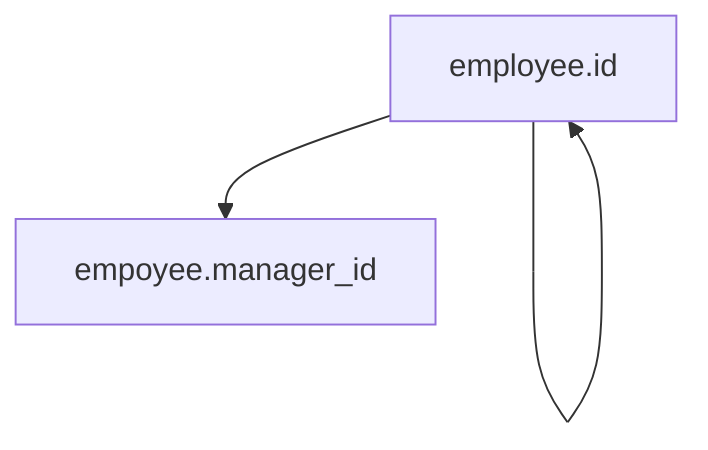
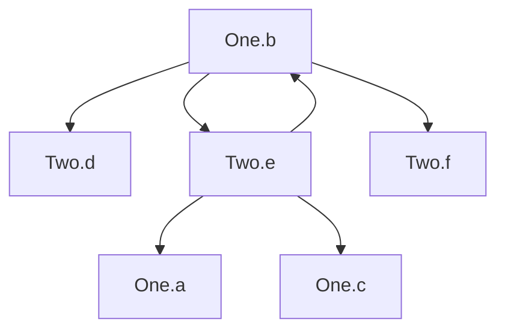
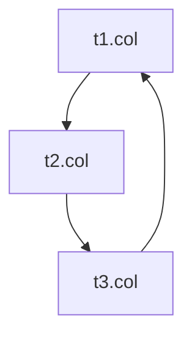
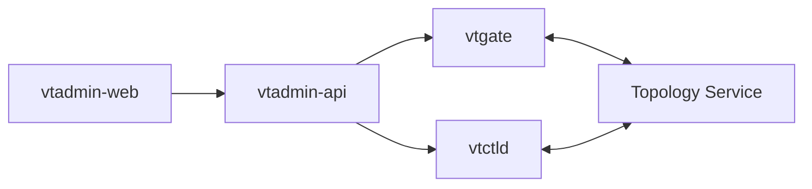
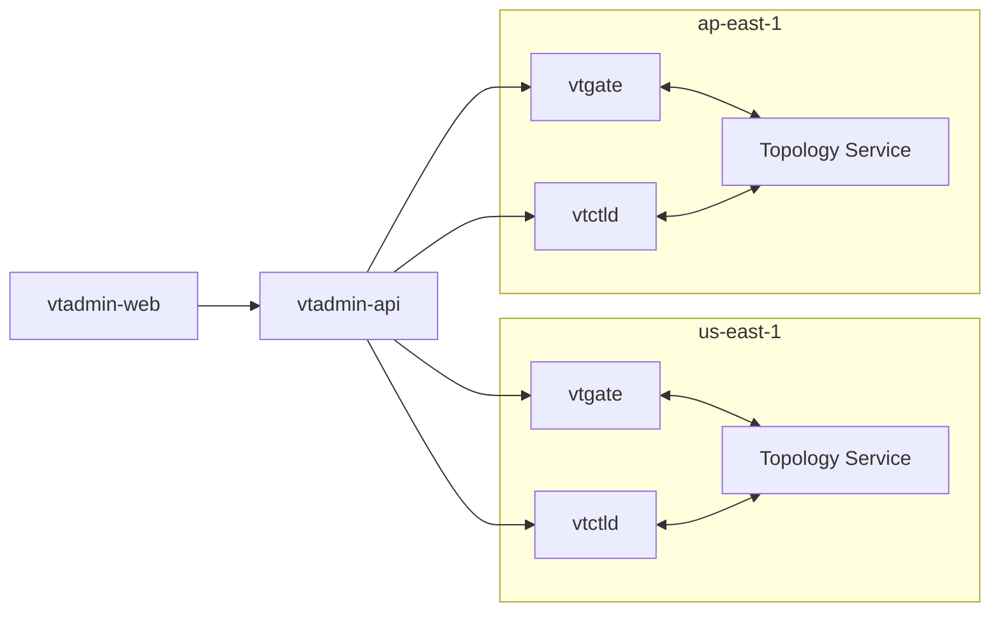
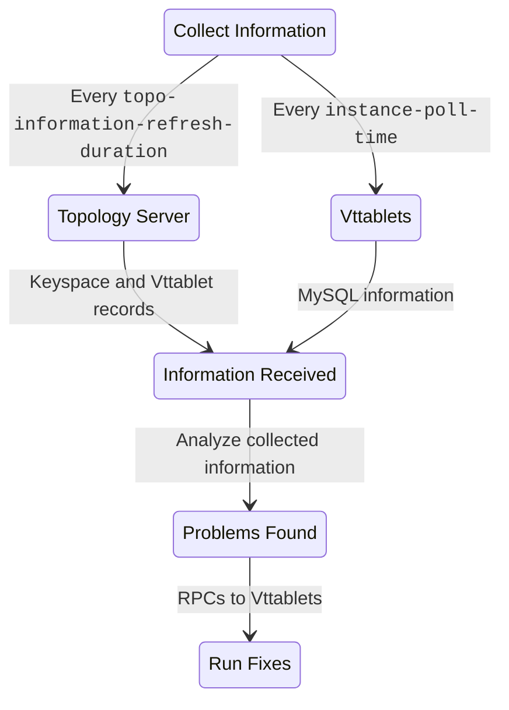

<a id="doc-e1ff713303ecdc46ee02d958"></a>

# vitessio/website / content/en/docs/24.0/user-guides/configuration-advanced/query-load-balancing.md

Upstream: https://github.com/vitessio/website/blob/5959014a8023cb209e64874cd60cc0323f939137/content/en/docs/24.0/user-guides/configuration-advanced/query-load-balancing.md

Commit: `5959014a8023cb209e64874cd60cc0323f939137`

Retrieved: 2026-10-01T15:47:12.554276+00:00

Kind: official-document

Raw SHA256: `7d0c9598a06e63b3ddcf90b93c9c1bb93f9077965c0955a927c9c407e0054d17`

Source text below is untrusted reference content. Acquisition does not verify technical claims.

License status: UPSTREAM_NOTICES_CAPTURED_PER_FILE_REVIEW_REQUIRED. See this repository's captured license files.

---

---
title: Read Query Load Balancing
weight: 12
---

For applications which scale out read queries using replicas, Vitess can safely avoid sending queries to replicas with replication lag beyond acceptable thresholds.


**Note:** Starting in Vitess v24, VTGate uses a simpler default algorithm for handling replication lag based on low lag thresholds, high lag thresholds, and minimum number of tablets. This algorithm is more stable in production environments.

The legacy algorithm is deprecated and will be removed in a future release.

For more details about the algorithm change, see the [v24.0 release notes](https://github.com/vitessio/vitess/blob/main/changelog/24.0/24.0.0/summary.md#vtgate-new-default-legacy-replication-lag-algorithm).


## Flags

You can set the following flags on VTGate to control load-balancing of read queries for replicas:

* `discovery_high_replication_lag_minimum_serving`: If the replication lag of a vttablet exceeds this value, vtgate will treat it as unhealthy and will not send queries to it. This value is meant to match vttablet’s `unhealthy_threshold` value.
* `discovery_low_replication_lag`: If a single vttablet lags beyond this value, vtgate will not send it any queries. However, if too many replicas exceed this threshold, then vtgate will send queries to the ones that have the least lag. A weighted average algorithm is used to exclude the outliers. This value is meant to match vttablet’s `degraded_threshold` value.
* `min_number_serving_vttablets`: The minimum number of vttablets for each replicating tablet type (e.g. replica, rdonly) that will continue to be used even with replication lag above `discovery_low_replication_lag`, but still below `discovery_high_replication_lag_minimum_serving`.

Be aware that there are VTTablet settings that impact the functionality of these flags, discussed in the section below.

## Replication Lag and Query Routing

From a replication lag perspective, a tablet can be considered to be in three states for read-only routing: healthy, degraded, and unhealthy. Unhealthy tablets receive no queries. Degraded tablets will only receive queries if absolutely necessary. Healthy tablets will always receive queries.

Degraded tablets (those with replication lag above `discovery_low_replication_lag`) will only receive queries when there are fewer than `min_number_serving_vttablets` non-degraded tablets available (within same shard, same tablet type, etc) for queries. Above that point, a weighted average algorithm is used to determine which replica should serve queries, prefering those with less lag.

 If there are only 2 replicas for a given replication group and tablet type and `min_number_serving_vttablets` is set to the default of 2, the only portion of this logic that will apply is the unhealthy threshold set by `discovery_high_replication_lag_minimum_serving` at which point the replica will receive no queries. To get the other behaviors requires either more tablets or reducing `min_number_serving_vttablets`. 

The replication lag thresholds at which tablets are considered degraded or unhealthy as well as the logic around when degraded tablets receive queries are controlled by several flags. There are both VTGate-side and VTTablet-side flags and it's important to configure them together and properly to get the behavior you desire.

Combining `discovery_high_replication_lag_minimum_serving`, `discovery_low_replication_lag`, and `min_number_serving_vttablets` can be used to safely route around temporarily lagging replicas in an otherwise healthy cluster. A common scenario is when a new replica tablet is initialized from a base backup, which will very likely have a too-high replication lag when it first comes up. 

* Set `min_number_serving_vttablets` to the minimum number of replicas that must be available to serve your peak replica query traffic.
* Set `discovery_high_replication_lag_minimum_serving` (along with `unhealthy_threshold` on vttablet) to the highest amount of acceptable replication lag for serving queries, or the threshold at which it is preferable to serve an error versus stale data.
* Set `discovery_low_replication_lag` (along with `degraded_threshold` on vttablet) to the replication lag that is tolerable under normal circumstances.

## Gotchas and Notes

There are some things to be aware of when manipulating these settings.

* It is safe to roll out the flag changes on vttablet and vtgate separately, but the overall behavior may not take hold as expected until both sets of flags are completely applied.
* It is inadvisable to set these replication lag thresholds below 3 seconds, as there is skew in replication lag measurement below that point.
* As a reminder, tablets are grouped together by type for this functionality, so for example, `min_number_serving_vttablets` will be applied separately to rdonly and replica tablet type groups.
* When reducing `discovery_low_replication_lag` from the default, also consider reducing the vttablet `health_check_interval` which controls how often the lag measurements are checked. The latency in changes to replication lag is dictated by this configuration. It should be a fraction of `discovery_low_replication_lag` -- a good rule of thumb is half of that setting or lower.


<a id="doc-10a09b0be32778eb5f790f96"></a>

# vitessio/website / content/en/docs/24.0/user-guides/configuration-advanced/region-sharding.md

Upstream: https://github.com/vitessio/website/blob/5959014a8023cb209e64874cd60cc0323f939137/content/en/docs/24.0/user-guides/configuration-advanced/region-sharding.md

Commit: `5959014a8023cb209e64874cd60cc0323f939137`

Retrieved: 2026-10-01T15:47:12.554276+00:00

Kind: official-document

Raw SHA256: `61c38ea637c2739fdf30274e073056f1a880b55ada90addfebfb731b33082be4`

Source text below is untrusted reference content. Acquisition does not verify technical claims.

License status: UPSTREAM_NOTICES_CAPTURED_PER_FILE_REVIEW_REQUIRED. See this repository's captured license files.

---

---
title: Region Based Sharding
weight: 25
aliases: ['/docs/user-guides/region-sharding/'] 
---


This guide follows on from the Get Started guides. Please make sure that you have a [local](../../../get-started/local) installation ready. You should also have already gone through the [MoveTables](../../migration/move-tables) and [Resharding](../../configuration-advanced/resharding) tutorials. The commands in this guide also assume you have setup the shell aliases from this example contained in `env.sh`.


## Introduction

Having gone through the [Resharding tutorial](../resharding/), you should be familiar with
[VSchema](../../../reference/features/vschema) and [Vindexes](../../../reference/features/vindexes).
In this tutorial, we will perform resharding on an existing keyspace using a location-based vindex. We will create 4 shards: `-40`, `40-80`, `80-c0`, `c0-`. The location will be denoted by a `country` column in the customer table.

## Create and Start the Cluster

Start by copying the [`region_sharding` examples](https://github.com/vitessio/vitess/tree/main/examples/region_sharding)
included with Vitess to your preferred location and running the `101_initial_cluster.sh` script:

```bash
cp -r <vitess source path>/examples ~/my-vitess-example/examples
cp -r <vitess source path>/web ~/my-vitess-example
cd ~/my-vitess-example/examples/region_sharding
./101_initial_cluster.sh
```

## Initial Schema

This 101 script created the `customer` table in the unsharded `main` keyspace. This is the table that we will be
sharding by country.

We can connect to our new cluster — using the `mysql` alias setup by `env.sh` within the script — to confirm our current schema:

```mysql
$ mysql --binary-as-hex=false
...

mysql> show databases;
+--------------------+
| Database           |
+--------------------+
| main               |
| information_schema |
| mysql              |
| sys                |
| performance_schema |
+--------------------+
5 rows in set (0.00 sec)

mysql> use customer;
Database changed

mysql> show tables;
+----------------+
| Tables_in_main |
+----------------+
| customer       |
+----------------+
1 row in set (0.00 sec)

mysql> show create table customer\G
*************************** 1. row ***************************
       Table: customer
Create Table: CREATE TABLE `customer` (
  `id` int NOT NULL,
  `fullname` varchar(256) DEFAULT NULL,
  `nationalid` varchar(256) DEFAULT NULL,
  `country` varchar(256) DEFAULT NULL,
  PRIMARY KEY (`id`)
) ENGINE=InnoDB DEFAULT CHARSET=utf8mb4 COLLATE=utf8mb4_0900_ai_ci
1 row in set (0.00 sec)
```

## Creating Test Data

Let's now create some test data:

```bash
$ mysql < ./insert_customers.sql

$ mysql --table < ./show_initial_data.sql
+----+------------------+-------------+---------------+
| id | fullname         | nationalid  | country       |
+----+------------------+-------------+---------------+
|  1 | Philip Roth      | 123-456-789 | United States |
|  2 | Gary Shteyngart  | 234-567-891 | United States |
|  3 | Margaret Atwood  | 345-678-912 | Canada        |
|  4 | Alice Munro      | 456-789-123 | Canada        |
|  5 | Albert Camus     | 912-345-678 | France        |
|  6 | Colette          | 102-345-678 | France        |
|  7 | Hermann Hesse    | 304-567-891 | Germany       |
|  8 | Cornelia Funke   | 203-456-789 | Germany       |
|  9 | Cixin Liu        | 789-123-456 | China         |
| 10 | Jian Ma          | 891-234-567 | China         |
| 11 | Haruki Murakami  | 405-678-912 | Japan         |
| 12 | Banana Yoshimoto | 506-789-123 | Japan         |
| 13 | Arundhati Roy    | 567-891-234 | India         |
| 14 | Shashi Tharoor   | 678-912-345 | India         |
| 15 | Andrea Hirata    | 607-891-234 | Indonesia     |
| 16 | Ayu Utami        | 708-912-345 | Indonesia     |
+----+------------------+-------------+---------------+
```

## Prepare For Resharding

Now that we have some data in our unsharded `main` keyspace, let's go ahead and perform the setup needed
for resharding. The initial vschema is unsharded and simply lists the customer table:

```json
$ vtctldclient --server localhost:15999 GetVSchema main
{
  "sharded": false,
  "vindexes": {},
  "tables": {
    "customer": {
      "type": "",
      "column_vindexes": [],
      "auto_increment": null,
      "columns": [],
      "pinned": "",
      "column_list_authoritative": false,
      "source": ""
    }
  },
  "require_explicit_routing": false
}
```

</br>

We are next going to prepare for having a sharded vschema in the cluster by editing the
`main_vschema_sharded.json` file and updating the the `region_map` key's value to point to the
filesystem path where that file resides on your machine. For example (relative paths are OK):

```json
        "region_map": "./countries.json",
```

</br>

We then run the 201 script:

```bash
./201_main_sharded.sh
```

</br>

That script creates our sharded vschema as defined in the `main_vschema_sharded.json` file and it
creates a [lookup vindex](../../../reference/features/vindexes/#functional-and-lookup-vindex) using the
[`LookupVindex create` command](../../../reference/programs/vtctldclient/vtctldclient_lookupvindex/vtctldclient_lookupvindex_create/).

Now if we look at the `main` keyspace's vschema again we can see that it now includes the `region_vdx` vindex and
a lookup vindex called `customer_region_lookup`:

```json
$ vtctldclient --server=localhost:15999 GetVSchema main --compact
{
  "sharded": true,
  "vindexes": {
    "customer_region_lookup": {
      "type": "consistent_lookup_unique",
      "params": {
        "from": "id",
        "ignore_nulls": "false",
        "table": "main.customer_region_lookup",
        "to": "keyspace_id"
      },
      "owner": "customer"
    },
    "region_vdx": {
      "type": "region_json",
      "params": {
        "region_bytes": "1",
        "region_map": "./countries.json"
      }
    },
    "xxhash": {
      "type": "xxhash"
    }
  },
  "tables": {
    "customer": {
      "column_vindexes": [
        {
          "name": "region_vdx",
          "columns": [
            "id",
            "country"
          ]
        },
        {
          "name": "customer_region_lookup",
          "columns": [
            "id"
          ]
        }
      ]
    },
    "customer_region_lookup": {
      "column_vindexes": [
        {
          "column": "id",
          "name": "xxhash"
        }
      ]
    }
  }
}
```

</br>

Notice that the vschema shows a `xxhash` [vindex type](../../../reference/features/vindexes/#predefined-vindexes) for
the lookup table. This is automatically created by the `LookupVindex` workflow, along with the
backing table needed to hold the vindex and populating it with the correct rows (for additional details on this
command see [the associated user-guide](../createlookupvindex/)). We can see that by checking our `main`
database/keyspace again:

```mysql
mysql> show tables;
+-------------------+
| Tables_in_vt_main |
+-------------------+
| customer          |
| customer_lookup   |
+-------------------+
2 rows in set (0.00 sec)

mysql> describe customer_lookup;
+-------------+----------------+------+-----+---------+-------+
| Field       | Type           | Null | Key | Default | Extra |
+-------------+----------------+------+-----+---------+-------+
| id          | int(11)        | NO   | PRI | NULL    |       |
| keyspace_id | varbinary(128) | YES  |     | NULL    |       |
+-------------+----------------+------+-----+---------+-------+
2 rows in set (0.01 sec)

mysql> select id, hex(keyspace_id) from customer_lookup;
+----+--------------------+
| id | hex(keyspace_id)   |
+----+--------------------+
|  1 | 01166B40B44ABA4BD6 |
|  2 | 0106E7EA22CE92708F |
|  3 | 024EB190C9A2FA169C |
|  4 | 02D2FD8867D50D2DFE |
|  5 | 4070BB023C810CA87A |
|  6 | 40F098480AC4C4BE71 |
|  7 | 41FB8BAAAD918119B8 |
|  8 | 41CC083F1E6D9E85F6 |
|  9 | 80692BB9BF752B0F58 |
| 10 | 80594764E1A2B2D98E |
| 11 | 81AEFC44491CFE474C |
| 12 | 81D3748269B7058A0E |
| 13 | C062DCE203C602F358 |
| 14 | C0ACBFDA0D70613FC4 |
| 15 | C16A8B56ED414942B8 |
| 16 | C15B711BC4CEEBF2EE |
+----+--------------------+
16 rows in set (0.01 sec)
```

</br>

Now that the sharded vschema and lookup vindex and its backing table are ready, we can start tablets that will be
used for our new *sharded* `main` keyspace:

```bash
./202_new_tablets.sh
```

</br>

Now we have tablets for our original unsharded `main` keyspace — shard `0` — and one tablet for each of the 4 shards
we'll be using when we reshard the `main` keyspace:

```bash
$ vtctldclient --server localhost:15999 GetTablets --keyspace=main
zone1-0000000100 main 0 primary localhost:15100 localhost:17100 [] 2023-01-24T04:31:08Z
zone1-0000000200 main -40 primary localhost:15200 localhost:17200 [] 2023-01-24T04:45:38Z
zone1-0000000300 main 40-80 primary localhost:15300 localhost:17300 [] 2023-01-24T04:45:38Z
zone1-0000000400 main 80-c0 primary localhost:15400 localhost:17400 [] 2023-01-24T04:45:38Z
zone1-0000000500 main c0- primary localhost:15500 localhost:17500 [] 2023-01-24T04:45:38Z
```

</br>


In this example we are deploying 1 tablet per shard and thus disabling the
[semi-sync durability policy](../../configuration-basic/durability_policy/), but in typical production setups each
shard will consist of 3 or more tablets.


## Perform Resharding

Now that our new tablets are up, we can go ahead with the resharding:

```bash
./203_reshard.sh
```

</br>

This script executes one command:

```bash
vtctldclient --server localhost:15999 Reshard --target-keyspace main --workflow main2regions create --source-shards '0' --target-shards '-40,40-80,80-c0,c0-' --tablet-types=PRIMARY
```

</br>

This step copies all the data from our source `main/0` shard to our new `main` target shards and sets up
a VReplication workflow to keep the tables on the target in sync with the source.

You can learn more about what the VReplication [`Reshard` command](../../../reference/vreplication/reshard/)
does and how it works in [the reference page](../../../reference/vreplication/reshard/) and the
[Resharding user-guide](../../configuration-advanced/resharding/).

We can check the correctness of the copy using the [`VDiff` command](../../../reference/vreplication/vdiff)
and the `<keyspace>.<workflow>` name we used for `Reshard` command above:

```bash
$ vtctldclient --server localhost:15999 VDiff --target-keyspace main --workflow main2regions create
VDiff 044e8da0-9ba4-11ed-8bc7-920702940ee0 scheduled on target shards, use show to view progress

$ vtctldclient --server localhost:15999 VDiff --format=json --target-keyspace main --workflow main2regions show last
{
	"Workflow": "main2regions",
	"Keyspace": "main",
	"State": "completed",
	"UUID": "044e8da0-9ba4-11ed-8bc7-920702940ee0",
	"RowsCompared": 32,
	"HasMismatch": false,
	"Shards": "-40,40-80,80-c0,c0-",
	"StartedAt": "2023-01-24 05:00:26",
	"CompletedAt": "2023-01-24 05:00:27"
}
```

</br>

We can take a look at the VReplication workflow's status using the
[`show` action](../../../reference/programs/vtctldclient/vtctldclient_reshard/vtctldclient_reshard_show/):

```bash
vtctldclient --server localhost:15999 Reshard --target-keyspace main --workflow main2regions show
```

</br>

We now have a running stream from the source tablet (`100`) to each of of our new `main` target shards that will
keep the tables up-to-date with the source shard (`0`).

## Cutover

Once the VReplication workflow's [copy phase](../../../reference/vreplication/internal/life-of-a-stream/#copy) is
complete, we can start cutting-over traffic. This is done via the
[SwitchTraffic](../../../reference/vreplication/reshard/#switchtraffic) actions included in the following scripts:

```bash
./204_switch_reads.sh
./205_switch_writes.sh
```

</br>

Now we can look at how our data is sharded, e.g. by looking at what's stored on the `main/-40` shard:

```mysql
mysql> show vitess_tablets;
+-------+----------+-------+------------+---------+------------------+-----------+----------------------+
| Cell  | Keyspace | Shard | TabletType | State   | Alias            | Hostname  | PrimaryTermStartTime |
+-------+----------+-------+------------+---------+------------------+-----------+----------------------+
| zone1 | main     | -40   | PRIMARY    | SERVING | zone1-0000000200 | localhost | 2023-01-24T04:45:38Z |
| zone1 | main     | 0     | PRIMARY    | SERVING | zone1-0000000100 | localhost | 2023-01-24T04:31:08Z |
| zone1 | main     | 40-80 | PRIMARY    | SERVING | zone1-0000000300 | localhost | 2023-01-24T04:45:38Z |
| zone1 | main     | 80-c0 | PRIMARY    | SERVING | zone1-0000000400 | localhost | 2023-01-24T04:45:38Z |
| zone1 | main     | c0-   | PRIMARY    | SERVING | zone1-0000000500 | localhost | 2023-01-24T04:45:38Z |
+-------+----------+-------+------------+---------+------------------+-----------+----------------------+
5 rows in set (0.00 sec)

mysql> use main/-40;
Database changed

mysql> select * from customer;
+----+-----------------+-------------+---------------+
| id | fullname        | nationalid  | country       |
+----+-----------------+-------------+---------------+
|  1 | Philip Roth     | 123-456-789 | United States |
|  2 | Gary Shteyngart | 234-567-891 | United States |
|  3 | Margaret Atwood | 345-678-912 | Canada        |
|  4 | Alice Munro     | 456-789-123 | Canada        |
+----+-----------------+-------------+---------------+
4 rows in set (0.01 sec)

mysql> select id,hex(keyspace_id) from customer_lookup;
+----+--------------------+
| id | hex(keyspace_id)   |
+----+--------------------+
|  1 | 01166B40B44ABA4BD6 |
|  2 | 0106E7EA22CE92708F |
+----+--------------------+
2 rows in set (0.00 sec)
```

</br>

You can see that only data from US and Canada exists in the `customer` table in this shard. If you look at the
other shards — `40-80`, `80-c0`, and `c0-` — you will see that each shard contains 4 rows in `customer` table.

The lookup table, however, has a different number of rows per shard. This is because we are using a
[`xxhash` vindex type](../../../reference/features/vindexes/#predefined-vindexes) to shard the lookup table
which means that it is distributed differently from the `customer` table. We can see an example of this if we
look at the next shard, `40-80`:

```mysql
mysql> use main/40-80;

Database changed
mysql> select * from customer;
+----+----------------+-------------+---------+
| id | fullname       | nationalid  | country |
+----+----------------+-------------+---------+
|  5 | Albert Camus   | 912-345-678 | France  |
|  6 | Colette        | 102-345-678 | France  |
|  7 | Hermann Hesse  | 304-567-891 | Germany |
|  8 | Cornelia Funke | 203-456-789 | Germany |
+----+----------------+-------------+---------+
4 rows in set (0.00 sec)

mysql> select id, hex(keyspace_id) from customer_lookup;
+----+--------------------+
| id | hex(keyspace_id)   |
+----+--------------------+
|  3 | 024EB190C9A2FA169C |
|  5 | 4070BB023C810CA87A |
|  9 | 80692BB9BF752B0F58 |
| 10 | 80594764E1A2B2D98E |
| 13 | C062DCE203C602F358 |
| 15 | C16A8B56ED414942B8 |
| 16 | C15B711BC4CEEBF2EE |
+----+--------------------+
7 rows in set (0.00 sec)
```

## Cleanup

Now that our resharding work is complete, we can teardown and delete the old `main/0` source shard:

```bash
./206_down_shard_0.sh
./207_delete_shard_0.sh
```

</br>

All we have now is the sharded `main` keyspace and the original unsharded `main` keyspace (shard `0`) no
longer exists:

```bash
$ vtctldclient GetTablets
zone1-0000000200 main -40 primary localhost:15200 localhost:17200 [] 2023-01-24T04:45:38Z
zone1-0000000300 main 40-80 primary localhost:15300 localhost:17300 [] 2023-01-24T04:45:38Z
zone1-0000000400 main 80-c0 primary localhost:15400 localhost:17400 [] 2023-01-24T04:45:38Z
zone1-0000000500 main c0- primary localhost:15500 localhost:17500 [] 2023-01-24T04:45:38Z
```

## Teardown

Once you are done playing with the example, you can tear the cluster down and remove all of its resources
completely:

```bash
./301_teardown.sh
```


<a id="doc-3e029a05e31928336bdcb01c"></a>

# vitessio/website / content/en/docs/24.0/user-guides/configuration-advanced/reparenting.md

Upstream: https://github.com/vitessio/website/blob/5959014a8023cb209e64874cd60cc0323f939137/content/en/docs/24.0/user-guides/configuration-advanced/reparenting.md

Commit: `5959014a8023cb209e64874cd60cc0323f939137`

Retrieved: 2026-10-01T15:47:12.554276+00:00

Kind: official-document

Raw SHA256: `a4a592c80a62479c24e3bc5b3c2276aa102e85489cd32e2793df5258ab069d6d`

Source text below is untrusted reference content. Acquisition does not verify technical claims.

License status: UPSTREAM_NOTICES_CAPTURED_PER_FILE_REVIEW_REQUIRED. See this repository's captured license files.

---

---
title: Reparenting
weight: 20
aliases: ['/docs/user-guides/reparenting/']
---

**Reparenting** is the process of changing a shard's primary tablet from one host to another or changing a replica tablet to have a different primary. Reparenting can be initiated manually or it can occur automatically in response to certain system conditions. As examples, you might reparent a shard or tablet during scheduled maintenance or [VTOrc](../../configuration-basic/vtorc) might automatically trigger reparenting when a primary tablet's MySQL dies.

This document explains the types of reparenting that Vitess supports:

* [Active reparenting](../../configuration-advanced/reparenting/#active-reparenting) occurs when Vitess manages the entire reparenting process.
* [External reparenting](../../configuration-advanced/reparenting/#external-reparenting) occurs when another tool handles the reparenting process, and Vitess just updates its topology service, replication graph, and serving graph to accurately reflect primary-replica relationships.

## MySQL requirements

### GTIDs

Vitess requires the use of global transaction identifiers ([GTIDs](https://dev.mysql.com/doc/refman/8.0/en/replication-gtids-concepts.html)) for its operations:

* Vitess uses GTIDs to initialize replication when a cluster is initialized. It depends on the GTID stream to be correct when reparenting.
* If using external reparenting, Vitess assumes that the external tool manages the replication process.

### Semi-synchronous replication

Vitess does not depend on [semi-synchronous replication](https://dev.mysql.com/doc/refman/8.0/en/replication-semisync.html) but encourages its use. Larger Vitess deployments typically do use semi-synchronous replication.

### Active Reparenting

You can use the following `vtctldclient` commands to perform reparenting operations:

* `PlannedReparentShard`
* `EmergencyReparentShard`

Both commands lock the Shard record in the global topology service. The two commands cannot run in parallel for a given shard. Nor can two invocations of the same command run in parallel for a given shard.
Both commands are dependent on the global topology service being available, and they both insert rows in the Vitess-internal `reparent_journal` table. As such, you can review your database's reparenting history by inspecting that table.

### PlannedReparentShard: Planned reparenting

The `PlannedReparentShard` command reparents a healthy shard to a new primary. It can be used to initialize the shard primary when the shard is brought up. If it is used to change the primary of an already running shard, then both the current and new primary must be up and running. If the primary for a shard is down, use `EmergencyReparentShard` instead.

This command performs the following actions when used to change the current primary:

1. Puts the current primary tablet in read-only mode.
1. Shuts down the current primary's query service, which is the part of the system that handles user SQL queries.
1. Retrieves the current primary's executed GTID position.
1. Waits for the primary-elect tablet to catch up to the current primary's GTID position
1. Promotes the primary-elect tablet as the new primary.
1. Ensures replication is functioning properly via the following steps:
    - On the primary-elect tablet, insert a row into an internal table and then update the global shard object's PrimaryAlias property.
    - In parallel on each replica, including the old primary, set the new primary as the replication source and wait for the inserted row to replicate to the replica tablets.

This command performs the following actions when used to initialize the first primary in the shard:
1. Promote the new primary that is specified.
1. Ensures replication is functioning properly via the following steps:
    - On the primary-elect tablet, insert a row into an internal table and then update the global shard object's PrimaryAlias record.
    - In parallel on each replica, set the new primary as the replication source and wait for the inserted row to replicate to the replica tablets.

The new primary (if unspecified) is chosen using the configured [Durability Policy](../../configuration-basic/durability_policy).

In order to make planned maintenance operations zero-downtime, Vitess provides the capability of [buffering]((../../../reference/features/vtgate-buffering)) queries for the duration of the reparent operation.
While this is optional, it is highly recommended. With the proper settings, buffering can handle all non-transactional queries with zero errors.
Transactions are handled differently, we cannot buffer them because transaction state is held in the backing MySQL and not in Vitess.
When we start the process of shutting down the current primary's query service, we wait for a specified grace period to allow in-flight transactions to complete.
During this time, we do not start new transactions on the current primary. Instead, we buffer the `begin` statements that would typically start a new transaction.
Once the grace period is complete, any transactions that are still in-flight are killed, and an error is returned to the client. Clients are expected to treat this error as fatal, abandon any open transactions, and start new ones for subsequent operations.

### EmergencyReparentShard: Emergency reparenting

The `EmergencyReparentShard` command is used to force a reparent to a new primary when the current primary is unavailable. The command assumes that data cannot be retrieved from the current primary because it is dead or not working properly.

As such, this command does not rely on the current primary at all to replicate data to the new primary. Instead, it makes sure that the primary-elect is the most advanced in replication among all available replicas or that the primary-elect has caught up to the most advanced one. In either case, the candidate will only be promoted once it is the most advanced replica.

**Important**: You can specify which replica you want to promote. If not specified, Vitess will choose it for you depending on the durability policy specified for the keyspace.

This command performs the following actions:

1. Determines the current replication position on all replica tablets and finds the tablet that has the most advanced replication position.
1. Chooses a primary-elect tablet based on the durability policy specified, if the user has not chosen one.
1. Waits for the primary-elect to catch up to the most advanced replica, if it isn't already the most advanced.
1. Promotes the primary-elect tablet to be the new primary. In addition to changing its tablet type to primary, the primary-elect performs any other changes that might be required for its new state.
1. Ensures replication is functioning properly via the following steps:
    - On the primary-elect tablet, insert a row in the `reparent_journal` table and then updates the `PrimaryAlias` property of the global shard object.
    - In parallel on each replica, excluding the old primary, set the new primary as the replication source and wait for the inserted row to replicate to the replica tablets.

### Metrics

Metrics are available on the `/debug/vars` pages of VTOrc and VTCtld for the reparent operations that they execute. Corresponding Prometheus-compatible metrics are available at `/metrics`.

| Metric                             | Usage                                                                                                                          |
|------------------------------------|--------------------------------------------------------------------------------------------------------------------------------|
| `planned_reparent_counts`          | Number of times PlannedReparentShard has been run. Available dimensions are keyspace, shard and the result of the operation.   |
| `emergency_reparent_counts`        | Number of times EmergencyReparentShard has been run. Available dimensions are keyspace, shard and the result of the operation. |
| `reparent_shard_operation_timings` | Timings of reparent shard operations indexed by the type of operation.                                                         |

## External Reparenting

External reparenting occurs when another tool handles the process of changing a shard's primary tablet. After that occurs, the tool needs to call the [`vtctl TabletExternallyReparented`](../../../reference/programs/vtctl/shards/#tabletexternallyreparented) command to ensure that the topology service, replication graph, and serving graph are updated accordingly.

`TabletExternallyReparented` performs the following operations:

1. Reads the Tablet from the local topology service.
2. Reads the Shard object from the global topology service.
3. If the Tablet type is not already `PRIMARY`, sets the tablet type to `PRIMARY`.
4. The Shard record is updated asynchronously (if needed) with the current primary alias.
5. Any other tablets that still have their tablet type to `PRIMARY` will demote themselves to `REPLICA`.

The `TabletExternallyReparented` command fails in the following cases:

* The global topology service is not available for locking and modification. In that case, the operation fails completely.

Active reparenting might be a dangerous practice in any system that depends on external reparents. You can disable active reparents by starting `vtctld` with the `--disable-active-reparents` flag set to true. (You cannot set the flag after `vtctld` is started.)

## Fixing Replication

A tablet can be orphaned after a reparenting if it is unavailable when the reparent operation is running but then recovers later on. Its replication will be automatically fixed by [VTOrc](../../configuration-basic/vtorc).
You can also manually reset the tablet's primary to the current shard primary using the [`vtctl ReparentTablet`](../../../reference/programs/vtctl/tablets/#reparenttablet) command. You can then restart replication on the tablet if it was stopped by calling the [`vtctl StartReplication`](../../../reference/programs/vtctl/tablets/#startreplication) command.


<a id="doc-8f6ca4ca0825c206725a8fb5"></a>

# vitessio/website / content/en/docs/24.0/user-guides/configuration-advanced/resharding.md

Upstream: https://github.com/vitessio/website/blob/5959014a8023cb209e64874cd60cc0323f939137/content/en/docs/24.0/user-guides/configuration-advanced/resharding.md

Commit: `5959014a8023cb209e64874cd60cc0323f939137`

Retrieved: 2026-10-01T15:47:12.554276+00:00

Kind: official-document

Raw SHA256: `0f117cd03b6f0ba3ec6e7b23cd7e5d55e2fe275ad3e23fb9f54dc13197751c37`

Source text below is untrusted reference content. Acquisition does not verify technical claims.

License status: UPSTREAM_NOTICES_CAPTURED_PER_FILE_REVIEW_REQUIRED. See this repository's captured license files.

---

---
title: Resharding
weight: 15
aliases: ['/docs/user-guides/resharding/']
---


This guide follows on from the Get Started guides. Please make sure that you have
an [Operator](../../../get-started/operator) or [local](../../../get-started/local) installation ready. It also assumes
that the [MoveTables](../../migration/move-tables/) user guide has been followed (which take you through
steps `101`-`205` and more).


## Preparation

[Sharding](../../../concepts/shard) enables you to both _initially shard_ or partition your data as well as reshard
your tables — as your data set size grows over time — so that your [keyspace](../../../concepts/keyspace/) is
partitioned across several underlying [tablets](../../../concepts/tablet). A sharded keyspace has some additional
restrictions on both [query syntax](../../../reference/compatibility/mysql-compatibility) and features such as
`auto_increment`, so it is helpful to plan out a reshard operation diligently. However, you can always
_reshard again_ later if your sharding scheme turns out to be suboptimal.

Using our example `commerce` and `customer` keyspaces, lets work through the two most common issues.

### Sequences

The first issue to address is the fact that customer and corder have auto-increment columns. This scheme does not work
well in a sharded setup. Instead, Vitess provides an equivalent feature called [sequences](../../../reference/features/vitess-sequences/).

The sequence table is an unsharded single row table that Vitess can use to generate monotonically increasing IDs.
The syntax to generate IDs is: `select next value from customer_seq` or `select next N values from customer_seq`.
The `vttablet` that exposes this table is capable of serving a very large number of such IDs because values are
reserved in chunks, then cached and served from memory. The chunk/cache size is configurable via the [`cache`
value](../../../reference/features/vitess-sequences/#initializing-a-sequence).

The VSchema allows you to associate the column of a table with the sequence table. Once this is done, an `INSERT`
on that table transparently fetches an ID from the sequence table, fills in the value in the new row, and then
routes the row to the appropriate shard. This makes the construct backward compatible to how [MySQL's
`auto_increment`](https://dev.mysql.com/doc/refman/en/example-auto-increment.html) works.

Since sequences table must be unsharded, they will be stored in the unsharded `commerce` keyspace. Here is the
schema used:

```sql
CREATE TABLE customer_seq (id int, next_id bigint, cache bigint, primary key(id)) comment 'vitess_sequence';
INSERT INTO customer_seq (id, next_id, cache) VALUES (0, 1000, 100);
CREATE TABLE order_seq (id int, next_id bigint, cache bigint, primary key(id)) comment 'vitess_sequence';
INSERT INTO order_seq (id, next_id, cache) VALUES (0, 1000, 100);
```

</br>

Note the `vitess_sequence` comment in the create table statement. VTTablet will use this metadata to treat this
table as a sequence. About the values we specified above:

* `id` is always 0
* `next_id` is set to `1000`: the value should be comfortably greater than the max `auto_increment` used so far.
* `cache` specifies the number of values to reserve and cache before the primary `vttablet` for the `commerce`
keyspace updates `next_id` to reserve and cache the next chunk of IDs.

Larger cache values perform better but can exhaust the available values more quickly since e.g. during reparent
operations the new PRIMARY `vttablet` will start off at the `next_id` value and any unused values from the
previously reserved chunk are lost.

The [VTGate servers](../../../concepts/vtgate/) also need to know about the sequence tables. This is done by
updating the [VSchema](../../../concepts/vschema/) for the `commerce` keyspace as follows:

```json
{
  "tables": {
    "customer_seq": {
      "type": "sequence"
    },
    "order_seq": {
      "type": "sequence"
    },
    "product": {}
  }
}
```

### Vindexes

The next decision is about the sharding keys or
[Primary Vindexes](../../../reference/features/vindexes/#the-primary-vindex). This is a complex decision
that involves the following considerations:

* What are the highest QPS queries, and what are the `WHERE` clauses for them?
* Cardinality of the column — it must be high.
* Do we want some rows to live together to support in-shard joins (data locality)?
* Do we want certain rows that will be in the same transaction to live together (data locality)?

Using the above considerations, in our use case, we can determine the following:

* For the customer table, the most common `WHERE` clause uses `customer_id`. So `customer_id` is declared as the
  [Primary Vindex](../../../reference/features/vindexes/#the-primary-vindex) for that table.
* Given that the customer table has a lot of rows, its cardinality is also high.
* For the corder table, we have a choice between `customer_id` and `order_id`. Given that our app joins `customer`
  with `corder` quite often on the `customer_id` column, it will be beneficial to choose `customer_id` as the Primary
  Vindex for the `corder` table as well so that we have data locality for those joins and can avoid costly cross-shard operations.
* Coincidentally, transactions also update `corder` tables with their corresponding `customer` rows. This further
  reinforces the decision to use `customer_id` as Primary Vindex.

There are a couple of other considerations which are out of scope for now, but worth mentioning:

* It may also be worth creating a [secondary lookup Vindex](../../../reference/features/vindexes/#secondary-vindexes)
on `corder.order_id`.
* Sometimes the `customer_id` is really a `tenant_id`. For example, if your application is a SaaS, which serves tenants
that themselves have customers. One key consideration here is that the sharding by the `tenant_id` can lead to
unbalanced shards. You may also need to consider sharding by the tenant's `customer_id`.

Putting it all together, we have a VSchema similar to the following for the `customer` keyspace:

```json
{
  "sharded": true,
  "vindexes": {
    "xxhash": {
      "type": "xxhash"
    }
  },
  "tables": {
    "customer": {
      "column_vindexes": [
        {
          "column": "customer_id",
          "name": "xxhash"
        }
      ],
      "auto_increment": {
        "column": "customer_id",
        "sequence": "customer_seq"
      }
    },
    "corder": {
      "column_vindexes": [
        {
          "column": "customer_id",
          "name": "xxhash"
        }
      ],
      "auto_increment": {
        "column": "order_id",
        "sequence": "order_seq"
      }
    }
  }
}
```

</br>

Since the primary vindex columns here use the
[`BIGINT` MySQL integer type](https://dev.mysql.com/doc/refman/en/integer-types.html), we choose `xxhash` as
the primary [vindex type](../../../reference/features/vindexes/#predefined-vindexes), which is a pseudo-random
way of distributing rows into various shards. For other data types we would typically use a different vindex
type:

* For `VARCHAR` columns, use `unicode_loose_xxhash`.
* For `VARBINARY`, use `xxhash`.
* Vitess uses a plugin system to define vindexes. If none of the
[predefined vindexes](../../../reference/features/vindexes/#predefined-vindexes) suit your needs, you can
develop your own custom vindex.

## Apply VSchema

Applying the new VSchema instructs Vitess that the keyspace is sharded, which may prevent some complex queries. It is a
good idea to [validate this](../../sql/vtexplain) before proceeding with this step. If you do notice that certain
queries start failing, you can always revert temporarily by restoring the old VSchema. Make sure you fix all of the
queries before proceeding to the [Reshard](../../../reference/vreplication/reshard/) process.

### Using Operator

```bash
vtctldclient ApplySchema --sql="$(cat create_commerce_seq.sql)" commerce
vtctldclient ApplyVSchema --vschema="$(cat vschema_commerce_seq.json)" commerce
vtctldclient ApplyVSchema --vschema="$(cat vschema_customer_sharded.json)" customer
vtctldclient ApplySchema --sql="$(cat create_customer_sharded.sql)" customer
```

### Using a Local Deployment

```bash
vtctldclient ApplySchema --sql-file create_commerce_seq.sql commerce
vtctldclient ApplyVSchema --vschema-file vschema_commerce_seq.json commerce
vtctldclient ApplyVSchema --vschema-file vschema_customer_sharded.json customer
vtctldclient ApplySchema --sql-file create_customer_sharded.sql customer
```

## Create New Shards

At this point, you have finalized your sharded VSchema and vetted all the queries to make sure they still work. Now,
it’s time to reshard.

The resharding process works by splitting existing shards into smaller shards. This type of resharding is the most
appropriate for Vitess. There are some use cases where you may want to bring up a new shard and add new rows in the
most recently created shard. This can be achieved in Vitess by splitting a shard in such a way that no existing rows
end up in the new shard. However, it's not natural for Vitess. We now have to create the new target shards:

### Using Operator

```bash
kubectl apply -f 302_new_shards.yaml
```

</br>

Make sure that you restart the port-forward after you have verified with `kubectl get pods` that this operation has
completed:

```bash
killall kubectl
./pf.sh &
```

### Using a Local Deployment

```bash
./302_new_shards.sh
```

## Start the Reshard

Now we can start the [Reshard](../../../reference/vreplication/reshard/) operation. It occurs online, and
will not block any read or write operations to your database:

```bash
vtctldclient Reshard --target-keyspace customer --workflow cust2cust create --source-shards '0' --target-shards '-80,80-'
```

</br>

All of the command options and parameters for `Reshard` are listed in
our [reference page for Reshard](../../../reference/vreplication/reshard).

## Validate Correctness

After the reshard is complete, we can use [VDiff](../../../reference/vreplication/vdiff) to check data integrity and ensure our source and target shards are consistent:

```bash
$ vtctldclient VDiff --target-keyspace customer --workflow cust2cust create
VDiff 60fa5738-9bad-11ed-b6de-920702940ee0 scheduled on target shards, use show to view progress

$ vtctldclient VDiff --target-keyspace customer --workflow cust2cust show last
{
	"Workflow": "cust2cust",
	"Keyspace": "customer",
	"State": "completed",
	"UUID": "60fa5738-9bad-11ed-b6de-920702940ee0",
	"RowsCompared": 10,
	"HasMismatch": false,
	"Shards": "-80,80-",
	"StartedAt": "2023-01-24 06:07:27",
	"CompletedAt": "2023-01-24 06:07:28"
} 
```

## Switch Non-Primary Reads

After validating for correctness, the next step is to switch
[`REPLICA` and `RDONLY` targeted read operations](../../../reference/features/vschema/#tablet-types) to occur
at the new location. By switching targeted read operations first, we are able to verify that the new shard's
tablets are healthy and able to respond to requests:

```bash
vtctldclient Reshard --target-keyspace customer --workflow cust2cust SwitchTraffic --tablet-types=rdonly,replica
```

## Switch Writes and Primary Reads

After the [`REPLICA` and `RDONLY` targeted reads](../../../reference/features/vschema/#tablet-types) have been
switched, and the health of the system has been verified, it's time to switch writes and all default traffic:

```bash
vtctldclient Reshard --target-keyspace customer --workflow cust2cust SwitchTraffic
```

## Note

While we have switched tablet type targeted reads and writes separately in this example, you can also switch
all traffic at the same time. This is done by default as if you don't specify the `--tablet-types` parameter
then `SwitchTraffic` will start serving all traffic from the target for all tablet types.

You should now be able to see the data that has been copied over to the new shards (assuming you 
previously loaded this data in the [`MoveTable` user-guide](../../migration/move-tables/)):

```bash
$ mysql --table < ../common/select_customer-80_data.sql
Using customer/-80
Customer
+-------------+--------------------+
| customer_id | email              |
+-------------+--------------------+
|           1 | alice@domain.com   |
|           2 | bob@domain.com     |
|           3 | charlie@domain.com |
|           5 | eve@domain.com     |
+-------------+--------------------+
COrder
+----------+-------------+----------+-------+
| order_id | customer_id | sku      | price |
+----------+-------------+----------+-------+
|        1 |           1 | SKU-1001 |   100 |
|        2 |           2 | SKU-1002 |    30 |
|        3 |           3 | SKU-1002 |    30 |
|        5 |           5 | SKU-1002 |    30 |
+----------+-------------+----------+-------+

$ mysql --table < ../common/select_customer80-_data.sql
Using customer/80-
Customer
+-------------+----------------+
| customer_id | email          |
+-------------+----------------+
|           4 | dan@domain.com |
+-------------+----------------+
COrder
+----------+-------------+----------+-------+
| order_id | customer_id | sku      | price |
+----------+-------------+----------+-------+
|        4 |           4 | SKU-1002 |    30 |
+----------+-------------+----------+-------+
```

## Finalize and Cleanup

After celebrating your second successful resharding, you are now ready to clean up the leftover artifacts:

### Using Operator

```bash
vtctldclient Reshard --target-keyspace customer --workflow cust2cust complete
```

After the workflow has completed, you can go ahead and remove the shard that is no longer required -

```bash
kubectl apply -f 306_down_shard_0.yaml
```

### Using a Local Deployment

```bash
vtctldclient Reshard --target-keyspace customer --workflow cust2cust complete

for i in 200 201 202; do
 CELL=zone1 TABLET_UID=$i ./scripts/vttablet-down.sh
 CELL=zone1 TABLET_UID=$i ./scripts/mysqlctl-down.sh
done

vtctldclient DeleteShards --recursive customer/0
```

</br>

These are the steps taken in the `306_down_shard_0.sh` and `307_delete_shard_0.sh` scripts. In the first script (`306`)
we stop all tablet instances for shard 0. This will cause all those `vttablet` and `mysqld` processes to be stopped.
In the second script (`307`) we delete the shard records from our Vitess cluster topology.
Beyond this, you will also want to manually delete the on-disk directories associated with this shard. With the local examples that would be:

```bash
rm -rf ${VTDATAROOT}/vt_000000020{0,1,2}/
```

## Next Steps

Congratulations! You have successfully resharded your customer keyspace into two shards. Now, let's learn how to take backups of your Vitess cluster.

* For local environments: You can refer to the section on [Backups and Restore for Local Environment](../../operating-vitess/backup-and-restore/backup_and_restore_local) to backup and restore your cluster.

* For Kubernetes environments: You can follow the instructions on [how to schedule backups](../../operating-vitess/backup-and-restore/scheduled-backups) to automate your backup process.


<a id="doc-c87db9cfea78630316c6a46d"></a>

# vitessio/website / content/en/docs/24.0/user-guides/configuration-advanced/shard-isolation-atomicity.md

Upstream: https://github.com/vitessio/website/blob/5959014a8023cb209e64874cd60cc0323f939137/content/en/docs/24.0/user-guides/configuration-advanced/shard-isolation-atomicity.md

Commit: `5959014a8023cb209e64874cd60cc0323f939137`

Retrieved: 2026-10-01T15:47:12.554276+00:00

Kind: official-document

Raw SHA256: `461f6af470dbb09bdb360ba157ef0b5b88b283334f49d5529c48569ddab3fa64`

Source text below is untrusted reference content. Acquisition does not verify technical claims.

License status: UPSTREAM_NOTICES_CAPTURED_PER_FILE_REVIEW_REQUIRED. See this repository's captured license files.

---

---
title: Shard Isolation and Atomicity Model
weight: 55
aliases: ['/docs/user-guides/shard-isolation-atomicity/'] 
---

This is meant to explain some of the practical effects of the Vitess multi-shard isolation and atomicity model touched on in [Vitess' scalability philosophy](../../../overview/scalability-philosophy/#consistency-model).


A note about naming:  When talking about multi-shard atomicity and isolation informally, we may talk about it as "consistency", but in the context of **ACID** (atomicity, consistency, isolation, durability) as it is applied in a database context, this is incorrect. For this document, we will attempt to use the more precise terms.


## Introduction

For a sharded database (keyspace) Vitess maintains multiple, independent MySQL instances. Each of these instances is a member of a single **shard**, and contains a subset of the rows for one or more tables in the keyspace, dependent on the sharding strategy selected for that table according to the **vschema** for that keyspace.

When it comes to dealing with **isolation** and **atomicity** in the database sense (i.e.  the `I` and `A` in `ACID`), there are two main issues in a sharded environment like Vitess:

  * Cross-shard isolation
  * Cross-shard atomicity

Before we dive in, let us state that in the simple case, where a read (`SELECT`) or write (`INSERT`, `UPDATE`, `DELETE`) only addresses data in a single shard, there are no cross-shard concerns, and in general, both the isolation and atomicity guarantees are similar (or the same) to that of MySQL.

## Cross-shard isolation

Because cross-shard writes might not be [completely atomic](../shard-isolation-atomicity/#cross-shard-atomicity), cross-shard primary reads (even if they all go to the primary) might not display **isolation**, i.e. they may show partial results for in-flight cross-shard write operations. A simple example may be that the all the rows for a multi-valued insert might not become visible across all shards at the same time.

This is typically not a big issue for most applications, since so-called read-after-write consistency is retained,  e.g.:

  * if you performed a multi-value insert across multiple shards,
  * **and** it completed successfully
  * **then** if you issue a multi-shard (primary) read after this, you should see the results of what you wrote across all shards (assuming nothing else deleted/updated those rows in the meanwhile)

### Note  

If you perform replica or rdonly reads instead of primary reads (using the `@replica` or `@rdonly` Vitess dbname syntax extension), you will face the same issues you would if you read from a single MySQL replica instance. Accordingly, writes might not become visible for an extended period of time, depending on **replica lag**. That being said, since Vitess helps you to keep your individual primary instances smaller, replica lag should be less of an issue than it would be with an unsharded large MySQL setup.

## Cross-shard atomicity

When performing a write (`INSERT`, `UPDATE`, `DELETE`) across multiple shards, Vitess attempts to optimize performance, while also trying to ensure as much **atomicity** as possible. That is, Vitess will attempt to ensure that the whole write operation succeeds across all shards, or is rolled back.  However, if you think about what actually needs to happen across the multiple shards, achieving full atomicity across a (potentially large) number of shards can be very expensive. As a result, Vitess does not even try to guarantee cross-shard **isolation**, but rather focuses on trying to optimize cross-shard **atomicity**. The difference here is that while the results of a single transaction might not become visible across all shards in the same instant, Vitess does try to ensure that write failures on a subset of the shards are:

  * rolled back
  * or if they cannot be rolled back, the application receives a reasonable error to that effect.

As an example, imagine an insert of 20 rows into a sharded table with 4 shards. There are many ways for Vitess to take an insert like this and perform the inserts to the backend shards:

### Method 1:  The naive way

The first method would be to launch an autocommit insert of the subset of rows for each shard to the 4 shards. This would insert concurrently across the 4 shards, so would be great for performance. However, there are significant drawbacks:

  * What do we do if any of them fail?
  * What do we do if any/all of them time out?

As a result we might not even be able to tell the application with some certainty what happened. However, for some use-cases the performance of this option might be desirable. It is possible to select this behavior for individual DML statements in Vitess by using the special Vitess comment:

```sh
/*vt+ MULTI_SHARD_AUTOCOMMIT=1 */
```

It is not possible to make this the default behavior in Vitess; i.e. you will have to change your application code to take advantage of this option.

In the [examples](https://github.com/vitessio/vitess/tree/main/examples/vtexplain), we have a script, [`atomicity_method1.sh`](https://github.com/vitessio/vitess/tree/main/examples/vtexplain/atomicity_method1.sh); which tries to use a sample vschema from `atomicity_vschema.json` and SQL schema in `atomicity_schema.sql` to illustrate this method. Let's run this and inspect the output:

```sh
$ ./method1.sh
+ vtexplain --vschema-file atomicity_vschema.json --schema-file atomicity_schema.sql --shards 4 --sql 'INSERT /*vt+ MULTI_SHARD_AUTOCOMMIT=1 */ INTO t1 (c1) values (1),(2),(3),(4),(5),(6),(7),(8),(9),(10),(11),(12),(13),(14),(15),(16),(17),(18),(19),(20);'
----------------------------------------------------------------------
INSERT /*vt+ MULTI_SHARD_AUTOCOMMIT=1 */ INTO t1 (c1) values (1),(2),(3),(4),(5),(6),(7),(8),(9),(10),(11),(12),(13),(14),(15),(16),(17),(18),(19),(20)

1 ks1/-40: insert /*vt+ MULTI_SHARD_AUTOCOMMIT=1 */ into t1(c1) values (10), (14), (15), (16)
1 ks1/40-80: insert /*vt+ MULTI_SHARD_AUTOCOMMIT=1 */ into t1(c1) values (8), (17), (18)
1 ks1/80-c0: insert /*vt+ MULTI_SHARD_AUTOCOMMIT=1 */ into t1(c1) values (2), (3), (4), (7), (9), (12), (13), (19), (20)
1 ks1/c0-: insert /*vt+ MULTI_SHARD_AUTOCOMMIT=1 */ into t1(c1) values (1), (5), (6), (11)

----------------------------------------------------------------------
```

As can be seen from this output, we just issue all the inserts with the subset of values destined for each shard without any transactions.

### Method 2:  The I-don't-want-this way (a.k.a. SINGLE)

In certain situations, a schema may be constructed in a fashion where cross-shard writes are very rare (or should not happen). In a situation like this Vitess provides for a transaction mode (set via the MySQL set statement `set transaction_mode = 'single'`) called **SINGLE**.  In this transaction mode, any write that needs to span multiple shards will fail with an error. Similarly, any **transactional read** (i.e. using `BEGIN` & `COMMIT`) that spans multiple shards will also get an error.

Here is our example for this case using `vtexplain` and [`atomicity_method2.sh`](https://github.com/vitessio/vitess/tree/main/examples/vtexplain/atomicity_method2.sh):

```sh
$ ./method2.sh
+ vtexplain --vschema-file atomicity_vschema.json --schema-file atomicity_schema.sql --shards 4 --sql 'SET transaction_mode="single"; INSERT INTO t1 (c1) values (1),(2),(3),(4),(5),(6),(7),(8),(9),(10),(11),(12),(13),(14),(15),(16),(17),(18),(19),(20);'
E0803 16:54:09.738322   89168 tabletserver.go:1368] unknown error: unsupported query rollback (errno 1105) (sqlstate HY000): Sql: "rollback", BindVars: {}
E0803 16:54:09.738352   89168 tabletserver.go:1368] unknown error: unsupported query rollback (errno 1105) (sqlstate HY000): Sql: "rollback", BindVars: {}
E0803 16:54:09.738431   89168 tabletserver.go:1368] unknown error: unsupported query rollback (errno 1105) (sqlstate HY000): Sql: "rollback", BindVars: {}
E0803 16:54:09.739161   89168 tabletserver.go:1368] unknown error: unsupported query rollback (errno 1105) (sqlstate HY000): Sql: "rollback", BindVars: {}
ERROR: vtexplain execute error in 'INSERT INTO t1 (c1) values (1),(2),(3),(4),(5),(6),(7),(8),(9),(10),(11),(12),(13),(14),(15),(16),(17),(18),(19),(20)': multi-db transaction attempted: [target:{keyspace:"ks1" shard:"40-80" tablet_type:PRIMARY} transaction_id:1628034849705415307 tablet_alias:{cell:"explainCell" uid:2} target:{keyspace:"ks1" shard:"80-c0" tablet_type:PRIMARY} transaction_id:1628034849709028116 tablet_alias:{cell:"explainCell" uid:3} target:{keyspace:"ks1" shard:"-40" tablet_type:PRIMARY} transaction_id:1628034849700176113 tablet_alias:{cell:"explainCell" uid:1} target:{keyspace:"ks1" shard:"c0-" tablet_type:PRIMARY} transaction_id:1628034849710978055 tablet_alias:{cell:"explainCell" uid:4}]
multi-db transaction attempted: [target:{keyspace:"ks1" shard:"40-80" tablet_type:PRIMARY} transaction_id:1628034849705415307 tablet_alias:{cell:"explainCell" uid:2} target:{keyspace:"ks1" shard:"80-c0" tablet_type:PRIMARY} transaction_id:1628034849709028116 tablet_alias:{cell:"explainCell" uid:3} target:{keyspace:"ks1" shard:"-40" tablet_type:PRIMARY} transaction_id:1628034849700176113 tablet_alias:{cell:"explainCell" uid:1}]
multi-db transaction attempted: [target:{keyspace:"ks1" shard:"40-80" tablet_type:PRIMARY} transaction_id:1628034849705415307 tablet_alias:{cell:"explainCell" uid:2} target:{keyspace:"ks1" shard:"80-c0" tablet_type:PRIMARY} transaction_id:1628034849709028116 tablet_alias:{cell:"explainCell" uid:3}]
```

As expected, we start getting errors since we are attempting a Vitess "transaction" across multiple shards.

If we limited ourselves to writes that only target a single one of the multiple shards, this would work fine, e.g.:

```sh
$ ./method2_working.sh
+ vtexplain --vschema-file atomicity_vschema.json --schema-file atomicity_schema.sql --shards 4 --sql 'SET transaction_mode="single"; INSERT INTO t1 (c1) values (10),(14),(15),(16);'
----------------------------------------------------------------------
SET transaction_mode="single"


----------------------------------------------------------------------
INSERT INTO t1 (c1) values (10),(14),(15),(16)

1 ks1/-40: insert into t1(c1) values (10), (14), (15), (16)

----------------------------------------------------------------------
```

Here is the result if we attempted a transactional read across shards while in `transaction_mode` of `single` (note the `BEGIN` and `COMMIT` in the query):

```sh
$ ./method2_reads.sh
+ vtexplain --vschema-file atomicity_vschema.json --schema-file atomicity_schema.sql --shards 4 --sql 'SET transaction_mode="single"; BEGIN; SELECT * from t1; COMMIT;'
E0803 17:00:49.524545   89777 tabletserver.go:1368] unknown error: unsupported query rollback (errno 1105) (sqlstate HY000): Sql: "rollback", BindVars: {}
E0803 17:00:49.524549   89777 tabletserver.go:1368] unknown error: unsupported query rollback (errno 1105) (sqlstate HY000): Sql: "rollback", BindVars: {}
E0803 17:00:49.524581   89777 tabletserver.go:1368] unknown error: unsupported query rollback (errno 1105) (sqlstate HY000): Sql: "rollback", BindVars: {}
E0803 17:00:49.524661   89777 tabletserver.go:1368] unknown error: unsupported query rollback (errno 1105) (sqlstate HY000): Sql: "rollback", BindVars: {}
ERROR: vtexplain execute error in 'SELECT * from t1': multi-db transaction attempted: [target:{keyspace:"ks1" shard:"c0-" tablet_type:PRIMARY} transaction_id:1628035249495856333 tablet_alias:{cell:"explainCell" uid:4} target:{keyspace:"ks1" shard:"80-c0" tablet_type:PRIMARY} transaction_id:1628035249493377809 tablet_alias:{cell:"explainCell" uid:3} target:{keyspace:"ks1" shard:"-40" tablet_type:PRIMARY} transaction_id:1628035249485888657 tablet_alias:{cell:"explainCell" uid:1} target:{keyspace:"ks1" shard:"40-80" tablet_type:PRIMARY} transaction_id:1628035249490426670 tablet_alias:{cell:"explainCell" uid:2}]
multi-db transaction attempted: [target:{keyspace:"ks1" shard:"c0-" tablet_type:PRIMARY} transaction_id:1628035249495856333 tablet_alias:{cell:"explainCell" uid:4} target:{keyspace:"ks1" shard:"80-c0" tablet_type:PRIMARY} transaction_id:1628035249493377809 tablet_alias:{cell:"explainCell" uid:3} target:{keyspace:"ks1" shard:"-40" tablet_type:PRIMARY} transaction_id:1628035249485888657 tablet_alias:{cell:"explainCell" uid:1}]
multi-db transaction attempted: [target:{keyspace:"ks1" shard:"c0-" tablet_type:PRIMARY} transaction_id:1628035249495856333 tablet_alias:{cell:"explainCell" uid:4} target:{keyspace:"ks1" shard:"80-c0" tablet_type:PRIMARY} transaction_id:1628035249493377809 tablet_alias:{cell:"explainCell" uid:3}]
```


### Method 3:  The default way

By default, Vitess employs a default setting for `transaction_mode` of **MULTI** (`set transaction_mode = 'multi'`).  This mode is a tradeoff between atomicity, isolation and performance, where Vitess will attempt to minimize (but not guarantee) the chances of a partial cross-shard update.  What Vitess does in a case like this is:

  * Phase 1:  Open transactions to each of the shards.  If anything fails during this phase, nothing has been written, the application sees an error, and can cleanly retry. These transactions are opened in parallel for best performance.
  * Phase 2:  Issue the subset of inserts for each shard. This is also done in parallel. An error at this point will allow us to rollback the transactions on the shards.  Again, no data has been affected, and the application can retry.
  * Phase 3:  Issue commits against each shard involved in the insert. This is done serially.  This allows the operation to halt if there is an error on one of the shards.  At this point an error would be returned to the application, **but the inserts on shards committed before the failing shard cannot be rolled back**. As a result the atomicity of the insert is broken, and now clients will see (possibly permanently) inconsistent results. It is left up to the client to repair the possible inconsistency, potentially with a retry, or some more elaborate mechanism.

VTGate records a warning and increments a counter when a commit error occurs on one shard after successfully committing to other shard(s). The warnings will look like this:

``` mysql
mysql> show warnings;
+---------+------+-----------------------------------------------------+
| Level   | Code | Message                                             |
+---------+------+-----------------------------------------------------+
| Warning |  301 | multi-db commit failed after committing to 1 shards |
+---------+------+-----------------------------------------------------+
1 row in set, 1 warning (0.00 sec)
```
<br>

#### Notes: 

* As an optimization Phase 1+2 are performed at the same time, see below.
* Because parts of this proceeds serially, the latency of the overall insert is typically proportional to the number of shards that the insert is scattered across.

Let's run our example for this case [`atomicity_method3.sh`](https://github.com/vitessio/vitess/tree/main/examples/vtexplain/atomicity_method3.sh) and inspect the output:

```sh
$ ./method3.sh
+ vtexplain --vschema-file atomicity_vschema.json --schema-file atomicity_schema.sql --shards 4 --sql 'INSERT INTO t1 (c1) values (1),(2),(3),(4),(5),(6),(7),(8),(9),(10),(11),(12),(13),(14),(15),(16),(17),(18),(19),(20);'
----------------------------------------------------------------------
INSERT INTO t1 (c1) values (1),(2),(3),(4),(5),(6),(7),(8),(9),(10),(11),(12),(13),(14),(15),(16),(17),(18),(19),(20)

1 ks1/-40: begin
1 ks1/-40: insert into t1(c1) values (10), (14), (15), (16)
1 ks1/40-80: begin
1 ks1/40-80: insert into t1(c1) values (8), (17), (18)
1 ks1/80-c0: begin
1 ks1/80-c0: insert into t1(c1) values (2), (3), (4), (7), (9), (12), (13), (19), (20)
1 ks1/c0-: begin
1 ks1/c0-: insert into t1(c1) values (1), (5), (6), (11)
2 ks1/40-80: commit
3 ks1/80-c0: commit
4 ks1/c0-: commit
5 ks1/-40: commit

----------------------------------------------------------------------
```

The numbers on the left of the output indicate the ordering of operations, i.e. everything with the number `1` are performed concurrently. Here we can see that Phase 1 and 2 are initiated across all the shards for the multi-sharded insert concurrently.  It is only in Phase 3 when we start doing the commits to each of the shards in serial, which allows us to abandon or roll back changes to at least a subset of the shards if something goes wrong between the `2 ks1/40-80: commit` and the `5 ks1/-40: commit`.


### Method 4:  The TWOPC way

Vitess also supports (assuming the vtgate and vttablets have been configured appropriately) a two-phase commit option for multi-shard writes. This is enabled by using the non-default setting for `transaction_mode` of **TWOPC**. In this mode, Vitess can guarantee atomicity for cross-shard writes;  but still does not guarantee isolation; i.e. other clients can still see partial commits across shards.

It should be emphasized that if you need to use **TWOPC** extensively in your application, you may be using Vitess incorrectly;  the vast majority of Vitess users do not use it at all.

See our [TWOPC page](../../../reference/features/distributed-transaction/) for more details on how to configure **TWOPC**.

In TWOPC mode, Vitess uses the `_vt` sidecar database to record metadata related to each transactions across multiple tables.  As a result, any multi-shard write in **TWOPC** mode is likely to be an order of a magnitude slower than in **MULTI** mode.

Unfortunately, we cannot use `vtexplain` to illustrate the working of TWOPC mode.


## In closing

From the above examples, it should be clear that as the number of shards increase, large write operations that span multiple shards become more problematic from a performance point of view. It is therefore important for Vitess keyspaces (databases) that will span a large number of shards to be designed in a way that individual writes will affect a minimum of shards.


<a id="doc-c1cd6a3ff2f50cce1b5461f9"></a>

# vitessio/website / content/en/docs/24.0/user-guides/configuration-advanced/static-auth.md

Upstream: https://github.com/vitessio/website/blob/5959014a8023cb209e64874cd60cc0323f939137/content/en/docs/24.0/user-guides/configuration-advanced/static-auth.md

Commit: `5959014a8023cb209e64874cd60cc0323f939137`

Retrieved: 2026-10-01T15:47:12.554276+00:00

Kind: official-document

Raw SHA256: `a303a89f44e6d9606b7a2f6c6e70fae29aaafe19559bb50392b1c00770102299`

Source text below is untrusted reference content. Acquisition does not verify technical claims.

License status: UPSTREAM_NOTICES_CAPTURED_PER_FILE_REVIEW_REQUIRED. See this repository's captured license files.

---

---
title: File based authentication
weight: 2
---

The simplest way to configure users is using a `static` auth method, and we
can define the users in a JSON formatted file or string.

```sh
$ cat > users.json << EOF
{
  "vitess": [
    {
      "UserData": "vitess",
      "Password": "supersecretpassword"
    }
  ],
  "myuser1": [
    {
      "UserData": "myuser1",
      "Password": "password1"
    }
  ],
  "myuser2": [
    {
      "UserData": "myuser2",
      "Password": "password2"
    }
  ]
}
EOF
```

Then we can load this into VTGate with the additional commandline parameters:
```sh
vtgate $(cat <<END_OF_COMMAND
    --mysql-auth-server-impl=static
    --mysql-auth-server-static-file=users.json
    ...
    ...
    ...
END_OF_COMMAND
)
```

Now we can test our new users:

```
$ mysql -h 127.0.0.1 -u myuser1 -ppassword1 -e "select 1"
+---+
| 1 |
+---+
| 1 |
+---+

$ mysql -h 127.0.0.1 -u myuser1 -pincorrect_password -e "select 1"
ERROR 1045 (28000): Access denied for user 'myuser1'
```

## Password format

In the above example we used plaintext passwords.  Vitess supports the
MySQL [mysql_native_password](https://dev.mysql.com/doc/refman/8.0/en/native-pluggable-authentication.html)
hash format, and you should always specify your passwords using this
in a non-test or external environment. 

Vitess does not support the full [caching_sha2_password](https://dev.mysql.com/doc/refman/8.0/en/caching-sha2-pluggable-authentication.html) 
authentication cycle, it is only supported through TLS. You can use this
in the file when connecting to Vitess over TLS.

To use a `mysql_native_password` hash, your user section in your static
JSON authentication file would look something like this instead:

```json
{
  "vitess": [
    {
      "UserData": "vitess",
      "MysqlNativePassword": "*9E128DA0C64A6FCCCDCFBDD0FC0A2C967C6DB36F"
    }
  ]
}
```

You can extract a `mysql_native_password` hash from an existing MySQL
install by looking at the `authentication_string` column of the relevant
user's row in the `mysql.user` table. An alternate way to generate this
hash is to SHA1 the cleartext password string twice, e.g. doing it in
MySQL for the cleartext password `password`:

```mysql
mysql> SELECT UPPER(SHA1(UNHEX(SHA1("password")))) as hash;
+------------------------------------------+
| hash                                     |
+------------------------------------------+
| 2470C0C06DEE42FD1618BB99005ADCA2EC9D1E19 |
+------------------------------------------+
1 row in set (0.01 sec)
```

So, you would use `*2470C0C06DEE42FD1618BB99005ADCA2EC9D1E19` as the
`MysqlNativePassword` hash value for the cleartext password `password`.


To use a `caching_sha2_password` hash, your user section in your static
JSON authentication file would look something like this instead:

```json
{
  "vitess": [
    {
      "UserData": "vitess",
      "CachingSha2Password": "*EDD6D7297051F55BF680A727FB9732672035A2AB65AB0426BA5ED76E1A0D9FCF"
    }
  ]
}
```

You can generate a `caching_sha2_password` hash by using SHA256 on
the cleartext password string twice, e.g. doing it in
MySQL for the cleartext password `password`:

```mysql
mysql> SELECT UPPER(SHA256(UNHEX(SHA256("password")))) as hash;
+------------------------------------------------------------------+
| hash                                                             |
+------------------------------------------------------------------+
| 73641C99F7719F57D8F4BEB11A303AFCD190243A51CED8782CA6D3DBE014D146 |
+------------------------------------------------------------------+
1 row in set (0.01 sec)
```

So, you would use `*73641C99F7719F57D8F4BEB11A303AFCD190243A51CED8782CA6D3DBE014D146`
as the `CachingSha2Password` hash value for the cleartext password `password`.


## UserData

In the static authentication JSON file, the `UserData` string is **not**
the username;  the username is the string key for the list.  The `UserData`
string does **not** need to correspond to the username, and is used by the
[authorization mechanism](../authorization) when referring to a user.  It is
usually however simpler if you make the `UserData` string and the username
the same.

The `UserData` feature can be leveraged to create multiple users that are
equivalent to the authorization layer (i.e. multiple users having the same
`UserData` strings), but are different in the authentication layer (i.e.
have different usernames and passwords).

## Multiple passwords

A very convenient feature of the VTGate authorization is that, as can be
seen in the example JSON authentication files, you have a **list** of
`UserData` and `Password`/`MysqlNativePassword`/`CachingSha2Password`
pairs associated with a user.  You can optionally leverage this to assign
multiple different passwords to a single user, and VTGate will allow a user
to authenticate with any of the defined passwords.  This makes password rotation
much easier;  and less likely to require or cause downtime.

An example could be:
```json
{
  "vitess": [
    {
      "UserData": "vitess_old",
      "MysqlNativePassword": "*9E128DA0C64A6FCCCDCFBDD0FC0A2C967C6DB36F"
    },
    {
      "UserData": "vitess_new",
      "MysqlNativePassword": "*B3AD996B12F211BEA47A7C666CC136FB26DC96AF"
    }
  ]
}
```

This feature also allows different `UserData` strings
to be associated with a user depending on the password used.  This can
be used in concert with the [authorization mechanism](../authorization) to
migrate an application gracefully from one set of ACLs (or no ACLs)
to another set of ACLs, by just changing the password used by the
application.

In the example above, the username `vitess` has **two different** passwords
that would be allowed, each resulting in different `UserData` strings
(`vitess_old` or `vitess_new`) being passed to the VTTablet layer that can
be used for authorization/ACL enforcement.


<a id="doc-a0e82e9fc4899f360743da56"></a>

# vitessio/website / content/en/docs/24.0/user-guides/configuration-advanced/tracing.md

Upstream: https://github.com/vitessio/website/blob/5959014a8023cb209e64874cd60cc0323f939137/content/en/docs/24.0/user-guides/configuration-advanced/tracing.md

Commit: `5959014a8023cb209e64874cd60cc0323f939137`

Retrieved: 2026-10-01T15:47:12.554276+00:00

Kind: official-document

Raw SHA256: `27a6475a25361b02fbaa8a8b146ec22bfe5e53d8787389cc86bdd310cb715555`

Source text below is untrusted reference content. Acquisition does not verify technical claims.

License status: UPSTREAM_NOTICES_CAPTURED_PER_FILE_REVIEW_REQUIRED. See this repository's captured license files.

---

---
title: Configuring Tracing
weight: 40
aliases: ['/docs/user-guides/tracing/']
---

# Vitess tracing

Vitess allows you to generate trace events from major server components: `vtgate`, `vttablet`, and `vtctld`. Starting with v24, [OpenTelemetry](https://opentelemetry.io/) is the recommended tracing backend, exporting traces via OTLP/gRPC to any compatible backend. The legacy OpenTracing-based backends (`opentracing-jaeger` and `opentracing-datadog`) are deprecated and will be removed in v25.

## OpenTelemetry (Recommended)

OpenTelemetry traces can be received by any OTLP-compatible backend, including Jaeger (v1.35+), Grafana Tempo, and Datadog Agent.

### Configuring OpenTelemetry tracing

To enable OpenTelemetry tracing, add the following flags to `vtgate`, `vttablet`, `vtctld`, or any other Vitess component:

``` shell
--tracer opentelemetry --otel-endpoint localhost:4317
```

The available OpenTelemetry flags are:

* `--otel-endpoint`: OpenTelemetry collector endpoint (host:port for gRPC). Defaults to `localhost:4317`.
* `--otel-insecure`: Use an insecure connection to the collector. Defaults to `false`.
* `--tracing-sampling-rate`: Sampling rate for traces (0.0 to 1.0). Defaults to `0.1`.

### Running Jaeger with OTLP support

Jaeger v1.35 and later natively supports OTLP ingestion on port 4317. You can run Jaeger with OTLP support using Docker:

``` shell
$ docker run -d --name jaeger \
  -p 4317:4317 \
  -p 16686:16686 \
  jaegertracing/all-in-one:latest
```

Port 4317 receives OTLP/gRPC traces from Vitess, and port 16686 provides the Jaeger web UI.

## OpenTracing (Deprecated)

The following OpenTracing-based tracing backends are deprecated as of v24 and will be removed in v25:

* `opentracing-jaeger`: Uses the archived [jaeger-client-go](https://github.com/uber/jaeger-client-go) library. The Jaeger project recommends migrating to OpenTelemetry.
* `opentracing-datadog`: Uses the OpenTracing bridge in dd-trace-go.

These backends still work in v24 but log a deprecation warning at startup. The following flags are also deprecated:

* `--jaeger-agent-host`
* `--tracing-sampling-type`

### Configuring OpenTracing (Legacy)

If you are still using the legacy OpenTracing backends, you can configure them with:

``` shell
--tracer opentracing-jaeger --jaeger-agent-host 127.0.0.1:6831 --tracing-sampling-rate 0.0
```

There are a few things to note:

  * `--jaeger-agent-host` should point to the `hostname:port` or `ip:port` of the tracing collector running the Jaeger compact Thrift protocol.
  * The tracing sample rate (`--tracing-sampling-rate`) is expressed as a fraction from 0.0 (no sampling) to 1.0 (100% of all events are sent to the server). If set to zero, you can pass custom span contexts to trace only specific queries. This is recommended for large installations because it is typically very hard to organize and consume the volume of tracing events generated by even a small fraction of events from a non-trivial production Vitess system.

### Migrating from OpenTracing to OpenTelemetry

To migrate from `opentracing-jaeger` to `opentelemetry`:

1. Make sure your Jaeger deployment is v1.35 or later (older versions don't support OTLP).
2. Replace the tracing flags:

| Before | After |
|--------|-------|
| `--tracer opentracing-jaeger` | `--tracer opentelemetry` |
| `--jaeger-agent-host host:6831` | `--otel-endpoint host:4317` |

To migrate from `opentracing-datadog`, configure the Datadog Agent to accept OTLP traces and use `--tracer opentelemetry` with `--otel-endpoint` pointing to the Agent's OTLP endpoint.

## Instrumenting queries

You can instrument your queries to choose which queries (or application actions) generate trace events. This is useful when `--tracing-sampling-rate` is set to `0.0` and you want to trace only specific operations.

The `SpanContext` id you need to instrument your Vitess queries with has a very specific format. It is recommended to use one of the Jaeger / OpenTracing client libraries (or OpenTelemetry SDK for the new backend) to generate these. For OpenTracing, the format is a base64 string of a JSON object that looks like [this](https://www.jaegertracing.io/docs/1.19/client-libraries/#tracespan-identity):

``` shell
{"uber-trace-id":"{trace-id}:{span-id}:{parent-span-id}:{flags}"}
```

Note the very specific format requirements in the documentation. Because of these requirements, it can be tiresome to generate them yourself, and it is more convenient to use the client libraries instead.

Once you have the `SpanContext` string in its encoded base64 format, you can then generate your SQL query/queries related to this span to send them to Vitess. To inform Vitess of the `SpanContext`, use a special SQL comment style:

``` shell
/*VT_SPAN_CONTEXT=<base64 value>*/ SELECT * from product;
```

There are additional notes here:

* The underlying tracing libraries are very particular about the base64 value, so if you have any formatting problems (including trailing spaces between the base64 value and the closing of the comment), you will get warnings in your `vtgate` logs.
* When testing with, for example, the `mysql` CLI tool, make sure you are using the `-c` (or `--comments` flag), since the default is `--skip-comments`, which will never send your comments to the server (`vtgate`).

## Inspecting trace spans

Once you have configured tracing and instrumented (or enabled sampling for) some queries, you can access the tracing backend's web UI to look at the recorded spans.

If you are using the local Docker container version of Jaeger, you can access the web UI in your browser at http://localhost:16686/.

You should be able to search for and find spans based on the `trace-id` or `span-id` with which your query/queries were instrumented. Once you find a query, you will be able to see the trace events emitted by different parts of the code as the query moves through `vtgate` and the `vttablet(s)` involved in the query. An example would look something like this:


<a id="doc-c1722a72da4cedaabd6fbb47"></a>

# vitessio/website / content/en/docs/24.0/user-guides/configuration-advanced/transport-security-model.md

Upstream: https://github.com/vitessio/website/blob/5959014a8023cb209e64874cd60cc0323f939137/content/en/docs/24.0/user-guides/configuration-advanced/transport-security-model.md

Commit: `5959014a8023cb209e64874cd60cc0323f939137`

Retrieved: 2026-10-01T15:47:12.554276+00:00

Kind: official-document

Raw SHA256: `472840b6cd3f7a4ab1bdeac57d7966ecde7a134f107f9e33eebe3080389bc703`

Source text below is untrusted reference content. Acquisition does not verify technical claims.

License status: UPSTREAM_NOTICES_CAPTURED_PER_FILE_REVIEW_REQUIRED. See this repository's captured license files.

---

---
title: Securing Vitess Using TLS
weight: 60
---

## Introduction

Vitess has a number of different components that, in most real-world configurations, connect to each other over the network. Many organizations require, for compliance or practical reasons, that these communications
be encrypted and/or authenticated. This guide will provide an overview of these client/server combinations between components, what the encryption and authentication options are, and a walkthrough on how to configure Vitess to use them. You can read more about our [transport security model](../../../reference/features/transport-security-model/) in our references. 

There are two paths a data path and a control path that could be secured. The focus in the guide will be to secure the data path. You can read more about the two paths [here](../../configuration-basic/ports/).

Note that the sensitive information mainly flows over the data path, and depending on your deployment model, you may not have to encrypt all of the the control or meta-data path.  We recommend that you evaluate your needs in the context of your compliance directives, threat model and risk management framework.

It should also be noted that while Vitess provides the mechanism for securing these communication channels, it does **not** manage the certificate management tasks like:
 
  * Securely generating private keys
  * Issuing server certificates
  * Issuing, if necessary, client certificates
  * Certificate rotation
  * Certificate audit

Indeed, the hardest part of deploying TLS with Vitess in a large organization may be to integrate with whatever certificate policies and procedures the organization mandates. It should be noted that the manual issuing and rotation of certificates in a Vitess environment of a non-trivial size is impractical, and some provisioning and configuration management automation will need to be built.

## Protocols involved

Of all the data, meta-data and control paths enumerated above, they use one of three protocols:

  * MySQL binary protocol
  * gRPC (using HTTP/2 as transport)
  * HTTP

## Encryption

All three the protocol types above use TLS in one form or another to encrypt communications. Therefore the basics around encrypting a specific client to server communication is straightforward:

  * Server-side:
    * Generate a CA private key and cert as the root for your certificate
      hierarchy.
    * (optionally) Generate intermediate keys to serve as signing
      keys for your server certificates.  We will not cover this case in
      this document.
    * Generate a private key for the server component involved.
    * Generate a CSR using the private key.
    * Use the CA key material and the CSR to generate/sign the server
      certificate.
    * Install the server cert and private key using the appropriate Vitess
      options for the component in question.
    * If required, adjust other Vitess component options to enforce/require
      TLS-only communications.

## Server authentication

In addition to encrypting the connection, you may want or need to configure client-side server authentication.  This is the process by which the client verifies that the server it is trying to establish a TLS connection to is who they claim to be, and not an imposter or man-in-the-middle.  We achieve this by:

  * Client-side:
    * Install the CA cert used by your certificate issuing process to sign the server component certificates.
    * Adjust the Vitess client component options to verify the server certificate using the installed CA cert.  This would typically involve specifying the CA cert, as well as the server or common name to expect from the server component, if it isn't the same as the DNS name (or has an IP SAN configured).

## Client authentication

Client authentication in Vitess can take two forms, depending on the protocol in question:

  * TLS client certificate authentication (also known as mTLS)
  * Username/password authentication;  this is only an option for the connections involving the MySQL protocol.

## Walkthroughs

We will now cover how to setup the various TLS component combinations. We will start with the data path, then move on to the control paths. We will handle [encryption](#encryption) and [server authentication](#server-authentication) together, and then handle [client authentication](#client-authentication) separately.

### Certificate generation

As discussed above, large organizations will often have established tools to secure a TLS certificate hierarchy and issue certificates. For the purpose of these walkthroughs, we could use bare `openssl` commands to step through every detail. However, since we consider this an implementation detail that is likely to vary from user to user, we will leverage a shell-script-based tool called [easy-rsa](https://github.com/OpenVPN/easy-rsa) that uses `openssl` under the covers, and hides much of the complexity.

This tool has been around for many years as part of the OpenVPN project, and can perform all the steps to setup a CA, generate server certificates and also client certificates if desired. Since `easy-rsa` is just a set of shell scripts, if you require a closer understanding of how every step works, this is easy to discover as well.  Lastly, `easy-rsa` can be used in production, and can easily manage thousands of certificates, if desired.

We will use the newest `easy-rsa` release at the time of writing, version 3.0.8.

### Installing easy-rsa

Create a directory to install and run `easy-rsa` from, download and unpack the tool:

  ```bash
  $ echo $HOME
  /home/user
  $ mkdir ~/CA
  $ cd ~/CA/
  $ wget https://github.com/OpenVPN/easy-rsa/releases/download/v3.0.8/EasyRSA-3.0.8.tgz
  .
  .
  2020-10-02 16:10:22 (604 KB/s) - ‘EasyRSA-3.0.8.tgz’ saved [48907/48907]
  $ tar zxf EasyRSA-3.0.8.tgz 
  $ mv EasyRSA-3.0.8/easyrsa .
  $ mv EasyRSA-3.0.8/openssl-easyrsa.cnf .
  $ mv EasyRSA-3.0.8/x509-types .
  $ mv EasyRSA-3.0.8/vars.example vars
  $ rm -rf EasyRSA-3.0.8
  ```

Edit the `vars` file appropriately for your setup. For the purposes of this walkthrough we will just append the following lines at the end of the file. Please adjust for your needs:

  ```
  set_var EASYRSA_DN             "org"
  set_var EASYRSA_REQ_COUNTRY    "US"
  set_var EASYRSA_REQ_PROVINCE   "California"
  set_var EASYRSA_REQ_CITY       "Mountain View"
  set_var EASYRSA_REQ_ORG        "PlanetScale Inc"
  set_var EASYRSA_REQ_EMAIL      "carequest@planetscale.com"
  set_var EASYRSA_REQ_OU         "Operations"
  set_var EASYRSA_KEY_SIZE       2048
  set_var EASYRSA_ALGO           rsa
  set_var EASYRSA_CA_EXPIRE      3650
  set_var EASYRSA_CERT_EXPIRE    1095
  ```

Bootstrap your CA. During the second step you will be prompted for a password. For the answers after the password prompt, you should be able to just hit enter multiple times as you have already configured it in the `vars` file above.


Do not forget this password! You will not be able to recover it. 


```bash
  $ cd ~/CA/
  $ ./easyrsa init-pki

  Note: using Easy-RSA configuration from: /home/user/CA/vars

  init-pki complete; you may now create a CA or requests.
  Your newly created PKI dir is: /home/user/CA/pki

  $ ./easyrsa build-ca

  Note: using Easy-RSA configuration from: /home/user/CA/vars
  Using SSL: openssl OpenSSL 1.1.1g FIPS  21 Apr 2020

  Enter New CA Key Passphrase: 
  Re-Enter New CA Key Passphrase: 
  Generating RSA private key, 2048 bit long modulus (2 primes)
  ...............................................................................+++++
  e is 65537 (0x010001)
  You are about to be asked to enter information that will be incorporated
  into your certificate request.
  What you are about to enter is what is called a Distinguished Name or a DN.
  There are quite a few fields but you can leave some blank
  For some fields there will be a default value,
  If you enter '.', the field will be left blank.
  -----
  Country Name (2 letter code) [US]:
  State or Province Name (full name) [California]:
  Locality Name (eg, city) [Mountain View]:
  Organization Name (eg, company) [PlanetScale Inc]:
  Organizational Unit Name (eg, section) [Operations]:
  Common Name (eg: your user, host, or server name) [Easy-RSA CA]:
  Email Address [carequest@planetscale.com]:

  CA creation complete and you may now import and sign cert requests.
  Your new CA certificate file for publishing is at:
  /home/user/CA/pki/ca.crt
```

Your CA is now configured and you should be able to generate certs easily now.

### Application to vtgate

While applications can connect to vtgate using gRPC, the vast majority of Vitess users only use the MySQL protocol. When using the MySQL protocol, most users will use username/password for client authentication, although it is also possible to configure TLS client certificate authentication. We will assume the use of username/password authentication.

For each vtgate you should generate a server private key and certificate. We will do this in two steps:  

- First we generate a private key and certificate request.  
- We will then use the CA to sign that request to produce the server certificate.
  
For the the prompts during `gen-req`, you can just hit enter. You will be prompted to type `yes` and enter the CA password during the `sign-req` phase.

```bash
  $ cd ~/CA/
  $ ./easyrsa gen-req vtgate1 nopass

  Note: using Easy-RSA configuration from: /home/user/CA/vars
  Using SSL: openssl OpenSSL 1.1.1g FIPS  21 Apr 2020
  Generating a RSA private key
  ............................+++++
  writing new private key to '/home/user/CA/pki/easy-rsa-178308.W6uc3G/tmp.Iqlvgf'
  -----
  You are about to be asked to enter information that will be incorporated
  into your certificate request.
  What you are about to enter is what is called a Distinguished Name or a DN.
  There are quite a few fields but you can leave some blank
  For some fields there will be a default value,
  If you enter '.', the field will be left blank.
  -----
  Country Name (2 letter code) [US]:
  State or Province Name (full name) [California]:
  Locality Name (eg, city) [Mountain View]:
  Organization Name (eg, company) [PlanetScale Inc]:
  Organizational Unit Name (eg, section) [Operations]:
  Common Name (eg: your user, host, or server name) [vtgate1]:
  Email Address [carequest@planetscale.com]:

  Keypair and certificate request completed. Your files are:
  req: /home/user/CA/pki/reqs/vtgate1.req
  key: /home/user/CA/pki/private/vtgate1.key

  $ ./easyrsa sign-req server vtgate1

  Note: using Easy-RSA configuration from: /home/user/CA/vars
  Using SSL: openssl OpenSSL 1.1.1g FIPS  21 Apr 2020


  You are about to sign the following certificate.
  Please check over the details shown below for accuracy. Note that this request
  has not been cryptographically verified. Please be sure it came from a trusted
  source or that you have verified the request checksum with the sender.

  Request subject, to be signed as a server certificate for 1095 days:

  subject=
      countryName               = US
      stateOrProvinceName       = California
      localityName              = Mountain View
      organizationName          = PlanetScale Inc
      organizationalUnitName    = Operations
      commonName                = vtgate1
      emailAddress              = carequest@planetscale.com


  Type the word 'yes' to continue, or any other input to abort.
    Confirm request details: yes
  Using configuration from /home/user/CA/pki/easy-rsa-177552.IsttQK/tmp.NA5kv0
  Enter pass phrase for /home/user/CA/pki/private/ca.key:
  Check that the request matches the signature
  Signature ok
  The Subject's Distinguished Name is as follows
  countryName           :PRINTABLE:'US'
  stateOrProvinceName   :ASN.1 12:'California'
  localityName          :ASN.1 12:'Mountain View'
  organizationName      :ASN.1 12:'PlanetScale Inc'
  organizationalUnitName:ASN.1 12:'Operations'
  commonName            :ASN.1 12:'vtgate1'
  emailAddress          :IA5STRING:'carequest@planetscale.com'
  Certificate is to be certified until Oct  4 00:07:58 2023 GMT (1095 days)

  Write out database with 1 new entries
  Data Base Updated

  Certificate created at: /home/user/CA/pki/issued/vtgate1.crt
```

Our certificate has now been issued, and we can use the private key file  in `/home/user/CA/pki/private/vtgate1.key` along with the issued server certificate in `/home/user/CA/pki/issued/vtgate1.crt` to configure vtgate for using TLS with MySQL clients.  First we copy the private key and server certificate to the appropriate configuration directory, and then tighten up the file permissions and ownership.

This will differ in your environment:

```bash
  $ mkdir ~/config/
  $ cp /home/user/CA/pki/private/vtgate1.key ~/config/
  $ cp /home/user/CA/pki/issued/vtgate1.crt ~/config/
  $ chown vtgate:vtgate ~/config/vtgate1.*
  $ chmod 400 ~/config/vtgate1.*
```

Now, we can add the options to vtgate to use the above private key and server certificate.  Modify the vtgate commandline or startup script to add the following parameters:

```
  --mysql-server-ssl-key ~/config/vtgate1.key --mysql-server-ssl-cert ~/config/vtgate1.crt --mysql-server-require-secure-transport
```


You can now start/restart the vtgate instance. Any vtgate connections from now on will be required to use TLS, so you may have to reconfigure your applications/clients. In addition, to avoid man-in-the-middle attacks, you may want the clients to verify the server by validating the server certificate against the CA cert. 


Here is an example using the MySQL CLI client.  Exact options will vary between MySQL versions, this is using MySQL (8.0.21) client:

```bash
  $ cp /home/user/CA/pki/ca.crt /var/tmp/ca.crt
  $ mysql -u mysql_user -p -h 127.0.0.1 -P 15306 --ssl-mode=VERIFY_CA --ssl-ca=/var/tmp/ca.crt
  Enter password: 
  Welcome to the MySQL monitor.  Commands end with ; or \g.
  Your MySQL connection id is 3
  Server version: 5.7.9-Vitess MySQL Community Server - GPL
  .
  .
  .
  mysql> \s
  --------------
  mysql  Ver 8.0.20-11 for Linux on x86_64 (Percona Server (GPL), Release 11, Revision 159f0eb)

  Connection id:          3
  Current database:
  Current user:           vt_app@localhost
  SSL:                    Cipher in use is ECDHE-RSA-AES128-GCM-SHA256
  Current pager:          stdout
  Using outfile:          ''
  Using delimiter:        ;
  Server version:         5.7.9-Vitess MySQL Community Server - GPL
  Protocol version:       10
  Connection:             127.0.0.1 via TCP/IP
  .
  .
```
  
The above MySQL CLI output shows that the connection is encrypted, and that the server (vtgate) was successfully validated using the CA certificate. If the server certificate could not be validated using the CA certificate, an error similar to this would have been seen:

```
  ERROR 2026 (HY000): SSL connection error: error:14090086:SSL routines:SSL3_GET_SERVER_CERTIFICATE:certificate verify failed
```

If TLS was not setup on the vtgate at all, an error like this could have resulted:

```
  ERROR 2026 (HY000): SSL connection error: SSL is required but the server doesn't support it
```

### vttablet to MySQL

A common Vitess deployment model is to co-locate vttablet and MySQL on the same host/VM/container. In a case like this, vttablet connectivity to MySQL will be via local unix socket or TCP connection on localhost. It is unnecessary to configure encryption between vttablet and MySQL in this case, since the traffic never leaves the local machine/VM. However, in some deployment models vttablet and MySQL are running on different hosts, and you may want vttablet to use TLS to speak to MySQL.

We will not cover configuring MySQL to use TLS certificates extensively here, just the minimum.  Please consult the MySQL documentation for further information. Again, we will also assume that vttablet will be using MySQL username/password client authentication.

Note that when you are configuring TLS and MySQL you will need to be aware of what TLS versions are supported. You may be using an [older version of MySQL that does not have TLS 1.2 support](https://docs.aws.amazon.com/AmazonRDS/latest/UserGuide/CHAP_MySQL.html#MySQL.Concepts.SSLSupport). If you need to support pre 1.2 TLS [vtgate supports ](https://github.com/vitessio/vitess/blob/de7f133dbe2dd6a7910f13c682910a4f5c0ac0df/go/vt/vtgate/plugin_mysql_server.go#L67)that setting using `--mysql-server-tls-min-version` and vttablet supports that setting using `--db-tls-min-version=TLSv1.1`

Generate a server certificate for our MySQL instance using our CA:

```bash
  $ cd ~/CA/
  $ ./easyrsa gen-req mysql1 nopass
  .
  .
  .
  Keypair and certificate request completed. Your files are:
  req: /home/user/CA/pki/reqs/mysql1.req
  key: /home/user/CA/pki/private/mysql1.key

  $ ./easyrsa sign-req server mysql1
  .
  .
  .
  Write out database with 1 new entries
  Data Base Updated

  Certificate created at: /home/user/CA/pki/issued/mysql1.crt
```

Copy the files `/home/user/CA/pki/private/mysql1.key` and `/home/user/CA/pki/issued/mysql1.crt` to the MySQL server in the appropriate locations, securing their ownership and permissions appropriately.

Configure the MySQL server options `ssl-key` and `ssl-cert` appropriately to point to where you placed the private key and certificate above. You can read more about it [here](https://dev.mysql.com/doc/mysql-security-excerpt/8.0/en/using-encrypted-connections.html)

Note that these options do not require clients to use TLS, but is optional. If you need to require all TCP/IP clients to use TLS, you can use the MySQL server option `require_secure_transport`, or you can enforce it on a per MySQL user basis by using the `REQUIRE SSL` option when creating or altering a MySQL-level user. See the MySQL documentation for details.

Restart your MySQL server to make these MySQL server option configuration changes active.

Now, configure vttablet to connect to MySQL using the necessary parameters, verifying the CA certificate:

```bash
  $ cp /home/user/CA/pki/ca.crt ~/config/
```

Add the vttablet parameters:

```
  --db-ssl-ca /home/user/config/ca.crt --db-flags 1073743872 --db-server-name mysql1
```
  
Restart the vttablet. Note that the `db_server_name` parameter value will differ depending on your issued certificate common name; and is unnecessary if the certificate common name matches the DNS name vttablet is using to connect to the MySQL server.

The `1073743872` is a combination of the MySQL `CLIENT_SSL` (2048) and `CLIENT_SSL_VERIFY_SERVER_CERT` flags (1073741824);  which means "encrypt the connection to MySQL *and* verify the SSL cert presented by the server".

If you just wish to encrypt the vttablet -> MySQL server communication and you do not care about server certificate validation, you can just use this vttablet flag instead:

```
  --db-flags 2048
```

Note that using the above `db_flags` will also result in the MySQL to MySQL communication for replication between the replica/rdonly instances of a Vitess shard and its primary to be encrypted, as long as the upstream MySQL instance the replica is connecting to has been configured correctly to support TLS MySQL protocol connections (see above).

## vttablet data and control paths

In Vitess, communication between vtgate and vttablet instances are via gRPC. gRPC uses HTTP/2 as a transport protocol, but by default this is not encrypted in Vitess.  To secure this data path you need to, at a minimum, configure TLS for gRPC on the server (vttablet) side.

Other components, as detailed above, also connect to vttablet via gRPC. After configuring vttablet gRPC for TLS, you will need to configure all these components (vtgate, other vttablets, vtctld) explicitly to connect using TLS to vttablet via gRPC, or you will have a partially or wholly non-functional system.

#### vtgate to vttablet

First, generate a certificate for use by vttablet:

```bash
  $ cd ~/CA/
  $ ./easyrsa gen-req vttablet1 nopass

  Note: using Easy-RSA configuration from: /home/user/CA/vars
  Using SSL: openssl OpenSSL 1.1.1g FIPS  21 Apr 2020
  Generating a RSA private key
  ..................................+++++
  .....+++++
  writing new private key to '/home/user/CA/pki/easy-rsa-209692.tdDNNt/tmp.hwhw8x'
  -----
  You are about to be asked to enter information that will be incorporated
  into your certificate request.
  What you are about to enter is what is called a Distinguished Name or a DN.
  There are quite a few fields but you can leave some blank
  For some fields there will be a default value,
  If you enter '.', the field will be left blank.
  -----
  Country Name (2 letter code) [US]:
  State or Province Name (full name) [California]:
  Locality Name (eg, city) [Mountain View]:
  Organization Name (eg, company) [PlanetScale Inc]:
  Organizational Unit Name (eg, section) [Operations]:
  Common Name (eg: your user, host, or server name) [vttablet1]:
  Email Address [carequest@planetscale.com]:

  Keypair and certificate request completed. Your files are:
  req: /home/user/CA/pki/reqs/vttablet1.req
  key: /home/user/CA/pki/private/vttablet1.key

  $ ./easyrsa sign-req server vttablet1

  Note: using Easy-RSA configuration from: /home/user/CA/vars
  Using SSL: openssl OpenSSL 1.1.1g FIPS  21 Apr 2020


  You are about to sign the following certificate.
  Please check over the details shown below for accuracy. Note that this request
  has not been cryptographically verified. Please be sure it came from a trusted
  source or that you have verified the request checksum with the sender.

  Request subject, to be signed as a server certificate for 1095 days:

  subject=
      countryName               = US
      stateOrProvinceName       = California
      localityName              = Mountain View
      organizationName          = PlanetScale Inc
      organizationalUnitName    = Operations
      commonName                = vttablet1
      emailAddress              = carequest@planetscale.com


  Type the word 'yes' to continue, or any other input to abort.
    Confirm request details: yes
  Using configuration from /home/user/CA/pki/easy-rsa-209844.f9wDrk/tmp.3rww6R
  Enter pass phrase for /home/user/CA/pki/private/ca.key:
  Check that the request matches the signature
  Signature ok
  The Subject's Distinguished Name is as follows
  countryName           :PRINTABLE:'US'
  stateOrProvinceName   :ASN.1 12:'California'
  localityName          :ASN.1 12:'Mountain View'
  organizationName      :ASN.1 12:'PlanetScale Inc'
  organizationalUnitName:ASN.1 12:'Operations'
  commonName            :ASN.1 12:'vttablet1'
  emailAddress          :IA5STRING:'carequest@planetscale.com'
  Certificate is to be certified until Oct  4 20:23:48 2023 GMT (1095 days)

  Write out database with 1 new entries
  Data Base Updated

  Certificate created at: /home/user/CA/pki/issued/vttablet1.crt

  $ cp /home/user/CA/pki/private/vttablet1.key ~/config/
  $ cp /home/user/CA/pki/issued/vttablet1.crt ~/config/
  $ chmod 400 ~/config/vttablet1.*
```

To configure vttablet to use a server certificate for its gRPC server, add the below to the vttablet parameters:

```
  --grpc-cert /home/user/config/vttablet1.crt --grpc-key /home/user/config/vttablet1.key
```

Note that adding these options **enforces** TLS only gRPC connections to this vttablet instace from that point onwards.

This means that you will need to add the following option to your vtgate instances to successfully connect to this vttablet instance from this point forward:

```
  --tablet-grpc-server-name vttablet1 --tablet-grpc-ca /home/user/config/ca.crt
```

Adding this option to a vtgate instance will require all vttablet instances this vtgate connects to to be configured for TLS as well. This is unfortunately an all-or-nothing proposition, there is no incremental migration to using TLS in this case.

If you have vtgate instances accessing your vttablet instance after you have configured TLS on the vttablet side, you may see errors like this in the vttablet logs:

```
  W1004 13:34:16.352458  212354 server.go:650] grpc: Server.Serve failed to complete security handshake from "[::1]:51492": tls: first record does not look like a TLS handshake
```

Conversely, if you have configured the TLS parameters on the vtgate side and the vtgate instance is still trying to connect to vttablet instances that are not configured with the correct TLS options, you might see errors like this in the vtgate logs:

```
  W1004 14:38:29.383672  214179 tablet_health_check.go:323] tablet cell:"zone1" uid:101  healthcheck stream error: Code: UNAVAILABLE
  vttablet: rpc error: code = Unavailable desc = all SubConns are in TransientFailure, latest connection error: connection error: desc = "transport: authentication handshake failed: tls: first record does not look like a TLS handshake"
```

In case of VTOrc, you will need to add following to VTOrc instance to successfully connect to this vttablet instance

```
  --tablet-manager-grpc-server-name vttablet1 --tablet-manager-grpc-ca /home/user/config/ca.crt
```

#### vttablet to vtablet:  vreplication within or across shards

For vreplication to work between vttablet instances once the gRPC server TLS options above are activated, you will need to add the following additional vttablet options:

```
  --tablet-grpc-server-name vttablet1 --tablet-grpc-ca /home/user/config/ca.crt
```

Since each vttablet instance may need to talk to more than one other vttablet instances for vreplication streams, the implication is that each vttablet instances needs to either:

  * Use the same vttablet server key material and server certificate common name for each vttablet instance. This is obviously the easiest option, but might not conform to your compliance requirements.
  * or, ensure each vttablet server certificate common name or IP SAN matches the DNS name or IP it it accessed via. In this case, you can omit the use of the `--tablet-grpc-server-name` above for vttablet, and also for vtgate.
  
#### vtctld to vttablet

Once your vttablet(s) are configured with gRPC server TLS options as above,
you will need to also add TLS client options to vtctld, or vtctld will be
unable to connect to your vttablet(s).

* To achieve this, add the following options to the vtctld commandline:

```
  --tablet-grpc-server-name vttablet1 --tablet-grpc-ca /home/user/config/ca.crt --tablet-manager-grpc-server-name vttablet1 --tablet-manager-grpc-ca /home/user/config/ca.crt
```

### vtctldclient to vtctld

The communication from vtctldclient to vtctld is also via gRPC, so the method for securing it is similar to vtctld to vttablet above.

Generate a server certificate for vtctld:

```bash
  $ cd ~/CA/
  $ ./easyrsa gen-req vtctld1 nopass

  Note: using Easy-RSA configuration from: /home/user/CA/vars
  Using SSL: openssl OpenSSL 1.1.1g FIPS  21 Apr 2020
  Generating a RSA private key
  ..................................................+++++
  ....................................................+++++
  writing new private key to '/home/user/CA/pki/easy-rsa-234817.QW1l8f/tmp.REK9r3'
  -----
  You are about to be asked to enter information that will be incorporated
  into your certificate request.
  What you are about to enter is what is called a Distinguished Name or a DN.
  There are quite a few fields but you can leave some blank
  For some fields there will be a default value,
  If you enter '.', the field will be left blank.
  -----
  Country Name (2 letter code) [US]:
  State or Province Name (full name) [California]:
  Locality Name (eg, city) [Mountain View]:
  Organization Name (eg, company) [PlanetScale Inc]:
  Organizational Unit Name (eg, section) [Operations]:
  Common Name (eg: your user, host, or server name) [vtctld1]:
  Email Address [carequest@planetscale.com]:

  Keypair and certificate request completed. Your files are:
  req: /home/user/CA/pki/reqs/vtctld1.req
  key: /home/user/CA/pki/private/vtctld1.key

  $ ./easyrsa sign-req server vtctld1

  Note: using Easy-RSA configuration from: /home/user/CA/vars
  Using SSL: openssl OpenSSL 1.1.1g FIPS  21 Apr 2020


  You are about to sign the following certificate.
  Please check over the details shown below for accuracy. Note that this request
  has not been cryptographically verified. Please be sure it came from a trusted
  source or that you have verified the request checksum with the sender.

  Request subject, to be signed as a server certificate for 1095 days:

  subject=
      countryName               = US
      stateOrProvinceName       = California
      localityName              = Mountain View
      organizationName          = PlanetScale Inc
      organizationalUnitName    = Operations
      commonName                = vtctld1
      emailAddress              = carequest@planetscale.com


  Type the word 'yes' to continue, or any other input to abort.
    Confirm request details: yes
  Using configuration from /home/user/CA/pki/easy-rsa-234873.8zKYwl/tmp.zDGxDd
  Enter pass phrase for /home/user/CA/pki/private/ca.key:
  Check that the request matches the signature
  Signature ok
  The Subject's Distinguished Name is as follows
  countryName           :PRINTABLE:'US'
  stateOrProvinceName   :ASN.1 12:'California'
  localityName          :ASN.1 12:'Mountain View'
  organizationName      :ASN.1 12:'PlanetScale Inc'
  organizationalUnitName:ASN.1 12:'Operations'
  commonName            :ASN.1 12:'vtctld1'
  emailAddress          :IA5STRING:'carequest@planetscale.com'
  Certificate is to be certified until Oct  5 02:30:05 2023 GMT (1095 days)

  Write out database with 1 new entries
  Data Base Updated

  Certificate created at: /home/user/CA/pki/issued/vtctld1.crt

  $ cp /home/user/CA/pki/issued/vtctld1.crt ~/config/
  $ cp /home/user/CA/pki/private/vtctld1.key ~/config/
```

Add TLS gRPC server options to vtctld commandline and restart vtctld:

```
  --grpc-cert /home/user/config/vtctld1.crt --grpc-key /home/user/config/vtctld1.key
```

At this point, all vtctldclient connections to vtctld will need the appropriate additional TLS gRPC options, or they will fail.  Add these options:

```
  --vtctld-grpc-ca /home/user/config/ca.crt --vtctld-grpc-server-name vtctld1
```

## Topology server data paths

Vitess supports several topology server implementations, with the major ones being `etcd` and `ZooKeeper`. Since each of these use their own protocols, securing communications between Vitess components (like vtgate, vttablet and vtctld) and the topology server is specific to the topology server implementation.  We we will cover `etcd` first, then `ZooKeeper`.

It should be noted that regardless of the implementation, no sensitive data is stored in the Vitess topology server, i.e.:

 * No data (queries/results) is stored in, or flows through, the topology server.
 * No secrets (keys, certificates, passwords) are stored in the toplogy server
   data store.
 * Only metadata (VSchema, keyspace and shard information) is stored in the
   topology server data store.

### Configuring etcd for secure connections

We will not cover setting up `etcd` with certificates in this guide. You can consult the `etcd` documenation [here](https://etcd.io/docs/v3.5/op-guide/security/). Note that you can use `easy-rsa` as above to generate your server private key and certificate pairs. If you do not require client authentication, that is sufficient, and you then just have to distribute your CA certificate (`/home/user/CA/pki/ca.crt` in the examples above) to your clients, and proceed as in the next section.

### Configuring secure connectivity between vtgate/vttablet/vtctld and etcd

The Vitess servers (vtgate/vttablet/vtctld) share the same set of parameters to connect via TLS to `etcd`:

 * `--topo-etcd-tls-ca` : Path to the PEM certificate used to authenticate the TLS CA certificate presented by the `etcd` server.  Enables TLS to `etcd` if present.
 * `--topo-etcd-tls-cert` : Path to a PEM client certificate (mTLS) used to authenticate this client to the `etcd` server. Only necessary if your `etcd` server requires client authentication.
 * `--topo-etcd-tls-key` : Path to a PEM private key used for signing the client certificate (mTLS) exchange with the `etcd` server. Only necessary if your `etcd` server requires client authentication.

As is necessary for your design/architecture, add one or more of the above options to your vtgate, vttablet and vtctld instances.

### Configuring etcd for secure connections

We will just mention the basic flags here for getting `etcd` to accept encrypted client connections.  We will not cover the flags to make sure that communication between `etcd` cluster members (peers) are encrypted.

Flags:

  * `--listen-client-urls`: specify an `https://` host and port prefix
  * `--advertise-client-urls`: specify an `https://` host and port prefix
  * `--cert-file`:  Point to to a server cert PEM file
  * `--key-file`:  Point to to a server key PEM file
  * (optional) `--cipher-suites`:  Can be used to limit the cipher suites the etc server will negotiate (e.g. `TLS_ECDHE_RSA_WITH_AES_128_GCM_SHA256,TLS_ECDHE_RSA_WITH_AES_256_GCM_SHA384` is a popular combination).  
  
Note that the Vitess client components will negotiate any of the standard golang TLS client cipher suites (which can vary somewhat depending on which golang version Vitess was compiled with, and what libraries are available on the platform).  It is not possible to limit the cipher suites from the etcd client (i.e. Vitess) components.

It is also possible to configure `etcd` to require/verify client certificates from the clients; for that use the `--trusted-ca-file` option to point to the PEM CA cert that the client certs are signed with.

### Configuring ZooKeeper for secure connections

We will not cover setting up `Zookeeper` with certificates in this guide. You can consult the `Zookeeper` documenation [here](https://cwiki.apache.org/confluence/display/ZOOKEEPER/ZooKeeper+SSL+User+Guide), specifically the `Server` section. Note that you can use `easy-rsa` as above to generate your server private key and certificate pairs. If you do not require client authentication, that is sufficient, and you then just have to distribute your CA certificate (`/home/user/CA/pki/ca.crt` in the examples above) to your clients, and proceed as in the next section.

### Configuring secure connectivity between vtgate/vttablet/vtctld and ZooKeeper

The Vitess servers (vtgate/vttablet/vtctld) share the same set of parameters to connect via TLS to `Zookeeper`:

 * `--topo-zk-tls-ca` : Path to the PEM certificate used to authenticate the TLS CA certificate presented by the `Zookeeper` server.  Enables TLS to `etcd` if present.
 * `--topo-zk-tls-cert` : Path to a PEM client certificate (mTLS) used to authenticate this client to the `Zookeeper` server. Only necessary if your `Zookeeper` server requires client authentication.
 * `--topo-zk-tls-key` : Path to a PEM private key used for signing the client certificate (mTLS) exchange with the `Zookeeper` server. Only necessary if your `Zookeeper` server requires client certificate authentication.
 * `--topo-zk-auth-file` : Unlike `etcd`, `Zookeeper` also supports username/password authentication from clients. This option is used to pass the combination of authentication schema, username and password to the client to connect with to the server, e.g. with a value like `digest:username:password`.

As is necessary for your design/architecture, add one or more of the above options to your vtgate, vttablet and vtctld instances.

## Generating client certificates with easy-rsa

`easy-rsa` can also be used to generate client certificates (i.e for mTLS or mutual TLS).  Mutual TLS needs at least two additional parameters on the client side, and one additional parameter on the server side:

  * Client side:
    * Private key to sign the client certificate exchange with server.
    * Client certificate itself.
  * Server side:
    * CA certificate that signed the client certificate(s) that the client(s) are presenting.

To generate the client-side private and client certificate using `easy-rsa`:

```bash
  $ cd ~/CA/
  $ ./easyrsa gen-req client1 nopass 
  Note: using Easy-RSA configuration from: /home/user/CA/vars
  Using SSL: openssl OpenSSL 1.1.1g FIPS  21 Apr 2020
  Generating a RSA private key
  ..........+++++
  .........+++++
  writing new private key to '/home/user/CA/pki/easy-rsa-144133.y9mHHP/tmp.LSLIhv'
  -----
  You are about to be asked to enter information that will be incorporated
  into your certificate request.
  What you are about to enter is what is called a Distinguished Name or a DN.
  There are quite a few fields but you can leave some blank
  For some fields there will be a default value,
  If you enter '.', the field will be left blank.
  -----
  Country Name (2 letter code) [US]:
  State or Province Name (full name) [California]:
  Locality Name (eg, city) [Mountain View]:
  Organization Name (eg, company) [PlanetScale Inc]:
  Organizational Unit Name (eg, section) [Operations]:
  Common Name (eg: your user, host, or server name) [client1]:
  Email Address [carequest@planetscale.com]:

  Keypair and certificate request completed. Your files are:
  req: /home/user/CA/pki/reqs/client1.req
  key: /home/user/CA/pki/private/client1.key

  $ ./easyrsa sign-req client client1
  Note: using Easy-RSA configuration from: /home/user/CA/vars
  Using SSL: openssl OpenSSL 1.1.1g FIPS  21 Apr 2020


  You are about to sign the following certificate.
  Please check over the details shown below for accuracy. Note that this request
  has not been cryptographically verified. Please be sure it came from a trusted
  source or that you have verified the request checksum with the sender.

  Request subject, to be signed as a client certificate for 1095 days:

  subject=
      countryName               = US
      stateOrProvinceName       = California
      localityName              = Mountain View
      organizationName          = PlanetScale Inc
      organizationalUnitName    = Operations
      commonName                = client1
      emailAddress              = carequest@planetscale.com


  Type the word 'yes' to continue, or any other input to abort.
    Confirm request details: yes
  Using configuration from /home/user/CA/pki/easy-rsa-144332.6AjhHm/tmp.KWRj4O
  Enter pass phrase for /home/user/CA/pki/private/ca.key:
  Check that the request matches the signature
  Signature ok
  The Subject's Distinguished Name is as follows
  countryName           :PRINTABLE:'US'
  stateOrProvinceName   :ASN.1 12:'California'
  localityName          :ASN.1 12:'Mountain View'
  organizationName      :ASN.1 12:'PlanetScale Inc'
  organizationalUnitName:ASN.1 12:'Operations'
  commonName            :ASN.1 12:'client1'
  emailAddress          :IA5STRING:'carequest@planetscale.com'
  Certificate is to be certified until Oct 14 04:10:28 2023 GMT (1095 days)

  Write out database with 1 new entries
  Data Base Updated

  Certificate created at: /home/user/CA/pki/issued/client1.crt
```

Our client certificate and key has now been issued, and we can use the files `/home/user/CA/pki/issued/client1.crt` and `/home/user/CA/pki/private/client1.key` on our client for client certificate (mTLS) authentication.


<a id="doc-fca4462ae3390a182b590293"></a>

# vitessio/website / content/en/docs/24.0/user-guides/configuration-advanced/troubleshooting-atomic-transactions.md

Upstream: https://github.com/vitessio/website/blob/5959014a8023cb209e64874cd60cc0323f939137/content/en/docs/24.0/user-guides/configuration-advanced/troubleshooting-atomic-transactions.md

Commit: `5959014a8023cb209e64874cd60cc0323f939137`

Retrieved: 2026-10-01T15:47:12.554276+00:00

Kind: official-document

Raw SHA256: `805ac3f5424605e04107637643f672fe201f59813e922c98055c261d10ed15bf`

Source text below is untrusted reference content. Acquisition does not verify technical claims.

License status: UPSTREAM_NOTICES_CAPTURED_PER_FILE_REVIEW_REQUIRED. See this repository's captured license files.

---

---
title: Troubleshooting Distributed Atomic Transactions
weight: 65
---

For users running sharded keyspaces in Vitess, we support atomic transactions across multiple shards using 2PC (Two-Phase Commit). You can find more details on configuring your cluster for distributed transactions in the [Distributed Transactions](../../../reference/features/distributed-transaction/) documentation.

Although distributed transactions are designed to run smoothly, issues may occasionally occur. This guide will help you troubleshoot and resolve these issues.

## Finding Issues

There are several methods to determine whether something has gone wrong in distributed transactions:

1. **Monitor `vttablet` metrics** - The `vttablet` process exposes various metrics that can be used to monitor the health of the system. Here are the ones to look out for -
   1. `CommitPreparedFail` - This metric indicates the number of times a commit has failed after being prepared. It is categorized into two classes of errors: retryable and non-retryable. Non-retryable errors will require human intervention.
   2. `RedoPreparedFail` - Similar to `CommitPreparedFail`, this metric shows the number of times redoing a transaction has failed after preparation. Non-retryable errors here will also need human intervention.
2. **`Unresolved-list` CLI Command** - This [CLI command](../../../reference/programs/vtctldclient/vtctldclient_distributedtransaction/vtctldclient_distributedtransaction_unresolved-list) lists unresolved transactions in the system. You can check the state of these transactions to determine if any are stuck in a failed state.
3. **Transactions page in VTAdmin** - The VTAdmin UI provides a page to view all unresolved transactions in the system. This view can be used to get the DTIDs for such transactions.

## Fixing Issues

Once a transaction has been identified as irreversibly failed, human intervention is required to correct the database state. You will need the DTID(s) from the previous step. Follow these steps:
1. Obtain detailed information about the transaction using its DTID by running the [`Get-info` CLI command](../../../reference/programs/vtctldclient/vtctldclient_distributedtransaction/vtctldclient_distributedtransaction_get-info).
2. The command output will list the participating shards in the transaction, along with the status of the transaction on each shard. For shards where the transaction has failed, it will also display the writes that were part of the transaction.
3. Using this information, rerun the relevant writes directly on each of the failing shards.
4. After making the necessary changes, conclude the transaction by running the [`Conclude` CLI command](../../../reference/programs/vtctldclient/vtctldclient_distributedtransaction/vtctldclient_distributedtransaction_conclude).

You can also find this information on the VTAdmin page by navigating to the transactions section and clicking on the transaction in question.

If you do run into distributed transaction failures, please open a GitHub [issue](https://github.com/vitessio/vitess/issues/new/choose) to allow further investigation and resolution of the problem.


<a id="doc-b123577aa06480c578d727d9"></a>

# vitessio/website / content/en/docs/24.0/user-guides/configuration-advanced/unmanaged-tablet.md

Upstream: https://github.com/vitessio/website/blob/5959014a8023cb209e64874cd60cc0323f939137/content/en/docs/24.0/user-guides/configuration-advanced/unmanaged-tablet.md

Commit: `5959014a8023cb209e64874cd60cc0323f939137`

Retrieved: 2026-10-01T15:47:12.554276+00:00

Kind: official-document

Raw SHA256: `6357012f4560b8912195b2081f0968479460dade0b86f897780f31516d1abfca`

Source text below is untrusted reference content. Acquisition does not verify technical claims.

License status: UPSTREAM_NOTICES_CAPTURED_PER_FILE_REVIEW_REQUIRED. See this repository's captured license files.

---

---
title: Unmanaged Tablet
weight: 45
aliases: ['/docs/user-guides/unmanaged-tablet/']
---


This guide follows on from the [local](../../../get-started/local) installation guide.


This guide uses the Vitess components vtctld, Topology Service and VTGate which have already been started in the local installation guide. It assumes that you have an existing MySQL Server setup that you would like to add to Vitess as a new keyspace, which we will call `legacy`. The same set of steps can be used to create a tablet that uses Amazon RDS, AWS Aurora, or Google CloudSQL.

## Ensure all components are up

You should have previously executed `./101_initial_cluster.sh` in the get-started guide. This will ensure that you have a Topology Service, vtgate, vtctld. For the unmanaged MySQL instance, I will be using an instance running on `127.0.0.1:5726`:

```bash
source ../common/env.sh

# verify vtgate/vitess is up and running
mysql commerce -e 'show tables'

# verify my unmanaged mysql is running
mysql -h 127.0.0.1 -P 5726 -umsandbox -pmsandbox legacy -e 'show tables'
```

<br>Output:

```text
$ source ../common/env.sh

$ # verify vtgate/vitess is up and running
$ mysql commerce -e 'show tables' 
+-----------------------+
| Tables_in_vt_commerce |
+-----------------------+
| corder                |
| customer              |
| product               |
+-----------------------+
$ # verify my unmanaged mysql is running 
$ mysql -h 127.0.0.1 -P 5726 -umsandbox -pmsandbox legacy -e 'show tables'
mysql: [Warning] Using a password on the command line interface can be insecure.
+------------------+
| Tables_in_legacy |
+------------------+
| legacytable      |
+------------------+
```

## Start a tablet to correspond to legacy

The variables `TOPOLOGY_FLAGS` and `VTDATAROOT` should already be in the environment from sourcing env.sh earlier. We will call the new tablet UID 401.

```bash
mkdir -p $VTDATAROOT/vt_0000000401
vttablet \
 $TOPOLOGY_FLAGS \
 --logtostderr \
 --log-queries-to-file $VTDATAROOT/tmp/vttablet_0000000401_querylog.txt \
 --tablet-path "zone1-0000000401" \
 --init-keyspace legacy \
 --init-shard 0 \
 --init-tablet-type replica \
 --port 15401 \
 --grpc-port 16401 \
 --service-map 'grpc-queryservice,grpc-tabletmanager,grpc-updatestream' \
 --pid-file $VTDATAROOT/vt_0000000401/vttablet.pid \
 --db-host 127.0.0.1 \
 --db-port 5726 \
 --db-app-user msandbox \
 --db-app-password msandbox \
 --db-dba-user msandbox \
 --db-dba-password msandbox \
 --db-repl-user msandbox \
 --db-repl-password msandbox \
 --db-filtered-user msandbox \
 --db-filtered-password msandbox \
 --db-allprivs-user msandbox \
 --db-allprivs-password msandbox \
 --init-db-name-override legacy \
 --unmanaged &
```

You should be able to see debug information written to screen confirming Vitess can reach the unmanaged server. A common problem is that you may need to change the authentication plugin to `mysql_native_password` (MySQL 8.0).

Assuming that there are no errors, after a few seconds you can mark the server as externally promoted to primary:

```bash
vtctldclient TabletExternallyReparented zone1-401
```

## Connect via VTGate

VTGate should now be able to route queries to your unmanaged MySQL server:

```bash
$ mysql legacy -e 'show tables'
+------------------+
| Tables_in_legacy |
+------------------+
| legacytable    |
+------------------+
``` 

You can even join between the unmanaged tablet and the managed tablets. Vitess will execute the query as a scatter-gather:

```sql
mysql> use commerce;
Database changed

mysql> select corder.order_id from corder inner join legacy.legacytable on corder.order_id=legacy.legacytable.id;
Empty set (0.01 sec)
```

## Move legacytable to the commerce keyspace

Move the table:

```bash
vtctldclient MoveTables --target-keyspace commerce --workflow legacy2commerce create --source-keyspace legacy --tables 'legacytable'
```

<br>

Monitor the workflow:

use `Show` or `Progress`

```bash
vtctldclient MoveTables --target-keyspace commerce --workflow legacy2commerce show
vtctldclient MoveTables --target-keyspace commerce --workflow legacy2commerce status
```

You can alternatively use the [`Workflow show`](../../../reference/programs/vtctldclient/vtctldclient_workflow/vtctldclient_workflow_show/) command to get the details as well.

```bash
vtctldclient Workflow --keyspace commerce show --workflow legacy2commerce
```

<br>Switch traffic:

```bash
vtctldclient MoveTables --target-keyspace commerce --workflow legacy2commerce SwitchTraffic
```

<br>Complete the `MoveTables`:

```bash
vtctldclient MoveTables --target-keyspace commerce --workflow legacy2commerce complete
```

<br>Verify that the table was moved:

```bash
source ../common/env.sh

# verify vtgate/vitess is up and running
mysql commerce -e 'show tables'

# verify my unmanaged mysql is running
mysql -h 127.0.0.1 -P 5726 -umsandbox -pmsandbox legacy -e 'show tables'
```

<br>Output:

```text
$ source ../common/env.sh
$ 
$ # verify vtgate/vitess is up and running
$ mysql commerce -e 'show tables' 
+-----------------------+
| Tables_in_vt_commerce |
+-----------------------+
| corder                |
| customer              |
| legacytable           |
| product               |
+-----------------------+
$ # verify my unmanaged mysql is running 
$ mysql -h 127.0.0.1 -P 5726 -umsandbox -pmsandbox legacy -e 'show tables'
mysql: [Warning] Using a password on the command line interface can be insecure.
```


<a id="doc-19401ec250072ed78ec74a28"></a>

# vitessio/website / content/en/docs/24.0/user-guides/configuration-advanced/user-management.md

Upstream: https://github.com/vitessio/website/blob/5959014a8023cb209e64874cd60cc0323f939137/content/en/docs/24.0/user-guides/configuration-advanced/user-management.md

Commit: `5959014a8023cb209e64874cd60cc0323f939137`

Retrieved: 2026-10-01T15:47:12.554276+00:00

Kind: official-document

Raw SHA256: `e016c61fb1912ce426f62ce191f912dc45ebcd167ad8df4d255c227caa86f329`

Source text below is untrusted reference content. Acquisition does not verify technical claims.

License status: UPSTREAM_NOTICES_CAPTURED_PER_FILE_REVIEW_REQUIRED. See this repository's captured license files.

---

---
title: User Management and Authentication
weight: 1
aliases: ['/docs/user-guides/user-management/'] 
---

Vitess uses its own mechanism for managing users and their permissions through
 VTGate. As a result, the `CREATE USER....` and
`GRANT...` statements will not work if sent through VTGate.

## Authentication

The Vitess VTGate component takes care of authentication for requests so we
will need to add any users that should have access to the Keyspaces via the
command-line options to VTGate.

VTGate supports multiple types of authentication:

* none - No authentication is performed. This is the default.
* static - [File-based authentication](../static-auth)
* ldap - [LDAP-based authentication](../ldap_auth)
* clientcert - TLS client certificate-based authentication
* vault - Vault-based authentication


<a id="doc-11f5209055e9eaadb69bd2f2"></a>

# vitessio/website / content/en/docs/24.0/user-guides/configuration-basic/_index.md

Upstream: https://github.com/vitessio/website/blob/5959014a8023cb209e64874cd60cc0323f939137/content/en/docs/24.0/user-guides/configuration-basic/_index.md

Commit: `5959014a8023cb209e64874cd60cc0323f939137`

Retrieved: 2026-10-01T15:47:12.554276+00:00

Kind: official-document

Raw SHA256: `00f902e0f5f13e00ec888a5c0796fe6e5529c49f30b11a691bb4f37e78979a22`

Source text below is untrusted reference content. Acquisition does not verify technical claims.

License status: UPSTREAM_NOTICES_CAPTURED_PER_FILE_REVIEW_REQUIRED. See this repository's captured license files.

---

---
title: Running in Production
description: Instructions and guidelines for running Vitess in a production environment
weight: 2
---


<a id="doc-9513490acc56634745a837be"></a>

# vitessio/website / content/en/docs/24.0/user-guides/configuration-basic/add-delete-cell.md

Upstream: https://github.com/vitessio/website/blob/5959014a8023cb209e64874cd60cc0323f939137/content/en/docs/24.0/user-guides/configuration-basic/add-delete-cell.md

Commit: `5959014a8023cb209e64874cd60cc0323f939137`

Retrieved: 2026-10-01T15:47:12.554276+00:00

Kind: official-document

Raw SHA256: `e520b29170928a7e976c5d628c6d170fe1e2a325ebed49be35315ba1c1c19b1e`

Source text below is untrusted reference content. Acquisition does not verify technical claims.

License status: UPSTREAM_NOTICES_CAPTURED_PER_FILE_REVIEW_REQUIRED. See this repository's captured license files.

---

---
title: Adding or Deleting a Cell
weight: 15
---

## Adding a Cell
To add a cell after a cluster is up and running, you start off by creating one using the same steps previously performed to create the first cell:

```sh
vtctldclient AddCellInfo \
  --root /vitess/cell2 \
  --server-address <cell2_topo_address> \
  cell2
```

Additionally, you will need to make the keyspace info visible in the cell. For every keyspace, issue the following:

```text
vtctldclient RebuildKeyspaceGraph --cells=cell2 <keyspace>
```

And finally, deploy the VSchema with

```text
vtctldclient RebuildVSchemaGraph --cells=cell2
```


If the `cells` option is not specified, the rebuild deploys to all cells.


Once these steps are done, you can bring up the necessary MySQLs, vttablets and vtgates under that cell.

## Deleting a Cell

To delete a cell, bring down all servers in that cell, and then remove its entry from the global topo with:

```
vtctldclient DeleteCellInfo --force cell2
```

If `--force` is not used the command will error out if any keyspace was deployed to that cell. There is currently no clean way to undeploy a keyspace from a cell. So, `--force` will need to be used for most use cases.

VTGates and vtctlds do not refresh themselves after a cell is deleted or updated. It is recommended that you restart them.

Once the Vitess components are restarted, the final step will be to bring down the cell-specific topo server.

If you had deployed a cell-specific toposerver, that can now be brought down. The deployed info under the cell's root (`/vitess/cell2`) will not be automatically deleted. You will have to manually delete that directory.


<a id="doc-56202fde54879daf8c4fbdbd"></a>

# vitessio/website / content/en/docs/24.0/user-guides/configuration-basic/backups-restores.md

Upstream: https://github.com/vitessio/website/blob/5959014a8023cb209e64874cd60cc0323f939137/content/en/docs/24.0/user-guides/configuration-basic/backups-restores.md

Commit: `5959014a8023cb209e64874cd60cc0323f939137`

Retrieved: 2026-10-01T15:47:12.554276+00:00

Kind: official-document

Raw SHA256: `825bcba63505799c8d5246c4ee3bce466fda3f4181b93b5fcaaee1b278b65ab2`

Source text below is untrusted reference content. Acquisition does not verify technical claims.

License status: UPSTREAM_NOTICES_CAPTURED_PER_FILE_REVIEW_REQUIRED. See this repository's captured license files.

---

---
title: Backing Up and Restoring Data
weight: 12
---

The default settings created by `mysqlctl` set the binlog `expire_logs_days` to 3. Once the binlogs expire, you will not be able to bring up new empty replicas that can catch up to the current state.

So, you need to take regular backups, probably through a cron job. Assuming that you’ve configured the shared storage and provided the correct parameters to the Vitess components, you should be able to create a backup as follows:

```text
vtctldclient Backup cell1-101
```


If you are not using an online backup method like xtrabackup, the `Backup` command will shut down the MySQL instance to perform the operation. The instance will be unavailable until the backup is finished, the restarted MySQL instance is pointed back at the primary and caught up on replication.



It is recommended that you also periodically backup your binlogs. Vitess does not natively support this ability. You will need to set this up yourself.


Once a backup is taken, bringing up a subsequent vttablet-MySQL pair will cause it to restore from the backup instead of starting with a fresh MySQL instance. This will make it catch up from the beginning of time. You should see the following messages in the vttablet logs:

```text
I0102 13:06:01.379759   30842 backup.go:227] Restore: looking for a suitable backup to restore
I0102 13:06:01.379820   30842 shard_sync.go:70] Change to tablet state
I0102 13:06:01.380757   30842 backupengine.go:221] Restore: found backup commerce/0 2021-01-02.205158.cell1-0000000101 to restore
```

If a MySQL with existing data is restarted either manually or due to a failure, an automatic restore will not be performed. Instead, a recovery will be performed from the existing data files.

Please refer to the [Backup and Restore](../../operating-vitess/backup-and-restore) documentation for more information.


<a id="doc-61276121e757aebd50c64c59"></a>

# vitessio/website / content/en/docs/24.0/user-guides/configuration-basic/collations.md

Upstream: https://github.com/vitessio/website/blob/5959014a8023cb209e64874cd60cc0323f939137/content/en/docs/24.0/user-guides/configuration-basic/collations.md

Commit: `5959014a8023cb209e64874cd60cc0323f939137`

Retrieved: 2026-10-01T15:47:12.554276+00:00

Kind: official-document

Raw SHA256: `2137adfe26d5197a3eaa5b649b36ec511542b0c1dc47457c130cd3e8050e13cd`

Source text below is untrusted reference content. Acquisition does not verify technical claims.

License status: UPSTREAM_NOTICES_CAPTURED_PER_FILE_REVIEW_REQUIRED. See this repository's captured license files.

---

---
title: Collations and Character sets
description:
weight: 1
---

MySQL is a Unicode-aware database, and as explained on [the MySQL documentation](https://dev.mysql.com/doc/refman/8.0/en/charset-mysql.html), it supports using many different character sets to store textual data in databases, and many different collations which are used to compare and sort this textual data.

Likewise, Vitess is also Unicode-aware, and it supports the vast majority of the collations and charsets in the underlying MySQL server. On a basic level, this support means that Vitess handles gracefully textual Unicode columns and queries, and relays this information to MySQL clients without losing or corrupting the encoding of the data. On top of this, newer versions of Vitess are also capable of performing textual comparison and sorting operations in SQL queries directly on VTGate instances, greatly speeding up complex operations such as cross-shard joins.

### Supported collations

The collation environment (i.e. the set of support collations and charsets) of a Vitess cluster is defined by the MySQL server version flag (`--mysql-server-version`) provided to the VTGate and VTTablet instances in the cluster. Higher (newer) MySQL versions will enable built-in support for more collations.

The following table lists all of the supported collations in the current release of Vitess:

| Legend | |
|----|----|
| ✅ | Vitess has full support for this collation. |
| ⚠️ | The underlying MySQL (or compatible) database supports this collation, but Vitess does not. |
| ❌ | Neither Vitess nor the underlying MySQL database supports this collation. |

Using collations that are not supported by Vitess but implemented in the underlying MySQL instance can lead to unpredictable behavior.

| Collation | Charset | MySQL 8.0 | MySQL 5.7 | MySQL 5.6 | MariaDB 10.3 | MariaDB 10.2 | MariaDB 10.1 | MariaDB 10.0 |
|---|---|---|---|---|---|---|---|---|
| big5_chinese_ci | big5 | ⚠️ | ⚠️ | ⚠️ | ⚠️ | ⚠️ | ⚠️ | ⚠️ |
| latin2_czech_cs | latin2 | ⚠️ | ⚠️ | ⚠️ | ⚠️ | ⚠️ | ⚠️ | ⚠️ |
| dec8_swedish_ci | dec8 | ✅ | ✅ | ✅ | ✅ | ✅ | ✅ | ✅ |
| cp850_general_ci | cp850 | ✅ | ✅ | ✅ | ✅ | ✅ | ✅ | ✅ |
| latin1_german1_ci | latin1 | ✅ | ✅ | ✅ | ✅ | ✅ | ✅ | ✅ |
| hp8_english_ci | hp8 | ✅ | ✅ | ✅ | ✅ | ✅ | ✅ | ✅ |
| koi8r_general_ci | koi8r | ✅ | ✅ | ✅ | ✅ | ✅ | ✅ | ✅ |
| latin1_swedish_ci | latin1 | ✅ | ✅ | ✅ | ✅ | ✅ | ✅ | ✅ |
| latin2_general_ci | latin2 | ✅ | ✅ | ✅ | ✅ | ✅ | ✅ | ✅ |
| swe7_swedish_ci | swe7 | ✅ | ✅ | ✅ | ✅ | ✅ | ✅ | ✅ |
| ascii_general_ci | ascii | ✅ | ✅ | ✅ | ✅ | ✅ | ✅ | ✅ |
| ujis_japanese_ci | ujis | ✅ | ✅ | ✅ | ✅ | ✅ | ✅ | ✅ |
| sjis_japanese_ci | sjis | ✅ | ✅ | ✅ | ✅ | ✅ | ✅ | ✅ |
| cp1251_bulgarian_ci | cp1251 | ✅ | ✅ | ✅ | ✅ | ✅ | ✅ | ✅ |
| latin1_danish_ci | latin1 | ✅ | ✅ | ✅ | ✅ | ✅ | ✅ | ✅ |
| hebrew_general_ci | hebrew | ✅ | ✅ | ✅ | ✅ | ✅ | ✅ | ✅ |
| tis620_thai_ci | tis620 | ⚠️ | ⚠️ | ⚠️ | ⚠️ | ⚠️ | ⚠️ | ⚠️ |
| euckr_korean_ci | euckr | ✅ | ✅ | ✅ | ✅ | ✅ | ✅ | ✅ |
| latin7_estonian_cs | latin7 | ✅ | ✅ | ✅ | ✅ | ✅ | ✅ | ✅ |
| latin2_hungarian_ci | latin2 | ✅ | ✅ | ✅ | ✅ | ✅ | ✅ | ✅ |
| koi8u_general_ci | koi8u | ✅ | ✅ | ✅ | ✅ | ✅ | ✅ | ✅ |
| cp1251_ukrainian_ci | cp1251 | ✅ | ✅ | ✅ | ✅ | ✅ | ✅ | ✅ |
| gb2312_chinese_ci | gb2312 | ✅ | ✅ | ✅ | ✅ | ✅ | ✅ | ✅ |
| greek_general_ci | greek | ✅ | ✅ | ✅ | ✅ | ✅ | ✅ | ✅ |
| cp1250_general_ci | cp1250 | ✅ | ✅ | ✅ | ✅ | ✅ | ✅ | ✅ |
| latin2_croatian_ci | latin2 | ✅ | ✅ | ✅ | ✅ | ✅ | ✅ | ✅ |
| gbk_chinese_ci | gbk | ⚠️ | ⚠️ | ⚠️ | ⚠️ | ⚠️ | ⚠️ | ⚠️ |
| cp1257_lithuanian_ci | cp1257 | ✅ | ✅ | ✅ | ✅ | ✅ | ✅ | ✅ |
| latin5_turkish_ci | latin5 | ✅ | ✅ | ✅ | ✅ | ✅ | ✅ | ✅ |
| latin1_german2_ci | latin1 | ⚠️ | ⚠️ | ⚠️ | ⚠️ | ⚠️ | ⚠️ | ⚠️ |
| armscii8_general_ci | armscii8 | ✅ | ✅ | ✅ | ✅ | ✅ | ✅ | ✅ |
| utf8_general_ci | utf8 | ✅ | ✅ | ✅ | ✅ | ✅ | ✅ | ✅ |
| cp1250_czech_cs | cp1250 | ⚠️ | ⚠️ | ⚠️ | ⚠️ | ⚠️ | ⚠️ | ⚠️ |
| ucs2_general_ci | ucs2 | ✅ | ✅ | ✅ | ✅ | ✅ | ✅ | ✅ |
| cp866_general_ci | cp866 | ✅ | ✅ | ✅ | ✅ | ✅ | ✅ | ✅ |
| keybcs2_general_ci | keybcs2 | ✅ | ✅ | ✅ | ✅ | ✅ | ✅ | ✅ |
| macce_general_ci | macce | ✅ | ✅ | ✅ | ✅ | ✅ | ✅ | ✅ |
| macroman_general_ci | macroman | ✅ | ✅ | ✅ | ✅ | ✅ | ✅ | ✅ |
| cp852_general_ci | cp852 | ✅ | ✅ | ✅ | ✅ | ✅ | ✅ | ✅ |
| latin7_general_ci | latin7 | ✅ | ✅ | ✅ | ✅ | ✅ | ✅ | ✅ |
| latin7_general_cs | latin7 | ✅ | ✅ | ✅ | ✅ | ✅ | ✅ | ✅ |
| macce_bin | macce | ✅ | ✅ | ✅ | ✅ | ✅ | ✅ | ✅ |
| cp1250_croatian_ci | cp1250 | ✅ | ✅ | ✅ | ✅ | ✅ | ✅ | ✅ |
| utf8mb4_general_ci | utf8mb4 | ✅ | ✅ | ✅ | ✅ | ✅ | ✅ | ✅ |
| utf8mb4_bin | utf8mb4 | ✅ | ✅ | ✅ | ✅ | ✅ | ✅ | ✅ |
| latin1_bin | latin1 | ✅ | ✅ | ✅ | ✅ | ✅ | ✅ | ✅ |
| latin1_general_ci | latin1 | ✅ | ✅ | ✅ | ✅ | ✅ | ✅ | ✅ |
| latin1_general_cs | latin1 | ✅ | ✅ | ✅ | ✅ | ✅ | ✅ | ✅ |
| cp1251_bin | cp1251 | ✅ | ✅ | ✅ | ✅ | ✅ | ✅ | ✅ |
| cp1251_general_ci | cp1251 | ✅ | ✅ | ✅ | ✅ | ✅ | ✅ | ✅ |
| cp1251_general_cs | cp1251 | ✅ | ✅ | ✅ | ✅ | ✅ | ✅ | ✅ |
| macroman_bin | macroman | ✅ | ✅ | ✅ | ✅ | ✅ | ✅ | ✅ |
| utf16_general_ci | utf16 | ✅ | ✅ | ✅ | ✅ | ✅ | ✅ | ✅ |
| utf16_bin | utf16 | ✅ | ✅ | ✅ | ✅ | ✅ | ✅ | ✅ |
| utf16le_general_ci | utf16le | ✅ | ✅ | ✅ | ✅ | ✅ | ✅ | ✅ |
| cp1256_general_ci | cp1256 | ✅ | ✅ | ✅ | ✅ | ✅ | ✅ | ✅ |
| cp1257_bin | cp1257 | ✅ | ✅ | ✅ | ✅ | ✅ | ✅ | ✅ |
| cp1257_general_ci | cp1257 | ✅ | ✅ | ✅ | ✅ | ✅ | ✅ | ✅ |
| utf32_general_ci | utf32 | ✅ | ✅ | ✅ | ✅ | ✅ | ✅ | ✅ |
| utf32_bin | utf32 | ✅ | ✅ | ✅ | ✅ | ✅ | ✅ | ✅ |
| utf16le_bin | utf16le | ✅ | ✅ | ✅ | ✅ | ✅ | ✅ | ✅ |
| binary | binary | ✅ | ✅ | ✅ | ✅ | ✅ | ✅ | ✅ |
| armscii8_bin | armscii8 | ✅ | ✅ | ✅ | ✅ | ✅ | ✅ | ✅ |
| ascii_bin | ascii | ✅ | ✅ | ✅ | ✅ | ✅ | ✅ | ✅ |
| cp1250_bin | cp1250 | ✅ | ✅ | ✅ | ✅ | ✅ | ✅ | ✅ |
| cp1256_bin | cp1256 | ✅ | ✅ | ✅ | ✅ | ✅ | ✅ | ✅ |
| cp866_bin | cp866 | ✅ | ✅ | ✅ | ✅ | ✅ | ✅ | ✅ |
| dec8_bin | dec8 | ✅ | ✅ | ✅ | ✅ | ✅ | ✅ | ✅ |
| greek_bin | greek | ✅ | ✅ | ✅ | ✅ | ✅ | ✅ | ✅ |
| hebrew_bin | hebrew | ✅ | ✅ | ✅ | ✅ | ✅ | ✅ | ✅ |
| hp8_bin | hp8 | ✅ | ✅ | ✅ | ✅ | ✅ | ✅ | ✅ |
| keybcs2_bin | keybcs2 | ✅ | ✅ | ✅ | ✅ | ✅ | ✅ | ✅ |
| koi8r_bin | koi8r | ✅ | ✅ | ✅ | ✅ | ✅ | ✅ | ✅ |
| koi8u_bin | koi8u | ✅ | ✅ | ✅ | ✅ | ✅ | ✅ | ✅ |
| utf8_tolower_ci | utf8 | ⚠️ | ❌ | ❌ | ❌ | ❌ | ❌ | ❌ |
| latin2_bin | latin2 | ✅ | ✅ | ✅ | ✅ | ✅ | ✅ | ✅ |
| latin5_bin | latin5 | ✅ | ✅ | ✅ | ✅ | ✅ | ✅ | ✅ |
| latin7_bin | latin7 | ✅ | ✅ | ✅ | ✅ | ✅ | ✅ | ✅ |
| cp850_bin | cp850 | ✅ | ✅ | ✅ | ✅ | ✅ | ✅ | ✅ |
| cp852_bin | cp852 | ✅ | ✅ | ✅ | ✅ | ✅ | ✅ | ✅ |
| swe7_bin | swe7 | ✅ | ✅ | ✅ | ✅ | ✅ | ✅ | ✅ |
| utf8_bin | utf8 | ✅ | ✅ | ✅ | ✅ | ✅ | ✅ | ✅ |
| big5_bin | big5 | ⚠️ | ⚠️ | ⚠️ | ⚠️ | ⚠️ | ⚠️ | ⚠️ |
| euckr_bin | euckr | ✅ | ✅ | ✅ | ✅ | ✅ | ✅ | ✅ |
| gb2312_bin | gb2312 | ✅ | ✅ | ✅ | ✅ | ✅ | ✅ | ✅ |
| gbk_bin | gbk | ⚠️ | ⚠️ | ⚠️ | ⚠️ | ⚠️ | ⚠️ | ⚠️ |
| sjis_bin | sjis | ✅ | ✅ | ✅ | ✅ | ✅ | ✅ | ✅ |
| tis620_bin | tis620 | ⚠️ | ⚠️ | ⚠️ | ⚠️ | ⚠️ | ⚠️ | ⚠️ |
| ucs2_bin | ucs2 | ✅ | ✅ | ✅ | ✅ | ✅ | ✅ | ✅ |
| ujis_bin | ujis | ✅ | ✅ | ✅ | ✅ | ✅ | ✅ | ✅ |
| geostd8_general_ci | geostd8 | ✅ | ✅ | ✅ | ✅ | ✅ | ✅ | ✅ |
| geostd8_bin | geostd8 | ✅ | ✅ | ✅ | ✅ | ✅ | ✅ | ✅ |
| latin1_spanish_ci | latin1 | ✅ | ✅ | ✅ | ✅ | ✅ | ✅ | ✅ |
| cp932_japanese_ci | cp932 | ✅ | ✅ | ✅ | ✅ | ✅ | ✅ | ✅ |
| cp932_bin | cp932 | ✅ | ✅ | ✅ | ✅ | ✅ | ✅ | ✅ |
| eucjpms_japanese_ci | eucjpms | ✅ | ✅ | ✅ | ✅ | ✅ | ✅ | ✅ |
| eucjpms_bin | eucjpms | ✅ | ✅ | ✅ | ✅ | ✅ | ✅ | ✅ |
| cp1250_polish_ci | cp1250 | ✅ | ✅ | ✅ | ✅ | ✅ | ✅ | ✅ |
| utf16_unicode_ci | utf16 | ✅ | ✅ | ✅ | ✅ | ✅ | ✅ | ✅ |
| utf16_icelandic_ci | utf16 | ✅ | ✅ | ✅ | ✅ | ✅ | ✅ | ✅ |
| utf16_latvian_ci | utf16 | ✅ | ✅ | ✅ | ✅ | ✅ | ✅ | ✅ |
| utf16_romanian_ci | utf16 | ✅ | ✅ | ✅ | ✅ | ✅ | ✅ | ✅ |
| utf16_slovenian_ci | utf16 | ✅ | ✅ | ✅ | ✅ | ✅ | ✅ | ✅ |
| utf16_polish_ci | utf16 | ✅ | ✅ | ✅ | ✅ | ✅ | ✅ | ✅ |
| utf16_estonian_ci | utf16 | ✅ | ✅ | ✅ | ✅ | ✅ | ✅ | ✅ |
| utf16_spanish_ci | utf16 | ✅ | ✅ | ✅ | ✅ | ✅ | ✅ | ✅ |
| utf16_swedish_ci | utf16 | ✅ | ✅ | ✅ | ✅ | ✅ | ✅ | ✅ |
| utf16_turkish_ci | utf16 | ✅ | ✅ | ✅ | ✅ | ✅ | ✅ | ✅ |
| utf16_czech_ci | utf16 | ✅ | ✅ | ✅ | ✅ | ✅ | ✅ | ✅ |
| utf16_danish_ci | utf16 | ✅ | ✅ | ✅ | ✅ | ✅ | ✅ | ✅ |
| utf16_lithuanian_ci | utf16 | ✅ | ✅ | ✅ | ✅ | ✅ | ✅ | ✅ |
| utf16_slovak_ci | utf16 | ✅ | ✅ | ✅ | ✅ | ✅ | ✅ | ✅ |
| utf16_spanish2_ci | utf16 | ✅ | ✅ | ✅ | ✅ | ✅ | ✅ | ✅ |
| utf16_roman_ci | utf16 | ✅ | ✅ | ✅ | ✅ | ✅ | ✅ | ✅ |
| utf16_persian_ci | utf16 | ✅ | ✅ | ✅ | ✅ | ✅ | ✅ | ✅ |
| utf16_esperanto_ci | utf16 | ✅ | ✅ | ✅ | ✅ | ✅ | ✅ | ✅ |
| utf16_hungarian_ci | utf16 | ✅ | ✅ | ✅ | ✅ | ✅ | ✅ | ✅ |
| utf16_sinhala_ci | utf16 | ✅ | ✅ | ✅ | ✅ | ✅ | ✅ | ✅ |
| utf16_german2_ci | utf16 | ✅ | ✅ | ✅ | ✅ | ✅ | ✅ | ✅ |
| utf16_croatian_ci | utf16 | ✅ | ✅ | ✅ | ✅ | ✅ | ✅ | ✅ |
| utf16_unicode_520_ci | utf16 | ✅ | ✅ | ✅ | ✅ | ✅ | ✅ | ✅ |
| utf16_vietnamese_ci | utf16 | ✅ | ✅ | ✅ | ✅ | ✅ | ✅ | ✅ |
| ucs2_unicode_ci | ucs2 | ✅ | ✅ | ✅ | ✅ | ✅ | ✅ | ✅ |
| ucs2_icelandic_ci | ucs2 | ✅ | ✅ | ✅ | ✅ | ✅ | ✅ | ✅ |
| ucs2_latvian_ci | ucs2 | ✅ | ✅ | ✅ | ✅ | ✅ | ✅ | ✅ |
| ucs2_romanian_ci | ucs2 | ✅ | ✅ | ✅ | ✅ | ✅ | ✅ | ✅ |
| ucs2_slovenian_ci | ucs2 | ✅ | ✅ | ✅ | ✅ | ✅ | ✅ | ✅ |
| ucs2_polish_ci | ucs2 | ✅ | ✅ | ✅ | ✅ | ✅ | ✅ | ✅ |
| ucs2_estonian_ci | ucs2 | ✅ | ✅ | ✅ | ✅ | ✅ | ✅ | ✅ |
| ucs2_spanish_ci | ucs2 | ✅ | ✅ | ✅ | ✅ | ✅ | ✅ | ✅ |
| ucs2_swedish_ci | ucs2 | ✅ | ✅ | ✅ | ✅ | ✅ | ✅ | ✅ |
| ucs2_turkish_ci | ucs2 | ✅ | ✅ | ✅ | ✅ | ✅ | ✅ | ✅ |
| ucs2_czech_ci | ucs2 | ✅ | ✅ | ✅ | ✅ | ✅ | ✅ | ✅ |
| ucs2_danish_ci | ucs2 | ✅ | ✅ | ✅ | ✅ | ✅ | ✅ | ✅ |
| ucs2_lithuanian_ci | ucs2 | ✅ | ✅ | ✅ | ✅ | ✅ | ✅ | ✅ |
| ucs2_slovak_ci | ucs2 | ✅ | ✅ | ✅ | ✅ | ✅ | ✅ | ✅ |
| ucs2_spanish2_ci | ucs2 | ✅ | ✅ | ✅ | ✅ | ✅ | ✅ | ✅ |
| ucs2_roman_ci | ucs2 | ✅ | ✅ | ✅ | ✅ | ✅ | ✅ | ✅ |
| ucs2_persian_ci | ucs2 | ✅ | ✅ | ✅ | ✅ | ✅ | ✅ | ✅ |
| ucs2_esperanto_ci | ucs2 | ✅ | ✅ | ✅ | ✅ | ✅ | ✅ | ✅ |
| ucs2_hungarian_ci | ucs2 | ✅ | ✅ | ✅ | ✅ | ✅ | ✅ | ✅ |
| ucs2_sinhala_ci | ucs2 | ✅ | ✅ | ✅ | ✅ | ✅ | ✅ | ✅ |
| ucs2_german2_ci | ucs2 | ✅ | ✅ | ✅ | ✅ | ✅ | ✅ | ✅ |
| ucs2_croatian_ci | ucs2 | ✅ | ✅ | ✅ | ✅ | ✅ | ✅ | ✅ |
| ucs2_unicode_520_ci | ucs2 | ✅ | ✅ | ✅ | ✅ | ✅ | ✅ | ✅ |
| ucs2_vietnamese_ci | ucs2 | ✅ | ✅ | ✅ | ✅ | ✅ | ✅ | ✅ |
| ucs2_general_mysql500_ci | ucs2 | ⚠️ | ⚠️ | ⚠️ | ⚠️ | ⚠️ | ⚠️ | ⚠️ |
| utf32_unicode_ci | utf32 | ✅ | ✅ | ✅ | ✅ | ✅ | ✅ | ✅ |
| utf32_icelandic_ci | utf32 | ✅ | ✅ | ✅ | ✅ | ✅ | ✅ | ✅ |
| utf32_latvian_ci | utf32 | ✅ | ✅ | ✅ | ✅ | ✅ | ✅ | ✅ |
| utf32_romanian_ci | utf32 | ✅ | ✅ | ✅ | ✅ | ✅ | ✅ | ✅ |
| utf32_slovenian_ci | utf32 | ✅ | ✅ | ✅ | ✅ | ✅ | ✅ | ✅ |
| utf32_polish_ci | utf32 | ✅ | ✅ | ✅ | ✅ | ✅ | ✅ | ✅ |
| utf32_estonian_ci | utf32 | ✅ | ✅ | ✅ | ✅ | ✅ | ✅ | ✅ |
| utf32_spanish_ci | utf32 | ✅ | ✅ | ✅ | ✅ | ✅ | ✅ | ✅ |
| utf32_swedish_ci | utf32 | ✅ | ✅ | ✅ | ✅ | ✅ | ✅ | ✅ |
| utf32_turkish_ci | utf32 | ✅ | ✅ | ✅ | ✅ | ✅ | ✅ | ✅ |
| utf32_czech_ci | utf32 | ✅ | ✅ | ✅ | ✅ | ✅ | ✅ | ✅ |
| utf32_danish_ci | utf32 | ✅ | ✅ | ✅ | ✅ | ✅ | ✅ | ✅ |
| utf32_lithuanian_ci | utf32 | ✅ | ✅ | ✅ | ✅ | ✅ | ✅ | ✅ |
| utf32_slovak_ci | utf32 | ✅ | ✅ | ✅ | ✅ | ✅ | ✅ | ✅ |
| utf32_spanish2_ci | utf32 | ✅ | ✅ | ✅ | ✅ | ✅ | ✅ | ✅ |
| utf32_roman_ci | utf32 | ✅ | ✅ | ✅ | ✅ | ✅ | ✅ | ✅ |
| utf32_persian_ci | utf32 | ✅ | ✅ | ✅ | ✅ | ✅ | ✅ | ✅ |
| utf32_esperanto_ci | utf32 | ✅ | ✅ | ✅ | ✅ | ✅ | ✅ | ✅ |
| utf32_hungarian_ci | utf32 | ✅ | ✅ | ✅ | ✅ | ✅ | ✅ | ✅ |
| utf32_sinhala_ci | utf32 | ✅ | ✅ | ✅ | ✅ | ✅ | ✅ | ✅ |
| utf32_german2_ci | utf32 | ✅ | ✅ | ✅ | ✅ | ✅ | ✅ | ✅ |
| utf32_croatian_ci | utf32 | ✅ | ✅ | ✅ | ✅ | ✅ | ✅ | ✅ |
| utf32_unicode_520_ci | utf32 | ✅ | ✅ | ✅ | ✅ | ✅ | ✅ | ✅ |
| utf32_vietnamese_ci | utf32 | ✅ | ✅ | ✅ | ✅ | ✅ | ✅ | ✅ |
| utf8_unicode_ci | utf8 | ✅ | ✅ | ✅ | ✅ | ✅ | ✅ | ✅ |
| utf8_icelandic_ci | utf8 | ✅ | ✅ | ✅ | ✅ | ✅ | ✅ | ✅ |
| utf8_latvian_ci | utf8 | ✅ | ✅ | ✅ | ✅ | ✅ | ✅ | ✅ |
| utf8_romanian_ci | utf8 | ✅ | ✅ | ✅ | ✅ | ✅ | ✅ | ✅ |
| utf8_slovenian_ci | utf8 | ✅ | ✅ | ✅ | ✅ | ✅ | ✅ | ✅ |
| utf8_polish_ci | utf8 | ✅ | ✅ | ✅ | ✅ | ✅ | ✅ | ✅ |
| utf8_estonian_ci | utf8 | ✅ | ✅ | ✅ | ✅ | ✅ | ✅ | ✅ |
| utf8_spanish_ci | utf8 | ✅ | ✅ | ✅ | ✅ | ✅ | ✅ | ✅ |
| utf8_swedish_ci | utf8 | ✅ | ✅ | ✅ | ✅ | ✅ | ✅ | ✅ |
| utf8_turkish_ci | utf8 | ✅ | ✅ | ✅ | ✅ | ✅ | ✅ | ✅ |
| utf8_czech_ci | utf8 | ✅ | ✅ | ✅ | ✅ | ✅ | ✅ | ✅ |
| utf8_danish_ci | utf8 | ✅ | ✅ | ✅ | ✅ | ✅ | ✅ | ✅ |
| utf8_lithuanian_ci | utf8 | ✅ | ✅ | ✅ | ✅ | ✅ | ✅ | ✅ |
| utf8_slovak_ci | utf8 | ✅ | ✅ | ✅ | ✅ | ✅ | ✅ | ✅ |
| utf8_spanish2_ci | utf8 | ✅ | ✅ | ✅ | ✅ | ✅ | ✅ | ✅ |
| utf8_roman_ci | utf8 | ✅ | ✅ | ✅ | ✅ | ✅ | ✅ | ✅ |
| utf8_persian_ci | utf8 | ✅ | ✅ | ✅ | ✅ | ✅ | ✅ | ✅ |
| utf8_esperanto_ci | utf8 | ✅ | ✅ | ✅ | ✅ | ✅ | ✅ | ✅ |
| utf8_hungarian_ci | utf8 | ✅ | ✅ | ✅ | ✅ | ✅ | ✅ | ✅ |
| utf8_sinhala_ci | utf8 | ✅ | ✅ | ✅ | ✅ | ✅ | ✅ | ✅ |
| utf8_german2_ci | utf8 | ✅ | ✅ | ✅ | ✅ | ✅ | ✅ | ✅ |
| utf8_croatian_ci | utf8 | ✅ | ✅ | ✅ | ✅ | ✅ | ✅ | ✅ |
| utf8_unicode_520_ci | utf8 | ✅ | ✅ | ✅ | ✅ | ✅ | ✅ | ✅ |
| utf8_vietnamese_ci | utf8 | ✅ | ✅ | ✅ | ✅ | ✅ | ✅ | ✅ |
| utf8_general_mysql500_ci | utf8 | ⚠️ | ⚠️ | ⚠️ | ⚠️ | ⚠️ | ⚠️ | ⚠️ |
| utf8mb4_unicode_ci | utf8mb4 | ✅ | ✅ | ✅ | ✅ | ✅ | ✅ | ✅ |
| utf8mb4_icelandic_ci | utf8mb4 | ✅ | ✅ | ✅ | ✅ | ✅ | ✅ | ✅ |
| utf8mb4_latvian_ci | utf8mb4 | ✅ | ✅ | ✅ | ✅ | ✅ | ✅ | ✅ |
| utf8mb4_romanian_ci | utf8mb4 | ✅ | ✅ | ✅ | ✅ | ✅ | ✅ | ✅ |
| utf8mb4_slovenian_ci | utf8mb4 | ✅ | ✅ | ✅ | ✅ | ✅ | ✅ | ✅ |
| utf8mb4_polish_ci | utf8mb4 | ✅ | ✅ | ✅ | ✅ | ✅ | ✅ | ✅ |
| utf8mb4_estonian_ci | utf8mb4 | ✅ | ✅ | ✅ | ✅ | ✅ | ✅ | ✅ |
| utf8mb4_spanish_ci | utf8mb4 | ✅ | ✅ | ✅ | ✅ | ✅ | ✅ | ✅ |
| utf8mb4_swedish_ci | utf8mb4 | ✅ | ✅ | ✅ | ✅ | ✅ | ✅ | ✅ |
| utf8mb4_turkish_ci | utf8mb4 | ✅ | ✅ | ✅ | ✅ | ✅ | ✅ | ✅ |
| utf8mb4_czech_ci | utf8mb4 | ✅ | ✅ | ✅ | ✅ | ✅ | ✅ | ✅ |
| utf8mb4_danish_ci | utf8mb4 | ✅ | ✅ | ✅ | ✅ | ✅ | ✅ | ✅ |
| utf8mb4_lithuanian_ci | utf8mb4 | ✅ | ✅ | ✅ | ✅ | ✅ | ✅ | ✅ |
| utf8mb4_slovak_ci | utf8mb4 | ✅ | ✅ | ✅ | ✅ | ✅ | ✅ | ✅ |
| utf8mb4_spanish2_ci | utf8mb4 | ✅ | ✅ | ✅ | ✅ | ✅ | ✅ | ✅ |
| utf8mb4_roman_ci | utf8mb4 | ✅ | ✅ | ✅ | ✅ | ✅ | ✅ | ✅ |
| utf8mb4_persian_ci | utf8mb4 | ✅ | ✅ | ✅ | ✅ | ✅ | ✅ | ✅ |
| utf8mb4_esperanto_ci | utf8mb4 | ✅ | ✅ | ✅ | ✅ | ✅ | ✅ | ✅ |
| utf8mb4_hungarian_ci | utf8mb4 | ✅ | ✅ | ✅ | ✅ | ✅ | ✅ | ✅ |
| utf8mb4_sinhala_ci | utf8mb4 | ✅ | ✅ | ✅ | ✅ | ✅ | ✅ | ✅ |
| utf8mb4_german2_ci | utf8mb4 | ✅ | ✅ | ✅ | ✅ | ✅ | ✅ | ✅ |
| utf8mb4_croatian_ci | utf8mb4 | ✅ | ✅ | ✅ | ✅ | ✅ | ✅ | ✅ |
| utf8mb4_unicode_520_ci | utf8mb4 | ✅ | ✅ | ✅ | ✅ | ✅ | ✅ | ✅ |
| utf8mb4_vietnamese_ci | utf8mb4 | ✅ | ✅ | ✅ | ✅ | ✅ | ✅ | ✅ |
| gb18030_chinese_ci | gb18030 | ⚠️ | ⚠️ | ❌ | ❌ | ❌ | ❌ | ❌ |
| gb18030_bin | gb18030 | ⚠️ | ⚠️ | ❌ | ❌ | ❌ | ❌ | ❌ |
| gb18030_unicode_520_ci | gb18030 | ✅ | ✅ | ❌ | ❌ | ❌ | ❌ | ❌ |
| utf8mb4_0900_ai_ci | utf8mb4 | ✅ | ❌ | ❌ | ❌ | ❌ | ❌ | ❌ |
| utf8mb4_de_pb_0900_ai_ci | utf8mb4 | ✅ | ❌ | ❌ | ❌ | ❌ | ❌ | ❌ |
| utf8mb4_is_0900_ai_ci | utf8mb4 | ✅ | ❌ | ❌ | ❌ | ❌ | ❌ | ❌ |
| utf8mb4_lv_0900_ai_ci | utf8mb4 | ✅ | ❌ | ❌ | ❌ | ❌ | ❌ | ❌ |
| utf8mb4_ro_0900_ai_ci | utf8mb4 | ✅ | ❌ | ❌ | ❌ | ❌ | ❌ | ❌ |
| utf8mb4_sl_0900_ai_ci | utf8mb4 | ✅ | ❌ | ❌ | ❌ | ❌ | ❌ | ❌ |
| utf8mb4_pl_0900_ai_ci | utf8mb4 | ✅ | ❌ | ❌ | ❌ | ❌ | ❌ | ❌ |
| utf8mb4_et_0900_ai_ci | utf8mb4 | ✅ | ❌ | ❌ | ❌ | ❌ | ❌ | ❌ |
| utf8mb4_es_0900_ai_ci | utf8mb4 | ✅ | ❌ | ❌ | ❌ | ❌ | ❌ | ❌ |
| utf8mb4_sv_0900_ai_ci | utf8mb4 | ✅ | ❌ | ❌ | ❌ | ❌ | ❌ | ❌ |
| utf8mb4_tr_0900_ai_ci | utf8mb4 | ✅ | ❌ | ❌ | ❌ | ❌ | ❌ | ❌ |
| utf8mb4_cs_0900_ai_ci | utf8mb4 | ✅ | ❌ | ❌ | ❌ | ❌ | ❌ | ❌ |
| utf8mb4_da_0900_ai_ci | utf8mb4 | ✅ | ❌ | ❌ | ❌ | ❌ | ❌ | ❌ |
| utf8mb4_lt_0900_ai_ci | utf8mb4 | ✅ | ❌ | ❌ | ❌ | ❌ | ❌ | ❌ |
| utf8mb4_sk_0900_ai_ci | utf8mb4 | ✅ | ❌ | ❌ | ❌ | ❌ | ❌ | ❌ |
| utf8mb4_es_trad_0900_ai_ci | utf8mb4 | ✅ | ❌ | ❌ | ❌ | ❌ | ❌ | ❌ |
| utf8mb4_la_0900_ai_ci | utf8mb4 | ✅ | ❌ | ❌ | ❌ | ❌ | ❌ | ❌ |
| utf8mb4_eo_0900_ai_ci | utf8mb4 | ✅ | ❌ | ❌ | ❌ | ❌ | ❌ | ❌ |
| utf8mb4_hu_0900_ai_ci | utf8mb4 | ✅ | ❌ | ❌ | ❌ | ❌ | ❌ | ❌ |
| utf8mb4_hr_0900_ai_ci | utf8mb4 | ✅ | ❌ | ❌ | ❌ | ❌ | ❌ | ❌ |
| utf8mb4_vi_0900_ai_ci | utf8mb4 | ✅ | ❌ | ❌ | ❌ | ❌ | ❌ | ❌ |
| utf8mb4_0900_as_cs | utf8mb4 | ✅ | ❌ | ❌ | ❌ | ❌ | ❌ | ❌ |
| utf8mb4_de_pb_0900_as_cs | utf8mb4 | ✅ | ❌ | ❌ | ❌ | ❌ | ❌ | ❌ |
| utf8mb4_is_0900_as_cs | utf8mb4 | ✅ | ❌ | ❌ | ❌ | ❌ | ❌ | ❌ |
| utf8mb4_lv_0900_as_cs | utf8mb4 | ✅ | ❌ | ❌ | ❌ | ❌ | ❌ | ❌ |
| utf8mb4_ro_0900_as_cs | utf8mb4 | ✅ | ❌ | ❌ | ❌ | ❌ | ❌ | ❌ |
| utf8mb4_sl_0900_as_cs | utf8mb4 | ✅ | ❌ | ❌ | ❌ | ❌ | ❌ | ❌ |
| utf8mb4_pl_0900_as_cs | utf8mb4 | ✅ | ❌ | ❌ | ❌ | ❌ | ❌ | ❌ |
| utf8mb4_et_0900_as_cs | utf8mb4 | ✅ | ❌ | ❌ | ❌ | ❌ | ❌ | ❌ |
| utf8mb4_es_0900_as_cs | utf8mb4 | ✅ | ❌ | ❌ | ❌ | ❌ | ❌ | ❌ |
| utf8mb4_sv_0900_as_cs | utf8mb4 | ✅ | ❌ | ❌ | ❌ | ❌ | ❌ | ❌ |
| utf8mb4_tr_0900_as_cs | utf8mb4 | ✅ | ❌ | ❌ | ❌ | ❌ | ❌ | ❌ |
| utf8mb4_cs_0900_as_cs | utf8mb4 | ✅ | ❌ | ❌ | ❌ | ❌ | ❌ | ❌ |
| utf8mb4_da_0900_as_cs | utf8mb4 | ✅ | ❌ | ❌ | ❌ | ❌ | ❌ | ❌ |
| utf8mb4_lt_0900_as_cs | utf8mb4 | ✅ | ❌ | ❌ | ❌ | ❌ | ❌ | ❌ |
| utf8mb4_sk_0900_as_cs | utf8mb4 | ✅ | ❌ | ❌ | ❌ | ❌ | ❌ | ❌ |
| utf8mb4_es_trad_0900_as_cs | utf8mb4 | ✅ | ❌ | ❌ | ❌ | ❌ | ❌ | ❌ |
| utf8mb4_la_0900_as_cs | utf8mb4 | ✅ | ❌ | ❌ | ❌ | ❌ | ❌ | ❌ |
| utf8mb4_eo_0900_as_cs | utf8mb4 | ✅ | ❌ | ❌ | ❌ | ❌ | ❌ | ❌ |
| utf8mb4_hu_0900_as_cs | utf8mb4 | ✅ | ❌ | ❌ | ❌ | ❌ | ❌ | ❌ |
| utf8mb4_hr_0900_as_cs | utf8mb4 | ✅ | ❌ | ❌ | ❌ | ❌ | ❌ | ❌ |
| utf8mb4_vi_0900_as_cs | utf8mb4 | ✅ | ❌ | ❌ | ❌ | ❌ | ❌ | ❌ |
| utf8mb4_ja_0900_as_cs | utf8mb4 | ✅ | ❌ | ❌ | ❌ | ❌ | ❌ | ❌ |
| utf8mb4_ja_0900_as_cs_ks | utf8mb4 | ✅ | ❌ | ❌ | ❌ | ❌ | ❌ | ❌ |
| utf8mb4_0900_as_ci | utf8mb4 | ✅ | ❌ | ❌ | ❌ | ❌ | ❌ | ❌ |
| utf8mb4_ru_0900_ai_ci | utf8mb4 | ✅ | ❌ | ❌ | ❌ | ❌ | ❌ | ❌ |
| utf8mb4_ru_0900_as_cs | utf8mb4 | ✅ | ❌ | ❌ | ❌ | ❌ | ❌ | ❌ |
| utf8mb4_zh_0900_as_cs | utf8mb4 | ✅ | ❌ | ❌ | ❌ | ❌ | ❌ | ❌ |
| utf8mb4_0900_bin | utf8mb4 | ✅ | ❌ | ❌ | ❌ | ❌ | ❌ | ❌ |
| utf8_croatian_ci | utf8 | ❌ | ❌ | ❌ | ⚠️ | ⚠️ | ⚠️ | ⚠️ |
| utf8_myanmar_ci | utf8 | ❌ | ❌ | ❌ | ⚠️ | ⚠️ | ⚠️ | ⚠️ |
| utf8_thai_520_w2 | utf8 | ❌ | ❌ | ❌ | ⚠️ | ⚠️ | ⚠️ | ❌ |
| utf8mb4_croatian_ci | utf8mb4 | ❌ | ❌ | ❌ | ⚠️ | ⚠️ | ⚠️ | ⚠️ |
| utf8mb4_myanmar_ci | utf8mb4 | ❌ | ❌ | ❌ | ⚠️ | ⚠️ | ⚠️ | ⚠️ |
| utf8mb4_thai_520_w2 | utf8mb4 | ❌ | ❌ | ❌ | ⚠️ | ⚠️ | ⚠️ | ❌ |
| ucs2_croatian_ci | ucs2 | ❌ | ❌ | ❌ | ⚠️ | ⚠️ | ⚠️ | ⚠️ |
| ucs2_myanmar_ci | ucs2 | ❌ | ❌ | ❌ | ⚠️ | ⚠️ | ⚠️ | ⚠️ |
| ucs2_thai_520_w2 | ucs2 | ❌ | ❌ | ❌ | ⚠️ | ⚠️ | ⚠️ | ❌ |
| utf16_croatian_ci | utf16 | ❌ | ❌ | ❌ | ⚠️ | ⚠️ | ⚠️ | ⚠️ |
| utf16_myanmar_ci | utf16 | ❌ | ❌ | ❌ | ⚠️ | ⚠️ | ⚠️ | ⚠️ |
| utf16_thai_520_w2 | utf16 | ❌ | ❌ | ❌ | ⚠️ | ⚠️ | ⚠️ | ❌ |
| utf32_croatian_ci | utf32 | ❌ | ❌ | ❌ | ⚠️ | ⚠️ | ⚠️ | ⚠️ |
| utf32_myanmar_ci | utf32 | ❌ | ❌ | ❌ | ⚠️ | ⚠️ | ⚠️ | ⚠️ |
| utf32_thai_520_w2 | utf32 | ❌ | ❌ | ❌ | ⚠️ | ⚠️ | ⚠️ | ❌ |
| big5_chinese_nopad_ci | big5 | ❌ | ❌ | ❌ | ⚠️ | ⚠️ | ❌ | ❌ |
| dec8_swedish_nopad_ci | dec8 | ❌ | ❌ | ❌ | ⚠️ | ⚠️ | ❌ | ❌ |
| cp850_general_nopad_ci | cp850 | ❌ | ❌ | ❌ | ⚠️ | ⚠️ | ❌ | ❌ |
| hp8_english_nopad_ci | hp8 | ❌ | ❌ | ❌ | ⚠️ | ⚠️ | ❌ | ❌ |
| koi8r_general_nopad_ci | koi8r | ❌ | ❌ | ❌ | ⚠️ | ⚠️ | ❌ | ❌ |
| latin1_swedish_nopad_ci | latin1 | ❌ | ❌ | ❌ | ⚠️ | ⚠️ | ❌ | ❌ |
| latin2_general_nopad_ci | latin2 | ❌ | ❌ | ❌ | ⚠️ | ⚠️ | ❌ | ❌ |
| swe7_swedish_nopad_ci | swe7 | ❌ | ❌ | ❌ | ⚠️ | ⚠️ | ❌ | ❌ |
| ascii_general_nopad_ci | ascii | ❌ | ❌ | ❌ | ⚠️ | ⚠️ | ❌ | ❌ |
| ujis_japanese_nopad_ci | ujis | ❌ | ❌ | ❌ | ⚠️ | ⚠️ | ❌ | ❌ |
| sjis_japanese_nopad_ci | sjis | ❌ | ❌ | ❌ | ⚠️ | ⚠️ | ❌ | ❌ |
| hebrew_general_nopad_ci | hebrew | ❌ | ❌ | ❌ | ⚠️ | ⚠️ | ❌ | ❌ |
| tis620_thai_nopad_ci | tis620 | ❌ | ❌ | ❌ | ⚠️ | ⚠️ | ❌ | ❌ |
| euckr_korean_nopad_ci | euckr | ❌ | ❌ | ❌ | ⚠️ | ⚠️ | ❌ | ❌ |
| koi8u_general_nopad_ci | koi8u | ❌ | ❌ | ❌ | ⚠️ | ⚠️ | ❌ | ❌ |
| gb2312_chinese_nopad_ci | gb2312 | ❌ | ❌ | ❌ | ⚠️ | ⚠️ | ❌ | ❌ |
| greek_general_nopad_ci | greek | ❌ | ❌ | ❌ | ⚠️ | ⚠️ | ❌ | ❌ |
| cp1250_general_nopad_ci | cp1250 | ❌ | ❌ | ❌ | ⚠️ | ⚠️ | ❌ | ❌ |
| gbk_chinese_nopad_ci | gbk | ❌ | ❌ | ❌ | ⚠️ | ⚠️ | ❌ | ❌ |
| latin5_turkish_nopad_ci | latin5 | ❌ | ❌ | ❌ | ⚠️ | ⚠️ | ❌ | ❌ |
| armscii8_general_nopad_ci | armscii8 | ❌ | ❌ | ❌ | ⚠️ | ⚠️ | ❌ | ❌ |
| utf8_general_nopad_ci | utf8 | ❌ | ❌ | ❌ | ⚠️ | ⚠️ | ❌ | ❌ |
| ucs2_general_nopad_ci | ucs2 | ❌ | ❌ | ❌ | ⚠️ | ⚠️ | ❌ | ❌ |
| cp866_general_nopad_ci | cp866 | ❌ | ❌ | ❌ | ⚠️ | ⚠️ | ❌ | ❌ |
| keybcs2_general_nopad_ci | keybcs2 | ❌ | ❌ | ❌ | ⚠️ | ⚠️ | ❌ | ❌ |
| macce_general_nopad_ci | macce | ❌ | ❌ | ❌ | ⚠️ | ⚠️ | ❌ | ❌ |
| macroman_general_nopad_ci | macroman | ❌ | ❌ | ❌ | ⚠️ | ⚠️ | ❌ | ❌ |
| cp852_general_nopad_ci | cp852 | ❌ | ❌ | ❌ | ⚠️ | ⚠️ | ❌ | ❌ |
| latin7_general_nopad_ci | latin7 | ❌ | ❌ | ❌ | ⚠️ | ⚠️ | ❌ | ❌ |
| macce_nopad_bin | macce | ❌ | ❌ | ❌ | ⚠️ | ⚠️ | ❌ | ❌ |
| utf8mb4_general_nopad_ci | utf8mb4 | ❌ | ❌ | ❌ | ⚠️ | ⚠️ | ❌ | ❌ |
| utf8mb4_nopad_bin | utf8mb4 | ❌ | ❌ | ❌ | ⚠️ | ⚠️ | ❌ | ❌ |
| latin1_nopad_bin | latin1 | ❌ | ❌ | ❌ | ⚠️ | ⚠️ | ❌ | ❌ |
| cp1251_nopad_bin | cp1251 | ❌ | ❌ | ❌ | ⚠️ | ⚠️ | ❌ | ❌ |
| cp1251_general_nopad_ci | cp1251 | ❌ | ❌ | ❌ | ⚠️ | ⚠️ | ❌ | ❌ |
| macroman_nopad_bin | macroman | ❌ | ❌ | ❌ | ⚠️ | ⚠️ | ❌ | ❌ |
| utf16_general_nopad_ci | utf16 | ❌ | ❌ | ❌ | ⚠️ | ⚠️ | ❌ | ❌ |
| utf16_nopad_bin | utf16 | ❌ | ❌ | ❌ | ⚠️ | ⚠️ | ❌ | ❌ |
| utf16le_general_nopad_ci | utf16le | ❌ | ❌ | ❌ | ⚠️ | ⚠️ | ❌ | ❌ |
| cp1256_general_nopad_ci | cp1256 | ❌ | ❌ | ❌ | ⚠️ | ⚠️ | ❌ | ❌ |
| cp1257_nopad_bin | cp1257 | ❌ | ❌ | ❌ | ⚠️ | ⚠️ | ❌ | ❌ |
| cp1257_general_nopad_ci | cp1257 | ❌ | ❌ | ❌ | ⚠️ | ⚠️ | ❌ | ❌ |
| utf32_general_nopad_ci | utf32 | ❌ | ❌ | ❌ | ⚠️ | ⚠️ | ❌ | ❌ |
| utf32_nopad_bin | utf32 | ❌ | ❌ | ❌ | ⚠️ | ⚠️ | ❌ | ❌ |
| utf16le_nopad_bin | utf16le | ❌ | ❌ | ❌ | ⚠️ | ⚠️ | ❌ | ❌ |
| armscii8_nopad_bin | armscii8 | ❌ | ❌ | ❌ | ⚠️ | ⚠️ | ❌ | ❌ |
| ascii_nopad_bin | ascii | ❌ | ❌ | ❌ | ⚠️ | ⚠️ | ❌ | ❌ |
| cp1250_nopad_bin | cp1250 | ❌ | ❌ | ❌ | ⚠️ | ⚠️ | ❌ | ❌ |
| cp1256_nopad_bin | cp1256 | ❌ | ❌ | ❌ | ⚠️ | ⚠️ | ❌ | ❌ |
| cp866_nopad_bin | cp866 | ❌ | ❌ | ❌ | ⚠️ | ⚠️ | ❌ | ❌ |
| dec8_nopad_bin | dec8 | ❌ | ❌ | ❌ | ⚠️ | ⚠️ | ❌ | ❌ |
| greek_nopad_bin | greek | ❌ | ❌ | ❌ | ⚠️ | ⚠️ | ❌ | ❌ |
| hebrew_nopad_bin | hebrew | ❌ | ❌ | ❌ | ⚠️ | ⚠️ | ❌ | ❌ |
| hp8_nopad_bin | hp8 | ❌ | ❌ | ❌ | ⚠️ | ⚠️ | ❌ | ❌ |
| keybcs2_nopad_bin | keybcs2 | ❌ | ❌ | ❌ | ⚠️ | ⚠️ | ❌ | ❌ |
| koi8r_nopad_bin | koi8r | ❌ | ❌ | ❌ | ⚠️ | ⚠️ | ❌ | ❌ |
| koi8u_nopad_bin | koi8u | ❌ | ❌ | ❌ | ⚠️ | ⚠️ | ❌ | ❌ |
| latin2_nopad_bin | latin2 | ❌ | ❌ | ❌ | ⚠️ | ⚠️ | ❌ | ❌ |
| latin5_nopad_bin | latin5 | ❌ | ❌ | ❌ | ⚠️ | ⚠️ | ❌ | ❌ |
| latin7_nopad_bin | latin7 | ❌ | ❌ | ❌ | ⚠️ | ⚠️ | ❌ | ❌ |
| cp850_nopad_bin | cp850 | ❌ | ❌ | ❌ | ⚠️ | ⚠️ | ❌ | ❌ |
| cp852_nopad_bin | cp852 | ❌ | ❌ | ❌ | ⚠️ | ⚠️ | ❌ | ❌ |
| swe7_nopad_bin | swe7 | ❌ | ❌ | ❌ | ⚠️ | ⚠️ | ❌ | ❌ |
| utf8_nopad_bin | utf8 | ❌ | ❌ | ❌ | ⚠️ | ⚠️ | ❌ | ❌ |
| big5_nopad_bin | big5 | ❌ | ❌ | ❌ | ⚠️ | ⚠️ | ❌ | ❌ |
| euckr_nopad_bin | euckr | ❌ | ❌ | ❌ | ⚠️ | ⚠️ | ❌ | ❌ |
| gb2312_nopad_bin | gb2312 | ❌ | ❌ | ❌ | ⚠️ | ⚠️ | ❌ | ❌ |
| gbk_nopad_bin | gbk | ❌ | ❌ | ❌ | ⚠️ | ⚠️ | ❌ | ❌ |
| sjis_nopad_bin | sjis | ❌ | ❌ | ❌ | ⚠️ | ⚠️ | ❌ | ❌ |
| tis620_nopad_bin | tis620 | ❌ | ❌ | ❌ | ⚠️ | ⚠️ | ❌ | ❌ |
| ucs2_nopad_bin | ucs2 | ❌ | ❌ | ❌ | ⚠️ | ⚠️ | ❌ | ❌ |
| ujis_nopad_bin | ujis | ❌ | ❌ | ❌ | ⚠️ | ⚠️ | ❌ | ❌ |
| geostd8_general_nopad_ci | geostd8 | ❌ | ❌ | ❌ | ⚠️ | ⚠️ | ❌ | ❌ |
| geostd8_nopad_bin | geostd8 | ❌ | ❌ | ❌ | ⚠️ | ⚠️ | ❌ | ❌ |
| cp932_japanese_nopad_ci | cp932 | ❌ | ❌ | ❌ | ⚠️ | ⚠️ | ❌ | ❌ |
| cp932_nopad_bin | cp932 | ❌ | ❌ | ❌ | ⚠️ | ⚠️ | ❌ | ❌ |
| eucjpms_japanese_nopad_ci | eucjpms | ❌ | ❌ | ❌ | ⚠️ | ⚠️ | ❌ | ❌ |
| eucjpms_nopad_bin | eucjpms | ❌ | ❌ | ❌ | ⚠️ | ⚠️ | ❌ | ❌ |
| utf16_unicode_nopad_ci | utf16 | ❌ | ❌ | ❌ | ⚠️ | ⚠️ | ❌ | ❌ |
| utf16_unicode_520_nopad_ci | utf16 | ❌ | ❌ | ❌ | ⚠️ | ⚠️ | ❌ | ❌ |
| ucs2_unicode_nopad_ci | ucs2 | ❌ | ❌ | ❌ | ⚠️ | ⚠️ | ❌ | ❌ |
| ucs2_unicode_520_nopad_ci | ucs2 | ❌ | ❌ | ❌ | ⚠️ | ⚠️ | ❌ | ❌ |
| utf32_unicode_nopad_ci | utf32 | ❌ | ❌ | ❌ | ⚠️ | ⚠️ | ❌ | ❌ |
| utf32_unicode_520_nopad_ci | utf32 | ❌ | ❌ | ❌ | ⚠️ | ⚠️ | ❌ | ❌ |
| utf8_unicode_nopad_ci | utf8 | ❌ | ❌ | ❌ | ⚠️ | ⚠️ | ❌ | ❌ |
| utf8_unicode_520_nopad_ci | utf8 | ❌ | ❌ | ❌ | ⚠️ | ⚠️ | ❌ | ❌ |
| utf8mb4_unicode_nopad_ci | utf8mb4 | ❌ | ❌ | ❌ | ⚠️ | ⚠️ | ❌ | ❌ |
| utf8mb4_unicode_520_nopad_ci | utf8mb4 | ❌ | ❌ | ❌ | ⚠️ | ⚠️ | ❌ | ❌ |

### Configuring the default connection charset for a Vitess cluster

**The default connection charset for a Vitess cluster is configured in your VTTablet instances** via the `--db-charset` flag. This flag modifies the behavior of the _connections_ that the tablet creates, not the underlying MySQL instance: it defines the charset that VTTablet uses when opening connections to MySQL.
If the `--db-charset` flag is left empty, VTTablet will default to an `utf8mb4` charset based on the underlying MySQL version. For instance, MySQL 5.x will default to `utf8mb4_general_ci`, while MySQL 8.x defaults to `utf8mb4_0900_ai_ci`. Because the handshake packet of MySQL leaves only 1 byte to reference the charset ID, only charset IDs <= 255 are supported.

The `@character_set_client` of a VTTablet is automatically propagated to all the VTGates that connect to it, and hence to all the MySQL clients connected to the VTGates. It is a configuration error to deploy several VTTablets in the same Vitess cluster with different connection charset: it will cause warning messages in the VTGates and lead to inconsistent behaviors. 

**The `@character_set_client` of a Vitess cluster is constant**: it cannot be changed at runtime via SQL (e.g. by issuing a `SET character_set_client = utf8` statement). VTGates will reject such queries.

Do note that, as the MySQL documentation explains, the `@character_set_client` setting only applies when performing character comparisons in SQL queries that don't have explicit collation information. For instance, a query such as `SELECT 'foo' = 'FOO'` will use the default `@character_set_client` for the cluster when picking the charset and collation for the two string literals, because these literals contain no explicit charset or collation information. A query such as `SELECT c FROM t WHERE c = 'foo'` will **not** use the `@character_set_client`; it will use the charset and collation that was defined for column `c` when creating table `t`.

Vitess has extensive support for creating collation-aware tables and columns in your SQL database, using any charset, and performing collation-aware operations in SQL queries. Any of the supported collations and charsets in Vitess can be used when declaring a table or a row in your database -- it does not need to match the specific value of `@character_set_client`. Generally speaking, setting `@character_set_client` to a charset not based on `utf8mb4` is a mistake. We strongly encourage you to leave the `--db-charset` flag to its default value.


<a id="doc-53bde8414ef4cc388caffa3e"></a>

# vitessio/website / content/en/docs/24.0/user-guides/configuration-basic/create-cell.md

Upstream: https://github.com/vitessio/website/blob/5959014a8023cb209e64874cd60cc0323f939137/content/en/docs/24.0/user-guides/configuration-basic/create-cell.md

Commit: `5959014a8023cb209e64874cd60cc0323f939137`

Retrieved: 2026-10-01T15:47:12.554276+00:00

Kind: official-document

Raw SHA256: `64b53f1b3940a4f772b097323a5de73820690d6461042c6ccad0612fc38245bd`

Source text below is untrusted reference content. Acquisition does not verify technical claims.

License status: UPSTREAM_NOTICES_CAPTURED_PER_FILE_REVIEW_REQUIRED. See this repository's captured license files.

---

---
title: Creating a cell
weight: 6
---

A Vitess [cell](../../../concepts/cell) is a logical grouping of servers that typically maps to an availability zone, region, or data center. The purpose of a cell is to provide isolation. The loss of one cell should not disrupt other cells. To fulfil this, Vitess allows you to configure separate cell-specific topo servers. There is no need to distribute the servers of a cell-specific toposerver to other cells. However, it is recommended that you bring up more than one instance in order to survive individual server failures.

Even if you do not want a multi-cell deployment, you still need to create at least one cell before bringing up the rest of the Vitess servers. If you do not plan to deploy multiple cells, you can reuse the global toposerver as the cell-specific one also.

You can use the `vtctldclient` alias to create one:

```sh
vtctldclient AddCellInfo \
  --root /vitess/cell1 \
  --server-address <cell_topo_address> \
  cell1
```

Note that the cell topo has its own root path. If reusing the same toposerver, you must ensure that they don’t overlap.

The cell information is saved in the global toposerver. Vitess takes care of deploying the necessary information from the global topo to the cell-specific topos. Vitess binaries fetch the cell information from the global topo before switching to use the cell topo.


You will only need to specify the topo global root for launching the Vitess servers. The cell-specific information including its root path will be automatically loaded from the cell info.


## Mapping cells to zones and regions

Most public clouds offer a hierarchy of failure boundaries. Regions are data centers that are far apart. Depending on the distance, the latency between two regions can be in the 10s to 100s of milliseconds. Zones are partitions within a region where the machines are in different buildings. Latency between zones is typically in the range of sub-millisecond to 1-2ms.

There is also a cost to transferring data between zones and regions, and these costs can come into play when making decisions about how to layout the topology.

The general recommendation for Vitess is to map each cell to a zone. The main advantage of this approach is that it minimizes cross-zone data transfers to the extent possible, thereby minimizing cost.

If an application must be deployed across regions, then you can create more cells in the newer region, one for each zone.

Within a region, you could use a single topo cluster to serve all the cells, as long as their root paths are distinct, or you could use one topo cluster per cell. The decision depends on the kind of failure tolerance you want to build into the system.

For example, let us say that you plan to deploy in three zones and decided to use a shared topo. In this case, losing two zones will result in a full outage because the topo server in the third zone would become unavailable due to loss of quorum. On the other hand, deploying a separate topo cluster for each cell would allow the third zone to survive the loss of the other two zones.

If you intend to use more than one region for the sake of survivability, then it is recommended that you use at least three regions. This will allow you to deploy a balanced quorum of servers for the global topo.

If you have deployed in multiple regions and would like the flexibility of queries that go cross-cell within a region, you can create [cell aliases](../../../reference/programs/vtctl/cell-aliases). These aliases will indicate to the vtgates that they can send requests to the vttablets of a different cell if a no local vttablet is available.

## Checklist

* Ensure that vtctlds come up successfully. If there is a failure, check the log files for any errors.
* Ensure that you can query the http port of vtctld: `curl http://localhost:15000/cells/`
* If you configured a separate cell-specific topo, ensure that you can connect to it using the parameters in the cell information.
* Ensure that the cell-specific topos are reachable from other cells.

Open the VTAdmin application in your browser. Go to Topology > View Topology
Browsing to the cell information should look like this screenshot:


<a id="doc-609bb073a4f968dd3c25ebd5"></a>

# vitessio/website / content/en/docs/24.0/user-guides/configuration-basic/delete-keyspace.md

Upstream: https://github.com/vitessio/website/blob/5959014a8023cb209e64874cd60cc0323f939137/content/en/docs/24.0/user-guides/configuration-basic/delete-keyspace.md

Commit: `5959014a8023cb209e64874cd60cc0323f939137`

Retrieved: 2026-10-01T15:47:12.554276+00:00

Kind: official-document

Raw SHA256: `0d31beb443b078575124b1c955a2f973ca44940ba1f5ff6a705419c505630c10`

Source text below is untrusted reference content. Acquisition does not verify technical claims.

License status: UPSTREAM_NOTICES_CAPTURED_PER_FILE_REVIEW_REQUIRED. See this repository's captured license files.

---

---
title: Deleting a Keyspace
weight: 14
---

Although adding a keyspace is implicit, deleting one is not. In order to delete a keyspace, you must first bring down all tablets on that keyspace.

Following this, you should delete all shards of a keyspace. In the current example, `commerce` has only one shard (`0`). You can use the following command to delete it:

```text
vtctldclient DeleteShards --recursive commerce/0
```

The `recursive` flag is required to ensure that the shard is deleted from all cells. If there are tablets still running against the shard, the command will fail.

You can add an `--even-if-serving` flag to ignore running tablets, but it is not recommended. Otherwise, this would cause existing vttablets to get confused about their tablet records being deleted.

If a keyspace has more than one shard, you may pass multiple shard names to `DeleteShards`.
They will be deleted sequentially; if one deletion fails, the operation stops there.


Deleting a shard also deletes the metadata for all the backups, but it does not delete the backups themselves. This is something you have to do manually.


Once all shards are deleted, you can delete the keyspace with:

```text
vtctldclient DeleteKeyspace commerce
```

`DeleteKeyspace` also supports a `--recursive` flag that loops through all shards and deletes them recursively, but also ignores any tablets that are running. Note that restarting a vttablet for the deleted keyspace will cause the keyspace to be recreated. This is yet another reason for ensuring that all vttablets are shutdown upfront.


<a id="doc-eab943e0b846b45b8bcdfebd"></a>

# vitessio/website / content/en/docs/24.0/user-guides/configuration-basic/durability_policy.md

Upstream: https://github.com/vitessio/website/blob/5959014a8023cb209e64874cd60cc0323f939137/content/en/docs/24.0/user-guides/configuration-basic/durability_policy.md

Commit: `5959014a8023cb209e64874cd60cc0323f939137`

Retrieved: 2026-10-01T15:47:12.554276+00:00

Kind: official-document

Raw SHA256: `e8d6377f4cb0bd735ca4fa7bef171d4b9246ad3159558b609377eb74d82d5e03`

Source text below is untrusted reference content. Acquisition does not verify technical claims.

License status: UPSTREAM_NOTICES_CAPTURED_PER_FILE_REVIEW_REQUIRED. See this repository's captured license files.

---

---
title: Durability Policy
weight: 10
---

Vitess now supports a configurable interface for durability policies. Users can now define, in the interface, which tablets are eligible to be promoted to a PRIMARY instance. They can also specify the number of semi-sync acknowledgements it requires and the tablets which are eligible to send these acknowledgements.

The interface definition looks like:
```go
// Durabler is the interface which is used to get the promotion rules for candidates and the semi sync setup
type Durabler interface {
	PromotionRule(*topodatapb.Tablet) promotionrule.CandidatePromotionRule
	SemiSyncAckers(*topodatapb.Tablet) int
	IsReplicaSemiSync(primary, replica *topodatapb.Tablet) bool
	HasSemiSync() bool
}
```

There are 3 implementations supported in this release:
 - ***semi_sync*** - This durability policy sets the number of required semi-sync acknowledgements to 1. It only allows REPLICA type tablets to send semi-sync acknowledgements. It returns NeutralPromoteRule for REPLICA tablet types, MustNotPromoteRule for everything else.
 - ***semi_sync_with_rdonly_ack*** - This durability policy sets the number of required semi-sync acknowledgements to 1. It allows REPLICA and RDONLY type tablets to acknowledge semi sync. It returns NeutralPromoteRule for REPLICA tablet types, MustNotPromoteRule for everything else.
 - ***none** (default)* - This durability policy does not set any semi-sync configuration. It returns NeutralPromoteRule for REPLICA tablet types, MustNotPromoteRule for everything else
 - ***cross_cell*** - This durability policy sets the number of required semi-sync acknowledgements to 1. It only allows REPLICA type tablets from a different cell than the current primary to send semi-sync acknowledgements. It returns NeutralPromoteRule for REPLICA tablet types, MustNotPromoteRule for everything else.
 - ***cross_cell_with_rdonly_ack*** - This durability policy sets the number of required semi-sync acknowledgements to 1. It only allows REPLICA and RDONLY type tablets from a different cell than the current primary to send semi-sync acknowledgements. It returns NeutralPromoteRule for REPLICA tablet types, MustNotPromoteRule for everything else.


[EmergencyReparentShard](../../configuration-advanced/reparenting/#emergencyreparentshard-emergency-reparenting) and [PlannedReparentShard](../../configuration-advanced/reparenting/#plannedreparentshard-planned-reparenting) will use the durability rules while choosing the correct candidate for promotion.

This configuration must be stored in the topo server in the keyspace record using the command [CreateKeyspace](../../../reference/programs/vtctldclient/vtctldclient_createkeyspace/) or [SetKeyspaceDurabilityPolicy](../../../reference/programs/vtctldclient/vtctldclient_setkeyspacedurabilitypolicy/).


<a id="doc-0821aa3a5ac1136bafe036ee"></a>

# vitessio/website / content/en/docs/24.0/user-guides/configuration-basic/exporting-data.md

Upstream: https://github.com/vitessio/website/blob/5959014a8023cb209e64874cd60cc0323f939137/content/en/docs/24.0/user-guides/configuration-basic/exporting-data.md

Commit: `5959014a8023cb209e64874cd60cc0323f939137`

Retrieved: 2026-10-01T15:47:12.554276+00:00

Kind: official-document

Raw SHA256: `cada943e8d2a4161f1a5d96aceb72374b91c28620cfa0cc4a47ecbd39f41be53`

Source text below is untrusted reference content. Acquisition does not verify technical claims.

License status: UPSTREAM_NOTICES_CAPTURED_PER_FILE_REVIEW_REQUIRED. See this repository's captured license files.

---

---
title: Exporting data from Vitess
weight: 18
aliases: ['/docs/user-guides/exporting-data/'] 
---

Since [VTGate](../../../concepts/vtgate/) supports the MySQL protocol, in many
cases it is possible to use existing client utilities when connecting to
Vitess. This includes using logical dump tools such as `mysqldump`, in
certain cases.

This guide provides instructions on the required options when using these tools
against a VTGate server for the purposes of exporting data from Vitess. It is
recommended to follow the [Backup and Restore](../../operating-vitess/backup-and-restore/) guide
for regular backups, since this method is performed directly on the tablet
servers and is more efficient and safer for databases of any significant size.
The dump methods that follow are typically not suitable for production backups,
because Vitess does not implement all the locking constructs across a sharded
database that are necessary to do a consistent logical backup while writing
to the database.  As a result, you will only be guaranteed to get a 100%
consistent dump using these tools if you are sure that you are not writing
to the database while running the dump.

### mysqldump

The default invocation of `mysqldump` attempts to execute statements which are [not supported by Vitess](../../../reference/compatibility/mysql-compatibility/), such as attempting to lock tables and dump GTID coordinates. The following options are required when using the `mysqldump` binary from MySQL 5.7 to export data from the `commerce` keyspace:

* `--lock-tables=off`: VTGate currently prohibits the syntax `LOCK TABLES` and `UNLOCK TABLES`.
* `--set-gtid-purged=OFF`: `mysqldump` attemps to dump GTID coordinates of a server, but in the case of VTGate this does not make sense since it could be routing to multiple servers.
* `--no-tablespaces`: This option disables dumping InnoDB tables by tablespace. This functionality is not yet supported by Vitess.
* `....`: Additional mysqldump options like: `-u <user>`, `-p <password>`, `-h <database server hostname>`.

For example to export the `commerce` keyspace using the `mysqldump` binary from MySQL 5.7:

```sh
$ mysqldump  --set-gtid-purged=OFF --no-tablespaces .... commerce > commerce.sql
```

Vitess' support for LOCK and UNLOCK statements is currently syntax-only. As a result, Vitess will simply ignore LOCK and UNLOCK statements without taking any underlying action. It is therefore *unsafe* to perform a locking mysqldump against a database that is actively being written to, and you should pause writes completely while performing the dump; or be willing to deal with any data inconsistencies that result.


**NOTE:** You will be limited by the Vitess row limits in the size of the
tables that you can dump using this method.  The default Vitess row limit is
determined by the vttablet option `-queryserver-config-max-result-size`
and defaults to 10000 rows.  So for an unsharded database, you will not be
able to dump tables with more than 10000 rows, or N x 10000 rows if the table
is fully sharded across N shards.  Note that you should not blindly raise your
row limits just because of this, it is an important Vitess operability
and reliability feature.  If you have large tables to dump, look into using
[go-mydumper](#go-mydumper) instead.

To restore dump files created by `mysqldump`, replay it against a Vitess
server or other MySQL server using the `mysql` command line client.

### go-mydumper

Alternatively, you can use a slight modification of the `go-mydumper` tool
to export logical dumps of a Vitess keyspace. `go-mydumper` has the
advantage of being multi-threaded, and so can run faster on a database
that has many tables.  For a database with just one or a handful of large
tables, `go-mydumper` may not be that much faster than `mysqldump`.

For information on the Vitess-compatible fork of `go-mydumper`, see
https://github.com/aquarapid/go-mydumper . Examples and instructions
are available in the [README.md](https://github.com/aquarapid/go-mydumper/blob/jacques_vitess/README.md)
in that repo.  You will need to be able to compile golang binaries
to use this tool.

`go-mydumper` creates multiple files for each backup.  To restore a
backup, you can use the `mysql` commandline client, but using the
`myloader` tool as described in the `go-mydumper` repo above is easier
and can be faster, since the loader is also multithreaded.


<a id="doc-47b38d10e3ada35ba1a4c7d2"></a>

# vitessio/website / content/en/docs/24.0/user-guides/configuration-basic/global-topo.md

Upstream: https://github.com/vitessio/website/blob/5959014a8023cb209e64874cd60cc0323f939137/content/en/docs/24.0/user-guides/configuration-basic/global-topo.md

Commit: `5959014a8023cb209e64874cd60cc0323f939137`

Retrieved: 2026-10-01T15:47:12.554276+00:00

Kind: official-document

Raw SHA256: `cc6f65a467e131151f92aaa7ac1834f684c33569b712f8f72456e588fa0a8a5b`

Source text below is untrusted reference content. Acquisition does not verify technical claims.

License status: UPSTREAM_NOTICES_CAPTURED_PER_FILE_REVIEW_REQUIRED. See this repository's captured license files.

---

---
title: Global TopoServer
weight: 4
aliases: ['/docs/user-guide/topology-service/']
---

The first component to bring up is the Global TopoServer. As mentioned before, this can be a zookeeper or etcd cluster. The servers will likely have to be distributed across data centers for resilience. Please refer to the corresponding documentation for instructions on how to configure and launch these servers.


Vitess previously supported Consul as a TopoServer. However, it is now deprecated because Consul does not natively support the ability to connect to multiple servers from a single program. This is a prerequisite for multi-region deployments.


Vitess will store global metadata like keyspaces, shards and cells in the topserver.

## Choosing a TopoRoot

Vitess allows you to share the same global toposerver for multiple clusters. For example, you may want to run separate testing, staging and production clusters.

To support this separation, we allow you to assign a root directory in the Topo for each cluster. This directory is known as the `topo_global_root` and will need to be provided as a command line flag to every Vitess component.


In the case of ZooKeeper, you will also need to create this directory on the server. For etcd, the path will be automatically created on first write.


The following command line options are required for every Vitess component:

```text
--topo-implementation=etcd2 --topo-global-server-address=<comma_separated_addresses> --topo-global-root=/vitess/global
```

Note that the topo implementation for etcd is `etcd2`. This is because Vitess uses the v2 API of etcd.


To be safe, you may want to bring up etcd with `--enable-v2=true`, even though it is the default value. Also, you will need to set the `ETCDCTL_API=2` environment variable before bringing up etcd.


## Moving to a different TopoServer

It is generally not recommended that you migrate from one type of toposerver to another. However, if absolutely necessary, you can use the [topo2topo](../../../reference/features/topology-service/#migration-between-implementations) command line tool to perform this migration.

## Backing Up TopoServer Data

It is important to periodically backup the data in the TopoServer. Although most of the information in the TopoServer can be manually reconstructed, it is still a painful task. This can be avoided if a recent backup was readily available.

## Checklist

* Ensure toposerver is up, and that you can set and get values using their provided client tools.
* Ensure you have the mechanism to include the correct topo flags for all the components: `--topo-implementation`, `--topo-global-server-address` and `--topo-global-root`.
* If using zookeeper, ensure the global root path is created. It may be beneficial to do the same for etcd also.
* Ensure that the servers are reachable from other parts of the system where Vitess components will be launched.


<a id="doc-3f78615df836aa076a826618"></a>

# vitessio/website / content/en/docs/24.0/user-guides/configuration-basic/initialize-shard-primary.md

Upstream: https://github.com/vitessio/website/blob/5959014a8023cb209e64874cd60cc0323f939137/content/en/docs/24.0/user-guides/configuration-basic/initialize-shard-primary.md

Commit: `5959014a8023cb209e64874cd60cc0323f939137`

Retrieved: 2026-10-01T15:47:12.554276+00:00

Kind: official-document

Raw SHA256: `dbfd70ec37fdedf349406d63b140f14cd1bd8d3db170696b6562d36af79f76be`

Source text below is untrusted reference content. Acquisition does not verify technical claims.

License status: UPSTREAM_NOTICES_CAPTURED_PER_FILE_REVIEW_REQUIRED. See this repository's captured license files.

---

---
title: Initializing the Shard Primary
weight: 9
---

A new primary is elected automatically by VTOrc and no user action is required.

The InitShardPrimary command can be used to do the same operation manually. However, it is a destructive command and should only be used by advanced users. This command copies over the `executed_gtid_set` from the primary to the replica which can break replication if the user isn't careful. 

The command for `InitShardPrimary` is as follows:

```text
vtctldclient \
  InitShardPrimary \
  --force \
  commerce/0 \
  cell1-100
```

Until this step is complete, you may see errors like this in the vttablet logs: `Cannot start query service: Unknown database 'vt_xxx'`. This is because the database will be created only after a primary is elected.

If you have semi-sync enabled and did not set up at least two replicas, InitShardPrimary could hang indefinitely. Even if it succeeds, future operations that perform failovers could cause this shard to go into a deadlocked state.

After this step, visiting the `/debug/status` page on the vttablets should show all the tablets as healthy:



`InitShardPrimary` is a destructive command that resets all servers by deleting their binlog metadata. It should only be used for initializing a brand new cluster.



`InitShardPrimary` is deprecated. This action is performed automatically by VTOrc. If manual action is needed, it is recommended to use `PlannedReparentShard`.



<a id="doc-4b153cba266b2fa922eca402"></a>

# vitessio/website / content/en/docs/24.0/user-guides/configuration-basic/keyspaces-shards.md

Upstream: https://github.com/vitessio/website/blob/5959014a8023cb209e64874cd60cc0323f939137/content/en/docs/24.0/user-guides/configuration-basic/keyspaces-shards.md

Commit: `5959014a8023cb209e64874cd60cc0323f939137`

Retrieved: 2026-10-01T15:47:12.554276+00:00

Kind: official-document

Raw SHA256: `32e99a55c34254fc1c4233f09159d5047f05ed460882b1fea2aed93e66cb58e4`

Source text below is untrusted reference content. Acquisition does not verify technical claims.

License status: UPSTREAM_NOTICES_CAPTURED_PER_FILE_REVIEW_REQUIRED. See this repository's captured license files.

---

---
title: Keyspaces and Shards
weight: 7
---

You can create keyspaces and shards using [vtctldclient](../../../reference/programs/vtctldclient) commands. However, they are not necessary because these are implicitly created as you bring up the vttablets.

The canonical information for keyspaces and shards is initially created in the global topo. This information is then deployed to the cell-specific topos through rebuild commands like `RebuildKeyspaceGraph` and `RebuildVSchemaGraph`. These commands are implicitly issued on your behalf whenever applicable. But there are situations where you will have to issue them manually. For example, if you create a new cell, you will have to issue these commands to copy the data into the new cell.

There are use cases where you may want to experimentally deploy changes to only some cells. Separating information from the global topo and local cells makes those experiments possible without affecting the entire deployment.

Tools like [vtgate](../../../reference/programs/vtgate) and [vttablet](../../../reference/programs/vttablet) consume information from the local copy of the topo.

An unsharded keyspace typically has a single shard named `0` or` -`. A sharded keyspace has shards named after the keyranges assigned to it, like `-80` and `80-`. Please refer to the section on [shard naming](../../../concepts/shard/#shard-naming) for more info on how shards are named.


<a id="doc-08dc76090e101b53e9819f3c"></a>

# vitessio/website / content/en/docs/24.0/user-guides/configuration-basic/monitoring.md

Upstream: https://github.com/vitessio/website/blob/5959014a8023cb209e64874cd60cc0323f939137/content/en/docs/24.0/user-guides/configuration-basic/monitoring.md

Commit: `5959014a8023cb209e64874cd60cc0323f939137`

Retrieved: 2026-10-01T15:47:12.554276+00:00

Kind: official-document

Raw SHA256: `50f7a487d9af0ffac162c0b0b158385e07131e76877b969d7e47bc8bf02f8036`

Source text below is untrusted reference content. Acquisition does not verify technical claims.

License status: UPSTREAM_NOTICES_CAPTURED_PER_FILE_REVIEW_REQUIRED. See this repository's captured license files.

---

---
title: Monitoring
weight: 16
aliases: ['/docs/launching/server-configuration/', '/docs/user-guides/server-configuration/', '/docs/user-guides/configuring-components/']
---

This section describes how to monitor Vitess components. Additionally, we recommend that you also add the necessary monitoring and alerting for the TopoServers as well as the MySQL instances running with each vttablet.

## Logging

Vitess uses structured JSON logging by default. Log output goes to stderr as JSON, making it easy to ingest into systems like Elasticsearch, Splunk, or Loki.

### Log format

Use the `--log-format` flag to configure the output format:

| Value | Description |
|-------|-------------|
| `json` | Structured JSON format (default). Ideal for log aggregation and automated parsing. |
| `text` | Human-readable text format with automatic color detection. Useful for local development. |

For example, to start vtgate with human-readable logs:

```sh
vtgate --log-format text ...
```

### Log level

Use the `--log-level` flag to control the minimum log level:

| Value | Description |
|-------|-------------|
| `debug` | Verbose debugging information |
| `info` | General operational information (default) |
| `warn` | Warning messages |
| `error` | Error messages only |

### Legacy logging

To revert to the previous glog-based logging backend, pass `--log-structured=false`. glog is deprecated as of v24 and will be removed in v25.

## Tools

Vitess provides integrations with a variety of popular monitoring tools: Prometheus, InfluxDB and Datadog. The core infrastructure uses go's `expvar` package to export real-time variables visible as a JSON object served by the `/debug/vars` URL. The exported variables are CamelCase names. These names are algorithmically converted to the appropriate naming standards for each monitoring tool. For example, Prometheus uses a [snake case conversion algorithm](https://github.com/vitessio/vitess/blob/e259a08f017d9f1b5984fcaac5c54e26d1c7c31d/go/stats/prometheusbackend/prometheusbackend.go#L95-L116). In this case, the Prometheus exporter would convert the `Queries.Histograms.Select.500000` variable to `vttablet_queries_bucket{plan_type="Select",le="0.0005"}`.

In the sections below, we will be describing the variables as seen in the `/debug/vars` page.

The two critical Vitess processes to monitor are vttablet and vtgate. Additionally, we recommend that you setup monitoring for the underlying MySQL instances as commonly recommended in the MySQL community.

Beyond what the tools export, it is important to also monitor system resource usage: CPU, memory, network and disk usage.

Beyond the monitoring variables, the Vitess processes export additional information about their status on other URL paths. Some of those pages are for human consumption, and others are machine-readable meant for building automation.

## VTTablet

### /debug/status

This page has a variety of human-readable information about the current vttablet and contains links to all the other URLs. You can look at this page to get a general overview of what is going on.

### /debug/vars

The following sections describe the various sub-objects of the JSON object exported by `/debug/vars`. These variables can be found at the top level of the JSON object:

#### Queries

Vitess has a structured way of exporting certain performance stats. The most common one is the Histogram structure, which is used by Queries:

``` json
  "Queries": {
    "Histograms": {
      "Select": {
        "1000000": 1138196,
        "10000000": 1138313,
        "100000000": 1138342,
        "1000000000": 1138342,
        "10000000000": 1138342,
        "500000": 1133195,
        "5000000": 1138277,
        "50000000": 1138342,
        "500000000": 1138342,
        "5000000000": 1138342,
        "Count": 1138342,
        "Time": 387710449887,
        "inf": 1138342
      }
    },
    "TotalCount": 1138342,
    "TotalTime": 387710449887
  },
```

The histograms are broken out into query categories. In the above case, `Select` is the only category, which measures all SELECT statements. An entry like `"500000": 1133195` means that `1133195` queries took under `500000` nanoseconds to execute.

Here is the full list of categories [expanded from the source](https://github.com/vitessio/vitess/blob/e259a08f017d9f1b5984fcaac5c54e26d1c7c31d/go/vt/vttablet/tabletserver/planbuilder/plan.go#L79-L102):

```
Select
SelectLock
Nextval
SelectImpossible
Insert
InsertMessage
Update
UpdateLimit
Delete
DeleteLimit
DDL
Set
OtherRead
OtherAdmin
SelectStream
MessageStream
Savepoint
Release
RollbackSavepoint
ShowTables
Load
Flush
LockTables
UnlockTables
```

The numbers are cumulative. For example, if you wish to count how many queries took between `500000ns` and `1000000ns`, the answer would be `1138196-1133195`, which is `1`.

Later below, we will be covering variables that break out these queries into further sub-categories like per-table, etc. However, we do not generate histograms for them because the number of values generated would be too big.

The thresholds are hard-coded. However, if you are integrating with an extermal tool like Prometheus, it will have its own thresholds.

The counters increment for the lifetime of the vttablet, and all values are updated in real-time.

`Queries.Histograms.Select.Count` is the total count in the `Select` category.

`Queries.Histograms.Select.Time` is the total time in the `Select` category.

`Queries.TotalCount` is the total count across all categories.

`Queries.TotalTime` is the total time across all categories.

There are other Histogram variables described below, and they will always have the same structure.

Use this variable to track:

* QPS
* Latency
* Per-category QPS. For replicas, the only category will be `Select`, but there will be more for primary tablets.
* Per-category latency
* Per-category tail latency
* Per-category cost: This value is calculated as QPS\*Latency. If the latency of a high QPS query goes up, it is likely causing more harm than the latency increase of an occasional query.

#### Results

```json
  "Results": {
    "0": 0,
    "1": 0,
    "10": 1138326,
    "100": 1138326,
    "1000": 1138342,
    "10000": 1138342,
    "5": 1138326,
    "50": 1138326,
    "500": 1138342,
    "5000": 1138342,
    "Count": 1138342,
    "Total": 1140438,
    "inf": 1138342
  }
```  

Results is a simple histogram with no timing info. It gives you a histogram view of the number of rows returned per query. This does not include rows affected from write queries.

`Count` is expected to be the same as the `TotalCount` of the `Queries` histogram.

`Total` is the total number of rows returned so far.

#### Mysql

Mysql is a histogram variable like Queries, except that it reports MySQL execution times. The categories are "Exec" and “ExecStream”.

The vttablet queries exec time is roughly equal to the sum of the MySQL exec time, `ConnPoolWaitTime` and `Waits.Consolidations`.

#### Transactions

`Transactions` is a histogram variable that tracks transactions. The categories are "Completed" and “Aborted”. Since these are histograms, they include count as well as timings.

#### Waits

Waits is a histogram variable that tracks various waits in the system. Right now, the only categories are "Consolidations" and "StreamConsolidations". A consolidation happens when one query waits for the results of an identical query already executing, thereby saving the database from performing duplicate work.

This variable used to report connection pool waits, but a refactor moved those variables out into the pool related vars.

#### Errors

``` json
  "Errors": {
    "OK": 0,
    "CANCELED": 0,
    "UNKNOWN": 0,
    "INVALID_ARGUMENT": 1,
    "DEADLINE_EXCEEDED": 0,
    "NOT_FOUND": 0,
    "ALREADY_EXISTS": 0,
    "PERMISSION_DENIED": 0,
    "RESOURCE_EXHAUSTED": 0,
    "FAILED_PRECONDITION": 0,
    "ABORTED": 0,
    "OUT_OF_RANGE": 0,
    "UNIMPLEMENTED": 0,
    "INTERNAL": 0,
    "UNAVAILABLE": 0,
    "DATA_LOSS": 0,
    "UNAUTHENTICATED": 0,
    "CLUSTER_EVENT": 0,
    "READ_ONLY": 0,
  },
```

Errors are reported under different categories. It’s beneficial to track each category separately as it will be more helpful for troubleshooting. Right now, there are eighteen categories. The category list may vary as Vitess evolves.

Errors/Query is a useful stat to track.

#### InternalErrors

``` json
  "InternalErrors": {
    "Task": 0,
    "StrayTransactions": 0,
    "Panic": 0,
    "HungQuery": 0,
    "Schema": 0,
    "TwopcCommit": 0,
    "TwopcResurrection": 0,
    "WatchdogFail": 0,
    "Messages": 0,
  },
```

An internal error is an unexpected situation in code that may possibly point to a bug. Such errors may not cause outages, but even a single error needs to be escalated for root cause analysis.

#### Kills

``` json
  "Kills": {
    "Queries": 2,
    "Transactions": 0,
    "ReservedConnection": 0
  },
```

Kills reports the queries, transactions and reserved connections killed by vttablet due to timeout. It is a very important variable to look at during incidents.

#### TransactionPool\* and FoundRowsPool\*

There are a few variables with the above prefixes that report the status of the two transaction pools:

``` json
  "TransactionPoolActive": 0,
  "TransactionPoolAvailable": 20,
  "TransactionPoolCapacity": 20,
  "TransactionPoolDiffSetting": 0,
  "TransactionPoolExhausted": 0,
  "TransactionPoolGet": 0,
  "TransactionPoolGetConnTime": {"TotalCount":0,"TotalTime":0,"Histograms":{}},
  "TransactionPoolGetSetting": 0,
  "TransactionPoolIdleClosed": 0,
  "TransactionPoolIdleTimeout": 1800000000000,
  "TransactionPoolInUse": 0,
  "TransactionPoolMaxCap": 20,
  "TransactionPoolMaxLifetimeClosed": 0,
  "TransactionPoolResetSetting": 0,
  "TransactionPoolWaitCount": 0,
  "TransactionPoolWaitTime": 0,
  "TransactionPoolWaiterCapRejected": 0,
  "TransactionPoolWaiterQueueFull": 0,
  "FoundRowsPoolActive": 0,
  "FoundRowsPoolAvailable": 20,
  "FoundRowsPoolCapacity": 20,
  "FoundRowsPoolDiffSetting": 0,
  "FoundRowsPoolExhausted": 0,
  "FoundRowsPoolGet": 0,
  "FoundRowsPoolGetConnTime": {"TotalCount":0,"TotalTime":0,"Histograms":{}},
  "FoundRowsPoolGetSetting": 0,
  "FoundRowsPoolIdleClosed": 0,
  "FoundRowsPoolIdleTimeout": 1800000000000,
  "FoundRowsPoolInUse": 0,
  "FoundRowsPoolMaxCap": 20,
  "FoundRowsPoolMaxLifetimeClosed": 0,
  "FoundRowsPoolResetSetting": 0,
  "FoundRowsPoolWaitCount": 0,
  "FoundRowsPoolWaitTime": 0,
  "FoundRowsPoolWaiterCapRejected": 0,
  "FoundRowsPoolWaiterQueueFull": 0,
```

The choice of which pool gets used depends on whether the application connected with the `CLIENT_FOUND_ROWS` flag or not.

* `WaitCount` will give you how often the transaction pool gets full, which causes new transactions to wait.
* `WaitTime`/`WaitCount` will tell you the average wait time.
* `WaiterCapRejected` counts requests rejected because the waiter queue reached its configured cap (set via `--queryserver-config-txpool-waiter-cap` and related flags). When this counter increases, new requests are being immediately rejected with `RESOURCE_EXHAUSTED` instead of waiting for a connection.
* `Available` is a gauge that tells you the number of available connections in the pool in real-time. `Capacity-Available` is the number of connections in use. Note that this number could be misleading if the traffic is spiky.

#### Other Pool variables

Just like `TransactionPool`, there are variables for other pools:

* `ConnPool`: This is the pool used for read traffic.
* `StreamConnPool`: This is the pool used for streaming queries.

There are other internal pools used by vttablet that are not very consequential.

#### `TableACLAllowed`, `TableACLDenied`, `TableACLPseudoDenied`

The above three variables are table acl stats. They are broken out by table, plan and user.

#### `QueryCacheCapacity`, `QueryCacheEvictions`, `QueryCacheHits`, `QueryCacheMisses`, `QueryCacheSize`

VTTablet maintains a cache of query plans, and instruments cache usage in `QueryCache*` stats.

If the application does not make good use of bind variables, `QueryCacheSize` will reach the value of `QueryCacheCapacity`, at which point `QueryCacheEvictions` would increase. Monitoring the current `QueryCacheSize`will give you a clue about where the misuse is happening.

`QueryCacheHits` and `QueryCacheMisses` provide visibility, respectively, into how many queries are being sped up by the cache or else have to fall back to the slower path of query parsing and planning.

#### `QueryCounts`, `QueryErrorCounts`, `QueryRowCounts`, `QueryTimesNs`

These variables are another multi-dimensional view of Queries. They have a lot more data than Queries because they’re broken out into tables as well as plan. This is a priceless source of information when it comes to troubleshooting. If an outage is related to rogue queries, the graphs plotted from these vars will immediately show the table on which such queries are run. After that, a quick look at the detailed query stats will most likely identify the culprit.

#### `UserTableQueryCount`, `UserTableQueryTimesNs`, `UserTransactionCount`, `UserTransactionTimesNs`

These variables are yet another view of Queries, but broken out by user, table and plan. If you have well-compartmentalized app users, this is another priceless way of identifying a rogue "user app" that could be misbehaving.

#### /debug/health

This URL prints out a simple "ok" or “not ok” string that can be used to check if the server is healthy. The health check makes sure mysqld connections work, and replication is configured (though not necessarily running) if not on primary.

#### /debug/status\_details

This URL prints out a JSON object that lists the state of all the variables that contribute to the current healthy or unhealthy state of a vttablet. If healthy, you should see something like this:

```json
[
  {
    "Key": "Current State",
    "Class": "healthy",
    "Value": "PRIMARY: Serving, Jan 13, 2021 at 20:52:13 (PST)"
  }
]
```

#### /queryz, /debug/query\_stats, /debug/tablet\_plans, /livequeryz

* /queryz is a human-readable version of /debug/query\_stats. If a graph shows a table as a possible source of problems, this is the next place to look to see if a specific query is the root cause. This is list is sorted in descending order of query latency. If the value is greater than 100 milliseconds, it's color-coded red. If it is greater than 10 milliseconds, it is color coded yellow. Otherwise, it is color coded gray.
* /debug/query\_stats is a JSON view of the per-query stats. This information is pulled in real-time from the query cache. The per-table stats in /debug/vars are a roll-up of this information.
* /debug/tablet\_plans is a more static view of the query cache. It just shows how vttablet will process or rewrite the input query.
* /livequeryz lists the currently running queries. You have the option to kill any of them from this page.

#### /querylogz, /debug/querylog, /txlogz, /debug/txlog

* /debug/querylog is a continuous stream of verbose execution info as each query is executed. This URL can generate a lot of data because it streams every query processed by vttablet. The details are as per this function: https://github.com/vitessio/vitess/blob/main/go/vt/vttablet/tabletserver/tabletenv/logstats.go#L179
* /querylogz is a limited human readable version of /debug/querylog. It prints the next 300 queries by default. The limit can be specified with a limit=N parameter on the URL.
* /txlogz is like /querylogz, but for transactions.
* /debug/txlog is the JSON counterpart to /txlogz.

#### /debug/consolidations

This URL has an MRU list of consolidations. This is a way of identifying if multiple clients are spamming the same query to a server.

#### /schemaz, /debug/schema

* /schemaz shows the schema info loaded by vttablet.
* /debug/schema is the JSON version of /schemaz.

#### /debug/query\_rules

This URL displays the currently active query blocklist rules.

### Alerting

Alerting is built on top of the variables you monitor. Before setting up alerts, you should get some baseline stats and variance, and then you can build meaningful alerting rules. You can use the following list as a guideline to build your own:

* Query latency among all vttablets
* Per keyspace latency
* Errors/query
* Memory usage
* Unhealthy for too long
* Too many vttablets down
* Health has been flapping
* Transaction pool full error rate
* Any internal error
* Traffic out of balance among replicas
* QPS/core too high
* High replication lag
* Errant transactions
* Primary is in read-only mode

## VTGate

### /debug/status

This is the landing page for a vtgate, which gives you the status of how a particular server is doing. Of particular interest there is the list of tablets this vtgate process is connected to, as this is the list of tablets that can potentially serve queries.

### /debug/vars

#### VTGateApi

This is the main histogram variable to track for vtgates. It gives you a break up of all queries by command, keyspace, and type.

#### HealthcheckConnections

It shows the number of tablet connections for query/healthcheck per keyspace, shard, and tablet type.

#### TopologyWatcherErrors and TopologyWatcherOperations

These two variables track events related to how vtgate watches the topology. It is particularly important to monitor the error count. This can act as an early warning sign if a vtgate is not able to refresh the list of tablets from the topo.

#### VindexUnknownParameters

Gauges the number of unknown Vindex params in the latest VSchema obtained from the topology.

### /debug/health

This URL prints out a simple "ok" or “not ok” string that can be used to check if the server is healthy.

### /debug/querylogz, /debug/querylog, /debug/queryz, /debug/query\_plans

These URLs are similar to the ones exported by vttablet, but apply to the current vtgate instance.

### /debug/vschema

This URL shows the vschema as loaded by vtgate.

### Alerting

For vtgate, here’s a list of possible variables to alert on:

* Error rate
* Error/query rate
* Error/query/tablet-type rate
* vtgate serving graph is stale by x minutes (topology service is down)
* QPS/core
* Latency


<a id="doc-c7b5ea851de00334e527361c"></a>

# vitessio/website / content/en/docs/24.0/user-guides/configuration-basic/planning.md

Upstream: https://github.com/vitessio/website/blob/5959014a8023cb209e64874cd60cc0323f939137/content/en/docs/24.0/user-guides/configuration-basic/planning.md

Commit: `5959014a8023cb209e64874cd60cc0323f939137`

Retrieved: 2026-10-01T15:47:12.554276+00:00

Kind: official-document

Raw SHA256: `7612ffae8d8332d1c9a0e5e5c26e6f4ade07a6c4c8afa77e84aa179549dbfa76`

Source text below is untrusted reference content. Acquisition does not verify technical claims.

License status: UPSTREAM_NOTICES_CAPTURED_PER_FILE_REVIEW_REQUIRED. See this repository's captured license files.

---

---
title: Planning
weight: 3
aliases: ['/docs/user-guides/configuration-basic/configuring-components/'] 
---

This guide explains how to bring up and manage a Vitess cluster. We cover every individual component of Vitess and how they interact with each other. If you are deploying on Kubernetes, a lot of the wire-up is automatically handled by the operator. However, it is still important to know how the components work in order to be able to troubleshoot problems if they occur in production.

We assume that you are familiar with the setup of your production environment. If operating in Kubernetes, you should be able to access all the logs, and be able to reach any ports of the pods that are getting launched. In addition, you should be familiar with provisioning storage.

In self-hosted environments, you are expected to have the ability to troubleshoot network issues, firewalls and hostnames. You will also have to configure and setup certificates for components to talk to each other securely. This topic will not be covered in this guide. In addition, you are expected to perform all other sysadmin work related to provisioning, resource allocation, etc.

Vitess is capable of running on a variety of platforms. They may be self-hosted, in the public cloud, or in a cloud orchestration environment like Kubernetes.

In this guide, we will assume that we are deploying in a self-hosted environment that has multiple data centers. This setup allows us to better understand the interaction between the components.

Before starting, we assume that you have downloaded Vitess and finished the [Get Started](../../../get-started) tutorial.

## External tools

Vitess relies on two external components, and we recommend that you choose them upfront:

1. [TopoServer](../../../concepts/topology-service/): This is the server in which Vitess stores its metadata. We recommend etcd if you have no other preference.
2. [MySQL](../../../overview/supported-databases/): Vitess supports MySQL/Percona Server 5.7 to 8.4. We recommend MySQL 8.0 for new installations.

In this guide, we will be covering the case where the MySQL instances are managed by Vitess. A different section covers the details of running against [externally managed databases](../../configuration-advanced/unmanaged-tablet).

## Provisioning

Some high level decisions have to be made about the number of cells you plan to deploy on. This will loosely tie into how many replicas you intend to run per MySQL primary. You are likely to deploy at least one replica per cell.

Vitess resource consumption is mostly driven by QPS, but there may be variations depending on your use case. As a starting point, you can use a rule of thumb of provisioning about 1 CPU for every 1000QPS. This CPU will be divided between MySQL, vttablets and vtgates, about 1/3 each. As for memory, you can start with approximately 1GB per CPU provisioned for Vitess components. MySQL memory will be largely guided by the buffer pool size, which may take some trial and error or prior experience to tune.

Resources for other servers like the toposerver, vtctld, Vtadmin and VTOrc are minimal. They are likely not going to exceed one CPU per server instance.

## Environment variables

Setting up a few environment variables upfront will improve the manageability of the system:

* `VTDATAROOT`: Setting up this value will make Vitess create the MySQL data files under this directory. Other Vitess binaries will also use this variable to locate such files as needed. If not specified, the default value is `/vt`. Typically, no other files get stored under this directory. However, many idiomatic deployments tend to reuse this as root directory for other purposes like log files, etc.
* `VT_MYSQL_ROOT`: Informs Vitess about where to find the `mysqld` binary. If this is not specified, Vitess will try to find `mysqld` in the current `PATH`.

Vitess will automatically detect the flavor of MySQL and will adjust its behavior accordingly. You can override this behavior by specifying an explicit flavor with the `--db-flavor` command line argument to the various components.

## Backups

Backups will need to be shared across vttablet instances and multiple cells. You need to plan and allocate shared storage that must be accessible from all cells. Depending on the choice made, you will need to prepare a group of command line arguments to include with the Vitess components to launch. Here is an example:

```text
--backup-storage-implementation file --file-backup-storage-root <mounted_path_dir>
```


When using the file backup storage engine the backup storage root path must be on shared storage to provide a global view of backups to all vitess components.


Please refer to the [Backup and Restore](../../operating-vitess/backup-and-restore) guide for instructions on how to configure other storage options.

To avoid repetition we will use `<backup_flags>` in our examples to signify the above flags.

## Logging

Vitess servers write to log files, and they are rotated when they reach a maximum size. It’s recommended that you run at INFO level logging. The information printed in the log files can come in handy for troubleshooting. You can limit the disk usage by running cron jobs that periodically purge or archive them.

All Vitess servers accept a `--log-dir` argument and will create the log files in that specified directory. For example:

```text
--log-dir=${VTDATAROOT}/tmp
```


<a id="doc-6eb57eb015f3ce173bd031b4"></a>

# vitessio/website / content/en/docs/24.0/user-guides/configuration-basic/ports.md

Upstream: https://github.com/vitessio/website/blob/5959014a8023cb209e64874cd60cc0323f939137/content/en/docs/24.0/user-guides/configuration-basic/ports.md

Commit: `5959014a8023cb209e64874cd60cc0323f939137`

Retrieved: 2026-10-01T15:47:12.554276+00:00

Kind: official-document

Raw SHA256: `71ab8202364991129f417575e6f35fb8223d2aa42b182e63c952dc1f7ceb4068`

Source text below is untrusted reference content. Acquisition does not verify technical claims.

License status: UPSTREAM_NOTICES_CAPTURED_PER_FILE_REVIEW_REQUIRED. See this repository's captured license files.

---

---
title: Ports
weight: 16
aliases: ['/docs/launching/server-configuration/', '/docs/user-guides/server-configuration/', '/docs/user-guides/configuring-components/']
---
# Ports and Network interactions in Vitess

Many/most of these ports are fully configurable, but we are listing their
defaults or the defaults we use in examples here. Your
environment may differ considerably, depending on your configuration options
for the various components:

  * Data path:
    * Main query path:
      * application &rarr; vtgate
        * TCP port 3306 or 15306 (MySQL)
        * TCP port 15999 (gRPC)
      * vtgate &rarr; vttablet
        * TCP port 16000 + vttablet UID (gRPC); e.g port 16100 for UID 100
      * vttablet &rarr; MySQL
        * local Unix domain socket (if MySQL is local)
        * TCP port 3306 (if MySQL is remote)
      * vttablet &rarr; vttablet: vreplication within or across shards
        * TCP port 16000 + vttablet UID (gRPC); e.g port 16100 for UID 100
      * MySQL &rarr; MySQL:  within-shard replication
        * TCP port 3306 (MySQL protocol)
  * Control or meta-data paths:
    * vtctld &rarr; vttablet
      * TCP port 16000 + vttablet UID (gRPC); e.g port 16100 for UID 100
    * vtctldclient &rarr; vtctld
      * TCP port 15999 (gRPC)
    * vtadmin &rarr;
      * TCP port 14200 (gRPC and HTTP)
    * vtgate &rarr; topology server
      * Depends on topology server, e.g.:
         * for etcd typically TCP port 2379
         * for consul typically TCP port 8502
         * for zookeeper typically TCP port 2888
    * administrator using web browser &rarr; vtgate web UI
      * TCP port 15001 (HTTP)
    * administrator using web browser &rarr; vttablet web UI
      * TCP port 15000 + vttablet UID (HTTP); e.g port 15100 for UID 100
    * administrator using web browser &rarr; vtadmin web UI
      * TCP port 14201 (HTTP)
    * administrator using web browser &rarr; vtorc web UI
      * TCP port 16000 (HTTP)
    * Metrics scraper (e.g. Prometheus) &rarr; vtgate web port
      * TCP port 15001 (HTTP)
    * Metrics scraper (e.g. Prometheus) &rarr; vttablet web port
      * TCP port 15000 + vttablet UID (HTTP); e.g port 15100 for UID 100
    * Metrics scraper (e.g. Prometheus) &rarr; vtctld web port
      * TCP port 15000 (HTTP)


<a id="doc-30a96e5bb19d7fc819c4456b"></a>

# vitessio/website / content/en/docs/24.0/user-guides/configuration-basic/reparenting.md

Upstream: https://github.com/vitessio/website/blob/5959014a8023cb209e64874cd60cc0323f939137/content/en/docs/24.0/user-guides/configuration-basic/reparenting.md

Commit: `5959014a8023cb209e64874cd60cc0323f939137`

Retrieved: 2026-10-01T15:47:12.554276+00:00

Kind: official-document

Raw SHA256: `81e280c7db7e03dc7155b4dc559caa70600864bf24674f3fb4b767938a242f1c`

Source text below is untrusted reference content. Acquisition does not verify technical claims.

License status: UPSTREAM_NOTICES_CAPTURED_PER_FILE_REVIEW_REQUIRED. See this repository's captured license files.

---

---
title: Reparenting
weight: 13
---

Once you have the cluster up and running, you should perform a trial failover using `PlannedReparentShard` to make sure it works as expected.

A typical use case for `PlannedReparentShard` is to use it during software updates. The command has a convenient `avoid_tablet` flag that allows you to specify the current vttablet you are going to perform maintenance on. If that is a primary, then it performs a failover to another eligible replica. Otherwise, it is a no-op.

You can also perform a "Planned Reparent" through the browser from the VTAdmin Dashboard.



The Vitess operator performs this step automatically when a container is gracefully brought down by Kubernetes, which also takes care of the use case of a software rollout. If a container or pod is brought down abruptly or crashes, then the primary will be unavailable until Kubernetes restarts it. However, if VTOrc is also deployed, it will detect this and failover to another eligible replica as the primary. VTOrc will not intervene during a graceful shut down.


For more information, please refer to the [Reparenting](../../configuration-advanced/reparenting) section.


A reparenting operation can fail in the middle. If so, it is possible for the system to be in a situation where two vttablets report themselves as primary. If this happens, the one with the newer timestamp wins. The vtgates will automatically treat the newer primary as authoritative. The system will eventually heal itself because the vttablets use a registration protocol via the global topo and the older tablet will demote itself to a replica when it notices that it is no longer the primary.



<a id="doc-317fc601142e055b3efa8a35"></a>

# vitessio/website / content/en/docs/24.0/user-guides/configuration-basic/troubleshooting.md

Upstream: https://github.com/vitessio/website/blob/5959014a8023cb209e64874cd60cc0323f939137/content/en/docs/24.0/user-guides/configuration-basic/troubleshooting.md

Commit: `5959014a8023cb209e64874cd60cc0323f939137`

Retrieved: 2026-10-01T15:47:12.554276+00:00

Kind: official-document

Raw SHA256: `26f41a44ac496f1f423b18ec6e5cfef76406113bf707082530f136bc22b91f08`

Source text below is untrusted reference content. Acquisition does not verify technical claims.

License status: UPSTREAM_NOTICES_CAPTURED_PER_FILE_REVIEW_REQUIRED. See this repository's captured license files.

---

---
title: Troubleshooting
weight: 17
---

## Understanding the Components

The secret to troubleshooting a Vitess cluster well comes from knowing how all the components are wired together.

Of these connections, the most important one is the query serving path:

* The application sends a request to a vtgate.
* The vtgate forwards that request to one or more vttablets.
* The vttablets in turn send the request to MySQL.

If there is any kind of problem with serving queries, these are the components to drill into.

VTGates and vttablets connect to the global and cell-specific toposerver. They use these toposervers to broadcast their state as well as to discover configuration changes. Additionally, vtgates receive health information from the vttablets they are connected to, and use this information to direct traffic in real-time. If there is any kind of problem with configuration, these are the areas to focus on.

The first step to troubleshooting is to have an established baseline. It is recommended that monitoring is set up for all the components as directed in the monitoring section. When there is an incident, the change in the graphs will likely help with identifying the root cause.

## Query Serving

Most of the focus of Vitess monitoring centers around the cost of a query. Although not always true, we use the following rules of thumb to get a rough estimate:

* In MySQL, the time taken by a query roughly translates to its actual cost. More often than not, the limiting factor is the number of disk IOPS.
* In Vitess components, the payload contributes to the cost. The limiting factor is most often the CPU, followed by memory.
* The cost of parsing and analyzing the input query has started to become significant. This is typically driven by the size and complexity of the query.

Let us now go through some fire drills.

### Too many connections

If you see an error that contains the string `Too many connections (errno 1040) (sqlstate 08004)`, then it means that the maximum number of connections allowed by MySQL has been exceeded.

The remedy is to further increase the `max_connections` settings in MySQL. The other alternative is to reduce the pool sizes. As [recommended before](../vttablet-mysql/#starting-vttablet), the `max_connections` value should be set about double the number of connections allocated for pools.

### Elevated Query Latency

This is one of the most common problems. It can show up as just an elevated latency with no external impact. Sometimes, the problem can be more acute where queries return errors due to timeouts. There can be multiple root causes.

#### Approach 1: Validate resource usage and remove bottlenecks

Check vtgate CPU usage: If the vtgate CPU is too high or is getting throttled, it could be the root cause. Bringing up another vtgate to take on additional load or increasing the CPU quota of the VTGate should resolve the problem.

Check vttablet CPU usage: If vttablet CPU usage is maxed out, the immediate solution is to increase the quota. If the vttablet is a replica, then bringing up more replicas should help distribute the load. If it is a primary, then you need to plan on splitting the shard into smaller parts, or reshard in the case of an unsharded keyspace.

Check MySQL resource usage: If MySQL is resource constrained, for example IOPS, then you need to provision more. Also, you will then need to add more replicas or plan a reshard or split just like in the case of a vttablet. More often than not, MySQL will run into resource constraints before vttablet does.

Check Network packet limits. Some cloud providers limit network capacity by limiting the number of packets per second. Check to see if this limit has been reached. If so, you will need to request a quota increase from the cloud provider.

If none of the processes are resource constrained, the next step is to check connection pool waits in vttablet. If there are long waits, then we know that the connection pool is under-provisioned. Restarting the vttablets with increased pool sizes should fix the problem.

If latency continues to be elevated after increasing the pool size, it most likely means that the contention has shifted from vttablet to MySQL. In that case, it is likely that MySQL is the one resource constrained. You may have to roll back the pool size increase and instead look at increasing resources for MySQL.

#### Approach 2: Find the problematic query

Typically, resource constraints are encountered during the early stages of a rollout where things are not tuned well. Once the system is well tuned and running smoothly, the root cause is likely to be related to how the application sends queries.

We first need to determine if this is an overall increase in application traffic or a change in specific query patterns.

Inspect the per-tablet and per-user graphs to see if the increase is uniform across all tables or is to only a specific table.

If the increase is across the board, then it is likely a general overload. The mitigation is to increase provisioning or address the root cause of the overload if it was not expected.

If the increase is on a specific table, then this data itself is sufficient to determine the root cause. If not, we may need to drill down further to identify if a specific query is causing the problem. There are two approaches:

* Inspect the `/queryz` page and look at the stats for all queries of that table. It is very likely that the problematic ones have already risen to the top of the page and may be color-coded red. If not, talking a few snapshots of the page and comparing the stats should help identify the problematic query.
* Real-time stream from `/debug/querylog`, filtering out unwanted tables and observing the results to identify the problematic query.

Once the query is identified, the remedy depends on the situation. It could be a rewrite of the query to be more efficient, the creation of an additional index, or it could be the shutdown of an abusive batch process.

The above guidelines have not required you to inspect MySQL. Over time, Vitess has evolved by improving its observability every time there was an incident. However, there may still be situations where the above approach is insufficient. If so, you will need to resort to looking inside MySQL to find out the root cause.

The actual identification of the root cause may not be as straightforward as described above. Sometimes, an incident is caused by multiple factors. In such cases, using first principles of troubleshooting and understanding how the components communicate with each other may be the only way to get to the bottom of a problem. If you have exhausted all the recommendations given so far and still have not found the root cause, you may have to directly troubleshoot the problem at the MySQL level.

### Elevated Error Rates

The analysis for elevated error rates for read queries follows steps similar to elevated latency. You should essentially use the same drill down approach to identify the root cause.

### Transaction timeouts

Transaction timeouts manifest as the following errors:

```text
ERROR 1317 (HY000): vtgate: http://sougou-lap1:15001/: vttablet: rpc error: code = Aborted desc = transaction 1610909864463057369: ended at 2021-01-17 10:58:49.155 PST (exceeded timeout: 30s) (CallerID: userData1)
```

If you see such errors, you may have to do one of the following:

* Increase the transaction timeout in vttablet by setting a higher value for `queryserver-config-transaction-timeout`.
* Refactor the application code to finish the transaction sooner.

It is recommended to minimize long running transactions in MySQL. This is because the efficiency of MySQL drastically drops as the number of concurrent transactions increases.

### Transaction connection limit errors

If you encounter errors that contain the following text: `transaction pool connection limit exceeded`, it means that your connection pool for transactions is full and Vitess timed out waiting for a connection. This issue can have multiple root causes.

If your transaction load is just spiky, then you may just have to increase the pool timeout to make the transaction wait longer for a connection. This can be increased by setting the `queryserver-config-txpool-timeout` flag in vttablet. The default value is one second.

It is also possible that you have underprovisioned the transaction pool size. If so, you can increase the size by changing the value for `queryserver-config-transaction-cap`. Note that it is risky to increase the pool size beyond the low hundreds because MySQL performance can drastically deteriorate if too many concurrent transactions are opened.

Another possibility is that the application is unnecessarily keeping transactions open for too long thereby causing the pool to get full. To identify this, you can look at the vttablet logs. Every time the pool gets full, the list of transactions that were occupying those connections are printed out. Looking at those transactions should help you identify the root cause. This logging is throttled to prevent log spam.

Frequent application crashes can also leave transactions open in the pool until timeout. Vitess tries to detect this situation and proactively rolls back such transactions, but it is not always reliable. If this is the case, the log file will contain many unfinished transactions that were rolled back.

If you are starting to see these errors due to steady organic growth, it may be time to split the database or reshard.

### Errant GTIDs

An errant GTID incident is one where the MySQL instances of a shard do not agree on the events in the binlogs. This means that the data on those instances has potentially diverged. Errant GTIDs are often introduced due to operator errors. For example, someone could use DBA privileges to write data to a replica.

In Vitess, you can get into an errant GTID situation if a primary is network partitioned and you make a decision to proceed forward with an `EmergencyReparentShard`. This will essentially cause the old primary to get indefinitely stuck due to transactions waiting for a semi-sync ack. The natural instinct would be to restart that server. However, such a restart will cause MySQL to go into recovery mode and complete those pending transactions thereby causing divergence.

VTOrc can be used to detect errant GTIDs. You can also set up your own monitoring to detect this situation. This can be performed by ensuring that the GTIDs of the replicas are always a subset of the primary.

If an errant GTID is detected, the first task is to identify the GTIDs that are diverged. If the divergence did not cause any data skew, you could choose to create placeholder transactions with those extra GTIDs on instances that do not contain them.

If the data has diverged, you have to make a decision about which one is authoritative. Once that is decided, it is recommended that you first take a backup of the instance that you have determined to be authoritative. Following this, you can bring down the instances that were non-authoritative and restart them with empty directories. This will trigger the restore workflow that will start with the authoritative backup. Once restored, the MySQL will point itself to the current primary and catch up to a consistent state.

### Replica vttablet not receiving queries

A number of reasons can cause a vtgate to not send queries to a replica vttablet. The first step is to visit the `/debug/status` page of vtgate and look at the `Health Check Cache` section.

If the vttablet entry is present, but is color coded red and displays an error message, it means that vtgate is seeing the vttablet as unhealthy. Once you fix the error that causes the problem, traffic should resume to the vttablet. There can be many reasons for the unhealthiness:

* vttablet may not be reachable: troubleshoot connectivity from the vtgate machine to the vttablet, make sure firewall rules allow access, ports are reachable, etc.
* vttablet is reporting itself as unhealthy: Fix the root cause. For example, the MySQL may be lagging too much, or vttablet may have trouble connecting to the MySQL instance, etc.

If the vttablet entry is absent, then it means that vtgate has not discovered the vttablet yet. Check to see if vtgate is having trouble connecting to the topo server. If there was a problem, there should be errors in the log file like `cannot get tablets`. If such errors are found, fix the root cause and verify again.

It may be worth proactively monitoring `TopologyWatcherErrors` and `TopologyWatcherOperations`. Alerting on errors can help identify these problems early.

If there are no topo errors in vtgate, check to see if the tablet record has been created by vttablet using the `vtctldclient GetTablets` command. If the tablet record is absent or does not contain the correct host and port info, check the vttablet logs to see if it has trouble connecting to the topo and is unable to publish its existence. If there are errors, fixing the issue should resolve the problem.

### Read-only errors

If you see the following error string `The MySQL server is running with the --read-only option so it cannot execute this statement (errno 1290) (sqlstate HY000)` while trying to write to the primary, then it likely means that a previous `PlannedReparentShard` operation failed in the middle.

Re-executing `PlannedReparentShard` against that primary should fix the problem. If this operation fails with an error saying that there is no current primary, you may have to issue an `EmergencyReparentShard` to safely elect a primary.

If VTOrc is running, no action is needed because VTOrc will notice this state and fix it in a safe manner.

This error can also be encountered if a new primary has been elected, but the older vttablet continues to think that it is still the primary. If this is the situation, then it is transient and will heal itself as long as components are able to communicate with each other. In this situation, the older vttablet will be in read-only mode. VTGates that are trying to send the writes to it will fail.

Eventually, the new primary will inform the vtgates of its existence, and they will start sending traffic to the new primary instead of the old one. The old primary will also eventually notice that a new primary was elected. When it notices it, it will demote itself to a replica.

### Local TopoServer of a Cell is getting overloaded

This situation can happen if a large number of vtgates continuously spam the local toposerver to check for changes in the list of tablet servers. If this is the case, you may have to reduce the polling frequency of the vtgates by reducing the `--tablet-refresh-interval` value.

### Global Topo or Cell Topo is down

Vitess servers are built to survive brief topo outages in the order of many minutes. All Vitess servers cache the necessary information to serve traffic. If there is an outage, they use the cached information to continue serving traffic.

However, during such an outage, you may not be able to perform cluster maintenance operations like a reparent, resharding, or bringing up new servers.

### Topo Complete Data Loss

In the unforeseen circumstance of a total data loss of the topo servers, a Vitess cluster can be restored to an operational state by performing the following actions:

* Bring up a brand new set of empty topo servers.
* Recreate the cell info as before.
* Restart all the vttablets.
* Upload the VSchema for the recreated keyspaces.

If you are in the middle of a reshard, make sure you restart the source vttablets first. This order will ensure that they get marked as serving. Any shards that get added later that overlap with existing keyranges will be marked as non-serving.


<a id="doc-23727df2fa235e3622f15355"></a>

# vitessio/website / content/en/docs/24.0/user-guides/configuration-basic/vtctld.md

Upstream: https://github.com/vitessio/website/blob/5959014a8023cb209e64874cd60cc0323f939137/content/en/docs/24.0/user-guides/configuration-basic/vtctld.md

Commit: `5959014a8023cb209e64874cd60cc0323f939137`

Retrieved: 2026-10-01T15:47:12.554276+00:00

Kind: official-document

Raw SHA256: `323a77dce07d6470c9c89794c53e46d32ef2e2ba3e74d55c60b9e10a147002de`

Source text below is untrusted reference content. Acquisition does not verify technical claims.

License status: UPSTREAM_NOTICES_CAPTURED_PER_FILE_REVIEW_REQUIRED. See this repository's captured license files.

---

---
title: vtctld
weight: 5
---

vtctld is not required to be highly available because it is not in the serving path of a query. Nevertheless, it may be wise to bring up more than a single instance. Typically, users bring up one instance per cell.

Even if brought up within each cell, vtctld itself is not tied to that cell. It will attempt to access all servers of all cells. You can bring up vtctld with the following invocation:

```sh
vtctld <topo_flags> <backup_flags> \
  --log-dir=${VTDATAROOT}/tmp \
  --port=15000 \
  --grpc-port=15999 \
  --service-map='grpc-vtctl,grpc-vtctld'
```

If the TopoServer is unreachable, or if the topo flags are incorrectly configured, vtctld will fail to start. You may see an error message like the following in the logs:

```text
F0426 11:11:40.363545   14833 server.go:223] Failed to open topo server (etcd2,localhost:2379,/vitess/global): dial tcp 127.0.0.1:2379: connect: connection refused
```

The `service_map` flag allows you to configure the grpc APIs that a Vitess server exposes as grpc. If grpc-vtctl is not specified as a service\_map for vtctld, you will not be able to access it using `vtctldclient`.
Similarly, if grpc-vtctld is not specified as a service\_map for vtctld, you will not be able to access it using `vtctldclient`.

vtctld is usually not very resource intensive. But you may need to provision more if you plan to run the `VDiff` command. This functionality will soon be moved to vttablet.

## vtctldclient

Since we will be using `vtctldclient` often, it will be convenient to configure an alias for it:

```sh
alias vtctldclient="command vtctldclient --server <vtctld_grpc_address>"
```


We intend to move these arguments into an init file. Once that is done, there will be no need to set up the alias any more.


The next step will be to create a cell.


<a id="doc-0ebfdf8cb4e24e9e3048fb59"></a>

# vitessio/website / content/en/docs/24.0/user-guides/configuration-basic/vtgate.md

Upstream: https://github.com/vitessio/website/blob/5959014a8023cb209e64874cd60cc0323f939137/content/en/docs/24.0/user-guides/configuration-basic/vtgate.md

Commit: `5959014a8023cb209e64874cd60cc0323f939137`

Retrieved: 2026-10-01T15:47:12.554276+00:00

Kind: official-document

Raw SHA256: `c9cc424ce430ca690fa9dc2af470c323f31cd8e57db3b72f133a99d42ed71bdf`

Source text below is untrusted reference content. Acquisition does not verify technical claims.

License status: UPSTREAM_NOTICES_CAPTURED_PER_FILE_REVIEW_REQUIRED. See this repository's captured license files.

---

---
title: vtgate
weight: 11
---

VTGates are the primary interface to the application. They do not have any persistent state. You can bring up as many vtgates as necessary. An application can connect to any vtgate to get access to all the servers within a cell. We recommend configuring a load balancer to distribute traffic between them. A typical rule of thumb would be to bring up as many vtgates as there are vttablets.

It is better to bring up multiple vtgates within a single machine rather than trying to run a single instance that tries to use all the resources. This approach enables better amortization of Go’s garbage collector.

You can bring up the vtgates before creating any keyspaces or bringing up vttablets. The advantage of bringing up the vtgates last is that it allows them to immediately discover the existing vttablets. Otherwise, it will take up to one polling cycle before they are discovered. The default value for this flag (`--tablet-refresh-interval`) is one minute. If you intend to reduce this value, ensure that the increased polling frequency will not overwhelm the toposerver.

VTGate requires a cell to operate in. A vtgate’s main job is to forward requests to the vttablets in the local cell. However, vtgates can go cross-cell in two situations:

* vtgate receives queries to the primary, and the primary is not in the current cell.
* vtgate was configured to go to other cells in case no local vttablets were available.

Here is a sample vtgate invocation:

```text
vtgate <topo_flags> \
  --log-dir=${VTDATAROOT}/tmp \
  --cell=cell1 \
  --cells-to-watch=cell1 \
  --tablet-types-to-wait=PRIMARY,REPLICA \
  --port=15001 \
  --mysql-server-port=15306 \
  --mysql-auth-server-impl=static \
  --mysql-auth-server-static-file=mysql_creds.json \
  --grpc-port=15991 \
  --service-map='grpc-vtgateservice' \
  --vschema-ddl-authorized-users='dba%'
```
VTGate uses the global topo to get the topo addresses of the cells it has to watch. For this reason, you do not need to specify the topo addresses for the current cell.

VTGate does not require `<backup_flags>`.

For sending primary queries across cells, you must specify an additional `cells_to_watch` flag. This will make the vtgates watch those additional cells, and will allow them to keep track of the primaries in those cells.

The `cells_to_watch` flag is a required parameter and must at least include the current cell. This is an [issue](https://github.com/vitessio/vitess/issues/6126) we will fix soon.

Going cross-cell for non-primary requests is an advanced use case that requires setting up cell aliases. This topic will not be covered in this user guide.

For those who wish to use the MySQL protocol, you must specify a `mysql_server_port` and a `mysql_auth_server_impl` for configuring authentication. Predefined auth servers are `clientcert`, `static`, `ldap` and `none`. The most commonly used authentication is `static` that  allows you to specify the credentials through a `mysql_auth_server_static_file` parameter.

The `vschema_ddl_authorized_users` specifies which users can alter the vschema by issuing “[vschema ddls](../../vschema-guide/vschema_ddl)” directly to vtgate. VSchema DDL is an experimental feature.

Here are the contents of an example file that shows the ability to specify MySQL caching sha2, native passwords as well as plain text:

```json
{
  "mysql_user": [
    {
      "CachingSha2Password": "*EDD6D7297051F55BF680A727FB9732672035A2AB65AB0426BA5ED76E1A0D9FCF",
      "MysqlNativePassword": "*9E128DA0C64A6FCCCDCFBDD0FC0A2C967C6DB36F",
      "Password": "mysql_password",
      "UserData": "mysql_user"
    }
  ],
  "mysql_user2": [
    {
      "Password": "mysql_password",
      "UserData": "mysql_user"
    }
  ],
  "mysql_user3": [
    {
      "MysqlNativePassword": "*9E128DA0C64A6FCCCDCFBDD0FC0A2C967C6DB36F",
      "UserData": "mysql_user"
    }
  ]
}
```

For those who wish to use the Java or Go grpc clients to vtgate, you must also configure `grpc_port` and specify the service map as `service_map='grpc-vtgateservice'`. Note that the MySQL protocol support for `VStream` feature is currently experimental.

You can also set the following flags to control load-balancing for replicas:

* `discovery_high_replication_lag_minimum_serving`: If the replication lag of a vttablet exceeds this value, vtgate will treat it as unhealthy and will not send queries to it. This value is meant to match vttablet’s `unhealthy_threshold` value.
* `discovery_low_replication_lag`: If a single vttablet lags beyond this value, vtgate will not send it any queries. However, if too many replicas exceed this threshold, then vtgate will send queries to the ones that have the least lag. A weighted average algorithm is used to exclude the outliers. This value is meant to match vttablet’s `degraded_threshold` value.

A vtgate that comes up successfully will show all the vttablets it has discovered in its `/debug/status` page under the `Health Check Cache` section.


If vtgates cannot connect to one of the vttablets it discovered from the topo, or if the vttablet is unhealthy, it will be shown in red in the `Health Check Cache`, and a corresponding error message will be displayed next to it:


You can verify that the vtgates came up successfully by using the MySQL client:

```text
~/...vitess/examples/local> mysql -h 127.0.0.1 -P 15306 --user=mysql_user --password=mysql_password
[snip]
mysql> show databases;
+----------+
| Database |
+----------+
| commerce |
+----------+
1 row in set (0.00 sec)
```

The `show databases` command presents the `commerce` keyspace as a database. Under the covers, the MySQL database backing it is actually `vt_commerce`.

Congratulations! You have successfully brought up a Vitess cluster.


<a id="doc-e8ff7d0676f59d604674de12"></a>

# vitessio/website / content/en/docs/24.0/user-guides/configuration-basic/vtorc.md

Upstream: https://github.com/vitessio/website/blob/5959014a8023cb209e64874cd60cc0323f939137/content/en/docs/24.0/user-guides/configuration-basic/vtorc.md

Commit: `5959014a8023cb209e64874cd60cc0323f939137`

Retrieved: 2026-10-01T15:47:12.554276+00:00

Kind: official-document

Raw SHA256: `8db0aed55cd90e217bd0c6bc6b8a35d15e84cf41973b8f3239da43a8fdeab0cc`

Source text below is untrusted reference content. Acquisition does not verify technical claims.

License status: UPSTREAM_NOTICES_CAPTURED_PER_FILE_REVIEW_REQUIRED. See this repository's captured license files.

---

---
title: VTOrc
weight: 8
---

VTOrc is the automated fault detection and repair tool of Vitess. It started off as a fork of the [Orchestrator](https://github.com/openark/orchestrator), which was then custom-fitted to the Vitess use-case running as a Vitess component.
An overview of the architecture of VTOrc can be found on this [page](../../../reference/vtorc/architecture).

Setting up VTOrc lets you avoid performing the `InitShardPrimary` step. It automatically detects that the new shard doesn't have a primary and elects one for you.
It detects any configuration problems in the cluster and fixes them. Here is the list of things VTOrc can do for you:

| Recovery Name                                                                                                                                            | Description                                                                                                                                                                                                      | Fix that VTOrc does                                            |
|----------------------------------------------------------------------------------------------------------------------------------------------------------|------------------------------------------------------------------------------------------------------------------------------------------------------------------------------------------------------------------|----------------------------------------------------------------|
| `ClusterHasNoPrimary`                                                                                                                                    | VTOrc detects when a shard doesn't have any primary tablet elected                                                                                                                                               | VTOrc runs PlannedReparentShard to elect a new primary         |
| `DeadPrimary`                                                                                                                                            | VTOrc detects when the primary tablet is dead                                                                                                                                                                    | VTOrc runs EmergencyReparentShard to elect a different primary |
| `IncapacitatedPrimary`                                                                                                                                   | VTOrc detects when the primary tablet is consistently failing health checks but is still network-reachable                                                                                                       | VTOrc runs PlannedReparentShard, falling back to EmergencyReparentShard if that fails |
| `PrimaryIsReadOnly`, `PrimarySemiSyncMustBeSet`, `PrimarySemiSyncMustNotBeSet`                                                                           | VTOrc detects when the primary tablet has configuration issues like being read-only, semi-sync being set or not being set                                                                                        | VTOrc fixes the configurations on the primary.                 |
| `NotConnectedToPrimary`, `ConnectedToWrongPrimary`, `ReplicationStopped`, `ReplicaIsWritable`, `ReplicaSemiSyncMustBeSet`, `ReplicaSemiSyncMustNotBeSet` | VTOrc detects when a replica has configuration issues like not being connected to the primary, connected to the wrong primary, replication stopped, replica being writable, semi-sync being set or not being set | VTOrc fixes the configurations on the replica.                 |
| `StaleTopoPrimary`                                                                                                                                       | VTOrc detects when a tablet still has type PRIMARY in the topology but a newer primary has already been elected. This can happen if a topology update fails during an emergency reparent operation.              | VTOrc demotes the stale primary to a read-only replica, updates its type to REPLICA in the topology, and configures it to replicate from the current primary. |

### Flags

For a full list of supported flags, please look at [VTOrc reference page](../../../reference/programs/vtorc).

### UI, API and Metrics

For information about the UI, API and metrics that VTOrc exports, please consult this [page](../../../reference/vtorc/ui_api_metrics).

### Example invocation of VTOrc

You can bring VTOrc using the following invocation:

```sh
vtorc --topo-implementation etcd2 \
  --topo-global-server-address "localhost:2379" \
  --topo-global-root /vitess/global \
  --cell zone1 \
  --port 15000 \
  --log-dir=${VTDATAROOT}/tmp \
  --recovery-period-block-duration "10m" \
  --instance-poll-time "1s" \
  --topo-information-refresh-duration "30s" \
  --alsologtostderr
 ```

You can optionally add a `clusters_to_watch` flag that contains a comma separated list of keyspaces or `keyspace/shard` values. If specified, VTOrc will manage only those clusters.

### Cell Awareness

Starting in v24, VTOrc supports the `--cell` flag to specify which cell the VTOrc instance is running in. This flag is optional in v24 but will become required in v25 and later versions.

The `--cell` flag enables VTOrc to be cell-aware, which will be used in future releases for cross-cell problem validation. When specified, VTOrc validates that the cell exists in the topology. If the cell doesn't exist, VTOrc will fail to start. If the flag is not provided in v24, VTOrc will log a warning but continue to operate normally.

### Durability Policies

All the failovers that VTOrc performs will be honoring the [durability policies](../../configuration-basic/durability_policy). Please be careful in setting the
desired durability policies for your keyspace because this will affect what situations VTOrc can recover from and what situations will require manual intervention.

### Running VTOrc using the Vitess Operator

To find information about deploying VTOrc using Vitess Operator please take a look at this [page](../../../reference/vtorc/running_with_vtop).


<a id="doc-bf55354911ccb821b6d1f435"></a>

# vitessio/website / content/en/docs/24.0/user-guides/configuration-basic/vttablet-mysql.md

Upstream: https://github.com/vitessio/website/blob/5959014a8023cb209e64874cd60cc0323f939137/content/en/docs/24.0/user-guides/configuration-basic/vttablet-mysql.md

Commit: `5959014a8023cb209e64874cd60cc0323f939137`

Retrieved: 2026-10-01T15:47:12.554276+00:00

Kind: official-document

Raw SHA256: `8aab2ebd44630fe50617caf6682ff1c77602224333230b0c2013fc55b66f17f1`

Source text below is untrusted reference content. Acquisition does not verify technical claims.

License status: UPSTREAM_NOTICES_CAPTURED_PER_FILE_REVIEW_REQUIRED. See this repository's captured license files.

---

---
title: VTTablet and MySQL
weight: 8
---

Let us assume that we want to bring up a single unsharded keyspace. The first step is to identify the number of replicas (including the primary) we would like to deploy. We should also make a decision about how to distribute them across the cells.

Vitess requires you to assign a globally unique id (tablet UID) to every vttablet. This has to be an unsigned 32-bit integer. This is a legacy requirement derived from the fact that the MySQL server id (also an unsigned 32-bit integer) used to be the same as the tablet uid. This is not the case any more.

In terms of mapping these components to machines, Vitess allows you to run multiple of these on the same machine. If this is the case, you will need to assign non-conflicting ports for these servers to listen on.

VTTablet and MySQL are meant to be brought up as a pair within the same machine. By default, vttablet will connect to its MySQL over a unix socket.

Let us look at the steps to bring up the first pair for an unsharded keyspace `commerce` in cell1 and a tablet uid of 100.

## Starting MySQL

`mysqlctl` is a convenience wrapper that can bring up and initialize a fresh MySQL server, and isolate all associated files within directories that are tied to the unique UID. This makes it easy to bring up multiple MySQL instances on the same machine.

The necessary arguments to a `mysqlctl` are the `tablet_uid` and `mysql_port`. Here is a sample invocation:

```sh
mysqlctl \
  --log-dir=${VTDATAROOT}/tmp \
  --tablet-uid=100 \
  --mysql-port=17100 \
  init
```

### my.cnf

`mysqlctl` **will not** read configuration files from common locations such as `/etc/my.cnf` or `/etc/mysql/my.cnf`. Instead, it will create a separate `my.cnf` config file using builtin defaults. The source files can be found [here](https://github.com/vitessio/vitess/tree/main/config/mycnf). To add your own settings, you can set the `EXTRA_MY_CNF` environment variable to a list of colon-separated files. Alternatively, you can override the default behavior by specifying your own template file using the `-mysqlctl_mycnf_template` command line argument.

For example, to override the default innodb buffer pool size, you would create a file named `/path/to/common.cnf` as follows:
```text
innodb_buffer_pool_size=1G
```

And then launch mysqlctl with as follows:

```sh
EXTRA_MY_CNF=”/path/to/common.cnf” mysqlctl \
  --log-dir=${VTDATAROOT}/tmp \
  --tablet-uid=100 \
  --mysql-port=17100 \
  init
```

When specifying additional configuration changes to Vitess, please keep in mind that changing the following settings is unsupported:

| Setting             | Reason         |
|---------------------|----------------|
| `auto_commit`       | MySQL autocommit needs to be turned on. VTTablet uses connection pools to MySQL. If autocommit is turned off, MySQL will start an implicit transaction (with a point in time snapshot) for each connection and will work very hard at keeping the current view unchanged, which would be counter-productive. |
| `log-bin`           | Several Vitess features rely on the binary log being enabled. |
| `binlog-format`     | Vitess only supports row-based replication. Do not change this setting from the included configuration files. |
| `binlog-row-image`  | Vitess only supports the default value (`FULL`) |
| `log-slave-updates` | Vitess requires this setting enabled, as it is in the included configuration files. |
| `character-set\*`   | Vitess only supports `utf8` (and variants such as `utf8mb4`) | 
| `gtid-mode`         | Vitess relies on GTIDs to track changes to topology. |
| `gtid-strict-mode`/`enforce-gtid-consistency` | Vitess requires this setting to be unchanged. |

Support was recently added to override `sql_mode`. However, we recommend keeping `STRICT_TRANS_TABLES` or replacing it with`STRICT_ALL_TABLES`. Without one of these settings, MySQL could truncate values at the time of writing, and this can mismatch with decisions made by the sharding logic and lead to data corruption. VTTablet ensures that one of these  values is set. If absolutely necessary, you can override this check by setting `-enforce_strict_trans_tables=false` while invoking vttablet.

### init\_db.sql

After mysqld comes up, `mysqlctl` will initialize the server using an internal script, the contents of which can be found [here](https://github.com/vitessio/vitess/blob/main/config/init_db.sql). You can override this behavior by providing your own script using the `-init_db_sql_file` command line argument.

### Disable AppArmor

There is a common pitfall to watch out for: If you see an error like this in the mysqlctl logs, you may need to [disable AppArmor](../../../get-started/local/#disable-apparmor-or-selinux):

```text
I0429 01:16:25.648506       1 mysqld.go:454] Waiting for mysqld socket file (/vtdataroot/tabletdata/mysql.sock) to be ready...
I0429 01:16:25.656153       1 mysqld.go:399] Mysqld.Start(1588122985) stderr: mysqld: [ERROR] Could not open required defaults file: /vtdataroot/tabletdata/my.cnf
I0429 01:16:25.656180       1 mysqld.go:399] Mysqld.Start(1588122985) stderr: mysqld: [ERROR] Fatal error in defaults handling. Program aborted!
I0429 01:16:25.657249       1 mysqld.go:418] Mysqld.Start(1588122985) exit: exit status 1
```

Disabling AppArmor once may not be enough. Many software installs or upgrades automatically install it back. You may have to disable it again if this happens.

### Verify MySQL

You can verify that MySQL came up successfully by connecting to it from the command line client:

```sh
$ mysql -S ${VTDATAROOT}/vt_0000000100/mysql.sock -u vt_dba
[snip]
mysql> show databases;
+--------------------+
| Database           |
+--------------------+
| information_schema |
| _vt                |
| mysql              |
| performance_schema |
| sys                |
+--------------------+
5 rows in set (0.00 sec)
```

The MySQL instance that was brought up has no identity related to keyspace or shard at this moment. These will be assigned in subsequent steps.

### mysqlctld

`mysqlctld` is the server version of `mysqlctl`. If the target directories are empty when it is invoked, it automatically performs an `init`. The process can subsequently receive commands from vttablet to perform housekeeping operations like shutting down and restarting MySQL as needed.

To enable communication with vttablet, the server must be configured to receive grpc messages on a unix domain socket:

```
mysqlctld \
  --log-dir=${VTDATAROOT}/tmp \
  --tablet-uid=100 \
  --mysql-port=17100 \
  --socket-file=/path/to/socket_file
```

When starting vttablet, the following additional flag must be specified:

```
--mysqlctl-socket=/path/to/socket_file
```
## Starting vttablet

VTTablet should be brought up on the same machine as the MySQL instance. It needs the following flags:

* <topo_flags> and <backup_flags>.
* `tablet-path`: This should be the cell name followed by a `-` and the tablet UID used for `mysqlctl`. VTTablet will infer the `cell` name from this. Example: `cell1-100`.
* `init_keyspace`: The keyspace that the tablet is going to serve. This will cause a keyspace to be created if one is not present.
* `init_shard`: The shard that the tablet is going to serve. This will cause a shard to be created if one is not present.
* `init_tablet_type`: This will typically be REPLICA. You may use other tablet types like “RDONLY”. Note that you are not allowed to start a tablet as a "PRIMARY".
* `port`, `grpc_port`, and `--service-map` `'grpc-queryservice,grpc-tabletmanager'`

There are some additional parameters that we recommend setting:

* `enable_replication_reporter`: Enabling this flag will make vttablet send its replication lag information to the vtgates, and they will use this information to avoid sending queries to replicas that are lagged beyond a threshold.
* `unhealthy_threshold`: If `enable_replication_reporter` is enabled, and the replication lag exceeds this threshold, then vttablet stops serving queries. This value is meant to match the vtgate `discovery_high_replication_lag_minimum_serving` flag.
* `degraded_threshold`: This flag does not change vttablet’s behavior. This threshold is used to report a warning in the status page if the replication lag exceeds this threshold. This value is meant to match the vtgate `discovery_low_replication_lag` flag.
* `restore_from_backup`: This flag informs vttablet to automatically restore data from the latest backup. Once this task completes, vttablet will point itself at the current primary to catch up on replication. When that falls below the specified threshold, vtgate will automatically start sending queries to the tablet.
* `queryserver-config-pool-size`:This value should be set to the max number of simultaneous queries you want MySQL to run. This should typically be around 2-3x the number of allocated CPUs. Around 4-16. There is not much harm in going higher with this value, but you may see no additional benefits. This pool gets used if the workload is set to `oltp`, which is the default.
* `queryserver-config-transaction-cap`: This value should be set to how many concurrent transactions you wish to allow. This should be a function of transaction rate and transaction length. Typical values are in the low 100s.
* `queryserver-config-stream-pool-size`: This value is relevant only if you plan to run streaming queries using the `workload='olap'` setting. This value depends on how many simultaneous streaming queries you plan to run. Typical values are similar to `queryserver-config-pool-size`.
* `queryserver-config-query-timeout`: This value should be set to the upper limit you’re willing to allow an OLTP query to run before it’s deemed too expensive or detrimental to the rest of the system. VTTablet will kill any query that exceeds this timeout. This value is usually around 15-30s.
* `queryserver-config-transaction-timeout`: This value is meant to protect the situation where a client has crashed without completing a transaction. Typical value for this timeout is 30s.
* `queryserver-config-idle-timeout`:  This value sets a time in seconds after which, if a connection has not been used, this connection will be removed from pool. This effectively manages number of connection objects and optimizes the pool performance.
* `queryserver-config-max-result-size`: This parameter acts as a safeguard, ensuring the OLTP application doesn’t unintentionally query or modify an excessive number of rows. If a query returns more rows than the defined limit, or if a DML operation targets more rows than permitted, VTTablet will generate an error. The default limit is 10,000 rows.

Here is a typical vttablet invocation:

```text
vttablet <topo_flags> <backup_flags> \
  --log-dir=${VTDATAROOT}/tmp \
  --cell=cell1 \
  --tablet-path=cell1-100 \
  --init-keyspace=commerce \
  --init-shard=0 \
  --init-tablet-type=replica \
  --port=15100 \
  --grpc-port=16100 \
  --service-map 'grpc-queryservice,grpc-tabletmanager’ \
  --enable-replication-reporter=true \
  --restore-from-backup=true \
  --queryserver-config-pool-size=16 \
  --queryserver-config-transaction-cap=300 \
  --queryserver-config-stream-pool-size= 16
```

### Key configuration notes

* It is important to set MySQL’s `max_connections` property to be 50%-100% higher than the total number of connections in the various pools. 
	* This is because Vitess may have to kill connections and open new ones. MySQL accounting has a delay in how it counts closed connections, which may cause its view of the number of connections to exceed the ones currently opened by Vitess. For example, in the above example, the `max_connections` settings should be around 800.
* It is also important to set vttablets `queryserver-config-idle-timeout` to be at least 10% lower than MySQL's `wait_timeout`.
	* This is because MySQL's `wait_timeout` is the number of seconds the server waits for activity on a noninteractive connection before closing it. So if the vttablet setting is not lower the MySQL limit will be hit first and can cause issues with performance. The defaults are as follows: `queryserver-config-idle-timeout` defaults to 30 minutes and MySQL's `wait_timeout` defaults to 8 hours. 

It is normal to see errors like these in the log file until MySQL instances have been initialized and a vttablet has been elected as primary:

```text
2020-04-27T00:38:02.040081Z 2 [Note] Aborted connection 2 to db: 'unconnected' user: 'root' host: 'localhost' (Got an error reading communication packets)
```

Starting the first vttablet against a keyspace and shard performs the following actions:

* Create a keyspace and shard in the global topo if these did not exist before.
* Perform a [RebuildKeyspaceGraph](../../../reference/programs/vtctl/keyspaces/#rebuildkeyspacegraph) to deploy the global topo to the current cell (cell1).
* Create a tablet record, which will allow vtgates to discover it.
* No restore action will be performed because this is the first time vttablet is coming up and no backups exist yet.

The vttablet will be unhealthy because the database for the keyspace has not been created. Visiting the `/debug/status` page on its port should show the following information:


The next step is to bring up the rest of the vttablet-MySQL pairs on other machines or different ports of the same machine.

## Tablet Records

You can find out the current state of all vttablets with the following command:

```sh
$ vtctldclient GetTablets
cell1-0000000100 commerce 0 primary sougou-lap1:15100 sougou-lap1:17100 [] 2021-01-02T22:27:11Z
cell1-0000000101 commerce 0 replica sougou-lap1:15101 sougou-lap1:17101 [] <null>
cell1-0000000102 commerce 0 rdonly sougou-lap1:15102 sougou-lap1:17102 [] <null>
```

This information is extracted from the “tablet record” in the cell specific topo. You can also browse to this information in VTAdmin either from the Tablets page or from the Topology page.


You can move a vttablet-MySQL pair to a new host after shutting them down on the current host. Bringing up the new pair with the same UID will update the tablet record with the new address and ports. This will be noticed by the vtgates and they will adjust their traffic accordingly. However, you must not move a tablet to another cell.

Gracefully bringing down a vttablet will remove the address information from the tablet record thereby informing the vtgates that they should not attempt to send any more traffic to the tablets.

If a vttablet crashes, the address info will remain in the topo. However, vtgates will notice that the tablet is not reachable and will remember it as unhealthy. They will keep attempting to contact the tablet until it comes back up as healthy.

It is recommended that you delete the tablet record if you intend to bring down a vttablet permanently. The command to delete a tablet is:

```text
vtctldclient DeleteTablets cell1-100
```


<a id="doc-b776f7ecdb855ceeee2719a8"></a>

# vitessio/website / content/en/docs/24.0/user-guides/migration/_index.md

Upstream: https://github.com/vitessio/website/blob/5959014a8023cb209e64874cd60cc0323f939137/content/en/docs/24.0/user-guides/migration/_index.md

Commit: `5959014a8023cb209e64874cd60cc0323f939137`

Retrieved: 2026-10-01T15:47:12.554276+00:00

Kind: official-document

Raw SHA256: `e60027bc18bf17330a406f58fbf5b415000e2fd445b802a36e5dba5ba10d5b7d`

Source text below is untrusted reference content. Acquisition does not verify technical claims.

License status: UPSTREAM_NOTICES_CAPTURED_PER_FILE_REVIEW_REQUIRED. See this repository's captured license files.

---

---
title: Migration
description: User guides covering data migrations into Vitess
weight: 3
---


<a id="doc-543f74b3ed336d987ee0be85"></a>

# vitessio/website / content/en/docs/24.0/user-guides/migration/materialize.md

Upstream: https://github.com/vitessio/website/blob/5959014a8023cb209e64874cd60cc0323f939137/content/en/docs/24.0/user-guides/migration/materialize.md

Commit: `5959014a8023cb209e64874cd60cc0323f939137`

Retrieved: 2026-10-01T15:47:12.554276+00:00

Kind: official-document

Raw SHA256: `931c7e0a80571b515f88618c170f6bc6861c5bdd59b07414d441712e73555987`

Source text below is untrusted reference content. Acquisition does not verify technical claims.

License status: UPSTREAM_NOTICES_CAPTURED_PER_FILE_REVIEW_REQUIRED. See this repository's captured license files.

---

---
title: Materializing Data
weight: 3
aliases: ['/docs/user-guides/materialize/'] 
---


This guide follows on from the [Get Started](../../../get-started/) guides. Please make sure that you have a
[Kubernetes Operator](../../../get-started/operator) or [local](../../../get-started/local) installation ready.
Make sure you have only run the "101" step of the examples, for example `101_initial_cluster.sh` in the
[local](../../../get-started/local) example. The commands in this guide also assume you have setup the shell
aliases from the example, e.g. `env.sh` in the [local](../../../get-started/local) example.


[`Materialize`](../../../reference/vreplication/materialize/) is a VReplication command/workflow. It can be used as a more
general way to achieve something similar to [MoveTables](../../../concepts/move-tables) or as a way to generate
[materialized views](https://en.wikipedia.org/wiki/Materialized_view) of a table (or set of tables) in the same or
different keyspace from the source table (or set of tables). In general, it can be used to create and maintain
continually updated [materialized views](https://en.wikipedia.org/wiki/Materialized_view) in Vitess, without having
to resort to manual or trigger-based population of the view content.

Since [`Materialize`](../../../reference/vreplication/materialize/) uses VReplication, the view can be kept up-to-date
in very close to real-time which enables use-cases like creating copies of the same table that are sharded in
different ways for the purposes of avoiding expensive cross-shard queries. `Materialize` is also flexible enough to
allow for you to pre-create the schema and [VSchema](../../../concepts/vschema/) for the copied table, allowing you
to for example maintain a copy of a table without some of the source table's MySQL indexes.

All of the command options and parameters are listed in our [reference page for the `Materialize` command](../../../reference/programs/vtctldclient/vtctldclient_materialize/). In our examples to follow we will only touch on what is possible using
[`Materialize`](../../../reference/vreplication/materialize).

Let's start by loading some sample data:

```bash
mysql < ../common/insert_commerce_data.sql
```

We can look at what we just inserted:

```bash
$ mysql --table < ../common/select_commerce_data.sql

Using commerce
Customer
+-------------+--------------------+
| customer_id | email              |
+-------------+--------------------+
|           1 | alice@domain.com   |
|           2 | bob@domain.com     |
|           3 | charlie@domain.com |
|           4 | dan@domain.com     |
|           5 | eve@domain.com     |
+-------------+--------------------+
Product
+----------+-------------+-------+
| sku      | description | price |
+----------+-------------+-------+
| SKU-1001 | Monitor     |   100 |
| SKU-1002 | Keyboard    |    30 |
+----------+-------------+-------+
COrder
+----------+-------------+----------+-------+
| order_id | customer_id | sku      | price |
+----------+-------------+----------+-------+
|        1 |           1 | SKU-1001 |   100 |
|        2 |           2 | SKU-1002 |    30 |
|        3 |           3 | SKU-1002 |    30 |
|        4 |           4 | SKU-1002 |    30 |
|        5 |           5 | SKU-1002 |    30 |
+----------+-------------+----------+-------+
```

Note that we are using `commerce` keyspace.

## Planning to Use Materialize

In this scenario, we are going to make two copies of the `corder` table **in the same `commerce` keyspace** using
the table names of `corder_view` and `corder_view_redacted`. The first copy will be identical to the source table, but
for the `corder_view_redacted` copy we will use the opportunity to drop or redact the `price` column.

## Create the Destination Tables

In the case where we are using `Materialize` to copy tables *between or across keyspaces* we can use the
`"create_ddl": "copy"` option in the
[`Materialize --table-settings`](../../../reference/vreplication/materialize/#--table-settings) flag
to create the target table for us (similar to what `MoveTables` does). However, in our case where we are using
`Materialize` within a single keyspace (`commerce`) so we need to manually create the target tables. Let's go ahead
and do that:

```sql
$ cat <<EOF | mysql commerce
CREATE TABLE corder_view (
  order_id bigint NOT NULL,
  customer_id bigint DEFAULT NULL,
  sku varchar(128) DEFAULT NULL,
  price bigint DEFAULT NULL,
  PRIMARY KEY (order_id)
);
CREATE TABLE corder_view_redacted (
  order_id bigint NOT NULL,
  customer_id bigint DEFAULT NULL,
  sku varchar(128) DEFAULT NULL,
  PRIMARY KEY (order_id)
);
EOF
```

And now we can proceed to the `Materialize` step(s).

## Start the Simple Copy Materialization

We will run two `Materialize` operations, one for each copy/view of the `corder` table we will be creating. We could
combine these two operations into a single `Materialize` operation, but we will keep them separate for clarity.

```bash
$ vtctldclient Materialize --workflow copy_corder_1 --target-keyspace commerce create --source-keyspace commerce --table-settings '[{"target_table": "corder_view", "source_expression": "select * from corder"}]'
Materialization workflow copy_corder_1 successfully created in the commerce keyspace. Use show to view the status.
```

Now, we should see the materialized view table `corder_view`:

```bash
$ mysql --binary-as-hex=false commerce -e "select * from corder_view"
+----------+-------------+----------+-------+
| order_id | customer_id | sku      | price |
+----------+-------------+----------+-------+
|        1 |           1 | SKU-1001 |   100 |
|        2 |           2 | SKU-1002 |    30 |
|        3 |           3 | SKU-1002 |    30 |
|        4 |           4 | SKU-1002 |    30 |
|        5 |           5 | SKU-1002 |    30 |
+----------+-------------+----------+-------+ 
```

And if we insert a row into the source table, it will be replicated to the materialized view:

```bash
$ mysql commerce -e "insert into corder (order_id, customer_id, sku, price) values (6, 6, 'SKU-1002', 30)"

$ mysql --binary-as-hex=false commerce -e "select * from corder_view"
+----------+-------------+----------+-------+
| order_id | customer_id | sku      | price |
+----------+-------------+----------+-------+
|        1 |           1 | SKU-1001 |   100 |
|        2 |           2 | SKU-1002 |    30 |
|        3 |           3 | SKU-1002 |    30 |
|        4 |           4 | SKU-1002 |    30 |
|        5 |           5 | SKU-1002 |    30 |
|        6 |           6 | SKU-1002 |    30 |
+----------+-------------+----------+-------+
```

Note that the target table is just a normal table, there is nothing that prevents you from writing to it directly.
While you might not want to do that in this in the "materialized view" use-case, in certain other use-cases it might
be completely acceptable to write to the table. Doing so is completedly fine as long as you don't end up altering
or removing rows in a fashion that would break the "replication" part of the VReplication workflow
(e.g. removing a row in the target table directly that is later updated in the source table).

## Viewing the Workflow While in Progress

[`Materialize`](../../../reference/programs/vtctldclient/vtctldclient_materialize/#see-also) has actions or sub-commands to `show`, `stop`, `start` and `cancel` the
`Materialize` workflow. For example, once we have started the `Materialize` command above, we can observe the
status of the VReplication workflow using the [`show`](../../../reference/programs/vtctldclient/vtctldclient_materialize/vtctldclient_materialize_show/) sub-command:

```json
$  vtctldclient Workflow --keyspace commerce list
[
  "copy_corder_1"
]

$ vtctldclient Materialize --target-keyspace commerce show --workflow copy_corder_1 --include-logs=false
{
  "workflows": [
    {
      "name": "copy_corder_1",
      "source": {
        "keyspace": "commerce",
        "shards": [
          "0"
        ]
      },
      "target": {
        "keyspace": "commerce",
        "shards": [
          "0"
        ]
      },
      "max_v_replication_lag": "0",
      "shard_streams": {
        "0/zone1-0000000101": {
          "streams": [
            {
              "id": "1",
              "shard": "0",
              "tablet": {
                "cell": "zone1",
                "uid": 101
              },
              "binlog_source": {
                "keyspace": "commerce",
                "shard": "0",
                "tablet_type": "UNKNOWN",
                "key_range": null,
                "tables": [],
                "filter": {
                  "rules": [
                    {
                      "match": "corder_view",
                      "filter": "select * from corder",
                      "convert_enum_to_text": {},
                      "convert_charset": {},
                      "source_unique_key_columns": "",
                      "target_unique_key_columns": "",
                      "source_unique_key_target_columns": "",
                      "convert_int_to_enum": {}
                    }
                  ],
                  "field_event_mode": "ERR_ON_MISMATCH",
                  "workflow_type": "0",
                  "workflow_name": ""
                },
                "on_ddl": "IGNORE",
                "external_mysql": "",
                "stop_after_copy": false,
                "external_cluster": "",
                "source_time_zone": "",
                "target_time_zone": ""
              },
              "position": "fd3ac16e-6880-11ee-be79-13f9a85fe24e:1-241",
              "stop_position": "",
              "state": "Running",
              "db_name": "vt_commerce",
              "transaction_timestamp": {
                "seconds": "1697061520",
                "nanoseconds": 0
              },
              "time_updated": {
                "seconds": "1697061521",
                "nanoseconds": 0
              },
              "message": "",
              "copy_states": [],
              "logs": [],
              "log_fetch_error": "",
              "tags": [],
              "rows_copied": "5",
              "throttler_status": {
                "component_throttled": "",
                "time_throttled": {
                  "seconds": "0",
                  "nanoseconds": 0
                }
              }
            }
          ],
          "tablet_controls": [],
          "is_primary_serving": true
        }
      },
      "workflow_type": "Materialize",
      "workflow_sub_type": "None",
      "max_v_replication_transaction_lag": "0",
      "defer_secondary_keys": false
    }
  ]
}
```

We can now also use the [`stop`](../../../reference/programs/vtctldclient/vtctldclient_materialize/vtctldclient_materialize_stop/) and [`start`](../../../reference/programs/vtctldclient/vtctldclient_materialize/vtctldclient_materialize_start/) actions to temporarily stop the materialization workflow. For
example:

```bash
$ vtctldclient Materialize --target-keyspace commerce stop --workflow copy_corder_1
{
  "summary": "Successfully updated the copy_corder_1 workflow on (1) target primary tablets in the commerce keyspace",
  "details": [
    {
      "tablet": {
        "cell": "zone1",
        "uid": 101
      },
      "changed": true
    }
  ]
}
```

And [`start`](../../../reference/programs/vtctldclient/vtctldclient_materialize/vtctldclient_materialize_start/) to start the workflow again and continue with the materialization:

```bash
$ vtctldclient Materialize --target-keyspace commerce start --workflow copy_corder_1
{
  "summary": "Successfully updated the copy_corder_1 workflow on (1) target primary tablets in the commerce keyspace",
  "details": [
    {
      "tablet": {
        "cell": "zone1",
        "uid": 101
      },
      "changed": true
    }
  ]
}
```

If at some point, when the initial copy is done and we have fully materialized all of the (initial) data, we do not
want to continue replicating changes from the source, we can [`cancel`](../../../reference/programs/vtctldclient/vtctldclient_materialize/vtctldclient_materialize_cancel/) the workflow:

```bash
$ vtctldclient Materialize --target-keyspace commerce cancel --workflow copy_corder_1
Successfully cancelled the copy_corder_1 workflow in the commerce keyspace 
```

Note that deleting the workflow will *not* `DROP` the target table of the `Materialize` workflow or `DELETE` any of the
data already copied. The data in the target table will remain as it was at the moment the workflow was deleted
(or stopped).

## Start the Redacted Price Materialization

Now we can perform the materialization of the `corder_view_redacted` table we created earlier. Remember that we created
this table without a price column so we will not be copying that column in our query either:

```bash
$ vtctldclient Materialize --target-keyspace commerce create --workflow copy_corder_2 --source-keyspace commerce --table-settings '[{"target_table": "corder_view_redacted", "source_expression": "select order_id, customer_id, sku from corder"}]'
Materialization workflow copy_corder_2 successfully created in the commerce keyspace. Use show to view the status.
```

Again, looking the target table will show all the source table rows, this time without the `price` column:

```bash
$ mysql commerce --binary-as-hex=false -e "select * from corder_view_redacted"
+----------+-------------+----------+
| order_id | customer_id | sku      |
+----------+-------------+----------+
|        1 |           1 | SKU-1001 |
|        2 |           2 | SKU-1002 |
|        3 |           3 | SKU-1002 |
|        4 |           4 | SKU-1002 |
|        5 |           5 | SKU-1002 |
|        6 |           6 | SKU-1002 |
+----------+-------------+----------+
```

Again, we can add a row to the source table, and see it replicated into the target table:

```bash
$ mysql commerce -e "insert into corder (order_id, customer_id, sku, price) values (7, 7, 'SKU-1002', 30)"

$ mysql commerce --binary-as-hex=false -e "select * from corder_view_redacted"
+----------+-------------+----------+
| order_id | customer_id | sku      |
+----------+-------------+----------+
|        1 |           1 | SKU-1001 |
|        2 |           2 | SKU-1002 |
|        3 |           3 | SKU-1002 |
|        4 |           4 | SKU-1002 |
|        5 |           5 | SKU-1002 |
|        6 |           6 | SKU-1002 |
|        7 |           7 | SKU-1002 |
+----------+-------------+----------+
```

## What Happened Under the Covers

As with [`MoveTables`](../../../reference/vreplication/movetables/), a VReplication stream was formed for each of the `Materialize` workflows we created. We can see these by inspecting the internal `_vt.vreplication` table on the
target keyspace's primary tablet, e.g. in this case:

```bash
# We want to connect directly to the primary mysqld
$ SOCKETPATH=${VTDATAROOT}/$(vtctldclient GetTablets --keyspace=commerce --tablet-type=primary | awk '$1 sub(/zone1-/, "vt_") {print $1}')

$ mysql -u root -h localhost --socket=${SOCKETPATH}/mysql.sock --binary-as-hex=false -e "select * from _vt.vreplication\G"
*************************** 1. row ***************************
                   id: 2
             workflow: copy_corder_2
               source: keyspace:"commerce" shard:"0" filter:{rules:{match:"corder_view_redacted" filter:"select order_id, customer_id, sku from corder"}}
                  pos: MySQL56/4c89eede-8c68-11ed-a40a-6f1a36c22987:1-4764
             stop_pos: NULL
              max_tps: 9223372036854775807
  max_replication_lag: 9223372036854775807
                 cell:
         tablet_types:
         time_updated: 1672865504
transaction_timestamp: 1672865502
                state: Running
              message:
              db_name: vt_commerce
          rows_copied: 6
                 tags:
       time_heartbeat: 1672865504
        workflow_type: 0
       time_throttled: 0
  component_throttled:
    workflow_sub_type: 0
```

## Cleanup

As seen earlier, you can easily use the [`Workflow delete`](../../../reference/programs/vtctldclient/vtctldclient_workflow/vtctldclient_workflow_delete/) or [`Materialize cancel`](../../../reference/programs/vtctldclient/vtctldclient_materialize/vtctldclient_materialize_cancel/) command to clean up a `Materialize` workflow when it's no longer needed.


While this deletes the `Materialize` VReplication stream, the actual source and target tables are left unchanged
and in the same state they were at the moment the VReplication stream was deleted.



<a id="doc-87d9499fe59bba7c62f130f6"></a>

# vitessio/website / content/en/docs/24.0/user-guides/migration/migrate-data.md

Upstream: https://github.com/vitessio/website/blob/5959014a8023cb209e64874cd60cc0323f939137/content/en/docs/24.0/user-guides/migration/migrate-data.md

Commit: `5959014a8023cb209e64874cd60cc0323f939137`

Retrieved: 2026-10-01T15:47:12.554276+00:00

Kind: official-document

Raw SHA256: `59cebc53889e0960cc22e50b08a15de080f7bb45451b5dde37f07c106664caf3`

Source text below is untrusted reference content. Acquisition does not verify technical claims.

License status: UPSTREAM_NOTICES_CAPTURED_PER_FILE_REVIEW_REQUIRED. See this repository's captured license files.

---

---
title: Migrating Data Into Vitess
weight: 1
aliases: ['/docs/user-guides/migrate-data/'] 
---

# Introduction 

There are two main parts to migrating your data to Vitess: migrating the actual data and repointing the application. This page will focus primarily on the methods that can be used to migrate *your data* into Vitess.

## Overview

There are different methods to migrate your data into Vitess. Choosing the appropriate option depends on several factors:
1. The nature of the application accessing the MySQL database
1. The size of the MySQL database to be migrated
1. The load, especially the write load, on the MySQL database
1. Your tolerance for downtime during the migration of data
1. Whether you require the ability to reverse the migration if needed
1. The network level configuration of your components

The two primary methods are:

* Dump and Restore
* VReplication (**Recommended**)

## Dump and Restore


This method likely isn’t viable for most production applications as it will incur significant application downtime.


The simplest method to migrate data is to do a data dump and restore (AKA "stop-the-world"). For this we recommend using [`mysqldump`](https://dev.mysql.com/doc/refman/en/mysqldump.html) or
[`go-mydumper`](https://github.com/aquarapid/go-mydumper). To execute this method you would follow these steps:
1. Stop writing to the source MySQL database
1. Take a logical dump of the database
1. Apply any simple transformations on the output if needed
1. Import the data into Vitess via the frontend [Vitess Gateway](../../../concepts/vtgate/) (`vtgate`)
1. Repoint your application to the new database via a [Vitess Gateway](../../../concepts/vtgate/) and resume writing

This method is only suitable for migrating small or non-critical databases that can tolerate downtime. The database will be unavailable for writes between the time the dump is started and the time the restore of the dump is completed. For databases of 10’s of GB and up this process could take hours or even days. The amount of downtime scales with the amount of data being migrated.

## VReplication

Vitess provides the [`MoveTables`](../../../reference/vreplication/movetables/) command which allows you to perform
fully online data migrations into Vitess with the ability to (temporarily) revert the migration if needed — all
without incurring application downtime.

An ["unmanaged Vitess tablet"](../../configuration-advanced/unmanaged-tablet/) will be placed in front of your existing MySQL database. This tablet will then be the bridge that allows you to migrate the data into Vitess. This unmanaged tablet ([`vttablet`](../../../reference/programs/vttablet/)) must be able to communicate with your new Vitess cluster over the network.

This method uses a combination of transactional SELECTs and filtered MySQL replication to safely and accurately copy each
of the tables in the source database to Vitess without disrupting normal traffic to your existing database. Once all the
data is copied, the two databases are then kept in sync using a replication stream from the source database. You can
verify that the source and destination are fully in sync using [`VDiff`](../../../reference/vreplication/vdiff/) command
and perform final testing on the Vitess keyspace before cutting over your application traffic.

Once your testing has completed, application traffic can be moved from the source MySQL database itself and switched to the Vitess cluster's [`vtgate`](../../../reference/programs/vtgate/) instance(s). For this switch, a small amount of downtime will likely be necessary. This downtime could be seconds or minutes, depending on the application and application automation.

Once your application traffic is going to Vitess — while your original MySQL instance is still serving the queries — you can prepare to fully cutover all traffic and query serving using the [`SwitchTraffic`](../../../reference/vreplication/movetables/#switchtraffic) action. This will cause the Vitess cluster to start serving all traffic for the tables that were migrated. At this point the VReplication workflow automatically reverses and the original MySQL instance is automatically kept in sync with Vitess. Once the switch is complete and you have confirmed that everything is working
correctly you can complete the migration using the [`Complete`](../../../reference/vreplication/movetables/#complete)
action and the original MySQL instance can be shut down. If for any reason you need to reverse the migration, you
can use the [`ReverseTraffic`](../../../reference/vreplication/movetables/#reversetraffic) action to switch back to
serving data from the original MySQL instance before later attempt another cutover using [`SwitchTraffic`](../../../reference/vreplication/movetables/#switchtraffic).


If you require transforming your data while migrating it into Vitess then the [`Materialize`](../../../reference/vreplication/materialize/) command offers an alternative to [`MoveTables`](../../../reference/vreplication/movetables/).


The remaining pages in this guide walk you through an example of the key steps for this native Vitess migration process:
1. [Moving the tables](../move-tables/)
2. [Materializing data if needed](../materialize/)
3. [Troubleshooting](../troubleshooting/)


<a id="doc-8d7ab5da467ae880f4ce5c47"></a>

# vitessio/website / content/en/docs/24.0/user-guides/migration/move-tables.md

Upstream: https://github.com/vitessio/website/blob/5959014a8023cb209e64874cd60cc0323f939137/content/en/docs/24.0/user-guides/migration/move-tables.md

Commit: `5959014a8023cb209e64874cd60cc0323f939137`

Retrieved: 2026-10-01T15:47:12.554276+00:00

Kind: official-document

Raw SHA256: `5319ea2174fa68d5e623d3d37812427f98e2a77cf8871d4c33e55e28f52c2c3e`

Source text below is untrusted reference content. Acquisition does not verify technical claims.

License status: UPSTREAM_NOTICES_CAPTURED_PER_FILE_REVIEW_REQUIRED. See this repository's captured license files.

---

---
title: Moving Tables
weight: 2
aliases: ['/docs/user-guides/move-tables/']
---


This guide follows on from the [Get Started](../../../get-started/) guides. Please make sure that you have an
[Kubernetes Operator](../../../get-started/operator) or [local](../../../get-started/local) installation ready.
Make sure you have only run the "101" step of the examples, for example `101_initial_cluster.sh` in the
[local](../../../get-started/local) example. The commands in this guide also assume you have setup the shell
aliases from the example, e.g. `env.sh` in the [local](../../../get-started/local) example.


[MoveTables](../../../concepts/move-tables) is a [VReplication](../../../reference/vreplication/) workflow that enables you to move all or a subset of
tables between [keyspaces](../../../concepts/keyspace) without downtime. For example, after
[initially deploying Vitess](../../../get-started/local), your single `commerce` schema may grow so large that it needs
to be split into multiple [keyspaces](../../../concepts/keyspace) (often times referred to as vertical or functional sharding).

All of the command options and parameters are listed in our [reference page for `MoveTables`](../../../reference/vreplication/movetables).

As a stepping stone towards splitting a single table across multiple servers (sharding), it usually makes sense to first split from having a single monolithic keyspace (`commerce`) to having multiple keyspaces (`commerce` and `customer`). For example, in our hypothetical ecommerce system we may know that the `customer` and `corder` tables are closely related and both growing quickly.

Let's start by simulating this situation by loading sample data:

```bash
# On local and operator installs:
$ mysql < ../common/insert_commerce_data.sql
```

We can look at what we just inserted:

```bash
# On local and operator installs:
$ mysql --table < ../common/select_commerce_data.sql
Using commerce
Customer
+-------------+--------------------+
| customer_id | email              |
+-------------+--------------------+
|           1 | alice@domain.com   |
|           2 | bob@domain.com     |
|           3 | charlie@domain.com |
|           4 | dan@domain.com     |
|           5 | eve@domain.com     |
+-------------+--------------------+
Product
+----------+-------------+-------+
| sku      | description | price |
+----------+-------------+-------+
| SKU-1001 | Monitor     |   100 |
| SKU-1002 | Keyboard    |    30 |
+----------+-------------+-------+
COrder
+----------+-------------+----------+-------+
| order_id | customer_id | sku      | price |
+----------+-------------+----------+-------+
|        1 |           1 | SKU-1001 |   100 |
|        2 |           2 | SKU-1002 |    30 |
|        3 |           3 | SKU-1002 |    30 |
|        4 |           4 | SKU-1002 |    30 |
|        5 |           5 | SKU-1002 |    30 |
+----------+-------------+----------+-------+
```

Notice that all of the tables are currently in the `commerce` schema/keyspace here.

## Planning to Move Tables

In this scenario, we are going to add the `customer` [keyspace](../../../concepts/keyspace) in addition to the `commerce` keyspace we already have.  This new keyspace will be backed by its own set of mysqld instances. We will then move the `customer` and `corder` tables from the `commerce` keyspace to the newly created `customer` keyspace while the `product` table will remain in the `commerce` keyspace. This operation happens online, which means that it does not block either read or write operations to the tables, *except* for a very small window during the final cut-over.

## Show our current tablets

```bash
$ mysql -e "show vitess_tablets"
+-------+----------+-------+------------+---------+------------------+-----------+----------------------+
| Cell  | Keyspace | Shard | TabletType | State   | Alias            | Hostname  | PrimaryTermStartTime |
+-------+----------+-------+------------+---------+------------------+-----------+----------------------+
| zone1 | commerce | 0     | PRIMARY    | SERVING | zone1-0000000100 | localhost | 2023-01-04T17:59:37Z |
| zone1 | commerce | 0     | REPLICA    | SERVING | zone1-0000000101 | localhost |                      |
| zone1 | commerce | 0     | RDONLY     | SERVING | zone1-0000000102 | localhost |                      |
+-------+----------+-------+------------+---------+------------------+-----------+----------------------+
```

As can be seen, we have 3 tablets running, with tablet ids 100, 101 and 102; which we use in the examples to form the tablet alias/names like `zone1-0000000100`, etc.

## Create New Tablets

The first step in our MoveTables operation is to deploy new tablets for our `customer` keyspace. By the convention used in our examples, we are going to use the tablet ids 200-202 as the `commerce` keyspace previously used `100-102`. Once the tablets have started, we will wait for the operator (k8s install) or `vtorc` (local install) to promote one of the new tablets to `PRIMARY` before proceeding:

### Using Operator

```bash
$ kubectl apply -f 201_customer_tablets.yaml
```

After a few minutes the pods should appear running:

```bash
$ kubectl get pods -n example
NAME                                                         READY   STATUS      RESTARTS        AGE
example-90089e05-vitessbackupstorage-subcontroller           1/1     Running     0               8m45s
example-commerce-x-x-zone1-vtorc-c13ef6ff-776f5676cb-7rcb7   1/1     Running     0               7m32s
example-customer-x-x-vtbackup-init-115abf93                  0/1     Completed   0               112s
example-customer-x-x-zone1-vtorc-53d270f6-7df84448fb-hnnps   1/1     Running     0               112s
example-etcd-faf13de3-1                                      1/1     Running     0               8m45s
example-etcd-faf13de3-2                                      1/1     Running     0               8m45s
example-etcd-faf13de3-3                                      1/1     Running     0               8m45s
example-vttablet-zone1-1250593518-17c58396                   3/3     Running     0               112s
example-vttablet-zone1-2469782763-bfadd780                   3/3     Running     0               7m32s
example-vttablet-zone1-2548885007-46a852d0                   3/3     Running     0               7m32s
example-vttablet-zone1-3778123133-6f4ed5fc                   3/3     Running     0               112s
example-zone1-vtadmin-c03d7eae-6db4c646bc-kslw9              2/2     Running     0               8m45s
example-zone1-vtctld-1d4dcad0-5674cc8448-qqjv7               1/1     Running     2 (8m30s ago)   8m45s
example-zone1-vtgate-bc6cde92-5bfb8f645-9flp9                1/1     Running     3 (8m10s ago)   8m45s
```

Again, the operator will promote one of the tablets to `PRIMARY` implicitly for you.

Make sure that you restart the port-forward after launching the pods has completed:

```bash
$ killall kubectl
./pf.sh &
```

### Using a Local Deployment

```bash
$ ./201_customer_tablets.sh
```

## Show All Tablets

```bash
$ mysql -e "show vitess_tablets"
+-------+----------+-------+------------+---------+------------------+-----------+----------------------+
| Cell  | Keyspace | Shard | TabletType | State   | Alias            | Hostname  | PrimaryTermStartTime |
+-------+----------+-------+------------+---------+------------------+-----------+----------------------+
| zone1 | commerce | 0     | PRIMARY    | SERVING | zone1-0000000100 | localhost | 2023-01-04T17:59:37Z |
| zone1 | commerce | 0     | REPLICA    | SERVING | zone1-0000000101 | localhost |                      |
| zone1 | commerce | 0     | RDONLY     | SERVING | zone1-0000000102 | localhost |                      |
| zone1 | customer | 0     | PRIMARY    | SERVING | zone1-0000000201 | localhost | 2023-01-04T18:00:22Z |
| zone1 | customer | 0     | REPLICA    | SERVING | zone1-0000000200 | localhost |                      |
| zone1 | customer | 0     | RDONLY     | SERVING | zone1-0000000202 | localhost |                      |
+-------+----------+-------+------------+---------+------------------+-----------+----------------------+
```


The following change does not change actual query routing yet. We will later use the _SwitchTraffic_ action to perform that.


## Start the Move

In this step we will create the `MoveTables` workflow, which copies the tables from the `commerce` keyspace into
`customer`. This operation does not block any database activity; the `MoveTables` operation is performed online:

```bash
vtctldclient MoveTables --target-keyspace customer --workflow commerce2customer create --source-keyspace commerce --tables 'customer,corder'
```

A few things to note:
 * In a real-world situation this process can take hours or even days to complete depending on the size of the table.
 * The workflow name (`commerce2customer` in this case) is arbitrary, you can name it whatever you like. You will use this name for the other `MoveTables` actions like in the upcoming `SwitchTraffic` step.

## Check Routing Rules (Optional)

To see what happens under the covers, let's look at the [**routing rules**](../../../reference/features/schema-routing-rules/) that the `MoveTables` operation created.  These are instructions used by a [`VTGate`](../../../concepts/vtgate) to determine which backend keyspace to send requests to for a given table — even when using a fully qualified table name such as `commerce.customer`:

```json
$ vtctldclient GetRoutingRules
{
  "rules": [
    {
      "fromTable": "customer.customer@rdonly",
      "toTables": [
        "commerce.customer"
      ]
    },
    {
      "fromTable": "commerce.corder@rdonly",
      "toTables": [
        "commerce.corder"
      ]
    },
    {
      "fromTable": "customer",
      "toTables": [
        "commerce.customer"
      ]
    },
    {
      "fromTable": "customer.customer@replica",
      "toTables": [
        "commerce.customer"
      ]
    },
    {
      "fromTable": "corder@replica",
      "toTables": [
        "commerce.corder"
      ]
    },
    {
      "fromTable": "customer.corder",
      "toTables": [
        "commerce.corder"
      ]
    },
    {
      "fromTable": "commerce.corder@replica",
      "toTables": [
        "commerce.corder"
      ]
    },
    {
      "fromTable": "customer@rdonly",
      "toTables": [
        "commerce.customer"
      ]
    },
    {
      "fromTable": "commerce.customer@replica",
      "toTables": [
        "commerce.customer"
      ]
    },
    {
      "fromTable": "corder",
      "toTables": [
        "commerce.corder"
      ]
    },
    {
      "fromTable": "corder@rdonly",
      "toTables": [
        "commerce.corder"
      ]
    },
    {
      "fromTable": "customer.corder@rdonly",
      "toTables": [
        "commerce.corder"
      ]
    },
    {
      "fromTable": "customer@replica",
      "toTables": [
        "commerce.customer"
      ]
    },
    {
      "fromTable": "customer.customer",
      "toTables": [
        "commerce.customer"
      ]
    },
    {
      "fromTable": "commerce.customer@rdonly",
      "toTables": [
        "commerce.customer"
      ]
    },
    {
      "fromTable": "customer.corder@replica",
      "toTables": [
        "commerce.corder"
      ]
    }
  ]
}
```

The `MoveTables` operation has created [routing rules](../../../reference/features/schema-routing-rules/) to explicitly route
queries against the `customer` and `corder` tables — including the fully qualified `customer.customer` and `customer.corder`
names — to the respective tables in the `commerce` keyspace so that currently all requests go to the original keyspace.  This
is done so that when `MoveTables` creates the new copy of the tables in the `customer` keyspace, there is no ambiguity about
where to route requests for the `customer` and `corder` tables. All requests for those tables will keep going to the original
instance of those tables in `commerce` keyspace. Any changes to the tables after the `MoveTables` is executed will
be copied faithfully to the new copy of these tables in the `customer` keyspace.

## Monitoring Progress (Optional)

In this example there are only a few rows in the tables, so the `MoveTables` operation only takes seconds. If the tables were large, however, you may need to monitor the progress of the operation. You can get a basic summary of the progress using the [`status`](../../../reference/vreplication/movetables/#status) action:

```bash
$ vtctldclient MoveTables --target-keyspace customer --workflow commerce2customer status --format=json
{
  "table_copy_state": {},
  "shard_streams": {
    "customer/0": {
      "streams": [
        {
          "id": 2,
          "tablet": {
            "cell": "zone1",
            "uid": 200
          },
          "source_shard": "commerce/0",
          "position": "5d8e0b24-6873-11ee-9359-49d03ab2cdee:1-51",
          "status": "Running",
          "info": "VStream Lag: 0s"
        }
      ]
    }
  },
  "traffic_state": "Reads Not Switched. Writes Not Switched"
}
```

You can get more detailed status information using the
[`show`](../../../reference/programs/vtctldclient/vtctldclient_movetables/vtctldclient_movetables_show/) sub-command:

```json
$ vtctldclient MoveTables --target-keyspace customer --workflow commerce2customer show --include-logs=false 
{
  "workflows": [
    {
      "name": "commerce2customer",
      "source": {
        "keyspace": "commerce",
        "shards": [
          "0"
        ]
      },
      "target": {
        "keyspace": "customer",
        "shards": [
          "0"
        ]
      },
      "max_v_replication_lag": "1",
      "shard_streams": {
        "0/zone1-0000000200": {
          "streams": [
            {
              "id": "2",
              "shard": "0",
              "tablet": {
                "cell": "zone1",
                "uid": 200
              },
              "binlog_source": {
                "keyspace": "commerce",
                "shard": "0",
                "tablet_type": "UNKNOWN",
                "key_range": null,
                "tables": [],
                "filter": {
                  "rules": [
                    {
                      "match": "customer",
                      "filter": "select * from customer",
                      "convert_enum_to_text": {},
                      "convert_charset": {},
                      "source_unique_key_columns": "",
                      "target_unique_key_columns": "",
                      "source_unique_key_target_columns": "",
                      "convert_int_to_enum": {}
                    },
                    {
                      "match": "corder",
                      "filter": "select * from corder",
                      "convert_enum_to_text": {},
                      "convert_charset": {},
                      "source_unique_key_columns": "",
                      "target_unique_key_columns": "",
                      "source_unique_key_target_columns": "",
                      "convert_int_to_enum": {}
                    }
                  ],
                  "field_event_mode": "ERR_ON_MISMATCH",
                  "workflow_type": "0",
                  "workflow_name": ""
                },
                "on_ddl": "IGNORE",
                "external_mysql": "",
                "stop_after_copy": false,
                "external_cluster": "",
                "source_time_zone": "",
                "target_time_zone": ""
              },
              "position": "5d8e0b24-6873-11ee-9359-49d03ab2cdee:1-51",
              "stop_position": "",
              "state": "Running",
              "db_name": "vt_customer",
              "transaction_timestamp": {
                "seconds": "0",
                "nanoseconds": 0
              },
              "time_updated": {
                "seconds": "1697060227",
                "nanoseconds": 0
              },
              "message": "",
              "copy_states": [],
              "logs": [],
              "log_fetch_error": "",
              "tags": [],
              "rows_copied": "0",
              "throttler_status": {
                "component_throttled": "",
                "time_throttled": {
                  "seconds": "0",
                  "nanoseconds": 0
                }
              }
            }
          ],
          "tablet_controls": [],
          "is_primary_serving": true
        }
      },
      "workflow_type": "MoveTables",
      "workflow_sub_type": "None",
      "max_v_replication_transaction_lag": "1",
      "defer_secondary_keys": false
    }
  ]
}
```

## Validate Correctness (Optional)

We can use [`VDiff`](../../../reference/vreplication/vdiff/) to perform a logical diff between the sources and target
to confirm that they are fully in sync:

```bash
$ vtctldclient VDiff --target-keyspace customer --workflow commerce2customer create
VDiff bc74b91b-2ee8-4869-bc39-4740ce445e20 scheduled on target shards, use show to view progress

$ vtctldclient VDiff --format=json --target-keyspace customer --workflow commerce2customer show last --verbose
{
	"Workflow": "commerce2customer",
	"Keyspace": "customer",
	"State": "completed",
	"UUID": "d050262e-8c5f-11ed-ac72-920702940ee0",
	"RowsCompared": 10,
	"HasMismatch": false,
	"Shards": "0",
	"StartedAt": "2023-01-04 18:44:26",
	"CompletedAt": "2023-01-04 18:44:26",
	"TableSummary": {
		"corder": {
			"TableName": "corder",
			"State": "completed",
			"RowsCompared": 5,
			"MatchingRows": 5,
			"MismatchedRows": 0,
			"ExtraRowsSource": 0,
			"ExtraRowsTarget": 0
		},
		"customer": {
			"TableName": "customer",
			"State": "completed",
			"RowsCompared": 5,
			"MatchingRows": 5,
			"MismatchedRows": 0,
			"ExtraRowsSource": 0,
			"ExtraRowsTarget": 0
		}
	},
	"Reports": {
		"corder": {
			"0": {
				"TableName": "corder",
				"ProcessedRows": 5,
				"MatchingRows": 5,
				"MismatchedRows": 0,
				"ExtraRowsSource": 0,
				"ExtraRowsTarget": 0
			}
		},
		"customer": {
			"0": {
				"TableName": "customer",
				"ProcessedRows": 5,
				"MatchingRows": 5,
				"MismatchedRows": 0,
				"ExtraRowsSource": 0,
				"ExtraRowsTarget": 0
			}
		}
	}
}
```


This can take a long time to complete on very large tables.


## Mirroring Traffic

Optionally, you can test how queries will perform once traffic is switched by mirroring traffic from the source keyspace to the target keyspace. A mirrored query will be routed to the source keyspace (`commerce`), and a copy of that query will be sent to the target keyspace (`customer`). Results and errors from the source keyspace will be returned to the client, while results and errors from the target keyspace wil be ignored.

```bash
$ vtctldclient MoveTables --target-keyspace customer --workflow commerce2customer MirrorTraffic --percent 1.0
MirrorTraffic was successful for workflow customer.commerce2customer

Start State: Reads Not Switched. Writes Not Switched
Current State: Reads Not Switched. Writes Not Switched
```

`MirrorTraffic` increases VTGate CPU usage and memory allocations, while decreasing performance. It is recommended to start with small values of `--percent` (between `0` and `1`), and increase in small increments. If you observe decreases in performance or increases in VTGate memory usage, either revert to smaller values of `--percent` or increase the amount of resources allocated to VTGate.

Check VTGate `/debug/querylog` for VTGate-level visibility into mirrored queries. Check [VTTablet-level metrics](../configuration-basic/monitoring/) in the target keyspace to see how queries are performing there.

## Switching Traffic

Once the `MoveTables` operation is complete ([in the "running" or replicating phase](../../../../design-docs/vreplication/life-of-a-stream/)), the first step in making the changes live is to _switch_ all query serving
traffic from the old `commerce` keyspace to the `customer` keyspace for the tables we moved. Queries against the other
tables will continue to route to the `commerce` keyspace.

```bash
$ vtctldclient MoveTables --target-keyspace customer --workflow commerce2customer SwitchTraffic
SwitchTraffic was successful for workflow customer.commerce2customer

Start State: Reads Not Switched. Writes Not Switched
Current State: All Reads Switched. Writes Switched
```


While we have switched all traffic in this example, you can also switch non-primary reads and writes separately by
specifying the [`--tablet-types`](../../../reference/vreplication/movetables/#--tablet-types) parameter to
`SwitchTraffic`.


## Check the Routing Rules (Optional)

If we now look at the [routing rules](../../../reference/features/schema-routing-rules/) after the `SwitchTraffic`
step, we will see that all queries against the `customer` and `corder` tables will get routed to the `customer` keyspace:

```json
$ vtctldclient GetRoutingRules
{
  "rules": [
    {
      "from_table": "commerce.corder@rdonly",
      "to_tables": [
        "customer.corder"
      ]
    },
    {
      "from_table": "corder@rdonly",
      "to_tables": [
        "customer.corder"
      ]
    },
    {
      "from_table": "customer.corder@replica",
      "to_tables": [
        "customer.corder"
      ]
    },
    {
      "from_table": "commerce.corder@replica",
      "to_tables": [
        "customer.corder"
      ]
    },
    {
      "from_table": "customer.corder@rdonly",
      "to_tables": [
        "customer.corder"
      ]
    },
    {
      "from_table": "customer@replica",
      "to_tables": [
        "customer.customer"
      ]
    },
    {
      "from_table": "customer.customer@replica",
      "to_tables": [
        "customer.customer"
      ]
    },
    {
      "from_table": "corder@replica",
      "to_tables": [
        "customer.corder"
      ]
    },
    {
      "from_table": "commerce.customer@rdonly",
      "to_tables": [
        "customer.customer"
      ]
    },
    {
      "from_table": "customer@rdonly",
      "to_tables": [
        "customer.customer"
      ]
    },
    {
      "from_table": "customer.customer@rdonly",
      "to_tables": [
        "customer.customer"
      ]
    },
    {
      "from_table": "commerce.customer@replica",
      "to_tables": [
        "customer.customer"
      ]
    },
    {
      "from_table": "corder",
      "to_tables": [
        "customer.corder"
      ]
    },
    {
      "from_table": "commerce.corder",
      "to_tables": [
        "customer.corder"
      ]
    },
    {
      "from_table": "customer",
      "to_tables": [
        "customer.customer"
      ]
    },
    {
      "from_table": "commerce.customer",
      "to_tables": [
        "customer.customer"
      ]
    }
  ]
}
```

## Reverting the Switch (Optional)

As part of the `SwitchTraffic` operation, Vitess will automatically setup a reverse VReplication workflow (unless
you supply the `--enable-reverse-replication=false` flag) to copy changes now applied to the moved tables in the
target keyspace — `customer` and `corder` in the `customer` keyspace — back to the original source tables in the
source `commerce` keyspace. This allows us to reverse or revert the cutover using the [`ReverseTraffic`](../../../reference/vreplication/movetables/#reversetraffic)
action, without data loss, even after we have started writing to the new `customer` keyspace. Note that the
workflow for this reverse workflow is created in the original source keyspace and given the name of the original
workflow with `_reverse` appended. So in our example where the `MoveTables` workflow was in the `customer` keyspace
and called `commerce2customer`, the reverse workflow is in the `commerce` keyspace and called
`commerce2customer_reverse`. We can see the details of this auto-created workflow using the
[`Workflow show`](../../../reference/vreplication/workflow/) command:

```json
$ vtctldclient Workflow --keyspace commerce show --workflow commerce2customer_reverse
{
  "workflows": [
    {
      "name": "commerce2customer_reverse",
      "source": {
        "keyspace": "customer",
        "shards": [
          "0"
        ]
      },
      "target": {
        "keyspace": "commerce",
        "shards": [
          "0"
        ]
      },
      "max_v_replication_lag": "1",
      "shard_streams": {
        "0/zone1-0000000101": {
          "streams": [
            {
              "id": "1",
              "shard": "0",
              "tablet": {
                "cell": "zone1",
                "uid": 101
              },
              "binlog_source": {
                "keyspace": "customer",
                "shard": "0",
                "tablet_type": "UNKNOWN",
                "key_range": null,
                "tables": [],
                "filter": {
                  "rules": [
                    {
                      "match": "customer",
                      "filter": "select * from `customer`",
                      "convert_enum_to_text": {},
                      "convert_charset": {},
                      "source_unique_key_columns": "",
                      "target_unique_key_columns": "",
                      "source_unique_key_target_columns": "",
                      "convert_int_to_enum": {}
                    },
                    {
                      "match": "corder",
                      "filter": "select * from `corder`",
                      "convert_enum_to_text": {},
                      "convert_charset": {},
                      "source_unique_key_columns": "",
                      "target_unique_key_columns": "",
                      "source_unique_key_target_columns": "",
                      "convert_int_to_enum": {}
                    }
                  ],
                  "field_event_mode": "ERR_ON_MISMATCH",
                  "workflow_type": "0",
                  "workflow_name": ""
                },
                "on_ddl": "IGNORE",
                "external_mysql": "",
                "stop_after_copy": false,
                "external_cluster": "",
                "source_time_zone": "",
                "target_time_zone": ""
              },
              "position": "751b3b58-6874-11ee-9a45-2b583b20ee4a:1-4579",
              "stop_position": "",
              "state": "Running",
              "db_name": "vt_commerce",
              "transaction_timestamp": {
                "seconds": "1697060479",
                "nanoseconds": 0
              },
              "time_updated": {
                "seconds": "1697060690",
                "nanoseconds": 0
              },
              "message": "",
              "copy_states": [],
              "logs": [
                {
                  "id": "1",
                  "stream_id": "1",
                  "type": "Stream Created",
                  "state": "Stopped",
                  "created_at": {
                    "seconds": "1697046079",
                    "nanoseconds": 0
                  },
                  "updated_at": {
                    "seconds": "1697046079",
                    "nanoseconds": 0
                  },
                  "message": "{\"component_throttled\":\"\",\"db_name\":\"vt_commerce\",\"defer_secondary_keys\":\"0\",\"id\":\"1\",\"max_replication_lag\":\"9223372036854775807\",\"max_tps\":\"9223372036854775807\",\"pos\":\"MySQL56/751b3b58-6874-11ee-9a45-2b583b20ee4a:1-4577\",\"rows_copied\":\"0\",\"source\":\"keyspace:\\\"customer\\\" shard:\\\"0\\\" filter:{rules:{match:\\\"customer\\\" filter:\\\"select * from `customer`\\\"} rules:{match:\\\"corder\\\" filter:\\\"select * from `corder`\\\"}}\",\"state\":\"Stopped\",\"tags\":\"\",\"time_heartbeat\":\"0\",\"time_throttled\":\"0\",\"time_updated\":\"1697060479\",\"transaction_timestamp\":\"0\",\"workflow\":\"commerce2customer_reverse\",\"workflow_sub_type\":\"0\",\"workflow_type\":\"1\"}",
                  "count": "1"
                },
                {
                  "id": "2",
                  "stream_id": "1",
                  "type": "State Changed",
                  "state": "Running",
                  "created_at": {
                    "seconds": "1697046079",
                    "nanoseconds": 0
                  },
                  "updated_at": {
                    "seconds": "1697046079",
                    "nanoseconds": 0
                  },
                  "message": "",
                  "count": "1"
                }
              ],
              "log_fetch_error": "",
              "tags": [],
              "rows_copied": "0",
              "throttler_status": {
                "component_throttled": "",
                "time_throttled": {
                  "seconds": "0",
                  "nanoseconds": 0
                }
              }
            }
          ],
          "tablet_controls": [
            {
              "tablet_type": "PRIMARY",
              "cells": [],
              "denied_tables": [
                "corder",
                "customer"
              ],
              "frozen": false
            }
          ],
          "is_primary_serving": true
        }
      },
      "workflow_type": "MoveTables",
      "workflow_sub_type": "None",
      "max_v_replication_transaction_lag": "1",
      "defer_secondary_keys": false
    }
  ]
} 
```

## Finalize and Cleanup

The final step is to complete the migration using the [`Complete`](../../../reference/vreplication/movetables/#complete) action.
This will (by default) get rid of the [routing rules](../../../reference/features/schema-routing-rules/) that were created and
`DROP` the original tables in the source keyspace (`commerce`). Along with freeing up space on the original tablets, this is an
important step to eliminate potential future confusion. If you have a misconfiguration down the line and accidentally route queries
for the  `customer` and `corder` tables to the `commerce` keyspace, it is much better to return a *"table not found"*
error, rather than return incorrect/stale data:

```bash
$ vtctldclient MoveTables --target-keyspace customer --workflow commerce2customer complete
Successfully completed the commerce2customer workflow in the customer keyspace
```


This command will return an error if you have not already switched all traffic.


After this step is complete, you should see an error if you try to query the moved tables in the original `commerce`
keyspace:

```bash
# Expected to fail!
$ mysql < ../common/select_commerce_data.sql
Using commerce
Customer
ERROR 1146 (42S02) at line 4: target: commerce.0.primary: vttablet: rpc error: code = NotFound desc = Table 'vt_commerce.customer' doesn't exist (errno 1146) (sqlstate 42S02) (CallerID: userData1): Sql: "select * from customer", BindVars: {}

# Expected to be empty
$ vtctldclient GetRoutingRules
{
  "rules": []
}

# Workflow is gone
$ vtctldclient Workflow --keyspace customer list
[]

# Reverse workflow is also gone
$ vtctldclient Workflow --keyspace commerce list
[]
```

This confirms that the data and routing rules have been properly cleaned up. Note that the `Complete` process also cleans up the reverse VReplication workflow mentioned above.

## Next Steps

Congratulations! You've successfully moved tables between into Vitess or between keyspaces. The next step to try out is
sharding one of your keyspaces using [Resharding](../../configuration-advanced/resharding).


<a id="doc-debea2f13c5def556e9c8b75"></a>

# vitessio/website / content/en/docs/24.0/user-guides/migration/troubleshooting.md

Upstream: https://github.com/vitessio/website/blob/5959014a8023cb209e64874cd60cc0323f939137/content/en/docs/24.0/user-guides/migration/troubleshooting.md

Commit: `5959014a8023cb209e64874cd60cc0323f939137`

Retrieved: 2026-10-01T15:47:12.554276+00:00

Kind: official-document

Raw SHA256: `6420d30412c6593c7c2d887e0f46d0efbce99dc34580c0bdf6905bd3969d7805`

Source text below is untrusted reference content. Acquisition does not verify technical claims.

License status: UPSTREAM_NOTICES_CAPTURED_PER_FILE_REVIEW_REQUIRED. See this repository's captured license files.

---

---
title: Troubleshooting
weight: 4
---

## Overview

Here we will cover some common issues seen during a migration — how to avoid them, how to detect them, and how to address them.


This guide follows on from the [Get Started](../../../get-started/) guides. Please make sure that you have a
[Kubernetes Operator](../../../get-started/operator) or [local](../../../get-started/local) installation ready.
Make sure you have run the "101" and "201" steps of the examples, for example the "101" step is
`101_initial_cluster.sh` in the [local](../../../get-started/local) example. The commands in this guide also assume
you have setup the shell aliases from the example, e.g. `env.sh` in the [local](../../../get-started/local) example.



## General and Precautionary Info

### Execute a Dry Run

The `SwitchTraffic`/`ReverseTraffic` and `Complete` actions support a dry run using the `--dry-run` flag where no
actual steps are taken but instead the command logs all the steps that *would* be taken. This command will also
verify that the cluster is generally in a state where it can perform the action successfully without potentially
timing out along the way. Given that traffic cutovers can potentially cause read/write pauses or outages this can
be particularly helpful during the final cutover stage.

### DDL Handling

If you expect DDL to be executed on the source table(s) while the workflow runs and you want those DDL statements
to be replicated to the target keyspace then you will need to use one of the `EXEC*` options for the workflow's
[`on-ddl`](../../../reference/vreplication/vreplication/#handle-ddl) flag. Please see the
[`on-ddl` flag documentation](../../../reference/vreplication/vreplication/#handle-ddl) for additional details and
related considerations.

## Running a Diff

In most cases you should run a [`VDiff`](../../../reference/vreplication/vdiff/) before switching traffic to ensure
that nothing unexpected happened which caused the data to diverge during the migration.

## Performance Notes

- VReplication workflows (including [`VDiff`](../../../reference/vreplication/vdiff/)) can have a major impact on the
tablet so it's recommended to use non-PRIMARY tablets whenever possible to limit any impact on production traffic
    - You can see the key related tablet flags and when/why you may want to set them in the [VReplication tablet flag docs](../../../reference/vreplication/flags/)
    - You can further control any impact on the source and target tablets using [the tablet throttler](../../../reference/features/tablet-throttler/)
- VReplication workflows can generate a lot of network traffic
    - You should strive to keep the source and target tablets in the same [cell](../../../concepts/cell) whenever possible to limit performance and cost impacts

## Monitoring

It's important to properly monitor your VReplication workflows in order to detect any issues. Your primary tools for this are:
  - The `show`sub-command (e.g. [`MoveTables show`](../../../reference/vreplication/movetables/#show))
  - The `status ` sub-command (e.g. [`MoveTables status`](../../../reference/vreplication/movetables/#status))
  - The [VReplication related metrics](../../../reference/vreplication/metrics/)
    - Note that in most production systems the tablet endpoints would be scraped and stored in something like [Prometheus](https://prometheus.io) where you can build dashboards and alerting on the data

### Save Routing Rules

The `Create`, `SwitchTraffic`/`ReverseTraffic`, and `Cancel`/`Complete` actions modify the
[routing rules](../../../reference/features/schema-routing-rules/). You may want to save the routing rules before
taking an action just in case you want to restore them for any reason (note that e.g. the `ReverseTraffic` action
will automatically revert the routing rules):

```bash
$ vtctldclient GetRoutingRules > /tmp/routingrules.backup.json
```

Those can later be applied this way:

```bash
$ vtctldclient ApplyRoutingRules --rules-file=/tmp/routingrules.backup.json
```


## Specific Errors and Issues

### Stream Never Starts

This can be exhibited in one of two ways:
1. This error is shown in the `status`/`show` action output or the `Workflow show` output: `Error picking tablet: context has expired`
2. The stream never starts, which can be seen in the following ways:
    1. The `show` output is showing an empty value in the `Pos` field for the stream
    2. The `status`/`show` action output is showing `VStream has not started` for the stream

When a VReplication workflow starts or restarts the [tablet selection process](../../../reference/vreplication/tablet_selection/)
runs to find a viable source tablet for the stream. The `--cells` and `--tablet-types` play a key role in this process and
if we cannot ever find a viable source tablet for the stream then you may want to expand the cells and/or tablet types
made available for the selection process.

#### Corrective Action

If the workflow was only created and has not yet made any progress then you should `cancel` the workflow and `create` a new
one using different values for the `--cells` and `--tablet-types` flags. If, however, this workflow has made significant
progress that you do not wish you lose, you can update the underlying workflow record directly to modify either of those
values. For example:

```bash
$ vtctldclient MoveTables --target-keyspace customer --workflow commerce2customer status --format=json
{
  "table_copy_state": {},
  "shard_streams": {
    "customer/0": {
      "streams": [
        {
          "id": 1,
          "tablet": {
            "cell": "zone1",
            "uid": 200
          },
          "source_shard": "commerce/0",
          "position": "5d8e0b24-6873-11ee-9359-49d03ab2cdee:1-49",
          "status": "Running",
          "info": "VStream Lag: 0s; ; Tx time: Wed Oct 11 16:49:02 2023."
        }
      ]
    }
  },
  "traffic_state": "Reads Not Switched. Writes Not Switched"
}
```

### Workflow Has SQL Errors

We can encounter persistent SQL errors when applying replicated events on the target for a variety of reasons, but
the most common cause is incompatible DDL having been executed against the source table while the workflow is running. 
You would see this error in the `status`/`show` or `Workflow show` output. For example:

```bash
$ vtctldclient MoveTables --target-keyspace customer --workflow commerce2customer status --format=json
{
  "table_copy_state": {},
  "shard_streams": {
    "customer/0": {
      "streams": [
        {
          "id": 1,
          "tablet": {
            "cell": "zone1",
            "uid": 200
          },
          "source_shard": "commerce/0",
          "position": "5d8e0b24-6873-11ee-9359-49d03ab2cdee:1-49",
          "status": "Error: Unknown column 'notes' in 'field list' (errno 1054) (sqlstate 42S22) during query: insert into customer(customer_id,email,notes) values (100,'test@tester.com','Lots of notes')",
          "info": "VStream Lag: 0s; ; Tx time: Wed Oct 11 16:49:02 2023."
        }
      ]
    }
  },
  "traffic_state": "Reads Not Switched. Writes Not Switched"
}
```

This can be caused by a DDL executed on the source table as by default — controlled by the
[`on-ddl` flag value](../../../reference/vreplication/vreplication/#handle-ddl) — DDL is ignored in the stream.

#### Corrective Action
If you want the same or similar DDL to be applied on the target then you can apply that DDL on the target keyspace
and then restart the workflow. For example, using the example above:

```bash
vtctldclient ApplySchema --ddl-strategy=direct --sql="alter table customer add notes varchar(100) not null" customer

vtctldclient Workflow customer.commerce2customer start
``` 

If the tables are not very large or the workflow has not made much progress, you can alternatively `Cancel` the current
worfklow and `Create` another. For example:

```bash

$ vtctldclient MoveTables --target-keyspace customer --workflow commerce2customer cancel
Successfully cancelled the commerce2customer workflow in the customer keyspace

$ vtctldclient MoveTables --target-keyspace customer --workflow commerce2customer create --source-keyspace commerce --tables 'customer,corder'
The following vreplication streams exist for workflow customer.commerce2customer:

id=2 on customer/zone1-200: Status: Running. VStream has not started.

$ vtctldclient MoveTables --target-keyspace customer --workflow commerce2customer status --format=json
{
  "table_copy_state": {},
  "shard_streams": {
    "customer/0": {
      "streams": [
        {
          "id": 2,
          "tablet": {
            "cell": "zone1",
            "uid": 200
          },
          "source_shard": "commerce/0",
          "position": "5d8e0b24-6873-11ee-9359-49d03ab2cdee:1-51",
          "status": "Running",
          "info": "VStream Lag: 0s"
        }
      ]
    }
  },
  "traffic_state": "Reads Not Switched. Writes Not Switched"
} 
```

### Switching Traffic Fails

You can encounter a variety of failures during the `SwitchTraffic`/`ReverseTraffic` step as a number of operations are performed. To
demonstrate that we can look at an example dry run output:

```bash
$ vtctldclient MoveTables --target-keyspace customer --workflow commerce2customer SwitchTraffic --dry-run 
SwitchTraffic dry run results for workflow customer.commerce2customer at 11 Oct 23 21:23 UTC

Lock keyspace commerce
Switch reads for tables [corder,customer] to keyspace customer for tablet types [PRIMARY,REPLICA,RDONLY]
Routing rules for tables [corder,customer] will be updated
Unlock keyspace commerce
Lock keyspace commerce
Lock keyspace customer
Stop writes on keyspace commerce for tables [corder,customer]: [keyspace:commerce;shard:0;position:MySQL56/5d8e0b24-6873-11ee-9359-49d03ab2cdee:1-51]
Wait for vreplication on stopped streams to catchup for up to 30s
Create reverse vreplication workflow commerce2customer_reverse
Create journal entries on source databases
Enable writes on keyspace customer for tables [corder,customer]
Switch routing from keyspace commerce to keyspace customer
Routing rules for tables [corder,customer] will be updated
Switch writes completed, freeze and delete vreplication streams on: [tablet:200]
Start reverse vreplication streams on: [tablet:101]
Mark vreplication streams frozen on: [keyspace:customer;shard:0;tablet:200;workflow:commerce2customer;dbname:vt_customer]
Unlock keyspace customer
Unlock keyspace commerce
```

</br>

#### disallowed due to rule: enforce denied tables

If your queries start failing with this error then you most likely had some leftover artifacts from a previous `MoveTables` operation
that were not properly cleaned up by running [`MoveTables cancel`](../../../reference/vreplication/movetables/#cancel). For
`MoveTables` operations, shard query serving control records (denied tables lists) are used in addition to
[routing rules](../../../reference/features/schema-routing-rules/) to ensure that all query traffic is managed by the correct keyspace
as you are often only moving some tables from one keyspace to another. If those control records are not properly cleaned up then
queries may be incorrectly denied when traffic is switched. If you e.g. were to see the following error for queries after switching
traffic for the customer table from the commerce keyspace to the customer keyspace:

```
code = FailedPrecondition desc = disallowed due to rule: enforce denied tables (CallerID: matt) for query SELECT * FROM customer WHERE customer_id = 1
```

Then you can remove those unwanted/errant denied table rules from the customer keyspace this way:

```bash
$ for type in primary replica rdonly; do
    vtctldclient SetShardTabletControl --remove customer/0 ${type}
  done

# Ensure that these changes are in place everywhere
$ vtctldclient RefreshStateByShard customer/0
```

### Completion and Cleanup Failures

The completion action performs a number of steps that could potentially fail. We can again use the dry run output to demonstrate the
various actions that are taken:

```bash
$ vtctldclient MoveTables --target-keyspace customer --workflow commerce2customer SwitchTraffic --dry-run
SwitchTraffic dry run results for workflow customer.commerce2customer at 11 Oct 23 21:23 UTC

Lock keyspace commerce
Switch reads for tables [corder,customer] to keyspace customer for tablet types [PRIMARY,REPLICA,RDONLY]
Routing rules for tables [corder,customer] will be updated
Unlock keyspace commerce
Lock keyspace commerce
Lock keyspace customer
Stop writes on keyspace commerce for tables [corder,customer]: [keyspace:commerce;shard:0;position:MySQL56/5d8e0b24-6873-11ee-9359-49d03ab2cdee:1-51]
Wait for vreplication on stopped streams to catchup for up to 30s
Create reverse vreplication workflow commerce2customer_reverse
Create journal entries on source databases
Enable writes on keyspace customer for tables [corder,customer]
Switch routing from keyspace commerce to keyspace customer
Routing rules for tables [corder,customer] will be updated
Switch writes completed, freeze and delete vreplication streams on: [tablet:200]
Start reverse vreplication streams on: [tablet:101]
Mark vreplication streams frozen on: [keyspace:customer;shard:0;tablet:200;workflow:commerce2customer;dbname:vt_customer]
Unlock keyspace customer
Unlock keyspace commerce
```


<a id="doc-1b2822ce0b6616039b36bdb1"></a>

# vitessio/website / content/en/docs/24.0/user-guides/operating-vitess/_index.md

Upstream: https://github.com/vitessio/website/blob/5959014a8023cb209e64874cd60cc0323f939137/content/en/docs/24.0/user-guides/operating-vitess/_index.md

Commit: `5959014a8023cb209e64874cd60cc0323f939137`

Retrieved: 2026-10-01T15:47:12.554276+00:00

Kind: official-document

Raw SHA256: `a190682a9b48d3701b091129040d8b91a8dcc11eebdfd68b0d394a99117e7527`

Source text below is untrusted reference content. Acquisition does not verify technical claims.

License status: UPSTREAM_NOTICES_CAPTURED_PER_FILE_REVIEW_REQUIRED. See this repository's captured license files.

---

---
title: Operational 
description: User guides covering operational aspects of Vitess
weight: 5
skip_sections: true
---


<a id="doc-a4d25b5ca802f95092fa62c2"></a>

# vitessio/website / content/en/docs/24.0/user-guides/operating-vitess/backup-and-restore/_index.md

Upstream: https://github.com/vitessio/website/blob/5959014a8023cb209e64874cd60cc0323f939137/content/en/docs/24.0/user-guides/operating-vitess/backup-and-restore/_index.md

Commit: `5959014a8023cb209e64874cd60cc0323f939137`

Retrieved: 2026-10-01T15:47:12.554276+00:00

Kind: official-document

Raw SHA256: `ba19662a1874e18b51af1de1e3bb48922107cc647c6c79e4f3fd3e2c384ad666`

Source text below is untrusted reference content. Acquisition does not verify technical claims.

License status: UPSTREAM_NOTICES_CAPTURED_PER_FILE_REVIEW_REQUIRED. See this repository's captured license files.

---

---
title: Backup and Restore 
description: User guides covering how to backup and restore in Vitess
weight: 1
---


<a id="doc-9a0361b518445264fc8c0447"></a>

# vitessio/website / content/en/docs/24.0/user-guides/operating-vitess/backup-and-restore/backup_and_restore_local.md

Upstream: https://github.com/vitessio/website/blob/5959014a8023cb209e64874cd60cc0323f939137/content/en/docs/24.0/user-guides/operating-vitess/backup-and-restore/backup_and_restore_local.md

Commit: `5959014a8023cb209e64874cd60cc0323f939137`

Retrieved: 2026-10-01T15:47:12.554276+00:00

Kind: official-document

Raw SHA256: `25934202aa10347e92257e645aadc611ccf49c32242bb66677a260b583c6b000`

Source text below is untrusted reference content. Acquisition does not verify technical claims.

License status: UPSTREAM_NOTICES_CAPTURED_PER_FILE_REVIEW_REQUIRED. See this repository's captured license files.

---

---
title: Backups and Restore for Local Environment
weight: 5
aliases: ['/docs/user-guides/backup-and-restore/']
---


This guide follows on from the Get Started guides. Please make sure that you have
a [local](../../../../get-started/local) installation ready. It also assumes
that the [MoveTables](../../../migration/move-tables/) and [Resharding](../../../configuration-advanced/resharding) user guides have been followed (which take you through
steps `101` to `306`).

This guide is specifically useful for users running Vitess in a local environment. If you are running Vitess on K8S, consider following similar steps with the necessary K8S-specific configurations, or follow the [K8S guide on how to schedule backups](../scheduled-backups/).


## Backups

If you are not already familiar with [how backups work](../overview/) in Vitess we suggest you familiarize yourself with them first.

## Backing Up and Restoring

### Taking a Backup

In this section, we will explain how to backup the `customer` keyspace and its shards. The backups will be stored locally on your machine. You can decide to store the backup files on [any of the supported storage services](../overview/#backup-storage-services) too.

Run the script:

```bash
./401_backup.sh
```

This will start the backup process for the customer keyspace and all its shards. When you run the script, the following output can be expected:

```
Ensuring keyspace customer exists and shards are healthy...
Backing up shard -80 in keyspace customer...
...
customer/-80 (zone1-0000000300): time:{seconds:1728639914 nanoseconds:403262115} file:"backup.go" line:152 value:"Starting backup 2024-10-11.094514.zone1-0000000300"
...
Backup succeeded for shard -80.
...
customer/80- (zone1-0000000401): time:{seconds:1728639980 nanoseconds:482699704} file:"backup.go" line:152 value:"Starting backup 2024-10-11.094620.zone1-0000000401"
...
Backing up shard 80- in keyspace customer...
Backup succeeded for shard 80-.
Backup process completed successfully for all shards in customer.
```

### Listing Backups

Let's now list the backups we have created by running the following script. Each backup will labeled according to the keyspace and shard it belongs to.

``` bash
./402_list_backup.sh
```


When you run the script, the following output can be expected:

```
Listing available backups for keyspace customer and shard -80...
2024-10-12.064518.zone1-0000000300
Listing available backups for keyspace customer and shard 80-...
2024-10-12.064523.zone1-0000000401
Backup listing process completed.
```

Since this is a local environment, the backups will be stored directly on your machine, and you can view them in the specified backup directory using this command:

```bash
~$ ls -lR $VTDATAROOT/backups
```

You will be able to find the `customer` keyspace folder, and each shard (`-80`, `80-`) subfolder too, in which the numbered backup files are located.

### Restore From Backup

To restore your backups for the `customer` keyspace and its shards, you can use the provided script to easily initiate the restoration process. The backups will be restored from the local machine where they were saved.

Run the script to initiate the restoration process:

```bash
./403_restore_from_backup.sh
```

When you run the restore script, the following output can be expected:

```
Finding replica tablets for shard -80...
Restoring tablet zone1-0000000300 from backup for shard -80...
...
customer/-80 (zone1-0000000300): time:{seconds:1728641586 nanoseconds:564470645} file:"restore.go" line:250 value:"Restore: original tablet type=REPLICA"
...
Finding replica tablets for shard 80-...
Restoring tablet zone1-0000000401 from backup for shard 80-...
...
customer/80- (zone1-0000000401): time:{seconds:1728641929 nanoseconds:165948068} file:"restore.go" line:250 value:"Restore: original tablet type=REPLICA"
...
Restore process completed successfully for customer.
```

### Clean Up

Congratulations! You have successfully completed the backup and restore process for your local Vitess environment.

To clean up your Vitess environment, use the `501_teardown.sh` script for a comprehensive cleanup.

This script ensures that the full cluster is cleaned up, removing any associated resources. To execute the teardown:

```bash
./501_teardown.sh
```

If needed, use the [vtctldclient](../../backup-and-restore/managing-backups) command to remove specific backups, but this is generally not required if you are running the teardown script.


<a id="doc-85cc437710c05868f64807e9"></a>

# vitessio/website / content/en/docs/24.0/user-guides/operating-vitess/backup-and-restore/bootstrap-and-restore.md

Upstream: https://github.com/vitessio/website/blob/5959014a8023cb209e64874cd60cc0323f939137/content/en/docs/24.0/user-guides/operating-vitess/backup-and-restore/bootstrap-and-restore.md

Commit: `5959014a8023cb209e64874cd60cc0323f939137`

Retrieved: 2026-10-01T15:47:12.554276+00:00

Kind: official-document

Raw SHA256: `bd85fe59117c12f0e10d9bd1c47ea726cc0018f5038f48e38b012fafc13e27d3`

Source text below is untrusted reference content. Acquisition does not verify technical claims.

License status: UPSTREAM_NOTICES_CAPTURED_PER_FILE_REVIEW_REQUIRED. See this repository's captured license files.

---

---
title: Bootstrapping and Restoring
weight: 3
aliases: ['/docs/user-guides/backup-and-restore/']
---

Restores can be done automatically by way of seeding/bootstrapping new tablets, or they can be invoked manually on a tablet to restore a full backup or do a point-in-time recovery.
## Auto restoring a backup on startup

When a tablet starts, Vitess checks the value of the `--restore-from-backup` command-line flag to determine whether to restore a backup to that tablet. Restores will always be done with whichever engine was used to create the backup.

If the flag is absent, Vitess does not try to restore a backup to the tablet. This is the equivalent of starting a new tablet in a new shard. If the flag is present, then the tablet is seeded by a backup, as follows:

 - If `--restore-to-timestamp` or `--restore-to-pos` flags are provided, then this is a [point in time recovery](../overview/#restore-types). The tablet auto selects a good full backup followed by a series of incremental backups, that collectively bring it up to date with requested timestamp or position. The tablet is set to `DRAINED` type, and does not begin replicating.
 - If neither of these flags is present, then the tablet is running a _full_ restore. Vitess tries to restore the most recent backup from the [BackupStorage](../overview/#backup-storage-services) system when starting the tablet. Or, if the `--restore-from-backup-ts` flag is also set then using the latest backup taken at or before this timestamp instead. Example: `"2021-04-29.133050"`

This flag is generally enabled all of the time for all of the tablets in a shard. By default, if Vitess cannot find a backup in the Backup Storage system, the tablet will start up empty. This behavior allows you to bootstrap a new shard before any backups exist.

If the `--wait-for-backup-interval` flag is set to a value greater than zero, the tablet will instead keep checking for a backup to appear at that interval. This can be used to ensure tablets launched concurrently while an initial backup is being seeded for the shard (e.g. uploaded from cold storage or created by another tablet) will wait until the proper time and then pull the new backup when it's ready.

``` sh
vttablet ... --backup-storage-implementation=file \
             --file-backup-storage-root=/nfs/XXX \
             --restore-from-backup
```

## Bootstrapping a new tablet

Bootstrapping a new tablet is almost identical to restoring an existing tablet. The only thing you need to be cautious about is that the tablet specifies its keyspace, shard and tablet type when it registers itself in the topology. Specifically, make sure that the following additional vttablet parameters are set:

``` sh
    --init-keyspace <keyspace>
    --init-shard <shard>
    --init-tablet-type replica|rdonly
```

The bootstrapped tablet will restore the data from the backup and then apply changes, which occurred after the backup, by restarting replication.

## Manual restore

A manual restore is done on a specific tablet. The tablet's MySQL server is shut down and its data is wiped out.

### Restore a full backup

To restore the tablet from the most recent full backup, run:

```shell
vtctldclient --server=<vtctld_host>:<vtctld_port> RestoreFromBackup <tablet-alias>
```

Example:

```shell
vtctldclient --server localhost:15999 --alsologtostderr RestoreFromBackup zone1-0000000101
```

If successful, the tablet's MySQL server rejoins the shard's replication stream, to eventually captch up and be able to serve traffic.

### Restore to a point-in-time

Vitess supports restoring to a _timestamp_ or to a specific _position_. Either way, this restore method assumes backups have been taken that cover the specified position. The restore process will first determine a restore path: a sequence of backups, starting with a full backup followed by zero or more incremental backups, that when combined, include the specified timestamp or position. See more on [Restore Types](../overview/#restore-types) and on [Taking Incremental Backup](../creating-a-backup/#create-an-incremental-backup-with-vtctl).

#### Restore to timestamp

Starting with `v18`, it is possible to restore to a given timestamp. The restore process will apply all events up to, and excluding, the given timestamp, at 1 second granularity. That is, the restore will bring the database to a point in time which is _about_ 1 second before the specified timestamp. Example:

```shell
vtctldclient RestoreFromBackup --restore-to-timestamp "2023-06-15T09:49:50Z" zone1-0000000100
```

The timestamp must be in `RFC3339` format.

#### Restore to a position

It is possible to restore onto a precise GTID position. Vitess will restore up to, and including, the exact requested position. This gives you the utmost granularity into the state of the restored database.

```shell
vtctldclient RestoreFromBackup --restore-to-pos <position> <tablet-alias>
```

Example:

```shell
vtctldclient RestoreFromBackup --restore-to-pos "MySQL56/0d7aaca6-1666-11ee-aeaf-0a43f95f28a3:1-60" zone1-0000000102
```

#### Dry run

It is possible to verify whether a restore-to-timestamp or restore-to-pos is possible without actually performing the restore. Run:


```shell
vtctldclient RestoreFromBackup --dry-run --restore-to-timestamp "2023-06-15T09:49:50Z" zone1-0000000100
```

or
```shell
vtctldclient RestoreFromBackup --dry-run --restore-to-pos "MySQL56/0d7aaca6-1666-11ee-aeaf-0a43f95f28a3:1-60" zone1-0000000102
```

A dry run restore looks at existing backups and sees whether there is a path that restores up to given timestamp or pos, but then quits and does not interrupt any tablet's execution and without changing the tablet's type. If there's no valid path to restore, the process exits with error.

<a id="doc-872224ff8f650f53aa2b8b10"></a>

# vitessio/website / content/en/docs/24.0/user-guides/operating-vitess/backup-and-restore/creating-a-backup.md

Upstream: https://github.com/vitessio/website/blob/5959014a8023cb209e64874cd60cc0323f939137/content/en/docs/24.0/user-guides/operating-vitess/backup-and-restore/creating-a-backup.md

Commit: `5959014a8023cb209e64874cd60cc0323f939137`

Retrieved: 2026-10-01T15:47:12.554276+00:00

Kind: official-document

Raw SHA256: `f29bf7543a921c971788bdea4959a3027453450d246450c98b79fc840fd07cec`

Source text below is untrusted reference content. Acquisition does not verify technical claims.

License status: UPSTREAM_NOTICES_CAPTURED_PER_FILE_REVIEW_REQUIRED. See this repository's captured license files.

---

---
title: Creating a Backup
weight: 2
aliases: ['/docs/user-guides/backup-and-restore/']
---

## Choosing the backup type

As described in [Backup types](../overview/#backup-types), you choose to run a full Backup (the default) or an incremental Backup.

Full backups will use the backup engine chosen in the tablet's [configuration](#configuration). Incremental backups will always copy MySQL's binary logs, irrespective of the configured backup engine.

## Using xtrabackup

The default backup implementation is `builtin`, however we strongly recommend using the `xtrabackup` engine as it is more robust and allows for non-blocking backups. Restores will always be done with whichever engine was used to create the backup.

### Prerequisites

A compatible version of [xtrabackup](https://www.percona.com/doc/percona-xtrabackup/latest/index.html) and [xbstream](https://docs.percona.com/percona-xtrabackup/8.0/xtrabackup_bin/backup.streaming.html), if needed, must be present in your `$PATH` prior to running the `Backup[Shard]` command.

### Supported Versions

* [MySQL 8.0](https://www.percona.com/doc/percona-xtrabackup/8.0/index.html#installation)

### Configuration

To use `xtrabackup` with Vtbackup, VTTablet or Vtctld, the following flags must be set.

__Required flags:__

* `--backup-engine-implementation=xtrabackup`
* `--xtrabackup-user string` 
	* The user that xtrabackup will use to connect to the database server. This user must have the [necessary privileges](https://www.percona.com/doc/percona-xtrabackup/2.4/using_xtrabackup/privileges.html#permissions-and-privileges-needed).
    * This user will need to be authorized to connect to mysql locally without a password using [auth_socket](https://dev.mysql.com/doc/refman/8.0/en/socket-pluggable-authentication.html).

Additionally required for MySQL 8.0:

* `--xtrabackup-stream-mode=xbstream`

<!-- TODO: create backups with vtbackup
## Create backups with vtctl
-->

### Common Errors and Resolutions

__No xtrabackup User passed to vttablet:__

```
E0310 08:15:45.336083  197442 main.go:72] remote error: rpc error: code = Unknown desc = TabletManager.Backup on zone1-0000000102 error: xtrabackupUser must be specified.: xtrabackupUser must be specified
```

Fix: Set the vtctld and vttablet flag `--xtrabackup-user`

__xtrabackup binary not found in $PATH:__

```
E0310 08:22:22.260044  200147 main.go:72] remote error: rpc error: code = Unknown desc = TabletManager.Backup on zone1-0000000102 error: unable to start backup: exec: "xtrabackup": executable file not found in $PATH: unable to start backup: exec: "xtrabackup": executable file not found in $PATH
```

Fixes:

	* Ensure the xtrabackup binary is in the $PATH for the $USER running vttablet
	* Alternatively, set --xtrabackup-root-path on vttablet provide path to xtrabackup/xbstream binaries via vtctld and vttablet flags

__Tar format no longer supported in 8.0:__

```
I0310 12:34:47.900363  211809 backup.go:163] I0310 20:34:47.900004 xtrabackupengine.go:310] xtrabackup stderr: Invalid --stream argument: tar
Streaming in tar format is no longer supported in 8.0; use xbstream instead
```

Fix: Set the `--xtrabackup-stream-mode` flag to to xbstream on vttablets and vtctlds

__Unsupported mysql server version:__

```
I0310 12:49:32.279729  215835 backup.go:163] I0310 20:49:32.279435 xtrabackupengine.go:310] xtrabackup stderr: Error: Unsupported server version 8.0.23-0ubuntu0.20.04.1.
I0310 12:49:32.279773  215835 backup.go:163] I0310 20:49:32.279485 xtrabackupengine.go:310] xtrabackup stderr: Please upgrade PXB, if a new version is available. To continue with risk, use the option --no-server-version-check.
```

To continue with risk: Set `--xtrabackup-backup-flags=--no-server-version-check`. Note this occurs when your MySQL server version is technically unsupported by `xtrabackup`.

## Using mysqlshell (EXPERIMENTAL)

An alternative option to physical backups (`xtrabackup` and `builtin`) is to take logical backups.
Vitess supports MySQL Shell to dump and compress databases in a easy to recover plain text format
using tab-separated values. Physical backups have the potential to suffer from silent corruption
if pages are not often accessed and a logical backup will read and dump all the data on a tablet,
flushing out any issues that could spread on a physical backup.

### Prerequisites
The `mysqlsh` binary should be present as it is used to handle the dump/load process. It is included
in the MySQL distribution and also included in vitess provided containers.

### Supported Versions

* [MySQL 8.0](https://www.percona.com/doc/percona-xtrabackup/8.0/index.html#installation)

	Note that MySQL >=8.0.21 is recommended, but not required. It allows you yo disable redo logs and
the double write buffer to make restores faster.


### How it works

This engine differs from the other engines in vitess in the sense that they usually manage the
entire backup workflow, including uploading the generated data to the respective backend.

Because MySQL Shell doesn't provide a single stream and has many optimisations for dumping data faster,
it outputs data into a target directory in many files (often thousands). If you are using an object
storage like S3, Google Cloud Storage, Ceph, etc, MySQL Shell will need additional configuration
as it needs direct access to those bakend storages, while the other engines rely on Vitess to 
upload the backup output.

The backup location configured for Vitess will only be used to store the MANIFEST for the metadata,
which will point to the actual location of the backup in your preferred destination. This will also
be used during the restore process, as Vitess needs to pass the location of the backup to MySQL Shell
to initiate the restore process.

### Configuration

`mysqlshell`'s configuration requires understanding some of the features of MySQL Shell. It is
recommended users are familiar with the [dump](https://dev.mysql.com/doc/mysql-shell/8.0/en/mysql-shell-utilities-dump-instance-schema.html)/[load](https://dev.mysql.com/doc/mysql-shell/8.0/en/mysql-shell-utilities-load-dump.html) options as well as the options related to their backend storage included in these links.

__Required flags:__

* `--backup-engine-implementation=mysqlshell`
* `--mysql-shell-backup-location string`
	* This stores the location where MySQL Shell will store the backups. As mentioned above, this
	is different than the Vitess backup location.
* `--mysql-shell-flags="-js"`
	* `-js` is required to be in the mysql shell flags otherwise we can't run the necessary commands.
	* There you can also pass other seetings that you would add to connect to your database, including
	hostname, username and password.
	* if you require a different way to pass credentials, you can look into the MySQL Shell's `--credential-store-helper` flag as that allows you to plug your own facility to fetch credentials
	without passing them via the command line


__Optional flags:__

* `--mysql-shell-dump-flags="{\"threads\": 4}"`
	* you can control how many threads and other options with this flag. See the [MySQL docs](https://dev.mysql.com/doc/mysql-shell/8.0/en/mysql-shell-utilities-dump-instance-schema.html) for other 
	options
* `--mysql-shell-load-flags="{\"updateGtidSet\": \"replace\", \"progressFile\": \"\", \"skipBinlog\": true}"`
	* `updateGtidSet` must be set to `"replace"` so MySQL Shell updates the executed GTID at the 
	end of the restore
	* `progressFile` must be empty indicate we are starting a new backup and not continuing an
	existing one
	* `skipBinlog` must be `true` so we are not logging the statements to binary logs during the restore
	* `loadUsers` defaults to `false`, but it is not required. This is ideal if you rely on Vitess
	managing credentials as we will delete users by default during the dump process. If you perform
	your own credential management you might want to disable this.
	* these are all defaults in Vitess, but if you define this flag it must include the values above. other options can be found in the [MySQL docs](https://dev.mysql.com/doc/mysql-shell/8.0/en/mysql-shell-utilities-load-dump.html)
* `--mysql-shell-should-drain=false` 
	* This flag controls if the tablet should be drained during backup or not. If true, it will transition to `BACKUP` type and will return to the original type once done, otherwise it will continue to serve during the backup (similar to the `xtrabackup` engine)
* `--mysql-shell-speedup-restore=false`
	* If you are using MySQL >=8.0.21, this allows you to disable redo logs and the double write buffer for the duration of the restore, increasing the restore speed.

### Limitations and Caveats to be aware

Since MySQL needs to be running for the entire backup/restore process, we can't just replace all the files like we do with the physical backups. To account for this, Vitess handles things differently:

#### Databases
All databases will be backed up, with the exception of `information_schema`, `mysql`, `ndbinfo`, `performance_schema` and `sys`. This is a MySQL Shell limitation. During the restore process, Vitess will drop all databases in the host ahead of the restore before starting the `mysqlsh` load process. 

#### Users
Since user grants are stored in the `mysql` database, they are not backed up like the other databases. MySQL Shell works around that saving users separately and allow the user to pass the `loadUsers: true` option during the load process to restore users to the state they were during the backup. 

Internal users (`mysql.sys@localhost`, `mysql.session@localhost`, `mysql.infoschema@localhost`) are not restored, as well as the current user logged in to MySQL. It is also possible to exclude some users from being imported by using adjusting your `--mysql-shell-load-flags` if necessary.

Because MySQL Shell will fail the restore if any user already exists, Vitess will drop all users in MySQL (except the ones noted above) before the restore if you specify `loadUsers: true`.

## Create a full backup with vtctl

__Run the following vtctl command to create a backup:__

```sh
vtctldclient --server=<vtctld_host>:<vtctld_port> Backup [--upgrade-safe=false] <tablet-alias>
```

If the engine is `builtin`, replication will be stopped prior to shutting down mysqld for the backup.

If the engine is `xtrabackup`, the tablet can continue to serve traffic while the backup is running.

__Run the following vtctl command to backup a specific shard:__

``` sh
vtctldclient --server=<vtctld_host>:<vtctld_port> BackupShard [--allow-primary=false] [--upgrade-safe=false] <keyspace/shard>
```

## Create an incremental backup with vtctl

An incremental backup requires additional information: the point from which to start the backup. An incremental backup is taken by supplying `--incremental-from-pos` to the `Backup` or `BackupShard` command. The argument may either indicate:

- A valid position.
- A name of a successful backup.
- Or, the value `auto`.

```sh
vtctldclient Backup --incremental-from-pos="MySQL56/0d7aaca6-1666-11ee-aeaf-0a43f95f28a3:1-53" zone1-0000000102

vtctldclient Backup --incremental-from-pos="0d7aaca6-1666-11ee-aeaf-0a43f95f28a3:1-53" zone1-0000000102

vtctldclient Backup --incremental-from-pos="2024-01-10.062022.zone1-0000000101 commerce/0" zone1-0000000102

vtctldclient Backup --incremental-from-pos="auto" zone1-0000000102

vtctldclient BackupShard --incremental-from-pos=auto commerce/0
```

When `--incremental-from-pos` supplies a position, you may choose to use or to omit the `MySQL56/` prefix (which you can find in the backup manifest's Position).

When `--incremental-from-pos` indicates a backup name, that must be a successfully completed, existing backup. It may be either a full or an incremental backup.

When `--incremental-from-pos="auto"`, Vitess chooses the position of the last successful backup as the starting point for the incremental backup. This is a convenient way to ensure a sequence of contiguous incremental backups.

An incremental backup backs up one or more MySQL binary log files. These binary log files may begin with the requested position, or with an earlier position. They will necessarily include the requested position. When the incremental backup begins, Vitess rotates the MySQL binary logs on the tablet, so that it does not back up an active log file.

If Vitess finds that the database made no writes since the requested backup/position, then the incremental backup is deemed _empty_ and produces no artifacts, essentially becoming a no-op. The `Backup/BackupShard` command exits with success code, but there is no `MANIFEST` file created and no backup name.

An incremental backup fails when it is unable to find binary log files that covers the requested position. This can happen if the binary logs are purged earlier than the incremental backup was taken. It essentially means there's a gap in the changelog events. **Note** that while on one tablet the binary logs may be missing, another tablet may still have binary logs that cover the requested position.

## Running SQL Queries Before Backup

You can execute SQL queries on the mysqld instance after catch-up replication completes but before initializing a backup. This is similar to MySQL's [`--init-file`](https://dev.mysql.com/doc/refman/en/server-system-variables.html#sysvar_init_file) and [`--init-connect`](https://dev.mysql.com/doc/refman/en/server-system-variables.html#sysvar_init_connect) options.

### When to Use Init SQL Queries

Running SQL queries before a backup can be useful in various scenarios, for example:

* Running [`OPTIMIZE TABLE`](https://dev.mysql.com/doc/refman/en/optimize-table.html) on specific tables can reduce the backup size, speed up the backup process, and improve restore times. Because init queries run after catch-up replication, you can use `OPTIMIZE TABLE` to combat table fragmentation introduced during the catch-up replication process.
* Execute maintenance tasks that prepare the database for backup
* Temporarily modify settings for the backup operation

### How It Works

When taking a backup with `vtbackup`, the backup process follows these steps:
1. Restore from the most recent backup
2. Start mysqld and catch up on replication from the primary
3. Execute any configured init SQL queries
4. Take the backup

Init SQL queries are executed only on tablets that match the specified tablet types. If the backup tablet's type is not in the allowed list, the queries are skipped and the backup proceeds normally. The queries are executed with a configurable timeout. If they fail to complete within the timeout, you can choose to either fail the backup or continue anyway.

If MySQL was started with `super_read_only` enabled, Vitess temporarily disables it while executing the init SQL queries and restores it afterward.


Note that when using [`vtbackup`](https://vitess.io/docs/reference/programs/vtbackup) there is no real tablet involved and the tablet-type used for this feature is always `BACKUP`.



### Configuration Flags

When taking backups with `vtctldclient Backup`, `vtctldclient BackupShard`, or `vtbackup`, you can use the following flags:

* `--init-backup-sql-queries`: SQL queries to execute after catch-up replication, before initializing the backup. You can specify this flag multiple times or provide a single comma-separated value to run multiple queries in sequence.
* `--init-backup-tablet-types`: Comma-separated list of tablet types where the init SQL queries will run (e.g., `replica,rdonly`). The backup will only execute the queries if the tablet taking the backup matches one of these types. You can also specify the flag multiple times to specify the set of tablet types.
* `--init-backup-sql-timeout`: Maximum time to wait for the init SQL queries to complete. If the queries don't finish within this time, the behavior depends on the `--init-backup-sql-fail-on-error` flag.
* `--init-backup-sql-fail-on-error`: Whether to fail the entire backup if the init SQL queries fail or timeout. Default is `false`, which means the backup continues even if the queries fail.

### Requirements

If you specify init SQL queries, you must also provide:
* At least one tablet type via `--init-backup-tablet-types`
* A non-zero timeout value via `--init-backup-sql-timeout`

These requirements prevent accidentally running queries without proper safeguards.

### Examples

#### Optimize a Single Table

```sh
vtctldclient --server=<vtctld_host>:<vtctld_port> Backup \
  --init-backup-sql-queries="OPTIMIZE LOCAL TABLE mydb.large_table" \
  --init-backup-tablet-types=replica,rdonly \
  --init-backup-sql-timeout=1h \
  zone1-0000000102
```

#### Run Multiple Queries in Sequence

You can specify multiple queries that will be executed in order:

```sh
vtctldclient --server=<vtctld_host>:<vtctld_port> Backup \
  --init-backup-sql-queries="SET sql_log_bin=0" \
  --init-backup-sql-queries="OPTIMIZE TABLE mydb.table1" \
  --init-backup-sql-queries="OPTIMIZE TABLE mydb.table2" \
  --init-backup-sql-queries="SET sql_log_bin=1" \
  --init-backup-tablet-types=replica,rdonly \
  --init-backup-sql-timeout=2h \
  zone1-0000000102
```

#### Fail Backup on Query Errors

To ensure the backup only succeeds if the init queries complete successfully:

```sh
vtctldclient --server=<vtctld_host>:<vtctld_port> BackupShard \
  --init-backup-sql-queries="OPTIMIZE LOCAL TABLE mydb.critical_table" \
  --init-backup-tablet-types=replica,rdonly \
  --init-backup-sql-timeout=30m \
  --init-backup-sql-fail-on-error \
  commerce/0
```

#### Using with vtbackup

The same flags work with `vtbackup` for scheduled or automated backups:

```sh
vtbackup \
  --init-backup-sql-queries="OPTIMIZE LOCAL TABLE mydb.large_table" \
  --init-backup-tablet-types=backup \
  --init-backup-sql-timeout=1h \
  --init-backup-sql-fail-on-error=false \
  # ... other vtbackup flags ...
```

### Best Practices

* Test your init SQL queries on a non-production tablet to ensure they complete within your timeout and have the desired effect
* Choose timeout values based on how long your queries typically take, with some buffer for variability
* Run expensive operations like `OPTIMIZE TABLE` on replica or rdonly tablets rather than the primary
* Check the backup logs to see whether init queries were executed, skipped, or failed
* When optimizing tables, consider using `OPTIMIZE LOCAL TABLE` to avoid binlogging and potentially replicating the statement

## Backing up Topology Server

The Topology Server stores metadata (and not tablet data). It is recommended to create a backup using the method described by the underlying plugin:

* [etcd](https://etcd.io/docs/v3.4.0/op-guide/recovery/)
* [ZooKeeper](http://zookeeper.apache.org/doc/r3.6.0/zookeeperAdmin.html#sc_dataFileManagement)
* [Consul](https://www.consul.io/docs/commands/snapshot.html)


<a id="doc-3bfa0057b8a89883dc0fec78"></a>

# vitessio/website / content/en/docs/24.0/user-guides/operating-vitess/backup-and-restore/managing-backups.md

Upstream: https://github.com/vitessio/website/blob/5959014a8023cb209e64874cd60cc0323f939137/content/en/docs/24.0/user-guides/operating-vitess/backup-and-restore/managing-backups.md

Commit: `5959014a8023cb209e64874cd60cc0323f939137`

Retrieved: 2026-10-01T15:47:12.554276+00:00

Kind: official-document

Raw SHA256: `bb46d98816718457d1f510b903afbbcd2faff05368ea721ef57c663622487778`

Source text below is untrusted reference content. Acquisition does not verify technical claims.

License status: UPSTREAM_NOTICES_CAPTURED_PER_FILE_REVIEW_REQUIRED. See this repository's captured license files.

---

---
title: Managing Backups
weight: 4
aliases: ['/docs/user-guides/backup-and-restore/']
---

**vtctldclient** provides two commands for managing backups:

* [GetBackups](https://vitess.io/docs/reference/programs/vtctldclient/vtctldclient_getbackups/) displays the existing backups for a keyspace/shard in chronological order.

    ``` sh
    vtctldclient --server=<vtctld_host>:<vtctld_port> GetBackups <keyspace/shard>
    ```

* [RemoveBackup](https://vitess.io/docs/reference/programs/vtctldclient/vtctldclient_removebackup/) deletes a specified backup for a keyspace/shard.

    ``` sh
    vtctldclient --server=<vtctld_host>:<vtctld_port> RemoveBackup <keyspace/shard> <backup name>
    ```

You can also confirm your backup finished by viewing the files in your configured `--<engine>-backup-storage-root` location. You will still need to test and verify these backups for completeness. Note that backups are stored by keyspace and shard under `--<engine>-backup-storage-root`. For example, when using `--file-backup-storage-root=/vt/vtdataroot/backups`:

```sh
/vt/vtdataroot/backups/commerce/0/2021-03-10.205419.zone1-0000000102:
backup.xbstream.gz  MANIFEST
```

Each backup contains a manifest file with general information about the backup:

```sh
MySQL 8.0 xbstream Manifest
{
  "BackupMethod": "xtrabackup",
  "Position": "MySQL56/c022ad67-81fc-11eb-aa0e-1c1bb572885f:1-50",
  "BackupTime": "2021-03-11T00:01:37Z",
  "FinishedTime": "2021-03-11T00:01:42Z",
  "Hostname": "tablet-zone1-0000000102.example.com",
  "FileName": "backup.xbstream.gz",
  "ExtraCommandLineParams": "--no-server-version-check",
  "StreamMode": "xbstream",
  "NumStripes": 0,
  "StripeBlockSize": 102400,
  "SkipCompress": false
}
```


<a id="doc-1c80693b0b2ac037ac561fbc"></a>

# vitessio/website / content/en/docs/24.0/user-guides/operating-vitess/backup-and-restore/mysql-clone.md

Upstream: https://github.com/vitessio/website/blob/5959014a8023cb209e64874cd60cc0323f939137/content/en/docs/24.0/user-guides/operating-vitess/backup-and-restore/mysql-clone.md

Commit: `5959014a8023cb209e64874cd60cc0323f939137`

Retrieved: 2026-10-01T15:47:12.554276+00:00

Kind: official-document

Raw SHA256: `e0ecb1a15fcc35f02034c14e3f9e47deb95a99d97df3bb3ee81933d904870ecf`

Source text below is untrusted reference content. Acquisition does not verify technical claims.

License status: UPSTREAM_NOTICES_CAPTURED_PER_FILE_REVIEW_REQUIRED. See this repository's captured license files.

---

---
title: MySQL CLONE for Tablet Provisioning
weight: 6
---

MySQL CLONE uses MySQL's native [CLONE plugin](https://dev.mysql.com/doc/refman/8.0/en/clone-plugin-remote.html) to transfer data directly from a running MySQL server (the "donor") to a tablet being provisioned (the "recipient"). Unlike traditional backup and restore, CLONE copies data over the network at the physical level without staging in object storage. This makes provisioning faster, eliminates the storage intermediate, and lets the recipient start replicating from a position close to the donor's current state.

## Requirements

### MySQL Version

MySQL CLONE requires MySQL 8.0.17 or later on both donor and recipient servers. Cloning across point releases (e.g., 8.0.37 to 8.0.41) is not permitted before MySQL 8.0.37.

### Storage Engine

Only InnoDB tables can be cloned. If your databases contain MyISAM or other non-InnoDB tables, you cannot use MySQL CLONE.

### Clone Plugin

Both donor and recipient MySQL servers must have the `mysql_clone.so` plugin installed and active. Vitess can configure this automatically when you enable clone support (see Configuration below).

### Permissions

The clone user connecting to the donor must have `BACKUP_ADMIN` privilege, and the clone user on the recipient must have `CLONE_ADMIN` privilege. Vitess creates a `vt_clone` user with these privileges when you enable clone support.

## Configuration

### Enabling Clone Support

To enable MySQL CLONE, configure both the MySQL servers and the Vitess components.

__MySQL Configuration:__

When initializing MySQL with `mysqlctl` or `mysqlctld`, enable clone support:

```sh
mysqlctl --mysql-clone-enabled init
```

This flag loads the MySQL CLONE plugin (`mysql_clone.so`) and creates the `vt_clone` user with the required privileges (`BACKUP_ADMIN`, `CLONE_ADMIN`).

__Clone Credentials:__

Configure the clone user credentials for vtbackup and vttablet:

<table class="responsive">
  <thead>
    <tr>
      <th>Name</th>
      <th>Definition</th>
    </tr>
  </thead>
  <tbody>
    <tr>
      <td><code>--db-clone-user</code></td>
      <td>MySQL user for clone operations. Default: <code>vt_clone</code></td>
    </tr>
    <tr>
      <td><code>--db-clone-password</code></td>
      <td>Password for the clone user. Default: (empty)</td>
    </tr>
    <tr>
      <td><code>--db-clone-use-ssl</code></td>
      <td>Use SSL for clone connections. Default: <code>true</code></td>
    </tr>
  </tbody>
</table>

Example:

```sh
vttablet ... --db-clone-user=vt_clone \
             --db-clone-password=secret \
             --db-clone-use-ssl=false
```

## Using CLONE with VTTablet

You can use MySQL CLONE to provision a new vttablet instead of restoring from a backup.

__Startup Flags:__

<table class="responsive">
  <thead>
    <tr>
      <th>Name</th>
      <th>Definition</th>
    </tr>
  </thead>
  <tbody>
    <tr>
      <td><code>--restore-with-clone</code></td>
      <td>Enable clone-based restore. Mutually exclusive with <code>--restore-from-backup</code>.</td>
    </tr>
    <tr>
      <td><code>--clone-from-primary</code></td>
      <td>Clone data from the shard's primary tablet.</td>
    </tr>
    <tr>
      <td><code>--clone-from-tablet &lt;alias&gt;</code></td>
      <td>Clone data from a specific tablet (e.g., <code>zone1-123</code>).</td>
    </tr>
    <tr>
      <td><code>--clone-restart-wait-timeout</code></td>
      <td>Timeout for waiting for MySQL to restart after clone. Default: 5m.</td>
    </tr>
  </tbody>
</table>

### Clone from Primary

To provision a new tablet by cloning from the shard's primary:

```sh
vttablet --init-keyspace=commerce \
         --init-shard=0 \
         --init-tablet-type=replica \
         --restore-with-clone \
         --clone-from-primary \
         --db-clone-user=vt_clone \
         --db-clone-use-ssl=false
```

### Clone from Specific Tablet

To clone from a specific tablet (useful to avoid loading the primary):

```sh
vttablet --init-keyspace=commerce \
         --init-shard=0 \
         --init-tablet-type=replica \
         --restore-with-clone \
         --clone-from-tablet=zone1-0000000101 \
         --db-clone-user=vt_clone \
         --db-clone-use-ssl=false
```

## Using CLONE with VTBackup

VTBackup can use MySQL CLONE for its restore phase instead of restoring from the most recent backup. This can significantly speed up the backup process when the primary has data newer than the latest backup.

To run vtbackup with clone-based restore:

```sh
vtbackup --init-keyspace=commerce \
         --init-shard=0 \
         --mysql-clone-enabled \
         --restore-with-clone \
         --clone-from-primary \
         --db-clone-user=vt_clone \
         --db-clone-use-ssl=false
```

The `--restore-with-clone` flag tells vtbackup to clone from a donor tablet instead of restoring from backup storage. After the clone completes, vtbackup proceeds with its normal workflow: catching up on replication and taking a new backup.

### Supervisor-less Environments

When mysqld runs without a supervisor process (such as mysqld_safe), MySQL cannot restart itself after completing a clone operation. Instead of dropping the connection, MySQL returns error 3707 (`ER_RESTART_SERVER_FAILED`) and exits. VTBackup handles this gracefully: it treats error 3707 the same as a connection drop, recognizing that the clone data transfer completed successfully. VTBackup then restarts mysqld externally and verifies clone completion before proceeding.

This is common in containerized deployments where mysqld runs directly without a supervisor wrapper.

## Use Cases

### Initializing New Tablets

When adding new replica tablets to a shard, MySQL CLONE can provision them faster than restoring from object storage backups. This is especially beneficial for large databases where backup restore times are significant.

### Repairing Broken Replicas

If replica tablets experience replication errors (such as `HA_ERR_FOUND_DUPP_KEY` or `HA_ERR_KEY_NOT_FOUND`) that prevent them from making progress, you can use MySQL CLONE to quickly reprovision them from the primary. This avoids the need to take a new backup or perform manual mysqldump operations.

### Speeding Up VTBackup

For shards with high write activity, the catch-up phase of vtbackup can be lengthy if the latest backup is old. Using CLONE, vtbackup starts with a dataset close to the primary's current state, minimizing the catch-up time.

## Limitations

* Both donor and recipient must run MySQL 8.0.17+.
* Only InnoDB tables can be cloned.
* A donor can only support one clone operation at a time.
* The recipient tablet must not be a primary tablet.
* Clone transfers data over the network, so ensure adequate bandwidth between donor and recipient.


<a id="doc-f7446c613d6c9fdd9b3e19e3"></a>

# vitessio/website / content/en/docs/24.0/user-guides/operating-vitess/backup-and-restore/overview.md

Upstream: https://github.com/vitessio/website/blob/5959014a8023cb209e64874cd60cc0323f939137/content/en/docs/24.0/user-guides/operating-vitess/backup-and-restore/overview.md

Commit: `5959014a8023cb209e64874cd60cc0323f939137`

Retrieved: 2026-10-01T15:47:12.554276+00:00

Kind: official-document

Raw SHA256: `97819d2729ac997bae3dcc35a10c289127b8deec7a4f8feec4743afce3c506f2`

Source text below is untrusted reference content. Acquisition does not verify technical claims.

License status: UPSTREAM_NOTICES_CAPTURED_PER_FILE_REVIEW_REQUIRED. See this repository's captured license files.

---

---
title: Overview
weight: 1
aliases: ['/docs/user-guides/backup-and-restore/']
---

Backup and Restore are integrated features provided by tablets managed by Vitess. As well as using _backups_ for data integrity, Vitess will also create and restore backups for provisioning new tablets in an existing shard.

## Concepts

Vitess supports pluggable interfaces for both [Backup Storage Services](https://github.com/vitessio/vitess/blob/main/go/vt/mysqlctl/backupstorage/interface.go) and [Backup Engines](https://github.com/vitessio/vitess/blob/main/go/vt/mysqlctl/backupengine.go).

### Backup Storage Services

Currently, Vitess has plugins for:

* File (using a path on shared storage, e.g. an NFS mount)
* Google Cloud Storage
* Amazon S3
* Ceph

### Backup Engines

The engine is the techology used for generating the backup. Currently Vitess has plugins for:

* Builtin: Shutdown an instance and copy all the database files (default)
* XtraBackup: An online backup using Percona's [XtraBackup](https://www.percona.com/software/mysql-database/percona-xtrabackup)
* MySQL Shell: a logical backup engine using the upstream [mysqlsh](https://dev.mysql.com/doc/mysql-shell/8.0/en/) dump/load tool (EXPERIMENTAL)

### Backup types

Vitess supports full backups as well as incremental backups, and their respective counterparts full restores and point-in-time restores.

* A full backup contains the entire data in the database. The backup represents a consistent state of the data, i.e. it is a snapshot of the data at some point in time.
* An incremental backup contains a changelog, or a transition of data from one state to another. Vitess implements incremental backups by making a copy of MySQL binary logs.

Generally speaking and on most workloads, the cost of a full backup is higher, and the cost of incremental backups is lower. The time it takes to create a full backup is significant, and it is therefore impractical to take full backups in very small intervals. Moreover, a full backup consumes the disk space needed for the entire dataset. Incremental backups, on the other hand, are quick to run, and have very little impact, if any, to the running servers. They only contain the changes in between two points in time, and on most workloads are more compact.

Full and incremental backups are expected to be interleaved. For example: one would create a full backup once per day, and incremental backups once per hour.

Full backups are simply states of the database. Incremental backups, however, need to start with some point and end with some point. The common practice is for an incremental backup to continue from the point of the last good backup, which can be a full or incremental backup. An inremental backup in Vitess ends at the point in time of execution.

The identity of the tablet on which a full backup or an incremental backup is taken is immaterial. It is possible to take a full backup on one tablet and incremental backups on another. It is possible to take full backups on two different tablets. It is also possible to take incremental backups, independently, on two different tablets, even though the contents of those incremental backups overlaps. Vitess uses MySQL GTID sets to determine positioning and prune duplicates.

### Restores

Restores are the counterparts of backups. A restore uses the engine utilized to create a backup. One may run a restore from a full backup, or a point-in-time restore (PITR) based on additional incremental backups.

A Vitess restore operates on a tablet. The restore process completely wipes out the data in the tablet's MySQL server and repopulates the server with the backup(s) data. The MySQL server is shutdown during the process. As a safety mechanism, Vitess by default prevents a restore onto a `PRIMARY` tablet. Any non-`PRIMARY` tablet is otherwise eligible to restore.

### Restore Types

Vitess supports full restores and incremental (AKA point-in-time) restores. The two serve different purposes.

* A full restore loads the dataset from a full backup onto a non-`PRIMARY` tablet. Once the data is loaded, the restore process starts the MySQL service and makes it join the replication stream. It is expected that a freshly restored server will lag behind the shard's `PRIMARY` for a period of time.
  The full restore flow is useful for seeding new replica tablets. It may also be used to fix replicas that have been corrupted.
* An incremental, or a point-in-time restore, restores a tablet/MySQL up to a specific position or time. This is done by first loading a full backup dataset, followed by applying the changelog captured in zero or more incremental backups. Once that is complete, the tablet type is set to `DRAINED` and the tablet does _not_ join the replication stream.
  The common purpose of point-in-time restore is to recover data from an accidental write/deletion. If the database administrator knows at about what time the accidental write took place, they can restore a replica tablet to a point in time shortly before the accidental write. Since the server does not join the replication stream, its data then remains static, and the administrator may review or copy the data as they please. Finally, it is then possible to change the tablet type back to `REPLICA` and have it join the shard's replication.

## Vtbackup, VTTablet and Vtctld

Vtbackup, VTTablet, and Vtctld may all participate in backups and restores.

 * Vtbackup is a standalone program that restores the last backup into an empty mysqld installation, replicates new changes into that installation, and takes a new backup from that installation.
 * VTTablet can be configured to restore from a backup, or to take a new backup.
 * Vtctld can be instructed to take backups with commands like `Backup` and `BackupShard`.

### Configuration

Before backing up or restoring a tablet, you need to ensure that the tablet is aware of the Backup Storage system and Backup Engine that you are using.

To do so, use command-line flags to configure vtbackup, vttablet, or vtctld programs that have access to the location where you are storing backups.

__Common flags:__

All three programs can be made aware of Backup Engine and Backup Storage using these common flags.

<table class="responsive">
  <thead>
    <tr>
      <th>Name</th>
      <th>Definition</th>
    </tr>
  </thead>
  <tbody>
    <tr>
      <td><code>backup-storage-implementation</code></td>
      <td>Specifies the implementation of the Backup Storage interface to
        use.<br><br>
        Current plugin options available are:
        <ul>
          <li><code>file</code>: Using shared storage (e.g. NFS).</li>
          <li><code>gcs</code>: Google Cloud Storage.</li>
          <li><code>s3</code>: Amazon S3.</li>
          <li><code>ceph</code>: Ceph Object Gateway S3 API.</li>
        </ul>
      </td>
    </tr>
    <tr>
      <td><code>backup-engine-implementation</code></td>
      <td>Specifies the implementation of the Backup Engine to
        use.<br><br>
        Current options available are:
        <ul>
          <li><code>builtin</code>: Copy all the database files into specified storage. This is the default.</li>
          <li><code>xtrabackup</code>: Percona <a href="https://www.percona.com/software/mysql-database/percona-xtrabackup">XtraBackup</a>.</li>
        </ul>
      </td>
    </tr>
    <tr>
      <td><code>backup-storage-compress</code></td>
      <td>This flag controls if the backups are compressed by the Vitess code.
        By default it is set to true. Use
        <code>--backup-storage-compress=false</code> to disable.</br>
      </td>
    </tr>
    <tr>
      <td><code>backup-storage-block-size</code></td>
      <td>If <code>--backup-storage-compress</code> is true, <code>backup-storage-block-size</code> sets the block size in bytes to use while compressing (default is 250000).
      </td>
    </tr>
    <tr>
      <td><code>backup-storage-number-blocks</code></td>
      <td>If <code>--backup-storage-compress</code> is true, <code>backup-storage-number-blocks</code> sets the number of blocks that can be processed, in parallel, before the writer blocks, during compression. It should be equal to the number of CPUs available for compression. (default 2)
      </td>
    </tr>
    <td><code>compression-level</code></td>
      <td>Select what is the compression level (from `1..9`) to be used with the builtin compressors.
        It doesn't have any effect if you are using an external compressor. Defaults to
        <code>1</code> (fastest compression).
      </td>
    </tr>
    <tr>
      <td><code>compression-engine-name</code></td>
      <td>
        This indicates which compression engine to use. The default value is <code>pargzip</code>.
        If using an external compressor (see below), this should be a compatible compression engine as the
        value will be saved to the MANIFEST when creating the backup and can be used to decompress it.
      </td>
    </tr>
    <tr>
      <td><code>external-compressor</code></td>
      <td>
      Instead of compressing inside the <code>vttablet</code> process, use the external command to
      compress the input. The compressed stream needs to be written to <code>STDOUT</code>.</br></br>
      An example command to compress with an external compressor using the fastest mode and lowest CPU priority: </br>
      <code>--external-compressor "nice -n 19 pigz -1 -c"</code><br/><br/>
      If the backup is supported by one of the builtin engines, make sure to use <code>--compression-engine-name</code>
      so it can be restored without requiring <code>--external-decompressor</code> to be defined.
      </td>
    </tr>
    <tr>
      <td><code>external-compressor-extension</code></td>
      <td>
      Using the <code>--external-compressor-extension</code> flag will set the correct extension when
      writing the file. Only used for the <code>xtrabackupengine</code>.<br/><br/>
      Example: <code>--external-compressor-extension ".gz"</code>
      </td>
    </tr>
    <tr>
      <td><code>external-decompressor</code></td>
      <td>
      Use an external decompressor to process the backups. This overrides the builtin
      decompressor which would be automatically select the best engine based on the MANIFEST information.
      The decompressed stream needs to be written to <code>STDOUT</code>.</br></br>
      An example of how to use an external decompressor:</br>
      <code>--external-decompressor "pigz -d -c"</code>
      </td>
    </tr>
    <tr>
      <td><code>external-decompressor-use-manifest</code></td>
      <td>
      Allows the decompressor command stored in the backup manifest to be used at restore time. 
      This is disabled by default for security reasons: an attacker with write access to backup storage 
      could modify the manifest to execute arbitrary commands on the tablet as the Vitess user. 
      Only enable this flag if you trust your backup storage and understand the risks involved.
      </td>
    </tr>
    <tr>
      <td><code>file-backup-storage-root</code></td>
      <td>For the <code>file</code> plugin, this identifies the root directory
        for backups. This path <b>must</b> exist on shared storage to provide a global backup view for all vtctlds and vttablets.
      </td>
    </tr>
    <tr>
      <td><code>gcs-backup-storage-bucket</code></td>
      <td>For the <code>gcs</code> plugin, this identifies the
        <a href="https://cloud.google.com/storage/docs/concepts-techniques#concepts">bucket</a>
        to use.</td>
    </tr>
    <tr>
      <td><code>s3-backup-aws-region</code></td>
      <td>For the <code>s3</code> plugin, this identifies the AWS region.</td>
    </tr>
    <tr>
      <td><code>s3-backup-storage-bucket</code></td>
      <td>For the <code>s3</code> plugin, this identifies the AWS S3
        bucket.</td>
    </tr>
    <tr>
      <td><code>ceph-backup-storage-config</code></td>
      <td>For the <code>ceph</code> plugin, this identifies the path to a text
        file with a JSON object as configuration. The JSON object requires the
        following keys: <code>accessKey</code>, <code>secretKey</code>,
        <code>endPoint</code> and <code>useSSL</code>. Bucket name is computed
        from keyspace name and shard name is separated for different
        keyspaces / shards.</td>
    </tr>
    <tr>
      <td><code>restart-before-backup</code></td>
      <td>If set, perform a clean MySQL shutdown and startup cycle. Note this is not
       	executing any `FLUSH` statements. This enables users to work around <a href="https://jira.percona.com/browse/PXB-2205">xtrabackup
	DDL issues.</a></td>
    </tr>
    <tr>
      <td><code>xbstream-restore-flags</code></td>
      <td>The flags to pass to the xbstream command during restore. These should be space separated and will be added to the end of the command. These need to match the ones used for backup e.g. <code>--compress</code> / <code>--decompress</code>, <code>--encrypt</code> / <code>--decrypt</code></td>
    </tr>
    <tr>
      <td><code>xtrabackup-root-path</code></td>
      <td>For the <code>xtrabackup</code> backup engine, directory location of the xtrabackup executable, e.g., `/usr/bin`</td>
    </tr>
    <tr>
      <td><code>xtrabackup-backup-flags</code></td>
      <td>For the <code>xtrabackup</code> backup engine, flags to pass to the backup command. These should be space separated and will be added to the end of the command.</td>
    </tr>
    <tr>
      <td><code>xtrabackup-stream-mode</code></td>
      <td>For the <code>xtrabackup</code> backup engine, which mode to use if streaming, valid values are <code>tar</code> and <code>xbstream</code>. Defaults to <code>tar</code>.</td>
    </tr>
    <tr>
      <td><code>xtrabackup-user</code></td>
      <td>For the <code>xtrabackup</code> backup engine, required user that xtrabackup will use to connect to the database server. This user must have all necessary privileges. For details, please refer to xtrabackup documentation.</td>
    </tr>
    <tr>
      <td><code>xtrabackup-stripes</code></td>
      <td>For the <code>xtrabackup</code> backup engine, if greater than 0, use data striping across this many destination files to parallelize data transfer and decompression.</td>
    </tr>
    <tr>
      <td><code>xtrabackup-stripe-block-size</code></td>
      <td>For the <code>xtrabackup</code> backup engine, size in bytes of each block that gets sent to a given stripe before rotating to the next stripe. Defaults to <code>102400</code>.</td>
    </tr>
    <tr>
      <td><code>xtrabackup-prepare-flags</code></td>
      <td>Flags to pass to the prepare command. These should be space separated and will be added to the end of the command.</td>
    </tr> 
  </tbody>
</table>

__Restore flags:__

Only VTTablet can be configured to restore from a previous backup. The flags below only apply to VTTablet.

<table class="responsive">
  <thead>
    <tr>
      <th>Name</th>
      <th>Definition</th>
    </tr>
  </thead>
  <tbody>
    <tr>
      <td><code>restore-from-backup</code></td>
      <td>Indicates that, when started with an empty MySQL instance, the
        tablet should restore the most recent backup from the specified
        storage plugin. This flag only applies to VTTablet.</td>
    </tr>
    <tr>
      <td><code>restore-from-backup-ts</code></td>
      <td>If set, restore the latest backup taken at or before this timestamp
        rather than using the most recent one. Example: ‘2021-04-29.133050’.
        (Vitess 12.0+)</td>
    </tr>
  </tbody>
</table>

### Authentication

Note that for the Google Cloud Storage plugin, we currently only support
[Application Default Credentials](https://developers.google.com/identity/protocols/application-default-credentials). This means that access to Google Cloud Storage (GCS) is automatically granted by virtue of the fact that you're already running within Google Compute Engine (GCE) or Google Kubernetes Engine (GKE).

For this to work, the GCE instances must have been created with the [scope](https://cloud.google.com/compute/docs/authentication#using) that grants read-write access to GCS. When using GKE, you can do this for all the instances it creates by adding `--scopes storage-rw` to the `gcloud container clusters create` command.

### Backup Frequency

We recommend to take backups regularly -- e.g. you should set up a cron job for it.

To determine the proper frequency for creating backups, consider the amount of time that you keep replication logs (see the [binlog_expire_logs](https://dev.mysql.com/doc/refman/8.0/en/replication-options-binary-log.html#sysvar_binlog_expire_logs_seconds) variables) and allow enough time to investigate and fix problems in the event that a backup operation fails.

For example, suppose you typically keep four days of replication logs and you create daily backups. In that case, even if a backup fails, you have at least a couple of days from the time of the failure to investigate and fix the problem.

### Concurrency

The backup and restore processes simultaneously copy and either compress or decompress multiple files to increase throughput. You can control the concurrency using command-line flags:

* The vtctl [Backup](https://vitess.io/docs/reference/programs/vtctl/tablets/#backup) command uses the `--concurrency` flag.
* vttablet uses the `--restore-concurrency` flag.

If the network link is fast enough, the concurrency matches the CPU usage of the process during the backup or restore process.

### Backup Compression

By default, `vttablet` backups are compressed using `pargzip` that generates `gzip` compatible files. 
You can select other builtin engines that are supported, or choose to use an external process to do the
compression/decompression for you. There are some advantages of doing this, like being able to set the
scheduling priority or even to choose dedicated CPU cores to do the compression, things that are not possible when running inside the `vttablet` process.

The built-in supported engines are:

__Compression:__
- `pargzip` (default)
- `pgzip`
- `lz4`
- `zstd`

__Decompression:__
- `pgzip`
- `lz4`
- `zstd`

To change which compression engine to use, you can use the `--compression-engine-name` flag. The compression
engine will also be saved to the backup manifest, which is read during the decompression process to select
the right engine to decompress (so even if it gets changed, the `vttablet` will still be able to restore
previous backups).

If you want to use an external compressor/decompressor, you can do this by setting:
- `--external-compressor` with the command that will actually compress the stream;
- `--external-compressor-extension` (only if using xtrabackupengine): this will let you use the extension of the file saved
- `--compression-engine-name` with the compatible engine that can decompress it. Use `external` if you are using an external engine not included in the above supported list. This value will be saved to the backup
MANIFEST; If it is not added (or engine is `external`), backups won't be able to restore unless you pass the parameter below:
- `--external-decompressor` with the command used to decompress the files;

The `vttablet` process will launch the external process and pass the input stream via STDIN and expects
the process will write the compressed/decompressed stream to STDOUT.

If you are using an external compressor and want to move to a builtin engine:
- If the engine is supported according to the list above, you just need to make sure your `--compression-engine-name` is correct and you can remove
the `--external-compressor` parameter
- If you want to move away from an unsupported engine to a builtin one, then you have to:
    - First change the `--compression-engine-name` to a supported one and remove the `--external-compressor`
    - Once the first backup is completed, you can then remove `--external-decompressor`
    - After this all new backups will be done using the new engine. Restoring an older backup will still require the `--external-decompressor` flag to be provided

### Hooks

Vitess supports hooks that run at specific points during backup and restore operations. Hooks are executable scripts that let you integrate with external systems like monitoring, alerting, or notification services.

Place hook scripts in the `${VTROOT}/vthook/` directory on the tablet.

#### vttablet_restore_done

The `vttablet_restore_done` hook runs when a tablet completes a restore, whether the restore succeeded or failed. This hook is useful for:

* Sending notifications when restores complete
* Updating monitoring or alerting systems
* Tracking restore metrics and duration
* Triggering downstream automation based on restore outcomes

The following environment variables are passed to the hook:

| Variable | Description |
|----------|-------------|
| `TM_RESTORE_DATA_START_TS` | UTC timestamp when the restore started (RFC3339 format) |
| `TM_RESTORE_DATA_STOP_TS` | UTC timestamp when the restore ended (RFC3339 format) |
| `TM_RESTORE_DATA_DURATION` | Total duration of the restore operation (e.g., `5m30s`) |
| `TM_RESTORE_DATA_BACKUP_ENGINE` | The backup engine used to create the backup being restored (e.g., `builtin`, `xtrabackup`). Not set when restoring from a MySQL clone. |
| `TM_RESTORE_DATA_ERROR` | Error message if the restore failed. Only set when an error occurred. |


<a id="doc-9a7de7bad0bd3c08b9ecdadf"></a>

# vitessio/website / content/en/docs/24.0/user-guides/operating-vitess/backup-and-restore/scheduled-backups.md

Upstream: https://github.com/vitessio/website/blob/5959014a8023cb209e64874cd60cc0323f939137/content/en/docs/24.0/user-guides/operating-vitess/backup-and-restore/scheduled-backups.md

Commit: `5959014a8023cb209e64874cd60cc0323f939137`

Retrieved: 2026-10-01T15:47:12.554276+00:00

Kind: official-document

Raw SHA256: `8c8e96596d202d4059c722dbb5283e84871697c6aa5cc74e61a2adb8152f6c95`

Source text below is untrusted reference content. Acquisition does not verify technical claims.

License status: UPSTREAM_NOTICES_CAPTURED_PER_FILE_REVIEW_REQUIRED. See this repository's captured license files.

---

---
title: Scheduling Backups
weight: 5
aliases: ['/docs/user-guides/backup-and-restore/']
---


This guide follows on from the Get Started guides. Please make sure that you have
an [Operator](../../../../get-started/operator) installation ready. It also assumes
that the [MoveTables](../../../migration/move-tables/) and [Resharding](../../../configuration-advanced/resharding) user guides have been followed (which take you through
steps `101` to `306`).

This guide is useful only if you are using the vitess-operator.


## Backups

If you are not already familiar with [how backups work](../overview/) in Vitess we suggest you familiarize yourself with them first.

## Scheduling backups

The vitess-operator uses `VitessBackupSchedule` resources to define when and what to back up. Each schedule contains one or more **strategies** that specify which shards to include.

### Strategy scopes

Use the `scope` field to target different levels of your cluster:

- **Shard** (default): Backs up a single shard. Requires both `keyspace` and `shard` fields.
- **Keyspace**: Discovers and backs up all shards in the specified keyspace. Requires only `keyspace`.
- **Cluster**: Discovers and backs up all shards across all keyspaces. No `keyspace` or `shard` required.

Keyspace and Cluster scopes automatically detect new shards added during resharding, so you don't need to update your backup configuration when shards change.

#### Shard scope example

This is the default behavior. You specify exactly which shard to back up:

```yaml
strategies:
  - name: customer-80
    keyspace: customer
    shard: "-80"
  - name: customer-80-
    keyspace: customer
    shard: "80-"
```

#### Keyspace scope example

Back up all shards in a keyspace without listing them individually:

```yaml
strategies:
  - name: customer-all
    scope: Keyspace
    keyspace: customer
```

#### Cluster scope example

Back up all shards in all keyspaces:

```yaml
strategies:
  - name: all-shards
    scope: Cluster
```

### Frequency-based scheduling

Instead of specifying a cron expression with `schedule`, you can use `frequency` with a Go duration string (like `24h`, `6h`, or `30m`). The `schedule` and `frequency` fields are mutually exclusive—you must use one or the other.

When you use `frequency`, the operator generates staggered cron schedules for each shard, preventing bandwidth spikes from simultaneous backups.

```yaml
apiVersion: planetscale.com/v2
kind: VitessBackupSchedule
metadata:
  name: daily-backup
spec:
  cluster: example
  frequency: "24h"
  strategies:
    - name: all-shards
      scope: Cluster
```

With frequency-based scheduling:
- Each shard gets a deterministic cron schedule offset within the interval
- Different shards back up at different times, spreading the load
- You can view the generated schedules in `.status.generatedSchedules` and the next scheduled times in `.status.nextScheduledTimes`

Supported frequencies must be representable as cron expressions. Common values include `30m`, `1h`, `2h`, `4h`, `6h`, `8h`, `12h`, and `24h`. If you specify an unsupported frequency (such as `45m` or `90m`), the operator rejects the configuration with an error message listing valid examples.

### Combining scopes with overrides

When you define a Keyspace-scope strategy for a keyspace, that keyspace is automatically excluded from any Cluster-scope strategies. This lets you set cluster-wide defaults while overriding specific keyspaces.

To use different frequencies for different parts of your cluster, create separate `VitessBackupSchedule` resources:

```yaml
# Cluster-wide default: daily backups
apiVersion: planetscale.com/v2
kind: VitessBackupSchedule
metadata:
  name: cluster-daily
spec:
  cluster: example
  frequency: "24h"
  strategies:
    - name: all
      scope: Cluster
---
# Override for customer keyspace: every 6 hours
apiVersion: planetscale.com/v2
kind: VitessBackupSchedule
metadata:
  name: customer-frequent
spec:
  cluster: example
  frequency: "6h"
  strategies:
    - name: customer-all
      scope: Keyspace
      keyspace: customer
```

In this example, the `customer` keyspace is backed up every 6 hours, while all other keyspaces are backed up daily. There's no overlap or duplicate backups because the Keyspace-scope strategy automatically excludes `customer` from the Cluster-scope strategy.

Shard-scope strategies do not trigger exclusion. They are additive, allowing you to schedule extra backups for specific high-traffic shards.

### Shard readiness requirements

Before scheduling a backup for a shard, the operator verifies that the shard is ready:

- The shard has a primary tablet
- The shard has an initial backup (from vtbackup)
- All tablets in the shard are in a ready state

If a shard doesn't meet these requirements (for example, during initial cluster bootstrap or while resharding), the operator skips scheduling backups for that shard and retries on the next reconcile. This prevents backup failures for shards that are still being set up.

### Adding the schedule


Please note that is not recommended to run production backups every two minutes. These schedules are only an example.


For this example we are going to create two schedules: each will be executed every two minutes, the first one will backup
the two `customer` shards, and the second one will backup the `commerce` keyspace.
The backups will be stored directly inside the Minikube node, but if you want to backup to a cloud storage provider like S3, you can
change the `location` of the backup in `401_scheduled_backups.yaml`.

```bash
kubectl apply -f 401_scheduled_backups.yaml
```

After two minutes, we should see three new pods that were created by the operator. Under the hood, these pods
are managed by a Kubernetes Job, and their goal is to take a backup of Vitess, as we defined in the `strategies` field
of the `401_scheduled_backups.yaml` file.

```bash
$ kubectl get pods -n example
NAME                                                              READY   STATUS      RESTARTS      AGE
...
example-vbsc-commerce-ca641fc1-commerce-x-x-1740521040-b892727l   0/1     Completed   0             2m7s
example-vbsc-customer-05e172de-customer-80-x-1740521---04ar59dk   0/1     Completed   0             2m17s
example-vbsc-customer-05e172de-customer-x-80-1740521---6535gj8c   0/1     Completed   0             2m17s
...
```

### Listing backups

Now we can list the available backups by getting the `vtb` (`VitessBackup`) objects in our Kubernetes cluster.
We can see six backups: For every keyspace/shard, one backup by the initial vtbackup pod, that spawns
as we create a new shard, and we can see a second backup created more recently (~46 seconds ago) by the scheduled
backup CRD.

```bash
$ minikube ssh
docker@minikube:~$ sudo chmod o+rwx -R /tmp/example/ # required to give Minikube permissions to read the Vitess backups
docker@minikube:~$ exit

$ kubectl get vtb -n example
NAME                                                      AGE
example-commerce-x-x-20250225-214735-b82e162-74db1145     16m
example-commerce-x-x-20250225-220602-47f20b54-75d9f5c5    46s
example-customer-80-x-20250225-215751-5e335eca-fb525825   6m51s
example-customer-80-x-20250225-220602-706d77e3-b930b08c   46s
example-customer-x-80-20250225-215747-c74a3a36-45b61315   6m51s
example-customer-x-80-20250225-220558-26a8bbfe-0b58cca8   46s
```

### Cleanup

Congratulations, you have correctly scheduled recurring backups of your Vitess cluster.

If you want, you can now clean up the entire cluster by running: `minikube delete`. 


<a id="doc-08a5a8a21fc5993b09b14a42"></a>

# vitessio/website / content/en/docs/24.0/user-guides/operating-vitess/upgrading-vitess.md

Upstream: https://github.com/vitessio/website/blob/5959014a8023cb209e64874cd60cc0323f939137/content/en/docs/24.0/user-guides/operating-vitess/upgrading-vitess.md

Commit: `5959014a8023cb209e64874cd60cc0323f939137`

Retrieved: 2026-10-01T15:47:12.554276+00:00

Kind: official-document

Raw SHA256: `50d93cd108a7a58a3edbc10f3bf99d6e95cd97b0439ccb49dcc5b79f3b175094`

Source text below is untrusted reference content. Acquisition does not verify technical claims.

License status: UPSTREAM_NOTICES_CAPTURED_PER_FILE_REVIEW_REQUIRED. See this repository's captured license files.

---

---
title: Upgrading Vitess
weight: 1
aliases: ['/docs/user-guides/upgrading/', '/docs/user-guides/upgrading-vitess/']
---

This document highlights things to be aware of when upgrading a Vitess production installation to a newer Vitess release.

Generally speaking, upgrading Vitess is a safe and easy process because it is explicitly designed for it. This is because at YouTube we followed the practice of releasing new versions often (usually from the tip of the Git primary branch).

## Compatibility

Our versioning strategy is based on [Semantic Versioning](http://semver.org/).

Vitess version numbers follow the format `MAJOR.MINOR.PATCH`. We guarantee compatibility when upgrading to a newer **patch** or **minor** version. Upgrades to a higher **major** version may require manual configuration changes.

In general, always **read the 'Upgrading' section of the release notes**. It will mention any incompatible changes and necessary manual steps.

## Upgrade Order

We recommend upgrading Vitess using a bottom up approach starting with the vttablet instances and ending with application updates. Upgrades and restarts for vttablets should be handled one at a time, in a rotating fashion, with the primary tablet being last. All components will need restarts after applying upgrades.

Please use this upgrade order (unless otherwise noted in the release notes):

* vttablet
* vtctld
* vtgate
* application code which links client libraries

## Canary Testing

Within the vtgate and vttablet components, we recommend to [canary](http://martinfowler.com/bliki/CanaryRelease.html) single instances, keyspaces and cells. Upgraded canary instances can "bake" for several hours or days to verify that the upgrade did not introduce a regression. Eventually, you can upgrade the remaining instances.

## Rolling Upgrades

We recommend to automate the upgrade process with a configuration management software. It will reduce the possibility of human errors and simplify the process of managing all instances.

As of June 2016 we do not have templates for any major open-source configuration management software because our internal upgrade process is based on a proprietary software. Therefore, we invite open-source users to contribute such templates.

Any upgrade should be a rolling release i.e. usually one tablet at a time within a shard. This ensures that the remaining tablets continue serving live traffic and there is no interruption.

## Upgrading the Primary Tablet

The *primary* tablet of each shard should always be updated last in the following manner:

* verify that all *replica* tablets in the shard have been upgraded
* reparent away from the current *primary* to a *replica* tablet
* upgrade old *primary* tablet


<a id="doc-2b6f6025976e849b0ac064e7"></a>

# vitessio/website / content/en/docs/24.0/user-guides/schema-changes/_index.md

Upstream: https://github.com/vitessio/website/blob/5959014a8023cb209e64874cd60cc0323f939137/content/en/docs/24.0/user-guides/schema-changes/_index.md

Commit: `5959014a8023cb209e64874cd60cc0323f939137`

Retrieved: 2026-10-01T15:47:12.554276+00:00

Kind: official-document

Raw SHA256: `5146854917fc50c50fefe852fd82eb0183605d1a9ce42e2d68fe0381feb6715b`

Source text below is untrusted reference content. Acquisition does not verify technical claims.

License status: UPSTREAM_NOTICES_CAPTURED_PER_FILE_REVIEW_REQUIRED. See this repository's captured license files.

---

---
title: Making Schema Changes
description:
weight: 11
aliases: ['/docs/schema-management/mysql-schema/', '/docs/user-guides/mysql-schema/', '/docs/user-guides/making-schema-changes/', '/docs/schema-management/schema-changes/', '/docs/user-guides/schema-changes/']
---

This user guide describes the problem space of schema changes and the various approaches you may use with Vitess.

Quick links:

- Vitess supports [managed, online schema changes](../schema-changes/managed-online-schema-changes/) using different [strategies](../schema-changes/ddl-strategies/), and with visibility and control over the migration process
- Multiple approaches to [unmanaged schema changes](../schema-changes/unmanaged-schema-changes/), either blocking, or owned by the user/DBA.


It is recommended to use Vitess' managed, online schema changes.


Some background on schema changes follows.

## The schema change problem

Schema change is one of the oldest problems in MySQL and in the relational world in general. With accelerated development and deployment flows, engineers find they need to deploy schema changes sometimes on a daily basis. With the growth of data this task becomes more and more difficult. A direct MySQL `ALTER TABLE` statement is a blocking (no reads nor writes are possible on the migrated table) and resource heavy operation; variants of `ALTER TABLE` include `InnoDB` [Online DDL](https://dev.mysql.com/doc/refman/8.0/en/innodb-online-ddl-operations.html), which allows for some concurrency on a `primary` server, but still blocking on replicas, leading to unacceptable replication lags once the statement hits the replicas. 

MySQL's [Instant DDL](https://dev.mysql.com/doc/refman/8.0/en/innodb-online-ddl-operations.html) brings a much better experience where supported migrations run instantly and without additional load. Where possible, these are generally desired.

`ALTER TABLE` (non-`INSTANT`) operations are greedy, consume as much CPU/Disk IO as needed, are uninterruptible and uncontrollable. Once the operation has begun, it must run to completion; aborting an `ALTER TABLE` may be more expensive than letting it run through, depending on the progress the migration has made.

Such direct `ALTER TABLE` is fine in development or possibly staging environments, where datasets are either small, or where table locking is acceptable.

## ALTER TABLE solutions

Busy production systems tend to use either of these two approaches, to make schema changes less disruptive to ongoing production traffic:

- Using general purpose online schema change tools, such as [gh-ost](https://github.com/github/gh-ost) and [pt-online-schema-change](https://www.percona.com/doc/percona-toolkit/3.0/pt-online-schema-change.html). These tools _emulate_ an `ALTER TABLE` statement by creating a _ghost_ table in the new desired format, and slowly working through copying data from the existing table, while also applying ongoing changes throughout the migration.
  - Vitess offers a built in online schema change flow based on VReplication.
  - Online schema change tools can be throttled on high load, and can be interrupted at will.
- Run the migration independently on replicas; when all replicas have the new schema, demote the `primary` and promote a `replica` as the new `primary`; then, at leisure, run the migration on the demoted server. Two considerations if using this approach are:
  - Each migration requires a failover (aka _successover_, aka _planned reparent_).
  - Total wall clock time is higher since we run the same migration in sequence on different servers.

## Schema change cycle and operation

The cycle of schema changes, from idea to production, is complex, involves multiple environments and possibly multiple teams. Below is one possible breakdown common in production. Notice how even interacting with the database itself takes multiple steps:

1. Design: the developer designs a change, tests locally
2. Publish: the developer requests a review of their changes (e.g. on a Pull Request)
3. Review: developer's colleagues and database engineers to check the changes and their impact
4. Formalize: what is the precise `ALTER TABLE` statement to be executed?
5. Locate: where does this change need to go? Which keyspace/cluster? Is this cluster sharded? What are the shards?
  Having located the affected MySQL clusters, which is the `primary` server per cluster?
6. Schedule: is there an already running migration on the relevant keyspace/cluster(s)?
7. Execute: invoke the command. In the time we waited, did the identity of `primary` servers change?
8. Audit/control: is the migration in progress? Do we need to abort for some reason?
9. Cut-over/complete: a potential manual step to complete the migration process
10. Cleanup: what do you do with the old tables? An immediate `DROP` is likely not advisable. What's the alternative?
11. Notify user: let the developer know their changes are now in production.
12. Deploy & merge: the developer completes their process.

Steps `4` - `10` are tightly coupled with the database or with the infrastructure around the database.

## Schema change and Vitess

Vitess solves or automates multiple parts of the flow:

### Formalize

In [managed, online schema changes](../schema-changes/managed-online-schema-changes/) the user supplies a valid SQL `ALTER TABLE` statement, and Vitess [schedules and runs](../../../design-docs/online-ddl/scheduler/) the migration, based on a specified [strategy](../schema-changes/ddl-strategies/).

In addition, `vitess` strategy migrations offer [declarative](../schema-changes/declarative-migrations/) changes, where the user only needs to supply the desired `CREATE TABLE` or `DROP TABLE` statements, and Vitess computes the correct migration needed.

### Locate

For a given table in a given keyspace, Vitess knows at all times:

- In which shards (MySQL clusters) the table is found
- Which is the `primary` server per shard.

When using either managed schema changes, or direct schema changes via `vtctldclient` or `vtgate`, Vitess resolves the discovery of the affected servers automatically, and this is hidden from the user.

### Schedule

In managed, online schema changes, Vitess owns and tracks all pending and active migrations. Vitess schedules migrations to run, either sequentially or, where possible, [concurrently](../schema-changes/concurrent-migrations/).

### Execute

In managed, online schema changes, Vitess owns the execution of the `vitess` migration (and the underlying VReplication workflow). While these run in the background, Vitess keeps track of the migration state.

In direct schema changes via `vtctldclient` or `vtgate`, Vitess issues a synchronous `ALTER TABLE` statement on the relevant shards.

### Audit/control

In managed, online schema changes, Vitess keeps track of the state of the migration. It automatically detects when the migration is complete or has failed. It will detect failure even if the tablet itself, which is running the migration, fails. Vitess allows the user to cancel a migration. If such a migration is queued by the scheduler, then it is unqueued. If it's already running, it is interrupted and aborted. Vitess allows the user to check on a migration status across the relevant shards.

### Cut-over/complete

By default, Vitess runs automated cut-overs. The migration will complete as soon as it's able to. Optionally, the user may request to [postpone](../schema-changes/postponed-migrations/) the migration's completion until an explicit `COMPLETE` command is given.

### Cleanup

Vitess automatically garbage-collects the "old" tables, artifacts of all migrations. It drops those tables in an incremental, non blocking method.

## The various approaches

Vitess allows a variety of approaches to schema changes, from fully automated to fully owned by the user.

- Managed, online schema changes are the preferred approach in Vitess .
- Direct, blocking ALTERs are generally impractical in production given that they can block writes for substantial lengths of time.
- User controlled migrations are allowed, and under the user's responsibility.

See breakdown in [managed, online schema changes](../schema-changes/managed-online-schema-changes/) and in [unmanaged schema changes](../schema-changes/unmanaged-schema-changes/).


<a id="doc-5ef1f42b2179029f84eb5574"></a>

# vitessio/website / content/en/docs/24.0/user-guides/schema-changes/advanced-usage.md

Upstream: https://github.com/vitessio/website/blob/5959014a8023cb209e64874cd60cc0323f939137/content/en/docs/24.0/user-guides/schema-changes/advanced-usage.md

Commit: `5959014a8023cb209e64874cd60cc0323f939137`

Retrieved: 2026-10-01T15:47:12.554276+00:00

Kind: official-document

Raw SHA256: `adcc5867a79632571723d282583136e877a0ea273c06c670fd198f10666030a3`

Source text below is untrusted reference content. Acquisition does not verify technical claims.

License status: UPSTREAM_NOTICES_CAPTURED_PER_FILE_REVIEW_REQUIRED. See this repository's captured license files.

---

---
title: Advanced usage
weight: 20
aliases: ['/docs/user-guides/schema-changes/advanced-usage/']
---

Listed below are recipes for advanced online DDL usage:

- [Duplicate migration detection](#duplicate-migration-detection)
- [Duplicate migration indication](#duplicate-migration-indication)
- [Near instant REVERTs](#near-instant-reverts)

## Duplicate migration detection

Two migrations sharing the same context and DDL are considered duplicate, and only one will run to completion.

Consider this DDL:

```sql
alter table `customer` add column `status` int unsigned not null;
```

You can only run this change successfully once. Once it it applied, the column `status` exists; any attempt to run the migration again yields an error.

Sometimes it is desirable to be able to retry a migration. For example, if you apply a migration on a sharded keyspace, where one or more of the shards can be down. In such scenario some shards receive and apply the DDL, while other shards do not, and are not aware of its existence. Attempting to re-apply the same DDL will generate errors on the shards that have received and applied it on the first attempt.

`vtctldclient ApplySchema` accepts a `--migration-context` flag. By default, Vitess auto-generates a unique context per execution of `vtctldclient ApplySchema`. You may supply your own value, which can be an arbitrary text (limited to `1024` characters). You may search for migrations with a particular context via `SHOW VITESS_MIGRATIONS LIKE '<context-value>'`. Also, any `SHOW VITESS_MIGRATIONS ...` command outputs the context value in the `migration_context` column.

When Vitess meets a migration which has exact same DDL and exact same (non-empty) context as some older migration, it considers it as a _duplicate_. The new migration does get a `UUID` of its own, and is tracked as a new migration. But if the previous migration (or, if there are multiple past duplicate migrations with same DDL and context, _any one of those_) is `complete`, then the new migration is also implicitly assumed to be `complete`.

Thus, the new migration does not get to execute if an identical previous migration was successful.

Usage:

```sh
$ vtctldclient ApplySchema --migration-context="1111-2222" --ddl-strategy='vitess' --sql "alter table customer add column status int unsigned not null" commerce

$ vtctldclient ApplySchema --migration-context="1111-2222" --ddl-strategy='vitess' --sql "alter table customer add column status int unsigned not null" commerce
```

In the above, the two calls are identical. Specifically, they share the exact same `--migration-context` value of `1111-2222`, and the exact same `--sql`.

Notes:

- As mentioned, the new migration will have its own `UUID`.
- The new migration does get to be scheduled.
- It will only be marked as `complete` if one previous identical migration (same DDL, same non-empty context) is likewise `complete`.
- If, for example, there's a single previous identical migration which is `failed`, the new migration gets to be executed.
- Continuing the above example: if the new migration is successful, the previous migration remains in `failed` state.
- The decision whether to run the migration or to mark it as implicitly `complete` only takes place when the migration is scheduled to run.

The context may also be set via VTGate:

```sql
mysql> set @@ddl_strategy='vitess --allow-concurrent';
mysql> set @@migration_context='1111-2222';
mysql> alter table customer add column status int unsigned not null;
```

By default, the migration context for an Online DDL issued via VTGate is the value of `@@session_uuid`. If `@@migration_context` is non-empty, then its value is used.

## Duplicate migration indication

You may go one step beyond [duplicate migration detection](#duplicate-migration-detection) by explicitly supplying migration UUIDs such that duplicate migrations are never submitted in the first place.

Consider the following example, note `--uuid-list` flag:

```sh
$ vtctldclient ApplySchema --uuid-list "73380089_7764_11ec_a656_0a43f95f28a3" --ddl-strategy='vitess' --sql "alter table customer add column status int unsigned not null" commerce

$ vtctldclient ApplySchema --uuid-list "73380089_7764_11ec_a656_0a43f95f28a3" --ddl-strategy='vitess' --sql "alter table customer add column status int unsigned not null" commerce
```

Normally Vitess generates a `UUID` for each migration, thus having a new, unique ID per migration. With `-uuid_list`, you can force Vitess into using your own supplied UUID. There cannot be two migrations with the same `UUID`. Therefore, any subsequent submission of a migration with an already existing `UUID` is implicitly discarded. The 2nd call does return the migration `UUID`, but is internally discarded.

This feature is useful for external management systems (e.g. schema deployment tools) which may want to control the identity of migrations. The external systems are thus able to own the UUID and can re-submit at will.

Notes:

- `--uuid-list` accepts zero or more comma separated UUID values
- If empty, Vitess calculates UUID for the migrations
- Number of supplied UUIDs must match the number of DDL statements in `--sql`
- Each UUID must be in [RFC 4122](http://www.ietf.org/rfc/rfc4122.txt) format, with underscored instead of dashes. Examples of valid UUIDs: `73380089_7764_11ec_a656_0a43f95f28a3`  and `28dc5ebc_78e6_11ec_accf_ab29e6ca1002`.
- If multiple UUIDs are given, they must all be different from one another.
- It is the caller's responsibility to ensure the UUIDs are indeed unique. If the user submits an `ApplySchema` with an already existing `--uuid-list=<UUID>` value, Vitess takes no steps to validate whether the DDL is identical to the already existing submission.

## Gated cut-over

Some migrations only make sense to run together; or, rather, it's desirable that they complete at the same time. This can be true:

- For multiple table changes in a single shard, and/or:
- For a table change across multiple shards.

The user may submit multiple migrations such that non auto-completes. The user can gather information as to whether all migrations are in a good position to complete, termed "ready to complete". The user may then invoke a `COMPLETE` command such that all migrations complete closely (but not atomically) to one another.

Consider the following:

```sh
$ vtctldclient ApplySchema --ddl-strategy='vitess --postpone-completion --allow-concurrent' --sql "alter table customer add column country int not null default 0; alter table order add column shipping_country int not null default 0" commerce
29231906_776f_11ec_a656_0a43f95f28a3
3cc4ae0e_776f_11ec_a656_0a43f95f28a3
```

The combination of `--postpone-completion --allow-concurrent` means migration start sequentially, but at some point all (two in our example) end up running [concurrently](../concurrent-migrations/).

A `show vitess_migrations like '29231906_776f_11ec_a656_0a43f95f28a3'` presents the column `ready_to_complete`, with values `0` (not ready) or `1` (ready).

When all migrations for the relevant UUIDs show `1` for `ready_to_complete`, the user can then either:

```sh
$ vtctldclient ApplySchema --sql "alter vitess_migration complete all" commerce
```

Assuming these are the only migrations awaiting completion, or, explicitly issue a complete for each of the migrations:

```sh
$ vtctldclient ApplySchema --sql "alter vitess_migration '29231906_776f_11ec_a656_0a43f95f28a3' complete all" commerce
$ vtctldclient ApplySchema --sql "alter vitess_migration '3cc4ae0e_776f_11ec_a656_0a43f95f28a3' complete all" commerce
```

## Near instant REVERTs

A [REVERT](../revertible-migrations/) operation is available for `CREATE`, `DROP` and `ALTER` statements. Both `CREATE` and `DROP` reverts are near instantaneous by design. An `ALTER`'s revert is fast, but not instantaneous. While it does not need to copy any table data, hence not proportional to table size and migration runtime, it does need to apply any changes made to the table since migration completion. This means tracking and applying binary log events, and the operation runtime is generally proportional to the time elapsed since migration completion.

It is possible to preemptively initiate an "open-ended" revert, such that a new workflow prepares the grounds for a revert, but requires a user interaction to actually cut over.

The use case and workflow is as follows:

- A long migration runs. The user suspects there might be a risk to the schema change
- As soon as the migration completes, the user issues an open ended revert, preparing the ground to undoing the schema change
- The open ended revert keeps track of binary log changes via VReplication
- If the original migration turns out to be fine, the user cancels the revert
- If the original migration has negative impact, the user completes the revert (thus undoing the schema change)

Consider the following example. We run a 5 hour long migration to drop an index:

```sh
$ vtctldclient ApplySchema --ddl-strategy='vitess' --sql "alter table customer drop index joined_timestamp_idx" commerce
29231906_776f_11ec_a656_0a43f95f28a3
```

As soon as the migration completes, we run:

```sh
$ vtctldclient ApplySchema --ddl-strategy='vitess --postpone-completion --allow-concurrent' --sql "revert vitess_migration '29231906_776f_11ec_a656_0a43f95f28a3'" commerce
3cc4ae0e_776f_11ec_a656_0a43f95f28a3
```

The above begins a `REVERT` migration that is open-ended (does not complete), via `--postpone-completion`. We also request the migration to run concurrently via `--allow-concurrent` such that it does not block any further "normal" migrations on other tables. Note `3cc4ae0e_776f_11ec_a656_0a43f95f28a3` is the UUID for the reverted migration.

Finally, if we are satisfied that the `drop index` migration went well, we issue:

```sh
$ vtctldclient ApplySchema --sql "alter vitess_migration '3cc4ae0e_776f_11ec_a656_0a43f95f28a3' cancel" commerce
```

That is, we cancel the `REVERT` operation.

Or, should we have not dropped the index? If our migration seems to have been wrong, we run:

```sh
$ vtctldclient ApplySchema --sql "alter vitess_migration '3cc4ae0e_776f_11ec_a656_0a43f95f28a3' complete" commerce
```

Which means we want to apply the revert. Since the revert is already running in the background, it is likely that binary log processing is up to date, and cut-over is near instantaneous.

## Inter-dependent migrations

It is possible to submit inter-dependent migrations within the same `ApplySchema` command, and have them complete in the correct order, even if they run concurrently. Examples for inter-dependent migrations:

- Creating two new views, one of which reads from the other.
- Adding a column to a table, and creating a new view that reads from that column.
- Adding a column to a table, altering an existing view that reads from that table, to now read the new column.

In the above examples there has to be a strict ordering to the migrations. You cannot just create a view that reads from a yet non-existent column.

`vitess` offers the `--in-order-completion` DDL strategy flag. It is the responsibility of the user to supply the migrations in a valid ordering, and it is `vitess`'s responsibility to _complete_ the migrations in that same order.

If any migration in an in-order sequence fails or is cancelled, all subsequent migrations in that sequence are automatically marked as `failed`. This ensures that migrations cannot complete out-of-order and helps maintain schema consistency.

Note that there can be scenarios with impossible ordering. Those hardly make sense in production, in the first place, and it is the user's responsibility to supply a sequence that works. When in doubt, it's advisable to submit migrations in stages: only apply one migration to completion, and then apply another.

An example for in-order submission:

```sh
$ vtctldclient ApplySchema --ddl-strategy='vitess --allow-concurrent --in-order-completion' --sql "create table t1 (id int primary key); create view v1 as select id from t1;" commerce
```


- `--allow-concurrent` is optional, but is likely to be the main use case for using in-order completion.
- in-order completion also works with `--postpone-launch` and `--postpone-completion`.


## INSTANT DDL

Vitess can predict ahead of time whether a migration is eligible for `ALGORITHM=INSTANT`. As such, you may submit a migration opting in to `INSTANT` DDL if applicable. In such case, Vitess adds `ALGORITHM=INSTANT` to your migration. Otherwise, it runs an Online DDL migration. Example:


```sh
$ vtctldclient ApplySchema --ddl-strategy='vitess --prefer-instant-ddl' --sql "alter table corder add column name varchar(32); alter table users add unique key login_idx (login);" commerce
```

You may submit multiple migrations with the `--prefer-instant-ddl` DDL strategy flag. Vitess will determine per migration whether `INSTANT` DDL is applicable or not. In the above example, it will apply `INSTANT` DDL onto the `corder` migration, but will run a `vitess` Online DDL for the `users` migration.


<a id="doc-05f6f695f024a9f6a968f2bf"></a>

# vitessio/website / content/en/docs/24.0/user-guides/schema-changes/audit-and-control.md

Upstream: https://github.com/vitessio/website/blob/5959014a8023cb209e64874cd60cc0323f939137/content/en/docs/24.0/user-guides/schema-changes/audit-and-control.md

Commit: `5959014a8023cb209e64874cd60cc0323f939137`

Retrieved: 2026-10-01T15:47:12.554276+00:00

Kind: official-document

Raw SHA256: `5dc5c96d89387bc85f286a2de0b7f26fd6df6064b201f4c2fae90ec19c6a27a6`

Source text below is untrusted reference content. Acquisition does not verify technical claims.

License status: UPSTREAM_NOTICES_CAPTURED_PER_FILE_REVIEW_REQUIRED. See this repository's captured license files.

---

---
title: Applying, auditing, and controlling Online DDL
weight: 6
aliases: ['/docs/user-guides/managed-online-schema-changes/audit-and-control']
---

Vitess provides two interfaces to interacting with Online DDL:

- SQL commands, via `VTGate`
- Command line interface, via `vtctl`

Supported interactions are:

- [Running migrations](#running-migrations) (submitting Online DDL requests)
- [Tracking migrations](#tracking-migrations)
- [Launching a migration](#launching-a-migration) or all migrations, if explicitly set to postpone launch.
- [Completing a migration](#completing-a-migration) or all migrations, if explicitly set to postpone completion.
- [Cancelling a migration](#cancelling-a-migration)
- [Cancelling a migration](#cancelling-a-migration)
- [Cancelling all pending migrations](#cancelling-all-keyspace-migrations)
- [Retrying a migration](#retrying-a-migration)
- [Cleaning migration artifacts](#cleaning-migration-artifacts)
- [Reverting a migration](#reverting-a-migration)

## Running migrations

To run a managed schema migration, you should:

- Formulate your DDLs (`CREATE`, `ALTER`, `DROP`) queries
- Choose a [ddl_strategy](../ddl-strategies)

When the user submits an online DDL, Vitess responds with a UUID, a job Id used to later track or control the migration. The migration does not start immediately. It is queued at the tablets and executed at some point in the future.

#### Via VTGate/SQL

```sql
mysql> set @@ddl_strategy='vitess';

mysql> alter table corder add column ts timestamp not null default current_timestamp;
+--------------------------------------+
| uuid                                 |
+--------------------------------------+
| bf4598ab_8d55_11eb_815f_f875a4d24e90 |
+--------------------------------------+

mysql> drop table customer;
+--------------------------------------+
| uuid                                 |
+--------------------------------------+
| 6848c1a4_8d57_11eb_815f_f875a4d24e90 |
+--------------------------------------+
```

- `@@ddl_strategy` behaves like a MySQL session variable, though is only recognized by `VTGate`. Setting `@@ddl_strategy` only applies to that same connection and does not affect other connections. The strategy applies to all migrations executed in that session. You may subsequently set `@@ddl_strategy` to different value.
- If you run `vtgate` without `--ddl-strategy`, then `@@ddl_strategy` defaults to `'direct'`, which implies schema migrations are synchronous. You will need to `set @@ddl_strategy='vitess'` to run followup `ALTER TABLE` statements via Vitess.
- If you run `vtgate --ddl-strategy "vitess"`, then `@@ddl_strategy` defaults to `'vitess'` in each new session. Any `ALTER TABLE` will run via Vitess online DDL. You may `set @@ddl_strategy='direct'` to run migrations synchronously, or `set @@ddl_strategy='mysql'` to let Vitess manage the lifecycle of a MySQL migration.

#### Via vtctldclient

You may use `vtctldclient` to apply schema changes. The `ApplySchema` command supports both synchronous and online schema migrations. To run an online schema migration you will supply the `--ddl-strategy` command line flag:

```shell
$ vtctldclient ApplySchema --ddl-strategy="vitess" --sql "alter table product add column ts_entry TIMESTAMP NOT NULL" commerce
c26f3b5e_6b50_11ee_808b_0a43f95f28a3
```

 You my run multiple migrations withing the same `ApplySchema` command:
```shell
$ vtctldclient ApplySchema --ddl-strategy="vitess" --sql "alter table corder modify price bigint unsigned default null; create table sample (id int primary key); drop table if exists some_other_table" customer
d729b47e_6b52_11ee_808b_0a43f95f28a3
d72b644f_6b52_11ee_808b_0a43f95f28a3
d72d230d_6b52_11ee_808b_0a43f95f28a3
```

`ApplySchema` accepts the following flags:

- `--ddl-strategy`: by default migrations run directly via MySQL standard DDL (aka `direct`). This flag must be aupplied to indicate an online strategy. See also [DDL strategies](../ddl-strategies) and [ddl_strategy flags](../ddl-strategy-flags).
- `--migration-context <unique-value>`: all migrations in a `ApplySchema` command are logically grouped via a unique _context_. A unique value will be supplied automatically. The user may choose to supply their own value, and it's their responsibility to provide with a unique value. Any string format is accepted.
  The context can then be used to search for migrations, via `SHOW VITESS_MIGRATIONS LIKE '<the-context>'`. It is visible in `SHOW VITESS_MIGRATIONS ...` output as the `migration_context` column.

## Tracking migrations

You may track the status of a single or of multiple migrations. Since migrations run asycnhronously, it is the user's responsibility to audit the progress and state of submitted migrations. Users are likely to want to know when a migration is complete (or failed) so as to be able to deploy code changes or run other operations.

Common patterns are:

- Show state of a specific migration
- Show all `running`, `complete` or `failed` migrations
- Show recent migrations
- Show migrations ordered by most-recent first.
- Show n number of migrations, skipping m rows.

#### Via VTGate/SQL

Examples for a single shard cluster:

```sh
$ mysql commerce
```
```sql
mysql> show vitess_migrations like 'c26f3b5e_6b50_11ee_808b_0a43f95f28a3' \G
*************************** 1. row ***************************
                                id: 1
                    migration_uuid: c26f3b5e_6b50_11ee_808b_0a43f95f28a3
                          keyspace: commerce
                             shard: 0
                      mysql_schema: vt_commerce
                       mysql_table: product
               migration_statement: alter table product add column ts_entry TIMESTAMP not null
                          strategy: vitess
                           options:
                   added_timestamp: 2023-10-15 11:48:29
               requested_timestamp: 2023-10-15 11:48:30
                   ready_timestamp: NULL
                 started_timestamp: 2023-10-15 11:48:31
                liveness_timestamp: 2023-10-15 11:48:37
               completed_timestamp: 2023-10-15 11:48:38.232430
                 cleanup_timestamp: NULL
                  migration_status: complete
                          log_path:
                         artifacts: _c26f3b5e_6b50_11ee_808b_0a43f95f28a3_20231015114830_vrepl,
                           retries: 0
                            tablet: zone1-0000000100
                    tablet_failure: 0
                          progress: 100
                 migration_context: vtctl:c26e658d-6b50-11ee-808b-0a43f95f28a3
                        ddl_action: alter
                           message:
                       eta_seconds: 0
                       rows_copied: 0
                        table_rows: 0
                 added_unique_keys: 0
               removed_unique_keys: 0
                          log_file:
          retain_artifacts_seconds: 86400
               postpone_completion: 0
          removed_unique_key_names:
   dropped_no_default_column_names:
             expanded_column_names:
                  revertible_notes:
                  allow_concurrent: 0
                     reverted_uuid:
                           is_view: 0
                 ready_to_complete: 1
         vitess_liveness_indicator: 1697370514
               user_throttle_ratio: 0
                      special_plan:
          last_throttled_timestamp: NULL
               component_throttled:
               cancelled_timestamp: NULL
                   postpone_launch: 0
                             stage: re-enabling writes
                  cutover_attempts: 1
            is_immediate_operation: 0
                reviewed_timestamp: 2023-10-15 11:48:31
       ready_to_complete_timestamp: 2023-10-15 11:48:35
 in_order_completion_pending_count: 0
```

```sql
mysql> show vitess_migrations like 'complete' \G
-- same output as above

mysql> show vitess_migrations like 'failed' \G
Empty set (0.01 sec)
```

Examples for a multi sharded cluster:

```sh
$ mysql customer
```

```sql
mysql> show vitess_migrations like 'complete';
+----+--------------------------------------+----------+-------+--------------+------------------+---------------------------------------------------------------------+----------+---------+---------------------+---------------------+-----------------+---------------------+---------------------+----------------------------+-------------------+------------------+----------+-------------------------------------------------------------+---------+------------------+----------------+----------+--------------------------------------------+------------+---------+-------------+-------------+------------+-------------------+---------------------+----------+--------------------------+---------------------+--------------------------+---------------------------------+-----------------------+-------------------------------------------+------------------+---------------+---------+-------------------+---------------------------+---------------------+--------------+--------------------------+---------------------+---------------------+-----------------+--------------------+------------------+------------------------+---------------------+-----------------------------+
| id | migration_uuid                       | keyspace | shard | mysql_schema | mysql_table      | migration_statement                                                 | strategy | options | added_timestamp     | requested_timestamp | ready_timestamp | started_timestamp   | liveness_timestamp  | completed_timestamp        | cleanup_timestamp | migration_status | log_path | artifacts                                                   | retries | tablet           | tablet_failure | progress | migration_context                          | ddl_action | message | eta_seconds | rows_copied | table_rows | added_unique_keys | removed_unique_keys | log_file | retain_artifacts_seconds | postpone_completion | removed_unique_key_names | dropped_no_default_column_names | expanded_column_names | revertible_notes                          | allow_concurrent | reverted_uuid | is_view | ready_to_complete | vitess_liveness_indicator | user_throttle_ratio | special_plan | last_throttled_timestamp | component_throttled | cancelled_timestamp | postpone_launch | stage              | cutover_attempts | is_immediate_operation | reviewed_timestamp  | ready_to_complete_timestamp |
+----+--------------------------------------+----------+-------+--------------+------------------+---------------------------------------------------------------------+----------+---------+---------------------+---------------------+-----------------+---------------------+---------------------+----------------------------+-------------------+------------------+----------+-------------------------------------------------------------+---------+------------------+----------------+----------+--------------------------------------------+------------+---------+-------------+-------------+------------+-------------------+---------------------+----------+--------------------------+---------------------+--------------------------+---------------------------------+-----------------------+-------------------------------------------+------------------+---------------+---------+-------------------+---------------------------+---------------------+--------------+--------------------------+---------------------+---------------------+-----------------+--------------------+------------------+------------------------+---------------------+-----------------------------+
|  7 | d729b47e_6b52_11ee_808b_0a43f95f28a3 | customer | 80-   | vt_customer  | corder           | alter table corder modify column price bigint unsigned default null | vitess   |         | 2023-10-15 12:03:23 | 2023-10-15 12:03:24 | NULL            | 2023-10-15 12:03:25 | 2023-10-15 12:03:31 | 2023-10-15 12:03:32.012778 | NULL              | complete         |          | _d729b47e_6b52_11ee_808b_0a43f95f28a3_20231015120324_vrepl, |       0 | zone1-0000000401 |              0 |      100 | vtctl:d7288b41-6b52-11ee-808b-0a43f95f28a3 | alter      |         |           0 |           0 |          0 |                 0 |                   0 |          |                    86400 |                   0 |                          |                                 | `price`               | column price: increased NUMERIC_PRECISION |                0 |               |       0 |                 1 |                1697371408 |                   0 |              | NULL                     |                     | NULL                |               0 | re-enabling writes |                1 |                      0 | 2023-10-15 12:03:25 | 2023-10-15 12:03:29         |
|  8 | d72b644f_6b52_11ee_808b_0a43f95f28a3 | customer | 80-   | vt_customer  | sample           | create table sample (
	id int primary key
)                         | vitess   |         | 2023-10-15 12:03:23 | 2023-10-15 12:03:24 | NULL            | 2023-10-15 12:03:34 | 2023-10-15 12:03:34 | 2023-10-15 12:03:33.701212 | NULL              | complete         |          | _vt_HOLD_dd2164646b5211eeba7c0a43f95f28a3_20231016120333,   |       0 | zone1-0000000401 |              0 |      100 | vtctl:d7288b41-6b52-11ee-808b-0a43f95f28a3 | create     |         |           0 |           0 |          0 |                 0 |                   0 |          |                    86400 |                   0 |                          |                                 |                       |                                           |                0 |               |       0 |                 1 |                         0 |                   0 |              | NULL                     |                     | NULL                |               0 |                    |                0 |                      1 | 2023-10-15 12:03:25 | 2023-10-15 12:03:25         |
|  9 | d72d230d_6b52_11ee_808b_0a43f95f28a3 | customer | 80-   | vt_customer  | some_other_table | drop table if exists some_other_table                               | vitess   |         | 2023-10-15 12:03:23 | 2023-10-15 12:03:24 | NULL            | 2023-10-15 12:03:35 | 2023-10-15 12:03:35 | 2023-10-15 12:03:34.710144 | NULL              | complete         |          |                                                             |       0 | zone1-0000000401 |              0 |      100 | vtctl:d7288b41-6b52-11ee-808b-0a43f95f28a3 | drop       |         |           0 |           0 |          0 |                 0 |                   0 |          |                    86400 |                   0 |                          |                                 |                       |                                           |                0 |               |       0 |                 1 |                         0 |                   0 |              | NULL                     |                     | NULL                |               0 |                    |                0 |                      1 | 2023-10-15 12:03:25 | 2023-10-15 12:03:25         |
|  7 | d729b47e_6b52_11ee_808b_0a43f95f28a3 | customer | -80   | vt_customer  | corder           | alter table corder modify column price bigint unsigned default null | vitess   |         | 2023-10-15 12:03:23 | 2023-10-15 12:03:24 | NULL            | 2023-10-15 12:03:25 | 2023-10-15 12:03:31 | 2023-10-15 12:03:32.034889 | NULL              | complete         |          | _d729b47e_6b52_11ee_808b_0a43f95f28a3_20231015120324_vrepl, |       0 | zone1-0000000301 |              0 |      100 | vtctl:d7288b41-6b52-11ee-808b-0a43f95f28a3 | alter      |         |           0 |           0 |          0 |                 0 |                   0 |          |                    86400 |                   0 |                          |                                 | `price`               | column price: increased NUMERIC_PRECISION |                0 |               |       0 |                 1 |                1697371408 |                   0 |              | NULL                     |                     | NULL                |               0 | re-enabling writes |                1 |                      0 | 2023-10-15 12:03:25 | 2023-10-15 12:03:29         |
|  8 | d72b644f_6b52_11ee_808b_0a43f95f28a3 | customer | -80   | vt_customer  | sample           | create table sample (
	id int primary key
)                         | vitess   |         | 2023-10-15 12:03:23 | 2023-10-15 12:03:24 | NULL            | 2023-10-15 12:03:34 | 2023-10-15 12:03:34 | 2023-10-15 12:03:33.701214 | NULL              | complete         |          | _vt_HOLD_dd21768e6b5211ee86cc0a43f95f28a3_20231016120333,   |       0 | zone1-0000000301 |              0 |      100 | vtctl:d7288b41-6b52-11ee-808b-0a43f95f28a3 | create     |         |           0 |           0 |          0 |                 0 |                   0 |          |                    86400 |                   0 |                          |                                 |                       |                                           |                0 |               |       0 |                 1 |                         0 |                   0 |              | NULL                     |                     | NULL                |               0 |                    |                0 |                      1 | 2023-10-15 12:03:25 | 2023-10-15 12:03:25         |
|  9 | d72d230d_6b52_11ee_808b_0a43f95f28a3 | customer | -80   | vt_customer  | some_other_table | drop table if exists some_other_table                               | vitess   |         | 2023-10-15 12:03:23 | 2023-10-15 12:03:24 | NULL            | 2023-10-15 12:03:35 | 2023-10-15 12:03:35 | 2023-10-15 12:03:34.710280 | NULL              | complete         |          |                                                             |       0 | zone1-0000000301 |              0 |      100 | vtctl:d7288b41-6b52-11ee-808b-0a43f95f28a3 | drop       |         |           0 |           0 |          0 |                 0 |                   0 |          |                    86400 |                   0 |                          |                                 |                       |                                           |                0 |               |       0 |                 1 |                         0 |                   0 |              | NULL                     |                     | NULL                |               0 |                    |                0 |                      1 | 2023-10-15 12:03:25 | 2023-10-15 12:03:25         |
+----+--------------------------------------+----------+-------+--------------+------------------+---------------------------------------------------------------------+----------+---------+---------------------+---------------------+-----------------+---------------------+---------------------+----------------------------+-------------------+------------------+----------+-------------------------------------------------------------+---------+------------------+----------------+----------+--------------------------------------------+------------+---------+-------------+-------------+------------+-------------------+---------------------+----------+--------------------------+---------------------+--------------------------+---------------------------------+-----------------------+-------------------------------------------+------------------+---------------+---------+-------------------+---------------------------+---------------------+--------------+--------------------------+---------------------+---------------------+-----------------+--------------------+------------------+------------------------+---------------------+-----------------------------+
```
```sh
$ vtctldclient OnlineDDL show customer cancelled --limit 1
+--------------------------------------+----------+-------+--------------+-------------+--------------------------------+----------+---------+---------------------+---------------------+-----------------+-------------------+--------------------+---------------------+-------------------+-----------+----------+-----------+---------+------------------+----------------+----------+--------------------------------------------+------------+---------------------------+-------------+-------------+------------+-------------------+---------------------+----------+----------------------------+---------------------+--------------------------+---------------------------------+-----------------------+------------------+------------------+---------------+---------+-------------------+---------------------------+---------------------+--------------+--------------------------+---------------------+---------------------+-----------------+-------+------------------+------------------------+--------------------+-----------------------------+
|            migration_uuid            | keyspace | shard | mysql_schema | mysql_table |      migration_statement       | strategy | options |   added_timestamp   | requested_timestamp | ready_timestamp | started_timestamp | liveness_timestamp | completed_timestamp | cleanup_timestamp |  status   | log_path | artifacts | retries |      tablet      | tablet_failure | progress |             migration_context              | ddl_action |          message          | eta_seconds | rows_copied | table_rows | added_unique_keys | removed_unique_keys | log_file | artifact_retention_seconds | postpone_completion | removed_unique_key_names | dropped_no_default_column_names | expanded_column_names | revertible_notes | allow_concurrent | reverted_uuid | is_view | ready_to_complete | vitess_liveness_indicator | user_throttle_ratio | special_plan | last_throttled_timestamp | component_throttled | cancelled_timestamp | postpone_launch | stage | cutover_attempts | is_immediate_operation | reviewed_timestamp | ready_to_complete_timestamp |
+--------------------------------------+----------+-------+--------------+-------------+--------------------------------+----------+---------+---------------------+---------------------+-----------------+-------------------+--------------------+---------------------+-------------------+-----------+----------+-----------+---------+------------------+----------------+----------+--------------------------------------------+------------+---------------------------+-------------+-------------+------------+-------------------+---------------------+----------+----------------------------+---------------------+--------------------------+---------------------------------+-----------------------+------------------+------------------+---------------+---------+-------------------+---------------------------+---------------------+--------------+--------------------------+---------------------+---------------------+-----------------+-------+------------------+------------------------+--------------------+-----------------------------+
| c919678a_6b50_11ee_808b_0a43f95f28a3 | customer |   -80 | vt_customer  | product     | alter table product modify     | vitess   |         | 2023-10-15 11:48:41 | 2023-10-15 11:48:41 |                 |                   |                    | 2023-10-15 12:00:26 |                   | cancelled |          |           |       0 | zone1-0000000301 |                |        0 | vtctl:c91857d2-6b50-11ee-808b-0a43f95f28a3 | alter      | CANCEL ALL issued by user |          -1 |           0 |          0 |                 0 |                   0 |          |                      86400 |                     |                          |                                 |                       |                  |                  |               |         |                   |                         0 |                   0 |              |                          |                     |                     |                 |       |                0 |                        |                    |                             |
|                                      |          |       |              |             | column price bigint unsigned   |          |         |                     |                     |                 |                   |                    |                     |                   |           |          |           |         |                  |                |          |                                            |            |                           |             |             |            |                   |                     |          |                            |                     |                          |                                 |                       |                  |                  |               |         |                   |                           |                     |              |                          |                     |                     |                 |       |                  |                        |                    |                             |
|                                      |          |       |              |             | default null                   |          |         |                     |                     |                 |                   |                    |                     |                   |           |          |           |         |                  |                |          |                                            |            |                           |             |             |            |                   |                     |          |                            |                     |                          |                                 |                       |                  |                  |               |         |                   |                           |                     |              |                          |                     |                     |                 |       |                  |                        |                    |                             |
| c919678a_6b50_11ee_808b_0a43f95f28a3 | customer | 80-   | vt_customer  | product     | alter table product modify     | vitess   |         | 2023-10-15 11:48:41 | 2023-10-15 11:48:41 |                 |                   |                    | 2023-10-15 12:00:26 |                   | cancelled |          |           |       0 | zone1-0000000401 |                |        0 | vtctl:c91857d2-6b50-11ee-808b-0a43f95f28a3 | alter      | CANCEL ALL issued by user |          -1 |           0 |          0 |                 0 |                   0 |          |                      86400 |                     |                          |                                 |                       |                  |                  |               |         |                   |                         0 |                   0 |              |                          |                     |                     |                 |       |                0 |                        |                    |                             |
|                                      |          |       |              |             | column price bigint unsigned   |          |         |                     |                     |                 |                   |                    |                     |                   |           |          |           |         |                  |                |          |                                            |            |                           |             |             |            |                   |                     |          |                            |                     |                          |                                 |                       |                  |                  |               |         |                   |                           |                     |              |                          |                     |                     |                 |       |                  |                        |                    |                             |
|                                      |          |       |              |             | default null                   |          |         |                     |                     |                 |                   |                    |                     |                   |           |          |           |         |                  |                |          |                                            |            |                           |             |             |            |                   |                     |          |                            |                     |                          |                                 |                       |                  |                  |               |         |                   |                           |                     |              |                          |                     |                     |                 |       |                  |                        |                    |                             |
+--------------------------------------+----------+-------+--------------+-------------+--------------------------------+----------+---------+---------------------+---------------------+-----------------+-------------------+--------------------+---------------------+-------------------+-----------+----------+-----------+---------+------------------+----------------+----------+--------------------------------------------+------------+---------------------------+-------------+-------------+------------+-------------------+---------------------+----------+----------------------------+---------------------+--------------------------+---------------------------------+-----------------------+------------------+------------------+---------------+---------+-------------------+---------------------------+---------------------+--------------+--------------------------+---------------------+---------------------+-----------------+-------+------------------+------------------------+--------------------+-----------------------------+
```

Note in the above each migration appears twice. For example, `d729b47e_6b52_11ee_808b_0a43f95f28a3` appears once for shard `-80` and once for shard `80-`. The two migrations run independently on each shard. It is possible to coordinate a near-atomic cut-over, aka [gated cut-over](../advanced-usage/#gated-cut-over).
- `show vitess_migrations` shows the entire history of migrations.
- `show vitess_migrations like ...` filters migrations by `migration_uuid`, or `migration_context`, or `migration_status`.
- `show vitess_migrations where ...` lets the user specify arbitrary conditions. Example:
  ```sql
  show vitess_migrations where completed_timestamp > now() - interval 7 day;
  ```
- All commands return results for the keyspace (schema) in use.

#### Via vtctldclient

```shell
$ vtctldclient OnlineDDL show customer d729b47e_6b52_11ee_808b_0a43f95f28a3
+--------------------------------------+----------+-------+--------------+-------------+--------------------------------+----------+---------+---------------------+---------------------+-----------------+---------------------+---------------------+---------------------+-------------------+----------+----------+-------------------------------------------------------------+---------+------------------+----------------+----------+--------------------------------------------+------------+---------+-------------+-------------+------------+-------------------+---------------------+----------+----------------------------+---------------------+--------------------------+---------------------------------+-----------------------+--------------------------------+------------------+---------------+---------+-------------------+---------------------------+---------------------+--------------+--------------------------+---------------------+---------------------+-----------------+--------------------+------------------+------------------------+---------------------+-----------------------------+
|            migration_uuid            | keyspace | shard | mysql_schema | mysql_table |      migration_statement       | strategy | options |   added_timestamp   | requested_timestamp | ready_timestamp |  started_timestamp  | liveness_timestamp  | completed_timestamp | cleanup_timestamp |  status  | log_path |                          artifacts                          | retries |      tablet      | tablet_failure | progress |             migration_context              | ddl_action | message | eta_seconds | rows_copied | table_rows | added_unique_keys | removed_unique_keys | log_file | artifact_retention_seconds | postpone_completion | removed_unique_key_names | dropped_no_default_column_names | expanded_column_names |        revertible_notes        | allow_concurrent | reverted_uuid | is_view | ready_to_complete | vitess_liveness_indicator | user_throttle_ratio | special_plan | last_throttled_timestamp | component_throttled | cancelled_timestamp | postpone_launch |       stage        | cutover_attempts | is_immediate_operation | reviewed_timestamp  | ready_to_complete_timestamp |
+--------------------------------------+----------+-------+--------------+-------------+--------------------------------+----------+---------+---------------------+---------------------+-----------------+---------------------+---------------------+---------------------+-------------------+----------+----------+-------------------------------------------------------------+---------+------------------+----------------+----------+--------------------------------------------+------------+---------+-------------+-------------+------------+-------------------+---------------------+----------+----------------------------+---------------------+--------------------------+---------------------------------+-----------------------+--------------------------------+------------------+---------------+---------+-------------------+---------------------------+---------------------+--------------+--------------------------+---------------------+---------------------+-----------------+--------------------+------------------+------------------------+---------------------+-----------------------------+
| d729b47e_6b52_11ee_808b_0a43f95f28a3 | customer | 80-   | vt_customer  | corder      | alter table corder modify      | vitess   |         | 2023-10-15 12:03:23 | 2023-10-15 12:03:24 |                 | 2023-10-15 12:03:25 | 2023-10-15 12:03:31 | 2023-10-15 12:03:32 |                   | complete |          | _d729b47e_6b52_11ee_808b_0a43f95f28a3_20231015120324_vrepl, |       0 | zone1-0000000401 |                |      100 | vtctl:d7288b41-6b52-11ee-808b-0a43f95f28a3 | alter      |         |           0 |           0 |          0 |                 0 |                   0 |          |                      86400 |                     |                          |                                 | `price`               | column price: increased        |                  |               |         |                   |                1697371408 |                   0 |              |                          |                     |                     |                 | re-enabling writes |                1 |                        | 2023-10-15 12:03:25 | 2023-10-15 12:03:29         |
|                                      |          |       |              |             | column price bigint unsigned   |          |         |                     |                     |                 |                     |                     |                     |                   |          |          |                                                             |         |                  |                |          |                                            |            |         |             |             |            |                   |                     |          |                            |                     |                          |                                 |                       | NUMERIC_PRECISION              |                  |               |         |                   |                           |                     |              |                          |                     |                     |                 |                    |                  |                        |                     |                             |
|                                      |          |       |              |             | default null                   |          |         |                     |                     |                 |                     |                     |                     |                   |          |          |                                                             |         |                  |                |          |                                            |            |         |             |             |            |                   |                     |          |                            |                     |                          |                                 |                       |                                |                  |               |         |                   |                           |                     |              |                          |                     |                     |                 |                    |                  |                        |                     |                             |
| d729b47e_6b52_11ee_808b_0a43f95f28a3 | customer |   -80 | vt_customer  | corder      | alter table corder modify      | vitess   |         | 2023-10-15 12:03:23 | 2023-10-15 12:03:24 |                 | 2023-10-15 12:03:25 | 2023-10-15 12:03:31 | 2023-10-15 12:03:32 |                   | complete |          | _d729b47e_6b52_11ee_808b_0a43f95f28a3_20231015120324_vrepl, |       0 | zone1-0000000301 |                |      100 | vtctl:d7288b41-6b52-11ee-808b-0a43f95f28a3 | alter      |         |           0 |           0 |          0 |                 0 |                   0 |          |                      86400 |                     |                          |                                 | `price`               | column price: increased        |                  |               |         |                   |                1697371408 |                   0 |              |                          |                     |                     |                 | re-enabling writes |                1 |                        | 2023-10-15 12:03:25 | 2023-10-15 12:03:29         |
|                                      |          |       |              |             | column price bigint unsigned   |          |         |                     |                     |                 |                     |                     |                     |                   |          |          |                                                             |         |                  |                |          |                                            |            |         |             |             |            |                   |                     |          |                            |                     |                          |                                 |                       | NUMERIC_PRECISION              |                  |               |         |                   |                           |                     |              |                          |                     |                     |                 |                    |                  |                        |                     |                             |
|                                      |          |       |              |             | default null                   |          |         |                     |                     |                 |                     |                     |                     |                   |          |          |                                                             |         |                  |                |          |                                            |            |         |             |             |            |                   |                     |          |                            |                     |                          |                                 |                       |                                |                  |               |         |                   |                           |                     |              |                          |                     |                     |                 |                    |                  |                        |                     |                             |
+--------------------------------------+----------+-------+--------------+-------------+--------------------------------+----------+---------+---------------------+---------------------+-----------------+---------------------+---------------------+---------------------+-------------------+----------+----------+-------------------------------------------------------------+---------+------------------+----------------+----------+--------------------------------------------+------------+---------+-------------+-------------+------------+-------------------+---------------------+----------+----------------------------+---------------------+--------------------------+---------------------------------+-----------------------+--------------------------------+------------------+---------------+---------+-------------------+---------------------------+---------------------+--------------+--------------------------+---------------------+---------------------+-----------------+--------------------+------------------+------------------------+---------------------+-----------------------------+

$ vtctldclient OnlineDDL show commerce recent
+--------------------------------------+----------+-------+--------------+-------------+--------------------------------+----------+---------+---------------------+---------------------+-----------------+---------------------+---------------------+---------------------+-------------------+----------+----------+-------------------------------------------------------------+---------+------------------+----------------+----------+--------------------------------------------+------------+---------+-------------+-------------+------------+-------------------+---------------------+----------+----------------------------+---------------------+--------------------------+---------------------------------+-----------------------+------------------+------------------+---------------+---------+-------------------+---------------------------+---------------------+--------------+--------------------------+---------------------+---------------------+-----------------+--------------------+------------------+------------------------+---------------------+-----------------------------+
|            migration_uuid            | keyspace | shard | mysql_schema | mysql_table |      migration_statement       | strategy | options |   added_timestamp   | requested_timestamp | ready_timestamp |  started_timestamp  | liveness_timestamp  | completed_timestamp | cleanup_timestamp |  status  | log_path |                          artifacts                          | retries |      tablet      | tablet_failure | progress |             migration_context              | ddl_action | message | eta_seconds | rows_copied | table_rows | added_unique_keys | removed_unique_keys | log_file | artifact_retention_seconds | postpone_completion | removed_unique_key_names | dropped_no_default_column_names | expanded_column_names | revertible_notes | allow_concurrent | reverted_uuid | is_view | ready_to_complete | vitess_liveness_indicator | user_throttle_ratio | special_plan | last_throttled_timestamp | component_throttled | cancelled_timestamp | postpone_launch |       stage        | cutover_attempts | is_immediate_operation | reviewed_timestamp  | ready_to_complete_timestamp |
+--------------------------------------+----------+-------+--------------+-------------+--------------------------------+----------+---------+---------------------+---------------------+-----------------+---------------------+---------------------+---------------------+-------------------+----------+----------+-------------------------------------------------------------+---------+------------------+----------------+----------+--------------------------------------------+------------+---------+-------------+-------------+------------+-------------------+---------------------+----------+----------------------------+---------------------+--------------------------+---------------------------------+-----------------------+------------------+------------------+---------------+---------+-------------------+---------------------------+---------------------+--------------+--------------------------+---------------------+---------------------+-----------------+--------------------+------------------+------------------------+---------------------+-----------------------------+
| c26f3b5e_6b50_11ee_808b_0a43f95f28a3 | commerce |     0 | vt_commerce  | product     | alter table product add column | vitess   |         | 2023-10-15 11:48:29 | 2023-10-15 11:48:30 |                 | 2023-10-15 11:48:31 | 2023-10-15 11:48:37 | 2023-10-15 11:48:38 |                   | complete |          | _c26f3b5e_6b50_11ee_808b_0a43f95f28a3_20231015114830_vrepl, |       0 | zone1-0000000100 |                |      100 | vtctl:c26e658d-6b50-11ee-808b-0a43f95f28a3 | alter      |         |           0 |           0 |          0 |                 0 |                   0 |          |                      86400 |                     |                          |                                 |                       |                  |                  |               |         |                   |                1697370514 |                   0 |              |                          |                     |                     |                 | re-enabling writes |                1 |                        | 2023-10-15 11:48:31 | 2023-10-15 11:48:35         |
|                                      |          |       |              |             | ts_entry TIMESTAMP not null    |          |         |                     |                     |                 |                     |                     |                     |                   |          |          |                                                             |         |                  |                |          |                                            |            |         |             |             |            |                   |                     |          |                            |                     |                          |                                 |                       |                  |                  |               |         |                   |                           |                     |              |                          |                     |                     |                 |                    |                  |                        |                     |                             |
+--------------------------------------+----------+-------+--------------+-------------+--------------------------------+----------+---------+---------------------+---------------------+-----------------+---------------------+---------------------+---------------------+-------------------+----------+----------+-------------------------------------------------------------+---------+------------------+----------------+----------+--------------------------------------------+------------+---------+-------------+-------------+------------+-------------------+---------------------+----------+----------------------------+---------------------+--------------------------+---------------------------------+-----------------------+------------------+------------------+---------------+---------+-------------------+---------------------------+---------------------+--------------+--------------------------+---------------------+---------------------+-----------------+--------------------+------------------+------------------------+---------------------+-----------------------------+

$ vtctldclient OnlineDDL show customer cancelled --limit 1
+--------------------------------------+----------+-------+--------------+-------------+--------------------------------+----------+---------+---------------------+---------------------+-----------------+-------------------+--------------------+---------------------+-------------------+-----------+----------+-----------+---------+------------------+----------------+----------+--------------------------------------------+------------+---------------------------+-------------+-------------+------------+-------------------+---------------------+----------+----------------------------+---------------------+--------------------------+---------------------------------+-----------------------+------------------+------------------+---------------+---------+-------------------+---------------------------+---------------------+--------------+--------------------------+---------------------+---------------------+-----------------+-------+------------------+------------------------+--------------------+-----------------------------+
|            migration_uuid            | keyspace | shard | mysql_schema | mysql_table |      migration_statement       | strategy | options |   added_timestamp   | requested_timestamp | ready_timestamp | started_timestamp | liveness_timestamp | completed_timestamp | cleanup_timestamp |  status   | log_path | artifacts | retries |      tablet      | tablet_failure | progress |             migration_context              | ddl_action |          message          | eta_seconds | rows_copied | table_rows | added_unique_keys | removed_unique_keys | log_file | artifact_retention_seconds | postpone_completion | removed_unique_key_names | dropped_no_default_column_names | expanded_column_names | revertible_notes | allow_concurrent | reverted_uuid | is_view | ready_to_complete | vitess_liveness_indicator | user_throttle_ratio | special_plan | last_throttled_timestamp | component_throttled | cancelled_timestamp | postpone_launch | stage | cutover_attempts | is_immediate_operation | reviewed_timestamp | ready_to_complete_timestamp |
+--------------------------------------+----------+-------+--------------+-------------+--------------------------------+----------+---------+---------------------+---------------------+-----------------+-------------------+--------------------+---------------------+-------------------+-----------+----------+-----------+---------+------------------+----------------+----------+--------------------------------------------+------------+---------------------------+-------------+-------------+------------+-------------------+---------------------+----------+----------------------------+---------------------+--------------------------+---------------------------------+-----------------------+------------------+------------------+---------------+---------+-------------------+---------------------------+---------------------+--------------+--------------------------+---------------------+---------------------+-----------------+-------+------------------+------------------------+--------------------+-----------------------------+
| c919678a_6b50_11ee_808b_0a43f95f28a3 | customer |   -80 | vt_customer  | product     | alter table product modify     | vitess   |         | 2023-10-15 11:48:41 | 2023-10-15 11:48:41 |                 |                   |                    | 2023-10-15 12:00:26 |                   | cancelled |          |           |       0 | zone1-0000000301 |                |        0 | vtctl:c91857d2-6b50-11ee-808b-0a43f95f28a3 | alter      | CANCEL ALL issued by user |          -1 |           0 |          0 |                 0 |                   0 |          |                      86400 |                     |                          |                                 |                       |                  |                  |               |         |                   |                         0 |                   0 |              |                          |                     |                     |                 |       |                0 |                        |                    |                             |
|                                      |          |       |              |             | column price bigint unsigned   |          |         |                     |                     |                 |                   |                    |                     |                   |           |          |           |         |                  |                |          |                                            |            |                           |             |             |            |                   |                     |          |                            |                     |                          |                                 |                       |                  |                  |               |         |                   |                           |                     |              |                          |                     |                     |                 |       |                  |                        |                    |                             |
|                                      |          |       |              |             | default null                   |          |         |                     |                     |                 |                   |                    |                     |                   |           |          |           |         |                  |                |          |                                            |            |                           |             |             |            |                   |                     |          |                            |                     |                          |                                 |                       |                  |                  |               |         |                   |                           |                     |              |                          |                     |                     |                 |       |                  |                        |                    |                             |
| c919678a_6b50_11ee_808b_0a43f95f28a3 | customer | 80-   | vt_customer  | product     | alter table product modify     | vitess   |         | 2023-10-15 11:48:41 | 2023-10-15 11:48:41 |                 |                   |                    | 2023-10-15 12:00:26 |                   | cancelled |          |           |       0 | zone1-0000000401 |                |        0 | vtctl:c91857d2-6b50-11ee-808b-0a43f95f28a3 | alter      | CANCEL ALL issued by user |          -1 |           0 |          0 |                 0 |                   0 |          |                      86400 |                     |                          |                                 |                       |                  |                  |               |         |                   |                         0 |                   0 |              |                          |                     |                     |                 |       |                0 |                        |                    |                             |
|                                      |          |       |              |             | column price bigint unsigned   |          |         |                     |                     |                 |                   |                    |                     |                   |           |          |           |         |                  |                |          |                                            |            |                           |             |             |            |                   |                     |          |                            |                     |                          |                                 |                       |                  |                  |               |         |                   |                           |                     |              |                          |                     |                     |                 |       |                  |                        |                    |                             |
|                                      |          |       |              |             | default null                   |          |         |                     |                     |                 |                   |                    |                     |                   |           |          |           |         |                  |                |          |                                            |            |                           |             |             |            |                   |                     |          |                            |                     |                          |                                 |                       |                  |                  |               |         |                   |                           |                     |              |                          |                     |                     |                 |       |                  |                        |                    |                             |
+--------------------------------------+----------+-------+--------------+-------------+--------------------------------+----------+---------+---------------------+---------------------+-----------------+-------------------+--------------------+---------------------+-------------------+-----------+----------+-----------+---------+------------------+----------------+----------+--------------------------------------------+------------+---------------------------+-------------+-------------+------------+-------------------+---------------------+----------+----------------------------+---------------------+--------------------------+---------------------------------+-----------------------+------------------+------------------+---------------+---------+-------------------+---------------------------+---------------------+--------------+--------------------------+---------------------+---------------------+-----------------+-------+------------------+------------------------+--------------------+-----------------------------+
```
The syntax for tracking migrations is: 
```
vtctldclient OnlineDDL show <keyspace> <all|recent|queued|ready|running|complete|failed|cancelled|<migration uuid>|<migration context>>
```

## Launching a migration

Migrations submitted with [`--postpone-launch`](../postponed-migrations) remain `queued` or `ready` until told to launch. The user may launch a specific migration or they may launch all postponed migrations:

#### Via VTGate/SQL

```sql
mysql> alter vitess_migration 'aa89f255_8d68_11eb_815f_f875a4d24e90' launch;
Query OK, 1 row affected (0.01 sec)
```

or

```sql
mysql> alter vitess_migration launch all;
Query OK, 1 row affected (0.01 sec)
```

#### Via vtctldclient

Launch a specific migration:

```shell
$ vtctldclient ApplySchema --sql "alter vitess_migration '9e8a9249_3976_11ed_9442_0a43f95f28a3' launch" commerce
```

Or launch a specific migration on a specific shard:

```shell
$ vtctldclient ApplySchema --sql "alter vitess_migration '9e8a9249_3976_11ed_9442_0a43f95f28a3' launch vitess_shards '-40,40-80'" commerce
```

Or launch all:

```shell
$ vtctldclient ApplySchema --sql "alter vitess_migration launch all" commerce
```

## Completing a migration

Migrations submitted with [`--postpone-completion`](../postponed-migrations) remain `ready` or `running` until told to complete. The user may complete a specific migration or they may complete all postponed migrations:

#### Via VTGate/SQL

```sql
mysql> alter vitess_migration 'aa89f255_8d68_11eb_815f_f875a4d24e90' complete;
Query OK, 1 row affected (0.01 sec)
```

or

```sql
mysql> alter vitess_migration complete all;
Query OK, 1 row affected (0.01 sec)
```

#### Via vtctldclient

Complete a specific migration:

```shell
$ vtctldclient ApplySchema --sql "alter vitess_migration '9e8a9249_3976_11ed_9442_0a43f95f28a3' complete" commerce
```

Or complete all:

```shell
$ vtctldclient ApplySchema --sql "alter vitess_migration complete all" commerce
```

Also available via `vtctldclient OnlineDDL` command:

```sh
$ vtctldclient OnlineDDL complete commerce 9e8a9249_3976_11ed_9442_0a43f95f28a3
{
  "rows_affected_by_shard": {
    "0": "0"
  }
}
```


## Postpone completing a migration

Sometimes a high workload prevents a successful completion. The Online DDL mechanism will backoff multiple retries. With `--force-cut-over-after` chances are that the migration will be able to push through to completion, but even that is not guaranteed. In these unlikely situations, you may choose to forcibly postpone the completion of the migration via a `alter vitess_migration ... postpone complete` command. This is the counter-command to `alter vitess_migration ... complete`. It tells Vitess to keep the migration running, keep the shadow table up-to-date, but never cut-over.

It is similar in essence to supplying a `--postpone-completion` DDL strategy flag, except it can be done after the fact.

`alter vitess_migration ... postpone complete` and `alter vitess_migration ... complete` can be interleaved, and one undoes the other. To finally cut-over the migration run `alter vitess_migration ... complete`.

#### Via VTGate/SQL

```sql
mysql> alter vitess_migration 'aa89f255_8d68_11eb_815f_f875a4d24e90' postpone complete;
Query OK, 1 row affected (0.01 sec)
```

or

```sql
mysql> alter vitess_migration postpone complete all;
Query OK, 1 row affected (0.01 sec)
```

#### Via vtctldclient

Complete a specific migration:

```shell
$ vtctldclient ApplySchema --sql "alter vitess_migration '9e8a9249_3976_11ed_9442_0a43f95f28a3' postpone complete" commerce
```

Or complete all:

```shell
$ vtctldclient ApplySchema --sql "alter vitess_migration postpone complete all" commerce
```

## Changing the migration cut-over threshold

Applicable to `ALTER TABLE` migrations in `vitess` strategy, the cut-over threshold controls if and how a cut-over operates:
- It is a cut-over minimal requirement that `vreplication`'s lag is at most that value.
- It is used as table locking/renaming and query buffering timeout at cut-over time.

The value may be supplied using e.g. `--cut-over-threshold=15s` [DDL strategy flag](../ddl-strategy-flags), but can be overridden at any point in time, or as many times as desired in the lifetime of the migration. A use case would be to increase the value for migrations that are struggling to cut-over due to consistent delays and lags.

The allowed range `5s..30s`. Attempting to set a value outside the allowed range returns an error. A special case is when the user submits a `0` value, which subsequently presets the threshold to the default value of `10s`.

#### Via VTGate/SQL

```sql
mysql> alter vitess_migration 'aa89f255_8d68_11eb_815f_f875a4d24e90' cutover_threshold `20s`;
Query OK, 1 row affected (0.01 sec)
```

## Forcing a migration cut-over

Applicable to `ALTER TABLE` migrations in `vitess` strategy and on MySQL `8.0`. The final step of the migration, the cut-over, involves acquiring locks on the migrated table. This operation can time out when the table is otherwise locked by the user or the app, in which case Vitess retries it later on, until successful. On very busy workloads, or in workloads where the app holds long running transactions locking the table, the migration may never be able to complete.

The user may instruct Vitess to force the upcoming cut-over(s) of a specific migration, or of all pending migrations. When Vitess cuts-over such a migration, it searches for, and `KILL`s all queries still pending on the mgirated table, as well as all transactions that are holding locks on the table (by `KILL`ing their connections). This has a high likelihood to succeed and to allow the cut-over process to pass. If the cut-over still fails, then Vitess retries it later on, and keeps on `KILL`ing queries and connections on each such attempt.

Notes:

- The command merely marks the migration for forced cut-over.
- Actual cut-over expected to take place within a few seconds of issuing this command.
- Normally, migration cut-over intervals have an increasing backoff intervals. Once marked for forced cut-over, the migration ignores any such intervals and attempts at the earliest opportunity.
- It is possible to mark a migration for forced cut-over even before it completes, or before it even starts. The migration will still run normally until the point of cut-over, at which time it will attempt `KILL`ing queries and transactions.
- Not to be confused with `COMPLETE` command, above. This command does not compelte a `--postpone-completion` migration.

See also `--force-cut-over-after=<duration>` [DDL strategy flag](../ddl-strategy-flags).

#### Via VTGate/SQL

```sql
mysql> alter vitess_migration 'aa89f255_8d68_11eb_815f_f875a4d24e90' force_cutover;
Query OK, 1 row affected (0.01 sec)
```

or

```sql
mysql> alter vitess_migration force_cutover all;
Query OK, 1 row affected (0.01 sec)
```

#### Via vtctldclient

Mark a specific migration for forced cut-over:

```shell
$ vtctldclient ApplySchema --sql "alter vitess_migration '9e8a9249_3976_11ed_9442_0a43f95f28a3' force_cutover" commerce
```

Or mark all pending migrations:

```shell
$ vtctldclient ApplySchema --sql "alter vitess_migration force_cutover all" commerce
```

Also available via `vtctldclient OnlineDDL` command:

```sh
$ vtctldclient OnlineDDL force-cutover commerce 9e8a9249_3976_11ed_9442_0a43f95f28a3
{
  "rows_affected_by_shard": {
    "0": "1"
  }
}
$ vtctldclient OnlineDDL force-cutover commerce all
{
  "rows_affected_by_shard": {
    "0": "4"
  }
}
```

## Cancelling a migration

The user may cancel a migration, as follows:

- If the migration hasn't started yet (it is `queued` or `ready`), then it transitions into `cancelled` state and doesn't get executed.
- If the migration is `running`, then it is forcibly interrupted. The migration transitions to `cancelled` state.
- In all other cases, cancelling a migration has no effect.

#### Via VTGate/SQL

In this illustrative flow we also glimpse into some further control over migrations.

```sql

mysql> set @@ddl_strategy='vitess --postpone-completion';

mysql> alter table product engine=innodb;
+--------------------------------------+
| uuid                                 |
+--------------------------------------+
| f9e4dbaa_6b54_11ee_b0cf_0a43f95f28a3 |
+--------------------------------------+

mysql> show vitess_migrations like 'f9e4dbaa_6b54_11ee_b0cf_0a43f95f28a3' \G
*************************** 1. row ***************************
                             id: 3
                 migration_uuid: f9e4dbaa_6b54_11ee_b0cf_0a43f95f28a3
                       keyspace: commerce
                          shard: 0
                   mysql_schema: vt_commerce
                    mysql_table: product
            migration_statement: alter table product engine innodb
                       strategy: vitess
                        options: --postpone-completion
                added_timestamp: 2023-10-15 12:18:40
            requested_timestamp: 2023-10-15 12:18:41
                ready_timestamp: NULL
              started_timestamp: 2023-10-15 12:18:42
             liveness_timestamp: 2023-10-15 12:18:52
            completed_timestamp: NULL
              cleanup_timestamp: NULL
               migration_status: running
...


mysql> alter vitess_migration 'f9e4dbaa_6b54_11ee_b0cf_0a43f95f28a3' cancel;
Query OK, 1 row affected (0.04 sec)

mysql> show vitess_migrations like 'f9e4dbaa_6b54_11ee_b0cf_0a43f95f28a3' \G
*************************** 1. row ***************************
                             id: 3
                 migration_uuid: f9e4dbaa_6b54_11ee_b0cf_0a43f95f28a3
                       keyspace: commerce
                          shard: 0
                   mysql_schema: vt_commerce
                    mysql_table: product
            migration_statement: alter table product engine innodb
                       strategy: vitess
                        options: --postpone-completion
                added_timestamp: 2023-10-15 12:18:40
            requested_timestamp: 2023-10-15 12:18:41
                ready_timestamp: NULL
              started_timestamp: 2023-10-15 12:18:42
             liveness_timestamp: 2023-10-15 12:19:02
            completed_timestamp: 2023-10-15 12:19:42.347196
              cleanup_timestamp: NULL
               migration_status: cancelled
                       log_path:
                      artifacts: _f9e4dbaa_6b54_11ee_b0cf_0a43f95f28a3_20231015121841_vrepl,
                        retries: 0
                         tablet: zone1-0000000100
                 tablet_failure: 0
                       progress: 100
              migration_context: vtgate:cc06e24a-6b54-11ee-b0cf-0a43f95f28a3
                     ddl_action: alter
                        message: CANCEL issued by user
...
```

- `alter vitess_migration ... cancel` takes exactly one migration's UUID.
- `alter vitess_migration cancel all` takes no arguments and affects all pending migrations.
- `alter vitess_migration ... cancel` or `alter vitess_migration cancel all` respond with number of affected migrations across all shards.

#### Via vtctldclient

Illustrating yet another flow where we can control the progress of migrations:

```sh

$ vtctldclient UpdateThrottlerConfig --enable customer

$ vtctldclient ApplySchema --sql "alter vitess_migration throttle all" customer

$ vtctldclient ApplySchema --ddl-strategy="vitess" --sql "alter table corder engine=innodb" customer
075088b9_6b56_11ee_808b_0a43f95f28a3

$ vtctldclient OnlineDDL show customer 075088b9_6b56_11ee_808b_0a43f95f28a3
+--------------------------------------+----------+-------+--------------+-------------+--------------------------------+----------+---------+---------------------+---------------------+-----------------+---------------------+---------------------+---------------------+-------------------+---------+----------+-------------------------------------------------------------+---------+------------------+----------------+----------+--------------------------------------------+------------+---------+-------------+-------------+------------+-------------------+---------------------+----------+----------------------------+---------------------+--------------------------+---------------------------------+-----------------------+------------------+------------------+---------------+---------+-------------------+---------------------------+---------------------+--------------+--------------------------+---------------------+---------------------+-----------------+-------+------------------+------------------------+---------------------+-----------------------------+
|            migration_uuid            | keyspace | shard | mysql_schema | mysql_table |      migration_statement       | strategy | options |   added_timestamp   | requested_timestamp | ready_timestamp |  started_timestamp  | liveness_timestamp  | completed_timestamp | cleanup_timestamp | status  | log_path |                          artifacts                          | retries |      tablet      | tablet_failure | progress |             migration_context              | ddl_action | message | eta_seconds | rows_copied | table_rows | added_unique_keys | removed_unique_keys | log_file | artifact_retention_seconds | postpone_completion | removed_unique_key_names | dropped_no_default_column_names | expanded_column_names | revertible_notes | allow_concurrent | reverted_uuid | is_view | ready_to_complete | vitess_liveness_indicator | user_throttle_ratio | special_plan | last_throttled_timestamp | component_throttled | cancelled_timestamp | postpone_launch | stage | cutover_attempts | is_immediate_operation | reviewed_timestamp  | ready_to_complete_timestamp |
+--------------------------------------+----------+-------+--------------+-------------+--------------------------------+----------+---------+---------------------+---------------------+-----------------+---------------------+---------------------+---------------------+-------------------+---------+----------+-------------------------------------------------------------+---------+------------------+----------------+----------+--------------------------------------------+------------+---------+-------------+-------------+------------+-------------------+---------------------+----------+----------------------------+---------------------+--------------------------+---------------------------------+-----------------------+------------------+------------------+---------------+---------+-------------------+---------------------------+---------------------+--------------+--------------------------+---------------------+---------------------+-----------------+-------+------------------+------------------------+---------------------+-----------------------------+
| 075088b9_6b56_11ee_808b_0a43f95f28a3 | customer |   -80 | vt_customer  | corder      | alter table corder engine      | vitess   |         | 2023-10-15 12:26:12 | 2023-10-15 12:26:13 |                 | 2023-10-15 12:26:14 | 2023-10-15 12:26:23 |                     |                   | running |          | _075088b9_6b56_11ee_808b_0a43f95f28a3_20231015122613_vrepl, |       0 | zone1-0000000301 |                |      100 | vtctl:074f5fd7-6b56-11ee-808b-0a43f95f28a3 | alter      |         |           0 |           0 |          0 |                 0 |                   0 |          |                      86400 |                     |                          |                                 |                       |                  |                  |               |         |                   |                1697372782 |                   1 |              | 2023-10-15 12:26:22      | vcopier             |                     |                 |       |                0 |                        | 2023-10-15 12:26:14 |                             |
|                                      |          |       |              |             | innodb                         |          |         |                     |                     |                 |                     |                     |                     |                   |         |          |                                                             |         |                  |                |          |                                            |            |         |             |             |            |                   |                     |          |                            |                     |                          |                                 |                       |                  |                  |               |         |                   |                           |                     |              |                          |                     |                     |                 |       |                  |                        |                     |                             |
| 075088b9_6b56_11ee_808b_0a43f95f28a3 | customer | 80-   | vt_customer  | corder      | alter table corder engine      | vitess   |         | 2023-10-15 12:26:12 | 2023-10-15 12:26:13 |                 | 2023-10-15 12:26:14 | 2023-10-15 12:26:23 |                     |                   | running |          | _075088b9_6b56_11ee_808b_0a43f95f28a3_20231015122613_vrepl, |       0 | zone1-0000000401 |                |      100 | vtctl:074f5fd7-6b56-11ee-808b-0a43f95f28a3 | alter      |         |           0 |           0 |          0 |                 0 |                   0 |          |                      86400 |                     |                          |                                 |                       |                  |                  |               |         |                   |                1697372782 |                   1 |              | 2023-10-15 12:26:22      | vcopier             |                     |                 |       |                0 |                        | 2023-10-15 12:26:14 |                             |
|                                      |          |       |              |             | innodb                         |          |         |                     |                     |                 |                     |                     |                     |                   |         |          |                                                             |         |                  |                |          |                                            |            |         |             |             |            |                   |                     |          |                            |                     |                          |                                 |                       |                  |                  |               |         |                   |                           |                     |              |                          |                     |                     |                 |       |                  |                        |                     |                             |
+--------------------------------------+----------+-------+--------------+-------------+--------------------------------+----------+---------+---------------------+---------------------+-----------------+---------------------+---------------------+---------------------+-------------------+---------+----------+-------------------------------------------------------------+---------+------------------+----------------+----------+--------------------------------------------+------------+---------+-------------+-------------+------------+-------------------+---------------------+----------+----------------------------+---------------------+--------------------------+---------------------------------+-----------------------+------------------+------------------+---------------+---------+-------------------+---------------------------+---------------------+--------------+--------------------------+---------------------+---------------------+-----------------+-------+------------------+------------------------+---------------------+-----------------------------+

$ vtctldclient OnlineDDL cancel customer 075088b9_6b56_11ee_808b_0a43f95f28a3
{
  "rows_affected_by_shard": {
    "-80": "1",
    "80-": "1"
  }
}

$ vtctldclient OnlineDDL show customer 075088b9_6b56_11ee_808b_0a43f95f28a3
+--------------------------------------+----------+-------+--------------+-------------+--------------------------------+----------+---------+---------------------+---------------------+-----------------+---------------------+---------------------+---------------------+-------------------+-----------+----------+-------------------------------------------------------------+---------+------------------+----------------+----------+--------------------------------------------+------------+-----------------------+-------------+-------------+------------+-------------------+---------------------+----------+----------------------------+---------------------+--------------------------+---------------------------------+-----------------------+------------------+------------------+---------------+---------+-------------------+---------------------------+---------------------+--------------+--------------------------+---------------------+---------------------+-----------------+-------+------------------+------------------------+---------------------+-----------------------------+
|            migration_uuid            | keyspace | shard | mysql_schema | mysql_table |      migration_statement       | strategy | options |   added_timestamp   | requested_timestamp | ready_timestamp |  started_timestamp  | liveness_timestamp  | completed_timestamp | cleanup_timestamp |  status   | log_path |                          artifacts                          | retries |      tablet      | tablet_failure | progress |             migration_context              | ddl_action |        message        | eta_seconds | rows_copied | table_rows | added_unique_keys | removed_unique_keys | log_file | artifact_retention_seconds | postpone_completion | removed_unique_key_names | dropped_no_default_column_names | expanded_column_names | revertible_notes | allow_concurrent | reverted_uuid | is_view | ready_to_complete | vitess_liveness_indicator | user_throttle_ratio | special_plan | last_throttled_timestamp | component_throttled | cancelled_timestamp | postpone_launch | stage | cutover_attempts | is_immediate_operation | reviewed_timestamp  | ready_to_complete_timestamp |
+--------------------------------------+----------+-------+--------------+-------------+--------------------------------+----------+---------+---------------------+---------------------+-----------------+---------------------+---------------------+---------------------+-------------------+-----------+----------+-------------------------------------------------------------+---------+------------------+----------------+----------+--------------------------------------------+------------+-----------------------+-------------+-------------+------------+-------------------+---------------------+----------+----------------------------+---------------------+--------------------------+---------------------------------+-----------------------+------------------+------------------+---------------+---------+-------------------+---------------------------+---------------------+--------------+--------------------------+---------------------+---------------------+-----------------+-------+------------------+------------------------+---------------------+-----------------------------+
| 075088b9_6b56_11ee_808b_0a43f95f28a3 | customer |   -80 | vt_customer  | corder      | alter table corder engine      | vitess   |         | 2023-10-15 12:26:12 | 2023-10-15 12:26:13 |                 | 2023-10-15 12:26:14 | 2023-10-15 12:26:34 | 2023-10-15 12:26:54 |                   | cancelled |          | _075088b9_6b56_11ee_808b_0a43f95f28a3_20231015122613_vrepl, |       0 | zone1-0000000301 |                |      100 | vtctl:074f5fd7-6b56-11ee-808b-0a43f95f28a3 | alter      | CANCEL issued by user |           0 |           0 |          0 |                 0 |                   0 |          |                      86400 |                     |                          |                                 |                       |                  |                  |               |         |                   |                1697372793 |                   1 |              | 2023-10-15 12:26:33      | vcopier             |                     |                 |       |                0 |                        | 2023-10-15 12:26:14 |                             |
|                                      |          |       |              |             | innodb                         |          |         |                     |                     |                 |                     |                     |                     |                   |           |          |                                                             |         |                  |                |          |                                            |            |                       |             |             |            |                   |                     |          |                            |                     |                          |                                 |                       |                  |                  |               |         |                   |                           |                     |              |                          |                     |                     |                 |       |                  |                        |                     |                             |
| 075088b9_6b56_11ee_808b_0a43f95f28a3 | customer | 80-   | vt_customer  | corder      | alter table corder engine      | vitess   |         | 2023-10-15 12:26:12 | 2023-10-15 12:26:13 |                 | 2023-10-15 12:26:14 | 2023-10-15 12:26:34 | 2023-10-15 12:26:54 |                   | cancelled |          | _075088b9_6b56_11ee_808b_0a43f95f28a3_20231015122613_vrepl, |       0 | zone1-0000000401 |                |      100 | vtctl:074f5fd7-6b56-11ee-808b-0a43f95f28a3 | alter      | CANCEL issued by user |           0 |           0 |          0 |                 0 |                   0 |          |                      86400 |                     |                          |                                 |                       |                  |                  |               |         |                   |                1697372793 |                   1 |              | 2023-10-15 12:26:33      | vcopier             |                     |                 |       |                0 |                        | 2023-10-15 12:26:14 |                             |
|                                      |          |       |              |             | innodb                         |          |         |                     |                     |                 |                     |                     |                     |                   |           |          |                                                             |         |                  |                |          |                                            |            |                       |             |             |            |                   |                     |          |                            |                     |                          |                                 |                       |                  |                  |               |         |                   |                           |                     |              |                          |                     |                     |                 |       |                  |                        |                     |                             |
+--------------------------------------+----------+-------+--------------+-------------+--------------------------------+----------+---------+---------------------+---------------------+-----------------+---------------------+---------------------+---------------------+-------------------+-----------+----------+-------------------------------------------------------------+---------+------------------+----------------+----------+--------------------------------------------+------------+-----------------------+-------------+-------------+------------+-------------------+---------------------+----------+----------------------------+---------------------+--------------------------+---------------------------------+-----------------------+------------------+------------------+---------------+---------+-------------------+---------------------------+---------------------+--------------+--------------------------+---------------------+---------------------+-----------------+-------+------------------+------------------------+---------------------+-----------------------------+
```

## Cancelling all keyspace migrations

The user may cancel all migrations in a keyspace. A migration is cancellable if it is in `queued`, `ready` or `running` states, as described previously. It is a high impact operation and should be used with care.

#### Via VTGate/SQL

Examples for a single shard cluster:

```sql
mysql> alter vitess_migration cancel all;
Query OK, 1 row affected (0.02 sec)
```

#### Via vtctldclient

```shell
$ vtctldclient ApplySchema --sql "alter vitess_migration cancel all" commerce
```

Also available via `vtctldclient OnlineDDL` command:

```sh
$ vtctldclient OnlineDDL cancel commerce all
{
  "rows_affected_by_shard": {
    "0": "0"
  }
}
```

## Retrying a migration

The user may retry running a migration. If the migration is in `failed` or in `cancelled` state, Vitess will re-run the migration, with exact same arguments as previously intended. If the migration is in any other state, `retry` does nothing.

It is not possible to retry a migration with different options. e.g. if the user initially runs `ALTER TABLE demo MODIFY id BIGINT` with `@@ddl_strategy='vitess --allow-concurrent'` and the migration fails, retrying it will use exact same options. It is not possible to retry with `@@ddl_strategy='vitess --postpone-completion'`.

#### Via VTGate/SQL

```sql
mysql> alter vitess_migration '075088b9_6b56_11ee_808b_0a43f95f28a3' retry;
Query OK, 2 rows affected (0.01 sec)

mysql> show vitess_migrations like '075088b9_6b56_11ee_808b_0a43f95f28a3' \G
*************************** 1. row ***************************
                             id: 12
                 migration_uuid: 075088b9_6b56_11ee_808b_0a43f95f28a3
                       keyspace: customer
                          shard: -80
                   mysql_schema: vt_customer
                    mysql_table: corder
            migration_statement: alter table corder engine innodb
                       strategy: vitess
                        options:
                added_timestamp: 2023-10-15 12:26:12
            requested_timestamp: 2023-10-15 12:26:13
                ready_timestamp: NULL
              started_timestamp: 2023-10-15 12:30:09
             liveness_timestamp: 2023-10-15 12:30:18
            completed_timestamp: NULL
              cleanup_timestamp: NULL
               migration_status: running
...
*************************** 2. row ***************************
                             id: 12
                 migration_uuid: 075088b9_6b56_11ee_808b_0a43f95f28a3
                       keyspace: customer
                          shard: 80-
                   mysql_schema: vt_customer
                    mysql_table: corder
            migration_statement: alter table corder engine innodb
                       strategy: vitess
                        options:
                added_timestamp: 2023-10-15 12:26:12
            requested_timestamp: 2023-10-15 12:26:13
                ready_timestamp: NULL
              started_timestamp: 2023-10-15 12:30:09
             liveness_timestamp: 2023-10-15 12:30:18
            completed_timestamp: NULL
              cleanup_timestamp: NULL
               migration_status: running
...
```

#### Via vtctldclient

The above migrations are running again, but still throttled. By way of illustration, let's cancel and retry them yet again:

```shell
$ vtctldclient ApplySchema --sql "alter vitess_migration '075088b9_6b56_11ee_808b_0a43f95f28a3' cancel" customer
$ vtctldclient ApplySchema --sql "alter vitess_migration '075088b9_6b56_11ee_808b_0a43f95f28a3' retry" customer
```

Also available via `vtctldclient OnlineDDL` command:


```sh
$ vtctldclient OnlineDDL cancel customer 075088b9_6b56_11ee_808b_0a43f95f28a3
{
  "rows_affected_by_shard": {
    "-80": "1",
    "80-": "1"
  }
}
$ vtctldclient OnlineDDL retry customer 075088b9_6b56_11ee_808b_0a43f95f28a3
{
  "rows_affected_by_shard": {
    "-80": "1",
    "80-": "1"
  }
}
```

## Cleaning migration artifacts

Migrations yield artifacts: these are leftover tables, such as the ghost or shadow tables in an `ALTER` DDL. These tables are audited and collected as part of [table lifecycle](../table-lifecycle/).

The artifacts are essential to [Reverting a migration](../revertible-migrations/), and are kept intact for a while before destroyed.

However, the artifacts also consume disk space. If the user is convinced they will not need the artifacts, they may explicitly request that the artifacts are dropped sooner.


Once cleanup is requested, the migration cannot be reverted.


The artifact tables are not purged immediately. Rather, they are sent for processing into the lifecycle mechanism.


#### Via VTGate/SQL

Per migration, request artifact cleanup via:

```sql
mysql> alter vitess_migration 'aa89f255_8d68_11eb_815f_f875a4d24e90' cleanup;
Query OK, 1 row affected (0.00 sec)
```


#### Via vtctldclient

Execute via `vtctldclient ApplySchema --sql "..." <keyspace>` like previous commands, or use `OnlineDDL` command:


```shell
$ $ vtctldclient OnlineDDL cancel customer all
{
  "rows_affected_by_shard": {
    "-80": "1",
    "80-": "1"
  }
}
$ vtctldclient OnlineDDL cleanup customer 075088b9_6b56_11ee_808b_0a43f95f28a3
{
  "rows_affected_by_shard": {
    "-80": "1",
    "80-": "1"
  }
}
```

## Reverting a migration

Vitess offers _lossless revert_ for online schema migrations: the user may regret a table migration after completion, and roll back the table's schema to previous state _without loss of data_. See [Revertible Migrations](../revertible-migrations/).

#### Via VTGate/SQL

Examples for a single shard cluster:

```sql
mysql> show create table corder\G

Create Table: CREATE TABLE `corder` (
  `order_id` bigint(20) NOT NULL AUTO_INCREMENT,
  `customer_id` bigint(20) DEFAULT NULL,
  `sku` varchar(128) DEFAULT NULL,
  `price` bigint(20) DEFAULT NULL,
  `ts` timestamp NOT NULL DEFAULT CURRENT_TIMESTAMP,
  PRIMARY KEY (`order_id`)
) ENGINE=InnoDB DEFAULT CHARSET=utf8
1 row in set (0.01 sec)

mysql> set @@ddl_strategy='vitess';

mysql> alter table corder drop column ts, add key customer_idx(customer_id);
+--------------------------------------+
| uuid                                 |
+--------------------------------------+
| 1a689113_8d77_11eb_815f_f875a4d24e90 |
+--------------------------------------+

mysql> show create table corder\G

Create Table: CREATE TABLE `corder` (
  `order_id` bigint(20) NOT NULL AUTO_INCREMENT,
  `customer_id` bigint(20) DEFAULT NULL,
  `sku` varchar(128) DEFAULT NULL,
  `price` bigint(20) DEFAULT NULL,
  PRIMARY KEY (`order_id`),
  KEY `customer_idx` (`customer_id`)
) ENGINE=InnoDB DEFAULT CHARSET=utf8
1 row in set (0.00 sec)

mysql> revert vitess_migration '1a689113_8d77_11eb_815f_f875a4d24e90';
+--------------------------------------+
| uuid                                 |
+--------------------------------------+
| a02e6612_8d79_11eb_815f_f875a4d24e90 |
+--------------------------------------+

mysql> show create table corder\G

Create Table: CREATE TABLE `corder` (
  `order_id` bigint(20) NOT NULL AUTO_INCREMENT,
  `customer_id` bigint(20) DEFAULT NULL,
  `sku` varchar(128) DEFAULT NULL,
  `price` bigint(20) DEFAULT NULL,
  `ts` timestamp NOT NULL DEFAULT CURRENT_TIMESTAMP,
  PRIMARY KEY (`order_id`)
) ENGINE=InnoDB DEFAULT CHARSET=utf8
```

- A `revert` is its own migration, hence has its own UUID

#### Via vtctldclient

```sh
$ vtctldclient ApplySchema --ddl-strategy "vitess" --sql "revert vitess_migration '1a689113_8d77_11eb_815f_f875a4d24e90'" commerce
```

## Controlling throttling

Managed migrations [use](../managed-online-schema-changes/#throttling) the [tablet throttler](../../../reference/features/tablet-throttler/) to ensure a sustainable impact to the MySQL servers and replication stream. Normally, the user doesn't need to get involved, as the throttler auto-identifies load scenarios, and pushes back on migration progress. However, Vitess makes available these commands for additional control over migration throttling:

```sql
alter vitess_migration '<uuid>' throttle [expire '<duration>'] [ratio <ratio>];
alter vitess_migration throttle all [expire '<duration>'] [ratio <ratio>];
alter vitess_migration '<uuid>' unthrottle;
alter vitess_migration unthrottle all;
show vitess_throttled_apps;
```

**Note:** the tablet throttler must be enabled for these command to run.

### Throttling a migration

To fully throttle a migration, run:

```sql
mysql> alter vitess_migration 'aa89f255_8d68_11eb_815f_f875a4d24e90' throttle;
Query OK, 1 row affected (0.00 sec)
```

From this point on, the migration will not make row copy progress and will not apply binary logs. By default, this command does not expire, and it takes an explicit `unthrottle` command to resume migration progress. Because MySQL binary logs are rotated, a migration may only survive a full throttling up to the point where the binary log it last processed is purged.

You may supply either or both these options: `expire`, `ratio`:

- `alter vitess_migration 'aa89f255_8d68_11eb_815f_f875a4d24e90' throttle expire '2h'` will fully throttle the migration for the next `2` hours, after which the migration resumes normal work. You may specify these units: `s` (seconds), `m` (minutes), `h` (hours) or combinations. Example values: `90s`, `30m`, `1h`, `1h30m`, etc.
- `alter vitess_migration 'aa89f255_8d68_11eb_815f_f875a4d24e90' throttle ratio 0.7` will partially throttle the migration. This instructs the throttler to reject, on average, `7` migration throttling check requests out of `10`. Any value between `0` (no throttling at all) and `1.0` (fully throttled) are allowed. This is a fine tune way to slow down a migration.

### Throttling all migrations

It's likely that you will want to throttle migrations in general, and not a specific migration. Use:

- `alter vitess_migration throttle all` to fully throttle any and all migrations from this point on
- `alter vitess_migration throttle all expire '90m'` to fully throttle any and all migrations from this point on and for the next `90` minutes.
- `alter vitess_migration throttle all ratio 0.8` to severely slow down all migrations from this point on (4 out of 5 migrations requests to the throttler are denied)
- `alter vitess_migration throttle all duration '10m' ratio 0.2` to lightly slow down all migrations from this point on (1 out of 5 migrations requests to the throttler are denied) for the next `10` minutes.

### Unthrottling

Use:

- `alter vitess_migration 'aa89f255_8d68_11eb_815f_f875a4d24e90' unthrottle` to allow the specified migration to resume working as normal
- `alter vitess_migration unthrottle all` to unthrottle all migrations.

**Note** that this does not disable throttling altogether. If, for example, replication lag grows on replicas, the throttler may still throttle the migration until replication is caught up. Unthrottling only cancels an explicit throttling request as described above.

### Showing throttled apps

The command `show vitess_throttled_apps` is a general purpose throttler command, and shows all apps for which there are throttling rules. It will list any specific or general migration throttling status.

#### Via vtctldclient

Execute via `vtctldclient ApplySchema --sql "..." <keyspace>` like previous commands, or use `OnlineDDL` commands:

```shell
$ vtctldclient OnlineDDL throttle customer 075088b9_6b56_11ee_808b_0a43f95f28a3
$ vtctldclient OnlineDDL throttle customer all
$ vtctldclient OnlineDDL unthrottle customer 075088b9_6b56_11ee_808b_0a43f95f28a3
$ vtctldclient OnlineDDL unthrottle customer all
```


<a id="doc-2e878b0f5e1c2863de10291b"></a>

# vitessio/website / content/en/docs/24.0/user-guides/schema-changes/concurrent-migrations.md

Upstream: https://github.com/vitessio/website/blob/5959014a8023cb209e64874cd60cc0323f939137/content/en/docs/24.0/user-guides/schema-changes/concurrent-migrations.md

Commit: `5959014a8023cb209e64874cd60cc0323f939137`

Retrieved: 2026-10-01T15:47:12.554276+00:00

Kind: official-document

Raw SHA256: `a04ae82ab185aa8dae05e240092bfa637fdbce30e1c754f3f9c2e9ed72c85242`

Source text below is untrusted reference content. Acquisition does not verify technical claims.

License status: UPSTREAM_NOTICES_CAPTURED_PER_FILE_REVIEW_REQUIRED. See this repository's captured license files.

---

---
title: Concurrent migration execution
weight: 16
aliases: ['/docs/user-guides/schema-changes/concurrent-migrations/']
---

By default, Vitess schedules all migrations to run sequentially. Only a single migration is expected to run at any given time. However, there are cases for concurrent execution of migrations, and the user may request concurrent execution via `--allow-concurrent` flag in `ddl_strategy`.

## Why not run concurrent migrations by default

At the heart of schema migration management we are interested in `ALTER` DDLs that run for long periods of time. These will copy large amounts of data, perform many reads and writes, and overall affect the production server. They use built-in throttling mechanism to prevent harming production. The migration essentially competes with production traffic over resources.

Generally speaking, running multiple such migrations concurrently increases resource competition substantially, and yields with overall higher wall clock migrations runtime compared with sequential execution. However, this depends on the _phases_ of the running migrations, as explained next.

## Phases of a Vitess migration

A `vitess` `ALTER TABLE` migration runs through several phases, and the two notable ones are:

- The copy phase
- The tailing phase

While the two interleave to some extent, it is illustrative to think of a migration as first copying the already existing rows of a table into the shadow table, then proceeding to tail the changelog (the binary logs) and apply events onto the shadow table.

The copy phase is generally a heavyweight operation, as it incurs a massive copy of data in a greedy (though throttled) approach. The tailing phase could be intensive or relaxed, depending on the incoming production traffic (`INSERT`, `DELETE`, `UPDATE`) to the migrated table.

Running two concurrent copy phases is, generally speaking, a very heavyweight operation and the two tasks interfere with each other. However, running two or more concurrent tailing phases could be lightweight, depending on incoming traffic.

## Types of migrations that may run concurrnetly

There are valid, even essential cases to running multiple migrations concurrently. Vitess supports the following scenarios:

- Even though a long running `ALTER` may be running, a `CREATE` or `DROP` can be issued concurrently, with little to no effect on the migration and without competing over resources.
- There can be an urgent need to [revert a migration](../revertible-migrations). Vitess can allow reverting a migration (or even multiple migrations) even as some other unrelated migration is in process.
- Two `vitess` migrations could run concurrently: `vitess` will make sure only a single copy-phase runs at a time, but as many (up to some limit, in the dozens) tail phases may run concurrently to each other.
  This plays well with [postponed migrations](../postponed-migrations).

## Running a concurrent migration

To run a migration concurrently, the user will add `--allow-concurrent` to the `ddl_strategy`. For example:

```sql
mysql> set @@ddl_strategy='vitess --allow-concurrent';
mysql> create table sample_table(id int primary key);
```

or, via `vtctl`:

```shell
vtctldclient ApplySchema --ddl-strategy "vitess --allow-concurrent" -sql "REVERT VITESS_MIGRATION '3091ef2a_4b87_11ec_a827_0a43f95f28a3'"
```

## Restrictions and eligibility

- To be eligible for concurrent execution, `--allow-concurrent` must be supplied.
- Any `CREATE` and `DROP` DDL is eligible for concurrent execution.
- Any `REVERT` request is eligible for concurrent execution.
- There can be at most one non-concurrent (regular) migration running at any given time.
- There may be an unlimited number of concurrent migrations running at any given time, on top of potentially a single non-concurrent migration.
- But there will never be two migrations running concurrently that operate on the same table.

## Scheduling notes

- Multiple migrations can be in `ready` state. The scheduler will check them one by one to see which is eligible to next run.
- Migrations will advance to `running` state one at a time, at most a few seconds apart.
- A migration can be blocked from `running` if it operates on the same table as an already running migration.
- While one or more migrations can be blocked from `running`, other migrations, even if submitted later, could start running, assuming no concurrency conflicts.


<a id="doc-b3eabf4b74ebaac01a5f7176"></a>

# vitessio/website / content/en/docs/24.0/user-guides/schema-changes/ddl-strategies.md

Upstream: https://github.com/vitessio/website/blob/5959014a8023cb209e64874cd60cc0323f939137/content/en/docs/24.0/user-guides/schema-changes/ddl-strategies.md

Commit: `5959014a8023cb209e64874cd60cc0323f939137`

Retrieved: 2026-10-01T15:47:12.554276+00:00

Kind: official-document

Raw SHA256: `30787c07662827bea55e35df7f61e5fdc4c388980a4c2e130a57ac9d73e53dba`

Source text below is untrusted reference content. Acquisition does not verify technical claims.

License status: UPSTREAM_NOTICES_CAPTURED_PER_FILE_REVIEW_REQUIRED. See this repository's captured license files.

---

---
title: Online DDL strategies
weight: 3
aliases: ['/docs/user-guides/schema-changes/ddl-strategies/']
---

Vitess supports both managed, online schema migrations (aka Online DDL) as well as unmanaged migrations. How Vitess runs a schema migration depends on the _DDL strategy_. Vitess allows these strategies:

- `vitess` (formerly known as `online`): utilizes Vitess's built-in [VReplication](../../../reference/vreplication/vreplication/) mechanism. This is the preferred strategy in Vitess.
- `mysql`: managed by the Online DDL scheduler, but executed via normal MySQL statement. Whether it is blocking or not is up to the specific query.
- `direct`: unmanaged. The direct apply of DDL to your database. Whether it is blocking or not is up to the specific query.

`gh-ost` and `pt-osc` strategies are not supported as of v22.

See also [ddl_strategy flags](../ddl-strategy-flags).

## Specifying a DDL strategy

You can apply DDL strategies to your schema changes in these different ways:

- The command `vtctldclient ApplySchema` takes a `--ddl-strategy` flag. The strategy applies to the specific changes requested in the command. The following example applies the `vitess` strategy to three migrations submitted together: 

```sh
$ vtctldclient ApplySchema --ddl-strategy "vitess" --sql "ALTER TABLE demo MODIFY id bigint UNSIGNED; CREATE TABLE sample (id int PRIMARY KEY); DROP TABLE another;" commerce
ab185fdf_6e46_11ee_8f23_0a43f95f28a3
```

- Set `vtgate --ddl-strategy` flag. Migrations executed from within `vtgate` will use said strategy.

```sh
$ vtgate --ddl-strategy="vitess"

$ mysql
```
```sql
mysql> alter table corder force;
+--------------------------------------+
| uuid                                 |
+--------------------------------------+
| 2015f08d_6e46_11ee_a918_0a43f95f28a3 |
+--------------------------------------+
```

- Set the `@@ddl_strategy` session variable to override the value of `vtgate`'s `--ddl-strategy` flag, for the current session.

```sql
mysql> set @@ddl_strategy="vitess --postpone-completion --allow-concurrent";
Query OK, 0 rows affected (0.01 sec)

mysql> alter table corder force;
+--------------------------------------+
| uuid                                 |
+--------------------------------------+
| 861f7de9_6e46_11ee_a918_0a43f95f28a3 |
+--------------------------------------+
```

### Notes on `vitess` strategy

The `vitess` strategy invokes Vitess's built in [VReplication](../../../reference/vreplication/vreplication/) mechanism. It is the mechanism behind resharding, materialized views, imports from external databases, and more. VReplication migrations use the same logic for copying data as do other VReplication operations, and as such the `vitess` strategy is known to be compatible with overall Vitess behavior. VReplication is authored by the maintainers of Vitess.

`vitess` migrations enjoy the general features of VReplication:

- Seamless integration with Vitess.
- Seamless use of the throttler mechanism.
- Visibility into internal working and status of VReplication.
- Agnostic to planned reparenting and to unplanned failovers. A migration will resume from point of interruption shortly after a new primary is available.

`vitess` migrations further:

- Are [revertible](../revertible-migrations): you may switch back to the pre-migration schema without losing any data accumulated during and post migration.
- Support a wider range of schema changes. For example, while `gh-ost` has a strict requirement for a shared unique key pre/post migration, `vitess` migrations may work with different keys, making it possible to modify a table's `PRIMARY KEY` without having to rely on an additional `UNIQUE KEY`.
- Support cut-over backoff: should a cut-over fail due to timeout, next cut-overs take place at increasing intervals and up to `30min` intevals, so as to not overwhelm production traffic.
- Support forced cut-over, to prioritise completion of the migration over any queries using the mgirated table, or over any transactions holding locks on the table.

- `vitess` migrations support `INSTANT` DDL where applicable. See [INSTANT DDL](../instant-ddl-migrations/). A migration that runs with `ALGORITHM=INSTANT` does not use a shadow table and is not revertible.
- `RANGE` partitioning rotation: `ADD PARTITION` and `DROP PARTITION` statements are executed directly against MySQL and not as a `vreplication` Online DDL. See [PARTITIONING notes](../instant-ddl-migrations/#partitioning-notes)

- `vitess` migrations use an atomic cut-over based on MySQL locking. At the end of the migration, the tables are switched, and incoming queries are momentarily blocked, but not lost. In addition, `vitess` offers a buffering layer, that reduces the contention on the database server at cut-over time.

- `vitess` strategy supports foreign keys using a custom built MySQL server, found in https://github.com/planetscale/mysql-server, and using experimental `--unsafe-allow-foreign-keys` DDL strategy flag. Otherwise `vitess` does not allow making changes to a table participating in a foreign key relationship.

## Strategy functionality comparison

| Strategy | Managed | Online | Trackable | Declarative | Revertible          | Recoverable | Backoff |
|----------|---------|--------|-----------|-------------|---------------------|-------------|---------|
| `vitess` | Yes     | Yes*   | Yes+      | Yes         | `CREATE,DROP,ALTER` | Yes         | Yes     |
| `mysql`  | Yes     | MySQL* | Yes       | Yes         | No                  | No          | No      |
| `direct` | No      | MySQL* | No        | No          | No                  | No          | No      |

- **Managed**: whether Vitess schedules and operates the migration
- **Online**:
  - MySQL supports limited online (`INPLACE`) DDL as well as `INSTANT` DDL. See [support chart](https://dev.mysql.com/doc/refman/8.0/en/innodb-online-ddl-operations.html). `INSTANT` DDL is instant on both primary and replicas. `INPLACE` is non-blocking on parent but serialized on replicas, causing replication lag. Otherwise migrations are blocking on both primary and replicas.
  - `vitess` supports foreign keys on a [patched MySQL server](https://github.com/planetscale/mysql-server/commit/bb777e3e86387571c044fb4a2beb4f8c60462ced) and with `--unsafe-allow-foreign-keys` DDL strategy flag.
- **Trackable**: able to determine migration state (`ready`, `running`, `complete` etc)
  - `vitess` strategy also makes available _progress %_ and _ETA seconds_
- **Declarative**: support `--declarative` flag
- **Revertible**: `vitess` strategy supports [revertible](../revertible-migrations/) `ALTER` statements (or `ALTER`s implied by `--declarative` migrations). All managed strategies supports revertible `CREATE` and `DROP`.
- **Recoverable**: a `vitess` migration interrupted by planned/unplanned failover, [automatically resumes](../recoverable-migrations/) work from point of interruption. Vitess will automatically retry the migration (by marking the migration as failed and by initiating a `RETRY`), exactly once for any migration.
- **Backoff**: if the final cut-over step times out due to heavy traffic or locks on the migrated table, Vitess retries it in increasing intervals up to `30min` apart, so as not to further overwhelm production traffic.

<a id="doc-67f736a58e4195e464986666"></a>

# vitessio/website / content/en/docs/24.0/user-guides/schema-changes/ddl-strategy-flags.md

Upstream: https://github.com/vitessio/website/blob/5959014a8023cb209e64874cd60cc0323f939137/content/en/docs/24.0/user-guides/schema-changes/ddl-strategy-flags.md

Commit: `5959014a8023cb209e64874cd60cc0323f939137`

Retrieved: 2026-10-01T15:47:12.554276+00:00

Kind: official-document

Raw SHA256: `6fd6ca281b9df9ec8e4740bb734cfc13db24c4e2d8636ca71a6301dd5d180a11`

Source text below is untrusted reference content. Acquisition does not verify technical claims.

License status: UPSTREAM_NOTICES_CAPTURED_PER_FILE_REVIEW_REQUIRED. See this repository's captured license files.

---

---
title: ddl_strategy flags
weight: 4
aliases: ['/docs/user-guides/schema-changes/ddl-strategy-flags/']
---

[`ddl_strategy`](../ddl-strategies) accepts flags in command line format. The flags can be vitess-specific, or, if unrecognized by Vitess, are passed on the underlying online schema change tools.

## Vitess flags

Vitess respects the following flags. They can be combined unless specifically indicated otherwise:

- `--allow-concurrent`: allow a migration to run concurrently to other migrations, rather than queue sequentially. Some restrictions apply, see [concurrent migrations](../concurrent-migrations).
- `--allow-zero-in-date`: normally Vitess operates with a strict `sql_mode`. If you have columns such as `my_datetime DATETIME DEFAULT '0000-00-00 00:00:00'` and you wish to run DDL on these tables, Vitess will prevent the migration due to invalid values. Provide `--allow-zero-in-date` to allow either a fully zero-date or a zero-in-date inyour schema. See also [NO_ZERO_IN_DATE](https://dev.mysql.com/doc/refman/8.0/en/sql-mode.html#sqlmode_no_zero_in_date) and [NO_ZERO_DATE](https://dev.mysql.com/doc/refman/8.0/en/sql-mode.html#sqlmode_no_zero_date) documentation for [sql_mode](https://dev.mysql.com/doc/refman/8.0/en/sql-mode.html).

- `--analyze-table`: for `ALTER TABLE` operation, and in `online/vitess` strategy, run an `ANALYZE NO_WRITE_TO_BINLOG TABLE` just before starting the migration process, to get better estimation of the number of rows on the migrated table.

- `--cut-over-threshold=<duration>"`: set an explicit threshold and timeout for a `vitess` `ALTER TABLE` cut-over phase. The default cut-over threshold, if not specified, is `10s`. A `vitess` migration will not attempt to cut-over if the vstream, or replication lag, is more than the cut-over threshold. Also, during cut-over, table locks will timeout after the same cut-over threshold (aborting the operation).
  The allowed range `5s..30s`. Too low and cut-over may never succeed because of the inherent async nature of `vitess` migrations. Too high and table locks will be placed for too long, effectively rendering the table inaccessible. Attempting to set a value outside the allowed range returns an error. A special case is when the user submits a `0` value, which subsequently presets the threshold to the default value of `10s`.
  The user may override this value later on via `ALTER VITESS_MIGRATION '...' CUTOVER_THRESHOLD '...'`

- `--declarative`: mark the migration as declarative. You will define a desired schema state by supplying `CREATE` and `DROP` statements, ad Vitess will infer how to achieve the desired schema. If need be, it will generate an `ALTER` migration to convert to the new schema. See [declarative migrations](../declarative-migrations).

- `--fast-range-rotation`: when the migration runs on a table partitioned by `RANGE`, and the migration either runs a single `DROP PARTITION` or a single `ADD PARTITION`, and nothing other than that, then this flags instructs Vitess to run the `ALTER TABLE` statement directly against MySQL, as opposed to running an Online DDL with a shadow table. For `DROP PARTITION`, this flag is actually always desired, and will possibly become default/redundant in the future. If all conditions are indeed met, then the migration is not revertible.

- `--force-cut-over-after=<duration>`: applicable to `ALTER TABLE` migrations in `vitess` strategy and on MySQL `8.0`. The final step of the migration, the cut-over, involves acquiring locks on the migrated table. This operation can time out when the table is otherwise locked by the user or the app, in which case Vitess retries it later on, until successful. When `--force-cut-over-after` is specified, then counting the time since the very first cut-over attempt, and for any further cut-over attempt, Vitess will aggressively `KILL` queries and transactions that are using or locking the migrated table.

  For example, say `--force-cut-over-after=2h`, and that the migration takes `7h` to run. Say there is constant workload/locking that prevents the migration from cutting over. The first cut-over attempt takes place at the end of the `7h` run, and fails due to lock wait timeout. During the next 2 hours there will be multiuple additional attempt to cut-over, and say they all continue to fail. At the `2h` mark (`9h` since starting the migration), give or take, Vitess runs a cut-over that `KILL`s existing queries and transactions on the table. This is likely to make the cut-over successful. Should this still fail, Vitess will continue to forcefully `KILL` queries and transactions in all additional cut-over attempts.

  Any positive duration of `1ms` or less (for example `--force-cut-over-after=1ns` or `--force-cut-over-after=1ms`) is interpreted as _effective immediately_: Vitess will aggressively `KILL` queries and transactions starting with the very first cut-over attempt. The value must be strictly greater than zero.

  The flag also works for migrations eligible for `INSTANT` DDL (see `--prefer-instant-ddl`). The same logic that `KILL`s queries and transactions is applied on the migrated table just before issuing the `ALTER TABLE ... ALGORITHM=INSTANT` statement.

  See also [forcing a migration cut-over](../audit-and-control/#forcing-a-migration-cut-over)

- `--in-order-completion`: a migration that runs with this DDL strategy flag may only complete if no prior migrations are still pending (pending means either `queued`, `ready` or `running` states). `--in-order-completion` considers the order by which migrations were submitted. Note that `--in-order-completion` still allows concurrency. In fact, it is designed to work with concurrent migrations. The idea is that while many migrations may run concurrently, they must _complete_ in-order.
  - This lets the user submit multiple migrations which may have some dependencies (for example, introduce two views, one of which reads from the other). As long as the migrations are submitted in a valid order, the user can then expect `vitess` to complete the migrations successfully (and in that order).
  - If any migration in an in-order sequence fails or is cancelled, all subsequent migrations in that sequence are marked `failed`. This maintains ordering: migrations cannot complete out-of-order.
  - This strategy flag applies to any `CREATE|DROP TABLE|VIEW` statements, and to `ALTER TABLE` with `vitess|online` strategy.
  - It _does not_ apply to `ALTER TABLE` when using the `mysql`, or `direct` strategies.
  - When using `--in-order-completion`, the `in_order_completion_pending_count` field in the migration output tracks how many migrations are blocking the current migration from completing. When greater than `0`, the migration is waiting for earlier migrations to finish. The value updates automatically as migrations complete and clears when the migration finishes (successfully or otherwise).

- `--postpone-completion`: initiate a migration that will only cut-over per user command, i.e. will not auto-complete. This gives the user control over the time when the schema change takes effect. See [postponed migrations](../postponed-migrations).

  `--declarative` migrations are only evaluated when scheduled to run. If a migrations is both `--declarative` and `--postpone-completion` then it will remain in `queued` state until the user issues a `ALTER VITESS_MIGRATION ... COMPLETE`. If it turns out that Vitess should run the migration as an `ALTER` then it is only at that time that the migration starts.

- `--postpone-launch`: initiate a migration that remains `queued` and only launches per user command. See [postponed migrations](../postponed-migrations).

- `--prefer-instant-ddl`: where possible, apply `ALGORITHM=INSTANT` to the migration. This is applicable to `ALTER TABLE` migrations with `vitess` strategy. Vitess pre-computes whether the migration is eligible for `INSTANT` DDL. The [MySQL documentation](https://dev.mysql.com/doc/refman/8.0/en/innodb-online-ddl-operations.html) references an incomplete list of eligible changes. If applicable, vitess does not create a shadow table and the migration is not revertible.

- `--retain-artifacts=<duration>`: set an explicit artifact retention for this migration. If nonzero, this value overrides the `vttablet --retain-online-ddl-tables` value.

- `--singleton`: only allow a single pending migration to be submitted at a time. From the moment the migration is queued, and until either completion, failure or cancellation, no other new `--singleton` migration can be submitted. New requests will be rejected with error. `--singleton` works as a an exclusive lock for pending migrations. Note that this only affects migrations with `--singleton` flag. Migrations running without that flag are unaffected and unblocked.

- `--singleton-context`: only allow migrations submitted under same _context_ to be pending at any given time. Migrations submitted with a different _context_ are rejected for as long as at least one of the initially submitted migrations is pending.

  It does not make sense to combine `--singleton` and `--singleton-context`.

- `--singleton-table`: reject a new submission for a table or view which already has a pending migration.

## Notes

For internal testing/CI purposes, the `vitess` strategy (formerly known as `online`) supports `--vreplication-test-suite`, and this flag must **not** be used in production as it can have destructive consequences.


<a id="doc-61bfb9c96ec0e7c726914e79"></a>

# vitessio/website / content/en/docs/24.0/user-guides/schema-changes/declarative-migrations.md

Upstream: https://github.com/vitessio/website/blob/5959014a8023cb209e64874cd60cc0323f939137/content/en/docs/24.0/user-guides/schema-changes/declarative-migrations.md

Commit: `5959014a8023cb209e64874cd60cc0323f939137`

Retrieved: 2026-10-01T15:47:12.554276+00:00

Kind: official-document

Raw SHA256: `f9dfc4fdfb0e529a1c5ade310c797923c37ee5909cbb237e2c04fa93aa4b7aaf`

Source text below is untrusted reference content. Acquisition does not verify technical claims.

License status: UPSTREAM_NOTICES_CAPTURED_PER_FILE_REVIEW_REQUIRED. See this repository's captured license files.

---

---
title: Declarative migrations
weight: 11
aliases: ['/docs/user-guides/schema-changes/declarative-migrations/']
---

Vitess's [managed schema changes](../managed-online-schema-changes/) offer _declarative_ online schema migrations:

- The user may indicate a desired table schema and Vitess will make it so, whether the table exists or not, or
- The user may indicate a table should not exist, and Vitess will make it so.

Declarative DDLs are expressed via:

- Complete `CREATE TABLE` statement (make the table in desired state)
- `DROP TABLE` statement (make the table go)

Altering tables in declarative DDL is done by issuing `CREATE TABLE` statements with the desired state. `ALTER` statements are not allowed.

Declarative DDLs have the property of being idempotent. For example, a user may submit the same `CREATE TABLE` statement _twice_, one after another. If the 1st is successful, then the 2nd is a noop, and considered as implicitly successful. Likewise, two `DROP TABLE` DDLs for same statement will each ensure the table does not exist. If the 1st is successful, then the 2nd has nothing to do and is implicitly successful.

## Usage

Add `--declarative` to any of the online DDL strategies. Example:

```sql

mysql> set @@ddl_strategy='vitess --declarative';

-- The following migration creates a new table:
mysql> create table decl_table(id int primary key);
+--------------------------------------+
| uuid                                 |
+--------------------------------------+
| b06475e5_8a74_11eb_badd_f875a4d24e90 |
+--------------------------------------+

-- The next migration will implicitly ALTER the table decl_table into desired state:
mysql> create table decl_table(id int primary key, ts timestamp not null);
+--------------------------------------+
| uuid                                 |
+--------------------------------------+
| b7d6e6fb_8a74_11eb_badd_f875a4d24e90 |
+--------------------------------------+

-- Next migration does not change table structure, hence is a noop and implicitly successful:
mysql> create table decl_table(id int primary key, ts timestamp not null);
+--------------------------------------+
| uuid                                 |
+--------------------------------------+
| 110574b1_8a75_11eb_badd_f875a4d24e90 |
+--------------------------------------+
```

Consider migration `b7d6e6fb_8a74_11eb_badd_f875a4d24e90` above, which results in an `ALTER`. A look into the migration shows:

```sql
mysql> show vitess_migrations like 'b7d6e6fb_8a74_11eb_badd_f875a4d24e90'\G
*************************** 1. row ***************************
                 id: 19
     migration_uuid: b7d6e6fb_8a74_11eb_badd_f875a4d24e90
           keyspace: commerce
              shard: 0
       mysql_schema: vt_commerce
        mysql_table: decl_table
migration_statement: create table decl_table (
	id int primary key,
	ts timestamp not null
)
           strategy: vitess
            options: --declarative
    added_timestamp: 2021-03-21 20:39:08
requested_timestamp: 2021-03-21 20:39:07
    ready_timestamp: 2021-03-21 20:39:10
  started_timestamp: 2021-03-21 20:39:10
 liveness_timestamp: 2021-03-21 20:39:13
completed_timestamp: 2021-03-21 20:39:13
  cleanup_timestamp: NULL
   migration_status: complete
           log_path: 
          artifacts: _b7d6e6fb_8a74_11eb_badd_f875a4d24e90_20210321203910_vrepl,
            retries: 0
             tablet: zone1-0000000100
     tablet_failure: 0
           progress: 100
  migration_context: vtgate:38368dbe-8a60-11eb-badd-f875a4d24e90
         ddl_action: alter
            message: ADD COLUMN `ts` timestamp NOT NULL DEFAULT CURRENT_TIMESTAMP ON UPDATE CURRENT_TIMESTAMP
        eta_seconds: 0
```
Note how while the migration statement is `create`, the migration's `ddl_action` ends up being `alter`, and `message` indicates the alter options.

You may add `--declarative` even if you otherwise supply flags to your favorite strategy. For example, the following is valid:
```sql
set @@ddl_strategy='vitess --declarative --allow-concurrent --postpone-completion';
```

## Implementation details

The user submits a declarative DDL. Tables schedule the migration to execute, but at time of execution, may modify the migration on the fly and end up running a different migration.

Consider the following types of migrations:

- A `REVERT` has no special behavior, it acts as a normal revert.
- `ALTER` is rejected (migration will fail)
- `DROP`: silently mark as successful if the table does not exist. Otherwise treat the DDL as a normal `DROP`.
- `CREATE`: either,
  - The table does not exist: proceed as normal `CREATE`
  - The table exists: evaluate the SQL diff between the existing table schema and the proposed schema. Either:
    - There is no diff (exact same schema): silently mark as successful
    - There is a diff: rewrite the DDL as an actual `ALTER`, run using relevant strategy.

Declarative DDLs are [revertible](../revertible-migrations/). Note:

- A declarative migration which ends up being an `ALTER` is only revertible if executed with `vitess` strategy.
- A declarative migration which ends up being a noop (and implicitly successful), implies a noop revert.


<a id="doc-07cccb2113ed2930b3581d35"></a>

# vitessio/website / content/en/docs/24.0/user-guides/schema-changes/instant-ddl-migrations.md

Upstream: https://github.com/vitessio/website/blob/5959014a8023cb209e64874cd60cc0323f939137/content/en/docs/24.0/user-guides/schema-changes/instant-ddl-migrations.md

Commit: `5959014a8023cb209e64874cd60cc0323f939137`

Retrieved: 2026-10-01T15:47:12.554276+00:00

Kind: official-document

Raw SHA256: `24bb046b6b72ccd2780c4d7222187f7d533d3662ae9433546f1d28bc282a8791`

Source text below is untrusted reference content. Acquisition does not verify technical claims.

License status: UPSTREAM_NOTICES_CAPTURED_PER_FILE_REVIEW_REQUIRED. See this repository's captured license files.

---

---
title: INSTANT DDL migrations
weight: 15
aliases: ['/docs/user-guides/schema-changes/instant-ddl-migrations/']
---

MySQL's [INSTANT DDL](https://dev.mysql.com/doc/refman/en/innodb-online-ddl-operations.html) is accessible in both unmanaged and managed vitess migrations.

`INSTANT` DDL refers to `ALTER TABLE ... ALGORITHM=INSTANT` which runs near-instantaneously, though some locking is still witnessed in heavy workloads. It is limited to a subset of operations. The [documentation](https://dev.mysql.com/doc/refman/en/innodb-online-ddl-operations.html) lists the general limitations but does not cover the precise range of scenarios.

A common naive approach to using `INSTANT` DDL is to optimistically attempt an `ALTER TABLE ... ALGORITHM=INSTANT`, and if that turns to be unsupported by `INSTANT` DDL, resort to standard `ALTER TABLE`.

## INSTANT DDL in unmanaged schema changes

A user may thus submit an `ALTER TABLE ... ALGORITHM=INSTANT` migration via `ApplySchema` with `direct` or `mysql` [strategies](../ddl-strategies), or plainly from their VTGate connection.

## INSTANT DDL in managed schema changes

With the `vitess` strategy, Vitess always prefers an Online DDL migration, which then allows [revertibility](../revertible-migrations). However, the `--prefer-instant-ddl` DDL strategy flag suggests to Vitess that, where possible, it should use `INSTANT` DDL.

Vitess can predict whether a schema change is eligible to `INSTANT` DDL based on the existing table schema and the requested change. It is aware of the MySQL limitations (some of which are listed in the documentation) and can devise a plan for each distinct migration. If eligible for `INSTANT` DDL, and if `--prefer-instant-ddl` is specified, Vitess will automatically add `ALGORITHM=INSTANT` to the statement. Otherwise any `ALGORITHM` directive is ignored.

If chosen to run as `INSTANT` DDL, the migration has no shadow table and is not revertible.

## Example

```sql

mysql> set @@ddl_strategy='vitess --prefer-instant-ddl';

-- The migration is tracked, but the ALTER process won't start running.
mysql> alter table corder add column name varchar(32);
+--------------------------------------+
| uuid                                 |
+--------------------------------------+
| f0070c6e_abe1_11ef_a809_b27afeff3c85 |
+--------------------------------------+
```

Migrations executed with `--prefer-instant-ddl` are visible on `show vitess_migrations` just like any other migration:


```sql
mysql> show vitess_migrations like 'f0070c6e_abe1_11ef_a809_b27afeff3c85' \G
*************************** 1. row ***************************
                             id: 1
                 migration_uuid: f0070c6e_abe1_11ef_a809_b27afeff3c85
                       keyspace: commerce
                          shard: 0
                   mysql_schema: vt_commerce
                    mysql_table: corder
            migration_statement: alter table corder add column `name` varchar(32)
                       strategy: vitess
                        options: --prefer-instant-ddl
                added_timestamp: 2024-11-26 12:33:55
            requested_timestamp: 2024-11-26 12:33:55
                ready_timestamp: NULL
              started_timestamp: 2024-11-26 12:33:57
             liveness_timestamp: 2024-11-26 12:33:57
            completed_timestamp: 2024-11-26 12:33:56.652159
              cleanup_timestamp: NULL
               migration_status: complete
                       log_path:
                      artifacts:
                        retries: 0
                         tablet: zone1-0000000101
                 tablet_failure: 0
                       progress: 100
              migration_context: vtgate:e1131b44-abe1-11ef-a809-b27afeff3c85
                     ddl_action: alter
                        message:
...
                   special_plan: {"operation":"instant-ddl"}
```

Note the migration has no `artifacts`, and that it is executed with `special_plan: {"operation":"instant-ddl"}`.

## PARTITIONING notes

MySQL partitioning changes sometimes exhibit behaviors similar to `INSTANT` DDL, although partition management really operates on entire hidden tables.

Vitess specifically addresses the common use case of [`RANGE` partitioned](https://dev.mysql.com/doc/refman/en/partitioning-management-range-list.html) tables and partition rotation.

The operation `ALTER TABLE ... ADD PARTITION` creates a new empty hidden table, which implements the new partition. The operation is as fast as `CREATE TABLE`. It is wasteful to run this operation with Online DDL because the existing data is completely unaffected. Vitess always opts to run `ADD PARTITION` directly against MySQL, much like an `INSTANT` DDL, and the operation is not revertible. This behavior is not controlled by any flags.

The operation `ALTER TABLE ... DROP PARTITION` drops one or more partitions, hence effectively drops one or more tables imlementing those partitions. It would be a logical error to run this operation with Online DDL, because the intended outcome is to drop rows of data, where an Online DDL operation would just copy those rows of data onto the next compatible partition. Vitess thus always opts to run `DROP PARTITION` directly against MySQL, and the operation is not revertible. This behavior is likewise not controlled by any flags.

Vitess does not offer any special behavior for other types of partitioning schemes and operations.

<a id="doc-ca7875f2e3458ee8c6ddbb71"></a>

# vitessio/website / content/en/docs/24.0/user-guides/schema-changes/managed-online-schema-changes.md

Upstream: https://github.com/vitessio/website/blob/5959014a8023cb209e64874cd60cc0323f939137/content/en/docs/24.0/user-guides/schema-changes/managed-online-schema-changes.md

Commit: `5959014a8023cb209e64874cd60cc0323f939137`

Retrieved: 2026-10-01T15:47:12.554276+00:00

Kind: official-document

Raw SHA256: `736f50c17260c6804128630e00a2123264b18cb7c85ebc6952fe076cf5bbed8c`

Source text below is untrusted reference content. Acquisition does not verify technical claims.

License status: UPSTREAM_NOTICES_CAPTURED_PER_FILE_REVIEW_REQUIRED. See this repository's captured license files.

---

---
title: Managed, Online Schema Changes
weight: 2
---

Vitess offers managed, online schema migrations (aka Online DDL), transparently to the user. Vitess Online DDL offers:

- Non-blocking migrations
- Migrations are asyncronously auto-scheduled, queued and executed by tablets
- Migration state is trackable
- Migrations are cancellable
- Migrations are retry-able
- Lossless, [revertible migrations](../revertible-migrations/)
- Support for [declarative migrations](../declarative-migrations/)
- Support for [postponed migrations](../postponed-migrations/)
- Support for [failover agnostic migrations](../recoverable-migrations/)
- Support for [concurrent migrations](../concurrent-migrations/)
- Support for [INSTANT DDL](../instant-ddl-migrations/)
- See also [advanced usage](../advanced-usage/)

As general overview:

- User chooses a [strategy](../ddl-strategies) for online DDL (online DDL is opt in)
- User submits one or more schema change queries, using the standard MySQL `CREATE TABLE`, `ALTER TABLE`, `DROP TABLE`, `CREATE VIEW`, `ALTER VIEW`, `DROP VIEW` syntax.
- Vitess responds with a Job ID for each schema change query.
- Vitess resolves affected shards.
- A shard's `primary` tablet schedules the migration to run when possible.
- Tablets will independently run schema migrations:
  - `ALTER TABLE` statements run via a `VReplication` workflow. Read more on [ddl strategies](../ddl-strategies)
  - `CREATE TABLE` and `CREATE VIEW` statements run directly.
  - `DROP TABLE` statements run [safely and lazily](https://github.com/vitessio/vitess/blob/main/doc/design-docs/SafeLazyDropTables.md).
  - `ALTER VIEW` and `DROP VIEW` are internally modified to allow quick revert.
- Vitess provides the user a mechanism to view migration status, launch (if required), complete (if required), cancel or retry migrations, based on the job ID.

## Syntax and supported statements

Online DDL applies to the following statements:

- `CREATE TABLE`
- `ALTER TABLE`
- `DROP TABLE`
- `CREATE VIEW`
- `ALTER VIEW`
- `DROP VIEW`

Other DDL statements, such as `RENAME`, `TRUNCATE`, `OPTIMIZE`, etc., are not managed by the Online DDL mechanism and are executed directly on the backend MySQL servers.

### ALTER TABLE

Use the standard MySQL `ALTER TABLE` syntax to run online DDL. Whether your schema migration runs synchronously (the default MySQL behavior) or asynchronously (aka online), is determined by `ddl_strategy`.

We assume we have a keyspace (schema) called `commerce`, with a table called `demo`, that has the following definition:

```sql
CREATE TABLE `demo` (
  `id` int NOT NULL,
  `status` varchar(32) DEFAULT NULL,
  PRIMARY KEY (`id`)
) ENGINE=InnoDB
```

Consider the following schema migration statement:
```sql
ALTER TABLE demo MODIFY id bigint UNSIGNED;
```

This statement can be executed as:

- a `vitess` (aka `online`), managed online migration
- a synchronous, managed schema change
- a synchronous, [unmanaged schema change](../unmanaged-schema-changes/)

See [DDL Strategies](../ddl-strategies) for discussion around the different options.

### CREATE TABLE

Use the standard MySQL `CREATE TABLE` syntax. The query goes through the same [migration flow](#migration-flow-and-states) as `ALTER TABLE` does. The tablets eventually run the query directly on the MySQL backends.

### DROP TABLE

Use the standard MySQL `DROP TABLE` syntax. The query goes through the same [migration flow](#migration-flow-and-states) as `ALTER TABLE` does. Tables are not immediately dropped. Instead, they are renamed into special names. For a while, the operation is revertible, after which the table lifecycle mechanism recognizes that the table is eligible for destruction, to then slowly and safely transition through lifecycle states into finally getting dropped.

### CREATE VIEW, ALTER VIEW, DROP VIEW

Use the standard MySQL syntax for these statements. All queries go through the same migration flow as above, and are revertible. Like `DROP TABLE`, a `DROP VIEW` statements does not immediately drop a view, but instead renamed is for safe keeping.

### Statement transformations

Vitess may modify your queries to qualify for online DDL statement. Modifications include:

- A multi-table `DROP` statement is replaced by multiple `DROP` statements, each operating on a single table (and each tracked by its own job ID).
- A `CREATE INDEX` statement is replaced by the equivalent `ALTER TABLE` statement.

## ddl_strategy

You will either set `vtgate` `--ddl-strategy` command line flag value, or will override it with the `@@ddl_strategy` session variable, or use the `vtctldclient` --ddl-strategy` flag to control your schema migration strategy, and specifically, to enable and configure online DDL. Details in [DDL Strategies](../ddl-strategies).

See also [ddl_strategy flags](../ddl-strategy-flags).

## Running, tracking and controlling Online DDL

Vitess provides two interfaces to interacting with Online DDL:

- SQL commands, via `VTGate`
- Command line interface, via `vtctldclient`

Supported interactions are:

- [Running migrations](../audit-and-control/#running-migrations) (submitting Online DDL requests)
- [Tracking migrations](../audit-and-control/#tracking-migrations)
- [Launching a migration](../audit-and-control/#launching-a-migration) or all migrations, if explicitly set to postpone launch.
- [Completing a migration](../audit-and-control/#completing-a-migration) or all migrations, if explicitly set to postpone completion.
- [Cancelling a migration](../audit-and-control/#cancelling-a-migration)
- [Cancelling all pending migrations](../audit-and-control/#cancelling-all-keyspace-migrations)
- [Retrying a migration](../audit-and-control/#retrying-a-migration)
- [Reverting a migration](../audit-and-control/#reverting-a-migration)

See [Audit and Control](../audit-and-control/) for a detailed breakdown. As quick examples:

#### Executing an Online DDL via VTGate/SQL

```sql
mysql> set @@ddl_strategy='vitess';

mysql> alter table corder add column ts timestamp not null default current_timestamp;
+--------------------------------------+
| uuid                                 |
+--------------------------------------+
| bf4598ab_8d55_11eb_815f_f875a4d24e90 |
+--------------------------------------+

mysql> drop table customer;
+--------------------------------------+
| uuid                                 |
+--------------------------------------+
| 6848c1a4_8d57_11eb_815f_f875a4d24e90 |
+--------------------------------------+
```

#### Executing an Online DDL via vtctldclient

```shell
$ vtctldclient ApplySchema --ddl-strategy "vitess" --sql "ALTER TABLE demo MODIFY id bigint UNSIGNED" commerce
a2994c92_f1d4_11ea_afa3_f875a4d24e90
```
You my run multiple migrations withing the same `ApplySchema` command:
```shell
$ vtctldclient ApplySchema --ddl-strategy "vitess" --sql "ALTER TABLE demo MODIFY id bigint UNSIGNED; CREATE TABLE sample (id int PRIMARY KEY); DROP TABLE another;" commerce
3091ef2a_4b87_11ec_a827_0a43f95f28a3
```

`ApplySchema` accepts the following flags:

- `--ddl-strategy`: by default migrations run directly via MySQL standard DDL. This flag must be applied to indicate an online strategy. See also [DDL strategies](../ddl-strategies) and [ddl_strategy flags](../ddl-strategy-flags).
- `--migration-context <unique-value>`: all migrations in a `ApplySchema` command are logically grouped via a unique _context_. A unique value will be supplied automatically. The user may choose to supply their own value, and it's their responsibility to provide with a unique value. Any string format is accepted.
  The context can then be used to search for migrations, via `SHOW VITESS_MIGRATIONS LIKE 'the-context'`. It is visible in `SHOW VITESS_MIGRATIONS ...` output as the `migration_context` column.

## Migration flow and states

A migration can be in any one of these states:

- `queued`: a migration is submitted
- `ready`: a migration is picked from the queue to run
- `running`: a migration was started. It is periodically tested to be making progress.
- `complete`: a migration completed successfully
- `failed`: a migration started running and failed due to whatever reason
- `cancelled`: a _pending_ migration was cancelled

A migration is said to be _pending_ if we expect it to run and complete. Pending migrations are those in `queued`, `ready` and `running` states.

For more about internals of the scheduler and how migration states are controlled, see [Online DDL Scheduler](https://github.com/vitessio/vitess/blob/main/doc/design-docs/OnlineDDLScheduler.md)

## Configuration

- `--retain-online-ddl-tables`: (`vttablet`) determines how long vttablet should keep an old migrated table before purging it. Type: duration. Default: 24 hours.

  Example: `vttablet -retain_online_ddl_tables 48h`

- `--migration-check-interval`: (`vttablet`) interval between checks for submitted migrations. Type: duration Default: 1 minute.

  Example: `vttablet --migration-check-interval 30s`

- `--enable-online-ddl`: (`vtgate`) whether Online DDL operations are at all possible through `VTGate`. Type: boolean. Default: `true`

  Example: `vtgate --enable-online-ddl=false` to disable access to Online DDL via `VTGate`.
 
## Auto resume after failure

VReplication based migrations (`ddl_strategy="vitess"`) are [failover agnostic](../recoverable-migrations/). They automatically resume after either planned promotion ([PlannedReparentShard](../../configuration-advanced/reparenting/#plannedreparentshard-planned-reparenting)), emergency promotion ([EmergencyReparentShard](../../configuration-advanced/reparenting/#emergencyreparentshard-emergency-reparenting)) or completely external reparenting.

Once the new primary is in place and turns active, it auto-resumes the VReplication stream. The online DDL scheduler assumes ownership of the stream and follows it to completion.

The new primary must be available within `10 minutes`, or else the migration is considered to be stale and is aborted.

## Auto retry after failure

Vitess management can issue an automated retry (starting the migration afresh).

- which `vttablet` initiated the migration
- how many times a migration has been retried
- whether a migration failed due to a `vttablet` failure (as is the case in a failover scenario)

Vitess will auto-retry a failed migration when:

- The migration failed due to a `vttablet` failure, and
- it has not been retried (this is a temporary restriction)

The migration will be transitioned into `queued` state, as if the user requested a `retry` operation. Note that this takes place on a per-shard basis.

The primary use case is a primary failure and failover. The newly promoted tablet will be able to retry the migration that broke during the previous primary failure. To clarify, the migration will start anew, as at this time there is no mechanism to resume a broken migration.


## Throttling

`vitess` utilizes the tablet throttler, which is a cooperative throttler service based on replication lag. The tablet throttler automatically detects topology `REPLICA` tablets and adapts to changes in the topology. See [Tablet throttler](../../../reference/features/tablet-throttler/).

**NOTE** that at this time (and subject to change) the tablet throttler is disabled by default. Enable it via `vtctldclient UpdateThrottlerConfig --enable <keyspace>`. If the tablet throttler is disabled, schema migrations will not throttle on replication lag.

## Table cleanup

All `ALTER` strategies leave artifacts behind. Whether successful or failed, either the original table or the _ghost_ table is left still populated at the end of the migration. Vitess explicitly makes sure the tables are not dropped at the end of the migration. This is for two reasons:

- Make the table/data still available for a while, and
- In MySQL prior to `8.0.23`, a `DROP TABLE` operation can be dangerous in production as it commonly locks the buffer pool for a substantial period.

The tables are kept for 24 hours after migration completion. Vitess automatically cleans up those tables as soon as a migration completes (either successful or failed). You will normally not need to do anything.

Artifact tables are identifiable via `artifacts` column in a `SHOW VITESS_MIGRATION ...` command. You should generally not touch these tables. It's possible to `DROP` those tables with `direct` DDL strategy. Note that dropping tables in production can be risky and lock down your database for a substantial period of time. Dropping artifact tables also makes the migrations impossible to [revert](../revertible-migrations/).

## Noblob

The `noblob` binlog row image is supported by the MoveTables and Reshard VReplication workflows.

**NOTE** replication does not support blobs as part of the `PRIMARY KEY` in `MoveTables` operations, or as part of the [migration key](../../../reference/vreplication/internal/keys/) in Online DDL operations.


<a id="doc-c47a5a8a4ab3571e3b91f900"></a>

# vitessio/website / content/en/docs/24.0/user-guides/schema-changes/postponed-migrations.md

Upstream: https://github.com/vitessio/website/blob/5959014a8023cb209e64874cd60cc0323f939137/content/en/docs/24.0/user-guides/schema-changes/postponed-migrations.md

Commit: `5959014a8023cb209e64874cd60cc0323f939137`

Retrieved: 2026-10-01T15:47:12.554276+00:00

Kind: official-document

Raw SHA256: `c9ab1ba9f733a8f0b2cb0f4a06b4e406d55a08f537a418a44102323b8d1e721e`

Source text below is untrusted reference content. Acquisition does not verify technical claims.

License status: UPSTREAM_NOTICES_CAPTURED_PER_FILE_REVIEW_REQUIRED. See this repository's captured license files.

---

---
title: Postponed migrations
weight: 12
aliases: ['/docs/user-guides/schema-changes/postponed-migrations/']
---

Postponed migrations allow:

- Postponing the launch of a migration, and/or
- Postponing the final cut-over/completion of a migration.

In both cases, it takes an explicit user interaction to launch or to complete the migration.

Normally, migrations are executed by Vitess and are launched and completed automatically. For example, an `ALTER` on a large table can take hours or more to complete. Vitess automatically instates the new schema in place whenever it is satisfied that the `ALTER` is complete. Or, a `DROP` statement could wait in queue while other statements are running, only to actually execute hours later.

## Postpone launch

A postponed-launch migration will remain in queued state and will not start executing, until instructed to launch.

Add `--postpone-launch` to any of the online DDL strategies. Example:

```sql

mysql> set @@ddl_strategy='vitess --postpone-launch';

-- The migration is tracked, but the ALTER process won't start running.
mysql> alter table product engine=innodb;
+--------------------------------------+
| uuid                                 |
+--------------------------------------+
| 62cc734d_6b59_11ee_b0cf_0a43f95f28a3 |
+--------------------------------------+
```

Migrations executed with `--postpone-launch` are visible on `show vitess_migrations` just as normal. They will present as `queued`. The column `postpone_launch` indicates that the migration will not auto-start:


```sql
mysql> show vitess_migrations like '62cc734d_6b59_11ee_b0cf_0a43f95f28a3' \G
*************************** 1. row ***************************
                             id: 4
                 migration_uuid: 62cc734d_6b59_11ee_b0cf_0a43f95f28a3
                       keyspace: commerce
                          shard: 0
                   mysql_schema: vt_commerce
                    mysql_table: product
            migration_statement: alter table product engine innodb
                       strategy: vitess
                        options: --postpone-launch
                added_timestamp: 2023-10-15 12:50:14
            requested_timestamp: 2023-10-15 12:50:15
                ready_timestamp: NULL
              started_timestamp: NULL
             liveness_timestamp: NULL
            completed_timestamp: NULL
              cleanup_timestamp: NULL
               migration_status: queued
```

### Use case

The use case is specific to multi sharded environments. In some cases, a user may wish to experiment a migration on a single shard:

- To see how long it takes to run.
- To see what impact it has on production traffic.
- To see what impact the schema change has.

Postponed launch migrations make it possible to launch a migration on specific shards, while the migration remains `queued` on the rest of the shards.


Completing a migration on a subset of the shards means different shards will have different schemas. Do not do this when adding/removing columns, because the table on affected shards will be inconsistent with that of unaffected shards. This feature can be useful to experiment with adding/removing (ideally non-unique) indexes.


### Launching a postponed migration

Launching a postponed-launch migration is achieved by the following commands:

```sql
mysql> alter vitess_migration '9e8a9249_3976_11ed_9442_0a43f95f28a3' launch;
```

The above unblocks the specific migration on all shards. The migration will execute at the discretion of the Online DDL executor.

```sql
mysql> alter vitess_migration '9e8a9249_3976_11ed_9442_0a43f95f28a3' launch vitess_shards '-40,40-80';
```

This variation accepts a comma delimited list of shard names. The migration will only launch on the specified shards. the rest of the shards ignore the command. An empty list of shards lets the command run on all shards.

```sql
mysql> alter vitess_migration launch all;
```

Launches all currently postponed migrations on all shards.

It is also possible to use `vtctldclient OnlineDDL` commands:

```shell
$ vtctldclient OnlineDDL launch commerce 62cc734d_6b59_11ee_b0cf_0a43f95f28a3
{
  "rows_affected_by_shard": {
    "0": "1"
  }
}

# No migration left to launch:
$ vtctldclient OnlineDDL launch commerce all
{
  "rows_affected_by_shard": {
    "0": "0"
  }
}
```

Postponed launch is supported for all migrations.

## Postpone completion

A common requirement by engineers is to have more control over the cut-over time. With postponed completion migrations, it is possible to:

- Invoke a migration that postpones completion
- Manually `COMPLETE` a migration

This lets an engineer observe the change of schema at a point when they're comfortably at their console and prepared to take action should any issue occur.

Add `--postpone-completion` to any* (see [supported migrations](#supported-migrations)) of the online DDL strategies. Example:

```sql

mysql> set @@ddl_strategy='vitess --postpone-completion';

-- The migration is tracked, but the table won't get created
mysql> create table mytable(id int primary key);
+--------------------------------------+
| uuid                                 |
+--------------------------------------+
| a1dac193_4b86_11ec_a827_0a43f95f28a3 |
+--------------------------------------+
```

Migrations executed with `--postpone-completion` are visible on `show vitess_migrations` just as normal. They will present either as `queued`, `ready` or `running`, at the scheduler's discretion. But they will not actually make changes to affected tables. The column `postpone_completion` indicates that the migration will not auto-complete:

```sql
mysql> show vitess_migrations like 'a1dac193_4b86_11ec_a827_0a43f95f28a3' \G

                             id: 1
                 migration_uuid: a1dac193_4b86_11ec_a827_0a43f95f28a3
                       keyspace: commerce
                          shard: 0
                   mysql_schema: vt_commerce
                    mysql_table: my_table
            migration_statement: create table my_table (
	id int primary key
)
                       strategy: vitess
                        options: --postpone-completion --allow-zero-in-date
                added_timestamp: 2021-11-22 11:23:35
            requested_timestamp: 0000-00-00 00:00:00
                ready_timestamp: NULL
              started_timestamp: NULL
             liveness_timestamp: NULL
            completed_timestamp: NULL
              cleanup_timestamp: NULL
               migration_status: queued
                       log_path: 
                      artifacts: 
                        retries: 0
                         tablet: zone1-0000000100
                 tablet_failure: 0
                       progress: 0
              migration_context: vtgate:a1d8c5e0-4b86-11ec-a827-0a43f95f28a3
                     ddl_action: create
                        message: 
                    eta_seconds: -1
                    rows_copied: 0
                     table_rows: 0
              added_unique_keys: 0
            removed_unique_keys: 0
                       log_file: 
       retain_artifacts_seconds: 86400
            postpone_completion: 1
```

```sql
-- The migration is tracked, will start running when scheduler chooses, but will not cut-over.
mysql> alter table another_table add column ts timestamp not null;
+--------------------------------------+
| uuid                                 |
+--------------------------------------+
| b7d6e6fb_8a74_11eb_badd_f875a4d24e90 |
+--------------------------------------+

*************************** 1. row ***************************
                             id: 3
                 migration_uuid: 3091ef2a_4b87_11ec_a827_0a43f95f28a3
...                 
                       strategy: vitess
                        options: --postpone-completion
                added_timestamp: 2021-11-22 11:27:34
            requested_timestamp: 0000-00-00 00:00:00
                ready_timestamp: 2021-11-22 11:27:35
              started_timestamp: 2021-11-22 11:27:35
             liveness_timestamp: 2021-11-22 11:27:39
            completed_timestamp: NULL
              cleanup_timestamp: NULL
               migration_status: running
...
            postpone_completion: 1
```

### Completing a postponed migration

Completing a postponed-completion migration is achieved by:

```sql
mysql> alter vitess_migration 'b7d6e6fb_8a74_11eb_badd_f875a4d24e90' complete;
```

This command instructs Vitess that the migration should not kept waiting any further.

The command serves as a hint. It does not synchronously cut-over the migration. It is possible that the migration is not yet ready to cut-over (e.g. a long running `ALTER` may not be done copying all necessary data)


After issuing the command, value of `postpone_completion` turns to `0`:

```sql
mysql> show vitess_migrations like '3091ef2a_4b87_11ec_a827_0a43f95f28a3' \G
*************************** 1. row ***************************
                             id: 3
                 migration_uuid: 3091ef2a_4b87_11ec_a827_0a43f95f28a3
...
                       strategy: vitess
                        options: --postpone-completion
                added_timestamp: 2021-11-22 11:27:34
            requested_timestamp: 0000-00-00 00:00:00
                ready_timestamp: 2021-11-22 11:27:35
              started_timestamp: 2021-11-22 11:27:35
             liveness_timestamp: 2021-11-22 11:29:32
            completed_timestamp: NULL
              cleanup_timestamp: NULL
               migration_status: running
                            ...
            postpone_completion: 0
```

In the above the migration is still `running`. The scheduler has not determined yet that it is ready to cut-over. Continuing the example, two seconds later:
```sql
mysql> show vitess_migrations like '3091ef2a_4b87_11ec_a827_0a43f95f28a3' \G
*************************** 1. row ***************************
                             id: 3
                 migration_uuid: 3091ef2a_4b87_11ec_a827_0a43f95f28a3
                            ...
                       strategy: vitess
                        options: --postpone-completion
                added_timestamp: 2021-11-22 11:27:34
            requested_timestamp: 0000-00-00 00:00:00
                ready_timestamp: 2021-11-22 11:27:35
              started_timestamp: 2021-11-22 11:27:35
             liveness_timestamp: 2021-11-22 11:29:32
            completed_timestamp: 2021-11-22 11:29:33
              cleanup_timestamp: NULL
               migration_status: complete
...
            postpone_completion: 0
```


It is also possible to use `vtctldclient OnlineDDL` commands:

```shell
$ vtctldclient OnlineDDL complete commerce 2201058f_f266_11ea_bab4_0242c0a8b007
{
  "rows_affected_by_shard": {
    "0": "1"
  }
}

# No migration left whose completion is still postponed:
$ vtctldclient OnlineDDL complete commerce all
{
  "rows_affected_by_shard": {
    "0": "0"
  }
}
```

### Supported migrations

Postponed completion is supported for:

- `CREATE` and `DROP` for all online strategies
- `ALTER` migrations in `vitess` (formerly known as `online`) strategy
- `REVERT` migrations, including cascading `REVERT` operations

Postponed completion is not supported in:

- `direct` and `mysql` strategies

[declarative migrations](../declarative-migrations) will remain `queued` when `--postpone-migration` is specified, until `alter vitess_migration ... complete` is issued. This is true whether the declarative migration implies an eventual `CREATE`, `DROP` or `ALTER`.

### Implementation details

The two strong cases for postponed migrations are `DROP` and long running `ALTER`s. Both carry an amount of risk to production above other migrations.

Postponed `ALTER` migrations (in `vitess` strategy) are actually executed, and begin copying table data as well as track ongoing changes. But as they reach the point where cut-over is agreeable, they stall, and keep waiting until the user issues the `alter vitess_migration ... complete` statement. Assuming the user runs the statement when all data has already been copied, it is typically a matter of seconds until the migration completes and the new schema is instated.

For `CREATE` and `DROP` statements, there's no such backfill process as with `ALTER`, and the migrations are simply not scheduled, until the user issues the `complete` statement. Once the statement is issued, the migrations still need to be scheduled, and may be possibly delayed by an existing queue of migrations.

## Mixing postponed launch and completion

You may use both `--postpone-launch --postpone-completion` for a migration. For example, if you wanted to just see how long it takes to run a migration on a single shard and what impact it makes, but then only cut-over with all other shards, you would:


```sql

mysql> set @@ddl_strategy='vitess --postpone-launch --postpone-completion';

-- The migration is tracked, but the ALTER process won't start running.
mysql> alter table mytable add column i int not null;
+--------------------------------------+
| uuid                                 |
+--------------------------------------+
| 9e8a9249_3976_11ed_9442_0a43f95f28a3 |
+--------------------------------------+

mysql> alter vitess_migration '9e8a9249_3976_11ed_9442_0a43f95f28a3' launch vitess_shards '-40';
```

You'd then wait until `ready_to_complete` to be `1` for that specific shard, at which time you'll have gathered all your data. You'd then:

```sql
mysql> alter vitess_migration launch all;
```

Next, you'd wait for _all_ shard to reach `ready_to_complete`, at which time you'd cut-over all of them:


```sql
mysql> alter vitess_migration complete all;
```


<a id="doc-8dfb4147abe49410367cc18e"></a>

# vitessio/website / content/en/docs/24.0/user-guides/schema-changes/recoverable-migrations.md

Upstream: https://github.com/vitessio/website/blob/5959014a8023cb209e64874cd60cc0323f939137/content/en/docs/24.0/user-guides/schema-changes/recoverable-migrations.md

Commit: `5959014a8023cb209e64874cd60cc0323f939137`

Retrieved: 2026-10-01T15:47:12.554276+00:00

Kind: official-document

Raw SHA256: `ef793aeadb3ac580b00a3bc1e63cf4bd20a50ae0e0c48230db12b67bfebd0821`

Source text below is untrusted reference content. Acquisition does not verify technical claims.

License status: UPSTREAM_NOTICES_CAPTURED_PER_FILE_REVIEW_REQUIRED. See this repository's captured license files.

---

---
title: Recoverable, failover agnostic migrations
weight: 13
aliases: ['/docs/user-guides/schema-changes/recoverable-migrations/']
---

Vitess's [managed schema changes](../managed-online-schema-changes/) offer _failover agnostic_ migrations in `vitess` strategy (VReplication based).

Normally, schema migrations are coupled with the original MySQL server they operate on. A `gh-ost` or a `pt-online-schema-change`, as well as plain direct migrations, may only complete on the same server where they started. Any form of failover, whether planned or unplanned, either breaks the migration or makes it obsolete.

`vitess` strategy migrations are agnostic to server promotion. A migration can begin on one `primary` tablet, and complete on another tablet which was promoted as `primary` throughout the migration. In large part this is a direct result of the nature of VReplication. 

`vitess` migrations will auto-survive:

- A planned failover (via [PlannedReparentShard](../../configuration-advanced/reparenting/#plannedreparentshard-planned-reparenting))
- An emergency reparent ([EmergencyReparentShard](../../configuration-advanced/reparenting/#emergencyreparentshard-emergency-reparenting))
- An unexpected external reparent
- As long as no more than `10` minutes pass between failure/demotion of previous `primary` tablet and the promotion of the new `primary` tablet. 

## Behavior and limitations

Whether by planned operation or an unplanned failure, a `vitess` migration's VReplication stream is interrupted while copying/applying data. VReplication's mechanism persists the state of data transfer transactionally with the transfer itself. Any replica will have a _consistent_ state of the migration, even if that replica lags behind the primary.

When a replica tablet is promoted as `primary`, it notices the VReplication stream, which is meant to be active and running. It sets up the connections and processes to resume its work. It is possible that some retries will take place as the stream re-evaluates its source of data.

The [Online DDL Scheduler](https://github.com/vitessio/vitess/blob/main/doc/design-docs/OnlineDDLScheduler.md) detects the running stream, and identifies it as having been created by a different tablet. It assumes ownership of the stream and proceeds to follow its progress till completion.

The stream must be no more than `10` minutes stale, otherwise the scheduler marks the migration as failed.

There is no limitation on the number of failovers a `vitess` migration can survive.

No user action is required. Immediately after promotion/failover the migration will present as making no progress. It is likely to present progress within 1 or 2 minutes after promotion.


<a id="doc-76f7cc2d5c66dae8440b5773"></a>

# vitessio/website / content/en/docs/24.0/user-guides/schema-changes/revertible-migrations.md

Upstream: https://github.com/vitessio/website/blob/5959014a8023cb209e64874cd60cc0323f939137/content/en/docs/24.0/user-guides/schema-changes/revertible-migrations.md

Commit: `5959014a8023cb209e64874cd60cc0323f939137`

Retrieved: 2026-10-01T15:47:12.554276+00:00

Kind: official-document

Raw SHA256: `4bc91fc726337988414500b3bf8e94a9b3042a7cb85f46ea4fe5f2a485054c38`

Source text below is untrusted reference content. Acquisition does not verify technical claims.

License status: UPSTREAM_NOTICES_CAPTURED_PER_FILE_REVIEW_REQUIRED. See this repository's captured license files.

---

---
title: Revertible migrations
weight: 14
aliases: ['/docs/user-guides/schema-changes/revertible-migrations/']
---

Vitess's [managed schema changes](../managed-online-schema-changes/) offer _lossless revert_ for online schema migrations: the user may regret a table migration after completion, and roll back the table's schema to previous state _without loss of data_.

Revertible migrations supported for:

- `CREATE TABLE` statements: the _revert_ is to _uncreate_ the table
- `DROP TABLE` statements: the _revert_ is to _reinstate_ the table, populated with data from time of `DROP`
- `ALTER TABLE` statements: supported in `vitess` strategy, the _revert_ is to reapply previous table schema, without losing any data added/modified since migration completion.
- Another `revert` migration. It is possible to revert a _revert_, revert the revert of a _revert_, and so forth.

## Behavior and limitations

- A revert is a migration of its own, with a migration UUID, similarly to normal migrations.
- Migrations are only for revertible for `24h` since completion.
- It's only possible to revert the last successful migration on a given table. Illustrated following.
  - In the future it may be possible to revert down the stack of completed migrations.
  - To clarify, it's possibly to revert multiple migrations, even concurrently, but for each table you may only revert the last successful migration on that table.
- `ALTER` migrations are revertible only in `vitess` strategy.
- If a DDL is a noop, then so is its revert:
  - If a table `t` exists, and an online DDL is `CREATE TABLE IF NOT EXISTS t (...)`, then the DDL does nothing, and its revert will do nothing.
  - If a table `t` does not exist, and an online DDL is `DROP TABLE IF EXISTS t`, then likewise the DDL does nothing, and its revert does nothing.
- Some `ALTER` reverts are not guaranteed to succeed. Examples:
  - An `ALTER` which modifies column `i` from `int` to `bigint`, followed by an `INSERT` that places a value larger than max `int`, cannot be reverted, because Vitess cannot place that new value in the old schema.
  - An `ALTER` which removes a `UNIQUE KEY`, followed by an `INSERT` that populates a duplicate value on some column, may not be reverted if that duplicate violates the removed `UNIQUE` constraint.
  
  Vitess cannot know ahead of time whether a _revert_ is possible or not.

## REVERT syntax

Via SQL:

```sql
REVERT VITESS_MIGRATION '69b17887_8a62_11eb_badd_f875a4d24e90';
```


As of Vitess 12.0 `vtctl OnlineDDL revert` is deprecated. Use the `REVERT VITESS_MIGRATION '...' ` SQL command either via `vtctl ApplySchema` or via `vtgate`.


Via `vtctl`:

```
$ vtctldclient ApplySchema --ddl-strategy "vitess" --sql "revert vitess_migration '69b17887_8a62_11eb_badd_f875a4d24e90'" commerce
```

Both operations return a UUID for the revert migration. The user can track the revert migration to find its state.

## Usage & walkthrough

Consider the following annotated flow:
```sql
mysql> set @@ddl_strategy='vitess';

mysql> create table t(id int primary key);
+--------------------------------------+
| uuid                                 |
+--------------------------------------+
| 3837e739_8a60_11eb_badd_f875a4d24e90 |
+--------------------------------------+
-- Wait until migration is complete

mysql> alter table t add column ts timestamp not null default current_timestamp;
+--------------------------------------+
| uuid                                 |
+--------------------------------------+
| 6bc591b2_8a60_11eb_badd_f875a4d24e90 |
+--------------------------------------+
-- Wait until migration is complete

mysql> show create table t \G
*************************** 1. row ***************************
       Table: t
Create Table: CREATE TABLE `t` (
  `id` int(11) NOT NULL,
  `ts` timestamp NOT NULL DEFAULT CURRENT_TIMESTAMP,
  PRIMARY KEY (`id`)
) ENGINE=InnoDB DEFAULT CHARSET=utf8

-- it is now possible to revert 6bc591b2_8a60_11eb_badd_f875a4d24e90, because it was the last successful migration on table t.
-- it is not possible to revert 3837e739_8a60_11eb_badd_f875a4d24e90, because while it was successful, it is not the last
-- successful migration to run on table t t.

mysql> revert vitess_migration '6bc591b2_8a60_11eb_badd_f875a4d24e90';
+--------------------------------------+
| uuid                                 |
+--------------------------------------+
| ead67f31_8a60_11eb_badd_f875a4d24e90 |
+--------------------------------------+
-- Wait until migration is complete

mysql> show create table t \G
*************************** 1. row ***************************
       Table: t
Create Table: CREATE TABLE `t` (
  `id` int(11) NOT NULL,
  PRIMARY KEY (`id`)
) ENGINE=InnoDB DEFAULT CHARSET=utf8

-- It is now possible to revert ead67f31_8a60_11eb_badd_f875a4d24e90 as it is the last successful migration to run on table t.
-- Reverting ead67f31_8a60_11eb_badd_f875a4d24e90 affectively means restoring the changes made by 6bc591b2_8a60_11eb_badd_f875a4d24e90

mysql> revert vitess_migration 'ead67f31_8a60_11eb_badd_f875a4d24e90';
+--------------------------------------+
| uuid                                 |
+--------------------------------------+
| 3b99f686_8a61_11eb_badd_f875a4d24e90 |
+--------------------------------------+
-- Wait until migration is complete

mysql> show create table t \G
*************************** 1. row ***************************
       Table: t
Create Table: CREATE TABLE `t` (
  `id` int(11) NOT NULL,
  `ts` timestamp NOT NULL DEFAULT CURRENT_TIMESTAMP,
  PRIMARY KEY (`id`)
) ENGINE=InnoDB DEFAULT CHARSET=utf8

-- Let's try an invalid migration:
+--------------------------------------+
| uuid                                 |
+--------------------------------------+
| 7fbdf1c7_8a61_11eb_badd_f875a4d24e90 |
+--------------------------------------+
-- This will fail because column `id` already exists.

                 id: 11
     migration_uuid: 7fbdf1c7_8a61_11eb_badd_f875a4d24e90
           keyspace: commerce
              shard: 0
       mysql_schema: vt_commerce
        mysql_table: t
migration_statement: alter table t add column id bigint
           strategy: vitess
            options: 
    added_timestamp: 2021-03-21 18:21:36
requested_timestamp: 2021-03-21 18:21:32
    ready_timestamp: 2021-03-21 18:21:36
  started_timestamp: 2021-03-21 18:21:36
 liveness_timestamp: 2021-03-21 18:21:36
completed_timestamp: NULL
  cleanup_timestamp: NULL
   migration_status: failed
...
         ddl_action: alter
            message: Duplicate column name 'id' (errno 1060) (sqlstate 42S21) during query: ALTER TABLE `_7fbdf1c7_8a61_11eb_badd_f875a4d24e90_20210321182136_vrepl` add column id bigint
...

-- it is impossible to revert 7fbdf1c7_8a61_11eb_badd_f875a4d24e90 because it failed.

+--------------------------------------+
| uuid                                 |
+--------------------------------------+
| c3dff91a_8a61_11eb_badd_f875a4d24e90 |
+--------------------------------------+

mysql> show vitess_migrations like 'c3dff91a_8a61_11eb_badd_f875a4d24e90' \G
*************************** 1. row ***************************
                 id: 12
     migration_uuid: c3dff91a_8a61_11eb_badd_f875a4d24e90
           keyspace: commerce
              shard: 0
       mysql_schema: vt_commerce
        mysql_table: 
migration_statement: revert 7fbdf1c7_8a61_11eb_badd_f875a4d24e90
           strategy: vitess
            options: 
    added_timestamp: 2021-03-21 18:23:31
requested_timestamp: 2021-03-21 18:23:26
    ready_timestamp: 2021-03-21 18:23:36
  started_timestamp: NULL
 liveness_timestamp: NULL
completed_timestamp: NULL
  cleanup_timestamp: NULL
   migration_status: failed
...
         ddl_action: revert
            message: can only revert a migration in a 'complete' state. Migration 7fbdf1c7_8a61_11eb_badd_f875a4d24e90 is in 'failed' state
...

mysql> insert into t values (1, now());

mysql> select * from t;
+----+---------------------+
| id | ts                  |
+----+---------------------+
|  1 | 2021-03-21 18:26:47 |
+----+---------------------+

mysql> drop table t;
+--------------------------------------+
| uuid                                 |
+--------------------------------------+
| 69b17887_8a62_11eb_badd_f875a4d24e90 |
+--------------------------------------+
-- Wait until migration is complete

mysql> select * from t;
ERROR 1146 (42S02): ... 

mysql> revert vitess_migration '69b17887_8a62_11eb_badd_f875a4d24e90';
+--------------------------------------+
| uuid                                 |
+--------------------------------------+
| 9eb00275_8a62_11eb_badd_f875a4d24e90 |
+--------------------------------------+
-- Wait until migration is complete
-- `t` was not really dropped, but renamed away. This REVERT reinstates it.

mysql> select * from t;
+----+---------------------+
| id | ts                  |
+----+---------------------+
|  1 | 2021-03-21 18:26:47 |
+----+---------------------+
```

## Implementation details

Revert for `CREATE` and `DROP` are implemented similarly for all online strategies.

- The revert for a `CREATE` DDL is to rename the table away and into a [table lifecycle](../table-lifecycle/) name, rather than actually `DROP` it. This keeps the table safe for a period of time, and makes it possible to reinstate the table, populated with all data, via a 2nd revert.
- The revert for a `DROP` relies on the fact that Online DDL `DROP TABLE` does not, in fact, drop the table, but actually rename it away. Thus, reverting the `DROP` is merely a `RENAME` back into its original place.
- The revert for `ALTER` is only available for `vitess` strategy (formerly called `online`), implemented by `VReplication`. VReplication keep track of a DDL migration by writing down the GTID position through the migration flow. In particular, at time of cut-over and when tables are swapped, VReplication notes the _final_ GTID pos for the migration.
  When a revert is requested, Vitess computes a new VReplication rule/filter for the new stream. It them copies the _final_ GTID pos from the reverted migration, and instructs VReplication to resume from that point.
  As result, a revert for an `ALTER` migration only needs to catch up with the changelog (binary log entries) since the cut-over of the original migration. To elaborate, it does not need to copy table data, and only needs to consider events for the specific table affected by the revert. This makes the revert operation efficient.


<a id="doc-406cd73209ee2070abd0fdde"></a>

# vitessio/website / content/en/docs/24.0/user-guides/schema-changes/table-lifecycle.md

Upstream: https://github.com/vitessio/website/blob/5959014a8023cb209e64874cd60cc0323f939137/content/en/docs/24.0/user-guides/schema-changes/table-lifecycle.md

Commit: `5959014a8023cb209e64874cd60cc0323f939137`

Retrieved: 2026-10-01T15:47:12.554276+00:00

Kind: official-document

Raw SHA256: `bc4076295a3aad3993c0cd02f9ea9a8f42631134c88ea3035a6dca79a8a6a9f3`

Source text below is untrusted reference content. Acquisition does not verify technical claims.

License status: UPSTREAM_NOTICES_CAPTURED_PER_FILE_REVIEW_REQUIRED. See this repository's captured license files.

---

---
title: Table lifecycle
weight: 5
aliases: ['/docs/user-guides/table-lifecycle/','/docs/reference/table-lifecycle/', 'docs/reference/features/table-lifecycle/']
---

Vitess manages a table lifecycle flow, an abstraction and automation for a `DROP TABLE` operation.

## Problems with DROP TABLE

Vitess inherits the same issues that MySQL has with `DROP TABLE`.  Doing a direct
`DROP TABLE my_table` in production can be a risky operation. In busy environments
this can lead to a complete lockdown of the database for the duration of seconds,
to minutes and more. This is typically less of a problem in Vitess than it might
be in normal MySQL, if you are keeping your shard instances (and thus shard
table instances) small, but could still be a problem.

MySQL 8.0.23 and later addresses the issues of DROP TABLE when the [Adaptive Hash Index](https://dev.mysql.com/doc/refman/en/innodb-adaptive-hash.html) (AHI) is disabled. Vitess changes its course of action based on the MySQL version and AHI setting, see below.


There are two locking aspects to dropping tables:

- Purging dropped table's pages from the InnoDB buffer pool(s)
- Removing table's data file (`.ibd`) from the filesystem.

The exact locking behavior and duration can vary depending on
various factors:

- Which filesystem is used.
- Whether the MySQL adaptive hash index is used.
- Whether you are attempting to hack around some of the MySQL `DROP TABLE`
  performance problems using hard links.

It is common practice to avoid direct `DROP TABLE` statements and to follow
a more elaborate table lifecycle.

## Vitess table lifecycle

The lifecycle offered by Vitess consists of the following stages or some subset of them:

> _in use_ -> hold -> purge -> evac -> drop -> _removed_

To understand the flow better, consider the following breakdown:

- _In use_: the table is serving traffic, like a normal table.
- `hold`: the table is renamed to some arbitrary new name. The application cannot see it, and considers it as gone. However, the table still exists, with all of its data intact. It is possible to reinstate it (e.g. in case we realize some application still requires it) by renaming it back to its original name.
- `purge`: the table is in the process of being purged (i.e. rows are being deleted). The purge process completes when the table is completely empty. At the end of the purge process the table no longer has any pages in the buffer pool(s). However, the purge process itself loads the table pages to cache in order to delete rows.
  Vitess purges the table a few rows at a time, and uses a throttling mechanism to reduce load.
  Vitess disables binary logging for the purge. The deletes are not written to the binary logs and are not replicated. This reduces load from disk IO, network, and replication lag. Data is not purged on the replicas.
  Experience shows that dropping a table populated with data on a replica has lower performance impact than on the primary, and the tradeoff is worthwhile.
- `evac`: a waiting period during which we expect normal production traffic to slowly evacuate the (now inactive) table's pages from the buffer pool. Vitess hard codes this period for `72` hours. The time is heuristic, there is no tracking of table pages in the buffer pool.
- `drop`: an actual `DROP TABLE` is imminent
- _removed_: table is dropped. When using InnoDB and `innodb_file_per_table` this means the `.ibd` data file backing the table is removed, and disk space is reclaimed.

## Lifecycle subsets and configuration

Different environments and users have different requirements and workflows. For example:

- Some wish to immediately start purging the table, wait for pages to evacuate, then drop it.
- Some want to keep the table's data for a few days, then directly drop it.
- Some just wish to directly drop the table, they see no locking issues (e.g. smaller table).

Vitess supports all subsets via `--table-gc-lifecycle` flag to `vttablet`. The default is `"hold,purge,evac,drop"` (the complete cycle). Users may configure any subset, e.g. `"purge,drop"`, `"hold,drop"`, `"hold,evac,drop"` or even just `"drop"`.

Vitess will always work the steps in this order: `hold -> purge -> evac -> drop`. For example, setting `--table-gc-lifecycle "drop,hold"` still first _holds_, then _drops_

All subsets end with a `drop`, even if not explicitly mentioned. Thus, `"purge"` is interpreted as `"purge,drop"`.

In MySQL **8.0.23** and later, table drops do not acquire locks on the InnoDB buffer pool, and are non-blocking for queries that do not reference the table being dropped. However, due to a [MySQL bug](https://bugs.mysql.com/bug.php?id=113312), this only applies when the [Adaptive Hash Index](https://dev.mysql.com/doc/refman/en/innodb-adaptive-hash.html) (AHI) is disabled. AHI is enabled by default in MySQL 8.0 but disabled by default in MySQL 8.4 and later.

Vitess automatically detects the MySQL version and AHI setting. When fast drops are supported and AHI is disabled, Vitess will:

- Implicitly skip the `purge` stage, even if defined
- Implicitly skip the `evac` stage, even if defined

If you are running MySQL 8.0.x with AHI enabled (the default), Vitess uses the full lifecycle including `purge` and `evac` stages unless you have explicitly modified the `--table-gc-lifecycle` flag to remove them.

## Stateless flow by table name hints

Vitess does not track the state of the table lifecycle. The process is stateless thanks to an encoding scheme in the table names. Examples:

- The table `_vt_hld_6ace8bcef73211ea87e9f875a4d24e90_20210915120000_` is held until `2021-09-15 12:00:00`. The data remains intact.
- The table `_vt_prg_6ace8bcef73211ea87e9f875a4d24e90_20210915123000_` is at the state where it is being purged, or queued to be purged. Once it's fully purged (zero rows remain), it transitions to the next stage.
- The table `_vt_evc_6ace8bcef73211ea87e9f875a4d24e90_20210918093000_` is held until `2021-09-18 09:30:00`
- The table `_vt_drp_6ace8bcef73211ea87e9f875a4d24e90_20210921170000_` is eligible to be dropped on `2021-09-21 17:00:00`


## Automated lifecycle

Vitess internally uses the above table lifecycle for [online, managed schema migrations](../../../user-guides/schema-changes/managed-online-schema-changes/). Online DDL operations create artifact tables or end with leftover tables: Vitess automatically collects those tables. The artifact or leftover tables are immediate moved to `hold` state. Depending on `vttablet`'s `--table-gc-lifecycle` flag, they may spend time in this state, getting purged, or immediately transitioned to the next state.

## User-facing DROP TABLE lifecycle

When using an online `ddl_strategy`, a `DROP TABLE` is a [managed schema migration](../../../user-guides/schema-changes/managed-online-schema-changes/). It is internally replaced by a `RENAME TABLE` statement, renaming it into a `HOLD` state (e.g. `_vt_hld_6ace8bcef73211ea87e9f875a4d24e90_20210915120000_`). It will then participate in the table lifecycle mechanism. If `table_gc_lifecycle` does not include the `hold` state, the table proceeds to transition to next included state. 

A multi-table `DROP TABLE` statement is converted to multiple single-table `DROP TABLE` statements, each to then convert to a `RENAME TABLE` statement.


<a id="doc-4efc4e8cd890ee0dd595d5ce"></a>

# vitessio/website / content/en/docs/24.0/user-guides/schema-changes/unmanaged-schema-changes.md

Upstream: https://github.com/vitessio/website/blob/5959014a8023cb209e64874cd60cc0323f939137/content/en/docs/24.0/user-guides/schema-changes/unmanaged-schema-changes.md

Commit: `5959014a8023cb209e64874cd60cc0323f939137`

Retrieved: 2026-10-01T15:47:12.554276+00:00

Kind: official-document

Raw SHA256: `e3ef2b26a39fe83379be50b6963ac16847adff00797e14c36763cd113be8c08d`

Source text below is untrusted reference content. Acquisition does not verify technical claims.

License status: UPSTREAM_NOTICES_CAPTURED_PER_FILE_REVIEW_REQUIRED. See this repository's captured license files.

---

---
title: Unmanaged Schema Changes
weight: 1
aliases: ['/docs/user-guides/operating-vitess/making-schema-changes', '/docs/schema-management/unmanaged-schema-changes/', '/docs/user-guides/unmanaged-schema-changes/']
---

Vitess offers multiple approaches to running unmanaged schema changes. Below, we review each of these approaches.

We assume we have a keyspace (schema) called `commerce`, with a table called `demo`, that has the following definition:

```sql
CREATE TABLE `demo` (
  `id` int NOT NULL,
  `status` varchar(32) DEFAULT NULL,
  PRIMARY KEY (`id`)
) ENGINE=InnoDB
```

## ApplySchema

`ApplySchema` is a `vtctldclient` command that can be used to apply a schema change to a keyspace. The main advantage of using this tool is that it performs some validation checks about the schema before applying it. However, a downside is that it can be a little too strict and may not work for all use cases.

Consider the following examples:

```shell
$ vtctldclient ApplySchema --sql "ALTER TABLE demo modify id bigint unsigned" commerce
```
```sql
SHOW CREATE TABLE demo;


CREATE TABLE `demo` (
  `id` bigint unsigned NOT NULL,
  `status` varchar(32) DEFAULT NULL,
  PRIMARY KEY (`id`)
) ENGINE=InnoDB
```
In the above, we run a direct, synchronous, blocking `ALTER TABLE` statement. Knowing the table is in `commerce` keyspace, Vitess autodetects the relevant shards, and then autodetects which is the `primary` server in each shard. It then directly invokes the `ALTER TABLE` statement on all shards (concurrently), and the `vtctldclient` command only returns when all are complete.


When applying a new schema, where all statements are `CREATE TABLE` or `CREATE VIEW`, you may supply the flag `--batch-size=<n>`. For example:

```shell
$ vtctldclient ApplySchema --sql-file /tmp/create.sql --batch-size=100 commerce
```

This flag only applies for unmanaged schema changes, and optimizes total run time by sending batches of `CREATE` statements to the underlying databases.


## VTGate

You may run DDL directly from VTGate just like you would send to a MySQL instance. For example:

```shell
$ mysql -h 127.0.0.1 -P 15306 commerce
Welcome to the MySQL monitor.  Commands end with ; or \g.

mysql> ALTER TABLE demo ADD COLUMN sample INT;
Query OK, 0 rows affected (0.04 sec)
```

Just like in the previous example, Vitess will find out what the affected shards are, what the identity is of each shard's `primary`, then invoke the statement on all shards.

You may apply the change to specific shards by connecting directly to those shards:

```shell
$ mysql -h 127.0.0.1 -P 15306 commerce/-80
Welcome to the MySQL monitor.  Commands end with ; or \g.

mysql> ALTER TABLE demo ADD COLUMN sample INT;
Query OK, 0 rows affected (0.04 sec)
```

In the above we connect to VTGate via the `mysql` command line client, but of course you may connect with any standard MySQL client or from your application.

Please do note that if VTGate does not recognize a DDL syntax, the statement will get rejected and that this approach is not recommended for changing large tables.

## Directly to MySQL

You can apply schema changes directly to the underlying MySQL shard primary instances. 

VTTablet will eventually notice the change and update itself. This is controlled by the `--queryserver-config-schema-reload-time` parameter which defaults to 1800 seconds.

You can also explicitly issue the `vtctldclient` `ReloadSchema` command to make it reload immediately. Specify a tablet to reload the schema from, as in:

```shell
$ vtctldclient ReloadSchema zone1-0000000100
```

Users will likely want to deploy schema changes via [managed, online schema changes](../managed-online-schema-changes/) where the table is not locked in the duration of the migration.


<a id="doc-b6610495df50178a43593e6c"></a>

# vitessio/website / content/en/docs/24.0/user-guides/schema-changes/validating-migrations.md

Upstream: https://github.com/vitessio/website/blob/5959014a8023cb209e64874cd60cc0323f939137/content/en/docs/24.0/user-guides/schema-changes/validating-migrations.md

Commit: `5959014a8023cb209e64874cd60cc0323f939137`

Retrieved: 2026-10-01T15:47:12.554276+00:00

Kind: official-document

Raw SHA256: `3f72043cd8750a2679c3696785c6fc3d7d5f55d6bb3ce8c7f2d26d2636e20f4f`

Source text below is untrusted reference content. Acquisition does not verify technical claims.

License status: UPSTREAM_NOTICES_CAPTURED_PER_FILE_REVIEW_REQUIRED. See this repository's captured license files.

---

---
title: Validating schema migrations using `VDiff`
weight: 17
aliases: [ '/docs/user-guides/schema-changes/validating-migrations/' ]
---

`VDiff` (https://vitess.io/docs/reference/vreplication/vdiff/) is a Vitess tool that performs a row by row comparison of all tables associated with a VReplication workflow.
Vitess-managed schema migrations (aka `Online DDL`) use VReplication workflows to perform the transformation from the 
existing schema to the desired schema. Since the Online DDL is also a VReplication workflow, we 
can use `VDiff` to validate that the transformed table and original table are in sync.

`VDiff`s can only be run on schema migrations created with the `--postpone-completion` flag. You should run `VDiff` 
once your schema migration has its `ready_to_complete` set to `1`.

Here is an example of how you can run a `VDiff` on a schema migration:

1. Start the migration: we are altering table `t1` in the `customer` keyspace.

```
$ vtctldclient ApplySchema --ddl-strategy vitess --postpone-completion --sql "alter table t1 add column extra1 int not null 
default 0" customer
a2994c92_f1d4_11ea_afa3_f875a4d24e90
```

2. Use the `Show` command to confirm that `ready_to_complete` is 1.

```
mysql> show vitess_migrations like 'a2994c92_f1d4_11ea_afa3_f875a4d24e90' \G
*************************** 1. row ***************************
                             id: 1
                 migration_uuid: a2994c92_f1d4_11ea_afa3_f875a4d24e90
                       keyspace: customer
                       ....
                       ....
              ready_to_complete: 1

```

3. Run the VDiff command. The name of the VReplication workflow is the same as Online DDL's `uuid`.
```
vtctldclient VDiff --target-keyspace customer --workflow a2994c92_f1d4_11ea_afa3_f875a4d24e90 Create

VDiff a35b0006-e6d9-416e-bea9-917795dc5bf3 scheduled on target shards, use show to view progress
```

4. Monitor VDiff progress/status. 
```
vtctldclient VDiff --target-keyspace customer --workflow Show a2994c92_f1d4_11ea_afa3_f875a4d24e90

VDiff Summary for customer.commerce2customer (a2994c92_f1d4_11ea_afa3_f875a4d24e90)
State:        completed
RowsCompared: 196872
HasMismatch:  false
StartedAt:    2024-03-26 22:44:29
CompletedAt:  2024-03-26 22:54:31

Use "--format=json" for more detailed output.
```
You should see `HasMismatch: false` unless there is a bug in Vitess, in which case please post on Vitess Slack and/or 
create an issue at `https://github.com/vitessio/vitess/issues`

## References
* [Online DDL usage](https://vitess.io/docs/user-guides/schema-changes/audit-and-control/)
* [VDiff](https://vitess.io/docs/reference/vreplication/vdiff/)


<a id="doc-2364fa630b6adbf9ecc2a321"></a>

# vitessio/website / content/en/docs/24.0/user-guides/sql/_index.md

Upstream: https://github.com/vitessio/website/blob/5959014a8023cb209e64874cd60cc0323f939137/content/en/docs/24.0/user-guides/sql/_index.md

Commit: `5959014a8023cb209e64874cd60cc0323f939137`

Retrieved: 2026-10-01T15:47:12.554276+00:00

Kind: official-document

Raw SHA256: `008e86a9df170c49bba6f340d2223c364868a81f3b856bc25881cad88fa9e533`

Source text below is untrusted reference content. Acquisition does not verify technical claims.

License status: UPSTREAM_NOTICES_CAPTURED_PER_FILE_REVIEW_REQUIRED. See this repository's captured license files.

---

---
title: SQL Statement Analysis
description: User guides covering analyzing SQL statements
weight: 4
---


<a id="doc-681e38677bb11b2aba225a20"></a>

# vitessio/website / content/en/docs/24.0/user-guides/sql/vexplain.md

Upstream: https://github.com/vitessio/website/blob/5959014a8023cb209e64874cd60cc0323f939137/content/en/docs/24.0/user-guides/sql/vexplain.md

Commit: `5959014a8023cb209e64874cd60cc0323f939137`

Retrieved: 2026-10-01T15:47:12.554276+00:00

Kind: official-document

Raw SHA256: `beb2afc496195dc8fc047f006cfff7ddeea69274028ed933b274415320054b7c`

Source text below is untrusted reference content. Acquisition does not verify technical claims.

License status: UPSTREAM_NOTICES_CAPTURED_PER_FILE_REVIEW_REQUIRED. See this repository's captured license files.

---

---
title: Analyzing a SQL statement using VEXPLAIN
weight: 1
aliases: ['/docs/user-guides/vtexplain/']
---

# Introduction

To see which queries are run on your behalf on the MySQL instances when you execute a query on vtgate, you can use `vexplain [ALL|PLAN|QUERIES|TRACE|KEYS]`.

# `QUERIES` Type

The `QUERIES` format returns an output similar to what the command line application [`vtexplain`](../../../reference/programs/vtexplain) returns - a list of the queries that have been run on MySQL, and against which shards they were issued.

## How it works

Unlike normal `EXPLAIN` queries, `VEXPLAIN QUERIES` actually runs your query, and logs the interactions with the tablets.
After running your query using this extra logging, the result you get is a table with all the interactions listed.

## How to read the output

The output has four columns:
* The first column, `#` groups queries that were sent in a single call together.
* Keyspace - which keyspace was this query sent to.
* Shard - for sharded keyspaces, this column will show which shard a query is sent to.
* Query - the actual query used.

### Example 1:
```mysql
mysql> vexplain queries select * from user where id = 4;
+------+----------+-------+-----------------------------------------------------------+
| #    | keyspace | shard | query                                                     |
+------+----------+-------+-----------------------------------------------------------+
|    0 | ks       | c0-   | select id, lookup, lookup_unique from `user` where id = 4 |
+------+----------+-------+-----------------------------------------------------------+
1 row in set (0.00 sec)
```

Here we have a query where the planner can immediately see which shard to send the query to.

### Example 2:
```mysql
mysql> vexplain queries select * from user where lookup = 'apa';
+------+----------+-------+-------------------------------------------------------------------+
| #    | keyspace | shard | query                                                             |
+------+----------+-------+-------------------------------------------------------------------+
|    0 | ks       | -40   | select lookup, keyspace_id from lookup where lookup in ('apa')    |
|    1 | ks       | c0-   | select id, lookup, lookup_unique from `user` where lookup = 'apa' |
|    2 | ks       | 40-80 | select id, lookup, lookup_unique from `user` where lookup = 'apa' |
+------+----------+-------+-------------------------------------------------------------------+
3 rows in set (0.02 sec)
```

This is a query where the planner has to do a vindex lookup to find which shard the data might live on.

# `PLAN` Type

The `PLAN` format returns the vtgate plan for the given query.
It does so without actually running any queries - it just plans the given query and presents the plan.

## How to read the output

The output contains a scalar output having a JSON description of the plan that vtgate will use for the query.

### Example:
```mysql
mysql> vexplain plan select * from corder join commerce.product as prod on corder.sku = prod.sku;
```

```json
{
  "OperatorType": "Join",
  "Variant": "Join",
  "JoinColumnIndexes": "L:1,L:2,L:3,L:4,R:0,R:1,R:2",
  "JoinVars": {
    "corder_sku": 0
  },
  "TableName": "corder_product",
  "Inputs": [
    {
      "OperatorType": "Route",
      "Variant": "Scatter",
      "Keyspace": {
        "Name": "customer",
        "Sharded": true
      },
      "FieldQuery": "select corder.sku, corder.order_id as order_id, corder.customer_id as customer_id, corder.sku as sku, corder.price as price from corder where 1 != 1",
      "Query": "select corder.sku, corder.order_id as order_id, corder.customer_id as customer_id, corder.sku as sku, corder.price as price from corder",
      "Table": "corder"
    },
    {
      "OperatorType": "Route",
      "Variant": "Unsharded",
      "Keyspace": {
        "Name": "commerce",
        "Sharded": false
      },
      "FieldQuery": "select prod.sku as sku, prod.description as description, prod.price as price from product as prod where 1 != 1",
      "Query": "select prod.sku as sku, prod.description as description, prod.price as price from product as prod where prod.sku = :corder_sku",
      "Table": "product"
    }
  ]
} 
```

In this example, we are executing a cross-keyspace join between two tables. The `corder` table living in the `customer` keyspace and `product` table living in the `commerce` keyspace.

# `ALL` Type

The `ALL` format returns the vtgate plan along with the MySQL explain output for the executed queries.

## How to read the output

The output contains a scalar output having a JSON description of the plan that vtgate will use for the query annotated with the explain output from mysql for these queries.

### Example:

```mysql
mysql> vexplain all select * from corder join commerce.product as prod on corder.sku = prod.sku;
```

```json
{
  "OperatorType": "Join",
  "Variant": "Join",
  "JoinColumnIndexes": "L:1,L:2,L:3,L:4,R:0,R:1,R:2",
  "JoinVars": {
    "corder_sku": 0
  },
  "TableName": "corder_product",
  "Inputs": [
    {
      "OperatorType": "Route",
      "Variant": "Scatter",
      "Keyspace": {
        "Name": "customer",
        "Sharded": true
      },
      "FieldQuery": "select corder.sku, corder.order_id as order_id, corder.customer_id as customer_id, corder.sku as sku, corder.price as price from corder where 1 != 1",
      "Query": "select corder.sku, corder.order_id as order_id, corder.customer_id as customer_id, corder.sku as sku, corder.price as price from corder",
      "Table": "corder",
      "mysql_explain_json": {
        "query_block": {
          "select_id": 1,
          "cost_info": {
            "query_cost": "0.65"
          },
          "table": {
            "table_name": "corder",
            "access_type": "ALL",
            "rows_examined_per_scan": 4,
            "rows_produced_per_join": 4,
            "filtered": "100.00",
            "cost_info": {
              "read_cost": "0.25",
              "eval_cost": "0.40",
              "prefix_cost": "0.65",
              "data_read_per_join": "640"
            },
            "used_columns": [
              "order_id",
              "customer_id",
              "sku",
              "price"
            ]
          }
        }
      }
    },
    {
      "OperatorType": "Route",
      "Variant": "Unsharded",
      "Keyspace": {
        "Name": "commerce",
        "Sharded": false
      },
      "FieldQuery": "select prod.sku as sku, prod.description as description, prod.price as price from product as prod where 1 != 1",
      "Query": "select prod.sku as sku, prod.description as description, prod.price as price from product as prod where prod.sku = :corder_sku",
      "Table": "product",
      "mysql_explain_json": {
        "query_block": {
          "select_id": 1,
          "cost_info": {
            "query_cost": "1.00"
          },
          "table": {
            "table_name": "prod",
            "access_type": "const",
            "possible_keys": [
              "PRIMARY"
            ],
            "key": "PRIMARY",
            "used_key_parts": [
              "sku"
            ],
            "key_length": "130",
            "ref": [
              "const"
            ],
            "rows_examined_per_scan": 1,
            "rows_produced_per_join": 1,
            "filtered": "100.00",
            "cost_info": {
              "read_cost": "0.00",
              "eval_cost": "0.10",
              "prefix_cost": "0.00",
              "data_read_per_join": "272"
            },
            "used_columns": [
              "sku",
              "description",
              "price"
            ]
          }
        }
      }
    }
  ]
}
```

This example uses the same query as the previous ones. For all the Route operators, we are annotating them with the MySQL explain output for the query that the route is executing.

# `TRACE` Type

The `TRACE` format provides a detailed execution trace of the query, showing how it's processed through various operators and interactions with tablets.

## How it works

`VEXPLAIN TRACE` runs the query and logs all interactions between the operators and the tablets. VExplain returns a single row with a single column containing the execution plan in JSON format, including all the interactions between the operators and the tablets.
## How to read the output

The output is a JSON representation of the query execution plan, with additional fields for each operator:

- `NoOfCalls`: Number of times the operator was invoked
- `AvgNumberOfRows`: Average number of rows processed by the operator
- `MedianNumberOfRows`: Median number of rows processed by the operator
- `ShardsQueried`: (For operators interacting with vttablets) Number of shards queried

### Example:

```mysql
mysql> vexplain trace select ... ;
```

```json
{
  "OperatorType": "Projection",
  "NoOfCalls": 1,
  "AvgNumberOfRows": 5,
  "MedianNumberOfRows": 5,
  "Inputs": [
    {
      "OperatorType": "Aggregate",
      "Variant": "Ordered",
      "NoOfCalls": 1,
      "AvgNumberOfRows": 5,
      "MedianNumberOfRows": 5,
      "Inputs": [
        {
          "OperatorType": "Route",
          "Variant": "Scatter",
          "NoOfCalls": 1,
          "AvgNumberOfRows": 8,
          "MedianNumberOfRows": 8,
          "ShardsQueried": 2
        }
      ]
    }
  ]
}
```

This trace output shows the execution flow through different operators (Projection, Aggregate, Route) and provides statistics on the number of calls and rows processed at each step.

## When to use TRACE

Use `vexplain trace` when you need to thoroughly understand what a query is doing and where it's performing the most work. It's particularly useful for:

1. Identifying performance bottlenecks
2. Understanding query execution patterns
3. Optimizing complex queries
4. Debugging unexpected query behavior

By analyzing the trace output, you can gain insights into how your query is executed across different shards and operators, helping you make informed decisions about query optimization and database design.

# `KEYS` Type

The `KEYS` format provides a concise summary of the query structure, highlighting columns used in joins, filters, and grouping operations. This information is crucial for making informed decisions about sharding keys and optimizing query performance.

## How it works

`VEXPLAIN KEYS` analyzes the query structure without executing it. It identifies important columns that are potential candidates for sharding keys, including SARGable columns in the WHERE clause, join conditions, and grouping columns.

## How to read the output

The output is a JSON object containing the following key information:

- `groupingColumns`: Columns used in GROUP BY clauses
- `joinColumns`: Columns used in join conditions, not matter if they are on the WHERE or the JOIN ... ON clause
- `filterColumns`: Columns used in WHERE clauses that are potential candidates for indexes (or vindexes), primary keys, or sharding keys. These typically include columns used in equality comparisons or range conditions.
- `statementType`: The type of SQL statement (e.g., SELECT, INSERT, UPDATE, DELETE)

### Example:

```mysql
mysql> vexplain keys select u.foo, ue.bar, count(*) from user u join user_extra ue on u.id = ue.user_id where u.name = 'John Doe' group by 1, 2;
+--------------------------------------------------------------------------------------------------------------------------------------------------------------------------------------------+
| ColumnUsage                                                                                                                                                                                |
+--------------------------------------------------------------------------------------------------------------------------------------------------------------------------------------------+
| {
        "groupingColumns": [
                "user.foo",
                "user_extra.bar"
        ],
        "joinColumns": [
                "user.id",
                "user_extra.user_id"
        ],
        "filterColumns": [
                "user.name"
        ],
        "statementType": "SELECT"
} |
+--------------------------------------------------------------------------------------------------------------------------------------------------------------------------------------------+
1 row in set (0.00 sec)
```

## When to use KEYS
Use vexplain keys when you need to:

* Identify potential sharding key candidates
* Optimize query performance by understanding which columns are frequently used in filters and joins
* Analyze query patterns across your application to inform database design decisions
* Quickly understand the structure of complex queries

By analyzing the KEYS output across multiple queries, you can make more informed decisions about sharding strategies, potentially improving query performance and data distribution in your Vitess deployment.

# Safety for DML

The normal behaviour for `VEXPLAIN` is to not actually run the query for DMLs — it usually only plans the query and presents the produced plan for the `PLAN` type.
Since `vexplain ALL|QUERIES` really runs your queries, you need to add a query directive to show that you are aware that your DML will actually run.

### Example:

```mysql
mysql> vexplain queries insert into customer(email) values('abc@xyz.com');
ERROR 1105 (HY000): VT09008: vexplain queries/all will actually run queries
```

This is the error you will get is you do not add the comment directive to your `VEXPLAIN` statement.

### Example:

```mysql
mysql> vexplain /*vt+ EXECUTE_DML_QUERIES */ queries insert into customer(email) values('abc@xyz.com');
+------+----------+-------+-----------------------------------------------------------------------+
| #    | keyspace | shard | query                                                                 |
+------+----------+-------+-----------------------------------------------------------------------+
|    0 | customer | 80-   | insert into customer(email, customer_id) values ('abc@xyz.com', 1001) |
+------+----------+-------+-----------------------------------------------------------------------+
1 row in set (0.00 sec)
```

Here we can see how vtgate will insert rows to the main table, but also to the two lookup vindexes declared for this table.

Note - MySQL client by default strips out the comments from the queries before it sends to the server.
So you'll need to run the client with `-c` flag to allow passing in comments.


<a id="doc-bc1abcf5f3003fb2944af1ec"></a>

# vitessio/website / content/en/docs/24.0/user-guides/sql/vtexplain-in-bulk.md

Upstream: https://github.com/vitessio/website/blob/5959014a8023cb209e64874cd60cc0323f939137/content/en/docs/24.0/user-guides/sql/vtexplain-in-bulk.md

Commit: `5959014a8023cb209e64874cd60cc0323f939137`

Retrieved: 2026-10-01T15:47:12.554276+00:00

Kind: official-document

Raw SHA256: `f81c712e3f0d03d2c1339ee8560119542f400c16079b7ba622b753c3b53a3245`

Source text below is untrusted reference content. Acquisition does not verify technical claims.

License status: UPSTREAM_NOTICES_CAPTURED_PER_FILE_REVIEW_REQUIRED. See this repository's captured license files.

---

---
title: Analyzing SQL statements in bulk using VTEXPLAIN
weight: 2
aliases: ['/docs/user-guides/vtexplain-in-bulk/'] 
---

# Introduction 

This document covers the way the [VTexplain tool](../../../reference/programs/vtexplain) can be used to evaluate if Vitess is compatible with a list of SQL statements. Enabling the evaluation of if queries from an existing application that accesses a MySQL database are generally Vitess-compatible. If there are any issues identified they can be used to target any necessary application changes needed for a successful migration from MySQL to Vitess.

## Prerequisites

You can find a prebuilt binary version of the VTexplain tool in [the most recent release of Vitess](https://github.com/vitessio/vitess/releases/).

You can also build the `vtexplain` binary in your environment. To build this binary, refer to the [build guide](/docs/contributing) for your OS.

## Overview

To analyze multiple SQL queries and determine how, or if, Vitess executes each statement, follow these steps:

1. Gather the queries from your current MySQL database environment
1. Filter out specific queries
1. Populate fake values for your queries
1. Run the VTexplain tool via a script
1. Add your SQL schema
1. Add your VSchema to the output file
1. Run the VTexplain tool and capture the output
1. Check your output for errors

## 1. Gather the queries from your current MySQL database environment

These queries should be most, if not all, of the queries that are sent to your current MySQL database over an extended period of time. You may need to record your queries for days or weeks depending on the nature of your application(s) and workload. You will need to normalize the queries you will be analyzing. Depending on the scope and complexity of your applications you may have a few hundred to thousands of distinct normalized queries. To obtain normalized queries you can use common MySQL monitoring tools like VividCortex, Monyog or PMM.

It is also possible to use the MySQL [general query log](https://dev.mysql.com/doc/refman/8.0/en/query-log.html) feature to capture raw queries and then normalize it using post-processing.

## 2. Filter out specific queries

Remove from your list any unsupported queries or queries from non-application sources. The following are examples of queries to remove are:

* `LOCK/UNLOCK TABLES`  -  These likely come from schema management tools, which VTGate obviates.
* `FLUSH/PURGE LOGS`  - Vitess performs its own log management.
* `performance_schema queries`  -  These queries are not supported by Vitess.
* `BEGIN/COMMIT`  -  Vitess supports these statements, but VTexplain does not.

The following is an example pipeline to filter out these specific queries:
```shell
cat queries.txt \
 | grep -v performance_schema \
 | grep -v information_schema \
 | grep -v @@ \
 | grep -v "SELECT ? $" \
 | grep -v "PURGE BINARY" \
 | grep -v "^SET" \
 | grep -v "^EXPLAIN" \
 | grep -v ^query \
 | grep -v ^BEGIN \
 | grep -v ^COMMIT \
 | grep -v ^FLUSH \
 | grep -v ^LOCK \
 | grep -v ^UNLOCK \
 | grep -v mysql > queries_for_vtexplain.txt
```

## 3. Populate fake values for your queries

Once the queries are normalized in prepared statement style, populate fake values to allow VTexplain to run properly. This is because `vtexplain` operates only on concrete (or un-normalized) queries. Doing this by textual substitution is shown below and typically requires some trial and error. An alternative is to use a MySQL monitoring tool. This tool sometimes has a feature where it can provide one concrete query example for every normalized query form, which is ideal for this purpose.

If you need to use textual substitution to obtain your concrete queries, the following is an example pipeline you can run:

```shell
cat queries.txt \
 | perl -p -e 's#\? = \?#1 = 1#g' \
 | perl -p -e 's#= \?#="1"#g' \
 | perl -p -e 's#LIMIT \?#LIMIT 1#g' \
 | perl -p -e 's#\> \?#> "1"#g' \
 | perl -p -e 's#IN \(\?\)#IN (1)#g' \
 | perl -p -e 's#\? AS ONE#1 AS ONE#g' \
 | perl -p -e 's#BINARY \?#BINARY \"1\"#g' \
 | perl -p -e 's#\< \?#< "2"#g' \
 | perl -p -e 's#, \?#, "1"#g' \
 | perl -p -e 's#VALUES \(...\)#VALUES \(1,2\)#g' \
 | perl -p -e 's#IN \(\.\.\.\)#IN \(1,2\)#g' \
 | perl -p -e 's#\- \? #\- 50 #g' \
 | perl -p -e 's#BETWEEN \? AND \?#BETWEEN 1 AND 10#g' \
 | perl -p -e 's#LIKE \? #LIKE \"1\" #g' \
 | perl -p -e 's#OFFSET \?#OFFSET 1#g' \
 | perl -p -e 's#\?, \.\.\.#\"1\", \"2\"#g' \
 | perl -p -e 's#\/ \? #\/ \"1\" #g' \
 | perl -p -e 's#THEN \? ELSE \?#THEN \"2\" ELSE \"3\"#g' \
 | perl -p -e 's#THEN \? WHEN#THEN \"4\" WHEN#g' \
 | perl -p -e 's#SELECT \? FROM#SELECT \"6\" FROM#g' \
 | perl -p -e 's#SELECT \?  AS#SELECT id AS#g' \
 | perl -p -e 's#\`DAYOFYEAR\` \(\?\)#DAYOFYEAR \("2020-01-20"\)#g' \
 | perl -p -e 's#YEAR \(\?\)#YEAR \("2020-01-01"\)#g' \
 | grep -v mysql > queries_for_vtexplain.txt
 ```

## 4. Run the VTexplain tool via a script

In order to analyze every query in your list, create and run a script. The following is an example Python script that assumes a sharded database with 4 shards. You can adjust this script to match your individual requirements.

```shell
$ cat testfull.py
for line in open("queries_for_vtexplain.txt", "r").readlines():
    sql = line.strip()
    print("vtexplain --schema-file schema.sql --vschema-file vschema.json --shards 4 --sql '%s'" % sql)
x
$ python testfull.py > run_vtexplain.sh
```

An alternative method is to use the `--sql-file` option for `vtexplain` to pass the whole file to a single vtexplain invocation. This is much more efficient, but we have found that it can be easier to find errors if you perform one `vtexplain` invocation per SQL query.

If you choose to use the single invocation, it would look something like:

```shell
$ vtexplain --schema-file schema.sql --vschema-file vschema.json --shards 4 --sql-file queries_for_vtexplain.txt
```

## 5. Add your SQL schema to the output file

Add your proposed SQL schema to the file created by the script (e.g. schema.sql). The following is an example SQL schema:

```shell
$ cat schema.sql
CREATE TABLE `user` (
  `user_id` bigint(20) NOT NULL,
  `name` varchar(128) DEFAULT NULL,
  `balance` decimal(13,4) DEFAULT NULL,
  PRIMARY KEY (`user_id`),
  KEY `balance` (`balance`)
) ENGINE=InnoDB DEFAULT CHARSET=utf8;
```

## 6. Add your VSchema

Add your VSchema to the file created by the script: in this example, the file is named `schema.json`. The following is an example VSchema to match the example SQL schema above.

```shell
$ cat vschema.json
{
    "ks1": {
        "sharded": true,
        "vindexes": {
            "xxhash": {
                "type": "xxhash"
            }
        },
        "tables": {
            "user": {
                "column_vindexes": [
                    {
                        "column": "user_id",
                        "name": "xxhash"
                    }
                ]
            }
        }
    }
}
```
Note that unlike the VSchema used in Vitess, e.g. in `vtctldclient GetVSchema` and `vtctldclient ApplyVSchema`, the format required by `vtexplain` differs slightly. There is an extra level of JSON objects at the top-level of the JSON format to allow you to have a single file that represents the VSchema for multiple Vitess keyspaces. In the above example, there is just a single keyspace called `ks1`.

## 7. Run the VTexplain tool and capture the output

This step will generate the output you need to analyze to determine what queries may have issues with your proposed VSchema. It may take a long time to finish if you have a number of queries.

```shell
$ sh -x run_vtexplain.sh 2> vtexplain.output
```

## 8. Check your output

Once you have your full output in vtexplain.output, use `grep` to search for the string "ERROR" to review any issues that VTExplain found.

### Example: Scattered across shards

In the following example, VTGate scatters the example query across both shards, and then aggregates the query results.

```shell
$ vtexplain --schema-file schema.sql --vschema-file vschema.json --shards 4 --sql 'SELECT * FROM user;'
----------------------------------------------------------------------
SELECT * FROM user

1 ks1/-40: SELECT * FROM user limit 10001
1 ks1/40-80: SELECT * FROM user limit 10001
1 ks1/80-c0: SELECT * FROM user limit 10001
1 ks1/c0-: SELECT * FROM user limit 10001
----------------------------------------------------------------------
```

This is not an error, but illustrates a few things about the query:

 * The query of this type will be scattered across all 4 the shards, given the schema and VSchema.
 * The phases of the scatter operation will occur in parallel. This is because the number `1` on the left-hand-side of the output indicates the ordering of the operations in time. The same number indicates parallel processing.
 * The implicit Vitess row limit of 10000 rows is also seen, even though that was not present in the original query.

### Example: Query returns an error

The following query produces an error because Vitess does not support the `AVG` function for scatter queries across multiple shards.

```shell
$ vtexplain --schema-file schema.sql --vschema-file vschema.json --shards 4 --sql 'SELECT AVG(balance) FROM user;'
ERROR: vtexplain execute error in 'SELECT AVG(balance) FROM user': unsupported: in scatter query: complex aggregate expression
```

### Example: Targeting a single shard

The following query only targets a single shard because the query supplies the sharding key.

```shell
$ vtexplain --schema-file schema.sql --vschema-file vschema.json --shards 2 --sql 'SELECT * FROM user WHERE user_id = 100;'
----------------------------------------------------------------------
SELECT * FROM user WHERE user_id = 100

1 ks1/80-c0: SELECT * FROM user WHERE user_id = 100 limit 10001
----------------------------------------------------------------------
```


<a id="doc-b683f98645814ddf96897f11"></a>

# vitessio/website / content/en/docs/24.0/user-guides/sql/vtexplain.md

Upstream: https://github.com/vitessio/website/blob/5959014a8023cb209e64874cd60cc0323f939137/content/en/docs/24.0/user-guides/sql/vtexplain.md

Commit: `5959014a8023cb209e64874cd60cc0323f939137`

Retrieved: 2026-10-01T15:47:12.554276+00:00

Kind: official-document

Raw SHA256: `43d210b024bc19430e1fbf17b7a1fea71b6ccad59872cf76f94db501a1326109`

Source text below is untrusted reference content. Acquisition does not verify technical claims.

License status: UPSTREAM_NOTICES_CAPTURED_PER_FILE_REVIEW_REQUIRED. See this repository's captured license files.

---

---
title: Analyzing a SQL statement using VTEXPLAIN
weight: 1
aliases: ['/docs/user-guides/vtexplain/']
---

# Introduction

This document covers the way Vitess executes a particular SQL statement using the [VTExplain tool](../../../reference/programs/vtexplain). 
This tool works similarly to the MySQL `EXPLAIN` statement.
You can run `vtexplain` before you have a running Vitess cluster, which lets you quickly try different schema/vschema.
If you're already running a cluster, you can also use the [VEXPLAIN QUERIES|ALL|PLAN](../vexplain) command from a SQL console.

## Prerequisites

You can find a prebuilt binary version of the VTExplain tool in [the most recent release of Vitess](https://github.com/vitessio/vitess/releases/).

You can also build the `vtexplain` binary in your environment. To build this binary, refer to the [build guide](/docs/contributing) for your OS.

## Overview

To successfully analyze your SQL queries and determine how Vitess executes each statement, follow these steps:

1. Identify a SQL schema for the statement's source tables
1. Identify a VSchema for the statement's source tables
1. Run the VTExplain tool

If you have a large number of queries you want to analyze for issues, based on a Vschema you’ve created for your database, you can read through a detailed scripted example [here](../vtexplain-in-bulk).

## 1. Identify a SQL schema for tables in the statement

In order to explain a statement, first identify the SQL schema for the tables that the statement uses. This includes tables that a query targets and tables that a DML statement modifies.

### Example SQL Schema

The following example SQL schema creates two tables, `users` and `users_name_idx`, each of which contain the columns `user_id` and `name`, and define both columns as a composite primary key. The example statements in step 3 include these tables.

```
CREATE TABLE users(
  user_id bigint,
  name varchar(128),
  primary key(user_id)
);

CREATE TABLE users_name_idx(
  user_id bigint,
  name varchar(128),
  primary key(name, user_id)
);
```

## 2. Identify a VSchema for the statement's source tables

Next, identify a [VSchema](../../../concepts/vschema) that contains the [Vindexes](../../../reference/features/vindexes) for the tables in the statement.

### The VSchema must use a keyspace name.

VTExplain requires a keyspace name for each keyspace in an input VSchema:

```
"keyspace_name": {
    "_comment": "Keyspace definition goes here."
}
```

If no keyspace name is present, VTExplain will return the following error:

```
ERROR: initVtgateExecutor: json: cannot unmarshal bool into Go value of type map[string]json.RawMessage
```

### Example VSchema

The following example VSchema defines a single keyspace `mainkeyspace` and three Vindexes, and specifies vindexes for each column in the two tables `users` and `users_name_idx`. The keyspace name `"mainkeyspace"` precedes the keyspace definition object.

```
{
  "mainkeyspace": {
    "sharded": true,
    "vindexes": {
      "xxhash": {
        "type": "xxhash"
      },
      "unicode_loose_xxhash": {
        "type": "unicode_loose_xxhash",
        "params": {},
        "owner": ""
      },
      "users_name_idx": {
        "type": "lookup_hash",
        "params": {
          "from": "name",
          "table": "users_name_idx",
          "to": "user_id"
        },
        "owner": "users"
      }
    },
    "tables": {
      "users": {
        "column_vindexes": [
          {
            "column": "user_id",
            "name": "xxhash"
          },
          {
            "column": "name",
            "name": "users_name_idx"
          }
        ],
        "auto_increment": null
      },
      "users_name_idx": {
        "type": "",
        "column_vindexes": [
          {
            "column": "name",
            "name": "unicode_loose_xxhash"
          }
        ],
        "auto_increment": null
      }
    }
  }
}
```

## 3. Run the VTExplain tool

To explain a query, pass the SQL schema and VSchema files as arguments to the `VTExplain` command.

### Example: Explaining a SELECT query

In the following example, the `VTExplain` command takes a `SELECT` query and returns the sequence of queries that Vitess runs in order to execute the query:

```
vtexplain --shards 8 --vschema-file vschema.json --schema-file schema.sql --replication-mode "ROW" --output-mode text --sql "SELECT * from users"
----------------------------------------------------------------------
SELECT * from users

1 mainkeyspace/-20: select * from users limit 10001
1 mainkeyspace/20-40: select * from users limit 10001
1 mainkeyspace/40-60: select * from users limit 10001
1 mainkeyspace/60-80: select * from users limit 10001
1 mainkeyspace/80-a0: select * from users limit 10001
1 mainkeyspace/a0-c0: select * from users limit 10001
1 mainkeyspace/c0-e0: select * from users limit 10001
1 mainkeyspace/e0-: select * from users limit 10001

----------------------------------------------------------------------
<nil>
```

In the example above, the output of `VTExplain` shows the sequence of queries that Vitess runs in order to execute the query. Each line shows the logical sequence of the query, the keyspace where the query executes, the shard where the query executes, and the query that executes, in the following format:

```
[Sequence number] [keyspace]/[shard]: [query]
```

In this example, each query has sequence number `1`, which shows that Vitess executes these in parallel. Vitess automatically adds the `LIMIT 10001` clause to protect against large results.

### Example: Explaining an INSERT query

In the following example, the `VTExplain` command takes an `INSERT` query and returns the sequence of queries that Vitess runs in order to execute the query:

```
vtexplain --shards 128 --vschema-file vschema.json --schema-file schema.sql --replication-mode "ROW" --output-mode text --sql "INSERT INTO users (user_id, name) VALUES(1, 'john')"
----------------------------------------------------------------------
INSERT INTO users (user_id, name) VALUES(1, 'john')

1 mainkeyspace/22-24: begin
1 mainkeyspace/22-24: insert into users_name_idx(`name`, user_id) values ('john', 1)
2 mainkeyspace/16-18: begin
2 mainkeyspace/16-18: insert into users(user_id, `name`) values (1, 'john')
3 mainkeyspace/22-24: commit
4 mainkeyspace/16-18: commit

----------------------------------------------------------------------
<nil>
```

The example above shows how Vitess handles an insert into a table with a secondary lookup Vindex:

* At sequence number `1`, Vitess opens a transaction on shard `22-24` to insert the row into the `users_name_idx` table.
* At sequence number `2`, Vitess opens a second transaction on shard `16-18` to perform the actual insert into the `users` table.
* At sequence number `3`, the first transaction commits.
* At sequence number `4`, the second transaction commits.

### Example: Explaining an uneven keyspace

In previous examples, we used the `--shards` flag to set up an evenly-sharded keyspace, where each shard covers the same fraction of the keyrange.
`VTExplain` also supports receiving a JSON mapping of shard ranges to see how Vitess would handle a query against an arbitrarly-sharded keyspace.

To do this, we first create a JSON file containing a mapping of keyspace names to shardrange maps.
The shardrange map has the same structure as the output of running `vtctl FindAllShardsInKeyspace <keyspace>`.

```
{
  "mainkeyspace": {
    "-80": {
      "primary_alias": {
        "cell": "test",
        "uid":  100
      },
      "primary_term_start_time": {
        "seconds": 1599828375,
        "nanoseconds": 664404881
      },
      "key_range": {
        "end": "gA=="
      },
      "is_primary_serving": true
    },
    "80-90": {
      "primary_alias": {
        "cell": "test",
        "uid": 200
      },
      "primary_term_start_time": {
        "seconds": 1599828344,
        "nanoseconds": 868327074
      },
      "key_range": {
        "start": "gA==",
        "end": "kA=="
      },
      "is_primary_serving": true
    },
    "90-a0": {
      "primary_alias": {
        "cell": "test",
        "uid": 300
      },
      "primary_term_start_time": {
        "seconds": 1599828405,
        "nanoseconds": 152120945
      },
      "key_range": {
        "start": "kA==",
        "end": "oA=="
      },
      "is_primary_serving": true
    },
    "a0-e8": {
      "primary_alias": {
        "cell": "test",
        "uid": 400
      },
      "primary_term_start_time": {
        "seconds": 1599828183,
        "nanoseconds": 911677983
      },
      "key_range": {
        "start": "oA==",
        "end": "6A=="
      },
      "is_primary_serving": true
    },
    "e8-": {
      "primary_alias": {
        "cell": "test",
        "uid": 500
      },
      "primary_term_start_time": {
        "seconds": 1599827865,
        "nanoseconds": 770606551
      },
      "key_range": {
        "start": "6A=="
      },
      "is_primary_serving": true
    }
  }
}

```

After having saved that to a file called `shardmaps.json`:

```
vtexplain --vschema-file vschema.json --schema-file schema.sql --ks-shard-map "$(cat shardmaps.json)" --replication-mode "ROW" --output-mode text --sql "SELECT * FROM users; SELECT * FROM users WHERE id IN (10, 17, 42, 1000);"
----------------------------------------------------------------------
SELECT * FROM users

1 mainkeyspace/-80: select * from users limit 10001
1 mainkeyspace/80-90: select * from users limit 10001
1 mainkeyspace/90-a0: select * from users limit 10001
1 mainkeyspace/a0-e8: select * from users limit 10001
1 mainkeyspace/e8-: select * from users limit 10001

----------------------------------------------------------------------
SELECT * FROM users WHERE id IN (10, 17, 42, 1000)

1 mainkeyspace/-80: select * from users where id in (10, 17, 42, 1000) limit 10001
1 mainkeyspace/80-90: select * from users where id in (10, 17, 42, 1000) limit 10001
1 mainkeyspace/90-a0: select * from users where id in (10, 17, 42, 1000) limit 10001
1 mainkeyspace/a0-e8: select * from users where id in (10, 17, 42, 1000) limit 10001
1 mainkeyspace/e8-: select * from users where id in (10, 17, 42, 1000) limit 10001

----------------------------------------------------------------------
<nil>
```


## See also

* For detailed configuration options for VTExplain, see the [VTExplain syntax reference](../../../reference/programs/vtexplain).


<a id="doc-3bd16b29bb5cbd387a1da982"></a>

# vitessio/website / content/en/docs/24.0/user-guides/vschema-guide/_index.md

Upstream: https://github.com/vitessio/website/blob/5959014a8023cb209e64874cd60cc0323f939137/content/en/docs/24.0/user-guides/vschema-guide/_index.md

Commit: `5959014a8023cb209e64874cd60cc0323f939137`

Retrieved: 2026-10-01T15:47:12.554276+00:00

Kind: official-document

Raw SHA256: `a3cfeea6248c452a96045434e0961bb5c8ba0ac9881c3789c32f944e74fa99d9`

Source text below is untrusted reference content. Acquisition does not verify technical claims.

License status: UPSTREAM_NOTICES_CAPTURED_PER_FILE_REVIEW_REQUIRED. See this repository's captured license files.

---

---
title: VSchema and Query Serving
description: Configuring VSchema for serving queries
weight: 1
---


<a id="doc-cf042825a6d0e6337629b6ba"></a>

# vitessio/website / content/en/docs/24.0/user-guides/vschema-guide/advanced-vschema.md

Upstream: https://github.com/vitessio/website/blob/5959014a8023cb209e64874cd60cc0323f939137/content/en/docs/24.0/user-guides/vschema-guide/advanced-vschema.md

Commit: `5959014a8023cb209e64874cd60cc0323f939137`

Retrieved: 2026-10-01T15:47:12.554276+00:00

Kind: official-document

Raw SHA256: `76923a9fa67394709ab08bf2ca03cb107d75d693442f44fba187454f6eb35810`

Source text below is untrusted reference content. Acquisition does not verify technical claims.

License status: UPSTREAM_NOTICES_CAPTURED_PER_FILE_REVIEW_REQUIRED. See this repository's captured license files.

---

---
title: Advanced VSchema Properties
weight: 20
---

With the exception of Multi-Column Vindexes, advanced VSchema Properties do not have DDL constructs. They can only be updated through `vtctld` CLI commands.

## Multi-Column Vindexes

Multi-Column Vindexes are useful in the following two use cases:

* Grouping customers by their regions so they can be hosted in specific geographical locations. This may be required for compliance and also to achieve better performance.
* For a multi-tenant system, grouping all rows of a tenant in a separate set of shards. This limits the fan out of queries if searching only for rows that are related to a single tenant.

In both cases the leading column is the region or tenant, and is used to form the first few bits of the `keyspace_id`. The second column is used for the bits that follow. Since Vitess shards by keyrange, this approach will naturally group all rows of a region or tenant within the same shard, or within a group of consecutive shards. Since each shard is its own MySQL cluster, these can then be deployed to different regions as needed.

Please refer to [Region-based Sharding](../../configuration-advanced/region-sharding) for an example on how to use the `region_json` vindex and [Subsharding Vindex](../subsharding-vindex) for the more generic multicol vindex.

#### Alternate approach

You have the option to pre-combine the region and id bits into a single column and use that as an input for a single column vindex. This approach achieves the same goals as a multi-column vindex.

The downside of this approach is that it is harder to migrate an id to a different region and you won't get the query serving support for routing queries to subset of shards if only the first few columns of a multicol vindex are provided.

## Reference Tables

Sharded databases often need the ability to join their tables with smaller “reference” tables. For example, the `product` table could be seen as a reference table. Other use cases are tables that map static information like zip code to city, etc.

Joining against these tables across keyspaces results in cross-shard joins that may not be very efficient or fast.

Vitess allows you to create a table in a sharded keyspace as a reference table. This means that it will treat the table as having an identical set of rows across all shards. A query that joins a sharded table against such reference tables is then performed locally within each shard.

A reference table should not have any vindex, and is defined in the VSchema as a reference type:

```json
{
  "sharded": true,
  "tables": {
    "zip_detail": {
      "type": "reference"
    }
  }
}
```
<br/>

#### Source Tables

Vitess will optimize reference tables routing when joined to a table within the same keyspace. Additional routing optimizations can be enabled by specifying the `source` of a reference table. When a reference table specifies a `source` table:

 * A `SELECT ... JOIN` (or equivalent `SELECT ... WHERE`) will try to route the
   query to the keyspace of the table to which the reference (or source) table
   is being joined.
 * An `INSERT`, `UPDATE`, or `DELETE` uses the keyspace of the source table.

For example:

```json
{
  "sharded": true,
  "tables": {
    "zip_detail": {
      "type": "reference",
      "source": "unsharded_is.zip_detail"
    }
  }
}
```
<br/>

There are some constraints on `source`:

 * It must be a keyspace-qualified table name, e.g. `unsharded_ks.zip_detail`.
 * It must refer to an existing table in an existing keyspace.
 * It must refer to a table in a different keyspace.
 * It must refer to a table in an unsharded keyspace.
 * Any given value for `source` may appear at most once per-keyspace.

#### Materialization

It may become a challenge to keep a reference table correctly updated across all shards. Vitess supports the [Materialize](../../migration/materialize) feature that allows you to maintain the original table in an unsharded keyspace and automatically propagate changes to that table in real-time across all shards.

## Column List

The VSchema allows you to specify the list of columns along with their types for every table. This allows Vitess to make optimization decisions where necessary.

For example, specifying that a column contains numeric data allows VTGate to not request further collation specific information (`weight_string`) if additional sorting is needed after collecting results from all shards.

For example, issuing this query against `customer` would add the `weight_string` column while sending the query to the vttablets:

```json
Query - select integer_col from customer order by integer_col;
Plan -
{
  "QueryType": "SELECT",
  "Original": "select integer_col from customer order by integer_col",
  "Instructions": {
    "OperatorType": "Route",
    "Variant": "SelectScatter",
    "Keyspace": {
      "Name": "customer",
      "Sharded": true
    },
    "FieldQuery": "select integer_col, weight_string(integer_col) from `customer` where 1 != 1",
    "OrderBy": "0 ASC",
    "Query": "select integer_col, weight_string(integer_col) from `customer` order by integer_col asc",
    "Table": "`customer`"
  }
}
```

However, we can modify the VSchema as follows:

```json
    "customer": {
      "column_vindexes": [{
        "column": "customer_id",
        "name": "xxhash"
      }],
      "auto_increment": {
        "column": "customer_id",
        "sequence": "product.customer_seq"
      },
      "columns": [{
        "name": "integer_col",
        "type": "INT16"
      }]
    }
```

Re-issuing the same query will now not use `weight_string`:

```json
Query - select integer_col from customer order by integer_col;
Plan -
{
  "QueryType": "SELECT",
  "Original": "select integer_col from customer order by integer_col",
  "Instructions": {
    "OperatorType": "Route",
    "Variant": "SelectScatter",
    "Keyspace": {
      "Name": "customer",
      "Sharded": true
    },
    "FieldQuery": "select integer_col from `customer` where 1 != 1",
    "OrderBy": "0 ASC",
    "Query": "select integer_col from `customer` order by integer_col asc",
    "Table": "`customer`"
  }
}
```

Specifying columns against tables also allows VTGate to resolve ambiguous naming of columns against the right tables.

#### Authoritative List

If you have listed all columns of a table in the VSchema, you can add the `column_list_authoritative` flag to the table:

```json
    "customer": {
      "column_vindexes": [{
        "column": "customer_id",
        "name": "xxhash"
      }],
      "auto_increment": {
        "column": "customer_id",
        "sequence": "product.customer_seq"
      },
      "columns": [{
        "name": "uname",
        "type": "VARCHAR"
      }],
      "column_list_authoritative": true
    }
```

This flag causes VTGate to automatically expand expressions like `select *` or insert statements that don’t specify the column list.

The caveat about using this feature is that you have to keep this column list in sync with the underlying schema.

#### Automatic Schema Tracking

Vtgates now also have the capability to track the schema changes and populate the columns list on its own by contacting the vttablets. To know more about this feature, read [here](../../../reference/features/schema-tracking).
This feature tracks the underlying schema and sets the authoritative column list.

## Routing Rules

Routing Rules are an advanced method of redirecting queries meant for one table to another. They are just pointers and are analogous to symbolic links in a file system. You should generally not have to use routing rules in Vitess.

Workflows like `MoveTables` make use of routing rules to create the existence of the target tables and manage traffic switch from source to target by manipulating these routing rules.

For more information, please refer to the [Routing Rules](../../../reference/features/schema-routing-rules) section.

## Foreign Key Mode

Vitess supports multiple foreign key modes. A detailed analysis of these different modes can be found on the [foreign keys](../foreign-keys) page.

Each keyspace can be configured to run with a different foreign key mode - 
```json
{
  "sharded": true,
  "foreignKeyMode": "managed"
}
```


<a id="doc-fd98f2e56d19ddab47a957ee"></a>

# vitessio/website / content/en/docs/24.0/user-guides/vschema-guide/backfill-vindexes.md

Upstream: https://github.com/vitessio/website/blob/5959014a8023cb209e64874cd60cc0323f939137/content/en/docs/24.0/user-guides/vschema-guide/backfill-vindexes.md

Commit: `5959014a8023cb209e64874cd60cc0323f939137`

Retrieved: 2026-10-01T15:47:12.554276+00:00

Kind: official-document

Raw SHA256: `025afaa81af898d461c0ed0b84905ffcb1891fdd0601257af210ec370ba7a23d`

Source text below is untrusted reference content. Acquisition does not verify technical claims.

License status: UPSTREAM_NOTICES_CAPTURED_PER_FILE_REVIEW_REQUIRED. See this repository's captured license files.

---

---
title: Backfilling Lookup Vindexes
weight: 11
---

Creating a Lookup Vindex after the main table already contains rows does not automatically backfill the lookup table for the existing entries.
Only newer inserts cause automatic population of the lookup table.

This backfill can be set up using the [LookupVindex create](../../../reference/programs/vtctldclient/vtctldclient_lookupvindex/vtctldclient_lookupvindex_create/) command covered below.

### Manual Backfill Checklist

Creating a unique Lookup Vindex is an elaborate process. It is good to use the following checklist if this is done manually:

* Create the lookup table as sharded or unsharded. Make the `from` column the primary key.
* Create a VSchema entry for the lookup table. If sharded, assign a Primary Vindex for the `from` column.
* Create the lookup vindex in the VSchema of the sharded keyspace:
  * Give it a distinct name
  * Specify the type from one of [predefined vindexes](../../../reference/features/vindexes/#predefined-vindexes)
  * Under `params`: specify the properties of the lookup table
  * Specify the `Owner` as the main table
* Associate the column of the owner table with the new Vindex.

### Creating a Lookup Vindex

vtctldclient supports the [LookupVindex create](../../../reference/programs/vtctldclient/vtctldclient_lookupvindex/vtctldclient_lookupvindex_create/) command that can perform all the above steps as well as the backfill.


This will not work against the `vtcombo` based demo app because it does not support vreplication. You can only try this against a real Vitess cluster.


The workflow automatically infers the schema and vschema for the lookup table and creates it. It also sets up the necessary VReplication streams to backfill the lookup table.

After the backfill is done, you should clean up the workflow. More detailed instructions are available in the  [Creating a Lookup Vindex Guide](../../configuration-advanced/createlookupvindex)

To create such a lookup vindex on a real Vitess cluster, you can use the following instructions:

#### Unique Lookup Vindex Example

*Continued from [Unique Lookup Vindex Page](../unique-lookup)*

Issue the `vtctldclient` command:

```bash
vtctldclient --server localhost:15999 LookupVindex --name corder_keyspace --table-keyspace product create --keyspace product --type consistent_lookup_unique --table-owner corder --table-owner-columns corder_id --tablet-types=PRIMARY
```

The workflow will automatically create the necessary Primary Vindex entries for vindex table `corder_keyspace` knowing that it is sharded.

#### Non-unique Lookup Vindex Example

*Continued from [Non-unique Lookup Vindex Page](../non-unique-lookup)*

Issue the `vtctldclient` command:

```bash
vtctldclient --server localhost:15999 LookupVindex --name oname_keyspace --table-keyspace customer create --keyspace customer --type consistent_lookup --table-owner corder --table-owner-columns 'oname,corder_id' --tablet-types=PRIMARY
```

The workflow will automatically create the necessary Primary Vindex entries for vindex table `oname_keyspace` knowing that it is sharded.


<a id="doc-b59e275ec8d17b5ad6f0e079"></a>

# vitessio/website / content/en/docs/24.0/user-guides/vschema-guide/foreign-keys.md

Upstream: https://github.com/vitessio/website/blob/5959014a8023cb209e64874cd60cc0323f939137/content/en/docs/24.0/user-guides/vschema-guide/foreign-keys.md

Commit: `5959014a8023cb209e64874cd60cc0323f939137`

Retrieved: 2026-10-01T15:47:12.554276+00:00

Kind: official-document

Raw SHA256: `7d2a543efc8a2ec587c76880f4e5c9c44bd01bb67fe2dc7eb6b42fc9db902de1`

Source text below is untrusted reference content. Acquisition does not verify technical claims.

License status: UPSTREAM_NOTICES_CAPTURED_PER_FILE_REVIEW_REQUIRED. See this repository's captured license files.

---

---
title: Foreign Keys in Vitess
weight: 8
---

There are several options for running Vitess with Foreign Key constraints.

### Vitess Unaware of Foreign Keys

You can run Vitess such that it ignores any foreign key constraints defined at the MySQL level. To run Vitess in this mode, set the VSchema property `foreignKeyMode` to `unmanaged` at the keyspace level. This is the default mode if nothing is specified.

It is up to the user to configure foreign keys in MySQL such that rows that are related by foreign keys end up living in the same shard.
In order for this to work, tables related by foreign keys should use a shared vindex. For details please refer to the [shared vindexes](../shared-vindexes/#foreign-keys) documentation.

#### Limitations

- In a sharded keyspace, the schema has to be structured such that rows for tables linked by foreign keys live on the same shard. This constrains schema design and sharding key options.
- If using reference actions for foreign keys that cause a change on a child table when the parent is updated, e.g. `ON DELETE CASCADE`, `ON UPDATE CASCADE`, `ON DELETE SET NULL` etc., MySQL does not record the updates on the child table in the binary log. They happen at the InnoDB level. This can cause problems with [MoveTables](../../migration/move-tables/) and other VReplication based workflows because VReplication relies on binary log updates.
- [OnlineDDL](../../schema-changes/managed-online-schema-changes/) doesn't work well with tables that have foreign key constraints on them.

### Vitess Handles Foreign Keys [EXPERIMENTAL]


Please note that this feature is experimental and should be used with caution.


You can run Vitess such that it keeps track of all foreign key constraints using the schema tracker. To run Vitess in this mode, set the VSchema property `foreignKeyMode` to `managed` at the keyspace level.

In this mode, Vitess will handle DMLs (INSERT/UPDATE/DELETE) that could cause changes to child tables "correctly". Vitess will generate and execute DMLs on child tables in the correct order so that all of them show up in the binary log. This allows VReplication to work properly, thus relaxing one of the limitations of the previous approach.

For more details on what operations Vitess performs for each type of DML, please refer to the [design document for foreign keys](https://github.com/vitessio/vitess/issues/12967).

#### Limitations

- Currently, Vitess only supports shard-scoped foreign key constraints even in the `managed` mode. Support for cross-shard foreign keys is planned for a future release.
- [OnlineDDL](../../schema-changes/managed-online-schema-changes/) doesn't work well with tables that have foreign key constraints on them.
- Some query syntaxes like `REPLACE INTO` and `INSERT INTO ... ON DUPLICATE KEY UPDATE` aren't supported.
- Cyclic foreign keys are rejected by Vitess.

#### Unsupported cyclic foreign keys

In this foreign key mode, Vitess limits support for certain schema patterns to prevent scenarios where the planner might enter an endless loop.

Vitess employs a method to identify circular dependencies among foreign keys by creating a directed graph. In this graph, each node symbolizes a database column, while each directed edge signifies a dependency between two columns; specifically, an update to the origin column may necessitate an update to the destination column.

We apply various strategies depending on the foreign key reference operations. There are three scenarios when constructing the graph to check for cycles:
1. `ON DELETE RESTRICT ON UPDATE RESTRICT`: In this scenario, no modifications are required on the dependent table when deleting or updating the parent table. Since the presence of the value is the only requirement, no edges are added to the graph in this case.
2. `ON DELETE SET NULL`, `ON UPDATE SET NULL`, `ON UPDATE CASCADE`: In this situation, any modifications to the parent table columns involved in the foreign key relationship will trigger corresponding updates or deletions across all related columns in the child table. Therefore, we introduce edges from every column in the parent table to every related column in the child table.
3. `ON DELETE CASCADE`: In this unique situation, deleting rows in the parent table will impact all columns in the child table associated with the foreign key, irrespective of the specific columns involved in the relationship. Thus, edges are added from all involved columns in the parent table to all columns in the child table.

Once this graph is assembled, the schema is considered unacceptable if a cycle is detected.

To better clarify, here are some illustrative examples demonstrating unacceptable configurations and pointers on how to fix them:

Example 1: Consider the following schema -
```sql
CREATE TABLE `employee` (
	`id` bigint unsigned NOT NULL AUTO_INCREMENT,
	`manager_id` bigint unsigned NOT NULL,
	PRIMARY KEY (`id`),
	UNIQUE KEY `idx_manager_id` (`manager_id`),
	CONSTRAINT `self_referencing_key_with_cascade` FOREIGN KEY (`manager_id`) REFERENCES `employee` (`id`) ON DELETE CASCADE
) ENGINE InnoDB,
  CHARSET utf8mb4,
  COLLATE utf8mb4_0900_ai_ci;
```
Because of the `ON DELETE CASCADE` in the foreign key, we'll end up with a graph like so -



To fix the schema, we should change the reference action of the foreign key. Any other action other than `ON DELETE CASCADE` will prevent cycles.

Example 2: A similar situation can arise in a multi table schema as well.

```sql
CREATE TABLE `One` (
	`a` bigint unsigned NOT NULL AUTO_INCREMENT,
	`b` bigint unsigned NOT NULL,
	`c` bigint unsigned NOT NULL,
	PRIMARY KEY (`a`),
	CONSTRAINT `fk_1` FOREIGN KEY (`b`) REFERENCES `Two` (`f`) ON DELETE CASCADE
) ENGINE InnoDB,
  CHARSET utf8mb4,
  COLLATE utf8mb4_0900_ai_ci;

CREATE TABLE `Two` (
	`d` bigint unsigned NOT NULL AUTO_INCREMENT,
	`e` bigint unsigned NOT NULL,
	`f` bigint unsigned NOT NULL,
	PRIMARY KEY (`d`),
	CONSTRAINT `fk_2` FOREIGN KEY (`e`) REFERENCES `One` (`a`) ON DELETE CASCADE
) ENGINE InnoDB,
  CHARSET utf8mb4,
  COLLATE utf8mb4_0900_ai_ci;
```

Because of the `on delete cascade` in the foreign key, we'll end up with a graph like so -



The fix is again the same, wherein we need to change the reference action.

Example 3: Consider the following schema - 
```sql
CREATE TABLE `t1` (
    `id` bigint unsigned NOT NULL AUTO_INCREMENT,
    `col` bigint unsigned NOT NULL,
    PRIMARY KEY (`id`),
    CONSTRAINT `fk_1` FOREIGN KEY (`id`) REFERENCES `t3` (`id`) ON DELETE CASCADE
) ENGINE InnoDB,
CHARSET utf8mb4,
COLLATE utf8mb4_0900_ai_ci;

CREATE TABLE `t2` (
    `id` bigint unsigned NOT NULL AUTO_INCREMENT,
    `col` bigint unsigned NOT NULL,
    PRIMARY KEY (`id`),
    CONSTRAINT `fk_2` FOREIGN KEY (`id`) REFERENCES `t1` (`id`) ON DELETE CASCADE
) ENGINE InnoDB,
CHARSET utf8mb4,
COLLATE utf8mb4_0900_ai_ci;

CREATE TABLE `t3` (
    `id` bigint unsigned NOT NULL AUTO_INCREMENT,
    `col` bigint unsigned NOT NULL,
    PRIMARY KEY (`id`),
    CONSTRAINT `fk_3` FOREIGN KEY (`id`) REFERENCES `t2` (`id`) ON DELETE CASCADE
) ENGINE InnoDB,
CHARSET utf8mb4,
COLLATE utf8mb4_0900_ai_ci;
```

The constructed graph looks like so - 



Changing any of the 3 foreign key constraints to use `ON DELETE RESTRICT ON UPDATE RESTRICT` reference action will prevent the cycle.

### Vitess Disallows Foreign Keys

You can run Vitess such that it explicitly disallows any DDL statements that try to create a foreign key constraint. To run Vitess in this mode, set the VSchema property `foreignKeyMode` to `disallow` at the keyspace level.

This mode is for users that don't use foreign keys and want to prevent accidentally introducing them in their schema.


<a id="doc-b4765bdcf781dd9b521ba0ae"></a>

# vitessio/website / content/en/docs/24.0/user-guides/vschema-guide/lookup-as-primary.md

Upstream: https://github.com/vitessio/website/blob/5959014a8023cb209e64874cd60cc0323f939137/content/en/docs/24.0/user-guides/vschema-guide/lookup-as-primary.md

Commit: `5959014a8023cb209e64874cd60cc0323f939137`

Retrieved: 2026-10-01T15:47:12.554276+00:00

Kind: official-document

Raw SHA256: `b6086ba00a48371b9a36fd06a5a2a03505a81d487f5fab64e460ef9ac53be7b7`

Source text below is untrusted reference content. Acquisition does not verify technical claims.

License status: UPSTREAM_NOTICES_CAPTURED_PER_FILE_REVIEW_REQUIRED. See this repository's captured license files.

---

---
title: Lookup as Primary Vindex
weight: 10
---

It is likely that a customer order goes through a life cycle of events. This would best be represented in a separate `corder_event` table that will contain a `corder_id` column as a foreign key into `corder.corder_id`. It would also be beneficial to co-locate the event rows with their associated order.

Just like we shared the `xxhash` vindex between `customer` and `corder`, we can share `corder_keyspace_idx` between `corder` and `corder_event`. We can also make it the Primary Vindex for `corder_event`. When an order is created, the lookup row for it is also created. Subsequently, an insert into `corder_event` will request the vindex to compute the `keyspace_id` for that `corder_id`, and that will succeed because the lookup entry for it already exists. This is where the significance of the owner table comes into play: The owner table creates the entries, whereas other tables only read those entries.

Inserting a `corder_event` row without creating a corresponding `corder` entry will result in an error. This behavior is in line with the traditional foreign key constraint enforced by relational databases.

Sharing the lookup vindex also has the additional benefit of saving space because we avoid creating separate entries for the new table.

We start with creating the sequence table in the `product` keyspace.

Schema:

```sql
create table corder_event_seq(id bigint, next_id bigint, cache bigint, primary key(id)) comment 'vitess_sequence';
insert into corder_event_seq(id, next_id, cache) values(0, 1, 3);
```

VSchema:

```json
    "corder_event_seq": { "type": "sequence" }
```

We then create the `corder_event` table in `customer`:

```sql
create table corder_event(corder_event_id bigint, corder_id bigint, ename varchar(128), primary key(corder_id, corder_event_id));
```

In the VSchema, there is no need to create a vindex because we are going to reuse the existing one:

```json
    "corder_event": {
      "column_vindexes": [{
        "column": "corder_id",
        "name": "corder_keyspace_idx"
      }],
      "auto_increment": {
        "column": "corder_event_id",
        "sequence": "product.corder_event_seq"
      }
    }
```

Alternate VSchema DDL:

```sql
alter vschema add sequence product.corder_event_seq;
alter vschema on customer.corder_event add vindex corder_keyspace_idx(corder_id);
alter vschema on customer.corder_event add auto_increment corder_event_id using product.corder_event_seq;
```

We can now insert rows in `corder_event` against rows in `corder`:

```text
mysql> insert into corder(customer_id, product_id, oname) values (1,1,'gift'),(1,2,'gift'),(2,1,'work'),(3,2,'personal'),(4,1,'personal');
Query OK, 5 rows affected (0.04 sec)

mysql> insert into corder_event(corder_id, ename) values(1, 'paid'), (5, 'delivered');
Query OK, 2 rows affected (0.01 sec)

mysql> insert into corder_event(corder_id, ename) values(6, 'expect failure');
ERROR 1105 (HY000): vtgate: http://sougou-lap1:12345/: execInsertSharded: getInsertShardedRoute: could not map [INT64(6)] to a keyspace id
```

As expected, inserting a row for a non-existent order results in an error.

### Reversible Vindexes

In Vitess, it is insufficient for a table to only have a Lookup Vindex. This is because it is not practical to reshard such a table. The overhead of performing a lookup before redirecting every row event to a new shard would be prohibitively expensive.

To overcome this limitation, we must add a column with a non-lookup vindex, also known as Functional Vindex to the table. By rule, the Primary Vindex computes the keyspace id of the row. This means that the value of the column should also be such that it yields the same keyspace id.

A Reversible Vindex is one that can back-compute the column value from a given keyspace id. If such a vindex is used for this new column, then Vitess will automatically perform this work and fill in the correct value for it. The list of vindex properties, like Functional, Reversible, etc. are listed in the [Vindexes Reference](../../../reference/features/vindexes).

In other words, adding a column with a vindex that is both Functional and Reversible allows Vitess to auto-fill the values, thereby avoiding any impact to the application logic.

The `binary` vindex is one that yields the input value itself as the `keyspace_id`, and is naturally reversible. Using this Vindex will generate the `keyspace_id` as the column value. The modified schema for the table will be as follows:

```sql
create table corder_event(corder_event_id bigint, corder_id bigint, ename varchar(128), keyspace_id varbinary(10), primary key(corder_id, corder_event_id));
```

We create a vindex instantiation for `binary`:

```json
    "binary": {
      "type": "binary"
    }
```

Modify the table VSchema:

```json
    "corder_event": {
      "column_vindexes": [{
        "column": "corder_id",
        "name": "corder_keyspace_idx"
      }, {
        "column": "keyspace_id",
        "name": "binary"
      }],
      "auto_increment": {
        "column": "corder_event_id",
        "sequence": "product.corder_event_seq"
      }
    }
```

Alternate VSchema DDL:

```sql
alter vschema on customer.corder_event add vindex `binary`(keyspace_id) using `binary`;
```

Note that `binary` needs to be backticked because it is a keyword.

After these modifications, we can now observe that the `keyspace_id` column is getting automatically populated:

```text
mysql> insert into corder(customer_id, product_id, oname) values (1,1,'gift'),(1,2,'gift'),(2,1,'work'),(3,2,'personal'),(4,1,'personal');
Query OK, 5 rows affected (0.01 sec)

mysql> insert into corder_event(corder_id, ename) values(1, 'paid'), (5, 'delivered');
Query OK, 2 rows affected (0.01 sec)

mysql> select corder_event_id, corder_id, ename, hex(keyspace_id) from corder_event;
+-----------------+-----------+-----------+------------------+
| corder_event_id | corder_id | ename     | hex(keyspace_id) |
+-----------------+-----------+-----------+------------------+
|               1 |         1 | paid      | 166B40B44ABA4BD6 |
|               2 |         5 | delivered | D2FD8867D50D2DFE |
+-----------------+-----------+-----------+------------------+
2 rows in set (0.00 sec)
```

There is no support for backfilling the reversible vindex column yet. This will be added soon.


The original `keyspace_id` for all these rows came from `customer_id`. Since `xxhash` is also a reversible vindex, reversing the `keyspace_id` using `xxhash` will yield the `customer_id`. We could instead leverage this knowledge to replace `keyspace_id+binary` with `customer_id+xxhash`. Vitess will auto-populate the correct value. Using this approach may be more beneficial because `customer_id` is a value the application can understand and make use of.



<a id="doc-5be0cdd0d4a095fd43ddd22a"></a>

# vitessio/website / content/en/docs/24.0/user-guides/vschema-guide/non-unique-lookup.md

Upstream: https://github.com/vitessio/website/blob/5959014a8023cb209e64874cd60cc0323f939137/content/en/docs/24.0/user-guides/vschema-guide/non-unique-lookup.md

Commit: `5959014a8023cb209e64874cd60cc0323f939137`

Retrieved: 2026-10-01T15:47:12.554276+00:00

Kind: official-document

Raw SHA256: `7b9fd09b8e4754c81b8a02b0ac9485e0959938b376a22e93ab744d2612634acb`

Source text below is untrusted reference content. Acquisition does not verify technical claims.

License status: UPSTREAM_NOTICES_CAPTURED_PER_FILE_REVIEW_REQUIRED. See this repository's captured license files.

---

---
title: Non-Unique Lookup Vindexes
weight: 9
---

The `oname` column in `corder` can contain duplicate values. There may be a need in the application to frequently search by this column:

```sql
select * from corder where oname='gift'
```

To prevent this query from resulting in a full scatter, we will need to create a lookup vindex for it. But this time, it will need to be non-unique. However, the fact that duplicates are allowed leads to a complication with the lookup table approach. Let us look at the insert query:

```sql
insert into corder(customer_id, product_id, oname) values (1,1,'gift'),(1,2,'gift'),(2,1,'work'),(3,2,'personal'),(4,1,'personal');
```

We see that `customer_id 1` has two rows where the `oname` is `gift`. If we try to create entries for those two in a lookup table, they would be identical:

```text
+-----------+--------------+
| oname | hex(keyspace_id) |
+-----------+--------------+
| gift  | 166B40B44ABA4BD6 | (corder_id=1)
| gift  | 166B40B44ABA4BD6 | (corder_id=2)
+-----------+--------------+
```

To disambiguate this situation, non-unique lookup vindexes require you to add additional columns to the lookup table. They are typically the Primary Key of the main table. For the sake of demonstration, let us create this as a sharded table in the `customer` keyspace:

```sql
create table oname_keyspace_idx(oname varchar(128), corder_id bigint, keyspace_id varbinary(10), primary key(oname, corder_id));
```

Note that the primary key includes the `oname` column as well as the `corder_id` column.

Because `oname` is a text column, the recommended Primary Vindex for it would be `unicode_loose_md5`, which also requires a vindex instantiation:

“vindexes” section:

```json
    "unicode_loose_md5": {
      "type": "unicode_loose_md5"
    }
```

“tables” section:

```json
    "oname_keyspace_idx": {
      "column_vindexes": [{
        "column": "oname",
        "name": "unicode_loose_md5"
      }]
    }
```

The lookup vindex should reference these new columns as follows:

```json
    "oname_keyspace_idx": {
      "type": "consistent_lookup",
      "params": {
        "table": "customer.oname_keyspace_idx",
        "from": "oname,corder_id",
        "to": "keyspace_id"
      },
      "owner": "corder"
    }
```


This Vindex could also be seen as a multi-column Unique Lookup Vindex: For a given pair of `oname,corder_id` as input, the result can only yield a single `keyspace_id`. However, the `consistent_lookup` vindex functionality only supports resolution using the first column `oname`. In the future, we may add the ability to use both columns as input if they are present in the `where` clause. This may result in the merger of `consistent_lookup` with a multi-column version of `consistent_lookup_unique` that can also perform non-unique lookups on a subset of the inputs.


Finally, we tie the associated columns in `corder` to the vindex:

```json
    "corder": {
      "column_vindexes": [{
        "column": "customer_id",
        "name": "xxhash"
      }, {
        "column": "corder_id",
        "name": "corder_keyspace_idx"
      }, {
        "columns": ["oname", "corder_id"],
        "name": "oname_keyspace_idx"
      }],
      "auto_increment": {
        "column": "corder_id",
        "sequence": "product.corder_seq"
      }
    }
```

Alternate VSchema DDL:

```sql
alter vschema on customer.oname_keyspace_idx add vindex unicode_loose_md5(oname) using unicode_loose_md5;
alter vschema on customer.corder add vindex oname_keyspace_idx(oname,corder_id) using consistent_lookup with owner=`corder`, table=`customer.oname_keyspace_idx`, from=`oname,corder_id`, to=`keyspace_id`;
```

We can now look at the effects of this change:

```text
mysql> insert into corder(customer_id, product_id, oname) values (1,1,'gift'),(1,2,'gift'),(2,1,'work'),(3,2,'personal'),(4,1,'personal');
Query OK, 5 rows affected (0.03 sec)

mysql> use `customer:-80`;
Database changed
mysql> select oname, corder_id, hex(keyspace_id) from oname_keyspace_idx;
+-------+-----------+------------------+
| oname | corder_id | hex(keyspace_id) |
+-------+-----------+------------------+
| gift  |         1 | 166B40B44ABA4BD6 |
| gift  |         2 | 166B40B44ABA4BD6 |
| work  |         3 | 06E7EA22CE92708F |
+-------+-----------+------------------+
3 rows in set (0.00 sec)

mysql> use `customer:80-`;
Database changed
mysql> select oname, corder_id, hex(keyspace_id) from oname_keyspace_idx;
+----------+-----------+------------------+
| oname    | corder_id | hex(keyspace_id) |
+----------+-----------+------------------+
| personal |         4 | 4EB190C9A2FA169C |
| personal |         5 | D2FD8867D50D2DFE |
+----------+-----------+------------------+
2 rows in set (0.00 sec)
```

We can see that the lookup table is following its own sharding scheme and distributing its rows according to the value of the `oname` column.

Deleting one of the `corder` rows results in the corresponding lookup row being deleted:

```text
mysql> delete from corder where corder_id=1;
Query OK, 1 row affected (0.00 sec)

mysql> select oname, corder_id, hex(keyspace_id) from oname_keyspace_idx where oname='gift';
+-------+-----------+------------------+
| oname | corder_id | hex(keyspace_id) |
+-------+-----------+------------------+
| gift  |         2 | 166B40B44ABA4BD6 |
+-------+-----------+------------------+
1 row in set (0.00 sec)
```


You would typically have to create a MySQL non-unique index on `oname` for queries to work efficiently. While these vindexes and indexes improve read performance, the trade-off is that they also increase storage requirements and amplify writes when inserting rows.


### Backfill

To Backfill the vindex on an existing table refer to [Backfill Vindexes](../backfill-vindexes)


<a id="doc-5ab441ddaf07950641d821f8"></a>

# vitessio/website / content/en/docs/24.0/user-guides/vschema-guide/overview.md

Upstream: https://github.com/vitessio/website/blob/5959014a8023cb209e64874cd60cc0323f939137/content/en/docs/24.0/user-guides/vschema-guide/overview.md

Commit: `5959014a8023cb209e64874cd60cc0323f939137`

Retrieved: 2026-10-01T15:47:12.554276+00:00

Kind: official-document

Raw SHA256: `aa92c14dada91d32fd5bb4ec64e513b8dbd77139b4e121e2a6ded5ec97ca2327`

Source text below is untrusted reference content. Acquisition does not verify technical claims.

License status: UPSTREAM_NOTICES_CAPTURED_PER_FILE_REVIEW_REQUIRED. See this repository's captured license files.

---

---
title: Overview
weight: 2
---

One of the goals for Vitess is to provide a unified view for a large number of MySQL clusters distributed across multiple data centers and regions.

Vitess achieves this goal by allowing the application to connect to any VTGate server, and that server gives you the semblance of being connected to a single MySQL server. The metadata that maps the logical view to the physical MySQL servers is stored in the topology.

In this logical view, a Vitess keyspace is the equivalent of a MySQL database. In many cases, this is a one-to-one mapping where a keyspace directly corresponds to a physical MySQL server with a single database. However, a Vitess keyspace can also be sharded. If so, a single keyspace would map to multiple MySQL servers behind the scenes.

The topology is typically spread across multiple Topo Servers: The Global Topo server contains global information, like the list of keyspaces, shards and cells. This information gets deployed into cell-specific topo servers. Each cell-specific Topo Server contains additional information about vttablets and MySQL servers running in that cell. With this architecture, an outage in one cell does not affect other cells.

The topo also stores a VSchema for each keyspace. For an unsharded keyspace, the vschema is a simple list of table names. If a keyspace is sharded, then it must contain additional metadata about the sharding scheme for each table, and how they relate to each other. When a query is received by VTGate, the information in the vschema is used to make decisions about how to serve the query. In some cases, it will result in the query being routed to a single shard. In other cases, it could result in the query being sent to all shards, etc.

This guide explains how to build vschemas for Vitess keyspaces.

### Demo

To illustrate the various features of the VSchema, we will make use of the [demo app](https://github.com/vitessio/vitess/tree/main/examples/demo). After installing Vitess, you can launch this demo by running `go run demo.go`. Following this, you can visit http://localhost:8000 to view the tables, issue arbitrary queries, and view their effects.

Alternatively, you can also connect to Vitess using a MySQL client: `mysql -h 127.0.0.1 -P 12348`.

The demo models a set of tables that are similar to those presented in the [Getting Started](../../../get-started/local) guide, but with more focus on the VSchema.

Note that the demo brings up a test process called vtcombo (instead of a real Vitess cluster), which is functionally equivalent to all the components of Vitess, but within a single process.

You can also use the demo app to follow the steps of this user guide. If so, you can start by emptying out the files under `schema/product` and `schema/customer`, and incrementally making the changes presented in the steps that follow.

### VSchema DDL

The demo describes the VSchema JSON syntax. Many of the changes can be executed by issuing special DDL commands that Vitess understands. Wherever applicable, we have provided the equivalent DDL construct you could apply if you were running a live system. All the DDLs are also listed in the [vschema_ddls.sql](https://github.com/vitessio/vitess/blob/main/examples/demo/vschema_ddls.sql) file.

It is generally recommended that you get familiar with the JSON syntax as it will be useful for troubleshooting if something does not work as intended.


<a id="doc-e19765d7223bf3588f479cd9"></a>

# vitessio/website / content/en/docs/24.0/user-guides/vschema-guide/pictorial.md

Upstream: https://github.com/vitessio/website/blob/5959014a8023cb209e64874cd60cc0323f939137/content/en/docs/24.0/user-guides/vschema-guide/pictorial.md

Commit: `5959014a8023cb209e64874cd60cc0323f939137`

Retrieved: 2026-10-01T15:47:12.554276+00:00

Kind: official-document

Raw SHA256: `9549b63b33084624751bc031c00bc0682b690097f3edd648b689f0b2a59451a9`

Source text below is untrusted reference content. Acquisition does not verify technical claims.

License status: UPSTREAM_NOTICES_CAPTURED_PER_FILE_REVIEW_REQUIRED. See this repository's captured license files.

---

---
title: Pictorial Summary
weight: 25
---

The following two diagrams highlight some of the relationships that exist between VSchema elements and the MySQL tables.

### product and customer


### corder


<a id="doc-9030459664b12868bf1d8463"></a>

# vitessio/website / content/en/docs/24.0/user-guides/vschema-guide/sequences.md

Upstream: https://github.com/vitessio/website/blob/5959014a8023cb209e64874cd60cc0323f939137/content/en/docs/24.0/user-guides/vschema-guide/sequences.md

Commit: `5959014a8023cb209e64874cd60cc0323f939137`

Retrieved: 2026-10-01T15:47:12.554276+00:00

Kind: official-document

Raw SHA256: `913494ea4374e525b4e8203311c37281473f5a00a75418e3fcec63c7278faa9a`

Source text below is untrusted reference content. Acquisition does not verify technical claims.

License status: UPSTREAM_NOTICES_CAPTURED_PER_FILE_REVIEW_REQUIRED. See this repository's captured license files.

---

---
title: Sequences
weight: 6
---

The sharded `customer` table we created did not have an auto-increment column. The Vitess Sequence feature can be used to emulate the same behavior as MySQL’s auto-increment. A Vitess sequence is a single row unsharded tablet that keeps track of ids issued so far. Additionally, a configurable number of values can be cached by vttablet to minimize round trips into MySQL.

We will create the sequence table in the unsharded `product` keyspace as follows:

```sql
create table customer_seq(id bigint, next_id bigint, cache bigint, primary key(id)) comment 'vitess_sequence';
insert into customer_seq(id, next_id, cache) values(0, 1, 3);
```

Note the special comment `vitess_sequence`. This instructs vttablet that this is a special table.

The table needs to be pre-populated with a single row where:

* `id` must always be 0
* `next_id` should be set to the next (starting) value of the sequence
* `cache` is the number of values to cache before updating the table for the next value. This value should be set to a fairly large number like 1000. We have set the value to `3` mainly to demonstrate how the feature works.

Since this is a special table, we have to inform the vschema by giving it a `sequence` type.

```
    "customer_seq": { "type": "sequence" }
```

Once setup this way, you can use the special `select next` syntax to generate values from this sequence:


```text
mysql> select next 2 values from customer_seq; 
+---------+
| nextval |
+---------+
|       1 |
+---------+
1 row in set (0.00 sec)

mysql> select next 1 values from customer_seq;
+---------+
| nextval |
+---------+
|       3 |
+---------+
1 row in set (0.00 sec)
```

The construct returns the first of the N values generated.

However, this is insufficient to emulate MySQL’s auto-increment behavior. To achieve this, we have to inform the VSchema that the `customer_id` column should use this sequence to generate values if no value is specified. This is done by adding the following section to the `customer` table:

```json
      "auto_increment": {
        "column": "customer_id",
        "sequence": "product.customer_seq"
      }
```

Alternate VSchema DDL:

```sql
alter vschema add sequence product.customer_seq;
alter vschema on customer.customer add auto_increment customer_id using product.customer_seq;
```

With this, you can insert into `customer` without specifying the `customer_id`:

```text
mysql> insert into customer(uname) values('alice'),('bob'),('charlie'),('dan'),('eve');
Query OK, 5 rows affected (0.03 sec)

mysql> use `customer:-80`;
Database changed
mysql> select * from customer;
+-------------+---------+
| customer_id | uname   |
+-------------+---------+
|           1 | alice   |
|           2 | bob     |
|           3 | charlie |
|           5 | eve     |
+-------------+---------+
4 rows in set (0.00 sec)

mysql> use `customer:80-`;
Database changed
mysql> select * from customer;
+-------------+-------+
| customer_id | uname |
+-------------+-------+
|           4 | dan   |
+-------------+-------+
1 row in set (0.00 sec)
```


<a id="doc-4d17321c439cd9eab0b135ed"></a>

# vitessio/website / content/en/docs/24.0/user-guides/vschema-guide/sharded.md

Upstream: https://github.com/vitessio/website/blob/5959014a8023cb209e64874cd60cc0323f939137/content/en/docs/24.0/user-guides/vschema-guide/sharded.md

Commit: `5959014a8023cb209e64874cd60cc0323f939137`

Retrieved: 2026-10-01T15:47:12.554276+00:00

Kind: official-document

Raw SHA256: `0ff7d8b28414645c5d2f66ff7d44dde60481006a8f15049ef9b99e89b2ed88cf`

Source text below is untrusted reference content. Acquisition does not verify technical claims.

License status: UPSTREAM_NOTICES_CAPTURED_PER_FILE_REVIEW_REQUIRED. See this repository's captured license files.

---

---
title: Sharded Keyspace
weight: 5
---

A sharded keyspace allows you to split a large database into smaller parts by distributing the rows of each table into different shards. In Vitess, each shard is assigned a `keyrange`. Every row has a keyspace id, and this value decides the shard in which the row lives. For key-value stores, the keyspace id is dictated by the value of the key, also known as the sharding key. In Vitess, this is known as the Primary Vindex. But it differs from a sharding key in the following ways:

* Any column or a set of columns can be chosen to be the primary vindex.
* The Vindex also decides the sharding function that controls how the data is distributed.
* The sharding function is pluggable, allowing for user-defined sharding schemes.

Vitess provides many predefined vindex types. The most popular ones are:

* `xxhash`: for numbers
* `unicode_loose_xxhash`: for text columns
* `xxhash`: for binary columns

In our example, we are going to designate `customer` as a sharded keyspace, and create a `customer` table in it. The schema for the table is as follows:

```sql
create table customer(customer_id bigint, uname varchar(128), primary key(customer_id));
```

In the VSchema, we need to designate which column should be the Primary Vindex, and choose the vindex type for it. The `customer_id` column seems to be the natural choice. Since it is a number, we will choose `xxhash` as the vindex type:

```json
{
  "sharded": true,
  "vindexes": {
    "xxhash": {
      "type": "xxhash"
    }
  },
  "tables": {
    "customer": {
      "column_vindexes": [{
        "column": "customer_id",
        "name": "xxhash"
      }]
    }
  }
}
```

In the above section, we are instantiating a vindex named `xxhash` from the vindex type `xxhash`. Such instantiations are listed in the `vindexes` section of the vschema. The tables are expected to refer to the instantiated name. There are a few reasons why this additional level of indirection is necessary:

* As we will see later, vindexes can be instantiated with different input parameters. In such cases, they have to have their own distinct names.
* Vindexes can be shared by tables, and this has special meaning. We will cover this in a later section.
* Vindexes can also be referenced as if they were tables and can be used to compute the keyspace id for a given input.

The `column_vindexes` section is a list. This is because a table can have multiple vindexes. If so, the first vindex in the list must be the Primary Vindex. More information about vindexes can be found in the [Vindex Reference](../../../reference/features/vindexes).

Alternate VSchema DDL:

```sql
alter vschema on customer.customer add vindex xxhash(customer_id) using xxhash;
```

The DDL creates the `xxhash` vindex under the `vindexes` section, the `customer` table under the `tables` section, and associates the `customer_id` column to `xxhash`. For sharded keyspaces, the only way to create a table is using the above construct. This is because a primary vindex is mandatory for sharded tables.


Every sharded table must have a Primary Vindex. A Primary Vindex must be instantiated from a vindex type that is Unique. `xxhash`, `unicode_loose_xxhash` and `binary_md5` are unique vindex types.


The demo brings up the `customer` table as two shards: `-80` and `80-`. For a `xxhash` vindex, input values of 1, 2 and 3 fall in the `-80` range, and 4 falls in the `80-` range. Restarting the demo with the updated configs should allow you to perform the following:

```text
mysql> insert into customer(customer_id,uname) values(1,'alice'),(4,'dan');
Query OK, 2 rows affected (0.00 sec)

mysql> use `customer:-80`;
Database changed
mysql> select * from customer;
+-------------+-------+
| customer_id | uname |
+-------------+-------+
|           1 | alice |
+-------------+-------+
1 row in set (0.00 sec)

mysql> use `customer:80-`;
Database changed
mysql> select * from customer;
+-------------+-------+
| customer_id | uname |
+-------------+-------+
|           4 | dan   |
+-------------+-------+
1 row in set (0.00 sec)
```

You will notice that we used a special shard targeting construct: `use customer:-80`. Vitess allows you to use this hidden database name to bypass its routing logic and directly send queries to a specific shard. Using this construct, we are able to verify that the rows went to different shards.

At the time of insert, the Primary Vindex is used to compute and assign a keyspace id to each row. This keyspace id gets used to decide where the row will be stored. Although a keyspace id is not explicitly stored anywhere, it must be seen as an unchanging property of that row; as if there was an invisible column for it.

Consequently, you cannot make changes to a row that can cause the keyspace id to change. Such a change will be supported in the future through a shard move operation. Trying to change the value of a Primary Vindex results in an error:

```text
mysql> update customer set customer_id=2 where customer_id=1;
ERROR 1235 (HY000): vtgate: http://sougou-lap1:12345/: unsupported: You can't update primary vindex columns. Invalid update on vindex: xxhash
```

A Primary Vindex can also be used to find rows if referenced in a where clause:

```text
mysql> select * from customer where customer_id=1;
+-------------+-------+
| customer_id | uname |
+-------------+-------+
|           1 | alice |
+-------------+-------+
1 row in set (0.00 sec)
```

If you run the above query in the demo app, the panel on the bottom right will show that the query was executed only on one shard.

On the other hand, the query below will get sent to all shards because there is no where clause:

```text
mysql> select * from customer;
+-------------+-------+
| customer_id | uname |
+-------------+-------+
|           4 | dan   |
|           1 | alice |
+-------------+-------+
2 rows in set (0.01 sec)
```


There is no implicit or predictable ordering for rows that are gathered from multiple shards. If a specific order is required, the query must include an `order by` clause.



<a id="doc-7809c6284d13daa222edd30d"></a>

# vitessio/website / content/en/docs/24.0/user-guides/vschema-guide/sharding-guidelines.md

Upstream: https://github.com/vitessio/website/blob/5959014a8023cb209e64874cd60cc0323f939137/content/en/docs/24.0/user-guides/vschema-guide/sharding-guidelines.md

Commit: `5959014a8023cb209e64874cd60cc0323f939137`

Retrieved: 2026-10-01T15:47:12.554276+00:00

Kind: official-document

Raw SHA256: `7085b47bd0df1bc35d328698562e56bfccbc103f3e3f845b976e7324bd4e2f95`

Source text below is untrusted reference content. Acquisition does not verify technical claims.

License status: UPSTREAM_NOTICES_CAPTURED_PER_FILE_REVIEW_REQUIRED. See this repository's captured license files.

---

---
title: Sharding Guidelines
weight: 3
---

The following guidelines are not set in stone. They mainly establish a framework for making decisions.

### Why

There was a time when sharding used to be a line that one should avoid crossing for as long as possible. However, with Vitess considerably reducing the pain of sharding, we can look at leveraging some of its benefits much sooner than when a machine runs out of capacity:

* Smaller blast radius: If a shard goes down, the outage affects a smaller percentage of the users.
* Improved resource utilization: It is difficult to pack large instances of servers efficiently across machines. It is much easier to utilize the capacity of the existing hardware if the shard sizes are relatively small. Orchestration systems like Kubernetes further facilitate such utilization.
* Reduced contention: MySQL itself runs a lot better when instance sizes are small. There is less internal contention, replicas tend to keep up more easily with their primary, etc.
* Improved maintenance: Operations like schema deployment can happen in parallel across all shards and finish much sooner than usual.

There is a general worry that the complexity of deployment increases with the number of servers. However, this becomes a static cost once the necessary automation and monitoring is put in place.

### Why not

There are also reasons why you may want to avoid sharding. The main reason is that you may introduce inefficiencies by splitting data that would have been better off if it stayed together. Or, if your database is extremely small.

However, if you reach a point where the data is starting to grow, sharding may become inevitable.

### Moving Tables

Typically, the first step you may perform is to split your database by moving some tables on to other databases. In Vitess parlance, we call this as splitting off keyspaces. The [MoveTables](../../migration/move-tables) workflow allows you to perform this with minimal impact to the application.

### Resharding

Beyond a certain point, it may not make sense to separate tables that are strongly related to each other. This is when resharding comes into play. Choosing the “sharding key” is often intuitively obvious.

If you analyze the query pattern in the application, the query with the highest QPS will dictate the sharding key (or Primary Vindex). In our example below, we will be choosing `customer_id` as the Primary Vindex for the `customer` table.

If there are queries with other where clauses on the same table, those would be candidates for secondary lookup vindexes.

### Joins

The next criteria to take into account are joins. If you are performing joins across tables, it will be beneficial to keep those rows together. In our example, we will be keeping the rows of the order table along with their customer. This grouping will allow us to efficiently perform operations like reading all orders placed by a customer.

### Transactions

It is important to keep transactions within a single shard whenever possible.

Grouping related rows together usually results in transactions also falling within the same shard, but there are situations where this may not be possible. For such use-cases, Vitess supports [configurable atomicity levels for transactions that go across shards](../../configuration-advanced/shard-isolation-atomicity).

In the cases where a cross-shard transaction simply cannot be avoided, the [usage of 2PC](../../../reference/features/distributed-transaction/) allows for atomic writes across shards in a single logical transaction.

### Large Tenants

If your application is tenant-based, it is possible that a single tenant may grow so big that they may not fit in one shard. If so, it is likely that the application is using a different key that has a higher cardinality than the tenant id.

The question to ask oneself is: if the tenant were a single application by themselves, what would be their sharding key, and then shard by that key instead of the tenant id.

Vitess now has support for [multi-column Vindexes](../advanced-vschema/#multi-column-vindexes). You can now shard by the tenant id and a secondary key. The two-column sharding approach allows you to group all data for a given tenant into a smaller set of shards rather than a random distribution. This may be beneficial for security or compliance reasons, in case the tenant would want their data to be physically isolated from other tenants.

### Region Sharding

The Vitess multi-column Vindex feature also allows you to locate data associated with regions in different geographical locations. For more details, see [Region-based Sharding](../../configuration-advanced/region-sharding).

### Many-to-Many relationships

Sharding works well only if the relationship between data is hierarchical (one-to-one or one-to-many). If a table has foreign keys into multiple other tables, you have to choose one based on the strongest relationship and group the rows by that foreign key. The rest of the relationships will incur cross-shard overheads.

If more than one relationship is critically strong, you can look at the [Materialization](../../../reference/vreplication/materialize) feature which allows you to create a materialized view of the table that is sharded using the other relationship. The application will write to the source, and the other view will be automatically updated.

### Course Correction

It may happen that the original sharding decision is not working out. It may also be possible that the application evolves in such a way that the sharding decision you previously made does not make sense any more.

In such cases, the [MoveTables](../../migration/move-tables) feature can be used to change the sharding key of existing tables.

Essentially, Vitess removes the fear of making the wrong sharding decision because you can always change your mind later.

### Rule of Thumb

Although a Vitess shard can grow to many terabytes, we have seen that 250GB is the sweet spot. If your data size approaches this limit, it is time to think about splitting your data.

Please also note that smaller shard sizes will backup more quickly. However, you will likely end up with more shards to backup, which may take more time to run in total, but can be run in parallel.  


<a id="doc-f5bb6a6c830e432333c277d8"></a>

# vitessio/website / content/en/docs/24.0/user-guides/vschema-guide/shared-vindexes.md

Upstream: https://github.com/vitessio/website/blob/5959014a8023cb209e64874cd60cc0323f939137/content/en/docs/24.0/user-guides/vschema-guide/shared-vindexes.md

Commit: `5959014a8023cb209e64874cd60cc0323f939137`

Retrieved: 2026-10-01T15:47:12.554276+00:00

Kind: official-document

Raw SHA256: `4557278280b742f900eeb861d57f564c639f91fa66dc5ba4f9e9f91c2ca14d95`

Source text below is untrusted reference content. Acquisition does not verify technical claims.

License status: UPSTREAM_NOTICES_CAPTURED_PER_FILE_REVIEW_REQUIRED. See this repository's captured license files.

---

---
title: Shared Vindexes and Foreign Keys
weight: 7
---

Let us now look at creating the `corder` table that will contain orders placed by the customers. It will be beneficial to group the rows of the orders in the same shard as that of the customer that placed the orders. Doing things this way will allow for simpler join queries between `customer` and `corder`. There will also be transactional benefits: any transaction that also updates the customer row along with an order will be a single shard transaction.

To make this happen in Vitess, all you have to do is specify that `corder.customer_id` uses the `xxhash` vindex, which is the same one used by `customer.customer_id`.

This is one situation where a Primary Vindex conceptually differs from a traditional database Primary Key. Whereas a Primary Key makes a row unique, a Vitess Primary Vindex only yields a Unique value. But multiple rows with the same Primary Vindex value can exist.

In other words, the Primary Vindex column need not be the primary key, or unique within MySQL. This is convenient for the `corder` table because we want customers to place multiple orders. In this case, all orders placed by a customer will have the same `customer_id`. The Primary Vindex for those will yield the same keyspace id as that of the customer. Therefore, all the rows for that customer’s orders will end up in the same shard along with the customer row.

Since `corder` rows will need to have their own unique identifier, we also need to create a separate sequence for it in the product keyspace.

```sql
create table corder_seq(id bigint, next_id bigint, cache bigint, primary key(id)) comment 'vitess_sequence';
insert into corder_seq(id, next_id, cache) values(0, 1, 3);
```

VSchema:

```json
    "corder_seq": { "type": "sequence" }
```

We create the `corder` table as follows:

```sql
create table corder(corder_id bigint, customer_id bigint, product_id bigint, oname varchar(128), primary key(corder_id));
```

VSchema:
```json
    "corder": {
      "column_vindexes": [{
          "column": "customer_id",
          "name": "xxhash"
        }],
      "auto_increment": {
        "column": "corder_id",
        "sequence": "product.corder_seq"
      }
    }
```

Alternate VSchema DDL:

```sql
alter vschema on customer.corder add vindex xxhash(customer_id);
alter vschema add sequence product.corder_seq;
alter vschema on customer.corder add auto_increment corder_id using product.corder_seq;
```

Inserting into `corder` yields the following results:

```text
mysql> insert into corder(customer_id, product_id, oname) values (1,1,'gift'),(1,2,'gift'),(2,1,'work'),(3,2,'personal'),(4,1,'personal');
Query OK, 5 rows affected (0.03 sec)

mysql> use `customer:-80`;
Database changed
mysql> select * from corder;
+-----------+-------------+------------+----------+
| corder_id | customer_id | product_id | oname    |
+-----------+-------------+------------+----------+
|         1 |           1 |          1 | gift     |
|         2 |           1 |          2 | gift     |
|         3 |           2 |          1 | work     |
|         4 |           3 |          2 | personal |
+-----------+-------------+------------+----------+
4 rows in set (0.00 sec)

mysql> use `customer:80-`;
Database changed
mysql> select * from corder;
+-----------+-------------+------------+----------+
| corder_id | customer_id | product_id | oname    |
+-----------+-------------+------------+----------+
|         5 |           4 |          1 | personal |
+-----------+-------------+------------+----------+
1 row in set (0.00 sec)
```

As expected, orders are created in the same shard as their customer. Selecting orders by their customer id goes to a single shard:

```text
mysql> select * from corder where customer_id=1;
+-----------+-------------+------------+-------+
| corder_id | customer_id | product_id | oname |
+-----------+-------------+------------+-------+
|         1 |           1 |          1 | gift  |
|         2 |           1 |          2 | gift  |
+-----------+-------------+------------+-------+
2 rows in set (0.00 sec)
```

Joining `corder` with `customer` also goes to a single shard. This is also referred to as a local join:

```text
mysql> select c.uname, o.oname, o.product_id from customer c join corder o on c.customer_id = o.customer_id where c.customer_id=1;
+-------+-------+------------+
| uname | oname | product_id |
+-------+-------+------------+
| alice | gift  |          1 |
| alice | gift  |          2 |
+-------+-------+------------+
2 rows in set (0.01 sec)
```

Performing the join without a `customer_id` constraint still results in a local join, but the query is scattered across all shards:

```text
mysql> select c.uname, o.oname, o.product_id from customer c join corder o on c.customer_id = o.customer_id;
+---------+----------+------------+
| uname   | oname    | product_id |
+---------+----------+------------+
| alice   | gift     |          1 |
| alice   | gift     |          2 |
| bob     | work     |          1 |
| charlie | personal |          2 |
| dan     | personal |          1 |
+---------+----------+------------+
5 rows in set (0.00 sec)
```

However, adding a join with `product` results in a cross-shard join for the product part ot the query:

```text
mysql> select c.uname, o.oname, p.pname from customer c join corder o on c.customer_id = o.customer_id join product p on o.product_id = p.product_id;
+---------+----------+----------+
| uname   | oname    | pname    |
+---------+----------+----------+
| alice   | gift     | monitor  |
| alice   | gift     | keyboard |
| bob     | work     | monitor  |
| charlie | personal | keyboard |
| dan     | personal | monitor  |
+---------+----------+----------+
5 rows in set (0.01 sec)
```

Although the underlying work performed by Vitess is not visible here, you can see it in the bottom right panel if using the demo app. Alternatively, you can also stream this information with the following command:

```text
curl localhost:12345/debug/querylog
[verbose output not shown]
```

### Foreign Keys

More generically stated: If a table has a foreign key into another table, then Vitess can ensure that the related rows live in the same shard by making them share a common Unique Vindex.

In cases where you choose to group rows based on their foreign key relationships, you have the option to enforce those constraints within each shard at the MySQL level. You can also configure cascade deletes as needed. However, overuse of foreign key constraints is generally discouraged in MySQL.

Foreign key constraints across shards or keyspaces are not supported in Vitess. For example, you cannot specify a foreign key between `corder.product_id` and `product.product_id`.

A more detailed analysis of foreign keys in Vitess can be found on the [foreign keys](../foreign-keys) page.

### Many-to-Many relationships

In the case where a table has relationships with multiple other tables, you can only choose one of those relationships for shard grouping. All other relationships will end up being cross-shard, and will incur cross-shard penalties.

If a table has strong relationships with multiple other tables, and if performance becomes a challenge choosing either way, you can explore the [VReplication Materialization](../../../reference/vreplication/materialize) feature that allows you to materialize a table both ways.

### Enforcing Uniqueness

To enforce global uniqueness for a row in a sharded table, you have to have:

* A Unique Vindex on the column
* A Unique constraint at the MySQL level

A Primary Vindex coupled with a Primary Key constraint makes a row globally unique.

A Unique Vindex can also be specified for a non-unique column. In such cases, it is likely that you will be using that column in a where clause, and will require a secondary non-unique index on it at the MySQL level.


<a id="doc-57a678545514071dffce6666"></a>

# vitessio/website / content/en/docs/24.0/user-guides/vschema-guide/subsharding-vindex.md

Upstream: https://github.com/vitessio/website/blob/5959014a8023cb209e64874cd60cc0323f939137/content/en/docs/24.0/user-guides/vschema-guide/subsharding-vindex.md

Commit: `5959014a8023cb209e64874cd60cc0323f939137`

Retrieved: 2026-10-01T15:47:12.554276+00:00

Kind: official-document

Raw SHA256: `474fcbbbc381cf59ab45d66990aebbfcd92e2c15af977881b45fed842ae00413`

Source text below is untrusted reference content. Acquisition does not verify technical claims.

License status: UPSTREAM_NOTICES_CAPTURED_PER_FILE_REVIEW_REQUIRED. See this repository's captured license files.

---

---
title: Subsharding Vindex
weight: 15
---

### Introduction

A subsharding vindex is a functional unique vindex. It is constructed by using
a set of columns from the table to be sharded.  If all the columns in this
vindex are provided in a query's `WHERE` clause, then the query is guaranteed to
be routed to a single shard.  If an ordered subset of columns are provided,
starting with the first column in the vindex, then the query can usually be
routed to a subset of shards instead of all shards.

### Use cases

A common use case for a subsharding vindex is when a given entity’s data fits
on more than one shard (e.g a large tenant in a SaaS scenario) and there is
no suitable intermediary grouping construct.  Storing that entity’s data across
all shards will lead to scatter queries. Scatter queries are especially expensive for
keyspaces with large numbers of shards.

An additional use case could be geo-sharding, where the data for a particular
region should reside within a subset of shards which are co-located in that
region.

### Prerequisite
The subsharding vindex only works with Gen4 query planner.

### Usage

This vindex is registered as `multicol` vindex.
It takes 3 parameters as input:

1. `column_count` - the number of columns provided for using the vindex.
2. `column_vindex` - a list of functional vindexes, mapping to hashing functions, to be used on each column in turn to compute the hash value for that column.
3. `column_bytes` - number of bytes to be used from each column's hash value after applying its hashing function on it to produce keyspace id. These must sum to 8 bytes to make up the 64 bit keyspace ID.

Example usage in VSchema:

```json
"vindexes": {
  "multicol_vdx": {
    "type": "multicol",
    "params": {
      "column_count": "3",
      "column_bytes": "1,3,4",
      "column_vindex": "xxhash,binary,unicode_loose_xxhash"
    }
  }
}
```
```json
"tables": {
  "multicol_tbl": {
    "column_vindexes": [
      {
        "columns": ["cola","colb","colc"],
        "name": "multicol_vdx"
      }
    ]
  }
}
```
`column_count` is a required parameter.
A maximum of 8 columns can be used in this vindex i.e. `column_count <= 8`

`column_vindex` should contain the vindex names in a comma-separated list. It should be less than or equal to column_count.
The default vindex is `xxhash`, If a vindex is not provided for a column, then `xxhash` will be used for that column.
Each vindex in `column_vindex` should implement the following interface otherwise the initialization will fail. See below for the list of [standard Vitess vindexes](#hashing-function-implementation) that implement this interface.

```go
// Hashing defines the interface for vindexes that export the Hash function to be used by multi-column vindex.
type Hashing interface {
	Hash(id sqltypes.Value) ([]byte, error)
}
```

Here is an example of how the keyspace ID is constructed:

```
Given that we allocate bytes from the following columns:
c1 - 1 byte
c2 - 3 bytes
c3 - 4 bytes

For the column Cn -> Cn.Hash(Cn_values)[0 : n_bytes_allocated_for_column]

keyspace_id:
|_c1|_c2__c2__c2|_c3__c3__c3__c3|
|_0_|_1_|_2_|_3_|_4_|_5_|_6_|_7_|
```

`column_bytes` should contain the number of bytes for each column in a comma-separated list. The numbers should add up to 8.
If the number of bytes is not provided for all columns, they are inferred by assigning equal numbers to the remaining unassigned columns.

Example 1:

```
Given:
column_count = 5
column_bytes = 1, , 3

col 1 -> 1
col 2 -> not provided
col 3 -> 3
col 4 -> not provided
col 5 -> not provided

Calculated:
remaining bytes = 8 - 1 - 3 -> 4
remaining columns = 5 - 2 -> 3
col 2 -> 2
col 4 -> 1
col 5 -> 1
```

Example 2:
```
given: 3 columns, 8 bytes
output: c1 -> 3, c2 -> 3, c3 -> 2
```

Example 3:
```
given: 3 columns, first column is 1 byte.
output: c1 -> 1, c2 -> 4, c3 -> 3
```

### Hashing Function Implementation

The Vindexes that can be used in a subsharding vindex by implementing the required hashing interface are:

* `binary`
* `binary_md5`
* `hash`
* `numeric`
* `numeric_static_map`
* `reverse_bits`
* `unicode_loose_md5`
* `unicode_loose_xxhash`
* `xxhash`


### Example

For a concrete example, assume we have a table with `BIGINT` columns:

```
CREATE TABLE t1 (
    c1 BIGINT NOT NULL,
    c2 BIGINT NOT NULL,
    c3 BIGINT NOT NULL,
    c4 BIGINT NOT NULL,
    PRIMARY KEY (c1)
);
```

We want to form a subsharding vindex with 4 bytes from column `c1`, 2 bytes
from column `c2` and 2 bytes from column `c3`, using the `xxhash` hashing
function for each column. The complete vschema would look something like:

```
{
  "sharded": true,
  "vindexes": {
    "t1_multicol": {
      "type": "multicol",
      "params": {
        "column_count": "3",
        "column_bytes": "4,2,2",
        "column_vindex": "xxhash,xxhash,xxhash"
      }
    },
    "xxhash": {
      "type": "xxhash"
    }
  },
  "tables": {
    "t1": {
      "columnVindexes": [
        {
          "columns": [
            "c1",
            "c2",
            "c3"
          ],
          "name": "t1_multicol"
        }
      ]
    }
  }
}
```

Now, if we have a sharded Vitess cluster, let us observe the routing when all
columns are provided:

```
mysql> vexplain plan select * from t1 where c1=1 and c2=1 and c3=1 \G
*************************** 1. row ***************************
JSON: {
	"OperatorType": "Route",
	"Variant": "EqualUnique",
	"Keyspace": {
		"Name": "customer",
		"Sharded": true
	},
	"FieldQuery": "select c1, c2, c3, c4 from t1 where 1 != 1",
	"Query": "select c1, c2, c3, c4 from t1 where c1 = 1 and c2 = 1 and c3 = 1",
	"Table": "t1",
	"Values": [
		"1",
		"1",
		"1"
	],
	"Vindex": "t1_multicol"
}
1 row in set (0.00 sec)
```

This is as expected.  Let's see the plans when a subset of columns,
in order of their appearance in the vindex is provided:

```
mysql> vexplain plan select * from t1 where c1=1 and c2=1 \G
*************************** 1. row ***************************
JSON: {
	"OperatorType": "Route",
	"Variant": "SubShard",
	"Keyspace": {
		"Name": "customer",
		"Sharded": true
	},
	"FieldQuery": "select c1, c2, c3, c4 from t1 where 1 != 1",
	"Query": "select c1, c2, c3, c4 from t1 where c1 = 1 and c2 = 1",
	"Table": "t1",
	"Values": [
		"1",
		"1"
	],
	"Vindex": "t1_multicol"
}
1 row in set (0.00 sec)

mysql> vexplain plan select * from t1 where c1=1 \G
*************************** 1. row ***************************
JSON: {
	"OperatorType": "Route",
	"Variant": "SubShard",
	"Keyspace": {
		"Name": "customer",
		"Sharded": true
	},
	"FieldQuery": "select c1, c2, c3, c4 from t1 where 1 != 1",
	"Query": "select c1, c2, c3, c4 from t1 where c1 = 1",
	"Table": "t1",
	"Values": [
		"1"
	],
	"Vindex": "t1_multicol"
}
1 row in set (0.00 sec)
```

Note that the number of shards that these types of queries target. For queries that provide a
subset of the subsharding vindex's columns in the `WHERE` clause the target is
dependent on the structure (byte allocation) of the vindex and the number
of shards in the keyspace.

Next, let's show that providing no columns scatters (as expected):

```
mysql> vexplain plan select * from t1 \G
*************************** 1. row ***************************
JSON: {
	"OperatorType": "Route",
	"Variant": "Scatter",
	"Keyspace": {
		"Name": "customer",
		"Sharded": true
	},
	"FieldQuery": "select c1, c2, c3, c4 from t1 where 1 != 1",
	"Query": "select c1, c2, c3, c4 from t1",
	"Table": "t1"
}
1 row in set (0.01 sec)
```

Similarly, providing a column (or subset of columns) from the subsharding
vindex that does not include the first column will lead to a scatter:

```
mysql> vexplain plan select * from t1 where c3=1 \G
*************************** 1. row ***************************
JSON: {
	"OperatorType": "Route",
	"Variant": "Scatter",
	"Keyspace": {
		"Name": "customer",
		"Sharded": true
	},
	"FieldQuery": "select c1, c2, c3, c4 from t1 where 1 != 1",
	"Query": "select c1, c2, c3, c4 from t1 where c3 = 1",
	"Table": "t1"
}
1 row in set (0.00 sec)

mysql> vexplain plan select * from t1 where c2=1 and c3=1 \G
*************************** 1. row ***************************
JSON: {
	"OperatorType": "Route",
	"Variant": "Scatter",
	"Keyspace": {
		"Name": "customer",
		"Sharded": true
	},
	"FieldQuery": "select c1, c2, c3, c4 from t1 where 1 != 1",
	"Query": "select c1, c2, c3, c4 from t1 where c2 = 1 and c3 = 1",
	"Table": "t1"
}
1 row in set (0.00 sec)
```


<a id="doc-51c830f2261a71d5f2c2027b"></a>

# vitessio/website / content/en/docs/24.0/user-guides/vschema-guide/unique-lookup.md

Upstream: https://github.com/vitessio/website/blob/5959014a8023cb209e64874cd60cc0323f939137/content/en/docs/24.0/user-guides/vschema-guide/unique-lookup.md

Commit: `5959014a8023cb209e64874cd60cc0323f939137`

Retrieved: 2026-10-01T15:47:12.554276+00:00

Kind: official-document

Raw SHA256: `83b8c68a3743447d9a5eba32961fd23e4df9eb06a39fe479faa7f815335d77c4`

Source text below is untrusted reference content. Acquisition does not verify technical claims.

License status: UPSTREAM_NOTICES_CAPTURED_PER_FILE_REVIEW_REQUIRED. See this repository's captured license files.

---

---
title: Unique Lookup Vindexes
weight: 8
---

Certain application features may require you to point-select orders by their id with a query like this:

```sql
select * from corder where corder_id=1;
```

However, issuing this query to Vitess will cause it to scatter this query across all shards because there is no way to know which shard contains that order id. This would be inefficient if the QPS of this query or the number of shards is too high.

Vitess supports the concept of lookup vindexes, also known as cross-shard indexes. You can instruct Vitess to create and manage a lookup vindex for the `corder_id` column. Such a vindex needs to maintain a mapping from `corder_id` to the `keyspace_id` of the row, which will be stored in a lookup table.

This lookup table can be created in any keyspace, and it may or may not be sharded. In this particular case, we are going to create the table in the unsharded product keyspace even though the lookup vindex itself is going to be in the `customer` keyspace:

```sql
create table corder_keyspace_idx(corder_id bigint, keyspace_id varbinary(10), primary key(corder_id));
```

The primary key is `corder_id`. The unique constraint on `corder_id` makes the Lookup Vindex unique: for a given `corder_id` as input, at most one `keyspace_id` can be produced. It is not necessary to name the column as `corder_id`, but it is less confusing to do so.

Since the table is not sharded, we have a trivial VSchema addition:

```json
    "corder_keyspace_idx": {}
```

We can now instantiate the Lookup Vindex in the VSchema of the `customer` keyspace:

```json
    "corder_keyspace_idx": {
      "type": "consistent_lookup_unique",
      "params": {
        "table": "product.corder_keyspace_idx",
        "from": "corder_id",
        "to": "keyspace_id"
      },
      "owner": "corder"
    }
```

* The vindex is given a distinctive name `corder_keyspace_idx` because of its specific input parameters.
* The vindex type is `consistent_lookup_unique`. We expect this lookup vindex to yield at most one keyspace id for a given input. The `consistent` qualifier is explained below.
* The `params` section of a Vindex is a set of key-value strings. Each vindex expects a different set of parameters depending on the implementation. A lookup vindex requires the following three parameters:
  * `table` should be the name of the lookup table. It is recommended that it is fully qualified.
  * The `from` and `to` fields must reference the column names of the lookup table.
  * An optional fourth parameter:
  
    * `batch_lookup`:  Set this to `"true"` if you want lookups for key values in the lookup vindex table to be batched (i.e. all values that match to a shard of the lookup backing table will be done in a single query). This can be important if you have queries with multiple point lookup values in the `WHERE` clause (e.g. using `IN`).  This is not enabled by default, since it only supports binary equality, i.e. does not take collation into account. You should therefore only use it with lookup vindexes where the `from` key is binary or binary equivalent (e.g. integer or a character field where you are sure that collation matching is not required). Without this option, lookups of multiple values in the shards backing the lookup table will be performed one-by-one, and can have a significant latency overhead if you have a large number of values to lookup per query, relative to your number of shards.
* The `owner` field indicates that `corder` is responsible for populating the lookup table and keeping it up-to-date. This means that an insert into `corder` will result in a corresponding lookup row being inserted in the lookup table, etc. Lookup vindexes can also be shared, but they can have only one owner each. We will later see an example about how to share lookup vindexes.


Since `corder_keyspace_idx` and `corder` are in different keyspaces, any change that affects the lookup column results in a distributed transaction between the `customer` shard and the `product` keyspace. Usually, a two-phase commit (2PC) protocol would need to be used for the distributed transaction. However, the `consistent` lookup vindex utilizes a special algorithm that orders the commits in such a way that a commit failure resulting in partial commits does not result in inconsistent data. This avoids the extra overheads associated with 2PC.


Finally, we must associate `customer.corder_id` with the lookup vindex:

```json
      "column_vindexes": [{
          "column": "customer_id",
          "name": "xxhash"
        }, {
          "column": "corder_id",
          "name": "corder_keyspace_idx"
        }]
```

Note that `corder_id` comes after `customer_id` implying that `customer_id` is the Primary Vindex for this table.

Alternate VSchema DDL:

```sql
alter vschema add table product.corder_keyspace_idx;
alter vschema on customer.corder add vindex corder_keyspace_idx(corder_id) using consistent_lookup_unique with owner=`corder`, table=`product.corder_keyspace_idx`, from=`corder_id`, to=`keyspace_id`;
```


An owned lookup vindex (even if unique) cannot be a Primary Vindex because it creates an association against a keyspace id after one has been assigned to the row. The job of computing the keyspace id must therefore be performed by a different unique vindex.


Bringing up the demo application again, you can now see the lookup table being automatically populated when rows are inserted in `corder`:

```text
mysql> insert into corder(customer_id, product_id, oname) values (1,1,'gift'),(1,2,'gift'),(2,1,'work'),(3,2,'personal'),(4,1,'personal');
Query OK, 5 rows affected (0.00 sec)

mysql> select corder_id, hex(keyspace_id) from corder_keyspace_idx;
+-----------+------------------+
| corder_id | hex(keyspace_id) |
+-----------+------------------+
|         1 | 166B40B44ABA4BD6 |
|         2 | 166B40B44ABA4BD6 |
|         3 | 06E7EA22CE92708F |
|         4 | 4EB190C9A2FA169C |
|         5 | D2FD8867D50D2DFE |
+-----------+------------------+
5 rows in set (0.01 sec)
```

And then, issuing a query like `select * from corder where corder_id=1` results in two single-shard round-trips instead of a full scatter.

### Reversible Vindexes

Looking at the rows in `corder_keyspace_idx` reveals a few things. We get to now see actual keyspace id values that were previously invisible. We can also notice that two different inputs `1` and `2` map to the same keyspace id `166B40B44ABA4BD6`. In other words, a unique vindex does not necessarily guarantee that two different values yield different keyspace ids. In fact, this is derived from the fact that there are two order rows for customer id `1`.

Vindexes that do have a one-to-one correspondence between the input value and keyspace id , like `xxhash`, are known as reversible vindexes: Given a keyspace id, the input value can be back-computed. This property will be used in a later example.

### Backfill

To Backfill the vindex on an existing table refer to [Backfill Vindexes](../backfill-vindexes)


<a id="doc-c38de37822fb2cdef140b195"></a>

# vitessio/website / content/en/docs/24.0/user-guides/vschema-guide/unsharded.md

Upstream: https://github.com/vitessio/website/blob/5959014a8023cb209e64874cd60cc0323f939137/content/en/docs/24.0/user-guides/vschema-guide/unsharded.md

Commit: `5959014a8023cb209e64874cd60cc0323f939137`

Retrieved: 2026-10-01T15:47:12.554276+00:00

Kind: official-document

Raw SHA256: `54992937613e8acab2a69646ae9db157ad4bf64102f31a69482f9cbbc919e2b6`

Source text below is untrusted reference content. Acquisition does not verify technical claims.

License status: UPSTREAM_NOTICES_CAPTURED_PER_FILE_REVIEW_REQUIRED. See this repository's captured license files.

---

---
title: Configuring an unsharded Keyspace
weight: 4
---

## Configuring the product table

Start by configuring the `product` table in the unsharded keyspace `product`. The schema file should be as follows:

```sql
create table product(product_id bigint auto_increment, pname varchar(128), primary key(product_id));
```

`product_id` is the primary key for product, and it is also configured to use MySQL’s `auto_increment` feature that allows you to automatically generate unique values for it.

## Creating a VSchema for the product keyspace

We also need to create a VSchema for the `product` keyspace and specify that `product` is a table in the keyspace:

```json
{
  "sharded": false,
  "tables": {
    "product": {}
  }
}
```

The json states that the keyspace is not sharded. The product table is specified in the “tables” section of the json. This is because there are other sections that we will introduce later.

For unsharded keyspaces, no additional metadata is needed for regular tables. So, their entry is empty.

## Creating an alternate VSchema DDL (optional)

Alternate VSchema DDL:

```sql
alter vschema add table product.product;
```


If `product` is the only keyspace in the cluster, a vschema is unnecessary. Vitess treats single keyspace clusters as a special case and optimistically forwards all queries to that keyspace even if there is no table metadata present in the vschema. But it is a best practice to provide a full vschema to avoid future complications.


## Modifying the product table

Bringing up the cluster will allow you to access the `product` table. You can now insert rows into the table:

```text
$ mysql -h 127.0.0.1 -P 12348
[snip]
mysql> insert into product(pname) values ('monitor'), ('keyboard');
Query OK, 2 rows affected (0.00 sec)

mysql> select * from product;
+------------+----------+
| product_id | pname    |
+------------+----------+
|          1 | monitor  |
|          2 | keyboard |
+------------+----------+
2 rows in set (0.00 sec)
```

The insert does not specify values for `product_id`, because we are relying on MySQL’s `auto_increment` feature to populate it.

You will notice that we did not connect to the `product` database or issue a `use` statement to select it. This is the ‘unspecified’ mode supported by Vitess. As long as a table name can be uniquely identified from the vschemas, Vitess will automatically direct the query to the correct keyspace.

## Connecting or specifying keyspaces

You can also connect or specify keyspaces as if they were MySQL databases. The following constructs are valid:

```text
mysql> select * from product.product;
+------------+----------+
| product_id | pname    |
+------------+----------+
|          1 | monitor  |
|          2 | keyboard |
+------------+----------+
2 rows in set (0.00 sec)

mysql> use product;
Reading table information for completion of table and column names
You can turn off this feature to get a quicker startup with -A

Database changed
mysql> select * from product;
+------------+----------+
| product_id | pname    |
+------------+----------+
|          1 | monitor  |
|          2 | keyboard |
+------------+----------+
2 rows in set (0.01 sec)
```


<a id="doc-d2d4d7dad34e6a17c2ae4fc8"></a>

# vitessio/website / content/en/docs/24.0/user-guides/vschema-guide/vindex-hints.md

Upstream: https://github.com/vitessio/website/blob/5959014a8023cb209e64874cd60cc0323f939137/content/en/docs/24.0/user-guides/vschema-guide/vindex-hints.md

Commit: `5959014a8023cb209e64874cd60cc0323f939137`

Retrieved: 2026-10-01T15:47:12.554276+00:00

Kind: official-document

Raw SHA256: `86369af78c3e36154f0dbeb4ca518cb7da17a8f7a2f6700ea36d3a722f978465`

Source text below is untrusted reference content. Acquisition does not verify technical claims.

License status: UPSTREAM_NOTICES_CAPTURED_PER_FILE_REVIEW_REQUIRED. See this repository's captured license files.

---

---
title: Vindex Hints in Vitess
weight: 20
---

Vindex hints provide a way for users to influence the shard routing of queries in Vitess by specifying which vindexes should be considered or ignored by the query planner. This feature enhances the control over query execution, allowing for potentially more efficient data access patterns in sharded databases.

## Overview

Vindex hints are inspired by MySQL's index hints but are designed specifically for Vitess's shard routing mechanism. They offer a way to guide the Vitess query planner's decisions regarding which shards to target for a given query.

## Syntax

The syntax for using vindex hints in a query is as follows:

```
tbl_name [[AS] alias] [vindex_hint_list]

vindex_hint_list:
vindex_hint [vindex_hint] ...

vindex_hint:
  USE VINDEX ([vindex_list])
| IGNORE VINDEX ([vindex_list])


vindex_list:
vindex_name [, vindex_name] ...
```

## Usage

### Using Vindex Hints

When you want to route a table in query to shards based only on a specific set of vindexes, use the `USE VINDEX` hint.
This can be particularly useful when you know the distribution of your data and want to optimize for query performance.
You can list multiple vindexes separated by commas, and the planner will consider all of them and use the one producing the best query plan.

Example:

```sql
SELECT * FROM user USE VINDEX (hash_user_id, secondary_vindex) WHERE user_id = 123;
```

It's important to note that the Vitess query planner may decide to merge the table specified in the query with a different table if it determines that such a merge would result in a more efficient query execution plan.
In such cases, the vindex actually used for routing the query may come from the other table, which means the vindex hint provided in the original query might not be followed.

Additionally, if the query does not contain a usable predicate for the specified vindex, the planner will not use the hinted vindex for routing.
This ensures that vindex hints complement the query planner's optimization process rather than enforce routing decisions that could potentially degrade performance.

### Ignoring Vindex Hints

If you wish to prevent the query planner from using a specific vindex for routing, you can use the `IGNORE VINDEX` hint.
This might be useful when the default vindex choice is suboptimal for certain query patterns.

Example:

```sql
SELECT * FROM order IGNORE VINDEX (range_order_id) WHERE order_date = '2021-01-01';
```

## Considerations

- Vindex hints are advisory. The query planner will make the final decision on routing, based on the available vindexes and the query's constraints.
- Specifying both `USE VINDEX` and `IGNORE VINDEX` for the same table in a single query is not valid and will result in an error.
- Vindex hints do not apply to internal indexes within the MySQL instances of each shard. They only influence the choice of shard routing.

## Best Practices

- Use vindex hints judiciously, as incorrect usage can lead to suboptimal query performance.
- Monitor query performance and experiment with different vindexes to find the best routing strategies for your use cases.

## Conclusion

Vindex hints offer a powerful tool for optimizing shard routing in Vitess, providing users with greater control over their query execution strategies. By carefully applying these hints, users can improve query efficiency and performance in their Vitess deployments.


<a id="doc-75013aa58a3d164ffd58990c"></a>

# vitessio/website / content/en/docs/24.0/user-guides/vschema-guide/vschema_ddl.md

Upstream: https://github.com/vitessio/website/blob/5959014a8023cb209e64874cd60cc0323f939137/content/en/docs/24.0/user-guides/vschema-guide/vschema_ddl.md

Commit: `5959014a8023cb209e64874cd60cc0323f939137`

Retrieved: 2026-10-01T15:47:12.554276+00:00

Kind: official-document

Raw SHA256: `632020fa383d64eb07bf3e77d69ff31afd22f27be9ba31b8c95b58f575fc46fc`

Source text below is untrusted reference content. Acquisition does not verify technical claims.

License status: UPSTREAM_NOTICES_CAPTURED_PER_FILE_REVIEW_REQUIRED. See this repository's captured license files.

---

---
title: VSchema DDL
weight: 30
---

VSchema DDL is an experimental feature that allows users to alter the VSchema by issuing "vschema ddls" directly to vtgate. The `vschema_ddl_authorized_users` flag specifies which users can alter the vschema.

### SHOW VSCHEMA TABLES

```
SHOW VSCHEMA TABLES
```

Shows tables in VSchema.

### SHOW VSCHEMA VINDEXES

```
SHOW VSCHEMA VINDEXES
```

Shows all vindexes in VSchema.

### SHOW VSCHEMA VINDEXES FROM tbl_name

```
SHOW VSCHEMA VINDEXES [FROM | ON] tbl_name
```

Shows vindexes from table `tbl_name` in VSchema.

### ALTER VSCHEMA ADD TABLE

```
ALTER VSCHEMA ADD TABLE {keyspace_name.tbl_name | tbl_name}
```

Adds the given table to the VSchema for the current keyspace.

### ALTER VSCHEMA DROP TABLE

```
ALTER VSCHEMA DROP TABLE {keyspace_name.tbl_name | tbl_name}
```

Drops the table from the VSchema for the current keyspace.

### ALTER VSCHEMA CREATE VINDEX

```
ALTER VSCHEMA CREATE VINDEX vindex_name USING vindex_type [WITH vindex_option[, vindex_option] ...]

vindex_option: {
  name = value
}
```

Creates a vindex with the specified `vindex_type` and `vindex_option`s.

For the various vindex types and vindex options see [Vindexes documentation](https://vitess.io/docs/17.0/reference/features/vindexes/#predefined-vindexes).

### ALTER VSCHEMA DROP VINDEX

```
ALTER VSCHEMA DROP VINDEX vindex_name
```

Drops a vindex from the VSchema.

### ALTER VSCHEMA ON tbl_name ADD VINDEX

```
ALTER VSCHEMA ON tbl_name ADD VINDEX vindex_name (column_name[, column_name] ...) [USING vindex_type] [WITH vindex_option[, vindex_option] ...]
```

Adds a vindex for table `tbl_name` and columns `column_name`.

For the various vindex types and vindex options see [Vindexes documentation](https://vitess.io/docs/17.0/reference/features/vindexes/#predefined-vindexes).


### ALTER VSCHEMA ON tbl_name DROP VINDEX

```
ALTER VSCHEMA ON tbl_name DROP VINDEX vindex_name
```

Drops a vindex from table `tbl_name`.


### ALTER VSCHEMA ADD SEQUENCE

```
ALTER VSCHEMA ADD SEQUENCE tbl_name.seq_name
```

### ALTER VSCHEMA DROP SEQUENCE

```
ALTER VSCHEMA DROP SEQUENCE tbl_name.seq_name
```

### ALTER VSCHEMA ON ... ADD AUTO_INCREMENT

```
ALTER VSCHEMA ON tbl_name ADD AUTO_INCREMENT column_name USING tbl_name.seq_name
```

### ALTER VSCHEMA ON ... DROP AUTO_INCREMENT

```
ALTER VSCHEMA ON tbl_name DROP AUTO_INCREMENT
```


<a id="doc-f1c2a68f0662d99e00e38804"></a>

# vitessio/website / content/en/docs/25.0/_index.md

Upstream: https://github.com/vitessio/website/blob/5959014a8023cb209e64874cd60cc0323f939137/content/en/docs/25.0/_index.md

Commit: `5959014a8023cb209e64874cd60cc0323f939137`

Retrieved: 2026-10-01T15:47:12.554276+00:00

Kind: official-document

Raw SHA256: `713015d92236ec6ba750f75199f3bd4da2ed35d43c99a8ce98cd4568ce764987`

Source text below is untrusted reference content. Acquisition does not verify technical claims.

License status: UPSTREAM_NOTICES_CAPTURED_PER_FILE_REVIEW_REQUIRED. See this repository's captured license files.

---

---
title: v25.0 (Development)
description: >
  The current development release.
  Everything you need to know about scaling MySQL with Vitess.
notoc: true
cascade:
  version: v25.0
weight: 75
---


<a id="doc-5d0cdf0ad23d273856e7ea92"></a>

# vitessio/website / content/en/docs/25.0/concepts/_index.md

Upstream: https://github.com/vitessio/website/blob/5959014a8023cb209e64874cd60cc0323f939137/content/en/docs/25.0/concepts/_index.md

Commit: `5959014a8023cb209e64874cd60cc0323f939137`

Retrieved: 2026-10-01T15:47:12.554276+00:00

Kind: official-document

Raw SHA256: `085246d27d6c7c48d3ecfedb653eef3e11caadeda15959a5341ce2c3d16dbc8c`

Source text below is untrusted reference content. Acquisition does not verify technical claims.

License status: UPSTREAM_NOTICES_CAPTURED_PER_FILE_REVIEW_REQUIRED. See this repository's captured license files.

---

---
title: Concepts
description: Learn core Vitess concepts and terminology
aliases: ['/docs/overview/concepts/']
weight: 3
---


<a id="doc-e94cbf9b4d8675a96a05a376"></a>

# vitessio/website / content/en/docs/25.0/concepts/cell.md

Upstream: https://github.com/vitessio/website/blob/5959014a8023cb209e64874cd60cc0323f939137/content/en/docs/25.0/concepts/cell.md

Commit: `5959014a8023cb209e64874cd60cc0323f939137`

Retrieved: 2026-10-01T15:47:12.554276+00:00

Kind: official-document

Raw SHA256: `894078fef66dba4be0de9e693c5243dcf03cdf8dfdbe58d186a9d823aeef4c74`

Source text below is untrusted reference content. Acquisition does not verify technical claims.

License status: UPSTREAM_NOTICES_CAPTURED_PER_FILE_REVIEW_REQUIRED. See this repository's captured license files.

---

---
title: Cell
description: Data center, availability zone or group of computing resources
---

A *cell* is a group of servers and network infrastructure collocated in an area, and isolated from failures in other cells. It is typically either a full data center or a subset of a data center, sometimes called a *zone* or *availability zone*. Vitess gracefully handles cell-level failures, such as when a cell is cut off the network.

Each cell in a Vitess implementation has a [local topology service](../topology-service), which is hosted in that cell. The topology service contains most of the information about the Vitess tablets in its cell. This enables a cell to be taken down and rebuilt as a unit.

Vitess limits cross-cell traffic for both data and metadata. While it may be useful to also have the ability to route read traffic to individual cells, Vitess currently serves reads only from the local cell. Writes will go cross-cell when necessary, to wherever the primary for that shard resides.


<a id="doc-f37006daa14924b0e88c2e1a"></a>

# vitessio/website / content/en/docs/25.0/concepts/execution-plans.md

Upstream: https://github.com/vitessio/website/blob/5959014a8023cb209e64874cd60cc0323f939137/content/en/docs/25.0/concepts/execution-plans.md

Commit: `5959014a8023cb209e64874cd60cc0323f939137`

Retrieved: 2026-10-01T15:47:12.554276+00:00

Kind: official-document

Raw SHA256: `f573489ed7e6ba24d0b1272c756866f31b5b41daccf48554fc20a89b5f50c4c5`

Source text below is untrusted reference content. Acquisition does not verify technical claims.

License status: UPSTREAM_NOTICES_CAPTURED_PER_FILE_REVIEW_REQUIRED. See this repository's captured license files.

---

---
title: Execution Plans
---

Vitess parses queries at both the VTGate and VTTablet layer in order to evaluate the best method to execute a query. This evaluation is known as query planning, and results in a _query execution plan_.

The Execution Plan is dependent on both the query and the associated [VSchema](../vschema). One of the underlying goals of Vitess' planning strategy is to push down as much work as possible to the underlying MySQL instances. When this is not possible, Vitess will use a plan that collects input from multiple sources and merges the results to produce the correct query result.

### Evaluation Model

An execution plan consists of operators, each of which implements a specific piece of work. The operators combine into a tree-like structure, which represents the overall execution plan. The plan represents each operator as a node in the tree. Each operator takes as input zero or more rows, and produces as output zero or more rows. This means that the output from one operator becomes the input for the next operator. Operators that join two branches in the tree combine input from two incoming streams and produce a single output.

Evaluation of the execution plan begins at the leaf nodes of the tree. Leaf nodes pull in data from VTTablet, the Topology Service, and in some cases are also able to evaluate expression values locally. Each leaf node will not have input from other operators, and pipe in any nodes they produce into their parent nodes. The parents nodes will then pipe in nodes to their parent nodes, all the way up to a root node. The root node produces the final results of the query and delivers the results to the user.

### Routing Operators

A routing operator in an execution plan instructs Vitess which destination to send a piece of work to. Typically a routing operator will tell Vitess which keyspace to use when executing the piece of work, whether or not the keyspace is sharded, and, in the case of sharded keyspaces, which vindex to use.

### Scatter Queries

A routing operator which specifies a sharded keyspace, but which does not specify a vindex, will "scatter" to all shards in a sharded keyspace. A "scatter" query contains one or more pieces of work routed to a sharded keyspace, but which cannot be routed using a vindex.

Note that not all queries which are sent to multiple (or all) shards in a sharded keyspace are considered scatter queries.

### Observing Execution Plans

Cached execution plans can be observed at the VTGate level by browsing the `/queryz` end point.

Starting with Vitess 16, individual statement plans can also be observed with [`VExplain`](../../user-guides/sql/vexplain).

**Related Vitess Documentation**

* [VTGate](../vtgate)


<a id="doc-e762f795a0234293bdb36b15"></a>

# vitessio/website / content/en/docs/25.0/concepts/keyspace-id.md

Upstream: https://github.com/vitessio/website/blob/5959014a8023cb209e64874cd60cc0323f939137/content/en/docs/25.0/concepts/keyspace-id.md

Commit: `5959014a8023cb209e64874cd60cc0323f939137`

Retrieved: 2026-10-01T15:47:12.554276+00:00

Kind: official-document

Raw SHA256: `ba2e7247e8dcac58f88b2dbe2108e9bf7115172326709c77af2989563574cd3e`

Source text below is untrusted reference content. Acquisition does not verify technical claims.

License status: UPSTREAM_NOTICES_CAPTURED_PER_FILE_REVIEW_REQUIRED. See this repository's captured license files.

---

---
title: Keyspace ID
---

The *keyspace ID* is the value that is used to decide on which shard a given row lives. [Range-based Sharding](../../reference/features/sharding/#key-ranges-and-partitions) refers to creating shards that each cover a particular range of keyspace IDs.

Using this technique means you can split a given shard by replacing it with two or more new shards that combine to cover the original range of keyspace IDs, without having to move any records in other shards.

The keyspace ID itself is computed using a function of some column in your data, such as the user ID. Vitess allows you to choose from a variety of functions ([vindexes](../../reference/features/vindexes/)) to perform this mapping. This allows you to choose the right one to achieve optimal distribution of the data across shards.


<a id="doc-ef59ddf846da03218eeab412"></a>

# vitessio/website / content/en/docs/25.0/concepts/keyspace.md

Upstream: https://github.com/vitessio/website/blob/5959014a8023cb209e64874cd60cc0323f939137/content/en/docs/25.0/concepts/keyspace.md

Commit: `5959014a8023cb209e64874cd60cc0323f939137`

Retrieved: 2026-10-01T15:47:12.554276+00:00

Kind: official-document

Raw SHA256: `169cca4827f6ce403a647261fbab5d3b586c6222c12f9dd36b1aa2a6f2fe0317`

Source text below is untrusted reference content. Acquisition does not verify technical claims.

License status: UPSTREAM_NOTICES_CAPTURED_PER_FILE_REVIEW_REQUIRED. See this repository's captured license files.

---

---
title: Keyspace
---

A *keyspace* is a logical database. If you're using [sharding](http://en.wikipedia.org/wiki/Shard_(database_architecture)), a keyspace maps to multiple MySQL databases; if you're not using sharding, a keyspace maps directly to a MySQL database name. In either case, a keyspace appears as a single database from the standpoint of the application.

Reading data from a keyspace is just like reading from a MySQL database. However, depending on the consistency requirements of the read operation, Vitess might fetch the data from a primary database or from a replica. By routing each query to the appropriate database, Vitess allows your code to be structured as if it were reading from a single MySQL database.


<a id="doc-5435a5f91f3241ed5d44d051"></a>

# vitessio/website / content/en/docs/25.0/concepts/move-tables.md

Upstream: https://github.com/vitessio/website/blob/5959014a8023cb209e64874cd60cc0323f939137/content/en/docs/25.0/concepts/move-tables.md

Commit: `5959014a8023cb209e64874cd60cc0323f939137`

Retrieved: 2026-10-01T15:47:12.554276+00:00

Kind: official-document

Raw SHA256: `517a12b31d167591135be32bd74a8440c8d0ff7c59838f1dca0d256e22f2b136`

Source text below is untrusted reference content. Acquisition does not verify technical claims.

License status: UPSTREAM_NOTICES_CAPTURED_PER_FILE_REVIEW_REQUIRED. See this repository's captured license files.

---

---
title: MoveTables
---

MoveTables is a workflow based on VReplication. It enables you to relocate tables between keyspaces, and therefore physical MySQL instances, without downtime.

## Identifying Candidate Tables

It is recommended to keep tables that need to join on each other in the same keyspace, so typical candidates for a MoveTables operation are a set of tables which logically group together or are otherwise isolated.

If you have multiple groups of tables as candidates, which makes the most sense to move may depend on the specifics of your environment. For example, a larger table will take more time to move, but in doing so you might be able to utilize additional or newer hardware which has more headroom before you need to perform additional operations such as sharding.

Similarly, tables that are updated at a more frequent rate could increase the move time.

### Impact to Production Traffic

Internally, a MoveTables operation is comprised of both a table copy and a subscription to all changes made to the table. Vitess uses batching to improve the performance of both table copying and applying subscription changes, but you should expect that tables with lighter modification rates to move faster.

During the active move process, data is copied from replicas instead of the primary server. This helps ensure minimal production traffic impact.

During the `SwitchTraffic` phase of the MoveTables operation, for primary tablets, Vitess may be briefly unavailable. This unavailability is usually a few seconds, but will be higher in the event that your system has a high replication delay from primary to replica(s).


**Related Vitess Documentation**

* [MoveTables User Guide](../../user-guides/migration/move-tables)


<a id="doc-42dd0a67c26545d3f0cda546"></a>

# vitessio/website / content/en/docs/25.0/concepts/query-rewriting.md

Upstream: https://github.com/vitessio/website/blob/5959014a8023cb209e64874cd60cc0323f939137/content/en/docs/25.0/concepts/query-rewriting.md

Commit: `5959014a8023cb209e64874cd60cc0323f939137`

Retrieved: 2026-10-01T15:47:12.554276+00:00

Kind: official-document

Raw SHA256: `ba001dd990f44216996ca5add46dbce4362994c5faf94a8b1d7dd3d7d38c9b9a`

Source text below is untrusted reference content. Acquisition does not verify technical claims.

License status: UPSTREAM_NOTICES_CAPTURED_PER_FILE_REVIEW_REQUIRED. See this repository's captured license files.

---

---
title: Query Rewriting
---

Vitess works hard to create an illusion of the user having a single connection to a single database. 
In reality, a single query might interact with multiple databases and may use multiple connections to the same database.
Here we'll go over what Vitess does and how it might impact you.

### Query splitting

A complicated query with a cross shard join might need to first fetch information from a tablet keeping vindex lookup tables. Then use this information to query two different shards for more data and subsequently join the incoming results into a single result that the user receives.
The queries that MySQL gets are often just pieces of the original query, and the final result will get assembled at the vtgate level.

### Connection Pooling

When a tablet talks with a MySQL to execute a query on behalf of a user, it does not use a dedicated connection per user, and instead will share the underlying connection between users. 
This means that it's not safe to store any state in the session as you can't be sure it will continue executing queries on the same connection, and you can't be sure if this connection will be used by other users later on.

### User-Defined Variables

User defined variables are kept in the session state when working with MySQL.
You can assign values to them using SET:

```sql
SET @my_user_variable = 'foobar'
```

And later there can be queries using for example SELECT:

```sql
> SELECT @my_user_variable;
+-------------------+
| @my_user_variable |
+-------------------+
| foobar            |
+-------------------+
```

If you execute these queries against a VTGate, the first `SET` query is not sent to MySQL.
Instead, it is evaluated in the VTGate, and VTGate will keep this state for you.
The second query is also not sent down. Trivial queries such as this one are actually fully executed on VTGate.

If we try a more complicated query that requires data from MySQL, VTGate will rewrite the query before sending it down.
If we were to write something like:

```sql
WHERE col = @my_user_variable
```

What MySQL will see is:

```sql
WHERE col = 'foobar'
```

This way, no session state is needed to evaluate the query in MySQL.

### Server System Variables

A user might also want to change one of the many different system variables that MySQL exposes.
Vitess handles system variables in one of five different ways:

  * *No op*. For some settings, Vitess will just silently ignore the setting. This is for system variables that don't make much sense in a sharded setting, and don't change the behaviour of MySQL in an interesting way. 
  * *Check and fail if not already set*. These are settings that should not change, but Vitess will allow SET statements that try to set the variable to whatever it already is.
  * *Not supported*. For these settings, attempting to change them will always result in an error.
  * *Vitess aware*. These are settings that change Vitess' behaviour, and are not sent down to MySQL
  * *Reserved connection*. For some settings, it makes sense to allow them to be set, but it makes using a shared connection for this user much harder. By default, Vitess will first apply these system variables that are set, and then keep the connection dedicated for this user. Connection pooling is important for the performance of Vitess, so this should not be the normal way to run applications on Vitess. Just make sure that the global variable is set to the same value the application will set it to, and Vitess can use connection pooling. Vitess now has support for connection-pooling even for these settings that originally required reserved connections. You can read more about it [here](../../reference/query-serving/reserved-conn/#settings-pool-and-reserved-connections). 

In addition to this, Vitess makes sure that @@version includes both the emulated MySQL version and the Vitess version, such as: `8.4.6-Vitess`. This value can be changed by using the vtgate flag `--mysql-server-version`.


### Special functions

There are a few special functions that Vitess handles without delegating to MySQL.

  * `DATABASE()` - The keyspace name and the underlying database names do not have to be equal. Vitess will rewrite these calls to use the literal string for the keyspace name. (This also applies to the synonym `SCHEMA()`) 
  * `ROW_COUNT()` and `FOUND_ROWS()` - These functions returns how many rows the last query affected/returned. Since this might have been executed on a different connection, these get rewritten to use the literal value of the number of returned rows.
  * `LAST_INSERT_ID()` - Much like `FOUND_ROWS()`, we can't trust a pooled connection for these function calls, so they get rewritten before hitting MySQL.

### Reference

Here is a list of all the system variables that are handled by Vitess and how they are handled.

| *System variable*                       | *Handled*      |
|-----------------------------------------|----------------|
| autocommit                              | VitessAware    |
| client_found_rows                       | VitessAware    |
| skip_query_plan_cache                   | VitessAware    |
| tx_read_only                            | VitessAware    |
| transaction_read_only                   | VitessAware    |
| sql_select_limit                        | VitessAware    |
| transaction_mode                        | VitessAware    |
| ddl_strategy                            | VitessAware    |
| foreign_key_checks                      | VitessAware    |
| workload                                | VitessAware    |
| charset                                 | VitessAware    |
| names                                   | VitessAware    |
| session_uuid                            | VitessAware    |
| migration_context                       | VitessAware    |
| enable_system_settings                  | VitessAware    |
| read_after_write_gtid                   | VitessAware    |
| read_after_write_timeout                | VitessAware    |
| session_track_gtids                     | VitessAware    |
| query_timeout                           | VitessAware    |
| transaction_isolation                   | VitessAware    |
| tx_isolation                            | VitessAware    |
| transaction_timeout                     | VitessAware    |
| big_tables                              | NoOp           |
| bulk_insert_buffer_size                 | NoOp           |
| debug                                   | NoOp           |
| default_storage_engine                  | NoOp           |
| default_tmp_storage_engine              | NoOp           |
| innodb_strict_mode                      | NoOp           |
| innodb_support_xa                       | NoOp           |
| innodb_table_locks                      | NoOp           |
| innodb_tmpdir                           | NoOp           |
| join_buffer_size                        | NoOp           |
| keep_files_on_create                    | NoOp           |
| lc_messages                             | NoOp           |
| long_query_time                         | NoOp           |
| low_priority_updates                    | NoOp           |
| max_delayed_threads                     | NoOp           |
| max_insert_delayed_threads              | NoOp           |
| multi_range_count                       | NoOp           |
| net_buffer_length                       | NoOp           |
| new                                     | NoOp           |
| query_cache_type                        | NoOp           |
| query_cache_wlock_invalidate            | NoOp           |
| query_prealloc_size                     | NoOp           |
| sql_buffer_result                       | NoOp           |
| transaction_alloc_block_size            | NoOp           |
| wait_timeout                            | NoOp           |
| audit_log_read_buffer_size              | NotSupported   |
| auto_increment_increment                | NotSupported   |
| auto_increment_offset                   | NotSupported   |
| binlog_direct_non_transactional_updates | NotSupported   |
| binlog_row_image                        | NotSupported   |
| binlog_rows_query_log_events            | NotSupported   |
| innodb_ft_enable_stopword               | NotSupported   |
| innodb_ft_user_stopword_table           | NotSupported   |
| max_points_in_geometry                  | NotSupported   |
| max_sp_recursion_depth                  | NotSupported   |
| myisam_repair_threads                   | NotSupported   |
| myisam_sort_buffer_size                 | NotSupported   |
| myisam_stats_method                     | NotSupported   |
| ndb_allow_copying_alter_table           | NotSupported   |
| ndb_autoincrement_prefetch_sz           | NotSupported   |
| ndb_blob_read_batch_bytes               | NotSupported   |
| ndb_blob_write_batch_bytes              | NotSupported   |
| ndb_deferred_constraints                | NotSupported   |
| ndb_force_send                          | NotSupported   |
| ndb_fully_replicated                    | NotSupported   |
| ndb_index_stat_enable                   | NotSupported   |
| ndb_index_stat_option                   | NotSupported   |
| ndb_join_pushdown                       | NotSupported   |
| ndb_log_bin                             | NotSupported   |
| ndb_log_exclusive_reads                 | NotSupported   |
| ndb_row_checksum                        | NotSupported   |
| ndb_use_exact_count                     | NotSupported   |
| ndb_use_transactions                    | NotSupported   |
| ndbinfo_max_bytes                       | NotSupported   |
| ndbinfo_max_rows                        | NotSupported   |
| ndbinfo_show_hidden                     | NotSupported   |
| ndbinfo_table_prefix                    | NotSupported   |
| old_alter_table                         | NotSupported   |
| preload_buffer_size                     | NotSupported   |
| rbr_exec_mode                           | NotSupported   |
| sql_log_off                             | NotSupported   |
| thread_pool_high_priority_connection    | NotSupported   |
| thread_pool_prio_kickup_timer           | NotSupported   |
| transaction_write_set_extraction        | NotSupported   |
| default_week_format                     | ReservedConn   |
| end_markers_in_json                     | ReservedConn   |
| eq_range_index_dive_limit               | ReservedConn   |
| explicit_defaults_for_timestamp         | ReservedConn   |
| group_concat_max_len                    | ReservedConn   |
| information_schema_stats_expiry         | ReservedConn   |
| max_heap_table_size                     | ReservedConn   |
| max_seeks_for_key                       | ReservedConn   |
| max_tmp_tables                          | ReservedConn   |
| min_examined_row_limit                  | ReservedConn   |
| old_passwords                           | ReservedConn   |
| optimizer_prune_level                   | ReservedConn   |
| optimizer_search_depth                  | ReservedConn   |
| optimizer_switch                        | ReservedConn   |
| optimizer_trace                         | ReservedConn   |
| optimizer_trace_features                | ReservedConn   |
| optimizer_trace_limit                   | ReservedConn   |
| optimizer_trace_max_mem_size            | ReservedConn   |
| optimizer_trace_offset                  | ReservedConn   |
| parser_max_mem_size                     | ReservedConn   |
| profiling                               | ReservedConn   |
| profiling_history_size                  | ReservedConn   |
| query_alloc_block_size                  | ReservedConn   |
| range_alloc_block_size                  | ReservedConn   |
| range_optimizer_max_mem_size            | ReservedConn   |
| read_buffer_size                        | ReservedConn   |
| read_rnd_buffer_size                    | ReservedConn   |
| show_create_table_verbosity             | ReservedConn   |
| show_old_temporals                      | ReservedConn   |
| sort_buffer_size                        | ReservedConn   |
| sql_big_selects                         | ReservedConn   |
| sql_mode                                | ReservedConn   |
| sql_notes                               | ReservedConn   |
| sql_quote_show_create                   | ReservedConn   |
| sql_safe_updates                        | ReservedConn   |
| sql_warnings                            | ReservedConn   |
| time_zone                               | ReservedConn   |
| tmp_table_size                          | ReservedConn   |
| transaction_prealloc_size               | ReservedConn   |
| unique_checks                           | ReservedConn   |
| updatable_views_with_limit              | ReservedConn   |
| binlog_format                           | CheckAndIgnore |
| block_encryption_mode                   | CheckAndIgnore |
| character_set_client                    | CheckAndIgnore |
| character_set_connection                | CheckAndIgnore |
| character_set_database                  | CheckAndIgnore |
| character_set_filesystem                | CheckAndIgnore |
| character_set_results                   | CheckAndIgnore |
| character_set_server                    | CheckAndIgnore |
| collation_connection                    | CheckAndIgnore |
| collation_database                      | CheckAndIgnore |
| collation_server                        | CheckAndIgnore |
| completion_type                         | CheckAndIgnore |
| div_precision_increment                 | CheckAndIgnore |
| innodb_lock_wait_timeout                | CheckAndIgnore |
| interactive_timeout                     | CheckAndIgnore |
| lc_time_names                           | CheckAndIgnore |
| lock_wait_timeout                       | CheckAndIgnore |
| max_allowed_packet                      | CheckAndIgnore |
| max_error_count                         | CheckAndIgnore |
| max_execution_time                      | CheckAndIgnore |
| max_join_size                           | CheckAndIgnore |
| max_length_for_sort_data                | CheckAndIgnore |
| max_sort_length                         | CheckAndIgnore |
| max_user_connections                    | CheckAndIgnore |
| net_read_timeout                        | CheckAndIgnore |
| net_retry_count                         | CheckAndIgnore |
| net_write_timeout                       | CheckAndIgnore |
| session_track_schema", boolean:         | CheckAndIgnore | 
| session_track_state_change", boolean:   | CheckAndIgnore | 
| session_track_system_variables          | CheckAndIgnore |
| session_track_transaction_info          | CheckAndIgnore |
| sql_auto_is_null", boolean:             | CheckAndIgnore | 
| version_tokens_session                  | CheckAndIgnore |

**Related Vitess Documentation**

* [VTGate](../vtgate)


<a id="doc-584ad3449dff5bfc8e5ac427"></a>

# vitessio/website / content/en/docs/25.0/concepts/replication-graph.md

Upstream: https://github.com/vitessio/website/blob/5959014a8023cb209e64874cd60cc0323f939137/content/en/docs/25.0/concepts/replication-graph.md

Commit: `5959014a8023cb209e64874cd60cc0323f939137`

Retrieved: 2026-10-01T15:47:12.554276+00:00

Kind: official-document

Raw SHA256: `30c26586ebdd73a2bc6cfb98231a9005fffa7801b53bcafcc72244c4855a9ffd`

Source text below is untrusted reference content. Acquisition does not verify technical claims.

License status: UPSTREAM_NOTICES_CAPTURED_PER_FILE_REVIEW_REQUIRED. See this repository's captured license files.

---

---
title: Replication Graph
---

The *replication graph* identifies the relationships between primary databases and their respective replicas. During a failover, the replication graph enables Vitess to point all existing replicas to a newly designated primary database so that replication can continue.


<a id="doc-6604ab4fe363344070e63771"></a>

# vitessio/website / content/en/docs/25.0/concepts/shard.md

Upstream: https://github.com/vitessio/website/blob/5959014a8023cb209e64874cd60cc0323f939137/content/en/docs/25.0/concepts/shard.md

Commit: `5959014a8023cb209e64874cd60cc0323f939137`

Retrieved: 2026-10-01T15:47:12.554276+00:00

Kind: official-document

Raw SHA256: `8761fb91f93473c6b205c2c224c2428fffb15695eb6f61221a3c82ce165827f8`

Source text below is untrusted reference content. Acquisition does not verify technical claims.

License status: UPSTREAM_NOTICES_CAPTURED_PER_FILE_REVIEW_REQUIRED. See this repository's captured license files.

---

---
title: Shard
---

A *shard* is a subset of a keyspace. A keyspace will always contain one or more shards. A shard typically contains one MySQL primary and potentially many MySQL replicas.

Each MySQL instance within a shard has identical data (if we ignore any replication lag). The replicas can serve read-only traffic (with eventual consistency guarantees), execute long-running data analysis queries, or perform administrative tasks (backup, restore, diff, etc.).

An *unsharded* keyspace is a keyspace with only a single shard. Vitess names the shard `0` (or sometimes `-`) by convention. When sharded, a keyspace has `N` shards with non-overlapping data. The number of shards in a keyspace can vary depending on the use-case and load characteristics, some Vitess users have hundreds of shards in some keyspaces.

## Shard Naming

Shard names have the following characteristics:

* They represent a range in unsigned integer space, where the left number is included, but the right is not.
* Their notation is hexadecimal.
* They are left justified, and right-padded with zeros.
* A `-` prefix means: anything less than the right value.
* A `-` postfix means: anything greater than or equal to the LHS value.
* A plain `-` denotes the full keyrange.

Thus: `-80` == `00-80` == `0000-8000` == `000000-800000` == `0000000000000000-8000000000000000`

`80-` is not the same as `80-FF`. This is why:

`80-FF` == `8000-FF00`. Therefore `FFFF` will be out of the `80-FF` range.

`80-` means: ‘anything greater than or equal to `0x80`

A `xxhash` type vindex produces an unsigned 64 bit integer as output. This means that all integers **less** than `0x8000000000000000` will fall in shard `-80`. Any number with the highest bit set will be >= `0x8000000000000000`, and will therefore belong to shard `80-`.

This left-justified approach allows you to have keyspace ids of arbitrary length. However, the most significant bits are the ones on the left.

For example an `md5` hash produces 16 bytes. That can also be used as a keyspace id.

A `varbinary` of arbitrary length can also be mapped as is to a keyspace id. This is what the `binary` vindex does.

## Resharding

Vitess supports [resharding](../../user-guides/configuration-advanced/resharding), in which the number of shards is changed on a live cluster. This can be either splitting one or more shards into smaller pieces, or merging neighboring shards into bigger pieces.

During resharding, the data in the source shards is copied into the destination shards, allowed to catch up on replication, and then compared against the original to ensure data integrity. Then the live serving infrastructure is shifted to the destination shards, and the source shards are deleted.

**Related Vitess Documentation**

* [Resharding User Guide](../../user-guides/configuration-advanced/resharding)


<a id="doc-37ac43fb5f94c3888a918e81"></a>

# vitessio/website / content/en/docs/25.0/concepts/tablet.md

Upstream: https://github.com/vitessio/website/blob/5959014a8023cb209e64874cd60cc0323f939137/content/en/docs/25.0/concepts/tablet.md

Commit: `5959014a8023cb209e64874cd60cc0323f939137`

Retrieved: 2026-10-01T15:47:12.554276+00:00

Kind: official-document

Raw SHA256: `cd549f8981fea4a8fb5c6542f2c1d314145ce2d93f7cfc1f46c70d402ba10788`

Source text below is untrusted reference content. Acquisition does not verify technical claims.

License status: UPSTREAM_NOTICES_CAPTURED_PER_FILE_REVIEW_REQUIRED. See this repository's captured license files.

---

---
title: Tablet
---

A *tablet* is a combination of a `mysqld` process and a corresponding `vttablet` process, usually running on the same machine. Each tablet is assigned a *tablet type*, which specifies what role it currently performs.

Queries are routed to a tablet via a [VTGate](../vtgate) server.

## Tablet Types

See the user guide [VTTablet Modes](../../user-guides/configuration-basic/vttablet-mysql/) for more information.

* **primary** - A *replica* tablet that happens to currently be the MySQL primary for its shard.
* **master** - Same as **primary**. Deprecated.
* **replica** - A MySQL replica that is eligible to be promoted to *primary*. Conventionally, these are reserved for serving live, user-facing requests (like from the website's frontend).
* **rdonly** - A MySQL replica that cannot be promoted to *primary*. Conventionally, these are used for background processing jobs, such as taking backups, dumping data to other systems, heavy analytical queries and MapReduce.
* **backup** - A tablet that has stopped replication at a consistent snapshot, so it can upload a new backup for its shard. After it finishes, it will resume replication and return to its previous type.
* **restore** - A tablet that has started up with no data, and is in the process of restoring itself from the latest backup. After it finishes, it will begin replicating at the GTID position of the backup, and become either *replica* or *rdonly*.
* **drained** - A tablet that has been reserved by a Vitess background process (such as rdonly tablets for resharding).


<a id="doc-4a5c073355ddc302a4778f1a"></a>

# vitessio/website / content/en/docs/25.0/concepts/topology-service.md

Upstream: https://github.com/vitessio/website/blob/5959014a8023cb209e64874cd60cc0323f939137/content/en/docs/25.0/concepts/topology-service.md

Commit: `5959014a8023cb209e64874cd60cc0323f939137`

Retrieved: 2026-10-01T15:47:12.554276+00:00

Kind: official-document

Raw SHA256: `dc4beb10513fe1adab9b5972c1a968a74742e3c6a8392d2b9f7a757ea5b2ce4a`

Source text below is untrusted reference content. Acquisition does not verify technical claims.

License status: UPSTREAM_NOTICES_CAPTURED_PER_FILE_REVIEW_REQUIRED. See this repository's captured license files.

---

---
title: Topology Service
description: Also known as the TOPO or lock service
---

The [*Topology Service*](../../user-guides/configuration-basic/global-topo/) is a set of backend processes running on different servers. Those servers store topology data and provide a distributed locking service.

Vitess uses a plug-in system to support various backends for storing topology data, which are assumed to provide a distributed, consistent key-value store. The default topology service plugin is `etcd2`.

The topology service exists for several reasons:

* It enables tablets to coordinate among themselves as a cluster.
* It enables Vitess to discover tablets, so it knows where to route queries.
* It stores Vitess configuration provided by the database administrator that is needed by many different servers in the cluster, and that must persist between server restarts.

A Vitess cluster has one global topology service, and a local topology service in each cell.

## Global Topology

The global topology service stores Vitess-wide data that does not change frequently. Specifically, it contains data about keyspaces and shards as well as the primary tablet alias for each shard.

The global topology is used for some operations, including reparenting and resharding. By design, the global topology service is not used a lot.

In order to survive any single cell going down, the global topology service should have nodes in multiple cells, with enough to maintain quorum in the event of a cell failure.

## Local Topology

Each local topology contains information related to its own cell. Specifically, it contains data about tablets in the cell, the keyspace graph for that cell, and the replication graph for that cell.

The local topology service must be available for Vitess to discover tablets and adjust routing as tablets come and go. However, no calls to the topology service are made in the critical path of serving a query at steady state. That means queries are still served during temporary unavailability of topology.


<a id="doc-0668a219afb3457f50d0c3dd"></a>

# vitessio/website / content/en/docs/25.0/concepts/vschema.md

Upstream: https://github.com/vitessio/website/blob/5959014a8023cb209e64874cd60cc0323f939137/content/en/docs/25.0/concepts/vschema.md

Commit: `5959014a8023cb209e64874cd60cc0323f939137`

Retrieved: 2026-10-01T15:47:12.554276+00:00

Kind: official-document

Raw SHA256: `aa513ff9f711d317877d2b01eace8d88bdefba4ec945f91ac24c98441e36d00b`

Source text below is untrusted reference content. Acquisition does not verify technical claims.

License status: UPSTREAM_NOTICES_CAPTURED_PER_FILE_REVIEW_REQUIRED. See this repository's captured license files.

---

---
title: VSchema
---

A [VSchema](../../reference/features/vschema) allows you to describe how data is organized within keyspaces and shards. This information is used for routing queries, and also during resharding operations.

For a Keyspace, you can specify if it's sharded or not. For sharded keyspaces, you can specify the list of vindexes for each table.

Vitess also supports [sequence generators](../../reference/features/vitess-sequences/) that can be used to generate new ids that work like MySQL auto increment columns. The VSchema allows you to associate table columns to sequence tables. If no value is specified for such a column, then VTGate will know to use the sequence table to generate a new value for it.


<a id="doc-a298e62ba911c71d4daba0b0"></a>

# vitessio/website / content/en/docs/25.0/concepts/vstream.md

Upstream: https://github.com/vitessio/website/blob/5959014a8023cb209e64874cd60cc0323f939137/content/en/docs/25.0/concepts/vstream.md

Commit: `5959014a8023cb209e64874cd60cc0323f939137`

Retrieved: 2026-10-01T15:47:12.554276+00:00

Kind: official-document

Raw SHA256: `7dcc107378f30158321a51453575be130d0925a48fe83e0cc6d57b8fd763d4dc`

Source text below is untrusted reference content. Acquisition does not verify technical claims.

License status: UPSTREAM_NOTICES_CAPTURED_PER_FILE_REVIEW_REQUIRED. See this repository's captured license files.

---

---
title: VStream
---


VStream is a change notification service accessible via VTGate. The purpose of
VStream is to provide equivalent information to the MySQL binary logs from the
underlying MySQL shards of the Vitess cluster.  gRPC clients, including Vitess
components like VTTablets, can subscribe to a VStream to receive change events
from other shards.  The VStream pulls events from one or more VStreamer
instances on VTTablet instances, which in turn pulls events from the binary
log of the underlying MySQL instance.  This allows for efficient execution of
functions such as VReplication where a subscriber can indirectly receive
events from the binary logs of one or more MySQL instance shards, and then
apply it to a target instance. A user can leverage VStream to obtain in-depth
information about data change events for a given Vitess keyspace, shard, and
position.  A single VStream can also consolidate change events from multiple
shards in a keyspace, making it a convenient tool to feed a CDC (Change Data
Capture) process downstream from your Vitess datastore.


For reference, please refer to the diagram below:


Note: A VStream is distinct from a VStreamer. The former is located on the VTGate and the latter is located on the VTTablet.


<a id="doc-8bffaaae1d104abbacf1460c"></a>

# vitessio/website / content/en/docs/25.0/concepts/vtadmin.md

Upstream: https://github.com/vitessio/website/blob/5959014a8023cb209e64874cd60cc0323f939137/content/en/docs/25.0/concepts/vtadmin.md

Commit: `5959014a8023cb209e64874cd60cc0323f939137`

Retrieved: 2026-10-01T15:47:12.554276+00:00

Kind: official-document

Raw SHA256: `d1ca08c5fb0dea393b745a2463cda91fed24aa48bbe267219df72d3d6cfc5e7f`

Source text below is untrusted reference content. Acquisition does not verify technical claims.

License status: UPSTREAM_NOTICES_CAPTURED_PER_FILE_REVIEW_REQUIRED. See this repository's captured license files.

---

---
title: VTAdmin
---

## VTAdmin
VTAdmin is a component in Vitess that serves as a centralized management and administration tool for Vitess clusters.

## Purpose
VTAdmin provides a unified interface for database administrators to monitor, manage, and maintain Vitess deployments.

## Key Features

* Cluster Visualization: Offers a visual representation of the Vitess cluster topology.
* Monitoring: Provides real-time insights into cluster performance and health.
* Schema Management: Allows viewing Schema and [VSchema](../../reference/features/vschema).

## How VTAdmin Works
VTAdmin is a centralized, web-based interface that simplifies the management and monitoring of Vitess clusters by integrating closely with [VTCtld](../../reference/programs/vtctld) instances. It provides a unified view of keyspaces, shards, and tablets, enabling administrators to monitor tablet health, manage multiple clusters, and control [VReplication](../../reference/vreplication "VReplication Documentation") workflows such as [Reshard](../../reference/vreplication/reshard/) and [MoveTables](../../reference/vreplication/movetables/). The interface includes query execution tools for performance analysis and debugging, featuring the embedded [VTExplain](../../reference/programs/vtexplain) tool to help users optimize SQL queries and understand execution plans. VTAdmin helps users and operators by facilitating efficient operations and effective management of distributed Vitess environments.

For more information about VTAdmin, please refer to the following links:

* [VTAdmin Intro Blog Post](/blog/2022-12-05-vtadmin-intro/)

* [VTAdmin Documentation](../../../21.0/reference/vtadmin/)


<a id="doc-493ff86711d27a44371d8835"></a>

# vitessio/website / content/en/docs/25.0/concepts/vtctl.md

Upstream: https://github.com/vitessio/website/blob/5959014a8023cb209e64874cd60cc0323f939137/content/en/docs/25.0/concepts/vtctl.md

Commit: `5959014a8023cb209e64874cd60cc0323f939137`

Retrieved: 2026-10-01T15:47:12.554276+00:00

Kind: official-document

Raw SHA256: `2b89f76d848582b17e8bbfa2c196fa2fa46ac1811c07d4f263510f6a68730324`

Source text below is untrusted reference content. Acquisition does not verify technical claims.

License status: UPSTREAM_NOTICES_CAPTURED_PER_FILE_REVIEW_REQUIRED. See this repository's captured license files.

---

---
title: vtctl
---

**vtctl** is the Vitess control system used to administer a Vitess cluster. It consists of a command-line client, [`vtctldclient`](../../reference/programs/vtctldclient/), that is used as both a standalone tool (`vtctldclient --server=internal`)
and more commonly in client-server mode with [`vtctldclient`](../../reference/programs/vtctldclient/) interacting with a [`vtctld`](../../reference/programs/vtctld/) server. Using client-server mode is recommended, as it provides an additional
layer of security when using the client remotely.

Using this you can identify primary and replica databases, create tables, initiate failovers, perform resharding operations, and so forth.

As operations are performed the [Topology Service](../topology-service/) is updated as needed. Other Vitess processes observe those changes and react accordingly. For example, if you use `vtctldclient` to fail over to a new primary database
using [`PlannedReparentShard`](../../reference/programs/vtctldclient/vtctldclient_plannedreparentshard/), [`vtgate`](../../reference/programs/vtgate/) sees the changes in the [Topology Service](../topology-service/) and directs future write
operations to the new primary.

Please see the [reference documentation](../../reference/programs/vtctldclient/) for additional details.


<a id="doc-c666992fb1389f0910e5fdb6"></a>

# vitessio/website / content/en/docs/25.0/concepts/vtctld.md

Upstream: https://github.com/vitessio/website/blob/5959014a8023cb209e64874cd60cc0323f939137/content/en/docs/25.0/concepts/vtctld.md

Commit: `5959014a8023cb209e64874cd60cc0323f939137`

Retrieved: 2026-10-01T15:47:12.554276+00:00

Kind: official-document

Raw SHA256: `03cb6045a39bfd484838827282744384708b34e68a73135314a8c5e8b7b6e9d0`

Source text below is untrusted reference content. Acquisition does not verify technical claims.

License status: UPSTREAM_NOTICES_CAPTURED_PER_FILE_REVIEW_REQUIRED. See this repository's captured license files.

---

---
title: vtctld
---

**vtctld** is an HTTP server that lets you browse the information stored in the Topology Service. It is useful for troubleshooting or for getting a high-level overview of the servers and their current states.

`vtctld` also acts as the server for `vtctldclient` connections.


<a id="doc-5b2c742cb351f0a1edaf9c56"></a>

# vitessio/website / content/en/docs/25.0/concepts/vtgate.md

Upstream: https://github.com/vitessio/website/blob/5959014a8023cb209e64874cd60cc0323f939137/content/en/docs/25.0/concepts/vtgate.md

Commit: `5959014a8023cb209e64874cd60cc0323f939137`

Retrieved: 2026-10-01T15:47:12.554276+00:00

Kind: official-document

Raw SHA256: `d93df4a3a1cde3e133a0bf440fba60b8ced2c60f707791f929643c381e444ee6`

Source text below is untrusted reference content. Acquisition does not verify technical claims.

License status: UPSTREAM_NOTICES_CAPTURED_PER_FILE_REVIEW_REQUIRED. See this repository's captured license files.

---

---
title: VTGate 
---

VTGate is a lightweight proxy server that routes traffic to the correct [VTTablet](../tablet) servers and returns consolidated results back to the client. It speaks both the MySQL Protocol and the Vitess gRPC protocol. Thus, your applications can connect to VTGate as if it is a MySQL Server.

When routing queries to the appropriate VTTablet servers, VTGate considers the sharding scheme, required latency and the availability of tables and their underlying MySQL instances.

**Related Vitess Documentation**

* [Execution Plans](../execution-plans)


<a id="doc-10df29fe0dd102d741ad615f"></a>

# vitessio/website / content/en/docs/25.0/get-started/_index.md

Upstream: https://github.com/vitessio/website/blob/5959014a8023cb209e64874cd60cc0323f939137/content/en/docs/25.0/get-started/_index.md

Commit: `5959014a8023cb209e64874cd60cc0323f939137`

Retrieved: 2026-10-01T15:47:12.554276+00:00

Kind: official-document

Raw SHA256: `d55db62b23a4d31ae14b500ec158fc561e5e1b83314caa40bb1433ea9817e5f0`

Source text below is untrusted reference content. Acquisition does not verify technical claims.

License status: UPSTREAM_NOTICES_CAPTURED_PER_FILE_REVIEW_REQUIRED. See this repository's captured license files.

---

---
title: Get Started
description: Deploy Vitess on your favorite platform
weight: 2
aliases: ['/docs/tutorials/']
---

Choose the right installation method for your use case. Each option serves different needs, from local development to production deployments.

## Installation Options

### Vitess Operator for Kubernetes

The [Vitess Operator](operator/) automates deploying and managing Vitess on Kubernetes, handling scaling, failover, and upgrades through declarative configuration.

**Prerequisites:** Kubernetes cluster (Minikube for testing, or GKE/EKS/AKS for production), kubectl, and Docker.

### Local Install (Linux)

The [Local Install](local/) guide runs Vitess directly on Linux using pre-compiled binaries. Use the local install to get hands-on experience without container orchestration.

**Prerequisites:** 4GB+ RAM, 20GB disk, MySQL 8.0, etcd, Node.js.

### Local Install via Source (macOS)

The [Local Install via source for Mac](local-mac/) builds Vitess from source on macOS. This is the recommended path since pre-compiled binaries only fully support Ubuntu.

**Prerequisites:** Homebrew, Go, MySQL, etcd, Node.js.

### Vttestserver Docker Image

The [Vttestserver Docker Image](vttestserver-docker-image/) runs all Vitess components in a single container. This option is ideal for integration testing and CI/CD pipelines.

**Prerequisites:** Docker.

## Production Deployment Alternatives

The Vitess Operator on Kubernetes is the most common production method, but Vitess also runs on bare-metal or VMs. See the [Planning](../user-guides/configuration-basic/planning/) guide for multi-datacenter deployments without Kubernetes.

For non-Kubernetes production:
- Deploy Vitess binaries on Linux servers
- Use systemd for process management
- Configure etcd, ZooKeeper, or Consul as your topology service
- Implement your own monitoring, backup, and failover

## Supported Operating Systems

**Pre-compiled binaries:** Ubuntu only.

**Build from source:** Ubuntu 19.10+, Debian 10+, CentOS 7+, macOS (via Homebrew).

**Docker and Kubernetes:** Platform-independent.

For other operating systems, [build from source](../../contributing/build-on-ubuntu) or use Docker images.

## Building from Source

- [Build on Ubuntu/Debian](../../contributing/build-on-ubuntu)
- [Build on CentOS](../../contributing/build-on-centos)
- [Build on macOS](../../contributing/build-on-macos)


<a id="doc-8a8f1c4d829fa83b83ae3d4b"></a>

# vitessio/website / content/en/docs/25.0/get-started/local-mac.md

Upstream: https://github.com/vitessio/website/blob/5959014a8023cb209e64874cd60cc0323f939137/content/en/docs/25.0/get-started/local-mac.md

Commit: `5959014a8023cb209e64874cd60cc0323f939137`

Retrieved: 2026-10-01T15:47:12.554276+00:00

Kind: official-document

Raw SHA256: `4aafb4ebbbc7015c62722643803bfc306000a1241b9528f072465bfc6312e444`

Source text below is untrusted reference content. Acquisition does not verify technical claims.

License status: UPSTREAM_NOTICES_CAPTURED_PER_FILE_REVIEW_REQUIRED. See this repository's captured license files.

---

---
title: Local Install via source for Mac
description: Instructions for using Vitess on your macOS machine for testing purposes
weight: 4
---

This guide covers installing Vitess locally for testing purposes, from pre-compiled binaries. We will launch multiple copies of `mysqld`, so it is recommended to have greater than 4GB RAM, as well as 20GB of available disk space.

## Install Brew

For the purposes of installing software you will need to have brew installed. This will also install curl and git which will also be needed:

```sh
curl https://raw.githubusercontent.com/Homebrew/install/HEAD/install.sh > brew-install.sh

bash brew-install.sh
```

## Install MySQL and etcd

Once brew is installed you will need to install some dependencies for Vitess. Vitess supports the databases listed [here](../../overview/supported-databases/): 

```sh
brew install automake go mysql mysql-client etcd
```

When MySQL installs with brew it will startup, you will want to shut this process down, as Vitess will be managing the startup and shutdown of MySQL:

```sh
$ brew services stop mysql
```

### Install Node 22+ (required to run VTAdmin)

```bash
brew install nvm
nvm install --lts 22
nvm use 22
```

See the [vtadmin README](https://github.com/vitessio/vitess/blob/main/web/vtadmin/README.md) for more details.

## PATH Settings

With the tools you’ve just installed via brew, you will next update your PATH variable so your shell knows where to find the binaries:

```sh
echo "export PATH=${PATH}:/opt/homebrew/opt/mysql-client/bin:/opt/homebrew/opt/mysql/bin:${HOME}/go/bin:/opt/homebrew/bin" >> ~/.zshrc
source ~/.zshrc
```

If you’re using bash for your shell you’ll have to update the paths in `.bash_profile` or `.bashrc` instead. Mac does not read `.bashrc` by default:

```sh
echo "export PATH=${PATH}:/opt/homebrew/opt/mysql-client/bin:/opt/homebrew/opt/mysql/bin:${HOME}/go/bin:/opt/homebrew/bin" >> ~/.bash_profile
source ~/.bash_profile
```

## System Check

Before going further, you should check to confirm your shell has access to `go`, `mysql`, and `mysqld`. If versions are not returned when you run the following commands you should check that the programs are installed and the path is correct for your shell: 

```sh
$ mysqld --version
$ mysql --version
$ go version
$ etcd --version
$ node --version
$ npm --version
```

## Install Vitess

With everything now in place you can clone and build Vitess.

```sh
$ git clone https://github.com/vitessio/vitess.git
$ cd vitess
$ git checkout main
$ make build
```

It will take some time for Vitess to build. Once it completes you should see a bin folder which will hold the Vitess binaries. You will need to add this folder to your `PATH` variable as well: 

```sh
$ cd bin
$ echo "$(printf 'export PATH="${PATH}:'; echo "$(pwd)\"")" >> ~/.zshrc
$ source ~/.zshrc
```

If you are using bash this will need to be your `.bash_profile` or `.bashrc` file instead:

```sh
$ cd bin
$ echo "$(printf 'export PATH="${PATH}:'; echo "$(pwd)\"")" >> ~/.bash_profile
$ source ~/.bash_profile
```

You are now ready to start your first cluster! Open a new terminal window to ensure your `.bashrc` file changes take effect. 

## Start a Single Keyspace Cluster

You are now ready to stand up your first Vitess cluster, using the example scripts provided in the source code. Assuming you are still in the bin directory you will need to navigate to the sample files:

```sh
$ cd ../examples/local/
```

From here you can startup the cluster and source the env file which will help set environment variables used when working with this local cluster: 

```sh
$ ./101_initial_cluster.sh
$ source ../common/env.sh
```

You should see an output similar to the following:

```bash
$ ./101_initial_cluster.sh 
add /vitess/global
add /vitess/zone1
add zone1 CellInfo
Created cell: zone1
etcd start done...
Starting vtctld...
vtctld is running!
Successfully created keyspace commerce. Result:
{
  "name": "commerce",
  "keyspace": {
    "served_froms": [],
    "keyspace_type": 0,
    "base_keyspace": "",
    "snapshot_time": null,
    "durability_policy": "semi_sync",
    "throttler_config": null,
    "sidecar_db_name": "_vt"
  }
}
Starting MySQL for tablet zone1-0000000100...
Starting vttablet for zone1-0000000100...
HTTP/1.1 200 OK
Date: Mon, 26 Jun 2023 19:21:51 GMT
Content-Type: text/html; charset=utf-8

Starting MySQL for tablet zone1-0000000101...
Starting vttablet for zone1-0000000101...
HTTP/1.1 200 OK
Date: Mon, 26 Jun 2023 19:21:54 GMT
Content-Type: text/html; charset=utf-8

Starting MySQL for tablet zone1-0000000102...
Starting vttablet for zone1-0000000102...
HTTP/1.1 200 OK
Date: Mon, 26 Jun 2023 19:21:56 GMT
Content-Type: text/html; charset=utf-8

vtorc is running!
  - UI: http://localhost:16000
  - Logs: /Users/florentpoinsard/Code/vitess/vtdataroot/tmp/vtorc.out
  - PID: 49556


New VSchema object:
{
  "sharded": false,
  "vindexes": {},
  "tables": {
    "corder": {
      "type": "",
      "column_vindexes": [],
      "auto_increment": null,
      "columns": [],
      "pinned": "",
      "column_list_authoritative": false,
      "source": ""
    },
    "customer": {
      "type": "",
      "column_vindexes": [],
      "auto_increment": null,
      "columns": [],
      "pinned": "",
      "column_list_authoritative": false,
      "source": ""
    },
    "product": {
      "type": "",
      "column_vindexes": [],
      "auto_increment": null,
      "columns": [],
      "pinned": "",
      "column_list_authoritative": false,
      "source": ""
    }
  },
  "require_explicit_routing": false
}
If this is not what you expected, check the input data (as JSON parsing will skip unexpected fields).
Waiting for vtgate to be up...
vtgate is up!
Access vtgate at http://Florents-MacBook-Pro-2.local:15001/debug/status
vtadmin-api is running!
  - API: http://Florents-MacBook-Pro-2.local:14200
  - Logs: /Users/florentpoinsard/Code/vitess/vtdataroot/tmp/vtadmin-api.out
  - PID: 49695

vtadmin-web is running!
  - Browser: http://Florents-MacBook-Pro-2.local:14201
  - Logs: /Users/florentpoinsard/Code/vitess/vtdataroot/tmp/vtadmin-web.out
  - PID: 49698
```

If you encounter any errors, such as ports already in use, you can kill the processes and start over. Ensure you're in the vitess/examples/local directory, then issue the statement to kill the processes and remove the data directory. 
This data directory `vtdataroot` will get recreated when you run the 101_initial_cluster.sh startup script again.

```sh
user@computer:~/Github/vitess/examples/local$ pwd
/home/user/Github/vitess/examples/local

user@computer:~/Github/vitess/examples/local$ pkill -9 -f '(vtdataroot|VTDATAROOT|vitess|vtadmin)'
etcd killed (pid 224091)
vtctld killed (pid 224154)
mysqld_safe killed (pid 224247)
mysqld killed (pid 224716)
vttablet killed (pid 224764)
mysqld_safe killed (pid 224897)
mysqld killed (pid 225364)
vttablet killed (pid 225413)
mysqld_safe killed (pid 225529)
mysqld killed (pid 225995)
vttablet killed (pid 226045)
vtgate killed (pid 226204)
vtadmin killed (pid 226391)
vtorc killed (pid 226397)

user@computer:~/Github/vitess/examples/local$ rm -rf ./vtdataroot
```

## Connect to your cluster

You should now be able to connect to the VTGate server that was started in `101_initial_cluster.sh`:

```sh
$ mysql -P 15306 -u root --protocol tcp
```

</br>

You can also now browse and administer your new Vitess cluster using the [VTAdmin](../../concepts/vtadmin) UI at the following URL:

```text
http://localhost:14201
```

</br>

VTOrc is also setup as part of the initialization. You can look at its user-interface at:

```text
http://localhost:16000
```

## Summary

In this example, we deployed a single unsharded keyspace named `commerce`. Unsharded keyspaces have a single shard named `0`. The following schema reflects a common ecommerce scenario that was created by the script:

```sql
create table product (
  sku varchar(128),
  description varchar(128),
  price bigint,
  primary key(sku)
);
create table customer (
  customer_id bigint not null auto_increment,
  email varchar(128),
  primary key(customer_id)
);
create table corder (
  order_id bigint not null auto_increment,
  customer_id bigint,
  sku varchar(128),
  price bigint,
  primary key(order_id)
);
```

The schema has been simplified to include only those fields that are significant to the example:

* The `product` table contains the product information for all of the products.
* The `customer` table has a `customer_id` that has an `auto_increment`. A typical customer table would have a lot more columns, and sometimes additional detail tables.
* The `corder` table (named so because `order` is an SQL reserved word) has an `order_id` auto-increment column. It also has foreign keys into `customer(customer_id)` and `product(sku)`.

## Next Steps

You can now proceed with [MoveTables](../../user-guides/migration/move-tables).

Or alternatively, once you are finished with the local examples or if you would like to start over, you can clean up by running the 501_teardown script:

```sh
$ ./501_teardown.sh
$ rm -rf ./vtdataroot
```

Sometimes you will still need to manually kill processes if there are errors in the environment:

```sh
$ pkill -9 -f ./vtdataroot
$ rm -rf ./vtdataroot
```


<a id="doc-4ca1f4ac29c458880d58bf04"></a>

# vitessio/website / content/en/docs/25.0/get-started/local.md

Upstream: https://github.com/vitessio/website/blob/5959014a8023cb209e64874cd60cc0323f939137/content/en/docs/25.0/get-started/local.md

Commit: `5959014a8023cb209e64874cd60cc0323f939137`

Retrieved: 2026-10-01T15:47:12.554276+00:00

Kind: official-document

Raw SHA256: `5936ed11b44e1dc4ee95cb36417f1ce17799b22e139ec217da269f5f5fb802fc`

Source text below is untrusted reference content. Acquisition does not verify technical claims.

License status: UPSTREAM_NOTICES_CAPTURED_PER_FILE_REVIEW_REQUIRED. See this repository's captured license files.

---

---
title: Local Install
description: Instructions for using Vitess on your machine for testing purposes
weight: 2
featured: true
aliases: ['/docs/tutorials/local/']
---

This guide covers installing Vitess locally for testing purposes, from pre-compiled binaries. We will launch multiple copies of `mysqld`, so it is recommended to have greater than 4GB RAM, as well as 20GB of available disk space.

## Install MySQL and etcd

Vitess supports the databases listed [here](../../overview/supported-databases/). We recommend MySQL 8.0 if your installation method provides that option:

```sh
# Ubuntu based
sudo apt install -y mysql-server etcd-server etcd-client curl

# Debian
sudo apt install -y default-mysql-server default-mysql-client etcd-server etcd-client curl

# Yum based
sudo yum -y localinstall https://dev.mysql.com/get/mysql80-community-release-el8-3.noarch.rpm
sudo yum -y install mysql-community-server etcd curl
```

On apt-based distributions the services `mysqld` and `etcd` will need to be shutdown, since `etcd` will conflict with the `etcd` started in the examples, and `mysqlctl` will start its own copies of `mysqld`:

```sh
# Debian and Ubuntu
sudo service mysql stop
sudo service etcd stop
sudo systemctl disable mysql
sudo systemctl disable etcd
```


## Install Node

```sh
curl -o- https://raw.githubusercontent.com/nvm-sh/nvm/v0.40.4/install.sh | bash
```

Ensure the following is in your bashrc/zshrc or similar. `nvm` automatically attempts to add them:

```bash
export NVM_DIR="$HOME/.nvm"
[ -s "$NVM_DIR/nvm.sh" ] && \. "$NVM_DIR/nvm.sh"  # This loads nvm
[ -s "$NVM_DIR/bash_completion" ] && \. "$NVM_DIR/bash_completion"
```

Finally, install [node](https://nodejs.org/):

```sh
nvm install 22
nvm use 22
```

See the [vtadmin README](https://github.com/vitessio/vitess/blob/main/web/vtadmin/README.md) for more details.

## Disable AppArmor or SELinux

AppArmor/SELinux will not allow Vitess to launch MySQL in any data directory by default. You will need to disable it:

__AppArmor__:

```sh
# Debian and Ubuntu
sudo ln -s /etc/apparmor.d/usr.sbin.mysqld /etc/apparmor.d/disable/
sudo apparmor_parser -R /etc/apparmor.d/usr.sbin.mysqld

# The following command should return an empty result:
sudo aa-status | grep mysqld
```

__SELinux__:

```sh
# CentOS
sudo setenforce 0
```

## Install Vitess

Download the [latest binary release](https://github.com/vitessio/vitess/releases) for Vitess on Linux:

**Notes:**

* Ubuntu is the only fully supported OS, for another OS please [build Vitess by yourself](/docs/contributing) or use the Docker images.

```sh
version=""
url="$(curl -s https://api.github.com/repos/vitessio/vitess/releases | jq --arg version "${version}" -r '[.[] | select(.tag_name | contains($version))] | sort_by(.created_at) | reverse | .[0:1] | .[] | .assets[] | select(.content_type | contains("application/gzip")) | .browser_download_url')"
file="${url##*/}"
curl -LO "${url}"

tar -xzf ${file}
cd ${file/.tar.gz/}
sudo mkdir -p /usr/local/vitess
sudo cp -r * /usr/local/vitess/
```

Make sure to add `/usr/local/vitess/bin` to the `PATH` environment variable. You can do this by adding the following to your `$HOME/.bashrc` file:

```sh
export PATH=/usr/local/vitess/bin:${PATH}
```

You are now ready to start your first cluster! Open a new terminal window to ensure your `.bashrc` file changes take effect. 

## Start a Single Keyspace Cluster

Start by copying the local examples included with Vitess to your preferred location. For our first example we will deploy a [single unsharded keyspace](../../concepts/keyspace). The file `101_initial_cluster.sh` is for example `1` phase `01`. Lets execute it now:

```sh
vitess_path=/usr/local/vitess
mkdir ~/my-vitess-example
cp -r ${vitess_path}/{examples,web} ~/my-vitess-example
cd ~/my-vitess-example/examples/local
./101_initial_cluster.sh
```

You should see an output similar to the following:

```bash
$ ./101_initial_cluster.sh
add /vitess/global
add /vitess/zone1
add zone1 CellInfo
Created cell: zone1
etcd start done...
Starting vtctld...
vtctld is running!
Successfully created keyspace commerce. Result:
{
  "name": "commerce",
  "keyspace": {
    "served_froms": [],
    "keyspace_type": 0,
    "base_keyspace": "",
    "snapshot_time": null,
    "durability_policy": "semi_sync",
    "throttler_config": null,
    "sidecar_db_name": "_vt"
  }
}
Starting MySQL for tablet zone1-0000000100...
Starting vttablet for zone1-0000000100...
HTTP/1.1 200 OK
Date: Mon, 26 Jun 2023 19:21:51 GMT
Content-Type: text/html; charset=utf-8

Starting MySQL for tablet zone1-0000000101...
Starting vttablet for zone1-0000000101...
HTTP/1.1 200 OK
Date: Mon, 26 Jun 2023 19:21:54 GMT
Content-Type: text/html; charset=utf-8

Starting MySQL for tablet zone1-0000000102...
Starting vttablet for zone1-0000000102...
HTTP/1.1 200 OK
Date: Mon, 26 Jun 2023 19:21:56 GMT
Content-Type: text/html; charset=utf-8

vtorc is running!
  - UI: http://localhost:16000
  - Logs: /Users/florentpoinsard/Code/vitess/vtdataroot/tmp/vtorc.out
  - PID: 49556


New VSchema object:
{
  "sharded": false,
  "vindexes": {},
  "tables": {
    "corder": {
      "type": "",
      "column_vindexes": [],
      "auto_increment": null,
      "columns": [],
      "pinned": "",
      "column_list_authoritative": false,
      "source": ""
    },
    "customer": {
      "type": "",
      "column_vindexes": [],
      "auto_increment": null,
      "columns": [],
      "pinned": "",
      "column_list_authoritative": false,
      "source": ""
    },
    "product": {
      "type": "",
      "column_vindexes": [],
      "auto_increment": null,
      "columns": [],
      "pinned": "",
      "column_list_authoritative": false,
      "source": ""
    }
  },
  "require_explicit_routing": false
}
If this is not what you expected, check the input data (as JSON parsing will skip unexpected fields).
Waiting for vtgate to be up...
vtgate is up!
Access vtgate at http://Florents-MacBook-Pro-2.local:15001/debug/status
vtadmin-api is running!
  - API: http://Florents-MacBook-Pro-2.local:14200
  - Logs: /Users/florentpoinsard/Code/vitess/vtdataroot/tmp/vtadmin-api.out
  - PID: 49695

vtadmin-web is running!
  - Browser: http://Florents-MacBook-Pro-2.local:14201
  - Logs: /Users/florentpoinsard/Code/vitess/vtdataroot/tmp/vtadmin-web.out
  - PID: 49698
```

You can also verify that the processes have started with `pgrep`:

```bash
$ pgrep -fl vitess
14119 etcd
14176 vtctld
14251 mysqld_safe
14720 mysqld
14787 vttablet
14885 mysqld_safe
15352 mysqld
15396 vttablet
15492 mysqld_safe
15959 mysqld
16006 vttablet
16112 vtgate
16788 vtorc
```

_The exact list of processes will vary. For example, you may not see `mysqld_safe` listed._

If you encounter any errors, such as ports already in use, you can kill the processes and start over:

```sh
pkill -9 -f '(vtdataroot|VTDATAROOT|vitess|vtadmin)' # kill Vitess processes
rm -rf vtdataroot
```

## Setup Aliases

For ease-of-use, Vitess provides aliases for `mysql` and `vtcltdclient`:

```bash
source ../common/env.sh
```

Setting up aliases changes `mysql` to always connect to Vitess for your current session. To revert this, type `unalias mysql && unalias vtctldclient` or close your session.

## Connect to your cluster

You should now be able to connect to the VTGate server that was started in `101_initial_cluster.sh`:

```bash
$ mysql
Welcome to the MySQL monitor.  Commands end with ; or \g.
Your MySQL connection id is 2
Server version: 8.0.31-Vitess (Ubuntu)

Copyright (c) 2000, 2019, Oracle and/or its affiliates. All rights reserved.

Oracle is a registered trademark of Oracle Corporation and/or its
affiliates. Other names may be trademarks of their respective
owners.

Type 'help;' or '\h' for help. Type '\c' to clear the current input statement.

mysql> show tables;
+-----------------------+
| Tables_in_vt_commerce |
+-----------------------+
| corder                |
| customer              |
| product               |
+-----------------------+
3 rows in set (0.00 sec)
```

</br>

You can also now browse and administer your new Vitess cluster using the [VTAdmin](../../concepts/vtadmin) UI at the following URL:

```text
http://localhost:14201
```

</br>

VTOrc is also setup as part of the initialization. You can look at its user-interface at:

```text
http://localhost:16000
```

## Summary

In this example, we deployed a single unsharded keyspace named `commerce`. Unsharded keyspaces have a single shard named `0`. The following schema reflects a common ecommerce scenario that was created by the script:

```sql
create table product (
  sku varchar(128),
  description varchar(128),
  price bigint,
  primary key(sku)
);
create table customer (
  customer_id bigint not null auto_increment,
  email varchar(128),
  primary key(customer_id)
);
create table corder (
  order_id bigint not null auto_increment,
  customer_id bigint,
  sku varchar(128),
  price bigint,
  primary key(order_id)
);
```

The schema has been simplified to include only those fields that are significant to the example:

* The `product` table contains the product information for all of the products.
* The `customer` table has a `customer_id` that has an `auto_increment`. A typical customer table would have a lot more columns, and sometimes additional detail tables.
* The `corder` table (named so because `order` is an SQL reserved word) has an `order_id` auto-increment column. It also has foreign keys into `customer(customer_id)` and `product(sku)`.

## Next Steps

You can now proceed with [MoveTables](../../user-guides/migration/move-tables).

Or alternatively, if you would like to teardown your example:

```bash
./501_teardown.sh
rm -rf vtdataroot
```


<a id="doc-c7770fa2ff49b0a50d03c9f1"></a>

# vitessio/website / content/en/docs/25.0/get-started/operator.md

Upstream: https://github.com/vitessio/website/blob/5959014a8023cb209e64874cd60cc0323f939137/content/en/docs/25.0/get-started/operator.md

Commit: `5959014a8023cb209e64874cd60cc0323f939137`

Retrieved: 2026-10-01T15:47:12.554276+00:00

Kind: official-document

Raw SHA256: `b12e7e0eb523d14fb11943bb8291c0f602d97f7169fac7212ee3b8fd1e47c4b5`

Source text below is untrusted reference content. Acquisition does not verify technical claims.

License status: UPSTREAM_NOTICES_CAPTURED_PER_FILE_REVIEW_REQUIRED. See this repository's captured license files.

---

---
title: Vitess Operator for Kubernetes
weight: 1
featured: true
aliases: ['/docs/tutorials/kubernetes/','/user-guide/sharding-kubernetes.html', '/docs/get-started/scaleway/','/docs/get-started/kubernetes/']
---

PlanetScale provides a [Vitess Operator for Kubernetes](https://github.com/planetscale/vitess-operator), released under the Apache 2.0 license. The following steps show how to get started using Minikube:

## Prerequisites

Information on the versions of Kubernetes supported can be [found here](https://github.com/planetscale/vitess-operator#compatibility).

Before we get started, let’s get a few pre-requisites out of the way:

1. Install [Docker Engine](https://docs.docker.com/engine/install/) locally.

1. Install [Minikube](https://kubernetes.io/docs/tasks/tools/install-minikube/) and start a Minikube engine:
    ```bash
    minikube start --kubernetes-version=v1.32.2 --cpus=4 --memory=11000 --disk-size=32g
    ```

    Allocating less memory than specified will cause crashes in subsequent steps and break the process

1. Install [kubectl](https://kubernetes.io/docs/tasks/tools/install-kubectl/) and ensure it is in your `PATH`.

1. Install [the MySQL client](https://dev.mysql.com/doc/mysql-getting-started/en/) locally.

1. Install [vtctldclient](https://vitess.io/docs/get-started/local/#install-vitess) locally.

## Install the Operator

Change to the operator example directory:

```bash
git clone https://github.com/vitessio/vitess
cd vitess/examples/operator
git checkout main
```

For this example we will have two namespaces:
- `default` where the operator will run.
- `example` where the Vitess cluster will run.

Create the `example` namespace:

```bash
kubectl create namespace example
```

Install the operator:

```bash
kubectl apply -f operator.yaml
```

We can verify that the operator is correctly running:
```bash
$ kubectl get pods
NAME                              READY   STATUS    RESTARTS   AGE
vitess-operator-b56f5f6cf-r58wf   1/1     Running   0          88s
```

## Bring up an initial cluster

In this directory, you will see a group of yaml files. The first digit of each file name indicates the phase of example. The next two digits indicate the order in which to execute them. For example, `101_initial_cluster.yaml` is the first file of the first phase. We shall execute that now:

```bash
kubectl apply -f 101_initial_cluster.yaml
```


If you are not a running the examples in a minikube cluster, and the backup engine is xtrabackup, then you will need to configure a proper shared storage resource that can be used across pods, or you will need to create a custom PVC to be used by the backup engine. For example:

```yaml
  backup:
    engine: xtrabackup
    locations:
      - volume:
          persistentVolumeClaim:
            claimName: vitess-backup-pvc # required ReadWriteMany
```



### Verify cluster

You can check the state of your cluster with `kubectl get pods -n example`. After a few minutes, it should show that all pods are in the status of running:

```bash
$ kubectl get pods -n example
NAME                                                         READY   STATUS      RESTARTS        AGE
example-90089e05-vitessbackupstorage-subcontroller           1/1     Running     0               3m22s
example-commerce-x-x-vtbackup-init-c6db73c9                  0/1     Completed   0               2m9s
example-commerce-x-x-zone1-vtorc-c13ef6ff-776f5676cb-7rcb7   1/1     Running     0               2m9s
example-etcd-faf13de3-1                                      1/1     Running     0               3m22s
example-etcd-faf13de3-2                                      1/1     Running     0               3m22s
example-etcd-faf13de3-3                                      1/1     Running     0               3m22s
example-vttablet-zone1-2469782763-bfadd780                   3/3     Running     0               2m9s
example-vttablet-zone1-2548885007-46a852d0                   3/3     Running     0               2m9s
example-zone1-vtadmin-c03d7eae-6db4c646bc-kslw9              2/2     Running     0               3m22s
example-zone1-vtctld-1d4dcad0-5674cc8448-qqjv7               1/1     Running     2 (3m7s ago)    3m22s
example-zone1-vtgate-bc6cde92-5bfb8f645-9flp9                1/1     Running     3 (2m47s ago)   3m22s
```

## Setup Port-forward


The port-forward will only forward to a specific pod. Currently, `kubectl` does not automatically terminate a port-forward as the pod disappears due to apply/upgrade operations. You will need to manually restart the port-forward.


For ease-of-use, Vitess provides a script to port-forward from Kubernetes to your local machine. This script also recommends setting up aliases for `mysql` and `vtctldclient`:

```bash
./pf.sh &
alias vtctldclient="vtctldclient --server=localhost:15999"
alias mysql="mysql -h 127.0.0.1 -P 15306 -u user"
```

Setting up aliases changes `mysql` to always connect to Vitess for your current session. To revert this, type `unalias mysql && unalias vtctldclient` or close your session.

Once the port-forward starts running, the [VTAdmin](../../concepts/vtadmin) UI will be available at [http://localhost:14000/](http://localhost:14000/)

## Create Schema

Load our initial schema:

```bash
vtctldclient ApplySchema --sql-file="create_commerce_schema.sql" commerce
vtctldclient ApplyVSchema --vschema-file="vschema_commerce_initial.json" commerce
```

### Connect to your cluster

You should now be able to connect to the VTGate Server in your cluster with the MySQL client:

```text
~/vitess/examples/operator$ mysql
Welcome to the MySQL monitor.  Commands end with ; or \g.
Your MySQL connection id is 3
Server version: 8.0.30-Vitess MySQL Community Server (GPL)

Copyright (c) 2000, 2020, Oracle and/or its affiliates. All rights reserved.

Oracle is a registered trademark of Oracle Corporation and/or its
affiliates. Other names may be trademarks of their respective
owners.

Type 'help;' or '\h' for help. Type '\c' to clear the current input statement.

mysql> show databases;
+--------------------+
| Database           |
+--------------------+
| commerce           |
| information_schema |
| mysql              |
| sys                |
| performance_schema |
+--------------------+
5 rows in set (0.01 sec)

mysql>
```

### Summary

In this example, we deployed a single unsharded keyspace named `commerce`. Unsharded keyspaces have a single shard named `0`. The following schema reflects a common ecommerce scenario that was created by the script:

``` sql
create table product(
  sku varchar(128),
  description varchar(128),
  price bigint,
  primary key(sku)
);
create table customer(
  customer_id bigint not null auto_increment,
  email varchar(128),
  primary key(customer_id)
);
create table corder(
  order_id bigint not null auto_increment,
  customer_id bigint,
  sku varchar(128),
  price bigint,
  primary key(order_id)
);
```

The schema has been simplified to include only those fields that are significant to the example:

* The `product` table contains the product information for all of the products.
* The `customer` table has a `customer_id` that has an `auto_increment`. A typical customer table would have a lot more columns, and sometimes additional detail tables.
* The `corder` table (named so because `order` is an SQL reserved word) has an `order_id` auto-increment column. It also has foreign keys into `customer(customer_id)` and `product(sku)`.

## Common Issues and Solutions

### Starting Minikube produces the following error:
```sh
The "docker" driver should not be used with root privileges. If you wish to continue as root, use --force. 
If you are running minikube within a VM, consider using --driver=none: 
https://minikube.sigs.k8s.io/docs/reference/drivers/none
Exiting due to to DRV_AS_ROOT: The "docker" driver should not be used with root privileges.
``` 

<b>Solution:</b> Create a new user and add it to your [docker group](https://docs.docker.com/engine/install/linux-postinstall).


### Port conflicts when [running the port-forward script (pf.sh)](./#setup-port-forward)

You may encounter an error indicating that the port-forwarding (pf.sh) is unable to start because the necessary network ports are already in use by other processes on your system.

<b>Solution:</b>  Run the following command to determine which applications or services are occupying the ports needed by the port-forwarding script:
```sh
# Replace <port_number> with the specific port mentioned in the error message
lsof -I :<port_number> -sTCP:LISTEN
```

If you find processes using these ports, you can terminate them using:
```sh
# Replace <PID> with the process ID of the conflicting process
sudo kill <PID> 
```

Run the port-forward script (pf.sh) again. The command should now run smoothly.

## Next Steps

You can now proceed with [MoveTables](../../user-guides/migration/move-tables).

Or alternatively, if you would like to teardown your example:

```sh
kubectl delete -f 101_initial_cluster.yaml
```
Congratulations on completing this exercise!


<a id="doc-f4b0e22b634988acee5a6161"></a>

# vitessio/website / content/en/docs/25.0/get-started/vttestserver-docker-image.md

Upstream: https://github.com/vitessio/website/blob/5959014a8023cb209e64874cd60cc0323f939137/content/en/docs/25.0/get-started/vttestserver-docker-image.md

Commit: `5959014a8023cb209e64874cd60cc0323f939137`

Retrieved: 2026-10-01T15:47:12.554276+00:00

Kind: official-document

Raw SHA256: `ab97f47eafb70c8df4480fd275f00bea0c963de11a6491db64d1519993208358`

Source text below is untrusted reference content. Acquisition does not verify technical claims.

License status: UPSTREAM_NOTICES_CAPTURED_PER_FILE_REVIEW_REQUIRED. See this repository's captured license files.

---

---
title: Vttestserver Docker Image
weight: 10
featured: true
aliases: ['/docs/tutorials/vttestserver/']
---

This guide covers using the vttestserver docker image for testing purposes. This is also the docker image that we use for testing in [Vitess Framework Testing](https://github.com/planetscale/vitess-framework-testing).

## Get the docker image

The first step is to get the docker image. There are two ways of doing this :

### <span style="color:red"> 1. From the vitessio/vitess repository </span>

#### Check out the vitessio/vitess repository

Clone the GitHub repository via:

- SSH: `git clone git@github.com:vitessio/vitess.git`, or:
- HTTP: `git clone https://github.com/vitessio/vitess.git`

```shell
cd vitess
git checkout main
```

#### Build the docker image

In your shell, execute:

```shell
make docker_vttestserver
```

This creates 2 docker images named `vitess/vttestserver:mysql80` and `vitess/vttestserver:mysql84`

### <span style="color:red"> 2. Pulling from docker hub </span>

Alternately, you can get the latest docker images from the docker hub. In your shell, execute:

```shell
docker pull vitess/vttestserver:mysql80
docker pull vitess/vttestserver:mysql84
```

## Run the docker image

At this point, you should have a docker image named `vitess/vttestserver:mysql80` or `vitess/vttestserver:mysql84`.

### Environment variables

The docker image expects some of the environment variables to be set to function properly. The following table lists all the environment variables available along with their usages.

| Environment variable      | Required | Use                                                                                                                                               |
|---------------------------|----------|---------------------------------------------------------------------------------------------------------------------------------------------------|
| *KEYSPACES*               | yes      | Specifies the names of the keyspaces to be created as a comma separated value.                                                                    |
| *NUM_SHARDS*              | yes      | Specifies the number of shards in each keyspace. It is a comma separated value as well, read in conjunction with the KEYSPACES.                   |
| *PORT*                    | yes      | The starting of the port addresses that vitess will use to register its components like vtgate, etc.                                              |
| *MYSQL_MAX_CONNECTIONS*   | no       | Maximum number of connections that the MySQL instance will support. If unspecified, it defaults to 1000.                                          |
| *MYSQL_BIND_HOST*         | no       | Which host to bind the MySQL listener to. If unspecified, it defaults to `127.0.0.1`.                                                             |
| *VTCOMBO_BIND_HOST*       | no       | Which host to bind the vtcombo servenv listener to. If unspecified, it defaults to `127.0.0.1`.                                                   |
| *MYSQL_SERVER_VERSION*    | no       | MySQL server version to advertise. If unspecified, it defaults to `8.0.31-vitess` or `8.4.6-Vitess` according to the version of vttestserver run. |
| *CHARSET*                 | no       | Default charset to use. If unspecified, it defaults to `utf8mb4`.                                                                                 |
| *FOREIGN_KEY_MODE*        | no       | This is to provide how to handle foreign key constraint in create/alter table. Valid values are: allow (default), disallow.                       |
| *ENABLE_ONLINE_DDL*       | no       | Allow users to submit, review and control Online DDL. Valid values are: true (default), false.                                                    |
| *ENABLE_DIRECT_DDL*       | no       | Allow users to submit direct DDL statements. Valid values are: true (default), false.                                                             |
| *PLANNER_VERSION*         | no       | Sets the default planner to use when the session has not changed it. Valid values are: Gen4, Gen4Greedy, Gen4Left2Right.                          |
| *TABLET_REFRESH_INTERVAL* | no       | Interval at which vtgate refreshes tablet information from topology server.                                                                       |

Environment variables in docker can be specified using the `-e` aka `--env` flag.

### Sending queries to vttestserver container from outside

The vtgate listens for MySQL connections on 3 + the `PORT` environment variable specified. i.e. if you specify `PORT` to be 33574, then vtgate will be listening to connections on 33577, on the `MYSQL_BIND_HOST` which defaults to localhost. But this port will be on the docker container side. To connect to vtgate externally from a MySQL client, you will need to publish that port as well and specify the `MYSQL_BIND_HOST` to `0.0.0.0`. This can be done via the `-p` aka `--publish` flag to docker. For eg: adding `-p 33577:33577` to the `docker
run` command will publish the container's 33577 port to your local 33577 port, which can now be used to connect to the vtgate.

### Viewing the vtcombo `/debug/status` dashboard and running vtctld commands

The vtcombo `/debug/status` page is viewable at the port specified by the `PORT` environment variable on the docker side. To view it in a browser outside, you will need to publish that port as well and specify the `VTCOMBO_BIND_HOST` to `0.0.0.0`. This can be done via the `-p` aka `--publish` flag to docker.

Similarily, vtctld listens for grpc requests at the port 1 + `PORT`. So, in order to run vtctld commands using vtctldclient binary, this port must also be published.
 
### Persisting container data

If you wish to keep the state of the test container across reboots, such as when running the vttestserver container as a database container in local application development environments, you may optionally pass the `--persistent-mode` flag, along with a `--data-dir` directory which is bound to a docker volume. Due to a bug, the `--port` argument must also be present for correct operation.

When running in this mode, underlying MySQL table schemas, their data, and the Vitess VSchema objects are persisted under the provided `--data-dir`.

For example:

```shell
docker run --name=vttestserver \
  -p 33574:33574 \
  -p 33575:33575 \
  -p 33577:33577 \
  --health-cmd="mysqladmin ping -h127.0.0.1 -P33577" \
  --health-interval=5s \
  --health-timeout=2s \
  --health-retries=5 \
  -v vttestserver_data:/vt/vtdataroot \
  vitess/vttestserver:mysql80 \
  /vt/bin/vttestserver \
  --alsologtostderr \
  --data-dir=/vt/vtdataroot/ \
  --persistent-mode \
  --port=33574 \
  --mysql-bind-host=0.0.0.0 \
  --vtcombo-bind-host=0.0.0.0 \
  --keyspaces=test,unsharded \
  --num-shards=2,1
```

### Optimizing startup time for testing

By default, VTGate waits up to 30 seconds at startup to discover at least one tablet for each keyspace/shard/tablet type combination. In testing and CI environments where tablets start quickly, you can use the `--gateway-initial-tablet-timeout` flag to lower this timeout and reduce startup time by approximately 30 seconds. For example, setting this to `1s` works well for typical test scenarios.

This helps when:
- Running vttestserver in CI/CD pipelines
- Running automated test suites that create and destroy vttestserver instances frequently
- Keyspaces and tablets are known to start quickly (typical for small test databases)

Pass the flag directly to vttestserver as a command-line argument:

```shell
docker run --name=vttestserver \
  -p 33574:33574 \
  -p 33575:33575 \
  -p 33577:33577 \
  --health-cmd="mysqladmin ping -h127.0.0.1 -P33577" \
  --health-interval=5s \
  --health-timeout=2s \
  --health-retries=5 \
  vitess/vttestserver:mysql80 \
  /vt/bin/vttestserver \
  --alsologtostderr \
  --port=33574 \
  --mysql-bind-host=0.0.0.0 \
  --vtcombo-bind-host=0.0.0.0 \
  --keyspaces=test,unsharded \
  --num-shards=2,1 \
  --gateway-initial-tablet-timeout=1s
```

Note: If tablets take longer than the timeout to start, VTGate may report that no tablets are available. For production deployments, keep the default 30-second timeout or adjust based on how long your tablets take to start.

## Example

An example command to run the docker image is as follows :

```shell
docker run --name=vttestserver \
  -p 33574:33574 \
  -p 33575:33575 \
  -p 33577:33577 \
  -e PORT=33574 \
  -e KEYSPACES=test,unsharded \
  -e NUM_SHARDS=2,1 \
  -e MYSQL_MAX_CONNECTIONS=70000 \
  -e MYSQL_BIND_HOST=0.0.0.0 \
  -e VTCOMBO_BIND_HOST=0.0.0.0 \
  --health-cmd="mysqladmin ping -h127.0.0.1 -P33577" \
  --health-interval=5s \
  --health-timeout=2s \
  --health-retries=5 \
  vitess/vttestserver:mysql80
```

Now, we can connect to the vtgate from a MySQL client as follows :

```shell
mysql --host 127.0.0.1 --port 33577 --user "root"
```

We have 2 keyspaces which we can use, `test` which has 2 shards and `unsharded` which has a single shard.

We can run vtctldclient commands as follows :
```shell
vtctldclient --server 127.0.0.1:33575 GetKeyspaces
```

And the vtcombo `/debug/status` page can be viewed at :
```shell
http://localhost:33574/debug/status
```


<a id="doc-3eedfd46c7a708138e15e3d6"></a>

# vitessio/website / content/en/docs/25.0/overview/_index.md

Upstream: https://github.com/vitessio/website/blob/5959014a8023cb209e64874cd60cc0323f939137/content/en/docs/25.0/overview/_index.md

Commit: `5959014a8023cb209e64874cd60cc0323f939137`

Retrieved: 2026-10-01T15:47:12.554276+00:00

Kind: official-document

Raw SHA256: `b3729626dfab4bb7da99498f533a82946a7f75de34256180421d1e39f8886c76`

Source text below is untrusted reference content. Acquisition does not verify technical claims.

License status: UPSTREAM_NOTICES_CAPTURED_PER_FILE_REVIEW_REQUIRED. See this repository's captured license files.

---

---
title: Overview
description: High-level information about Vitess
weight: 1
aliases: ['/docs/overview/scalingwithvitess/','/user-guide/introduction.html']
---

The Vitess overview documentation provides general information about Vitess that's less immediately practical than what you'll find in [Get Started](../get-started) section and the [User Guides](../user-guides).


<a id="doc-d0f18bdacfa80fd7ee96fd15"></a>

# vitessio/website / content/en/docs/25.0/overview/architecture.md

Upstream: https://github.com/vitessio/website/blob/5959014a8023cb209e64874cd60cc0323f939137/content/en/docs/25.0/overview/architecture.md

Commit: `5959014a8023cb209e64874cd60cc0323f939137`

Retrieved: 2026-10-01T15:47:12.554276+00:00

Kind: official-document

Raw SHA256: `a56ff3b90fbc01ba717311667b23516a3fe8cdce38215d7fe30b14f03e8119e2`

Source text below is untrusted reference content. Acquisition does not verify technical claims.

License status: UPSTREAM_NOTICES_CAPTURED_PER_FILE_REVIEW_REQUIRED. See this repository's captured license files.

---

---
title: Architecture
weight: 2
featured: true
---

The Vitess platform consists of a number of server processes, command-line utilities, and web-based utilities, backed by a consistent metadata store.

Depending on the current state of your application, you could arrive at a full Vitess implementation through a number of different process flows. For example, if you're building a service from scratch, your first step with Vitess would be to define your database topology. However, if you need to scale your existing database, you'd likely start by deploying Vitess in Unmanaged mode.

Vitess tools and servers are designed to help you whether you start with a complete fleet of databases or start small and scale over time. For smaller implementations, vttablet features like connection pooling and query rewriting help you get more from your existing hardware. Vitess' automation tools then provide additional benefits for larger implementations.

The diagram below illustrates Vitess' components:


For additional details on each of the components, see [Concepts](../../concepts).


<a id="doc-380662f569c941fd2e28f1a8"></a>

# vitessio/website / content/en/docs/25.0/overview/cloud-native.md

Upstream: https://github.com/vitessio/website/blob/5959014a8023cb209e64874cd60cc0323f939137/content/en/docs/25.0/overview/cloud-native.md

Commit: `5959014a8023cb209e64874cd60cc0323f939137`

Retrieved: 2026-10-01T15:47:12.554276+00:00

Kind: official-document

Raw SHA256: `ebb7e6af61133baa3e231edb6d26cb4304df5aac2e25919e68dd51110be61f22`

Source text below is untrusted reference content. Acquisition does not verify technical claims.

License status: UPSTREAM_NOTICES_CAPTURED_PER_FILE_REVIEW_REQUIRED. See this repository's captured license files.

---

---
title: Cloud Native
weight: 4
---

Vitess is well-suited for Cloud deployments because it enables databases to incrementally add capacity. The easiest way to run Vitess in the Cloud is via Kubernetes.

## Vitess on Kubernetes

Kubernetes is an open-source orchestration system for containerized applications, and Vitess can run as a Kubernetes-aware cloud native distributed database.

Kubernetes handles scheduling onto nodes in a compute cluster, actively manages workloads on those nodes, and groups containers comprising an application for easy management and discovery. This provides an analogous open-source environment to the way Vitess ran in YouTube on Borg, the predecessor to Kubernetes.

An open-source Kubernetes [operator](https://github.com/planetscale/vitess-operator) is available for Vitess, and is being used in production by several deployments.

**Related Vitess Documentation**

* [Kubernetes Quickstart](../../get-started/operator/)


<a id="doc-fa8e3f38b1a8df3fc6a32776"></a>

# vitessio/website / content/en/docs/25.0/overview/history.md

Upstream: https://github.com/vitessio/website/blob/5959014a8023cb209e64874cd60cc0323f939137/content/en/docs/25.0/overview/history.md

Commit: `5959014a8023cb209e64874cd60cc0323f939137`

Retrieved: 2026-10-01T15:47:12.554276+00:00

Kind: official-document

Raw SHA256: `e1cd483464a3ad24202e4df44602af01337c7a4479a5e6f858e309d072f8ee7c`

Source text below is untrusted reference content. Acquisition does not verify technical claims.

License status: UPSTREAM_NOTICES_CAPTURED_PER_FILE_REVIEW_REQUIRED. See this repository's captured license files.

---

---
title: History
description: Born at YouTube, released as Open Source
weight: 5
---

Vitess was created in 2010 to solve the MySQL scalability challenges that the team at YouTube faced. This section briefly summarizes the sequence of events that led to Vitess' creation:

1. YouTube's MySQL database reached a point when peak traffic would soon exceed the database's serving capacity. To temporarily alleviate the problem, YouTube created a primary database for write traffic and a replica database for read traffic.
2. With demand for cat videos at an all-time high, read-only traffic was still high enough to overload the replica database. So YouTube added more replicas, again providing a temporary solution.
3. Eventually, write traffic became too high for the primary database to handle, requiring YouTube to shard data to handle incoming traffic. As an aside, sharding would have also become necessary if the overall size of the database became too large for a single MySQL instance.
4. YouTube's application layer was modified so that before executing any database operation, the code could identify the right database shard to receive that particular query.

Vitess let YouTube remove that logic from the application source code, introducing a proxy between the application and the database to route and manage database interactions. Since then, YouTube has scaled its user base by a factor of more than 50, greatly increasing its capacity to serve pages, process newly uploaded videos, and more. Even more importantly, Vitess is a platform that continues to scale.

## Vitess becomes a CNCF project

The [CNCF](https://www.cncf.io) serves as the vendor-neutral home for many of the fastest-growing open source projects. In [February 2018](https://www.cncf.io/blog/2018/02/05/cncf-host-vitess/) the Technical Oversight Committee (TOC) voted to accept Vitess as a CNCF incubation project. Vitess became the eighth CNCF project to graduate in [November 2019](https://www.cncf.io/announcement/2019/11/05/cloud-native-computing-foundation-announces-vitess-graduation/), joining Kubernetes, Prometheus, Envoy, CoreDNS, containerd, Fluentd, and Jaeger.


<a id="doc-f88005d75ffe6cbabee73e5b"></a>

# vitessio/website / content/en/docs/25.0/overview/scalability-philosophy.md

Upstream: https://github.com/vitessio/website/blob/5959014a8023cb209e64874cd60cc0323f939137/content/en/docs/25.0/overview/scalability-philosophy.md

Commit: `5959014a8023cb209e64874cd60cc0323f939137`

Retrieved: 2026-10-01T15:47:12.554276+00:00

Kind: official-document

Raw SHA256: `79cf7d893258ad474be9995a101b6e8c5f13258f669cc4f134a074dd8bd7f84c`

Source text below is untrusted reference content. Acquisition does not verify technical claims.

License status: UPSTREAM_NOTICES_CAPTURED_PER_FILE_REVIEW_REQUIRED. See this repository's captured license files.

---

---
title: Scalability Philosophy
weight: 3 
aliases: ['/docs/launching/scalability-philosophy/']
---

Scalability problems can be solved using many approaches. This document describes Vitess' approach to address these problems.

## Small instances

When deciding to shard or break databases up into smaller parts, it's tempting to break them just enough that they fit in one machine. In the industry, it’s common to run only one MySQL instance per host.

Vitess recommends that instances be broken up into manageable chunks (250GB per MySQL server), and not to shy away from running multiple instances per host. The net resource usage would be about the same. But the manageability greatly improves when MySQL instances are small. There is the complication of keeping track of ports, and separating the paths for the MySQL instances. However, everything else becomes simpler once this hurdle is crossed.

There are fewer lock contentions to worry about, replication is a lot happier, production impact of outages is smaller, backups and restores run faster, and a lot more secondary advantages can be realized. For example, you can shuffle instances around to get better machine or rack diversity leading to even smaller production impact on outages, and improved resource usage.

## Durability through replication

Traditional data storage software treated data as durable as soon as it was flushed to disk. However, this approach is impractical in today’s world of commodity hardware. Such an approach also does not address disaster scenarios.

The new approach to durability is achieved by copying the data to multiple machines, and even geographical locations. This form of durability addresses the modern concerns of device failures and disasters.

Many of the workflows in Vitess have been built with this approach in mind. For example, turning on semi-sync replication is highly recommended. This allows Vitess to failover to a new replica when a primary goes down, with no data loss. Vitess also recommends that you avoid recovering a crashed database. Instead, create a fresh one from a recent backup and let it catch up.

Relying on replication also allows you to loosen some of the disk-based durability settings. For example, you can turn off `sync_binlog`, which greatly reduces the number of IOPS to the disk thereby increasing effective throughput.

## Consistency model

Before sharding or moving tables to different keyspaces, the application needs to be verified (or changed) such that it can tolerate the following changes:

* Cross-shard reads may not be consistent with each other. Conversely, the sharding decision should also attempt to minimize such occurrences because cross-shard reads are more expensive.
* In "best-effort mode", cross-shard transactions can fail in the middle and result in partial commits. You could instead use "2PC mode" transactions that give you distributed atomic guarantees. However, choosing this option increases the write cost by approximately 50%.

Single shard transactions continue to remain ACID, just like MySQL supports it.

If there are read-only code paths that can tolerate slightly stale data, the queries should be sent to REPLICA tablets for OLTP, and RDONLY tablets for OLAP workloads. This allows you to scale your read traffic more easily, and gives you the ability to distribute them geographically.

This trade-off allows for better throughput at the expense of stale or possibly inconsistent reads, since the reads may be lagging behind the primary, as data changes (and possibly with varying lag on different shards). To mitigate this, VTGate servers are capable of monitoring replica lag and can be configured to avoid serving data from instances that are lagging beyond X seconds.

For a true snapshot, queries must be sent to the primary within a transaction. For read-after-write consistency, reading from the primary without a transaction is sufficient.

To summarize, these are the various levels of consistency supported:

* `REPLICA/RDONLY` read: Servers can be scaled geographically. Local reads are fast, but can be stale depending on replica lag.
* `PRIMARY` read: There is only one worldwide primary per shard. Reads coming from remote locations will be subject to network latency and reliability, but the data will be up-to-date (read-after-write consistency). The isolation level is `READ_COMMITTED`.
* `PRIMARY` transactions: These exhibit the same properties as PRIMARY reads. However, you get REPEATABLE_READ consistency and ACID writes for a single shard. Support is planned for cross-shard Atomic transactions.

As for atomicity, the following levels are supported:

* `SINGLE`: disallow multi-db transactions.
* `MULTI`: multi-db transactions with best effort commit.
* `TWOPC`: multi-db transactions with 2PC commit.

### No active-active replication

Vitess doesn’t support active-active replication setup (previously called multi-master). It has alternate ways of addressing most of the use cases that are typically solved by such a configuration.

* Scalability: There are situations where active-active gives you a little bit of additional runway. However, since all writes have to eventually be applied to all writable servers, it’s not a sustainable strategy. Vitess addresses this problem through sharding, which can scale indefinitely.
* High availability: Vitess has native capability for detecting primary failures and performing a failover to a new primary within seconds of failure detection. This is usually sufficient for most applications.
* Low-latency geographically distributed writes: This is one case that is not addressed by Vitess. The current recommendation is to absorb the latency cost of long-distance round-trips for writes. If the data distribution allows, you still have the option of sharding based on geographic affinity. You can then setup primaries for different shards to be in different geographic locations. This way, most of the primary writes can still be local.

## Multi-cell

Vitess is meant to run in multiple data centers / regions / cells. In this part, we'll use "cell" to mean a set of servers that are very close together, and share the same regional availability.

A cell typically contains a set of tablets, a vtgate pool, and app servers that use the Vitess cluster. With Vitess, all components can be configured and brought up as needed:

* The primary for a shard can be in any cell. If cross-cell primary access is required, vtgate can be configured to do so easily (by passing the cell that contains the primary as a cell to watch).
* It is not uncommon to have the cells that can contain the primary be more provisioned than read-only serving cells. These *primary-capable* cells may need one more replica to handle a possible failover, while still maintaining the same replica serving capacity.
* Failing over from a primary in one cell to a primary in a different cell is no different than a local failover. It has an implication on traffic and latency, but if the application traffic also gets re-directed to the new cell, the end result is stable.
* It is also possible to have some shards with a primary in one cell, and some other shards with their primary in another cell. vtgate will just route the traffic to the right place, incurring extra latency cost only on the remote access. For instance, creating U.S. user records in a database with primaries in the U.S. and European user records in a database with primaries in Europe is easy to do. Replicas can exist in every cell anyway, and serve the replica traffic quickly.
* Replica serving cells are a good compromise to reduce user-visible latency: they only contain replica servers, and primary access is always done remotely. If the application profile is mostly reads, this works really well.
* Not all cells need `rdonly` (or batch) instances. Only the cells that run batch jobs, or OLAP jobs, really need them.

Note that Vitess uses local-cell data first, and is very resilient to any cell going down (most of our processes handle that case gracefully).


<a id="doc-87bddae42097fc41c1609a80"></a>

# vitessio/website / content/en/docs/25.0/overview/supported-databases.md

Upstream: https://github.com/vitessio/website/blob/5959014a8023cb209e64874cd60cc0323f939137/content/en/docs/25.0/overview/supported-databases.md

Commit: `5959014a8023cb209e64874cd60cc0323f939137`

Retrieved: 2026-10-01T15:47:12.554276+00:00

Kind: official-document

Raw SHA256: `14131a65b0f6d89e1bbe5b05d772f430d4a87d49427bfc3eeeac8010a0da5b3d`

Source text below is untrusted reference content. Acquisition does not verify technical claims.

License status: UPSTREAM_NOTICES_CAPTURED_PER_FILE_REVIEW_REQUIRED. See this repository's captured license files.

---

---
title: Supported Databases  
weight: 2
featured: true
---

## Supported Databases In Vitess

Vitess deploys, scales and manages clusters of open-source SQL database instances. Currently, Vitess supports the [MySQL](https://www.mysql.com/) and [Percona Server for MySQL](https://www.percona.com/software/mysql-database/percona-server) databases.

The [VTGate](../../concepts/vtgate/) proxy server advertises its version by default as MySQL 8.4.

### MySQL 8.0 & 8.4

Vitess supports the core features of MySQL 8.0.\* & 8.4.\*,
with [some limitations](../../reference/compatibility/mysql-compatibility/). Vitess also
supports [Percona Server for MySQL](https://www.percona.com/software/mysql-database/percona-server) 8.0.\* & 8.4.\*.


Vitess v24 will be the *final* release with support for MySQL 8.0.
In Vitess v25 we plan to replace support for MySQL 8.0 with support for [the next MySQL LTS release after 8.4 which should be 9.7](https://dev.mysql.com/doc/refman/en/mysql-releases.html).


## Supported Databases For Imports

Vitess supports importing from a wide range of databases that include: 

- [MySQL](https://www.mysql.com/) version 5.7 to 8.4.
- [Percona Server for MySQL](https://www.percona.com/software/mysql-database/percona-server) version 5.7 to 8.4.
- [MariaDB](https://mariadb.com) versions 10.10+


MariaDB-backed serving shards (a MariaDB instance managed by Vitess as a serving tablet in a Vitess keyspace) are deprecated as of Vitess v25 and will become unsupported in v26.0.0. A topology with such a managed serving tablet must move to a supported configuration before then.

MariaDB remains fully supported as an import source, using an unmanaged tablet (`--unmanaged`) in an external keyspace. This is the same MariaDB 10.10+ import support listed above, and it is not affected by the deprecation. See the [unmanaged tablet guide](../../user-guides/configuration-advanced/unmanaged-tablet/) for the configuration.


## See also

+ [MySQL Compatibility](../../reference/compatibility/mysql-compatibility/)


<a id="doc-275db7b74ce9ea1fb34d7218"></a>

# vitessio/website / content/en/docs/25.0/overview/whatisvitess.md

Upstream: https://github.com/vitessio/website/blob/5959014a8023cb209e64874cd60cc0323f939137/content/en/docs/25.0/overview/whatisvitess.md

Commit: `5959014a8023cb209e64874cd60cc0323f939137`

Retrieved: 2026-10-01T15:47:12.554276+00:00

Kind: official-document

Raw SHA256: `8fb95444b78018d932bc7cf2d30280878ed556e538cd2ac0e12e2a81700c3a82`

Source text below is untrusted reference content. Acquisition does not verify technical claims.

License status: UPSTREAM_NOTICES_CAPTURED_PER_FILE_REVIEW_REQUIRED. See this repository's captured license files.

---

---
title: What Is Vitess
weight: 1
featured: true
---

Vitess is an open-source database clustering system for horizontal scaling of MySQL. It distributes data across multiple MySQL instances through sharding while presenting a unified database interface to your application. Queries work as if hitting a single MySQL server, but Vitess routes them to the appropriate shards automatically.

Vitess runs in public and private cloud environments, and on dedicated hardware. It supports MySQL and Percona Server for MySQL.

## Why use Vitess

Vitess addresses three challenges that arise when scaling MySQL:

1. **Scaling beyond a single server** - Vitess shards data across multiple MySQL instances without requiring you to embed sharding logic in your application.
2. **Managing database clusters** - Vitess handles failovers, backups, and topology changes across many MySQL instances.
3. **Protecting your database** - Vitess pools connections, rewrites problematic queries, and enforces limits to prevent any single query from degrading performance.

## How it works

Vitess sits between your application and MySQL. It consists of:

- **VTGate** - A proxy that accepts MySQL protocol connections from your application and routes queries to the appropriate shards.
- **VTTablet** - An agent running alongside each MySQL instance that manages queries, connections, and replication.
- **Topology Service** - A consistent data store (etcd, ZooKeeper, or Consul) that maintains the cluster state.

Your application connects to VTGate using any MySQL-compatible driver. Vitess also includes native JDBC and Go drivers for optimized performance.

## Adoption

Vitess served all YouTube database traffic for over five years. Companies including Slack, Square, and JD.com run Vitess in production.

## Features

* Performance
    - Connection pooling - Multiplex front-end application queries onto a pool of MySQL connections to optimize performance.
    - Query de-duping – Reuse results of an in-flight query for any identical requests received while the in-flight query was still executing.
    - Transaction manager – Limit number of concurrent transactions and manage timeouts to optimize overall throughput.

* Protection
    - Query rewriting and sanitization – Add limits and avoid non-deterministic updates.
    - Query blocking – Customize rules to prevent potentially problematic queries from hitting your database.
    - Query killing – Terminate queries that take too long to return data.
    - Table ACLs – Specify access control lists (ACLs) for tables based on the connected user.

* Monitoring
    - Performance analysis tools let you monitor, diagnose, and analyze your database performance.

* Topology Management Tools
    - Cluster management tools (handles planned and unplanned failovers)
    - Web-based management GUI
    - Designed to work in multiple data centers / regions

* Sharding
    - Virtually seamless dynamic re-sharding
    - Vertical and Horizontal sharding support
    - Multiple sharding schemes, with the ability to plug-in custom ones

## Comparisons to other storage options

The following sections compare Vitess to two common alternatives, a vanilla MySQL implementation and a NoSQL implementation.

### Vitess vs. Vanilla MySQL

Vitess improves a vanilla MySQL implementation in several ways:

| Vanilla MySQL | Vitess |
|:--|:--|
| Every MySQL connection has a memory overhead that ranges between 256KB and almost 3MB, depending on which MySQL release you're using. As your user base grows, you need to add RAM to support additional connections,  but the RAM does not contribute to faster queries. In addition, there is a significant CPU cost associated with obtaining the connections.              | Vitess creates very lightweight connections. Vitess' connection pooling feature uses Go's concurrency support to map these lightweight connections to a small pool of MySQL connections. As such, Vitess can easily handle thousands of connections.     |
| Poorly written queries, such as those that don't set a LIMIT, can negatively impact database performance for all users.                                                                                                                                                                                                                                                           | Vitess employs a SQL parser that uses a configurable set of rules to rewrite queries that might hurt database performance.                                                                                                                                                       |
| Sharding is a process of partitioning your data to improve scalability and performance. MySQL lacks native sharding support, requiring you to write sharding code and embed sharding logic in your application.                                                                                                                                                                 | Vitess supports a variety of sharding schemes. It can also migrate tables into different databases and scale the number of shards up or down. These functions are performed non-intrusively, completing most data transitions with just a few seconds of read-only downtime.  |
| A MySQL cluster using replication for availability has a primary database and a few replicas. If the primary fails, a replica should become the new primary. This requires you to manage the database lifecycle and communicate the current system state to your application.                                                                                                     | Vitess helps to manage the lifecycle of your database servers. It supports and automatically handles various scenarios, including primary failure detection and recovery. It also has support for data backups and restores.                                                                                                          |
| A MySQL cluster can have custom database configurations for different workloads, like a primary database for writes, fast read-only replicas for web clients, slower read-only replicas for batch jobs, and so forth. If the database has horizontal sharding, the setup is repeated for each shard, and the app needs baked-in logic to know how to find the right  database. | Vitess uses a topology backed by a consistent data store, like etcd or ZooKeeper. This means the cluster view is always up-to-date and consistent for different clients. Vitess also provides a proxy that routes queries efficiently to the most appropriate MySQL instance. |


### Vitess vs. NoSQL

If you're considering a NoSQL solution primarily because of concerns about the scalability of MySQL, Vitess might be a more appropriate choice for your application. While NoSQL provides great support for unstructured data, Vitess still offers several benefits not available in NoSQL datastores:

| NoSQL | Vitess |
|:--|:--|
| NoSQL databases do not define relationships between database tables, and only support a subset of the SQL language. | Vitess is not a simple key-value store. It supports complex query semantics such as where clauses, JOINS, aggregation functions, and more.  |
| NoSQL datastores do not usually support transactions.                                                               | Vitess supports transactions.                                                                                                               |
| NoSQL solutions have custom APIs, leading to custom architectures, applications, and tools.                         | Vitess adds very little variance to MySQL, a database that most people are already accustomed to working with.                              |
| NoSQL solutions provide limited support for database indexes compared to MySQL.                                     | Vitess allows you to use all of MySQL's indexing functionality to optimize query performance.                                               |


<a id="doc-4e476801a45fbb9c78937949"></a>

# vitessio/website / content/en/docs/25.0/reference/_index.md

Upstream: https://github.com/vitessio/website/blob/5959014a8023cb209e64874cd60cc0323f939137/content/en/docs/25.0/reference/_index.md

Commit: `5959014a8023cb209e64874cd60cc0323f939137`

Retrieved: 2026-10-01T15:47:12.554276+00:00

Kind: official-document

Raw SHA256: `6b43c17b64bacea489c2ef076c2be055b7a40ee8fc58c7bab0bdfcea42d7b022`

Source text below is untrusted reference content. Acquisition does not verify technical claims.

License status: UPSTREAM_NOTICES_CAPTURED_PER_FILE_REVIEW_REQUIRED. See this repository's captured license files.

---

---
title: Reference
description: Detailed information about specific Vitess functionality
weight: 5 
aliases: ['/docs/advanced/']
---


<a id="doc-ce51ef8818685ea48bae5d78"></a>

# vitessio/website / content/en/docs/25.0/reference/backup-and-restore/_index.md

Upstream: https://github.com/vitessio/website/blob/5959014a8023cb209e64874cd60cc0323f939137/content/en/docs/25.0/reference/backup-and-restore/_index.md

Commit: `5959014a8023cb209e64874cd60cc0323f939137`

Retrieved: 2026-10-01T15:47:12.554276+00:00

Kind: official-document

Raw SHA256: `f9e4fd65096f120ee4a111b0f0f5e0080d04093e31d2faa1d1f63b79730f4008`

Source text below is untrusted reference content. Acquisition does not verify technical claims.

License status: UPSTREAM_NOTICES_CAPTURED_PER_FILE_REVIEW_REQUIRED. See this repository's captured license files.

---

---
title: Backup and Restore
description: "Backup and Restore Reference"
weight: 10
aliases: ['/docs/reference/backup-and-restore/']
skip_sections: true
---


<a id="doc-8321858416d9105b49f515f9"></a>

# vitessio/website / content/en/docs/25.0/reference/backup-and-restore/metrics.md

Upstream: https://github.com/vitessio/website/blob/5959014a8023cb209e64874cd60cc0323f939137/content/en/docs/25.0/reference/backup-and-restore/metrics.md

Commit: `5959014a8023cb209e64874cd60cc0323f939137`

Retrieved: 2026-10-01T15:47:12.554276+00:00

Kind: official-document

Raw SHA256: `d3c78f469233175b6f41f2e70ba67159e4eaea8320a1bb3d3ab2f0ef62f40e21`

Source text below is untrusted reference content. Acquisition does not verify technical claims.

License status: UPSTREAM_NOTICES_CAPTURED_PER_FILE_REVIEW_REQUIRED. See this repository's captured license files.

---

---
title: Metrics
description: Metrics related to backup and restore functionality
weight: 10
---

Backup and restore operations export several metrics using the expvars interface. These are available at the `/debug/vars` endpoint of Vtbackup's and VTTablet's http status pages. [More details can be found here](../../features/monitoring/#3-push-based-metrics-system).

## Backup metrics

Metrics related to backup operations are available in both Vtbackup and VTTablet.

#### BackupBytes, BackupCount, BackupDurationNanoseconds

Depending on the Backup Engine and Backup Storage in-use, a backup may be a complex pipeline of operations, including but not limited to:

 * Reading files from disk.
 * Compressing files.
 * Uploading compress files to cloud object storage.

These operations are counted and timed, and the number of bytes consumed or produced by each stage of the pipeline are counted as well.

## Restore metrics

Metrics related to restore operations are available in both Vtbackup and VTTablet.

#### RestoreBytes, RestoreCount, RestoreDurationNanoseconds

Depending on the Backup Engine and Backup Storage in-use, a restore may be a complex pipeline of operations, including but not limited to:

 * Downloading compressed files from cloud object storage.
 * Decompressing files.
 * Writing decompressed files to disk.

These operations are counted and timed, and the number of bytes consumed or produced by each stage of the pipeline are counted as well.

#### RestoredBackupTime, RestorePosition

_RestoredBackupTime_ captures the timestamp associated with the backup from which the current process was restored. _RestorePosition_ captures the GTID position associated with that backup.

## Vtbackup metrics

Vtbackup exports some metrics which are not available elsewhere.

#### DurationByPhaseSeconds

Vtbackup fetches the last backup, restores it to an empty mysql installation, replicates recent changes into that installation, and then takes a backup of that installation.

_DurationByPhaseSeconds_ exports timings for these individual phases.

<hr style="border-top: 2px dashed brown">

## Example
**A snippet of vtbackup metrics after running it against the local example after creating the initial cluster**

(Processed with `jq` for readability.)

```
{
  "BackupBytes": {
    "BackupEngine.Builtin.Source:Read": 4777,
    "BackupEngine.Builtin.Compressor:Write": 4616,
    "BackupEngine.Builtin.Destination:Write": 162,
    "BackupStorage.File.File:Write": 163
  },
  "BackupCount": {
    "-.-.Backup": 1,
    "BackupEngine.Builtin.Source:Open": 161,
    "BackupEngine.Builtin.Source:Close": 322,
    "BackupEngine.Builtin.Compressor:Close": 161,
    "BackupEngine.Builtin.Destination:Open": 161,
    "BackupEngine.Builtin.Destination:Close": 322
  },
  "BackupDurationNanoseconds": {
    "-.-.Backup": 4188508542,
    "BackupEngine.Builtin.Source:Open": 10649832,
    "BackupEngine.Builtin.Source:Read": 55901067,
    "BackupEngine.Builtin.Source:Close": 960826,
    "BackupEngine.Builtin.Compressor:Write": 278358826,
    "BackupEngine.Builtin.Compressor:Close": 79358372,
    "BackupEngine.Builtin.Destination:Open": 16456627,
    "BackupEngine.Builtin.Destination:Write": 11021043,
    "BackupEngine.Builtin.Destination:Close": 17144630,
    "BackupStorage.File.File:Write": 10743169
  },
  "DurationByPhaseSeconds": {
    "InitMySQLd": 2,
    "RestoreLastBackup": 6,
    "CatchUpReplication": 1,
    "TakeNewBackup": 4
  },
  "RestoreBytes": {
    "BackupEngine.Builtin.Source:Read": 1095,
    "BackupEngine.Builtin.Decompressor:Read": 950,
    "BackupEngine.Builtin.Destination:Write": 209,
    "BackupStorage.File.File:Read": 1113
  },
  "RestoreCount": {
    "-.-.Restore": 1,
    "BackupEngine.Builtin.Source:Open": 161,
    "BackupEngine.Builtin.Source:Close": 322,
    "BackupEngine.Builtin.Decompressor:Close": 161,
    "BackupEngine.Builtin.Destination:Open": 161,
    "BackupEngine.Builtin.Destination:Close": 322
  },
  "RestoreDurationNanoseconds": {
    "-.-.Restore": 6204765541,
    "BackupEngine.Builtin.Source:Open": 10542539,
    "BackupEngine.Builtin.Source:Read": 104658370,
    "BackupEngine.Builtin.Source:Close": 773038,
    "BackupEngine.Builtin.Decompressor:Read": 165692120,
    "BackupEngine.Builtin.Decompressor:Close": 51040,
    "BackupEngine.Builtin.Destination:Open": 22715122,
    "BackupEngine.Builtin.Destination:Write": 41679581,
    "BackupEngine.Builtin.Destination:Close": 26954624,
    "BackupStorage.File.File:Read": 102416075
  },
  "RestorePosition": "MySQL56/f00e54ca-0fbf-11ee-ad84-eddb850690bf:1-61",
  "RestoredBackupTime": "2023-06-21T00:39:00Z",
}
```

Some notes to help understand these metrics:

 * `BackupBytes["BackupStorage.File.File:Write"]` measures how many bytes were read from disk by the `file` Backup Storage implementation during the backup phase.
 * `DurationByPhaseSeconds["CatchUpReplication"]` measures how long it took to catch-up replication after the restore phase.
 * `DurationByPhaseSeconds["RestoreLastBackup"]` measures to the duration of the restore phase.
 * `RestoreDurationNanoseconds["-.-.Restore"]` also measures to the duration of the restore phase.


<a id="doc-5a68f3d07daed3c504a0c3d3"></a>

# vitessio/website / content/en/docs/25.0/reference/compatibility/_index.md

Upstream: https://github.com/vitessio/website/blob/5959014a8023cb209e64874cd60cc0323f939137/content/en/docs/25.0/reference/compatibility/_index.md

Commit: `5959014a8023cb209e64874cd60cc0323f939137`

Retrieved: 2026-10-01T15:47:12.554276+00:00

Kind: official-document

Raw SHA256: `7cb9c334633b9b9a4ca3cb25841953c4cbc9086d19c92151c4e5039a76456a1a`

Source text below is untrusted reference content. Acquisition does not verify technical claims.

License status: UPSTREAM_NOTICES_CAPTURED_PER_FILE_REVIEW_REQUIRED. See this repository's captured license files.

---

---
title: Compatibility
description: Reference documents for MySQL compatibility with Vitess 
weight: 5
---


<a id="doc-3a25a77c54df7e2ea7b5b0e0"></a>

# vitessio/website / content/en/docs/25.0/reference/compatibility/mysql-compatibility.md

Upstream: https://github.com/vitessio/website/blob/5959014a8023cb209e64874cd60cc0323f939137/content/en/docs/25.0/reference/compatibility/mysql-compatibility.md

Commit: `5959014a8023cb209e64874cd60cc0323f939137`

Retrieved: 2026-10-01T15:47:12.554276+00:00

Kind: official-document

Raw SHA256: `f2efd8159e73d5b4176b7348fed934951de433552ea2cd848de7228bce802d2a`

Source text below is untrusted reference content. Acquisition does not verify technical claims.

License status: UPSTREAM_NOTICES_CAPTURED_PER_FILE_REVIEW_REQUIRED. See this repository's captured license files.

---

---
title: MySQL Compatibility
weight: 1
aliases: ['/docs/reference/mysql-server-protocol/', '/docs/reference/mysql-compatibility/']
---

## Introduction

Vitess supports MySQL and gRPC server protocols, allowing it to serve as a drop-in replacement for MySQL Server without changes to application code. However, because Vitess is a distributed system, there are compatibility differences to be aware of.

## Table of Contents
1. [Transaction and Isolation Levels](#transaction-and-isolation-levels)
   1. [Transaction Timeouts](#transaction-timeouts)
2. [SQL Support](#sql-support)
   1. [DDL](#ddl)
   2. [Join, Subqueries, Union, Aggregation, Grouping, Having, Ordering, Limit Queries](#join-subqueries-union-aggregation-grouping-having-ordering-limit-queries)
   3. [Prepared Statements](#prepared-statements)
   4. [Stored Procedures](#stored-procedures)
   5. [Views](#views)
   6. [Temporary Tables](#temporary-tables)
   7. [USE Statements](#use-statements)
   8. [Common Table Expressions (CTEs)](#common-table-expressions)
   9. [Window Functions](#window-functions)
   10. [Killing Running Queries](#killing-running-queries)
   11. [SELECT ... INTO Statement](#select--into-statement)
   12. [LOAD DATA Statement](#load-data-statement)
   13. [Create/Drop Database](#createdrop-database)
   14. [User Defined Functions (UDFs)](#user-defined-functions)
   15. [LAST_INSERT_ID](#last_insert_id)
   16. [Reserved Keywords](#reserved-keywords)
3. [Cross-shard Transactions](#cross-shard-transactions)
4. [Auto Increment](#auto-increment)
5. [Character Set and Collation](#character-set-and-collation)
6. [Data Types](#data-types)
7. [SQL Mode](#sql-mode)
8. [Network Protocol](#network-protocol)
   1. [Authentication Plugins](#authentication-plugins)
   2. [Transport Security](#transport-security)
   3. [X Dev API](#x-dev-api)
9. [Workload](#workload)

---

## Transaction and Isolation Levels

Vitess provides MySQL’s default `REPEATABLE READ` semantics for **single-shard transactions**, ensuring strong consistency within a shard. 
For **multi-shard transactions**, Vitess optimizes for performance and scalability by using `READ COMMITTED` semantics, enabling efficient distributed transactions.

- With **Two-Phase Commit** (2PC) support, Vitess ensures **atomic writes** across shards, making it easier to manage distributed transactions reliably. 
- You can adjust the isolation level at the shard level using the `SET` statement on a connection. 
- `START TRANSACTION` supports MySQL modifiers like `WITH CONSISTENT SNAPSHOT`, `READ WRITE`, and `READ ONLY`, applying them to the next transaction on the same shard. 
- `SET TRANSACTION` allows setting the isolation level at the session scope, influencing how transactions behave at the shard level.

### Optimizing Read Consistency in Multi-Shard Transactions

- If an application requires **strong consistency**, it can issue queries with update locks (SELECT ... FOR UPDATE) to ensure the latest data is read while preventing modifications until the transaction completes. 
- Using Vitess’s two-phase commit (2PC) ensures atomicity for distributed writes, providing reliable transaction execution across shards. 
- For workloads requiring **higher isolation**, transactions can be designed to operate within **single shards**, where `REPEATABLE READ` consistency is fully maintained. 

### Transaction Timeouts

The `transaction_timeout` session variable sets the maximum transaction duration in milliseconds:

```sql
SET transaction_timeout = 5000;
```

The effective timeout is the smaller nonzero value of `transaction_timeout` and the vttablet
`--queryserver-config-transaction-timeout` setting. Setting `transaction_timeout` to `0` removes the session limit,
but the vttablet setting still applies.

---

## SQL Support

While Vitess is mostly compatible with MySQL, there are some limitations. A current list of unsupported queries is maintained in the [Vitess GitHub repo](https://github.com/vitessio/vitess/blob/main/go/vt/vtgate/planbuilder/testdata/unsupported_cases.json).

### DDL

Vitess supports all DDL queries:
- **Managed, online schema changes** (non-blocking, revertible, etc.).
- **Non-managed DDL** is also supported.

Refer to [making schema changes](../../../user-guides/schema-changes) for more details.

### Join, Subqueries, Union, Aggregation, Grouping, Having, Ordering, Limit Queries

Vitess supports most of these query types. For the best experience:
- Leave [schema tracking](../../features/schema-tracking) enabled to leverage full support.

### Prepared Statements

Vitess supports:
- Prepared statements via MySQL binary protocol.
- SQL statements: [`PREPARE`, `EXECUTE`, `DEALLOCATE`](https://dev.mysql.com/doc/refman/8.0/en/sql-prepared-statements.html).

### Stored Procedures

You can call stored procedures (`CALL`) with the following limitations:
- Must be on an **unsharded keyspace** or target a **specific shard**.
- No results can be returned.
- Only `IN` parameters are supported.
- Transaction state cannot be changed by the procedure.

`CREATE PROCEDURE` is not supported through Vitess; create procedures on the underlying MySQL servers directly.

### Views

Views are supported for **sharded keyspaces** as an experimental feature:
- Enable with `--enable-views` on VTGate and `--queryserver-enable-views` on VTTablet.
- Views are only readable (no updatable views).
- All tables referenced by the view must belong to the same keyspace.

See the [Views RFC](https://github.com/vitessio/vitess/issues/11559) for more details.

### Temporary Tables

Vitess has limited support for temporary tables, only for **unsharded keyspaces**:
- Creating a temporary table forces the session to start using [reserved connections](../../query-serving/reserved-conn).
- Query plans in this session won’t be cached.
- The reserved connection (and its temporary tables) is now kept alive for a live session, so Vitess's own idle timeout no longer reclaims it. MySQL's `wait_timeout` still applies exactly as on a direct MySQL connection, so an idle session can still lose its temporary tables, and no application change is needed. See [temporary tables and reserved connections](../../query-serving/reserved-conn/#temporary-tables-and-reserved-connections).

### USE Statements

Vitess allows selecting a keyspace (and shard/tablet-type) using the MySQL `USE` statement:
```sql
USE `mykeyspace:-80@rdonly`
```

Or refer to another keyspace’s table via standard dot notation:

```sql
SELECT * 
FROM other_keyspace.table;
```

#### Tablet-Specific Targeting

Route queries to a specific tablet by alias:

```sql
USE `keyspace:shard@tablet_type|tablet_alias`;
```

For example, to target a specific replica tablet:

```sql
USE `commerce:-80@replica|zone1-0000000100`;
```

All subsequent queries route to the specified tablet until you issue a standard `USE keyspace` or `USE keyspace@tablet_type` statement.

Constraints:
- A shard must be specified
- Bypasses vindex-based routing (like shard targeting)
- Cannot change tablet target mid-transaction

Use cases:
- Debugging specific tablet behavior
- Per-tablet monitoring or cache warming
- Operational tasks requiring stable routing to a specific tablet

### Common Table Expressions
 - Non-recursive CTEs are supported.
 - Recursive CTEs have experimental support; feedback is encouraged.

### Window Functions

Vitess supports window functions in both unsharded and sharded keyspaces, with some restrictions for sharded deployments.

#### Unsharded Keyspaces

Window functions are fully supported in unsharded keyspaces with no restrictions.

#### Sharded Keyspaces

For sharded keyspaces, window functions work without restrictions when the query targets a single shard (e.g., queries with `WHERE id = 5` using a unique vindex on `id`).

For multi-shard queries, window functions require the `PARTITION BY` clause to include all columns of a unique vindex:
- Tables with a single-column unique vindex must include that column in `PARTITION BY`
- Tables with multi-column unique vindexes must include all columns from the vindex in `PARTITION BY`

**Examples:**

```sql
-- Supported: Single-shard query
SELECT id, name, ROW_NUMBER() OVER (PARTITION BY status ORDER BY created_at) as rn
FROM users
WHERE id = 100;

-- Supported: Multi-shard query with unique vindex in PARTITION BY
-- Assumes 'user_id' is a unique vindex
SELECT user_id, order_id, amount,
       ROW_NUMBER() OVER (PARTITION BY user_id ORDER BY order_date) as rn
FROM orders
WHERE user_id IN (1, 2, 3);

-- Supported: Multi-column unique vindex with all columns in PARTITION BY
-- Assumes 'tenant_id' and 'user_id' together form a unique vindex
SELECT tenant_id, user_id, score,
       RANK() OVER (PARTITION BY tenant_id, user_id ORDER BY score DESC) as rnk
FROM user_scores
WHERE tenant_id = 'A' AND user_id = 'B';

-- NOT Supported: Multi-shard query without unique vindex in PARTITION BY
SELECT id, name, ROW_NUMBER() OVER (PARTITION BY status ORDER BY created_at) as rn
FROM users;
-- Error: VT12001: unsupported: window functions are only supported for single-shard queries

-- NOT Supported: Window function without PARTITION BY on sharded table
SELECT id, name, ROW_NUMBER() OVER (ORDER BY name) as row_num
FROM users;
-- Error: VT12001: unsupported: window functions are only supported for single-shard queries
```

**Limitations:**

- Window functions without a `PARTITION BY` clause are not supported in sharded keyspaces
- Multi-shard queries must partition by all columns of a unique vindex
- Multi-column unique vindexes require all columns in the `PARTITION BY` clause

These restrictions ensure window function calculations remain correct and consistent across shards, as each shard can independently compute window functions over its partition of the data when partitioned by a unique vindex.

### Killing Running Queries

Starting with Vitess v18, you can terminate running queries with the KILL command through VTGate:
 - Issue `KILL connection` or `KILL query` from a new client connection (similar to `ctrl+c` in MySQL shell).
 - You can also ask Vitess to kill queries that run beyond a specified timeout. The timeout can be set per query or globally.
 - `query_timeout_ms` (per-query timeouts).
 - `mysql_server_query_timeout command-line` flag (global default timeout).

### SELECT … INTO Statement

Vitess supports `SELECT ... INTO DUMPFILE` and `SELECT ... INTO OUTFILE` for unsharded keyspaces:
 - Position of `INTO` must be at the end of the query.
 - For sharded keyspaces, you must specify the exact shard with a `USE` statement.

### LOAD DATA Statement

`LOAD DATA` (the counterpart to `SELECT ... INTO OUTFILE`) is supported only in unsharded keyspaces:
 - Must be used similarly to the `SELECT ... INTO` statement.
 - For sharded keyspaces, use the USE Statement to target an exact shard.

### Create/Drop Database

Vitess does not support `CREATE DATABASE` or `DROP DATABASE` by default:
 - A plugin mechanism ([`DBDDLPlugin`](https://github.com/vitessio/vitess/blob/release-21.0/go/vt/vtgate/engine/dbddl.go#L53) interface) exists for provisioning databases.
 - The plugin must handle database creation, topology updates, and VSchema updates.
 - Register the plugin with `DBDDLRegister` and specify `--dbddl-plugin=myPluginName` when running vtgate.

### User Defined Functions

Vitess can track UDFs if you enable the `--enable-udfs` flag on VTGate. More details on creating UDFs can be found in the MySQL Docs.

### LAST_INSERT_ID

Vitess supports `LAST_INSERT_ID` both for returning the last auto-generated ID and for the form `LAST_INSERT_ID(expr)`, which sets the session’s last-insert-id value.

**Example**:

```sql
insert into test (id) values (null); -- Inserts a row with an auto-generated ID
select LAST_INSERT_ID(); -- Returns the last auto-generated ID
SELECT LAST_INSERT_ID(123); -- Sets the session’s last-insert-id value to 123
SELECT LAST_INSERT_ID(); -- Returns 123
```

**Limitation**: When using `LAST_INSERT_ID(expr)` as a SELECT expression in *ordered queries*, MySQL sets the session’s `LAST_INSERT_ID` value based on the *last row returned*. 
Vitess, however, does **not** guarantee which row’s value will be used.

**Example**:

```sql
SELECT LAST_INSERT_ID(col) 
FROM table 
ORDER BY foo;
```

### Reserved Keywords

Vitess treats certain SQL keywords as reserved, matching MySQL's reserved keyword list. Starting in v25, `DUAL` is a reserved keyword.

#### The DUAL Keyword

`DUAL` is now a reserved keyword in Vitess, matching MySQL behavior:

- Unquoted `DUAL` refers to the virtual pseudo-table for queries that don't need a real table (e.g., `SELECT 1 FROM DUAL`)
- Backtick-quoted `` `dual` `` refers to an actual table named `dual`

**Examples:**

```sql
-- Virtual dual (no real table)
SELECT 1 FROM DUAL;
SELECT NOW() FROM DUAL;

-- Real table named dual (must be backtick-quoted)
SELECT * FROM `dual`;
INSERT INTO `dual` (col) VALUES (1);
```

**Limitations:**

Joining `DUAL` with other tables is not supported, matching MySQL behavior:

```sql
-- NOT Supported: Joining DUAL with other tables
SELECT 42, id FROM DUAL, user;
-- Error: syntax error
```

**Migration Notes:**

In v24 and earlier, real tables named `dual` were inaccessible—even backtick-quoting `` `dual` `` still referred to the virtual DUAL table. In v25, this is fixed: backtick-quoting now correctly references a real table if one exists.

```sql
-- v24 and earlier
SELECT * FROM `dual`;  -- Always referred to virtual DUAL, not a real table

-- v25 and later
SELECT * FROM `dual`;  -- Real table (if it exists)
SELECT * FROM DUAL;    -- Virtual pseudo-table (equivalent to SELECT without FROM)
```

## Cross-shard Transactions

Vitess supports multiple [transaction modes](../../../user-guides/configuration-advanced/shard-isolation-atomicity): `SINGLE`, `MULTI` and `TWOPC` .
 - Default: `MULTI` — multi-shard transactions on a best-effort basis.
 - A single-shard transaction is fully ACID-compliant.
 - Multi-shard commits are done in a specific order; partial commits can be manually undone if needed.

## Auto Increment

Avoid the `auto_increment` column attribute in sharded keyspaces; values won’t be unique across shards.
Use [Vitess Sequences](../../../user-guides) instead — they behave similarly to `auto_increment`.

## Character Set and Collation

Vitess supports ~99% of MySQL collations. For details, see the [collations documentation](../../../user-guides/configuration-basic/collations).

## Data Types

Vitess supports all MySQL data types. Using `FLOAT` as part of a `PRIMARY KEY` is discouraged because it can break features like filtered replication and VReplication.

## SQL Mode

Vitess behaves similarly to `STRICT_TRANS_TABLES` and does not recommend changing the SQL Mode.

## Network Protocol

### Authentication Plugins

Vitess supports MySQL authentication plugins, such as `mysql_native_password` and `caching_sha2_password`.

### Transport Security

To enable TLS on VTGate:
 - Set `--mysql-server-ssl-cert` and `--mysql-server-ssl-key`.
 - Optionally require client certificates with `--mysql-server-ssl-ca`.
 - If no CA is specified, TLS is optional.

### X Dev API

Vitess does not support the X Dev API.

## Workload

By default, Vitess applies strict limitations on execution time and row counts, often referred to as OLTP mode:
 - These parameters can be tweaked with `queryserver-config-query-timeout`, `queryserver-config-transaction-timeout`, and [others](../../programs/vttablet) on vttablet.
 - You can switch to OLAP mode by issuing:

```sql
SET workload = olap;
```

### Streaming query errors

In OLAP mode, query results are streamed to the client. Starting in v25, if an error occurs after VTGate has already streamed one or more rows of a result, VTGate sends the actual error to the client in place of the result terminator. In v24 and earlier, an error that surfaced mid-stream caused VTGate to drop the connection, so the client saw `ERROR 2013 (HY000): Lost connection to MySQL server during query` instead of the underlying cause.

With this change, the client receives the real error code and message, and the connection remains usable for subsequent queries. For example, a `KILL QUERY` against a streaming session now surfaces `errno 1317` (`context canceled`), and a planner error that only appears once results have begun streaming is reported as itself rather than as a lost connection.

This applies to all streaming query paths, including OLAP-mode queries, multi-statement queries, and prepared-statement execution. Applications whose error handling or retry logic branched on `2013` or lost-connection errors for streaming queries should be updated to handle the real error codes.


<a id="doc-be7ecf8d8423267644a5dc1a"></a>

# vitessio/website / content/en/docs/25.0/reference/errors/_index.md

Upstream: https://github.com/vitessio/website/blob/5959014a8023cb209e64874cd60cc0323f939137/content/en/docs/25.0/reference/errors/_index.md

Commit: `5959014a8023cb209e64874cd60cc0323f939137`

Retrieved: 2026-10-01T15:47:12.554276+00:00

Kind: official-document

Raw SHA256: `772ad1fc1892542fc9e675e897ef619a2c1bddd8fa99b752785c5f9cb78ae138`

Source text below is untrusted reference content. Acquisition does not verify technical claims.

License status: UPSTREAM_NOTICES_CAPTURED_PER_FILE_REVIEW_REQUIRED. See this repository's captured license files.

---

---
title: Errors
description: Detailed information about errors that the user might run into
weight: 6
---


<a id="doc-b9e02fb6a9a52be5e0c926e3"></a>

# vitessio/website / content/en/docs/25.0/reference/errors/query-serving.md

Upstream: https://github.com/vitessio/website/blob/5959014a8023cb209e64874cd60cc0323f939137/content/en/docs/25.0/reference/errors/query-serving.md

Commit: `5959014a8023cb209e64874cd60cc0323f939137`

Retrieved: 2026-10-01T15:47:12.554276+00:00

Kind: official-document

Raw SHA256: `9a25df08fa76a196ad2762654b7f0d8fe5f21278f0696fe97a35d6410f646e37`

Source text below is untrusted reference content. Acquisition does not verify technical claims.

License status: UPSTREAM_NOTICES_CAPTURED_PER_FILE_REVIEW_REQUIRED. See this repository's captured license files.

---

---
title: Query Serving
weight: 1
description: Errors a users might encounter while querying Vitess
---


These error messages are internal to Vitess. If you are getting other errors from MySQL you can check them on this MySQL error [page](https://dev.mysql.com/doc/mysql-errors/8.0/en/server-error-reference.html).


## New Errors
<!-- start -->

| ID | Description | Error | MySQL Error Code | SQL State |
| --- | --- | --- | --- | --- |
| VT03001 | This aggregation function only takes a single argument. | aggregate functions take a single argument '%s' | 1149 | 42000 |
| VT03002 | This schema change is not allowed. You cannot change the keyspace of a table. | changing schema from '%s' to '%s' is not allowed | 1450 | HY000 |
| VT03003 | The specified table in this DELETE statement is unknown. | unknown table '%s' in MULTI DELETE | 1109 | 42S02 |
| VT03004 | You cannot delete something that is not a real MySQL table. | the target table %s of the DELETE is not updatable | 1288 | HY000 |
| VT03005 | The planner does not allow grouping on certain field. For instance, aggregation function. | cannot group on '%s' | 1056 | 42000 |
| VT03006 | The number of columns you want to insert do not match the number of columns of your SELECT query. | column count does not match value count with the row | 1136 | 21S01 |
| VT03007 | You need to add a keyspace qualifier. | keyspace not specified | 0 |  |
| VT03008 | The given token is not usable in this situation. Please refer to the MySQL documentation to learn more about your token's syntax. | incorrect usage/placement of '%s' | 1234 | 42000 |
| VT03009 | You cannot assign this type to the given variable. | unexpected value type for '%s': %v | 1231 | 42000 |
| VT03010 | You cannot set the given variable as it is a read-only variable. | variable '%s' is a read only variable | 1238 | HY000 |
| VT03011 | The given value type is not accepted. | invalid value type: %v | 0 |  |
| VT03012 | The syntax is invalid. Please refer to the MySQL documentation for the proper syntax. | invalid syntax: %s | 0 |  |
| VT03013 | This table or alias name is already use. Please use another one that is unique. | not unique table/alias: '%s' | 1066 | 42000 |
| VT03014 | The given column is unknown. | unknown column '%s' in '%s' | 1054 | 42S22 |
| VT03015 | Cannot assign multiple values to a column in an update statement. | column has duplicate set values: '%v' | 0 |  |
| VT03016 | The given column is unknown in the vindex table. | unknown vindex column: '%s' | 0 |  |
| VT03017 | This vstream where clause can only be a greater than filter. | where clause can only be of the type 'pos > <value>' | 1149 | 42000 |
| VT03018 | You cannot use the NEXT syntax on a table that is not a sequence table. | NEXT used on a non-sequence table | 0 |  |
| VT03019 | The given column was not found or is not available. | column %s not found | 0 |  |
| VT03020 | The given column was not found in the subquery. | column %s not found in subquery | 0 |  |
| VT03021 | The given column is ambiguous. You can use a table qualifier to make it unambiguous. | ambiguous column reference: %v | 0 |  |
| VT03022 | The given column cannot be found. | column %v not found in %v | 0 |  |
| VT03023 | When targeting a range of shards, Vitess does not know which shard to send the INSERT to. | INSERT not supported when targeting a key range: %s | 0 |  |
| VT03024 | The query cannot be prepared using the user defined variable as it does not exists for this session. | '%s' user defined variable does not exists | 0 |  |
| VT03025 | The execute statement have wrong number of arguments | Incorrect arguments to %s | 1210 | HY000 |
| VT03024 | The query cannot be executed as missing the bind variable. | '%s' bind variable does not exists | 0 |  |
| VT03027 | The column cannot have null value. | Column '%s' cannot be null | 1048 | 23000 |
| VT03028 | The column cannot have null value. | Column '%s' cannot be null on row %d, col %d | 1048 | 23000 |
| VT03029 | The number of columns you want to insert do not match the number of columns of your SELECT query. | column count does not match value count with the row for vindex '%s' | 1136 | 21S01 |
| VT03030 | The number of columns you want to insert do not match the number of columns of your SELECT query. | lookup column count does not match value count with the row (columns, count): (%v, %d) | 1136 | 21S01 |
| VT03031 | EXPLAIN has to be sent down as a single query to the underlying MySQL, and this is not possible if it uses tables from multiple keyspaces | EXPLAIN is only supported for single keyspace | 0 |  |
| VT03032 | You cannot update a table that is not a real MySQL table. | the target table %s of the UPDATE is not updatable | 1288 | HY000 |
| VT03033 | The table column list and derived column list have different column counts. | In definition of view, derived table or common table expression, SELECT list and column names list have different column counts | 1353 | HY000 |
| VT05001 | The given database does not exist; Vitess cannot drop it. | cannot drop database '%s'; database does not exists | 1008 | HY000 |
| VT05002 | The given database does not exist; Vitess cannot alter it. | cannot alter database '%s'; unknown database | 1049 | 42000 |
| VT05003 | The given database does not exist in the VSchema. | unknown database '%s' in vschema | 1049 | 42000 |
| VT05004 | The given table is unknown. | table '%s' does not exist | 1109 | 42S02 |
| VT05005 | The given table does not exist in this keyspace. | table '%s' does not exist in keyspace '%s' | 1146 | 42S02 |
| VT05006 | The given system variable is unknown. | unknown system variable '%s' | 1193 | HY000 |
| VT05007 | Table information is not available. | no table info | 0 |  |
| VT06001 | The given database name already exists. | cannot create database '%s'; database exists | 1007 | HY000 |
| VT07001 | Kill statement is not allowed. More in docs about how to enable it and its limitations. | %s | 1095 | HY000 |
| VT09001 | the table does not have a primary vindex, the operation is impossible. | table '%s' does not have a primary vindex | 1173 | 42000 |
| VT09002 | This type of DML statement is not allowed on a replica target. | %s statement with a replica target | 1874 | HY000 |
| VT09003 | A vindex column is mandatory for the insert, please provide one. | INSERT query does not have primary vindex column '%v' in the column list | 0 |  |
| VT09004 | You need to provide the list of columns you want to insert, or provide a VSchema with authoritative columns. If schema tracking is disabled you can enable it to automatically have authoritative columns. | INSERT should contain column list or the table should have authoritative columns in vschema | 0 |  |
| VT09005 | A database must be selected. | no database selected: use keyspace<:shard><@type> or keyspace<[range]><@type> (<> are optional) | 1046 | 3D000 |
| VT09006 | VITESS_MIGRATION commands work only on primary tablets, you must send such commands to a primary tablet. | %s VITESS_MIGRATION works only on primary tablet | 0 |  |
| VT09007 | VITESS_THROTTLED_APPS commands work only on primary tablet, you must send such commands to a primary tablet. | %s VITESS_THROTTLED_APPS works only on primary tablet | 0 |  |
| VT09008 | vexplain queries/all will actually run queries. `/*vt+ EXECUTE_DML_QUERIES */` must be set to run DML queries in vtexplain. Example: `vexplain /*vt+ EXECUTE_DML_QUERIES */ queries delete from t1` | vexplain queries/all will actually run queries | 0 |  |
| VT09009 | Stream is only supported for primary tablets, please use a stream on those tablets. | stream is supported only for primary tablet type, current type: %v | 0 |  |
| VT09010 | SHOW VITESS_THROTTLER STATUS works only on primary tablet. | SHOW VITESS_THROTTLER STATUS works only on primary tablet | 0 |  |
| VT09011 | The prepared statement is not available | Unknown prepared statement handler (%s) given to %s | 1243 | HY000 |
| VT09012 | This type of statement is not allowed on the given tablet. | %s statement with %s tablet not allowed | 0 |  |
| VT09013 | Durability policy wants Vitess to use semi-sync, but the MySQL instances don't have the semi-sync plugin loaded. | semi-sync plugins are not loaded | 0 |  |
| VT09014 | The vindex cannot be used as table in DML statement | vindex cannot be modified | 0 |  |
| VT09015 | This query cannot be planned without more information on the SQL schema. Please turn on schema tracking or add authoritative columns information to your VSchema. | schema tracking required | 0 |  |
| VT09016 | SET DEFAULT is not supported by InnoDB | Cannot delete or update a parent row: a foreign key constraint fails | 1451 | 23000 |
| VT09017 | Invalid syntax for the statement type. | %s | 0 |  |
| VT09018 | Invalid syntax for the vindex function statement. | %s | 0 |  |
| VT09019 | Vitess doesn't support cyclic foreign keys. | keyspace '%s' has cyclic foreign keys. Cycle exists between %v | 0 |  |
| VT09020 | Vitess does not allow using multiple vindex hints on the same table. | can not use multiple vindex hints for table %s | 0 |  |
| VT09021 | Vindex hints have to reference an existing vindex, and no such vindex could be found for the given table. | Vindex '%s' does not exist in table '%s' | 1176 | 42000 |
| VT09022 | Cannot send query to multiple shards. | Destination does not have exactly one shard: %v | 0 |  |
| VT09023 | Unable to determine the shard for the given row. | could not map %v to a keyspace id | 0 |  |
| VT09024 | Unable to determine the shard for the given row. | could not map %v to a unique keyspace id: %v | 0 |  |
| VT09026 |  | Recursive Common Table Expression '%s' should contain a UNION | 3573 | HY000 |
| VT09027 |  | Recursive Common Table Expression '%s' can contain neither aggregation nor window functions in recursive query block | 3575 | HY000 |
| VT09028 |  | In recursive query block of Recursive Common Table Expression '%s', the recursive table must neither be in the right argument of a LEFT JOIN, nor be forced to be non-first with join order hints | 3576 | HY000 |
| VT09029 |  | In recursive query block of Recursive Common Table Expression %s, the recursive table must be referenced only once, and not in any subquery | 3577 | HY000 |
| VT09030 |  | Recursive query aborted after 1000 iterations. | 3636 | HY000 |
| VT09031 |  | Primary demotion is stalled | 0 |  |
| VT09032 | This error occurs after a VT15001 error was sent to the client. Later queries in the same session will continue to fail until the client sends a ROLLBACK. | previous transaction failed. Issue a ROLLBACK to resolve the failure. | 0 |  |
| VT09033 | Vitess does not allow modifications to internal Vitess tables. | modification of internal table '%s' is not allowed | 0 |  |
| VT10001 | Foreign key constraints are not allowed, see https://vitess.io/blog/2021-06-15-online-ddl-why-no-fk/. | foreign key constraints are not allowed | 0 |  |
| VT10002 | The distributed transaction cannot be committed. A rollback decision is taken. | atomic distributed transaction not allowed: %s | 0 |  |
| VT12001 | This statement is unsupported by Vitess. Please rewrite your query to use supported syntax. | unsupported: %s | 0 |  |
| VT12002 | Vitess does not support cross shard foreign keys. | unsupported: cross-shard foreign keys between table '%s' and '%s' | 0 |  |
| VT13001 | This error should not happen and is a bug. Please file an issue on GitHub: https://github.com/vitessio/vitess/issues/new/choose. | [BUG] %s | 0 |  |
| VT13002 | This error should not happen and is a bug. Please file an issue on GitHub: https://github.com/vitessio/vitess/issues/new/choose. | unexpected AST struct for query: %s | 0 |  |
| VT14001 | The connection failed. | connection error | 0 |  |
| VT14002 | No available connection. | no available connection | 0 |  |
| VT14003 | No connection for the given tablet. | no connection for tablet %v | 0 |  |
| VT14004 | The specified keyspace could not be found. | cannot find keyspace for: %s | 0 |  |
| VT14005 | Failed to read sidecar database identifier. | cannot lookup sidecar database for keyspace: %s | 0 |  |
| VT15001 | Transaction must be rolled back by the application and re-tried. | transaction error, issue ROLLBACK and retry the transaction: %s |  |  |
<!-- end -->

## Old Errors
| Error Number | Error State |  Message | Meaning |
| :--: |:--: | :-- | -- |
| 1192 | HY000 | Can't execute the given command because you have an active transaction | The provided statement cannot be executed inside a transaction. |
| 1231 | 42000 | invalid transaction_mode: %s | Valid transaction_mode values are 'SINGLE', 'MULTI' or 'TWOPC'. |
| 1231 | 42000 | invalid workload: %s | Valid workload values are 'OLTP', 'OLAP' or 'DBA'. |
| 1231 | 42000 | invalid DDL strategy: %s | Valid DDL strategies are gh-ost, pt-osc. |
| 1690 | 22003 | %s value is out of range in %v [+,-,*,/] %v | Arithmetic operation lead to out of range value for the type. |
| 1047 | 42000 | connection ID and transaction ID do not exist | The session is pointing to a transaction and/or reserved connection that is not valid. |
| 1105 | HY000 | %d is not a boolean | Tried setting a system variable to a value that could not be converted a boolean value.  |
| 1105 | HY000 | %s is not a sequence | The given table is not a sequence table. |
| 1105 | HY000 | %v cannot be converted to a go type | This type can't be represented as a golang value. |
| 1105 | HY000 | 2pc is not enabled | This functionality requires 2PC. Read more about 'transaction_mode' to learn how to enable it. |
| 1105 | HY000 | GTIDSet Mismatch: requested source position:%v, current target vrep position: %v | The requested GTIDSet does not exist in the vrep stream.  |
| 1105 | HY000 | No target | TODO https://github.com/vitessio/vitess/blob/9542883311c0849c645cfb1b5c77ac761990b31b/go/vt/vttablet/tabletserver/state_manager.go#L376 |
| 1105 | HY000 | Unexpected error, DestinationKeyspaceID mapping to multiple shards | This is an internal error. If you see this error, please report it as a bug. |
| 1105 | HY000 | auto sequence generation can happen through single shard only, it is getting routed to %d shards | A sequence query has to be routed to a single shard, but this query was not. |
| 1105 | HY000 | could not parse value: '%s' | Tried parsing a value as a number but failed. |
| 1105 | HY000 | disallowed due to rule: %s | The query was not permitted to execute because the session was lacking permissions to do so. |
| 1105 | HY000 | invalid increment for sequence %s: %d | The given sequence increment is incorrect it should be equal or greater than zero. |
| 1105 | HY000 | invalid keyspace %v does not match expected %v | The given keyspace target does not match this tablet's keyspace name. |
| 1105 | HY000 | invalid shard %v does not match expected %v | The given shard target does not match this tablet's shard. |
| 1105 | HY000 | invalid table name: %s | The table name contains invalid characters. |
| 1105 | HY000 | [%d,'%s'] is not a boolean | This error will be returned if you try to set a variable to a value that can't be converted to a boolean value. |
| 1105 | HY000 | negative number cannot be converted to unsigned: %d | The column or variable is expecting an unsigned int, and negative numbers invalid here. |
| 1105 | HY000 | query arguments missing for %s | Argument expected but was missing. |
| 1105 | HY000 | require autocommit to be 1: got %s | Connection needs autocommit to be enabled, but it was not. |
| 1105 | HY000 | require sql_auto_is_null to be 0: got %s | Vitess requires the connection not use the auto_col functionality. |
| 1105 | HY000 | require sql_mode to be STRICT_TRANS_TABLES or STRICT_ALL_TABLES: got '%s' | Vitess requires the connection to be in STRICT mode; either or both of these settings need to be enabled. |
| 1105 | HY000 | unexpected rows from reading sequence %s (possible mis-route): %d | The sequence table used returned invalid results. |
| 1105 | HY000 | unsigned number overflows int64 value: %d | Tried to convert an unsigned integer into a signed integer, and the value overflows. |


<a id="doc-a6e3c7a06cd31efcc3d9970f"></a>

# vitessio/website / content/en/docs/25.0/reference/features/_index.md

Upstream: https://github.com/vitessio/website/blob/5959014a8023cb209e64874cd60cc0323f939137/content/en/docs/25.0/reference/features/_index.md

Commit: `5959014a8023cb209e64874cd60cc0323f939137`

Retrieved: 2026-10-01T15:47:12.554276+00:00

Kind: official-document

Raw SHA256: `30bf32d64d92c1327856aa680c4df55f8787db4ff265a9f8e9a6d4925705392b`

Source text below is untrusted reference content. Acquisition does not verify technical claims.

License status: UPSTREAM_NOTICES_CAPTURED_PER_FILE_REVIEW_REQUIRED. See this repository's captured license files.

---

---
title: Features
description: Reference documents for Vitess features
weight: 1
---


<a id="doc-a9b3768995b17e7d24ad9a06"></a>

# vitessio/website / content/en/docs/25.0/reference/features/binlog-streaming.md

Upstream: https://github.com/vitessio/website/blob/5959014a8023cb209e64874cd60cc0323f939137/content/en/docs/25.0/reference/features/binlog-streaming.md

Commit: `5959014a8023cb209e64874cd60cc0323f939137`

Retrieved: 2026-10-01T15:47:12.554276+00:00

Kind: official-document

Raw SHA256: `06a644fa238b44c333d5a4830f7c7834335190f07ee7cdd46675d1a496dedabc`

Source text below is untrusted reference content. Acquisition does not verify technical claims.

License status: UPSTREAM_NOTICES_CAPTURED_PER_FILE_REVIEW_REQUIRED. See this repository's captured license files.

---

---
title: Binlog Streaming
weight: 5
---

VTGate supports direct binlog streaming via the MySQL replication protocol (`COM_BINLOG_DUMP_GTID`) and gRPC (`BinlogDumpGTID` RPC). This allows binlog clients to connect to Vitess without special VStream-aware adapters.


Only GTID-based streaming is supported. File/position-based streaming is not available through either `COM_BINLOG_DUMP` or `COM_BINLOG_DUMP_GTID`.


For workflows that need automatic resharding, multi-shard aggregation, or event filtering, use [VStream](../../vreplication/vstream/) instead.

## How It Works

```
┌─────────────┐      MySQL       ┌─────────────┐       gRPC        ┌─────────────┐      MySQL       ┌─────────────┐
│             │    Protocol      │             │                   │             │    Protocol      │             │
│Binlog Client│◄────────────────►│   VTGate    │◄─────────────────►│  vttablet   │◄────────────────►│    MySQL    │
│             │                  │             │                   │             │                  │             │
└─────────────┘                  └─────────────┘                   └─────────────┘                  └─────────────┘
```

When a binlog client sends `COM_BINLOG_DUMP_GTID` to VTGate:

1. VTGate routes the request to the targeted vttablet
2. vttablet opens a MySQL replication connection to its underlying MySQL instance
3. Binlog events stream from MySQL through vttablet and VTGate back to the client
4. Events pass through without parsing or filtering

## Configuration

### Enable Binlog Dump

Binlog streaming is disabled by default. Enable it with `--enable-binlog-dump` on VTGate:

```bash
vtgate --enable-binlog-dump
```

### Authorize Users

By default, no users can perform binlog dump operations. Use `--binlog-dump-authorized-users` to specify which users can stream binlogs:

```bash
# Allow specific users (comma-separated)
vtgate --enable-binlog-dump --binlog-dump-authorized-users="repl_user,binlog_user"

# Allow all users
vtgate --enable-binlog-dump --binlog-dump-authorized-users="%"
```

## Tablet Targeting

Binlog streaming requires targeting a specific shard. You can target at the shard level (`keyspace:shard`) or at the tablet level (`keyspace:shard@type|alias`).

Shard-level targeting routes through the gateway's health checking, so binlog clients don't need to know specific tablet aliases. However, tablet-level targeting is recommended when consistency between the initial snapshot and binlog position matters. This ensures:

1. The initial binlog position obtained from the tablet
2. Data read via `SELECT` statements
3. The binlog stream from that position forward

all come from the same tablet.

### Specifying Target via USE Statement

If your binlog client supports it, you can issue a `USE` statement before starting the binlog dump:

```sql
USE `commerce:0@primary`;
```

## Limitations

Binlog streaming has limitations compared to [VStream](../../vreplication/vstream/):

| Feature | Binlog Streaming | VStream |
|---------|-----------------|---------|
| Protocol | MySQL replication or gRPC | gRPC |
| Shard handling | One stream per shard | Consolidates multiple shards |
| Event filtering | No filtering | Filter by table, query predicate |
| Automatic failover | No | Yes |
| Reshard support | No | Yes |
| MoveTables support | No | Yes |
| Client compatibility | Any MySQL binlog client | Requires VStream adapter |

Key limitations to be aware of:

- **Per-shard streaming**: You must run a separate binlog stream per shard. There's no automatic merging of events from multiple shards.
- **No automatic failover**: If the targeted tablet becomes unavailable, the stream fails. Your binlog client must detect this and reconnect to a different tablet.
- **No resharding support**: Binlog streaming doesn't handle `MoveTables` or `Reshard` operations. If your keyspace is resharded while streaming, you'll need to manually reconfigure your binlog streams.
- **No event filtering**: All binlog events from the underlying MySQL are streamed. Filtering must be done client-side.

If any of these limitations are problematic for your use case, use [VStream](../../vreplication/vstream/) instead.

## gRPC Access

VTGate also exposes binlog streaming via gRPC through the `BinlogDumpGTID` streaming RPC. This is useful for clients that can't or prefer not to use the MySQL replication protocol.

### Request Fields

| Field | Type | Required | Description |
|-------|------|----------|-------------|
| `keyspace` | string | Yes | The keyspace to stream binlog events from |
| `shard` | string | Yes | The specific shard within the keyspace |
| `tablet_type` | TabletType | No | Tablet type to stream from (default: PRIMARY) |
| `tablet_alias` | TabletAlias | No | Target a specific tablet by alias |
| `binlog_filename` | string | Yes | Must be set to an empty string (`""`). Other values are not supported. |
| `binlog_position` | uint64 | Yes | Must be set to `4`. Other values are not supported. |
| `gtid_set` | string | No | GTID set to start streaming from (e.g., `uuid:1-100`) |
| `flags` | uint32 | No | Raw MySQL flags (e.g., `BINLOG_DUMP_NON_BLOCK`) |

If you don't specify `tablet_alias`, VTGate uses health-check-based tablet selection for routing.


The `binlog_filename` and `binlog_position` fields must be set to an empty string and `4` respectively. Setting other values is not currently supported, regardless of whether you're using tablet-level targeting or not.


### Response

`BinlogDumpResponse` streams raw MySQL binlog packets, including MySQL protocol headers. Your client must parse these packets according to the MySQL binlog protocol.

## Example: Connecting with a MySQL Client

```bash
# Connect to VTGate
mysql -h vtgate-host -P 15306 -u vt_repl -p

# Set the target shard
USE `commerce:0@primary`;

# Get the current GTID set
SELECT @@GLOBAL.gtid_executed;

# The binlog client would then use this GTID set to start COM_BINLOG_DUMP_GTID
```


Binlog data contains all changes made to the database, including potentially sensitive information. Restrict `--binlog-dump-authorized-users` to specific service accounts, use TLS for connections to VTGate, and audit which users are accessing binlog streams. Be aware that binlogs may contain internal MySQL data beyond row changes.



<a id="doc-733b416505e7eb9b7506943d"></a>

# vitessio/website / content/en/docs/25.0/reference/features/connection-pools.md

Upstream: https://github.com/vitessio/website/blob/5959014a8023cb209e64874cd60cc0323f939137/content/en/docs/25.0/reference/features/connection-pools.md

Commit: `5959014a8023cb209e64874cd60cc0323f939137`

Retrieved: 2026-10-01T15:47:12.554276+00:00

Kind: official-document

Raw SHA256: `abe0605e6dbbee752abcff7393b16fc865ab9d56f82f95e777034bc5a2cabeab`

Source text below is untrusted reference content. Acquisition does not verify technical claims.

License status: UPSTREAM_NOTICES_CAPTURED_PER_FILE_REVIEW_REQUIRED. See this repository's captured license files.

---

---
title: VTTablet Connection Pools and Sizing
weight: 20
---

VTTablet uses a variety of connection pools to connect to MySQLd. 
Most of these can be controlled by vttablet options.  
Note that almost all of these pools are **not** fixed size connection pools, and will grow on demand to the maximum configured sizes.  
In older Vitess versions, v6.0 or before, some pools would eventually shrink again, but in recent Vitess versions a new pool connection is created when an old one reaches its idle timeout.  
As a result, pools will now effectively never shrink.

One thing to note is that each of these pools do not use unique MySQL usernames, so it can be hard from a MySQL process list to distinguish between different pool connections.  
Consult the `_active` pool metrics (e.g. `vttablet_dba_conn_pool_active`) as the authoritative resource on how many MySQL protocol connections are in use for each pool. 
In a similar fashion the `_exhausted` pool metrics (e.g. `vttablet_dba_conn_pool_exhausted`) can be used to see if a given pool has run out of connections (and how many times), since VTTablet startup.

Note that a connection pool running out of connections is not necessarily a bad thing, since it limits the concurrency in the database. 
As a result, connection pools should be sized mindful of the capacity of the underlying MySQL instance(s).

## Pools:

### transaction-pool and found-rows-pool

  * Max size (for each) controlled by:  `--queryserver-config-transaction-cap` (default 20)
  * metric:  `vttablet_transaction_pool_capacity`
  * metric:  `vttablet_found_rows_pool_capacity`
  * Used by transaction engine to manage transactions that require a dedicated connection. 
  The main pool for this use the **transaction_pool**. 
  The **found_rows_pool** is dedicated for connections where the client is using the `CLIENT_FOUND_ROWS` option. 
  For example, the `affected_rows` field return by the [MySQL protocol](https://dev.mysql.com/doc/internals/en/packet-OK_Packet.html) becomes the number of rows matched by the `WHERE` clause instead.

### conn-pool

  * Max size controlled controlled by:  `--queryserver-config-pool-size` (default 16)
  * metric:  `vttablet_conn_pool_capacity`
  * Potentially uses `--db-app-user`, `--db-dba-user` and `--db-appdebug-user` i.e. defaults 'vt_app', 'vt_dba' and 'vt_appdebug'
  * Used as the vttablet query engine "normal" (non-streaming) connections pool.

### stream-conn-pool

  * Max size controlled by:  `--queryserver-config-stream-pool-size` (default 200)
  * metric:  `vttablet_stream_conn_pool_capacity`
  * Potentially uses `--db-app-user`, `--db-dba-user` and `--db-appdebug-user`
    i.e. defaults 'vt_app', 'vt_dba' and 'vt_appdebug'
  * Used as vttablet query engine streaming connections pool. All streaming queries that are not transactional should use this pool.

### dba-conn-pool

  * Max size controlled by:  `--dba-pool-size` (default 20)
  * metric:  `vttablet_dba_conn_pool_capacity`
  * vttablet user flag:  `--db-dba-user` (default 'vt_dba')
  * Used by vttablet `ExecuteFetchAsDBA` RPC. This is used when using `vtctldclient ExecuteFetchAsDBA`
  Also used implicitly for various internal Vitess maintenance tasks (e.g. schema reloads, etc.)

### app-conn-pool

  * Max size controlled by:  `--app-pool-size` (default 40)
  * metric:  `vttablet_app_conn_pool_capacity`
  * vttablet user flag:  `--db-app-user` default 'vt_app')
  * Used by vttablet `ExecuteFetchAsApp` RPC. This is used when using `vtctldclient ExecuteFetchAsApp`

### tx-read-pool

 * Hardcoded (size 3)
 * metric:  `vttablet_tx_read_pool_capacity`
 * vttablet user flag:  `--db-dba-user` (default 'vt_dba')
 * Used in the (non-default) TWOPC `transaction_mode` for metadata state management.  
  This pool will always be empty unless TWOPC is used.

### Pools associated with online DDL
  
#### online-ddl-executor-pool

 * Hardcoded (size 3)
 * metric:  `vttablet_online_ddl_executor_pool_capacity`
 * Potentially uses `--db-app-user`, `--db-dba-user` and `--db-appdebug-user` i.e. defaults 'vt_app', 'vt_dba' and 'vt_appdebug'
 * Used in Online DDL to during the actual process of running migrations.

#### table-gc-pool

 * Hardcoded (default 2)
 * metric:  `vttablet_table_gc_pool_capacity`
 * Potentially uses `--db-app-user`, `--db-dba-user` and `--db-appdebug-user` i.e. defaults 'vt_app', 'vt_dba' and 'vt_appdebug'
 * Used in Online DDL to purge/evac/drop origin tables after Online DDL operations from them have been completed.

## Other DB connections used without pools:

### vttablet user flag:

#### `--db-allprivs-user`

 * (default 'vt_allprivs')

#### `--db-erepl-user`
                               
 * (default 'vt_erepl')
 * Used only if you setup replication explicitly from an external MySQL instance **without** front-ending that instance with a tablet. 
 This user is then used to login to the external MySQL.

#### `--db-repl-user`

 * (default 'vt_repl')
 * Used to setup MySQL replication between shard primary and replica instance types.

#### `--db-filtered-user`
                             
 * (default 'vt_filtered')
 * Used by VReplication on the source (vstreamer) and target (vplayer) side when copying data.

## Other relevant pool-related variables

### vttablet user limit
Flag: `--transaction-limit-per-user`

 * (default 0.4)
 * This flag determines the fraction of connections in the **transaction_pool** and **found_rows_pool** that can be used by a single user.
 The username is passed to vttablet from vtgate.
 If you are using a limited set of users, you may want to increase this limit.
 Or disable this limit feature by setting `--transaction-limit-by-username` to `false` as the default is `true`.
 This option only comes into play if the TX limiter is enabled by `--enable-transaction-limit`, which it is not by default.

### vtgate system settings
Flag: `--enable-system-settings`

This vtgate flag allows clients to modify a [subset of system settings](https://github.com/vitessio/vitess/blob/main/go/vt/sysvars/sysvars.go#L174-L217) on the MySQL.

Flag: `--denied-system-variables`

This vtgate flag accepts a comma-separated list of system variable names that clients are not allowed to SET. Any attempt to SET a listed variable returns an unsupported error at query planning time. Variable names are matched case-insensitively.

Use this flag to block specific system variables that could cause replication issues in your topology. For example, setting `unique_checks=0` from a client session can cause non-deterministic duplicate-key errors on replicas. To prevent this:

```
vtgate --denied-system-variables=unique_checks,sql_log_off
```

When a client attempts to SET a denied variable:

```sql
mysql> SET unique_checks = 0;
ERROR 1235 (42000): VT12001: unsupported: system setting: unique_checks
```

This flag provides finer-grained control than `--enable-system-settings`. While `--enable-system-settings=false` disables all system variable forwarding, `--denied-system-variables` lets you selectively block specific variables while allowing others.


Changes to `--denied-system-variables` require a VTGate restart to take effect.


## Calculating maximum db connections used by vttablet

You can use the following formula to approximate the maximum MySQL connections per vttablet instance:
```
    --queryserver-config-transaction-cap x 2  (transaction_pool and found_rows_pool)
  + --queryserver-config-pool-size            (conn_pool)
  + --queryserver-config-stream-pool-size     (stream_conn_pool)
  + --dba-pool-size                           (dba_conn_pool)
  + --app-pool-size                           (app_conn_pool)
  + 3                                        (tx_read_pool, hardcoded)
  + 7                                        (online DDL)
  + variable                                 (on demand:  for vreplication, MySQL replication, etc;  should < 10)
  + variable                                 (reserved connections used by `enable_system_settings`)
```


Note that most servers will not use this many connections, since most workloads do not exercise all the pools.

   


<a id="doc-b5d983a368d7f74507cb0582"></a>

# vitessio/website / content/en/docs/25.0/reference/features/distributed-transaction.md

Upstream: https://github.com/vitessio/website/blob/5959014a8023cb209e64874cd60cc0323f939137/content/en/docs/25.0/reference/features/distributed-transaction.md

Commit: `5959014a8023cb209e64874cd60cc0323f939137`

Retrieved: 2026-10-01T15:47:12.554276+00:00

Kind: official-document

Raw SHA256: `0830a594f8a4d53fc8e3e1a4b459916778a24685fabcd9a6d2ea19e19cda9827`

Source text below is untrusted reference content. Acquisition does not verify technical claims.

License status: UPSTREAM_NOTICES_CAPTURED_PER_FILE_REVIEW_REQUIRED. See this repository's captured license files.

---

---
title: Distributed Transactions
weight: 11
aliases: ['/docs/launching/twopc/','/docs/reference/two-phase-commit/','/docs/reference/distributed-transaction/']
---

# Distributed Transactions in Vitess

## Overview

A distributed transaction is an operation that spans multiple database shards while maintaining data consistency.
Vitess supports distributed transactions through a Two-Phase Commit (TwoPC) protocol,
allowing you to perform atomic updates across different shards in your database cluster.

> **Performance Note:** Using atomic distributed transactions will impact commit latency.
> We recommend designing your VSchema to minimize cross-shard updates where possible.

## Transaction Modes

Vitess supports three levels of transaction atomicity, each offering different guarantees and performance characteristics:

| Mode | Description | Use Case | Guarantees |
|------|-------------|----------|-----------|
| Single | Transactions limited to one shard | Simple CRUD operations | Full ACID |
| Multi | Can span multiple shards with best-effort commits | Bulk updates where partial success is acceptable | No atomicity |
| TwoPC | Atomic commits across multiple shards | Financial transactions, inventory updates | Atomic commits |

### When to Use TwoPC

Choose TwoPC when you need guaranteed atomic commits across shards, such as:
- Financial transactions where partial commits could lead to inconsistent balances
- Inventory systems where items must be updated together
- Other user transactions that modify data across multiple shards or keyspaces that must remain consistent.

## Understanding Isolation Levels

While TwoPC guarantees atomicity (all-or-nothing commits), it does not provide isolation in the traditional ACID sense.
Applications might observe fractured reads in a cross-shard query i.e. a query might see partial commits while a TwoPC transaction commit is in progress.

The current implementation prioritizes performance for common use cases. Full ACID isolation across shards would introduce significant performance overhead.

## Configuration

### VTGate

Set the default transaction mode via the `transaction_mode` flag:

```bash
# Default mode (multi-shard, best-effort)
transaction_mode=multi

# Force single-shard transactions
transaction_mode=single

# Enable TwoPC by default
transaction_mode=twopc
```

Override the default mode for specific sessions:
```sql
SET transaction_mode='twopc';
```

### VTTablet

Enable TwoPC on VTTablet with these flags:

```bash
# Enable TwoPC support
--twopc-enable
# Time in seconds before marking transaction as abandoned
# Recommended: 5-10 minutes
--twopc-abandon-age=300
```

Transaction watcher at VTTablet uses `twopc-abandon-age` to count the pending abandoned transaction and sends signal to VTGate for resolution.

### MySQL Prerequisites

1. **Semi-sync Replication**
- Required for atomic commit guarantees
- TwoPC transactions will roll back if semi-sync is not enabled

2. **Connection Timeout**
- Verify `wait_timeout` is set appropriately (default: 28800 seconds)
- Short timeouts risk premature connection closure during prepared transactions

## Monitoring

Users can monitor distributed transactions at a per-transaction level with `SHOW STATEMENT` and at a higher level with metrics.

When a commit failure is received from VTGate on the session, a `show warnings` statement can be issued to retrieve the Distributed transaction ID (DTID).
This DTID can be tracked to monitor the state of the transaction.
The `SHOW TRANSACTION STATUS FOR <DTID>` statement can be used to retrieve the status of the transaction.

Example:
```mysql
> show transaction status for <dtid>;
+-------------+---------+-------------------------------+-------------------+
| id          | state   | record_time                   | participants      |
+-------------+---------+-------------------------------+-------------------+
| ks:-80:4334 | PREPARE | 2024-07-06 04:05:34 +0000 UTC | ks:80-a0,ks:a0-c0 |
+-------------+---------+-------------------------------+-------------------+
1 row in set (0.00 sec)
```

Additional metrics have been added for monitoring the distributed transactions.

### VTGate
* **CommitModeTimings**: This is a histogram that shows the time taken to commit transactions in different transaction modes.
* **CommitUnresolved**: This is a counter that shows the number of commits that were not concluded by VTGate after a commit decision was made.
* **QueriesRouted**: This is a counter with PlanType (Commit) as a dimension to track the number of shards involved in a transaction.

### VTTablet
* **QueryTimings**: This is a histogram that shows the time taken to perform an operation.
  It can be used to track TwoPC commit operations such as **CreateTransaction**, **Prepare**, **StartCommit**, **SetRollback**, **CommitPrepared**, **RollbackPrepared** and **Resolve**.
* **Unresolved**: This is a gauge that shows the number of unresolved transactions that have been lingering longer than the abandon age.

#### Critical Failures

The following errors are not expected to happen. If they do, it means that TwoPC transactions have failed to commit atomically:

* **InternalErrors.TwopcOpen**: This is a counter that tracks the number of failures the TwoPC engine is unable to open. Any unresolved prepared transactions will remain abandoned.
* **InternalErrors.TwopcCommit**: This is a counter that tracks the number of failures to fulfill a commit request on the prepared transactions.
* **InternalErrors.TwopcPrepareRedo**: This is a counter that tracks the number of failures to re-prepare a previously prepared transaction.
* **InternalErrors.TwopcResurrection**: This is a counter that tracks the number of failures in resurrecting prepared transactions.

#### Alertable Failures

The following failures are not urgent but require investigation:

* **InternalErrors.RedoWatcherFail**: This counter is incremented if there is a failure in reading the TwoPC redo state.
* **InternalErrors.TransactionWatcherFail**: This counter is incremented if there is a failure in reading the TwoPC transaction state.

## Repairs

If any of the alerts are triggered, an administrator may need to scan the VTGate/VTTablet logs for investigation to identify the DTID and/or VTTablet.
The user can navigate to the `VTAdmin` UI to see the list of in-flight transactions for each keyspace.

`VTAdmin` can display the DTID information which can be used to manually repair the transaction.
Once that is done, the administrator can force `Conclude` on the transaction to remove it from the unresolved list.


<a id="doc-2cb3568b6615a573db0a44d6"></a>

# vitessio/website / content/en/docs/25.0/reference/features/global-routing.md

Upstream: https://github.com/vitessio/website/blob/5959014a8023cb209e64874cd60cc0323f939137/content/en/docs/25.0/reference/features/global-routing.md

Commit: `5959014a8023cb209e64874cd60cc0323f939137`

Retrieved: 2026-10-01T15:47:12.554276+00:00

Kind: official-document

Raw SHA256: `f5e5ae65d2155d0685c3be9b08694b9d32f3f10bdcc3be3ae1a939f8cf130291`

Source text below is untrusted reference content. Acquisition does not verify technical claims.

License status: UPSTREAM_NOTICES_CAPTURED_PER_FILE_REVIEW_REQUIRED. See this repository's captured license files.

---

---
title: Global Routing
weight: 23
---

# Global Table Routing
Vitess has an implicit feature of routing the queries to the appropriate keyspace based on the table specified in the `from` list.
This differs from the standard mysql, in mysql unqualified tables will fail if the correct database is not set on the connection.

This feature works only for unique table names provided in the [VSchema](../../../vschema/), and only when no default keyspace is set on the connection. One exception to the uniqueness rule is [Reference Tables](../../../user-guides/vschema-guide/advanced-vschema/#reference-tables) that explicitly specify a `source` table.

Example:
```sql
mysql> show keyspaces;
+----------+
| Database |
+----------+
| ks       |
| customer |
| commerce |
+----------+
3 rows in set (0.00 sec)
```

`ks` and `customer` are sharded keyspaces and `commerce` is an unsharded keyspace.

Tables present in each of the keyspace.

```sql
mysql> show tables from ks;
+--------------+
| Tables_in_ks |
+--------------+
| customer     |
| matches      |
| player       |
+--------------+
3 rows in set (0.00 sec)

mysql> show tables from customer;
+--------------------+
| Tables_in_customer |
+--------------------+
| corder             |
| customer           |
+--------------------+
2 rows in set (0.00 sec)

mysql> show tables from commerce;
+--------------------+
| Tables_in_commerce |
+--------------------+
| customer_seq       |
| order_seq          |
| product            |
+--------------------+
3 rows in set (0.00 sec)
```

Without a default keyspace we can route to unique tables like `corder`, `product` and `player` but cannot route to `customer`

```sql
mysql> show columns from corder;
+-------------+----------------+------+-----+---------+-------+
| Field       | Type           | Null | Key | Default | Extra |
+-------------+----------------+------+-----+---------+-------+
| order_id    | bigint         | NO   | PRI | NULL    |       |
| customer_id | bigint         | YES  |     | NULL    |       |
| sku         | varchar(128)   | YES  |     | NULL    |       |
| price       | bigint         | YES  |     | NULL    |       |
+-------------+----------------+------+-----+---------+-------+
4 rows in set (0.01 sec)

mysql> show columns from product;
+-------------+----------------+------+-----+---------+-------+
| Field       | Type           | Null | Key | Default | Extra |
+-------------+----------------+------+-----+---------+-------+
| sku         | varchar(128)   | NO   | PRI | NULL    |       |
| description | varchar(128)   | YES  |     | NULL    |       |
| price       | bigint         | YES  |     | NULL    |       |
+-------------+----------------+------+-----+---------+-------+
3 rows in set (0.00 sec)

mysql> show columns from player;
+-----------+-------------+------+-----+---------+-------+
| Field     | Type        | Null | Key | Default | Extra |
+-----------+-------------+------+-----+---------+-------+
| player_id | bigint      | NO   | PRI | NULL    |       |
| name      | varchar(50) | NO   |     | NULL    |       |
+-----------+-------------+------+-----+---------+-------+
2 rows in set (0.00 sec)

mysql> show columns from customer;
ERROR 1105 (HY000): ambiguous table reference: customer
```

With the default keyspace set to `customer` we can only query tables in `commerce` i.e `customer` and `corder`.
```sql
mysql> use customer
Reading table information for completion of table and column names
You can turn off this feature to get a quicker startup with -A

Database changed
mysql> show columns from customer;
+-------------+----------------+------+-----+---------+-------+
| Field       | Type           | Null | Key | Default | Extra |
+-------------+----------------+------+-----+---------+-------+
| customer_id | bigint         | NO   | PRI | NULL    |       |
| email       | varchar(128)   | YES  |     | NULL    |       |
+-------------+----------------+------+-----+---------+-------+
2 rows in set (0.01 sec)

mysql> show columns from corder;
+-------------+----------------+------+-----+---------+-------+
| Field       | Type           | Null | Key | Default | Extra |
+-------------+----------------+------+-----+---------+-------+
| order_id    | bigint         | NO   | PRI | NULL    |       |
| customer_id | bigint         | YES  |     | NULL    |       |
| sku         | varchar(128)   | YES  |     | NULL    |       |
| price       | bigint         | YES  |     | NULL    |       |
+-------------+----------------+------+-----+---------+-------+
4 rows in set (0.00 sec)

mysql> show columns from product;
ERROR 1105 (HY000): table product not found
```

With a default keyspace set, the queries can be routed to other keyspaces by specifying the table qualifier.
```sql
mysql> use customer
Reading table information for completion of table and column names
You can turn off this feature to get a quicker startup with -A

Database changed
mysql> show columns from ks.player;
+-----------+-------------+------+-----+---------+-------+
| Field     | Type        | Null | Key | Default | Extra |
+-----------+-------------+------+-----+---------+-------+
| player_id | bigint      | NO   | PRI | NULL    |       |
| name      | varchar(50) | NO   |     | NULL    |       |
+-----------+-------------+------+-----+---------+-------+
2 rows in set (0.00 sec)

mysql> show columns from commerce.product;
+-------------+----------------+------+-----+---------+-------+
| Field       | Type           | Null | Key | Default | Extra |
+-------------+----------------+------+-----+---------+-------+
| sku         | varchar(128)   | NO   | PRI | NULL    |       |
| description | varchar(128)   | YES  |     | NULL    |       |
| price       | bigint         | YES  |     | NULL    |       |
+-------------+----------------+------+-----+---------+-------+
3 rows in set (0.00 sec)
```


<a id="doc-46fd8530a02b45d7a27a6027"></a>

# vitessio/website / content/en/docs/25.0/reference/features/messaging.md

Upstream: https://github.com/vitessio/website/blob/5959014a8023cb209e64874cd60cc0323f939137/content/en/docs/25.0/reference/features/messaging.md

Commit: `5959014a8023cb209e64874cd60cc0323f939137`

Retrieved: 2026-10-01T15:47:12.554276+00:00

Kind: official-document

Raw SHA256: `9e50abf896741d2b757ee5a47c3b57287e7ab86da1d3537d6ebb04fbe166b96f`

Source text below is untrusted reference content. Acquisition does not verify technical claims.

License status: UPSTREAM_NOTICES_CAPTURED_PER_FILE_REVIEW_REQUIRED. See this repository's captured license files.

---

---
title: Vitess Messaging
---

Vitess messaging gives the application an easy way to schedule and manage work
that needs to be performed asynchronously. Under the covers, messages are
stored in a traditional MySQL table and therefore enjoy the following
properties:

* **Scalable**: Because of Vitess's sharding abilities, messages can scale to
  very large QPS or sizes.
* **Guaranteed delivery**: A message will be indefinitely retried until a
  successful ack is received.
* **Non-blocking**: If the sending is backlogged, new messages continue to be
  accepted for eventual delivery.
* **Adaptive**: Messages that fail delivery are backed off exponentially with
  jitter to prevent thundering herds.
* **Analytics**: Acknowledged messages are retained for a period of time — dictated
  by the `time_acked` value for the row and the `vt_purge_after` (seconds) value
  provided for the table — and can be used for analytics.
* **Transactional**: Messages can be created or acked as part of an existing
  transaction. The action will complete only if the commit succeeds.

The properties of a message are chosen by the application. However, every
message needs a uniquely identifiable key. If the messages are stored in a
sharded table, the key must also be the primary vindex of the table.

Although messages will generally be delivered in the order they're created,
this is not an explicit guarantee of the system. The focus is more on keeping
track of the work that needs to be done and ensuring that it was performed.
Messages are good for:

* Handing off work to another system.
* Recording potentially time-consuming work that needs to be done
  asynchronously.
* Accumulating work that could be done during off-peak hours.

Messages are not a good fit for the following use cases:

* Broadcasting each event to multiple subscribers.
* Ordered delivery is required.
* Real-time delivery properties are required.

## Creating a message table

The current implementation requires a base fixed schema with properties defined
using Vitess specific table `COMMENT` directives. The message table format is as
follows:

```sql
create table my_message(
  # required columns
  id bigint NOT NULL COMMENT 'often an event id, can also be auto-increment or a sequence',
  priority tinyint NOT NULL DEFAULT '50' COMMENT 'lower number priorities process first',
  epoch bigint NOT NULL DEFAULT '0' COMMENT 'Vitess increments this each time it sends the message, and is used for incremental backoff doubling',
  time_next bigint DEFAULT 0 COMMENT 'the earliest time the message will be sent in epoch nanoseconds. Must be null if time_acked is set',
  time_acked bigint DEFAULT NULL COMMENT 'the time the message was acked in epoch nanoseconds. Must be null if time_next is set',

  # add as many custom fields here as required
  # optional - these are suggestions
  tenant_id bigint COMMENT 'offers a nice way to segment your messages',
  message json,

  # required indexes
  primary key(id),
  index poller_idx(time_acked, priority, time_next desc)

  # add any secondary indexes or foreign keys - no restrictions
) comment 'vitess_message,vt_min_backoff=30,vt_max_backoff=3600,vt_ack_wait=30,vt_purge_after=86400,vt_batch_size=10,vt_cache_size=10000,vt_poller_interval=30'
```

The application-related columns are as follows:

* `id`: can be any type. Must be unique (for sharded message tables, this will typically be your primary vindex column).
* `message`: can be any type.
* `priority`: messages with a lower priority will be processed first.

The noted indexes are recommended for optimum performance. However, some
variation can be allowed to achieve different performance trade-offs.

The comment section specifies additional configuration parameters. The fields
are as follows:

* `vitess_message`: Indicates that this is a message table.
* `vt_min_backoff=30`: Set lower bound, in seconds, on exponential backoff for
  message retries. If not set, defaults to `vt_ack_wait` _(optional)_
* `vt_max_backoff=3600`: Set upper bound, in seconds, on exponential backoff for
  message retries. The default value is infinite backoff _(optional)_
* `vt_ack_wait=30`: Wait for 30 seconds for the *first* message send to be acked.
  If one is not received within this time frame, the message will be resent.
* `vt_purge_after=86400`: Purge acked messages that are older than 86400
  seconds (1 day).
* `vt_batch_size=10`: Send up to 10 messages per gRPC packet.
* `vt_cache_size=10000`: Store up to 10,000 messages in the cache. If the demand
  is higher, the rest of the items will have to wait for the next poller cycle.
* `vt_poller_interval=30`: Poll every 30 seconds for messages that should be
  [re]sent.

If any of the above fields not marked as optional are missing, Vitess will fail to load the table. No
operation will be allowed on a table that has failed to load.

## Enqueuing messages

The application can enqueue messages using a standard `INSERT` statement, for example:

```sql
insert into my_message(id, message) values(1, '{"message": "hello world"}')
```

These inserts can be part of a regular transaction. Multiple messages can be
inserted into different tables. Avoid accumulating too many big messages within a
transaction as it consumes memory on the VTTablet side. At the time of commit,
memory permitting, all messages are instantly enqueued to be sent.

Messages can also be created to be sent in the future:

 ```sql
 insert into my_message(id, message, time_next) values(1, '{"message": "hello world"}', :future_time)
 ```

 `future_time` must be a unix timestamp expressed in nanoseconds.

## Receiving messages

Processes can subscribe to receive messages by sending a [`MessageStream`](https://pkg.go.dev/vitess.io/vitess/go/vt/vtgate#Executor.MessageStream)
gRPC request to a `VTGate` or using the `stream * from <table>` SQL statement
(if using the interactive mysql command-line client you must also pass the
`-q`/`--quick` option):

```mysql
$ mysql --quick <vtgate params>
mysql> SET WORKLOAD=OLAP;
mysql> STREAM * FROM <table>;
```

</br>

If there are multiple subscribers, the messages will be delivered in a round-robin
fashion. Note that *this is not a broadcast*; each message will be sent to at most
one subscriber.

The format for messages is the same as a standard Vitess `Result` received from
a `VTGate`. This means that standard database tools that understand query results
can also be message receivers.

### Subsetting

It's possible that you may want to subscribe to specific shards or groups of
shards while requesting messages. This is useful for partitioning or load
balancing. The `MessageStream` gRPC API call allows you to specify these
constraints. The request parameters are as follows:

* `Name`: Name of the message table.
* `Keyspace`: Keyspace where the message table is present.
* `Shard`: For unsharded keyspaces, this is usually "0". However, an empty
  shard will also work. For sharded keyspaces, a specific shard name can be
  specified.
* `KeyRange`: If the keyspace is sharded, streaming will be performed only from
  the shards that match the range. This must be an exact match.

## Acknowledging messages

A received and processed (you've completed some meaningful work based on the
message contents received) message can be acknowledged using the `MessageAck`
gRPC API call. This call accepts the following parameters:

* `Name`: Name of the message table.
* `Keyspace`: Keyspace where the message table is present. This field can be
  empty if the table name is unique across all keyspaces.
* `Ids`: The list of ids that need to be acked.

Once a message is successfully acked, it will never be resent.

## Exponential backoff

For a message that was successfully sent we will wait for the specified `vt_ack_wait`
time. If no ack is received by then, it will be resent. The next attempt will be 2x
the previous wait and this delay is doubled for every subsequent attempt — bound by
`vt_min_backoff` and `vt_max_backoff` — with some added jitter (up to 33%) to avoid
thundering herds.

## Purging

Messages that have been successfully acked will be deleted after their age
exceeds the time period specified by `vt_purge_after`.

## Advanced usage

The `MessageAck` functionality is currently a gRPC API call and cannot be used
from the SQL interface. However, you can manually ack messages using a regular
DML query like this:

```sql
update my_message set time_acked = :time_acked, time_next = null where id in ::ids and time_acked is null
```

You can also manually change the schedule of existing messages with a statement like
this:

```sql
update my_message set priority = :priority, time_next = :time_next, epoch = :epoch where id in ::ids and time_acked is null
```

This comes in handy if a bunch of messages had chronic failures and got
postponed to the distant future. If the root cause of the problem was fixed,
the application could reschedule them to be delivered as soon as possible. You can
also optionally change the priority and or epoch. Lower priority and epoch values
both increase the relative priority of the message and the back-off is less
aggressive.

You can also view messages using regular `SELECT` queries against the message table.

## Known limitations

Here is a short list of possible limitations/improvements:

* Proactive scheduling: Upcoming messages can be proactively scheduled for
  timely delivery instead of waiting for the next polling cycle.
* Changed properties: Although the engine detects new message tables, it does
  not refresh the properties (such as `vt_ack_wait`) of an existing table.
* No explicit rate limiting.
* Usage of MySQL partitioning for more efficient purging.


<a id="doc-0ae8eebc4c9f8d3150fb95c1"></a>

# vitessio/website / content/en/docs/25.0/reference/features/monitoring.md

Upstream: https://github.com/vitessio/website/blob/5959014a8023cb209e64874cd60cc0323f939137/content/en/docs/25.0/reference/features/monitoring.md

Commit: `5959014a8023cb209e64874cd60cc0323f939137`

Retrieved: 2026-10-01T15:47:12.554276+00:00

Kind: official-document

Raw SHA256: `63283cb121795034de9ffbe7f6368c953d42257929ad2ca12cfd0a91c4f5e683`

Source text below is untrusted reference content. Acquisition does not verify technical claims.

License status: UPSTREAM_NOTICES_CAPTURED_PER_FILE_REVIEW_REQUIRED. See this repository's captured license files.

---

---
title: Monitoring
weight: 8
---

# Current state of monitoring

There are currently three main ways that a Vitess cluster can be monitored. Depending on your needs, you can use any of the following methods:

## 1. Vitess status pages

The status HTML pages of various Vitess components can be accessed by pointing your browser to `http://<host>:<port>/debug/status`. The status pages will often display some basic, but useful, information for monitoring. For example, the status page of a vttablet will show the QPS graph for the past few minutes.

Viewing a status page can be useful since it works out of the box, but it only provides very basic monitoring capabilities.

## 2. Pull-based metrics system

Vitess uses Go’s [expvar package](https://golang.org/pkg/expvar/) to expose various metrics, with the expectation that a user can configure a pull-based metrics system to ingest those metrics. Metrics are published to `http://<host>:<port>/debug/vars` as JSON key-value pairs, which should be easy for any metrics system to parse.

Scraping Vitess variables is a good way to integrate Vitess into an existing monitoring system, and is useful for building up detailed monitoring dashboards. It is also the officially supported way for monitoring Vitess.

## 3. Push-based metrics system

Vitess also includes support for push-based metrics systems via plug-ins. Each Vitess component would need to be run with the `--emit-stats` flag.

By default, the stats-emit-period is 60s, so each component will push stats to the selected backend every minute. This is configurable via the `--stats-emit-period` flag.

Vitess has preliminary plug-ins to support OpenTSDB as a push-based metrics backend.

It should be fairly straightforward to write your own plug-in, if you want to support a different backend. The plug-in package simply needs to implement the `PushBackend` interface of the `stats` package. For an example, you can see the [OpenTSDB plugin](https://github.com/vitessio/vitess/blob/main/go/stats/opentsdb/opentsdb.go).

Once you’ve written the backend plug-in, you also need to register the plug-in from within all the relevant Vitess binaries. An example of how to do this can be seen in [this pull request](https://github.com/vitessio/vitess/pull/469).

You can then specify that Vitess should publish stats to the backend that you're targeting by using the `--stats-backend` flag.

Connecting Vitess to a push-based metrics system can be useful if you’re already running a push-based system that you would like to integrate into.

# Monitoring with Kubernetes

The existing methods for integrating metrics are not supported in a Kubernetes environment by the Vitess team yet, but are on the roadmap for the future. However, it should be possible to get the Prometheus backend working with Kubernetes. 

In the meantime, if you run into issues or have questions, please post on our [Slack](https://vitess.io/slack).


<a id="doc-276cd57c31fd705f67fe4619"></a>

# vitessio/website / content/en/docs/25.0/reference/features/mysql-query-extensions.md

Upstream: https://github.com/vitessio/website/blob/5959014a8023cb209e64874cd60cc0323f939137/content/en/docs/25.0/reference/features/mysql-query-extensions.md

Commit: `5959014a8023cb209e64874cd60cc0323f939137`

Retrieved: 2026-10-01T15:47:12.554276+00:00

Kind: official-document

Raw SHA256: `e6128dd63a0e157d8d47e69af6e0cd35d8b195e7b1a5d446dd8ac353233066a8`

Source text below is untrusted reference content. Acquisition does not verify technical claims.

License status: UPSTREAM_NOTICES_CAPTURED_PER_FILE_REVIEW_REQUIRED. See this repository's captured license files.

---

---
title: MySQL Query Language Extensions
weight: 9
aliases: []
---

Vitess uses the MySQL [client server protocol](https://dev.mysql.com/doc/internals/en/client-server-protocol.html) and [query language](https://dev.mysql.com/doc/refman/en/language-structure.html). While there are some [limitations and compatibility mismatches](../../compatibility/mysql-compatibility/), Vitess also expands on the MySQL query language for Vitess specific usage.

## Extensions to the MySQL Query Language

* [SHOW](../show) has some additional functionality.
* [VEXPLAIN](../../../user-guides/sql/explain-format-vtexplain) is similar to `EXPLAIN` but specifically for Vitess plans
* You can use a special `SELECT` query to see the next value from a sequence:

```sql
select next value from user_seq;
```


<a id="doc-279aacd3134c169fb3a176e1"></a>

# vitessio/website / content/en/docs/25.0/reference/features/mysql-replication.md

Upstream: https://github.com/vitessio/website/blob/5959014a8023cb209e64874cd60cc0323f939137/content/en/docs/25.0/reference/features/mysql-replication.md

Commit: `5959014a8023cb209e64874cd60cc0323f939137`

Retrieved: 2026-10-01T15:47:12.554276+00:00

Kind: official-document

Raw SHA256: `d75d033d01229e3e5fa9f5a468a2d8cebd0bb1326d54c7864cddcf4c6f56361a`

Source text below is untrusted reference content. Acquisition does not verify technical claims.

License status: UPSTREAM_NOTICES_CAPTURED_PER_FILE_REVIEW_REQUIRED. See this repository's captured license files.

---

---
title: Replication
weight: 9
aliases: ['/docs/reference/row-based-replication/','/docs/reference/vitess-replication/','/docs/reference/mysql-replication/']
---


Vitess requires the use of Row-Based Replication with GTIDs enabled. In addition, Vitess only supports the default `binlog_row_image` of `FULL`.


Vitess makes use of MySQL Replication for both high availability and to receive a feed of changes to database tables. This feed is then used in features such as [VReplication](../../vreplication/vreplication/), and to identify schema changes so that caches can be updated.

## Semi-Sync

Vitess strongly recommends the use of Semi-synchronous replication for High Availability. The characteristics of semi-sync are replication governed by the [Durability Policy](../../../user-guides/configuration-basic/durability_policy) configured for the keyspace. 
Some characteristics are shared by all the policies -

* Vitess configures the semi-sync timeout to essentially an unlimited number so that it will never fallback to asyncronous replication. This is important to prevent split brain (or alternate futures) in case of a network partition. If we can verify all replicas have stopped replicating, we know the old primary is not accepting writes, even if we are unable to contact the old primary itself.

* All pre-configured durability policies do not allow tablets of type rdonly to send semi-sync ACKs. This is intentional because rdonly tablets are not eligible to be promoted to primary, so Vitess avoids the case where a rdonly tablet is the single best candidate for election at the time of primary failure.

Having semi-sync enabled, gives you the property that, in case of primary failure, there is at least one other replica that has every transaction that was ever reported to clients as having completed. You can then wait for [VTOrc](../../../user-guides/configuration-basic/vtorc) to repair it, or ([manually](../../programs/vtctl/shards/#emergencyreparentshard) pick the replica that is farthest ahead in GTID position and promote that to be the new primary.

Thus, you can survive sudden primary failure without losing any transactions that were reported to clients as completed. In MySQL 5.7+, this guarantee is strengthened slightly to preventing loss of any transactions that were ever **committed** on the original primary, eliminating so-called [phantom reads](http://bugs.mysql.com/bug.php?id=62174).

On the other hand these behaviors also give a requirement that each shard must have at least 2 tablets with type *replica* (with addition of the primary that can be demoted to type *replica* this gives a minimum of 3 tablets with initial type *replica*). This will allow for the primary to have a semi-sync acker when one of the replica tablets is down for any reason (for a version update, machine reboot, or anything else).
These requirements will changed based on the durability policy.

With regard to replication lag, note that this does **not** guarantee there is always at least one replica from which queries will always return up-to-date results. Semi-sync guarantees that at least one replica has the transaction in its relay log, but it has not necessarily been applied yet. The only way Vitess guarantees a fully up-to-date read is to send the request to the primary.

## MySQL Replication Modes

Vitess requires the use of [Row-Based Replication (RBR)](https://dev.mysql.com/doc/refman/en/replication-formats.html) with [GTIDs](https://dev.mysql.com/doc/refman/en/replication-gtids.html) enabled: [`--binlog-row-format=ROW`](https://dev.mysql.com/doc/refman/en/replication-options-binary-log.html#sysvar_binlog_format) and [`--gtid-mode=ON`](https://dev.mysql.com/doc/refman/en/replication-options-gtids.html#sysvar_gtid_mode).

Vitess also recommends [`FULL`](https://dev.mysql.com/doc/refman/en/replication-options-binary-log.html#sysvar_binlog_row_image) binary log images in order to support all manner of transformations in [VReplication workflows](../../vreplication/vreplication/), but in v17 we added *experimental* support for [`--binlog-row-image=NOBLOB`](https://dev.mysql.com/doc/refman/en/replication-options-binary-log.html#sysvar_binlog_row_image) (see [#1290](https://github.com/vitessio/vitess/pull/12905) for more details).

Vitess v22 and later fully supports the usage of [`--binlog-row-value-options=PARTIAL_JSON`](https://dev.mysql.com/doc/refman/en/replication-options-binary-log.html#sysvar_binlog_row_value_options) with MySQL 8.0 and later.

## Database Schema Considerations

* Row-based replication requires that replicas have the same schema as the primary, and corruption will likely occur if the column order does not match.

* Using a column of type `FLOAT` or `DOUBLE` as part of a Primary Key is not supported. This limitation is because Vitess may try to execute a query for a value (for example 2.2) which MySQL will return zero results, even when the approximate value is present.

* It is not recommended to change the schema at the same time a resharding operation is being performed. This limitation exists because interpreting RBR events requires accurate knowledge of the table's schema, and Vitess does not always correctly handle the case that the schema has changed.


<a id="doc-a3d5eecfcab05e12514f1db2"></a>

# vitessio/website / content/en/docs/25.0/reference/features/query-throttler.md

Upstream: https://github.com/vitessio/website/blob/5959014a8023cb209e64874cd60cc0323f939137/content/en/docs/25.0/reference/features/query-throttler.md

Commit: `5959014a8023cb209e64874cd60cc0323f939137`

Retrieved: 2026-10-01T15:47:12.554276+00:00

Kind: official-document

Raw SHA256: `8e9dfc41ddef99a4ac655498d9762dad4da8168c4074d76bd58ff99bc7cfde8f`

Source text below is untrusted reference content. Acquisition does not verify technical claims.

License status: UPSTREAM_NOTICES_CAPTURED_PER_FILE_REVIEW_REQUIRED. See this repository's captured license files.

---

---
title: Query Throttler
weight: 22
---

VTTablet runs a query throttler that protects tablets from being overloaded by incoming queries. Unlike the [Tablet Throttler](../tablet-throttler/), which manages outgoing operations like VReplication and OnlineDDL, the query throttler manages incoming user queries to prevent database overload.

## Why throttle incoming queries?

When tablets experience high load from incoming queries, they can become overloaded. This can cause:

- **Increased query latency**: High query volume increases query execution times as the database struggles to process all requests.
- **Resource exhaustion**: Too many concurrent queries can consume all available connections, memory, or CPU resources.
- **Cascading failures**: An overloaded tablet can affect replica lag, which impacts the entire shard and can lead to system-wide issues.
- **Degraded user experience**: When tablets are overwhelmed, all users suffer from poor performance instead of just lower-priority workloads.

The query throttler monitors tablet health metrics and selectively rejects queries when the tablet is under stress. This keeps critical queries running with acceptable performance while temporarily rejecting lower-priority traffic.

## How it works

The query throttler evaluates each incoming query before execution. When enabled, it:

1. Checks the query's priority (if specified via the `PRIORITY` comment directive)
2. Determines which throttling strategy to apply based on configuration
3. Evaluates current system metrics (replication lag, load average, running threads, etc.)
4. Makes a decision to allow or reject the query based on configured thresholds
5. Returns a `RESOURCE_EXHAUSTED` error if the query should be throttled

The throttler adds minimal overhead in healthy conditions (typically less than 5% latency increase) through fast-path optimization and aggressive caching.

## Architecture

The query throttler uses a pluggable strategy architecture.

### Strategies

The throttler supports different throttling strategies, which can be selected via configuration:

- **NoOp**: The default strategy. Does not throttle any queries. This is a safe fallback that ensures queries are never blocked if configuration is missing or invalid.
- **TabletThrottler**: A production-ready strategy that uses the existing tablet throttler's metrics to make throttling decisions. This strategy can be configured with detailed rules for different tablet types and SQL statement types.
- **Custom strategies**: The architecture supports custom throttling strategies through a registry system, allowing you to implement your own logic.

### Configuration

The query throttler reads its configuration from the topology server's `SrvKeyspace` record. Storing configuration in the topology server means changes propagate immediately to all tablets in the keyspace, without waiting for periodic refreshes. This also centralizes configuration management and makes changes easier to track and audit.

When vttablet starts, it loads the initial configuration from `SrvKeyspace.QueryThrottlerConfig` and then watches for subsequent changes. Updates are applied automatically without requiring tablet restarts.

### Basic configuration

The throttler uses JSON configuration:

```json
{
  "enabled": true,
  "strategy": "NoOp"
}
```

### TabletThrottler strategy

When using the `TabletThrottler` strategy, you can define rules for different tablet types and SQL statement types:

```json
{
  "enabled": true,
  "strategy": "TabletThrottler",
  "tablet_strategy_config": {
    "tablet_rules": {
      "PRIMARY": {
        "INSERT": {
          "lag": {
            "thresholds": [
              {"above": 10.0, "throttle": 25}
            ]
          }
        }
      }
    }
  }
}
```

This configuration:

- Enables the throttler
- Uses the `TabletThrottler` strategy
- Applies a rule to `PRIMARY` tablets for `INSERT` statements
- When replication lag exceeds 10 seconds, throttles 25% of `INSERT` queries

### Advanced configuration

You can define multiple thresholds for graduated throttling along with monitoring multiple metrics:

```json
{
  "enabled": true,
  "strategy": "TabletThrottler",
  "tablet_strategy_config": {
    "tablet_rules": {
      "PRIMARY": {
        "INSERT": {
          "lag": {
            "thresholds": [
              {"above": 5.0, "throttle": 10},
              {"above": 15.0, "throttle": 25},
              {"above": 30.0, "throttle": 50}
            ]
          },
          "threads_running": {
            "thresholds": [
              {"above": 50, "throttle": 15},
              {"above": 100, "throttle": 35}
            ]
          }
        },
        "UPDATE": {
          "lag": {
            "thresholds": [
              {"above": 10.0, "throttle": 20}
            ]
          }
        }
      },
      "REPLICA": {
        "SELECT": {
          "lag": {
            "thresholds": [
              {"above": 60.0, "throttle": 20}
            ]
          },
          "loadavg": {
            "thresholds": [
              {"above": 4.0, "throttle": 25},
              {"above": 8.0, "throttle": 50}
            ]
          }
        }
      }
    }
  }
}
```

This configuration:

- Sets different rules for `PRIMARY` and `REPLICA` tablets
- Uses graduated thresholds (higher metric values trigger more aggressive throttling)
- Monitors multiple metrics simultaneously (`lag`, `threads_running`, `loadavg`)
- Applies different rules for different SQL statement types (`INSERT`, `UPDATE`, `SELECT`)

### Supported metrics

The `TabletThrottler` strategy can monitor the same metrics as the [Tablet Throttler](../tablet-throttler/):

- `lag`: Replication lag in seconds
- `threads_running`: MySQL's `Threads_running` status value
- `loadavg`: Load average per core on the tablet server
- `mysqld-loadavg`: Load average per core on the MySQL server
- `custom`: Custom query results
- `mysqld-datadir-used-ratio`: Disk space usage (0.0 to 1.0)
- `history_list_length`: InnoDB's history list length

## Priority-based throttling

The query throttler supports priority-based query execution using the `PRIORITY` comment directive. This ensures critical queries are never throttled while allowing lower-priority queries to be throttled more aggressively.

### How priority works

Priority is specified as a value from 0 to 100, with 0 being the highest priority and 100 the lowest. The value determines whether or not the query is *potentially* throttled based on the current configuration and system state:

- **Priority 0**: Never throttled. Reserved for the most critical queries.
- **Priority 1-99**: Probabilistically throttled based on the priority value. Higher numbers mean it's more likely to be throttled.
- **Priority 100**: Always evaluated for potential throttling.

If no priority is specified, queries default to priority 100.

### Using priority in queries

Specify priority using the `PRIORITY` comment directive:

```sql
SELECT /*vt+ PRIORITY=0 */ * FROM critical_table;
SELECT /*vt+ PRIORITY=50 */ * FROM normal_table;
SELECT /*vt+ PRIORITY=100 */ * FROM batch_table;
```

### Priority evaluation

The throttler uses probabilistic priority checking:

1. Generate a random number between 0 and 99
2. If the random number is less than the query's priority, evaluate throttling rules
3. If the random number is greater than or equal to the priority, allow the query without checking metrics

This means:

- Priority 0 queries always skip throttling (random 0-99 is never < 0)
- Priority 50 queries are checked 50% of the time
- Priority 100 queries are always checked

## Workload classification

The query throttler can track metrics by workload using the `WORKLOAD_NAME` comment directive. This lets you monitor which workloads are being throttled most frequently.

```sql
SELECT /*vt+ WORKLOAD_NAME=analytics */ * FROM large_table;
```

When combined with the `--enable-per-workload-table-metrics` flag on vttablet, you can track throttling behavior per workload in the `QueryThrottlerRequests` and `QueryThrottlerThrottled` metrics.

## Monitoring

The query throttler emits several metrics:

- `QueryThrottlerRequests`: Total number of queries evaluated by the throttler
- `QueryThrottlerThrottled`: Number of queries that were throttled
- `QueryThrottlerTotalLatencyNs`: Total latency added by throttler evaluation
- `QueryThrottlerEvaluateLatencyNs`: Latency of the throttling decision evaluation

These metrics include labels for:

- `strategy`: The throttling strategy used (`NoOp`, `TabletThrottler`)
- `workload`: The workload name (if specified via `WORKLOAD_NAME` directive)
- `priority`: The query priority (if specified via `PRIORITY` directive)

See [Query Serving Metrics](../../query-serving/metrics/) for details.

## Error messages

When a query is throttled, the query throttler returns a `RESOURCE_EXHAUSTED` error with details about why the query was rejected:

```
vttablet: rpc error: code = ResourceExhausted desc = [VTTabletThrottler] Query throttled: metric=lag value=15.23 breached threshold=10.00 throttle=25%
```

The error message includes:

- The metric that triggered throttling
- The current metric value
- The configured threshold
- The throttle percentage applied

## Differences from tablet throttler

The query throttler differs from the [Tablet Throttler](../tablet-throttler/):

| Feature | Tablet Throttler | Query Throttler |
|---------|------------------|-----------------|
| **Purpose** | Throttles outgoing operations (VReplication, OnlineDDL) | Throttles incoming user queries |
| **What it protects** | Prevents background jobs from overloading the database | Prevents user queries from overloading the database |
| **Default behavior** | Enabled by default | Disabled by default (`NoOp` strategy) |
| **Strategies** | Single strategy | Pluggable strategies (`NoOp`, `TabletThrottler`, or custom) |

Both throttlers can monitor the same set of metrics and can coexist in the same cluster.

## Performance considerations

The query throttler adds minimal overhead:

- **Healthy systems**: Less than 5% latency increase due to fast-path optimization
- **Cache hit rate**: Greater than 95% in normal operations, reducing the need for metric collection
- **Under load**: Graduated throttling (10-50% throttle rates) prevents complete overload while allowing some queries through
- **Priority 0 queries**: Zero throttling overhead, allowing critical queries to bypass all checks

## Best practices

1. **Start with NoOp**: Begin with the `NoOp` strategy to ensure the throttler is working without impacting traffic
2. **Use priority carefully**: Reserve priority 0 for truly critical queries only
3. **Set graduated thresholds**: Use multiple threshold levels to gradually increase throttling as metrics worsen
4. **Monitor metrics**: Watch the `QueryThrottlerRequests` and `QueryThrottlerThrottled` metrics to understand throttling behavior
5. **Test in development**: Test throttling configurations in non-production environments first
6. **Combine with workload names**: Use `WORKLOAD_NAME` to track which workloads are being throttled most
7. **Adjust thresholds**: Start with conservative thresholds and adjust based on observed behavior

## See also

- [Tablet Throttler](../tablet-throttler/): For throttling outgoing operations
- [Comment Directives](../../../user-guides/configuration-advanced/comment-directives/): For using `PRIORITY` and `WORKLOAD_NAME`
- [Query Serving Metrics](../../query-serving/metrics/): For monitoring throttler behavior


<a id="doc-1c23439e8349838fd08ffc84"></a>

# vitessio/website / content/en/docs/25.0/reference/features/recovery.md

Upstream: https://github.com/vitessio/website/blob/5959014a8023cb209e64874cd60cc0323f939137/content/en/docs/25.0/reference/features/recovery.md

Commit: `5959014a8023cb209e64874cd60cc0323f939137`

Retrieved: 2026-10-01T15:47:12.554276+00:00

Kind: official-document

Raw SHA256: `50ca56fe3a0f8d73b1dd6956a5ec94bbc10ade0efcc48b1ad475285fda25fe79`

Source text below is untrusted reference content. Acquisition does not verify technical claims.

License status: UPSTREAM_NOTICES_CAPTURED_PER_FILE_REVIEW_REQUIRED. See this repository's captured license files.

---

---
title: Point In Time Recovery
weight: 17
aliases: ['/docs/recovery/pitr','/docs/reference/pitr/']
---

## Point in Time Recovery

Vitess supports incremental backup and recoveries, AKA point in time recoveries. It supports both restore-to-timestamp and (one second resolution) as well as restore-to-position (precise GTID set).

Point in time recoveries are based on full and incremental backups. It is possible to recover a database to a position that is _covered_ by some backup.

See [Backup Types](../../../user-guides/operating-vitess/backup-and-restore/overview/#backup-types) and [Restore Types](../../../user-guides/operating-vitess/backup-and-restore/overview/#restore-types) for an overview of incremental backups and restores.

See the user guides for how to [Create an Incremental Backup](../../../user-guides/operating-vitess/backup-and-restore/creating-a-backup/#create-an-incremental-backup-with-vtctl) and how to [Restore to a position](../../../user-guides/operating-vitess/backup-and-restore/bootstrap-and-restore/#restore-to-a-point-in-time).

### Supported Databases
- 8.0


<a id="doc-0a9ccaeb94bd3430a87c2838"></a>

# vitessio/website / content/en/docs/25.0/reference/features/schema-management.md

Upstream: https://github.com/vitessio/website/blob/5959014a8023cb209e64874cd60cc0323f939137/content/en/docs/25.0/reference/features/schema-management.md

Commit: `5959014a8023cb209e64874cd60cc0323f939137`

Retrieved: 2026-10-01T15:47:12.554276+00:00

Kind: official-document

Raw SHA256: `af143bbea9e540ebcac1f42978f55a2705efb60e48302d2d582681cebab81ccb`

Source text below is untrusted reference content. Acquisition does not verify technical claims.

License status: UPSTREAM_NOTICES_CAPTURED_PER_FILE_REVIEW_REQUIRED. See this repository's captured license files.

---

---
title: Schema Management
weight: 16
aliases: ['/docs/schema-management/','/docs/user-guides/schema-management/','/docs/reference/schema-management/']
---

Using Vitess requires you to work with two different types of schemas:

1. The MySQL database schema. This is the schema of the individual MySQL instances.
2. The [VSchema](../vschema), which describes all the keyspaces and how they're sharded.

The workflow for the `VSchema` is as follows:

1. Apply the `VSchema` for each keyspace using the `ApplyVschema` command. This saves the VSchemas in the global topology service.
2. Execute `RebuildVSchemaGraph` for each cell (or all cells). This command propagates a denormalized version of the combined VSchema to all the specified cells. The main purpose for this propagation is to minimize the dependency of each cell from the global topology. The ability to push a change to only specific cells allows you to canary the change to make sure that it's good before deploying it everywhere.

This document describes the [`vtctl`](../../../reference/programs/vtctl/) commands that you can use to [review](#reviewing-your-schema) or [update](#changing-your-schema) your schema in Vitess.

It is not recommended to run schema changes through this command. Instead, use [managed, online schema changes](../../../user-guides/schema-changes/managed-online-schema-changes/).

## Reviewing your schema

This section describes the following vtctl commands, which let you look at the schema and validate its consistency across tablets or shards:

* [GetSchema](#getschema)
* [ValidateSchemaShard](#validateschemashard)
* [ValidateSchemaKeyspace](#validateschemakeyspace)
* [GetVSchema](#getvschema)
* [GetSrvVSchema](#getsrvvschema)

### GetSchema

The [GetSchema](../../programs/vtctl/schema-version-permissions#getschema) command displays the full schema for a tablet or a subset of the tablet's tables. When you call `GetSchema`, you specify the tablet alias that uniquely identifies the tablet. The `<tablet alias>` argument value has the format `<cell name>-<uid>`.

**Note**: You can use the [`vtctl ListAllTablets`](../../../reference/programs/vtctl/#listalltablets) command to retrieve a list of tablets in a cell and their unique IDs.

The following example retrieves the schema for the tablet with the unique ID test-000000100:

``` sh
GetSchema test-000000100
```

### ValidateSchemaShard

The [`ValidateSchemaShard`](../../../reference/programs/vtctl/#validateschemashard) command confirms that for a given keyspace, all of the replica tablets in a specified shard have the same schema as the primary tablet in that shard. When you call `ValidateSchemaShard`, you specify both the keyspace and the shard that you are validating.

The following command confirms that the primary and replica tablets in shard `0` all have the same schema for the `user` keyspace:

``` sh
ValidateSchemaShard user/0
```

### ValidateSchemaKeyspace

The [`ValidateSchemaKeyspace`](../../../reference/programs/vtctl/#validateschemakeyspace) command confirms that all of the tablets in a given keyspace have the the same schema as the primary tablet on shard `0` in that keyspace. Thus, whereas the `ValidateSchemaShard` command confirms the consistency of the schema on tablets within a shard for a given keyspace, `ValidateSchemaKeyspace` confirms the consistency across all tablets in all shards for that keyspace.

The following command confirms that all tablets in all shards have the same schema as the primary tablet in shard 0 for the user keyspace:

``` sh
ValidateSchemaKeyspace user
```

### GetVSchema

The [`GetVSchema`](../../../reference/programs/vtctl/#getvschema) command displays the global VSchema for the specified keyspace.

### GetSrvVSchema

The [`GetSrvVSchema`](../../../reference/programs/vtctl/#getsrvvschema) command displays the combined VSchema for a given cell.

## Changing your schema

This section describes the following commands:

* [ApplySchema](#applyschema)
* [ApplyVSchema](#applyvschema)
* [RebuildVSchemaGraph](#rebuildvschemagraph)

### ApplySchema

Vitess offers [managed schema migration](../../../user-guides/schema-changes/managed-online-schema-changes/), and notably supports online schema migrations (aka Online DDL), transparently to the user. Vitess Online DDL offers:

* Non-blocking migrations
* Migrations are asyncronously auto-scheduled, queued and executed by tablets
* Migration state is trackable
* Migrations are cancellable
* Migrations are retry-able
* Lossless, [revertible migrations](../../../user-guides/schema-changes/revertible-migrations/)
* Support for [declarative migrations](../../../user-guides/schema-changes/declarative-migrations/)
* Support for [postponed migrations](../../../user-guides/schema-changes/postponed-migrations/)
* Support for [failover agnostic migrations](../../../user-guides/schema-changes/recoverable-migrations/)
* Support for [concurrent migrations](../../../user-guides/schema-changes/concurrent-migrations/)
* Support for [INSTANT DDL](../../../user-guides/schema-changes/instant-ddl-migrations/)

The [ApplySchema](../../../reference/programs/vtctl/schema-version-permissions/#applyschema) command applies a schema change to the specified keyspace on all shards. The command format is: `ApplySchema -- {--sql=<sql> || --sql-file=<filename>} <keyspace>`

Further reading:

* [Making schema changes](../../../user-guides/schema-changes/)
* [Managed schema changes](../../../user-guides/schema-changes/managed-online-schema-changes/)
* [DDL strategies](../../../user-guides/schema-changes/ddl-strategies/)

#### Permitted schema changes

The `ApplySchema` command supports these commands:

* `CREATE TABLE`, `ALTER TABLE`, `DROP TABLE`, `CREATE VIEW`, `ALTER VIEW`, `DROP VIEW` in Online DDL
* In addition, `CREATE INDEX`, `DROP INDEX`, `RENAME TABLE`, in non Online DDL

`ApplySchema` does not support creation or modifications of stored routines, including functions, procedures, triggers, and events.

### ApplyVSchema

The [`ApplyVSchema`](../../../reference/programs/vtctl/#applyvschema) command applies the specified VSchema to the keyspace. The VSchema can be specified as a string or in a file.

### RebuildVSchemaGraph

The [`RebuildVSchemaGraph`](../../../reference/programs/vtctl/#rebuildvschemagraph) command propagates the global VSchema to a specific cell or the list of specified cells.


<a id="doc-ca32f56c82f3d0e633ad2627"></a>

# vitessio/website / content/en/docs/25.0/reference/features/schema-mirror-rules.md

Upstream: https://github.com/vitessio/website/blob/5959014a8023cb209e64874cd60cc0323f939137/content/en/docs/25.0/reference/features/schema-mirror-rules.md

Commit: `5959014a8023cb209e64874cd60cc0323f939137`

Retrieved: 2026-10-01T15:47:12.554276+00:00

Kind: official-document

Raw SHA256: `4701bff49d728345d10490451af03c730d9ad9ab3f8fec35cf67419e94e57ba3`

Source text below is untrusted reference content. Acquisition does not verify technical claims.

License status: UPSTREAM_NOTICES_CAPTURED_PER_FILE_REVIEW_REQUIRED. See this repository's captured license files.

---

---
title: Schema Mirror Rules
weight: 15
---

Mirror rules are a feature for testing how queries will perform when executed against a different keyspace. It is intended to reduce the uncertainty involved when migrating application queries from one keyspace to another via `MoveTables`.

## Viewing Mirror Rules

The mirror rules are global and can be viewed using the [`GetMirrorRules` client command](../../programs/vtctldclient/vtctldclient_getmirrorrules/).

## Updating Mirror Rules

Mirror rules are managed by the [`MoveTables MirrorTraffic` client command](../../programs/vtctldclient/vtctldclient_movetables_mirrortraffic/).

## Syntax

Mirror rules are managed using the JSON format. Here's an example, showing the mirror rules that would be produced using `MoveTables MirrorTraffic` against the [local examples](../../../get-started/local/), where the queries to `customer` and `corder` tables are mirrored from the the `commerce` keyspace to the `customer` keyspace:

```bash
$ vtctldclient --server=localhost:15999 GetMirrorRules
{
  "rules": [
    {
      "from_table": "commerce.corder",
      "to_table": "customer.corder",
      "percent": 1.0
    },
    {
      "from_table": "commerce.corder@replica",
      "to_table": "customer.corder",
      "percent": 1.0
    },
    {
      "from_table": "commerce.corder@rdonly",
      "to_table": "customer.corder",
      "percent": 1.0
    },
    {
      "from_table": "commerce.customer",
      "to_table": "customer.customer",
      "percent": 1.0
    },
    {
      "from_table": "commerce.customer@replica",
      "to_table": "customer.customer",
      "percent": 1.0
    },
    {
      "from_table": "commerce.customer@rdonly",
      "to_table": "customer.customer",
      "percent": 1.0
    }
  ]
}
```

## When Mirror Rules Are Applied

Mirror rules are evaluated after routing rules. So, if there are routing rules in place redirecting traffic from `commerce` tables to `customer` tables, then the mirror rules in the example above would not be applied.

## Evaluating the Impact of Mirror Rules

At the VTGate-level, the impact of mirrored queries can be seen in the query log (`MirrorSourceExecuteTime`, `MirrorTargetExecuteTime`, and `MirrorTargetError`), and in metrics reporting the performance of mirrored queries. Check [VTTablet-level metrics](../../configuration-basic/monitoring/) to observe the performance of mirrored queries.


<a id="doc-18c9011eb8618ee2f6bf7f40"></a>

# vitessio/website / content/en/docs/25.0/reference/features/schema-routing-rules.md

Upstream: https://github.com/vitessio/website/blob/5959014a8023cb209e64874cd60cc0323f939137/content/en/docs/25.0/reference/features/schema-routing-rules.md

Commit: `5959014a8023cb209e64874cd60cc0323f939137`

Retrieved: 2026-10-01T15:47:12.554276+00:00

Kind: official-document

Raw SHA256: `3a7a1cd016b614459083e69864eaa55c14f7a75f6906306e644688315dfa78d3`

Source text below is untrusted reference content. Acquisition does not verify technical claims.

License status: UPSTREAM_NOTICES_CAPTURED_PER_FILE_REVIEW_REQUIRED. See this repository's captured license files.

---

---
title: Schema Routing Rules
weight: 15
aliases: ['/docs/schema-management/routing-rules/','/docs/reference/schema-routing-rules/']
---

The Vitess routing rules feature is a powerful mechanism for directing query traffic to the right keyspaces, shards, and tablet types in
[Vitess Gateways](../../../concepts/vtgate/) (`vtgate`). Routing rules support both tables and views. Their primary usage today is for the following use case:

* **Routing traffic during data migrations**: during e.g. [`MoveTables`](../../vreplication/movetables/) and
  [`Reshard`](../../vreplication/reshard/) operations, routing rules dictate where to send reads and writes. These routing rules are managed
  automatically by [VReplication](../../vreplication/vreplication/). You can see an example of their usage in the
  [MoveTables](../../../user-guides/migration/move-tables/) user guide.

Understanding the routing rules can help you debug migration related issues as well as provide you with another powerful tool as
you operate Vitess.

## Viewing Routing Rules

The routing rules are global and can be viewed using the [`GetRoutingRules` client command](../../programs/vtctldclient/vtctldclient_getroutingrules/).

## Updating Routing Rules

You can update the routing rules using the [`ApplyRoutingRules` client command](../../programs/vtctldclient/vtctldclient_applyroutingrules/).

## Syntax

Routing rules are managed using the JSON format. Here's an example, using the routing rules that are put in place by `MoveTables`
in the [local examples](../../../get-started/local/) where the `customer` and `corder` tables are being moved from the `commerce`
keyspace to the `customer` keyspace and we have not yet switched traffic from the `commerce` keyspace to the `customer` keyspace — so all
traffic, regardless of which keyspace a client uses, are sent to the `commerce` keyspace:
```json
$ vtctldclient --server=localhost:15999 GetRoutingRules
{
  "rules": [
    {
      "from_table": "customer.customer",
      "to_tables": [
        "commerce.customer"
      ]
    },
    {
      "from_table": "commerce.corder@replica",
      "to_tables": [
        "commerce.corder"
      ]
    },
    {
      "from_table": "customer.customer@rdonly",
      "to_tables": [
        "commerce.customer"
      ]
    },
    {
      "from_table": "commerce.corder@rdonly",
      "to_tables": [
        "commerce.corder"
      ]
    },
    {
      "from_table": "corder@replica",
      "to_tables": [
        "commerce.corder"
      ]
    },
    {
      "from_table": "commerce.customer@replica",
      "to_tables": [
        "commerce.customer"
      ]
    },
    {
      "from_table": "commerce.customer@rdonly",
      "to_tables": [
        "commerce.customer"
      ]
    },
    {
      "from_table": "customer.corder@replica",
      "to_tables": [
        "commerce.corder"
      ]
    },
    {
      "from_table": "customer.corder@rdonly",
      "to_tables": [
        "commerce.corder"
      ]
    },
    {
      "from_table": "customer.customer@replica",
      "to_tables": [
        "commerce.customer"
      ]
    },
    {
      "from_table": "customer.corder",
      "to_tables": [
        "commerce.corder"
      ]
    },
    {
      "from_table": "corder@rdonly",
      "to_tables": [
        "commerce.corder"
      ]
    },
    {
      "from_table": "customer@replica",
      "to_tables": [
        "commerce.customer"
      ]
    },
    {
      "from_table": "customer@rdonly",
      "to_tables": [
        "commerce.customer"
      ]
    },
    {
      "from_table": "corder",
      "to_tables": [
        "commerce.corder"
      ]
    },
    {
      "from_table": "customer",
      "to_tables": [
        "commerce.customer"
      ]
    }
  ]
}
```

## Additional Details

There are some key details to keep in mind if you will be creating and managing your own custom routing rules.
- The `to_tables` field must contain only one entry and the table name must be fully qualified.

- If the `from_table` is qualified by a keyspace, then a query that references that table will get redirected to the corresponding target table. The reference need not be explicit. For example, if you are connected to the `customer` keyspace, then an unqualified reference to the `customer` table is interpreted as a qualified reference to `customer.customer`.

- You may further add a tablet type to the `from_table` field using the `@<type>` syntax seen in the example above. If so, only queries that target that tablet type will get redirected. Although you can qualify a table by its keyspace in a query, there is no equivalent syntax for specifying the tablet type. The only way to choose a tablet type is through the `use` statement, like `use customer@replica`, or by specifying it in the connection string.

- The more specific rules supercede the less specific one. For example, `customer.customer@replica` is chosen over `customer.customer` if the current tablet type is a `replica`.

- If the `to_tables` have special characters that need escaping, you can use the mysql backtick syntax to do so. As for the `from_tables`, the table name should *not* be escaped. Instead, you should just concatenate the table with the keyspace without the backticks. In the following example, we are redirecting the `b.c` table to the `c.b` table in keyspace `a`:
    ``` json
    {
      "rules": [
        {
          "from_table": "a.b.c",
          "to_tables": [
            "a.`c.b`"
          ]
        }
      ]
    }
    ```

## View Routing Rules

Starting in v24.0, Vitess supports routing rules for views. View routing rules can be applied the same as tables with `vtctldclient ApplyRoutingRules`. When a view routing rule is active, VTGate will rewrite queries referencing the source view using the target view's definition instead. For example, consider a view defined in the source keyspace:

```sql
CREATE VIEW source_ks.user_view AS SELECT id, name FROM user;
```

And a corresponding view in the target keyspace:

```sql
CREATE VIEW target_ks.user_view AS SELECT id, name FROM user;
```

You can apply a routing rule to redirect queries from `source_ks.user_view` to `target_ks.user_view`:

```json
{
  "rules": [
    {
      "from_table": "user_view",
      "to_tables": ["target_ks.user_view"]
    },
    {
      "from_table": "source_ks.user_view",
      "to_tables": ["target_ks.user_view"]
    },
    {
      "from_table": "source_ks.user_view@replica",
      "to_tables": ["target_ks.user_view"]
    }
  ]
}
```

With these routing rules in place, when you execute:

```sql
SELECT * FROM source_ks.user_view;
```

VTGate will rewrite the query to use the target view's definition:

```sql
SELECT * FROM (SELECT id, name FROM target_ks.user) AS user_view;
```

### Requirements and Configuration

To use view routing rules, you must enable view tracking in your Vitess deployment:

1. **VTGate**: Add the `--enable-views` flag when starting VTGate.
2. **VTTablet**: Add the `--queryserver-enable-views` flag when starting VTTablet.

These flags enable the schema tracker to monitor and track views alongside tables, making view information available for routing decisions.


<a id="doc-4474a4554d7f49606f79dde6"></a>

# vitessio/website / content/en/docs/25.0/reference/features/schema-tracking.md

Upstream: https://github.com/vitessio/website/blob/5959014a8023cb209e64874cd60cc0323f939137/content/en/docs/25.0/reference/features/schema-tracking.md

Commit: `5959014a8023cb209e64874cd60cc0323f939137`

Retrieved: 2026-10-01T15:47:12.554276+00:00

Kind: official-document

Raw SHA256: `418ed78f6eb15de7c2b01ab8588bff4d7c0fc2adab7b3bd682d9f7018c47ef73`

Source text below is untrusted reference content. Acquisition does not verify technical claims.

License status: UPSTREAM_NOTICES_CAPTURED_PER_FILE_REVIEW_REQUIRED. See this repository's captured license files.

---

---
title: Schema Tracking
weight: 16
aliases: ['/docs/reference/schema-tracking/']
---

VTGate natively tracks table schema using two different methods: schema tracking and VSchema. Using the VSchema, users are allowed to provide an authoritative list of columns which is then used to enhance query planning. If none is provided, VTGate uses its schema tracking feature.

When using schema tracking, VTGate keeps an authoritative list of columns on all tables. The following query set can be planned:

1. `SELECT *` cross-shard queries that need evaluation at the VTGate level.
2. Queries that are not able to resolve columns dependencies. For instance: queries with no table qualifier in the projection/filter list.
3. Evaluation improvement in Aggregations, Group By, Having, Limit, etc. clauses that require processing of records at VTGate level. VTGate will not require `weight_string()` value for the evaluation and can compare the values directly.

If schema tracking happened to be disabled and no authoritative list of columns is provided, a set of queries will not be supported by VTGate due to a lack of information on the underlying tables/columns.

More information on this feature can be found in [this blog post](https://vitess.io/blog/2022-01-11-schema-tracking/).

## VTGate

Schema tracking is enabled in VTGate with the flag `--schema-change-signal`, defaults to `true`. When enabled, VTGate listens for schema changes from VTTablet.
A change triggers a `GetSchema` rpc call to VTTablet to retrieve the stored schema.

## VTTablet

Schema tracking is enabled in VTTablet with the flag `--queryserver-config-schema-change-signal`, defaults to `true`. When enabled, VTTablet sends schema changes to VTGate when a DDL query executes. Additionally, VTTablet regularly checks for schema changes at a specified interval, which can be adjusted using the `--queryserver-config-schema-reload-time` flag. The default interval is set to 30 minutes.


<a id="doc-6cf5bca61ceec1db2b19d58e"></a>

# vitessio/website / content/en/docs/25.0/reference/features/sharding.md

Upstream: https://github.com/vitessio/website/blob/5959014a8023cb209e64874cd60cc0323f939137/content/en/docs/25.0/reference/features/sharding.md

Commit: `5959014a8023cb209e64874cd60cc0323f939137`

Retrieved: 2026-10-01T15:47:12.554276+00:00

Kind: official-document

Raw SHA256: `c62863320a03bb8006b80b0dc6a6cf16f23a6005e8f9fd9d70983ad63e744521`

Source text below is untrusted reference content. Acquisition does not verify technical claims.

License status: UPSTREAM_NOTICES_CAPTURED_PER_FILE_REVIEW_REQUIRED. See this repository's captured license files.

---

---
title: Sharding
description: Shard widely, shard often.
weight: 1
aliases: ['/docs/sharding/','/user-guide/sharding.html','/docs/reference/sharding/']
---

Sharding is a method of horizontally partitioning a database to store data across two or more database servers. This document explains how sharding works in Vitess and the types of sharding that Vitess supports.

## Overview

A keyspace in Vitess can be sharded or unsharded. An unsharded keyspace maps directly to a MySQL database. If sharded, the rows of the keyspace are partitioned into different databases of identical schema.

For example, if an application's "user" keyspace is split into two shards, each shard contains records for approximately half of the application's users. Each single user's information however, is stored in only one shard.

Note that sharding is orthogonal to (MySQL) replication. A Vitess shard typically contains one MySQL primary and many MySQL replicas. The primary handles write operations, while replicas handle read-only traffic, batch processing operations, and other tasks. Each MySQL instance within the shard should have the same data, excepting some replication lag.

### Supported Operations

Vitess supports the following types of sharding operations:

* **Horizontal sharding:** Splitting or merging shards in a sharded keyspace
* **Vertical sharding:** Moving tables from an unsharded keyspace to
  a different keyspace.

With these features, you can start with a single keyspace that contains all of your data (in multiple tables). As your database grows, you can move tables to different keyspaces (vertical split) and shard some or all of those keyspaces (horizontal split) without any real downtime for your application.

## Sharding scheme

Vitess allows you to choose the type of sharding scheme by the choice of your Primary Vindex for the tables of a shard. Once you have chosen the Primary Vindex, you can choose the partitions depending on how the resulting keyspace IDs are distributed.

Vitess calculates the sharding key or keys for each query and then routes that query to the appropriate shards. For example, a query that updates information about a particular user might be directed to a single shard in the application's "user" keyspace. On the other hand, a query that retrieves information about several products might be directed to one or more shards in the application's "product" keyspace.

### Key Ranges and Partitions

Vitess uses key ranges to determine which shards should handle any particular query.

* A **key range** is a series of consecutive keyspace ID values. It has starting and ending values. A key falls inside the range if it is equal to or greater than the start value and strictly less than the end value.
* A **partition** represents a set of key ranges that covers the entire space.

When building the serving graph for a sharded keyspace, Vitess ensures that each shard is valid and that the shards collectively constitute a full partition. In each keyspace, one shard must have a key range with an empty start value and one shard, which could be the same shard, must have a key range with an empty end value.

* An empty start value represents the lowest value, and all values are greater than it.
* An empty end value represents a value larger than the highest possible value, and all values are strictly lower than it.

Vitess always converts sharding keys to a left-justified binary string for computing a shard. This left-justification makes the right-most zeroes insignificant and optional. Therefore, the value `0x80` is the middle value for sharding keys. So, in a keyspace with two shards, sharding keys that have a binary value lower than 0x80 are assigned to the first shard. Keys with a binary value equal to or higher than 0x80 are assigned to the other shard.

Several sample key ranges are shown below:

``` sh
Start=[], End=[]: Full Key Range
Start=[], End=[0x80]: Lower half of the Key Range.
Start=[0x80], End=[]: Upper half of the Key Range.
Start=[0x40], End=[0x80]: Second quarter of the Key Range.
Start=[0xFF00], End=[0xFF80]: Second to last 1/512th of the Key Range.
```

Two key ranges are consecutive if the end value of one range equals the start value of the other range.

### Shard Names

A shard's name identifies the start and end of the shard's key range, printed in hexadecimal and separated by a hyphen. For instance, if a shard's key range is the array of bytes beginning with [ 0x80 ] and ending, noninclusively, with [ 0xc0], then the shard's name is `80-c0`.

Using this naming convention, the following four shards would be a valid full partition:

* -40
* 40-80
* 80-c0
* c0-

Shards do not need to handle the same size portion of the key space. For example, the following five shards would also be a valid full partition, possibly with a highly uneven distribution of keys.

* -80
* 80-c0
* c0-dc00
* dc00-dc80
* dc80-

## Resharding

Resharding describes the process of updating the sharding scheme for a keyspace and dynamically reorganizing data to match the new scheme. During resharding, Vitess copies, verifies, and keeps data up-to-date on new shards while the existing shards continue to serve live read and write traffic. When you're ready to switch over, the migration occurs with only a few seconds of read-only downtime. During that time, existing data can be read, but new data cannot be written.

The table below lists the sharding (or resharding) processes that you would typically perform for different types of requirements:

Requirement | Action
----------- | ------
Uniformly increase read capacity | Add replicas or split shards
Uniformly increase write capacity | Split shards
Reclaim overprovisioned resources | Merge shards and/or keyspaces
Increase geo-diversity | Add new cells and replicas
Cool a hot tablet | For read access, add replicas or split shards. For write access, split shards.

### Additional Tools and Processes

Vitess provides the following tools to help manage range-based shards:

* The [vtctldclient GenerateShardRanges](../../../reference/programs/vtctldclient/vtctldclient_generateshardranges) command-line tool supports generating shard ranges based on the provided number of shards.
* There are additional [Shard specific vtctldclient](../../../reference/programs/vtctldclient) command-line tools.
* Client APIs account for sharding operations.


<a id="doc-6ec3d82595eba0b66439ed1d"></a>

# vitessio/website / content/en/docs/25.0/reference/features/show.md

Upstream: https://github.com/vitessio/website/blob/5959014a8023cb209e64874cd60cc0323f939137/content/en/docs/25.0/reference/features/show.md

Commit: `5959014a8023cb209e64874cd60cc0323f939137`

Retrieved: 2026-10-01T15:47:12.554276+00:00

Kind: official-document

Raw SHA256: `53f088b034e1e07b8cf9114d9c1f40a58f21152de68bec018dad651a22f52a06`

Source text below is untrusted reference content. Acquisition does not verify technical claims.

License status: UPSTREAM_NOTICES_CAPTURED_PER_FILE_REVIEW_REQUIRED. See this repository's captured license files.

---

---
title: SHOW extensions
weight: 9
aliases: []
---

In Vitess, `SHOW` has been extended with additional functionality.

### SHOW Statements

Vitess supports the following additional SHOW statements:

* `SHOW GLOBAL GTID_EXECUTED [FROM <keyspace>]` -- retrieves the global gtid_executed status variable from each shard in the keyspace either selected or provided in the query.
```shell
Example Output for customer keyspace:
+----------+-------------------------------------------+-------+
| db_name  | gtid_executed                             | shard |
+----------+-------------------------------------------+-------+
| customer | e9148eb0-a320-11eb-8026-98af65a6dc4a:1-43 | 80-   |
| customer | e0f64aca-a320-11eb-9be4-98af65a6dc4a:1-43 | -80   |
+----------+-------------------------------------------+-------+
```

* `SHOW KEYSPACES` -- A list of keyspaces available.
```shell
Example Output:
+----------+
| Database |
+----------+
| commerce |
| customer |
+----------+
```

* `SHOW VITESS_REPLICATION_STATUS [LIKE "<Keyspace/<Shard>"]` (**Experimental; 12.0+**) -- Shows the Replication (_not_ [VReplication](../../vreplication/vreplication/)) health for the Vitess deployment. It returns a row for each `REPLICA` and `RDONLY` tablet in the topology -- with support for filtering by Keyspace/Shard using a `LIKE` clause -- providing relevant health and status information, including the current [tablet throttler](../tablet-throttler/) status.
```shell
Example Output:
+----------+-------+------------+------------------+--------------+--------------------+-------------------------------------------------------------------------+----------------+-----------------------------------------+
| Keyspace | Shard | TabletType | Alias            | Hostname     | ReplicationSource  | ReplicationHealth                                                       | ReplicationLag | ThrottlerStatus                         |
+----------+-------+------------+------------------+--------------+--------------------+-------------------------------------------------------------------------+----------------+-----------------------------------------+
| commerce | 0     | REPLICA    | zone1-0000000101 | 52030e360852 | 52030e360852:17100 | {"EventStreamRunning":"Yes","EventApplierRunning":"Yes","LastError":""} | 0              | {"state":"OK","load":0.00,"message":""} |
| commerce | 0     | RDONLY     | zone1-0000000102 | 52030e360852 | 52030e360852:17100 | {"EventStreamRunning":"Yes","EventApplierRunning":"Yes","LastError":""} | 0              | {"state":"OK","load":0.00,"message":""} |
+----------+-------+------------+------------------+--------------+--------------------+-------------------------------------------------------------------------+----------------+-----------------------------------------+
```

* `SHOW VITESS_SHARDS` -- A list of shards that are available.
```shell
Example Output:
+--------------+
| Shards       |
+--------------+
| commerce/0   |
| customer/-80 |
| customer/80- |
+--------------+
```

* `SHOW VITESS_TABLETS` -- Information about the current Vitess tablets such as the keyspace, key ranges, tablet type, hostname, and status.
```shell
Example Output:
+-------+----------+-------+------------+---------+------------------+------------+----------------------+
| Cell  | Keyspace | Shard | TabletType | State   | Alias            | Hostname   | PrimaryTermStartTime |
+-------+----------+-------+------------+---------+------------------+------------+----------------------+
| zone1 | commerce | 0     | PRIMARY    | SERVING | zone1-0000000100 | <redacted> | 2021-04-22T04:10:29Z |
| zone1 | commerce | 0     | REPLICA    | SERVING | zone1-0000000101 | <redacted> |                      |
| zone1 | commerce | 0     | RDONLY     | SERVING | zone1-0000000102 | <redacted> |                      |
| zone1 | customer | -80   | PRIMARY    | SERVING | zone1-0000000300 | <redacted> | 2021-04-22T04:12:23Z |
| zone1 | customer | -80   | REPLICA    | SERVING | zone1-0000000301 | <redacted> |                      |
| zone1 | customer | -80   | RDONLY     | SERVING | zone1-0000000302 | <redacted> |                      |
| zone1 | customer | 80-   | PRIMARY    | SERVING | zone1-0000000400 | <redacted> | 2021-04-22T04:12:23Z |
| zone1 | customer | 80-   | REPLICA    | SERVING | zone1-0000000401 | <redacted> |                      |
| zone1 | customer | 80-   | RDONLY     | SERVING | zone1-0000000402 | <redacted> |                      |
+-------+----------+-------+------------+---------+------------------+------------+----------------------+
```

* `SHOW VSCHEMA KEYSPACES` -- Information about Vschema information for all the keyspaces including the foreign key mode, whether the keyspace is sharded, and if there is an error in the VSchema for the keyspace.
```shell
Example Output:
+----------+---------+-------------+---------+
| Keyspace | Sharded | Foreign Key | Comment |
+----------+---------+-------------+---------+
| ks       | true    | managed     |         |
| uks      | false   | managed     |         |
+----------+---------+-------------+---------+
```

* `SHOW VSCHEMA TABLES` -- A list of tables available in the current keyspace's vschema.
```shell
Example Output for customer keyspace:
+----------+
| Tables   |
+----------+
| corder   |
| customer |
| dual     |
+----------+
```

* `SHOW VSCHEMA VINDEXES` -- Information about the current keyspace's vindexes such as the keyspace, name, type, params, and owner. Optionally supports an "ON" clause with a table name.
```shell
Example Output:
+----------+------+------+--------+-------+
| Keyspace | Name | Type | Params | Owner |
+----------+------+------+--------+-------+
| customer | hash | hash |        |       |
+----------+------+------+--------+-------+
```

* `SHOW VITESS_THROTTLER STATUS` -- shows status for all tablet throttlers in current keyspace
```shell
Example Output:
+-------+---------+-----------+
| shard | enabled | threshold |
+-------+---------+-----------+
| -80   |       1 |       1.5 |
| 80-   |       1 |       1.5 |
+-------+---------+-----------+
```


<a id="doc-d77c62367363574568639288"></a>

# vitessio/website / content/en/docs/25.0/reference/features/tablet-balancer.md

Upstream: https://github.com/vitessio/website/blob/5959014a8023cb209e64874cd60cc0323f939137/content/en/docs/25.0/reference/features/tablet-balancer.md

Commit: `5959014a8023cb209e64874cd60cc0323f939137`

Retrieved: 2026-10-01T15:47:12.554276+00:00

Kind: official-document

Raw SHA256: `24a8d773e7d5ec655b3540c591b9c213f5ed23c46308dbb97935f8de49681567`

Source text below is untrusted reference content. Acquisition does not verify technical claims.

License status: UPSTREAM_NOTICES_CAPTURED_PER_FILE_REVIEW_REQUIRED. See this repository's captured license files.

---

---
title: VTGate Tablet Balancer
---

# VTGate Tablet Balancer

When a VTGate routes a query and has multiple available tablets for a given shard / tablet type (e.g. REPLICA),
it implements a balancing mechanism to pick a candidate tablet to route to. At a high level, this process aims to
maintain an even distribution of query load to each tablet, while preferentially routing to tablets in the same cell
as the VTGate to reduce latency.

In other words, the balancer attempts to achieve two objectives:

1. Balance the load across the available tablets
2. Prefer a tablet in the same cell as the vtgate if possible

## Default Policy

The default behavior is a local cell affinity random choice policy.

This means that when routing a given query, all the available tablets are randomly shuffled while preferring tablets
in the same cell as the VTGate. So if there is one or more available tablets in the same cell as the VTGate, the query
will be routed to one of those tablet(s), otherwise it will randomly pick a tablet in another cell.

In many cases this approach suffices, since if there are a proportional number of local tablets in each cell to
satisfy the inbound traffic to the vtgates in that cell, then in general the queries will be distributed evenly to
each tablet.

## Balancer Modes

However, you may want more control over how traffic gets balanced across tablets.
VTGate provides three additional balancer modes to address different topology and traffic patterns:
**prefer-cell**, **random**, and **session**.

### When Default Policy is Insufficient

As a simple example:

Given three cells with vtgates, four replicas spread into those cells, where each vtgate
receives an equal query share. If each routes only to its local cell, the tablets will be
unbalanced since two of them receive 1/3 of the queries, but the two replicas in the same
cell will only receive 1/6 of the queries.

```
  Cell A: 1/3 --> vtgate --> 1/3 => vttablet

  Cell B: 1/3 --> vtgate --> 1/3 => vttablet

  Cell C: 1/3 --> vtgate --> 1/6 => vttablet
                         \-> 1/6 => vttablet
```

Other topologies that can cause similar pathologies include cases where there may be cells
containing replicas but no local vtgates, and/or cells that have only vtgates but no replicas.

### Prefer-Cell Balancer

The prefer-cell balancer addresses topologies where tablets and vtgates are unevenly distributed,
but traffic is relatively balanced across vtgate cells. It proportionally assigns the output
flow to each tablet, preferring the local cell where possible, but only as long as the global
query balance is maintained.

To accomplish this goal, the prefer-cell balancer is given:

* The list of cells that receive inbound traffic to vtgates (from configuration)
* The local cell where the vtgate exists (from configuration)
* The set of tablets and their cells (learned from discovery)

The model assumes there is an equal probability of a query coming from each vtgate cell, i.e.
traffic is effectively load balanced between the cells with vtgates.

Given that information, the balancer builds a simple model to determine how much query load
would go to each tablet if vtgate only routed to its local cell. Then if any tablets are
unbalanced, it shifts the desired allocation away from the local cell preference in order to
even out the query load.

Based on this global model, the vtgate then probabilistically picks a destination for each
query to be sent and uses these weights to order the available tablets accordingly.

Assuming each vtgate is configured with and discovers the same information about the topology,
and the input flow is balanced across the vtgate cells (as mentioned above), then each vtgate
should come to the same conclusion about the global flows, and cooperatively should
converge on the desired balanced query load.

**When to use prefer-cell mode:**
* Tablets and vtgates are distributed unevenly across cells
* Traffic is relatively balanced across all vtgate cells
* You want to maintain cell affinity where possible to minimize latency

### Random Balancer

The random balancer addresses a different scenario: when application traffic is concentrated
in fewer cells than where database replicas exist. Unlike the prefer-cell balancer, which
assumes equal traffic distribution across vtgate cells, the random balancer makes no assumptions
about traffic patterns.

The random balancer selects tablets with uniform probability (1/N for N available tablets),
completely ignoring cell affinity. This trades off potential latency optimization for a
guaranteed even load distribution across all tablets, regardless of where traffic originates.

**When to use random mode:**
* Application traffic is highly concentrated in specific cells (e.g., 90% in one cell, 10% in another)
* Cross-cell/cross-zone latency is acceptable for your workload
* Avoiding tablet hotspots is more important than minimizing query latency
* You have a single-AZ application deployment with multi-AZ database replicas

**Example scenario:**

```
  Cell A: 90% --> vtgates --> randomly select from all tablets (1/4 each)
  Cell B: 10% --> vtgates --> randomly select from all tablets (1/4 each)

  Result: All 4 tablets receive ~25% of total load, regardless of cell
```

With the random balancer, you can optionally use `--balancer-vtgate-cells` to restrict the
tablet pool to specific cells, but it's not required.

### Session Balancer

The session balancer ensures that a session always reads from the same replica to maintain monotonic consistency. Without this, a connection might read a value from one tablet, then get routed to a different tablet with higher replication lag and read an older value, effectively reading "backwards in time."

The session balancer uses rendezvous hashing (also called highest random weight hashing) to route each session to the same tablet throughout its lifetime. Rendezvous hashing ensures minimal connections move when tablets enter or leave the pool. For each session, it computes a hash weight for every available tablet using the tablet's alias and the session's unique identifier. The tablet with the highest weight is selected; as this process is deterministic, the same session always routes to the same tablet.

The algorithm prefers tablets in the local cell to minimize latency. If there are no available tablets in the local cell, the balancer will route traffic to external cells as a fallback.

Note that there are still cases where the monotonic consistency guarantee can be broken. For example, if a session is currently connected to a specific tablet, and that tablet goes down or goes out of serving, the session balancer will automatically route the session to a new, healthy tablet. If the new tablet is not as up-to-date as the previous tablet, the session may observe an older value for the same read.

**When to use session mode:**
* Your application requires monotonic consistency within a session
* Session stickiness is more important than absolute load distribution
* You want to eliminate the possibility of "backwards" reads due to replication lag differences

## Configuration

VTGate provides four balancer modes, controlled by the `--vtgate-balancer-mode` flag:

### Balancer Mode Selection

* **`--vtgate-balancer-mode=cell`** (default): Uses local cell affinity random choice (default policy described above)
* **`--vtgate-balancer-mode=prefer-cell`**: Uses the prefer-cell balancer algorithm
* **`--vtgate-balancer-mode=random`**: Uses uniform random selection across all tablets
* **`--vtgate-balancer-mode=session`**: Uses the session balancer algorithm to maintain session stickiness

### Configuration Flags

* **`--vtgate-balancer-mode`**: Specifies which balancer mode to use (cell, prefer-cell, random, or session). Defaults to `cell`.

* **`--balancer-vtgate-cells`**: Comma-separated list of cells that contain vtgates.
  * **Required** for `prefer-cell` mode
  * **Optional** for `random` mode (filters tablets to specified cells if provided)
  * Ignored for `cell` and `session` modes

* **`--balancer-keyspaces`**: Comma-separated list of keyspaces for which to use the configured balancer mode. If empty, applies to all keyspaces. This allows gradual rollout of balancer modes.

### Deprecated Flag

* **`--enable-balancer`**: **(DEPRECATED)** This flag has been replaced by `--vtgate-balancer-mode=prefer-cell`. While still accepted for backwards compatibility, it will be removed in a future release. If you are currently using `--enable-balancer`, migrate to using `--vtgate-balancer-mode=prefer-cell` instead.


<a id="doc-0979da50435c5057c0a6c772"></a>

# vitessio/website / content/en/docs/25.0/reference/features/tablet-throttler.md

Upstream: https://github.com/vitessio/website/blob/5959014a8023cb209e64874cd60cc0323f939137/content/en/docs/25.0/reference/features/tablet-throttler.md

Commit: `5959014a8023cb209e64874cd60cc0323f939137`

Retrieved: 2026-10-01T15:47:12.554276+00:00

Kind: official-document

Raw SHA256: `75dab8299bed919973e6bbd183915f2cc1e617e76817d9dcd8b0c1e4730068a8`

Source text below is untrusted reference content. Acquisition does not verify technical claims.

License status: UPSTREAM_NOTICES_CAPTURED_PER_FILE_REVIEW_REQUIRED. See this repository's captured license files.

---

---
title: Tablet throttler
weight: 21
aliases: ['/docs/user-guides/tablet-throttler/','/docs/reference/tablet-throttler/']
---

VTTablet runs a throttling service (aka _the tablet throttler_), which observes the tablet's and the shard's load. The throttler serves internal flows such as `vreplication,` Online DDL, and others, and can push back if it determines the tablet or the shards are overloaded.

## Why throttling?

Some background jobs such as MoveTables, Materialize, Online DDL, and others, operate on mass amount of data. These involve duplicating and writing entire tables, as well as reading table and binary log data and potentially shipping it between tablets. This all amounts to increased load on the entire shard, that can manifest as one or more of the following:

- Increased replication lag. When faced with mass amount of writes, replicas might find it difficult to keep up with the primary, especially if they need to serve traffic. In such case, they will incur replication lag. Maintaining low replication lag is important in production for two main reasons:

  - A lagging replica may not be representative of the data on the primary. Reads from the replica reflect data that is not consistent with the data on the primary. This is noticeable on web services following read-after-write from the replica, and this can produce results not reflecting the write.
  - In case of a failover, whether planned or unplanned, having an up-to-date replica means a quicker operation. If all replicas are lagging, then a failover process must choose between waiting for a replica to catch up or losing data.

- Increased query contention. Reading/writing mass amounts of data thrashes the database buffer pool as well as the page cache. This both introduces more lock contention, and causes more disk I/O operations when serving production queries. In turn, this leads to query latency. In a snowball effect, this then typically increases the number of concurrent queries, which in turn can increase contention even more.

- Increased OS load. This can manifest as high CPU load, disk I/O saturation, etc.

The background jobs will typically run for a long time, sometimes measured by hours or even days. We acknowledge that these are not as time critical as normal production traffic and choose to de-prioritize them as needed, so as to keep the database or operating system load at reasonable margins.

The throttler is aware of various metrics, collected by all tablets of a shard. The throttler aggregates those metrics from production-facing tablets (normally `PRIMARY` and `REPLICA` tablet types), and compares those metrics with pre-defined thresholds. For example, it might determine that the most lagging replica only lags at `4s`, and below a `5s` pre-defined threshold, thereby deeming the shard to be in good shape as far as lag is concerned. Similarly, the throttler will determine the shard's state based on other metrics.

The throttler will then use these metrics (or some of them) to periodically push back some of the background processes, creating pauses that keep the overall workload within bounds.


## Concepts

### Tablets

The throttler runs as part of the tablet server. The throttler can be disabled or enabled, based on the tablet throttler configuration as part of the [`Keyspace`](../../programs/vtctldclient/vtctldclient_getkeyspace/) record in the topo service. All tablets sharing the same keyspace read the same throttler configuration. Thus, all tablet throttlers are all enabled or all disabled, irrespective of shards and tablet types.

Tablets in the same shard collaborate. The `Primary` tablet polls the replica tablets, and replica tablets report and sometimes push throttler notifications to the `Primary`.

However, we limit the collaboration to specific tablet types, based on `--throttle-tablet-types` VTTablet flag. By default, the `Primary` only collaborates with `replica` tablet types, which means tablets such as `backup` do not affect any throttling behavior. The throttler routinely updates the roster of participating tablets.


This means that if you enable the throttler and want to use `RDONLY` tablets as the source for any [VReplication workflow](../../vreplication/) or [VTGate VStreams](../../vreplication/vstream/) (CDC) then you will have to use `--throttle-tablet-types "replica,rdonly"` with your `vttablet` processes.


### Metrics

The objective of the throttler is to push back work based on database load. Previously, this was done based on a single metric, which could be either the replication lag, or the result of a custom query. Now, the throttler collects multiple metrics. The current supported metrics are:

- `lag`: replication lag, measured in seconds.
- `loadavg`: load average, per core, on the tablet server/container.
- `threads_running`: MySQL's `Threads_running` value.
- `custom`: a custom query as defined by the user.
- `mysqld-loadavg`: load average, per core, on the MySQL server/container.
- `mysqld-datadir-used-ratio`: disk space usage on MySQL's `datadir` mount, range `0.0` (empty) to `1.0` (full)
- `history_list_length`: InnoDB's history list length value.

This list is expected to expand in the future.

All metrics are `float64` values, and are expected to be non-negative. Metrics are identified by names (`lag`, `loadavg`, etc.)


The `v21` throttler supports multi-metrics. Up till `v20`, the throttler would only monitor and operate by a single metric, which is either replication lag or a custom query. With `v21` multiple metrics are being monitored and used at the same time. `v21` and `v20` throttlers are compatible and a shard can run tablets of both versions at the same time.


### Thresholds

A metric value can be _good_ or _bad_. Each metric is assigned a threshold. Below that threshold, the metric is _good_. As of the threshold (equal or higher), the metric is deemed _bad_. The higher the metric, the worse it is.

Each metric has a "factory default" threshold, e.g.:

- `5` (5 seconds) for `lag`.
- `1.0` (per core) for `loadavg`.
- `100` for `threads_running`.
- `1.0` (per core) for `mysqld-loadavg`.
- `0.98` (98%) for `mysqld-datadir-used-ratio`.
- `1000000000` for `history_list_length`.


Thresholds are positive values. A threshold of `0` is considered _undefined_.

The user can set their own thresholds, overriding the factory defaults. The user defined thresholds are persisted as part of the throttler configuration under the `Keyspace` entry in the topo service.

### Scopes

We can observe metrics in two scopes: `self`, or `shard`.

Each tablet's throttler collects metrics from its own tablet and from the MySQL server operated by the tablet. Each tablet then refers to those metrics in the `self` scope.

The `Primary` tablet further collects metrics from shard tablets (limited by `throttle_tablet_types` flag as mentioned above). It then uses the maximum (read: worst) value collected, including its own, as the `shard` metric value.

We can therefore refer _scoped_ metrics. On any tablet, we can query for `self` or `shard` metrics:

- `self/loadavg`: the load average on a specific tablet.
- `self/lag`: the lag on a specific tablet. While this makes most sense to query on a replica, it's also an indicative value on the `Primary`. The throttler measures lag using heartbeat injection. In the case of extremely high workload, this value can be indicative of transaction commit latencies.
- `shard/lag`: when querying the `Primary`, this return the highest replication lag across the shard. A replica does not have the collective metrics across the shard, and the value effectively equals `self/lag`.

Each metric has a _default scope_:

- `lag` defaults to `shard` scope.
- All other metrics default to `self` scope.

Querying a `Primary` tablet for the `lag` metric is therefore equal to querying for `shard/lag`, and querying for `threads_running` equals to querying for `self/threads_running`.

For backwards compatibility, it is also possible to query for the `self` or for the `shard` metrics, in which case the result is based on either the `lag` metric (if `custom-query` is undefined) or the `custom` metric (if `custom-query` is defined).

### Apps

A client that connects to the throttler and asks for throttling advice identifies itself as an "app" (legacy term from a previous incarnation). Example apps are VReplication or the Table Lifecycle. Apps identify by name. Examples:

- `vreplication`: any VReplication workflow.
- `tablegc`: table lifecycle.
- `online-ddl`: any Online DDL operation.
- `vplayer`: a submodule of VReplication.
- `schema-tracker`: the internal schema tracker.

Some app names are special:

- `vitess`: used by the throttlers themselves, when the `Primary` checks the shard replicas, or when a throttler checks itself.
- `always-throttled-app`: useful for testing/troubleshooting, an app whose checks the throttler will always reject.
- `test`: used in testing.
- `all`: a catch-all app, used by app rules and app metrics (see below). If defined, it applies to any app that doesn't have any explicit rules/metrics.

Clients can identify by multiple app names, separated with colon. For example, the name `vcopier:d666bbfc_169e_11ef_b0b3_0a43f95f28a3:vreplication:online-ddl` stands for:
- An Online DDL,
- That uses `vreplication` strategy,
- With a `d666bbfc_169e_11ef_b0b3_0a43f95f28a3` workflow ID,
- Currently issuing rowcopy via `vcopier`.

The throttler treats such an app as the combined check of multiple apps, to each it will apply app metric and app rules, as discussed below.

### Checks

A _check_ is a request made to the throttler, asking for go/no-go advice. The check identifies by an app name (defaults `vitess`). The throttler looks at the metrics assigned to the app (see below). If all of them are below their respective thresholds, the throttler accepts the request (returns an OK response). If any of those exceed their respective threshold, the throttler rejects the request (returns a non-OK response).

Checks are made internally by the various vitess components, and the responses are likewise analyzed internally. The user is also able to invoke a check, for automation or troubleshooting purposes. For example:

```shell
$ vtctldclient --server localhost:15999 CheckThrottler --app-name "vreplication" zone1-0000000101  | jq .
```
```json
{
  "status_code": 200,
  "value": 0.607775,
  "threshold": 5,
  "error": "",
  "message": "",
  "recently_checked": true,
  "metrics": {
    "lag": {
      "name": "lag",
      "status_code": 200,
      "value": 0.607775,
      "threshold": 5,
      "error": "",
      "message": "",
      "scope": "shard"
    }
  },
  "app_name": "vreplication",
  "summary": "vreplication is granted access",
  "response_code": "OK"
}
```

The response includes:

- Response code
- Any error message
- The list of metrics checked; for each metric:
  - Its status code
  - Its threshold
  - The scope it was checked with
- A human readable summary


The response also includes an HTTP status (e.g. `200` for "OK"). This value is being deprecated and will be removed in `v22` or later.


## How concepts are combined and used

### Metric thresholds

Each metric is assigned a threshold. Vitess supplies factory defaults for these thresholds, but the user may override them manually, like so:

```shell
$ vtctldclient UpdateThrottlerConfig --metric-name "loadavg" --threshold "2.5" commerce
```

In this example, the `loadavg` metric value is henceforth deemed _good_ if below `2.5`. The threshold is stored as part of the keyspace entry in the topo service:

```shell
$ vtctldclient GetKeyspace commerce | jq .keyspace.throttler_config.metric_thresholds
```
```json
{
  "loadavg": 2.5
}
```
The threshold applies to any check for that specific metric (see App Metrics, below) on any tablet in this keyspace. The value of the metric is also reflected in the throttler status:

```shell
$ vtctldclient GetThrottlerStatus zone1-0000000101  | jq .metric_thresholds
```
```json
{
  "config/loadavg": 2.5,
  "custom": 0,
  "default": 5,
  "lag": 5,
  "loadavg": 2.5,
  "threads_running": 100
}
```

Use a `0` threshold value to restore the threshold back to factory defaults.

### App Metrics

By default, when an app checks the throttler, the result is based on replication lag. If the custom query is set, then the result is based on the custom query result. It is possible to assign specific metrics to specific apps, like so:

```shell
$ vtctldclient UpdateThrottlerConfig --app-name "online-ddl" --app-metrics "lag,threads_running" commerce
```

From that moment on, Online DDL operations will throttle on **both** high `lag` as well as on high `threads_running`. If either these values exceeds its respective threshold, Online DDL gets throttled. However, it's important to note the _scope_ of the metrics, which is left to the defaults here. To elaborate, it is possible to further indicate metric scopes, for example:

```shell
$ vtctldclient UpdateThrottlerConfig --app-name "online-ddl" --app-metrics "lag,threads_running,shard/loadavg" commerce
```

In this example, Online DDL will throttle when:

- The highest `lag` value across all tablets in the shard exceeds the lag threshold (`lag`s default scope is `shard`), or
- The number of `threads_running` on the `Primary` exceeds its threshold (`threads_running`'s default scope is `self`), or
- The highest `loadavg` value across all tablets in the shard exceeds its threshold (`loadavg`'s default scope is `self`, but the assignment explicitly required `shard` scope).

It's possible to set metrics for the `all` app. Continuing our example setup, we now:
```shell
$ vtctldclient UpdateThrottlerConfig --app-name "all" --app-metrics "lag,custom" commerce
```

Checks made to the throttler by `online-ddl` or any multi-named app such as `vcopier:d666bbfc_169e_11ef_b0b3_0a43f95f28a3:vreplication:online-ddl`, throttle based on `lag,threads_running,shard/loadavg`, because that's an explicit assignment:

```shell
$ vtctldclient CheckThrottler --app-name online-ddl zone1-0000000100  | jq .
```
```json
{
  "status_code": 200,
  "value": 1.473868,
  "threshold": 5,
  "error": "",
  "message": "",
  "recently_checked": true,
  "metrics": {
    "lag": {
      "name": "lag",
      "status_code": 200,
      "value": 1.473868,
      "threshold": 5,
      "error": "",
      "message": "",
      "scope": "shard"
    },
    "loadavg": {
      "name": "loadavg",
      "status_code": 200,
      "value": 0.00375,
      "threshold": 2.5,
      "error": "",
      "message": "",
      "scope": "shard"
    },
    "threads_running": {
      "name": "threads_running",
      "status_code": 200,
      "value": 2,
      "threshold": 100,
      "error": "",
      "message": "",
      "scope": "self"
    }
  }
}
```

Checks made by other apps, e.g. `vreplication`, will now throttle based on `lag,custom`. `vreplication` does not have any assigned metrics, and therefore falls under `all`'s assignments.

```shell
$ vtctldclient --server localhost:15999 CheckThrottler --app-name vreplication zone1-0000000100  | jq .
```
```json
{
  "status_code": 429,
  "value": 20.973689,
  "threshold": 5,
  "error": "threshold exceeded",
  "message": "threshold exceeded",
  "recently_checked": true,
  "metrics": {
    "custom": {
      "name": "custom",
      "status_code": 200,
      "value": 0,
      "threshold": 0,
      "error": "",
      "message": "",
      "scope": "self"
    },
    "lag": {
      "name": "lag",
      "status_code": 429,
      "value": 20.973689,
      "threshold": 5,
      "error": "",
      "message": "threshold exceeded",
      "scope": "shard"
    }
  }
}
```

The assignments are visible in the throttler status:

```shell
$ vtctldclient GetThrottlerStatus zone1-0000000101  | jq .app_checked_metrics
```
```json
{
  "all": "lag,custom",
  "online-ddl": "lag,threads_running,shard/loadavg"
}
```

To deassign metrics from an app, supply an empty value like so:
```shell
$ vtctldclient UpdateThrottlerConfig --app-name "all" --app-metrics "" commerce
```

The special app `vitess` is internally assigned all known metrics, at all times.

### App rules

The user may impose additional throttling rules on any given app. A rule is limited by a duration (after which the rule expires and removed), and can:

- Further rejecting checks based on a rejection ratio (`0.0` for no extra rejection .. `1.0` for complete rejection) before even checking actual metrics/thresholds. This effectively "slows down" the app.
- Or, completely exempt the app: the throttler will always allow the app to proceed irrespective of metric values or assigned app metrics.

Examples:

Throttle `vreplication` app, so that 80% of its checks are denied before even consulting actual metrics. The rule auto-expires after `30` minutes. Note: the rest of 20% checks still need to comply with actual metrics/thresholds.

```shell
$ vtctldclient UpdateThrottlerConfig --throttle-app "vreplication" --throttle-app-ratio "0.8" --throttle-app-duration "30m" commerce
```

Exempt `vreplication` from being throttled, even if metrics exceed their thresholds (e.g. even if `lag` is high). Expire after `1` hour:

```shell
$ vtctldclient UpdateThrottlerConfig --throttle-app "vreplication" --throttle-app-duration "1h" --throttle-app-exempt commerce
```

The `all` app is accepted, and applies to all apps that do not otherwise have a specific rule. Examples:

```shell
$ vtctldclient UpdateThrottlerConfig --throttle-app "all" --throttle-app-ratio "0.25" --throttle-app-duration "1h" commerce
$ vtctldclient UpdateThrottlerConfig --throttle-app "online-ddl" --throttle-app-ratio "0.80" --throttle-app-duration "1h" commerce
```
In the above we push back 25% of checks for all apps, irrespective of actual metrics, except for `online-ddl` checks, where we reject 80% of its checks.

```shell
$ vtctldclient UpdateThrottlerConfig --throttle-app "all" --throttle-app-ratio "0.8" --throttle-app-duration "1h" commerce
$ vtctldclient UpdateThrottlerConfig --throttle-app "vreplication" --throttle-app-duration "1h" --throttle-app-exempt commerce
```

In the above we push back 80% of checks from all apps, except for `vreplication` which is completely exempted.

It is possible to expire (remove the rule) early via:
```shell
$ vtctldclient UpdateThrottlerConfig --unthrottle-app "vreplication" commerce
```

## Commands and flags

These are the `vtctldclient` commands to control or query the tablet throttler:

### UpdateThrottlerConfig

Use `vtctldclient`'s [UpateThrottlerConfig](../../programs/vtctldclient/vtctldclient_updatethrottlerconfig/) to configure the throttler.

Enable or disable the throttler:

```shell
$ vtctldclient UpdateThrottlerConfig --enable commerce
$ vtctldclient UpdateThrottlerConfig --disable commerce
```

Set a metric threshold:

```shell
$ vtctldclient UpdateThrottlerConfig --metric-name "loadavg" --threshold "2.5" commerce
```
Clear a metric threshold (return to "factory defaults"):
```shell
$ vtctldclient UpdateThrottlerConfig --metric-name "loadavg" --threshold "0" commerce
```

Pre multi-metrics compliant, set the "default" threshold (applies to replication lag if custom query is undefined):
```shell
$ vtctldclient UpdateThrottlerConfig --threshold "10.0" commerce
```

Set a custom query:
```shell
$ vtctldclient UpdateThrottlerConfig --custom-query "show global status like 'Threads_connected'" commerce
```
This applies to the `custom` metric. In pre multi-metric throttlers, checks are validated against the custom value. In multi-metric throttlers, `lag` and `custom` are distinct metrics, and the user may assign different apps to different metrics as described in this doc.

Clear the custom query:
```shell
$ vtctldclient UpdateThrottlerConfig --custom-query "" commerce
```

Assign metrics to an app, use default metric scopes:

```shell
$ vtctldclient UpdateThrottlerConfig --app-name "online-ddl" --app-metrics "lag,threads_running" commerce
```

Assign metrics to an app, use explicit metric scopes:

```shell
$ vtctldclient UpdateThrottlerConfig --app-name "online-ddl" --app-metrics "lag,shard/threads_running" commerce
```

Remove assignment from app:

```shell
$ vtctldclient UpdateThrottlerConfig --app-name "online-ddl" --app-metrics "" commerce
```

Assign metrics to all apps, except for those which have an explicit assignment:

```shell
$ vtctldclient UpdateThrottlerConfig --app-name "all" --app-metrics "lag,shard/loadavg" commerce
```

Throttle an app:
```shell
$ vtctldclient UpdateThrottlerConfig --throttle-app "online-ddl" --throttle-app-ratio "0.80" --throttle-app-duration "1h" commerce
```

Unthrottle an app (expire early):
```shell
$ vtctldclient UpdateThrottlerConfig --unthrottle-app "online-ddl" commerce
```

Exempt an app:

```shell
$ vtctldclient UpdateThrottlerConfig --throttle-app "vreplication" --throttle-app-duration "1h" --throttle-app-exempt commerce
```

Unexempting an app is done by removing the rule:
```shell
$ vtctldclient UpdateThrottlerConfig --unthrottle-app "vreplication" commerce
```

Throttle all apps except those that already have a specific rule:
```shell
$ vtctldclient UpdateThrottlerConfig --throttle-app "all" --throttle-app-ratio=0.25 --throttle-app-duration "1h" commerce
```

### CheckThrottler

Use `vtctldclient`'s [CheckThrottler](../../programs/vtctldclient/vtctldclient_checkthrottler/) to issue a check on a tablet's throttler, optionally identify as some app. Use in automation or in troubleshooting.

Get the response is for a `vreplication` app check:
```shell
$ vtctldclient CheckThrottler --app-name "vreplication" zone1-0000000101
```

Normal checks do not renew heartbeat lease. Override to renew heartbeat lease:
```shell
$ vtctldclient CheckThrottler --app-name "vreplication" --requests-heartbeats zone1-0000000101
```

Check as `vitess` app:
```shell
$ vtctldclient CheckThrottler zone1-0000000101
```

Force a specific scope, overriding metric defaults or assigned metric scopes:
```shell
$ vtctldclient CheckThrottler --app-name "online-ddl" --scope "shard" zone1-0000000101
```

### GetThrottlerStatus

Use `vtctldclient`'s [GetThrottlerStatus](../../programs/vtctldclient/vtctldclient_getthrottlerstatus/) to see the state of the throttler, including what the throttles perceives to be current metric values, metrics health, metric thresholds, assigned metrics, app rules, and more.

```shell
$ vtctldclient GetThrottlerStatus zone1-0000000101
```

<details>
  <summary>Response</summary>

```json
{
  "status": {
    "tablet_alias": "zone1-0000000101",
    "keyspace": "commerce",
    "shard": "0",
    "is_leader": true,
    "is_open": true,
    "is_enabled": true,
    "is_dormant": false,
    "lag_metric_query": "select unix_timestamp(now(6))-max(ts/1000000000) as replication_lag from _vt.heartbeat",
    "custom_metric_query": "",
    "default_threshold": 5,
    "metric_name_used_as_default": "lag",
    "aggregated_metrics": {
      "self": {
        "value": 0.826665,
        "error": ""
      },
      "self/custom": {
        "value": 0,
        "error": ""
      },
      "self/lag": {
        "value": 0.826665,
        "error": ""
      },
      "self/loadavg": {
        "value": 0.00625,
        "error": ""
      },
      "self/threads_running": {
        "value": 4,
        "error": ""
      },
      "shard": {
        "value": 0.826665,
        "error": ""
      },
      "shard/custom": {
        "value": 0,
        "error": ""
      },
      "shard/lag": {
        "value": 0.826665,
        "error": ""
      },
      "shard/loadavg": {
        "value": 0.00625,
        "error": ""
      },
      "shard/threads_running": {
        "value": 4,
        "error": ""
      }
    },
    "metric_thresholds": {
      "config/threads_running": 128,
      "custom": 0,
      "default": 5,
      "inventory/custom": 0,
      "inventory/default": 5,
      "inventory/lag": 5,
      "inventory/loadavg": 1,
      "inventory/threads_running": 100,
      "lag": 5,
      "loadavg": 1,
      "threads_running": 128
    },
    "metrics_health": {
      "self": {
        "last_healthy_at": {
          "seconds": "1720619807",
          "nanoseconds": 278074484
        },
        "seconds_since_last_healthy": "0"
      },
      "self/custom": {
        "last_healthy_at": {
          "seconds": "1720619807",
          "nanoseconds": 278024923
        },
        "seconds_since_last_healthy": "0"
      },
      "self/lag": {
        "last_healthy_at": {
          "seconds": "1720619807",
          "nanoseconds": 278040513
        },
        "seconds_since_last_healthy": "0"
      },
      "self/loadavg": {
        "last_healthy_at": {
          "seconds": "1720619807",
          "nanoseconds": 278039563
        },
        "seconds_since_last_healthy": "0"
      },
      "self/threads_running": {
        "last_healthy_at": {
          "seconds": "1720619807",
          "nanoseconds": 278009422
        },
        "seconds_since_last_healthy": "0"
      },
      "shard": {
        "last_healthy_at": {
          "seconds": "1720619807",
          "nanoseconds": 277998192
        },
        "seconds_since_last_healthy": "0"
      },
      "shard/custom": {
        "last_healthy_at": {
          "seconds": "1720619807",
          "nanoseconds": 278065014
        },
        "seconds_since_last_healthy": "0"
      },
      "shard/lag": {
        "last_healthy_at": {
          "seconds": "1720619807",
          "nanoseconds": 278050583
        },
        "seconds_since_last_healthy": "0"
      },
      "shard/loadavg": {
        "last_healthy_at": {
          "seconds": "1720619807",
          "nanoseconds": 278058054
        },
        "seconds_since_last_healthy": "0"
      },
      "shard/threads_running": {
        "last_healthy_at": {
          "seconds": "1720619807",
          "nanoseconds": 278077004
        },
        "seconds_since_last_healthy": "0"
      }
    },
    "throttled_apps": {
      "always-throttled-app": {
        "name": "always-throttled-app",
        "ratio": 1,
        "expires_at": {
          "seconds": "2035968723",
          "nanoseconds": 525835574
        },
        "exempt": false
      }
    },
    "app_checked_metrics": {
      "online-ddl": "lag,loadavg"
    },
    "recently_checked": true,
    "recent_apps": {
      "throttler-stimulator": {
        "checked_at": {
          "seconds": "1720619763",
          "nanoseconds": 589916194
        },
        "status_code": 200
      },
      "vcopier:408d0dab_3db6_11ef_b8a5_0a43f95f28a3:vreplication:online-ddl": {
        "checked_at": {
          "seconds": "1720619807",
          "nanoseconds": 220079844
        },
        "status_code": 200
      },
      "vitess": {
        "checked_at": {
          "seconds": "1720619807",
          "nanoseconds": 278086004
        },
        "status_code": 200
      }
    }
  }
}
```
</details>

### GetKeyspace

The throttler configuration is stored as part of the `Keyspace` or `SrvKeyspace`, and can be read via `vtctldclient GetKeyspace` or `vtctldclient GetSrvKeyspace` commands:

```shell
$ vtctldclient GetKeyspace commerce | jq .keyspace.throttler_config
```
```json
{
  "enabled": true,
  "threshold": 0,
  "custom_query": "",
  "check_as_check_self": false,
  "throttled_apps": {
    "online-ddl": {
      "name": "online-ddl",
      "ratio": 0,
      "expires_at": {
        "seconds": "0",
        "nanoseconds": 0
      },
      "exempt": false
    }
  },
  "app_checked_metrics": {
    "online-ddl": {
      "names": [
        "lag",
        "loadavg"
      ]
    }
  },
  "metric_thresholds": {
    "threads_running": 128
  }
}
```

## Additional notes

### Throttler operation

- Each tablet owns its own metrics (the `self` scope).
- In addition, the shard's `PRIMARY` is responsible for collecting metrics from all shard's tablet.
- The throttler begins in dormant probe mode. As long as no application or client is actually looking for metrics, it probes the servers at multi-second intervals.
- When applications check for throttle advice, the throttler begins probing servers in subsecond intervals. It reverts to dormant probe mode if no requests are made in the duration of `1min`.
- The throttler aggregates the last probed values from all relevant tablets, and considers the _highest_ (worst) value to be the `shard` scope value.

The cluster's metric is only as accurate as the following metrics:

- The probe interval and latency.
- For the lag metric, the heartbeat injection interval.
- The aggregation interval.

Combined, these normally total a subsecond value, which is deemed accurate enough.


It does not make much sense to use a lag threshold like `1s` due to the above resolution.
As a general guideline, it is also not useful to set the lag threshold above `30s` for operational reasons (Online DDL cut-over, plannet reparents, etc.)


### Response codes

Throttler returns one of the following response codes in a check response:

- `OK` (`1`): The application may write to the data store. This is the desired response.
- `THRESHOLD_EXCEEDED` (`2`): A metric exceeds its threshold (e.g. replication lag is very high). This is the hint for applications or clients to withhold writes. This happens normally.
- `APP_DENIED` (`3`): The requesting application is explicitly denied (as with `ApplyThrottlerConfig --throttle-app=...`)
- `UNKNOWN_METRIC` (`4`): The check contains an unknown metric name, or the metric is yet uncollected. This can take place immediately upon startup or immediately after failover, and should resolve within a few seconds.
- `INTERNAL_ERROR` (`5`): Any unexpected error.

An `OK` response is the only one where the app should proceed to write. All Vitess internal apps handle these values automatically.

### The custom query

The custom query can be either:

- A `show global status like '<var>'` that returns a single value.
- A `select` query with a single row, single column numeric result.

### Exempting apps

Exempting app should be done with caution. When an app is exempted, it had no controls and can negatively impact the shard's health. Moreover, it is likely that an exempted app will push one or more metrics beyond the configured threshold. For example, it may push replication lag beyond a `5s` threshold. In such scenario, no other app could may any progress whatsoever, leading to starvation of all unexempted apps.

Some internal Vitess apps are always exempted. These are critical for the ongoing operation of the cluster, and do not generate high load. An example is the schema tracker, which tails the binary logs for changes, but does not otherwise copy or write any data.

### Heartbeat configuration


Configuring heartbeats is not strictly required, as the throttler will initiate an on-demand heartbeat lease while serving requests.


To measure replication lag, the throttler uses the heartbeat writer service in Vitess. We recommend enabling heartbeats via `--heartbeat-on-demand-duration` in conjunction with `--heartbeat-interval` as follows:

- `--heartbeat-interval` indicates how frequently heartbeats are injected. The interval should over-sample the `--throttle-threshold` by a factor of `2` to `4`. For example,if `--throttle-threshold` is `5s`, use a heartbeat interval of `1s` or `2s`.
- `--heartbeat-on-demand-duration` ensures heartbeats are only injected when needed (e.g. during active VReplication workflows such as MoveTables or Online DDL). Heartbeats are written to the binary logs, and can therefore bloat them. If this is a concern, configure for example: `--heartbeat-on-demand-duration 5s`. This setting means: any throttler request starts a `5s` lease of heartbeat writes.
  In normal times, heartbeats are not written. Once a throttle check is requested (e.g. by a running migration), the throttler asks the tablet to start a `5s` lease of heartbeats. that first check is likely to return a non-OK code, because heartbeats were stale. However, subsequent checks will soon pick up on the newly injected heartbeats. Checks made while the lease is held, further extend the lease time. In the scenario of a running migration, we can expect heartbeats to begin as soon as the migration begins, and terminate `5s` (in our example) after the migration completes.
  A recommended value is a multiple of `--throttle-threshold`. If `--throttle-threshold` is `5s`, reasonable values would be `10s` to `60s`.

### API

The primary throttler uses `CheckThrottler` gRPC calls on the replicas. Apps internal to vitess use `ThrottlerClient` as a library client.

### Metrics

The tablet throttler exports several metrics using the expvars interface. These are available at the `/debug/vars` endpoint of vttablet's http status pages. [More details can be found here](../../features/monitoring/#3-push-based-metrics-system).

#### Aggregated metrics

These are the metrics by which the throttler compares with the threshold and decides whether to accept or reject throttle checks.

##### `ThrottlerAggregatedSelf<metric>`

Gauge, the current metric value on the tablet. This is the result of a self-check, done continuously when the throttler is enabled. Available per metric:

- `ThrottlerAggregatedSelfCustom`
- `ThrottlerAggregatedSelfHistoryListLength`
- `ThrottlerAggregatedSelfLag`
- `ThrottlerAggregatedSelfLoadavg`
- `ThrottlerAggregatedSelfThreadsRunning`
- `ThrottlerAggregatedSelfMysqldLoadavg`
- `ThrottlerAggregatedSelfMysqldDatadirUsedRatio`

##### `ThrottlerAggregatedShard<metric>`

Gauge, on the `PRIMARY` tablet only, this is the aggregated collected metric value from all serving shard tables, including the `PRIMARY`. The value is the highest (aka _worst_) of all collected tablets. Available per metric:

- `ThrottlerAggregatedShardCustom`
- `ThrottlerAggregatedShardHistoryListLength`
- `ThrottlerAggregatedShardLag`
- `ThrottlerAggregatedShardLoadavg`
- `ThrottlerAggregatedShardThreadsRunning`
- `ThrottlerAggregatedShardMysqldLoadavg`
- `ThrottlerAggregatedShardMysqldDatadirUsedRatio`

#### Check metrics

The throttler is checked by apps (`vreplication`, `online-ddl`, etc), and responds with status codes, "OK" for "good to proceed" or any other code for "hold off".

At this time the throttler only runs checks with the backend MySQL server. It has the potential to check other input sources.

##### `ThrottlerCheckAnyTotal`

Counter, number of times the throttler has been checked. Tracking this metrics shows the traffic the throttler receives. The value should only increase when an app uses the throttler.

This metric excludes some internal apps (e.g. the schema tracker) that are always on, but does include the throttler's self checks (see following).

##### `ThrottlerCheckAnyError`

Counter. Included in `ThrottlerCheckAnyTotal`, indicating how many times the throttler rejected a check.

##### `ThrottlerCheckShard<metric>Total`

Counter. Number of shard-checks this throttler made for a given metric. Included in `ThrottlerCheckAnyTotal`. Available per metric:

- `ThrottlerCheckShardLagTotal`
- etc.

##### `ThrottlerCheckShard<metric>Error`

Counter. Included in `ThrottlerCheckAnyError`, indicating how many times the shard-check resulted in rejection for the given metric. Available per metric:

- `ThrottlerCheckShardLagError`
- etc.

##### `ThrottlerCheckSelfSecondsSinceHealthy`

Gauge, number of seconds since the last good self-check across all metrics.

##### `ThrottlerCheckShardSecondsSinceHealthy`

Gauge, number of seconds since the last good shard-check across all metrics.

#### Internal throttler metrics

These metrics are helpful when analyzing the throttler behavior, how it interacts with other shard throttlers, its heartbeat mechanism.

##### `ThrottlerProbesTotal`

The throttler probes for metrics independently of checks. Once probed, the result metric is cached, and any further checks are based on that cached value. Further probes overwrite that cached value.

Counter. Total number of probes this throttler made. This includes self probes (e.g. to get the self MySQL metric) and, on `PRIMARY`, the shard probes (e.g. getting MySQL metrics from all serving replicas).

##### `ThrottlerProbesLatency`

Gauge. Time in nanoseconds of last probe. This serves as a general heuristic only for network latency.

##### `ThrottlerProbeRecentlyChecked`

Counter, on a `PRIMARY` tablet only, indicating when a replica probe responds with `RecentlyChecked: true`. In such case, the `PRIMARY` throttler proceeds to request a heartbeat lease.

##### `ThrottlerCheckRequest`

Counter. Number of times throttler was probed via `CheckRequest` gRPC.

##### `ThrottlerHeartbeatRequests`

Counter. Number of times the throttler has requested a heartbeat lease. Correlated with `HeartbeatWrites` metric, and specifically when `--heartbeat-on-demand-duration` is set, this helps diagnose throttler/heartbeat negotiation and behavior.

## Deprecations

The following are deprecated in `v21`, and will be removed in `v22` or later:

### Flags

- The flags `--check-as-check-self` and `--check-as-check-shard` in `vtctldclient UpdateThrottlerConfig`. These flags were useful in the single-metric throttler. The new multi-metric design allows a per app configuration of not only a list of metrics, but also the scope of each metrics. For example, both these commands can be applied:

```shell
$ vtctldclient UpdateThrottlerConfig --app-name "all" --app-metrics "lag,self/loadavg" commerce
$ vtctldclient UpdateThrottlerConfig --app-name "online-ddl" --app-metrics "lag,threads_running,shard/loadavg" commerce
```
Each applies different metrics to different apps, and each can assign a different scope to any specific metric.

### HTTP endpoints

- `/throttler/check` - use `vtctldclient CheckThrottler` instead
- `/throttler/check-self` - use `vtctldclient CheckThrottler --scope-self` instead
- `/throttler/status` - use `vtctldclient GetThrottlerStatus` instead
- `/throttler/throttle-app` - use `vtctldclient UpdateThrottlerConfig --throttle-app=<name> ...` instead
- `/throttler/unthrottle-app` - use `vtctldclient UpdateThrottlerConfig --unthrottle-app=<name>` instead
- `/throttler/throttled-apps` - use `vtctldclient GetThrottlerStatus` instead

## Notes

The throttler is originally derived from GitHub's [freno](https://github.com/github/freno). Over time, its design has significantly diverged from `freno`.


<a id="doc-c078cbef2acbbdb41410b51a"></a>

# vitessio/website / content/en/docs/25.0/reference/features/topology-service.md

Upstream: https://github.com/vitessio/website/blob/5959014a8023cb209e64874cd60cc0323f939137/content/en/docs/25.0/reference/features/topology-service.md

Commit: `5959014a8023cb209e64874cd60cc0323f939137`

Retrieved: 2026-10-01T15:47:12.554276+00:00

Kind: official-document

Raw SHA256: `c7c6a9bcf76df0d35e8795dc50a464b4c340605c00e55c8a79b95fc9878e30f9`

Source text below is untrusted reference content. Acquisition does not verify technical claims.

License status: UPSTREAM_NOTICES_CAPTURED_PER_FILE_REVIEW_REQUIRED. See this repository's captured license files.

---

---
title: Topology Service
weight: 20
aliases: ['/docs/user-guides/topology-service/','/docs/reference/topology-service/']
---

This document describes the Topology Service, a key part of the Vitess architecture. This service is exposed to all Vitess processes, and is used to store small pieces of configuration data about the Vitess cluster, and provide cluster-wide locks. It also supports watches, and primary election.

Vitess uses a plugin implementation to support multiple backend technologies for the Topology Service (etcd, ZooKeeper, Consul). Concretely, the Topology Service handles two functions: it is both a [distributed lock manager](http://en.wikipedia.org/wiki/Distributed_lock_manager) and a repository for topology metadata. In earlier versions of Vitess, the Topology Serice was also referred to as the Lock Service.

## Requirements and usage

The Topology Service is used to store information about the Keyspaces, the
Shards, the Tablets, the Replication Graph, and the Serving Graph. We store
small data structures (a few hundred bytes) per object.

The main contract for the Topology Service is to be very highly available and
consistent. It is understood it will come at a higher latency cost and very low
throughput.

We never use the Topology Service as an RPC or queuing mechanism or as a storage
system for logs. We never depend on the Topology Service being responsive and
fast to serve every query.

The Topology Service must also support a Watch interface, to signal when certain
conditions occur on a node. This is used, for instance, to know when the Keyspace
topology changes (e.g. for resharding).

### Global vs Local

We differentiate two instances of the Topology Service: the Global instance, and
the per-cell Local instance:

* The Global instance is used to store global data about the topology that
  doesn’t change very often, e.g. information about Keyspaces and Shards.
  The data is independent of individual instances and cells, and needs
  to survive a cell going down entirely.
* There is one Local instance per cell, that contains cell-specific information,
  and also rolled-up data from the Global + Local cell to make it easier for
  clients to find the data. The Vitess local processes should not use the Global
  topology instance, but instead the rolled-up data in the Local topology
  server as much as possible.

The Global instance can go down for a while and not impact the local cells (an
exception to that is if a reparent needs to be processed, it might not work). If
a Local instance goes down, it only affects the local tablets in that instance
(and then the cell is usually in bad shape, and should not be used).

Vitess will not use the global or local topology service as part of serving individual queries. The Topology Service is only used to get the topology information at startup and in the background.

### Recovery

If a Local Topology Service dies and is not recoverable, it can be wiped out. All
the tablets in that cell then need to be restarted so they re-initialize their
topology records (but they won’t lose any MySQL data).

If the Global Topology Service dies and is not recoverable, this is more of a
problem. All the Keyspace / Shard objects have to be recreated or be restored.
Then the cells should recover.

## Global data

This section describes the data structures stored in the Global instance of the
topology service.

### Keyspace

The Keyspace object contains various information, mostly about sharding: how is
this Keyspace sharded, what is the name of the sharding key column, is this
Keyspace serving data yet, how to split incoming queries, …

An entire Keyspace can be locked. We use this during resharding for instance,
when we change which Shard is serving what inside a Keyspace. That way we
guarantee only one operation changes the Keyspace data concurrently.

### Shard

A Shard contains a subset of the data for a Keyspace. The Shard record in the
Global topology service contains:

* the primary tablet alias for this shard (that has the MySQL primary).
* the sharding key range covered by this Shard inside the Keyspace.
* the tablet types this Shard is serving (primary, replica, batch, …), per cell
  if necessary.
* if using filtered replication, the source shards this shard is replicating
  from.
* the list of cells that have tablets in this shard.
* shard-global tablet controls, like denied tables no tablet should serve
  in this shard.

A Shard can be locked. We use this during operations that affect either the
Shard record, or multiple tablets within a Shard (like reparenting), so multiple
tasks cannot concurrently alter the data.

### VSchema data

The VSchema data contains sharding and routing information for
the [VTGate API](https://github.com/vitessio/vitess/blob/main/doc/design-docs/VTGateV3Features.md).

## Local data

This section describes the data structures stored in the Local instance (per
cell) of the topology service.

### Tablets

The Tablet record has a lot of information about each vttablet process
making up each tablet (along with the MySQL process):

* the Tablet Alias (cell+unique id) that uniquely identifies the Tablet.
* the Hostname, IP address and port map of the Tablet.
* the current Tablet type (primary, replica, batch, spare, …).
* which Keyspace / Shard the tablet is part of.
* the sharding Key Range served by this Tablet.
* user-specified tag map (e.g. to store per-installation data).

A Tablet record is created before a tablet can be running (by passing the `init_*` parameters to the vttablet process).
The only way a Tablet record will be updated is one of:

* The vttablet process itself owns the record while it is running, and can
  change it.
* At init time, before the tablet starts.
* After shutdown, when the tablet gets deleted.
* If a tablet becomes unresponsive, it may be forced to spare to make it
  unhealthy when it restarts.

### Replication graph

The Replication Graph allows us to find Tablets in a given Cell / Keyspace /
Shard. It used to contain information about which Tablet is replicating from
which other Tablet, but that was too complicated to maintain. Now it is just a
list of Tablets.

### Serving graph

The Serving Graph is what the clients use to find the per-cell topology of a
Keyspace. It is a roll-up of global data (Keyspace + Shard). vtgates only open a
small number of these objects and get all the information they need quickly.

#### SrvKeyspace

It is the local representation of a Keyspace. It contains information on what
shard to use for getting to the data (but not information about each individual
shard):

* the partitions map is keyed by the tablet type (primary, replica, batch, …) and
  the value is a list of shards to use for serving.
* it also contains the global Keyspace fields, copied for fast access.

It can be rebuilt by running `vtctl RebuildKeyspaceGraph <keyspace>`. It is
automatically rebuilt when a tablet starts up in a cell and the SrvKeyspace
for that cell / keyspace does not exist yet. It will also be changed
during horizontal and vertical splits.

#### SrvVSchema

It is the local roll-up for the VSchema. It contains the VSchema for all
keyspaces in a single object.

It can be rebuilt by running `vtctl RebuildVSchemaGraph`. It is automatically
rebuilt when using `vtctl ApplyVSchema` (unless prevented by flags).

## Workflows involving the Topology Service

The Topology Service is involved in many Vitess workflows.

When a Tablet is initialized, we create the Tablet record, and add the Tablet to
the Replication Graph. If it is the primary for a Shard, we update the global
Shard record as well.

Administration tools need to find the tablets for a given Keyspace / Shard. To retrieve this:

* first we get the list of Cells that have Tablets for the Shard (global topology
Shard record has these)
* then we use the Replication Graph for that Cell /
Keyspace / Shard to find all the tablets then we can read each tablet record.

When a Shard is reparented, we need to update the global Shard record with the
new primary alias.

Finding a tablet to serve the data is done in two stages:

* vtgate maintains a health check connection to all possible tablets, and they
report which Keyspace / Shard / Tablet type they serve.
* vtgate also reads the SrvKeyspace object, to find out the shard map.

With these two pieces of information, vtgate can route the query to the right vttablet.

During resharding events, we also change the topology significantly. A horizontal split
will change the global Shard records, and the local SrvKeyspace records. A
vertical split will change the global Keyspace records, and the local
SrvKeyspace records.

## Exploring the data in a Topology Service

We store the proto3 serialized binary data for each object.

We use the following paths for the data, in all implementations:

*Global Cell*:

* CellInfo path: `cells/<cell name>/CellInfo`
* Keyspace: `keyspaces/<keyspace>/Keyspace`
* Shard: `keyspaces/<keyspace>/shards/<shard>/Shard`
* VSchema: `keyspaces/<keyspace>/VSchema`

*Local Cell*:

* Tablet: `tablets/<cell>-<uid>/Tablet`
* Replication Graph: `keyspaces/<keyspace>/shards/<shard>/ShardReplication`
* SrvKeyspace: `keyspaces/<keyspace>/SrvKeyspace`
* SrvVSchema: `SvrVSchema`

The `vtctl TopoCat` utility can decode these files when using the
`--decode-proto` option:

``` sh
GLOBAL_TOPOLOGY="--topo-implementation zk2 --topo-global-server-address global_server1,global_server2 --topo-global-root /vitess/global"

$ vtctl ${GLOBAL_TOPOLOGY} TopoCat -- --decode-proto --long /keyspaces/*/Keyspace
path=/keyspaces/ks1/Keyspace version=53
sharding_column_name: "col1"
path=/keyspaces/ks2/Keyspace version=55
sharding_column_name: "col2"
```

The VTAdmin web tool also contains a topology browser (use the `Topology`
tab on the left side). It will display the various proto files, decoded.

## Implementations

The Topology Service interfaces are defined in our code in `go/vt/topo/`,
specific implementations are in `go/vt/topo/<name>`, and we also have
a set of unit tests for it in `go/vt/topo/test`.

This part describes the implementations we have, and their specific
behavior.

If starting from scratch, please use the `zk2`, `etcd2` or `consul`
implementations. We deprecated the old `zookeeper` and `etcd`
implementations. See the migration section below if you want to migrate.

### Zookeeper `zk2` implementation

This is the current implementation when using Zookeeper. (The old `zookeeper`
implementation is deprecated).

The global cell typically has around 5 servers, distributed one in each
cell. The local cells typically have 3 or 5 servers, in different server racks /
sub-networks for higher resilience. For our integration tests, we use a single
ZK server that serves both global and local cells.

We provide the `zk` utility for easy access to the topology data in
Zookeeper. It can list, read and write files inside any Zoopeeker server. Just
specify the `-server` parameter to point to the Zookeeper servers. Note the
VTAdmin UI can also be used to see the contents of the topology data.

To configure a Zookeeper installation, let's start with the global cell
service. It is described by the addresses of the servers (comma separated list),
and by the root directory to put the Vitess data in. For instance, assuming we
want to use servers `global_server1,global_server2` in path `/vitess/global`:

``` sh
# The root directory in the global server will be created
# automatically, same as when running this command:
# zk -server global_server1,global_server2 touch -p /vitess/global

# Set the following flags to let Vitess use this global server:
# --topo-implementation zk2
# --topo-global-server-address global_server1,global_server2
# --topo-global-root /vitess/global
```

Then to add a cell whose local topology service `cell1_server1,cell1_server2`
will store their data under the directory `/vitess/cell1`:

``` sh
GLOBAL_TOPOLOGY="--topo-implementation zk2 --topo-global-server-address global_server1,global_server2 --topo-global-root /vitess/global"

# Reference cell1 in the global topology service:
vtctl ${GLOBAL_TOPOLOGY} AddCellInfo -- \
  --server-address cell1_server1,cell1_server2 \
  --root /vitess/cell1 \
  cell1
```

If only one cell is used, the same Zookeeper instance can be used for both
global and local data. A local cell record still needs to be created, just use
the same server address, and very importantly a *different* root directory.

[Zookeeper Observers](https://zookeeper.apache.org/doc/current/zookeeperObservers.html) can
also be used to limit the load on the global Zookeeper. They are configured by
specifying the addresses of the observers in the server address, after a `|`,
for instance:
`global_server1:p1,global_server2:p2|observer1:po1,observer2:po2`.

#### Implementation details

We use the following paths for Zookeeper specific data, in addition to the
regular files:

* Locks sub-directory: `locks/` (for instance:
  `keyspaces/<keyspace>/Keyspace/locks/` for a keyspace)
* Leader election path: `elections/<name>`

Both locks and primary election are implemented using ephemeral, sequential files
which are stored in their respective directory.

### etcd `etcd2` implementation (new version of `etcd`)

This topology service plugin is meant to use etcd clusters as storage backend
for the topology data. This topology service supports version 3 and up of the
etcd server.

This implementation is named `etcd2` because it supersedes our previous
implementation `etcd`. Note that the storage format has been changed with the
`etcd2` implementation, i.e. existing data created by the previous `etcd`
implementation must be migrated manually (See migration section below).

To configure an `etcd2` installation, let's start with the global cell
service. It is described by the addresses of the servers (comma separated list),
and by the root directory to put the Vitess data in. For instance, assuming we
want to use servers `http://global_server1,http://global_server2` in path
`/vitess/global`:

``` sh
# Set the following flags to let Vitess use this global server,
# and simplify the example below:
# --topo-implementation etcd2
# --topo-global-server-address http://global_server1,http://global_server2
# --topo-global-root /vitess/global
GLOBAL_TOPOLOGY="--topo-implementation etcd2 --topo-global-server-address http://global_server1,http://global_server2 --topo-global-root /vitess/global"
```

Then to add a cell whose local topology service
`http://cell1_server1,http://cell1_server2` will store their data under the
directory `/vitess/cell1`:

``` sh
# Reference cell1 in the global topology service:
# (the TOPOLOGY variable is defined in the previous section)
vtctl ${GLOBAL_TOPOLOGY} AddCellInfo -- \
  --server-address http://cell1_server1,http://cell1_server2 \
  --root /vitess/cell1 \
  cell1
```

If only one cell is used, the same etcd instances can be used for both
global and local data. A local cell record still needs to be created, just use
the same server address and, very importantly, a *different* root directory.

#### Implementation details

For locks, we use a subdirectory named `locks` in the directory to lock, and an
ephemeral file in that subdirectory (it is associated with a lease, whose TTL
can be set with the `--topo-etcd-lease-duration` flag, defaults to 30
seconds). The ephemeral file with the lowest ModRevision has the lock, the
others wait for files with older ModRevisions to disappear.

Leader elections also use a subdirectory, named after the election Name, and use
a similar method as the locks, with ephemeral files.

We store the proto3 binary data for each object (as the API allows us to store
binary data).  Note that this means that if you want to interact with etcd using
the `etcdctl` tool, you will have to tell it to use the v3 API, e.g.:

```
ETCDCTL_API=3 etcdctl get / --prefix --keys-only
```

### Consul `consul` implementation

This topology service plugin is meant to use Consul clusters as storage backend
for the topology data.

To configure a `consul` installation, let's start with the global cell
service. It is described by the address of a server,
and by the root node path to put the Vitess data in (it cannot start with `/`). For instance, assuming we
want to use servers `global_server:global_port` with node path
`vitess/global`:

``` sh
# Set the following flags to let Vitess use this global server,
# and simplify the example below:
# --topo-implementation consul
# --topo-global-server-address global_server:global_port
# --topo-global-root vitess/global
GLOBAL_TOPOLOGY="--topo-implementation consul --topo-global-server-address global_server:global_port --topo-global-root vitess/global"
```

Then to add a cell whose local topology service
`cell1_server1:cell1_port` will store their data under the
directory `vitess/cell1`:

``` sh
# Reference cell1 in the global topology service:
# (the TOPOLOGY variable is defined in the previous section)
vtctl ${GLOBAL_TOPOLOGY} AddCellInfo -- \
  --server-address cell1_server1:cell1_port \
  --root vitess/cell1 \
  cell1
```

If only one cell is used, the same consul instances can be used for both
global and local data. A local cell record still needs to be created, just use
the same server address and, very importantly, a *different* root node path.

#### Implementation details

For locks, we use a file named `Lock` in the directory to lock, and the regular
Consul Lock API.

Leader elections use a single lock file (the Election path) and the regular
Consul Lock API. The contents of the lock file is the ID of the current primary.

Watches use the Consul long polling Get call. They cannot be interrupted, so we
use a long poll whose duration is set by the
`-topo_consul_watch_poll_duration` flag. Canceling a watch may have to
wait until the end of a polling cycle with that duration before returning.

## Running multi cell environments

When running an environment with multiple cells, it is essential to first create
and configure your global topology service. Then define each local topology
service to the global topology. As mentioned previously, the global
and local topology service can reside on the same or separate implementation of
etcd, zookeeper, or consul. At a higher level overview:

* Create or locate an existing instance of etcd, zookeeper, or consul for the
  global topology service.
* Use vtctl client commands to initialize the global topology service,
  providing the global topology implementation, and root directory.
  NOTE: for best practices the root dir should be set to `/vitess/global` (on
  consul this should be `vitess/global`).
* (Optional) For each cell create an instance of etcd, zookeeper, or consul for
  the local topology service. This step is optional as you may use the existing
  implementation used by the global topology service. If you create a new local
  instances, the technologies must match. For example, if you are using etcd for
  your global topology service then you must use etcd for your local topology
  service.
* For each cell, using the vtctl client commands, define the local topology
  service with the global topology service. This is done by providing the global
  topology service with the cell name, the local topology service, and the root
  directory. NOTE: for best practices the local root dir should be set to
  `/vitess/${CELL_NAME}` (on consul this should be `vitess/${CELL_NAME}`) where `${CELL_NAME}` is the location of the cell
  `us-east-1, eu-west-2, etc`.
* When starting a vttablet instance you must provide the global topology service
  as well as the `-tablet-path`, which implicitly includes the cell details.
  With this information the vttablet process will read the local topology
  details from the global topology server.
* When starting a vtgate instance, you will provide the global topology
  service, as well as the `-cell` flag to explicitly provide the cell details.
  With this information the vtgate process will retrieve the connection details
  it needs to connect to the applicable local topology server(s). Unlike the
  vttablet process, if you are watching more than one cell, in `--cells-to-watch`
  you may connect to multiple local topology services.


### Simple local configuration

For this example run through, we will be using two etcd services one for
the global and one for local topology service.


Production environments can and should be configured with multiple
topology instances at the global and local levels.



1. Create the global etcd service

``` sh
export VTDATAROOT="/vt"
TOKEN="SOMETHING_UNIQ_HERE"
GLOBAL_ETCD_IP="192.168.0.2"
GLOBAL_ETCD_SERVER="http://${GLOBAL_ETCD_IP}:2379"
GLOBAL_ETCD_PEER_SERVER="http://${GLOBAL_ETCD_IP}:2380"

etcd --enable-v2=true --data-dir ${VTDATAROOT}/etcd/global --listen-client-urls ${GLOBAL_ETCD_SERVER} \
  --name=global --advertise-client-urls ${GLOBAL_ETCD_SERVER} --listen-peer-urls ${GLOBAL_ETCD_PEER_SERVER} \
  --initial-advertise-peer-urls ${GLOBAL_ETCD_PEER_SERVER} --initial-cluster global=${GLOBAL_ETCD_PEER_SERVER} \
  --initial-cluster-token=${TOKEN} --initial-cluster-state=new \
  ${OTHER_ETCD_FLAGS}
```

2. Configure vtctld to use the global topology service

``` sh
vtctld --topo-implementation=etcd2 --topo-global-server-address=${GLOBAL_ETCD_SERVER} \
  --topo-global-root=/vitess/global --port=15000 --grpc-port=15999 --service-map='grpc-vtctl,grpc-vtctld' \
  ${OTHER_VTCTLD_FLAGS}
```

3. Create a local etcd instance to store our cell information

``` sh
CELL_NAME="US_EAST"
CELL_TOKEN="${CELL_NAME}"
CELL_ETCD_IP="192.168.0.3"
CELL_ETCD_SERVER="http://${CELL_ETCD_IP}:2379"
CELL_ETCD_PEER_SERVER="http://${CELL_ETCD_IP}:2380"

etcd --enable-v2=true --data-dir ${VTDATAROOT}/etcd/${CELL_NAME} --listen-client-urls ${CELL_ETCD_SERVER} \
  --name=${CELL_NAME} --advertise-client-urls ${CELL_ETCD_SERVER} --listen-peer-urls ${CELL_ETCD_PEER_SERVER} \
  --initial-advertise-peer-urls ${CELL_ETCD_PEER_SERVER} --initial-cluster ${CELL_NAME}=${CELL_ETCD_PEER_SERVER} \
  --initial-cluster-token=${CELL_TOKEN} --initial-cluster-state=new \
  ${OTHER_ETCD_FLAGS}
```

4. Define the local topology service in the global topology service using vtctl
client commands. We are providing the global topolgy server three pieces of
information about the local topology service:
    * `--root=` the root of our local topology server
    * `--server-address` comma separated connection details to our local etcd
  instance(s). In this example, it is only a single instance
    * `${CELL_NAME}` the name of our local cell in this case `US_EAST`

``` sh
# vtctldclient uses the IP address of the vtctld daemon with the `--server` flag
# The daemon already has the global topology information, therefore, we do not
# need to explicitly provide these details.

vtctldclient --server ${VTCTLD_IP}:15999 AddCellInfo -- \
  --root=/vitess/${CELL_NAME} \
  --server-address=${CELL_ETCD_SERVER} \
  ${CELL_NAME}
```

5. When starting up a new vttablet instances, you will need to provide
the global topology details, as well as the alias of the tablet, provided through
`--tablet-path=${TABLET_ALIAS}`. With the alias vttablet will acquire the cell
name and retrieve the local topology information from the global topology server.
NOTE: the `${TABLET_ALIAS}` variable is composed of two parts, the `${CELL_NAME}`
and the `${TABLET_UID}`. The `${TABLET_ALIAS}` must be unique within the cluster
and the `${TABLET_UID}` must be unique numerical value within the cell.

```sh
# vttablet implementation
GLOBAL_TOPOLOGY="--topo-implementation etcd2 --topo-global-server-address ${GLOBAL_ETCD_SERVER} --topo-global-root /vitess/global"
TABLET_UID="100"
CELL_NAME="US_EAST"
TABLET_ALIAS="${CELL_NAME}-${TABLET_UID}"
KEYSPACE="CustomerInfo"

vttablet ${GLBOAL_TOPOLOGY} --tablet-path=${TABLET_ALIAS} --tablet-dir=${VTDATAROOT}/${TABLET_ALIAS} \
  --mycnf-file=${VTDATAROOT}/${TABLET_ALIAS}/my.cnf --init-keyspace=${KEYSPACE} \
  --init-shard=0 --init-tablet-type=replica --port=15100 --grpc-port=16100 \
  --service-map='grpc-queryservice,grpc-tabletmanager,grpc-updatestream' \
  ${OTHER_VTTABLET_FLAGS}
```

5. When starting up a new vtgate instances, you will explicitly provide cell
details with `--cell` flag, and the global topology details. vtgate may be aware
of additional local topology services if `--cells-to-watch` contains more than
one cell. Local Topology information will be retrieved from the global toplogy
server for each cell vtgate is aware of.

```sh
# vtgate implementation
GLOBAL_TOPOLOGY="--topo-implementation etcd2 --topo-global-server-address ${GLOBAL_ETCD_SERVER} --topo-global-root /vitess/global"
CELL_NAME="US_EAST"

vtgate ${GLOBAL_TOPOLOGY} --cell=${CELL_NAME} --cells-to-watch=${CELL_NAME} --port=15001 --grpc-port=15991 \
--mysql-server-port=25306 --mysql-auth-server-impl=none --service-map='grpc-vtgateservice' \
--tablet-types-to-wait PRIMARY,REPLICA \
${OTHER_VTGATE_FLAGS}
```

6. You can repeat steps 3 through 5 above to create each cell as needed. If you
have a vtgate instance that is watching a new and old cell with `-cells_to_watch`,
you may have to rebuild the topology for the Keyspace and VSchema. This will
propagate information from the global topology service back to the local topology
services

```sh
vtctldclient --server ${VTCTLD_IP}:15999 RebuildKeyspaceGraph ${KEYSPACE_NAME}
vtctldclient --server ${VTCTLD_IP}:15999 RebuildVSchemaGraph
```


## Running single cell environments

The topology service is meant to be distributed across multiple cells, and
survive single cell outages. However, one common usage is to run a Vitess
cluster in only one cell / region. This part explains how to do this, and later
on upgrade to multiple cells / regions.

If running in a single cell, the same topology service can be used for both
global and local data. A local cell record still needs to be created, just use
the same server address and, very importantly, a *different* root node path.

In that case, just running 3 servers for topology service quorum is probably
sufficient. For instance, 3 etcd servers. And use their address for the local
cell as well. Let's use a short cell name, like `local`, as the local data in
that topology service will later on be moved to a different topology service,
which will have the real cell name.

### Extending to more cells

To then run in multiple cells, the current topology service needs to be split
into a global instance and one local instance per cell. Whereas, the initial
setup had 3 topology servers (used for global and local data), we recommend to
run 5 global servers across all cells (for global topology data) and 3 local
servers per cell (for per-cell topology data).

To migrate to such a setup, start by adding the 3 local servers in the second
cell and run `vtctldclient AddCellInfo` as was done for the first cell. Tablets and
vtgates can now be started in the second cell, and used normally.

vtgate can then be configured with a list of cells to watch for tablets using
the `--cells-to-watch` command line parameter. It can then use all tablets in
all cells to route traffic. Note this is necessary to access the primary in
another cell.

After the extension to two cells, the original topo service contains both the
global topology data, and the first cell topology data. The more symmetrical
configuration we are after would be to split that original service into two: a
global one that only contains the global data (spread across both cells), and a
local one to the original cells. To achieve that split:

* Start up a new local topology service in that original cell (3 more local
  servers in that cell).
* Pick a name for that cell, different from `local`.
* Use `vtctl AddCellInfo` to configure it.
* Make sure all vtgates can see that new local cell (again, using
  `--cells-to-watch`).
* Restart all vttablets to be in that new cell, instead of the `local` cell name
  used before.
* Use `vtctl RemoveKeyspaceCell` to remove all mentions of the `local` cell in
  all keyspaces.
* Use `vtctl RemoveCellInfo` to remove the global configurations for that
  `local` cell.
* Remove all remaining data in the global topology service that are in the old
  local server root.

After this split, the configuration is completely symmetrical:

* a global topology service, with servers in all cells. Only contains global
  topology data about Keyspaces, Shards and VSchema. Typically it has 5 servers
  across all cells.
* a local topology service to each cell, with servers only in that cell. Only
  contains local topology data about Tablets, and roll-ups of global data for
  efficient access. Typically, it has 3 servers in each cell.

## Migration between implementations

We provide the `topo2topo` utility to migrate between one implementation
and another of the topology service.

The process to follow in that case is:

* Start from a stable topology, where no resharding or reparenting is ongoing.
* Configure the new topology service so it has at least all the cells of the
  source topology service. Make sure it is running.
* Run the `topo2topo` program with the right flags. `--from-implementation`,
  `--from-root`, `--from-server` describe the source (old) topology
  service. `--to-implementation`, `--to-root`, `--to-server` describe the
  destination (new) topology service.
* Run `vtctl RebuildKeyspaceGraph` for each keyspace using the new topology
  service flags.
* Run `vtctl RebuildVSchemaGraph` using the new topology service flags.
* Restart all `vtgate` processes using the new topology service flags. They
  will see the same Keyspaces / Shards / Tablets / VSchema as before, as the
  topology was copied over.
* Restart all `vttablet` processes using the new topology service flags.
  They may use the same ports or not, but they will update the new topology
  when they start up, and be visible from `vtgate`.
* Restart all `vtctld` processes using the new topology service flags. So that
  the UI also shows the new data.

Sample commands to migrate from deprecated `zookeeper` to `zk2`
topology would be:

``` sh
# Let's assume the zookeeper client config file is already
# exported in $ZK_CLIENT_CONFIG, and it contains a global record
# pointing to: global_server1,global_server2
# an a local cell cell1 pointing to cell1_server1,cell1_server2
#
# The existing directories created by Vitess are:
# /zk/global/vt/...
# /zk/cell1/vt/...
#
# The new zk2 implementation can use any root, so we will use:
# /vitess/global in the global topology service, and:
# /vitess/cell1 in the local topology service.

# Create the new topology service roots in global and local cell.
zk -server global_server1,global_server2 touch -p /vitess/global
zk -server cell1_server1,cell1_server2 touch -p /vitess/cell1

# Store the flags in a shell variable to simplify the example below.
GLOBAL_TOPOLOGY="--topo-implementation zk2 --topo-global-server-address global_server1,global_server2 --topo-global-root /vitess/global"

# Reference cell1 in the global topology service:
vtctl ${GLOBAL_TOPOLOGY} AddCellInfo -- \
  --server-address cell1_server1,cell1_server2 \
  --root /vitess/cell1 \
  cell1

# Now copy the topology. Note the old zookeeper implementation does not need
# any server or root parameter, as it reads ZK_CLIENT_CONFIG.
topo2topo \
  --from-implementation zookeeper \
  --to-implementation zk2 \
  --to-server global_server1,global_server2 \
  --to-root /vitess/global \

# Rebuild SvrKeyspace objects in new service, for each keyspace.
vtctl ${GLOBAL_TOPOLOGY} RebuildKeyspaceGraph keyspace1
vtctl ${GLOBAL_TOPOLOGY} RebuildKeyspaceGraph keyspace2

# Rebuild SrvVSchema objects in new service.
vtctl ${GLOBAL_TOPOLOGY} RebuildVSchemaGraph

# Now restart all vtgate, vttablet, vtctld processes replacing:
# --topo-implementation zookeeper
# With:
# --topo-implementation zk2
# --topo-global-server-address global_server1,global_server2
# --topo-global-root /vitess/global
#
# After this, the ZK_CLIENT_CONF file and environment variables are not needed
# any more.
```

### Migration using the `Tee` implementation

If your migration is more complex, or has special requirements, we also support
a 'tee' implementation of the topo service interface. It is defined in
`go/vt/topo/helpers/tee.go`. It allows communicating to two topo services,
and the migration uses multiple phases:

* Start with the old topo service implementation we want to replace.
* Bring up the new topo service, with the same cells.
* Use `topo2topo` to copy the current data from the old to the new topo.
* Configure a `Tee` topo implementation to maintain both services.
  * Note we do not expose a plugin for this, so a small code change is necessary.
  * all updates will go to both services.
  * the `primary` topo service is the one we will get errors from, if any.
  * the `secondary` topo service is just kept in sync.
  * at first, use the old topo service as `primary`, and the new one as
    `secondary`.
  * then, change the configuration to use the new one as `primary`, and the
    old one as `secondary`. Reverse the lock order here.
  * then rollout a configuration to just use the new service.


<a id="doc-03ee89a43f0ca03329e039b9"></a>

# vitessio/website / content/en/docs/25.0/reference/features/transport-security-model.md

Upstream: https://github.com/vitessio/website/blob/5959014a8023cb209e64874cd60cc0323f939137/content/en/docs/25.0/reference/features/transport-security-model.md

Commit: `5959014a8023cb209e64874cd60cc0323f939137`

Retrieved: 2026-10-01T15:47:12.554276+00:00

Kind: official-document

Raw SHA256: `c1ca2e3bc5295b7178c8099f13006e3f4077c591e4e115ead98a5b5e5d3832ac`

Source text below is untrusted reference content. Acquisition does not verify technical claims.

License status: UPSTREAM_NOTICES_CAPTURED_PER_FILE_REVIEW_REQUIRED. See this repository's captured license files.

---

---
title: Transport Security Model
weight: 12
aliases: ['/docs/user-guides/transport-security-model/','/docs/reference/transport-security-model/']
---

Vitess exposes a few RPC services and internally uses RPCs. These RPCs can optionally utilize secure transport options to use TLS over the gRPC HTTP/2 transport protocol. This document explains how to use these features. Finally, we briefly cover how to secure the MySQL protocol transport to VTGate.

## Overview

The following diagram represents all the RPCs we use in a Vitess cluster via gRPC:


There are two main categories:

* Internal RPCs: They are used to connect Vitess components.
* Externally visible RPCs: They are used by the app to talk to Vitess. Note that it is not necessary to use this gRPC interface. It is still possible to instead use the MySQL protocol to VTGate, which is not covered in this document.

A few features in the Vitess ecosystem depend on authentication including Caller ID and table ACLs.

## Caller ID

Caller ID is a feature provided by the Vitess stack to identify the source of queries. There are two different Caller IDs:

* Immediate Caller ID: It represents the secure client identity when it enters the Vitess side:
  - It is a single string representing the user connecting to Vitess (VTGate).
  - It is authenticated by the transport layer used.
  - It can be used by the Vitess TableACL feature.
* Effective Caller ID: It provides detailed information on the individual caller process:
  - It contains more information about the caller: principal, component, and sub-component.
  - It is provided by the application layer.
  - It is not authenticated.
  - It is exposed in query logs. Enabling it can be useful for debugging issues like the source of a slow query.

## gRPC Transport

### gRPC Encrypted Transport

When using gRPC transport, Vitess can use the usual TLS security features. Please note that familiarity with TLS is necessary here:

* Any Vitess server can be configured to use TLS with the following command line parameters:
  - `--grpc-cert`, `--grpc-key`: server cert and key to use.
  - `--grpc-ca` (optional): client cert chains to trust. If specified, the client must then use a certificate signed by one of the CA certs in the provided file.
* A Vitess go client can be configured with symmetrical parameters to enable
  TLS:
  - `--[vtgate|tablet]_grpc_ca`: list of server cert signers to trust. I.E. the client will only connect to servers presenting a cert signed by one of the CAs in this file.
  - `--[vtgate|tablet]_grpc_server_name`: common name of the server cert to trust. Instead of the hostname used to connect or IP SAN if using an IP to connect.
  - `--[vtgate|tablet]_grpc_cert`, `--[vtgate|tablet]_grpc_key`: client side cert and key to use in cases when the server requires client authentication.
  * Other clients can take similar parameters, in various ways. Please view each client's parameters for more information.

With these options, it is possible to use TLS-secured connections for all parts of the gRPC system. This enables the server side to authenticate the client, and/or the client to authenticate the server.

This is not enabled by default, as usually the different Vitess servers will run on a private network. It is also important to note, that in a Cloud environment, for example, usually all local traffic is already secured between VMs.

### Options for vtctld

  | Name | Type | Definition |
| :-------- | :--------- | :--------- |
| --tablet-grpc-ca | string | the server ca to use to validate servers when connecting |
| --tablet-grpc-cert | string | the cert to use to connect |
| --tablet-grpc-key  | string | the key to use to connect |
| --tablet-grpc-server-name  | string | the server name to use to validate server certificate |
| --tablet-manager-grpc-ca  | string | the server ca to use to validate servers when connecting |
| --tablet-manager-grpc-cert  | string | the cert to use to connect |
| --tablet-manager-grpc-key  | string | the key to use to connect |
| --tablet-manager-grpc-server-name  | string | the server name to use to validate server certificate |
| --throttler-client-grpc-ca  | string | the server ca to use to validate servers when connecting |
| --throttler-client-grpc-cert | string | the cert to use to connect |
| --throttler-client-grpc-key  | string | the key to use to connect |
| --throttler-client-grpc-server-name  | string | the server name to use to validate server certificate |
| --vtgate-grpc-ca  | string | the server ca to use to validate servers when connecting |
| --vtgate-grpc-cert | string | the cert to use to connect |
| --vtgate-grpc-key  | string | the key to use to connect |
| --vtgate-grpc-server-name  | string | the server name to use to validate server certificate |

### Options for vtgate

  | Name | Type | Definition |
| :-------- | :--------- | :--------- |
| --tablet-grpc-ca | string | the server ca to use to validate servers when connecting |
| --tablet-grpc-cert | string | the cert to use to connect |
| --tablet-grpc-key  | string | the key to use to connect |
| --tablet-grpc-server-name  | string | the server name to use to validate server certificate |

### Options for vttablet

  | Name | Type | Definition |
| :-------- | :--------- | :--------- |
| --binlog-player-grpc-ca | string | the server ca to use to validate servers when connecting |
| --binlog-player-grpc-cert | string | the cert to use to connect |
| --binlog-player-grpc-key  | string | the key to use to connect |
| --binlog-player-grpc-server-name  | string | the server name to use to validate server certificate |
| --tablet-grpc-ca | string | the server ca to use to validate servers when connecting |
| --tablet-grpc-cert | string | the cert to use to connect |
| --tablet-grpc-key  | string | the key to use to connect |
| --tablet-grpc-server-name  | string | the server name to use to validate server certificate |
| --tablet-manager-grpc-ca  | string | the server ca to use to validate servers when connecting |
| --tablet-manager-grpc-cert  | string | the cert to use to connect |
| --tablet-manager-grpc-key  | string | the key to use to connect |
| --tablet-manager-grpc-server-name  | string | the server name to use to validate server certificate |

### Certificates and Caller ID

Additionally, if a client uses a certificate to connect to Vitess (VTGate) via gRPC, the common name of that certificate is passed to vttablet as the Immediate Caller ID. It can then be used by table ACLs to grant read, write or admin access to individual tables. This should be used if different clients should have different access to Vitess tables.

### Static Authentication

In addition to TLS client certificates, the gRPC server can authenticate clients using static username/password credentials. To enable this, set `--grpc-auth-mode=static` and point `--grpc-auth-static-password-file` at a JSON file listing the authorized users. A client then presents its username and password to the gRPC server, which validates them against the entries in that file. Note that this static gRPC auth plugin is distinct from the static authentication used for the MySQL protocol to VTGate; the two use separate credentials files and formats.

The credentials file is a JSON array of entries. Each entry contains a `Username` and either a plaintext `Password` or a hex-encoded `CachingSha2Password` hash. A single file can mix plaintext and hashed entries:

```json
[
  {
    "Username": "user1",
    "Password": "plaintext_password"
  },
  {
    "Username": "user2",
    "CachingSha2Password": "*49bbd275dd4bfb1170ced93e839a8ec1d5b86eab6acb0842502130a31702390d"
  }
]
```

Storing plaintext passwords on disk is discouraged outside of test environments. Instead, set `CachingSha2Password` to the hex-encoded `SHA256(SHA256(password))` of the user's password, with an optional leading `*`. This is the same format as the `CachingSha2Password` field used by the MySQL protocol's static auth server, so a single stored credential value can authenticate a user on both the MySQL and gRPC endpoints, and hashes that operators already manage for `caching_sha2_password` can be copied verbatim. The hash value is case-insensitive, and the leading `*` is optional.

You can generate a `CachingSha2Password` hash by applying `SHA256` to the cleartext password string twice, for example in MySQL for the cleartext password `password`:

```mysql
mysql> SELECT UPPER(SHA256(UNHEX(SHA256("password")))) as hash;
+------------------------------------------------------------------+
| hash                                                             |
+------------------------------------------------------------------+
| 73641C99F7719F57D8F4BEB11A303AFCD190243A51CED8782CA6D3DBE014D146 |
+------------------------------------------------------------------+
1 row in set (0.01 sec)
```

When an entry sets both `Password` and `CachingSha2Password`, the hash takes precedence and the plaintext `Password` is ignored. Hashes are validated when VTGate starts, so an invalid hex string or a value that is not a valid SHA256 digest causes startup to fail.

When the static auth plugin is in use, the `grpc-use-static-authentication-callerid` flag copies the authenticated username into the Immediate Caller ID, which can then drive table ACLs as described above.

### Caller ID Override

In a private network, where TLS security is not required, it might still be desirable to use table ACLs as a safety mechanism to prevent a user from accessing sensitive data. The gRPC connector provides the `grpc_use_effective_callerid` flag for this purpose: if specified when running vtgate, the Effective Caller ID's principal is copied into the Immediate Caller ID, and then used throughout the Vitess stack.

**Important**: This is not secure. Any user code can provide any value for the Effective Caller ID's principal, and therefore access any data. This is intended as a safety feature to make sure some applications do not misbehave. Therefore, this flag is not enabled by default.

Another way to customize the immediateCallerID is to set the `grpc-use-static-authentication-callerid` flag on vtgate, which is only effective if you're using the static authentication plugin with vtgate. In this case, the username from the current authenticated session to vtgate is copied over as the Immediate Caller ID, and used throughout the Vitess stack.

### Example

For a concrete example, see [encrypted_transport_test.go](https://github.com/vitessio/vitess/blob/main/go/test/endtoend/encryption/encryptedtransport/encrypted_transport_test.go) in the source tree.

It first sets up all the certificates, some table ACLs, and then uses the golang client to connect with TLS. It also exercises the `grpc_use_effective_callerid` flag, by connecting without TLS.

## MySQL Transport to VTGate

To get VTGate to support TLS use the `--mysql-server-ssl-cert` and `--mysql-server-ssl-key` VTGate options. To require client certificates, you can set `--mysql-server-ssl-ca`, containing the CA certificate you expect the client TLS certificates to be verified against.

Finally, if you want to require all VTGate clients to only be able to connect using TLS, you can use the `--mysql-server-require-secure-transport` flag.

## Certificate Revocation Lists (CRLs)

Vitess uses a configured certificate revocation list (CRL) to reject certificates that an operator has revoked before they expire. A CRL is a signed list of certificates that their issuer has invalidated ahead of their scheduled expiry. When Vitess loads one, Vitess refuses any TLS connection whose certificate chain contains a revoked certificate. This section covers configuring Vitess to enforce a CRL, not generating, distributing, or rotating the CRL itself, and it assumes familiarity with the TLS and CA/certificate-chain concepts covered earlier on this page. With a CRL in place, a certificate you revoke stops being accepted, on new and resumed connections alike.

### CRL Flags

You configure a CRL by pointing the `*-crl` flag for the component and transport you are securing at a CRL file: `--grpc-crl`, `--mysql-server-ssl-crl`, `--vtgate-grpc-crl`, `--tablet-grpc-crl`, `--vtctld-grpc-crl`, `--tablet-manager-grpc-crl`, and `--binlog-player-grpc-crl`. Each is paired with the corresponding `-ca` flag — for example, `--grpc-crl` with `--grpc-ca`, and `--vtgate-grpc-crl` with `--vtgate-grpc-ca` — which supplies the CA that the revocation check builds and validates chains against.

### Enforcement Scope

A configured CRL is checked on every connection: in every SSL mode (`preferred`, `required`, `verify_ca`, and `verify_identity`), on resumed TLS sessions, and on both the client and server sides.

The subsections below describe this enforcement in each SSL mode, the checks Vitess runs when it loads a CRL at startup, and how it treats verified chains during a CA rollover.

### Behavior by SSL Mode

In `preferred`, `required`, and `verify_ca` modes, Go's built-in TLS verification is disabled and Vitess builds the certificate chain manually inside the revocation checker — to the configured CA, or to the system roots when no CA is configured — and rejects the connection when that chain cannot be built or verified. A configured CRL rejects each of these connections. Each entry below pairs the rejection with the fix that restores it:

* `required` with a CRL but no CA, against a privately issued server certificate — configure the CA the server's chain leads to.
* A CRL and a root CA, against a server that omits its intermediate certificate — have the server present its whole chain.
* A CRL against a server certificate that has expired or is not valid for server authentication — re-issue the server certificate.

In `verify_identity` mode, Go's own TLS verification stays in effect: it builds and verifies the chain and validates the server's hostname against the certificate, and the CRL check then runs on that already-verified chain.

### Startup Validation

Vitess refuses a CRL at startup when it cannot apply the file as a complete list validated by its issuer. The conditions are:

* a bad signature;
* an issuer CA that lacks the `cRLSign` key usage (the X.509 extension marking a CA authorized to sign CRLs);
* an issuer that is mismatched or differently encoded from the issuer named on the certificates;
* an unsupported signature algorithm;
* a delta, indirect, or scope-limited CRL;
* a file that contains no X.509 CRL block;
* a server CRL configured without a CA;
* a CRL dated more than 5 minutes in the future;
* unsupported critical extensions.

Re-issue the CRL so that its issuer, encoding, authority key identifier, `cRLSign` usage, and signature algorithm are valid and its date is no more than 5 minutes ahead of the current time.

### gRPC Clients

A gRPC client configured with a CRL but with neither a client certificate nor a CA connects with TLS, verifying the server against the system roots.

### Verified Chains and CA Rollover

A peer passes the check when any one verified chain holds no revoked certificate. Within a chain, every certificate except the trust anchor is looked up in the CRLs signed by its issuer, which is the next certificate in the chain. During a CA rollover, a cross-signed intermediate that one root has revoked still passes through the other root. A trust anchor is trusted as configured. Because its own issuer is not part of the peer's chain, Vitess checks it against a CRL only when its issuing certificate is also present in the configured CA file. If that issuer's CRL lists the anchor as revoked, the anchor is rejected for every connection that would end at it — even when the anchor has more than one configured issuer, unlike an interior certificate of a chain, which can still pass through a different, non-revoking issuer.


A configured CRL was not previously enforced by clients in `preferred`, `required`, and `verify_ca` modes, nor on resumed sessions, so connections that succeeded before may now fail closed. Check whether any component is started with a `*-crl` flag before assuming this does not affect you. To keep a formerly working connection alive, configure the CA that the server's chain leads to, have the server present its whole valid chain, or drop the CRL. For a gRPC client, configure the CA alongside the CRL or drop the CRL. Re-issue any CRL that is invalid or dated more than 5 minutes in the future.



<a id="doc-160af972a40e4f67dd769e90"></a>

# vitessio/website / content/en/docs/25.0/reference/features/vindexes.md

Upstream: https://github.com/vitessio/website/blob/5959014a8023cb209e64874cd60cc0323f939137/content/en/docs/25.0/reference/features/vindexes.md

Commit: `5959014a8023cb209e64874cd60cc0323f939137`

Retrieved: 2026-10-01T15:47:12.554276+00:00

Kind: official-document

Raw SHA256: `dd344c243219fc389aaea89c5fef52596db99794ac0ffb328cba65fa742ea16b`

Source text below is untrusted reference content. Acquisition does not verify technical claims.

License status: UPSTREAM_NOTICES_CAPTURED_PER_FILE_REVIEW_REQUIRED. See this repository's captured license files.

---

---
title: Vindexes
weight: 10
aliases: ['/docs/schema-management/consistent-lookup/','/docs/reference/vindexes/']
---

## A Vindex maps column values to keyspace IDs

A Vindex provides a way to map a column value to a [Keyspace ID](../../../concepts/keyspace-id). Since each shard in Vitess covers a range of `Keyspace ID` values, this mapping can be used to identify which shard contains a row. 
Vitess offers various vindexes, each with different trade-offs, allowing you to choose the one that best fits your needs.

The Sharding Key is a concept that was introduced by NoSQL datastores. It is based on the fact that, in NoSQL databases, there is only one access path to the data, which is the Key. 
However, relational databases are more versatile with respect to the data stored and their relationships. Thus, relying on a single sharding key is often insufficient.

If one were to draw an analogy, the indexes in a database would be the equivalent of the key in a NoSQL datastore, except that databases allow multiple indexes per table, and there are many types of indexes. Extending this analogy to a sharded database results in different types of cross-shard indexes. In Vitess, these are called Vindexes.


## Advantages

The advantages of Vindexes stem from their flexibility:

* A table can have multiple Vindexes.
* Vindexes can be NonUnique, which allows a column value to yield multiple keyspace IDs.
* Vindexes can be a simple function or be based on a lookup table.
* Vindexes can be shared across multiple tables.
* Custom Vindexes can be created and used, and Vitess will still know how to reshard using such Vindexes.


### The Primary Vindex

The Primary Vindex for a table is analogous to a database primary key. Every sharded table must have one defined. A Primary Vindex must be unique: given an input value, it must produce a single keyspace ID. At the time of an insert to the table, the unique mapping produced by the Primary Vindex determines the target shard for the inserted row. Conceptually, this is equivalent to a NoSQL Sharding Key, and we often informally refer to the Primary Vindex as the Sharding Key.

However, there is a subtle difference:  NoSQL datastores allow a choice of the Sharding Key, but the Sharding Strategy or Function is generally hardcoded in the engine. In Vitess, the choice of Vindex allows control of how a column value maps to a keyspace ID. In other words, a Primary Vindex in Vitess not only defines the Sharding Key, but also decides the Sharding Strategy.

Since the Primary Vindex dictates sharding, the value of the columns used by the Primary Vindex cannot be updated after insertion. 
Changing it would require moving the row to a different shard, which Vitess does not support.

Uniqueness for a Primary Vindex does not mean that the column has to be a primary key or unique key in the MySQL schema for the underlying shard. You can have multiple rows that map to the same keyspace ID. The Vindex uniqueness constraint only ensures that all rows for a keyspace ID end up in the same shard.

Vindexes come in many varieties. Some of them can be used as Primary Vindex, and others have different purposes. We will describe their properties in the [Predefined Vindexes](#predefined-vindexes) section.


### Secondary Vindexes

Secondary Vindexes are additional vindexes against other columns of a table offering optimizations for WHERE clauses that do not use the Primary Vindex. Secondary Vindexes return a single or a limited set of `keyspace IDs` which will allow VTGate to only target shards where the relevant data is present. In the absence of a Secondary Vindex, VTGate would have to scatter the query to all shards.

It is important to note that Secondary Vindexes are only used for making routing decisions. The underlying database shards will most likely need traditional indexes on those same columns, to allow efficient retrieval from the table on the underlying MySQL instances.


### Unique and NonUnique Vindex

A Unique Vindex is a vindex that yields at most one keyspace ID for a given input. 
Knowing that a Vindex is Unique is useful because VTGate can push down certain complex queries into VTTablet if it knows that the scope of that query can be limited to a single shard. 
Uniqueness is also a prerequisite for a Vindex to be used as Primary Vindex.

A NonUnique Vindex is analogous to a database non-unique index. It is a secondary index for searching by an alternate `WHERE` clause. 
An input value could yield multiple keyspace IDs, and rows could be matched from multiple shards. 
For example, if a table has a `name` column that allows duplicates, you can define a cross-shard NonUnique Vindex for it, and this will allow an efficient search for users that match a certain `name`.


### Functional and Lookup Vindex

A **Functional Vindex** transforms a column value into a keyspace ID using a defined algorithm for that vindex. This transformation is performed using a function, such as a hashing function or an identity function, which determines how the keyspace ID is derived from the column value.
A **Lookup Vindex**, on the other hand, creates and stores associations between column values and keyspace IDs, allowing them to be recalled later. Lookup Vindexes are sometimes also informally referred to as cross-shard indexes.

Typically, a table's Primary Vindex is Functional. In some cases, it uses an identity function, where the column value is directly mapped (without transformation) to a keyspace ID. In other cases, a hashing function or another algorithm is applied.

A Lookup Vindex is implemented as a MySQL lookup table that maps a column value to keyspace IDs. This is usually needed when database user needs to efficiently find a row using a WHERE clause that does not contain the Primary Vindex. At the time of insert, the computed keyspace ID of the row is stored in the lookup table against the column value.


### Lookup Vindex types

The lookup table that implements a Lookup Vindex can be sharded or unsharded. Note that the lookup row is most likely not going to be in the same shard as the keyspace id it points to.

Vitess allows for the transparent population of these lookup table rows by assigning an owner table, which is the main table that requires this lookup. When a row is inserted into this owner table, the lookup row for it is created in the lookup table. The lookup row is also deleted upon a delete of the corresponding row in the owner table. These essentially result in distributed transactions, which traditionally require 2PC to guarantee atomicity.

Consistent lookup vindexes use an alternate approach that makes use of careful locking and transaction sequences to guarantee consistency without using 2PC. This gives the best of both worlds, with the benefit of a consistent cross-shard vindex without paying the price of 2PC. To read more about what makes a consistent lookup vindex different from a standard lookup vindex read our [consistent lookup vindexes design documentation](https://github.com/vitessio/vitess/issues/4855).

There are currently two vindex types in Vitess for consistent lookup:

* `consistent_lookup_unique`
* `consistent_lookup`

#### Consistent Lookup usage

There are 3 sessions which VTGate can open when a consistent lookup is involved.

1. Pre session
2. Normal session
3. Post session

The pre and post session are used by lookup queries. The normal session is used by the original query that was sent from the client to VTGate.

If an insert query is received, insert on consistent lookup will happen through the pre session and the actual query insert will happen through the normal session. When a commit happens it happens on the pre session first and if it succeeds then the commit happens on the post session.

If an update or delete query is received, the post session is used to do the update or delete on consistent lookup and the normal session for the original query. When a commit happens it happens on the normal session first and if that succeeds then the commit is executed on the post session.

Anytime there is a consistent lookup involved in the query received, a lock will be taken so that is not available for other sessions to be modified.

In order to do that we have to select the right session at the beginning. For an insert query, the pre session is used to send `SELECT ...` for the update query.

For an update or delete query, the post session is used to send `SELECT ...` for the update query.

Due to this, a current limitation with consistent lookup is that it cannot support an insert followed by an update or delete in the same transaction for the same consistent lookup column value.

#### Shared Vindexes

Relational databases encourage normalization, which allows the splitting of data into different tables to avoid duplication in the case of one-to-many relationships. In such cases, a key is shared between the two tables to indicate that the rows are related, a.k.a. `Foreign Key`.

In a sharded environment, it is often beneficial to keep those rows in the same shard. If a Lookup Vindex was created on the foreign key column of each of those tables, the backing tables would actually be identical. In such cases, Vitess allows sharing a single Lookup Vindex for multiple tables. One of these tables is designated as the owner of the Lookup Vindex, and is responsible for creating and deleting these associations. The other tables just reuse these associations.

An existing `lookup_unique` vindex can be trivially switched to a `consistent_lookup_unique` by changing the vindex type in the VSchema. This is because the data is compatible. Caveat: If you delete a row from the owner table, Vitess will not perform cascading deletes. This is mainly for efficiency reasons;  the application is likely capable of doing this more efficiently.

As for a `lookup` vindex, it can be changed it to a `consistent_lookup` only if the `from` columns can uniquely identify the owner row. Without this, many potentially valid inserts would fail.

Functional Vindexes can be also be shared. However, there is no concept of ownership because the column to keyspace ID mapping is pre-established.

### Lookup Vindex guidance

The guidance for implementing lookup vindexes has been to create a two-column table. The first column (`from` column) should match the type of the column of the main table that needs the vindex. The second column (`to` column) should be a `BINARY` or a `VARBINARY` large enough to accommodate the keyspace id.

This guidance remains the same for unique lookup vindexes.

For non-unique lookup Vindexes, the lookup table should consist of multiple columns. The first column continues to be the input for computing the keyspace IDs. Beyond this, additional columns are needed to uniquely identify the owner row. This should typically be the primary key of the owner table. But it can be any other column that can be combined with the `from` column to uniquely identify the owner row. The last column remains the keyspace ID like before.

For example, if a user table had the columns `(user_id, email)`, where `user_id` was the primary key and `email` needed a non-unique lookup vindex, the lookup table would have the columns `(email, user_id, keyspace_id)`.


### Independence

The previously described properties are mostly independent of each other. Combining them gives rise to the following valid categories:

* **Functional Unique**: The most popular category because it is the one best suited to be a Primary Vindex.
* **Functional NonUnique**: There are currently no use cases that need this category.
* **Lookup Unique Owned**: Used for optimizing high QPS read queries that do not use the Primary Vindex columns in their WHERE clause. There is a price to pay: an extra write to the lookup table for insert and delete operations, and an extra lookup for read operations. However, it may be worth it to avoid high QPS read queries to be sent to all shards. The overhead of maintaining the lookup table is amortized as the number of shards grow.
* **Lookup Unique Unowned**: Can be used as an optimization as described in the Shared Vindexes section.
* **Lookup NonUnique Owned**: Used for high QPS queries on columns that are non-unique.
* **Lookup NonUnique Unowned**: You would rarely have to use this category because it is unlikely that you will be using a column as foreign key that is not unique within a shard. But it is theoretically possible.

Of the above categories, `Functional Unique` and `Lookup Unique Unowned` Vindexes can be a Primary Vindex. This is because those are the only ones that are unique and have the column to keyspace ID mapping pre-established. This is required because the Primary Vindex is responsible for assigning the keyspace ID for a row when it is created.

However, it is generally not recommended to use a Lookup Vindex as a Primary Vindex because it is too slow for resharding. If absolutely unavoidable, it is recommended to add a `keyspace ID` column to the tables that need this level of control of the row-to-shard mapping. While resharding, Vitess can use that column to efficiently compute the target shard. Vitess can also be configured to auto-populate that column on inserts. This is done using the reverse map feature explained [below](#insert).

### Defining Vindexes

Vindexes are defined in the [VSchema](../vschema/) inside the `Vindexes` section of every keyspace. The `column_vindexes` section of each table in that keyspace may refer to the Vindex by name. Here is an example:

``` json
    "name_keyspace_idx": {
      "type": "lookup",
      "params": {
        "table": "name_keyspace_idx",
        "from": "name",
        "to": "keyspace_id"
      },
      "owner": "user"
    }
```

In the above case, the name of the vindex is `name_keyspace_idx`. It is of type `lookup`, and it is owned by the `user` table.

Every Vindex has an optional `params` section that contains a map of string key-value pairs. The keys and values differ depending on the vindex type and are explained below.

There is an optional fourth parameter: `batch_lookup`. To read more about how to use `batch_lookup` see our [Unique Lookup user guide](../../../user-guides/vschema-guide/unique-lookup/).

### How Vindexes are used

#### Cost

Vindexes have costs. For routing a query, the applicable Vindex with the lowest cost is chosen. The current general costs for the different Vindex Types are as follows:

Vindex Type | Cost
| ----------- | ---- |
| Identity | 0 |
| Functional | 1 |
| Lookup Unique | 10 |
| Lookup NonUnique | 20 |

#### Select

In the case of a simple select, Vitess scans the WHERE clause to match references to Vindex columns and chooses the best one to use. If there is no match and the query is simple without complex constructs like aggregates, etc., it is sent to all shards.

Vitess can handle more complex queries with the new Gen4 planner.

#### Insert

* The Primary Vindex is used to generate a keyspace ID.
* The keyspace ID is validated against the rest of the Vindexes on the table. There must exist a mapping from the column value(s) for these Secondary Vindexes to the keyspace ID.
* If a column value was not provided for a Vindex and the Vindex is capable of reverse mapping a keyspace ID to an input value, that function is used to auto-fill the column. If there is no reverse map, it is an error.

#### Update

The WHERE clause is used to route the update. Updating the value of a Vindex column is supported, but with a restriction: the change in the column value should not result in the row being moved from one shard to another. A workaround is to perform a delete followed by insert, which works as expected.

#### Delete

If the table owns lookup vindexes, then the rows to be deleted are first read and the associated Vindex entries are deleted. Following this, the query is routed according to the WHERE clause.

#### Ignore Nulls

There are situations where the from columns of a lookup vindex can be `NULL`. Such columns cannot be inserted in the lookup backing table due to the uniqueness constraints of a lookup. There are two ways to deal with a `NULL` value in the from column of a lookup vindex:

* Use a predefined vindex as the primary vindex of the backing table that supports the use of a `NULL` value. The table for [predefined vindexes](../vindexes/#predefined-vindexes) lists what types are and are not nullable.
* Enable the `ignore_nulls` option. If the input value of any of the columns is null, Vitess can skip the creation of the lookup row if `ignore_nulls` is enabled. 


Note: You can have `NULL` values for the primary vindex column, as long as that vindex allows it (e.g. xxhash). However, you cannot have `NULL` values for the lookup input column, unless you have enabled `ignore_nulls`.


### Predefined Vindexes

Vitess provides the following predefined Vindexes:

Name | Type | Description                                                                                                                                                                             | Primary | Multi-column | Reversible | Nullable | Cost | Data types                                   |
---- | ---- |-----------------------------------------------------------------------------------------------------------------------------------------------------------------------------------------| ------- | ------------ | ---------- | -------- | --- |----------------------------------------------|
binary | Functional Unique | Identity                                                                                                                                                                                | Yes | No | Yes | Yes | 0 | Any                                          |
binary\_md5 | Functional Unique | MD5 hash                                                                                                                                                                                | Yes | No | No | Yes | 1 | Any                                          |
consistent\_lookup | Lookup NonUnique | Lookup table non-unique values                                                                                                                                                          | No | Identify Row | No | Yes [only if](../vindexes/#ignore-nulls) | 20 | Any                                          |
consistent\_lookup\_unique | Lookup Unique | Lookup table unique values                                                                                                                                                              | If unowned | Identify Row | No | Yes [only if](../vindexes/#ignore-nulls) | 10 | Any                                          |
hash | Functional Unique | DES null-key hash                                                                                                                                                                       | Yes | No | Yes | No | 1 | 64 bit or smaller numeric or equivalent type |
lookup | Lookup NonUnique | Lookup table non-unique values                                                                                                                                                          | No | Identify Row | No | Yes [only if](../vindexes/#ignore-nulls) | 20 | Any                                          |
lookup\_unique | Lookup Unique | Lookup table unique values                                                                                                                                                              | If unowned | Identify Row | No | Yes [only if](../vindexes/#ignore-nulls) | 10 | Any                                          |
multicol | Functional Unique | Multi-column [subsharding](../../../user-guides/vschema-guide/subsharding-vindex/) hash for use in tenant based sharding or geo-partitioning or multiple column serving as sharding key | Yes | Yes | No | No | sum of cost of hashing function used for each column | Any                                          |
null | Functional Unique | Always map to keyspace ID 0                                                                                                                                                             | Yes | No | No | Yes | 100 | Any                                          |
numeric | Functional Unique | Identity                                                                                                                                                                                | Yes | No | Yes | No | 0 | 64 bit or smaller numeric or equivalent type |
numeric\_static\_map | Functional Unique | JSON document statically mapping input numeric values to keyspace IDs                                                                                                                       | Yes | No | No | No | 1 | 64 bit or smaller numeric or equivalent type |
region\_experimental | Functional Unique | Multi-column prefix-based hash for use in geo-partitioning                                                                                                                              | Yes | Yes | No | No | 1 | String and numeric type                      |
region\_json | Functional Unique | Multi-column prefix-based hash combined with a JSON map for key-to-region mapping, for use in geo-partitioning                                                                          | Yes | Yes | No | No | 1 | String and numeric type                      |
reverse\_bits | Functional Unique | Bit reversal                                                                                                                                                                            | Yes | No | Yes | No | 1 | 64 bit or smaller numeric or equivalent type |
unicode\_loose\_md5 | Functional Unique | Case-insensitive (UCA level 1) MD5 hash                                                                                                                                                 | Yes | No | No | Yes | 1 | String or binary types                       |
unicode\_loose\_xxhash | Functional Unique | Case-insensitive (UCA level 1) xxHash64 hash                                                                                                                                            | Yes | No | No | Yes | 1 | String or binary types                       |
xxhash | Functional Unique | xxHash64 hash                                                                                                                                                                           | Yes | No | No | Yes | 1 | Any                                          |

Consistent lookup vindexes, as described above, are a new category of Vindexes that are meant to replace the existing lookup Vindexes implementation. For the time being, they have a different name to allow for users to switch back and forth.

Under the Multi-column heading, an `Identify Row` comment indicates that the Vindex only uses the first column to map to the keyspace id(s). The rest of the columns are used to identify the owner row.

Lookup Vindexes support the following parameters:

* `table`: The backing table for the lookup vindex. It is recommended that the table name be qualified by its keyspace.
* `from`: The list of "from" columns. The first column is used for routing, and the rest of the columns are used for identifying the owner row.
* `to`: The name of the "to" keyspace\_id column.
* `autocommit` (false): if true, specific vindex entries are updated in their own autocommit transaction. This is useful if values never get remapped to different values. For example, if the input column comes from an auto-increment value. Note that the autocommit option does not affect `consistent_lookup` or `consistent_lookup_unique` vindexes, but is for use with `lookup` or `lookup_unique` vindexes.
* `write_only` (false): if true, the vindex is kept updated, but a lookup will return all shards if the key is not found. This mode is used while the vindex is being populated and backfilled.
* `no_verify` (false): if true, Vitess will not internally verify lookup results. This mode is a performance optimization that is unsafe to use unless the `from` columns in the `owner` table rows are never updated.
* `read_lock` (exclusive): determines the type of locking read Vitess uses when querying the backing table. Valid options are `exclusive` (translates to a MySQL `FOR UPDATE` lock), `shared` (`LOCK IN SHARE MODE`) or `none`. Relaxing the default (`exclusive`) may improve performance, but is unsafe if concurrent queries can select and delete the same rows from the backing table.
* `ignore_nulls` (false): if true, null values in input columns do not create entries in the lookup table. Otherwise, a null input results in an error.

The `numeric_static_map` supports the following parameters:

 * `json_path`: Path to a file which must contain a JSON document that maps input numeric values to keyspace ids.
 * `json`: A string which must contain a JSON document that maps input numeric values to keyspace ids.
 * `fallback_type`: Name of a functional vindex, e.g. `xxhash`, to fallback to when looking up a key not present in the map.

One of either `json_path` or `json` is required. The two are mutually exclusive.

The `region_experimental` vindex is an experimental vindex that uses the first one or two bytes of the input value as prefix for keyspace id. The rest of the bits are hashed. This allows you to group users of the same region within the same group of shards. The vindex requires a `region_bytes` parameter that specifies if the prefix is one or two bytes.

The `region_json` vindex requires an additional `region_map` file name that is used to compute the region from the country. The `region_bytes` is presumed to contain country codes.

Custom Vindexes can also be created as needed. At the moment there is no formal plugin system for custom Vindexes, but the interface is well-defined, and thus custom implementations including code performing arbitrary lookups in other systems can be accommodated.

\
\
There are also the following legacy (deprecated) Vindexes. **Do not use these**:

| Name | Type | Primary | Reversible | Cost |
| ---- | ---- | ------- | ---------- | ---- |
| lookup\_hash | Lookup NonUnique | No | No | 20 |
| lookup\_hash\_unique | Lookup Unique | If unowned | No | 10 |
| lookup\_unicodeloosemd5\_hash | Lookup NonUnique | No | No | 20 |
| lookup\_unicodeloosemd5\_hash\_unique | Lookup Unique | If unowned | No | 10 |

### Query Vindex functions

You can query Vindex functions to see the resulting `keyspace_id` it produces (the resulting hash is a 64-bit hexadecimal number) and thus which shard a particular row would be placed on within the keyspace. You would query the Vindex functions by referencing their name as defined in your VSchema, and using query predicates specifically on the fixed name `id` field (this is not related to your actual schema). The Vindex functions support both equality (`WHERE id = X`) and list (`WHERE id IN(...)`) lookups. Here's a full example using the `customer` keyspace:

First, a snippet of the VSchema:
``` shell
$ vtctldclient --server=localhost:15999 GetVSchema customer | jq '.vindexes'
{
  "binary_md5_vdx": {
    "type": "binary_md5"
  },
  "binary_vdx": {
    "type": "binary"
  },
  "hash_vdx": {
    "type": "xxhash"
  }
}
```

And example queries using them from a VTGate (the Vindex function exists as a meta table in the given keyspace):
``` sql
mysql> use customer;
Database changed

mysql> select * from hash_vdx where id in(1,29999,397)\G
*************************** 1. row ***************************
             id: 1
    keyspace_id: k@�J�K�
    range_start:
      range_end: �
hex_keyspace_id: 166b40b44aba4bd6
          shard: -80
*************************** 2. row ***************************
             id: 29999
    keyspace_id: ��>V�7M�
    range_start: �
      range_end:
hex_keyspace_id: fcd63e56d3374d88
          shard: 80-
*************************** 3. row ***************************
             id: 397
    keyspace_id: U��s���
    range_start:
      range_end: �
hex_keyspace_id: 5584fa738baaf516
          shard: -80
3 rows in set (0.00 sec)

mysql> select * from binary_md5_vdx where id = "heythere"\G
*************************** 1. row ***************************
             id: heythere
    keyspace_id: ��,
���e��u�I�
    range_start: �
      range_end:
hex_keyspace_id: d9e62c0ad204fe91658ecc758049e515
          shard: 80-
1 row in set (0.00 sec)

```

### Unknown Vindex parameters

Most Vindexes will accept unknown parameters without complaint. For example, the following `lookup` Vindex can be applied without error:

```json
    "name_keyspace_idx": {
      "type": "lookup",
      "params": {
        "table": "name_keyspace_idx",
        "from": "name",
        "to": "keyspace_id",
        "rear_lock": "none"
      },
      "owner": "user"
    }
```

In this example, the user intended to use `read_lock` but typed `rear_lock` by mistake. They will be in for an unpleasant surprise during the traffic peak and `rear_lock` does nothing to mitigate lock contention.

To help users avoid these kinds of unpleasant surprises, Vindexes may expose unknown parameters in the following ways:

 * [As warnings](../../programs/vtctl/schema-version-permissions/#warnings) in the output of `ApplyVSchema`.
 * As a [VTGate stat](../../../user-guides/configuration-basic/monitoring/#vindexunknownparameters) named `VindexUnknownParameters`.


<a id="doc-82ff13deab4d3584527dc24b"></a>

# vitessio/website / content/en/docs/25.0/reference/features/vitess-sequences.md

Upstream: https://github.com/vitessio/website/blob/5959014a8023cb209e64874cd60cc0323f939137/content/en/docs/25.0/reference/features/vitess-sequences.md

Commit: `5959014a8023cb209e64874cd60cc0323f939137`

Retrieved: 2026-10-01T15:47:12.554276+00:00

Kind: official-document

Raw SHA256: `d8e49d7d6ed26697480f5300343ca9a5fa502a9691037ff34cb06d3344d14c32`

Source text below is untrusted reference content. Acquisition does not verify technical claims.

License status: UPSTREAM_NOTICES_CAPTURED_PER_FILE_REVIEW_REQUIRED. See this repository's captured license files.

---

---
title: Sequences
weight: 3
aliases: ['/docs/reference/vitess-sequences/']
---

This document describes the Vitess Sequences feature, and how to use it.

## Motivation

MySQL provides the `auto_increment` feature to assign monotonically incrementing
IDs to a column in a table. However, when a table is sharded across multiple
instances, maintaining the same feature is a lot more tricky.

Vitess Sequences fill that gap:

* Inspired from the usual SQL sequences (implemented in different ways by
  Oracle, SQL Server and PostgreSQL).

* Very high throughput for ID creation, using a configurable in-memory block allocation.

* Transparent use, similar to MySQL `auto_increment`: when the field is omitted in
  an `insert` statement, the next sequence value is used.

## When *not* to use `auto_increment`

Let us start by exploring the limitations and drawbacks of using an
`auto_increment` column.

### Security Considerations

Using `auto_increment` can leak confidential information about a service. Take
the example of a web site that store user information, and assign user IDs
to its users as they sign in. The user ID is then passed in a cookie for all
subsequent requests.

The client then knows their own user ID. It is now possible to:

* Try other user IDs and expose potential system vulnerabilities.

* Get an approximate number of users of the system (using the user ID).

* Get an approximate number of sign-ups during a week (creating two accounts a
  week apart, and diffing the two IDs).

Auto-incrementing IDs should be reserved for either internal applications, or
exposed to the clients only when safe.

### Alternatives

Alternative to auto-incrementing IDs are:

* Using a 64 bit random generator number. Try to insert a new row with that
  ID. If already taken (the statement returns an integrity error), try another
  ID.

* Using a UUID scheme, and generate truly unique IDs.

Now that this is out of the way, let's examine the specifics of
[MySQL auto_increment](https://dev.mysql.com/doc/refman/en/example-auto-increment.html).

## MySQL `auto_increment` Feature

Comparing `auto_increment` features, properties, and behaviors that Vitess Sequences share:

* A row that has no value provided for the `auto_increment` column will be given the next ID.

* The current ID value is stored in table metadata.

* Values may be ‘burned’ (by rolled back transactions) and gaps in the generated and stored values are possible.

* The value stored by the primary instance resulting from the original statement is sent in the replication stream,
  so replicas will have the same value when re-playing the stream.

* There is no strict guarantee about ordering: two concurrent statements may
  have their commit time in one order, but their auto-incrementing ID in the
  opposite order (as the value for the ID is reserved when the statement is
  issued, not when the transaction is committed).

* When inserting a row in a table with an `auto_increment` column, if the value
  for the `auto_increment` column is generated (not explicitly specified in the
  statement), the value for the column is returned to the client alongside the
  statement result (which can be queried with [`LAST_INSERT_ID()`](https://dev.mysql.com/doc/refman/en/information-functions.html#function_last-insert-id)).

## Vitess Sequences

Each sequence has a backing MySQL table — which **must** be in an unsharded keyspace — and
uses a single row in that table to describe which values the sequence should have next.
To improve performance we also support block allocation of IDs: each update to
the MySQL table is only done every N IDs (N being configurable) and in between those writes
only the in-memory structures within the primary vttablet serving the unsharded keyspace 
where the backing table lives are updated, making the QPS only limited by the RPC latency
between the vtgates and the the serving vttablet for the sequence table.

So the sequence table is an unsharded single row table that Vitess can use to generate monotonically increasing ids.
The VSchema then allows you to associate a column in your table with the sequence. Once they are associated, an `insert`
on that table will transparently fetch an ID from the sequence, fill in the value, and route the row to the appropriate shard.

### Creating a Sequence

To create a sequence, a backing table must first be created. The table structure must have
the following columns and SQL comment in order to provide sequences (in the examples here the sequence is for a user table):

``` sql
create table user_seq(id bigint, next_id bigint, cache bigint, primary key(id)) comment 'vitess_sequence';
```

<p> 

Note: the vttablet in-memory structure uses `int64` types so `bigint unsigned` types are not supported for these columns in the backing table

</p> 

Then the sequence has to be defined in the VSchema for the unsharded keyspace where the backing table lives:

``` json
{
  "sharded": false,
  "tables": {
    "user_seq": {
      "type": "sequence"
    },
    ...
  }
}
```

<p>
Now any table that will be using the new sequence can reference it in its VSchema as shown here:
</p>

``` json
{
  ...
  "tables" : {
    "user": {
      "column_vindexes": [
           ...
      ],
      "auto_increment": {
        "column": "user_id",
        "sequence": "user_seq"
      }
    },
```

## Initializing a Sequence
The sequence backing table needs to be pre-populated with a single row where:

* `id` must always be 0.
* `next_id` should be set to the next (starting) value of the sequence.
* `cache` is the number of values to be reserved and cached in each block allocation of IDs served by the primary vttablet of the
unsharded keyspace where the sequence backing table lives. This value should be set to a fairly large number like 1000 for improved write
latency and throughput (the tradeoff being that this chunk of reserved IDs could be lost if e.g. the tablet crashes, resulting in a
potential ID gap up to that size).

For example:

``` sql
insert into user_seq(id, next_id, cache) values(0, 1, 1000);
```

### Accessing a Sequence directly

If a sequence is used to fill in an ID column for a table, nothing further needs to
be done. Just sending no value for the column will make vtgate insert the next
sequence value in its place.

It is also possible, however, to access the sequence directly with the following SQL constructs:

``` sql
/* Returns the next value for the sequence */
select next value from user_seq;

/* Returns the next value for the sequence, and also reserve 4 values after that. */
select next 5 values from user_seq;
```

### Sequence limitations

Vitess sequences do not behave like a MySQL `auto_increment` column in all
ways.  One significant example is if you mix cases where you provide values
for the auto-incrementing column, and cases where you do not.  In a case
like this, a MySQL `auto_increment` will keep track of the highest value you
have used, and thus what the "next" value for the column would be.  Vitess
sequences do not do this.  Here is an example:

MySQL mixed insert case (`c1` is the auto-incrementing column):
``` sql
mysql> create table t1 (c1 bigint not null auto_increment, c2 bigint default null, primary key (c1)) engine=innodb;
Query OK, 0 rows affected (0.03 sec)

mysql> insert into t1 (c1,c2) values (1,1),(2,2),(3,3);
Query OK, 3 rows affected (0.01 sec)
Records: 3  Duplicates: 0  Warnings: 0

mysql> insert into t1 (c2) values (4);
Query OK, 1 row affected (0.01 sec)

mysql> select * from t1;
+----+------+
| c1 | c2   |
+----+------+
|  1 |    1 |
|  2 |    2 |
|  3 |    3 |
|  4 |    4 |
+----+------+
4 rows in set (0.00 sec)
```


Vitess sequence mixed insert case (`c1` is the sequence column):
``` sql
mysql> insert into t1 (c1,c2) values (1,1),(2,2),(3,3);
Query OK, 3 rows affected (0.04 sec)

mysql> select * from t1;
+----+------+
| c1 | c2   |
+----+------+
|  1 |    1 |
|  2 |    2 |
|  3 |    3 |
+----+------+
3 rows in set (0.01 sec)

mysql> insert into t1 (c2) values (4);
ERROR 1062 (23000): transaction rolled back to reverse changes of partial DML execution: target: sharded.-80.primary: vttablet: Duplicate entry '1' for key 't1.PRIMARY' (errno 1062) (sqlstate 23000) (CallerID: user): Sql: "insert into t1(c2, c1) values (:_c2_0, :_c1_0)", BindVars: {__seq0: "type:INT64 value:\"1\""_c1_0: "type:INT64 value:\"1\""_c2_0: "type:INT64 value:\"4\""vtg1: "type:INT64 value:\"4\""}
mysql> select * from t1;
+----+------+
| c1 | c2   |
+----+------+
|  1 |    1 |
|  2 |    2 |
|  3 |    3 |
+----+------+
3 rows in set (0.01 sec)
```

It is arguably bad practice to mix use-cases like this. If you avoid mixing use-cases you will not run into this issue.


<a id="doc-9022ae5f807d095cdb031e0c"></a>

# vitessio/website / content/en/docs/25.0/reference/features/vschema.md

Upstream: https://github.com/vitessio/website/blob/5959014a8023cb209e64874cd60cc0323f939137/content/en/docs/25.0/reference/features/vschema.md

Commit: `5959014a8023cb209e64874cd60cc0323f939137`

Retrieved: 2026-10-01T15:47:12.554276+00:00

Kind: official-document

Raw SHA256: `0c99ac5ba704043eb33733ba1e4430e7bed536a658c29d804a55ff9de2334612`

Source text below is untrusted reference content. Acquisition does not verify technical claims.

License status: UPSTREAM_NOTICES_CAPTURED_PER_FILE_REVIEW_REQUIRED. See this repository's captured license files.

---

---
title: VSchema
weight: 9
aliases: ['/docs/schema-management/vschema/','/docs/reference/vschema/']
---

## Overview

VSchema stands for Vitess Schema. It is an abstraction layer that presents a unified view of the underlying keyspaces and shards, and gives the semblance of a single MySQL server.

For example, VSchema will contain the information about the sharding key for a sharded table. When the application issues a query with a WHERE clause that references the key, the VSchema information will be used to route the query to the appropriate shard.

## Architecture

The VSchema is specified on a per-keyspace basis. Additionally, a separate set of RoutingRules can be specified. This information is stored in the global topology. A vtctld `RebuildVSchemaGraph` command combines the RoutingRules and the per-keyspace VSchemas into a unified data structure called SrvVSchema, which is deployed into the topo of each cell. The VTGates consume this information, which they use for planning and routing queries from the application.


## Database Access Model

A Vitess Keyspace is the logical equivalent to a MySQL database. The usual syntax used to access databases in mysql work in Vitess as well. For example, you can connect to a specific database by specifying the database name in the connection parameter. You can also change the database you are connected to through the `use` statement. While connected to a database, you can access a table from a different keyspace by qualifying the table name in your query, like `select * from other_keyspace.table`.

### Tablet Types

Unlike MySQL, the vitess servers unify all types of mysql servers. You can ask vitess to target a specific tablet type by qualifying it as part of the database name. For example, to access replica tablets, you may specify the database name as `keyspace@replica`. This name can also be specified in the connection string. If no tablet type is specified in the database name, then the value specified in VTGate's `--default-tablet-type` flag is used.

### Unspecified Mode

Additionally, you can connect without specifying a database name and still access tables without qualifying them by their keyspace. If the table name is unique across all keyspaces, then VTGate automatically sends the query to the associated keyspace. Otherwise, it returns an error. This mode is useful if you start off with a single keyspace and plan on splitting it into multiple parts.

You can still specify a tablet type for the unspecified mode. For example, you can connect to `@replica` if you want to access the replica tablets in unspecified mode.

Some frameworks require you to specify an explicit database name while connecting. In order to make them work in unspecified mode, you can specify the database name as `@replica` or `@primary` instead of a blank one.

## Sharded keyspaces require a VSchema

A VSchema is needed to tie together all the databases that Vitess manages. For a very trivial setup where there is only one unsharded keyspace, there is no need to specify a VSchema because Vitess will know that there is no other place to route a query.

If you have multiple unsharded keyspaces, you can still avoid defining a VSchema in one of two ways:

1. Connect to a keyspace and all queries are sent to it.
2. Connect to Vitess without specifying a keyspace (unspecified mode), but use qualified names for tables, like `keyspace.table` in your queries.

However, once the setup exceeds the above complexity, VSchemas become a necessity. Vitess has a [working demo](https://github.com/vitessio/vitess/tree/main/examples/demo) of VSchemas.

## Sharding Model

In Vitess, a `keyspace` is sharded by `keyspace ID` ranges. Each row is assigned a keyspace ID, which acts like a street address, and it determines the shard where the row lives. In some respect, one could say that the `keyspace ID` is the equivalent of a NoSQL sharding key. However, there are some differences:

1. The `keyspace ID` is a concept that is internal to Vitess. The application does not need to know anything about it.
2. There is no physical column that stores the actual `keyspace ID`. This value is computed as needed.

This difference is significant enough that we do not refer to the keyspace ID as the sharding key. A [Primary Vindex](../vindexes/#the-primary-vindex) more closely resembles the NoSQL sharding key.

Mapping to a `keyspace ID`, and then to a shard, gives us the flexibility to reshard the data with minimal disruption because the `keyspace ID` of each row remains unchanged through the process.

## Vindexes

The Vschema contains the [Vindex](../vindexes) for any sharded tables. The Vindex tells Vitess where to find the shard that contains a particular row for a sharded table. Every VSchema must have at least one Vindex, called the [Primary Vindex](../vindexes/#the-primary-vindex), defined. The Primary Vindex is unique: given an input value, it produces a single keyspace ID, or value in the keyspace used to shard the table. The Primary Vindex is typically a functional Vindex: Vitess computes the keyspace ID as needed from a column in the sharded table.

## Sequences

Auto-increment columns do not work very well for sharded tables. [Vitess sequences](../vitess-sequences) solve this problem. Sequence tables must be specified in the VSchema, and then tied to table columns. At the time of insert, if no value is specified for such a column, VTGate will generate a number for it using the sequence table.

## Reference tables

Vitess allows you to create an unsharded table and deploy it into all shards of a sharded keyspace. The data in such a table is assumed to be identical for all shards. In this case, you can specify that the table is of type `reference`, and should not specify any vindex for it. Any joins of this table with an unsharded table will be treated as a local join.

Typically, such a table has a canonical source in an unsharded keyspace, and the copies in the sharded keyspace are kept up-to-date through VReplication.

## Controlling cross-keyspace reads

By default, Vitess allows reads that require JOINs or UNIONs across keyspaces. You can restrict this behavior at two levels:

1. **Globally via VTGate**: Use the `--prevent-cross-keyspace-reads` flag when starting VTGate to prevent cross-keyspace reads.

2. **Per-keyspace via VSchema**: Set `"prevent_cross_keyspace_reads": true` in a keyspace's VSchema to prevent cross-keyspace reads involving that keyspace.

When cross-keyspace reads are prevented, the planner rejects queries that require JOINs or UNIONs across keyspaces with an error like:

```
cross-keyspace JOIN between keyspaces "ks1" and "ks2" (use /*vt+ ALLOW_CROSS_KEYSPACE_READS */ to override)
```

The VTGate flag takes precedence: when `--prevent-cross-keyspace-reads` is set, the restriction applies globally regardless of per-keyspace VSchema settings.

### Per-query override

To override either restriction for a specific query, use the `ALLOW_CROSS_KEYSPACE_READS` [comment directive](../../../user-guides/configuration-advanced/comment-directives/#allow-cross-keyspace-reads-allow_cross_keyspace_reads):

```sql
SELECT /*vt+ ALLOW_CROSS_KEYSPACE_READS */ * FROM ks1.t1 JOIN ks2.t2 ON t1.id = t2.id;
```

## Per-Keyspace VSchema

The VSchema uses a flexible proto JSON format. Essentially, you can use `snake_case` or `camelCase` for the keys.

The configuration of your VSchema reflects the desired sharding configuration for your database, including whether or not your tables are sharded and whether you want to implement a secondary Vindex.

### Commands

You can use the following commands for maintaining the VSchema:

* `GetVSchema <keyspace>`
* `ApplyVSchema -- {--vschema=<vschema> || --vschema-file=<vschema file> || --sql=<sql> || --sql-file=<sql file>} [--cells=c1,c2,...] [--skip-rebuild] [--dry-run] [--strict]  <keyspace>`
* `RebuildVSchemaGraph [--cells=c1,c2,...]`
* `GetSrvVSchema <cell>`
* `DeleteSrvVSchema <cell>`

In order to verify that a VTGate has loaded SrvVSchema correctly, you can visit the `/debug/vschema` URL on the VTGate's http port.

### Unsharded Table

The following snippets show the necessary configs for creating a table in an unsharded keyspace:

Schema:

``` sql
# lookup keyspace
create table name_user_idx(name varchar(128), user_id bigint, primary key(name, user_id));
```

VSchema:

``` json
// lookup keyspace
{
  "sharded": false,
  "tables": {
    "name_user_idx": {}
  }
}
```

For a normal unsharded table, the VSchema only needs to know the table name. No additional metadata is needed.

### Sharded Table With Simple Primary Vindex

To create a sharded table with a simple [Primary Vindex](../vindexes/#the-primary-vindex), the VSchema requires more information:

Schema:

``` sql
# user keyspace
create table user(user_id bigint, name varchar(128), primary key(user_id));
```

VSchema:

``` json
// user keyspace
{
  "sharded": true,
  "vindexes": {
    "xxhash": {
      "type": "xxhash"
    }
  },
  "tables": {
    "user": {
      "column_vindexes": [
        {
          "column": "user_id",
          "name": "xxhash"
        }
      ]
    }
  }
}
```

Because Vindexes can be shared, the JSON requires them to be specified in a separate `vindexes` section, and then referenced by name from the `tables` section. The VSchema above simply states that `user_id` uses `xxhash` as Primary Vindex. The first Vindex of every table must be the Primary Vindex.

### Specifying A Sequence

Since user is a sharded table, it will be beneficial to tie it to a Sequence. However, the sequence must be defined in the lookup (unsharded) keyspace. It is then referred from the user (sharded) keyspace. In this example, we are designating the `user_id` (Primary Vindex) column as the auto-increment.

Schema:

``` sql
# lookup keyspace
create table user_seq(id int, next_id bigint, cache bigint, primary key(id)) comment 'vitess_sequence';
insert into user_seq(id, next_id, cache) values(0, 1, 3);
```

For the sequence table, `id` is always 0. `next_id` starts off as 1, and the cache is usually a medium-sized number like 1000. In our example, we are using a small number to demonstrate how it works.

VSchema:

``` json
// lookup keyspace
{
  "sharded": false,
  "tables": {
    "user_seq": {
      "type": "sequence"
    }
  }
}

// user keyspace
{
  "sharded": true,
  "vindexes": {
    "xxhash": {
      "type": "xxhash"
    }
  },
  "tables": {
    "user": {
      "column_vindexes": [
        {
          "column": "user_id",
          "name": "xxhash"
        }
      ],
      "auto_increment": {
        "column": "user_id",
        "sequence": "lookup.user_seq"
      }
    }
  }
}
```

If necessary, the reference to the sequence table `lookup.user_seq` can be escaped using backticks.

### Specifying A Secondary Vindex

The following snippet shows how to configure a [Secondary Vindex](../vindexes/#secondary-vindexes) that is backed by a lookup table. In this case, the lookup table is configured to be in the unsharded lookup keyspace:

Schema:

``` sql
# lookup keyspace
create table name_user_idx(name varchar(128), user_id bigint, primary key(name, user_id));
```

VSchema:

``` json
// lookup keyspace
{
  "sharded": false,
  "tables": {
    "name_user_idx": {}
  }
}

// user keyspace
{
  "sharded": true,
  "vindexes": {
    "name_user_idx": {
      "type": "lookup",
      "params": {
        "table": "name_user_idx",
        "from": "name",
        "to": "user_id"
      },
      "owner": "user"
    }
  },
  "tables": {
    "user": {
      "column_vindexes": [
        {
          "column": "name",
          "name": "name_user_idx"
        }
      ]
    }
  }
}
```

To recap, a checklist for creating the shared Secondary Vindex is:

* Create physical `name_user_idx` table in lookup database.
* Define a routing for it in the lookup VSchema.
* Define a Vindex as type `lookup` that points to it. Ensure that the `params` match the table name and columns.
* Define the owner for the Vindex as the `user` table.
* Specify that `name` uses the Vindex.

Currently, these steps have to be currently performed manually. However, extended DDLs backed by improved automation will simplify these tasks in the future.

### The columns field

For a table, you can specify an additional columns field. This can be used for two purposes:

* Specifying that a column contains text. If so, the VTGate planner can rewrite queries to leverage mysql’s collation where possible.
* If the full list of columns is specified, then VTGate can resolve columns to their tables where needed, and also authoritative expand column lists, like in the case of a `select *` or `insert` statements with no column list.

Here is an example:

``` json
  "tables": {
    "user": {
      "column_vindexes": [
        {
          "column": "name",
          "name": "name_user_idx"
        }
      ],
      "columns": [
        {
          "name": "name",
          "type": "VARCHAR"
        },
        {
          "name": "keyspace_id",
          "type": "VARBINARY"
        }
      ],
      "column_list_authoritative": true
    }
  }
```

If a query goes across multiple shards and ordering is needed on the `name` column that is now specified as `VARCHAR`, then VTGate will leverage mysql to additionally the `weigh_string` of that column and use that value to order the merged results.

If `column_list_authoritative` is false or not specified, then VTGate will treat the list of columns as partial and will not automatically expand open-ended constructs like `select *`.

Vtgates also have the capability to track the schema changes and populate the columns list on its own. To know more about this feature, read [here](../schema-tracking).

### Advanced usage

The examples/demo also shows more tricks you can perform:

* The `music` table uses a secondary lookup vindex `music_user_idx`. However, this lookup vindex is itself a sharded table.
* `music_extra` shares `music_user_idx` with `music`, and uses it as Primary Vindex.
* `music_extra` defines an additional Functional Vindex called `keyspace_id` which the demo auto-populates using the reverse mapping capability.
* There is also a `name_info` table that showcases a case-insensitive Vindex `unicode_loose_md5`.


<a id="doc-e8dce15c661413db1aab655a"></a>

# vitessio/website / content/en/docs/25.0/reference/features/vtgate-buffering.md

Upstream: https://github.com/vitessio/website/blob/5959014a8023cb209e64874cd60cc0323f939137/content/en/docs/25.0/reference/features/vtgate-buffering.md

Commit: `5959014a8023cb209e64874cd60cc0323f939137`

Retrieved: 2026-10-01T15:47:12.554276+00:00

Kind: official-document

Raw SHA256: `b8a93f6e51f3861d3a59bdce57e9c0266f1768caf9bdc61da4fad5e4ad1d4a78`

Source text below is untrusted reference content. Acquisition does not verify technical claims.

License status: UPSTREAM_NOTICES_CAPTURED_PER_FILE_REVIEW_REQUIRED. See this repository's captured license files.

---

---
title: VTGate Buffering
weight: 5
aliases: ['/docs/user-guides/buffering/','/docs/reference/programs/vtgate']
---

VTGate in Vitess supports the **buffering** of queries in certain situations.
The original intention of this feature was to **reduce**, not necessarily
eliminate, downtime during planned fail overs PlannedReparentShard (PRS). VTGate
has been extended to provide buffering in some additional fail over situations,
e.g. during resharding.

Note that buffering is not intended for, nor active during, unplanned failovers
or other unplanned issues with a `PRIMARY` tablet during normal operations.
There are some new heuristics built in the `keyspace_events` implementation
for scenarios where the `PRIMARY`is offline. However, you should not rely on
these at this time.

Buffering can be somewhat involved, and there are a number of tricky edge cases.
We will discuss these in the context of an application's experience, starting
with the simplest case: that of buffering during a PRS (PlannedReparentShard)
operation. Examples of various edge cases can be found in
[Buffering Scenarios](../../../user-guides/configuration-advanced/buffering-scenarios/).


The buffering feature is not guaranteed to eliminate errors sent to the application, but
rather reduce them or make them less frequent. The application should still endeavor to
handle errors appropriately if/when they occur (e.g. unplanned outages, planned failovers,
VReplication migrations, etc.)


## VTGate flags to enable buffering

First, let us cover the flags that need to be set in VTGate to enable
buffering:

  * `--enable-buffer`:  Enables buffering.  **Not enabled by default**
  * `--enable-buffer-dry-run`:  Enable logging of if/when buffering would
  trigger, without actually buffering anything. Useful for testing.
  Default: `false`
  * `--buffer-implementation`:  Default: `keyspace_events`.  More consistent results
  have been seen with `keyspace_events`. However, if the legacy behavior is needed
  you may use `healthcheck`.
  * `--buffer-size`:  Default: `1000` This should be sized to the appropriate
  number of expected request during a buffering event. Typically, if each
  connection has one request then, each connection will consume one buffer slot
  of the `buffer_size` and be put in a "pause" state as it is buffered on the
  vtgate. The resource consideration for setting this flag are memory resources.
  * `--buffer-drain-concurrency`:  Default: `1`.  If the buffer is of any
  significant size, you probably want to increase this proportionally.
  * `--buffer-keyspace-shards`:  Can be used to limit buffering to only
  certain keyspaces. Should not be necessary in most cases, defaults to watching
  all keyspaces.
  * `--buffer-max-failover-duration`:  Default: `20s`.  If buffering is active
  longer than this set duration, stop buffering and return errors to the client.
  * `--buffer-window`: Default: `10s`.  The maximum time any individual request
  should be buffered for. This value should not be larger than
  `--buffer-max-failover-duration`. Adjust according to your application
  requirements. Be aware, if your MySQL client has  `write_timeout` or
  `read_timeout` settings those values should be greater than the
  `buffer_max_failover_duration`.
  * `--buffer-min-time-between-failovers`: Default `1m`. If consecutive
  fail overs for a shard happens within less than this duration, do **not**
  buffer again. The purpose of this setting is to avoid consecutive fail over
  events where vtgate may be buffering, but never purging the buffer.

## Types of queries that can be buffered

 * Only requests to tablets of type `PRIMARY` are buffered. In-flight requests
 to a `REPLICA` in the process of transitioning to `PRIMARY` because of a PRS
 should be unaffected, and do not require buffering.

## What happens during a PlannedReparentShard with Buffering

Fundamentally Vitess will:

 * Hold up and buffer any queries sent to the `PRIMARY` tablet for a shard.
 * Wait for replication on a primary candidate `REPLICA` to catch up to the
 current `PRIMARY`.
 * Perform the actions which demote the `PRIMARY` to a `REPLICA` and promote a
 primary candidate `REPLICA` to `PRIMARY`.
 * Drain the buffered queries to the new `PRIMARY` tablet.
 * Begin the countdown timer for `buffer_max_failover_duration`.

## What happens during a MoveTables or Reshard SwitchTraffic or ReverseTraffic with Buffering

Fundamentally Vitess will:

 * Hold up and buffer any queries sent to the tables (MoveTables) or shards (Reshard) for which traffic is being switched.
 * Perform the traffic switching work so that application traffic against the tables (MoveTables) or shards (Reshard) are transparently switched to the new keyspace (MoveTables) or shards (Reshard).
 * Drain the buffered queries to the new keyspace or shards — or if the switch failed then back to the original keyspace or shards.

## How does it work?

The following steps are considerably simplified, but to give a high level
overview of how buffering works:

  * All buffering is done in `vtgate`
  * When a shard begins a fail over or resharding event, and a query is sent
  from `vtgate` to `vttablet`, `vttablet` will return a certain type of error
  to `vtgate` (`vtrpcpb.Code_CLUSTER_EVENT`).
  * This error indicates to `vtgate` that it is appropriate to buffer this
  request.
  * Separately the various timers associated with the flags above are being
  maintained to timeout and return errors to the application when appropriate,
  e.g. if an individual request was buffered for too long; or if buffering
  start "too long" ago.
  * When the failover is complete, and the tablet starts accepting queries
  again, we start draining the buffered queries, with a concurrency as
  indicated by the `buffer_drain_concurrency` value.
  * When the buffer is drained, the buffering is complete.  We maintain a
  timer based on `buffer_min_time_between_failovers` to make sure we
  do not buffer again if another fail over starts within that period.


## What the application sees

When buffering executes as expected the application will see a pause in their
query processing. Each query will consume a slot from the configured
`buffer_size` and will be paused for the duration of `buffer_window` before
errors are returned. Once the failover event completes, the buffer will begin to
drain at a concurrency set by the `buffer_drain_concurrency` value. Next a
countdown timer will start set by `buffer_min_time_between_failovers`. During
this period any future buffers will be disabled. Once the
`buffer_min_time_between_failovers` timer expires, buffering will be enabled
once again.

## Potential Errors

Buffering was implemented to minimize downtime, but there is still potential for
errors to occur, and your application should be configured to handle them
appropriately. Below are a few errors which may occur:

### Lost connection

```
Error Number: 2013
Error Message: Lost connection to MySQL server during query (timed out)
```

Due to the nature of buffering and pausing your queries the MySQL client will see
delays in their query request. If your client has a `read_timeout` or
`write_timeout` set, the value should be greater than the `buffer_window` value set
in vtgate.

### Primary not serving

```
Error Number: 1105
Error Message: target: ${KEYSPACE}.0.primary: primary is not serving, there is a reparent operation in progress
```

This is the most common error you will see in regards to buffering. You may get
this result in the application for a variety of reasons:

* `enable_buffer` is not configured; by default buffers are disabled.
* `enable_buffer_dry_run` is configured to be true; no buffering actions are
taken when this setting is enabled.
* `buffer_keyspace_shards` is not configured for the keyspace on which the
PRS event is being executed.
* `buffer_size` is set to be lower than the number of incoming queries; any
incoming request over the `buffer_size` will see this error.
* A new buffering event occurs before the `buffer_min_time_between_fail overs`
has expired.
* `buffer_max_failover_duration` has been exceeded; buffering is discontinued
and this error is returned.

## Next Steps

You may want to review the scenarios in
[Buffering Scenarios](../../../user-guides/configuration-advanced/buffering-scenarios/).


<a id="doc-8118857e1042112afa269247"></a>

# vitessio/website / content/en/docs/25.0/reference/programs/_index.md

Upstream: https://github.com/vitessio/website/blob/5959014a8023cb209e64874cd60cc0323f939137/content/en/docs/25.0/reference/programs/_index.md

Commit: `5959014a8023cb209e64874cd60cc0323f939137`

Retrieved: 2026-10-01T15:47:12.554276+00:00

Kind: official-document

Raw SHA256: `86dd4197dbbf2acbf95fa8e07de3e07d653457dacb095d7708d56954eaeb5d8a`

Source text below is untrusted reference content. Acquisition does not verify technical claims.

License status: UPSTREAM_NOTICES_CAPTURED_PER_FILE_REVIEW_REQUIRED. See this repository's captured license files.

---

---
title: Programs
description: Reference documents for list of Vitess programs
notoc: true
weight: 4
---


<a id="doc-de642bce571cef0ee56399e5"></a>

# vitessio/website / content/en/docs/25.0/reference/programs/mysqlctl/_index.md

Upstream: https://github.com/vitessio/website/blob/5959014a8023cb209e64874cd60cc0323f939137/content/en/docs/25.0/reference/programs/mysqlctl/_index.md

Commit: `5959014a8023cb209e64874cd60cc0323f939137`

Retrieved: 2026-10-01T15:47:12.554276+00:00

Kind: official-document

Raw SHA256: `2d14a99079aea7c2bd10a123c12f6210a0803212fde7218a5351374023d7e27b`

Source text below is untrusted reference content. Acquisition does not verify technical claims.

License status: UPSTREAM_NOTICES_CAPTURED_PER_FILE_REVIEW_REQUIRED. See this repository's captured license files.

---

---
title: mysqlctl
series: mysqlctl
---
## mysqlctl

mysqlctl initializes and controls mysqld with Vitess-specific configuration.

### Synopsis

`mysqlctl` is a command-line client used for managing `mysqld` instances.

It is responsible for bootstrapping tasks such as generating a configuration file for `mysqld` and initializing the instance and its data directory.
The `mysqld_safe` watchdog is utilized when present.
This helps ensure that `mysqld` is automatically restarted after failures.

### Options

```
      --app-idle-timeout duration                                   Idle timeout for app connections (default 1m0s)
      --app-pool-size int                                           Size of the connection pool for app connections (default 40)
      --catch-sigpipe                                               catch and ignore SIGPIPE on stdout and stderr if specified
      --config-file string                                          Full path of the config file (with extension) to use. If set, --config-path, --config-type, and --config-name are ignored.
      --config-file-not-found-handling ConfigFileNotFoundHandling   Behavior when a config file is not found. (Options: error, exit, ignore, warn) (default warn)
      --config-name string                                          Name of the config file (without extension) to search for. (default "vtconfig")
      --config-path strings                                         Paths to search for config files in. (default [<WORKDIR>])
      --config-persistence-min-interval duration                    minimum interval between persisting dynamic config changes back to disk (if no change has occurred, nothing is done). (default 1s)
      --config-type string                                          Config file type (omit to infer config type from file extension).
      --db-charset string                                           Character set/collation used for this tablet. Make sure to configure this to a charset/collation supported by the lowest MySQL version in your environment. (default "utf8mb4")
      --db-conn-query-info                                          enable parsing and processing of QUERY_OK info fields
      --db-connect-timeout-ms int                                   connection timeout to mysqld in milliseconds (0 for no timeout)
      --db-credentials-file string                                  db credentials file; send SIGHUP to reload this file
      --db-credentials-server string                                db credentials server type ('file' - file implementation; 'vault' - HashiCorp Vault implementation) (default "file")
      --db-credentials-vault-addr string                            URL to Vault server
      --db-credentials-vault-path string                            Vault path to credentials JSON blob, e.g.: secret/data/prod/dbcreds
      --db-credentials-vault-role-mountpoint string                 Vault AppRole mountpoint; can also be passed using VAULT_MOUNTPOINT environment variable (default "approle")
      --db-credentials-vault-role-secretidfile string               Path to file containing Vault AppRole secret_id; can also be passed using VAULT_SECRETID environment variable
      --db-credentials-vault-roleid string                          Vault AppRole id; can also be passed using VAULT_ROLEID environment variable
      --db-credentials-vault-timeout duration                       Timeout for vault API operations (default 10s)
      --db-credentials-vault-tls-ca string                          Path to CA PEM for validating Vault server certificate
      --db-credentials-vault-tokenfile string                       Path to file containing Vault auth token; token can also be passed using VAULT_TOKEN environment variable
      --db-credentials-vault-ttl duration                           How long to cache DB credentials from the Vault server (default 30m0s)
      --db-dba-password string                                      db dba password
      --db-dba-use-ssl                                              Set this flag to false to make the dba connection to not use ssl (default true)
      --db-dba-user string                                          db dba user userKey (default "vt_dba")
      --db-flags uint                                               Flag values as defined by MySQL.
      --db-flavor string                                            Flavor overrid. Valid value is FilePos.
      --db-host string                                              The host name for the tcp connection.
      --db-port int                                                 tcp port
      --db-server-name string                                       server name of the DB we are connecting to.
      --db-socket string                                            The unix socket to connect on. If this is specified, host and port will not be used.
      --db-ssl-ca string                                            connection ssl ca
      --db-ssl-ca-path string                                       connection ssl ca path
      --db-ssl-cert string                                          connection ssl certificate
      --db-ssl-key string                                           connection ssl key
      --db-ssl-mode SslMode                                         SSL mode to connect with. One of disabled, preferred, required, verify_ca & verify_identity.
      --db-tls-min-version string                                   Configures the minimal TLS version negotiated when SSL is enabled. Defaults to TLSv1.2. Options: TLSv1.0, TLSv1.1, TLSv1.2, TLSv1.3.
      --dba-idle-timeout duration                                   Idle timeout for dba connections (default 1m0s)
      --dba-pool-size int                                           Size of the connection pool for dba connections (default 20)
  -h, --help                                                        help for mysqlctl
      --keep-logs duration                                          keep logs for this long (using ctime) (zero to keep forever)
      --keep-logs-by-mtime duration                                 keep logs for this long (using mtime) (zero to keep forever)
      --lameduck-period duration                                    keep running at least this long after SIGTERM before stopping (default 50ms)
      --log-err-stacks                                              log stack traces for errors
      --log-format string                                           log output format: json for machine-readable JSON, text for human-readable colored output (default "json")
      --log-level string                                            minimum log level when structured logging is enabled (debug, info, warn, error) (default "info")
      --log-rotate-max-size uint                                    size in bytes at which logs are rotated (glog.MaxSize) (default 1887436800)
      --log-structured                                              enable structured JSON logging (default true)
      --max-stack-size int                                          configure the maximum stack size in bytes (default 67108864)
      --mysql-port int                                              MySQL port. (default 3306)
      --mysql-server-version string                                 MySQL server version to advertise. (default "8.4.6-Vitess")
      --mysql-socket string                                         Path to the mysqld socket file.
      --mysqlctl-client-protocol string                             the protocol to use to talk to the mysqlctl server (default "grpc")
      --mysqlctl-mycnf-template string                              template file to use for generating the my.cnf file during server init
      --mysqlctl-socket string                                      socket file to use for remote mysqlctl actions (empty for local actions)
      --onclose-timeout duration                                    wait no more than this for OnClose handlers before stopping (default 10s)
      --onterm-timeout duration                                     wait no more than this for OnTermSync handlers before stopping (default 10s)
      --pid-file string                                             If set, the process will write its pid to the named file, and delete it on graceful shutdown.
      --pool-hostname-resolve-interval duration                     if set force an update to all hostnames and reconnect if changed, defaults to 0 (disabled)
      --pprof strings                                               enable profiling
      --pprof-http                                                  enable pprof http endpoints
      --purge-logs-interval duration                                how often try to remove old logs (default 1h0m0s)
      --replication-connect-retry duration                          how long to wait in between replica reconnect attempts. Only precise to the second. (default 10s)
      --security-policy string                                      the name of a registered security policy to use for controlling access to URLs - empty means allow all for anyone (built-in policies: deny-all, read-only)
      --service-map strings                                         comma separated list of services to enable (or disable if prefixed with '-') Example: grpc-queryservice
      --socket-file string                                          Local unix socket file to listen on
      --table-refresh-interval int                                  interval in milliseconds to refresh tables in status page with refreshRequired class
      --tablet-dir string                                           The directory within the vtdataroot to store vttablet/mysql files. Defaults to being generated by the tablet uid.
      --tablet-uid uint32                                           Tablet UID. (default 41983)
  -v, --version                                                     print binary version
```

### SEE ALSO

* [mysqlctl init](./mysqlctl_init/)	 - Initializes the directory structure and starts mysqld.
* [mysqlctl init_config](./mysqlctl_init_config/)	 - Initializes the directory structure, creates my.cnf file, but does not start mysqld.
* [mysqlctl position](./mysqlctl_position/)	 - Compute operations on replication positions
* [mysqlctl reinit_config](./mysqlctl_reinit_config/)	 - Reinitializes my.cnf file with new server_id.
* [mysqlctl shutdown](./mysqlctl_shutdown/)	 - Shuts down mysqld, without removing any files.
* [mysqlctl start](./mysqlctl_start/)	 - Starts mysqld on an already 'init'-ed directory.
* [mysqlctl teardown](./mysqlctl_teardown/)	 - Shuts mysqld down and removes the directory.


<a id="doc-18631f42a5a61e21601efe0d"></a>

# vitessio/website / content/en/docs/25.0/reference/programs/mysqlctl/mysqlctl_init.md

Upstream: https://github.com/vitessio/website/blob/5959014a8023cb209e64874cd60cc0323f939137/content/en/docs/25.0/reference/programs/mysqlctl/mysqlctl_init.md

Commit: `5959014a8023cb209e64874cd60cc0323f939137`

Retrieved: 2026-10-01T15:47:12.554276+00:00

Kind: official-document

Raw SHA256: `6b3a2153217c934d0c3a43d3056f20953517599ae5673df0866d3eccc7257edf`

Source text below is untrusted reference content. Acquisition does not verify technical claims.

License status: UPSTREAM_NOTICES_CAPTURED_PER_FILE_REVIEW_REQUIRED. See this repository's captured license files.

---

---
title: init
series: mysqlctl
---
## mysqlctl init

Initializes the directory structure and starts mysqld.

### Synopsis

Bootstraps a new `mysqld` instance, initializes its data directory, and starts the instance.
The MySQL version and flavor will be auto-detected, with a minimal configuration file applied.

```
mysqlctl init [flags]
```

### Examples

```
mysqlctl \
	--alsologtostderr \
	--tablet-uid 101 \
	--mysql-port 12345 \
	init
```

### Options

```
  -h, --help                      help for init
      --init-db-sql-file string   Path to .sql file to run after mysqld initiliaztion.
      --wait-time duration        How long to wait for mysqld startup. (default 5m0s)
```

### Options inherited from parent commands

```
      --app-idle-timeout duration                                   Idle timeout for app connections (default 1m0s)
      --app-pool-size int                                           Size of the connection pool for app connections (default 40)
      --catch-sigpipe                                               catch and ignore SIGPIPE on stdout and stderr if specified
      --config-file string                                          Full path of the config file (with extension) to use. If set, --config-path, --config-type, and --config-name are ignored.
      --config-file-not-found-handling ConfigFileNotFoundHandling   Behavior when a config file is not found. (Options: error, exit, ignore, warn) (default warn)
      --config-name string                                          Name of the config file (without extension) to search for. (default "vtconfig")
      --config-path strings                                         Paths to search for config files in. (default [<WORKDIR>])
      --config-persistence-min-interval duration                    minimum interval between persisting dynamic config changes back to disk (if no change has occurred, nothing is done). (default 1s)
      --config-type string                                          Config file type (omit to infer config type from file extension).
      --db-charset string                                           Character set/collation used for this tablet. Make sure to configure this to a charset/collation supported by the lowest MySQL version in your environment. (default "utf8mb4")
      --db-conn-query-info                                          enable parsing and processing of QUERY_OK info fields
      --db-connect-timeout-ms int                                   connection timeout to mysqld in milliseconds (0 for no timeout)
      --db-credentials-file string                                  db credentials file; send SIGHUP to reload this file
      --db-credentials-server string                                db credentials server type ('file' - file implementation; 'vault' - HashiCorp Vault implementation) (default "file")
      --db-credentials-vault-addr string                            URL to Vault server
      --db-credentials-vault-path string                            Vault path to credentials JSON blob, e.g.: secret/data/prod/dbcreds
      --db-credentials-vault-role-mountpoint string                 Vault AppRole mountpoint; can also be passed using VAULT_MOUNTPOINT environment variable (default "approle")
      --db-credentials-vault-role-secretidfile string               Path to file containing Vault AppRole secret_id; can also be passed using VAULT_SECRETID environment variable
      --db-credentials-vault-roleid string                          Vault AppRole id; can also be passed using VAULT_ROLEID environment variable
      --db-credentials-vault-timeout duration                       Timeout for vault API operations (default 10s)
      --db-credentials-vault-tls-ca string                          Path to CA PEM for validating Vault server certificate
      --db-credentials-vault-tokenfile string                       Path to file containing Vault auth token; token can also be passed using VAULT_TOKEN environment variable
      --db-credentials-vault-ttl duration                           How long to cache DB credentials from the Vault server (default 30m0s)
      --db-dba-password string                                      db dba password
      --db-dba-use-ssl                                              Set this flag to false to make the dba connection to not use ssl (default true)
      --db-dba-user string                                          db dba user userKey (default "vt_dba")
      --db-flags uint                                               Flag values as defined by MySQL.
      --db-flavor string                                            Flavor overrid. Valid value is FilePos.
      --db-host string                                              The host name for the tcp connection.
      --db-port int                                                 tcp port
      --db-server-name string                                       server name of the DB we are connecting to.
      --db-socket string                                            The unix socket to connect on. If this is specified, host and port will not be used.
      --db-ssl-ca string                                            connection ssl ca
      --db-ssl-ca-path string                                       connection ssl ca path
      --db-ssl-cert string                                          connection ssl certificate
      --db-ssl-key string                                           connection ssl key
      --db-ssl-mode SslMode                                         SSL mode to connect with. One of disabled, preferred, required, verify_ca & verify_identity.
      --db-tls-min-version string                                   Configures the minimal TLS version negotiated when SSL is enabled. Defaults to TLSv1.2. Options: TLSv1.0, TLSv1.1, TLSv1.2, TLSv1.3.
      --dba-idle-timeout duration                                   Idle timeout for dba connections (default 1m0s)
      --dba-pool-size int                                           Size of the connection pool for dba connections (default 20)
      --keep-logs duration                                          keep logs for this long (using ctime) (zero to keep forever)
      --keep-logs-by-mtime duration                                 keep logs for this long (using mtime) (zero to keep forever)
      --lameduck-period duration                                    keep running at least this long after SIGTERM before stopping (default 50ms)
      --log-err-stacks                                              log stack traces for errors
      --log-format string                                           log output format: json for machine-readable JSON, text for human-readable colored output (default "json")
      --log-level string                                            minimum log level when structured logging is enabled (debug, info, warn, error) (default "info")
      --log-rotate-max-size uint                                    size in bytes at which logs are rotated (glog.MaxSize) (default 1887436800)
      --log-structured                                              enable structured JSON logging (default true)
      --max-stack-size int                                          configure the maximum stack size in bytes (default 67108864)
      --mysql-port int                                              MySQL port. (default 3306)
      --mysql-server-version string                                 MySQL server version to advertise. (default "8.4.6-Vitess")
      --mysql-socket string                                         Path to the mysqld socket file.
      --mysqlctl-client-protocol string                             the protocol to use to talk to the mysqlctl server (default "grpc")
      --mysqlctl-mycnf-template string                              template file to use for generating the my.cnf file during server init
      --mysqlctl-socket string                                      socket file to use for remote mysqlctl actions (empty for local actions)
      --onclose-timeout duration                                    wait no more than this for OnClose handlers before stopping (default 10s)
      --onterm-timeout duration                                     wait no more than this for OnTermSync handlers before stopping (default 10s)
      --pid-file string                                             If set, the process will write its pid to the named file, and delete it on graceful shutdown.
      --pool-hostname-resolve-interval duration                     if set force an update to all hostnames and reconnect if changed, defaults to 0 (disabled)
      --pprof strings                                               enable profiling
      --pprof-http                                                  enable pprof http endpoints
      --purge-logs-interval duration                                how often try to remove old logs (default 1h0m0s)
      --replication-connect-retry duration                          how long to wait in between replica reconnect attempts. Only precise to the second. (default 10s)
      --security-policy string                                      the name of a registered security policy to use for controlling access to URLs - empty means allow all for anyone (built-in policies: deny-all, read-only)
      --service-map strings                                         comma separated list of services to enable (or disable if prefixed with '-') Example: grpc-queryservice
      --socket-file string                                          Local unix socket file to listen on
      --table-refresh-interval int                                  interval in milliseconds to refresh tables in status page with refreshRequired class
      --tablet-dir string                                           The directory within the vtdataroot to store vttablet/mysql files. Defaults to being generated by the tablet uid.
      --tablet-uid uint32                                           Tablet UID. (default 41983)
  -v, --version                                                     print binary version
```

### SEE ALSO

* [mysqlctl](../)	 - mysqlctl initializes and controls mysqld with Vitess-specific configuration.


<a id="doc-696f4f295741d15981d4050a"></a>

# vitessio/website / content/en/docs/25.0/reference/programs/mysqlctl/mysqlctl_init_config.md

Upstream: https://github.com/vitessio/website/blob/5959014a8023cb209e64874cd60cc0323f939137/content/en/docs/25.0/reference/programs/mysqlctl/mysqlctl_init_config.md

Commit: `5959014a8023cb209e64874cd60cc0323f939137`

Retrieved: 2026-10-01T15:47:12.554276+00:00

Kind: official-document

Raw SHA256: `67df8748c01967b250c2d4c5c026a158ef2ab54e47e41172748eddc868a28cc9`

Source text below is untrusted reference content. Acquisition does not verify technical claims.

License status: UPSTREAM_NOTICES_CAPTURED_PER_FILE_REVIEW_REQUIRED. See this repository's captured license files.

---

---
title: init config
series: mysqlctl
---
## mysqlctl init_config

Initializes the directory structure, creates my.cnf file, but does not start mysqld.

### Synopsis

Bootstraps the configuration for a new `mysqld` instance and initializes its data directory.
This command is the same as `init` except the `mysqld` server will not be started.

```
mysqlctl init_config [flags]
```

### Examples

```
mysqlctl \
	--alsologtostderr \
	--tablet-uid 101 \
	--mysql-port 12345 \
	init_config
```

### Options

```
  -h, --help   help for init_config
```

### Options inherited from parent commands

```
      --app-idle-timeout duration                                   Idle timeout for app connections (default 1m0s)
      --app-pool-size int                                           Size of the connection pool for app connections (default 40)
      --catch-sigpipe                                               catch and ignore SIGPIPE on stdout and stderr if specified
      --config-file string                                          Full path of the config file (with extension) to use. If set, --config-path, --config-type, and --config-name are ignored.
      --config-file-not-found-handling ConfigFileNotFoundHandling   Behavior when a config file is not found. (Options: error, exit, ignore, warn) (default warn)
      --config-name string                                          Name of the config file (without extension) to search for. (default "vtconfig")
      --config-path strings                                         Paths to search for config files in. (default [<WORKDIR>])
      --config-persistence-min-interval duration                    minimum interval between persisting dynamic config changes back to disk (if no change has occurred, nothing is done). (default 1s)
      --config-type string                                          Config file type (omit to infer config type from file extension).
      --db-charset string                                           Character set/collation used for this tablet. Make sure to configure this to a charset/collation supported by the lowest MySQL version in your environment. (default "utf8mb4")
      --db-conn-query-info                                          enable parsing and processing of QUERY_OK info fields
      --db-connect-timeout-ms int                                   connection timeout to mysqld in milliseconds (0 for no timeout)
      --db-credentials-file string                                  db credentials file; send SIGHUP to reload this file
      --db-credentials-server string                                db credentials server type ('file' - file implementation; 'vault' - HashiCorp Vault implementation) (default "file")
      --db-credentials-vault-addr string                            URL to Vault server
      --db-credentials-vault-path string                            Vault path to credentials JSON blob, e.g.: secret/data/prod/dbcreds
      --db-credentials-vault-role-mountpoint string                 Vault AppRole mountpoint; can also be passed using VAULT_MOUNTPOINT environment variable (default "approle")
      --db-credentials-vault-role-secretidfile string               Path to file containing Vault AppRole secret_id; can also be passed using VAULT_SECRETID environment variable
      --db-credentials-vault-roleid string                          Vault AppRole id; can also be passed using VAULT_ROLEID environment variable
      --db-credentials-vault-timeout duration                       Timeout for vault API operations (default 10s)
      --db-credentials-vault-tls-ca string                          Path to CA PEM for validating Vault server certificate
      --db-credentials-vault-tokenfile string                       Path to file containing Vault auth token; token can also be passed using VAULT_TOKEN environment variable
      --db-credentials-vault-ttl duration                           How long to cache DB credentials from the Vault server (default 30m0s)
      --db-dba-password string                                      db dba password
      --db-dba-use-ssl                                              Set this flag to false to make the dba connection to not use ssl (default true)
      --db-dba-user string                                          db dba user userKey (default "vt_dba")
      --db-flags uint                                               Flag values as defined by MySQL.
      --db-flavor string                                            Flavor overrid. Valid value is FilePos.
      --db-host string                                              The host name for the tcp connection.
      --db-port int                                                 tcp port
      --db-server-name string                                       server name of the DB we are connecting to.
      --db-socket string                                            The unix socket to connect on. If this is specified, host and port will not be used.
      --db-ssl-ca string                                            connection ssl ca
      --db-ssl-ca-path string                                       connection ssl ca path
      --db-ssl-cert string                                          connection ssl certificate
      --db-ssl-key string                                           connection ssl key
      --db-ssl-mode SslMode                                         SSL mode to connect with. One of disabled, preferred, required, verify_ca & verify_identity.
      --db-tls-min-version string                                   Configures the minimal TLS version negotiated when SSL is enabled. Defaults to TLSv1.2. Options: TLSv1.0, TLSv1.1, TLSv1.2, TLSv1.3.
      --dba-idle-timeout duration                                   Idle timeout for dba connections (default 1m0s)
      --dba-pool-size int                                           Size of the connection pool for dba connections (default 20)
      --keep-logs duration                                          keep logs for this long (using ctime) (zero to keep forever)
      --keep-logs-by-mtime duration                                 keep logs for this long (using mtime) (zero to keep forever)
      --lameduck-period duration                                    keep running at least this long after SIGTERM before stopping (default 50ms)
      --log-err-stacks                                              log stack traces for errors
      --log-format string                                           log output format: json for machine-readable JSON, text for human-readable colored output (default "json")
      --log-level string                                            minimum log level when structured logging is enabled (debug, info, warn, error) (default "info")
      --log-rotate-max-size uint                                    size in bytes at which logs are rotated (glog.MaxSize) (default 1887436800)
      --log-structured                                              enable structured JSON logging (default true)
      --max-stack-size int                                          configure the maximum stack size in bytes (default 67108864)
      --mysql-port int                                              MySQL port. (default 3306)
      --mysql-server-version string                                 MySQL server version to advertise. (default "8.4.6-Vitess")
      --mysql-socket string                                         Path to the mysqld socket file.
      --mysqlctl-client-protocol string                             the protocol to use to talk to the mysqlctl server (default "grpc")
      --mysqlctl-mycnf-template string                              template file to use for generating the my.cnf file during server init
      --mysqlctl-socket string                                      socket file to use for remote mysqlctl actions (empty for local actions)
      --onclose-timeout duration                                    wait no more than this for OnClose handlers before stopping (default 10s)
      --onterm-timeout duration                                     wait no more than this for OnTermSync handlers before stopping (default 10s)
      --pid-file string                                             If set, the process will write its pid to the named file, and delete it on graceful shutdown.
      --pool-hostname-resolve-interval duration                     if set force an update to all hostnames and reconnect if changed, defaults to 0 (disabled)
      --pprof strings                                               enable profiling
      --pprof-http                                                  enable pprof http endpoints
      --purge-logs-interval duration                                how often try to remove old logs (default 1h0m0s)
      --replication-connect-retry duration                          how long to wait in between replica reconnect attempts. Only precise to the second. (default 10s)
      --security-policy string                                      the name of a registered security policy to use for controlling access to URLs - empty means allow all for anyone (built-in policies: deny-all, read-only)
      --service-map strings                                         comma separated list of services to enable (or disable if prefixed with '-') Example: grpc-queryservice
      --socket-file string                                          Local unix socket file to listen on
      --table-refresh-interval int                                  interval in milliseconds to refresh tables in status page with refreshRequired class
      --tablet-dir string                                           The directory within the vtdataroot to store vttablet/mysql files. Defaults to being generated by the tablet uid.
      --tablet-uid uint32                                           Tablet UID. (default 41983)
  -v, --version                                                     print binary version
```

### SEE ALSO

* [mysqlctl](../)	 - mysqlctl initializes and controls mysqld with Vitess-specific configuration.


<a id="doc-cb79f7d30cff937db93105f8"></a>

# vitessio/website / content/en/docs/25.0/reference/programs/mysqlctl/mysqlctl_position.md

Upstream: https://github.com/vitessio/website/blob/5959014a8023cb209e64874cd60cc0323f939137/content/en/docs/25.0/reference/programs/mysqlctl/mysqlctl_position.md

Commit: `5959014a8023cb209e64874cd60cc0323f939137`

Retrieved: 2026-10-01T15:47:12.554276+00:00

Kind: official-document

Raw SHA256: `1d12c470b8622ae6b5b3d27cf5e17401d164534d99c57e5ec3389cbbe4f682b1`

Source text below is untrusted reference content. Acquisition does not verify technical claims.

License status: UPSTREAM_NOTICES_CAPTURED_PER_FILE_REVIEW_REQUIRED. See this repository's captured license files.

---

---
title: position
series: mysqlctl
---
## mysqlctl position

Compute operations on replication positions

```
mysqlctl position <operation> <pos1> <pos2 | gtid> [flags]
```

### Options

```
  -h, --help   help for position
```

### Options inherited from parent commands

```
      --app-idle-timeout duration                                   Idle timeout for app connections (default 1m0s)
      --app-pool-size int                                           Size of the connection pool for app connections (default 40)
      --catch-sigpipe                                               catch and ignore SIGPIPE on stdout and stderr if specified
      --config-file string                                          Full path of the config file (with extension) to use. If set, --config-path, --config-type, and --config-name are ignored.
      --config-file-not-found-handling ConfigFileNotFoundHandling   Behavior when a config file is not found. (Options: error, exit, ignore, warn) (default warn)
      --config-name string                                          Name of the config file (without extension) to search for. (default "vtconfig")
      --config-path strings                                         Paths to search for config files in. (default [<WORKDIR>])
      --config-persistence-min-interval duration                    minimum interval between persisting dynamic config changes back to disk (if no change has occurred, nothing is done). (default 1s)
      --config-type string                                          Config file type (omit to infer config type from file extension).
      --db-charset string                                           Character set/collation used for this tablet. Make sure to configure this to a charset/collation supported by the lowest MySQL version in your environment. (default "utf8mb4")
      --db-conn-query-info                                          enable parsing and processing of QUERY_OK info fields
      --db-connect-timeout-ms int                                   connection timeout to mysqld in milliseconds (0 for no timeout)
      --db-credentials-file string                                  db credentials file; send SIGHUP to reload this file
      --db-credentials-server string                                db credentials server type ('file' - file implementation; 'vault' - HashiCorp Vault implementation) (default "file")
      --db-credentials-vault-addr string                            URL to Vault server
      --db-credentials-vault-path string                            Vault path to credentials JSON blob, e.g.: secret/data/prod/dbcreds
      --db-credentials-vault-role-mountpoint string                 Vault AppRole mountpoint; can also be passed using VAULT_MOUNTPOINT environment variable (default "approle")
      --db-credentials-vault-role-secretidfile string               Path to file containing Vault AppRole secret_id; can also be passed using VAULT_SECRETID environment variable
      --db-credentials-vault-roleid string                          Vault AppRole id; can also be passed using VAULT_ROLEID environment variable
      --db-credentials-vault-timeout duration                       Timeout for vault API operations (default 10s)
      --db-credentials-vault-tls-ca string                          Path to CA PEM for validating Vault server certificate
      --db-credentials-vault-tokenfile string                       Path to file containing Vault auth token; token can also be passed using VAULT_TOKEN environment variable
      --db-credentials-vault-ttl duration                           How long to cache DB credentials from the Vault server (default 30m0s)
      --db-dba-password string                                      db dba password
      --db-dba-use-ssl                                              Set this flag to false to make the dba connection to not use ssl (default true)
      --db-dba-user string                                          db dba user userKey (default "vt_dba")
      --db-flags uint                                               Flag values as defined by MySQL.
      --db-flavor string                                            Flavor overrid. Valid value is FilePos.
      --db-host string                                              The host name for the tcp connection.
      --db-port int                                                 tcp port
      --db-server-name string                                       server name of the DB we are connecting to.
      --db-socket string                                            The unix socket to connect on. If this is specified, host and port will not be used.
      --db-ssl-ca string                                            connection ssl ca
      --db-ssl-ca-path string                                       connection ssl ca path
      --db-ssl-cert string                                          connection ssl certificate
      --db-ssl-key string                                           connection ssl key
      --db-ssl-mode SslMode                                         SSL mode to connect with. One of disabled, preferred, required, verify_ca & verify_identity.
      --db-tls-min-version string                                   Configures the minimal TLS version negotiated when SSL is enabled. Defaults to TLSv1.2. Options: TLSv1.0, TLSv1.1, TLSv1.2, TLSv1.3.
      --dba-idle-timeout duration                                   Idle timeout for dba connections (default 1m0s)
      --dba-pool-size int                                           Size of the connection pool for dba connections (default 20)
      --keep-logs duration                                          keep logs for this long (using ctime) (zero to keep forever)
      --keep-logs-by-mtime duration                                 keep logs for this long (using mtime) (zero to keep forever)
      --lameduck-period duration                                    keep running at least this long after SIGTERM before stopping (default 50ms)
      --log-err-stacks                                              log stack traces for errors
      --log-format string                                           log output format: json for machine-readable JSON, text for human-readable colored output (default "json")
      --log-level string                                            minimum log level when structured logging is enabled (debug, info, warn, error) (default "info")
      --log-rotate-max-size uint                                    size in bytes at which logs are rotated (glog.MaxSize) (default 1887436800)
      --log-structured                                              enable structured JSON logging (default true)
      --max-stack-size int                                          configure the maximum stack size in bytes (default 67108864)
      --mysql-port int                                              MySQL port. (default 3306)
      --mysql-server-version string                                 MySQL server version to advertise. (default "8.4.6-Vitess")
      --mysql-socket string                                         Path to the mysqld socket file.
      --mysqlctl-client-protocol string                             the protocol to use to talk to the mysqlctl server (default "grpc")
      --mysqlctl-mycnf-template string                              template file to use for generating the my.cnf file during server init
      --mysqlctl-socket string                                      socket file to use for remote mysqlctl actions (empty for local actions)
      --onclose-timeout duration                                    wait no more than this for OnClose handlers before stopping (default 10s)
      --onterm-timeout duration                                     wait no more than this for OnTermSync handlers before stopping (default 10s)
      --pid-file string                                             If set, the process will write its pid to the named file, and delete it on graceful shutdown.
      --pool-hostname-resolve-interval duration                     if set force an update to all hostnames and reconnect if changed, defaults to 0 (disabled)
      --pprof strings                                               enable profiling
      --pprof-http                                                  enable pprof http endpoints
      --purge-logs-interval duration                                how often try to remove old logs (default 1h0m0s)
      --replication-connect-retry duration                          how long to wait in between replica reconnect attempts. Only precise to the second. (default 10s)
      --security-policy string                                      the name of a registered security policy to use for controlling access to URLs - empty means allow all for anyone (built-in policies: deny-all, read-only)
      --service-map strings                                         comma separated list of services to enable (or disable if prefixed with '-') Example: grpc-queryservice
      --socket-file string                                          Local unix socket file to listen on
      --table-refresh-interval int                                  interval in milliseconds to refresh tables in status page with refreshRequired class
      --tablet-dir string                                           The directory within the vtdataroot to store vttablet/mysql files. Defaults to being generated by the tablet uid.
      --tablet-uid uint32                                           Tablet UID. (default 41983)
  -v, --version                                                     print binary version
```

### SEE ALSO

* [mysqlctl](../)	 - mysqlctl initializes and controls mysqld with Vitess-specific configuration.


<a id="doc-b97a117f47d1083738cebb75"></a>

# vitessio/website / content/en/docs/25.0/reference/programs/mysqlctl/mysqlctl_reinit_config.md

Upstream: https://github.com/vitessio/website/blob/5959014a8023cb209e64874cd60cc0323f939137/content/en/docs/25.0/reference/programs/mysqlctl/mysqlctl_reinit_config.md

Commit: `5959014a8023cb209e64874cd60cc0323f939137`

Retrieved: 2026-10-01T15:47:12.554276+00:00

Kind: official-document

Raw SHA256: `2ef7d8c48af60166b398c8f72104889f959caee14c505ddf6574216024507ea1`

Source text below is untrusted reference content. Acquisition does not verify technical claims.

License status: UPSTREAM_NOTICES_CAPTURED_PER_FILE_REVIEW_REQUIRED. See this repository's captured license files.

---

---
title: reinit config
series: mysqlctl
---
## mysqlctl reinit_config

Reinitializes my.cnf file with new server_id.

### Synopsis

Regenerate new configuration files for an existing `mysqld` instance (generating new server_id and server_uuid values).
This could be helpful to revert configuration changes, or to pick up changes made to the bundled config in newer Vitess versions.

```
mysqlctl reinit_config [flags]
```

### Examples

```
mysqlctl \
	--alsologtostderr \
	--tablet-uid 101 \
	--mysql-port 12345 \
	reinit_config
```

### Options

```
  -h, --help   help for reinit_config
```

### Options inherited from parent commands

```
      --app-idle-timeout duration                                   Idle timeout for app connections (default 1m0s)
      --app-pool-size int                                           Size of the connection pool for app connections (default 40)
      --catch-sigpipe                                               catch and ignore SIGPIPE on stdout and stderr if specified
      --config-file string                                          Full path of the config file (with extension) to use. If set, --config-path, --config-type, and --config-name are ignored.
      --config-file-not-found-handling ConfigFileNotFoundHandling   Behavior when a config file is not found. (Options: error, exit, ignore, warn) (default warn)
      --config-name string                                          Name of the config file (without extension) to search for. (default "vtconfig")
      --config-path strings                                         Paths to search for config files in. (default [<WORKDIR>])
      --config-persistence-min-interval duration                    minimum interval between persisting dynamic config changes back to disk (if no change has occurred, nothing is done). (default 1s)
      --config-type string                                          Config file type (omit to infer config type from file extension).
      --db-charset string                                           Character set/collation used for this tablet. Make sure to configure this to a charset/collation supported by the lowest MySQL version in your environment. (default "utf8mb4")
      --db-conn-query-info                                          enable parsing and processing of QUERY_OK info fields
      --db-connect-timeout-ms int                                   connection timeout to mysqld in milliseconds (0 for no timeout)
      --db-credentials-file string                                  db credentials file; send SIGHUP to reload this file
      --db-credentials-server string                                db credentials server type ('file' - file implementation; 'vault' - HashiCorp Vault implementation) (default "file")
      --db-credentials-vault-addr string                            URL to Vault server
      --db-credentials-vault-path string                            Vault path to credentials JSON blob, e.g.: secret/data/prod/dbcreds
      --db-credentials-vault-role-mountpoint string                 Vault AppRole mountpoint; can also be passed using VAULT_MOUNTPOINT environment variable (default "approle")
      --db-credentials-vault-role-secretidfile string               Path to file containing Vault AppRole secret_id; can also be passed using VAULT_SECRETID environment variable
      --db-credentials-vault-roleid string                          Vault AppRole id; can also be passed using VAULT_ROLEID environment variable
      --db-credentials-vault-timeout duration                       Timeout for vault API operations (default 10s)
      --db-credentials-vault-tls-ca string                          Path to CA PEM for validating Vault server certificate
      --db-credentials-vault-tokenfile string                       Path to file containing Vault auth token; token can also be passed using VAULT_TOKEN environment variable
      --db-credentials-vault-ttl duration                           How long to cache DB credentials from the Vault server (default 30m0s)
      --db-dba-password string                                      db dba password
      --db-dba-use-ssl                                              Set this flag to false to make the dba connection to not use ssl (default true)
      --db-dba-user string                                          db dba user userKey (default "vt_dba")
      --db-flags uint                                               Flag values as defined by MySQL.
      --db-flavor string                                            Flavor overrid. Valid value is FilePos.
      --db-host string                                              The host name for the tcp connection.
      --db-port int                                                 tcp port
      --db-server-name string                                       server name of the DB we are connecting to.
      --db-socket string                                            The unix socket to connect on. If this is specified, host and port will not be used.
      --db-ssl-ca string                                            connection ssl ca
      --db-ssl-ca-path string                                       connection ssl ca path
      --db-ssl-cert string                                          connection ssl certificate
      --db-ssl-key string                                           connection ssl key
      --db-ssl-mode SslMode                                         SSL mode to connect with. One of disabled, preferred, required, verify_ca & verify_identity.
      --db-tls-min-version string                                   Configures the minimal TLS version negotiated when SSL is enabled. Defaults to TLSv1.2. Options: TLSv1.0, TLSv1.1, TLSv1.2, TLSv1.3.
      --dba-idle-timeout duration                                   Idle timeout for dba connections (default 1m0s)
      --dba-pool-size int                                           Size of the connection pool for dba connections (default 20)
      --keep-logs duration                                          keep logs for this long (using ctime) (zero to keep forever)
      --keep-logs-by-mtime duration                                 keep logs for this long (using mtime) (zero to keep forever)
      --lameduck-period duration                                    keep running at least this long after SIGTERM before stopping (default 50ms)
      --log-err-stacks                                              log stack traces for errors
      --log-format string                                           log output format: json for machine-readable JSON, text for human-readable colored output (default "json")
      --log-level string                                            minimum log level when structured logging is enabled (debug, info, warn, error) (default "info")
      --log-rotate-max-size uint                                    size in bytes at which logs are rotated (glog.MaxSize) (default 1887436800)
      --log-structured                                              enable structured JSON logging (default true)
      --max-stack-size int                                          configure the maximum stack size in bytes (default 67108864)
      --mysql-port int                                              MySQL port. (default 3306)
      --mysql-server-version string                                 MySQL server version to advertise. (default "8.4.6-Vitess")
      --mysql-socket string                                         Path to the mysqld socket file.
      --mysqlctl-client-protocol string                             the protocol to use to talk to the mysqlctl server (default "grpc")
      --mysqlctl-mycnf-template string                              template file to use for generating the my.cnf file during server init
      --mysqlctl-socket string                                      socket file to use for remote mysqlctl actions (empty for local actions)
      --onclose-timeout duration                                    wait no more than this for OnClose handlers before stopping (default 10s)
      --onterm-timeout duration                                     wait no more than this for OnTermSync handlers before stopping (default 10s)
      --pid-file string                                             If set, the process will write its pid to the named file, and delete it on graceful shutdown.
      --pool-hostname-resolve-interval duration                     if set force an update to all hostnames and reconnect if changed, defaults to 0 (disabled)
      --pprof strings                                               enable profiling
      --pprof-http                                                  enable pprof http endpoints
      --purge-logs-interval duration                                how often try to remove old logs (default 1h0m0s)
      --replication-connect-retry duration                          how long to wait in between replica reconnect attempts. Only precise to the second. (default 10s)
      --security-policy string                                      the name of a registered security policy to use for controlling access to URLs - empty means allow all for anyone (built-in policies: deny-all, read-only)
      --service-map strings                                         comma separated list of services to enable (or disable if prefixed with '-') Example: grpc-queryservice
      --socket-file string                                          Local unix socket file to listen on
      --table-refresh-interval int                                  interval in milliseconds to refresh tables in status page with refreshRequired class
      --tablet-dir string                                           The directory within the vtdataroot to store vttablet/mysql files. Defaults to being generated by the tablet uid.
      --tablet-uid uint32                                           Tablet UID. (default 41983)
  -v, --version                                                     print binary version
```

### SEE ALSO

* [mysqlctl](../)	 - mysqlctl initializes and controls mysqld with Vitess-specific configuration.


<a id="doc-6a9351c00975614c7f71776a"></a>

# vitessio/website / content/en/docs/25.0/reference/programs/mysqlctl/mysqlctl_shutdown.md

Upstream: https://github.com/vitessio/website/blob/5959014a8023cb209e64874cd60cc0323f939137/content/en/docs/25.0/reference/programs/mysqlctl/mysqlctl_shutdown.md

Commit: `5959014a8023cb209e64874cd60cc0323f939137`

Retrieved: 2026-10-01T15:47:12.554276+00:00

Kind: official-document

Raw SHA256: `f22e3ccff3f97e105245433f0695b58fa6194f5df941a09d6826158d60a45ac4`

Source text below is untrusted reference content. Acquisition does not verify technical claims.

License status: UPSTREAM_NOTICES_CAPTURED_PER_FILE_REVIEW_REQUIRED. See this repository's captured license files.

---

---
title: shutdown
series: mysqlctl
---
## mysqlctl shutdown

Shuts down mysqld, without removing any files.

### Synopsis

Stop a `mysqld` instance that was previously started with `init` or `start`.

For large `mysqld` instances, you may need to extend the `wait-time` to shutdown cleanly.

```
mysqlctl shutdown [flags]
```

### Examples

```
mysqlctl --tablet-uid 101 --alsologtostderr shutdown
```

### Options

```
  -h, --help                 help for shutdown
      --wait-time duration   How long to wait for mysqld shutdown. (default 5m0s)
```

### Options inherited from parent commands

```
      --app-idle-timeout duration                                   Idle timeout for app connections (default 1m0s)
      --app-pool-size int                                           Size of the connection pool for app connections (default 40)
      --catch-sigpipe                                               catch and ignore SIGPIPE on stdout and stderr if specified
      --config-file string                                          Full path of the config file (with extension) to use. If set, --config-path, --config-type, and --config-name are ignored.
      --config-file-not-found-handling ConfigFileNotFoundHandling   Behavior when a config file is not found. (Options: error, exit, ignore, warn) (default warn)
      --config-name string                                          Name of the config file (without extension) to search for. (default "vtconfig")
      --config-path strings                                         Paths to search for config files in. (default [<WORKDIR>])
      --config-persistence-min-interval duration                    minimum interval between persisting dynamic config changes back to disk (if no change has occurred, nothing is done). (default 1s)
      --config-type string                                          Config file type (omit to infer config type from file extension).
      --db-charset string                                           Character set/collation used for this tablet. Make sure to configure this to a charset/collation supported by the lowest MySQL version in your environment. (default "utf8mb4")
      --db-conn-query-info                                          enable parsing and processing of QUERY_OK info fields
      --db-connect-timeout-ms int                                   connection timeout to mysqld in milliseconds (0 for no timeout)
      --db-credentials-file string                                  db credentials file; send SIGHUP to reload this file
      --db-credentials-server string                                db credentials server type ('file' - file implementation; 'vault' - HashiCorp Vault implementation) (default "file")
      --db-credentials-vault-addr string                            URL to Vault server
      --db-credentials-vault-path string                            Vault path to credentials JSON blob, e.g.: secret/data/prod/dbcreds
      --db-credentials-vault-role-mountpoint string                 Vault AppRole mountpoint; can also be passed using VAULT_MOUNTPOINT environment variable (default "approle")
      --db-credentials-vault-role-secretidfile string               Path to file containing Vault AppRole secret_id; can also be passed using VAULT_SECRETID environment variable
      --db-credentials-vault-roleid string                          Vault AppRole id; can also be passed using VAULT_ROLEID environment variable
      --db-credentials-vault-timeout duration                       Timeout for vault API operations (default 10s)
      --db-credentials-vault-tls-ca string                          Path to CA PEM for validating Vault server certificate
      --db-credentials-vault-tokenfile string                       Path to file containing Vault auth token; token can also be passed using VAULT_TOKEN environment variable
      --db-credentials-vault-ttl duration                           How long to cache DB credentials from the Vault server (default 30m0s)
      --db-dba-password string                                      db dba password
      --db-dba-use-ssl                                              Set this flag to false to make the dba connection to not use ssl (default true)
      --db-dba-user string                                          db dba user userKey (default "vt_dba")
      --db-flags uint                                               Flag values as defined by MySQL.
      --db-flavor string                                            Flavor overrid. Valid value is FilePos.
      --db-host string                                              The host name for the tcp connection.
      --db-port int                                                 tcp port
      --db-server-name string                                       server name of the DB we are connecting to.
      --db-socket string                                            The unix socket to connect on. If this is specified, host and port will not be used.
      --db-ssl-ca string                                            connection ssl ca
      --db-ssl-ca-path string                                       connection ssl ca path
      --db-ssl-cert string                                          connection ssl certificate
      --db-ssl-key string                                           connection ssl key
      --db-ssl-mode SslMode                                         SSL mode to connect with. One of disabled, preferred, required, verify_ca & verify_identity.
      --db-tls-min-version string                                   Configures the minimal TLS version negotiated when SSL is enabled. Defaults to TLSv1.2. Options: TLSv1.0, TLSv1.1, TLSv1.2, TLSv1.3.
      --dba-idle-timeout duration                                   Idle timeout for dba connections (default 1m0s)
      --dba-pool-size int                                           Size of the connection pool for dba connections (default 20)
      --keep-logs duration                                          keep logs for this long (using ctime) (zero to keep forever)
      --keep-logs-by-mtime duration                                 keep logs for this long (using mtime) (zero to keep forever)
      --lameduck-period duration                                    keep running at least this long after SIGTERM before stopping (default 50ms)
      --log-err-stacks                                              log stack traces for errors
      --log-format string                                           log output format: json for machine-readable JSON, text for human-readable colored output (default "json")
      --log-level string                                            minimum log level when structured logging is enabled (debug, info, warn, error) (default "info")
      --log-rotate-max-size uint                                    size in bytes at which logs are rotated (glog.MaxSize) (default 1887436800)
      --log-structured                                              enable structured JSON logging (default true)
      --max-stack-size int                                          configure the maximum stack size in bytes (default 67108864)
      --mysql-port int                                              MySQL port. (default 3306)
      --mysql-server-version string                                 MySQL server version to advertise. (default "8.4.6-Vitess")
      --mysql-socket string                                         Path to the mysqld socket file.
      --mysqlctl-client-protocol string                             the protocol to use to talk to the mysqlctl server (default "grpc")
      --mysqlctl-mycnf-template string                              template file to use for generating the my.cnf file during server init
      --mysqlctl-socket string                                      socket file to use for remote mysqlctl actions (empty for local actions)
      --onclose-timeout duration                                    wait no more than this for OnClose handlers before stopping (default 10s)
      --onterm-timeout duration                                     wait no more than this for OnTermSync handlers before stopping (default 10s)
      --pid-file string                                             If set, the process will write its pid to the named file, and delete it on graceful shutdown.
      --pool-hostname-resolve-interval duration                     if set force an update to all hostnames and reconnect if changed, defaults to 0 (disabled)
      --pprof strings                                               enable profiling
      --pprof-http                                                  enable pprof http endpoints
      --purge-logs-interval duration                                how often try to remove old logs (default 1h0m0s)
      --replication-connect-retry duration                          how long to wait in between replica reconnect attempts. Only precise to the second. (default 10s)
      --security-policy string                                      the name of a registered security policy to use for controlling access to URLs - empty means allow all for anyone (built-in policies: deny-all, read-only)
      --service-map strings                                         comma separated list of services to enable (or disable if prefixed with '-') Example: grpc-queryservice
      --socket-file string                                          Local unix socket file to listen on
      --table-refresh-interval int                                  interval in milliseconds to refresh tables in status page with refreshRequired class
      --tablet-dir string                                           The directory within the vtdataroot to store vttablet/mysql files. Defaults to being generated by the tablet uid.
      --tablet-uid uint32                                           Tablet UID. (default 41983)
  -v, --version                                                     print binary version
```

### SEE ALSO

* [mysqlctl](../)	 - mysqlctl initializes and controls mysqld with Vitess-specific configuration.


<a id="doc-24c86dd864fbd339019e6442"></a>

# vitessio/website / content/en/docs/25.0/reference/programs/mysqlctl/mysqlctl_start.md

Upstream: https://github.com/vitessio/website/blob/5959014a8023cb209e64874cd60cc0323f939137/content/en/docs/25.0/reference/programs/mysqlctl/mysqlctl_start.md

Commit: `5959014a8023cb209e64874cd60cc0323f939137`

Retrieved: 2026-10-01T15:47:12.554276+00:00

Kind: official-document

Raw SHA256: `4390b3a44a0d597d13a13fb65f325a9edcf238435c27f8acbcafb02b831d9668`

Source text below is untrusted reference content. Acquisition does not verify technical claims.

License status: UPSTREAM_NOTICES_CAPTURED_PER_FILE_REVIEW_REQUIRED. See this repository's captured license files.

---

---
title: start
series: mysqlctl
---
## mysqlctl start

Starts mysqld on an already 'init'-ed directory.

### Synopsis

Resume an existing `mysqld` instance that was previously bootstrapped with `init` or `init_config`

```
mysqlctl start [flags]
```

### Examples

```
mysqlctl --tablet-uid 101 --alsologtostderr start
```

### Options

```
  -h, --help                  help for start
      --mysqld-args strings   List of comma-separated flags to pass additionally to mysqld.
      --wait-time duration    How long to wait for mysqld startup. (default 5m0s)
```

### Options inherited from parent commands

```
      --app-idle-timeout duration                                   Idle timeout for app connections (default 1m0s)
      --app-pool-size int                                           Size of the connection pool for app connections (default 40)
      --catch-sigpipe                                               catch and ignore SIGPIPE on stdout and stderr if specified
      --config-file string                                          Full path of the config file (with extension) to use. If set, --config-path, --config-type, and --config-name are ignored.
      --config-file-not-found-handling ConfigFileNotFoundHandling   Behavior when a config file is not found. (Options: error, exit, ignore, warn) (default warn)
      --config-name string                                          Name of the config file (without extension) to search for. (default "vtconfig")
      --config-path strings                                         Paths to search for config files in. (default [<WORKDIR>])
      --config-persistence-min-interval duration                    minimum interval between persisting dynamic config changes back to disk (if no change has occurred, nothing is done). (default 1s)
      --config-type string                                          Config file type (omit to infer config type from file extension).
      --db-charset string                                           Character set/collation used for this tablet. Make sure to configure this to a charset/collation supported by the lowest MySQL version in your environment. (default "utf8mb4")
      --db-conn-query-info                                          enable parsing and processing of QUERY_OK info fields
      --db-connect-timeout-ms int                                   connection timeout to mysqld in milliseconds (0 for no timeout)
      --db-credentials-file string                                  db credentials file; send SIGHUP to reload this file
      --db-credentials-server string                                db credentials server type ('file' - file implementation; 'vault' - HashiCorp Vault implementation) (default "file")
      --db-credentials-vault-addr string                            URL to Vault server
      --db-credentials-vault-path string                            Vault path to credentials JSON blob, e.g.: secret/data/prod/dbcreds
      --db-credentials-vault-role-mountpoint string                 Vault AppRole mountpoint; can also be passed using VAULT_MOUNTPOINT environment variable (default "approle")
      --db-credentials-vault-role-secretidfile string               Path to file containing Vault AppRole secret_id; can also be passed using VAULT_SECRETID environment variable
      --db-credentials-vault-roleid string                          Vault AppRole id; can also be passed using VAULT_ROLEID environment variable
      --db-credentials-vault-timeout duration                       Timeout for vault API operations (default 10s)
      --db-credentials-vault-tls-ca string                          Path to CA PEM for validating Vault server certificate
      --db-credentials-vault-tokenfile string                       Path to file containing Vault auth token; token can also be passed using VAULT_TOKEN environment variable
      --db-credentials-vault-ttl duration                           How long to cache DB credentials from the Vault server (default 30m0s)
      --db-dba-password string                                      db dba password
      --db-dba-use-ssl                                              Set this flag to false to make the dba connection to not use ssl (default true)
      --db-dba-user string                                          db dba user userKey (default "vt_dba")
      --db-flags uint                                               Flag values as defined by MySQL.
      --db-flavor string                                            Flavor overrid. Valid value is FilePos.
      --db-host string                                              The host name for the tcp connection.
      --db-port int                                                 tcp port
      --db-server-name string                                       server name of the DB we are connecting to.
      --db-socket string                                            The unix socket to connect on. If this is specified, host and port will not be used.
      --db-ssl-ca string                                            connection ssl ca
      --db-ssl-ca-path string                                       connection ssl ca path
      --db-ssl-cert string                                          connection ssl certificate
      --db-ssl-key string                                           connection ssl key
      --db-ssl-mode SslMode                                         SSL mode to connect with. One of disabled, preferred, required, verify_ca & verify_identity.
      --db-tls-min-version string                                   Configures the minimal TLS version negotiated when SSL is enabled. Defaults to TLSv1.2. Options: TLSv1.0, TLSv1.1, TLSv1.2, TLSv1.3.
      --dba-idle-timeout duration                                   Idle timeout for dba connections (default 1m0s)
      --dba-pool-size int                                           Size of the connection pool for dba connections (default 20)
      --keep-logs duration                                          keep logs for this long (using ctime) (zero to keep forever)
      --keep-logs-by-mtime duration                                 keep logs for this long (using mtime) (zero to keep forever)
      --lameduck-period duration                                    keep running at least this long after SIGTERM before stopping (default 50ms)
      --log-err-stacks                                              log stack traces for errors
      --log-format string                                           log output format: json for machine-readable JSON, text for human-readable colored output (default "json")
      --log-level string                                            minimum log level when structured logging is enabled (debug, info, warn, error) (default "info")
      --log-rotate-max-size uint                                    size in bytes at which logs are rotated (glog.MaxSize) (default 1887436800)
      --log-structured                                              enable structured JSON logging (default true)
      --max-stack-size int                                          configure the maximum stack size in bytes (default 67108864)
      --mysql-port int                                              MySQL port. (default 3306)
      --mysql-server-version string                                 MySQL server version to advertise. (default "8.4.6-Vitess")
      --mysql-socket string                                         Path to the mysqld socket file.
      --mysqlctl-client-protocol string                             the protocol to use to talk to the mysqlctl server (default "grpc")
      --mysqlctl-mycnf-template string                              template file to use for generating the my.cnf file during server init
      --mysqlctl-socket string                                      socket file to use for remote mysqlctl actions (empty for local actions)
      --onclose-timeout duration                                    wait no more than this for OnClose handlers before stopping (default 10s)
      --onterm-timeout duration                                     wait no more than this for OnTermSync handlers before stopping (default 10s)
      --pid-file string                                             If set, the process will write its pid to the named file, and delete it on graceful shutdown.
      --pool-hostname-resolve-interval duration                     if set force an update to all hostnames and reconnect if changed, defaults to 0 (disabled)
      --pprof strings                                               enable profiling
      --pprof-http                                                  enable pprof http endpoints
      --purge-logs-interval duration                                how often try to remove old logs (default 1h0m0s)
      --replication-connect-retry duration                          how long to wait in between replica reconnect attempts. Only precise to the second. (default 10s)
      --security-policy string                                      the name of a registered security policy to use for controlling access to URLs - empty means allow all for anyone (built-in policies: deny-all, read-only)
      --service-map strings                                         comma separated list of services to enable (or disable if prefixed with '-') Example: grpc-queryservice
      --socket-file string                                          Local unix socket file to listen on
      --table-refresh-interval int                                  interval in milliseconds to refresh tables in status page with refreshRequired class
      --tablet-dir string                                           The directory within the vtdataroot to store vttablet/mysql files. Defaults to being generated by the tablet uid.
      --tablet-uid uint32                                           Tablet UID. (default 41983)
  -v, --version                                                     print binary version
```

### SEE ALSO

* [mysqlctl](../)	 - mysqlctl initializes and controls mysqld with Vitess-specific configuration.


<a id="doc-d0211a9fa514d1a7c7fdb163"></a>

# vitessio/website / content/en/docs/25.0/reference/programs/mysqlctl/mysqlctl_teardown.md

Upstream: https://github.com/vitessio/website/blob/5959014a8023cb209e64874cd60cc0323f939137/content/en/docs/25.0/reference/programs/mysqlctl/mysqlctl_teardown.md

Commit: `5959014a8023cb209e64874cd60cc0323f939137`

Retrieved: 2026-10-01T15:47:12.554276+00:00

Kind: official-document

Raw SHA256: `1a8cdbcd7243b30a65f65460d0263f280255bf0b9abdff6fa76eec32d1b9db7e`

Source text below is untrusted reference content. Acquisition does not verify technical claims.

License status: UPSTREAM_NOTICES_CAPTURED_PER_FILE_REVIEW_REQUIRED. See this repository's captured license files.

---

---
title: teardown
series: mysqlctl
---
## mysqlctl teardown

Shuts mysqld down and removes the directory.

### Synopsis


This is a destructive operation.


Shuts down a `mysqld` instance and removes its data directory.

```
mysqlctl teardown [flags]
```

### Examples

```
mysqlctl --tablet-uid 101 --alsologtostderr teardown
```

### Options

```
  -f, --force                Remove the root directory even if mysqld shutdown fails.
  -h, --help                 help for teardown
      --wait-time duration   How long to wait for mysqld shutdown. (default 5m0s)
```

### Options inherited from parent commands

```
      --app-idle-timeout duration                                   Idle timeout for app connections (default 1m0s)
      --app-pool-size int                                           Size of the connection pool for app connections (default 40)
      --catch-sigpipe                                               catch and ignore SIGPIPE on stdout and stderr if specified
      --config-file string                                          Full path of the config file (with extension) to use. If set, --config-path, --config-type, and --config-name are ignored.
      --config-file-not-found-handling ConfigFileNotFoundHandling   Behavior when a config file is not found. (Options: error, exit, ignore, warn) (default warn)
      --config-name string                                          Name of the config file (without extension) to search for. (default "vtconfig")
      --config-path strings                                         Paths to search for config files in. (default [<WORKDIR>])
      --config-persistence-min-interval duration                    minimum interval between persisting dynamic config changes back to disk (if no change has occurred, nothing is done). (default 1s)
      --config-type string                                          Config file type (omit to infer config type from file extension).
      --db-charset string                                           Character set/collation used for this tablet. Make sure to configure this to a charset/collation supported by the lowest MySQL version in your environment. (default "utf8mb4")
      --db-conn-query-info                                          enable parsing and processing of QUERY_OK info fields
      --db-connect-timeout-ms int                                   connection timeout to mysqld in milliseconds (0 for no timeout)
      --db-credentials-file string                                  db credentials file; send SIGHUP to reload this file
      --db-credentials-server string                                db credentials server type ('file' - file implementation; 'vault' - HashiCorp Vault implementation) (default "file")
      --db-credentials-vault-addr string                            URL to Vault server
      --db-credentials-vault-path string                            Vault path to credentials JSON blob, e.g.: secret/data/prod/dbcreds
      --db-credentials-vault-role-mountpoint string                 Vault AppRole mountpoint; can also be passed using VAULT_MOUNTPOINT environment variable (default "approle")
      --db-credentials-vault-role-secretidfile string               Path to file containing Vault AppRole secret_id; can also be passed using VAULT_SECRETID environment variable
      --db-credentials-vault-roleid string                          Vault AppRole id; can also be passed using VAULT_ROLEID environment variable
      --db-credentials-vault-timeout duration                       Timeout for vault API operations (default 10s)
      --db-credentials-vault-tls-ca string                          Path to CA PEM for validating Vault server certificate
      --db-credentials-vault-tokenfile string                       Path to file containing Vault auth token; token can also be passed using VAULT_TOKEN environment variable
      --db-credentials-vault-ttl duration                           How long to cache DB credentials from the Vault server (default 30m0s)
      --db-dba-password string                                      db dba password
      --db-dba-use-ssl                                              Set this flag to false to make the dba connection to not use ssl (default true)
      --db-dba-user string                                          db dba user userKey (default "vt_dba")
      --db-flags uint                                               Flag values as defined by MySQL.
      --db-flavor string                                            Flavor overrid. Valid value is FilePos.
      --db-host string                                              The host name for the tcp connection.
      --db-port int                                                 tcp port
      --db-server-name string                                       server name of the DB we are connecting to.
      --db-socket string                                            The unix socket to connect on. If this is specified, host and port will not be used.
      --db-ssl-ca string                                            connection ssl ca
      --db-ssl-ca-path string                                       connection ssl ca path
      --db-ssl-cert string                                          connection ssl certificate
      --db-ssl-key string                                           connection ssl key
      --db-ssl-mode SslMode                                         SSL mode to connect with. One of disabled, preferred, required, verify_ca & verify_identity.
      --db-tls-min-version string                                   Configures the minimal TLS version negotiated when SSL is enabled. Defaults to TLSv1.2. Options: TLSv1.0, TLSv1.1, TLSv1.2, TLSv1.3.
      --dba-idle-timeout duration                                   Idle timeout for dba connections (default 1m0s)
      --dba-pool-size int                                           Size of the connection pool for dba connections (default 20)
      --keep-logs duration                                          keep logs for this long (using ctime) (zero to keep forever)
      --keep-logs-by-mtime duration                                 keep logs for this long (using mtime) (zero to keep forever)
      --lameduck-period duration                                    keep running at least this long after SIGTERM before stopping (default 50ms)
      --log-err-stacks                                              log stack traces for errors
      --log-format string                                           log output format: json for machine-readable JSON, text for human-readable colored output (default "json")
      --log-level string                                            minimum log level when structured logging is enabled (debug, info, warn, error) (default "info")
      --log-rotate-max-size uint                                    size in bytes at which logs are rotated (glog.MaxSize) (default 1887436800)
      --log-structured                                              enable structured JSON logging (default true)
      --max-stack-size int                                          configure the maximum stack size in bytes (default 67108864)
      --mysql-port int                                              MySQL port. (default 3306)
      --mysql-server-version string                                 MySQL server version to advertise. (default "8.4.6-Vitess")
      --mysql-socket string                                         Path to the mysqld socket file.
      --mysqlctl-client-protocol string                             the protocol to use to talk to the mysqlctl server (default "grpc")
      --mysqlctl-mycnf-template string                              template file to use for generating the my.cnf file during server init
      --mysqlctl-socket string                                      socket file to use for remote mysqlctl actions (empty for local actions)
      --onclose-timeout duration                                    wait no more than this for OnClose handlers before stopping (default 10s)
      --onterm-timeout duration                                     wait no more than this for OnTermSync handlers before stopping (default 10s)
      --pid-file string                                             If set, the process will write its pid to the named file, and delete it on graceful shutdown.
      --pool-hostname-resolve-interval duration                     if set force an update to all hostnames and reconnect if changed, defaults to 0 (disabled)
      --pprof strings                                               enable profiling
      --pprof-http                                                  enable pprof http endpoints
      --purge-logs-interval duration                                how often try to remove old logs (default 1h0m0s)
      --replication-connect-retry duration                          how long to wait in between replica reconnect attempts. Only precise to the second. (default 10s)
      --security-policy string                                      the name of a registered security policy to use for controlling access to URLs - empty means allow all for anyone (built-in policies: deny-all, read-only)
      --service-map strings                                         comma separated list of services to enable (or disable if prefixed with '-') Example: grpc-queryservice
      --socket-file string                                          Local unix socket file to listen on
      --table-refresh-interval int                                  interval in milliseconds to refresh tables in status page with refreshRequired class
      --tablet-dir string                                           The directory within the vtdataroot to store vttablet/mysql files. Defaults to being generated by the tablet uid.
      --tablet-uid uint32                                           Tablet UID. (default 41983)
  -v, --version                                                     print binary version
```

### SEE ALSO

* [mysqlctl](../)	 - mysqlctl initializes and controls mysqld with Vitess-specific configuration.


<a id="doc-4983ed0245c9039612c2d53d"></a>

# vitessio/website / content/en/docs/25.0/reference/programs/mysqlctld/_index.md

Upstream: https://github.com/vitessio/website/blob/5959014a8023cb209e64874cd60cc0323f939137/content/en/docs/25.0/reference/programs/mysqlctld/_index.md

Commit: `5959014a8023cb209e64874cd60cc0323f939137`

Retrieved: 2026-10-01T15:47:12.554276+00:00

Kind: official-document

Raw SHA256: `0e28cbe40cc6172fb86682d0b15a69a5cc193c640243dc5b05e678f4a359fe12`

Source text below is untrusted reference content. Acquisition does not verify technical claims.

License status: UPSTREAM_NOTICES_CAPTURED_PER_FILE_REVIEW_REQUIRED. See this repository's captured license files.

---

---
title: mysqlctld
series: mysqlctld
---
## mysqlctld

mysqlctld is a daemon that starts or initializes mysqld.

### Synopsis

`mysqlctld` is a gRPC server that can be used instead of the `mysqlctl` client tool.
If the target directories are empty when it is invoked, it automatically performs initialization operations to bootstrap the `mysqld` instance before starting it.
The `mysqlctld` process can subsequently receive gRPC commands from a `vttablet` to perform housekeeping operations like shutting down and restarting the `mysqld` instance as needed.


`mysqld_safe` is not used so the `mysqld` process will not be automatically restarted in case of a failure.


To enable communication with a `vttablet`, the server must be configured to receive gRPC messages on a unix domain socket.

```
mysqlctld [flags]
```

### Examples

```
mysqlctld \
	--log_dir=${VTDATAROOT}/logs \
	--tablet-uid=100 \
	--mysql-port=17100 \
	--socket-file=/path/to/socket-file
```

### Options

```
      --app-idle-timeout duration                                        Idle timeout for app connections (default 1m0s)
      --app-pool-size int                                                Size of the connection pool for app connections (default 40)
      --bind-address string                                              Bind address for the server. If empty, the server will listen on all available unicast and anycast IP addresses of the local system.
      --catch-sigpipe                                                    catch and ignore SIGPIPE on stdout and stderr if specified
      --config-file string                                               Full path of the config file (with extension) to use. If set, --config-path, --config-type, and --config-name are ignored.
      --config-file-not-found-handling ConfigFileNotFoundHandling        Behavior when a config file is not found. (Options: error, exit, ignore, warn) (default warn)
      --config-name string                                               Name of the config file (without extension) to search for. (default "vtconfig")
      --config-path strings                                              Paths to search for config files in. (default [<WORKDIR>])
      --config-persistence-min-interval duration                         minimum interval between persisting dynamic config changes back to disk (if no change has occurred, nothing is done). (default 1s)
      --config-type string                                               Config file type (omit to infer config type from file extension).
      --db-charset string                                                Character set/collation used for this tablet. Make sure to configure this to a charset/collation supported by the lowest MySQL version in your environment. (default "utf8mb4")
      --db-conn-query-info                                               enable parsing and processing of QUERY_OK info fields
      --db-connect-timeout-ms int                                        connection timeout to mysqld in milliseconds (0 for no timeout)
      --db-credentials-file string                                       db credentials file; send SIGHUP to reload this file
      --db-credentials-server string                                     db credentials server type ('file' - file implementation; 'vault' - HashiCorp Vault implementation) (default "file")
      --db-credentials-vault-addr string                                 URL to Vault server
      --db-credentials-vault-path string                                 Vault path to credentials JSON blob, e.g.: secret/data/prod/dbcreds
      --db-credentials-vault-role-mountpoint string                      Vault AppRole mountpoint; can also be passed using VAULT_MOUNTPOINT environment variable (default "approle")
      --db-credentials-vault-role-secretidfile string                    Path to file containing Vault AppRole secret_id; can also be passed using VAULT_SECRETID environment variable
      --db-credentials-vault-roleid string                               Vault AppRole id; can also be passed using VAULT_ROLEID environment variable
      --db-credentials-vault-timeout duration                            Timeout for vault API operations (default 10s)
      --db-credentials-vault-tls-ca string                               Path to CA PEM for validating Vault server certificate
      --db-credentials-vault-tokenfile string                            Path to file containing Vault auth token; token can also be passed using VAULT_TOKEN environment variable
      --db-credentials-vault-ttl duration                                How long to cache DB credentials from the Vault server (default 30m0s)
      --db-dba-password string                                           db dba password
      --db-dba-use-ssl                                                   Set this flag to false to make the dba connection to not use ssl (default true)
      --db-dba-user string                                               db dba user userKey (default "vt_dba")
      --db-flags uint                                                    Flag values as defined by MySQL.
      --db-flavor string                                                 Flavor overrid. Valid value is FilePos.
      --db-host string                                                   The host name for the tcp connection.
      --db-port int                                                      tcp port
      --db-server-name string                                            server name of the DB we are connecting to.
      --db-socket string                                                 The unix socket to connect on. If this is specified, host and port will not be used.
      --db-ssl-ca string                                                 connection ssl ca
      --db-ssl-ca-path string                                            connection ssl ca path
      --db-ssl-cert string                                               connection ssl certificate
      --db-ssl-key string                                                connection ssl key
      --db-ssl-mode SslMode                                              SSL mode to connect with. One of disabled, preferred, required, verify_ca & verify_identity.
      --db-tls-min-version string                                        Configures the minimal TLS version negotiated when SSL is enabled. Defaults to TLSv1.2. Options: TLSv1.0, TLSv1.1, TLSv1.2, TLSv1.3.
      --dba-idle-timeout duration                                        Idle timeout for dba connections (default 1m0s)
      --dba-pool-size int                                                Size of the connection pool for dba connections (default 20)
      --grpc-auth-mode string                                            Which auth plugin implementation to use (eg: static)
      --grpc-auth-mtls-allowed-substrings string                         List of substrings of at least one of the client certificate names (separated by colon).
      --grpc-auth-static-client-creds string                             When using grpc_static_auth in the server, this file provides the credentials to use to authenticate with server.
      --grpc-auth-static-password-file string                            JSON File to read the users/passwords from.
      --grpc-bind-address string                                         Bind address for gRPC calls. If empty, listen on all addresses.
      --grpc-ca string                                                   server CA to use for gRPC connections, requires TLS, and enforces client certificate check
      --grpc-cert string                                                 server certificate to use for gRPC connections, requires grpc-key, enables TLS
      --grpc-compression string                                          Which protocol to use for compressing gRPC. Default: nothing. Supported: snappy
      --grpc-crl string                                                  path to a certificate revocation list in PEM format, client certificates will be further verified against this file during TLS handshake
      --grpc-dial-concurrency-limit int                                  Maximum concurrency of grpc dial operations. This should be less than the golang max thread limit of 10000. (default 1024)
      --grpc-enable-optional-tls                                         enable optional TLS mode when a server accepts both TLS and plain-text connections on the same port
      --grpc-enable-orca-metrics                                         gRPC server option to enable sending ORCA metrics to clients for load balancing
      --grpc-initial-conn-window-size int                                gRPC initial connection window size
      --grpc-initial-window-size int                                     gRPC initial window size
      --grpc-keepalive-time duration                                     After a duration of this time, if the client doesn't see any activity, it pings the server to see if the transport is still alive. (default 10s)
      --grpc-keepalive-timeout duration                                  After having pinged for keepalive check, the client waits for a duration of Timeout and if no activity is seen even after that the connection is closed. (default 10s)
      --grpc-key string                                                  server private key to use for gRPC connections, requires grpc-cert, enables TLS
      --grpc-max-connection-age duration                                 Maximum age of a client connection before GoAway is sent. (default 2562047h47m16.854775807s)
      --grpc-max-connection-age-grace duration                           Additional grace period after grpc-max-connection-age, after which connections are forcibly closed. (default 2562047h47m16.854775807s)
      --grpc-port int                                                    Port to listen on for gRPC calls. If zero, do not listen.
      --grpc-server-ca string                                            path to server CA in PEM format, which will be combine with server cert, return full certificate chain to clients
      --grpc-server-initial-conn-window-size int                         gRPC server initial connection window size
      --grpc-server-initial-window-size int                              gRPC server initial window size
      --grpc-server-keepalive-enforcement-policy-min-time duration       gRPC server minimum keepalive time (default 10s)
      --grpc-server-keepalive-enforcement-policy-permit-without-stream   gRPC server permit client keepalive pings even when there are no active streams (RPCs)
      --grpc-server-keepalive-time duration                              After a duration of this time, if the server doesn't see any activity, it pings the client to see if the transport is still alive. (default 10s)
      --grpc-server-keepalive-timeout duration                           After having pinged for keepalive check, the server waits for a duration of Timeout and if no activity is seen even after that the connection is closed. (default 10s)
  -h, --help                                                             help for mysqlctld
      --init-db-sql-file string                                          Path to .sql file to run after mysqld initialization
      --keep-logs duration                                               keep logs for this long (using ctime) (zero to keep forever)
      --keep-logs-by-mtime duration                                      keep logs for this long (using mtime) (zero to keep forever)
      --lameduck-period duration                                         keep running at least this long after SIGTERM before stopping (default 50ms)
      --log-err-stacks                                                   log stack traces for errors
      --log-format string                                                log output format: json for machine-readable JSON, text for human-readable colored output (default "json")
      --log-level string                                                 minimum log level when structured logging is enabled (debug, info, warn, error) (default "info")
      --log-rotate-max-size uint                                         size in bytes at which logs are rotated (glog.MaxSize) (default 1887436800)
      --log-structured                                                   enable structured JSON logging (default true)
      --max-stack-size int                                               configure the maximum stack size in bytes (default 67108864)
      --mysql-port int                                                   MySQL port (default 3306)
      --mysql-server-version string                                      MySQL server version to advertise. (default "8.4.6-Vitess")
      --mysql-socket string                                              Path to the mysqld socket file
      --mysqlctl-mycnf-template string                                   template file to use for generating the my.cnf file during server init
      --mysqlctl-socket string                                           socket file to use for remote mysqlctl actions (empty for local actions)
      --onclose-timeout duration                                         wait no more than this for OnClose handlers before stopping (default 10s)
      --onterm-timeout duration                                          wait no more than this for OnTermSync handlers before stopping (default 5m10s)
      --pid-file string                                                  If set, the process will write its pid to the named file, and delete it on graceful shutdown.
      --pool-hostname-resolve-interval duration                          if set force an update to all hostnames and reconnect if changed, defaults to 0 (disabled)
      --port int                                                         port for the server
      --pprof strings                                                    enable profiling
      --pprof-http                                                       enable pprof http endpoints
      --purge-logs-interval duration                                     how often try to remove old logs (default 1h0m0s)
      --replication-connect-retry duration                               how long to wait in between replica reconnect attempts. Only precise to the second. (default 10s)
      --security-policy string                                           the name of a registered security policy to use for controlling access to URLs - empty means allow all for anyone (built-in policies: deny-all, read-only)
      --service-map strings                                              comma separated list of services to enable (or disable if prefixed with '-') Example: grpc-queryservice
      --shutdown-wait-time duration                                      How long to wait for mysqld shutdown (default 5m0s)
      --socket-file string                                               Local unix socket file to listen on
      --table-refresh-interval int                                       interval in milliseconds to refresh tables in status page with refreshRequired class
      --tablet-dir string                                                The directory within the vtdataroot to store vttablet/mysql files. Defaults to being generated by the tablet uid.
      --tablet-uid uint32                                                Tablet UID (default 41983)
  -v, --version                                                          print binary version
      --wait-time duration                                               How long to wait for mysqld startup (default 5m0s)
```


<a id="doc-8a2e3fb29575c7a32dcf25fa"></a>

# vitessio/website / content/en/docs/25.0/reference/programs/regular-expression.txt

Upstream: https://github.com/vitessio/website/blob/5959014a8023cb209e64874cd60cc0323f939137/content/en/docs/25.0/reference/programs/regular-expression.txt

Commit: `5959014a8023cb209e64874cd60cc0323f939137`

Retrieved: 2026-10-01T15:47:12.554276+00:00

Kind: official-document

Raw SHA256: `a26a92a2b59ace6e15a1aa4792bc8d2fb7a97c29ade9b8549658d4edf475a81e`

Source text below is untrusted reference content. Acquisition does not verify technical claims.

License status: UPSTREAM_NOTICES_CAPTURED_PER_FILE_REVIEW_REQUIRED. See this repository's captured license files.

---

Format Options:


Find: \n  ([^ ]+) ?(.+)?\n    \t(.+)
Replace: | \1 | \2 | \3 |\n


Format vtctl table:

Find:   ([a-z]+)(.+)
Replace: | [\1](../vtctl/serving-graph#\1) | `\1 \2` |

<a id="doc-8d72d08684697599ae3d1c45"></a>

# vitessio/website / content/en/docs/25.0/reference/programs/topo2topo/_index.md

Upstream: https://github.com/vitessio/website/blob/5959014a8023cb209e64874cd60cc0323f939137/content/en/docs/25.0/reference/programs/topo2topo/_index.md

Commit: `5959014a8023cb209e64874cd60cc0323f939137`

Retrieved: 2026-10-01T15:47:12.554276+00:00

Kind: official-document

Raw SHA256: `98834c7da14363f84bfd4d49c4709e1b6332eaf56d09bc1297b80b4d34de670e`

Source text below is untrusted reference content. Acquisition does not verify technical claims.

License status: UPSTREAM_NOTICES_CAPTURED_PER_FILE_REVIEW_REQUIRED. See this repository's captured license files.

---

---
title: topo2topo
series: topo2topo
---
## topo2topo

topo2topo copies Vitess topology data from one topo server to another.

### Synopsis

topo2topo copies Vitess topology data from one topo server to another.
It can also be used to compare data between two topologies.

```
topo2topo [flags]
```

### Options

```
      --compare                                                     compares data between topologies
      --config-file string                                          Full path of the config file (with extension) to use. If set, --config-path, --config-type, and --config-name are ignored.
      --config-file-not-found-handling ConfigFileNotFoundHandling   Behavior when a config file is not found. (Options: error, exit, ignore, warn) (default warn)
      --config-name string                                          Name of the config file (without extension) to search for. (default "vtconfig")
      --config-path strings                                         Paths to search for config files in. (default [<WORKDIR>])
      --config-persistence-min-interval duration                    minimum interval between persisting dynamic config changes back to disk (if no change has occurred, nothing is done). (default 1s)
      --config-type string                                          Config file type (omit to infer config type from file extension).
      --do-keyspaces                                                copies the keyspace information
      --do-routing-rules                                            copies the routing rules
      --do-shard-replications                                       copies the shard replication information
      --do-shards                                                   copies the shard information
      --do-tablets                                                  copies the tablet information
      --from-implementation string                                  topology implementation to copy data from
      --from-root string                                            topology server root to copy data from
      --from-server string                                          topology server address to copy data from
      --grpc-enable-tracing                                         Enable gRPC tracing.
      --grpc-max-message-size int                                   Maximum allowed RPC message size. Larger messages will be rejected by gRPC with the error 'exceeding the max size'. (default 16777216)
      --grpc-prometheus                                             Enable gRPC monitoring with Prometheus.
  -h, --help                                                        help for topo2topo
      --keep-logs duration                                          keep logs for this long (using ctime) (zero to keep forever)
      --keep-logs-by-mtime duration                                 keep logs for this long (using mtime) (zero to keep forever)
      --log-err-stacks                                              log stack traces for errors
      --log-format string                                           log output format: json for machine-readable JSON, text for human-readable colored output (default "json")
      --log-level string                                            minimum log level when structured logging is enabled (debug, info, warn, error) (default "info")
      --log-rotate-max-size uint                                    size in bytes at which logs are rotated (glog.MaxSize) (default 1887436800)
      --log-structured                                              enable structured JSON logging (default true)
      --pprof strings                                               enable profiling
      --pprof-http                                                  enable pprof http endpoints
      --purge-logs-interval duration                                how often try to remove old logs (default 1h0m0s)
      --security-policy string                                      the name of a registered security policy to use for controlling access to URLs - empty means allow all for anyone (built-in policies: deny-all, read-only)
      --to-implementation string                                    topology implementation to copy data to
      --to-root string                                              topology server root to copy data to
      --to-server string                                            topology server address to copy data to
  -v, --version                                                     print binary version
```


<a id="doc-3ee9ecb43df2a5dcee414711"></a>

# vitessio/website / content/en/docs/25.0/reference/programs/vtaclcheck/_index.md

Upstream: https://github.com/vitessio/website/blob/5959014a8023cb209e64874cd60cc0323f939137/content/en/docs/25.0/reference/programs/vtaclcheck/_index.md

Commit: `5959014a8023cb209e64874cd60cc0323f939137`

Retrieved: 2026-10-01T15:47:12.554276+00:00

Kind: official-document

Raw SHA256: `a28200bb26e328f690b0dc67461ccd9fd458b21953209b6042428a981f2c8906`

Source text below is untrusted reference content. Acquisition does not verify technical claims.

License status: UPSTREAM_NOTICES_CAPTURED_PER_FILE_REVIEW_REQUIRED. See this repository's captured license files.

---

---
title: vtaclcheck
series: vtaclcheck
---
## vtaclcheck

vtaclcheck checks that the access-control list (ACL) rules in a given file are valid.

```
vtaclcheck [flags]
```

### Options

```
      --acl-file string                                             The path of the JSON ACL file to check
      --config-file string                                          Full path of the config file (with extension) to use. If set, --config-path, --config-type, and --config-name are ignored.
      --config-file-not-found-handling ConfigFileNotFoundHandling   Behavior when a config file is not found. (Options: error, exit, ignore, warn) (default warn)
      --config-name string                                          Name of the config file (without extension) to search for. (default "vtconfig")
      --config-path strings                                         Paths to search for config files in. (default [<WORKDIR>])
      --config-persistence-min-interval duration                    minimum interval between persisting dynamic config changes back to disk (if no change has occurred, nothing is done). (default 1s)
      --config-type string                                          Config file type (omit to infer config type from file extension).
  -h, --help                                                        help for vtaclcheck
      --keep-logs duration                                          keep logs for this long (using ctime) (zero to keep forever)
      --keep-logs-by-mtime duration                                 keep logs for this long (using mtime) (zero to keep forever)
      --log-err-stacks                                              log stack traces for errors
      --log-format string                                           log output format: json for machine-readable JSON, text for human-readable colored output (default "json")
      --log-level string                                            minimum log level when structured logging is enabled (debug, info, warn, error) (default "info")
      --log-rotate-max-size uint                                    size in bytes at which logs are rotated (glog.MaxSize) (default 1887436800)
      --log-structured                                              enable structured JSON logging (default true)
      --pprof strings                                               enable profiling
      --pprof-http                                                  enable pprof http endpoints
      --purge-logs-interval duration                                how often try to remove old logs (default 1h0m0s)
      --security-policy string                                      the name of a registered security policy to use for controlling access to URLs - empty means allow all for anyone (built-in policies: deny-all, read-only)
      --static-auth-file string                                     The path of the auth_server_static JSON file to check
  -v, --version                                                     print binary version
```


<a id="doc-dcce9eec97834c4523113305"></a>

# vitessio/website / content/en/docs/25.0/reference/programs/vtadmin-web.md

Upstream: https://github.com/vitessio/website/blob/5959014a8023cb209e64874cd60cc0323f939137/content/en/docs/25.0/reference/programs/vtadmin-web.md

Commit: `5959014a8023cb209e64874cd60cc0323f939137`

Retrieved: 2026-10-01T15:47:12.554276+00:00

Kind: official-document

Raw SHA256: `257c49cdc18f6c8584cb2ae937c311e44101e1e01936217886ee9669c3fa2ac3`

Source text below is untrusted reference content. Acquisition does not verify technical claims.

License status: UPSTREAM_NOTICES_CAPTURED_PER_FILE_REVIEW_REQUIRED. See this repository's captured license files.

---

---
title: vtadmin-web
---

## Environment Variables

These environment variables configure VTAdmin, most commonly when creating a `vtadmin-web` production build as described in the [VTAdmin Operator's Guide][operators_guide]. These environment variables also enumerated in [web/vtadmin/vite-env.d.ts][vtadmin_env_ref].

Under the hood, `vtadmin-web` uses [vite][vite], which requires all environment variables to be prefixed with `VITE` to avoid accidentally including secrets in the static build. For more on custom environment variables with vite, see ["Env Variables and Modes"][vite_env_ref].

These environment variables can be passed inline to the `npm run build` command or [added to a .env file][vite_env_file_ref].


| Name | Required | Type | Default | Definition |
| -------- | --------- | --------- | --------- |--------- |
| `VITE_VTADMIN_API_ADDRESS` | **Required** | string | - | The full address of vtadmin-api's HTTP(S) interface. Example: "https://vtadmin.example.com:12345" | 
| `VITE_BUGSNAG_API_KEY` | Optional | string | - | An API key for https://bugsnag.com. If defined, the @bugsnag/js client will be initialized. Your Bugsnag API key can be found in your Bugsnag Project Settings. | 
| `VITE_BUILD_BRANCH` | Optional | string | - | The branch vtadmin-web was built with. Used only for debugging; will appear on the (secret) /settings route in the UI. |
| `VITE_BUILD_SHA` | Optional | string | - | The SHA vtadmin-web was built with. Used only for debugging; will appear on the (secret) /settings route in the UI. |
| `VITE_DOCUMENT_TITLE` | Optional | string | "VTAdmin" | Used for the document.title property. Overriding this can be useful to differentiate between multiple VTAdmin deployments, e.g., "VTAdmin (staging)". |
| `VITE_ENABLE_EXPERIMENTAL_TABLET_DEBUG_VARS` | Optional | string | - | Optional, but recommended. When `"true"`, enables front-end components that query vtadmin-api's /api/experimental/tablet/{tablet}/debug/vars endpoint. | 
| `VITE_FETCH_CREDENTIALS` | Optional | string | - | Configures the `credentials` property for fetch requests  made against vtadmin-api. If unspecified, uses fetch defaults. See https://developer.mozilla.org/en-US/docs/Web/API/Fetch_API/Using_Fetch#sending_a_request_with_credentials_included |
| `VITE_READONLY_MODE` | Optional | string | "false" | If "true", UI controls that correspond to write actions (PUT, POST, DELETE) will be hidden. Note that this *only* affects the UI. If write actions are a concern, Vitess operators are encouraged to also [configure vtadmin-api for role-based access control (RBAC)][rbac] if needed. | 

[vite]: https://vitejs.dev/
[vite_env_ref]: https://vitejs.dev/guide/env-and-mode.html
[vite_env_file_ref]: https://vitejs.dev/guide/env-and-mode.html#env-files#adding-development-environment-variables-in-env
[operators_guide]: ../../vtadmin/operators_guide
[rbac]: ../../vtadmin/role-based-access-control
[vtadmin_env_ref]: https://github.com/vitessio/vitess/blob/main/web/vtadmin/vite-env.d.ts

These environment variables are automatically [filled in by vite](https://vitejs.dev/guide/env-and-mode.html#env-variables) and you do not have to provide them. They are available in the `import.meta.env` object at run time, and listed here for full coverage of environment variables:

| Name | Type | Default | Definition |
| -------- | --------- | --------- | --------- |
| `MODE` | string | "production", "staging", or "development" | The current mode in which vite is running | 


<a id="doc-9a7d19a21da447081ae6028a"></a>

# vitessio/website / content/en/docs/25.0/reference/programs/vtadmin.md

Upstream: https://github.com/vitessio/website/blob/5959014a8023cb209e64874cd60cc0323f939137/content/en/docs/25.0/reference/programs/vtadmin.md

Commit: `5959014a8023cb209e64874cd60cc0323f939137`

Retrieved: 2026-10-01T15:47:12.554276+00:00

Kind: official-document

Raw SHA256: `c72af0ada800840fb69f9fb8886ab17750bf79c382c939dcb456c79a4c95c7e5`

Source text below is untrusted reference content. Acquisition does not verify technical claims.

License status: UPSTREAM_NOTICES_CAPTURED_PER_FILE_REVIEW_REQUIRED. See this repository's captured license files.

---

---
title: vtadmin
---

## Flags 

These flags are provided to the `vtadmin` process. They are also referenced in [cmd/vtadmin/main.go](https://github.com/vitessio/vitess/blob/main/go/cmd/vtadmin/main.go).

### Common flags

| Name | Required | Type | Default | Definition |
| -------- | --------- | --------- | --------- |--------- |
| `addr` | **Required** | string | ":15000" | The address for `vtadmin` to serve on. |
| `lame-duck-duration` | Optional | [time.Duration][duration] | "5s" | The length of the lame duck period at shutdown. |
| `lmux-read-timeout` | Optional | [time.Duration][duration] | "1s" | How long to spend connection muxing. | 

[duration]: https://pkg.go.dev/time#ParseDuration

### Cluster config flags

One of `cluster`, `cluster-defaults`, or `cluster-config` file is required. Multiple configurations are permitted; precedence is noted below.

| Name | Definition |
| -------- | --------- | 
| `cluster` | Per-cluster configuration. Any values here take precedence over those defined by the `cluster-defaults` and/or `cluster-config` flags. | 
| `cluster-config` | Path to a yaml cluster configuration; for reference, see the example [clusters.yaml](https://github.com/vitessio/vitess/blob/main/doc/vtadmin/clusters.yaml). | 
| `cluster-defaults` | Default options for all clusters. |
| `enable-dynamic-clusters` | Defaults to `false`. Whether to enable dynamic clusters that are set by request header cookies or gRPC metadata. | 

### Tracing flags

| Name | Required | Type | Default | Definition |
| -------- | --------- | --------- | --------- |--------- |
| `grpc-tracing` | Optional | boolean | `false` | If true, enables tracing on the gRPC server. |
| `http-tracing` | Optional | boolean | `false` | If true, enables tracing on the HTTP server. |
| `tracer` | Optional | string | "noop" | Tracing backend to use. Valid values: `noop`, `opentelemetry`. |
| `tracing-enable-logging` | Optional | boolean | `false` | Whether to enable logging in the tracing service. |
| `tracing-sampling-rate` | Optional | float | 0.1 | Sampling rate for traces (0.0 to 1.0). |
| `otel-endpoint` | Optional | string | "localhost:4317" | OpenTelemetry collector endpoint (host:port for gRPC). |
| `otel-insecure` | Optional | boolean | `false` | Use an insecure connection to the OpenTelemetry collector. |
### gRPC server flags

| Name | Required | Type | Default | Definition |
| -------- | --------- | --------- | --------- |--------- |
| `grpc-allow-reflection` | Optional | boolean | `false` | Whether to register the gRPC server for reflection; this is required to use tools like `grpc_cli`.
| `grpc-enable-channelz` | Optional | boolean | `false` | Whether to enable the [channelz](https://grpc.io/blog/a-short-introduction-to-channelz/) service on the gRPC server. |

### HTTP server flags

| Name | Required | Type | Default | Definition |
| -------- | --------- | --------- | --------- |--------- |
| `http-origin` | **Required** | string | - | repeated, comma-separated flag of allowed CORS origins. omit to disable CORS |
| `http-metrics-endpoint` | **Recommended** | string | "/metrics" | HTTP endpoint to expose prometheus metrics on. Omit to disable scraping metrics. Using a path used by VTAdmin's http API is unsupported and causes undefined behavior.|
| `http-tablet-url-tmpl` | **Recommended** | string | "https://{{ .Tablet.Hostname }}:80" | Go template string to generate a reachable http(s) address for a tablet. Currently used to make passthrough requests to /debug/vars endpoints. Example: `"https://{{ .Tablet.Hostname }}:80"` |
| `http-debug-omit-env` | Optional | boolean | `false` | The name of an environment variable to omit from /debug/env, if http debug endpoints are enabled. Specify multiple times to omit multiple env vars. |
| `http-debug-sanitize-env`| Optional | string | - | The name of an environment variable to sanitize in /debug/env, if http debug endpoints are enabled. Specify multiple times to sanitize multiple env vars. | 
| `http-no-compress` | Optional | boolean | `false` | Whether to disable compression of HTTP API responses. |
| `http-no-debug` | Optional | boolean | `false` | Whether to disable `/debug/pprof/*` and `/debug/env` HTTP endpoints | 


### RBAC flags

If using RBAC, both the `--rbac` and `--rbac-config` flags must be set. If not using RBAC, the `--no-rbac` must be set.

| Name | Required | Type | Default | Definition |
| -------- | --------- | --------- | --------- |--------- |
| `no-rbac` | Optional | boolean | `false` | Whether to disable RBAC. | 
| `rbac` | Optional | boolean | `false` | Whether to enable RBAC. |
| `rbac-config` | Optional | string | - | Path to an RBAC config file. Must be set if passing `--rbac`. |

### glog flags

See https://pkg.go.dev/github.com/golang/glog.

| Name | Required | Type | Default | Definition |
| -------- | --------- | --------- | --------- |--------- |
| `logtostderr` | Optional | boolean | `false` | If true, logs are written to standard error instead of to files. 
| `alsologtostderr` | Optional | boolean | `false` | If true, logs are written to standard error as well as to files. 
| `stderrthreshold` | Optional | string | `ERROR` | Log events at or above this severity are logged to standard error as well as to files.
| `log_dir` | Optional | string | - | Log files will be written to this directory instead of the default temporary directory. | 
| `v` | Optional | int | 0 | Enable V-leveled logging at the specified level. | 


<a id="doc-7f0583d62214aeae4415c5f9"></a>

# vitessio/website / content/en/docs/25.0/reference/programs/vtbackup/_index.md

Upstream: https://github.com/vitessio/website/blob/5959014a8023cb209e64874cd60cc0323f939137/content/en/docs/25.0/reference/programs/vtbackup/_index.md

Commit: `5959014a8023cb209e64874cd60cc0323f939137`

Retrieved: 2026-10-01T15:47:12.554276+00:00

Kind: official-document

Raw SHA256: `00d092dd462bc15bb2d60d10be21f97b2073779a90dfd542c2f0dc16b491eb79`

Source text below is untrusted reference content. Acquisition does not verify technical claims.

License status: UPSTREAM_NOTICES_CAPTURED_PER_FILE_REVIEW_REQUIRED. See this repository's captured license files.

---

---
title: vtbackup
series: vtbackup
---
## vtbackup

vtbackup is a batch command to perform a single pass of backup maintenance for a shard.

### Synopsis

vtbackup is a batch command to perform a single pass of backup maintenance for a shard.

When run periodically for each shard, vtbackup can ensure these configurable policies:
 * There is always a recent backup for the shard.

 * Old backups for the shard are removed.

Whatever system launches vtbackup is responsible for the following:
 - Running vtbackup with similar flags that would be used for a vttablet and
   mysqlctld in the target shard to be backed up.

 - Provisioning as much disk space for vtbackup as would be given to vttablet.
   The data directory MUST be empty at startup. Do NOT reuse a persistent disk.

 - Running vtbackup periodically for each shard, for each backup storage location.

 - Ensuring that at most one instance runs at a time for a given pair of shard
   and backup storage location.

 - Retrying vtbackup if it fails.

 - Alerting human operators if the failure is persistent.

The process vtbackup follows to take a new backup has the following steps:
 1. Restore from the most recent backup.
 2. Start a mysqld instance (but no vttablet) from the restored data.
 3. Instruct mysqld to connect to the current shard primary and replicate any
    transactions that are new since the last backup.
 4. Ask the primary for its current replication position and set that as the goal
    for catching up on replication before taking the backup, so the goalposts
    don't move.
 5. Wait until replication is caught up to the goal position or beyond.
 6. Stop mysqld and take a new backup.

Aside from additional replication load while vtbackup's mysqld catches up on
new transactions, the shard should be otherwise unaffected. Existing tablets
will continue to serve, and no new tablets will appear in topology, meaning no
query traffic will ever be routed to vtbackup's mysqld. This silent operation
mode helps make backups minimally disruptive to serving capacity and orthogonal
to the handling of the query path.

The command-line parameters to vtbackup specify a policy for when a new backup
is needed, and when old backups should be removed. If the existing backups
already satisfy the policy, then vtbackup will do nothing and return success
immediately.

```
vtbackup [flags]
```

### Options

```
      --allow-first-backup                                          Allow this job to take the first backup of an existing shard.
      --azblob-backup-account-key-file string                       Path to a file containing the Azure Storage account key; if this flag is unset, the environment variable VT_AZBLOB_ACCOUNT_KEY will be used as the key itself (NOT a file path).
      --azblob-backup-account-name string                           Azure Storage Account name for backups; if this flag is unset, the environment variable VT_AZBLOB_ACCOUNT_NAME will be used.
      --azblob-backup-buffer-size int                               The memory buffer size to use in bytes, per file or stripe, when streaming to Azure Blob Service. (default 104857600)
      --azblob-backup-container-name string                         Azure Blob Container Name.
      --azblob-backup-parallelism int                               Azure Blob operation parallelism (requires extra memory when increased -- a multiple of azblob-backup-buffer-size). (default 1)
      --azblob-backup-storage-root string                           Root prefix for all backup-related Azure Blobs; this should exclude both initial and trailing '/' (e.g. just 'a/b' not '/a/b/').
      --backup-engine-implementation string                         Specifies which implementation to use for creating new backups (builtin or xtrabackup). Restores will always be done with whichever engine created a given backup. (default "builtin")
      --backup-storage-block-size int                               if backup-storage-compress is true, backup-storage-block-size sets the byte size for each block while compressing (default is 250000). (default 250000)
      --backup-storage-compress                                     if set, the backup files will be compressed. (default true)
      --backup-storage-implementation string                        Which backup storage implementation to use for creating and restoring backups.
      --backup-storage-number-blocks int                            if backup-storage-compress is true, backup-storage-number-blocks sets the number of blocks that can be processed, in parallel, before the writer blocks, during compression (default is 2). It should be equal to the number of CPUs available for compression. (default 2)
      --bind-address string                                         Bind address for the server. If empty, the server will listen on all available unicast and anycast IP addresses of the local system.
      --builtinbackup-file-read-buffer-size uint                    read files using an IO buffer of this many bytes. Golang defaults are used when set to 0.
      --builtinbackup-file-write-buffer-size uint                   write files using an IO buffer of this many bytes. Golang defaults are used when set to 0. (default 2097152)
      --builtinbackup-incremental-restore-path string               the directory where incremental restore files, namely binlog files, are extracted to. In k8s environments, this should be set to a directory that is shared between the vttablet and mysqld pods. The path should exist. When empty, the default OS temp dir is assumed.
      --builtinbackup-mysqld-timeout duration                       how long to wait for mysqld to shutdown at the start of the backup. (default 10m0s)
      --builtinbackup-progress duration                             how often to send progress updates when backing up large files. (default 5s)
      --ceph-backup-storage-config string                           Path to JSON config file for ceph backup storage. (default "ceph_backup_config.json")
      --clone-from-primary                                          Clone data from the primary tablet in the shard using MySQL CLONE REMOTE instead of restoring from backup. Requires MySQL 8.0.17+. Mutually exclusive with --clone-from-tablet.
      --clone-from-tablet string                                    Clone data from this tablet using MySQL CLONE REMOTE instead of restoring from backup (tablet alias, e.g., zone1-123). Requires MySQL 8.0.17+. Mutually exclusive with --clone-from-primary.
      --clone-restart-wait-timeout duration                         Timeout for waiting for MySQL to restart after CLONE REMOTE. (default 5m0s)
      --compression-engine-name string                              compressor engine used for compression. (default "pargzip")
      --compression-level int                                       what level to pass to the compressor. (default 1)
      --concurrency int                                             (init restore parameter) how many concurrent files to restore at once (default 4)
      --config-file string                                          Full path of the config file (with extension) to use. If set, --config-path, --config-type, and --config-name are ignored.
      --config-file-not-found-handling ConfigFileNotFoundHandling   Behavior when a config file is not found. (Options: error, exit, ignore, warn) (default warn)
      --config-name string                                          Name of the config file (without extension) to search for. (default "vtconfig")
      --config-path strings                                         Paths to search for config files in. (default [<WORKDIR>])
      --config-persistence-min-interval duration                    minimum interval between persisting dynamic config changes back to disk (if no change has occurred, nothing is done). (default 1s)
      --config-type string                                          Config file type (omit to infer config type from file extension).
      --consul-auth-static-file string                              JSON File to read the topos/tokens from.
      --db-allprivs-password string                                 db allprivs password
      --db-allprivs-use-ssl                                         Set this flag to false to make the allprivs connection to not use ssl (default true)
      --db-allprivs-user string                                     db allprivs user userKey (default "vt_allprivs")
      --db-app-password string                                      db app password
      --db-app-use-ssl                                              Set this flag to false to make the app connection to not use ssl (default true)
      --db-app-user string                                          db app user userKey (default "vt_app")
      --db-appdebug-password string                                 db appdebug password
      --db-appdebug-use-ssl                                         Set this flag to false to make the appdebug connection to not use ssl (default true)
      --db-appdebug-user string                                     db appdebug user userKey (default "vt_appdebug")
      --db-charset string                                           Character set/collation used for this tablet. Make sure to configure this to a charset/collation supported by the lowest MySQL version in your environment. (default "utf8mb4")
      --db-clone-password string                                    db clone password
      --db-clone-use-ssl                                            Set this flag to false to make the clone connection to not use ssl (default true)
      --db-clone-user string                                        db clone user userKey (default "vt_clone")
      --db-conn-query-info                                          enable parsing and processing of QUERY_OK info fields
      --db-connect-timeout-ms int                                   connection timeout to mysqld in milliseconds (0 for no timeout)
      --db-credentials-file string                                  db credentials file; send SIGHUP to reload this file
      --db-credentials-server string                                db credentials server type ('file' - file implementation; 'vault' - HashiCorp Vault implementation) (default "file")
      --db-credentials-vault-addr string                            URL to Vault server
      --db-credentials-vault-path string                            Vault path to credentials JSON blob, e.g.: secret/data/prod/dbcreds
      --db-credentials-vault-role-mountpoint string                 Vault AppRole mountpoint; can also be passed using VAULT_MOUNTPOINT environment variable (default "approle")
      --db-credentials-vault-role-secretidfile string               Path to file containing Vault AppRole secret_id; can also be passed using VAULT_SECRETID environment variable
      --db-credentials-vault-roleid string                          Vault AppRole id; can also be passed using VAULT_ROLEID environment variable
      --db-credentials-vault-timeout duration                       Timeout for vault API operations (default 10s)
      --db-credentials-vault-tls-ca string                          Path to CA PEM for validating Vault server certificate
      --db-credentials-vault-tokenfile string                       Path to file containing Vault auth token; token can also be passed using VAULT_TOKEN environment variable
      --db-credentials-vault-ttl duration                           How long to cache DB credentials from the Vault server (default 30m0s)
      --db-dba-password string                                      db dba password
      --db-dba-use-ssl                                              Set this flag to false to make the dba connection to not use ssl (default true)
      --db-dba-user string                                          db dba user userKey (default "vt_dba")
      --db-erepl-password string                                    db erepl password
      --db-erepl-use-ssl                                            Set this flag to false to make the erepl connection to not use ssl (default true)
      --db-erepl-user string                                        db erepl user userKey (default "vt_erepl")
      --db-filtered-password string                                 db filtered password
      --db-filtered-use-ssl                                         Set this flag to false to make the filtered connection to not use ssl (default true)
      --db-filtered-user string                                     db filtered user userKey (default "vt_filtered")
      --db-flags uint                                               Flag values as defined by MySQL.
      --db-flavor string                                            Flavor overrid. Valid value is FilePos.
      --db-host string                                              The host name for the tcp connection.
      --db-port int                                                 tcp port
      --db-repl-password string                                     db repl password
      --db-repl-use-ssl                                             Set this flag to false to make the repl connection to not use ssl (default true)
      --db-repl-user string                                         db repl user userKey (default "vt_repl")
      --db-server-name string                                       server name of the DB we are connecting to.
      --db-socket string                                            The unix socket to connect on. If this is specified, host and port will not be used.
      --db-ssl-ca string                                            connection ssl ca
      --db-ssl-ca-path string                                       connection ssl ca path
      --db-ssl-cert string                                          connection ssl certificate
      --db-ssl-key string                                           connection ssl key
      --db-ssl-mode SslMode                                         SSL mode to connect with. One of disabled, preferred, required, verify_ca & verify_identity.
      --db-tls-min-version string                                   Configures the minimal TLS version negotiated when SSL is enabled. Defaults to TLSv1.2. Options: TLSv1.0, TLSv1.1, TLSv1.2, TLSv1.3.
      --detach                                                      detached mode - run backups detached from the terminal
      --disable-redo-log                                            Disable InnoDB redo log during replication-from-primary phase of backup.
      --emit-stats                                                  If set, emit stats to push-based monitoring and stats backends
      --external-compressor string                                  command with arguments to use when compressing a backup.
      --external-compressor-extension string                        extension to use when using an external compressor.
      --external-decompressor string                                command with arguments to use when decompressing a backup.
      --external-decompressor-use-manifest                          allows the decompressor command stored in the backup manifest to be used at restore time. Enabling this is a security risk: an attacker with write access to the backup storage could modify the manifest to execute arbitrary commands on the tablet as the Vitess user. NOT RECOMMENDED.
      --file-backup-storage-root string                             Root directory for the file backup storage.
      --gcs-backup-storage-bucket string                            Google Cloud Storage bucket to use for backups.
      --gcs-backup-storage-root string                              Root prefix for all backup-related object names.
      --grpc-auth-static-client-creds string                        When using grpc_static_auth in the server, this file provides the credentials to use to authenticate with server.
      --grpc-compression string                                     Which protocol to use for compressing gRPC. Default: nothing. Supported: snappy
      --grpc-dial-concurrency-limit int                             Maximum concurrency of grpc dial operations. This should be less than the golang max thread limit of 10000. (default 1024)
      --grpc-enable-tracing                                         Enable gRPC tracing.
      --grpc-initial-conn-window-size int                           gRPC initial connection window size
      --grpc-initial-window-size int                                gRPC initial window size
      --grpc-keepalive-time duration                                After a duration of this time, if the client doesn't see any activity, it pings the server to see if the transport is still alive. (default 10s)
      --grpc-keepalive-timeout duration                             After having pinged for keepalive check, the client waits for a duration of Timeout and if no activity is seen even after that the connection is closed. (default 10s)
      --grpc-max-message-size int                                   Maximum allowed RPC message size. Larger messages will be rejected by gRPC with the error 'exceeding the max size'. (default 16777216)
      --grpc-prometheus                                             Enable gRPC monitoring with Prometheus.
  -h, --help                                                        help for vtbackup
      --incremental-from-pos string                                 Position, or name of backup from which to create an incremental backup. Default: empty. If given, then this backup becomes an incremental backup from given position or given backup. If value is 'auto', this backup will be taken from the last successful backup position.
      --init-backup-sql-fail-on-error                               Whether or not to fail the backup if the init SQL queries (--init-backup-sql-queries) fail, which includes if they fail to complete before the specified timeout (--init-backup-sql-timeout)
      --init-backup-sql-queries strings                             Queries to execute after catch-up replication, before initializing the backup
      --init-backup-sql-timeout duration                            At what point should we time out the init SQL query (--init-backup-sql-queries) work and either fail the backup job (--init-backup-sql-fail-on-error) or continue on with the backup
      --init-backup-tablet-types strings                            Tablet types used for the backup where the init SQL queries (--init-backup-sql-queries) will be executed after catch-up replication, before initializing the backup
      --init-db-name-override string                                (init parameter) override the name of the db used by vttablet
      --init-db-sql-file string                                     path to .sql file to run after mysql_install_db
      --init-keyspace string                                        (init parameter) keyspace to use for this tablet
      --init-shard string                                           (init parameter) shard to use for this tablet
      --initial-backup                                              Instead of restoring from backup, initialize an empty database with the provided init-db-sql-file and upload a backup of that for the shard, if the shard has no backups yet. This can be used to seed a brand new shard with an initial, empty backup. If any backups already exist for the shard, this will be considered a successful no-op. This can only be done before the shard exists in topology (i.e. before any tablets are deployed).
      --keep-alive-timeout duration                                 Wait until timeout elapses after a successful backup before shutting down.
      --keep-logs duration                                          keep logs for this long (using ctime) (zero to keep forever)
      --keep-logs-by-mtime duration                                 keep logs for this long (using mtime) (zero to keep forever)
      --lock-timeout duration                                       Maximum time to wait when attempting to acquire a lock from the topo server (default 45s)
      --log-err-stacks                                              log stack traces for errors
      --log-format string                                           log output format: json for machine-readable JSON, text for human-readable colored output (default "json")
      --log-level string                                            minimum log level when structured logging is enabled (debug, info, warn, error) (default "info")
      --log-rotate-max-size uint                                    size in bytes at which logs are rotated (glog.MaxSize) (default 1887436800)
      --log-structured                                              enable structured JSON logging (default true)
      --manifest-external-decompressor string                       command with arguments to store in the backup manifest when compressing a backup with an external compression engine.
      --min-backup-interval duration                                Only take a new backup if it's been at least this long since the most recent backup.
      --min-retention-count int                                     Always keep at least this many of the most recent backups in this backup storage location, even if some are older than the min_retention_time. This must be at least 1 since a backup must always exist to allow new backups to be made (default 1)
      --min-retention-time duration                                 Keep each old backup for at least this long before removing it. Set to 0 to disable pruning of old backups.
      --mycnf-bin-log-path string                                   mysql binlog path
      --mycnf-data-dir string                                       data directory for mysql
      --mycnf-error-log-path string                                 mysql error log path
      --mycnf-file string                                           path to my.cnf, if reading all config params from there
      --mycnf-general-log-path string                               mysql general log path
      --mycnf-innodb-data-home-dir string                           Innodb data home directory
      --mycnf-innodb-log-group-home-dir string                      Innodb log group home directory
      --mycnf-master-info-file string                               mysql master.info file
      --mycnf-mysql-port int                                        port mysql is listening on
      --mycnf-pid-file string                                       mysql pid file
      --mycnf-relay-log-index-path string                           mysql relay log index path
      --mycnf-relay-log-info-path string                            mysql relay log info path
      --mycnf-relay-log-path string                                 mysql relay log path
      --mycnf-secure-file-priv string                               mysql path for loading secure files
      --mycnf-server-id int                                         mysql server id of the server (if specified, mycnf-file will be ignored)
      --mycnf-slow-log-path string                                  mysql slow query log path
      --mycnf-socket-file string                                    mysql socket file
      --mycnf-tmp-dir string                                        mysql tmp directory
      --mysql-clone-enabled                                         Enable MySQL CLONE plugin and user for backup/replica provisioning (requires MySQL 8.0.17+)
      --mysql-port int                                              MySQL port (default 3306)
      --mysql-server-version string                                 MySQL server version to advertise. (default "8.4.6-Vitess")
      --mysql-shell-backup-location string                          location where the backup will be stored
      --mysql-shell-dump-flags string                               flags to pass to mysql shell dump utility. This should be a JSON string and will be saved in the MANIFEST (default "{\"threads\": 4}")
      --mysql-shell-flags string                                    execution flags to pass to mysqlsh binary to be used during dump/load (default "--defaults-file=/dev/null --js -h localhost")
      --mysql-shell-load-flags string                               flags to pass to mysql shell load utility. This should be a JSON string (default "{\"threads\": 4, \"loadUsers\": true, \"updateGtidSet\": \"replace\", \"skipBinlog\": true, \"progressFile\": \"\"}")
      --mysql-shell-should-drain                                    decide if we should drain while taking a backup or continue to serving traffic
      --mysql-shell-speedup-restore                                 speed up restore by disabling redo logging and double write buffer during the restore process
      --mysql-shutdown-timeout duration                             how long to wait for mysqld shutdown (default 5m0s)
      --mysql-socket string                                         Path to the mysqld socket file
      --mysql-timeout duration                                      how long to wait for mysqld startup (default 5m0s)
      --opentsdb-uri string                                         URI of opentsdb /api/put method
      --port int                                                    port for the server
      --pprof strings                                               enable profiling
      --pprof-http                                                  enable pprof http endpoints
      --purge-logs-interval duration                                how often try to remove old logs (default 1h0m0s)
      --remote-operation-timeout duration                           time to wait for a remote operation (default 15s)
      --restart-before-backup                                       Perform a mysqld clean/full restart after applying binlogs, but before taking the backup. Only makes sense to work around xtrabackup bugs.
      --restore-with-clone                                          (init parameter) will perform the restore phase with MySQL CLONE, requires either --clone-from-primary or --clone-from-tablet
      --s3-backup-aws-endpoint string                               endpoint of the S3 backend (region must be provided).
      --s3-backup-aws-min-partsize int                              Minimum part size to use, defaults to 5MiB but can be increased due to the dataset size. (default 5242880)
      --s3-backup-aws-region string                                 AWS region to use. (default "us-east-1")
      --s3-backup-aws-retries int                                   AWS request retries. (default -1)
      --s3-backup-force-path-style                                  force the s3 path style.
      --s3-backup-log-level string                                  determine the S3 loglevel to use from LogOff, LogDebug, LogDebugWithSigning, LogDebugWithHTTPBody, LogDebugWithRequestRetries, LogDebugWithRequestErrors. (default "LogOff")
      --s3-backup-server-side-encryption string                     server-side encryption algorithm (e.g., AES256, aws:kms, sse_c:/path/to/key/file).
      --s3-backup-storage-bucket string                             S3 bucket to use for backups.
      --s3-backup-storage-root string                               root prefix for all backup-related object names.
      --s3-backup-tls-skip-verify-cert                              skip the 'certificate is valid' check for SSL connections.
      --security-policy string                                      the name of a registered security policy to use for controlling access to URLs - empty means allow all for anyone (built-in policies: deny-all, read-only)
      --sql-max-length-errors int                                   truncate queries in error logs to the given length (default unlimited)
      --sql-max-length-ui int                                       truncate queries in debug UIs to the given length (default 512) (default 512)
      --stats-backend string                                        The name of the registered push-based monitoring/stats backend to use
      --stats-combine-dimensions string                             List of dimensions to be combined into a single "all" value in exported stats vars
      --stats-common-tags strings                                   Comma-separated list of common tags for the stats backend. It provides both label and values. Example: label1:value1,label2:value2
      --stats-drop-variables string                                 Variables to be dropped from the list of exported variables.
      --stats-emit-period duration                                  Interval between emitting stats to all registered backends (default 1m0s)
      --tablet-manager-grpc-ca string                               the server ca to use to validate servers when connecting
      --tablet-manager-grpc-cert string                             the cert to use to connect
      --tablet-manager-grpc-concurrency int                         concurrency to use to talk to a vttablet server for performance-sensitive RPCs (like ExecuteFetchAs{Dba,App}, CheckThrottler and FullStatus) (default 8)
      --tablet-manager-grpc-connpool-size int                       number of tablets to keep tmclient connections open to (default 100)
      --tablet-manager-grpc-crl string                              the server crl to use to validate server certificates when connecting
      --tablet-manager-grpc-key string                              the key to use to connect
      --tablet-manager-grpc-server-name string                      the server name to use to validate server certificate
      --tablet-manager-protocol string                              Protocol to use to make tabletmanager RPCs to vttablets. (default "grpc")
      --topo-consul-lock-delay duration                             LockDelay for consul session. (default 15s)
      --topo-consul-lock-session-checks string                      List of checks for consul session. (default "serfHealth")
      --topo-consul-lock-session-ttl string                         TTL for consul session.
      --topo-consul-watch-poll-duration duration                    time of the long poll for watch queries. (default 30s)
      --topo-etcd-lease-ttl int                                     Lease TTL for locks and leader election. The client will use KeepAlive to keep the lease going. (default 30)
      --topo-etcd-tls-ca string                                     path to the ca to use to validate the server cert when connecting to the etcd topo server
      --topo-etcd-tls-cert string                                   path to the client cert to use to connect to the etcd topo server, requires topo-etcd-tls-key, enables TLS
      --topo-etcd-tls-key string                                    path to the client key to use to connect to the etcd topo server, enables TLS
      --topo-global-root string                                     the path of the global topology data in the global topology server
      --topo-global-server-address string                           the address of the global topology server
      --topo-implementation string                                  the topology implementation to use
      --topo-read-concurrency int                                   Maximum concurrency of topo reads per global or local cell. (default 32)
      --topo-zk-auth-file string                                    auth to use when connecting to the zk topo server, file contents should be <scheme>:<auth>, e.g., digest:user:pass
      --topo-zk-base-timeout duration                               zk base timeout (see zk.Connect) (default 30s)
      --topo-zk-max-concurrency int                                 maximum number of pending requests to send to a Zookeeper server. (default 64)
      --topo-zk-tls-ca string                                       the server ca to use to validate servers when connecting to the zk topo server
      --topo-zk-tls-cert string                                     the cert to use to connect to the zk topo server, requires topo-zk-tls-key, enables TLS
      --topo-zk-tls-key string                                      the key to use to connect to the zk topo server, enables TLS
      --upgrade-safe                                                Whether to use innodb_fast_shutdown=0 for the backup so it is safe to use for MySQL upgrades.
  -v, --version                                                     print binary version
      --xbstream-restore-flags string                               Flags to pass to xbstream command during restore. These should be space separated and will be added to the end of the command. These need to match the ones used for backup e.g. --compress / --decompress, --encrypt / --decrypt
      --xtrabackup-backup-flags string                              Flags to pass to backup command. These should be space separated and will be added to the end of the command
      --xtrabackup-prepare-flags string                             Flags to pass to prepare command. These should be space separated and will be added to the end of the command
      --xtrabackup-root-path string                                 Directory location of the xtrabackup and xbstream executables, e.g., /usr/bin
      --xtrabackup-should-drain                                     Decide if we should drain while taking a backup or continue to serving traffic
      --xtrabackup-stream-mode string                               Which mode to use if streaming, valid values are tar and xbstream. Please note that tar is not supported in XtraBackup 8.0 (default "tar")
      --xtrabackup-stripe-block-size uint                           Size in bytes of each block that gets sent to a given stripe before rotating to the next stripe (default 102400)
      --xtrabackup-stripes uint                                     If greater than 0, use data striping across this many destination files to parallelize data transfer and decompression
      --xtrabackup-user string                                      User that xtrabackup will use to connect to the database server. This user must have all necessary privileges. For details, please refer to xtrabackup documentation.
```


<a id="doc-6cb831ef631bb729bd7942dc"></a>

# vitessio/website / content/en/docs/25.0/reference/programs/vtbench/_index.md

Upstream: https://github.com/vitessio/website/blob/5959014a8023cb209e64874cd60cc0323f939137/content/en/docs/25.0/reference/programs/vtbench/_index.md

Commit: `5959014a8023cb209e64874cd60cc0323f939137`

Retrieved: 2026-10-01T15:47:12.554276+00:00

Kind: official-document

Raw SHA256: `47839bf10e7439498120f6a30cf98c4cd2e652c52878c317d9a99e4c31d7ec52`

Source text below is untrusted reference content. Acquisition does not verify technical claims.

License status: UPSTREAM_NOTICES_CAPTURED_PER_FILE_REVIEW_REQUIRED. See this repository's captured license files.

---

---
title: vtbench
series: vtbench
---
## vtbench

vtbench is a load testing client for benchmarking query workloads against Vitess using different client/server protocols.

### Synopsis

vtbench executes the same SQL statement repeatedly across multiple parallel threads, measuring query latency and throughput. Three connection protocols are supported for testing different parts of the Vitess stack:

- **mysql**: MySQL protocol to VTGate (default)
- **grpc-vtgate**: gRPC protocol to VTGate
- **grpc-vttablet**: gRPC protocol directly to VTTablet

```
vtbench [flags]
```

### Examples

MySQL protocol to VTGate:
```
vtbench \
  --protocol mysql \
  --host vtgate-host.my.domain \
  --port 15306 \
  --user db_username \
  --db-credentials-file ./vtbench_db_creds.json \
  --db @replica \
  --sql "select * from loadtest_table where id=123456789" \
  --threads 10 \
  --count 10
```

gRPC to VTGate:
```
vtbench \
  --protocol grpc-vtgate \
  --host vtgate-host.my.domain \
  --port 15999 \
  --db @replica \
  --sql "select * from loadtest_table where id=123456789" \
  --threads 10 \
  --count 10
```

gRPC to VTTablet:
```
vtbench \
  --protocol grpc-vttablet \
  --host tablet-loadtest-00-80.my.domain \
  --port 15999 \
  --db loadtest/00-80@replica \
  --sql "select * from loadtest_table where id=123456789" \
  --threads 10 \
  --count 10
```

### Output

vtbench prints benchmark results including:

- **Average Rows Returned**: Mean rows per query
- **Errors**: Count of query errors by error code, or `Errors: 0` if none occurred
- **Average Query Time**: Mean latency per query
- **Total Test Time**: Wall-clock duration of the benchmark
- **QPS (Per Thread)**: Queries per second achieved by each thread
- **QPS (Total)**: Aggregate queries per second across all threads
- **Query Timings**: Latency histogram showing distribution of query times

Example output:
```
Initializing test with mysql protocol / 10 threads / 1000 iterations
Average Rows Returned: 1
Errors: 0
Average Query Time: 2.5ms
Total Test Time: 25.3s
QPS (Per Thread): 39.5
QPS (Total): 395.2
Query Timings:
1ms-2ms: 3500
2ms-5ms: 5800
5ms-10ms: 680
10ms-20ms: 20
```

When errors occur with `--continue-on-error`, the output shows error counts by code:
```
Errors:
  ALREADY_EXISTS: 5
  DEADLINE_EXCEEDED: 2
```

### Options

| Flag | Type | Default | Description |
|------|------|---------|-------------|
| `--host` | string | | VTGate host(s) in the form `host1,host2,...` |
| `--port` | int | | VTGate port |
| `--unix-socket` | string | | VTGate unix socket (mutually exclusive with host/port) |
| `--protocol` | string | `mysql` | Client protocol: `mysql`, `grpc-vtgate`, or `grpc-vttablet` |
| `--user` | string | | Username for mysql protocol (password from `--db-credentials-file`) |
| `--db` | string | | Database name, keyspace, or target (e.g., `@replica`, `keyspace`, `keyspace/shard`) |
| `--sql` | string | | SQL statement to execute (required) |
| `--threads` | int | `2` | Number of parallel threads |
| `--count` | int | `1000` | Number of queries per thread |
| `--deadline` | duration | `5m` | Maximum duration for the test run |
| `--continue-on-error` | bool | `false` | Continue running on query errors instead of stopping |
| `--db-credentials-file` | string | | Path to JSON file containing database credentials |

### Error handling

By default, vtbench stops a thread when a query error occurs. Transient errors such as timeouts, connection resets, and deadlocks immediately halt the benchmark.

Use `--continue-on-error` to continue running through errors. Each thread executes its full `--count` of queries even when individual queries fail. Errors are logged and counted in the final summary. This is useful for:

- Measuring error rates under load
- Benchmarks where some errors are expected (e.g., duplicate key inserts)
- Understanding throughput in the presence of failures

The `--deadline` timeout is always respected, even with `--continue-on-error`. A canceled or timed-out context stops the benchmark regardless of this setting.


<a id="doc-0b4d3b7290c076acd2189b3d"></a>

# vitessio/website / content/en/docs/25.0/reference/programs/vtclient/_index.md

Upstream: https://github.com/vitessio/website/blob/5959014a8023cb209e64874cd60cc0323f939137/content/en/docs/25.0/reference/programs/vtclient/_index.md

Commit: `5959014a8023cb209e64874cd60cc0323f939137`

Retrieved: 2026-10-01T15:47:12.554276+00:00

Kind: official-document

Raw SHA256: `ece44770e62ed5c3e28a3805a1207545a225d586e9d92257a63b55b5d5d78239`

Source text below is untrusted reference content. Acquisition does not verify technical claims.

License status: UPSTREAM_NOTICES_CAPTURED_PER_FILE_REVIEW_REQUIRED. See this repository's captured license files.

---

---
title: vtclient
series: vtclient
---
## vtclient

vtclient connects to a vtgate server using the standard go driver API.

### Synopsis

vtclient connects to a vtgate server using the standard go driver API.

For query bound variables, we assume place-holders in the query string
in the form of :v1, :v2, etc.

```
vtclient <query> [flags]
```

### Examples

```
vtclient --server vtgate:15991 "SELECT * FROM messages"

vtclient --server vtgate:15991 --target '@primary' --bind_variables '[ 12345, 1, "msg 12345" ]' "INSERT INTO messages (page,time_created_ns,message) VALUES (:v1, :v2, :v3)"
```

### Options

```
      --bind-variables float                                        bind variables as a json list (default null)
      --config-file string                                          Full path of the config file (with extension) to use. If set, --config-path, --config-type, and --config-name are ignored.
      --config-file-not-found-handling ConfigFileNotFoundHandling   Behavior when a config file is not found. (Options: error, exit, ignore, warn) (default warn)
      --config-name string                                          Name of the config file (without extension) to search for. (default "vtconfig")
      --config-path strings                                         Paths to search for config files in. (default [<WORKDIR>])
      --config-persistence-min-interval duration                    minimum interval between persisting dynamic config changes back to disk (if no change has occurred, nothing is done). (default 1s)
      --config-type string                                          Config file type (omit to infer config type from file extension).
      --count int                                                   DMLs only: Number of times each thread executes the query. Useful for simple, sustained load testing. (default 1)
      --datadog-agent-host string                                   host to send spans to. if empty, no tracing will be done
      --datadog-agent-port string                                   port to send spans to. if empty, no tracing will be done
      --datadog-trace-debug-mode                                    enable debug mode for datadog tracing
      --grpc-auth-static-client-creds string                        When using grpc_static_auth in the server, this file provides the credentials to use to authenticate with server.
      --grpc-compression string                                     Which protocol to use for compressing gRPC. Default: nothing. Supported: snappy
      --grpc-dial-concurrency-limit int                             Maximum concurrency of grpc dial operations. This should be less than the golang max thread limit of 10000. (default 1024)
      --grpc-enable-tracing                                         Enable gRPC tracing.
      --grpc-initial-conn-window-size int                           gRPC initial connection window size
      --grpc-initial-window-size int                                gRPC initial window size
      --grpc-keepalive-time duration                                After a duration of this time, if the client doesn't see any activity, it pings the server to see if the transport is still alive. (default 10s)
      --grpc-keepalive-timeout duration                             After having pinged for keepalive check, the client waits for a duration of Timeout and if no activity is seen even after that the connection is closed. (default 10s)
      --grpc-max-message-size int                                   Maximum allowed RPC message size. Larger messages will be rejected by gRPC with the error 'exceeding the max size'. (default 16777216)
      --grpc-prometheus                                             Enable gRPC monitoring with Prometheus.
  -h, --help                                                        help for vtclient
      --jaeger-agent-host string                                    host and port to send spans to. if empty, no tracing will be done
      --json                                                        Output JSON instead of human-readable table
      --keep-logs duration                                          keep logs for this long (using ctime) (zero to keep forever)
      --keep-logs-by-mtime duration                                 keep logs for this long (using mtime) (zero to keep forever)
      --log-err-stacks                                              log stack traces for errors
      --log-format string                                           log output format: json for machine-readable JSON, text for human-readable colored output (default "json")
      --log-level string                                            minimum log level when structured logging is enabled (debug, info, warn, error) (default "info")
      --log-rotate-max-size uint                                    size in bytes at which logs are rotated (glog.MaxSize) (default 1887436800)
      --log-structured                                              enable structured JSON logging (default true)
      --max-sequence-id int                                         max sequence ID.
      --min-sequence-id int                                         min sequence ID to generate. When max-sequence-id > min-sequence-id, for each query, a number is generated in [min-sequence-id, max-sequence-id) and attached to the end of the bind variables.
      --mysql-server-version string                                 MySQL server version to advertise. (default "8.4.6-Vitess")
      --otel-endpoint string                                        OpenTelemetry collector endpoint (host:port for gRPC); if empty, the OTEL_EXPORTER_OTLP_ENDPOINT env var is used
      --otel-insecure                                               use insecure connection to OpenTelemetry collector
      --parallel int                                                DMLs only: Number of threads executing the same query in parallel. Useful for simple load testing. (default 1)
      --pprof strings                                               enable profiling
      --pprof-http                                                  enable pprof http endpoints
      --purge-logs-interval duration                                how often try to remove old logs (default 1h0m0s)
      --qps int                                                     queries per second to throttle each thread at.
      --security-policy string                                      the name of a registered security policy to use for controlling access to URLs - empty means allow all for anyone (built-in policies: deny-all, read-only)
      --server string                                               vtgate server to connect to
      --streaming                                                   use a streaming query
      --target string                                               keyspace:shard@tablet_type
      --timeout duration                                            timeout for queries (default 30s)
      --tracer string                                               tracing service to use (default "noop")
      --tracing-enable-logging                                      whether to enable logging in the tracing service
      --tracing-sampling-rate float                                 sampling parameter for traces; for jaeger this is passed as the sampler parameter (see --tracing-sampling-type), for opentelemetry/datadog it is a probability between 0.0 and 1.0 (default 0.1)
      --tracing-sampling-type string                                sampling strategy to use for jaeger. possible values are 'const', 'probabilistic', 'rateLimiting', or 'remote' (default "const")
      --use-random-sequence                                         use random sequence for generating [min-sequence-id, max-sequence-id)
  -v, --version                                                     print binary version
      --vtgate-grpc-ca string                                       the server ca to use to validate servers when connecting
      --vtgate-grpc-cert string                                     the cert to use to connect
      --vtgate-grpc-crl string                                      the server crl to use to validate server certificates when connecting
      --vtgate-grpc-fail-fast                                       whether to enable grpc fail fast when connecting
      --vtgate-grpc-key string                                      the key to use to connect
      --vtgate-grpc-server-name string                              the server name to use to validate server certificate
      --vtgate-protocol string                                      how to talk to vtgate (default "grpc")
```


<a id="doc-e98c546fb8812ead79a6a694"></a>

# vitessio/website / content/en/docs/25.0/reference/programs/vtcombo/_index.md

Upstream: https://github.com/vitessio/website/blob/5959014a8023cb209e64874cd60cc0323f939137/content/en/docs/25.0/reference/programs/vtcombo/_index.md

Commit: `5959014a8023cb209e64874cd60cc0323f939137`

Retrieved: 2026-10-01T15:47:12.554276+00:00

Kind: official-document

Raw SHA256: `7f81d3e5e3acf96b0c88304e203732074858dc0093cc48ebd7236ff411b66fb9`

Source text below is untrusted reference content. Acquisition does not verify technical claims.

License status: UPSTREAM_NOTICES_CAPTURED_PER_FILE_REVIEW_REQUIRED. See this repository's captured license files.

---

---
title: vtcombo
series: vtcombo
---
## vtcombo

vtcombo is a single binary containing several vitess components.

### Synopsis

vtcombo is a single binary containing several vitess components.

In particular, it contains:
- A topology server based on an in-memory map.
- One vtgate instance.
- Many vttablet instances.
- A vtctld instance so it's easy to see the topology.

```
vtcombo [flags]
```

### Options

```
      --action-timeout duration                                          time to wait for an action before resorting to force (default 1m0s)
      --allow-kill-statement                                             Allows the execution of kill statement
      --allowed-tablet-types strings                                     Specifies the tablet types this vtgate is allowed to route queries to. Should be provided as a comma-separated set of tablet types.
      --app-idle-timeout duration                                        Idle timeout for app connections (default 1m0s)
      --app-pool-size int                                                Size of the connection pool for app connections (default 40)
      --backup-engine-implementation string                              Specifies which implementation to use for creating new backups (builtin or xtrabackup). Restores will always be done with whichever engine created a given backup. (default "builtin")
      --backup-storage-block-size int                                    if backup-storage-compress is true, backup-storage-block-size sets the byte size for each block while compressing (default is 250000). (default 250000)
      --backup-storage-compress                                          if set, the backup files will be compressed. (default true)
      --backup-storage-number-blocks int                                 if backup-storage-compress is true, backup-storage-number-blocks sets the number of blocks that can be processed, in parallel, before the writer blocks, during compression (default is 2). It should be equal to the number of CPUs available for compression. (default 2)
      --bind-address string                                              Bind address for the server. If empty, the server will listen on all available unicast and anycast IP addresses of the local system.
      --binlog-dump-authorized-users string                              Comma-separated list of users authorized to execute binlog dump operations, or '%' to allow all users.
      --binlog-in-memory-decompressor-max-size uint                      This value sets the uncompressed transaction payload size at which we switch from in-memory buffer based decompression to the slower streaming mode. (default 134217728)
      --binlog-player-protocol string                                    the protocol to download binlogs from a vttablet (default "grpc")
      --buffer-drain-concurrency int                                     Maximum number of requests retried simultaneously. More concurrency will increase the load on the PRIMARY vttablet when draining the buffer. (default 1)
      --buffer-keyspace-shards string                                    If not empty, limit buffering to these entries (comma separated). Entry format: keyspace or keyspace/shard. Requires --enable_buffer=true.
      --buffer-max-failover-duration duration                            Stop buffering completely if a failover takes longer than this duration. (default 20s)
      --buffer-min-time-between-failovers duration                       Minimum time between the end of a failover and the start of the next one (tracked per shard). Faster consecutive failovers will not trigger buffering. (default 1m0s)
      --buffer-size int                                                  Maximum number of buffered requests in flight (across all ongoing failovers). (default 1000)
      --buffer-window duration                                           Duration for how long a request should be buffered at most (should not be larger than --buffer-max-failover-duration). (default 10s)
      --builtinbackup-file-read-buffer-size uint                         read files using an IO buffer of this many bytes. Golang defaults are used when set to 0.
      --builtinbackup-file-write-buffer-size uint                        write files using an IO buffer of this many bytes. Golang defaults are used when set to 0. (default 2097152)
      --builtinbackup-incremental-restore-path string                    the directory where incremental restore files, namely binlog files, are extracted to. In k8s environments, this should be set to a directory that is shared between the vttablet and mysqld pods. The path should exist. When empty, the default OS temp dir is assumed.
      --builtinbackup-mysqld-timeout duration                            how long to wait for mysqld to shutdown at the start of the backup. (default 10m0s)
      --builtinbackup-progress duration                                  how often to send progress updates when backing up large files. (default 5s)
      --catch-sigpipe                                                    catch and ignore SIGPIPE on stdout and stderr if specified
      --cell string                                                      cell to use
      --clone-from-primary                                               Clone data from the primary tablet in the shard using MySQL CLONE REMOTE instead of restoring from backup. Requires MySQL 8.0.17+. Mutually exclusive with --clone-from-tablet.
      --clone-from-tablet string                                         Clone data from this tablet using MySQL CLONE REMOTE instead of restoring from backup (tablet alias, e.g., zone1-123). Requires MySQL 8.0.17+. Mutually exclusive with --clone-from-primary.
      --clone-restart-wait-timeout duration                              Timeout for waiting for MySQL to restart after CLONE REMOTE. (default 5m0s)
      --compression-engine-name string                                   compressor engine used for compression. (default "pargzip")
      --compression-level int                                            what level to pass to the compressor. (default 1)
      --config-file string                                               Full path of the config file (with extension) to use. If set, --config-path, --config-type, and --config-name are ignored.
      --config-file-not-found-handling ConfigFileNotFoundHandling        Behavior when a config file is not found. (Options: error, exit, ignore, warn) (default warn)
      --config-name string                                               Name of the config file (without extension) to search for. (default "vtconfig")
      --config-path strings                                              Paths to search for config files in. (default [<WORKDIR>])
      --config-persistence-min-interval duration                         minimum interval between persisting dynamic config changes back to disk (if no change has occurred, nothing is done). (default 1s)
      --config-type string                                               Config file type (omit to infer config type from file extension).
      --consolidator-query-waiter-cap int                                Configure the maximum number of clients allowed to wait on the consolidator.
      --consolidator-stream-query-size int                               Configure the stream consolidator query size in bytes. Setting to 0 disables the stream consolidator. (default 2097152)
      --consolidator-stream-total-size int                               Configure the stream consolidator total size in bytes. Setting to 0 disables the stream consolidator. (default 134217728)
      --consul-auth-static-file string                                   JSON File to read the topos/tokens from.
      --datadog-agent-host string                                        host to send spans to. if empty, no tracing will be done
      --datadog-agent-port string                                        port to send spans to. if empty, no tracing will be done
      --datadog-trace-debug-mode                                         enable debug mode for datadog tracing
      --db-allprivs-password string                                      db allprivs password
      --db-allprivs-use-ssl                                              Set this flag to false to make the allprivs connection to not use ssl (default true)
      --db-allprivs-user string                                          db allprivs user userKey (default "vt_allprivs")
      --db-app-password string                                           db app password
      --db-app-use-ssl                                                   Set this flag to false to make the app connection to not use ssl (default true)
      --db-app-user string                                               db app user userKey (default "vt_app")
      --db-appdebug-password string                                      db appdebug password
      --db-appdebug-use-ssl                                              Set this flag to false to make the appdebug connection to not use ssl (default true)
      --db-appdebug-user string                                          db appdebug user userKey (default "vt_appdebug")
      --db-charset string                                                Character set/collation used for this tablet. Make sure to configure this to a charset/collation supported by the lowest MySQL version in your environment. (default "utf8mb4")
      --db-clone-password string                                         db clone password
      --db-clone-use-ssl                                                 Set this flag to false to make the clone connection to not use ssl (default true)
      --db-clone-user string                                             db clone user userKey (default "vt_clone")
      --db-conn-query-info                                               enable parsing and processing of QUERY_OK info fields
      --db-connect-timeout-ms int                                        connection timeout to mysqld in milliseconds (0 for no timeout)
      --db-credentials-file string                                       db credentials file; send SIGHUP to reload this file
      --db-credentials-server string                                     db credentials server type ('file' - file implementation; 'vault' - HashiCorp Vault implementation) (default "file")
      --db-credentials-vault-addr string                                 URL to Vault server
      --db-credentials-vault-path string                                 Vault path to credentials JSON blob, e.g.: secret/data/prod/dbcreds
      --db-credentials-vault-role-mountpoint string                      Vault AppRole mountpoint; can also be passed using VAULT_MOUNTPOINT environment variable (default "approle")
      --db-credentials-vault-role-secretidfile string                    Path to file containing Vault AppRole secret_id; can also be passed using VAULT_SECRETID environment variable
      --db-credentials-vault-roleid string                               Vault AppRole id; can also be passed using VAULT_ROLEID environment variable
      --db-credentials-vault-timeout duration                            Timeout for vault API operations (default 10s)
      --db-credentials-vault-tls-ca string                               Path to CA PEM for validating Vault server certificate
      --db-credentials-vault-tokenfile string                            Path to file containing Vault auth token; token can also be passed using VAULT_TOKEN environment variable
      --db-credentials-vault-ttl duration                                How long to cache DB credentials from the Vault server (default 30m0s)
      --db-dba-password string                                           db dba password
      --db-dba-use-ssl                                                   Set this flag to false to make the dba connection to not use ssl (default true)
      --db-dba-user string                                               db dba user userKey (default "vt_dba")
      --db-erepl-password string                                         db erepl password
      --db-erepl-use-ssl                                                 Set this flag to false to make the erepl connection to not use ssl (default true)
      --db-erepl-user string                                             db erepl user userKey (default "vt_erepl")
      --db-filtered-password string                                      db filtered password
      --db-filtered-use-ssl                                              Set this flag to false to make the filtered connection to not use ssl (default true)
      --db-filtered-user string                                          db filtered user userKey (default "vt_filtered")
      --db-flags uint                                                    Flag values as defined by MySQL.
      --db-flavor string                                                 Flavor overrid. Valid value is FilePos.
      --db-host string                                                   The host name for the tcp connection.
      --db-port int                                                      tcp port
      --db-repl-password string                                          db repl password
      --db-repl-use-ssl                                                  Set this flag to false to make the repl connection to not use ssl (default true)
      --db-repl-user string                                              db repl user userKey (default "vt_repl")
      --db-server-name string                                            server name of the DB we are connecting to.
      --db-socket string                                                 The unix socket to connect on. If this is specified, host and port will not be used.
      --db-ssl-ca string                                                 connection ssl ca
      --db-ssl-ca-path string                                            connection ssl ca path
      --db-ssl-cert string                                               connection ssl certificate
      --db-ssl-key string                                                connection ssl key
      --db-ssl-mode SslMode                                              SSL mode to connect with. One of disabled, preferred, required, verify_ca & verify_identity.
      --db-tls-min-version string                                        Configures the minimal TLS version negotiated when SSL is enabled. Defaults to TLSv1.2. Options: TLSv1.0, TLSv1.1, TLSv1.2, TLSv1.3.
      --dba-idle-timeout duration                                        Idle timeout for dba connections (default 1m0s)
      --dba-pool-size int                                                Size of the connection pool for dba connections (default 20)
      --dbddl-plugin string                                              controls how to handle CREATE/DROP DATABASE. use it if you are using your own database provisioning service (default "fail")
      --ddl-strategy string                                              Set default strategy for DDL statements. Override with @@ddl_strategy session variable (default "direct")
      --default-tablet-type topodatapb.TabletType                        The default tablet type to set for queries, when one is not explicitly selected. (default PRIMARY)
      --degraded-threshold duration                                      replication lag after which a replica is considered degraded (default 30s)
      --disk-write-dir string                                            if provided, tablet will attempt to write a file to this directory to check if the disk is stalled
      --disk-write-interval duration                                     how often to write to the disk to check whether it is stalled (default 5s)
      --disk-write-timeout duration                                      if writes exceed this duration, the disk is considered stalled (default 30s)
      --emit-stats                                                       If set, emit stats to push-based monitoring and stats backends
      --enable-binlog-dump                                               Allow users to perform binlog dump operations for CDC/replication
      --enable-buffer                                                    Enable buffering (stalling) of primary traffic during failovers.
      --enable-buffer-dry-run                                            Detect and log failover events, but do not actually buffer requests.
      --enable-consolidator                                              This option enables the query consolidator. (default true)
      --enable-consolidator-replicas                                     This option enables the query consolidator only on replicas.
      --enable-direct-ddl                                                Allow users to submit direct DDL statements (default true)
      --enable-hot-row-protection                                        If true, incoming transactions for the same row (range) will be queued and cannot consume all txpool slots.
      --enable-hot-row-protection-dry-run                                If true, hot row protection is not enforced but logs if transactions would have been queued.
      --enable-online-ddl                                                Allow users to submit, review and control Online DDL (default true)
      --enable-partial-keyspace-migration                                (Experimental) Follow shard routing rules: enable only while migrating a keyspace shard by shard. See documentation on Partial MoveTables for more. (default false)
      --enable-per-workload-table-metrics                                If true, query counts and query error metrics include a label that identifies the workload
      --enable-replication-reporter                                      Use polling to track replication lag.
      --enable-set-var                                                   This will enable the use of MySQL's SET_VAR query hint for certain system variables instead of using reserved connections (default true)
      --enable-system-settings                                           This will enable the system settings to be changed per session at the database connection level (default true)
      --enable-transaction-limit                                         If true, limit on number of transactions open at the same time will be enforced for all users. User trying to open a new transaction after exhausting their limit will receive an error immediately, regardless of whether there are available slots or not.
      --enable-transaction-limit-dry-run                                 If true, limit on number of transactions open at the same time will be tracked for all users, but not enforced.
      --enable-tx-throttler                                              If true replication-lag-based throttling on transactions will be enabled.
      --enable-views                                                     Enable views support in vtgate. (default true)
      --enforce-strict-trans-tables                                      If true, vttablet requires MySQL to run with STRICT_TRANS_TABLES or STRICT_ALL_TABLES on. It is recommended to not turn this flag off. Otherwise MySQL may alter your supplied values before saving them to the database. (default true)
      --external-compressor string                                       command with arguments to use when compressing a backup.
      --external-compressor-extension string                             extension to use when using an external compressor.
      --external-decompressor string                                     command with arguments to use when decompressing a backup.
      --external-decompressor-use-manifest                               allows the decompressor command stored in the backup manifest to be used at restore time. Enabling this is a security risk: an attacker with write access to the backup storage could modify the manifest to execute arbitrary commands on the tablet as the Vitess user. NOT RECOMMENDED.
      --external-topo-server                                             Should vtcombo use an external topology server instead of starting its own in-memory topology server. If true, vtcombo will use the flags defined in topo/server.go to open topo server
      --foreign-key-mode string                                          This is to provide how to handle foreign key constraint in create/alter table. Valid values are: allow, disallow (default "allow")
      --gate-query-cache-memory int                                      gate server query cache size in bytes, maximum amount of memory to be cached. vtgate analyzes every incoming query and generate a query plan, these plans are being cached in a lru cache. This config controls the capacity of the lru cache. (default 33554432)
      --gateway-initial-tablet-timeout duration                          At startup, the tabletGateway will wait up to this duration to get at least one tablet per keyspace/shard/tablet type (default 30s)
      --gc-check-interval duration                                       Interval between garbage collection checks (default 1h0m0s)
      --gc-purge-check-interval duration                                 Interval between purge discovery checks (default 1m0s)
      --grpc-auth-mode string                                            Which auth plugin implementation to use (eg: static)
      --grpc-auth-mtls-allowed-substrings string                         List of substrings of at least one of the client certificate names (separated by colon).
      --grpc-auth-static-password-file string                            JSON File to read the users/passwords from.
      --grpc-bind-address string                                         Bind address for gRPC calls. If empty, listen on all addresses.
      --grpc-ca string                                                   server CA to use for gRPC connections, requires TLS, and enforces client certificate check
      --grpc-cert string                                                 server certificate to use for gRPC connections, requires grpc-key, enables TLS
      --grpc-crl string                                                  path to a certificate revocation list in PEM format, client certificates will be further verified against this file during TLS handshake
      --grpc-enable-optional-tls                                         enable optional TLS mode when a server accepts both TLS and plain-text connections on the same port
      --grpc-enable-orca-metrics                                         gRPC server option to enable sending ORCA metrics to clients for load balancing
      --grpc-enable-tracing                                              Enable gRPC tracing.
      --grpc-key string                                                  server private key to use for gRPC connections, requires grpc-cert, enables TLS
      --grpc-max-connection-age duration                                 Maximum age of a client connection before GoAway is sent. (default 2562047h47m16.854775807s)
      --grpc-max-connection-age-grace duration                           Additional grace period after grpc-max-connection-age, after which connections are forcibly closed. (default 2562047h47m16.854775807s)
      --grpc-max-message-size int                                        Maximum allowed RPC message size. Larger messages will be rejected by gRPC with the error 'exceeding the max size'. (default 16777216)
      --grpc-port int                                                    Port to listen on for gRPC calls. If zero, do not listen.
      --grpc-prometheus                                                  Enable gRPC monitoring with Prometheus.
      --grpc-server-ca string                                            path to server CA in PEM format, which will be combine with server cert, return full certificate chain to clients
      --grpc-server-initial-conn-window-size int                         gRPC server initial connection window size
      --grpc-server-initial-window-size int                              gRPC server initial window size
      --grpc-server-keepalive-enforcement-policy-min-time duration       gRPC server minimum keepalive time (default 10s)
      --grpc-server-keepalive-enforcement-policy-permit-without-stream   gRPC server permit client keepalive pings even when there are no active streams (RPCs)
      --grpc-server-keepalive-time duration                              After a duration of this time, if the server doesn't see any activity, it pings the client to see if the transport is still alive. (default 10s)
      --grpc-server-keepalive-timeout duration                           After having pinged for keepalive check, the server waits for a duration of Timeout and if no activity is seen even after that the connection is closed. (default 10s)
      --grpc-use-effective-callerid                                      If set, and SSL is not used, will set the immediate caller id from the effective caller id's principal.
      --grpc-use-effective-groups                                        If set, and SSL is not used, will set the immediate caller's security groups from the effective caller id's groups.
      --grpc-use-static-authentication-callerid                          If set, will set the immediate caller id to the username authenticated by the static auth plugin.
      --health-check-interval duration                                   Interval between health checks (default 20s)
      --healthcheck-retry-delay duration                                 health check retry delay (default 2ms)
      --healthcheck-timeout duration                                     the health check timeout period (default 1m0s)
      --heartbeat-enable                                                 If true, vttablet records (if master) or checks (if replica) the current time of a replication heartbeat in the sidecar database's heartbeat table. The result is used to inform the serving state of the vttablet via healthchecks.
      --heartbeat-interval duration                                      How frequently to read and write replication heartbeat. (default 1s)
      --heartbeat-on-demand-duration duration                            If non-zero, heartbeats are only written upon consumer request, and only run for up to given duration following the request. Frequent requests can keep the heartbeat running consistently; when requests are infrequent heartbeat may completely stop between requests
  -h, --help                                                             help for vtcombo
      --hot-row-protection-concurrent-transactions int                   Number of concurrent transactions let through to the txpool/MySQL for the same hot row. Should be > 1 to have enough 'ready' transactions in MySQL and benefit from a pipelining effect. (default 5)
      --hot-row-protection-max-global-queue-size int                     Global queue limit across all row (ranges). Useful to prevent that the queue can grow unbounded. (default 1000)
      --hot-row-protection-max-queue-size int                            Maximum number of BeginExecute RPCs which will be queued for the same row (range). (default 20)
      --init-db-name-override string                                     (init parameter) override the name of the db used by vttablet. Without this flag, the db name defaults to vt_<keyspacename>
      --init-keyspace string                                             (init parameter) keyspace to use for this tablet
      --init-shard string                                                (init parameter) shard to use for this tablet
      --init-tablet-type string                                          (init parameter) tablet type to use for this tablet. Valid values are: REPLICA, RDONLY, and SPARE. The default is REPLICA.
      --init-tablet-type-lookup                                          (Experimental, init parameter) if enabled, uses tablet alias to look up the tablet type from the existing topology record on restart and use that instead of init-tablet-type. This allows tablets to maintain their changed roles (e.g., RDONLY/DRAINED) across restarts. If disabled or if no topology record exists, init-tablet-type will be used.
      --init-tags StringMap                                              (init parameter) comma separated list of key:value pairs used to tag the tablet
      --init-timeout duration                                            (init parameter) timeout to use for the init phase. (default 1m0s)
      --jaeger-agent-host string                                         host and port to send spans to. if empty, no tracing will be done
      --json-topo vttest.TopoData                                        vttest proto definition of the topology, encoded in json format. See vttest.proto for more information.
      --keep-logs duration                                               keep logs for this long (using ctime) (zero to keep forever)
      --keep-logs-by-mtime duration                                      keep logs for this long (using mtime) (zero to keep forever)
      --keyspaces-to-watch strings                                       Specifies which keyspaces this vtgate should have access to while routing queries or accessing the vschema.
      --lameduck-period duration                                         keep running at least this long after SIGTERM before stopping (default 50ms)
      --lock-heartbeat-time duration                                     If there is lock function used. This will keep the lock connection active by using this heartbeat (default 5s)
      --lock-tables-timeout duration                                     How long to keep the table locked before timing out (default 1m0s)
      --lock-timeout duration                                            Maximum time to wait when attempting to acquire a lock from the topo server (default 45s)
      --log-err-stacks                                                   log stack traces for errors
      --log-format string                                                log output format: json for machine-readable JSON, text for human-readable colored output (default "json")
      --log-level string                                                 minimum log level when structured logging is enabled (debug, info, warn, error) (default "info")
      --log-queries-to-file string                                       Enable query logging to the specified file
      --log-rotate-max-size uint                                         size in bytes at which logs are rotated (glog.MaxSize) (default 1887436800)
      --log-structured                                                   enable structured JSON logging (default true)
      --manifest-external-decompressor string                            command with arguments to store in the backup manifest when compressing a backup with an external compression engine.
      --max-concurrent-online-ddl int                                    Maximum number of online DDL changes that may run concurrently (default 256)
      --max-memory-rows int                                              Maximum number of rows that will be held in memory for intermediate results as well as the final result. (default 300000)
      --max-payload-size int                                             The threshold for query payloads in bytes. A payload greater than this threshold will result in a failure to handle the query.
      --max-stack-size int                                               configure the maximum stack size in bytes (default 67108864)
      --message-stream-grace-period duration                             the amount of time to give for a vttablet to resume if it ends a message stream, usually because of a reparent. (default 30s)
      --migration-check-interval duration                                Interval between migration checks (default 1m0s)
      --mycnf-bin-log-path string                                        mysql binlog path
      --mycnf-data-dir string                                            data directory for mysql
      --mycnf-error-log-path string                                      mysql error log path
      --mycnf-file string                                                path to my.cnf, if reading all config params from there
      --mycnf-general-log-path string                                    mysql general log path
      --mycnf-innodb-data-home-dir string                                Innodb data home directory
      --mycnf-innodb-log-group-home-dir string                           Innodb log group home directory
      --mycnf-master-info-file string                                    mysql master.info file
      --mycnf-mysql-port int                                             port mysql is listening on
      --mycnf-pid-file string                                            mysql pid file
      --mycnf-relay-log-index-path string                                mysql relay log index path
      --mycnf-relay-log-info-path string                                 mysql relay log info path
      --mycnf-relay-log-path string                                      mysql relay log path
      --mycnf-secure-file-priv string                                    mysql path for loading secure files
      --mycnf-server-id int                                              mysql server id of the server (if specified, mycnf-file will be ignored)
      --mycnf-slow-log-path string                                       mysql slow query log path
      --mycnf-socket-file string                                         mysql socket file
      --mycnf-tmp-dir string                                             mysql tmp directory
      --mysql-allow-clear-text-without-tls                               If set, the server will allow the use of a clear text password over non-SSL connections.
      --mysql-auth-server-impl string                                    Which auth server implementation to use. Options: none, ldap, clientcert, static, vault. (default "static")
      --mysql-clone-enabled                                              Enable MySQL CLONE plugin and user for backup/replica provisioning (requires MySQL 8.0.17+)
      --mysql-default-workload string                                    Default session workload (OLTP, OLAP, DBA) (default "OLTP")
      --mysql-port int                                                   mysql port (default 3306)
      --mysql-server-bind-address string                                 Binds on this address when listening to MySQL binary protocol. Useful to restrict listening to 'localhost' only for instance.
      --mysql-server-drain-onterm                                        If set, the server waits for --onterm-timeout for already connected clients to complete their in flight work
      --mysql-server-flush-delay duration                                Delay after which buffered response will be flushed to the client. (default 100ms)
      --mysql-server-keepalive-period duration                           TCP period between keep-alives
      --mysql-server-multi-query-protocol                                If set, the server will use the new implementation of handling queries where-in multiple queries are sent together.
      --mysql-server-pool-conn-read-buffers                              If set, the server will pool incoming connection read buffers
      --mysql-server-port int                                            If set, also listen for MySQL binary protocol connections on this port. (default -1)
      --mysql-server-query-timeout duration                              mysql query timeout
      --mysql-server-read-timeout duration                               connection read timeout
      --mysql-server-require-secure-transport                            Reject insecure connections but only if mysql-server-ssl-cert and mysql-server-ssl-key are provided
      --mysql-server-socket-path string                                  This option specifies the Unix socket file to use when listening for local connections. By default it will be empty and it won't listen to a unix socket
      --mysql-server-ssl-ca string                                       Path to ssl CA for mysql server plugin SSL. If specified, server will require and validate client certs.
      --mysql-server-ssl-cert string                                     Path to the ssl cert for mysql server plugin SSL
      --mysql-server-ssl-crl string                                      Path to ssl CRL for mysql server plugin SSL
      --mysql-server-ssl-key string                                      Path to ssl key for mysql server plugin SSL
      --mysql-server-ssl-server-ca string                                path to server CA in PEM format, which will be combine with server cert, return full certificate chain to clients
      --mysql-server-tls-min-version string                              Configures the minimal TLS version negotiated when SSL is enabled. Defaults to TLSv1.2. Options: TLSv1.0, TLSv1.1, TLSv1.2, TLSv1.3.
      --mysql-server-version string                                      MySQL server version to advertise. (default "8.4.6-Vitess")
      --mysql-server-write-timeout duration                              connection write timeout
      --mysql-shell-backup-location string                               location where the backup will be stored
      --mysql-shell-dump-flags string                                    flags to pass to mysql shell dump utility. This should be a JSON string and will be saved in the MANIFEST (default "{\"threads\": 4}")
      --mysql-shell-flags string                                         execution flags to pass to mysqlsh binary to be used during dump/load (default "--defaults-file=/dev/null --js -h localhost")
      --mysql-shell-load-flags string                                    flags to pass to mysql shell load utility. This should be a JSON string (default "{\"threads\": 4, \"loadUsers\": true, \"updateGtidSet\": \"replace\", \"skipBinlog\": true, \"progressFile\": \"\"}")
      --mysql-shell-should-drain                                         decide if we should drain while taking a backup or continue to serving traffic
      --mysql-shell-speedup-restore                                      speed up restore by disabling redo logging and double write buffer during the restore process
      --mysql-shutdown-timeout duration                                  Timeout to use when MySQL is being shut down. (default 5m0s)
      --mysql-slow-connect-warn-threshold duration                       Warn if it takes more than the given threshold for a mysql connection to establish
      --mysql-tcp-version string                                         Select tcp, tcp4, or tcp6 to control the socket type. (default "tcp")
      --mysqlctl-mycnf-template string                                   template file to use for generating the my.cnf file during server init
      --mysqlctl-socket string                                           socket file to use for remote mysqlctl actions (empty for local actions)
      --no-scatter                                                       when set to true, the planner will fail instead of producing a plan that includes scatter queries
      --normalize-queries                                                Rewrite queries with bind vars. Turn this off if the app itself sends normalized queries with bind vars. (default true)
      --onclose-timeout duration                                         wait no more than this for OnClose handlers before stopping (default 10s)
      --onterm-timeout duration                                          wait no more than this for OnTermSync handlers before stopping (default 10s)
      --otel-endpoint string                                             OpenTelemetry collector endpoint (host:port for gRPC); if empty, the OTEL_EXPORTER_OTLP_ENDPOINT env var is used
      --otel-insecure                                                    use insecure connection to OpenTelemetry collector
      --pid-file string                                                  If set, the process will write its pid to the named file, and delete it on graceful shutdown.
      --planner-version string                                           Sets the default planner to use when the session has not changed it. Valid values are: Gen4, Gen4Greedy, Gen4Left2Right
      --pool-hostname-resolve-interval duration                          if set force an update to all hostnames and reconnect if changed, defaults to 0 (disabled)
      --port int                                                         port for the server
      --pprof strings                                                    enable profiling
      --pprof-http                                                       enable pprof http endpoints
      --proto-topo vttest.TopoData                                       vttest proto definition of the topology, encoded in compact text format. See vttest.proto for more information.
      --proxy-protocol                                                   Enable HAProxy PROXY protocol on MySQL listener socket
      --proxy-tablets                                                    Setting this true will make vtctld proxy the tablet status instead of redirecting to them
      --publish-retry-interval duration                                  how long vttablet waits to retry publishing the tablet record (default 30s)
      --purge-logs-interval duration                                     how often try to remove old logs (default 1h0m0s)
      --query-log-stream-handler string                                  URL handler for streaming queries log (default "/debug/querylog")
      --query-throttler-config-refresh-interval duration                 How frequently to refresh configuration for the query throttler (default 1m0s)
      --query-timeout int                                                Sets the default query timeout (in ms). Can be overridden by session variable (query_timeout) or comment directive (QUERY_TIMEOUT_MS)
      --querylog-buffer-size int                                         Maximum number of buffered query logs before throttling log output (default 10)
      --querylog-emit-on-any-condition-met                               Emit to query log when any of the conditions (row-threshold, time-threshold, filter-tag) is met (default false)
      --querylog-filter-tag string                                       string that must be present in the query for it to be logged; if using a value as the tag, you need to disable query normalization
      --querylog-format string                                           format for query logs ("text" or "json") (default "text")
      --querylog-mode string                                             Mode for logging queries. "error" will only log queries that return an error. Otherwise all queries will be logged. (default "all")
      --querylog-row-threshold uint                                      Number of rows a query has to return or affect before being logged; not useful for streaming queries. 0 means all queries will be logged.
      --querylog-sample-rate float                                       Sample rate for logging queries. Value must be between 0.0 (no logging) and 1.0 (all queries)
      --querylog-time-threshold duration                                 Execution time duration a query needs to run over before being logged; time duration expressed in the form recognized by time.ParseDuration; not useful for streaming queries.
      --queryserver-config-acl-exempt-acl string                         an acl that exempt from table acl checking (this acl is free to access any vitess tables).
      --queryserver-config-annotate-queries                              prefix queries to MySQL backend with comment indicating vtgate principal (user) and target tablet type
      --queryserver-config-enable-table-acl-dry-run                      If this flag is enabled, tabletserver will emit monitoring metrics and let the request pass regardless of table acl check results
      --queryserver-config-idle-timeout duration                         query server idle timeout, vttablet manages various mysql connection pools. This config means if a connection has not been used in given idle timeout, this connection will be removed from pool. This effectively manages number of connection objects and optimize the pool performance. (default 30m0s)
      --queryserver-config-max-result-size int                           query server max result size, maximum number of rows allowed to return from vttablet for non-streaming queries. (default 10000)
      --queryserver-config-message-postpone-cap int                      query server message postpone cap is the maximum number of messages that can be postponed at any given time. Set this number to substantially lower than transaction cap, so that the transaction pool isn't exhausted by the message subsystem. (default 4)
      --queryserver-config-olap-transaction-timeout duration             query server transaction timeout (in seconds), after which a transaction in an OLAP session will be killed (default 30s)
      --queryserver-config-passthrough-dmls                              query server pass through all dml statements without rewriting
      --queryserver-config-pool-conn-max-lifetime duration               query server connection max lifetime, vttablet manages various mysql connection pools. This config means if a connection has lived at least this long, it connection will be removed from pool upon the next time it is returned to the pool.
      --queryserver-config-pool-size int                                 query server read pool size, connection pool is used by regular queries (non streaming, not in a transaction) (default 16)
      --queryserver-config-query-cache-memory int                        query server query cache size in bytes, maximum amount of memory to be used for caching. vttablet analyzes every incoming query and generate a query plan, these plans are being cached in a lru cache. This config controls the capacity of the lru cache. (default 33554432)
      --queryserver-config-query-pool-max-idle-count int                 query server query pool - maximum number of idle connections to retain in the pool. Use this to balance between faster response times during traffic bursts and resource efficiency during low-traffic periods.
      --queryserver-config-query-pool-timeout duration                   query server query pool timeout, it is how long vttablet waits for a connection from the query pool. If set to 0 (default) then the overall query timeout is used instead.
      --queryserver-config-query-pool-waiter-cap uint                    query server query pool waiter cap is the maximum number of queries allowed to wait for a connection from the pool. If set to 0 (default) then there is no limit.
      --queryserver-config-query-timeout duration                        query server query timeout, this is the query timeout in vttablet side. If a query takes more than this timeout, it will be killed. (default 30s)
      --queryserver-config-schema-change-signal                          query server schema signal, will signal connected vtgates that schema has changed whenever this is detected. VTGates will need to have -schema-change-signal enabled for this to work (default true)
      --queryserver-config-schema-max-table-count int                    max number of schema objects (tables and views) that vttablet will allow to be created on the underlying MySQL instance. CREATE TABLE and CREATE VIEW statements that would put the schema object count above this limit are rejected before they reach MySQL. Increasing this limit may require additional memory in vttablet and mysqld. This flag is dynamic and can be adjusted at runtime. (default 10000)
      --queryserver-config-schema-reload-time duration                   query server schema reload time, how often vttablet reloads schemas from underlying MySQL instance. vttablet keeps table schemas in its own memory and periodically refreshes it from MySQL. This config controls the reload time. (default 30m0s)
      --queryserver-config-stream-buffer-size int                        query server stream buffer size, the maximum number of bytes sent from vttablet for each stream call. It's recommended to keep this value in sync with vtgate's stream-buffer-size. (default 32768)
      --queryserver-config-stream-pool-max-idle-count int                query server stream pool - maximum number of idle connections to retain in the pool. Use this to balance between faster response times during traffic bursts and resource efficiency during low-traffic periods.
      --queryserver-config-stream-pool-size int                          query server stream connection pool size, stream pool is used by stream queries: queries that return results to client in a streaming fashion (default 200)
      --queryserver-config-stream-pool-timeout duration                  query server stream pool timeout, it is how long vttablet waits for a connection from the stream pool. If set to 0 (default) then there is no timeout.
      --queryserver-config-stream-pool-waiter-cap uint                   query server stream pool waiter cap is the maximum number of streaming queries allowed to wait for a connection from the pool. If set to 0 (default) then there is no limit.
      --queryserver-config-strict-table-acl                              only allow queries that pass table acl checks
      --queryserver-config-terse-errors                                  prevent bind vars from escaping in client error messages
      --queryserver-config-transaction-cap int                           query server transaction cap is the maximum number of transactions allowed to happen at any given point of a time for a single vttablet. E.g. by setting transaction cap to 100, there are at most 100 transactions will be processed by a vttablet and the 101th transaction will be blocked (and fail if it cannot get connection within specified timeout) (default 20)
      --queryserver-config-transaction-timeout duration                  query server transaction timeout, a transaction will be killed if it takes longer than this value (default 30s)
      --queryserver-config-truncate-error-len int                        truncate errors sent to client if they are longer than this value (0 means do not truncate)
      --queryserver-config-txpool-max-idle-count int                     query server transaction pool - maximum number of idle connections to retain in the pool. Use this to balance between faster response times during traffic bursts and resource efficiency during low-traffic periods.
      --queryserver-config-txpool-timeout duration                       query server transaction pool timeout, it is how long vttablet waits if tx pool is full (default 1s)
      --queryserver-config-txpool-waiter-cap uint                        query server transaction pool waiter cap is the maximum number of transactions allowed to wait for a connection from the pool. If set to 0 (default) then there is no limit.
      --queryserver-config-warn-result-size int                          query server result size warning threshold, warn if number of rows returned from vttablet for non-streaming queries exceeds this
      --queryserver-enable-online-ddl                                    Enable online DDL. (default true)
      --queryserver-enable-views                                         Enable views support in vttablet.
      --redact-debug-ui-queries                                          redact full queries and bind variables from debug UI
      --relay-log-max-items int                                          Maximum number of rows for vreplication target buffering. (default 5000)
      --relay-log-max-size int                                           Maximum buffer size (in bytes) for vreplication target buffering. If single rows are larger than this, a single row is buffered at a time. (default 250000)
      --remote-operation-timeout duration                                time to wait for a remote operation (default 15s)
      --replication-connect-retry duration                               how long to wait in between replica reconnect attempts. Only precise to the second. (default 10s)
      --restore-concurrency int                                          (init restore parameter) how many concurrent files to restore at once (default 4)
      --restore-from-backup                                              (init restore parameter) will check BackupStorage for a recent backup at startup and start there
      --restore-from-backup-allowed-engines strings                      (init restore parameter) if set, only backups taken with the specified engines are eligible to be restored
      --restore-from-backup-ts string                                    (init restore parameter) if set, restore the latest backup taken at or before this timestamp. Example: '2021-04-29.133050'
      --restore-to-pos string                                            (init incremental restore parameter) if set, run a point in time recovery that ends with the given position. This will attempt to use one full backup followed by zero or more incremental backups
      --restore-to-timestamp string                                      (init incremental restore parameter) if set, run a point in time recovery that restores up to the given timestamp, if possible. Given timestamp in RFC3339 format. Example: '2006-01-02T15:04:05Z07:00'
      --restore-with-clone                                               (init restore parameter) will restore from a clone, requires either --clone-from-primary or --clone-from-tablet, mutually exclusive with --restore-from-backup
      --retain-online-ddl-tables duration                                How long should vttablet keep an old migrated table before purging it (default 24h0m0s)
      --sanitize-log-messages                                            Remove potentially sensitive information in tablet INFO, WARNING, and ERROR log messages such as query parameters.
      --schema-change-reload-timeout duration                            query server schema change reload timeout, this is how long to wait for the signaled schema reload operation to complete before giving up (default 30s)
      --schema-change-signal                                             Enable the schema tracker; requires queryserver-config-schema-change-signal to be enabled on the underlying vttablets for this to work (default true)
      --schema-dir string                                                Schema base directory. Should contain one directory per keyspace, with a vschema.json file if necessary.
      --schema-version-max-age-seconds int                               max age of schema version records to kept in memory by the vreplication historian
      --security-policy string                                           the name of a registered security policy to use for controlling access to URLs - empty means allow all for anyone (built-in policies: deny-all, read-only)
      --semi-sync-monitor-interval duration                              How frequently the semi-sync monitor checks if the primary is blocked on semi-sync ACKs (default 10s)
      --service-map strings                                              comma separated list of services to enable (or disable if prefixed with '-') Example: grpc-queryservice
      --serving-state-grace-period duration                              how long to pause after broadcasting health to vtgate, before enforcing a new serving state
      --shard-sync-retry-delay duration                                  delay between retries of updates to keep the tablet and its shard record in sync (default 30s)
      --shutdown-grace-period duration                                   how long to wait for queries and transactions to complete during graceful shutdown. (default 3s)
      --skip-user-metrics                                                If true, user based stats are not recorded.
      --sql-max-length-errors int                                        truncate queries in error logs to the given length (default unlimited)
      --sql-max-length-ui int                                            truncate queries in debug UIs to the given length (default 512) (default 512)
      --srv-topo-cache-refresh duration                                  how frequently to refresh the topology for cached entries (default 1s)
      --srv-topo-cache-ttl duration                                      how long to use cached entries for topology (default 1s)
      --srv-topo-timeout duration                                        topo server timeout (default 5s)
      --start-mysql                                                      Should vtcombo also start mysql
      --stats-backend string                                             The name of the registered push-based monitoring/stats backend to use
      --stats-combine-dimensions string                                  List of dimensions to be combined into a single "all" value in exported stats vars
      --stats-common-tags strings                                        Comma-separated list of common tags for the stats backend. It provides both label and values. Example: label1:value1,label2:value2
      --stats-drop-variables string                                      Variables to be dropped from the list of exported variables.
      --stats-emit-period duration                                       Interval between emitting stats to all registered backends (default 1m0s)
      --stream-buffer-size int                                           the number of bytes sent from vtgate for each stream call. It's recommended to keep this value in sync with vttablet's query-server-config-stream-buffer-size. (default 32768)
      --stream-health-buffer-size uint                                   max streaming health entries to buffer per streaming health client (default 20)
      --table-gc-lifecycle string                                        States for a DROP TABLE garbage collection cycle. Default is 'hold,purge,evac,drop', use any subset ('drop' implicitly always included) (default "hold,purge,evac,drop")
      --table-refresh-interval int                                       interval in milliseconds to refresh tables in status page with refreshRequired class
      --tablet-dir string                                                The directory within the vtdataroot to store vttablet/mysql files. Defaults to being generated by the tablet uid.
      --tablet-filter-tags StringMap                                     Specifies a comma-separated list of tablet tags (as key:value pairs) to filter the tablets to watch.
      --tablet-filters strings                                           Specifies a comma-separated list of 'keyspace|shard_name or keyrange' values to filter the tablets to watch.
      --tablet-health-keep-alive duration                                close streaming tablet health connection if there are no requests for this long (default 5m0s)
      --tablet-hostname string                                           if not empty, this hostname will be assumed instead of trying to resolve it
      --tablet-manager-grpc-ca string                                    the server ca to use to validate servers when connecting
      --tablet-manager-grpc-cert string                                  the cert to use to connect
      --tablet-manager-grpc-concurrency int                              concurrency to use to talk to a vttablet server for performance-sensitive RPCs (like ExecuteFetchAs{Dba,App}, CheckThrottler and FullStatus) (default 8)
      --tablet-manager-grpc-connpool-size int                            number of tablets to keep tmclient connections open to (default 100)
      --tablet-manager-grpc-crl string                                   the server crl to use to validate server certificates when connecting
      --tablet-manager-grpc-key string                                   the key to use to connect
      --tablet-manager-grpc-server-name string                           the server name to use to validate server certificate
      --tablet-manager-protocol string                                   Protocol to use to make tabletmanager RPCs to vttablets. (default "grpc")
      --tablet-refresh-interval duration                                 Tablet refresh interval. (default 1m0s)
      --tablet-refresh-known-tablets                                     Whether to reload the tablet's address/port map from topo in case they change. (default true)
      --tablet-types-to-wait strings                                     Wait till connected for specified tablet types during Gateway initialization. Should be provided as a comma-separated set of tablet types.
      --tablet-url-template string                                       Format string describing debug tablet url formatting. See getTabletDebugURL() for how to customize this. (default "http://{{.GetTabletHostPort}}")
      --throttle-tablet-types string                                     Comma separated VTTablet types to be considered by the throttler. default: 'replica'. example: 'replica,rdonly'. 'replica' always implicitly included (default "replica")
      --topo-consul-lock-delay duration                                  LockDelay for consul session. (default 15s)
      --topo-consul-lock-session-checks string                           List of checks for consul session. (default "serfHealth")
      --topo-consul-lock-session-ttl string                              TTL for consul session.
      --topo-consul-watch-poll-duration duration                         time of the long poll for watch queries. (default 30s)
      --topo-etcd-lease-ttl int                                          Lease TTL for locks and leader election. The client will use KeepAlive to keep the lease going. (default 30)
      --topo-etcd-tls-ca string                                          path to the ca to use to validate the server cert when connecting to the etcd topo server
      --topo-etcd-tls-cert string                                        path to the client cert to use to connect to the etcd topo server, requires topo-etcd-tls-key, enables TLS
      --topo-etcd-tls-key string                                         path to the client key to use to connect to the etcd topo server, enables TLS
      --topo-global-root string                                          the path of the global topology data in the global topology server
      --topo-global-server-address string                                the address of the global topology server
      --topo-implementation string                                       the topology implementation to use
      --topo-read-concurrency int                                        Maximum concurrency of topo reads per global or local cell. (default 32)
      --topo-zk-auth-file string                                         auth to use when connecting to the zk topo server, file contents should be <scheme>:<auth>, e.g., digest:user:pass
      --topo-zk-base-timeout duration                                    zk base timeout (see zk.Connect) (default 30s)
      --topo-zk-max-concurrency int                                      maximum number of pending requests to send to a Zookeeper server. (default 64)
      --topo-zk-tls-ca string                                            the server ca to use to validate servers when connecting to the zk topo server
      --topo-zk-tls-cert string                                          the cert to use to connect to the zk topo server, requires topo-zk-tls-key, enables TLS
      --topo-zk-tls-key string                                           the key to use to connect to the zk topo server, enables TLS
      --tracer string                                                    tracing service to use (default "noop")
      --tracing-enable-logging                                           whether to enable logging in the tracing service
      --tracing-sampling-rate float                                      sampling parameter for traces; for jaeger this is passed as the sampler parameter (see --tracing-sampling-type), for opentelemetry/datadog it is a probability between 0.0 and 1.0 (default 0.1)
      --tracing-sampling-type string                                     sampling strategy to use for jaeger. possible values are 'const', 'probabilistic', 'rateLimiting', or 'remote' (default "const")
      --track-schema-versions                                            When enabled, vttablet will store versions of schemas at each position that a DDL is applied and allow retrieval of the schema corresponding to a position
      --track-udfs                                                       Track UDFs in vtgate.
      --transaction-limit-by-component                                   Include CallerID.component when considering who the user is for the purpose of transaction limit.
      --transaction-limit-by-principal                                   Include CallerID.principal when considering who the user is for the purpose of transaction limit. (default true)
      --transaction-limit-by-subcomponent                                Include CallerID.subcomponent when considering who the user is for the purpose of transaction limit.
      --transaction-limit-by-username                                    Include VTGateCallerID.username when considering who the user is for the purpose of transaction limit. (default true)
      --transaction-limit-per-user float                                 Maximum number of transactions a single user is allowed to use at any time, represented as fraction of -transaction_cap. (default 0.4)
      --transaction-log-stream-handler string                            URL handler for streaming transactions log (default "/debug/txlog")
      --transaction-mode string                                          SINGLE: disallow multi-db transactions, MULTI: allow multi-db transactions with best effort commit, TWOPC: allow multi-db transactions with 2pc commit (default "MULTI")
      --truncate-error-len int                                           truncate errors sent to client if they are longer than this value (0 means do not truncate)
      --twopc-abandon-age time.Duration                                  Any unresolved transaction older than this time will be sent to the coordinator to be resolved. NOTE: Providing time as seconds (float64) is deprecated. Use time.Duration format (e.g., '1s', '2m', '1h'). (default 15m0s)
      --tx-throttler-config string                                       The configuration of the transaction throttler as a text-formatted throttlerdata.Configuration protocol buffer message. (default "target_replication_lag_sec:2 max_replication_lag_sec:10 initial_rate:100 max_increase:1 emergency_decrease:0.5 min_duration_between_increases_sec:40 max_duration_between_increases_sec:62 min_duration_between_decreases_sec:20 spread_backlog_across_sec:20 age_bad_rate_after_sec:180 bad_rate_increase:0.1 max_rate_approach_threshold:0.9")
      --tx-throttler-default-priority int                                Default priority assigned to queries that lack priority information (default 100)
      --tx-throttler-dry-run                                             If present, the transaction throttler only records metrics about requests received and throttled, but does not actually throttle any requests.
      --tx-throttler-healthcheck-cells strings                           A comma-separated list of cells. Only tabletservers running in these cells will be monitored for replication lag by the transaction throttler.
      --tx-throttler-tablet-types strings                                A comma-separated list of tablet types. Only tablets of this type are monitored for replication lag by the transaction throttler. Supported types are replica and/or rdonly. (default replica)
      --tx-throttler-topo-refresh-interval duration                      The rate that the transaction throttler will refresh the topology to find cells. (default 5m0s)
      --unhealthy-threshold duration                                     replication lag after which a replica is considered unhealthy (default 2h0m0s)
      --unmanaged                                                        Indicates an unmanaged tablet, i.e. using an external mysql-compatible database
  -v, --version                                                          print binary version
      --vreplication-copy-phase-duration duration                        Duration for each copy phase loop (before running the next catchup: default 1h) (default 1h0m0s)
      --vreplication-copy-phase-max-innodb-history-list-length int       The maximum InnoDB transaction history that can exist on a vstreamer (source) before starting another round of copying rows. This helps to limit the impact on the source tablet (default 10000000)
      --vreplication-copy-phase-max-mysql-replication-lag int            The maximum MySQL replication lag (in seconds) that can exist on a vstreamer (source) before starting another round of copying rows. This helps to limit the impact on the source tablet (default 43200)
      --vreplication-experimental-flags int                              (Bitmask) of experimental features in vreplication to enable (default 7)
      --vreplication-heartbeat-update-interval int                       Frequency (in seconds, default 1, max 60) at which the time_updated column of a vreplication stream when idling (default 1)
      --vreplication-max-time-to-retry-on-error duration                 stop automatically retrying when we've had consecutive failures with the same error for this long after the first occurrence
      --vreplication-net-read-timeout int                                Session value of net_read_timeout for vreplication, in seconds (default 300)
      --vreplication-net-write-timeout int                               Session value of net_write_timeout for vreplication, in seconds (default 600)
      --vreplication-parallel-insert-workers int                         Number of parallel insertion workers to use during copy phase. Set <= 1 to disable parallelism, or > 1 to enable concurrent insertion during copy phase. (default 1)
      --vreplication-replica-lag-tolerance duration                      Replica lag threshold duration: once lag is below this we switch from copy phase to the replication (streaming) phase (default 1m0s)
      --vreplication-retry-delay duration                                delay before retrying a failed workflow event in the replication phase (default 5s)
      --vreplication-store-compressed-gtid                               Store compressed gtids in the pos column of the sidecar database's vreplication table
      --vschema-ddl-authorized-users string                              List of users authorized to execute vschema ddl operations, or '%' to allow all users.
      --vschema-persistence-dir string                                   If set, per-keyspace vschema will be persisted in this directory and reloaded into the in-memory topology server across restarts. Bookkeeping is performed using a simple watcher goroutine. This is useful when running vtcombo as an application development container (e.g. vttestserver) where you want to keep the same vschema even if developer's machine reboots. This works in tandem with vttestserver's --persistent_mode flag. Needless to say, this is neither a perfect nor a production solution for vschema persistence. Consider using the --external-topo-server flag if you require a more complete solution. This flag is ignored if --external-topo-server is set.
      --vstream-binlog-rotation-threshold int                            Byte size at which a VStreamer will attempt to rotate the source's open binary log before starting a GTID snapshot based stream (e.g. a ResultStreamer or RowStreamer) (default 67108864)
      --vstream-dynamic-packet-size                                      Enable dynamic packet sizing for vstreamers. This will adjust the packet size in vreplication workflows to improve performance. (default true)
      --vstream-packet-size int                                          Suggested packet size for vstreamers. The actual packet size may be more or less than this amount. (default 250000)
      --vtctld-sanitize-log-messages                                     When true, vtctld sanitizes logging.
      --vtgate-config-terse-errors                                       prevent bind vars from escaping in returned errors
      --vtgate-grpc-ca string                                            the server ca to use to validate servers when connecting
      --vtgate-grpc-cert string                                          the cert to use to connect
      --vtgate-grpc-crl string                                           the server crl to use to validate server certificates when connecting
      --vtgate-grpc-fail-fast                                            whether to enable grpc fail fast when connecting
      --vtgate-grpc-key string                                           the key to use to connect
      --vtgate-grpc-server-name string                                   the server name to use to validate server certificate
      --vttablet-skip-buildinfo-tags string                              comma-separated list of buildinfo tags to skip from merging with --init-tags. each tag is either an exact match or a regular expression of the form '/regexp/'. (default "/.*/")
      --wait-for-backup-interval duration                                (init restore parameter) if this is greater than 0, instead of starting up empty when no backups are found, keep checking at this interval for a backup to appear
      --warming-reads-concurrency int                                    Number of concurrent warming reads allowed (default 500)
      --warming-reads-percent int                                        Percentage of reads on the primary to forward to replicas. Useful for keeping buffer pools warm
      --warming-reads-query-timeout duration                             Timeout of warming read queries (default 5s)
      --warn-memory-rows int                                             Warning threshold for in-memory results. A row count higher than this amount will cause the VtGateWarnings.ResultsExceeded counter to be incremented. (default 30000)
      --warn-payload-size int                                            The warning threshold for query payloads in bytes. A payload greater than this threshold will cause the VtGateWarnings.WarnPayloadSizeExceeded counter to be incremented.
      --warn-sharded-only                                                If any features that are only available in unsharded mode are used, query execution warnings will be added to the session
      --xbstream-restore-flags string                                    Flags to pass to xbstream command during restore. These should be space separated and will be added to the end of the command. These need to match the ones used for backup e.g. --compress / --decompress, --encrypt / --decrypt
      --xtrabackup-backup-flags string                                   Flags to pass to backup command. These should be space separated and will be added to the end of the command
      --xtrabackup-prepare-flags string                                  Flags to pass to prepare command. These should be space separated and will be added to the end of the command
      --xtrabackup-root-path string                                      Directory location of the xtrabackup and xbstream executables, e.g., /usr/bin
      --xtrabackup-should-drain                                          Decide if we should drain while taking a backup or continue to serving traffic
      --xtrabackup-stream-mode string                                    Which mode to use if streaming, valid values are tar and xbstream. Please note that tar is not supported in XtraBackup 8.0 (default "tar")
      --xtrabackup-stripe-block-size uint                                Size in bytes of each block that gets sent to a given stripe before rotating to the next stripe (default 102400)
      --xtrabackup-stripes uint                                          If greater than 0, use data striping across this many destination files to parallelize data transfer and decompression
      --xtrabackup-user string                                           User that xtrabackup will use to connect to the database server. This user must have all necessary privileges. For details, please refer to xtrabackup documentation.
```


<a id="doc-c2ce6374e7d6bca73eeed870"></a>

# vitessio/website / content/en/docs/25.0/reference/programs/vtctld/_index.md

Upstream: https://github.com/vitessio/website/blob/5959014a8023cb209e64874cd60cc0323f939137/content/en/docs/25.0/reference/programs/vtctld/_index.md

Commit: `5959014a8023cb209e64874cd60cc0323f939137`

Retrieved: 2026-10-01T15:47:12.554276+00:00

Kind: official-document

Raw SHA256: `7d90f4bd989334f3d0bbca59e572409d1aa876c3c65ae4262a1d0d05ed1cf3d2`

Source text below is untrusted reference content. Acquisition does not verify technical claims.

License status: UPSTREAM_NOTICES_CAPTURED_PER_FILE_REVIEW_REQUIRED. See this repository's captured license files.

---

---
title: vtctld
series: vtctld
---
## vtctld

The Vitess cluster management daemon.

### Synopsis

vtctld provides web and gRPC interfaces to manage a single Vitess cluster.
It is usually the first Vitess component to be started after a valid global topology service has been created.

For the last several releases, vtctld has been transitioning to a newer gRPC service for well-typed cluster management requests.
This is **required** to use programs such as vtadmin and vtctldclient, and The old API and service are deprecated and will be removed in a future release.
To enable this newer service, include "grpc-vtctld" in the --service-map argument.
This is demonstrated in the example usage below.

```
vtctld [flags]
```

### Examples

```
vtctld \
	--topo-implementation etcd2 \
	--topo-global-server-address localhost:2379 \
	--topo-global-root /vitess/ \
	--service-map 'grpc-vtctl,grpc-vtctld' \
	--backup-storage-implementation file \
	--file-backup-storage-root $VTDATAROOT/backups \
	--port 15000 \
	--grpc-port 15999
```

### Options

```
      --action-timeout duration                                          time to wait for an action before resorting to force (default 1m0s)
      --azblob-backup-account-key-file string                            Path to a file containing the Azure Storage account key; if this flag is unset, the environment variable VT_AZBLOB_ACCOUNT_KEY will be used as the key itself (NOT a file path).
      --azblob-backup-account-name string                                Azure Storage Account name for backups; if this flag is unset, the environment variable VT_AZBLOB_ACCOUNT_NAME will be used.
      --azblob-backup-buffer-size int                                    The memory buffer size to use in bytes, per file or stripe, when streaming to Azure Blob Service. (default 104857600)
      --azblob-backup-container-name string                              Azure Blob Container Name.
      --azblob-backup-parallelism int                                    Azure Blob operation parallelism (requires extra memory when increased -- a multiple of azblob-backup-buffer-size). (default 1)
      --azblob-backup-storage-root string                                Root prefix for all backup-related Azure Blobs; this should exclude both initial and trailing '/' (e.g. just 'a/b' not '/a/b/').
      --backup-engine-implementation string                              Specifies which implementation to use for creating new backups (builtin or xtrabackup). Restores will always be done with whichever engine created a given backup. (default "builtin")
      --backup-storage-block-size int                                    if backup-storage-compress is true, backup-storage-block-size sets the byte size for each block while compressing (default is 250000). (default 250000)
      --backup-storage-compress                                          if set, the backup files will be compressed. (default true)
      --backup-storage-implementation string                             Which backup storage implementation to use for creating and restoring backups.
      --backup-storage-number-blocks int                                 if backup-storage-compress is true, backup-storage-number-blocks sets the number of blocks that can be processed, in parallel, before the writer blocks, during compression (default is 2). It should be equal to the number of CPUs available for compression. (default 2)
      --bind-address string                                              Bind address for the server. If empty, the server will listen on all available unicast and anycast IP addresses of the local system.
      --builtinbackup-file-read-buffer-size uint                         read files using an IO buffer of this many bytes. Golang defaults are used when set to 0.
      --builtinbackup-file-write-buffer-size uint                        write files using an IO buffer of this many bytes. Golang defaults are used when set to 0. (default 2097152)
      --builtinbackup-incremental-restore-path string                    the directory where incremental restore files, namely binlog files, are extracted to. In k8s environments, this should be set to a directory that is shared between the vttablet and mysqld pods. The path should exist. When empty, the default OS temp dir is assumed.
      --builtinbackup-mysqld-timeout duration                            how long to wait for mysqld to shutdown at the start of the backup. (default 10m0s)
      --builtinbackup-progress duration                                  how often to send progress updates when backing up large files. (default 5s)
      --catch-sigpipe                                                    catch and ignore SIGPIPE on stdout and stderr if specified
      --cell string                                                      cell to use
      --ceph-backup-storage-config string                                Path to JSON config file for ceph backup storage. (default "ceph_backup_config.json")
      --config-file string                                               Full path of the config file (with extension) to use. If set, --config-path, --config-type, and --config-name are ignored.
      --config-file-not-found-handling ConfigFileNotFoundHandling        Behavior when a config file is not found. (Options: error, exit, ignore, warn) (default warn)
      --config-name string                                               Name of the config file (without extension) to search for. (default "vtconfig")
      --config-path strings                                              Paths to search for config files in. (default [<WORKDIR>])
      --config-persistence-min-interval duration                         minimum interval between persisting dynamic config changes back to disk (if no change has occurred, nothing is done). (default 1s)
      --config-type string                                               Config file type (omit to infer config type from file extension).
      --consul-auth-static-file string                                   JSON File to read the topos/tokens from.
      --datadog-agent-host string                                        host to send spans to. if empty, no tracing will be done
      --datadog-agent-port string                                        port to send spans to. if empty, no tracing will be done
      --datadog-trace-debug-mode                                         enable debug mode for datadog tracing
      --disable-active-reparents                                         if set, do not allow active reparents. Use this to protect a cluster using external reparents.
      --emit-stats                                                       If set, emit stats to push-based monitoring and stats backends
      --file-backup-storage-root string                                  Root directory for the file backup storage.
      --gcs-backup-storage-bucket string                                 Google Cloud Storage bucket to use for backups.
      --gcs-backup-storage-root string                                   Root prefix for all backup-related object names.
      --grpc-auth-mode string                                            Which auth plugin implementation to use (eg: static)
      --grpc-auth-mtls-allowed-substrings string                         List of substrings of at least one of the client certificate names (separated by colon).
      --grpc-auth-static-client-creds string                             When using grpc_static_auth in the server, this file provides the credentials to use to authenticate with server.
      --grpc-auth-static-password-file string                            JSON File to read the users/passwords from.
      --grpc-bind-address string                                         Bind address for gRPC calls. If empty, listen on all addresses.
      --grpc-ca string                                                   server CA to use for gRPC connections, requires TLS, and enforces client certificate check
      --grpc-cert string                                                 server certificate to use for gRPC connections, requires grpc-key, enables TLS
      --grpc-compression string                                          Which protocol to use for compressing gRPC. Default: nothing. Supported: snappy
      --grpc-crl string                                                  path to a certificate revocation list in PEM format, client certificates will be further verified against this file during TLS handshake
      --grpc-dial-concurrency-limit int                                  Maximum concurrency of grpc dial operations. This should be less than the golang max thread limit of 10000. (default 1024)
      --grpc-enable-optional-tls                                         enable optional TLS mode when a server accepts both TLS and plain-text connections on the same port
      --grpc-enable-orca-metrics                                         gRPC server option to enable sending ORCA metrics to clients for load balancing
      --grpc-enable-tracing                                              Enable gRPC tracing.
      --grpc-initial-conn-window-size int                                gRPC initial connection window size
      --grpc-initial-window-size int                                     gRPC initial window size
      --grpc-keepalive-time duration                                     After a duration of this time, if the client doesn't see any activity, it pings the server to see if the transport is still alive. (default 10s)
      --grpc-keepalive-timeout duration                                  After having pinged for keepalive check, the client waits for a duration of Timeout and if no activity is seen even after that the connection is closed. (default 10s)
      --grpc-key string                                                  server private key to use for gRPC connections, requires grpc-cert, enables TLS
      --grpc-max-connection-age duration                                 Maximum age of a client connection before GoAway is sent. (default 2562047h47m16.854775807s)
      --grpc-max-connection-age-grace duration                           Additional grace period after grpc-max-connection-age, after which connections are forcibly closed. (default 2562047h47m16.854775807s)
      --grpc-max-message-size int                                        Maximum allowed RPC message size. Larger messages will be rejected by gRPC with the error 'exceeding the max size'. (default 16777216)
      --grpc-port int                                                    Port to listen on for gRPC calls. If zero, do not listen.
      --grpc-prometheus                                                  Enable gRPC monitoring with Prometheus.
      --grpc-server-ca string                                            path to server CA in PEM format, which will be combine with server cert, return full certificate chain to clients
      --grpc-server-initial-conn-window-size int                         gRPC server initial connection window size
      --grpc-server-initial-window-size int                              gRPC server initial window size
      --grpc-server-keepalive-enforcement-policy-min-time duration       gRPC server minimum keepalive time (default 10s)
      --grpc-server-keepalive-enforcement-policy-permit-without-stream   gRPC server permit client keepalive pings even when there are no active streams (RPCs)
      --grpc-server-keepalive-time duration                              After a duration of this time, if the server doesn't see any activity, it pings the client to see if the transport is still alive. (default 10s)
      --grpc-server-keepalive-timeout duration                           After having pinged for keepalive check, the server waits for a duration of Timeout and if no activity is seen even after that the connection is closed. (default 10s)
  -h, --help                                                             help for vtctld
      --jaeger-agent-host string                                         host and port to send spans to. if empty, no tracing will be done
      --keep-logs duration                                               keep logs for this long (using ctime) (zero to keep forever)
      --keep-logs-by-mtime duration                                      keep logs for this long (using mtime) (zero to keep forever)
      --lameduck-period duration                                         keep running at least this long after SIGTERM before stopping (default 50ms)
      --lock-timeout duration                                            Maximum time to wait when attempting to acquire a lock from the topo server (default 45s)
      --log-err-stacks                                                   log stack traces for errors
      --log-format string                                                log output format: json for machine-readable JSON, text for human-readable colored output (default "json")
      --log-level string                                                 minimum log level when structured logging is enabled (debug, info, warn, error) (default "info")
      --log-rotate-max-size uint                                         size in bytes at which logs are rotated (glog.MaxSize) (default 1887436800)
      --log-structured                                                   enable structured JSON logging (default true)
      --max-stack-size int                                               configure the maximum stack size in bytes (default 67108864)
      --mysql-server-version string                                      MySQL server version to advertise. (default "8.4.6-Vitess")
      --onclose-timeout duration                                         wait no more than this for OnClose handlers before stopping (default 10s)
      --onterm-timeout duration                                          wait no more than this for OnTermSync handlers before stopping (default 10s)
      --opentsdb-uri string                                              URI of opentsdb /api/put method
      --otel-endpoint string                                             OpenTelemetry collector endpoint (host:port for gRPC); if empty, the OTEL_EXPORTER_OTLP_ENDPOINT env var is used
      --otel-insecure                                                    use insecure connection to OpenTelemetry collector
      --pid-file string                                                  If set, the process will write its pid to the named file, and delete it on graceful shutdown.
      --port int                                                         port for the server
      --pprof strings                                                    enable profiling
      --pprof-http                                                       enable pprof http endpoints
      --proxy-tablets                                                    Setting this true will make vtctld proxy the tablet status instead of redirecting to them
      --purge-logs-interval duration                                     how often try to remove old logs (default 1h0m0s)
      --remote-operation-timeout duration                                time to wait for a remote operation (default 15s)
      --s3-backup-aws-endpoint string                                    endpoint of the S3 backend (region must be provided).
      --s3-backup-aws-min-partsize int                                   Minimum part size to use, defaults to 5MiB but can be increased due to the dataset size. (default 5242880)
      --s3-backup-aws-region string                                      AWS region to use. (default "us-east-1")
      --s3-backup-aws-retries int                                        AWS request retries. (default -1)
      --s3-backup-force-path-style                                       force the s3 path style.
      --s3-backup-log-level string                                       determine the S3 loglevel to use from LogOff, LogDebug, LogDebugWithSigning, LogDebugWithHTTPBody, LogDebugWithRequestRetries, LogDebugWithRequestErrors. (default "LogOff")
      --s3-backup-server-side-encryption string                          server-side encryption algorithm (e.g., AES256, aws:kms, sse_c:/path/to/key/file).
      --s3-backup-storage-bucket string                                  S3 bucket to use for backups.
      --s3-backup-storage-root string                                    root prefix for all backup-related object names.
      --s3-backup-tls-skip-verify-cert                                   skip the 'certificate is valid' check for SSL connections.
      --schema-change-check-interval duration                            How often the schema change dir is checked for schema changes. This value must be positive; if zero or lower, the default of 1m is used. (default 1m0s)
      --schema-change-controller string                                  Schema change controller is responsible for finding schema changes and responding to schema change events.
      --schema-change-dir string                                         Directory containing schema changes for all keyspaces. Each keyspace has its own directory, and schema changes are expected to live in '$KEYSPACE/input' dir. (e.g. 'test_keyspace/input/*sql'). Each sql file represents a schema change.
      --schema-change-replicas-timeout duration                          How long to wait for replicas to receive a schema change. (default 10s)
      --schema-change-user string                                        The user who schema changes are submitted on behalf of.
      --security-policy string                                           the name of a registered security policy to use for controlling access to URLs - empty means allow all for anyone (built-in policies: deny-all, read-only)
      --service-map strings                                              comma separated list of services to enable (or disable if prefixed with '-') Example: grpc-queryservice
      --sql-max-length-errors int                                        truncate queries in error logs to the given length (default unlimited)
      --sql-max-length-ui int                                            truncate queries in debug UIs to the given length (default 512) (default 512)
      --stats-backend string                                             The name of the registered push-based monitoring/stats backend to use
      --stats-combine-dimensions string                                  List of dimensions to be combined into a single "all" value in exported stats vars
      --stats-common-tags strings                                        Comma-separated list of common tags for the stats backend. It provides both label and values. Example: label1:value1,label2:value2
      --stats-drop-variables string                                      Variables to be dropped from the list of exported variables.
      --stats-emit-period duration                                       Interval between emitting stats to all registered backends (default 1m0s)
      --table-refresh-interval int                                       interval in milliseconds to refresh tables in status page with refreshRequired class
      --tablet-dir string                                                The directory within the vtdataroot to store vttablet/mysql files. Defaults to being generated by the tablet uid.
      --tablet-grpc-ca string                                            the server ca to use to validate servers when connecting
      --tablet-grpc-cert string                                          the cert to use to connect
      --tablet-grpc-crl string                                           the server crl to use to validate server certificates when connecting
      --tablet-grpc-key string                                           the key to use to connect
      --tablet-grpc-server-name string                                   the server name to use to validate server certificate
      --tablet-health-keep-alive duration                                close streaming tablet health connection if there are no requests for this long (default 5m0s)
      --tablet-manager-grpc-ca string                                    the server ca to use to validate servers when connecting
      --tablet-manager-grpc-cert string                                  the cert to use to connect
      --tablet-manager-grpc-concurrency int                              concurrency to use to talk to a vttablet server for performance-sensitive RPCs (like ExecuteFetchAs{Dba,App}, CheckThrottler and FullStatus) (default 8)
      --tablet-manager-grpc-connpool-size int                            number of tablets to keep tmclient connections open to (default 100)
      --tablet-manager-grpc-crl string                                   the server crl to use to validate server certificates when connecting
      --tablet-manager-grpc-key string                                   the key to use to connect
      --tablet-manager-grpc-server-name string                           the server name to use to validate server certificate
      --tablet-manager-protocol string                                   Protocol to use to make tabletmanager RPCs to vttablets. (default "grpc")
      --tablet-protocol string                                           Protocol to use to make queryservice RPCs to vttablets. (default "grpc")
      --tablet-refresh-interval duration                                 Tablet refresh interval. (default 1m0s)
      --tablet-refresh-known-tablets                                     Whether to reload the tablet's address/port map from topo in case they change. (default true)
      --tablet-url-template string                                       Format string describing debug tablet url formatting. See getTabletDebugURL() for how to customize this. (default "http://{{.GetTabletHostPort}}")
      --topo-consul-lock-delay duration                                  LockDelay for consul session. (default 15s)
      --topo-consul-lock-session-checks string                           List of checks for consul session. (default "serfHealth")
      --topo-consul-lock-session-ttl string                              TTL for consul session.
      --topo-consul-watch-poll-duration duration                         time of the long poll for watch queries. (default 30s)
      --topo-etcd-lease-ttl int                                          Lease TTL for locks and leader election. The client will use KeepAlive to keep the lease going. (default 30)
      --topo-etcd-tls-ca string                                          path to the ca to use to validate the server cert when connecting to the etcd topo server
      --topo-etcd-tls-cert string                                        path to the client cert to use to connect to the etcd topo server, requires topo-etcd-tls-key, enables TLS
      --topo-etcd-tls-key string                                         path to the client key to use to connect to the etcd topo server, enables TLS
      --topo-global-root string                                          the path of the global topology data in the global topology server
      --topo-global-server-address string                                the address of the global topology server
      --topo-implementation string                                       the topology implementation to use
      --topo-read-concurrency int                                        Maximum concurrency of topo reads per global or local cell. (default 32)
      --topo-zk-auth-file string                                         auth to use when connecting to the zk topo server, file contents should be <scheme>:<auth>, e.g., digest:user:pass
      --topo-zk-base-timeout duration                                    zk base timeout (see zk.Connect) (default 30s)
      --topo-zk-max-concurrency int                                      maximum number of pending requests to send to a Zookeeper server. (default 64)
      --topo-zk-tls-ca string                                            the server ca to use to validate servers when connecting to the zk topo server
      --topo-zk-tls-cert string                                          the cert to use to connect to the zk topo server, requires topo-zk-tls-key, enables TLS
      --topo-zk-tls-key string                                           the key to use to connect to the zk topo server, enables TLS
      --tracer string                                                    tracing service to use (default "noop")
      --tracing-enable-logging                                           whether to enable logging in the tracing service
      --tracing-sampling-rate float                                      sampling parameter for traces; for jaeger this is passed as the sampler parameter (see --tracing-sampling-type), for opentelemetry/datadog it is a probability between 0.0 and 1.0 (default 0.1)
      --tracing-sampling-type string                                     sampling strategy to use for jaeger. possible values are 'const', 'probabilistic', 'rateLimiting', or 'remote' (default "const")
  -v, --version                                                          print binary version
      --vtctld-sanitize-log-messages                                     When true, vtctld sanitizes logging.
```


<a id="doc-89288bae0beb68d9fb157245"></a>

# vitessio/website / content/en/docs/25.0/reference/programs/vtctldclient/_index.md

Upstream: https://github.com/vitessio/website/blob/5959014a8023cb209e64874cd60cc0323f939137/content/en/docs/25.0/reference/programs/vtctldclient/_index.md

Commit: `5959014a8023cb209e64874cd60cc0323f939137`

Retrieved: 2026-10-01T15:47:12.554276+00:00

Kind: official-document

Raw SHA256: `d8272f752795e33204f9b5413b504db5a9976b1a63efd7d25ae4d909ed6b9591`

Source text below is untrusted reference content. Acquisition does not verify technical claims.

License status: UPSTREAM_NOTICES_CAPTURED_PER_FILE_REVIEW_REQUIRED. See this repository's captured license files.

---

---
title: vtctldclient
series: vtctldclient
---
## vtctldclient

Executes a cluster management command on the remote vtctld server or alternatively as a standalone binary using --server=internal.

### Synopsis

Executes a cluster management command on the remote vtctld server or alternatively as a standalone binary using --server=internal.
If there are no running vtctld servers -- for example when bootstrapping
a new Vitess cluster -- you can specify a --server value of 'internal'.
When doing so, you would use the --topo* flags so that the client can
connect directly to the topo server(s).

```
vtctldclient [flags]
```

### Options

```
      --action-timeout duration              timeout to use for the command (default 1h0m0s)
      --compact                              use compact format for otherwise verbose outputs
  -h, --help                                 help for vtctldclient
      --server string                        server to use for the connection (required)
      --topo-global-root string              the path of the global topology data in the global topology server (default "/vitess/global")
      --topo-global-server-address strings   the address of the global topology server(s) (default [localhost:2379])
      --topo-implementation string           the topology implementation to use (default "etcd2")
```

### SEE ALSO

* [vtctldclient AddCellInfo](./vtctldclient_addcellinfo/)	 - Registers a local topology service in a new cell by creating the CellInfo.
* [vtctldclient AddCellsAlias](./vtctldclient_addcellsalias/)	 - Defines a group of cells that can be referenced by a single name (the alias).
* [vtctldclient ApplyKeyspaceRoutingRules](./vtctldclient_applykeyspaceroutingrules/)	 - Applies the provided keyspace routing rules.
* [vtctldclient ApplyRoutingRules](./vtctldclient_applyroutingrules/)	 - Applies the VSchema routing rules.
* [vtctldclient ApplySchema](./vtctldclient_applyschema/)	 - Applies the schema change to the specified keyspace on every primary, running in parallel on all shards. The changes are then propagated to replicas via replication.
* [vtctldclient ApplyShardRoutingRules](./vtctldclient_applyshardroutingrules/)	 - Applies the provided shard routing rules.
* [vtctldclient ApplyVSchema](./vtctldclient_applyvschema/)	 - Applies the VTGate routing schema to the provided keyspace. Shows the result after application.
* [vtctldclient Backup](./vtctldclient_backup/)	 - Uses the BackupStorage service on the given tablet to create and store a new backup.
* [vtctldclient BackupShard](./vtctldclient_backupshard/)	 - Finds the most up-to-date REPLICA, RDONLY, or SPARE tablet in the given shard and uses the BackupStorage service on that tablet to create and store a new backup.
* [vtctldclient ChangeTabletTags](./vtctldclient_changetablettags/)	 - Changes the tablet tags for the specified tablet, if possible.
* [vtctldclient ChangeTabletType](./vtctldclient_changetablettype/)	 - Changes the db type for the specified tablet, if possible.
* [vtctldclient CheckThrottler](./vtctldclient_checkthrottler/)	 - Issue a throttler check on the given tablet.
* [vtctldclient CopySchemaShard](./vtctldclient_copyschemashard/)	 - Copies the schema from a source shard's primary (or a specific tablet) to a destination shard. The schema is applied directly on the primary of the destination shard, and it is propagated to the replicas through binlogs.
* [vtctldclient CreateKeyspace](./vtctldclient_createkeyspace/)	 - Creates the specified keyspace in the topology.
* [vtctldclient CreateShard](./vtctldclient_createshard/)	 - Creates the specified shard in the topology.
* [vtctldclient DeleteCellInfo](./vtctldclient_deletecellinfo/)	 - Deletes the CellInfo for the provided cell.
* [vtctldclient DeleteCellsAlias](./vtctldclient_deletecellsalias/)	 - Deletes the CellsAlias for the provided alias.
* [vtctldclient DeleteKeyspace](./vtctldclient_deletekeyspace/)	 - Deletes the specified keyspace from the topology.
* [vtctldclient DeleteShards](./vtctldclient_deleteshards/)	 - Deletes the specified shards from the topology.
* [vtctldclient DeleteSrvVSchema](./vtctldclient_deletesrvvschema/)	 - Deletes the SrvVSchema object in the given cell.
* [vtctldclient DeleteTablets](./vtctldclient_deletetablets/)	 - Deletes tablet(s) from the topology.
* [vtctldclient DistributedTransaction](./vtctldclient_distributedtransaction/)	 - Perform commands on distributed transaction
* [vtctldclient EmergencyReparentShard](./vtctldclient_emergencyreparentshard/)	 - Reparents the shard to the new primary. Assumes the old primary is dead and not responding.
* [vtctldclient ExecuteFetchAsApp](./vtctldclient_executefetchasapp/)	 - Executes the given query as the App user on the remote tablet.
* [vtctldclient ExecuteFetchAsDBA](./vtctldclient_executefetchasdba/)	 - Executes the given query as the DBA user on the remote tablet.
* [vtctldclient ExecuteHook](./vtctldclient_executehook/)	 - Runs the specified hook on the given tablet.
* [vtctldclient ExecuteMultiFetchAsDBA](./vtctldclient_executemultifetchasdba/)	 - Executes given multiple queries as the DBA user on the remote tablet.
* [vtctldclient FindAllShardsInKeyspace](./vtctldclient_findallshardsinkeyspace/)	 - Returns a map of shard names to shard references for a given keyspace.
* [vtctldclient GenerateShardRanges](./vtctldclient_generateshardranges/)	 - Print a set of shard ranges assuming a keyspace with N shards.
* [vtctldclient GetBackups](./vtctldclient_getbackups/)	 - Lists backups for the given shard.
* [vtctldclient GetCellInfo](./vtctldclient_getcellinfo/)	 - Gets the CellInfo object for the given cell.
* [vtctldclient GetCellInfoNames](./vtctldclient_getcellinfonames/)	 - Lists the names of all cells in the cluster.
* [vtctldclient GetCellsAliases](./vtctldclient_getcellsaliases/)	 - Gets all CellsAlias objects in the cluster.
* [vtctldclient GetFullStatus](./vtctldclient_getfullstatus/)	 - Outputs a JSON structure that contains full status of MySQL including the replication information, semi-sync information, GTID information among others.
* [vtctldclient GetKeyspace](./vtctldclient_getkeyspace/)	 - Returns information about the given keyspace from the topology.
* [vtctldclient GetKeyspaceRoutingRules](./vtctldclient_getkeyspaceroutingrules/)	 - Displays the currently active keyspace routing rules.
* [vtctldclient GetKeyspaces](./vtctldclient_getkeyspaces/)	 - Returns information about every keyspace in the topology.
* [vtctldclient GetMirrorRules](./vtctldclient_getmirrorrules/)	 - Displays the VSchema mirror rules.
* [vtctldclient GetPermissions](./vtctldclient_getpermissions/)	 - Displays the permissions for a tablet.
* [vtctldclient GetRoutingRules](./vtctldclient_getroutingrules/)	 - Displays the VSchema routing rules.
* [vtctldclient GetSchema](./vtctldclient_getschema/)	 - Displays the full schema for a tablet, optionally restricted to the specified tables/views.
* [vtctldclient GetShard](./vtctldclient_getshard/)	 - Returns information about a shard in the topology.
* [vtctldclient GetShardReplication](./vtctldclient_getshardreplication/)	 - Returns information about the replication relationships for a shard in the given cell(s).
* [vtctldclient GetShardRoutingRules](./vtctldclient_getshardroutingrules/)	 - Displays the currently active shard routing rules as a JSON document.
* [vtctldclient GetSrvKeyspaceNames](./vtctldclient_getsrvkeyspacenames/)	 - Outputs a JSON mapping of cell=>keyspace names served in that cell. Omit to query all cells.
* [vtctldclient GetSrvKeyspaces](./vtctldclient_getsrvkeyspaces/)	 - Returns the SrvKeyspaces for the given keyspace in one or more cells.
* [vtctldclient GetSrvVSchema](./vtctldclient_getsrvvschema/)	 - Returns the SrvVSchema for the given cell.
* [vtctldclient GetSrvVSchemas](./vtctldclient_getsrvvschemas/)	 - Returns the SrvVSchema for all cells, optionally filtered by the given cells.
* [vtctldclient GetTablet](./vtctldclient_gettablet/)	 - Outputs a JSON structure that contains information about the tablet.
* [vtctldclient GetTabletVersion](./vtctldclient_gettabletversion/)	 - Print the version of a tablet from its debug vars.
* [vtctldclient GetTablets](./vtctldclient_gettablets/)	 - Looks up tablets according to filter criteria.
* [vtctldclient GetThrottlerStatus](./vtctldclient_getthrottlerstatus/)	 - Get the throttler status for the given tablet.
* [vtctldclient GetTopologyPath](./vtctldclient_gettopologypath/)	 - Gets the value associated with the particular path (key) in the topology server.
* [vtctldclient GetVSchema](./vtctldclient_getvschema/)	 - Prints a JSON representation of a keyspace's topo record.
* [vtctldclient GetWorkflows](./vtctldclient_getworkflows/)	 - Gets all vreplication workflows (Reshard, MoveTables, etc) in the given keyspace.
* [vtctldclient LegacyVtctlCommand](./vtctldclient_legacyvtctlcommand/)	 - Invoke a legacy vtctlclient command. Flag parsing is best effort.
* [vtctldclient LookupVindex](./vtctldclient_lookupvindex/)	 - Perform commands related to creating, backfilling, and externalizing Lookup Vindexes using VReplication workflows.
* [vtctldclient Materialize](./vtctldclient_materialize/)	 - Perform commands related to materializing query results from the source keyspace into tables in the target keyspace.
* [vtctldclient Migrate](./vtctldclient_migrate/)	 - Migrate is used to import data from an external cluster into the current cluster.
* [vtctldclient Mount](./vtctldclient_mount/)	 - Mount is used to link an external Vitess cluster in order to migrate data from it.
* [vtctldclient MoveTables](./vtctldclient_movetables/)	 - Perform commands related to moving tables from a source keyspace to a target keyspace.
* [vtctldclient OnlineDDL](./vtctldclient_onlineddl/)	 - Operates on online DDL (schema migrations).
* [vtctldclient PingTablet](./vtctldclient_pingtablet/)	 - Checks that the specified tablet is awake and responding to RPCs. This command can be blocked by other in-flight operations.
* [vtctldclient PlannedReparentShard](./vtctldclient_plannedreparentshard/)	 - Reparents the shard to a new primary, or away from an old primary. Both the old and new primaries must be up and running.
* [vtctldclient RebuildKeyspaceGraph](./vtctldclient_rebuildkeyspacegraph/)	 - Rebuilds the serving data for the keyspace(s). This command may trigger an update to all connected clients.
* [vtctldclient RebuildVSchemaGraph](./vtctldclient_rebuildvschemagraph/)	 - Rebuilds the cell-specific SrvVSchema from the global VSchema objects in the provided cells (or all cells if none provided).
* [vtctldclient RefreshState](./vtctldclient_refreshstate/)	 - Reloads the tablet record on the specified tablet.
* [vtctldclient RefreshStateByShard](./vtctldclient_refreshstatebyshard/)	 - Reloads the tablet record all tablets in the shard, optionally limited to the specified cells.
* [vtctldclient ReloadSchema](./vtctldclient_reloadschema/)	 - Reloads the schema on a remote tablet.
* [vtctldclient ReloadSchemaKeyspace](./vtctldclient_reloadschemakeyspace/)	 - Reloads the schema on all tablets in a keyspace. This is done on a best-effort basis.
* [vtctldclient ReloadSchemaShard](./vtctldclient_reloadschemashard/)	 - Reloads the schema on all tablets in a shard. This is done on a best-effort basis.
* [vtctldclient RemoveBackup](./vtctldclient_removebackup/)	 - Removes the given backup from the BackupStorage used by vtctld.
* [vtctldclient RemoveKeyspaceCell](./vtctldclient_removekeyspacecell/)	 - Removes the specified cell from the Cells list for all shards in the specified keyspace (by calling RemoveShardCell on every shard). It also removes the SrvKeyspace for that keyspace in that cell.
* [vtctldclient RemoveShardCell](./vtctldclient_removeshardcell/)	 - Remove the specified cell from the specified shard's Cells list.
* [vtctldclient ReparentTablet](./vtctldclient_reparenttablet/)	 - Reparent a tablet to the current primary in the shard.
* [vtctldclient Reshard](./vtctldclient_reshard/)	 - Perform commands related to resharding a keyspace.
* [vtctldclient RestoreFromBackup](./vtctldclient_restorefrombackup/)	 - Stops mysqld on the specified tablet and restores the data from either the latest backup or closest before `backup-timestamp`.
* [vtctldclient RunHealthCheck](./vtctldclient_runhealthcheck/)	 - Runs a healthcheck on the remote tablet.
* [vtctldclient SetKeyspaceDurabilityPolicy](./vtctldclient_setkeyspacedurabilitypolicy/)	 - Sets the durability-policy used by the specified keyspace.
* [vtctldclient SetShardIsPrimaryServing](./vtctldclient_setshardisprimaryserving/)	 - Add or remove a shard from serving. This is meant as an emergency function. It does not rebuild any serving graphs; i.e. it does not run `RebuildKeyspaceGraph`.
* [vtctldclient SetShardTabletControl](./vtctldclient_setshardtabletcontrol/)	 - Sets the TabletControl record for a shard and tablet type. Only use this for an emergency fix or after a finished MoveTables.
* [vtctldclient SetVtorcEmergencyReparent](./vtctldclient_setvtorcemergencyreparent/)	 - Enable/disables the use of EmergencyReparentShard in VTOrc recoveries for a given keyspace or keyspace/shard.
* [vtctldclient SetWritable](./vtctldclient_setwritable/)	 - Sets the specified tablet as writable or read-only.
* [vtctldclient ShardReplicationFix](./vtctldclient_shardreplicationfix/)	 - Walks through a ShardReplication object and fixes the first error encountered.
* [vtctldclient ShardReplicationPositions](./vtctldclient_shardreplicationpositions/)	 - 
* [vtctldclient SleepTablet](./vtctldclient_sleeptablet/)	 - Blocks the action queue on the specified tablet for the specified amount of time. This is typically used for testing.
* [vtctldclient SourceShardAdd](./vtctldclient_sourceshardadd/)	 - Adds the SourceShard record with the provided index for emergencies only. It does not call RefreshState for the shard primary.
* [vtctldclient SourceShardDelete](./vtctldclient_sourcesharddelete/)	 - Deletes the SourceShard record with the provided index. This should only be used for emergency cleanup. It does not call RefreshState for the shard primary.
* [vtctldclient StartReplication](./vtctldclient_startreplication/)	 - Starts replication on the specified tablet.
* [vtctldclient StopReplication](./vtctldclient_stopreplication/)	 - Stops replication on the specified tablet.
* [vtctldclient TabletExternallyReparented](./vtctldclient_tabletexternallyreparented/)	 - Updates the topology record for the tablet's shard to acknowledge that an external tool made this tablet the primary.
* [vtctldclient UpdateCellInfo](./vtctldclient_updatecellinfo/)	 - Updates the content of a CellInfo with the provided parameters, creating the CellInfo if it does not exist.
* [vtctldclient UpdateCellsAlias](./vtctldclient_updatecellsalias/)	 - Updates the content of a CellsAlias with the provided parameters, creating the CellsAlias if it does not exist.
* [vtctldclient UpdateThrottlerConfig](./vtctldclient_updatethrottlerconfig/)	 - Update the tablet throttler configuration for all tablets in the given keyspace (across all cells)
* [vtctldclient VDiff](./vtctldclient_vdiff/)	 - Perform commands related to diffing tables involved in a VReplication workflow between the source and target.
* [vtctldclient Validate](./vtctldclient_validate/)	 - Validates that all nodes reachable from the global replication graph, as well as all tablets in discoverable cells, are consistent.
* [vtctldclient ValidateKeyspace](./vtctldclient_validatekeyspace/)	 - Validates that all nodes reachable from the specified keyspace are consistent.
* [vtctldclient ValidatePermissionsKeyspace](./vtctldclient_validatepermissionskeyspace/)	 - Validates that the permissions on the primary of the first shard match those of all of the other tablets in the keyspace.
* [vtctldclient ValidatePermissionsShard](./vtctldclient_validatepermissionsshard/)	 - Validates that the permissions on the primary match all of the replicas.
* [vtctldclient ValidateSchemaKeyspace](./vtctldclient_validateschemakeyspace/)	 - Validates that the schema on the primary tablet for the first shard matches the schema on all other tablets in the keyspace.
* [vtctldclient ValidateSchemaShard](./vtctldclient_validateschemashard/)	 - Validates that the schema on the primary tablet for the specified shard matches the schema on all other tablets in that shard.
* [vtctldclient ValidateShard](./vtctldclient_validateshard/)	 - Validates that all nodes reachable from the specified shard are consistent.
* [vtctldclient ValidateVersionKeyspace](./vtctldclient_validateversionkeyspace/)	 - Validates that the version on the primary tablet of the first shard matches all of the other tablets in the keyspace.
* [vtctldclient ValidateVersionShard](./vtctldclient_validateversionshard/)	 - Validates that the version on the primary matches all of the replicas.
* [vtctldclient Workflow](./vtctldclient_workflow/)	 - Administer VReplication workflows (Reshard, MoveTables, etc) in the given keyspace.
* [vtctldclient WriteTopologyPath](./vtctldclient_writetopologypath/)	 - Copies a local file to the topology server at the given path.


<a id="doc-62912204f2889a7a993231a0"></a>

# vitessio/website / content/en/docs/25.0/reference/programs/vtctldclient/vtctldclient_AddCellInfo.md

Upstream: https://github.com/vitessio/website/blob/5959014a8023cb209e64874cd60cc0323f939137/content/en/docs/25.0/reference/programs/vtctldclient/vtctldclient_AddCellInfo.md

Commit: `5959014a8023cb209e64874cd60cc0323f939137`

Retrieved: 2026-10-01T15:47:12.554276+00:00

Kind: official-document

Raw SHA256: `dcb5e7b6434aedbc5966d55dfa4035bf2c69f7c46497cf1eed32db49c8d64f04`

Source text below is untrusted reference content. Acquisition does not verify technical claims.

License status: UPSTREAM_NOTICES_CAPTURED_PER_FILE_REVIEW_REQUIRED. See this repository's captured license files.

---

---
title: AddCellInfo
series: vtctldclient
---
## vtctldclient AddCellInfo

Registers a local topology service in a new cell by creating the CellInfo.

### Synopsis

Registers a local topology service in a new cell by creating the CellInfo
with the provided parameters.

The address will be used to connect to the topology service, and Vitess data will
be stored starting at the provided root.

```
vtctldclient AddCellInfo --root <root> [--server-address <addr>] <cell>
```

### Options

```
  -h, --help                    help for AddCellInfo
  -r, --root string             The root path the topology server will use for this cell.
  -a, --server-address string   The address the topology server will connect to for this cell.
```

### Options inherited from parent commands

```
      --action-timeout duration              timeout to use for the command (default 1h0m0s)
      --compact                              use compact format for otherwise verbose outputs
      --server string                        server to use for the connection (required)
      --topo-global-root string              the path of the global topology data in the global topology server (default "/vitess/global")
      --topo-global-server-address strings   the address of the global topology server(s) (default [localhost:2379])
      --topo-implementation string           the topology implementation to use (default "etcd2")
```

### SEE ALSO

* [vtctldclient](../)	 - Executes a cluster management command on the remote vtctld server or alternatively as a standalone binary using --server=internal.


<a id="doc-781dec748103589a8a2366bd"></a>

# vitessio/website / content/en/docs/25.0/reference/programs/vtctldclient/vtctldclient_AddCellsAlias.md

Upstream: https://github.com/vitessio/website/blob/5959014a8023cb209e64874cd60cc0323f939137/content/en/docs/25.0/reference/programs/vtctldclient/vtctldclient_AddCellsAlias.md

Commit: `5959014a8023cb209e64874cd60cc0323f939137`

Retrieved: 2026-10-01T15:47:12.554276+00:00

Kind: official-document

Raw SHA256: `e333da7665967100942361281d92705884c0636ee9c42caefcbd7ce47e22f1df`

Source text below is untrusted reference content. Acquisition does not verify technical claims.

License status: UPSTREAM_NOTICES_CAPTURED_PER_FILE_REVIEW_REQUIRED. See this repository's captured license files.

---

---
title: AddCellsAlias
series: vtctldclient
---
## vtctldclient AddCellsAlias

Defines a group of cells that can be referenced by a single name (the alias).

### Synopsis

Defines a group of cells that can be referenced by a single name (the alias).

When routing query traffic, replica/rdonly traffic can be routed across cells
within the group (alias). Only primary traffic can be routed across cells not in
the same group (alias).

```
vtctldclient AddCellsAlias --cells <cell1,cell2,...> [--cells <cell3> ...] <alias>
```

### Options

```
  -c, --cells strings   The list of cell names that are members of this alias.
  -h, --help            help for AddCellsAlias
```

### Options inherited from parent commands

```
      --action-timeout duration              timeout to use for the command (default 1h0m0s)
      --compact                              use compact format for otherwise verbose outputs
      --server string                        server to use for the connection (required)
      --topo-global-root string              the path of the global topology data in the global topology server (default "/vitess/global")
      --topo-global-server-address strings   the address of the global topology server(s) (default [localhost:2379])
      --topo-implementation string           the topology implementation to use (default "etcd2")
```

### SEE ALSO

* [vtctldclient](../)	 - Executes a cluster management command on the remote vtctld server or alternatively as a standalone binary using --server=internal.


<a id="doc-ce1af264d2d8dcf1d75d332f"></a>

# vitessio/website / content/en/docs/25.0/reference/programs/vtctldclient/vtctldclient_ApplyKeyspaceRoutingRules.md

Upstream: https://github.com/vitessio/website/blob/5959014a8023cb209e64874cd60cc0323f939137/content/en/docs/25.0/reference/programs/vtctldclient/vtctldclient_ApplyKeyspaceRoutingRules.md

Commit: `5959014a8023cb209e64874cd60cc0323f939137`

Retrieved: 2026-10-01T15:47:12.554276+00:00

Kind: official-document

Raw SHA256: `ee030ee8920b320e5ee1091c7d795a1269e58f32e666848831e9920b0c4e8eac`

Source text below is untrusted reference content. Acquisition does not verify technical claims.

License status: UPSTREAM_NOTICES_CAPTURED_PER_FILE_REVIEW_REQUIRED. See this repository's captured license files.

---

---
title: ApplyKeyspaceRoutingRules
series: vtctldclient
---
## vtctldclient ApplyKeyspaceRoutingRules

Applies the provided keyspace routing rules.

```
vtctldclient ApplyKeyspaceRoutingRules {--rules RULES | --rules-file RULES_FILE} [--cells=c1,c2,...] [--skip-rebuild] [--dry-run]
```

### Options

```
  -c, --cells strings       Limit the VSchema graph rebuilding to the specified cells. Ignored if --skip-rebuild is specified.
  -d, --dry-run             Validate the specified keyspace routing rules and note actions that would be taken, but do not actually apply the rules to the topo.
  -h, --help                help for ApplyKeyspaceRoutingRules
  -r, --rules string        Keyspace routing rules, specified as a string
  -f, --rules-file string   Path to a file containing keyspace routing rules specified as JSON
      --skip-rebuild        Skip rebuilding the SrvVSchema objects.
```

### Options inherited from parent commands

```
      --action-timeout duration              timeout to use for the command (default 1h0m0s)
      --compact                              use compact format for otherwise verbose outputs
      --server string                        server to use for the connection (required)
      --topo-global-root string              the path of the global topology data in the global topology server (default "/vitess/global")
      --topo-global-server-address strings   the address of the global topology server(s) (default [localhost:2379])
      --topo-implementation string           the topology implementation to use (default "etcd2")
```

### SEE ALSO

* [vtctldclient](../)	 - Executes a cluster management command on the remote vtctld server or alternatively as a standalone binary using --server=internal.


<a id="doc-8c2757731b2c505a67ede94a"></a>

# vitessio/website / content/en/docs/25.0/reference/programs/vtctldclient/vtctldclient_ApplyRoutingRules.md

Upstream: https://github.com/vitessio/website/blob/5959014a8023cb209e64874cd60cc0323f939137/content/en/docs/25.0/reference/programs/vtctldclient/vtctldclient_ApplyRoutingRules.md

Commit: `5959014a8023cb209e64874cd60cc0323f939137`

Retrieved: 2026-10-01T15:47:12.554276+00:00

Kind: official-document

Raw SHA256: `ef08394837f71f5b3aea578f61284ffcaa038fdb6c90ea4b908b6168f5374c36`

Source text below is untrusted reference content. Acquisition does not verify technical claims.

License status: UPSTREAM_NOTICES_CAPTURED_PER_FILE_REVIEW_REQUIRED. See this repository's captured license files.

---

---
title: ApplyRoutingRules
series: vtctldclient
---
## vtctldclient ApplyRoutingRules

Applies the VSchema routing rules.

```
vtctldclient ApplyRoutingRules {--rules RULES | --rules-file RULES_FILE} [--cells=c1,c2,...] [--skip-rebuild] [--dry-run]
```

### Options

```
  -c, --cells strings       Limit the VSchema graph rebuilding to the specified cells. Ignored if --skip-rebuild is specified.
  -d, --dry-run             Load the specified routing rules as a validation step, but do not actually apply the rules to the topo.
  -h, --help                help for ApplyRoutingRules
  -r, --rules string        Routing rules, specified as a string.
  -f, --rules-file string   Path to a file containing routing rules specified as JSON.
      --skip-rebuild        Skip rebuilding the SrvVSchema objects.
```

### Options inherited from parent commands

```
      --action-timeout duration              timeout to use for the command (default 1h0m0s)
      --compact                              use compact format for otherwise verbose outputs
      --server string                        server to use for the connection (required)
      --topo-global-root string              the path of the global topology data in the global topology server (default "/vitess/global")
      --topo-global-server-address strings   the address of the global topology server(s) (default [localhost:2379])
      --topo-implementation string           the topology implementation to use (default "etcd2")
```

### SEE ALSO

* [vtctldclient](../)	 - Executes a cluster management command on the remote vtctld server or alternatively as a standalone binary using --server=internal.


<a id="doc-dcc12e0cef0e342cfa67ef90"></a>

# vitessio/website / content/en/docs/25.0/reference/programs/vtctldclient/vtctldclient_ApplySchema.md

Upstream: https://github.com/vitessio/website/blob/5959014a8023cb209e64874cd60cc0323f939137/content/en/docs/25.0/reference/programs/vtctldclient/vtctldclient_ApplySchema.md

Commit: `5959014a8023cb209e64874cd60cc0323f939137`

Retrieved: 2026-10-01T15:47:12.554276+00:00

Kind: official-document

Raw SHA256: `923b44a344b74ef5996b9b66fe69a3c3f93ad1ffb0d47bfbbe9936bf5c295408`

Source text below is untrusted reference content. Acquisition does not verify technical claims.

License status: UPSTREAM_NOTICES_CAPTURED_PER_FILE_REVIEW_REQUIRED. See this repository's captured license files.

---

---
title: ApplySchema
series: vtctldclient
---
## vtctldclient ApplySchema

Applies the schema change to the specified keyspace on every primary, running in parallel on all shards. The changes are then propagated to replicas via replication.

### Synopsis

Applies the schema change to the specified keyspace on every primary, running in parallel on all shards. The changes are then propagated to replicas via replication.

If --allow-long-unavailability is set, schema changes affecting a large number of rows (and possibly incurring a longer period of unavailability) will not be rejected.
--ddl-strategy is used to instruct migrations via vreplication, mysql or direct with optional parameters.
--migration-context allows the user to specify a custom migration context for online DDL migrations.
If --skip-preflight, SQL goes directly to shards without going through validation checks.

The --uuid and --sql flags are repeatable, so they can be passed multiple times to build a list of values.
For --uuid, this is used like "--uuid $first_uuid --uuid $second_uuid".
For --sql, semi-colons and repeated values may be mixed, for example:

	ApplySchema --sql "CREATE TABLE my_table; CREATE TABLE my_other_table"
	ApplySchema --sql "CREATE TABLE my_table" --sql "CREATE TABLE my_other_table"

```
vtctldclient ApplySchema [--ddl-strategy <strategy>] [--uuid <uuid> ...] [--migration-context <context>] [--wait-replicas-timeout <duration>] [--caller-id <caller_id>] {--sql-file <file> | --sql <sql>} <keyspace>
```

### Options

```
      --batch-size int                   How many queries to batch together. Only applicable when all queries are CREATE TABLE|VIEW
      --caller-id string                 Effective caller ID used for the operation and should map to an ACL name which grants this identity the necessary permissions to perform the operation (this is only necessary when strict table ACLs are used).
      --ddl-strategy string              Online DDL strategy, compatible with @@ddl_strategy session variable (examples: 'direct', 'mysql', 'vitess --postpone-completion'. (default "direct")
  -h, --help                             help for ApplySchema
      --migration-context string         For Online DDL, optionally supply a custom unique string used as context for the migration(s) in this command. By default a unique context is auto-generated by Vitess.
      --sql stringArray                  Semicolon-delimited, repeatable SQL commands to apply. Exactly one of --sql|--sql-file is required.
      --sql-file string                  Path to a file containing semicolon-delimited SQL commands to apply. Exactly one of --sql|--sql-file is required.
      --uuid strings                     Optional, comma-delimited, repeatable, explicit UUIDs for migration. If given, must match number of DDL changes.
      --wait-replicas-timeout duration   Amount of time to wait for replicas to receive the schema change via replication. (default 10s)
```

### Options inherited from parent commands

```
      --action-timeout duration              timeout to use for the command (default 1h0m0s)
      --compact                              use compact format for otherwise verbose outputs
      --server string                        server to use for the connection (required)
      --topo-global-root string              the path of the global topology data in the global topology server (default "/vitess/global")
      --topo-global-server-address strings   the address of the global topology server(s) (default [localhost:2379])
      --topo-implementation string           the topology implementation to use (default "etcd2")
```

### SEE ALSO

* [vtctldclient](../)	 - Executes a cluster management command on the remote vtctld server or alternatively as a standalone binary using --server=internal.


<a id="doc-5b1283dbf5446956eaa8fafb"></a>

# vitessio/website / content/en/docs/25.0/reference/programs/vtctldclient/vtctldclient_ApplyShardRoutingRules.md

Upstream: https://github.com/vitessio/website/blob/5959014a8023cb209e64874cd60cc0323f939137/content/en/docs/25.0/reference/programs/vtctldclient/vtctldclient_ApplyShardRoutingRules.md

Commit: `5959014a8023cb209e64874cd60cc0323f939137`

Retrieved: 2026-10-01T15:47:12.554276+00:00

Kind: official-document

Raw SHA256: `dd9431752ed5ef97167f96b9c6663f0e5813505c196cdd741725f5cc40dac1e1`

Source text below is untrusted reference content. Acquisition does not verify technical claims.

License status: UPSTREAM_NOTICES_CAPTURED_PER_FILE_REVIEW_REQUIRED. See this repository's captured license files.

---

---
title: ApplyShardRoutingRules
series: vtctldclient
---
## vtctldclient ApplyShardRoutingRules

Applies the provided shard routing rules.

```
vtctldclient ApplyShardRoutingRules {--rules RULES | --rules-file RULES_FILE} [--cells=c1,c2,...] [--skip-rebuild] [--dry-run]
```

### Options

```
  -c, --cells strings       Limit the VSchema graph rebuilding to the specified cells. Ignored if --skip-rebuild is specified.
  -d, --dry-run             Validate the specified shard routing rules and note actions that would be taken, but do not actually apply the rules to the topo.
  -h, --help                help for ApplyShardRoutingRules
  -r, --rules string        Shard routing rules, specified as a string
  -f, --rules-file string   Path to a file containing shard routing rules specified as JSON
      --skip-rebuild        Skip rebuilding the SrvVSchema objects.
```

### Options inherited from parent commands

```
      --action-timeout duration              timeout to use for the command (default 1h0m0s)
      --compact                              use compact format for otherwise verbose outputs
      --server string                        server to use for the connection (required)
      --topo-global-root string              the path of the global topology data in the global topology server (default "/vitess/global")
      --topo-global-server-address strings   the address of the global topology server(s) (default [localhost:2379])
      --topo-implementation string           the topology implementation to use (default "etcd2")
```

### SEE ALSO

* [vtctldclient](../)	 - Executes a cluster management command on the remote vtctld server or alternatively as a standalone binary using --server=internal.


<a id="doc-6de3932283351c6e5eedb071"></a>

# vitessio/website / content/en/docs/25.0/reference/programs/vtctldclient/vtctldclient_ApplyVSchema.md

Upstream: https://github.com/vitessio/website/blob/5959014a8023cb209e64874cd60cc0323f939137/content/en/docs/25.0/reference/programs/vtctldclient/vtctldclient_ApplyVSchema.md

Commit: `5959014a8023cb209e64874cd60cc0323f939137`

Retrieved: 2026-10-01T15:47:12.554276+00:00

Kind: official-document

Raw SHA256: `f488f30c110ee09456464043526e3bab45747c3a94089f5cf3b0688ac5c3b8b0`

Source text below is untrusted reference content. Acquisition does not verify technical claims.

License status: UPSTREAM_NOTICES_CAPTURED_PER_FILE_REVIEW_REQUIRED. See this repository's captured license files.

---

---
title: ApplyVSchema
series: vtctldclient
---
## vtctldclient ApplyVSchema

Applies the VTGate routing schema to the provided keyspace. Shows the result after application.

```
vtctldclient ApplyVSchema {--vschema=<vschema> || --vschema-file=<vschema file> || --sql=<sql> || --sql-file=<sql file>} [--cells=c1,c2,...] [--skip-rebuild] [--dry-run] [--strict] <keyspace>
```

### Options

```
      --cells strings                           Limits the rebuild to the specified cells, after application. Ignored if --skip-rebuild is set.
      --dry-run                                 If set, do not save the altered vschema, simply echo to console.
  -h, --help                                    help for ApplyVSchema
      --skip-rebuild                            Skip rebuilding the SrvSchema objects.
      --sql alter table t add vindex hash(id)   A VSchema DDL SQL statement, e.g. alter table t add vindex hash(id).
      --sql-file string                         Path to a file containing a VSchema DDL SQL.
      --strict                                  If set, treat unknown vindex params as errors.
      --vschema string                          VSchema to apply, in JSON form.
      --vschema-file string                     Path to a file containing the vschema to apply, in JSON form.
```

### Options inherited from parent commands

```
      --action-timeout duration              timeout to use for the command (default 1h0m0s)
      --compact                              use compact format for otherwise verbose outputs
      --server string                        server to use for the connection (required)
      --topo-global-root string              the path of the global topology data in the global topology server (default "/vitess/global")
      --topo-global-server-address strings   the address of the global topology server(s) (default [localhost:2379])
      --topo-implementation string           the topology implementation to use (default "etcd2")
```

### SEE ALSO

* [vtctldclient](../)	 - Executes a cluster management command on the remote vtctld server or alternatively as a standalone binary using --server=internal.


<a id="doc-c82d1fa9046c6bd8709fd393"></a>

# vitessio/website / content/en/docs/25.0/reference/programs/vtctldclient/vtctldclient_Backup.md

Upstream: https://github.com/vitessio/website/blob/5959014a8023cb209e64874cd60cc0323f939137/content/en/docs/25.0/reference/programs/vtctldclient/vtctldclient_Backup.md

Commit: `5959014a8023cb209e64874cd60cc0323f939137`

Retrieved: 2026-10-01T15:47:12.554276+00:00

Kind: official-document

Raw SHA256: `079aba56dad68bfc630d6b4162f42656bfce4003e2ad81adf80f396b7bc0c9ac`

Source text below is untrusted reference content. Acquisition does not verify technical claims.

License status: UPSTREAM_NOTICES_CAPTURED_PER_FILE_REVIEW_REQUIRED. See this repository's captured license files.

---

---
title: Backup
series: vtctldclient
---
## vtctldclient Backup

Uses the BackupStorage service on the given tablet to create and store a new backup.

```
vtctldclient Backup [--concurrency <concurrency>] [--allow-primary] [--incremental-from-pos=<pos>|<backup-name>|auto] [--upgrade-safe] [--backup-engine=enginename] <tablet_alias>
```

### Options

```
      --allow-primary                      Allow the primary of a shard to be used for the backup. WARNING: If using the builtin backup engine, this will shutdown mysqld on the primary and stop writes for the duration of the backup.
      --backup-engine string               Request a specific backup engine for this backup request. Defaults to the preferred backup engine of the target vttablet
      --concurrency int32                  Specifies the number of compression/checksum jobs to run simultaneously. (default 4)
  -h, --help                               help for Backup
      --incremental-from-pos string        Position, or name of backup from which to create an incremental backup. Default: empty. If given, then this backup becomes an incremental backup from given position or given backup. If value is 'auto', this backup will be taken from the last successful backup position.
      --init-backup-sql-fail-on-error      Whether or not to fail the backup if the init SQL queries (--init-backup-sql-queries) fail, which includes if they fail to complete before the specified timeout (--init-backup-sql-timeout)
      --init-backup-sql-queries strings    Queries to execute before taking the backup
      --init-backup-sql-timeout duration   At what point should we time out the init SQL query (--init-backup-sql-queries) work and either fail the backup job (--init-backup-sql-fail-on-error) or continue on with the backup
      --init-backup-tablet-types strings   Tablet types used for the backup where the init SQL queries (--init-backup-sql-queries) will be executed before taking the backup
      --mysql-shutdown-timeout duration    Timeout to use when MySQL is being shut down. (default 5m0s)
      --upgrade-safe                       Whether to use innodb_fast_shutdown=0 for the backup so it is safe to use for MySQL upgrades.
```

### Options inherited from parent commands

```
      --action-timeout duration              timeout to use for the command (default 1h0m0s)
      --compact                              use compact format for otherwise verbose outputs
      --server string                        server to use for the connection (required)
      --topo-global-root string              the path of the global topology data in the global topology server (default "/vitess/global")
      --topo-global-server-address strings   the address of the global topology server(s) (default [localhost:2379])
      --topo-implementation string           the topology implementation to use (default "etcd2")
```

### SEE ALSO

* [vtctldclient](../)	 - Executes a cluster management command on the remote vtctld server or alternatively as a standalone binary using --server=internal.


<a id="doc-e1f3c0fd835c017e0fb23cf9"></a>

# vitessio/website / content/en/docs/25.0/reference/programs/vtctldclient/vtctldclient_BackupShard.md

Upstream: https://github.com/vitessio/website/blob/5959014a8023cb209e64874cd60cc0323f939137/content/en/docs/25.0/reference/programs/vtctldclient/vtctldclient_BackupShard.md

Commit: `5959014a8023cb209e64874cd60cc0323f939137`

Retrieved: 2026-10-01T15:47:12.554276+00:00

Kind: official-document

Raw SHA256: `7ed104f9245e065e5b2fffe4c41bdd51b68a88809fafe6141142f05f803bd6e4`

Source text below is untrusted reference content. Acquisition does not verify technical claims.

License status: UPSTREAM_NOTICES_CAPTURED_PER_FILE_REVIEW_REQUIRED. See this repository's captured license files.

---

---
title: BackupShard
series: vtctldclient
---
## vtctldclient BackupShard

Finds the most up-to-date REPLICA, RDONLY, or SPARE tablet in the given shard and uses the BackupStorage service on that tablet to create and store a new backup.

### Synopsis

Finds the most up-to-date REPLICA, RDONLY, or SPARE tablet in the given shard and uses the BackupStorage service on that tablet to create and store a new backup.

If no replica-type tablet can be found, the backup can be taken on the primary if --allow-primary is specified.

```
vtctldclient BackupShard [--concurrency <concurrency>] [--allow-primary] [--incremental-from-pos=<pos>|<backup-name>|auto] [--upgrade-safe] <keyspace/shard>
```

### Options

```
      --allow-primary                      Allow the primary of a shard to be used for the backup. WARNING: If using the builtin backup engine, this will shutdown mysqld on the primary and stop writes for the duration of the backup.
      --concurrency int32                  Specifies the number of compression/checksum jobs to run simultaneously. (default 4)
  -h, --help                               help for BackupShard
      --incremental-from-pos string        Position, or name of backup from which to create an incremental backup. Default: empty. If given, then this backup becomes an incremental backup from given position or given backup. If value is 'auto', this backup will be taken from the last successful backup position.
      --init-backup-sql-fail-on-error      Whether or not to fail the backup if the init SQL queries (--init-backup-sql-queries) fail, which includes if they fail to complete before the specified timeout (--init-backup-sql-timeout)
      --init-backup-sql-queries strings    Queries to execute before taking the backup
      --init-backup-sql-timeout duration   At what point should we time out the init SQL query (--init-backup-sql-queries) work and either fail the backup job (--init-backup-sql-fail-on-error) or continue on with the backup
      --init-backup-tablet-types strings   Tablet types used for the backup where the init SQL queries (--init-backup-sql-queries) will be executed before taking the backup
      --mysql-shutdown-timeout duration    Timeout to use when MySQL is being shut down. (default 5m0s)
      --upgrade-safe                       Whether to use innodb_fast_shutdown=0 for the backup so it is safe to use for MySQL upgrades.
```

### Options inherited from parent commands

```
      --action-timeout duration              timeout to use for the command (default 1h0m0s)
      --compact                              use compact format for otherwise verbose outputs
      --server string                        server to use for the connection (required)
      --topo-global-root string              the path of the global topology data in the global topology server (default "/vitess/global")
      --topo-global-server-address strings   the address of the global topology server(s) (default [localhost:2379])
      --topo-implementation string           the topology implementation to use (default "etcd2")
```

### SEE ALSO

* [vtctldclient](../)	 - Executes a cluster management command on the remote vtctld server or alternatively as a standalone binary using --server=internal.


<a id="doc-f12570a3e42d27ae74c62f13"></a>

# vitessio/website / content/en/docs/25.0/reference/programs/vtctldclient/vtctldclient_ChangeTabletTags.md

Upstream: https://github.com/vitessio/website/blob/5959014a8023cb209e64874cd60cc0323f939137/content/en/docs/25.0/reference/programs/vtctldclient/vtctldclient_ChangeTabletTags.md

Commit: `5959014a8023cb209e64874cd60cc0323f939137`

Retrieved: 2026-10-01T15:47:12.554276+00:00

Kind: official-document

Raw SHA256: `20d880837a43c5c5e80f249bdabd646a3222c2205ac9a8274fecb614686332ee`

Source text below is untrusted reference content. Acquisition does not verify technical claims.

License status: UPSTREAM_NOTICES_CAPTURED_PER_FILE_REVIEW_REQUIRED. See this repository's captured license files.

---

---
title: ChangeTabletTags
series: vtctldclient
---
## vtctldclient ChangeTabletTags

Changes the tablet tags for the specified tablet, if possible.

### Synopsis

Changes the tablet tags for the specified tablet, if possible.

Tags must be specified as key=value pairs.

```
vtctldclient ChangeTabletTags <alias> <tablet-tag> [ <tablet-tag> ... ]
```

### Options

```
  -h, --help      help for ChangeTabletTags
  -r, --replace   Replace all tablet tags with the tags provided. By default tags are merged/updated.
```

### Options inherited from parent commands

```
      --action-timeout duration              timeout to use for the command (default 1h0m0s)
      --compact                              use compact format for otherwise verbose outputs
      --server string                        server to use for the connection (required)
      --topo-global-root string              the path of the global topology data in the global topology server (default "/vitess/global")
      --topo-global-server-address strings   the address of the global topology server(s) (default [localhost:2379])
      --topo-implementation string           the topology implementation to use (default "etcd2")
```

### SEE ALSO

* [vtctldclient](../)	 - Executes a cluster management command on the remote vtctld server or alternatively as a standalone binary using --server=internal.


<a id="doc-218a04c1cbefb535b1c0592e"></a>

# vitessio/website / content/en/docs/25.0/reference/programs/vtctldclient/vtctldclient_ChangeTabletType.md

Upstream: https://github.com/vitessio/website/blob/5959014a8023cb209e64874cd60cc0323f939137/content/en/docs/25.0/reference/programs/vtctldclient/vtctldclient_ChangeTabletType.md

Commit: `5959014a8023cb209e64874cd60cc0323f939137`

Retrieved: 2026-10-01T15:47:12.554276+00:00

Kind: official-document

Raw SHA256: `533526d86d789603adfacc8c3bc72836e0fa87dd8c1ae55ba9889a0064d25a91`

Source text below is untrusted reference content. Acquisition does not verify technical claims.

License status: UPSTREAM_NOTICES_CAPTURED_PER_FILE_REVIEW_REQUIRED. See this repository's captured license files.

---

---
title: ChangeTabletType
series: vtctldclient
---
## vtctldclient ChangeTabletType

Changes the db type for the specified tablet, if possible.

### Synopsis

Changes the db type for the specified tablet, if possible.

This command is used primarily to arrange replicas, and it will not convert a primary.
NOTE: This command automatically updates the serving graph.

```
vtctldclient ChangeTabletType [--dry-run] <alias> <tablet-type>
```

### Options

```
  -d, --dry-run   Shows the proposed change without actually executing it.
  -h, --help      help for ChangeTabletType
```

### Options inherited from parent commands

```
      --action-timeout duration              timeout to use for the command (default 1h0m0s)
      --compact                              use compact format for otherwise verbose outputs
      --server string                        server to use for the connection (required)
      --topo-global-root string              the path of the global topology data in the global topology server (default "/vitess/global")
      --topo-global-server-address strings   the address of the global topology server(s) (default [localhost:2379])
      --topo-implementation string           the topology implementation to use (default "etcd2")
```

### SEE ALSO

* [vtctldclient](../)	 - Executes a cluster management command on the remote vtctld server or alternatively as a standalone binary using --server=internal.


<a id="doc-09fc693d333c7a1bda7d99c2"></a>

# vitessio/website / content/en/docs/25.0/reference/programs/vtctldclient/vtctldclient_CheckThrottler.md

Upstream: https://github.com/vitessio/website/blob/5959014a8023cb209e64874cd60cc0323f939137/content/en/docs/25.0/reference/programs/vtctldclient/vtctldclient_CheckThrottler.md

Commit: `5959014a8023cb209e64874cd60cc0323f939137`

Retrieved: 2026-10-01T15:47:12.554276+00:00

Kind: official-document

Raw SHA256: `0e70dbd6214c2f82a0b2794186b1028b04e4df9df588721c923a7bbf2132ce53`

Source text below is untrusted reference content. Acquisition does not verify technical claims.

License status: UPSTREAM_NOTICES_CAPTURED_PER_FILE_REVIEW_REQUIRED. See this repository's captured license files.

---

---
title: CheckThrottler
series: vtctldclient
---
## vtctldclient CheckThrottler

Issue a throttler check on the given tablet.

```
vtctldclient CheckThrottler [--app-name <name>] <tablet alias>
```

### Examples

```
CheckThrottler --app-name online-ddl zone1-0000000101
```

### Options

```
      --app-name string      app name to check (default "vitess")
  -h, --help                 help for CheckThrottler
      --ok-if-not-exists     return OK even if metric does not exist
      --request-heartbeats   request heartbeat lease
      --scope string         check scope ('shard', 'self' or leave empty for per-metric defaults)
```

### Options inherited from parent commands

```
      --action-timeout duration              timeout to use for the command (default 1h0m0s)
      --compact                              use compact format for otherwise verbose outputs
      --server string                        server to use for the connection (required)
      --topo-global-root string              the path of the global topology data in the global topology server (default "/vitess/global")
      --topo-global-server-address strings   the address of the global topology server(s) (default [localhost:2379])
      --topo-implementation string           the topology implementation to use (default "etcd2")
```

### SEE ALSO

* [vtctldclient](../)	 - Executes a cluster management command on the remote vtctld server or alternatively as a standalone binary using --server=internal.


<a id="doc-faf7ff09d7e8421988028050"></a>

# vitessio/website / content/en/docs/25.0/reference/programs/vtctldclient/vtctldclient_CopySchemaShard.md

Upstream: https://github.com/vitessio/website/blob/5959014a8023cb209e64874cd60cc0323f939137/content/en/docs/25.0/reference/programs/vtctldclient/vtctldclient_CopySchemaShard.md

Commit: `5959014a8023cb209e64874cd60cc0323f939137`

Retrieved: 2026-10-01T15:47:12.554276+00:00

Kind: official-document

Raw SHA256: `a0dc25e458654e71656c527db454d362cba79944550c44026dabe7f5e550c0b4`

Source text below is untrusted reference content. Acquisition does not verify technical claims.

License status: UPSTREAM_NOTICES_CAPTURED_PER_FILE_REVIEW_REQUIRED. See this repository's captured license files.

---

---
title: CopySchemaShard
series: vtctldclient
---
## vtctldclient CopySchemaShard

Copies the schema from a source shard's primary (or a specific tablet) to a destination shard. The schema is applied directly on the primary of the destination shard, and it is propagated to the replicas through binlogs.

```
vtctldclient CopySchemaShard [--tables=<table1>,<table2>,...] [--exclude-tables=<table1>,<table2>,...] [--include-views] [--skip-verify] [--wait-replicas-timeout=10s] {<source keyspace/shard> || <source tablet alias>} <destination keyspace/shard>
```

### Options

```
      --exclude-tables strings           Specifies a comma-separated list of tables to exclude. Each is either an exact match, or a regular expression of the form /regexp/
  -h, --help                             help for CopySchemaShard
      --include-views                    Includes views in the output (default true)
      --skip-verify                      Skip verification of source and target schema after copy
      --tables strings                   Specifies a comma-separated list of tables to copy. Each is either an exact match, or a regular expression of the form /regexp/
      --wait-replicas-timeout duration   The amount of time to wait for replicas to receive the schema change via replication. (default 10s)
```

### Options inherited from parent commands

```
      --action-timeout duration              timeout to use for the command (default 1h0m0s)
      --compact                              use compact format for otherwise verbose outputs
      --server string                        server to use for the connection (required)
      --topo-global-root string              the path of the global topology data in the global topology server (default "/vitess/global")
      --topo-global-server-address strings   the address of the global topology server(s) (default [localhost:2379])
      --topo-implementation string           the topology implementation to use (default "etcd2")
```

### SEE ALSO

* [vtctldclient](../)	 - Executes a cluster management command on the remote vtctld server or alternatively as a standalone binary using --server=internal.


<a id="doc-7f29d56927a8dfcd94cf961b"></a>

# vitessio/website / content/en/docs/25.0/reference/programs/vtctldclient/vtctldclient_CreateKeyspace.md

Upstream: https://github.com/vitessio/website/blob/5959014a8023cb209e64874cd60cc0323f939137/content/en/docs/25.0/reference/programs/vtctldclient/vtctldclient_CreateKeyspace.md

Commit: `5959014a8023cb209e64874cd60cc0323f939137`

Retrieved: 2026-10-01T15:47:12.554276+00:00

Kind: official-document

Raw SHA256: `90bb4465f8c0cadc2b0cab852a91dadc85a6e18e5aee7b7a2761aebf2973362b`

Source text below is untrusted reference content. Acquisition does not verify technical claims.

License status: UPSTREAM_NOTICES_CAPTURED_PER_FILE_REVIEW_REQUIRED. See this repository's captured license files.

---

---
title: CreateKeyspace
series: vtctldclient
---
## vtctldclient CreateKeyspace

Creates the specified keyspace in the topology.

### Synopsis

Creates the specified keyspace in the topology.
	
For a SNAPSHOT keyspace, the request must specify the name of a base keyspace,
as well as a snapshot time.

```
vtctldclient CreateKeyspace <keyspace> [--force|-f] [--type KEYSPACE_TYPE] [--base-keyspace KEYSPACE --snapshot-timestamp TIME] [--served-from DB_TYPE:KEYSPACE ...] [--durability-policy <policy_name>] [--sidecar-db-name <db_name>]
```

### Options

```
  -e, --allow-empty-vschema         Allows a new keyspace to have no vschema.
      --base-keyspace string        The base keyspace for a snapshot keyspace.
      --durability-policy string    Type of durability to enforce for this keyspace. Default is none. Possible values include 'semi_sync' and others as dictated by registered plugins. (default "none")
  -f, --force                       Proceeds even if the keyspace already exists. Does not overwrite the existing keyspace record.
  -h, --help                        help for CreateKeyspace
      --sidecar-db-name string      (Experimental) Name of the Vitess sidecar database that tablets in this keyspace will use for internal metadata. (default "_vt")
      --snapshot-timestamp string   The snapshot time for a snapshot keyspace, as a timestamp in RFC3339 format.
      --type cli.KeyspaceTypeFlag   The type of the keyspace. (default NORMAL)
```

### Options inherited from parent commands

```
      --action-timeout duration              timeout to use for the command (default 1h0m0s)
      --compact                              use compact format for otherwise verbose outputs
      --server string                        server to use for the connection (required)
      --topo-global-root string              the path of the global topology data in the global topology server (default "/vitess/global")
      --topo-global-server-address strings   the address of the global topology server(s) (default [localhost:2379])
      --topo-implementation string           the topology implementation to use (default "etcd2")
```

### SEE ALSO

* [vtctldclient](../)	 - Executes a cluster management command on the remote vtctld server or alternatively as a standalone binary using --server=internal.


<a id="doc-cea64190061e9992f3ae2e02"></a>

# vitessio/website / content/en/docs/25.0/reference/programs/vtctldclient/vtctldclient_CreateShard.md

Upstream: https://github.com/vitessio/website/blob/5959014a8023cb209e64874cd60cc0323f939137/content/en/docs/25.0/reference/programs/vtctldclient/vtctldclient_CreateShard.md

Commit: `5959014a8023cb209e64874cd60cc0323f939137`

Retrieved: 2026-10-01T15:47:12.554276+00:00

Kind: official-document

Raw SHA256: `6ec2994314df09d78d5d03d1e44930a785b3651927c8aa69d89c4f9d2b3b9108`

Source text below is untrusted reference content. Acquisition does not verify technical claims.

License status: UPSTREAM_NOTICES_CAPTURED_PER_FILE_REVIEW_REQUIRED. See this repository's captured license files.

---

---
title: CreateShard
series: vtctldclient
---
## vtctldclient CreateShard

Creates the specified shard in the topology.

```
vtctldclient CreateShard [--force|-f] [--include-parent|-p] <keyspace/shard>
```

### Options

```
  -f, --force            Overwrite an existing shard record, if one exists.
  -h, --help             help for CreateShard
  -p, --include-parent   Creates the parent keyspace record if does not already exist.
```

### Options inherited from parent commands

```
      --action-timeout duration              timeout to use for the command (default 1h0m0s)
      --compact                              use compact format for otherwise verbose outputs
      --server string                        server to use for the connection (required)
      --topo-global-root string              the path of the global topology data in the global topology server (default "/vitess/global")
      --topo-global-server-address strings   the address of the global topology server(s) (default [localhost:2379])
      --topo-implementation string           the topology implementation to use (default "etcd2")
```

### SEE ALSO

* [vtctldclient](../)	 - Executes a cluster management command on the remote vtctld server or alternatively as a standalone binary using --server=internal.


<a id="doc-b472b6c3d83a1cdacfd2a1fa"></a>

# vitessio/website / content/en/docs/25.0/reference/programs/vtctldclient/vtctldclient_DeleteCellInfo.md

Upstream: https://github.com/vitessio/website/blob/5959014a8023cb209e64874cd60cc0323f939137/content/en/docs/25.0/reference/programs/vtctldclient/vtctldclient_DeleteCellInfo.md

Commit: `5959014a8023cb209e64874cd60cc0323f939137`

Retrieved: 2026-10-01T15:47:12.554276+00:00

Kind: official-document

Raw SHA256: `b2c0524eb093887677d00833b66bc89e5b0af036c188624ccfa0907d2e520a12`

Source text below is untrusted reference content. Acquisition does not verify technical claims.

License status: UPSTREAM_NOTICES_CAPTURED_PER_FILE_REVIEW_REQUIRED. See this repository's captured license files.

---

---
title: DeleteCellInfo
series: vtctldclient
---
## vtctldclient DeleteCellInfo

Deletes the CellInfo for the provided cell.

### Synopsis

Deletes the CellInfo for the provided cell. The cell cannot be referenced by any Shard record.

```
vtctldclient DeleteCellInfo [--force] <cell>
```

### Options

```
  -f, --force   Proceeds even if the cell's topology server cannot be reached. The assumption is that you shut down the entire cell, and just need to update the global topo data.
  -h, --help    help for DeleteCellInfo
```

### Options inherited from parent commands

```
      --action-timeout duration              timeout to use for the command (default 1h0m0s)
      --compact                              use compact format for otherwise verbose outputs
      --server string                        server to use for the connection (required)
      --topo-global-root string              the path of the global topology data in the global topology server (default "/vitess/global")
      --topo-global-server-address strings   the address of the global topology server(s) (default [localhost:2379])
      --topo-implementation string           the topology implementation to use (default "etcd2")
```

### SEE ALSO

* [vtctldclient](../)	 - Executes a cluster management command on the remote vtctld server or alternatively as a standalone binary using --server=internal.


<a id="doc-2de2a0307ef15fa6f6d4c0ee"></a>

# vitessio/website / content/en/docs/25.0/reference/programs/vtctldclient/vtctldclient_DeleteCellsAlias.md

Upstream: https://github.com/vitessio/website/blob/5959014a8023cb209e64874cd60cc0323f939137/content/en/docs/25.0/reference/programs/vtctldclient/vtctldclient_DeleteCellsAlias.md

Commit: `5959014a8023cb209e64874cd60cc0323f939137`

Retrieved: 2026-10-01T15:47:12.554276+00:00

Kind: official-document

Raw SHA256: `ce962ca0d973a67fd54df4f66bd05a25d4f131ecde198688f9fcc71ef132b259`

Source text below is untrusted reference content. Acquisition does not verify technical claims.

License status: UPSTREAM_NOTICES_CAPTURED_PER_FILE_REVIEW_REQUIRED. See this repository's captured license files.

---

---
title: DeleteCellsAlias
series: vtctldclient
---
## vtctldclient DeleteCellsAlias

Deletes the CellsAlias for the provided alias.

### Synopsis

Deletes the CellsAlias for the provided alias.

```
vtctldclient DeleteCellsAlias <alias>
```

### Options

```
  -h, --help   help for DeleteCellsAlias
```

### Options inherited from parent commands

```
      --action-timeout duration              timeout to use for the command (default 1h0m0s)
      --compact                              use compact format for otherwise verbose outputs
      --server string                        server to use for the connection (required)
      --topo-global-root string              the path of the global topology data in the global topology server (default "/vitess/global")
      --topo-global-server-address strings   the address of the global topology server(s) (default [localhost:2379])
      --topo-implementation string           the topology implementation to use (default "etcd2")
```

### SEE ALSO

* [vtctldclient](../)	 - Executes a cluster management command on the remote vtctld server or alternatively as a standalone binary using --server=internal.


<a id="doc-984bbf72edf17a7e3e1661e7"></a>

# vitessio/website / content/en/docs/25.0/reference/programs/vtctldclient/vtctldclient_DeleteKeyspace.md

Upstream: https://github.com/vitessio/website/blob/5959014a8023cb209e64874cd60cc0323f939137/content/en/docs/25.0/reference/programs/vtctldclient/vtctldclient_DeleteKeyspace.md

Commit: `5959014a8023cb209e64874cd60cc0323f939137`

Retrieved: 2026-10-01T15:47:12.554276+00:00

Kind: official-document

Raw SHA256: `0a84fd9ce522f685dc371507bd5b286b92d9b837192272ec420790f760facaa8`

Source text below is untrusted reference content. Acquisition does not verify technical claims.

License status: UPSTREAM_NOTICES_CAPTURED_PER_FILE_REVIEW_REQUIRED. See this repository's captured license files.

---

---
title: DeleteKeyspace
series: vtctldclient
---
## vtctldclient DeleteKeyspace

Deletes the specified keyspace from the topology.

### Synopsis

Deletes the specified keyspace from the topology.

In recursive mode, it also recursively deletes all shards in the keyspace.
Otherwise, the keyspace must be empty (have no shards), or returns an error.

```
vtctldclient DeleteKeyspace [--recursive|-r] [--force|-f] <keyspace>
```

### Options

```
  -f, --force       Delete the keyspace even if it cannot be locked; this should only be used for cleanup operations.
  -h, --help        help for DeleteKeyspace
  -r, --recursive   Recursively delete all shards in the keyspace, and all tablets in those shards.
```

### Options inherited from parent commands

```
      --action-timeout duration              timeout to use for the command (default 1h0m0s)
      --compact                              use compact format for otherwise verbose outputs
      --server string                        server to use for the connection (required)
      --topo-global-root string              the path of the global topology data in the global topology server (default "/vitess/global")
      --topo-global-server-address strings   the address of the global topology server(s) (default [localhost:2379])
      --topo-implementation string           the topology implementation to use (default "etcd2")
```

### SEE ALSO

* [vtctldclient](../)	 - Executes a cluster management command on the remote vtctld server or alternatively as a standalone binary using --server=internal.


<a id="doc-c88f97e329310fee84f6b524"></a>

# vitessio/website / content/en/docs/25.0/reference/programs/vtctldclient/vtctldclient_DeleteShards.md

Upstream: https://github.com/vitessio/website/blob/5959014a8023cb209e64874cd60cc0323f939137/content/en/docs/25.0/reference/programs/vtctldclient/vtctldclient_DeleteShards.md

Commit: `5959014a8023cb209e64874cd60cc0323f939137`

Retrieved: 2026-10-01T15:47:12.554276+00:00

Kind: official-document

Raw SHA256: `3cb0ae1820018c129b948918bb3b85522955a2fabc2fbc750bbf6242889681da`

Source text below is untrusted reference content. Acquisition does not verify technical claims.

License status: UPSTREAM_NOTICES_CAPTURED_PER_FILE_REVIEW_REQUIRED. See this repository's captured license files.

---

---
title: DeleteShards
series: vtctldclient
---
## vtctldclient DeleteShards

Deletes the specified shards from the topology.

### Synopsis

Deletes the specified shards from the topology.

In recursive mode, it also deletes all tablets belonging to the shard.
Otherwise, the shard must be empty (have no tablets) or returns an error for
that shard.

```
vtctldclient DeleteShards [--recursive|-r] [--even-if-serving] [--force|-f] <keyspace/shard> [<keyspace/shard> ...]
```

### Options

```
      --even-if-serving   Remove the shard even if it is serving. Use with caution.
  -f, --force             Remove the shard even if it cannot be locked; this should only be used for cleanup operations.
  -h, --help              help for DeleteShards
  -r, --recursive         Also delete all tablets belonging to the shard. This is required to delete a non-empty shard.
```

### Options inherited from parent commands

```
      --action-timeout duration              timeout to use for the command (default 1h0m0s)
      --compact                              use compact format for otherwise verbose outputs
      --server string                        server to use for the connection (required)
      --topo-global-root string              the path of the global topology data in the global topology server (default "/vitess/global")
      --topo-global-server-address strings   the address of the global topology server(s) (default [localhost:2379])
      --topo-implementation string           the topology implementation to use (default "etcd2")
```

### SEE ALSO

* [vtctldclient](../)	 - Executes a cluster management command on the remote vtctld server or alternatively as a standalone binary using --server=internal.


<a id="doc-e923ec7d39926442399e1871"></a>

# vitessio/website / content/en/docs/25.0/reference/programs/vtctldclient/vtctldclient_DeleteSrvVSchema.md

Upstream: https://github.com/vitessio/website/blob/5959014a8023cb209e64874cd60cc0323f939137/content/en/docs/25.0/reference/programs/vtctldclient/vtctldclient_DeleteSrvVSchema.md

Commit: `5959014a8023cb209e64874cd60cc0323f939137`

Retrieved: 2026-10-01T15:47:12.554276+00:00

Kind: official-document

Raw SHA256: `3ed5d24beae5723a13f41b79d7e7af5e4d8f4e1f5d76967da5d5b71a09458e2d`

Source text below is untrusted reference content. Acquisition does not verify technical claims.

License status: UPSTREAM_NOTICES_CAPTURED_PER_FILE_REVIEW_REQUIRED. See this repository's captured license files.

---

---
title: DeleteSrvVSchema
series: vtctldclient
---
## vtctldclient DeleteSrvVSchema

Deletes the SrvVSchema object in the given cell.

```
vtctldclient DeleteSrvVSchema <cell>
```

### Options

```
  -h, --help   help for DeleteSrvVSchema
```

### Options inherited from parent commands

```
      --action-timeout duration              timeout to use for the command (default 1h0m0s)
      --compact                              use compact format for otherwise verbose outputs
      --server string                        server to use for the connection (required)
      --topo-global-root string              the path of the global topology data in the global topology server (default "/vitess/global")
      --topo-global-server-address strings   the address of the global topology server(s) (default [localhost:2379])
      --topo-implementation string           the topology implementation to use (default "etcd2")
```

### SEE ALSO

* [vtctldclient](../)	 - Executes a cluster management command on the remote vtctld server or alternatively as a standalone binary using --server=internal.


<a id="doc-34fa894ad3cb4cd4befa4470"></a>

# vitessio/website / content/en/docs/25.0/reference/programs/vtctldclient/vtctldclient_DeleteTablets.md

Upstream: https://github.com/vitessio/website/blob/5959014a8023cb209e64874cd60cc0323f939137/content/en/docs/25.0/reference/programs/vtctldclient/vtctldclient_DeleteTablets.md

Commit: `5959014a8023cb209e64874cd60cc0323f939137`

Retrieved: 2026-10-01T15:47:12.554276+00:00

Kind: official-document

Raw SHA256: `3be209d8a361ac5b939e22a47eb9cc48e6dcb05c90d2f4b5836565eed02dcd68`

Source text below is untrusted reference content. Acquisition does not verify technical claims.

License status: UPSTREAM_NOTICES_CAPTURED_PER_FILE_REVIEW_REQUIRED. See this repository's captured license files.

---

---
title: DeleteTablets
series: vtctldclient
---
## vtctldclient DeleteTablets

Deletes tablet(s) from the topology.

```
vtctldclient DeleteTablets <alias> [ <alias> ... ]
```

### Options

```
  -p, --allow-primary   Allow the primary tablet of a shard to be deleted. Use with caution.
  -h, --help            help for DeleteTablets
```

### Options inherited from parent commands

```
      --action-timeout duration              timeout to use for the command (default 1h0m0s)
      --compact                              use compact format for otherwise verbose outputs
      --server string                        server to use for the connection (required)
      --topo-global-root string              the path of the global topology data in the global topology server (default "/vitess/global")
      --topo-global-server-address strings   the address of the global topology server(s) (default [localhost:2379])
      --topo-implementation string           the topology implementation to use (default "etcd2")
```

### SEE ALSO

* [vtctldclient](../)	 - Executes a cluster management command on the remote vtctld server or alternatively as a standalone binary using --server=internal.


<a id="doc-bed80d6449795f1ec4c0489e"></a>

# vitessio/website / content/en/docs/25.0/reference/programs/vtctldclient/vtctldclient_DistributedTransaction/_index.md

Upstream: https://github.com/vitessio/website/blob/5959014a8023cb209e64874cd60cc0323f939137/content/en/docs/25.0/reference/programs/vtctldclient/vtctldclient_DistributedTransaction/_index.md

Commit: `5959014a8023cb209e64874cd60cc0323f939137`

Retrieved: 2026-10-01T15:47:12.554276+00:00

Kind: official-document

Raw SHA256: `244b61a846f486af4bfb55df8a5eeaecc9d0682f225859aae93bb9f156ed7a95`

Source text below is untrusted reference content. Acquisition does not verify technical claims.

License status: UPSTREAM_NOTICES_CAPTURED_PER_FILE_REVIEW_REQUIRED. See this repository's captured license files.

---

---
title: DistributedTransaction
series: vtctldclient
---
## vtctldclient DistributedTransaction

Perform commands on distributed transaction

### Options

```
  -h, --help   help for DistributedTransaction
```

### Options inherited from parent commands

```
      --action-timeout duration              timeout to use for the command (default 1h0m0s)
      --compact                              use compact format for otherwise verbose outputs
      --server string                        server to use for the connection (required)
      --topo-global-root string              the path of the global topology data in the global topology server (default "/vitess/global")
      --topo-global-server-address strings   the address of the global topology server(s) (default [localhost:2379])
      --topo-implementation string           the topology implementation to use (default "etcd2")
```

### SEE ALSO

* [vtctldclient](../)	 - Executes a cluster management command on the remote vtctld server or alternatively as a standalone binary using --server=internal.
* [vtctldclient DistributedTransaction conclude](./vtctldclient_distributedtransaction_conclude/)	 - Concludes the unresolved transaction by rolling back the prepared transaction on each participating shard and removing the transaction metadata record.
* [vtctldclient DistributedTransaction get-info](./vtctldclient_distributedtransaction_get-info/)	 - Reads the state of the unresolved transaction by querying each participating shard.
* [vtctldclient DistributedTransaction unresolved-list](./vtctldclient_distributedtransaction_unresolved-list/)	 - Retrieves unresolved transactions for the given keyspace.


<a id="doc-2317c2ab5ef599437c6f5928"></a>

# vitessio/website / content/en/docs/25.0/reference/programs/vtctldclient/vtctldclient_DistributedTransaction/vtctldclient_DistributedTransaction_conclude.md

Upstream: https://github.com/vitessio/website/blob/5959014a8023cb209e64874cd60cc0323f939137/content/en/docs/25.0/reference/programs/vtctldclient/vtctldclient_DistributedTransaction/vtctldclient_DistributedTransaction_conclude.md

Commit: `5959014a8023cb209e64874cd60cc0323f939137`

Retrieved: 2026-10-01T15:47:12.554276+00:00

Kind: official-document

Raw SHA256: `3fabe86166d992fbfb22a134efb283abc8a46db2bd54e7d89895d901077c1900`

Source text below is untrusted reference content. Acquisition does not verify technical claims.

License status: UPSTREAM_NOTICES_CAPTURED_PER_FILE_REVIEW_REQUIRED. See this repository's captured license files.

---

---
title: DistributedTransaction conclude
series: vtctldclient
---
## vtctldclient DistributedTransaction conclude

Concludes the unresolved transaction by rolling back the prepared transaction on each participating shard and removing the transaction metadata record.

```
vtctldclient DistributedTransaction conclude --dtid <dtid>
```

### Options

```
  -d, --dtid string   conclude transaction for the given distributed transaction ID.
  -h, --help          help for conclude
```

### Options inherited from parent commands

```
      --action-timeout duration              timeout to use for the command (default 1h0m0s)
      --compact                              use compact format for otherwise verbose outputs
      --server string                        server to use for the connection (required)
      --topo-global-root string              the path of the global topology data in the global topology server (default "/vitess/global")
      --topo-global-server-address strings   the address of the global topology server(s) (default [localhost:2379])
      --topo-implementation string           the topology implementation to use (default "etcd2")
```

### SEE ALSO

* [vtctldclient DistributedTransaction](../)	 - Perform commands on distributed transaction


<a id="doc-5762bf4b94d86f60be632676"></a>

# vitessio/website / content/en/docs/25.0/reference/programs/vtctldclient/vtctldclient_DistributedTransaction/vtctldclient_DistributedTransaction_get-info.md

Upstream: https://github.com/vitessio/website/blob/5959014a8023cb209e64874cd60cc0323f939137/content/en/docs/25.0/reference/programs/vtctldclient/vtctldclient_DistributedTransaction/vtctldclient_DistributedTransaction_get-info.md

Commit: `5959014a8023cb209e64874cd60cc0323f939137`

Retrieved: 2026-10-01T15:47:12.554276+00:00

Kind: official-document

Raw SHA256: `6f16134d9fc9a27c77a7c2c4e5750a0a69ec661cd0c40c9f58ff0a52d50f7830`

Source text below is untrusted reference content. Acquisition does not verify technical claims.

License status: UPSTREAM_NOTICES_CAPTURED_PER_FILE_REVIEW_REQUIRED. See this repository's captured license files.

---

---
title: DistributedTransaction get-info
series: vtctldclient
---
## vtctldclient DistributedTransaction get-info

Reads the state of the unresolved transaction by querying each participating shard.

```
vtctldclient DistributedTransaction get-info --dtid <dtid>
```

### Options

```
  -d, --dtid string   read transaction state for the given distributed transaction ID.
  -h, --help          help for get-info
```

### Options inherited from parent commands

```
      --action-timeout duration              timeout to use for the command (default 1h0m0s)
      --compact                              use compact format for otherwise verbose outputs
      --server string                        server to use for the connection (required)
      --topo-global-root string              the path of the global topology data in the global topology server (default "/vitess/global")
      --topo-global-server-address strings   the address of the global topology server(s) (default [localhost:2379])
      --topo-implementation string           the topology implementation to use (default "etcd2")
```

### SEE ALSO

* [vtctldclient DistributedTransaction](../)	 - Perform commands on distributed transaction


<a id="doc-7b2ea5af10cb2f6c4558946e"></a>

# vitessio/website / content/en/docs/25.0/reference/programs/vtctldclient/vtctldclient_DistributedTransaction/vtctldclient_DistributedTransaction_list.md

Upstream: https://github.com/vitessio/website/blob/5959014a8023cb209e64874cd60cc0323f939137/content/en/docs/25.0/reference/programs/vtctldclient/vtctldclient_DistributedTransaction/vtctldclient_DistributedTransaction_list.md

Commit: `5959014a8023cb209e64874cd60cc0323f939137`

Retrieved: 2026-10-01T15:47:12.554276+00:00

Kind: official-document

Raw SHA256: `f79f7604036e65c3398e745445aa1826d1240203724e7bebff4b95fc1f1f3166`

Source text below is untrusted reference content. Acquisition does not verify technical claims.

License status: UPSTREAM_NOTICES_CAPTURED_PER_FILE_REVIEW_REQUIRED. See this repository's captured license files.

---

---
title: DistributedTransaction list
series: vtctldclient
commit: 069651aed3c06088dc00f8f699a276665056e3d0
---
## vtctldclient DistributedTransaction list

Retrieves unresolved transactions for the given keyspace.

```
vtctldclient DistributedTransaction list <keyspace>
```

### Options

```
  -h, --help   help for list
```

### Options inherited from parent commands

```
      --action-timeout duration              timeout to use for the command (default 1h0m0s)
      --compact                              use compact format for otherwise verbose outputs
      --server string                        server to use for the connection (required)
      --topo-global-root string              the path of the global topology data in the global topology server (default "/vitess/global")
      --topo-global-server-address strings   the address of the global topology server(s) (default [localhost:2379])
      --topo-implementation string           the topology implementation to use (default "etcd2")
```

### SEE ALSO

* [vtctldclient DistributedTransaction](../)	 - Perform commands on distributed transaction


<a id="doc-0d920c3cb1c1fff9ddfd92e5"></a>

# vitessio/website / content/en/docs/25.0/reference/programs/vtctldclient/vtctldclient_DistributedTransaction/vtctldclient_DistributedTransaction_unresolved-list.md

Upstream: https://github.com/vitessio/website/blob/5959014a8023cb209e64874cd60cc0323f939137/content/en/docs/25.0/reference/programs/vtctldclient/vtctldclient_DistributedTransaction/vtctldclient_DistributedTransaction_unresolved-list.md

Commit: `5959014a8023cb209e64874cd60cc0323f939137`

Retrieved: 2026-10-01T15:47:12.554276+00:00

Kind: official-document

Raw SHA256: `f8494f59f8fd3136ff90d25520ddfd7a5347f04e5fef48e802b3e8676630b15c`

Source text below is untrusted reference content. Acquisition does not verify technical claims.

License status: UPSTREAM_NOTICES_CAPTURED_PER_FILE_REVIEW_REQUIRED. See this repository's captured license files.

---

---
title: DistributedTransaction unresolved-list
series: vtctldclient
---
## vtctldclient DistributedTransaction unresolved-list

Retrieves unresolved transactions for the given keyspace.

```
vtctldclient DistributedTransaction unresolved-list --keyspace <keyspace> --abandon-age <abandon_time_seconds>
```

### Options

```
  -a, --abandon-age int   unresolved transactions list which are older than the specified age(in seconds).
  -h, --help              help for unresolved-list
  -k, --keyspace string   unresolved transactions list for the given keyspace.
```

### Options inherited from parent commands

```
      --action-timeout duration              timeout to use for the command (default 1h0m0s)
      --compact                              use compact format for otherwise verbose outputs
      --server string                        server to use for the connection (required)
      --topo-global-root string              the path of the global topology data in the global topology server (default "/vitess/global")
      --topo-global-server-address strings   the address of the global topology server(s) (default [localhost:2379])
      --topo-implementation string           the topology implementation to use (default "etcd2")
```

### SEE ALSO

* [vtctldclient DistributedTransaction](../)	 - Perform commands on distributed transaction


<a id="doc-4307ca651b920660864b939b"></a>

# vitessio/website / content/en/docs/25.0/reference/programs/vtctldclient/vtctldclient_EmergencyReparentShard.md

Upstream: https://github.com/vitessio/website/blob/5959014a8023cb209e64874cd60cc0323f939137/content/en/docs/25.0/reference/programs/vtctldclient/vtctldclient_EmergencyReparentShard.md

Commit: `5959014a8023cb209e64874cd60cc0323f939137`

Retrieved: 2026-10-01T15:47:12.554276+00:00

Kind: official-document

Raw SHA256: `96b6d1920a136ba1e536f7738ad625980a2629915337b2426964f996922e2ad5`

Source text below is untrusted reference content. Acquisition does not verify technical claims.

License status: UPSTREAM_NOTICES_CAPTURED_PER_FILE_REVIEW_REQUIRED. See this repository's captured license files.

---

---
title: EmergencyReparentShard
series: vtctldclient
---
## vtctldclient EmergencyReparentShard

Reparents the shard to the new primary. Assumes the old primary is dead and not responding.

```
vtctldclient EmergencyReparentShard <keyspace/shard>
```

### Options

```
      --expected-primary string          Alias of a tablet that must be the current primary in order for the reparent to be processed.
  -h, --help                             help for EmergencyReparentShard
  -i, --ignore-replicas strings          Comma-separated, repeated list of replica tablet aliases to ignore during the emergency reparent.
      --new-primary string               Alias of a tablet that should be the new primary. If not specified, the vtctld will select the best candidate to promote.
      --prevent-cross-cell-promotion     Only promotes a new primary from the same cell as the previous primary.
      --wait-for-all-tablets             Should ERS wait for all the tablets to respond. Useful when all the tablets are reachable.
      --wait-replicas-timeout duration   Time to wait for replicas to catch up in reparenting. (default 15s)
```

### Options inherited from parent commands

```
      --action-timeout duration              timeout to use for the command (default 1h0m0s)
      --compact                              use compact format for otherwise verbose outputs
      --server string                        server to use for the connection (required)
      --topo-global-root string              the path of the global topology data in the global topology server (default "/vitess/global")
      --topo-global-server-address strings   the address of the global topology server(s) (default [localhost:2379])
      --topo-implementation string           the topology implementation to use (default "etcd2")
```

### SEE ALSO

* [vtctldclient](../)	 - Executes a cluster management command on the remote vtctld server or alternatively as a standalone binary using --server=internal.


<a id="doc-c1e385642ea869a82dcf349b"></a>

# vitessio/website / content/en/docs/25.0/reference/programs/vtctldclient/vtctldclient_ExecuteFetchAsApp.md

Upstream: https://github.com/vitessio/website/blob/5959014a8023cb209e64874cd60cc0323f939137/content/en/docs/25.0/reference/programs/vtctldclient/vtctldclient_ExecuteFetchAsApp.md

Commit: `5959014a8023cb209e64874cd60cc0323f939137`

Retrieved: 2026-10-01T15:47:12.554276+00:00

Kind: official-document

Raw SHA256: `14381ee6efd39dac2632dd236e424ebbfab3c47346b6a401fdc8e8d019b38471`

Source text below is untrusted reference content. Acquisition does not verify technical claims.

License status: UPSTREAM_NOTICES_CAPTURED_PER_FILE_REVIEW_REQUIRED. See this repository's captured license files.

---

---
title: ExecuteFetchAsApp
series: vtctldclient
---
## vtctldclient ExecuteFetchAsApp

Executes the given query as the App user on the remote tablet.

```
vtctldclient ExecuteFetchAsApp [--max-rows <max-rows>] [--json|-j] [--use-pool] <tablet-alias> <query>
```

### Options

```
  -h, --help           help for ExecuteFetchAsApp
  -j, --json           Output the results in JSON instead of a human-readable table.
      --max-rows int   The maximum number of rows to fetch from the remote tablet. (default 10000)
      --use-pool       Use the tablet connection pool instead of creating a fresh connection.
```

### Options inherited from parent commands

```
      --action-timeout duration              timeout to use for the command (default 1h0m0s)
      --compact                              use compact format for otherwise verbose outputs
      --server string                        server to use for the connection (required)
      --topo-global-root string              the path of the global topology data in the global topology server (default "/vitess/global")
      --topo-global-server-address strings   the address of the global topology server(s) (default [localhost:2379])
      --topo-implementation string           the topology implementation to use (default "etcd2")
```

### SEE ALSO

* [vtctldclient](../)	 - Executes a cluster management command on the remote vtctld server or alternatively as a standalone binary using --server=internal.


<a id="doc-b0c5b2d24fe333713f6a4dd9"></a>

# vitessio/website / content/en/docs/25.0/reference/programs/vtctldclient/vtctldclient_ExecuteFetchAsDBA.md

Upstream: https://github.com/vitessio/website/blob/5959014a8023cb209e64874cd60cc0323f939137/content/en/docs/25.0/reference/programs/vtctldclient/vtctldclient_ExecuteFetchAsDBA.md

Commit: `5959014a8023cb209e64874cd60cc0323f939137`

Retrieved: 2026-10-01T15:47:12.554276+00:00

Kind: official-document

Raw SHA256: `559418f419adc5a371f305a2ae324490636776e385b8f4f455310fa25dad534b`

Source text below is untrusted reference content. Acquisition does not verify technical claims.

License status: UPSTREAM_NOTICES_CAPTURED_PER_FILE_REVIEW_REQUIRED. See this repository's captured license files.

---

---
title: ExecuteFetchAsDBA
series: vtctldclient
---
## vtctldclient ExecuteFetchAsDBA

Executes the given query as the DBA user on the remote tablet.

```
vtctldclient ExecuteFetchAsDBA [--max-rows <max-rows>] [--json|-j] [--disable-binlogs] [--reload-schema] <tablet alias> <query>
```

### Options

```
      --disable-binlogs   Disables binary logging during the query.
  -h, --help              help for ExecuteFetchAsDBA
  -j, --json              Output the results in JSON instead of a human-readable table.
      --max-rows int      The maximum number of rows to fetch from the remote tablet. (default 10000)
      --reload-schema     Instructs the tablet to reload its schema after executing the query.
```

### Options inherited from parent commands

```
      --action-timeout duration              timeout to use for the command (default 1h0m0s)
      --compact                              use compact format for otherwise verbose outputs
      --server string                        server to use for the connection (required)
      --topo-global-root string              the path of the global topology data in the global topology server (default "/vitess/global")
      --topo-global-server-address strings   the address of the global topology server(s) (default [localhost:2379])
      --topo-implementation string           the topology implementation to use (default "etcd2")
```

### SEE ALSO

* [vtctldclient](../)	 - Executes a cluster management command on the remote vtctld server or alternatively as a standalone binary using --server=internal.


<a id="doc-3d1617627fd8e8e6e1414393"></a>

# vitessio/website / content/en/docs/25.0/reference/programs/vtctldclient/vtctldclient_ExecuteHook.md

Upstream: https://github.com/vitessio/website/blob/5959014a8023cb209e64874cd60cc0323f939137/content/en/docs/25.0/reference/programs/vtctldclient/vtctldclient_ExecuteHook.md

Commit: `5959014a8023cb209e64874cd60cc0323f939137`

Retrieved: 2026-10-01T15:47:12.554276+00:00

Kind: official-document

Raw SHA256: `27bc9c65412fa27e79b933ed1852e3b1b0a0648754cb24ae55d313c0664f3e6f`

Source text below is untrusted reference content. Acquisition does not verify technical claims.

License status: UPSTREAM_NOTICES_CAPTURED_PER_FILE_REVIEW_REQUIRED. See this repository's captured license files.

---

---
title: ExecuteHook
series: vtctldclient
---
## vtctldclient ExecuteHook

Runs the specified hook on the given tablet.

### Synopsis

Runs the specified hook on the given tablet.

A hook is an executable script that resides in the ${VTROOT}/vthook directory.
For ExecuteHook, this is on the tablet requested, not on the vtctld or the host
running the vtctldclient.

Any key-value pairs passed after the hook name will be passed as parameters to
the hook on the tablet.

Note: hook names may not contain slash (/) characters.


```
vtctldclient ExecuteHook <alias> <hook_name> [<param1=value1> ...]
```

### Options

```
  -h, --help   help for ExecuteHook
```

### Options inherited from parent commands

```
      --action-timeout duration              timeout to use for the command (default 1h0m0s)
      --compact                              use compact format for otherwise verbose outputs
      --server string                        server to use for the connection (required)
      --topo-global-root string              the path of the global topology data in the global topology server (default "/vitess/global")
      --topo-global-server-address strings   the address of the global topology server(s) (default [localhost:2379])
      --topo-implementation string           the topology implementation to use (default "etcd2")
```

### SEE ALSO

* [vtctldclient](../)	 - Executes a cluster management command on the remote vtctld server or alternatively as a standalone binary using --server=internal.


<a id="doc-dd0c4f85a67c0492c9bf2485"></a>

# vitessio/website / content/en/docs/25.0/reference/programs/vtctldclient/vtctldclient_ExecuteMultiFetchAsDBA.md

Upstream: https://github.com/vitessio/website/blob/5959014a8023cb209e64874cd60cc0323f939137/content/en/docs/25.0/reference/programs/vtctldclient/vtctldclient_ExecuteMultiFetchAsDBA.md

Commit: `5959014a8023cb209e64874cd60cc0323f939137`

Retrieved: 2026-10-01T15:47:12.554276+00:00

Kind: official-document

Raw SHA256: `670ed4f5b388068e8e33aa8d205a9a2c94a5e180cb0d693c59c8becf2e55c90e`

Source text below is untrusted reference content. Acquisition does not verify technical claims.

License status: UPSTREAM_NOTICES_CAPTURED_PER_FILE_REVIEW_REQUIRED. See this repository's captured license files.

---

---
title: ExecuteMultiFetchAsDBA
series: vtctldclient
---
## vtctldclient ExecuteMultiFetchAsDBA

Executes given multiple queries as the DBA user on the remote tablet.

```
vtctldclient ExecuteMultiFetchAsDBA [--max-rows <max-rows>] [--json|-j] [--disable-binlogs] [--reload-schema] <tablet alias> <sql>
```

### Options

```
      --disable-binlogs   Disables binary logging during the query.
  -h, --help              help for ExecuteMultiFetchAsDBA
  -j, --json              Output the results in JSON instead of a human-readable table.
      --max-rows int      The maximum number of rows to fetch from the remote tablet. (default 10000)
      --reload-schema     Instructs the tablet to reload its schema after executing the query.
```

### Options inherited from parent commands

```
      --action-timeout duration              timeout to use for the command (default 1h0m0s)
      --compact                              use compact format for otherwise verbose outputs
      --server string                        server to use for the connection (required)
      --topo-global-root string              the path of the global topology data in the global topology server (default "/vitess/global")
      --topo-global-server-address strings   the address of the global topology server(s) (default [localhost:2379])
      --topo-implementation string           the topology implementation to use (default "etcd2")
```

### SEE ALSO

* [vtctldclient](../)	 - Executes a cluster management command on the remote vtctld server or alternatively as a standalone binary using --server=internal.


<a id="doc-141d4d326350c0d3ce006f59"></a>

# vitessio/website / content/en/docs/25.0/reference/programs/vtctldclient/vtctldclient_FindAllShardsInKeyspace.md

Upstream: https://github.com/vitessio/website/blob/5959014a8023cb209e64874cd60cc0323f939137/content/en/docs/25.0/reference/programs/vtctldclient/vtctldclient_FindAllShardsInKeyspace.md

Commit: `5959014a8023cb209e64874cd60cc0323f939137`

Retrieved: 2026-10-01T15:47:12.554276+00:00

Kind: official-document

Raw SHA256: `4e55c91e197dc8b6c5643400041d8c694db1833dd866b15db87c696c84b0e084`

Source text below is untrusted reference content. Acquisition does not verify technical claims.

License status: UPSTREAM_NOTICES_CAPTURED_PER_FILE_REVIEW_REQUIRED. See this repository's captured license files.

---

---
title: FindAllShardsInKeyspace
series: vtctldclient
---
## vtctldclient FindAllShardsInKeyspace

Returns a map of shard names to shard references for a given keyspace.

```
vtctldclient FindAllShardsInKeyspace <keyspace>
```

### Options

```
  -h, --help   help for FindAllShardsInKeyspace
```

### Options inherited from parent commands

```
      --action-timeout duration              timeout to use for the command (default 1h0m0s)
      --compact                              use compact format for otherwise verbose outputs
      --server string                        server to use for the connection (required)
      --topo-global-root string              the path of the global topology data in the global topology server (default "/vitess/global")
      --topo-global-server-address strings   the address of the global topology server(s) (default [localhost:2379])
      --topo-implementation string           the topology implementation to use (default "etcd2")
```

### SEE ALSO

* [vtctldclient](../)	 - Executes a cluster management command on the remote vtctld server or alternatively as a standalone binary using --server=internal.


<a id="doc-da138cfb4a84e429bd64f58f"></a>

# vitessio/website / content/en/docs/25.0/reference/programs/vtctldclient/vtctldclient_GenerateShardRanges.md

Upstream: https://github.com/vitessio/website/blob/5959014a8023cb209e64874cd60cc0323f939137/content/en/docs/25.0/reference/programs/vtctldclient/vtctldclient_GenerateShardRanges.md

Commit: `5959014a8023cb209e64874cd60cc0323f939137`

Retrieved: 2026-10-01T15:47:12.554276+00:00

Kind: official-document

Raw SHA256: `c809f957a7407c237aac70c5d5309bc23d1407e37916a916f8182f2a018ce556`

Source text below is untrusted reference content. Acquisition does not verify technical claims.

License status: UPSTREAM_NOTICES_CAPTURED_PER_FILE_REVIEW_REQUIRED. See this repository's captured license files.

---

---
title: GenerateShardRanges
series: vtctldclient
---
## vtctldclient GenerateShardRanges

Print a set of shard ranges assuming a keyspace with N shards.

```
vtctldclient GenerateShardRanges <num_shards> [--hex-width=w]
```

### Options

```
  -h, --help            help for GenerateShardRanges
      --hex-width int   The number of hex characters to use for the shard range start and end. If not set or set to 0, it will be automatically computed based on the number of requested shards.
```

### Options inherited from parent commands

```
      --action-timeout duration              timeout to use for the command (default 1h0m0s)
      --compact                              use compact format for otherwise verbose outputs
      --server string                        server to use for the connection (required)
      --topo-global-root string              the path of the global topology data in the global topology server (default "/vitess/global")
      --topo-global-server-address strings   the address of the global topology server(s) (default [localhost:2379])
      --topo-implementation string           the topology implementation to use (default "etcd2")
```

### SEE ALSO

* [vtctldclient](../)	 - Executes a cluster management command on the remote vtctld server or alternatively as a standalone binary using --server=internal.


<a id="doc-ba262ada0242ad9f8aa43407"></a>

# vitessio/website / content/en/docs/25.0/reference/programs/vtctldclient/vtctldclient_GetBackups.md

Upstream: https://github.com/vitessio/website/blob/5959014a8023cb209e64874cd60cc0323f939137/content/en/docs/25.0/reference/programs/vtctldclient/vtctldclient_GetBackups.md

Commit: `5959014a8023cb209e64874cd60cc0323f939137`

Retrieved: 2026-10-01T15:47:12.554276+00:00

Kind: official-document

Raw SHA256: `3e0cb4ec1d1bb2553bc4e37a22f01ee0b71f52ac34bd6af1a1bc0a1fa0ea3fd1`

Source text below is untrusted reference content. Acquisition does not verify technical claims.

License status: UPSTREAM_NOTICES_CAPTURED_PER_FILE_REVIEW_REQUIRED. See this repository's captured license files.

---

---
title: GetBackups
series: vtctldclient
---
## vtctldclient GetBackups

Lists backups for the given shard.

```
vtctldclient GetBackups [--limit <limit>] [--json] <keyspace/shard>
```

### Options

```
  -h, --help           help for GetBackups
  -j, --json           Output backup info in JSON format rather than a list of backups.
  -l, --limit uint32   Retrieve only the most recent N backups.
```

### Options inherited from parent commands

```
      --action-timeout duration              timeout to use for the command (default 1h0m0s)
      --compact                              use compact format for otherwise verbose outputs
      --server string                        server to use for the connection (required)
      --topo-global-root string              the path of the global topology data in the global topology server (default "/vitess/global")
      --topo-global-server-address strings   the address of the global topology server(s) (default [localhost:2379])
      --topo-implementation string           the topology implementation to use (default "etcd2")
```

### SEE ALSO

* [vtctldclient](../)	 - Executes a cluster management command on the remote vtctld server or alternatively as a standalone binary using --server=internal.


<a id="doc-225aa42ee994801295b9d93f"></a>

# vitessio/website / content/en/docs/25.0/reference/programs/vtctldclient/vtctldclient_GetCellInfo.md

Upstream: https://github.com/vitessio/website/blob/5959014a8023cb209e64874cd60cc0323f939137/content/en/docs/25.0/reference/programs/vtctldclient/vtctldclient_GetCellInfo.md

Commit: `5959014a8023cb209e64874cd60cc0323f939137`

Retrieved: 2026-10-01T15:47:12.554276+00:00

Kind: official-document

Raw SHA256: `132bc442ad9a250735d91eaef588374a6454a7f2fafe7feb0089bc45e19a0bb3`

Source text below is untrusted reference content. Acquisition does not verify technical claims.

License status: UPSTREAM_NOTICES_CAPTURED_PER_FILE_REVIEW_REQUIRED. See this repository's captured license files.

---

---
title: GetCellInfo
series: vtctldclient
---
## vtctldclient GetCellInfo

Gets the CellInfo object for the given cell.

```
vtctldclient GetCellInfo <cell>
```

### Options

```
  -h, --help   help for GetCellInfo
```

### Options inherited from parent commands

```
      --action-timeout duration              timeout to use for the command (default 1h0m0s)
      --compact                              use compact format for otherwise verbose outputs
      --server string                        server to use for the connection (required)
      --topo-global-root string              the path of the global topology data in the global topology server (default "/vitess/global")
      --topo-global-server-address strings   the address of the global topology server(s) (default [localhost:2379])
      --topo-implementation string           the topology implementation to use (default "etcd2")
```

### SEE ALSO

* [vtctldclient](../)	 - Executes a cluster management command on the remote vtctld server or alternatively as a standalone binary using --server=internal.


<a id="doc-0f20e3d33bd79b177354909b"></a>

# vitessio/website / content/en/docs/25.0/reference/programs/vtctldclient/vtctldclient_GetCellInfoNames.md

Upstream: https://github.com/vitessio/website/blob/5959014a8023cb209e64874cd60cc0323f939137/content/en/docs/25.0/reference/programs/vtctldclient/vtctldclient_GetCellInfoNames.md

Commit: `5959014a8023cb209e64874cd60cc0323f939137`

Retrieved: 2026-10-01T15:47:12.554276+00:00

Kind: official-document

Raw SHA256: `f4ccbad3f35c2e59002eb87cf33d91d3a419c24c56a149702c39b560b7a287dd`

Source text below is untrusted reference content. Acquisition does not verify technical claims.

License status: UPSTREAM_NOTICES_CAPTURED_PER_FILE_REVIEW_REQUIRED. See this repository's captured license files.

---

---
title: GetCellInfoNames
series: vtctldclient
---
## vtctldclient GetCellInfoNames

Lists the names of all cells in the cluster.

```
vtctldclient GetCellInfoNames
```

### Options

```
  -h, --help   help for GetCellInfoNames
```

### Options inherited from parent commands

```
      --action-timeout duration              timeout to use for the command (default 1h0m0s)
      --compact                              use compact format for otherwise verbose outputs
      --server string                        server to use for the connection (required)
      --topo-global-root string              the path of the global topology data in the global topology server (default "/vitess/global")
      --topo-global-server-address strings   the address of the global topology server(s) (default [localhost:2379])
      --topo-implementation string           the topology implementation to use (default "etcd2")
```

### SEE ALSO

* [vtctldclient](../)	 - Executes a cluster management command on the remote vtctld server or alternatively as a standalone binary using --server=internal.


<a id="doc-e33e5e882408357fec323dd1"></a>

# vitessio/website / content/en/docs/25.0/reference/programs/vtctldclient/vtctldclient_GetCellsAliases.md

Upstream: https://github.com/vitessio/website/blob/5959014a8023cb209e64874cd60cc0323f939137/content/en/docs/25.0/reference/programs/vtctldclient/vtctldclient_GetCellsAliases.md

Commit: `5959014a8023cb209e64874cd60cc0323f939137`

Retrieved: 2026-10-01T15:47:12.554276+00:00

Kind: official-document

Raw SHA256: `f56db0101aecbfe193d7c5c43f3f0460c0bc0ad9cbc179efb9dcc45b0b39753c`

Source text below is untrusted reference content. Acquisition does not verify technical claims.

License status: UPSTREAM_NOTICES_CAPTURED_PER_FILE_REVIEW_REQUIRED. See this repository's captured license files.

---

---
title: GetCellsAliases
series: vtctldclient
---
## vtctldclient GetCellsAliases

Gets all CellsAlias objects in the cluster.

```
vtctldclient GetCellsAliases
```

### Options

```
  -h, --help   help for GetCellsAliases
```

### Options inherited from parent commands

```
      --action-timeout duration              timeout to use for the command (default 1h0m0s)
      --compact                              use compact format for otherwise verbose outputs
      --server string                        server to use for the connection (required)
      --topo-global-root string              the path of the global topology data in the global topology server (default "/vitess/global")
      --topo-global-server-address strings   the address of the global topology server(s) (default [localhost:2379])
      --topo-implementation string           the topology implementation to use (default "etcd2")
```

### SEE ALSO

* [vtctldclient](../)	 - Executes a cluster management command on the remote vtctld server or alternatively as a standalone binary using --server=internal.


<a id="doc-71153e81835acdba7a2f32f9"></a>

# vitessio/website / content/en/docs/25.0/reference/programs/vtctldclient/vtctldclient_GetFullStatus.md

Upstream: https://github.com/vitessio/website/blob/5959014a8023cb209e64874cd60cc0323f939137/content/en/docs/25.0/reference/programs/vtctldclient/vtctldclient_GetFullStatus.md

Commit: `5959014a8023cb209e64874cd60cc0323f939137`

Retrieved: 2026-10-01T15:47:12.554276+00:00

Kind: official-document

Raw SHA256: `d986df6cac7d6ce113fce021bd849c55ad987dd54070c09b4e4c9239728f0cc0`

Source text below is untrusted reference content. Acquisition does not verify technical claims.

License status: UPSTREAM_NOTICES_CAPTURED_PER_FILE_REVIEW_REQUIRED. See this repository's captured license files.

---

---
title: GetFullStatus
series: vtctldclient
---
## vtctldclient GetFullStatus

Outputs a JSON structure that contains full status of MySQL including the replication information, semi-sync information, GTID information among others.

```
vtctldclient GetFullStatus <alias>
```

### Options

```
  -h, --help   help for GetFullStatus
```

### Options inherited from parent commands

```
      --action-timeout duration              timeout to use for the command (default 1h0m0s)
      --compact                              use compact format for otherwise verbose outputs
      --server string                        server to use for the connection (required)
      --topo-global-root string              the path of the global topology data in the global topology server (default "/vitess/global")
      --topo-global-server-address strings   the address of the global topology server(s) (default [localhost:2379])
      --topo-implementation string           the topology implementation to use (default "etcd2")
```

### SEE ALSO

* [vtctldclient](../)	 - Executes a cluster management command on the remote vtctld server or alternatively as a standalone binary using --server=internal.


<a id="doc-9cdc0abef8a96ebbc0dfdda6"></a>

# vitessio/website / content/en/docs/25.0/reference/programs/vtctldclient/vtctldclient_GetKeyspace.md

Upstream: https://github.com/vitessio/website/blob/5959014a8023cb209e64874cd60cc0323f939137/content/en/docs/25.0/reference/programs/vtctldclient/vtctldclient_GetKeyspace.md

Commit: `5959014a8023cb209e64874cd60cc0323f939137`

Retrieved: 2026-10-01T15:47:12.554276+00:00

Kind: official-document

Raw SHA256: `f2916dc247d917008ef143a6ef64fa42793773be7886a4ce30dc8e9a5a569b38`

Source text below is untrusted reference content. Acquisition does not verify technical claims.

License status: UPSTREAM_NOTICES_CAPTURED_PER_FILE_REVIEW_REQUIRED. See this repository's captured license files.

---

---
title: GetKeyspace
series: vtctldclient
---
## vtctldclient GetKeyspace

Returns information about the given keyspace from the topology.

```
vtctldclient GetKeyspace <keyspace>
```

### Options

```
  -h, --help   help for GetKeyspace
```

### Options inherited from parent commands

```
      --action-timeout duration              timeout to use for the command (default 1h0m0s)
      --compact                              use compact format for otherwise verbose outputs
      --server string                        server to use for the connection (required)
      --topo-global-root string              the path of the global topology data in the global topology server (default "/vitess/global")
      --topo-global-server-address strings   the address of the global topology server(s) (default [localhost:2379])
      --topo-implementation string           the topology implementation to use (default "etcd2")
```

### SEE ALSO

* [vtctldclient](../)	 - Executes a cluster management command on the remote vtctld server or alternatively as a standalone binary using --server=internal.


<a id="doc-c492f0f9b50852c2573af994"></a>

# vitessio/website / content/en/docs/25.0/reference/programs/vtctldclient/vtctldclient_GetKeyspaceRoutingRules.md

Upstream: https://github.com/vitessio/website/blob/5959014a8023cb209e64874cd60cc0323f939137/content/en/docs/25.0/reference/programs/vtctldclient/vtctldclient_GetKeyspaceRoutingRules.md

Commit: `5959014a8023cb209e64874cd60cc0323f939137`

Retrieved: 2026-10-01T15:47:12.554276+00:00

Kind: official-document

Raw SHA256: `044d2ebd889486f859b412a5da1c8c53b1792d88cc4e5c26655a9467831161d3`

Source text below is untrusted reference content. Acquisition does not verify technical claims.

License status: UPSTREAM_NOTICES_CAPTURED_PER_FILE_REVIEW_REQUIRED. See this repository's captured license files.

---

---
title: GetKeyspaceRoutingRules
series: vtctldclient
---
## vtctldclient GetKeyspaceRoutingRules

Displays the currently active keyspace routing rules.

```
vtctldclient GetKeyspaceRoutingRules
```

### Options

```
  -h, --help   help for GetKeyspaceRoutingRules
```

### Options inherited from parent commands

```
      --action-timeout duration              timeout to use for the command (default 1h0m0s)
      --compact                              use compact format for otherwise verbose outputs
      --server string                        server to use for the connection (required)
      --topo-global-root string              the path of the global topology data in the global topology server (default "/vitess/global")
      --topo-global-server-address strings   the address of the global topology server(s) (default [localhost:2379])
      --topo-implementation string           the topology implementation to use (default "etcd2")
```

### SEE ALSO

* [vtctldclient](../)	 - Executes a cluster management command on the remote vtctld server or alternatively as a standalone binary using --server=internal.


<a id="doc-29533ba67c1bc3f2bf8454c7"></a>

# vitessio/website / content/en/docs/25.0/reference/programs/vtctldclient/vtctldclient_GetKeyspaces.md

Upstream: https://github.com/vitessio/website/blob/5959014a8023cb209e64874cd60cc0323f939137/content/en/docs/25.0/reference/programs/vtctldclient/vtctldclient_GetKeyspaces.md

Commit: `5959014a8023cb209e64874cd60cc0323f939137`

Retrieved: 2026-10-01T15:47:12.554276+00:00

Kind: official-document

Raw SHA256: `4a45090c99127544aafc4030a869f5ef8d307a3d1863f84be357e7424cd30a34`

Source text below is untrusted reference content. Acquisition does not verify technical claims.

License status: UPSTREAM_NOTICES_CAPTURED_PER_FILE_REVIEW_REQUIRED. See this repository's captured license files.

---

---
title: GetKeyspaces
series: vtctldclient
---
## vtctldclient GetKeyspaces

Returns information about every keyspace in the topology.

```
vtctldclient GetKeyspaces
```

### Options

```
  -h, --help   help for GetKeyspaces
```

### Options inherited from parent commands

```
      --action-timeout duration              timeout to use for the command (default 1h0m0s)
      --compact                              use compact format for otherwise verbose outputs
      --server string                        server to use for the connection (required)
      --topo-global-root string              the path of the global topology data in the global topology server (default "/vitess/global")
      --topo-global-server-address strings   the address of the global topology server(s) (default [localhost:2379])
      --topo-implementation string           the topology implementation to use (default "etcd2")
```

### SEE ALSO

* [vtctldclient](../)	 - Executes a cluster management command on the remote vtctld server or alternatively as a standalone binary using --server=internal.


<a id="doc-588ff2a028fa6ec409e7e678"></a>

# vitessio/website / content/en/docs/25.0/reference/programs/vtctldclient/vtctldclient_GetMirrorRules.md

Upstream: https://github.com/vitessio/website/blob/5959014a8023cb209e64874cd60cc0323f939137/content/en/docs/25.0/reference/programs/vtctldclient/vtctldclient_GetMirrorRules.md

Commit: `5959014a8023cb209e64874cd60cc0323f939137`

Retrieved: 2026-10-01T15:47:12.554276+00:00

Kind: official-document

Raw SHA256: `861d37d7cd76987a3604453d611e470ca52d097fdfc0eb24184f9d1e63914720`

Source text below is untrusted reference content. Acquisition does not verify technical claims.

License status: UPSTREAM_NOTICES_CAPTURED_PER_FILE_REVIEW_REQUIRED. See this repository's captured license files.

---

---
title: GetMirrorRules
series: vtctldclient
---
## vtctldclient GetMirrorRules

Displays the VSchema mirror rules.

```
vtctldclient GetMirrorRules
```

### Options

```
  -h, --help   help for GetMirrorRules
```

### Options inherited from parent commands

```
      --action-timeout duration              timeout to use for the command (default 1h0m0s)
      --compact                              use compact format for otherwise verbose outputs
      --server string                        server to use for the connection (required)
      --topo-global-root string              the path of the global topology data in the global topology server (default "/vitess/global")
      --topo-global-server-address strings   the address of the global topology server(s) (default [localhost:2379])
      --topo-implementation string           the topology implementation to use (default "etcd2")
```

### SEE ALSO

* [vtctldclient](../)	 - Executes a cluster management command on the remote vtctld server or alternatively as a standalone binary using --server=internal.


<a id="doc-04a59533b87d8d6d7e42343e"></a>

# vitessio/website / content/en/docs/25.0/reference/programs/vtctldclient/vtctldclient_GetPermissions.md

Upstream: https://github.com/vitessio/website/blob/5959014a8023cb209e64874cd60cc0323f939137/content/en/docs/25.0/reference/programs/vtctldclient/vtctldclient_GetPermissions.md

Commit: `5959014a8023cb209e64874cd60cc0323f939137`

Retrieved: 2026-10-01T15:47:12.554276+00:00

Kind: official-document

Raw SHA256: `effa0690b50e4d068b387b3724e2e734fb534cb51b2f03dda7aeb417a77e18fb`

Source text below is untrusted reference content. Acquisition does not verify technical claims.

License status: UPSTREAM_NOTICES_CAPTURED_PER_FILE_REVIEW_REQUIRED. See this repository's captured license files.

---

---
title: GetPermissions
series: vtctldclient
---
## vtctldclient GetPermissions

Displays the permissions for a tablet.

```
vtctldclient GetPermissions <tablet_alias>
```

### Options

```
  -h, --help   help for GetPermissions
```

### Options inherited from parent commands

```
      --action-timeout duration              timeout to use for the command (default 1h0m0s)
      --compact                              use compact format for otherwise verbose outputs
      --server string                        server to use for the connection (required)
      --topo-global-root string              the path of the global topology data in the global topology server (default "/vitess/global")
      --topo-global-server-address strings   the address of the global topology server(s) (default [localhost:2379])
      --topo-implementation string           the topology implementation to use (default "etcd2")
```

### SEE ALSO

* [vtctldclient](../)	 - Executes a cluster management command on the remote vtctld server or alternatively as a standalone binary using --server=internal.


<a id="doc-0766b08a00ef2b5163c83b99"></a>

# vitessio/website / content/en/docs/25.0/reference/programs/vtctldclient/vtctldclient_GetRoutingRules.md

Upstream: https://github.com/vitessio/website/blob/5959014a8023cb209e64874cd60cc0323f939137/content/en/docs/25.0/reference/programs/vtctldclient/vtctldclient_GetRoutingRules.md

Commit: `5959014a8023cb209e64874cd60cc0323f939137`

Retrieved: 2026-10-01T15:47:12.554276+00:00

Kind: official-document

Raw SHA256: `2e33b6031de418aae18886b6283380d345e728980c41a7f045076ad76e8e49e5`

Source text below is untrusted reference content. Acquisition does not verify technical claims.

License status: UPSTREAM_NOTICES_CAPTURED_PER_FILE_REVIEW_REQUIRED. See this repository's captured license files.

---

---
title: GetRoutingRules
series: vtctldclient
---
## vtctldclient GetRoutingRules

Displays the VSchema routing rules.

```
vtctldclient GetRoutingRules
```

### Options

```
  -h, --help   help for GetRoutingRules
```

### Options inherited from parent commands

```
      --action-timeout duration              timeout to use for the command (default 1h0m0s)
      --compact                              use compact format for otherwise verbose outputs
      --server string                        server to use for the connection (required)
      --topo-global-root string              the path of the global topology data in the global topology server (default "/vitess/global")
      --topo-global-server-address strings   the address of the global topology server(s) (default [localhost:2379])
      --topo-implementation string           the topology implementation to use (default "etcd2")
```

### SEE ALSO

* [vtctldclient](../)	 - Executes a cluster management command on the remote vtctld server or alternatively as a standalone binary using --server=internal.


<a id="doc-2ce4821075ec777391181061"></a>

# vitessio/website / content/en/docs/25.0/reference/programs/vtctldclient/vtctldclient_GetSchema.md

Upstream: https://github.com/vitessio/website/blob/5959014a8023cb209e64874cd60cc0323f939137/content/en/docs/25.0/reference/programs/vtctldclient/vtctldclient_GetSchema.md

Commit: `5959014a8023cb209e64874cd60cc0323f939137`

Retrieved: 2026-10-01T15:47:12.554276+00:00

Kind: official-document

Raw SHA256: `acfb129dd479f728f774a71b0b4c3ae7bac9078ff025debaa6890c007301c9d3`

Source text below is untrusted reference content. Acquisition does not verify technical claims.

License status: UPSTREAM_NOTICES_CAPTURED_PER_FILE_REVIEW_REQUIRED. See this repository's captured license files.

---

---
title: GetSchema
series: vtctldclient
---
## vtctldclient GetSchema

Displays the full schema for a tablet, optionally restricted to the specified tables/views.

```
vtctldclient GetSchema [--tables TABLES ...] [--exclude-tables EXCLUDE_TABLES ...] [{--table-names-only | --table-sizes-only}] [--include-views] alias
```

### Options

```
      --exclude-tables /regexp/   List of tables to exclude from the result. Each is either an exact match, or a regular expression of the form /regexp/.
  -h, --help                      help for GetSchema
      --include-views             Includes views in the output in addition to base tables.
  -n, --table-names-only          Display only table names in the result.
      --table-schema-only         Skip introspecting columns and fields metadata.
  -s, --table-sizes-only          Display only size information for matching tables. Ignored if --table-names-only is set.
      --tables /regexp/           List of tables to display the schema for. Each is either an exact match, or a regular expression of the form /regexp/.
```

### Options inherited from parent commands

```
      --action-timeout duration              timeout to use for the command (default 1h0m0s)
      --compact                              use compact format for otherwise verbose outputs
      --server string                        server to use for the connection (required)
      --topo-global-root string              the path of the global topology data in the global topology server (default "/vitess/global")
      --topo-global-server-address strings   the address of the global topology server(s) (default [localhost:2379])
      --topo-implementation string           the topology implementation to use (default "etcd2")
```

### SEE ALSO

* [vtctldclient](../)	 - Executes a cluster management command on the remote vtctld server or alternatively as a standalone binary using --server=internal.


<a id="doc-bfd66f31f9e05a93f20b2504"></a>

# vitessio/website / content/en/docs/25.0/reference/programs/vtctldclient/vtctldclient_GetShard.md

Upstream: https://github.com/vitessio/website/blob/5959014a8023cb209e64874cd60cc0323f939137/content/en/docs/25.0/reference/programs/vtctldclient/vtctldclient_GetShard.md

Commit: `5959014a8023cb209e64874cd60cc0323f939137`

Retrieved: 2026-10-01T15:47:12.554276+00:00

Kind: official-document

Raw SHA256: `5fbddb185d2f69cd6925643f3bc2619f8b3f29cd4b94068f96861cac0072bfdd`

Source text below is untrusted reference content. Acquisition does not verify technical claims.

License status: UPSTREAM_NOTICES_CAPTURED_PER_FILE_REVIEW_REQUIRED. See this repository's captured license files.

---

---
title: GetShard
series: vtctldclient
---
## vtctldclient GetShard

Returns information about a shard in the topology.

```
vtctldclient GetShard <keyspace/shard>
```

### Options

```
  -h, --help   help for GetShard
```

### Options inherited from parent commands

```
      --action-timeout duration              timeout to use for the command (default 1h0m0s)
      --compact                              use compact format for otherwise verbose outputs
      --server string                        server to use for the connection (required)
      --topo-global-root string              the path of the global topology data in the global topology server (default "/vitess/global")
      --topo-global-server-address strings   the address of the global topology server(s) (default [localhost:2379])
      --topo-implementation string           the topology implementation to use (default "etcd2")
```

### SEE ALSO

* [vtctldclient](../)	 - Executes a cluster management command on the remote vtctld server or alternatively as a standalone binary using --server=internal.


<a id="doc-595b0f519de3ba39d30c07b5"></a>

# vitessio/website / content/en/docs/25.0/reference/programs/vtctldclient/vtctldclient_GetShardReplication.md

Upstream: https://github.com/vitessio/website/blob/5959014a8023cb209e64874cd60cc0323f939137/content/en/docs/25.0/reference/programs/vtctldclient/vtctldclient_GetShardReplication.md

Commit: `5959014a8023cb209e64874cd60cc0323f939137`

Retrieved: 2026-10-01T15:47:12.554276+00:00

Kind: official-document

Raw SHA256: `2dfff529eabcaa4b8783a0a63e66bd5233d045be21ffa966055829ed7b1886f9`

Source text below is untrusted reference content. Acquisition does not verify technical claims.

License status: UPSTREAM_NOTICES_CAPTURED_PER_FILE_REVIEW_REQUIRED. See this repository's captured license files.

---

---
title: GetShardReplication
series: vtctldclient
---
## vtctldclient GetShardReplication

Returns information about the replication relationships for a shard in the given cell(s).

```
vtctldclient GetShardReplication <keyspace/shard> [cell1 [cell2...]]
```

### Options

```
  -h, --help   help for GetShardReplication
```

### Options inherited from parent commands

```
      --action-timeout duration              timeout to use for the command (default 1h0m0s)
      --compact                              use compact format for otherwise verbose outputs
      --server string                        server to use for the connection (required)
      --topo-global-root string              the path of the global topology data in the global topology server (default "/vitess/global")
      --topo-global-server-address strings   the address of the global topology server(s) (default [localhost:2379])
      --topo-implementation string           the topology implementation to use (default "etcd2")
```

### SEE ALSO

* [vtctldclient](../)	 - Executes a cluster management command on the remote vtctld server or alternatively as a standalone binary using --server=internal.


<a id="doc-b609f259ec58f010f7970bf6"></a>

# vitessio/website / content/en/docs/25.0/reference/programs/vtctldclient/vtctldclient_GetShardRoutingRules.md

Upstream: https://github.com/vitessio/website/blob/5959014a8023cb209e64874cd60cc0323f939137/content/en/docs/25.0/reference/programs/vtctldclient/vtctldclient_GetShardRoutingRules.md

Commit: `5959014a8023cb209e64874cd60cc0323f939137`

Retrieved: 2026-10-01T15:47:12.554276+00:00

Kind: official-document

Raw SHA256: `805df8a01d9aff28d8fe97e0909f9edfb1f9f9b2e03f920af101908dadaf5f14`

Source text below is untrusted reference content. Acquisition does not verify technical claims.

License status: UPSTREAM_NOTICES_CAPTURED_PER_FILE_REVIEW_REQUIRED. See this repository's captured license files.

---

---
title: GetShardRoutingRules
series: vtctldclient
---
## vtctldclient GetShardRoutingRules

Displays the currently active shard routing rules as a JSON document.

### Synopsis

Displays the currently active shard routing rules as a JSON document.

See the documentation on shard level migrations[1] for more information.

[1]: https://vitess.io/docs/reference/vreplication/shardlevelmigrations/

```
vtctldclient GetShardRoutingRules
```

### Options

```
  -h, --help   help for GetShardRoutingRules
```

### Options inherited from parent commands

```
      --action-timeout duration              timeout to use for the command (default 1h0m0s)
      --compact                              use compact format for otherwise verbose outputs
      --server string                        server to use for the connection (required)
      --topo-global-root string              the path of the global topology data in the global topology server (default "/vitess/global")
      --topo-global-server-address strings   the address of the global topology server(s) (default [localhost:2379])
      --topo-implementation string           the topology implementation to use (default "etcd2")
```

### SEE ALSO

* [vtctldclient](../)	 - Executes a cluster management command on the remote vtctld server or alternatively as a standalone binary using --server=internal.


<a id="doc-c69f7d003ae1b94515920b0f"></a>

# vitessio/website / content/en/docs/25.0/reference/programs/vtctldclient/vtctldclient_GetSrvKeyspaceNames.md

Upstream: https://github.com/vitessio/website/blob/5959014a8023cb209e64874cd60cc0323f939137/content/en/docs/25.0/reference/programs/vtctldclient/vtctldclient_GetSrvKeyspaceNames.md

Commit: `5959014a8023cb209e64874cd60cc0323f939137`

Retrieved: 2026-10-01T15:47:12.554276+00:00

Kind: official-document

Raw SHA256: `d1c23fec927764356db3081dce8884fd790b0988217137a511e8e9303aa3c041`

Source text below is untrusted reference content. Acquisition does not verify technical claims.

License status: UPSTREAM_NOTICES_CAPTURED_PER_FILE_REVIEW_REQUIRED. See this repository's captured license files.

---

---
title: GetSrvKeyspaceNames
series: vtctldclient
---
## vtctldclient GetSrvKeyspaceNames

Outputs a JSON mapping of cell=>keyspace names served in that cell. Omit to query all cells.

```
vtctldclient GetSrvKeyspaceNames [<cell> ...]
```

### Options

```
  -h, --help   help for GetSrvKeyspaceNames
```

### Options inherited from parent commands

```
      --action-timeout duration              timeout to use for the command (default 1h0m0s)
      --compact                              use compact format for otherwise verbose outputs
      --server string                        server to use for the connection (required)
      --topo-global-root string              the path of the global topology data in the global topology server (default "/vitess/global")
      --topo-global-server-address strings   the address of the global topology server(s) (default [localhost:2379])
      --topo-implementation string           the topology implementation to use (default "etcd2")
```

### SEE ALSO

* [vtctldclient](../)	 - Executes a cluster management command on the remote vtctld server or alternatively as a standalone binary using --server=internal.


<a id="doc-fba0b619fcbf37fb2f1ab4df"></a>

# vitessio/website / content/en/docs/25.0/reference/programs/vtctldclient/vtctldclient_GetSrvKeyspaces.md

Upstream: https://github.com/vitessio/website/blob/5959014a8023cb209e64874cd60cc0323f939137/content/en/docs/25.0/reference/programs/vtctldclient/vtctldclient_GetSrvKeyspaces.md

Commit: `5959014a8023cb209e64874cd60cc0323f939137`

Retrieved: 2026-10-01T15:47:12.554276+00:00

Kind: official-document

Raw SHA256: `40b285a25b484e283c706df8ebdc1676ec2f6853fb388d3f67101829e9fcff32`

Source text below is untrusted reference content. Acquisition does not verify technical claims.

License status: UPSTREAM_NOTICES_CAPTURED_PER_FILE_REVIEW_REQUIRED. See this repository's captured license files.

---

---
title: GetSrvKeyspaces
series: vtctldclient
---
## vtctldclient GetSrvKeyspaces

Returns the SrvKeyspaces for the given keyspace in one or more cells.

```
vtctldclient GetSrvKeyspaces <keyspace> [<cell> ...]
```

### Options

```
  -h, --help   help for GetSrvKeyspaces
```

### Options inherited from parent commands

```
      --action-timeout duration              timeout to use for the command (default 1h0m0s)
      --compact                              use compact format for otherwise verbose outputs
      --server string                        server to use for the connection (required)
      --topo-global-root string              the path of the global topology data in the global topology server (default "/vitess/global")
      --topo-global-server-address strings   the address of the global topology server(s) (default [localhost:2379])
      --topo-implementation string           the topology implementation to use (default "etcd2")
```

### SEE ALSO

* [vtctldclient](../)	 - Executes a cluster management command on the remote vtctld server or alternatively as a standalone binary using --server=internal.


<a id="doc-a7f1c583f4ec1704c4b573c8"></a>

# vitessio/website / content/en/docs/25.0/reference/programs/vtctldclient/vtctldclient_GetSrvVSchema.md

Upstream: https://github.com/vitessio/website/blob/5959014a8023cb209e64874cd60cc0323f939137/content/en/docs/25.0/reference/programs/vtctldclient/vtctldclient_GetSrvVSchema.md

Commit: `5959014a8023cb209e64874cd60cc0323f939137`

Retrieved: 2026-10-01T15:47:12.554276+00:00

Kind: official-document

Raw SHA256: `01d518ec4e4efc2c148c0255b727f7479fd2c36b6c1c4ccb6cfe8c3b38856368`

Source text below is untrusted reference content. Acquisition does not verify technical claims.

License status: UPSTREAM_NOTICES_CAPTURED_PER_FILE_REVIEW_REQUIRED. See this repository's captured license files.

---

---
title: GetSrvVSchema
series: vtctldclient
---
## vtctldclient GetSrvVSchema

Returns the SrvVSchema for the given cell.

```
vtctldclient GetSrvVSchema cell
```

### Options

```
  -h, --help   help for GetSrvVSchema
```

### Options inherited from parent commands

```
      --action-timeout duration              timeout to use for the command (default 1h0m0s)
      --compact                              use compact format for otherwise verbose outputs
      --server string                        server to use for the connection (required)
      --topo-global-root string              the path of the global topology data in the global topology server (default "/vitess/global")
      --topo-global-server-address strings   the address of the global topology server(s) (default [localhost:2379])
      --topo-implementation string           the topology implementation to use (default "etcd2")
```

### SEE ALSO

* [vtctldclient](../)	 - Executes a cluster management command on the remote vtctld server or alternatively as a standalone binary using --server=internal.


<a id="doc-0d07dd5acfb7b6524c07f44b"></a>

# vitessio/website / content/en/docs/25.0/reference/programs/vtctldclient/vtctldclient_GetSrvVSchemas.md

Upstream: https://github.com/vitessio/website/blob/5959014a8023cb209e64874cd60cc0323f939137/content/en/docs/25.0/reference/programs/vtctldclient/vtctldclient_GetSrvVSchemas.md

Commit: `5959014a8023cb209e64874cd60cc0323f939137`

Retrieved: 2026-10-01T15:47:12.554276+00:00

Kind: official-document

Raw SHA256: `a291cb4ae81f7444ba1ae21325130d85db70acc1aba87f6e3de3d132c064dba9`

Source text below is untrusted reference content. Acquisition does not verify technical claims.

License status: UPSTREAM_NOTICES_CAPTURED_PER_FILE_REVIEW_REQUIRED. See this repository's captured license files.

---

---
title: GetSrvVSchemas
series: vtctldclient
---
## vtctldclient GetSrvVSchemas

Returns the SrvVSchema for all cells, optionally filtered by the given cells.

```
vtctldclient GetSrvVSchemas [<cell> ...]
```

### Options

```
  -h, --help   help for GetSrvVSchemas
```

### Options inherited from parent commands

```
      --action-timeout duration              timeout to use for the command (default 1h0m0s)
      --compact                              use compact format for otherwise verbose outputs
      --server string                        server to use for the connection (required)
      --topo-global-root string              the path of the global topology data in the global topology server (default "/vitess/global")
      --topo-global-server-address strings   the address of the global topology server(s) (default [localhost:2379])
      --topo-implementation string           the topology implementation to use (default "etcd2")
```

### SEE ALSO

* [vtctldclient](../)	 - Executes a cluster management command on the remote vtctld server or alternatively as a standalone binary using --server=internal.


<a id="doc-3975950f34116d0c16000112"></a>

# vitessio/website / content/en/docs/25.0/reference/programs/vtctldclient/vtctldclient_GetTablet.md

Upstream: https://github.com/vitessio/website/blob/5959014a8023cb209e64874cd60cc0323f939137/content/en/docs/25.0/reference/programs/vtctldclient/vtctldclient_GetTablet.md

Commit: `5959014a8023cb209e64874cd60cc0323f939137`

Retrieved: 2026-10-01T15:47:12.554276+00:00

Kind: official-document

Raw SHA256: `b3362b8fa78e127500123619575090d0dfbb8cb2af12cb19de320597d3753ed6`

Source text below is untrusted reference content. Acquisition does not verify technical claims.

License status: UPSTREAM_NOTICES_CAPTURED_PER_FILE_REVIEW_REQUIRED. See this repository's captured license files.

---

---
title: GetTablet
series: vtctldclient
---
## vtctldclient GetTablet

Outputs a JSON structure that contains information about the tablet.

```
vtctldclient GetTablet <alias>
```

### Options

```
  -h, --help   help for GetTablet
```

### Options inherited from parent commands

```
      --action-timeout duration              timeout to use for the command (default 1h0m0s)
      --compact                              use compact format for otherwise verbose outputs
      --server string                        server to use for the connection (required)
      --topo-global-root string              the path of the global topology data in the global topology server (default "/vitess/global")
      --topo-global-server-address strings   the address of the global topology server(s) (default [localhost:2379])
      --topo-implementation string           the topology implementation to use (default "etcd2")
```

### SEE ALSO

* [vtctldclient](../)	 - Executes a cluster management command on the remote vtctld server or alternatively as a standalone binary using --server=internal.


<a id="doc-c6f964b98c1e5d6dd38f1d9b"></a>

# vitessio/website / content/en/docs/25.0/reference/programs/vtctldclient/vtctldclient_GetTabletVersion.md

Upstream: https://github.com/vitessio/website/blob/5959014a8023cb209e64874cd60cc0323f939137/content/en/docs/25.0/reference/programs/vtctldclient/vtctldclient_GetTabletVersion.md

Commit: `5959014a8023cb209e64874cd60cc0323f939137`

Retrieved: 2026-10-01T15:47:12.554276+00:00

Kind: official-document

Raw SHA256: `fb46fa2095589ca2ac9ca50fac7667960a819c5a858598779764e00d6a601932`

Source text below is untrusted reference content. Acquisition does not verify technical claims.

License status: UPSTREAM_NOTICES_CAPTURED_PER_FILE_REVIEW_REQUIRED. See this repository's captured license files.

---

---
title: GetTabletVersion
series: vtctldclient
---
## vtctldclient GetTabletVersion

Print the version of a tablet from its debug vars.

```
vtctldclient GetTabletVersion <alias>
```

### Options

```
  -h, --help   help for GetTabletVersion
```

### Options inherited from parent commands

```
      --action-timeout duration              timeout to use for the command (default 1h0m0s)
      --compact                              use compact format for otherwise verbose outputs
      --server string                        server to use for the connection (required)
      --topo-global-root string              the path of the global topology data in the global topology server (default "/vitess/global")
      --topo-global-server-address strings   the address of the global topology server(s) (default [localhost:2379])
      --topo-implementation string           the topology implementation to use (default "etcd2")
```

### SEE ALSO

* [vtctldclient](../)	 - Executes a cluster management command on the remote vtctld server or alternatively as a standalone binary using --server=internal.


<a id="doc-1385d0975d6d09f6cd29ba38"></a>

# vitessio/website / content/en/docs/25.0/reference/programs/vtctldclient/vtctldclient_GetTablets.md

Upstream: https://github.com/vitessio/website/blob/5959014a8023cb209e64874cd60cc0323f939137/content/en/docs/25.0/reference/programs/vtctldclient/vtctldclient_GetTablets.md

Commit: `5959014a8023cb209e64874cd60cc0323f939137`

Retrieved: 2026-10-01T15:47:12.554276+00:00

Kind: official-document

Raw SHA256: `9288a608add93c8840fce6b8428c7c6424ab2f592b34df36dc68cf47d0364fcb`

Source text below is untrusted reference content. Acquisition does not verify technical claims.

License status: UPSTREAM_NOTICES_CAPTURED_PER_FILE_REVIEW_REQUIRED. See this repository's captured license files.

---

---
title: GetTablets
series: vtctldclient
---
## vtctldclient GetTablets

Looks up tablets according to filter criteria.

### Synopsis

Looks up tablets according to the filter criteria.

If --tablet-alias is passed, none of the other filters (tablet-type, keyspace,
shard, cell) may be passed, and tablets are looked up by tablet alias only.

If --keyspace is passed, then all tablets in the keyspace are retrieved. The
--shard flag may also be passed to further narrow the set of tablets to that
<keyspace/shard>. Passing --shard without also passing --keyspace will fail.

If --tablet-type is passed, only tablets of the specified type will be
returned. Valid tablet types are:
"backup", "drained", "experimental", "primary", "rdonly", "replica", "restore", "spare".

Passing --cell limits the set of tablets to those in the specified cells. The
--cell flag accepts a CSV argument (e.g. --cell "c1,c2") and may be repeated
(e.g. --cell "c1" --cell "c2").

Valid output formats are "awk" and "json".

```
vtctldclient GetTablets [--strict] [{--cell $c1 [--cell $c2 ...] [--tablet-type $t1] [--keyspace $ks [--shard $shard]], --tablet-alias $alias}]
```

### Options

```
  -c, --cell strings                        List of cells to filter tablets by.
      --format string                       Output format to use; valid choices are (json, awk). (default "awk")
  -h, --help                                help for GetTablets
  -k, --keyspace string                     Keyspace to filter tablets by.
  -s, --shard string                        Shard to filter tablets by.
      --strict                              Require all cells to return successful tablet data. Without --strict, tablet listings may be partial.
  -t, --tablet-alias strings                List of tablet aliases to filter by.
      --tablet-type topodatapb.TabletType   Tablet type to filter by (e.g. primary or replica). (default UNKNOWN)
```

### Options inherited from parent commands

```
      --action-timeout duration              timeout to use for the command (default 1h0m0s)
      --compact                              use compact format for otherwise verbose outputs
      --server string                        server to use for the connection (required)
      --topo-global-root string              the path of the global topology data in the global topology server (default "/vitess/global")
      --topo-global-server-address strings   the address of the global topology server(s) (default [localhost:2379])
      --topo-implementation string           the topology implementation to use (default "etcd2")
```

### SEE ALSO

* [vtctldclient](../)	 - Executes a cluster management command on the remote vtctld server or alternatively as a standalone binary using --server=internal.


<a id="doc-6e4b1655b68344fe357e2895"></a>

# vitessio/website / content/en/docs/25.0/reference/programs/vtctldclient/vtctldclient_GetThrottlerStatus.md

Upstream: https://github.com/vitessio/website/blob/5959014a8023cb209e64874cd60cc0323f939137/content/en/docs/25.0/reference/programs/vtctldclient/vtctldclient_GetThrottlerStatus.md

Commit: `5959014a8023cb209e64874cd60cc0323f939137`

Retrieved: 2026-10-01T15:47:12.554276+00:00

Kind: official-document

Raw SHA256: `058ebd7ada4256e53357e17cefbb409eb08a8d1da2d4d76abd2e4fa11faad925`

Source text below is untrusted reference content. Acquisition does not verify technical claims.

License status: UPSTREAM_NOTICES_CAPTURED_PER_FILE_REVIEW_REQUIRED. See this repository's captured license files.

---

---
title: GetThrottlerStatus
series: vtctldclient
---
## vtctldclient GetThrottlerStatus

Get the throttler status for the given tablet.

```
vtctldclient GetThrottlerStatus <tablet alias>
```

### Examples

```
GetThrottlerStatus zone1-0000000101
```

### Options

```
  -h, --help   help for GetThrottlerStatus
```

### Options inherited from parent commands

```
      --action-timeout duration              timeout to use for the command (default 1h0m0s)
      --compact                              use compact format for otherwise verbose outputs
      --server string                        server to use for the connection (required)
      --topo-global-root string              the path of the global topology data in the global topology server (default "/vitess/global")
      --topo-global-server-address strings   the address of the global topology server(s) (default [localhost:2379])
      --topo-implementation string           the topology implementation to use (default "etcd2")
```

### SEE ALSO

* [vtctldclient](../)	 - Executes a cluster management command on the remote vtctld server or alternatively as a standalone binary using --server=internal.


<a id="doc-c624b8e77d0fc9124ee3ed92"></a>

# vitessio/website / content/en/docs/25.0/reference/programs/vtctldclient/vtctldclient_GetTopologyPath.md

Upstream: https://github.com/vitessio/website/blob/5959014a8023cb209e64874cd60cc0323f939137/content/en/docs/25.0/reference/programs/vtctldclient/vtctldclient_GetTopologyPath.md

Commit: `5959014a8023cb209e64874cd60cc0323f939137`

Retrieved: 2026-10-01T15:47:12.554276+00:00

Kind: official-document

Raw SHA256: `24651c0029d8effd1cafee1eaff22de14527b6a3e54d3a0a9b64b721f53e9e78`

Source text below is untrusted reference content. Acquisition does not verify technical claims.

License status: UPSTREAM_NOTICES_CAPTURED_PER_FILE_REVIEW_REQUIRED. See this repository's captured license files.

---

---
title: GetTopologyPath
series: vtctldclient
---
## vtctldclient GetTopologyPath

Gets the value associated with the particular path (key) in the topology server.

```
vtctldclient GetTopologyPath <path>
```

### Options

```
      --data-as-json   If true, only the data is output and it is in JSON format rather than prototext.
  -h, --help           help for GetTopologyPath
      --version int    The version of the path's key to get. If not specified, the latest version is returned.
```

### Options inherited from parent commands

```
      --action-timeout duration              timeout to use for the command (default 1h0m0s)
      --compact                              use compact format for otherwise verbose outputs
      --server string                        server to use for the connection (required)
      --topo-global-root string              the path of the global topology data in the global topology server (default "/vitess/global")
      --topo-global-server-address strings   the address of the global topology server(s) (default [localhost:2379])
      --topo-implementation string           the topology implementation to use (default "etcd2")
```

### SEE ALSO

* [vtctldclient](../)	 - Executes a cluster management command on the remote vtctld server or alternatively as a standalone binary using --server=internal.


<a id="doc-104811d598f899cadcf70bae"></a>

# vitessio/website / content/en/docs/25.0/reference/programs/vtctldclient/vtctldclient_GetVSchema.md

Upstream: https://github.com/vitessio/website/blob/5959014a8023cb209e64874cd60cc0323f939137/content/en/docs/25.0/reference/programs/vtctldclient/vtctldclient_GetVSchema.md

Commit: `5959014a8023cb209e64874cd60cc0323f939137`

Retrieved: 2026-10-01T15:47:12.554276+00:00

Kind: official-document

Raw SHA256: `4d49acd90a1de97903daffb587e1ab673e4317ea2c1bcd872a694aef0f2801ed`

Source text below is untrusted reference content. Acquisition does not verify technical claims.

License status: UPSTREAM_NOTICES_CAPTURED_PER_FILE_REVIEW_REQUIRED. See this repository's captured license files.

---

---
title: GetVSchema
series: vtctldclient
---
## vtctldclient GetVSchema

Prints a JSON representation of a keyspace's topo record.

```
vtctldclient GetVSchema <keyspace>
```

### Options

```
  -h, --help   help for GetVSchema
```

### Options inherited from parent commands

```
      --action-timeout duration              timeout to use for the command (default 1h0m0s)
      --compact                              use compact format for otherwise verbose outputs
      --server string                        server to use for the connection (required)
      --topo-global-root string              the path of the global topology data in the global topology server (default "/vitess/global")
      --topo-global-server-address strings   the address of the global topology server(s) (default [localhost:2379])
      --topo-implementation string           the topology implementation to use (default "etcd2")
```

### SEE ALSO

* [vtctldclient](../)	 - Executes a cluster management command on the remote vtctld server or alternatively as a standalone binary using --server=internal.


<a id="doc-13029cb736fc32af1fc3351e"></a>

# vitessio/website / content/en/docs/25.0/reference/programs/vtctldclient/vtctldclient_GetWorkflows.md

Upstream: https://github.com/vitessio/website/blob/5959014a8023cb209e64874cd60cc0323f939137/content/en/docs/25.0/reference/programs/vtctldclient/vtctldclient_GetWorkflows.md

Commit: `5959014a8023cb209e64874cd60cc0323f939137`

Retrieved: 2026-10-01T15:47:12.554276+00:00

Kind: official-document

Raw SHA256: `fe9793814dcd4ac20c61aa50972ef3fd28affd63c9d8fca26e36f6544878b0d6`

Source text below is untrusted reference content. Acquisition does not verify technical claims.

License status: UPSTREAM_NOTICES_CAPTURED_PER_FILE_REVIEW_REQUIRED. See this repository's captured license files.

---

---
title: GetWorkflows
series: vtctldclient
---
## vtctldclient GetWorkflows

Gets all vreplication workflows (Reshard, MoveTables, etc) in the given keyspace.

```
vtctldclient GetWorkflows <keyspace>
```

### Options

```
  -h, --help           help for GetWorkflows
      --include-logs   Include recent logs for the workflows. (default true)
  -a, --show-all       Show all workflows instead of just active workflows.
```

### Options inherited from parent commands

```
      --action-timeout duration              timeout to use for the command (default 1h0m0s)
      --compact                              use compact format for otherwise verbose outputs
      --server string                        server to use for the connection (required)
      --topo-global-root string              the path of the global topology data in the global topology server (default "/vitess/global")
      --topo-global-server-address strings   the address of the global topology server(s) (default [localhost:2379])
      --topo-implementation string           the topology implementation to use (default "etcd2")
```

### SEE ALSO

* [vtctldclient](../)	 - Executes a cluster management command on the remote vtctld server or alternatively as a standalone binary using --server=internal.


<a id="doc-3b365b10054c7b576a49c17f"></a>

# vitessio/website / content/en/docs/25.0/reference/programs/vtctldclient/vtctldclient_InitShardPrimary.md

Upstream: https://github.com/vitessio/website/blob/5959014a8023cb209e64874cd60cc0323f939137/content/en/docs/25.0/reference/programs/vtctldclient/vtctldclient_InitShardPrimary.md

Commit: `5959014a8023cb209e64874cd60cc0323f939137`

Retrieved: 2026-10-01T15:47:12.554276+00:00

Kind: official-document

Raw SHA256: `1d416156edb45d53e14d9039362e12f0780632b65660d2fa67e712587dd08341`

Source text below is untrusted reference content. Acquisition does not verify technical claims.

License status: UPSTREAM_NOTICES_CAPTURED_PER_FILE_REVIEW_REQUIRED. See this repository's captured license files.

---

---
title: InitShardPrimary
series: vtctldclient
---
## vtctldclient InitShardPrimary

Sets the initial primary for the shard.

### Synopsis

This command has been deprecated. Please use PlannedReparentShard instead.

Sets the initial primary for the shard.

This will make all other tablets in the shard become replicas of the promoted tablet.
WARNING: this can cause data loss on an already-replicating shard.


```
vtctldclient InitShardPrimary <keyspace/shard> <primary alias>
```

### Options

```
      --force                            Force the reparent even if the provided tablet is not writable or the shard primary.
  -h, --help                             help for InitShardPrimary
      --wait-replicas-timeout duration   Time to wait for replicas to catch up in reparenting. (default 30s)
```

### Options inherited from parent commands

```
      --action-timeout duration   timeout for the total command (default 1h0m0s)
      --server string             server to use for connection (required)
```

### SEE ALSO

* [vtctldclient](../)	 - Executes a cluster management command on the remote vtctld server.


<a id="doc-b82ed596eefda4ea1046b4d8"></a>

# vitessio/website / content/en/docs/25.0/reference/programs/vtctldclient/vtctldclient_LegacyVtctlCommand.md

Upstream: https://github.com/vitessio/website/blob/5959014a8023cb209e64874cd60cc0323f939137/content/en/docs/25.0/reference/programs/vtctldclient/vtctldclient_LegacyVtctlCommand.md

Commit: `5959014a8023cb209e64874cd60cc0323f939137`

Retrieved: 2026-10-01T15:47:12.554276+00:00

Kind: official-document

Raw SHA256: `a51857034d016e694f3933eb41c57d6fc762a163bf3c6321bed0282239e36fba`

Source text below is untrusted reference content. Acquisition does not verify technical claims.

License status: UPSTREAM_NOTICES_CAPTURED_PER_FILE_REVIEW_REQUIRED. See this repository's captured license files.

---

---
title: LegacyVtctlCommand
series: vtctldclient
---
## vtctldclient LegacyVtctlCommand

Invoke a legacy vtctlclient command. Flag parsing is best effort.

### Synopsis

LegacyVtctlCommand uses the legacy vtctl grpc client to make an ExecuteVtctlCommand
rpc to a vtctld.

This command exists to support a smooth transition of any scripts that relied on
vtctlclient during the migration to the new vtctldclient, and will be removed,
following the Vitess project's standard deprecation cycle, once all commands
have been migrated to the new VtctldServer api.

To see the list of available legacy commands, run "LegacyVtctlCommand -- help".
Note that, as with the old client, this requires a running server, as the flag
parsing and help/usage text generation, is done server-side.

Also note that, in order to defer that flag parsing to the server side, you must
use the double-dash ("--") after the LegacyVtctlCommand subcommand string, or
the client-side flag parsing library we are using will attempt to parse those
flags (and fail).

```
vtctldclient LegacyVtctlCommand -- <command> [flags ...] [args ...]
```

### Examples

```
LegacyVtctlCommand help # displays this help message
LegacyVtctlCommand -- help # displays help for supported legacy vtctl commands

# When using legacy command that take arguments, a double dash must be used
# before the first flag argument, like in the first example. The double dash may
# be used, however, at any point after the "LegacyVtctlCommand" string, as in
# the second example.
LegacyVtctlCommand AddCellInfo -- --server_address "localhost:1234" --root "/vitess/cell1"
LegacyVtctlCommand -- AddCellInfo --server_address "localhost:5678" --root "/vitess/cell1"
```

### Options

```
  -h, --help   help for LegacyVtctlCommand
```

### Options inherited from parent commands

```
      --action-timeout duration              timeout to use for the command (default 1h0m0s)
      --compact                              use compact format for otherwise verbose outputs
      --server string                        server to use for the connection (required)
      --topo-global-root string              the path of the global topology data in the global topology server (default "/vitess/global")
      --topo-global-server-address strings   the address of the global topology server(s) (default [localhost:2379])
      --topo-implementation string           the topology implementation to use (default "etcd2")
```

### SEE ALSO

* [vtctldclient](../)	 - Executes a cluster management command on the remote vtctld server or alternatively as a standalone binary using --server=internal.


<a id="doc-62b8d32c58f58620b12cc480"></a>

# vitessio/website / content/en/docs/25.0/reference/programs/vtctldclient/vtctldclient_LookupVindex/_index.md

Upstream: https://github.com/vitessio/website/blob/5959014a8023cb209e64874cd60cc0323f939137/content/en/docs/25.0/reference/programs/vtctldclient/vtctldclient_LookupVindex/_index.md

Commit: `5959014a8023cb209e64874cd60cc0323f939137`

Retrieved: 2026-10-01T15:47:12.554276+00:00

Kind: official-document

Raw SHA256: `40b9fe3c1f64307e98fb2c4e9f9f87beccbb1dfc8919aa3e5b01dfe6b11979c8`

Source text below is untrusted reference content. Acquisition does not verify technical claims.

License status: UPSTREAM_NOTICES_CAPTURED_PER_FILE_REVIEW_REQUIRED. See this repository's captured license files.

---

---
title: LookupVindex
series: vtctldclient
---
## vtctldclient LookupVindex

Perform commands related to creating, backfilling, and externalizing Lookup Vindexes using VReplication workflows.

### Options

```
  -h, --help                    help for LookupVindex
      --name string             The name of the Lookup Vindex to create. This will also be the name of the VReplication workflow created to backfill the Lookup Vindex. This will be used only for the workflow name if params-file is used.
      --table-keyspace string   The keyspace to create the lookup table in. This is also where the VReplication workflow is created to backfill the Lookup Vindex.
```

### Options inherited from parent commands

```
      --action-timeout duration              timeout to use for the command (default 1h0m0s)
      --compact                              use compact format for otherwise verbose outputs
      --server string                        server to use for the connection (required)
      --topo-global-root string              the path of the global topology data in the global topology server (default "/vitess/global")
      --topo-global-server-address strings   the address of the global topology server(s) (default [localhost:2379])
      --topo-implementation string           the topology implementation to use (default "etcd2")
```

### SEE ALSO

* [vtctldclient](../)	 - Executes a cluster management command on the remote vtctld server or alternatively as a standalone binary using --server=internal.
* [vtctldclient LookupVindex cancel](./vtctldclient_lookupvindex_cancel/)	 - Cancel the VReplication workflow that backfills the Lookup Vindex.
* [vtctldclient LookupVindex complete](./vtctldclient_lookupvindex_complete/)	 - Complete the LookupVindex workflow. The Vindex must have been previously externalized. If you want to delete the workflow without externalizing the Vindex then use the cancel command instead.
* [vtctldclient LookupVindex create](./vtctldclient_lookupvindex_create/)	 - Create the Lookup Vindex(es) in the specified keyspace and backfill them with a VReplication workflow.
* [vtctldclient LookupVindex externalize](./vtctldclient_lookupvindex_externalize/)	 - Externalize the Lookup Vindex. If the Vindex has an owner the VReplication workflow will also be stopped/deleted.
* [vtctldclient LookupVindex internalize](./vtctldclient_lookupvindex_internalize/)	 - Internalize the Vindex again to continue the backfill, making it unusable for queries again.
* [vtctldclient LookupVindex show](./vtctldclient_lookupvindex_show/)	 - Show the status of the VReplication workflow that backfills the Lookup Vindex.


<a id="doc-a478cded4f1e4d1cc768473d"></a>

# vitessio/website / content/en/docs/25.0/reference/programs/vtctldclient/vtctldclient_LookupVindex/vtctldclient_LookupVindex_cancel.md

Upstream: https://github.com/vitessio/website/blob/5959014a8023cb209e64874cd60cc0323f939137/content/en/docs/25.0/reference/programs/vtctldclient/vtctldclient_LookupVindex/vtctldclient_LookupVindex_cancel.md

Commit: `5959014a8023cb209e64874cd60cc0323f939137`

Retrieved: 2026-10-01T15:47:12.554276+00:00

Kind: official-document

Raw SHA256: `2ea5758834a29184fde6a836c810f8f6c91a3fc52d46d9e954fcc0561edc27b2`

Source text below is untrusted reference content. Acquisition does not verify technical claims.

License status: UPSTREAM_NOTICES_CAPTURED_PER_FILE_REVIEW_REQUIRED. See this repository's captured license files.

---

---
title: LookupVindex cancel
series: vtctldclient
---
## vtctldclient LookupVindex cancel

Cancel the VReplication workflow that backfills the Lookup Vindex.

```
vtctldclient LookupVindex cancel
```

### Examples

```
vtctldclient --server localhost:15999 LookupVindex --name corder_lookup_vdx --table-keyspace customer cancel
```

### Options

```
  -h, --help   help for cancel
```

### Options inherited from parent commands

```
      --action-timeout duration              timeout to use for the command (default 1h0m0s)
      --compact                              use compact format for otherwise verbose outputs
      --name string                          The name of the Lookup Vindex to create. This will also be the name of the VReplication workflow created to backfill the Lookup Vindex. This will be used only for the workflow name if params-file is used.
      --server string                        server to use for the connection (required)
      --table-keyspace string                The keyspace to create the lookup table in. This is also where the VReplication workflow is created to backfill the Lookup Vindex.
      --topo-global-root string              the path of the global topology data in the global topology server (default "/vitess/global")
      --topo-global-server-address strings   the address of the global topology server(s) (default [localhost:2379])
      --topo-implementation string           the topology implementation to use (default "etcd2")
```

### SEE ALSO

* [vtctldclient LookupVindex](../)	 - Perform commands related to creating, backfilling, and externalizing Lookup Vindexes using VReplication workflows.


<a id="doc-6186bd3ccfd4796afc3db072"></a>

# vitessio/website / content/en/docs/25.0/reference/programs/vtctldclient/vtctldclient_LookupVindex/vtctldclient_LookupVindex_complete.md

Upstream: https://github.com/vitessio/website/blob/5959014a8023cb209e64874cd60cc0323f939137/content/en/docs/25.0/reference/programs/vtctldclient/vtctldclient_LookupVindex/vtctldclient_LookupVindex_complete.md

Commit: `5959014a8023cb209e64874cd60cc0323f939137`

Retrieved: 2026-10-01T15:47:12.554276+00:00

Kind: official-document

Raw SHA256: `e371115c7c2602309b7c22e4370ccde965697cf8564f4a74fc805e86c87cfb10`

Source text below is untrusted reference content. Acquisition does not verify technical claims.

License status: UPSTREAM_NOTICES_CAPTURED_PER_FILE_REVIEW_REQUIRED. See this repository's captured license files.

---

---
title: LookupVindex complete
series: vtctldclient
---
## vtctldclient LookupVindex complete

Complete the LookupVindex workflow. The Vindex must have been previously externalized. If you want to delete the workflow without externalizing the Vindex then use the cancel command instead.

```
vtctldclient LookupVindex complete
```

### Examples

```
vtctldclient --server localhost:15999 LookupVindex --name corder_lookup_vdx --table-keyspace customer complete
```

### Options

```
  -h, --help              help for complete
      --keyspace string   The keyspace containing the Lookup Vindex. If no value is specified then the table-keyspace will be used.
```

### Options inherited from parent commands

```
      --action-timeout duration              timeout to use for the command (default 1h0m0s)
      --compact                              use compact format for otherwise verbose outputs
      --name string                          The name of the Lookup Vindex to create. This will also be the name of the VReplication workflow created to backfill the Lookup Vindex. This will be used only for the workflow name if params-file is used.
      --server string                        server to use for the connection (required)
      --table-keyspace string                The keyspace to create the lookup table in. This is also where the VReplication workflow is created to backfill the Lookup Vindex.
      --topo-global-root string              the path of the global topology data in the global topology server (default "/vitess/global")
      --topo-global-server-address strings   the address of the global topology server(s) (default [localhost:2379])
      --topo-implementation string           the topology implementation to use (default "etcd2")
```

### SEE ALSO

* [vtctldclient LookupVindex](../)	 - Perform commands related to creating, backfilling, and externalizing Lookup Vindexes using VReplication workflows.


<a id="doc-924faae8f00fb333234566d2"></a>

# vitessio/website / content/en/docs/25.0/reference/programs/vtctldclient/vtctldclient_LookupVindex/vtctldclient_LookupVindex_create.md

Upstream: https://github.com/vitessio/website/blob/5959014a8023cb209e64874cd60cc0323f939137/content/en/docs/25.0/reference/programs/vtctldclient/vtctldclient_LookupVindex/vtctldclient_LookupVindex_create.md

Commit: `5959014a8023cb209e64874cd60cc0323f939137`

Retrieved: 2026-10-01T15:47:12.554276+00:00

Kind: official-document

Raw SHA256: `a248d71cfeb3df8da177e7af80102517b4d60103a8c17a1595e52decfd1ce88e`

Source text below is untrusted reference content. Acquisition does not verify technical claims.

License status: UPSTREAM_NOTICES_CAPTURED_PER_FILE_REVIEW_REQUIRED. See this repository's captured license files.

---

---
title: LookupVindex create
series: vtctldclient
---
## vtctldclient LookupVindex create

Create the Lookup Vindex(es) in the specified keyspace and backfill them with a VReplication workflow.

```
vtctldclient LookupVindex create
```

### Examples

```
vtctldclient --server localhost:15999 LookupVindex --name corder_lookup_vdx --table-keyspace customer create --keyspace customer --type consistent_lookup_unique --table-owner corder --table-owner-columns sku --table-name corder_lookup_tbl --table-vindex-type unicode_loose_xxhash
```

### Options

```
      --cells strings                      Cells to look in for source tablets to replicate from.
      --continue-after-copy-with-owner     Vindex will continue materialization after the backfill completes when an owner is provided. (default true)
  -h, --help                               help for create
      --ignore-nulls                       Do not add corresponding records in the lookup table if any of the owner table's 'from' fields are NULL.
      --keyspace string                    The keyspace to create the Lookup Vindex in. This is also where the table-owner must exist.
      --params-file string                 JSON file containing lookup vindex parameters. Use this for creating multiple lookup vindexes.
      --table-name string                  The name of the lookup table. If not specified, then it will be created using the same name as the Lookup Vindex.
      --table-owner string                 The table holding the data which we should use to backfill the Lookup Vindex. This must exist in the same keyspace as the Lookup Vindex.
      --table-owner-columns strings        The columns to read from the owner table. These will be used to build the hash which gets stored as the keyspace_id value in the lookup table.
      --table-vindex-type string           The primary vindex name/type to use for the lookup table, if the table-keyspace is sharded. If no value is provided then the default type will be used based on the table-owner-columns types.
      --tablet-types strings               Source tablet types to replicate from.
      --tablet-types-in-preference-order   When performing source tablet selection, look for candidates in the type order as they are listed in the tablet-types flag. (default true)
      --type string                        The type of Lookup Vindex to create.
```

### Options inherited from parent commands

```
      --action-timeout duration              timeout to use for the command (default 1h0m0s)
      --compact                              use compact format for otherwise verbose outputs
      --name string                          The name of the Lookup Vindex to create. This will also be the name of the VReplication workflow created to backfill the Lookup Vindex. This will be used only for the workflow name if params-file is used.
      --server string                        server to use for the connection (required)
      --table-keyspace string                The keyspace to create the lookup table in. This is also where the VReplication workflow is created to backfill the Lookup Vindex.
      --topo-global-root string              the path of the global topology data in the global topology server (default "/vitess/global")
      --topo-global-server-address strings   the address of the global topology server(s) (default [localhost:2379])
      --topo-implementation string           the topology implementation to use (default "etcd2")
```

### SEE ALSO

* [vtctldclient LookupVindex](../)	 - Perform commands related to creating, backfilling, and externalizing Lookup Vindexes using VReplication workflows.


<a id="doc-f2d880eff32c71d906d3a35a"></a>

# vitessio/website / content/en/docs/25.0/reference/programs/vtctldclient/vtctldclient_LookupVindex/vtctldclient_LookupVindex_externalize.md

Upstream: https://github.com/vitessio/website/blob/5959014a8023cb209e64874cd60cc0323f939137/content/en/docs/25.0/reference/programs/vtctldclient/vtctldclient_LookupVindex/vtctldclient_LookupVindex_externalize.md

Commit: `5959014a8023cb209e64874cd60cc0323f939137`

Retrieved: 2026-10-01T15:47:12.554276+00:00

Kind: official-document

Raw SHA256: `99ed5a12a98ddc544a20a18e6fa4ceaaef114d8ce59aeef09d95052bd163c228`

Source text below is untrusted reference content. Acquisition does not verify technical claims.

License status: UPSTREAM_NOTICES_CAPTURED_PER_FILE_REVIEW_REQUIRED. See this repository's captured license files.

---

---
title: LookupVindex externalize
series: vtctldclient
---
## vtctldclient LookupVindex externalize

Externalize the Lookup Vindex. If the Vindex has an owner the VReplication workflow will also be stopped/deleted.

```
vtctldclient LookupVindex externalize
```

### Examples

```
vtctldclient --server localhost:15999 LookupVindex --name corder_lookup_vdx --table-keyspace customer externalize
```

### Options

```
      --delete            Delete the VReplication workflow after externalizing the Vindex, instead of stopping (default false).
  -h, --help              help for externalize
      --keyspace string   The keyspace containing the Lookup Vindex. If no value is specified then the table-keyspace will be used.
```

### Options inherited from parent commands

```
      --action-timeout duration              timeout to use for the command (default 1h0m0s)
      --compact                              use compact format for otherwise verbose outputs
      --name string                          The name of the Lookup Vindex to create. This will also be the name of the VReplication workflow created to backfill the Lookup Vindex. This will be used only for the workflow name if params-file is used.
      --server string                        server to use for the connection (required)
      --table-keyspace string                The keyspace to create the lookup table in. This is also where the VReplication workflow is created to backfill the Lookup Vindex.
      --topo-global-root string              the path of the global topology data in the global topology server (default "/vitess/global")
      --topo-global-server-address strings   the address of the global topology server(s) (default [localhost:2379])
      --topo-implementation string           the topology implementation to use (default "etcd2")
```

### SEE ALSO

* [vtctldclient LookupVindex](../)	 - Perform commands related to creating, backfilling, and externalizing Lookup Vindexes using VReplication workflows.


<a id="doc-81a1b2d3cd02b2c6e0d4a250"></a>

# vitessio/website / content/en/docs/25.0/reference/programs/vtctldclient/vtctldclient_LookupVindex/vtctldclient_LookupVindex_internalize.md

Upstream: https://github.com/vitessio/website/blob/5959014a8023cb209e64874cd60cc0323f939137/content/en/docs/25.0/reference/programs/vtctldclient/vtctldclient_LookupVindex/vtctldclient_LookupVindex_internalize.md

Commit: `5959014a8023cb209e64874cd60cc0323f939137`

Retrieved: 2026-10-01T15:47:12.554276+00:00

Kind: official-document

Raw SHA256: `2984618f18fbc68fde71ce9f3904fd0588fbb492e0d850066109a6beaa6cb1bb`

Source text below is untrusted reference content. Acquisition does not verify technical claims.

License status: UPSTREAM_NOTICES_CAPTURED_PER_FILE_REVIEW_REQUIRED. See this repository's captured license files.

---

---
title: LookupVindex internalize
series: vtctldclient
---
## vtctldclient LookupVindex internalize

Internalize the Vindex again to continue the backfill, making it unusable for queries again.

```
vtctldclient LookupVindex internalize
```

### Examples

```
vtctldclient --server localhost:15999 LookupVindex --name corder_lookup_vdx --table-keyspace customer internalize
```

### Options

```
  -h, --help              help for internalize
      --keyspace string   The keyspace containing the Lookup Vindex. If no value is specified then the table-keyspace will be used.
```

### Options inherited from parent commands

```
      --action-timeout duration              timeout to use for the command (default 1h0m0s)
      --compact                              use compact format for otherwise verbose outputs
      --name string                          The name of the Lookup Vindex to create. This will also be the name of the VReplication workflow created to backfill the Lookup Vindex. This will be used only for the workflow name if params-file is used.
      --server string                        server to use for the connection (required)
      --table-keyspace string                The keyspace to create the lookup table in. This is also where the VReplication workflow is created to backfill the Lookup Vindex.
      --topo-global-root string              the path of the global topology data in the global topology server (default "/vitess/global")
      --topo-global-server-address strings   the address of the global topology server(s) (default [localhost:2379])
      --topo-implementation string           the topology implementation to use (default "etcd2")
```

### SEE ALSO

* [vtctldclient LookupVindex](../)	 - Perform commands related to creating, backfilling, and externalizing Lookup Vindexes using VReplication workflows.


<a id="doc-07693ca1574e56da2c5f12f3"></a>

# vitessio/website / content/en/docs/25.0/reference/programs/vtctldclient/vtctldclient_LookupVindex/vtctldclient_LookupVindex_show.md

Upstream: https://github.com/vitessio/website/blob/5959014a8023cb209e64874cd60cc0323f939137/content/en/docs/25.0/reference/programs/vtctldclient/vtctldclient_LookupVindex/vtctldclient_LookupVindex_show.md

Commit: `5959014a8023cb209e64874cd60cc0323f939137`

Retrieved: 2026-10-01T15:47:12.554276+00:00

Kind: official-document

Raw SHA256: `daf38c94e2d1fb6fa8131f823710716e72726df9b1529032139acc385b1ec335`

Source text below is untrusted reference content. Acquisition does not verify technical claims.

License status: UPSTREAM_NOTICES_CAPTURED_PER_FILE_REVIEW_REQUIRED. See this repository's captured license files.

---

---
title: LookupVindex show
series: vtctldclient
---
## vtctldclient LookupVindex show

Show the status of the VReplication workflow that backfills the Lookup Vindex.

```
vtctldclient LookupVindex show
```

### Examples

```
vtctldclient --server localhost:15999 LookupVindex --name corder_lookup_vdx --table-keyspace customer show
```

### Options

```
  -h, --help   help for show
```

### Options inherited from parent commands

```
      --action-timeout duration              timeout to use for the command (default 1h0m0s)
      --compact                              use compact format for otherwise verbose outputs
      --name string                          The name of the Lookup Vindex to create. This will also be the name of the VReplication workflow created to backfill the Lookup Vindex. This will be used only for the workflow name if params-file is used.
      --server string                        server to use for the connection (required)
      --table-keyspace string                The keyspace to create the lookup table in. This is also where the VReplication workflow is created to backfill the Lookup Vindex.
      --topo-global-root string              the path of the global topology data in the global topology server (default "/vitess/global")
      --topo-global-server-address strings   the address of the global topology server(s) (default [localhost:2379])
      --topo-implementation string           the topology implementation to use (default "etcd2")
```

### SEE ALSO

* [vtctldclient LookupVindex](../)	 - Perform commands related to creating, backfilling, and externalizing Lookup Vindexes using VReplication workflows.


<a id="doc-9919c2b7ba7d36af80253aff"></a>

# vitessio/website / content/en/docs/25.0/reference/programs/vtctldclient/vtctldclient_Materialize/_index.md

Upstream: https://github.com/vitessio/website/blob/5959014a8023cb209e64874cd60cc0323f939137/content/en/docs/25.0/reference/programs/vtctldclient/vtctldclient_Materialize/_index.md

Commit: `5959014a8023cb209e64874cd60cc0323f939137`

Retrieved: 2026-10-01T15:47:12.554276+00:00

Kind: official-document

Raw SHA256: `c9160873ad94bf65725aaef7de67c99ebe2607142ad0ed30c0c8f4dbfc651615`

Source text below is untrusted reference content. Acquisition does not verify technical claims.

License status: UPSTREAM_NOTICES_CAPTURED_PER_FILE_REVIEW_REQUIRED. See this repository's captured license files.

---

---
title: Materialize
series: vtctldclient
---
## vtctldclient Materialize

Perform commands related to materializing query results from the source keyspace into tables in the target keyspace.

### Options

```
      --format string            The format of the output; supported formats are: text,json. (default "text")
  -h, --help                     help for Materialize
      --target-keyspace string   Target keyspace for this workflow.
  -w, --workflow string          The workflow you want to perform the command on.
```

### Options inherited from parent commands

```
      --action-timeout duration              timeout to use for the command (default 1h0m0s)
      --compact                              use compact format for otherwise verbose outputs
      --server string                        server to use for the connection (required)
      --topo-global-root string              the path of the global topology data in the global topology server (default "/vitess/global")
      --topo-global-server-address strings   the address of the global topology server(s) (default [localhost:2379])
      --topo-implementation string           the topology implementation to use (default "etcd2")
```

### SEE ALSO

* [vtctldclient](../)	 - Executes a cluster management command on the remote vtctld server or alternatively as a standalone binary using --server=internal.
* [vtctldclient Materialize cancel](./vtctldclient_materialize_cancel/)	 - Cancel a Materialize VReplication workflow.
* [vtctldclient Materialize create](./vtctldclient_materialize_create/)	 - Create and run a Materialize VReplication workflow.
* [vtctldclient Materialize show](./vtctldclient_materialize_show/)	 - Show the details for a Materialize VReplication workflow.
* [vtctldclient Materialize start](./vtctldclient_materialize_start/)	 - Start a Materialize workflow.
* [vtctldclient Materialize stop](./vtctldclient_materialize_stop/)	 - Stop a Materialize workflow.
* [vtctldclient Materialize update](./vtctldclient_materialize_update/)	 - Update existing materialize workflow.


<a id="doc-751f0ce1922c5e92f5f48841"></a>

# vitessio/website / content/en/docs/25.0/reference/programs/vtctldclient/vtctldclient_Materialize/vtctldclient_Materialize_cancel.md

Upstream: https://github.com/vitessio/website/blob/5959014a8023cb209e64874cd60cc0323f939137/content/en/docs/25.0/reference/programs/vtctldclient/vtctldclient_Materialize/vtctldclient_Materialize_cancel.md

Commit: `5959014a8023cb209e64874cd60cc0323f939137`

Retrieved: 2026-10-01T15:47:12.554276+00:00

Kind: official-document

Raw SHA256: `46b90237b1137db0513351e85bf6b230e782843d366dba7df974c912b1dbfebe`

Source text below is untrusted reference content. Acquisition does not verify technical claims.

License status: UPSTREAM_NOTICES_CAPTURED_PER_FILE_REVIEW_REQUIRED. See this repository's captured license files.

---

---
title: Materialize cancel
series: vtctldclient
---
## vtctldclient Materialize cancel

Cancel a Materialize VReplication workflow.

```
vtctldclient Materialize cancel
```

### Examples

```
vtctldclient --server localhost:15999 Materialize --workflow product_sales --target-keyspace customer cancel
```

### Options

```
  -h, --help   help for cancel
```

### Options inherited from parent commands

```
      --action-timeout duration              timeout to use for the command (default 1h0m0s)
      --compact                              use compact format for otherwise verbose outputs
      --format string                        The format of the output; supported formats are: text,json. (default "text")
      --server string                        server to use for the connection (required)
      --target-keyspace string               Target keyspace for this workflow.
      --topo-global-root string              the path of the global topology data in the global topology server (default "/vitess/global")
      --topo-global-server-address strings   the address of the global topology server(s) (default [localhost:2379])
      --topo-implementation string           the topology implementation to use (default "etcd2")
  -w, --workflow string                      The workflow you want to perform the command on.
```

### SEE ALSO

* [vtctldclient Materialize](../)	 - Perform commands related to materializing query results from the source keyspace into tables in the target keyspace.


<a id="doc-18af15b1ddb30cf2f56d8ad6"></a>

# vitessio/website / content/en/docs/25.0/reference/programs/vtctldclient/vtctldclient_Materialize/vtctldclient_Materialize_create.md

Upstream: https://github.com/vitessio/website/blob/5959014a8023cb209e64874cd60cc0323f939137/content/en/docs/25.0/reference/programs/vtctldclient/vtctldclient_Materialize/vtctldclient_Materialize_create.md

Commit: `5959014a8023cb209e64874cd60cc0323f939137`

Retrieved: 2026-10-01T15:47:12.554276+00:00

Kind: official-document

Raw SHA256: `28e9ec0dab01495f2a509b14dc007beabd490c94858c85c035fb5194bb3f136c`

Source text below is untrusted reference content. Acquisition does not verify technical claims.

License status: UPSTREAM_NOTICES_CAPTURED_PER_FILE_REVIEW_REQUIRED. See this repository's captured license files.

---

---
title: Materialize create
series: vtctldclient
---
## vtctldclient Materialize create

Create and run a Materialize VReplication workflow.

### Synopsis

Materialize is a lower level VReplication command that allows for generalized materialization
of tables. The target tables can be copies, aggregations, or views. The target tables are kept
in sync in near-realtime. The primary flag used to define the materializations (you can have
multiple per workflow) is table-settings which is a JSON array where each value must contain
two key/value pairs. The first required key is 'target_table' and it is the name of the table
in the target-keyspace to store the results in. The second required key is 'source_expression'
and its value is the select query to run against the source table. An optional key/value pair
can also be specified for 'create_ddl' which provides the DDL to create the target table if it
does not exist -- you can alternatively specify a value of 'copy' if the target table schema
should be copied as-is from the source keyspace. Here's an example value for table-settings:
[
  {
    "target_table": "customer_one_email",
    "source_expression": "select email from customer where customer_id = 1"
  },
  {
    "target_table": "states",
    "source_expression": "select * from states",
    "create_ddl": "copy"
  },
  {
    "target_table": "sales_by_sku",
    "source_expression": "select sku, count(*) as orders, sum(price) as revenue from corder group by sku",
    "create_ddl": "create table sales_by_sku (sku varbinary(128) not null primary key, orders bigint, revenue bigint)"
  }
]


```
vtctldclient Materialize create
```

### Examples

```
vtctldclient --server localhost:15999 materialize --workflow product_sales --target-keyspace commerce create --source-keyspace commerce --table-settings '[{"target_table": "sales_by_sku", "create_ddl": "create table sales_by_sku (sku varbinary(128) not null primary key, orders bigint, revenue bigint)", "source_expression": "select sku, count(*) as orders, sum(price) as revenue from corder group by sku"}]' --cells zone1 --cells zone2 --tablet-types replica
```

### Options

```
  -c, --cells strings                      Cells and/or CellAliases to copy table data from.
  -h, --help                               help for create
      --mysql-server-version string        Configure the MySQL version to use for example for the parser. (default "8.4.6-Vitess")
  -r, --reference-tables strings           Used to specify the reference tables to materialize on every target shard.
      --source-keyspace string             Keyspace where the tables queried in the 'source_expression' values within table-settings live.
      --sql-max-length-errors int          truncate queries in error logs to the given length (default unlimited)
      --sql-max-length-ui int              truncate queries in debug UIs to the given length (default 512) (default 512)
      --stop-after-copy                    Stop the workflow after it's finished copying the existing rows and before it starts replicating changes.
      --table-settings JSON                A JSON array defining what tables to materialize using what select statements. See the --help output for more details. (default null)
      --tablet-types strings               Source tablet types to replicate table data from (e.g. PRIMARY,REPLICA,RDONLY).
      --tablet-types-in-preference-order   When performing source tablet selection, look for candidates in the type order as they are listed in the tablet-types flag. (default true)
```

### Options inherited from parent commands

```
      --action-timeout duration              timeout to use for the command (default 1h0m0s)
      --compact                              use compact format for otherwise verbose outputs
      --format string                        The format of the output; supported formats are: text,json. (default "text")
      --server string                        server to use for the connection (required)
      --target-keyspace string               Target keyspace for this workflow.
      --topo-global-root string              the path of the global topology data in the global topology server (default "/vitess/global")
      --topo-global-server-address strings   the address of the global topology server(s) (default [localhost:2379])
      --topo-implementation string           the topology implementation to use (default "etcd2")
  -w, --workflow string                      The workflow you want to perform the command on.
```

### SEE ALSO

* [vtctldclient Materialize](../)	 - Perform commands related to materializing query results from the source keyspace into tables in the target keyspace.


<a id="doc-5b344fc241b7e797c636f716"></a>

# vitessio/website / content/en/docs/25.0/reference/programs/vtctldclient/vtctldclient_Materialize/vtctldclient_Materialize_show.md

Upstream: https://github.com/vitessio/website/blob/5959014a8023cb209e64874cd60cc0323f939137/content/en/docs/25.0/reference/programs/vtctldclient/vtctldclient_Materialize/vtctldclient_Materialize_show.md

Commit: `5959014a8023cb209e64874cd60cc0323f939137`

Retrieved: 2026-10-01T15:47:12.554276+00:00

Kind: official-document

Raw SHA256: `cf31182f9400da6c36b78936d6d58f07f4c7840838e8e06fc392165890fdd5b1`

Source text below is untrusted reference content. Acquisition does not verify technical claims.

License status: UPSTREAM_NOTICES_CAPTURED_PER_FILE_REVIEW_REQUIRED. See this repository's captured license files.

---

---
title: Materialize show
series: vtctldclient
---
## vtctldclient Materialize show

Show the details for a Materialize VReplication workflow.

```
vtctldclient Materialize show
```

### Examples

```
vtctldclient --server localhost:15999 Materialize --workflow product_sales --target-keyspace customer show
```

### Options

```
  -h, --help           help for show
      --include-logs   Include recent logs for the workflow. (default true)
```

### Options inherited from parent commands

```
      --action-timeout duration              timeout to use for the command (default 1h0m0s)
      --compact                              use compact format for otherwise verbose outputs
      --format string                        The format of the output; supported formats are: text,json. (default "text")
      --server string                        server to use for the connection (required)
      --target-keyspace string               Target keyspace for this workflow.
      --topo-global-root string              the path of the global topology data in the global topology server (default "/vitess/global")
      --topo-global-server-address strings   the address of the global topology server(s) (default [localhost:2379])
      --topo-implementation string           the topology implementation to use (default "etcd2")
  -w, --workflow string                      The workflow you want to perform the command on.
```

### SEE ALSO

* [vtctldclient Materialize](../)	 - Perform commands related to materializing query results from the source keyspace into tables in the target keyspace.


<a id="doc-97dc70d3439aeef86dc5211b"></a>

# vitessio/website / content/en/docs/25.0/reference/programs/vtctldclient/vtctldclient_Materialize/vtctldclient_Materialize_start.md

Upstream: https://github.com/vitessio/website/blob/5959014a8023cb209e64874cd60cc0323f939137/content/en/docs/25.0/reference/programs/vtctldclient/vtctldclient_Materialize/vtctldclient_Materialize_start.md

Commit: `5959014a8023cb209e64874cd60cc0323f939137`

Retrieved: 2026-10-01T15:47:12.554276+00:00

Kind: official-document

Raw SHA256: `aca86c95d7c1c7a715466135e30ca5644aebbb9f83de7c2dbda3ce2431eb2f94`

Source text below is untrusted reference content. Acquisition does not verify technical claims.

License status: UPSTREAM_NOTICES_CAPTURED_PER_FILE_REVIEW_REQUIRED. See this repository's captured license files.

---

---
title: Materialize start
series: vtctldclient
---
## vtctldclient Materialize start

Start a Materialize workflow.

```
vtctldclient Materialize start
```

### Examples

```
vtctldclient --server localhost:15999 Materialize --workflow product_sales --target-keyspace customer start
```

### Options

```
  -h, --help   help for start
```

### Options inherited from parent commands

```
      --action-timeout duration              timeout to use for the command (default 1h0m0s)
      --compact                              use compact format for otherwise verbose outputs
      --format string                        The format of the output; supported formats are: text,json. (default "text")
      --server string                        server to use for the connection (required)
      --target-keyspace string               Target keyspace for this workflow.
      --topo-global-root string              the path of the global topology data in the global topology server (default "/vitess/global")
      --topo-global-server-address strings   the address of the global topology server(s) (default [localhost:2379])
      --topo-implementation string           the topology implementation to use (default "etcd2")
  -w, --workflow string                      The workflow you want to perform the command on.
```

### SEE ALSO

* [vtctldclient Materialize](../)	 - Perform commands related to materializing query results from the source keyspace into tables in the target keyspace.


<a id="doc-2183d8f30157a82c6c095b2c"></a>

# vitessio/website / content/en/docs/25.0/reference/programs/vtctldclient/vtctldclient_Materialize/vtctldclient_Materialize_stop.md

Upstream: https://github.com/vitessio/website/blob/5959014a8023cb209e64874cd60cc0323f939137/content/en/docs/25.0/reference/programs/vtctldclient/vtctldclient_Materialize/vtctldclient_Materialize_stop.md

Commit: `5959014a8023cb209e64874cd60cc0323f939137`

Retrieved: 2026-10-01T15:47:12.554276+00:00

Kind: official-document

Raw SHA256: `9e52982388b5cad5458a89dbfba77e027bb11bf71a492c79ecdf649ea6b1e70a`

Source text below is untrusted reference content. Acquisition does not verify technical claims.

License status: UPSTREAM_NOTICES_CAPTURED_PER_FILE_REVIEW_REQUIRED. See this repository's captured license files.

---

---
title: Materialize stop
series: vtctldclient
---
## vtctldclient Materialize stop

Stop a Materialize workflow.

```
vtctldclient Materialize stop
```

### Examples

```
vtctldclient --server localhost:15999 Materialize --workflow product_sales --target-keyspace customer stop
```

### Options

```
  -h, --help   help for stop
```

### Options inherited from parent commands

```
      --action-timeout duration              timeout to use for the command (default 1h0m0s)
      --compact                              use compact format for otherwise verbose outputs
      --format string                        The format of the output; supported formats are: text,json. (default "text")
      --server string                        server to use for the connection (required)
      --target-keyspace string               Target keyspace for this workflow.
      --topo-global-root string              the path of the global topology data in the global topology server (default "/vitess/global")
      --topo-global-server-address strings   the address of the global topology server(s) (default [localhost:2379])
      --topo-implementation string           the topology implementation to use (default "etcd2")
  -w, --workflow string                      The workflow you want to perform the command on.
```

### SEE ALSO

* [vtctldclient Materialize](../)	 - Perform commands related to materializing query results from the source keyspace into tables in the target keyspace.


<a id="doc-9e8f2fb2567096d96dde6ebf"></a>

# vitessio/website / content/en/docs/25.0/reference/programs/vtctldclient/vtctldclient_Materialize/vtctldclient_Materialize_update.md

Upstream: https://github.com/vitessio/website/blob/5959014a8023cb209e64874cd60cc0323f939137/content/en/docs/25.0/reference/programs/vtctldclient/vtctldclient_Materialize/vtctldclient_Materialize_update.md

Commit: `5959014a8023cb209e64874cd60cc0323f939137`

Retrieved: 2026-10-01T15:47:12.554276+00:00

Kind: official-document

Raw SHA256: `cb75b64532a103e3b42e0eecaddc8f0e65db1d8951176ee7c13c876a80ff2681`

Source text below is untrusted reference content. Acquisition does not verify technical claims.

License status: UPSTREAM_NOTICES_CAPTURED_PER_FILE_REVIEW_REQUIRED. See this repository's captured license files.

---

---
title: Materialize update
series: vtctldclient
---
## vtctldclient Materialize update

Update existing materialize workflow.

```
vtctldclient Materialize update --add-tables='table1,table2' [flags]
```

### Options

```
      --add-reference-tables strings   Used to specify the reference tables to be added to the existing workflow
  -h, --help                           help for update
```

### Options inherited from parent commands

```
      --action-timeout duration              timeout to use for the command (default 1h0m0s)
      --compact                              use compact format for otherwise verbose outputs
      --format string                        The format of the output; supported formats are: text,json. (default "text")
      --server string                        server to use for the connection (required)
      --target-keyspace string               Target keyspace for this workflow.
      --topo-global-root string              the path of the global topology data in the global topology server (default "/vitess/global")
      --topo-global-server-address strings   the address of the global topology server(s) (default [localhost:2379])
      --topo-implementation string           the topology implementation to use (default "etcd2")
  -w, --workflow string                      The workflow you want to perform the command on.
```

### SEE ALSO

* [vtctldclient Materialize](../)	 - Perform commands related to materializing query results from the source keyspace into tables in the target keyspace.


<a id="doc-72f93bb05658be39b0c17a78"></a>

# vitessio/website / content/en/docs/25.0/reference/programs/vtctldclient/vtctldclient_Migrate/_index.md

Upstream: https://github.com/vitessio/website/blob/5959014a8023cb209e64874cd60cc0323f939137/content/en/docs/25.0/reference/programs/vtctldclient/vtctldclient_Migrate/_index.md

Commit: `5959014a8023cb209e64874cd60cc0323f939137`

Retrieved: 2026-10-01T15:47:12.554276+00:00

Kind: official-document

Raw SHA256: `cb950d635291938082210b258788b343bbc775da8a0e615667208c58bc8018d0`

Source text below is untrusted reference content. Acquisition does not verify technical claims.

License status: UPSTREAM_NOTICES_CAPTURED_PER_FILE_REVIEW_REQUIRED. See this repository's captured license files.

---

---
title: Migrate
series: vtctldclient
---
## vtctldclient Migrate

Migrate is used to import data from an external cluster into the current cluster.

### Options

```
      --format string            The format of the output; supported formats are: text,json. (default "text")
  -h, --help                     help for Migrate
      --target-keyspace string   Target keyspace for this workflow.
  -w, --workflow string          The workflow you want to perform the command on.
```

### Options inherited from parent commands

```
      --action-timeout duration              timeout to use for the command (default 1h0m0s)
      --compact                              use compact format for otherwise verbose outputs
      --server string                        server to use for the connection (required)
      --topo-global-root string              the path of the global topology data in the global topology server (default "/vitess/global")
      --topo-global-server-address strings   the address of the global topology server(s) (default [localhost:2379])
      --topo-implementation string           the topology implementation to use (default "etcd2")
```

### SEE ALSO

* [vtctldclient](../)	 - Executes a cluster management command on the remote vtctld server or alternatively as a standalone binary using --server=internal.
* [vtctldclient Migrate cancel](./vtctldclient_migrate_cancel/)	 - Cancel a Migrate VReplication workflow.
* [vtctldclient Migrate complete](./vtctldclient_migrate_complete/)	 - Complete a Migrate VReplication workflow.
* [vtctldclient Migrate create](./vtctldclient_migrate_create/)	 - Create and optionally run a Migrate VReplication workflow.
* [vtctldclient Migrate show](./vtctldclient_migrate_show/)	 - Show the details for a Migrate VReplication workflow.
* [vtctldclient Migrate status](./vtctldclient_migrate_status/)	 - Show the current status for a Migrate VReplication workflow.


<a id="doc-017e47ce56238e977811ddfd"></a>

# vitessio/website / content/en/docs/25.0/reference/programs/vtctldclient/vtctldclient_Migrate/vtctldclient_Migrate_cancel.md

Upstream: https://github.com/vitessio/website/blob/5959014a8023cb209e64874cd60cc0323f939137/content/en/docs/25.0/reference/programs/vtctldclient/vtctldclient_Migrate/vtctldclient_Migrate_cancel.md

Commit: `5959014a8023cb209e64874cd60cc0323f939137`

Retrieved: 2026-10-01T15:47:12.554276+00:00

Kind: official-document

Raw SHA256: `91251707628e5d5a46bd6708b693b4d03b279350c4842727658433914998ab19`

Source text below is untrusted reference content. Acquisition does not verify technical claims.

License status: UPSTREAM_NOTICES_CAPTURED_PER_FILE_REVIEW_REQUIRED. See this repository's captured license files.

---

---
title: Migrate cancel
series: vtctldclient
---
## vtctldclient Migrate cancel

Cancel a Migrate VReplication workflow.

```
vtctldclient Migrate cancel
```

### Examples

```
vtctldclient --server localhost:15999 Migrate --workflow import --target-keyspace customer cancel
```

### Options

```
  -h, --help   help for cancel
```

### Options inherited from parent commands

```
      --action-timeout duration              timeout to use for the command (default 1h0m0s)
      --compact                              use compact format for otherwise verbose outputs
      --format string                        The format of the output; supported formats are: text,json. (default "text")
      --server string                        server to use for the connection (required)
      --target-keyspace string               Target keyspace for this workflow.
      --topo-global-root string              the path of the global topology data in the global topology server (default "/vitess/global")
      --topo-global-server-address strings   the address of the global topology server(s) (default [localhost:2379])
      --topo-implementation string           the topology implementation to use (default "etcd2")
  -w, --workflow string                      The workflow you want to perform the command on.
```

### SEE ALSO

* [vtctldclient Migrate](../)	 - Migrate is used to import data from an external cluster into the current cluster.


<a id="doc-aceafa7870108c72940e3be0"></a>

# vitessio/website / content/en/docs/25.0/reference/programs/vtctldclient/vtctldclient_Migrate/vtctldclient_Migrate_complete.md

Upstream: https://github.com/vitessio/website/blob/5959014a8023cb209e64874cd60cc0323f939137/content/en/docs/25.0/reference/programs/vtctldclient/vtctldclient_Migrate/vtctldclient_Migrate_complete.md

Commit: `5959014a8023cb209e64874cd60cc0323f939137`

Retrieved: 2026-10-01T15:47:12.554276+00:00

Kind: official-document

Raw SHA256: `9c3682d694d31fd3af1bcbbb1011eaf567b43798ce6f6399f8678c9c30130fad`

Source text below is untrusted reference content. Acquisition does not verify technical claims.

License status: UPSTREAM_NOTICES_CAPTURED_PER_FILE_REVIEW_REQUIRED. See this repository's captured license files.

---

---
title: Migrate complete
series: vtctldclient
---
## vtctldclient Migrate complete

Complete a Migrate VReplication workflow.

```
vtctldclient Migrate complete
```

### Examples

```
vtctldclient --server localhost:15999 Migrate --workflow import --target-keyspace customer complete
```

### Options

```
  -h, --help   help for complete
```

### Options inherited from parent commands

```
      --action-timeout duration              timeout to use for the command (default 1h0m0s)
      --compact                              use compact format for otherwise verbose outputs
      --format string                        The format of the output; supported formats are: text,json. (default "text")
      --server string                        server to use for the connection (required)
      --target-keyspace string               Target keyspace for this workflow.
      --topo-global-root string              the path of the global topology data in the global topology server (default "/vitess/global")
      --topo-global-server-address strings   the address of the global topology server(s) (default [localhost:2379])
      --topo-implementation string           the topology implementation to use (default "etcd2")
  -w, --workflow string                      The workflow you want to perform the command on.
```

### SEE ALSO

* [vtctldclient Migrate](../)	 - Migrate is used to import data from an external cluster into the current cluster.


<a id="doc-286c2906ded3a7af2db0ddc9"></a>

# vitessio/website / content/en/docs/25.0/reference/programs/vtctldclient/vtctldclient_Migrate/vtctldclient_Migrate_create.md

Upstream: https://github.com/vitessio/website/blob/5959014a8023cb209e64874cd60cc0323f939137/content/en/docs/25.0/reference/programs/vtctldclient/vtctldclient_Migrate/vtctldclient_Migrate_create.md

Commit: `5959014a8023cb209e64874cd60cc0323f939137`

Retrieved: 2026-10-01T15:47:12.554276+00:00

Kind: official-document

Raw SHA256: `541b48d5ba21e10fe47a566501730edf8cc846c64a463d8048868a3359091a3b`

Source text below is untrusted reference content. Acquisition does not verify technical claims.

License status: UPSTREAM_NOTICES_CAPTURED_PER_FILE_REVIEW_REQUIRED. See this repository's captured license files.

---

---
title: Migrate create
series: vtctldclient
---
## vtctldclient Migrate create

Create and optionally run a Migrate VReplication workflow.

```
vtctldclient Migrate create
```

### Examples

```
vtctldclient --server localhost:15999 migrate --workflow import --target-keyspace customer create --source-keyspace commerce --mount-name ext1 --tablet-types replica
```

### Options

```
  -a, --all-cells                          Copy table data from any existing cell.
      --all-tables                         Copy all tables from the source.
      --auto-start                         Start the workflow after creating it. (default true)
  -c, --cells strings                      Cells and/or CellAliases to copy table data from.
      --config-overrides strings           Specify one or more VReplication config flags to override as a comma-separated list of key=value pairs.
      --defer-secondary-keys               Defer secondary index creation for a table until after it has been copied. (default true)
      --exclude-tables strings             Source tables to exclude from copying.
  -h, --help                               help for create
      --mount-name string                  Name external cluster is mounted as.
      --no-routing-rules                   (Advanced) Do not create routing rules while creating the workflow. See the reference documentation for limitations if you use this flag.
      --on-ddl string                      What to do when DDL is encountered in the VReplication stream. Possible values are IGNORE, STOP, EXEC, and EXEC_IGNORE. (default "IGNORE")
      --source-keyspace string             Keyspace where the tables are being moved from.
      --source-time-zone string            Specifying this causes any DATETIME fields to be converted from the given time zone into UTC.
      --stop-after-copy                    Stop the workflow after it's finished copying the existing rows and before it starts replicating changes.
      --tables strings                     Source tables to copy.
      --tablet-types strings               Source tablet types to replicate table data from (e.g. PRIMARY,REPLICA,RDONLY).
      --tablet-types-in-preference-order   When performing source tablet selection, look for candidates in the type order as they are listed in the tablet-types flag. (default true)
```

### Options inherited from parent commands

```
      --action-timeout duration              timeout to use for the command (default 1h0m0s)
      --compact                              use compact format for otherwise verbose outputs
      --format string                        The format of the output; supported formats are: text,json. (default "text")
      --server string                        server to use for the connection (required)
      --target-keyspace string               Target keyspace for this workflow.
      --topo-global-root string              the path of the global topology data in the global topology server (default "/vitess/global")
      --topo-global-server-address strings   the address of the global topology server(s) (default [localhost:2379])
      --topo-implementation string           the topology implementation to use (default "etcd2")
  -w, --workflow string                      The workflow you want to perform the command on.
```

### SEE ALSO

* [vtctldclient Migrate](../)	 - Migrate is used to import data from an external cluster into the current cluster.


<a id="doc-ebd61f8f375f0bd581e22f41"></a>

# vitessio/website / content/en/docs/25.0/reference/programs/vtctldclient/vtctldclient_Migrate/vtctldclient_Migrate_show.md

Upstream: https://github.com/vitessio/website/blob/5959014a8023cb209e64874cd60cc0323f939137/content/en/docs/25.0/reference/programs/vtctldclient/vtctldclient_Migrate/vtctldclient_Migrate_show.md

Commit: `5959014a8023cb209e64874cd60cc0323f939137`

Retrieved: 2026-10-01T15:47:12.554276+00:00

Kind: official-document

Raw SHA256: `c45c11768ada657c3a19f768d4eb9e4d904365251b77ccd63ac6993c716a9bdc`

Source text below is untrusted reference content. Acquisition does not verify technical claims.

License status: UPSTREAM_NOTICES_CAPTURED_PER_FILE_REVIEW_REQUIRED. See this repository's captured license files.

---

---
title: Migrate show
series: vtctldclient
---
## vtctldclient Migrate show

Show the details for a Migrate VReplication workflow.

```
vtctldclient Migrate show
```

### Examples

```
vtctldclient --server localhost:15999 Migrate --workflow import --target-keyspace customer show
```

### Options

```
  -h, --help           help for show
      --include-logs   Include recent logs for the workflow. (default true)
```

### Options inherited from parent commands

```
      --action-timeout duration              timeout to use for the command (default 1h0m0s)
      --compact                              use compact format for otherwise verbose outputs
      --format string                        The format of the output; supported formats are: text,json. (default "text")
      --server string                        server to use for the connection (required)
      --target-keyspace string               Target keyspace for this workflow.
      --topo-global-root string              the path of the global topology data in the global topology server (default "/vitess/global")
      --topo-global-server-address strings   the address of the global topology server(s) (default [localhost:2379])
      --topo-implementation string           the topology implementation to use (default "etcd2")
  -w, --workflow string                      The workflow you want to perform the command on.
```

### SEE ALSO

* [vtctldclient Migrate](../)	 - Migrate is used to import data from an external cluster into the current cluster.


<a id="doc-e6f9e967df6eb7d1f9b6016f"></a>

# vitessio/website / content/en/docs/25.0/reference/programs/vtctldclient/vtctldclient_Migrate/vtctldclient_Migrate_status.md

Upstream: https://github.com/vitessio/website/blob/5959014a8023cb209e64874cd60cc0323f939137/content/en/docs/25.0/reference/programs/vtctldclient/vtctldclient_Migrate/vtctldclient_Migrate_status.md

Commit: `5959014a8023cb209e64874cd60cc0323f939137`

Retrieved: 2026-10-01T15:47:12.554276+00:00

Kind: official-document

Raw SHA256: `72f8db08a2a06373499e0f6901f5905adbdabea01c387932024e3e5740cf11c6`

Source text below is untrusted reference content. Acquisition does not verify technical claims.

License status: UPSTREAM_NOTICES_CAPTURED_PER_FILE_REVIEW_REQUIRED. See this repository's captured license files.

---

---
title: Migrate status
series: vtctldclient
---
## vtctldclient Migrate status

Show the current status for a Migrate VReplication workflow.

```
vtctldclient Migrate status
```

### Examples

```
vtctldclient --server localhost:15999 Migrate --workflow import --target-keyspace customer status
```

### Options

```
  -h, --help   help for status
```

### Options inherited from parent commands

```
      --action-timeout duration              timeout to use for the command (default 1h0m0s)
      --compact                              use compact format for otherwise verbose outputs
      --format string                        The format of the output; supported formats are: text,json. (default "text")
      --server string                        server to use for the connection (required)
      --target-keyspace string               Target keyspace for this workflow.
      --topo-global-root string              the path of the global topology data in the global topology server (default "/vitess/global")
      --topo-global-server-address strings   the address of the global topology server(s) (default [localhost:2379])
      --topo-implementation string           the topology implementation to use (default "etcd2")
  -w, --workflow string                      The workflow you want to perform the command on.
```

### SEE ALSO

* [vtctldclient Migrate](../)	 - Migrate is used to import data from an external cluster into the current cluster.


<a id="doc-549a554e8aecb5256d2dd54f"></a>

# vitessio/website / content/en/docs/25.0/reference/programs/vtctldclient/vtctldclient_Mount/_index.md

Upstream: https://github.com/vitessio/website/blob/5959014a8023cb209e64874cd60cc0323f939137/content/en/docs/25.0/reference/programs/vtctldclient/vtctldclient_Mount/_index.md

Commit: `5959014a8023cb209e64874cd60cc0323f939137`

Retrieved: 2026-10-01T15:47:12.554276+00:00

Kind: official-document

Raw SHA256: `bc360cf34f7abbf1e41fc703416b959d4cb9d098d79d4a11c559fa5208a35309`

Source text below is untrusted reference content. Acquisition does not verify technical claims.

License status: UPSTREAM_NOTICES_CAPTURED_PER_FILE_REVIEW_REQUIRED. See this repository's captured license files.

---

---
title: Mount
series: vtctldclient
---
## vtctldclient Mount

Mount is used to link an external Vitess cluster in order to migrate data from it.

### Options

```
  -h, --help   help for Mount
```

### Options inherited from parent commands

```
      --action-timeout duration              timeout to use for the command (default 1h0m0s)
      --compact                              use compact format for otherwise verbose outputs
      --server string                        server to use for the connection (required)
      --topo-global-root string              the path of the global topology data in the global topology server (default "/vitess/global")
      --topo-global-server-address strings   the address of the global topology server(s) (default [localhost:2379])
      --topo-implementation string           the topology implementation to use (default "etcd2")
```

### SEE ALSO

* [vtctldclient](../)	 - Executes a cluster management command on the remote vtctld server or alternatively as a standalone binary using --server=internal.
* [vtctldclient Mount list](./vtctldclient_mount_list/)	 - List all mounted external Vitess Clusters.
* [vtctldclient Mount register](./vtctldclient_mount_register/)	 - Register an external Vitess Cluster.
* [vtctldclient Mount show](./vtctldclient_mount_show/)	 - Show attributes of a previously mounted external Vitess Cluster.
* [vtctldclient Mount unregister](./vtctldclient_mount_unregister/)	 - Unregister a previously mounted external Vitess Cluster.


<a id="doc-4642bfd62b3a7da0973184f6"></a>

# vitessio/website / content/en/docs/25.0/reference/programs/vtctldclient/vtctldclient_Mount/vtctldclient_Mount_list.md

Upstream: https://github.com/vitessio/website/blob/5959014a8023cb209e64874cd60cc0323f939137/content/en/docs/25.0/reference/programs/vtctldclient/vtctldclient_Mount/vtctldclient_Mount_list.md

Commit: `5959014a8023cb209e64874cd60cc0323f939137`

Retrieved: 2026-10-01T15:47:12.554276+00:00

Kind: official-document

Raw SHA256: `d232062351ca9ed885e0a08b8f642f411eca93480ea0fc0d3566b1a3c5c28f4b`

Source text below is untrusted reference content. Acquisition does not verify technical claims.

License status: UPSTREAM_NOTICES_CAPTURED_PER_FILE_REVIEW_REQUIRED. See this repository's captured license files.

---

---
title: Mount list
series: vtctldclient
---
## vtctldclient Mount list

List all mounted external Vitess Clusters.

```
vtctldclient Mount list
```

### Examples

```
vtctldclient --server localhost:15999 mount list
```

### Options

```
  -h, --help   help for list
```

### Options inherited from parent commands

```
      --action-timeout duration              timeout to use for the command (default 1h0m0s)
      --compact                              use compact format for otherwise verbose outputs
      --server string                        server to use for the connection (required)
      --topo-global-root string              the path of the global topology data in the global topology server (default "/vitess/global")
      --topo-global-server-address strings   the address of the global topology server(s) (default [localhost:2379])
      --topo-implementation string           the topology implementation to use (default "etcd2")
```

### SEE ALSO

* [vtctldclient Mount](../)	 - Mount is used to link an external Vitess cluster in order to migrate data from it.


<a id="doc-4ff375dad202a4669de97dc9"></a>

# vitessio/website / content/en/docs/25.0/reference/programs/vtctldclient/vtctldclient_Mount/vtctldclient_Mount_register.md

Upstream: https://github.com/vitessio/website/blob/5959014a8023cb209e64874cd60cc0323f939137/content/en/docs/25.0/reference/programs/vtctldclient/vtctldclient_Mount/vtctldclient_Mount_register.md

Commit: `5959014a8023cb209e64874cd60cc0323f939137`

Retrieved: 2026-10-01T15:47:12.554276+00:00

Kind: official-document

Raw SHA256: `2a68fb48af329dc9a0bd57cd0996c69961b206c19fe9fa33e8cae1fbd04e60d3`

Source text below is untrusted reference content. Acquisition does not verify technical claims.

License status: UPSTREAM_NOTICES_CAPTURED_PER_FILE_REVIEW_REQUIRED. See this repository's captured license files.

---

---
title: Mount register
series: vtctldclient
---
## vtctldclient Mount register

Register an external Vitess Cluster.

```
vtctldclient Mount register
```

### Examples

```
vtctldclient --server localhost:15999 mount register --name ext1 --topo-type etcd2 --topo-server localhost:12379 --topo-root /vitess/global
```

### Options

```
  -h, --help                 help for register
      --name string          Name to use for the mount.
      --topo-root string     Topo server root path.
      --topo-server string   Topo server address.
      --topo-type string     Topo server implementation to use.
```

### Options inherited from parent commands

```
      --action-timeout duration              timeout to use for the command (default 1h0m0s)
      --compact                              use compact format for otherwise verbose outputs
      --server string                        server to use for the connection (required)
      --topo-global-root string              the path of the global topology data in the global topology server (default "/vitess/global")
      --topo-global-server-address strings   the address of the global topology server(s) (default [localhost:2379])
      --topo-implementation string           the topology implementation to use (default "etcd2")
```

### SEE ALSO

* [vtctldclient Mount](../)	 - Mount is used to link an external Vitess cluster in order to migrate data from it.


<a id="doc-e403c22e3924868032907246"></a>

# vitessio/website / content/en/docs/25.0/reference/programs/vtctldclient/vtctldclient_Mount/vtctldclient_Mount_show.md

Upstream: https://github.com/vitessio/website/blob/5959014a8023cb209e64874cd60cc0323f939137/content/en/docs/25.0/reference/programs/vtctldclient/vtctldclient_Mount/vtctldclient_Mount_show.md

Commit: `5959014a8023cb209e64874cd60cc0323f939137`

Retrieved: 2026-10-01T15:47:12.554276+00:00

Kind: official-document

Raw SHA256: `8c9350d3310b99df3b32b1015b8630ef5a8fa2b0c9a81d8632cc465a30a72745`

Source text below is untrusted reference content. Acquisition does not verify technical claims.

License status: UPSTREAM_NOTICES_CAPTURED_PER_FILE_REVIEW_REQUIRED. See this repository's captured license files.

---

---
title: Mount show
series: vtctldclient
---
## vtctldclient Mount show

Show attributes of a previously mounted external Vitess Cluster.

```
vtctldclient Mount show
```

### Examples

```
vtctldclient --server localhost:15999 mount show --name ext1
```

### Options

```
  -h, --help          help for show
      --name string   Name of the mount.
```

### Options inherited from parent commands

```
      --action-timeout duration              timeout to use for the command (default 1h0m0s)
      --compact                              use compact format for otherwise verbose outputs
      --server string                        server to use for the connection (required)
      --topo-global-root string              the path of the global topology data in the global topology server (default "/vitess/global")
      --topo-global-server-address strings   the address of the global topology server(s) (default [localhost:2379])
      --topo-implementation string           the topology implementation to use (default "etcd2")
```

### SEE ALSO

* [vtctldclient Mount](../)	 - Mount is used to link an external Vitess cluster in order to migrate data from it.


<a id="doc-1ad1305d88b1518fd2930619"></a>

# vitessio/website / content/en/docs/25.0/reference/programs/vtctldclient/vtctldclient_Mount/vtctldclient_Mount_unregister.md

Upstream: https://github.com/vitessio/website/blob/5959014a8023cb209e64874cd60cc0323f939137/content/en/docs/25.0/reference/programs/vtctldclient/vtctldclient_Mount/vtctldclient_Mount_unregister.md

Commit: `5959014a8023cb209e64874cd60cc0323f939137`

Retrieved: 2026-10-01T15:47:12.554276+00:00

Kind: official-document

Raw SHA256: `11494fbfd75db3a7cfeb74a0ed508b75aa7cb6d6019d17b5462503d6444a1a02`

Source text below is untrusted reference content. Acquisition does not verify technical claims.

License status: UPSTREAM_NOTICES_CAPTURED_PER_FILE_REVIEW_REQUIRED. See this repository's captured license files.

---

---
title: Mount unregister
series: vtctldclient
---
## vtctldclient Mount unregister

Unregister a previously mounted external Vitess Cluster.

```
vtctldclient Mount unregister
```

### Examples

```
vtctldclient --server localhost:15999 mount unregister --name ext1
```

### Options

```
  -h, --help          help for unregister
      --name string   Name of the mount.
```

### Options inherited from parent commands

```
      --action-timeout duration              timeout to use for the command (default 1h0m0s)
      --compact                              use compact format for otherwise verbose outputs
      --server string                        server to use for the connection (required)
      --topo-global-root string              the path of the global topology data in the global topology server (default "/vitess/global")
      --topo-global-server-address strings   the address of the global topology server(s) (default [localhost:2379])
      --topo-implementation string           the topology implementation to use (default "etcd2")
```

### SEE ALSO

* [vtctldclient Mount](../)	 - Mount is used to link an external Vitess cluster in order to migrate data from it.


<a id="doc-3c206defca5328f694df9d9d"></a>

# vitessio/website / content/en/docs/25.0/reference/programs/vtctldclient/vtctldclient_MoveTables/_index.md

Upstream: https://github.com/vitessio/website/blob/5959014a8023cb209e64874cd60cc0323f939137/content/en/docs/25.0/reference/programs/vtctldclient/vtctldclient_MoveTables/_index.md

Commit: `5959014a8023cb209e64874cd60cc0323f939137`

Retrieved: 2026-10-01T15:47:12.554276+00:00

Kind: official-document

Raw SHA256: `e094e6c87c9430319a98b583b08ec4b3b7229dfcff8b3fd894d9698bb89fe2be`

Source text below is untrusted reference content. Acquisition does not verify technical claims.

License status: UPSTREAM_NOTICES_CAPTURED_PER_FILE_REVIEW_REQUIRED. See this repository's captured license files.

---

---
title: MoveTables
series: vtctldclient
---
## vtctldclient MoveTables

Perform commands related to moving tables from a source keyspace to a target keyspace.

### Options

```
      --format string            The format of the output; supported formats are: text,json. (default "text")
  -h, --help                     help for MoveTables
      --target-keyspace string   Target keyspace for this workflow.
  -w, --workflow string          The workflow you want to perform the command on.
```

### Options inherited from parent commands

```
      --action-timeout duration              timeout to use for the command (default 1h0m0s)
      --compact                              use compact format for otherwise verbose outputs
      --server string                        server to use for the connection (required)
      --topo-global-root string              the path of the global topology data in the global topology server (default "/vitess/global")
      --topo-global-server-address strings   the address of the global topology server(s) (default [localhost:2379])
      --topo-implementation string           the topology implementation to use (default "etcd2")
```

### SEE ALSO

* [vtctldclient](../)	 - Executes a cluster management command on the remote vtctld server or alternatively as a standalone binary using --server=internal.
* [vtctldclient MoveTables cancel](./vtctldclient_movetables_cancel/)	 - Cancel a MoveTables VReplication workflow.
* [vtctldclient MoveTables complete](./vtctldclient_movetables_complete/)	 - Complete a MoveTables VReplication workflow.
* [vtctldclient MoveTables create](./vtctldclient_movetables_create/)	 - Create and optionally run a MoveTables VReplication workflow.
* [vtctldclient MoveTables mirrortraffic](./vtctldclient_movetables_mirrortraffic/)	 - Mirror traffic for a MoveTables MoveTables workflow.
* [vtctldclient MoveTables reversetraffic](./vtctldclient_movetables_reversetraffic/)	 - Reverse traffic for a MoveTables VReplication workflow.
* [vtctldclient MoveTables show](./vtctldclient_movetables_show/)	 - Show the details for a MoveTables VReplication workflow.
* [vtctldclient MoveTables start](./vtctldclient_movetables_start/)	 - Start a MoveTables workflow.
* [vtctldclient MoveTables status](./vtctldclient_movetables_status/)	 - Show the current status for a MoveTables VReplication workflow.
* [vtctldclient MoveTables stop](./vtctldclient_movetables_stop/)	 - Stop a MoveTables workflow.
* [vtctldclient MoveTables switchtraffic](./vtctldclient_movetables_switchtraffic/)	 - Switch traffic for a MoveTables VReplication workflow.


<a id="doc-b5923410f8ab70eabbdc7027"></a>

# vitessio/website / content/en/docs/25.0/reference/programs/vtctldclient/vtctldclient_MoveTables/vtctldclient_MoveTables_cancel.md

Upstream: https://github.com/vitessio/website/blob/5959014a8023cb209e64874cd60cc0323f939137/content/en/docs/25.0/reference/programs/vtctldclient/vtctldclient_MoveTables/vtctldclient_MoveTables_cancel.md

Commit: `5959014a8023cb209e64874cd60cc0323f939137`

Retrieved: 2026-10-01T15:47:12.554276+00:00

Kind: official-document

Raw SHA256: `6ba348afabd678ac57449ea9f5839447b7333cd2134528abc7224c6f368234ce`

Source text below is untrusted reference content. Acquisition does not verify technical claims.

License status: UPSTREAM_NOTICES_CAPTURED_PER_FILE_REVIEW_REQUIRED. See this repository's captured license files.

---

---
title: MoveTables cancel
series: vtctldclient
---
## vtctldclient MoveTables cancel

Cancel a MoveTables VReplication workflow.

```
vtctldclient MoveTables cancel
```

### Examples

```
vtctldclient --server localhost:15999 MoveTables --workflow commerce2customer --target-keyspace customer cancel
```

### Options

```
      --delete-batch-size int    When cleaning up the migrated data in tables moved as part of a multi-tenant workflow, delete the records in batches of this size. (default 1000)
  -h, --help                     help for cancel
      --ignore-source-keyspace   WARNING: This option should only be used when absolutely necessary. Ignore the source keyspace as the workflow is canceled and cleaned up. This allows the workflow to be canceled if the source keyspace has been deleted or is not currently available.
      --keep-data                Keep the partially copied table data from the MoveTables workflow in the target keyspace.
      --keep-routing-rules       Keep the routing rules created for the MoveTables workflow.
      --shards strings           (Optional) Specifies a comma-separated list of shards to operate on.
```

### Options inherited from parent commands

```
      --action-timeout duration              timeout to use for the command (default 1h0m0s)
      --compact                              use compact format for otherwise verbose outputs
      --format string                        The format of the output; supported formats are: text,json. (default "text")
      --server string                        server to use for the connection (required)
      --target-keyspace string               Target keyspace for this workflow.
      --topo-global-root string              the path of the global topology data in the global topology server (default "/vitess/global")
      --topo-global-server-address strings   the address of the global topology server(s) (default [localhost:2379])
      --topo-implementation string           the topology implementation to use (default "etcd2")
  -w, --workflow string                      The workflow you want to perform the command on.
```

### SEE ALSO

* [vtctldclient MoveTables](../)	 - Perform commands related to moving tables from a source keyspace to a target keyspace.


<a id="doc-994406463e52415b1e6107fd"></a>

# vitessio/website / content/en/docs/25.0/reference/programs/vtctldclient/vtctldclient_MoveTables/vtctldclient_MoveTables_complete.md

Upstream: https://github.com/vitessio/website/blob/5959014a8023cb209e64874cd60cc0323f939137/content/en/docs/25.0/reference/programs/vtctldclient/vtctldclient_MoveTables/vtctldclient_MoveTables_complete.md

Commit: `5959014a8023cb209e64874cd60cc0323f939137`

Retrieved: 2026-10-01T15:47:12.554276+00:00

Kind: official-document

Raw SHA256: `899b53a0f801035d7d31602bf47a91bcc6087a81a1181004d53c609199b58425`

Source text below is untrusted reference content. Acquisition does not verify technical claims.

License status: UPSTREAM_NOTICES_CAPTURED_PER_FILE_REVIEW_REQUIRED. See this repository's captured license files.

---

---
title: MoveTables complete
series: vtctldclient
---
## vtctldclient MoveTables complete

Complete a MoveTables VReplication workflow.

```
vtctldclient MoveTables complete
```

### Examples

```
vtctldclient --server localhost:15999 MoveTables --workflow commerce2customer --target-keyspace customer complete
```

### Options

```
      --dry-run                  Print the actions that would be taken and report any known errors that would have occurred.
  -h, --help                     help for complete
      --ignore-source-keyspace   WARNING: This option should only be used when absolutely necessary. Ignore the source keyspace as the workflow is completed and cleaned up. This allows the workflow to be completed if the source keyspace has been deleted or is not currently available.
      --keep-data                Keep the original source table data that was copied by the MoveTables workflow.
      --keep-routing-rules       Keep the routing rules in place that direct table traffic from the source keyspace to the target keyspace of the MoveTables workflow.
      --rename-tables            Keep the original source table data that was copied by the MoveTables workflow, but rename each table to '_<tablename>_old'.
      --shards strings           (Optional) Specifies a comma-separated list of shards to operate on.
```

### Options inherited from parent commands

```
      --action-timeout duration              timeout to use for the command (default 1h0m0s)
      --compact                              use compact format for otherwise verbose outputs
      --format string                        The format of the output; supported formats are: text,json. (default "text")
      --server string                        server to use for the connection (required)
      --target-keyspace string               Target keyspace for this workflow.
      --topo-global-root string              the path of the global topology data in the global topology server (default "/vitess/global")
      --topo-global-server-address strings   the address of the global topology server(s) (default [localhost:2379])
      --topo-implementation string           the topology implementation to use (default "etcd2")
  -w, --workflow string                      The workflow you want to perform the command on.
```

### SEE ALSO

* [vtctldclient MoveTables](../)	 - Perform commands related to moving tables from a source keyspace to a target keyspace.


<a id="doc-281a3b2d0a79e834a34908a3"></a>

# vitessio/website / content/en/docs/25.0/reference/programs/vtctldclient/vtctldclient_MoveTables/vtctldclient_MoveTables_create.md

Upstream: https://github.com/vitessio/website/blob/5959014a8023cb209e64874cd60cc0323f939137/content/en/docs/25.0/reference/programs/vtctldclient/vtctldclient_MoveTables/vtctldclient_MoveTables_create.md

Commit: `5959014a8023cb209e64874cd60cc0323f939137`

Retrieved: 2026-10-01T15:47:12.554276+00:00

Kind: official-document

Raw SHA256: `cd9f4e3c31c90cbdf38ef9a4b5c16427e890b5df5e920770d059299e362a347f`

Source text below is untrusted reference content. Acquisition does not verify technical claims.

License status: UPSTREAM_NOTICES_CAPTURED_PER_FILE_REVIEW_REQUIRED. See this repository's captured license files.

---

---
title: MoveTables create
series: vtctldclient
---
## vtctldclient MoveTables create

Create and optionally run a MoveTables VReplication workflow.

```
vtctldclient MoveTables create
```

### Examples

```
vtctldclient --server localhost:15999 movetables --workflow commerce2customer --target-keyspace customer create --source-keyspace commerce --cells zone1 --cells zone2 --tablet-types replica
```

### Options

```
  -a, --all-cells                                Copy table data from any existing cell.
      --all-tables                               Copy all tables from the source.
      --atomic-copy                              (EXPERIMENTAL) A single copy phase is run for all tables from the source. Use this, for example, if your source keyspace has tables which use foreign key constraints.
      --auto-start                               Start the workflow after creating it. (default true)
  -c, --cells strings                            Cells and/or CellAliases to copy table data from.
      --config-overrides strings                 Specify one or more VReplication config flags to override as a comma-separated list of key=value pairs.
      --defer-secondary-keys                     Defer secondary index creation for a table until after it has been copied. (default true)
      --exclude-tables strings                   Source tables to exclude from copying.
      --global-keyspace string                   If specified, then attempt to create any global resources here such as sequence tables needed to replace auto_increment table clauses that are removed due to --sharded-auto-increment-handling=REPLACE. The value must be an unsharded keyspace that already exists.
  -h, --help                                     help for create
      --no-routing-rules                         (Advanced) Do not create routing rules while creating the workflow. See the reference documentation for limitations if you use this flag.
      --on-ddl string                            What to do when DDL is encountered in the VReplication stream. Possible values are IGNORE, STOP, EXEC, and EXEC_IGNORE. (default "IGNORE")
      --sharded-auto-increment-handling string   If moving the table(s) to a sharded keyspace, remove any MySQL auto_increment clauses when copying the schema to the target as sharded keyspaces should rely on either user/application generated values or Vitess sequences to ensure uniqueness. If REPLACE is specified then they are automatically replaced by Vitess sequence definitions. (options are: LEAVE,REMOVE,REPLACE) (default "REMOVE")
      --shards strings                           (EXPERIMENTAL: Multi-tenant migrations only) Specify that vreplication streams should only be created on this subset of target shards. Warning: you should first ensure that all rows on the source route to the specified subset of target shards using your VIndex of choice or you could lose data during the migration.
      --source-keyspace string                   Keyspace where the tables are being moved from.
      --source-shards strings                    Source shards to copy data from when performing a partial MoveTables (experimental).
      --source-time-zone string                  Specifying this causes any DATETIME fields to be converted from the given time zone into UTC.
      --stop-after-copy                          Stop the workflow after it's finished copying the existing rows and before it starts replicating changes.
      --tables strings                           Source tables to copy.
      --tablet-types strings                     Source tablet types to replicate table data from (e.g. PRIMARY,REPLICA,RDONLY).
      --tablet-types-in-preference-order         When performing source tablet selection, look for candidates in the type order as they are listed in the tablet-types flag. (default true)
      --tenant-id string                         (EXPERIMENTAL: Multi-tenant migrations only) The tenant ID to use for the MoveTables workflow into a multi-tenant keyspace.
```

### Options inherited from parent commands

```
      --action-timeout duration              timeout to use for the command (default 1h0m0s)
      --compact                              use compact format for otherwise verbose outputs
      --format string                        The format of the output; supported formats are: text,json. (default "text")
      --server string                        server to use for the connection (required)
      --target-keyspace string               Target keyspace for this workflow.
      --topo-global-root string              the path of the global topology data in the global topology server (default "/vitess/global")
      --topo-global-server-address strings   the address of the global topology server(s) (default [localhost:2379])
      --topo-implementation string           the topology implementation to use (default "etcd2")
  -w, --workflow string                      The workflow you want to perform the command on.
```

### SEE ALSO

* [vtctldclient MoveTables](../)	 - Perform commands related to moving tables from a source keyspace to a target keyspace.


<a id="doc-977d89b8408e3b2ab1cd8a47"></a>

# vitessio/website / content/en/docs/25.0/reference/programs/vtctldclient/vtctldclient_MoveTables/vtctldclient_MoveTables_mirrortraffic.md

Upstream: https://github.com/vitessio/website/blob/5959014a8023cb209e64874cd60cc0323f939137/content/en/docs/25.0/reference/programs/vtctldclient/vtctldclient_MoveTables/vtctldclient_MoveTables_mirrortraffic.md

Commit: `5959014a8023cb209e64874cd60cc0323f939137`

Retrieved: 2026-10-01T15:47:12.554276+00:00

Kind: official-document

Raw SHA256: `70d6e5ff310108a5e3453fa59cc633b653107d9caf73270ff9c4e009ba9b294d`

Source text below is untrusted reference content. Acquisition does not verify technical claims.

License status: UPSTREAM_NOTICES_CAPTURED_PER_FILE_REVIEW_REQUIRED. See this repository's captured license files.

---

---
title: MoveTables mirrortraffic
series: vtctldclient
---
## vtctldclient MoveTables mirrortraffic

Mirror traffic for a MoveTables MoveTables workflow.

```
vtctldclient MoveTables mirrortraffic
```

### Examples

```
vtctldclient --server localhost:15999 MoveTables --workflow commerce2customer --target-keyspace customer mirrortraffic --percent 5.0
```

### Options

```
  -h, --help                   help for mirrortraffic
      --percent float32        Percentage of traffic to mirror. (default 1)
      --tablet-types strings   Tablet types to mirror traffic for.
```

### Options inherited from parent commands

```
      --action-timeout duration              timeout to use for the command (default 1h0m0s)
      --compact                              use compact format for otherwise verbose outputs
      --format string                        The format of the output; supported formats are: text,json. (default "text")
      --server string                        server to use for the connection (required)
      --target-keyspace string               Target keyspace for this workflow.
      --topo-global-root string              the path of the global topology data in the global topology server (default "/vitess/global")
      --topo-global-server-address strings   the address of the global topology server(s) (default [localhost:2379])
      --topo-implementation string           the topology implementation to use (default "etcd2")
  -w, --workflow string                      The workflow you want to perform the command on.
```

### SEE ALSO

* [vtctldclient MoveTables](../)	 - Perform commands related to moving tables from a source keyspace to a target keyspace.


<a id="doc-b5c8798f8ae5d4aa5cdacd00"></a>

# vitessio/website / content/en/docs/25.0/reference/programs/vtctldclient/vtctldclient_MoveTables/vtctldclient_MoveTables_reversetraffic.md

Upstream: https://github.com/vitessio/website/blob/5959014a8023cb209e64874cd60cc0323f939137/content/en/docs/25.0/reference/programs/vtctldclient/vtctldclient_MoveTables/vtctldclient_MoveTables_reversetraffic.md

Commit: `5959014a8023cb209e64874cd60cc0323f939137`

Retrieved: 2026-10-01T15:47:12.554276+00:00

Kind: official-document

Raw SHA256: `ceb7a60b413d592dc800dfacc01577814c2bf7768083171a8a1f80a94efe083f`

Source text below is untrusted reference content. Acquisition does not verify technical claims.

License status: UPSTREAM_NOTICES_CAPTURED_PER_FILE_REVIEW_REQUIRED. See this repository's captured license files.

---

---
title: MoveTables reversetraffic
series: vtctldclient
---
## vtctldclient MoveTables reversetraffic

Reverse traffic for a MoveTables VReplication workflow.

```
vtctldclient MoveTables reversetraffic
```

### Examples

```
vtctldclient --server localhost:15999 MoveTables --workflow commerce2customer --target-keyspace customer reversetraffic
```

### Options

```
  -c, --cells strings                          Cells and/or CellAliases to switch traffic in.
      --dry-run                                Print the actions that would be taken and report any known errors that would have occurred.
      --enable-reverse-replication             Setup replication going back to the original source keyspace to support rolling back the traffic cutover. (default true)
      --force                                  Force the traffic switch even if some potentially non-critical actions cannot be performed; for example the tablet refresh fails on some tablets in the keyspace. WARNING: this should be used with extreme caution and only in emergency situations!
  -h, --help                                   help for reversetraffic
      --max-replication-lag-allowed duration   Allow traffic to be switched only if VReplication lag is below this. (default 30s)
      --shards strings                         (Optional) Specifies a comma-separated list of shards to operate on.
      --tablet-types strings                   Tablet types to switch traffic for.
      --timeout duration                       Specifies the maximum time to wait, in seconds, for VReplication to catch up on primary tablets. The traffic switch will be cancelled on timeout. (default 30s)
```

### Options inherited from parent commands

```
      --action-timeout duration              timeout to use for the command (default 1h0m0s)
      --compact                              use compact format for otherwise verbose outputs
      --format string                        The format of the output; supported formats are: text,json. (default "text")
      --server string                        server to use for the connection (required)
      --target-keyspace string               Target keyspace for this workflow.
      --topo-global-root string              the path of the global topology data in the global topology server (default "/vitess/global")
      --topo-global-server-address strings   the address of the global topology server(s) (default [localhost:2379])
      --topo-implementation string           the topology implementation to use (default "etcd2")
  -w, --workflow string                      The workflow you want to perform the command on.
```

### SEE ALSO

* [vtctldclient MoveTables](../)	 - Perform commands related to moving tables from a source keyspace to a target keyspace.


<a id="doc-898864c9c8433667eaf380ec"></a>

# vitessio/website / content/en/docs/25.0/reference/programs/vtctldclient/vtctldclient_MoveTables/vtctldclient_MoveTables_show.md

Upstream: https://github.com/vitessio/website/blob/5959014a8023cb209e64874cd60cc0323f939137/content/en/docs/25.0/reference/programs/vtctldclient/vtctldclient_MoveTables/vtctldclient_MoveTables_show.md

Commit: `5959014a8023cb209e64874cd60cc0323f939137`

Retrieved: 2026-10-01T15:47:12.554276+00:00

Kind: official-document

Raw SHA256: `b91499b93c02c0aa6b5d44984ba10ab478f25b7cf498ccb0c994641dbd5020d6`

Source text below is untrusted reference content. Acquisition does not verify technical claims.

License status: UPSTREAM_NOTICES_CAPTURED_PER_FILE_REVIEW_REQUIRED. See this repository's captured license files.

---

---
title: MoveTables show
series: vtctldclient
---
## vtctldclient MoveTables show

Show the details for a MoveTables VReplication workflow.

```
vtctldclient MoveTables show
```

### Examples

```
vtctldclient --server localhost:15999 MoveTables --workflow commerce2customer --target-keyspace customer show
```

### Options

```
  -h, --help             help for show
      --include-logs     Include recent logs for the workflow. (default true)
      --shards strings   (Optional) Specifies a comma-separated list of shards to operate on.
```

### Options inherited from parent commands

```
      --action-timeout duration              timeout to use for the command (default 1h0m0s)
      --compact                              use compact format for otherwise verbose outputs
      --format string                        The format of the output; supported formats are: text,json. (default "text")
      --server string                        server to use for the connection (required)
      --target-keyspace string               Target keyspace for this workflow.
      --topo-global-root string              the path of the global topology data in the global topology server (default "/vitess/global")
      --topo-global-server-address strings   the address of the global topology server(s) (default [localhost:2379])
      --topo-implementation string           the topology implementation to use (default "etcd2")
  -w, --workflow string                      The workflow you want to perform the command on.
```

### SEE ALSO

* [vtctldclient MoveTables](../)	 - Perform commands related to moving tables from a source keyspace to a target keyspace.


<a id="doc-c8fa715c2d19125d71f910f3"></a>

# vitessio/website / content/en/docs/25.0/reference/programs/vtctldclient/vtctldclient_MoveTables/vtctldclient_MoveTables_start.md

Upstream: https://github.com/vitessio/website/blob/5959014a8023cb209e64874cd60cc0323f939137/content/en/docs/25.0/reference/programs/vtctldclient/vtctldclient_MoveTables/vtctldclient_MoveTables_start.md

Commit: `5959014a8023cb209e64874cd60cc0323f939137`

Retrieved: 2026-10-01T15:47:12.554276+00:00

Kind: official-document

Raw SHA256: `df4810457623a97ff05d0551fff68b66a04040dabcbd66f13c4060e8ad021c34`

Source text below is untrusted reference content. Acquisition does not verify technical claims.

License status: UPSTREAM_NOTICES_CAPTURED_PER_FILE_REVIEW_REQUIRED. See this repository's captured license files.

---

---
title: MoveTables start
series: vtctldclient
---
## vtctldclient MoveTables start

Start a MoveTables workflow.

```
vtctldclient MoveTables start
```

### Examples

```
vtctldclient --server localhost:15999 MoveTables --workflow commerce2customer --target-keyspace customer start
```

### Options

```
  -h, --help             help for start
      --shards strings   (Optional) Specifies a comma-separated list of shards to operate on.
```

### Options inherited from parent commands

```
      --action-timeout duration              timeout to use for the command (default 1h0m0s)
      --compact                              use compact format for otherwise verbose outputs
      --format string                        The format of the output; supported formats are: text,json. (default "text")
      --server string                        server to use for the connection (required)
      --target-keyspace string               Target keyspace for this workflow.
      --topo-global-root string              the path of the global topology data in the global topology server (default "/vitess/global")
      --topo-global-server-address strings   the address of the global topology server(s) (default [localhost:2379])
      --topo-implementation string           the topology implementation to use (default "etcd2")
  -w, --workflow string                      The workflow you want to perform the command on.
```

### SEE ALSO

* [vtctldclient MoveTables](../)	 - Perform commands related to moving tables from a source keyspace to a target keyspace.


<a id="doc-075ec4cc4431c3178b29c9fa"></a>

# vitessio/website / content/en/docs/25.0/reference/programs/vtctldclient/vtctldclient_MoveTables/vtctldclient_MoveTables_status.md

Upstream: https://github.com/vitessio/website/blob/5959014a8023cb209e64874cd60cc0323f939137/content/en/docs/25.0/reference/programs/vtctldclient/vtctldclient_MoveTables/vtctldclient_MoveTables_status.md

Commit: `5959014a8023cb209e64874cd60cc0323f939137`

Retrieved: 2026-10-01T15:47:12.554276+00:00

Kind: official-document

Raw SHA256: `15def32f30d3ba300a15e041390776f9acee0c94b342cf960cc67945cf647e86`

Source text below is untrusted reference content. Acquisition does not verify technical claims.

License status: UPSTREAM_NOTICES_CAPTURED_PER_FILE_REVIEW_REQUIRED. See this repository's captured license files.

---

---
title: MoveTables status
series: vtctldclient
---
## vtctldclient MoveTables status

Show the current status for a MoveTables VReplication workflow.

```
vtctldclient MoveTables status
```

### Examples

```
vtctldclient --server localhost:15999 MoveTables --workflow commerce2customer --target-keyspace customer status
```

### Options

```
  -h, --help             help for status
      --shards strings   (Optional) Specifies a comma-separated list of shards to operate on.
```

### Options inherited from parent commands

```
      --action-timeout duration              timeout to use for the command (default 1h0m0s)
      --compact                              use compact format for otherwise verbose outputs
      --format string                        The format of the output; supported formats are: text,json. (default "text")
      --server string                        server to use for the connection (required)
      --target-keyspace string               Target keyspace for this workflow.
      --topo-global-root string              the path of the global topology data in the global topology server (default "/vitess/global")
      --topo-global-server-address strings   the address of the global topology server(s) (default [localhost:2379])
      --topo-implementation string           the topology implementation to use (default "etcd2")
  -w, --workflow string                      The workflow you want to perform the command on.
```

### SEE ALSO

* [vtctldclient MoveTables](../)	 - Perform commands related to moving tables from a source keyspace to a target keyspace.


<a id="doc-2f4b199f756cfa1543c20482"></a>

# vitessio/website / content/en/docs/25.0/reference/programs/vtctldclient/vtctldclient_MoveTables/vtctldclient_MoveTables_stop.md

Upstream: https://github.com/vitessio/website/blob/5959014a8023cb209e64874cd60cc0323f939137/content/en/docs/25.0/reference/programs/vtctldclient/vtctldclient_MoveTables/vtctldclient_MoveTables_stop.md

Commit: `5959014a8023cb209e64874cd60cc0323f939137`

Retrieved: 2026-10-01T15:47:12.554276+00:00

Kind: official-document

Raw SHA256: `6dc3ceb8d89b02fa70046e5186705780f580ddcd9eb473a09e8546f2061aaf43`

Source text below is untrusted reference content. Acquisition does not verify technical claims.

License status: UPSTREAM_NOTICES_CAPTURED_PER_FILE_REVIEW_REQUIRED. See this repository's captured license files.

---

---
title: MoveTables stop
series: vtctldclient
---
## vtctldclient MoveTables stop

Stop a MoveTables workflow.

```
vtctldclient MoveTables stop
```

### Examples

```
vtctldclient --server localhost:15999 MoveTables --workflow commerce2customer --target-keyspace customer stop
```

### Options

```
  -h, --help             help for stop
      --shards strings   (Optional) Specifies a comma-separated list of shards to operate on.
```

### Options inherited from parent commands

```
      --action-timeout duration              timeout to use for the command (default 1h0m0s)
      --compact                              use compact format for otherwise verbose outputs
      --format string                        The format of the output; supported formats are: text,json. (default "text")
      --server string                        server to use for the connection (required)
      --target-keyspace string               Target keyspace for this workflow.
      --topo-global-root string              the path of the global topology data in the global topology server (default "/vitess/global")
      --topo-global-server-address strings   the address of the global topology server(s) (default [localhost:2379])
      --topo-implementation string           the topology implementation to use (default "etcd2")
  -w, --workflow string                      The workflow you want to perform the command on.
```

### SEE ALSO

* [vtctldclient MoveTables](../)	 - Perform commands related to moving tables from a source keyspace to a target keyspace.


<a id="doc-526dbda7807ece19d0ccb5a1"></a>

# vitessio/website / content/en/docs/25.0/reference/programs/vtctldclient/vtctldclient_MoveTables/vtctldclient_MoveTables_switchtraffic.md

Upstream: https://github.com/vitessio/website/blob/5959014a8023cb209e64874cd60cc0323f939137/content/en/docs/25.0/reference/programs/vtctldclient/vtctldclient_MoveTables/vtctldclient_MoveTables_switchtraffic.md

Commit: `5959014a8023cb209e64874cd60cc0323f939137`

Retrieved: 2026-10-01T15:47:12.554276+00:00

Kind: official-document

Raw SHA256: `09ef9593aae528b04c29956348b38584602c989da7a6972c5b0092fc5ac094ee`

Source text below is untrusted reference content. Acquisition does not verify technical claims.

License status: UPSTREAM_NOTICES_CAPTURED_PER_FILE_REVIEW_REQUIRED. See this repository's captured license files.

---

---
title: MoveTables switchtraffic
series: vtctldclient
---
## vtctldclient MoveTables switchtraffic

Switch traffic for a MoveTables VReplication workflow.

```
vtctldclient MoveTables switchtraffic
```

### Examples

```
vtctldclient --server localhost:15999 MoveTables --workflow commerce2customer --target-keyspace customer switchtraffic --tablet-types "replica,rdonly"
```

### Options

```
  -c, --cells strings                          Cells and/or CellAliases to switch traffic in.
      --dry-run                                Print the actions that would be taken and report any known errors that would have occurred.
      --enable-reverse-replication             Setup replication going back to the original source keyspace to support rolling back the traffic cutover. (default true)
      --force                                  Force the traffic switch even if some potentially non-critical actions cannot be performed; for example the tablet refresh fails on some tablets in the keyspace. WARNING: this should be used with extreme caution and only in emergency situations!
  -h, --help                                   help for switchtraffic
      --initialize-target-sequences            When moving tables from an unsharded keyspace to a sharded keyspace, initialize any sequences that are being used on the target when switching writes. If the sequence table is not found, and the sequence table reference was fully qualified OR a value was specified for --global-keyspace, then we will attempt to create the sequence table in that keyspace.
      --max-replication-lag-allowed duration   Allow traffic to be switched only if VReplication lag is below this. (default 30s)
      --shards strings                         (Optional) Specifies a comma-separated list of shards to operate on.
      --tablet-types strings                   Tablet types to switch traffic for.
      --timeout duration                       Specifies the maximum time to wait, in seconds, for VReplication to catch up on primary tablets. The traffic switch will be cancelled on timeout. (default 30s)
```

### Options inherited from parent commands

```
      --action-timeout duration              timeout to use for the command (default 1h0m0s)
      --compact                              use compact format for otherwise verbose outputs
      --format string                        The format of the output; supported formats are: text,json. (default "text")
      --server string                        server to use for the connection (required)
      --target-keyspace string               Target keyspace for this workflow.
      --topo-global-root string              the path of the global topology data in the global topology server (default "/vitess/global")
      --topo-global-server-address strings   the address of the global topology server(s) (default [localhost:2379])
      --topo-implementation string           the topology implementation to use (default "etcd2")
  -w, --workflow string                      The workflow you want to perform the command on.
```

### SEE ALSO

* [vtctldclient MoveTables](../)	 - Perform commands related to moving tables from a source keyspace to a target keyspace.


<a id="doc-e3186331f030788d66f6ffa5"></a>

# vitessio/website / content/en/docs/25.0/reference/programs/vtctldclient/vtctldclient_OnlineDDL/_index.md

Upstream: https://github.com/vitessio/website/blob/5959014a8023cb209e64874cd60cc0323f939137/content/en/docs/25.0/reference/programs/vtctldclient/vtctldclient_OnlineDDL/_index.md

Commit: `5959014a8023cb209e64874cd60cc0323f939137`

Retrieved: 2026-10-01T15:47:12.554276+00:00

Kind: official-document

Raw SHA256: `daa26c64298463af928481c96f741c20fd33726e41b6bdf9801e95b09b4425d0`

Source text below is untrusted reference content. Acquisition does not verify technical claims.

License status: UPSTREAM_NOTICES_CAPTURED_PER_FILE_REVIEW_REQUIRED. See this repository's captured license files.

---

---
title: OnlineDDL
series: vtctldclient
---
## vtctldclient OnlineDDL

Operates on online DDL (schema migrations).

### Options

```
      --caller-id string   Effective caller ID used for the operation and should map to an ACL name which grants this identity the necessary permissions to perform the operation (this is only necessary when strict table ACLs are used).
  -h, --help               help for OnlineDDL
```

### Options inherited from parent commands

```
      --action-timeout duration              timeout to use for the command (default 1h0m0s)
      --compact                              use compact format for otherwise verbose outputs
      --server string                        server to use for the connection (required)
      --topo-global-root string              the path of the global topology data in the global topology server (default "/vitess/global")
      --topo-global-server-address strings   the address of the global topology server(s) (default [localhost:2379])
      --topo-implementation string           the topology implementation to use (default "etcd2")
```

### SEE ALSO

* [vtctldclient](../)	 - Executes a cluster management command on the remote vtctld server or alternatively as a standalone binary using --server=internal.
* [vtctldclient OnlineDDL cancel](./vtctldclient_onlineddl_cancel/)	 - Cancel one or all migrations, terminating any running ones as needed.
* [vtctldclient OnlineDDL cleanup](./vtctldclient_onlineddl_cleanup/)	 - Mark a given schema migration, or all complete/failed/cancelled migrations, ready for artifact cleanup.
* [vtctldclient OnlineDDL complete](./vtctldclient_onlineddl_complete/)	 - Complete one or all migrations executed with --postpone-completion
* [vtctldclient OnlineDDL force-cutover](./vtctldclient_onlineddl_force-cutover/)	 - Mark a given schema migration, or all pending migrations, for forced cut over.
* [vtctldclient OnlineDDL launch](./vtctldclient_onlineddl_launch/)	 - Launch one or all migrations executed with --postpone-launch
* [vtctldclient OnlineDDL retry](./vtctldclient_onlineddl_retry/)	 - Mark a given schema migration for retry.
* [vtctldclient OnlineDDL show](./vtctldclient_onlineddl_show/)	 - Display information about online DDL operations.
* [vtctldclient OnlineDDL throttle](./vtctldclient_onlineddl_throttle/)	 - Throttles one or all migrations
* [vtctldclient OnlineDDL unthrottle](./vtctldclient_onlineddl_unthrottle/)	 - Unthrottles one or all migrations


<a id="doc-9364d1db0dea2bab36bee127"></a>

# vitessio/website / content/en/docs/25.0/reference/programs/vtctldclient/vtctldclient_OnlineDDL/vtctldclient_OnlineDDL_cancel.md

Upstream: https://github.com/vitessio/website/blob/5959014a8023cb209e64874cd60cc0323f939137/content/en/docs/25.0/reference/programs/vtctldclient/vtctldclient_OnlineDDL/vtctldclient_OnlineDDL_cancel.md

Commit: `5959014a8023cb209e64874cd60cc0323f939137`

Retrieved: 2026-10-01T15:47:12.554276+00:00

Kind: official-document

Raw SHA256: `2a03f473ca0cc321676f5a1038323f149e68cb4e17a4283b635a35651235ebe0`

Source text below is untrusted reference content. Acquisition does not verify technical claims.

License status: UPSTREAM_NOTICES_CAPTURED_PER_FILE_REVIEW_REQUIRED. See this repository's captured license files.

---

---
title: OnlineDDL cancel
series: vtctldclient
---
## vtctldclient OnlineDDL cancel

Cancel one or all migrations, terminating any running ones as needed.

```
vtctldclient OnlineDDL cancel <keyspace> <uuid|all>
```

### Examples

```
OnlineDDL cancel test_keyspace 82fa54ac_e83e_11ea_96b7_f875a4d24e90
```

### Options

```
  -h, --help   help for cancel
```

### Options inherited from parent commands

```
      --action-timeout duration              timeout to use for the command (default 1h0m0s)
      --compact                              use compact format for otherwise verbose outputs
      --server string                        server to use for the connection (required)
      --topo-global-root string              the path of the global topology data in the global topology server (default "/vitess/global")
      --topo-global-server-address strings   the address of the global topology server(s) (default [localhost:2379])
      --topo-implementation string           the topology implementation to use (default "etcd2")
```

### SEE ALSO

* [vtctldclient OnlineDDL](../)	 - Operates on online DDL (schema migrations).


<a id="doc-cd9cb9070234ab197f3709b2"></a>

# vitessio/website / content/en/docs/25.0/reference/programs/vtctldclient/vtctldclient_OnlineDDL/vtctldclient_OnlineDDL_cleanup.md

Upstream: https://github.com/vitessio/website/blob/5959014a8023cb209e64874cd60cc0323f939137/content/en/docs/25.0/reference/programs/vtctldclient/vtctldclient_OnlineDDL/vtctldclient_OnlineDDL_cleanup.md

Commit: `5959014a8023cb209e64874cd60cc0323f939137`

Retrieved: 2026-10-01T15:47:12.554276+00:00

Kind: official-document

Raw SHA256: `72ad058d6d8af90d6dc52a5a227ae68dcb1626804ca698f341adf0c26a80057d`

Source text below is untrusted reference content. Acquisition does not verify technical claims.

License status: UPSTREAM_NOTICES_CAPTURED_PER_FILE_REVIEW_REQUIRED. See this repository's captured license files.

---

---
title: OnlineDDL cleanup
series: vtctldclient
---
## vtctldclient OnlineDDL cleanup

Mark a given schema migration, or all complete/failed/cancelled migrations, ready for artifact cleanup.

```
vtctldclient OnlineDDL cleanup <keyspace> <uuid|all>
```

### Examples

```
OnlineDDL cleanup test_keyspace 82fa54ac_e83e_11ea_96b7_f875a4d24e90
```

### Options

```
  -h, --help   help for cleanup
```

### Options inherited from parent commands

```
      --action-timeout duration              timeout to use for the command (default 1h0m0s)
      --compact                              use compact format for otherwise verbose outputs
      --server string                        server to use for the connection (required)
      --topo-global-root string              the path of the global topology data in the global topology server (default "/vitess/global")
      --topo-global-server-address strings   the address of the global topology server(s) (default [localhost:2379])
      --topo-implementation string           the topology implementation to use (default "etcd2")
```

### SEE ALSO

* [vtctldclient OnlineDDL](../)	 - Operates on online DDL (schema migrations).


<a id="doc-a5b3891809fb55b8b993cb15"></a>

# vitessio/website / content/en/docs/25.0/reference/programs/vtctldclient/vtctldclient_OnlineDDL/vtctldclient_OnlineDDL_complete.md

Upstream: https://github.com/vitessio/website/blob/5959014a8023cb209e64874cd60cc0323f939137/content/en/docs/25.0/reference/programs/vtctldclient/vtctldclient_OnlineDDL/vtctldclient_OnlineDDL_complete.md

Commit: `5959014a8023cb209e64874cd60cc0323f939137`

Retrieved: 2026-10-01T15:47:12.554276+00:00

Kind: official-document

Raw SHA256: `86f88f7d8e348adcdbdafea056e71b77c06ba7e4e2236c7e5eac529845b4ae41`

Source text below is untrusted reference content. Acquisition does not verify technical claims.

License status: UPSTREAM_NOTICES_CAPTURED_PER_FILE_REVIEW_REQUIRED. See this repository's captured license files.

---

---
title: OnlineDDL complete
series: vtctldclient
---
## vtctldclient OnlineDDL complete

Complete one or all migrations executed with --postpone-completion

```
vtctldclient OnlineDDL complete <keyspace> <uuid|all>
```

### Examples

```
OnlineDDL complete test_keyspace 82fa54ac_e83e_11ea_96b7_f875a4d24e90
```

### Options

```
  -h, --help   help for complete
```

### Options inherited from parent commands

```
      --action-timeout duration              timeout to use for the command (default 1h0m0s)
      --compact                              use compact format for otherwise verbose outputs
      --server string                        server to use for the connection (required)
      --topo-global-root string              the path of the global topology data in the global topology server (default "/vitess/global")
      --topo-global-server-address strings   the address of the global topology server(s) (default [localhost:2379])
      --topo-implementation string           the topology implementation to use (default "etcd2")
```

### SEE ALSO

* [vtctldclient OnlineDDL](../)	 - Operates on online DDL (schema migrations).


<a id="doc-82870ec7ed15691918e6df47"></a>

# vitessio/website / content/en/docs/25.0/reference/programs/vtctldclient/vtctldclient_OnlineDDL/vtctldclient_OnlineDDL_force-cutover.md

Upstream: https://github.com/vitessio/website/blob/5959014a8023cb209e64874cd60cc0323f939137/content/en/docs/25.0/reference/programs/vtctldclient/vtctldclient_OnlineDDL/vtctldclient_OnlineDDL_force-cutover.md

Commit: `5959014a8023cb209e64874cd60cc0323f939137`

Retrieved: 2026-10-01T15:47:12.554276+00:00

Kind: official-document

Raw SHA256: `5673ac5a466d480d794c5ced60844222ad1475b65f0f85be2ba16621121fa994`

Source text below is untrusted reference content. Acquisition does not verify technical claims.

License status: UPSTREAM_NOTICES_CAPTURED_PER_FILE_REVIEW_REQUIRED. See this repository's captured license files.

---

---
title: OnlineDDL force-cutover
series: vtctldclient
---
## vtctldclient OnlineDDL force-cutover

Mark a given schema migration, or all pending migrations, for forced cut over.

```
vtctldclient OnlineDDL force-cutover <keyspace> <uuid|all>
```

### Examples

```
OnlineDDL force-cutover test_keyspace 82fa54ac_e83e_11ea_96b7_f875a4d24e90
```

### Options

```
  -h, --help   help for force-cutover
```

### Options inherited from parent commands

```
      --action-timeout duration              timeout to use for the command (default 1h0m0s)
      --compact                              use compact format for otherwise verbose outputs
      --server string                        server to use for the connection (required)
      --topo-global-root string              the path of the global topology data in the global topology server (default "/vitess/global")
      --topo-global-server-address strings   the address of the global topology server(s) (default [localhost:2379])
      --topo-implementation string           the topology implementation to use (default "etcd2")
```

### SEE ALSO

* [vtctldclient OnlineDDL](../)	 - Operates on online DDL (schema migrations).


<a id="doc-a140b923b3406450d0e01e6c"></a>

# vitessio/website / content/en/docs/25.0/reference/programs/vtctldclient/vtctldclient_OnlineDDL/vtctldclient_OnlineDDL_launch.md

Upstream: https://github.com/vitessio/website/blob/5959014a8023cb209e64874cd60cc0323f939137/content/en/docs/25.0/reference/programs/vtctldclient/vtctldclient_OnlineDDL/vtctldclient_OnlineDDL_launch.md

Commit: `5959014a8023cb209e64874cd60cc0323f939137`

Retrieved: 2026-10-01T15:47:12.554276+00:00

Kind: official-document

Raw SHA256: `92792fb5cf0121def8247c58690626c9afc78160073f0b812473e3a72d3c89d8`

Source text below is untrusted reference content. Acquisition does not verify technical claims.

License status: UPSTREAM_NOTICES_CAPTURED_PER_FILE_REVIEW_REQUIRED. See this repository's captured license files.

---

---
title: OnlineDDL launch
series: vtctldclient
---
## vtctldclient OnlineDDL launch

Launch one or all migrations executed with --postpone-launch

```
vtctldclient OnlineDDL launch <keyspace> <uuid|all>
```

### Examples

```
OnlineDDL launch test_keyspace 82fa54ac_e83e_11ea_96b7_f875a4d24e90
```

### Options

```
  -h, --help   help for launch
```

### Options inherited from parent commands

```
      --action-timeout duration              timeout to use for the command (default 1h0m0s)
      --compact                              use compact format for otherwise verbose outputs
      --server string                        server to use for the connection (required)
      --topo-global-root string              the path of the global topology data in the global topology server (default "/vitess/global")
      --topo-global-server-address strings   the address of the global topology server(s) (default [localhost:2379])
      --topo-implementation string           the topology implementation to use (default "etcd2")
```

### SEE ALSO

* [vtctldclient OnlineDDL](../)	 - Operates on online DDL (schema migrations).


<a id="doc-0ae9617d87895d51553bbbde"></a>

# vitessio/website / content/en/docs/25.0/reference/programs/vtctldclient/vtctldclient_OnlineDDL/vtctldclient_OnlineDDL_retry.md

Upstream: https://github.com/vitessio/website/blob/5959014a8023cb209e64874cd60cc0323f939137/content/en/docs/25.0/reference/programs/vtctldclient/vtctldclient_OnlineDDL/vtctldclient_OnlineDDL_retry.md

Commit: `5959014a8023cb209e64874cd60cc0323f939137`

Retrieved: 2026-10-01T15:47:12.554276+00:00

Kind: official-document

Raw SHA256: `ced07d4ffcdfd4d5aa1bce58663be8a730da375daa38ffc04db3fd5306d10ce9`

Source text below is untrusted reference content. Acquisition does not verify technical claims.

License status: UPSTREAM_NOTICES_CAPTURED_PER_FILE_REVIEW_REQUIRED. See this repository's captured license files.

---

---
title: OnlineDDL retry
series: vtctldclient
---
## vtctldclient OnlineDDL retry

Mark a given schema migration for retry.

```
vtctldclient OnlineDDL retry <keyspace> <uuid>
```

### Examples

```
vtctl OnlineDDL retry test_keyspace 82fa54ac_e83e_11ea_96b7_f875a4d24e90
```

### Options

```
  -h, --help   help for retry
```

### Options inherited from parent commands

```
      --action-timeout duration              timeout to use for the command (default 1h0m0s)
      --compact                              use compact format for otherwise verbose outputs
      --server string                        server to use for the connection (required)
      --topo-global-root string              the path of the global topology data in the global topology server (default "/vitess/global")
      --topo-global-server-address strings   the address of the global topology server(s) (default [localhost:2379])
      --topo-implementation string           the topology implementation to use (default "etcd2")
```

### SEE ALSO

* [vtctldclient OnlineDDL](../)	 - Operates on online DDL (schema migrations).


<a id="doc-3a27f659f13963cd00ab0e62"></a>

# vitessio/website / content/en/docs/25.0/reference/programs/vtctldclient/vtctldclient_OnlineDDL/vtctldclient_OnlineDDL_show.md

Upstream: https://github.com/vitessio/website/blob/5959014a8023cb209e64874cd60cc0323f939137/content/en/docs/25.0/reference/programs/vtctldclient/vtctldclient_OnlineDDL/vtctldclient_OnlineDDL_show.md

Commit: `5959014a8023cb209e64874cd60cc0323f939137`

Retrieved: 2026-10-01T15:47:12.554276+00:00

Kind: official-document

Raw SHA256: `27c0aabfd3095e1421993f8baa42d34afde518477d0d88c26862adb1878e56e9`

Source text below is untrusted reference content. Acquisition does not verify technical claims.

License status: UPSTREAM_NOTICES_CAPTURED_PER_FILE_REVIEW_REQUIRED. See this repository's captured license files.

---

---
title: OnlineDDL show
series: vtctldclient
---
## vtctldclient OnlineDDL show

Display information about online DDL operations.

```
vtctldclient OnlineDDL show
```

### Examples

```
OnlineDDL show test_keyspace 82fa54ac_e83e_11ea_96b7_f875a4d24e90
OnlineDDL show test_keyspace all
OnlineDDL show --order descending test_keyspace all
OnlineDDL show --limit 10 test_keyspace all
OnlineDDL show --skip 5 --limit 10 test_keyspace all
OnlineDDL show test_keyspace running
OnlineDDL show test_keyspace complete
OnlineDDL show test_keyspace failed
```

### Options

```
  -h, --help         help for show
      --json         Output JSON instead of human-readable table.
      --limit uint   Limit number of rows returned in output.
      --order id     Sort the results by id property of the Schema migration. (default "asc")
      --skip uint    Skip specified number of rows returned in output.
```

### Options inherited from parent commands

```
      --action-timeout duration              timeout to use for the command (default 1h0m0s)
      --compact                              use compact format for otherwise verbose outputs
      --server string                        server to use for the connection (required)
      --topo-global-root string              the path of the global topology data in the global topology server (default "/vitess/global")
      --topo-global-server-address strings   the address of the global topology server(s) (default [localhost:2379])
      --topo-implementation string           the topology implementation to use (default "etcd2")
```

### SEE ALSO

* [vtctldclient OnlineDDL](../)	 - Operates on online DDL (schema migrations).


<a id="doc-9b344a0a8aa138373aa16d61"></a>

# vitessio/website / content/en/docs/25.0/reference/programs/vtctldclient/vtctldclient_OnlineDDL/vtctldclient_OnlineDDL_throttle.md

Upstream: https://github.com/vitessio/website/blob/5959014a8023cb209e64874cd60cc0323f939137/content/en/docs/25.0/reference/programs/vtctldclient/vtctldclient_OnlineDDL/vtctldclient_OnlineDDL_throttle.md

Commit: `5959014a8023cb209e64874cd60cc0323f939137`

Retrieved: 2026-10-01T15:47:12.554276+00:00

Kind: official-document

Raw SHA256: `fd986fdb4b27ee74842f03f5e86908da9a164438294f6432902e6451fc9aca44`

Source text below is untrusted reference content. Acquisition does not verify technical claims.

License status: UPSTREAM_NOTICES_CAPTURED_PER_FILE_REVIEW_REQUIRED. See this repository's captured license files.

---

---
title: OnlineDDL throttle
series: vtctldclient
---
## vtctldclient OnlineDDL throttle

Throttles one or all migrations

```
vtctldclient OnlineDDL throttle <keyspace> <uuid|all>
```

### Examples

```
OnlineDDL throttle all
```

### Options

```
  -h, --help   help for throttle
```

### Options inherited from parent commands

```
      --action-timeout duration              timeout to use for the command (default 1h0m0s)
      --compact                              use compact format for otherwise verbose outputs
      --server string                        server to use for the connection (required)
      --topo-global-root string              the path of the global topology data in the global topology server (default "/vitess/global")
      --topo-global-server-address strings   the address of the global topology server(s) (default [localhost:2379])
      --topo-implementation string           the topology implementation to use (default "etcd2")
```

### SEE ALSO

* [vtctldclient OnlineDDL](../)	 - Operates on online DDL (schema migrations).


<a id="doc-acaeb08d57ea8f0595ecf49c"></a>

# vitessio/website / content/en/docs/25.0/reference/programs/vtctldclient/vtctldclient_OnlineDDL/vtctldclient_OnlineDDL_unthrottle.md

Upstream: https://github.com/vitessio/website/blob/5959014a8023cb209e64874cd60cc0323f939137/content/en/docs/25.0/reference/programs/vtctldclient/vtctldclient_OnlineDDL/vtctldclient_OnlineDDL_unthrottle.md

Commit: `5959014a8023cb209e64874cd60cc0323f939137`

Retrieved: 2026-10-01T15:47:12.554276+00:00

Kind: official-document

Raw SHA256: `1aa34f218a33395d0dbb0a797c4516435901b142f6e7e33cc3aed31b68bbc06f`

Source text below is untrusted reference content. Acquisition does not verify technical claims.

License status: UPSTREAM_NOTICES_CAPTURED_PER_FILE_REVIEW_REQUIRED. See this repository's captured license files.

---

---
title: OnlineDDL unthrottle
series: vtctldclient
---
## vtctldclient OnlineDDL unthrottle

Unthrottles one or all migrations

```
vtctldclient OnlineDDL unthrottle <keyspace> <uuid|all>
```

### Examples

```
OnlineDDL unthrottle all
```

### Options

```
  -h, --help   help for unthrottle
```

### Options inherited from parent commands

```
      --action-timeout duration              timeout to use for the command (default 1h0m0s)
      --compact                              use compact format for otherwise verbose outputs
      --server string                        server to use for the connection (required)
      --topo-global-root string              the path of the global topology data in the global topology server (default "/vitess/global")
      --topo-global-server-address strings   the address of the global topology server(s) (default [localhost:2379])
      --topo-implementation string           the topology implementation to use (default "etcd2")
```

### SEE ALSO

* [vtctldclient OnlineDDL](../)	 - Operates on online DDL (schema migrations).


<a id="doc-e9ce1e7d3b635964cc5410b1"></a>

# vitessio/website / content/en/docs/25.0/reference/programs/vtctldclient/vtctldclient_PingTablet.md

Upstream: https://github.com/vitessio/website/blob/5959014a8023cb209e64874cd60cc0323f939137/content/en/docs/25.0/reference/programs/vtctldclient/vtctldclient_PingTablet.md

Commit: `5959014a8023cb209e64874cd60cc0323f939137`

Retrieved: 2026-10-01T15:47:12.554276+00:00

Kind: official-document

Raw SHA256: `e6d598c8a49bba67c228120a2e1c21631a3301f93f639e0925fabccb1a3758c2`

Source text below is untrusted reference content. Acquisition does not verify technical claims.

License status: UPSTREAM_NOTICES_CAPTURED_PER_FILE_REVIEW_REQUIRED. See this repository's captured license files.

---

---
title: PingTablet
series: vtctldclient
---
## vtctldclient PingTablet

Checks that the specified tablet is awake and responding to RPCs. This command can be blocked by other in-flight operations.

```
vtctldclient PingTablet <alias>
```

### Options

```
  -h, --help   help for PingTablet
```

### Options inherited from parent commands

```
      --action-timeout duration              timeout to use for the command (default 1h0m0s)
      --compact                              use compact format for otherwise verbose outputs
      --server string                        server to use for the connection (required)
      --topo-global-root string              the path of the global topology data in the global topology server (default "/vitess/global")
      --topo-global-server-address strings   the address of the global topology server(s) (default [localhost:2379])
      --topo-implementation string           the topology implementation to use (default "etcd2")
```

### SEE ALSO

* [vtctldclient](../)	 - Executes a cluster management command on the remote vtctld server or alternatively as a standalone binary using --server=internal.


<a id="doc-3e812e2a3901a905ad58d416"></a>

# vitessio/website / content/en/docs/25.0/reference/programs/vtctldclient/vtctldclient_PlannedReparentShard.md

Upstream: https://github.com/vitessio/website/blob/5959014a8023cb209e64874cd60cc0323f939137/content/en/docs/25.0/reference/programs/vtctldclient/vtctldclient_PlannedReparentShard.md

Commit: `5959014a8023cb209e64874cd60cc0323f939137`

Retrieved: 2026-10-01T15:47:12.554276+00:00

Kind: official-document

Raw SHA256: `ec9b94ef4a058d882af7d992ae7bd9bce6800a3d38055a83e5cdb56986fb4cb6`

Source text below is untrusted reference content. Acquisition does not verify technical claims.

License status: UPSTREAM_NOTICES_CAPTURED_PER_FILE_REVIEW_REQUIRED. See this repository's captured license files.

---

---
title: PlannedReparentShard
series: vtctldclient
---
## vtctldclient PlannedReparentShard

Reparents the shard to a new primary, or away from an old primary. Both the old and new primaries must be up and running.

```
vtctldclient PlannedReparentShard <keyspace/shard>
```

### Options

```
      --allow-cross-cell-promotion           Allow cross cell promotion
      --avoid-primary string                 Alias of a tablet that should not be the primary; i.e. "reparent to any other tablet if this one is the primary".
      --expected-primary string              Alias of a tablet that must be the current primary in order for the reparent to be processed.
  -h, --help                                 help for PlannedReparentShard
      --new-primary string                   Alias of a tablet that should be the new primary.
      --tolerable-replication-lag duration   Amount of replication lag that is considered acceptable for a tablet to be eligible for promotion when Vitess makes the choice of a new primary.
      --wait-replicas-timeout duration       Time to wait for replicas to catch up on replication both before and after reparenting. (default 15s)
```

### Options inherited from parent commands

```
      --action-timeout duration              timeout to use for the command (default 1h0m0s)
      --compact                              use compact format for otherwise verbose outputs
      --server string                        server to use for the connection (required)
      --topo-global-root string              the path of the global topology data in the global topology server (default "/vitess/global")
      --topo-global-server-address strings   the address of the global topology server(s) (default [localhost:2379])
      --topo-implementation string           the topology implementation to use (default "etcd2")
```

### SEE ALSO

* [vtctldclient](../)	 - Executes a cluster management command on the remote vtctld server or alternatively as a standalone binary using --server=internal.


<a id="doc-d8dd688e6403306717bb8cd0"></a>

# vitessio/website / content/en/docs/25.0/reference/programs/vtctldclient/vtctldclient_RebuildKeyspaceGraph.md

Upstream: https://github.com/vitessio/website/blob/5959014a8023cb209e64874cd60cc0323f939137/content/en/docs/25.0/reference/programs/vtctldclient/vtctldclient_RebuildKeyspaceGraph.md

Commit: `5959014a8023cb209e64874cd60cc0323f939137`

Retrieved: 2026-10-01T15:47:12.554276+00:00

Kind: official-document

Raw SHA256: `46d5f527ae51a174d3c5ac3b8346c745a7047577b1c3ff21ea990649d0684985`

Source text below is untrusted reference content. Acquisition does not verify technical claims.

License status: UPSTREAM_NOTICES_CAPTURED_PER_FILE_REVIEW_REQUIRED. See this repository's captured license files.

---

---
title: RebuildKeyspaceGraph
series: vtctldclient
---
## vtctldclient RebuildKeyspaceGraph

Rebuilds the serving data for the keyspace(s). This command may trigger an update to all connected clients.

```
vtctldclient RebuildKeyspaceGraph [--cells=c1,c2,...] [--allow-partial] ks1 [ks2 ...]
```

### Options

```
      --allow-partial   Specifies whether a SNAPSHOT keyspace is allowed to serve with an incomplete set of shards. Ignored for all other types of keyspaces.
  -c, --cells strings   Specifies a comma-separated list of cells to update.
  -h, --help            help for RebuildKeyspaceGraph
```

### Options inherited from parent commands

```
      --action-timeout duration              timeout to use for the command (default 1h0m0s)
      --compact                              use compact format for otherwise verbose outputs
      --server string                        server to use for the connection (required)
      --topo-global-root string              the path of the global topology data in the global topology server (default "/vitess/global")
      --topo-global-server-address strings   the address of the global topology server(s) (default [localhost:2379])
      --topo-implementation string           the topology implementation to use (default "etcd2")
```

### SEE ALSO

* [vtctldclient](../)	 - Executes a cluster management command on the remote vtctld server or alternatively as a standalone binary using --server=internal.


<a id="doc-7aca8bc384ad98138dd3eb59"></a>

# vitessio/website / content/en/docs/25.0/reference/programs/vtctldclient/vtctldclient_RebuildVSchemaGraph.md

Upstream: https://github.com/vitessio/website/blob/5959014a8023cb209e64874cd60cc0323f939137/content/en/docs/25.0/reference/programs/vtctldclient/vtctldclient_RebuildVSchemaGraph.md

Commit: `5959014a8023cb209e64874cd60cc0323f939137`

Retrieved: 2026-10-01T15:47:12.554276+00:00

Kind: official-document

Raw SHA256: `b07a36c0c72c7b0cbc1bba8d5c1f835e1498b5e75d848064906f0ce09172b471`

Source text below is untrusted reference content. Acquisition does not verify technical claims.

License status: UPSTREAM_NOTICES_CAPTURED_PER_FILE_REVIEW_REQUIRED. See this repository's captured license files.

---

---
title: RebuildVSchemaGraph
series: vtctldclient
---
## vtctldclient RebuildVSchemaGraph

Rebuilds the cell-specific SrvVSchema from the global VSchema objects in the provided cells (or all cells if none provided).

```
vtctldclient RebuildVSchemaGraph [--cells=c1,c2,...]
```

### Options

```
  -c, --cells strings   Specifies a comma-separated list of cells to look for tablets.
  -h, --help            help for RebuildVSchemaGraph
```

### Options inherited from parent commands

```
      --action-timeout duration              timeout to use for the command (default 1h0m0s)
      --compact                              use compact format for otherwise verbose outputs
      --server string                        server to use for the connection (required)
      --topo-global-root string              the path of the global topology data in the global topology server (default "/vitess/global")
      --topo-global-server-address strings   the address of the global topology server(s) (default [localhost:2379])
      --topo-implementation string           the topology implementation to use (default "etcd2")
```

### SEE ALSO

* [vtctldclient](../)	 - Executes a cluster management command on the remote vtctld server or alternatively as a standalone binary using --server=internal.


<a id="doc-b122b1eb7a89c4ef773ec9da"></a>

# vitessio/website / content/en/docs/25.0/reference/programs/vtctldclient/vtctldclient_RefreshState.md

Upstream: https://github.com/vitessio/website/blob/5959014a8023cb209e64874cd60cc0323f939137/content/en/docs/25.0/reference/programs/vtctldclient/vtctldclient_RefreshState.md

Commit: `5959014a8023cb209e64874cd60cc0323f939137`

Retrieved: 2026-10-01T15:47:12.554276+00:00

Kind: official-document

Raw SHA256: `2c3e312aef879fe58908dfb12ddc6fc490db819088f6160652f56ad63c210ba0`

Source text below is untrusted reference content. Acquisition does not verify technical claims.

License status: UPSTREAM_NOTICES_CAPTURED_PER_FILE_REVIEW_REQUIRED. See this repository's captured license files.

---

---
title: RefreshState
series: vtctldclient
---
## vtctldclient RefreshState

Reloads the tablet record on the specified tablet.

```
vtctldclient RefreshState <alias>
```

### Options

```
  -h, --help   help for RefreshState
```

### Options inherited from parent commands

```
      --action-timeout duration              timeout to use for the command (default 1h0m0s)
      --compact                              use compact format for otherwise verbose outputs
      --server string                        server to use for the connection (required)
      --topo-global-root string              the path of the global topology data in the global topology server (default "/vitess/global")
      --topo-global-server-address strings   the address of the global topology server(s) (default [localhost:2379])
      --topo-implementation string           the topology implementation to use (default "etcd2")
```

### SEE ALSO

* [vtctldclient](../)	 - Executes a cluster management command on the remote vtctld server or alternatively as a standalone binary using --server=internal.


<a id="doc-17cdd1024d442a4d78274592"></a>

# vitessio/website / content/en/docs/25.0/reference/programs/vtctldclient/vtctldclient_RefreshStateByShard.md

Upstream: https://github.com/vitessio/website/blob/5959014a8023cb209e64874cd60cc0323f939137/content/en/docs/25.0/reference/programs/vtctldclient/vtctldclient_RefreshStateByShard.md

Commit: `5959014a8023cb209e64874cd60cc0323f939137`

Retrieved: 2026-10-01T15:47:12.554276+00:00

Kind: official-document

Raw SHA256: `40eeb191fc8aab47834ba1eeddce0faeaed20cb532eaab6090cd3ce9f710ac29`

Source text below is untrusted reference content. Acquisition does not verify technical claims.

License status: UPSTREAM_NOTICES_CAPTURED_PER_FILE_REVIEW_REQUIRED. See this repository's captured license files.

---

---
title: RefreshStateByShard
series: vtctldclient
---
## vtctldclient RefreshStateByShard

Reloads the tablet record all tablets in the shard, optionally limited to the specified cells.

```
vtctldclient RefreshStateByShard [--cell <cell1> ...] <keyspace/shard>
```

### Options

```
  -c, --cells strings   If specified, only call RefreshState on tablets in the specified cells. If empty, all cells are considered.
  -h, --help            help for RefreshStateByShard
```

### Options inherited from parent commands

```
      --action-timeout duration              timeout to use for the command (default 1h0m0s)
      --compact                              use compact format for otherwise verbose outputs
      --server string                        server to use for the connection (required)
      --topo-global-root string              the path of the global topology data in the global topology server (default "/vitess/global")
      --topo-global-server-address strings   the address of the global topology server(s) (default [localhost:2379])
      --topo-implementation string           the topology implementation to use (default "etcd2")
```

### SEE ALSO

* [vtctldclient](../)	 - Executes a cluster management command on the remote vtctld server or alternatively as a standalone binary using --server=internal.


<a id="doc-8c9e4f460f85785381723635"></a>

# vitessio/website / content/en/docs/25.0/reference/programs/vtctldclient/vtctldclient_ReloadSchema.md

Upstream: https://github.com/vitessio/website/blob/5959014a8023cb209e64874cd60cc0323f939137/content/en/docs/25.0/reference/programs/vtctldclient/vtctldclient_ReloadSchema.md

Commit: `5959014a8023cb209e64874cd60cc0323f939137`

Retrieved: 2026-10-01T15:47:12.554276+00:00

Kind: official-document

Raw SHA256: `0304138a7f0c7e88c9ac9253ab3be9e88fdc04d0d0e1d2aa01fe043240cb261f`

Source text below is untrusted reference content. Acquisition does not verify technical claims.

License status: UPSTREAM_NOTICES_CAPTURED_PER_FILE_REVIEW_REQUIRED. See this repository's captured license files.

---

---
title: ReloadSchema
series: vtctldclient
---
## vtctldclient ReloadSchema

Reloads the schema on a remote tablet.

```
vtctldclient ReloadSchema <tablet_alias>
```

### Options

```
  -h, --help   help for ReloadSchema
```

### Options inherited from parent commands

```
      --action-timeout duration              timeout to use for the command (default 1h0m0s)
      --compact                              use compact format for otherwise verbose outputs
      --server string                        server to use for the connection (required)
      --topo-global-root string              the path of the global topology data in the global topology server (default "/vitess/global")
      --topo-global-server-address strings   the address of the global topology server(s) (default [localhost:2379])
      --topo-implementation string           the topology implementation to use (default "etcd2")
```

### SEE ALSO

* [vtctldclient](../)	 - Executes a cluster management command on the remote vtctld server or alternatively as a standalone binary using --server=internal.


<a id="doc-74de10a5f873a5b0ba249c04"></a>

# vitessio/website / content/en/docs/25.0/reference/programs/vtctldclient/vtctldclient_ReloadSchemaKeyspace.md

Upstream: https://github.com/vitessio/website/blob/5959014a8023cb209e64874cd60cc0323f939137/content/en/docs/25.0/reference/programs/vtctldclient/vtctldclient_ReloadSchemaKeyspace.md

Commit: `5959014a8023cb209e64874cd60cc0323f939137`

Retrieved: 2026-10-01T15:47:12.554276+00:00

Kind: official-document

Raw SHA256: `0032898dfa9042cd23388fbace7532dfde5e3675afebca55f7dd376b2d099a68`

Source text below is untrusted reference content. Acquisition does not verify technical claims.

License status: UPSTREAM_NOTICES_CAPTURED_PER_FILE_REVIEW_REQUIRED. See this repository's captured license files.

---

---
title: ReloadSchemaKeyspace
series: vtctldclient
---
## vtctldclient ReloadSchemaKeyspace

Reloads the schema on all tablets in a keyspace. This is done on a best-effort basis.

```
vtctldclient ReloadSchemaKeyspace [--concurrency=<concurrency>] [--include-primary] <keyspace>
```

### Options

```
      --concurrency int32   Number of tablets to reload in parallel. Set to zero for unbounded concurrency. (default 10)
  -h, --help                help for ReloadSchemaKeyspace
      --include-primary     Also reload the primary tablets.
```

### Options inherited from parent commands

```
      --action-timeout duration              timeout to use for the command (default 1h0m0s)
      --compact                              use compact format for otherwise verbose outputs
      --server string                        server to use for the connection (required)
      --topo-global-root string              the path of the global topology data in the global topology server (default "/vitess/global")
      --topo-global-server-address strings   the address of the global topology server(s) (default [localhost:2379])
      --topo-implementation string           the topology implementation to use (default "etcd2")
```

### SEE ALSO

* [vtctldclient](../)	 - Executes a cluster management command on the remote vtctld server or alternatively as a standalone binary using --server=internal.


<a id="doc-781a88a326239413cb52d973"></a>

# vitessio/website / content/en/docs/25.0/reference/programs/vtctldclient/vtctldclient_ReloadSchemaShard.md

Upstream: https://github.com/vitessio/website/blob/5959014a8023cb209e64874cd60cc0323f939137/content/en/docs/25.0/reference/programs/vtctldclient/vtctldclient_ReloadSchemaShard.md

Commit: `5959014a8023cb209e64874cd60cc0323f939137`

Retrieved: 2026-10-01T15:47:12.554276+00:00

Kind: official-document

Raw SHA256: `5ff3fb510babc3fe0c25b3262fe7ec484e217de851601a6cc77332d06badadb0`

Source text below is untrusted reference content. Acquisition does not verify technical claims.

License status: UPSTREAM_NOTICES_CAPTURED_PER_FILE_REVIEW_REQUIRED. See this repository's captured license files.

---

---
title: ReloadSchemaShard
series: vtctldclient
---
## vtctldclient ReloadSchemaShard

Reloads the schema on all tablets in a shard. This is done on a best-effort basis.

```
vtctldclient ReloadSchemaShard [--concurrency=10] [--include-primary] <keyspace/shard>
```

### Options

```
      --concurrency int32   Number of tablets to reload in parallel. Set to zero for unbounded concurrency. (default 10)
  -h, --help                help for ReloadSchemaShard
      --include-primary     Also reload the primary tablet.
```

### Options inherited from parent commands

```
      --action-timeout duration              timeout to use for the command (default 1h0m0s)
      --compact                              use compact format for otherwise verbose outputs
      --server string                        server to use for the connection (required)
      --topo-global-root string              the path of the global topology data in the global topology server (default "/vitess/global")
      --topo-global-server-address strings   the address of the global topology server(s) (default [localhost:2379])
      --topo-implementation string           the topology implementation to use (default "etcd2")
```

### SEE ALSO

* [vtctldclient](../)	 - Executes a cluster management command on the remote vtctld server or alternatively as a standalone binary using --server=internal.


<a id="doc-89c29b270680863eb67ee0ec"></a>

# vitessio/website / content/en/docs/25.0/reference/programs/vtctldclient/vtctldclient_RemoveBackup.md

Upstream: https://github.com/vitessio/website/blob/5959014a8023cb209e64874cd60cc0323f939137/content/en/docs/25.0/reference/programs/vtctldclient/vtctldclient_RemoveBackup.md

Commit: `5959014a8023cb209e64874cd60cc0323f939137`

Retrieved: 2026-10-01T15:47:12.554276+00:00

Kind: official-document

Raw SHA256: `0377183cd480453304352c771e9ebdf2ce2c0f6298737a048062f1653355945f`

Source text below is untrusted reference content. Acquisition does not verify technical claims.

License status: UPSTREAM_NOTICES_CAPTURED_PER_FILE_REVIEW_REQUIRED. See this repository's captured license files.

---

---
title: RemoveBackup
series: vtctldclient
---
## vtctldclient RemoveBackup

Removes the given backup from the BackupStorage used by vtctld.

```
vtctldclient RemoveBackup <keyspace/shard> <backup name>
```

### Options

```
  -h, --help   help for RemoveBackup
```

### Options inherited from parent commands

```
      --action-timeout duration              timeout to use for the command (default 1h0m0s)
      --compact                              use compact format for otherwise verbose outputs
      --server string                        server to use for the connection (required)
      --topo-global-root string              the path of the global topology data in the global topology server (default "/vitess/global")
      --topo-global-server-address strings   the address of the global topology server(s) (default [localhost:2379])
      --topo-implementation string           the topology implementation to use (default "etcd2")
```

### SEE ALSO

* [vtctldclient](../)	 - Executes a cluster management command on the remote vtctld server or alternatively as a standalone binary using --server=internal.


<a id="doc-ba14d515ee535de996a84639"></a>

# vitessio/website / content/en/docs/25.0/reference/programs/vtctldclient/vtctldclient_RemoveKeyspaceCell.md

Upstream: https://github.com/vitessio/website/blob/5959014a8023cb209e64874cd60cc0323f939137/content/en/docs/25.0/reference/programs/vtctldclient/vtctldclient_RemoveKeyspaceCell.md

Commit: `5959014a8023cb209e64874cd60cc0323f939137`

Retrieved: 2026-10-01T15:47:12.554276+00:00

Kind: official-document

Raw SHA256: `11e9cb98b110e6a5967ad0aad65ef023bfebb371329b32bc44130070ea47d646`

Source text below is untrusted reference content. Acquisition does not verify technical claims.

License status: UPSTREAM_NOTICES_CAPTURED_PER_FILE_REVIEW_REQUIRED. See this repository's captured license files.

---

---
title: RemoveKeyspaceCell
series: vtctldclient
---
## vtctldclient RemoveKeyspaceCell

Removes the specified cell from the Cells list for all shards in the specified keyspace (by calling RemoveShardCell on every shard). It also removes the SrvKeyspace for that keyspace in that cell.

```
vtctldclient RemoveKeyspaceCell [--force|-f] [--recursive|-r] <keyspace> <cell>
```

### Options

```
  -f, --force       Proceed even if the cell's topology server cannot be reached. The assumption is that you turned down the entire cell, and just need to update the global topo data.
  -h, --help        help for RemoveKeyspaceCell
  -r, --recursive   Also delete all tablets in that cell beloning to the specified keyspace.
```

### Options inherited from parent commands

```
      --action-timeout duration              timeout to use for the command (default 1h0m0s)
      --compact                              use compact format for otherwise verbose outputs
      --server string                        server to use for the connection (required)
      --topo-global-root string              the path of the global topology data in the global topology server (default "/vitess/global")
      --topo-global-server-address strings   the address of the global topology server(s) (default [localhost:2379])
      --topo-implementation string           the topology implementation to use (default "etcd2")
```

### SEE ALSO

* [vtctldclient](../)	 - Executes a cluster management command on the remote vtctld server or alternatively as a standalone binary using --server=internal.


<a id="doc-8e74db4422389631d40676fe"></a>

# vitessio/website / content/en/docs/25.0/reference/programs/vtctldclient/vtctldclient_RemoveShardCell.md

Upstream: https://github.com/vitessio/website/blob/5959014a8023cb209e64874cd60cc0323f939137/content/en/docs/25.0/reference/programs/vtctldclient/vtctldclient_RemoveShardCell.md

Commit: `5959014a8023cb209e64874cd60cc0323f939137`

Retrieved: 2026-10-01T15:47:12.554276+00:00

Kind: official-document

Raw SHA256: `38c537158c8d51f47867ea61fc16e53efb8262a84c089330497a2b7a3368f01b`

Source text below is untrusted reference content. Acquisition does not verify technical claims.

License status: UPSTREAM_NOTICES_CAPTURED_PER_FILE_REVIEW_REQUIRED. See this repository's captured license files.

---

---
title: RemoveShardCell
series: vtctldclient
---
## vtctldclient RemoveShardCell

Remove the specified cell from the specified shard's Cells list.

```
vtctldclient RemoveShardCell [--force|-f] [--recursive|-r] <keyspace/shard> <cell>
```

### Options

```
  -f, --force       Proceed even if the cell's topology server cannot be reached. The assumption is that you turned down the entire cell, and just need to update the global topo data.
  -h, --help        help for RemoveShardCell
  -r, --recursive   Also delete all tablets in that cell beloning to the specified shard.
```

### Options inherited from parent commands

```
      --action-timeout duration              timeout to use for the command (default 1h0m0s)
      --compact                              use compact format for otherwise verbose outputs
      --server string                        server to use for the connection (required)
      --topo-global-root string              the path of the global topology data in the global topology server (default "/vitess/global")
      --topo-global-server-address strings   the address of the global topology server(s) (default [localhost:2379])
      --topo-implementation string           the topology implementation to use (default "etcd2")
```

### SEE ALSO

* [vtctldclient](../)	 - Executes a cluster management command on the remote vtctld server or alternatively as a standalone binary using --server=internal.


<a id="doc-ca81f4480b16eeadd672b627"></a>

# vitessio/website / content/en/docs/25.0/reference/programs/vtctldclient/vtctldclient_ReparentTablet.md

Upstream: https://github.com/vitessio/website/blob/5959014a8023cb209e64874cd60cc0323f939137/content/en/docs/25.0/reference/programs/vtctldclient/vtctldclient_ReparentTablet.md

Commit: `5959014a8023cb209e64874cd60cc0323f939137`

Retrieved: 2026-10-01T15:47:12.554276+00:00

Kind: official-document

Raw SHA256: `13dc191c317dd9b366798e157e02786508d18df35fe01baf1508b6526a2e4c46`

Source text below is untrusted reference content. Acquisition does not verify technical claims.

License status: UPSTREAM_NOTICES_CAPTURED_PER_FILE_REVIEW_REQUIRED. See this repository's captured license files.

---

---
title: ReparentTablet
series: vtctldclient
---
## vtctldclient ReparentTablet

Reparent a tablet to the current primary in the shard.

```
vtctldclient ReparentTablet <alias>
```

### Options

```
  -h, --help   help for ReparentTablet
```

### Options inherited from parent commands

```
      --action-timeout duration              timeout to use for the command (default 1h0m0s)
      --compact                              use compact format for otherwise verbose outputs
      --server string                        server to use for the connection (required)
      --topo-global-root string              the path of the global topology data in the global topology server (default "/vitess/global")
      --topo-global-server-address strings   the address of the global topology server(s) (default [localhost:2379])
      --topo-implementation string           the topology implementation to use (default "etcd2")
```

### SEE ALSO

* [vtctldclient](../)	 - Executes a cluster management command on the remote vtctld server or alternatively as a standalone binary using --server=internal.


<a id="doc-56a9082eaf230e42e12ad612"></a>

# vitessio/website / content/en/docs/25.0/reference/programs/vtctldclient/vtctldclient_Reshard/_index.md

Upstream: https://github.com/vitessio/website/blob/5959014a8023cb209e64874cd60cc0323f939137/content/en/docs/25.0/reference/programs/vtctldclient/vtctldclient_Reshard/_index.md

Commit: `5959014a8023cb209e64874cd60cc0323f939137`

Retrieved: 2026-10-01T15:47:12.554276+00:00

Kind: official-document

Raw SHA256: `c684473e8bc42558dc21d187d3f1cf5813ead98c5efea2c7629e4c5647318b7e`

Source text below is untrusted reference content. Acquisition does not verify technical claims.

License status: UPSTREAM_NOTICES_CAPTURED_PER_FILE_REVIEW_REQUIRED. See this repository's captured license files.

---

---
title: Reshard
series: vtctldclient
---
## vtctldclient Reshard

Perform commands related to resharding a keyspace.

### Options

```
      --format string            The format of the output; supported formats are: text,json. (default "text")
  -h, --help                     help for Reshard
      --target-keyspace string   Target keyspace for this workflow.
  -w, --workflow string          The workflow you want to perform the command on.
```

### Options inherited from parent commands

```
      --action-timeout duration              timeout to use for the command (default 1h0m0s)
      --compact                              use compact format for otherwise verbose outputs
      --server string                        server to use for the connection (required)
      --topo-global-root string              the path of the global topology data in the global topology server (default "/vitess/global")
      --topo-global-server-address strings   the address of the global topology server(s) (default [localhost:2379])
      --topo-implementation string           the topology implementation to use (default "etcd2")
```

### SEE ALSO

* [vtctldclient](../)	 - Executes a cluster management command on the remote vtctld server or alternatively as a standalone binary using --server=internal.
* [vtctldclient Reshard cancel](./vtctldclient_reshard_cancel/)	 - Cancel a Reshard VReplication workflow.
* [vtctldclient Reshard complete](./vtctldclient_reshard_complete/)	 - Complete a Reshard VReplication workflow.
* [vtctldclient Reshard create](./vtctldclient_reshard_create/)	 - Create and optionally run a Reshard VReplication workflow.
* [vtctldclient Reshard reversetraffic](./vtctldclient_reshard_reversetraffic/)	 - Reverse traffic for a Reshard VReplication workflow.
* [vtctldclient Reshard show](./vtctldclient_reshard_show/)	 - Show the details for a Reshard VReplication workflow.
* [vtctldclient Reshard start](./vtctldclient_reshard_start/)	 - Start a Reshard workflow.
* [vtctldclient Reshard status](./vtctldclient_reshard_status/)	 - Show the current status for a Reshard VReplication workflow.
* [vtctldclient Reshard stop](./vtctldclient_reshard_stop/)	 - Stop a Reshard workflow.
* [vtctldclient Reshard switchtraffic](./vtctldclient_reshard_switchtraffic/)	 - Switch traffic for a Reshard VReplication workflow.


<a id="doc-03e31724215da6d4faa9c55f"></a>

# vitessio/website / content/en/docs/25.0/reference/programs/vtctldclient/vtctldclient_Reshard/vtctldclient_Reshard_cancel.md

Upstream: https://github.com/vitessio/website/blob/5959014a8023cb209e64874cd60cc0323f939137/content/en/docs/25.0/reference/programs/vtctldclient/vtctldclient_Reshard/vtctldclient_Reshard_cancel.md

Commit: `5959014a8023cb209e64874cd60cc0323f939137`

Retrieved: 2026-10-01T15:47:12.554276+00:00

Kind: official-document

Raw SHA256: `b48f157f3a8fa9a1683fdb84d0a0dddaed2fc41d1aea38fbd4eb28bb43ae762f`

Source text below is untrusted reference content. Acquisition does not verify technical claims.

License status: UPSTREAM_NOTICES_CAPTURED_PER_FILE_REVIEW_REQUIRED. See this repository's captured license files.

---

---
title: Reshard cancel
series: vtctldclient
---
## vtctldclient Reshard cancel

Cancel a Reshard VReplication workflow.

```
vtctldclient Reshard cancel
```

### Examples

```
vtctldclient --server localhost:15999 Reshard --workflow cust2cust --target-keyspace customer cancel
```

### Options

```
  -h, --help        help for cancel
      --keep-data   Keep the partially copied table data from the Reshard workflow in the target shards.
```

### Options inherited from parent commands

```
      --action-timeout duration              timeout to use for the command (default 1h0m0s)
      --compact                              use compact format for otherwise verbose outputs
      --format string                        The format of the output; supported formats are: text,json. (default "text")
      --server string                        server to use for the connection (required)
      --target-keyspace string               Target keyspace for this workflow.
      --topo-global-root string              the path of the global topology data in the global topology server (default "/vitess/global")
      --topo-global-server-address strings   the address of the global topology server(s) (default [localhost:2379])
      --topo-implementation string           the topology implementation to use (default "etcd2")
  -w, --workflow string                      The workflow you want to perform the command on.
```

### SEE ALSO

* [vtctldclient Reshard](../)	 - Perform commands related to resharding a keyspace.


<a id="doc-86654cf55529e49bdb2c9a62"></a>

# vitessio/website / content/en/docs/25.0/reference/programs/vtctldclient/vtctldclient_Reshard/vtctldclient_Reshard_complete.md

Upstream: https://github.com/vitessio/website/blob/5959014a8023cb209e64874cd60cc0323f939137/content/en/docs/25.0/reference/programs/vtctldclient/vtctldclient_Reshard/vtctldclient_Reshard_complete.md

Commit: `5959014a8023cb209e64874cd60cc0323f939137`

Retrieved: 2026-10-01T15:47:12.554276+00:00

Kind: official-document

Raw SHA256: `462c2dd854b0e49951f21773c21ab7ed4f70feac4db4121c4a9393abe7dea80f`

Source text below is untrusted reference content. Acquisition does not verify technical claims.

License status: UPSTREAM_NOTICES_CAPTURED_PER_FILE_REVIEW_REQUIRED. See this repository's captured license files.

---

---
title: Reshard complete
series: vtctldclient
---
## vtctldclient Reshard complete

Complete a Reshard VReplication workflow.

```
vtctldclient Reshard complete
```

### Examples

```
vtctldclient --server localhost:15999 Reshard --workflow cust2cust --target-keyspace customer complete
```

### Options

```
  -h, --help   help for complete
```

### Options inherited from parent commands

```
      --action-timeout duration              timeout to use for the command (default 1h0m0s)
      --compact                              use compact format for otherwise verbose outputs
      --format string                        The format of the output; supported formats are: text,json. (default "text")
      --server string                        server to use for the connection (required)
      --target-keyspace string               Target keyspace for this workflow.
      --topo-global-root string              the path of the global topology data in the global topology server (default "/vitess/global")
      --topo-global-server-address strings   the address of the global topology server(s) (default [localhost:2379])
      --topo-implementation string           the topology implementation to use (default "etcd2")
  -w, --workflow string                      The workflow you want to perform the command on.
```

### SEE ALSO

* [vtctldclient Reshard](../)	 - Perform commands related to resharding a keyspace.


<a id="doc-ff3f09dee74b74eb9cc86a88"></a>

# vitessio/website / content/en/docs/25.0/reference/programs/vtctldclient/vtctldclient_Reshard/vtctldclient_Reshard_create.md

Upstream: https://github.com/vitessio/website/blob/5959014a8023cb209e64874cd60cc0323f939137/content/en/docs/25.0/reference/programs/vtctldclient/vtctldclient_Reshard/vtctldclient_Reshard_create.md

Commit: `5959014a8023cb209e64874cd60cc0323f939137`

Retrieved: 2026-10-01T15:47:12.554276+00:00

Kind: official-document

Raw SHA256: `1d8737fd623c6b229c66310fd5efea7dc1b11ef5cca5f6c2bd2bf7cda2265fc4`

Source text below is untrusted reference content. Acquisition does not verify technical claims.

License status: UPSTREAM_NOTICES_CAPTURED_PER_FILE_REVIEW_REQUIRED. See this repository's captured license files.

---

---
title: Reshard create
series: vtctldclient
---
## vtctldclient Reshard create

Create and optionally run a Reshard VReplication workflow.

```
vtctldclient Reshard create
```

### Examples

```
vtctldclient --server localhost:15999 reshard --workflow customer2customer --target-keyspace customer create --source-shards="0" --target-shards="-80,80-" --cells zone1 --cells zone2 --tablet-types replica
```

### Options

```
  -a, --all-cells                          Copy table data from any existing cell.
      --auto-start                         Start the workflow after creating it. (default true)
  -c, --cells strings                      Cells and/or CellAliases to copy table data from.
      --config-overrides strings           Specify one or more VReplication config flags to override as a comma-separated list of key=value pairs.
      --defer-secondary-keys               Defer secondary index creation for a table until after it has been copied. (default true)
  -h, --help                               help for create
      --on-ddl string                      What to do when DDL is encountered in the VReplication stream. Possible values are IGNORE, STOP, EXEC, and EXEC_IGNORE. (default "IGNORE")
      --skip-schema-copy                   Skip copying the schema from the source shards to the target shards.
      --source-shards strings              Source shards.
      --stop-after-copy                    Stop the workflow after it's finished copying the existing rows and before it starts replicating changes.
      --tablet-types strings               Source tablet types to replicate table data from (e.g. PRIMARY,REPLICA,RDONLY).
      --tablet-types-in-preference-order   When performing source tablet selection, look for candidates in the type order as they are listed in the tablet-types flag. (default true)
      --target-shards strings              Target shards.
```

### Options inherited from parent commands

```
      --action-timeout duration              timeout to use for the command (default 1h0m0s)
      --compact                              use compact format for otherwise verbose outputs
      --format string                        The format of the output; supported formats are: text,json. (default "text")
      --server string                        server to use for the connection (required)
      --target-keyspace string               Target keyspace for this workflow.
      --topo-global-root string              the path of the global topology data in the global topology server (default "/vitess/global")
      --topo-global-server-address strings   the address of the global topology server(s) (default [localhost:2379])
      --topo-implementation string           the topology implementation to use (default "etcd2")
  -w, --workflow string                      The workflow you want to perform the command on.
```

### SEE ALSO

* [vtctldclient Reshard](../)	 - Perform commands related to resharding a keyspace.


<a id="doc-96a2c783c84549110248528e"></a>

# vitessio/website / content/en/docs/25.0/reference/programs/vtctldclient/vtctldclient_Reshard/vtctldclient_Reshard_reversetraffic.md

Upstream: https://github.com/vitessio/website/blob/5959014a8023cb209e64874cd60cc0323f939137/content/en/docs/25.0/reference/programs/vtctldclient/vtctldclient_Reshard/vtctldclient_Reshard_reversetraffic.md

Commit: `5959014a8023cb209e64874cd60cc0323f939137`

Retrieved: 2026-10-01T15:47:12.554276+00:00

Kind: official-document

Raw SHA256: `feab9d07213c6f3237630a1225e7daa5e3d05b7e583a209e5120e644c981ac7c`

Source text below is untrusted reference content. Acquisition does not verify technical claims.

License status: UPSTREAM_NOTICES_CAPTURED_PER_FILE_REVIEW_REQUIRED. See this repository's captured license files.

---

---
title: Reshard reversetraffic
series: vtctldclient
---
## vtctldclient Reshard reversetraffic

Reverse traffic for a Reshard VReplication workflow.

```
vtctldclient Reshard reversetraffic
```

### Examples

```
vtctldclient --server localhost:15999 Reshard --workflow cust2cust --target-keyspace customer reversetraffic
```

### Options

```
  -c, --cells strings                          Cells and/or CellAliases to switch traffic in.
      --dry-run                                Print the actions that would be taken and report any known errors that would have occurred.
      --enable-reverse-replication             Setup replication going back to the original source keyspace to support rolling back the traffic cutover. (default true)
      --force                                  Force the traffic switch even if some potentially non-critical actions cannot be performed; for example the tablet refresh fails on some tablets in the keyspace. WARNING: this should be used with extreme caution and only in emergency situations!
  -h, --help                                   help for reversetraffic
      --max-replication-lag-allowed duration   Allow traffic to be switched only if VReplication lag is below this. (default 30s)
      --tablet-types strings                   Tablet types to switch traffic for.
      --timeout duration                       Specifies the maximum time to wait, in seconds, for VReplication to catch up on primary tablets. The traffic switch will be cancelled on timeout. (default 30s)
```

### Options inherited from parent commands

```
      --action-timeout duration              timeout to use for the command (default 1h0m0s)
      --compact                              use compact format for otherwise verbose outputs
      --format string                        The format of the output; supported formats are: text,json. (default "text")
      --server string                        server to use for the connection (required)
      --target-keyspace string               Target keyspace for this workflow.
      --topo-global-root string              the path of the global topology data in the global topology server (default "/vitess/global")
      --topo-global-server-address strings   the address of the global topology server(s) (default [localhost:2379])
      --topo-implementation string           the topology implementation to use (default "etcd2")
  -w, --workflow string                      The workflow you want to perform the command on.
```

### SEE ALSO

* [vtctldclient Reshard](../)	 - Perform commands related to resharding a keyspace.


<a id="doc-b99e387858deaf3ac3c22a27"></a>

# vitessio/website / content/en/docs/25.0/reference/programs/vtctldclient/vtctldclient_Reshard/vtctldclient_Reshard_show.md

Upstream: https://github.com/vitessio/website/blob/5959014a8023cb209e64874cd60cc0323f939137/content/en/docs/25.0/reference/programs/vtctldclient/vtctldclient_Reshard/vtctldclient_Reshard_show.md

Commit: `5959014a8023cb209e64874cd60cc0323f939137`

Retrieved: 2026-10-01T15:47:12.554276+00:00

Kind: official-document

Raw SHA256: `eccae72de3f19d0228b462d692f01d2dce64804b99e29ddce8b5280615658ab7`

Source text below is untrusted reference content. Acquisition does not verify technical claims.

License status: UPSTREAM_NOTICES_CAPTURED_PER_FILE_REVIEW_REQUIRED. See this repository's captured license files.

---

---
title: Reshard show
series: vtctldclient
---
## vtctldclient Reshard show

Show the details for a Reshard VReplication workflow.

```
vtctldclient Reshard show
```

### Examples

```
vtctldclient --server localhost:15999 Reshard --workflow cust2cust --target-keyspace customer show
```

### Options

```
  -h, --help           help for show
      --include-logs   Include recent logs for the workflow. (default true)
```

### Options inherited from parent commands

```
      --action-timeout duration              timeout to use for the command (default 1h0m0s)
      --compact                              use compact format for otherwise verbose outputs
      --format string                        The format of the output; supported formats are: text,json. (default "text")
      --server string                        server to use for the connection (required)
      --target-keyspace string               Target keyspace for this workflow.
      --topo-global-root string              the path of the global topology data in the global topology server (default "/vitess/global")
      --topo-global-server-address strings   the address of the global topology server(s) (default [localhost:2379])
      --topo-implementation string           the topology implementation to use (default "etcd2")
  -w, --workflow string                      The workflow you want to perform the command on.
```

### SEE ALSO

* [vtctldclient Reshard](../)	 - Perform commands related to resharding a keyspace.


<a id="doc-652817e1d4938b044df82db6"></a>

# vitessio/website / content/en/docs/25.0/reference/programs/vtctldclient/vtctldclient_Reshard/vtctldclient_Reshard_start.md

Upstream: https://github.com/vitessio/website/blob/5959014a8023cb209e64874cd60cc0323f939137/content/en/docs/25.0/reference/programs/vtctldclient/vtctldclient_Reshard/vtctldclient_Reshard_start.md

Commit: `5959014a8023cb209e64874cd60cc0323f939137`

Retrieved: 2026-10-01T15:47:12.554276+00:00

Kind: official-document

Raw SHA256: `c4a0f99d9da64c91d2a40069a1ff3efb9f37eb61545a038e20380a853c21bed5`

Source text below is untrusted reference content. Acquisition does not verify technical claims.

License status: UPSTREAM_NOTICES_CAPTURED_PER_FILE_REVIEW_REQUIRED. See this repository's captured license files.

---

---
title: Reshard start
series: vtctldclient
---
## vtctldclient Reshard start

Start a Reshard workflow.

```
vtctldclient Reshard start
```

### Examples

```
vtctldclient --server localhost:15999 Reshard --workflow cust2cust --target-keyspace customer start
```

### Options

```
  -h, --help             help for start
      --shards strings   (Optional) Specifies a comma-separated list of shards to operate on.
```

### Options inherited from parent commands

```
      --action-timeout duration              timeout to use for the command (default 1h0m0s)
      --compact                              use compact format for otherwise verbose outputs
      --format string                        The format of the output; supported formats are: text,json. (default "text")
      --server string                        server to use for the connection (required)
      --target-keyspace string               Target keyspace for this workflow.
      --topo-global-root string              the path of the global topology data in the global topology server (default "/vitess/global")
      --topo-global-server-address strings   the address of the global topology server(s) (default [localhost:2379])
      --topo-implementation string           the topology implementation to use (default "etcd2")
  -w, --workflow string                      The workflow you want to perform the command on.
```

### SEE ALSO

* [vtctldclient Reshard](../)	 - Perform commands related to resharding a keyspace.


<a id="doc-a4df44747b2335e4eb207b7a"></a>

# vitessio/website / content/en/docs/25.0/reference/programs/vtctldclient/vtctldclient_Reshard/vtctldclient_Reshard_status.md

Upstream: https://github.com/vitessio/website/blob/5959014a8023cb209e64874cd60cc0323f939137/content/en/docs/25.0/reference/programs/vtctldclient/vtctldclient_Reshard/vtctldclient_Reshard_status.md

Commit: `5959014a8023cb209e64874cd60cc0323f939137`

Retrieved: 2026-10-01T15:47:12.554276+00:00

Kind: official-document

Raw SHA256: `fb52f414af7193f49f0dcb562304867b6106d430536921dc244d91abc259746f`

Source text below is untrusted reference content. Acquisition does not verify technical claims.

License status: UPSTREAM_NOTICES_CAPTURED_PER_FILE_REVIEW_REQUIRED. See this repository's captured license files.

---

---
title: Reshard status
series: vtctldclient
---
## vtctldclient Reshard status

Show the current status for a Reshard VReplication workflow.

```
vtctldclient Reshard status
```

### Examples

```
vtctldclient --server localhost:15999 Reshard --workflow cust2cust --target-keyspace customer status
```

### Options

```
  -h, --help   help for status
```

### Options inherited from parent commands

```
      --action-timeout duration              timeout to use for the command (default 1h0m0s)
      --compact                              use compact format for otherwise verbose outputs
      --format string                        The format of the output; supported formats are: text,json. (default "text")
      --server string                        server to use for the connection (required)
      --target-keyspace string               Target keyspace for this workflow.
      --topo-global-root string              the path of the global topology data in the global topology server (default "/vitess/global")
      --topo-global-server-address strings   the address of the global topology server(s) (default [localhost:2379])
      --topo-implementation string           the topology implementation to use (default "etcd2")
  -w, --workflow string                      The workflow you want to perform the command on.
```

### SEE ALSO

* [vtctldclient Reshard](../)	 - Perform commands related to resharding a keyspace.


<a id="doc-a70d19d71a8b02c94df27eb3"></a>

# vitessio/website / content/en/docs/25.0/reference/programs/vtctldclient/vtctldclient_Reshard/vtctldclient_Reshard_stop.md

Upstream: https://github.com/vitessio/website/blob/5959014a8023cb209e64874cd60cc0323f939137/content/en/docs/25.0/reference/programs/vtctldclient/vtctldclient_Reshard/vtctldclient_Reshard_stop.md

Commit: `5959014a8023cb209e64874cd60cc0323f939137`

Retrieved: 2026-10-01T15:47:12.554276+00:00

Kind: official-document

Raw SHA256: `ffed6975beca9e99a7cebf11d7577712d20f50793df760298ee59a147ac91fc1`

Source text below is untrusted reference content. Acquisition does not verify technical claims.

License status: UPSTREAM_NOTICES_CAPTURED_PER_FILE_REVIEW_REQUIRED. See this repository's captured license files.

---

---
title: Reshard stop
series: vtctldclient
---
## vtctldclient Reshard stop

Stop a Reshard workflow.

```
vtctldclient Reshard stop
```

### Examples

```
vtctldclient --server localhost:15999 Reshard --workflow cust2cust --target-keyspace customer stop
```

### Options

```
  -h, --help             help for stop
      --shards strings   (Optional) Specifies a comma-separated list of shards to operate on.
```

### Options inherited from parent commands

```
      --action-timeout duration              timeout to use for the command (default 1h0m0s)
      --compact                              use compact format for otherwise verbose outputs
      --format string                        The format of the output; supported formats are: text,json. (default "text")
      --server string                        server to use for the connection (required)
      --target-keyspace string               Target keyspace for this workflow.
      --topo-global-root string              the path of the global topology data in the global topology server (default "/vitess/global")
      --topo-global-server-address strings   the address of the global topology server(s) (default [localhost:2379])
      --topo-implementation string           the topology implementation to use (default "etcd2")
  -w, --workflow string                      The workflow you want to perform the command on.
```

### SEE ALSO

* [vtctldclient Reshard](../)	 - Perform commands related to resharding a keyspace.


<a id="doc-c14b6832971259e9ff3a9b72"></a>

# vitessio/website / content/en/docs/25.0/reference/programs/vtctldclient/vtctldclient_Reshard/vtctldclient_Reshard_switchtraffic.md

Upstream: https://github.com/vitessio/website/blob/5959014a8023cb209e64874cd60cc0323f939137/content/en/docs/25.0/reference/programs/vtctldclient/vtctldclient_Reshard/vtctldclient_Reshard_switchtraffic.md

Commit: `5959014a8023cb209e64874cd60cc0323f939137`

Retrieved: 2026-10-01T15:47:12.554276+00:00

Kind: official-document

Raw SHA256: `5e6922675d474b3ecaf919112c48003e1d62ab66a6007e67ab32b58588ffb166`

Source text below is untrusted reference content. Acquisition does not verify technical claims.

License status: UPSTREAM_NOTICES_CAPTURED_PER_FILE_REVIEW_REQUIRED. See this repository's captured license files.

---

---
title: Reshard switchtraffic
series: vtctldclient
---
## vtctldclient Reshard switchtraffic

Switch traffic for a Reshard VReplication workflow.

```
vtctldclient Reshard switchtraffic
```

### Examples

```
vtctldclient --server localhost:15999 Reshard --workflow cust2cust --target-keyspace customer switchtraffic --tablet-types "replica,rdonly"
```

### Options

```
  -c, --cells strings                          Cells and/or CellAliases to switch traffic in.
      --dry-run                                Print the actions that would be taken and report any known errors that would have occurred.
      --enable-reverse-replication             Setup replication going back to the original source keyspace to support rolling back the traffic cutover. (default true)
      --force                                  Force the traffic switch even if some potentially non-critical actions cannot be performed; for example the tablet refresh fails on some tablets in the keyspace. WARNING: this should be used with extreme caution and only in emergency situations!
  -h, --help                                   help for switchtraffic
      --max-replication-lag-allowed duration   Allow traffic to be switched only if VReplication lag is below this. (default 30s)
      --tablet-types strings                   Tablet types to switch traffic for.
      --timeout duration                       Specifies the maximum time to wait, in seconds, for VReplication to catch up on primary tablets. The traffic switch will be cancelled on timeout. (default 30s)
```

### Options inherited from parent commands

```
      --action-timeout duration              timeout to use for the command (default 1h0m0s)
      --compact                              use compact format for otherwise verbose outputs
      --format string                        The format of the output; supported formats are: text,json. (default "text")
      --server string                        server to use for the connection (required)
      --target-keyspace string               Target keyspace for this workflow.
      --topo-global-root string              the path of the global topology data in the global topology server (default "/vitess/global")
      --topo-global-server-address strings   the address of the global topology server(s) (default [localhost:2379])
      --topo-implementation string           the topology implementation to use (default "etcd2")
  -w, --workflow string                      The workflow you want to perform the command on.
```

### SEE ALSO

* [vtctldclient Reshard](../)	 - Perform commands related to resharding a keyspace.


<a id="doc-730a323f5c8ecf1d7ffbf7df"></a>

# vitessio/website / content/en/docs/25.0/reference/programs/vtctldclient/vtctldclient_RestoreFromBackup.md

Upstream: https://github.com/vitessio/website/blob/5959014a8023cb209e64874cd60cc0323f939137/content/en/docs/25.0/reference/programs/vtctldclient/vtctldclient_RestoreFromBackup.md

Commit: `5959014a8023cb209e64874cd60cc0323f939137`

Retrieved: 2026-10-01T15:47:12.554276+00:00

Kind: official-document

Raw SHA256: `3d0a7980c4139cb4c056612dc9e996a7b07007c1a84ede8f206dcc1e80726538`

Source text below is untrusted reference content. Acquisition does not verify technical claims.

License status: UPSTREAM_NOTICES_CAPTURED_PER_FILE_REVIEW_REQUIRED. See this repository's captured license files.

---

---
title: RestoreFromBackup
series: vtctldclient
---
## vtctldclient RestoreFromBackup

Stops mysqld on the specified tablet and restores the data from either the latest backup or closest before `backup-timestamp`.

```
vtctldclient RestoreFromBackup [--backup-timestamp|-t <YYYY-mm-DD.HHMMSS>] [--restore-to-pos <pos>] [--allowed-backup-engines=enginename,] [--dry-run] <tablet_alias>
```

### Options

```
      --allowed-backup-engines strings                   if set, only backups taken with the specified engines are eligible to be restored
  -t, --backup-timestamp string                          Use the backup taken at, or closest before, this timestamp. Omit to use the latest backup. Timestamp format is "YYYY-mm-DD.HHMMSS".
      --dry-run                                          Only validate restore steps, do not actually restore data
  -h, --help                                             help for RestoreFromBackup
      --restore-to-pos string                            Run a point in time recovery that ends with the given position. This will attempt to use one full backup followed by zero or more incremental backups
      --restore-to-timestamp 2006-01-02T15:04:05Z07:00   Run a point in time recovery that restores up to, and excluding, given timestamp in RFC3339 format (2006-01-02T15:04:05Z07:00). This will attempt to use one full backup followed by zero or more incremental backups
```

### Options inherited from parent commands

```
      --action-timeout duration              timeout to use for the command (default 1h0m0s)
      --compact                              use compact format for otherwise verbose outputs
      --server string                        server to use for the connection (required)
      --topo-global-root string              the path of the global topology data in the global topology server (default "/vitess/global")
      --topo-global-server-address strings   the address of the global topology server(s) (default [localhost:2379])
      --topo-implementation string           the topology implementation to use (default "etcd2")
```

### SEE ALSO

* [vtctldclient](../)	 - Executes a cluster management command on the remote vtctld server or alternatively as a standalone binary using --server=internal.


<a id="doc-0fd2e895957232e7ada66258"></a>

# vitessio/website / content/en/docs/25.0/reference/programs/vtctldclient/vtctldclient_RunHealthCheck.md

Upstream: https://github.com/vitessio/website/blob/5959014a8023cb209e64874cd60cc0323f939137/content/en/docs/25.0/reference/programs/vtctldclient/vtctldclient_RunHealthCheck.md

Commit: `5959014a8023cb209e64874cd60cc0323f939137`

Retrieved: 2026-10-01T15:47:12.554276+00:00

Kind: official-document

Raw SHA256: `afd1f7b0b8480b1757b0b51a9037d025dac8353c40837c7944949d09452f9c5d`

Source text below is untrusted reference content. Acquisition does not verify technical claims.

License status: UPSTREAM_NOTICES_CAPTURED_PER_FILE_REVIEW_REQUIRED. See this repository's captured license files.

---

---
title: RunHealthCheck
series: vtctldclient
---
## vtctldclient RunHealthCheck

Runs a healthcheck on the remote tablet.

```
vtctldclient RunHealthCheck <tablet_alias>
```

### Options

```
  -h, --help   help for RunHealthCheck
```

### Options inherited from parent commands

```
      --action-timeout duration              timeout to use for the command (default 1h0m0s)
      --compact                              use compact format for otherwise verbose outputs
      --server string                        server to use for the connection (required)
      --topo-global-root string              the path of the global topology data in the global topology server (default "/vitess/global")
      --topo-global-server-address strings   the address of the global topology server(s) (default [localhost:2379])
      --topo-implementation string           the topology implementation to use (default "etcd2")
```

### SEE ALSO

* [vtctldclient](../)	 - Executes a cluster management command on the remote vtctld server or alternatively as a standalone binary using --server=internal.


<a id="doc-cabde33bf5db196c25354318"></a>

# vitessio/website / content/en/docs/25.0/reference/programs/vtctldclient/vtctldclient_SetKeyspaceDurabilityPolicy.md

Upstream: https://github.com/vitessio/website/blob/5959014a8023cb209e64874cd60cc0323f939137/content/en/docs/25.0/reference/programs/vtctldclient/vtctldclient_SetKeyspaceDurabilityPolicy.md

Commit: `5959014a8023cb209e64874cd60cc0323f939137`

Retrieved: 2026-10-01T15:47:12.554276+00:00

Kind: official-document

Raw SHA256: `94433315fc1c6798f98ac59b82241078350e01f0a143faf283d1874655df1c45`

Source text below is untrusted reference content. Acquisition does not verify technical claims.

License status: UPSTREAM_NOTICES_CAPTURED_PER_FILE_REVIEW_REQUIRED. See this repository's captured license files.

---

---
title: SetKeyspaceDurabilityPolicy
series: vtctldclient
---
## vtctldclient SetKeyspaceDurabilityPolicy

Sets the durability-policy used by the specified keyspace.

### Synopsis

Sets the durability-policy used by the specified keyspace. 
Durability policy governs the durability of the keyspace by describing which tablets should be sending semi-sync acknowledgements to the primary.
Possible values include 'semi_sync', 'none' and others as dictated by registered plugins.

To set the durability policy of customer keyspace to semi_sync, you would use the following command:
SetKeyspaceDurabilityPolicy --durability-policy='semi_sync' customer

```
vtctldclient SetKeyspaceDurabilityPolicy [--durability-policy=policy_name] <keyspace name>
```

### Options

```
      --durability-policy string   Type of durability to enforce for this keyspace. Default is none. Other values include 'semi_sync' and others as dictated by registered plugins. (default "none")
  -h, --help                       help for SetKeyspaceDurabilityPolicy
```

### Options inherited from parent commands

```
      --action-timeout duration              timeout to use for the command (default 1h0m0s)
      --compact                              use compact format for otherwise verbose outputs
      --server string                        server to use for the connection (required)
      --topo-global-root string              the path of the global topology data in the global topology server (default "/vitess/global")
      --topo-global-server-address strings   the address of the global topology server(s) (default [localhost:2379])
      --topo-implementation string           the topology implementation to use (default "etcd2")
```

### SEE ALSO

* [vtctldclient](../)	 - Executes a cluster management command on the remote vtctld server or alternatively as a standalone binary using --server=internal.


<a id="doc-11f1f27ad560311d502af8db"></a>

# vitessio/website / content/en/docs/25.0/reference/programs/vtctldclient/vtctldclient_SetShardIsPrimaryServing.md

Upstream: https://github.com/vitessio/website/blob/5959014a8023cb209e64874cd60cc0323f939137/content/en/docs/25.0/reference/programs/vtctldclient/vtctldclient_SetShardIsPrimaryServing.md

Commit: `5959014a8023cb209e64874cd60cc0323f939137`

Retrieved: 2026-10-01T15:47:12.554276+00:00

Kind: official-document

Raw SHA256: `f9faf40d5652b3f535c39b2adfdbb0c944ceba68663133ac6256b018e1cadaba`

Source text below is untrusted reference content. Acquisition does not verify technical claims.

License status: UPSTREAM_NOTICES_CAPTURED_PER_FILE_REVIEW_REQUIRED. See this repository's captured license files.

---

---
title: SetShardIsPrimaryServing
series: vtctldclient
---
## vtctldclient SetShardIsPrimaryServing

Add or remove a shard from serving. This is meant as an emergency function. It does not rebuild any serving graphs; i.e. it does not run `RebuildKeyspaceGraph`.

```
vtctldclient SetShardIsPrimaryServing <keyspace/shard> <true/false>
```

### Options

```
  -h, --help   help for SetShardIsPrimaryServing
```

### Options inherited from parent commands

```
      --action-timeout duration              timeout to use for the command (default 1h0m0s)
      --compact                              use compact format for otherwise verbose outputs
      --server string                        server to use for the connection (required)
      --topo-global-root string              the path of the global topology data in the global topology server (default "/vitess/global")
      --topo-global-server-address strings   the address of the global topology server(s) (default [localhost:2379])
      --topo-implementation string           the topology implementation to use (default "etcd2")
```

### SEE ALSO

* [vtctldclient](../)	 - Executes a cluster management command on the remote vtctld server or alternatively as a standalone binary using --server=internal.


<a id="doc-b30329303b6e2a74558f779c"></a>

# vitessio/website / content/en/docs/25.0/reference/programs/vtctldclient/vtctldclient_SetShardTabletControl.md

Upstream: https://github.com/vitessio/website/blob/5959014a8023cb209e64874cd60cc0323f939137/content/en/docs/25.0/reference/programs/vtctldclient/vtctldclient_SetShardTabletControl.md

Commit: `5959014a8023cb209e64874cd60cc0323f939137`

Retrieved: 2026-10-01T15:47:12.554276+00:00

Kind: official-document

Raw SHA256: `de44d5e9b9be0f5de547687cb80cae8e0f9604cf586543657dabcf1ad5027dc8`

Source text below is untrusted reference content. Acquisition does not verify technical claims.

License status: UPSTREAM_NOTICES_CAPTURED_PER_FILE_REVIEW_REQUIRED. See this repository's captured license files.

---

---
title: SetShardTabletControl
series: vtctldclient
---
## vtctldclient SetShardTabletControl

Sets the TabletControl record for a shard and tablet type. Only use this for an emergency fix or after a finished MoveTables.

### Synopsis

Sets the TabletControl record for a shard and tablet type.

Only use this for an emergency fix or after a finished MoveTables.

Always specify the denied-tables flag for MoveTables, but never for Reshard operations.

To set the DisableQueryService flag, keep denied-tables empty, and set --disable-query-service
to true or false. This is useful to fix Reshard operations gone wrong.

To change the list of denied tables, specify the --denied-tables parameter with
the new list. This is useful to fix tables that are being blocked after a
MoveTables operation.

To remove the ShardTabletControl record entirely, use the --remove flag. This is
useful after a MoveTables has finished to remove serving restrictions.

```
vtctldclient SetShardTabletControl [--cells=c1,c2...] [--denied-tables=t1,t2,...] [--remove] [--disable-query-service[=0|false]] <keyspace/shard> <tablet_type>
```

### Options

```
  -c, --cells strings           Specifies a comma-separated list of cells to update (all cells will be used by default).
      --denied-tables strings   Specifies a comma-separated list of tables to add to the DeniedTables list, or remove from the list if --remove is also specified, in the Shard records (MoveTables). Each table name is either an exact match, or a regular expression of the form '/regexp/'.
      --disable-query-service   Adds or removes the DisableQueryService field in the SrvKeyspace record (Reshard) for the specified cells (using all cells by deefault). This flag requires --denied-tables and --remove to be unset; if either is set, this flag is ignored.
  -h, --help                    help for SetShardTabletControl
  -r, --remove                  Removes the TabletControl field and its DeniedTables entries, or if specified with --denied-tables then only remove the specified tables from the DeniedTables list, in the Shard records (MoveTables) in the specified cells (using all cells by default).
```

### Options inherited from parent commands

```
      --action-timeout duration              timeout to use for the command (default 1h0m0s)
      --compact                              use compact format for otherwise verbose outputs
      --server string                        server to use for the connection (required)
      --topo-global-root string              the path of the global topology data in the global topology server (default "/vitess/global")
      --topo-global-server-address strings   the address of the global topology server(s) (default [localhost:2379])
      --topo-implementation string           the topology implementation to use (default "etcd2")
```

### SEE ALSO

* [vtctldclient](../)	 - Executes a cluster management command on the remote vtctld server or alternatively as a standalone binary using --server=internal.


<a id="doc-ac150d7ccd1b621168d0783b"></a>

# vitessio/website / content/en/docs/25.0/reference/programs/vtctldclient/vtctldclient_SetVtorcEmergencyReparent.md

Upstream: https://github.com/vitessio/website/blob/5959014a8023cb209e64874cd60cc0323f939137/content/en/docs/25.0/reference/programs/vtctldclient/vtctldclient_SetVtorcEmergencyReparent.md

Commit: `5959014a8023cb209e64874cd60cc0323f939137`

Retrieved: 2026-10-01T15:47:12.554276+00:00

Kind: official-document

Raw SHA256: `8ef64034ae809df6322267d54707dd5617afb10101f2eedf2f0da192f1eed58f`

Source text below is untrusted reference content. Acquisition does not verify technical claims.

License status: UPSTREAM_NOTICES_CAPTURED_PER_FILE_REVIEW_REQUIRED. See this repository's captured license files.

---

---
title: SetVtorcEmergencyReparent
series: vtctldclient
---
## vtctldclient SetVtorcEmergencyReparent

Enable/disables the use of EmergencyReparentShard in VTOrc recoveries for a given keyspace or keyspace/shard.

```
vtctldclient SetVtorcEmergencyReparent [--enable|-e] [--disable|-d] <keyspace> <shard>
```

### Options

```
  -d, --disable   Disable the use of EmergencyReparentShard in recoveries.
  -e, --enable    Enable the use of EmergencyReparentShard in recoveries.
  -h, --help      help for SetVtorcEmergencyReparent
```

### Options inherited from parent commands

```
      --action-timeout duration              timeout to use for the command (default 1h0m0s)
      --compact                              use compact format for otherwise verbose outputs
      --server string                        server to use for the connection (required)
      --topo-global-root string              the path of the global topology data in the global topology server (default "/vitess/global")
      --topo-global-server-address strings   the address of the global topology server(s) (default [localhost:2379])
      --topo-implementation string           the topology implementation to use (default "etcd2")
```

### SEE ALSO

* [vtctldclient](../)	 - Executes a cluster management command on the remote vtctld server or alternatively as a standalone binary using --server=internal.


<a id="doc-11bb6d178324b456c4995eef"></a>

# vitessio/website / content/en/docs/25.0/reference/programs/vtctldclient/vtctldclient_SetWritable.md

Upstream: https://github.com/vitessio/website/blob/5959014a8023cb209e64874cd60cc0323f939137/content/en/docs/25.0/reference/programs/vtctldclient/vtctldclient_SetWritable.md

Commit: `5959014a8023cb209e64874cd60cc0323f939137`

Retrieved: 2026-10-01T15:47:12.554276+00:00

Kind: official-document

Raw SHA256: `104b291ec26e975795c8314d1e20643cddf34c39aa15fff94ca60d60b9f2b406`

Source text below is untrusted reference content. Acquisition does not verify technical claims.

License status: UPSTREAM_NOTICES_CAPTURED_PER_FILE_REVIEW_REQUIRED. See this repository's captured license files.

---

---
title: SetWritable
series: vtctldclient
---
## vtctldclient SetWritable

Sets the specified tablet as writable or read-only.

```
vtctldclient SetWritable <alias> <true/false>
```

### Options

```
  -h, --help   help for SetWritable
```

### Options inherited from parent commands

```
      --action-timeout duration              timeout to use for the command (default 1h0m0s)
      --compact                              use compact format for otherwise verbose outputs
      --server string                        server to use for the connection (required)
      --topo-global-root string              the path of the global topology data in the global topology server (default "/vitess/global")
      --topo-global-server-address strings   the address of the global topology server(s) (default [localhost:2379])
      --topo-implementation string           the topology implementation to use (default "etcd2")
```

### SEE ALSO

* [vtctldclient](../)	 - Executes a cluster management command on the remote vtctld server or alternatively as a standalone binary using --server=internal.


<a id="doc-3261b5e8f1721701fcd3fb6b"></a>

# vitessio/website / content/en/docs/25.0/reference/programs/vtctldclient/vtctldclient_ShardReplicationFix.md

Upstream: https://github.com/vitessio/website/blob/5959014a8023cb209e64874cd60cc0323f939137/content/en/docs/25.0/reference/programs/vtctldclient/vtctldclient_ShardReplicationFix.md

Commit: `5959014a8023cb209e64874cd60cc0323f939137`

Retrieved: 2026-10-01T15:47:12.554276+00:00

Kind: official-document

Raw SHA256: `69d4adcdb8242f6af42aa90630cb967622022a9287caf9b1e9973f3511b9f9f5`

Source text below is untrusted reference content. Acquisition does not verify technical claims.

License status: UPSTREAM_NOTICES_CAPTURED_PER_FILE_REVIEW_REQUIRED. See this repository's captured license files.

---

---
title: ShardReplicationFix
series: vtctldclient
---
## vtctldclient ShardReplicationFix

Walks through a ShardReplication object and fixes the first error encountered.

```
vtctldclient ShardReplicationFix <cell> <keyspace/shard>
```

### Options

```
  -h, --help   help for ShardReplicationFix
```

### Options inherited from parent commands

```
      --action-timeout duration              timeout to use for the command (default 1h0m0s)
      --compact                              use compact format for otherwise verbose outputs
      --server string                        server to use for the connection (required)
      --topo-global-root string              the path of the global topology data in the global topology server (default "/vitess/global")
      --topo-global-server-address strings   the address of the global topology server(s) (default [localhost:2379])
      --topo-implementation string           the topology implementation to use (default "etcd2")
```

### SEE ALSO

* [vtctldclient](../)	 - Executes a cluster management command on the remote vtctld server or alternatively as a standalone binary using --server=internal.


<a id="doc-9ac1fffd9ba0d97d54bda446"></a>

# vitessio/website / content/en/docs/25.0/reference/programs/vtctldclient/vtctldclient_ShardReplicationPositions.md

Upstream: https://github.com/vitessio/website/blob/5959014a8023cb209e64874cd60cc0323f939137/content/en/docs/25.0/reference/programs/vtctldclient/vtctldclient_ShardReplicationPositions.md

Commit: `5959014a8023cb209e64874cd60cc0323f939137`

Retrieved: 2026-10-01T15:47:12.554276+00:00

Kind: official-document

Raw SHA256: `84ae5782687217e21eef826b43af621d6b9469fe91f85d64532f23f783ca5d2a`

Source text below is untrusted reference content. Acquisition does not verify technical claims.

License status: UPSTREAM_NOTICES_CAPTURED_PER_FILE_REVIEW_REQUIRED. See this repository's captured license files.

---

---
title: ShardReplicationPositions
series: vtctldclient
---
## vtctldclient ShardReplicationPositions


### Synopsis

Shows the replication status of each tablet in the shard graph.
Output is sorted by tablet type, then replication position.
Use ctrl-C to interrupt the command and see partial results if needed.

```
vtctldclient ShardReplicationPositions <keyspace/shard>
```

### Options

```
  -h, --help   help for ShardReplicationPositions
```

### Options inherited from parent commands

```
      --action-timeout duration              timeout to use for the command (default 1h0m0s)
      --compact                              use compact format for otherwise verbose outputs
      --server string                        server to use for the connection (required)
      --topo-global-root string              the path of the global topology data in the global topology server (default "/vitess/global")
      --topo-global-server-address strings   the address of the global topology server(s) (default [localhost:2379])
      --topo-implementation string           the topology implementation to use (default "etcd2")
```

### SEE ALSO

* [vtctldclient](../)	 - Executes a cluster management command on the remote vtctld server or alternatively as a standalone binary using --server=internal.


<a id="doc-4612379324a6d862760793e3"></a>

# vitessio/website / content/en/docs/25.0/reference/programs/vtctldclient/vtctldclient_SleepTablet.md

Upstream: https://github.com/vitessio/website/blob/5959014a8023cb209e64874cd60cc0323f939137/content/en/docs/25.0/reference/programs/vtctldclient/vtctldclient_SleepTablet.md

Commit: `5959014a8023cb209e64874cd60cc0323f939137`

Retrieved: 2026-10-01T15:47:12.554276+00:00

Kind: official-document

Raw SHA256: `347e65e528cb5bf35ce02a538c4a7046a36f000779797b730187d67bae34f761`

Source text below is untrusted reference content. Acquisition does not verify technical claims.

License status: UPSTREAM_NOTICES_CAPTURED_PER_FILE_REVIEW_REQUIRED. See this repository's captured license files.

---

---
title: SleepTablet
series: vtctldclient
---
## vtctldclient SleepTablet

Blocks the action queue on the specified tablet for the specified amount of time. This is typically used for testing.

### Synopsis

SleepTablet <alias> <duration>

Blocks the action queue on the specified tablet for the specified duration.
This command is typically only used for testing.
		
The duration is the amount of time that the action queue should be blocked.
The value is a string that contains a possibly signed sequence of decimal numbers,
each with optional fraction and a unit suffix, such as “300ms” or “1h45m”.
See the definition of the Go language’s ParseDuration[1] function for more details.
Note that, in the SleepTablet implementation, the value should be positively-signed.

[1]: https://pkg.go.dev/time#ParseDuration


```
vtctldclient SleepTablet <alias> <duration>
```

### Options

```
  -h, --help   help for SleepTablet
```

### Options inherited from parent commands

```
      --action-timeout duration              timeout to use for the command (default 1h0m0s)
      --compact                              use compact format for otherwise verbose outputs
      --server string                        server to use for the connection (required)
      --topo-global-root string              the path of the global topology data in the global topology server (default "/vitess/global")
      --topo-global-server-address strings   the address of the global topology server(s) (default [localhost:2379])
      --topo-implementation string           the topology implementation to use (default "etcd2")
```

### SEE ALSO

* [vtctldclient](../)	 - Executes a cluster management command on the remote vtctld server or alternatively as a standalone binary using --server=internal.


<a id="doc-5008bacf646ac954703a4541"></a>

# vitessio/website / content/en/docs/25.0/reference/programs/vtctldclient/vtctldclient_SourceShardAdd.md

Upstream: https://github.com/vitessio/website/blob/5959014a8023cb209e64874cd60cc0323f939137/content/en/docs/25.0/reference/programs/vtctldclient/vtctldclient_SourceShardAdd.md

Commit: `5959014a8023cb209e64874cd60cc0323f939137`

Retrieved: 2026-10-01T15:47:12.554276+00:00

Kind: official-document

Raw SHA256: `31e2b8e54f4b763d44f73d1d2fb2bb69fb9ab329753df58c232107e525c4b601`

Source text below is untrusted reference content. Acquisition does not verify technical claims.

License status: UPSTREAM_NOTICES_CAPTURED_PER_FILE_REVIEW_REQUIRED. See this repository's captured license files.

---

---
title: SourceShardAdd
series: vtctldclient
---
## vtctldclient SourceShardAdd

Adds the SourceShard record with the provided index for emergencies only. It does not call RefreshState for the shard primary.

```
vtctldclient SourceShardAdd [--key-range <keyrange>] [--tables <table1,table2,...> [--tables <table3,...>]...] <keyspace/shard> <uid> <source keyspace/shard>
```

### Options

```
  -h, --help               help for SourceShardAdd
      --key-range string   Key range to use for the SourceShard.
      --tables strings     Comma-separated lists of tables to replicate (for MoveTables). Each table name is either an exact match, or a regular expression of the form "/regexp/".
```

### Options inherited from parent commands

```
      --action-timeout duration              timeout to use for the command (default 1h0m0s)
      --compact                              use compact format for otherwise verbose outputs
      --server string                        server to use for the connection (required)
      --topo-global-root string              the path of the global topology data in the global topology server (default "/vitess/global")
      --topo-global-server-address strings   the address of the global topology server(s) (default [localhost:2379])
      --topo-implementation string           the topology implementation to use (default "etcd2")
```

### SEE ALSO

* [vtctldclient](../)	 - Executes a cluster management command on the remote vtctld server or alternatively as a standalone binary using --server=internal.


<a id="doc-5d6d2b529f11f40c0541e6d9"></a>

# vitessio/website / content/en/docs/25.0/reference/programs/vtctldclient/vtctldclient_SourceShardDelete.md

Upstream: https://github.com/vitessio/website/blob/5959014a8023cb209e64874cd60cc0323f939137/content/en/docs/25.0/reference/programs/vtctldclient/vtctldclient_SourceShardDelete.md

Commit: `5959014a8023cb209e64874cd60cc0323f939137`

Retrieved: 2026-10-01T15:47:12.554276+00:00

Kind: official-document

Raw SHA256: `bce895c7e4446199a81836df2f943548d5ea059c33e19d2bf1e102fa702b3f67`

Source text below is untrusted reference content. Acquisition does not verify technical claims.

License status: UPSTREAM_NOTICES_CAPTURED_PER_FILE_REVIEW_REQUIRED. See this repository's captured license files.

---

---
title: SourceShardDelete
series: vtctldclient
---
## vtctldclient SourceShardDelete

Deletes the SourceShard record with the provided index. This should only be used for emergency cleanup. It does not call RefreshState for the shard primary.

```
vtctldclient SourceShardDelete <keyspace/shard> <uid>
```

### Options

```
  -h, --help   help for SourceShardDelete
```

### Options inherited from parent commands

```
      --action-timeout duration              timeout to use for the command (default 1h0m0s)
      --compact                              use compact format for otherwise verbose outputs
      --server string                        server to use for the connection (required)
      --topo-global-root string              the path of the global topology data in the global topology server (default "/vitess/global")
      --topo-global-server-address strings   the address of the global topology server(s) (default [localhost:2379])
      --topo-implementation string           the topology implementation to use (default "etcd2")
```

### SEE ALSO

* [vtctldclient](../)	 - Executes a cluster management command on the remote vtctld server or alternatively as a standalone binary using --server=internal.


<a id="doc-80e66d6943c52a7075e34f90"></a>

# vitessio/website / content/en/docs/25.0/reference/programs/vtctldclient/vtctldclient_StartReplication.md

Upstream: https://github.com/vitessio/website/blob/5959014a8023cb209e64874cd60cc0323f939137/content/en/docs/25.0/reference/programs/vtctldclient/vtctldclient_StartReplication.md

Commit: `5959014a8023cb209e64874cd60cc0323f939137`

Retrieved: 2026-10-01T15:47:12.554276+00:00

Kind: official-document

Raw SHA256: `d405562617779e200ebca57a7791989b1a0145a400cc75a5370c277fb7c856b1`

Source text below is untrusted reference content. Acquisition does not verify technical claims.

License status: UPSTREAM_NOTICES_CAPTURED_PER_FILE_REVIEW_REQUIRED. See this repository's captured license files.

---

---
title: StartReplication
series: vtctldclient
---
## vtctldclient StartReplication

Starts replication on the specified tablet.

```
vtctldclient StartReplication <alias>
```

### Options

```
  -h, --help   help for StartReplication
```

### Options inherited from parent commands

```
      --action-timeout duration              timeout to use for the command (default 1h0m0s)
      --compact                              use compact format for otherwise verbose outputs
      --server string                        server to use for the connection (required)
      --topo-global-root string              the path of the global topology data in the global topology server (default "/vitess/global")
      --topo-global-server-address strings   the address of the global topology server(s) (default [localhost:2379])
      --topo-implementation string           the topology implementation to use (default "etcd2")
```

### SEE ALSO

* [vtctldclient](../)	 - Executes a cluster management command on the remote vtctld server or alternatively as a standalone binary using --server=internal.


<a id="doc-75295a6a5e375e39919f01eb"></a>

# vitessio/website / content/en/docs/25.0/reference/programs/vtctldclient/vtctldclient_StopReplication.md

Upstream: https://github.com/vitessio/website/blob/5959014a8023cb209e64874cd60cc0323f939137/content/en/docs/25.0/reference/programs/vtctldclient/vtctldclient_StopReplication.md

Commit: `5959014a8023cb209e64874cd60cc0323f939137`

Retrieved: 2026-10-01T15:47:12.554276+00:00

Kind: official-document

Raw SHA256: `f0360767e2a1bcc582ee71791eb356a01a29b1cc6987b03bfe7def28a040ab87`

Source text below is untrusted reference content. Acquisition does not verify technical claims.

License status: UPSTREAM_NOTICES_CAPTURED_PER_FILE_REVIEW_REQUIRED. See this repository's captured license files.

---

---
title: StopReplication
series: vtctldclient
---
## vtctldclient StopReplication

Stops replication on the specified tablet.

```
vtctldclient StopReplication <alias>
```

### Options

```
  -h, --help   help for StopReplication
```

### Options inherited from parent commands

```
      --action-timeout duration              timeout to use for the command (default 1h0m0s)
      --compact                              use compact format for otherwise verbose outputs
      --server string                        server to use for the connection (required)
      --topo-global-root string              the path of the global topology data in the global topology server (default "/vitess/global")
      --topo-global-server-address strings   the address of the global topology server(s) (default [localhost:2379])
      --topo-implementation string           the topology implementation to use (default "etcd2")
```

### SEE ALSO

* [vtctldclient](../)	 - Executes a cluster management command on the remote vtctld server or alternatively as a standalone binary using --server=internal.


<a id="doc-db701de28f5b453404bb2451"></a>

# vitessio/website / content/en/docs/25.0/reference/programs/vtctldclient/vtctldclient_TabletExternallyReparented.md

Upstream: https://github.com/vitessio/website/blob/5959014a8023cb209e64874cd60cc0323f939137/content/en/docs/25.0/reference/programs/vtctldclient/vtctldclient_TabletExternallyReparented.md

Commit: `5959014a8023cb209e64874cd60cc0323f939137`

Retrieved: 2026-10-01T15:47:12.554276+00:00

Kind: official-document

Raw SHA256: `d00f371908c00b60a1053c0a9be3e72374ac4c4dc901f0640928c24889a32e30`

Source text below is untrusted reference content. Acquisition does not verify technical claims.

License status: UPSTREAM_NOTICES_CAPTURED_PER_FILE_REVIEW_REQUIRED. See this repository's captured license files.

---

---
title: TabletExternallyReparented
series: vtctldclient
---
## vtctldclient TabletExternallyReparented

Updates the topology record for the tablet's shard to acknowledge that an external tool made this tablet the primary.

### Synopsis

Updates the topology record for the tablet's shard to acknowledge that an external tool made this tablet the primary.

See the Reparenting guide for more information: https://vitess.io/docs/user-guides/configuration-advanced/reparenting/#external-reparenting.


```
vtctldclient TabletExternallyReparented <alias>
```

### Options

```
  -h, --help   help for TabletExternallyReparented
```

### Options inherited from parent commands

```
      --action-timeout duration              timeout to use for the command (default 1h0m0s)
      --compact                              use compact format for otherwise verbose outputs
      --server string                        server to use for the connection (required)
      --topo-global-root string              the path of the global topology data in the global topology server (default "/vitess/global")
      --topo-global-server-address strings   the address of the global topology server(s) (default [localhost:2379])
      --topo-implementation string           the topology implementation to use (default "etcd2")
```

### SEE ALSO

* [vtctldclient](../)	 - Executes a cluster management command on the remote vtctld server or alternatively as a standalone binary using --server=internal.


<a id="doc-2240c7722f35eca48adbb1d6"></a>

# vitessio/website / content/en/docs/25.0/reference/programs/vtctldclient/vtctldclient_UpdateCellInfo.md

Upstream: https://github.com/vitessio/website/blob/5959014a8023cb209e64874cd60cc0323f939137/content/en/docs/25.0/reference/programs/vtctldclient/vtctldclient_UpdateCellInfo.md

Commit: `5959014a8023cb209e64874cd60cc0323f939137`

Retrieved: 2026-10-01T15:47:12.554276+00:00

Kind: official-document

Raw SHA256: `0d71bc8ed91fdfb456f8429ab78b7c14690fd4f8001d1908565c76f9de7bd5c3`

Source text below is untrusted reference content. Acquisition does not verify technical claims.

License status: UPSTREAM_NOTICES_CAPTURED_PER_FILE_REVIEW_REQUIRED. See this repository's captured license files.

---

---
title: UpdateCellInfo
series: vtctldclient
---
## vtctldclient UpdateCellInfo

Updates the content of a CellInfo with the provided parameters, creating the CellInfo if it does not exist.

### Synopsis

Updates the content of a CellInfo with the provided parameters, creating the CellInfo if it does not exist.

If a value is empty, it is ignored.

```
vtctldclient UpdateCellInfo [--root <root>] [--server-address <addr>] <cell>
```

### Options

```
  -h, --help                    help for UpdateCellInfo
  -r, --root string             The root path the topology server will use for this cell.
  -a, --server-address string   The address the topology server will connect to for this cell.
```

### Options inherited from parent commands

```
      --action-timeout duration              timeout to use for the command (default 1h0m0s)
      --compact                              use compact format for otherwise verbose outputs
      --server string                        server to use for the connection (required)
      --topo-global-root string              the path of the global topology data in the global topology server (default "/vitess/global")
      --topo-global-server-address strings   the address of the global topology server(s) (default [localhost:2379])
      --topo-implementation string           the topology implementation to use (default "etcd2")
```

### SEE ALSO

* [vtctldclient](../)	 - Executes a cluster management command on the remote vtctld server or alternatively as a standalone binary using --server=internal.


<a id="doc-4a1d731ba3210efdb2d15b32"></a>

# vitessio/website / content/en/docs/25.0/reference/programs/vtctldclient/vtctldclient_UpdateCellsAlias.md

Upstream: https://github.com/vitessio/website/blob/5959014a8023cb209e64874cd60cc0323f939137/content/en/docs/25.0/reference/programs/vtctldclient/vtctldclient_UpdateCellsAlias.md

Commit: `5959014a8023cb209e64874cd60cc0323f939137`

Retrieved: 2026-10-01T15:47:12.554276+00:00

Kind: official-document

Raw SHA256: `a028b234d0faacb891107ee551a8d0239c2d9da5b54153c7163e316198db4c21`

Source text below is untrusted reference content. Acquisition does not verify technical claims.

License status: UPSTREAM_NOTICES_CAPTURED_PER_FILE_REVIEW_REQUIRED. See this repository's captured license files.

---

---
title: UpdateCellsAlias
series: vtctldclient
---
## vtctldclient UpdateCellsAlias

Updates the content of a CellsAlias with the provided parameters, creating the CellsAlias if it does not exist.

### Synopsis

Updates the content of a CellsAlias with the provided parameters, creating the CellsAlias if it does not exist.

```
vtctldclient UpdateCellsAlias [--cells <cell1,cell2,...> [--cells <cell4> ...]] <alias>
```

### Options

```
  -c, --cells strings   The list of cell names that are members of this alias.
  -h, --help            help for UpdateCellsAlias
```

### Options inherited from parent commands

```
      --action-timeout duration              timeout to use for the command (default 1h0m0s)
      --compact                              use compact format for otherwise verbose outputs
      --server string                        server to use for the connection (required)
      --topo-global-root string              the path of the global topology data in the global topology server (default "/vitess/global")
      --topo-global-server-address strings   the address of the global topology server(s) (default [localhost:2379])
      --topo-implementation string           the topology implementation to use (default "etcd2")
```

### SEE ALSO

* [vtctldclient](../)	 - Executes a cluster management command on the remote vtctld server or alternatively as a standalone binary using --server=internal.


<a id="doc-08f48c54eda7681325ea047f"></a>

# vitessio/website / content/en/docs/25.0/reference/programs/vtctldclient/vtctldclient_UpdateThrottlerConfig.md

Upstream: https://github.com/vitessio/website/blob/5959014a8023cb209e64874cd60cc0323f939137/content/en/docs/25.0/reference/programs/vtctldclient/vtctldclient_UpdateThrottlerConfig.md

Commit: `5959014a8023cb209e64874cd60cc0323f939137`

Retrieved: 2026-10-01T15:47:12.554276+00:00

Kind: official-document

Raw SHA256: `58fe1c337afac95d032e847d5d8a13698eb7a0fe3d3b8df8e89e088ba82bad05`

Source text below is untrusted reference content. Acquisition does not verify technical claims.

License status: UPSTREAM_NOTICES_CAPTURED_PER_FILE_REVIEW_REQUIRED. See this repository's captured license files.

---

---
title: UpdateThrottlerConfig
series: vtctldclient
---
## vtctldclient UpdateThrottlerConfig

Update the tablet throttler configuration for all tablets in the given keyspace (across all cells)

```
vtctldclient UpdateThrottlerConfig [--enable|--disable] [--metric-name=<name>] [--threshold=<float64>] [--custom-query=<query>] [--throttle-app|unthrottle-app=<name>] [--throttle-app-ratio=<float, range [0..1]>] [--throttle-app-duration=<duration>] [--throttle-app-exempt=<bool>] [--app-name=<name> --app-metrics=<metrics>] <keyspace>
```

### Options

```
      --app-metrics strings              metrics to be used when checking the throttler for the app (requires --app-name). Empty to restore to default metrics. Example: --app-metrics=lag,custom,shard/loadavg
      --app-name string                  app name for which to assign metrics (requires --app-metrics)
      --custom-query string              custom throttler check query
      --disable                          Disable the throttler
      --enable                           Enable the throttler
  -h, --help                             help for UpdateThrottlerConfig
      --metric-name string               name of the metric for which we apply a new threshold (requires --threshold). If empty, the default (either 'lag' or 'custom') metric is used.
      --threshold float                  threshold for the either default check (replication lag seconds) or custom check
      --throttle-app string              an app name to throttle
      --throttle-app-duration duration   duration after which throttled app rule expires (app specififed in --throttled-app) (default 1h0m0s)
      --throttle-app-exempt              exempt this app from being at all throttled. WARNING: use with extreme care, as this is likely to push metrics beyond the throttler's threshold, and starve other apps
      --throttle-app-ratio float         ratio to throttle app (app specififed in --throttled-app) (default 1)
      --unthrottle-app string            an app name to unthrottle
```

### Options inherited from parent commands

```
      --action-timeout duration              timeout to use for the command (default 1h0m0s)
      --compact                              use compact format for otherwise verbose outputs
      --server string                        server to use for the connection (required)
      --topo-global-root string              the path of the global topology data in the global topology server (default "/vitess/global")
      --topo-global-server-address strings   the address of the global topology server(s) (default [localhost:2379])
      --topo-implementation string           the topology implementation to use (default "etcd2")
```

### SEE ALSO

* [vtctldclient](../)	 - Executes a cluster management command on the remote vtctld server or alternatively as a standalone binary using --server=internal.


<a id="doc-dc9972046108de641d6f5596"></a>

# vitessio/website / content/en/docs/25.0/reference/programs/vtctldclient/vtctldclient_VDiff/_index.md

Upstream: https://github.com/vitessio/website/blob/5959014a8023cb209e64874cd60cc0323f939137/content/en/docs/25.0/reference/programs/vtctldclient/vtctldclient_VDiff/_index.md

Commit: `5959014a8023cb209e64874cd60cc0323f939137`

Retrieved: 2026-10-01T15:47:12.554276+00:00

Kind: official-document

Raw SHA256: `a0f3d4b3b111fd2a0aa01bb81d017323d60902a75b0ff7b7e1a46e540dfd4d6f`

Source text below is untrusted reference content. Acquisition does not verify technical claims.

License status: UPSTREAM_NOTICES_CAPTURED_PER_FILE_REVIEW_REQUIRED. See this repository's captured license files.

---

---
title: VDiff
series: vtctldclient
---
## vtctldclient VDiff

Perform commands related to diffing tables involved in a VReplication workflow between the source and target.

### Options

```
      --format string            The format of the output; supported formats are: text,json. (default "text")
  -h, --help                     help for VDiff
      --target-keyspace string   Target keyspace for this workflow.
  -w, --workflow string          The workflow you want to perform the command on.
```

### Options inherited from parent commands

```
      --action-timeout duration              timeout to use for the command (default 1h0m0s)
      --compact                              use compact format for otherwise verbose outputs
      --server string                        server to use for the connection (required)
      --topo-global-root string              the path of the global topology data in the global topology server (default "/vitess/global")
      --topo-global-server-address strings   the address of the global topology server(s) (default [localhost:2379])
      --topo-implementation string           the topology implementation to use (default "etcd2")
```

### SEE ALSO

* [vtctldclient](../)	 - Executes a cluster management command on the remote vtctld server or alternatively as a standalone binary using --server=internal.
* [vtctldclient VDiff create](./vtctldclient_vdiff_create/)	 - Create and run a VDiff to compare the tables involved in a VReplication workflow between the source and target.
* [vtctldclient VDiff delete](./vtctldclient_vdiff_delete/)	 - Delete VDiffs.
* [vtctldclient VDiff resume](./vtctldclient_vdiff_resume/)	 - Resume a VDiff.
* [vtctldclient VDiff show](./vtctldclient_vdiff_show/)	 - Show the status of a VDiff.
* [vtctldclient VDiff stop](./vtctldclient_vdiff_stop/)	 - Stop a running VDiff.


<a id="doc-3d526b435ce4e5ea161c0639"></a>

# vitessio/website / content/en/docs/25.0/reference/programs/vtctldclient/vtctldclient_VDiff/vtctldclient_VDiff_create.md

Upstream: https://github.com/vitessio/website/blob/5959014a8023cb209e64874cd60cc0323f939137/content/en/docs/25.0/reference/programs/vtctldclient/vtctldclient_VDiff/vtctldclient_VDiff_create.md

Commit: `5959014a8023cb209e64874cd60cc0323f939137`

Retrieved: 2026-10-01T15:47:12.554276+00:00

Kind: official-document

Raw SHA256: `1d60012b88799b1ad3236ba9ba4a0ca4d006ff5599c58271a069d08860351ed8`

Source text below is untrusted reference content. Acquisition does not verify technical claims.

License status: UPSTREAM_NOTICES_CAPTURED_PER_FILE_REVIEW_REQUIRED. See this repository's captured license files.

---

---
title: VDiff create
series: vtctldclient
---
## vtctldclient VDiff create

Create and run a VDiff to compare the tables involved in a VReplication workflow between the source and target.

```
vtctldclient VDiff create
```

### Examples

```
vtctldclient --server localhost:15999 vdiff --workflow commerce2customer --target-keyspace customer create
vtctldclient --server :15999 vdiff --workflow c2c --target-keyspace customer create b3f59678-5241-11ee-be56-0242ac120002 --source-cells zone1 --tablet-types "rdonly,replica" --target-cells zone1 --update-table-stats --max-report-sample-rows 1000 --wait --wait-update-interval 5s --max-diff-duration 1h --row-diff-column-truncate-at 0
```

### Options

```
      --auto-retry                                Should this vdiff automatically retry and continue in case of recoverable errors. (default true)
      --auto-start                                Start the vdiff upon creation. When false, the vdiff will be created but will not run until resumed. (default true)
      --debug-query                               Adds a mysql query to the report that can be used for further debugging.
      --filtered-replication-wait-time duration   Specifies the maximum time to wait, in seconds, for replication to catch up when syncing tablet streams. (default 30s)
  -h, --help                                      help for create
      --limit int                                 Max rows to stop comparing after. (default 9223372036854775807)
      --max-diff-duration duration                How long should an individual table diff run before being stopped and restarted in order to lessen the impact on tablets due to holding open database snapshots for long periods of time (0 is the default and means no time limit).
      --max-extra-rows-to-compare int             If there are collation differences between the source and target, you can have rows that are identical but simply returned in a different order from MySQL. We will do a second pass to compare the rows for any actual differences in this case and this flag allows you to control the resources used for this operation. (default 1000)
      --max-report-sample-rows int                Maximum number of row differences to report (0 for all differences). NOTE: when increasing this value it is highly recommended to also specify --only-pks (default 10)
      --only-pks                                  When reporting row differences, only show primary keys in the report.
      --row-diff-column-truncate-at int           When showing row differences, truncate the non Primary Key column values to this length. A value less than 1 means do not truncate. (default 128)
      --source-cells strings                      The source cell(s) to compare from; default is any available cell.
      --tables strings                            Only run vdiff for these tables in the workflow.
      --tablet-types strings                      Tablet types to use on the source and target.
      --tablet-types-in-preference-order          When performing source tablet selection, look for candidates in the type order as they are listed in the tablet-types flag. (default true)
      --target-cells strings                      The target cell(s) to compare with; default is any available cell.
      --update-table-stats                        Update the table statistics, using ANALYZE TABLE, on each table involved in the vdiff during initialization. This will ensure that progress estimates are as accurate as possible -- but it does involve locks and can potentially impact query processing on the target keyspace.
      --wait                                      When creating or resuming a vdiff, wait for it to finish before exiting.
      --wait-update-interval duration             When waiting on a vdiff to finish, check and display the current status this often. (default 1m0s)
```

### Options inherited from parent commands

```
      --action-timeout duration              timeout to use for the command (default 1h0m0s)
      --compact                              use compact format for otherwise verbose outputs
      --format string                        The format of the output; supported formats are: text,json. (default "text")
      --server string                        server to use for the connection (required)
      --target-keyspace string               Target keyspace for this workflow.
      --topo-global-root string              the path of the global topology data in the global topology server (default "/vitess/global")
      --topo-global-server-address strings   the address of the global topology server(s) (default [localhost:2379])
      --topo-implementation string           the topology implementation to use (default "etcd2")
  -w, --workflow string                      The workflow you want to perform the command on.
```

### SEE ALSO

* [vtctldclient VDiff](../)	 - Perform commands related to diffing tables involved in a VReplication workflow between the source and target.


<a id="doc-fcc38ef22382bb54f0d845cf"></a>

# vitessio/website / content/en/docs/25.0/reference/programs/vtctldclient/vtctldclient_VDiff/vtctldclient_VDiff_delete.md

Upstream: https://github.com/vitessio/website/blob/5959014a8023cb209e64874cd60cc0323f939137/content/en/docs/25.0/reference/programs/vtctldclient/vtctldclient_VDiff/vtctldclient_VDiff_delete.md

Commit: `5959014a8023cb209e64874cd60cc0323f939137`

Retrieved: 2026-10-01T15:47:12.554276+00:00

Kind: official-document

Raw SHA256: `45d7681a3a94e8dd77771d34dba44c313e83ba45b6d0f28e9313c1649b9202d1`

Source text below is untrusted reference content. Acquisition does not verify technical claims.

License status: UPSTREAM_NOTICES_CAPTURED_PER_FILE_REVIEW_REQUIRED. See this repository's captured license files.

---

---
title: VDiff delete
series: vtctldclient
---
## vtctldclient VDiff delete

Delete VDiffs.

```
vtctldclient VDiff delete
```

### Examples

```
vtctldclient --server localhost:15999 vdiff --workflow commerce2customer --target-keyspace customer delete a037a9e2-5628-11ee-8c99-0242ac120002
vtctldclient --server localhost:15999 vdiff --workflow commerce2customer --target-keyspace delete all
```

### Options

```
  -h, --help   help for delete
```

### Options inherited from parent commands

```
      --action-timeout duration              timeout to use for the command (default 1h0m0s)
      --compact                              use compact format for otherwise verbose outputs
      --format string                        The format of the output; supported formats are: text,json. (default "text")
      --server string                        server to use for the connection (required)
      --target-keyspace string               Target keyspace for this workflow.
      --topo-global-root string              the path of the global topology data in the global topology server (default "/vitess/global")
      --topo-global-server-address strings   the address of the global topology server(s) (default [localhost:2379])
      --topo-implementation string           the topology implementation to use (default "etcd2")
  -w, --workflow string                      The workflow you want to perform the command on.
```

### SEE ALSO

* [vtctldclient VDiff](../)	 - Perform commands related to diffing tables involved in a VReplication workflow between the source and target.


<a id="doc-fee5c034dbc61a14c3741d30"></a>

# vitessio/website / content/en/docs/25.0/reference/programs/vtctldclient/vtctldclient_VDiff/vtctldclient_VDiff_resume.md

Upstream: https://github.com/vitessio/website/blob/5959014a8023cb209e64874cd60cc0323f939137/content/en/docs/25.0/reference/programs/vtctldclient/vtctldclient_VDiff/vtctldclient_VDiff_resume.md

Commit: `5959014a8023cb209e64874cd60cc0323f939137`

Retrieved: 2026-10-01T15:47:12.554276+00:00

Kind: official-document

Raw SHA256: `840e861e71a236d0fb891ba3d57d2bd8cf707212636c3dc6e733ad6a3721a738`

Source text below is untrusted reference content. Acquisition does not verify technical claims.

License status: UPSTREAM_NOTICES_CAPTURED_PER_FILE_REVIEW_REQUIRED. See this repository's captured license files.

---

---
title: VDiff resume
series: vtctldclient
---
## vtctldclient VDiff resume

Resume a VDiff.

```
vtctldclient VDiff resume
```

### Examples

```
vtctldclient --server localhost:15999 vdiff --workflow commerce2customer --target-keyspace customer resume a037a9e2-5628-11ee-8c99-0242ac120002
```

### Options

```
  -h, --help                    help for resume
      --target-shards strings   The target shards to resume the vdiff on; default is all shards.
```

### Options inherited from parent commands

```
      --action-timeout duration              timeout to use for the command (default 1h0m0s)
      --compact                              use compact format for otherwise verbose outputs
      --format string                        The format of the output; supported formats are: text,json. (default "text")
      --server string                        server to use for the connection (required)
      --target-keyspace string               Target keyspace for this workflow.
      --topo-global-root string              the path of the global topology data in the global topology server (default "/vitess/global")
      --topo-global-server-address strings   the address of the global topology server(s) (default [localhost:2379])
      --topo-implementation string           the topology implementation to use (default "etcd2")
  -w, --workflow string                      The workflow you want to perform the command on.
```

### SEE ALSO

* [vtctldclient VDiff](../)	 - Perform commands related to diffing tables involved in a VReplication workflow between the source and target.


<a id="doc-e4e18f14ada269457e3bbf1e"></a>

# vitessio/website / content/en/docs/25.0/reference/programs/vtctldclient/vtctldclient_VDiff/vtctldclient_VDiff_show.md

Upstream: https://github.com/vitessio/website/blob/5959014a8023cb209e64874cd60cc0323f939137/content/en/docs/25.0/reference/programs/vtctldclient/vtctldclient_VDiff/vtctldclient_VDiff_show.md

Commit: `5959014a8023cb209e64874cd60cc0323f939137`

Retrieved: 2026-10-01T15:47:12.554276+00:00

Kind: official-document

Raw SHA256: `46d38fd043f2d42d349f3bbefe876eddeadfe6b6062a4a9ad69efed45ef1dec3`

Source text below is untrusted reference content. Acquisition does not verify technical claims.

License status: UPSTREAM_NOTICES_CAPTURED_PER_FILE_REVIEW_REQUIRED. See this repository's captured license files.

---

---
title: VDiff show
series: vtctldclient
---
## vtctldclient VDiff show

Show the status of a VDiff.

```
vtctldclient VDiff show
```

### Examples

```
vtctldclient --server localhost:15999 vdiff --workflow commerce2customer --target-keyspace customer show last --verbose --format json
vtctldclient --server :15999 vdiff --workflow commerce2customer --target-keyspace customer show a037a9e2-5628-11ee-8c99-0242ac120002
vtctldclient --server localhost:15999 vdiff --workflow commerce2customer --target-keyspace customer show all
```

### Options

```
  -h, --help      help for show
      --verbose   Show verbose output in summaries
```

### Options inherited from parent commands

```
      --action-timeout duration              timeout to use for the command (default 1h0m0s)
      --compact                              use compact format for otherwise verbose outputs
      --format string                        The format of the output; supported formats are: text,json. (default "text")
      --server string                        server to use for the connection (required)
      --target-keyspace string               Target keyspace for this workflow.
      --topo-global-root string              the path of the global topology data in the global topology server (default "/vitess/global")
      --topo-global-server-address strings   the address of the global topology server(s) (default [localhost:2379])
      --topo-implementation string           the topology implementation to use (default "etcd2")
  -w, --workflow string                      The workflow you want to perform the command on.
```

### SEE ALSO

* [vtctldclient VDiff](../)	 - Perform commands related to diffing tables involved in a VReplication workflow between the source and target.


<a id="doc-ab42536cc670a03a1220fbf3"></a>

# vitessio/website / content/en/docs/25.0/reference/programs/vtctldclient/vtctldclient_VDiff/vtctldclient_VDiff_stop.md

Upstream: https://github.com/vitessio/website/blob/5959014a8023cb209e64874cd60cc0323f939137/content/en/docs/25.0/reference/programs/vtctldclient/vtctldclient_VDiff/vtctldclient_VDiff_stop.md

Commit: `5959014a8023cb209e64874cd60cc0323f939137`

Retrieved: 2026-10-01T15:47:12.554276+00:00

Kind: official-document

Raw SHA256: `4b184e1b48f24c1c84881ee7ed7b01b5b636222ea063b07e99aff6149c0015f7`

Source text below is untrusted reference content. Acquisition does not verify technical claims.

License status: UPSTREAM_NOTICES_CAPTURED_PER_FILE_REVIEW_REQUIRED. See this repository's captured license files.

---

---
title: VDiff stop
series: vtctldclient
---
## vtctldclient VDiff stop

Stop a running VDiff.

```
vtctldclient VDiff stop
```

### Examples

```
vtctldclient --server localhost:15999 vdiff --workflow commerce2customer --target-keyspace customer stop a037a9e2-5628-11ee-8c99-0242ac120002
```

### Options

```
  -h, --help                    help for stop
      --target-shards strings   The target shards to stop the vdiff on; default is all shards.
```

### Options inherited from parent commands

```
      --action-timeout duration              timeout to use for the command (default 1h0m0s)
      --compact                              use compact format for otherwise verbose outputs
      --format string                        The format of the output; supported formats are: text,json. (default "text")
      --server string                        server to use for the connection (required)
      --target-keyspace string               Target keyspace for this workflow.
      --topo-global-root string              the path of the global topology data in the global topology server (default "/vitess/global")
      --topo-global-server-address strings   the address of the global topology server(s) (default [localhost:2379])
      --topo-implementation string           the topology implementation to use (default "etcd2")
  -w, --workflow string                      The workflow you want to perform the command on.
```

### SEE ALSO

* [vtctldclient VDiff](../)	 - Perform commands related to diffing tables involved in a VReplication workflow between the source and target.


<a id="doc-b0b8238c8f5690f30e4b86bb"></a>

# vitessio/website / content/en/docs/25.0/reference/programs/vtctldclient/vtctldclient_Validate.md

Upstream: https://github.com/vitessio/website/blob/5959014a8023cb209e64874cd60cc0323f939137/content/en/docs/25.0/reference/programs/vtctldclient/vtctldclient_Validate.md

Commit: `5959014a8023cb209e64874cd60cc0323f939137`

Retrieved: 2026-10-01T15:47:12.554276+00:00

Kind: official-document

Raw SHA256: `b898dcb9570a0fb2c0ecfc428840e7f5d459c9308bb4437b420e13a1a9b37849`

Source text below is untrusted reference content. Acquisition does not verify technical claims.

License status: UPSTREAM_NOTICES_CAPTURED_PER_FILE_REVIEW_REQUIRED. See this repository's captured license files.

---

---
title: Validate
series: vtctldclient
---
## vtctldclient Validate

Validates that all nodes reachable from the global replication graph, as well as all tablets in discoverable cells, are consistent.

```
vtctldclient Validate [--ping-tablets]
```

### Options

```
  -h, --help           help for Validate
  -p, --ping-tablets   Indicates whether all tablets should be pinged during the validation process.
```

### Options inherited from parent commands

```
      --action-timeout duration              timeout to use for the command (default 1h0m0s)
      --compact                              use compact format for otherwise verbose outputs
      --server string                        server to use for the connection (required)
      --topo-global-root string              the path of the global topology data in the global topology server (default "/vitess/global")
      --topo-global-server-address strings   the address of the global topology server(s) (default [localhost:2379])
      --topo-implementation string           the topology implementation to use (default "etcd2")
```

### SEE ALSO

* [vtctldclient](../)	 - Executes a cluster management command on the remote vtctld server or alternatively as a standalone binary using --server=internal.


<a id="doc-bb3900144b12e1231b716c2d"></a>

# vitessio/website / content/en/docs/25.0/reference/programs/vtctldclient/vtctldclient_ValidateKeyspace.md

Upstream: https://github.com/vitessio/website/blob/5959014a8023cb209e64874cd60cc0323f939137/content/en/docs/25.0/reference/programs/vtctldclient/vtctldclient_ValidateKeyspace.md

Commit: `5959014a8023cb209e64874cd60cc0323f939137`

Retrieved: 2026-10-01T15:47:12.554276+00:00

Kind: official-document

Raw SHA256: `94481bab0fe3f18cde044ea587f442a51e51003ee9ed8e7cc929e16ea3133888`

Source text below is untrusted reference content. Acquisition does not verify technical claims.

License status: UPSTREAM_NOTICES_CAPTURED_PER_FILE_REVIEW_REQUIRED. See this repository's captured license files.

---

---
title: ValidateKeyspace
series: vtctldclient
---
## vtctldclient ValidateKeyspace

Validates that all nodes reachable from the specified keyspace are consistent.

```
vtctldclient ValidateKeyspace [--ping-tablets] <keyspace>
```

### Options

```
  -h, --help           help for ValidateKeyspace
  -p, --ping-tablets   Indicates whether all tablets should be pinged during the validation process.
```

### Options inherited from parent commands

```
      --action-timeout duration              timeout to use for the command (default 1h0m0s)
      --compact                              use compact format for otherwise verbose outputs
      --server string                        server to use for the connection (required)
      --topo-global-root string              the path of the global topology data in the global topology server (default "/vitess/global")
      --topo-global-server-address strings   the address of the global topology server(s) (default [localhost:2379])
      --topo-implementation string           the topology implementation to use (default "etcd2")
```

### SEE ALSO

* [vtctldclient](../)	 - Executes a cluster management command on the remote vtctld server or alternatively as a standalone binary using --server=internal.


<a id="doc-addf0a5cc3694082c217aeb3"></a>

# vitessio/website / content/en/docs/25.0/reference/programs/vtctldclient/vtctldclient_ValidatePermissionsKeyspace.md

Upstream: https://github.com/vitessio/website/blob/5959014a8023cb209e64874cd60cc0323f939137/content/en/docs/25.0/reference/programs/vtctldclient/vtctldclient_ValidatePermissionsKeyspace.md

Commit: `5959014a8023cb209e64874cd60cc0323f939137`

Retrieved: 2026-10-01T15:47:12.554276+00:00

Kind: official-document

Raw SHA256: `b7c9478d4dbf911ffca92e9cb16a891c5e62e33a9b2bacb8d50d6e7f9b389d1b`

Source text below is untrusted reference content. Acquisition does not verify technical claims.

License status: UPSTREAM_NOTICES_CAPTURED_PER_FILE_REVIEW_REQUIRED. See this repository's captured license files.

---

---
title: ValidatePermissionsKeyspace
series: vtctldclient
---
## vtctldclient ValidatePermissionsKeyspace

Validates that the permissions on the primary of the first shard match those of all of the other tablets in the keyspace.

```
vtctldclient ValidatePermissionsKeyspace <keyspace name>
```

### Options

```
  -h, --help   help for ValidatePermissionsKeyspace
```

### Options inherited from parent commands

```
      --action-timeout duration              timeout to use for the command (default 1h0m0s)
      --compact                              use compact format for otherwise verbose outputs
      --server string                        server to use for the connection (required)
      --topo-global-root string              the path of the global topology data in the global topology server (default "/vitess/global")
      --topo-global-server-address strings   the address of the global topology server(s) (default [localhost:2379])
      --topo-implementation string           the topology implementation to use (default "etcd2")
```

### SEE ALSO

* [vtctldclient](../)	 - Executes a cluster management command on the remote vtctld server or alternatively as a standalone binary using --server=internal.


<a id="doc-3631de0d8243e934a545344f"></a>

# vitessio/website / content/en/docs/25.0/reference/programs/vtctldclient/vtctldclient_ValidatePermissionsShard.md

Upstream: https://github.com/vitessio/website/blob/5959014a8023cb209e64874cd60cc0323f939137/content/en/docs/25.0/reference/programs/vtctldclient/vtctldclient_ValidatePermissionsShard.md

Commit: `5959014a8023cb209e64874cd60cc0323f939137`

Retrieved: 2026-10-01T15:47:12.554276+00:00

Kind: official-document

Raw SHA256: `a2263ed39c47c40f3ae704ee21feac273243973d0ec651ecc0c01af5b2229e75`

Source text below is untrusted reference content. Acquisition does not verify technical claims.

License status: UPSTREAM_NOTICES_CAPTURED_PER_FILE_REVIEW_REQUIRED. See this repository's captured license files.

---

---
title: ValidatePermissionsShard
series: vtctldclient
---
## vtctldclient ValidatePermissionsShard

Validates that the permissions on the primary match all of the replicas.

```
vtctldclient ValidatePermissionsShard <keyspace/shard>
```

### Options

```
  -h, --help   help for ValidatePermissionsShard
```

### Options inherited from parent commands

```
      --action-timeout duration              timeout to use for the command (default 1h0m0s)
      --compact                              use compact format for otherwise verbose outputs
      --server string                        server to use for the connection (required)
      --topo-global-root string              the path of the global topology data in the global topology server (default "/vitess/global")
      --topo-global-server-address strings   the address of the global topology server(s) (default [localhost:2379])
      --topo-implementation string           the topology implementation to use (default "etcd2")
```

### SEE ALSO

* [vtctldclient](../)	 - Executes a cluster management command on the remote vtctld server or alternatively as a standalone binary using --server=internal.


<a id="doc-a9c2806942072d3358322be8"></a>

# vitessio/website / content/en/docs/25.0/reference/programs/vtctldclient/vtctldclient_ValidateSchemaKeyspace.md

Upstream: https://github.com/vitessio/website/blob/5959014a8023cb209e64874cd60cc0323f939137/content/en/docs/25.0/reference/programs/vtctldclient/vtctldclient_ValidateSchemaKeyspace.md

Commit: `5959014a8023cb209e64874cd60cc0323f939137`

Retrieved: 2026-10-01T15:47:12.554276+00:00

Kind: official-document

Raw SHA256: `1263de3a7223554651cabe6c242af2025530bd632bd34662f3caadd8c41eab46`

Source text below is untrusted reference content. Acquisition does not verify technical claims.

License status: UPSTREAM_NOTICES_CAPTURED_PER_FILE_REVIEW_REQUIRED. See this repository's captured license files.

---

---
title: ValidateSchemaKeyspace
series: vtctldclient
---
## vtctldclient ValidateSchemaKeyspace

Validates that the schema on the primary tablet for the first shard matches the schema on all other tablets in the keyspace.

```
vtctldclient ValidateSchemaKeyspace [--exclude-tables=<exclude_tables>] [--include-views] [--skip-no-primary] [--include-vschema] <keyspace>
```

### Options

```
      --exclude-tables strings   Tables to exclude during schema comparison.
  -h, --help                     help for ValidateSchemaKeyspace
      --include-views            Includes views in compared schemas.
      --include-vschema          Includes VSchema validation in validation results.
      --skip-no-primary          Skips validation on whether or not a primary exists in shards.
```

### Options inherited from parent commands

```
      --action-timeout duration              timeout to use for the command (default 1h0m0s)
      --compact                              use compact format for otherwise verbose outputs
      --server string                        server to use for the connection (required)
      --topo-global-root string              the path of the global topology data in the global topology server (default "/vitess/global")
      --topo-global-server-address strings   the address of the global topology server(s) (default [localhost:2379])
      --topo-implementation string           the topology implementation to use (default "etcd2")
```

### SEE ALSO

* [vtctldclient](../)	 - Executes a cluster management command on the remote vtctld server or alternatively as a standalone binary using --server=internal.


<a id="doc-f4fb52a7a0d472667c16dfbe"></a>

# vitessio/website / content/en/docs/25.0/reference/programs/vtctldclient/vtctldclient_ValidateSchemaShard.md

Upstream: https://github.com/vitessio/website/blob/5959014a8023cb209e64874cd60cc0323f939137/content/en/docs/25.0/reference/programs/vtctldclient/vtctldclient_ValidateSchemaShard.md

Commit: `5959014a8023cb209e64874cd60cc0323f939137`

Retrieved: 2026-10-01T15:47:12.554276+00:00

Kind: official-document

Raw SHA256: `e761c81e2aba99627931e6d98e87b088f6a6762839e65726e10f9dee93b67d3e`

Source text below is untrusted reference content. Acquisition does not verify technical claims.

License status: UPSTREAM_NOTICES_CAPTURED_PER_FILE_REVIEW_REQUIRED. See this repository's captured license files.

---

---
title: ValidateSchemaShard
series: vtctldclient
---
## vtctldclient ValidateSchemaShard

Validates that the schema on the primary tablet for the specified shard matches the schema on all other tablets in that shard.

```
vtctldclient ValidateSchemaShard [--exclude-tables=<exclude_tables>] [--include-views] [--skip-no-primary] [--include-vschema] <keyspace/shard>
```

### Options

```
      --exclude-tables strings   Tables to exclude during schema comparison.
  -h, --help                     help for ValidateSchemaShard
      --include-views            Includes views in compared schemas.
      --include-vschema          Includes VSchema validation in validation results.
      --skip-no-primary          Skips validation on whether or not a primary exists in shards.
```

### Options inherited from parent commands

```
      --action-timeout duration              timeout to use for the command (default 1h0m0s)
      --compact                              use compact format for otherwise verbose outputs
      --server string                        server to use for the connection (required)
      --topo-global-root string              the path of the global topology data in the global topology server (default "/vitess/global")
      --topo-global-server-address strings   the address of the global topology server(s) (default [localhost:2379])
      --topo-implementation string           the topology implementation to use (default "etcd2")
```

### SEE ALSO

* [vtctldclient](../)	 - Executes a cluster management command on the remote vtctld server or alternatively as a standalone binary using --server=internal.


<a id="doc-c2957eb512222452ad089eef"></a>

# vitessio/website / content/en/docs/25.0/reference/programs/vtctldclient/vtctldclient_ValidateShard.md

Upstream: https://github.com/vitessio/website/blob/5959014a8023cb209e64874cd60cc0323f939137/content/en/docs/25.0/reference/programs/vtctldclient/vtctldclient_ValidateShard.md

Commit: `5959014a8023cb209e64874cd60cc0323f939137`

Retrieved: 2026-10-01T15:47:12.554276+00:00

Kind: official-document

Raw SHA256: `374df8ea040cdb60f4b9a8533909ee2b1239c63bc36cc627feedcf8f525af856`

Source text below is untrusted reference content. Acquisition does not verify technical claims.

License status: UPSTREAM_NOTICES_CAPTURED_PER_FILE_REVIEW_REQUIRED. See this repository's captured license files.

---

---
title: ValidateShard
series: vtctldclient
---
## vtctldclient ValidateShard

Validates that all nodes reachable from the specified shard are consistent.

```
vtctldclient ValidateShard [--ping-tablets] <keyspace/shard>
```

### Options

```
  -h, --help           help for ValidateShard
  -p, --ping-tablets   Indicates whether all tablets should be pinged during the validation process.
```

### Options inherited from parent commands

```
      --action-timeout duration              timeout to use for the command (default 1h0m0s)
      --compact                              use compact format for otherwise verbose outputs
      --server string                        server to use for the connection (required)
      --topo-global-root string              the path of the global topology data in the global topology server (default "/vitess/global")
      --topo-global-server-address strings   the address of the global topology server(s) (default [localhost:2379])
      --topo-implementation string           the topology implementation to use (default "etcd2")
```

### SEE ALSO

* [vtctldclient](../)	 - Executes a cluster management command on the remote vtctld server or alternatively as a standalone binary using --server=internal.


<a id="doc-9e88150b4ad202f75bd028a0"></a>

# vitessio/website / content/en/docs/25.0/reference/programs/vtctldclient/vtctldclient_ValidateVersionKeyspace.md

Upstream: https://github.com/vitessio/website/blob/5959014a8023cb209e64874cd60cc0323f939137/content/en/docs/25.0/reference/programs/vtctldclient/vtctldclient_ValidateVersionKeyspace.md

Commit: `5959014a8023cb209e64874cd60cc0323f939137`

Retrieved: 2026-10-01T15:47:12.554276+00:00

Kind: official-document

Raw SHA256: `cadf0ff5774e353fb5e38abdfd1a70038089328bc9b78c37e2290f726ac6f917`

Source text below is untrusted reference content. Acquisition does not verify technical claims.

License status: UPSTREAM_NOTICES_CAPTURED_PER_FILE_REVIEW_REQUIRED. See this repository's captured license files.

---

---
title: ValidateVersionKeyspace
series: vtctldclient
---
## vtctldclient ValidateVersionKeyspace

Validates that the version on the primary tablet of the first shard matches all of the other tablets in the keyspace.

```
vtctldclient ValidateVersionKeyspace <keyspace>
```

### Options

```
  -h, --help   help for ValidateVersionKeyspace
```

### Options inherited from parent commands

```
      --action-timeout duration              timeout to use for the command (default 1h0m0s)
      --compact                              use compact format for otherwise verbose outputs
      --server string                        server to use for the connection (required)
      --topo-global-root string              the path of the global topology data in the global topology server (default "/vitess/global")
      --topo-global-server-address strings   the address of the global topology server(s) (default [localhost:2379])
      --topo-implementation string           the topology implementation to use (default "etcd2")
```

### SEE ALSO

* [vtctldclient](../)	 - Executes a cluster management command on the remote vtctld server or alternatively as a standalone binary using --server=internal.


<a id="doc-ce60f8e14d274ec83f5a5408"></a>

# vitessio/website / content/en/docs/25.0/reference/programs/vtctldclient/vtctldclient_ValidateVersionShard.md

Upstream: https://github.com/vitessio/website/blob/5959014a8023cb209e64874cd60cc0323f939137/content/en/docs/25.0/reference/programs/vtctldclient/vtctldclient_ValidateVersionShard.md

Commit: `5959014a8023cb209e64874cd60cc0323f939137`

Retrieved: 2026-10-01T15:47:12.554276+00:00

Kind: official-document

Raw SHA256: `9e8306378230438bd2a3e4f81152834f1602023652bef8f6feef2c104af7059b`

Source text below is untrusted reference content. Acquisition does not verify technical claims.

License status: UPSTREAM_NOTICES_CAPTURED_PER_FILE_REVIEW_REQUIRED. See this repository's captured license files.

---

---
title: ValidateVersionShard
series: vtctldclient
---
## vtctldclient ValidateVersionShard

Validates that the version on the primary matches all of the replicas.

```
vtctldclient ValidateVersionShard <keyspace/shard>
```

### Options

```
  -h, --help   help for ValidateVersionShard
```

### Options inherited from parent commands

```
      --action-timeout duration              timeout to use for the command (default 1h0m0s)
      --compact                              use compact format for otherwise verbose outputs
      --server string                        server to use for the connection (required)
      --topo-global-root string              the path of the global topology data in the global topology server (default "/vitess/global")
      --topo-global-server-address strings   the address of the global topology server(s) (default [localhost:2379])
      --topo-implementation string           the topology implementation to use (default "etcd2")
```

### SEE ALSO

* [vtctldclient](../)	 - Executes a cluster management command on the remote vtctld server or alternatively as a standalone binary using --server=internal.


<a id="doc-be4b771b4128179da0031235"></a>

# vitessio/website / content/en/docs/25.0/reference/programs/vtctldclient/vtctldclient_Workflow/_index.md

Upstream: https://github.com/vitessio/website/blob/5959014a8023cb209e64874cd60cc0323f939137/content/en/docs/25.0/reference/programs/vtctldclient/vtctldclient_Workflow/_index.md

Commit: `5959014a8023cb209e64874cd60cc0323f939137`

Retrieved: 2026-10-01T15:47:12.554276+00:00

Kind: official-document

Raw SHA256: `3dee301a76dec2eec79361564dda269e3fce8c6835f6b551413d57d147f51d86`

Source text below is untrusted reference content. Acquisition does not verify technical claims.

License status: UPSTREAM_NOTICES_CAPTURED_PER_FILE_REVIEW_REQUIRED. See this repository's captured license files.

---

---
title: Workflow
series: vtctldclient
---
## vtctldclient Workflow

Administer VReplication workflows (Reshard, MoveTables, etc) in the given keyspace.

```
vtctldclient Workflow --keyspace <keyspace> [command] [command-flags]
```

### Options

```
  -h, --help              help for Workflow
  -k, --keyspace string   Keyspace context for the workflow.
```

### Options inherited from parent commands

```
      --action-timeout duration              timeout to use for the command (default 1h0m0s)
      --compact                              use compact format for otherwise verbose outputs
      --server string                        server to use for the connection (required)
      --topo-global-root string              the path of the global topology data in the global topology server (default "/vitess/global")
      --topo-global-server-address strings   the address of the global topology server(s) (default [localhost:2379])
      --topo-implementation string           the topology implementation to use (default "etcd2")
```

### SEE ALSO

* [vtctldclient](../)	 - Executes a cluster management command on the remote vtctld server or alternatively as a standalone binary using --server=internal.
* [vtctldclient Workflow delete](./vtctldclient_workflow_delete/)	 - Delete a VReplication workflow.
* [vtctldclient Workflow list](./vtctldclient_workflow_list/)	 - List the VReplication workflows in the given keyspace.
* [vtctldclient Workflow show](./vtctldclient_workflow_show/)	 - Show the details for a VReplication workflow.
* [vtctldclient Workflow start](./vtctldclient_workflow_start/)	 - Start a VReplication workflow.
* [vtctldclient Workflow stop](./vtctldclient_workflow_stop/)	 - Stop a VReplication workflow.
* [vtctldclient Workflow update](./vtctldclient_workflow_update/)	 - Update the configuration parameters for a VReplication workflow.


<a id="doc-5b3389b02e7753a730b875e7"></a>

# vitessio/website / content/en/docs/25.0/reference/programs/vtctldclient/vtctldclient_Workflow/vtctldclient_Workflow_delete.md

Upstream: https://github.com/vitessio/website/blob/5959014a8023cb209e64874cd60cc0323f939137/content/en/docs/25.0/reference/programs/vtctldclient/vtctldclient_Workflow/vtctldclient_Workflow_delete.md

Commit: `5959014a8023cb209e64874cd60cc0323f939137`

Retrieved: 2026-10-01T15:47:12.554276+00:00

Kind: official-document

Raw SHA256: `2ff13c263bd8a16c2d30ea00b75bee0b677363320e742db0e7c0d7ba9ab43bb7`

Source text below is untrusted reference content. Acquisition does not verify technical claims.

License status: UPSTREAM_NOTICES_CAPTURED_PER_FILE_REVIEW_REQUIRED. See this repository's captured license files.

---

---
title: Workflow delete
series: vtctldclient
---
## vtctldclient Workflow delete

Delete a VReplication workflow.

```
vtctldclient Workflow delete
```

### Examples

```
vtctldclient --server localhost:15999 workflow --keyspace customer delete --workflow commerce2customer
```

### Options

```
      --delete-batch-size int    When cleaning up the migrated data in tables moved as part of a multi-tenant MoveTables workflow, delete the records in batches of this size. (default 1000)
  -h, --help                     help for delete
      --ignore-source-keyspace   WARNING: This option should only be used when absolutely necessary. Ignore the source keyspace as the workflow is deleted and cleaned up. This allows the workflow to be deleted if the source keyspace has been deleted or is not currently available. NOTE: this is only used with MoveTables.
      --keep-data                Keep the partially copied table data from the workflow in the target keyspace.
      --keep-routing-rules       Keep the routing rules created for the workflow.
      --shards strings           (Optional) Specifies a comma-separated list of shards to operate on.
  -w, --workflow string          The workflow you want to delete.
```

### Options inherited from parent commands

```
      --action-timeout duration              timeout to use for the command (default 1h0m0s)
      --compact                              use compact format for otherwise verbose outputs
  -k, --keyspace string                      Keyspace context for the workflow.
      --server string                        server to use for the connection (required)
      --topo-global-root string              the path of the global topology data in the global topology server (default "/vitess/global")
      --topo-global-server-address strings   the address of the global topology server(s) (default [localhost:2379])
      --topo-implementation string           the topology implementation to use (default "etcd2")
```

### SEE ALSO

* [vtctldclient Workflow](../)	 - Administer VReplication workflows (Reshard, MoveTables, etc) in the given keyspace.


<a id="doc-666c346e5cafe199144cd9d9"></a>

# vitessio/website / content/en/docs/25.0/reference/programs/vtctldclient/vtctldclient_Workflow/vtctldclient_Workflow_list.md

Upstream: https://github.com/vitessio/website/blob/5959014a8023cb209e64874cd60cc0323f939137/content/en/docs/25.0/reference/programs/vtctldclient/vtctldclient_Workflow/vtctldclient_Workflow_list.md

Commit: `5959014a8023cb209e64874cd60cc0323f939137`

Retrieved: 2026-10-01T15:47:12.554276+00:00

Kind: official-document

Raw SHA256: `df13011f81dcc9cc03d820bc52e32aea20dc7be342e5f1cedf4bcfe700580e90`

Source text below is untrusted reference content. Acquisition does not verify technical claims.

License status: UPSTREAM_NOTICES_CAPTURED_PER_FILE_REVIEW_REQUIRED. See this repository's captured license files.

---

---
title: Workflow list
series: vtctldclient
---
## vtctldclient Workflow list

List the VReplication workflows in the given keyspace.

```
vtctldclient Workflow list
```

### Examples

```
vtctldclient --server localhost:15999 workflow --keyspace customer list
```

### Options

```
  -h, --help             help for list
      --shards strings   (Optional) Specifies a comma-separated list of shards to operate on.
```

### Options inherited from parent commands

```
      --action-timeout duration              timeout to use for the command (default 1h0m0s)
      --compact                              use compact format for otherwise verbose outputs
  -k, --keyspace string                      Keyspace context for the workflow.
      --server string                        server to use for the connection (required)
      --topo-global-root string              the path of the global topology data in the global topology server (default "/vitess/global")
      --topo-global-server-address strings   the address of the global topology server(s) (default [localhost:2379])
      --topo-implementation string           the topology implementation to use (default "etcd2")
```

### SEE ALSO

* [vtctldclient Workflow](../)	 - Administer VReplication workflows (Reshard, MoveTables, etc) in the given keyspace.


<a id="doc-643469964ec796a327f9b6d8"></a>

# vitessio/website / content/en/docs/25.0/reference/programs/vtctldclient/vtctldclient_Workflow/vtctldclient_Workflow_show.md

Upstream: https://github.com/vitessio/website/blob/5959014a8023cb209e64874cd60cc0323f939137/content/en/docs/25.0/reference/programs/vtctldclient/vtctldclient_Workflow/vtctldclient_Workflow_show.md

Commit: `5959014a8023cb209e64874cd60cc0323f939137`

Retrieved: 2026-10-01T15:47:12.554276+00:00

Kind: official-document

Raw SHA256: `e86c1986143ce8811f0c318ecb3b379356a331eaf1d1b8a534f4a2cc48a881f9`

Source text below is untrusted reference content. Acquisition does not verify technical claims.

License status: UPSTREAM_NOTICES_CAPTURED_PER_FILE_REVIEW_REQUIRED. See this repository's captured license files.

---

---
title: Workflow show
series: vtctldclient
---
## vtctldclient Workflow show

Show the details for a VReplication workflow.

```
vtctldclient Workflow show
```

### Examples

```
vtctldclient --server localhost:15999 workflow --keyspace customer show --workflow commerce2customer
```

### Options

```
  -h, --help              help for show
      --include-logs      Include recent logs for the workflow. (default true)
      --shards strings    (Optional) Specifies a comma-separated list of shards to operate on.
  -w, --workflow string   The workflow you want the details for.
```

### Options inherited from parent commands

```
      --action-timeout duration              timeout to use for the command (default 1h0m0s)
      --compact                              use compact format for otherwise verbose outputs
  -k, --keyspace string                      Keyspace context for the workflow.
      --server string                        server to use for the connection (required)
      --topo-global-root string              the path of the global topology data in the global topology server (default "/vitess/global")
      --topo-global-server-address strings   the address of the global topology server(s) (default [localhost:2379])
      --topo-implementation string           the topology implementation to use (default "etcd2")
```

### SEE ALSO

* [vtctldclient Workflow](../)	 - Administer VReplication workflows (Reshard, MoveTables, etc) in the given keyspace.


<a id="doc-e308314055bd0d6b6e546b57"></a>

# vitessio/website / content/en/docs/25.0/reference/programs/vtctldclient/vtctldclient_Workflow/vtctldclient_Workflow_start.md

Upstream: https://github.com/vitessio/website/blob/5959014a8023cb209e64874cd60cc0323f939137/content/en/docs/25.0/reference/programs/vtctldclient/vtctldclient_Workflow/vtctldclient_Workflow_start.md

Commit: `5959014a8023cb209e64874cd60cc0323f939137`

Retrieved: 2026-10-01T15:47:12.554276+00:00

Kind: official-document

Raw SHA256: `e6c1235a13084b89610d3a591497da08d83ec6a02cf1f32b2bba9be4f70f6e20`

Source text below is untrusted reference content. Acquisition does not verify technical claims.

License status: UPSTREAM_NOTICES_CAPTURED_PER_FILE_REVIEW_REQUIRED. See this repository's captured license files.

---

---
title: Workflow start
series: vtctldclient
---
## vtctldclient Workflow start

Start a VReplication workflow.

```
vtctldclient Workflow start
```

### Examples

```
vtctldclient --server localhost:15999 workflow --keyspace customer start --workflow commerce2customer
```

### Options

```
  -h, --help              help for start
      --shards strings    (Optional) Specifies a comma-separated list of shards to operate on.
  -w, --workflow string   The workflow you want to start.
```

### Options inherited from parent commands

```
      --action-timeout duration              timeout to use for the command (default 1h0m0s)
      --compact                              use compact format for otherwise verbose outputs
  -k, --keyspace string                      Keyspace context for the workflow.
      --server string                        server to use for the connection (required)
      --topo-global-root string              the path of the global topology data in the global topology server (default "/vitess/global")
      --topo-global-server-address strings   the address of the global topology server(s) (default [localhost:2379])
      --topo-implementation string           the topology implementation to use (default "etcd2")
```

### SEE ALSO

* [vtctldclient Workflow](../)	 - Administer VReplication workflows (Reshard, MoveTables, etc) in the given keyspace.


<a id="doc-317eb14ce31cee318b07eba7"></a>

# vitessio/website / content/en/docs/25.0/reference/programs/vtctldclient/vtctldclient_Workflow/vtctldclient_Workflow_stop.md

Upstream: https://github.com/vitessio/website/blob/5959014a8023cb209e64874cd60cc0323f939137/content/en/docs/25.0/reference/programs/vtctldclient/vtctldclient_Workflow/vtctldclient_Workflow_stop.md

Commit: `5959014a8023cb209e64874cd60cc0323f939137`

Retrieved: 2026-10-01T15:47:12.554276+00:00

Kind: official-document

Raw SHA256: `fb8c6c847af612adbc2e9c2a6042c020a4ded528e956fdf987a952b6da84f763`

Source text below is untrusted reference content. Acquisition does not verify technical claims.

License status: UPSTREAM_NOTICES_CAPTURED_PER_FILE_REVIEW_REQUIRED. See this repository's captured license files.

---

---
title: Workflow stop
series: vtctldclient
---
## vtctldclient Workflow stop

Stop a VReplication workflow.

```
vtctldclient Workflow stop
```

### Examples

```
vtctldclient --server localhost:15999 workflow --keyspace customer stop --workflow commerce2customer
```

### Options

```
  -h, --help              help for stop
      --shards strings    (Optional) Specifies a comma-separated list of shards to operate on.
  -w, --workflow string   The workflow you want to stop.
```

### Options inherited from parent commands

```
      --action-timeout duration              timeout to use for the command (default 1h0m0s)
      --compact                              use compact format for otherwise verbose outputs
  -k, --keyspace string                      Keyspace context for the workflow.
      --server string                        server to use for the connection (required)
      --topo-global-root string              the path of the global topology data in the global topology server (default "/vitess/global")
      --topo-global-server-address strings   the address of the global topology server(s) (default [localhost:2379])
      --topo-implementation string           the topology implementation to use (default "etcd2")
```

### SEE ALSO

* [vtctldclient Workflow](../)	 - Administer VReplication workflows (Reshard, MoveTables, etc) in the given keyspace.


<a id="doc-ca3bc11347c1540c768200b0"></a>

# vitessio/website / content/en/docs/25.0/reference/programs/vtctldclient/vtctldclient_Workflow/vtctldclient_Workflow_update.md

Upstream: https://github.com/vitessio/website/blob/5959014a8023cb209e64874cd60cc0323f939137/content/en/docs/25.0/reference/programs/vtctldclient/vtctldclient_Workflow/vtctldclient_Workflow_update.md

Commit: `5959014a8023cb209e64874cd60cc0323f939137`

Retrieved: 2026-10-01T15:47:12.554276+00:00

Kind: official-document

Raw SHA256: `d7c16aae046b80fe467bbd1d49326976d2b147c49699f2ca2dcacaec530aa9ff`

Source text below is untrusted reference content. Acquisition does not verify technical claims.

License status: UPSTREAM_NOTICES_CAPTURED_PER_FILE_REVIEW_REQUIRED. See this repository's captured license files.

---

---
title: Workflow update
series: vtctldclient
---
## vtctldclient Workflow update

Update the configuration parameters for a VReplication workflow.

```
vtctldclient Workflow update
```

### Examples

```
vtctldclient --server localhost:15999 workflow --keyspace customer update --workflow commerce2customer --cells zone1 --cells zone2 -c "zone3,zone4" -c zone5
```

### Options

```
  -c, --cells strings              New Cell(s) or CellAlias(es) (comma-separated) to replicate from.
      --config-overrides strings   Specify one or more VReplication config flags to override as a comma-separated list of key=value pairs.
  -h, --help                       help for update
      --on-ddl string              New instruction on what to do when DDL is encountered in the VReplication stream. Possible values are IGNORE, STOP, EXEC, and EXEC_IGNORE.
      --shards strings             (Optional) Specifies a comma-separated list of shards to operate on.
  -t, --tablet-types strings       New source tablet types to replicate from (e.g. PRIMARY,REPLICA,RDONLY).
      --tablet-types-in-order      When performing source tablet selection, look for candidates in the type order as they are listed in the tablet-types flag. (default true)
  -w, --workflow string            The workflow you want to update.
```

### Options inherited from parent commands

```
      --action-timeout duration              timeout to use for the command (default 1h0m0s)
      --compact                              use compact format for otherwise verbose outputs
  -k, --keyspace string                      Keyspace context for the workflow.
      --server string                        server to use for the connection (required)
      --topo-global-root string              the path of the global topology data in the global topology server (default "/vitess/global")
      --topo-global-server-address strings   the address of the global topology server(s) (default [localhost:2379])
      --topo-implementation string           the topology implementation to use (default "etcd2")
```

### SEE ALSO

* [vtctldclient Workflow](../)	 - Administer VReplication workflows (Reshard, MoveTables, etc) in the given keyspace.


<a id="doc-21af86c111a57716d4e8c4e9"></a>

# vitessio/website / content/en/docs/25.0/reference/programs/vtctldclient/vtctldclient_WriteTopologyPath.md

Upstream: https://github.com/vitessio/website/blob/5959014a8023cb209e64874cd60cc0323f939137/content/en/docs/25.0/reference/programs/vtctldclient/vtctldclient_WriteTopologyPath.md

Commit: `5959014a8023cb209e64874cd60cc0323f939137`

Retrieved: 2026-10-01T15:47:12.554276+00:00

Kind: official-document

Raw SHA256: `cf5584f07311d70575e3eee0e075360a1cb8eaaa72d3e9304a48448afc8ec8a3`

Source text below is untrusted reference content. Acquisition does not verify technical claims.

License status: UPSTREAM_NOTICES_CAPTURED_PER_FILE_REVIEW_REQUIRED. See this repository's captured license files.

---

---
title: WriteTopologyPath
series: vtctldclient
---
## vtctldclient WriteTopologyPath

Copies a local file to the topology server at the given path.

```
vtctldclient WriteTopologyPath --server=local <path> <file>
```

### Options

```
      --cell string   Topology server cell to copy the file to. (default "global")
  -h, --help          help for WriteTopologyPath
```

### Options inherited from parent commands

```
      --action-timeout duration              timeout to use for the command (default 1h0m0s)
      --compact                              use compact format for otherwise verbose outputs
      --server string                        server to use for the connection (required)
      --topo-global-root string              the path of the global topology data in the global topology server (default "/vitess/global")
      --topo-global-server-address strings   the address of the global topology server(s) (default [localhost:2379])
      --topo-implementation string           the topology implementation to use (default "etcd2")
```

### SEE ALSO

* [vtctldclient](../)	 - Executes a cluster management command on the remote vtctld server or alternatively as a standalone binary using --server=internal.


<a id="doc-29d474a08baffeb6b8065a2f"></a>

# vitessio/website / content/en/docs/25.0/reference/programs/vtexplain.md

Upstream: https://github.com/vitessio/website/blob/5959014a8023cb209e64874cd60cc0323f939137/content/en/docs/25.0/reference/programs/vtexplain.md

Commit: `5959014a8023cb209e64874cd60cc0323f939137`

Retrieved: 2026-10-01T15:47:12.554276+00:00

Kind: official-document

Raw SHA256: `befc00e6574eb216a5b2af713defedf159421d493f5aef3c07fc99b9c58ef75f`

Source text below is untrusted reference content. Acquisition does not verify technical claims.

License status: UPSTREAM_NOTICES_CAPTURED_PER_FILE_REVIEW_REQUIRED. See this repository's captured license files.

---

---
title: vtexplain
aliases: ['/docs/reference/vtexplain/']
---

`vtexplain` is a command line tool which provides information on how Vitess plans to execute a particular query. It can
be used to validate queries for compatibility with Vitess.

For a user guide that describes how to use the `vtexplain` tool to explain how Vitess executes a particular SQL
statement, see [Analyzing a SQL statement](../../../user-guides/sql/vtexplain/).

## Example Usage

Explain how Vitess will execute the query `SELECT * FROM users` using the VSchema contained in `vschemas.json` and the
database schema `schema.sql`:

```bash
vtexplain -- --vschema-file vschema.json --schema-file schema.sql --sql "SELECT * FROM users"
```

Explain how the example will execute on 128 shards using Row-based replication:

```bash
vtexplain -- -shards 128 --vschema-file vschema.json --schema-file schema.sql --replication-mode "ROW" --output-mode text --sql "INSERT INTO users (user_id, name) VALUES(1, 'john')"
```

## Options

The following parameters apply to `mysqlctl`:

| Name                   | Type    | Definition                                                                                                                           |
|:-----------------------|:--------|:-------------------------------------------------------------------------------------------------------------------------------------|
| --dbname               | string  | Optional database target to override normal routing                                                                                  |
| --execution-mode       | string  | The execution mode to simulate -- must be set to multi, legacy-autocommit, or twopc (default "multi")                                |
| --ks-shard-map         | string  | JSON map of keyspace name -> shard name -> ShardReference object. The inner map is the same as the output of FindAllShardsInKeyspace |
| --ks-shard-map-file    | string  | File containing json blob of keyspace name -> shard name -> ShardReference object                                                    |
| --mysql-server-version | string  | MySQL server version to advertise. (default "8.4.6-Vitess")                                                                         |
| --normalize            | boolean | Whether to enable vtgate normalization                                                                                               |
| --output-mode          | string  | Output in human-friendly text or json (default "text")                                                                               |
| --planner-version      | string  | Sets the default planner to use. Valid values are: Gen4, Gen4Greedy, Gen4Left2Right                                                  |
| --replication-mode     | string  | The replication mode to simulate -- must be set to either ROW or STATEMENT (default "ROW")                                           |
| --schema               | string  | The SQL table schema                                                                                                                 |
| --schema-file          | string  | Identifies the file that contains the SQL table schema                                                                               |
| --shards               | int     | Number of shards per keyspace. Passing --ks-shard-map/--ks-shard-map-file causes this flag to be ignored. (default 2)                |
| --sql                  | string  | A list of semicolon-delimited SQL commands to analyze                                                                                |
| --sql-file             | string  | Identifies the file that contains the SQL commands to analyze                                                                        |
| --vschema              | string  | Identifies the VTGate routing schema                                                                                                 |
| --vschema-file         | string  | Identifies the VTGate routing schema file                                                                                            |

<br>

Please note that `-ks-shard-map` and `ks-shard-map-file` will supercede `--shards`.
If you attempt to `vtexplain` on a keyspace that is included in the keyspace shard map, the shards as defined in the
mapping will be used and `--shards` will be ignored.

## Limitations

### The VSchema must use a keyspace name.

VTExplain requires a keyspace name for each keyspace in an input VSchema:

```
"keyspace_name": {
    "_comment": "Keyspace definition goes here."
}
```

If no keyspace name is present, VTExplain will return the following error:

```
ERROR: initVtgateExecutor: json: cannot unmarshal bool into Go value of type map[string]json.RawMessage
```  


<a id="doc-e19722ba5e249cbc09b80e05"></a>

# vitessio/website / content/en/docs/25.0/reference/programs/vtgate/_index.md

Upstream: https://github.com/vitessio/website/blob/5959014a8023cb209e64874cd60cc0323f939137/content/en/docs/25.0/reference/programs/vtgate/_index.md

Commit: `5959014a8023cb209e64874cd60cc0323f939137`

Retrieved: 2026-10-01T15:47:12.554276+00:00

Kind: official-document

Raw SHA256: `5da2a329288472b090ac5b6f3994146e585bdc7404e5390abaf8074cf85dc242`

Source text below is untrusted reference content. Acquisition does not verify technical claims.

License status: UPSTREAM_NOTICES_CAPTURED_PER_FILE_REVIEW_REQUIRED. See this repository's captured license files.

---

---
title: vtgate
series: vtgate
---
## vtgate

VTGate is a stateless proxy responsible for accepting requests from applications and routing them to the appropriate tablet server(s) for query execution. It speaks both the MySQL Protocol and a gRPC protocol.

### Synopsis

VTGate is a stateless proxy responsible for accepting requests from applications and routing them to the appropriate tablet server(s) for query execution. It speaks both the MySQL Protocol and a gRPC protocol.

### Key Options

* `--srv-topo-cache-ttl`: There may be instances where you will need to increase the cached TTL from the default of 1 second to a higher number:
	* You may want to increase this option if you see that your topo leader goes down and keeps your queries waiting for a few seconds.

```
vtgate [flags]
```

### Examples

```
vtgate \
	--topo-implementation etcd2 \
	--topo-global-server-address localhost:2379 \
	--topo-global-root /vitess/global \
	--log_dir $VTDATAROOT/tmp \
	--port 15001 \
	--grpc-port 15991 \
	--mysql-server-port 15306 \
	--cell test \
	--cells_to_watch test \
	--tablet-types-to-wait PRIMARY,REPLICA \
	--service-map 'grpc-vtgateservice' \
	--pid-file $VTDATAROOT/tmp/vtgate.pid \
	--mysql-auth-server-impl none
```

### Options

```
      --allow-kill-statement                                             Allows the execution of kill statement
      --allowed-tablet-types strings                                     Specifies the tablet types this vtgate is allowed to route queries to. Should be provided as a comma-separated set of tablet types.
      --balancer-keyspaces strings                                       Comma-separated list of keyspaces for which to use the balancer (optional). If empty, applies to all keyspaces.
      --balancer-vtgate-cells strings                                    Comma-separated list of cells that contain vttablets. For 'prefer-cell' mode, this is required. For 'random' mode, this is optional and filters tablets to those cells.
      --bind-address string                                              Bind address for the server. If empty, the server will listen on all available unicast and anycast IP addresses of the local system.
      --binlog-dump-authorized-users string                              Comma-separated list of users authorized to execute binlog dump operations, or '%' to allow all users.
      --buffer-drain-concurrency int                                     Maximum number of requests retried simultaneously. More concurrency will increase the load on the PRIMARY vttablet when draining the buffer. (default 1)
      --buffer-keyspace-shards string                                    If not empty, limit buffering to these entries (comma separated). Entry format: keyspace or keyspace/shard. Requires --enable_buffer=true.
      --buffer-max-failover-duration duration                            Stop buffering completely if a failover takes longer than this duration. (default 20s)
      --buffer-min-time-between-failovers duration                       Minimum time between the end of a failover and the start of the next one (tracked per shard). Faster consecutive failovers will not trigger buffering. (default 1m0s)
      --buffer-size int                                                  Maximum number of buffered requests in flight (across all ongoing failovers). (default 1000)
      --buffer-window duration                                           Duration for how long a request should be buffered at most (should not be larger than --buffer-max-failover-duration). (default 10s)
      --catch-sigpipe                                                    catch and ignore SIGPIPE on stdout and stderr if specified
      --cell string                                                      cell to use (required)
      --cells-to-watch string                                            comma-separated list of cells for watching tablets
      --config-file string                                               Full path of the config file (with extension) to use. If set, --config-path, --config-type, and --config-name are ignored.
      --config-file-not-found-handling ConfigFileNotFoundHandling        Behavior when a config file is not found. (Options: error, exit, ignore, warn) (default warn)
      --config-name string                                               Name of the config file (without extension) to search for. (default "vtconfig")
      --config-path strings                                              Paths to search for config files in. (default [<WORKDIR>])
      --config-persistence-min-interval duration                         minimum interval between persisting dynamic config changes back to disk (if no change has occurred, nothing is done). (default 1s)
      --config-type string                                               Config file type (omit to infer config type from file extension).
      --consul-auth-static-file string                                   JSON File to read the topos/tokens from.
      --datadog-agent-host string                                        host to send spans to. if empty, no tracing will be done
      --datadog-agent-port string                                        port to send spans to. if empty, no tracing will be done
      --datadog-trace-debug-mode                                         enable debug mode for datadog tracing
      --dbddl-plugin string                                              controls how to handle CREATE/DROP DATABASE. use it if you are using your own database provisioning service (default "fail")
      --ddl-strategy string                                              Set default strategy for DDL statements. Override with @@ddl_strategy session variable (default "direct")
      --default-tablet-type topodatapb.TabletType                        The default tablet type to set for queries, when one is not explicitly selected. (default PRIMARY)
      --denied-system-variables strings                                  Comma-separated list of system variables that clients are not allowed to SET; attempts return an unsupported error. Names are matched case-insensitively.
  -d, --dir string                                                       output directory to write documentation (default "doc")
      --discovery-high-replication-lag-minimum-serving duration          Threshold above which replication lag is considered too high when applying the min_number_serving_vttablets flag. (default 2h0m0s)
      --discovery-low-replication-lag duration                           Threshold below which replication lag is considered low enough to be healthy. (default 30s)
      --emit-stats                                                       If set, emit stats to push-based monitoring and stats backends
      --enable-balancer                                                  (DEPRECATED: use --vtgate-balancer-mode instead) Enable the tablet balancer to evenly spread query load for a given tablet type
      --enable-binlog-dump                                               Allow users to perform binlog dump operations for CDC/replication
      --enable-buffer                                                    Enable buffering (stalling) of primary traffic during failovers.
      --enable-buffer-dry-run                                            Detect and log failover events, but do not actually buffer requests.
      --enable-direct-ddl                                                Allow users to submit direct DDL statements (default true)
      --enable-online-ddl                                                Allow users to submit, review and control Online DDL (default true)
      --enable-partial-keyspace-migration                                (Experimental) Follow shard routing rules: enable only while migrating a keyspace shard by shard. See documentation on Partial MoveTables for more. (default false)
      --enable-set-var                                                   This will enable the use of MySQL's SET_VAR query hint for certain system variables instead of using reserved connections (default true)
      --enable-system-settings                                           This will enable the system settings to be changed per session at the database connection level (default true)
      --enable-views                                                     Enable views support in vtgate. (default true)
      --foreign-key-mode string                                          This is to provide how to handle foreign key constraint in create/alter table. Valid values are: allow, disallow (default "allow")
      --gate-query-cache-memory int                                      gate server query cache size in bytes, maximum amount of memory to be cached. vtgate analyzes every incoming query and generate a query plan, these plans are being cached in a lru cache. This config controls the capacity of the lru cache. (default 33554432)
      --gateway-initial-tablet-timeout duration                          At startup, the tabletGateway will wait up to this duration to get at least one tablet per keyspace/shard/tablet type (default 30s)
      --grpc-auth-mode string                                            Which auth plugin implementation to use (eg: static)
      --grpc-auth-mtls-allowed-substrings string                         List of substrings of at least one of the client certificate names (separated by colon).
      --grpc-auth-static-client-creds string                             When using grpc_static_auth in the server, this file provides the credentials to use to authenticate with server.
      --grpc-auth-static-password-file string                            JSON File to read the users/passwords from.
      --grpc-bind-address string                                         Bind address for gRPC calls. If empty, listen on all addresses.
      --grpc-ca string                                                   server CA to use for gRPC connections, requires TLS, and enforces client certificate check
      --grpc-cert string                                                 server certificate to use for gRPC connections, requires grpc-key, enables TLS
      --grpc-compression string                                          Which protocol to use for compressing gRPC. Default: nothing. Supported: snappy
      --grpc-crl string                                                  path to a certificate revocation list in PEM format, client certificates will be further verified against this file during TLS handshake
      --grpc-dial-concurrency-limit int                                  Maximum concurrency of grpc dial operations. This should be less than the golang max thread limit of 10000. (default 1024)
      --grpc-enable-optional-tls                                         enable optional TLS mode when a server accepts both TLS and plain-text connections on the same port
      --grpc-enable-orca-metrics                                         gRPC server option to enable sending ORCA metrics to clients for load balancing
      --grpc-enable-tracing                                              Enable gRPC tracing.
      --grpc-initial-conn-window-size int                                gRPC initial connection window size
      --grpc-initial-window-size int                                     gRPC initial window size
      --grpc-keepalive-time duration                                     After a duration of this time, if the client doesn't see any activity, it pings the server to see if the transport is still alive. (default 10s)
      --grpc-keepalive-timeout duration                                  After having pinged for keepalive check, the client waits for a duration of Timeout and if no activity is seen even after that the connection is closed. (default 10s)
      --grpc-key string                                                  server private key to use for gRPC connections, requires grpc-cert, enables TLS
      --grpc-max-connection-age duration                                 Maximum age of a client connection before GoAway is sent. (default 2562047h47m16.854775807s)
      --grpc-max-connection-age-grace duration                           Additional grace period after grpc-max-connection-age, after which connections are forcibly closed. (default 2562047h47m16.854775807s)
      --grpc-max-message-size int                                        Maximum allowed RPC message size. Larger messages will be rejected by gRPC with the error 'exceeding the max size'. (default 16777216)
      --grpc-port int                                                    Port to listen on for gRPC calls. If zero, do not listen.
      --grpc-prometheus                                                  Enable gRPC monitoring with Prometheus.
      --grpc-server-ca string                                            path to server CA in PEM format, which will be combine with server cert, return full certificate chain to clients
      --grpc-server-initial-conn-window-size int                         gRPC server initial connection window size
      --grpc-server-initial-window-size int                              gRPC server initial window size
      --grpc-server-keepalive-enforcement-policy-min-time duration       gRPC server minimum keepalive time (default 10s)
      --grpc-server-keepalive-enforcement-policy-permit-without-stream   gRPC server permit client keepalive pings even when there are no active streams (RPCs)
      --grpc-server-keepalive-time duration                              After a duration of this time, if the server doesn't see any activity, it pings the client to see if the transport is still alive. (default 10s)
      --grpc-server-keepalive-timeout duration                           After having pinged for keepalive check, the server waits for a duration of Timeout and if no activity is seen even after that the connection is closed. (default 10s)
      --grpc-use-effective-callerid                                      If set, and SSL is not used, will set the immediate caller id from the effective caller id's principal.
      --grpc-use-effective-groups                                        If set, and SSL is not used, will set the immediate caller's security groups from the effective caller id's groups.
      --grpc-use-static-authentication-callerid                          If set, will set the immediate caller id to the username authenticated by the static auth plugin.
      --healthcheck-retry-delay duration                                 health check retry delay (default 2ms)
      --healthcheck-timeout duration                                     the health check timeout period (default 1m0s)
  -h, --help                                                             help for docgen
      --jaeger-agent-host string                                         host and port to send spans to. if empty, no tracing will be done
      --keep-logs duration                                               keep logs for this long (using ctime) (zero to keep forever)
      --keep-logs-by-mtime duration                                      keep logs for this long (using mtime) (zero to keep forever)
      --keyspaces-to-watch strings                                       Specifies which keyspaces this vtgate should have access to while routing queries or accessing the vschema.
      --lameduck-period duration                                         keep running at least this long after SIGTERM before stopping (default 50ms)
      --legacy-replication-lag-algorithm                                 (DEPRECATED) Use the legacy algorithm when selecting vttablets for serving.
      --lock-heartbeat-time duration                                     If there is lock function used. This will keep the lock connection active by using this heartbeat (default 5s)
      --lock-timeout duration                                            Maximum time to wait when attempting to acquire a lock from the topo server (default 45s)
      --log-err-stacks                                                   log stack traces for errors
      --log-format string                                                log output format: json for machine-readable JSON, text for human-readable colored output (default "json")
      --log-level string                                                 minimum log level when structured logging is enabled (debug, info, warn, error) (default "info")
      --log-queries-to-file string                                       Enable query logging to the specified file
      --log-rotate-max-size uint                                         size in bytes at which logs are rotated (glog.MaxSize) (default 1887436800)
      --log-structured                                                   enable structured JSON logging (default true)
      --max-memory-rows int                                              Maximum number of rows that will be held in memory for intermediate results as well as the final result. (default 300000)
      --max-payload-size int                                             The threshold for query payloads in bytes. A payload greater than this threshold will result in a failure to handle the query.
      --max-stack-size int                                               configure the maximum stack size in bytes (default 67108864)
      --message-stream-grace-period duration                             the amount of time to give for a vttablet to resume if it ends a message stream, usually because of a reparent. (default 30s)
      --min-number-serving-vttablets int                                 The minimum number of vttablets for each replicating tablet_type (e.g. replica, rdonly) that will be continue to be used even with replication lag above discovery_low_replication_lag, but still below discovery_high_replication_lag_minimum_serving. (default 2)
      --mysql-allow-clear-text-without-tls                               If set, the server will allow the use of a clear text password over non-SSL connections.
      --mysql-auth-server-impl string                                    Which auth server implementation to use. Options: none, ldap, clientcert, static, vault. (default "static")
      --mysql-auth-server-static-file string                             JSON File to read the users/passwords from.
      --mysql-auth-server-static-string string                           JSON representation of the users/passwords config.
      --mysql-auth-static-reload-interval duration                       Ticker to reload credentials
      --mysql-auth-vault-addr string                                     URL to Vault server
      --mysql-auth-vault-path string                                     Vault path to vtgate credentials JSON blob, e.g.: secret/data/prod/vtgatecreds
      --mysql-auth-vault-role-mountpoint string                          Vault AppRole mountpoint; can also be passed using VAULT_MOUNTPOINT environment variable (default "approle")
      --mysql-auth-vault-role-secretidfile string                        Path to file containing Vault AppRole secret_id; can also be passed using VAULT_SECRETID environment variable
      --mysql-auth-vault-roleid string                                   Vault AppRole id; can also be passed using VAULT_ROLEID environment variable
      --mysql-auth-vault-timeout duration                                Timeout for vault API operations (default 10s)
      --mysql-auth-vault-tls-ca string                                   Path to CA PEM for validating Vault server certificate
      --mysql-auth-vault-tokenfile string                                Path to file containing Vault auth token; token can also be passed using VAULT_TOKEN environment variable
      --mysql-auth-vault-ttl duration                                    How long to cache vtgate credentials from the Vault server (default 30m0s)
      --mysql-clientcert-auth-method string                              client-side authentication method to use. Supported values: mysql_clear_password, dialog. (default "mysql_clear_password")
      --mysql-default-workload string                                    Default session workload (OLTP, OLAP, DBA) (default "OLTP")
      --mysql-ldap-auth-config-file string                               JSON File from which to read LDAP server config.
      --mysql-ldap-auth-config-string string                             JSON representation of LDAP server config.
      --mysql-ldap-auth-method string                                    client-side authentication method to use. Supported values: mysql_clear_password, dialog. (default "mysql_clear_password")
      --mysql-server-bind-address string                                 Binds on this address when listening to MySQL binary protocol. Useful to restrict listening to 'localhost' only for instance.
      --mysql-server-drain-onterm                                        If set, the server waits for --onterm-timeout for already connected clients to complete their in flight work
      --mysql-server-flush-delay duration                                Delay after which buffered response will be flushed to the client. (default 100ms)
      --mysql-server-keepalive-period duration                           TCP period between keep-alives
      --mysql-server-multi-query-protocol                                If set, the server will use the new implementation of handling queries where-in multiple queries are sent together.
      --mysql-server-pool-conn-read-buffers                              If set, the server will pool incoming connection read buffers
      --mysql-server-port int                                            If set, also listen for MySQL binary protocol connections on this port. (default -1)
      --mysql-server-query-timeout duration                              mysql query timeout
      --mysql-server-read-timeout duration                               connection read timeout
      --mysql-server-require-secure-transport                            Reject insecure connections but only if mysql-server-ssl-cert and mysql-server-ssl-key are provided
      --mysql-server-socket-path string                                  This option specifies the Unix socket file to use when listening for local connections. By default it will be empty and it won't listen to a unix socket
      --mysql-server-ssl-ca string                                       Path to ssl CA for mysql server plugin SSL. If specified, server will require and validate client certs.
      --mysql-server-ssl-cert string                                     Path to the ssl cert for mysql server plugin SSL
      --mysql-server-ssl-crl string                                      Path to ssl CRL for mysql server plugin SSL
      --mysql-server-ssl-key string                                      Path to ssl key for mysql server plugin SSL
      --mysql-server-ssl-server-ca string                                path to server CA in PEM format, which will be combine with server cert, return full certificate chain to clients
      --mysql-server-tls-min-version string                              Configures the minimal TLS version negotiated when SSL is enabled. Defaults to TLSv1.2. Options: TLSv1.0, TLSv1.1, TLSv1.2, TLSv1.3.
      --mysql-server-version string                                      MySQL server version to advertise. (default "8.4.6-Vitess")
      --mysql-server-write-timeout duration                              connection write timeout
      --mysql-slow-connect-warn-threshold duration                       Warn if it takes more than the given threshold for a mysql connection to establish
      --mysql-tcp-version string                                         Select tcp, tcp4, or tcp6 to control the socket type. (default "tcp")
      --no-scatter                                                       when set to true, the planner will fail instead of producing a plan that includes scatter queries
      --normalize-queries                                                Rewrite queries with bind vars. Turn this off if the app itself sends normalized queries with bind vars. (default true)
      --onclose-timeout duration                                         wait no more than this for OnClose handlers before stopping (default 10s)
      --onterm-timeout duration                                          wait no more than this for OnTermSync handlers before stopping (default 10s)
      --opentsdb-uri string                                              URI of opentsdb /api/put method
      --otel-endpoint string                                             OpenTelemetry collector endpoint (host:port for gRPC); if empty, the OTEL_EXPORTER_OTLP_ENDPOINT env var is used
      --otel-insecure                                                    use insecure connection to OpenTelemetry collector
      --pid-file string                                                  If set, the process will write its pid to the named file, and delete it on graceful shutdown.
      --planner-version string                                           Sets the default planner to use when the session has not changed it. Valid values are: Gen4, Gen4Greedy, Gen4Left2Right
      --port int                                                         port for the server
      --pprof strings                                                    enable profiling
      --pprof-http                                                       enable pprof http endpoints
      --proxy-protocol                                                   Enable HAProxy PROXY protocol on MySQL listener socket
      --purge-logs-interval duration                                     how often try to remove old logs (default 1h0m0s)
      --query-timeout int                                                Sets the default query timeout (in ms). Can be overridden by session variable (query_timeout) or comment directive (QUERY_TIMEOUT_MS)
      --querylog-buffer-size int                                         Maximum number of buffered query logs before throttling log output (default 10)
      --querylog-emit-on-any-condition-met                               Emit to query log when any of the conditions (row-threshold, time-threshold, filter-tag) is met (default false)
      --querylog-filter-tag string                                       string that must be present in the query for it to be logged; if using a value as the tag, you need to disable query normalization
      --querylog-format string                                           format for query logs ("text" or "json") (default "text")
      --querylog-mode string                                             Mode for logging queries. "error" will only log queries that return an error. Otherwise all queries will be logged. (default "all")
      --querylog-row-threshold uint                                      Number of rows a query has to return or affect before being logged; not useful for streaming queries. 0 means all queries will be logged.
      --querylog-sample-rate float                                       Sample rate for logging queries. Value must be between 0.0 (no logging) and 1.0 (all queries)
      --querylog-time-threshold duration                                 Execution time duration a query needs to run over before being logged; time duration expressed in the form recognized by time.ParseDuration; not useful for streaming queries.
      --redact-debug-ui-queries                                          redact full queries and bind variables from debug UI
      --remote-operation-timeout duration                                time to wait for a remote operation (default 15s)
      --retry-count int                                                  retry count (default 2)
      --reuse-port                                                       Enable SO_REUSEPORT when binding sockets; available on Linux 3.9+ (default false)
      --schema-change-signal                                             Enable the schema tracker; requires queryserver-config-schema-change-signal to be enabled on the underlying vttablets for this to work (default true)
      --security-policy string                                           the name of a registered security policy to use for controlling access to URLs - empty means allow all for anyone (built-in policies: deny-all, read-only)
      --service-map strings                                              comma separated list of services to enable (or disable if prefixed with '-') Example: grpc-queryservice
      --slow-query-threshold duration                                    Mark vtgate queries as slow when their total execution time meets or exceeds this duration. 0 disables slow-query detection.
      --sql-max-length-errors int                                        truncate queries in error logs to the given length (default unlimited)
      --sql-max-length-ui int                                            truncate queries in debug UIs to the given length (default 512) (default 512)
      --srv-topo-cache-refresh duration                                  how frequently to refresh the topology for cached entries (default 1s)
      --srv-topo-cache-ttl duration                                      how long to use cached entries for topology (default 1s)
      --srv-topo-timeout duration                                        topo server timeout (default 5s)
      --stats-backend string                                             The name of the registered push-based monitoring/stats backend to use
      --stats-combine-dimensions string                                  List of dimensions to be combined into a single "all" value in exported stats vars
      --stats-common-tags strings                                        Comma-separated list of common tags for the stats backend. It provides both label and values. Example: label1:value1,label2:value2
      --stats-drop-variables string                                      Variables to be dropped from the list of exported variables.
      --stats-emit-period duration                                       Interval between emitting stats to all registered backends (default 1m0s)
      --statsd-address string                                            Address for statsd client
      --statsd-sample-rate float                                         Sample rate for statsd metrics (default 1)
      --stream-buffer-size int                                           the number of bytes sent from vtgate for each stream call. It's recommended to keep this value in sync with vttablet's query-server-config-stream-buffer-size. (default 32768)
      --table-refresh-interval int                                       interval in milliseconds to refresh tables in status page with refreshRequired class
      --tablet-filter-tags StringMap                                     Specifies a comma-separated list of tablet tags (as key:value pairs) to filter the tablets to watch.
      --tablet-filters strings                                           Specifies a comma-separated list of 'keyspace|shard_name or keyrange' values to filter the tablets to watch.
      --tablet-grpc-ca string                                            the server ca to use to validate servers when connecting
      --tablet-grpc-cert string                                          the cert to use to connect
      --tablet-grpc-crl string                                           the server crl to use to validate server certificates when connecting
      --tablet-grpc-key string                                           the key to use to connect
      --tablet-grpc-server-name string                                   the server name to use to validate server certificate
      --tablet-protocol string                                           Protocol to use to make queryservice RPCs to vttablets. (default "grpc")
      --tablet-refresh-interval duration                                 Tablet refresh interval. (default 1m0s)
      --tablet-refresh-known-tablets                                     Whether to reload the tablet's address/port map from topo in case they change. (default true)
      --tablet-types-to-wait strings                                     Wait till connected for specified tablet types during Gateway initialization. Should be provided as a comma-separated set of tablet types.
      --tablet-url-template string                                       Format string describing debug tablet url formatting. See getTabletDebugURL() for how to customize this. (default "http://{{.GetTabletHostPort}}")
      --topo-consul-lock-delay duration                                  LockDelay for consul session. (default 15s)
      --topo-consul-lock-session-checks string                           List of checks for consul session. (default "serfHealth")
      --topo-consul-lock-session-ttl string                              TTL for consul session.
      --topo-consul-watch-poll-duration duration                         time of the long poll for watch queries. (default 30s)
      --topo-etcd-lease-ttl int                                          Lease TTL for locks and leader election. The client will use KeepAlive to keep the lease going. (default 30)
      --topo-etcd-tls-ca string                                          path to the ca to use to validate the server cert when connecting to the etcd topo server
      --topo-etcd-tls-cert string                                        path to the client cert to use to connect to the etcd topo server, requires topo-etcd-tls-key, enables TLS
      --topo-etcd-tls-key string                                         path to the client key to use to connect to the etcd topo server, enables TLS
      --topo-global-root string                                          the path of the global topology data in the global topology server
      --topo-global-server-address string                                the address of the global topology server
      --topo-implementation string                                       the topology implementation to use
      --topo-read-concurrency int                                        Maximum concurrency of topo reads per global or local cell. (default 32)
      --topo-zk-auth-file string                                         auth to use when connecting to the zk topo server, file contents should be <scheme>:<auth>, e.g., digest:user:pass
      --topo-zk-base-timeout duration                                    zk base timeout (see zk.Connect) (default 30s)
      --topo-zk-max-concurrency int                                      maximum number of pending requests to send to a Zookeeper server. (default 64)
      --topo-zk-tls-ca string                                            the server ca to use to validate servers when connecting to the zk topo server
      --topo-zk-tls-cert string                                          the cert to use to connect to the zk topo server, requires topo-zk-tls-key, enables TLS
      --topo-zk-tls-key string                                           the key to use to connect to the zk topo server, enables TLS
      --tracer string                                                    tracing service to use (default "noop")
      --tracing-enable-logging                                           whether to enable logging in the tracing service
      --tracing-sampling-rate float                                      sampling parameter for traces; for jaeger this is passed as the sampler parameter (see --tracing-sampling-type), for opentelemetry/datadog it is a probability between 0.0 and 1.0 (default 0.1)
      --tracing-sampling-type string                                     sampling strategy to use for jaeger. possible values are 'const', 'probabilistic', 'rateLimiting', or 'remote' (default "const")
      --track-udfs                                                       Track UDFs in vtgate.
      --transaction-mode string                                          SINGLE: disallow multi-db transactions, MULTI: allow multi-db transactions with best effort commit, TWOPC: allow multi-db transactions with 2pc commit (default "MULTI")
      --truncate-error-len int                                           truncate errors sent to client if they are longer than this value (0 means do not truncate)
  -v, --version                                                          print binary version
      --vschema-ddl-authorized-users string                              List of users authorized to execute vschema ddl operations, or '%' to allow all users.
      --vtgate-balancer-mode string                                      Tablet balancer mode (options: cell, prefer-cell, random, session). Defaults to 'cell' which shuffles tablets in the local cell.
      --vtgate-config-terse-errors                                       prevent bind vars from escaping in returned errors
      --warming-reads-concurrency int                                    Number of concurrent warming reads allowed (default 500)
      --warming-reads-percent int                                        Percentage of reads on the primary to forward to replicas. Useful for keeping buffer pools warm
      --warming-reads-query-timeout duration                             Timeout of warming read queries (default 5s)
      --warn-memory-rows int                                             Warning threshold for in-memory results. A row count higher than this amount will cause the VtGateWarnings.ResultsExceeded counter to be incremented. (default 30000)
      --warn-payload-size int                                            The warning threshold for query payloads in bytes. A payload greater than this threshold will cause the VtGateWarnings.WarnPayloadSizeExceeded counter to be incremented.
      --warn-sharded-only                                                If any features that are only available in unsharded mode are used, query execution warnings will be added to the session
```


<a id="doc-9bc0f652b971c1d75e78bb21"></a>

# vitessio/website / content/en/docs/25.0/reference/programs/vtgateclienttest/_index.md

Upstream: https://github.com/vitessio/website/blob/5959014a8023cb209e64874cd60cc0323f939137/content/en/docs/25.0/reference/programs/vtgateclienttest/_index.md

Commit: `5959014a8023cb209e64874cd60cc0323f939137`

Retrieved: 2026-10-01T15:47:12.554276+00:00

Kind: official-document

Raw SHA256: `c83efb30413ef2e15d4df93d9b9b955e54e7093ba74837798c314049b29bfad7`

Source text below is untrusted reference content. Acquisition does not verify technical claims.

License status: UPSTREAM_NOTICES_CAPTURED_PER_FILE_REVIEW_REQUIRED. See this repository's captured license files.

---

---
title: vtgateclienttest
series: vtgateclienttest
---
## vtgateclienttest

vtgateclienttest is a chain of vtgateservice.VTGateService implementations, each one being responsible for one test scenario.

```
vtgateclienttest [flags]
```

### Options

```
      --bind-address string                                              Bind address for the server. If empty, the server will listen on all available unicast and anycast IP addresses of the local system.
      --binlog-dump-authorized-users string                              Comma-separated list of users authorized to execute binlog dump operations, or '%' to allow all users.
      --catch-sigpipe                                                    catch and ignore SIGPIPE on stdout and stderr if specified
      --config-file string                                               Full path of the config file (with extension) to use. If set, --config-path, --config-type, and --config-name are ignored.
      --config-file-not-found-handling ConfigFileNotFoundHandling        Behavior when a config file is not found. (Options: error, exit, ignore, warn) (default warn)
      --config-name string                                               Name of the config file (without extension) to search for. (default "vtconfig")
      --config-path strings                                              Paths to search for config files in. (default [<WORKDIR>])
      --config-persistence-min-interval duration                         minimum interval between persisting dynamic config changes back to disk (if no change has occurred, nothing is done). (default 1s)
      --config-type string                                               Config file type (omit to infer config type from file extension).
      --default-tablet-type topodatapb.TabletType                        The default tablet type to set for queries, when one is not explicitly selected. (default PRIMARY)
      --grpc-auth-mode string                                            Which auth plugin implementation to use (eg: static)
      --grpc-auth-mtls-allowed-substrings string                         List of substrings of at least one of the client certificate names (separated by colon).
      --grpc-auth-static-client-creds string                             When using grpc_static_auth in the server, this file provides the credentials to use to authenticate with server.
      --grpc-auth-static-password-file string                            JSON File to read the users/passwords from.
      --grpc-bind-address string                                         Bind address for gRPC calls. If empty, listen on all addresses.
      --grpc-ca string                                                   server CA to use for gRPC connections, requires TLS, and enforces client certificate check
      --grpc-cert string                                                 server certificate to use for gRPC connections, requires grpc-key, enables TLS
      --grpc-compression string                                          Which protocol to use for compressing gRPC. Default: nothing. Supported: snappy
      --grpc-crl string                                                  path to a certificate revocation list in PEM format, client certificates will be further verified against this file during TLS handshake
      --grpc-dial-concurrency-limit int                                  Maximum concurrency of grpc dial operations. This should be less than the golang max thread limit of 10000. (default 1024)
      --grpc-enable-optional-tls                                         enable optional TLS mode when a server accepts both TLS and plain-text connections on the same port
      --grpc-enable-orca-metrics                                         gRPC server option to enable sending ORCA metrics to clients for load balancing
      --grpc-enable-tracing                                              Enable gRPC tracing.
      --grpc-initial-conn-window-size int                                gRPC initial connection window size
      --grpc-initial-window-size int                                     gRPC initial window size
      --grpc-keepalive-time duration                                     After a duration of this time, if the client doesn't see any activity, it pings the server to see if the transport is still alive. (default 10s)
      --grpc-keepalive-timeout duration                                  After having pinged for keepalive check, the client waits for a duration of Timeout and if no activity is seen even after that the connection is closed. (default 10s)
      --grpc-key string                                                  server private key to use for gRPC connections, requires grpc-cert, enables TLS
      --grpc-max-connection-age duration                                 Maximum age of a client connection before GoAway is sent. (default 2562047h47m16.854775807s)
      --grpc-max-connection-age-grace duration                           Additional grace period after grpc-max-connection-age, after which connections are forcibly closed. (default 2562047h47m16.854775807s)
      --grpc-max-message-size int                                        Maximum allowed RPC message size. Larger messages will be rejected by gRPC with the error 'exceeding the max size'. (default 16777216)
      --grpc-port int                                                    Port to listen on for gRPC calls. If zero, do not listen.
      --grpc-prometheus                                                  Enable gRPC monitoring with Prometheus.
      --grpc-server-ca string                                            path to server CA in PEM format, which will be combine with server cert, return full certificate chain to clients
      --grpc-server-initial-conn-window-size int                         gRPC server initial connection window size
      --grpc-server-initial-window-size int                              gRPC server initial window size
      --grpc-server-keepalive-enforcement-policy-min-time duration       gRPC server minimum keepalive time (default 10s)
      --grpc-server-keepalive-enforcement-policy-permit-without-stream   gRPC server permit client keepalive pings even when there are no active streams (RPCs)
      --grpc-server-keepalive-time duration                              After a duration of this time, if the server doesn't see any activity, it pings the client to see if the transport is still alive. (default 10s)
      --grpc-server-keepalive-timeout duration                           After having pinged for keepalive check, the server waits for a duration of Timeout and if no activity is seen even after that the connection is closed. (default 10s)
  -h, --help                                                             help for vtgateclienttest
      --keep-logs duration                                               keep logs for this long (using ctime) (zero to keep forever)
      --keep-logs-by-mtime duration                                      keep logs for this long (using mtime) (zero to keep forever)
      --lameduck-period duration                                         keep running at least this long after SIGTERM before stopping (default 50ms)
      --log-err-stacks                                                   log stack traces for errors
      --log-format string                                                log output format: json for machine-readable JSON, text for human-readable colored output (default "json")
      --log-level string                                                 minimum log level when structured logging is enabled (debug, info, warn, error) (default "info")
      --log-rotate-max-size uint                                         size in bytes at which logs are rotated (glog.MaxSize) (default 1887436800)
      --log-structured                                                   enable structured JSON logging (default true)
      --max-stack-size int                                               configure the maximum stack size in bytes (default 67108864)
      --mysql-server-version string                                      MySQL server version to advertise. (default "8.4.6-Vitess")
      --onclose-timeout duration                                         wait no more than this for OnClose handlers before stopping (default 10s)
      --onterm-timeout duration                                          wait no more than this for OnTermSync handlers before stopping (default 10s)
      --pid-file string                                                  If set, the process will write its pid to the named file, and delete it on graceful shutdown.
      --port int                                                         port for the server
      --pprof strings                                                    enable profiling
      --pprof-http                                                       enable pprof http endpoints
      --purge-logs-interval duration                                     how often try to remove old logs (default 1h0m0s)
      --security-policy string                                           the name of a registered security policy to use for controlling access to URLs - empty means allow all for anyone (built-in policies: deny-all, read-only)
      --service-map strings                                              comma separated list of services to enable (or disable if prefixed with '-') Example: grpc-queryservice
      --table-refresh-interval int                                       interval in milliseconds to refresh tables in status page with refreshRequired class
  -v, --version                                                          print binary version
      --vschema-ddl-authorized-users string                              List of users authorized to execute vschema ddl operations, or '%' to allow all users.
```


<a id="doc-c955b40a1ae35514be8ede35"></a>

# vitessio/website / content/en/docs/25.0/reference/programs/vtorc/_index.md

Upstream: https://github.com/vitessio/website/blob/5959014a8023cb209e64874cd60cc0323f939137/content/en/docs/25.0/reference/programs/vtorc/_index.md

Commit: `5959014a8023cb209e64874cd60cc0323f939137`

Retrieved: 2026-10-01T15:47:12.554276+00:00

Kind: official-document

Raw SHA256: `fae9db59b0f9e81ad51ff492fcd1c5f4c674d66eef373e00f90ca23c1d143b30`

Source text below is untrusted reference content. Acquisition does not verify technical claims.

License status: UPSTREAM_NOTICES_CAPTURED_PER_FILE_REVIEW_REQUIRED. See this repository's captured license files.

---

---
title: vtorc
series: vtorc
---
## vtorc

VTOrc is the automated fault detection and repair tool in Vitess.

```
vtorc [flags]
```

### Examples

```
vtorc \
	--topo-implementation etcd2 \
	--topo-global-server-address localhost:2379 \
	--topo-global-root /vitess/global \
	--log_dir $VTDATAROOT/tmp \
	--port 15000 \
	--instance-poll-time "1s" \
	--topo-information-refresh-duration "30s" \
	--alsologtostderr
```

### Options

```
      --allow-emergency-reparent                                    Whether VTOrc should be allowed to run emergency reparent operation when it detects a dead primary (default true)
      --allow-recovery                                              Whether VTOrc should be allowed to run recovery actions (default true)
      --audit-file-location string                                  File location where the audit logs are to be stored
      --audit-purge-duration duration                               Duration for which audit logs are held before being purged. Should be in multiples of days (default 168h0m0s)
      --audit-to-backend                                            Whether to store the audit log in the VTOrc database
      --audit-to-syslog                                             Whether to store the audit log in the syslog
      --backend-read-concurrency int                                Maximum concurrency for reads to the backend (default 32)
      --backend-write-concurrency int                               Maximum concurrency for writes to the backend (default 24)
      --bind-address string                                         Bind address for the server. If empty, the server will listen on all available unicast and anycast IP addresses of the local system.
      --catch-sigpipe                                               catch and ignore SIGPIPE on stdout and stderr if specified
      --cell string                                                 cell to use (required)
      --cells-to-watch strings                                      Comma-separated list of cells that this instance will monitor and repair. Defaults to all cells in the topology. Example: "cell1,cell2"
      --change-tablets-with-errant-gtid-to-drained                  Whether VTOrc should be changing the type of tablets with errant GTIDs to DRAINED
      --clusters-to-watch strings                                   Comma-separated list of keyspaces or keyspace/keyranges that this instance will monitor and repair. Defaults to all clusters in the topology. Example: "ks1,ks2/-80"
      --config-file string                                          Full path of the config file (with extension) to use. If set, --config-path, --config-type, and --config-name are ignored.
      --config-file-not-found-handling ConfigFileNotFoundHandling   Behavior when a config file is not found. (Options: error, exit, ignore, warn) (default warn)
      --config-name string                                          Name of the config file (without extension) to search for. (default "vtconfig")
      --config-path strings                                         Paths to search for config files in. (default [<WORKDIR>])
      --config-persistence-min-interval duration                    minimum interval between persisting dynamic config changes back to disk (if no change has occurred, nothing is done). (default 1s)
      --config-type string                                          Config file type (omit to infer config type from file extension).
      --consul-auth-static-file string                              JSON File to read the topos/tokens from.
      --discovery-workers int                                       Number of workers used for tablet discovery (default 300)
      --emergency-reparent-on-primary-tablet-unreachable            Whether VTOrc should run an emergency reparent when the primary vttablet is unreachable by VTOrc and confirmed down by a quorum of the shard's replicas
      --emit-stats                                                  If set, emit stats to push-based monitoring and stats backends
      --enable-primary-disk-stalled-recovery                        Whether VTOrc should detect a stalled disk on the primary and failover
      --grpc-auth-static-client-creds string                        When using grpc_static_auth in the server, this file provides the credentials to use to authenticate with server.
      --grpc-compression string                                     Which protocol to use for compressing gRPC. Default: nothing. Supported: snappy
      --grpc-dial-concurrency-limit int                             Maximum concurrency of grpc dial operations. This should be less than the golang max thread limit of 10000. (default 1024)
      --grpc-enable-tracing                                         Enable gRPC tracing.
      --grpc-initial-conn-window-size int                           gRPC initial connection window size
      --grpc-initial-window-size int                                gRPC initial window size
      --grpc-keepalive-time duration                                After a duration of this time, if the client doesn't see any activity, it pings the server to see if the transport is still alive. (default 10s)
      --grpc-keepalive-timeout duration                             After having pinged for keepalive check, the client waits for a duration of Timeout and if no activity is seen even after that the connection is closed. (default 10s)
      --grpc-max-message-size int                                   Maximum allowed RPC message size. Larger messages will be rejected by gRPC with the error 'exceeding the max size'. (default 16777216)
      --grpc-prometheus                                             Enable gRPC monitoring with Prometheus.
  -h, --help                                                        help for vtorc
      --instance-poll-time duration                                 Timer duration on which VTOrc refreshes MySQL information (default 5s)
      --keep-logs duration                                          keep logs for this long (using ctime) (zero to keep forever)
      --keep-logs-by-mtime duration                                 keep logs for this long (using mtime) (zero to keep forever)
      --lameduck-period duration                                    keep running at least this long after SIGTERM before stopping (default 50ms)
      --lock-timeout duration                                       Maximum time to wait when attempting to acquire a lock from the topo server (default 45s)
      --log-err-stacks                                              log stack traces for errors
      --log-format string                                           log output format: json for machine-readable JSON, text for human-readable colored output (default "json")
      --log-level string                                            minimum log level when structured logging is enabled (debug, info, warn, error) (default "info")
      --log-rotate-max-size uint                                    size in bytes at which logs are rotated (glog.MaxSize) (default 1887436800)
      --log-structured                                              enable structured JSON logging (default true)
      --max-stack-size int                                          configure the maximum stack size in bytes (default 67108864)
      --onclose-timeout duration                                    wait no more than this for OnClose handlers before stopping (default 10s)
      --onterm-timeout duration                                     wait no more than this for OnTermSync handlers before stopping (default 10s)
      --pid-file string                                             If set, the process will write its pid to the named file, and delete it on graceful shutdown.
      --port int                                                    port for the server
      --pprof strings                                               enable profiling
      --pprof-http                                                  enable pprof http endpoints
      --prevent-cross-cell-failover                                 Prevent VTOrc from promoting a primary in a different cell than the current primary in case of a failover
      --purge-logs-interval duration                                how often try to remove old logs (default 1h0m0s)
      --reasonable-replication-lag duration                         Maximum replication lag on replicas which is deemed to be acceptable (default 10s)
      --recovery-poll-duration duration                             Timer duration on which VTOrc polls its database to run a recovery (default 1s)
      --remote-operation-timeout duration                           time to wait for a remote operation (default 15s)
      --security-policy string                                      the name of a registered security policy to use for controlling access to URLs - empty means allow all for anyone (built-in policies: deny-all, read-only)
      --shard-tablet-health-failure-threshold int                   Consecutive shard-peer ping failures before an observer considers a peer down (default 3)
      --shard-tablet-health-freshness duration                      Maximum age of an observer's shard-peer report for it to count toward quorum. Must exceed --instance-poll-time (ideally 2-3x), since reports only refresh when VTOrc polls each observer (default 15s)
      --shard-tablet-health-quorum-fraction float                   Required fraction of 'down' votes among eligible observers to declare the primary unreachable (1.0 = unanimous). Values below 1.0 make detection more tolerant of partial agreement, but give up the guarantee that a single fresh 'up' report vetoes the failover (default 1)
      --shard-tablet-health-quorum-min-observers int                Minimum number of eligible observers required before a quorum-based emergency reparent may run; at 1, a single-observer shard relies on that observer plus VTOrc's own check (default 1)
      --shutdown-wait-time duration                                 Maximum time to wait for VTOrc to release all the locks that it is holding before shutting down on SIGTERM (default 30s)
      --sqlite-data-file string                                     SQLite Datafile to use as VTOrc's database (default "file::memory:?mode=memory&cache=shared")
      --stats-backend string                                        The name of the registered push-based monitoring/stats backend to use
      --stats-combine-dimensions string                             List of dimensions to be combined into a single "all" value in exported stats vars
      --stats-common-tags strings                                   Comma-separated list of common tags for the stats backend. It provides both label and values. Example: label1:value1,label2:value2
      --stats-drop-variables string                                 Variables to be dropped from the list of exported variables.
      --stats-emit-period duration                                  Interval between emitting stats to all registered backends (default 1m0s)
      --table-refresh-interval int                                  interval in milliseconds to refresh tables in status page with refreshRequired class
      --tablet-manager-grpc-ca string                               the server ca to use to validate servers when connecting
      --tablet-manager-grpc-cert string                             the cert to use to connect
      --tablet-manager-grpc-concurrency int                         concurrency to use to talk to a vttablet server for performance-sensitive RPCs (like ExecuteFetchAs{Dba,App}, CheckThrottler and FullStatus) (default 8)
      --tablet-manager-grpc-connpool-size int                       number of tablets to keep tmclient connections open to (default 100)
      --tablet-manager-grpc-crl string                              the server crl to use to validate server certificates when connecting
      --tablet-manager-grpc-key string                              the key to use to connect
      --tablet-manager-grpc-server-name string                      the server name to use to validate server certificate
      --tablet-manager-protocol string                              Protocol to use to make tabletmanager RPCs to vttablets. (default "grpc")
      --tolerable-replication-lag duration                          Amount of replication lag that is considered acceptable for a tablet to be eligible for promotion when Vitess makes the choice of a new primary in PRS
      --topo-consul-lock-delay duration                             LockDelay for consul session. (default 15s)
      --topo-consul-lock-session-checks string                      List of checks for consul session. (default "serfHealth")
      --topo-consul-lock-session-ttl string                         TTL for consul session.
      --topo-consul-watch-poll-duration duration                    time of the long poll for watch queries. (default 30s)
      --topo-etcd-lease-ttl int                                     Lease TTL for locks and leader election. The client will use KeepAlive to keep the lease going. (default 30)
      --topo-etcd-tls-ca string                                     path to the ca to use to validate the server cert when connecting to the etcd topo server
      --topo-etcd-tls-cert string                                   path to the client cert to use to connect to the etcd topo server, requires topo-etcd-tls-key, enables TLS
      --topo-etcd-tls-key string                                    path to the client key to use to connect to the etcd topo server, enables TLS
      --topo-global-root string                                     the path of the global topology data in the global topology server
      --topo-global-server-address string                           the address of the global topology server
      --topo-implementation string                                  the topology implementation to use
      --topo-information-refresh-duration duration                  Timer duration on which VTOrc refreshes the keyspace and vttablet records from the topology server (default 15s)
      --topo-read-concurrency int                                   Maximum concurrency of topo reads per global or local cell. (default 32)
      --topo-zk-auth-file string                                    auth to use when connecting to the zk topo server, file contents should be <scheme>:<auth>, e.g., digest:user:pass
      --topo-zk-base-timeout duration                               zk base timeout (see zk.Connect) (default 30s)
      --topo-zk-max-concurrency int                                 maximum number of pending requests to send to a Zookeeper server. (default 64)
      --topo-zk-tls-ca string                                       the server ca to use to validate servers when connecting to the zk topo server
      --topo-zk-tls-cert string                                     the cert to use to connect to the zk topo server, requires topo-zk-tls-key, enables TLS
      --topo-zk-tls-key string                                      the key to use to connect to the zk topo server, enables TLS
  -v, --version                                                     print binary version
      --wait-replicas-timeout duration                              Duration for which to wait for replica's to respond when issuing RPCs (default 30s)
```


<a id="doc-195b53c50ede816e061062c7"></a>

# vitessio/website / content/en/docs/25.0/reference/programs/vttablet/_index.md

Upstream: https://github.com/vitessio/website/blob/5959014a8023cb209e64874cd60cc0323f939137/content/en/docs/25.0/reference/programs/vttablet/_index.md

Commit: `5959014a8023cb209e64874cd60cc0323f939137`

Retrieved: 2026-10-01T15:47:12.554276+00:00

Kind: official-document

Raw SHA256: `a0889d8596b28cbdf41d21204fa2489317d1dc93dd1425ed3a559d62c5b88278`

Source text below is untrusted reference content. Acquisition does not verify technical claims.

License status: UPSTREAM_NOTICES_CAPTURED_PER_FILE_REVIEW_REQUIRED. See this repository's captured license files.

---

---
title: vttablet
series: vttablet
---
## vttablet

The VTTablet server controls a running MySQL server.

### Synopsis

The VTTablet server _controls_ a running MySQL server. VTTablet supports two primary types of deployments:

* Managed MySQL (most common)
* External MySQL

In addition to these deployment types, a partially managed VTTablet is also possible by setting `--disable-active-reparents`.

### Managed MySQL

In this mode, Vitess actively manages MySQL.

### External MySQL.

In this mode, an external MySQL can be used such as AWS RDS, AWS Aurora, Google CloudSQL; or just an existing (vanilla) MySQL installation.

See "Unmanaged Tablet" for the full guide.

Even if a MySQL is external, you can still make vttablet perform some management functions. They are as follows:

* `--unmanaged`: This flag indicates that this tablet is running in unmanaged mode. In this mode, any reparent or replica commands are not allowed. These are InitShardPrimary, PlannedReparentShard, EmergencyReparentShard, and ReparentTablet. You should use the TabletExternallyReparented command to inform vitess of the current primary.
* `--replication-connect-retry`: This value is give to mysql when it connects a replica to the primary as the retry duration parameter.
* `--heartbeat-enable` and `--heartbeat-interval duration`: cause vttablet to write heartbeats to the sidecar database. This information is also used by the replication reporter to assess replica lag.


```
vttablet [flags]
```

### Examples

```

vttablet \
	--topo-implementation etcd2 \
	--topo-global-server-address localhost:2379 \
	--topo-global-root /vitess/ \
	--tablet-path $alias \
	--init-keyspace $keyspace \
	--init-shard $shard \
	--init-tablet-type $tablet_type \
	--port $port \
	--grpc-port $grpc_port \
	--service-map 'grpc-queryservice,grpc-tabletmanager,grpc-updatestream'

`$alias` needs to be of the form: `<cell>-id`, and the cell should match one of the local cells that was created in the topology. The id can be left padded with zeroes: `cell-100` and `cell-000000100` are synonymous.
```

### Options

```
      --app-idle-timeout duration                                        Idle timeout for app connections (default 1m0s)
      --app-pool-size int                                                Size of the connection pool for app connections (default 40)
      --azblob-backup-account-key-file string                            Path to a file containing the Azure Storage account key; if this flag is unset, the environment variable VT_AZBLOB_ACCOUNT_KEY will be used as the key itself (NOT a file path).
      --azblob-backup-account-name string                                Azure Storage Account name for backups; if this flag is unset, the environment variable VT_AZBLOB_ACCOUNT_NAME will be used.
      --azblob-backup-buffer-size int                                    The memory buffer size to use in bytes, per file or stripe, when streaming to Azure Blob Service. (default 104857600)
      --azblob-backup-container-name string                              Azure Blob Container Name.
      --azblob-backup-parallelism int                                    Azure Blob operation parallelism (requires extra memory when increased -- a multiple of azblob-backup-buffer-size). (default 1)
      --azblob-backup-storage-root string                                Root prefix for all backup-related Azure Blobs; this should exclude both initial and trailing '/' (e.g. just 'a/b' not '/a/b/').
      --backup-engine-implementation string                              Specifies which implementation to use for creating new backups (builtin or xtrabackup). Restores will always be done with whichever engine created a given backup. (default "builtin")
      --backup-storage-block-size int                                    if backup-storage-compress is true, backup-storage-block-size sets the byte size for each block while compressing (default is 250000). (default 250000)
      --backup-storage-compress                                          if set, the backup files will be compressed. (default true)
      --backup-storage-implementation string                             Which backup storage implementation to use for creating and restoring backups.
      --backup-storage-number-blocks int                                 if backup-storage-compress is true, backup-storage-number-blocks sets the number of blocks that can be processed, in parallel, before the writer blocks, during compression (default is 2). It should be equal to the number of CPUs available for compression. (default 2)
      --bind-address string                                              Bind address for the server. If empty, the server will listen on all available unicast and anycast IP addresses of the local system.
      --binlog-in-memory-decompressor-max-size uint                      This value sets the uncompressed transaction payload size at which we switch from in-memory buffer based decompression to the slower streaming mode. (default 134217728)
      --binlog-player-grpc-ca string                                     the server ca to use to validate servers when connecting
      --binlog-player-grpc-cert string                                   the cert to use to connect
      --binlog-player-grpc-crl string                                    the server crl to use to validate server certificates when connecting
      --binlog-player-grpc-key string                                    the key to use to connect
      --binlog-player-grpc-server-name string                            the server name to use to validate server certificate
      --binlog-player-protocol string                                    the protocol to download binlogs from a vttablet (default "grpc")
      --builtinbackup-file-read-buffer-size uint                         read files using an IO buffer of this many bytes. Golang defaults are used when set to 0.
      --builtinbackup-file-write-buffer-size uint                        write files using an IO buffer of this many bytes. Golang defaults are used when set to 0. (default 2097152)
      --builtinbackup-incremental-restore-path string                    the directory where incremental restore files, namely binlog files, are extracted to. In k8s environments, this should be set to a directory that is shared between the vttablet and mysqld pods. The path should exist. When empty, the default OS temp dir is assumed.
      --builtinbackup-mysqld-timeout duration                            how long to wait for mysqld to shutdown at the start of the backup. (default 10m0s)
      --builtinbackup-progress duration                                  how often to send progress updates when backing up large files. (default 5s)
      --catch-sigpipe                                                    catch and ignore SIGPIPE on stdout and stderr if specified
      --ceph-backup-storage-config string                                Path to JSON config file for ceph backup storage. (default "ceph_backup_config.json")
      --clone-from-primary                                               Clone data from the primary tablet in the shard using MySQL CLONE REMOTE instead of restoring from backup. Requires MySQL 8.0.17+. Mutually exclusive with --clone-from-tablet.
      --clone-from-tablet string                                         Clone data from this tablet using MySQL CLONE REMOTE instead of restoring from backup (tablet alias, e.g., zone1-123). Requires MySQL 8.0.17+. Mutually exclusive with --clone-from-primary.
      --clone-restart-wait-timeout duration                              Timeout for waiting for MySQL to restart after CLONE REMOTE. (default 5m0s)
      --compression-engine-name string                                   compressor engine used for compression. (default "pargzip")
      --compression-level int                                            what level to pass to the compressor. (default 1)
      --config-file string                                               Full path of the config file (with extension) to use. If set, --config-path, --config-type, and --config-name are ignored.
      --config-file-not-found-handling ConfigFileNotFoundHandling        Behavior when a config file is not found. (Options: error, exit, ignore, warn) (default warn)
      --config-name string                                               Name of the config file (without extension) to search for. (default "vtconfig")
      --config-path strings                                              Paths to search for config files in. (default [<WORKDIR>])
      --config-persistence-min-interval duration                         minimum interval between persisting dynamic config changes back to disk (if no change has occurred, nothing is done). (default 1s)
      --config-type string                                               Config file type (omit to infer config type from file extension).
      --consolidator-query-waiter-cap int                                Configure the maximum number of clients allowed to wait on the consolidator.
      --consolidator-stream-query-size int                               Configure the stream consolidator query size in bytes. Setting to 0 disables the stream consolidator. (default 2097152)
      --consolidator-stream-total-size int                               Configure the stream consolidator total size in bytes. Setting to 0 disables the stream consolidator. (default 134217728)
      --consul-auth-static-file string                                   JSON File to read the topos/tokens from.
      --datadog-agent-host string                                        host to send spans to. if empty, no tracing will be done
      --datadog-agent-port string                                        port to send spans to. if empty, no tracing will be done
      --datadog-trace-debug-mode                                         enable debug mode for datadog tracing
      --db-allprivs-password string                                      db allprivs password
      --db-allprivs-use-ssl                                              Set this flag to false to make the allprivs connection to not use ssl (default true)
      --db-allprivs-user string                                          db allprivs user userKey (default "vt_allprivs")
      --db-app-password string                                           db app password
      --db-app-use-ssl                                                   Set this flag to false to make the app connection to not use ssl (default true)
      --db-app-user string                                               db app user userKey (default "vt_app")
      --db-appdebug-password string                                      db appdebug password
      --db-appdebug-use-ssl                                              Set this flag to false to make the appdebug connection to not use ssl (default true)
      --db-appdebug-user string                                          db appdebug user userKey (default "vt_appdebug")
      --db-charset string                                                Character set/collation used for this tablet. Make sure to configure this to a charset/collation supported by the lowest MySQL version in your environment. (default "utf8mb4")
      --db-clone-password string                                         db clone password
      --db-clone-use-ssl                                                 Set this flag to false to make the clone connection to not use ssl (default true)
      --db-clone-user string                                             db clone user userKey (default "vt_clone")
      --db-conn-query-info                                               enable parsing and processing of QUERY_OK info fields
      --db-connect-timeout-ms int                                        connection timeout to mysqld in milliseconds (0 for no timeout)
      --db-credentials-file string                                       db credentials file; send SIGHUP to reload this file
      --db-credentials-server string                                     db credentials server type ('file' - file implementation; 'vault' - HashiCorp Vault implementation) (default "file")
      --db-credentials-vault-addr string                                 URL to Vault server
      --db-credentials-vault-path string                                 Vault path to credentials JSON blob, e.g.: secret/data/prod/dbcreds
      --db-credentials-vault-role-mountpoint string                      Vault AppRole mountpoint; can also be passed using VAULT_MOUNTPOINT environment variable (default "approle")
      --db-credentials-vault-role-secretidfile string                    Path to file containing Vault AppRole secret_id; can also be passed using VAULT_SECRETID environment variable
      --db-credentials-vault-roleid string                               Vault AppRole id; can also be passed using VAULT_ROLEID environment variable
      --db-credentials-vault-timeout duration                            Timeout for vault API operations (default 10s)
      --db-credentials-vault-tls-ca string                               Path to CA PEM for validating Vault server certificate
      --db-credentials-vault-tokenfile string                            Path to file containing Vault auth token; token can also be passed using VAULT_TOKEN environment variable
      --db-credentials-vault-ttl duration                                How long to cache DB credentials from the Vault server (default 30m0s)
      --db-dba-password string                                           db dba password
      --db-dba-use-ssl                                                   Set this flag to false to make the dba connection to not use ssl (default true)
      --db-dba-user string                                               db dba user userKey (default "vt_dba")
      --db-erepl-password string                                         db erepl password
      --db-erepl-use-ssl                                                 Set this flag to false to make the erepl connection to not use ssl (default true)
      --db-erepl-user string                                             db erepl user userKey (default "vt_erepl")
      --db-filtered-password string                                      db filtered password
      --db-filtered-use-ssl                                              Set this flag to false to make the filtered connection to not use ssl (default true)
      --db-filtered-user string                                          db filtered user userKey (default "vt_filtered")
      --db-flags uint                                                    Flag values as defined by MySQL.
      --db-flavor string                                                 Flavor overrid. Valid value is FilePos.
      --db-host string                                                   The host name for the tcp connection.
      --db-port int                                                      tcp port
      --db-repl-password string                                          db repl password
      --db-repl-use-ssl                                                  Set this flag to false to make the repl connection to not use ssl (default true)
      --db-repl-user string                                              db repl user userKey (default "vt_repl")
      --db-server-name string                                            server name of the DB we are connecting to.
      --db-socket string                                                 The unix socket to connect on. If this is specified, host and port will not be used.
      --db-ssl-ca string                                                 connection ssl ca
      --db-ssl-ca-path string                                            connection ssl ca path
      --db-ssl-cert string                                               connection ssl certificate
      --db-ssl-key string                                                connection ssl key
      --db-ssl-mode SslMode                                              SSL mode to connect with. One of disabled, preferred, required, verify_ca & verify_identity.
      --db-tls-min-version string                                        Configures the minimal TLS version negotiated when SSL is enabled. Defaults to TLSv1.2. Options: TLSv1.0, TLSv1.1, TLSv1.2, TLSv1.3.
      --dba-idle-timeout duration                                        Idle timeout for dba connections (default 1m0s)
      --dba-pool-size int                                                Size of the connection pool for dba connections (default 20)
      --degraded-threshold duration                                      replication lag after which a replica is considered degraded (default 30s)
      --disk-write-dir string                                            if provided, tablet will attempt to write a file to this directory to check if the disk is stalled
      --disk-write-interval duration                                     how often to write to the disk to check whether it is stalled (default 5s)
      --disk-write-timeout duration                                      if writes exceed this duration, the disk is considered stalled (default 30s)
      --emit-stats                                                       If set, emit stats to push-based monitoring and stats backends
      --enable-consolidator                                              This option enables the query consolidator. (default true)
      --enable-consolidator-replicas                                     This option enables the query consolidator only on replicas.
      --enable-hot-row-protection                                        If true, incoming transactions for the same row (range) will be queued and cannot consume all txpool slots.
      --enable-hot-row-protection-dry-run                                If true, hot row protection is not enforced but logs if transactions would have been queued.
      --enable-per-workload-table-metrics                                If true, query counts and query error metrics include a label that identifies the workload
      --enable-replication-reporter                                      Use polling to track replication lag.
      --enable-transaction-limit                                         If true, limit on number of transactions open at the same time will be enforced for all users. User trying to open a new transaction after exhausting their limit will receive an error immediately, regardless of whether there are available slots or not.
      --enable-transaction-limit-dry-run                                 If true, limit on number of transactions open at the same time will be tracked for all users, but not enforced.
      --enable-tx-throttler                                              If true replication-lag-based throttling on transactions will be enabled.
      --enforce-strict-trans-tables                                      If true, vttablet requires MySQL to run with STRICT_TRANS_TABLES or STRICT_ALL_TABLES on. It is recommended to not turn this flag off. Otherwise MySQL may alter your supplied values before saving them to the database. (default true)
      --enforce-tableacl-config                                          if this flag is true, vttablet will fail to start if a valid tableacl config does not exist
      --external-compressor string                                       command with arguments to use when compressing a backup.
      --external-compressor-extension string                             extension to use when using an external compressor.
      --external-decompressor string                                     command with arguments to use when decompressing a backup.
      --external-decompressor-use-manifest                               allows the decompressor command stored in the backup manifest to be used at restore time. Enabling this is a security risk: an attacker with write access to the backup storage could modify the manifest to execute arbitrary commands on the tablet as the Vitess user. NOT RECOMMENDED.
      --file-backup-storage-root string                                  Root directory for the file backup storage.
      --filecustomrules string                                           file based custom rule path
      --filecustomrules-watch                                            set up a watch on the target file and reload query rules when it changes
      --gc-check-interval duration                                       Interval between garbage collection checks (default 1h0m0s)
      --gc-purge-check-interval duration                                 Interval between purge discovery checks (default 1m0s)
      --gcs-backup-storage-bucket string                                 Google Cloud Storage bucket to use for backups.
      --gcs-backup-storage-root string                                   Root prefix for all backup-related object names.
      --grpc-auth-mode string                                            Which auth plugin implementation to use (eg: static)
      --grpc-auth-mtls-allowed-substrings string                         List of substrings of at least one of the client certificate names (separated by colon).
      --grpc-auth-static-client-creds string                             When using grpc_static_auth in the server, this file provides the credentials to use to authenticate with server.
      --grpc-auth-static-password-file string                            JSON File to read the users/passwords from.
      --grpc-bind-address string                                         Bind address for gRPC calls. If empty, listen on all addresses.
      --grpc-ca string                                                   server CA to use for gRPC connections, requires TLS, and enforces client certificate check
      --grpc-cert string                                                 server certificate to use for gRPC connections, requires grpc-key, enables TLS
      --grpc-compression string                                          Which protocol to use for compressing gRPC. Default: nothing. Supported: snappy
      --grpc-crl string                                                  path to a certificate revocation list in PEM format, client certificates will be further verified against this file during TLS handshake
      --grpc-dial-concurrency-limit int                                  Maximum concurrency of grpc dial operations. This should be less than the golang max thread limit of 10000. (default 1024)
      --grpc-enable-optional-tls                                         enable optional TLS mode when a server accepts both TLS and plain-text connections on the same port
      --grpc-enable-orca-metrics                                         gRPC server option to enable sending ORCA metrics to clients for load balancing
      --grpc-enable-tracing                                              Enable gRPC tracing.
      --grpc-initial-conn-window-size int                                gRPC initial connection window size
      --grpc-initial-window-size int                                     gRPC initial window size
      --grpc-keepalive-time duration                                     After a duration of this time, if the client doesn't see any activity, it pings the server to see if the transport is still alive. (default 10s)
      --grpc-keepalive-timeout duration                                  After having pinged for keepalive check, the client waits for a duration of Timeout and if no activity is seen even after that the connection is closed. (default 10s)
      --grpc-key string                                                  server private key to use for gRPC connections, requires grpc-cert, enables TLS
      --grpc-max-connection-age duration                                 Maximum age of a client connection before GoAway is sent. (default 2562047h47m16.854775807s)
      --grpc-max-connection-age-grace duration                           Additional grace period after grpc-max-connection-age, after which connections are forcibly closed. (default 2562047h47m16.854775807s)
      --grpc-max-message-size int                                        Maximum allowed RPC message size. Larger messages will be rejected by gRPC with the error 'exceeding the max size'. (default 16777216)
      --grpc-port int                                                    Port to listen on for gRPC calls. If zero, do not listen.
      --grpc-prometheus                                                  Enable gRPC monitoring with Prometheus.
      --grpc-server-ca string                                            path to server CA in PEM format, which will be combine with server cert, return full certificate chain to clients
      --grpc-server-initial-conn-window-size int                         gRPC server initial connection window size
      --grpc-server-initial-window-size int                              gRPC server initial window size
      --grpc-server-keepalive-enforcement-policy-min-time duration       gRPC server minimum keepalive time (default 10s)
      --grpc-server-keepalive-enforcement-policy-permit-without-stream   gRPC server permit client keepalive pings even when there are no active streams (RPCs)
      --grpc-server-keepalive-time duration                              After a duration of this time, if the server doesn't see any activity, it pings the client to see if the transport is still alive. (default 10s)
      --grpc-server-keepalive-timeout duration                           After having pinged for keepalive check, the server waits for a duration of Timeout and if no activity is seen even after that the connection is closed. (default 10s)
      --health-check-interval duration                                   Interval between health checks (default 20s)
      --heartbeat-enable                                                 If true, vttablet records (if master) or checks (if replica) the current time of a replication heartbeat in the sidecar database's heartbeat table. The result is used to inform the serving state of the vttablet via healthchecks.
      --heartbeat-interval duration                                      How frequently to read and write replication heartbeat. (default 1s)
      --heartbeat-on-demand-duration duration                            If non-zero, heartbeats are only written upon consumer request, and only run for up to given duration following the request. Frequent requests can keep the heartbeat running consistently; when requests are infrequent heartbeat may completely stop between requests
  -h, --help                                                             help for vttablet
      --hot-row-protection-concurrent-transactions int                   Number of concurrent transactions let through to the txpool/MySQL for the same hot row. Should be > 1 to have enough 'ready' transactions in MySQL and benefit from a pipelining effect. (default 5)
      --hot-row-protection-max-global-queue-size int                     Global queue limit across all row (ranges). Useful to prevent that the queue can grow unbounded. (default 1000)
      --hot-row-protection-max-queue-size int                            Maximum number of BeginExecute RPCs which will be queued for the same row (range). (default 20)
      --init-db-name-override string                                     (init parameter) override the name of the db used by vttablet. Without this flag, the db name defaults to vt_<keyspacename>
      --init-keyspace string                                             (init parameter) keyspace to use for this tablet
      --init-shard string                                                (init parameter) shard to use for this tablet
      --init-tablet-type string                                          (init parameter) tablet type to use for this tablet. Valid values are: REPLICA, RDONLY, and SPARE. The default is REPLICA.
      --init-tablet-type-lookup                                          (Experimental, init parameter) if enabled, uses tablet alias to look up the tablet type from the existing topology record on restart and use that instead of init-tablet-type. This allows tablets to maintain their changed roles (e.g., RDONLY/DRAINED) across restarts. If disabled or if no topology record exists, init-tablet-type will be used.
      --init-tags StringMap                                              (init parameter) comma separated list of key:value pairs used to tag the tablet
      --init-timeout duration                                            (init parameter) timeout to use for the init phase. (default 1m0s)
      --jaeger-agent-host string                                         host and port to send spans to. if empty, no tracing will be done
      --keep-logs duration                                               keep logs for this long (using ctime) (zero to keep forever)
      --keep-logs-by-mtime duration                                      keep logs for this long (using mtime) (zero to keep forever)
      --lameduck-period duration                                         keep running at least this long after SIGTERM before stopping (default 50ms)
      --lock-tables-timeout duration                                     How long to keep the table locked before timing out (default 1m0s)
      --lock-timeout duration                                            Maximum time to wait when attempting to acquire a lock from the topo server (default 45s)
      --log-err-stacks                                                   log stack traces for errors
      --log-format string                                                log output format: json for machine-readable JSON, text for human-readable colored output (default "json")
      --log-level string                                                 minimum log level when structured logging is enabled (debug, info, warn, error) (default "info")
      --log-queries                                                      Enable query logging to syslog.
      --log-queries-to-file string                                       Enable query logging to the specified file
      --log-rotate-max-size uint                                         size in bytes at which logs are rotated (glog.MaxSize) (default 1887436800)
      --log-structured                                                   enable structured JSON logging (default true)
      --manifest-external-decompressor string                            command with arguments to store in the backup manifest when compressing a backup with an external compression engine.
      --max-concurrent-online-ddl int                                    Maximum number of online DDL changes that may run concurrently (default 256)
      --max-stack-size int                                               configure the maximum stack size in bytes (default 67108864)
      --migration-check-interval duration                                Interval between migration checks (default 1m0s)
      --mycnf-bin-log-path string                                        mysql binlog path
      --mycnf-data-dir string                                            data directory for mysql
      --mycnf-error-log-path string                                      mysql error log path
      --mycnf-file string                                                path to my.cnf, if reading all config params from there
      --mycnf-general-log-path string                                    mysql general log path
      --mycnf-innodb-data-home-dir string                                Innodb data home directory
      --mycnf-innodb-log-group-home-dir string                           Innodb log group home directory
      --mycnf-master-info-file string                                    mysql master.info file
      --mycnf-mysql-port int                                             port mysql is listening on
      --mycnf-pid-file string                                            mysql pid file
      --mycnf-relay-log-index-path string                                mysql relay log index path
      --mycnf-relay-log-info-path string                                 mysql relay log info path
      --mycnf-relay-log-path string                                      mysql relay log path
      --mycnf-secure-file-priv string                                    mysql path for loading secure files
      --mycnf-server-id int                                              mysql server id of the server (if specified, mycnf-file will be ignored)
      --mycnf-slow-log-path string                                       mysql slow query log path
      --mycnf-socket-file string                                         mysql socket file
      --mycnf-tmp-dir string                                             mysql tmp directory
      --mysql-clone-enabled                                              Enable MySQL CLONE plugin and user for backup/replica provisioning (requires MySQL 8.0.17+)
      --mysql-server-version string                                      MySQL server version to advertise. (default "8.4.6-Vitess")
      --mysql-shell-backup-location string                               location where the backup will be stored
      --mysql-shell-dump-flags string                                    flags to pass to mysql shell dump utility. This should be a JSON string and will be saved in the MANIFEST (default "{\"threads\": 4}")
      --mysql-shell-flags string                                         execution flags to pass to mysqlsh binary to be used during dump/load (default "--defaults-file=/dev/null --js -h localhost")
      --mysql-shell-load-flags string                                    flags to pass to mysql shell load utility. This should be a JSON string (default "{\"threads\": 4, \"loadUsers\": true, \"updateGtidSet\": \"replace\", \"skipBinlog\": true, \"progressFile\": \"\"}")
      --mysql-shell-should-drain                                         decide if we should drain while taking a backup or continue to serving traffic
      --mysql-shell-speedup-restore                                      speed up restore by disabling redo logging and double write buffer during the restore process
      --mysql-shutdown-timeout duration                                  Timeout to use when MySQL is being shut down. (default 5m0s)
      --mysqlctl-mycnf-template string                                   template file to use for generating the my.cnf file during server init
      --mysqlctl-socket string                                           socket file to use for remote mysqlctl actions (empty for local actions)
      --onclose-timeout duration                                         wait no more than this for OnClose handlers before stopping (default 10s)
      --onterm-timeout duration                                          wait no more than this for OnTermSync handlers before stopping (default 10s)
      --opentsdb-uri string                                              URI of opentsdb /api/put method
      --otel-endpoint string                                             OpenTelemetry collector endpoint (host:port for gRPC); if empty, the OTEL_EXPORTER_OTLP_ENDPOINT env var is used
      --otel-insecure                                                    use insecure connection to OpenTelemetry collector
      --pid-file string                                                  If set, the process will write its pid to the named file, and delete it on graceful shutdown.
      --pool-hostname-resolve-interval duration                          if set force an update to all hostnames and reconnect if changed, defaults to 0 (disabled)
      --port int                                                         port for the server
      --pprof strings                                                    enable profiling
      --pprof-http                                                       enable pprof http endpoints
      --publish-retry-interval duration                                  how long vttablet waits to retry publishing the tablet record (default 30s)
      --purge-logs-interval duration                                     how often try to remove old logs (default 1h0m0s)
      --query-log-stream-handler string                                  URL handler for streaming queries log (default "/debug/querylog")
      --query-throttler-config-refresh-interval duration                 How frequently to refresh configuration for the query throttler (default 1m0s)
      --querylog-emit-on-any-condition-met                               Emit to query log when any of the conditions (row-threshold, time-threshold, filter-tag) is met (default false)
      --querylog-filter-tag string                                       string that must be present in the query for it to be logged; if using a value as the tag, you need to disable query normalization
      --querylog-format string                                           format for query logs ("text" or "json") (default "text")
      --querylog-mode string                                             Mode for logging queries. "error" will only log queries that return an error. Otherwise all queries will be logged. (default "all")
      --querylog-row-threshold uint                                      Number of rows a query has to return or affect before being logged; not useful for streaming queries. 0 means all queries will be logged.
      --querylog-sample-rate float                                       Sample rate for logging queries. Value must be between 0.0 (no logging) and 1.0 (all queries)
      --querylog-time-threshold duration                                 Execution time duration a query needs to run over before being logged; time duration expressed in the form recognized by time.ParseDuration; not useful for streaming queries.
      --queryserver-config-acl-exempt-acl string                         an acl that exempt from table acl checking (this acl is free to access any vitess tables).
      --queryserver-config-annotate-queries                              prefix queries to MySQL backend with comment indicating vtgate principal (user) and target tablet type
      --queryserver-config-enable-table-acl-dry-run                      If this flag is enabled, tabletserver will emit monitoring metrics and let the request pass regardless of table acl check results
      --queryserver-config-idle-timeout duration                         query server idle timeout, vttablet manages various mysql connection pools. This config means if a connection has not been used in given idle timeout, this connection will be removed from pool. This effectively manages number of connection objects and optimize the pool performance. (default 30m0s)
      --queryserver-config-max-result-size int                           query server max result size, maximum number of rows allowed to return from vttablet for non-streaming queries. (default 10000)
      --queryserver-config-message-postpone-cap int                      query server message postpone cap is the maximum number of messages that can be postponed at any given time. Set this number to substantially lower than transaction cap, so that the transaction pool isn't exhausted by the message subsystem. (default 4)
      --queryserver-config-olap-transaction-timeout duration             query server transaction timeout (in seconds), after which a transaction in an OLAP session will be killed (default 30s)
      --queryserver-config-passthrough-dmls                              query server pass through all dml statements without rewriting
      --queryserver-config-pool-conn-max-lifetime duration               query server connection max lifetime, vttablet manages various mysql connection pools. This config means if a connection has lived at least this long, it connection will be removed from pool upon the next time it is returned to the pool.
      --queryserver-config-pool-size int                                 query server read pool size, connection pool is used by regular queries (non streaming, not in a transaction) (default 16)
      --queryserver-config-query-cache-memory int                        query server query cache size in bytes, maximum amount of memory to be used for caching. vttablet analyzes every incoming query and generate a query plan, these plans are being cached in a lru cache. This config controls the capacity of the lru cache. (default 33554432)
      --queryserver-config-query-pool-max-idle-count int                 query server query pool - maximum number of idle connections to retain in the pool. Use this to balance between faster response times during traffic bursts and resource efficiency during low-traffic periods.
      --queryserver-config-query-pool-timeout duration                   query server query pool timeout, it is how long vttablet waits for a connection from the query pool. If set to 0 (default) then the overall query timeout is used instead.
      --queryserver-config-query-pool-waiter-cap uint                    query server query pool waiter cap is the maximum number of queries allowed to wait for a connection from the pool. If set to 0 (default) then there is no limit.
      --queryserver-config-query-timeout duration                        query server query timeout, this is the query timeout in vttablet side. If a query takes more than this timeout, it will be killed. (default 30s)
      --queryserver-config-schema-change-signal                          query server schema signal, will signal connected vtgates that schema has changed whenever this is detected. VTGates will need to have -schema-change-signal enabled for this to work (default true)
      --queryserver-config-schema-max-table-count int                    max number of schema objects (tables and views) that vttablet will allow to be created on the underlying MySQL instance. CREATE TABLE and CREATE VIEW statements that would put the schema object count above this limit are rejected before they reach MySQL. Increasing this limit may require additional memory in vttablet and mysqld. This flag is dynamic and can be adjusted at runtime. (default 10000)
      --queryserver-config-schema-reload-time duration                   query server schema reload time, how often vttablet reloads schemas from underlying MySQL instance. vttablet keeps table schemas in its own memory and periodically refreshes it from MySQL. This config controls the reload time. (default 30m0s)
      --queryserver-config-stream-buffer-size int                        query server stream buffer size, the maximum number of bytes sent from vttablet for each stream call. It's recommended to keep this value in sync with vtgate's stream-buffer-size. (default 32768)
      --queryserver-config-stream-pool-max-idle-count int                query server stream pool - maximum number of idle connections to retain in the pool. Use this to balance between faster response times during traffic bursts and resource efficiency during low-traffic periods.
      --queryserver-config-stream-pool-size int                          query server stream connection pool size, stream pool is used by stream queries: queries that return results to client in a streaming fashion (default 200)
      --queryserver-config-stream-pool-timeout duration                  query server stream pool timeout, it is how long vttablet waits for a connection from the stream pool. If set to 0 (default) then there is no timeout.
      --queryserver-config-stream-pool-waiter-cap uint                   query server stream pool waiter cap is the maximum number of streaming queries allowed to wait for a connection from the pool. If set to 0 (default) then there is no limit.
      --queryserver-config-strict-table-acl                              only allow queries that pass table acl checks
      --queryserver-config-terse-errors                                  prevent bind vars from escaping in client error messages
      --queryserver-config-transaction-cap int                           query server transaction cap is the maximum number of transactions allowed to happen at any given point of a time for a single vttablet. E.g. by setting transaction cap to 100, there are at most 100 transactions will be processed by a vttablet and the 101th transaction will be blocked (and fail if it cannot get connection within specified timeout) (default 20)
      --queryserver-config-transaction-timeout duration                  query server transaction timeout, a transaction will be killed if it takes longer than this value (default 30s)
      --queryserver-config-truncate-error-len int                        truncate errors sent to client if they are longer than this value (0 means do not truncate)
      --queryserver-config-txpool-max-idle-count int                     query server transaction pool - maximum number of idle connections to retain in the pool. Use this to balance between faster response times during traffic bursts and resource efficiency during low-traffic periods.
      --queryserver-config-txpool-timeout duration                       query server transaction pool timeout, it is how long vttablet waits if tx pool is full (default 1s)
      --queryserver-config-txpool-waiter-cap uint                        query server transaction pool waiter cap is the maximum number of transactions allowed to wait for a connection from the pool. If set to 0 (default) then there is no limit.
      --queryserver-config-warn-result-size int                          query server result size warning threshold, warn if number of rows returned from vttablet for non-streaming queries exceeds this
      --queryserver-enable-online-ddl                                    Enable online DDL. (default true)
      --queryserver-enable-views                                         Enable views support in vttablet.
      --redact-debug-ui-queries                                          redact full queries and bind variables from debug UI
      --relay-log-max-items int                                          Maximum number of rows for vreplication target buffering. (default 5000)
      --relay-log-max-size int                                           Maximum buffer size (in bytes) for vreplication target buffering. If single rows are larger than this, a single row is buffered at a time. (default 250000)
      --remote-operation-timeout duration                                time to wait for a remote operation (default 15s)
      --replication-connect-retry duration                               how long to wait in between replica reconnect attempts. Only precise to the second. (default 10s)
      --restore-concurrency int                                          (init restore parameter) how many concurrent files to restore at once (default 4)
      --restore-from-backup                                              (init restore parameter) will check BackupStorage for a recent backup at startup and start there
      --restore-from-backup-allowed-engines strings                      (init restore parameter) if set, only backups taken with the specified engines are eligible to be restored
      --restore-from-backup-ts string                                    (init restore parameter) if set, restore the latest backup taken at or before this timestamp. Example: '2021-04-29.133050'
      --restore-to-pos string                                            (init incremental restore parameter) if set, run a point in time recovery that ends with the given position. This will attempt to use one full backup followed by zero or more incremental backups
      --restore-to-timestamp string                                      (init incremental restore parameter) if set, run a point in time recovery that restores up to the given timestamp, if possible. Given timestamp in RFC3339 format. Example: '2006-01-02T15:04:05Z07:00'
      --restore-with-clone                                               (init restore parameter) will restore from a clone, requires either --clone-from-primary or --clone-from-tablet, mutually exclusive with --restore-from-backup
      --retain-online-ddl-tables duration                                How long should vttablet keep an old migrated table before purging it (default 24h0m0s)
      --s3-backup-aws-endpoint string                                    endpoint of the S3 backend (region must be provided).
      --s3-backup-aws-min-partsize int                                   Minimum part size to use, defaults to 5MiB but can be increased due to the dataset size. (default 5242880)
      --s3-backup-aws-region string                                      AWS region to use. (default "us-east-1")
      --s3-backup-aws-retries int                                        AWS request retries. (default -1)
      --s3-backup-force-path-style                                       force the s3 path style.
      --s3-backup-log-level string                                       determine the S3 loglevel to use from LogOff, LogDebug, LogDebugWithSigning, LogDebugWithHTTPBody, LogDebugWithRequestRetries, LogDebugWithRequestErrors. (default "LogOff")
      --s3-backup-server-side-encryption string                          server-side encryption algorithm (e.g., AES256, aws:kms, sse_c:/path/to/key/file).
      --s3-backup-storage-bucket string                                  S3 bucket to use for backups.
      --s3-backup-storage-root string                                    root prefix for all backup-related object names.
      --s3-backup-tls-skip-verify-cert                                   skip the 'certificate is valid' check for SSL connections.
      --sanitize-log-messages                                            Remove potentially sensitive information in tablet INFO, WARNING, and ERROR log messages such as query parameters.
      --schema-change-reload-timeout duration                            query server schema change reload timeout, this is how long to wait for the signaled schema reload operation to complete before giving up (default 30s)
      --schema-version-max-age-seconds int                               max age of schema version records to kept in memory by the vreplication historian
      --security-policy string                                           the name of a registered security policy to use for controlling access to URLs - empty means allow all for anyone (built-in policies: deny-all, read-only)
      --semi-sync-monitor-interval duration                              How frequently the semi-sync monitor checks if the primary is blocked on semi-sync ACKs (default 10s)
      --service-map strings                                              comma separated list of services to enable (or disable if prefixed with '-') Example: grpc-queryservice
      --serving-state-grace-period duration                              how long to pause after broadcasting health to vtgate, before enforcing a new serving state
      --shard-sync-retry-delay duration                                  delay between retries of updates to keep the tablet and its shard record in sync (default 30s)
      --shard-tablet-health-interval duration                            Interval at which this tablet pings its shard's current primary when --track-shard-tablet-health is set. The per-ping timeout is twice this interval. (default 1s)
      --shutdown-grace-period duration                                   how long to wait for queries and transactions to complete during graceful shutdown. (default 3s)
      --skip-user-metrics                                                If true, user based stats are not recorded.
      --sql-max-length-errors int                                        truncate queries in error logs to the given length (default unlimited)
      --sql-max-length-ui int                                            truncate queries in debug UIs to the given length (default 512) (default 512)
      --srv-topo-cache-refresh duration                                  how frequently to refresh the topology for cached entries (default 1s)
      --srv-topo-cache-ttl duration                                      how long to use cached entries for topology (default 1s)
      --srv-topo-timeout duration                                        topo server timeout (default 5s)
      --stats-backend string                                             The name of the registered push-based monitoring/stats backend to use
      --stats-combine-dimensions string                                  List of dimensions to be combined into a single "all" value in exported stats vars
      --stats-common-tags strings                                        Comma-separated list of common tags for the stats backend. It provides both label and values. Example: label1:value1,label2:value2
      --stats-drop-variables string                                      Variables to be dropped from the list of exported variables.
      --stats-emit-period duration                                       Interval between emitting stats to all registered backends (default 1m0s)
      --statsd-address string                                            Address for statsd client
      --statsd-sample-rate float                                         Sample rate for statsd metrics (default 1)
      --stream-health-buffer-size uint                                   max streaming health entries to buffer per streaming health client (default 20)
      --table-acl-config string                                          path to table access checker config file; send SIGHUP to reload this file
      --table-acl-config-reload-interval duration                        Ticker to reload ACLs. Duration flag, format e.g.: 30s. Default: do not reload
      --table-gc-lifecycle string                                        States for a DROP TABLE garbage collection cycle. Default is 'hold,purge,evac,drop', use any subset ('drop' implicitly always included) (default "hold,purge,evac,drop")
      --table-refresh-interval int                                       interval in milliseconds to refresh tables in status page with refreshRequired class
      --tablet-config string                                             YAML file config for tablet
      --tablet-dir string                                                The directory within the vtdataroot to store vttablet/mysql files. Defaults to being generated by the tablet uid.
      --tablet-grpc-ca string                                            the server ca to use to validate servers when connecting
      --tablet-grpc-cert string                                          the cert to use to connect
      --tablet-grpc-crl string                                           the server crl to use to validate server certificates when connecting
      --tablet-grpc-key string                                           the key to use to connect
      --tablet-grpc-server-name string                                   the server name to use to validate server certificate
      --tablet-hostname string                                           if not empty, this hostname will be assumed instead of trying to resolve it
      --tablet-manager-grpc-ca string                                    the server ca to use to validate servers when connecting
      --tablet-manager-grpc-cert string                                  the cert to use to connect
      --tablet-manager-grpc-concurrency int                              concurrency to use to talk to a vttablet server for performance-sensitive RPCs (like ExecuteFetchAs{Dba,App}, CheckThrottler and FullStatus) (default 8)
      --tablet-manager-grpc-connpool-size int                            number of tablets to keep tmclient connections open to (default 100)
      --tablet-manager-grpc-crl string                                   the server crl to use to validate server certificates when connecting
      --tablet-manager-grpc-key string                                   the key to use to connect
      --tablet-manager-grpc-server-name string                           the server name to use to validate server certificate
      --tablet-manager-protocol string                                   Protocol to use to make tabletmanager RPCs to vttablets. (default "grpc")
      --tablet-path string                                               tablet alias
      --tablet-protocol string                                           Protocol to use to make queryservice RPCs to vttablets. (default "grpc")
      --throttle-tablet-types string                                     Comma separated VTTablet types to be considered by the throttler. default: 'replica'. example: 'replica,rdonly'. 'replica' always implicitly included (default "replica")
      --topo-consul-lock-delay duration                                  LockDelay for consul session. (default 15s)
      --topo-consul-lock-session-checks string                           List of checks for consul session. (default "serfHealth")
      --topo-consul-lock-session-ttl string                              TTL for consul session.
      --topo-consul-watch-poll-duration duration                         time of the long poll for watch queries. (default 30s)
      --topo-etcd-lease-ttl int                                          Lease TTL for locks and leader election. The client will use KeepAlive to keep the lease going. (default 30)
      --topo-etcd-tls-ca string                                          path to the ca to use to validate the server cert when connecting to the etcd topo server
      --topo-etcd-tls-cert string                                        path to the client cert to use to connect to the etcd topo server, requires topo-etcd-tls-key, enables TLS
      --topo-etcd-tls-key string                                         path to the client key to use to connect to the etcd topo server, enables TLS
      --topo-global-root string                                          the path of the global topology data in the global topology server
      --topo-global-server-address string                                the address of the global topology server
      --topo-implementation string                                       the topology implementation to use
      --topo-read-concurrency int                                        Maximum concurrency of topo reads per global or local cell. (default 32)
      --topo-zk-auth-file string                                         auth to use when connecting to the zk topo server, file contents should be <scheme>:<auth>, e.g., digest:user:pass
      --topo-zk-base-timeout duration                                    zk base timeout (see zk.Connect) (default 30s)
      --topo-zk-max-concurrency int                                      maximum number of pending requests to send to a Zookeeper server. (default 64)
      --topo-zk-tls-ca string                                            the server ca to use to validate servers when connecting to the zk topo server
      --topo-zk-tls-cert string                                          the cert to use to connect to the zk topo server, requires topo-zk-tls-key, enables TLS
      --topo-zk-tls-key string                                           the key to use to connect to the zk topo server, enables TLS
      --topocustomrule-cell string                                       topo cell for customrules file. (default "global")
      --topocustomrule-path string                                       path for customrules file. Disabled if empty.
      --tracer string                                                    tracing service to use (default "noop")
      --tracing-enable-logging                                           whether to enable logging in the tracing service
      --tracing-sampling-rate float                                      sampling parameter for traces; for jaeger this is passed as the sampler parameter (see --tracing-sampling-type), for opentelemetry/datadog it is a probability between 0.0 and 1.0 (default 0.1)
      --tracing-sampling-type string                                     sampling strategy to use for jaeger. possible values are 'const', 'probabilistic', 'rateLimiting', or 'remote' (default "const")
      --track-schema-versions                                            When enabled, vttablet will store versions of schemas at each position that a DDL is applied and allow retrieval of the schema corresponding to a position
      --track-shard-tablet-health                                        If set, this tablet periodically pings its shard's current primary and reports the primary's vttablet liveness in the FullStatus RPC. Used by VTOrc to form a quorum before failing over an unreachable primary vttablet.
      --transaction-limit-by-component                                   Include CallerID.component when considering who the user is for the purpose of transaction limit.
      --transaction-limit-by-principal                                   Include CallerID.principal when considering who the user is for the purpose of transaction limit. (default true)
      --transaction-limit-by-subcomponent                                Include CallerID.subcomponent when considering who the user is for the purpose of transaction limit.
      --transaction-limit-by-username                                    Include VTGateCallerID.username when considering who the user is for the purpose of transaction limit. (default true)
      --transaction-limit-per-user float                                 Maximum number of transactions a single user is allowed to use at any time, represented as fraction of -transaction_cap. (default 0.4)
      --transaction-log-stream-handler string                            URL handler for streaming transactions log (default "/debug/txlog")
      --twopc-abandon-age time.Duration                                  Any unresolved transaction older than this time will be sent to the coordinator to be resolved. NOTE: Providing time as seconds (float64) is deprecated. Use time.Duration format (e.g., '1s', '2m', '1h'). (default 15m0s)
      --tx-throttler-config string                                       The configuration of the transaction throttler as a text-formatted throttlerdata.Configuration protocol buffer message. (default "target_replication_lag_sec:2 max_replication_lag_sec:10 initial_rate:100 max_increase:1 emergency_decrease:0.5 min_duration_between_increases_sec:40 max_duration_between_increases_sec:62 min_duration_between_decreases_sec:20 spread_backlog_across_sec:20 age_bad_rate_after_sec:180 bad_rate_increase:0.1 max_rate_approach_threshold:0.9")
      --tx-throttler-default-priority int                                Default priority assigned to queries that lack priority information (default 100)
      --tx-throttler-dry-run                                             If present, the transaction throttler only records metrics about requests received and throttled, but does not actually throttle any requests.
      --tx-throttler-healthcheck-cells strings                           A comma-separated list of cells. Only tabletservers running in these cells will be monitored for replication lag by the transaction throttler.
      --tx-throttler-tablet-types strings                                A comma-separated list of tablet types. Only tablets of this type are monitored for replication lag by the transaction throttler. Supported types are replica and/or rdonly. (default replica)
      --tx-throttler-topo-refresh-interval duration                      The rate that the transaction throttler will refresh the topology to find cells. (default 5m0s)
      --unhealthy-threshold duration                                     replication lag after which a replica is considered unhealthy (default 2h0m0s)
      --unmanaged                                                        Indicates an unmanaged tablet, i.e. using an external mysql-compatible database
  -v, --version                                                          print binary version
      --vreplication-copy-phase-duration duration                        Duration for each copy phase loop (before running the next catchup: default 1h) (default 1h0m0s)
      --vreplication-copy-phase-max-innodb-history-list-length int       The maximum InnoDB transaction history that can exist on a vstreamer (source) before starting another round of copying rows. This helps to limit the impact on the source tablet (default 10000000)
      --vreplication-copy-phase-max-mysql-replication-lag int            The maximum MySQL replication lag (in seconds) that can exist on a vstreamer (source) before starting another round of copying rows. This helps to limit the impact on the source tablet (default 43200)
      --vreplication-experimental-flags int                              (Bitmask) of experimental features in vreplication to enable (default 7)
      --vreplication-heartbeat-update-interval int                       Frequency (in seconds, default 1, max 60) at which the time_updated column of a vreplication stream when idling (default 1)
      --vreplication-max-time-to-retry-on-error duration                 stop automatically retrying when we've had consecutive failures with the same error for this long after the first occurrence
      --vreplication-net-read-timeout int                                Session value of net_read_timeout for vreplication, in seconds (default 300)
      --vreplication-net-write-timeout int                               Session value of net_write_timeout for vreplication, in seconds (default 600)
      --vreplication-parallel-insert-workers int                         Number of parallel insertion workers to use during copy phase. Set <= 1 to disable parallelism, or > 1 to enable concurrent insertion during copy phase. (default 1)
      --vreplication-replica-lag-tolerance duration                      Replica lag threshold duration: once lag is below this we switch from copy phase to the replication (streaming) phase (default 1m0s)
      --vreplication-retry-delay duration                                delay before retrying a failed workflow event in the replication phase (default 5s)
      --vreplication-store-compressed-gtid                               Store compressed gtids in the pos column of the sidecar database's vreplication table
      --vstream-binlog-rotation-threshold int                            Byte size at which a VStreamer will attempt to rotate the source's open binary log before starting a GTID snapshot based stream (e.g. a ResultStreamer or RowStreamer) (default 67108864)
      --vstream-dynamic-packet-size                                      Enable dynamic packet sizing for vstreamers. This will adjust the packet size in vreplication workflows to improve performance. (default true)
      --vstream-packet-size int                                          Suggested packet size for vstreamers. The actual packet size may be more or less than this amount. (default 250000)
      --vttablet-skip-buildinfo-tags string                              comma-separated list of buildinfo tags to skip from merging with --init-tags. each tag is either an exact match or a regular expression of the form '/regexp/'. (default "/.*/")
      --wait-for-backup-interval duration                                (init restore parameter) if this is greater than 0, instead of starting up empty when no backups are found, keep checking at this interval for a backup to appear
      --xbstream-restore-flags string                                    Flags to pass to xbstream command during restore. These should be space separated and will be added to the end of the command. These need to match the ones used for backup e.g. --compress / --decompress, --encrypt / --decrypt
      --xtrabackup-backup-flags string                                   Flags to pass to backup command. These should be space separated and will be added to the end of the command
      --xtrabackup-prepare-flags string                                  Flags to pass to prepare command. These should be space separated and will be added to the end of the command
      --xtrabackup-root-path string                                      Directory location of the xtrabackup and xbstream executables, e.g., /usr/bin
      --xtrabackup-should-drain                                          Decide if we should drain while taking a backup or continue to serving traffic
      --xtrabackup-stream-mode string                                    Which mode to use if streaming, valid values are tar and xbstream. Please note that tar is not supported in XtraBackup 8.0 (default "tar")
      --xtrabackup-stripe-block-size uint                                Size in bytes of each block that gets sent to a given stripe before rotating to the next stripe (default 102400)
      --xtrabackup-stripes uint                                          If greater than 0, use data striping across this many destination files to parallelize data transfer and decompression
      --xtrabackup-user string                                           User that xtrabackup will use to connect to the database server. This user must have all necessary privileges. For details, please refer to xtrabackup documentation.
```


<a id="doc-c776925b78b0597827d8f00f"></a>

# vitessio/website / content/en/docs/25.0/reference/programs/vttestserver/_index.md

Upstream: https://github.com/vitessio/website/blob/5959014a8023cb209e64874cd60cc0323f939137/content/en/docs/25.0/reference/programs/vttestserver/_index.md

Commit: `5959014a8023cb209e64874cd60cc0323f939137`

Retrieved: 2026-10-01T15:47:12.554276+00:00

Kind: official-document

Raw SHA256: `bc544a58adf105880a5e314d6e194b40c103d6beb9c7d37e35b4988fdd78df55`

Source text below is untrusted reference content. Acquisition does not verify technical claims.

License status: UPSTREAM_NOTICES_CAPTURED_PER_FILE_REVIEW_REQUIRED. See this repository's captured license files.

---

---
title: vttestserver
series: vttestserver
---
## vttestserver

vttestserver allows users to spawn a self-contained Vitess server for local testing/CI.

```
vttestserver [flags]
```

### Options

```
      --app-idle-timeout duration                                        Idle timeout for app connections (default 1m0s)
      --app-pool-size int                                                Size of the connection pool for app connections (default 40)
      --backup-engine-implementation string                              Specifies which implementation to use for creating new backups (builtin or xtrabackup). Restores will always be done with whichever engine created a given backup. (default "builtin")
      --backup-storage-block-size int                                    if backup-storage-compress is true, backup-storage-block-size sets the byte size for each block while compressing (default is 250000). (default 250000)
      --backup-storage-compress                                          if set, the backup files will be compressed. (default true)
      --backup-storage-number-blocks int                                 if backup-storage-compress is true, backup-storage-number-blocks sets the number of blocks that can be processed, in parallel, before the writer blocks, during compression (default is 2). It should be equal to the number of CPUs available for compression. (default 2)
      --builtinbackup-file-read-buffer-size uint                         read files using an IO buffer of this many bytes. Golang defaults are used when set to 0.
      --builtinbackup-file-write-buffer-size uint                        write files using an IO buffer of this many bytes. Golang defaults are used when set to 0. (default 2097152)
      --builtinbackup-incremental-restore-path string                    the directory where incremental restore files, namely binlog files, are extracted to. In k8s environments, this should be set to a directory that is shared between the vttablet and mysqld pods. The path should exist. When empty, the default OS temp dir is assumed.
      --builtinbackup-mysqld-timeout duration                            how long to wait for mysqld to shutdown at the start of the backup. (default 10m0s)
      --builtinbackup-progress duration                                  how often to send progress updates when backing up large files. (default 5s)
      --catch-sigpipe                                                    catch and ignore SIGPIPE on stdout and stderr if specified
      --cells strings                                                    Comma separated list of cells (default [test])
      --charset string                                                   MySQL charset (default "utf8mb4")
      --clone-from-primary                                               Clone data from the primary tablet in the shard using MySQL CLONE REMOTE instead of restoring from backup. Requires MySQL 8.0.17+. Mutually exclusive with --clone-from-tablet.
      --clone-from-tablet string                                         Clone data from this tablet using MySQL CLONE REMOTE instead of restoring from backup (tablet alias, e.g., zone1-123). Requires MySQL 8.0.17+. Mutually exclusive with --clone-from-primary.
      --clone-restart-wait-timeout duration                              Timeout for waiting for MySQL to restart after CLONE REMOTE. (default 5m0s)
      --compression-engine-name string                                   compressor engine used for compression. (default "pargzip")
      --compression-level int                                            what level to pass to the compressor. (default 1)
      --config-file string                                               Full path of the config file (with extension) to use. If set, --config-path, --config-type, and --config-name are ignored.
      --config-file-not-found-handling ConfigFileNotFoundHandling        Behavior when a config file is not found. (Options: error, exit, ignore, warn) (default warn)
      --config-name string                                               Name of the config file (without extension) to search for. (default "vtconfig")
      --config-path strings                                              Paths to search for config files in. (default [<WORKDIR>])
      --config-persistence-min-interval duration                         minimum interval between persisting dynamic config changes back to disk (if no change has occurred, nothing is done). (default 1s)
      --config-type string                                               Config file type (omit to infer config type from file extension).
      --consul-auth-static-file string                                   JSON File to read the topos/tokens from.
      --data-dir string                                                  Directory where the data files will be placed, defaults to a random directory under /vt/vtdataroot
      --dba-idle-timeout duration                                        Idle timeout for dba connections (default 1m0s)
      --dba-pool-size int                                                Size of the connection pool for dba connections (default 20)
      --default-schema-dir string                                        Default directory for initial schema files. If no schema is found in schema-dir, default to this location.
      --enable-direct-ddl                                                Allow users to submit direct DDL statements (default true)
      --enable-online-ddl                                                Allow users to submit, review and control Online DDL (default true)
      --enable-system-settings                                           This will enable the system settings to be changed per session at the database connection level (default true)
      --external-compressor string                                       command with arguments to use when compressing a backup.
      --external-compressor-extension string                             extension to use when using an external compressor.
      --external-decompressor string                                     command with arguments to use when decompressing a backup.
      --external-decompressor-use-manifest                               allows the decompressor command stored in the backup manifest to be used at restore time. Enabling this is a security risk: an attacker with write access to the backup storage could modify the manifest to execute arbitrary commands on the tablet as the Vitess user. NOT RECOMMENDED.
      --external-topo-global-root string                                 the path of the global topology data in the global topology server for vtcombo process
      --external-topo-global-server-address string                       the address of the global topology server for vtcombo process
      --external-topo-implementation string                              the topology implementation to use for vtcombo process
      --extra-my-cnf string                                              extra files to add to the config, separated by ':'
      --foreign-key-mode string                                          This is to provide how to handle foreign key constraint in create/alter table. Valid values are: allow, disallow (default "allow")
      --gateway-initial-tablet-timeout duration                          At startup, the tabletGateway will wait up to this duration to get at least one tablet per keyspace/shard/tablet type (default 30s)
      --grpc-auth-mode string                                            Which auth plugin implementation to use (eg: static)
      --grpc-auth-mtls-allowed-substrings string                         List of substrings of at least one of the client certificate names (separated by colon).
      --grpc-auth-static-client-creds string                             When using grpc_static_auth in the server, this file provides the credentials to use to authenticate with server.
      --grpc-auth-static-password-file string                            JSON File to read the users/passwords from.
      --grpc-bind-address string                                         Bind address for gRPC calls. If empty, listen on all addresses.
      --grpc-ca string                                                   server CA to use for gRPC connections, requires TLS, and enforces client certificate check
      --grpc-cert string                                                 server certificate to use for gRPC connections, requires grpc-key, enables TLS
      --grpc-compression string                                          Which protocol to use for compressing gRPC. Default: nothing. Supported: snappy
      --grpc-crl string                                                  path to a certificate revocation list in PEM format, client certificates will be further verified against this file during TLS handshake
      --grpc-dial-concurrency-limit int                                  Maximum concurrency of grpc dial operations. This should be less than the golang max thread limit of 10000. (default 1024)
      --grpc-enable-optional-tls                                         enable optional TLS mode when a server accepts both TLS and plain-text connections on the same port
      --grpc-enable-orca-metrics                                         gRPC server option to enable sending ORCA metrics to clients for load balancing
      --grpc-enable-tracing                                              Enable gRPC tracing.
      --grpc-initial-conn-window-size int                                gRPC initial connection window size
      --grpc-initial-window-size int                                     gRPC initial window size
      --grpc-keepalive-time duration                                     After a duration of this time, if the client doesn't see any activity, it pings the server to see if the transport is still alive. (default 10s)
      --grpc-keepalive-timeout duration                                  After having pinged for keepalive check, the client waits for a duration of Timeout and if no activity is seen even after that the connection is closed. (default 10s)
      --grpc-key string                                                  server private key to use for gRPC connections, requires grpc-cert, enables TLS
      --grpc-max-connection-age duration                                 Maximum age of a client connection before GoAway is sent. (default 2562047h47m16.854775807s)
      --grpc-max-connection-age-grace duration                           Additional grace period after grpc-max-connection-age, after which connections are forcibly closed. (default 2562047h47m16.854775807s)
      --grpc-max-message-size int                                        Maximum allowed RPC message size. Larger messages will be rejected by gRPC with the error 'exceeding the max size'. (default 16777216)
      --grpc-port int                                                    Port to listen on for gRPC calls. If zero, do not listen.
      --grpc-prometheus                                                  Enable gRPC monitoring with Prometheus.
      --grpc-server-ca string                                            path to server CA in PEM format, which will be combine with server cert, return full certificate chain to clients
      --grpc-server-initial-conn-window-size int                         gRPC server initial connection window size
      --grpc-server-initial-window-size int                              gRPC server initial window size
      --grpc-server-keepalive-enforcement-policy-min-time duration       gRPC server minimum keepalive time (default 10s)
      --grpc-server-keepalive-enforcement-policy-permit-without-stream   gRPC server permit client keepalive pings even when there are no active streams (RPCs)
      --grpc-server-keepalive-time duration                              After a duration of this time, if the server doesn't see any activity, it pings the client to see if the transport is still alive. (default 10s)
      --grpc-server-keepalive-timeout duration                           After having pinged for keepalive check, the server waits for a duration of Timeout and if no activity is seen even after that the connection is closed. (default 10s)
  -h, --help                                                             help for vttestserver
      --initialize-with-random-data                                      If this flag is each table-shard will be initialized with random data. See also the 'rng_seed' and 'min_shard_size' and 'max_shard_size' flags.
      --initialize-with-vt-dba-tcp                                       If this flag is enabled, MySQL will be initialized with an additional user named vt_dba_tcp, who will have access via TCP/IP connection.
      --keep-logs duration                                               keep logs for this long (using ctime) (zero to keep forever)
      --keep-logs-by-mtime duration                                      keep logs for this long (using mtime) (zero to keep forever)
      --keyspaces strings                                                Comma separated list of keyspaces (default [test_keyspace])
      --lameduck-period duration                                         keep running at least this long after SIGTERM before stopping (default 50ms)
      --log-err-stacks                                                   log stack traces for errors
      --log-format string                                                log output format: json for machine-readable JSON, text for human-readable colored output (default "json")
      --log-level string                                                 minimum log level when structured logging is enabled (debug, info, warn, error) (default "info")
      --log-rotate-max-size uint                                         size in bytes at which logs are rotated (glog.MaxSize) (default 1887436800)
      --log-structured                                                   enable structured JSON logging (default true)
      --manifest-external-decompressor string                            command with arguments to store in the backup manifest when compressing a backup with an external compression engine.
      --max-stack-size int                                               configure the maximum stack size in bytes (default 67108864)
      --max-table-shard-size int                                         The maximum number of initial rows in a table shard. Ignored if--initialize-with-random-data is false. The actual number is chosen randomly (default 10000)
      --min-table-shard-size int                                         The minimum number of initial rows in a table shard. Ignored if--initialize-with-random-data is false. The actual number is chosen randomly. (default 1000)
      --mysql-bind-host string                                           which host to bind vtgate mysql listener to (default "localhost")
      --mysql-clone-enabled                                              Enable MySQL CLONE plugin and user for backup/replica provisioning (requires MySQL 8.0.17+)
      --mysql-only                                                       If this flag is set only mysql is initialized. The rest of the vitess components are not started. Also, the output specifies the mysql unix socket instead of the vtgate port.
      --mysql-server-version string                                      MySQL server version to advertise. (default "8.4.6-Vitess")
      --mysql-shell-backup-location string                               location where the backup will be stored
      --mysql-shell-dump-flags string                                    flags to pass to mysql shell dump utility. This should be a JSON string and will be saved in the MANIFEST (default "{\"threads\": 4}")
      --mysql-shell-flags string                                         execution flags to pass to mysqlsh binary to be used during dump/load (default "--defaults-file=/dev/null --js -h localhost")
      --mysql-shell-load-flags string                                    flags to pass to mysql shell load utility. This should be a JSON string (default "{\"threads\": 4, \"loadUsers\": true, \"updateGtidSet\": \"replace\", \"skipBinlog\": true, \"progressFile\": \"\"}")
      --mysql-shell-should-drain                                         decide if we should drain while taking a backup or continue to serving traffic
      --mysql-shell-speedup-restore                                      speed up restore by disabling redo logging and double write buffer during the restore process
      --mysqlctl-mycnf-template string                                   template file to use for generating the my.cnf file during server init
      --mysqlctl-socket string                                           socket file to use for remote mysqlctl actions (empty for local actions)
      --no-scatter                                                       when set to true, the planner will fail instead of producing a plan that includes scatter queries
      --null-probability float                                           The probability to initialize a field with 'NULL'  if --initialize-with-random-data is true. Only applies to fields that can contain NULL values. (default 0.1)
      --num-shards strings                                               Comma separated shard count (one per keyspace) (default [2])
      --onclose-timeout duration                                         wait no more than this for OnClose handlers before stopping (default 10s)
      --onterm-timeout duration                                          wait no more than this for OnTermSync handlers before stopping (default 10s)
      --persistent-mode                                                  If this flag is set, the MySQL data directory is not cleaned up when LocalCluster.TearDown() is called. This is useful for running vttestserver as a database container in local developer environments. Note that db migration files (--schema-dir option) and seeding of random data (--initialize-with-random-data option) will only run during cluster startup if the data directory does not already exist.  Changes to VSchema are persisted across cluster restarts using a simple watcher if the --data_dir argument is specified.
      --pid-file string                                                  If set, the process will write its pid to the named file, and delete it on graceful shutdown.
      --planner-version string                                           Sets the default planner to use when the session has not changed it. Valid values are: Gen4, Gen4Greedy, Gen4Left2Right
      --pool-hostname-resolve-interval duration                          if set force an update to all hostnames and reconnect if changed, defaults to 0 (disabled)
      --port int                                                         Port to use for vtcombo. If this is 0, a random port will be chosen.
      --pprof strings                                                    enable profiling
      --pprof-http                                                       enable pprof http endpoints
      --proto-topo string                                                Define the fake cluster topology as a compact text format encoded vttest proto. See vttest.proto for more information.
      --purge-logs-interval duration                                     how often try to remove old logs (default 1h0m0s)
      --queryserver-config-transaction-timeout duration                  query server transaction timeout, a transaction will be killed if it takes longer than this value (default 30s)
      --rdonly-count int                                                 Rdonly tablets per shard (default 1)
      --replica-count int                                                Replica tablets per shard (includes primary) (default 2)
      --replication-connect-retry duration                               how long to wait in between replica reconnect attempts. Only precise to the second. (default 10s)
      --rng-seed int                                                     The random number generator seed to use when initializing with random data (see also --initialize-with-random-data). Multiple runs with the same seed will result with the same initial data. (default 123)
      --schema-dir string                                                Directory for initial schema files. Within this dir, there should be a subdir for each keyspace. Within each keyspace dir, each file is executed as SQL after the database is created on each shard. If the directory contains a vschema.json file, it will be used as the vschema for the V3 API.
      --security-policy string                                           the name of a registered security policy to use for controlling access to URLs - empty means allow all for anyone (built-in policies: deny-all, read-only)
      --service-map strings                                              comma separated list of services to enable (or disable if prefixed with '-') Example: grpc-queryservice
      --snapshot-file string                                             A MySQL DB snapshot file
      --sql-max-length-errors int                                        truncate queries in error logs to the given length (default unlimited)
      --sql-max-length-ui int                                            truncate queries in debug UIs to the given length (default 512) (default 512)
      --table-refresh-interval int                                       interval in milliseconds to refresh tables in status page with refreshRequired class
      --tablet-dir string                                                The directory within the vtdataroot to store vttablet/mysql files. Defaults to being generated by the tablet uid.
      --tablet-hostname string                                           The hostname to use for the tablet otherwise it will be derived from OS' hostname (default "localhost")
      --tablet-manager-grpc-ca string                                    the server ca to use to validate servers when connecting
      --tablet-manager-grpc-cert string                                  the cert to use to connect
      --tablet-manager-grpc-concurrency int                              concurrency to use to talk to a vttablet server for performance-sensitive RPCs (like ExecuteFetchAs{Dba,App}, CheckThrottler and FullStatus) (default 8)
      --tablet-manager-grpc-connpool-size int                            number of tablets to keep tmclient connections open to (default 100)
      --tablet-manager-grpc-crl string                                   the server crl to use to validate server certificates when connecting
      --tablet-manager-grpc-key string                                   the key to use to connect
      --tablet-manager-grpc-server-name string                           the server name to use to validate server certificate
      --tablet-manager-protocol string                                   Protocol to use to make tabletmanager RPCs to vttablets. (default "grpc")
      --tablet-refresh-interval duration                                 Interval at which vtgate refreshes tablet information from topology server. (default 10s)
      --topo-consul-lock-delay duration                                  LockDelay for consul session. (default 15s)
      --topo-consul-lock-session-checks string                           List of checks for consul session. (default "serfHealth")
      --topo-consul-lock-session-ttl string                              TTL for consul session.
      --topo-consul-watch-poll-duration duration                         time of the long poll for watch queries. (default 30s)
      --topo-zk-auth-file string                                         auth to use when connecting to the zk topo server, file contents should be <scheme>:<auth>, e.g., digest:user:pass
      --topo-zk-base-timeout duration                                    zk base timeout (see zk.Connect) (default 30s)
      --topo-zk-max-concurrency int                                      maximum number of pending requests to send to a Zookeeper server. (default 64)
      --topo-zk-tls-ca string                                            the server ca to use to validate servers when connecting to the zk topo server
      --topo-zk-tls-cert string                                          the cert to use to connect to the zk topo server, requires topo-zk-tls-key, enables TLS
      --topo-zk-tls-key string                                           the key to use to connect to the zk topo server, enables TLS
      --transaction-mode string                                          Transaction mode MULTI (default), SINGLE or TWOPC  (default "MULTI")
  -v, --version                                                          print binary version
      --vschema-ddl-authorized-users string                              Comma separated list of users authorized to execute vschema ddl operations via vtgate
      --vtcombo-bind-host string                                         which host to bind vtcombo servenv listener to (default "localhost")
      --vtctl-client-protocol string                                     Protocol to use to talk to the vtctl server. (default "grpc")
      --vtctld-grpc-ca string                                            the server ca to use to validate servers when connecting
      --vtctld-grpc-cert string                                          the cert to use to connect
      --vtctld-grpc-crl string                                           the server crl to use to validate server certificates when connecting
      --vtctld-grpc-key string                                           the key to use to connect
      --vtctld-grpc-server-name string                                   the server name to use to validate server certificate
      --vtgate-grpc-ca string                                            the server ca to use to validate servers when connecting
      --vtgate-grpc-cert string                                          the cert to use to connect
      --vtgate-grpc-crl string                                           the server crl to use to validate server certificates when connecting
      --vtgate-grpc-fail-fast                                            whether to enable grpc fail fast when connecting
      --vtgate-grpc-key string                                           the key to use to connect
      --vtgate-grpc-server-name string                                   the server name to use to validate server certificate
      --xbstream-restore-flags string                                    Flags to pass to xbstream command during restore. These should be space separated and will be added to the end of the command. These need to match the ones used for backup e.g. --compress / --decompress, --encrypt / --decrypt
      --xtrabackup-backup-flags string                                   Flags to pass to backup command. These should be space separated and will be added to the end of the command
      --xtrabackup-prepare-flags string                                  Flags to pass to prepare command. These should be space separated and will be added to the end of the command
      --xtrabackup-root-path string                                      Directory location of the xtrabackup and xbstream executables, e.g., /usr/bin
      --xtrabackup-should-drain                                          Decide if we should drain while taking a backup or continue to serving traffic
      --xtrabackup-stream-mode string                                    Which mode to use if streaming, valid values are tar and xbstream. Please note that tar is not supported in XtraBackup 8.0 (default "tar")
      --xtrabackup-stripe-block-size uint                                Size in bytes of each block that gets sent to a given stripe before rotating to the next stripe (default 102400)
      --xtrabackup-stripes uint                                          If greater than 0, use data striping across this many destination files to parallelize data transfer and decompression
      --xtrabackup-user string                                           User that xtrabackup will use to connect to the database server. This user must have all necessary privileges. For details, please refer to xtrabackup documentation.
```


<a id="doc-dac2e8693922e3f04ca7aad6"></a>

# vitessio/website / content/en/docs/25.0/reference/programs/vttlstest/_index.md

Upstream: https://github.com/vitessio/website/blob/5959014a8023cb209e64874cd60cc0323f939137/content/en/docs/25.0/reference/programs/vttlstest/_index.md

Commit: `5959014a8023cb209e64874cd60cc0323f939137`

Retrieved: 2026-10-01T15:47:12.554276+00:00

Kind: official-document

Raw SHA256: `8454e55e7e83fd6deda0b0c643d562a736357d1e6ab3cd314bbed9c71d885982`

Source text below is untrusted reference content. Acquisition does not verify technical claims.

License status: UPSTREAM_NOTICES_CAPTURED_PER_FILE_REVIEW_REQUIRED. See this repository's captured license files.

---

---
title: vttlstest
series: vttlstest
---
## vttlstest

vttlstest is a tool for generating test certificates, keys, and related artifacts for TLS tests.

### Synopsis

vttlstest is a tool for generating test certificates, keys, and related artifacts for TLS tests.

### Options

```
  -h, --help          help for vttlstest
      --root string   root directory for all artifacts (default ".")
```

### SEE ALSO

* [vttlstest CreateCA](./vttlstest_createca/)	 - Create certificate authority
* [vttlstest CreateCRL](./vttlstest_createcrl/)	 - Create certificate revocation list
* [vttlstest CreateIntermediateCA](./vttlstest_createintermediateca/)	 - Create intermediate certificate authority
* [vttlstest CreateSignedCert](./vttlstest_createsignedcert/)	 - Create signed certificate
* [vttlstest RevokeCert](./vttlstest_revokecert/)	 - Revoke a certificate


<a id="doc-0168c3befea4ae8688a8dcce"></a>

# vitessio/website / content/en/docs/25.0/reference/programs/vttlstest/vttlstest_CreateCA.md

Upstream: https://github.com/vitessio/website/blob/5959014a8023cb209e64874cd60cc0323f939137/content/en/docs/25.0/reference/programs/vttlstest/vttlstest_CreateCA.md

Commit: `5959014a8023cb209e64874cd60cc0323f939137`

Retrieved: 2026-10-01T15:47:12.554276+00:00

Kind: official-document

Raw SHA256: `400c848b0684bb619c3c7964002f44c513428d92722c7a4745af550cba686aae`

Source text below is untrusted reference content. Acquisition does not verify technical claims.

License status: UPSTREAM_NOTICES_CAPTURED_PER_FILE_REVIEW_REQUIRED. See this repository's captured license files.

---

---
title: CreateCA
series: vttlstest
---
## vttlstest CreateCA

Create certificate authority

### Synopsis

Create certificate authority

```
vttlstest CreateCA [--root <dir>]
```

### Examples

```
CreateCA --root /tmp
```

### Options

```
  -h, --help   help for CreateCA
```

### Options inherited from parent commands

```
      --root string   root directory for all artifacts (default ".")
```

### SEE ALSO

* [vttlstest](../)	 - vttlstest is a tool for generating test certificates, keys, and related artifacts for TLS tests.


<a id="doc-1ab838b27d9c94808e6d54eb"></a>

# vitessio/website / content/en/docs/25.0/reference/programs/vttlstest/vttlstest_CreateCRL.md

Upstream: https://github.com/vitessio/website/blob/5959014a8023cb209e64874cd60cc0323f939137/content/en/docs/25.0/reference/programs/vttlstest/vttlstest_CreateCRL.md

Commit: `5959014a8023cb209e64874cd60cc0323f939137`

Retrieved: 2026-10-01T15:47:12.554276+00:00

Kind: official-document

Raw SHA256: `314fba4b111bae18233f5fcc80d92994bb6c2c86d3007efe04ac0a96cd2d725f`

Source text below is untrusted reference content. Acquisition does not verify technical claims.

License status: UPSTREAM_NOTICES_CAPTURED_PER_FILE_REVIEW_REQUIRED. See this repository's captured license files.

---

---
title: CreateCRL
series: vttlstest
---
## vttlstest CreateCRL

Create certificate revocation list

### Synopsis

Create certificate revocation list

```
vttlstest CreateCRL [--root <dir>] <server>
```

### Examples

```
CreateCRL --root /tmp mail.mycoolsite.com
```

### Options

```
  -h, --help   help for CreateCRL
```

### Options inherited from parent commands

```
      --root string   root directory for all artifacts (default ".")
```

### SEE ALSO

* [vttlstest](../)	 - vttlstest is a tool for generating test certificates, keys, and related artifacts for TLS tests.


<a id="doc-fac37d7eb933875408c49e2e"></a>

# vitessio/website / content/en/docs/25.0/reference/programs/vttlstest/vttlstest_CreateIntermediateCA.md

Upstream: https://github.com/vitessio/website/blob/5959014a8023cb209e64874cd60cc0323f939137/content/en/docs/25.0/reference/programs/vttlstest/vttlstest_CreateIntermediateCA.md

Commit: `5959014a8023cb209e64874cd60cc0323f939137`

Retrieved: 2026-10-01T15:47:12.554276+00:00

Kind: official-document

Raw SHA256: `a6b0c72cb8db2a935725ac23d924794f127abb107d31dcd7db7eba45a06bc382`

Source text below is untrusted reference content. Acquisition does not verify technical claims.

License status: UPSTREAM_NOTICES_CAPTURED_PER_FILE_REVIEW_REQUIRED. See this repository's captured license files.

---

---
title: CreateIntermediateCA
series: vttlstest
---
## vttlstest CreateIntermediateCA

Create intermediate certificate authority

### Synopsis

Create intermediate certificate authority

```
vttlstest CreateIntermediateCA [--root <dir>] [--parent <name>] [--serial <serial>] [--common-name <CN>] <CA name>
```

### Examples

```
CreateIntermediateCA --root /tmp --parent ca mail.mycoolsite.com
```

### Options

```
      --common-name string   Common name for the certificate. If empty, uses the name.
  -h, --help                 help for CreateIntermediateCA
      --parent string        Parent cert name to use. Use 'ca' for the toplevel CA. (default "ca")
      --serial string        Serial number for the certificate to create. Should be different for two certificates with the same parent. (default "01")
```

### Options inherited from parent commands

```
      --root string   root directory for all artifacts (default ".")
```

### SEE ALSO

* [vttlstest](../)	 - vttlstest is a tool for generating test certificates, keys, and related artifacts for TLS tests.


<a id="doc-ba0e6a01da92b0e98c382c96"></a>

# vitessio/website / content/en/docs/25.0/reference/programs/vttlstest/vttlstest_CreateSignedCert.md

Upstream: https://github.com/vitessio/website/blob/5959014a8023cb209e64874cd60cc0323f939137/content/en/docs/25.0/reference/programs/vttlstest/vttlstest_CreateSignedCert.md

Commit: `5959014a8023cb209e64874cd60cc0323f939137`

Retrieved: 2026-10-01T15:47:12.554276+00:00

Kind: official-document

Raw SHA256: `d8c36e4443a61fc6fe3b9a84150f34ae6a655621798a400c0b206d0c1dc8353e`

Source text below is untrusted reference content. Acquisition does not verify technical claims.

License status: UPSTREAM_NOTICES_CAPTURED_PER_FILE_REVIEW_REQUIRED. See this repository's captured license files.

---

---
title: CreateSignedCert
series: vttlstest
---
## vttlstest CreateSignedCert

Create signed certificate

### Synopsis

Create signed certificate

```
vttlstest CreateSignedCert [--root <dir>] [--parent <name>] [--serial <serial>] [--common-name <CN>] <cert name>
```

### Examples

```
CreateSignedCert --root /tmp --common-name mail.mysite.com --parent mail.mycoolsite.com postman1
```

### Options

```
      --common-name string   Common name for the certificate. If empty, uses the name.
  -h, --help                 help for CreateSignedCert
      --parent string        Parent cert name to use. Use 'ca' for the toplevel CA. (default "ca")
      --serial string        Serial number for the certificate to create. Should be different for two certificates with the same parent. (default "01")
```

### Options inherited from parent commands

```
      --root string   root directory for all artifacts (default ".")
```

### SEE ALSO

* [vttlstest](../)	 - vttlstest is a tool for generating test certificates, keys, and related artifacts for TLS tests.


<a id="doc-600784ba8c3d8be868ee730b"></a>

# vitessio/website / content/en/docs/25.0/reference/programs/vttlstest/vttlstest_RevokeCert.md

Upstream: https://github.com/vitessio/website/blob/5959014a8023cb209e64874cd60cc0323f939137/content/en/docs/25.0/reference/programs/vttlstest/vttlstest_RevokeCert.md

Commit: `5959014a8023cb209e64874cd60cc0323f939137`

Retrieved: 2026-10-01T15:47:12.554276+00:00

Kind: official-document

Raw SHA256: `976dc3a84cfaf08adbac88c62fcd8a7a70fd27a62dc0b6ea50c75488efd44482`

Source text below is untrusted reference content. Acquisition does not verify technical claims.

License status: UPSTREAM_NOTICES_CAPTURED_PER_FILE_REVIEW_REQUIRED. See this repository's captured license files.

---

---
title: RevokeCert
series: vttlstest
---
## vttlstest RevokeCert

Revoke a certificate

### Synopsis

Revoke a certificate

```
vttlstest RevokeCert [--root <dir>] [--parent <name>] <cert name>
```

### Examples

```
RevokeCert --root /tmp --parent mail.mycoolsite.com postman1
```

### Options

```
  -h, --help            help for RevokeCert
      --parent string   Parent cert name to use. Use 'ca' for the toplevel CA. (default "ca")
```

### Options inherited from parent commands

```
      --root string   root directory for all artifacts (default ".")
```

### SEE ALSO

* [vttlstest](../)	 - vttlstest is a tool for generating test certificates, keys, and related artifacts for TLS tests.


<a id="doc-ccada944bd1e5cc93e1e5ef4"></a>

# vitessio/website / content/en/docs/25.0/reference/programs/zk/_index.md

Upstream: https://github.com/vitessio/website/blob/5959014a8023cb209e64874cd60cc0323f939137/content/en/docs/25.0/reference/programs/zk/_index.md

Commit: `5959014a8023cb209e64874cd60cc0323f939137`

Retrieved: 2026-10-01T15:47:12.554276+00:00

Kind: official-document

Raw SHA256: `f7614ea3ec5a6e1cfe07f86d149aedf069a6cf93c4719416785d158c76d0e011`

Source text below is untrusted reference content. Acquisition does not verify technical claims.

License status: UPSTREAM_NOTICES_CAPTURED_PER_FILE_REVIEW_REQUIRED. See this repository's captured license files.

---

---
title: zk
series: zk
---
## zk

zk is a tool for wrangling zookeeper.

### Synopsis

zk is a tool for wrangling zookeeper.

It tries to mimic unix file system commands wherever possible, but
there are some slight differences in flag handling.

The zk tool looks for the address of the cluster in /etc/zookeeper/zk_client.conf,
or the file specified in the ZK_CLIENT_CONFIG environment variable.

The local cell may be overridden with the ZK_CLIENT_LOCAL_CELL environment
variable.

### Options

```
  -h, --help                           help for zk
      --keep-logs duration             keep logs for this long (using ctime) (zero to keep forever)
      --keep-logs-by-mtime duration    keep logs for this long (using mtime) (zero to keep forever)
      --log-format string              log output format: json for machine-readable JSON, text for human-readable colored output (default "json")
      --log-level string               minimum log level when structured logging is enabled (debug, info, warn, error) (default "info")
      --log-rotate-max-size uint       size in bytes at which logs are rotated (glog.MaxSize) (default 1887436800)
      --log-structured                 enable structured JSON logging (default true)
      --purge-logs-interval duration   how often try to remove old logs (default 1h0m0s)
      --security-policy string         the name of a registered security policy to use for controlling access to URLs - empty means allow all for anyone (built-in policies: deny-all, read-only)
      --server string                  server(s) to connect to
```

### SEE ALSO

* [zk addAuth](./zk_addauth/)	 - 
* [zk cat](./zk_cat/)	 - 
* [zk chmod](./zk_chmod/)	 - 
* [zk cp](./zk_cp/)	 - 
* [zk edit](./zk_edit/)	 - Create a local copy, edit, and write changes back to cell.
* [zk ls](./zk_ls/)	 - 
* [zk rm](./zk_rm/)	 - 
* [zk stat](./zk_stat/)	 - 
* [zk touch](./zk_touch/)	 - Change node access time.
* [zk unzip](./zk_unzip/)	 - 
* [zk wait](./zk_wait/)	 - Sets a watch on the node and then waits for an event to fire.
* [zk watch](./zk_watch/)	 - Watches for changes to nodes and prints events as they occur.
* [zk zip](./zk_zip/)	 - Store a zk tree in a zip archive.


<a id="doc-32f792753f91ba76de19126d"></a>

# vitessio/website / content/en/docs/25.0/reference/programs/zk/zk_addAuth.md

Upstream: https://github.com/vitessio/website/blob/5959014a8023cb209e64874cd60cc0323f939137/content/en/docs/25.0/reference/programs/zk/zk_addAuth.md

Commit: `5959014a8023cb209e64874cd60cc0323f939137`

Retrieved: 2026-10-01T15:47:12.554276+00:00

Kind: official-document

Raw SHA256: `27355fadd3cfe410f25e1230cb8c228f0456af2aabe7a0af17436277000d4942`

Source text below is untrusted reference content. Acquisition does not verify technical claims.

License status: UPSTREAM_NOTICES_CAPTURED_PER_FILE_REVIEW_REQUIRED. See this repository's captured license files.

---

---
title: addAuth
series: zk
---
## zk addAuth


```
zk addAuth <digest> <user:pass> [flags]
```

### Options

```
  -h, --help   help for addAuth
```

### SEE ALSO

* [zk](../)	 - zk is a tool for wrangling zookeeper.


<a id="doc-23ea7d555547bd641807ff30"></a>

# vitessio/website / content/en/docs/25.0/reference/programs/zk/zk_cat.md

Upstream: https://github.com/vitessio/website/blob/5959014a8023cb209e64874cd60cc0323f939137/content/en/docs/25.0/reference/programs/zk/zk_cat.md

Commit: `5959014a8023cb209e64874cd60cc0323f939137`

Retrieved: 2026-10-01T15:47:12.554276+00:00

Kind: official-document

Raw SHA256: `7640f3313c9345a553f1d21afc74c9d9640aa243ad2c6e625da14913bed9bfc3`

Source text below is untrusted reference content. Acquisition does not verify technical claims.

License status: UPSTREAM_NOTICES_CAPTURED_PER_FILE_REVIEW_REQUIRED. See this repository's captured license files.

---

---
title: cat
series: zk
---
## zk cat


```
zk cat <path1> [<path2> ...] [flags]
```

### Examples

```
zk cat /zk/path

# List filename before file data
zk cat -l /zk/path1 /zk/path2
```

### Options

```
  -p, --decodeProto   decode proto files and display them as text
  -f, --force         no warning on nonexistent node
  -h, --help          help for cat
  -l, --longListing   long listing
```

### SEE ALSO

* [zk](../)	 - zk is a tool for wrangling zookeeper.


<a id="doc-e530146788b3514fa0567edf"></a>

# vitessio/website / content/en/docs/25.0/reference/programs/zk/zk_chmod.md

Upstream: https://github.com/vitessio/website/blob/5959014a8023cb209e64874cd60cc0323f939137/content/en/docs/25.0/reference/programs/zk/zk_chmod.md

Commit: `5959014a8023cb209e64874cd60cc0323f939137`

Retrieved: 2026-10-01T15:47:12.554276+00:00

Kind: official-document

Raw SHA256: `77b1f40faa5429d304f8a7dcad4ac1f956a49975bd544cb7d9ce78edc134b253`

Source text below is untrusted reference content. Acquisition does not verify technical claims.

License status: UPSTREAM_NOTICES_CAPTURED_PER_FILE_REVIEW_REQUIRED. See this repository's captured license files.

---

---
title: chmod
series: zk
---
## zk chmod


```
zk chmod <mode> <path> [flags]
```

### Examples

```
zk chmod n-mode /zk/path
zk chmod n+mode /zk/path
```

### Options

```
  -h, --help   help for chmod
```

### SEE ALSO

* [zk](../)	 - zk is a tool for wrangling zookeeper.


<a id="doc-b090755b956d680d12870510"></a>

# vitessio/website / content/en/docs/25.0/reference/programs/zk/zk_cp.md

Upstream: https://github.com/vitessio/website/blob/5959014a8023cb209e64874cd60cc0323f939137/content/en/docs/25.0/reference/programs/zk/zk_cp.md

Commit: `5959014a8023cb209e64874cd60cc0323f939137`

Retrieved: 2026-10-01T15:47:12.554276+00:00

Kind: official-document

Raw SHA256: `5eb42a14cee2e402bbfec7d6275f7074fda586e880058f63a3be110c6983db47`

Source text below is untrusted reference content. Acquisition does not verify technical claims.

License status: UPSTREAM_NOTICES_CAPTURED_PER_FILE_REVIEW_REQUIRED. See this repository's captured license files.

---

---
title: cp
series: zk
---
## zk cp


```
zk cp <src> <dst> [flags]
```

### Examples

```
zk cp /zk/path .
zk cp ./config /zk/path/config

# Trailing slash indicates directory
zk cp ./config /zk/path/
```

### Options

```
  -h, --help   help for cp
```

### SEE ALSO

* [zk](../)	 - zk is a tool for wrangling zookeeper.


<a id="doc-67dbcd860ca018c4db6a79f3"></a>

# vitessio/website / content/en/docs/25.0/reference/programs/zk/zk_edit.md

Upstream: https://github.com/vitessio/website/blob/5959014a8023cb209e64874cd60cc0323f939137/content/en/docs/25.0/reference/programs/zk/zk_edit.md

Commit: `5959014a8023cb209e64874cd60cc0323f939137`

Retrieved: 2026-10-01T15:47:12.554276+00:00

Kind: official-document

Raw SHA256: `b8d730e26d354a035558c39f4a31e4a92896537586368bf736fc84493ea2a23b`

Source text below is untrusted reference content. Acquisition does not verify technical claims.

License status: UPSTREAM_NOTICES_CAPTURED_PER_FILE_REVIEW_REQUIRED. See this repository's captured license files.

---

---
title: edit
series: zk
---
## zk edit

Create a local copy, edit, and write changes back to cell.

```
zk edit <path> [flags]
```

### Options

```
  -f, --force   no warning on nonexistent node
  -h, --help    help for edit
```

### SEE ALSO

* [zk](../)	 - zk is a tool for wrangling zookeeper.


<a id="doc-5c69301e40406bb8289fe54b"></a>

# vitessio/website / content/en/docs/25.0/reference/programs/zk/zk_ls.md

Upstream: https://github.com/vitessio/website/blob/5959014a8023cb209e64874cd60cc0323f939137/content/en/docs/25.0/reference/programs/zk/zk_ls.md

Commit: `5959014a8023cb209e64874cd60cc0323f939137`

Retrieved: 2026-10-01T15:47:12.554276+00:00

Kind: official-document

Raw SHA256: `5811f4ee2f493dda3af2136ec6d84b156cb19d4e1f937736f12082dcb3cad7b6`

Source text below is untrusted reference content. Acquisition does not verify technical claims.

License status: UPSTREAM_NOTICES_CAPTURED_PER_FILE_REVIEW_REQUIRED. See this repository's captured license files.

---

---
title: ls
series: zk
---
## zk ls


```
zk ls <path> [flags]
```

### Examples

```
zk ls /zk
zk ls -l /zk

# List directory node itself)
zk ls -ld /zk

# Recursive (expensive)
zk ls -R /zk
```

### Options

```
  -d, --directorylisting   list directory instead of contents
  -f, --force              no warning on nonexistent node
  -h, --help               help for ls
  -l, --longlisting        long listing
  -R, --recursivelisting   recursive listing
```

### SEE ALSO

* [zk](../)	 - zk is a tool for wrangling zookeeper.


<a id="doc-e5c662291095f716d8cd243f"></a>

# vitessio/website / content/en/docs/25.0/reference/programs/zk/zk_rm.md

Upstream: https://github.com/vitessio/website/blob/5959014a8023cb209e64874cd60cc0323f939137/content/en/docs/25.0/reference/programs/zk/zk_rm.md

Commit: `5959014a8023cb209e64874cd60cc0323f939137`

Retrieved: 2026-10-01T15:47:12.554276+00:00

Kind: official-document

Raw SHA256: `9ce43fa415c3628ce0b868243057e256ba349b44b3466debf9710939ef0a6a1b`

Source text below is untrusted reference content. Acquisition does not verify technical claims.

License status: UPSTREAM_NOTICES_CAPTURED_PER_FILE_REVIEW_REQUIRED. See this repository's captured license files.

---

---
title: rm
series: zk
---
## zk rm


```
zk rm <path> [flags]
```

### Examples

```
zk rm /zk/path

# Recursive.
zk rm -R /zk/path

# No error on nonexistent node.
zk rm -f /zk/path
```

### Options

```
  -f, --force             no warning on nonexistent node
  -h, --help              help for rm
  -r, --recursivedelete   recursive delete
```

### SEE ALSO

* [zk](../)	 - zk is a tool for wrangling zookeeper.


<a id="doc-a93ba16c3f94698f23e252b9"></a>

# vitessio/website / content/en/docs/25.0/reference/programs/zk/zk_stat.md

Upstream: https://github.com/vitessio/website/blob/5959014a8023cb209e64874cd60cc0323f939137/content/en/docs/25.0/reference/programs/zk/zk_stat.md

Commit: `5959014a8023cb209e64874cd60cc0323f939137`

Retrieved: 2026-10-01T15:47:12.554276+00:00

Kind: official-document

Raw SHA256: `ceb60a04775272c3dba253a740c6031a706d208ff00582d2f0d68e95323ba05a`

Source text below is untrusted reference content. Acquisition does not verify technical claims.

License status: UPSTREAM_NOTICES_CAPTURED_PER_FILE_REVIEW_REQUIRED. See this repository's captured license files.

---

---
title: stat
series: zk
---
## zk stat


```
zk stat <path> [flags]
```

### Options

```
  -f, --force   no warning on nonexistent node
  -h, --help    help for stat
```

### SEE ALSO

* [zk](../)	 - zk is a tool for wrangling zookeeper.


<a id="doc-ea497fe43eb58b54f6098360"></a>

# vitessio/website / content/en/docs/25.0/reference/programs/zk/zk_touch.md

Upstream: https://github.com/vitessio/website/blob/5959014a8023cb209e64874cd60cc0323f939137/content/en/docs/25.0/reference/programs/zk/zk_touch.md

Commit: `5959014a8023cb209e64874cd60cc0323f939137`

Retrieved: 2026-10-01T15:47:12.554276+00:00

Kind: official-document

Raw SHA256: `184d563b2c28f8fede2003e72fc970828bf53f78046fc6df0ac107b883006384`

Source text below is untrusted reference content. Acquisition does not verify technical claims.

License status: UPSTREAM_NOTICES_CAPTURED_PER_FILE_REVIEW_REQUIRED. See this repository's captured license files.

---

---
title: touch
series: zk
---
## zk touch

Change node access time.

### Synopsis

Change node access time.
		
NOTE: There is no mkdir - just touch a node.
The disntinction between file and directory is not relevant in zookeeper.

```
zk touch <path> [flags]
```

### Examples

```
zk touch /zk/path

# Don't create, just touch timestamp.
zk touch -c /zk/path

# Create all parts necessary (think mkdir -p).
zk touch -p /zk/path
```

### Options

```
  -p, --createparent   create parents
  -h, --help           help for touch
  -c, --touchonly      touch only - don't create
```

### SEE ALSO

* [zk](../)	 - zk is a tool for wrangling zookeeper.


<a id="doc-a5dfb54a90259db171e60ac1"></a>

# vitessio/website / content/en/docs/25.0/reference/programs/zk/zk_unzip.md

Upstream: https://github.com/vitessio/website/blob/5959014a8023cb209e64874cd60cc0323f939137/content/en/docs/25.0/reference/programs/zk/zk_unzip.md

Commit: `5959014a8023cb209e64874cd60cc0323f939137`

Retrieved: 2026-10-01T15:47:12.554276+00:00

Kind: official-document

Raw SHA256: `5b013621f7acd079cd6a02a30ff4724cd0f51534280b87daf3841c887678bc35`

Source text below is untrusted reference content. Acquisition does not verify technical claims.

License status: UPSTREAM_NOTICES_CAPTURED_PER_FILE_REVIEW_REQUIRED. See this repository's captured license files.

---

---
title: unzip
series: zk
---
## zk unzip


```
zk unzip <archive> <path> [flags]
```

### Examples

```
zk unzip zktree.zip /
zk unzip zktree.zip /zk/prefix
```

### Options

```
  -h, --help   help for unzip
```

### SEE ALSO

* [zk](../)	 - zk is a tool for wrangling zookeeper.


<a id="doc-3d29fc21c5405ec4808a3e7a"></a>

# vitessio/website / content/en/docs/25.0/reference/programs/zk/zk_wait.md

Upstream: https://github.com/vitessio/website/blob/5959014a8023cb209e64874cd60cc0323f939137/content/en/docs/25.0/reference/programs/zk/zk_wait.md

Commit: `5959014a8023cb209e64874cd60cc0323f939137`

Retrieved: 2026-10-01T15:47:12.554276+00:00

Kind: official-document

Raw SHA256: `f7ee304ad9d375fb53898376556630c4a91749f29688ef36a7bcc31a08729675`

Source text below is untrusted reference content. Acquisition does not verify technical claims.

License status: UPSTREAM_NOTICES_CAPTURED_PER_FILE_REVIEW_REQUIRED. See this repository's captured license files.

---

---
title: wait
series: zk
---
## zk wait

Sets a watch on the node and then waits for an event to fire.

```
zk wait <path> [flags]
```

### Examples

```
 # Wait for node change or creation.
zk wait /zk/path

# Trailing slash waits on children.
zk wait /zk/path/children/
```

### Options

```
  -e, --exit   exit if the path already exists
  -h, --help   help for wait
```

### SEE ALSO

* [zk](../)	 - zk is a tool for wrangling zookeeper.


<a id="doc-fb2b092782aa66dde1937a66"></a>

# vitessio/website / content/en/docs/25.0/reference/programs/zk/zk_watch.md

Upstream: https://github.com/vitessio/website/blob/5959014a8023cb209e64874cd60cc0323f939137/content/en/docs/25.0/reference/programs/zk/zk_watch.md

Commit: `5959014a8023cb209e64874cd60cc0323f939137`

Retrieved: 2026-10-01T15:47:12.554276+00:00

Kind: official-document

Raw SHA256: `4a6101eac8e4e168d68170c582cb3a4007e9942a3ab78aa0cb26224615724d86`

Source text below is untrusted reference content. Acquisition does not verify technical claims.

License status: UPSTREAM_NOTICES_CAPTURED_PER_FILE_REVIEW_REQUIRED. See this repository's captured license files.

---

---
title: watch
series: zk
---
## zk watch

Watches for changes to nodes and prints events as they occur.

```
zk watch <path> [flags]
```

### Examples

```
watch /zk/path
```

### Options

```
  -h, --help   help for watch
```

### SEE ALSO

* [zk](../)	 - zk is a tool for wrangling zookeeper.


<a id="doc-d0bafc492cc4061b7569d3cf"></a>

# vitessio/website / content/en/docs/25.0/reference/programs/zk/zk_zip.md

Upstream: https://github.com/vitessio/website/blob/5959014a8023cb209e64874cd60cc0323f939137/content/en/docs/25.0/reference/programs/zk/zk_zip.md

Commit: `5959014a8023cb209e64874cd60cc0323f939137`

Retrieved: 2026-10-01T15:47:12.554276+00:00

Kind: official-document

Raw SHA256: `4d6f07ea9ffe07596eb0dc3395a6e99dcdf2be7fa3dbafcb9aa61258e5335d35`

Source text below is untrusted reference content. Acquisition does not verify technical claims.

License status: UPSTREAM_NOTICES_CAPTURED_PER_FILE_REVIEW_REQUIRED. See this repository's captured license files.

---

---
title: zip
series: zk
---
## zk zip

Store a zk tree in a zip archive.

### Synopsis

Store a zk tree in a zip archive.
	
Note this won't be immediately useful to the local filesystem since znodes can have data and children;
that is, even "directories" can contain data.

```
zk zip <path> [<path> ...] <archive> [flags]
```

### Options

```
  -h, --help   help for zip
```

### SEE ALSO

* [zk](../)	 - zk is a tool for wrangling zookeeper.


<a id="doc-fda13e5d8df056e8d203ea25"></a>

# vitessio/website / content/en/docs/25.0/reference/programs/zkctl/_index.md

Upstream: https://github.com/vitessio/website/blob/5959014a8023cb209e64874cd60cc0323f939137/content/en/docs/25.0/reference/programs/zkctl/_index.md

Commit: `5959014a8023cb209e64874cd60cc0323f939137`

Retrieved: 2026-10-01T15:47:12.554276+00:00

Kind: official-document

Raw SHA256: `96afc7e1e3be6a273c27302efd1e8427b41e977cccb7849747f94cf529b3c32e`

Source text below is untrusted reference content. Acquisition does not verify technical claims.

License status: UPSTREAM_NOTICES_CAPTURED_PER_FILE_REVIEW_REQUIRED. See this repository's captured license files.

---

---
title: zkctl
series: zkctl
---
## zkctl

Initializes and controls zookeeper with Vitess-specific configuration.

### Options

```
      --config-file string                                          Full path of the config file (with extension) to use. If set, --config-path, --config-type, and --config-name are ignored.
      --config-file-not-found-handling ConfigFileNotFoundHandling   Behavior when a config file is not found. (Options: error, exit, ignore, warn) (default warn)
      --config-name string                                          Name of the config file (without extension) to search for. (default "vtconfig")
      --config-path strings                                         Paths to search for config files in. (default [<WORKDIR>])
      --config-persistence-min-interval duration                    minimum interval between persisting dynamic config changes back to disk (if no change has occurred, nothing is done). (default 1s)
      --config-type string                                          Config file type (omit to infer config type from file extension).
  -h, --help                                                        help for zkctl
      --keep-logs duration                                          keep logs for this long (using ctime) (zero to keep forever)
      --keep-logs-by-mtime duration                                 keep logs for this long (using mtime) (zero to keep forever)
      --log-err-stacks                                              log stack traces for errors
      --log-format string                                           log output format: json for machine-readable JSON, text for human-readable colored output (default "json")
      --log-level string                                            minimum log level when structured logging is enabled (debug, info, warn, error) (default "info")
      --log-rotate-max-size uint                                    size in bytes at which logs are rotated (glog.MaxSize) (default 1887436800)
      --log-structured                                              enable structured JSON logging (default true)
      --pprof strings                                               enable profiling
      --pprof-http                                                  enable pprof http endpoints
      --purge-logs-interval duration                                how often try to remove old logs (default 1h0m0s)
  -v, --version                                                     print binary version
      --zk.cfg string                                               zkid@server1:leaderPort1:electionPort1:clientPort1,...) (default "6@<hostname>:3801:3802:3803")
      --zk.extra stringArray                                        extra config line(s) to append verbatim to config (flag can be specified more than once)
      --zk.myid uint                                                which server do you want to be? only needed when running multiple instance on one box, otherwise myid is implied by hostname
```

### SEE ALSO

* [zkctl init](./zkctl_init/)	 - Generates a new config and then starts zookeeper.
* [zkctl shutdown](./zkctl_shutdown/)	 - Terminates a zookeeper server but keeps its data dir intact.
* [zkctl start](./zkctl_start/)	 - Runs an already initialized zookeeper server.
* [zkctl teardown](./zkctl_teardown/)	 - Shuts down the zookeeper server and removes its data dir.


<a id="doc-cbcc73cdd06fd1055a5307a9"></a>

# vitessio/website / content/en/docs/25.0/reference/programs/zkctl/zkctl_init.md

Upstream: https://github.com/vitessio/website/blob/5959014a8023cb209e64874cd60cc0323f939137/content/en/docs/25.0/reference/programs/zkctl/zkctl_init.md

Commit: `5959014a8023cb209e64874cd60cc0323f939137`

Retrieved: 2026-10-01T15:47:12.554276+00:00

Kind: official-document

Raw SHA256: `53e1acc26a2bec5afc233ef4ed4755f0ff5712e0a0f97fee8c2852a03129fb96`

Source text below is untrusted reference content. Acquisition does not verify technical claims.

License status: UPSTREAM_NOTICES_CAPTURED_PER_FILE_REVIEW_REQUIRED. See this repository's captured license files.

---

---
title: init
series: zkctl
---
## zkctl init

Generates a new config and then starts zookeeper.

```
zkctl init [flags]
```

### Options

```
  -h, --help   help for init
```

### Options inherited from parent commands

```
      --config-file string                                          Full path of the config file (with extension) to use. If set, --config-path, --config-type, and --config-name are ignored.
      --config-file-not-found-handling ConfigFileNotFoundHandling   Behavior when a config file is not found. (Options: error, exit, ignore, warn) (default warn)
      --config-name string                                          Name of the config file (without extension) to search for. (default "vtconfig")
      --config-path strings                                         Paths to search for config files in. (default [<WORKDIR>])
      --config-persistence-min-interval duration                    minimum interval between persisting dynamic config changes back to disk (if no change has occurred, nothing is done). (default 1s)
      --config-type string                                          Config file type (omit to infer config type from file extension).
      --keep-logs duration                                          keep logs for this long (using ctime) (zero to keep forever)
      --keep-logs-by-mtime duration                                 keep logs for this long (using mtime) (zero to keep forever)
      --log-err-stacks                                              log stack traces for errors
      --log-format string                                           log output format: json for machine-readable JSON, text for human-readable colored output (default "json")
      --log-level string                                            minimum log level when structured logging is enabled (debug, info, warn, error) (default "info")
      --log-rotate-max-size uint                                    size in bytes at which logs are rotated (glog.MaxSize) (default 1887436800)
      --log-structured                                              enable structured JSON logging (default true)
      --pprof strings                                               enable profiling
      --pprof-http                                                  enable pprof http endpoints
      --purge-logs-interval duration                                how often try to remove old logs (default 1h0m0s)
  -v, --version                                                     print binary version
      --zk.cfg string                                               zkid@server1:leaderPort1:electionPort1:clientPort1,...) (default "6@<hostname>:3801:3802:3803")
      --zk.extra stringArray                                        extra config line(s) to append verbatim to config (flag can be specified more than once)
      --zk.myid uint                                                which server do you want to be? only needed when running multiple instance on one box, otherwise myid is implied by hostname
```

### SEE ALSO

* [zkctl](../)	 - Initializes and controls zookeeper with Vitess-specific configuration.


<a id="doc-5c9a24fb7601bf513e829b0f"></a>

# vitessio/website / content/en/docs/25.0/reference/programs/zkctl/zkctl_shutdown.md

Upstream: https://github.com/vitessio/website/blob/5959014a8023cb209e64874cd60cc0323f939137/content/en/docs/25.0/reference/programs/zkctl/zkctl_shutdown.md

Commit: `5959014a8023cb209e64874cd60cc0323f939137`

Retrieved: 2026-10-01T15:47:12.554276+00:00

Kind: official-document

Raw SHA256: `6d812234593a3443df81dc3b6f66d022121a9da5b4940436e0edce69ac0afba8`

Source text below is untrusted reference content. Acquisition does not verify technical claims.

License status: UPSTREAM_NOTICES_CAPTURED_PER_FILE_REVIEW_REQUIRED. See this repository's captured license files.

---

---
title: shutdown
series: zkctl
---
## zkctl shutdown

Terminates a zookeeper server but keeps its data dir intact.

```
zkctl shutdown [flags]
```

### Options

```
  -h, --help   help for shutdown
```

### Options inherited from parent commands

```
      --config-file string                                          Full path of the config file (with extension) to use. If set, --config-path, --config-type, and --config-name are ignored.
      --config-file-not-found-handling ConfigFileNotFoundHandling   Behavior when a config file is not found. (Options: error, exit, ignore, warn) (default warn)
      --config-name string                                          Name of the config file (without extension) to search for. (default "vtconfig")
      --config-path strings                                         Paths to search for config files in. (default [<WORKDIR>])
      --config-persistence-min-interval duration                    minimum interval between persisting dynamic config changes back to disk (if no change has occurred, nothing is done). (default 1s)
      --config-type string                                          Config file type (omit to infer config type from file extension).
      --keep-logs duration                                          keep logs for this long (using ctime) (zero to keep forever)
      --keep-logs-by-mtime duration                                 keep logs for this long (using mtime) (zero to keep forever)
      --log-err-stacks                                              log stack traces for errors
      --log-format string                                           log output format: json for machine-readable JSON, text for human-readable colored output (default "json")
      --log-level string                                            minimum log level when structured logging is enabled (debug, info, warn, error) (default "info")
      --log-rotate-max-size uint                                    size in bytes at which logs are rotated (glog.MaxSize) (default 1887436800)
      --log-structured                                              enable structured JSON logging (default true)
      --pprof strings                                               enable profiling
      --pprof-http                                                  enable pprof http endpoints
      --purge-logs-interval duration                                how often try to remove old logs (default 1h0m0s)
  -v, --version                                                     print binary version
      --zk.cfg string                                               zkid@server1:leaderPort1:electionPort1:clientPort1,...) (default "6@<hostname>:3801:3802:3803")
      --zk.extra stringArray                                        extra config line(s) to append verbatim to config (flag can be specified more than once)
      --zk.myid uint                                                which server do you want to be? only needed when running multiple instance on one box, otherwise myid is implied by hostname
```

### SEE ALSO

* [zkctl](../)	 - Initializes and controls zookeeper with Vitess-specific configuration.


<a id="doc-78301bd22f4f5073a9d94d85"></a>

# vitessio/website / content/en/docs/25.0/reference/programs/zkctl/zkctl_start.md

Upstream: https://github.com/vitessio/website/blob/5959014a8023cb209e64874cd60cc0323f939137/content/en/docs/25.0/reference/programs/zkctl/zkctl_start.md

Commit: `5959014a8023cb209e64874cd60cc0323f939137`

Retrieved: 2026-10-01T15:47:12.554276+00:00

Kind: official-document

Raw SHA256: `ff16b6a4015074ebf816ceb814664c48abe49fd1def19f735311623351e99da0`

Source text below is untrusted reference content. Acquisition does not verify technical claims.

License status: UPSTREAM_NOTICES_CAPTURED_PER_FILE_REVIEW_REQUIRED. See this repository's captured license files.

---

---
title: start
series: zkctl
---
## zkctl start

Runs an already initialized zookeeper server.

```
zkctl start [flags]
```

### Options

```
  -h, --help   help for start
```

### Options inherited from parent commands

```
      --config-file string                                          Full path of the config file (with extension) to use. If set, --config-path, --config-type, and --config-name are ignored.
      --config-file-not-found-handling ConfigFileNotFoundHandling   Behavior when a config file is not found. (Options: error, exit, ignore, warn) (default warn)
      --config-name string                                          Name of the config file (without extension) to search for. (default "vtconfig")
      --config-path strings                                         Paths to search for config files in. (default [<WORKDIR>])
      --config-persistence-min-interval duration                    minimum interval between persisting dynamic config changes back to disk (if no change has occurred, nothing is done). (default 1s)
      --config-type string                                          Config file type (omit to infer config type from file extension).
      --keep-logs duration                                          keep logs for this long (using ctime) (zero to keep forever)
      --keep-logs-by-mtime duration                                 keep logs for this long (using mtime) (zero to keep forever)
      --log-err-stacks                                              log stack traces for errors
      --log-format string                                           log output format: json for machine-readable JSON, text for human-readable colored output (default "json")
      --log-level string                                            minimum log level when structured logging is enabled (debug, info, warn, error) (default "info")
      --log-rotate-max-size uint                                    size in bytes at which logs are rotated (glog.MaxSize) (default 1887436800)
      --log-structured                                              enable structured JSON logging (default true)
      --pprof strings                                               enable profiling
      --pprof-http                                                  enable pprof http endpoints
      --purge-logs-interval duration                                how often try to remove old logs (default 1h0m0s)
  -v, --version                                                     print binary version
      --zk.cfg string                                               zkid@server1:leaderPort1:electionPort1:clientPort1,...) (default "6@<hostname>:3801:3802:3803")
      --zk.extra stringArray                                        extra config line(s) to append verbatim to config (flag can be specified more than once)
      --zk.myid uint                                                which server do you want to be? only needed when running multiple instance on one box, otherwise myid is implied by hostname
```

### SEE ALSO

* [zkctl](../)	 - Initializes and controls zookeeper with Vitess-specific configuration.


<a id="doc-6eacc5c93583e69e7c5af468"></a>

# vitessio/website / content/en/docs/25.0/reference/programs/zkctl/zkctl_teardown.md

Upstream: https://github.com/vitessio/website/blob/5959014a8023cb209e64874cd60cc0323f939137/content/en/docs/25.0/reference/programs/zkctl/zkctl_teardown.md

Commit: `5959014a8023cb209e64874cd60cc0323f939137`

Retrieved: 2026-10-01T15:47:12.554276+00:00

Kind: official-document

Raw SHA256: `88e348a3812514112afdf456226f96bb265fc46154e85b8e4202fbe94b349aa5`

Source text below is untrusted reference content. Acquisition does not verify technical claims.

License status: UPSTREAM_NOTICES_CAPTURED_PER_FILE_REVIEW_REQUIRED. See this repository's captured license files.

---

---
title: teardown
series: zkctl
---
## zkctl teardown

Shuts down the zookeeper server and removes its data dir.

```
zkctl teardown [flags]
```

### Options

```
  -h, --help   help for teardown
```

### Options inherited from parent commands

```
      --config-file string                                          Full path of the config file (with extension) to use. If set, --config-path, --config-type, and --config-name are ignored.
      --config-file-not-found-handling ConfigFileNotFoundHandling   Behavior when a config file is not found. (Options: error, exit, ignore, warn) (default warn)
      --config-name string                                          Name of the config file (without extension) to search for. (default "vtconfig")
      --config-path strings                                         Paths to search for config files in. (default [<WORKDIR>])
      --config-persistence-min-interval duration                    minimum interval between persisting dynamic config changes back to disk (if no change has occurred, nothing is done). (default 1s)
      --config-type string                                          Config file type (omit to infer config type from file extension).
      --keep-logs duration                                          keep logs for this long (using ctime) (zero to keep forever)
      --keep-logs-by-mtime duration                                 keep logs for this long (using mtime) (zero to keep forever)
      --log-err-stacks                                              log stack traces for errors
      --log-format string                                           log output format: json for machine-readable JSON, text for human-readable colored output (default "json")
      --log-level string                                            minimum log level when structured logging is enabled (debug, info, warn, error) (default "info")
      --log-rotate-max-size uint                                    size in bytes at which logs are rotated (glog.MaxSize) (default 1887436800)
      --log-structured                                              enable structured JSON logging (default true)
      --pprof strings                                               enable profiling
      --pprof-http                                                  enable pprof http endpoints
      --purge-logs-interval duration                                how often try to remove old logs (default 1h0m0s)
  -v, --version                                                     print binary version
      --zk.cfg string                                               zkid@server1:leaderPort1:electionPort1:clientPort1,...) (default "6@<hostname>:3801:3802:3803")
      --zk.extra stringArray                                        extra config line(s) to append verbatim to config (flag can be specified more than once)
      --zk.myid uint                                                which server do you want to be? only needed when running multiple instance on one box, otherwise myid is implied by hostname
```

### SEE ALSO

* [zkctl](../)	 - Initializes and controls zookeeper with Vitess-specific configuration.


<a id="doc-2258a750b99a4287349eb4d8"></a>

# vitessio/website / content/en/docs/25.0/reference/programs/zkctld/_index.md

Upstream: https://github.com/vitessio/website/blob/5959014a8023cb209e64874cd60cc0323f939137/content/en/docs/25.0/reference/programs/zkctld/_index.md

Commit: `5959014a8023cb209e64874cd60cc0323f939137`

Retrieved: 2026-10-01T15:47:12.554276+00:00

Kind: official-document

Raw SHA256: `e818287942d24c26c190ba64a8b1d155a4ad652c7f3eee431987c1169277c31e`

Source text below is untrusted reference content. Acquisition does not verify technical claims.

License status: UPSTREAM_NOTICES_CAPTURED_PER_FILE_REVIEW_REQUIRED. See this repository's captured license files.

---

---
title: zkctld
series: zkctld
---
## zkctld

zkctld is a daemon that starts or initializes ZooKeeper with Vitess-specific configuration. It will stay running as long as the underlying ZooKeeper server, and will pass along SIGTERM.

```
zkctld [flags]
```

### Options

```
  -h, --help   help for zkctld
```


<a id="doc-f107655133653434374d5a5c"></a>

# vitessio/website / content/en/docs/25.0/reference/query-serving/_index.md

Upstream: https://github.com/vitessio/website/blob/5959014a8023cb209e64874cd60cc0323f939137/content/en/docs/25.0/reference/query-serving/_index.md

Commit: `5959014a8023cb209e64874cd60cc0323f939137`

Retrieved: 2026-10-01T15:47:12.554276+00:00

Kind: official-document

Raw SHA256: `199ae2b844707dac3ce6b0afa57e9d0a7f56fdb4eb1522542c430658c1d3ed6a`

Source text below is untrusted reference content. Acquisition does not verify technical claims.

License status: UPSTREAM_NOTICES_CAPTURED_PER_FILE_REVIEW_REQUIRED. See this repository's captured license files.

---

---
title: Query Serving
description: Query Serving related reference docs
weight: 2
---


<a id="doc-59244443fc9568e4e7e073c2"></a>

# vitessio/website / content/en/docs/25.0/reference/query-serving/locking-functions.md

Upstream: https://github.com/vitessio/website/blob/5959014a8023cb209e64874cd60cc0323f939137/content/en/docs/25.0/reference/query-serving/locking-functions.md

Commit: `5959014a8023cb209e64874cd60cc0323f939137`

Retrieved: 2026-10-01T15:47:12.554276+00:00

Kind: official-document

Raw SHA256: `e5e5163cfa76d5d4deca743f06f9479950d3887c3cb4c7047b2dfbb191e702a6`

Source text below is untrusted reference content. Acquisition does not verify technical claims.

License status: UPSTREAM_NOTICES_CAPTURED_PER_FILE_REVIEW_REQUIRED. See this repository's captured license files.

---

---
title: Locking functions
description:
weight: 3
---
# Locking Functions

Supporting the advisory locking functions in MySQL is important, given that they are used by common applications and frameworks.

## Functions covered

 * __GET_LOCK()__
 * __IS_FREE_LOCK()__
 * __IS_USED_LOCK()__
 * __RELEASE_ALL_LOCKS()__
 * __RELEASE_LOCK()__

## Restrictions

Vitess will initially only support locking functions with these limitations:

 * Can only be used in SELECT queries
 * The queries can either have only the table `dual`, or have no `FROM` clause.

 ## Functionality

Locking function evaluation will have a simple and consistent routing scheme, making sure all requests happen at the same target. This way, locks will be executed on the same `mysqld`.
The locking function evaluation always is routed to the first shard in the first keyspace known to the VTGate, sorted alphabetically.

Using any of the locking functions will force the session to use a reserved connection - a dedicated connection to `mysqld` for that session, so that `get_lock()`/`release_lock()` happen on the same connection, and so that `COM_QUIT` releases any lingering locks.

## Examples of valid queries

```
SELECT GET_LOCK('lock1',10);
SELECT RELEASE_LOCK('lock1');
SELECT GET_LOCK('lock1',10), GET_LOCK('lock2',10);
SELECT RELEASE_ALL_LOCKS()
SELECT GET_LOCK(@customVariable, 10);
```

## Examples of queries not supported in the first implementation

```
SELECT GET_LOCK(user_name,10) FROM users;
INSERT INTO T (id) VALUES (GET_LOCK('lock2',10));
DO GET_LOCK('lock1',10);
```


<a id="doc-e32c0a605ec817c2d04bb84f"></a>

# vitessio/website / content/en/docs/25.0/reference/query-serving/metrics.md

Upstream: https://github.com/vitessio/website/blob/5959014a8023cb209e64874cd60cc0323f939137/content/en/docs/25.0/reference/query-serving/metrics.md

Commit: `5959014a8023cb209e64874cd60cc0323f939137`

Retrieved: 2026-10-01T15:47:12.554276+00:00

Kind: official-document

Raw SHA256: `f23a6c5adeebb63e76c13542940a8675f6f3498b8da8784aa1cd0b960eed190a`

Source text below is untrusted reference content. Acquisition does not verify technical claims.

License status: UPSTREAM_NOTICES_CAPTURED_PER_FILE_REVIEW_REQUIRED. See this repository's captured license files.

---

---
title: Query Plans Classification
description:
weight: 1
---

Vitess introduces enhanced query plan classification and new metrics to improve query execution analysis and monitoring.
These updates help users track query performance, identify costly execution plans, and optimize queries for better efficiency.

## Query Plan Classification Enhancements

Vitess now classifies query plans based on their execution strategies, allowing for more precise execution decisions.

The classifications include:

* `Local`: Queries executed locally on VTGate without involving any shard.
* `Passthrough`: Queries forwarded to single shard without having any additional processing at VTGate.
* `MultiShard`: Queries executed across multiple shards with controlled routing.
* `Lookup`: Queries using lookup vindexes to resolve keyspace IDs efficiently and route to specific shards.
* `Scatter`: Queries broadcast to all shards.
* `JoinOp`: Queries involving join operations across multiple shards, with Join on VTGate.
* `ForeignKey`: Queries handling foreign key constraints, such as cascades and validations.
* `Complex`: Queries with intricate execution logic requiring VTGate to process results, such as aggregation, ordering, or other transformations.
* `OnlineDDL`: DDLs executed though Online Schema change workflow.
* `DirectDDL`: DDLs directly executed on the shards.
* `Transaction`: Queries managing transactions, including BEGIN, COMMIT, ROLLBACK, and SAVEPOINT.
* `Topology`: Queries that involves accessing Topology Server for Get/Put.

## Query Metrics for Monitoring

The new metrics include dimensions for Query Type, Plan Type, and Tablet Type, 
providing a more granular view of query execution patterns and performance bottlenecks.

The new metrics include:

- `QueryExecutions`: Tracks queries processed at VTGate.
- `QueryRoutes`: Tracks the number of vttablets a query is routed to by VTGate.

## How to Use These Metrics for Optimization

By enabling monitoring for these metrics, users can analyze query execution patterns and optimize costly plans.
Some common optimizations include:

* Rewrite queries to include shard-aware filtering conditions.
* Adding new lookup vindexes to improve query routing efficiency.
* Leverage sharded indexes to push computation down to the MySQL instead of VTGate.
* Break down complex queries into smaller, more efficient queries executed at the MySQL level.

Users can identify unoptimized queries using the plan classification in VTGate’s /debug/query_plans endpoint and apply the necessary improvements.
By analyzing these metrics, users can fine-tune query execution, reduce latency, and improve overall performance in Vitess.

## QueryThrottler Metrics

The [QueryThrottler](../../features/query-throttler/) is a VTTablet component that evaluates queries to determine if they should be throttled based on configurable throttling strategies. VTTablet exposes several metrics to monitor [QueryThrottler](../../features/query-throttler/) activity.

### Available Metrics

VTTablet exposes the following metrics for monitoring [QueryThrottler](../../features/query-throttler/) activity:

#### QueryThrottlerRequests

Tracks the total number of requests evaluated by the query throttler.

**Labels:**

* `Strategy`: The throttling strategy being used (e.g., `TabletThrottler`)
* `Workload`: The client application workload name from the `WORKLOAD_NAME` comment directive
* `Priority`: The query priority value (0-100) determining query throttling preference (lower = higher priority)

#### QueryThrottlerThrottled

Tracks the number of requests that were throttled by the query throttler.

**Labels:**

* `Strategy`: The throttling strategy being used
* `Workload`: The client application workload name from the `WORKLOAD_NAME` comment directive
* `Priority`: The query priority value (0-100) determining query throttling preference (lower = higher priority)
* `MetricName`: Name of the metric that triggered throttling (e.g., "cpu", "lag")
* `MetricValue`: The value of the metric that triggered throttling
* `DryRun`: Whether the throttler is in dry-run mode (true/false). In dry-run mode, throttling decisions are logged but queries are not throttled.

#### QueryThrottlerTotalLatencyNs

Measures the total latency in nanoseconds for each throttling request from entry to exit, including evaluation, metric checks, and all overhead.

**Labels:**

* `Strategy`: The throttling strategy being used
* `Workload`: The client application workload name from the `WORKLOAD_NAME` comment directive
* `Priority`: The query priority value (0-100) determining query throttling preference (lower = higher priority)

#### QueryThrottlerEvaluateLatencyNs

Measures the latency in nanoseconds of the strategy evaluation phase, specifically the time taken to make the throttling decision.

**Labels:**

* `Strategy`: The throttling strategy being used
* `Workload`: The client application workload name from the `WORKLOAD_NAME` comment directive
* `Priority`: The query priority value (0-100) determining query throttling preference (lower = higher priority)

### Using QueryThrottler Metrics

You can use these metrics to:

* Monitor queries being evaluated for throttling
* Track throttling rates by strategy, workload, and priority
* Identify which metrics are triggering throttling decisions
* Measure the performance overhead of throttling evaluation
* Verify dry-run mode behavior before enabling throttling

For example, you can use these metrics to determine if a particular workload or query priority is being throttled more frequently, or to measure the latency impact of throttling evaluation on query execution.

## Warming Reads Metrics

VTGate's warming reads feature forwards a percentage of primary reads to replicas in the background to keep their buffer pools warm. The following metrics help monitor warming reads activity and identify potential issues.

### Available Metrics

#### ReplicaWarmingReadsMirrored

Tracks the number of read queries successfully forwarded to replicas for buffer pool warming.

**Labels:**

* `Keyspace`: The keyspace where the warming read was executed

#### ReplicaWarmingReadsDropped

Tracks the number of warming reads that were shed due to concurrency limits or invalid priority values. A high count indicates the warming reads concurrency pool (controlled by `--warming-reads-concurrency`) may be undersized for the workload.

**Labels:**

* `Keyspace`: The keyspace where the warming read was dropped

#### ReplicaWarmingReadsErrors

Tracks the number of warming reads that failed during execution on replicas.

**Labels:**

* `Keyspace`: The keyspace where the warming read failed
* `Code`: The gRPC error code returned (e.g., `UNAVAILABLE`, `DEADLINE_EXCEEDED`)

### Using Warming Reads Metrics

You can use these metrics to:

* Track warming reads effectiveness by monitoring `ReplicaWarmingReadsMirrored`
* Identify capacity issues when `ReplicaWarmingReadsDropped` is consistently high
* Detect replica health problems through `ReplicaWarmingReadsErrors`
* Tune `--warming-reads-concurrency` based on drop rates

For example, you can use these metrics to determine if your warming reads concurrency pool is undersized for your workload, or to identify replicas experiencing errors. You can also use the `PRIORITY` comment directive to prioritize critical warming queries over less important ones.


<a id="doc-37d04d241cbebb7a0d0d30a6"></a>

# vitessio/website / content/en/docs/25.0/reference/query-serving/replicatx.md

Upstream: https://github.com/vitessio/website/blob/5959014a8023cb209e64874cd60cc0323f939137/content/en/docs/25.0/reference/query-serving/replicatx.md

Commit: `5959014a8023cb209e64874cd60cc0323f939137`

Retrieved: 2026-10-01T15:47:12.554276+00:00

Kind: official-document

Raw SHA256: `5b241d3e26944e198448bfe20df19bf23af42a4168bcc52892e9e84f1e82dce6`

Source text below is untrusted reference content. Acquisition does not verify technical claims.

License status: UPSTREAM_NOTICES_CAPTURED_PER_FILE_REVIEW_REQUIRED. See this repository's captured license files.

---

---
title: Replica Transactions
description:
weight: 2
aliases: ['/docs/design-docs/query-serving/replicatx/'] 
---

### Feature Description

Vitess supports transactions through vtgate on PRIMARY and read REPLICA tablets.

### Use Case(s)

* Consistent reads
* Sqoop integration

### Implemented Solution

- When vtgate chooses a tablet to execute a query on, it will return the tablet alias.
- The tablet alias and transactionID is then stored on the shard session struct.
- If the session object has a tablet alias set, then the query will target the specific tablet.
- If the transaction is committed or rolled back, the session will end.

In order to use this feature, a client will need to issue `use @replica` followed by `BEGIN`.


<a id="doc-7273fd28d38088942d75c2d6"></a>

# vitessio/website / content/en/docs/25.0/reference/query-serving/reserved-conn.md

Upstream: https://github.com/vitessio/website/blob/5959014a8023cb209e64874cd60cc0323f939137/content/en/docs/25.0/reference/query-serving/reserved-conn.md

Commit: `5959014a8023cb209e64874cd60cc0323f939137`

Retrieved: 2026-10-01T15:47:12.554276+00:00

Kind: official-document

Raw SHA256: `70775f253c4c4bec1f8147a2dc709a6257ad279b143e983ed3b8fe030a41da17`

Source text below is untrusted reference content. Acquisition does not verify technical claims.

License status: UPSTREAM_NOTICES_CAPTURED_PER_FILE_REVIEW_REQUIRED. See this repository's captured license files.

---

---
title: Reserved Connections
description:
weight: 20
---

## Feature Description

Vitess uses connection pooling to minimize memory usage and otherwise
optimize the performance of the underlying MySQL servers. Even with 
tens of thousands of client database connections. This means that
different users connecting to a `vtgate` can effectively share a
database session to MySQL. To make this process as transparent as possible
to users, Vitess removes all query constructs that would normally
need to change the state in the MySQL connection. For example, when a user 
sets or evaluates a user defined variable, the `vtgate` will rewrite the query 
so that it does not actually do anything with user variables. Instead, it keeps 
the state in the Vitess layer.

In other cases, this approach is not enough, and Vitess can use **reserved connections**.
A dedicated connection is maintained for the `vtgate` session 
from the relevant `vttablet` to its underlying MySQL server. Reserved connections are used when using 
temporary tables, or when using MySQL locking functions to acquire advisory locks. 
In general, it is better to use reserved connections sparingly, because they reduce the 
effectiveness of the `vttablet` connection pooling. This may also reduce, or even 
eliminate, the advantages of using connection pooling between `vttablet` and 
MySQL.

### Reserved connections

`SET` statements used to cause use of `reserved connections`. This is no longer the case with the new connection pool implementation used by vttablet.
The connection pool now tracks connections with modified settings instead of pinning connections to specific client sessions. 
Any client requesting a connection with or without settings is provided a connection that has the correct settings.
With this enhancement, we reduce the likelihood of MySQL running out of connections due to reserved connections, 
because the scenarios where we still need reserved connections have drastically reduced.

There are still cases like [temporary tables](#temporary-tables-and-reserved-connections) and [advisory locks](#get_lock-and-reserved-connections) where reserved connections will continue to be used.

### Temporary tables and reserved connections

Temporary tables exist only in the context of a particular MySQL connection.
If using a temporary table, Vitess will mark the session as needing a
reserved connection. It will continue to use the reserved connection
until the user disconnects. Note that removing the temporary table is not enough to reset the connection.
More info can be found [here](../../compatibility/mysql-compatibility/#temporary-tables).

**Keeping the connection alive for a live session.** Previously, a reserved connection holding temporary tables could be closed by the tablet's own idle timeout even while the `vtgate` session was still connected, dropping the session's temporary tables. Vitess now keeps such a connection alive with a low-frequency background keepalive, much like the connection behind an [advisory lock](#get_lock-and-reserved-connections), so a still-live session no longer loses its temporary tables to the tablet's internal idle timeout.

**MySQL parity.** The keepalive refreshes only the tablet's own reserved-connection timers; it sends nothing to `mysqld`. MySQL's `wait_timeout` therefore keeps counting only real session traffic, so an idle session still loses its connection — and its temporary tables — at `wait_timeout`, exactly as it would on a direct MySQL connection.

**Tuning the keepalive.** The [`--temp-table-heartbeat-time`](../../programs/vtgate/) VTGate flag (a duration, default `10s`) controls the keepalive interval for sessions on the MySQL protocol. Setting it to `0` disables the keepalive, in which case temp-table reserved connections are reclaimed at the tablet's transaction timeout, as they were before this feature. The interval must stay below the tablet's effective reserved-connection timeout (`--queryserver-config-transaction-timeout`, or `--queryserver-config-olap-transaction-timeout` for OLAP sessions) by at least one keepalive round-trip (against whichever of the two is smaller, since one interval covers both session types). As a rule of thumb, keep the interval under half that timeout. There is no hard minimum or maximum. Because `--temp-table-heartbeat-time` is set at `vtgate` startup, changing it means restarting `vtgate`, which disconnects that `vtgate`'s sessions and drops their temporary tables (see [Shutting down reserved connections](#shutting-down-reserved-connections)).

**gRPC-API sessions.** Sessions that use the gRPC API travel with each request and have no wire connection for `vtgate` to anchor a heartbeat to, so the tablet covers their temp-table reserved connections instead, through the [`--queryserver-config-temp-table-idle-timeout`](../../programs/vttablet/) VTTablet flag (a duration, default `-1`):

- `-1` (auto) mirrors the tablet's `mysqld` `@@global.wait_timeout`.
- `0` (disabled) means these reserved connections are reclaimed at the transaction timeout, the fallback that restores the behavior from before this feature.
- A value greater than `0` (explicit) sets an idle timeout, which should be kept at or above the transaction timeout and at or below `mysqld`'s `wait_timeout`.


With the `-1` default, an abandoned gRPC temp-table session (for example, one left behind by a crashed client) now lingers for up to `wait_timeout` rather than the transaction timeout. By default that is 8h for `wait_timeout` (though you may have tuned it) versus 30s for the transaction timeout. These connections occupy the stateful pool capped by [`--queryserver-config-transaction-cap`](../../features/connection-pools/) (default 20), so a burst of such sessions can pin most of that pool for the full window. Size the cap and the flag together, or set the flag to `0`, to bound this.


**Resilience and upgrade order.** If `vtgate` stops sending keepalives (because it died, for instance), the tablet reclaims the affected connections at its normal timeout, so nothing leaks. Upgrade `vttablet`s before `vtgate`s: a tablet running a version from before this feature simply falls back to the old tablet-timeout behavior and never closes a reserved connection because of the keepalive.

**Observability.** The tablet exposes two metrics: `TempTableUnmanagedConnections` (a gauge counting temp-table connections that have no keepalive coverage) and `TempTableIdleTimeoutKills` (a counter of connections reclaimed when this idle timeout elapsed). A nonzero or growing `TempTableIdleTimeoutKills` means gRPC-API sessions are reaching the idle timeout and losing their temporary tables; if that is unexpected, raise `--queryserver-config-temp-table-idle-timeout` or investigate clients that abandon sessions. `TempTableUnmanagedConnections` shows how many temp-table connections currently rely on that tablet-side timeout rather than the vtgate keepalive.

### GET_LOCK() and reserved connections

The MySQL locking functions allow users to work with user level locks. Since
the locks are tied to the connection, and the lock must be released in the
same connection as it was acquired, use of these functions will force a
connection to become a reserved connection. This connection is also kept alive
so it does not time out due to inactivity.  More information can be found
[here](../../../../design-docs/query-serving/locking-functions/).

### Shutting down reserved connections

Whenever a connection gets transformed into a reserved connection, a fresh
connection is created in the connection pool to replace it. Once the `vtgate`
session that initiated the reserved connections disconnects, all reserved
connections created for this session between the `vttablet`s and MySQL
are terminated. You may want to configure your application or application 
connector to disconnect idle sessions that are likely to use
reserved connections promptly. In order to release resources that cannot
otherwise be reused.

### Number of vttablet <-> MySQL connections

As a result of how reserved connections work, it is possible for there
to be significantly more `vttablet` <-> MySQL connections than the limit you
set by sizing the `vttablet` connection pools. This is because the connection
pools are still being maintained. Which results in a set maximum number of
connections, plus the number of reserved connections. This is at
least partially based on the number of connected vtgate clients that are using
reserved connections. As such, it may be challenging to size your MySQL
`max_connections` configuration setting appropriately in order to deal with the
potentially (much) larger number of connections.

We recommend you review the value of this setting carefully, and keep this
in mind when you decide whether to enable or disable reserved connections.


<a id="doc-115bed663734ded931ec742c"></a>

# vitessio/website / content/en/docs/25.0/reference/viper/_index.md

Upstream: https://github.com/vitessio/website/blob/5959014a8023cb209e64874cd60cc0323f939137/content/en/docs/25.0/reference/viper/_index.md

Commit: `5959014a8023cb209e64874cd60cc0323f939137`

Retrieved: 2026-10-01T15:47:12.554276+00:00

Kind: official-document

Raw SHA256: `f60976660093f6bc3eaada5e92b0471964155ace15b9ce7ddd77e94a40dbad23`

Source text below is untrusted reference content. Acquisition does not verify technical claims.

License status: UPSTREAM_NOTICES_CAPTURED_PER_FILE_REVIEW_REQUIRED. See this repository's captured license files.

---

---
title: Viper
---

<a id="doc-40770d6c076f42ebdd79e089"></a>

# vitessio/website / content/en/docs/25.0/reference/viper/basic.md

Upstream: https://github.com/vitessio/website/blob/5959014a8023cb209e64874cd60cc0323f939137/content/en/docs/25.0/reference/viper/basic.md

Commit: `5959014a8023cb209e64874cd60cc0323f939137`

Retrieved: 2026-10-01T15:47:12.554276+00:00

Kind: official-document

Raw SHA256: `a17048fb2efc92801c89618b27a14b844247839e183871d0c47bb637a7a70592`

Source text below is untrusted reference content. Acquisition does not verify technical claims.

License status: UPSTREAM_NOTICES_CAPTURED_PER_FILE_REVIEW_REQUIRED. See this repository's captured license files.

---

---
title: Framework Basics
weight: 2
---

In order to integrate smoothly with existing Vitess configuration mechanisms (including flags, `vttablet`'s YAML-based configuration, `/debug/env` endpoints, etc) we have introduced a thin framework on top of viper, which:

- Requires values to be `Configure`d.
- Separates static values (which do not change at runtime even if the config-file they were loaded from is updated) from dynamic values.

## `Configure` Options

In order to properly configure a value for use, `Configure` needs to know, broadly speaking, three things:

1. The key name being bound.
1. What "things" it should be bound to (i.e. other keys via aliases, environment variables, and flag names), as well as if it has a default value.
1. How to `Get` it out of a viper.

`Configure`, therefore, has the following signature:

```go
func Configure[T any](key string, options Options[T]) Value[T]
```

The first parameter provides the key name (point 1 of our above list); all other information is provided via various `Options` fields, which looks like:

```go
type Options[T any] struct {
    // what "things" to bind to
    Aliases []string
    FlagName string
    EnvVars []string

    // default, if any
    Default T

    // whether it can reload or not (more on this later)
    Dynamic bool

    // how to "get" it from a viper (more on this slightly less later)
    GetFunc func(v *viper.Viper) func(key string) T
}
```

## `Get` funcs

In most cases, module authors will not need to specify a `GetFunc` option, since, if not provided, `viperutil` will do its best to provide a sensible default for the given type `T`.

This requires a fair amount of `reflect`ion code, which we won't go into here, and unfortunately cannot support even all primitive types (notably, array (not slice!!) types).
In these cases, the `GetFuncForType` will panic, allowing the module author to catch this during testing of their package.
They may then provide their own `GetFunc`.

The full suite of types, both supported and panic-inducing, are documented by way of unit tests in [`go/viperutil/get_func_test.go`](https://github.com/vitessio/vitess/blob/main/go/viperutil/get_func_test.go).

## Debug Endpoint

Any component that parses its flags via one of `servenv`'s parsing methods will get an HTTP endpoint registered at `/debug/config` which displays the full viper configuration for debugging purposes.
It accepts a query parameter to control the format; anything in `viper.SupportedExts` is permitted.

## Caveats and Gotchas

- Config keys are case-insensitive.
`Foo`, `foo`, `fOo`, and `FOO` will all have the same value.
    - **Except** for environment variables, which, when read, are case-sensitive (but the config key they are _bound to_ remains case-insensitive).
      For example, if you have `viper.BindEnv("foo", "VT_FOO")`, then `VT_FOO=1 ./myprogram` will set the value to `1`, but `Vt_FoO=1 ./myprogram will not`.
      The value, though, can still be read _from_ viper as `Foo`, `foo`, `FOO`, and so on.

- The `Unmarshal*` functions rely on `mapstructure` tags, not `json|yaml|...` tags.

- Any config files/paths added _after_ calling `WatchConfig` will not get picked up by that viper, and a viper can only watch a single config file.

<a id="doc-28a57f28f1ee06522e1cca0f"></a>

# vitessio/website / content/en/docs/25.0/reference/viper/config_files.md

Upstream: https://github.com/vitessio/website/blob/5959014a8023cb209e64874cd60cc0323f939137/content/en/docs/25.0/reference/viper/config_files.md

Commit: `5959014a8023cb209e64874cd60cc0323f939137`

Retrieved: 2026-10-01T15:47:12.554276+00:00

Kind: official-document

Raw SHA256: `a638b83fe8599afed7ae6ea581df26fc27f92558a1c38a0adabee89fecda1e10`

Source text below is untrusted reference content. Acquisition does not verify technical claims.

License status: UPSTREAM_NOTICES_CAPTURED_PER_FILE_REVIEW_REQUIRED. See this repository's captured license files.

---

---
title: Config Files
weight: 4
slug: 'config-files'
---

`viperutil` provides a few flags that allow binaries to read values from config files in addition to defaults, environment variables and flags.
They are:

- `--config-path`
    - Default: `$(pwd)`
    - EnvVar: `VT_CONFIG_PATH` (parsed exactly like a `$PATH` style shell variable).
    - FlagType: `StringSlice`
    - Behavior: Paths for `ReadInConfig` to search.
- `--config-type`
    - Default: `""`
    - EnvVar: `VT_CONFIG_TYPE`
    - FlagType: `flagutil.StringEnum`
        - Values: everything contained in `viper.SupportedExts`, case-insensitive.
    - Behavior: Force viper to use a particular unmarshalling strategy; required if the config file does not have an extension (by default, viper infers the config type from the file extension).
- `--config-name`
    - Default: `"vtconfig"`
    - EnvVar: `VT_CONFIG_NAME`
    - FlagType: `string`
    - Behavior: Instructs `ReadInConfig` to only look in `ConfigPaths` for files named with this name (with any supported extension, unless `ConfigType` is also set, in which case only with that extension).
- `--config-file`
    - Default: `""`
    - EnvVar: `VT_CONFIG_FILE`
    - FlagType: `string`
    - Behavior: Instructs `ReadInConfig` to search in `ConfigPaths` for explicitly a file with this name. Takes precedence over `ConfigName`.
- `--config-file-not-found-handling`
    - Default: `WarnOnConfigFileNotFound`
    - EnvVar: (none)
    - FlagType: `string` (options: `IgnoreConfigFileNotFound`, `WarnOnConfigFileNotFound`, `ErrorOnConfigFileNotFound`, `ExitOnConfigFileNotFound`)
    - Behavior: If viper is unable to locate a config file (based on the other flags here), then `LoadConfig` will:
        - `Ignore` => do nothing, return no error. Program values will come entirely from defaults, environment variables and flags.
        - `Warn` => log at the WARNING level, but return no error.
        - `Error` => log at the ERROR level and return the error back to the caller (usually `servenv`.)
        - `Exit` => log at the FATAL level, exiting immediately.
- `--config-persistence-min-interval`
    - Default: `1s`
    - EnvVar: `VT_CONFIG_PERSISTENCE_MIN_INTERVAL`
    - FlagType: `time.Duration`
    - Behavior: If viper is watching a config file, in order to synchronize between changes to the file, and changes made in-memory to dynamic values (for example, via vtgate's `/debug/env` endpoint), it will periodically write in-memory changes back to disk, waiting _at least_ this long between writes.
    If the value is 0, each in-memory `Set` is immediately followed by a write to disk.

For more information on how viper searches for config files, see the [documentation][viper_read_in_config_docs].

If viper was able to locate and load a config file, `LoadConfig` will then configure the dynamic registry to set up a watch on that file, enabling all dynamic values to pick up changes to that file for the remainder of the program's execution.
If no config file was used, then dynamic values behave exactly like static values (i.e. the dynamic registry copies in the settings loaded into the static registry, but does not set up a file watch).

## Re-persistence for Dynamic Values

Prior to the introduction of viper in Vitess, certain components (such as `vttablet` or `vtgate`) exposed `/debug/env` HTTP endpoints that permitted the user to modify certain configuration parameters at runtime.

This behavior is still supported, and to maintain consistency between update mechanisms, if:
- A config file was loaded at startup
- A value is configured with the `Dynamic: true` option

then in-memory updates to that value (via `.Set()`) will be written back to disk.
If we skipped this step, then the next time viper reloaded the disk config, the in-memory change would be undone, since viper does a full load rather than something more differential.
Unfortunately, this seems unavoidable.

To migitate against potentially writing to disk "too often" for a given user, the `--config-persistence-min-interval` flag defines the _minimum_ time to wait between writes.
Internally, the system is notified to write "soon" only when a dynamic value is updated.
If the wait period has elapsed between changes, a write happens immediately; otherwise, the system waits out the remainder of the period and persists any changes that happened while it was waiting.
Setting this interval to zero means that writes happen immediately.

[viper_read_in_config_docs]: https://github.com/spf13/viper#reading-config-files


<a id="doc-4f9178fd93baf855d73e2925"></a>

# vitessio/website / content/en/docs/25.0/reference/viper/dynamic_values.md

Upstream: https://github.com/vitessio/website/blob/5959014a8023cb209e64874cd60cc0323f939137/content/en/docs/25.0/reference/viper/dynamic_values.md

Commit: `5959014a8023cb209e64874cd60cc0323f939137`

Retrieved: 2026-10-01T15:47:12.554276+00:00

Kind: official-document

Raw SHA256: `132c5913dff5fbdb3c380987d4313da9bcc438151d718f5615c6e5fb4d0c5887`

Source text below is untrusted reference content. Acquisition does not verify technical claims.

License status: UPSTREAM_NOTICES_CAPTURED_PER_FILE_REVIEW_REQUIRED. See this repository's captured license files.

---

---
title: Dynamic Values
weight: 3
slug: 'dynamic-values'
---

Values can be configured to be either static or dynamic.
Static values are loaded once at startup (more precisely, when `viperutil.LoadConfig` is called), and whatever value is loaded at the point will be the result of calling `Get` on that value for the remainder of the process's lifetime.
Dynamic values, conversely, may respond to config changes.

In order for dynamic configs to be truly dynamic, `LoadConfig` must have found a config file (as opposed to pulling values entirely from defaults, flags, and environment variables).
If this is the case, a second viper shim, which backs the dynamic registry, will start a watch on that file, and any changes to that file will be reflected in the `Get` methods of any values configured with `Dynamic: true`.

**An important caveat** is that viper on its own is not threadsafe, meaning that if a config reload is being processed while a value is being accessed, a race condition can occur.
To protect against this, the dynamic registry uses a second shim, [`sync.Viper`](https://github.com/vitessio/vitess/blob/main/go/viperutil/internal/sync/sync.go).
This works by assigning each dynamic value its own `sync.RWMutex`, and locking it for writes whenever a config change is detected. Value `GetFunc`s are then adapted to wrap the underlying get in a `m.RLock(); defer m.RUnlock()` layer.
This means that there's a potential throughput impact of using dynamic values, which module authors should be aware of when deciding to make a given value dynamic.


<a id="doc-6cfebb2a5da1b785de285c7d"></a>

# vitessio/website / content/en/docs/25.0/reference/viper/overview.md

Upstream: https://github.com/vitessio/website/blob/5959014a8023cb209e64874cd60cc0323f939137/content/en/docs/25.0/reference/viper/overview.md

Commit: `5959014a8023cb209e64874cd60cc0323f939137`

Retrieved: 2026-10-01T15:47:12.554276+00:00

Kind: official-document

Raw SHA256: `22c91e29b76b208a968d95f95db9fbea52094836de201eb20759ca3394330005`

Source text below is untrusted reference content. Acquisition does not verify technical claims.

License status: UPSTREAM_NOTICES_CAPTURED_PER_FILE_REVIEW_REQUIRED. See this repository's captured license files.

---

---
title: Overview
weight: 1
---

Vitess v17 introduced [`viper`][viper], a library to provide unified configuration management, to the project.

It acts as a registry for configuration values coming from a variety of sources, including:

- Default values.
- Configuration files (JSON, YAML, TOML, and other formats supported), including optionally watching and live-reloading.
- Environment variables.
- Command-line flags, primarily from `pflag.Flag` types.

It is used by a wide variety of Go projects, including [hugo][hugo] and [kops][kops].

[viper]: https://github.com/spf13/viper
[hugo]: https://github.com/gohugoio/hugo
[kops]: https://github.com/kubernetes/kops


<a id="doc-4ba4b3ae5b7a2df525371cee"></a>

# vitessio/website / content/en/docs/25.0/reference/vreplication/_index.md

Upstream: https://github.com/vitessio/website/blob/5959014a8023cb209e64874cd60cc0323f939137/content/en/docs/25.0/reference/vreplication/_index.md

Commit: `5959014a8023cb209e64874cd60cc0323f939137`

Retrieved: 2026-10-01T15:47:12.554276+00:00

Kind: official-document

Raw SHA256: `da99e4228ca1353335f6124a4848a0a5fc4da6137970f690b7a89326323a2612`

Source text below is untrusted reference content. Acquisition does not verify technical claims.

License status: UPSTREAM_NOTICES_CAPTURED_PER_FILE_REVIEW_REQUIRED. See this repository's captured license files.

---

---
title: VReplication
description: "VReplication commands and related topics"
weight: 3
aliases: ['/docs/reference/vreplication/v2/']
skip_sections: true
---


<a id="doc-f0b68e136c9c5f7ae96fc218"></a>

# vitessio/website / content/en/docs/25.0/reference/vreplication/faq.md

Upstream: https://github.com/vitessio/website/blob/5959014a8023cb209e64874cd60cc0323f939137/content/en/docs/25.0/reference/vreplication/faq.md

Commit: `5959014a8023cb209e64874cd60cc0323f939137`

Retrieved: 2026-10-01T15:47:12.554276+00:00

Kind: official-document

Raw SHA256: `43b46e6f098b3e98322f467e0c85c45826b78fa61900b01475c2c9f0189e35dc`

Source text below is untrusted reference content. Acquisition does not verify technical claims.

License status: UPSTREAM_NOTICES_CAPTURED_PER_FILE_REVIEW_REQUIRED. See this repository's captured license files.

---

---
title: VReplication FAQ
description: Common issues/questions while operating VReplication workflows.
weight: 400
---


<pre>
GRANT SELECT, INSERT, UPDATE, DELETE, CREATE, DROP, RELOAD, PROCESS, FILE, 
  REFERENCES, INDEX, ALTER, SHOW DATABASES, CREATE TEMPORARY TABLES,
  LOCK TABLES, EXECUTE, REPLICATION SLAVE, REPLICATION CLIENT, CREATE VIEW,
  SHOW VIEW, CREATE ROUTINE, ALTER ROUTINE, CREATE USER, EVENT, TRIGGER
  ON *.* TO 'vt_filtered'@'localhost';
</pre>



<p>
  <code>io.EOF</code> errors can be difficult to track down. These are usually caused by an issue at the mysql server layer. You will need to consult
  the source and target vttablet logs in order to know for sure in each case. Here are some possible reasons:
</p>

<ul>
  <li>GTID is not enabled on the server. VReplication requires <code>GTID=on</code>
  (<code>permissible</code> is <b>not</b> supported)</li>
  <li>Permissions are not setup correctly for the vreplication related mysql users (in particular the `vt_filtered` user by defualt).</li>
  <li>Row-based replication (RBR) <code>binlog_format=row</code> is not enabled. Statement-based replication (SBR) is <b>not</b> supported by VReplication</li>
  <li>The mysql server is down or not reachable</li>
</ul>



<pre>
log_bin=1
binlog_format=ROW
binlog_row_image=full
</pre>



Yes, you can run VReplication workflows with the pre MySQL 5.6 file and position method but this should only be used as a last resort when it's not possible
to modify the configuration of the source. This is because the File and Position method is not fault tolerant and if any error or failure/failover is encountered
you will need to throw away the existing workflow and start another one anew.



<a id="doc-c4718f36192d2872c83ed44b"></a>

# vitessio/website / content/en/docs/25.0/reference/vreplication/flags.md

Upstream: https://github.com/vitessio/website/blob/5959014a8023cb209e64874cd60cc0323f939137/content/en/docs/25.0/reference/vreplication/flags.md

Commit: `5959014a8023cb209e64874cd60cc0323f939137`

Retrieved: 2026-10-01T15:47:12.554276+00:00

Kind: official-document

Raw SHA256: `9031a08ef5b57cbc868f35b68b8176203c75a8047a09e9739e57b1aa4b870ca6`

Source text below is untrusted reference content. Acquisition does not verify technical claims.

License status: UPSTREAM_NOTICES_CAPTURED_PER_FILE_REVIEW_REQUIRED. See this repository's captured license files.

---

---
title: VTTablet Flags
description: vttablet flags related to VReplication functionality
weight: 80
---

There are several flags that can be specified when `vttablet` is launched that are related to the
VReplication functionality. Some of the flags are relevant when tablets are acting as targets and others when tablets are acting as sources in a VReplication workflow.

#### binlog-in-memory-decompressor-max-size

**Type** integer\
**Unit** bytes\
**Default** (134217728) 128MiB\
**Applicable on** source

This is not a VReplication specific flag, but it does affect VReplication handling of [compressed transaction payloads when
`binlog_transaction_compression` is enabled](https://dev.mysql.com/doc/refman/en/binary-log-transaction-compression.html) on the source mysqld
instances. This flag limits the memory used when decompressing and processing these events and their payload. Note that the compressed payload
size is limited by MySQL's [`max_allowed_packet`](https://dev.mysql.com/doc/refman/en/server-system-variables.html#sysvar_max_allowed_packet) but
the size of the uncompressed payload is not strictly limited. When the *uncompressed* payload size (read from the header) is smaller than this
value the payload is decompressed using in-memory buffers. If larger than this size then the decompression will be done as a stream, using the
minimum amount of memory possible. The in-memory buffer based decompression is much faster but is memory intensive so the default value can
lead to out-of-memory errors in memory constrained environments.

This is a typical trade-off between memory usage and execution time. You will likely want to decrease this value if you are running in memory
constrained environments where you do not have several multiples of the flag's value of memory available. In contrast, if you have a lot of memory
available you may want increase this value to speed up the decompression process for larger payloads.


If you are using [multi-threaded replication](https://dev.mysql.com/doc/mysql-replication-excerpt/en/replication-options-replica.html#sysvar_replica_parallel_workers)
then *each* worker thread could be decompressing a compressed transaction payload concurrently. So this is a key factor to keep in mind when
considering this setting *if you often have very large transactions due to the usage of large JSON or BLOB values, large bulk writes, etc.*


#### relay-log-max-size

**Type** integer\
**Unit** bytes\
**Default** 250000\
**Applicable on** target

The target tablet receives events from the source and applies the corresponding DML to the underlying MySQL database. Depending on the load on the target the query execution times can change. Also during the copy
phase, we are doing bulk inserts. For both of these reasons VReplication introduces a buffer between receiving the events and applying them: the _relay log_.

The relay log buffers events on the target as they are received from the source. This is done in a separate thread concurrently with the thread that applies the events.

**relay_log_max_size** defines the maximum buffer size (in bytes). As events arrive they are stored in the relay log. The apply thread consumes these events as fast as it can. When the relay log fills up we no longer pull
events from the source until some events are consumed. If single rows are larger than the specified buffer size, a single row is buffered at a time.


Alternatively, you can use **relay_log_max_items** to set the limit based on the number of rows rather than total bytes.


### vreplication-enable-http-log

**Type** boolean\
**Default** false\
**Applicable on** target


This flag is deprecated and is now a no-op. It will be removed entirely in v26.


This flag previously enabled an additional vttablet HTTP endpoint — `/debug/vrlog` — which produced a log of the events replicated on primary tablets in the target keyspace by all VReplication workflows in the running/replicating phase. The `/debug/vrlog` endpoint and the underlying VRLog feature have been removed, so this flag no longer has any effect and passing it logs a deprecation warning on startup. Remove `--vreplication-enable-http-log` from your vttablet startup arguments.

### vreplication-max-time-to-retry-on-error

**Type** duration\
**Default** 0 (no time limit)\
**Applicable on** target

After encountering the same error repeatedly for the provided amount of time, stop automatically retrying the workflow and set the state to STOPPED when persisting the error. This is useful because at this point the error is likely not transient and the workflow will not be able to make further progress without
human intervention. This is important because the retry behavior can make it difficult to detect and alert on the workflow error state because it so quickly retries again and in doing so clears the previous error.

### vreplication-max-row-json-bytes

**Type** integer\
**Unit** bytes\
**Default** 0 (unlimited)\
**Applicable on** target

Limits the combined byte size of JSON columns in a single row during VReplication copy and replay phases. This is a target-side guardrail for workflows that may contain very large JSON documents.

VReplication encodes JSON values in generated SQL in order to preserve MySQL JSON behavior. Very large JSON documents, especially documents with many scalar values such as large arrays of strings, can produce SQL that is much larger and more expensive for the target `mysqld` to parse and evaluate than the original JSON payload. On memory-constrained targets, this can cause `mysqld` out-of-memory (OOM) failures and repeated workflow retries.

When a row's combined JSON column size exceeds this limit, the workflow fails before applying that row. The error includes the target table name, the largest JSON column name, and its size, so operators can identify the data that exceeded the configured budget.

The default value of 0 means no limit is enforced, preserving existing behavior. Values must be non-negative. Use this flag when target tablets or `mysqld` instances have a known memory ceiling and the source data may contain large JSON rows. A practical starting point is a conservative per-row JSON budget that leaves room for concurrent VReplication work and normal target traffic. If legitimate rows are stopped, raise the value; if the target still shows memory pressure while applying JSON-heavy rows, lower it.


This flag only counts JSON-typed columns. BLOB and TEXT columns are not included in the calculation. NULL JSON columns are treated as zero-size.


To override this setting for a specific workflow, use the `--config-overrides` flag when creating or updating the workflow. The workflow config key is `max-row-json-bytes`:

```sh
vtctldclient MoveTables --target-keyspace customer --workflow commerce2customer create \
  --source-keyspace commerce --tables 'customer,corder' \
  --config-overrides 'max-row-json-bytes=16777216'
```

### vreplication-net-read-timeout and vreplication-net-write-timeout

**Type** integer\
**Unit** seconds \
**Default** vreplication_net_read_timeout = 300, vreplication_net_write_timeout = 600\
**Applicable on** source and target

These determine the MySQL session values used for [`net_read_timeout`](https://dev.mysql.com/doc/refman/en/server-system-variables.html#sysvar_net_read_timeout) and [`net_write_timeout`](https://dev.mysql.com/doc/refman/8.4/en/server-system-variables.html#sysvar_net_write_timeout) in vreplication conections.

#### vreplication-parallel-insert-workers

**Type** integer\
**Default** 1\
**Applicable on** target

This flag is intended as an option to improve the performance of the [VReplication copy phase](https://vitess.io/docs/design-docs/vreplication/life-of-a-stream/#copy).

During the VReplication copy phase, the target tablet reads batches of rows in VStream packets (the size of which is managed by the [`--vstream-packet-size` flag](#vstream-packet-size)) from the source tablet and inserts them on the target. By default, the target does this sequentially: it reads a batch, then it inserts a batch, then it reads a batch, etc. This flag adds a degree of parallelism so that, while a new batch is being read from the source, up to `--vreplication-parallel-insert-workers` may be inserting previously read batches.


Batches of rows insert in parallel, but commit in order. In other words, given two batches B1 and B2 with all primary key IDs in B1 less than those in B2, rows in B2 may be inserted before those in B1, but the B1 transaction will commit before the B2 transaction.

Though this limits performance, it ensures the target will be eventually consistent.


The performance of a VReplication stream is dependent on a number of factors, such as the hardware of the source and target tablets, the latency of the network between them, and utilization of those resources by the VReplication stream and concurrent workloads. Whether this flag improves performance depends on those factors and many others not mentioned here.

A rule of thumb to follow is to see if there are idle resources (especially CPU and disk IO) on both the source and target side. If so, then increasing this flag may increase utilization of those resources, and improve copy phase performance. To measure effectiveness of the flag, compare the values of the [`VReplicationCopyRowCount` metric](../metrics/#vreplicationcopyrowcount-vreplicationcopyrowcounttotal) or [`VReplicationPhaseTimings` metric](../metrics/#vreplicationphasetimings-vreplicationphasetimingscounts-vreplicationphasetimingstotal) with and without the flag.

It is recommended **not** to increase this flag beyond the number of vCPUs available to the target tablet.

#### vreplication-copy-phase-duration

**Type** duration\
**Default** 1h (1 hour)\
**Applicable on** source and target

When copying the contents of a table we go through 1+ cycles of copying rows, catching up on changes made (binlog events) while we copied rows, and applying those changes to the rows that have been copied (copy,catchup,fastforward). This flag determines at most how long we copy rows before moving through the other stages in the cycle. These cycles will continue until all of the rows have been copied. This value is used by the target tablet for the context timeout in the RPC call and it is used on the source tablet for the `MAX_EXECUTION_TIME` query timeout hint.

* You can see metrics related to the copy phase in the following values at the `/debug/vars` vttablet endpoint: `VReplicationPhaseTimings`, `VReplicationPhaseTimingsCounts`, `VReplicationPhaseTimingsTotal`, `VReplicationCopyLoopCount`, `VReplicationCopyLoopCountTotal`, `VReplicationCopyRowCount`, `VReplicationCopyRowCountTotal`, `VStreamerPhaseTiming`, and `VStreamerErrors`


You should not generally need to change this. But, you may want to increase this duration if the source has little to no write traffic occurring during the copy phase (to speed things along) and you may want to decrease it if the write rate is very high on the source during the copy phase (to ensure we can stay caught up with changes that are happening).


#### vreplication-copy-phase-max-innodb-history-list-length

**Type** integer\
**Default** 1000000\
**Applicable on** source

When copying the contents of a table we go through 1+ cycles of copy,catchup,fastforward in the copy phase. When preparing to copy a batch of rows (row streamer) we check the [InnoDB history list length](https://dev.mysql.com/doc/refman/en/innodb-purge-configuration.html) on the source MySQL instance and wait for it to become less than or equal to this value before beginning. This helps to limit the impact of VReplication operations such as `MoveTables` on the source tablet (especially important if the source is a PRIMARY).

* You can see the current configuration value as `RowStreamerMaxInnoDBTrxHistLen` in the running process at the `/debug/vars` vttablet endpoint
* You can modify the current configuration value as `RowStreamerMaxInnoDBTrxHistLen` in the running process at the `/debug/env` vttablet endpoint
* You can see the total (global) number of waits and time spent waiting for MySQL on the source tablet as `waitForMySQL` in `RowStreamerWaits` at the `/debug/vars` vttablet endpoint
* You can see the number of waits and time spent waiting for MySQL on the source tablet by table (we do not have the workflow name on the source) as `<tablename>:waitForMySQL` in `VStreamerPhaseTiming` at the `/debug/vars` vttablet endpoint

#### vreplication-copy-phase-max-mysql-replication_lag

**Type** integer\
**Unit** seconds\
**Default** 43200 (12 hours)\
**Applicable on** source

When copying the contents of a table we go through 1+ cycles of copy,catchup,fastforward in the copy phase. When preparing to copy a batch of rows (row streamer) we check the [Seconds_Behind_Source](https://dev.mysql.com/doc/refman/en/replication-administration-status.html) value on the source MySQL instance and wait for it to become less than or equal to this value before beginning. This helps to limit the impact of VReplication operations such as `MoveTables` on the source tablet.

* You can see the current configuration value as `RowStreamerMaxMySQLReplLagSecs` in the running process at the `/debug/vars` vttablet endpoint
* You can modify the current configuration value as `RowStreamerMaxMySQLReplLagSecs` in the running process at the `/debug/env` vttablet endpoint
* You can see the total (global) number of waits and time spent waiting for MySQL on the source tablet as `waitForMySQL` in `RowStreamerWaits` at the `/debug/vars` vttablet endpoint
* You can see the number of waits and time spent waiting for MySQL on the source tablet by table (we do not have the workflow name on the source) as `<tablename>:waitForMySQL` in `VStreamerPhaseTiming` at the `/debug/vars` vttablet endpoint

#### vreplication-heartbeat-update-interval

**Type** integer\
**Unit** seconds\
**Default** 1\
**Maximum** 60 (one minute)\
**Applicable on** target

For an idle source shard, the source vstreamer sends a heartbeat. Currently, that is once per second. On receiving the heartbeat the target VReplication module updates the time_updated column of the relevant row of `_vt.vreplication`. For some setups this is a problem, for example:

* If there are too many streams the extra write QPS or CPU load due to these updates are unacceptable
* If there are too many streams and/or a large source field (lot of participating tables) which generates unacceptable increase in the binlog size
* Even for a single stream, if the server is of a lower configuration, then the resulting increase in the QPS or binlog increase may become significant as a percentage of resources

_vreplication_heartbeat_update_interval_ determines how often the time_updated column is updated if there is no activity on the source and the source vstream is only sending heartbeats. Use a low value if you expect a high QPS or you are monitoring this column to alert about potential outages. Keep this high if:

* You have too many streams and the extra write QPS or CPU load due to these updates is unacceptable OR
* You have too many streams and/or a large binlogsource field (i.e., there are a lot of participating tables) which generates unacceptable increase in your binlog size

Some internal processes (like OnlineDDL) depend on the heartbeat updates for operating properly. Hence there is an upper limit on this interval, which is 60 seconds.

### vreplication-replica-lag-tolerance

**Type** duration\
**Default** 1m\
**Applicable on** target

This variable determines at what point VReplication considers the workflow to be caught up enough to switch from the copy phase to the running/replicating phase.

### vreplication-store-compressed-gtid

**Type** boolean\
**Default** false\
**Applicable on** target

When set to true, the target tablet stores the GTID set/position in a compressed binary format. This is useful for saving space in the `_vt.vreplication` table when GTID sets grow large (common in larger clusters after many failover operations over time). Most deployments don't need this, but it can help reduce storage overhead in the sidecar database for environments with exceptionally large GTID sets.

#### vstream-binlog-rotation-threshold

**Type** integer\
**Unit** bytes\
**Default** 67108864 (64MiB)\
**Applicable on** source

When starting a vstream which executes a query based on a [GTID](https://dev.mysql.com/doc/refman/en/replication-gtids-concepts.html) snapshot/position (e.g. RowStreamers and ResultStreamers) we will attempt to rotate the binary log (binlog) file if the currently open binlog file on the source is larger than this value in order to limit the [GTID auto positioning](https://dev.mysql.com/doc/refman/en/replication-gtids-auto-positioning.html) overhead. The currently open binlog file — [which can be up to 1GiB in size by default](https://dev.mysql.com/doc/refman/en/replication-options-binary-log.html#sysvar_max_binlog_size) — will always need to be scanned *even when there is little to no replication lag* and empty events will be streamed for those GTIDs in the log that we are skipping. In total, this can add significant overhead on both the `mysqld` instance and the `vttablet` when starting a number of vstreams. Rotating the binlog when it's above this size helps to ensure that we are processing a relatively small open binary log file that will be minimal in both size and number of GTID events. Attempting to rotate the log if the current binlog file is of any significant size (64MiB by default) avoids too many unecessary rotations. If you're on a very fast network with low latency — and plenty of spare CPU capacity — then you may want to increase this size even further to avoid unnecessary rotations. Conversely, if you're on a very slow network with high latency then you may want to decrease this size even further to avoid longer delays when vstreams start (e.g. you may see this exhibited as a slow [`VDiff`](../vdiff) or [`MoveTables`](../movetables) operation on a number of very small tables).

* You can see the number of successful binlog rotations that vstreams have performed (an attempt can fail e.g. due to lack of permissions) using the `VStreamerFlushedBinlogs` status variable in the running process at the [`/debug/vars` `vttablet` endpoint](../../../user-guides/configuration-basic/monitoring/#debugvars)

#### vstream-packet-size

**Type** integer\
**Unit** bytes\
**Default** 250000\
**Applicable on** source

On the source, events are buffered and batched where applicable, to minimize network overhead. For example, multiple row events in a transaction or the set of begin/dml/commit event sets are buffered and sent together. Commits, DDLs, and synthetic events generated by VReplication like heartbeats and resharding journals cause the events buffered on the source to be sent immediately.

**vstream-packet-size** specifies the suggested packet size for VReplication vstreamer. This is used only as a recommendation. The actual packet size may be more or less than this amount depending on the number and type of events yet to be sent on the source.

#### track-schema-versions

**Type** bool\
**Default** false\
**Applicable on** source

All vstreams on a tablet share a common engine. vstreams that are lagging might see a newer (and hence incorrect) version of the schema in case DDLs were applied in between. Also, reloading schemas is an expensive operation. If there are multiple vstreams, each of them will separately receive a DDL event resulting in multiple reloads for the same DDL. The [tracker](../tracker) addresses these issues.

When enabled, vttablet will start the _tracker_ which runs a separate vstream that monitors DDLs and stores the version of the schema at the position that a DDL is applied in the schema version table. So if we are streaming events from the past we can get the corresponding schema and interpret the fields from the event correctly.

#### schema-version-max-age-seconds

**Type** integer\
**Unit** seconds\
**Default** 0\
**Applicable on** source

By default the historian loads up to 10,000 rows from the `_vt.schema_version` table into memory which contain a blob of the entire database schema. For clusters with large schemas each of these rows can become very large (>1MB) and can eventually lead to out of memory errors on the tablet if frequent DDLs are run triggering a new `_vt.schema_version` row to be written and stored in the tablet's memory.

`schema-version-max-age-seconds` provides a way to periodically purge those schema version rows from the tablet's memory by removing rows older than the max age in seconds. The default of 0 means no records will be purged. This option **only** controls removing the records in the tablet's memory and does not remove the rows stored in the database. A safe option is to choose a max age at least as old as your [binlog retention seconds](https://dev.mysql.com/doc/refman/8.0/en/replication-options-binary-log.html#sysvar_binlog_expire_logs_seconds) to avoid removing schema versions that are needed to serialize binlog events that require a schema different from the most recent schema.

#### vreplication-retry-delay

**Type** integer\
**Unit** seconds\
**Default** 5\
**Applicable on** target

The target might encounter connection failures during a workflow. VReplication automatically retries
stalled streams after _vreplication_retry_delay_ seconds

#### vreplication-experimental-flags

**Type** bitmask\
**Default** 7 (VReplicationExperimentalFlagOptimizeInserts | VReplicationExperimentalFlagAllowNoBlobBinlogRowImage | VReplicationExperimentalFlagVPlayerBatching)\
**Applicable on** target

Features that are not yet adequately field-tested, that are not backward-compatible, or need to be proven in production environments are put behind _vreplication_experimental_flags_. These features are temporary and will either be made permanent, removed, or put behind a separate vttablet option. Currently, the only experimental features are expected to be performance improvements.

This will be a bitmask for each such feature. The ones currently defined:

* bitmask: _0x1_ => If set then we optimize the catchup phase by not sending inserts for rows that are outside the range of primary keys already copied. For more details see: https://github.com/vitessio/vitess/pull/7708

* bitmask: _0x2_ => If set then we support MySQL's [`binlog_row_image=NOBLOB`](https://dev.mysql.com/doc/refman/en/replication-options-binary-log.html#sysvar_binlog_row_image) option. For more details see: https://github.com/vitessio/vitess/pull/12905

* bitmask: _0x4_ => If set then we optimize the replay of events during the running phase by batching statements and transactions in order to limit the number of queries and thus round-trips to MySQL. For more details see: https://github.com/vitessio/vitess/pull/14502


<a id="doc-c5afa6173c1484f87568a70f"></a>

# vitessio/website / content/en/docs/25.0/reference/vreplication/internal/_index.md

Upstream: https://github.com/vitessio/website/blob/5959014a8023cb209e64874cd60cc0323f939137/content/en/docs/25.0/reference/vreplication/internal/_index.md

Commit: `5959014a8023cb209e64874cd60cc0323f939137`

Retrieved: 2026-10-01T15:47:12.554276+00:00

Kind: official-document

Raw SHA256: `531709c7532eb7e982348fab2881cc4ea278046a32525d2c931144414f84c10f`

Source text below is untrusted reference content. Acquisition does not verify technical claims.

License status: UPSTREAM_NOTICES_CAPTURED_PER_FILE_REVIEW_REQUIRED. See this repository's captured license files.

---

---
title: Internals
description: Selected vreplication-related design docs and implementation details
weight: 1000
skip_sections: true
aliases: ['/docs/reference/vreplication/internal']
---


<a id="doc-3dc16fcebe80989e3f07be31"></a>

# vitessio/website / content/en/docs/25.0/reference/vreplication/internal/cutover.md

Upstream: https://github.com/vitessio/website/blob/5959014a8023cb209e64874cd60cc0323f939137/content/en/docs/25.0/reference/vreplication/internal/cutover.md

Commit: `5959014a8023cb209e64874cd60cc0323f939137`

Retrieved: 2026-10-01T15:47:12.554276+00:00

Kind: official-document

Raw SHA256: `87bc751a24023e28efa7914bb83dcc149d96c8a9a4500f3edae9aa354c788f59`

Source text below is untrusted reference content. Acquisition does not verify technical claims.

License status: UPSTREAM_NOTICES_CAPTURED_PER_FILE_REVIEW_REQUIRED. See this repository's captured license files.

---

---
title: How Traffic Is Switched
description: How Vitess signals traffic cutover for Reshard and MoveTables
weight: 2
aliases: ['/docs/design-docs/vreplication/cutover/']
---

# Related Persistent Vitess Objects


As the objects or keys noted below are stored in [the topo server](../../../features/topology-service/) and
cached locally, the processes involved will refresh their topo data throughout the cutover process. For example, each
tablet on the source and target shards that are involved in a [VReplication](../../) workflow
will refresh their topo data multiple times as the state of things transition during the cutover. If we are *not* able
to confirm that all tablets involved in a VReplication worfklow are able to refresh their topo data then the cutover
command — e.g. [`vtctldclient SwitchTraffic`](../../switchtraffic) — will cancel the operation
and return an error indicating which tablet(s) are unhealthy (including for `--dry-run` executions).


## VSchema

A [VSchema](../../../../concepts/vschema/) allows you to describe how data is organized within keyspaces and shards.

## Shard Info

The [`global` topo](../../../features/topology-service/#global-vs-local) contains
one [`Shard`](../../../features/topology-service/#shard) key per keyspace which then contains one key per
shard that has been created within the keyspace. For each shard that is healthy there is an
attribute `is_primary_serving` which is set to true. The other shards which have been created but are still not healthy
and serving within the keyspace will not have this attribute set. Here is an example shard info record from an unsharded
keyspace named commerce:

```bash
$ vtctldclient --server=localhost:15999 GetTopologyPath /global/keyspaces/commerce/shards/0/Shard
{
  "name": "Shard",
  "path": "/global//keyspaces/commerce/shards/0/Shard",
  "data": "primary_alias:{cell:\"zone1\" uid:101} primary_term_start_time:{seconds:1697055542 nanoseconds:430056000} is_primary_serving:true",
  "children": []
}
```

## SrvKeyspace

Each cell has a [`SrvKeyspace`](../../../features/topology-service/#srvkeyspace) key in
the [`local` topo](../../../features/topology-service/#global-vs-local) (per cell info) for each keyspace. For
each tablet type (e.g. `PRIMARY` or `REPLICA`) there is one `partitions` object. The `partitions` objects contain all of the
current shards in the keyspace. For sharded keyspaces, the tablets which are healthy and serving have a key range specified
for that shard.

Also the primary can contain a `query_service_disabled` attribute which is set to `true` during resharding cutovers.
This tells the primary in that shard to reject any queries made to it, as a signal to vtgate in case vtgate routes
queries to this primary during the cutover or before it discovers the new serving graph. Here is an example using the
same unsharded commerce keyspace and here we specify the `--cell` flag so that cell's topo base path — stored in
its `CellInfo` record in the `global` topo — is used:

```bash
$ vtctldclient --server=localhost:15999 GetTopologyPath /global/cells/zone1/CellInfo
{
  "name": "CellInfo",
  "path": "/global/cells/zone1/CellInfo",
  "data": "server_address:\"localhost:2379\" root:\"/vitess/zone1\"",
  "children": []
}

$ vtctldclient --server=localhost:15999 GetTopologyPath /zone1/keyspaces/commerce/SrvKeyspace
{
  "name": "SrvKeyspace",
  "path": "/zone1/keyspaces/commerce/SrvKeyspace",
  "data": "partitions:{served_type:PRIMARY shard_references:{name:\"0\"}} partitions:{served_type:REPLICA shard_references:{name:\"0\"}} partitions:{served_type:RDONLY shard_references:{name:\"0\"}}",
  "children": []
}
```

## Routing Rules

[Routing Rules](../../../features/schema-routing-rules) are stored in the `RoutingRules` key within
the `global` topo. Routing Rules contain a list of table-specific routes. You can route a table for all or specific
tablet types to another table in the same or different keyspace. Here is an example using the same commerce keyspace
where we have an active [`MoveTables`](../../../vreplication/movetables/) workflow to move tables to the
customer keyspace but we have not switched any traffic yet:

```bash
$ vtctldclient --server=localhost:15999 GetTopologyPath /global/RoutingRules
{
  "name": "RoutingRules",
  "path": "/global/RoutingRules",
  "data": "rules:{from_table:\"customer.customer\" to_tables:\"commerce.customer\"} rules:{from_table:\"commerce.customer@rdonly\" to_tables:\"commerce.customer\"} rules:{from_table:\"corder\" to_tables:\"commerce.corder\"} rules:{from_table:\"corder@replica\" to_tables:\"commerce.corder\"} rules:{from_table:\"corder@rdonly\" to_tables:\"commerce.corder\"} rules:{from_table:\"customer.corder\" to_tables:\"commerce.corder\"} rules:{from_table:\"customer\" to_tables:\"commerce.customer\"} rules:{from_table:\"customer@rdonly\" to_tables:\"commerce.customer\"} rules:{from_table:\"customer.corder@replica\" to_tables:\"commerce.corder\"} rules:{from_table:\"commerce.customer@replica\" to_tables:\"commerce.customer\"} rules:{from_table:\"customer.customer@replica\" to_tables:\"commerce.customer\"} rules:{from_table:\"customer.customer@rdonly\" to_tables:\"commerce.customer\"} rules:{from_table:\"commerce.corder@rdonly\" to_tables:\"commerce.corder\"} rules:{from_table:\"customer@replica\" to_tables:\"commerce.customer\"} rules:{from_table:\"commerce.corder@replica\" to_tables:\"commerce.corder\"} rules:{from_table:\"customer.corder@rdonly\" to_tables:\"commerce.corder\"}",
  "children": []
}
```

</br>


In practice you would instead typically view the routing rules via the
dedicated [`GetRoutingRules`](../../../programs/vtctldclient/vtctldclient_getroutingrules/)
vtctl client command which will return the rules for all keyspaces in the topo.


# How VTGate Routes a Query

This section walks through a simplified version of the logic used to determine which keyspace and table vtgate will route
a simple query of the form `select * from t1 where id = 1` (a _read_ query) or `insert into t1 (id, val) values (1,'abc')`
(a _write_ query).

1. Check to see if `t1` has an appropriate routing rule defined. If so, use the specified target table as an alias for `t1`.
2. Locate the keyspace for `t1` using the [`VSchema`](../../../features/vschema/).
3. For a non-sharded keyspace locate the appropriate tablet (`PRIMARY`, by default) from the (cached) `SrvKeyspace` `local`
(per cell) topo record.
4. For a sharded keyspace the `SrvKeyspace` record is used to find the currently active shards. This is done by checking
the list of partitions for the specific tablet type selected for the query (`PRIMARY`, by default, for both reads and writes)
and selecting the ones whose `query_service_disabled` field is *not* set and whose `is_primary_serving` value is true.
5. Finally, based on the [`VIndex`](../../../features/vindexes/) defined for the table from the cached
[`VSchema`](../../../features/vschema/) (stored in the `global` topo), the shard for the relevant row is computed based
on the keyrange to which the id is mapped to using the declared [`VIndex` function/type](../../../features/vindexes/#predefined-vindexes).

# Changes Made to the Topo When Traffic Is Switched

This document outlines the steps involved in the cutover process
of [`MoveTables`](../../movetables/) and [`Reshard`](../../reshard/)
workflows when traffic is switched from the source tables/shards to the target tables/shards. We use the resharding flow
provided in the [local examples](../../../../get-started/local/) and show the relevant snippets from the topo for each step
in the workflow.


Items in italics are topo keys and the following snippet the value of the key


## What Happens When a Reshard Is Cutover

For brevity we only show the records for the `80-` shard. There will be similar records for the `-80` shard.

#### Before Resharding, After -80/80- Shards Are Created

Only shard `0` has `is_primary_serving` set to true. The `SrvKeyspace` record only has references to `0` for both `PRIMARY`
and `REPLICA` tablet types.

*global/keyspaces/customer/shards/0/Shard*

```proto
primary_alias:{cell:"zone1" uid:200}
primary_term_start_time:{seconds:1627465761 nanoseconds:600070156}
is_primary_serving:true
```

</br>

*global/keyspaces/customer/shards/80-/Shard*

```proto
primary_alias:{cell:"zone1" uid:400}
primary_term_start_time:{seconds:1627465833 nanoseconds:536524508}
key_range:{start:"\x80"}
```

</br>

*zone1/keyspaces/customer/SrvKeyspace*

```proto
partitions:{served_type:PRIMARY shard_references:{name:"0"}}
partitions:{served_type:REPLICA shard_references:{name:"0"}}
```

### After Replica Traffic Is Switched Using `SwitchTraffic` (Previously Known as SwitchReads)

Shard `0` still has the `is_primary_serving` set as true. The primary partition is still the same.

The replica partition has the following changes:

* Two more shard_references for `-80` and `80-`
* Key ranges are specified for these shards
* The key range for shard `0` has been removed
* `query_service_disabled` is set to true for shard `0`

*global/keyspaces/customer/shards/0/Shard*

```proto
primary_alias:{cell:"zone1" uid:200}
primary_term_start_time:{seconds:1627466189 nanoseconds:587021377}
is_primary_serving:true
```

</br>

*global/keyspaces/customer/shards/80-/Shard*

```proto
primary_alias:{cell:"zone1" uid:400}
primary_term_start_time:{seconds:1627466263 nanoseconds:16201490}
key_range:{start:"\x80"}``
```

</br>

_zone1/keyspaces/customer/SrvKeyspace_

```proto
partitions:{served_type:PRIMARY shard_references:{name:"0"}}

partitions:{served_type:REPLICA
  shard_references:{name:"-80" key_range:{end:"\x80"}}
  shard_references:{name:"80-" key_range:{start:"\x80"}}
  shard_tablet_controls:{name:"0" query_service_disabled:true}
  shard_tablet_controls:{name:"-80" key_range:{end:"\x80"}}
  shard_tablet_controls:{name:"80-" key_range:{start:"\x80"}}
}
```

</br>

#### After Primary Traffic Is Switched Using `SwitchTraffic` (Previously Known as SwitchWrites)

* `is_primary_serving` is removed from shard `0`
* `is_primary_serving` is added to shards `-80` and `80-`
* In the primary partition the shards `-80` and `80-` are added with their associated key ranges
* In the primary partition the key range for shard `0` is removed
* The replica partition remains the same as in the previous step

*global/keyspaces/customer/shards/0/Shard*

```proto
primary_alias:{cell:"zone1" uid:200}
primary_term_start_time:{seconds:1627466636 nanoseconds:405646818}
```

</br>

*global/keyspaces/customer/shards/80-/Shard*

```proto
primary_alias:{cell:"zone1" uid:400}
primary_term_start_time:{seconds:1627466710 nanoseconds:579634511}
key_range:{start:"\x80"}
is_primary_serving:true
```

</br>

*zone1/keyspaces/customer/SrvKeyspace*

```proto
partitions:{served_type:PRIMARY
  shard_references:{name:"-80" key_range:{end:"\x80"}}
  shard_references:{name:"80-"
  key_range:{start:"\x80"}}
} {name:"0"}

partitions:{served_type:REPLICA
  shard_references:{name:"-80" key_range:{end:"\x80"}}
  shard_references:{name:"80-" key_range:{start:"\x80"}}}
  shard_tablet_controls:{name:"0" query_service_disabled:true}
  shard_tablet_controls:{name:"-80" key_range:{end:"\x80"}}
  shard_tablet_controls:{name:"80-" key_range:{start:"\x80"}}
}
```

## What Happens When a MoveTables Workflow Is Cutover

#### Before MoveTables Is Initiated

The [`VSchema`](../../../features/vschema/) for the source keyspace contains the table name, so vtgate routes queries to that
keyspace.

#### During MoveTables

Both the source and target now contain the tables and both [`VSchemas`](../../../features/vschema/) refer to them. However we
have routing rules that map the tables for each tablet type from the target keyspace to the source keyspace.

*global/RoutingRules*

```proto
rules:{from_table:"customer" to_tables:"commerce.customer"}
rules:{from_table:"customer.customer" to_tables:"commerce.customer"}
rules:{from_table:"customer@replica" to_tables:"commerce.customer"}
rules:{from_table:"customer.customer@replica" to_tables:"commerce.customer"}
```

</br>

#### On Switching Replica Traffic to Target

The routing rules for replica targeted reads are updated to map the table on the source to the target.

*global/RoutingRules*

```proto
rules:{from_table:"customer.customer" to_tables:"commerce.customer"} rules:{from_table:"commerce.customer@replica" to_tables:"customer.customer"}
rules:{from_table:"customer" to_tables:"commerce.customer"}
rules:{from_table:"customer@replica" to_tables:"customer.customer"}
```

</br>

#### On Switching Primary Traffic

The routing rules for default read-write traffic are updated to map the table on the source to the target. In addition the
tables are added to the “denylist” on the source keyspace which `vttablet` uses to reject queries for these tables on the
old/inactive shards.

*global/RoutingRules*

```proto
rules:{from_table:"commerce.customer@replica" to_tables:"customer.customer"}
rules:{from_table:"customer.customer@replica" to_tables:"customer.customer"}
rules:{from_table:"commerce.customer" to_tables:"customer.customer"}
rules:{from_table:"customer" to_tables:"customer.customer"}
```

</br>

*global/keyspaces/commerce/shards/0/Shard*

```proto
primary_alias:{cell:"zone1" uid:100}
primary_term_start_time:{seconds:1627477340 nanoseconds:740407602}
tablet_controls:{tablet_type:PRIMARY denylisted_tables:"customer"}
is_primary_serving:true
```

# Miscellaneous Notes

* In VReplication workflows, cutovers are performed manually by the user executing the `SwitchTraffic` and `ReverseTraffic`
actions e.g. for a [`MoveTables`](../../movetables/) or [`Reshard`](../../reshard/) vtctl
client command.
* When traffic for `REPLICA` and `RDONLY` tablets is switched not all read traffic is switched: primary/default reads will
still be served from the source shards, until `PRIMARY` tablet traffic is also switched.


<a id="doc-5f44ec62c1178170b5a3386a"></a>

# vitessio/website / content/en/docs/25.0/reference/vreplication/internal/keys.md

Upstream: https://github.com/vitessio/website/blob/5959014a8023cb209e64874cd60cc0323f939137/content/en/docs/25.0/reference/vreplication/internal/keys.md

Commit: `5959014a8023cb209e64874cd60cc0323f939137`

Retrieved: 2026-10-01T15:47:12.554276+00:00

Kind: official-document

Raw SHA256: `b132cdf03d92137b85c9c652954802d5ec6ac00d4ce9a16aa8e812c03e7e49cb`

Source text below is untrusted reference content. Acquisition does not verify technical claims.

License status: UPSTREAM_NOTICES_CAPTURED_PER_FILE_REVIEW_REQUIRED. See this repository's captured license files.

---

---
title: Role of Table Keys in VReplication
description: Uses and requirements for primary and unique keys in source and target tables in VReplication Workflows
weight: 3
aliases: ['/docs/design-docs/vreplication/keys/']
---

# The Use of Unique Keys

A VReplication stream copies data from a table on a source tablet to a table on a target tablet. In some cases, the two
tablets may be the same one, but the stream is oblivious to such nuance. VReplication needs to be able to copy existing
rows from the source table to the target table, as well as identify binary log events from the source tablet and
apply them to the target table. To that effect, VReplication needs to be able to uniquely identify rows, so that it
can apply a specific `UPDATE` on the correct row, or so that it knows that all rows _up to a given row_ have been copied.

Thus each row needs to be uniquely identifiable. In the relational model, this is trivially done by utilizing a `UNIQUE KEY`s,
preferably `PRIMARY KEY`s. A `UNIQUE KEY` made up of non-`NULL`able columns is considered a `PRIMARY KEY` equivalent (PKE)
for this purpose.

Typically, both the source and the target tables have a similar structure and the same keys.

In fact, in the most common use case, both tables will have the same `PRIMARY KEY` covering the same set of columns in
the same order. This is the default assumption and expectation by VReplication. But this doesn't have to be the case,
and it is possible to have different keys on the source and the target table.

## Which Keys Are Eligible?

Any `UNIQUE KEY` that is non-`NULL`able potentially qualifies. A `NULL`able `UNIQUE KEY` is a key that covers one or
more `NULL`able columns. It doesn't matter if column values do or do not actually contain `NULL`s. If a column is `NULL`
able, then a `UNIQUE KEY` that includes that column is not eligible.

`PRIMARY KEY`s are by definition always non-`NULL`able. A `PRIMARY KEY` (PK) is typically the best choice. It gives best
iteration/read performance on InnoDB tables, as those are clustered by PK (index organized tables).

`PRIMARY KEY` aside, `VReplication` prioritizes keys that utilize e.g. integers rather than characters, and more generally
prioritizes smaller data types over larger data types.

However, not all eligible `UNIQUE KEY`s, or even `PRIMARY KEY`s are usable for all VReplication streams, as described
below.

## Comparable Rows

VReplication needs to be able to determine, given a row in the source table, which row it maps to in the target table.

In the case both tables share the same `PRIMARY KEY`, the answer is trivial: given a row from the source table, take the
PK column values (say the table has `PRIMARY KEY(col1, col2)`), and compare with/apply to the target table via
`... WHERE col1=<val1> AND col2=<val2>`.

However, other scenarios are also valid. Consider an OnlineDDL operation that modifies the `PRIMARY KEY` as
follows: `DROP PRIMARY KEY, ADD PRIMARY KEY(col1)`. On the source table, a row is identified by `col1, col2`. On the
target table, a row is only identifiable by `col1`. This scenario still feels comfortable: all we need to do when we
apply e.g. an `UPDATE` statement on the target table is to drop `col2` from the statement: `... WHERE col1=<val1>`.

_Note that it is the user's responsibility to make sure the data will comply with the new constraints. If not,
VReplication will fail the operation._

But consider the opposite case, there's a `PRIMARY KEY(col1)` and an OnlineDDL operation turns it into
`PRIMARY KEY(col1, col2)`. Now we need to apply changes using `... WHERE col1=<val1> AND col2=<val2>`. But `col2` is
not part of the source `PRIMARY KEY`.

An extreme case is when the keys on the source table and the target table do not share _any columns_ between them. Say
the source table has `PRIMARY KEY(col1)` and the target table has `PRIMARY KEY(col2)` and with no other potential keys.
We still need to identify which row in the source table maps to which row in the target table. VReplication still supports
this scenario.

Yet another complication is when columns are renamed along the way. Consider an
`ALTER TABLE CHANGE COLUMN col2 col_two INT UNSIGNED ...` statement. A row on the source table is identified by
`col1, col2`, but on the target table it is identified by `col1, col_two`.

Let's now discuss what the exact requirements are for unique keys, and then discuss the implementation.

## Requirements

To be able to create a VReplication stream between the source table and target table:

- The source table must have a non-`NULL`able `UNIQUE/PRIMARY` key (PK or PKE) whose columns all exist in the target
  table (possibly under different names)
- The target table must have a non-`NULL`able `UNIQUE/PRIMARY` key whose columns all exist in the source table (possibly
  under different names)
- Except in the trivial case where both tables share the same `PRIMARY KEY` (of the same columns in the same order),
  VReplication can automatically determine which keys to utilize (more on this later)

To clarify, it is **OK** if:

- Keys in the source table and the target table go by different names
- Chosen key in the source table and chosen key in the target table do not share any columns
- Chosen key in the source table and chosen key in the target table share some or all columns
- Chosen key in the source table and chosen key in the target table share some or all columns, but in a different order
- There are keys in the source table that cover columns not present in the target table
- There are keys in the target table that cover columns not present in the source table
- There are `NULL`able columns in the source and the target table
- There are `NULL`able keys in the source and the target table

All it takes is _one_ viable key that can be used to uniquely identify rows in the source table, and one such viable key
in the target table to allow VReplication to work.

### Examples of Valid Cases

#### Source Table and Target Table Are the Same

```sql
CREATE TABLE `entry` (
  `id` int NOT NULL,
  `uuid` varchar(40) DEFAULT NULL,
  `ts` timestamp NULL DEFAULT NULL,
  `customer_id` int NOT NULL,
  PRIMARY KEY (`id`)
)
```

</br>

The above is a trivial scenario.

#### Source Table and Target table Share the Same PRIMARY KEY

```sql
CREATE TABLE `source` (
  `id` int NOT NULL,
  `uuid` varchar(40) DEFAULT NULL,
  `ts` timestamp NULL DEFAULT NULL,
  `customer_id` int,
  PRIMARY KEY (`id`),
  KEY ts_idx(`ts`)
)

CREATE TABLE `target` (
  `id` int NOT NULL,
  `uuid` varchar(40) DEFAULT NULL,
  `ts` timestamp NULL DEFAULT NULL,
  `customer_id` int NOT NULL,
  PRIMARY KEY (`id`)
)
```

</br>

The differences in structure are interesting but irrelevant to VReplication's ability to copy the data.

#### Subset PRIMARY KEY

```sql
CREATE TABLE `source` (
  `id` int NOT NULL,
  `uuid` varchar(40) DEFAULT NULL,
  `ts` timestamp NULL DEFAULT NULL,
  `customer_id` int NOT NULL,
  PRIMARY KEY (`id`, `customer_id`)
)

CREATE TABLE `target` (
  `id` int NOT NULL,
  `uuid` varchar(40) DEFAULT NULL,
  `ts` timestamp NULL DEFAULT NULL,
  `customer_id` int NOT NULL,
  PRIMARY KEY (`id`)
)
```

</br>

#### Superset PRIMARY KEY

```sql
CREATE TABLE `source` (
  `id` int NOT NULL,
  `uuid` varchar(40) DEFAULT NULL,
  `ts` timestamp NULL DEFAULT NULL,
  `customer_id` int NOT NULL,
  PRIMARY KEY (`id`)
)

CREATE TABLE `target` (
  `id` int NOT NULL,
  `uuid` varchar(40) DEFAULT NULL,
  `ts` timestamp NULL DEFAULT NULL,
  `customer_id` int NOT NULL,
  PRIMARY KEY (`id`, `customer_id`)
)
```

</br>

#### Different PRIMARY KEYs

```sql
CREATE TABLE `source` (
  `id` int NOT NULL,
  `uuid` varchar(40) NOT NULL,
  `ts` timestamp NULL DEFAULT NULL,
  `customer_id` int NOT NULL,
  PRIMARY KEY (`id`)
)

CREATE TABLE `target` (
  `id` int NOT NULL,
  `uuid` varchar(40) NOT NULL,
  `ts` timestamp NULL DEFAULT NULL,
  `customer_id` int NOT NULL,
  PRIMARY KEY (`uuid`)
)
```

</br>

No columns are shared between the `PRIMARY KEY`s in the above. However:

- `id`, covered by `source`'s PK, is found in `target`
- `uuid`, covered by `target`'s PK, is found in `source`

#### Mixed Keys

```sql
CREATE TABLE `source` (
  `uuid` varchar(40) NOT NULL,
  `ts` timestamp NULL DEFAULT NULL,
  `customer_id` int NOT NULL,
  PRIMARY KEY (`uuid`)
)

CREATE TABLE `target` (
  `id` int NOT NULL,
  `uuid` varchar(40) NOT NULL,
  `ts` timestamp NULL DEFAULT NULL,
  `customer_id` int NOT NULL,
  PRIMARY KEY (`id`)
  UNIQUE KEY uuid_idx(`uuid`)
)
```

</br>

The only eligible solution in the above is:

- Use `source`'s `PRIMARY KEY` (the column `uuid` is found in `target`)
- Use `target`'s `uuid_idx` key (again using column `uuid` which is found in `source`).

`target`'s `PRIMARY KEY` is not valid because the covered column `id` does not exist in `source`.

Incidentally, in the above, the chosen keys differ by name, but share the same columns (`uuid`).

### Examples of Invalid Cases

#### NULLable Columns

```sql
CREATE TABLE `source` (
  `id` int NOT NULL,
  `uuid` varchar(40) DEFAULT NULL,
  `ts` timestamp NULL DEFAULT NULL,
  `customer_id` int NOT NULL,
  PRIMARY KEY (`id`)
)

CREATE TABLE `target` (
  `id` int NOT NULL,
  `uuid` varchar(40) DEFAULT NULL,
  `ts` timestamp NULL DEFAULT NULL,
  `customer_id` int NOT NULL,
  UNIQUE KEY (`uuid`)
)
```

</br>

The only `UNIQUE KEY` on `target` is `NULL`able, hence _not_ eligible.

#### Missing Columns

```sql
CREATE TABLE `source` (
  `uuid` varchar(40) NOT NULL,
  `ts` timestamp NULL DEFAULT NULL,
  `customer_id` int NOT NULL,
  PRIMARY KEY (`uuid`)
)

CREATE TABLE `target` (
  `id` int NOT NULL,
  `uuid` varchar(40) NOT NULL,
  `ts` timestamp NULL DEFAULT NULL,
  `customer_id` int NOT NULL,
  PRIMARY KEY (`id`)
)
```

</br>

`target` only has one possible key, the `PRIMARY KEY`, covering `id`. But `id` is not found in `source`.

## Configuring The Stream

If both source and target table share the same `PRIMARY KEY` (covering the same columns in the same order) then there's
nothing to be done. VReplication will pick `PRIMARY KEY` on both ends by default.

In all other cases, VReplication must determine which keys are involved and which ones to use.

### Example 1

Let's begin again as a trivial example, both tables have same `PRIMARY KEY`s:

```sql
CREATE TABLE `corder` (
  `order_id` bigint NOT NULL AUTO_INCREMENT,
  `customer_id` bigint DEFAULT NULL,
  `sku` varchar(128) DEFAULT NULL,
  `price` bigint DEFAULT NULL,
  PRIMARY KEY (`order_id`)
)
```

</br>

And even though we don't _have to_, here's how we could manually configure the VReplication workflow definition
(prettified for readability):

```proto
keyspace:"commerce" shard:"0" filter:{
  rules:{
    match:"corder" 
    filter:"select `order_id` as `order_id`, `customer_id` as `customer_id`, `sku` as `sku`, `price` as `price` from `corder`" 
    source_unique_key_columns:"order_id" 
    target_unique_key_columns:"order_id" 
    source_unique_key_target_columns:"order_id"
  }
}
```

</br>

In the above:

- `source_unique_key_columns` is the (comma delimited) list of columns covered by the chosen key on source table
- `target_unique_key_columns` is the (comma delimited) list of columns covered by the chosen key on target table
- `source_unique_key_target_columns` is the (comma delimited) list of column names in target table, which map
  to `source_unique_key_columns`. This mapping is necessary because columns may change their names.

### Example 2

Again both the source and the target table share same `PRIMARY KEY`, but this time it covers two columns:

```sql
CREATE TABLE `shipment` (
  `order_id` int NOT NULL,
  `customer_id` int NOT NULL,
  `ts` timestamp NULL DEFAULT NULL,
  PRIMARY KEY (`order_id`,`customer_id`)
)
```

```proto
keyspace:"commerce" shard:"0" filter:{
  rules:{
    match:"shipment" 
    filter:"select `order_id` as `order_id`, `customer_id` as `customer_id`, `ts` as `ts` from `shipment`" 
    source_unique_key_columns:"order_id,customer_id" 
    target_unique_key_columns:"order_id,customer_id" 
    source_unique_key_target_columns:"order_id,customer_id"
  }
}
```

</br>

Not much changed from the previous example, just note how we comma separate `"order_id,customer_id"`.

### Example 3

Continuing the previous example, we now rename a column the target table:

```sql
CREATE TABLE `shipment` (
  `order_id` int NOT NULL,
  `cust_id` int NOT NULL,
  `ts` timestamp NULL DEFAULT NULL,
  PRIMARY KEY (`order_id`,`cust_id`)
)
```

```proto
keyspace:"commerce" shard:"0" filter:{
  rules:{
    match:"shipment"
    filter:"select `order_id` as `order_id`, `customer_id` as `cust_id`, `ts` as `ts` from `shipment`" 
    source_unique_key_columns:"order_id,customer_id" 
    target_unique_key_columns:"order_id,cust_id" 
    source_unique_key_target_columns:"order_id,cust_id"
  }
}
```

</br>

Note:

- `source_unique_key_columns` indicates the names of columns on the source table
- `target_unique_key_columns` indicates the names of columns on the target table
- `source_unique_key_target_columns` repeats `source_unique_key_columns`, but replaces `customer_id` with `cust_id`

## Automation

OnlineDDL has a mechanism to automatically analyze the differences between source and target tables, evaluate eligible
keys, choose the best keys on source and target tables, and populate the filter's
`source_unique_key_columns`, `target_unique_key_columns`, and `source_unique_key_target_columns` fields. Indeed,
OnlineDDL operations are most susceptible to differences in keys. The user can also supply their chosen values as an
override — using those fields in the workflow definition — in the rare case it's needed.

VReplication more broadly will automatically use the most efficient `PRIMARY KEY` equivalent or PKE (non-`NULL`able unique
key) when there's no defined `PRIMARY KEY` on the table.

## Implementation

At a high level, this is how VReplication is able to work with different keys/columns between the source and target.

Originally, VReplication was only designed to work with identical `PRIMARY KEY`s. If not specified, VReplication assumed
the source table's `PRIMARY KEY` _can be used_ on the target table, and that the target table's `PRIMARY KEY` is applied
to the source table. If not, it would error out and the workflow would fail.

With the introduction of mechanisms to automatically determine the optimal key to use and of
the `source_unique_key_columns`, `target_unique_key_columns`, and `source_unique_key_target_columns` fields for more
fine-grained control, VReplication changes its behavior as needed.

#### Notes About The Code

Much of the code uses "PK" terminology. With the introduction of _any_ unique key utilization the "PK" terminology
becomes incorrect. However, to avoid mass rewrites we kept this terminology, and wherever VReplication discusses
a `PRIMARY KEY` or pkColumns, etc., it may refer to a non-PK Unique Key (PKE).

### Streamer

Streaming is done using the `source_unique_key_columns` value if present. When present, `rowstreamer` trusts the
information in `source_unique_key_columns` to be correct. It does not validate that there is indeed a valid unique key
covering those columns, it only validates that the columns exist. When a `source_unique_key_columns` value is not
present, `rowstreamer` uses the `PRIMARY KEY` columns if they exist, otherwise it will determine the best
available `PRIMARY KEY` equivalent if one exists, and lastly if none of these are available it will use all of the
columns in the table.

The streamer iterates the table by the chosen index's column order. It then tracks its progress in `lastPk` as if this
was indeed a true `PRIMARY KEY`.

### Copier

VCopier receives rows from the `rowstreamer` in the chosen index's column order. It complies with the streamer's ordering.
When tracking progress in `_vt.copy_state` it uses `lastPk` values from the streamer, which means it uses the same index
columns as the streamer in that order.

### Player

VPlayer adheres to both `source_unique_key_columns` and `target_unique_key_columns` when present. If not present, again
it attempts to use the `PRIMARY KEY` columns if they exist, otherwise it will determine the best available `PRIMARY KEY`
equivalent if one exists, and lastly if none of these are available it will use all of the columns in the table.

- `TablePlan`'s `isOutsidePKRange()` function needs to compare values according to `rowstreamer`'s ordering, therefore
  uses the chosen index columns in order.
- `tablePlanBuilder`'s `generateWhere()` function uses the target table's `target_unique_key_columns`, and then also
  appends any supplemental columns from `source_unique_key_target_columns` not included in `target_unique_key_columns`
  when they are present. If not present, again it attempts to use the `PRIMARY KEY` columns if they exist, otherwise it
  will determine the best available `PRIMARY KEY` equivalent if one exists, and lastly if none of these are available it
  will use all of the columns in the table.


<a id="doc-2e3f6b41b27377c433f40315"></a>

# vitessio/website / content/en/docs/25.0/reference/vreplication/internal/life-of-a-stream.md

Upstream: https://github.com/vitessio/website/blob/5959014a8023cb209e64874cd60cc0323f939137/content/en/docs/25.0/reference/vreplication/internal/life-of-a-stream.md

Commit: `5959014a8023cb209e64874cd60cc0323f939137`

Retrieved: 2026-10-01T15:47:12.554276+00:00

Kind: official-document

Raw SHA256: `69710ef4999901c00d703a1e7da985a2c7dea6410dd04a39fec579957e55c4ee`

Source text below is untrusted reference content. Acquisition does not verify technical claims.

License status: UPSTREAM_NOTICES_CAPTURED_PER_FILE_REVIEW_REQUIRED. See this repository's captured license files.

---

---
title: Life of a Stream
description: How VReplication replicates data
weight: 1
aliases: ['/docs/design-docs/vreplication/life-of-a-stream/']
---

### Introduction

When a VReplication workflow runs, data is copied from source to target shards. Each target `PRIMARY` tablet runs one
vreplication stream (`vstream`) for each source shard that the target's
[keyrange](../../../features/sharding/#key-ranges-and-partitions) overlaps with.

The diagram below outlines how one such stream operates. VReplication can be asked to start from a specific
[`GTID`](https://dev.mysql.com/doc/refman/en/replication-gtids-concepts.html) or from the start. When starting from a
[`GTID`](https://dev.mysql.com/doc/refman/en/replication-gtids-concepts.html) the _replication_ mode is used where it
streams events from the binlog.


#### Full Table Copy

If the entire table data is requested then the simple streaming done by the _replication_ mode can create an avalanche
of events (think 100s of millions of rows). Moreover, and more importantly, it is highly likely that necesasry older
binlogs are no longer available.

So a _copy/catchup_ mode is initiated first: data in the tables are copied over in a consistent manner using bulk
inserts. Once we have copied enough data so that we are close enough to the current position (when replication lag is
low) it switches over to, and forever stays in, the _replication_ mode. All future replication is done only by
streaming binlog events.

While we may have multiple database sources in a workflow each `vstream` has just one source and one target. The source is
always a `vttablet` (and hence one `mysqld` instance). The target could be another `vttablet` (when resharding) or a
streaming gRPC response (for [`vtgate` `vstream` API](../../vstream/) clients).

#### Transformation and Filtering

Note that for all steps the data selected from the source will only be from the tables specified
in the [`Match`](https://github.com/vitessio/vitess/blob/main/proto/binlogdata.proto#LL128C5) field of the Rule
specification of the VReplication workflow. Furthermore, if a
[`Filter`](https://github.com/vitessio/vitess/blob/main/proto/binlogdata.proto#LL133C5) is specified for a table it will
be applied before being sent to the target. Columns may also be transformed based on the Filter’s `SELECT` clause.

#### Source and Sink

Each stream has two actors: the target initiates streaming by making gRPC calls to the source tablet and the source
tablet sources the data by connecting to its underlying `mysqld` server as a replica (while replicating) or using SQL
queries (in the copy phase) and streams it to the target. The target takes appropriate action: in case of resharding it
will convert the events into CRUD SQL statements and apply them to the target database. In case of [`vtgate` `vstream`
API](../../vstream/) clients the events are forwarded by `vtgate` to the client.

Note that the target always pulls data. If the source pushes data, there are chances of buffer overruns if the target is
not able to process them in time. For example, in resharding workflows we need to convert the events to SQL `INSERT`
statements and execute them on the target's mysqld instance, which are usually much slower than just selecting data on
the source.

### Modes, in Detail

#### Replicate

This is the easiest to understand. The source stream just acts like a MySQL replica and processes events as they are
received. Events, after any necessary filtering and transformation, are sent to the target. Replication runs
continuously with short sleeps when there are no more events to source. Periodic heartbeats are sent to the target to
signal liveness. You will see this reflected with the `Running` state for the workflow.

#### Initialize

Initialize is called at the start of the copy phase. For each table to be copied an entry is created in the internal
`_vt.copy_state` table with a null primary key (PK). As each table copy is completed the related entries are deleted
and when there are no more entries for this workflow the copy phase is considered complete and the workflow moves into
the replication mode which you will see reflected with the `Running` state for the workflow.

#### Copy

Copy works on one table at a time. The source selects a set of rows from the table, for primary keys greater than the
ones copied so far, using a consistent snapshot. This results in a stream of rows to be sent to the target which
generates a bulk `INSERT` for these rows. You will see this reflected with the `Copying` state for the workflow.

However, there are a couple of factors which complicate our story:

* Each copy selects all rows until the current position of the binlog, but,
* Since transactions continue to be applied (presuming the database is online) the GTID position is continuously
moving forward

Consider this example:

We have two tables `X` and `Y`. Each table has 20 rows and we copy 10 rows at a time. (The queries below simplified
for readability).

The queries for the copy phase of `X` will be:

```sql
T1: select * from X where pk > 0 limit 10; GTID: 100, Last PK 10

   send rows to target

T2: select * from X where pk > 10 limit 10; GTID: 110, Last PK 20

   send rows to target
```

</br>

There is a gotcha here: onsider that there are 10 new transactions or GTIDs between times T1 and T2. Some of these
can potentially modify the rows returned from the query at T1. Hence if we just return the rows from T2 (which have
only rows from PK 11 to 20) then we will have an inconsistent state on the target: the updates to rows with PK
between 1 and 10 will not be present.

This means that we need to first stream the events between GTIDs 100 and 110 for primary keys between 1 and 10 first
and then do the second select:

```sql
T1: select * from X where pk > 0 limit 10; GTID: 100, Last PK 10

   send rows to target

T2: replicate from 100 to current position (110 from previous example),

   only pass events for pks 1 to 10 of X

T3: select * from X where pk > 10 limit 10; GTID: 112, Last PK 20

   send rows to target
```

</br>

Another gotcha: note that at time T3 when we selected the PKs from 11 to 20 the GTID position could have moved further!
This could be due to transactions that were applied between T2 and T3. So if we just applied the rows from T3 we would
still have an inconsistent state, if transactions 111 and 112 affected the rows from pks 1 to 10.

This leads us to the following flow:

```sql
T1: select * from X where pk > 0 limit 10; GTID: 100, Last PK 10

   send rows to target

T2: replicate from 100 to current position (110 from previous example),

   only pass events for pks 1 to 10

T3: select * from X where pk > 10 limit 10; GTID: 112, Last PK 20

T4: replicate from 111 to 112  

   only pass events for pks 1 to 10

T5: Send rows for pks 11 to 20 to target
```

</br>

This flow actually works and is the one used in Vitess VReplication!

The transactions to be applied at T1 can take a long time (due to the bulk inserts). T3 (which is just a snapshot) is
quick. So the position can diverge much more at T2 than at T4. Hence, we call step T2 "Catchup" and step T4
"Fast Forward".

#### Catchup

As detailed above the catchup phase runs between copy phase cycles (time limited by the
[`vreplication-copy-phase-max-duration`](../../flags/#vreplication-copy-phase-duration) flag). During the copy phase the
GTID position can move significantly ahead. So we run a catchup and fast-forward phase until we come close to the current
position — i.e. the replication lag is small. At that point we execute another Copy cycle.

#### Fast Forward

During the copy phase we first take a snapshot. Then we fast-forward: we replicate from the gtid position where we stopped
the Catchup to the position of the new snapshot.

Finally once we have finished copying all the tables we proceed to the replicate or `Running` phase until our job is done:
for example if we have resharded and switched over the reads and writes to the new shards or when the
[`vstream` API](../../vstream/) client closes its connection.


<a id="doc-f6516f0b3ffefcd4a7c01dce"></a>

# vitessio/website / content/en/docs/25.0/reference/vreplication/internal/vstream-skew-detection.md

Upstream: https://github.com/vitessio/website/blob/5959014a8023cb209e64874cd60cc0323f939137/content/en/docs/25.0/reference/vreplication/internal/vstream-skew-detection.md

Commit: `5959014a8023cb209e64874cd60cc0323f939137`

Retrieved: 2026-10-01T15:47:12.554276+00:00

Kind: official-document

Raw SHA256: `9151a3c2f7636e2027c875fb1f6d87470a79758a54d64b0db085e14e80d5de5d`

Source text below is untrusted reference content. Acquisition does not verify technical claims.

License status: UPSTREAM_NOTICES_CAPTURED_PER_FILE_REVIEW_REQUIRED. See this repository's captured license files.

---

---
title: VStream Skew Minimization
description: Aligning streams from different shards in the VStream API
weight: 7
aliases: ['/docs/design-docs/vreplication/vstream/skew-detection/']
---

## VStream Skew Detection

### Motivation

When the [VStream API](../../vstream/) is streaming from multiple shards we have multiple sources of events: one `PRIMARY`
or `REPLICA` tablet for each shard in the provided [`VGTID`](https://pkg.go.dev/vitess.io/vitess/go/vt/proto/binlogdata#VGtid).
The rate at which the events will be streamed from the underlying sources can vary depending on various factors, such as:

* The replication lag on the source tablets (if a `REPLICA` tablet is selected as the source for the vstream)
* The CPU load on the source tablet
* Possible network partitions or network delays

This can result in the events in the vstream from some shards being well ahead of other shards. So, for example, if a
row moves from the faster shard to a slower shard we might see the `DELETE` event in the vstream from the faster shard
long before the `INSERT` from the second. This would result in the row going "invisible" for the duration of the skew.
This can affect the user experience in applications where the vstream events are used to refresh a UI, for example.

For most applications where [VStream API](../../vstream/) events feed into change data capture systems for auditing or
reporting purposes these delays may be acceptable. However, for applications which are using these events for user-facing
functions this can cause unexpected behavior. See https://github.com/vitessio/vitess/issues/7402 for one such case.

### Goal

It is not practically possible to provide exact ordering of events across Vitess shards. The [VStream API](../../vstream/)
will inherently stream events from one shard independently of another. However, vstream events
([`VEvent`](https://pkg.go.dev/vitess.io/vitess/go/vt/proto/binlogdata#VEvent)) do keep track of the binlog event
timestamps which we can use to loosely coordinate the streams. Since binlog timestamp granularity is only to the nearest
second, and we attempt to align the streams to within a second.

### Implementation

The skew minimization feature adds a [`MinimizeSkew` flag](../../vstream/#minimizeskew) that the client can set. This flag
enables skew detection between the various streams. Once a skew is detected, events for streams that are ahead are held back
until the lagging streams catch up causing the skew to reach an acceptable level.

Each vstream event ([`VEvent`](https://pkg.go.dev/vitess.io/vitess/go/vt/proto/binlogdata#VEvent)) contains two timestamps:
one when the database transaction occurred, and the other the current time on the source tablet where the
[`VEvent`](https://pkg.go.dev/vitess.io/vitess/go/vt/proto/binlogdata#VEvent) was created. This lets us compute how far in
the past the event we just received was created. We use this to determine which shard has the most recent event and which one
has the oldest. Note that for shards where there is no activity, the vstreamer sends a heartbeat event every second and the
transaction time for a heartbeat is the same as the current time on the source. (These heartbeats are not forwarded to clients
in the vstream since they are synthetic/internal VReplication events.)

If the difference between the fastest and slowest streams is greater than a threshold, we declare that we have detected
a skew. MySQL binlogs store the transaction timestamp in seconds. Also, on the `vtgate` serving the vstream, we adjust
this time for clock skews between the `vtgate` and the source tablet's `mysqld` server. When the user sets the `MinimizeSkew`
flag we want to keep the events across shards within the same second: each transaction timestamp is within 1 second of each
other. To account for rounding-off of the transaction timestamp and the clock-skew we set the threshold to be 2 seconds,
instead of 1 second, so that we don't keep stalling the streams due to cumulative round-offs.

### Possible Unexpected Behavior

If there are no events for a second in a shard then a heartbeat is sent. On receiving a heartbeat we reset the skew.
This is necessary to avoid shards with no events starving other shards. The current logic will align streams only if
they are all getting events faster than the heartbeat frequency.

This means that we cannot guarantee the skew alignment feature will work as expected in certain conditions. This could
happen mainly while streaming from `REPLICA` tablets with high replication lag, say, due to high write QPS or a network
partition.

Thus it is recommended that you stream from `PRIMARY` tablets when using the [VStream feature](../../vstream/).
Note, however, that even `PRIMARY` tablets with skewed loads could potentially trigger such a situation.

### API

This is how you would turn on the skew detection and alignment feature in a [VStream](../../vstream/) client:

```go
    import vtgatepb "vitess.io/vitess/go/vt/proto/vtgate"
    ...
    ...
    flags := &vtgatepb.VStreamFlags{};
    flags.MinimizeSkew = true;

    reader, err := conn.VStream(ctx, topodatapb.TabletType_PRIMARY, vgtid, filter, flags)

```


<a id="doc-ed9e724f4314c1f08b2d81aa"></a>

# vitessio/website / content/en/docs/25.0/reference/vreplication/internal/vstream-stream-migration.md

Upstream: https://github.com/vitessio/website/blob/5959014a8023cb209e64874cd60cc0323f939137/content/en/docs/25.0/reference/vreplication/internal/vstream-stream-migration.md

Commit: `5959014a8023cb209e64874cd60cc0323f939137`

Retrieved: 2026-10-01T15:47:12.554276+00:00

Kind: official-document

Raw SHA256: `5085e3e4df62c033aafa040759dbc19136cc57e335b6f0fb4f980661c80a3f78`

Source text below is untrusted reference content. Acquisition does not verify technical claims.

License status: UPSTREAM_NOTICES_CAPTURED_PER_FILE_REVIEW_REQUIRED. See this repository's captured license files.

---

---
title: VStream API and Resharding
description: How VStream API handles a reshard
weight: 8
aliases: ['/docs/design-docs/vreplication/vstream/stream-migration/']
---

## Stream Migration on a Resharding Operation

While subscribing to the [VStream API](../../vstream/) you need to specify the shards from which to stream events. While
streaming it is possible that the underlying keyspace is resharded. Thus some or all of the shards which were originally
specified may be replaced by new shards after the resharding operation is completed.

Stream migration logic within VReplication handles this transparently within `vtgate`. The Event streaming will be paused
momentarily during the actual cutover (when writes are switched) and you will start getting the events
([`VEvent`](https://pkg.go.dev/vitess.io/vitess/go/vt/proto/binlogdata#VEvent)) (and updated
[`VGTID`](https://pkg.go.dev/vitess.io/vitess/go/vt/proto/binlogdata#VGtid)s) for the new set of shards once the cutover
is completed.

### An Illustration

Here is a sample session using the scripts from the [local example](../../../../get-started/local).

Run the steps up to and including `205_clean_commerce.sh`. Now start a [VStream API](../../vstream/) client in a
separate terminal to stream events from the `customer` table in the `customer` keyspace, which is currently unsharded.

```json
{
  ShardGtids: []*binlogdatapb.ShardGtid{
        {
            Keyspace: "customer",
            Shard:    "0",
        },
    },
}
```

</br>

Initial events will be streamed:

```proto
[type:BEGIN  type:FIELD field_event:<table_name:"customer.customer" fields:<name:"customer_id" type:INT64 table:"customer" org_table:"customer" database:"vt_customer" org_name:"customer_id" column_length:20 charset:63 flags:49667 > fields:<name:"email" type:VARBINARY table:"customer" org_table:"customer" database:"vt_customer" org_name:"email" column_length:128 charset:63 flags:128 > > ]
[type:VGTID vgtid:<shard_gtids:<keyspace:"customer" shard:"0" gtid:"MySQL56/060a409d-8e10-11eb-9bb5-04ed332e05c2:1-45" > > ]
[type:ROW row_event:<table_name:"customer.customer" row_changes:<after:<lengths:1 lengths:16 values:"1alice@domain.com" > > >  type:ROW row_event:<table_name:"customer.customer" row_changes:<after:<lengths:1 lengths:14 values:"2bob@domain.com" > > >  type:ROW row_event:<table_name:"customer.customer" row_changes:<after:<lengths:1 lengths:18 values:"3charlie@domain.com" > > >  type:ROW row_event:<table_name:"customer.customer" row_changes:<after:<lengths:1 lengths:14 values:"4dan@domain.com" > > >  type:ROW row_event:<table_name:"customer.customer" row_changes:<after:<lengths:1 lengths:14 values:"5eve@domain.com" > > >  type:VGTID vgtid:<shard_gtids:<keyspace:"customer" shard:"0" gtid:"MySQL56/060a409d-8e10-11eb-9bb5-04ed332e05c2:1-45" table_p_ks:<table_name:"customer" lastpk:<rows:<lengths:1 values:"5" > > > > >  type:COMMIT ]
[type:BEGIN  type:VGTID vgtid:<shard_gtids:<keyspace:"customer" shard:"0" gtid:"MySQL56/060a409d-8e10-11eb-9bb5-04ed332e05c2:1-45" > >  type:COMMIT ]
```

</br>

Now run the resharding scripts and switch reads (steps/scripts 301, 302, 303, and 304). The following events are now seen:

```proto
[type:VGTID vgtid:<shard_gtids:<keyspace:"customer" shard:"0" gtid:"MySQL56/060a409d-8e10-11eb-9bb5-04ed332e05c2:1-46" > >  type:DDL timestamp:1616748652 statement:"alter table customer change customer_id customer_id bigint not null" current_time:1616748652480051077 ]
[type:VGTID vgtid:<shard_gtids:<keyspace:"customer" shard:"0" gtid:"MySQL56/060a409d-8e10-11eb-9bb5-04ed332e05c2:1-47" > >  type:OTHER timestamp:1616748652 current_time:1616748652553883482 ]
```

</br>

Run the 305 step/script to switch writes. You will see that the [`VGTID`](https://pkg.go.dev/vitess.io/vitess/go/vt/proto/binlogdata#VGtid)s)
will include the new shards `-80` and `80-` instead of `0`:

```proto
[type:BEGIN timestamp:1616748733 current_time:1616748733480901644  type:VGTID vgtid:<shard_gtids:<keyspace:"customer" shard:"0" gtid:"MySQL56/060a409d-8e10-11eb-9bb5-04ed332e05c2:1-48" > >  type:COMMIT timestamp:1616748733 current_time:1616748733480932466 ]
[type:BEGIN timestamp:1616748733 current_time:1616748733486715446  type:VGTID vgtid:<shard_gtids:<keyspace:"customer" shard:"0" gtid:"MySQL56/060a409d-8e10-11eb-9bb5-04ed332e05c2:1-49" > >  type:COMMIT timestamp:1616748733 current_time:1616748733486749728 ]

[type:BEGIN timestamp:1616748733 current_time:1616748733519198641  type:VGTID vgtid:<shard_gtids:<keyspace:"customer" shard:"80-" gtid:"MySQL56/6a60d315-8e10-11eb-b894-04ed332e05c2:1-76" > shard_gtids:<keyspace:"customer" shard:"-80" gtid:"MySQL56/629442b7-8e10-11eb-a0bb-04ed332e05c2:1-75" > >  type:COMMIT timestamp:1616748733 current_time:1616748733519244822 ]
[type:BEGIN timestamp:1616748733 current_time:1616748733520355854  type:VGTID vgtid:<shard_gtids:<keyspace:"customer" shard:"80-" gtid:"MySQL56/6a60d315-8e10-11eb-b894-04ed332e05c2:1-76" > shard_gtids:<keyspace:"customer" shard:"-80" gtid:"MySQL56/629442b7-8e10-11eb-a0bb-04ed332e05c2:1-76" > >  type:COMMIT timestamp:1616748733 current_time:1616748733520403210 ]
```

</br>

Insert new rows: this will result in row events from the new shards. Shards will only stream changes from the point of
resharding.

```bash
$ mysql -u root --host=127.0.0.1 -P 15306 -e "insert into customer(customer_id, email) values(6,'rohit@planetscale.com'), (7, 'mlord@planetscale.com')"
```

```proto
[type:BEGIN timestamp:1616749631 current_time:1616749631516372189  type:FIELD timestamp:1616749631 field_event:<table_name:"customer.customer" fields:<name:"customer_id" type:INT64 table:"customer" org_table:"customer" database:"vt_customer" org_name:"customer_id" column_length:20 charset:63 flags:53251 > fields:<name:"email" type:VARBINARY table:"customer" org_table:"customer" database:"vt_customer" org_name:"email" column_length:128 charset:63 flags:128 > > current_time:1616749631517765487  type:ROW timestamp:1616749631 row_event:<table_name:"customer.customer" row_changes:<after:<lengths:1 lengths:22 values:"6sougou@planetscale.com" > > row_changes:<after:<lengths:1 lengths:23 values:"7deepthi@planetscale.com" > > > current_time:1616749631517779353  type:VGTID vgtid:<shard_gtids:<keyspace:"customer" shard:"80-" gtid:"MySQL56/6a60d315-8e10-11eb-b894-04ed332e05c2:1-77" > shard_gtids:<keyspace:"customer" shard:"-80" gtid:"MySQL56/629442b7-8e10-11eb-a0bb-04ed332e05c2:1-76" > >  type:COMMIT timestamp:1616749631 current_time:1616749631517789376 ]
```


<a id="doc-07e7b3c423a7541f8659ff30"></a>

# vitessio/website / content/en/docs/25.0/reference/vreplication/lookupvindex.md

Upstream: https://github.com/vitessio/website/blob/5959014a8023cb209e64874cd60cc0323f939137/content/en/docs/25.0/reference/vreplication/lookupvindex.md

Commit: `5959014a8023cb209e64874cd60cc0323f939137`

Retrieved: 2026-10-01T15:47:12.554276+00:00

Kind: official-document

Raw SHA256: `eff43b14a5416f443d99f6982a81c5f6c653816b7cb0149e1c9ddf8d6d775aa4`

Source text below is untrusted reference content. Acquisition does not verify technical claims.

License status: UPSTREAM_NOTICES_CAPTURED_PER_FILE_REVIEW_REQUIRED. See this repository's captured license files.

---

---
title: LookupVindex
description: Create, backfill, and externalize Lookup Vindexes
weight: 60
---

[`LookupVindex`](../../../reference/programs/vtctldclient/vtctldclient_lookupvindex/) is a command used to create **and** backfill
a [Lookup Vindex](../../../reference/features/vindexes/#lookup-vindex-types) automatically for a table that already
exists, and may have a significant amount of data in it already.

Internally, the [`LookupVindex create`](../../../reference/programs/vtctldclient/vtctldclient_lookupvindex/vtctldclient_lookupvindex_create/) command uses
VReplication for the backfill process, until the lookup Vindex is "in sync". Then the normal process for
adding/deleting/updating rows in the lookup Vindex via the usual
[transactional flow when updating the "owner" table for the Vindex](../../../reference/features/vindexes/#lookup-vindex-types)
takes over.

## Command

Please see the [`LookupVindex` command reference](../../../reference/programs/vtctldclient/vtctldclient_lookupvindex/) for a full list of sub-commands and their flags.

## Additional Information

Please see the user guide for examples of [Creating a Lookup Vindex](../../../user-guides/configuration-advanced/createlookupvindex/) for more information on how to use this command.


<a id="doc-0610a4cfb914ec5a5fc78f94"></a>

# vitessio/website / content/en/docs/25.0/reference/vreplication/materialize.md

Upstream: https://github.com/vitessio/website/blob/5959014a8023cb209e64874cd60cc0323f939137/content/en/docs/25.0/reference/vreplication/materialize.md

Commit: `5959014a8023cb209e64874cd60cc0323f939137`

Retrieved: 2026-10-01T15:47:12.554276+00:00

Kind: official-document

Raw SHA256: `feb8a560e60cb964314aa172b806fb0bbe2af3be14c9a7ed4e23c80b407a9390`

Source text below is untrusted reference content. Acquisition does not verify technical claims.

License status: UPSTREAM_NOTICES_CAPTURED_PER_FILE_REVIEW_REQUIRED. See this repository's captured license files.

---

---
title: Materialize
description: Materialize the results of a query into a table
weight: 40
---

### Description

[`Materialize`](../../programs/vtctldclient/vtctldclient_materialize/) is a lower level vreplication command that allows for generalized materialization of tables. The target tables
can be copies, aggregations, or views. The target tables are kept in sync in near-realtime.

You can specify multiple tables to materialize using the [`create`](../../programs/vtctldclient/vtctldclient_materialize/vtctldclient_materialize_create/) sub-command's `--table-settings` flag.
There are limitations, however, to the queries which can be used with `Materialize`:
  - The query must be a `SELECT` statement
  - Only the following operators are supported: `=`, `<`, `<=`, `>`, `>=`, `<>`, `!=`, `IN`, `BETWEEN` (e.g. no `OR`, or `LIKE`)
  - The query must be against a single table (so no `JOIN`s)
  - The query cannot use `DISTINCT`
  - The query cannot use a derived table
  - Expressions in the query must have an alias, e.g. `select hour(c1) as c1_hour from t1`
  - The `GROUP BY` expression cannot reference an aggregate expression such as `MAX` or `COUNT`


Be careful to avoid using the `INSTANT ADD COLUMN` feature in [MySQL 8.0+](https://mysqlserverteam.com/mysql-8-0-innodb-now-supports-instant-add-column/) with materialization source tables as this can cause the vreplication based materialization workflow to break.


## The Basic Materialize Workflow Lifecycle

1. Initiate the migration using `Materialize`
2. Monitor the workflow using `show` or `status`<br/>
`Materialize --target-keyspace <target-keyspace> show --workflow <workflow>`<br/>
`Materialize --target-keyspace <target-keyspace> status --workflow <workflow>`<br/>
3. Start accessing your views once the workflow has started Replicating

## Command

Please see the [`Materialize` command reference](../../programs/vtctldclient/vtctldclient_materialize/) for a full list of sub-commands and their flags.

### Example

```shell
vtctldclient --server localhost:15999 Materialize --workflow product_sales --target-keyspace commerce create --source-keyspace commerce --table-settings '[{"target_table": "sales_by_sku", "create_ddl": "create table sales_by_sku (sku varchar(128) not null primary key, orders bigint, revenue bigint)", "source_expression": "select sku, count(*) as orders, sum(price) as revenue from corder group by sku"}]' --cells zone1 --cells zone2 --tablet-types replica
```

### Parameters

### Action

[`Materialize`](../../programs/vtctldclient/vtctldclient_materialize/) is an "umbrella" command. The [`action` or sub-command](../../programs/vtctldclient/vtctldclient_materialize/#see-also) defines the operation on the workflow.

### Options

Each [`action` or sub-command](../../programs/vtctldclient/vtctldclient_materialize/#see-also) has additional options/parameters that can be used to modify its behavior. Please see the [command's reference docs](../../programs/vtctldclient/vtctldclient_materialize/) for the full list of command options or flags. Below we will add additional information for a subset of key options.

#### --cells
**optional**\
**default** local cell

<div class="cmd">

A comma-separated list of cell names or cell aliases. This list is used by VReplication to determine which
cells should be used to pick a tablet for selecting data from the source keyspace.<br><br>

</div>

###### Uses

* Improve performance by using picking a tablet in cells in network proximity with the target
* To reduce bandwidth costs by skipping cells that are in different availability zones
* Select cells where replica lags are lower

#### --tablet-types 
**optional**\
**default** "in_order:REPLICA,PRIMARY"\
**string**

<div class="cmd">

Source tablet types to replicate from (e.g. PRIMARY, REPLICA, RDONLY). The value
specified impacts [tablet selection](../tablet_selection/) for the workflow.

</div>

###### Uses

* To reduce the load on PRIMARY tablets by using REPLICAs or RDONLYs
* Reducing lag by pointing to PRIMARY

#### --table-settings
**required**\
**JSON**

<div class="cmd">

This is a JSON array where each value must contain two key/value pairs. The first required key is 'target_table' and it is the name of the table in the target-keyspace to store the results in. The second required key is 'source_expression' and its value is the select query to run against the source table. An optional key/value pair can also be specified for 'create_ddl' which provides the DDL to create the target table if it does not exist – you can alternatively specify a value of 'copy' if the target table schema should be copied as-is from the source keyspace. Here's an example value for table-settings:

```json
[
  {
    "target_table": "customer_one_email",
    "source_expression": "select email from customer where customer_id = 1"
  },
  {
    "target_table": "states",
    "source_expression": "select * from states",
    "create_ddl": "copy"
  },
  {
    "target_table": "sales_by_sku",
    "source_expression": "select sku, count(*) as orders, sum(price) as revenue from corder group by sku",
    "create_ddl": "create table sales_by_sku (sku varchar(128) not null primary key, orders bigint, revenue bigint)"
  }
]
```

</div>

### Notes

There are special commands to perform common materialization tasks and you should prefer them
to using `Materialize` directly.

* If you just want to copy tables to a different keyspace use [MoveTables](../movetables)
* If you want to change sharding strategies use [Reshard](../reshard) instead


<a id="doc-a498da89c284183664819611"></a>

# vitessio/website / content/en/docs/25.0/reference/vreplication/metrics.md

Upstream: https://github.com/vitessio/website/blob/5959014a8023cb209e64874cd60cc0323f939137/content/en/docs/25.0/reference/vreplication/metrics.md

Commit: `5959014a8023cb209e64874cd60cc0323f939137`

Retrieved: 2026-10-01T15:47:12.554276+00:00

Kind: official-document

Raw SHA256: `c732475f227fb450cdfd8706f5457ee50243c063173e6d1ddd561ed99ef7a26c`

Source text below is untrusted reference content. Acquisition does not verify technical claims.

License status: UPSTREAM_NOTICES_CAPTURED_PER_FILE_REVIEW_REQUIRED. See this repository's captured license files.

---

---
title: Metrics
description: Metrics related to vreplication functionality
weight: 85
---

VReplication exports several metrics using the expvars interface. These are available at the `/debug/vars` endpoint of vttablet's http status pages. [More details can be found here](../../features/monitoring/#3-push-based-metrics-system).

## Target Tablet Metrics

#### VReplicationCopyLoopCount, VReplicationCopyLoopCountTotal

During the copy phase we run one loop of bulk copy for approximately an hour at a time (by default) before running catchup. _VReplicationCopyLoopCount_ counts the number of times this loop has run for each stream and _VReplicationCopyLoopCountTotal_ the total across all streams.

#### VReplicationCopyRowCount, VReplicationCopyRowCountTotal

_VReplicationCopyRowCount_ counts the number of rows copied during the copy phase per stream and _VReplicationCopyRowCountTotal_ the total across all streams.

#### VReplicationDDLActions

This metric counts the number of DDL actions — based on [the value of the OnDDL strategy configured for the workflow](../vreplication/#handle-ddl) — that have been taken in the current workflow streams.

#### VReplicationErrors

_VReplicationErrors_ counts the number of times errors occurred during vreplication. Errors are keyed
by the type of error.

#### VReplicationHeartbeat

_VReplicationHeartbeat_ records, for each stream, the timestamp sent by the last heartbeat event for that stream.

#### VReplicationLag

_VReplicationLag_ is a timeseries of _VReplicationLagSeconds_ samples. This allows you to track and graph a workflow's lag over time.

#### VReplicationLagSeconds, VReplicationLagSecondsMax, VReplicationLagSecondsTotal

These metrics show the replication lag of the target with respect to the source. _VReplicationLagSeconds_ shows the current replication lag and _VReplicationLagSecondsMax_ has the maximum lag in this stream. Note that these values are only valid during the replication phase of a workflow.

#### VReplicationMessages

_VReplicationMessages_ contains a stack of the last N (currently 3) messages of a vreplication stream.

#### VReplicationPhaseTimings, VReplicationPhaseTimingsCounts, VReplicationPhaseTimingsTotal

This metric relates to the times each phase is run during the lifetime of a stream.
_VReplicationPhaseTimings_ counts the total time taken by the runs,
VReplicationPhaseTimingsCounts the number of runs and _VReplicationPhaseTimingsTotals_ the total
runs across all streams.

#### VReplicationQPS

_VReplicationQPS_ is a list of QPS values for each loop of each phase of the workflow.

#### VReplicationQueryCount, VReplicationQueryCountTotal

_VReplicationQueryCount_ is the total number of queries in each phase of a workflow. _VReplicationQueryCountTotal_ is the total queries across all phases and workflows.

#### VReplicationSource

Shows the keyspace and shard of the source from which this target stream is replicating

#### VReplicationSourceTablet

Shows the tablet from which this stream is currently replicating

#### VReplicationStreamCount

The number of streams running on this target

#### VReplicationStreamState

This shows the state of each stream.

#### VReplicationTableCopyRowCounts

_VReplicationTableCopyRowCounts_ counts the number of rows copied during the copy phase per table per stream.

#### VReplicationTableCopyTimings

_VReplicationTableCopyTimings_ counts the time taken per table per stream during the copy phase of the stream. Unlike _VReplicationPhaseTimings_, this metric updates continuously, rather than being set once at the end of the copy phase.

#### VReplicationThrottledCounts

The number of times vreplication was throttled by workflow, id, throttler (trx or tablet), and the sub-component (vstreamer, vcopier, vplayer, etc) that was throttled (see [the other tablet throttler metrics](../../features/tablet-throttler/#metrics))

#### VReplicationThrottledCountTotal

The total number of times that vreplication has been throttled (see [the other tablet throttler metrics](../../features/tablet-throttler/#metrics))

## Source Tablet Metrics

#### VStreamerCompressedTransactionsDecoded

The total number of compressed transactions (MySQL's binlog_transaction_compression=ON) decoded by this vttablet across all workflows

#### VStreamerCount

The current number of running vstreamers

#### VStreamersCreated

The total number of vstreamers created during the lifetime of this tablet

#### VStreamersEndedWithErrors

The total number of errors that caused a stream to stall

#### VStreamerErrors

The number of errors per category across workflows

#### VStreamerThrottledCounts

The number of times vstreamer was throttled by the tablet throttler, labeled by workflow name (see [the other tablet throttler metrics](../../features/tablet-throttler/#metrics))

#### VStreamerEventsStreamed

The total number of events streamed by this vttablet across all workflows

#### VStreamPacketSize

The value of the `vstream-packet-size` flag specified for this tablet

#### VStreamerNumPackets

The total number of packets sent by this vttablet across all workflows

<hr style="border-top: 2px dashed brown">

## Example
**A snippet from tablet 200 from the local example after running the MoveTables step**

```
"VReplicationCopyLoopCount": {"commerce.0.commerce2customer.1": 2},
"VReplicationCopyLoopCountTotal": 2,
"VReplicationCopyRowCount": {"commerce.0.commerce2customer.1": 10},
"VReplicationCopyRowCountTotal": 10,
"VReplicationErrors": {},
"VReplicationHeartbeat": {"commerce.0.commerce2customer.1": 1618681048},
"VReplicationMessages": {"1": "2021-04-17T19:36:13.003858838+02:00:Picked source tablet: cell:\"zone1\" uid:100 "},
"VReplicationPhaseTimings": {"commerce.0.commerce2customer.1.catchup": 1000935083, "commerce.0.commerce2customer.1.fastforward": 15349583, "commerce.0.commerce2customer.1.copy": 63353125},
"VReplicationPhaseTimingsCounts": {"commerce.0.commerce2customer.1.copy": 2, "commerce.0.commerce2customer.1.All": 6, "commerce.0.commerce2customer.1.catchup": 2, "commerce.0.commerce2customer.1.fastforward": 2},
"VReplicationPhaseTimingsTotal": 1079637791,
"VReplicationQPS": {"All":[11.8,1,1.2,1.2,1,1.2,1,1.2,1,1.2,1,1.2,1.2,1,1.2,1,1.2],"Query":[11.2,1,1.2,1.2,1,1.2,1,1.2,1,1.2,1,1.2,1.2,1,1.2,1,1.2],"Transaction":[0.6,0,0,0,0,0,0,0,0,0,0,0,0,0,0,0,0]},
"VReplicationQueryCount": {"commerce.0.commerce2customer.1.copy": 2},
"VReplicationQueryCountTotal": 2,
"VReplicationLagSeconds": {"commerce.0.commerce2customer.1": 0},
"VReplicationLagSecondsMax": 0,
"VReplicationLagSecondsTotal": 0,
"VReplicationSource": {"1": "commerce/0"},
"VReplicationSourceTablet": {"1": "cell:\"zone1\" uid:100 "},
"VReplicationStreamCount": 1,
"VReplicationStreamState": {"commerce2customer.1": "Running"},
"VReplicationTableCopyRowCounts": {"commerce.0.commerce2customer.1.corder": 4, "commerce.0.commerce2customer.1.customer": 2},
"VReplicationTableCopyTimings": {"commerce.0.commerce2customer.1.customer": 6707583, "commerce.0.commerce2customer.1.corder": 13254250},
"VStreamPacketSize": 250000,
"VStreamerCount": 0,
"VStreamerErrors": {"Catchup": 0, "Copy": 0, "Send": 0, "TablePlan": 0},
"VStreamerEventsStreamed": 0,
"VStreamerNumPackets": 0,
"VStreamerPhaseTiming": {"TotalCount":0,"TotalTime":0,"Histograms":{}},
"VStreamersCreated": 0,
"VStreamersEndedWithErrors": 0,
```

## VTGate Metrics
#### VStreamsCreated
The total number of vstreams created during the lifetime of this vtgate.
#### VStreamsCount
The number of currently active VStreams.
#### VStreamsEventsStreamed
The number of events sent from the VStream.
#### VStreamsEndedWithErrors
The number of times that the VStream has been ended with an error that was not initiated by the VStream client.


<a id="doc-07e0fa19c1ec937784fe6ff4"></a>

# vitessio/website / content/en/docs/25.0/reference/vreplication/migrate.md

Upstream: https://github.com/vitessio/website/blob/5959014a8023cb209e64874cd60cc0323f939137/content/en/docs/25.0/reference/vreplication/migrate.md

Commit: `5959014a8023cb209e64874cd60cc0323f939137`

Retrieved: 2026-10-01T15:47:12.554276+00:00

Kind: official-document

Raw SHA256: `6151561d65911cb2013a92df50652aaebf5c205da922b36966a7daa3ee372031`

Source text below is untrusted reference content. Acquisition does not verify technical claims.

License status: UPSTREAM_NOTICES_CAPTURED_PER_FILE_REVIEW_REQUIRED. See this repository's captured license files.

---

---
title: Migrate
description: Move tables from an external cluster
weight: 85
---

### Description

[`Migrate`](../../programs/vtctldclient/vtctldclient_migrate/) is used to start and manage VReplication workflows for copying keyspaces and/or tables from a source Vitess cluster, to a target Vitess cluster.
This command is built off of [`MoveTables`](../movetables) but has been extended to work with independent source and target topology services. It should be 
utilized when moving Keyspaces or Tables between two separate Vitess environments. Migrate is an advantageous strategy for large sharded environments
for a few reasons:

* Data can be migrated while the source Vitess cluster, typically the production environment, continues to serve traffic.
* Shard mapping between Source and Target Vitess clusters is handled automatically by Migrate.
    * Similar to MoveTables, you may have different shard counts between the source and target Vitess clusters.
* VDiffs and read-only SQL can be performed to verify data integrity before the Migration completes.
* Migrate works as a copy of data not a move, source data remains once the Migrate completes.
* Could be used for configuring lower environments with production data.

Please note the Migrate command works with an externally mounted source cluster. See the related [Mount command](../mount) for more information
on working with external Vitess clusters.

#### Differences Between Migrate and MoveTables

[`Migrate`](../../programs/vtctldclient/vtctldclient_migrate/) has separate semantics and behaviors from [`MoveTables`](../../programs/vtctldclient/vtctldclient_movetables/):

* [`MoveTables`](../../programs/vtctldclient/vtctldclient_movetables/) migrates data from one keyspace to another, within the same Vitess cluster; [`Migrate`](../../programs/vtctldclient/vtctldclient_migrate/) functions between two separate Vitess clusters.
* [`MoveTables`](../../programs/vtctldclient/vtctldclient_movetables/) erases the source data upon completion by default; Migrate keeps the source data intact.
    * There are flags available in [`MoveTables`](../../programs/vtctldclient/vtctldclient_movetables/) to change the default behavior in regards to the source data.
* [`MoveTables`](../../programs/vtctldclient/vtctldclient_movetables/) sets up routing rules and reverse replication, allowing for rollback prior to completion.
    * Switching read/write traffic is not meaningful in the case of [`Migrate`](../../programs/vtctldclient/vtctldclient_migrate/), as the Source is in a different cluster.
    * Switching traffic requires the Target to have the ability to create vreplication streams (in the `_vt` database) on the Source;
      this may not always be possible on production systems.
* Not all [`MoveTables`](../../programs/vtctldclient/vtctldclient_movetables/) sub-commands work with [`Migrate`](../../programs/vtctldclient/vtctldclient_migrate/); for example `SwitchTraffic` and `ReverseTraffic` are unavailable with [`Migrate`](../../programs/vtctldclient/vtctldclient_migrate/).

## Command

Please see the [`Migrate` command reference](../../programs/vtctldclient/vtctldclient_migrate/) for a full list of sub-commands and their flags.

### An Example Migrate Workflow Lifecycle


NOTE: there is no reverse vreplication flow with [`Migrate`](../../programs/vtctldclient/vtctldclient_migrate/). After the [`Migrate complete`](../../programs/vtctldclient/vtctldclient_migrate/vtctldclient_migrate_complete/) command is given; no writes will be replicated between the Source and Target Vitess clusters. They are essentially two identical Vitess clusters running in two different environments. Once writing resumes on one of the clusters they will begin to drift apart. 


1. Mount the source Vitess cluster using [Mount](../mount).<br/>
`Mount register --name ext1 --topo-type etcd2 --topo-server localhost:12379 --topo-root /vitess/global`
1. Apply source vSchema to the Target's Keyspace.<br/>
`ApplyVSchema --vschema-file commerceVschema.json commerce`
1. Initiate the migration using `create`.<br/>
`Migrate --workflow import --target-keyspace customer create --source-keyspace commerce --mount-name ext1 --tablet-types replica`
1. Monitor the workflow using `show` and `status`.<br/>
`Migrate --workflow import --target-keyspace customer show`
`Migrate --workflow import --target-keyspace customer status`
1. Confirm that data has been copied over correctly using [VDiff](../vdiff).<br/>
1. Stop the application from writing to the source Vitess cluster.<br/>
1. Confirm again the data has been copied over correctly using [VDiff](../vdiff).<br/>
1. Cleanup vreplication artifacts and source tables with `complete`.<br />
`Migrate --workflow import --target-keyspace customer complete`
1. Start the application pointed to the target Vitess Cluster.
1. Unmount the source cluster.<br/>
`Mount unregister --name ext1`

### Parameters

### Action

[`Migrate`](../../programs/vtctldclient/vtctldclient_migrate/) is an "umbrella" command. The [`action` or sub-command](../../programs/vtctldclient/vtctldclient_migrate/#see-also) defines the operation on the workflow.

### Options

Each [`action` or sub-command](../../programs/vtctldclient/vtctldclient_migrate/#see-also) has additional options/parameters that can be used to modify its behavior. Please see the [command's reference docs](../../programs/vtctldclient/vtctldclient_migrate/) for the full list of command options or flags.

The options for the supported commands are the same as [MoveTables](../movetables), with the exception of `--enable-reverse-replication` as setting
up the reverse vreplication streams requires modifying the source cluster's `_vt` sidecar database which we cannot do as that database is
specific to a single Vitess cluster and these streams belong to a different one (the target cluster).

A common option to give if migrating all of the tables from a source keyspace is the `--all-tables` option.

### Network Considerations

For Migrate to function properly, you will need to ensure communication is possible between the target Vitess cluster and the source Vitess cluster. At a minimum the following network concerns must be implemented:

* Target vtctld/vttablet (PRIMARY) processes must reach the Source topo service.
* Target vtctld/vttablet (PRIMARY) processes must reach EACH source vttablet's grpc port.
    * You can limit your source vttablet's to just the replicas by using the `--tablet-types` option when creating the migration. 

If you're migrating a keyspace from a production system, you may want to target a replica to reduce your load on the primary vttablets. This will also assist you in reducing the number of network considerations you need to make. 

```
Migrate --workflow <workflow> --target-keyspace <target-keysapce> create --source-keyspace <source-keyspace> --mount-name <mount-name> --tablet-types replica
```

To verify the Migration you can also perform VDiff with the `--tablet-types` option:

```
VDiff --workflow <workflow> --target-keyspace <target-keyspace> create --tablet-types REPLICA  
```

### Troubleshooting Errors

`Migrate` fails right away with error:

```shell
E0224 23:51:45.312536     138 main.go:76] remote error: rpc error: code = Unknown desc = table table1 not found in vschema for keyspace sharded
```
<br />Solution:
* The target table has a VSchema which does not match the source VSchema
* Upload the source VSchema to the target VSchema and try the `Migrate` again

---

`Migrate` fails right away with error:

```shell
E0224 18:55:29.275019     578 main.go:76] remote error: rpc error: code = Unknown desc = node doesn't exist
```

<br />Solution:
* Ensure there is networking communication between Target vtctld and Source topology
* Ensure the topology information is correct on the `Mount` command

---

After issuing `Migrate` command everything is stuck at 0% progress 
with errors found in target vttablet logs:

```shell
I0223 20:13:36.825110       1 tablet_picker.go:146] No tablet found for streaming
```

<br />Solution:
* Ensure there is networking communication between Target vttablets and Source vttablets
* Ensure there is networking communication between Target vttablets and the Source topology service
* Older versions of Vitess may be labeling vttablets as "master" instead of "primary"
  you can resolve this problem by adjusting your `tablet-types`:

      Migrate ... create --tablet-types "MASTER,REPLICA,RDONLY" ...

---

The MySQL client fails with:

```sh
SQL error, errno = 1105, state = 'HY000': table 'table_name' does not have a primary vindex
```

<br />Solution:

* The write was sent to the Target Vitess cluster before the migration completed,
  solvable by writing to the source instead, or by completing the migration.


<a id="doc-71500d66b1300e38141d227d"></a>

# vitessio/website / content/en/docs/25.0/reference/vreplication/mount.md

Upstream: https://github.com/vitessio/website/blob/5959014a8023cb209e64874cd60cc0323f939137/content/en/docs/25.0/reference/vreplication/mount.md

Commit: `5959014a8023cb209e64874cd60cc0323f939137`

Retrieved: 2026-10-01T15:47:12.554276+00:00

Kind: official-document

Raw SHA256: `ba8a47bf88c014c0dada51b02cb547fa02ade567377c0ec5bf9414c61e509c4a`

Source text below is untrusted reference content. Acquisition does not verify technical claims.

License status: UPSTREAM_NOTICES_CAPTURED_PER_FILE_REVIEW_REQUIRED. See this repository's captured license files.

---

---
title: Mount
description: Link an external cluster to the current one
weight: 90
---

### Description

Mount is used to link external Vitess clusters to the current cluster.

Mounting Vitess clusters requires the topology information of the external cluster to be specified. Used in conjunction with [the `Migrate` command](../migrate).


No validation is performed when using the [`Mount`](../../programs/vtctldclient/vtctldclient_mount/) command. You must ensure your values are correct, or you may get errors when initializing a migration.


## Command

Please see the [`Mount` command reference](../../programs/vtctldclient/vtctldclient_mount/) for a full list of sub-commands and their flags.


<a id="doc-3346853f7459fda37babab62"></a>

# vitessio/website / content/en/docs/25.0/reference/vreplication/movetables.md

Upstream: https://github.com/vitessio/website/blob/5959014a8023cb209e64874cd60cc0323f939137/content/en/docs/25.0/reference/vreplication/movetables.md

Commit: `5959014a8023cb209e64874cd60cc0323f939137`

Retrieved: 2026-10-01T15:47:12.554276+00:00

Kind: official-document

Raw SHA256: `5714d8a12431e1ed4ec9c4669d0d89edc0e7eabfd59d9953d489f883ce131652`

Source text below is untrusted reference content. Acquisition does not verify technical claims.

License status: UPSTREAM_NOTICES_CAPTURED_PER_FILE_REVIEW_REQUIRED. See this repository's captured license files.

---

---
title: MoveTables
description: Move tables between keyspaces without downtime
weight: 10
aliases: ['/docs/reference/vreplication/v2/movetables/']
---


These workflows can have a significant impact on the source tablets (which are often in production) — especially when a PRIMARY tablet is used as a source. You can limit the impact on the source tablets using the [`--vreplication-copy-phase-max-*` vttablet flags](../flags/#vreplication-copy-phase-max-innodb-history-list-length)


## Description

[`MoveTables`](../../programs/vtctldclient/vtctldclient_movetables/) is used to start and manage workflows to move one or more tables from an external database or an existing Vitess keyspace into a new Vitess keyspace. The target keyspace can be unsharded or sharded.

[`MoveTables`](../../programs/vtctldclient/vtctldclient_movetables/)  is typically used for migrating data into Vitess or to implement vertical sharding. You might use the former when you first start using Vitess and the latter if you want to distribute your load across servers without sharding tables.

## Command

Please see the [`MoveTables` command reference](../../programs/vtctldclient/vtctldclient_movetables/) for a full list of sub-commands and their flags.

## The Basic MoveTables Workflow Lifecycle

1. Initiate the migration using `create`<br/>
`MoveTables --workflow <workflow> --target-keyspace <target-keyspace> create --source-keyspace <source-keyspace> --tables <tables>`
1. Monitor the workflow using `show` or `status`<br/>
`MoveTables --workflow <workflow> --target-keyspace <target-keyspace> show`<br/>
`MoveTables --workflow <workflow> --target-keyspace <target-keyspace> status`<br/>
1. Confirm that data has been copied over correctly using [VDiff](../vdiff)
1. Cutover to the target keyspace with `switchtraffic`<br/>
`MoveTables --workflow <workflow> --target-keyspace <target-keyspace> switchtraffic`
1. Cleanup vreplication artifacts and source tables with `complete`<br/>
`MoveTables --workflow <workflow> --target-keyspace <target-keyspace> complete`

## Common Use Cases for MoveTables

### Adopting Vitess

For those wanting to try out Vitess for the first time, `MoveTables` provides an easy way to route part of their workload to Vitess with the ability to migrate back at any time without any risk. You point a vttablet to your existing MySQL installation, spin up an unsharded Vitess cluster and use a `MoveTables` workflow to start serving some tables from Vitess. You can also go further and use a Reshard workflow to experiment with a sharded version of a part of your database.

See this [user guide](../../../user-guides/configuration-advanced/unmanaged-tablet/#move-legacytable-to-the-commerce-keyspace) for detailed steps.

### Vertical Sharding

For existing Vitess users you can easily move one or more tables to another keyspace, either for balancing load or as preparation for sharding your tables.

See this [user guide](../../../user-guides/migration/move-tables/) which describes how `MoveTables` works in the local example provided in the Vitess repo.

## Parameters

### Action

[`MoveTables`](../../programs/vtctldclient/vtctldclient_movetables/) is an "umbrella" command. The [`action` or sub-command](../../programs/vtctldclient/vtctldclient_movetables/#see-also) defines the operation on the workflow.

#### Create
<div class="cmd">

[`create`](../../programs/vtctldclient/vtctldclient_movetables/vtctldclient_movetables_create/) sets up and creates a new workflow. The workflow name should not conflict with that of an existing workflow.

</div>

#### Show
<div class="cmd">

[`show`](../../programs/vtctldclient/vtctldclient_movetables/vtctldclient_movetables_show/) displays useful information about a workflow – including recent logs.

</div>

#### Status
<div class="cmd">

[`status`](../../programs/vtctldclient/vtctldclient_movetables/vtctldclient_movetables_status/) (or `progress`) reports the progress of a workflow by showing the percentage of data copied across targets, if workflow is in copy state, and the replication lag between the target and the source once the copy phase is completed. It also shows the current state of traffic for the tables involved in the workflow.

It is too expensive to get real-time row counts of tables, using _count(*)_, say. So we use the statistics available in the `information_schema` to approximate copy progress. This data can be significantly off (up to 50-60%) depending on the utilization of the underlying mysql server resources. You can manually run `ANALYZE TABLE` to update the statistics if so desired.

</div>

#### MirrorTraffic
<div class="cmd">

[`mirrortraffic`](../../programs/vtctldclient/vtctldclient_movetables/vtctldclient_movetables_mirrortraffic/) mirrors a percentage of traffic forward for the `tablet-types` specified.

`mirrortraffic` must be run before `switchtraffic`. `switchtraffic` will automatically remove any mirror rules that were created by `mirrortraffic`.

</div>


#### SwitchTraffic
<div class="cmd">

[`switchtraffic`](../../programs/vtctldclient/vtctldclient_movetables/vtctldclient_movetables_switchtraffic/) switches traffic forward for the `tablet-types` specified. You can switch all traffic with just one command, and this is the default behavior. Note that you can now switch replica, rdonly, and primary traffic in any order.


Note that VTGate can [buffer queries](../../features/vtgate-buffering/) when switching traffic which can virtually eliminate any visible impact on application users.


</div>

#### ReverseTraffic
<div class="cmd">

[`reversetraffic`](../../programs/vtctldclient/vtctldclient_movetables/vtctldclient_movetables_reversetraffic/) switches traffic in the reverse direction for the `tablet-types` specified. The traffic should have been previously switched forward using `SwitchTraffic` for the `cells` and `tablet-types` specified.


Note that VTGate can [buffer queries](../../features/vtgate-buffering/) when reversing traffic which can virtually eliminate any visible impact on application users.


</div>

#### Cancel
<div class="cmd">

[`cancel`](../../programs/vtctldclient/vtctldclient_movetables/vtctldclient_movetables_cancel/) can be used if a workflow was created in error or was misconfigured and you prefer to create a new workflow instead of fixing this one. `cancel` can only be called if no traffic has been switched. It removes vreplication-related artifacts like rows from the vreplication and copy_state tables in the sidecar `_vt` database along with routing rules and blacklisted tables from the topo and, by default, the target tables on the target keyspace
(see `--keep-data` and `--rename-tables`).


For `_reverse` workflows (created automatically during `SwitchTraffic` when `--enable-reverse-replication` is true), the `--keep-data` flag defaults to `true` to protect production data on the original source. A warning is displayed when this protective default is applied. To explicitly remove the data, pass `--keep-data=false`.


</div>

#### Complete
<div class="cmd">


This is a destructive command


[`complete`](../../programs/vtctldclient/vtctldclient_movetables/vtctldclient_movetables_complete/) is used after all traffic has been switched. It removes vreplication-related artifacts like rows from vreplication and copy_state tables in the sidecar `_vt` database along with routing rules and and blocklisted tables from the topo. By default, the source tables are also dropped on the target keyspace
(see `--keep-data` and `--rename-tables`).


For `_reverse` workflows (created automatically during `SwitchTraffic` when `--enable-reverse-replication` is true), the `--keep-data` flag defaults to `true` to protect production data on the original source. A warning is displayed when this protective default is applied. To explicitly remove the data, pass `--keep-data=false`.


</div>

### Auto Increment Handling

When migrating tables from an unsharded [keyspace](../../../concepts/keyspace/) to a sharded one using the the `MoveTables` command, options are provided for how to handle auto incrementing values for the table(s) being moved. This is important as now that these tables will be sharded in the target keyspace you cannot rely on the [MySQL `auto_increment` clauses](https://dev.mysql.com/doc/refman/en/example-auto-increment.html) — as the values will need to be unique _across all shards in the sharded target keyspace_ — and you would instead need to rely on [Vitess Sequences](../../features/vitess-sequences/) to achieve the equivalent behavior. Vitess supports fully managing these auto incrementing values when moving tables with:

1. A combination of these [`MoveTables create` flags](../../programs/vtctldclient/vtctldclient_movetables/vtctldclient_movetables_create/): `--sharded-auto-increment-handling=replace --global-keyspace=foo` where `foo` is an unsharded keyspace that can be used for sequences, [reference tables](../../vreplication/reference_tables/), and other "global" resources. That keyspace is where the sequence tables will be created if needed.
2. Then, when switching the application traffic to the target keyspace you would specify the [`--initialize-target-sequences` flag for the `SwitchTraffic` sub-command](../../programs/vtctldclient/vtctldclient_movetables/vtctldclient_movetables_switchtraffic/). It's at this point where the sequence tables will be created, if needed, and the starting value used will be initialized based on the current maximum value that has been used for the table.

This combination allows Vitess to replace the MySQL feature with the equivalent Vitess one in a way that is entirely transparent to the application and its users — they can continue to elide values for the column where auto incrementing values are desired on `INSERT`, and there will be no visible difference in the behavior resulting from the traffic switch.

Please see additional information about these flags below.

#### --sharded-auto-increment-handling
**optional**\
**default** REMOVE

<div class="cmd">

This is a flag for the [`Create` sub-command](../../programs/vtctldclient/vtctldclient_movetables/vtctldclient_movetables_create/) and it takes a string where the valid values are `LEAVE` (leave the MySQL `auto_increment` clauses in place), `REMOVE` (remove the clauses), and `REPLACE` (replace them with Vitess sequences). When `REPLACE` is specifed then not only are the MySQL `auto_increment` clauses removed when copying the table schemas from the source keyspace to the target, but the target keyspace's [VSchema](../../features/vschema/#sequences) is also updated so that auto increment values will be retrieved from the sequence table (which can automatically be created using the two flags covered below).


If you do _not_ specify `REPLACE` then you will need to manually [update the target keyspace's VSchema](../../features/vitess-sequences/#creating-a-sequence) to add the `AutoIncrement` definitions prior to the `SwitchTraffic` step.


</div>

#### --global-keyspace
**optional**\
**default** ""

<div class="cmd">

This is also a flag for the [`Create` sub-command](../../programs/vtctldclient/vtctldclient_movetables/vtctldclient_movetables_create/) and it takes a string where the value must be an _existing unsharded_ keyspace. This keyspace will then be used to create the backing sequence tables if they do not already exist, provided you also request that the target sequences be setup and initialized using the next flag below.

</div>

#### --initialize-target-sequences
**optional**\
**default** false

<div class="cmd">

If specified for the [`SwitchTraffic` sub-command](../../programs/vtctldclient/vtctldclient_movetables/vtctldclient_movetables_switchtraffic/), then when switching write (primary tablet) traffic for tables that are being moved from an unsharded keyspace to a sharded one, initialize any sequences being used by those tables on the target. They are initialized using the current maximum value for the column across all shards on the target.


If this option is _not_ specifed then when it comes to [switching the write traffic](#switchtraffic) you will need to manually ensure that you [create](../../features/vitess-sequences/#creating-a-sequence) and [initialize](../../features/vitess-sequences/#initializing-a-sequence) the sequence tables so that the next values they provide are higher than any already used (with ample buffer in between to avoid potential identifier reuse and duplicate key errors during and immediately following the cutover).


</div>

### Additional Key Options

Each [`action` or sub-command](../../programs/vtctldclient/vtctldclient_movetables/#see-also) has additional options/parameters that can be used to modify its behavior. Please see the [command's reference docs](../../programs/vtctldclient/vtctldclient_movetables/) for the full list of command options or flags. Below we will add additional information for a subset of key options.

#### --auto-start
**optional**\
**default** true

<div class="cmd">

Normally the workflow starts immediately after it is created. If this flag is set
to false then the workflow is in a Stopped state until you explicitly start it.

</div>

###### Uses

* Allows updating the rows in `_vt.vreplication` after `MoveTables` has setup the
streams. For example, you can add some filters to specific tables or change the
projection clause to modify the values on the target. This
provides an easier way to create simpler Materialize workflows by first using
`MoveTables` with auto_start false, updating the BinlogSource as required by your
`Materialize` and then start the workflow.
* Changing the `copy_state` and/or `pos` values to restart a broken `MoveTables` workflow
from a specific point of time

#### --cells
**optional**\
**default** local cell (of source tablet)\
**string**

<div class="cmd">

Comma separated list of Cell(s) and/or CellAlias(es) to replicate from.


You can alternatively specify `--all-cells` if you want to replicate from source tablets in any existing cell (the local cell of the target tablet will be preferred).


</div>

###### Uses

* Improve performance by picking a tablet in cells in network proximity with the target
* Reduce bandwidth costs by skipping cells that are in different availability zones
* Select cells where replica lags are lower

#### --defer-secondary-keys
**optional**\
**default** false

<div class="cmd">

If true, any secondary keys are dropped from the table definitions on the target shard(s) as we first initialize the
tables for the [copy phase](../internal/life-of-a-stream/#copy). The exact same key definitions
are then re-added when the copy phase completes for each table.

With this method all secondary index records for the table are generated in one bulk operation. This should significantly
improve the overall copy phase execution time on large tables with many secondary keys — especially with
[MySQL 8.0.31](https://dev.mysql.com/doc/relnotes/mysql/8.0/en/news-8-0-31.html) and later due to InnoDB's support for
parallel index builds. This is logically similar to the
[`mysqldump` `--disable-keys` option](https://dev.mysql.com/doc/refman/en/mysqldump.html#option_mysqldump_disable-keys).

</div>

#### --max-replication-lag-allowed
**optional**\
**default**  the value used for [`--timeout`](#--timeout)

<div class="cmd">

While executing `SwitchTraffic` we ensure that the VReplication lag for the workflow is less than this duration, otherwise report an error and don't attempt the switch. The calculated VReplication lag is the estimated maximum lag across workflow streams between the last event seen at the source and the last event processed by the target (which would be a heartbeat event if we're fully caught up). Usually, when VReplication has caught up, this lag should be very small (under a second).

While switching write traffic, we temporarily make the source databases read-only, and wait for the targets to catchup. This means that the application can effectively be partially down for this cutover period as writes will pause or error out. While switching write traffic this flag can ensure that you only switch traffic if the current lag is low, thus limiting this period of write-unavailability and avoiding it entirely if we're not likely to catch up within the [`--timeout`](#--timeout)) window.

While switching read traffic this can also be used to set an approximate upper bound on how stale reads will be against the replica tablets when using `@replica` shard targeting.

</div>

#### --on-ddl
**optional**\
**default** IGNORE

<div class="cmd">

This flag allows you to specify what to do with DDL SQL statements when they are encountered
in the replication stream from the source. The values can be as follows:

* `IGNORE`: Ignore all DDLs (this is also the default, if a value for `on-ddl`
  is not provided).
* `STOP`: Stop when DDL is encountered. This allows you to make any necessary
  changes to the target. Once changes are made, updating the workflow state to
  `Running` will cause VReplication to continue from just after the point where
  it encountered the DDL. Alternatively you may want to `Cancel` the workflow
  and create a new one to fully resync with the source.
* `EXEC`: Apply the DDL, but stop if an error is encountered while applying it.
* `EXEC_IGNORE`: Apply the DDL, but ignore any errors and continue replicating.


We caution against against using `EXEC` or `EXEC_IGNORE` for the following reasons:
  * You may want a different schema on the target
  * You may want to apply the DDL in a different way on the target
  * The DDL may take a long time to apply on the target and may disrupt replication, performance, and query execution while it is being applied (if serving traffic from the target)


</div>

#### --no-routing-rules
**optional**\
**default** false

<div class="cmd">
Do not create routing rules for the tables being moved when the workflow is created. This implies that you should
not use global routing or send traffic to the target keyspace through a vtgate.
See https://github.com/vitessio/vitess/pull/13895 and https://github.com/vitessio/vitess/issues/13851 for a use-case
and more details.
</div>

#### --rename-tables
**optional**\
**default** false

<div class="cmd">

During `Complete` or `Cancel` operations, the tables are renamed instead of being deleted. Currently the new name is _&lt;table_name&gt;_old.

We use the same renaming logic used by [`pt-online-schema-change`](https://docs.percona.com/percona-toolkit/pt-online-schema-change.html).
Such tables are automatically skipped by VReplication if they exist on the source.

</div>

#### --enable-reverse-replication
**optional**\
**default** true

<div class="cmd">

`SwitchTraffic` for primary tablet types, by default, starts a reverse replication stream with the current target as the source, replicating back to the original source. This enables a quick and simple rollback mechanism using `ReverseTraffic`. This reverse workflow name is that of the original workflow concatenated with \_reverse.

If set to false these reverse replication streams will not be created and you will not be able to rollback once you have switched write traffic over to the target.

</div>

#### --source-time-zone
**optional**\
**default** ""

<div class="cmd">

Specifying this flag causes all `DATETIME` fields to be converted from the given time zone into `UTC`. It is expected that the application has
stored *all* `DATETIME` fields, in all tables being moved, in the specified time zone. On the target these `DATETIME` values will be stored in `UTC`.

As a best practice, Vitess expects users to run their MySQL servers in `UTC`. So we do not specify a target time zone for the conversion.
It is expected that the [time zone tables have been pre-populated](https://dev.mysql.com/doc/refman/en/time-zone-support.html#time-zone-installation) on the target mysql servers. 

Any reverse replication streams running after a SwitchWrites will do the reverse date conversion on the source.

Note that selecting the `DATETIME` columns from the target will now give the times in UTC. It is expected that the application will
perform any conversions using, for example, `SET GLOBAL time_zone = 'US/Pacific'`or `convert_tz()`.

Also note that only columns of `DATETIME` data types are converted. If you store `DATETIME` values as `VARCHAR` or `VARBINARY` strings,
setting this flag will not convert them. 

</div>

#### --stop-after-copy

**optional**
**default** false

<div class="cmd">

If set, the workflow will stop once the Copy phase has been completed i.e. once
all tables have been copied and VReplication decides that the lag
is small enough to start replicating, the workflow state will be set to Stopped.

</div>

###### Uses
* If you just want a consistent snapshot of all the tables you can set this flag. The workflow
will stop once the copy is done and you can then mark the workflow as `Complete`.

#### --tablet-types 
**optional**\
**default** "in_order:REPLICA,PRIMARY"\
**string**

<div class="cmd">

Source tablet types to replicate from (e.g. PRIMARY, REPLICA, RDONLY). The value
specified impacts [tablet selection](../tablet_selection/) for the workflow.

</div>

#### --timeout
**optional**\
**default** 30s

<div class="cmd">

For primary tablets, SwitchTraffic first stops writes on the source primary and waits for the replication to the target to
catchup with the point where the writes were stopped. If the wait time is longer than timeout
the command will error out. For setups with high write qps you may need to increase this value.

</div>

### More Reading

* [`MoveTables` in practice](../../../concepts/move-tables/)
* [`MoveTables` client command reference docs](../../programs/vtctldclient/vtctldclient_movetables/)


<a id="doc-f8ecf8fe832cadbf945a7671"></a>

# vitessio/website / content/en/docs/25.0/reference/vreplication/reference_tables.md

Upstream: https://github.com/vitessio/website/blob/5959014a8023cb209e64874cd60cc0323f939137/content/en/docs/25.0/reference/vreplication/reference_tables.md

Commit: `5959014a8023cb209e64874cd60cc0323f939137`

Retrieved: 2026-10-01T15:47:12.554276+00:00

Kind: official-document

Raw SHA256: `f6398392611e719274fc6686f8e01907e869ff6e0004d6c783110944a7c7d17c`

Source text below is untrusted reference content. Acquisition does not verify technical claims.

License status: UPSTREAM_NOTICES_CAPTURED_PER_FILE_REVIEW_REQUIRED. See this repository's captured license files.

---

---
title: Reference Tables
description: Using and managing reference tables in Vitess
weight: 100
aliases: [ '/docs/reference/vreplication/v2/referencetables/' ]
---



### Shard Targeting and DMLs

Any DMLs executed on reference tables using shard targeting to a specific shard in the target keyspace, the DMLs to
reference tables will *NOT* be routed to the source keyspace. Writes will happen on the copy of the table in the target
keyspace and the the workflow will most likely break at some future time.



# Reference Tables in Vitess

Vitess supports the concept of **Reference Tables** as a feature that allows you to keep identical copies of tables
across multiple shards in sync. This is useful for small lookup-type tables that are commonly used by applications. For
example, dimension tables like countries, currencies, states, time zones and shipping methods or even entities like
products, product categories, manufacturers etc. which only change occasionally.

By providing mechanisms to keep consistent copies of these tables in all shards, Vitess ensures that
queries involving reference tables can be served efficiently without the need for cross-keyspace lookups.

The source of truth for reference tables is in an unsharded keyspace. All DMLs on reference tables are
executed in the source keyspace. Vitess provides VReplication workflows to replicate these changes to all shards in
a target sharded keyspace.

This guide provides an example of how to setup reference tables and how to start the VReplication workflow
required to keep them in sync across all shards.

## Specifying reference tables

This is done in the vschema of both the source and target keyspaces. The source keyspace is the source of truth
and where DML operations against the table are performed. The target keyspace then maintains the in-sync copies and
supports local reads on the tables.

### Source VSchema

```json
{
  "tables": {
    "countries": {
      "type": "reference"
    }
  }
}
```

### Target VSchema

Here in addition to the type, you need to specify the source of the reference table, used by vtgate to
route DML queries to the source keyspace.

```json
{
  "tables": {
    "countries": {
      "type": "reference",
      "source": "source.countries"
    }
  }
}
```

## Query Serving features

## Select Queries

Vitess optimizes query serving for reference tables. Since reference tables are present in every shard, Vitess ensures
that SELECT queries involving reference tables can be executed locally within each shard without needing to perform
lookups on the unsharded keyspace which hosts the reference table.

For example, running this query in a sharded keyspace with a reference table `countries` will be served locally by each
shard.

```sql
SELECT c.Name Country, sum(s.Total) SalesByCountry FROM countries c, sales s WHERE s.country_id = c.id GROUP BY c.Name;
```

### DML Queries

If a DML query for a reference table is executed on the target keyspace, vtgate will route the query to the source
keyspace. Example:

```sql
UPDATE countries SET name = 'The Netherlands' WHERE name = 'Netherlands'
```

Once this query is executed against the source table, the VReplication workflows (see below) will propagate the
changes to the corresponding reference tables in all other shards.

## Keeping Reference Tables in Sync

The [VReplication Materialize](https://vitess.io/docs/user-guides/migration/materialize/) workflow is the mechanism that
you can use to keep reference tables in sync with the source across all shards. An example of how to create such a
workflow is:

`Materialize --target-keyspace target --workflow ref1 create --source-keyspace source --reference-tables countries,currencies`

### Monitoring VReplication Lag

The reference table copies on the target are essentially caches of the source table which are synced near-realtime
using `Materialize` workflows. The `Materialize` workflows keep the reference tables in sync by using binlog
replication. If the load on the source and/or target is high, it is possible that there is a lag between the source
getting updated and those updates being propagated to the target.

You can monitor the lag by using `Workflow Show` on the workflows or the VTAdmin UI, and looking at the value
for the `max_replication_lag` in its output.


<a id="doc-4cddb7ae7aa26b2c39500100"></a>

# vitessio/website / content/en/docs/25.0/reference/vreplication/reshard.md

Upstream: https://github.com/vitessio/website/blob/5959014a8023cb209e64874cd60cc0323f939137/content/en/docs/25.0/reference/vreplication/reshard.md

Commit: `5959014a8023cb209e64874cd60cc0323f939137`

Retrieved: 2026-10-01T15:47:12.554276+00:00

Kind: official-document

Raw SHA256: `dc20077a309dfe310d15c6be7b98f45e121f48ac2d7bc0c2a13c0c95991a1a43`

Source text below is untrusted reference content. Acquisition does not verify technical claims.

License status: UPSTREAM_NOTICES_CAPTURED_PER_FILE_REVIEW_REQUIRED. See this repository's captured license files.

---

---
title: Reshard
description: Reshard a keyspace to achieve horizontal scaling
weight: 20
aliases: ['/docs/reference/vreplication/v2/reshard/']
---


These workflows can have a significant impact on the source tablets (which are often in production) — especially when a PRIMARY tablet is used as a source. You can limit the impact on the source tablets using the [`--vreplication-copy-phase-max-*` vttablet flags](../flags/#vreplication-copy-phase-max-innodb-history-list-length)


## Description

[`Reshard`](../../programs/vtctldclient/vtctldclient_reshard/) is used to create and manage workflows to horizontally shard an existing keyspace. The source keyspace can be unsharded or sharded.

## Command

Please see the [`Reshard` command reference](../../programs/vtctldclient/vtctldclient_reshard/) for a full list of sub-commands and their flags.

### The Basic Reshard Workflow Lifecycle

1. Initiate the migration using `create`<br/>
`Reshard --workflow <workflow> --target-keyspace <target-keyspace> create --source-shards <source-shards> --target-shards <target-shards>`
1. Monitor the workflow using `show` or `status`<br/>
`Reshard --workflow <workflow> --target-keyspace <target-keyspace> show`<br/>
`Reshard --workflow <workflow> --target-keyspace <target-keyspace> status`<br/>
1. Confirm that data has been copied over correctly using [VDiff](../vdiff)
1. Cutover to the target keyspace with `SwitchTraffic`<br/>
`Reshard --workflow <workflow> --target-keyspace <target-keyspace> switchtraffic`
1. Cleanup vreplication artifacts and source shards with `complete`<br/>
`Reshard --workflow <workflow> --target-keyspace <target-keyspace> complete`

## Parameters

### Action

[`Reshard`](../../programs/vtctldclient/vtctldclient_reshard/) is an "umbrella" command. The [`action` or sub-command](../../programs/vtctldclient/vtctldclient_reshard/#see-also) defines the operation on the workflow.

#### Create
<div class="cmd">

[`create`](../../programs/vtctldclient/vtctldclient_movetables/vtctldclient_movetables_create/) sets up and creates a new workflow. The workflow name should not conflict with that of an existing workflow.

</div>

#### Show
<div class="cmd">

[`show`](../../programs/vtctldclient/vtctldclient_movetables/vtctldclient_movetables_show/) displays useful information about a workflow — including recent logs.

</div>

#### Status
<div class="cmd">

[`status`](../../programs/vtctldclient/vtctldclient_movetables/vtctldclient_movetables_status/) (or `progress`) reports the progress of a workflow by showing the percentage of data copied across targets, if workflow is in copy state, and the replication lag between the target and the source once the copy phase is completed. It also shows the current state of traffic for the tables involved in the workflow.

It is too expensive to get real-time row counts of tables, using _count(*)_, say. So we use the statistics available in the `information_schema` to approximate copy progress. This data can be significantly off (up to 50-60%) depending on the utilization of the underlying mysql server resources. You can manually run `ANALYZE TABLE` to update the statistics if so desired.

</div>

#### SwitchTraffic
<div class="cmd">

[`SwitchTraffic`](../../programs/vtctldclient/vtctldclient_movetables/vtctldclient_movetables_switchtraffic) switches traffic forward for the `tablet-types` specified. This replaces the previous `SwitchReads` and `SwitchWrites` commands with a single one. It is now possible to switch all traffic with just one command, and this is the default behavior. Also, you can now switch replica, rdonly and primary traffic in any order: earlier you needed to first `SwitchReads` (for replicas and rdonly tablets) first before `SwitchWrites`.


Note that VTGate can [buffer queries](../../features/vtgate-buffering/) when switching traffic which can virtually eliminate any visible impact on application users.


</div>

#### ReverseTraffic
<div class="cmd">

[`ReverseTraffic`](../../programs/vtctldclient/vtctldclient_movetables/vtctldclient_movetables_reversetraffic/) switches traffic in the reverse direction for the `tablet-types` specified. The traffic should have been previously switched forward using `SwitchTraffic` for the `cells` and `tablet_types` specified.


Note that VTGate can [buffer queries](../../features/vtgate-buffering/) when reversing traffic which can virtually eliminate any visible impact on application users.


</div>

#### Cancel
<div class="cmd">

[`cancel`](../../programs/vtctldclient/vtctldclient_movetables/vtctldclient_movetables_cancel/) can be used if a workflow was created in error or was misconfigured and you prefer to create a new workflow instead of fixing this one. Cancel can only be called if no traffic has been switched. It removes vreplication-related artifacts like rows from vreplication and copy_state tables in the sidecar `_vt` database along with the new target shards from the topo and, by default, the target tables on the target keyspace
(see `--keep-data` and `--rename-tables`).


For `_reverse` workflows (created automatically during `SwitchTraffic` when `--enable-reverse-replication` is true), the `--keep-data` flag defaults to `true` to protect production data on the original source. A warning is displayed when this protective default is applied. To explicitly remove the data, pass `--keep-data=false`.


</div>

#### Complete
<div class="cmd">


This is a destructive command


[`complete`](../../programs/vtctldclient/vtctldclient_movetables/vtctldclient_movetables_complete/) is used after all traffic has been switched. It removes vreplication-related artifacts like rows from vreplication and copy_state tables in the sidecar `_vt` database along with the original source shards from the topo. By default, the source tables are also dropped on the source shards
(see `--keep-data` and `--rename-tables`) .


For `_reverse` workflows (created automatically during `SwitchTraffic` when `--enable-reverse-replication` is true), the `--keep-data` flag defaults to `true` to protect production data on the original source. A warning is displayed when this protective default is applied. To explicitly remove the data, pass `--keep-data=false`.


</div>

### options

Each [`action` or sub-command](../../programs/vtctldclient/vtctldclient_reshard/#see-also) has additional options/parameters that can be used to modify its behavior. Please see the [command's reference docs](../../programs/vtctldclient/vtctldclient_reshard/) for the full list of command options or flags. `actions` are common to both `MoveTables` and `Reshard` workflows. Only the `create` action has different parameters, all other actions have common options and similar semantics. Below we will add additional information for a subset of key options.

#### --auto-start
**optional**\
**default** true

<div class="cmd">

Normally the workflow starts immediately after it is created. If this flag is set
to false then the workflow is in a Stopped state until you explicitly start it.

</div>

###### Uses

* Allows updating the rows in `_vt.vreplication` after `Reshard` has setup the
streams. For example, you can add some filters to specific tables or change the
projection clause to modify the values on the target. This
provides an easier way to create simpler Materialize workflows by first using
`Reshard` with auto_start false, updating the BinlogSource as required by your
Materialize and then start the workflow.
* Changing the `copy_state` and/or `pos` values to restart a broken `Reshard` workflow
from a specific point of time

#### --cells
**optional**\
**default** local cell (of source tablet)\
**string**

<div class="cmd">

Comma seperated list of Cell(s) and/or CellAlias(es) to replicate from.


You can alternatively specify `--all-cells` if you want to replicate from source tablets in any existing cell (the local cell of the target tablet will be preferred).


</div>

###### Uses

* Improve performance by picking a tablet in cells in network proximity with the target
* Reduce bandwidth costs by skipping cells that are in different availability zones
* Select cells where replica lags are lower

#### --defer-secondary-keys
**optional**\
**default** false


This flag is currently **experimental**.


<div class="cmd">

If true, any secondary keys are dropped from the table definitions on the target shard(s) as we first initialize the
tables for the [copy phase](../internal/life-of-a-stream/#copy). The exact same key definitions
are then re-added when the copy phase completes for each table.

With this method all secondary index records for the table are generated in one bulk operation. This should significantly
improve the overall copy phase execution time on large tables with many secondary keys — especially with
[MySQL 8.0.31](https://dev.mysql.com/doc/relnotes/mysql/8.0/en/news-8-0-31.html) and later due to InnoDB's support for
parallel index builds. This is logically similar to the
[`mysqldump` `--disable-keys` option](https://dev.mysql.com/doc/refman/en/mysqldump.html#option_mysqldump_disable-keys).

</div>

#### --dry-run
**optional**\
**default** false

<div class="cmd">

For the `SwitchTraffic`, `ReverseTraffic`, and `complete` actions, you can do a dry run where no actual steps are taken
but the command logs all the steps that would be taken.

</div>

#### --keep-data
**optional**\
**default** false (true for `_reverse` workflows)

<div class="cmd">

Usually, the target tables are deleted by `Cancel`. If this flag is used the target tables will not be deleted.

For `_reverse` workflows (created automatically during `SwitchTraffic` when `--enable-reverse-replication` is true), this flag defaults to `true` to protect production data on the original source. To explicitly remove the data on these workflows, pass `--keep-data=false`.

</div>

#### --keep-routing-rules
**optional**\
**default** false

<div class="cmd">

Usually, any routing rules created by the workflow in the source and target keyspace are removed by `Complete` or `Cancel`. If this flag is used the routing rules will be left in place.

</div>

#### --max-replication-lag-allowed
**optional**\
**default**  the value used for `--timeout`

<div class="cmd">

While executing `SwitchTraffic` we ensure that the VReplication lag for the workflow is less than this duration, otherwise report an error and don't attempt the switch. The calculated VReplication lag is the estimated maximum lag across workflow streams between the last event seen at the source and the last event processed by the target (which would be a heartbeat event if we're fully caught up). Usually, when VReplication has caught up, this lag should be very small (under a second).

While switching write traffic, we temporarily make the source databases read-only, and wait for the targets to catchup. This means that the application can effectively be partially down for this cutover period as writes will pause or error out. While switching write traffic this flag can ensure that you only switch traffic if the current lag is low, thus limiting this period of write-unavailability and avoiding it entirely if we're not likely to catch up within the `--timeout` window.

While switching read traffic this can also be used to set an approximate upper bound on how stale reads will be against the replica tablets when using `@replica` shard targeting.

</div>

#### --on-ddl
**optional**\
**default** IGNORE

<div class="cmd">

This flag allows you to specify what to do with DDL SQL statements when they are encountered
in the replication stream from the source. The values can be as follows:

* `IGNORE`: Ignore all DDLs (this is also the default, if a value for `on-ddl`
  is not provided).
* `STOP`: Stop when DDL is encountered. This allows you to make any necessary
  changes to the target. Once changes are made, updating the workflow state to
  `Running` will cause VReplication to continue from just after the point where
  it encountered the DDL. Alternatively you may want to `Cancel` the workflow
  and create a new one to fully resync with the source.
* `EXEC`: Apply the DDL, but stop if an error is encountered while applying it.
* `EXEC_IGNORE`: Apply the DDL, but ignore any errors and continue replicating.


We caution against against using `EXEC` or `EXEC_IGNORE` for the following reasons:
  * You may want a different schema on the target
  * You may want to apply the DDL in a different way on the target
  * The DDL may take a long time to apply on the target and may disrupt replication, performance, and query execution while it is being applied (if serving traffic from the target)


</div>

#### --enable-reverse-replication
**optional**\
**default** true

<div class="cmd">

`SwitchTraffic` for primary tablet types, by default, starts a reverse replication stream with the current target as the source, replicating back to the original source. This enables a quick and simple rollback mechanism using `ReverseTraffic`. This reverse workflow name is that of the original workflow concatenated with \_reverse.

If set to false these reverse replication streams will not be created and you will not be able to rollback once you have switched write traffic over to the target.

</div>

#### --stop-after-copy

**optional**
**default** false

<div class="cmd">

If set, the workflow will stop once the Copy phase has been completed i.e. once
all tables have been copied and VReplication decides that the lag
is small enough to start replicating, the workflow state will be set to Stopped.

</div>

###### Uses
* If you just want a consistent snapshot of all the tables you can set this flag. The workflow
will stop once the copy is done and you can then mark the workflow as `Complete`d

#### --source-shards
**mandatory**

<div class="cmd">

Comma separated shard names to reshard from.

</div>

#### --tablet-types 
**optional**\
**default** "in_order:REPLICA,PRIMARY"\
**string**

<div class="cmd">

Source tablet types to replicate from (e.g. PRIMARY, REPLICA, RDONLY). The value
specified impacts [tablet selection](../tablet_selection/) for the workflow.

</div>

#### --timeout
**optional**\
**default** 30s

<div class="cmd">

For primary tablets, SwitchTraffic first stops writes on the source primary and waits for the replication to the target to
catchup with the point where the writes were stopped. If the wait time is longer than timeout
the command will error out. For setups with high write qps you may need to increase this value.

</div>


<a id="doc-3773a591ef23719e5ed622c0"></a>

# vitessio/website / content/en/docs/25.0/reference/vreplication/shardlevelmigrations.md

Upstream: https://github.com/vitessio/website/blob/5959014a8023cb209e64874cd60cc0323f939137/content/en/docs/25.0/reference/vreplication/shardlevelmigrations.md

Commit: `5959014a8023cb209e64874cd60cc0323f939137`

Retrieved: 2026-10-01T15:47:12.554276+00:00

Kind: official-document

Raw SHA256: `49fb0c300ac6f25bd6ada11c9193de48d07f7c93e5cff87a41e5c5d6d2988b3f`

Source text below is untrusted reference content. Acquisition does not verify technical claims.

License status: UPSTREAM_NOTICES_CAPTURED_PER_FILE_REVIEW_REQUIRED. See this repository's captured license files.

---

---
title: Shard Level Migrations
description: Migrate large keyspaces without downtime
weight: 120
aliases: ['/docs/reference/vreplication/v2/shardlevelmigrations/']
---

## Description


This feature is an **experimental** variant of the [`MoveTables`](../../../reference/programs/vtctldclient/vtctldclient_movetables/) command that
allows you to migrate individual shards from one keyspace to another. Please be
sure to understand the limitations and requirements below.


The full set of options for the `MoveTables` command [can be found here](../../../reference/programs/vtctldclient/vtctldclient_movetables/).
The options and other aspects specific to shard level migrations will be covered here.

## Use Case

The [`Mount`](../mount/) and [`Migrate`](../migrate/) commands are the default
method provided for moving keyspaces from one Vitess cluster to another. This
method, however, only provides a one-time one-way cutover without the ability
to revert in the way that [`MoveTables`](../movetables/) does.

This feature introduces the concept of partial keyspaces where some shards are
served from a different keyspace during migration. This is useful for a specific
but critical use-case where a large production Vitess setup (100s of shards) is
being migrated to a new data center or provider. Migrating the entire cluster in
one go using MoveTables could cause an unacceptable downtime due to the large
number of primaries that need to be synced when writes are switched.

Supporting shard level migrations allows you to move very large keyspaces from one Vitess cluster
to another in an incremental way, cutting over traffic and reverting as needed
on a per-shard basis. When using this method, there is also a
new [`vtgate`](../../programs/vtgate/) `--enable-partial-keyspace-migration`
flag that enables support for shard level query routing so that individual
shards can be routed to one side of the migration or the other during the
migration period — *including when shard targeting is used*.

## Key Parameter

#### --source-shards
**mandatory** (for shard level migrations)
<div class="cmd">

A list of one or more shards that you want to migrate from the source keyspace
to the target keyspace.

</div>

## Limitations and Requirements

  - The source and target keyspaces must have the exact same shard definitions
  - Query routing is all or nothing per shard, so you must *move all tables in the workflow 
that you wish to migrate* and you would use [`SwitchTraffic --tablet-types=RDONLY,REPLICA,PRIMARY`](../../programs/vtctldclient/vtctldclient_movetables/vtctldclient_movetables_switchtraffic/)
to switch *read and write traffic* all at once for the shard(s)
  - When the entire migration is complete, you cannot use the standard
[`complete`](../../../reference/programs/vtctldclient/vtctldclient_movetables/vtctldclient_movetables_complete/) workflow action and the final cleanup step requires manual work:
    - The _reverse workflows should be [`cancel`](../../programs/vtctldclient/vtctldclient_movetables/vtctldclient_movetables_cancel/)ed. This will clean up
    the both the global routing rules and the shard routing rules associated with the migration
      - Note: [`Workflow delete`](../../programs/vtctldclient/vtctldclient_workflow/vtctldclient_workflow_delete/) does not clean up the shard routing rules
    - You would need to perform any and all source side cleanup manually

## Related Vitess Flags

In order to support the shard level query routing during the migration,
the `--enable-partial-keyspace-migration` flag must be set for all of the
[`vtgate`](../../programs/vtgate/) instances in the target Vitess cluster.


This routing support has a performance impact for all traffic and thus you
should only use this flag during the migration period and remove it once the
migration is complete.


## Related Commands

You can view the current shard level routing rules in place using
the [`GetShardRoutingRules`](../../programs/vtctldclient/vtctldclient_getshardroutingrules/)
[`vtctldclient`](../../programs/vtctldclient/) command and you can save updated
routing rules using the 
[`ApplyShardRoutingRules`](../../programs/vtctldclient/vtctldclient_applyshardroutingrules/)
command.


<a id="doc-93c62626fbd02931d183af1c"></a>

# vitessio/website / content/en/docs/25.0/reference/vreplication/tablet_selection.md

Upstream: https://github.com/vitessio/website/blob/5959014a8023cb209e64874cd60cc0323f939137/content/en/docs/25.0/reference/vreplication/tablet_selection.md

Commit: `5959014a8023cb209e64874cd60cc0323f939137`

Retrieved: 2026-10-01T15:47:12.554276+00:00

Kind: official-document

Raw SHA256: `e6115c19c9b9eed3fa4f1eebda9c7e5eb43a17e0598e3aabe5c593002a44b844`

Source text below is untrusted reference content. Acquisition does not verify technical claims.

License status: UPSTREAM_NOTICES_CAPTURED_PER_FILE_REVIEW_REQUIRED. See this repository's captured license files.

---

---
title: Tablet Selection
weight: 300
---

### Introduction

For both [VTGate VStreams and VTTablet VReplication streams](../../../concepts/vstream/) we must choose a tablet to serve the role of *source* (vstreamer). This
tablet selection is performed by the internal `TabletPicker` component.


For VReplication streams a tablet also serves the role of *target* (vapplier). These, however, will always be the primary tablets in the target keyspace as we
need to replicate the streamed writes within the target shard.


### Cells and Cell Preference

By default the `TabletPicker` will only look for viable (healthy and serving) source tablets of the specified tablet type(s) within the local cell (or cell alias within which the local cell belongs) of the
calling process — the `vtgate` managing the VStream or the target `vttablet` for the VReplication stream — and it will select a random one from the candidate
list. If you want to support cross-cell streams then you will need to specify the list of cells or any
[CellAlias](../../programs/vtctl/cell-aliases/) that contain a list of cells using the `--cells` flag in your VReplication
workflow commands like [`MoveTables`](../movetables/) or the
[`VStreamFlags.Cells`](https://pkg.go.dev/vitess.io/vitess/go/vt/proto/vtgate#VStreamFlags) field in a
[`VStreamRequest`](https://pkg.go.dev/vitess.io/vitess/go/vt/proto/vtgate#VStreamRequest).

Even with the `--cells` flag specified, by default, the `TabletPicker` will give preference to a healthy and serving tablet within the local cell of the calling process. If there are multiple candidates in the local cell, it will pick one at random. If no healthy tablets exist in the local cell pool, then it will give preference to tablets within cells belonging to the same cell alias as the local cell. If none exist here, then it moves on to selecting candidates from cells provided using the `--cells` flag in your VReplication workflow commands.

When using the [VTGate VStream API](../vstream/), you can override this local cell preference by specifying the `CellPreference` field as `onlyspecified` and a list of cells with `Cells` in the [VStreamFlags](https://pkg.go.dev/vitess.io/vitess/go/vt/proto/vtgate#VStreamFlags) request object. This will then only pick tablets from the cells provided.


### Tablet Types

#### VReplication

For VReplication the tablet types determines the candidate types made available for potential selection as the source for a stream (default value is `in_order:REPLICA,PRIMARY`). The target tablet will provide this value to the `TabletPicker` to determine the viable source tablet candidates. You specify the value on the client side using your
workflow command's `--tablet-types` flag.

You can also specify that the tablet types should be used in the order of preference as listed in the `--tablet-types` flag using the `--tablet-types-in-preference-order` flag. For example `--tablet-types "REPLICA,PRIMARY" --tablet-types-in-preference-order` would cause a replica source tablet to be used whenever possible
and a primary tablet would only be used as a fallback in the event that there are no viable replica tablets
available at the time.


When using the [VTGate VStream API](../vstream/) you should instead migrate to using the new `TabletOrder` field in the [VStreamFlags](https://pkg.go.dev/vitess.io/vitess/go/vt/proto/vtgate#VStreamFlags) request object as usage of the "in_order" string hint will eventually be deprecated and removed.



This means that if you enable the [tablet throttler](../../features/tablet-throttler/) and want to use `RDONLY` tablets as the source for any [VReplication workflow](../vreplication/) or [VTGate VStreams](../vstream/) (CDC) then you will have to use `--throttle-tablet-types "replica,rdonly"` with your `vttablet` processes, in addition to explicitly specifing `RDONLY` as a tablet type to use in the RPC call or `vtctldclient` command.


#### VStream

For a VStream there is no default tablet type. You must specify an individual tablet type using the
[`VStreamRequest.TabletType`](https://pkg.go.dev/vitess.io/vitess/go/vt/proto/vtgate#VStreamRequest) field.


<a id="doc-e1b347fa376db376bc2121fb"></a>

# vitessio/website / content/en/docs/25.0/reference/vreplication/throttling.md

Upstream: https://github.com/vitessio/website/blob/5959014a8023cb209e64874cd60cc0323f939137/content/en/docs/25.0/reference/vreplication/throttling.md

Commit: `5959014a8023cb209e64874cd60cc0323f939137`

Retrieved: 2026-10-01T15:47:12.554276+00:00

Kind: official-document

Raw SHA256: `9090f694b1b3525ec8d5c318fd789e242a68e6b342faba0a8ff3e49880b5c453`

Source text below is untrusted reference content. Acquisition does not verify technical claims.

License status: UPSTREAM_NOTICES_CAPTURED_PER_FILE_REVIEW_REQUIRED. See this repository's captured license files.

---

---
title: Throttling
weight: 300
---

### Introduction

VReplication moves potentially massive amounts of data from one place to another, whether within the same keyspace and shard or across keyspaces. It copies tables and follows up to apply ongoing changes on those tables by reading the binary logs (aka the changelog).

This places load on both the source side (where VReplication reads data from) as well as on target side (where VReplication writes data to).

On the source side, VReplication reads the content of tables. This typically means loading pages from disk contending for disk IO, and "polluting" the MySQL buffer pool. The operation competes with normal production traffic for both IO and memory resources. If the source is a replica, the operation may lead to replication lag. If the source is a primary, this may lead to write contention.

On the target side, VReplication writes massive amount of data. If the target server is a primary with replicas, then the replicas may incur replication lag.

To help address the above issues, VReplication uses the [tablet throttler](../../features/tablet-throttler/) mechanism to push back both reads and writes.

### Target Throttling

On the target side, VReplication wishes to consult the overall health of the target shard (there can be multiple shards to a VReplication workflow, and here we discuss the single shard at the end of a single VReplication stream). That shard may serve production traffic unrelated to VReplication. VReplication therefore consults the tablet throttler when writing data to the shard's primary. This checks the MySQL replication lag on relevant replicas in the shard, and/or any other configured metrics. The throttler will delay the VReplication writes of both table-copy and changelog events until the shard's replication lag or other metrics are below their respective thresholds..

### Source Throttling

On the source side, VReplication only affects the single MySQL server it reads from, and has no impact on the overall shard. VStreamer, the source endpoint of VReplication, consults the tablet's throttler. By default this looks for replication lag on tablet's MySQL server. It may look for additional/other metrics per configuration. As long as any of the metrics exceeds its threshold, VStreamer will not read table data, nor will it pull events from the changelog.

### Impact of Throttling

VReplication throttling is designed to give preference to normal production traffic while operating in the background. Production traffic will see less contention. The downside is that VReplication can take longer to operate. Under high load in production VReplication may altogether stall, to resume later when the load subsides.

Throttling will push back VReplication on replication lag. On systems where replication lag is normally high this can prevent VReplication from being able to operate normally. In such systems consider configuring `--throttle-threshold` to a value that agrees with your constraints. The default throttling threshold is at `1` second replication lag.


<a id="doc-716074fb974705f8162bb027"></a>

# vitessio/website / content/en/docs/25.0/reference/vreplication/tracker.md

Upstream: https://github.com/vitessio/website/blob/5959014a8023cb209e64874cd60cc0323f939137/content/en/docs/25.0/reference/vreplication/tracker.md

Commit: `5959014a8023cb209e64874cd60cc0323f939137`

Retrieved: 2026-10-01T15:47:12.554276+00:00

Kind: official-document

Raw SHA256: `36c6b6dc50029cbed0ecd5ad0672be05df2a264e96d9844ea2246fd0c832ceca`

Source text below is untrusted reference content. Acquisition does not verify technical claims.

License status: UPSTREAM_NOTICES_CAPTURED_PER_FILE_REVIEW_REQUIRED. See this repository's captured license files.

---

---
title: Schema Tracker
description: Tracking schema changes in VStreams
weight: 76
aliases: ['/user-guide/update-stream', '/docs/design-docs/vreplication/vstream/tracker/', '/docs/24.0/reference/vreplication/internal/tracker/']
---

# Tracking Schema Changes in VStreams

## Motivation

Currently, vstreams work with a single (the latest or current) database schema. On every DDL the schema engine reloads the
schema from the database engine.

All vstreams on a tablet share a common schema engine. VStreams that are lagging can see a more recent schema than when
the older binlog events occurred. So the lagging vstreams will see an incorrect version of the schema in case DDLs were
applied in between that affect the schema of the tables involved in those lagging events.

In addition, reloading schemas is an expensive operation. If there are multiple vstreams them each of them will separately
receive a DDL event resulting in multiple reloads for the same DDL.


For full functionality, schema tracking requires the [`--track-schema-versions`](../../flags/#track-schema-versions) `vttablet` flag. Without this flag, streaming from a non-PRIMARY tablet while DDL changes are being made to the keyspace could produce incorrect results.


## Goals

1. Provide a mechanism for maintaining versions of the schema
2. Reduce the number of redundant schema loads

## Model

We add a new `schema_version` table in the internal `_vt` database with columns, including, the `GTID` position, the
schema as of that position, and the DDL that led to this schema. Inserting into this table generates a `version` event
in the vstream.

## Actors

#### Schema Engine

Schema engine gets the schema from the database and only keeps the last (latest) copy it loaded. It notifies subscribers
if the schema changes. It polls for the latest schema at intervals or can be explicitly requested to load the schema for
a tablet using the [`ReloadSchemaKeyspace`](../../../programs/vtctl/schema-version-permissions/#reloadschemakeyspace)
vtctl client command.

#### Version Tracker

Version tracker runs on the `PRIMARY` tablet. It monitors the replication stream for DDL events and inserts a new row into the
`_vt.schema_version` table with the latest schema.

#### Version Historian

Version historian runs on both `PRIMARY` and `REPLICA` tablets and handles DDL events. For a given `GTID` it looks in its
cache to check if it has a valid schema for that `GTID`. If not, it looks up the in the `schema_version` table on `REPLICA`
tablet. If no schema is found then it provides the latest schema -- which is updated by subscribing to the schema engine’s
change notification.

### Notes

- Schema Engine is an existing service

## Basic Flow for Version Tracking

### Primary

#### Version Tracker:

1. When the primary comes up, a vstream is started from the current `GTID` position to monitor replication events
1. Say, a DDL is applied
1. The vstream sees the DDL and asks the schema engine to reload the schema, providing the corresponding `GTID` position
1. The tracker is notified of the schema change
1. Tracker stores its latest schema into the `_vt.schema_version` table associated with the given `GTID` and DDL

#### Historian/VStreams:

1. Historian warms its cache from the `_vt.schema_version` table when it starts
2. When the tracker inserts the latest schema into `_vt.schema_version` table, the vstream converts it into a (new)
   version event
3. For every version event the vstream registers it with the historian
4. On the version event, the tracker loads the new row from the `_vt.schema_version` table
5. When a vstream needs a new `TableMap` event it asks the historian for it along with the corresponding `GTID`
6. Historian looks in its cache for a schema version for that `GTID`. If not present it provides the latest schema it
   has received from the schema engine

#### Replica

1. Version tracker does not run: the tracker can only store versions on the `PRIMARY` since it requires writing to the
database
2. Historian functionality is identical to that on the `PRIMARY`

## Flags

### Primary

Schema version snapshots are stored only on the `PRIMARY` tablet. When a DDL event is detected, it triggers a `SchemaUpdated()` call.

When the [`--track-schema-versions`](../../flags/#track-schema-versions) `vttablet` flag is enabled:
- The replication stream is monitored for DDL events automatically
- Schema snapshots are saved to `_vt.schema_version` when DDLs are detected

The historian behaves the same as on replicas: if no versions are stored in `_vt.schema_versions`, it provides the latest schema.

You can use [`--schema-version-max-age-seconds`](../../flags/#schema-version-max-age-seconds) to periodically purge older schema version records from memory. This does not remove the rows stored in the database.

### Replica

`REPLICA` tablets never store schema versions directly, so `SchemaUpdated` is always a noop. The historian provides the appropriate schema version when available, falling back to the latest schema otherwise.

## Caveat

Only best-effort versioning can be provided due to races between DDLs and DMLs. Some examples below:

### Situation 1

If multiple DDLs are applied in a quick sequence we can end up with the following binlog scenario:

```text
T1: DDL 1 on table1

T2: DDL 2 on table1

T3: Version Event DDL1 // gets written because of the time taken by tracker processing DDL1

T4: DML1 on table1

T5: Version Event DDL2 // gets written AFTER DML1
```

</br>

So now on the `REPLICA`, at T4, the version historian will incorrectly provide the schema from T1 after DDL1 was applied.

### Situation 2

If version tracking is turned off on the `PRIMARY` for some time, correct versions may not be available to the historian
which will always return the latest schema. This might result in an incorrect schema when a vstream is processing events
in the past.

#### Possible New Features Around This Functionality

- Schema tracking vstream client for notifications of all ddls
- Raw history of schema changes for auditing, root cause analysis, etc.


<a id="doc-a082c73a1a8413c41010cf4e"></a>

# vitessio/website / content/en/docs/25.0/reference/vreplication/vdiff.md

Upstream: https://github.com/vitessio/website/blob/5959014a8023cb209e64874cd60cc0323f939137/content/en/docs/25.0/reference/vreplication/vdiff.md

Commit: `5959014a8023cb209e64874cd60cc0323f939137`

Retrieved: 2026-10-01T15:47:12.554276+00:00

Kind: official-document

Raw SHA256: `01fb78e9fac20901df7416c10b60298861cc7b2741bdf4bd03a1d4c0050a38fc`

Source text below is untrusted reference content. Acquisition does not verify technical claims.

License status: UPSTREAM_NOTICES_CAPTURED_PER_FILE_REVIEW_REQUIRED. See this repository's captured license files.

---

---
title: VDiff
description: Compare the source and target in a workflow to ensure integrity
weight: 40
aliases: ['/docs/reference/vreplication/vdiff2/']
---

### Description

VDiff does a row by row comparison of all tables associated with the workflow, diffing the
source keyspace and the target keyspace and reporting counts of missing/extra/unmatched rows.

It is highly recommended that you do this before you finalize a workflow with `SwitchTraffic` and `complete`.


VDiff supports diffing tables without a defined [Primary Key (PK)](https://dev.mysql.com/doc/refman/en/primary-key-optimization.html)
and it will use a Primary Key equivalent (PKE: index on non-NULL unique column(s)) if one exists.
However, be aware of the additional overhead and time required to do the comparison in these
cases, particularly if there is no PK _or_ PKE as diffing the table will then require a full table
scan to read every row and a filesort to sort all of them before the diff can start (and this will
have to be done every time it's restarted/resumed). If the table is of any significant size then
it's strongly recommended that you define a PK for the table.


### Command

VDiff takes different sub-commands or actions similar to how the [`MoveTables`](../movetables/)/[`Reshard`](../reshard/) commands work. Please see [the command's reference docs](../../../reference/programs/vtctldclient/vtctldclient_vdiff/) for additional info. The following sub-commands or actions are supported:

#### Start a New VDiff

The [`create` action](../../../reference/programs/vtctldclient/vtctldclient_vdiff/vtctldclient_vdiff_create/) schedules a VDiff to run on the primary tablet of each target shard to verify the subset of data that will live on the given shard. If you do not pass a specific UUID then one will be generated.

Each scheduled VDiff has an associated UUID which is returned by the `create` action. You can use it
to monitor progress. Example:

```shell
$ vtctldclient --server=localhost:15999 VDiff --target-keyspace customer --workflow commerce2customer create
VDiff a35b0006-e6d9-416e-bea9-917795dc5bf3 scheduled on target shards, use show to view progress
```

#### Resume a Previous VDiff

The [`resume` action](../../../reference/programs/vtctldclient/vtctldclient_vdiff/vtctldclient_vdiff_resume/) allows you to resume a previously completed VDiff, picking up where it left off and comparing the records where the Primary Key column(s) are greater than the last record processed — with the progress and other status information saved when the run ends. This allows you to do approximate rolling or differential VDiffs (e.g. done after `MoveTables` finishes the initial copy phase and then again just before `SwitchTraffic`).

Example:

```shell
$ vtctldclient --server=localhost:15999 VDiff --target-keyspace customer --workflow commerce2customer resume 4c664dc2-eba9-11ec-9ef7-920702940ee0
VDiff 4c664dc2-eba9-11ec-9ef7-920702940ee0 resumed on target shards, use show to view progress
```


We cannot guarantee accurate results for `resume` when different collations are used for a table between the source and target keyspaces (more details can be seen [here](https://github.com/vitessio/vitess/pull/10497)).


#### Show Progress/Status of a VDiff

Using the [`show` action](../../../reference/programs/vtctldclient/vtctldclient_vdiff/vtctldclient_vdiff_show/) you can either `show` a specific UUID or use the `last` convenience shorthand to look at the most recently created VDiff. Example:

```shell
$ vtctldclient --server=localhost:15999 VDiff --target-keyspace customer --workflow commerce2customer show last

VDiff Summary for customer.commerce2customer (4c664dc2-eba9-11ec-9ef7-920702940ee0)
State:        completed
RowsCompared: 196
HasMismatch:  false
StartedAt:    2022-06-26 22:44:29
CompletedAt:  2022-06-26 22:44:31

Use "--format=json" for more detailed output.

$ vtctldclient --server=localhost:15999 VDiff --format=json --target-keyspace customer --workflow commerce2customer show last
{
	"Workflow": "commerce2customer",
	"Keyspace": "customer",
	"State": "completed",
	"UUID": "4c664dc2-eba9-11ec-9ef7-920702940ee0",
	"RowsCompared": 196,
	"HasMismatch": false,
	"Shards": "0",
	"StartedAt": "2022-06-26 22:44:29",
	"CompletedAt": "2022-06-26 22:44:31"
}

$ vtctldclient --server=localhost:15999 VDiff --format=json --target-keyspace customer --workflow p1c2 show daf1f03a-03ed-11ed-9ab8-920702940ee0
{
	"Workflow": "p1c2",
	"Keyspace": "customer",
	"State": "started",
	"UUID": "daf1f03a-03ed-11ed-9ab8-920702940ee0",
	"RowsCompared": 51,
	"HasMismatch": false,
	"Shards": "-80,80-",
	"StartedAt": "2022-07-15 03:26:03",
	"Progress": {
		"Percentage": 48.57,
		"ETA": "2022-07-15 03:26:10"
	}
}
```

##### Per-Shard and Per-Table Detail

The JSON output includes a `ShardSummaries` field with per-shard VDiff state and per-table detail. This is useful for API consumers who need to monitor progress or troubleshoot issues on individual shards without querying each tablet directly via SQL.


`ShardSummaries` are only populated when using `--verbose` or when there's a mismatch, consistent with `Reports` and `TableSummary`.


Each shard summary includes:
- `State`: The VDiff state for the shard
- `StartedAt`, `CompletedAt`: Timestamps for when the VDiff started and completed
- `LastError`: Any error message if the VDiff encountered an issue
- `TableStates`: A map of table names to their per-table state

Each table state includes:
- `State`: The VDiff state for the table
- `RowsCompared`, `MatchingRows`, `MismatchedRows`: Row comparison counts
- `ExtraRowsSource`, `ExtraRowsTarget`: Count of extra rows found on source or target
- `HasMismatch`: Whether any mismatches were found for this table

`show all` lists all VDiffs created for the specified keyspace and workflow.


It is too expensive to get exact real-time row counts for tables, using e.g. `SELECT COUNT(*)`.
So we instead use the statistics available in the
[`information_schema`](https://dev.mysql.com/doc/refman/en/information-schema-tables-table.html)
to approximate the number of rows in each table when initializing a VDiff on the target
primary tablet(s). This data is then used in the progress report and it can be significantly
off (up to 50-60+%) depending on the utilization of the underlying MySQL server resources and
the age of the tables. You can specify the `create` `--update-table-stats` flag so that VDiff
will run [`ANALYZE TABLE`](https://dev.mysql.com/doc/refman/en/analyze-table.html) to update the
statistics for the tables involved on the target primary tablet(s) before executing the
VDiff in order to improve the accuracy of the progress report.


#### Stopping a VDiff

The [`stop` action](../../../reference/programs/vtctldclient/vtctldclient_vdiff/vtctldclient_vdiff_stop/) allows you to stop a running VDiff for any reason — for example, the load on the system(s) may be too high at the moment and you want to postpone the work until off hours. You can then later use the [`resume` action](../../../reference/programs/vtctldclient/vtctldclient_vdiff/vtctldclient_vdiff_resume/) to start the VDiff again from where it left off. Example:

```shell
$ vtctldclient --server=localhost:15999 VDiff --format=json --target-keyspace customer --workflow commerce2customer stop ad9bd40e-0c92-11ed-b568-920702940ee0
{
	"UUID": "ad9bd40e-0c92-11ed-b568-920702940ee0",
	"Action": "stop",
	"Status": "completed"
}
```


Attempting to `stop` a VDiff that is already completed is a no-op.


#### Delete VDiff Results

You use the [`delete` action](../../../reference/programs/vtctldclient/vtctldclient_vdiff/vtctldclient_vdiff_delete/) to either `delete` a specific UUID or use the `all` shorthand to delete all VDiffs created for the specified keyspace and workflow. Example:

```shell
$ vtctldclient --server=localhost:15999 VDiff --target-keyspace customer --workflow commerce2customer delete all
VDiff delete completed

$ vtctldclient --server=localhost:15999 VDiff --format=json --target-keyspace customer --workflow commerce2customer delete all
{
	"Action": "delete",
	"Status": "completed"
}
```


Deletes are idempotent, so attempting to `delete` VDiff data that does not exist is a no-op.

All VDiff data associated with a VReplication workflow is deleted when the workflow is deleted.



<a id="doc-cd50fcfcdb8de20bef55e4b9"></a>

# vitessio/website / content/en/docs/25.0/reference/vreplication/vreplication.md

Upstream: https://github.com/vitessio/website/blob/5959014a8023cb209e64874cd60cc0323f939137/content/en/docs/25.0/reference/vreplication/vreplication.md

Commit: `5959014a8023cb209e64874cd60cc0323f939137`

Retrieved: 2026-10-01T15:47:12.554276+00:00

Kind: official-document

Raw SHA256: `bc2a9063f8ca27b003897cc13075349b9ec6ed62cda2a25e376e5cf5d2257ffa`

Source text below is untrusted reference content. Acquisition does not verify technical claims.

License status: UPSTREAM_NOTICES_CAPTURED_PER_FILE_REVIEW_REQUIRED. See this repository's captured license files.

---

---
title: Overview
description: VReplication features, design, and options in a nutshell
weight: 2
aliases: ['/docs/reference/features/vreplication/']
---

VReplication is a core component of Vitess that can be used to compose
many features. It can be used for the following use cases:

* **Data Migrations**: Use [`MoveTables`](../movetables/) to migrate tables into
  Vitess or across [`Keyspaces`](../../../concepts/keyspace/) with online revertable workflows.
* **Resharding**: Use [`Reshard`](../reshard/) to scale [`Keyspaces`](../../../concepts/keyspace/)
  up or down as needed with automated online revertable workflows.
* **Materialized Views**: Use [`Materialize`](../materialize/) to create
  a view of the source table in a target keyspace. This materialization
  can use a different primary [`vindex`](../../features/vindexes/) than the source.
  It can also materialize a subset of the source columns, or add new expressions from
  the source. This view will be kept up-to-date in real time. One can also materialize
  reference tables onto all shards for improved data locality, allowing
  Vitess to perform efficient local joins with those materialized tables.
* **Realtime Rollups**: Use [`Materialize`](../materialize/) with aggregation
  expressions in which case Vitess will create a rolled up version of the
  source table which can be used for realtime analytics.
* **Lookup Vindexes**: Use the [`LookupVindex`](../../../reference/programs/vtctldclient/vtctldclient_lookupvindex/) command to create and backfill Lookup Vindexes. See the [`Creating a Lookup Vindex`](../../../user-guides/vschema-guide/backfill-vindexes/#createlookupvindex) section of the vschema user guide for example usage.
* **Online Schema Changes**: Use a [`ddl strategy of vitess`](../../../user-guides/schema-changes/ddl-strategies/) for native [online non-blocking schema
  migrations](../../../user-guides/schema-changes/managed-online-schema-changes/) that are trackable, cancellable, revertible, and retryable.
  All being safe to run in production due to intelligent throttling and
  resource management.
* **Change Notifications (CDC)**: The [`VStream`](../../../concepts/vstream/)
  component of VReplication can be used for the application or a systems
  operator to subscribe to change notifications and use it to keep downstream
  systems up-to-date with the source.
* **Job Queues**: VReplication can also be used to provide a job queue for
  asynchronous processing of data using the [Messaging](../../features/messaging/)
  feature.

## Feature Description

VReplication works as [a stream or set of streams](../internal/life-of-a-stream/).
Each stream establishes replication from a source keyspace/shard to a
target keyspace/shard.

A given stream can replicate multiple tables. For each table, you can
specify a `SELECT` statement that represents both the transformation
rule and the filtering rule. The `SELECT` expressions specify the
transformation, and the `WHERE` clause specifies the filtering.

The `SELECT` expressions can be any non-aggregate MySQL expression, or
they can also be `COUNT` or `SUM` as aggregate expressions. Aggregate
expressions combined with the corresponding `GROUP BY` clauses will
allow you to materialize real-time rollups of the source table, which
can be used for analytics. The target table can have a different name
from the source.

For a sharded system like Vitess, multiple VReplication streams
may be needed to achieve the objective. This is because there
can be multiple source shards and multiple destination shards, and
the relationship between them may not be one to one.

VReplication performs the following essential functions:

* [Copy data](../internal/life-of-a-stream/#copy)
  from the source to the destination table in a consistent
  fashion. For a large table, this copy can be long-running. It can be
  interrupted and resumed. If interrupted, VReplication can keep
  the copied portion up-to-date with respect to the source, and it can
  resume the copy process at a point that is consistent with the
  current replication position.
* After copying is finished, it can continuously [replicate](../internal/life-of-a-stream/#replicate)
  the data from the source to destination.
* The copying rule can be expressed as a `SELECT` statement. The
  statement should be simple enough that the materialized table can
  be kept up-to-date from the data coming from the binlog. For
  example, joins in the `SELECT` statement are not supported today.
* Correctness verification: VReplication supports the [VDiff](../vdiff) command
  which verifies that the target table is an exact representation of
  the `SELECT` statement from the source by capturing consistent
  snapshots of the source and target and comparing them against each
  other.
* Journaling: If there is any kind of traffic cut-over where we
  start writing to a different table than we used
  to before, VReplication will save the current binlog positions
  into a journal table. This can be used by other streams to resume
  replication from the new source.
* Routing rules: Although this feature is itself not a direct
  functionality of VReplication, it works hand in hand with it. It
  automatically manages sophisticated rules about where to route queries
  depending on the type of workflow being performed. For example,
  it is used to control the cut-over during [`MoveTables`](../movetables/).

<a name="exec"></a>

## Other Properties of VReplication

### Fast Replay

VReplication has the capability to batch transactions if the send rate of the source
exceeds the replay rate of the destination.  This allows it to catch up very quickly
when there is a backlog. Load tests have shown a 3-20X improvement over traditional
MySQL replication depending on the workload.

### Accurate Lag Tracking

The source [`VTTablet`](../../../concepts/vtgate/) sends its current time along with every event. This allows the
target to correct for clock skew while estimating replication lag. Additionally,
the source starts sending heartbeats if there is nothing to send. If the target
receives no events from the source at all, it knows that it's definitely lagged
and starts reporting itself accordingly.

### Self-Replication

VReplication allows you to set the source keyspace/shard to be the same as the target.
This is especially useful for performing schema rollouts: you can create the target
table with the intended schema and vreplicate from the source table to the new
target. Once caught up, you can cutover to write to the target table.
In this situation, an apply on
the target generates a binlog event that will be picked up by the source and
sent to the target. Typically, it will be an empty transaction. In such cases,
the target does not generally apply these transactions, because such an application
will generate yet another event. However, there are situations where one needs
to apply empty transactions, especially if it's a required stopping point.
VReplication can differentiate between these situations and apply events
only as needed.

### Deadlocks and Lock Wait Timeouts

It is possible that multiple streams can conflict with each other and cause
deadlocks or lock waits. When such things happen, VReplication silently retries
such transactions without reporting an error. It does increment a counter so
that the frequency of such occurrences can be tracked.

### Automatic Retries

If any other error is encountered, the replication is retried after a short wait.
Each time, the stream searches from the full list of available sources and picks
one at random.

### Handle DDL

The [`MoveTables`](../movetables/) and [`Reshard`](../reshard/) commands allow you to
specify a value for `on-ddl`. This allows you to specify what to do with DDL SQL
 statements when they are encountered
in the replication stream from the source. The values can be as follows:

* `IGNORE`: Ignore all DDLs (this is also the default, if a value for `on-ddl`
  is not provided).
* `STOP`: Stop when DDL is encountered. This allows you to make any necessary
  changes to the target. Once changes are made, updating the state to `Running`
  will cause VReplication to continue from just after the point where it
  encountered the DDL.
* `EXEC`: Apply the DDL, but stop if an error is encountered while applying it.
* `EXEC_IGNORE`: Apply the DDL, but ignore any errors and continue replicating.


We caution against against using `EXEC` or `EXEC_IGNORE` for the following reasons:
  * You may want a different schema on the target
  * You may want to apply the DDL in a different way on the target
  * The DDL may take a long time to apply on the target and may disrupt replication, performance, and query execution while it is being applied (if serving traffic from the target)


### Schema Change Tracking

VStreams must interpret row events using the table schema that was in effect when those events were written. If DDLs are executed on the source, lagging streams could see an incorrect schema version when using only the latest schema.

The [Schema Tracker](../tracker/) solves this by storing versioned schema snapshots. When you enable the [`--track-schema-versions`](../flags/#track-schema-versions) `vttablet` flag, the primary tablet monitors replication for DDL events and stores schema snapshots in the `_vt.schema_version` table. VStreams then retrieve the appropriate schema version for each event based on its GTID position.


The schema tracker is disabled by default because it has overhead, adding another active set of vstreams on the tablets involved. This is primarily useful if you frequently run schema changes that will impact your [VTGate VStreams](../vstream) or VReplication workflows.

To manage memory overhead from these schema version snapshots, use the [`--schema-version-max-age-seconds`](../flags/#schema-version-max-age-seconds) flag to prune snapshots older than a specified duration (for example, 1 day or 1 week).


### Failover Continuation

If a failover is performed on the target keyspace/shard, the new primary will
automatically resume VReplication from where the previous primary left off.

### Tablet Selection

VReplication automatically chooses viable tablets for the source and target of a given stream. See [tablet selection](../../vreplication/tablet_selection).

### Throttling

VReplication throttles operations when the source or target appear to be overloaded, indicated by replication lag. See [throttling](../../vreplication/throttling).

## Monitoring and Troubleshooting

### VTAdmin

VTAdmin provides views into the current workflows running within a Vitess cluster.
See [`VTAdmin`](../../vtadmin).

### VTTablet /debug/status

The first place to look at is the `/debug/status` page of the target primary
[`VTtablet`](../../../concepts/tablet/). The bottom of the page shows the status
of all the VReplication streams.

Typically, if there is a problem, the `Last Message` column will display the
error. Sometimes, it's possible that the stream cannot find a source. If so,
the `Source Tablet` would be empty.

### VTTablet Logfile

If the errors are not clear or if they keep disappearing, the VTTablet's INFO logfile
will contain information about what it's been doing with each stream.

### Workflow Show

The current status of the workflows and streams can also be fetched by using
the `vtctldclient` [`Workflow Show`](../workflow/) command.

### Monitoring Variables

VReplication also reports [a set of metrics](../metrics/) that can be scraped by
monitoring tools like [Prometheus](https://prometheus.io).

Thresholds and alerts can be set to draw attention to potential problems.


<a id="doc-bcdbaac885487f12c8a03e18"></a>

# vitessio/website / content/en/docs/25.0/reference/vreplication/vstream.md

Upstream: https://github.com/vitessio/website/blob/5959014a8023cb209e64874cd60cc0323f939137/content/en/docs/25.0/reference/vreplication/vstream.md

Commit: `5959014a8023cb209e64874cd60cc0323f939137`

Retrieved: 2026-10-01T15:47:12.554276+00:00

Kind: official-document

Raw SHA256: `1ebec0e08b366d9e8dbf8621f0d4964ab5d79a6ad246d978bf75c1fae77d8f9f`

Source text below is untrusted reference content. Acquisition does not verify technical claims.

License status: UPSTREAM_NOTICES_CAPTURED_PER_FILE_REVIEW_REQUIRED. See this repository's captured license files.

---

---
title: VStream
description: Change event streams
weight: 75
aliases: ['/docs/design-docs/vreplication/vstream/vscopy/']
---

[Vitess Gateways](../../../concepts/vtgate/) (`vtgate`) provide a [`VStream` service](../../../concepts/vstream/)
that allows clients to subscribe to a change event stream for a set of tables.

## Use Cases

* **Change Data Capture (CDC)**: `VStream` can be used to capture changes to a
table and send them to a downstream system. This is useful for building
real-time data pipelines.

## Overview

`VStream` supports copying the current contents of a table — as you will often not have the binary logs going back
to the creation of the table — and then begin streaming new changes to the table from that point on. It supports
resuming this initial copy phase if it's interrupted for any reason. It also supports automatic handling of
[resharding events](../reshard/) — if the `VStream` is connected throughout then it will automatically transition from
the old shards to the new when traffic is switched ([`SwitchTraffic` or `ReverseTraffic`](../reshard/#switchtraffic)), and
if you were not connected but re-connect after traffic is switched ([`SwitchTraffic` or `ReverseTraffic`](../reshard/#switchtraffic))
*but before the old shards are removed*, it will automatically catch up on any missed changes on the old shards before
seamlessly transitioning to the new shards and continuing to stream all changes made there.

Events in the stream are [MySQL row based binary log events](https://dev.mysql.com/doc/refman/en/mysqlbinlog-row-events.html) — with [extended metadata](https://pkg.go.dev/vitess.io/vitess/go/vt/proto/binlogdata#VEvent)
— and can be processed by event bridges which support Vitess such as
[Debezium](https://debezium.io/documentation/reference/stable/connectors/vitess.html).
Other products such as [AirByte](https://airbyte.com) can also be used with [custom
Vitess connectors](https://docs.airbyte.com/connector-development/).

VStream also handles schema changes that occur while streaming. The [Schema Tracker](../tracker/) maintains versioned schema snapshots so that row events are interpreted using the correct table structure at the time they were written. This requires the [`--track-schema-versions`](../flags/#track-schema-versions) flag on source tablets. The schema tracker is disabled by default because it has overhead, adding another active set of vstreams on the tablets involved. This is primarily useful if you frequently run schema changes that will impact your VTGate VStreams. To manage memory overhead from these schema version snapshots, use the [`--schema-version-max-age-seconds`](../flags/#schema-version-max-age-seconds) flag to prune snapshots older than a specified duration (for example, 1 day or 1 week).


We recommend Debezium as it has native Vitess support and has been used in production
environments by many Vitess users.


## API Details

[`VStream` is a gRPC](https://pkg.go.dev/vitess.io/vitess/go/vt/vtgate/vtgateconn#VTGateConn.VStream)
that is part of the [`vtgate`](../../../concepts/vtgate/) service and is accessible via a
[`vtgate`](../../../concepts/vtgate/) process's `--grpc-port`.

### RPC Parameters

#### Context

**Type** [Context](https://pkg.go.dev/context#Context)\
**Required**\
**Default** none

In addition to the typical `Context` usage, it can contain a custom key-value pair where the key is `1` and the value is a
[`CallerID`](https://pkg.go.dev/vitess.io/vitess/go/vt/proto/vtrpc#CallerID). This value is then passed along to
[tablets](../../../concepts/tablet/) to identify the originating client for the request. It is not meant to be secure, but
primarily informational. The client can provide whatever info they want in the
[`CallerID`](https://pkg.go.dev/vitess.io/vitess/go/vt/proto/vtrpc#CallerID) fields and they will be trusted by the servers
as this information is primarily used to aid in monitoring and debugging. The [`vtgate`](../../../concepts/vtgate/) propagates
the value to the source [`vttablet`](../../../concepts/tablet/) processes and the tablets may use this information for various
monitoring, metrics, and logging purposes. It can, however, also be used for other purposes such as denying the client
access to tables during a migration ([`MoveTables`](../movetables/) or [`Reshard`](../reshard/)).

#### TabletType

**Type** [TabletType](https://pkg.go.dev/vitess.io/vitess/go/vt/proto/topodata#TabletType)\
**Required**\
**Default** UNKNOWN (you must specify a valid type)

The tablet type to use [when selecting stream source tablets](../tablet_selection/).

#### VGtid

**Type** [VGtid](https://pkg.go.dev/vitess.io/vitess/go/vt/proto/binlogdata#VGtid)\
**Required**

The keyspace, shard, and GTID position list to start streaming from. If no `ShardGtid.Gtid` value is provided
then a [table copy phase](https://github.com/vitessio/vitess/issues/6277) will be initiated for the tables matched
by the provided [filter](#filter) on the given shard.

If the `ShardGtid.Shard` value is omitted, this means that all shards in the keyspace specified in the `ShardGtid.Keyspace` value are included. 
Additionally, if the `ShardGtid.Keyspace` value has a `/` prefix, you can use regular expressions such as `/.*` to include all keyspaces.

#### Filter

**Type** [Filter](https://pkg.go.dev/vitess.io/vitess/go/vt/proto/binlogdata#Filter)\
**Required**

The tables which you want to subscribe to change events from — in the given keyspace(s) and shard(s) contained
in the provided [VGtid](#vgtid) — and any query predicates to use when filtering the rows for which change
events will be generated.

#### VStreamFlags

##### Cells

**Type** string\
**Default** ""

If specified, these cells (comma-separated list) are used
[when selecting stream source tablets](../tablet_selection/). When no value is specified the `vtgate` will
default to looking for source tablets within its own local cell.

##### CellPreference

**Type** string\
**Default** ""

If specified, this determines which cells to give preference to during [tablet selection](../tablet_selection/). 
By default, `preferlocalwithalias` is used in order to give preference to the caller's local cell and then any alias its cell belongs to. 
If `onlyspecified` is given, then only tablets within the specified `Cells` field value will be considered.

##### ExcludeKeyspaceFromTableName

**Type** bool\
**Default** false

When streaming from multiple keyspaces, `vtgate` prefixes table names with the keyspace name to disambiguate
duplicate table names across keyspaces. When this flag is enabled, the keyspace prefix is omitted. This improves
performance by avoiding the need to clone events. This is typically safe to use when streaming from a single keyspace.

##### HeartbeatInterval

**Type** unsigned integer\
**Default** 0 (none)

How frequently, in seconds, to send heartbeat events to the client when there are no other events in the stream to
send.

##### IncludeReshardJournalEvents

**Type** bool\
**Default** false

When enabled the `vtgate` will include reshard journal events in the stream along with all other events.

##### MinimizeSkew

**Type** bool\
**Default** false

When enabled the `vtgate` will keep the events in the stream roughly time aligned — it is aggregating streams coming
from each of the shards involved — using the event timestamps to ensure the maximum time skew between the source
tablet shard streams is kept under 10 minutes. When it detects skew between the source streams it will pause sending
the client more events and allow the lagging shard(s) to catch up.


There is no strict ordering of events across shards and the client will need to examine the event timestamps.


##### StopOnReshard

**Type** bool\
**Default** false

When enabled the `vtgate` will send a reshard journal event to the client along with an `EOF`
`error` in the [`VStreamReader.Recv`](https://pkg.go.dev/vitess.io/vitess/go/vt/vtgate/vtgateconn#VStreamReader)
response and stop sending any further events.

##### StreamKeyspaceHeartbeats

**Type** bool\
**Default** false

When enabled, all new row events from the `heartbeat` table in the sidecar database, for all shards, will be
included in the stream. This can be useful for monitoring replication lag across shards.

##### TabletOrder

**Type** string\
**Default** ""

This replaces the `in_order` hint (e.g. `"in_order:REPLICA,PRIMARY"`) previously used to specify tablet type order [during source tablet selection](../tablet_selection/).

##### TablesToCopy

**Type** repeated string\
**Default** [] (all tables)

If specified, only these tables will be copied during the initial copy phase, skipping the rest of the tables
matched by the [filter](#filter). If not provided, the default behavior is to copy all tables.

##### TransactionChunkSize

**Type** int64 (bytes)\
**Default** 0 (disabled)

If the size threshold is <= 0, transaction chunking is disabled. Clients must explicitly set this to opt-in to transaction chunking.

If enabled, when a transaction exceeds this size threshold, VTGate acquires a lock to ensure contiguous, non-interleaved delivery
of the transaction's events. All events for the transaction (BEGIN...ROW...COMMIT) are sent sequentially without mixing in events from other shards.
By setting this threshold, VTGate can stream large transaction events in chunks rather than buffering the entire
transaction in memory before sending to the client. This prevents out-of-memory (OOM) errors while maintaining transaction integrity and ordering guarantees.
Transactions smaller than this threshold are sent without locking for better parallelism across shards. The default
128MB works for most use cases, but you may want to adjust it based on your expected transaction sizes and available memory.


This flag will be ignored if the `MinimizeSkew` flag is also specified because the combination of these two features can lead to deadlocks.


##### MaxStreamAgeSeconds

**Type** unsigned integer\
**Default** 0 (no maximum age)

Maximum duration (in seconds) a VStream connection may run before the server terminates it with error code
`UNAVAILABLE`. This is best-effort: if a send to the client is in-flight when the age is reached, the server waits
for it to complete before returning. The client is expected to reconnect. A random jitter of +/-10% is added to
spread out reconnections across clients.

This flag is useful for client-side load balancing. Periodically terminating streams forces clients to reconnect
and potentially route to different `vtgate` servers, improving load distribution. When used with
[gRPC ORCA metrics](https://github.com/cncf/xds/blob/main/xds/data/orca/v3/orca_load_report.proto) for
client-side load balancing, metrics are preserved across stream age expirations, enabling more even load
distribution across `vtgate` servers.

Set to `0` (default) to disable — streams run indefinitely until client disconnection or error.

### RPC Response

The [`VStream` gRPC](https://pkg.go.dev/vitess.io/vitess/go/vt/vtgate/vtgateconn#VTGateConn.VStream) returns
a [`VStreamReader`](https://pkg.go.dev/vitess.io/vitess/go/vt/vtgate/vtgateconn#VStreamReader) and a non-nil `error` if
the stream could not be initialized. You would call the `Recv` method on that
[`VStreamReader`](https://pkg.go.dev/vitess.io/vitess/go/vt/vtgate/vtgateconn#VStreamReader) in a for loop and
responses will be sent when available. Each response consisting of the following two parameters:

* An array of [`VEvent`](https://pkg.go.dev/vitess.io/vitess/go/vt/proto/binlogdata#VEvent) objects — the new messages to process in the stream
* An `error` — an error that, if non-nil, indicates the stream has been closed (`EOF`) or an error occurred

### API Types

* [TabletType](https://pkg.go.dev/vitess.io/vitess/go/vt/proto/topodata#TabletType)
* [VGtid](https://pkg.go.dev/vitess.io/vitess/go/vt/proto/binlogdata#VGtid)
* [ShardGtid](https://pkg.go.dev/vitess.io/vitess/go/vt/proto/binlogdata#ShardGtid)
* [Filter.Rule](https://pkg.go.dev/vitess.io/vitess/go/vt/proto/binlogdata#Rule)
* [LastPKEvent](https://pkg.go.dev/vitess.io/vitess/go/vt/proto/binlogdata#LastPKEvent)
* [TableLastPK](https://pkg.go.dev/vitess.io/vitess/go/vt/proto/binlogdata#TableLastPK)
* [VStreamFlags](https://pkg.go.dev/vitess.io/vitess/go/vt/proto/vtgate#VStreamFlags)
* [VStreamReader](https://pkg.go.dev/vitess.io/vitess/go/vt/vtgate/vtgateconn#VStreamReader)
* [VEvent](https://pkg.go.dev/vitess.io/vitess/go/vt/proto/binlogdata#VEvent)

### Example Usage

You can find a full example go client [here](https://github.com/vitessio/vitess/blob/main/examples/local/vstream_client.go).

Below is a snippet showing how to use the `VStream` API in go:

```go
gconn, err := vtgateconn.Dial(ctx, grpcAddress)
if err != nil {
    t.Fatal(err)
}
defer gconn.Close()

// lastPK is id1=4
lastPK := sqltypes.Result{
    Fields: []*query.Field{{Name: "id1", Type: query.Type_INT64}},
    Rows:   [][]sqltypes.Value{{sqltypes.NewInt64(4)}},
}
tableLastPK := []*binlogdatapb.TableLastPK{{
    TableName: "t1",
    Lastpk:    sqltypes.ResultToProto3(&lastPK),
}}

var shardGtids []*binlogdatapb.ShardGtid
var vgtid = &binlogdatapb.VGtid{}
shardGtids = append(shardGtids, &binlogdatapb.ShardGtid{
    Keyspace: "ks",
    Shard:    "-80",
    Gtid:     "MySQL56/89f66ef2-863a-11ed-9bdf-3d270fd3f552:1-30219"
    TablePKs: tableLastPK,
})
shardGtids = append(shardGtids, &binlogdatapb.ShardGtid{
    Keyspace: "ks",
    Shard:    "80-",
    Gtid:     "MySQL56/2174b383-5441-11e8-b90a-c80aa9429562:1-29516,24da167-0c0c-11e8-8442-00059a3c7b00:1-19"
    TablePKs: tableLastPK,
})
vgtid.ShardGtids = shardGtids
filter := &binlogdatapb.Filter{
    Rules: []*binlogdatapb.Rule{{
        Match:  "t1",
        Filter: "select * from t1",
    }},
}
flags := &vtgatepb.VStreamFlags{}
reader, err := gconn.VStream(ctx, topodatapb.TabletType_PRIMARY, vgtid, filter, flags)

var evs []*binlogdatapb.VEvent
for {
    e, err := reader.Recv()
    ...
```

</br>

#### Copy All Tables From All Shards in the `ks` Keyspace

Below is a snippet in Go that demonstrates how to copy from all shards by omitting `ShardGtid.Shard`:

```go
vgtid := &binlogdatapb.VGtid{
  ShardGtids: []*binlogdatapb.ShardGtid{{
    Keyspace: "ks",
    Gtid: "",
  }},
}
filter := &binlogdatapb.Filter{
  Rules: []*binlogdatapb.Rule{{
    Match: "/.*",
  }},
}
flags := &vtgatepb.VStreamFlags{}
reader, err := gconn.VStream(ctx, topodatapb.TabletType_PRIMARY, vgtid, filter, flags)
```

</br>

#### Copy All Tables From All Shards in All Keyspaces

Below is a snippet in Go that demonstrates how to copy from all keyspaces by specifying `/.*` as the value for  `ShardGtid.Keyspace`:

```go
vgtid := &binlogdatapb.VGtid{
  ShardGtids: []*binlogdatapb.ShardGtid{{
    Keyspace: "/.*",
    Gtid: "",
  }},
}
filter := &binlogdatapb.Filter{
  Rules: []*binlogdatapb.Rule{{
    Match: "/.*",
  }},
}
flags := &vtgatepb.VStreamFlags{}
reader, err := gconn.VStream(ctx, topodatapb.TabletType_PRIMARY, vgtid, filter, flags)
```

</br>

Copying from all keyspaces can generate a significant amount of load and potentially impact production traffic.
Therefore, please exercise caution when using regular expressions in production.


## Debugging

There is also an SQL interface that can be used for testing and debugging from a `vtgate`. Here's an example:

```mysql
$ mysql --quick <vtgate params>

mysql> SET WORKLOAD=OLAP;

mysql> VSTREAM * FROM commerce.corder\G
*************** 1. row ***************
         op: +
   order_id: 1
customer_id: 1
        sku: NULL
      price: 10
************** 2. row ***************
         op: *
   order_id: 1
customer_id: 1
        sku: NULL
      price: 7
************** 3. row ***************
         op: -
   order_id: 1
customer_id: 1
        sku: NULL
      price: 7
…
```

## Monitoring

VTGates publish vstream metrics listed [here](../metrics/#vtgate-metrics).

## More Reading

* [VStream Copy](https://github.com/vitessio/vitess/issues/6277)
* [VStream API and Resharding](../internal/vstream-stream-migration/)
* [VStream Skew Minimization](../internal/vstream-skew-detection/)
* [Schema Tracker](../tracker/)
* Debezium Connector for Vitess
  * [Docs](https://debezium.io/documentation/reference/stable/connectors/vitess.html)
  * [Source](https://github.com/debezium/debezium-connector-vitess/)
* Blog posts
  * [Streaming Vitess at Bolt](https://medium.com/bolt-labs/streaming-vitess-at-bolt-f8ea93211c3f)


<a id="doc-a62553c92211bbf618398793"></a>

# vitessio/website / content/en/docs/25.0/reference/vreplication/workflow.md

Upstream: https://github.com/vitessio/website/blob/5959014a8023cb209e64874cd60cc0323f939137/content/en/docs/25.0/reference/vreplication/workflow.md

Commit: `5959014a8023cb209e64874cd60cc0323f939137`

Retrieved: 2026-10-01T15:47:12.554276+00:00

Kind: official-document

Raw SHA256: `e1e430e7f7779a0b3b695f03ef8094fbb8dea31e9a4602356e0f3a2509fef8c7`

Source text below is untrusted reference content. Acquisition does not verify technical claims.

License status: UPSTREAM_NOTICES_CAPTURED_PER_FILE_REVIEW_REQUIRED. See this repository's captured license files.

---

---
title: Workflow
description: VReplication command to perform common actions on all types of workflows
weight: 50
---

### Description

Workflow is a convenience command for useful actions that are common to all VReplication workflows. Please see the command's [reference documentation](../../../reference/programs/vtctldclient/vtctldclient_workflow/) for additional information.


<a id="doc-02cd7d2348f2dfa11f5ebaaf"></a>

# vitessio/website / content/en/docs/25.0/reference/vtadmin/_index.md

Upstream: https://github.com/vitessio/website/blob/5959014a8023cb209e64874cd60cc0323f939137/content/en/docs/25.0/reference/vtadmin/_index.md

Commit: `5959014a8023cb209e64874cd60cc0323f939137`

Retrieved: 2026-10-01T15:47:12.554276+00:00

Kind: official-document

Raw SHA256: `97cce6690f7ae7ced424e7ef6fce65bd907285df39fef17f10e0754339e20599`

Source text below is untrusted reference content. Acquisition does not verify technical claims.

License status: UPSTREAM_NOTICES_CAPTURED_PER_FILE_REVIEW_REQUIRED. See this repository's captured license files.

---

---
title: VTAdmin
weight: 7
---


<a id="doc-5add56883e7f9d059fc5f04e"></a>

# vitessio/website / content/en/docs/25.0/reference/vtadmin/architecture.md

Upstream: https://github.com/vitessio/website/blob/5959014a8023cb209e64874cd60cc0323f939137/content/en/docs/25.0/reference/vtadmin/architecture.md

Commit: `5959014a8023cb209e64874cd60cc0323f939137`

Retrieved: 2026-10-01T15:47:12.554276+00:00

Kind: official-document

Raw SHA256: `92cf51a84250e1c4d82f564b3dc259db77cfc4e07bbb324960e7ee5e87e6bb78`

Source text below is untrusted reference content. Acquisition does not verify technical claims.

License status: UPSTREAM_NOTICES_CAPTURED_PER_FILE_REVIEW_REQUIRED. See this repository's captured license files.

---

---
title: Architecture
---

# Overview 

VTAdmin is made up of two components:
- `vtadmin-web`, the browser interface
- `vtadmin-api`, the HTTP(S) and gRPC API

The `vtadmin-web` front-end queries its data from `vtadmin-api`. In turn, `vtadmin-api` issues queries against the vtgates and vtctlds across one or more Vitess clusters. The [clusters.yaml config file](https://github.com/vitessio/vitess/blob/main/doc/vtadmin/clusters.yaml) defines this mapping from VTAdmin to cluster(s).

Single-cluster deployments are the simplest and most common configuration. The local example in the ["Get Started" documentation](../../../get-started/) is a good example of a single-cluster deployment.



Large Vitess deployments can be "multi-cluster". These environments have two or more Vitess clusters, each with its own Topology Service, that are isolated from one another. VTAdmin supports these, too. An example of a multi-cluster Vitess deployment is an environment that has one Vitess cluster per geographic region:



# The Life Cycle of a VTAdmin Request

To understand how data moves through VTAdmin, let's look at life cycle of a typical request: fetching a list of all of the schemas. We'll use the single-cluster ["Get Started"](../../../get-started/) environment as an example:


When a user loads the `/schemas` view in the browser, `vtadmin-web` makes an HTTP `GET /api/schema/local/commerce/corder` request to `vtadmin-api`. `vtadmin-api` then issues gRPC requests to the vtgates and vtctlds in the cluster to construct the list of schemas. Here's what that looks like in detail:

```mermaid
sequenceDiagram
    autonumber 

    participant W as vtadmin-web
    participant A as vtadmin-api
    participant G as vtgate
    participant V as vtctld

    W ->> A: GET /api/schemas
    A ->> G: SHOW vitess_tablets
    A ->> V: GetKeyspaces
    A ->> V: GetSchema
    Note left of V: { Keyspace: "commerce", TabletAlias: "zone1-101" }
    A ->> V: GetSchema
    Note left of V: { Keyspace: "customer", TabletAlias: "zone1-201" }
    A ->> W: 200 OK
    Note right of W: { "schemas": [...] }
```

1. `vtadmin-web` makes a `GET /api/schema/local/commerce/corder` request against `vtadmin-api`'s HTTP endpoint.
2. `vtadmin-api` discovers a vtgate in the cluster and issues a `SHOW vitess_tablets` query on that vtgate to get a list of all tablets in the cluster. 
3. `vtadmin-api` discovers a vtctld in the cluster and makes a `GetKeyspaces` gRPC request to get a list of all keyspaces in the cluster.
4. For each of these keyspaces, `vtadmin-api` chooses a random, serving tablet. The keyspace and tablet alias are used to make a `GetSchema` gRPC request to the vtctld to get the full schema, with all of the tables, on that tablet in the keyspace.
5. Since the "Get Started" example has two keyspaces, `commerce` and `customer`, `vtadmin-api` issues separate requests in parallel.
6. Finally, the `GetSchema` gRPC response is annotated with additional metadata (like cluster information), and returned to `vtadmin-web` as JSON.


<a id="doc-d3a6b46a04f326d7312b91e7"></a>

# vitessio/website / content/en/docs/25.0/reference/vtadmin/cluster_discovery.md

Upstream: https://github.com/vitessio/website/blob/5959014a8023cb209e64874cd60cc0323f939137/content/en/docs/25.0/reference/vtadmin/cluster_discovery.md

Commit: `5959014a8023cb209e64874cd60cc0323f939137`

Retrieved: 2026-10-01T15:47:12.554276+00:00

Kind: official-document

Raw SHA256: `aa4018f89c60da265268efe0c5e2c69870b0ba05425dff14832a960116a9f106`

Source text below is untrusted reference content. Acquisition does not verify technical claims.

License status: UPSTREAM_NOTICES_CAPTURED_PER_FILE_REVIEW_REQUIRED. See this repository's captured license files.

---

---
title: Cluster Discovery
---

# Overview
VTAdmin manages to be stateless because it mostly proxies queries to VTGates and Vtctlds within Vitess clusters. It is able to do this through **cluster discovery**, the mechanism by which addresses for VTGates and Vtctlds are discovered.

Discovery is specified as a part of [cluster configuration](https://github.com/vitessio/vitess/blob/main/doc/vtadmin/clusters.yaml). Cluster configuration is passed as the command line argument `--cluster` to VTAdmin API like so:
```bash
vtadmin \
  --addr ":14200" \
  --http-origin "http://localhost:14201" \
  --http-tablet-url-tmpl "http://{{ .Tablet.Hostname }}:15{{ .Tablet.Alias.Uid }}" \
  --tracer opentelemetry \
  --grpc-tracing \
  --http-tracing \
  --logtostderr \
  --alsologtostderr \
  --rbac \
  --rbac-config="./vtadmin/rbac.yaml" \
  --cluster "id=local,name=local,discovery=staticfile,discovery-staticfile-path=./vtadmin/discovery.json,tablet-fqdn-tmpl={{ .Tablet.Hostname }}:15{{ .Tablet.Alias.Uid }}"
```
where, in this example, `discovery=staticfile` is specifying static file discovery.

VTAdmin API currently supports a few methods for discovery:

#### Static file discovery
With **static file discovery**, VTGate and Vtctld addresses are specified in a static file, whose path is provided as a parameter to the `--cluster` command line argument:
```bash
  --cluster "id=local,name=local,discovery=staticfile,discovery-staticfile-path=./vtadmin/discovery.json,tablet-fqdn-tmpl={{ .Tablet.Hostname }}:15{{ .Tablet.Alias.Uid }}"
```
<br/>
In this example, the file lives at `./vtadmin/discovery.json`, and might look like:

```json
{
    "vtctlds": [
        {
            "host": {
                "fqdn": "localhost:15000",
                "hostname": "localhost:15999"
            }
        }
    ],
    "vtgates": [
        {
            "host": {
                "fqdn": "localhost:15001",
                "hostname": "localhost:15991"
            }
        }
    ]
}
```

where `fqdn` specifies the address of the component's web UI, and `hostname` specifies the address of the component's gRPC server.

##### Multiple clusters
To specify multiple clusters, repeat the `--cluster` flag:
```bash
vtadmin \
  --addr ":14200" \
  --http-origin "http://localhost:14201" \
  --http-tablet-url-tmpl "http://{{ .Tablet.Hostname }}:15{{ .Tablet.Alias.Uid }}" \
  --tracer opentelemetry \
  --grpc-tracing \
  --http-tracing \
  --logtostderr \
  --alsologtostderr \
  --rbac \
  --rbac-config="./vtadmin/rbac.yaml" \
  --cluster "id=local,name=local,discovery=staticfile,discovery-staticfile-path=./vtadmin/discovery-local.json,tablet-fqdn-tmpl={{ .Tablet.Hostname }}:15{{ .Tablet.Alias.Uid }}"
  --cluster "id=prod,name=prod,discovery=staticfile,discovery-staticfile-path=./vtadmin/discovery-prod.json,tablet-fqdn-tmpl={{ .Tablet.Hostname }}:15{{ .Tablet.Alias.Uid }}"
```
<br/>
The above multi-cluster configuration would show up in VTAdmin Web as:


### Dynamic discovery
It is possible to discover clusters _after_ VTAdmin API has been initialized through **dynamic discovery**. When using dynamic discovery, a cluster configuration is passed as either [gRPC metadata](https://github.com/grpc/grpc-go/blob/master/Documentation/grpc-metadata.md) or an HTTP header cookie.

A very basic cluster configuration may look like:
```json
{
    "id": "dynamic",
    "name": "my-dynamic-cluster",
    "discovery": "dynamic",
    "discovery-dynamic-discovery": "{\"vtctlds\": [ { \"host\": { \"fqdn\": \"localhost:15000\", \"hostname\": \"localhost:15999\" } } ], \"vtgates\": [ { \"host\": {\"hostname\": \"localhost:15991\" } } ] }"
}
```
<br/>

In order to use dynamic discovery, set command line argument `--enable-dynamic-clusters=true`. At this time, it is only possible to discover a single cluster with each request. We're working on adding multicluster support to dynamic discovery.
#### HTTP header cookie
A cluster configuration can be passed as an HTTP cookie named `cluster` along with HTTP requests.

When passing a cluster configuration as an HTTP header cookie, the cluster configuration must first be base64 encoded and then URL encoded. A cURL request with the above cluster configuration would look like:

```bash
$ curl -X GET \
  http://localhost:14200/api/clusters \
  -H 'cookie: cluster=ewogICAgImlkIjogImR5bmFtaWMiLAogICAgIm5hbWUiOiAibXktZHluYW1pYy1jbHVzdGVyIiwKICAgICJkaXNjb3ZlcnkiOiAiZHluYW1pYyIsCiAgICAiZGlzY292ZXJ5LWR5bmFtaWMtZGlzY292ZXJ5IjogIntcInZ0Y3RsZHNcIjogWyB7IFwiaG9zdFwiOiB7IFwiZnFkblwiOiBcImxvY2FsaG9zdDoxNTAwMFwiLCBcImhvc3RuYW1lXCI6IFwibG9jYWxob3N0OjE1OTk5XCIgfSB9IF0sIFwidnRnYXRlc1wiOiBbIHsgXCJob3N0XCI6IHtcImhvc3RuYW1lXCI6IFwibG9jYWxob3N0OjE1OTkxXCIgfSB9IF0gfSIKfQ%3D%3D'

{"result":{"clusters":[{"id":"dynamic","name":"my-dynamic-cluster"}]},"ok":true}
```
<br/>

#### gRPC metadata
A cluster configuration can also be passed as gRPC metadata with the key `cluster`. The code snippet below does the following:
1. Creates a gRPC connection to the VTAdmin client at address `localhost:14200`
2. Creates an outgoing context and adds the cluster configuration as gRPC metadata
3. Calls `GetClusters` with the created context and gRPC metadata

```golang
package main

import (
	"context"
	"encoding/base64"
	"flag"
	"fmt"

	"google.golang.org/grpc"
	"google.golang.org/grpc/metadata"

	"vitess.io/vitess/go/cmd/vtctldclient/cli"
	"vitess.io/vitess/go/vt/log"

	vtadminpb "vitess.io/vitess/go/vt/proto/vtadmin"
)

func main() {
	addr := flag.String("addr", ":14200", "")

	flag.Parse()

	ctx, cancel := context.WithCancel(context.Background())
	defer cancel()

	cc, err := grpc.DialContext(ctx, *addr, grpc.WithInsecure())
	fatal(err)

	defer cc.Close()

	client := vtadminpb.NewVTAdminClient(cc)
	clusterJSON := `{
    "id": "dynamic",
		"name": "my-dynamic-cluster",
		"vtctlds": [
			{
				"host": {
					"fqdn": "localhost:15000",
					"hostname": "localhost:15999"
				}
			}
		],
		"vtgates": [
			{
				"host": {
					"hostname": "localhost:15991"
				}
			}
		]
	}
	`

	ctx = metadata.NewOutgoingContext(ctx, metadata.New(map[string]string{
		"cluster": base64.StdEncoding.EncodeToString([]byte(clusterJSON)),
	}))

	resp, err := client.GetClusters(ctx, &vtadminpb.GetClustersRequest{})
	if err != nil {
		log.Fatal(err)
	}

	data, err := cli.MarshalJSON(resp)
	if err != nil {
		log.Fatal(err)
	}

	fmt.Printf("%s\n", data)
}
```
<br/>

The result of the above program is:
```bash
$ ./bin/vtadminclient
{
  "clusters": [
    {
      "id": "dynamic",
      "name": "my-dynamic-cluster"
    }
  ]
}
```
A full gist example can be found [here](https://gist.github.com/ajm188/5b5c8ba0cc5660298697e0f762081d45).

<a id="doc-592cbdb2b8a9f6ab928313e6"></a>

# vitessio/website / content/en/docs/25.0/reference/vtadmin/operators_guide.md

Upstream: https://github.com/vitessio/website/blob/5959014a8023cb209e64874cd60cc0323f939137/content/en/docs/25.0/reference/vtadmin/operators_guide.md

Commit: `5959014a8023cb209e64874cd60cc0323f939137`

Retrieved: 2026-10-01T15:47:12.554276+00:00

Kind: official-document

Raw SHA256: `8ea1a7a699dedca2f3fa702d8aaec834c82f4db62ada168c4fab77a23343827d`

Source text below is untrusted reference content. Acquisition does not verify technical claims.

License status: UPSTREAM_NOTICES_CAPTURED_PER_FILE_REVIEW_REQUIRED. See this repository's captured license files.

---

---
title: Operator's Guide
description: How to configure and run VTAdmin
---


If you run into issues or have questions, we recommend posting in our [#feat-vtadmin Slack channel](https://vitess.slack.com/archives/C01H307F68J). Click the Slack icon in the top right to join. This is a very active community forum and a great place to interact with other users.


## Get Started

This guide describes how to configure and build the VTAdmin API server (`vtadmin`) and front-end (`vtadmin-web`).

If you intend to use the Vitess operator to deploy VTAdmin please refer to [Running with Vitess Operator](../running_with_vtop).

The simplest VTAdmin deployment involves a single Vitess cluster. You can look
at the [local example][local_example] for a
minimal invocation of the `vtadmin` and `vtadmin-web` binaries.

### Prerequisites

- Building `vtadmin-web` requires [node](https://nodejs.org/en/) at the version given in the [package.json file](https://github.com/vitessio/vitess/blob/main/web/vtadmin/package.json).

### 1. Define the cluster configuration

VTAdmin is mapped to one or more Vitess clusters two ways:

- Add a `clusters.yaml` file and pass its path to `vtadmin` with the `--cluster-config` build flag
- Set the `--cluster` and/or `--cluster-defaults` flags when running `vtadmin`, described in the next section.

When both command-line cluster configs and a config file are provided, any options for a given cluster on the command-line take precedence over options for that cluster in the config file. 

For a well-commented example enumerating the cluster configuration options, see [clusters.example.yaml](https://github.com/vitessio/vitess/blob/main/doc/vtadmin/clusters.yaml).


### 2. Configure `vtadmin`

Configure the flags for the `vtadmin` process. The full list of flags is given in the [`vtadmin` reference documentation][vtadmin_flag_ref].

The following is from the [local example][local_example] showing a minimal set of flags. Here, we define the cluster configuration with the `--cluster` flag and use static (file-based) discovery configured in the [local example's `discovery.json` file][discovery_json]. 

```
vtadmin \
  --addr ":14200" \
  --http-origin "https://vtadmin.example.com:14201" \
  --http-tablet-url-tmpl "http://{{ .Tablet.Hostname }}:15{{ .Tablet.Alias.Uid }}" \
  --tracer opentelemetry \
  --grpc-tracing \
  --http-tracing \
  --logtostderr \
  --alsologtostderr \
  --no-rbac \
  --cluster "id=local,name=local,discovery=staticfile,discovery-staticfile-path=./vtadmin/discovery.json,tablet-fqdn-tmpl={{ .Tablet.Hostname }}:15{{ .Tablet.Alias.Uid }}" 
```

To optionally configure role-based access control (RBAC), refer to the [RBAC documentation][rbac_docs].

### 3. Configure and build `vtadmin-web`

Environment variables can be defined in a `.env` file or passed inline to the `npm run build` command. The full list of flags is given in the [`vtadmin-web` reference documentation][vtadmin_web_env_ref].

The following is from the [local example][local_example] showing a minimal set of environment variables. `$web_dir`, in this case, refers to the [`vtadmin-web` source directory][vtadmin_web_src] but could equally apply to the `web/vtadmin/` directory copied into a Docker container, for example. `VITE_VTADMIN_API_ADDRESS` uses the same hostname as the `--addr` flag passed to `vtadmin` in the previous step. 

```
npm --prefix $web_dir --silent install

VITE_VTADMIN_API_ADDRESS="https://vtadmin-api.example.com:14200" \
  VITE_ENABLE_EXPERIMENTAL_TABLET_DEBUG_VARS="true" \
  npm run --prefix $web_dir build
```

If you want to overwrite or set environment variables after the build you can use the `$web_dir/build/config/config.js` file. 
For example:

```javascript
window.env = {
    'VITE_VTADMIN_API_ADDRESS': "https://vtadmin-api.example.com:14200",
    'VITE_FETCH_CREDENTIALS': "omit",
    'VITE_ENABLE_EXPERIMENTAL_TABLET_DEBUG_VARS': true,
    'VITE_BUGSNAG_API_KEY': "",
    'VITE_DOCUMENT_TITLE': "",
    'VITE_READONLY_MODE': false,
};
```

After running `build` command, the production build of the front-end assets will be in the `$web_dir/build` directory. They can be served as any other static content; for example, [Go's embed package][go_embed] or npm's [serve package][npm_serve]. Each filename inside of `$web_dir/build/assets` will contain a unique hash of the file contents.

## Best Practices

Now that you can build and run VTAdmin, there are a few best practices you should follow before deploying into production.
Because VTAdmin by definition has access to potentially-sensitive information about your clusters, it's important to ensure that only the right people have access to those resources.

### Use Role-based Access Control (RBAC)

VTAdmin provides RBAC to provide administrators a mechanism for controlling who can perfom what actions across their clusters.
Out of the box, having no RBAC configuration at all will allow anyone to do anything in any cluster, while an empty RBAC configuration will prevent anyone from doing anything in any cluster.

It is strongly recommended to provide at least some minimal RBAC configuration when deploying VTAdmin.
When designing your particular configuration, it is best to apply the [principle of least privilege][principle_of_least_privilege].
For example, you should avoid applying a `*` actor to a write action, or a `*` action to resources that are subject to write actions.

For further reading on VTAdmin's RBAC design, please refer to the [reference page][rbac_docs].

### Deploy in a trusted environment

There is no trust boundary between `vtadmin-web` and `vtadmin-api`, with deployment-specific authentication mechanisms being left to the operator to design for their specific environment.
As such, you should deploy VTAdmin **within** a trusted environment, for example, behind a single sign-on (SSO) integration, such as [okta](https://developer.okta.com/docs/guides/sign-into-web-app-redirect/go/main/).

[discovery_json]: https://github.com/vitessio/vitess/blob/main/examples/common/vtadmin/discovery.json
[go_embed]:https://pkg.go.dev/embed
[local_example]: https://github.com/vitessio/vitess/blob/main/examples/common/scripts/vtadmin-up.sh
[npm_serve]: https://www.npmjs.com/package/serve
[principle_of_least_privilege]: https://csrc.nist.gov/glossary/term/least_privilege#:~:text=Definition(s)%3A,needs%20to%20perform%20its%20function.
[rbac_docs]: ../role-based-access-control
[vtadmin_flag_ref]: ../../programs/vtadmin
[vtadmin_web_env_ref]: ../../programs/vtadmin-web
[vtadmin_web_src]: https://github.com/vitessio/vitess/tree/main/web/vtadmin
[web_caching]: https://create-react-app.dev/docs/production-build/#static-file-caching


<a id="doc-e4a55645d302d5c965547757"></a>

# vitessio/website / content/en/docs/25.0/reference/vtadmin/role-based-access-control.md

Upstream: https://github.com/vitessio/website/blob/5959014a8023cb209e64874cd60cc0323f939137/content/en/docs/25.0/reference/vtadmin/role-based-access-control.md

Commit: `5959014a8023cb209e64874cd60cc0323f939137`

Retrieved: 2026-10-01T15:47:12.554276+00:00

Kind: official-document

Raw SHA256: `098f2b6634c0cff71b875f43d658f37d4fc67f788cbcee02306280e4d9ffcdfe`

Source text below is untrusted reference content. Acquisition does not verify technical claims.

License status: UPSTREAM_NOTICES_CAPTURED_PER_FILE_REVIEW_REQUIRED. See this repository's captured license files.

---

---
title: Role-Based Access Control
---

# Overview

VTAdmin provides an (optional) role-based access control (RBAC) system for deployments that need to, or would like to, restrict access to specific resources to specific users.

In VTAdmin, RBAC is governed by two distinct layers:
- **Authentication**: Given a request, determine _who_ is attempting to take an action on a resource
- **Authorization**: Given an actor (obtained from the authentication layer), determine if that actor is allowed to take a certain action on a certain resource.

Let's discuss each in turn.

## Authentication

VTAdmin uses a plugin-based architecture for deployments to provide their own authentication implementation specific to their environment and needs.

The authentication plugin is installed as both an HTTP middleware and gRPC interceptor, and must implement the following [interface][authn_interface]:

```go
type Authenticator interface {
    // Authenticate returns an Actor given a context. This method is called
	// from the stream and unary grpc server interceptors, and are passed the
	// stream and request contexts, respectively.
	//
	// Returning an error from the authenticator will fail the request. To
	// denote an authenticated request, return (nil, nil) instead.
	Authenticate(ctx context.Context) (*Actor, error)
	// AuthenticateHTTP returns an actor given an http.Request.
	//
	// Returning an error from the authenticator will fail the request. To
	// denote an authenticated request, return (nil, nil) instead.
	AuthenticateHTTP(r *http.Request) (*Actor, error)
}
```
<br/>

If running with an authentication plugin installed, VTAdmin will invoke its `Authenticate` method on all incoming gRPC requests, and its `AuthenticateHTTP` method on all incoming HTTP requests.

Returning an error from either of these methods will fail the request with an `UNAUTHENTICATED` code for gRPC requests and an `UNAUTHORIZED` response for HTTP requests.
In order to indicate "no authenticated actor" to the authorization layer, the methods must return `(nil, nil)` instead.

### Available Plugins

VTAdmin currently provides no authentication plugins out of the box, though this may change in future releases.

However, users are free to define their own implementations suited to the needs of their specific deployment and environment.
As an example, [here][example_authn] is an authentication plugin that extracts a "user" key from an HTTP cookie or gRPC incoming metadata.

### Installing Plugins

VTAdmin supports two ways of installing an authentication plugin.

For universal support, users may recompile `vtadmin-api` after adding their authentication plugin file within `go/vt/vtadmin/rbac/plugin_<your_authn_name>.go`.
If following this process, you must ensure to call `RegisterAuthenticator("your_authn_name", yourAuthnConstructor())` in an `init` function.
This is the pattern followed by other components of Vitess; [tracing plugins][jaeger_plugin_example] are one of many you can refer to.

If you plan to run `vtadmin-api` on Linux, FreeBSD, or macOS, you can also install your authentication plugin using the [Go plugin API][go_plugin_pkg_docs].
If following this process, your Authenticator must be built with `go build -buildmode=plugin`, and its `main` package must expose a function of the following name and type:

```go
package main

import "vitess.io/vitess/go/vt/vtadmin/rbac"

func NewAuthenticator() rbac.Authenticator { return ... /* your implementation here */ }
```

### Configuration

Finally, to instruct VTAdmin to use your Authenticator, specify its name in the `"authenticator"` key in your `rbac.yaml`:

```yaml
authenticator: "./path/to/your_authn_name.so" # or just "your_authn_name" (see below)
```
<br/>

If the name ends in `.so`, VTAdmin will assume it is a Go plugin (the second option described in the previous section).
VTAdmin will attempt to open the plugin and find a function named `NewAuthenticator` that returns an `rbac.Authenticator` implementation.
If any of this fails, VTAdmin will refuse to start; attempting to use this option on platforms not supported by the Go plugin API will result in undefined behavior.

Otherwise, VTAdmin will assume it was (re-)compiled with a `plugin_<your_authn_name>.go` file that invoked `RegisterAuthenticator` with that name.
If there is no plugin registered with that name, VTAdmin will refuse to start.

## Authorization

Unlike authentication, which occurs at the incoming request boundary (both HTTP and gRPC), authorization happens within the `vtadmin.API` layer itself.

In each method, the API extracts any `Actor` from the authentication layer, and performs one or more checks to see if that actor is allowed to perform the actions necessary to fulfill the request.
We'll go over how this works in more detail, but as an example, here's a snippet of the `GetClusters` handler:

```go
func (api *API) GetClusters(ctx context.Context, req *vtadminpb.GetClustersRequest) (*vtadminpb.GetClustersResponse, error) {
	clusters, _ := api.getClustersForRequest(nil) // `nil` implies "all clusters"
	resp := &vtadminpb.GetClustersResponse{
		Clusters: make([]*vtadminpb.Cluster, 0, len(clusters)),
	}

	for _, c := range clusters {
		if !api.authz.IsAuthorized(ctx, c.ID, rbac.ClusterResource, rbac.GetAction) {
			continue
		}

		resp.Clusters = append(resp.Clusters, &vtadminpb.Cluster{
			Id:   c.ID,
			Name: c.Name,
		})
	}

    return resp, nil
}
```
<br/>

First, it's necessary to note that there's a shim layer in the HTTP/gRPC middlewares that puts any `Actor` from an authentication plugin into the `ctx` that gets passed to the method you see here.
The details of how this works are not particularly relevant to this documentation, but you can refer to [these][http_authn_handler] [files][grpc_authn_interceptors] if you would like to learn more.

Second, it is possible to run VTAdmin with authorization but without an authentication plugin installed.
If you do this, all requests will implicitly be made by the "unauthenticated" actor, and therefore may only access resources that permit the wildcard `Subject` (more on RBAC configs in a bit!).

Third, and most important: note that being unauthorized to access to a `(cluster, resource, action)` **does not fail the overall request**.
If a request involves multiple clusters, and the actor is permitted to access a subset of them, the request will proceed for those clusters.
If a user tries to access a cluster they are not permitted to, **including a cluster that does not exist**, they will be unable to tell if
(1) there is simply no data; (2) they do not have access to the cluster; or (3) the cluster exists at all.
This is by design, to prevent a malicious actor from being able to enumerate resources by brute force and interpreting the authorization failure responses.

### Configuration

Authorization rules are specified as a list under the `rules` key of your `rbac.yaml` configuration file.
Each rule is a 4-key map, corresponding to the 4-tuple of `(resource, cluster, subject, action)`.

In order to allow more consisely-expressed configurations, each "rule" element actually takes a list of `clusters`, `subjects`, and `actions` (**but only a singular `resource`!**), as well as a wildcard (`*`) to stand in for "any {resource|cluster|subject|action}".
At startup, `vtadmin-api` will expand these rulesets and wildcards into the individual 4-tuples discussed previously.

#### Example

For example, take the following configuration:

```yaml
rules:
  - resource: "*"
    actions:
    - "get"
    - "ping"
    subjects: ["*"]
    clusters: ["*"]

  - resource: "*"
    actions:
    - "create"
    - "delete"
    - "put"
    subjects:
    - "user:andrew"
    - "role:admin"
    clusters: ["*"]

  - resource: "Shard"
    actions:
    - "emergency_failover_shard"
    - "planned_failover_shard"
    subjects:
    - "role:admin"
    clusters:
    - "local"
```

This permits the following:
1. Any subject can `get` or `ping` any resource in any cluster.
2. Any user with the name "andrew" or role of "admin" can `create`, `delete`, or `put` any resource in any cluster.
3. Any user with the role of "admin" can perform both emergency and planned failover operations on a `Shard` in _only_ the cluster with the id of "local".

### Clusters and Subjects

`cluster` and `subject` values depend entirely on the details of your particular vtadmin deployment.
Possible values for `cluster`, aside from the wildcard, are the `id` of any cluster you inform `vtadmin-api` of (either via flags at start time or dynamically).

`subject` values should be prefixed with either `user:` or `role:`.
In the case of `user:`, vtadmin's authorization check will verify the actor's `Name` value matches.
In the case of `role:`, it will verify that one of the actor's `Roles` values matches.
In code:

```go
func (r *Rule) Allows(clusterID string, action Action, actor *Actor) bool {
	if r.clusters.HasAny("*", clusterID) {
		if r.actions.HasAny("*", string(action)) {
			if r.subjects.Has("*") {
				return true
			}

			if actor == nil {
				return false
			}

			if r.subjects.Has(fmt.Sprintf("user:%s", actor.Name)) {
				return true
			}

			for _, role := range actor.Roles {
				if r.subjects.Has(fmt.Sprintf("role:%s", role)) {
					return true
				}
			}
		}
	}

	return false
}
```

Note that if you are using just authorization without authentication, you must use the wildcard subject in your rules.

### Resources and Actions

The following table lists all current resources vtadmin has, and the actions that can be performed on them.
Note that it's technically possible to specify a rule for an action that cannot actually be performed on a particular resource (e.g. an action of `planned_failover_shard` on a resource of `Schema`), but this has no effect on the rest of your rules.

| API | Rule(s) Needed `(<action>, <resource>)` form |
| :--- | :--- |
| `CreateKeyspace` | `(create, Keyspace)` |
| `CreateShard` | `(create, Shard)` |
| `DeleteKeyspace` | `(delete, Keyspace)` |
| `DeleteShards` | `(delete, Shard)` |
| `DeleteTablet` | `(delete, Tablet)` |
| `EmergencyFailoverShard` | `(emergency_failover_shard, Shard)` |
| `FindSchema` | `(get, Schema)` |
| `GetBackups` | `(get, Backup)` |
| `GetCellInfos` | `(get, CellInfo)` |
| `GetCellsAliases` | `(get, CellsAlias)` |
| `GetClusters` | `(get, Cluster)` |
| `GetGates` | `(get, VTGate)` |
| `GetKeyspace` | `(get, Keyspace)` |
| `GetKeyspaces` | `(get, Keyspace)` |
| `GetSchema` | `(get, Schema)` |
| `GetSchemas` | `(get, Schema)` |
| `GetShardReplicationPositions` | `(get, ShardReplicationPosition)` |
| `GetSrvVSchema` | `(get, SrvVSchema)` |
| `GetSrvVSchemas` | `(get, SrvVSchema)` |
| `GetTablet` | `(get, Tablet)` |
| `GetTablets` | `(get, Tablet)` |
| `GetVSchema` | `(get, VSchema)` |
| `GetVSchemas` | `(get, VSchema)` |
| `GetVtctlds` | `(get, Vtctld)` |
| `GetWorkflow` | `(get, Workflow)` |
| `GetWorkflows` | `(get, Workflow)` |
| `PingTablet` | `(ping, Tablet)` |
| `PlannedFailoverShard` | `(planned_failover_shard, Shard)` |
| `RefreshState` | `(put, Tablet)` |
| `RefreshTabletReplicationSource` | `(refresh_tablet_replication_source, Tablet)` |
| `ReloadSchemas` | `(reload, Schema)` |
| `RunHealthCheck` | `(get, Tablet)` |
| `SetReadOnly` | `(manage_tablet_writability, Tablet)` |
| `SetReadWrite` | `(manage_tablet_writability, Tablet)` |
| `StartReplication` | `(manage_tablet_replication, Tablet)` |
| `StopReplication` | `(manage_tablet_replication, Tablet)` |
| `TabletExternallyPromoted` | `(tablet_externally_promoted, Shard)` |
| `VTExplain` | `(get, VTExplain)` |
| `ValidateKeyspace` | `(put, Keyspace)` |
| `ValidateSchemaKeyspace` | `(put, Keyspace)` |
| `ValidateVersionKeyspace` | `(put, Keyspace)` |

[authn_interface]: https://github.com/vitessio/vitess/blob/46cb4679c198c96fbe7b51f40219d8196f4284a7/go/vt/vtadmin/rbac/authentication.go#L34-L50
[example_authn]: https://gist.github.com/ajm188/5b2c7d3ca76004a297e6e279a54c2299

[jaeger_plugin_example]: https://github.com/vitessio/vitess/blob/46cb4679c198c96fbe7b51f40219d8196f4284a7/go/trace/plugin_jaeger.go#L32-L36
[go_plugin_pkg_docs]: https://pkg.go.dev/plugin

[http_authn_handler]: https://github.com/vitessio/vitess/blob/01eab00275bbd73855c8c92876f73deb7ef62259/go/vt/vtadmin/http/handlers/authentication.go#L25-L42
[grpc_authn_interceptors]: https://github.com/vitessio/vitess/blob/01eab00275bbd73855c8c92876f73deb7ef62259/go/vt/vtadmin/rbac/authentication.go#L52-L88


<a id="doc-6423076d31d73e1c2092426d"></a>

# vitessio/website / content/en/docs/25.0/reference/vtadmin/running_with_vtop.md

Upstream: https://github.com/vitessio/website/blob/5959014a8023cb209e64874cd60cc0323f939137/content/en/docs/25.0/reference/vtadmin/running_with_vtop.md

Commit: `5959014a8023cb209e64874cd60cc0323f939137`

Retrieved: 2026-10-01T15:47:12.554276+00:00

Kind: official-document

Raw SHA256: `27d4c5ca8ef99c103fdf832b0857ad21f95e5eca27ecaa7375f07653d5d0b876`

Source text below is untrusted reference content. Acquisition does not verify technical claims.

License status: UPSTREAM_NOTICES_CAPTURED_PER_FILE_REVIEW_REQUIRED. See this repository's captured license files.

---

---
title: Running with Vitess Operator
description: How to configure Vitess Kubernetes Operator to run VTAdmin
---

## Get Started


VTAdmin only runs in a single Vitess cluster configuration in the Vitess operator.


Please also read the [Operator's Guide](../operators_guide) to learn more about configurations available and how to use them.

## Compatibility

Support for deploying VTAdmin in Vitess Operator has been added in [release 2.7.1](https://github.com/planetscale/vitess-operator/releases/tag/v2.7.1) onwards.

## Overview

Vitess Operator deploys VTAdmin in two separate containers running on the same pod. One for running the `vtadmin-api` and one for `vtadmin-web`. Please look at the [architecture docs](../architecture) for details on how they interact with each other.

Vitess Operator then creates services on top of both `vtadmin-api` and `vtadmin-web`, which can be used to access them after either port-forwarding or assigning an external IP address to the service.

Finally, Vitess Operator creates the `discovery.json` file automatically which is needed to connect to `vtctld` and `vtgate` services. It connects to the global `vtctld` service and per-cell service of `vtgates`, both of which Vitess Operator creates automatically. No configuration from the users is required for discovering these components.

## Configuring VTAdmin in Vitess Operator

The VTAdmin configuration section lives at the same level as the `vtctld` configuration in the cluster specification.

The following options are available for configuring VTAdmin:

- `RBAC` is a secret source. It is the role-based access control rules to use for VTAdmin API. More information on role-based access control can be found [here](../role-based-access-control).
- `Cells` is a list of strings. It is the cells where VTAdmin must be deployed. Defaults to deploying instances of VTAdmin in all cells.
- `APIAddresses` as a list of strings. Since the VTAdmin web UI runs on the client side, it needs the API address to use to query the API. We can't use the internal kubernetes service address or the ip of the pod, since they aren't visible outside the cluster. The API Address must be provided by the user based on how they export the service of VTAdmin API. In our example configuration (see below) we port-forward the service to port `14001` and therefore that is the address provided there. This value is a list because the address to be used for VTAdmin web in each cell might be different. If only 1 value is provided then, that is used for all the cells. The ideal way to deploy this would be to export each individual VTAdmin service (that we create) in each cell and attach external IPs to them and provide those IPs here.
- `Replicas` - Number of VTAdmin deployments required per cell. We setup a service on top of the web and API connections, so load-balancing comes out of the box.
- `WebResources` - Resource requests and limits for the container running the VTAdmin web server.
- `APIResources` - Resource requests and limits for the container running the VTAdmin API server.
- `ReadOnly` - Configuration to set the VTAdmin web UI to be read-only.

Apart from the VTAdmin configuration, the image to use for the containers also needs to be provided. Currently `vitess/lite` image doesn't contain the binaries to deploy vtadmin, so the more specific `vitess/vtadmin` image needs to be used.

## Example Configuration

The VTAdmin configuration that is used in Vitess Operator [end to end tests](https://github.com/planetscale/vitess-operator/tree/main/test/endtoend) looks like:

```yaml
spec:
  images:
    vtadmin: vitess/vtadmin:latest
  vtadmin:
    rbac:
      name: example-cluster-config
      key: rbac.yaml
    cells:
      - zone1
    apiAddresses:
      - http://localhost:14001
    replicas: 1
    readOnly: false
    apiResources:
      limits:
        memory: 128Mi
      requests:
        cpu: 100m
        memory: 128Mi
    webResources:
      limits:
        memory: 128Mi
      requests:
        cpu: 100m
        memory: 128Mi
```


<a id="doc-6721e7d9f1096c735988edfe"></a>

# vitessio/website / content/en/docs/25.0/reference/vtadmin/vtctld-api-transition.md

Upstream: https://github.com/vitessio/website/blob/5959014a8023cb209e64874cd60cc0323f939137/content/en/docs/25.0/reference/vtadmin/vtctld-api-transition.md

Commit: `5959014a8023cb209e64874cd60cc0323f939137`

Retrieved: 2026-10-01T15:47:12.554276+00:00

Kind: official-document

Raw SHA256: `ea53e037bd6137c7a683aad2113f5b186d73cc359222d203c09bfdc586afa725`

Source text below is untrusted reference content. Acquisition does not verify technical claims.

License status: UPSTREAM_NOTICES_CAPTURED_PER_FILE_REVIEW_REQUIRED. See this repository's captured license files.

---

---
title: vtctld API Transition
weight: 3
---

The following table highlights old vtctld API methods and their counterparts in the newer VTAdmin API. 

Some methods do not have a 1:1 mapping from vtctld to VTAdmin. These cases include:
- vtctld methods that are split out into many different VTAdmin methods (ex. keyspace and tablet action methods)
- vtctld methods that are not supported in VTAdmin (ex. executing a vtctl command)
- vtctld methods that we plan to support, but do not currently support, in VTAdmin 
- VTAdmin methods that were not supported by vtctld API; noted here because they may be useful

One of the main differences between vtctld and VTAdmin API is that VTAdmin API returns results across all clusters discovered by VTAdmin [cluster discovery](https://vitess.io/docs/17.0/reference/vtadmin/cluster_discovery/). VTAdmin API methods that accept a `cluster_id` parameter are methods that will return results from all clusters, unless the aforementioned filter parameter is provided.
## vtctld and VTAdmin API methods

| Summary | `vtctld` API (old) | `vtctld` params (old) | `vtadmin` API (new) | `vtadmin` params (new)| Notes |
| -------- | ------ | -------- | ------ | -------- | -------- |
| Get cells | GET `/cells` | - | GET `/api/cells` | - | - |
| Get keyspaces | GET `/keyspaces` | - | GET `/api/keyspaces` | <li>`cluster_id`: Optional cluster filter</li> | - |
| Get a keyspace | GET `/keyspaces/<keyspace>` | - | GET `/api/keyspace/<cluster>/<keyspace>` | <li>`cluster_id`: Optional cluster filter</li> | - |
| Rebuild keyspace graph | - | - | PUT `/api/keyspace/<cluster>/<keyspace>/rebuild_keyspace_graph` | <li>`allow_partial`: Specifies whether a SNAPSHOT keyspace is allowed to serve with an incomplete set of shards. Ignored for all other types of keyspaces</li><li>`cells`: Specifies a comma-separated list of cells to update</li>  | - |
| Remove keyspace cell | - | - | PUT `/api/keyspace/<cluster>/<keyspace>/remove_keyspace_cell` | <li>`cell`: Cell to be removed</li> <li>`force`: Proceed even if the cell's topology server cannot be reached. The assumption is that you turned down the entire cell, and just need to update the global topo data.</li> <li>`recursive`: Also delete all tablets in that cell belonging to the specified keyspace.</li> | - |
| Validate keyspace | POST `/keyspaces/<keyspace>` | `action`: `ValidateKeyspace` | PUT `/api/keyspace/<cluster><keyspace>/validate` | <li>`ping_tablets`: Indicates whether all tablets should be pinged during the validation process</li> | - |
| Validate keyspace schema | POST `/keyspaces/<keyspace>` | `action`: `ValidateSchemaKeyspace` | PUT `/keyspace/<cluster>/<keyspace>/validate/schema` | - | -  |
| Validate keyspace version | POST `/keyspaces/<keyspace>` | `action`: `ValidateVersionKeyspace` | PUT `/api/keyspace/<cluster>/<keyspace>/validate/version` | - | -  |
| Validate keyspace permissions | POST `/keyspaces/<keyspace>` | `action`: `ValidatePermissionsKeyspace` | To be implemented in VTAdmin | - | Need to implement in VTAdmin |
| Delete keyspace | - | - | DELETE `/api/keyspace/<cluster>/<keyspace>` | <li>`recursive`: Recursively delete all shards in the keyspace. If not specified or set to false, the keyspace must be empty (have no shards), or DeleteKeyspace returns an error</li> | -  |
| Get keyspace tablets | GET `/keyspace/<keyspace>/tablets` | `cell`, `cells` | GET `/api/tablets` | <li>`cluster_id`: Optional cluster filter</li> | - |
| Get keyspace tablets for a specific shard | GET `/keyspace/<keyspace>/tablets/<shard>` | `cell`, `cells` | GET `/api/tablets` | <li>`cluster_id`: Optional cluster filter</li> | -  |
| Get shards | GET `/shards` | - | GET `/api/keyspaces` | <li>`cluster_id`: Optional cluster filter</li> | In VTAdmin, to get all shards across all keyspaces, first get all keyspaces, and shards are returned within every keyspace [`keyspace.Shards`](https://github.com/vitessio/vitess/blob/main/proto/vtadmin.proto#L223) |
| Get a shard | GET `/shards/<shard>` | - | GET `/api/keyspace/<cluster>/<keyspace>` | <li>`cluster_id`: Optional cluster filter</li> | In VTAdmin, to get a shard, first get the shard's keyspace, and then filter for the shard in [`keyspace.Shards`](https://github.com/vitessio/vitess/blob/main/proto/vtadmin.proto#L223) |
| Validate a shard | POST `/shards/<shard>` | `action`: `ValidateShard` | PUT `/api/shard/<cluster>/<keyspace>/<shard>/validate` | <li>`ping_tablets`: Indicates whether all tablets should be pinged during the validation process.</li> | - |
| Validate shard schema | POST `/shards/<shard>` | `action`: `ValidateSchemaShard` | To be implemented in VTAdmin | - | Need to implement in VTAdmin |
| Validate shard version | POST `/shards/<shard>` | `action`: `ValidateVersionShard` | PUT `/api/shard/<cluster>/<keyspace>/<shard>/validate_version` | - | - |
| Validate shard permissions | POST `/shards/<shard>` | `action`: `ValidatePermissionsShard` | To be implemented in VTAdmin | - | Need to implement in VTAdmin |
| Get SrvKeyspaces for a cell | GET `/srv_keyspace/<cell>` | - | GET `/api/srvkeyspaces` | <li>`cell`: Optional cell filter</li><li>`cluster_id`: Optional cluster filter</li> | The VTAdmin method returns all SrvKeyspaces across all clusters and their keyspaces if the `cluster_id` parameter is not provided. |
| Get SrvKeyspaces for a specific keyspace | GET`/srv_keyspace/<cell>/<keyspace>` | - | GET `/api/srvkeyspace/<cluster>/<keyspace>` | <li>`cell`: Optional cell filter</li> | - |
| Get all tablets by cell and/or shard | GET `/tablets` | `shard`,`cell` | GET `/api/tablets` | <li>`cluster_id`: Optional cluster filter</li> | - |
| Get a tablet | GET `/tablets/<tablet>` | - | GET `/api/tablets/<tablet>` | <li>`cluster_id`: Optional cluster filter</li> | - |
| Get tablet health | GET `/tablets/<tablet>/health` | - | GET `/api/tablet/<tablet>/healthcheck` | <li>`cluster_id`: Optional cluster filter</li> | - |
| Get a tablet's full status | - | - | GET `/api/tablet/<tablet>/full_status` | <li>`cluster_id`: Optional cluster filter</li> | - |
| Ping tablet | POST `/tablets/<tablet>` | `action`: `PingTablet` | GET `/api/tablet/<tablet>/ping` | <li>`cluster_id`: Optional cluster filter</li> | - |
| Refresh tablet | POST `/tablets/<tablet>` | `action`: `RefreshState` | PUT `/api/tablet/<tablet>/refresh` | <li>`cluster_id`: Optional cluster filter</li> | - |
| Refresh tablet replication source | - | - | PUT `/api/tablet/<tablet>/refresh_replication_source`| <li>`cluster_id`: Optional cluster filter</li>  | - |
| Reload tablet schema | POST `/tablets/<tablet>` | `action`: `ReloadSchema` | PUT `/api/tablet/<tablet>/reload_schema` | <li>`cluster_id`: Optional cluster filter</li> | - |
| Set tablet to read-only | - | - | PUT `/api/tablet/<tablet>/set_read_only`| <li>`cluster_id`: Optional cluster filter</li> | - |
| Set tablet to read-write | - | - | PUT `/api/tablet/<tablet>/set_read_write` | <li>`cluster_id`: Optional cluster filter</li> | - |
| Start replication on tablet | - | - | PUT `/api/tablet/<tablet>/start_replication` | <li>`cluster_id`: Optional cluster filter</li> | - |
| Stop replication on tablet | - | - | PUT `/api/tablet/<tablet>/stop_replication` | <li>`cluster_id`: Optional cluster filter</li> | - |
| Mark tablet as externally promoted | - | - | POST `/api/tablet/<tablet>/externally_promoted` |  <li>`cluster_id`: Optional cluster filter</li>  | - |
| Delete tablet | POST `/tablets/<tablet>` | `action`: `DeleteTablet` | DELETE `/api/tablet/<tablet>` | <li>`allow_primary`: Whether or not the primary can be deleted</li> <li>`cluster_id`: Optional cluster filter </li> | - |
| Run a vtctl command | GET `/vtctl` | `body`: array of vtctl commands | Unsupported by VTAdmin | - | We recommend using [vtctldclient](https://vitess.io/docs/16.0/reference/programs/vtctldclient/) for running any other vtctl commands |
| Apply schema changes | POST `/schema/apply` | `keyspace`, `sql`, `ddl_strategy`, `replica_timeout_seconds` | Unsupported by VTAdmin | - | Unsupported by VTAdmin |
| Get vtctl features | GET `/features` | - | GET `/debug/env` | - | Returns the current env vars for VTAdmin API. Must have [`http-no-debug` flag](https://vitess.io/docs/14.0/reference/programs/vtadmin/#http-server-flags) set to false. |

<a id="doc-8733f54ead61a39bfee5a788"></a>

# vitessio/website / content/en/docs/25.0/reference/vtctldclient-transition/_index.md

Upstream: https://github.com/vitessio/website/blob/5959014a8023cb209e64874cd60cc0323f939137/content/en/docs/25.0/reference/vtctldclient-transition/_index.md

Commit: `5959014a8023cb209e64874cd60cc0323f939137`

Retrieved: 2026-10-01T15:47:12.554276+00:00

Kind: official-document

Raw SHA256: `b524ac544068321660182e910b9006af91b2811661e330a18baf409293a521b2`

Source text below is untrusted reference content. Acquisition does not verify technical claims.

License status: UPSTREAM_NOTICES_CAPTURED_PER_FILE_REVIEW_REQUIRED. See this repository's captured license files.

---

---
title: vtctldclient Transition
description: Reference material for transitioning from `vtctlclient` to `vtctldclient`
weight: 8
---


<a id="doc-082215e307e2c7c4ed183d41"></a>

# vitessio/website / content/en/docs/25.0/reference/vtctldclient-transition/command_diff.md

Upstream: https://github.com/vitessio/website/blob/5959014a8023cb209e64874cd60cc0323f939137/content/en/docs/25.0/reference/vtctldclient-transition/command_diff.md

Commit: `5959014a8023cb209e64874cd60cc0323f939137`

Retrieved: 2026-10-01T15:47:12.554276+00:00

Kind: official-document

Raw SHA256: `7bb9040644f1f0b314811bf145ac7d83f4898773397566c360734dc6654dd9f0`

Source text below is untrusted reference content. Acquisition does not verify technical claims.

License status: UPSTREAM_NOTICES_CAPTURED_PER_FILE_REVIEW_REQUIRED. See this repository's captured license files.

---

---
title: Command Diff
weight: 3
---

The following table highlights the main differences in naming between `vtctlclient` and `vtctldclient`.

Unless noted here, command names have a one-to-one mapping between the legacy `vtctlclient` and `vtctldclient`, though output formats may have changed (e.g. `GetKeyspace` now outputs valid JSON).
For stronger guarantees of compatibility, we highly encourage programming directly against the [`VtctldServer` gRPC API][grpc_api_def].

[grpc_api_def]: https://github.com/vitessio/vitess/blob/04870fc27499ac64dcf6050c41fe9c44aea7099c/proto/vtctlservice.proto#L32-L33.

### Command name differences

| | `vtctlclient` command name (OLD) | `vtctldclient` command name (NEW) |
|-|-|-|
| | N/A | [`ApplyShardRoutingRules`](../../programs/vtctldclient/vtctldclient_applyroutingrules/) |
| | `CreateLookupVindex` | [`LookupVindex create`](../../programs/vtctldclient/vtctldclient_lookupvindex/vtctldclient_lookupvindex_create/) |
| | `DeleteShard` | [`DeleteShards`](../../programs/vtctldclient/vtctldclient_deleteshards/) |
| | `DeleteTablet` | [`DeleteTablets`](../../programs/vtctldclient/vtctldclient_deletetablets/) |
| | `ExecuteFetchAsAllPrivs` | (not yet migrated) |
| | `ExecuteFetchAsDba` | [`ExecuteFetchAsDBA`](../../programs/vtctldclient/vtctldclient_executefetchasdba/) |
| | `ExternalizeVindex` | [`LookupVindex externalize`](../../programs/vtctldclient/vtctldclient_lookupvindex/vtctldclient_lookupvindex_externalize/) |
| | `ListBackups` | [`GetBackups`](../../programs/vtctldclient/vtctldclient_getbackups/) |
| | N/A | [`GetFullStatus`](../../programs/vtctldclient/vtctldclient_getfullstatus/) |
| | N/A | [`GetShardRoutingRules`](../../programs/vtctldclient/vtctldclient_getshardroutingrules/) |
| | `GetShardReplication` | [`ShardReplicationPositions`](../../programs/vtctldclient/vtctldclient_shardreplicationpositions/) |
| | `GetSrvKeyspace` | [`GetSrvKeyspaces`](../../programs/vtctldclient/vtctldclient_getsrvkeyspaces/) |
| | N/A | [`GetSrvVSchemas`](../../programs/vtctldclient/vtctldclient_getsrvvschemas/) |
| | N/A | [`GetTabletVersion`](../../programs/vtctldclient/vtctldclient_gettabletversion/) |
| | `ListAllTablets`, `ListShardTablets`, `ListTablets` | [`GetTablets`](../../programs/vtctldclient/vtctldclient_gettablets/) |
| | N/A | [`GetWorkflows`](../../programs/vtctldclient/vtctldclient_getworkflows/) |
| | `Ping` | [`PingTablet`](../../programs/vtctldclient/vtctldclient_pingtablet/) |
| | N/A | [`SetKeyspaceDurabilityPolicy`](../../programs/vtctldclient/vtctldclient_setkeyspacedurabilitypolicy/) |
| | `SetReadOnly`, `SetReadWrite` | [`SetWritable`](../../programs/vtctldclient/vtctldclient_setwritable/) |
| | `Sleep` | [`SleepTablet`](../../programs/vtctldclient/vtctldclient_sleeptablet/) |
| | `TopoCat` | [`GetTopologyPath`](../../programs/vtctldclient/vtctldclient_gettopologypath/) |
| | `TopoCp` | [`WriteTopologyPath`](../../programs/vtctldclient/vtctldclient_writetopologypath/) |
| | `UpdateSrvKeyspacePartition` | (not yet migrated) |
| | `UpdateTabletAddrs` | (deleted) |
| | `VReplicationExec` | (deleted) |
| | `VtctldCommand` | N/A |
| | `WaitForFilteredReplication` | (deleted) |


<a id="doc-b7fb389a7e4c10bddbe67a87"></a>

# vitessio/website / content/en/docs/25.0/reference/vtctldclient-transition/legacy_shim.md

Upstream: https://github.com/vitessio/website/blob/5959014a8023cb209e64874cd60cc0323f939137/content/en/docs/25.0/reference/vtctldclient-transition/legacy_shim.md

Commit: `5959014a8023cb209e64874cd60cc0323f939137`

Retrieved: 2026-10-01T15:47:12.554276+00:00

Kind: official-document

Raw SHA256: `378de59c8c14f9af2633fd8ad01dc699669dbc50b536ac994edd6dd103b75eb7`

Source text below is untrusted reference content. Acquisition does not verify technical claims.

License status: UPSTREAM_NOTICES_CAPTURED_PER_FILE_REVIEW_REQUIRED. See this repository's captured license files.

---

---
title: Legacy Shim
weight: 2
---

To make transitioning from `vtctlclient` to `vtctldclient` easier, both binaries provide shim mechanisms to run commands with each other's CLI syntaxes (and backing RPC interfaces).
Let's take each in turn.

### `vtctldclient LegacyVtctlCommand`

The new client provides a top-level command to run commands over the legacy `vtctlclient` interface.
This is useful to be able to use the new client "everywhere" but still be able to use functionality from the old client that has not been migrated yet (e.g. `Reshard`).

For example:

```
$ vtctldclient --server ":15999" LegacyVtctlCommand -- Reshard show <keyspace.workflow_name>
```

You can also use this to transition a command in two phases, for example:

1. Start with the existing invocation:

```shell
vtctlclient --server ":15999" -- AddCellInfo --root /mycell --server-address "${some_topo_server}:1234"
```

2. Then "switch" to the new client but use the old code and syntax:

```shell
vtctldclient --server ":15999" LegacyVtctlCommand -- AddCellInfo --root /mycell --server-address "${some_topo_server}:1234"
```

3. Finally, update the command to use the new code and CLI (notice the flag change from `--server-address` to `--server-address` and the removal of the `--`):

```shell
vtctldclient --server ":15999" AddCellInfo --root /mycell --server-address "${some_topo_server}:1234"
```

### `vtctlclient VtctldCommand`

Conversely, the _old_ client also provides a top-level command to run commands over the new `vtctldclient` interface.
This is useful to migrate your scripts over before necessarily deploying the new, separate binary everywhere.

Taking the same example as above, in reverse:


1. Start with the existing invocation:

```shell
vtctlclient --server ":15999" -- AddCellInfo --root /mycell --server-address "${some_topo_server}:1234"
```

2. Then switch to the new code and syntax (note the flag change from `--server-address` to `--server-address`) _without_ switching the invoked client binary:

```shell
vtctlclient --server ":15999" -- VtctldCommand AddCellInfo --root /mycell --server-address "${some_topo_server}:1234"
```

3. Finally, update the command to use the new binary, cleaning up the extra flag separators (`--`) as well.

```shell
vtctldclient --server ":15999" AddCellInfo --root /mycell --server-address "${some_topo_server}:1234"
```


<a id="doc-f6fe14529fcee3e51d40b7a7"></a>

# vitessio/website / content/en/docs/25.0/reference/vtctldclient-transition/overview.md

Upstream: https://github.com/vitessio/website/blob/5959014a8023cb209e64874cd60cc0323f939137/content/en/docs/25.0/reference/vtctldclient-transition/overview.md

Commit: `5959014a8023cb209e64874cd60cc0323f939137`

Retrieved: 2026-10-01T15:47:12.554276+00:00

Kind: official-document

Raw SHA256: `49770cd16976afda638edaa3e61b05eb19c7b9a4a379e730cfcc8daa84a1c4aa`

Source text below is untrusted reference content. Acquisition does not verify technical claims.

License status: UPSTREAM_NOTICES_CAPTURED_PER_FILE_REVIEW_REQUIRED. See this repository's captured license files.

---

---
title: Overview
weight: 1
---

Vitess v14 introduced a new, strongly-typed gRPC interface for cluster management, called [`VtctldServer`][grpc_vtctld_server].
You can refer to the [original RFC][vtctld_server_rfc] for details, but the essential difference is the legacy `VtctlServer` implementation had a single, streaming RPC with the signature:

```protobuf
rpc ExecuteVtctlCommand(ExecuteVtctlCommandRequest) returns (stream ExecuteVtctlCommandResponse);
```

<br/>

The new interface has individual RPCs for each command, with command-specific request and response types.
Most RPCs are unary, while a few (`Backup`, for example) are streaming RPCs.

### Enabling the new service

In order to enable the new service interface, add `grpc-vtctld` to the list of services in the `--service-map` flag provided to `vtctld`.
Both the new and old interfaces may be run from the same `vtctld` instance, so during transition, most users will set `--service-map="grpc-vtctl,grpc-vtctld"`.

### Transitioning clients

The new service implementation comes with a corresponding client implementation, which is called [`vtctldclient`][vtctldclient_docs].
Most existing commands can be run directly from the new client, for example:

```
$ vtctldclient --server ":15999" GetCellInfoNames
zone1
```

<br/>

For the full list of commands, as well as the flags they support, you can refer to the [client documentation][vtctldclient_docs].

Not all commands are currently implemented, but both the old ([`vtctlclient`][vtctlclient_docs]) and new (`vtctldclient`) clients provide shim mechanisms to use the new and old interfaces, respectively.
That is to say: `vtctlclient VtctldCommand ...` allows you to run new `vtctldclient` CLI commands, and `vtctldclient LegacyVtctlCommand ...` allows you to run old `vtctlclient` CLI commands.
For more details, refer to [the documentation][legacy_shim_docs].

[grpc_vtctld_server]: ../../programs/vtctld/#grpc-vtctld-mdash-new-as-of-v14
[vtctld_server_rfc]: https://github.com/vitessio/vitess/issues/7058
[vtctldclient_docs]: ../../programs/vtctldclient/
[vtctlclient_docs]: ../../programs/vtctl/
[legacy_shim_docs]: ../legacy_shim/


<a id="doc-17cc950564c63242e398037d"></a>

# vitessio/website / content/en/docs/25.0/reference/vtorc/_index.md

Upstream: https://github.com/vitessio/website/blob/5959014a8023cb209e64874cd60cc0323f939137/content/en/docs/25.0/reference/vtorc/_index.md

Commit: `5959014a8023cb209e64874cd60cc0323f939137`

Retrieved: 2026-10-01T15:47:12.554276+00:00

Kind: official-document

Raw SHA256: `116b67b26bf84bb362637d00b64bb70c993ce2123e53b01a78a86de665d81ffb`

Source text below is untrusted reference content. Acquisition does not verify technical claims.

License status: UPSTREAM_NOTICES_CAPTURED_PER_FILE_REVIEW_REQUIRED. See this repository's captured license files.

---

---
title: VTOrc
weight: 9
---


<a id="doc-2fbd5461319e802ebee14b25"></a>

# vitessio/website / content/en/docs/25.0/reference/vtorc/architecture.md

Upstream: https://github.com/vitessio/website/blob/5959014a8023cb209e64874cd60cc0323f939137/content/en/docs/25.0/reference/vtorc/architecture.md

Commit: `5959014a8023cb209e64874cd60cc0323f939137`

Retrieved: 2026-10-01T15:47:12.554276+00:00

Kind: official-document

Raw SHA256: `a3b4f914ed88be7e3325a9c382d87522c4404ec26cd7fbaf18dbf951ec5fa0e7`

Source text below is untrusted reference content. Acquisition does not verify technical claims.

License status: UPSTREAM_NOTICES_CAPTURED_PER_FILE_REVIEW_REQUIRED. See this repository's captured license files.

---

---
title: Architecture
---

# Overview

VTOrc is the automated fault detection and repair tool of Vitess.

It follows the following high level steps for finding problems and fixing them -
- It queries the `vttablets` every `instance-poll-time` to gather information about the underlying MySQL instances.
- It also contacts the topology-server every `topo-information-refresh-duration` to know the desired state of the topology.
- Based on the information collected, VTOrc finds if there are any configuration issue on any of the MySQL instances and takes appropriate actions.
- These are then fixed by issuing RPCs to the associated `vttablets`



# Coordination among VTOrc instances and `vtctld`

Users are encouraged to run multiple instances of VTOrc monitoring the same cluster because VTOrc too, like any other service is liable to failure
for reasons out of its control. Also, users run `vtctld` instances which can be used to run commands which alter the desired topology ([PlannedReparentShard](../../../user-guides/configuration-advanced/reparenting/#plannedreparentshard-planned-reparenting))
and durability requirements ([SetKeyspaceDurabilityPolicy](../../programs/vtctldclient/vtctldclient_setkeyspacedurabilitypolicy/)).

The most logical question that arises is how do we ensure coordination between multiple VTOrc instances and `vtctld`.

We do so by using the existing central topology-server. Each of these services, acquire a shard lock before it proceeds to run any fixes.
This ensures that there is only one actor at any given point of time trying to alter the cluster.

Another cause of concern could be recoveries run on stale data collected by VTOrc.
Since VTOrc instances use a polling method to load the information they use for fault detection, they can sometimes read outdated information.
To prevent VTOrc instances from running incorrect/unnecessary recoveries, all VTOrc instances refresh their local information that they require
for the fix after acquiring a shard lock.


<a id="doc-751bc2b38db4d9549a0ab761"></a>

# vitessio/website / content/en/docs/25.0/reference/vtorc/running_with_vtop.md

Upstream: https://github.com/vitessio/website/blob/5959014a8023cb209e64874cd60cc0323f939137/content/en/docs/25.0/reference/vtorc/running_with_vtop.md

Commit: `5959014a8023cb209e64874cd60cc0323f939137`

Retrieved: 2026-10-01T15:47:12.554276+00:00

Kind: official-document

Raw SHA256: `a0fa5866525e99ba42098c9f2e3212f1cb771ba7af2c4afce25500773f6cd0b5`

Source text below is untrusted reference content. Acquisition does not verify technical claims.

License status: UPSTREAM_NOTICES_CAPTURED_PER_FILE_REVIEW_REQUIRED. See this repository's captured license files.

---

---
title: Running with Vitess Operator
description: How to configure Vitess Kubernetes Operator to run VTOrc
---

## Get Started

The Vitess operator deploys one VTOrc instance for each keyspace that it is configured for. Please look at the [VTOrc reference page](../../programs/vtorc)
to know all the flags that VTOrc accepts.

## Configuring VTOrc in Vitess Operator

The VTOrc can be configured to run for a given keyspace by specifying the `vitessOrchestrator` specification as part of the `keyspace` spec.
Resource limits and requests can be specified as part of the configuration and the default behaviour of VTOrc can be changed by specifying any 
desired flags in the `extraFlags` field.

The VTOrc UI runs on the port `15000` of the container and port-forwarding can be setup to access it.

## Example Configuration

An example deployment from the VTOrc [end to end test](https://github.com/planetscale/vitess-operator/tree/main/test/endtoend) on the Vitess Operator looks like:
```yaml
keyspaces:
  - name: commerce
    durabilityPolicy: semi_sync
    turndownPolicy: Immediate
    vitessOrchestrator:
      resources:
        limits:
          memory: 128Mi
        requests:
          cpu: 100m
          memory: 128Mi
      extraFlags:
        recovery-period-block-duration: 5s
```

The full configuration file is available [here](https://github.com/planetscale/vitess-operator/blob/main/test/endtoend/operator/101_initial_cluster_vtorc_vtadmin.yaml).


<a id="doc-df34a9e60b1551529ae39e58"></a>

# vitessio/website / content/en/docs/25.0/reference/vtorc/ui_api_metrics.md

Upstream: https://github.com/vitessio/website/blob/5959014a8023cb209e64874cd60cc0323f939137/content/en/docs/25.0/reference/vtorc/ui_api_metrics.md

Commit: `5959014a8023cb209e64874cd60cc0323f939137`

Retrieved: 2026-10-01T15:47:12.554276+00:00

Kind: official-document

Raw SHA256: `091666fda141165e7b17e41fda930acf300629ec889a5261837ec56eda90b5e2`

Source text below is untrusted reference content. Acquisition does not verify technical claims.

License status: UPSTREAM_NOTICES_CAPTURED_PER_FILE_REVIEW_REQUIRED. See this repository's captured license files.

---

---
title: UI, API and Metrics
---

# UI

In order to use UI, `--port` flag has to be provided.

Currently, the `/debug/status` lists the recent recoveries that VTOrc has performed.


# APIs

VTOrc supports the following APIs which can be used for monitoring and changing the behaviour of VTOrc.

 | New API                          | Additional notes                                                                                                                                                                                        |
|----------------------------------|---------------------------------------------------------------------------------------------------------------------------------------------------------------------------------------------------------|
 | `/api/problems`                  | This API lists all the instances that have any problems in them. The problems range from replication not running to errant GTIDs. The new API also supports filtering using the keyspace and shard name |
| `/api/disable-global-recoveries` | This API disables the global recoveries in VTOrc. This makes it so that VTOrc doesn't repair any failures it detects.                                                                                   |
 | `/api/enable-global-recoveries`  | This API enables the global recoveries in VTOrc.                                                                                                                                                        |
 | `/debug/health`                  | This API outputs the health of the VTOrc process.                                                                                                                                                       |
 | `/debug/liveness`                | This API outputs the liveness of the VTOrc process.                                                                                                                                                     |
| `/api/detection-analysis`        | This API shows the detection analysis of VTOrc. Output is in JSON format.                                                                                                                               |
| `/api/errant-gtids`              | This API shows the tablets that have errant GTIDs as detected by VTOrc. Output is in JSON format. This API supports filtering by keyspace and shard name.                                               |
| `/api/database-state`            | This API shows the internal database state of VTOrc. This API can be used to debug VTOrc.                                                                                                               |
| `/api/shard-tablet-health-quorum` | This read-only API shows the live per-shard quorum state used by quorum-confirmed emergency reparenting of an unreachable primary `vttablet`. For each shard it reports the primary, the down verdict, the per-observer vote tally, and the configured quorum thresholds. Output is in JSON format. |

# Metrics

Metrics are available to be seen on the `/debug/vars` page. VTOrc exports the following metrics:

| Metric                             | Usage                                                                                                                                   |
|------------------------------------|-----------------------------------------------------------------------------------------------------------------------------------------|
| `PendingRecoveries`                | The number of recoveries in progress which haven't completed.                                                                           |
| `RecoveriesCount`                  | The number of recoveries run. This is further subdivided for all the different recoveries.                                              |
| `SuccessfulRecoveries`             | The number of succesful recoveries run. This is further subdivided for all the different recoveries.                                    |
| `FailedRecoveries`                 | The number of recoveries that failed. This is further subdivided for all the different recoveries.                                      |
| `ErrantGtidTabletCount`            | The number of tablets with errant GTIDs as detected by VTOrc.                                                                           |
| `DetectedProblems`                 | Binary gauge that shows the active problems that VTOrc has detected. This is further subdivided by TabletAlias, Keyspace, and Shard.    |
| `planned_reparent_counts`          | Number of times Planned Reparent Shard has been run. It is further subdivided by the keyspace, shard and the result of the operation.   |
| `emergency_reparent_counts`        | Number of times Emergency Reparent Shard has been run. It is further subdivided by the keyspace, shard and the result of the operation. |
| `reparent_shard_operation_timings` | Timings of reparent shard operations indexed by the type of operation.                                                                  |



If there is some information about VTOrc that you would like to see
on the `/debug/status` page or support for some API or metrics to be added, please let us know in [slack](https://vitess.io/slack)
in the [#feat-vtorc](https://vitess.slack.com/archives/C02GSRZ8XAN) channel



<a id="doc-c14651ec27080e08b9a75722"></a>

# vitessio/website / content/en/docs/25.0/user-guides/_index.md

Upstream: https://github.com/vitessio/website/blob/5959014a8023cb209e64874cd60cc0323f939137/content/en/docs/25.0/user-guides/_index.md

Commit: `5959014a8023cb209e64874cd60cc0323f939137`

Retrieved: 2026-10-01T15:47:12.554276+00:00

Kind: official-document

Raw SHA256: `8f3014d1e7c291caea2ee0af4e9765c4c11429f6de9e8fa05f7049a210d24943`

Source text below is untrusted reference content. Acquisition does not verify technical claims.

License status: UPSTREAM_NOTICES_CAPTURED_PER_FILE_REVIEW_REQUIRED. See this repository's captured license files.

---

---
title: User Guides
description: Task-based guides for common usage scenarios
weight: 4
aliases: ['/user-guide/client-libraries.html', '/docs/user-guides/']
---

We recommend running through a [get started](../get-started) on your favorite platform before running through user guides.


<a id="doc-860b00427155f5375adda030"></a>

# vitessio/website / content/en/docs/25.0/user-guides/configuration-advanced/_index.md

Upstream: https://github.com/vitessio/website/blob/5959014a8023cb209e64874cd60cc0323f939137/content/en/docs/25.0/user-guides/configuration-advanced/_index.md

Commit: `5959014a8023cb209e64874cd60cc0323f939137`

Retrieved: 2026-10-01T15:47:12.554276+00:00

Kind: official-document

Raw SHA256: `bd65d6c4030ce6894dff411a17656eee7aedb844a9f92c5c3ad4eed65cf55a4f`

Source text below is untrusted reference content. Acquisition does not verify technical claims.

License status: UPSTREAM_NOTICES_CAPTURED_PER_FILE_REVIEW_REQUIRED. See this repository's captured license files.

---

---
title: Advanced Configuration
description: User guides covering advanced configuration concepts
weight: 5
---


<a id="doc-452be4dde26a517478f5b70b"></a>

# vitessio/website / content/en/docs/25.0/user-guides/configuration-advanced/authorization.md

Upstream: https://github.com/vitessio/website/blob/5959014a8023cb209e64874cd60cc0323f939137/content/en/docs/25.0/user-guides/configuration-advanced/authorization.md

Commit: `5959014a8023cb209e64874cd60cc0323f939137`

Retrieved: 2026-10-01T15:47:12.554276+00:00

Kind: official-document

Raw SHA256: `d83186bb4a6c7081151f37cde96440e3f7926ab9c3e0675335235def336a8c8d`

Source text below is untrusted reference content. Acquisition does not verify technical claims.

License status: UPSTREAM_NOTICES_CAPTURED_PER_FILE_REVIEW_REQUIRED. See this repository's captured license files.

---

---
title: Configuring Authorization
weight: 10
aliases: ['/docs/user-guides/authorization/'] 
---

A common question is how to enforce fine-grained access control in Vitess.
This question comes up because Vitess uses connection pooling with fixed
MySQL users at the VTTablet level, and implements its own authentication
at the VTGate level. As a result, you cannot use the normal MySQL GRANTs
system to give certain application-level MySQL users more or less permissions
than others.

The MySQL GRANT system is very extensive, and we have not reimplemented
all of this functionality in Vitess.  What we have done is to enable you
to provide authorization via table-level ACLs, with a few basic
characteristics:

 * Individual users can be assigned 3 levels of permissions:
   * Read (corresponding to read DML, e.g. `SELECT`)
   * Write (corresponding to write DML, e.g. `INSERT`, `UPDATE`, `DELETE`)
   * Admin (corresponding to DDL, e.g. `ALTER TABLE`)
 * Permissions are applied on a specified set of tables, which can be
   enumerated or specified by regex.

## VTTablet parameters for table ACLs

Note that the Vitess authorization via ACLs are applied at the VTTablet
level, as opposed to on VTGate, where authentication is enforced.
There are a number of VTTablet command line parameters that control the
behavior of ACLs.  Let's review these:

 * `--enforce-tableacl-config`:  Set this to `true` to ensure VTTablet will not
   start unless there is a valid ACL configuration. This is used to
   catch misconfigurations resulting in blanket access to authenticated
   users.
 * `--queryserver-config-enable-table-acl-dry-run`:  Set to `true` to check the
   table ACL at runtime, and only emit the
   [TableACLPseudoDenied](../../configuration-basic/monitoring)
   metric if a request would have been blocked. The request is then
   allowed to pass, even if the ACL determined it should
   be blocked.  This can be used for testing new or updated ACL policies.
   Default is `false`.
 * `--queryserver-config-strict-table-acl`: Set to `true` to enforce table ACL
   checking.  **This needs to be enabled for your ACLs to have any effect.**
   Any users that are not specified in an ACL policy will be denied.
   Default is `false`.
 * `--queryserver-config-acl-exempt-acl`:  Allows you to specify the name
   of an ACL (see below for format) that is exempt from enforcement.
   Allows you to separate the rollout and the subsequent enforcement of
   a specific ACL.
 * `--table-acl-config`: Path to a file defining the table ACL config.
 * `--table-acl-config-reload-interval`:  How often the `table-acl-config`
   should be reloaded.  Set this to allow you to update the ACL file on
   disk, and then have VTTablet automatically reload the file within this
   period.  Default is not to reload the ACL file after VTTablet startup.
   Note that even if you do not set this parameter, you can always force
   VTTablet to reload the ACL config file from disk by sending a SIGHUP
   signal to your VTTablet process.

## Warning regarding ACL reloading

If you choose to reload the ACL config manually or on an interval,
and you are using the `-enforce-tableacl-config` option, your VTTablet
processes **will exit** if your table ACL config file contains an invalid
configuration at reload time. While this might be unexpected, this ensures
the highest level of security. Accordingly, it is very important to test
your ACL config thoroughly before applying, pay attention to access
permissions on the ACL config file, etc.

## Format of the table ACL config file

The file specified in the `--table-acl-config` parameter above is a JSON
file with the following example to explain the format:

```json
{
    "table_groups": [
        {
            "name": "aclname",
            "table_names_or_prefixes": [
                "%"
            ],
            "readers": [
                "vtgate-user1"
            ],
            "writers": [
                "vtgate-user2"
            ],
            "admins": [
                "vtgate-user3"
            ]
        },
        { "... more ACLs here if necessary ..." }
    ]
}
```

Notes:

 * `name`: This is the name of the ACL (`aclname` in the example above) and is
   what needs to be specified in `--queryserver-config-acl-exempt-acl`,
   if you need to exempt a specific ACL from enforcement.
 * `table_names_or_prefixes`:  A list of strings and/or regexes that allow
   a rule to target a specific table or set of tables.  Use `%` as in the
   example to specify all tables.  Note that only the SQL `%` "regex"
   wildcard is supported here at the moment.
 * `readers`:  A list of VTGate users, specified by their [UserData](../../configuration-advanced/user-management/#userdata)
   field in the authentication specification, that are allowed to read the
   tables targeted by this ACL rule. Typically allows `SELECT`.
 * `writers`:  A list of VTGate users that are allowed to write to the tables
   targeted by this ACL rule. Typically allows `INSERT`, `UPDATE` and `DELETE`.
 * `admins`:  A list of VTGate users that are allowed admin privileges on
   the tables targeted by this ACL rule.  Typically allows DDL privileges,
   e.g. `ALTER TABLE`. Note that this also includes some commands that might
   be thought of as DML, which are really DDL, like `TRUNCATE`)
 * Note that `writers` privilege does not imply `readers` privilege, and `admins`
   privilege does not imply `readers` or `writers`.  You need to therefore
   add your users to each list explicitly if you want them to have that
   level of access.
 * You cannot use multiple ACL rules to target the same (sub)set of tables.
   Therefore the tablenames specified by `table_names_or_prefixes`
   (or expanded by regexes) need to be non-overlapping between ACL rules.
   Additionally, you cannot have duplicate tablenames or overlapping regexes
   in the `table_names_or_prefixes` list in a single ACL rule.

## Example

Let's assume your Vitess cluster already has two keyspaces setup:

 * `keyspace1` with a single table `t` that should only be accessed by `myuser1`
 * `keyspace2` with a single table `t` that should only be accessed by `myuser2`

For the VTTablet configuration for `keyspace1`:
```sh
$ cat > acls_for_keyspace1.json << EOF
{
  "table_groups": [
    {
      "name": "keyspace1acls",
      "table_names_or_prefixes": ["%"],
      "readers": ["myuser1", "vitess"],
      "writers": ["myuser1", "vitess"],
      "admins": ["myuser1", "vitess"]
    }
  ]
}
EOF

$ vttablet --init-keyspace "keyspace1" --table-acl-config=acls_for_keyspace1.json --enforce-tableacl-config --queryserver-config-strict-table-acl ........
```

Note that the `%` specifier for `table_names_or_prefixes` translates to
"all tables".

Do the same thing for `keyspace2`:
```sh
$ cat > acls_for_keyspace2.json << EOF
{
  "table_groups": [
    {
      "name": "keyspace2acls",
      "table_names_or_prefixes": ["%"],
      "readers": ["myuser2", "vitess"],
      "writers": ["myuser2", "vitess"],
      "admins": ["myuser2", "vitess"]
    }
  ]
}
EOF

$ vttablet --init-keyspace "keyspace2" --table-acl-config=acls_for_keyspace2.json --enforce-tableacl-config --queryserver-config-strict-table-acl ........
```

With this setup, the `myuser1` and `myuser2` users can only access their respective keyspaces, but the `vitess`
user can access both.

```sh
# Attempt to access keyspace1 with myuser2 credentials through vtgate
$ mysql -h 127.0.0.1 -u myuser2 -ppassword2 -D keyspace1 -e "select * from t"
ERROR 1045 (HY000) at line 1: vtgate: http://vtgate-zone1-7fbfd8cc47-tchbz:15001/: target: keyspace1.-80.primary, used tablet: zone1-476565201 (zone1-keyspace1-x-80-replica-1.vttablet): vttablet: rpc error: code = PermissionDenied desc = table acl error: "myuser2" [] cannot run PASS_SELECT on table "t" (CallerID: myuser2)
target: keyspace1.80-.primary, used tablet: zone1-1289569200 (zone1-keyspace1-80-x-replica-0.vttablet): vttablet: rpc error: code = PermissionDenied desc = table acl error: "myuser2" [] cannot run PASS_SELECT on table "t" (CallerID: myuser2)
$
```

Whereas myuser1 is able to access its keyspace without error:
```sh
$ mysql -h 127.0.0.1 -u myuser1 -ppassword1 -D keyspace1 -e "select * from t"
$
```
## Negative ACLs

If you want to set up an authorization structure like the following:

 * Assume a database with the tables `t1`, `t2` and `t3`, and the database
 (`vtgate`) users `regular` and `privileged`.
 * Give read and write access to only tables `t1` and `t2` to user `regular`.
 * **Only** give user `privileged` access to read or write table `t3`.

You will need to construct an ACL config with two ACLs, and enumerate all the necessary table names in each ACL
(`t1` and `t2` in the first ACL;  `t3` in the second ACL). This type of configuration could be called "completely specified".

However, every time a non-privileged table is added to the schema, the
ACL config needs to be updated to add the table name to the config, or
user `regular` will not have access to it. For schemas with large numbers
of tables, and that change frequently, this can be a burden.

In general, it is not possible to express a "negative" target ACL in Vitess'
ACL config syntax, e.g.:  `Give this user access to all tables except these
specific ones`. It is possible to express an ACL config that is
equivalent to the above "completely specified" ACL config, but somewhat
easier to manage, even for large numbers of tables.

Consider the following example:

  * Your schema has a 100+ tables.
  * You regularly add new tables.
  * You have a special set of tables called `secret` and `supersecret`
    that you only want a specific `vtgate` user called `super` to have
    access to.
  * You have 3 other users:
    * `readonly` for read access to all tables, except `secret` and
      `supersecret`
    * `readwrite` for read and write access to all tables, except `secret`
       and `supersecret`
    * `dba` for read, write and admin access to all tables, except
      `secret` and `supersecret`.
  * You only a few other tables that start with the letter `s`, called
    `s1`, `s2`, `s3`.
  * We assume you do not use table names with upper case or other
    characters.

The idea of this configuration is that you construct access to the
non-sensitive data using wildcards of table names for each letter
of the alphabet. You then only need to specify table names fully for
the letter of the alphabet that our "special" tables start
with. In other words this still requires us to specify a list of table names, but
only for the letters of the alphabet that the "special" tables start
with. 

Here is the ACL config that satisfies the requirements:

```json
{
  "table_groups": [
    {
      "name": "acl1",
      "table_names_or_prefixes": ["a%", "b%", "c%", "d%", "e%", "f%", "g%", "h%", "i%", "j%", "k%", "l%", "m%", "n%", "o%", "p%", "q%", "r%", "t%", "u%", "v%", "w%", "x%", "y%", "z%", "s1", "s2", "s3"],
      "readers": ["readonly", "readwrite", "dba"],
      "writers": ["readwrite", "dba"],
      "admins": ["dba"]
    },
    {
      "name": "acl2",
      "table_names_or_prefixes": ["secret", "supersecret"],
      "readers": ["super"],
      "writers": ["super"],
      "admins": ["super"]
    }
  ]
}
```

Now, with the above ACL config, you only need to update the ACL config
if you add a new table that starts with the letter `s`.


<a id="doc-fb12bd59305c3d76f6b2b97f"></a>

# vitessio/website / content/en/docs/25.0/user-guides/configuration-advanced/buffering-scenarios.md

Upstream: https://github.com/vitessio/website/blob/5959014a8023cb209e64874cd60cc0323f939137/content/en/docs/25.0/user-guides/configuration-advanced/buffering-scenarios.md

Commit: `5959014a8023cb209e64874cd60cc0323f939137`

Retrieved: 2026-10-01T15:47:12.554276+00:00

Kind: official-document

Raw SHA256: `6a9586c70f42c9838397afea1d4c9a30cc7016628c160766b1135d45161fcdd3`

Source text below is untrusted reference content. Acquisition does not verify technical claims.

License status: UPSTREAM_NOTICES_CAPTURED_PER_FILE_REVIEW_REQUIRED. See this repository's captured license files.

---

---
title: VTGate Buffering Scenarios
weight: 12
aliases: ['/docs/user-guides/buffering-scenarios/']
---

For documentation on buffering behaviors please see
[VTGate Buffering](../../../reference/features/vtgate-buffering/).
In this guide we are going to go through a few scenarios involving buffering to
see the practical behaviors. There are several parameters to tune for buffering
so, we will be using a python utility [gateslap](https://github.com/planetscale/gateslap)
to generate traffic and simulate an application. You will need three terminal
windows for these exercises:

  * terminal 1 - for manipulating the vtgate process
  * terminal 2 - for sending simulated traffic to vtgate; gateslap
  * terminal 3 - to send PlannedReparentShard (PRS) commands and retrieve metrics

## Setup

These scenarios will be building off of the
[local getting started guide](../../../get-started/local/).

#### Terminal 1

1.) Locate the vtgate process, copy the process information to your notes for
future use; then kill the process:

```
Terminal 1
    $ ps aux | head -1; ps aux | grep vtgat[e]
    $ pkill vtgate
```

2.) From your notes, paste in the vtgate command you have previously copied into
the terminal window and hit enter:


```
Terminal 1
    $ vtgate --topo-implementation etcd2 --topo-global-server-address localhost:2379 \
    --topo-global-root /vitess/global --log-dir ~/github/vitess/examples/local/vtdataroot/tmp \
    --log-queries-to-file ~/github/vitess/examples/local/vtdataroot/tmp/vtgate_querylog.txt \
    --port 15001 --grpc-port 15991 --mysql-server-port 15306 --mysql-server-socket-path /tmp/mysql.sock \
    --cell zone1 --cells-to-watch zone1 --tablet-types-to-wait PRIMARY,REPLICA \
    --service-map grpc-vtgateservice --pid-file ~/github/vitess/examples/local/vtdataroot/tmp/vtgate.pid \
    --mysql-auth-server-impl none
```

#### Terminal 2:

3.) In a NEW terminal window download and configure gateslap. This utility will
be used to simulate traffic on Vitess. The virtualenv and source commands are
optional:

```
Terminal 2
    $ git clone https://github.com/planetscale/gateslap.git
    $ cd gateslap
    $ virtualenv venv
    $ source venv/bin/activate
    $ sudo python3 setup.py install
```

4.) You may do a test run of this script which will create a table called `t1`
in the commerce schema. You may hit "CTRL + C" at anytime to stop the traffic.
By default this will create 2 persistent, 2 pooled, and 2 oneoff MySQL
connections and it will drop the `t1` table when it is complete, or when the
SIGINT signal is given. You can change the behavior by modifying the
`slapper.ini` file.

```
Terminal 2
    (venv) $ gateslap
    (venv) CTRL + C
```

#### Terminal 3:

5.) In a third terminal window we will prepare the vtctldclient to do a
PlannedReparentShard (PRS). Note, `time` is optional but it is useful
for measuring how long the operation takes.

```
Terminal 3
    $ time vtctldclient --server localhost:15999 PlannedReparentShard commerce/0
```
---

## Scenarios

### Scenario 1: Default behavior

By default there are no buffering mechanisms in place on vtgate.
In this configuration gateslap is configured to exit immediately when an
error is encountered.

```
Terminal 2:
    (venv) $ gateslap examples/01_light_traffic.ini
```

As soon as traffic is sent issue the PlannedReparentShard command:

```
Terminal 3:
    $ time vtctldclient --server localhost:15999 PlannedReparentShard commerce/0
```

#### Results:

As soon as you issue the PRS operation, you will notice SQL statements begin
to drop and the utility exits. The error code we get from vtgate is `1105` with
the message `target: commerce.0.primary: primary is not serving, there is a
reparent operation in progress`. With no buffering in place it is exclusively
the job of the application to handle this error appropriately, to ensure data
is not lost. Below we can look at buffering metrics.

```sh
$ curl -s localhost:15001/metrics | grep -v '^#' | grep buffer_requests
vtgate_buffer_requests_buffered{keyspace="commerce",shard_name="0"} 0
vtgate_buffer_requests_buffered_dry_run{keyspace="commerce",shard_name="0"} 0
vtgate_buffer_requests_drained{keyspace="commerce",shard_name="0"} 0
vtgate_buffer_requests_evicted{keyspace="commerce",reason="BufferFull",shard_name="0"} 0
vtgate_buffer_requests_evicted{keyspace="commerce",reason="ContextDone",shard_name="0"} 0
vtgate_buffer_requests_evicted{keyspace="commerce",reason="WindowExceeded",shard_name="0"} 0
vtgate_buffer_requests_skipped{keyspace="commerce",reason="BufferFull",shard_name="0"} 0
vtgate_buffer_requests_skipped{keyspace="commerce",reason="Disabled",shard_name="0"} 33
vtgate_buffer_requests_skipped{keyspace="commerce",reason="LastFailoverTooRecent",shard_name="0"} 0
vtgate_buffer_requests_skipped{keyspace="commerce",reason="LastReparentTooRecent",shard_name="0"} 0
vtgate_buffer_requests_skipped{keyspace="commerce",reason="Shutdown",shard_name="0"} 0
```

NOTE: reviewing the buffered request metrics from vtgate, nothing was buffered
during this event.


### Scenario 2: Solving with error Handling

One approach to preventing these `1105` errors is to handle them in the
application. In the next example we will configure gateslap to retry the MySQL
connection 10 times before it quits. Each time it will wait five seconds
(5000ms) for a `PRIMARY` tablet to return.

```
Terminal 2:
    Ctrl + C
    (venv) $ gateslap examples/02_light_traffic_error_handling.ini
```

As soon as traffic is sent issue the PlannedReparentShard command:

```
Terminal 3:
    $ time vtctldclient --server localhost:15999 PlannedReparentShard commerce/0
```

#### Results:

The PlannedReparentShard event occurs, and the application recognizes the `1105`
error. The error is displayed on screen and the application sleeps for 5
seconds before retrying the connection. During the error handling the connection
is retried, and it is able to execute the SQL and continue processing. Nothing
is getting buffered in vtgate.

```sh
$ curl -s localhost:15001/metrics | grep -v '^#' | grep buffer_requests
vtgate_buffer_requests_buffered{keyspace="commerce",shard_name="0"} 0
vtgate_buffer_requests_buffered_dry_run{keyspace="commerce",shard_name="0"} 0
vtgate_buffer_requests_drained{keyspace="commerce",shard_name="0"} 0
vtgate_buffer_requests_evicted{keyspace="commerce",reason="BufferFull",shard_name="0"} 0
vtgate_buffer_requests_evicted{keyspace="commerce",reason="ContextDone",shard_name="0"} 0
vtgate_buffer_requests_evicted{keyspace="commerce",reason="WindowExceeded",shard_name="0"} 0
vtgate_buffer_requests_skipped{keyspace="commerce",reason="BufferFull",shard_name="0"} 0
vtgate_buffer_requests_skipped{keyspace="commerce",reason="Disabled",shard_name="0"} 122
vtgate_buffer_requests_skipped{keyspace="commerce",reason="LastFailoverTooRecent",shard_name="0"} 0
vtgate_buffer_requests_skipped{keyspace="commerce",reason="LastReparentTooRecent",shard_name="0"} 0
vtgate_buffer_requests_skipped{keyspace="commerce",reason="Shutdown",shard_name="0"} 0
```

NOTE: Once again no queries are being buffered in these examples.


### Scenario 3: Solving with Buffering

Another approach to this problem, is to employ buffering on vtgate. It is highly
recommended to use both buffering and error handling in your code; however for
purposes of highlighting buffering we will disable the error handling in this
example.

First we will need to reconfigure vtgate running in your terminal 1.

```
Terminal 1:
    Hit "Ctrl + C" to kill the vtgate process
```

Add the vtgate arguments needed to implement buffering. We are only implementing
basic buffering functionality. Notice the additional flag we are adding
to our vtgate process: `-enable_buffer=1`

```
Terminal 1:
    $ vtgate --topo-implementation etcd2 --topo-global-server-address localhost:2379 \
    --topo-global-root /vitess/global --log-dir ~/github/vitess/examples/local/vtdataroot/tmp \
    --log-queries-to-file ~/github/vitess/examples/local/vtdataroot/tmp/vtgate_querylog.txt \
    --port 15001 --grpc-port 15991 --mysql-server-port 15306 --mysql-server-socket-path /tmp/mysql.sock \
    --cell zone1 --cells-to-watch zone1 --tablet-types-to-wait PRIMARY,REPLICA \
    --service-map grpc-vtgateservice --pid-file ~/github/vitess/examples/local/vtdataroot/tmp/vtgate.pid \
    --mysql-auth-server-impl none --enable-buffer=1
```

We're using the `01_light_traffic.ini` which has error handling disabled.

```
Terminal 2:
    Ctrl + C
    (venv) $ gateslap examples/01_light_traffic.ini
```

As soon as traffic is sent issue the PlannedReparentShard command:

```
Terminal 3:
    $ time vtctldclient --server localhost:15999 PlannedReparentShard commerce/0
```

#### Results:

Shortly after the PRS command is issued, the SQL statements pause momentarily.
During this time a message is logged to the terminal console window:

```
E1215 15:35:47.712589  251262 healthcheck.go:487] Adding 1 to PrimaryPromoted counter for target: keyspace:"commerce" shard:"0" tablet_type:REPLICA, tablet: zone1-0000000101, tabletType: PRIMARY
```

After this process completes, SQL statements resume processing once again. When
we take a look at stats (shown below) we will see for the first time records of
buffering occurring on the vtgate.

```sh
$ curl -s localhost:15001/metrics | grep -v '^#' | grep buffer_requests
vtgate_buffer_requests_buffered{keyspace="commerce",shard_name="0"} 6
vtgate_buffer_requests_buffered_dry_run{keyspace="commerce",shard_name="0"} 0
vtgate_buffer_requests_drained{keyspace="commerce",shard_name="0"} 6
vtgate_buffer_requests_evicted{keyspace="commerce",reason="BufferFull",shard_name="0"} 0
vtgate_buffer_requests_evicted{keyspace="commerce",reason="ContextDone",shard_name="0"} 0
vtgate_buffer_requests_evicted{keyspace="commerce",reason="WindowExceeded",shard_name="0"} 0
vtgate_buffer_requests_skipped{keyspace="commerce",reason="BufferFull",shard_name="0"} 0
vtgate_buffer_requests_skipped{keyspace="commerce",reason="Disabled",shard_name="0"} 0
vtgate_buffer_requests_skipped{keyspace="commerce",reason="LastFailoverTooRecent",shard_name="0"} 0
vtgate_buffer_requests_skipped{keyspace="commerce",reason="LastReparentTooRecent",shard_name="0"} 0
vtgate_buffer_requests_skipped{keyspace="commerce",reason="Shutdown",shard_name="0"} 0
```

NOTE: You will see each of our 6 established connections were buffered during
the PRS event.


### Scenario 4: Quickly issued PRS events

In this scenario we are going to look at the buffering behavior when quickly
issuing several PlannedReparentShard operations. Restart the VTGate before
proceeding to reset the buffering statistics.

Restart the vtgate process to clear metrics:

```
Terminal 1:
    Ctrl + C
    $ vtgate --topo-implementation etcd2 --topo-global-server-address localhost:2379 \
    --topo-global-root /vitess/global --log-dir ~/github/vitess/examples/local/vtdataroot/tmp \
    --log-queries-to-file ~/github/vitess/examples/local/vtdataroot/tmp/vtgate_querylog.txt \
    --port 15001 -grpc_port 15991 --mysql-server-port 15306 --mysql-server-socket-path /tmp/mysql.sock \
    --cell zone1 -cells_to_watch zone1 --tablet-types-to-wait PRIMARY,REPLICA \
    --service-map grpc-vtgateservice -pid_file ~/github/vitess/examples/local/vtdataroot/tmp/vtgate.pid \
    --mysql-auth-server-impl none --enable-buffer=1
```

```
Terminal 2:
    Ctrl + C
    (venv) $ gateslap examples/01_light_traffic.ini

```

As soon as traffic is sent issue the PlannedReparentShard commands. Note there
is a 5 second sleep commands between the PRS statements.

```
Terminal 3:
    $ time vtctldclient --server localhost:15999 PlannedReparentShard commerce/0 && sleep 5 && time vtctldclient --server localhost:15999 PlannedReparentShard commerce/0
```

#### Results:

In this scenario, back to back PRS events were issued, only 5 seconds apart.
Due to the close nature of these events, buffering is disabled to protect Vitess
against events where PRS may be issued in a looping fashion. This behavior is
adjustable with the vtgate flag `--buffer-min-time-between-failovers`.

```sh
$ curl -s localhost:15001/metrics | grep -v '^#' | grep buffer_requests
vtgate_buffer_requests_buffered{keyspace="commerce",shard_name="0"} 6
vtgate_buffer_requests_buffered_dry_run{keyspace="commerce",shard_name="0"} 0
vtgate_buffer_requests_drained{keyspace="commerce",shard_name="0"} 6
vtgate_buffer_requests_evicted{keyspace="commerce",reason="BufferFull",shard_name="0"} 0
vtgate_buffer_requests_evicted{keyspace="commerce",reason="ContextDone",shard_name="0"} 0
vtgate_buffer_requests_evicted{keyspace="commerce",reason="WindowExceeded",shard_name="0"} 0
vtgate_buffer_requests_skipped{keyspace="commerce",reason="BufferFull",shard_name="0"} 0
vtgate_buffer_requests_skipped{keyspace="commerce",reason="Disabled",shard_name="0"} 0
vtgate_buffer_requests_skipped{keyspace="commerce",reason="LastFailoverTooRecent",shard_name="0"} 28
vtgate_buffer_requests_skipped{keyspace="commerce",reason="LastReparentTooRecent",shard_name="0"} 0
vtgate_buffer_requests_skipped{keyspace="commerce",reason="Shutdown",shard_name="0"} 0
```

NOTE: Here we will see the `LastFailoverTooRecent` metric to let us know these
PRS events are too close together for the vtgate to buffer again. You will also
see 6 events which were buffered from the first PRS event.

#### Preventing this issue

We can prevent this issue by implementing error handling, which your application
should be doing. Another way to handle the issue is to ensure you are waiting
for the `--buffer-min-time-between-failovers` timer to expire before issuing
the next PlannedReparentShard command.


### Scenario 5: Too many connections

Another aspect to be aware of is the `--buffer-size`. For this scenario we will
be setting the buffer size lower than the number of connections from the
application. As we're using 6 connections in our example we will set the
`buffer_size` down from the default of `1000` to `4`.

Restart the vtgate process to clear metrics:

```
Terminal 1:
    Hit "Ctrl + C" to kill the vtgate process

    $ vtgate --topo-implementation etcd2 --topo-global-server-address localhost:2379 \
    --topo-global-root /vitess/global --log-dir ~/github/vitess/examples/local/vtdataroot/tmp \
    --log-queries-to-file ~/github/vitess/examples/local/vtdataroot/tmp/vtgate_querylog.txt \
    --port 15001 --grpc-port 15991 --mysql-server-port 15306 --mysql-server-socket-path /tmp/mysql.sock \
    --cell zone1 --cells-to-watch zone1 --tablet-types-to-wait PRIMARY,REPLICA \
    --service-map grpc-vtgateservice --pid-file ~/github/vitess/examples/local/vtdataroot/tmp/vtgate.pid \
    --mysql-auth-server-impl none --enable-buffer=1 --buffer-size=4
```

```
Terminal 2:
    Ctrl + C
    (venv) $ gateslap examples/01_light_traffic.ini
```

```
Terminal 3:
    $ time vtctldclient --server localhost:15999 PlannedReparentShard commerce/0
```

#### Results:

Two of the 6 threads will die, as they were unable to obtain a slot during the
buffering event. The remaining 4 threads will be buffered and will continue to
process in their thread. To avoid this issue you should set your buffer_size to
the estimated amount of requests you expect to get during the PRS event.

```sh
$ curl -s localhost:15001/metrics | grep -v '^#' | grep buffer_requests
vtgate_buffer_requests_buffered{keyspace="commerce",shard_name="0"} 8
vtgate_buffer_requests_buffered_dry_run{keyspace="commerce",shard_name="0"} 0
vtgate_buffer_requests_drained{keyspace="commerce",shard_name="0"} 4
vtgate_buffer_requests_evicted{keyspace="commerce",reason="BufferFull",shard_name="0"} 4
vtgate_buffer_requests_evicted{keyspace="commerce",reason="ContextDone",shard_name="0"} 0
vtgate_buffer_requests_evicted{keyspace="commerce",reason="WindowExceeded",shard_name="0"} 0
vtgate_buffer_requests_skipped{keyspace="commerce",reason="BufferFull",shard_name="0"} 0
vtgate_buffer_requests_skipped{keyspace="commerce",reason="Disabled",shard_name="0"} 0
vtgate_buffer_requests_skipped{keyspace="commerce",reason="LastFailoverTooRecent",shard_name="0"} 0
vtgate_buffer_requests_skipped{keyspace="commerce",reason="LastReparentTooRecent",shard_name="0"} 0
vtgate_buffer_requests_skipped{keyspace="commerce",reason="Shutdown",shard_name="0"} 0
```

NOTE: Here we can see the `BufferFull` metric set to 4 to let us know the buffer
had an overflow.


### Scenario 6: Buffer time too Short

In this scenario we are going to set the `buffer_window` to a short period of
time, and hit the vtgate a bit harder with a different configuration file.

Restart the vtgate process to clear metrics:

```
Terminal 1:
    Hit "Ctrl + C" to kill the vtgate process

    $ vtgate --topo-implementation etcd2 --topo-global-server-address localhost:2379 \
    --topo-global-root /vitess/global --log-dir ~/github/vitess/examples/local/vtdataroot/tmp \
    --log-queries-to-file ~/github/vitess/examples/local/vtdataroot/tmp/vtgate_querylog.txt \
    --port 15001 --grpc-port 15991 --mysql-server-port 15306 --mysql-server-socket-path /tmp/mysql.sock \
    --cell zone1 --cells-to-watch zone1 --tablet-types-to-wait PRIMARY,REPLICA \
    --service-map grpc-vtgateservice --pid-file ~/github/vitess/examples/local/vtdataroot/tmp/vtgate.pid \
    --mysql-auth-server-impl none --enable-buffer=1 --buffer-window=1s
```

```
Terminal 2:
    Ctrl + C
    (venv) $ gateslap examples/03_short_timeout.ini
```

```
Terminal 3:
    $ time vtctldclient --server localhost:15999 PlannedReparentShard commerce/0
```

#### Results:

In these results, we see a few SQL statements fail to buffer. They display
the standard `1105` error we've seen previously.

```sh
$ curl -s localhost:15001/metrics | grep -v '^#' | grep buffer_requests
vtgate_buffer_requests_buffered{keyspace="commerce",shard_name="0"} 10
vtgate_buffer_requests_buffered_dry_run{keyspace="commerce",shard_name="0"} 0
vtgate_buffer_requests_drained{keyspace="commerce",shard_name="0"} 4
vtgate_buffer_requests_evicted{keyspace="commerce",reason="BufferFull",shard_name="0"} 0
vtgate_buffer_requests_evicted{keyspace="commerce",reason="ContextDone",shard_name="0"} 0
vtgate_buffer_requests_evicted{keyspace="commerce",reason="WindowExceeded",shard_name="0"} 6
vtgate_buffer_requests_skipped{keyspace="commerce",reason="BufferFull",shard_name="0"} 0
vtgate_buffer_requests_skipped{keyspace="commerce",reason="Disabled",shard_name="0"} 0
vtgate_buffer_requests_skipped{keyspace="commerce",reason="LastFailoverTooRecent",shard_name="0"} 0
vtgate_buffer_requests_skipped{keyspace="commerce",reason="LastReparentTooRecent",shard_name="0"} 0
vtgate_buffer_requests_skipped{keyspace="commerce",reason="Shutdown",shard_name="0"} 0
```

NOTE: Reviewing these results we can see value for `WindowExceeded` at 6;
informing us the `buffer_window` was not long enough for these request.


### Scenario 7: Replica never becomes Primary

There may be time in which the PRS event takes too long and must be rolled back.
To accomplish this scenario we will need to ensure we are using an older version
of MySQL, and we will need to send excessive traffic to vtgate.


This scenario assumes you are running Ubuntu LTS 20.04, you may have to adjust if
your environment is different.



Here we will tear down the cluster, install an older version of MySQL, and
rebuild:

```
Terminal 1:
    Hit "Ctrl + C" to kill the vtgate process

    $ ./501_teardown.sh
    $ rm -rf ./vtdataroot

    $ sudo apt-get install mysql-client-core-8.0=8.0.19-0ubuntu5 mysql-server-core-8.0=8.0.19-0ubuntu5

    $ ./101_initial_cluster.sh
    $ ps aux | grep [v]tgate
    $ pkill vtgate
    $ vtgate --topo-implementation etcd2 --topo-global-server-address localhost:2379 \
    --topo-global-root /vitess/global --log-dir ~/github/vitess/examples/local/vtdataroot/tmp \
    --log-queries-to-file ~/github/vitess/examples/local/vtdataroot/tmp/vtgate_querylog.txt \
    --port 15001 --grpc-port 15991 --mysql-server-port 15306 --mysql-server-socket-path /tmp/mysql.sock \
    --cell zone1 --cells-to-watch zone1 --tablet-types-to-wait PRIMARY,REPLICA \
    --service-map grpc-vtgateservice --pid-file ~/github/vitess/examples/local/vtdataroot/tmp/vtgate.pid \
    --mysql-auth-server-impl none --enable-buffer=1
```

```
Terminal 2:
    Ctrl + C
    (venv) $ gateslap examples/04_numerous_heavy_traffic.ini
```

As soon as the heavy traffic starts to generate send the PRS command.

```
Terminal 3:
    $ time vtctldclient --server localhost:15999 PlannedReparentShard commerce/0  
```

#### Results:

Here the buffering takes too long to complete, as a result the application
heavily utilizes error handling to recover. When programming for error handling
in these events, consider allowing the client enough time to recover from an
attempted RPC + rollback. This scenario will retry the connection 10 times,
waiting 5 seconds between each attempt.

Part of the reason we had to downgrade MySQL was to make replication issues more
relevant. In this scenario vtgate bailed on the PlannedReparentShard as the
primary candidate `REPLICA` failed to catch up to the `PRIMARY`.

```
$ time vtctldclient --server localhost:15999 PlannedReparentShard commerce/0
PlannedReparentShard Error: rpc error: code = Unknown desc = primary-elect tablet zone1-0000000101 failed
to catch up with replication MySQL56/4fb7c72c-62c8-11ec-8287-8cae4cdeeda4:1-1677: rpc error: code = Unknown
desc = TabletManager.WaitForPosition on zone1-0000000101 error: timed out waiting for position
4fb7c72c-62c8-11ec-8287-8cae4cdeeda4:1-1677: timed out waiting for position 4fb7c72c-62c8-11ec-8287-8cae4cdeeda4:1-1677

E1221 19:44:29.715359  203407 main.go:76] remote error: rpc error: code = Unknown desc = primary-elect tablet
zone1-0000000101 failed to catch up with replication MySQL56/4fb7c72c-62c8-11ec-8287-8cae4cdeeda4:1-1677:
rpc error: code = Unknown desc = TabletManager.WaitForPosition on zone1-0000000101 error: timed out waiting for position
4fb7c72c-62c8-11ec-8287-8cae4cdeeda4:1-1677: timed out waiting for position 4fb7c72c-62c8-11ec-8287-8cae4cdeeda4:1-1677

real	0m35.458s
user	0m0.015s
sys	0m0.005s

```

There are a few things we can do to resolve this issue:

* Upgrade the MySQL version
* Perform these operations during non-peak times
* Ensure we have error handling in case the PRS command fails
* Increase the buffer_window to buffer request instead of return errors

This scenario was designed to show buffering assisting, even during a failed
PlannedReparentShard:

```sh
curl -s localhost:15001/metrics | grep -v '^#' | grep buffer_requests
vtgate_buffer_requests_buffered{keyspace="commerce",shard_name="0"} 30
vtgate_buffer_requests_buffered_dry_run{keyspace="commerce",shard_name="0"} 0
vtgate_buffer_requests_drained{keyspace="commerce",shard_name="0"} 15
vtgate_buffer_requests_evicted{keyspace="commerce",reason="BufferFull",shard_name="0"} 0
vtgate_buffer_requests_evicted{keyspace="commerce",reason="ContextDone",shard_name="0"} 0
vtgate_buffer_requests_evicted{keyspace="commerce",reason="WindowExceeded",shard_name="0"} 15
vtgate_buffer_requests_skipped{keyspace="commerce",reason="BufferFull",shard_name="0"} 0
vtgate_buffer_requests_skipped{keyspace="commerce",reason="Disabled",shard_name="0"} 0
vtgate_buffer_requests_skipped{keyspace="commerce",reason="LastFailoverTooRecent",shard_name="0"} 50
vtgate_buffer_requests_skipped{keyspace="commerce",reason="LastReparentTooRecent",shard_name="0"} 0
vtgate_buffer_requests_skipped{keyspace="commerce",reason="Shutdown",shard_name="0"} 0
```

NOTE: Reviewing the results, we can see from the `WindowExceeded` metric some of
the buffered queries expired. If this is common you may want to increase your
`buffer_window` to cover these failures. Retrying this scenario with the following
vtgate flags appended resolves many of these errors:

`--buffer-max-failover-duration=1m --buffer-min-time-between-failovers=2m --buffer-window=60s`

## Revert your configurations

To undo our configuration we will need to tear the cluster down; upgrade MySQL;
then rebuild the vitess cluster:

```
Terminal 1:
    Ctrl + C

    $ ./501_teardown.sh
    $ rm -rf ./vtdataroot

    $ sudo apt-get upgrade && sudo apt-get update

```


<a id="doc-f674de82e1337bab9af4a810"></a>

# vitessio/website / content/en/docs/25.0/user-guides/configuration-advanced/comment-directives.md

Upstream: https://github.com/vitessio/website/blob/5959014a8023cb209e64874cd60cc0323f939137/content/en/docs/25.0/user-guides/configuration-advanced/comment-directives.md

Commit: `5959014a8023cb209e64874cd60cc0323f939137`

Retrieved: 2026-10-01T15:47:12.554276+00:00

Kind: official-document

Raw SHA256: `f9af0f071eaac980f62a21a7be86852ffe2d4e1edda4072b5045d5e5909ce4e6`

Source text below is untrusted reference content. Acquisition does not verify technical claims.

License status: UPSTREAM_NOTICES_CAPTURED_PER_FILE_REVIEW_REQUIRED. See this repository's captured license files.

---

---
title: Comment Directives
weight: 35
---

Vitess supports a small set of meta-directives that can be passed from the application to Vitess as SQL comments in the application. These directives can be used to alter the behavior of Vitess on a per-query basis. This is often used by advanced Vitess users to obtain finely granular control over the behavior of Vitess, often for the purposes of optimizing performance.

All the comment directives, included as part of the query, take the form:

```sh
/*vt+ comment_directive_name_plus_argument */
```

One thing to note when experimenting with query comments is that various MySQL clients can strip comments by default before sending the query to the server. You will need to make sure your query comments are not being stripped. For example, the MySQL CLI (`mysql`) will do this unless you pass it the -c (or --comments) parameter.

## Query timeouts (`QUERY_TIMEOUT_MS`)

In Vitess, individual non-streaming queries are subject to query timeouts. This are typically set by the vttablet option `--queryserver-config-query-timeout`. Whole transactions are also subject to the vttablet timeout setting `--queryserver-config-transaction-timeout`.

However, for read (`SELECT`) queries, it is also possible to use a special Vitess query comment format to set a lower timeout for certain queries, e.g.:

```sh
mysql> select /*vt+ QUERY_TIMEOUT_MS=1 */ sleep(1);
ERROR 1317 (70100): target: keyspace1.0.primary: vttablet: rpc error: code = DeadlineExceeded desc = context deadline exceeded
```

As indicated by the comment name (QUERY_TIMEOUT_MS), this timeout is in milliseconds.

### Limitation and caveats:

- Only works for `SELECT` (read) queries.
- Cannot set a higher limit to evade the settings for `--queryserver-config-query-timeout` and/or `--queryserver-config-transaction-timeout`.

## Multi-shard Autocommit (`MULTI_SHARD_AUTOCOMMIT`)

Using this in, for example, an insert statement will cause individual shard autocommit to be used for the shards where the rows for the insert are routed. This means that if one of the individual shard inserts fails, it will not be possible to roll back the inserts on all the other shards. This is the default behavior. A helpful way to think of this is as best-effort cross-shard writes, with the application being responsible for repairs in the case of errors. For an example, read our [Shard Isolation and Atomicity guide](../../configuration-advanced/shard-isolation-atomicity/#method-1--the-naive-way).

## Skip query plan cache (`SKIP_QUERY_PLAN_CACHE`)

Vitess maintains a query/plan cache in both `vtgate` and `vttablet`. These caches serve different purposes:

- `vtgate`: overall targeting of queries against backend shard tablets
- `vttablet`: shard-specific details like field definitions/types, etc.

The `SKIP_QUERY_PLAN_CACHE` comment directive tells `vttablet` to skip caching this query in its query cache. This can be used by a Vitess-aware application to avoid polluting the cache with things like bulk insert plans, etc.

Since vttablet places a memory size limit on the query cache, it is much less likely for this cache to get overrun by queries like bulk inserts. As a result, it should be less necessary to use this comment directive, other than as a performance optimization.  Previously, it was unbounded in memory, or in other words it was only bounded by number of entries. At that point it might have been necessary to use to avoid vttablet out-of-memory (OOM) situations.

## Scatter errors as warnings (`SCATTER_ERRORS_AS_WARNINGS`)

Vitess will, by default, return only an error if any of the shards involved in a scatter query reports an error. This is important for strong correctness, however, in some cases it may be necessary or desirable to have Vitess return partial results from the available shards anyway. The application can then act accordingly based on the results.

The `SCATTER_ERRORS_AS_WARNINGS` comment directive enables exactly this, by returning the partial results from the healthy shards in the scatter query, and returning the error(s) from the unhealthy shard(s) as warnings. The application can then potentially use the warning information to guide its subsequent action.

## Ignore max payload size (`IGNORE_MAX_PAYLOAD_SIZE`)

By default, Vitess will try to handle queries of any size. It is possible to use the `vtgate` parameter `--max-payload-size` (default unlimited) to limit the size of an incoming query to a certain number of bytes. Queries larger than this limit will then be rejected by `vtgate`.

The `IGNORE_MAX_PAYLOAD_SIZE` comment directive allows a Vitess-aware application to bypass this limit, essentially setting it to the default of unlimited for that query.

## Ignore max memory rows (`IGNORE_MAX_MEMORY_ROWS`)

By default, `vtgate` will allow intermediate results for things like in-vtgate sorting and joining, up to a maximum of number of rows per query. This is to avoid using massive amounts of memory in `vtgate`. This limit is set using the `vtgate` parameter `--max-memory-rows`, which defaults to 300,000. Note that this limit is not a direct memory usage limit, since 300,000 very large rows could still be a huge amount of memory.

The `IGNORE_MAX_MEMORY_ROWS` comment directive allows a Vitess-aware application to bypass this limit, essentially setting it to an unlimited number of rows for that query. Since this override can result in very large, and even potentially effectively unbounded, amounts of memory being used by `vtgate`, it should be used with extreme caution.

## Allow scatter (`ALLOW_SCATTER`)

In Vitess, it is possible to use the `vtgate` parameter `--no-scatter` to prevent `vtgate` from issuing scatter queries. Thus only queries that do not scatter will be allowed.

This comment directive is used to override that limitation, allowing application code to be customized to allow scatters for certain chosen use-cases, but not for the general case.

## Allow cross-keyspace reads (`ALLOW_CROSS_KEYSPACE_READS`)

The `vtgate` flag `--prevent-cross-keyspace-reads` or the VSchema keyspace setting `prevent_cross_keyspace_reads` can prevent reads that require JOINs or UNIONs across keyspaces.

The `ALLOW_CROSS_KEYSPACE_READS` comment directive overrides either restriction for a specific query:

```sql
SELECT /*vt+ ALLOW_CROSS_KEYSPACE_READS */ * FROM keyspace1.users JOIN keyspace2.orders ON users.id = orders.user_id;
```

Without this directive, the planner rejects the query when cross-keyspace reads are prevented globally or for either keyspace.

## Consolidator (`CONSOLIDATOR`)

In `vttablet`, the consolidator is enabled with the `--enable-consolidator` and `--enable-consolidator-replicas` flags. Those settings may be overridden with this comment directive, allowing application code to opt into (or out of) consolidation for individual `SELECT` queries.

This directive requires one of the following values:

 * `disabled`
 * `enabled`
 * `enabled_replicas`

### Planner (`PLANNER`)

Overrides the default planner to the one specified by the directive. Example query:

```sql
select /*vt+ PLANNER=gen4 */ * from user;
```

Valid values are the same as for the planner flag - `Gen4`, `Gen4Greedy` and `Gen4Left2Right`.

## Warming reads priority (`PRIORITY`)

The `PRIORITY` directive sets the priority of warming read queries forwarded from the primary to replicas. Warming reads help keep replica buffer pools warm by sending a percentage of primary reads to replicas in the background. This feature is controlled by the `vtgate` flags `--warming-reads-percent` and `--warming-reads-concurrency`.

The priority value is an integer from 0 to 100:

- **Priority 0** (default): Highest priority, least likely to be shed under load
- **Priority 100**: Lowest priority, most likely to be shed when the concurrency pool is contended

When the warming reads concurrency pool is under contention, lower-priority queries (higher priority values) are shed first. The system uses a weighted semaphore where weight = 100 + priority value. With `--warming-reads-concurrency=5`, the semaphore capacity is 500, allowing at most 5 concurrent priority-0 queries (weight 100 each) or fewer lower-priority queries.

```sql
SELECT /*vt+ PRIORITY=50 */ * FROM users WHERE id = 123;
```

This allows applications to mark less critical warming queries so they are shed first when approaching the concurrency limit.

### Monitoring

VTGate exposes the following metrics for monitoring warming reads:

- `ReplicaWarmingReadsMirrored`: Count of warming reads successfully sent to replicas (keyed by keyspace)
- `ReplicaWarmingReadsDropped`: Count of warming reads shed due to concurrency limits or invalid priority (keyed by keyspace)
- `ReplicaWarmingReadsErrors`: Count of warming reads that failed during execution (keyed by keyspace and gRPC error code)

### Limitations

- Only affects warming read queries forwarded to replicas; does not affect the primary query execution
- Invalid priority values (non-numeric) are ignored and clear any previously set priority
- Priority values outside the 0-100 range are clamped to the nearest valid value

### Workload name (`WORKLOAD_NAME`)

Specifies the client application workload name. This does not affect query execution, but can be used to instrument
some `vttablet` metrics to include a label specifying the workload name. It can be useful if you are interested in
getting insights about how much of the work being done at the `vttablet` level is being caused by each client
application workload. For this to work, you must use  `--enable-per-workload-table-metrics` at the `vttablet`, and pass
the client workload name on each query as a directive. For example:

```sql
select /*vt+ WORKLOAD_NAME=webstore */ * from commerce.customer;
```

will result in metrics such as this one:

```bash
% curl -s localhost:15100/metrics  | grep "table=\"customer\"" |grep webstore
vttablet_query_counts{plan="Select",table="customer",workload="webstore"} 1
vttablet_query_error_counts{plan="Select",table="customer",workload="webstore"} 0
vttablet_query_rows_returned{plan="Select",table="customer",workload="webstore"} 0
vttablet_query_times_ns{plan="Select",table="customer",workload="webstore"} 602557
```

As shown above, the metrics being instrumented this way are `vttablet_query_counts`, `vttablet_query_error_counts`,
`vttablet_query_rows_returned` and `vttablet_query_times_ns`.

If the query lacks the `WORKLOAD_NAME` directive, the corresponding label in the metric will have the value of an empty
string. If `vttablet` is not started with `--enable-per-workload-table-metrics`, metrics are emitted without the
workload label (e.g. `vttablet_query_counts{plan="Select",table="customer"}`.


<a id="doc-77f0b8549772d640c2939ca0"></a>

# vitessio/website / content/en/docs/25.0/user-guides/configuration-advanced/createlookupvindex.md

Upstream: https://github.com/vitessio/website/blob/5959014a8023cb209e64874cd60cc0323f939137/content/en/docs/25.0/user-guides/configuration-advanced/createlookupvindex.md

Commit: `5959014a8023cb209e64874cd60cc0323f939137`

Retrieved: 2026-10-01T15:47:12.554276+00:00

Kind: official-document

Raw SHA256: `a715bfecad0fdd4b2dba300be73abef66255caa3393ca8fda2d56771c2c5494e`

Source text below is untrusted reference content. Acquisition does not verify technical claims.

License status: UPSTREAM_NOTICES_CAPTURED_PER_FILE_REVIEW_REQUIRED. See this repository's captured license files.

---

---
title: Creating a LookupVindex
weight: 30
aliases: ['/docs/user-guides/createlookupvindex/']
---


This guide follows on from the Get Started guides. Please make sure that you have
an [Operator](../../../get-started/operator) or [local](../../../get-started/local) installation ready. Make sure you
are at the point where you have the sharded keyspace called `customer` setup.


[`LookupVindex create`](../../../reference/programs/vtctldclient/vtctldclient_lookupvindex/vtctldclient_lookupvindex_create/) uses a [VReplication](../../../reference/vreplication/) workflow used to create **and** backfill
a [Lookup Vindex](../../../reference/features/vindexes/#lookup-vindex-types) automatically for a table that already
exists, and may have a significant amount of data in it already.

Internally, the [`LookupVindex create`](../../../reference/programs/vtctldclient/vtctldclient_lookupvindex/vtctldclient_lookupvindex_create/) command uses
VReplication for the backfill process, until the lookup Vindex is "in sync". Then the normal process for
adding/deleting/updating rows in the lookup Vindex via the usual
[transactional flow when updating the "owner" table for the Vindex](../../../reference/features/vindexes/#lookup-vindex-types)
takes over.

In this guide, we will walk through the process of using the [`LookupVindex create`](../../../reference/programs/vtctldclient/vtctldclient_lookupvindex/vtctldclient_lookupvindex_create/) command, and give some insight into what happens underneath the covers.

You can see the details of the [`LookupVindex create` command](../../../reference/programs/vtctldclient/vtctldclient_lookupvindex/vtctldclient_lookupvindex_create/) in the reference docs.

In the context of the `customer` database that is part of the Vitess examples we
started earlier, let's add some rows into the `customer.corder` table, and then
look at an example command:

```bash
$ mysql -P 15306 -h 127.0.0.1 -u root --binary-as-hex=false -A
Welcome to the MySQL monitor.  Commands end with ; or \g.
...
```

```mysql
mysql> use customer;
Database changed

mysql> show tables;
+-----------------------+
| Tables_in_vt_customer |
+-----------------------+
| corder                |
| customer              |
+-----------------------+
2 rows in set (0.00 sec)

mysql> desc corder;
+-------------+----------------+------+-----+---------+-------+
| Field       | Type           | Null | Key | Default | Extra |
+-------------+----------------+------+-----+---------+-------+
| order_id    | bigint         | NO   | PRI | NULL    |       |
| customer_id | bigint         | YES  |     | NULL    |       |
| sku         | varchar(128)   | YES  |     | NULL    |       |
| price       | bigint         | YES  |     | NULL    |       |
+-------------+----------------+------+-----+---------+-------+
4 rows in set (0.01 sec)

mysql> insert into corder (order_id, customer_id, sku, price) values (1, 1, "Product_1", 100);
Query OK, 1 row affected (0.01 sec)

mysql> insert into corder (order_id, customer_id, sku, price) values (2, 1, "Product_2", 101);
Query OK, 1 row affected (0.01 sec)

mysql> insert into corder (order_id, customer_id, sku, price) values (3, 2, "Product_3", 102);
Query OK, 1 row affected (0.01 sec)

mysql> insert into corder (order_id, customer_id, sku, price) values (4, 3, "Product_4", 103);
Query OK, 1 row affected (0.01 sec)

mysql> insert into corder (order_id, customer_id, sku, price) values (5, 4, "Product_5", 104);
Query OK, 1 row affected (0.03 sec)

mysql> select * from corder;
+----------+-------------+-----------+-------+
| order_id | customer_id | sku       | price |
+----------+-------------+-----------+-------+
|        1 |           1 | Product_1 |   100 |
|        2 |           1 | Product_2 |   101 |
|        3 |           2 | Product_3 |   102 |
|        4 |           3 | Product_4 |   103 |
|        5 |           4 | Product_5 |   104 |
+----------+-------------+-----------+-------+
5 rows in set (0.01 sec)
```

</br>

If we look at the [VSchema](../../../reference/features/vschema/) for the
`customer.corder` table, we will see there is a `xxhash` index on the
`customer_id` column:

```json
$ vtctldclient --server localhost:15999 GetVSchema customer
{
  "sharded": true,
  "vindexes": {
    "xxhash": {
      "type": "xxhash",
      "params": {},
      "owner": ""
    }
  },
  "tables": {
    "corder": {
      "type": "",
      "column_vindexes": [
        {
          "column": "customer_id",
          "name": "xxhash",
          "columns": []
        }
      ],
      "auto_increment": {
        "column": "order_id",
        "sequence": "order_seq"
      },
      "columns": [],
      "pinned": "",
      "column_list_authoritative": false,
      "source": ""
    },
    "customer": {
      "type": "",
      "column_vindexes": [
        {
          "column": "customer_id",
          "name": "xxhash",
          "columns": []
        }
      ],
      "auto_increment": {
        "column": "customer_id",
        "sequence": "customer_seq"
      },
      "columns": [],
      "pinned": "",
      "column_list_authoritative": false,
      "source": ""
    }
  },
  "require_explicit_routing": false
}
```

</br>

We can now see that 4 of our 5 rows have ended up on the `-80` shard with the
5th row on the `80-` shard:

```sql
mysql> use customer/-80
Database changed

mysql> select * from corder;
+----------+-------------+-----------+-------+
| order_id | customer_id | sku       | price |
+----------+-------------+-----------+-------+
|        1 |           1 | Product_1 |   100 |
|        2 |           1 | Product_2 |   101 |
|        3 |           2 | Product_3 |   102 |
|        4 |           3 | Product_4 |   103 |
+----------+-------------+-----------+-------+
4 rows in set (0.00 sec)

mysql> use customer/80-
Database changed

mysql> select * from corder;
+----------+-------------+-----------+-------+
| order_id | customer_id | sku       | price |
+----------+-------------+-----------+-------+
|        5 |           4 | Product_5 |   104 |
+----------+-------------+-----------+-------+
1 row in set (0.01 sec)
```

</br>

Note that this skewed distribution is completely coincidental — for larger
numbers of rows we would expect the distribution to be approximately even
for a `xxhash` index.

Now let's say we want to add a lookup Vindex on the `sku` column.
We can use a [`consistent_lookup` or `consistent_lookup_unique`](../../vschema-guide/unique-lookup/)
Vindex type. In our example we will use `consistent_lookup_unique`.

Note that as mentioned above, we do not have to tell Vitess about
how to shard the actual backing table for the lookup Vindex or
any schema to create as it will do it automatically. Now, let us
actually execute the `LookupVindex create` command:

```bash
vtctldclient --server localhost:15999 LookupVindex --name corder_lookup --table-keyspace customer create --keyspace customer --type consistent_lookup_unique --table-owner corder --table-owner-columns=sku --tablet-types=PRIMARY
```

</br>

Note:

* We are specifying a tablet_type of `RDONLY`; meaning it is going to
  run the VReplication streams from tablets of the `RDONLY` type **only**.
  If tablets of this type cannot be found, in a shard, the lookup Vindex
  population will fail.

Now, in our case, the table is tiny, so the copy will be instant, but
in a real-world case this might take hours. To monitor the process,
we can use the usual VReplication commands. However, the VReplication
status commands needs to operate on individual tablets. Let's check
which tablets we have in our environment, so we know which tablets to
issue commands against:

```bash
$ vtctldclient --server localhost:15999 GetTablets --keyspace customer
zone1-0000000300 customer -80 primary localhost:15300 localhost:17300 [] 2020-08-13T01:23:15Z
zone1-0000000301 customer -80 replica localhost:15301 localhost:17301 [] <null>
zone1-0000000302 customer -80 rdonly localhost:15302 localhost:17302 [] <null>
zone1-0000000400 customer 80- primary localhost:15400 localhost:17400 [] 2020-08-13T01:23:15Z
zone1-0000000401 customer 80- replica localhost:15401 localhost:17401 [] <null>
zone1-0000000402 customer 80- rdonly localhost:15402 localhost:17402 [] <null>
```

</br>

Now we can look what happened in greater detail:

* VReplication streams were setup from the primary tablets
  `zone1-0000000300` and `zone1-0000000400`; pulling data from the `RDONLY`
  source tablets `zone1-0000000302` and `zone1-0000000402`.
* Note that each primary tablet will start streams from each source
  tablet, for a total of 4 streams in this case.

Lets observe the VReplication streams that got created using the `show` sub-command.

```json
$ vtctldclient --server localhost:15999 LookupVindex --name corder_lookup --table-keyspace customer show --compact
{
  "workflows": [
    {
      "name": "corder_lookup",
      "source": {
        "keyspace": "customer",
        "shards": [
          "-80",
          "80-"
        ]
      },
      "target": {
        "keyspace": "customer",
        "shards": [
          "-80",
          "80-"
        ]
      },
      "shard_streams": {
        "-80/zone1-0000000301": {
          "streams": [
            {
              "id": "2",
              "shard": "-80",
              "tablet": {
                "cell": "zone1",
                "uid": 301
              },
              "binlog_source": {
                "keyspace": "customer",
                "shard": "-80",
                "filter": {
                  "rules": [
                    {
                      "match": "corder_lookup",
                      "filter": "select sku as sku, keyspace_id() as keyspace_id from corder where in_keyrange(sku, 'customer.xxhash', '-80') group by sku, keyspace_id"
                    }
                  ]
                }
              },
              "position": "34cf0c58-7766-11ef-b70b-17a4f2cf39af:1-1838",
              "state": "Running",
              "db_name": "vt_customer",
              "transaction_timestamp": {
                "seconds": "1726847304"
              },
              "time_updated": {
                "seconds": "1726847306"
              },
              "tags": [
                ""
              ],
              "throttler_status": {
                "time_throttled": {}
              },
              "tablet_types": [
                "REPLICA",
                "PRIMARY"
              ],
              "cells": [
                "zone1"
              ]
            },
            {
              "id": "3",
              "shard": "-80",
              "tablet": {
                "cell": "zone1",
                "uid": 301
              },
              "binlog_source": {
                "keyspace": "customer",
                "shard": "80-",
                "filter": {
                  "rules": [
                    {
                      "match": "corder_lookup",
                      "filter": "select sku as sku, keyspace_id() as keyspace_id from corder where in_keyrange(sku, 'customer.xxhash', '-80') group by sku, keyspace_id"
                    }
                  ]
                }
              },
              "position": "3b54ffe2-7766-11ef-930d-f41db225a1b8:1-1841",
              "state": "Running",
              "db_name": "vt_customer",
              "transaction_timestamp": {
                "seconds": "1726847304"
              },
              "time_updated": {
                "seconds": "1726847306"
              },
              "tags": [
                ""
              ],
              "throttler_status": {
                "time_throttled": {}
              },
              "tablet_types": [
                "REPLICA",
                "PRIMARY"
              ],
              "cells": [
                "zone1"
              ]
            }
          ],
          "is_primary_serving": true
        },
        "80-/zone1-0000000401": {
          "streams": [
            {
              "id": "2",
              "shard": "80-",
              "tablet": {
                "cell": "zone1",
                "uid": 401
              },
              "binlog_source": {
                "keyspace": "customer",
                "shard": "-80",
                "filter": {
                  "rules": [
                    {
                      "match": "corder_lookup",
                      "filter": "select sku as sku, keyspace_id() as keyspace_id from corder where in_keyrange(sku, 'customer.xxhash', '80-') group by sku, keyspace_id"
                    }
                  ]
                }
              },
              "position": "34cf0c58-7766-11ef-b70b-17a4f2cf39af:1-1838",
              "state": "Running",
              "db_name": "vt_customer",
              "transaction_timestamp": {
                "seconds": "1726847304"
              },
              "time_updated": {
                "seconds": "1726847306"
              },
              "tags": [
                ""
              ],
              "rows_copied": "4",
              "throttler_status": {
                "time_throttled": {}
              },
              "tablet_types": [
                "REPLICA",
                "PRIMARY"
              ],
              "cells": [
                "zone1"
              ]
            },
            {
              "id": "3",
              "shard": "80-",
              "tablet": {
                "cell": "zone1",
                "uid": 401
              },
              "binlog_source": {
                "keyspace": "customer",
                "shard": "80-",
                "filter": {
                  "rules": [
                    {
                      "match": "corder_lookup",
                      "filter": "select sku as sku, keyspace_id() as keyspace_id from corder where in_keyrange(sku, 'customer.xxhash', '80-') group by sku, keyspace_id"
                    }
                  ]
                }
              },
              "position": "3b54ffe2-7766-11ef-930d-f41db225a1b8:1-1841",
              "state": "Running",
              "db_name": "vt_customer",
              "transaction_timestamp": {
                "seconds": "1726847304"
              },
              "time_updated": {
                "seconds": "1726847306"
              },
              "tags": [
                ""
              ],
              "rows_copied": "1",
              "throttler_status": {
                "time_throttled": {}
              },
              "tablet_types": [
                "REPLICA",
                "PRIMARY"
              ],
              "cells": [
                "zone1"
              ]
            }
          ],
          "is_primary_serving": true
        }
      },
      "workflow_type": "CreateLookupIndex",
      "workflow_sub_type": "None",
      "options": {}
    }
  ]
}
```

</br>

There is a lot going on in this output, but the most important parts are the
`state` and `message` fields which say `Stopped` and `Stopped after copy.`
for all four of the streams. This means that the VReplication streams finished
their copying/backfill of the lookup table.

Note that if the tables were large and the copy was still in progress, the
`state` field would say `Copying` — you can see the state/progress as part
of `Workflow show` json output.

We can verify the result of the backfill by looking at the `customer`
keyspace again in the MySQL client:

```sql
mysql> show tables;
+-----------------------+
| Tables_in_vt_customer |
+-----------------------+
| corder                |
| corder_lookup         |
| customer              |
+-----------------------+
3 rows in set (0.01 sec)
```

</br>

Note there is now a new table, `corder_lookup`; which was created as the
backing table for the lookup Vindex. Lets look at this table:

```sql
mysql> desc corder_lookup;
+-------------+----------------+------+-----+---------+-------+
| Field       | Type           | Null | Key | Default | Extra |
+-------------+----------------+------+-----+---------+-------+
| sku         | varchar(128)   | NO   | PRI | NULL    |       |
| keyspace_id | varbinary(128) | YES  |     | NULL    |       |
+-------------+----------------+------+-----+---------+-------+
2 rows in set (0.01 sec)

mysql> select sku, hex(keyspace_id) from corder_lookup;
+-----------+------------------+
| sku       | hex(keyspace_id) |
+-----------+------------------+
| Product_2 | 166B40B44ABA4BD6 |
| Product_3 | 06E7EA22CE92708F |
| Product_1 | 166B40B44ABA4BD6 |
| Product_4 | 4EB190C9A2FA169C |
| Product_5 | D2FD8867D50D2DFE |
+-----------+------------------+
```

</br>

Basically, this shows exactly what we expected. Now, we have to clean-up
the artifacts of the backfill. The `ExternalizeVindex` command will delete
the VReplication streams and also clear the `write_only` flag from the
Vindex indicating that it is *not* backfilling anymore.

```bash
$ vtctldclient --server localhost:15999 LookupVindex --name corder_lookup --table-keyspace customer externalize
LookupVindex corder_lookup has been externalized and the corder_lookup VReplication workflow has been deleted
```

</br>

Next, to confirm the lookup Vindex is doing what we think it should, we can
use the [`vexplain plan` SQL statement](../../sql/vexplain/):

```sql
mysql> vexplain plan select * from corder where customer_id = 1;
+---------------------------------------------------------------------------------------------------------------------------------------------------------------------------------------------------------------------------------------------------------------------------------------------------------------------------------------------------------------------+
| JSON                                                                                                                                                                                                                                                                                                                                                                |
+---------------------------------------------------------------------------------------------------------------------------------------------------------------------------------------------------------------------------------------------------------------------------------------------------------------------------------------------------------------------+
| {
	"OperatorType": "Route",
	"Variant": "EqualUnique",
	"Keyspace": {
		"Name": "customer",
		"Sharded": true
	},
	"FieldQuery": "select order_id, customer_id, sku, price from corder where 1 != 1",
	"Query": "select order_id, customer_id, sku, price from corder where customer_id = 1",
	"Table": "corder",
	"Values": [
		"INT64(1)"
	],
	"Vindex": "xxhash"
} |
+---------------------------------------------------------------------------------------------------------------------------------------------------------------------------------------------------------------------------------------------------------------------------------------------------------------------------------------------------------------------+
1 row in set (0.00 sec)
```

</br>

Since the above `select` statement is doing a lookup using the primary Vindex
on the `corder` table, this query does not Scatter (variant is
`SelectEqualUnique`), as expected. Let's try a scatter query to see what that
looks like:

```sql
mysql> vexplain select * from corder;
+------------------------------------------------------------------------------------------------------------------------------------------------------------------------------------------------------------------------------------------------------------------------------------------+
| JSON                                                                                                                                                                                                                                                                                     |
+------------------------------------------------------------------------------------------------------------------------------------------------------------------------------------------------------------------------------------------------------------------------------------------+
| {
	"OperatorType": "Route",
	"Variant": "Scatter",
	"Keyspace": {
		"Name": "customer",
		"Sharded": true
	},
	"FieldQuery": "select order_id, customer_id, sku, price from corder where 1 != 1",
	"Query": "select order_id, customer_id, sku, price from corder",
	"Table": "corder"
} |
+------------------------------------------------------------------------------------------------------------------------------------------------------------------------------------------------------------------------------------------------------------------------------------------+
1 row in set (0.00 sec)
```

So now we see the expectied variant of `SelectScatter` for a scatter query.
Let's try a lookup on a column that does *not* have a primary or secondary
(lookup) Vindex, e.g. the `price` column:

```sql
mysql> vexplain select * from corder where price = 103\G
*************************** 1. row ***************************
JSON: {
	"OperatorType": "Route",
	"Variant": "Scatter",
	"Keyspace": {
		"Name": "customer",
		"Sharded": true
	},
	"FieldQuery": "select order_id, customer_id, sku, price from corder where 1 != 1",
	"Query": "select order_id, customer_id, sku, price from corder where price = 103",
	"Table": "corder"
}
1 row in set (0.00 sec)
```

That also scatters, as expected, because there's no Vindex on the column.

Now, let's try a lookup on the `sku` column, which we have created our lookup
Vindex on:

```sql
mysql> vexplain select * from corder where sku = "Product_1";
+------------------------------------------------------------------------------------------------------------------------------------------------------------------------------------------------------------------------------------------------------------------------------------------------------------------------------------------------------------------------------------------------------------------------------------------------------------------------------------------------------------------------------------------------------------------------------------------------------------------------------------------------------------------------------------------------------------------------------------------------------------------------------------------------------------------------------------------------------------------------------------------------------------------------------------------------+
| JSON                                                                                                                                                                                                                                                                                                                                                                                                                                                                                                                                                                                                                                                                                                                                                                                                                                                                                                                                           |
+------------------------------------------------------------------------------------------------------------------------------------------------------------------------------------------------------------------------------------------------------------------------------------------------------------------------------------------------------------------------------------------------------------------------------------------------------------------------------------------------------------------------------------------------------------------------------------------------------------------------------------------------------------------------------------------------------------------------------------------------------------------------------------------------------------------------------------------------------------------------------------------------------------------------------------------------+
| {
	"OperatorType": "VindexLookup",
	"Variant": "EqualUnique",
	"Keyspace": {
		"Name": "customer",
		"Sharded": true
	},
	"Values": [
		"VARCHAR(\"Product_1\")"
	],
	"Vindex": "corder_lookup",
	"Inputs": [
		{
			"OperatorType": "Route",
			"Variant": "IN",
			"Keyspace": {
				"Name": "customer",
				"Sharded": true
			},
			"FieldQuery": "select sku, keyspace_id from corder_lookup where 1 != 1",
			"Query": "select sku, keyspace_id from corder_lookup where sku in ::__vals",
			"Table": "corder_lookup",
			"Values": [
				":sku"
			],
			"Vindex": "xxhash"
		},
		{
			"OperatorType": "Route",
			"Variant": "ByDestination",
			"Keyspace": {
				"Name": "customer",
				"Sharded": true
			},
			"FieldQuery": "select order_id, customer_id, sku, price from corder where 1 != 1",
			"Query": "select order_id, customer_id, sku, price from corder where sku = 'Product_1'",
			"Table": "corder"
		}
	]
} |
+------------------------------------------------------------------------------------------------------------------------------------------------------------------------------------------------------------------------------------------------------------------------------------------------------------------------------------------------------------------------------------------------------------------------------------------------------------------------------------------------------------------------------------------------------------------------------------------------------------------------------------------------------------------------------------------------------------------------------------------------------------------------------------------------------------------------------------------------------------------------------------------------------------------------------------------------+
1 row in set (0.00 sec)
```

</br>

As expected, we can see it is not scattering anymore, which it would have
before we executed the `LookupVindex create` command.

Lastly, let's ensure that the lookup Vindex is being updated appropriately
when we insert and delete rows:

```sql
mysql> select * from corder;
+----------+-------------+-----------+-------+
| order_id | customer_id | sku       | price |
+----------+-------------+-----------+-------+
|        5 |           4 | Product_5 |   104 |
|        1 |           1 | Product_1 |   100 |
|        2 |           1 | Product_2 |   101 |
|        3 |           2 | Product_3 |   102 |
|        4 |           3 | Product_4 |   103 |
+----------+-------------+-----------+-------+
5 rows in set (0.00 sec)

mysql> delete from corder where customer_id = 1 and sku = "Product_1";
Query OK, 1 row affected (0.03 sec)

mysql> select * from corder;
+----------+-------------+-----------+-------+
| order_id | customer_id | sku       | price |
+----------+-------------+-----------+-------+
|        2 |           1 | Product_2 |   101 |
|        3 |           2 | Product_3 |   102 |
|        4 |           3 | Product_4 |   103 |
|        5 |           4 | Product_5 |   104 |
+----------+-------------+-----------+-------+
4 rows in set (0.01 sec)

mysql> select sku, hex(keyspace_id) from corder_lookup;
+-----------+------------------+
| sku       | hex(keyspace_id) |
+-----------+------------------+
| Product_4 | 4EB190C9A2FA169C |
| Product_5 | D2FD8867D50D2DFE |
| Product_2 | 166B40B44ABA4BD6 |
| Product_3 | 06E7EA22CE92708F |
+-----------+------------------+
4 rows in set (0.01 sec)
```

</br>

We deleted a row from the `corder` table, and the matching lookup Vindex row
is gone. Now we can try adding a row:

```sql
mysql> insert into corder (order_id, customer_id, sku, price) values (6, 1, "Product_6", 105);
Query OK, 1 row affected (0.02 sec)

mysql> select * from corder;
+----------+-------------+-----------+-------+
| order_id | customer_id | sku       | price |
+----------+-------------+-----------+-------+
|        2 |           1 | Product_2 |   101 |
|        3 |           2 | Product_3 |   102 |
|        4 |           3 | Product_4 |   103 |
|        6 |           1 | Product_6 |   105 |
|        5 |           4 | Product_5 |   104 |
+----------+-------------+-----------+-------+
5 rows in set (0.00 sec)

mysql> select sku, hex(keyspace_id) from corder_lookup;
+-----------+------------------+
| sku       | hex(keyspace_id) |
+-----------+------------------+
| Product_4 | 4EB190C9A2FA169C |
| Product_5 | D2FD8867D50D2DFE |
| Product_6 | 166B40B44ABA4BD6 |
| Product_2 | 166B40B44ABA4BD6 |
| Product_3 | 06E7EA22CE92708F |
+-----------+------------------+
5 rows in set (0.00 sec)
```

</br>

We added a new row to the `corder` table, and now we have a new row in the
lookup table!


<a id="doc-be874b7375af29b3c9edf6b3"></a>

# vitessio/website / content/en/docs/25.0/user-guides/configuration-advanced/integration-with-orchestrator.md

Upstream: https://github.com/vitessio/website/blob/5959014a8023cb209e64874cd60cc0323f939137/content/en/docs/25.0/user-guides/configuration-advanced/integration-with-orchestrator.md

Commit: `5959014a8023cb209e64874cd60cc0323f939137`

Retrieved: 2026-10-01T15:47:12.554276+00:00

Kind: official-document

Raw SHA256: `c8bf3e6b118e2c427fbdc722544179e48d633fcd44847400d65dcbc0e460764b`

Source text below is untrusted reference content. Acquisition does not verify technical claims.

License status: UPSTREAM_NOTICES_CAPTURED_PER_FILE_REVIEW_REQUIRED. See this repository's captured license files.

---

---
title: Integrating with Orchestrator
weight: 100
aliases: ['/docs/user-guides/integration-with-orchestrator/'] 
---

Orchestrator integration has been removed. Please use [VTOrc](../../configuration-basic/vtorc) instead.


<a id="doc-ad7667f8ede21adf71a857ce"></a>

# vitessio/website / content/en/docs/25.0/user-guides/configuration-advanced/ldap_auth.md

Upstream: https://github.com/vitessio/website/blob/5959014a8023cb209e64874cd60cc0323f939137/content/en/docs/25.0/user-guides/configuration-advanced/ldap_auth.md

Commit: `5959014a8023cb209e64874cd60cc0323f939137`

Retrieved: 2026-10-01T15:47:12.554276+00:00

Kind: official-document

Raw SHA256: `45c3e00f241afa7736701ebe8b6254a01aad5f2fa1875706d3697ee5178d21f0`

Source text below is untrusted reference content. Acquisition does not verify technical claims.

License status: UPSTREAM_NOTICES_CAPTURED_PER_FILE_REVIEW_REQUIRED. See this repository's captured license files.

---

---
title: LDAP authentication
weight: 3
aliases: ['/docs/user-guides/ldap_auth/'] 
---

Currently, Vitess supports two ways to authenticate to `vtgate` via the MySQL protocol:

  * **Static** : You provide a static configuration file to `vtgate` with user names and plaintext passwords or `mysql_native_password` password hashes.  This file can be reloaded without restarting `vtgate`. Further details can be found [here](../user-management).
  * **LDAP** : You provide the necessary details of an upstream LDAP server, along with credentials and configuration, to query it. Using this information, the LDAP passwords for a user can then be used to authenticate the same user against `vtgate`. You can also integrate with LDAP groups to allow ACLs to be managed using information from the LDAP server.

In this guide, we will examine the capabilities of the `vtgate` LDAP integration and how to configure them.

## Requirements

There are a few requirements that are necessary for the `vtgate` LDAP integration to work:

 * The communication between `vtgate` and the LDAP server has to be encrypted.
 * Encrypted communication to LDAP has to be via LDAP over TLS (STARTTLS) and not via LDAP over SSL (LDAPS). The latter is not a standardized protocol and is not supported by Vitess. Ensure that your LDAP server and the LDAP URI (hostname/port) that you provide supports STARTTLS.
 * The application MySQL protocol connections to `vtgate` that use LDAP usernames/passwords need to use TLS. This is required because of the next point, but can be bypassed. We strongly **DO NOT** recommend doing this.
 * The application needs to be able to, and configured to, pass its password authentication using the cleartext MySQL authentication protocol. This is why it is required that the MySQL connection to `vtgate` be encrypted first.  This is required because LDAP servers do not standardize their password hashes and, as a result, a cleartext password is required by `vtgate` to bind (i.e. authenticate) against the LDAP server to verify the user's password.  Note that some applications might not support passing cleartext MySQL passwords without alteration or configuration.  An example is recent versions of the MySQL CLI client `mysql` need the additional `--enable-cleartext-plugin` option to allow the passing of cleartext passwords.
  
## Configuration

To configure `vtgate` to integrate with LDAP you will have to perform various tasks:

  * Generate/obtain TLS certificate(s) for the `vtgate` server(s), and configure `vtgate` to use them. Further details can be found [here](https://github.com/aquarapid/vitess_examples/blob/master/tls/securing_vitess.md).
  * Obtain or add the necessary LDAP user/groups for integration with `vtgate`.  In general, you will need:
    * LDAP user entries for each of the MySQL users you want to use at the `vtgate` level. An example might be a readonly user, a readwrite user, and an admin/DBA user.
    * Ensure these users are part of one or more LDAP groups. This is not strictly required by Vitess, but is leveraged to obtain group membership that can then be used in Vitess (`vttablet`)[ACLs](../authorization).  At the moment if you use an LDAP user that is not a member of an LDAP group, the MySQL client authentication to `vtgate` will fail, even if the password is correct.
  * As mentioned above, you also need to have:
    * Your LDAP server setup for STARTTLS
    * Obtained the LDAP URI to connect to the LDAP server
    * The CA certificate, that your LDAP server TLS certificate is signed by, in PEM format
    * Make sure that you are accessing the LDAP server via a hostname or IP SAN that is defined in your LDAP server TLS certificate. If not, you will not be able to use your LDAP server as-is from `vtgate`.

Once you have your prerequisites above ready, you can now construct your JSON configuration file for `vtgate` using the command line parameter `--mysql-ldap-auth-config-file`. The content of this file is a JSON format object with string key/value members as follows:

```shell
{
    "LdapServer": "ldapserver.example.org:389",
    "LdapCert": "path/to/ldap-client-cert.pem",
    "LdapKey": "path/to/ldap-client-key.pem",
    "LdapCA": "path/to/ldap-server-ca.pem",
    "User": "cn=admin,dc=example,dc=org",
    "Password": "adminpassword!",
    "GroupQuery": "ou=groups,ou=people,dc=example,dc=org",
    "UserDnPattern": "uid=%s,ou=users,ou=people,dc=example,dc=org",
    "RefreshSeconds": 300
}
```

Not all these options are necessary in all configurations. Here are what each key/value option represents:

  * **LdapServer** : Hostname/IP and port to access the LDAP server via using [STARTTLS](https://www.digitalocean.com/community/tutorials/how-to-encrypt-openldap-connections-using-starttls). Note that as mentioned above, this needs to match the server TLS certificate presented by the LDAP server. This is required.
  * **LdapCert** : Path to the local file that contains the PEM format TLS client certificate that you want to present to the LDAP server. This is optional unless you use client-certificates with the LDAP server. If you are using this option, `LdapKey` is also required.
  * **LdapKey** : Path to the local file that contains the PEM format TLS private key for the client certificate you want to present to the LDAP server. This is optional unless you use client-certificates with the LDAP server. If you are using this option, `LdapCert` is also required.
  * **LdapCA** : Path to the local file that contains the PEM format TLS CA certificate to verify against the TLS server certificate presented by the LDAP server. This is required.
  * **User** : DN of the LDAP user you will be authenticating to the LDAP server to read information such as group membership. Required, unless you are using LDAP client certificates to authenticate to the LDAP server. If you are using this option, `Password` option is also required.
  * **Password** : Cleartext password for the LDAP user specified above in `User`. This is required, unless you are using LDAP client certificates to authenticate to the LDAP server. If you are using this option, `User` option is also required.
  * **GroupQuery** : LDAP base DN from which to start the group membership query to establish the group of which the `User` specified (or implied via the client certificate) is a member. The group membership query itself is hardcoded to the LDAP query filter of `(memberUid=%s)` where `%s` is the authenticating username. This is required.
  * **UserDnPattern** : LDAP DN pattern to autofill with MySQL username passed during MySQL client authentication to `vtgate`. This DN is then used, along with the password provided to `vtgate`, to attempt to bind with the LDAP server. If the bind is successful, you know that the password provided to `vtgate` was valid. This is required.
  * **RefreshSeconds** : Number of seconds that you should cache individual LDAP credentials for in-memory at the `vtgate`. This is used to reduce load on the LDAP for high traffic MySQL servers. As well as to avoid short LDAP server outages from causing Vitess/`vtgate` authentication outages. Default value is 0, which means **do not cache**. For production it is recommended to set this value to something reasonably high, for example at least a few minutes. This is optional.

Note that `vtgate` only does very basic validation of the values passed here and that incorrect configurations may just fail at runtime. If you are lucky, relevant errors may be logged by `vtgate`, but in many cases incorrect configuration will just result in a `vtgate` instance that you cannot log into via the MySQL protocol. 

For debugging this, it is useful to have access to the logs from your LDAP server that you are pointing to. The logs would preferably be at trace or debug level, so that you can see each LDAP bind and search operation against the LDAP server as you are testing.

Once you have constructed the above file, you will need to remove any options that references static authentication from your `vtgate` command line such as:

  * `--mysql-auth-server-static-file`
  * `--mysql-auth-server-static-string`
  * `--mysql-auth-static-reload-interval`
  * `--mysql-auth-server-impl static`

and add the following new options:

```shell
--mysql-auth-server-impl ldap --mysql-ldap-auth-config-file /path/to/ldapconfig.json
```


<a id="doc-d8d096905c9ce3a183dac263"></a>

# vitessio/website / content/en/docs/25.0/user-guides/configuration-advanced/query-consolidation.md

Upstream: https://github.com/vitessio/website/blob/5959014a8023cb209e64874cd60cc0323f939137/content/en/docs/25.0/user-guides/configuration-advanced/query-consolidation.md

Commit: `5959014a8023cb209e64874cd60cc0323f939137`

Retrieved: 2026-10-01T15:47:12.554276+00:00

Kind: official-document

Raw SHA256: `b0b88cce8b598d350ec004d601c5ab2181ec3f71fe673bcb75ffdf2790d561c9`

Source text below is untrusted reference content. Acquisition does not verify technical claims.

License status: UPSTREAM_NOTICES_CAPTURED_PER_FILE_REVIEW_REQUIRED. See this repository's captured license files.

---

---
title: Query Consolidation
weight: 50
aliases: []
---
Query consolidation is a VTTablet feature meant to protect your database from an overload caused by a spike in QPS for a specific query.

Without this feature enabled such spikes can completely overwhelm the database. With this feature enabled the following will occur: when a vttablet receives a query, if an identical query is already in the process of being executed, the query will then wait.
As soon as the first query returns from the underlying database, the result is sent to all callers that have been waiting.

**Note**: an identical query is one that is exactly the same, including literals and bind variables.

Flags:

* `--enable-consolidator`: Defaults to true.
* `--enable-consolidator-replicas`: Only enable query consolidation on non-primary tablets.
* `--consolidator-query-waiter-cap`: The maximum number of clients allowed to wait on the consolidator for each query. No limit by default.
* `--consolidator-cache-proto3-rows`: Cache proto3 row encoding during query consolidation to reduce memory usage. Defaults to false.
* `--consolidator-reject-on-cap`: When enabled, queries that exceed the waiter cap are rejected with a `RESOURCE_EXHAUSTED` error instead of falling back to independent execution. Defaults to false. Requires `--consolidator-query-waiter-cap` to be set to a non-zero value.

## Waiter Cap Behavior

The `--consolidator-query-waiter-cap` flag limits the number of clients that can wait for the result of an already-executing identical query. This helps prevent resource exhaustion when many duplicate queries arrive simultaneously.

When the waiter cap is reached for a particular query, additional queries will not wait for the consolidated result. By default, they fall back to independent execution—each query executes separately and returns its own result.

For example, if you set `--consolidator-query-waiter-cap=10` and 15 identical queries arrive while the first query is still executing:

* The first query executes normally
* Queries 2-11 wait for the result (10 waiters)
* Queries 12-15 exceed the cap and execute independently

This fallback mechanism ensures all queries return correct results, even under heavy load.

### Rejecting Queries on Cap

Instead of falling back to independent execution, you can reject queries that exceed the waiter cap. Enable `--consolidator-reject-on-cap` to return a `RESOURCE_EXHAUSTED` error for these queries.

Using the same example with `--consolidator-reject-on-cap` enabled:

* The first query executes normally
* Queries 2-11 wait for the result (10 waiters)
* Queries 12-15 are rejected with a `RESOURCE_EXHAUSTED` error

This makes consolidation overload visible through explicit error responses. Clients can implement retry logic or backoff strategies based on these errors.

**Note**: `--consolidator-reject-on-cap` requires `--consolidator-query-waiter-cap` to be set to a non-zero value. Without a waiter cap, there is no limit to trigger rejection.

## Memory Optimization

When multiple clients consolidate on the same query, the consolidator shares a single result pointer across all waiters. However, each waiter independently encodes the result into proto3 format for transmission, creating redundant memory allocations. For a 100MB result with 50 consolidated waiters, this produces approximately 5GB of transient allocations from row encoding alone.

The `--consolidator-cache-proto3-rows` flag caches the proto3 row encoding. When enabled, the consolidator leader computes the encoding once and reuses it for all waiters instead of each waiter encoding independently.

This optimization defaults to false to allow safe rollout. Enable it for workloads with high consolidation fan-out to reduce memory pressure.

## Consistency

It is important to note that in some cases read-after-write consistency can be lost.

For example, if user1 issues a read query and user2 issues a write, that changes the result that the first read query would get, then user2 issues an identical read while user1's read is still executing.

In this case the consolidator will kick in and user2 will get the result of user1's query thereby losing read-after-write consistency.

If the application is sensitive to this behavior then you can specify that consolidation should be disabled on the primary using the following flags: `--enable-consolidator=false` and `--enable-consolidator-replicas=true`


<a id="doc-d7b73269638333efb1e7ac1b"></a>

# vitessio/website / content/en/docs/25.0/user-guides/configuration-advanced/query-load-balancing.md

Upstream: https://github.com/vitessio/website/blob/5959014a8023cb209e64874cd60cc0323f939137/content/en/docs/25.0/user-guides/configuration-advanced/query-load-balancing.md

Commit: `5959014a8023cb209e64874cd60cc0323f939137`

Retrieved: 2026-10-01T15:47:12.554276+00:00

Kind: official-document

Raw SHA256: `7fe99fac9f8a908bb41f8ceb26c32b21fd12eaa69f20c1dc9bc74760e7c501ab`

Source text below is untrusted reference content. Acquisition does not verify technical claims.

License status: UPSTREAM_NOTICES_CAPTURED_PER_FILE_REVIEW_REQUIRED. See this repository's captured license files.

---

---
title: Read Query Load Balancing
weight: 12
---

For applications which scale out read queries using replicas, Vitess can safely avoid sending queries to replicas with replication lag beyond acceptable thresholds.

## Flags

You can set the following flags on VTGate to control load-balancing of read queries for replicas:

* `discovery_high_replication_lag_minimum_serving`: If the replication lag of a vttablet exceeds this value, vtgate will treat it as unhealthy and will not send queries to it. This value is meant to match vttablet’s `unhealthy_threshold` value.
* `discovery_low_replication_lag`: If a single vttablet lags beyond this value, vtgate will not send it any queries. However, if too many replicas exceed this threshold, then vtgate will send queries to the ones that have the least lag. A weighted average algorithm is used to exclude the outliers. This value is meant to match vttablet’s `degraded_threshold` value.
* `min_number_serving_vttablets`: The minimum number of vttablets for each replicating tablet type (e.g. replica, rdonly) that will continue to be used even with replication lag above `discovery_low_replication_lag`, but still below `discovery_high_replication_lag_minimum_serving`.

Be aware that there are VTTablet settings that impact the functionality of these flags, discussed in the section below.

## Replication Lag and Query Routing

From a replication lag perspective, a tablet can be considered to be in three states for read-only routing: healthy, degraded, and unhealthy. Unhealthy tablets receive no queries. Degraded tablets will only receive queries if absolutely necessary. Healthy tablets will always receive queries.

Degraded tablets (those with replication lag above `discovery_low_replication_lag`) will only receive queries when there are fewer than `min_number_serving_vttablets` non-degraded tablets available (within same shard, same tablet type, etc) for queries. Above that point, a weighted average algorithm is used to determine which replica should serve queries, prefering those with less lag.

 If there are only 2 replicas for a given replication group and tablet type and `min_number_serving_vttablets` is set to the default of 2, the only portion of this logic that will apply is the unhealthy threshold set by `discovery_high_replication_lag_minimum_serving` at which point the replica will receive no queries. To get the other behaviors requires either more tablets or reducing `min_number_serving_vttablets`. 

The replication lag thresholds at which tablets are considered degraded or unhealthy as well as the logic around when degraded tablets receive queries are controlled by several flags. There are both VTGate-side and VTTablet-side flags and it's important to configure them together and properly to get the behavior you desire.

Combining `discovery_high_replication_lag_minimum_serving`, `discovery_low_replication_lag`, and `min_number_serving_vttablets` can be used to safely route around temporarily lagging replicas in an otherwise healthy cluster. A common scenario is when a new replica tablet is initialized from a base backup, which will very likely have a too-high replication lag when it first comes up. 

* Set `min_number_serving_vttablets` to the minimum number of replicas that must be available to serve your peak replica query traffic.
* Set `discovery_high_replication_lag_minimum_serving` (along with `unhealthy_threshold` on vttablet) to the highest amount of acceptable replication lag for serving queries, or the threshold at which it is preferable to serve an error versus stale data.
* Set `discovery_low_replication_lag` (along with `degraded_threshold` on vttablet) to the replication lag that is tolerable under normal circumstances.

## Gotchas and Notes

There are some things to be aware of when manipulating these settings.

* It is safe to roll out the flag changes on vttablet and vtgate separately, but the overall behavior may not take hold as expected until both sets of flags are completely applied.
* It is inadvisable to set these replication lag thresholds below 3 seconds, as there is skew in replication lag measurement below that point.
* As a reminder, tablets are grouped together by type for this functionality, so for example, `min_number_serving_vttablets` will be applied separately to rdonly and replica tablet type groups.
* When reducing `discovery_low_replication_lag` from the default, also consider reducing the vttablet `health_check_interval` which controls how often the lag measurements are checked. The latency in changes to replication lag is dictated by this configuration. It should be a fraction of `discovery_low_replication_lag` -- a good rule of thumb is half of that setting or lower.


<a id="doc-c572426cc9e60c0b4f3e62a7"></a>

# vitessio/website / content/en/docs/25.0/user-guides/configuration-advanced/region-sharding.md

Upstream: https://github.com/vitessio/website/blob/5959014a8023cb209e64874cd60cc0323f939137/content/en/docs/25.0/user-guides/configuration-advanced/region-sharding.md

Commit: `5959014a8023cb209e64874cd60cc0323f939137`

Retrieved: 2026-10-01T15:47:12.554276+00:00

Kind: official-document

Raw SHA256: `61c38ea637c2739fdf30274e073056f1a880b55ada90addfebfb731b33082be4`

Source text below is untrusted reference content. Acquisition does not verify technical claims.

License status: UPSTREAM_NOTICES_CAPTURED_PER_FILE_REVIEW_REQUIRED. See this repository's captured license files.

---

---
title: Region Based Sharding
weight: 25
aliases: ['/docs/user-guides/region-sharding/'] 
---


This guide follows on from the Get Started guides. Please make sure that you have a [local](../../../get-started/local) installation ready. You should also have already gone through the [MoveTables](../../migration/move-tables) and [Resharding](../../configuration-advanced/resharding) tutorials. The commands in this guide also assume you have setup the shell aliases from this example contained in `env.sh`.


## Introduction

Having gone through the [Resharding tutorial](../resharding/), you should be familiar with
[VSchema](../../../reference/features/vschema) and [Vindexes](../../../reference/features/vindexes).
In this tutorial, we will perform resharding on an existing keyspace using a location-based vindex. We will create 4 shards: `-40`, `40-80`, `80-c0`, `c0-`. The location will be denoted by a `country` column in the customer table.

## Create and Start the Cluster

Start by copying the [`region_sharding` examples](https://github.com/vitessio/vitess/tree/main/examples/region_sharding)
included with Vitess to your preferred location and running the `101_initial_cluster.sh` script:

```bash
cp -r <vitess source path>/examples ~/my-vitess-example/examples
cp -r <vitess source path>/web ~/my-vitess-example
cd ~/my-vitess-example/examples/region_sharding
./101_initial_cluster.sh
```

## Initial Schema

This 101 script created the `customer` table in the unsharded `main` keyspace. This is the table that we will be
sharding by country.

We can connect to our new cluster — using the `mysql` alias setup by `env.sh` within the script — to confirm our current schema:

```mysql
$ mysql --binary-as-hex=false
...

mysql> show databases;
+--------------------+
| Database           |
+--------------------+
| main               |
| information_schema |
| mysql              |
| sys                |
| performance_schema |
+--------------------+
5 rows in set (0.00 sec)

mysql> use customer;
Database changed

mysql> show tables;
+----------------+
| Tables_in_main |
+----------------+
| customer       |
+----------------+
1 row in set (0.00 sec)

mysql> show create table customer\G
*************************** 1. row ***************************
       Table: customer
Create Table: CREATE TABLE `customer` (
  `id` int NOT NULL,
  `fullname` varchar(256) DEFAULT NULL,
  `nationalid` varchar(256) DEFAULT NULL,
  `country` varchar(256) DEFAULT NULL,
  PRIMARY KEY (`id`)
) ENGINE=InnoDB DEFAULT CHARSET=utf8mb4 COLLATE=utf8mb4_0900_ai_ci
1 row in set (0.00 sec)
```

## Creating Test Data

Let's now create some test data:

```bash
$ mysql < ./insert_customers.sql

$ mysql --table < ./show_initial_data.sql
+----+------------------+-------------+---------------+
| id | fullname         | nationalid  | country       |
+----+------------------+-------------+---------------+
|  1 | Philip Roth      | 123-456-789 | United States |
|  2 | Gary Shteyngart  | 234-567-891 | United States |
|  3 | Margaret Atwood  | 345-678-912 | Canada        |
|  4 | Alice Munro      | 456-789-123 | Canada        |
|  5 | Albert Camus     | 912-345-678 | France        |
|  6 | Colette          | 102-345-678 | France        |
|  7 | Hermann Hesse    | 304-567-891 | Germany       |
|  8 | Cornelia Funke   | 203-456-789 | Germany       |
|  9 | Cixin Liu        | 789-123-456 | China         |
| 10 | Jian Ma          | 891-234-567 | China         |
| 11 | Haruki Murakami  | 405-678-912 | Japan         |
| 12 | Banana Yoshimoto | 506-789-123 | Japan         |
| 13 | Arundhati Roy    | 567-891-234 | India         |
| 14 | Shashi Tharoor   | 678-912-345 | India         |
| 15 | Andrea Hirata    | 607-891-234 | Indonesia     |
| 16 | Ayu Utami        | 708-912-345 | Indonesia     |
+----+------------------+-------------+---------------+
```

## Prepare For Resharding

Now that we have some data in our unsharded `main` keyspace, let's go ahead and perform the setup needed
for resharding. The initial vschema is unsharded and simply lists the customer table:

```json
$ vtctldclient --server localhost:15999 GetVSchema main
{
  "sharded": false,
  "vindexes": {},
  "tables": {
    "customer": {
      "type": "",
      "column_vindexes": [],
      "auto_increment": null,
      "columns": [],
      "pinned": "",
      "column_list_authoritative": false,
      "source": ""
    }
  },
  "require_explicit_routing": false
}
```

</br>

We are next going to prepare for having a sharded vschema in the cluster by editing the
`main_vschema_sharded.json` file and updating the the `region_map` key's value to point to the
filesystem path where that file resides on your machine. For example (relative paths are OK):

```json
        "region_map": "./countries.json",
```

</br>

We then run the 201 script:

```bash
./201_main_sharded.sh
```

</br>

That script creates our sharded vschema as defined in the `main_vschema_sharded.json` file and it
creates a [lookup vindex](../../../reference/features/vindexes/#functional-and-lookup-vindex) using the
[`LookupVindex create` command](../../../reference/programs/vtctldclient/vtctldclient_lookupvindex/vtctldclient_lookupvindex_create/).

Now if we look at the `main` keyspace's vschema again we can see that it now includes the `region_vdx` vindex and
a lookup vindex called `customer_region_lookup`:

```json
$ vtctldclient --server=localhost:15999 GetVSchema main --compact
{
  "sharded": true,
  "vindexes": {
    "customer_region_lookup": {
      "type": "consistent_lookup_unique",
      "params": {
        "from": "id",
        "ignore_nulls": "false",
        "table": "main.customer_region_lookup",
        "to": "keyspace_id"
      },
      "owner": "customer"
    },
    "region_vdx": {
      "type": "region_json",
      "params": {
        "region_bytes": "1",
        "region_map": "./countries.json"
      }
    },
    "xxhash": {
      "type": "xxhash"
    }
  },
  "tables": {
    "customer": {
      "column_vindexes": [
        {
          "name": "region_vdx",
          "columns": [
            "id",
            "country"
          ]
        },
        {
          "name": "customer_region_lookup",
          "columns": [
            "id"
          ]
        }
      ]
    },
    "customer_region_lookup": {
      "column_vindexes": [
        {
          "column": "id",
          "name": "xxhash"
        }
      ]
    }
  }
}
```

</br>

Notice that the vschema shows a `xxhash` [vindex type](../../../reference/features/vindexes/#predefined-vindexes) for
the lookup table. This is automatically created by the `LookupVindex` workflow, along with the
backing table needed to hold the vindex and populating it with the correct rows (for additional details on this
command see [the associated user-guide](../createlookupvindex/)). We can see that by checking our `main`
database/keyspace again:

```mysql
mysql> show tables;
+-------------------+
| Tables_in_vt_main |
+-------------------+
| customer          |
| customer_lookup   |
+-------------------+
2 rows in set (0.00 sec)

mysql> describe customer_lookup;
+-------------+----------------+------+-----+---------+-------+
| Field       | Type           | Null | Key | Default | Extra |
+-------------+----------------+------+-----+---------+-------+
| id          | int(11)        | NO   | PRI | NULL    |       |
| keyspace_id | varbinary(128) | YES  |     | NULL    |       |
+-------------+----------------+------+-----+---------+-------+
2 rows in set (0.01 sec)

mysql> select id, hex(keyspace_id) from customer_lookup;
+----+--------------------+
| id | hex(keyspace_id)   |
+----+--------------------+
|  1 | 01166B40B44ABA4BD6 |
|  2 | 0106E7EA22CE92708F |
|  3 | 024EB190C9A2FA169C |
|  4 | 02D2FD8867D50D2DFE |
|  5 | 4070BB023C810CA87A |
|  6 | 40F098480AC4C4BE71 |
|  7 | 41FB8BAAAD918119B8 |
|  8 | 41CC083F1E6D9E85F6 |
|  9 | 80692BB9BF752B0F58 |
| 10 | 80594764E1A2B2D98E |
| 11 | 81AEFC44491CFE474C |
| 12 | 81D3748269B7058A0E |
| 13 | C062DCE203C602F358 |
| 14 | C0ACBFDA0D70613FC4 |
| 15 | C16A8B56ED414942B8 |
| 16 | C15B711BC4CEEBF2EE |
+----+--------------------+
16 rows in set (0.01 sec)
```

</br>

Now that the sharded vschema and lookup vindex and its backing table are ready, we can start tablets that will be
used for our new *sharded* `main` keyspace:

```bash
./202_new_tablets.sh
```

</br>

Now we have tablets for our original unsharded `main` keyspace — shard `0` — and one tablet for each of the 4 shards
we'll be using when we reshard the `main` keyspace:

```bash
$ vtctldclient --server localhost:15999 GetTablets --keyspace=main
zone1-0000000100 main 0 primary localhost:15100 localhost:17100 [] 2023-01-24T04:31:08Z
zone1-0000000200 main -40 primary localhost:15200 localhost:17200 [] 2023-01-24T04:45:38Z
zone1-0000000300 main 40-80 primary localhost:15300 localhost:17300 [] 2023-01-24T04:45:38Z
zone1-0000000400 main 80-c0 primary localhost:15400 localhost:17400 [] 2023-01-24T04:45:38Z
zone1-0000000500 main c0- primary localhost:15500 localhost:17500 [] 2023-01-24T04:45:38Z
```

</br>


In this example we are deploying 1 tablet per shard and thus disabling the
[semi-sync durability policy](../../configuration-basic/durability_policy/), but in typical production setups each
shard will consist of 3 or more tablets.


## Perform Resharding

Now that our new tablets are up, we can go ahead with the resharding:

```bash
./203_reshard.sh
```

</br>

This script executes one command:

```bash
vtctldclient --server localhost:15999 Reshard --target-keyspace main --workflow main2regions create --source-shards '0' --target-shards '-40,40-80,80-c0,c0-' --tablet-types=PRIMARY
```

</br>

This step copies all the data from our source `main/0` shard to our new `main` target shards and sets up
a VReplication workflow to keep the tables on the target in sync with the source.

You can learn more about what the VReplication [`Reshard` command](../../../reference/vreplication/reshard/)
does and how it works in [the reference page](../../../reference/vreplication/reshard/) and the
[Resharding user-guide](../../configuration-advanced/resharding/).

We can check the correctness of the copy using the [`VDiff` command](../../../reference/vreplication/vdiff)
and the `<keyspace>.<workflow>` name we used for `Reshard` command above:

```bash
$ vtctldclient --server localhost:15999 VDiff --target-keyspace main --workflow main2regions create
VDiff 044e8da0-9ba4-11ed-8bc7-920702940ee0 scheduled on target shards, use show to view progress

$ vtctldclient --server localhost:15999 VDiff --format=json --target-keyspace main --workflow main2regions show last
{
	"Workflow": "main2regions",
	"Keyspace": "main",
	"State": "completed",
	"UUID": "044e8da0-9ba4-11ed-8bc7-920702940ee0",
	"RowsCompared": 32,
	"HasMismatch": false,
	"Shards": "-40,40-80,80-c0,c0-",
	"StartedAt": "2023-01-24 05:00:26",
	"CompletedAt": "2023-01-24 05:00:27"
}
```

</br>

We can take a look at the VReplication workflow's status using the
[`show` action](../../../reference/programs/vtctldclient/vtctldclient_reshard/vtctldclient_reshard_show/):

```bash
vtctldclient --server localhost:15999 Reshard --target-keyspace main --workflow main2regions show
```

</br>

We now have a running stream from the source tablet (`100`) to each of of our new `main` target shards that will
keep the tables up-to-date with the source shard (`0`).

## Cutover

Once the VReplication workflow's [copy phase](../../../reference/vreplication/internal/life-of-a-stream/#copy) is
complete, we can start cutting-over traffic. This is done via the
[SwitchTraffic](../../../reference/vreplication/reshard/#switchtraffic) actions included in the following scripts:

```bash
./204_switch_reads.sh
./205_switch_writes.sh
```

</br>

Now we can look at how our data is sharded, e.g. by looking at what's stored on the `main/-40` shard:

```mysql
mysql> show vitess_tablets;
+-------+----------+-------+------------+---------+------------------+-----------+----------------------+
| Cell  | Keyspace | Shard | TabletType | State   | Alias            | Hostname  | PrimaryTermStartTime |
+-------+----------+-------+------------+---------+------------------+-----------+----------------------+
| zone1 | main     | -40   | PRIMARY    | SERVING | zone1-0000000200 | localhost | 2023-01-24T04:45:38Z |
| zone1 | main     | 0     | PRIMARY    | SERVING | zone1-0000000100 | localhost | 2023-01-24T04:31:08Z |
| zone1 | main     | 40-80 | PRIMARY    | SERVING | zone1-0000000300 | localhost | 2023-01-24T04:45:38Z |
| zone1 | main     | 80-c0 | PRIMARY    | SERVING | zone1-0000000400 | localhost | 2023-01-24T04:45:38Z |
| zone1 | main     | c0-   | PRIMARY    | SERVING | zone1-0000000500 | localhost | 2023-01-24T04:45:38Z |
+-------+----------+-------+------------+---------+------------------+-----------+----------------------+
5 rows in set (0.00 sec)

mysql> use main/-40;
Database changed

mysql> select * from customer;
+----+-----------------+-------------+---------------+
| id | fullname        | nationalid  | country       |
+----+-----------------+-------------+---------------+
|  1 | Philip Roth     | 123-456-789 | United States |
|  2 | Gary Shteyngart | 234-567-891 | United States |
|  3 | Margaret Atwood | 345-678-912 | Canada        |
|  4 | Alice Munro     | 456-789-123 | Canada        |
+----+-----------------+-------------+---------------+
4 rows in set (0.01 sec)

mysql> select id,hex(keyspace_id) from customer_lookup;
+----+--------------------+
| id | hex(keyspace_id)   |
+----+--------------------+
|  1 | 01166B40B44ABA4BD6 |
|  2 | 0106E7EA22CE92708F |
+----+--------------------+
2 rows in set (0.00 sec)
```

</br>

You can see that only data from US and Canada exists in the `customer` table in this shard. If you look at the
other shards — `40-80`, `80-c0`, and `c0-` — you will see that each shard contains 4 rows in `customer` table.

The lookup table, however, has a different number of rows per shard. This is because we are using a
[`xxhash` vindex type](../../../reference/features/vindexes/#predefined-vindexes) to shard the lookup table
which means that it is distributed differently from the `customer` table. We can see an example of this if we
look at the next shard, `40-80`:

```mysql
mysql> use main/40-80;

Database changed
mysql> select * from customer;
+----+----------------+-------------+---------+
| id | fullname       | nationalid  | country |
+----+----------------+-------------+---------+
|  5 | Albert Camus   | 912-345-678 | France  |
|  6 | Colette        | 102-345-678 | France  |
|  7 | Hermann Hesse  | 304-567-891 | Germany |
|  8 | Cornelia Funke | 203-456-789 | Germany |
+----+----------------+-------------+---------+
4 rows in set (0.00 sec)

mysql> select id, hex(keyspace_id) from customer_lookup;
+----+--------------------+
| id | hex(keyspace_id)   |
+----+--------------------+
|  3 | 024EB190C9A2FA169C |
|  5 | 4070BB023C810CA87A |
|  9 | 80692BB9BF752B0F58 |
| 10 | 80594764E1A2B2D98E |
| 13 | C062DCE203C602F358 |
| 15 | C16A8B56ED414942B8 |
| 16 | C15B711BC4CEEBF2EE |
+----+--------------------+
7 rows in set (0.00 sec)
```

## Cleanup

Now that our resharding work is complete, we can teardown and delete the old `main/0` source shard:

```bash
./206_down_shard_0.sh
./207_delete_shard_0.sh
```

</br>

All we have now is the sharded `main` keyspace and the original unsharded `main` keyspace (shard `0`) no
longer exists:

```bash
$ vtctldclient GetTablets
zone1-0000000200 main -40 primary localhost:15200 localhost:17200 [] 2023-01-24T04:45:38Z
zone1-0000000300 main 40-80 primary localhost:15300 localhost:17300 [] 2023-01-24T04:45:38Z
zone1-0000000400 main 80-c0 primary localhost:15400 localhost:17400 [] 2023-01-24T04:45:38Z
zone1-0000000500 main c0- primary localhost:15500 localhost:17500 [] 2023-01-24T04:45:38Z
```

## Teardown

Once you are done playing with the example, you can tear the cluster down and remove all of its resources
completely:

```bash
./301_teardown.sh
```


<a id="doc-19e0b905bb19ef0c2a011c65"></a>

# vitessio/website / content/en/docs/25.0/user-guides/configuration-advanced/reparenting.md

Upstream: https://github.com/vitessio/website/blob/5959014a8023cb209e64874cd60cc0323f939137/content/en/docs/25.0/user-guides/configuration-advanced/reparenting.md

Commit: `5959014a8023cb209e64874cd60cc0323f939137`

Retrieved: 2026-10-01T15:47:12.554276+00:00

Kind: official-document

Raw SHA256: `848c199e1dbfc30e2bc704b64a38e467ade6076c678cba5d47a25730aa08c826`

Source text below is untrusted reference content. Acquisition does not verify technical claims.

License status: UPSTREAM_NOTICES_CAPTURED_PER_FILE_REVIEW_REQUIRED. See this repository's captured license files.

---

---
title: Reparenting
weight: 20
aliases: ['/docs/user-guides/reparenting/']
---

**Reparenting** is the process of changing a shard's primary tablet from one host to another or changing a replica tablet to have a different primary. Reparenting can be initiated manually or it can occur automatically in response to certain system conditions. As examples, you might reparent a shard or tablet during scheduled maintenance or [VTOrc](../../configuration-basic/vtorc) might automatically trigger reparenting when a primary tablet's MySQL dies.

This document explains the types of reparenting that Vitess supports:

* [Active reparenting](../../configuration-advanced/reparenting/#active-reparenting) occurs when Vitess manages the entire reparenting process.
* [External reparenting](../../configuration-advanced/reparenting/#external-reparenting) occurs when another tool handles the reparenting process, and Vitess just updates its topology service, replication graph, and serving graph to accurately reflect primary-replica relationships.

## MySQL requirements

### GTIDs

Vitess requires the use of global transaction identifiers ([GTIDs](https://dev.mysql.com/doc/refman/8.0/en/replication-gtids-concepts.html)) for its operations:

* Vitess uses GTIDs to initialize replication when a cluster is initialized. It depends on the GTID stream to be correct when reparenting.
* If using external reparenting, Vitess assumes that the external tool manages the replication process.

### Semi-synchronous replication

Vitess does not depend on [semi-synchronous replication](https://dev.mysql.com/doc/refman/8.0/en/replication-semisync.html) but encourages its use. Larger Vitess deployments typically do use semi-synchronous replication.

### Active Reparenting

You can use the following `vtctldclient` commands to perform reparenting operations:

* `PlannedReparentShard`
* `EmergencyReparentShard`

Both commands lock the Shard record in the global topology service. The two commands cannot run in parallel for a given shard. Nor can two invocations of the same command run in parallel for a given shard.
Both commands are dependent on the global topology service being available, and they both insert rows in the Vitess-internal `reparent_journal` table. As such, you can review your database's reparenting history by inspecting that table.

### PlannedReparentShard: Planned reparenting

The `PlannedReparentShard` command reparents a healthy shard to a new primary. It can be used to initialize the shard primary when the shard is brought up. If it is used to change the primary of an already running shard, then both the current and new primary must be up and running. If the primary for a shard is down, use `EmergencyReparentShard` instead.


Tablets in `RESTORE` type (actively restoring from a backup) are automatically excluded from `PlannedReparentShard` operations, including reachability checks, promotion candidate selection, and replication configuration updates. This allows PRS to succeed even when a tablet is actively restoring from a backup.


This command performs the following actions when used to change the current primary:

1. Puts the current primary tablet in read-only mode.
1. Shuts down the current primary's query service, which is the part of the system that handles user SQL queries.
1. Retrieves the current primary's executed GTID position.
1. Waits for the primary-elect tablet to catch up to the current primary's GTID position
1. Promotes the primary-elect tablet as the new primary.
1. Ensures replication is functioning properly via the following steps:
    - On the primary-elect tablet, insert a row into an internal table and then update the global shard object's PrimaryAlias property.
    - In parallel on each replica, including the old primary, set the new primary as the replication source and wait for the inserted row to replicate to the replica tablets.

This command performs the following actions when used to initialize the first primary in the shard:
1. Promote the new primary that is specified.
1. Ensures replication is functioning properly via the following steps:
    - On the primary-elect tablet, insert a row into an internal table and then update the global shard object's PrimaryAlias record.
    - In parallel on each replica, set the new primary as the replication source and wait for the inserted row to replicate to the replica tablets.

The new primary (if unspecified) is chosen using the configured [Durability Policy](../../configuration-basic/durability_policy). Among eligible candidates, Vitess also factors in each candidate's MySQL server version (see [MySQL version-aware primary election](#mysql-version-aware-primary-election)).

In order to make planned maintenance operations zero-downtime, Vitess provides the capability of [buffering]((../../../reference/features/vtgate-buffering)) queries for the duration of the reparent operation.
While this is optional, it is highly recommended. With the proper settings, buffering can handle all non-transactional queries with zero errors.
Transactions are handled differently, we cannot buffer them because transaction state is held in the backing MySQL and not in Vitess.
When we start the process of shutting down the current primary's query service, we wait for a specified grace period to allow in-flight transactions to complete.
During this time, we do not start new transactions on the current primary. Instead, we buffer the `begin` statements that would typically start a new transaction.
Once the grace period is complete, any transactions that are still in-flight are killed, and an error is returned to the client. Clients are expected to treat this error as fatal, abandon any open transactions, and start new ones for subsequent operations.

### EmergencyReparentShard: Emergency reparenting

The `EmergencyReparentShard` command is used to force a reparent to a new primary when the current primary is unavailable. The command assumes that data cannot be retrieved from the current primary because it is dead or not working properly.

As such, this command does not rely on the current primary at all to replicate data to the new primary. Instead, it makes sure that the primary-elect is the most advanced in replication among all available replicas or that the primary-elect has caught up to the most advanced one. In either case, the candidate will only be promoted once it is the most advanced replica.

**Important**: You can specify which replica you want to promote. If not specified, Vitess will choose it for you depending on the durability policy specified for the keyspace. The candidate's MySQL server version is also considered during this selection (see [MySQL version-aware primary election](#mysql-version-aware-primary-election)).

This command performs the following actions:

1. Determines the current replication position on all replica tablets and finds the tablet that has the most advanced replication position.
1. Chooses a primary-elect tablet based on the durability policy specified, if the user has not chosen one.
1. Waits for the primary-elect to catch up to the most advanced replica, if it isn't already the most advanced.
1. Promotes the primary-elect tablet to be the new primary. In addition to changing its tablet type to primary, the primary-elect performs any other changes that might be required for its new state.
1. Ensures replication is functioning properly via the following steps:
    - On the primary-elect tablet, insert a row in the `reparent_journal` table and then updates the `PrimaryAlias` property of the global shard object.
    - In parallel on each replica, excluding the old primary, set the new primary as the replication source and wait for the inserted row to replicate to the replica tablets.

### MySQL version-aware primary election

When choosing a new primary, both `PlannedReparentShard` and `EmergencyReparentShard` also consider each candidate's MySQL server version and prefer a candidate running a lower version. When all candidates run the same MySQL version, version awareness has no effect and election behaves exactly as it did before. The lower-version preference exists because MySQL only guarantees forward replication compatibility: an older-version source can replicate to a newer-version replica, but not the reverse. During a rolling MySQL upgrade, promoting a newer-version tablet could break replication for replicas that are still on the older version. Version awareness is an *additional* factor layered on top of the durability-policy and replication-position logic described above — it does not replace either of them. Because version awareness is applied when candidates are ranked, it affects both manually triggered reparents and those [VTOrc](../../configuration-basic/vtorc) performs automatically.

The version factor sits at one of two points in a command's candidate sort order, depending on whether replication position is a data-safety concern for that promotion:

* **Version-first:** promotion rules (durability policy) → MySQL version (lower preferred) → replication (GTID) position → InnoDB buffer pool size → tablet alias.
* **Position-first:** replication (GTID) position → promotion rules (durability policy) → MySQL version (lower preferred) → InnoDB buffer pool size → tablet alias.

`EmergencyReparentShard` always uses the position-first ordering, because it must promote (or catch up to) the most-advanced available replica to avoid data loss.

`PlannedReparentShard` uses the version-first ordering whenever replication position is not a data-safety concern. That holds in two cases: when the shard has a healthy current primary, because the primary-elect catches up to the demoted primary's position before it is promoted; and when the shard has never had a primary and you are initializing it, because nothing has replicated yet. In both cases, electing a slightly-behind, lower-version tablet is safe.

`PlannedReparentShard` uses the position-first ordering when the shard has no healthy current primary but has had one before. On that path it promotes the primary-elect *without* catching it up first, so replication position must lead to avoid electing a candidate that is behind on received transactions. MySQL version then only breaks ties among equally-advanced candidates. This matches `EmergencyReparentShard` (above).

On the no-current-primary path, if the most-advanced candidate is on a higher MySQL version, `PlannedReparentShard` elects it anyway — position leads — and logs a warning; an operator who wants a lower-version primary can promote one later with a follow-up `PlannedReparentShard`, once the shard has a healthy primary to catch up from.

Version-aware election has a few limitations to be aware of:

* **Version granularity.** Comparison is normally by *MAJOR.MINOR* version only, because patch-level differences generally do not affect replication compatibility. The one exception is within the MySQL 8.0 series: when the lower of the two versions being compared is an 8.0 release earlier than 8.0.34, the patch level is compared as well, because some pre-8.0.34 releases introduced features that break replication from a newer 8.0 source to an older 8.0 replica.
* **Replication family.** Version-aware election applies only when all candidates share the same replication family. MySQL and Percona Server form one comparable family, while MariaDB is a separate lineage. When candidates span different families, version-aware election is disabled and Vitess falls back to that command's previous ordering, using replication position and promotion rules without the version factor. `PlannedReparentShard` applies version-aware election on any shard where all candidates share one replication family. `EmergencyReparentShard` additionally requires the shard to use MySQL GTID-based replication — on shards using file-position replication (or MariaDB), `EmergencyReparentShard` falls back to its prior position/promotion ordering even when all candidates share a family.
* **File-position replication.** Unlike `EmergencyReparentShard`, which simply falls back to its prior ordering (above), `PlannedReparentShard` fails outright on file-position shards when it must self-elect: when it elects the new primary itself (no [`--new-primary`](../../../reference/programs/vtctldclient/vtctldclient_PlannedReparentShard/) given) while initializing a shard or promoting one that has no healthy current primary, it now fails instead of promoting a tablet whose position cannot be proven to include every other candidate's position; pass `--new-primary` to promote explicitly in that case. A shard that mixes GTID-based and file-position tablets is rejected on these paths even when `--new-primary` is given. No flag overrides this rejection, so bring the shard to a uniform replication mode — all tablets GTID-based, or all file-position — before self-electing on these paths.
* **Unknown versions.** Vitess treats tablets that do not report a server version (for example, those running an older Vitess build) as an unknown version and sorts them last for the version factor, preserving prior behavior when no version information is available.


When performing a rolling MySQL upgrade, keep the following in mind:

* `PlannedReparentShard` may now elect a slightly-behind, lower-version tablet and catch it up to the old primary's position, which can increase reparent latency. Ensure [`--wait-replicas-timeout`](../../../reference/programs/vtctldclient/vtctldclient_PlannedReparentShard/) (default 15s) is generous enough to accommodate the catch-up.
* The cell boundary remains a hard filter applied *before* version comparison. Without [`--allow-cross-cell-promotion`](../../../reference/programs/vtctldclient/vtctldclient_PlannedReparentShard/), `PlannedReparentShard` can still promote a higher-version tablet in the current primary's cell over a lower-version tablet in another cell. Operators who want cross-cell version preference during an upgrade must opt in with `--allow-cross-cell-promotion`. `EmergencyReparentShard` instead uses [`--prevent-cross-cell-promotion`](../../../reference/programs/vtctldclient/vtctldclient_EmergencyReparentShard/), which is off by default — so cross-cell promotion (and therefore cross-cell version preference) is already allowed for emergency reparents unless you explicitly enable that flag.
* Upgrade non-`REPLICA` tablets (such as `RDONLY`) before `REPLICA` tablets. Version-aware election only considers `REPLICA` candidates. A completed reparent, however, repoints all non-`RESTORE` tablets (including `RDONLY`) at the new primary, so an older `RDONLY` tablet could end up replicating from a newer primary. This is operational guidance and is not enforced by Vitess.


### Metrics

Metrics are available on the `/debug/vars` pages of VTOrc and VTCtld for the reparent operations that they execute. Corresponding Prometheus-compatible metrics are available at `/metrics`.

| Metric                             | Usage                                                                                                                          |
|------------------------------------|--------------------------------------------------------------------------------------------------------------------------------|
| `planned_reparent_counts`          | Number of times PlannedReparentShard has been run. Available dimensions are keyspace, shard and the result of the operation.   |
| `emergency_reparent_counts`        | Number of times EmergencyReparentShard has been run. Available dimensions are keyspace, shard and the result of the operation. |
| `reparent_shard_operation_timings` | Timings of reparent shard operations indexed by the type of operation.                                                         |

## External Reparenting

External reparenting occurs when another tool handles the process of changing a shard's primary tablet. After that occurs, the tool needs to call the [`vtctl TabletExternallyReparented`](../../../reference/programs/vtctl/shards/#tabletexternallyreparented) command to ensure that the topology service, replication graph, and serving graph are updated accordingly.

`TabletExternallyReparented` performs the following operations:

1. Reads the Tablet from the local topology service.
2. Reads the Shard object from the global topology service.
3. If the Tablet type is not already `PRIMARY`, sets the tablet type to `PRIMARY`.
4. The Shard record is updated asynchronously (if needed) with the current primary alias.
5. Any other tablets that still have their tablet type to `PRIMARY` will demote themselves to `REPLICA`.

The `TabletExternallyReparented` command fails in the following cases:

* The global topology service is not available for locking and modification. In that case, the operation fails completely.

Active reparenting might be a dangerous practice in any system that depends on external reparents. You can disable active reparents by starting `vtctld` with the `--disable-active-reparents` flag set to true. (You cannot set the flag after `vtctld` is started.)

## Fixing Replication

A tablet can be orphaned after a reparenting if it is unavailable when the reparent operation is running but then recovers later on. Its replication will be automatically fixed by [VTOrc](../../configuration-basic/vtorc).
You can also manually reset the tablet's primary to the current shard primary using the [`vtctl ReparentTablet`](../../../reference/programs/vtctl/tablets/#reparenttablet) command. You can then restart replication on the tablet if it was stopped by calling the [`vtctl StartReplication`](../../../reference/programs/vtctl/tablets/#startreplication) command.


<a id="doc-ae836f480c84309bf2a88227"></a>

# vitessio/website / content/en/docs/25.0/user-guides/configuration-advanced/resharding.md

Upstream: https://github.com/vitessio/website/blob/5959014a8023cb209e64874cd60cc0323f939137/content/en/docs/25.0/user-guides/configuration-advanced/resharding.md

Commit: `5959014a8023cb209e64874cd60cc0323f939137`

Retrieved: 2026-10-01T15:47:12.554276+00:00

Kind: official-document

Raw SHA256: `0f117cd03b6f0ba3ec6e7b23cd7e5d55e2fe275ad3e23fb9f54dc13197751c37`

Source text below is untrusted reference content. Acquisition does not verify technical claims.

License status: UPSTREAM_NOTICES_CAPTURED_PER_FILE_REVIEW_REQUIRED. See this repository's captured license files.

---

---
title: Resharding
weight: 15
aliases: ['/docs/user-guides/resharding/']
---


This guide follows on from the Get Started guides. Please make sure that you have
an [Operator](../../../get-started/operator) or [local](../../../get-started/local) installation ready. It also assumes
that the [MoveTables](../../migration/move-tables/) user guide has been followed (which take you through
steps `101`-`205` and more).


## Preparation

[Sharding](../../../concepts/shard) enables you to both _initially shard_ or partition your data as well as reshard
your tables — as your data set size grows over time — so that your [keyspace](../../../concepts/keyspace/) is
partitioned across several underlying [tablets](../../../concepts/tablet). A sharded keyspace has some additional
restrictions on both [query syntax](../../../reference/compatibility/mysql-compatibility) and features such as
`auto_increment`, so it is helpful to plan out a reshard operation diligently. However, you can always
_reshard again_ later if your sharding scheme turns out to be suboptimal.

Using our example `commerce` and `customer` keyspaces, lets work through the two most common issues.

### Sequences

The first issue to address is the fact that customer and corder have auto-increment columns. This scheme does not work
well in a sharded setup. Instead, Vitess provides an equivalent feature called [sequences](../../../reference/features/vitess-sequences/).

The sequence table is an unsharded single row table that Vitess can use to generate monotonically increasing IDs.
The syntax to generate IDs is: `select next value from customer_seq` or `select next N values from customer_seq`.
The `vttablet` that exposes this table is capable of serving a very large number of such IDs because values are
reserved in chunks, then cached and served from memory. The chunk/cache size is configurable via the [`cache`
value](../../../reference/features/vitess-sequences/#initializing-a-sequence).

The VSchema allows you to associate the column of a table with the sequence table. Once this is done, an `INSERT`
on that table transparently fetches an ID from the sequence table, fills in the value in the new row, and then
routes the row to the appropriate shard. This makes the construct backward compatible to how [MySQL's
`auto_increment`](https://dev.mysql.com/doc/refman/en/example-auto-increment.html) works.

Since sequences table must be unsharded, they will be stored in the unsharded `commerce` keyspace. Here is the
schema used:

```sql
CREATE TABLE customer_seq (id int, next_id bigint, cache bigint, primary key(id)) comment 'vitess_sequence';
INSERT INTO customer_seq (id, next_id, cache) VALUES (0, 1000, 100);
CREATE TABLE order_seq (id int, next_id bigint, cache bigint, primary key(id)) comment 'vitess_sequence';
INSERT INTO order_seq (id, next_id, cache) VALUES (0, 1000, 100);
```

</br>

Note the `vitess_sequence` comment in the create table statement. VTTablet will use this metadata to treat this
table as a sequence. About the values we specified above:

* `id` is always 0
* `next_id` is set to `1000`: the value should be comfortably greater than the max `auto_increment` used so far.
* `cache` specifies the number of values to reserve and cache before the primary `vttablet` for the `commerce`
keyspace updates `next_id` to reserve and cache the next chunk of IDs.

Larger cache values perform better but can exhaust the available values more quickly since e.g. during reparent
operations the new PRIMARY `vttablet` will start off at the `next_id` value and any unused values from the
previously reserved chunk are lost.

The [VTGate servers](../../../concepts/vtgate/) also need to know about the sequence tables. This is done by
updating the [VSchema](../../../concepts/vschema/) for the `commerce` keyspace as follows:

```json
{
  "tables": {
    "customer_seq": {
      "type": "sequence"
    },
    "order_seq": {
      "type": "sequence"
    },
    "product": {}
  }
}
```

### Vindexes

The next decision is about the sharding keys or
[Primary Vindexes](../../../reference/features/vindexes/#the-primary-vindex). This is a complex decision
that involves the following considerations:

* What are the highest QPS queries, and what are the `WHERE` clauses for them?
* Cardinality of the column — it must be high.
* Do we want some rows to live together to support in-shard joins (data locality)?
* Do we want certain rows that will be in the same transaction to live together (data locality)?

Using the above considerations, in our use case, we can determine the following:

* For the customer table, the most common `WHERE` clause uses `customer_id`. So `customer_id` is declared as the
  [Primary Vindex](../../../reference/features/vindexes/#the-primary-vindex) for that table.
* Given that the customer table has a lot of rows, its cardinality is also high.
* For the corder table, we have a choice between `customer_id` and `order_id`. Given that our app joins `customer`
  with `corder` quite often on the `customer_id` column, it will be beneficial to choose `customer_id` as the Primary
  Vindex for the `corder` table as well so that we have data locality for those joins and can avoid costly cross-shard operations.
* Coincidentally, transactions also update `corder` tables with their corresponding `customer` rows. This further
  reinforces the decision to use `customer_id` as Primary Vindex.

There are a couple of other considerations which are out of scope for now, but worth mentioning:

* It may also be worth creating a [secondary lookup Vindex](../../../reference/features/vindexes/#secondary-vindexes)
on `corder.order_id`.
* Sometimes the `customer_id` is really a `tenant_id`. For example, if your application is a SaaS, which serves tenants
that themselves have customers. One key consideration here is that the sharding by the `tenant_id` can lead to
unbalanced shards. You may also need to consider sharding by the tenant's `customer_id`.

Putting it all together, we have a VSchema similar to the following for the `customer` keyspace:

```json
{
  "sharded": true,
  "vindexes": {
    "xxhash": {
      "type": "xxhash"
    }
  },
  "tables": {
    "customer": {
      "column_vindexes": [
        {
          "column": "customer_id",
          "name": "xxhash"
        }
      ],
      "auto_increment": {
        "column": "customer_id",
        "sequence": "customer_seq"
      }
    },
    "corder": {
      "column_vindexes": [
        {
          "column": "customer_id",
          "name": "xxhash"
        }
      ],
      "auto_increment": {
        "column": "order_id",
        "sequence": "order_seq"
      }
    }
  }
}
```

</br>

Since the primary vindex columns here use the
[`BIGINT` MySQL integer type](https://dev.mysql.com/doc/refman/en/integer-types.html), we choose `xxhash` as
the primary [vindex type](../../../reference/features/vindexes/#predefined-vindexes), which is a pseudo-random
way of distributing rows into various shards. For other data types we would typically use a different vindex
type:

* For `VARCHAR` columns, use `unicode_loose_xxhash`.
* For `VARBINARY`, use `xxhash`.
* Vitess uses a plugin system to define vindexes. If none of the
[predefined vindexes](../../../reference/features/vindexes/#predefined-vindexes) suit your needs, you can
develop your own custom vindex.

## Apply VSchema

Applying the new VSchema instructs Vitess that the keyspace is sharded, which may prevent some complex queries. It is a
good idea to [validate this](../../sql/vtexplain) before proceeding with this step. If you do notice that certain
queries start failing, you can always revert temporarily by restoring the old VSchema. Make sure you fix all of the
queries before proceeding to the [Reshard](../../../reference/vreplication/reshard/) process.

### Using Operator

```bash
vtctldclient ApplySchema --sql="$(cat create_commerce_seq.sql)" commerce
vtctldclient ApplyVSchema --vschema="$(cat vschema_commerce_seq.json)" commerce
vtctldclient ApplyVSchema --vschema="$(cat vschema_customer_sharded.json)" customer
vtctldclient ApplySchema --sql="$(cat create_customer_sharded.sql)" customer
```

### Using a Local Deployment

```bash
vtctldclient ApplySchema --sql-file create_commerce_seq.sql commerce
vtctldclient ApplyVSchema --vschema-file vschema_commerce_seq.json commerce
vtctldclient ApplyVSchema --vschema-file vschema_customer_sharded.json customer
vtctldclient ApplySchema --sql-file create_customer_sharded.sql customer
```

## Create New Shards

At this point, you have finalized your sharded VSchema and vetted all the queries to make sure they still work. Now,
it’s time to reshard.

The resharding process works by splitting existing shards into smaller shards. This type of resharding is the most
appropriate for Vitess. There are some use cases where you may want to bring up a new shard and add new rows in the
most recently created shard. This can be achieved in Vitess by splitting a shard in such a way that no existing rows
end up in the new shard. However, it's not natural for Vitess. We now have to create the new target shards:

### Using Operator

```bash
kubectl apply -f 302_new_shards.yaml
```

</br>

Make sure that you restart the port-forward after you have verified with `kubectl get pods` that this operation has
completed:

```bash
killall kubectl
./pf.sh &
```

### Using a Local Deployment

```bash
./302_new_shards.sh
```

## Start the Reshard

Now we can start the [Reshard](../../../reference/vreplication/reshard/) operation. It occurs online, and
will not block any read or write operations to your database:

```bash
vtctldclient Reshard --target-keyspace customer --workflow cust2cust create --source-shards '0' --target-shards '-80,80-'
```

</br>

All of the command options and parameters for `Reshard` are listed in
our [reference page for Reshard](../../../reference/vreplication/reshard).

## Validate Correctness

After the reshard is complete, we can use [VDiff](../../../reference/vreplication/vdiff) to check data integrity and ensure our source and target shards are consistent:

```bash
$ vtctldclient VDiff --target-keyspace customer --workflow cust2cust create
VDiff 60fa5738-9bad-11ed-b6de-920702940ee0 scheduled on target shards, use show to view progress

$ vtctldclient VDiff --target-keyspace customer --workflow cust2cust show last
{
	"Workflow": "cust2cust",
	"Keyspace": "customer",
	"State": "completed",
	"UUID": "60fa5738-9bad-11ed-b6de-920702940ee0",
	"RowsCompared": 10,
	"HasMismatch": false,
	"Shards": "-80,80-",
	"StartedAt": "2023-01-24 06:07:27",
	"CompletedAt": "2023-01-24 06:07:28"
} 
```

## Switch Non-Primary Reads

After validating for correctness, the next step is to switch
[`REPLICA` and `RDONLY` targeted read operations](../../../reference/features/vschema/#tablet-types) to occur
at the new location. By switching targeted read operations first, we are able to verify that the new shard's
tablets are healthy and able to respond to requests:

```bash
vtctldclient Reshard --target-keyspace customer --workflow cust2cust SwitchTraffic --tablet-types=rdonly,replica
```

## Switch Writes and Primary Reads

After the [`REPLICA` and `RDONLY` targeted reads](../../../reference/features/vschema/#tablet-types) have been
switched, and the health of the system has been verified, it's time to switch writes and all default traffic:

```bash
vtctldclient Reshard --target-keyspace customer --workflow cust2cust SwitchTraffic
```

## Note

While we have switched tablet type targeted reads and writes separately in this example, you can also switch
all traffic at the same time. This is done by default as if you don't specify the `--tablet-types` parameter
then `SwitchTraffic` will start serving all traffic from the target for all tablet types.

You should now be able to see the data that has been copied over to the new shards (assuming you 
previously loaded this data in the [`MoveTable` user-guide](../../migration/move-tables/)):

```bash
$ mysql --table < ../common/select_customer-80_data.sql
Using customer/-80
Customer
+-------------+--------------------+
| customer_id | email              |
+-------------+--------------------+
|           1 | alice@domain.com   |
|           2 | bob@domain.com     |
|           3 | charlie@domain.com |
|           5 | eve@domain.com     |
+-------------+--------------------+
COrder
+----------+-------------+----------+-------+
| order_id | customer_id | sku      | price |
+----------+-------------+----------+-------+
|        1 |           1 | SKU-1001 |   100 |
|        2 |           2 | SKU-1002 |    30 |
|        3 |           3 | SKU-1002 |    30 |
|        5 |           5 | SKU-1002 |    30 |
+----------+-------------+----------+-------+

$ mysql --table < ../common/select_customer80-_data.sql
Using customer/80-
Customer
+-------------+----------------+
| customer_id | email          |
+-------------+----------------+
|           4 | dan@domain.com |
+-------------+----------------+
COrder
+----------+-------------+----------+-------+
| order_id | customer_id | sku      | price |
+----------+-------------+----------+-------+
|        4 |           4 | SKU-1002 |    30 |
+----------+-------------+----------+-------+
```

## Finalize and Cleanup

After celebrating your second successful resharding, you are now ready to clean up the leftover artifacts:

### Using Operator

```bash
vtctldclient Reshard --target-keyspace customer --workflow cust2cust complete
```

After the workflow has completed, you can go ahead and remove the shard that is no longer required -

```bash
kubectl apply -f 306_down_shard_0.yaml
```

### Using a Local Deployment

```bash
vtctldclient Reshard --target-keyspace customer --workflow cust2cust complete

for i in 200 201 202; do
 CELL=zone1 TABLET_UID=$i ./scripts/vttablet-down.sh
 CELL=zone1 TABLET_UID=$i ./scripts/mysqlctl-down.sh
done

vtctldclient DeleteShards --recursive customer/0
```

</br>

These are the steps taken in the `306_down_shard_0.sh` and `307_delete_shard_0.sh` scripts. In the first script (`306`)
we stop all tablet instances for shard 0. This will cause all those `vttablet` and `mysqld` processes to be stopped.
In the second script (`307`) we delete the shard records from our Vitess cluster topology.
Beyond this, you will also want to manually delete the on-disk directories associated with this shard. With the local examples that would be:

```bash
rm -rf ${VTDATAROOT}/vt_000000020{0,1,2}/
```

## Next Steps

Congratulations! You have successfully resharded your customer keyspace into two shards. Now, let's learn how to take backups of your Vitess cluster.

* For local environments: You can refer to the section on [Backups and Restore for Local Environment](../../operating-vitess/backup-and-restore/backup_and_restore_local) to backup and restore your cluster.

* For Kubernetes environments: You can follow the instructions on [how to schedule backups](../../operating-vitess/backup-and-restore/scheduled-backups) to automate your backup process.


<a id="doc-bc28b7c2a386b682f64a3463"></a>

# vitessio/website / content/en/docs/25.0/user-guides/configuration-advanced/shard-isolation-atomicity.md

Upstream: https://github.com/vitessio/website/blob/5959014a8023cb209e64874cd60cc0323f939137/content/en/docs/25.0/user-guides/configuration-advanced/shard-isolation-atomicity.md

Commit: `5959014a8023cb209e64874cd60cc0323f939137`

Retrieved: 2026-10-01T15:47:12.554276+00:00

Kind: official-document

Raw SHA256: `461f6af470dbb09bdb360ba157ef0b5b88b283334f49d5529c48569ddab3fa64`

Source text below is untrusted reference content. Acquisition does not verify technical claims.

License status: UPSTREAM_NOTICES_CAPTURED_PER_FILE_REVIEW_REQUIRED. See this repository's captured license files.

---

---
title: Shard Isolation and Atomicity Model
weight: 55
aliases: ['/docs/user-guides/shard-isolation-atomicity/'] 
---

This is meant to explain some of the practical effects of the Vitess multi-shard isolation and atomicity model touched on in [Vitess' scalability philosophy](../../../overview/scalability-philosophy/#consistency-model).


A note about naming:  When talking about multi-shard atomicity and isolation informally, we may talk about it as "consistency", but in the context of **ACID** (atomicity, consistency, isolation, durability) as it is applied in a database context, this is incorrect. For this document, we will attempt to use the more precise terms.


## Introduction

For a sharded database (keyspace) Vitess maintains multiple, independent MySQL instances. Each of these instances is a member of a single **shard**, and contains a subset of the rows for one or more tables in the keyspace, dependent on the sharding strategy selected for that table according to the **vschema** for that keyspace.

When it comes to dealing with **isolation** and **atomicity** in the database sense (i.e.  the `I` and `A` in `ACID`), there are two main issues in a sharded environment like Vitess:

  * Cross-shard isolation
  * Cross-shard atomicity

Before we dive in, let us state that in the simple case, where a read (`SELECT`) or write (`INSERT`, `UPDATE`, `DELETE`) only addresses data in a single shard, there are no cross-shard concerns, and in general, both the isolation and atomicity guarantees are similar (or the same) to that of MySQL.

## Cross-shard isolation

Because cross-shard writes might not be [completely atomic](../shard-isolation-atomicity/#cross-shard-atomicity), cross-shard primary reads (even if they all go to the primary) might not display **isolation**, i.e. they may show partial results for in-flight cross-shard write operations. A simple example may be that the all the rows for a multi-valued insert might not become visible across all shards at the same time.

This is typically not a big issue for most applications, since so-called read-after-write consistency is retained,  e.g.:

  * if you performed a multi-value insert across multiple shards,
  * **and** it completed successfully
  * **then** if you issue a multi-shard (primary) read after this, you should see the results of what you wrote across all shards (assuming nothing else deleted/updated those rows in the meanwhile)

### Note  

If you perform replica or rdonly reads instead of primary reads (using the `@replica` or `@rdonly` Vitess dbname syntax extension), you will face the same issues you would if you read from a single MySQL replica instance. Accordingly, writes might not become visible for an extended period of time, depending on **replica lag**. That being said, since Vitess helps you to keep your individual primary instances smaller, replica lag should be less of an issue than it would be with an unsharded large MySQL setup.

## Cross-shard atomicity

When performing a write (`INSERT`, `UPDATE`, `DELETE`) across multiple shards, Vitess attempts to optimize performance, while also trying to ensure as much **atomicity** as possible. That is, Vitess will attempt to ensure that the whole write operation succeeds across all shards, or is rolled back.  However, if you think about what actually needs to happen across the multiple shards, achieving full atomicity across a (potentially large) number of shards can be very expensive. As a result, Vitess does not even try to guarantee cross-shard **isolation**, but rather focuses on trying to optimize cross-shard **atomicity**. The difference here is that while the results of a single transaction might not become visible across all shards in the same instant, Vitess does try to ensure that write failures on a subset of the shards are:

  * rolled back
  * or if they cannot be rolled back, the application receives a reasonable error to that effect.

As an example, imagine an insert of 20 rows into a sharded table with 4 shards. There are many ways for Vitess to take an insert like this and perform the inserts to the backend shards:

### Method 1:  The naive way

The first method would be to launch an autocommit insert of the subset of rows for each shard to the 4 shards. This would insert concurrently across the 4 shards, so would be great for performance. However, there are significant drawbacks:

  * What do we do if any of them fail?
  * What do we do if any/all of them time out?

As a result we might not even be able to tell the application with some certainty what happened. However, for some use-cases the performance of this option might be desirable. It is possible to select this behavior for individual DML statements in Vitess by using the special Vitess comment:

```sh
/*vt+ MULTI_SHARD_AUTOCOMMIT=1 */
```

It is not possible to make this the default behavior in Vitess; i.e. you will have to change your application code to take advantage of this option.

In the [examples](https://github.com/vitessio/vitess/tree/main/examples/vtexplain), we have a script, [`atomicity_method1.sh`](https://github.com/vitessio/vitess/tree/main/examples/vtexplain/atomicity_method1.sh); which tries to use a sample vschema from `atomicity_vschema.json` and SQL schema in `atomicity_schema.sql` to illustrate this method. Let's run this and inspect the output:

```sh
$ ./method1.sh
+ vtexplain --vschema-file atomicity_vschema.json --schema-file atomicity_schema.sql --shards 4 --sql 'INSERT /*vt+ MULTI_SHARD_AUTOCOMMIT=1 */ INTO t1 (c1) values (1),(2),(3),(4),(5),(6),(7),(8),(9),(10),(11),(12),(13),(14),(15),(16),(17),(18),(19),(20);'
----------------------------------------------------------------------
INSERT /*vt+ MULTI_SHARD_AUTOCOMMIT=1 */ INTO t1 (c1) values (1),(2),(3),(4),(5),(6),(7),(8),(9),(10),(11),(12),(13),(14),(15),(16),(17),(18),(19),(20)

1 ks1/-40: insert /*vt+ MULTI_SHARD_AUTOCOMMIT=1 */ into t1(c1) values (10), (14), (15), (16)
1 ks1/40-80: insert /*vt+ MULTI_SHARD_AUTOCOMMIT=1 */ into t1(c1) values (8), (17), (18)
1 ks1/80-c0: insert /*vt+ MULTI_SHARD_AUTOCOMMIT=1 */ into t1(c1) values (2), (3), (4), (7), (9), (12), (13), (19), (20)
1 ks1/c0-: insert /*vt+ MULTI_SHARD_AUTOCOMMIT=1 */ into t1(c1) values (1), (5), (6), (11)

----------------------------------------------------------------------
```

As can be seen from this output, we just issue all the inserts with the subset of values destined for each shard without any transactions.

### Method 2:  The I-don't-want-this way (a.k.a. SINGLE)

In certain situations, a schema may be constructed in a fashion where cross-shard writes are very rare (or should not happen). In a situation like this Vitess provides for a transaction mode (set via the MySQL set statement `set transaction_mode = 'single'`) called **SINGLE**.  In this transaction mode, any write that needs to span multiple shards will fail with an error. Similarly, any **transactional read** (i.e. using `BEGIN` & `COMMIT`) that spans multiple shards will also get an error.

Here is our example for this case using `vtexplain` and [`atomicity_method2.sh`](https://github.com/vitessio/vitess/tree/main/examples/vtexplain/atomicity_method2.sh):

```sh
$ ./method2.sh
+ vtexplain --vschema-file atomicity_vschema.json --schema-file atomicity_schema.sql --shards 4 --sql 'SET transaction_mode="single"; INSERT INTO t1 (c1) values (1),(2),(3),(4),(5),(6),(7),(8),(9),(10),(11),(12),(13),(14),(15),(16),(17),(18),(19),(20);'
E0803 16:54:09.738322   89168 tabletserver.go:1368] unknown error: unsupported query rollback (errno 1105) (sqlstate HY000): Sql: "rollback", BindVars: {}
E0803 16:54:09.738352   89168 tabletserver.go:1368] unknown error: unsupported query rollback (errno 1105) (sqlstate HY000): Sql: "rollback", BindVars: {}
E0803 16:54:09.738431   89168 tabletserver.go:1368] unknown error: unsupported query rollback (errno 1105) (sqlstate HY000): Sql: "rollback", BindVars: {}
E0803 16:54:09.739161   89168 tabletserver.go:1368] unknown error: unsupported query rollback (errno 1105) (sqlstate HY000): Sql: "rollback", BindVars: {}
ERROR: vtexplain execute error in 'INSERT INTO t1 (c1) values (1),(2),(3),(4),(5),(6),(7),(8),(9),(10),(11),(12),(13),(14),(15),(16),(17),(18),(19),(20)': multi-db transaction attempted: [target:{keyspace:"ks1" shard:"40-80" tablet_type:PRIMARY} transaction_id:1628034849705415307 tablet_alias:{cell:"explainCell" uid:2} target:{keyspace:"ks1" shard:"80-c0" tablet_type:PRIMARY} transaction_id:1628034849709028116 tablet_alias:{cell:"explainCell" uid:3} target:{keyspace:"ks1" shard:"-40" tablet_type:PRIMARY} transaction_id:1628034849700176113 tablet_alias:{cell:"explainCell" uid:1} target:{keyspace:"ks1" shard:"c0-" tablet_type:PRIMARY} transaction_id:1628034849710978055 tablet_alias:{cell:"explainCell" uid:4}]
multi-db transaction attempted: [target:{keyspace:"ks1" shard:"40-80" tablet_type:PRIMARY} transaction_id:1628034849705415307 tablet_alias:{cell:"explainCell" uid:2} target:{keyspace:"ks1" shard:"80-c0" tablet_type:PRIMARY} transaction_id:1628034849709028116 tablet_alias:{cell:"explainCell" uid:3} target:{keyspace:"ks1" shard:"-40" tablet_type:PRIMARY} transaction_id:1628034849700176113 tablet_alias:{cell:"explainCell" uid:1}]
multi-db transaction attempted: [target:{keyspace:"ks1" shard:"40-80" tablet_type:PRIMARY} transaction_id:1628034849705415307 tablet_alias:{cell:"explainCell" uid:2} target:{keyspace:"ks1" shard:"80-c0" tablet_type:PRIMARY} transaction_id:1628034849709028116 tablet_alias:{cell:"explainCell" uid:3}]
```

As expected, we start getting errors since we are attempting a Vitess "transaction" across multiple shards.

If we limited ourselves to writes that only target a single one of the multiple shards, this would work fine, e.g.:

```sh
$ ./method2_working.sh
+ vtexplain --vschema-file atomicity_vschema.json --schema-file atomicity_schema.sql --shards 4 --sql 'SET transaction_mode="single"; INSERT INTO t1 (c1) values (10),(14),(15),(16);'
----------------------------------------------------------------------
SET transaction_mode="single"


----------------------------------------------------------------------
INSERT INTO t1 (c1) values (10),(14),(15),(16)

1 ks1/-40: insert into t1(c1) values (10), (14), (15), (16)

----------------------------------------------------------------------
```

Here is the result if we attempted a transactional read across shards while in `transaction_mode` of `single` (note the `BEGIN` and `COMMIT` in the query):

```sh
$ ./method2_reads.sh
+ vtexplain --vschema-file atomicity_vschema.json --schema-file atomicity_schema.sql --shards 4 --sql 'SET transaction_mode="single"; BEGIN; SELECT * from t1; COMMIT;'
E0803 17:00:49.524545   89777 tabletserver.go:1368] unknown error: unsupported query rollback (errno 1105) (sqlstate HY000): Sql: "rollback", BindVars: {}
E0803 17:00:49.524549   89777 tabletserver.go:1368] unknown error: unsupported query rollback (errno 1105) (sqlstate HY000): Sql: "rollback", BindVars: {}
E0803 17:00:49.524581   89777 tabletserver.go:1368] unknown error: unsupported query rollback (errno 1105) (sqlstate HY000): Sql: "rollback", BindVars: {}
E0803 17:00:49.524661   89777 tabletserver.go:1368] unknown error: unsupported query rollback (errno 1105) (sqlstate HY000): Sql: "rollback", BindVars: {}
ERROR: vtexplain execute error in 'SELECT * from t1': multi-db transaction attempted: [target:{keyspace:"ks1" shard:"c0-" tablet_type:PRIMARY} transaction_id:1628035249495856333 tablet_alias:{cell:"explainCell" uid:4} target:{keyspace:"ks1" shard:"80-c0" tablet_type:PRIMARY} transaction_id:1628035249493377809 tablet_alias:{cell:"explainCell" uid:3} target:{keyspace:"ks1" shard:"-40" tablet_type:PRIMARY} transaction_id:1628035249485888657 tablet_alias:{cell:"explainCell" uid:1} target:{keyspace:"ks1" shard:"40-80" tablet_type:PRIMARY} transaction_id:1628035249490426670 tablet_alias:{cell:"explainCell" uid:2}]
multi-db transaction attempted: [target:{keyspace:"ks1" shard:"c0-" tablet_type:PRIMARY} transaction_id:1628035249495856333 tablet_alias:{cell:"explainCell" uid:4} target:{keyspace:"ks1" shard:"80-c0" tablet_type:PRIMARY} transaction_id:1628035249493377809 tablet_alias:{cell:"explainCell" uid:3} target:{keyspace:"ks1" shard:"-40" tablet_type:PRIMARY} transaction_id:1628035249485888657 tablet_alias:{cell:"explainCell" uid:1}]
multi-db transaction attempted: [target:{keyspace:"ks1" shard:"c0-" tablet_type:PRIMARY} transaction_id:1628035249495856333 tablet_alias:{cell:"explainCell" uid:4} target:{keyspace:"ks1" shard:"80-c0" tablet_type:PRIMARY} transaction_id:1628035249493377809 tablet_alias:{cell:"explainCell" uid:3}]
```


### Method 3:  The default way

By default, Vitess employs a default setting for `transaction_mode` of **MULTI** (`set transaction_mode = 'multi'`).  This mode is a tradeoff between atomicity, isolation and performance, where Vitess will attempt to minimize (but not guarantee) the chances of a partial cross-shard update.  What Vitess does in a case like this is:

  * Phase 1:  Open transactions to each of the shards.  If anything fails during this phase, nothing has been written, the application sees an error, and can cleanly retry. These transactions are opened in parallel for best performance.
  * Phase 2:  Issue the subset of inserts for each shard. This is also done in parallel. An error at this point will allow us to rollback the transactions on the shards.  Again, no data has been affected, and the application can retry.
  * Phase 3:  Issue commits against each shard involved in the insert. This is done serially.  This allows the operation to halt if there is an error on one of the shards.  At this point an error would be returned to the application, **but the inserts on shards committed before the failing shard cannot be rolled back**. As a result the atomicity of the insert is broken, and now clients will see (possibly permanently) inconsistent results. It is left up to the client to repair the possible inconsistency, potentially with a retry, or some more elaborate mechanism.

VTGate records a warning and increments a counter when a commit error occurs on one shard after successfully committing to other shard(s). The warnings will look like this:

``` mysql
mysql> show warnings;
+---------+------+-----------------------------------------------------+
| Level   | Code | Message                                             |
+---------+------+-----------------------------------------------------+
| Warning |  301 | multi-db commit failed after committing to 1 shards |
+---------+------+-----------------------------------------------------+
1 row in set, 1 warning (0.00 sec)
```
<br>

#### Notes: 

* As an optimization Phase 1+2 are performed at the same time, see below.
* Because parts of this proceeds serially, the latency of the overall insert is typically proportional to the number of shards that the insert is scattered across.

Let's run our example for this case [`atomicity_method3.sh`](https://github.com/vitessio/vitess/tree/main/examples/vtexplain/atomicity_method3.sh) and inspect the output:

```sh
$ ./method3.sh
+ vtexplain --vschema-file atomicity_vschema.json --schema-file atomicity_schema.sql --shards 4 --sql 'INSERT INTO t1 (c1) values (1),(2),(3),(4),(5),(6),(7),(8),(9),(10),(11),(12),(13),(14),(15),(16),(17),(18),(19),(20);'
----------------------------------------------------------------------
INSERT INTO t1 (c1) values (1),(2),(3),(4),(5),(6),(7),(8),(9),(10),(11),(12),(13),(14),(15),(16),(17),(18),(19),(20)

1 ks1/-40: begin
1 ks1/-40: insert into t1(c1) values (10), (14), (15), (16)
1 ks1/40-80: begin
1 ks1/40-80: insert into t1(c1) values (8), (17), (18)
1 ks1/80-c0: begin
1 ks1/80-c0: insert into t1(c1) values (2), (3), (4), (7), (9), (12), (13), (19), (20)
1 ks1/c0-: begin
1 ks1/c0-: insert into t1(c1) values (1), (5), (6), (11)
2 ks1/40-80: commit
3 ks1/80-c0: commit
4 ks1/c0-: commit
5 ks1/-40: commit

----------------------------------------------------------------------
```

The numbers on the left of the output indicate the ordering of operations, i.e. everything with the number `1` are performed concurrently. Here we can see that Phase 1 and 2 are initiated across all the shards for the multi-sharded insert concurrently.  It is only in Phase 3 when we start doing the commits to each of the shards in serial, which allows us to abandon or roll back changes to at least a subset of the shards if something goes wrong between the `2 ks1/40-80: commit` and the `5 ks1/-40: commit`.


### Method 4:  The TWOPC way

Vitess also supports (assuming the vtgate and vttablets have been configured appropriately) a two-phase commit option for multi-shard writes. This is enabled by using the non-default setting for `transaction_mode` of **TWOPC**. In this mode, Vitess can guarantee atomicity for cross-shard writes;  but still does not guarantee isolation; i.e. other clients can still see partial commits across shards.

It should be emphasized that if you need to use **TWOPC** extensively in your application, you may be using Vitess incorrectly;  the vast majority of Vitess users do not use it at all.

See our [TWOPC page](../../../reference/features/distributed-transaction/) for more details on how to configure **TWOPC**.

In TWOPC mode, Vitess uses the `_vt` sidecar database to record metadata related to each transactions across multiple tables.  As a result, any multi-shard write in **TWOPC** mode is likely to be an order of a magnitude slower than in **MULTI** mode.

Unfortunately, we cannot use `vtexplain` to illustrate the working of TWOPC mode.


## In closing

From the above examples, it should be clear that as the number of shards increase, large write operations that span multiple shards become more problematic from a performance point of view. It is therefore important for Vitess keyspaces (databases) that will span a large number of shards to be designed in a way that individual writes will affect a minimum of shards.


<a id="doc-6ca22a3466fd11d291bcaa65"></a>

# vitessio/website / content/en/docs/25.0/user-guides/configuration-advanced/static-auth.md

Upstream: https://github.com/vitessio/website/blob/5959014a8023cb209e64874cd60cc0323f939137/content/en/docs/25.0/user-guides/configuration-advanced/static-auth.md

Commit: `5959014a8023cb209e64874cd60cc0323f939137`

Retrieved: 2026-10-01T15:47:12.554276+00:00

Kind: official-document

Raw SHA256: `a303a89f44e6d9606b7a2f6c6e70fae29aaafe19559bb50392b1c00770102299`

Source text below is untrusted reference content. Acquisition does not verify technical claims.

License status: UPSTREAM_NOTICES_CAPTURED_PER_FILE_REVIEW_REQUIRED. See this repository's captured license files.

---

---
title: File based authentication
weight: 2
---

The simplest way to configure users is using a `static` auth method, and we
can define the users in a JSON formatted file or string.

```sh
$ cat > users.json << EOF
{
  "vitess": [
    {
      "UserData": "vitess",
      "Password": "supersecretpassword"
    }
  ],
  "myuser1": [
    {
      "UserData": "myuser1",
      "Password": "password1"
    }
  ],
  "myuser2": [
    {
      "UserData": "myuser2",
      "Password": "password2"
    }
  ]
}
EOF
```

Then we can load this into VTGate with the additional commandline parameters:
```sh
vtgate $(cat <<END_OF_COMMAND
    --mysql-auth-server-impl=static
    --mysql-auth-server-static-file=users.json
    ...
    ...
    ...
END_OF_COMMAND
)
```

Now we can test our new users:

```
$ mysql -h 127.0.0.1 -u myuser1 -ppassword1 -e "select 1"
+---+
| 1 |
+---+
| 1 |
+---+

$ mysql -h 127.0.0.1 -u myuser1 -pincorrect_password -e "select 1"
ERROR 1045 (28000): Access denied for user 'myuser1'
```

## Password format

In the above example we used plaintext passwords.  Vitess supports the
MySQL [mysql_native_password](https://dev.mysql.com/doc/refman/8.0/en/native-pluggable-authentication.html)
hash format, and you should always specify your passwords using this
in a non-test or external environment. 

Vitess does not support the full [caching_sha2_password](https://dev.mysql.com/doc/refman/8.0/en/caching-sha2-pluggable-authentication.html) 
authentication cycle, it is only supported through TLS. You can use this
in the file when connecting to Vitess over TLS.

To use a `mysql_native_password` hash, your user section in your static
JSON authentication file would look something like this instead:

```json
{
  "vitess": [
    {
      "UserData": "vitess",
      "MysqlNativePassword": "*9E128DA0C64A6FCCCDCFBDD0FC0A2C967C6DB36F"
    }
  ]
}
```

You can extract a `mysql_native_password` hash from an existing MySQL
install by looking at the `authentication_string` column of the relevant
user's row in the `mysql.user` table. An alternate way to generate this
hash is to SHA1 the cleartext password string twice, e.g. doing it in
MySQL for the cleartext password `password`:

```mysql
mysql> SELECT UPPER(SHA1(UNHEX(SHA1("password")))) as hash;
+------------------------------------------+
| hash                                     |
+------------------------------------------+
| 2470C0C06DEE42FD1618BB99005ADCA2EC9D1E19 |
+------------------------------------------+
1 row in set (0.01 sec)
```

So, you would use `*2470C0C06DEE42FD1618BB99005ADCA2EC9D1E19` as the
`MysqlNativePassword` hash value for the cleartext password `password`.


To use a `caching_sha2_password` hash, your user section in your static
JSON authentication file would look something like this instead:

```json
{
  "vitess": [
    {
      "UserData": "vitess",
      "CachingSha2Password": "*EDD6D7297051F55BF680A727FB9732672035A2AB65AB0426BA5ED76E1A0D9FCF"
    }
  ]
}
```

You can generate a `caching_sha2_password` hash by using SHA256 on
the cleartext password string twice, e.g. doing it in
MySQL for the cleartext password `password`:

```mysql
mysql> SELECT UPPER(SHA256(UNHEX(SHA256("password")))) as hash;
+------------------------------------------------------------------+
| hash                                                             |
+------------------------------------------------------------------+
| 73641C99F7719F57D8F4BEB11A303AFCD190243A51CED8782CA6D3DBE014D146 |
+------------------------------------------------------------------+
1 row in set (0.01 sec)
```

So, you would use `*73641C99F7719F57D8F4BEB11A303AFCD190243A51CED8782CA6D3DBE014D146`
as the `CachingSha2Password` hash value for the cleartext password `password`.


## UserData

In the static authentication JSON file, the `UserData` string is **not**
the username;  the username is the string key for the list.  The `UserData`
string does **not** need to correspond to the username, and is used by the
[authorization mechanism](../authorization) when referring to a user.  It is
usually however simpler if you make the `UserData` string and the username
the same.

The `UserData` feature can be leveraged to create multiple users that are
equivalent to the authorization layer (i.e. multiple users having the same
`UserData` strings), but are different in the authentication layer (i.e.
have different usernames and passwords).

## Multiple passwords

A very convenient feature of the VTGate authorization is that, as can be
seen in the example JSON authentication files, you have a **list** of
`UserData` and `Password`/`MysqlNativePassword`/`CachingSha2Password`
pairs associated with a user.  You can optionally leverage this to assign
multiple different passwords to a single user, and VTGate will allow a user
to authenticate with any of the defined passwords.  This makes password rotation
much easier;  and less likely to require or cause downtime.

An example could be:
```json
{
  "vitess": [
    {
      "UserData": "vitess_old",
      "MysqlNativePassword": "*9E128DA0C64A6FCCCDCFBDD0FC0A2C967C6DB36F"
    },
    {
      "UserData": "vitess_new",
      "MysqlNativePassword": "*B3AD996B12F211BEA47A7C666CC136FB26DC96AF"
    }
  ]
}
```

This feature also allows different `UserData` strings
to be associated with a user depending on the password used.  This can
be used in concert with the [authorization mechanism](../authorization) to
migrate an application gracefully from one set of ACLs (or no ACLs)
to another set of ACLs, by just changing the password used by the
application.

In the example above, the username `vitess` has **two different** passwords
that would be allowed, each resulting in different `UserData` strings
(`vitess_old` or `vitess_new`) being passed to the VTTablet layer that can
be used for authorization/ACL enforcement.


<a id="doc-c5a3e21970d0de43b2e0da5b"></a>

# vitessio/website / content/en/docs/25.0/user-guides/configuration-advanced/tracing.md

Upstream: https://github.com/vitessio/website/blob/5959014a8023cb209e64874cd60cc0323f939137/content/en/docs/25.0/user-guides/configuration-advanced/tracing.md

Commit: `5959014a8023cb209e64874cd60cc0323f939137`

Retrieved: 2026-10-01T15:47:12.554276+00:00

Kind: official-document

Raw SHA256: `fae3b200d2d3dd71697be036c4b67eb8db20fdedbbe99641980f13b82a311a68`

Source text below is untrusted reference content. Acquisition does not verify technical claims.

License status: UPSTREAM_NOTICES_CAPTURED_PER_FILE_REVIEW_REQUIRED. See this repository's captured license files.

---

---
title: Configuring Tracing
weight: 40
aliases: ['/docs/user-guides/tracing/']
---

# Vitess tracing

Vitess allows you to generate trace events from major server components: `vtgate`, `vttablet`, and `vtctld`. [OpenTelemetry](https://opentelemetry.io/) is the tracing backend, exporting traces via OTLP/gRPC to any compatible backend. The legacy OpenTracing-based backends (`opentracing-jaeger` and `opentracing-datadog`) were removed in v25.

## OpenTelemetry

OpenTelemetry traces can be received by any OTLP-compatible backend, including Jaeger (v1.35+), Grafana Tempo, and Datadog Agent.

### Configuring OpenTelemetry tracing

To enable OpenTelemetry tracing, add the following flags to `vtgate`, `vttablet`, `vtctld`, or any other Vitess component:

``` shell
--tracer opentelemetry --otel-endpoint localhost:4317
```

The available OpenTelemetry flags are:

* `--otel-endpoint`: OpenTelemetry collector endpoint (host:port for gRPC). Defaults to `localhost:4317`.
* `--otel-insecure`: Use an insecure connection to the collector. Defaults to `false`.
* `--tracing-sampling-rate`: Sampling rate for traces (0.0 to 1.0). Defaults to `0.1`.

### Running Jaeger with OTLP support

Jaeger v1.35 and later natively supports OTLP ingestion on port 4317. You can run Jaeger with OTLP support using Docker:

``` shell
$ docker run -d --name jaeger \
  -p 4317:4317 \
  -p 16686:16686 \
  jaegertracing/all-in-one:latest
```

Port 4317 receives OTLP/gRPC traces from Vitess, and port 16686 provides the Jaeger web UI.

## Instrumenting queries

You can instrument your queries to choose which queries (or application actions) generate trace events. This is useful when `--tracing-sampling-rate` is set to `0.0` and you want to trace only specific operations.

The `SpanContext` id you need to instrument your Vitess queries with has a very specific format. It is recommended to use the [OpenTelemetry SDK](https://opentelemetry.io/docs/languages/) to generate these. For reference, the format is a base64 string of a JSON object that looks like [this](https://www.jaegertracing.io/docs/1.19/client-libraries/#tracespan-identity):

``` shell
{"uber-trace-id":"{trace-id}:{span-id}:{parent-span-id}:{flags}"}
```

Note the very specific format requirements in the documentation. Because of these requirements, it can be tiresome to generate them yourself, and it is more convenient to use the client libraries instead.

Once you have the `SpanContext` string in its encoded base64 format, you can then generate your SQL query/queries related to this span to send them to Vitess. To inform Vitess of the `SpanContext`, use a special SQL comment style:

``` shell
/*VT_SPAN_CONTEXT=<base64 value>*/ SELECT * from product;
```

`VT_SPAN_CONTEXT` works with both text queries (`COM_QUERY`) and prepared statements (`COM_STMT_EXECUTE`). This means trace context propagation works regardless of which MySQL protocol your client library uses, including libraries that use prepared statements by default, such as PHP/Laravel, Python, and Go's `database/sql` with query parameters.

There are additional notes here:

* The underlying tracing libraries are very particular about the base64 value, so if you have any formatting problems (including trailing spaces between the base64 value and the closing of the comment), you will get warnings in your `vtgate` logs.
* When testing with, for example, the `mysql` CLI tool, make sure you are using the `-c` (or `--comments` flag), since the default is `--skip-comments`, which will never send your comments to the server (`vtgate`).

## Inspecting trace spans

Once you have configured tracing and instrumented (or enabled sampling for) some queries, you can access the tracing backend's web UI to look at the recorded spans.

If you are using the local Docker container version of Jaeger, you can access the web UI in your browser at http://localhost:16686/.

You should be able to search for and find spans based on the `trace-id` or `span-id` with which your query/queries were instrumented. Once you find a query, you will be able to see the trace events emitted by different parts of the code as the query moves through `vtgate` and the `vttablet(s)` involved in the query. An example would look something like this:


<a id="doc-f88f1e1b1b4c20ab24823188"></a>

# vitessio/website / content/en/docs/25.0/user-guides/configuration-advanced/transport-security-model.md

Upstream: https://github.com/vitessio/website/blob/5959014a8023cb209e64874cd60cc0323f939137/content/en/docs/25.0/user-guides/configuration-advanced/transport-security-model.md

Commit: `5959014a8023cb209e64874cd60cc0323f939137`

Retrieved: 2026-10-01T15:47:12.554276+00:00

Kind: official-document

Raw SHA256: `ae222026f9934b371e3a568cbcc0416fea44dc18c758ef52399d9f7de3f4b73a`

Source text below is untrusted reference content. Acquisition does not verify technical claims.

License status: UPSTREAM_NOTICES_CAPTURED_PER_FILE_REVIEW_REQUIRED. See this repository's captured license files.

---

---
title: Securing Vitess Using TLS
weight: 60
---

## Introduction

Vitess has a number of different components that, in most real-world configurations, connect to each other over the network. Many organizations require, for compliance or practical reasons, that these communications
be encrypted and/or authenticated. This guide will provide an overview of these client/server combinations between components, what the encryption and authentication options are, and a walkthrough on how to configure Vitess to use them. You can read more about our [transport security model](../../../reference/features/transport-security-model/) in our references. 

There are two paths a data path and a control path that could be secured. The focus in the guide will be to secure the data path. You can read more about the two paths [here](../../configuration-basic/ports/).

Note that the sensitive information mainly flows over the data path, and depending on your deployment model, you may not have to encrypt all of the the control or meta-data path.  We recommend that you evaluate your needs in the context of your compliance directives, threat model and risk management framework.

It should also be noted that while Vitess provides the mechanism for securing these communication channels, it does **not** manage the certificate management tasks like:
 
  * Securely generating private keys
  * Issuing server certificates
  * Issuing, if necessary, client certificates
  * Certificate rotation
  * Certificate audit

Indeed, the hardest part of deploying TLS with Vitess in a large organization may be to integrate with whatever certificate policies and procedures the organization mandates. It should be noted that the manual issuing and rotation of certificates in a Vitess environment of a non-trivial size is impractical, and some provisioning and configuration management automation will need to be built.

## Protocols involved

Of all the data, meta-data and control paths enumerated above, they use one of three protocols:

  * MySQL binary protocol
  * gRPC (using HTTP/2 as transport)
  * HTTP

## Encryption

All three the protocol types above use TLS in one form or another to encrypt communications. Therefore the basics around encrypting a specific client to server communication is straightforward:

  * Server-side:
    * Generate a CA private key and cert as the root for your certificate
      hierarchy.
    * (optionally) Generate intermediate keys to serve as signing
      keys for your server certificates.  We will not cover this case in
      this document.
    * Generate a private key for the server component involved.
    * Generate a CSR using the private key.
    * Use the CA key material and the CSR to generate/sign the server
      certificate.
    * Install the server cert and private key using the appropriate Vitess
      options for the component in question.
    * If required, adjust other Vitess component options to enforce/require
      TLS-only communications.

## Server authentication

In addition to encrypting the connection, you may want or need to configure client-side server authentication.  This is the process by which the client verifies that the server it is trying to establish a TLS connection to is who they claim to be, and not an imposter or man-in-the-middle.  We achieve this by:

  * Client-side:
    * Install the CA cert used by your certificate issuing process to sign the server component certificates.
    * Adjust the Vitess client component options to verify the server certificate using the installed CA cert.  This would typically involve specifying the CA cert, as well as the server or common name to expect from the server component, if it isn't the same as the DNS name (or has an IP SAN configured).

## Client authentication

Client authentication in Vitess can take two forms, depending on the protocol in question:

  * TLS client certificate authentication (also known as mTLS)
  * Username/password authentication;  this is only an option for the connections involving the MySQL protocol.

## Walkthroughs

We will now cover how to setup the various TLS component combinations. We will start with the data path, then move on to the control paths. We will handle [encryption](#encryption) and [server authentication](#server-authentication) together, and then handle [client authentication](#client-authentication) separately.

### Certificate generation

As discussed above, large organizations will often have established tools to secure a TLS certificate hierarchy and issue certificates. For the purpose of these walkthroughs, we could use bare `openssl` commands to step through every detail. However, since we consider this an implementation detail that is likely to vary from user to user, we will leverage a shell-script-based tool called [easy-rsa](https://github.com/OpenVPN/easy-rsa) that uses `openssl` under the covers, and hides much of the complexity.

This tool has been around for many years as part of the OpenVPN project, and can perform all the steps to setup a CA, generate server certificates and also client certificates if desired. Since `easy-rsa` is just a set of shell scripts, if you require a closer understanding of how every step works, this is easy to discover as well.  Lastly, `easy-rsa` can be used in production, and can easily manage thousands of certificates, if desired.

We will use the newest `easy-rsa` release at the time of writing, version 3.0.8.

### Installing easy-rsa

Create a directory to install and run `easy-rsa` from, download and unpack the tool:

  ```bash
  $ echo $HOME
  /home/user
  $ mkdir ~/CA
  $ cd ~/CA/
  $ wget https://github.com/OpenVPN/easy-rsa/releases/download/v3.0.8/EasyRSA-3.0.8.tgz
  .
  .
  2020-10-02 16:10:22 (604 KB/s) - ‘EasyRSA-3.0.8.tgz’ saved [48907/48907]
  $ tar zxf EasyRSA-3.0.8.tgz 
  $ mv EasyRSA-3.0.8/easyrsa .
  $ mv EasyRSA-3.0.8/openssl-easyrsa.cnf .
  $ mv EasyRSA-3.0.8/x509-types .
  $ mv EasyRSA-3.0.8/vars.example vars
  $ rm -rf EasyRSA-3.0.8
  ```

Edit the `vars` file appropriately for your setup. For the purposes of this walkthrough we will just append the following lines at the end of the file. Please adjust for your needs:

  ```
  set_var EASYRSA_DN             "org"
  set_var EASYRSA_REQ_COUNTRY    "US"
  set_var EASYRSA_REQ_PROVINCE   "California"
  set_var EASYRSA_REQ_CITY       "Mountain View"
  set_var EASYRSA_REQ_ORG        "PlanetScale Inc"
  set_var EASYRSA_REQ_EMAIL      "carequest@planetscale.com"
  set_var EASYRSA_REQ_OU         "Operations"
  set_var EASYRSA_KEY_SIZE       2048
  set_var EASYRSA_ALGO           rsa
  set_var EASYRSA_CA_EXPIRE      3650
  set_var EASYRSA_CERT_EXPIRE    1095
  ```

Bootstrap your CA. During the second step you will be prompted for a password. For the answers after the password prompt, you should be able to just hit enter multiple times as you have already configured it in the `vars` file above.


Do not forget this password! You will not be able to recover it. 


```bash
  $ cd ~/CA/
  $ ./easyrsa init-pki

  Note: using Easy-RSA configuration from: /home/user/CA/vars

  init-pki complete; you may now create a CA or requests.
  Your newly created PKI dir is: /home/user/CA/pki

  $ ./easyrsa build-ca

  Note: using Easy-RSA configuration from: /home/user/CA/vars
  Using SSL: openssl OpenSSL 1.1.1g FIPS  21 Apr 2020

  Enter New CA Key Passphrase: 
  Re-Enter New CA Key Passphrase: 
  Generating RSA private key, 2048 bit long modulus (2 primes)
  ...............................................................................+++++
  e is 65537 (0x010001)
  You are about to be asked to enter information that will be incorporated
  into your certificate request.
  What you are about to enter is what is called a Distinguished Name or a DN.
  There are quite a few fields but you can leave some blank
  For some fields there will be a default value,
  If you enter '.', the field will be left blank.
  -----
  Country Name (2 letter code) [US]:
  State or Province Name (full name) [California]:
  Locality Name (eg, city) [Mountain View]:
  Organization Name (eg, company) [PlanetScale Inc]:
  Organizational Unit Name (eg, section) [Operations]:
  Common Name (eg: your user, host, or server name) [Easy-RSA CA]:
  Email Address [carequest@planetscale.com]:

  CA creation complete and you may now import and sign cert requests.
  Your new CA certificate file for publishing is at:
  /home/user/CA/pki/ca.crt
```

Your CA is now configured and you should be able to generate certs easily now.

### Application to vtgate

While applications can connect to vtgate using gRPC, the vast majority of Vitess users only use the MySQL protocol. When using the MySQL protocol, most users will use username/password for client authentication, although it is also possible to configure TLS client certificate authentication. We will assume the use of username/password authentication.

For each vtgate you should generate a server private key and certificate. We will do this in two steps:  

- First we generate a private key and certificate request.  
- We will then use the CA to sign that request to produce the server certificate.
  
For the the prompts during `gen-req`, you can just hit enter. You will be prompted to type `yes` and enter the CA password during the `sign-req` phase.

```bash
  $ cd ~/CA/
  $ ./easyrsa gen-req vtgate1 nopass

  Note: using Easy-RSA configuration from: /home/user/CA/vars
  Using SSL: openssl OpenSSL 1.1.1g FIPS  21 Apr 2020
  Generating a RSA private key
  ............................+++++
  writing new private key to '/home/user/CA/pki/easy-rsa-178308.W6uc3G/tmp.Iqlvgf'
  -----
  You are about to be asked to enter information that will be incorporated
  into your certificate request.
  What you are about to enter is what is called a Distinguished Name or a DN.
  There are quite a few fields but you can leave some blank
  For some fields there will be a default value,
  If you enter '.', the field will be left blank.
  -----
  Country Name (2 letter code) [US]:
  State or Province Name (full name) [California]:
  Locality Name (eg, city) [Mountain View]:
  Organization Name (eg, company) [PlanetScale Inc]:
  Organizational Unit Name (eg, section) [Operations]:
  Common Name (eg: your user, host, or server name) [vtgate1]:
  Email Address [carequest@planetscale.com]:

  Keypair and certificate request completed. Your files are:
  req: /home/user/CA/pki/reqs/vtgate1.req
  key: /home/user/CA/pki/private/vtgate1.key

  $ ./easyrsa sign-req server vtgate1

  Note: using Easy-RSA configuration from: /home/user/CA/vars
  Using SSL: openssl OpenSSL 1.1.1g FIPS  21 Apr 2020


  You are about to sign the following certificate.
  Please check over the details shown below for accuracy. Note that this request
  has not been cryptographically verified. Please be sure it came from a trusted
  source or that you have verified the request checksum with the sender.

  Request subject, to be signed as a server certificate for 1095 days:

  subject=
      countryName               = US
      stateOrProvinceName       = California
      localityName              = Mountain View
      organizationName          = PlanetScale Inc
      organizationalUnitName    = Operations
      commonName                = vtgate1
      emailAddress              = carequest@planetscale.com


  Type the word 'yes' to continue, or any other input to abort.
    Confirm request details: yes
  Using configuration from /home/user/CA/pki/easy-rsa-177552.IsttQK/tmp.NA5kv0
  Enter pass phrase for /home/user/CA/pki/private/ca.key:
  Check that the request matches the signature
  Signature ok
  The Subject's Distinguished Name is as follows
  countryName           :PRINTABLE:'US'
  stateOrProvinceName   :ASN.1 12:'California'
  localityName          :ASN.1 12:'Mountain View'
  organizationName      :ASN.1 12:'PlanetScale Inc'
  organizationalUnitName:ASN.1 12:'Operations'
  commonName            :ASN.1 12:'vtgate1'
  emailAddress          :IA5STRING:'carequest@planetscale.com'
  Certificate is to be certified until Oct  4 00:07:58 2023 GMT (1095 days)

  Write out database with 1 new entries
  Data Base Updated

  Certificate created at: /home/user/CA/pki/issued/vtgate1.crt
```

Our certificate has now been issued, and we can use the private key file  in `/home/user/CA/pki/private/vtgate1.key` along with the issued server certificate in `/home/user/CA/pki/issued/vtgate1.crt` to configure vtgate for using TLS with MySQL clients.  First we copy the private key and server certificate to the appropriate configuration directory, and then tighten up the file permissions and ownership.

This will differ in your environment:

```bash
  $ mkdir ~/config/
  $ cp /home/user/CA/pki/private/vtgate1.key ~/config/
  $ cp /home/user/CA/pki/issued/vtgate1.crt ~/config/
  $ chown vtgate:vtgate ~/config/vtgate1.*
  $ chmod 400 ~/config/vtgate1.*
```

Now, we can add the options to vtgate to use the above private key and server certificate.  Modify the vtgate commandline or startup script to add the following parameters:

```
  --mysql-server-ssl-key ~/config/vtgate1.key --mysql-server-ssl-cert ~/config/vtgate1.crt --mysql-server-require-secure-transport
```


You can now start/restart the vtgate instance. Any vtgate connections from now on will be required to use TLS, so you may have to reconfigure your applications/clients. In addition, to avoid man-in-the-middle attacks, you may want the clients to verify the server by validating the server certificate against the CA cert. 


Here is an example using the MySQL CLI client.  Exact options will vary between MySQL versions, this is using MySQL (8.0.21) client:

```bash
  $ cp /home/user/CA/pki/ca.crt /var/tmp/ca.crt
  $ mysql -u mysql_user -p -h 127.0.0.1 -P 15306 --ssl-mode=VERIFY_CA --ssl-ca=/var/tmp/ca.crt
  Enter password: 
  Welcome to the MySQL monitor.  Commands end with ; or \g.
  Your MySQL connection id is 3
  Server version: 5.7.9-Vitess MySQL Community Server - GPL
  .
  .
  .
  mysql> \s
  --------------
  mysql  Ver 8.0.20-11 for Linux on x86_64 (Percona Server (GPL), Release 11, Revision 159f0eb)

  Connection id:          3
  Current database:
  Current user:           vt_app@localhost
  SSL:                    Cipher in use is ECDHE-RSA-AES128-GCM-SHA256
  Current pager:          stdout
  Using outfile:          ''
  Using delimiter:        ;
  Server version:         5.7.9-Vitess MySQL Community Server - GPL
  Protocol version:       10
  Connection:             127.0.0.1 via TCP/IP
  .
  .
```
  
The above MySQL CLI output shows that the connection is encrypted, and that the server (vtgate) was successfully validated using the CA certificate. If the server certificate could not be validated using the CA certificate, an error similar to this would have been seen:

```
  ERROR 2026 (HY000): SSL connection error: error:14090086:SSL routines:SSL3_GET_SERVER_CERTIFICATE:certificate verify failed
```

If TLS was not setup on the vtgate at all, an error like this could have resulted:

```
  ERROR 2026 (HY000): SSL connection error: SSL is required but the server doesn't support it
```


If a certificate revocation list (CRL) is configured for any gRPC or MySQL component, certificate revocation is enforced on every connection, so a connection that worked before can now be rejected. See [Certificate Revocation Lists (CRLs)](../../../reference/features/transport-security-model/#certificate-revocation-lists-crls) for the flags and enforcement details.


### vttablet to MySQL

A common Vitess deployment model is to co-locate vttablet and MySQL on the same host/VM/container. In a case like this, vttablet connectivity to MySQL will be via local unix socket or TCP connection on localhost. It is unnecessary to configure encryption between vttablet and MySQL in this case, since the traffic never leaves the local machine/VM. However, in some deployment models vttablet and MySQL are running on different hosts, and you may want vttablet to use TLS to speak to MySQL.

We will not cover configuring MySQL to use TLS certificates extensively here, just the minimum.  Please consult the MySQL documentation for further information. Again, we will also assume that vttablet will be using MySQL username/password client authentication.

Note that when you are configuring TLS and MySQL you will need to be aware of what TLS versions are supported. You may be using an [older version of MySQL that does not have TLS 1.2 support](https://docs.aws.amazon.com/AmazonRDS/latest/UserGuide/CHAP_MySQL.html#MySQL.Concepts.SSLSupport). If you need to support pre 1.2 TLS [vtgate supports ](https://github.com/vitessio/vitess/blob/de7f133dbe2dd6a7910f13c682910a4f5c0ac0df/go/vt/vtgate/plugin_mysql_server.go#L67)that setting using `--mysql-server-tls-min-version` and vttablet supports that setting using `--db-tls-min-version=TLSv1.1`

Generate a server certificate for our MySQL instance using our CA:

```bash
  $ cd ~/CA/
  $ ./easyrsa gen-req mysql1 nopass
  .
  .
  .
  Keypair and certificate request completed. Your files are:
  req: /home/user/CA/pki/reqs/mysql1.req
  key: /home/user/CA/pki/private/mysql1.key

  $ ./easyrsa sign-req server mysql1
  .
  .
  .
  Write out database with 1 new entries
  Data Base Updated

  Certificate created at: /home/user/CA/pki/issued/mysql1.crt
```

Copy the files `/home/user/CA/pki/private/mysql1.key` and `/home/user/CA/pki/issued/mysql1.crt` to the MySQL server in the appropriate locations, securing their ownership and permissions appropriately.

Configure the MySQL server options `ssl-key` and `ssl-cert` appropriately to point to where you placed the private key and certificate above. You can read more about it [here](https://dev.mysql.com/doc/mysql-security-excerpt/8.0/en/using-encrypted-connections.html)

Note that these options do not require clients to use TLS, but is optional. If you need to require all TCP/IP clients to use TLS, you can use the MySQL server option `require_secure_transport`, or you can enforce it on a per MySQL user basis by using the `REQUIRE SSL` option when creating or altering a MySQL-level user. See the MySQL documentation for details.

Restart your MySQL server to make these MySQL server option configuration changes active.

Now, configure vttablet to connect to MySQL using the necessary parameters, verifying the CA certificate:

```bash
  $ cp /home/user/CA/pki/ca.crt ~/config/
```

Add the vttablet parameters:

```
  --db-ssl-ca /home/user/config/ca.crt --db-flags 1073743872 --db-server-name mysql1
```
  
Restart the vttablet. Note that the `db_server_name` parameter value will differ depending on your issued certificate common name; and is unnecessary if the certificate common name matches the DNS name vttablet is using to connect to the MySQL server.

The `1073743872` is a combination of the MySQL `CLIENT_SSL` (2048) and `CLIENT_SSL_VERIFY_SERVER_CERT` flags (1073741824);  which means "encrypt the connection to MySQL *and* verify the SSL cert presented by the server".

If you just wish to encrypt the vttablet -> MySQL server communication and you do not care about server certificate validation, you can just use this vttablet flag instead:

```
  --db-flags 2048
```

Note that using the above `db_flags` will also result in the MySQL to MySQL communication for replication between the replica/rdonly instances of a Vitess shard and its primary to be encrypted, as long as the upstream MySQL instance the replica is connecting to has been configured correctly to support TLS MySQL protocol connections (see above).

## vttablet data and control paths

In Vitess, communication between vtgate and vttablet instances are via gRPC. gRPC uses HTTP/2 as a transport protocol, but by default this is not encrypted in Vitess.  To secure this data path you need to, at a minimum, configure TLS for gRPC on the server (vttablet) side.

Other components, as detailed above, also connect to vttablet via gRPC. After configuring vttablet gRPC for TLS, you will need to configure all these components (vtgate, other vttablets, vtctld) explicitly to connect using TLS to vttablet via gRPC, or you will have a partially or wholly non-functional system.


If a CRL is configured for any of these gRPC connections — through `--tablet-grpc-crl`, `--tablet-manager-grpc-crl`, `--binlog-player-grpc-crl`, or `--vtctld-grpc-crl` — revocation is enforced on every connection, so a formerly working connection can now be rejected. See [Certificate Revocation Lists (CRLs)](../../../reference/features/transport-security-model/#certificate-revocation-lists-crls) for the flags and enforcement details.


#### vtgate to vttablet

First, generate a certificate for use by vttablet:

```bash
  $ cd ~/CA/
  $ ./easyrsa gen-req vttablet1 nopass

  Note: using Easy-RSA configuration from: /home/user/CA/vars
  Using SSL: openssl OpenSSL 1.1.1g FIPS  21 Apr 2020
  Generating a RSA private key
  ..................................+++++
  .....+++++
  writing new private key to '/home/user/CA/pki/easy-rsa-209692.tdDNNt/tmp.hwhw8x'
  -----
  You are about to be asked to enter information that will be incorporated
  into your certificate request.
  What you are about to enter is what is called a Distinguished Name or a DN.
  There are quite a few fields but you can leave some blank
  For some fields there will be a default value,
  If you enter '.', the field will be left blank.
  -----
  Country Name (2 letter code) [US]:
  State or Province Name (full name) [California]:
  Locality Name (eg, city) [Mountain View]:
  Organization Name (eg, company) [PlanetScale Inc]:
  Organizational Unit Name (eg, section) [Operations]:
  Common Name (eg: your user, host, or server name) [vttablet1]:
  Email Address [carequest@planetscale.com]:

  Keypair and certificate request completed. Your files are:
  req: /home/user/CA/pki/reqs/vttablet1.req
  key: /home/user/CA/pki/private/vttablet1.key

  $ ./easyrsa sign-req server vttablet1

  Note: using Easy-RSA configuration from: /home/user/CA/vars
  Using SSL: openssl OpenSSL 1.1.1g FIPS  21 Apr 2020


  You are about to sign the following certificate.
  Please check over the details shown below for accuracy. Note that this request
  has not been cryptographically verified. Please be sure it came from a trusted
  source or that you have verified the request checksum with the sender.

  Request subject, to be signed as a server certificate for 1095 days:

  subject=
      countryName               = US
      stateOrProvinceName       = California
      localityName              = Mountain View
      organizationName          = PlanetScale Inc
      organizationalUnitName    = Operations
      commonName                = vttablet1
      emailAddress              = carequest@planetscale.com


  Type the word 'yes' to continue, or any other input to abort.
    Confirm request details: yes
  Using configuration from /home/user/CA/pki/easy-rsa-209844.f9wDrk/tmp.3rww6R
  Enter pass phrase for /home/user/CA/pki/private/ca.key:
  Check that the request matches the signature
  Signature ok
  The Subject's Distinguished Name is as follows
  countryName           :PRINTABLE:'US'
  stateOrProvinceName   :ASN.1 12:'California'
  localityName          :ASN.1 12:'Mountain View'
  organizationName      :ASN.1 12:'PlanetScale Inc'
  organizationalUnitName:ASN.1 12:'Operations'
  commonName            :ASN.1 12:'vttablet1'
  emailAddress          :IA5STRING:'carequest@planetscale.com'
  Certificate is to be certified until Oct  4 20:23:48 2023 GMT (1095 days)

  Write out database with 1 new entries
  Data Base Updated

  Certificate created at: /home/user/CA/pki/issued/vttablet1.crt

  $ cp /home/user/CA/pki/private/vttablet1.key ~/config/
  $ cp /home/user/CA/pki/issued/vttablet1.crt ~/config/
  $ chmod 400 ~/config/vttablet1.*
```

To configure vttablet to use a server certificate for its gRPC server, add the below to the vttablet parameters:

```
  --grpc-cert /home/user/config/vttablet1.crt --grpc-key /home/user/config/vttablet1.key
```

Note that adding these options **enforces** TLS only gRPC connections to this vttablet instace from that point onwards.

This means that you will need to add the following option to your vtgate instances to successfully connect to this vttablet instance from this point forward:

```
  --tablet-grpc-server-name vttablet1 --tablet-grpc-ca /home/user/config/ca.crt
```

Adding this option to a vtgate instance will require all vttablet instances this vtgate connects to to be configured for TLS as well. This is unfortunately an all-or-nothing proposition, there is no incremental migration to using TLS in this case.

If you have vtgate instances accessing your vttablet instance after you have configured TLS on the vttablet side, you may see errors like this in the vttablet logs:

```
  W1004 13:34:16.352458  212354 server.go:650] grpc: Server.Serve failed to complete security handshake from "[::1]:51492": tls: first record does not look like a TLS handshake
```

Conversely, if you have configured the TLS parameters on the vtgate side and the vtgate instance is still trying to connect to vttablet instances that are not configured with the correct TLS options, you might see errors like this in the vtgate logs:

```
  W1004 14:38:29.383672  214179 tablet_health_check.go:323] tablet cell:"zone1" uid:101  healthcheck stream error: Code: UNAVAILABLE
  vttablet: rpc error: code = Unavailable desc = all SubConns are in TransientFailure, latest connection error: connection error: desc = "transport: authentication handshake failed: tls: first record does not look like a TLS handshake"
```

In case of VTOrc, you will need to add following to VTOrc instance to successfully connect to this vttablet instance

```
  --tablet-manager-grpc-server-name vttablet1 --tablet-manager-grpc-ca /home/user/config/ca.crt
```

#### vttablet to vtablet:  vreplication within or across shards

For vreplication to work between vttablet instances once the gRPC server TLS options above are activated, you will need to add the following additional vttablet options:

```
  --tablet-grpc-server-name vttablet1 --tablet-grpc-ca /home/user/config/ca.crt
```

Since each vttablet instance may need to talk to more than one other vttablet instances for vreplication streams, the implication is that each vttablet instances needs to either:

  * Use the same vttablet server key material and server certificate common name for each vttablet instance. This is obviously the easiest option, but might not conform to your compliance requirements.
  * or, ensure each vttablet server certificate common name or IP SAN matches the DNS name or IP it it accessed via. In this case, you can omit the use of the `--tablet-grpc-server-name` above for vttablet, and also for vtgate.
  
#### vtctld to vttablet

Once your vttablet(s) are configured with gRPC server TLS options as above,
you will need to also add TLS client options to vtctld, or vtctld will be
unable to connect to your vttablet(s).

* To achieve this, add the following options to the vtctld commandline:

```
  --tablet-grpc-server-name vttablet1 --tablet-grpc-ca /home/user/config/ca.crt --tablet-manager-grpc-server-name vttablet1 --tablet-manager-grpc-ca /home/user/config/ca.crt
```

### vtctldclient to vtctld

The communication from vtctldclient to vtctld is also via gRPC, so the method for securing it is similar to vtctld to vttablet above.

Generate a server certificate for vtctld:

```bash
  $ cd ~/CA/
  $ ./easyrsa gen-req vtctld1 nopass

  Note: using Easy-RSA configuration from: /home/user/CA/vars
  Using SSL: openssl OpenSSL 1.1.1g FIPS  21 Apr 2020
  Generating a RSA private key
  ..................................................+++++
  ....................................................+++++
  writing new private key to '/home/user/CA/pki/easy-rsa-234817.QW1l8f/tmp.REK9r3'
  -----
  You are about to be asked to enter information that will be incorporated
  into your certificate request.
  What you are about to enter is what is called a Distinguished Name or a DN.
  There are quite a few fields but you can leave some blank
  For some fields there will be a default value,
  If you enter '.', the field will be left blank.
  -----
  Country Name (2 letter code) [US]:
  State or Province Name (full name) [California]:
  Locality Name (eg, city) [Mountain View]:
  Organization Name (eg, company) [PlanetScale Inc]:
  Organizational Unit Name (eg, section) [Operations]:
  Common Name (eg: your user, host, or server name) [vtctld1]:
  Email Address [carequest@planetscale.com]:

  Keypair and certificate request completed. Your files are:
  req: /home/user/CA/pki/reqs/vtctld1.req
  key: /home/user/CA/pki/private/vtctld1.key

  $ ./easyrsa sign-req server vtctld1

  Note: using Easy-RSA configuration from: /home/user/CA/vars
  Using SSL: openssl OpenSSL 1.1.1g FIPS  21 Apr 2020


  You are about to sign the following certificate.
  Please check over the details shown below for accuracy. Note that this request
  has not been cryptographically verified. Please be sure it came from a trusted
  source or that you have verified the request checksum with the sender.

  Request subject, to be signed as a server certificate for 1095 days:

  subject=
      countryName               = US
      stateOrProvinceName       = California
      localityName              = Mountain View
      organizationName          = PlanetScale Inc
      organizationalUnitName    = Operations
      commonName                = vtctld1
      emailAddress              = carequest@planetscale.com


  Type the word 'yes' to continue, or any other input to abort.
    Confirm request details: yes
  Using configuration from /home/user/CA/pki/easy-rsa-234873.8zKYwl/tmp.zDGxDd
  Enter pass phrase for /home/user/CA/pki/private/ca.key:
  Check that the request matches the signature
  Signature ok
  The Subject's Distinguished Name is as follows
  countryName           :PRINTABLE:'US'
  stateOrProvinceName   :ASN.1 12:'California'
  localityName          :ASN.1 12:'Mountain View'
  organizationName      :ASN.1 12:'PlanetScale Inc'
  organizationalUnitName:ASN.1 12:'Operations'
  commonName            :ASN.1 12:'vtctld1'
  emailAddress          :IA5STRING:'carequest@planetscale.com'
  Certificate is to be certified until Oct  5 02:30:05 2023 GMT (1095 days)

  Write out database with 1 new entries
  Data Base Updated

  Certificate created at: /home/user/CA/pki/issued/vtctld1.crt

  $ cp /home/user/CA/pki/issued/vtctld1.crt ~/config/
  $ cp /home/user/CA/pki/private/vtctld1.key ~/config/
```

Add TLS gRPC server options to vtctld commandline and restart vtctld:

```
  --grpc-cert /home/user/config/vtctld1.crt --grpc-key /home/user/config/vtctld1.key
```

At this point, all vtctldclient connections to vtctld will need the appropriate additional TLS gRPC options, or they will fail.  Add these options:

```
  --vtctld-grpc-ca /home/user/config/ca.crt --vtctld-grpc-server-name vtctld1
```

## Topology server data paths

Vitess supports several topology server implementations, with the major ones being `etcd` and `ZooKeeper`. Since each of these use their own protocols, securing communications between Vitess components (like vtgate, vttablet and vtctld) and the topology server is specific to the topology server implementation.  We we will cover `etcd` first, then `ZooKeeper`.

It should be noted that regardless of the implementation, no sensitive data is stored in the Vitess topology server, i.e.:

 * No data (queries/results) is stored in, or flows through, the topology server.
 * No secrets (keys, certificates, passwords) are stored in the toplogy server
   data store.
 * Only metadata (VSchema, keyspace and shard information) is stored in the
   topology server data store.

### Configuring etcd for secure connections

We will not cover setting up `etcd` with certificates in this guide. You can consult the `etcd` documenation [here](https://etcd.io/docs/v3.5/op-guide/security/). Note that you can use `easy-rsa` as above to generate your server private key and certificate pairs. If you do not require client authentication, that is sufficient, and you then just have to distribute your CA certificate (`/home/user/CA/pki/ca.crt` in the examples above) to your clients, and proceed as in the next section.

### Configuring secure connectivity between vtgate/vttablet/vtctld and etcd

The Vitess servers (vtgate/vttablet/vtctld) share the same set of parameters to connect via TLS to `etcd`:

 * `--topo-etcd-tls-ca` : Path to the PEM certificate used to authenticate the TLS CA certificate presented by the `etcd` server.  Enables TLS to `etcd` if present.
 * `--topo-etcd-tls-cert` : Path to a PEM client certificate (mTLS) used to authenticate this client to the `etcd` server. Only necessary if your `etcd` server requires client authentication.
 * `--topo-etcd-tls-key` : Path to a PEM private key used for signing the client certificate (mTLS) exchange with the `etcd` server. Only necessary if your `etcd` server requires client authentication.

As is necessary for your design/architecture, add one or more of the above options to your vtgate, vttablet and vtctld instances.

### Configuring etcd for secure connections

We will just mention the basic flags here for getting `etcd` to accept encrypted client connections.  We will not cover the flags to make sure that communication between `etcd` cluster members (peers) are encrypted.

Flags:

  * `--listen-client-urls`: specify an `https://` host and port prefix
  * `--advertise-client-urls`: specify an `https://` host and port prefix
  * `--cert-file`:  Point to to a server cert PEM file
  * `--key-file`:  Point to to a server key PEM file
  * (optional) `--cipher-suites`:  Can be used to limit the cipher suites the etc server will negotiate (e.g. `TLS_ECDHE_RSA_WITH_AES_128_GCM_SHA256,TLS_ECDHE_RSA_WITH_AES_256_GCM_SHA384` is a popular combination).  
  
Note that the Vitess client components will negotiate any of the standard golang TLS client cipher suites (which can vary somewhat depending on which golang version Vitess was compiled with, and what libraries are available on the platform).  It is not possible to limit the cipher suites from the etcd client (i.e. Vitess) components.

It is also possible to configure `etcd` to require/verify client certificates from the clients; for that use the `--trusted-ca-file` option to point to the PEM CA cert that the client certs are signed with.

### Configuring ZooKeeper for secure connections

We will not cover setting up `Zookeeper` with certificates in this guide. You can consult the `Zookeeper` documenation [here](https://cwiki.apache.org/confluence/display/ZOOKEEPER/ZooKeeper+SSL+User+Guide), specifically the `Server` section. Note that you can use `easy-rsa` as above to generate your server private key and certificate pairs. If you do not require client authentication, that is sufficient, and you then just have to distribute your CA certificate (`/home/user/CA/pki/ca.crt` in the examples above) to your clients, and proceed as in the next section.

### Configuring secure connectivity between vtgate/vttablet/vtctld and ZooKeeper

The Vitess servers (vtgate/vttablet/vtctld) share the same set of parameters to connect via TLS to `Zookeeper`:

 * `--topo-zk-tls-ca` : Path to the PEM certificate used to authenticate the TLS CA certificate presented by the `Zookeeper` server.  Enables TLS to `etcd` if present.
 * `--topo-zk-tls-cert` : Path to a PEM client certificate (mTLS) used to authenticate this client to the `Zookeeper` server. Only necessary if your `Zookeeper` server requires client authentication.
 * `--topo-zk-tls-key` : Path to a PEM private key used for signing the client certificate (mTLS) exchange with the `Zookeeper` server. Only necessary if your `Zookeeper` server requires client certificate authentication.
 * `--topo-zk-auth-file` : Unlike `etcd`, `Zookeeper` also supports username/password authentication from clients. This option is used to pass the combination of authentication schema, username and password to the client to connect with to the server, e.g. with a value like `digest:username:password`.

As is necessary for your design/architecture, add one or more of the above options to your vtgate, vttablet and vtctld instances.

## Generating client certificates with easy-rsa

`easy-rsa` can also be used to generate client certificates (i.e for mTLS or mutual TLS).  Mutual TLS needs at least two additional parameters on the client side, and one additional parameter on the server side:

  * Client side:
    * Private key to sign the client certificate exchange with server.
    * Client certificate itself.
  * Server side:
    * CA certificate that signed the client certificate(s) that the client(s) are presenting.

To generate the client-side private and client certificate using `easy-rsa`:

```bash
  $ cd ~/CA/
  $ ./easyrsa gen-req client1 nopass 
  Note: using Easy-RSA configuration from: /home/user/CA/vars
  Using SSL: openssl OpenSSL 1.1.1g FIPS  21 Apr 2020
  Generating a RSA private key
  ..........+++++
  .........+++++
  writing new private key to '/home/user/CA/pki/easy-rsa-144133.y9mHHP/tmp.LSLIhv'
  -----
  You are about to be asked to enter information that will be incorporated
  into your certificate request.
  What you are about to enter is what is called a Distinguished Name or a DN.
  There are quite a few fields but you can leave some blank
  For some fields there will be a default value,
  If you enter '.', the field will be left blank.
  -----
  Country Name (2 letter code) [US]:
  State or Province Name (full name) [California]:
  Locality Name (eg, city) [Mountain View]:
  Organization Name (eg, company) [PlanetScale Inc]:
  Organizational Unit Name (eg, section) [Operations]:
  Common Name (eg: your user, host, or server name) [client1]:
  Email Address [carequest@planetscale.com]:

  Keypair and certificate request completed. Your files are:
  req: /home/user/CA/pki/reqs/client1.req
  key: /home/user/CA/pki/private/client1.key

  $ ./easyrsa sign-req client client1
  Note: using Easy-RSA configuration from: /home/user/CA/vars
  Using SSL: openssl OpenSSL 1.1.1g FIPS  21 Apr 2020


  You are about to sign the following certificate.
  Please check over the details shown below for accuracy. Note that this request
  has not been cryptographically verified. Please be sure it came from a trusted
  source or that you have verified the request checksum with the sender.

  Request subject, to be signed as a client certificate for 1095 days:

  subject=
      countryName               = US
      stateOrProvinceName       = California
      localityName              = Mountain View
      organizationName          = PlanetScale Inc
      organizationalUnitName    = Operations
      commonName                = client1
      emailAddress              = carequest@planetscale.com


  Type the word 'yes' to continue, or any other input to abort.
    Confirm request details: yes
  Using configuration from /home/user/CA/pki/easy-rsa-144332.6AjhHm/tmp.KWRj4O
  Enter pass phrase for /home/user/CA/pki/private/ca.key:
  Check that the request matches the signature
  Signature ok
  The Subject's Distinguished Name is as follows
  countryName           :PRINTABLE:'US'
  stateOrProvinceName   :ASN.1 12:'California'
  localityName          :ASN.1 12:'Mountain View'
  organizationName      :ASN.1 12:'PlanetScale Inc'
  organizationalUnitName:ASN.1 12:'Operations'
  commonName            :ASN.1 12:'client1'
  emailAddress          :IA5STRING:'carequest@planetscale.com'
  Certificate is to be certified until Oct 14 04:10:28 2023 GMT (1095 days)

  Write out database with 1 new entries
  Data Base Updated

  Certificate created at: /home/user/CA/pki/issued/client1.crt
```

Our client certificate and key has now been issued, and we can use the files `/home/user/CA/pki/issued/client1.crt` and `/home/user/CA/pki/private/client1.key` on our client for client certificate (mTLS) authentication.


<a id="doc-7b8b35ab7863834a167a20b4"></a>

# vitessio/website / content/en/docs/25.0/user-guides/configuration-advanced/troubleshooting-atomic-transactions.md

Upstream: https://github.com/vitessio/website/blob/5959014a8023cb209e64874cd60cc0323f939137/content/en/docs/25.0/user-guides/configuration-advanced/troubleshooting-atomic-transactions.md

Commit: `5959014a8023cb209e64874cd60cc0323f939137`

Retrieved: 2026-10-01T15:47:12.554276+00:00

Kind: official-document

Raw SHA256: `805ac3f5424605e04107637643f672fe201f59813e922c98055c261d10ed15bf`

Source text below is untrusted reference content. Acquisition does not verify technical claims.

License status: UPSTREAM_NOTICES_CAPTURED_PER_FILE_REVIEW_REQUIRED. See this repository's captured license files.

---

---
title: Troubleshooting Distributed Atomic Transactions
weight: 65
---

For users running sharded keyspaces in Vitess, we support atomic transactions across multiple shards using 2PC (Two-Phase Commit). You can find more details on configuring your cluster for distributed transactions in the [Distributed Transactions](../../../reference/features/distributed-transaction/) documentation.

Although distributed transactions are designed to run smoothly, issues may occasionally occur. This guide will help you troubleshoot and resolve these issues.

## Finding Issues

There are several methods to determine whether something has gone wrong in distributed transactions:

1. **Monitor `vttablet` metrics** - The `vttablet` process exposes various metrics that can be used to monitor the health of the system. Here are the ones to look out for -
   1. `CommitPreparedFail` - This metric indicates the number of times a commit has failed after being prepared. It is categorized into two classes of errors: retryable and non-retryable. Non-retryable errors will require human intervention.
   2. `RedoPreparedFail` - Similar to `CommitPreparedFail`, this metric shows the number of times redoing a transaction has failed after preparation. Non-retryable errors here will also need human intervention.
2. **`Unresolved-list` CLI Command** - This [CLI command](../../../reference/programs/vtctldclient/vtctldclient_distributedtransaction/vtctldclient_distributedtransaction_unresolved-list) lists unresolved transactions in the system. You can check the state of these transactions to determine if any are stuck in a failed state.
3. **Transactions page in VTAdmin** - The VTAdmin UI provides a page to view all unresolved transactions in the system. This view can be used to get the DTIDs for such transactions.

## Fixing Issues

Once a transaction has been identified as irreversibly failed, human intervention is required to correct the database state. You will need the DTID(s) from the previous step. Follow these steps:
1. Obtain detailed information about the transaction using its DTID by running the [`Get-info` CLI command](../../../reference/programs/vtctldclient/vtctldclient_distributedtransaction/vtctldclient_distributedtransaction_get-info).
2. The command output will list the participating shards in the transaction, along with the status of the transaction on each shard. For shards where the transaction has failed, it will also display the writes that were part of the transaction.
3. Using this information, rerun the relevant writes directly on each of the failing shards.
4. After making the necessary changes, conclude the transaction by running the [`Conclude` CLI command](../../../reference/programs/vtctldclient/vtctldclient_distributedtransaction/vtctldclient_distributedtransaction_conclude).

You can also find this information on the VTAdmin page by navigating to the transactions section and clicking on the transaction in question.

If you do run into distributed transaction failures, please open a GitHub [issue](https://github.com/vitessio/vitess/issues/new/choose) to allow further investigation and resolution of the problem.


<a id="doc-f81ea7242e874816863730ce"></a>

# vitessio/website / content/en/docs/25.0/user-guides/configuration-advanced/unmanaged-tablet.md

Upstream: https://github.com/vitessio/website/blob/5959014a8023cb209e64874cd60cc0323f939137/content/en/docs/25.0/user-guides/configuration-advanced/unmanaged-tablet.md

Commit: `5959014a8023cb209e64874cd60cc0323f939137`

Retrieved: 2026-10-01T15:47:12.554276+00:00

Kind: official-document

Raw SHA256: `6357012f4560b8912195b2081f0968479460dade0b86f897780f31516d1abfca`

Source text below is untrusted reference content. Acquisition does not verify technical claims.

License status: UPSTREAM_NOTICES_CAPTURED_PER_FILE_REVIEW_REQUIRED. See this repository's captured license files.

---

---
title: Unmanaged Tablet
weight: 45
aliases: ['/docs/user-guides/unmanaged-tablet/']
---


This guide follows on from the [local](../../../get-started/local) installation guide.


This guide uses the Vitess components vtctld, Topology Service and VTGate which have already been started in the local installation guide. It assumes that you have an existing MySQL Server setup that you would like to add to Vitess as a new keyspace, which we will call `legacy`. The same set of steps can be used to create a tablet that uses Amazon RDS, AWS Aurora, or Google CloudSQL.

## Ensure all components are up

You should have previously executed `./101_initial_cluster.sh` in the get-started guide. This will ensure that you have a Topology Service, vtgate, vtctld. For the unmanaged MySQL instance, I will be using an instance running on `127.0.0.1:5726`:

```bash
source ../common/env.sh

# verify vtgate/vitess is up and running
mysql commerce -e 'show tables'

# verify my unmanaged mysql is running
mysql -h 127.0.0.1 -P 5726 -umsandbox -pmsandbox legacy -e 'show tables'
```

<br>Output:

```text
$ source ../common/env.sh

$ # verify vtgate/vitess is up and running
$ mysql commerce -e 'show tables' 
+-----------------------+
| Tables_in_vt_commerce |
+-----------------------+
| corder                |
| customer              |
| product               |
+-----------------------+
$ # verify my unmanaged mysql is running 
$ mysql -h 127.0.0.1 -P 5726 -umsandbox -pmsandbox legacy -e 'show tables'
mysql: [Warning] Using a password on the command line interface can be insecure.
+------------------+
| Tables_in_legacy |
+------------------+
| legacytable      |
+------------------+
```

## Start a tablet to correspond to legacy

The variables `TOPOLOGY_FLAGS` and `VTDATAROOT` should already be in the environment from sourcing env.sh earlier. We will call the new tablet UID 401.

```bash
mkdir -p $VTDATAROOT/vt_0000000401
vttablet \
 $TOPOLOGY_FLAGS \
 --logtostderr \
 --log-queries-to-file $VTDATAROOT/tmp/vttablet_0000000401_querylog.txt \
 --tablet-path "zone1-0000000401" \
 --init-keyspace legacy \
 --init-shard 0 \
 --init-tablet-type replica \
 --port 15401 \
 --grpc-port 16401 \
 --service-map 'grpc-queryservice,grpc-tabletmanager,grpc-updatestream' \
 --pid-file $VTDATAROOT/vt_0000000401/vttablet.pid \
 --db-host 127.0.0.1 \
 --db-port 5726 \
 --db-app-user msandbox \
 --db-app-password msandbox \
 --db-dba-user msandbox \
 --db-dba-password msandbox \
 --db-repl-user msandbox \
 --db-repl-password msandbox \
 --db-filtered-user msandbox \
 --db-filtered-password msandbox \
 --db-allprivs-user msandbox \
 --db-allprivs-password msandbox \
 --init-db-name-override legacy \
 --unmanaged &
```

You should be able to see debug information written to screen confirming Vitess can reach the unmanaged server. A common problem is that you may need to change the authentication plugin to `mysql_native_password` (MySQL 8.0).

Assuming that there are no errors, after a few seconds you can mark the server as externally promoted to primary:

```bash
vtctldclient TabletExternallyReparented zone1-401
```

## Connect via VTGate

VTGate should now be able to route queries to your unmanaged MySQL server:

```bash
$ mysql legacy -e 'show tables'
+------------------+
| Tables_in_legacy |
+------------------+
| legacytable    |
+------------------+
``` 

You can even join between the unmanaged tablet and the managed tablets. Vitess will execute the query as a scatter-gather:

```sql
mysql> use commerce;
Database changed

mysql> select corder.order_id from corder inner join legacy.legacytable on corder.order_id=legacy.legacytable.id;
Empty set (0.01 sec)
```

## Move legacytable to the commerce keyspace

Move the table:

```bash
vtctldclient MoveTables --target-keyspace commerce --workflow legacy2commerce create --source-keyspace legacy --tables 'legacytable'
```

<br>

Monitor the workflow:

use `Show` or `Progress`

```bash
vtctldclient MoveTables --target-keyspace commerce --workflow legacy2commerce show
vtctldclient MoveTables --target-keyspace commerce --workflow legacy2commerce status
```

You can alternatively use the [`Workflow show`](../../../reference/programs/vtctldclient/vtctldclient_workflow/vtctldclient_workflow_show/) command to get the details as well.

```bash
vtctldclient Workflow --keyspace commerce show --workflow legacy2commerce
```

<br>Switch traffic:

```bash
vtctldclient MoveTables --target-keyspace commerce --workflow legacy2commerce SwitchTraffic
```

<br>Complete the `MoveTables`:

```bash
vtctldclient MoveTables --target-keyspace commerce --workflow legacy2commerce complete
```

<br>Verify that the table was moved:

```bash
source ../common/env.sh

# verify vtgate/vitess is up and running
mysql commerce -e 'show tables'

# verify my unmanaged mysql is running
mysql -h 127.0.0.1 -P 5726 -umsandbox -pmsandbox legacy -e 'show tables'
```

<br>Output:

```text
$ source ../common/env.sh
$ 
$ # verify vtgate/vitess is up and running
$ mysql commerce -e 'show tables' 
+-----------------------+
| Tables_in_vt_commerce |
+-----------------------+
| corder                |
| customer              |
| legacytable           |
| product               |
+-----------------------+
$ # verify my unmanaged mysql is running 
$ mysql -h 127.0.0.1 -P 5726 -umsandbox -pmsandbox legacy -e 'show tables'
mysql: [Warning] Using a password on the command line interface can be insecure.
```


<a id="doc-9f67dae73ae482a91446079f"></a>

# vitessio/website / content/en/docs/25.0/user-guides/configuration-advanced/user-management.md

Upstream: https://github.com/vitessio/website/blob/5959014a8023cb209e64874cd60cc0323f939137/content/en/docs/25.0/user-guides/configuration-advanced/user-management.md

Commit: `5959014a8023cb209e64874cd60cc0323f939137`

Retrieved: 2026-10-01T15:47:12.554276+00:00

Kind: official-document

Raw SHA256: `e016c61fb1912ce426f62ce191f912dc45ebcd167ad8df4d255c227caa86f329`

Source text below is untrusted reference content. Acquisition does not verify technical claims.

License status: UPSTREAM_NOTICES_CAPTURED_PER_FILE_REVIEW_REQUIRED. See this repository's captured license files.

---

---
title: User Management and Authentication
weight: 1
aliases: ['/docs/user-guides/user-management/'] 
---

Vitess uses its own mechanism for managing users and their permissions through
 VTGate. As a result, the `CREATE USER....` and
`GRANT...` statements will not work if sent through VTGate.

## Authentication

The Vitess VTGate component takes care of authentication for requests so we
will need to add any users that should have access to the Keyspaces via the
command-line options to VTGate.

VTGate supports multiple types of authentication:

* none - No authentication is performed. This is the default.
* static - [File-based authentication](../static-auth)
* ldap - [LDAP-based authentication](../ldap_auth)
* clientcert - TLS client certificate-based authentication
* vault - Vault-based authentication


<a id="doc-ef86b91ab582522b3a9a3dbf"></a>

# vitessio/website / content/en/docs/25.0/user-guides/configuration-basic/_index.md

Upstream: https://github.com/vitessio/website/blob/5959014a8023cb209e64874cd60cc0323f939137/content/en/docs/25.0/user-guides/configuration-basic/_index.md

Commit: `5959014a8023cb209e64874cd60cc0323f939137`

Retrieved: 2026-10-01T15:47:12.554276+00:00

Kind: official-document

Raw SHA256: `00f902e0f5f13e00ec888a5c0796fe6e5529c49f30b11a691bb4f37e78979a22`

Source text below is untrusted reference content. Acquisition does not verify technical claims.

License status: UPSTREAM_NOTICES_CAPTURED_PER_FILE_REVIEW_REQUIRED. See this repository's captured license files.

---

---
title: Running in Production
description: Instructions and guidelines for running Vitess in a production environment
weight: 2
---


<a id="doc-a2dc1676b4ce0921f1199694"></a>

# vitessio/website / content/en/docs/25.0/user-guides/configuration-basic/add-delete-cell.md

Upstream: https://github.com/vitessio/website/blob/5959014a8023cb209e64874cd60cc0323f939137/content/en/docs/25.0/user-guides/configuration-basic/add-delete-cell.md

Commit: `5959014a8023cb209e64874cd60cc0323f939137`

Retrieved: 2026-10-01T15:47:12.554276+00:00

Kind: official-document

Raw SHA256: `e520b29170928a7e976c5d628c6d170fe1e2a325ebed49be35315ba1c1c19b1e`

Source text below is untrusted reference content. Acquisition does not verify technical claims.

License status: UPSTREAM_NOTICES_CAPTURED_PER_FILE_REVIEW_REQUIRED. See this repository's captured license files.

---

---
title: Adding or Deleting a Cell
weight: 15
---

## Adding a Cell
To add a cell after a cluster is up and running, you start off by creating one using the same steps previously performed to create the first cell:

```sh
vtctldclient AddCellInfo \
  --root /vitess/cell2 \
  --server-address <cell2_topo_address> \
  cell2
```

Additionally, you will need to make the keyspace info visible in the cell. For every keyspace, issue the following:

```text
vtctldclient RebuildKeyspaceGraph --cells=cell2 <keyspace>
```

And finally, deploy the VSchema with

```text
vtctldclient RebuildVSchemaGraph --cells=cell2
```


If the `cells` option is not specified, the rebuild deploys to all cells.


Once these steps are done, you can bring up the necessary MySQLs, vttablets and vtgates under that cell.

## Deleting a Cell

To delete a cell, bring down all servers in that cell, and then remove its entry from the global topo with:

```
vtctldclient DeleteCellInfo --force cell2
```

If `--force` is not used the command will error out if any keyspace was deployed to that cell. There is currently no clean way to undeploy a keyspace from a cell. So, `--force` will need to be used for most use cases.

VTGates and vtctlds do not refresh themselves after a cell is deleted or updated. It is recommended that you restart them.

Once the Vitess components are restarted, the final step will be to bring down the cell-specific topo server.

If you had deployed a cell-specific toposerver, that can now be brought down. The deployed info under the cell's root (`/vitess/cell2`) will not be automatically deleted. You will have to manually delete that directory.


<a id="doc-0f0370931108bd766167c10f"></a>

# vitessio/website / content/en/docs/25.0/user-guides/configuration-basic/backups-restores.md

Upstream: https://github.com/vitessio/website/blob/5959014a8023cb209e64874cd60cc0323f939137/content/en/docs/25.0/user-guides/configuration-basic/backups-restores.md

Commit: `5959014a8023cb209e64874cd60cc0323f939137`

Retrieved: 2026-10-01T15:47:12.554276+00:00

Kind: official-document

Raw SHA256: `825bcba63505799c8d5246c4ee3bce466fda3f4181b93b5fcaaee1b278b65ab2`

Source text below is untrusted reference content. Acquisition does not verify technical claims.

License status: UPSTREAM_NOTICES_CAPTURED_PER_FILE_REVIEW_REQUIRED. See this repository's captured license files.

---

---
title: Backing Up and Restoring Data
weight: 12
---

The default settings created by `mysqlctl` set the binlog `expire_logs_days` to 3. Once the binlogs expire, you will not be able to bring up new empty replicas that can catch up to the current state.

So, you need to take regular backups, probably through a cron job. Assuming that you’ve configured the shared storage and provided the correct parameters to the Vitess components, you should be able to create a backup as follows:

```text
vtctldclient Backup cell1-101
```


If you are not using an online backup method like xtrabackup, the `Backup` command will shut down the MySQL instance to perform the operation. The instance will be unavailable until the backup is finished, the restarted MySQL instance is pointed back at the primary and caught up on replication.



It is recommended that you also periodically backup your binlogs. Vitess does not natively support this ability. You will need to set this up yourself.


Once a backup is taken, bringing up a subsequent vttablet-MySQL pair will cause it to restore from the backup instead of starting with a fresh MySQL instance. This will make it catch up from the beginning of time. You should see the following messages in the vttablet logs:

```text
I0102 13:06:01.379759   30842 backup.go:227] Restore: looking for a suitable backup to restore
I0102 13:06:01.379820   30842 shard_sync.go:70] Change to tablet state
I0102 13:06:01.380757   30842 backupengine.go:221] Restore: found backup commerce/0 2021-01-02.205158.cell1-0000000101 to restore
```

If a MySQL with existing data is restarted either manually or due to a failure, an automatic restore will not be performed. Instead, a recovery will be performed from the existing data files.

Please refer to the [Backup and Restore](../../operating-vitess/backup-and-restore) documentation for more information.


<a id="doc-5f46b0bee45e5f036f8f7202"></a>

# vitessio/website / content/en/docs/25.0/user-guides/configuration-basic/collations.md

Upstream: https://github.com/vitessio/website/blob/5959014a8023cb209e64874cd60cc0323f939137/content/en/docs/25.0/user-guides/configuration-basic/collations.md

Commit: `5959014a8023cb209e64874cd60cc0323f939137`

Retrieved: 2026-10-01T15:47:12.554276+00:00

Kind: official-document

Raw SHA256: `2137adfe26d5197a3eaa5b649b36ec511542b0c1dc47457c130cd3e8050e13cd`

Source text below is untrusted reference content. Acquisition does not verify technical claims.

License status: UPSTREAM_NOTICES_CAPTURED_PER_FILE_REVIEW_REQUIRED. See this repository's captured license files.

---

---
title: Collations and Character sets
description:
weight: 1
---

MySQL is a Unicode-aware database, and as explained on [the MySQL documentation](https://dev.mysql.com/doc/refman/8.0/en/charset-mysql.html), it supports using many different character sets to store textual data in databases, and many different collations which are used to compare and sort this textual data.

Likewise, Vitess is also Unicode-aware, and it supports the vast majority of the collations and charsets in the underlying MySQL server. On a basic level, this support means that Vitess handles gracefully textual Unicode columns and queries, and relays this information to MySQL clients without losing or corrupting the encoding of the data. On top of this, newer versions of Vitess are also capable of performing textual comparison and sorting operations in SQL queries directly on VTGate instances, greatly speeding up complex operations such as cross-shard joins.

### Supported collations

The collation environment (i.e. the set of support collations and charsets) of a Vitess cluster is defined by the MySQL server version flag (`--mysql-server-version`) provided to the VTGate and VTTablet instances in the cluster. Higher (newer) MySQL versions will enable built-in support for more collations.

The following table lists all of the supported collations in the current release of Vitess:

| Legend | |
|----|----|
| ✅ | Vitess has full support for this collation. |
| ⚠️ | The underlying MySQL (or compatible) database supports this collation, but Vitess does not. |
| ❌ | Neither Vitess nor the underlying MySQL database supports this collation. |

Using collations that are not supported by Vitess but implemented in the underlying MySQL instance can lead to unpredictable behavior.

| Collation | Charset | MySQL 8.0 | MySQL 5.7 | MySQL 5.6 | MariaDB 10.3 | MariaDB 10.2 | MariaDB 10.1 | MariaDB 10.0 |
|---|---|---|---|---|---|---|---|---|
| big5_chinese_ci | big5 | ⚠️ | ⚠️ | ⚠️ | ⚠️ | ⚠️ | ⚠️ | ⚠️ |
| latin2_czech_cs | latin2 | ⚠️ | ⚠️ | ⚠️ | ⚠️ | ⚠️ | ⚠️ | ⚠️ |
| dec8_swedish_ci | dec8 | ✅ | ✅ | ✅ | ✅ | ✅ | ✅ | ✅ |
| cp850_general_ci | cp850 | ✅ | ✅ | ✅ | ✅ | ✅ | ✅ | ✅ |
| latin1_german1_ci | latin1 | ✅ | ✅ | ✅ | ✅ | ✅ | ✅ | ✅ |
| hp8_english_ci | hp8 | ✅ | ✅ | ✅ | ✅ | ✅ | ✅ | ✅ |
| koi8r_general_ci | koi8r | ✅ | ✅ | ✅ | ✅ | ✅ | ✅ | ✅ |
| latin1_swedish_ci | latin1 | ✅ | ✅ | ✅ | ✅ | ✅ | ✅ | ✅ |
| latin2_general_ci | latin2 | ✅ | ✅ | ✅ | ✅ | ✅ | ✅ | ✅ |
| swe7_swedish_ci | swe7 | ✅ | ✅ | ✅ | ✅ | ✅ | ✅ | ✅ |
| ascii_general_ci | ascii | ✅ | ✅ | ✅ | ✅ | ✅ | ✅ | ✅ |
| ujis_japanese_ci | ujis | ✅ | ✅ | ✅ | ✅ | ✅ | ✅ | ✅ |
| sjis_japanese_ci | sjis | ✅ | ✅ | ✅ | ✅ | ✅ | ✅ | ✅ |
| cp1251_bulgarian_ci | cp1251 | ✅ | ✅ | ✅ | ✅ | ✅ | ✅ | ✅ |
| latin1_danish_ci | latin1 | ✅ | ✅ | ✅ | ✅ | ✅ | ✅ | ✅ |
| hebrew_general_ci | hebrew | ✅ | ✅ | ✅ | ✅ | ✅ | ✅ | ✅ |
| tis620_thai_ci | tis620 | ⚠️ | ⚠️ | ⚠️ | ⚠️ | ⚠️ | ⚠️ | ⚠️ |
| euckr_korean_ci | euckr | ✅ | ✅ | ✅ | ✅ | ✅ | ✅ | ✅ |
| latin7_estonian_cs | latin7 | ✅ | ✅ | ✅ | ✅ | ✅ | ✅ | ✅ |
| latin2_hungarian_ci | latin2 | ✅ | ✅ | ✅ | ✅ | ✅ | ✅ | ✅ |
| koi8u_general_ci | koi8u | ✅ | ✅ | ✅ | ✅ | ✅ | ✅ | ✅ |
| cp1251_ukrainian_ci | cp1251 | ✅ | ✅ | ✅ | ✅ | ✅ | ✅ | ✅ |
| gb2312_chinese_ci | gb2312 | ✅ | ✅ | ✅ | ✅ | ✅ | ✅ | ✅ |
| greek_general_ci | greek | ✅ | ✅ | ✅ | ✅ | ✅ | ✅ | ✅ |
| cp1250_general_ci | cp1250 | ✅ | ✅ | ✅ | ✅ | ✅ | ✅ | ✅ |
| latin2_croatian_ci | latin2 | ✅ | ✅ | ✅ | ✅ | ✅ | ✅ | ✅ |
| gbk_chinese_ci | gbk | ⚠️ | ⚠️ | ⚠️ | ⚠️ | ⚠️ | ⚠️ | ⚠️ |
| cp1257_lithuanian_ci | cp1257 | ✅ | ✅ | ✅ | ✅ | ✅ | ✅ | ✅ |
| latin5_turkish_ci | latin5 | ✅ | ✅ | ✅ | ✅ | ✅ | ✅ | ✅ |
| latin1_german2_ci | latin1 | ⚠️ | ⚠️ | ⚠️ | ⚠️ | ⚠️ | ⚠️ | ⚠️ |
| armscii8_general_ci | armscii8 | ✅ | ✅ | ✅ | ✅ | ✅ | ✅ | ✅ |
| utf8_general_ci | utf8 | ✅ | ✅ | ✅ | ✅ | ✅ | ✅ | ✅ |
| cp1250_czech_cs | cp1250 | ⚠️ | ⚠️ | ⚠️ | ⚠️ | ⚠️ | ⚠️ | ⚠️ |
| ucs2_general_ci | ucs2 | ✅ | ✅ | ✅ | ✅ | ✅ | ✅ | ✅ |
| cp866_general_ci | cp866 | ✅ | ✅ | ✅ | ✅ | ✅ | ✅ | ✅ |
| keybcs2_general_ci | keybcs2 | ✅ | ✅ | ✅ | ✅ | ✅ | ✅ | ✅ |
| macce_general_ci | macce | ✅ | ✅ | ✅ | ✅ | ✅ | ✅ | ✅ |
| macroman_general_ci | macroman | ✅ | ✅ | ✅ | ✅ | ✅ | ✅ | ✅ |
| cp852_general_ci | cp852 | ✅ | ✅ | ✅ | ✅ | ✅ | ✅ | ✅ |
| latin7_general_ci | latin7 | ✅ | ✅ | ✅ | ✅ | ✅ | ✅ | ✅ |
| latin7_general_cs | latin7 | ✅ | ✅ | ✅ | ✅ | ✅ | ✅ | ✅ |
| macce_bin | macce | ✅ | ✅ | ✅ | ✅ | ✅ | ✅ | ✅ |
| cp1250_croatian_ci | cp1250 | ✅ | ✅ | ✅ | ✅ | ✅ | ✅ | ✅ |
| utf8mb4_general_ci | utf8mb4 | ✅ | ✅ | ✅ | ✅ | ✅ | ✅ | ✅ |
| utf8mb4_bin | utf8mb4 | ✅ | ✅ | ✅ | ✅ | ✅ | ✅ | ✅ |
| latin1_bin | latin1 | ✅ | ✅ | ✅ | ✅ | ✅ | ✅ | ✅ |
| latin1_general_ci | latin1 | ✅ | ✅ | ✅ | ✅ | ✅ | ✅ | ✅ |
| latin1_general_cs | latin1 | ✅ | ✅ | ✅ | ✅ | ✅ | ✅ | ✅ |
| cp1251_bin | cp1251 | ✅ | ✅ | ✅ | ✅ | ✅ | ✅ | ✅ |
| cp1251_general_ci | cp1251 | ✅ | ✅ | ✅ | ✅ | ✅ | ✅ | ✅ |
| cp1251_general_cs | cp1251 | ✅ | ✅ | ✅ | ✅ | ✅ | ✅ | ✅ |
| macroman_bin | macroman | ✅ | ✅ | ✅ | ✅ | ✅ | ✅ | ✅ |
| utf16_general_ci | utf16 | ✅ | ✅ | ✅ | ✅ | ✅ | ✅ | ✅ |
| utf16_bin | utf16 | ✅ | ✅ | ✅ | ✅ | ✅ | ✅ | ✅ |
| utf16le_general_ci | utf16le | ✅ | ✅ | ✅ | ✅ | ✅ | ✅ | ✅ |
| cp1256_general_ci | cp1256 | ✅ | ✅ | ✅ | ✅ | ✅ | ✅ | ✅ |
| cp1257_bin | cp1257 | ✅ | ✅ | ✅ | ✅ | ✅ | ✅ | ✅ |
| cp1257_general_ci | cp1257 | ✅ | ✅ | ✅ | ✅ | ✅ | ✅ | ✅ |
| utf32_general_ci | utf32 | ✅ | ✅ | ✅ | ✅ | ✅ | ✅ | ✅ |
| utf32_bin | utf32 | ✅ | ✅ | ✅ | ✅ | ✅ | ✅ | ✅ |
| utf16le_bin | utf16le | ✅ | ✅ | ✅ | ✅ | ✅ | ✅ | ✅ |
| binary | binary | ✅ | ✅ | ✅ | ✅ | ✅ | ✅ | ✅ |
| armscii8_bin | armscii8 | ✅ | ✅ | ✅ | ✅ | ✅ | ✅ | ✅ |
| ascii_bin | ascii | ✅ | ✅ | ✅ | ✅ | ✅ | ✅ | ✅ |
| cp1250_bin | cp1250 | ✅ | ✅ | ✅ | ✅ | ✅ | ✅ | ✅ |
| cp1256_bin | cp1256 | ✅ | ✅ | ✅ | ✅ | ✅ | ✅ | ✅ |
| cp866_bin | cp866 | ✅ | ✅ | ✅ | ✅ | ✅ | ✅ | ✅ |
| dec8_bin | dec8 | ✅ | ✅ | ✅ | ✅ | ✅ | ✅ | ✅ |
| greek_bin | greek | ✅ | ✅ | ✅ | ✅ | ✅ | ✅ | ✅ |
| hebrew_bin | hebrew | ✅ | ✅ | ✅ | ✅ | ✅ | ✅ | ✅ |
| hp8_bin | hp8 | ✅ | ✅ | ✅ | ✅ | ✅ | ✅ | ✅ |
| keybcs2_bin | keybcs2 | ✅ | ✅ | ✅ | ✅ | ✅ | ✅ | ✅ |
| koi8r_bin | koi8r | ✅ | ✅ | ✅ | ✅ | ✅ | ✅ | ✅ |
| koi8u_bin | koi8u | ✅ | ✅ | ✅ | ✅ | ✅ | ✅ | ✅ |
| utf8_tolower_ci | utf8 | ⚠️ | ❌ | ❌ | ❌ | ❌ | ❌ | ❌ |
| latin2_bin | latin2 | ✅ | ✅ | ✅ | ✅ | ✅ | ✅ | ✅ |
| latin5_bin | latin5 | ✅ | ✅ | ✅ | ✅ | ✅ | ✅ | ✅ |
| latin7_bin | latin7 | ✅ | ✅ | ✅ | ✅ | ✅ | ✅ | ✅ |
| cp850_bin | cp850 | ✅ | ✅ | ✅ | ✅ | ✅ | ✅ | ✅ |
| cp852_bin | cp852 | ✅ | ✅ | ✅ | ✅ | ✅ | ✅ | ✅ |
| swe7_bin | swe7 | ✅ | ✅ | ✅ | ✅ | ✅ | ✅ | ✅ |
| utf8_bin | utf8 | ✅ | ✅ | ✅ | ✅ | ✅ | ✅ | ✅ |
| big5_bin | big5 | ⚠️ | ⚠️ | ⚠️ | ⚠️ | ⚠️ | ⚠️ | ⚠️ |
| euckr_bin | euckr | ✅ | ✅ | ✅ | ✅ | ✅ | ✅ | ✅ |
| gb2312_bin | gb2312 | ✅ | ✅ | ✅ | ✅ | ✅ | ✅ | ✅ |
| gbk_bin | gbk | ⚠️ | ⚠️ | ⚠️ | ⚠️ | ⚠️ | ⚠️ | ⚠️ |
| sjis_bin | sjis | ✅ | ✅ | ✅ | ✅ | ✅ | ✅ | ✅ |
| tis620_bin | tis620 | ⚠️ | ⚠️ | ⚠️ | ⚠️ | ⚠️ | ⚠️ | ⚠️ |
| ucs2_bin | ucs2 | ✅ | ✅ | ✅ | ✅ | ✅ | ✅ | ✅ |
| ujis_bin | ujis | ✅ | ✅ | ✅ | ✅ | ✅ | ✅ | ✅ |
| geostd8_general_ci | geostd8 | ✅ | ✅ | ✅ | ✅ | ✅ | ✅ | ✅ |
| geostd8_bin | geostd8 | ✅ | ✅ | ✅ | ✅ | ✅ | ✅ | ✅ |
| latin1_spanish_ci | latin1 | ✅ | ✅ | ✅ | ✅ | ✅ | ✅ | ✅ |
| cp932_japanese_ci | cp932 | ✅ | ✅ | ✅ | ✅ | ✅ | ✅ | ✅ |
| cp932_bin | cp932 | ✅ | ✅ | ✅ | ✅ | ✅ | ✅ | ✅ |
| eucjpms_japanese_ci | eucjpms | ✅ | ✅ | ✅ | ✅ | ✅ | ✅ | ✅ |
| eucjpms_bin | eucjpms | ✅ | ✅ | ✅ | ✅ | ✅ | ✅ | ✅ |
| cp1250_polish_ci | cp1250 | ✅ | ✅ | ✅ | ✅ | ✅ | ✅ | ✅ |
| utf16_unicode_ci | utf16 | ✅ | ✅ | ✅ | ✅ | ✅ | ✅ | ✅ |
| utf16_icelandic_ci | utf16 | ✅ | ✅ | ✅ | ✅ | ✅ | ✅ | ✅ |
| utf16_latvian_ci | utf16 | ✅ | ✅ | ✅ | ✅ | ✅ | ✅ | ✅ |
| utf16_romanian_ci | utf16 | ✅ | ✅ | ✅ | ✅ | ✅ | ✅ | ✅ |
| utf16_slovenian_ci | utf16 | ✅ | ✅ | ✅ | ✅ | ✅ | ✅ | ✅ |
| utf16_polish_ci | utf16 | ✅ | ✅ | ✅ | ✅ | ✅ | ✅ | ✅ |
| utf16_estonian_ci | utf16 | ✅ | ✅ | ✅ | ✅ | ✅ | ✅ | ✅ |
| utf16_spanish_ci | utf16 | ✅ | ✅ | ✅ | ✅ | ✅ | ✅ | ✅ |
| utf16_swedish_ci | utf16 | ✅ | ✅ | ✅ | ✅ | ✅ | ✅ | ✅ |
| utf16_turkish_ci | utf16 | ✅ | ✅ | ✅ | ✅ | ✅ | ✅ | ✅ |
| utf16_czech_ci | utf16 | ✅ | ✅ | ✅ | ✅ | ✅ | ✅ | ✅ |
| utf16_danish_ci | utf16 | ✅ | ✅ | ✅ | ✅ | ✅ | ✅ | ✅ |
| utf16_lithuanian_ci | utf16 | ✅ | ✅ | ✅ | ✅ | ✅ | ✅ | ✅ |
| utf16_slovak_ci | utf16 | ✅ | ✅ | ✅ | ✅ | ✅ | ✅ | ✅ |
| utf16_spanish2_ci | utf16 | ✅ | ✅ | ✅ | ✅ | ✅ | ✅ | ✅ |
| utf16_roman_ci | utf16 | ✅ | ✅ | ✅ | ✅ | ✅ | ✅ | ✅ |
| utf16_persian_ci | utf16 | ✅ | ✅ | ✅ | ✅ | ✅ | ✅ | ✅ |
| utf16_esperanto_ci | utf16 | ✅ | ✅ | ✅ | ✅ | ✅ | ✅ | ✅ |
| utf16_hungarian_ci | utf16 | ✅ | ✅ | ✅ | ✅ | ✅ | ✅ | ✅ |
| utf16_sinhala_ci | utf16 | ✅ | ✅ | ✅ | ✅ | ✅ | ✅ | ✅ |
| utf16_german2_ci | utf16 | ✅ | ✅ | ✅ | ✅ | ✅ | ✅ | ✅ |
| utf16_croatian_ci | utf16 | ✅ | ✅ | ✅ | ✅ | ✅ | ✅ | ✅ |
| utf16_unicode_520_ci | utf16 | ✅ | ✅ | ✅ | ✅ | ✅ | ✅ | ✅ |
| utf16_vietnamese_ci | utf16 | ✅ | ✅ | ✅ | ✅ | ✅ | ✅ | ✅ |
| ucs2_unicode_ci | ucs2 | ✅ | ✅ | ✅ | ✅ | ✅ | ✅ | ✅ |
| ucs2_icelandic_ci | ucs2 | ✅ | ✅ | ✅ | ✅ | ✅ | ✅ | ✅ |
| ucs2_latvian_ci | ucs2 | ✅ | ✅ | ✅ | ✅ | ✅ | ✅ | ✅ |
| ucs2_romanian_ci | ucs2 | ✅ | ✅ | ✅ | ✅ | ✅ | ✅ | ✅ |
| ucs2_slovenian_ci | ucs2 | ✅ | ✅ | ✅ | ✅ | ✅ | ✅ | ✅ |
| ucs2_polish_ci | ucs2 | ✅ | ✅ | ✅ | ✅ | ✅ | ✅ | ✅ |
| ucs2_estonian_ci | ucs2 | ✅ | ✅ | ✅ | ✅ | ✅ | ✅ | ✅ |
| ucs2_spanish_ci | ucs2 | ✅ | ✅ | ✅ | ✅ | ✅ | ✅ | ✅ |
| ucs2_swedish_ci | ucs2 | ✅ | ✅ | ✅ | ✅ | ✅ | ✅ | ✅ |
| ucs2_turkish_ci | ucs2 | ✅ | ✅ | ✅ | ✅ | ✅ | ✅ | ✅ |
| ucs2_czech_ci | ucs2 | ✅ | ✅ | ✅ | ✅ | ✅ | ✅ | ✅ |
| ucs2_danish_ci | ucs2 | ✅ | ✅ | ✅ | ✅ | ✅ | ✅ | ✅ |
| ucs2_lithuanian_ci | ucs2 | ✅ | ✅ | ✅ | ✅ | ✅ | ✅ | ✅ |
| ucs2_slovak_ci | ucs2 | ✅ | ✅ | ✅ | ✅ | ✅ | ✅ | ✅ |
| ucs2_spanish2_ci | ucs2 | ✅ | ✅ | ✅ | ✅ | ✅ | ✅ | ✅ |
| ucs2_roman_ci | ucs2 | ✅ | ✅ | ✅ | ✅ | ✅ | ✅ | ✅ |
| ucs2_persian_ci | ucs2 | ✅ | ✅ | ✅ | ✅ | ✅ | ✅ | ✅ |
| ucs2_esperanto_ci | ucs2 | ✅ | ✅ | ✅ | ✅ | ✅ | ✅ | ✅ |
| ucs2_hungarian_ci | ucs2 | ✅ | ✅ | ✅ | ✅ | ✅ | ✅ | ✅ |
| ucs2_sinhala_ci | ucs2 | ✅ | ✅ | ✅ | ✅ | ✅ | ✅ | ✅ |
| ucs2_german2_ci | ucs2 | ✅ | ✅ | ✅ | ✅ | ✅ | ✅ | ✅ |
| ucs2_croatian_ci | ucs2 | ✅ | ✅ | ✅ | ✅ | ✅ | ✅ | ✅ |
| ucs2_unicode_520_ci | ucs2 | ✅ | ✅ | ✅ | ✅ | ✅ | ✅ | ✅ |
| ucs2_vietnamese_ci | ucs2 | ✅ | ✅ | ✅ | ✅ | ✅ | ✅ | ✅ |
| ucs2_general_mysql500_ci | ucs2 | ⚠️ | ⚠️ | ⚠️ | ⚠️ | ⚠️ | ⚠️ | ⚠️ |
| utf32_unicode_ci | utf32 | ✅ | ✅ | ✅ | ✅ | ✅ | ✅ | ✅ |
| utf32_icelandic_ci | utf32 | ✅ | ✅ | ✅ | ✅ | ✅ | ✅ | ✅ |
| utf32_latvian_ci | utf32 | ✅ | ✅ | ✅ | ✅ | ✅ | ✅ | ✅ |
| utf32_romanian_ci | utf32 | ✅ | ✅ | ✅ | ✅ | ✅ | ✅ | ✅ |
| utf32_slovenian_ci | utf32 | ✅ | ✅ | ✅ | ✅ | ✅ | ✅ | ✅ |
| utf32_polish_ci | utf32 | ✅ | ✅ | ✅ | ✅ | ✅ | ✅ | ✅ |
| utf32_estonian_ci | utf32 | ✅ | ✅ | ✅ | ✅ | ✅ | ✅ | ✅ |
| utf32_spanish_ci | utf32 | ✅ | ✅ | ✅ | ✅ | ✅ | ✅ | ✅ |
| utf32_swedish_ci | utf32 | ✅ | ✅ | ✅ | ✅ | ✅ | ✅ | ✅ |
| utf32_turkish_ci | utf32 | ✅ | ✅ | ✅ | ✅ | ✅ | ✅ | ✅ |
| utf32_czech_ci | utf32 | ✅ | ✅ | ✅ | ✅ | ✅ | ✅ | ✅ |
| utf32_danish_ci | utf32 | ✅ | ✅ | ✅ | ✅ | ✅ | ✅ | ✅ |
| utf32_lithuanian_ci | utf32 | ✅ | ✅ | ✅ | ✅ | ✅ | ✅ | ✅ |
| utf32_slovak_ci | utf32 | ✅ | ✅ | ✅ | ✅ | ✅ | ✅ | ✅ |
| utf32_spanish2_ci | utf32 | ✅ | ✅ | ✅ | ✅ | ✅ | ✅ | ✅ |
| utf32_roman_ci | utf32 | ✅ | ✅ | ✅ | ✅ | ✅ | ✅ | ✅ |
| utf32_persian_ci | utf32 | ✅ | ✅ | ✅ | ✅ | ✅ | ✅ | ✅ |
| utf32_esperanto_ci | utf32 | ✅ | ✅ | ✅ | ✅ | ✅ | ✅ | ✅ |
| utf32_hungarian_ci | utf32 | ✅ | ✅ | ✅ | ✅ | ✅ | ✅ | ✅ |
| utf32_sinhala_ci | utf32 | ✅ | ✅ | ✅ | ✅ | ✅ | ✅ | ✅ |
| utf32_german2_ci | utf32 | ✅ | ✅ | ✅ | ✅ | ✅ | ✅ | ✅ |
| utf32_croatian_ci | utf32 | ✅ | ✅ | ✅ | ✅ | ✅ | ✅ | ✅ |
| utf32_unicode_520_ci | utf32 | ✅ | ✅ | ✅ | ✅ | ✅ | ✅ | ✅ |
| utf32_vietnamese_ci | utf32 | ✅ | ✅ | ✅ | ✅ | ✅ | ✅ | ✅ |
| utf8_unicode_ci | utf8 | ✅ | ✅ | ✅ | ✅ | ✅ | ✅ | ✅ |
| utf8_icelandic_ci | utf8 | ✅ | ✅ | ✅ | ✅ | ✅ | ✅ | ✅ |
| utf8_latvian_ci | utf8 | ✅ | ✅ | ✅ | ✅ | ✅ | ✅ | ✅ |
| utf8_romanian_ci | utf8 | ✅ | ✅ | ✅ | ✅ | ✅ | ✅ | ✅ |
| utf8_slovenian_ci | utf8 | ✅ | ✅ | ✅ | ✅ | ✅ | ✅ | ✅ |
| utf8_polish_ci | utf8 | ✅ | ✅ | ✅ | ✅ | ✅ | ✅ | ✅ |
| utf8_estonian_ci | utf8 | ✅ | ✅ | ✅ | ✅ | ✅ | ✅ | ✅ |
| utf8_spanish_ci | utf8 | ✅ | ✅ | ✅ | ✅ | ✅ | ✅ | ✅ |
| utf8_swedish_ci | utf8 | ✅ | ✅ | ✅ | ✅ | ✅ | ✅ | ✅ |
| utf8_turkish_ci | utf8 | ✅ | ✅ | ✅ | ✅ | ✅ | ✅ | ✅ |
| utf8_czech_ci | utf8 | ✅ | ✅ | ✅ | ✅ | ✅ | ✅ | ✅ |
| utf8_danish_ci | utf8 | ✅ | ✅ | ✅ | ✅ | ✅ | ✅ | ✅ |
| utf8_lithuanian_ci | utf8 | ✅ | ✅ | ✅ | ✅ | ✅ | ✅ | ✅ |
| utf8_slovak_ci | utf8 | ✅ | ✅ | ✅ | ✅ | ✅ | ✅ | ✅ |
| utf8_spanish2_ci | utf8 | ✅ | ✅ | ✅ | ✅ | ✅ | ✅ | ✅ |
| utf8_roman_ci | utf8 | ✅ | ✅ | ✅ | ✅ | ✅ | ✅ | ✅ |
| utf8_persian_ci | utf8 | ✅ | ✅ | ✅ | ✅ | ✅ | ✅ | ✅ |
| utf8_esperanto_ci | utf8 | ✅ | ✅ | ✅ | ✅ | ✅ | ✅ | ✅ |
| utf8_hungarian_ci | utf8 | ✅ | ✅ | ✅ | ✅ | ✅ | ✅ | ✅ |
| utf8_sinhala_ci | utf8 | ✅ | ✅ | ✅ | ✅ | ✅ | ✅ | ✅ |
| utf8_german2_ci | utf8 | ✅ | ✅ | ✅ | ✅ | ✅ | ✅ | ✅ |
| utf8_croatian_ci | utf8 | ✅ | ✅ | ✅ | ✅ | ✅ | ✅ | ✅ |
| utf8_unicode_520_ci | utf8 | ✅ | ✅ | ✅ | ✅ | ✅ | ✅ | ✅ |
| utf8_vietnamese_ci | utf8 | ✅ | ✅ | ✅ | ✅ | ✅ | ✅ | ✅ |
| utf8_general_mysql500_ci | utf8 | ⚠️ | ⚠️ | ⚠️ | ⚠️ | ⚠️ | ⚠️ | ⚠️ |
| utf8mb4_unicode_ci | utf8mb4 | ✅ | ✅ | ✅ | ✅ | ✅ | ✅ | ✅ |
| utf8mb4_icelandic_ci | utf8mb4 | ✅ | ✅ | ✅ | ✅ | ✅ | ✅ | ✅ |
| utf8mb4_latvian_ci | utf8mb4 | ✅ | ✅ | ✅ | ✅ | ✅ | ✅ | ✅ |
| utf8mb4_romanian_ci | utf8mb4 | ✅ | ✅ | ✅ | ✅ | ✅ | ✅ | ✅ |
| utf8mb4_slovenian_ci | utf8mb4 | ✅ | ✅ | ✅ | ✅ | ✅ | ✅ | ✅ |
| utf8mb4_polish_ci | utf8mb4 | ✅ | ✅ | ✅ | ✅ | ✅ | ✅ | ✅ |
| utf8mb4_estonian_ci | utf8mb4 | ✅ | ✅ | ✅ | ✅ | ✅ | ✅ | ✅ |
| utf8mb4_spanish_ci | utf8mb4 | ✅ | ✅ | ✅ | ✅ | ✅ | ✅ | ✅ |
| utf8mb4_swedish_ci | utf8mb4 | ✅ | ✅ | ✅ | ✅ | ✅ | ✅ | ✅ |
| utf8mb4_turkish_ci | utf8mb4 | ✅ | ✅ | ✅ | ✅ | ✅ | ✅ | ✅ |
| utf8mb4_czech_ci | utf8mb4 | ✅ | ✅ | ✅ | ✅ | ✅ | ✅ | ✅ |
| utf8mb4_danish_ci | utf8mb4 | ✅ | ✅ | ✅ | ✅ | ✅ | ✅ | ✅ |
| utf8mb4_lithuanian_ci | utf8mb4 | ✅ | ✅ | ✅ | ✅ | ✅ | ✅ | ✅ |
| utf8mb4_slovak_ci | utf8mb4 | ✅ | ✅ | ✅ | ✅ | ✅ | ✅ | ✅ |
| utf8mb4_spanish2_ci | utf8mb4 | ✅ | ✅ | ✅ | ✅ | ✅ | ✅ | ✅ |
| utf8mb4_roman_ci | utf8mb4 | ✅ | ✅ | ✅ | ✅ | ✅ | ✅ | ✅ |
| utf8mb4_persian_ci | utf8mb4 | ✅ | ✅ | ✅ | ✅ | ✅ | ✅ | ✅ |
| utf8mb4_esperanto_ci | utf8mb4 | ✅ | ✅ | ✅ | ✅ | ✅ | ✅ | ✅ |
| utf8mb4_hungarian_ci | utf8mb4 | ✅ | ✅ | ✅ | ✅ | ✅ | ✅ | ✅ |
| utf8mb4_sinhala_ci | utf8mb4 | ✅ | ✅ | ✅ | ✅ | ✅ | ✅ | ✅ |
| utf8mb4_german2_ci | utf8mb4 | ✅ | ✅ | ✅ | ✅ | ✅ | ✅ | ✅ |
| utf8mb4_croatian_ci | utf8mb4 | ✅ | ✅ | ✅ | ✅ | ✅ | ✅ | ✅ |
| utf8mb4_unicode_520_ci | utf8mb4 | ✅ | ✅ | ✅ | ✅ | ✅ | ✅ | ✅ |
| utf8mb4_vietnamese_ci | utf8mb4 | ✅ | ✅ | ✅ | ✅ | ✅ | ✅ | ✅ |
| gb18030_chinese_ci | gb18030 | ⚠️ | ⚠️ | ❌ | ❌ | ❌ | ❌ | ❌ |
| gb18030_bin | gb18030 | ⚠️ | ⚠️ | ❌ | ❌ | ❌ | ❌ | ❌ |
| gb18030_unicode_520_ci | gb18030 | ✅ | ✅ | ❌ | ❌ | ❌ | ❌ | ❌ |
| utf8mb4_0900_ai_ci | utf8mb4 | ✅ | ❌ | ❌ | ❌ | ❌ | ❌ | ❌ |
| utf8mb4_de_pb_0900_ai_ci | utf8mb4 | ✅ | ❌ | ❌ | ❌ | ❌ | ❌ | ❌ |
| utf8mb4_is_0900_ai_ci | utf8mb4 | ✅ | ❌ | ❌ | ❌ | ❌ | ❌ | ❌ |
| utf8mb4_lv_0900_ai_ci | utf8mb4 | ✅ | ❌ | ❌ | ❌ | ❌ | ❌ | ❌ |
| utf8mb4_ro_0900_ai_ci | utf8mb4 | ✅ | ❌ | ❌ | ❌ | ❌ | ❌ | ❌ |
| utf8mb4_sl_0900_ai_ci | utf8mb4 | ✅ | ❌ | ❌ | ❌ | ❌ | ❌ | ❌ |
| utf8mb4_pl_0900_ai_ci | utf8mb4 | ✅ | ❌ | ❌ | ❌ | ❌ | ❌ | ❌ |
| utf8mb4_et_0900_ai_ci | utf8mb4 | ✅ | ❌ | ❌ | ❌ | ❌ | ❌ | ❌ |
| utf8mb4_es_0900_ai_ci | utf8mb4 | ✅ | ❌ | ❌ | ❌ | ❌ | ❌ | ❌ |
| utf8mb4_sv_0900_ai_ci | utf8mb4 | ✅ | ❌ | ❌ | ❌ | ❌ | ❌ | ❌ |
| utf8mb4_tr_0900_ai_ci | utf8mb4 | ✅ | ❌ | ❌ | ❌ | ❌ | ❌ | ❌ |
| utf8mb4_cs_0900_ai_ci | utf8mb4 | ✅ | ❌ | ❌ | ❌ | ❌ | ❌ | ❌ |
| utf8mb4_da_0900_ai_ci | utf8mb4 | ✅ | ❌ | ❌ | ❌ | ❌ | ❌ | ❌ |
| utf8mb4_lt_0900_ai_ci | utf8mb4 | ✅ | ❌ | ❌ | ❌ | ❌ | ❌ | ❌ |
| utf8mb4_sk_0900_ai_ci | utf8mb4 | ✅ | ❌ | ❌ | ❌ | ❌ | ❌ | ❌ |
| utf8mb4_es_trad_0900_ai_ci | utf8mb4 | ✅ | ❌ | ❌ | ❌ | ❌ | ❌ | ❌ |
| utf8mb4_la_0900_ai_ci | utf8mb4 | ✅ | ❌ | ❌ | ❌ | ❌ | ❌ | ❌ |
| utf8mb4_eo_0900_ai_ci | utf8mb4 | ✅ | ❌ | ❌ | ❌ | ❌ | ❌ | ❌ |
| utf8mb4_hu_0900_ai_ci | utf8mb4 | ✅ | ❌ | ❌ | ❌ | ❌ | ❌ | ❌ |
| utf8mb4_hr_0900_ai_ci | utf8mb4 | ✅ | ❌ | ❌ | ❌ | ❌ | ❌ | ❌ |
| utf8mb4_vi_0900_ai_ci | utf8mb4 | ✅ | ❌ | ❌ | ❌ | ❌ | ❌ | ❌ |
| utf8mb4_0900_as_cs | utf8mb4 | ✅ | ❌ | ❌ | ❌ | ❌ | ❌ | ❌ |
| utf8mb4_de_pb_0900_as_cs | utf8mb4 | ✅ | ❌ | ❌ | ❌ | ❌ | ❌ | ❌ |
| utf8mb4_is_0900_as_cs | utf8mb4 | ✅ | ❌ | ❌ | ❌ | ❌ | ❌ | ❌ |
| utf8mb4_lv_0900_as_cs | utf8mb4 | ✅ | ❌ | ❌ | ❌ | ❌ | ❌ | ❌ |
| utf8mb4_ro_0900_as_cs | utf8mb4 | ✅ | ❌ | ❌ | ❌ | ❌ | ❌ | ❌ |
| utf8mb4_sl_0900_as_cs | utf8mb4 | ✅ | ❌ | ❌ | ❌ | ❌ | ❌ | ❌ |
| utf8mb4_pl_0900_as_cs | utf8mb4 | ✅ | ❌ | ❌ | ❌ | ❌ | ❌ | ❌ |
| utf8mb4_et_0900_as_cs | utf8mb4 | ✅ | ❌ | ❌ | ❌ | ❌ | ❌ | ❌ |
| utf8mb4_es_0900_as_cs | utf8mb4 | ✅ | ❌ | ❌ | ❌ | ❌ | ❌ | ❌ |
| utf8mb4_sv_0900_as_cs | utf8mb4 | ✅ | ❌ | ❌ | ❌ | ❌ | ❌ | ❌ |
| utf8mb4_tr_0900_as_cs | utf8mb4 | ✅ | ❌ | ❌ | ❌ | ❌ | ❌ | ❌ |
| utf8mb4_cs_0900_as_cs | utf8mb4 | ✅ | ❌ | ❌ | ❌ | ❌ | ❌ | ❌ |
| utf8mb4_da_0900_as_cs | utf8mb4 | ✅ | ❌ | ❌ | ❌ | ❌ | ❌ | ❌ |
| utf8mb4_lt_0900_as_cs | utf8mb4 | ✅ | ❌ | ❌ | ❌ | ❌ | ❌ | ❌ |
| utf8mb4_sk_0900_as_cs | utf8mb4 | ✅ | ❌ | ❌ | ❌ | ❌ | ❌ | ❌ |
| utf8mb4_es_trad_0900_as_cs | utf8mb4 | ✅ | ❌ | ❌ | ❌ | ❌ | ❌ | ❌ |
| utf8mb4_la_0900_as_cs | utf8mb4 | ✅ | ❌ | ❌ | ❌ | ❌ | ❌ | ❌ |
| utf8mb4_eo_0900_as_cs | utf8mb4 | ✅ | ❌ | ❌ | ❌ | ❌ | ❌ | ❌ |
| utf8mb4_hu_0900_as_cs | utf8mb4 | ✅ | ❌ | ❌ | ❌ | ❌ | ❌ | ❌ |
| utf8mb4_hr_0900_as_cs | utf8mb4 | ✅ | ❌ | ❌ | ❌ | ❌ | ❌ | ❌ |
| utf8mb4_vi_0900_as_cs | utf8mb4 | ✅ | ❌ | ❌ | ❌ | ❌ | ❌ | ❌ |
| utf8mb4_ja_0900_as_cs | utf8mb4 | ✅ | ❌ | ❌ | ❌ | ❌ | ❌ | ❌ |
| utf8mb4_ja_0900_as_cs_ks | utf8mb4 | ✅ | ❌ | ❌ | ❌ | ❌ | ❌ | ❌ |
| utf8mb4_0900_as_ci | utf8mb4 | ✅ | ❌ | ❌ | ❌ | ❌ | ❌ | ❌ |
| utf8mb4_ru_0900_ai_ci | utf8mb4 | ✅ | ❌ | ❌ | ❌ | ❌ | ❌ | ❌ |
| utf8mb4_ru_0900_as_cs | utf8mb4 | ✅ | ❌ | ❌ | ❌ | ❌ | ❌ | ❌ |
| utf8mb4_zh_0900_as_cs | utf8mb4 | ✅ | ❌ | ❌ | ❌ | ❌ | ❌ | ❌ |
| utf8mb4_0900_bin | utf8mb4 | ✅ | ❌ | ❌ | ❌ | ❌ | ❌ | ❌ |
| utf8_croatian_ci | utf8 | ❌ | ❌ | ❌ | ⚠️ | ⚠️ | ⚠️ | ⚠️ |
| utf8_myanmar_ci | utf8 | ❌ | ❌ | ❌ | ⚠️ | ⚠️ | ⚠️ | ⚠️ |
| utf8_thai_520_w2 | utf8 | ❌ | ❌ | ❌ | ⚠️ | ⚠️ | ⚠️ | ❌ |
| utf8mb4_croatian_ci | utf8mb4 | ❌ | ❌ | ❌ | ⚠️ | ⚠️ | ⚠️ | ⚠️ |
| utf8mb4_myanmar_ci | utf8mb4 | ❌ | ❌ | ❌ | ⚠️ | ⚠️ | ⚠️ | ⚠️ |
| utf8mb4_thai_520_w2 | utf8mb4 | ❌ | ❌ | ❌ | ⚠️ | ⚠️ | ⚠️ | ❌ |
| ucs2_croatian_ci | ucs2 | ❌ | ❌ | ❌ | ⚠️ | ⚠️ | ⚠️ | ⚠️ |
| ucs2_myanmar_ci | ucs2 | ❌ | ❌ | ❌ | ⚠️ | ⚠️ | ⚠️ | ⚠️ |
| ucs2_thai_520_w2 | ucs2 | ❌ | ❌ | ❌ | ⚠️ | ⚠️ | ⚠️ | ❌ |
| utf16_croatian_ci | utf16 | ❌ | ❌ | ❌ | ⚠️ | ⚠️ | ⚠️ | ⚠️ |
| utf16_myanmar_ci | utf16 | ❌ | ❌ | ❌ | ⚠️ | ⚠️ | ⚠️ | ⚠️ |
| utf16_thai_520_w2 | utf16 | ❌ | ❌ | ❌ | ⚠️ | ⚠️ | ⚠️ | ❌ |
| utf32_croatian_ci | utf32 | ❌ | ❌ | ❌ | ⚠️ | ⚠️ | ⚠️ | ⚠️ |
| utf32_myanmar_ci | utf32 | ❌ | ❌ | ❌ | ⚠️ | ⚠️ | ⚠️ | ⚠️ |
| utf32_thai_520_w2 | utf32 | ❌ | ❌ | ❌ | ⚠️ | ⚠️ | ⚠️ | ❌ |
| big5_chinese_nopad_ci | big5 | ❌ | ❌ | ❌ | ⚠️ | ⚠️ | ❌ | ❌ |
| dec8_swedish_nopad_ci | dec8 | ❌ | ❌ | ❌ | ⚠️ | ⚠️ | ❌ | ❌ |
| cp850_general_nopad_ci | cp850 | ❌ | ❌ | ❌ | ⚠️ | ⚠️ | ❌ | ❌ |
| hp8_english_nopad_ci | hp8 | ❌ | ❌ | ❌ | ⚠️ | ⚠️ | ❌ | ❌ |
| koi8r_general_nopad_ci | koi8r | ❌ | ❌ | ❌ | ⚠️ | ⚠️ | ❌ | ❌ |
| latin1_swedish_nopad_ci | latin1 | ❌ | ❌ | ❌ | ⚠️ | ⚠️ | ❌ | ❌ |
| latin2_general_nopad_ci | latin2 | ❌ | ❌ | ❌ | ⚠️ | ⚠️ | ❌ | ❌ |
| swe7_swedish_nopad_ci | swe7 | ❌ | ❌ | ❌ | ⚠️ | ⚠️ | ❌ | ❌ |
| ascii_general_nopad_ci | ascii | ❌ | ❌ | ❌ | ⚠️ | ⚠️ | ❌ | ❌ |
| ujis_japanese_nopad_ci | ujis | ❌ | ❌ | ❌ | ⚠️ | ⚠️ | ❌ | ❌ |
| sjis_japanese_nopad_ci | sjis | ❌ | ❌ | ❌ | ⚠️ | ⚠️ | ❌ | ❌ |
| hebrew_general_nopad_ci | hebrew | ❌ | ❌ | ❌ | ⚠️ | ⚠️ | ❌ | ❌ |
| tis620_thai_nopad_ci | tis620 | ❌ | ❌ | ❌ | ⚠️ | ⚠️ | ❌ | ❌ |
| euckr_korean_nopad_ci | euckr | ❌ | ❌ | ❌ | ⚠️ | ⚠️ | ❌ | ❌ |
| koi8u_general_nopad_ci | koi8u | ❌ | ❌ | ❌ | ⚠️ | ⚠️ | ❌ | ❌ |
| gb2312_chinese_nopad_ci | gb2312 | ❌ | ❌ | ❌ | ⚠️ | ⚠️ | ❌ | ❌ |
| greek_general_nopad_ci | greek | ❌ | ❌ | ❌ | ⚠️ | ⚠️ | ❌ | ❌ |
| cp1250_general_nopad_ci | cp1250 | ❌ | ❌ | ❌ | ⚠️ | ⚠️ | ❌ | ❌ |
| gbk_chinese_nopad_ci | gbk | ❌ | ❌ | ❌ | ⚠️ | ⚠️ | ❌ | ❌ |
| latin5_turkish_nopad_ci | latin5 | ❌ | ❌ | ❌ | ⚠️ | ⚠️ | ❌ | ❌ |
| armscii8_general_nopad_ci | armscii8 | ❌ | ❌ | ❌ | ⚠️ | ⚠️ | ❌ | ❌ |
| utf8_general_nopad_ci | utf8 | ❌ | ❌ | ❌ | ⚠️ | ⚠️ | ❌ | ❌ |
| ucs2_general_nopad_ci | ucs2 | ❌ | ❌ | ❌ | ⚠️ | ⚠️ | ❌ | ❌ |
| cp866_general_nopad_ci | cp866 | ❌ | ❌ | ❌ | ⚠️ | ⚠️ | ❌ | ❌ |
| keybcs2_general_nopad_ci | keybcs2 | ❌ | ❌ | ❌ | ⚠️ | ⚠️ | ❌ | ❌ |
| macce_general_nopad_ci | macce | ❌ | ❌ | ❌ | ⚠️ | ⚠️ | ❌ | ❌ |
| macroman_general_nopad_ci | macroman | ❌ | ❌ | ❌ | ⚠️ | ⚠️ | ❌ | ❌ |
| cp852_general_nopad_ci | cp852 | ❌ | ❌ | ❌ | ⚠️ | ⚠️ | ❌ | ❌ |
| latin7_general_nopad_ci | latin7 | ❌ | ❌ | ❌ | ⚠️ | ⚠️ | ❌ | ❌ |
| macce_nopad_bin | macce | ❌ | ❌ | ❌ | ⚠️ | ⚠️ | ❌ | ❌ |
| utf8mb4_general_nopad_ci | utf8mb4 | ❌ | ❌ | ❌ | ⚠️ | ⚠️ | ❌ | ❌ |
| utf8mb4_nopad_bin | utf8mb4 | ❌ | ❌ | ❌ | ⚠️ | ⚠️ | ❌ | ❌ |
| latin1_nopad_bin | latin1 | ❌ | ❌ | ❌ | ⚠️ | ⚠️ | ❌ | ❌ |
| cp1251_nopad_bin | cp1251 | ❌ | ❌ | ❌ | ⚠️ | ⚠️ | ❌ | ❌ |
| cp1251_general_nopad_ci | cp1251 | ❌ | ❌ | ❌ | ⚠️ | ⚠️ | ❌ | ❌ |
| macroman_nopad_bin | macroman | ❌ | ❌ | ❌ | ⚠️ | ⚠️ | ❌ | ❌ |
| utf16_general_nopad_ci | utf16 | ❌ | ❌ | ❌ | ⚠️ | ⚠️ | ❌ | ❌ |
| utf16_nopad_bin | utf16 | ❌ | ❌ | ❌ | ⚠️ | ⚠️ | ❌ | ❌ |
| utf16le_general_nopad_ci | utf16le | ❌ | ❌ | ❌ | ⚠️ | ⚠️ | ❌ | ❌ |
| cp1256_general_nopad_ci | cp1256 | ❌ | ❌ | ❌ | ⚠️ | ⚠️ | ❌ | ❌ |
| cp1257_nopad_bin | cp1257 | ❌ | ❌ | ❌ | ⚠️ | ⚠️ | ❌ | ❌ |
| cp1257_general_nopad_ci | cp1257 | ❌ | ❌ | ❌ | ⚠️ | ⚠️ | ❌ | ❌ |
| utf32_general_nopad_ci | utf32 | ❌ | ❌ | ❌ | ⚠️ | ⚠️ | ❌ | ❌ |
| utf32_nopad_bin | utf32 | ❌ | ❌ | ❌ | ⚠️ | ⚠️ | ❌ | ❌ |
| utf16le_nopad_bin | utf16le | ❌ | ❌ | ❌ | ⚠️ | ⚠️ | ❌ | ❌ |
| armscii8_nopad_bin | armscii8 | ❌ | ❌ | ❌ | ⚠️ | ⚠️ | ❌ | ❌ |
| ascii_nopad_bin | ascii | ❌ | ❌ | ❌ | ⚠️ | ⚠️ | ❌ | ❌ |
| cp1250_nopad_bin | cp1250 | ❌ | ❌ | ❌ | ⚠️ | ⚠️ | ❌ | ❌ |
| cp1256_nopad_bin | cp1256 | ❌ | ❌ | ❌ | ⚠️ | ⚠️ | ❌ | ❌ |
| cp866_nopad_bin | cp866 | ❌ | ❌ | ❌ | ⚠️ | ⚠️ | ❌ | ❌ |
| dec8_nopad_bin | dec8 | ❌ | ❌ | ❌ | ⚠️ | ⚠️ | ❌ | ❌ |
| greek_nopad_bin | greek | ❌ | ❌ | ❌ | ⚠️ | ⚠️ | ❌ | ❌ |
| hebrew_nopad_bin | hebrew | ❌ | ❌ | ❌ | ⚠️ | ⚠️ | ❌ | ❌ |
| hp8_nopad_bin | hp8 | ❌ | ❌ | ❌ | ⚠️ | ⚠️ | ❌ | ❌ |
| keybcs2_nopad_bin | keybcs2 | ❌ | ❌ | ❌ | ⚠️ | ⚠️ | ❌ | ❌ |
| koi8r_nopad_bin | koi8r | ❌ | ❌ | ❌ | ⚠️ | ⚠️ | ❌ | ❌ |
| koi8u_nopad_bin | koi8u | ❌ | ❌ | ❌ | ⚠️ | ⚠️ | ❌ | ❌ |
| latin2_nopad_bin | latin2 | ❌ | ❌ | ❌ | ⚠️ | ⚠️ | ❌ | ❌ |
| latin5_nopad_bin | latin5 | ❌ | ❌ | ❌ | ⚠️ | ⚠️ | ❌ | ❌ |
| latin7_nopad_bin | latin7 | ❌ | ❌ | ❌ | ⚠️ | ⚠️ | ❌ | ❌ |
| cp850_nopad_bin | cp850 | ❌ | ❌ | ❌ | ⚠️ | ⚠️ | ❌ | ❌ |
| cp852_nopad_bin | cp852 | ❌ | ❌ | ❌ | ⚠️ | ⚠️ | ❌ | ❌ |
| swe7_nopad_bin | swe7 | ❌ | ❌ | ❌ | ⚠️ | ⚠️ | ❌ | ❌ |
| utf8_nopad_bin | utf8 | ❌ | ❌ | ❌ | ⚠️ | ⚠️ | ❌ | ❌ |
| big5_nopad_bin | big5 | ❌ | ❌ | ❌ | ⚠️ | ⚠️ | ❌ | ❌ |
| euckr_nopad_bin | euckr | ❌ | ❌ | ❌ | ⚠️ | ⚠️ | ❌ | ❌ |
| gb2312_nopad_bin | gb2312 | ❌ | ❌ | ❌ | ⚠️ | ⚠️ | ❌ | ❌ |
| gbk_nopad_bin | gbk | ❌ | ❌ | ❌ | ⚠️ | ⚠️ | ❌ | ❌ |
| sjis_nopad_bin | sjis | ❌ | ❌ | ❌ | ⚠️ | ⚠️ | ❌ | ❌ |
| tis620_nopad_bin | tis620 | ❌ | ❌ | ❌ | ⚠️ | ⚠️ | ❌ | ❌ |
| ucs2_nopad_bin | ucs2 | ❌ | ❌ | ❌ | ⚠️ | ⚠️ | ❌ | ❌ |
| ujis_nopad_bin | ujis | ❌ | ❌ | ❌ | ⚠️ | ⚠️ | ❌ | ❌ |
| geostd8_general_nopad_ci | geostd8 | ❌ | ❌ | ❌ | ⚠️ | ⚠️ | ❌ | ❌ |
| geostd8_nopad_bin | geostd8 | ❌ | ❌ | ❌ | ⚠️ | ⚠️ | ❌ | ❌ |
| cp932_japanese_nopad_ci | cp932 | ❌ | ❌ | ❌ | ⚠️ | ⚠️ | ❌ | ❌ |
| cp932_nopad_bin | cp932 | ❌ | ❌ | ❌ | ⚠️ | ⚠️ | ❌ | ❌ |
| eucjpms_japanese_nopad_ci | eucjpms | ❌ | ❌ | ❌ | ⚠️ | ⚠️ | ❌ | ❌ |
| eucjpms_nopad_bin | eucjpms | ❌ | ❌ | ❌ | ⚠️ | ⚠️ | ❌ | ❌ |
| utf16_unicode_nopad_ci | utf16 | ❌ | ❌ | ❌ | ⚠️ | ⚠️ | ❌ | ❌ |
| utf16_unicode_520_nopad_ci | utf16 | ❌ | ❌ | ❌ | ⚠️ | ⚠️ | ❌ | ❌ |
| ucs2_unicode_nopad_ci | ucs2 | ❌ | ❌ | ❌ | ⚠️ | ⚠️ | ❌ | ❌ |
| ucs2_unicode_520_nopad_ci | ucs2 | ❌ | ❌ | ❌ | ⚠️ | ⚠️ | ❌ | ❌ |
| utf32_unicode_nopad_ci | utf32 | ❌ | ❌ | ❌ | ⚠️ | ⚠️ | ❌ | ❌ |
| utf32_unicode_520_nopad_ci | utf32 | ❌ | ❌ | ❌ | ⚠️ | ⚠️ | ❌ | ❌ |
| utf8_unicode_nopad_ci | utf8 | ❌ | ❌ | ❌ | ⚠️ | ⚠️ | ❌ | ❌ |
| utf8_unicode_520_nopad_ci | utf8 | ❌ | ❌ | ❌ | ⚠️ | ⚠️ | ❌ | ❌ |
| utf8mb4_unicode_nopad_ci | utf8mb4 | ❌ | ❌ | ❌ | ⚠️ | ⚠️ | ❌ | ❌ |
| utf8mb4_unicode_520_nopad_ci | utf8mb4 | ❌ | ❌ | ❌ | ⚠️ | ⚠️ | ❌ | ❌ |

### Configuring the default connection charset for a Vitess cluster

**The default connection charset for a Vitess cluster is configured in your VTTablet instances** via the `--db-charset` flag. This flag modifies the behavior of the _connections_ that the tablet creates, not the underlying MySQL instance: it defines the charset that VTTablet uses when opening connections to MySQL.
If the `--db-charset` flag is left empty, VTTablet will default to an `utf8mb4` charset based on the underlying MySQL version. For instance, MySQL 5.x will default to `utf8mb4_general_ci`, while MySQL 8.x defaults to `utf8mb4_0900_ai_ci`. Because the handshake packet of MySQL leaves only 1 byte to reference the charset ID, only charset IDs <= 255 are supported.

The `@character_set_client` of a VTTablet is automatically propagated to all the VTGates that connect to it, and hence to all the MySQL clients connected to the VTGates. It is a configuration error to deploy several VTTablets in the same Vitess cluster with different connection charset: it will cause warning messages in the VTGates and lead to inconsistent behaviors. 

**The `@character_set_client` of a Vitess cluster is constant**: it cannot be changed at runtime via SQL (e.g. by issuing a `SET character_set_client = utf8` statement). VTGates will reject such queries.

Do note that, as the MySQL documentation explains, the `@character_set_client` setting only applies when performing character comparisons in SQL queries that don't have explicit collation information. For instance, a query such as `SELECT 'foo' = 'FOO'` will use the default `@character_set_client` for the cluster when picking the charset and collation for the two string literals, because these literals contain no explicit charset or collation information. A query such as `SELECT c FROM t WHERE c = 'foo'` will **not** use the `@character_set_client`; it will use the charset and collation that was defined for column `c` when creating table `t`.

Vitess has extensive support for creating collation-aware tables and columns in your SQL database, using any charset, and performing collation-aware operations in SQL queries. Any of the supported collations and charsets in Vitess can be used when declaring a table or a row in your database -- it does not need to match the specific value of `@character_set_client`. Generally speaking, setting `@character_set_client` to a charset not based on `utf8mb4` is a mistake. We strongly encourage you to leave the `--db-charset` flag to its default value.


<a id="doc-cd7238a8970781ca2ec4bdd7"></a>

# vitessio/website / content/en/docs/25.0/user-guides/configuration-basic/create-cell.md

Upstream: https://github.com/vitessio/website/blob/5959014a8023cb209e64874cd60cc0323f939137/content/en/docs/25.0/user-guides/configuration-basic/create-cell.md

Commit: `5959014a8023cb209e64874cd60cc0323f939137`

Retrieved: 2026-10-01T15:47:12.554276+00:00

Kind: official-document

Raw SHA256: `64b53f1b3940a4f772b097323a5de73820690d6461042c6ccad0612fc38245bd`

Source text below is untrusted reference content. Acquisition does not verify technical claims.

License status: UPSTREAM_NOTICES_CAPTURED_PER_FILE_REVIEW_REQUIRED. See this repository's captured license files.

---

---
title: Creating a cell
weight: 6
---

A Vitess [cell](../../../concepts/cell) is a logical grouping of servers that typically maps to an availability zone, region, or data center. The purpose of a cell is to provide isolation. The loss of one cell should not disrupt other cells. To fulfil this, Vitess allows you to configure separate cell-specific topo servers. There is no need to distribute the servers of a cell-specific toposerver to other cells. However, it is recommended that you bring up more than one instance in order to survive individual server failures.

Even if you do not want a multi-cell deployment, you still need to create at least one cell before bringing up the rest of the Vitess servers. If you do not plan to deploy multiple cells, you can reuse the global toposerver as the cell-specific one also.

You can use the `vtctldclient` alias to create one:

```sh
vtctldclient AddCellInfo \
  --root /vitess/cell1 \
  --server-address <cell_topo_address> \
  cell1
```

Note that the cell topo has its own root path. If reusing the same toposerver, you must ensure that they don’t overlap.

The cell information is saved in the global toposerver. Vitess takes care of deploying the necessary information from the global topo to the cell-specific topos. Vitess binaries fetch the cell information from the global topo before switching to use the cell topo.


You will only need to specify the topo global root for launching the Vitess servers. The cell-specific information including its root path will be automatically loaded from the cell info.


## Mapping cells to zones and regions

Most public clouds offer a hierarchy of failure boundaries. Regions are data centers that are far apart. Depending on the distance, the latency between two regions can be in the 10s to 100s of milliseconds. Zones are partitions within a region where the machines are in different buildings. Latency between zones is typically in the range of sub-millisecond to 1-2ms.

There is also a cost to transferring data between zones and regions, and these costs can come into play when making decisions about how to layout the topology.

The general recommendation for Vitess is to map each cell to a zone. The main advantage of this approach is that it minimizes cross-zone data transfers to the extent possible, thereby minimizing cost.

If an application must be deployed across regions, then you can create more cells in the newer region, one for each zone.

Within a region, you could use a single topo cluster to serve all the cells, as long as their root paths are distinct, or you could use one topo cluster per cell. The decision depends on the kind of failure tolerance you want to build into the system.

For example, let us say that you plan to deploy in three zones and decided to use a shared topo. In this case, losing two zones will result in a full outage because the topo server in the third zone would become unavailable due to loss of quorum. On the other hand, deploying a separate topo cluster for each cell would allow the third zone to survive the loss of the other two zones.

If you intend to use more than one region for the sake of survivability, then it is recommended that you use at least three regions. This will allow you to deploy a balanced quorum of servers for the global topo.

If you have deployed in multiple regions and would like the flexibility of queries that go cross-cell within a region, you can create [cell aliases](../../../reference/programs/vtctl/cell-aliases). These aliases will indicate to the vtgates that they can send requests to the vttablets of a different cell if a no local vttablet is available.

## Checklist

* Ensure that vtctlds come up successfully. If there is a failure, check the log files for any errors.
* Ensure that you can query the http port of vtctld: `curl http://localhost:15000/cells/`
* If you configured a separate cell-specific topo, ensure that you can connect to it using the parameters in the cell information.
* Ensure that the cell-specific topos are reachable from other cells.

Open the VTAdmin application in your browser. Go to Topology > View Topology
Browsing to the cell information should look like this screenshot:


<a id="doc-a00dbe0b57f6fc9792a87ebe"></a>

# vitessio/website / content/en/docs/25.0/user-guides/configuration-basic/delete-keyspace.md

Upstream: https://github.com/vitessio/website/blob/5959014a8023cb209e64874cd60cc0323f939137/content/en/docs/25.0/user-guides/configuration-basic/delete-keyspace.md

Commit: `5959014a8023cb209e64874cd60cc0323f939137`

Retrieved: 2026-10-01T15:47:12.554276+00:00

Kind: official-document

Raw SHA256: `0d31beb443b078575124b1c955a2f973ca44940ba1f5ff6a705419c505630c10`

Source text below is untrusted reference content. Acquisition does not verify technical claims.

License status: UPSTREAM_NOTICES_CAPTURED_PER_FILE_REVIEW_REQUIRED. See this repository's captured license files.

---

---
title: Deleting a Keyspace
weight: 14
---

Although adding a keyspace is implicit, deleting one is not. In order to delete a keyspace, you must first bring down all tablets on that keyspace.

Following this, you should delete all shards of a keyspace. In the current example, `commerce` has only one shard (`0`). You can use the following command to delete it:

```text
vtctldclient DeleteShards --recursive commerce/0
```

The `recursive` flag is required to ensure that the shard is deleted from all cells. If there are tablets still running against the shard, the command will fail.

You can add an `--even-if-serving` flag to ignore running tablets, but it is not recommended. Otherwise, this would cause existing vttablets to get confused about their tablet records being deleted.

If a keyspace has more than one shard, you may pass multiple shard names to `DeleteShards`.
They will be deleted sequentially; if one deletion fails, the operation stops there.


Deleting a shard also deletes the metadata for all the backups, but it does not delete the backups themselves. This is something you have to do manually.


Once all shards are deleted, you can delete the keyspace with:

```text
vtctldclient DeleteKeyspace commerce
```

`DeleteKeyspace` also supports a `--recursive` flag that loops through all shards and deletes them recursively, but also ignores any tablets that are running. Note that restarting a vttablet for the deleted keyspace will cause the keyspace to be recreated. This is yet another reason for ensuring that all vttablets are shutdown upfront.


<a id="doc-edc5a6d69e96c5bf95ce5ccc"></a>

# vitessio/website / content/en/docs/25.0/user-guides/configuration-basic/durability_policy.md

Upstream: https://github.com/vitessio/website/blob/5959014a8023cb209e64874cd60cc0323f939137/content/en/docs/25.0/user-guides/configuration-basic/durability_policy.md

Commit: `5959014a8023cb209e64874cd60cc0323f939137`

Retrieved: 2026-10-01T15:47:12.554276+00:00

Kind: official-document

Raw SHA256: `e8d6377f4cb0bd735ca4fa7bef171d4b9246ad3159558b609377eb74d82d5e03`

Source text below is untrusted reference content. Acquisition does not verify technical claims.

License status: UPSTREAM_NOTICES_CAPTURED_PER_FILE_REVIEW_REQUIRED. See this repository's captured license files.

---

---
title: Durability Policy
weight: 10
---

Vitess now supports a configurable interface for durability policies. Users can now define, in the interface, which tablets are eligible to be promoted to a PRIMARY instance. They can also specify the number of semi-sync acknowledgements it requires and the tablets which are eligible to send these acknowledgements.

The interface definition looks like:
```go
// Durabler is the interface which is used to get the promotion rules for candidates and the semi sync setup
type Durabler interface {
	PromotionRule(*topodatapb.Tablet) promotionrule.CandidatePromotionRule
	SemiSyncAckers(*topodatapb.Tablet) int
	IsReplicaSemiSync(primary, replica *topodatapb.Tablet) bool
	HasSemiSync() bool
}
```

There are 3 implementations supported in this release:
 - ***semi_sync*** - This durability policy sets the number of required semi-sync acknowledgements to 1. It only allows REPLICA type tablets to send semi-sync acknowledgements. It returns NeutralPromoteRule for REPLICA tablet types, MustNotPromoteRule for everything else.
 - ***semi_sync_with_rdonly_ack*** - This durability policy sets the number of required semi-sync acknowledgements to 1. It allows REPLICA and RDONLY type tablets to acknowledge semi sync. It returns NeutralPromoteRule for REPLICA tablet types, MustNotPromoteRule for everything else.
 - ***none** (default)* - This durability policy does not set any semi-sync configuration. It returns NeutralPromoteRule for REPLICA tablet types, MustNotPromoteRule for everything else
 - ***cross_cell*** - This durability policy sets the number of required semi-sync acknowledgements to 1. It only allows REPLICA type tablets from a different cell than the current primary to send semi-sync acknowledgements. It returns NeutralPromoteRule for REPLICA tablet types, MustNotPromoteRule for everything else.
 - ***cross_cell_with_rdonly_ack*** - This durability policy sets the number of required semi-sync acknowledgements to 1. It only allows REPLICA and RDONLY type tablets from a different cell than the current primary to send semi-sync acknowledgements. It returns NeutralPromoteRule for REPLICA tablet types, MustNotPromoteRule for everything else.


[EmergencyReparentShard](../../configuration-advanced/reparenting/#emergencyreparentshard-emergency-reparenting) and [PlannedReparentShard](../../configuration-advanced/reparenting/#plannedreparentshard-planned-reparenting) will use the durability rules while choosing the correct candidate for promotion.

This configuration must be stored in the topo server in the keyspace record using the command [CreateKeyspace](../../../reference/programs/vtctldclient/vtctldclient_createkeyspace/) or [SetKeyspaceDurabilityPolicy](../../../reference/programs/vtctldclient/vtctldclient_setkeyspacedurabilitypolicy/).


<a id="doc-b6ea3b4ecc1fa1a476bdbac1"></a>

# vitessio/website / content/en/docs/25.0/user-guides/configuration-basic/exporting-data.md

Upstream: https://github.com/vitessio/website/blob/5959014a8023cb209e64874cd60cc0323f939137/content/en/docs/25.0/user-guides/configuration-basic/exporting-data.md

Commit: `5959014a8023cb209e64874cd60cc0323f939137`

Retrieved: 2026-10-01T15:47:12.554276+00:00

Kind: official-document

Raw SHA256: `cada943e8d2a4161f1a5d96aceb72374b91c28620cfa0cc4a47ecbd39f41be53`

Source text below is untrusted reference content. Acquisition does not verify technical claims.

License status: UPSTREAM_NOTICES_CAPTURED_PER_FILE_REVIEW_REQUIRED. See this repository's captured license files.

---

---
title: Exporting data from Vitess
weight: 18
aliases: ['/docs/user-guides/exporting-data/'] 
---

Since [VTGate](../../../concepts/vtgate/) supports the MySQL protocol, in many
cases it is possible to use existing client utilities when connecting to
Vitess. This includes using logical dump tools such as `mysqldump`, in
certain cases.

This guide provides instructions on the required options when using these tools
against a VTGate server for the purposes of exporting data from Vitess. It is
recommended to follow the [Backup and Restore](../../operating-vitess/backup-and-restore/) guide
for regular backups, since this method is performed directly on the tablet
servers and is more efficient and safer for databases of any significant size.
The dump methods that follow are typically not suitable for production backups,
because Vitess does not implement all the locking constructs across a sharded
database that are necessary to do a consistent logical backup while writing
to the database.  As a result, you will only be guaranteed to get a 100%
consistent dump using these tools if you are sure that you are not writing
to the database while running the dump.

### mysqldump

The default invocation of `mysqldump` attempts to execute statements which are [not supported by Vitess](../../../reference/compatibility/mysql-compatibility/), such as attempting to lock tables and dump GTID coordinates. The following options are required when using the `mysqldump` binary from MySQL 5.7 to export data from the `commerce` keyspace:

* `--lock-tables=off`: VTGate currently prohibits the syntax `LOCK TABLES` and `UNLOCK TABLES`.
* `--set-gtid-purged=OFF`: `mysqldump` attemps to dump GTID coordinates of a server, but in the case of VTGate this does not make sense since it could be routing to multiple servers.
* `--no-tablespaces`: This option disables dumping InnoDB tables by tablespace. This functionality is not yet supported by Vitess.
* `....`: Additional mysqldump options like: `-u <user>`, `-p <password>`, `-h <database server hostname>`.

For example to export the `commerce` keyspace using the `mysqldump` binary from MySQL 5.7:

```sh
$ mysqldump  --set-gtid-purged=OFF --no-tablespaces .... commerce > commerce.sql
```

Vitess' support for LOCK and UNLOCK statements is currently syntax-only. As a result, Vitess will simply ignore LOCK and UNLOCK statements without taking any underlying action. It is therefore *unsafe* to perform a locking mysqldump against a database that is actively being written to, and you should pause writes completely while performing the dump; or be willing to deal with any data inconsistencies that result.


**NOTE:** You will be limited by the Vitess row limits in the size of the
tables that you can dump using this method.  The default Vitess row limit is
determined by the vttablet option `-queryserver-config-max-result-size`
and defaults to 10000 rows.  So for an unsharded database, you will not be
able to dump tables with more than 10000 rows, or N x 10000 rows if the table
is fully sharded across N shards.  Note that you should not blindly raise your
row limits just because of this, it is an important Vitess operability
and reliability feature.  If you have large tables to dump, look into using
[go-mydumper](#go-mydumper) instead.

To restore dump files created by `mysqldump`, replay it against a Vitess
server or other MySQL server using the `mysql` command line client.

### go-mydumper

Alternatively, you can use a slight modification of the `go-mydumper` tool
to export logical dumps of a Vitess keyspace. `go-mydumper` has the
advantage of being multi-threaded, and so can run faster on a database
that has many tables.  For a database with just one or a handful of large
tables, `go-mydumper` may not be that much faster than `mysqldump`.

For information on the Vitess-compatible fork of `go-mydumper`, see
https://github.com/aquarapid/go-mydumper . Examples and instructions
are available in the [README.md](https://github.com/aquarapid/go-mydumper/blob/jacques_vitess/README.md)
in that repo.  You will need to be able to compile golang binaries
to use this tool.

`go-mydumper` creates multiple files for each backup.  To restore a
backup, you can use the `mysql` commandline client, but using the
`myloader` tool as described in the `go-mydumper` repo above is easier
and can be faster, since the loader is also multithreaded.


<a id="doc-c387b504affed5430ebde289"></a>

# vitessio/website / content/en/docs/25.0/user-guides/configuration-basic/global-topo.md

Upstream: https://github.com/vitessio/website/blob/5959014a8023cb209e64874cd60cc0323f939137/content/en/docs/25.0/user-guides/configuration-basic/global-topo.md

Commit: `5959014a8023cb209e64874cd60cc0323f939137`

Retrieved: 2026-10-01T15:47:12.554276+00:00

Kind: official-document

Raw SHA256: `9fd457acb276485488934babc96eb1b2a11246bbae12b7ccecf2af36a162ec4c`

Source text below is untrusted reference content. Acquisition does not verify technical claims.

License status: UPSTREAM_NOTICES_CAPTURED_PER_FILE_REVIEW_REQUIRED. See this repository's captured license files.

---

---
title: Global TopoServer
weight: 4
aliases: ["/docs/user-guide/topology-service/"]
---

The first component to bring up is the Global TopoServer. As mentioned before, this can be a zookeeper or etcd cluster. The servers will likely have to be distributed across data centers for resilience. Please refer to the corresponding documentation for instructions on how to configure and launch these servers.


Vitess previously supported Consul as a TopoServer. However, it is now deprecated because Consul does not natively support the ability to connect to multiple servers from a single program. This is a prerequisite for multi-region deployments.


Vitess will store global metadata like keyspaces, shards and cells in the topserver.

## Choosing a TopoRoot

Vitess allows you to share the same global toposerver for multiple clusters. For example, you may want to run separate testing, staging and production clusters.

To support this separation, we allow you to assign a root directory in the Topo for each cluster. This directory is known as the `topo_global_root` and will need to be provided as a command line flag to every Vitess component.


In the case of ZooKeeper, you will also need to create this directory on the server. For etcd, the path will be automatically created on first write.


The following command line options are required for every Vitess component:

```text
--topo-implementation=etcd2 --topo-global-server-address=<comma_separated_addresses> --topo-global-root=/vitess/global
```

Note that the topo implementation for etcd is `etcd2`. This is because Vitess uses the v2 API of etcd.


To be safe, you may want to bring up etcd with `--enable-v2=true`, even though it is the default value. Also, you will need to set the `ETCDCTL_API=2` environment variable before bringing up etcd.


## Moving to a different TopoServer

It is generally not recommended that you migrate from one type of toposerver to another. However, if absolutely necessary, you can use the [topo2topo](../../../reference/features/topology-service/#migration-between-implementations) command line tool to perform this migration.

## Backing Up TopoServer Data

It is important to periodically backup the data in the TopoServer. Although most of the information in the TopoServer can be manually reconstructed, it is still a painful task. This can be avoided if a recent backup was readily available.

## Verifying TopoServer deployment

- Ensure toposerver is up, and that you can set and get values using their provided client tools.
- Ensure you have the mechanism to include the correct topo flags for all the components: `--topo-implementation`, `--topo-global-server-address` and `--topo-global-root`.
- If using zookeeper, ensure the global root path is created. It may be beneficial to do the same for etcd also.
- Ensure that the servers are reachable from other parts of the system where Vitess components will be launched.


<a id="doc-2e50438c251b1f72d670b8eb"></a>

# vitessio/website / content/en/docs/25.0/user-guides/configuration-basic/initialize-shard-primary.md

Upstream: https://github.com/vitessio/website/blob/5959014a8023cb209e64874cd60cc0323f939137/content/en/docs/25.0/user-guides/configuration-basic/initialize-shard-primary.md

Commit: `5959014a8023cb209e64874cd60cc0323f939137`

Retrieved: 2026-10-01T15:47:12.554276+00:00

Kind: official-document

Raw SHA256: `dbfd70ec37fdedf349406d63b140f14cd1bd8d3db170696b6562d36af79f76be`

Source text below is untrusted reference content. Acquisition does not verify technical claims.

License status: UPSTREAM_NOTICES_CAPTURED_PER_FILE_REVIEW_REQUIRED. See this repository's captured license files.

---

---
title: Initializing the Shard Primary
weight: 9
---

A new primary is elected automatically by VTOrc and no user action is required.

The InitShardPrimary command can be used to do the same operation manually. However, it is a destructive command and should only be used by advanced users. This command copies over the `executed_gtid_set` from the primary to the replica which can break replication if the user isn't careful. 

The command for `InitShardPrimary` is as follows:

```text
vtctldclient \
  InitShardPrimary \
  --force \
  commerce/0 \
  cell1-100
```

Until this step is complete, you may see errors like this in the vttablet logs: `Cannot start query service: Unknown database 'vt_xxx'`. This is because the database will be created only after a primary is elected.

If you have semi-sync enabled and did not set up at least two replicas, InitShardPrimary could hang indefinitely. Even if it succeeds, future operations that perform failovers could cause this shard to go into a deadlocked state.

After this step, visiting the `/debug/status` page on the vttablets should show all the tablets as healthy:



`InitShardPrimary` is a destructive command that resets all servers by deleting their binlog metadata. It should only be used for initializing a brand new cluster.



`InitShardPrimary` is deprecated. This action is performed automatically by VTOrc. If manual action is needed, it is recommended to use `PlannedReparentShard`.



<a id="doc-9e3c9e7b4b29601ac82d087f"></a>

# vitessio/website / content/en/docs/25.0/user-guides/configuration-basic/keyspaces-shards.md

Upstream: https://github.com/vitessio/website/blob/5959014a8023cb209e64874cd60cc0323f939137/content/en/docs/25.0/user-guides/configuration-basic/keyspaces-shards.md

Commit: `5959014a8023cb209e64874cd60cc0323f939137`

Retrieved: 2026-10-01T15:47:12.554276+00:00

Kind: official-document

Raw SHA256: `32e99a55c34254fc1c4233f09159d5047f05ed460882b1fea2aed93e66cb58e4`

Source text below is untrusted reference content. Acquisition does not verify technical claims.

License status: UPSTREAM_NOTICES_CAPTURED_PER_FILE_REVIEW_REQUIRED. See this repository's captured license files.

---

---
title: Keyspaces and Shards
weight: 7
---

You can create keyspaces and shards using [vtctldclient](../../../reference/programs/vtctldclient) commands. However, they are not necessary because these are implicitly created as you bring up the vttablets.

The canonical information for keyspaces and shards is initially created in the global topo. This information is then deployed to the cell-specific topos through rebuild commands like `RebuildKeyspaceGraph` and `RebuildVSchemaGraph`. These commands are implicitly issued on your behalf whenever applicable. But there are situations where you will have to issue them manually. For example, if you create a new cell, you will have to issue these commands to copy the data into the new cell.

There are use cases where you may want to experimentally deploy changes to only some cells. Separating information from the global topo and local cells makes those experiments possible without affecting the entire deployment.

Tools like [vtgate](../../../reference/programs/vtgate) and [vttablet](../../../reference/programs/vttablet) consume information from the local copy of the topo.

An unsharded keyspace typically has a single shard named `0` or` -`. A sharded keyspace has shards named after the keyranges assigned to it, like `-80` and `80-`. Please refer to the section on [shard naming](../../../concepts/shard/#shard-naming) for more info on how shards are named.


<a id="doc-0082a143f53ae70a34fa9b59"></a>

# vitessio/website / content/en/docs/25.0/user-guides/configuration-basic/monitoring.md

Upstream: https://github.com/vitessio/website/blob/5959014a8023cb209e64874cd60cc0323f939137/content/en/docs/25.0/user-guides/configuration-basic/monitoring.md

Commit: `5959014a8023cb209e64874cd60cc0323f939137`

Retrieved: 2026-10-01T15:47:12.554276+00:00

Kind: official-document

Raw SHA256: `a6677daa08d3324e0b39ce979298001f6a94215242780cd3e05f24d42154db96`

Source text below is untrusted reference content. Acquisition does not verify technical claims.

License status: UPSTREAM_NOTICES_CAPTURED_PER_FILE_REVIEW_REQUIRED. See this repository's captured license files.

---

---
title: Monitoring
weight: 16
aliases: ['/docs/launching/server-configuration/', '/docs/user-guides/server-configuration/', '/docs/user-guides/configuring-components/']
---

This section describes how to monitor Vitess components. Additionally, we recommend that you also add the necessary monitoring and alerting for the TopoServers as well as the MySQL instances running with each vttablet.

## Logging

Vitess uses structured JSON logging by default. Log output goes to stderr as JSON, making it easy to ingest into systems like Elasticsearch, Splunk, or Loki.

### Log format

Use the `--log-format` flag to configure the output format:

| Value | Description |
|-------|-------------|
| `json` | Structured JSON format (default). Ideal for log aggregation and automated parsing. |
| `text` | Human-readable text format with automatic color detection. Useful for local development. |

For example, to start vtgate with human-readable logs:

```sh
vtgate --log-format text ...
```

### Log level

Use the `--log-level` flag to control the minimum log level:

| Value | Description |
|-------|-------------|
| `debug` | Verbose debugging information |
| `info` | General operational information (default) |
| `warn` | Warning messages |
| `error` | Error messages only |

### Legacy logging

To revert to the previous glog-based logging backend, pass `--log-structured=false`. glog is deprecated as of v24 and will be removed in v25.

## Tools

Vitess provides integrations with a variety of popular monitoring tools: Prometheus, InfluxDB and Datadog. The core infrastructure uses go's `expvar` package to export real-time variables visible as a JSON object served by the `/debug/vars` URL. The exported variables are CamelCase names. These names are algorithmically converted to the appropriate naming standards for each monitoring tool. For example, Prometheus uses a [snake case conversion algorithm](https://github.com/vitessio/vitess/blob/e259a08f017d9f1b5984fcaac5c54e26d1c7c31d/go/stats/prometheusbackend/prometheusbackend.go#L95-L116). In this case, the Prometheus exporter would convert the `Queries.Histograms.Select.500000` variable to `vttablet_queries_bucket{plan_type="Select",le="0.0005"}`.

In the sections below, we will be describing the variables as seen in the `/debug/vars` page.

The two critical Vitess processes to monitor are vttablet and vtgate. Additionally, we recommend that you setup monitoring for the underlying MySQL instances as commonly recommended in the MySQL community.

Beyond what the tools export, it is important to also monitor system resource usage: CPU, memory, network and disk usage.

Beyond the monitoring variables, the Vitess processes export additional information about their status on other URL paths. Some of those pages are for human consumption, and others are machine-readable meant for building automation.

## VTTablet

### /debug/status

This page has a variety of human-readable information about the current vttablet and contains links to all the other URLs. You can look at this page to get a general overview of what is going on.

### /debug/vars

The following sections describe the various sub-objects of the JSON object exported by `/debug/vars`. These variables can be found at the top level of the JSON object:

#### Queries

Vitess has a structured way of exporting certain performance stats. The most common one is the Histogram structure, which is used by Queries:

``` json
  "Queries": {
    "Histograms": {
      "Select": {
        "1000000": 1138196,
        "10000000": 1138313,
        "100000000": 1138342,
        "1000000000": 1138342,
        "10000000000": 1138342,
        "500000": 1133195,
        "5000000": 1138277,
        "50000000": 1138342,
        "500000000": 1138342,
        "5000000000": 1138342,
        "Count": 1138342,
        "Time": 387710449887,
        "inf": 1138342
      }
    },
    "TotalCount": 1138342,
    "TotalTime": 387710449887
  },
```

The histograms are broken out into query categories. In the above case, `Select` is the only category, which measures all SELECT statements. An entry like `"500000": 1133195` means that `1133195` queries took under `500000` nanoseconds to execute.

Here is the full list of categories [expanded from the source](https://github.com/vitessio/vitess/blob/e259a08f017d9f1b5984fcaac5c54e26d1c7c31d/go/vt/vttablet/tabletserver/planbuilder/plan.go#L79-L102):

```
Select
SelectLock
Nextval
SelectImpossible
Insert
InsertMessage
Update
UpdateLimit
Delete
DeleteLimit
DDL
Set
OtherRead
OtherAdmin
SelectStream
MessageStream
Savepoint
Release
RollbackSavepoint
ShowTables
Load
Flush
LockTables
UnlockTables
```

The numbers are cumulative. For example, if you wish to count how many queries took between `500000ns` and `1000000ns`, the answer would be `1138196-1133195`, which is `1`.

Later below, we will be covering variables that break out these queries into further sub-categories like per-table, etc. However, we do not generate histograms for them because the number of values generated would be too big.

The thresholds are hard-coded. However, if you are integrating with an extermal tool like Prometheus, it will have its own thresholds.

The counters increment for the lifetime of the vttablet, and all values are updated in real-time.

`Queries.Histograms.Select.Count` is the total count in the `Select` category.

`Queries.Histograms.Select.Time` is the total time in the `Select` category.

`Queries.TotalCount` is the total count across all categories.

`Queries.TotalTime` is the total time across all categories.

There are other Histogram variables described below, and they will always have the same structure.

Use this variable to track:

* QPS
* Latency
* Per-category QPS. For replicas, the only category will be `Select`, but there will be more for primary tablets.
* Per-category latency
* Per-category tail latency
* Per-category cost: This value is calculated as QPS\*Latency. If the latency of a high QPS query goes up, it is likely causing more harm than the latency increase of an occasional query.

#### Results

```json
  "Results": {
    "0": 0,
    "1": 0,
    "10": 1138326,
    "100": 1138326,
    "1000": 1138342,
    "10000": 1138342,
    "5": 1138326,
    "50": 1138326,
    "500": 1138342,
    "5000": 1138342,
    "Count": 1138342,
    "Total": 1140438,
    "inf": 1138342
  }
```  

Results is a simple histogram with no timing info. It gives you a histogram view of the number of rows returned per query. This does not include rows affected from write queries.

`Count` is expected to be the same as the `TotalCount` of the `Queries` histogram.

`Total` is the total number of rows returned so far.

#### Mysql

Mysql is a histogram variable like Queries, except that it reports MySQL execution times. The categories are "Exec" and “ExecStream”.

The vttablet queries exec time is roughly equal to the sum of the MySQL exec time, `ConnPoolWaitTime` and `Waits.Consolidations`.

#### Transactions

`Transactions` is a histogram variable that tracks transactions. The categories are "Completed" and “Aborted”. Since these are histograms, they include count as well as timings.

#### Waits

Waits is a histogram variable that tracks various waits in the system. Right now, the only categories are "Consolidations" and "StreamConsolidations". A consolidation happens when one query waits for the results of an identical query already executing, thereby saving the database from performing duplicate work.

This variable used to report connection pool waits, but a refactor moved those variables out into the pool related vars.

#### Errors

``` json
  "Errors": {
    "OK": 0,
    "CANCELED": 0,
    "UNKNOWN": 0,
    "INVALID_ARGUMENT": 1,
    "DEADLINE_EXCEEDED": 0,
    "NOT_FOUND": 0,
    "ALREADY_EXISTS": 0,
    "PERMISSION_DENIED": 0,
    "RESOURCE_EXHAUSTED": 0,
    "FAILED_PRECONDITION": 0,
    "ABORTED": 0,
    "OUT_OF_RANGE": 0,
    "UNIMPLEMENTED": 0,
    "INTERNAL": 0,
    "UNAVAILABLE": 0,
    "DATA_LOSS": 0,
    "UNAUTHENTICATED": 0,
    "CLUSTER_EVENT": 0,
    "READ_ONLY": 0,
  },
```

Errors are reported under different categories. It’s beneficial to track each category separately as it will be more helpful for troubleshooting. Right now, there are eighteen categories. The category list may vary as Vitess evolves.

Errors/Query is a useful stat to track.

#### InternalErrors

``` json
  "InternalErrors": {
    "Task": 0,
    "StrayTransactions": 0,
    "Panic": 0,
    "HungQuery": 0,
    "Schema": 0,
    "TwopcCommit": 0,
    "TwopcResurrection": 0,
    "WatchdogFail": 0,
    "Messages": 0,
  },
```

An internal error is an unexpected situation in code that may possibly point to a bug. Such errors may not cause outages, but even a single error needs to be escalated for root cause analysis.

#### Kills

``` json
  "Kills": {
    "Queries": 2,
    "Transactions": 0,
    "ReservedConnection": 0
  },
```

Kills reports the queries, transactions and reserved connections killed by vttablet due to timeout. It is a very important variable to look at during incidents.

#### TransactionPool\* and FoundRowsPool\*

There are a few variables with the above prefixes that report the status of the two transaction pools:

``` json
  "TransactionPoolActive": 0,
  "TransactionPoolAvailable": 20,
  "TransactionPoolCapacity": 20,
  "TransactionPoolDiffSetting": 0,
  "TransactionPoolExhausted": 0,
  "TransactionPoolGet": 0,
  "TransactionPoolGetConnTime": {"TotalCount":0,"TotalTime":0,"Histograms":{}},
  "TransactionPoolGetSetting": 0,
  "TransactionPoolIdleClosed": 0,
  "TransactionPoolIdleTimeout": 1800000000000,
  "TransactionPoolInUse": 0,
  "TransactionPoolMaxCap": 20,
  "TransactionPoolMaxLifetimeClosed": 0,
  "TransactionPoolResetSetting": 0,
  "TransactionPoolWaitCount": 0,
  "TransactionPoolWaitTime": 0,
  "TransactionPoolWaiterCapRejected": 0,
  "TransactionPoolWaiterQueueFull": 0,
  "FoundRowsPoolActive": 0,
  "FoundRowsPoolAvailable": 20,
  "FoundRowsPoolCapacity": 20,
  "FoundRowsPoolDiffSetting": 0,
  "FoundRowsPoolExhausted": 0,
  "FoundRowsPoolGet": 0,
  "FoundRowsPoolGetConnTime": {"TotalCount":0,"TotalTime":0,"Histograms":{}},
  "FoundRowsPoolGetSetting": 0,
  "FoundRowsPoolIdleClosed": 0,
  "FoundRowsPoolIdleTimeout": 1800000000000,
  "FoundRowsPoolInUse": 0,
  "FoundRowsPoolMaxCap": 20,
  "FoundRowsPoolMaxLifetimeClosed": 0,
  "FoundRowsPoolResetSetting": 0,
  "FoundRowsPoolWaitCount": 0,
  "FoundRowsPoolWaitTime": 0,
  "FoundRowsPoolWaiterCapRejected": 0,
  "FoundRowsPoolWaiterQueueFull": 0,
```

The choice of which pool gets used depends on whether the application connected with the `CLIENT_FOUND_ROWS` flag or not.

* `WaitCount` will give you how often the transaction pool gets full, which causes new transactions to wait.
* `WaitTime`/`WaitCount` will tell you the average wait time.
* `WaiterCapRejected` counts requests rejected because the waiter queue reached its configured cap (set via `--queryserver-config-txpool-waiter-cap` and related flags). When this counter increases, new requests are being immediately rejected with `RESOURCE_EXHAUSTED` instead of waiting for a connection.
* `Available` is a gauge that tells you the number of available connections in the pool in real-time. `Capacity-Available` is the number of connections in use. Note that this number could be misleading if the traffic is spiky.

#### Other Pool variables

Just like `TransactionPool`, there are variables for other pools:

* `ConnPool`: This is the pool used for read traffic.
* `StreamConnPool`: This is the pool used for streaming queries.

There are other internal pools used by vttablet that are not very consequential.

#### `TableACLAllowed`, `TableACLDenied`, `TableACLPseudoDenied`

The above three variables are table acl stats. They are broken out by table, plan and user.

#### `QueryCacheCapacity`, `QueryCacheEvictions`, `QueryCacheHits`, `QueryCacheMisses`, `QueryCacheSize`

VTTablet maintains a cache of query plans, and instruments cache usage in `QueryCache*` stats.

If the application does not make good use of bind variables, `QueryCacheSize` will reach the value of `QueryCacheCapacity`, at which point `QueryCacheEvictions` would increase. Monitoring the current `QueryCacheSize`will give you a clue about where the misuse is happening.

`QueryCacheHits` and `QueryCacheMisses` provide visibility, respectively, into how many queries are being sped up by the cache or else have to fall back to the slower path of query parsing and planning.

#### `QueryCounts`, `QueryErrorCounts`, `QueryRowCounts`, `QueryTimesNs`

These variables are another multi-dimensional view of Queries. They have a lot more data than Queries because they’re broken out into tables as well as plan. This is a priceless source of information when it comes to troubleshooting. If an outage is related to rogue queries, the graphs plotted from these vars will immediately show the table on which such queries are run. After that, a quick look at the detailed query stats will most likely identify the culprit.

#### `UserTableQueryCount`, `UserTableQueryTimesNs`, `UserTransactionCount`, `UserTransactionTimesNs`

These variables are yet another view of Queries, but broken out by user, table and plan. If you have well-compartmentalized app users, this is another priceless way of identifying a rogue "user app" that could be misbehaving.

#### /debug/health

This URL prints out a simple "ok" or “not ok” string that can be used to check if the server is healthy. The health check makes sure mysqld connections work, and replication is configured (though not necessarily running) if not on primary.

#### /debug/status\_details

This URL prints out a JSON object that lists the state of all the variables that contribute to the current healthy or unhealthy state of a vttablet. If healthy, you should see something like this:

```json
[
  {
    "Key": "Current State",
    "Class": "healthy",
    "Value": "PRIMARY: Serving, Jan 13, 2021 at 20:52:13 (PST)"
  }
]
```

#### /queryz, /debug/query\_stats, /debug/tablet\_plans, /livequeryz

* /queryz is a human-readable version of /debug/query\_stats. If a graph shows a table as a possible source of problems, this is the next place to look to see if a specific query is the root cause. This is list is sorted in descending order of query latency. If the value is greater than 100 milliseconds, it's color-coded red. If it is greater than 10 milliseconds, it is color coded yellow. Otherwise, it is color coded gray.
* /debug/query\_stats is a JSON view of the per-query stats. This information is pulled in real-time from the query cache. The per-table stats in /debug/vars are a roll-up of this information.
* /debug/tablet\_plans is a more static view of the query cache. It just shows how vttablet will process or rewrite the input query.
* /livequeryz lists the currently running queries. You have the option to kill any of them from this page.

#### /querylogz, /debug/querylog, /txlogz, /debug/txlog

* /debug/querylog is a continuous stream of verbose execution info as each query is executed. This URL can generate a lot of data because it streams every query processed by vttablet. The details are as per this function: https://github.com/vitessio/vitess/blob/main/go/vt/vttablet/tabletserver/tabletenv/logstats.go#L179
* /querylogz is a limited human readable version of /debug/querylog. It prints the next 300 queries by default. The limit can be specified with a limit=N parameter on the URL.
* /txlogz is like /querylogz, but for transactions.
* /debug/txlog is the JSON counterpart to /txlogz.

#### /debug/consolidations

This URL has an MRU list of consolidations. This is a way of identifying if multiple clients are spamming the same query to a server.

#### /schemaz, /debug/schema

* /schemaz shows the schema info loaded by vttablet.
* /debug/schema is the JSON version of /schemaz.

#### /debug/query\_rules

This URL displays the currently active query blocklist rules.

### Alerting

Alerting is built on top of the variables you monitor. Before setting up alerts, you should get some baseline stats and variance, and then you can build meaningful alerting rules. You can use the following list as a guideline to build your own:

* Query latency among all vttablets
* Per keyspace latency
* Errors/query
* Memory usage
* Unhealthy for too long
* Too many vttablets down
* Health has been flapping
* Transaction pool full error rate
* Any internal error
* Traffic out of balance among replicas
* QPS/core too high
* High replication lag
* Errant transactions
* Primary is in read-only mode

## VTGate

### /debug/status

This is the landing page for a vtgate, which gives you the status of how a particular server is doing. Of particular interest there is the list of tablets this vtgate process is connected to, as this is the list of tablets that can potentially serve queries.

### /debug/vars

#### VTGateApi

This is the main histogram variable to track for vtgates. It gives you a break up of all queries by command, keyspace, and type.

#### HealthcheckConnections

It shows the number of tablet connections for query/healthcheck per keyspace, shard, and tablet type.

#### TopologyWatcherErrors and TopologyWatcherOperations

These two variables track events related to how vtgate watches the topology. It is particularly important to monitor the error count. This can act as an early warning sign if a vtgate is not able to refresh the list of tablets from the topo.

#### VindexUnknownParameters

Gauges the number of unknown Vindex params in the latest VSchema obtained from the topology.

#### SlowQueries

This counter tracks queries that vtgate classifies as slow when `--slow-query-threshold` is set to a non-zero duration. The counter is keyed by query type, plan type, and tablet type.

``` json
"SlowQueries": {
  "UPDATE.Passthrough.PRIMARY": 1,
  "SELECT.Select.REPLICA": 3
}
```

Prometheus exposes this counter as `vtgate_slow_queries` with labels `query`, `plan`, and `tablet`:

```
vtgate_slow_queries{plan="Passthrough",query="UPDATE",tablet="PRIMARY"} 1
```

You can use this metric to alert on slow-query percentage. For example, the following alert fires when more than 1% of primary writes are slow over a five-minute window:

```promql
100 *
sum(rate(vtgate_slow_queries{query=~"INSERT|UPDATE|DELETE",tablet="PRIMARY"}[5m]))
/
sum(rate(vtgate_query_executions{query=~"INSERT|UPDATE|DELETE",tablet="PRIMARY"}[5m]))
> 1
```

Slow queries are also marked in the vtgate query log with `SlowQuery=true` and visible in `/debug/querylogz` in the `SlowQuery` column.

### /debug/health

This URL prints out a simple "ok" or “not ok” string that can be used to check if the server is healthy.

### /debug/querylogz, /debug/querylog, /debug/queryz, /debug/query\_plans

These URLs are similar to the ones exported by vttablet, but apply to the current vtgate instance.

### /debug/vschema

This URL shows the vschema as loaded by vtgate.

### Alerting

For vtgate, here’s a list of possible variables to alert on:

* Error rate
* Error/query rate
* Error/query/tablet-type rate
* vtgate serving graph is stale by x minutes (topology service is down)
* QPS/core
* Latency
* Slow query percentage (when `--slow-query-threshold` is configured)


<a id="doc-7fb2db2f2fc7e1cbe6d067e1"></a>

# vitessio/website / content/en/docs/25.0/user-guides/configuration-basic/planning.md

Upstream: https://github.com/vitessio/website/blob/5959014a8023cb209e64874cd60cc0323f939137/content/en/docs/25.0/user-guides/configuration-basic/planning.md

Commit: `5959014a8023cb209e64874cd60cc0323f939137`

Retrieved: 2026-10-01T15:47:12.554276+00:00

Kind: official-document

Raw SHA256: `7612ffae8d8332d1c9a0e5e5c26e6f4ade07a6c4c8afa77e84aa179549dbfa76`

Source text below is untrusted reference content. Acquisition does not verify technical claims.

License status: UPSTREAM_NOTICES_CAPTURED_PER_FILE_REVIEW_REQUIRED. See this repository's captured license files.

---

---
title: Planning
weight: 3
aliases: ['/docs/user-guides/configuration-basic/configuring-components/'] 
---

This guide explains how to bring up and manage a Vitess cluster. We cover every individual component of Vitess and how they interact with each other. If you are deploying on Kubernetes, a lot of the wire-up is automatically handled by the operator. However, it is still important to know how the components work in order to be able to troubleshoot problems if they occur in production.

We assume that you are familiar with the setup of your production environment. If operating in Kubernetes, you should be able to access all the logs, and be able to reach any ports of the pods that are getting launched. In addition, you should be familiar with provisioning storage.

In self-hosted environments, you are expected to have the ability to troubleshoot network issues, firewalls and hostnames. You will also have to configure and setup certificates for components to talk to each other securely. This topic will not be covered in this guide. In addition, you are expected to perform all other sysadmin work related to provisioning, resource allocation, etc.

Vitess is capable of running on a variety of platforms. They may be self-hosted, in the public cloud, or in a cloud orchestration environment like Kubernetes.

In this guide, we will assume that we are deploying in a self-hosted environment that has multiple data centers. This setup allows us to better understand the interaction between the components.

Before starting, we assume that you have downloaded Vitess and finished the [Get Started](../../../get-started) tutorial.

## External tools

Vitess relies on two external components, and we recommend that you choose them upfront:

1. [TopoServer](../../../concepts/topology-service/): This is the server in which Vitess stores its metadata. We recommend etcd if you have no other preference.
2. [MySQL](../../../overview/supported-databases/): Vitess supports MySQL/Percona Server 5.7 to 8.4. We recommend MySQL 8.0 for new installations.

In this guide, we will be covering the case where the MySQL instances are managed by Vitess. A different section covers the details of running against [externally managed databases](../../configuration-advanced/unmanaged-tablet).

## Provisioning

Some high level decisions have to be made about the number of cells you plan to deploy on. This will loosely tie into how many replicas you intend to run per MySQL primary. You are likely to deploy at least one replica per cell.

Vitess resource consumption is mostly driven by QPS, but there may be variations depending on your use case. As a starting point, you can use a rule of thumb of provisioning about 1 CPU for every 1000QPS. This CPU will be divided between MySQL, vttablets and vtgates, about 1/3 each. As for memory, you can start with approximately 1GB per CPU provisioned for Vitess components. MySQL memory will be largely guided by the buffer pool size, which may take some trial and error or prior experience to tune.

Resources for other servers like the toposerver, vtctld, Vtadmin and VTOrc are minimal. They are likely not going to exceed one CPU per server instance.

## Environment variables

Setting up a few environment variables upfront will improve the manageability of the system:

* `VTDATAROOT`: Setting up this value will make Vitess create the MySQL data files under this directory. Other Vitess binaries will also use this variable to locate such files as needed. If not specified, the default value is `/vt`. Typically, no other files get stored under this directory. However, many idiomatic deployments tend to reuse this as root directory for other purposes like log files, etc.
* `VT_MYSQL_ROOT`: Informs Vitess about where to find the `mysqld` binary. If this is not specified, Vitess will try to find `mysqld` in the current `PATH`.

Vitess will automatically detect the flavor of MySQL and will adjust its behavior accordingly. You can override this behavior by specifying an explicit flavor with the `--db-flavor` command line argument to the various components.

## Backups

Backups will need to be shared across vttablet instances and multiple cells. You need to plan and allocate shared storage that must be accessible from all cells. Depending on the choice made, you will need to prepare a group of command line arguments to include with the Vitess components to launch. Here is an example:

```text
--backup-storage-implementation file --file-backup-storage-root <mounted_path_dir>
```


When using the file backup storage engine the backup storage root path must be on shared storage to provide a global view of backups to all vitess components.


Please refer to the [Backup and Restore](../../operating-vitess/backup-and-restore) guide for instructions on how to configure other storage options.

To avoid repetition we will use `<backup_flags>` in our examples to signify the above flags.

## Logging

Vitess servers write to log files, and they are rotated when they reach a maximum size. It’s recommended that you run at INFO level logging. The information printed in the log files can come in handy for troubleshooting. You can limit the disk usage by running cron jobs that periodically purge or archive them.

All Vitess servers accept a `--log-dir` argument and will create the log files in that specified directory. For example:

```text
--log-dir=${VTDATAROOT}/tmp
```


<a id="doc-4e09eb6e71b82777f970c3c8"></a>

# vitessio/website / content/en/docs/25.0/user-guides/configuration-basic/ports.md

Upstream: https://github.com/vitessio/website/blob/5959014a8023cb209e64874cd60cc0323f939137/content/en/docs/25.0/user-guides/configuration-basic/ports.md

Commit: `5959014a8023cb209e64874cd60cc0323f939137`

Retrieved: 2026-10-01T15:47:12.554276+00:00

Kind: official-document

Raw SHA256: `71ab8202364991129f417575e6f35fb8223d2aa42b182e63c952dc1f7ceb4068`

Source text below is untrusted reference content. Acquisition does not verify technical claims.

License status: UPSTREAM_NOTICES_CAPTURED_PER_FILE_REVIEW_REQUIRED. See this repository's captured license files.

---

---
title: Ports
weight: 16
aliases: ['/docs/launching/server-configuration/', '/docs/user-guides/server-configuration/', '/docs/user-guides/configuring-components/']
---
# Ports and Network interactions in Vitess

Many/most of these ports are fully configurable, but we are listing their
defaults or the defaults we use in examples here. Your
environment may differ considerably, depending on your configuration options
for the various components:

  * Data path:
    * Main query path:
      * application &rarr; vtgate
        * TCP port 3306 or 15306 (MySQL)
        * TCP port 15999 (gRPC)
      * vtgate &rarr; vttablet
        * TCP port 16000 + vttablet UID (gRPC); e.g port 16100 for UID 100
      * vttablet &rarr; MySQL
        * local Unix domain socket (if MySQL is local)
        * TCP port 3306 (if MySQL is remote)
      * vttablet &rarr; vttablet: vreplication within or across shards
        * TCP port 16000 + vttablet UID (gRPC); e.g port 16100 for UID 100
      * MySQL &rarr; MySQL:  within-shard replication
        * TCP port 3306 (MySQL protocol)
  * Control or meta-data paths:
    * vtctld &rarr; vttablet
      * TCP port 16000 + vttablet UID (gRPC); e.g port 16100 for UID 100
    * vtctldclient &rarr; vtctld
      * TCP port 15999 (gRPC)
    * vtadmin &rarr;
      * TCP port 14200 (gRPC and HTTP)
    * vtgate &rarr; topology server
      * Depends on topology server, e.g.:
         * for etcd typically TCP port 2379
         * for consul typically TCP port 8502
         * for zookeeper typically TCP port 2888
    * administrator using web browser &rarr; vtgate web UI
      * TCP port 15001 (HTTP)
    * administrator using web browser &rarr; vttablet web UI
      * TCP port 15000 + vttablet UID (HTTP); e.g port 15100 for UID 100
    * administrator using web browser &rarr; vtadmin web UI
      * TCP port 14201 (HTTP)
    * administrator using web browser &rarr; vtorc web UI
      * TCP port 16000 (HTTP)
    * Metrics scraper (e.g. Prometheus) &rarr; vtgate web port
      * TCP port 15001 (HTTP)
    * Metrics scraper (e.g. Prometheus) &rarr; vttablet web port
      * TCP port 15000 + vttablet UID (HTTP); e.g port 15100 for UID 100
    * Metrics scraper (e.g. Prometheus) &rarr; vtctld web port
      * TCP port 15000 (HTTP)


<a id="doc-76c61173b8b179d558ef9d62"></a>

# vitessio/website / content/en/docs/25.0/user-guides/configuration-basic/reparenting.md

Upstream: https://github.com/vitessio/website/blob/5959014a8023cb209e64874cd60cc0323f939137/content/en/docs/25.0/user-guides/configuration-basic/reparenting.md

Commit: `5959014a8023cb209e64874cd60cc0323f939137`

Retrieved: 2026-10-01T15:47:12.554276+00:00

Kind: official-document

Raw SHA256: `81e280c7db7e03dc7155b4dc559caa70600864bf24674f3fb4b767938a242f1c`

Source text below is untrusted reference content. Acquisition does not verify technical claims.

License status: UPSTREAM_NOTICES_CAPTURED_PER_FILE_REVIEW_REQUIRED. See this repository's captured license files.

---

---
title: Reparenting
weight: 13
---

Once you have the cluster up and running, you should perform a trial failover using `PlannedReparentShard` to make sure it works as expected.

A typical use case for `PlannedReparentShard` is to use it during software updates. The command has a convenient `avoid_tablet` flag that allows you to specify the current vttablet you are going to perform maintenance on. If that is a primary, then it performs a failover to another eligible replica. Otherwise, it is a no-op.

You can also perform a "Planned Reparent" through the browser from the VTAdmin Dashboard.



The Vitess operator performs this step automatically when a container is gracefully brought down by Kubernetes, which also takes care of the use case of a software rollout. If a container or pod is brought down abruptly or crashes, then the primary will be unavailable until Kubernetes restarts it. However, if VTOrc is also deployed, it will detect this and failover to another eligible replica as the primary. VTOrc will not intervene during a graceful shut down.


For more information, please refer to the [Reparenting](../../configuration-advanced/reparenting) section.


A reparenting operation can fail in the middle. If so, it is possible for the system to be in a situation where two vttablets report themselves as primary. If this happens, the one with the newer timestamp wins. The vtgates will automatically treat the newer primary as authoritative. The system will eventually heal itself because the vttablets use a registration protocol via the global topo and the older tablet will demote itself to a replica when it notices that it is no longer the primary.



<a id="doc-e3635b2ab3a6ba12354ead4b"></a>

# vitessio/website / content/en/docs/25.0/user-guides/configuration-basic/troubleshooting.md

Upstream: https://github.com/vitessio/website/blob/5959014a8023cb209e64874cd60cc0323f939137/content/en/docs/25.0/user-guides/configuration-basic/troubleshooting.md

Commit: `5959014a8023cb209e64874cd60cc0323f939137`

Retrieved: 2026-10-01T15:47:12.554276+00:00

Kind: official-document

Raw SHA256: `26f41a44ac496f1f423b18ec6e5cfef76406113bf707082530f136bc22b91f08`

Source text below is untrusted reference content. Acquisition does not verify technical claims.

License status: UPSTREAM_NOTICES_CAPTURED_PER_FILE_REVIEW_REQUIRED. See this repository's captured license files.

---

---
title: Troubleshooting
weight: 17
---

## Understanding the Components

The secret to troubleshooting a Vitess cluster well comes from knowing how all the components are wired together.

Of these connections, the most important one is the query serving path:

* The application sends a request to a vtgate.
* The vtgate forwards that request to one or more vttablets.
* The vttablets in turn send the request to MySQL.

If there is any kind of problem with serving queries, these are the components to drill into.

VTGates and vttablets connect to the global and cell-specific toposerver. They use these toposervers to broadcast their state as well as to discover configuration changes. Additionally, vtgates receive health information from the vttablets they are connected to, and use this information to direct traffic in real-time. If there is any kind of problem with configuration, these are the areas to focus on.

The first step to troubleshooting is to have an established baseline. It is recommended that monitoring is set up for all the components as directed in the monitoring section. When there is an incident, the change in the graphs will likely help with identifying the root cause.

## Query Serving

Most of the focus of Vitess monitoring centers around the cost of a query. Although not always true, we use the following rules of thumb to get a rough estimate:

* In MySQL, the time taken by a query roughly translates to its actual cost. More often than not, the limiting factor is the number of disk IOPS.
* In Vitess components, the payload contributes to the cost. The limiting factor is most often the CPU, followed by memory.
* The cost of parsing and analyzing the input query has started to become significant. This is typically driven by the size and complexity of the query.

Let us now go through some fire drills.

### Too many connections

If you see an error that contains the string `Too many connections (errno 1040) (sqlstate 08004)`, then it means that the maximum number of connections allowed by MySQL has been exceeded.

The remedy is to further increase the `max_connections` settings in MySQL. The other alternative is to reduce the pool sizes. As [recommended before](../vttablet-mysql/#starting-vttablet), the `max_connections` value should be set about double the number of connections allocated for pools.

### Elevated Query Latency

This is one of the most common problems. It can show up as just an elevated latency with no external impact. Sometimes, the problem can be more acute where queries return errors due to timeouts. There can be multiple root causes.

#### Approach 1: Validate resource usage and remove bottlenecks

Check vtgate CPU usage: If the vtgate CPU is too high or is getting throttled, it could be the root cause. Bringing up another vtgate to take on additional load or increasing the CPU quota of the VTGate should resolve the problem.

Check vttablet CPU usage: If vttablet CPU usage is maxed out, the immediate solution is to increase the quota. If the vttablet is a replica, then bringing up more replicas should help distribute the load. If it is a primary, then you need to plan on splitting the shard into smaller parts, or reshard in the case of an unsharded keyspace.

Check MySQL resource usage: If MySQL is resource constrained, for example IOPS, then you need to provision more. Also, you will then need to add more replicas or plan a reshard or split just like in the case of a vttablet. More often than not, MySQL will run into resource constraints before vttablet does.

Check Network packet limits. Some cloud providers limit network capacity by limiting the number of packets per second. Check to see if this limit has been reached. If so, you will need to request a quota increase from the cloud provider.

If none of the processes are resource constrained, the next step is to check connection pool waits in vttablet. If there are long waits, then we know that the connection pool is under-provisioned. Restarting the vttablets with increased pool sizes should fix the problem.

If latency continues to be elevated after increasing the pool size, it most likely means that the contention has shifted from vttablet to MySQL. In that case, it is likely that MySQL is the one resource constrained. You may have to roll back the pool size increase and instead look at increasing resources for MySQL.

#### Approach 2: Find the problematic query

Typically, resource constraints are encountered during the early stages of a rollout where things are not tuned well. Once the system is well tuned and running smoothly, the root cause is likely to be related to how the application sends queries.

We first need to determine if this is an overall increase in application traffic or a change in specific query patterns.

Inspect the per-tablet and per-user graphs to see if the increase is uniform across all tables or is to only a specific table.

If the increase is across the board, then it is likely a general overload. The mitigation is to increase provisioning or address the root cause of the overload if it was not expected.

If the increase is on a specific table, then this data itself is sufficient to determine the root cause. If not, we may need to drill down further to identify if a specific query is causing the problem. There are two approaches:

* Inspect the `/queryz` page and look at the stats for all queries of that table. It is very likely that the problematic ones have already risen to the top of the page and may be color-coded red. If not, talking a few snapshots of the page and comparing the stats should help identify the problematic query.
* Real-time stream from `/debug/querylog`, filtering out unwanted tables and observing the results to identify the problematic query.

Once the query is identified, the remedy depends on the situation. It could be a rewrite of the query to be more efficient, the creation of an additional index, or it could be the shutdown of an abusive batch process.

The above guidelines have not required you to inspect MySQL. Over time, Vitess has evolved by improving its observability every time there was an incident. However, there may still be situations where the above approach is insufficient. If so, you will need to resort to looking inside MySQL to find out the root cause.

The actual identification of the root cause may not be as straightforward as described above. Sometimes, an incident is caused by multiple factors. In such cases, using first principles of troubleshooting and understanding how the components communicate with each other may be the only way to get to the bottom of a problem. If you have exhausted all the recommendations given so far and still have not found the root cause, you may have to directly troubleshoot the problem at the MySQL level.

### Elevated Error Rates

The analysis for elevated error rates for read queries follows steps similar to elevated latency. You should essentially use the same drill down approach to identify the root cause.

### Transaction timeouts

Transaction timeouts manifest as the following errors:

```text
ERROR 1317 (HY000): vtgate: http://sougou-lap1:15001/: vttablet: rpc error: code = Aborted desc = transaction 1610909864463057369: ended at 2021-01-17 10:58:49.155 PST (exceeded timeout: 30s) (CallerID: userData1)
```

If you see such errors, you may have to do one of the following:

* Increase the transaction timeout in vttablet by setting a higher value for `queryserver-config-transaction-timeout`.
* Refactor the application code to finish the transaction sooner.

It is recommended to minimize long running transactions in MySQL. This is because the efficiency of MySQL drastically drops as the number of concurrent transactions increases.

### Transaction connection limit errors

If you encounter errors that contain the following text: `transaction pool connection limit exceeded`, it means that your connection pool for transactions is full and Vitess timed out waiting for a connection. This issue can have multiple root causes.

If your transaction load is just spiky, then you may just have to increase the pool timeout to make the transaction wait longer for a connection. This can be increased by setting the `queryserver-config-txpool-timeout` flag in vttablet. The default value is one second.

It is also possible that you have underprovisioned the transaction pool size. If so, you can increase the size by changing the value for `queryserver-config-transaction-cap`. Note that it is risky to increase the pool size beyond the low hundreds because MySQL performance can drastically deteriorate if too many concurrent transactions are opened.

Another possibility is that the application is unnecessarily keeping transactions open for too long thereby causing the pool to get full. To identify this, you can look at the vttablet logs. Every time the pool gets full, the list of transactions that were occupying those connections are printed out. Looking at those transactions should help you identify the root cause. This logging is throttled to prevent log spam.

Frequent application crashes can also leave transactions open in the pool until timeout. Vitess tries to detect this situation and proactively rolls back such transactions, but it is not always reliable. If this is the case, the log file will contain many unfinished transactions that were rolled back.

If you are starting to see these errors due to steady organic growth, it may be time to split the database or reshard.

### Errant GTIDs

An errant GTID incident is one where the MySQL instances of a shard do not agree on the events in the binlogs. This means that the data on those instances has potentially diverged. Errant GTIDs are often introduced due to operator errors. For example, someone could use DBA privileges to write data to a replica.

In Vitess, you can get into an errant GTID situation if a primary is network partitioned and you make a decision to proceed forward with an `EmergencyReparentShard`. This will essentially cause the old primary to get indefinitely stuck due to transactions waiting for a semi-sync ack. The natural instinct would be to restart that server. However, such a restart will cause MySQL to go into recovery mode and complete those pending transactions thereby causing divergence.

VTOrc can be used to detect errant GTIDs. You can also set up your own monitoring to detect this situation. This can be performed by ensuring that the GTIDs of the replicas are always a subset of the primary.

If an errant GTID is detected, the first task is to identify the GTIDs that are diverged. If the divergence did not cause any data skew, you could choose to create placeholder transactions with those extra GTIDs on instances that do not contain them.

If the data has diverged, you have to make a decision about which one is authoritative. Once that is decided, it is recommended that you first take a backup of the instance that you have determined to be authoritative. Following this, you can bring down the instances that were non-authoritative and restart them with empty directories. This will trigger the restore workflow that will start with the authoritative backup. Once restored, the MySQL will point itself to the current primary and catch up to a consistent state.

### Replica vttablet not receiving queries

A number of reasons can cause a vtgate to not send queries to a replica vttablet. The first step is to visit the `/debug/status` page of vtgate and look at the `Health Check Cache` section.

If the vttablet entry is present, but is color coded red and displays an error message, it means that vtgate is seeing the vttablet as unhealthy. Once you fix the error that causes the problem, traffic should resume to the vttablet. There can be many reasons for the unhealthiness:

* vttablet may not be reachable: troubleshoot connectivity from the vtgate machine to the vttablet, make sure firewall rules allow access, ports are reachable, etc.
* vttablet is reporting itself as unhealthy: Fix the root cause. For example, the MySQL may be lagging too much, or vttablet may have trouble connecting to the MySQL instance, etc.

If the vttablet entry is absent, then it means that vtgate has not discovered the vttablet yet. Check to see if vtgate is having trouble connecting to the topo server. If there was a problem, there should be errors in the log file like `cannot get tablets`. If such errors are found, fix the root cause and verify again.

It may be worth proactively monitoring `TopologyWatcherErrors` and `TopologyWatcherOperations`. Alerting on errors can help identify these problems early.

If there are no topo errors in vtgate, check to see if the tablet record has been created by vttablet using the `vtctldclient GetTablets` command. If the tablet record is absent or does not contain the correct host and port info, check the vttablet logs to see if it has trouble connecting to the topo and is unable to publish its existence. If there are errors, fixing the issue should resolve the problem.

### Read-only errors

If you see the following error string `The MySQL server is running with the --read-only option so it cannot execute this statement (errno 1290) (sqlstate HY000)` while trying to write to the primary, then it likely means that a previous `PlannedReparentShard` operation failed in the middle.

Re-executing `PlannedReparentShard` against that primary should fix the problem. If this operation fails with an error saying that there is no current primary, you may have to issue an `EmergencyReparentShard` to safely elect a primary.

If VTOrc is running, no action is needed because VTOrc will notice this state and fix it in a safe manner.

This error can also be encountered if a new primary has been elected, but the older vttablet continues to think that it is still the primary. If this is the situation, then it is transient and will heal itself as long as components are able to communicate with each other. In this situation, the older vttablet will be in read-only mode. VTGates that are trying to send the writes to it will fail.

Eventually, the new primary will inform the vtgates of its existence, and they will start sending traffic to the new primary instead of the old one. The old primary will also eventually notice that a new primary was elected. When it notices it, it will demote itself to a replica.

### Local TopoServer of a Cell is getting overloaded

This situation can happen if a large number of vtgates continuously spam the local toposerver to check for changes in the list of tablet servers. If this is the case, you may have to reduce the polling frequency of the vtgates by reducing the `--tablet-refresh-interval` value.

### Global Topo or Cell Topo is down

Vitess servers are built to survive brief topo outages in the order of many minutes. All Vitess servers cache the necessary information to serve traffic. If there is an outage, they use the cached information to continue serving traffic.

However, during such an outage, you may not be able to perform cluster maintenance operations like a reparent, resharding, or bringing up new servers.

### Topo Complete Data Loss

In the unforeseen circumstance of a total data loss of the topo servers, a Vitess cluster can be restored to an operational state by performing the following actions:

* Bring up a brand new set of empty topo servers.
* Recreate the cell info as before.
* Restart all the vttablets.
* Upload the VSchema for the recreated keyspaces.

If you are in the middle of a reshard, make sure you restart the source vttablets first. This order will ensure that they get marked as serving. Any shards that get added later that overlap with existing keyranges will be marked as non-serving.


<a id="doc-776b34ac9e32bb1ecf4b8a38"></a>

# vitessio/website / content/en/docs/25.0/user-guides/configuration-basic/vtctld.md

Upstream: https://github.com/vitessio/website/blob/5959014a8023cb209e64874cd60cc0323f939137/content/en/docs/25.0/user-guides/configuration-basic/vtctld.md

Commit: `5959014a8023cb209e64874cd60cc0323f939137`

Retrieved: 2026-10-01T15:47:12.554276+00:00

Kind: official-document

Raw SHA256: `323a77dce07d6470c9c89794c53e46d32ef2e2ba3e74d55c60b9e10a147002de`

Source text below is untrusted reference content. Acquisition does not verify technical claims.

License status: UPSTREAM_NOTICES_CAPTURED_PER_FILE_REVIEW_REQUIRED. See this repository's captured license files.

---

---
title: vtctld
weight: 5
---

vtctld is not required to be highly available because it is not in the serving path of a query. Nevertheless, it may be wise to bring up more than a single instance. Typically, users bring up one instance per cell.

Even if brought up within each cell, vtctld itself is not tied to that cell. It will attempt to access all servers of all cells. You can bring up vtctld with the following invocation:

```sh
vtctld <topo_flags> <backup_flags> \
  --log-dir=${VTDATAROOT}/tmp \
  --port=15000 \
  --grpc-port=15999 \
  --service-map='grpc-vtctl,grpc-vtctld'
```

If the TopoServer is unreachable, or if the topo flags are incorrectly configured, vtctld will fail to start. You may see an error message like the following in the logs:

```text
F0426 11:11:40.363545   14833 server.go:223] Failed to open topo server (etcd2,localhost:2379,/vitess/global): dial tcp 127.0.0.1:2379: connect: connection refused
```

The `service_map` flag allows you to configure the grpc APIs that a Vitess server exposes as grpc. If grpc-vtctl is not specified as a service\_map for vtctld, you will not be able to access it using `vtctldclient`.
Similarly, if grpc-vtctld is not specified as a service\_map for vtctld, you will not be able to access it using `vtctldclient`.

vtctld is usually not very resource intensive. But you may need to provision more if you plan to run the `VDiff` command. This functionality will soon be moved to vttablet.

## vtctldclient

Since we will be using `vtctldclient` often, it will be convenient to configure an alias for it:

```sh
alias vtctldclient="command vtctldclient --server <vtctld_grpc_address>"
```


We intend to move these arguments into an init file. Once that is done, there will be no need to set up the alias any more.


The next step will be to create a cell.


<a id="doc-bb32fb8cefcc46910d44dd2c"></a>

# vitessio/website / content/en/docs/25.0/user-guides/configuration-basic/vtgate.md

Upstream: https://github.com/vitessio/website/blob/5959014a8023cb209e64874cd60cc0323f939137/content/en/docs/25.0/user-guides/configuration-basic/vtgate.md

Commit: `5959014a8023cb209e64874cd60cc0323f939137`

Retrieved: 2026-10-01T15:47:12.554276+00:00

Kind: official-document

Raw SHA256: `c9cc424ce430ca690fa9dc2af470c323f31cd8e57db3b72f133a99d42ed71bdf`

Source text below is untrusted reference content. Acquisition does not verify technical claims.

License status: UPSTREAM_NOTICES_CAPTURED_PER_FILE_REVIEW_REQUIRED. See this repository's captured license files.

---

---
title: vtgate
weight: 11
---

VTGates are the primary interface to the application. They do not have any persistent state. You can bring up as many vtgates as necessary. An application can connect to any vtgate to get access to all the servers within a cell. We recommend configuring a load balancer to distribute traffic between them. A typical rule of thumb would be to bring up as many vtgates as there are vttablets.

It is better to bring up multiple vtgates within a single machine rather than trying to run a single instance that tries to use all the resources. This approach enables better amortization of Go’s garbage collector.

You can bring up the vtgates before creating any keyspaces or bringing up vttablets. The advantage of bringing up the vtgates last is that it allows them to immediately discover the existing vttablets. Otherwise, it will take up to one polling cycle before they are discovered. The default value for this flag (`--tablet-refresh-interval`) is one minute. If you intend to reduce this value, ensure that the increased polling frequency will not overwhelm the toposerver.

VTGate requires a cell to operate in. A vtgate’s main job is to forward requests to the vttablets in the local cell. However, vtgates can go cross-cell in two situations:

* vtgate receives queries to the primary, and the primary is not in the current cell.
* vtgate was configured to go to other cells in case no local vttablets were available.

Here is a sample vtgate invocation:

```text
vtgate <topo_flags> \
  --log-dir=${VTDATAROOT}/tmp \
  --cell=cell1 \
  --cells-to-watch=cell1 \
  --tablet-types-to-wait=PRIMARY,REPLICA \
  --port=15001 \
  --mysql-server-port=15306 \
  --mysql-auth-server-impl=static \
  --mysql-auth-server-static-file=mysql_creds.json \
  --grpc-port=15991 \
  --service-map='grpc-vtgateservice' \
  --vschema-ddl-authorized-users='dba%'
```
VTGate uses the global topo to get the topo addresses of the cells it has to watch. For this reason, you do not need to specify the topo addresses for the current cell.

VTGate does not require `<backup_flags>`.

For sending primary queries across cells, you must specify an additional `cells_to_watch` flag. This will make the vtgates watch those additional cells, and will allow them to keep track of the primaries in those cells.

The `cells_to_watch` flag is a required parameter and must at least include the current cell. This is an [issue](https://github.com/vitessio/vitess/issues/6126) we will fix soon.

Going cross-cell for non-primary requests is an advanced use case that requires setting up cell aliases. This topic will not be covered in this user guide.

For those who wish to use the MySQL protocol, you must specify a `mysql_server_port` and a `mysql_auth_server_impl` for configuring authentication. Predefined auth servers are `clientcert`, `static`, `ldap` and `none`. The most commonly used authentication is `static` that  allows you to specify the credentials through a `mysql_auth_server_static_file` parameter.

The `vschema_ddl_authorized_users` specifies which users can alter the vschema by issuing “[vschema ddls](../../vschema-guide/vschema_ddl)” directly to vtgate. VSchema DDL is an experimental feature.

Here are the contents of an example file that shows the ability to specify MySQL caching sha2, native passwords as well as plain text:

```json
{
  "mysql_user": [
    {
      "CachingSha2Password": "*EDD6D7297051F55BF680A727FB9732672035A2AB65AB0426BA5ED76E1A0D9FCF",
      "MysqlNativePassword": "*9E128DA0C64A6FCCCDCFBDD0FC0A2C967C6DB36F",
      "Password": "mysql_password",
      "UserData": "mysql_user"
    }
  ],
  "mysql_user2": [
    {
      "Password": "mysql_password",
      "UserData": "mysql_user"
    }
  ],
  "mysql_user3": [
    {
      "MysqlNativePassword": "*9E128DA0C64A6FCCCDCFBDD0FC0A2C967C6DB36F",
      "UserData": "mysql_user"
    }
  ]
}
```

For those who wish to use the Java or Go grpc clients to vtgate, you must also configure `grpc_port` and specify the service map as `service_map='grpc-vtgateservice'`. Note that the MySQL protocol support for `VStream` feature is currently experimental.

You can also set the following flags to control load-balancing for replicas:

* `discovery_high_replication_lag_minimum_serving`: If the replication lag of a vttablet exceeds this value, vtgate will treat it as unhealthy and will not send queries to it. This value is meant to match vttablet’s `unhealthy_threshold` value.
* `discovery_low_replication_lag`: If a single vttablet lags beyond this value, vtgate will not send it any queries. However, if too many replicas exceed this threshold, then vtgate will send queries to the ones that have the least lag. A weighted average algorithm is used to exclude the outliers. This value is meant to match vttablet’s `degraded_threshold` value.

A vtgate that comes up successfully will show all the vttablets it has discovered in its `/debug/status` page under the `Health Check Cache` section.


If vtgates cannot connect to one of the vttablets it discovered from the topo, or if the vttablet is unhealthy, it will be shown in red in the `Health Check Cache`, and a corresponding error message will be displayed next to it:


You can verify that the vtgates came up successfully by using the MySQL client:

```text
~/...vitess/examples/local> mysql -h 127.0.0.1 -P 15306 --user=mysql_user --password=mysql_password
[snip]
mysql> show databases;
+----------+
| Database |
+----------+
| commerce |
+----------+
1 row in set (0.00 sec)
```

The `show databases` command presents the `commerce` keyspace as a database. Under the covers, the MySQL database backing it is actually `vt_commerce`.

Congratulations! You have successfully brought up a Vitess cluster.


<a id="doc-170405124d886266f7f64be5"></a>

# vitessio/website / content/en/docs/25.0/user-guides/configuration-basic/vtorc.md

Upstream: https://github.com/vitessio/website/blob/5959014a8023cb209e64874cd60cc0323f939137/content/en/docs/25.0/user-guides/configuration-basic/vtorc.md

Commit: `5959014a8023cb209e64874cd60cc0323f939137`

Retrieved: 2026-10-01T15:47:12.554276+00:00

Kind: official-document

Raw SHA256: `2d716b63957bf84bc9c360015576b11ea3c8275f4c26fff4b231f030badfc8fd`

Source text below is untrusted reference content. Acquisition does not verify technical claims.

License status: UPSTREAM_NOTICES_CAPTURED_PER_FILE_REVIEW_REQUIRED. See this repository's captured license files.

---

---
title: VTOrc
weight: 8
---

VTOrc is the automated fault detection and repair tool of Vitess. It started off as a fork of the [Orchestrator](https://github.com/openark/orchestrator), which was then custom-fitted to the Vitess use-case running as a Vitess component.
An overview of the architecture of VTOrc can be found on this [page](../../../reference/vtorc/architecture).

Setting up VTOrc lets you avoid performing the `InitShardPrimary` step. It automatically detects that the new shard doesn't have a primary and elects one for you.
It detects any configuration problems in the cluster and fixes them. Here is the list of things VTOrc can do for you:

| Recovery Name                                                                                                                                            | Description                                                                                                                                                                                                      | Fix that VTOrc does                                            |
|----------------------------------------------------------------------------------------------------------------------------------------------------------|------------------------------------------------------------------------------------------------------------------------------------------------------------------------------------------------------------------|----------------------------------------------------------------|
| `ClusterHasNoPrimary`                                                                                                                                    | VTOrc detects when a shard doesn't have any primary tablet elected                                                                                                                                               | VTOrc runs PlannedReparentShard to elect a new primary         |
| `DeadPrimary`                                                                                                                                            | VTOrc detects when the primary tablet is dead                                                                                                                                                                    | VTOrc runs EmergencyReparentShard to elect a different primary |
| `IncapacitatedPrimary`                                                                                                                                   | VTOrc detects when the primary tablet is consistently failing health checks but is still network-reachable                                                                                                       | VTOrc runs PlannedReparentShard, falling back to EmergencyReparentShard if that fails |
| `PrimaryIsReadOnly`, `PrimarySemiSyncMustBeSet`, `PrimarySemiSyncMustNotBeSet`                                                                           | VTOrc detects when the primary tablet has configuration issues like being read-only, semi-sync being set or not being set                                                                                        | VTOrc fixes the configurations on the primary.                 |
| `NotConnectedToPrimary`, `ConnectedToWrongPrimary`, `ReplicationStopped`, `ReplicaIsWritable`, `ReplicaSemiSyncMustBeSet`, `ReplicaSemiSyncMustNotBeSet` | VTOrc detects when a replica has configuration issues like not being connected to the primary, connected to the wrong primary, replication stopped, replica being writable, semi-sync being set or not being set | VTOrc fixes the configurations on the replica.                 |
| `StaleTopoPrimary`                                                                                                                                       | VTOrc detects when a tablet still has type PRIMARY in the topology but a newer primary has already been elected. This can happen if a topology update fails during an emergency reparent operation.              | VTOrc demotes the stale primary to a read-only replica, updates its type to REPLICA in the topology, and configures it to replicate from the current primary. |
| `PrimaryTabletUnreachableByQuorum`                                                                                                                       | VTOrc detects that the primary tablet's `vttablet` process is unreachable while its MySQL keeps running, confirmed by a quorum of the shard's replica/rdonly observers. Opt-in and disabled by default; see [below](#failover-of-an-unreachable-primary-vttablet-via-replica-quorum). | VTOrc runs EmergencyReparentShard to elect a different primary |

### Flags

For a full list of supported flags, please look at [VTOrc reference page](../../../reference/programs/vtorc).

### UI, API and Metrics

For information about the UI, API and metrics that VTOrc exports, please consult this [page](../../../reference/vtorc/ui_api_metrics).

### Example invocation of VTOrc

You can bring VTOrc using the following invocation:

```sh
vtorc --topo-implementation etcd2 \
  --topo-global-server-address "localhost:2379" \
  --topo-global-root /vitess/global \
  --cell zone1 \
  --port 15000 \
  --log-dir=${VTDATAROOT}/tmp \
  --recovery-period-block-duration "10m" \
  --instance-poll-time "1s" \
  --topo-information-refresh-duration "30s" \
  --alsologtostderr
 ```

You can optionally add a `clusters_to_watch` flag that contains a comma separated list of keyspaces or `keyspace/shard` values. If specified, VTOrc will manage only those clusters.

### Cell Awareness

VTOrc requires the `--cell` flag to specify which cell the VTOrc instance is running in. This flag enables VTOrc to be cell-aware, which is used for cross-cell problem validation. VTOrc validates that the cell exists in the topology. If the cell doesn't exist or the flag is not provided, VTOrc will fail to start with a `FAILED_PRECONDITION` error.

### Skipping recovery actions in specific cells

For a keyspace that spans multiple cells, you can tell VTOrc to leave recovery in certain cells alone with the `--cells-no-recovery` flag. The flag takes a comma-separated list of cell names, for example `--cells-no-recovery zone1,zone2`, and is empty by default, so VTOrc's behavior does not change unless you set it. VTOrc reads it only at startup, so changing or removing the denylist requires restarting VTOrc. This is a denylist on recovery actions only. VTOrc still discovers tablets across all cells and still records detections for cells on the list. You keep full visibility into a cross-cell keyspace even though VTOrc suppresses recovery there.

For a per-tablet analysis, VTOrc skips the recovery action whenever the analyzed tablet's cell is on the list.

VTOrc handles the `ClusterHasNoPrimary` recovery at the shard level rather than per tablet, so it follows a stricter rule. **VTOrc suppresses it only when every cell that has tablets in the shard is on the list; a partial denylist still lets the primary election proceed.** This recovery maps to `PlannedReparentShard`.

At startup, VTOrc validates the listed cells against the cells the topology knows about:

- A listed cell does not exist while the topology is reachable: VTOrc exits at startup.
- The topology is unreachable at startup: VTOrc defers validation and holds all recovery clusterwide until validation succeeds (see the warning below).
- A listed cell is found absent once the topology becomes reachable: VTOrc exits.


**While startup validation is deferred because the topology was unreachable, VTOrc holds all recovery clusterwide — not only in the listed cells.** Every held recovery is recorded under `SkippedRecoveries` with the reason `CellNoRecoveryUnvalidated`, and recovery stays suppressed everywhere until validation succeeds.


Recoveries that this flag suppresses are counted under the existing `SkippedRecoveries` stat with the reason `CellNoRecovery`, which is how you confirm that the flag is taking effect.


This flag does not stop a replica in a no-recovery cell from being chosen as a promotion candidate during an `EmergencyReparentShard` or reparent triggered elsewhere. If you need to keep a cell's tablets from being promoted, use `--prevent-cross-cell-failover`.


**Upgrading from `--cells-to-watch`?** If you are upgrading and have set VTOrc's `--cells-to-watch` flag, remove it: VTOrc no longer accepts that flag. `--cells-no-recovery` is not a like-for-like replacement — the removed flag filtered which tablets VTOrc discovered, whereas `--cells-no-recovery` only suppresses recovery actions and leaves discovery unchanged.

### Durability Policies

All the failovers that VTOrc performs will be honoring the [durability policies](../../configuration-basic/durability_policy). Please be careful in setting the
desired durability policies for your keyspace because this will affect what situations VTOrc can recover from and what situations will require manual intervention.

### Failover of an unreachable primary `vttablet` via replica quorum

By default, VTOrc decides that a primary is dead largely from the health of its underlying MySQL. If a primary tablet's `vttablet` process becomes unreachable while its `mysqld` keeps running, VTOrc loses its RPC path to the tablet, but the standard dead-primary detection — which keys off MySQL being gone — never fires. The replicas continue replicating from a primary whose control plane is gone, leaving the shard with no serving primary and no automatic recovery.

Starting in v25, VTOrc can optionally run an `EmergencyReparentShard` in this situation. The action is gated by a quorum so that VTOrc never acts on its own connectivity problems alone, such as a network partition between VTOrc and the primary. The failover proceeds only when the primary's `vttablet` is unreachable to VTOrc **and** a quorum of the shard's `REPLICA`/`RDONLY` tablets independently report it unreachable. VTOrc gathers this liveness signal over the existing `Ping` and `FullStatus` RPCs, so the feature introduces no new protocol or service.

The feature is opt-in and disabled by default on both sides:

- On `vttablet`, set `--track-shard-tablet-health` so the tablet periodically pings its shard's current primary and reports the primary's `vttablet` liveness in `FullStatus`. The ping cadence (and per-ping timeout) is controlled by `--shard-tablet-health-interval` (default `1s`).
- On VTOrc, set `--emergency-reparent-on-primary-tablet-unreachable` to act on the quorum. When the conditions are met, VTOrc surfaces a new `PrimaryTabletUnreachableByQuorum` analysis and runs `EmergencyReparentShard`, honoring the same durability policies and ERS controls as any other emergency reparent.

VTOrc's quorum evaluation is tunable:

| Flag | Default | Description |
|------|---------|-------------|
| `--shard-tablet-health-quorum-fraction` | `1.0` | Required fraction of "down" votes among eligible observers to declare the primary unreachable (`1.0` is unanimous). |
| `--shard-tablet-health-quorum-min-observers` | `1` | Minimum number of eligible observers required before a quorum-based emergency reparent may run. At `1`, a single-observer shard relies on that observer plus VTOrc's own check. |
| `--shard-tablet-health-failure-threshold` | `3` | Consecutive shard-peer ping failures before an observer considers the primary down. |
| `--shard-tablet-health-freshness` | `15s` | Maximum age of an observer's report for it to count toward quorum. This must exceed `--instance-poll-time` (ideally 2-3x), since reports only refresh when VTOrc polls each observer. |

A few behaviors are worth keeping in mind:

- **Only crashes fail over, not intentional shutdowns.** A graceful `vttablet` shutdown stamps a shutdown time on the tablet record, and the quorum path fails closed when that time is set. Taking a primary's `vttablet` down deliberately for maintenance therefore never triggers a reparent, even though its peers correctly observe it as unreachable.
- **The quorum is a genuine majority of the shard's tablets.** The denominator is the shard's `REPLICA`/`RDONLY` count from the topology, so unreported replicas — for example, those that are down — still count against the majority gate. For shards with two or more eligible observers, no single flaky report can drive a reparent. A shard whose only eligible observer is one `REPLICA`/`RDONLY` therefore rests on that observer plus VTOrc's own failed check; raise `--shard-tablet-health-quorum-min-observers` if you want quorum ERS to require more than one observer.
- **The old primary's MySQL keeps running.** Because its `vttablet` is the unreachable component, the old primary cannot be demoted until that `vttablet` comes back and discovers the shard has a new primary. As with any emergency reparent away from an unreachable primary, a semi-sync [durability policy](../../configuration-basic/durability_policy) is what prevents the old primary from acknowledging new writes in the meantime. With `none` durability, anything writing directly to the old MySQL (bypassing `vtgate`) could cause a split brain.

Every quorum decision is observable. VTOrc logs why it did or did not fail over an unreachable primary, records the per-observer vote tally in the recovery audit message, and exposes the live per-shard quorum state — the primary, the verdict, and each observer's vote — at the read-only [`/api/shard-tablet-health-quorum`](../../../reference/vtorc/ui_api_metrics) endpoint.

### Running VTOrc using the Vitess Operator

To find information about deploying VTOrc using Vitess Operator please take a look at this [page](../../../reference/vtorc/running_with_vtop).


<a id="doc-4c0355ef4b0efa4ba576b71a"></a>

# vitessio/website / content/en/docs/25.0/user-guides/configuration-basic/vttablet-mysql.md

Upstream: https://github.com/vitessio/website/blob/5959014a8023cb209e64874cd60cc0323f939137/content/en/docs/25.0/user-guides/configuration-basic/vttablet-mysql.md

Commit: `5959014a8023cb209e64874cd60cc0323f939137`

Retrieved: 2026-10-01T15:47:12.554276+00:00

Kind: official-document

Raw SHA256: `8aab2ebd44630fe50617caf6682ff1c77602224333230b0c2013fc55b66f17f1`

Source text below is untrusted reference content. Acquisition does not verify technical claims.

License status: UPSTREAM_NOTICES_CAPTURED_PER_FILE_REVIEW_REQUIRED. See this repository's captured license files.

---

---
title: VTTablet and MySQL
weight: 8
---

Let us assume that we want to bring up a single unsharded keyspace. The first step is to identify the number of replicas (including the primary) we would like to deploy. We should also make a decision about how to distribute them across the cells.

Vitess requires you to assign a globally unique id (tablet UID) to every vttablet. This has to be an unsigned 32-bit integer. This is a legacy requirement derived from the fact that the MySQL server id (also an unsigned 32-bit integer) used to be the same as the tablet uid. This is not the case any more.

In terms of mapping these components to machines, Vitess allows you to run multiple of these on the same machine. If this is the case, you will need to assign non-conflicting ports for these servers to listen on.

VTTablet and MySQL are meant to be brought up as a pair within the same machine. By default, vttablet will connect to its MySQL over a unix socket.

Let us look at the steps to bring up the first pair for an unsharded keyspace `commerce` in cell1 and a tablet uid of 100.

## Starting MySQL

`mysqlctl` is a convenience wrapper that can bring up and initialize a fresh MySQL server, and isolate all associated files within directories that are tied to the unique UID. This makes it easy to bring up multiple MySQL instances on the same machine.

The necessary arguments to a `mysqlctl` are the `tablet_uid` and `mysql_port`. Here is a sample invocation:

```sh
mysqlctl \
  --log-dir=${VTDATAROOT}/tmp \
  --tablet-uid=100 \
  --mysql-port=17100 \
  init
```

### my.cnf

`mysqlctl` **will not** read configuration files from common locations such as `/etc/my.cnf` or `/etc/mysql/my.cnf`. Instead, it will create a separate `my.cnf` config file using builtin defaults. The source files can be found [here](https://github.com/vitessio/vitess/tree/main/config/mycnf). To add your own settings, you can set the `EXTRA_MY_CNF` environment variable to a list of colon-separated files. Alternatively, you can override the default behavior by specifying your own template file using the `-mysqlctl_mycnf_template` command line argument.

For example, to override the default innodb buffer pool size, you would create a file named `/path/to/common.cnf` as follows:
```text
innodb_buffer_pool_size=1G
```

And then launch mysqlctl with as follows:

```sh
EXTRA_MY_CNF=”/path/to/common.cnf” mysqlctl \
  --log-dir=${VTDATAROOT}/tmp \
  --tablet-uid=100 \
  --mysql-port=17100 \
  init
```

When specifying additional configuration changes to Vitess, please keep in mind that changing the following settings is unsupported:

| Setting             | Reason         |
|---------------------|----------------|
| `auto_commit`       | MySQL autocommit needs to be turned on. VTTablet uses connection pools to MySQL. If autocommit is turned off, MySQL will start an implicit transaction (with a point in time snapshot) for each connection and will work very hard at keeping the current view unchanged, which would be counter-productive. |
| `log-bin`           | Several Vitess features rely on the binary log being enabled. |
| `binlog-format`     | Vitess only supports row-based replication. Do not change this setting from the included configuration files. |
| `binlog-row-image`  | Vitess only supports the default value (`FULL`) |
| `log-slave-updates` | Vitess requires this setting enabled, as it is in the included configuration files. |
| `character-set\*`   | Vitess only supports `utf8` (and variants such as `utf8mb4`) | 
| `gtid-mode`         | Vitess relies on GTIDs to track changes to topology. |
| `gtid-strict-mode`/`enforce-gtid-consistency` | Vitess requires this setting to be unchanged. |

Support was recently added to override `sql_mode`. However, we recommend keeping `STRICT_TRANS_TABLES` or replacing it with`STRICT_ALL_TABLES`. Without one of these settings, MySQL could truncate values at the time of writing, and this can mismatch with decisions made by the sharding logic and lead to data corruption. VTTablet ensures that one of these  values is set. If absolutely necessary, you can override this check by setting `-enforce_strict_trans_tables=false` while invoking vttablet.

### init\_db.sql

After mysqld comes up, `mysqlctl` will initialize the server using an internal script, the contents of which can be found [here](https://github.com/vitessio/vitess/blob/main/config/init_db.sql). You can override this behavior by providing your own script using the `-init_db_sql_file` command line argument.

### Disable AppArmor

There is a common pitfall to watch out for: If you see an error like this in the mysqlctl logs, you may need to [disable AppArmor](../../../get-started/local/#disable-apparmor-or-selinux):

```text
I0429 01:16:25.648506       1 mysqld.go:454] Waiting for mysqld socket file (/vtdataroot/tabletdata/mysql.sock) to be ready...
I0429 01:16:25.656153       1 mysqld.go:399] Mysqld.Start(1588122985) stderr: mysqld: [ERROR] Could not open required defaults file: /vtdataroot/tabletdata/my.cnf
I0429 01:16:25.656180       1 mysqld.go:399] Mysqld.Start(1588122985) stderr: mysqld: [ERROR] Fatal error in defaults handling. Program aborted!
I0429 01:16:25.657249       1 mysqld.go:418] Mysqld.Start(1588122985) exit: exit status 1
```

Disabling AppArmor once may not be enough. Many software installs or upgrades automatically install it back. You may have to disable it again if this happens.

### Verify MySQL

You can verify that MySQL came up successfully by connecting to it from the command line client:

```sh
$ mysql -S ${VTDATAROOT}/vt_0000000100/mysql.sock -u vt_dba
[snip]
mysql> show databases;
+--------------------+
| Database           |
+--------------------+
| information_schema |
| _vt                |
| mysql              |
| performance_schema |
| sys                |
+--------------------+
5 rows in set (0.00 sec)
```

The MySQL instance that was brought up has no identity related to keyspace or shard at this moment. These will be assigned in subsequent steps.

### mysqlctld

`mysqlctld` is the server version of `mysqlctl`. If the target directories are empty when it is invoked, it automatically performs an `init`. The process can subsequently receive commands from vttablet to perform housekeeping operations like shutting down and restarting MySQL as needed.

To enable communication with vttablet, the server must be configured to receive grpc messages on a unix domain socket:

```
mysqlctld \
  --log-dir=${VTDATAROOT}/tmp \
  --tablet-uid=100 \
  --mysql-port=17100 \
  --socket-file=/path/to/socket_file
```

When starting vttablet, the following additional flag must be specified:

```
--mysqlctl-socket=/path/to/socket_file
```
## Starting vttablet

VTTablet should be brought up on the same machine as the MySQL instance. It needs the following flags:

* <topo_flags> and <backup_flags>.
* `tablet-path`: This should be the cell name followed by a `-` and the tablet UID used for `mysqlctl`. VTTablet will infer the `cell` name from this. Example: `cell1-100`.
* `init_keyspace`: The keyspace that the tablet is going to serve. This will cause a keyspace to be created if one is not present.
* `init_shard`: The shard that the tablet is going to serve. This will cause a shard to be created if one is not present.
* `init_tablet_type`: This will typically be REPLICA. You may use other tablet types like “RDONLY”. Note that you are not allowed to start a tablet as a "PRIMARY".
* `port`, `grpc_port`, and `--service-map` `'grpc-queryservice,grpc-tabletmanager'`

There are some additional parameters that we recommend setting:

* `enable_replication_reporter`: Enabling this flag will make vttablet send its replication lag information to the vtgates, and they will use this information to avoid sending queries to replicas that are lagged beyond a threshold.
* `unhealthy_threshold`: If `enable_replication_reporter` is enabled, and the replication lag exceeds this threshold, then vttablet stops serving queries. This value is meant to match the vtgate `discovery_high_replication_lag_minimum_serving` flag.
* `degraded_threshold`: This flag does not change vttablet’s behavior. This threshold is used to report a warning in the status page if the replication lag exceeds this threshold. This value is meant to match the vtgate `discovery_low_replication_lag` flag.
* `restore_from_backup`: This flag informs vttablet to automatically restore data from the latest backup. Once this task completes, vttablet will point itself at the current primary to catch up on replication. When that falls below the specified threshold, vtgate will automatically start sending queries to the tablet.
* `queryserver-config-pool-size`:This value should be set to the max number of simultaneous queries you want MySQL to run. This should typically be around 2-3x the number of allocated CPUs. Around 4-16. There is not much harm in going higher with this value, but you may see no additional benefits. This pool gets used if the workload is set to `oltp`, which is the default.
* `queryserver-config-transaction-cap`: This value should be set to how many concurrent transactions you wish to allow. This should be a function of transaction rate and transaction length. Typical values are in the low 100s.
* `queryserver-config-stream-pool-size`: This value is relevant only if you plan to run streaming queries using the `workload='olap'` setting. This value depends on how many simultaneous streaming queries you plan to run. Typical values are similar to `queryserver-config-pool-size`.
* `queryserver-config-query-timeout`: This value should be set to the upper limit you’re willing to allow an OLTP query to run before it’s deemed too expensive or detrimental to the rest of the system. VTTablet will kill any query that exceeds this timeout. This value is usually around 15-30s.
* `queryserver-config-transaction-timeout`: This value is meant to protect the situation where a client has crashed without completing a transaction. Typical value for this timeout is 30s.
* `queryserver-config-idle-timeout`:  This value sets a time in seconds after which, if a connection has not been used, this connection will be removed from pool. This effectively manages number of connection objects and optimizes the pool performance.
* `queryserver-config-max-result-size`: This parameter acts as a safeguard, ensuring the OLTP application doesn’t unintentionally query or modify an excessive number of rows. If a query returns more rows than the defined limit, or if a DML operation targets more rows than permitted, VTTablet will generate an error. The default limit is 10,000 rows.

Here is a typical vttablet invocation:

```text
vttablet <topo_flags> <backup_flags> \
  --log-dir=${VTDATAROOT}/tmp \
  --cell=cell1 \
  --tablet-path=cell1-100 \
  --init-keyspace=commerce \
  --init-shard=0 \
  --init-tablet-type=replica \
  --port=15100 \
  --grpc-port=16100 \
  --service-map 'grpc-queryservice,grpc-tabletmanager’ \
  --enable-replication-reporter=true \
  --restore-from-backup=true \
  --queryserver-config-pool-size=16 \
  --queryserver-config-transaction-cap=300 \
  --queryserver-config-stream-pool-size= 16
```

### Key configuration notes

* It is important to set MySQL’s `max_connections` property to be 50%-100% higher than the total number of connections in the various pools. 
	* This is because Vitess may have to kill connections and open new ones. MySQL accounting has a delay in how it counts closed connections, which may cause its view of the number of connections to exceed the ones currently opened by Vitess. For example, in the above example, the `max_connections` settings should be around 800.
* It is also important to set vttablets `queryserver-config-idle-timeout` to be at least 10% lower than MySQL's `wait_timeout`.
	* This is because MySQL's `wait_timeout` is the number of seconds the server waits for activity on a noninteractive connection before closing it. So if the vttablet setting is not lower the MySQL limit will be hit first and can cause issues with performance. The defaults are as follows: `queryserver-config-idle-timeout` defaults to 30 minutes and MySQL's `wait_timeout` defaults to 8 hours. 

It is normal to see errors like these in the log file until MySQL instances have been initialized and a vttablet has been elected as primary:

```text
2020-04-27T00:38:02.040081Z 2 [Note] Aborted connection 2 to db: 'unconnected' user: 'root' host: 'localhost' (Got an error reading communication packets)
```

Starting the first vttablet against a keyspace and shard performs the following actions:

* Create a keyspace and shard in the global topo if these did not exist before.
* Perform a [RebuildKeyspaceGraph](../../../reference/programs/vtctl/keyspaces/#rebuildkeyspacegraph) to deploy the global topo to the current cell (cell1).
* Create a tablet record, which will allow vtgates to discover it.
* No restore action will be performed because this is the first time vttablet is coming up and no backups exist yet.

The vttablet will be unhealthy because the database for the keyspace has not been created. Visiting the `/debug/status` page on its port should show the following information:


The next step is to bring up the rest of the vttablet-MySQL pairs on other machines or different ports of the same machine.

## Tablet Records

You can find out the current state of all vttablets with the following command:

```sh
$ vtctldclient GetTablets
cell1-0000000100 commerce 0 primary sougou-lap1:15100 sougou-lap1:17100 [] 2021-01-02T22:27:11Z
cell1-0000000101 commerce 0 replica sougou-lap1:15101 sougou-lap1:17101 [] <null>
cell1-0000000102 commerce 0 rdonly sougou-lap1:15102 sougou-lap1:17102 [] <null>
```

This information is extracted from the “tablet record” in the cell specific topo. You can also browse to this information in VTAdmin either from the Tablets page or from the Topology page.


You can move a vttablet-MySQL pair to a new host after shutting them down on the current host. Bringing up the new pair with the same UID will update the tablet record with the new address and ports. This will be noticed by the vtgates and they will adjust their traffic accordingly. However, you must not move a tablet to another cell.

Gracefully bringing down a vttablet will remove the address information from the tablet record thereby informing the vtgates that they should not attempt to send any more traffic to the tablets.

If a vttablet crashes, the address info will remain in the topo. However, vtgates will notice that the tablet is not reachable and will remember it as unhealthy. They will keep attempting to contact the tablet until it comes back up as healthy.

It is recommended that you delete the tablet record if you intend to bring down a vttablet permanently. The command to delete a tablet is:

```text
vtctldclient DeleteTablets cell1-100
```


<a id="doc-de8eaa7a378e066dd718c45c"></a>

# vitessio/website / content/en/docs/25.0/user-guides/migration/_index.md

Upstream: https://github.com/vitessio/website/blob/5959014a8023cb209e64874cd60cc0323f939137/content/en/docs/25.0/user-guides/migration/_index.md

Commit: `5959014a8023cb209e64874cd60cc0323f939137`

Retrieved: 2026-10-01T15:47:12.554276+00:00

Kind: official-document

Raw SHA256: `e60027bc18bf17330a406f58fbf5b415000e2fd445b802a36e5dba5ba10d5b7d`

Source text below is untrusted reference content. Acquisition does not verify technical claims.

License status: UPSTREAM_NOTICES_CAPTURED_PER_FILE_REVIEW_REQUIRED. See this repository's captured license files.

---

---
title: Migration
description: User guides covering data migrations into Vitess
weight: 3
---


<a id="doc-1a4081d753437a6101f709ad"></a>

# vitessio/website / content/en/docs/25.0/user-guides/migration/materialize.md

Upstream: https://github.com/vitessio/website/blob/5959014a8023cb209e64874cd60cc0323f939137/content/en/docs/25.0/user-guides/migration/materialize.md

Commit: `5959014a8023cb209e64874cd60cc0323f939137`

Retrieved: 2026-10-01T15:47:12.554276+00:00

Kind: official-document

Raw SHA256: `931c7e0a80571b515f88618c170f6bc6861c5bdd59b07414d441712e73555987`

Source text below is untrusted reference content. Acquisition does not verify technical claims.

License status: UPSTREAM_NOTICES_CAPTURED_PER_FILE_REVIEW_REQUIRED. See this repository's captured license files.

---

---
title: Materializing Data
weight: 3
aliases: ['/docs/user-guides/materialize/'] 
---


This guide follows on from the [Get Started](../../../get-started/) guides. Please make sure that you have a
[Kubernetes Operator](../../../get-started/operator) or [local](../../../get-started/local) installation ready.
Make sure you have only run the "101" step of the examples, for example `101_initial_cluster.sh` in the
[local](../../../get-started/local) example. The commands in this guide also assume you have setup the shell
aliases from the example, e.g. `env.sh` in the [local](../../../get-started/local) example.


[`Materialize`](../../../reference/vreplication/materialize/) is a VReplication command/workflow. It can be used as a more
general way to achieve something similar to [MoveTables](../../../concepts/move-tables) or as a way to generate
[materialized views](https://en.wikipedia.org/wiki/Materialized_view) of a table (or set of tables) in the same or
different keyspace from the source table (or set of tables). In general, it can be used to create and maintain
continually updated [materialized views](https://en.wikipedia.org/wiki/Materialized_view) in Vitess, without having
to resort to manual or trigger-based population of the view content.

Since [`Materialize`](../../../reference/vreplication/materialize/) uses VReplication, the view can be kept up-to-date
in very close to real-time which enables use-cases like creating copies of the same table that are sharded in
different ways for the purposes of avoiding expensive cross-shard queries. `Materialize` is also flexible enough to
allow for you to pre-create the schema and [VSchema](../../../concepts/vschema/) for the copied table, allowing you
to for example maintain a copy of a table without some of the source table's MySQL indexes.

All of the command options and parameters are listed in our [reference page for the `Materialize` command](../../../reference/programs/vtctldclient/vtctldclient_materialize/). In our examples to follow we will only touch on what is possible using
[`Materialize`](../../../reference/vreplication/materialize).

Let's start by loading some sample data:

```bash
mysql < ../common/insert_commerce_data.sql
```

We can look at what we just inserted:

```bash
$ mysql --table < ../common/select_commerce_data.sql

Using commerce
Customer
+-------------+--------------------+
| customer_id | email              |
+-------------+--------------------+
|           1 | alice@domain.com   |
|           2 | bob@domain.com     |
|           3 | charlie@domain.com |
|           4 | dan@domain.com     |
|           5 | eve@domain.com     |
+-------------+--------------------+
Product
+----------+-------------+-------+
| sku      | description | price |
+----------+-------------+-------+
| SKU-1001 | Monitor     |   100 |
| SKU-1002 | Keyboard    |    30 |
+----------+-------------+-------+
COrder
+----------+-------------+----------+-------+
| order_id | customer_id | sku      | price |
+----------+-------------+----------+-------+
|        1 |           1 | SKU-1001 |   100 |
|        2 |           2 | SKU-1002 |    30 |
|        3 |           3 | SKU-1002 |    30 |
|        4 |           4 | SKU-1002 |    30 |
|        5 |           5 | SKU-1002 |    30 |
+----------+-------------+----------+-------+
```

Note that we are using `commerce` keyspace.

## Planning to Use Materialize

In this scenario, we are going to make two copies of the `corder` table **in the same `commerce` keyspace** using
the table names of `corder_view` and `corder_view_redacted`. The first copy will be identical to the source table, but
for the `corder_view_redacted` copy we will use the opportunity to drop or redact the `price` column.

## Create the Destination Tables

In the case where we are using `Materialize` to copy tables *between or across keyspaces* we can use the
`"create_ddl": "copy"` option in the
[`Materialize --table-settings`](../../../reference/vreplication/materialize/#--table-settings) flag
to create the target table for us (similar to what `MoveTables` does). However, in our case where we are using
`Materialize` within a single keyspace (`commerce`) so we need to manually create the target tables. Let's go ahead
and do that:

```sql
$ cat <<EOF | mysql commerce
CREATE TABLE corder_view (
  order_id bigint NOT NULL,
  customer_id bigint DEFAULT NULL,
  sku varchar(128) DEFAULT NULL,
  price bigint DEFAULT NULL,
  PRIMARY KEY (order_id)
);
CREATE TABLE corder_view_redacted (
  order_id bigint NOT NULL,
  customer_id bigint DEFAULT NULL,
  sku varchar(128) DEFAULT NULL,
  PRIMARY KEY (order_id)
);
EOF
```

And now we can proceed to the `Materialize` step(s).

## Start the Simple Copy Materialization

We will run two `Materialize` operations, one for each copy/view of the `corder` table we will be creating. We could
combine these two operations into a single `Materialize` operation, but we will keep them separate for clarity.

```bash
$ vtctldclient Materialize --workflow copy_corder_1 --target-keyspace commerce create --source-keyspace commerce --table-settings '[{"target_table": "corder_view", "source_expression": "select * from corder"}]'
Materialization workflow copy_corder_1 successfully created in the commerce keyspace. Use show to view the status.
```

Now, we should see the materialized view table `corder_view`:

```bash
$ mysql --binary-as-hex=false commerce -e "select * from corder_view"
+----------+-------------+----------+-------+
| order_id | customer_id | sku      | price |
+----------+-------------+----------+-------+
|        1 |           1 | SKU-1001 |   100 |
|        2 |           2 | SKU-1002 |    30 |
|        3 |           3 | SKU-1002 |    30 |
|        4 |           4 | SKU-1002 |    30 |
|        5 |           5 | SKU-1002 |    30 |
+----------+-------------+----------+-------+ 
```

And if we insert a row into the source table, it will be replicated to the materialized view:

```bash
$ mysql commerce -e "insert into corder (order_id, customer_id, sku, price) values (6, 6, 'SKU-1002', 30)"

$ mysql --binary-as-hex=false commerce -e "select * from corder_view"
+----------+-------------+----------+-------+
| order_id | customer_id | sku      | price |
+----------+-------------+----------+-------+
|        1 |           1 | SKU-1001 |   100 |
|        2 |           2 | SKU-1002 |    30 |
|        3 |           3 | SKU-1002 |    30 |
|        4 |           4 | SKU-1002 |    30 |
|        5 |           5 | SKU-1002 |    30 |
|        6 |           6 | SKU-1002 |    30 |
+----------+-------------+----------+-------+
```

Note that the target table is just a normal table, there is nothing that prevents you from writing to it directly.
While you might not want to do that in this in the "materialized view" use-case, in certain other use-cases it might
be completely acceptable to write to the table. Doing so is completedly fine as long as you don't end up altering
or removing rows in a fashion that would break the "replication" part of the VReplication workflow
(e.g. removing a row in the target table directly that is later updated in the source table).

## Viewing the Workflow While in Progress

[`Materialize`](../../../reference/programs/vtctldclient/vtctldclient_materialize/#see-also) has actions or sub-commands to `show`, `stop`, `start` and `cancel` the
`Materialize` workflow. For example, once we have started the `Materialize` command above, we can observe the
status of the VReplication workflow using the [`show`](../../../reference/programs/vtctldclient/vtctldclient_materialize/vtctldclient_materialize_show/) sub-command:

```json
$  vtctldclient Workflow --keyspace commerce list
[
  "copy_corder_1"
]

$ vtctldclient Materialize --target-keyspace commerce show --workflow copy_corder_1 --include-logs=false
{
  "workflows": [
    {
      "name": "copy_corder_1",
      "source": {
        "keyspace": "commerce",
        "shards": [
          "0"
        ]
      },
      "target": {
        "keyspace": "commerce",
        "shards": [
          "0"
        ]
      },
      "max_v_replication_lag": "0",
      "shard_streams": {
        "0/zone1-0000000101": {
          "streams": [
            {
              "id": "1",
              "shard": "0",
              "tablet": {
                "cell": "zone1",
                "uid": 101
              },
              "binlog_source": {
                "keyspace": "commerce",
                "shard": "0",
                "tablet_type": "UNKNOWN",
                "key_range": null,
                "tables": [],
                "filter": {
                  "rules": [
                    {
                      "match": "corder_view",
                      "filter": "select * from corder",
                      "convert_enum_to_text": {},
                      "convert_charset": {},
                      "source_unique_key_columns": "",
                      "target_unique_key_columns": "",
                      "source_unique_key_target_columns": "",
                      "convert_int_to_enum": {}
                    }
                  ],
                  "field_event_mode": "ERR_ON_MISMATCH",
                  "workflow_type": "0",
                  "workflow_name": ""
                },
                "on_ddl": "IGNORE",
                "external_mysql": "",
                "stop_after_copy": false,
                "external_cluster": "",
                "source_time_zone": "",
                "target_time_zone": ""
              },
              "position": "fd3ac16e-6880-11ee-be79-13f9a85fe24e:1-241",
              "stop_position": "",
              "state": "Running",
              "db_name": "vt_commerce",
              "transaction_timestamp": {
                "seconds": "1697061520",
                "nanoseconds": 0
              },
              "time_updated": {
                "seconds": "1697061521",
                "nanoseconds": 0
              },
              "message": "",
              "copy_states": [],
              "logs": [],
              "log_fetch_error": "",
              "tags": [],
              "rows_copied": "5",
              "throttler_status": {
                "component_throttled": "",
                "time_throttled": {
                  "seconds": "0",
                  "nanoseconds": 0
                }
              }
            }
          ],
          "tablet_controls": [],
          "is_primary_serving": true
        }
      },
      "workflow_type": "Materialize",
      "workflow_sub_type": "None",
      "max_v_replication_transaction_lag": "0",
      "defer_secondary_keys": false
    }
  ]
}
```

We can now also use the [`stop`](../../../reference/programs/vtctldclient/vtctldclient_materialize/vtctldclient_materialize_stop/) and [`start`](../../../reference/programs/vtctldclient/vtctldclient_materialize/vtctldclient_materialize_start/) actions to temporarily stop the materialization workflow. For
example:

```bash
$ vtctldclient Materialize --target-keyspace commerce stop --workflow copy_corder_1
{
  "summary": "Successfully updated the copy_corder_1 workflow on (1) target primary tablets in the commerce keyspace",
  "details": [
    {
      "tablet": {
        "cell": "zone1",
        "uid": 101
      },
      "changed": true
    }
  ]
}
```

And [`start`](../../../reference/programs/vtctldclient/vtctldclient_materialize/vtctldclient_materialize_start/) to start the workflow again and continue with the materialization:

```bash
$ vtctldclient Materialize --target-keyspace commerce start --workflow copy_corder_1
{
  "summary": "Successfully updated the copy_corder_1 workflow on (1) target primary tablets in the commerce keyspace",
  "details": [
    {
      "tablet": {
        "cell": "zone1",
        "uid": 101
      },
      "changed": true
    }
  ]
}
```

If at some point, when the initial copy is done and we have fully materialized all of the (initial) data, we do not
want to continue replicating changes from the source, we can [`cancel`](../../../reference/programs/vtctldclient/vtctldclient_materialize/vtctldclient_materialize_cancel/) the workflow:

```bash
$ vtctldclient Materialize --target-keyspace commerce cancel --workflow copy_corder_1
Successfully cancelled the copy_corder_1 workflow in the commerce keyspace 
```

Note that deleting the workflow will *not* `DROP` the target table of the `Materialize` workflow or `DELETE` any of the
data already copied. The data in the target table will remain as it was at the moment the workflow was deleted
(or stopped).

## Start the Redacted Price Materialization

Now we can perform the materialization of the `corder_view_redacted` table we created earlier. Remember that we created
this table without a price column so we will not be copying that column in our query either:

```bash
$ vtctldclient Materialize --target-keyspace commerce create --workflow copy_corder_2 --source-keyspace commerce --table-settings '[{"target_table": "corder_view_redacted", "source_expression": "select order_id, customer_id, sku from corder"}]'
Materialization workflow copy_corder_2 successfully created in the commerce keyspace. Use show to view the status.
```

Again, looking the target table will show all the source table rows, this time without the `price` column:

```bash
$ mysql commerce --binary-as-hex=false -e "select * from corder_view_redacted"
+----------+-------------+----------+
| order_id | customer_id | sku      |
+----------+-------------+----------+
|        1 |           1 | SKU-1001 |
|        2 |           2 | SKU-1002 |
|        3 |           3 | SKU-1002 |
|        4 |           4 | SKU-1002 |
|        5 |           5 | SKU-1002 |
|        6 |           6 | SKU-1002 |
+----------+-------------+----------+
```

Again, we can add a row to the source table, and see it replicated into the target table:

```bash
$ mysql commerce -e "insert into corder (order_id, customer_id, sku, price) values (7, 7, 'SKU-1002', 30)"

$ mysql commerce --binary-as-hex=false -e "select * from corder_view_redacted"
+----------+-------------+----------+
| order_id | customer_id | sku      |
+----------+-------------+----------+
|        1 |           1 | SKU-1001 |
|        2 |           2 | SKU-1002 |
|        3 |           3 | SKU-1002 |
|        4 |           4 | SKU-1002 |
|        5 |           5 | SKU-1002 |
|        6 |           6 | SKU-1002 |
|        7 |           7 | SKU-1002 |
+----------+-------------+----------+
```

## What Happened Under the Covers

As with [`MoveTables`](../../../reference/vreplication/movetables/), a VReplication stream was formed for each of the `Materialize` workflows we created. We can see these by inspecting the internal `_vt.vreplication` table on the
target keyspace's primary tablet, e.g. in this case:

```bash
# We want to connect directly to the primary mysqld
$ SOCKETPATH=${VTDATAROOT}/$(vtctldclient GetTablets --keyspace=commerce --tablet-type=primary | awk '$1 sub(/zone1-/, "vt_") {print $1}')

$ mysql -u root -h localhost --socket=${SOCKETPATH}/mysql.sock --binary-as-hex=false -e "select * from _vt.vreplication\G"
*************************** 1. row ***************************
                   id: 2
             workflow: copy_corder_2
               source: keyspace:"commerce" shard:"0" filter:{rules:{match:"corder_view_redacted" filter:"select order_id, customer_id, sku from corder"}}
                  pos: MySQL56/4c89eede-8c68-11ed-a40a-6f1a36c22987:1-4764
             stop_pos: NULL
              max_tps: 9223372036854775807
  max_replication_lag: 9223372036854775807
                 cell:
         tablet_types:
         time_updated: 1672865504
transaction_timestamp: 1672865502
                state: Running
              message:
              db_name: vt_commerce
          rows_copied: 6
                 tags:
       time_heartbeat: 1672865504
        workflow_type: 0
       time_throttled: 0
  component_throttled:
    workflow_sub_type: 0
```

## Cleanup

As seen earlier, you can easily use the [`Workflow delete`](../../../reference/programs/vtctldclient/vtctldclient_workflow/vtctldclient_workflow_delete/) or [`Materialize cancel`](../../../reference/programs/vtctldclient/vtctldclient_materialize/vtctldclient_materialize_cancel/) command to clean up a `Materialize` workflow when it's no longer needed.


While this deletes the `Materialize` VReplication stream, the actual source and target tables are left unchanged
and in the same state they were at the moment the VReplication stream was deleted.



<a id="doc-af23556d34b62d7a5c70f97c"></a>

# vitessio/website / content/en/docs/25.0/user-guides/migration/migrate-data.md

Upstream: https://github.com/vitessio/website/blob/5959014a8023cb209e64874cd60cc0323f939137/content/en/docs/25.0/user-guides/migration/migrate-data.md

Commit: `5959014a8023cb209e64874cd60cc0323f939137`

Retrieved: 2026-10-01T15:47:12.554276+00:00

Kind: official-document

Raw SHA256: `59cebc53889e0960cc22e50b08a15de080f7bb45451b5dde37f07c106664caf3`

Source text below is untrusted reference content. Acquisition does not verify technical claims.

License status: UPSTREAM_NOTICES_CAPTURED_PER_FILE_REVIEW_REQUIRED. See this repository's captured license files.

---

---
title: Migrating Data Into Vitess
weight: 1
aliases: ['/docs/user-guides/migrate-data/'] 
---

# Introduction 

There are two main parts to migrating your data to Vitess: migrating the actual data and repointing the application. This page will focus primarily on the methods that can be used to migrate *your data* into Vitess.

## Overview

There are different methods to migrate your data into Vitess. Choosing the appropriate option depends on several factors:
1. The nature of the application accessing the MySQL database
1. The size of the MySQL database to be migrated
1. The load, especially the write load, on the MySQL database
1. Your tolerance for downtime during the migration of data
1. Whether you require the ability to reverse the migration if needed
1. The network level configuration of your components

The two primary methods are:

* Dump and Restore
* VReplication (**Recommended**)

## Dump and Restore


This method likely isn’t viable for most production applications as it will incur significant application downtime.


The simplest method to migrate data is to do a data dump and restore (AKA "stop-the-world"). For this we recommend using [`mysqldump`](https://dev.mysql.com/doc/refman/en/mysqldump.html) or
[`go-mydumper`](https://github.com/aquarapid/go-mydumper). To execute this method you would follow these steps:
1. Stop writing to the source MySQL database
1. Take a logical dump of the database
1. Apply any simple transformations on the output if needed
1. Import the data into Vitess via the frontend [Vitess Gateway](../../../concepts/vtgate/) (`vtgate`)
1. Repoint your application to the new database via a [Vitess Gateway](../../../concepts/vtgate/) and resume writing

This method is only suitable for migrating small or non-critical databases that can tolerate downtime. The database will be unavailable for writes between the time the dump is started and the time the restore of the dump is completed. For databases of 10’s of GB and up this process could take hours or even days. The amount of downtime scales with the amount of data being migrated.

## VReplication

Vitess provides the [`MoveTables`](../../../reference/vreplication/movetables/) command which allows you to perform
fully online data migrations into Vitess with the ability to (temporarily) revert the migration if needed — all
without incurring application downtime.

An ["unmanaged Vitess tablet"](../../configuration-advanced/unmanaged-tablet/) will be placed in front of your existing MySQL database. This tablet will then be the bridge that allows you to migrate the data into Vitess. This unmanaged tablet ([`vttablet`](../../../reference/programs/vttablet/)) must be able to communicate with your new Vitess cluster over the network.

This method uses a combination of transactional SELECTs and filtered MySQL replication to safely and accurately copy each
of the tables in the source database to Vitess without disrupting normal traffic to your existing database. Once all the
data is copied, the two databases are then kept in sync using a replication stream from the source database. You can
verify that the source and destination are fully in sync using [`VDiff`](../../../reference/vreplication/vdiff/) command
and perform final testing on the Vitess keyspace before cutting over your application traffic.

Once your testing has completed, application traffic can be moved from the source MySQL database itself and switched to the Vitess cluster's [`vtgate`](../../../reference/programs/vtgate/) instance(s). For this switch, a small amount of downtime will likely be necessary. This downtime could be seconds or minutes, depending on the application and application automation.

Once your application traffic is going to Vitess — while your original MySQL instance is still serving the queries — you can prepare to fully cutover all traffic and query serving using the [`SwitchTraffic`](../../../reference/vreplication/movetables/#switchtraffic) action. This will cause the Vitess cluster to start serving all traffic for the tables that were migrated. At this point the VReplication workflow automatically reverses and the original MySQL instance is automatically kept in sync with Vitess. Once the switch is complete and you have confirmed that everything is working
correctly you can complete the migration using the [`Complete`](../../../reference/vreplication/movetables/#complete)
action and the original MySQL instance can be shut down. If for any reason you need to reverse the migration, you
can use the [`ReverseTraffic`](../../../reference/vreplication/movetables/#reversetraffic) action to switch back to
serving data from the original MySQL instance before later attempt another cutover using [`SwitchTraffic`](../../../reference/vreplication/movetables/#switchtraffic).


If you require transforming your data while migrating it into Vitess then the [`Materialize`](../../../reference/vreplication/materialize/) command offers an alternative to [`MoveTables`](../../../reference/vreplication/movetables/).


The remaining pages in this guide walk you through an example of the key steps for this native Vitess migration process:
1. [Moving the tables](../move-tables/)
2. [Materializing data if needed](../materialize/)
3. [Troubleshooting](../troubleshooting/)


<a id="doc-011b1bab239c220e155211aa"></a>

# vitessio/website / content/en/docs/25.0/user-guides/migration/move-tables.md

Upstream: https://github.com/vitessio/website/blob/5959014a8023cb209e64874cd60cc0323f939137/content/en/docs/25.0/user-guides/migration/move-tables.md

Commit: `5959014a8023cb209e64874cd60cc0323f939137`

Retrieved: 2026-10-01T15:47:12.554276+00:00

Kind: official-document

Raw SHA256: `5319ea2174fa68d5e623d3d37812427f98e2a77cf8871d4c33e55e28f52c2c3e`

Source text below is untrusted reference content. Acquisition does not verify technical claims.

License status: UPSTREAM_NOTICES_CAPTURED_PER_FILE_REVIEW_REQUIRED. See this repository's captured license files.

---

---
title: Moving Tables
weight: 2
aliases: ['/docs/user-guides/move-tables/']
---


This guide follows on from the [Get Started](../../../get-started/) guides. Please make sure that you have an
[Kubernetes Operator](../../../get-started/operator) or [local](../../../get-started/local) installation ready.
Make sure you have only run the "101" step of the examples, for example `101_initial_cluster.sh` in the
[local](../../../get-started/local) example. The commands in this guide also assume you have setup the shell
aliases from the example, e.g. `env.sh` in the [local](../../../get-started/local) example.


[MoveTables](../../../concepts/move-tables) is a [VReplication](../../../reference/vreplication/) workflow that enables you to move all or a subset of
tables between [keyspaces](../../../concepts/keyspace) without downtime. For example, after
[initially deploying Vitess](../../../get-started/local), your single `commerce` schema may grow so large that it needs
to be split into multiple [keyspaces](../../../concepts/keyspace) (often times referred to as vertical or functional sharding).

All of the command options and parameters are listed in our [reference page for `MoveTables`](../../../reference/vreplication/movetables).

As a stepping stone towards splitting a single table across multiple servers (sharding), it usually makes sense to first split from having a single monolithic keyspace (`commerce`) to having multiple keyspaces (`commerce` and `customer`). For example, in our hypothetical ecommerce system we may know that the `customer` and `corder` tables are closely related and both growing quickly.

Let's start by simulating this situation by loading sample data:

```bash
# On local and operator installs:
$ mysql < ../common/insert_commerce_data.sql
```

We can look at what we just inserted:

```bash
# On local and operator installs:
$ mysql --table < ../common/select_commerce_data.sql
Using commerce
Customer
+-------------+--------------------+
| customer_id | email              |
+-------------+--------------------+
|           1 | alice@domain.com   |
|           2 | bob@domain.com     |
|           3 | charlie@domain.com |
|           4 | dan@domain.com     |
|           5 | eve@domain.com     |
+-------------+--------------------+
Product
+----------+-------------+-------+
| sku      | description | price |
+----------+-------------+-------+
| SKU-1001 | Monitor     |   100 |
| SKU-1002 | Keyboard    |    30 |
+----------+-------------+-------+
COrder
+----------+-------------+----------+-------+
| order_id | customer_id | sku      | price |
+----------+-------------+----------+-------+
|        1 |           1 | SKU-1001 |   100 |
|        2 |           2 | SKU-1002 |    30 |
|        3 |           3 | SKU-1002 |    30 |
|        4 |           4 | SKU-1002 |    30 |
|        5 |           5 | SKU-1002 |    30 |
+----------+-------------+----------+-------+
```

Notice that all of the tables are currently in the `commerce` schema/keyspace here.

## Planning to Move Tables

In this scenario, we are going to add the `customer` [keyspace](../../../concepts/keyspace) in addition to the `commerce` keyspace we already have.  This new keyspace will be backed by its own set of mysqld instances. We will then move the `customer` and `corder` tables from the `commerce` keyspace to the newly created `customer` keyspace while the `product` table will remain in the `commerce` keyspace. This operation happens online, which means that it does not block either read or write operations to the tables, *except* for a very small window during the final cut-over.

## Show our current tablets

```bash
$ mysql -e "show vitess_tablets"
+-------+----------+-------+------------+---------+------------------+-----------+----------------------+
| Cell  | Keyspace | Shard | TabletType | State   | Alias            | Hostname  | PrimaryTermStartTime |
+-------+----------+-------+------------+---------+------------------+-----------+----------------------+
| zone1 | commerce | 0     | PRIMARY    | SERVING | zone1-0000000100 | localhost | 2023-01-04T17:59:37Z |
| zone1 | commerce | 0     | REPLICA    | SERVING | zone1-0000000101 | localhost |                      |
| zone1 | commerce | 0     | RDONLY     | SERVING | zone1-0000000102 | localhost |                      |
+-------+----------+-------+------------+---------+------------------+-----------+----------------------+
```

As can be seen, we have 3 tablets running, with tablet ids 100, 101 and 102; which we use in the examples to form the tablet alias/names like `zone1-0000000100`, etc.

## Create New Tablets

The first step in our MoveTables operation is to deploy new tablets for our `customer` keyspace. By the convention used in our examples, we are going to use the tablet ids 200-202 as the `commerce` keyspace previously used `100-102`. Once the tablets have started, we will wait for the operator (k8s install) or `vtorc` (local install) to promote one of the new tablets to `PRIMARY` before proceeding:

### Using Operator

```bash
$ kubectl apply -f 201_customer_tablets.yaml
```

After a few minutes the pods should appear running:

```bash
$ kubectl get pods -n example
NAME                                                         READY   STATUS      RESTARTS        AGE
example-90089e05-vitessbackupstorage-subcontroller           1/1     Running     0               8m45s
example-commerce-x-x-zone1-vtorc-c13ef6ff-776f5676cb-7rcb7   1/1     Running     0               7m32s
example-customer-x-x-vtbackup-init-115abf93                  0/1     Completed   0               112s
example-customer-x-x-zone1-vtorc-53d270f6-7df84448fb-hnnps   1/1     Running     0               112s
example-etcd-faf13de3-1                                      1/1     Running     0               8m45s
example-etcd-faf13de3-2                                      1/1     Running     0               8m45s
example-etcd-faf13de3-3                                      1/1     Running     0               8m45s
example-vttablet-zone1-1250593518-17c58396                   3/3     Running     0               112s
example-vttablet-zone1-2469782763-bfadd780                   3/3     Running     0               7m32s
example-vttablet-zone1-2548885007-46a852d0                   3/3     Running     0               7m32s
example-vttablet-zone1-3778123133-6f4ed5fc                   3/3     Running     0               112s
example-zone1-vtadmin-c03d7eae-6db4c646bc-kslw9              2/2     Running     0               8m45s
example-zone1-vtctld-1d4dcad0-5674cc8448-qqjv7               1/1     Running     2 (8m30s ago)   8m45s
example-zone1-vtgate-bc6cde92-5bfb8f645-9flp9                1/1     Running     3 (8m10s ago)   8m45s
```

Again, the operator will promote one of the tablets to `PRIMARY` implicitly for you.

Make sure that you restart the port-forward after launching the pods has completed:

```bash
$ killall kubectl
./pf.sh &
```

### Using a Local Deployment

```bash
$ ./201_customer_tablets.sh
```

## Show All Tablets

```bash
$ mysql -e "show vitess_tablets"
+-------+----------+-------+------------+---------+------------------+-----------+----------------------+
| Cell  | Keyspace | Shard | TabletType | State   | Alias            | Hostname  | PrimaryTermStartTime |
+-------+----------+-------+------------+---------+------------------+-----------+----------------------+
| zone1 | commerce | 0     | PRIMARY    | SERVING | zone1-0000000100 | localhost | 2023-01-04T17:59:37Z |
| zone1 | commerce | 0     | REPLICA    | SERVING | zone1-0000000101 | localhost |                      |
| zone1 | commerce | 0     | RDONLY     | SERVING | zone1-0000000102 | localhost |                      |
| zone1 | customer | 0     | PRIMARY    | SERVING | zone1-0000000201 | localhost | 2023-01-04T18:00:22Z |
| zone1 | customer | 0     | REPLICA    | SERVING | zone1-0000000200 | localhost |                      |
| zone1 | customer | 0     | RDONLY     | SERVING | zone1-0000000202 | localhost |                      |
+-------+----------+-------+------------+---------+------------------+-----------+----------------------+
```


The following change does not change actual query routing yet. We will later use the _SwitchTraffic_ action to perform that.


## Start the Move

In this step we will create the `MoveTables` workflow, which copies the tables from the `commerce` keyspace into
`customer`. This operation does not block any database activity; the `MoveTables` operation is performed online:

```bash
vtctldclient MoveTables --target-keyspace customer --workflow commerce2customer create --source-keyspace commerce --tables 'customer,corder'
```

A few things to note:
 * In a real-world situation this process can take hours or even days to complete depending on the size of the table.
 * The workflow name (`commerce2customer` in this case) is arbitrary, you can name it whatever you like. You will use this name for the other `MoveTables` actions like in the upcoming `SwitchTraffic` step.

## Check Routing Rules (Optional)

To see what happens under the covers, let's look at the [**routing rules**](../../../reference/features/schema-routing-rules/) that the `MoveTables` operation created.  These are instructions used by a [`VTGate`](../../../concepts/vtgate) to determine which backend keyspace to send requests to for a given table — even when using a fully qualified table name such as `commerce.customer`:

```json
$ vtctldclient GetRoutingRules
{
  "rules": [
    {
      "fromTable": "customer.customer@rdonly",
      "toTables": [
        "commerce.customer"
      ]
    },
    {
      "fromTable": "commerce.corder@rdonly",
      "toTables": [
        "commerce.corder"
      ]
    },
    {
      "fromTable": "customer",
      "toTables": [
        "commerce.customer"
      ]
    },
    {
      "fromTable": "customer.customer@replica",
      "toTables": [
        "commerce.customer"
      ]
    },
    {
      "fromTable": "corder@replica",
      "toTables": [
        "commerce.corder"
      ]
    },
    {
      "fromTable": "customer.corder",
      "toTables": [
        "commerce.corder"
      ]
    },
    {
      "fromTable": "commerce.corder@replica",
      "toTables": [
        "commerce.corder"
      ]
    },
    {
      "fromTable": "customer@rdonly",
      "toTables": [
        "commerce.customer"
      ]
    },
    {
      "fromTable": "commerce.customer@replica",
      "toTables": [
        "commerce.customer"
      ]
    },
    {
      "fromTable": "corder",
      "toTables": [
        "commerce.corder"
      ]
    },
    {
      "fromTable": "corder@rdonly",
      "toTables": [
        "commerce.corder"
      ]
    },
    {
      "fromTable": "customer.corder@rdonly",
      "toTables": [
        "commerce.corder"
      ]
    },
    {
      "fromTable": "customer@replica",
      "toTables": [
        "commerce.customer"
      ]
    },
    {
      "fromTable": "customer.customer",
      "toTables": [
        "commerce.customer"
      ]
    },
    {
      "fromTable": "commerce.customer@rdonly",
      "toTables": [
        "commerce.customer"
      ]
    },
    {
      "fromTable": "customer.corder@replica",
      "toTables": [
        "commerce.corder"
      ]
    }
  ]
}
```

The `MoveTables` operation has created [routing rules](../../../reference/features/schema-routing-rules/) to explicitly route
queries against the `customer` and `corder` tables — including the fully qualified `customer.customer` and `customer.corder`
names — to the respective tables in the `commerce` keyspace so that currently all requests go to the original keyspace.  This
is done so that when `MoveTables` creates the new copy of the tables in the `customer` keyspace, there is no ambiguity about
where to route requests for the `customer` and `corder` tables. All requests for those tables will keep going to the original
instance of those tables in `commerce` keyspace. Any changes to the tables after the `MoveTables` is executed will
be copied faithfully to the new copy of these tables in the `customer` keyspace.

## Monitoring Progress (Optional)

In this example there are only a few rows in the tables, so the `MoveTables` operation only takes seconds. If the tables were large, however, you may need to monitor the progress of the operation. You can get a basic summary of the progress using the [`status`](../../../reference/vreplication/movetables/#status) action:

```bash
$ vtctldclient MoveTables --target-keyspace customer --workflow commerce2customer status --format=json
{
  "table_copy_state": {},
  "shard_streams": {
    "customer/0": {
      "streams": [
        {
          "id": 2,
          "tablet": {
            "cell": "zone1",
            "uid": 200
          },
          "source_shard": "commerce/0",
          "position": "5d8e0b24-6873-11ee-9359-49d03ab2cdee:1-51",
          "status": "Running",
          "info": "VStream Lag: 0s"
        }
      ]
    }
  },
  "traffic_state": "Reads Not Switched. Writes Not Switched"
}
```

You can get more detailed status information using the
[`show`](../../../reference/programs/vtctldclient/vtctldclient_movetables/vtctldclient_movetables_show/) sub-command:

```json
$ vtctldclient MoveTables --target-keyspace customer --workflow commerce2customer show --include-logs=false 
{
  "workflows": [
    {
      "name": "commerce2customer",
      "source": {
        "keyspace": "commerce",
        "shards": [
          "0"
        ]
      },
      "target": {
        "keyspace": "customer",
        "shards": [
          "0"
        ]
      },
      "max_v_replication_lag": "1",
      "shard_streams": {
        "0/zone1-0000000200": {
          "streams": [
            {
              "id": "2",
              "shard": "0",
              "tablet": {
                "cell": "zone1",
                "uid": 200
              },
              "binlog_source": {
                "keyspace": "commerce",
                "shard": "0",
                "tablet_type": "UNKNOWN",
                "key_range": null,
                "tables": [],
                "filter": {
                  "rules": [
                    {
                      "match": "customer",
                      "filter": "select * from customer",
                      "convert_enum_to_text": {},
                      "convert_charset": {},
                      "source_unique_key_columns": "",
                      "target_unique_key_columns": "",
                      "source_unique_key_target_columns": "",
                      "convert_int_to_enum": {}
                    },
                    {
                      "match": "corder",
                      "filter": "select * from corder",
                      "convert_enum_to_text": {},
                      "convert_charset": {},
                      "source_unique_key_columns": "",
                      "target_unique_key_columns": "",
                      "source_unique_key_target_columns": "",
                      "convert_int_to_enum": {}
                    }
                  ],
                  "field_event_mode": "ERR_ON_MISMATCH",
                  "workflow_type": "0",
                  "workflow_name": ""
                },
                "on_ddl": "IGNORE",
                "external_mysql": "",
                "stop_after_copy": false,
                "external_cluster": "",
                "source_time_zone": "",
                "target_time_zone": ""
              },
              "position": "5d8e0b24-6873-11ee-9359-49d03ab2cdee:1-51",
              "stop_position": "",
              "state": "Running",
              "db_name": "vt_customer",
              "transaction_timestamp": {
                "seconds": "0",
                "nanoseconds": 0
              },
              "time_updated": {
                "seconds": "1697060227",
                "nanoseconds": 0
              },
              "message": "",
              "copy_states": [],
              "logs": [],
              "log_fetch_error": "",
              "tags": [],
              "rows_copied": "0",
              "throttler_status": {
                "component_throttled": "",
                "time_throttled": {
                  "seconds": "0",
                  "nanoseconds": 0
                }
              }
            }
          ],
          "tablet_controls": [],
          "is_primary_serving": true
        }
      },
      "workflow_type": "MoveTables",
      "workflow_sub_type": "None",
      "max_v_replication_transaction_lag": "1",
      "defer_secondary_keys": false
    }
  ]
}
```

## Validate Correctness (Optional)

We can use [`VDiff`](../../../reference/vreplication/vdiff/) to perform a logical diff between the sources and target
to confirm that they are fully in sync:

```bash
$ vtctldclient VDiff --target-keyspace customer --workflow commerce2customer create
VDiff bc74b91b-2ee8-4869-bc39-4740ce445e20 scheduled on target shards, use show to view progress

$ vtctldclient VDiff --format=json --target-keyspace customer --workflow commerce2customer show last --verbose
{
	"Workflow": "commerce2customer",
	"Keyspace": "customer",
	"State": "completed",
	"UUID": "d050262e-8c5f-11ed-ac72-920702940ee0",
	"RowsCompared": 10,
	"HasMismatch": false,
	"Shards": "0",
	"StartedAt": "2023-01-04 18:44:26",
	"CompletedAt": "2023-01-04 18:44:26",
	"TableSummary": {
		"corder": {
			"TableName": "corder",
			"State": "completed",
			"RowsCompared": 5,
			"MatchingRows": 5,
			"MismatchedRows": 0,
			"ExtraRowsSource": 0,
			"ExtraRowsTarget": 0
		},
		"customer": {
			"TableName": "customer",
			"State": "completed",
			"RowsCompared": 5,
			"MatchingRows": 5,
			"MismatchedRows": 0,
			"ExtraRowsSource": 0,
			"ExtraRowsTarget": 0
		}
	},
	"Reports": {
		"corder": {
			"0": {
				"TableName": "corder",
				"ProcessedRows": 5,
				"MatchingRows": 5,
				"MismatchedRows": 0,
				"ExtraRowsSource": 0,
				"ExtraRowsTarget": 0
			}
		},
		"customer": {
			"0": {
				"TableName": "customer",
				"ProcessedRows": 5,
				"MatchingRows": 5,
				"MismatchedRows": 0,
				"ExtraRowsSource": 0,
				"ExtraRowsTarget": 0
			}
		}
	}
}
```


This can take a long time to complete on very large tables.


## Mirroring Traffic

Optionally, you can test how queries will perform once traffic is switched by mirroring traffic from the source keyspace to the target keyspace. A mirrored query will be routed to the source keyspace (`commerce`), and a copy of that query will be sent to the target keyspace (`customer`). Results and errors from the source keyspace will be returned to the client, while results and errors from the target keyspace wil be ignored.

```bash
$ vtctldclient MoveTables --target-keyspace customer --workflow commerce2customer MirrorTraffic --percent 1.0
MirrorTraffic was successful for workflow customer.commerce2customer

Start State: Reads Not Switched. Writes Not Switched
Current State: Reads Not Switched. Writes Not Switched
```

`MirrorTraffic` increases VTGate CPU usage and memory allocations, while decreasing performance. It is recommended to start with small values of `--percent` (between `0` and `1`), and increase in small increments. If you observe decreases in performance or increases in VTGate memory usage, either revert to smaller values of `--percent` or increase the amount of resources allocated to VTGate.

Check VTGate `/debug/querylog` for VTGate-level visibility into mirrored queries. Check [VTTablet-level metrics](../configuration-basic/monitoring/) in the target keyspace to see how queries are performing there.

## Switching Traffic

Once the `MoveTables` operation is complete ([in the "running" or replicating phase](../../../../design-docs/vreplication/life-of-a-stream/)), the first step in making the changes live is to _switch_ all query serving
traffic from the old `commerce` keyspace to the `customer` keyspace for the tables we moved. Queries against the other
tables will continue to route to the `commerce` keyspace.

```bash
$ vtctldclient MoveTables --target-keyspace customer --workflow commerce2customer SwitchTraffic
SwitchTraffic was successful for workflow customer.commerce2customer

Start State: Reads Not Switched. Writes Not Switched
Current State: All Reads Switched. Writes Switched
```


While we have switched all traffic in this example, you can also switch non-primary reads and writes separately by
specifying the [`--tablet-types`](../../../reference/vreplication/movetables/#--tablet-types) parameter to
`SwitchTraffic`.


## Check the Routing Rules (Optional)

If we now look at the [routing rules](../../../reference/features/schema-routing-rules/) after the `SwitchTraffic`
step, we will see that all queries against the `customer` and `corder` tables will get routed to the `customer` keyspace:

```json
$ vtctldclient GetRoutingRules
{
  "rules": [
    {
      "from_table": "commerce.corder@rdonly",
      "to_tables": [
        "customer.corder"
      ]
    },
    {
      "from_table": "corder@rdonly",
      "to_tables": [
        "customer.corder"
      ]
    },
    {
      "from_table": "customer.corder@replica",
      "to_tables": [
        "customer.corder"
      ]
    },
    {
      "from_table": "commerce.corder@replica",
      "to_tables": [
        "customer.corder"
      ]
    },
    {
      "from_table": "customer.corder@rdonly",
      "to_tables": [
        "customer.corder"
      ]
    },
    {
      "from_table": "customer@replica",
      "to_tables": [
        "customer.customer"
      ]
    },
    {
      "from_table": "customer.customer@replica",
      "to_tables": [
        "customer.customer"
      ]
    },
    {
      "from_table": "corder@replica",
      "to_tables": [
        "customer.corder"
      ]
    },
    {
      "from_table": "commerce.customer@rdonly",
      "to_tables": [
        "customer.customer"
      ]
    },
    {
      "from_table": "customer@rdonly",
      "to_tables": [
        "customer.customer"
      ]
    },
    {
      "from_table": "customer.customer@rdonly",
      "to_tables": [
        "customer.customer"
      ]
    },
    {
      "from_table": "commerce.customer@replica",
      "to_tables": [
        "customer.customer"
      ]
    },
    {
      "from_table": "corder",
      "to_tables": [
        "customer.corder"
      ]
    },
    {
      "from_table": "commerce.corder",
      "to_tables": [
        "customer.corder"
      ]
    },
    {
      "from_table": "customer",
      "to_tables": [
        "customer.customer"
      ]
    },
    {
      "from_table": "commerce.customer",
      "to_tables": [
        "customer.customer"
      ]
    }
  ]
}
```

## Reverting the Switch (Optional)

As part of the `SwitchTraffic` operation, Vitess will automatically setup a reverse VReplication workflow (unless
you supply the `--enable-reverse-replication=false` flag) to copy changes now applied to the moved tables in the
target keyspace — `customer` and `corder` in the `customer` keyspace — back to the original source tables in the
source `commerce` keyspace. This allows us to reverse or revert the cutover using the [`ReverseTraffic`](../../../reference/vreplication/movetables/#reversetraffic)
action, without data loss, even after we have started writing to the new `customer` keyspace. Note that the
workflow for this reverse workflow is created in the original source keyspace and given the name of the original
workflow with `_reverse` appended. So in our example where the `MoveTables` workflow was in the `customer` keyspace
and called `commerce2customer`, the reverse workflow is in the `commerce` keyspace and called
`commerce2customer_reverse`. We can see the details of this auto-created workflow using the
[`Workflow show`](../../../reference/vreplication/workflow/) command:

```json
$ vtctldclient Workflow --keyspace commerce show --workflow commerce2customer_reverse
{
  "workflows": [
    {
      "name": "commerce2customer_reverse",
      "source": {
        "keyspace": "customer",
        "shards": [
          "0"
        ]
      },
      "target": {
        "keyspace": "commerce",
        "shards": [
          "0"
        ]
      },
      "max_v_replication_lag": "1",
      "shard_streams": {
        "0/zone1-0000000101": {
          "streams": [
            {
              "id": "1",
              "shard": "0",
              "tablet": {
                "cell": "zone1",
                "uid": 101
              },
              "binlog_source": {
                "keyspace": "customer",
                "shard": "0",
                "tablet_type": "UNKNOWN",
                "key_range": null,
                "tables": [],
                "filter": {
                  "rules": [
                    {
                      "match": "customer",
                      "filter": "select * from `customer`",
                      "convert_enum_to_text": {},
                      "convert_charset": {},
                      "source_unique_key_columns": "",
                      "target_unique_key_columns": "",
                      "source_unique_key_target_columns": "",
                      "convert_int_to_enum": {}
                    },
                    {
                      "match": "corder",
                      "filter": "select * from `corder`",
                      "convert_enum_to_text": {},
                      "convert_charset": {},
                      "source_unique_key_columns": "",
                      "target_unique_key_columns": "",
                      "source_unique_key_target_columns": "",
                      "convert_int_to_enum": {}
                    }
                  ],
                  "field_event_mode": "ERR_ON_MISMATCH",
                  "workflow_type": "0",
                  "workflow_name": ""
                },
                "on_ddl": "IGNORE",
                "external_mysql": "",
                "stop_after_copy": false,
                "external_cluster": "",
                "source_time_zone": "",
                "target_time_zone": ""
              },
              "position": "751b3b58-6874-11ee-9a45-2b583b20ee4a:1-4579",
              "stop_position": "",
              "state": "Running",
              "db_name": "vt_commerce",
              "transaction_timestamp": {
                "seconds": "1697060479",
                "nanoseconds": 0
              },
              "time_updated": {
                "seconds": "1697060690",
                "nanoseconds": 0
              },
              "message": "",
              "copy_states": [],
              "logs": [
                {
                  "id": "1",
                  "stream_id": "1",
                  "type": "Stream Created",
                  "state": "Stopped",
                  "created_at": {
                    "seconds": "1697046079",
                    "nanoseconds": 0
                  },
                  "updated_at": {
                    "seconds": "1697046079",
                    "nanoseconds": 0
                  },
                  "message": "{\"component_throttled\":\"\",\"db_name\":\"vt_commerce\",\"defer_secondary_keys\":\"0\",\"id\":\"1\",\"max_replication_lag\":\"9223372036854775807\",\"max_tps\":\"9223372036854775807\",\"pos\":\"MySQL56/751b3b58-6874-11ee-9a45-2b583b20ee4a:1-4577\",\"rows_copied\":\"0\",\"source\":\"keyspace:\\\"customer\\\" shard:\\\"0\\\" filter:{rules:{match:\\\"customer\\\" filter:\\\"select * from `customer`\\\"} rules:{match:\\\"corder\\\" filter:\\\"select * from `corder`\\\"}}\",\"state\":\"Stopped\",\"tags\":\"\",\"time_heartbeat\":\"0\",\"time_throttled\":\"0\",\"time_updated\":\"1697060479\",\"transaction_timestamp\":\"0\",\"workflow\":\"commerce2customer_reverse\",\"workflow_sub_type\":\"0\",\"workflow_type\":\"1\"}",
                  "count": "1"
                },
                {
                  "id": "2",
                  "stream_id": "1",
                  "type": "State Changed",
                  "state": "Running",
                  "created_at": {
                    "seconds": "1697046079",
                    "nanoseconds": 0
                  },
                  "updated_at": {
                    "seconds": "1697046079",
                    "nanoseconds": 0
                  },
                  "message": "",
                  "count": "1"
                }
              ],
              "log_fetch_error": "",
              "tags": [],
              "rows_copied": "0",
              "throttler_status": {
                "component_throttled": "",
                "time_throttled": {
                  "seconds": "0",
                  "nanoseconds": 0
                }
              }
            }
          ],
          "tablet_controls": [
            {
              "tablet_type": "PRIMARY",
              "cells": [],
              "denied_tables": [
                "corder",
                "customer"
              ],
              "frozen": false
            }
          ],
          "is_primary_serving": true
        }
      },
      "workflow_type": "MoveTables",
      "workflow_sub_type": "None",
      "max_v_replication_transaction_lag": "1",
      "defer_secondary_keys": false
    }
  ]
} 
```

## Finalize and Cleanup

The final step is to complete the migration using the [`Complete`](../../../reference/vreplication/movetables/#complete) action.
This will (by default) get rid of the [routing rules](../../../reference/features/schema-routing-rules/) that were created and
`DROP` the original tables in the source keyspace (`commerce`). Along with freeing up space on the original tablets, this is an
important step to eliminate potential future confusion. If you have a misconfiguration down the line and accidentally route queries
for the  `customer` and `corder` tables to the `commerce` keyspace, it is much better to return a *"table not found"*
error, rather than return incorrect/stale data:

```bash
$ vtctldclient MoveTables --target-keyspace customer --workflow commerce2customer complete
Successfully completed the commerce2customer workflow in the customer keyspace
```


This command will return an error if you have not already switched all traffic.


After this step is complete, you should see an error if you try to query the moved tables in the original `commerce`
keyspace:

```bash
# Expected to fail!
$ mysql < ../common/select_commerce_data.sql
Using commerce
Customer
ERROR 1146 (42S02) at line 4: target: commerce.0.primary: vttablet: rpc error: code = NotFound desc = Table 'vt_commerce.customer' doesn't exist (errno 1146) (sqlstate 42S02) (CallerID: userData1): Sql: "select * from customer", BindVars: {}

# Expected to be empty
$ vtctldclient GetRoutingRules
{
  "rules": []
}

# Workflow is gone
$ vtctldclient Workflow --keyspace customer list
[]

# Reverse workflow is also gone
$ vtctldclient Workflow --keyspace commerce list
[]
```

This confirms that the data and routing rules have been properly cleaned up. Note that the `Complete` process also cleans up the reverse VReplication workflow mentioned above.

## Next Steps

Congratulations! You've successfully moved tables between into Vitess or between keyspaces. The next step to try out is
sharding one of your keyspaces using [Resharding](../../configuration-advanced/resharding).


<a id="doc-585cc630fbc1f20d9bd74876"></a>

# vitessio/website / content/en/docs/25.0/user-guides/migration/troubleshooting.md

Upstream: https://github.com/vitessio/website/blob/5959014a8023cb209e64874cd60cc0323f939137/content/en/docs/25.0/user-guides/migration/troubleshooting.md

Commit: `5959014a8023cb209e64874cd60cc0323f939137`

Retrieved: 2026-10-01T15:47:12.554276+00:00

Kind: official-document

Raw SHA256: `6420d30412c6593c7c2d887e0f46d0efbce99dc34580c0bdf6905bd3969d7805`

Source text below is untrusted reference content. Acquisition does not verify technical claims.

License status: UPSTREAM_NOTICES_CAPTURED_PER_FILE_REVIEW_REQUIRED. See this repository's captured license files.

---

---
title: Troubleshooting
weight: 4
---

## Overview

Here we will cover some common issues seen during a migration — how to avoid them, how to detect them, and how to address them.


This guide follows on from the [Get Started](../../../get-started/) guides. Please make sure that you have a
[Kubernetes Operator](../../../get-started/operator) or [local](../../../get-started/local) installation ready.
Make sure you have run the "101" and "201" steps of the examples, for example the "101" step is
`101_initial_cluster.sh` in the [local](../../../get-started/local) example. The commands in this guide also assume
you have setup the shell aliases from the example, e.g. `env.sh` in the [local](../../../get-started/local) example.



## General and Precautionary Info

### Execute a Dry Run

The `SwitchTraffic`/`ReverseTraffic` and `Complete` actions support a dry run using the `--dry-run` flag where no
actual steps are taken but instead the command logs all the steps that *would* be taken. This command will also
verify that the cluster is generally in a state where it can perform the action successfully without potentially
timing out along the way. Given that traffic cutovers can potentially cause read/write pauses or outages this can
be particularly helpful during the final cutover stage.

### DDL Handling

If you expect DDL to be executed on the source table(s) while the workflow runs and you want those DDL statements
to be replicated to the target keyspace then you will need to use one of the `EXEC*` options for the workflow's
[`on-ddl`](../../../reference/vreplication/vreplication/#handle-ddl) flag. Please see the
[`on-ddl` flag documentation](../../../reference/vreplication/vreplication/#handle-ddl) for additional details and
related considerations.

## Running a Diff

In most cases you should run a [`VDiff`](../../../reference/vreplication/vdiff/) before switching traffic to ensure
that nothing unexpected happened which caused the data to diverge during the migration.

## Performance Notes

- VReplication workflows (including [`VDiff`](../../../reference/vreplication/vdiff/)) can have a major impact on the
tablet so it's recommended to use non-PRIMARY tablets whenever possible to limit any impact on production traffic
    - You can see the key related tablet flags and when/why you may want to set them in the [VReplication tablet flag docs](../../../reference/vreplication/flags/)
    - You can further control any impact on the source and target tablets using [the tablet throttler](../../../reference/features/tablet-throttler/)
- VReplication workflows can generate a lot of network traffic
    - You should strive to keep the source and target tablets in the same [cell](../../../concepts/cell) whenever possible to limit performance and cost impacts

## Monitoring

It's important to properly monitor your VReplication workflows in order to detect any issues. Your primary tools for this are:
  - The `show`sub-command (e.g. [`MoveTables show`](../../../reference/vreplication/movetables/#show))
  - The `status ` sub-command (e.g. [`MoveTables status`](../../../reference/vreplication/movetables/#status))
  - The [VReplication related metrics](../../../reference/vreplication/metrics/)
    - Note that in most production systems the tablet endpoints would be scraped and stored in something like [Prometheus](https://prometheus.io) where you can build dashboards and alerting on the data

### Save Routing Rules

The `Create`, `SwitchTraffic`/`ReverseTraffic`, and `Cancel`/`Complete` actions modify the
[routing rules](../../../reference/features/schema-routing-rules/). You may want to save the routing rules before
taking an action just in case you want to restore them for any reason (note that e.g. the `ReverseTraffic` action
will automatically revert the routing rules):

```bash
$ vtctldclient GetRoutingRules > /tmp/routingrules.backup.json
```

Those can later be applied this way:

```bash
$ vtctldclient ApplyRoutingRules --rules-file=/tmp/routingrules.backup.json
```


## Specific Errors and Issues

### Stream Never Starts

This can be exhibited in one of two ways:
1. This error is shown in the `status`/`show` action output or the `Workflow show` output: `Error picking tablet: context has expired`
2. The stream never starts, which can be seen in the following ways:
    1. The `show` output is showing an empty value in the `Pos` field for the stream
    2. The `status`/`show` action output is showing `VStream has not started` for the stream

When a VReplication workflow starts or restarts the [tablet selection process](../../../reference/vreplication/tablet_selection/)
runs to find a viable source tablet for the stream. The `--cells` and `--tablet-types` play a key role in this process and
if we cannot ever find a viable source tablet for the stream then you may want to expand the cells and/or tablet types
made available for the selection process.

#### Corrective Action

If the workflow was only created and has not yet made any progress then you should `cancel` the workflow and `create` a new
one using different values for the `--cells` and `--tablet-types` flags. If, however, this workflow has made significant
progress that you do not wish you lose, you can update the underlying workflow record directly to modify either of those
values. For example:

```bash
$ vtctldclient MoveTables --target-keyspace customer --workflow commerce2customer status --format=json
{
  "table_copy_state": {},
  "shard_streams": {
    "customer/0": {
      "streams": [
        {
          "id": 1,
          "tablet": {
            "cell": "zone1",
            "uid": 200
          },
          "source_shard": "commerce/0",
          "position": "5d8e0b24-6873-11ee-9359-49d03ab2cdee:1-49",
          "status": "Running",
          "info": "VStream Lag: 0s; ; Tx time: Wed Oct 11 16:49:02 2023."
        }
      ]
    }
  },
  "traffic_state": "Reads Not Switched. Writes Not Switched"
}
```

### Workflow Has SQL Errors

We can encounter persistent SQL errors when applying replicated events on the target for a variety of reasons, but
the most common cause is incompatible DDL having been executed against the source table while the workflow is running. 
You would see this error in the `status`/`show` or `Workflow show` output. For example:

```bash
$ vtctldclient MoveTables --target-keyspace customer --workflow commerce2customer status --format=json
{
  "table_copy_state": {},
  "shard_streams": {
    "customer/0": {
      "streams": [
        {
          "id": 1,
          "tablet": {
            "cell": "zone1",
            "uid": 200
          },
          "source_shard": "commerce/0",
          "position": "5d8e0b24-6873-11ee-9359-49d03ab2cdee:1-49",
          "status": "Error: Unknown column 'notes' in 'field list' (errno 1054) (sqlstate 42S22) during query: insert into customer(customer_id,email,notes) values (100,'test@tester.com','Lots of notes')",
          "info": "VStream Lag: 0s; ; Tx time: Wed Oct 11 16:49:02 2023."
        }
      ]
    }
  },
  "traffic_state": "Reads Not Switched. Writes Not Switched"
}
```

This can be caused by a DDL executed on the source table as by default — controlled by the
[`on-ddl` flag value](../../../reference/vreplication/vreplication/#handle-ddl) — DDL is ignored in the stream.

#### Corrective Action
If you want the same or similar DDL to be applied on the target then you can apply that DDL on the target keyspace
and then restart the workflow. For example, using the example above:

```bash
vtctldclient ApplySchema --ddl-strategy=direct --sql="alter table customer add notes varchar(100) not null" customer

vtctldclient Workflow customer.commerce2customer start
``` 

If the tables are not very large or the workflow has not made much progress, you can alternatively `Cancel` the current
worfklow and `Create` another. For example:

```bash

$ vtctldclient MoveTables --target-keyspace customer --workflow commerce2customer cancel
Successfully cancelled the commerce2customer workflow in the customer keyspace

$ vtctldclient MoveTables --target-keyspace customer --workflow commerce2customer create --source-keyspace commerce --tables 'customer,corder'
The following vreplication streams exist for workflow customer.commerce2customer:

id=2 on customer/zone1-200: Status: Running. VStream has not started.

$ vtctldclient MoveTables --target-keyspace customer --workflow commerce2customer status --format=json
{
  "table_copy_state": {},
  "shard_streams": {
    "customer/0": {
      "streams": [
        {
          "id": 2,
          "tablet": {
            "cell": "zone1",
            "uid": 200
          },
          "source_shard": "commerce/0",
          "position": "5d8e0b24-6873-11ee-9359-49d03ab2cdee:1-51",
          "status": "Running",
          "info": "VStream Lag: 0s"
        }
      ]
    }
  },
  "traffic_state": "Reads Not Switched. Writes Not Switched"
} 
```

### Switching Traffic Fails

You can encounter a variety of failures during the `SwitchTraffic`/`ReverseTraffic` step as a number of operations are performed. To
demonstrate that we can look at an example dry run output:

```bash
$ vtctldclient MoveTables --target-keyspace customer --workflow commerce2customer SwitchTraffic --dry-run 
SwitchTraffic dry run results for workflow customer.commerce2customer at 11 Oct 23 21:23 UTC

Lock keyspace commerce
Switch reads for tables [corder,customer] to keyspace customer for tablet types [PRIMARY,REPLICA,RDONLY]
Routing rules for tables [corder,customer] will be updated
Unlock keyspace commerce
Lock keyspace commerce
Lock keyspace customer
Stop writes on keyspace commerce for tables [corder,customer]: [keyspace:commerce;shard:0;position:MySQL56/5d8e0b24-6873-11ee-9359-49d03ab2cdee:1-51]
Wait for vreplication on stopped streams to catchup for up to 30s
Create reverse vreplication workflow commerce2customer_reverse
Create journal entries on source databases
Enable writes on keyspace customer for tables [corder,customer]
Switch routing from keyspace commerce to keyspace customer
Routing rules for tables [corder,customer] will be updated
Switch writes completed, freeze and delete vreplication streams on: [tablet:200]
Start reverse vreplication streams on: [tablet:101]
Mark vreplication streams frozen on: [keyspace:customer;shard:0;tablet:200;workflow:commerce2customer;dbname:vt_customer]
Unlock keyspace customer
Unlock keyspace commerce
```

</br>

#### disallowed due to rule: enforce denied tables

If your queries start failing with this error then you most likely had some leftover artifacts from a previous `MoveTables` operation
that were not properly cleaned up by running [`MoveTables cancel`](../../../reference/vreplication/movetables/#cancel). For
`MoveTables` operations, shard query serving control records (denied tables lists) are used in addition to
[routing rules](../../../reference/features/schema-routing-rules/) to ensure that all query traffic is managed by the correct keyspace
as you are often only moving some tables from one keyspace to another. If those control records are not properly cleaned up then
queries may be incorrectly denied when traffic is switched. If you e.g. were to see the following error for queries after switching
traffic for the customer table from the commerce keyspace to the customer keyspace:

```
code = FailedPrecondition desc = disallowed due to rule: enforce denied tables (CallerID: matt) for query SELECT * FROM customer WHERE customer_id = 1
```

Then you can remove those unwanted/errant denied table rules from the customer keyspace this way:

```bash
$ for type in primary replica rdonly; do
    vtctldclient SetShardTabletControl --remove customer/0 ${type}
  done

# Ensure that these changes are in place everywhere
$ vtctldclient RefreshStateByShard customer/0
```

### Completion and Cleanup Failures

The completion action performs a number of steps that could potentially fail. We can again use the dry run output to demonstrate the
various actions that are taken:

```bash
$ vtctldclient MoveTables --target-keyspace customer --workflow commerce2customer SwitchTraffic --dry-run
SwitchTraffic dry run results for workflow customer.commerce2customer at 11 Oct 23 21:23 UTC

Lock keyspace commerce
Switch reads for tables [corder,customer] to keyspace customer for tablet types [PRIMARY,REPLICA,RDONLY]
Routing rules for tables [corder,customer] will be updated
Unlock keyspace commerce
Lock keyspace commerce
Lock keyspace customer
Stop writes on keyspace commerce for tables [corder,customer]: [keyspace:commerce;shard:0;position:MySQL56/5d8e0b24-6873-11ee-9359-49d03ab2cdee:1-51]
Wait for vreplication on stopped streams to catchup for up to 30s
Create reverse vreplication workflow commerce2customer_reverse
Create journal entries on source databases
Enable writes on keyspace customer for tables [corder,customer]
Switch routing from keyspace commerce to keyspace customer
Routing rules for tables [corder,customer] will be updated
Switch writes completed, freeze and delete vreplication streams on: [tablet:200]
Start reverse vreplication streams on: [tablet:101]
Mark vreplication streams frozen on: [keyspace:customer;shard:0;tablet:200;workflow:commerce2customer;dbname:vt_customer]
Unlock keyspace customer
Unlock keyspace commerce
```


<a id="doc-b40946dfd68dc1957c606ff0"></a>

# vitessio/website / content/en/docs/25.0/user-guides/operating-vitess/_index.md

Upstream: https://github.com/vitessio/website/blob/5959014a8023cb209e64874cd60cc0323f939137/content/en/docs/25.0/user-guides/operating-vitess/_index.md

Commit: `5959014a8023cb209e64874cd60cc0323f939137`

Retrieved: 2026-10-01T15:47:12.554276+00:00

Kind: official-document

Raw SHA256: `a190682a9b48d3701b091129040d8b91a8dcc11eebdfd68b0d394a99117e7527`

Source text below is untrusted reference content. Acquisition does not verify technical claims.

License status: UPSTREAM_NOTICES_CAPTURED_PER_FILE_REVIEW_REQUIRED. See this repository's captured license files.

---

---
title: Operational 
description: User guides covering operational aspects of Vitess
weight: 5
skip_sections: true
---


<a id="doc-9bd339cab1891ada2c9a9913"></a>

# vitessio/website / content/en/docs/25.0/user-guides/operating-vitess/backup-and-restore/_index.md

Upstream: https://github.com/vitessio/website/blob/5959014a8023cb209e64874cd60cc0323f939137/content/en/docs/25.0/user-guides/operating-vitess/backup-and-restore/_index.md

Commit: `5959014a8023cb209e64874cd60cc0323f939137`

Retrieved: 2026-10-01T15:47:12.554276+00:00

Kind: official-document

Raw SHA256: `ba19662a1874e18b51af1de1e3bb48922107cc647c6c79e4f3fd3e2c384ad666`

Source text below is untrusted reference content. Acquisition does not verify technical claims.

License status: UPSTREAM_NOTICES_CAPTURED_PER_FILE_REVIEW_REQUIRED. See this repository's captured license files.

---

---
title: Backup and Restore 
description: User guides covering how to backup and restore in Vitess
weight: 1
---


<a id="doc-ba071a4c3cff0c21fc44b1ce"></a>

# vitessio/website / content/en/docs/25.0/user-guides/operating-vitess/backup-and-restore/backup_and_restore_local.md

Upstream: https://github.com/vitessio/website/blob/5959014a8023cb209e64874cd60cc0323f939137/content/en/docs/25.0/user-guides/operating-vitess/backup-and-restore/backup_and_restore_local.md

Commit: `5959014a8023cb209e64874cd60cc0323f939137`

Retrieved: 2026-10-01T15:47:12.554276+00:00

Kind: official-document

Raw SHA256: `25934202aa10347e92257e645aadc611ccf49c32242bb66677a260b583c6b000`

Source text below is untrusted reference content. Acquisition does not verify technical claims.

License status: UPSTREAM_NOTICES_CAPTURED_PER_FILE_REVIEW_REQUIRED. See this repository's captured license files.

---

---
title: Backups and Restore for Local Environment
weight: 5
aliases: ['/docs/user-guides/backup-and-restore/']
---


This guide follows on from the Get Started guides. Please make sure that you have
a [local](../../../../get-started/local) installation ready. It also assumes
that the [MoveTables](../../../migration/move-tables/) and [Resharding](../../../configuration-advanced/resharding) user guides have been followed (which take you through
steps `101` to `306`).

This guide is specifically useful for users running Vitess in a local environment. If you are running Vitess on K8S, consider following similar steps with the necessary K8S-specific configurations, or follow the [K8S guide on how to schedule backups](../scheduled-backups/).


## Backups

If you are not already familiar with [how backups work](../overview/) in Vitess we suggest you familiarize yourself with them first.

## Backing Up and Restoring

### Taking a Backup

In this section, we will explain how to backup the `customer` keyspace and its shards. The backups will be stored locally on your machine. You can decide to store the backup files on [any of the supported storage services](../overview/#backup-storage-services) too.

Run the script:

```bash
./401_backup.sh
```

This will start the backup process for the customer keyspace and all its shards. When you run the script, the following output can be expected:

```
Ensuring keyspace customer exists and shards are healthy...
Backing up shard -80 in keyspace customer...
...
customer/-80 (zone1-0000000300): time:{seconds:1728639914 nanoseconds:403262115} file:"backup.go" line:152 value:"Starting backup 2024-10-11.094514.zone1-0000000300"
...
Backup succeeded for shard -80.
...
customer/80- (zone1-0000000401): time:{seconds:1728639980 nanoseconds:482699704} file:"backup.go" line:152 value:"Starting backup 2024-10-11.094620.zone1-0000000401"
...
Backing up shard 80- in keyspace customer...
Backup succeeded for shard 80-.
Backup process completed successfully for all shards in customer.
```

### Listing Backups

Let's now list the backups we have created by running the following script. Each backup will labeled according to the keyspace and shard it belongs to.

``` bash
./402_list_backup.sh
```


When you run the script, the following output can be expected:

```
Listing available backups for keyspace customer and shard -80...
2024-10-12.064518.zone1-0000000300
Listing available backups for keyspace customer and shard 80-...
2024-10-12.064523.zone1-0000000401
Backup listing process completed.
```

Since this is a local environment, the backups will be stored directly on your machine, and you can view them in the specified backup directory using this command:

```bash
~$ ls -lR $VTDATAROOT/backups
```

You will be able to find the `customer` keyspace folder, and each shard (`-80`, `80-`) subfolder too, in which the numbered backup files are located.

### Restore From Backup

To restore your backups for the `customer` keyspace and its shards, you can use the provided script to easily initiate the restoration process. The backups will be restored from the local machine where they were saved.

Run the script to initiate the restoration process:

```bash
./403_restore_from_backup.sh
```

When you run the restore script, the following output can be expected:

```
Finding replica tablets for shard -80...
Restoring tablet zone1-0000000300 from backup for shard -80...
...
customer/-80 (zone1-0000000300): time:{seconds:1728641586 nanoseconds:564470645} file:"restore.go" line:250 value:"Restore: original tablet type=REPLICA"
...
Finding replica tablets for shard 80-...
Restoring tablet zone1-0000000401 from backup for shard 80-...
...
customer/80- (zone1-0000000401): time:{seconds:1728641929 nanoseconds:165948068} file:"restore.go" line:250 value:"Restore: original tablet type=REPLICA"
...
Restore process completed successfully for customer.
```

### Clean Up

Congratulations! You have successfully completed the backup and restore process for your local Vitess environment.

To clean up your Vitess environment, use the `501_teardown.sh` script for a comprehensive cleanup.

This script ensures that the full cluster is cleaned up, removing any associated resources. To execute the teardown:

```bash
./501_teardown.sh
```

If needed, use the [vtctldclient](../../backup-and-restore/managing-backups) command to remove specific backups, but this is generally not required if you are running the teardown script.


<a id="doc-d91e8a7f1d580a8d0e350c73"></a>

# vitessio/website / content/en/docs/25.0/user-guides/operating-vitess/backup-and-restore/bootstrap-and-restore.md

Upstream: https://github.com/vitessio/website/blob/5959014a8023cb209e64874cd60cc0323f939137/content/en/docs/25.0/user-guides/operating-vitess/backup-and-restore/bootstrap-and-restore.md

Commit: `5959014a8023cb209e64874cd60cc0323f939137`

Retrieved: 2026-10-01T15:47:12.554276+00:00

Kind: official-document

Raw SHA256: `bd85fe59117c12f0e10d9bd1c47ea726cc0018f5038f48e38b012fafc13e27d3`

Source text below is untrusted reference content. Acquisition does not verify technical claims.

License status: UPSTREAM_NOTICES_CAPTURED_PER_FILE_REVIEW_REQUIRED. See this repository's captured license files.

---

---
title: Bootstrapping and Restoring
weight: 3
aliases: ['/docs/user-guides/backup-and-restore/']
---

Restores can be done automatically by way of seeding/bootstrapping new tablets, or they can be invoked manually on a tablet to restore a full backup or do a point-in-time recovery.
## Auto restoring a backup on startup

When a tablet starts, Vitess checks the value of the `--restore-from-backup` command-line flag to determine whether to restore a backup to that tablet. Restores will always be done with whichever engine was used to create the backup.

If the flag is absent, Vitess does not try to restore a backup to the tablet. This is the equivalent of starting a new tablet in a new shard. If the flag is present, then the tablet is seeded by a backup, as follows:

 - If `--restore-to-timestamp` or `--restore-to-pos` flags are provided, then this is a [point in time recovery](../overview/#restore-types). The tablet auto selects a good full backup followed by a series of incremental backups, that collectively bring it up to date with requested timestamp or position. The tablet is set to `DRAINED` type, and does not begin replicating.
 - If neither of these flags is present, then the tablet is running a _full_ restore. Vitess tries to restore the most recent backup from the [BackupStorage](../overview/#backup-storage-services) system when starting the tablet. Or, if the `--restore-from-backup-ts` flag is also set then using the latest backup taken at or before this timestamp instead. Example: `"2021-04-29.133050"`

This flag is generally enabled all of the time for all of the tablets in a shard. By default, if Vitess cannot find a backup in the Backup Storage system, the tablet will start up empty. This behavior allows you to bootstrap a new shard before any backups exist.

If the `--wait-for-backup-interval` flag is set to a value greater than zero, the tablet will instead keep checking for a backup to appear at that interval. This can be used to ensure tablets launched concurrently while an initial backup is being seeded for the shard (e.g. uploaded from cold storage or created by another tablet) will wait until the proper time and then pull the new backup when it's ready.

``` sh
vttablet ... --backup-storage-implementation=file \
             --file-backup-storage-root=/nfs/XXX \
             --restore-from-backup
```

## Bootstrapping a new tablet

Bootstrapping a new tablet is almost identical to restoring an existing tablet. The only thing you need to be cautious about is that the tablet specifies its keyspace, shard and tablet type when it registers itself in the topology. Specifically, make sure that the following additional vttablet parameters are set:

``` sh
    --init-keyspace <keyspace>
    --init-shard <shard>
    --init-tablet-type replica|rdonly
```

The bootstrapped tablet will restore the data from the backup and then apply changes, which occurred after the backup, by restarting replication.

## Manual restore

A manual restore is done on a specific tablet. The tablet's MySQL server is shut down and its data is wiped out.

### Restore a full backup

To restore the tablet from the most recent full backup, run:

```shell
vtctldclient --server=<vtctld_host>:<vtctld_port> RestoreFromBackup <tablet-alias>
```

Example:

```shell
vtctldclient --server localhost:15999 --alsologtostderr RestoreFromBackup zone1-0000000101
```

If successful, the tablet's MySQL server rejoins the shard's replication stream, to eventually captch up and be able to serve traffic.

### Restore to a point-in-time

Vitess supports restoring to a _timestamp_ or to a specific _position_. Either way, this restore method assumes backups have been taken that cover the specified position. The restore process will first determine a restore path: a sequence of backups, starting with a full backup followed by zero or more incremental backups, that when combined, include the specified timestamp or position. See more on [Restore Types](../overview/#restore-types) and on [Taking Incremental Backup](../creating-a-backup/#create-an-incremental-backup-with-vtctl).

#### Restore to timestamp

Starting with `v18`, it is possible to restore to a given timestamp. The restore process will apply all events up to, and excluding, the given timestamp, at 1 second granularity. That is, the restore will bring the database to a point in time which is _about_ 1 second before the specified timestamp. Example:

```shell
vtctldclient RestoreFromBackup --restore-to-timestamp "2023-06-15T09:49:50Z" zone1-0000000100
```

The timestamp must be in `RFC3339` format.

#### Restore to a position

It is possible to restore onto a precise GTID position. Vitess will restore up to, and including, the exact requested position. This gives you the utmost granularity into the state of the restored database.

```shell
vtctldclient RestoreFromBackup --restore-to-pos <position> <tablet-alias>
```

Example:

```shell
vtctldclient RestoreFromBackup --restore-to-pos "MySQL56/0d7aaca6-1666-11ee-aeaf-0a43f95f28a3:1-60" zone1-0000000102
```

#### Dry run

It is possible to verify whether a restore-to-timestamp or restore-to-pos is possible without actually performing the restore. Run:


```shell
vtctldclient RestoreFromBackup --dry-run --restore-to-timestamp "2023-06-15T09:49:50Z" zone1-0000000100
```

or
```shell
vtctldclient RestoreFromBackup --dry-run --restore-to-pos "MySQL56/0d7aaca6-1666-11ee-aeaf-0a43f95f28a3:1-60" zone1-0000000102
```

A dry run restore looks at existing backups and sees whether there is a path that restores up to given timestamp or pos, but then quits and does not interrupt any tablet's execution and without changing the tablet's type. If there's no valid path to restore, the process exits with error.

<a id="doc-07e0d60e7f96872fcb633d7f"></a>

# vitessio/website / content/en/docs/25.0/user-guides/operating-vitess/backup-and-restore/creating-a-backup.md

Upstream: https://github.com/vitessio/website/blob/5959014a8023cb209e64874cd60cc0323f939137/content/en/docs/25.0/user-guides/operating-vitess/backup-and-restore/creating-a-backup.md

Commit: `5959014a8023cb209e64874cd60cc0323f939137`

Retrieved: 2026-10-01T15:47:12.554276+00:00

Kind: official-document

Raw SHA256: `f29bf7543a921c971788bdea4959a3027453450d246450c98b79fc840fd07cec`

Source text below is untrusted reference content. Acquisition does not verify technical claims.

License status: UPSTREAM_NOTICES_CAPTURED_PER_FILE_REVIEW_REQUIRED. See this repository's captured license files.

---

---
title: Creating a Backup
weight: 2
aliases: ['/docs/user-guides/backup-and-restore/']
---

## Choosing the backup type

As described in [Backup types](../overview/#backup-types), you choose to run a full Backup (the default) or an incremental Backup.

Full backups will use the backup engine chosen in the tablet's [configuration](#configuration). Incremental backups will always copy MySQL's binary logs, irrespective of the configured backup engine.

## Using xtrabackup

The default backup implementation is `builtin`, however we strongly recommend using the `xtrabackup` engine as it is more robust and allows for non-blocking backups. Restores will always be done with whichever engine was used to create the backup.

### Prerequisites

A compatible version of [xtrabackup](https://www.percona.com/doc/percona-xtrabackup/latest/index.html) and [xbstream](https://docs.percona.com/percona-xtrabackup/8.0/xtrabackup_bin/backup.streaming.html), if needed, must be present in your `$PATH` prior to running the `Backup[Shard]` command.

### Supported Versions

* [MySQL 8.0](https://www.percona.com/doc/percona-xtrabackup/8.0/index.html#installation)

### Configuration

To use `xtrabackup` with Vtbackup, VTTablet or Vtctld, the following flags must be set.

__Required flags:__

* `--backup-engine-implementation=xtrabackup`
* `--xtrabackup-user string` 
	* The user that xtrabackup will use to connect to the database server. This user must have the [necessary privileges](https://www.percona.com/doc/percona-xtrabackup/2.4/using_xtrabackup/privileges.html#permissions-and-privileges-needed).
    * This user will need to be authorized to connect to mysql locally without a password using [auth_socket](https://dev.mysql.com/doc/refman/8.0/en/socket-pluggable-authentication.html).

Additionally required for MySQL 8.0:

* `--xtrabackup-stream-mode=xbstream`

<!-- TODO: create backups with vtbackup
## Create backups with vtctl
-->

### Common Errors and Resolutions

__No xtrabackup User passed to vttablet:__

```
E0310 08:15:45.336083  197442 main.go:72] remote error: rpc error: code = Unknown desc = TabletManager.Backup on zone1-0000000102 error: xtrabackupUser must be specified.: xtrabackupUser must be specified
```

Fix: Set the vtctld and vttablet flag `--xtrabackup-user`

__xtrabackup binary not found in $PATH:__

```
E0310 08:22:22.260044  200147 main.go:72] remote error: rpc error: code = Unknown desc = TabletManager.Backup on zone1-0000000102 error: unable to start backup: exec: "xtrabackup": executable file not found in $PATH: unable to start backup: exec: "xtrabackup": executable file not found in $PATH
```

Fixes:

	* Ensure the xtrabackup binary is in the $PATH for the $USER running vttablet
	* Alternatively, set --xtrabackup-root-path on vttablet provide path to xtrabackup/xbstream binaries via vtctld and vttablet flags

__Tar format no longer supported in 8.0:__

```
I0310 12:34:47.900363  211809 backup.go:163] I0310 20:34:47.900004 xtrabackupengine.go:310] xtrabackup stderr: Invalid --stream argument: tar
Streaming in tar format is no longer supported in 8.0; use xbstream instead
```

Fix: Set the `--xtrabackup-stream-mode` flag to to xbstream on vttablets and vtctlds

__Unsupported mysql server version:__

```
I0310 12:49:32.279729  215835 backup.go:163] I0310 20:49:32.279435 xtrabackupengine.go:310] xtrabackup stderr: Error: Unsupported server version 8.0.23-0ubuntu0.20.04.1.
I0310 12:49:32.279773  215835 backup.go:163] I0310 20:49:32.279485 xtrabackupengine.go:310] xtrabackup stderr: Please upgrade PXB, if a new version is available. To continue with risk, use the option --no-server-version-check.
```

To continue with risk: Set `--xtrabackup-backup-flags=--no-server-version-check`. Note this occurs when your MySQL server version is technically unsupported by `xtrabackup`.

## Using mysqlshell (EXPERIMENTAL)

An alternative option to physical backups (`xtrabackup` and `builtin`) is to take logical backups.
Vitess supports MySQL Shell to dump and compress databases in a easy to recover plain text format
using tab-separated values. Physical backups have the potential to suffer from silent corruption
if pages are not often accessed and a logical backup will read and dump all the data on a tablet,
flushing out any issues that could spread on a physical backup.

### Prerequisites
The `mysqlsh` binary should be present as it is used to handle the dump/load process. It is included
in the MySQL distribution and also included in vitess provided containers.

### Supported Versions

* [MySQL 8.0](https://www.percona.com/doc/percona-xtrabackup/8.0/index.html#installation)

	Note that MySQL >=8.0.21 is recommended, but not required. It allows you yo disable redo logs and
the double write buffer to make restores faster.


### How it works

This engine differs from the other engines in vitess in the sense that they usually manage the
entire backup workflow, including uploading the generated data to the respective backend.

Because MySQL Shell doesn't provide a single stream and has many optimisations for dumping data faster,
it outputs data into a target directory in many files (often thousands). If you are using an object
storage like S3, Google Cloud Storage, Ceph, etc, MySQL Shell will need additional configuration
as it needs direct access to those bakend storages, while the other engines rely on Vitess to 
upload the backup output.

The backup location configured for Vitess will only be used to store the MANIFEST for the metadata,
which will point to the actual location of the backup in your preferred destination. This will also
be used during the restore process, as Vitess needs to pass the location of the backup to MySQL Shell
to initiate the restore process.

### Configuration

`mysqlshell`'s configuration requires understanding some of the features of MySQL Shell. It is
recommended users are familiar with the [dump](https://dev.mysql.com/doc/mysql-shell/8.0/en/mysql-shell-utilities-dump-instance-schema.html)/[load](https://dev.mysql.com/doc/mysql-shell/8.0/en/mysql-shell-utilities-load-dump.html) options as well as the options related to their backend storage included in these links.

__Required flags:__

* `--backup-engine-implementation=mysqlshell`
* `--mysql-shell-backup-location string`
	* This stores the location where MySQL Shell will store the backups. As mentioned above, this
	is different than the Vitess backup location.
* `--mysql-shell-flags="-js"`
	* `-js` is required to be in the mysql shell flags otherwise we can't run the necessary commands.
	* There you can also pass other seetings that you would add to connect to your database, including
	hostname, username and password.
	* if you require a different way to pass credentials, you can look into the MySQL Shell's `--credential-store-helper` flag as that allows you to plug your own facility to fetch credentials
	without passing them via the command line


__Optional flags:__

* `--mysql-shell-dump-flags="{\"threads\": 4}"`
	* you can control how many threads and other options with this flag. See the [MySQL docs](https://dev.mysql.com/doc/mysql-shell/8.0/en/mysql-shell-utilities-dump-instance-schema.html) for other 
	options
* `--mysql-shell-load-flags="{\"updateGtidSet\": \"replace\", \"progressFile\": \"\", \"skipBinlog\": true}"`
	* `updateGtidSet` must be set to `"replace"` so MySQL Shell updates the executed GTID at the 
	end of the restore
	* `progressFile` must be empty indicate we are starting a new backup and not continuing an
	existing one
	* `skipBinlog` must be `true` so we are not logging the statements to binary logs during the restore
	* `loadUsers` defaults to `false`, but it is not required. This is ideal if you rely on Vitess
	managing credentials as we will delete users by default during the dump process. If you perform
	your own credential management you might want to disable this.
	* these are all defaults in Vitess, but if you define this flag it must include the values above. other options can be found in the [MySQL docs](https://dev.mysql.com/doc/mysql-shell/8.0/en/mysql-shell-utilities-load-dump.html)
* `--mysql-shell-should-drain=false` 
	* This flag controls if the tablet should be drained during backup or not. If true, it will transition to `BACKUP` type and will return to the original type once done, otherwise it will continue to serve during the backup (similar to the `xtrabackup` engine)
* `--mysql-shell-speedup-restore=false`
	* If you are using MySQL >=8.0.21, this allows you to disable redo logs and the double write buffer for the duration of the restore, increasing the restore speed.

### Limitations and Caveats to be aware

Since MySQL needs to be running for the entire backup/restore process, we can't just replace all the files like we do with the physical backups. To account for this, Vitess handles things differently:

#### Databases
All databases will be backed up, with the exception of `information_schema`, `mysql`, `ndbinfo`, `performance_schema` and `sys`. This is a MySQL Shell limitation. During the restore process, Vitess will drop all databases in the host ahead of the restore before starting the `mysqlsh` load process. 

#### Users
Since user grants are stored in the `mysql` database, they are not backed up like the other databases. MySQL Shell works around that saving users separately and allow the user to pass the `loadUsers: true` option during the load process to restore users to the state they were during the backup. 

Internal users (`mysql.sys@localhost`, `mysql.session@localhost`, `mysql.infoschema@localhost`) are not restored, as well as the current user logged in to MySQL. It is also possible to exclude some users from being imported by using adjusting your `--mysql-shell-load-flags` if necessary.

Because MySQL Shell will fail the restore if any user already exists, Vitess will drop all users in MySQL (except the ones noted above) before the restore if you specify `loadUsers: true`.

## Create a full backup with vtctl

__Run the following vtctl command to create a backup:__

```sh
vtctldclient --server=<vtctld_host>:<vtctld_port> Backup [--upgrade-safe=false] <tablet-alias>
```

If the engine is `builtin`, replication will be stopped prior to shutting down mysqld for the backup.

If the engine is `xtrabackup`, the tablet can continue to serve traffic while the backup is running.

__Run the following vtctl command to backup a specific shard:__

``` sh
vtctldclient --server=<vtctld_host>:<vtctld_port> BackupShard [--allow-primary=false] [--upgrade-safe=false] <keyspace/shard>
```

## Create an incremental backup with vtctl

An incremental backup requires additional information: the point from which to start the backup. An incremental backup is taken by supplying `--incremental-from-pos` to the `Backup` or `BackupShard` command. The argument may either indicate:

- A valid position.
- A name of a successful backup.
- Or, the value `auto`.

```sh
vtctldclient Backup --incremental-from-pos="MySQL56/0d7aaca6-1666-11ee-aeaf-0a43f95f28a3:1-53" zone1-0000000102

vtctldclient Backup --incremental-from-pos="0d7aaca6-1666-11ee-aeaf-0a43f95f28a3:1-53" zone1-0000000102

vtctldclient Backup --incremental-from-pos="2024-01-10.062022.zone1-0000000101 commerce/0" zone1-0000000102

vtctldclient Backup --incremental-from-pos="auto" zone1-0000000102

vtctldclient BackupShard --incremental-from-pos=auto commerce/0
```

When `--incremental-from-pos` supplies a position, you may choose to use or to omit the `MySQL56/` prefix (which you can find in the backup manifest's Position).

When `--incremental-from-pos` indicates a backup name, that must be a successfully completed, existing backup. It may be either a full or an incremental backup.

When `--incremental-from-pos="auto"`, Vitess chooses the position of the last successful backup as the starting point for the incremental backup. This is a convenient way to ensure a sequence of contiguous incremental backups.

An incremental backup backs up one or more MySQL binary log files. These binary log files may begin with the requested position, or with an earlier position. They will necessarily include the requested position. When the incremental backup begins, Vitess rotates the MySQL binary logs on the tablet, so that it does not back up an active log file.

If Vitess finds that the database made no writes since the requested backup/position, then the incremental backup is deemed _empty_ and produces no artifacts, essentially becoming a no-op. The `Backup/BackupShard` command exits with success code, but there is no `MANIFEST` file created and no backup name.

An incremental backup fails when it is unable to find binary log files that covers the requested position. This can happen if the binary logs are purged earlier than the incremental backup was taken. It essentially means there's a gap in the changelog events. **Note** that while on one tablet the binary logs may be missing, another tablet may still have binary logs that cover the requested position.

## Running SQL Queries Before Backup

You can execute SQL queries on the mysqld instance after catch-up replication completes but before initializing a backup. This is similar to MySQL's [`--init-file`](https://dev.mysql.com/doc/refman/en/server-system-variables.html#sysvar_init_file) and [`--init-connect`](https://dev.mysql.com/doc/refman/en/server-system-variables.html#sysvar_init_connect) options.

### When to Use Init SQL Queries

Running SQL queries before a backup can be useful in various scenarios, for example:

* Running [`OPTIMIZE TABLE`](https://dev.mysql.com/doc/refman/en/optimize-table.html) on specific tables can reduce the backup size, speed up the backup process, and improve restore times. Because init queries run after catch-up replication, you can use `OPTIMIZE TABLE` to combat table fragmentation introduced during the catch-up replication process.
* Execute maintenance tasks that prepare the database for backup
* Temporarily modify settings for the backup operation

### How It Works

When taking a backup with `vtbackup`, the backup process follows these steps:
1. Restore from the most recent backup
2. Start mysqld and catch up on replication from the primary
3. Execute any configured init SQL queries
4. Take the backup

Init SQL queries are executed only on tablets that match the specified tablet types. If the backup tablet's type is not in the allowed list, the queries are skipped and the backup proceeds normally. The queries are executed with a configurable timeout. If they fail to complete within the timeout, you can choose to either fail the backup or continue anyway.

If MySQL was started with `super_read_only` enabled, Vitess temporarily disables it while executing the init SQL queries and restores it afterward.


Note that when using [`vtbackup`](https://vitess.io/docs/reference/programs/vtbackup) there is no real tablet involved and the tablet-type used for this feature is always `BACKUP`.



### Configuration Flags

When taking backups with `vtctldclient Backup`, `vtctldclient BackupShard`, or `vtbackup`, you can use the following flags:

* `--init-backup-sql-queries`: SQL queries to execute after catch-up replication, before initializing the backup. You can specify this flag multiple times or provide a single comma-separated value to run multiple queries in sequence.
* `--init-backup-tablet-types`: Comma-separated list of tablet types where the init SQL queries will run (e.g., `replica,rdonly`). The backup will only execute the queries if the tablet taking the backup matches one of these types. You can also specify the flag multiple times to specify the set of tablet types.
* `--init-backup-sql-timeout`: Maximum time to wait for the init SQL queries to complete. If the queries don't finish within this time, the behavior depends on the `--init-backup-sql-fail-on-error` flag.
* `--init-backup-sql-fail-on-error`: Whether to fail the entire backup if the init SQL queries fail or timeout. Default is `false`, which means the backup continues even if the queries fail.

### Requirements

If you specify init SQL queries, you must also provide:
* At least one tablet type via `--init-backup-tablet-types`
* A non-zero timeout value via `--init-backup-sql-timeout`

These requirements prevent accidentally running queries without proper safeguards.

### Examples

#### Optimize a Single Table

```sh
vtctldclient --server=<vtctld_host>:<vtctld_port> Backup \
  --init-backup-sql-queries="OPTIMIZE LOCAL TABLE mydb.large_table" \
  --init-backup-tablet-types=replica,rdonly \
  --init-backup-sql-timeout=1h \
  zone1-0000000102
```

#### Run Multiple Queries in Sequence

You can specify multiple queries that will be executed in order:

```sh
vtctldclient --server=<vtctld_host>:<vtctld_port> Backup \
  --init-backup-sql-queries="SET sql_log_bin=0" \
  --init-backup-sql-queries="OPTIMIZE TABLE mydb.table1" \
  --init-backup-sql-queries="OPTIMIZE TABLE mydb.table2" \
  --init-backup-sql-queries="SET sql_log_bin=1" \
  --init-backup-tablet-types=replica,rdonly \
  --init-backup-sql-timeout=2h \
  zone1-0000000102
```

#### Fail Backup on Query Errors

To ensure the backup only succeeds if the init queries complete successfully:

```sh
vtctldclient --server=<vtctld_host>:<vtctld_port> BackupShard \
  --init-backup-sql-queries="OPTIMIZE LOCAL TABLE mydb.critical_table" \
  --init-backup-tablet-types=replica,rdonly \
  --init-backup-sql-timeout=30m \
  --init-backup-sql-fail-on-error \
  commerce/0
```

#### Using with vtbackup

The same flags work with `vtbackup` for scheduled or automated backups:

```sh
vtbackup \
  --init-backup-sql-queries="OPTIMIZE LOCAL TABLE mydb.large_table" \
  --init-backup-tablet-types=backup \
  --init-backup-sql-timeout=1h \
  --init-backup-sql-fail-on-error=false \
  # ... other vtbackup flags ...
```

### Best Practices

* Test your init SQL queries on a non-production tablet to ensure they complete within your timeout and have the desired effect
* Choose timeout values based on how long your queries typically take, with some buffer for variability
* Run expensive operations like `OPTIMIZE TABLE` on replica or rdonly tablets rather than the primary
* Check the backup logs to see whether init queries were executed, skipped, or failed
* When optimizing tables, consider using `OPTIMIZE LOCAL TABLE` to avoid binlogging and potentially replicating the statement

## Backing up Topology Server

The Topology Server stores metadata (and not tablet data). It is recommended to create a backup using the method described by the underlying plugin:

* [etcd](https://etcd.io/docs/v3.4.0/op-guide/recovery/)
* [ZooKeeper](http://zookeeper.apache.org/doc/r3.6.0/zookeeperAdmin.html#sc_dataFileManagement)
* [Consul](https://www.consul.io/docs/commands/snapshot.html)


<a id="doc-f06aa8a41530ab7756af8388"></a>

# vitessio/website / content/en/docs/25.0/user-guides/operating-vitess/backup-and-restore/managing-backups.md

Upstream: https://github.com/vitessio/website/blob/5959014a8023cb209e64874cd60cc0323f939137/content/en/docs/25.0/user-guides/operating-vitess/backup-and-restore/managing-backups.md

Commit: `5959014a8023cb209e64874cd60cc0323f939137`

Retrieved: 2026-10-01T15:47:12.554276+00:00

Kind: official-document

Raw SHA256: `bb46d98816718457d1f510b903afbbcd2faff05368ea721ef57c663622487778`

Source text below is untrusted reference content. Acquisition does not verify technical claims.

License status: UPSTREAM_NOTICES_CAPTURED_PER_FILE_REVIEW_REQUIRED. See this repository's captured license files.

---

---
title: Managing Backups
weight: 4
aliases: ['/docs/user-guides/backup-and-restore/']
---

**vtctldclient** provides two commands for managing backups:

* [GetBackups](https://vitess.io/docs/reference/programs/vtctldclient/vtctldclient_getbackups/) displays the existing backups for a keyspace/shard in chronological order.

    ``` sh
    vtctldclient --server=<vtctld_host>:<vtctld_port> GetBackups <keyspace/shard>
    ```

* [RemoveBackup](https://vitess.io/docs/reference/programs/vtctldclient/vtctldclient_removebackup/) deletes a specified backup for a keyspace/shard.

    ``` sh
    vtctldclient --server=<vtctld_host>:<vtctld_port> RemoveBackup <keyspace/shard> <backup name>
    ```

You can also confirm your backup finished by viewing the files in your configured `--<engine>-backup-storage-root` location. You will still need to test and verify these backups for completeness. Note that backups are stored by keyspace and shard under `--<engine>-backup-storage-root`. For example, when using `--file-backup-storage-root=/vt/vtdataroot/backups`:

```sh
/vt/vtdataroot/backups/commerce/0/2021-03-10.205419.zone1-0000000102:
backup.xbstream.gz  MANIFEST
```

Each backup contains a manifest file with general information about the backup:

```sh
MySQL 8.0 xbstream Manifest
{
  "BackupMethod": "xtrabackup",
  "Position": "MySQL56/c022ad67-81fc-11eb-aa0e-1c1bb572885f:1-50",
  "BackupTime": "2021-03-11T00:01:37Z",
  "FinishedTime": "2021-03-11T00:01:42Z",
  "Hostname": "tablet-zone1-0000000102.example.com",
  "FileName": "backup.xbstream.gz",
  "ExtraCommandLineParams": "--no-server-version-check",
  "StreamMode": "xbstream",
  "NumStripes": 0,
  "StripeBlockSize": 102400,
  "SkipCompress": false
}
```


<a id="doc-d184dd5fa4b4bd3602c9aab7"></a>

# vitessio/website / content/en/docs/25.0/user-guides/operating-vitess/backup-and-restore/mysql-clone.md

Upstream: https://github.com/vitessio/website/blob/5959014a8023cb209e64874cd60cc0323f939137/content/en/docs/25.0/user-guides/operating-vitess/backup-and-restore/mysql-clone.md

Commit: `5959014a8023cb209e64874cd60cc0323f939137`

Retrieved: 2026-10-01T15:47:12.554276+00:00

Kind: official-document

Raw SHA256: `e0ecb1a15fcc35f02034c14e3f9e47deb95a99d97df3bb3ee81933d904870ecf`

Source text below is untrusted reference content. Acquisition does not verify technical claims.

License status: UPSTREAM_NOTICES_CAPTURED_PER_FILE_REVIEW_REQUIRED. See this repository's captured license files.

---

---
title: MySQL CLONE for Tablet Provisioning
weight: 6
---

MySQL CLONE uses MySQL's native [CLONE plugin](https://dev.mysql.com/doc/refman/8.0/en/clone-plugin-remote.html) to transfer data directly from a running MySQL server (the "donor") to a tablet being provisioned (the "recipient"). Unlike traditional backup and restore, CLONE copies data over the network at the physical level without staging in object storage. This makes provisioning faster, eliminates the storage intermediate, and lets the recipient start replicating from a position close to the donor's current state.

## Requirements

### MySQL Version

MySQL CLONE requires MySQL 8.0.17 or later on both donor and recipient servers. Cloning across point releases (e.g., 8.0.37 to 8.0.41) is not permitted before MySQL 8.0.37.

### Storage Engine

Only InnoDB tables can be cloned. If your databases contain MyISAM or other non-InnoDB tables, you cannot use MySQL CLONE.

### Clone Plugin

Both donor and recipient MySQL servers must have the `mysql_clone.so` plugin installed and active. Vitess can configure this automatically when you enable clone support (see Configuration below).

### Permissions

The clone user connecting to the donor must have `BACKUP_ADMIN` privilege, and the clone user on the recipient must have `CLONE_ADMIN` privilege. Vitess creates a `vt_clone` user with these privileges when you enable clone support.

## Configuration

### Enabling Clone Support

To enable MySQL CLONE, configure both the MySQL servers and the Vitess components.

__MySQL Configuration:__

When initializing MySQL with `mysqlctl` or `mysqlctld`, enable clone support:

```sh
mysqlctl --mysql-clone-enabled init
```

This flag loads the MySQL CLONE plugin (`mysql_clone.so`) and creates the `vt_clone` user with the required privileges (`BACKUP_ADMIN`, `CLONE_ADMIN`).

__Clone Credentials:__

Configure the clone user credentials for vtbackup and vttablet:

<table class="responsive">
  <thead>
    <tr>
      <th>Name</th>
      <th>Definition</th>
    </tr>
  </thead>
  <tbody>
    <tr>
      <td><code>--db-clone-user</code></td>
      <td>MySQL user for clone operations. Default: <code>vt_clone</code></td>
    </tr>
    <tr>
      <td><code>--db-clone-password</code></td>
      <td>Password for the clone user. Default: (empty)</td>
    </tr>
    <tr>
      <td><code>--db-clone-use-ssl</code></td>
      <td>Use SSL for clone connections. Default: <code>true</code></td>
    </tr>
  </tbody>
</table>

Example:

```sh
vttablet ... --db-clone-user=vt_clone \
             --db-clone-password=secret \
             --db-clone-use-ssl=false
```

## Using CLONE with VTTablet

You can use MySQL CLONE to provision a new vttablet instead of restoring from a backup.

__Startup Flags:__

<table class="responsive">
  <thead>
    <tr>
      <th>Name</th>
      <th>Definition</th>
    </tr>
  </thead>
  <tbody>
    <tr>
      <td><code>--restore-with-clone</code></td>
      <td>Enable clone-based restore. Mutually exclusive with <code>--restore-from-backup</code>.</td>
    </tr>
    <tr>
      <td><code>--clone-from-primary</code></td>
      <td>Clone data from the shard's primary tablet.</td>
    </tr>
    <tr>
      <td><code>--clone-from-tablet &lt;alias&gt;</code></td>
      <td>Clone data from a specific tablet (e.g., <code>zone1-123</code>).</td>
    </tr>
    <tr>
      <td><code>--clone-restart-wait-timeout</code></td>
      <td>Timeout for waiting for MySQL to restart after clone. Default: 5m.</td>
    </tr>
  </tbody>
</table>

### Clone from Primary

To provision a new tablet by cloning from the shard's primary:

```sh
vttablet --init-keyspace=commerce \
         --init-shard=0 \
         --init-tablet-type=replica \
         --restore-with-clone \
         --clone-from-primary \
         --db-clone-user=vt_clone \
         --db-clone-use-ssl=false
```

### Clone from Specific Tablet

To clone from a specific tablet (useful to avoid loading the primary):

```sh
vttablet --init-keyspace=commerce \
         --init-shard=0 \
         --init-tablet-type=replica \
         --restore-with-clone \
         --clone-from-tablet=zone1-0000000101 \
         --db-clone-user=vt_clone \
         --db-clone-use-ssl=false
```

## Using CLONE with VTBackup

VTBackup can use MySQL CLONE for its restore phase instead of restoring from the most recent backup. This can significantly speed up the backup process when the primary has data newer than the latest backup.

To run vtbackup with clone-based restore:

```sh
vtbackup --init-keyspace=commerce \
         --init-shard=0 \
         --mysql-clone-enabled \
         --restore-with-clone \
         --clone-from-primary \
         --db-clone-user=vt_clone \
         --db-clone-use-ssl=false
```

The `--restore-with-clone` flag tells vtbackup to clone from a donor tablet instead of restoring from backup storage. After the clone completes, vtbackup proceeds with its normal workflow: catching up on replication and taking a new backup.

### Supervisor-less Environments

When mysqld runs without a supervisor process (such as mysqld_safe), MySQL cannot restart itself after completing a clone operation. Instead of dropping the connection, MySQL returns error 3707 (`ER_RESTART_SERVER_FAILED`) and exits. VTBackup handles this gracefully: it treats error 3707 the same as a connection drop, recognizing that the clone data transfer completed successfully. VTBackup then restarts mysqld externally and verifies clone completion before proceeding.

This is common in containerized deployments where mysqld runs directly without a supervisor wrapper.

## Use Cases

### Initializing New Tablets

When adding new replica tablets to a shard, MySQL CLONE can provision them faster than restoring from object storage backups. This is especially beneficial for large databases where backup restore times are significant.

### Repairing Broken Replicas

If replica tablets experience replication errors (such as `HA_ERR_FOUND_DUPP_KEY` or `HA_ERR_KEY_NOT_FOUND`) that prevent them from making progress, you can use MySQL CLONE to quickly reprovision them from the primary. This avoids the need to take a new backup or perform manual mysqldump operations.

### Speeding Up VTBackup

For shards with high write activity, the catch-up phase of vtbackup can be lengthy if the latest backup is old. Using CLONE, vtbackup starts with a dataset close to the primary's current state, minimizing the catch-up time.

## Limitations

* Both donor and recipient must run MySQL 8.0.17+.
* Only InnoDB tables can be cloned.
* A donor can only support one clone operation at a time.
* The recipient tablet must not be a primary tablet.
* Clone transfers data over the network, so ensure adequate bandwidth between donor and recipient.


<a id="doc-086d0bb50dd7bb630d6100b8"></a>

# vitessio/website / content/en/docs/25.0/user-guides/operating-vitess/backup-and-restore/overview.md

Upstream: https://github.com/vitessio/website/blob/5959014a8023cb209e64874cd60cc0323f939137/content/en/docs/25.0/user-guides/operating-vitess/backup-and-restore/overview.md

Commit: `5959014a8023cb209e64874cd60cc0323f939137`

Retrieved: 2026-10-01T15:47:12.554276+00:00

Kind: official-document

Raw SHA256: `cdd5530d3e346005bc1ae3369108d79f147c5c3a6643517ab90281a6267efa90`

Source text below is untrusted reference content. Acquisition does not verify technical claims.

License status: UPSTREAM_NOTICES_CAPTURED_PER_FILE_REVIEW_REQUIRED. See this repository's captured license files.

---

---
title: Overview
weight: 1
aliases: ['/docs/user-guides/backup-and-restore/']
---

Backup and Restore are integrated features provided by tablets managed by Vitess. As well as using _backups_ for data integrity, Vitess will also create and restore backups for provisioning new tablets in an existing shard.

## Concepts

Vitess supports pluggable interfaces for both [Backup Storage Services](https://github.com/vitessio/vitess/blob/main/go/vt/mysqlctl/backupstorage/interface.go) and [Backup Engines](https://github.com/vitessio/vitess/blob/main/go/vt/mysqlctl/backupengine.go).

### Backup Storage Services

Currently, Vitess has plugins for:

* File (using a path on shared storage, e.g. an NFS mount)
* Google Cloud Storage
* Amazon S3
* Ceph

### Backup Engines

The engine is the techology used for generating the backup. Currently Vitess has plugins for:

* Builtin: Shutdown an instance and copy all the database files (default)
* XtraBackup: An online backup using Percona's [XtraBackup](https://www.percona.com/software/mysql-database/percona-xtrabackup)
* MySQL Shell: a logical backup engine using the upstream [mysqlsh](https://dev.mysql.com/doc/mysql-shell/8.0/en/) dump/load tool (EXPERIMENTAL)

### Backup types

Vitess supports full backups as well as incremental backups, and their respective counterparts full restores and point-in-time restores.

* A full backup contains the entire data in the database. The backup represents a consistent state of the data, i.e. it is a snapshot of the data at some point in time.
* An incremental backup contains a changelog, or a transition of data from one state to another. Vitess implements incremental backups by making a copy of MySQL binary logs.

Generally speaking and on most workloads, the cost of a full backup is higher, and the cost of incremental backups is lower. The time it takes to create a full backup is significant, and it is therefore impractical to take full backups in very small intervals. Moreover, a full backup consumes the disk space needed for the entire dataset. Incremental backups, on the other hand, are quick to run, and have very little impact, if any, to the running servers. They only contain the changes in between two points in time, and on most workloads are more compact.

Full and incremental backups are expected to be interleaved. For example: one would create a full backup once per day, and incremental backups once per hour.

Full backups are simply states of the database. Incremental backups, however, need to start with some point and end with some point. The common practice is for an incremental backup to continue from the point of the last good backup, which can be a full or incremental backup. An inremental backup in Vitess ends at the point in time of execution.

The identity of the tablet on which a full backup or an incremental backup is taken is immaterial. It is possible to take a full backup on one tablet and incremental backups on another. It is possible to take full backups on two different tablets. It is also possible to take incremental backups, independently, on two different tablets, even though the contents of those incremental backups overlaps. Vitess uses MySQL GTID sets to determine positioning and prune duplicates.

### Restores

Restores are the counterparts of backups. A restore uses the engine utilized to create a backup. One may run a restore from a full backup, or a point-in-time restore (PITR) based on additional incremental backups.

A Vitess restore operates on a tablet. The restore process completely wipes out the data in the tablet's MySQL server and repopulates the server with the backup(s) data. The MySQL server is shutdown during the process. As a safety mechanism, Vitess by default prevents a restore onto a `PRIMARY` tablet. Any non-`PRIMARY` tablet is otherwise eligible to restore.

### Restore Types

Vitess supports full restores and incremental (AKA point-in-time) restores. The two serve different purposes.

* A full restore loads the dataset from a full backup onto a non-`PRIMARY` tablet. Once the data is loaded, the restore process starts the MySQL service and makes it join the replication stream. It is expected that a freshly restored server will lag behind the shard's `PRIMARY` for a period of time.
  The full restore flow is useful for seeding new replica tablets. It may also be used to fix replicas that have been corrupted.
* An incremental, or a point-in-time restore, restores a tablet/MySQL up to a specific position or time. This is done by first loading a full backup dataset, followed by applying the changelog captured in zero or more incremental backups. Once that is complete, the tablet type is set to `DRAINED` and the tablet does _not_ join the replication stream.
  The common purpose of point-in-time restore is to recover data from an accidental write/deletion. If the database administrator knows at about what time the accidental write took place, they can restore a replica tablet to a point in time shortly before the accidental write. Since the server does not join the replication stream, its data then remains static, and the administrator may review or copy the data as they please. Finally, it is then possible to change the tablet type back to `REPLICA` and have it join the shard's replication.

## Vtbackup, VTTablet and Vtctld

Vtbackup, VTTablet, and Vtctld may all participate in backups and restores.

 * Vtbackup is a standalone program that restores the last backup into an empty mysqld installation, replicates new changes into that installation, and takes a new backup from that installation.
 * VTTablet can be configured to restore from a backup, or to take a new backup.
 * Vtctld can be instructed to take backups with commands like `Backup` and `BackupShard`.

### Configuration

Before backing up or restoring a tablet, you need to ensure that the tablet is aware of the Backup Storage system and Backup Engine that you are using.

To do so, use command-line flags to configure vtbackup, vttablet, or vtctld programs that have access to the location where you are storing backups.

__Common flags:__

All three programs can be made aware of Backup Engine and Backup Storage using these common flags.

<table class="responsive">
  <thead>
    <tr>
      <th>Name</th>
      <th>Definition</th>
    </tr>
  </thead>
  <tbody>
    <tr>
      <td><code>backup-storage-implementation</code></td>
      <td>Specifies the implementation of the Backup Storage interface to
        use.<br><br>
        Current plugin options available are:
        <ul>
          <li><code>file</code>: Using shared storage (e.g. NFS).</li>
          <li><code>gcs</code>: Google Cloud Storage.</li>
          <li><code>s3</code>: Amazon S3.</li>
          <li><code>ceph</code>: Ceph Object Gateway S3 API.</li>
        </ul>
      </td>
    </tr>
    <tr>
      <td><code>backup-engine-implementation</code></td>
      <td>Specifies the implementation of the Backup Engine to
        use.<br><br>
        Current options available are:
        <ul>
          <li><code>builtin</code>: Copy all the database files into specified storage. This is the default.</li>
          <li><code>xtrabackup</code>: Percona <a href="https://www.percona.com/software/mysql-database/percona-xtrabackup">XtraBackup</a>.</li>
        </ul>
      </td>
    </tr>
    <tr>
      <td><code>backup-storage-compress</code></td>
      <td>This flag controls if the backups are compressed by the Vitess code.
        By default it is set to true. Use
        <code>--backup-storage-compress=false</code> to disable.</br>
      </td>
    </tr>
    <tr>
      <td><code>backup-storage-block-size</code></td>
      <td>If <code>--backup-storage-compress</code> is true, <code>backup-storage-block-size</code> sets the block size in bytes to use while compressing (default is 250000).
      </td>
    </tr>
    <tr>
      <td><code>backup-storage-number-blocks</code></td>
      <td>If <code>--backup-storage-compress</code> is true, <code>backup-storage-number-blocks</code> sets the number of blocks that can be processed, in parallel, before the writer blocks, during compression. It should be equal to the number of CPUs available for compression. (default 2)
      </td>
    </tr>
    <td><code>compression-level</code></td>
      <td>Select what is the compression level (from `1..9`) to be used with the builtin compressors.
        It doesn't have any effect if you are using an external compressor. Defaults to
        <code>1</code> (fastest compression).
      </td>
    </tr>
    <tr>
      <td><code>compression-engine-name</code></td>
      <td>
        This indicates which compression engine to use. The default value is <code>pargzip</code>.
        If using an external compressor (see below), this should be a compatible compression engine as the
        value will be saved to the MANIFEST when creating the backup and can be used to decompress it.
      </td>
    </tr>
    <tr>
      <td><code>external-compressor</code></td>
      <td>
      Instead of compressing inside the <code>vttablet</code> process, use the external command to
      compress the input. The compressed stream needs to be written to <code>STDOUT</code>.</br></br>
      An example command to compress with an external compressor using the fastest mode and lowest CPU priority: </br>
      <code>--external-compressor "nice -n 19 pigz -1 -c"</code><br/><br/>
      If the backup is supported by one of the builtin engines, make sure to use <code>--compression-engine-name</code>
      so it can be restored without requiring <code>--external-decompressor</code> to be defined.
      </td>
    </tr>
    <tr>
      <td><code>external-compressor-extension</code></td>
      <td>
      Using the <code>--external-compressor-extension</code> flag will set the correct extension when
      writing the file. Only used for the <code>xtrabackupengine</code>.<br/><br/>
      Example: <code>--external-compressor-extension ".gz"</code>
      </td>
    </tr>
    <tr>
      <td><code>external-decompressor</code></td>
      <td>
      Use an external decompressor to process the backups. This overrides the builtin
      decompressor which would be automatically select the best engine based on the MANIFEST information.
      The decompressed stream needs to be written to <code>STDOUT</code>.</br></br>
      An example of how to use an external decompressor:</br>
      <code>--external-decompressor "pigz -d -c"</code>
      </td>
    </tr>
    <tr>
      <td><code>external-decompressor-use-manifest</code></td>
      <td>
      Allows the decompressor command stored in the backup manifest to be used at restore time. 
      This is disabled by default for security reasons: an attacker with write access to backup storage 
      could modify the manifest to execute arbitrary commands on the tablet as the Vitess user. 
      Only enable this flag if you trust your backup storage and understand the risks involved.
      </td>
    </tr>
    <tr>
      <td><code>file-backup-storage-root</code></td>
      <td>For the <code>file</code> plugin, this identifies the root directory
        for backups. This path <b>must</b> exist on shared storage to provide a global backup view for all vtctlds and vttablets.
      </td>
    </tr>
    <tr>
      <td><code>gcs-backup-storage-bucket</code></td>
      <td>For the <code>gcs</code> plugin, this identifies the
        <a href="https://cloud.google.com/storage/docs/concepts-techniques#concepts">bucket</a>
        to use.</td>
    </tr>
    <tr>
      <td><code>s3-backup-aws-region</code></td>
      <td>For the <code>s3</code> plugin, this identifies the AWS region.</td>
    </tr>
    <tr>
      <td><code>s3-backup-storage-bucket</code></td>
      <td>For the <code>s3</code> plugin, this identifies the AWS S3
        bucket.</td>
    </tr>
    <tr>
      <td><code>ceph-backup-storage-config</code></td>
      <td>For the <code>ceph</code> plugin, this identifies the path to a text
        file with a JSON object as configuration. The JSON object requires the
        following keys: <code>accessKey</code>, <code>secretKey</code>,
        <code>endPoint</code> and <code>useSSL</code>. Bucket name is computed
        from keyspace name and shard name is separated for different
        keyspaces / shards.</td>
    </tr>
    <tr>
      <td><code>restart-before-backup</code></td>
      <td>If set, perform a clean MySQL shutdown and startup cycle. Note this is not
       	executing any `FLUSH` statements. This enables users to work around <a href="https://jira.percona.com/browse/PXB-2205">xtrabackup
	DDL issues.</a></td>
    </tr>
    <tr>
      <td><code>xbstream-restore-flags</code></td>
      <td>The flags to pass to the xbstream command during restore. These should be space separated and will be added to the end of the command. These need to match the ones used for backup e.g. <code>--compress</code> / <code>--decompress</code>, <code>--encrypt</code> / <code>--decrypt</code></td>
    </tr>
    <tr>
      <td><code>xtrabackup-root-path</code></td>
      <td>For the <code>xtrabackup</code> backup engine, directory location of the xtrabackup executable, e.g., `/usr/bin`</td>
    </tr>
    <tr>
      <td><code>xtrabackup-backup-flags</code></td>
      <td>For the <code>xtrabackup</code> backup engine, flags to pass to the backup command. These should be space separated and will be added to the end of the command.</td>
    </tr>
    <tr>
      <td><code>xtrabackup-stream-mode</code></td>
      <td>For the <code>xtrabackup</code> backup engine, which mode to use if streaming, valid values are <code>tar</code> and <code>xbstream</code>. Defaults to <code>tar</code>.</td>
    </tr>
    <tr>
      <td><code>xtrabackup-user</code></td>
      <td>For the <code>xtrabackup</code> backup engine, required user that xtrabackup will use to connect to the database server. This user must have all necessary privileges. For details, please refer to xtrabackup documentation.</td>
    </tr>
    <tr>
      <td><code>xtrabackup-stripes</code></td>
      <td>For the <code>xtrabackup</code> backup engine, if greater than 0, use data striping across this many destination files to parallelize data transfer and decompression.</td>
    </tr>
    <tr>
      <td><code>xtrabackup-stripe-block-size</code></td>
      <td>For the <code>xtrabackup</code> backup engine, size in bytes of each block that gets sent to a given stripe before rotating to the next stripe. Defaults to <code>102400</code>.</td>
    </tr>
    <tr>
      <td><code>xtrabackup-prepare-flags</code></td>
      <td>Flags to pass to the prepare command. These should be space separated and will be added to the end of the command.</td>
    </tr>
    <tr>
      <td><code>builtinbackup-file-chunk-threshold</code></td>
      <td>For the <code>builtin</code> backup engine, files larger than this size
        (in bytes) are split into chunks for parallel backup and restore. Each chunk
        is backed up as an independent object in storage and can be restored
        concurrently. Set to <code>0</code> to disable chunking (default).
        <br><br>
        Must be greater than or equal to <code>builtinbackup-file-chunk-size</code>;
        this is validated when the backup starts, and a violation fails the backup.
        <br><br>
        <b>Compatibility note:</b> Backups created with chunking enabled
        <b>cannot be restored by Vitess versions earlier than v25</b>, as these versions do not understand the
        <code>Chunks</code> field in the backup MANIFEST. See more below.
      </td>
    </tr>
    <tr>
      <td><code>builtinbackup-file-chunk-size</code></td>
      <td>For the <code>builtin</code> backup engine, the target size in bytes for
        each chunk when splitting large files. Only used when
        <code>builtinbackup-file-chunk-threshold</code> is greater than 0.
        Minimum allowed value is 4 MiB. (default 1073741824 / 1 GiB)
      </td>
    </tr>
    <tr>
      <td><code>s3-backup-download-concurrency</code></td>
      <td>For the <code>s3</code> plugin, the number of parallel download workers
        (goroutines) used per file when restoring. The default of <code>1</code>
        preserves the original behavior: each file is downloaded with a single
        sequential <code>GetObject</code> call. Set this greater than
        <code>1</code> to download each file in parallel using concurrent
        byte-range GET requests via the AWS SDK transfer manager, which can
        reduce restore time for large backups. (default 1)
      </td>
    </tr>
    <tr>
      <td><code>s3-backup-download-part-size</code></td>
      <td>For the <code>s3</code> plugin, the size in bytes of each ranged GET
        request when parallel downloads are enabled
        (<code>s3-backup-download-concurrency</code> greater than 1). Has no
        effect when download concurrency is <code>1</code>. Minimum 5 MiB.
        (default 8388608 / 8 MiB)
      </td>
    </tr>
  </tbody>
</table>

__Restore flags:__

Only VTTablet can be configured to restore from a previous backup. The flags below only apply to VTTablet.

<table class="responsive">
  <thead>
    <tr>
      <th>Name</th>
      <th>Definition</th>
    </tr>
  </thead>
  <tbody>
    <tr>
      <td><code>restore-from-backup</code></td>
      <td>Indicates that, when started with an empty MySQL instance, the
        tablet should restore the most recent backup from the specified
        storage plugin. This flag only applies to VTTablet.</td>
    </tr>
    <tr>
      <td><code>restore-from-backup-ts</code></td>
      <td>If set, restore the latest backup taken at or before this timestamp
        rather than using the most recent one. Example: ‘2021-04-29.133050’.
        (Vitess 12.0+)</td>
    </tr>
  </tbody>
</table>

### Authentication

Note that for the Google Cloud Storage plugin, we currently only support
[Application Default Credentials](https://developers.google.com/identity/protocols/application-default-credentials). This means that access to Google Cloud Storage (GCS) is automatically granted by virtue of the fact that you're already running within Google Compute Engine (GCE) or Google Kubernetes Engine (GKE).

For this to work, the GCE instances must have been created with the [scope](https://cloud.google.com/compute/docs/authentication#using) that grants read-write access to GCS. When using GKE, you can do this for all the instances it creates by adding `--scopes storage-rw` to the `gcloud container clusters create` command.

### Backup Frequency

We recommend to take backups regularly -- e.g. you should set up a cron job for it.

To determine the proper frequency for creating backups, consider the amount of time that you keep replication logs (see the [binlog_expire_logs](https://dev.mysql.com/doc/refman/8.0/en/replication-options-binary-log.html#sysvar_binlog_expire_logs_seconds) variables) and allow enough time to investigate and fix problems in the event that a backup operation fails.

For example, suppose you typically keep four days of replication logs and you create daily backups. In that case, even if a backup fails, you have at least a couple of days from the time of the failure to investigate and fix the problem.

### Concurrency

The backup and restore processes simultaneously copy and either compress or decompress multiple files to increase throughput. You can control the concurrency using command-line flags:

* The vtctl [Backup](https://vitess.io/docs/reference/programs/vtctl/tablets/#backup) command uses the `--concurrency` flag.
* vttablet uses the `--restore-concurrency` flag.

If the network link is fast enough, the concurrency matches the CPU usage of the process during the backup or restore process.

### Chunked Backup and Restore

The `builtin` backup engine can split large files into independently-compressed chunks so that they can be backed up and, more importantly, restored in parallel. This addresses a common bottleneck: when a keyspace is dominated by a few very large tables, a single large file is restored serially regardless of the `--restore-concurrency` setting, so those files end up determining the total restore time. Splitting them into chunks lets Vitess restore many pieces of the same file concurrently.

Chunking is a property of the `builtin` engine only. It does not apply to the `xtrabackup` or `mysqlshell` engines.

#### When to use it

Chunking helps most when a small number of files -- typically large InnoDB `.ibd` files -- make up a large share of your dataset, and restore time matters to you, for example when provisioning a new replica or recovering a shard. If your data is spread evenly across many similarly-sized files, the existing file-level concurrency already keeps all workers busy, and chunking adds little.

Chunking is disabled by default, so there is no chunking overhead unless you explicitly enable it.

#### How to enable it

Set `--builtinbackup-file-chunk-threshold` to a non-zero byte value to turn chunking on. Files larger than the threshold are split into chunks of `--builtinbackup-file-chunk-size` bytes (default 1 GiB), while files at or below the threshold are backed up whole. For example:

```bash
--builtinbackup-file-chunk-threshold=5368709120 # 5 GiB
--builtinbackup-file-chunk-size=1073741824       # 1 GiB
```

With this configuration, any file larger than 5 GiB is split into 1 GiB chunks during backup. On restore, those chunks are written concurrently to their positions in the destination file, sharing the same `--restore-concurrency` budget as the rest of the files.

These two flags are only used during backup. Restore is driven entirely by the backup MANIFEST, so no chunking flags are needed on the restoring tablet.

#### Constraint: threshold must be at least the chunk size

The threshold must be greater than or equal to the chunk size. Vitess validates this when the backup starts, and a violation fails the backup before it does any work. Because the default chunk size is 1 GiB, setting a threshold below 1 GiB without also lowering `--builtinbackup-file-chunk-size` fails every backup with an error like:

```
builtinbackup-file-chunk-threshold (N) must be >= builtinbackup-file-chunk-size (M)
```

The chunk size itself must be at least 4 MiB, since a very small chunk size would create an impractically large number of objects. These bounds are only enforced when chunking is enabled, that is, when the threshold is greater than 0.

#### Compatibility

Chunking is backward compatible when left disabled: with the default threshold of `0`, backups are byte-for-byte identical to the previous format and remain restorable by older Vitess versions. Once a backup is created with chunking enabled, however, it can only be restored by Vitess v25.0 or later. Older versions do not understand the `Chunks` field in the MANIFEST and cannot reassemble the chunked files, so plan your upgrades accordingly before enabling chunking in an environment where older tablets might perform restores.

### Parallel S3 Downloads

When restoring from S3, the `s3` backup storage plugin can download each backup file in parallel using the AWS SDK transfer manager, which issues concurrent byte-range GET requests instead of reading the file as a single sequential stream. This can improve restore throughput for large, multi-GB backups on deployments where a single-stream download does not saturate the available network bandwidth.

Parallel downloads apply only to the restore (download) path. They are distinct from upload concurrency and from the `builtin` engine's chunking described above, and they work with all S3 encryption modes (SSE-S3, SSE-KMS, and SSE-C).

Parallel downloads are disabled by default. With `--s3-backup-download-concurrency=1` -- the default -- the restore path is unchanged: one `GetObject` per file and no extra requests. Set `--s3-backup-download-concurrency` greater than 1 to enable them. This applies to any binary that restores from or reads S3 backups, such as `vttablet` and `vtbackup`.

#### How to tune it

Two flags control parallel downloads:

```bash
--s3-backup-download-concurrency=10   # parallel workers per file (default 1 = disabled)
--s3-backup-download-part-size=8388608 # 8 MiB ranged-GET size (default)
```

`--s3-backup-download-part-size` only takes effect when concurrency is greater than 1, and its minimum is 5 MiB.

To bound memory use, total per-file download memory is capped at 1 GiB, so a configuration must satisfy `part-size × concurrency + part-size ≤ 1 GiB`. A configuration that exceeds this fails fast at storage initialization. There is therefore no single maximum part size: the largest part size you can set depends on the concurrency you choose.

#### Operator trade-offs when enabled

Enabling parallel downloads changes how the restore interacts with S3:

* An extra `HeadObject` request is issued per file to determine its size before downloading. This includes MANIFEST reads during backup selection.
* The `AWS:Request:Send` stat is recorded per API call, so with parallel downloads it counts per part rather than per file. Existing dashboards will show higher request counts.
* The AWS SDK transfer manager busy-spins one goroutine per in-flight file download, which consumes CPU even on network-bound workloads. With the default `--restore-concurrency`, this competes with decompression for CPU. This is upstream SDK behavior.

### Backup Compression

By default, `vttablet` backups are compressed using `pargzip` that generates `gzip` compatible files. 
You can select other builtin engines that are supported, or choose to use an external process to do the
compression/decompression for you. There are some advantages of doing this, like being able to set the
scheduling priority or even to choose dedicated CPU cores to do the compression, things that are not possible when running inside the `vttablet` process.

The built-in supported engines are:

__Compression:__
- `pargzip` (default)
- `pgzip`
- `lz4`
- `zstd`

__Decompression:__
- `pgzip`
- `lz4`
- `zstd`

To change which compression engine to use, you can use the `--compression-engine-name` flag. The compression
engine will also be saved to the backup manifest, which is read during the decompression process to select
the right engine to decompress (so even if it gets changed, the `vttablet` will still be able to restore
previous backups).

If you want to use an external compressor/decompressor, you can do this by setting:
- `--external-compressor` with the command that will actually compress the stream;
- `--external-compressor-extension` (only if using xtrabackupengine): this will let you use the extension of the file saved
- `--compression-engine-name` with the compatible engine that can decompress it. Use `external` if you are using an external engine not included in the above supported list. This value will be saved to the backup
MANIFEST; If it is not added (or engine is `external`), backups won't be able to restore unless you pass the parameter below:
- `--external-decompressor` with the command used to decompress the files;

The `vttablet` process will launch the external process and pass the input stream via STDIN and expects
the process will write the compressed/decompressed stream to STDOUT.

If you are using an external compressor and want to move to a builtin engine:
- If the engine is supported according to the list above, you just need to make sure your `--compression-engine-name` is correct and you can remove
the `--external-compressor` parameter
- If you want to move away from an unsupported engine to a builtin one, then you have to:
    - First change the `--compression-engine-name` to a supported one and remove the `--external-compressor`
    - Once the first backup is completed, you can then remove `--external-decompressor`
    - After this all new backups will be done using the new engine. Restoring an older backup will still require the `--external-decompressor` flag to be provided

### Hooks

Vitess supports hooks that run at specific points during backup and restore operations. Hooks are executable scripts that let you integrate with external systems like monitoring, alerting, or notification services.

Place hook scripts in the `${VTROOT}/vthook/` directory on the tablet.

#### vttablet_restore_done

The `vttablet_restore_done` hook runs when a tablet completes a restore, whether the restore succeeded or failed. This hook is useful for:

* Sending notifications when restores complete
* Updating monitoring or alerting systems
* Tracking restore metrics and duration
* Triggering downstream automation based on restore outcomes

The following environment variables are passed to the hook:

| Variable | Description |
|----------|-------------|
| `TM_RESTORE_DATA_START_TS` | UTC timestamp when the restore started (RFC3339 format) |
| `TM_RESTORE_DATA_STOP_TS` | UTC timestamp when the restore ended (RFC3339 format) |
| `TM_RESTORE_DATA_DURATION` | Total duration of the restore operation (e.g., `5m30s`) |
| `TM_RESTORE_DATA_BACKUP_ENGINE` | The backup engine used to create the backup being restored (e.g., `builtin`, `xtrabackup`). Not set when restoring from a MySQL clone. |
| `TM_RESTORE_DATA_ERROR` | Error message if the restore failed. Only set when an error occurred. |


<a id="doc-c2f07e28f864abd1fa2e2c47"></a>

# vitessio/website / content/en/docs/25.0/user-guides/operating-vitess/backup-and-restore/scheduled-backups.md

Upstream: https://github.com/vitessio/website/blob/5959014a8023cb209e64874cd60cc0323f939137/content/en/docs/25.0/user-guides/operating-vitess/backup-and-restore/scheduled-backups.md

Commit: `5959014a8023cb209e64874cd60cc0323f939137`

Retrieved: 2026-10-01T15:47:12.554276+00:00

Kind: official-document

Raw SHA256: `8c8e96596d202d4059c722dbb5283e84871697c6aa5cc74e61a2adb8152f6c95`

Source text below is untrusted reference content. Acquisition does not verify technical claims.

License status: UPSTREAM_NOTICES_CAPTURED_PER_FILE_REVIEW_REQUIRED. See this repository's captured license files.

---

---
title: Scheduling Backups
weight: 5
aliases: ['/docs/user-guides/backup-and-restore/']
---


This guide follows on from the Get Started guides. Please make sure that you have
an [Operator](../../../../get-started/operator) installation ready. It also assumes
that the [MoveTables](../../../migration/move-tables/) and [Resharding](../../../configuration-advanced/resharding) user guides have been followed (which take you through
steps `101` to `306`).

This guide is useful only if you are using the vitess-operator.


## Backups

If you are not already familiar with [how backups work](../overview/) in Vitess we suggest you familiarize yourself with them first.

## Scheduling backups

The vitess-operator uses `VitessBackupSchedule` resources to define when and what to back up. Each schedule contains one or more **strategies** that specify which shards to include.

### Strategy scopes

Use the `scope` field to target different levels of your cluster:

- **Shard** (default): Backs up a single shard. Requires both `keyspace` and `shard` fields.
- **Keyspace**: Discovers and backs up all shards in the specified keyspace. Requires only `keyspace`.
- **Cluster**: Discovers and backs up all shards across all keyspaces. No `keyspace` or `shard` required.

Keyspace and Cluster scopes automatically detect new shards added during resharding, so you don't need to update your backup configuration when shards change.

#### Shard scope example

This is the default behavior. You specify exactly which shard to back up:

```yaml
strategies:
  - name: customer-80
    keyspace: customer
    shard: "-80"
  - name: customer-80-
    keyspace: customer
    shard: "80-"
```

#### Keyspace scope example

Back up all shards in a keyspace without listing them individually:

```yaml
strategies:
  - name: customer-all
    scope: Keyspace
    keyspace: customer
```

#### Cluster scope example

Back up all shards in all keyspaces:

```yaml
strategies:
  - name: all-shards
    scope: Cluster
```

### Frequency-based scheduling

Instead of specifying a cron expression with `schedule`, you can use `frequency` with a Go duration string (like `24h`, `6h`, or `30m`). The `schedule` and `frequency` fields are mutually exclusive—you must use one or the other.

When you use `frequency`, the operator generates staggered cron schedules for each shard, preventing bandwidth spikes from simultaneous backups.

```yaml
apiVersion: planetscale.com/v2
kind: VitessBackupSchedule
metadata:
  name: daily-backup
spec:
  cluster: example
  frequency: "24h"
  strategies:
    - name: all-shards
      scope: Cluster
```

With frequency-based scheduling:
- Each shard gets a deterministic cron schedule offset within the interval
- Different shards back up at different times, spreading the load
- You can view the generated schedules in `.status.generatedSchedules` and the next scheduled times in `.status.nextScheduledTimes`

Supported frequencies must be representable as cron expressions. Common values include `30m`, `1h`, `2h`, `4h`, `6h`, `8h`, `12h`, and `24h`. If you specify an unsupported frequency (such as `45m` or `90m`), the operator rejects the configuration with an error message listing valid examples.

### Combining scopes with overrides

When you define a Keyspace-scope strategy for a keyspace, that keyspace is automatically excluded from any Cluster-scope strategies. This lets you set cluster-wide defaults while overriding specific keyspaces.

To use different frequencies for different parts of your cluster, create separate `VitessBackupSchedule` resources:

```yaml
# Cluster-wide default: daily backups
apiVersion: planetscale.com/v2
kind: VitessBackupSchedule
metadata:
  name: cluster-daily
spec:
  cluster: example
  frequency: "24h"
  strategies:
    - name: all
      scope: Cluster
---
# Override for customer keyspace: every 6 hours
apiVersion: planetscale.com/v2
kind: VitessBackupSchedule
metadata:
  name: customer-frequent
spec:
  cluster: example
  frequency: "6h"
  strategies:
    - name: customer-all
      scope: Keyspace
      keyspace: customer
```

In this example, the `customer` keyspace is backed up every 6 hours, while all other keyspaces are backed up daily. There's no overlap or duplicate backups because the Keyspace-scope strategy automatically excludes `customer` from the Cluster-scope strategy.

Shard-scope strategies do not trigger exclusion. They are additive, allowing you to schedule extra backups for specific high-traffic shards.

### Shard readiness requirements

Before scheduling a backup for a shard, the operator verifies that the shard is ready:

- The shard has a primary tablet
- The shard has an initial backup (from vtbackup)
- All tablets in the shard are in a ready state

If a shard doesn't meet these requirements (for example, during initial cluster bootstrap or while resharding), the operator skips scheduling backups for that shard and retries on the next reconcile. This prevents backup failures for shards that are still being set up.

### Adding the schedule


Please note that is not recommended to run production backups every two minutes. These schedules are only an example.


For this example we are going to create two schedules: each will be executed every two minutes, the first one will backup
the two `customer` shards, and the second one will backup the `commerce` keyspace.
The backups will be stored directly inside the Minikube node, but if you want to backup to a cloud storage provider like S3, you can
change the `location` of the backup in `401_scheduled_backups.yaml`.

```bash
kubectl apply -f 401_scheduled_backups.yaml
```

After two minutes, we should see three new pods that were created by the operator. Under the hood, these pods
are managed by a Kubernetes Job, and their goal is to take a backup of Vitess, as we defined in the `strategies` field
of the `401_scheduled_backups.yaml` file.

```bash
$ kubectl get pods -n example
NAME                                                              READY   STATUS      RESTARTS      AGE
...
example-vbsc-commerce-ca641fc1-commerce-x-x-1740521040-b892727l   0/1     Completed   0             2m7s
example-vbsc-customer-05e172de-customer-80-x-1740521---04ar59dk   0/1     Completed   0             2m17s
example-vbsc-customer-05e172de-customer-x-80-1740521---6535gj8c   0/1     Completed   0             2m17s
...
```

### Listing backups

Now we can list the available backups by getting the `vtb` (`VitessBackup`) objects in our Kubernetes cluster.
We can see six backups: For every keyspace/shard, one backup by the initial vtbackup pod, that spawns
as we create a new shard, and we can see a second backup created more recently (~46 seconds ago) by the scheduled
backup CRD.

```bash
$ minikube ssh
docker@minikube:~$ sudo chmod o+rwx -R /tmp/example/ # required to give Minikube permissions to read the Vitess backups
docker@minikube:~$ exit

$ kubectl get vtb -n example
NAME                                                      AGE
example-commerce-x-x-20250225-214735-b82e162-74db1145     16m
example-commerce-x-x-20250225-220602-47f20b54-75d9f5c5    46s
example-customer-80-x-20250225-215751-5e335eca-fb525825   6m51s
example-customer-80-x-20250225-220602-706d77e3-b930b08c   46s
example-customer-x-80-20250225-215747-c74a3a36-45b61315   6m51s
example-customer-x-80-20250225-220558-26a8bbfe-0b58cca8   46s
```

### Cleanup

Congratulations, you have correctly scheduled recurring backups of your Vitess cluster.

If you want, you can now clean up the entire cluster by running: `minikube delete`. 


<a id="doc-d12ed75d97bfb5924721a1c8"></a>

# vitessio/website / content/en/docs/25.0/user-guides/operating-vitess/upgrading-vitess.md

Upstream: https://github.com/vitessio/website/blob/5959014a8023cb209e64874cd60cc0323f939137/content/en/docs/25.0/user-guides/operating-vitess/upgrading-vitess.md

Commit: `5959014a8023cb209e64874cd60cc0323f939137`

Retrieved: 2026-10-01T15:47:12.554276+00:00

Kind: official-document

Raw SHA256: `925a1e935ee17b60111d8a91b7bd261442a52a3ecd7bdf7f6b23ac63c5081020`

Source text below is untrusted reference content. Acquisition does not verify technical claims.

License status: UPSTREAM_NOTICES_CAPTURED_PER_FILE_REVIEW_REQUIRED. See this repository's captured license files.

---

---
title: Upgrading Vitess
weight: 1
aliases: ['/docs/user-guides/upgrading/', '/docs/user-guides/upgrading-vitess/']
---

This document highlights things to be aware of when upgrading a Vitess production installation to a newer Vitess release.

Generally speaking, upgrading Vitess is a safe and easy process because it is explicitly designed for it. This is because at YouTube we followed the practice of releasing new versions often (usually from the tip of the Git primary branch).

## Compatibility

Our versioning strategy is based on [Semantic Versioning](http://semver.org/).

Vitess version numbers follow the format `MAJOR.MINOR.PATCH`. We guarantee compatibility when upgrading to a newer **patch** or **minor** version. Upgrades to a higher **major** version may require manual configuration changes.

In general, always **read the 'Upgrading' section of the release notes**. It will mention any incompatible changes and necessary manual steps.

## Upgrade Order

We recommend upgrading Vitess using a bottom up approach starting with the vttablet instances and ending with application updates. Upgrades and restarts for vttablets should be handled one at a time, in a rotating fashion, with the primary tablet being last. All components will need restarts after applying upgrades.

Please use this upgrade order (unless otherwise noted in the release notes):

* vttablet
* vtctld
* vtgate
* application code which links client libraries

## Canary Testing

Within the vtgate and vttablet components, we recommend to [canary](http://martinfowler.com/bliki/CanaryRelease.html) single instances, keyspaces and cells. Upgraded canary instances can "bake" for several hours or days to verify that the upgrade did not introduce a regression. Eventually, you can upgrade the remaining instances.

## Rolling Upgrades

We recommend to automate the upgrade process with a configuration management software. It will reduce the possibility of human errors and simplify the process of managing all instances.

As of June 2016 we do not have templates for any major open-source configuration management software because our internal upgrade process is based on a proprietary software. Therefore, we invite open-source users to contribute such templates.

Any upgrade should be a rolling release i.e. usually one tablet at a time within a shard. This ensures that the remaining tablets continue serving live traffic and there is no interruption.

## Upgrading the Primary Tablet

The *primary* tablet of each shard should always be updated last in the following manner:

* verify that all *replica* tablets in the shard have been upgraded
* reparent away from the current *primary* to a *replica* tablet
* upgrade old *primary* tablet

When you are performing a rolling MySQL (not Vitess) upgrade, note that `PlannedReparentShard` and `EmergencyReparentShard` prefer a lower-MySQL-version tablet when electing a new primary, which reduces the chance that a reparent promotes a newer-version primary that older-version replicas cannot replicate from. See [MySQL version-aware primary election](../../configuration-advanced/reparenting/#mysql-version-aware-primary-election) for the ordering rules and rolling-upgrade guidance.


<a id="doc-00b3838ae20082db2d0b3c22"></a>

# vitessio/website / content/en/docs/25.0/user-guides/schema-changes/_index.md

Upstream: https://github.com/vitessio/website/blob/5959014a8023cb209e64874cd60cc0323f939137/content/en/docs/25.0/user-guides/schema-changes/_index.md

Commit: `5959014a8023cb209e64874cd60cc0323f939137`

Retrieved: 2026-10-01T15:47:12.554276+00:00

Kind: official-document

Raw SHA256: `5146854917fc50c50fefe852fd82eb0183605d1a9ce42e2d68fe0381feb6715b`

Source text below is untrusted reference content. Acquisition does not verify technical claims.

License status: UPSTREAM_NOTICES_CAPTURED_PER_FILE_REVIEW_REQUIRED. See this repository's captured license files.

---

---
title: Making Schema Changes
description:
weight: 11
aliases: ['/docs/schema-management/mysql-schema/', '/docs/user-guides/mysql-schema/', '/docs/user-guides/making-schema-changes/', '/docs/schema-management/schema-changes/', '/docs/user-guides/schema-changes/']
---

This user guide describes the problem space of schema changes and the various approaches you may use with Vitess.

Quick links:

- Vitess supports [managed, online schema changes](../schema-changes/managed-online-schema-changes/) using different [strategies](../schema-changes/ddl-strategies/), and with visibility and control over the migration process
- Multiple approaches to [unmanaged schema changes](../schema-changes/unmanaged-schema-changes/), either blocking, or owned by the user/DBA.


It is recommended to use Vitess' managed, online schema changes.


Some background on schema changes follows.

## The schema change problem

Schema change is one of the oldest problems in MySQL and in the relational world in general. With accelerated development and deployment flows, engineers find they need to deploy schema changes sometimes on a daily basis. With the growth of data this task becomes more and more difficult. A direct MySQL `ALTER TABLE` statement is a blocking (no reads nor writes are possible on the migrated table) and resource heavy operation; variants of `ALTER TABLE` include `InnoDB` [Online DDL](https://dev.mysql.com/doc/refman/8.0/en/innodb-online-ddl-operations.html), which allows for some concurrency on a `primary` server, but still blocking on replicas, leading to unacceptable replication lags once the statement hits the replicas. 

MySQL's [Instant DDL](https://dev.mysql.com/doc/refman/8.0/en/innodb-online-ddl-operations.html) brings a much better experience where supported migrations run instantly and without additional load. Where possible, these are generally desired.

`ALTER TABLE` (non-`INSTANT`) operations are greedy, consume as much CPU/Disk IO as needed, are uninterruptible and uncontrollable. Once the operation has begun, it must run to completion; aborting an `ALTER TABLE` may be more expensive than letting it run through, depending on the progress the migration has made.

Such direct `ALTER TABLE` is fine in development or possibly staging environments, where datasets are either small, or where table locking is acceptable.

## ALTER TABLE solutions

Busy production systems tend to use either of these two approaches, to make schema changes less disruptive to ongoing production traffic:

- Using general purpose online schema change tools, such as [gh-ost](https://github.com/github/gh-ost) and [pt-online-schema-change](https://www.percona.com/doc/percona-toolkit/3.0/pt-online-schema-change.html). These tools _emulate_ an `ALTER TABLE` statement by creating a _ghost_ table in the new desired format, and slowly working through copying data from the existing table, while also applying ongoing changes throughout the migration.
  - Vitess offers a built in online schema change flow based on VReplication.
  - Online schema change tools can be throttled on high load, and can be interrupted at will.
- Run the migration independently on replicas; when all replicas have the new schema, demote the `primary` and promote a `replica` as the new `primary`; then, at leisure, run the migration on the demoted server. Two considerations if using this approach are:
  - Each migration requires a failover (aka _successover_, aka _planned reparent_).
  - Total wall clock time is higher since we run the same migration in sequence on different servers.

## Schema change cycle and operation

The cycle of schema changes, from idea to production, is complex, involves multiple environments and possibly multiple teams. Below is one possible breakdown common in production. Notice how even interacting with the database itself takes multiple steps:

1. Design: the developer designs a change, tests locally
2. Publish: the developer requests a review of their changes (e.g. on a Pull Request)
3. Review: developer's colleagues and database engineers to check the changes and their impact
4. Formalize: what is the precise `ALTER TABLE` statement to be executed?
5. Locate: where does this change need to go? Which keyspace/cluster? Is this cluster sharded? What are the shards?
  Having located the affected MySQL clusters, which is the `primary` server per cluster?
6. Schedule: is there an already running migration on the relevant keyspace/cluster(s)?
7. Execute: invoke the command. In the time we waited, did the identity of `primary` servers change?
8. Audit/control: is the migration in progress? Do we need to abort for some reason?
9. Cut-over/complete: a potential manual step to complete the migration process
10. Cleanup: what do you do with the old tables? An immediate `DROP` is likely not advisable. What's the alternative?
11. Notify user: let the developer know their changes are now in production.
12. Deploy & merge: the developer completes their process.

Steps `4` - `10` are tightly coupled with the database or with the infrastructure around the database.

## Schema change and Vitess

Vitess solves or automates multiple parts of the flow:

### Formalize

In [managed, online schema changes](../schema-changes/managed-online-schema-changes/) the user supplies a valid SQL `ALTER TABLE` statement, and Vitess [schedules and runs](../../../design-docs/online-ddl/scheduler/) the migration, based on a specified [strategy](../schema-changes/ddl-strategies/).

In addition, `vitess` strategy migrations offer [declarative](../schema-changes/declarative-migrations/) changes, where the user only needs to supply the desired `CREATE TABLE` or `DROP TABLE` statements, and Vitess computes the correct migration needed.

### Locate

For a given table in a given keyspace, Vitess knows at all times:

- In which shards (MySQL clusters) the table is found
- Which is the `primary` server per shard.

When using either managed schema changes, or direct schema changes via `vtctldclient` or `vtgate`, Vitess resolves the discovery of the affected servers automatically, and this is hidden from the user.

### Schedule

In managed, online schema changes, Vitess owns and tracks all pending and active migrations. Vitess schedules migrations to run, either sequentially or, where possible, [concurrently](../schema-changes/concurrent-migrations/).

### Execute

In managed, online schema changes, Vitess owns the execution of the `vitess` migration (and the underlying VReplication workflow). While these run in the background, Vitess keeps track of the migration state.

In direct schema changes via `vtctldclient` or `vtgate`, Vitess issues a synchronous `ALTER TABLE` statement on the relevant shards.

### Audit/control

In managed, online schema changes, Vitess keeps track of the state of the migration. It automatically detects when the migration is complete or has failed. It will detect failure even if the tablet itself, which is running the migration, fails. Vitess allows the user to cancel a migration. If such a migration is queued by the scheduler, then it is unqueued. If it's already running, it is interrupted and aborted. Vitess allows the user to check on a migration status across the relevant shards.

### Cut-over/complete

By default, Vitess runs automated cut-overs. The migration will complete as soon as it's able to. Optionally, the user may request to [postpone](../schema-changes/postponed-migrations/) the migration's completion until an explicit `COMPLETE` command is given.

### Cleanup

Vitess automatically garbage-collects the "old" tables, artifacts of all migrations. It drops those tables in an incremental, non blocking method.

## The various approaches

Vitess allows a variety of approaches to schema changes, from fully automated to fully owned by the user.

- Managed, online schema changes are the preferred approach in Vitess .
- Direct, blocking ALTERs are generally impractical in production given that they can block writes for substantial lengths of time.
- User controlled migrations are allowed, and under the user's responsibility.

See breakdown in [managed, online schema changes](../schema-changes/managed-online-schema-changes/) and in [unmanaged schema changes](../schema-changes/unmanaged-schema-changes/).


<a id="doc-91699ba73433964a1e196025"></a>

# vitessio/website / content/en/docs/25.0/user-guides/schema-changes/advanced-usage.md

Upstream: https://github.com/vitessio/website/blob/5959014a8023cb209e64874cd60cc0323f939137/content/en/docs/25.0/user-guides/schema-changes/advanced-usage.md

Commit: `5959014a8023cb209e64874cd60cc0323f939137`

Retrieved: 2026-10-01T15:47:12.554276+00:00

Kind: official-document

Raw SHA256: `79eed2813dfd0669644732bbfea464ad30ee57b4eb2c4ad503c65e16bb4f5140`

Source text below is untrusted reference content. Acquisition does not verify technical claims.

License status: UPSTREAM_NOTICES_CAPTURED_PER_FILE_REVIEW_REQUIRED. See this repository's captured license files.

---

---
title: Advanced usage
weight: 20
aliases: ['/docs/user-guides/schema-changes/advanced-usage/']
---

Listed below are recipes for advanced online DDL usage:

- [Duplicate migration detection](#duplicate-migration-detection)
- [Duplicate migration indication](#duplicate-migration-indication)
- [Near instant REVERTs](#near-instant-reverts)

## Duplicate migration detection

Two migrations sharing the same context and DDL are considered duplicate, and only one will run to completion.

Consider this DDL:

```sql
alter table `customer` add column `status` int unsigned not null;
```

You can only run this change successfully once. Once it it applied, the column `status` exists; any attempt to run the migration again yields an error.

Sometimes it is desirable to be able to retry a migration. For example, if you apply a migration on a sharded keyspace, where one or more of the shards can be down. In such scenario some shards receive and apply the DDL, while other shards do not, and are not aware of its existence. Attempting to re-apply the same DDL will generate errors on the shards that have received and applied it on the first attempt.

`vtctldclient ApplySchema` accepts a `--migration-context` flag. By default, Vitess auto-generates a unique context per execution of `vtctldclient ApplySchema`. You may supply your own value, which can be an arbitrary text (limited to `1024` characters). You may search for migrations with a particular context via `SHOW VITESS_MIGRATIONS LIKE '<context-value>'`. Also, any `SHOW VITESS_MIGRATIONS ...` command outputs the context value in the `migration_context` column.

When Vitess meets a migration which has exact same DDL and exact same (non-empty) context as some older migration, it considers it as a _duplicate_. The new migration does get a `UUID` of its own, and is tracked as a new migration. But if the previous migration (or, if there are multiple past duplicate migrations with same DDL and context, _any one of those_) is `complete`, then the new migration is also implicitly assumed to be `complete`.

Thus, the new migration does not get to execute if an identical previous migration was successful.

Usage:

```sh
$ vtctldclient ApplySchema --migration-context="1111-2222" --ddl-strategy='vitess' --sql "alter table customer add column status int unsigned not null" commerce

$ vtctldclient ApplySchema --migration-context="1111-2222" --ddl-strategy='vitess' --sql "alter table customer add column status int unsigned not null" commerce
```

In the above, the two calls are identical. Specifically, they share the exact same `--migration-context` value of `1111-2222`, and the exact same `--sql`.

Notes:

- As mentioned, the new migration will have its own `UUID`.
- The new migration does get to be scheduled.
- It will only be marked as `complete` if one previous identical migration (same DDL, same non-empty context) is likewise `complete`.
- If, for example, there's a single previous identical migration which is `failed`, the new migration gets to be executed.
- Continuing the above example: if the new migration is successful, the previous migration remains in `failed` state.
- The decision whether to run the migration or to mark it as implicitly `complete` only takes place when the migration is scheduled to run.

The context may also be set via VTGate:

```sql
mysql> set @@ddl_strategy='vitess --allow-concurrent';
mysql> set @@migration_context='1111-2222';
mysql> alter table customer add column status int unsigned not null;
```

By default, the migration context for an Online DDL issued via VTGate is the value of `@@session_uuid`. If `@@migration_context` is non-empty, then its value is used.

## Duplicate migration indication

You may go one step beyond [duplicate migration detection](#duplicate-migration-detection) by explicitly supplying migration UUIDs such that duplicate migrations are never submitted in the first place.

Consider the following example, note `--uuid-list` flag:

```sh
$ vtctldclient ApplySchema --uuid-list "73380089_7764_11ec_a656_0a43f95f28a3" --ddl-strategy='vitess' --sql "alter table customer add column status int unsigned not null" commerce

$ vtctldclient ApplySchema --uuid-list "73380089_7764_11ec_a656_0a43f95f28a3" --ddl-strategy='vitess' --sql "alter table customer add column status int unsigned not null" commerce
```

Normally Vitess generates a `UUID` for each migration, thus having a new, unique ID per migration. With `-uuid_list`, you can force Vitess into using your own supplied UUID. There cannot be two migrations with the same `UUID`. Therefore, any subsequent submission of a migration with an already existing `UUID` is implicitly discarded. The 2nd call does return the migration `UUID`, but is internally discarded.

This feature is useful for external management systems (e.g. schema deployment tools) which may want to control the identity of migrations. The external systems are thus able to own the UUID and can re-submit at will.

Notes:

- `--uuid-list` accepts zero or more comma separated UUID values
- If empty, Vitess calculates UUID for the migrations
- Number of supplied UUIDs must match the number of DDL statements in `--sql`
- Each UUID must be in [RFC 4122](http://www.ietf.org/rfc/rfc4122.txt) format, with underscored instead of dashes. Examples of valid UUIDs: `73380089_7764_11ec_a656_0a43f95f28a3`  and `28dc5ebc_78e6_11ec_accf_ab29e6ca1002`.
- If multiple UUIDs are given, they must all be different from one another.
- It is the caller's responsibility to ensure the UUIDs are indeed unique. If the user submits an `ApplySchema` with an already existing `--uuid-list=<UUID>` value, Vitess takes no steps to validate whether the DDL is identical to the already existing submission.

## Gated cut-over

Some migrations only make sense to run together; or, rather, it's desirable that they complete at the same time. This can be true:

- For multiple table changes in a single shard, and/or:
- For a table change across multiple shards.

The user may submit multiple migrations such that non auto-completes. The user can gather information as to whether all migrations are in a good position to complete, termed "ready to complete". The user may then invoke a `COMPLETE` command such that all migrations complete closely (but not atomically) to one another.

Consider the following:

```sh
$ vtctldclient ApplySchema --ddl-strategy='vitess --postpone-completion --allow-concurrent' --sql "alter table customer add column country int not null default 0; alter table order add column shipping_country int not null default 0" commerce
29231906_776f_11ec_a656_0a43f95f28a3
3cc4ae0e_776f_11ec_a656_0a43f95f28a3
```

The combination of `--postpone-completion --allow-concurrent` means migration start sequentially, but at some point all (two in our example) end up running [concurrently](../concurrent-migrations/).

A `show vitess_migrations like '29231906_776f_11ec_a656_0a43f95f28a3'` presents the column `ready_to_complete`, with values `0` (not ready) or `1` (ready).

When all migrations for the relevant UUIDs show `1` for `ready_to_complete`, the user can then either:

```sh
$ vtctldclient ApplySchema --sql "alter vitess_migration complete all" commerce
```

Assuming these are the only migrations awaiting completion, or, explicitly issue a complete for each of the migrations:

```sh
$ vtctldclient ApplySchema --sql "alter vitess_migration '29231906_776f_11ec_a656_0a43f95f28a3' complete all" commerce
$ vtctldclient ApplySchema --sql "alter vitess_migration '3cc4ae0e_776f_11ec_a656_0a43f95f28a3' complete all" commerce
```

## Near instant REVERTs

A [REVERT](../revertible-migrations/) operation is available for `CREATE`, `DROP` and `ALTER` statements. Both `CREATE` and `DROP` reverts are near instantaneous by design. An `ALTER`'s revert is fast, but not instantaneous. While it does not need to copy any table data, hence not proportional to table size and migration runtime, it does need to apply any changes made to the table since migration completion. This means tracking and applying binary log events, and the operation runtime is generally proportional to the time elapsed since migration completion.

It is possible to preemptively initiate an "open-ended" revert, such that a new workflow prepares the grounds for a revert, but requires a user interaction to actually cut over.

The use case and workflow is as follows:

- A long migration runs. The user suspects there might be a risk to the schema change
- As soon as the migration completes, the user issues an open ended revert, preparing the ground to undoing the schema change
- The open ended revert keeps track of binary log changes via VReplication
- If the original migration turns out to be fine, the user cancels the revert
- If the original migration has negative impact, the user completes the revert (thus undoing the schema change)

Consider the following example. We run a 5 hour long migration to drop an index:

```sh
$ vtctldclient ApplySchema --ddl-strategy='vitess' --sql "alter table customer drop index joined_timestamp_idx" commerce
29231906_776f_11ec_a656_0a43f95f28a3
```

As soon as the migration completes, we run:

```sh
$ vtctldclient ApplySchema --ddl-strategy='vitess --postpone-completion --allow-concurrent' --sql "revert vitess_migration '29231906_776f_11ec_a656_0a43f95f28a3'" commerce
3cc4ae0e_776f_11ec_a656_0a43f95f28a3
```

The above begins a `REVERT` migration that is open-ended (does not complete), via `--postpone-completion`. We also request the migration to run concurrently via `--allow-concurrent` such that it does not block any further "normal" migrations on other tables. Note `3cc4ae0e_776f_11ec_a656_0a43f95f28a3` is the UUID for the reverted migration.

Finally, if we are satisfied that the `drop index` migration went well, we issue:

```sh
$ vtctldclient ApplySchema --sql "alter vitess_migration '3cc4ae0e_776f_11ec_a656_0a43f95f28a3' cancel" commerce
```

That is, we cancel the `REVERT` operation.

Or, should we have not dropped the index? If our migration seems to have been wrong, we run:

```sh
$ vtctldclient ApplySchema --sql "alter vitess_migration '3cc4ae0e_776f_11ec_a656_0a43f95f28a3' complete" commerce
```

Which means we want to apply the revert. Since the revert is already running in the background, it is likely that binary log processing is up to date, and cut-over is near instantaneous.

## Inter-dependent migrations

It is possible to submit inter-dependent migrations within the same `ApplySchema` command, and have them complete in the correct order, even if they run concurrently. Examples for inter-dependent migrations:

- Creating two new views, one of which reads from the other.
- Adding a column to a table, and creating a new view that reads from that column.
- Adding a column to a table, altering an existing view that reads from that table, to now read the new column.

In the above examples there has to be a strict ordering to the migrations. You cannot just create a view that reads from a yet non-existent column.

`vitess` offers the `--in-order-completion` DDL strategy flag. It is the responsibility of the user to supply the migrations in a valid ordering, and it is `vitess`'s responsibility to _complete_ the migrations in that same order within each migration context.

Migrations from different migration contexts form independent ordered sequences and do not block each other. This allows multiple deployment pipelines or applications to run migrations concurrently without interference—each context maintains its own ordering guarantees.

If any migration in an in-order sequence fails or is cancelled, all subsequent migrations in that sequence (within the same context) are automatically marked as `failed`. This ensures that migrations cannot complete out-of-order within a context and helps maintain schema consistency.

Note that there can be scenarios with impossible ordering. Those hardly make sense in production, in the first place, and it is the user's responsibility to supply a sequence that works. When in doubt, it's advisable to submit migrations in stages: only apply one migration to completion, and then apply another.

An example for in-order submission:

```sh
$ vtctldclient ApplySchema --ddl-strategy='vitess --allow-concurrent --in-order-completion' --sql "create table t1 (id int primary key); create view v1 as select id from t1;" commerce
```


- `--allow-concurrent` is optional, but is likely to be the main use case for using in-order completion.
- in-order completion also works with `--postpone-launch` and `--postpone-completion`.


## INSTANT DDL

Vitess can predict ahead of time whether a migration is eligible for `ALGORITHM=INSTANT`. As such, you may submit a migration opting in to `INSTANT` DDL if applicable. In such case, Vitess adds `ALGORITHM=INSTANT` to your migration. Otherwise, it runs an Online DDL migration. Example:


```sh
$ vtctldclient ApplySchema --ddl-strategy='vitess --prefer-instant-ddl' --sql "alter table corder add column name varchar(32); alter table users add unique key login_idx (login);" commerce
```

You may submit multiple migrations with the `--prefer-instant-ddl` DDL strategy flag. Vitess will determine per migration whether `INSTANT` DDL is applicable or not. In the above example, it will apply `INSTANT` DDL onto the `corder` migration, but will run a `vitess` Online DDL for the `users` migration.


<a id="doc-80f7c85394abc1307473a898"></a>

# vitessio/website / content/en/docs/25.0/user-guides/schema-changes/audit-and-control.md

Upstream: https://github.com/vitessio/website/blob/5959014a8023cb209e64874cd60cc0323f939137/content/en/docs/25.0/user-guides/schema-changes/audit-and-control.md

Commit: `5959014a8023cb209e64874cd60cc0323f939137`

Retrieved: 2026-10-01T15:47:12.554276+00:00

Kind: official-document

Raw SHA256: `271911a528f28e1bd7a68355fbd0ca8a3ccf709c6328186cc35d9f846f8ec82e`

Source text below is untrusted reference content. Acquisition does not verify technical claims.

License status: UPSTREAM_NOTICES_CAPTURED_PER_FILE_REVIEW_REQUIRED. See this repository's captured license files.

---

---
title: Applying, auditing, and controlling Online DDL
weight: 6
aliases: ['/docs/user-guides/managed-online-schema-changes/audit-and-control']
---

Vitess provides two interfaces to interacting with Online DDL:

- SQL commands, via `VTGate`
- Command line interface, via `vtctl`

Supported interactions are:

- [Running migrations](#running-migrations) (submitting Online DDL requests)
- [Tracking migrations](#tracking-migrations)
- [Launching a migration](#launching-a-migration) or all migrations, or [by context](#launching-migrations-by-context), if explicitly set to postpone launch.
- [Completing a migration](#completing-a-migration) or all migrations, or [by context](#completing-migrations-by-context), if explicitly set to postpone completion.
- [Postponing completion](#postpone-completing-a-migration) of a migration, or all, or [by context](#postponing-completion-by-context).
- [Forcing cutover](#forcing-a-migration-cut-over) of a migration, or all, or [by context](#forcing-cutover-by-context).
- [Cancelling a migration](#cancelling-a-migration)
- [Cancelling all pending migrations](#cancelling-all-keyspace-migrations)
- [Cancelling migrations by context](#cancelling-migrations-by-context)
- [Retrying a migration](#retrying-a-migration)
- [Cleaning migration artifacts](#cleaning-migration-artifacts), or [by context](#cleaning-migrations-by-context)
- [Reverting a migration](#reverting-a-migration)
- [Throttling/unthrottling](#controlling-throttling) migrations, including [by context](#throttling-by-context)

## Running migrations

To run a managed schema migration, you should:

- Formulate your DDLs (`CREATE`, `ALTER`, `DROP`) queries
- Choose a [ddl_strategy](../ddl-strategies)

When the user submits an online DDL, Vitess responds with a UUID, a job Id used to later track or control the migration. The migration does not start immediately. It is queued at the tablets and executed at some point in the future.

#### Via VTGate/SQL

```sql
mysql> set @@ddl_strategy='vitess';

mysql> alter table corder add column ts timestamp not null default current_timestamp;
+--------------------------------------+
| uuid                                 |
+--------------------------------------+
| bf4598ab_8d55_11eb_815f_f875a4d24e90 |
+--------------------------------------+

mysql> drop table customer;
+--------------------------------------+
| uuid                                 |
+--------------------------------------+
| 6848c1a4_8d57_11eb_815f_f875a4d24e90 |
+--------------------------------------+
```

- `@@ddl_strategy` behaves like a MySQL session variable, though is only recognized by `VTGate`. Setting `@@ddl_strategy` only applies to that same connection and does not affect other connections. The strategy applies to all migrations executed in that session. You may subsequently set `@@ddl_strategy` to different value.
- If you run `vtgate` without `--ddl-strategy`, then `@@ddl_strategy` defaults to `'direct'`, which implies schema migrations are synchronous. You will need to `set @@ddl_strategy='vitess'` to run followup `ALTER TABLE` statements via Vitess.
- If you run `vtgate --ddl-strategy "vitess"`, then `@@ddl_strategy` defaults to `'vitess'` in each new session. Any `ALTER TABLE` will run via Vitess online DDL. You may `set @@ddl_strategy='direct'` to run migrations synchronously, or `set @@ddl_strategy='mysql'` to let Vitess manage the lifecycle of a MySQL migration.

#### Via vtctldclient

You may use `vtctldclient` to apply schema changes. The `ApplySchema` command supports both synchronous and online schema migrations. To run an online schema migration you will supply the `--ddl-strategy` command line flag:

```shell
$ vtctldclient ApplySchema --ddl-strategy="vitess" --sql "alter table product add column ts_entry TIMESTAMP NOT NULL" commerce
c26f3b5e_6b50_11ee_808b_0a43f95f28a3
```

 You my run multiple migrations withing the same `ApplySchema` command:
```shell
$ vtctldclient ApplySchema --ddl-strategy="vitess" --sql "alter table corder modify price bigint unsigned default null; create table sample (id int primary key); drop table if exists some_other_table" customer
d729b47e_6b52_11ee_808b_0a43f95f28a3
d72b644f_6b52_11ee_808b_0a43f95f28a3
d72d230d_6b52_11ee_808b_0a43f95f28a3
```

`ApplySchema` accepts the following flags:

- `--ddl-strategy`: by default migrations run directly via MySQL standard DDL (aka `direct`). This flag must be aupplied to indicate an online strategy. See also [DDL strategies](../ddl-strategies) and [ddl_strategy flags](../ddl-strategy-flags).
- `--migration-context <unique-value>`: all migrations in a `ApplySchema` command are logically grouped via a unique _context_. A unique value will be supplied automatically. The user may choose to supply their own value, and it's their responsibility to provide with a unique value. Any string format is accepted.
  The context can then be used to search for migrations, via `SHOW VITESS_MIGRATIONS LIKE '<the-context>'`. It is visible in `SHOW VITESS_MIGRATIONS ...` output as the `migration_context` column.

## Tracking migrations

You may track the status of a single or of multiple migrations. Since migrations run asycnhronously, it is the user's responsibility to audit the progress and state of submitted migrations. Users are likely to want to know when a migration is complete (or failed) so as to be able to deploy code changes or run other operations.

Common patterns are:

- Show state of a specific migration
- Show all `running`, `complete` or `failed` migrations
- Show recent migrations
- Show migrations ordered by most-recent first.
- Show n number of migrations, skipping m rows.

#### Via VTGate/SQL

Examples for a single shard cluster:

```sh
$ mysql commerce
```
```sql
mysql> show vitess_migrations like 'c26f3b5e_6b50_11ee_808b_0a43f95f28a3' \G
*************************** 1. row ***************************
                                id: 1
                    migration_uuid: c26f3b5e_6b50_11ee_808b_0a43f95f28a3
                          keyspace: commerce
                             shard: 0
                      mysql_schema: vt_commerce
                       mysql_table: product
               migration_statement: alter table product add column ts_entry TIMESTAMP not null
                          strategy: vitess
                           options:
                   added_timestamp: 2023-10-15 11:48:29
               requested_timestamp: 2023-10-15 11:48:30
                   ready_timestamp: NULL
                 started_timestamp: 2023-10-15 11:48:31
                liveness_timestamp: 2023-10-15 11:48:37
               completed_timestamp: 2023-10-15 11:48:38.232430
                 cleanup_timestamp: NULL
                  migration_status: complete
                          log_path:
                         artifacts: _c26f3b5e_6b50_11ee_808b_0a43f95f28a3_20231015114830_vrepl,
                           retries: 0
                            tablet: zone1-0000000100
                    tablet_failure: 0
                          progress: 100
                 migration_context: vtctl:c26e658d-6b50-11ee-808b-0a43f95f28a3
                        ddl_action: alter
                           message:
                       eta_seconds: 0
                       rows_copied: 0
                        table_rows: 0
                 added_unique_keys: 0
               removed_unique_keys: 0
                          log_file:
          retain_artifacts_seconds: 86400
               postpone_completion: 0
          removed_unique_key_names:
   dropped_no_default_column_names:
             expanded_column_names:
                  revertible_notes:
                  allow_concurrent: 0
                     reverted_uuid:
                           is_view: 0
                 ready_to_complete: 1
         vitess_liveness_indicator: 1697370514
               user_throttle_ratio: 0
                      special_plan:
          last_throttled_timestamp: NULL
               component_throttled:
               cancelled_timestamp: NULL
                   postpone_launch: 0
                             stage: re-enabling writes
                  cutover_attempts: 1
            is_immediate_operation: 0
                reviewed_timestamp: 2023-10-15 11:48:31
       ready_to_complete_timestamp: 2023-10-15 11:48:35
 in_order_completion_pending_count: 0
```

```sql
mysql> show vitess_migrations like 'complete' \G
-- same output as above

mysql> show vitess_migrations like 'failed' \G
Empty set (0.01 sec)
```

Examples for a multi sharded cluster:

```sh
$ mysql customer
```

```sql
mysql> show vitess_migrations like 'complete';
+----+--------------------------------------+----------+-------+--------------+------------------+---------------------------------------------------------------------+----------+---------+---------------------+---------------------+-----------------+---------------------+---------------------+----------------------------+-------------------+------------------+----------+-------------------------------------------------------------+---------+------------------+----------------+----------+--------------------------------------------+------------+---------+-------------+-------------+------------+-------------------+---------------------+----------+--------------------------+---------------------+--------------------------+---------------------------------+-----------------------+-------------------------------------------+------------------+---------------+---------+-------------------+---------------------------+---------------------+--------------+--------------------------+---------------------+---------------------+-----------------+--------------------+------------------+------------------------+---------------------+-----------------------------+
| id | migration_uuid                       | keyspace | shard | mysql_schema | mysql_table      | migration_statement                                                 | strategy | options | added_timestamp     | requested_timestamp | ready_timestamp | started_timestamp   | liveness_timestamp  | completed_timestamp        | cleanup_timestamp | migration_status | log_path | artifacts                                                   | retries | tablet           | tablet_failure | progress | migration_context                          | ddl_action | message | eta_seconds | rows_copied | table_rows | added_unique_keys | removed_unique_keys | log_file | retain_artifacts_seconds | postpone_completion | removed_unique_key_names | dropped_no_default_column_names | expanded_column_names | revertible_notes                          | allow_concurrent | reverted_uuid | is_view | ready_to_complete | vitess_liveness_indicator | user_throttle_ratio | special_plan | last_throttled_timestamp | component_throttled | cancelled_timestamp | postpone_launch | stage              | cutover_attempts | is_immediate_operation | reviewed_timestamp  | ready_to_complete_timestamp |
+----+--------------------------------------+----------+-------+--------------+------------------+---------------------------------------------------------------------+----------+---------+---------------------+---------------------+-----------------+---------------------+---------------------+----------------------------+-------------------+------------------+----------+-------------------------------------------------------------+---------+------------------+----------------+----------+--------------------------------------------+------------+---------+-------------+-------------+------------+-------------------+---------------------+----------+--------------------------+---------------------+--------------------------+---------------------------------+-----------------------+-------------------------------------------+------------------+---------------+---------+-------------------+---------------------------+---------------------+--------------+--------------------------+---------------------+---------------------+-----------------+--------------------+------------------+------------------------+---------------------+-----------------------------+
|  7 | d729b47e_6b52_11ee_808b_0a43f95f28a3 | customer | 80-   | vt_customer  | corder           | alter table corder modify column price bigint unsigned default null | vitess   |         | 2023-10-15 12:03:23 | 2023-10-15 12:03:24 | NULL            | 2023-10-15 12:03:25 | 2023-10-15 12:03:31 | 2023-10-15 12:03:32.012778 | NULL              | complete         |          | _d729b47e_6b52_11ee_808b_0a43f95f28a3_20231015120324_vrepl, |       0 | zone1-0000000401 |              0 |      100 | vtctl:d7288b41-6b52-11ee-808b-0a43f95f28a3 | alter      |         |           0 |           0 |          0 |                 0 |                   0 |          |                    86400 |                   0 |                          |                                 | `price`               | column price: increased NUMERIC_PRECISION |                0 |               |       0 |                 1 |                1697371408 |                   0 |              | NULL                     |                     | NULL                |               0 | re-enabling writes |                1 |                      0 | 2023-10-15 12:03:25 | 2023-10-15 12:03:29         |
|  8 | d72b644f_6b52_11ee_808b_0a43f95f28a3 | customer | 80-   | vt_customer  | sample           | create table sample (
	id int primary key
)                         | vitess   |         | 2023-10-15 12:03:23 | 2023-10-15 12:03:24 | NULL            | 2023-10-15 12:03:34 | 2023-10-15 12:03:34 | 2023-10-15 12:03:33.701212 | NULL              | complete         |          | _vt_HOLD_dd2164646b5211eeba7c0a43f95f28a3_20231016120333,   |       0 | zone1-0000000401 |              0 |      100 | vtctl:d7288b41-6b52-11ee-808b-0a43f95f28a3 | create     |         |           0 |           0 |          0 |                 0 |                   0 |          |                    86400 |                   0 |                          |                                 |                       |                                           |                0 |               |       0 |                 1 |                         0 |                   0 |              | NULL                     |                     | NULL                |               0 |                    |                0 |                      1 | 2023-10-15 12:03:25 | 2023-10-15 12:03:25         |
|  9 | d72d230d_6b52_11ee_808b_0a43f95f28a3 | customer | 80-   | vt_customer  | some_other_table | drop table if exists some_other_table                               | vitess   |         | 2023-10-15 12:03:23 | 2023-10-15 12:03:24 | NULL            | 2023-10-15 12:03:35 | 2023-10-15 12:03:35 | 2023-10-15 12:03:34.710144 | NULL              | complete         |          |                                                             |       0 | zone1-0000000401 |              0 |      100 | vtctl:d7288b41-6b52-11ee-808b-0a43f95f28a3 | drop       |         |           0 |           0 |          0 |                 0 |                   0 |          |                    86400 |                   0 |                          |                                 |                       |                                           |                0 |               |       0 |                 1 |                         0 |                   0 |              | NULL                     |                     | NULL                |               0 |                    |                0 |                      1 | 2023-10-15 12:03:25 | 2023-10-15 12:03:25         |
|  7 | d729b47e_6b52_11ee_808b_0a43f95f28a3 | customer | -80   | vt_customer  | corder           | alter table corder modify column price bigint unsigned default null | vitess   |         | 2023-10-15 12:03:23 | 2023-10-15 12:03:24 | NULL            | 2023-10-15 12:03:25 | 2023-10-15 12:03:31 | 2023-10-15 12:03:32.034889 | NULL              | complete         |          | _d729b47e_6b52_11ee_808b_0a43f95f28a3_20231015120324_vrepl, |       0 | zone1-0000000301 |              0 |      100 | vtctl:d7288b41-6b52-11ee-808b-0a43f95f28a3 | alter      |         |           0 |           0 |          0 |                 0 |                   0 |          |                    86400 |                   0 |                          |                                 | `price`               | column price: increased NUMERIC_PRECISION |                0 |               |       0 |                 1 |                1697371408 |                   0 |              | NULL                     |                     | NULL                |               0 | re-enabling writes |                1 |                      0 | 2023-10-15 12:03:25 | 2023-10-15 12:03:29         |
|  8 | d72b644f_6b52_11ee_808b_0a43f95f28a3 | customer | -80   | vt_customer  | sample           | create table sample (
	id int primary key
)                         | vitess   |         | 2023-10-15 12:03:23 | 2023-10-15 12:03:24 | NULL            | 2023-10-15 12:03:34 | 2023-10-15 12:03:34 | 2023-10-15 12:03:33.701214 | NULL              | complete         |          | _vt_HOLD_dd21768e6b5211ee86cc0a43f95f28a3_20231016120333,   |       0 | zone1-0000000301 |              0 |      100 | vtctl:d7288b41-6b52-11ee-808b-0a43f95f28a3 | create     |         |           0 |           0 |          0 |                 0 |                   0 |          |                    86400 |                   0 |                          |                                 |                       |                                           |                0 |               |       0 |                 1 |                         0 |                   0 |              | NULL                     |                     | NULL                |               0 |                    |                0 |                      1 | 2023-10-15 12:03:25 | 2023-10-15 12:03:25         |
|  9 | d72d230d_6b52_11ee_808b_0a43f95f28a3 | customer | -80   | vt_customer  | some_other_table | drop table if exists some_other_table                               | vitess   |         | 2023-10-15 12:03:23 | 2023-10-15 12:03:24 | NULL            | 2023-10-15 12:03:35 | 2023-10-15 12:03:35 | 2023-10-15 12:03:34.710280 | NULL              | complete         |          |                                                             |       0 | zone1-0000000301 |              0 |      100 | vtctl:d7288b41-6b52-11ee-808b-0a43f95f28a3 | drop       |         |           0 |           0 |          0 |                 0 |                   0 |          |                    86400 |                   0 |                          |                                 |                       |                                           |                0 |               |       0 |                 1 |                         0 |                   0 |              | NULL                     |                     | NULL                |               0 |                    |                0 |                      1 | 2023-10-15 12:03:25 | 2023-10-15 12:03:25         |
+----+--------------------------------------+----------+-------+--------------+------------------+---------------------------------------------------------------------+----------+---------+---------------------+---------------------+-----------------+---------------------+---------------------+----------------------------+-------------------+------------------+----------+-------------------------------------------------------------+---------+------------------+----------------+----------+--------------------------------------------+------------+---------+-------------+-------------+------------+-------------------+---------------------+----------+--------------------------+---------------------+--------------------------+---------------------------------+-----------------------+-------------------------------------------+------------------+---------------+---------+-------------------+---------------------------+---------------------+--------------+--------------------------+---------------------+---------------------+-----------------+--------------------+------------------+------------------------+---------------------+-----------------------------+
```
```sh
$ vtctldclient OnlineDDL show customer cancelled --limit 1
+--------------------------------------+----------+-------+--------------+-------------+--------------------------------+----------+---------+---------------------+---------------------+-----------------+-------------------+--------------------+---------------------+-------------------+-----------+----------+-----------+---------+------------------+----------------+----------+--------------------------------------------+------------+---------------------------+-------------+-------------+------------+-------------------+---------------------+----------+----------------------------+---------------------+--------------------------+---------------------------------+-----------------------+------------------+------------------+---------------+---------+-------------------+---------------------------+---------------------+--------------+--------------------------+---------------------+---------------------+-----------------+-------+------------------+------------------------+--------------------+-----------------------------+
|            migration_uuid            | keyspace | shard | mysql_schema | mysql_table |      migration_statement       | strategy | options |   added_timestamp   | requested_timestamp | ready_timestamp | started_timestamp | liveness_timestamp | completed_timestamp | cleanup_timestamp |  status   | log_path | artifacts | retries |      tablet      | tablet_failure | progress |             migration_context              | ddl_action |          message          | eta_seconds | rows_copied | table_rows | added_unique_keys | removed_unique_keys | log_file | artifact_retention_seconds | postpone_completion | removed_unique_key_names | dropped_no_default_column_names | expanded_column_names | revertible_notes | allow_concurrent | reverted_uuid | is_view | ready_to_complete | vitess_liveness_indicator | user_throttle_ratio | special_plan | last_throttled_timestamp | component_throttled | cancelled_timestamp | postpone_launch | stage | cutover_attempts | is_immediate_operation | reviewed_timestamp | ready_to_complete_timestamp |
+--------------------------------------+----------+-------+--------------+-------------+--------------------------------+----------+---------+---------------------+---------------------+-----------------+-------------------+--------------------+---------------------+-------------------+-----------+----------+-----------+---------+------------------+----------------+----------+--------------------------------------------+------------+---------------------------+-------------+-------------+------------+-------------------+---------------------+----------+----------------------------+---------------------+--------------------------+---------------------------------+-----------------------+------------------+------------------+---------------+---------+-------------------+---------------------------+---------------------+--------------+--------------------------+---------------------+---------------------+-----------------+-------+------------------+------------------------+--------------------+-----------------------------+
| c919678a_6b50_11ee_808b_0a43f95f28a3 | customer |   -80 | vt_customer  | product     | alter table product modify     | vitess   |         | 2023-10-15 11:48:41 | 2023-10-15 11:48:41 |                 |                   |                    | 2023-10-15 12:00:26 |                   | cancelled |          |           |       0 | zone1-0000000301 |                |        0 | vtctl:c91857d2-6b50-11ee-808b-0a43f95f28a3 | alter      | CANCEL ALL issued by user |          -1 |           0 |          0 |                 0 |                   0 |          |                      86400 |                     |                          |                                 |                       |                  |                  |               |         |                   |                         0 |                   0 |              |                          |                     |                     |                 |       |                0 |                        |                    |                             |
|                                      |          |       |              |             | column price bigint unsigned   |          |         |                     |                     |                 |                   |                    |                     |                   |           |          |           |         |                  |                |          |                                            |            |                           |             |             |            |                   |                     |          |                            |                     |                          |                                 |                       |                  |                  |               |         |                   |                           |                     |              |                          |                     |                     |                 |       |                  |                        |                    |                             |
|                                      |          |       |              |             | default null                   |          |         |                     |                     |                 |                   |                    |                     |                   |           |          |           |         |                  |                |          |                                            |            |                           |             |             |            |                   |                     |          |                            |                     |                          |                                 |                       |                  |                  |               |         |                   |                           |                     |              |                          |                     |                     |                 |       |                  |                        |                    |                             |
| c919678a_6b50_11ee_808b_0a43f95f28a3 | customer | 80-   | vt_customer  | product     | alter table product modify     | vitess   |         | 2023-10-15 11:48:41 | 2023-10-15 11:48:41 |                 |                   |                    | 2023-10-15 12:00:26 |                   | cancelled |          |           |       0 | zone1-0000000401 |                |        0 | vtctl:c91857d2-6b50-11ee-808b-0a43f95f28a3 | alter      | CANCEL ALL issued by user |          -1 |           0 |          0 |                 0 |                   0 |          |                      86400 |                     |                          |                                 |                       |                  |                  |               |         |                   |                         0 |                   0 |              |                          |                     |                     |                 |       |                0 |                        |                    |                             |
|                                      |          |       |              |             | column price bigint unsigned   |          |         |                     |                     |                 |                   |                    |                     |                   |           |          |           |         |                  |                |          |                                            |            |                           |             |             |            |                   |                     |          |                            |                     |                          |                                 |                       |                  |                  |               |         |                   |                           |                     |              |                          |                     |                     |                 |       |                  |                        |                    |                             |
|                                      |          |       |              |             | default null                   |          |         |                     |                     |                 |                   |                    |                     |                   |           |          |           |         |                  |                |          |                                            |            |                           |             |             |            |                   |                     |          |                            |                     |                          |                                 |                       |                  |                  |               |         |                   |                           |                     |              |                          |                     |                     |                 |       |                  |                        |                    |                             |
+--------------------------------------+----------+-------+--------------+-------------+--------------------------------+----------+---------+---------------------+---------------------+-----------------+-------------------+--------------------+---------------------+-------------------+-----------+----------+-----------+---------+------------------+----------------+----------+--------------------------------------------+------------+---------------------------+-------------+-------------+------------+-------------------+---------------------+----------+----------------------------+---------------------+--------------------------+---------------------------------+-----------------------+------------------+------------------+---------------+---------+-------------------+---------------------------+---------------------+--------------+--------------------------+---------------------+---------------------+-----------------+-------+------------------+------------------------+--------------------+-----------------------------+
```

Note in the above each migration appears twice. For example, `d729b47e_6b52_11ee_808b_0a43f95f28a3` appears once for shard `-80` and once for shard `80-`. The two migrations run independently on each shard. It is possible to coordinate a near-atomic cut-over, aka [gated cut-over](../advanced-usage/#gated-cut-over).
- `show vitess_migrations` shows the entire history of migrations.
- `show vitess_migrations like ...` filters migrations by `migration_uuid`, or `migration_context`, or `migration_status`.
- `show vitess_migrations where ...` lets the user specify arbitrary conditions. Example:
  ```sql
  show vitess_migrations where completed_timestamp > now() - interval 7 day;
  ```
- All commands return results for the keyspace (schema) in use.

#### Via vtctldclient

```shell
$ vtctldclient OnlineDDL show customer d729b47e_6b52_11ee_808b_0a43f95f28a3
+--------------------------------------+----------+-------+--------------+-------------+--------------------------------+----------+---------+---------------------+---------------------+-----------------+---------------------+---------------------+---------------------+-------------------+----------+----------+-------------------------------------------------------------+---------+------------------+----------------+----------+--------------------------------------------+------------+---------+-------------+-------------+------------+-------------------+---------------------+----------+----------------------------+---------------------+--------------------------+---------------------------------+-----------------------+--------------------------------+------------------+---------------+---------+-------------------+---------------------------+---------------------+--------------+--------------------------+---------------------+---------------------+-----------------+--------------------+------------------+------------------------+---------------------+-----------------------------+
|            migration_uuid            | keyspace | shard | mysql_schema | mysql_table |      migration_statement       | strategy | options |   added_timestamp   | requested_timestamp | ready_timestamp |  started_timestamp  | liveness_timestamp  | completed_timestamp | cleanup_timestamp |  status  | log_path |                          artifacts                          | retries |      tablet      | tablet_failure | progress |             migration_context              | ddl_action | message | eta_seconds | rows_copied | table_rows | added_unique_keys | removed_unique_keys | log_file | artifact_retention_seconds | postpone_completion | removed_unique_key_names | dropped_no_default_column_names | expanded_column_names |        revertible_notes        | allow_concurrent | reverted_uuid | is_view | ready_to_complete | vitess_liveness_indicator | user_throttle_ratio | special_plan | last_throttled_timestamp | component_throttled | cancelled_timestamp | postpone_launch |       stage        | cutover_attempts | is_immediate_operation | reviewed_timestamp  | ready_to_complete_timestamp |
+--------------------------------------+----------+-------+--------------+-------------+--------------------------------+----------+---------+---------------------+---------------------+-----------------+---------------------+---------------------+---------------------+-------------------+----------+----------+-------------------------------------------------------------+---------+------------------+----------------+----------+--------------------------------------------+------------+---------+-------------+-------------+------------+-------------------+---------------------+----------+----------------------------+---------------------+--------------------------+---------------------------------+-----------------------+--------------------------------+------------------+---------------+---------+-------------------+---------------------------+---------------------+--------------+--------------------------+---------------------+---------------------+-----------------+--------------------+------------------+------------------------+---------------------+-----------------------------+
| d729b47e_6b52_11ee_808b_0a43f95f28a3 | customer | 80-   | vt_customer  | corder      | alter table corder modify      | vitess   |         | 2023-10-15 12:03:23 | 2023-10-15 12:03:24 |                 | 2023-10-15 12:03:25 | 2023-10-15 12:03:31 | 2023-10-15 12:03:32 |                   | complete |          | _d729b47e_6b52_11ee_808b_0a43f95f28a3_20231015120324_vrepl, |       0 | zone1-0000000401 |                |      100 | vtctl:d7288b41-6b52-11ee-808b-0a43f95f28a3 | alter      |         |           0 |           0 |          0 |                 0 |                   0 |          |                      86400 |                     |                          |                                 | `price`               | column price: increased        |                  |               |         |                   |                1697371408 |                   0 |              |                          |                     |                     |                 | re-enabling writes |                1 |                        | 2023-10-15 12:03:25 | 2023-10-15 12:03:29         |
|                                      |          |       |              |             | column price bigint unsigned   |          |         |                     |                     |                 |                     |                     |                     |                   |          |          |                                                             |         |                  |                |          |                                            |            |         |             |             |            |                   |                     |          |                            |                     |                          |                                 |                       | NUMERIC_PRECISION              |                  |               |         |                   |                           |                     |              |                          |                     |                     |                 |                    |                  |                        |                     |                             |
|                                      |          |       |              |             | default null                   |          |         |                     |                     |                 |                     |                     |                     |                   |          |          |                                                             |         |                  |                |          |                                            |            |         |             |             |            |                   |                     |          |                            |                     |                          |                                 |                       |                                |                  |               |         |                   |                           |                     |              |                          |                     |                     |                 |                    |                  |                        |                     |                             |
| d729b47e_6b52_11ee_808b_0a43f95f28a3 | customer |   -80 | vt_customer  | corder      | alter table corder modify      | vitess   |         | 2023-10-15 12:03:23 | 2023-10-15 12:03:24 |                 | 2023-10-15 12:03:25 | 2023-10-15 12:03:31 | 2023-10-15 12:03:32 |                   | complete |          | _d729b47e_6b52_11ee_808b_0a43f95f28a3_20231015120324_vrepl, |       0 | zone1-0000000301 |                |      100 | vtctl:d7288b41-6b52-11ee-808b-0a43f95f28a3 | alter      |         |           0 |           0 |          0 |                 0 |                   0 |          |                      86400 |                     |                          |                                 | `price`               | column price: increased        |                  |               |         |                   |                1697371408 |                   0 |              |                          |                     |                     |                 | re-enabling writes |                1 |                        | 2023-10-15 12:03:25 | 2023-10-15 12:03:29         |
|                                      |          |       |              |             | column price bigint unsigned   |          |         |                     |                     |                 |                     |                     |                     |                   |          |          |                                                             |         |                  |                |          |                                            |            |         |             |             |            |                   |                     |          |                            |                     |                          |                                 |                       | NUMERIC_PRECISION              |                  |               |         |                   |                           |                     |              |                          |                     |                     |                 |                    |                  |                        |                     |                             |
|                                      |          |       |              |             | default null                   |          |         |                     |                     |                 |                     |                     |                     |                   |          |          |                                                             |         |                  |                |          |                                            |            |         |             |             |            |                   |                     |          |                            |                     |                          |                                 |                       |                                |                  |               |         |                   |                           |                     |              |                          |                     |                     |                 |                    |                  |                        |                     |                             |
+--------------------------------------+----------+-------+--------------+-------------+--------------------------------+----------+---------+---------------------+---------------------+-----------------+---------------------+---------------------+---------------------+-------------------+----------+----------+-------------------------------------------------------------+---------+------------------+----------------+----------+--------------------------------------------+------------+---------+-------------+-------------+------------+-------------------+---------------------+----------+----------------------------+---------------------+--------------------------+---------------------------------+-----------------------+--------------------------------+------------------+---------------+---------+-------------------+---------------------------+---------------------+--------------+--------------------------+---------------------+---------------------+-----------------+--------------------+------------------+------------------------+---------------------+-----------------------------+

$ vtctldclient OnlineDDL show commerce recent
+--------------------------------------+----------+-------+--------------+-------------+--------------------------------+----------+---------+---------------------+---------------------+-----------------+---------------------+---------------------+---------------------+-------------------+----------+----------+-------------------------------------------------------------+---------+------------------+----------------+----------+--------------------------------------------+------------+---------+-------------+-------------+------------+-------------------+---------------------+----------+----------------------------+---------------------+--------------------------+---------------------------------+-----------------------+------------------+------------------+---------------+---------+-------------------+---------------------------+---------------------+--------------+--------------------------+---------------------+---------------------+-----------------+--------------------+------------------+------------------------+---------------------+-----------------------------+
|            migration_uuid            | keyspace | shard | mysql_schema | mysql_table |      migration_statement       | strategy | options |   added_timestamp   | requested_timestamp | ready_timestamp |  started_timestamp  | liveness_timestamp  | completed_timestamp | cleanup_timestamp |  status  | log_path |                          artifacts                          | retries |      tablet      | tablet_failure | progress |             migration_context              | ddl_action | message | eta_seconds | rows_copied | table_rows | added_unique_keys | removed_unique_keys | log_file | artifact_retention_seconds | postpone_completion | removed_unique_key_names | dropped_no_default_column_names | expanded_column_names | revertible_notes | allow_concurrent | reverted_uuid | is_view | ready_to_complete | vitess_liveness_indicator | user_throttle_ratio | special_plan | last_throttled_timestamp | component_throttled | cancelled_timestamp | postpone_launch |       stage        | cutover_attempts | is_immediate_operation | reviewed_timestamp  | ready_to_complete_timestamp |
+--------------------------------------+----------+-------+--------------+-------------+--------------------------------+----------+---------+---------------------+---------------------+-----------------+---------------------+---------------------+---------------------+-------------------+----------+----------+-------------------------------------------------------------+---------+------------------+----------------+----------+--------------------------------------------+------------+---------+-------------+-------------+------------+-------------------+---------------------+----------+----------------------------+---------------------+--------------------------+---------------------------------+-----------------------+------------------+------------------+---------------+---------+-------------------+---------------------------+---------------------+--------------+--------------------------+---------------------+---------------------+-----------------+--------------------+------------------+------------------------+---------------------+-----------------------------+
| c26f3b5e_6b50_11ee_808b_0a43f95f28a3 | commerce |     0 | vt_commerce  | product     | alter table product add column | vitess   |         | 2023-10-15 11:48:29 | 2023-10-15 11:48:30 |                 | 2023-10-15 11:48:31 | 2023-10-15 11:48:37 | 2023-10-15 11:48:38 |                   | complete |          | _c26f3b5e_6b50_11ee_808b_0a43f95f28a3_20231015114830_vrepl, |       0 | zone1-0000000100 |                |      100 | vtctl:c26e658d-6b50-11ee-808b-0a43f95f28a3 | alter      |         |           0 |           0 |          0 |                 0 |                   0 |          |                      86400 |                     |                          |                                 |                       |                  |                  |               |         |                   |                1697370514 |                   0 |              |                          |                     |                     |                 | re-enabling writes |                1 |                        | 2023-10-15 11:48:31 | 2023-10-15 11:48:35         |
|                                      |          |       |              |             | ts_entry TIMESTAMP not null    |          |         |                     |                     |                 |                     |                     |                     |                   |          |          |                                                             |         |                  |                |          |                                            |            |         |             |             |            |                   |                     |          |                            |                     |                          |                                 |                       |                  |                  |               |         |                   |                           |                     |              |                          |                     |                     |                 |                    |                  |                        |                     |                             |
+--------------------------------------+----------+-------+--------------+-------------+--------------------------------+----------+---------+---------------------+---------------------+-----------------+---------------------+---------------------+---------------------+-------------------+----------+----------+-------------------------------------------------------------+---------+------------------+----------------+----------+--------------------------------------------+------------+---------+-------------+-------------+------------+-------------------+---------------------+----------+----------------------------+---------------------+--------------------------+---------------------------------+-----------------------+------------------+------------------+---------------+---------+-------------------+---------------------------+---------------------+--------------+--------------------------+---------------------+---------------------+-----------------+--------------------+------------------+------------------------+---------------------+-----------------------------+

$ vtctldclient OnlineDDL show customer cancelled --limit 1
+--------------------------------------+----------+-------+--------------+-------------+--------------------------------+----------+---------+---------------------+---------------------+-----------------+-------------------+--------------------+---------------------+-------------------+-----------+----------+-----------+---------+------------------+----------------+----------+--------------------------------------------+------------+---------------------------+-------------+-------------+------------+-------------------+---------------------+----------+----------------------------+---------------------+--------------------------+---------------------------------+-----------------------+------------------+------------------+---------------+---------+-------------------+---------------------------+---------------------+--------------+--------------------------+---------------------+---------------------+-----------------+-------+------------------+------------------------+--------------------+-----------------------------+
|            migration_uuid            | keyspace | shard | mysql_schema | mysql_table |      migration_statement       | strategy | options |   added_timestamp   | requested_timestamp | ready_timestamp | started_timestamp | liveness_timestamp | completed_timestamp | cleanup_timestamp |  status   | log_path | artifacts | retries |      tablet      | tablet_failure | progress |             migration_context              | ddl_action |          message          | eta_seconds | rows_copied | table_rows | added_unique_keys | removed_unique_keys | log_file | artifact_retention_seconds | postpone_completion | removed_unique_key_names | dropped_no_default_column_names | expanded_column_names | revertible_notes | allow_concurrent | reverted_uuid | is_view | ready_to_complete | vitess_liveness_indicator | user_throttle_ratio | special_plan | last_throttled_timestamp | component_throttled | cancelled_timestamp | postpone_launch | stage | cutover_attempts | is_immediate_operation | reviewed_timestamp | ready_to_complete_timestamp |
+--------------------------------------+----------+-------+--------------+-------------+--------------------------------+----------+---------+---------------------+---------------------+-----------------+-------------------+--------------------+---------------------+-------------------+-----------+----------+-----------+---------+------------------+----------------+----------+--------------------------------------------+------------+---------------------------+-------------+-------------+------------+-------------------+---------------------+----------+----------------------------+---------------------+--------------------------+---------------------------------+-----------------------+------------------+------------------+---------------+---------+-------------------+---------------------------+---------------------+--------------+--------------------------+---------------------+---------------------+-----------------+-------+------------------+------------------------+--------------------+-----------------------------+
| c919678a_6b50_11ee_808b_0a43f95f28a3 | customer |   -80 | vt_customer  | product     | alter table product modify     | vitess   |         | 2023-10-15 11:48:41 | 2023-10-15 11:48:41 |                 |                   |                    | 2023-10-15 12:00:26 |                   | cancelled |          |           |       0 | zone1-0000000301 |                |        0 | vtctl:c91857d2-6b50-11ee-808b-0a43f95f28a3 | alter      | CANCEL ALL issued by user |          -1 |           0 |          0 |                 0 |                   0 |          |                      86400 |                     |                          |                                 |                       |                  |                  |               |         |                   |                         0 |                   0 |              |                          |                     |                     |                 |       |                0 |                        |                    |                             |
|                                      |          |       |              |             | column price bigint unsigned   |          |         |                     |                     |                 |                   |                    |                     |                   |           |          |           |         |                  |                |          |                                            |            |                           |             |             |            |                   |                     |          |                            |                     |                          |                                 |                       |                  |                  |               |         |                   |                           |                     |              |                          |                     |                     |                 |       |                  |                        |                    |                             |
|                                      |          |       |              |             | default null                   |          |         |                     |                     |                 |                   |                    |                     |                   |           |          |           |         |                  |                |          |                                            |            |                           |             |             |            |                   |                     |          |                            |                     |                          |                                 |                       |                  |                  |               |         |                   |                           |                     |              |                          |                     |                     |                 |       |                  |                        |                    |                             |
| c919678a_6b50_11ee_808b_0a43f95f28a3 | customer | 80-   | vt_customer  | product     | alter table product modify     | vitess   |         | 2023-10-15 11:48:41 | 2023-10-15 11:48:41 |                 |                   |                    | 2023-10-15 12:00:26 |                   | cancelled |          |           |       0 | zone1-0000000401 |                |        0 | vtctl:c91857d2-6b50-11ee-808b-0a43f95f28a3 | alter      | CANCEL ALL issued by user |          -1 |           0 |          0 |                 0 |                   0 |          |                      86400 |                     |                          |                                 |                       |                  |                  |               |         |                   |                         0 |                   0 |              |                          |                     |                     |                 |       |                0 |                        |                    |                             |
|                                      |          |       |              |             | column price bigint unsigned   |          |         |                     |                     |                 |                   |                    |                     |                   |           |          |           |         |                  |                |          |                                            |            |                           |             |             |            |                   |                     |          |                            |                     |                          |                                 |                       |                  |                  |               |         |                   |                           |                     |              |                          |                     |                     |                 |       |                  |                        |                    |                             |
|                                      |          |       |              |             | default null                   |          |         |                     |                     |                 |                   |                    |                     |                   |           |          |           |         |                  |                |          |                                            |            |                           |             |             |            |                   |                     |          |                            |                     |                          |                                 |                       |                  |                  |               |         |                   |                           |                     |              |                          |                     |                     |                 |       |                  |                        |                    |                             |
+--------------------------------------+----------+-------+--------------+-------------+--------------------------------+----------+---------+---------------------+---------------------+-----------------+-------------------+--------------------+---------------------+-------------------+-----------+----------+-----------+---------+------------------+----------------+----------+--------------------------------------------+------------+---------------------------+-------------+-------------+------------+-------------------+---------------------+----------+----------------------------+---------------------+--------------------------+---------------------------------+-----------------------+------------------+------------------+---------------+---------+-------------------+---------------------------+---------------------+--------------+--------------------------+---------------------+---------------------+-----------------+-------+------------------+------------------------+--------------------+-----------------------------+
```
The syntax for tracking migrations is: 
```
vtctldclient OnlineDDL show <keyspace> <all|recent|queued|ready|running|complete|failed|cancelled|<migration uuid>|<migration context>>
```

## Launching a migration

Migrations submitted with [`--postpone-launch`](../postponed-migrations) remain `queued` or `ready` until told to launch. The user may launch a specific migration or they may launch all postponed migrations:

#### Via VTGate/SQL

```sql
mysql> alter vitess_migration 'aa89f255_8d68_11eb_815f_f875a4d24e90' launch;
Query OK, 1 row affected (0.01 sec)
```

or

```sql
mysql> alter vitess_migration launch all;
Query OK, 1 row affected (0.01 sec)
```

#### Via vtctldclient

Launch a specific migration:

```shell
$ vtctldclient ApplySchema --sql "alter vitess_migration '9e8a9249_3976_11ed_9442_0a43f95f28a3' launch" commerce
```

Or launch a specific migration on a specific shard:

```shell
$ vtctldclient ApplySchema --sql "alter vitess_migration '9e8a9249_3976_11ed_9442_0a43f95f28a3' launch vitess_shards '-40,40-80'" commerce
```

Or launch all:

```shell
$ vtctldclient ApplySchema --sql "alter vitess_migration launch all" commerce
```

## Launching migrations by context

The user may launch all postponed migrations that belong to a specific [migration context](../advanced-usage/#migration-context). Only migrations in that context are launched; migrations in other contexts remain unaffected.

#### Via VTGate/SQL

```sql
mysql> alter vitess_migration launch context 'vtctl:c91857d2-6b50-11ee-808b-0a43f95f28a3';
Query OK, 2 rows affected (0.02 sec)
```

#### Via vtctldclient

```shell
$ vtctldclient ApplySchema --sql "alter vitess_migration launch context 'vtctl:c91857d2-6b50-11ee-808b-0a43f95f28a3'" commerce
```

## Completing a migration

Migrations submitted with [`--postpone-completion`](../postponed-migrations) remain `ready` or `running` until told to complete. The user may complete a specific migration or they may complete all postponed migrations:

#### Via VTGate/SQL

```sql
mysql> alter vitess_migration 'aa89f255_8d68_11eb_815f_f875a4d24e90' complete;
Query OK, 1 row affected (0.01 sec)
```

or

```sql
mysql> alter vitess_migration complete all;
Query OK, 1 row affected (0.01 sec)
```

#### Via vtctldclient

Complete a specific migration:

```shell
$ vtctldclient ApplySchema --sql "alter vitess_migration '9e8a9249_3976_11ed_9442_0a43f95f28a3' complete" commerce
```

Or complete all:

```shell
$ vtctldclient ApplySchema --sql "alter vitess_migration complete all" commerce
```

Also available via `vtctldclient OnlineDDL` command:

```sh
$ vtctldclient OnlineDDL complete commerce 9e8a9249_3976_11ed_9442_0a43f95f28a3
{
  "rows_affected_by_shard": {
    "0": "0"
  }
}
```

## Completing migrations by context

The user may complete all postponed migrations that belong to a specific [migration context](../advanced-usage/#migration-context). Only migrations in that context are completed; migrations in other contexts remain unaffected.

#### Via VTGate/SQL

```sql
mysql> alter vitess_migration complete context 'vtctl:c91857d2-6b50-11ee-808b-0a43f95f28a3';
Query OK, 2 rows affected (0.02 sec)
```

#### Via vtctldclient

```shell
$ vtctldclient ApplySchema --sql "alter vitess_migration complete context 'vtctl:c91857d2-6b50-11ee-808b-0a43f95f28a3'" commerce
```

## Postpone completing a migration

Sometimes a high workload prevents a successful completion. The Online DDL mechanism will backoff multiple retries. With `--force-cut-over-after` chances are that the migration will be able to push through to completion, but even that is not guaranteed. In these unlikely situations, you may choose to forcibly postpone the completion of the migration via a `alter vitess_migration ... postpone complete` command. This is the counter-command to `alter vitess_migration ... complete`. It tells Vitess to keep the migration running, keep the shadow table up-to-date, but never cut-over.

It is similar in essence to supplying a `--postpone-completion` DDL strategy flag, except it can be done after the fact.

`alter vitess_migration ... postpone complete` and `alter vitess_migration ... complete` can be interleaved, and one undoes the other. To finally cut-over the migration run `alter vitess_migration ... complete`.

#### Via VTGate/SQL

```sql
mysql> alter vitess_migration 'aa89f255_8d68_11eb_815f_f875a4d24e90' postpone complete;
Query OK, 1 row affected (0.01 sec)
```

or

```sql
mysql> alter vitess_migration postpone complete all;
Query OK, 1 row affected (0.01 sec)
```

#### Via vtctldclient

Complete a specific migration:

```shell
$ vtctldclient ApplySchema --sql "alter vitess_migration '9e8a9249_3976_11ed_9442_0a43f95f28a3' postpone complete" commerce
```

Or complete all:

```shell
$ vtctldclient ApplySchema --sql "alter vitess_migration postpone complete all" commerce
```

## Postponing completion by context

The user may postpone completion for all migrations that belong to a specific [migration context](../advanced-usage/#migration-context). Only migrations in that context are affected; migrations in other contexts remain unaffected.

#### Via VTGate/SQL

```sql
mysql> alter vitess_migration postpone complete context 'vtctl:c91857d2-6b50-11ee-808b-0a43f95f28a3';
Query OK, 2 rows affected (0.02 sec)
```

#### Via vtctldclient

```shell
$ vtctldclient ApplySchema --sql "alter vitess_migration postpone complete context 'vtctl:c91857d2-6b50-11ee-808b-0a43f95f28a3'" commerce
```

## Changing the migration cut-over threshold

Applicable to `ALTER TABLE` migrations in `vitess` strategy, the cut-over threshold controls if and how a cut-over operates:
- It is a cut-over minimal requirement that `vreplication`'s lag is at most that value.
- It is used as table locking/renaming and query buffering timeout at cut-over time.

The value may be supplied using e.g. `--cut-over-threshold=15s` [DDL strategy flag](../ddl-strategy-flags), but can be overridden at any point in time, or as many times as desired in the lifetime of the migration. A use case would be to increase the value for migrations that are struggling to cut-over due to consistent delays and lags.

The allowed range `5s..30s`. Attempting to set a value outside the allowed range returns an error. A special case is when the user submits a `0` value, which subsequently presets the threshold to the default value of `10s`.

#### Via VTGate/SQL

```sql
mysql> alter vitess_migration 'aa89f255_8d68_11eb_815f_f875a4d24e90' cutover_threshold `20s`;
Query OK, 1 row affected (0.01 sec)
```

## Forcing a migration cut-over

Applicable to `ALTER TABLE` migrations in `vitess` strategy and on MySQL `8.0`. The final step of the migration, the cut-over, involves acquiring locks on the migrated table. This operation can time out when the table is otherwise locked by the user or the app, in which case Vitess retries it later on, until successful. On very busy workloads, or in workloads where the app holds long running transactions locking the table, the migration may never be able to complete.

The user may instruct Vitess to force the upcoming cut-over(s) of a specific migration, or of all pending migrations. When Vitess cuts-over such a migration, it searches for, and `KILL`s all queries still pending on the mgirated table, as well as all transactions that are holding locks on the table (by `KILL`ing their connections). This has a high likelihood to succeed and to allow the cut-over process to pass. If the cut-over still fails, then Vitess retries it later on, and keeps on `KILL`ing queries and connections on each such attempt.

Notes:

- The command merely marks the migration for forced cut-over.
- Actual cut-over expected to take place within a few seconds of issuing this command.
- Normally, migration cut-over intervals have an increasing backoff intervals. Once marked for forced cut-over, the migration ignores any such intervals and attempts at the earliest opportunity.
- It is possible to mark a migration for forced cut-over even before it completes, or before it even starts. The migration will still run normally until the point of cut-over, at which time it will attempt `KILL`ing queries and transactions.
- Not to be confused with `COMPLETE` command, above. This command does not compelte a `--postpone-completion` migration.

See also `--force-cut-over-after=<duration>` [DDL strategy flag](../ddl-strategy-flags).

#### Via VTGate/SQL

```sql
mysql> alter vitess_migration 'aa89f255_8d68_11eb_815f_f875a4d24e90' force_cutover;
Query OK, 1 row affected (0.01 sec)
```

or

```sql
mysql> alter vitess_migration force_cutover all;
Query OK, 1 row affected (0.01 sec)
```

#### Via vtctldclient

Mark a specific migration for forced cut-over:

```shell
$ vtctldclient ApplySchema --sql "alter vitess_migration '9e8a9249_3976_11ed_9442_0a43f95f28a3' force_cutover" commerce
```

Or mark all pending migrations:

```shell
$ vtctldclient ApplySchema --sql "alter vitess_migration force_cutover all" commerce
```

Also available via `vtctldclient OnlineDDL` command:

```sh
$ vtctldclient OnlineDDL force-cutover commerce 9e8a9249_3976_11ed_9442_0a43f95f28a3
{
  "rows_affected_by_shard": {
    "0": "1"
  }
}
$ vtctldclient OnlineDDL force-cutover commerce all
{
  "rows_affected_by_shard": {
    "0": "4"
  }
}
```

## Forcing cutover by context

The user may mark all pending migrations in a specific [migration context](../advanced-usage/#migration-context) for forced cut-over. Only migrations in that context are affected; migrations in other contexts remain unaffected.

#### Via VTGate/SQL

```sql
mysql> alter vitess_migration force_cutover context 'vtctl:c91857d2-6b50-11ee-808b-0a43f95f28a3';
Query OK, 2 rows affected (0.02 sec)
```

#### Via vtctldclient

```shell
$ vtctldclient ApplySchema --sql "alter vitess_migration force_cutover context 'vtctl:c91857d2-6b50-11ee-808b-0a43f95f28a3'" commerce
```

## Cancelling a migration

The user may cancel a migration, as follows:

- If the migration hasn't started yet (it is `queued` or `ready`), then it transitions into `cancelled` state and doesn't get executed.
- If the migration is `running`, then it is forcibly interrupted. The migration transitions to `cancelled` state.
- In all other cases, cancelling a migration has no effect.

#### Via VTGate/SQL

In this illustrative flow we also glimpse into some further control over migrations.

```sql

mysql> set @@ddl_strategy='vitess --postpone-completion';

mysql> alter table product engine=innodb;
+--------------------------------------+
| uuid                                 |
+--------------------------------------+
| f9e4dbaa_6b54_11ee_b0cf_0a43f95f28a3 |
+--------------------------------------+

mysql> show vitess_migrations like 'f9e4dbaa_6b54_11ee_b0cf_0a43f95f28a3' \G
*************************** 1. row ***************************
                             id: 3
                 migration_uuid: f9e4dbaa_6b54_11ee_b0cf_0a43f95f28a3
                       keyspace: commerce
                          shard: 0
                   mysql_schema: vt_commerce
                    mysql_table: product
            migration_statement: alter table product engine innodb
                       strategy: vitess
                        options: --postpone-completion
                added_timestamp: 2023-10-15 12:18:40
            requested_timestamp: 2023-10-15 12:18:41
                ready_timestamp: NULL
              started_timestamp: 2023-10-15 12:18:42
             liveness_timestamp: 2023-10-15 12:18:52
            completed_timestamp: NULL
              cleanup_timestamp: NULL
               migration_status: running
...


mysql> alter vitess_migration 'f9e4dbaa_6b54_11ee_b0cf_0a43f95f28a3' cancel;
Query OK, 1 row affected (0.04 sec)

mysql> show vitess_migrations like 'f9e4dbaa_6b54_11ee_b0cf_0a43f95f28a3' \G
*************************** 1. row ***************************
                             id: 3
                 migration_uuid: f9e4dbaa_6b54_11ee_b0cf_0a43f95f28a3
                       keyspace: commerce
                          shard: 0
                   mysql_schema: vt_commerce
                    mysql_table: product
            migration_statement: alter table product engine innodb
                       strategy: vitess
                        options: --postpone-completion
                added_timestamp: 2023-10-15 12:18:40
            requested_timestamp: 2023-10-15 12:18:41
                ready_timestamp: NULL
              started_timestamp: 2023-10-15 12:18:42
             liveness_timestamp: 2023-10-15 12:19:02
            completed_timestamp: 2023-10-15 12:19:42.347196
              cleanup_timestamp: NULL
               migration_status: cancelled
                       log_path:
                      artifacts: _f9e4dbaa_6b54_11ee_b0cf_0a43f95f28a3_20231015121841_vrepl,
                        retries: 0
                         tablet: zone1-0000000100
                 tablet_failure: 0
                       progress: 100
              migration_context: vtgate:cc06e24a-6b54-11ee-b0cf-0a43f95f28a3
                     ddl_action: alter
                        message: CANCEL issued by user
...
```

- `alter vitess_migration ... cancel` takes exactly one migration's UUID.
- `alter vitess_migration cancel all` takes no arguments and affects all pending migrations.
- `alter vitess_migration ... cancel` or `alter vitess_migration cancel all` respond with number of affected migrations across all shards.

#### Via vtctldclient

Illustrating yet another flow where we can control the progress of migrations:

```sh

$ vtctldclient UpdateThrottlerConfig --enable customer

$ vtctldclient ApplySchema --sql "alter vitess_migration throttle all" customer

$ vtctldclient ApplySchema --ddl-strategy="vitess" --sql "alter table corder engine=innodb" customer
075088b9_6b56_11ee_808b_0a43f95f28a3

$ vtctldclient OnlineDDL show customer 075088b9_6b56_11ee_808b_0a43f95f28a3
+--------------------------------------+----------+-------+--------------+-------------+--------------------------------+----------+---------+---------------------+---------------------+-----------------+---------------------+---------------------+---------------------+-------------------+---------+----------+-------------------------------------------------------------+---------+------------------+----------------+----------+--------------------------------------------+------------+---------+-------------+-------------+------------+-------------------+---------------------+----------+----------------------------+---------------------+--------------------------+---------------------------------+-----------------------+------------------+------------------+---------------+---------+-------------------+---------------------------+---------------------+--------------+--------------------------+---------------------+---------------------+-----------------+-------+------------------+------------------------+---------------------+-----------------------------+
|            migration_uuid            | keyspace | shard | mysql_schema | mysql_table |      migration_statement       | strategy | options |   added_timestamp   | requested_timestamp | ready_timestamp |  started_timestamp  | liveness_timestamp  | completed_timestamp | cleanup_timestamp | status  | log_path |                          artifacts                          | retries |      tablet      | tablet_failure | progress |             migration_context              | ddl_action | message | eta_seconds | rows_copied | table_rows | added_unique_keys | removed_unique_keys | log_file | artifact_retention_seconds | postpone_completion | removed_unique_key_names | dropped_no_default_column_names | expanded_column_names | revertible_notes | allow_concurrent | reverted_uuid | is_view | ready_to_complete | vitess_liveness_indicator | user_throttle_ratio | special_plan | last_throttled_timestamp | component_throttled | cancelled_timestamp | postpone_launch | stage | cutover_attempts | is_immediate_operation | reviewed_timestamp  | ready_to_complete_timestamp |
+--------------------------------------+----------+-------+--------------+-------------+--------------------------------+----------+---------+---------------------+---------------------+-----------------+---------------------+---------------------+---------------------+-------------------+---------+----------+-------------------------------------------------------------+---------+------------------+----------------+----------+--------------------------------------------+------------+---------+-------------+-------------+------------+-------------------+---------------------+----------+----------------------------+---------------------+--------------------------+---------------------------------+-----------------------+------------------+------------------+---------------+---------+-------------------+---------------------------+---------------------+--------------+--------------------------+---------------------+---------------------+-----------------+-------+------------------+------------------------+---------------------+-----------------------------+
| 075088b9_6b56_11ee_808b_0a43f95f28a3 | customer |   -80 | vt_customer  | corder      | alter table corder engine      | vitess   |         | 2023-10-15 12:26:12 | 2023-10-15 12:26:13 |                 | 2023-10-15 12:26:14 | 2023-10-15 12:26:23 |                     |                   | running |          | _075088b9_6b56_11ee_808b_0a43f95f28a3_20231015122613_vrepl, |       0 | zone1-0000000301 |                |      100 | vtctl:074f5fd7-6b56-11ee-808b-0a43f95f28a3 | alter      |         |           0 |           0 |          0 |                 0 |                   0 |          |                      86400 |                     |                          |                                 |                       |                  |                  |               |         |                   |                1697372782 |                   1 |              | 2023-10-15 12:26:22      | vcopier             |                     |                 |       |                0 |                        | 2023-10-15 12:26:14 |                             |
|                                      |          |       |              |             | innodb                         |          |         |                     |                     |                 |                     |                     |                     |                   |         |          |                                                             |         |                  |                |          |                                            |            |         |             |             |            |                   |                     |          |                            |                     |                          |                                 |                       |                  |                  |               |         |                   |                           |                     |              |                          |                     |                     |                 |       |                  |                        |                     |                             |
| 075088b9_6b56_11ee_808b_0a43f95f28a3 | customer | 80-   | vt_customer  | corder      | alter table corder engine      | vitess   |         | 2023-10-15 12:26:12 | 2023-10-15 12:26:13 |                 | 2023-10-15 12:26:14 | 2023-10-15 12:26:23 |                     |                   | running |          | _075088b9_6b56_11ee_808b_0a43f95f28a3_20231015122613_vrepl, |       0 | zone1-0000000401 |                |      100 | vtctl:074f5fd7-6b56-11ee-808b-0a43f95f28a3 | alter      |         |           0 |           0 |          0 |                 0 |                   0 |          |                      86400 |                     |                          |                                 |                       |                  |                  |               |         |                   |                1697372782 |                   1 |              | 2023-10-15 12:26:22      | vcopier             |                     |                 |       |                0 |                        | 2023-10-15 12:26:14 |                             |
|                                      |          |       |              |             | innodb                         |          |         |                     |                     |                 |                     |                     |                     |                   |         |          |                                                             |         |                  |                |          |                                            |            |         |             |             |            |                   |                     |          |                            |                     |                          |                                 |                       |                  |                  |               |         |                   |                           |                     |              |                          |                     |                     |                 |       |                  |                        |                     |                             |
+--------------------------------------+----------+-------+--------------+-------------+--------------------------------+----------+---------+---------------------+---------------------+-----------------+---------------------+---------------------+---------------------+-------------------+---------+----------+-------------------------------------------------------------+---------+------------------+----------------+----------+--------------------------------------------+------------+---------+-------------+-------------+------------+-------------------+---------------------+----------+----------------------------+---------------------+--------------------------+---------------------------------+-----------------------+------------------+------------------+---------------+---------+-------------------+---------------------------+---------------------+--------------+--------------------------+---------------------+---------------------+-----------------+-------+------------------+------------------------+---------------------+-----------------------------+

$ vtctldclient OnlineDDL cancel customer 075088b9_6b56_11ee_808b_0a43f95f28a3
{
  "rows_affected_by_shard": {
    "-80": "1",
    "80-": "1"
  }
}

$ vtctldclient OnlineDDL show customer 075088b9_6b56_11ee_808b_0a43f95f28a3
+--------------------------------------+----------+-------+--------------+-------------+--------------------------------+----------+---------+---------------------+---------------------+-----------------+---------------------+---------------------+---------------------+-------------------+-----------+----------+-------------------------------------------------------------+---------+------------------+----------------+----------+--------------------------------------------+------------+-----------------------+-------------+-------------+------------+-------------------+---------------------+----------+----------------------------+---------------------+--------------------------+---------------------------------+-----------------------+------------------+------------------+---------------+---------+-------------------+---------------------------+---------------------+--------------+--------------------------+---------------------+---------------------+-----------------+-------+------------------+------------------------+---------------------+-----------------------------+
|            migration_uuid            | keyspace | shard | mysql_schema | mysql_table |      migration_statement       | strategy | options |   added_timestamp   | requested_timestamp | ready_timestamp |  started_timestamp  | liveness_timestamp  | completed_timestamp | cleanup_timestamp |  status   | log_path |                          artifacts                          | retries |      tablet      | tablet_failure | progress |             migration_context              | ddl_action |        message        | eta_seconds | rows_copied | table_rows | added_unique_keys | removed_unique_keys | log_file | artifact_retention_seconds | postpone_completion | removed_unique_key_names | dropped_no_default_column_names | expanded_column_names | revertible_notes | allow_concurrent | reverted_uuid | is_view | ready_to_complete | vitess_liveness_indicator | user_throttle_ratio | special_plan | last_throttled_timestamp | component_throttled | cancelled_timestamp | postpone_launch | stage | cutover_attempts | is_immediate_operation | reviewed_timestamp  | ready_to_complete_timestamp |
+--------------------------------------+----------+-------+--------------+-------------+--------------------------------+----------+---------+---------------------+---------------------+-----------------+---------------------+---------------------+---------------------+-------------------+-----------+----------+-------------------------------------------------------------+---------+------------------+----------------+----------+--------------------------------------------+------------+-----------------------+-------------+-------------+------------+-------------------+---------------------+----------+----------------------------+---------------------+--------------------------+---------------------------------+-----------------------+------------------+------------------+---------------+---------+-------------------+---------------------------+---------------------+--------------+--------------------------+---------------------+---------------------+-----------------+-------+------------------+------------------------+---------------------+-----------------------------+
| 075088b9_6b56_11ee_808b_0a43f95f28a3 | customer |   -80 | vt_customer  | corder      | alter table corder engine      | vitess   |         | 2023-10-15 12:26:12 | 2023-10-15 12:26:13 |                 | 2023-10-15 12:26:14 | 2023-10-15 12:26:34 | 2023-10-15 12:26:54 |                   | cancelled |          | _075088b9_6b56_11ee_808b_0a43f95f28a3_20231015122613_vrepl, |       0 | zone1-0000000301 |                |      100 | vtctl:074f5fd7-6b56-11ee-808b-0a43f95f28a3 | alter      | CANCEL issued by user |           0 |           0 |          0 |                 0 |                   0 |          |                      86400 |                     |                          |                                 |                       |                  |                  |               |         |                   |                1697372793 |                   1 |              | 2023-10-15 12:26:33      | vcopier             |                     |                 |       |                0 |                        | 2023-10-15 12:26:14 |                             |
|                                      |          |       |              |             | innodb                         |          |         |                     |                     |                 |                     |                     |                     |                   |           |          |                                                             |         |                  |                |          |                                            |            |                       |             |             |            |                   |                     |          |                            |                     |                          |                                 |                       |                  |                  |               |         |                   |                           |                     |              |                          |                     |                     |                 |       |                  |                        |                     |                             |
| 075088b9_6b56_11ee_808b_0a43f95f28a3 | customer | 80-   | vt_customer  | corder      | alter table corder engine      | vitess   |         | 2023-10-15 12:26:12 | 2023-10-15 12:26:13 |                 | 2023-10-15 12:26:14 | 2023-10-15 12:26:34 | 2023-10-15 12:26:54 |                   | cancelled |          | _075088b9_6b56_11ee_808b_0a43f95f28a3_20231015122613_vrepl, |       0 | zone1-0000000401 |                |      100 | vtctl:074f5fd7-6b56-11ee-808b-0a43f95f28a3 | alter      | CANCEL issued by user |           0 |           0 |          0 |                 0 |                   0 |          |                      86400 |                     |                          |                                 |                       |                  |                  |               |         |                   |                1697372793 |                   1 |              | 2023-10-15 12:26:33      | vcopier             |                     |                 |       |                0 |                        | 2023-10-15 12:26:14 |                             |
|                                      |          |       |              |             | innodb                         |          |         |                     |                     |                 |                     |                     |                     |                   |           |          |                                                             |         |                  |                |          |                                            |            |                       |             |             |            |                   |                     |          |                            |                     |                          |                                 |                       |                  |                  |               |         |                   |                           |                     |              |                          |                     |                     |                 |       |                  |                        |                     |                             |
+--------------------------------------+----------+-------+--------------+-------------+--------------------------------+----------+---------+---------------------+---------------------+-----------------+---------------------+---------------------+---------------------+-------------------+-----------+----------+-------------------------------------------------------------+---------+------------------+----------------+----------+--------------------------------------------+------------+-----------------------+-------------+-------------+------------+-------------------+---------------------+----------+----------------------------+---------------------+--------------------------+---------------------------------+-----------------------+------------------+------------------+---------------+---------+-------------------+---------------------------+---------------------+--------------+--------------------------+---------------------+---------------------+-----------------+-------+------------------+------------------------+---------------------+-----------------------------+
```

## Cancelling all keyspace migrations

The user may cancel all migrations in a keyspace. A migration is cancellable if it is in `queued`, `ready` or `running` states, as described previously. It is a high impact operation and should be used with care.

#### Via VTGate/SQL

Examples for a single shard cluster:

```sql
mysql> alter vitess_migration cancel all;
Query OK, 1 row affected (0.02 sec)
```

#### Via vtctldclient

```shell
$ vtctldclient ApplySchema --sql "alter vitess_migration cancel all" commerce
```

Also available via `vtctldclient OnlineDDL` command:

```sh
$ vtctldclient OnlineDDL cancel commerce all
{
  "rows_affected_by_shard": {
    "0": "0"
  }
}
```

## Cancelling migrations by context

The user may cancel all pending migrations that belong to a specific [migration context](../advanced-usage/#migration-context). Only migrations in that context are cancelled; migrations in other contexts remain unaffected. This is useful when multiple deployment pipelines or applications submit migrations concurrently and you need to cancel only those from a specific pipeline.

A migration is cancellable if it is in `queued`, `ready` or `running` states.

#### Via VTGate/SQL

```sql
mysql> alter vitess_migration cancel context 'vtctl:c91857d2-6b50-11ee-808b-0a43f95f28a3';
Query OK, 2 rows affected (0.02 sec)
```

The command returns the number of migrations cancelled across all shards.

#### Via vtctldclient

```shell
$ vtctldclient ApplySchema --sql "alter vitess_migration cancel context 'vtctl:c91857d2-6b50-11ee-808b-0a43f95f28a3'" commerce
```

## Retrying a migration

The user may retry running a migration. If the migration is in `failed` or in `cancelled` state, Vitess will re-run the migration, with exact same arguments as previously intended. If the migration is in any other state, `retry` does nothing.

It is not possible to retry a migration with different options. e.g. if the user initially runs `ALTER TABLE demo MODIFY id BIGINT` with `@@ddl_strategy='vitess --allow-concurrent'` and the migration fails, retrying it will use exact same options. It is not possible to retry with `@@ddl_strategy='vitess --postpone-completion'`.

#### Via VTGate/SQL

```sql
mysql> alter vitess_migration '075088b9_6b56_11ee_808b_0a43f95f28a3' retry;
Query OK, 2 rows affected (0.01 sec)

mysql> show vitess_migrations like '075088b9_6b56_11ee_808b_0a43f95f28a3' \G
*************************** 1. row ***************************
                             id: 12
                 migration_uuid: 075088b9_6b56_11ee_808b_0a43f95f28a3
                       keyspace: customer
                          shard: -80
                   mysql_schema: vt_customer
                    mysql_table: corder
            migration_statement: alter table corder engine innodb
                       strategy: vitess
                        options:
                added_timestamp: 2023-10-15 12:26:12
            requested_timestamp: 2023-10-15 12:26:13
                ready_timestamp: NULL
              started_timestamp: 2023-10-15 12:30:09
             liveness_timestamp: 2023-10-15 12:30:18
            completed_timestamp: NULL
              cleanup_timestamp: NULL
               migration_status: running
...
*************************** 2. row ***************************
                             id: 12
                 migration_uuid: 075088b9_6b56_11ee_808b_0a43f95f28a3
                       keyspace: customer
                          shard: 80-
                   mysql_schema: vt_customer
                    mysql_table: corder
            migration_statement: alter table corder engine innodb
                       strategy: vitess
                        options:
                added_timestamp: 2023-10-15 12:26:12
            requested_timestamp: 2023-10-15 12:26:13
                ready_timestamp: NULL
              started_timestamp: 2023-10-15 12:30:09
             liveness_timestamp: 2023-10-15 12:30:18
            completed_timestamp: NULL
              cleanup_timestamp: NULL
               migration_status: running
...
```

#### Via vtctldclient

The above migrations are running again, but still throttled. By way of illustration, let's cancel and retry them yet again:

```shell
$ vtctldclient ApplySchema --sql "alter vitess_migration '075088b9_6b56_11ee_808b_0a43f95f28a3' cancel" customer
$ vtctldclient ApplySchema --sql "alter vitess_migration '075088b9_6b56_11ee_808b_0a43f95f28a3' retry" customer
```

Also available via `vtctldclient OnlineDDL` command:


```sh
$ vtctldclient OnlineDDL cancel customer 075088b9_6b56_11ee_808b_0a43f95f28a3
{
  "rows_affected_by_shard": {
    "-80": "1",
    "80-": "1"
  }
}
$ vtctldclient OnlineDDL retry customer 075088b9_6b56_11ee_808b_0a43f95f28a3
{
  "rows_affected_by_shard": {
    "-80": "1",
    "80-": "1"
  }
}
```

## Cleaning migration artifacts

Migrations yield artifacts: these are leftover tables, such as the ghost or shadow tables in an `ALTER` DDL. These tables are audited and collected as part of [table lifecycle](../table-lifecycle/).

The artifacts are essential to [Reverting a migration](../revertible-migrations/), and are kept intact for a while before destroyed.

However, the artifacts also consume disk space. If the user is convinced they will not need the artifacts, they may explicitly request that the artifacts are dropped sooner.


Once cleanup is requested, the migration cannot be reverted.


The artifact tables are not purged immediately. Rather, they are sent for processing into the lifecycle mechanism.


#### Via VTGate/SQL

Per migration, request artifact cleanup via:

```sql
mysql> alter vitess_migration 'aa89f255_8d68_11eb_815f_f875a4d24e90' cleanup;
Query OK, 1 row affected (0.00 sec)
```


#### Via vtctldclient

Execute via `vtctldclient ApplySchema --sql "..." <keyspace>` like previous commands, or use `OnlineDDL` command:


```shell
$ $ vtctldclient OnlineDDL cancel customer all
{
  "rows_affected_by_shard": {
    "-80": "1",
    "80-": "1"
  }
}
$ vtctldclient OnlineDDL cleanup customer 075088b9_6b56_11ee_808b_0a43f95f28a3
{
  "rows_affected_by_shard": {
    "-80": "1",
    "80-": "1"
  }
}
```

## Cleaning migrations by context

The user may clean up artifacts from all terminal migrations that belong to a specific [migration context](../advanced-usage/#migration-context). Only migrations in that context are affected; migrations in other contexts remain unaffected.


Once cleanup is requested, the migration cannot be reverted.


#### Via VTGate/SQL

```sql
mysql> alter vitess_migration cleanup context 'vtctl:c91857d2-6b50-11ee-808b-0a43f95f28a3';
Query OK, 2 rows affected (0.02 sec)
```

#### Via vtctldclient

```shell
$ vtctldclient ApplySchema --sql "alter vitess_migration cleanup context 'vtctl:c91857d2-6b50-11ee-808b-0a43f95f28a3'" commerce
```

## Reverting a migration

Vitess offers _lossless revert_ for online schema migrations: the user may regret a table migration after completion, and roll back the table's schema to previous state _without loss of data_. See [Revertible Migrations](../revertible-migrations/).

#### Via VTGate/SQL

Examples for a single shard cluster:

```sql
mysql> show create table corder\G

Create Table: CREATE TABLE `corder` (
  `order_id` bigint(20) NOT NULL AUTO_INCREMENT,
  `customer_id` bigint(20) DEFAULT NULL,
  `sku` varchar(128) DEFAULT NULL,
  `price` bigint(20) DEFAULT NULL,
  `ts` timestamp NOT NULL DEFAULT CURRENT_TIMESTAMP,
  PRIMARY KEY (`order_id`)
) ENGINE=InnoDB DEFAULT CHARSET=utf8
1 row in set (0.01 sec)

mysql> set @@ddl_strategy='vitess';

mysql> alter table corder drop column ts, add key customer_idx(customer_id);
+--------------------------------------+
| uuid                                 |
+--------------------------------------+
| 1a689113_8d77_11eb_815f_f875a4d24e90 |
+--------------------------------------+

mysql> show create table corder\G

Create Table: CREATE TABLE `corder` (
  `order_id` bigint(20) NOT NULL AUTO_INCREMENT,
  `customer_id` bigint(20) DEFAULT NULL,
  `sku` varchar(128) DEFAULT NULL,
  `price` bigint(20) DEFAULT NULL,
  PRIMARY KEY (`order_id`),
  KEY `customer_idx` (`customer_id`)
) ENGINE=InnoDB DEFAULT CHARSET=utf8
1 row in set (0.00 sec)

mysql> revert vitess_migration '1a689113_8d77_11eb_815f_f875a4d24e90';
+--------------------------------------+
| uuid                                 |
+--------------------------------------+
| a02e6612_8d79_11eb_815f_f875a4d24e90 |
+--------------------------------------+

mysql> show create table corder\G

Create Table: CREATE TABLE `corder` (
  `order_id` bigint(20) NOT NULL AUTO_INCREMENT,
  `customer_id` bigint(20) DEFAULT NULL,
  `sku` varchar(128) DEFAULT NULL,
  `price` bigint(20) DEFAULT NULL,
  `ts` timestamp NOT NULL DEFAULT CURRENT_TIMESTAMP,
  PRIMARY KEY (`order_id`)
) ENGINE=InnoDB DEFAULT CHARSET=utf8
```

- A `revert` is its own migration, hence has its own UUID

#### Via vtctldclient

```sh
$ vtctldclient ApplySchema --ddl-strategy "vitess" --sql "revert vitess_migration '1a689113_8d77_11eb_815f_f875a4d24e90'" commerce
```

## Controlling throttling

Managed migrations [use](../managed-online-schema-changes/#throttling) the [tablet throttler](../../../reference/features/tablet-throttler/) to ensure a sustainable impact to the MySQL servers and replication stream. Normally, the user doesn't need to get involved, as the throttler auto-identifies load scenarios, and pushes back on migration progress. However, Vitess makes available these commands for additional control over migration throttling:

```sql
alter vitess_migration '<uuid>' throttle [expire '<duration>'] [ratio <ratio>];
alter vitess_migration throttle all [expire '<duration>'] [ratio <ratio>];
alter vitess_migration '<uuid>' unthrottle;
alter vitess_migration unthrottle all;
show vitess_throttled_apps;
```

**Note:** the tablet throttler must be enabled for these command to run.

### Throttling a migration

To fully throttle a migration, run:

```sql
mysql> alter vitess_migration 'aa89f255_8d68_11eb_815f_f875a4d24e90' throttle;
Query OK, 1 row affected (0.00 sec)
```

From this point on, the migration will not make row copy progress and will not apply binary logs. By default, this command does not expire, and it takes an explicit `unthrottle` command to resume migration progress. Because MySQL binary logs are rotated, a migration may only survive a full throttling up to the point where the binary log it last processed is purged.

You may supply either or both these options: `expire`, `ratio`:

- `alter vitess_migration 'aa89f255_8d68_11eb_815f_f875a4d24e90' throttle expire '2h'` will fully throttle the migration for the next `2` hours, after which the migration resumes normal work. You may specify these units: `s` (seconds), `m` (minutes), `h` (hours) or combinations. Example values: `90s`, `30m`, `1h`, `1h30m`, etc.
- `alter vitess_migration 'aa89f255_8d68_11eb_815f_f875a4d24e90' throttle ratio 0.7` will partially throttle the migration. This instructs the throttler to reject, on average, `7` migration throttling check requests out of `10`. Any value between `0` (no throttling at all) and `1.0` (fully throttled) are allowed. This is a fine tune way to slow down a migration.

### Throttling all migrations

It's likely that you will want to throttle migrations in general, and not a specific migration. Use:

- `alter vitess_migration throttle all` to fully throttle any and all migrations from this point on
- `alter vitess_migration throttle all expire '90m'` to fully throttle any and all migrations from this point on and for the next `90` minutes.
- `alter vitess_migration throttle all ratio 0.8` to severely slow down all migrations from this point on (4 out of 5 migrations requests to the throttler are denied)
- `alter vitess_migration throttle all duration '10m' ratio 0.2` to lightly slow down all migrations from this point on (1 out of 5 migrations requests to the throttler are denied) for the next `10` minutes.

### Unthrottling

Use:

- `alter vitess_migration 'aa89f255_8d68_11eb_815f_f875a4d24e90' unthrottle` to allow the specified migration to resume working as normal
- `alter vitess_migration unthrottle all` to unthrottle all migrations.

**Note** that this does not disable throttling altogether. If, for example, replication lag grows on replicas, the throttler may still throttle the migration until replication is caught up. Unthrottling only cancels an explicit throttling request as described above.

### Showing throttled apps

The command `show vitess_throttled_apps` is a general purpose throttler command, and shows all apps for which there are throttling rules. It will list any specific or general migration throttling status.

#### Via vtctldclient

Execute via `vtctldclient ApplySchema --sql "..." <keyspace>` like previous commands, or use `OnlineDDL` commands:

```shell
$ vtctldclient OnlineDDL throttle customer 075088b9_6b56_11ee_808b_0a43f95f28a3
$ vtctldclient OnlineDDL throttle customer all
$ vtctldclient OnlineDDL unthrottle customer 075088b9_6b56_11ee_808b_0a43f95f28a3
$ vtctldclient OnlineDDL unthrottle customer all
```

### Throttling by context

The user may throttle or unthrottle all pending migrations that belong to a specific [migration context](../advanced-usage/#migration-context). Only migrations in that context are affected; migrations in other contexts remain unaffected.

Context-scoped throttling works by throttling each migration in the context individually (by UUID), rather than using the application-wide throttler.

#### Via VTGate/SQL

```sql
mysql> alter vitess_migration throttle context 'vtctl:c91857d2-6b50-11ee-808b-0a43f95f28a3' expire '24h' ratio 1;
Query OK, 2 rows affected (0.02 sec)
```

```sql
mysql> alter vitess_migration unthrottle context 'vtctl:c91857d2-6b50-11ee-808b-0a43f95f28a3';
Query OK, 2 rows affected (0.02 sec)
```

#### Via vtctldclient

```shell
$ vtctldclient ApplySchema --sql "alter vitess_migration throttle context 'vtctl:c91857d2-6b50-11ee-808b-0a43f95f28a3' expire '24h' ratio 1" commerce
$ vtctldclient ApplySchema --sql "alter vitess_migration unthrottle context 'vtctl:c91857d2-6b50-11ee-808b-0a43f95f28a3'" commerce
```


<a id="doc-e6baf71e28b20d72307fcc01"></a>

# vitessio/website / content/en/docs/25.0/user-guides/schema-changes/concurrent-migrations.md

Upstream: https://github.com/vitessio/website/blob/5959014a8023cb209e64874cd60cc0323f939137/content/en/docs/25.0/user-guides/schema-changes/concurrent-migrations.md

Commit: `5959014a8023cb209e64874cd60cc0323f939137`

Retrieved: 2026-10-01T15:47:12.554276+00:00

Kind: official-document

Raw SHA256: `a04ae82ab185aa8dae05e240092bfa637fdbce30e1c754f3f9c2e9ed72c85242`

Source text below is untrusted reference content. Acquisition does not verify technical claims.

License status: UPSTREAM_NOTICES_CAPTURED_PER_FILE_REVIEW_REQUIRED. See this repository's captured license files.

---

---
title: Concurrent migration execution
weight: 16
aliases: ['/docs/user-guides/schema-changes/concurrent-migrations/']
---

By default, Vitess schedules all migrations to run sequentially. Only a single migration is expected to run at any given time. However, there are cases for concurrent execution of migrations, and the user may request concurrent execution via `--allow-concurrent` flag in `ddl_strategy`.

## Why not run concurrent migrations by default

At the heart of schema migration management we are interested in `ALTER` DDLs that run for long periods of time. These will copy large amounts of data, perform many reads and writes, and overall affect the production server. They use built-in throttling mechanism to prevent harming production. The migration essentially competes with production traffic over resources.

Generally speaking, running multiple such migrations concurrently increases resource competition substantially, and yields with overall higher wall clock migrations runtime compared with sequential execution. However, this depends on the _phases_ of the running migrations, as explained next.

## Phases of a Vitess migration

A `vitess` `ALTER TABLE` migration runs through several phases, and the two notable ones are:

- The copy phase
- The tailing phase

While the two interleave to some extent, it is illustrative to think of a migration as first copying the already existing rows of a table into the shadow table, then proceeding to tail the changelog (the binary logs) and apply events onto the shadow table.

The copy phase is generally a heavyweight operation, as it incurs a massive copy of data in a greedy (though throttled) approach. The tailing phase could be intensive or relaxed, depending on the incoming production traffic (`INSERT`, `DELETE`, `UPDATE`) to the migrated table.

Running two concurrent copy phases is, generally speaking, a very heavyweight operation and the two tasks interfere with each other. However, running two or more concurrent tailing phases could be lightweight, depending on incoming traffic.

## Types of migrations that may run concurrnetly

There are valid, even essential cases to running multiple migrations concurrently. Vitess supports the following scenarios:

- Even though a long running `ALTER` may be running, a `CREATE` or `DROP` can be issued concurrently, with little to no effect on the migration and without competing over resources.
- There can be an urgent need to [revert a migration](../revertible-migrations). Vitess can allow reverting a migration (or even multiple migrations) even as some other unrelated migration is in process.
- Two `vitess` migrations could run concurrently: `vitess` will make sure only a single copy-phase runs at a time, but as many (up to some limit, in the dozens) tail phases may run concurrently to each other.
  This plays well with [postponed migrations](../postponed-migrations).

## Running a concurrent migration

To run a migration concurrently, the user will add `--allow-concurrent` to the `ddl_strategy`. For example:

```sql
mysql> set @@ddl_strategy='vitess --allow-concurrent';
mysql> create table sample_table(id int primary key);
```

or, via `vtctl`:

```shell
vtctldclient ApplySchema --ddl-strategy "vitess --allow-concurrent" -sql "REVERT VITESS_MIGRATION '3091ef2a_4b87_11ec_a827_0a43f95f28a3'"
```

## Restrictions and eligibility

- To be eligible for concurrent execution, `--allow-concurrent` must be supplied.
- Any `CREATE` and `DROP` DDL is eligible for concurrent execution.
- Any `REVERT` request is eligible for concurrent execution.
- There can be at most one non-concurrent (regular) migration running at any given time.
- There may be an unlimited number of concurrent migrations running at any given time, on top of potentially a single non-concurrent migration.
- But there will never be two migrations running concurrently that operate on the same table.

## Scheduling notes

- Multiple migrations can be in `ready` state. The scheduler will check them one by one to see which is eligible to next run.
- Migrations will advance to `running` state one at a time, at most a few seconds apart.
- A migration can be blocked from `running` if it operates on the same table as an already running migration.
- While one or more migrations can be blocked from `running`, other migrations, even if submitted later, could start running, assuming no concurrency conflicts.


<a id="doc-fb4bc13e77df968890b977e0"></a>

# vitessio/website / content/en/docs/25.0/user-guides/schema-changes/ddl-strategies.md

Upstream: https://github.com/vitessio/website/blob/5959014a8023cb209e64874cd60cc0323f939137/content/en/docs/25.0/user-guides/schema-changes/ddl-strategies.md

Commit: `5959014a8023cb209e64874cd60cc0323f939137`

Retrieved: 2026-10-01T15:47:12.554276+00:00

Kind: official-document

Raw SHA256: `30787c07662827bea55e35df7f61e5fdc4c388980a4c2e130a57ac9d73e53dba`

Source text below is untrusted reference content. Acquisition does not verify technical claims.

License status: UPSTREAM_NOTICES_CAPTURED_PER_FILE_REVIEW_REQUIRED. See this repository's captured license files.

---

---
title: Online DDL strategies
weight: 3
aliases: ['/docs/user-guides/schema-changes/ddl-strategies/']
---

Vitess supports both managed, online schema migrations (aka Online DDL) as well as unmanaged migrations. How Vitess runs a schema migration depends on the _DDL strategy_. Vitess allows these strategies:

- `vitess` (formerly known as `online`): utilizes Vitess's built-in [VReplication](../../../reference/vreplication/vreplication/) mechanism. This is the preferred strategy in Vitess.
- `mysql`: managed by the Online DDL scheduler, but executed via normal MySQL statement. Whether it is blocking or not is up to the specific query.
- `direct`: unmanaged. The direct apply of DDL to your database. Whether it is blocking or not is up to the specific query.

`gh-ost` and `pt-osc` strategies are not supported as of v22.

See also [ddl_strategy flags](../ddl-strategy-flags).

## Specifying a DDL strategy

You can apply DDL strategies to your schema changes in these different ways:

- The command `vtctldclient ApplySchema` takes a `--ddl-strategy` flag. The strategy applies to the specific changes requested in the command. The following example applies the `vitess` strategy to three migrations submitted together: 

```sh
$ vtctldclient ApplySchema --ddl-strategy "vitess" --sql "ALTER TABLE demo MODIFY id bigint UNSIGNED; CREATE TABLE sample (id int PRIMARY KEY); DROP TABLE another;" commerce
ab185fdf_6e46_11ee_8f23_0a43f95f28a3
```

- Set `vtgate --ddl-strategy` flag. Migrations executed from within `vtgate` will use said strategy.

```sh
$ vtgate --ddl-strategy="vitess"

$ mysql
```
```sql
mysql> alter table corder force;
+--------------------------------------+
| uuid                                 |
+--------------------------------------+
| 2015f08d_6e46_11ee_a918_0a43f95f28a3 |
+--------------------------------------+
```

- Set the `@@ddl_strategy` session variable to override the value of `vtgate`'s `--ddl-strategy` flag, for the current session.

```sql
mysql> set @@ddl_strategy="vitess --postpone-completion --allow-concurrent";
Query OK, 0 rows affected (0.01 sec)

mysql> alter table corder force;
+--------------------------------------+
| uuid                                 |
+--------------------------------------+
| 861f7de9_6e46_11ee_a918_0a43f95f28a3 |
+--------------------------------------+
```

### Notes on `vitess` strategy

The `vitess` strategy invokes Vitess's built in [VReplication](../../../reference/vreplication/vreplication/) mechanism. It is the mechanism behind resharding, materialized views, imports from external databases, and more. VReplication migrations use the same logic for copying data as do other VReplication operations, and as such the `vitess` strategy is known to be compatible with overall Vitess behavior. VReplication is authored by the maintainers of Vitess.

`vitess` migrations enjoy the general features of VReplication:

- Seamless integration with Vitess.
- Seamless use of the throttler mechanism.
- Visibility into internal working and status of VReplication.
- Agnostic to planned reparenting and to unplanned failovers. A migration will resume from point of interruption shortly after a new primary is available.

`vitess` migrations further:

- Are [revertible](../revertible-migrations): you may switch back to the pre-migration schema without losing any data accumulated during and post migration.
- Support a wider range of schema changes. For example, while `gh-ost` has a strict requirement for a shared unique key pre/post migration, `vitess` migrations may work with different keys, making it possible to modify a table's `PRIMARY KEY` without having to rely on an additional `UNIQUE KEY`.
- Support cut-over backoff: should a cut-over fail due to timeout, next cut-overs take place at increasing intervals and up to `30min` intevals, so as to not overwhelm production traffic.
- Support forced cut-over, to prioritise completion of the migration over any queries using the mgirated table, or over any transactions holding locks on the table.

- `vitess` migrations support `INSTANT` DDL where applicable. See [INSTANT DDL](../instant-ddl-migrations/). A migration that runs with `ALGORITHM=INSTANT` does not use a shadow table and is not revertible.
- `RANGE` partitioning rotation: `ADD PARTITION` and `DROP PARTITION` statements are executed directly against MySQL and not as a `vreplication` Online DDL. See [PARTITIONING notes](../instant-ddl-migrations/#partitioning-notes)

- `vitess` migrations use an atomic cut-over based on MySQL locking. At the end of the migration, the tables are switched, and incoming queries are momentarily blocked, but not lost. In addition, `vitess` offers a buffering layer, that reduces the contention on the database server at cut-over time.

- `vitess` strategy supports foreign keys using a custom built MySQL server, found in https://github.com/planetscale/mysql-server, and using experimental `--unsafe-allow-foreign-keys` DDL strategy flag. Otherwise `vitess` does not allow making changes to a table participating in a foreign key relationship.

## Strategy functionality comparison

| Strategy | Managed | Online | Trackable | Declarative | Revertible          | Recoverable | Backoff |
|----------|---------|--------|-----------|-------------|---------------------|-------------|---------|
| `vitess` | Yes     | Yes*   | Yes+      | Yes         | `CREATE,DROP,ALTER` | Yes         | Yes     |
| `mysql`  | Yes     | MySQL* | Yes       | Yes         | No                  | No          | No      |
| `direct` | No      | MySQL* | No        | No          | No                  | No          | No      |

- **Managed**: whether Vitess schedules and operates the migration
- **Online**:
  - MySQL supports limited online (`INPLACE`) DDL as well as `INSTANT` DDL. See [support chart](https://dev.mysql.com/doc/refman/8.0/en/innodb-online-ddl-operations.html). `INSTANT` DDL is instant on both primary and replicas. `INPLACE` is non-blocking on parent but serialized on replicas, causing replication lag. Otherwise migrations are blocking on both primary and replicas.
  - `vitess` supports foreign keys on a [patched MySQL server](https://github.com/planetscale/mysql-server/commit/bb777e3e86387571c044fb4a2beb4f8c60462ced) and with `--unsafe-allow-foreign-keys` DDL strategy flag.
- **Trackable**: able to determine migration state (`ready`, `running`, `complete` etc)
  - `vitess` strategy also makes available _progress %_ and _ETA seconds_
- **Declarative**: support `--declarative` flag
- **Revertible**: `vitess` strategy supports [revertible](../revertible-migrations/) `ALTER` statements (or `ALTER`s implied by `--declarative` migrations). All managed strategies supports revertible `CREATE` and `DROP`.
- **Recoverable**: a `vitess` migration interrupted by planned/unplanned failover, [automatically resumes](../recoverable-migrations/) work from point of interruption. Vitess will automatically retry the migration (by marking the migration as failed and by initiating a `RETRY`), exactly once for any migration.
- **Backoff**: if the final cut-over step times out due to heavy traffic or locks on the migrated table, Vitess retries it in increasing intervals up to `30min` apart, so as not to further overwhelm production traffic.

<a id="doc-dc71d70a4b178ad3ab964a93"></a>

# vitessio/website / content/en/docs/25.0/user-guides/schema-changes/ddl-strategy-flags.md

Upstream: https://github.com/vitessio/website/blob/5959014a8023cb209e64874cd60cc0323f939137/content/en/docs/25.0/user-guides/schema-changes/ddl-strategy-flags.md

Commit: `5959014a8023cb209e64874cd60cc0323f939137`

Retrieved: 2026-10-01T15:47:12.554276+00:00

Kind: official-document

Raw SHA256: `89671337004868867b820b2573d771b1155998391cc2096f00bab727d6131b5e`

Source text below is untrusted reference content. Acquisition does not verify technical claims.

License status: UPSTREAM_NOTICES_CAPTURED_PER_FILE_REVIEW_REQUIRED. See this repository's captured license files.

---

---
title: ddl_strategy flags
weight: 4
aliases: ['/docs/user-guides/schema-changes/ddl-strategy-flags/']
---

[`ddl_strategy`](../ddl-strategies) accepts flags in command line format. The flags can be vitess-specific, or, if unrecognized by Vitess, are passed on the underlying online schema change tools.

## Vitess flags

Vitess respects the following flags. They can be combined unless specifically indicated otherwise:

- `--allow-concurrent`: allow a migration to run concurrently to other migrations, rather than queue sequentially. Some restrictions apply, see [concurrent migrations](../concurrent-migrations).
- `--allow-zero-in-date`: normally Vitess operates with a strict `sql_mode`. If you have columns such as `my_datetime DATETIME DEFAULT '0000-00-00 00:00:00'` and you wish to run DDL on these tables, Vitess will prevent the migration due to invalid values. Provide `--allow-zero-in-date` to allow either a fully zero-date or a zero-in-date inyour schema. See also [NO_ZERO_IN_DATE](https://dev.mysql.com/doc/refman/8.0/en/sql-mode.html#sqlmode_no_zero_in_date) and [NO_ZERO_DATE](https://dev.mysql.com/doc/refman/8.0/en/sql-mode.html#sqlmode_no_zero_date) documentation for [sql_mode](https://dev.mysql.com/doc/refman/8.0/en/sql-mode.html).

- `--analyze-table`: for `ALTER TABLE` operation, and in `online/vitess` strategy, run an `ANALYZE NO_WRITE_TO_BINLOG TABLE` just before starting the migration process, to get better estimation of the number of rows on the migrated table.

- `--cut-over-threshold=<duration>"`: set an explicit threshold and timeout for a `vitess` `ALTER TABLE` cut-over phase. The default cut-over threshold, if not specified, is `10s`. A `vitess` migration will not attempt to cut-over if the vstream, or replication lag, is more than the cut-over threshold. Also, during cut-over, table locks will timeout after the same cut-over threshold (aborting the operation).
  The allowed range `5s..30s`. Too low and cut-over may never succeed because of the inherent async nature of `vitess` migrations. Too high and table locks will be placed for too long, effectively rendering the table inaccessible. Attempting to set a value outside the allowed range returns an error. A special case is when the user submits a `0` value, which subsequently presets the threshold to the default value of `10s`.
  The user may override this value later on via `ALTER VITESS_MIGRATION '...' CUTOVER_THRESHOLD '...'`

- `--declarative`: mark the migration as declarative. You will define a desired schema state by supplying `CREATE` and `DROP` statements, ad Vitess will infer how to achieve the desired schema. If need be, it will generate an `ALTER` migration to convert to the new schema. See [declarative migrations](../declarative-migrations).

- `--fast-range-rotation`: when the migration runs on a table partitioned by `RANGE`, and the migration either runs a single `DROP PARTITION` or a single `ADD PARTITION`, and nothing other than that, then this flags instructs Vitess to run the `ALTER TABLE` statement directly against MySQL, as opposed to running an Online DDL with a shadow table. For `DROP PARTITION`, this flag is actually always desired, and will possibly become default/redundant in the future. If all conditions are indeed met, then the migration is not revertible.

- `--force-cut-over-after=<duration>`: applicable to `ALTER TABLE` migrations in `vitess` strategy and on MySQL `8.0`. The final step of the migration, the cut-over, involves acquiring locks on the migrated table. This operation can time out when the table is otherwise locked by the user or the app, in which case Vitess retries it later on, until successful. When `--force-cut-over-after` is specified, then counting the time since the very first cut-over attempt, and for any further cut-over attempt, Vitess will aggressively `KILL` queries and transactions that are using or locking the migrated table.

  For example, say `--force-cut-over-after=2h`, and that the migration takes `7h` to run. Say there is constant workload/locking that prevents the migration from cutting over. The first cut-over attempt takes place at the end of the `7h` run, and fails due to lock wait timeout. During the next 2 hours there will be multiuple additional attempt to cut-over, and say they all continue to fail. At the `2h` mark (`9h` since starting the migration), give or take, Vitess runs a cut-over that `KILL`s existing queries and transactions on the table. This is likely to make the cut-over successful. Should this still fail, Vitess will continue to forcefully `KILL` queries and transactions in all additional cut-over attempts.

  Any positive duration of `1ms` or less (for example `--force-cut-over-after=1ns` or `--force-cut-over-after=1ms`) is interpreted as _effective immediately_: Vitess will aggressively `KILL` queries and transactions starting with the very first cut-over attempt. The value must be strictly greater than zero.

  The flag also works for migrations eligible for `INSTANT` DDL (see `--prefer-instant-ddl`). The same logic that `KILL`s queries and transactions is applied on the migrated table just before issuing the `ALTER TABLE ... ALGORITHM=INSTANT` statement.

  See also [forcing a migration cut-over](../audit-and-control/#forcing-a-migration-cut-over)

- `--in-order-completion`: a migration that runs with this DDL strategy flag may only complete if no prior migrations in the same migration context are still pending (pending means either `queued`, `ready` or `running` states). `--in-order-completion` considers the order by which migrations were submitted. Note that `--in-order-completion` still allows concurrency. In fact, it is designed to work with concurrent migrations. The idea is that while many migrations may run concurrently, they must _complete_ in-order within their context.
  - Migrations from different migration contexts form independent ordered sequences and do not block each other. This allows multiple independent deployment pipelines or applications to run concurrent migrations without interference.
  - This lets the user submit multiple migrations which may have some dependencies (for example, introduce two views, one of which reads from the other). As long as the migrations are submitted in a valid order, the user can then expect `vitess` to complete the migrations successfully (and in that order).
  - If any migration in an in-order sequence fails or is cancelled, all subsequent migrations in that sequence (within the same context) are marked `failed`. This maintains ordering: migrations cannot complete out-of-order within a context.
  - This strategy flag applies to any `CREATE|DROP TABLE|VIEW` statements, and to `ALTER TABLE` with `vitess|online` strategy.
  - It _does not_ apply to `ALTER TABLE` when using the `mysql`, or `direct` strategies.
  - When using `--in-order-completion`, the `in_order_completion_pending_count` field in the migration output tracks how many migrations within the same context are blocking the current migration from completing. When greater than `0`, the migration is waiting for earlier same-context migrations to finish. The value updates automatically as migrations complete and clears when the migration finishes (successfully or otherwise).

- `--postpone-completion`: initiate a migration that will only cut-over per user command, i.e. will not auto-complete. This gives the user control over the time when the schema change takes effect. See [postponed migrations](../postponed-migrations).

  `--declarative` migrations are only evaluated when scheduled to run. If a migrations is both `--declarative` and `--postpone-completion` then it will remain in `queued` state until the user issues a `ALTER VITESS_MIGRATION ... COMPLETE`. If it turns out that Vitess should run the migration as an `ALTER` then it is only at that time that the migration starts.

- `--postpone-launch`: initiate a migration that remains `queued` and only launches per user command. See [postponed migrations](../postponed-migrations).

- `--prefer-instant-ddl`: where possible, apply `ALGORITHM=INSTANT` to the migration. This is applicable to `ALTER TABLE` migrations with `vitess` strategy. Vitess pre-computes whether the migration is eligible for `INSTANT` DDL. The [MySQL documentation](https://dev.mysql.com/doc/refman/8.0/en/innodb-online-ddl-operations.html) references an incomplete list of eligible changes. If applicable, vitess does not create a shadow table and the migration is not revertible.

- `--retain-artifacts=<duration>`: set an explicit artifact retention for this migration. If nonzero, this value overrides the `vttablet --retain-online-ddl-tables` value.

- `--singleton`: only allow a single pending migration to be submitted at a time. From the moment the migration is queued, and until either completion, failure or cancellation, no other new `--singleton` migration can be submitted. New requests will be rejected with error. `--singleton` works as a an exclusive lock for pending migrations. Note that this only affects migrations with `--singleton` flag. Migrations running without that flag are unaffected and unblocked.

- `--singleton-context`: only allow migrations submitted under same _context_ to be pending at any given time. Migrations submitted with a different _context_ are rejected for as long as at least one of the initially submitted migrations is pending.

  It does not make sense to combine `--singleton` and `--singleton-context`.

- `--singleton-table`: reject a new submission for a table or view which already has a pending migration.

## Notes

For internal testing/CI purposes, the `vitess` strategy (formerly known as `online`) supports `--vreplication-test-suite`, and this flag must **not** be used in production as it can have destructive consequences.


<a id="doc-cb2f46c876eac92f6790e663"></a>

# vitessio/website / content/en/docs/25.0/user-guides/schema-changes/declarative-migrations.md

Upstream: https://github.com/vitessio/website/blob/5959014a8023cb209e64874cd60cc0323f939137/content/en/docs/25.0/user-guides/schema-changes/declarative-migrations.md

Commit: `5959014a8023cb209e64874cd60cc0323f939137`

Retrieved: 2026-10-01T15:47:12.554276+00:00

Kind: official-document

Raw SHA256: `f9dfc4fdfb0e529a1c5ade310c797923c37ee5909cbb237e2c04fa93aa4b7aaf`

Source text below is untrusted reference content. Acquisition does not verify technical claims.

License status: UPSTREAM_NOTICES_CAPTURED_PER_FILE_REVIEW_REQUIRED. See this repository's captured license files.

---

---
title: Declarative migrations
weight: 11
aliases: ['/docs/user-guides/schema-changes/declarative-migrations/']
---

Vitess's [managed schema changes](../managed-online-schema-changes/) offer _declarative_ online schema migrations:

- The user may indicate a desired table schema and Vitess will make it so, whether the table exists or not, or
- The user may indicate a table should not exist, and Vitess will make it so.

Declarative DDLs are expressed via:

- Complete `CREATE TABLE` statement (make the table in desired state)
- `DROP TABLE` statement (make the table go)

Altering tables in declarative DDL is done by issuing `CREATE TABLE` statements with the desired state. `ALTER` statements are not allowed.

Declarative DDLs have the property of being idempotent. For example, a user may submit the same `CREATE TABLE` statement _twice_, one after another. If the 1st is successful, then the 2nd is a noop, and considered as implicitly successful. Likewise, two `DROP TABLE` DDLs for same statement will each ensure the table does not exist. If the 1st is successful, then the 2nd has nothing to do and is implicitly successful.

## Usage

Add `--declarative` to any of the online DDL strategies. Example:

```sql

mysql> set @@ddl_strategy='vitess --declarative';

-- The following migration creates a new table:
mysql> create table decl_table(id int primary key);
+--------------------------------------+
| uuid                                 |
+--------------------------------------+
| b06475e5_8a74_11eb_badd_f875a4d24e90 |
+--------------------------------------+

-- The next migration will implicitly ALTER the table decl_table into desired state:
mysql> create table decl_table(id int primary key, ts timestamp not null);
+--------------------------------------+
| uuid                                 |
+--------------------------------------+
| b7d6e6fb_8a74_11eb_badd_f875a4d24e90 |
+--------------------------------------+

-- Next migration does not change table structure, hence is a noop and implicitly successful:
mysql> create table decl_table(id int primary key, ts timestamp not null);
+--------------------------------------+
| uuid                                 |
+--------------------------------------+
| 110574b1_8a75_11eb_badd_f875a4d24e90 |
+--------------------------------------+
```

Consider migration `b7d6e6fb_8a74_11eb_badd_f875a4d24e90` above, which results in an `ALTER`. A look into the migration shows:

```sql
mysql> show vitess_migrations like 'b7d6e6fb_8a74_11eb_badd_f875a4d24e90'\G
*************************** 1. row ***************************
                 id: 19
     migration_uuid: b7d6e6fb_8a74_11eb_badd_f875a4d24e90
           keyspace: commerce
              shard: 0
       mysql_schema: vt_commerce
        mysql_table: decl_table
migration_statement: create table decl_table (
	id int primary key,
	ts timestamp not null
)
           strategy: vitess
            options: --declarative
    added_timestamp: 2021-03-21 20:39:08
requested_timestamp: 2021-03-21 20:39:07
    ready_timestamp: 2021-03-21 20:39:10
  started_timestamp: 2021-03-21 20:39:10
 liveness_timestamp: 2021-03-21 20:39:13
completed_timestamp: 2021-03-21 20:39:13
  cleanup_timestamp: NULL
   migration_status: complete
           log_path: 
          artifacts: _b7d6e6fb_8a74_11eb_badd_f875a4d24e90_20210321203910_vrepl,
            retries: 0
             tablet: zone1-0000000100
     tablet_failure: 0
           progress: 100
  migration_context: vtgate:38368dbe-8a60-11eb-badd-f875a4d24e90
         ddl_action: alter
            message: ADD COLUMN `ts` timestamp NOT NULL DEFAULT CURRENT_TIMESTAMP ON UPDATE CURRENT_TIMESTAMP
        eta_seconds: 0
```
Note how while the migration statement is `create`, the migration's `ddl_action` ends up being `alter`, and `message` indicates the alter options.

You may add `--declarative` even if you otherwise supply flags to your favorite strategy. For example, the following is valid:
```sql
set @@ddl_strategy='vitess --declarative --allow-concurrent --postpone-completion';
```

## Implementation details

The user submits a declarative DDL. Tables schedule the migration to execute, but at time of execution, may modify the migration on the fly and end up running a different migration.

Consider the following types of migrations:

- A `REVERT` has no special behavior, it acts as a normal revert.
- `ALTER` is rejected (migration will fail)
- `DROP`: silently mark as successful if the table does not exist. Otherwise treat the DDL as a normal `DROP`.
- `CREATE`: either,
  - The table does not exist: proceed as normal `CREATE`
  - The table exists: evaluate the SQL diff between the existing table schema and the proposed schema. Either:
    - There is no diff (exact same schema): silently mark as successful
    - There is a diff: rewrite the DDL as an actual `ALTER`, run using relevant strategy.

Declarative DDLs are [revertible](../revertible-migrations/). Note:

- A declarative migration which ends up being an `ALTER` is only revertible if executed with `vitess` strategy.
- A declarative migration which ends up being a noop (and implicitly successful), implies a noop revert.


<a id="doc-e00a9236d2488fd3b85ef83f"></a>

# vitessio/website / content/en/docs/25.0/user-guides/schema-changes/instant-ddl-migrations.md

Upstream: https://github.com/vitessio/website/blob/5959014a8023cb209e64874cd60cc0323f939137/content/en/docs/25.0/user-guides/schema-changes/instant-ddl-migrations.md

Commit: `5959014a8023cb209e64874cd60cc0323f939137`

Retrieved: 2026-10-01T15:47:12.554276+00:00

Kind: official-document

Raw SHA256: `24bb046b6b72ccd2780c4d7222187f7d533d3662ae9433546f1d28bc282a8791`

Source text below is untrusted reference content. Acquisition does not verify technical claims.

License status: UPSTREAM_NOTICES_CAPTURED_PER_FILE_REVIEW_REQUIRED. See this repository's captured license files.

---

---
title: INSTANT DDL migrations
weight: 15
aliases: ['/docs/user-guides/schema-changes/instant-ddl-migrations/']
---

MySQL's [INSTANT DDL](https://dev.mysql.com/doc/refman/en/innodb-online-ddl-operations.html) is accessible in both unmanaged and managed vitess migrations.

`INSTANT` DDL refers to `ALTER TABLE ... ALGORITHM=INSTANT` which runs near-instantaneously, though some locking is still witnessed in heavy workloads. It is limited to a subset of operations. The [documentation](https://dev.mysql.com/doc/refman/en/innodb-online-ddl-operations.html) lists the general limitations but does not cover the precise range of scenarios.

A common naive approach to using `INSTANT` DDL is to optimistically attempt an `ALTER TABLE ... ALGORITHM=INSTANT`, and if that turns to be unsupported by `INSTANT` DDL, resort to standard `ALTER TABLE`.

## INSTANT DDL in unmanaged schema changes

A user may thus submit an `ALTER TABLE ... ALGORITHM=INSTANT` migration via `ApplySchema` with `direct` or `mysql` [strategies](../ddl-strategies), or plainly from their VTGate connection.

## INSTANT DDL in managed schema changes

With the `vitess` strategy, Vitess always prefers an Online DDL migration, which then allows [revertibility](../revertible-migrations). However, the `--prefer-instant-ddl` DDL strategy flag suggests to Vitess that, where possible, it should use `INSTANT` DDL.

Vitess can predict whether a schema change is eligible to `INSTANT` DDL based on the existing table schema and the requested change. It is aware of the MySQL limitations (some of which are listed in the documentation) and can devise a plan for each distinct migration. If eligible for `INSTANT` DDL, and if `--prefer-instant-ddl` is specified, Vitess will automatically add `ALGORITHM=INSTANT` to the statement. Otherwise any `ALGORITHM` directive is ignored.

If chosen to run as `INSTANT` DDL, the migration has no shadow table and is not revertible.

## Example

```sql

mysql> set @@ddl_strategy='vitess --prefer-instant-ddl';

-- The migration is tracked, but the ALTER process won't start running.
mysql> alter table corder add column name varchar(32);
+--------------------------------------+
| uuid                                 |
+--------------------------------------+
| f0070c6e_abe1_11ef_a809_b27afeff3c85 |
+--------------------------------------+
```

Migrations executed with `--prefer-instant-ddl` are visible on `show vitess_migrations` just like any other migration:


```sql
mysql> show vitess_migrations like 'f0070c6e_abe1_11ef_a809_b27afeff3c85' \G
*************************** 1. row ***************************
                             id: 1
                 migration_uuid: f0070c6e_abe1_11ef_a809_b27afeff3c85
                       keyspace: commerce
                          shard: 0
                   mysql_schema: vt_commerce
                    mysql_table: corder
            migration_statement: alter table corder add column `name` varchar(32)
                       strategy: vitess
                        options: --prefer-instant-ddl
                added_timestamp: 2024-11-26 12:33:55
            requested_timestamp: 2024-11-26 12:33:55
                ready_timestamp: NULL
              started_timestamp: 2024-11-26 12:33:57
             liveness_timestamp: 2024-11-26 12:33:57
            completed_timestamp: 2024-11-26 12:33:56.652159
              cleanup_timestamp: NULL
               migration_status: complete
                       log_path:
                      artifacts:
                        retries: 0
                         tablet: zone1-0000000101
                 tablet_failure: 0
                       progress: 100
              migration_context: vtgate:e1131b44-abe1-11ef-a809-b27afeff3c85
                     ddl_action: alter
                        message:
...
                   special_plan: {"operation":"instant-ddl"}
```

Note the migration has no `artifacts`, and that it is executed with `special_plan: {"operation":"instant-ddl"}`.

## PARTITIONING notes

MySQL partitioning changes sometimes exhibit behaviors similar to `INSTANT` DDL, although partition management really operates on entire hidden tables.

Vitess specifically addresses the common use case of [`RANGE` partitioned](https://dev.mysql.com/doc/refman/en/partitioning-management-range-list.html) tables and partition rotation.

The operation `ALTER TABLE ... ADD PARTITION` creates a new empty hidden table, which implements the new partition. The operation is as fast as `CREATE TABLE`. It is wasteful to run this operation with Online DDL because the existing data is completely unaffected. Vitess always opts to run `ADD PARTITION` directly against MySQL, much like an `INSTANT` DDL, and the operation is not revertible. This behavior is not controlled by any flags.

The operation `ALTER TABLE ... DROP PARTITION` drops one or more partitions, hence effectively drops one or more tables imlementing those partitions. It would be a logical error to run this operation with Online DDL, because the intended outcome is to drop rows of data, where an Online DDL operation would just copy those rows of data onto the next compatible partition. Vitess thus always opts to run `DROP PARTITION` directly against MySQL, and the operation is not revertible. This behavior is likewise not controlled by any flags.

Vitess does not offer any special behavior for other types of partitioning schemes and operations.

<a id="doc-07e51fcac0fe6be0508b906a"></a>

# vitessio/website / content/en/docs/25.0/user-guides/schema-changes/managed-online-schema-changes.md

Upstream: https://github.com/vitessio/website/blob/5959014a8023cb209e64874cd60cc0323f939137/content/en/docs/25.0/user-guides/schema-changes/managed-online-schema-changes.md

Commit: `5959014a8023cb209e64874cd60cc0323f939137`

Retrieved: 2026-10-01T15:47:12.554276+00:00

Kind: official-document

Raw SHA256: `736f50c17260c6804128630e00a2123264b18cb7c85ebc6952fe076cf5bbed8c`

Source text below is untrusted reference content. Acquisition does not verify technical claims.

License status: UPSTREAM_NOTICES_CAPTURED_PER_FILE_REVIEW_REQUIRED. See this repository's captured license files.

---

---
title: Managed, Online Schema Changes
weight: 2
---

Vitess offers managed, online schema migrations (aka Online DDL), transparently to the user. Vitess Online DDL offers:

- Non-blocking migrations
- Migrations are asyncronously auto-scheduled, queued and executed by tablets
- Migration state is trackable
- Migrations are cancellable
- Migrations are retry-able
- Lossless, [revertible migrations](../revertible-migrations/)
- Support for [declarative migrations](../declarative-migrations/)
- Support for [postponed migrations](../postponed-migrations/)
- Support for [failover agnostic migrations](../recoverable-migrations/)
- Support for [concurrent migrations](../concurrent-migrations/)
- Support for [INSTANT DDL](../instant-ddl-migrations/)
- See also [advanced usage](../advanced-usage/)

As general overview:

- User chooses a [strategy](../ddl-strategies) for online DDL (online DDL is opt in)
- User submits one or more schema change queries, using the standard MySQL `CREATE TABLE`, `ALTER TABLE`, `DROP TABLE`, `CREATE VIEW`, `ALTER VIEW`, `DROP VIEW` syntax.
- Vitess responds with a Job ID for each schema change query.
- Vitess resolves affected shards.
- A shard's `primary` tablet schedules the migration to run when possible.
- Tablets will independently run schema migrations:
  - `ALTER TABLE` statements run via a `VReplication` workflow. Read more on [ddl strategies](../ddl-strategies)
  - `CREATE TABLE` and `CREATE VIEW` statements run directly.
  - `DROP TABLE` statements run [safely and lazily](https://github.com/vitessio/vitess/blob/main/doc/design-docs/SafeLazyDropTables.md).
  - `ALTER VIEW` and `DROP VIEW` are internally modified to allow quick revert.
- Vitess provides the user a mechanism to view migration status, launch (if required), complete (if required), cancel or retry migrations, based on the job ID.

## Syntax and supported statements

Online DDL applies to the following statements:

- `CREATE TABLE`
- `ALTER TABLE`
- `DROP TABLE`
- `CREATE VIEW`
- `ALTER VIEW`
- `DROP VIEW`

Other DDL statements, such as `RENAME`, `TRUNCATE`, `OPTIMIZE`, etc., are not managed by the Online DDL mechanism and are executed directly on the backend MySQL servers.

### ALTER TABLE

Use the standard MySQL `ALTER TABLE` syntax to run online DDL. Whether your schema migration runs synchronously (the default MySQL behavior) or asynchronously (aka online), is determined by `ddl_strategy`.

We assume we have a keyspace (schema) called `commerce`, with a table called `demo`, that has the following definition:

```sql
CREATE TABLE `demo` (
  `id` int NOT NULL,
  `status` varchar(32) DEFAULT NULL,
  PRIMARY KEY (`id`)
) ENGINE=InnoDB
```

Consider the following schema migration statement:
```sql
ALTER TABLE demo MODIFY id bigint UNSIGNED;
```

This statement can be executed as:

- a `vitess` (aka `online`), managed online migration
- a synchronous, managed schema change
- a synchronous, [unmanaged schema change](../unmanaged-schema-changes/)

See [DDL Strategies](../ddl-strategies) for discussion around the different options.

### CREATE TABLE

Use the standard MySQL `CREATE TABLE` syntax. The query goes through the same [migration flow](#migration-flow-and-states) as `ALTER TABLE` does. The tablets eventually run the query directly on the MySQL backends.

### DROP TABLE

Use the standard MySQL `DROP TABLE` syntax. The query goes through the same [migration flow](#migration-flow-and-states) as `ALTER TABLE` does. Tables are not immediately dropped. Instead, they are renamed into special names. For a while, the operation is revertible, after which the table lifecycle mechanism recognizes that the table is eligible for destruction, to then slowly and safely transition through lifecycle states into finally getting dropped.

### CREATE VIEW, ALTER VIEW, DROP VIEW

Use the standard MySQL syntax for these statements. All queries go through the same migration flow as above, and are revertible. Like `DROP TABLE`, a `DROP VIEW` statements does not immediately drop a view, but instead renamed is for safe keeping.

### Statement transformations

Vitess may modify your queries to qualify for online DDL statement. Modifications include:

- A multi-table `DROP` statement is replaced by multiple `DROP` statements, each operating on a single table (and each tracked by its own job ID).
- A `CREATE INDEX` statement is replaced by the equivalent `ALTER TABLE` statement.

## ddl_strategy

You will either set `vtgate` `--ddl-strategy` command line flag value, or will override it with the `@@ddl_strategy` session variable, or use the `vtctldclient` --ddl-strategy` flag to control your schema migration strategy, and specifically, to enable and configure online DDL. Details in [DDL Strategies](../ddl-strategies).

See also [ddl_strategy flags](../ddl-strategy-flags).

## Running, tracking and controlling Online DDL

Vitess provides two interfaces to interacting with Online DDL:

- SQL commands, via `VTGate`
- Command line interface, via `vtctldclient`

Supported interactions are:

- [Running migrations](../audit-and-control/#running-migrations) (submitting Online DDL requests)
- [Tracking migrations](../audit-and-control/#tracking-migrations)
- [Launching a migration](../audit-and-control/#launching-a-migration) or all migrations, if explicitly set to postpone launch.
- [Completing a migration](../audit-and-control/#completing-a-migration) or all migrations, if explicitly set to postpone completion.
- [Cancelling a migration](../audit-and-control/#cancelling-a-migration)
- [Cancelling all pending migrations](../audit-and-control/#cancelling-all-keyspace-migrations)
- [Retrying a migration](../audit-and-control/#retrying-a-migration)
- [Reverting a migration](../audit-and-control/#reverting-a-migration)

See [Audit and Control](../audit-and-control/) for a detailed breakdown. As quick examples:

#### Executing an Online DDL via VTGate/SQL

```sql
mysql> set @@ddl_strategy='vitess';

mysql> alter table corder add column ts timestamp not null default current_timestamp;
+--------------------------------------+
| uuid                                 |
+--------------------------------------+
| bf4598ab_8d55_11eb_815f_f875a4d24e90 |
+--------------------------------------+

mysql> drop table customer;
+--------------------------------------+
| uuid                                 |
+--------------------------------------+
| 6848c1a4_8d57_11eb_815f_f875a4d24e90 |
+--------------------------------------+
```

#### Executing an Online DDL via vtctldclient

```shell
$ vtctldclient ApplySchema --ddl-strategy "vitess" --sql "ALTER TABLE demo MODIFY id bigint UNSIGNED" commerce
a2994c92_f1d4_11ea_afa3_f875a4d24e90
```
You my run multiple migrations withing the same `ApplySchema` command:
```shell
$ vtctldclient ApplySchema --ddl-strategy "vitess" --sql "ALTER TABLE demo MODIFY id bigint UNSIGNED; CREATE TABLE sample (id int PRIMARY KEY); DROP TABLE another;" commerce
3091ef2a_4b87_11ec_a827_0a43f95f28a3
```

`ApplySchema` accepts the following flags:

- `--ddl-strategy`: by default migrations run directly via MySQL standard DDL. This flag must be applied to indicate an online strategy. See also [DDL strategies](../ddl-strategies) and [ddl_strategy flags](../ddl-strategy-flags).
- `--migration-context <unique-value>`: all migrations in a `ApplySchema` command are logically grouped via a unique _context_. A unique value will be supplied automatically. The user may choose to supply their own value, and it's their responsibility to provide with a unique value. Any string format is accepted.
  The context can then be used to search for migrations, via `SHOW VITESS_MIGRATIONS LIKE 'the-context'`. It is visible in `SHOW VITESS_MIGRATIONS ...` output as the `migration_context` column.

## Migration flow and states

A migration can be in any one of these states:

- `queued`: a migration is submitted
- `ready`: a migration is picked from the queue to run
- `running`: a migration was started. It is periodically tested to be making progress.
- `complete`: a migration completed successfully
- `failed`: a migration started running and failed due to whatever reason
- `cancelled`: a _pending_ migration was cancelled

A migration is said to be _pending_ if we expect it to run and complete. Pending migrations are those in `queued`, `ready` and `running` states.

For more about internals of the scheduler and how migration states are controlled, see [Online DDL Scheduler](https://github.com/vitessio/vitess/blob/main/doc/design-docs/OnlineDDLScheduler.md)

## Configuration

- `--retain-online-ddl-tables`: (`vttablet`) determines how long vttablet should keep an old migrated table before purging it. Type: duration. Default: 24 hours.

  Example: `vttablet -retain_online_ddl_tables 48h`

- `--migration-check-interval`: (`vttablet`) interval between checks for submitted migrations. Type: duration Default: 1 minute.

  Example: `vttablet --migration-check-interval 30s`

- `--enable-online-ddl`: (`vtgate`) whether Online DDL operations are at all possible through `VTGate`. Type: boolean. Default: `true`

  Example: `vtgate --enable-online-ddl=false` to disable access to Online DDL via `VTGate`.
 
## Auto resume after failure

VReplication based migrations (`ddl_strategy="vitess"`) are [failover agnostic](../recoverable-migrations/). They automatically resume after either planned promotion ([PlannedReparentShard](../../configuration-advanced/reparenting/#plannedreparentshard-planned-reparenting)), emergency promotion ([EmergencyReparentShard](../../configuration-advanced/reparenting/#emergencyreparentshard-emergency-reparenting)) or completely external reparenting.

Once the new primary is in place and turns active, it auto-resumes the VReplication stream. The online DDL scheduler assumes ownership of the stream and follows it to completion.

The new primary must be available within `10 minutes`, or else the migration is considered to be stale and is aborted.

## Auto retry after failure

Vitess management can issue an automated retry (starting the migration afresh).

- which `vttablet` initiated the migration
- how many times a migration has been retried
- whether a migration failed due to a `vttablet` failure (as is the case in a failover scenario)

Vitess will auto-retry a failed migration when:

- The migration failed due to a `vttablet` failure, and
- it has not been retried (this is a temporary restriction)

The migration will be transitioned into `queued` state, as if the user requested a `retry` operation. Note that this takes place on a per-shard basis.

The primary use case is a primary failure and failover. The newly promoted tablet will be able to retry the migration that broke during the previous primary failure. To clarify, the migration will start anew, as at this time there is no mechanism to resume a broken migration.


## Throttling

`vitess` utilizes the tablet throttler, which is a cooperative throttler service based on replication lag. The tablet throttler automatically detects topology `REPLICA` tablets and adapts to changes in the topology. See [Tablet throttler](../../../reference/features/tablet-throttler/).

**NOTE** that at this time (and subject to change) the tablet throttler is disabled by default. Enable it via `vtctldclient UpdateThrottlerConfig --enable <keyspace>`. If the tablet throttler is disabled, schema migrations will not throttle on replication lag.

## Table cleanup

All `ALTER` strategies leave artifacts behind. Whether successful or failed, either the original table or the _ghost_ table is left still populated at the end of the migration. Vitess explicitly makes sure the tables are not dropped at the end of the migration. This is for two reasons:

- Make the table/data still available for a while, and
- In MySQL prior to `8.0.23`, a `DROP TABLE` operation can be dangerous in production as it commonly locks the buffer pool for a substantial period.

The tables are kept for 24 hours after migration completion. Vitess automatically cleans up those tables as soon as a migration completes (either successful or failed). You will normally not need to do anything.

Artifact tables are identifiable via `artifacts` column in a `SHOW VITESS_MIGRATION ...` command. You should generally not touch these tables. It's possible to `DROP` those tables with `direct` DDL strategy. Note that dropping tables in production can be risky and lock down your database for a substantial period of time. Dropping artifact tables also makes the migrations impossible to [revert](../revertible-migrations/).

## Noblob

The `noblob` binlog row image is supported by the MoveTables and Reshard VReplication workflows.

**NOTE** replication does not support blobs as part of the `PRIMARY KEY` in `MoveTables` operations, or as part of the [migration key](../../../reference/vreplication/internal/keys/) in Online DDL operations.


<a id="doc-b9c31cde59037dc7f133b17c"></a>

# vitessio/website / content/en/docs/25.0/user-guides/schema-changes/postponed-migrations.md

Upstream: https://github.com/vitessio/website/blob/5959014a8023cb209e64874cd60cc0323f939137/content/en/docs/25.0/user-guides/schema-changes/postponed-migrations.md

Commit: `5959014a8023cb209e64874cd60cc0323f939137`

Retrieved: 2026-10-01T15:47:12.554276+00:00

Kind: official-document

Raw SHA256: `c9ab1ba9f733a8f0b2cb0f4a06b4e406d55a08f537a418a44102323b8d1e721e`

Source text below is untrusted reference content. Acquisition does not verify technical claims.

License status: UPSTREAM_NOTICES_CAPTURED_PER_FILE_REVIEW_REQUIRED. See this repository's captured license files.

---

---
title: Postponed migrations
weight: 12
aliases: ['/docs/user-guides/schema-changes/postponed-migrations/']
---

Postponed migrations allow:

- Postponing the launch of a migration, and/or
- Postponing the final cut-over/completion of a migration.

In both cases, it takes an explicit user interaction to launch or to complete the migration.

Normally, migrations are executed by Vitess and are launched and completed automatically. For example, an `ALTER` on a large table can take hours or more to complete. Vitess automatically instates the new schema in place whenever it is satisfied that the `ALTER` is complete. Or, a `DROP` statement could wait in queue while other statements are running, only to actually execute hours later.

## Postpone launch

A postponed-launch migration will remain in queued state and will not start executing, until instructed to launch.

Add `--postpone-launch` to any of the online DDL strategies. Example:

```sql

mysql> set @@ddl_strategy='vitess --postpone-launch';

-- The migration is tracked, but the ALTER process won't start running.
mysql> alter table product engine=innodb;
+--------------------------------------+
| uuid                                 |
+--------------------------------------+
| 62cc734d_6b59_11ee_b0cf_0a43f95f28a3 |
+--------------------------------------+
```

Migrations executed with `--postpone-launch` are visible on `show vitess_migrations` just as normal. They will present as `queued`. The column `postpone_launch` indicates that the migration will not auto-start:


```sql
mysql> show vitess_migrations like '62cc734d_6b59_11ee_b0cf_0a43f95f28a3' \G
*************************** 1. row ***************************
                             id: 4
                 migration_uuid: 62cc734d_6b59_11ee_b0cf_0a43f95f28a3
                       keyspace: commerce
                          shard: 0
                   mysql_schema: vt_commerce
                    mysql_table: product
            migration_statement: alter table product engine innodb
                       strategy: vitess
                        options: --postpone-launch
                added_timestamp: 2023-10-15 12:50:14
            requested_timestamp: 2023-10-15 12:50:15
                ready_timestamp: NULL
              started_timestamp: NULL
             liveness_timestamp: NULL
            completed_timestamp: NULL
              cleanup_timestamp: NULL
               migration_status: queued
```

### Use case

The use case is specific to multi sharded environments. In some cases, a user may wish to experiment a migration on a single shard:

- To see how long it takes to run.
- To see what impact it has on production traffic.
- To see what impact the schema change has.

Postponed launch migrations make it possible to launch a migration on specific shards, while the migration remains `queued` on the rest of the shards.


Completing a migration on a subset of the shards means different shards will have different schemas. Do not do this when adding/removing columns, because the table on affected shards will be inconsistent with that of unaffected shards. This feature can be useful to experiment with adding/removing (ideally non-unique) indexes.


### Launching a postponed migration

Launching a postponed-launch migration is achieved by the following commands:

```sql
mysql> alter vitess_migration '9e8a9249_3976_11ed_9442_0a43f95f28a3' launch;
```

The above unblocks the specific migration on all shards. The migration will execute at the discretion of the Online DDL executor.

```sql
mysql> alter vitess_migration '9e8a9249_3976_11ed_9442_0a43f95f28a3' launch vitess_shards '-40,40-80';
```

This variation accepts a comma delimited list of shard names. The migration will only launch on the specified shards. the rest of the shards ignore the command. An empty list of shards lets the command run on all shards.

```sql
mysql> alter vitess_migration launch all;
```

Launches all currently postponed migrations on all shards.

It is also possible to use `vtctldclient OnlineDDL` commands:

```shell
$ vtctldclient OnlineDDL launch commerce 62cc734d_6b59_11ee_b0cf_0a43f95f28a3
{
  "rows_affected_by_shard": {
    "0": "1"
  }
}

# No migration left to launch:
$ vtctldclient OnlineDDL launch commerce all
{
  "rows_affected_by_shard": {
    "0": "0"
  }
}
```

Postponed launch is supported for all migrations.

## Postpone completion

A common requirement by engineers is to have more control over the cut-over time. With postponed completion migrations, it is possible to:

- Invoke a migration that postpones completion
- Manually `COMPLETE` a migration

This lets an engineer observe the change of schema at a point when they're comfortably at their console and prepared to take action should any issue occur.

Add `--postpone-completion` to any* (see [supported migrations](#supported-migrations)) of the online DDL strategies. Example:

```sql

mysql> set @@ddl_strategy='vitess --postpone-completion';

-- The migration is tracked, but the table won't get created
mysql> create table mytable(id int primary key);
+--------------------------------------+
| uuid                                 |
+--------------------------------------+
| a1dac193_4b86_11ec_a827_0a43f95f28a3 |
+--------------------------------------+
```

Migrations executed with `--postpone-completion` are visible on `show vitess_migrations` just as normal. They will present either as `queued`, `ready` or `running`, at the scheduler's discretion. But they will not actually make changes to affected tables. The column `postpone_completion` indicates that the migration will not auto-complete:

```sql
mysql> show vitess_migrations like 'a1dac193_4b86_11ec_a827_0a43f95f28a3' \G

                             id: 1
                 migration_uuid: a1dac193_4b86_11ec_a827_0a43f95f28a3
                       keyspace: commerce
                          shard: 0
                   mysql_schema: vt_commerce
                    mysql_table: my_table
            migration_statement: create table my_table (
	id int primary key
)
                       strategy: vitess
                        options: --postpone-completion --allow-zero-in-date
                added_timestamp: 2021-11-22 11:23:35
            requested_timestamp: 0000-00-00 00:00:00
                ready_timestamp: NULL
              started_timestamp: NULL
             liveness_timestamp: NULL
            completed_timestamp: NULL
              cleanup_timestamp: NULL
               migration_status: queued
                       log_path: 
                      artifacts: 
                        retries: 0
                         tablet: zone1-0000000100
                 tablet_failure: 0
                       progress: 0
              migration_context: vtgate:a1d8c5e0-4b86-11ec-a827-0a43f95f28a3
                     ddl_action: create
                        message: 
                    eta_seconds: -1
                    rows_copied: 0
                     table_rows: 0
              added_unique_keys: 0
            removed_unique_keys: 0
                       log_file: 
       retain_artifacts_seconds: 86400
            postpone_completion: 1
```

```sql
-- The migration is tracked, will start running when scheduler chooses, but will not cut-over.
mysql> alter table another_table add column ts timestamp not null;
+--------------------------------------+
| uuid                                 |
+--------------------------------------+
| b7d6e6fb_8a74_11eb_badd_f875a4d24e90 |
+--------------------------------------+

*************************** 1. row ***************************
                             id: 3
                 migration_uuid: 3091ef2a_4b87_11ec_a827_0a43f95f28a3
...                 
                       strategy: vitess
                        options: --postpone-completion
                added_timestamp: 2021-11-22 11:27:34
            requested_timestamp: 0000-00-00 00:00:00
                ready_timestamp: 2021-11-22 11:27:35
              started_timestamp: 2021-11-22 11:27:35
             liveness_timestamp: 2021-11-22 11:27:39
            completed_timestamp: NULL
              cleanup_timestamp: NULL
               migration_status: running
...
            postpone_completion: 1
```

### Completing a postponed migration

Completing a postponed-completion migration is achieved by:

```sql
mysql> alter vitess_migration 'b7d6e6fb_8a74_11eb_badd_f875a4d24e90' complete;
```

This command instructs Vitess that the migration should not kept waiting any further.

The command serves as a hint. It does not synchronously cut-over the migration. It is possible that the migration is not yet ready to cut-over (e.g. a long running `ALTER` may not be done copying all necessary data)


After issuing the command, value of `postpone_completion` turns to `0`:

```sql
mysql> show vitess_migrations like '3091ef2a_4b87_11ec_a827_0a43f95f28a3' \G
*************************** 1. row ***************************
                             id: 3
                 migration_uuid: 3091ef2a_4b87_11ec_a827_0a43f95f28a3
...
                       strategy: vitess
                        options: --postpone-completion
                added_timestamp: 2021-11-22 11:27:34
            requested_timestamp: 0000-00-00 00:00:00
                ready_timestamp: 2021-11-22 11:27:35
              started_timestamp: 2021-11-22 11:27:35
             liveness_timestamp: 2021-11-22 11:29:32
            completed_timestamp: NULL
              cleanup_timestamp: NULL
               migration_status: running
                            ...
            postpone_completion: 0
```

In the above the migration is still `running`. The scheduler has not determined yet that it is ready to cut-over. Continuing the example, two seconds later:
```sql
mysql> show vitess_migrations like '3091ef2a_4b87_11ec_a827_0a43f95f28a3' \G
*************************** 1. row ***************************
                             id: 3
                 migration_uuid: 3091ef2a_4b87_11ec_a827_0a43f95f28a3
                            ...
                       strategy: vitess
                        options: --postpone-completion
                added_timestamp: 2021-11-22 11:27:34
            requested_timestamp: 0000-00-00 00:00:00
                ready_timestamp: 2021-11-22 11:27:35
              started_timestamp: 2021-11-22 11:27:35
             liveness_timestamp: 2021-11-22 11:29:32
            completed_timestamp: 2021-11-22 11:29:33
              cleanup_timestamp: NULL
               migration_status: complete
...
            postpone_completion: 0
```


It is also possible to use `vtctldclient OnlineDDL` commands:

```shell
$ vtctldclient OnlineDDL complete commerce 2201058f_f266_11ea_bab4_0242c0a8b007
{
  "rows_affected_by_shard": {
    "0": "1"
  }
}

# No migration left whose completion is still postponed:
$ vtctldclient OnlineDDL complete commerce all
{
  "rows_affected_by_shard": {
    "0": "0"
  }
}
```

### Supported migrations

Postponed completion is supported for:

- `CREATE` and `DROP` for all online strategies
- `ALTER` migrations in `vitess` (formerly known as `online`) strategy
- `REVERT` migrations, including cascading `REVERT` operations

Postponed completion is not supported in:

- `direct` and `mysql` strategies

[declarative migrations](../declarative-migrations) will remain `queued` when `--postpone-migration` is specified, until `alter vitess_migration ... complete` is issued. This is true whether the declarative migration implies an eventual `CREATE`, `DROP` or `ALTER`.

### Implementation details

The two strong cases for postponed migrations are `DROP` and long running `ALTER`s. Both carry an amount of risk to production above other migrations.

Postponed `ALTER` migrations (in `vitess` strategy) are actually executed, and begin copying table data as well as track ongoing changes. But as they reach the point where cut-over is agreeable, they stall, and keep waiting until the user issues the `alter vitess_migration ... complete` statement. Assuming the user runs the statement when all data has already been copied, it is typically a matter of seconds until the migration completes and the new schema is instated.

For `CREATE` and `DROP` statements, there's no such backfill process as with `ALTER`, and the migrations are simply not scheduled, until the user issues the `complete` statement. Once the statement is issued, the migrations still need to be scheduled, and may be possibly delayed by an existing queue of migrations.

## Mixing postponed launch and completion

You may use both `--postpone-launch --postpone-completion` for a migration. For example, if you wanted to just see how long it takes to run a migration on a single shard and what impact it makes, but then only cut-over with all other shards, you would:


```sql

mysql> set @@ddl_strategy='vitess --postpone-launch --postpone-completion';

-- The migration is tracked, but the ALTER process won't start running.
mysql> alter table mytable add column i int not null;
+--------------------------------------+
| uuid                                 |
+--------------------------------------+
| 9e8a9249_3976_11ed_9442_0a43f95f28a3 |
+--------------------------------------+

mysql> alter vitess_migration '9e8a9249_3976_11ed_9442_0a43f95f28a3' launch vitess_shards '-40';
```

You'd then wait until `ready_to_complete` to be `1` for that specific shard, at which time you'll have gathered all your data. You'd then:

```sql
mysql> alter vitess_migration launch all;
```

Next, you'd wait for _all_ shard to reach `ready_to_complete`, at which time you'd cut-over all of them:


```sql
mysql> alter vitess_migration complete all;
```


<a id="doc-a6e8be60b3006e06befb11f6"></a>

# vitessio/website / content/en/docs/25.0/user-guides/schema-changes/recoverable-migrations.md

Upstream: https://github.com/vitessio/website/blob/5959014a8023cb209e64874cd60cc0323f939137/content/en/docs/25.0/user-guides/schema-changes/recoverable-migrations.md

Commit: `5959014a8023cb209e64874cd60cc0323f939137`

Retrieved: 2026-10-01T15:47:12.554276+00:00

Kind: official-document

Raw SHA256: `ef793aeadb3ac580b00a3bc1e63cf4bd20a50ae0e0c48230db12b67bfebd0821`

Source text below is untrusted reference content. Acquisition does not verify technical claims.

License status: UPSTREAM_NOTICES_CAPTURED_PER_FILE_REVIEW_REQUIRED. See this repository's captured license files.

---

---
title: Recoverable, failover agnostic migrations
weight: 13
aliases: ['/docs/user-guides/schema-changes/recoverable-migrations/']
---

Vitess's [managed schema changes](../managed-online-schema-changes/) offer _failover agnostic_ migrations in `vitess` strategy (VReplication based).

Normally, schema migrations are coupled with the original MySQL server they operate on. A `gh-ost` or a `pt-online-schema-change`, as well as plain direct migrations, may only complete on the same server where they started. Any form of failover, whether planned or unplanned, either breaks the migration or makes it obsolete.

`vitess` strategy migrations are agnostic to server promotion. A migration can begin on one `primary` tablet, and complete on another tablet which was promoted as `primary` throughout the migration. In large part this is a direct result of the nature of VReplication. 

`vitess` migrations will auto-survive:

- A planned failover (via [PlannedReparentShard](../../configuration-advanced/reparenting/#plannedreparentshard-planned-reparenting))
- An emergency reparent ([EmergencyReparentShard](../../configuration-advanced/reparenting/#emergencyreparentshard-emergency-reparenting))
- An unexpected external reparent
- As long as no more than `10` minutes pass between failure/demotion of previous `primary` tablet and the promotion of the new `primary` tablet. 

## Behavior and limitations

Whether by planned operation or an unplanned failure, a `vitess` migration's VReplication stream is interrupted while copying/applying data. VReplication's mechanism persists the state of data transfer transactionally with the transfer itself. Any replica will have a _consistent_ state of the migration, even if that replica lags behind the primary.

When a replica tablet is promoted as `primary`, it notices the VReplication stream, which is meant to be active and running. It sets up the connections and processes to resume its work. It is possible that some retries will take place as the stream re-evaluates its source of data.

The [Online DDL Scheduler](https://github.com/vitessio/vitess/blob/main/doc/design-docs/OnlineDDLScheduler.md) detects the running stream, and identifies it as having been created by a different tablet. It assumes ownership of the stream and proceeds to follow its progress till completion.

The stream must be no more than `10` minutes stale, otherwise the scheduler marks the migration as failed.

There is no limitation on the number of failovers a `vitess` migration can survive.

No user action is required. Immediately after promotion/failover the migration will present as making no progress. It is likely to present progress within 1 or 2 minutes after promotion.


<a id="doc-b87ce3e7891c38d5c4af4af4"></a>

# vitessio/website / content/en/docs/25.0/user-guides/schema-changes/revertible-migrations.md

Upstream: https://github.com/vitessio/website/blob/5959014a8023cb209e64874cd60cc0323f939137/content/en/docs/25.0/user-guides/schema-changes/revertible-migrations.md

Commit: `5959014a8023cb209e64874cd60cc0323f939137`

Retrieved: 2026-10-01T15:47:12.554276+00:00

Kind: official-document

Raw SHA256: `4bc91fc726337988414500b3bf8e94a9b3042a7cb85f46ea4fe5f2a485054c38`

Source text below is untrusted reference content. Acquisition does not verify technical claims.

License status: UPSTREAM_NOTICES_CAPTURED_PER_FILE_REVIEW_REQUIRED. See this repository's captured license files.

---

---
title: Revertible migrations
weight: 14
aliases: ['/docs/user-guides/schema-changes/revertible-migrations/']
---

Vitess's [managed schema changes](../managed-online-schema-changes/) offer _lossless revert_ for online schema migrations: the user may regret a table migration after completion, and roll back the table's schema to previous state _without loss of data_.

Revertible migrations supported for:

- `CREATE TABLE` statements: the _revert_ is to _uncreate_ the table
- `DROP TABLE` statements: the _revert_ is to _reinstate_ the table, populated with data from time of `DROP`
- `ALTER TABLE` statements: supported in `vitess` strategy, the _revert_ is to reapply previous table schema, without losing any data added/modified since migration completion.
- Another `revert` migration. It is possible to revert a _revert_, revert the revert of a _revert_, and so forth.

## Behavior and limitations

- A revert is a migration of its own, with a migration UUID, similarly to normal migrations.
- Migrations are only for revertible for `24h` since completion.
- It's only possible to revert the last successful migration on a given table. Illustrated following.
  - In the future it may be possible to revert down the stack of completed migrations.
  - To clarify, it's possibly to revert multiple migrations, even concurrently, but for each table you may only revert the last successful migration on that table.
- `ALTER` migrations are revertible only in `vitess` strategy.
- If a DDL is a noop, then so is its revert:
  - If a table `t` exists, and an online DDL is `CREATE TABLE IF NOT EXISTS t (...)`, then the DDL does nothing, and its revert will do nothing.
  - If a table `t` does not exist, and an online DDL is `DROP TABLE IF EXISTS t`, then likewise the DDL does nothing, and its revert does nothing.
- Some `ALTER` reverts are not guaranteed to succeed. Examples:
  - An `ALTER` which modifies column `i` from `int` to `bigint`, followed by an `INSERT` that places a value larger than max `int`, cannot be reverted, because Vitess cannot place that new value in the old schema.
  - An `ALTER` which removes a `UNIQUE KEY`, followed by an `INSERT` that populates a duplicate value on some column, may not be reverted if that duplicate violates the removed `UNIQUE` constraint.
  
  Vitess cannot know ahead of time whether a _revert_ is possible or not.

## REVERT syntax

Via SQL:

```sql
REVERT VITESS_MIGRATION '69b17887_8a62_11eb_badd_f875a4d24e90';
```


As of Vitess 12.0 `vtctl OnlineDDL revert` is deprecated. Use the `REVERT VITESS_MIGRATION '...' ` SQL command either via `vtctl ApplySchema` or via `vtgate`.


Via `vtctl`:

```
$ vtctldclient ApplySchema --ddl-strategy "vitess" --sql "revert vitess_migration '69b17887_8a62_11eb_badd_f875a4d24e90'" commerce
```

Both operations return a UUID for the revert migration. The user can track the revert migration to find its state.

## Usage & walkthrough

Consider the following annotated flow:
```sql
mysql> set @@ddl_strategy='vitess';

mysql> create table t(id int primary key);
+--------------------------------------+
| uuid                                 |
+--------------------------------------+
| 3837e739_8a60_11eb_badd_f875a4d24e90 |
+--------------------------------------+
-- Wait until migration is complete

mysql> alter table t add column ts timestamp not null default current_timestamp;
+--------------------------------------+
| uuid                                 |
+--------------------------------------+
| 6bc591b2_8a60_11eb_badd_f875a4d24e90 |
+--------------------------------------+
-- Wait until migration is complete

mysql> show create table t \G
*************************** 1. row ***************************
       Table: t
Create Table: CREATE TABLE `t` (
  `id` int(11) NOT NULL,
  `ts` timestamp NOT NULL DEFAULT CURRENT_TIMESTAMP,
  PRIMARY KEY (`id`)
) ENGINE=InnoDB DEFAULT CHARSET=utf8

-- it is now possible to revert 6bc591b2_8a60_11eb_badd_f875a4d24e90, because it was the last successful migration on table t.
-- it is not possible to revert 3837e739_8a60_11eb_badd_f875a4d24e90, because while it was successful, it is not the last
-- successful migration to run on table t t.

mysql> revert vitess_migration '6bc591b2_8a60_11eb_badd_f875a4d24e90';
+--------------------------------------+
| uuid                                 |
+--------------------------------------+
| ead67f31_8a60_11eb_badd_f875a4d24e90 |
+--------------------------------------+
-- Wait until migration is complete

mysql> show create table t \G
*************************** 1. row ***************************
       Table: t
Create Table: CREATE TABLE `t` (
  `id` int(11) NOT NULL,
  PRIMARY KEY (`id`)
) ENGINE=InnoDB DEFAULT CHARSET=utf8

-- It is now possible to revert ead67f31_8a60_11eb_badd_f875a4d24e90 as it is the last successful migration to run on table t.
-- Reverting ead67f31_8a60_11eb_badd_f875a4d24e90 affectively means restoring the changes made by 6bc591b2_8a60_11eb_badd_f875a4d24e90

mysql> revert vitess_migration 'ead67f31_8a60_11eb_badd_f875a4d24e90';
+--------------------------------------+
| uuid                                 |
+--------------------------------------+
| 3b99f686_8a61_11eb_badd_f875a4d24e90 |
+--------------------------------------+
-- Wait until migration is complete

mysql> show create table t \G
*************************** 1. row ***************************
       Table: t
Create Table: CREATE TABLE `t` (
  `id` int(11) NOT NULL,
  `ts` timestamp NOT NULL DEFAULT CURRENT_TIMESTAMP,
  PRIMARY KEY (`id`)
) ENGINE=InnoDB DEFAULT CHARSET=utf8

-- Let's try an invalid migration:
+--------------------------------------+
| uuid                                 |
+--------------------------------------+
| 7fbdf1c7_8a61_11eb_badd_f875a4d24e90 |
+--------------------------------------+
-- This will fail because column `id` already exists.

                 id: 11
     migration_uuid: 7fbdf1c7_8a61_11eb_badd_f875a4d24e90
           keyspace: commerce
              shard: 0
       mysql_schema: vt_commerce
        mysql_table: t
migration_statement: alter table t add column id bigint
           strategy: vitess
            options: 
    added_timestamp: 2021-03-21 18:21:36
requested_timestamp: 2021-03-21 18:21:32
    ready_timestamp: 2021-03-21 18:21:36
  started_timestamp: 2021-03-21 18:21:36
 liveness_timestamp: 2021-03-21 18:21:36
completed_timestamp: NULL
  cleanup_timestamp: NULL
   migration_status: failed
...
         ddl_action: alter
            message: Duplicate column name 'id' (errno 1060) (sqlstate 42S21) during query: ALTER TABLE `_7fbdf1c7_8a61_11eb_badd_f875a4d24e90_20210321182136_vrepl` add column id bigint
...

-- it is impossible to revert 7fbdf1c7_8a61_11eb_badd_f875a4d24e90 because it failed.

+--------------------------------------+
| uuid                                 |
+--------------------------------------+
| c3dff91a_8a61_11eb_badd_f875a4d24e90 |
+--------------------------------------+

mysql> show vitess_migrations like 'c3dff91a_8a61_11eb_badd_f875a4d24e90' \G
*************************** 1. row ***************************
                 id: 12
     migration_uuid: c3dff91a_8a61_11eb_badd_f875a4d24e90
           keyspace: commerce
              shard: 0
       mysql_schema: vt_commerce
        mysql_table: 
migration_statement: revert 7fbdf1c7_8a61_11eb_badd_f875a4d24e90
           strategy: vitess
            options: 
    added_timestamp: 2021-03-21 18:23:31
requested_timestamp: 2021-03-21 18:23:26
    ready_timestamp: 2021-03-21 18:23:36
  started_timestamp: NULL
 liveness_timestamp: NULL
completed_timestamp: NULL
  cleanup_timestamp: NULL
   migration_status: failed
...
         ddl_action: revert
            message: can only revert a migration in a 'complete' state. Migration 7fbdf1c7_8a61_11eb_badd_f875a4d24e90 is in 'failed' state
...

mysql> insert into t values (1, now());

mysql> select * from t;
+----+---------------------+
| id | ts                  |
+----+---------------------+
|  1 | 2021-03-21 18:26:47 |
+----+---------------------+

mysql> drop table t;
+--------------------------------------+
| uuid                                 |
+--------------------------------------+
| 69b17887_8a62_11eb_badd_f875a4d24e90 |
+--------------------------------------+
-- Wait until migration is complete

mysql> select * from t;
ERROR 1146 (42S02): ... 

mysql> revert vitess_migration '69b17887_8a62_11eb_badd_f875a4d24e90';
+--------------------------------------+
| uuid                                 |
+--------------------------------------+
| 9eb00275_8a62_11eb_badd_f875a4d24e90 |
+--------------------------------------+
-- Wait until migration is complete
-- `t` was not really dropped, but renamed away. This REVERT reinstates it.

mysql> select * from t;
+----+---------------------+
| id | ts                  |
+----+---------------------+
|  1 | 2021-03-21 18:26:47 |
+----+---------------------+
```

## Implementation details

Revert for `CREATE` and `DROP` are implemented similarly for all online strategies.

- The revert for a `CREATE` DDL is to rename the table away and into a [table lifecycle](../table-lifecycle/) name, rather than actually `DROP` it. This keeps the table safe for a period of time, and makes it possible to reinstate the table, populated with all data, via a 2nd revert.
- The revert for a `DROP` relies on the fact that Online DDL `DROP TABLE` does not, in fact, drop the table, but actually rename it away. Thus, reverting the `DROP` is merely a `RENAME` back into its original place.
- The revert for `ALTER` is only available for `vitess` strategy (formerly called `online`), implemented by `VReplication`. VReplication keep track of a DDL migration by writing down the GTID position through the migration flow. In particular, at time of cut-over and when tables are swapped, VReplication notes the _final_ GTID pos for the migration.
  When a revert is requested, Vitess computes a new VReplication rule/filter for the new stream. It them copies the _final_ GTID pos from the reverted migration, and instructs VReplication to resume from that point.
  As result, a revert for an `ALTER` migration only needs to catch up with the changelog (binary log entries) since the cut-over of the original migration. To elaborate, it does not need to copy table data, and only needs to consider events for the specific table affected by the revert. This makes the revert operation efficient.


<a id="doc-c5a33081dab4eb0dab464eb9"></a>

# vitessio/website / content/en/docs/25.0/user-guides/schema-changes/table-lifecycle.md

Upstream: https://github.com/vitessio/website/blob/5959014a8023cb209e64874cd60cc0323f939137/content/en/docs/25.0/user-guides/schema-changes/table-lifecycle.md

Commit: `5959014a8023cb209e64874cd60cc0323f939137`

Retrieved: 2026-10-01T15:47:12.554276+00:00

Kind: official-document

Raw SHA256: `bc4076295a3aad3993c0cd02f9ea9a8f42631134c88ea3035a6dca79a8a6a9f3`

Source text below is untrusted reference content. Acquisition does not verify technical claims.

License status: UPSTREAM_NOTICES_CAPTURED_PER_FILE_REVIEW_REQUIRED. See this repository's captured license files.

---

---
title: Table lifecycle
weight: 5
aliases: ['/docs/user-guides/table-lifecycle/','/docs/reference/table-lifecycle/', 'docs/reference/features/table-lifecycle/']
---

Vitess manages a table lifecycle flow, an abstraction and automation for a `DROP TABLE` operation.

## Problems with DROP TABLE

Vitess inherits the same issues that MySQL has with `DROP TABLE`.  Doing a direct
`DROP TABLE my_table` in production can be a risky operation. In busy environments
this can lead to a complete lockdown of the database for the duration of seconds,
to minutes and more. This is typically less of a problem in Vitess than it might
be in normal MySQL, if you are keeping your shard instances (and thus shard
table instances) small, but could still be a problem.

MySQL 8.0.23 and later addresses the issues of DROP TABLE when the [Adaptive Hash Index](https://dev.mysql.com/doc/refman/en/innodb-adaptive-hash.html) (AHI) is disabled. Vitess changes its course of action based on the MySQL version and AHI setting, see below.


There are two locking aspects to dropping tables:

- Purging dropped table's pages from the InnoDB buffer pool(s)
- Removing table's data file (`.ibd`) from the filesystem.

The exact locking behavior and duration can vary depending on
various factors:

- Which filesystem is used.
- Whether the MySQL adaptive hash index is used.
- Whether you are attempting to hack around some of the MySQL `DROP TABLE`
  performance problems using hard links.

It is common practice to avoid direct `DROP TABLE` statements and to follow
a more elaborate table lifecycle.

## Vitess table lifecycle

The lifecycle offered by Vitess consists of the following stages or some subset of them:

> _in use_ -> hold -> purge -> evac -> drop -> _removed_

To understand the flow better, consider the following breakdown:

- _In use_: the table is serving traffic, like a normal table.
- `hold`: the table is renamed to some arbitrary new name. The application cannot see it, and considers it as gone. However, the table still exists, with all of its data intact. It is possible to reinstate it (e.g. in case we realize some application still requires it) by renaming it back to its original name.
- `purge`: the table is in the process of being purged (i.e. rows are being deleted). The purge process completes when the table is completely empty. At the end of the purge process the table no longer has any pages in the buffer pool(s). However, the purge process itself loads the table pages to cache in order to delete rows.
  Vitess purges the table a few rows at a time, and uses a throttling mechanism to reduce load.
  Vitess disables binary logging for the purge. The deletes are not written to the binary logs and are not replicated. This reduces load from disk IO, network, and replication lag. Data is not purged on the replicas.
  Experience shows that dropping a table populated with data on a replica has lower performance impact than on the primary, and the tradeoff is worthwhile.
- `evac`: a waiting period during which we expect normal production traffic to slowly evacuate the (now inactive) table's pages from the buffer pool. Vitess hard codes this period for `72` hours. The time is heuristic, there is no tracking of table pages in the buffer pool.
- `drop`: an actual `DROP TABLE` is imminent
- _removed_: table is dropped. When using InnoDB and `innodb_file_per_table` this means the `.ibd` data file backing the table is removed, and disk space is reclaimed.

## Lifecycle subsets and configuration

Different environments and users have different requirements and workflows. For example:

- Some wish to immediately start purging the table, wait for pages to evacuate, then drop it.
- Some want to keep the table's data for a few days, then directly drop it.
- Some just wish to directly drop the table, they see no locking issues (e.g. smaller table).

Vitess supports all subsets via `--table-gc-lifecycle` flag to `vttablet`. The default is `"hold,purge,evac,drop"` (the complete cycle). Users may configure any subset, e.g. `"purge,drop"`, `"hold,drop"`, `"hold,evac,drop"` or even just `"drop"`.

Vitess will always work the steps in this order: `hold -> purge -> evac -> drop`. For example, setting `--table-gc-lifecycle "drop,hold"` still first _holds_, then _drops_

All subsets end with a `drop`, even if not explicitly mentioned. Thus, `"purge"` is interpreted as `"purge,drop"`.

In MySQL **8.0.23** and later, table drops do not acquire locks on the InnoDB buffer pool, and are non-blocking for queries that do not reference the table being dropped. However, due to a [MySQL bug](https://bugs.mysql.com/bug.php?id=113312), this only applies when the [Adaptive Hash Index](https://dev.mysql.com/doc/refman/en/innodb-adaptive-hash.html) (AHI) is disabled. AHI is enabled by default in MySQL 8.0 but disabled by default in MySQL 8.4 and later.

Vitess automatically detects the MySQL version and AHI setting. When fast drops are supported and AHI is disabled, Vitess will:

- Implicitly skip the `purge` stage, even if defined
- Implicitly skip the `evac` stage, even if defined

If you are running MySQL 8.0.x with AHI enabled (the default), Vitess uses the full lifecycle including `purge` and `evac` stages unless you have explicitly modified the `--table-gc-lifecycle` flag to remove them.

## Stateless flow by table name hints

Vitess does not track the state of the table lifecycle. The process is stateless thanks to an encoding scheme in the table names. Examples:

- The table `_vt_hld_6ace8bcef73211ea87e9f875a4d24e90_20210915120000_` is held until `2021-09-15 12:00:00`. The data remains intact.
- The table `_vt_prg_6ace8bcef73211ea87e9f875a4d24e90_20210915123000_` is at the state where it is being purged, or queued to be purged. Once it's fully purged (zero rows remain), it transitions to the next stage.
- The table `_vt_evc_6ace8bcef73211ea87e9f875a4d24e90_20210918093000_` is held until `2021-09-18 09:30:00`
- The table `_vt_drp_6ace8bcef73211ea87e9f875a4d24e90_20210921170000_` is eligible to be dropped on `2021-09-21 17:00:00`


## Automated lifecycle

Vitess internally uses the above table lifecycle for [online, managed schema migrations](../../../user-guides/schema-changes/managed-online-schema-changes/). Online DDL operations create artifact tables or end with leftover tables: Vitess automatically collects those tables. The artifact or leftover tables are immediate moved to `hold` state. Depending on `vttablet`'s `--table-gc-lifecycle` flag, they may spend time in this state, getting purged, or immediately transitioned to the next state.

## User-facing DROP TABLE lifecycle

When using an online `ddl_strategy`, a `DROP TABLE` is a [managed schema migration](../../../user-guides/schema-changes/managed-online-schema-changes/). It is internally replaced by a `RENAME TABLE` statement, renaming it into a `HOLD` state (e.g. `_vt_hld_6ace8bcef73211ea87e9f875a4d24e90_20210915120000_`). It will then participate in the table lifecycle mechanism. If `table_gc_lifecycle` does not include the `hold` state, the table proceeds to transition to next included state. 

A multi-table `DROP TABLE` statement is converted to multiple single-table `DROP TABLE` statements, each to then convert to a `RENAME TABLE` statement.


<a id="doc-a588cee5901a48993feb3af8"></a>

# vitessio/website / content/en/docs/25.0/user-guides/schema-changes/unmanaged-schema-changes.md

Upstream: https://github.com/vitessio/website/blob/5959014a8023cb209e64874cd60cc0323f939137/content/en/docs/25.0/user-guides/schema-changes/unmanaged-schema-changes.md

Commit: `5959014a8023cb209e64874cd60cc0323f939137`

Retrieved: 2026-10-01T15:47:12.554276+00:00

Kind: official-document

Raw SHA256: `e3ef2b26a39fe83379be50b6963ac16847adff00797e14c36763cd113be8c08d`

Source text below is untrusted reference content. Acquisition does not verify technical claims.

License status: UPSTREAM_NOTICES_CAPTURED_PER_FILE_REVIEW_REQUIRED. See this repository's captured license files.

---

---
title: Unmanaged Schema Changes
weight: 1
aliases: ['/docs/user-guides/operating-vitess/making-schema-changes', '/docs/schema-management/unmanaged-schema-changes/', '/docs/user-guides/unmanaged-schema-changes/']
---

Vitess offers multiple approaches to running unmanaged schema changes. Below, we review each of these approaches.

We assume we have a keyspace (schema) called `commerce`, with a table called `demo`, that has the following definition:

```sql
CREATE TABLE `demo` (
  `id` int NOT NULL,
  `status` varchar(32) DEFAULT NULL,
  PRIMARY KEY (`id`)
) ENGINE=InnoDB
```

## ApplySchema

`ApplySchema` is a `vtctldclient` command that can be used to apply a schema change to a keyspace. The main advantage of using this tool is that it performs some validation checks about the schema before applying it. However, a downside is that it can be a little too strict and may not work for all use cases.

Consider the following examples:

```shell
$ vtctldclient ApplySchema --sql "ALTER TABLE demo modify id bigint unsigned" commerce
```
```sql
SHOW CREATE TABLE demo;


CREATE TABLE `demo` (
  `id` bigint unsigned NOT NULL,
  `status` varchar(32) DEFAULT NULL,
  PRIMARY KEY (`id`)
) ENGINE=InnoDB
```
In the above, we run a direct, synchronous, blocking `ALTER TABLE` statement. Knowing the table is in `commerce` keyspace, Vitess autodetects the relevant shards, and then autodetects which is the `primary` server in each shard. It then directly invokes the `ALTER TABLE` statement on all shards (concurrently), and the `vtctldclient` command only returns when all are complete.


When applying a new schema, where all statements are `CREATE TABLE` or `CREATE VIEW`, you may supply the flag `--batch-size=<n>`. For example:

```shell
$ vtctldclient ApplySchema --sql-file /tmp/create.sql --batch-size=100 commerce
```

This flag only applies for unmanaged schema changes, and optimizes total run time by sending batches of `CREATE` statements to the underlying databases.


## VTGate

You may run DDL directly from VTGate just like you would send to a MySQL instance. For example:

```shell
$ mysql -h 127.0.0.1 -P 15306 commerce
Welcome to the MySQL monitor.  Commands end with ; or \g.

mysql> ALTER TABLE demo ADD COLUMN sample INT;
Query OK, 0 rows affected (0.04 sec)
```

Just like in the previous example, Vitess will find out what the affected shards are, what the identity is of each shard's `primary`, then invoke the statement on all shards.

You may apply the change to specific shards by connecting directly to those shards:

```shell
$ mysql -h 127.0.0.1 -P 15306 commerce/-80
Welcome to the MySQL monitor.  Commands end with ; or \g.

mysql> ALTER TABLE demo ADD COLUMN sample INT;
Query OK, 0 rows affected (0.04 sec)
```

In the above we connect to VTGate via the `mysql` command line client, but of course you may connect with any standard MySQL client or from your application.

Please do note that if VTGate does not recognize a DDL syntax, the statement will get rejected and that this approach is not recommended for changing large tables.

## Directly to MySQL

You can apply schema changes directly to the underlying MySQL shard primary instances. 

VTTablet will eventually notice the change and update itself. This is controlled by the `--queryserver-config-schema-reload-time` parameter which defaults to 1800 seconds.

You can also explicitly issue the `vtctldclient` `ReloadSchema` command to make it reload immediately. Specify a tablet to reload the schema from, as in:

```shell
$ vtctldclient ReloadSchema zone1-0000000100
```

Users will likely want to deploy schema changes via [managed, online schema changes](../managed-online-schema-changes/) where the table is not locked in the duration of the migration.


<a id="doc-01c2443ea905cbbed3960d43"></a>

# vitessio/website / content/en/docs/25.0/user-guides/schema-changes/validating-migrations.md

Upstream: https://github.com/vitessio/website/blob/5959014a8023cb209e64874cd60cc0323f939137/content/en/docs/25.0/user-guides/schema-changes/validating-migrations.md

Commit: `5959014a8023cb209e64874cd60cc0323f939137`

Retrieved: 2026-10-01T15:47:12.554276+00:00

Kind: official-document

Raw SHA256: `3f72043cd8750a2679c3696785c6fc3d7d5f55d6bb3ce8c7f2d26d2636e20f4f`

Source text below is untrusted reference content. Acquisition does not verify technical claims.

License status: UPSTREAM_NOTICES_CAPTURED_PER_FILE_REVIEW_REQUIRED. See this repository's captured license files.

---

---
title: Validating schema migrations using `VDiff`
weight: 17
aliases: [ '/docs/user-guides/schema-changes/validating-migrations/' ]
---

`VDiff` (https://vitess.io/docs/reference/vreplication/vdiff/) is a Vitess tool that performs a row by row comparison of all tables associated with a VReplication workflow.
Vitess-managed schema migrations (aka `Online DDL`) use VReplication workflows to perform the transformation from the 
existing schema to the desired schema. Since the Online DDL is also a VReplication workflow, we 
can use `VDiff` to validate that the transformed table and original table are in sync.

`VDiff`s can only be run on schema migrations created with the `--postpone-completion` flag. You should run `VDiff` 
once your schema migration has its `ready_to_complete` set to `1`.

Here is an example of how you can run a `VDiff` on a schema migration:

1. Start the migration: we are altering table `t1` in the `customer` keyspace.

```
$ vtctldclient ApplySchema --ddl-strategy vitess --postpone-completion --sql "alter table t1 add column extra1 int not null 
default 0" customer
a2994c92_f1d4_11ea_afa3_f875a4d24e90
```

2. Use the `Show` command to confirm that `ready_to_complete` is 1.

```
mysql> show vitess_migrations like 'a2994c92_f1d4_11ea_afa3_f875a4d24e90' \G
*************************** 1. row ***************************
                             id: 1
                 migration_uuid: a2994c92_f1d4_11ea_afa3_f875a4d24e90
                       keyspace: customer
                       ....
                       ....
              ready_to_complete: 1

```

3. Run the VDiff command. The name of the VReplication workflow is the same as Online DDL's `uuid`.
```
vtctldclient VDiff --target-keyspace customer --workflow a2994c92_f1d4_11ea_afa3_f875a4d24e90 Create

VDiff a35b0006-e6d9-416e-bea9-917795dc5bf3 scheduled on target shards, use show to view progress
```

4. Monitor VDiff progress/status. 
```
vtctldclient VDiff --target-keyspace customer --workflow Show a2994c92_f1d4_11ea_afa3_f875a4d24e90

VDiff Summary for customer.commerce2customer (a2994c92_f1d4_11ea_afa3_f875a4d24e90)
State:        completed
RowsCompared: 196872
HasMismatch:  false
StartedAt:    2024-03-26 22:44:29
CompletedAt:  2024-03-26 22:54:31

Use "--format=json" for more detailed output.
```
You should see `HasMismatch: false` unless there is a bug in Vitess, in which case please post on Vitess Slack and/or 
create an issue at `https://github.com/vitessio/vitess/issues`

## References
* [Online DDL usage](https://vitess.io/docs/user-guides/schema-changes/audit-and-control/)
* [VDiff](https://vitess.io/docs/reference/vreplication/vdiff/)


<a id="doc-94b6b69923674799e56d72a9"></a>

# vitessio/website / content/en/docs/25.0/user-guides/sql/_index.md

Upstream: https://github.com/vitessio/website/blob/5959014a8023cb209e64874cd60cc0323f939137/content/en/docs/25.0/user-guides/sql/_index.md

Commit: `5959014a8023cb209e64874cd60cc0323f939137`

Retrieved: 2026-10-01T15:47:12.554276+00:00

Kind: official-document

Raw SHA256: `008e86a9df170c49bba6f340d2223c364868a81f3b856bc25881cad88fa9e533`

Source text below is untrusted reference content. Acquisition does not verify technical claims.

License status: UPSTREAM_NOTICES_CAPTURED_PER_FILE_REVIEW_REQUIRED. See this repository's captured license files.

---

---
title: SQL Statement Analysis
description: User guides covering analyzing SQL statements
weight: 4
---


<a id="doc-bce2b7bb98f30997af011b57"></a>

# vitessio/website / content/en/docs/25.0/user-guides/sql/vexplain.md

Upstream: https://github.com/vitessio/website/blob/5959014a8023cb209e64874cd60cc0323f939137/content/en/docs/25.0/user-guides/sql/vexplain.md

Commit: `5959014a8023cb209e64874cd60cc0323f939137`

Retrieved: 2026-10-01T15:47:12.554276+00:00

Kind: official-document

Raw SHA256: `ad888af28f640d93886f49818698db6171d2d5ea2ccfe1e4da28fc09cd673352`

Source text below is untrusted reference content. Acquisition does not verify technical claims.

License status: UPSTREAM_NOTICES_CAPTURED_PER_FILE_REVIEW_REQUIRED. See this repository's captured license files.

---

---
title: Analyzing a SQL statement using VEXPLAIN
weight: 1
aliases: ['/docs/user-guides/vtexplain/']
---

# Introduction

To see which queries are run on your behalf on the MySQL instances when you execute a query on vtgate, you can use `vexplain [ALL|MYSQLPLAN|PLAN|QUERIES|TRACE|KEYS]`.

# `QUERIES` Type

The `QUERIES` format returns an output similar to what the command line application [`vtexplain`](../../../reference/programs/vtexplain) returns - a list of the queries that have been run on MySQL, and against which shards they were issued.

## How it works

Unlike normal `EXPLAIN` queries, `VEXPLAIN QUERIES` actually runs your query, and logs the interactions with the tablets.
After running your query using this extra logging, the result you get is a table with all the interactions listed.

## How to read the output

The output has four columns:
* The first column, `#` groups queries that were sent in a single call together.
* Keyspace - which keyspace was this query sent to.
* Shard - for sharded keyspaces, this column will show which shard a query is sent to.
* Query - the actual query used.

### Example 1:
```mysql
mysql> vexplain queries select * from user where id = 4;
+------+----------+-------+-----------------------------------------------------------+
| #    | keyspace | shard | query                                                     |
+------+----------+-------+-----------------------------------------------------------+
|    0 | ks       | c0-   | select id, lookup, lookup_unique from `user` where id = 4 |
+------+----------+-------+-----------------------------------------------------------+
1 row in set (0.00 sec)
```

Here we have a query where the planner can immediately see which shard to send the query to.

### Example 2:
```mysql
mysql> vexplain queries select * from user where lookup = 'apa';
+------+----------+-------+-------------------------------------------------------------------+
| #    | keyspace | shard | query                                                             |
+------+----------+-------+-------------------------------------------------------------------+
|    0 | ks       | -40   | select lookup, keyspace_id from lookup where lookup in ('apa')    |
|    1 | ks       | c0-   | select id, lookup, lookup_unique from `user` where lookup = 'apa' |
|    2 | ks       | 40-80 | select id, lookup, lookup_unique from `user` where lookup = 'apa' |
+------+----------+-------+-------------------------------------------------------------------+
3 rows in set (0.02 sec)
```

This is a query where the planner has to do a vindex lookup to find which shard the data might live on.

# `PLAN` Type

The `PLAN` format returns the vtgate plan for the given query.
It does so without actually running any queries - it just plans the given query and presents the plan.

## How to read the output

The output contains a scalar output having a JSON description of the plan that vtgate will use for the query.

### Example:
```mysql
mysql> vexplain plan select * from corder join commerce.product as prod on corder.sku = prod.sku;
```

```json
{
  "OperatorType": "Join",
  "Variant": "Join",
  "JoinColumnIndexes": "L:1,L:2,L:3,L:4,R:0,R:1,R:2",
  "JoinVars": {
    "corder_sku": 0
  },
  "TableName": "corder_product",
  "Inputs": [
    {
      "OperatorType": "Route",
      "Variant": "Scatter",
      "Keyspace": {
        "Name": "customer",
        "Sharded": true
      },
      "FieldQuery": "select corder.sku, corder.order_id as order_id, corder.customer_id as customer_id, corder.sku as sku, corder.price as price from corder where 1 != 1",
      "Query": "select corder.sku, corder.order_id as order_id, corder.customer_id as customer_id, corder.sku as sku, corder.price as price from corder",
      "Table": "corder"
    },
    {
      "OperatorType": "Route",
      "Variant": "Unsharded",
      "Keyspace": {
        "Name": "commerce",
        "Sharded": false
      },
      "FieldQuery": "select prod.sku as sku, prod.description as description, prod.price as price from product as prod where 1 != 1",
      "Query": "select prod.sku as sku, prod.description as description, prod.price as price from product as prod where prod.sku = :corder_sku",
      "Table": "product"
    }
  ]
} 
```

In this example, we are executing a cross-keyspace join between two tables. The `corder` table living in the `customer` keyspace and `product` table living in the `commerce` keyspace.

# `ALL` Type

The `ALL` format returns the vtgate plan along with the MySQL explain output for the executed queries.

## How to read the output

The output contains a scalar output having a JSON description of the plan that vtgate will use for the query annotated with the explain output from mysql for these queries.

### Example:

```mysql
mysql> vexplain all select * from corder join commerce.product as prod on corder.sku = prod.sku;
```

```json
{
  "OperatorType": "Join",
  "Variant": "Join",
  "JoinColumnIndexes": "L:1,L:2,L:3,L:4,R:0,R:1,R:2",
  "JoinVars": {
    "corder_sku": 0
  },
  "TableName": "corder_product",
  "Inputs": [
    {
      "OperatorType": "Route",
      "Variant": "Scatter",
      "Keyspace": {
        "Name": "customer",
        "Sharded": true
      },
      "FieldQuery": "select corder.sku, corder.order_id as order_id, corder.customer_id as customer_id, corder.sku as sku, corder.price as price from corder where 1 != 1",
      "Query": "select corder.sku, corder.order_id as order_id, corder.customer_id as customer_id, corder.sku as sku, corder.price as price from corder",
      "Table": "corder",
      "mysql_explain_json": {
        "query_block": {
          "select_id": 1,
          "cost_info": {
            "query_cost": "0.65"
          },
          "table": {
            "table_name": "corder",
            "access_type": "ALL",
            "rows_examined_per_scan": 4,
            "rows_produced_per_join": 4,
            "filtered": "100.00",
            "cost_info": {
              "read_cost": "0.25",
              "eval_cost": "0.40",
              "prefix_cost": "0.65",
              "data_read_per_join": "640"
            },
            "used_columns": [
              "order_id",
              "customer_id",
              "sku",
              "price"
            ]
          }
        }
      }
    },
    {
      "OperatorType": "Route",
      "Variant": "Unsharded",
      "Keyspace": {
        "Name": "commerce",
        "Sharded": false
      },
      "FieldQuery": "select prod.sku as sku, prod.description as description, prod.price as price from product as prod where 1 != 1",
      "Query": "select prod.sku as sku, prod.description as description, prod.price as price from product as prod where prod.sku = :corder_sku",
      "Table": "product",
      "mysql_explain_json": {
        "query_block": {
          "select_id": 1,
          "cost_info": {
            "query_cost": "1.00"
          },
          "table": {
            "table_name": "prod",
            "access_type": "const",
            "possible_keys": [
              "PRIMARY"
            ],
            "key": "PRIMARY",
            "used_key_parts": [
              "sku"
            ],
            "key_length": "130",
            "ref": [
              "const"
            ],
            "rows_examined_per_scan": 1,
            "rows_produced_per_join": 1,
            "filtered": "100.00",
            "cost_info": {
              "read_cost": "0.00",
              "eval_cost": "0.10",
              "prefix_cost": "0.00",
              "data_read_per_join": "272"
            },
            "used_columns": [
              "sku",
              "description",
              "price"
            ]
          }
        }
      }
    }
  ]
}
```

This example uses the same query as the previous ones. For all the Route operators, we are annotating them with the MySQL explain output for the query that the route is executing.

# `MYSQLPLAN` Type

The `MYSQLPLAN` format runs MySQL's `EXPLAIN FORMAT=JSON` against the shards a `SELECT` would target. It never executes the wrapped query. Each shard's MySQL plan is attached to the corresponding `Route` node in the vtgate plan tree.
This type is new in Vitess v25.0.

## How it works

`VEXPLAIN MYSQLPLAN` builds the real vtgate plan. For each `Route`, it resolves the target shards using only the vindex and topology metadata — it never queries a tablet or reads table data to do this.
It then issues `EXPLAIN FORMAT=JSON` against every resolved shard; the wrapped query itself is never run.
The per-shard MySQL plan is attached to the plan tree keyed by shard, so per-shard plan and cost differences are visible.

Compared with the two closest modes on this page:

- `PLAN`: returns the plan tree only — no MySQL explain and no resolved shards.
- `ALL`: attaches MySQL explain but executes the query to discover the shard-level queries, and reports only one shard's plan per primitive.
- `MYSQLPLAN`: never runs the wrapped query, and reports every resolved shard separately.

## How to read the output

The output contains a scalar output having a JSON description of the vtgate plan.
Under `MYSQLPLAN`, each `Route` node carries `mysql_explain_json_by_shard`, a map keyed by shard name with one MySQL `EXPLAIN FORMAT=JSON` plan per resolved shard.
`VEXPLAIN ALL` instead carries `mysql_explain_json`, a single object per primitive. MYSQLPLAN and ALL therefore use two separate keys, each with its own shape.

### Example:

```mysql
mysql> vexplain mysqlplan select id from user;
```

```json
{
  "OperatorType": "Route",
  "Variant": "Scatter",
  "Keyspace": {
    "Name": "ks",
    "Sharded": true
  },
  "FieldQuery": "select id from `user` where 1 != 1",
  "Query": "select id from `user`",
  "Table": "user",
  "mysql_explain_json_by_shard": {
    "-40": { "query_block": { ... } },
    "40-80": { "query_block": { ... } },
    "80-c0": { "query_block": { ... } },
    "c0-": { "query_block": { ... } }
  }
}
```

In this example the query scatters across all four shards; the routing signal is the `"Variant": "Scatter"` field shown earlier in the same JSON, distinct from the `mysql_explain_json_by_shard` map, which only shows what MySQL did on each shard. Each shard's MySQL plan appears separately under `mysql_explain_json_by_shard`, keyed by shard name.
Each shard's value is a full `EXPLAIN FORMAT=JSON` `query_block` object, the same shape as the `ALL` example above, so the `{ ... }` placeholders here stand in for that object.

## Supported and unsupported queries

`VEXPLAIN MYSQLPLAN` supports only `SELECT` statements whose target shards can be resolved from a vindex without reading cluster data (a lookup vindex, which requires a mapping-table read, does not qualify — see below).

Even though `MYSQLPLAN` never runs the wrapped query, MySQL itself executes the per-shard `EXPLAIN FORMAT=JSON`. That plan can materialize a derived table or a view, which is why the shapes that rely on those are rejected.

Some query shapes are rejected at plan time. For these, use `VEXPLAIN ALL` instead:

- DML (`INSERT`/`UPDATE`/`DELETE`) is rejected with `VEXPLAIN MYSQLPLAN only supports SELECT statements; use VEXPLAIN ALL instead`.
- A `SELECT` whose shard set depends on data — such as a cross-shard join, a subquery, or a lookup vindex — is rejected with `VEXPLAIN MYSQLPLAN cannot resolve the target shards without executing the query (the query uses a cross-shard join, subquery, or lookup vindex); use VEXPLAIN ALL instead`.
- A `SELECT` that reads a derived table or a view is rejected with `VEXPLAIN MYSQLPLAN does not support derived tables or views, because EXPLAIN FORMAT=JSON can materialize a derived table during optimization - running any stored function inside it once per shard - which would violate MYSQLPLAN's promise never to run the wrapped query; use VEXPLAIN ALL instead`.
- A `SELECT SQL_CALC_FOUND_ROWS` with a `LIMIT` that also uses `GROUP BY` or `HAVING` is rejected with `VEXPLAIN MYSQLPLAN does not support SELECT SQL_CALC_FOUND_ROWS with GROUP BY or HAVING, because the planner rewrites the row count into a derived table that EXPLAIN could materialize; use VEXPLAIN ALL instead`.

Three shapes are rejected with no `VEXPLAIN ALL` fallback, because running the query (which is what `VEXPLAIN ALL` does) would have a side effect:

- A sequence next-value query, which would consume a sequence value.
- A query that calls an advisory-lock function: `get_lock`, `release_lock`, `release_all_locks`, `is_free_lock`, or `is_used_lock`.
- A query issued on a reserved connection, for example after creating a temporary table.

## When to use MYSQLPLAN

Use `vexplain mysqlplan` to see MySQL's chosen index and join plan for each shard of a `SELECT`, without paying the cost or side effects of running it. For example, use it to spot a single skewed shard whose optimizer statistics produce a worse plan than its peers.
`MYSQLPLAN` shows what MySQL does on each shard, not why vtgate routed the query there: the plan's `Variant` field (for example `Scatter`) shows the routing, and `VEXPLAIN PLAN` shows the full routing plan. To narrow a query that scatters, see the [query-serving metrics](../../../reference/query-serving/metrics) and [vindex hints](../../vschema-guide/vindex-hints) guides.

# `TRACE` Type

The `TRACE` format provides a detailed execution trace of the query, showing how it's processed through various operators and interactions with tablets.

## How it works

`VEXPLAIN TRACE` runs the query and logs all interactions between the operators and the tablets. VExplain returns a single row with a single column containing the execution plan in JSON format, including all the interactions between the operators and the tablets.
## How to read the output

The output is a JSON representation of the query execution plan, with additional fields for each operator:

- `NoOfCalls`: Number of times the operator was invoked
- `AvgNumberOfRows`: Average number of rows processed by the operator
- `MedianNumberOfRows`: Median number of rows processed by the operator
- `ShardsQueried`: (For operators interacting with vttablets) Number of shards queried

### Example:

```mysql
mysql> vexplain trace select ... ;
```

```json
{
  "OperatorType": "Projection",
  "NoOfCalls": 1,
  "AvgNumberOfRows": 5,
  "MedianNumberOfRows": 5,
  "Inputs": [
    {
      "OperatorType": "Aggregate",
      "Variant": "Ordered",
      "NoOfCalls": 1,
      "AvgNumberOfRows": 5,
      "MedianNumberOfRows": 5,
      "Inputs": [
        {
          "OperatorType": "Route",
          "Variant": "Scatter",
          "NoOfCalls": 1,
          "AvgNumberOfRows": 8,
          "MedianNumberOfRows": 8,
          "ShardsQueried": 2
        }
      ]
    }
  ]
}
```

This trace output shows the execution flow through different operators (Projection, Aggregate, Route) and provides statistics on the number of calls and rows processed at each step.

## When to use TRACE

Use `vexplain trace` when you need to thoroughly understand what a query is doing and where it's performing the most work. It's particularly useful for:

1. Identifying performance bottlenecks
2. Understanding query execution patterns
3. Optimizing complex queries
4. Debugging unexpected query behavior

By analyzing the trace output, you can gain insights into how your query is executed across different shards and operators, helping you make informed decisions about query optimization and database design.

# `KEYS` Type

The `KEYS` format provides a concise summary of the query structure, highlighting columns used in joins, filters, and grouping operations. This information is crucial for making informed decisions about sharding keys and optimizing query performance.

## How it works

`VEXPLAIN KEYS` analyzes the query structure without executing it. It identifies important columns that are potential candidates for sharding keys, including SARGable columns in the WHERE clause, join conditions, and grouping columns.

## How to read the output

The output is a JSON object containing the following key information:

- `groupingColumns`: Columns used in GROUP BY clauses
- `joinColumns`: Columns used in join conditions, not matter if they are on the WHERE or the JOIN ... ON clause
- `filterColumns`: Columns used in WHERE clauses that are potential candidates for indexes (or vindexes), primary keys, or sharding keys. These typically include columns used in equality comparisons or range conditions.
- `statementType`: The type of SQL statement (e.g., SELECT, INSERT, UPDATE, DELETE)

### Example:

```mysql
mysql> vexplain keys select u.foo, ue.bar, count(*) from user u join user_extra ue on u.id = ue.user_id where u.name = 'John Doe' group by 1, 2;
+--------------------------------------------------------------------------------------------------------------------------------------------------------------------------------------------+
| ColumnUsage                                                                                                                                                                                |
+--------------------------------------------------------------------------------------------------------------------------------------------------------------------------------------------+
| {
        "groupingColumns": [
                "user.foo",
                "user_extra.bar"
        ],
        "joinColumns": [
                "user.id",
                "user_extra.user_id"
        ],
        "filterColumns": [
                "user.name"
        ],
        "statementType": "SELECT"
} |
+--------------------------------------------------------------------------------------------------------------------------------------------------------------------------------------------+
1 row in set (0.00 sec)
```

## When to use KEYS
Use vexplain keys when you need to:

* Identify potential sharding key candidates
* Optimize query performance by understanding which columns are frequently used in filters and joins
* Analyze query patterns across your application to inform database design decisions
* Quickly understand the structure of complex queries

By analyzing the KEYS output across multiple queries, you can make more informed decisions about sharding strategies, potentially improving query performance and data distribution in your Vitess deployment.

# Safety for DML

The normal behaviour for `VEXPLAIN` is to not actually run the query for DMLs — it usually only plans the query and presents the produced plan for the `PLAN` type.
Since `vexplain ALL|QUERIES` really runs your queries, you need to add a query directive to show that you are aware that your DML will actually run.

### Example:

```mysql
mysql> vexplain queries insert into customer(email) values('abc@xyz.com');
ERROR 1105 (HY000): VT09008: vexplain queries/all will actually run queries
```

This is the error you will get is you do not add the comment directive to your `VEXPLAIN` statement.

### Example:

```mysql
mysql> vexplain /*vt+ EXECUTE_DML_QUERIES */ queries insert into customer(email) values('abc@xyz.com');
+------+----------+-------+-----------------------------------------------------------------------+
| #    | keyspace | shard | query                                                                 |
+------+----------+-------+-----------------------------------------------------------------------+
|    0 | customer | 80-   | insert into customer(email, customer_id) values ('abc@xyz.com', 1001) |
+------+----------+-------+-----------------------------------------------------------------------+
1 row in set (0.00 sec)
```

Here we can see how vtgate will insert rows to the main table, but also to the two lookup vindexes declared for this table.

Note - MySQL client by default strips out the comments from the queries before it sends to the server.
So you'll need to run the client with `-c` flag to allow passing in comments.


<a id="doc-a3ab040a1b9cb865b1dfa26f"></a>

# vitessio/website / content/en/docs/25.0/user-guides/sql/vtexplain-in-bulk.md

Upstream: https://github.com/vitessio/website/blob/5959014a8023cb209e64874cd60cc0323f939137/content/en/docs/25.0/user-guides/sql/vtexplain-in-bulk.md

Commit: `5959014a8023cb209e64874cd60cc0323f939137`

Retrieved: 2026-10-01T15:47:12.554276+00:00

Kind: official-document

Raw SHA256: `f81c712e3f0d03d2c1339ee8560119542f400c16079b7ba622b753c3b53a3245`

Source text below is untrusted reference content. Acquisition does not verify technical claims.

License status: UPSTREAM_NOTICES_CAPTURED_PER_FILE_REVIEW_REQUIRED. See this repository's captured license files.

---

---
title: Analyzing SQL statements in bulk using VTEXPLAIN
weight: 2
aliases: ['/docs/user-guides/vtexplain-in-bulk/'] 
---

# Introduction 

This document covers the way the [VTexplain tool](../../../reference/programs/vtexplain) can be used to evaluate if Vitess is compatible with a list of SQL statements. Enabling the evaluation of if queries from an existing application that accesses a MySQL database are generally Vitess-compatible. If there are any issues identified they can be used to target any necessary application changes needed for a successful migration from MySQL to Vitess.

## Prerequisites

You can find a prebuilt binary version of the VTexplain tool in [the most recent release of Vitess](https://github.com/vitessio/vitess/releases/).

You can also build the `vtexplain` binary in your environment. To build this binary, refer to the [build guide](/docs/contributing) for your OS.

## Overview

To analyze multiple SQL queries and determine how, or if, Vitess executes each statement, follow these steps:

1. Gather the queries from your current MySQL database environment
1. Filter out specific queries
1. Populate fake values for your queries
1. Run the VTexplain tool via a script
1. Add your SQL schema
1. Add your VSchema to the output file
1. Run the VTexplain tool and capture the output
1. Check your output for errors

## 1. Gather the queries from your current MySQL database environment

These queries should be most, if not all, of the queries that are sent to your current MySQL database over an extended period of time. You may need to record your queries for days or weeks depending on the nature of your application(s) and workload. You will need to normalize the queries you will be analyzing. Depending on the scope and complexity of your applications you may have a few hundred to thousands of distinct normalized queries. To obtain normalized queries you can use common MySQL monitoring tools like VividCortex, Monyog or PMM.

It is also possible to use the MySQL [general query log](https://dev.mysql.com/doc/refman/8.0/en/query-log.html) feature to capture raw queries and then normalize it using post-processing.

## 2. Filter out specific queries

Remove from your list any unsupported queries or queries from non-application sources. The following are examples of queries to remove are:

* `LOCK/UNLOCK TABLES`  -  These likely come from schema management tools, which VTGate obviates.
* `FLUSH/PURGE LOGS`  - Vitess performs its own log management.
* `performance_schema queries`  -  These queries are not supported by Vitess.
* `BEGIN/COMMIT`  -  Vitess supports these statements, but VTexplain does not.

The following is an example pipeline to filter out these specific queries:
```shell
cat queries.txt \
 | grep -v performance_schema \
 | grep -v information_schema \
 | grep -v @@ \
 | grep -v "SELECT ? $" \
 | grep -v "PURGE BINARY" \
 | grep -v "^SET" \
 | grep -v "^EXPLAIN" \
 | grep -v ^query \
 | grep -v ^BEGIN \
 | grep -v ^COMMIT \
 | grep -v ^FLUSH \
 | grep -v ^LOCK \
 | grep -v ^UNLOCK \
 | grep -v mysql > queries_for_vtexplain.txt
```

## 3. Populate fake values for your queries

Once the queries are normalized in prepared statement style, populate fake values to allow VTexplain to run properly. This is because `vtexplain` operates only on concrete (or un-normalized) queries. Doing this by textual substitution is shown below and typically requires some trial and error. An alternative is to use a MySQL monitoring tool. This tool sometimes has a feature where it can provide one concrete query example for every normalized query form, which is ideal for this purpose.

If you need to use textual substitution to obtain your concrete queries, the following is an example pipeline you can run:

```shell
cat queries.txt \
 | perl -p -e 's#\? = \?#1 = 1#g' \
 | perl -p -e 's#= \?#="1"#g' \
 | perl -p -e 's#LIMIT \?#LIMIT 1#g' \
 | perl -p -e 's#\> \?#> "1"#g' \
 | perl -p -e 's#IN \(\?\)#IN (1)#g' \
 | perl -p -e 's#\? AS ONE#1 AS ONE#g' \
 | perl -p -e 's#BINARY \?#BINARY \"1\"#g' \
 | perl -p -e 's#\< \?#< "2"#g' \
 | perl -p -e 's#, \?#, "1"#g' \
 | perl -p -e 's#VALUES \(...\)#VALUES \(1,2\)#g' \
 | perl -p -e 's#IN \(\.\.\.\)#IN \(1,2\)#g' \
 | perl -p -e 's#\- \? #\- 50 #g' \
 | perl -p -e 's#BETWEEN \? AND \?#BETWEEN 1 AND 10#g' \
 | perl -p -e 's#LIKE \? #LIKE \"1\" #g' \
 | perl -p -e 's#OFFSET \?#OFFSET 1#g' \
 | perl -p -e 's#\?, \.\.\.#\"1\", \"2\"#g' \
 | perl -p -e 's#\/ \? #\/ \"1\" #g' \
 | perl -p -e 's#THEN \? ELSE \?#THEN \"2\" ELSE \"3\"#g' \
 | perl -p -e 's#THEN \? WHEN#THEN \"4\" WHEN#g' \
 | perl -p -e 's#SELECT \? FROM#SELECT \"6\" FROM#g' \
 | perl -p -e 's#SELECT \?  AS#SELECT id AS#g' \
 | perl -p -e 's#\`DAYOFYEAR\` \(\?\)#DAYOFYEAR \("2020-01-20"\)#g' \
 | perl -p -e 's#YEAR \(\?\)#YEAR \("2020-01-01"\)#g' \
 | grep -v mysql > queries_for_vtexplain.txt
 ```

## 4. Run the VTexplain tool via a script

In order to analyze every query in your list, create and run a script. The following is an example Python script that assumes a sharded database with 4 shards. You can adjust this script to match your individual requirements.

```shell
$ cat testfull.py
for line in open("queries_for_vtexplain.txt", "r").readlines():
    sql = line.strip()
    print("vtexplain --schema-file schema.sql --vschema-file vschema.json --shards 4 --sql '%s'" % sql)
x
$ python testfull.py > run_vtexplain.sh
```

An alternative method is to use the `--sql-file` option for `vtexplain` to pass the whole file to a single vtexplain invocation. This is much more efficient, but we have found that it can be easier to find errors if you perform one `vtexplain` invocation per SQL query.

If you choose to use the single invocation, it would look something like:

```shell
$ vtexplain --schema-file schema.sql --vschema-file vschema.json --shards 4 --sql-file queries_for_vtexplain.txt
```

## 5. Add your SQL schema to the output file

Add your proposed SQL schema to the file created by the script (e.g. schema.sql). The following is an example SQL schema:

```shell
$ cat schema.sql
CREATE TABLE `user` (
  `user_id` bigint(20) NOT NULL,
  `name` varchar(128) DEFAULT NULL,
  `balance` decimal(13,4) DEFAULT NULL,
  PRIMARY KEY (`user_id`),
  KEY `balance` (`balance`)
) ENGINE=InnoDB DEFAULT CHARSET=utf8;
```

## 6. Add your VSchema

Add your VSchema to the file created by the script: in this example, the file is named `schema.json`. The following is an example VSchema to match the example SQL schema above.

```shell
$ cat vschema.json
{
    "ks1": {
        "sharded": true,
        "vindexes": {
            "xxhash": {
                "type": "xxhash"
            }
        },
        "tables": {
            "user": {
                "column_vindexes": [
                    {
                        "column": "user_id",
                        "name": "xxhash"
                    }
                ]
            }
        }
    }
}
```
Note that unlike the VSchema used in Vitess, e.g. in `vtctldclient GetVSchema` and `vtctldclient ApplyVSchema`, the format required by `vtexplain` differs slightly. There is an extra level of JSON objects at the top-level of the JSON format to allow you to have a single file that represents the VSchema for multiple Vitess keyspaces. In the above example, there is just a single keyspace called `ks1`.

## 7. Run the VTexplain tool and capture the output

This step will generate the output you need to analyze to determine what queries may have issues with your proposed VSchema. It may take a long time to finish if you have a number of queries.

```shell
$ sh -x run_vtexplain.sh 2> vtexplain.output
```

## 8. Check your output

Once you have your full output in vtexplain.output, use `grep` to search for the string "ERROR" to review any issues that VTExplain found.

### Example: Scattered across shards

In the following example, VTGate scatters the example query across both shards, and then aggregates the query results.

```shell
$ vtexplain --schema-file schema.sql --vschema-file vschema.json --shards 4 --sql 'SELECT * FROM user;'
----------------------------------------------------------------------
SELECT * FROM user

1 ks1/-40: SELECT * FROM user limit 10001
1 ks1/40-80: SELECT * FROM user limit 10001
1 ks1/80-c0: SELECT * FROM user limit 10001
1 ks1/c0-: SELECT * FROM user limit 10001
----------------------------------------------------------------------
```

This is not an error, but illustrates a few things about the query:

 * The query of this type will be scattered across all 4 the shards, given the schema and VSchema.
 * The phases of the scatter operation will occur in parallel. This is because the number `1` on the left-hand-side of the output indicates the ordering of the operations in time. The same number indicates parallel processing.
 * The implicit Vitess row limit of 10000 rows is also seen, even though that was not present in the original query.

### Example: Query returns an error

The following query produces an error because Vitess does not support the `AVG` function for scatter queries across multiple shards.

```shell
$ vtexplain --schema-file schema.sql --vschema-file vschema.json --shards 4 --sql 'SELECT AVG(balance) FROM user;'
ERROR: vtexplain execute error in 'SELECT AVG(balance) FROM user': unsupported: in scatter query: complex aggregate expression
```

### Example: Targeting a single shard

The following query only targets a single shard because the query supplies the sharding key.

```shell
$ vtexplain --schema-file schema.sql --vschema-file vschema.json --shards 2 --sql 'SELECT * FROM user WHERE user_id = 100;'
----------------------------------------------------------------------
SELECT * FROM user WHERE user_id = 100

1 ks1/80-c0: SELECT * FROM user WHERE user_id = 100 limit 10001
----------------------------------------------------------------------
```


<a id="doc-edec8ff0f9af5cd352955974"></a>

# vitessio/website / content/en/docs/25.0/user-guides/sql/vtexplain.md

Upstream: https://github.com/vitessio/website/blob/5959014a8023cb209e64874cd60cc0323f939137/content/en/docs/25.0/user-guides/sql/vtexplain.md

Commit: `5959014a8023cb209e64874cd60cc0323f939137`

Retrieved: 2026-10-01T15:47:12.554276+00:00

Kind: official-document

Raw SHA256: `43d210b024bc19430e1fbf17b7a1fea71b6ccad59872cf76f94db501a1326109`

Source text below is untrusted reference content. Acquisition does not verify technical claims.

License status: UPSTREAM_NOTICES_CAPTURED_PER_FILE_REVIEW_REQUIRED. See this repository's captured license files.

---

---
title: Analyzing a SQL statement using VTEXPLAIN
weight: 1
aliases: ['/docs/user-guides/vtexplain/']
---

# Introduction

This document covers the way Vitess executes a particular SQL statement using the [VTExplain tool](../../../reference/programs/vtexplain). 
This tool works similarly to the MySQL `EXPLAIN` statement.
You can run `vtexplain` before you have a running Vitess cluster, which lets you quickly try different schema/vschema.
If you're already running a cluster, you can also use the [VEXPLAIN QUERIES|ALL|PLAN](../vexplain) command from a SQL console.

## Prerequisites

You can find a prebuilt binary version of the VTExplain tool in [the most recent release of Vitess](https://github.com/vitessio/vitess/releases/).

You can also build the `vtexplain` binary in your environment. To build this binary, refer to the [build guide](/docs/contributing) for your OS.

## Overview

To successfully analyze your SQL queries and determine how Vitess executes each statement, follow these steps:

1. Identify a SQL schema for the statement's source tables
1. Identify a VSchema for the statement's source tables
1. Run the VTExplain tool

If you have a large number of queries you want to analyze for issues, based on a Vschema you’ve created for your database, you can read through a detailed scripted example [here](../vtexplain-in-bulk).

## 1. Identify a SQL schema for tables in the statement

In order to explain a statement, first identify the SQL schema for the tables that the statement uses. This includes tables that a query targets and tables that a DML statement modifies.

### Example SQL Schema

The following example SQL schema creates two tables, `users` and `users_name_idx`, each of which contain the columns `user_id` and `name`, and define both columns as a composite primary key. The example statements in step 3 include these tables.

```
CREATE TABLE users(
  user_id bigint,
  name varchar(128),
  primary key(user_id)
);

CREATE TABLE users_name_idx(
  user_id bigint,
  name varchar(128),
  primary key(name, user_id)
);
```

## 2. Identify a VSchema for the statement's source tables

Next, identify a [VSchema](../../../concepts/vschema) that contains the [Vindexes](../../../reference/features/vindexes) for the tables in the statement.

### The VSchema must use a keyspace name.

VTExplain requires a keyspace name for each keyspace in an input VSchema:

```
"keyspace_name": {
    "_comment": "Keyspace definition goes here."
}
```

If no keyspace name is present, VTExplain will return the following error:

```
ERROR: initVtgateExecutor: json: cannot unmarshal bool into Go value of type map[string]json.RawMessage
```

### Example VSchema

The following example VSchema defines a single keyspace `mainkeyspace` and three Vindexes, and specifies vindexes for each column in the two tables `users` and `users_name_idx`. The keyspace name `"mainkeyspace"` precedes the keyspace definition object.

```
{
  "mainkeyspace": {
    "sharded": true,
    "vindexes": {
      "xxhash": {
        "type": "xxhash"
      },
      "unicode_loose_xxhash": {
        "type": "unicode_loose_xxhash",
        "params": {},
        "owner": ""
      },
      "users_name_idx": {
        "type": "lookup_hash",
        "params": {
          "from": "name",
          "table": "users_name_idx",
          "to": "user_id"
        },
        "owner": "users"
      }
    },
    "tables": {
      "users": {
        "column_vindexes": [
          {
            "column": "user_id",
            "name": "xxhash"
          },
          {
            "column": "name",
            "name": "users_name_idx"
          }
        ],
        "auto_increment": null
      },
      "users_name_idx": {
        "type": "",
        "column_vindexes": [
          {
            "column": "name",
            "name": "unicode_loose_xxhash"
          }
        ],
        "auto_increment": null
      }
    }
  }
}
```

## 3. Run the VTExplain tool

To explain a query, pass the SQL schema and VSchema files as arguments to the `VTExplain` command.

### Example: Explaining a SELECT query

In the following example, the `VTExplain` command takes a `SELECT` query and returns the sequence of queries that Vitess runs in order to execute the query:

```
vtexplain --shards 8 --vschema-file vschema.json --schema-file schema.sql --replication-mode "ROW" --output-mode text --sql "SELECT * from users"
----------------------------------------------------------------------
SELECT * from users

1 mainkeyspace/-20: select * from users limit 10001
1 mainkeyspace/20-40: select * from users limit 10001
1 mainkeyspace/40-60: select * from users limit 10001
1 mainkeyspace/60-80: select * from users limit 10001
1 mainkeyspace/80-a0: select * from users limit 10001
1 mainkeyspace/a0-c0: select * from users limit 10001
1 mainkeyspace/c0-e0: select * from users limit 10001
1 mainkeyspace/e0-: select * from users limit 10001

----------------------------------------------------------------------
<nil>
```

In the example above, the output of `VTExplain` shows the sequence of queries that Vitess runs in order to execute the query. Each line shows the logical sequence of the query, the keyspace where the query executes, the shard where the query executes, and the query that executes, in the following format:

```
[Sequence number] [keyspace]/[shard]: [query]
```

In this example, each query has sequence number `1`, which shows that Vitess executes these in parallel. Vitess automatically adds the `LIMIT 10001` clause to protect against large results.

### Example: Explaining an INSERT query

In the following example, the `VTExplain` command takes an `INSERT` query and returns the sequence of queries that Vitess runs in order to execute the query:

```
vtexplain --shards 128 --vschema-file vschema.json --schema-file schema.sql --replication-mode "ROW" --output-mode text --sql "INSERT INTO users (user_id, name) VALUES(1, 'john')"
----------------------------------------------------------------------
INSERT INTO users (user_id, name) VALUES(1, 'john')

1 mainkeyspace/22-24: begin
1 mainkeyspace/22-24: insert into users_name_idx(`name`, user_id) values ('john', 1)
2 mainkeyspace/16-18: begin
2 mainkeyspace/16-18: insert into users(user_id, `name`) values (1, 'john')
3 mainkeyspace/22-24: commit
4 mainkeyspace/16-18: commit

----------------------------------------------------------------------
<nil>
```

The example above shows how Vitess handles an insert into a table with a secondary lookup Vindex:

* At sequence number `1`, Vitess opens a transaction on shard `22-24` to insert the row into the `users_name_idx` table.
* At sequence number `2`, Vitess opens a second transaction on shard `16-18` to perform the actual insert into the `users` table.
* At sequence number `3`, the first transaction commits.
* At sequence number `4`, the second transaction commits.

### Example: Explaining an uneven keyspace

In previous examples, we used the `--shards` flag to set up an evenly-sharded keyspace, where each shard covers the same fraction of the keyrange.
`VTExplain` also supports receiving a JSON mapping of shard ranges to see how Vitess would handle a query against an arbitrarly-sharded keyspace.

To do this, we first create a JSON file containing a mapping of keyspace names to shardrange maps.
The shardrange map has the same structure as the output of running `vtctl FindAllShardsInKeyspace <keyspace>`.

```
{
  "mainkeyspace": {
    "-80": {
      "primary_alias": {
        "cell": "test",
        "uid":  100
      },
      "primary_term_start_time": {
        "seconds": 1599828375,
        "nanoseconds": 664404881
      },
      "key_range": {
        "end": "gA=="
      },
      "is_primary_serving": true
    },
    "80-90": {
      "primary_alias": {
        "cell": "test",
        "uid": 200
      },
      "primary_term_start_time": {
        "seconds": 1599828344,
        "nanoseconds": 868327074
      },
      "key_range": {
        "start": "gA==",
        "end": "kA=="
      },
      "is_primary_serving": true
    },
    "90-a0": {
      "primary_alias": {
        "cell": "test",
        "uid": 300
      },
      "primary_term_start_time": {
        "seconds": 1599828405,
        "nanoseconds": 152120945
      },
      "key_range": {
        "start": "kA==",
        "end": "oA=="
      },
      "is_primary_serving": true
    },
    "a0-e8": {
      "primary_alias": {
        "cell": "test",
        "uid": 400
      },
      "primary_term_start_time": {
        "seconds": 1599828183,
        "nanoseconds": 911677983
      },
      "key_range": {
        "start": "oA==",
        "end": "6A=="
      },
      "is_primary_serving": true
    },
    "e8-": {
      "primary_alias": {
        "cell": "test",
        "uid": 500
      },
      "primary_term_start_time": {
        "seconds": 1599827865,
        "nanoseconds": 770606551
      },
      "key_range": {
        "start": "6A=="
      },
      "is_primary_serving": true
    }
  }
}

```

After having saved that to a file called `shardmaps.json`:

```
vtexplain --vschema-file vschema.json --schema-file schema.sql --ks-shard-map "$(cat shardmaps.json)" --replication-mode "ROW" --output-mode text --sql "SELECT * FROM users; SELECT * FROM users WHERE id IN (10, 17, 42, 1000);"
----------------------------------------------------------------------
SELECT * FROM users

1 mainkeyspace/-80: select * from users limit 10001
1 mainkeyspace/80-90: select * from users limit 10001
1 mainkeyspace/90-a0: select * from users limit 10001
1 mainkeyspace/a0-e8: select * from users limit 10001
1 mainkeyspace/e8-: select * from users limit 10001

----------------------------------------------------------------------
SELECT * FROM users WHERE id IN (10, 17, 42, 1000)

1 mainkeyspace/-80: select * from users where id in (10, 17, 42, 1000) limit 10001
1 mainkeyspace/80-90: select * from users where id in (10, 17, 42, 1000) limit 10001
1 mainkeyspace/90-a0: select * from users where id in (10, 17, 42, 1000) limit 10001
1 mainkeyspace/a0-e8: select * from users where id in (10, 17, 42, 1000) limit 10001
1 mainkeyspace/e8-: select * from users where id in (10, 17, 42, 1000) limit 10001

----------------------------------------------------------------------
<nil>
```


## See also

* For detailed configuration options for VTExplain, see the [VTExplain syntax reference](../../../reference/programs/vtexplain).


<a id="doc-ac8b68aa70c4b8391adf22ec"></a>

# vitessio/website / content/en/docs/25.0/user-guides/vschema-guide/_index.md

Upstream: https://github.com/vitessio/website/blob/5959014a8023cb209e64874cd60cc0323f939137/content/en/docs/25.0/user-guides/vschema-guide/_index.md

Commit: `5959014a8023cb209e64874cd60cc0323f939137`

Retrieved: 2026-10-01T15:47:12.554276+00:00

Kind: official-document

Raw SHA256: `a3cfeea6248c452a96045434e0961bb5c8ba0ac9881c3789c32f944e74fa99d9`

Source text below is untrusted reference content. Acquisition does not verify technical claims.

License status: UPSTREAM_NOTICES_CAPTURED_PER_FILE_REVIEW_REQUIRED. See this repository's captured license files.

---

---
title: VSchema and Query Serving
description: Configuring VSchema for serving queries
weight: 1
---


<a id="doc-2649a9b81bae29ca99d7acc2"></a>

# vitessio/website / content/en/docs/25.0/user-guides/vschema-guide/advanced-vschema.md

Upstream: https://github.com/vitessio/website/blob/5959014a8023cb209e64874cd60cc0323f939137/content/en/docs/25.0/user-guides/vschema-guide/advanced-vschema.md

Commit: `5959014a8023cb209e64874cd60cc0323f939137`

Retrieved: 2026-10-01T15:47:12.554276+00:00

Kind: official-document

Raw SHA256: `76923a9fa67394709ab08bf2ca03cb107d75d693442f44fba187454f6eb35810`

Source text below is untrusted reference content. Acquisition does not verify technical claims.

License status: UPSTREAM_NOTICES_CAPTURED_PER_FILE_REVIEW_REQUIRED. See this repository's captured license files.

---

---
title: Advanced VSchema Properties
weight: 20
---

With the exception of Multi-Column Vindexes, advanced VSchema Properties do not have DDL constructs. They can only be updated through `vtctld` CLI commands.

## Multi-Column Vindexes

Multi-Column Vindexes are useful in the following two use cases:

* Grouping customers by their regions so they can be hosted in specific geographical locations. This may be required for compliance and also to achieve better performance.
* For a multi-tenant system, grouping all rows of a tenant in a separate set of shards. This limits the fan out of queries if searching only for rows that are related to a single tenant.

In both cases the leading column is the region or tenant, and is used to form the first few bits of the `keyspace_id`. The second column is used for the bits that follow. Since Vitess shards by keyrange, this approach will naturally group all rows of a region or tenant within the same shard, or within a group of consecutive shards. Since each shard is its own MySQL cluster, these can then be deployed to different regions as needed.

Please refer to [Region-based Sharding](../../configuration-advanced/region-sharding) for an example on how to use the `region_json` vindex and [Subsharding Vindex](../subsharding-vindex) for the more generic multicol vindex.

#### Alternate approach

You have the option to pre-combine the region and id bits into a single column and use that as an input for a single column vindex. This approach achieves the same goals as a multi-column vindex.

The downside of this approach is that it is harder to migrate an id to a different region and you won't get the query serving support for routing queries to subset of shards if only the first few columns of a multicol vindex are provided.

## Reference Tables

Sharded databases often need the ability to join their tables with smaller “reference” tables. For example, the `product` table could be seen as a reference table. Other use cases are tables that map static information like zip code to city, etc.

Joining against these tables across keyspaces results in cross-shard joins that may not be very efficient or fast.

Vitess allows you to create a table in a sharded keyspace as a reference table. This means that it will treat the table as having an identical set of rows across all shards. A query that joins a sharded table against such reference tables is then performed locally within each shard.

A reference table should not have any vindex, and is defined in the VSchema as a reference type:

```json
{
  "sharded": true,
  "tables": {
    "zip_detail": {
      "type": "reference"
    }
  }
}
```
<br/>

#### Source Tables

Vitess will optimize reference tables routing when joined to a table within the same keyspace. Additional routing optimizations can be enabled by specifying the `source` of a reference table. When a reference table specifies a `source` table:

 * A `SELECT ... JOIN` (or equivalent `SELECT ... WHERE`) will try to route the
   query to the keyspace of the table to which the reference (or source) table
   is being joined.
 * An `INSERT`, `UPDATE`, or `DELETE` uses the keyspace of the source table.

For example:

```json
{
  "sharded": true,
  "tables": {
    "zip_detail": {
      "type": "reference",
      "source": "unsharded_is.zip_detail"
    }
  }
}
```
<br/>

There are some constraints on `source`:

 * It must be a keyspace-qualified table name, e.g. `unsharded_ks.zip_detail`.
 * It must refer to an existing table in an existing keyspace.
 * It must refer to a table in a different keyspace.
 * It must refer to a table in an unsharded keyspace.
 * Any given value for `source` may appear at most once per-keyspace.

#### Materialization

It may become a challenge to keep a reference table correctly updated across all shards. Vitess supports the [Materialize](../../migration/materialize) feature that allows you to maintain the original table in an unsharded keyspace and automatically propagate changes to that table in real-time across all shards.

## Column List

The VSchema allows you to specify the list of columns along with their types for every table. This allows Vitess to make optimization decisions where necessary.

For example, specifying that a column contains numeric data allows VTGate to not request further collation specific information (`weight_string`) if additional sorting is needed after collecting results from all shards.

For example, issuing this query against `customer` would add the `weight_string` column while sending the query to the vttablets:

```json
Query - select integer_col from customer order by integer_col;
Plan -
{
  "QueryType": "SELECT",
  "Original": "select integer_col from customer order by integer_col",
  "Instructions": {
    "OperatorType": "Route",
    "Variant": "SelectScatter",
    "Keyspace": {
      "Name": "customer",
      "Sharded": true
    },
    "FieldQuery": "select integer_col, weight_string(integer_col) from `customer` where 1 != 1",
    "OrderBy": "0 ASC",
    "Query": "select integer_col, weight_string(integer_col) from `customer` order by integer_col asc",
    "Table": "`customer`"
  }
}
```

However, we can modify the VSchema as follows:

```json
    "customer": {
      "column_vindexes": [{
        "column": "customer_id",
        "name": "xxhash"
      }],
      "auto_increment": {
        "column": "customer_id",
        "sequence": "product.customer_seq"
      },
      "columns": [{
        "name": "integer_col",
        "type": "INT16"
      }]
    }
```

Re-issuing the same query will now not use `weight_string`:

```json
Query - select integer_col from customer order by integer_col;
Plan -
{
  "QueryType": "SELECT",
  "Original": "select integer_col from customer order by integer_col",
  "Instructions": {
    "OperatorType": "Route",
    "Variant": "SelectScatter",
    "Keyspace": {
      "Name": "customer",
      "Sharded": true
    },
    "FieldQuery": "select integer_col from `customer` where 1 != 1",
    "OrderBy": "0 ASC",
    "Query": "select integer_col from `customer` order by integer_col asc",
    "Table": "`customer`"
  }
}
```

Specifying columns against tables also allows VTGate to resolve ambiguous naming of columns against the right tables.

#### Authoritative List

If you have listed all columns of a table in the VSchema, you can add the `column_list_authoritative` flag to the table:

```json
    "customer": {
      "column_vindexes": [{
        "column": "customer_id",
        "name": "xxhash"
      }],
      "auto_increment": {
        "column": "customer_id",
        "sequence": "product.customer_seq"
      },
      "columns": [{
        "name": "uname",
        "type": "VARCHAR"
      }],
      "column_list_authoritative": true
    }
```

This flag causes VTGate to automatically expand expressions like `select *` or insert statements that don’t specify the column list.

The caveat about using this feature is that you have to keep this column list in sync with the underlying schema.

#### Automatic Schema Tracking

Vtgates now also have the capability to track the schema changes and populate the columns list on its own by contacting the vttablets. To know more about this feature, read [here](../../../reference/features/schema-tracking).
This feature tracks the underlying schema and sets the authoritative column list.

## Routing Rules

Routing Rules are an advanced method of redirecting queries meant for one table to another. They are just pointers and are analogous to symbolic links in a file system. You should generally not have to use routing rules in Vitess.

Workflows like `MoveTables` make use of routing rules to create the existence of the target tables and manage traffic switch from source to target by manipulating these routing rules.

For more information, please refer to the [Routing Rules](../../../reference/features/schema-routing-rules) section.

## Foreign Key Mode

Vitess supports multiple foreign key modes. A detailed analysis of these different modes can be found on the [foreign keys](../foreign-keys) page.

Each keyspace can be configured to run with a different foreign key mode - 
```json
{
  "sharded": true,
  "foreignKeyMode": "managed"
}
```


<a id="doc-7a2dc6b1344940b7478de466"></a>

# vitessio/website / content/en/docs/25.0/user-guides/vschema-guide/backfill-vindexes.md

Upstream: https://github.com/vitessio/website/blob/5959014a8023cb209e64874cd60cc0323f939137/content/en/docs/25.0/user-guides/vschema-guide/backfill-vindexes.md

Commit: `5959014a8023cb209e64874cd60cc0323f939137`

Retrieved: 2026-10-01T15:47:12.554276+00:00

Kind: official-document

Raw SHA256: `025afaa81af898d461c0ed0b84905ffcb1891fdd0601257af210ec370ba7a23d`

Source text below is untrusted reference content. Acquisition does not verify technical claims.

License status: UPSTREAM_NOTICES_CAPTURED_PER_FILE_REVIEW_REQUIRED. See this repository's captured license files.

---

---
title: Backfilling Lookup Vindexes
weight: 11
---

Creating a Lookup Vindex after the main table already contains rows does not automatically backfill the lookup table for the existing entries.
Only newer inserts cause automatic population of the lookup table.

This backfill can be set up using the [LookupVindex create](../../../reference/programs/vtctldclient/vtctldclient_lookupvindex/vtctldclient_lookupvindex_create/) command covered below.

### Manual Backfill Checklist

Creating a unique Lookup Vindex is an elaborate process. It is good to use the following checklist if this is done manually:

* Create the lookup table as sharded or unsharded. Make the `from` column the primary key.
* Create a VSchema entry for the lookup table. If sharded, assign a Primary Vindex for the `from` column.
* Create the lookup vindex in the VSchema of the sharded keyspace:
  * Give it a distinct name
  * Specify the type from one of [predefined vindexes](../../../reference/features/vindexes/#predefined-vindexes)
  * Under `params`: specify the properties of the lookup table
  * Specify the `Owner` as the main table
* Associate the column of the owner table with the new Vindex.

### Creating a Lookup Vindex

vtctldclient supports the [LookupVindex create](../../../reference/programs/vtctldclient/vtctldclient_lookupvindex/vtctldclient_lookupvindex_create/) command that can perform all the above steps as well as the backfill.


This will not work against the `vtcombo` based demo app because it does not support vreplication. You can only try this against a real Vitess cluster.


The workflow automatically infers the schema and vschema for the lookup table and creates it. It also sets up the necessary VReplication streams to backfill the lookup table.

After the backfill is done, you should clean up the workflow. More detailed instructions are available in the  [Creating a Lookup Vindex Guide](../../configuration-advanced/createlookupvindex)

To create such a lookup vindex on a real Vitess cluster, you can use the following instructions:

#### Unique Lookup Vindex Example

*Continued from [Unique Lookup Vindex Page](../unique-lookup)*

Issue the `vtctldclient` command:

```bash
vtctldclient --server localhost:15999 LookupVindex --name corder_keyspace --table-keyspace product create --keyspace product --type consistent_lookup_unique --table-owner corder --table-owner-columns corder_id --tablet-types=PRIMARY
```

The workflow will automatically create the necessary Primary Vindex entries for vindex table `corder_keyspace` knowing that it is sharded.

#### Non-unique Lookup Vindex Example

*Continued from [Non-unique Lookup Vindex Page](../non-unique-lookup)*

Issue the `vtctldclient` command:

```bash
vtctldclient --server localhost:15999 LookupVindex --name oname_keyspace --table-keyspace customer create --keyspace customer --type consistent_lookup --table-owner corder --table-owner-columns 'oname,corder_id' --tablet-types=PRIMARY
```

The workflow will automatically create the necessary Primary Vindex entries for vindex table `oname_keyspace` knowing that it is sharded.


<a id="doc-c652b1f55aeb078169dd5c03"></a>

# vitessio/website / content/en/docs/25.0/user-guides/vschema-guide/foreign-keys.md

Upstream: https://github.com/vitessio/website/blob/5959014a8023cb209e64874cd60cc0323f939137/content/en/docs/25.0/user-guides/vschema-guide/foreign-keys.md

Commit: `5959014a8023cb209e64874cd60cc0323f939137`

Retrieved: 2026-10-01T15:47:12.554276+00:00

Kind: official-document

Raw SHA256: `7d2a543efc8a2ec587c76880f4e5c9c44bd01bb67fe2dc7eb6b42fc9db902de1`

Source text below is untrusted reference content. Acquisition does not verify technical claims.

License status: UPSTREAM_NOTICES_CAPTURED_PER_FILE_REVIEW_REQUIRED. See this repository's captured license files.

---

---
title: Foreign Keys in Vitess
weight: 8
---

There are several options for running Vitess with Foreign Key constraints.

### Vitess Unaware of Foreign Keys

You can run Vitess such that it ignores any foreign key constraints defined at the MySQL level. To run Vitess in this mode, set the VSchema property `foreignKeyMode` to `unmanaged` at the keyspace level. This is the default mode if nothing is specified.

It is up to the user to configure foreign keys in MySQL such that rows that are related by foreign keys end up living in the same shard.
In order for this to work, tables related by foreign keys should use a shared vindex. For details please refer to the [shared vindexes](../shared-vindexes/#foreign-keys) documentation.

#### Limitations

- In a sharded keyspace, the schema has to be structured such that rows for tables linked by foreign keys live on the same shard. This constrains schema design and sharding key options.
- If using reference actions for foreign keys that cause a change on a child table when the parent is updated, e.g. `ON DELETE CASCADE`, `ON UPDATE CASCADE`, `ON DELETE SET NULL` etc., MySQL does not record the updates on the child table in the binary log. They happen at the InnoDB level. This can cause problems with [MoveTables](../../migration/move-tables/) and other VReplication based workflows because VReplication relies on binary log updates.
- [OnlineDDL](../../schema-changes/managed-online-schema-changes/) doesn't work well with tables that have foreign key constraints on them.

### Vitess Handles Foreign Keys [EXPERIMENTAL]


Please note that this feature is experimental and should be used with caution.


You can run Vitess such that it keeps track of all foreign key constraints using the schema tracker. To run Vitess in this mode, set the VSchema property `foreignKeyMode` to `managed` at the keyspace level.

In this mode, Vitess will handle DMLs (INSERT/UPDATE/DELETE) that could cause changes to child tables "correctly". Vitess will generate and execute DMLs on child tables in the correct order so that all of them show up in the binary log. This allows VReplication to work properly, thus relaxing one of the limitations of the previous approach.

For more details on what operations Vitess performs for each type of DML, please refer to the [design document for foreign keys](https://github.com/vitessio/vitess/issues/12967).

#### Limitations

- Currently, Vitess only supports shard-scoped foreign key constraints even in the `managed` mode. Support for cross-shard foreign keys is planned for a future release.
- [OnlineDDL](../../schema-changes/managed-online-schema-changes/) doesn't work well with tables that have foreign key constraints on them.
- Some query syntaxes like `REPLACE INTO` and `INSERT INTO ... ON DUPLICATE KEY UPDATE` aren't supported.
- Cyclic foreign keys are rejected by Vitess.

#### Unsupported cyclic foreign keys

In this foreign key mode, Vitess limits support for certain schema patterns to prevent scenarios where the planner might enter an endless loop.

Vitess employs a method to identify circular dependencies among foreign keys by creating a directed graph. In this graph, each node symbolizes a database column, while each directed edge signifies a dependency between two columns; specifically, an update to the origin column may necessitate an update to the destination column.

We apply various strategies depending on the foreign key reference operations. There are three scenarios when constructing the graph to check for cycles:
1. `ON DELETE RESTRICT ON UPDATE RESTRICT`: In this scenario, no modifications are required on the dependent table when deleting or updating the parent table. Since the presence of the value is the only requirement, no edges are added to the graph in this case.
2. `ON DELETE SET NULL`, `ON UPDATE SET NULL`, `ON UPDATE CASCADE`: In this situation, any modifications to the parent table columns involved in the foreign key relationship will trigger corresponding updates or deletions across all related columns in the child table. Therefore, we introduce edges from every column in the parent table to every related column in the child table.
3. `ON DELETE CASCADE`: In this unique situation, deleting rows in the parent table will impact all columns in the child table associated with the foreign key, irrespective of the specific columns involved in the relationship. Thus, edges are added from all involved columns in the parent table to all columns in the child table.

Once this graph is assembled, the schema is considered unacceptable if a cycle is detected.

To better clarify, here are some illustrative examples demonstrating unacceptable configurations and pointers on how to fix them:

Example 1: Consider the following schema -
```sql
CREATE TABLE `employee` (
	`id` bigint unsigned NOT NULL AUTO_INCREMENT,
	`manager_id` bigint unsigned NOT NULL,
	PRIMARY KEY (`id`),
	UNIQUE KEY `idx_manager_id` (`manager_id`),
	CONSTRAINT `self_referencing_key_with_cascade` FOREIGN KEY (`manager_id`) REFERENCES `employee` (`id`) ON DELETE CASCADE
) ENGINE InnoDB,
  CHARSET utf8mb4,
  COLLATE utf8mb4_0900_ai_ci;
```
Because of the `ON DELETE CASCADE` in the foreign key, we'll end up with a graph like so -


To fix the schema, we should change the reference action of the foreign key. Any other action other than `ON DELETE CASCADE` will prevent cycles.

Example 2: A similar situation can arise in a multi table schema as well.

```sql
CREATE TABLE `One` (
	`a` bigint unsigned NOT NULL AUTO_INCREMENT,
	`b` bigint unsigned NOT NULL,
	`c` bigint unsigned NOT NULL,
	PRIMARY KEY (`a`),
	CONSTRAINT `fk_1` FOREIGN KEY (`b`) REFERENCES `Two` (`f`) ON DELETE CASCADE
) ENGINE InnoDB,
  CHARSET utf8mb4,
  COLLATE utf8mb4_0900_ai_ci;

CREATE TABLE `Two` (
	`d` bigint unsigned NOT NULL AUTO_INCREMENT,
	`e` bigint unsigned NOT NULL,
	`f` bigint unsigned NOT NULL,
	PRIMARY KEY (`d`),
	CONSTRAINT `fk_2` FOREIGN KEY (`e`) REFERENCES `One` (`a`) ON DELETE CASCADE
) ENGINE InnoDB,
  CHARSET utf8mb4,
  COLLATE utf8mb4_0900_ai_ci;
```

Because of the `on delete cascade` in the foreign key, we'll end up with a graph like so -


The fix is again the same, wherein we need to change the reference action.

Example 3: Consider the following schema - 
```sql
CREATE TABLE `t1` (
    `id` bigint unsigned NOT NULL AUTO_INCREMENT,
    `col` bigint unsigned NOT NULL,
    PRIMARY KEY (`id`),
    CONSTRAINT `fk_1` FOREIGN KEY (`id`) REFERENCES `t3` (`id`) ON DELETE CASCADE
) ENGINE InnoDB,
CHARSET utf8mb4,
COLLATE utf8mb4_0900_ai_ci;

CREATE TABLE `t2` (
    `id` bigint unsigned NOT NULL AUTO_INCREMENT,
    `col` bigint unsigned NOT NULL,
    PRIMARY KEY (`id`),
    CONSTRAINT `fk_2` FOREIGN KEY (`id`) REFERENCES `t1` (`id`) ON DELETE CASCADE
) ENGINE InnoDB,
CHARSET utf8mb4,
COLLATE utf8mb4_0900_ai_ci;

CREATE TABLE `t3` (
    `id` bigint unsigned NOT NULL AUTO_INCREMENT,
    `col` bigint unsigned NOT NULL,
    PRIMARY KEY (`id`),
    CONSTRAINT `fk_3` FOREIGN KEY (`id`) REFERENCES `t2` (`id`) ON DELETE CASCADE
) ENGINE InnoDB,
CHARSET utf8mb4,
COLLATE utf8mb4_0900_ai_ci;
```

The constructed graph looks like so - 


Changing any of the 3 foreign key constraints to use `ON DELETE RESTRICT ON UPDATE RESTRICT` reference action will prevent the cycle.

### Vitess Disallows Foreign Keys

You can run Vitess such that it explicitly disallows any DDL statements that try to create a foreign key constraint. To run Vitess in this mode, set the VSchema property `foreignKeyMode` to `disallow` at the keyspace level.

This mode is for users that don't use foreign keys and want to prevent accidentally introducing them in their schema.


<a id="doc-af150c7fa31bc69d6e6909ae"></a>

# vitessio/website / content/en/docs/25.0/user-guides/vschema-guide/lookup-as-primary.md

Upstream: https://github.com/vitessio/website/blob/5959014a8023cb209e64874cd60cc0323f939137/content/en/docs/25.0/user-guides/vschema-guide/lookup-as-primary.md

Commit: `5959014a8023cb209e64874cd60cc0323f939137`

Retrieved: 2026-10-01T15:47:12.554276+00:00

Kind: official-document

Raw SHA256: `b6086ba00a48371b9a36fd06a5a2a03505a81d487f5fab64e460ef9ac53be7b7`

Source text below is untrusted reference content. Acquisition does not verify technical claims.

License status: UPSTREAM_NOTICES_CAPTURED_PER_FILE_REVIEW_REQUIRED. See this repository's captured license files.

---

---
title: Lookup as Primary Vindex
weight: 10
---

It is likely that a customer order goes through a life cycle of events. This would best be represented in a separate `corder_event` table that will contain a `corder_id` column as a foreign key into `corder.corder_id`. It would also be beneficial to co-locate the event rows with their associated order.

Just like we shared the `xxhash` vindex between `customer` and `corder`, we can share `corder_keyspace_idx` between `corder` and `corder_event`. We can also make it the Primary Vindex for `corder_event`. When an order is created, the lookup row for it is also created. Subsequently, an insert into `corder_event` will request the vindex to compute the `keyspace_id` for that `corder_id`, and that will succeed because the lookup entry for it already exists. This is where the significance of the owner table comes into play: The owner table creates the entries, whereas other tables only read those entries.

Inserting a `corder_event` row without creating a corresponding `corder` entry will result in an error. This behavior is in line with the traditional foreign key constraint enforced by relational databases.

Sharing the lookup vindex also has the additional benefit of saving space because we avoid creating separate entries for the new table.

We start with creating the sequence table in the `product` keyspace.

Schema:

```sql
create table corder_event_seq(id bigint, next_id bigint, cache bigint, primary key(id)) comment 'vitess_sequence';
insert into corder_event_seq(id, next_id, cache) values(0, 1, 3);
```

VSchema:

```json
    "corder_event_seq": { "type": "sequence" }
```

We then create the `corder_event` table in `customer`:

```sql
create table corder_event(corder_event_id bigint, corder_id bigint, ename varchar(128), primary key(corder_id, corder_event_id));
```

In the VSchema, there is no need to create a vindex because we are going to reuse the existing one:

```json
    "corder_event": {
      "column_vindexes": [{
        "column": "corder_id",
        "name": "corder_keyspace_idx"
      }],
      "auto_increment": {
        "column": "corder_event_id",
        "sequence": "product.corder_event_seq"
      }
    }
```

Alternate VSchema DDL:

```sql
alter vschema add sequence product.corder_event_seq;
alter vschema on customer.corder_event add vindex corder_keyspace_idx(corder_id);
alter vschema on customer.corder_event add auto_increment corder_event_id using product.corder_event_seq;
```

We can now insert rows in `corder_event` against rows in `corder`:

```text
mysql> insert into corder(customer_id, product_id, oname) values (1,1,'gift'),(1,2,'gift'),(2,1,'work'),(3,2,'personal'),(4,1,'personal');
Query OK, 5 rows affected (0.04 sec)

mysql> insert into corder_event(corder_id, ename) values(1, 'paid'), (5, 'delivered');
Query OK, 2 rows affected (0.01 sec)

mysql> insert into corder_event(corder_id, ename) values(6, 'expect failure');
ERROR 1105 (HY000): vtgate: http://sougou-lap1:12345/: execInsertSharded: getInsertShardedRoute: could not map [INT64(6)] to a keyspace id
```

As expected, inserting a row for a non-existent order results in an error.

### Reversible Vindexes

In Vitess, it is insufficient for a table to only have a Lookup Vindex. This is because it is not practical to reshard such a table. The overhead of performing a lookup before redirecting every row event to a new shard would be prohibitively expensive.

To overcome this limitation, we must add a column with a non-lookup vindex, also known as Functional Vindex to the table. By rule, the Primary Vindex computes the keyspace id of the row. This means that the value of the column should also be such that it yields the same keyspace id.

A Reversible Vindex is one that can back-compute the column value from a given keyspace id. If such a vindex is used for this new column, then Vitess will automatically perform this work and fill in the correct value for it. The list of vindex properties, like Functional, Reversible, etc. are listed in the [Vindexes Reference](../../../reference/features/vindexes).

In other words, adding a column with a vindex that is both Functional and Reversible allows Vitess to auto-fill the values, thereby avoiding any impact to the application logic.

The `binary` vindex is one that yields the input value itself as the `keyspace_id`, and is naturally reversible. Using this Vindex will generate the `keyspace_id` as the column value. The modified schema for the table will be as follows:

```sql
create table corder_event(corder_event_id bigint, corder_id bigint, ename varchar(128), keyspace_id varbinary(10), primary key(corder_id, corder_event_id));
```

We create a vindex instantiation for `binary`:

```json
    "binary": {
      "type": "binary"
    }
```

Modify the table VSchema:

```json
    "corder_event": {
      "column_vindexes": [{
        "column": "corder_id",
        "name": "corder_keyspace_idx"
      }, {
        "column": "keyspace_id",
        "name": "binary"
      }],
      "auto_increment": {
        "column": "corder_event_id",
        "sequence": "product.corder_event_seq"
      }
    }
```

Alternate VSchema DDL:

```sql
alter vschema on customer.corder_event add vindex `binary`(keyspace_id) using `binary`;
```

Note that `binary` needs to be backticked because it is a keyword.

After these modifications, we can now observe that the `keyspace_id` column is getting automatically populated:

```text
mysql> insert into corder(customer_id, product_id, oname) values (1,1,'gift'),(1,2,'gift'),(2,1,'work'),(3,2,'personal'),(4,1,'personal');
Query OK, 5 rows affected (0.01 sec)

mysql> insert into corder_event(corder_id, ename) values(1, 'paid'), (5, 'delivered');
Query OK, 2 rows affected (0.01 sec)

mysql> select corder_event_id, corder_id, ename, hex(keyspace_id) from corder_event;
+-----------------+-----------+-----------+------------------+
| corder_event_id | corder_id | ename     | hex(keyspace_id) |
+-----------------+-----------+-----------+------------------+
|               1 |         1 | paid      | 166B40B44ABA4BD6 |
|               2 |         5 | delivered | D2FD8867D50D2DFE |
+-----------------+-----------+-----------+------------------+
2 rows in set (0.00 sec)
```

There is no support for backfilling the reversible vindex column yet. This will be added soon.


The original `keyspace_id` for all these rows came from `customer_id`. Since `xxhash` is also a reversible vindex, reversing the `keyspace_id` using `xxhash` will yield the `customer_id`. We could instead leverage this knowledge to replace `keyspace_id+binary` with `customer_id+xxhash`. Vitess will auto-populate the correct value. Using this approach may be more beneficial because `customer_id` is a value the application can understand and make use of.



<a id="doc-6071064a569dde6dd9747011"></a>

# vitessio/website / content/en/docs/25.0/user-guides/vschema-guide/non-unique-lookup.md

Upstream: https://github.com/vitessio/website/blob/5959014a8023cb209e64874cd60cc0323f939137/content/en/docs/25.0/user-guides/vschema-guide/non-unique-lookup.md

Commit: `5959014a8023cb209e64874cd60cc0323f939137`

Retrieved: 2026-10-01T15:47:12.554276+00:00

Kind: official-document

Raw SHA256: `7b9fd09b8e4754c81b8a02b0ac9485e0959938b376a22e93ab744d2612634acb`

Source text below is untrusted reference content. Acquisition does not verify technical claims.

License status: UPSTREAM_NOTICES_CAPTURED_PER_FILE_REVIEW_REQUIRED. See this repository's captured license files.

---

---
title: Non-Unique Lookup Vindexes
weight: 9
---

The `oname` column in `corder` can contain duplicate values. There may be a need in the application to frequently search by this column:

```sql
select * from corder where oname='gift'
```

To prevent this query from resulting in a full scatter, we will need to create a lookup vindex for it. But this time, it will need to be non-unique. However, the fact that duplicates are allowed leads to a complication with the lookup table approach. Let us look at the insert query:

```sql
insert into corder(customer_id, product_id, oname) values (1,1,'gift'),(1,2,'gift'),(2,1,'work'),(3,2,'personal'),(4,1,'personal');
```

We see that `customer_id 1` has two rows where the `oname` is `gift`. If we try to create entries for those two in a lookup table, they would be identical:

```text
+-----------+--------------+
| oname | hex(keyspace_id) |
+-----------+--------------+
| gift  | 166B40B44ABA4BD6 | (corder_id=1)
| gift  | 166B40B44ABA4BD6 | (corder_id=2)
+-----------+--------------+
```

To disambiguate this situation, non-unique lookup vindexes require you to add additional columns to the lookup table. They are typically the Primary Key of the main table. For the sake of demonstration, let us create this as a sharded table in the `customer` keyspace:

```sql
create table oname_keyspace_idx(oname varchar(128), corder_id bigint, keyspace_id varbinary(10), primary key(oname, corder_id));
```

Note that the primary key includes the `oname` column as well as the `corder_id` column.

Because `oname` is a text column, the recommended Primary Vindex for it would be `unicode_loose_md5`, which also requires a vindex instantiation:

“vindexes” section:

```json
    "unicode_loose_md5": {
      "type": "unicode_loose_md5"
    }
```

“tables” section:

```json
    "oname_keyspace_idx": {
      "column_vindexes": [{
        "column": "oname",
        "name": "unicode_loose_md5"
      }]
    }
```

The lookup vindex should reference these new columns as follows:

```json
    "oname_keyspace_idx": {
      "type": "consistent_lookup",
      "params": {
        "table": "customer.oname_keyspace_idx",
        "from": "oname,corder_id",
        "to": "keyspace_id"
      },
      "owner": "corder"
    }
```


This Vindex could also be seen as a multi-column Unique Lookup Vindex: For a given pair of `oname,corder_id` as input, the result can only yield a single `keyspace_id`. However, the `consistent_lookup` vindex functionality only supports resolution using the first column `oname`. In the future, we may add the ability to use both columns as input if they are present in the `where` clause. This may result in the merger of `consistent_lookup` with a multi-column version of `consistent_lookup_unique` that can also perform non-unique lookups on a subset of the inputs.


Finally, we tie the associated columns in `corder` to the vindex:

```json
    "corder": {
      "column_vindexes": [{
        "column": "customer_id",
        "name": "xxhash"
      }, {
        "column": "corder_id",
        "name": "corder_keyspace_idx"
      }, {
        "columns": ["oname", "corder_id"],
        "name": "oname_keyspace_idx"
      }],
      "auto_increment": {
        "column": "corder_id",
        "sequence": "product.corder_seq"
      }
    }
```

Alternate VSchema DDL:

```sql
alter vschema on customer.oname_keyspace_idx add vindex unicode_loose_md5(oname) using unicode_loose_md5;
alter vschema on customer.corder add vindex oname_keyspace_idx(oname,corder_id) using consistent_lookup with owner=`corder`, table=`customer.oname_keyspace_idx`, from=`oname,corder_id`, to=`keyspace_id`;
```

We can now look at the effects of this change:

```text
mysql> insert into corder(customer_id, product_id, oname) values (1,1,'gift'),(1,2,'gift'),(2,1,'work'),(3,2,'personal'),(4,1,'personal');
Query OK, 5 rows affected (0.03 sec)

mysql> use `customer:-80`;
Database changed
mysql> select oname, corder_id, hex(keyspace_id) from oname_keyspace_idx;
+-------+-----------+------------------+
| oname | corder_id | hex(keyspace_id) |
+-------+-----------+------------------+
| gift  |         1 | 166B40B44ABA4BD6 |
| gift  |         2 | 166B40B44ABA4BD6 |
| work  |         3 | 06E7EA22CE92708F |
+-------+-----------+------------------+
3 rows in set (0.00 sec)

mysql> use `customer:80-`;
Database changed
mysql> select oname, corder_id, hex(keyspace_id) from oname_keyspace_idx;
+----------+-----------+------------------+
| oname    | corder_id | hex(keyspace_id) |
+----------+-----------+------------------+
| personal |         4 | 4EB190C9A2FA169C |
| personal |         5 | D2FD8867D50D2DFE |
+----------+-----------+------------------+
2 rows in set (0.00 sec)
```

We can see that the lookup table is following its own sharding scheme and distributing its rows according to the value of the `oname` column.

Deleting one of the `corder` rows results in the corresponding lookup row being deleted:

```text
mysql> delete from corder where corder_id=1;
Query OK, 1 row affected (0.00 sec)

mysql> select oname, corder_id, hex(keyspace_id) from oname_keyspace_idx where oname='gift';
+-------+-----------+------------------+
| oname | corder_id | hex(keyspace_id) |
+-------+-----------+------------------+
| gift  |         2 | 166B40B44ABA4BD6 |
+-------+-----------+------------------+
1 row in set (0.00 sec)
```


You would typically have to create a MySQL non-unique index on `oname` for queries to work efficiently. While these vindexes and indexes improve read performance, the trade-off is that they also increase storage requirements and amplify writes when inserting rows.


### Backfill

To Backfill the vindex on an existing table refer to [Backfill Vindexes](../backfill-vindexes)


<a id="doc-f7193671182adc6f14766726"></a>

# vitessio/website / content/en/docs/25.0/user-guides/vschema-guide/overview.md

Upstream: https://github.com/vitessio/website/blob/5959014a8023cb209e64874cd60cc0323f939137/content/en/docs/25.0/user-guides/vschema-guide/overview.md

Commit: `5959014a8023cb209e64874cd60cc0323f939137`

Retrieved: 2026-10-01T15:47:12.554276+00:00

Kind: official-document

Raw SHA256: `aa92c14dada91d32fd5bb4ec64e513b8dbd77139b4e121e2a6ded5ec97ca2327`

Source text below is untrusted reference content. Acquisition does not verify technical claims.

License status: UPSTREAM_NOTICES_CAPTURED_PER_FILE_REVIEW_REQUIRED. See this repository's captured license files.

---

---
title: Overview
weight: 2
---

One of the goals for Vitess is to provide a unified view for a large number of MySQL clusters distributed across multiple data centers and regions.

Vitess achieves this goal by allowing the application to connect to any VTGate server, and that server gives you the semblance of being connected to a single MySQL server. The metadata that maps the logical view to the physical MySQL servers is stored in the topology.

In this logical view, a Vitess keyspace is the equivalent of a MySQL database. In many cases, this is a one-to-one mapping where a keyspace directly corresponds to a physical MySQL server with a single database. However, a Vitess keyspace can also be sharded. If so, a single keyspace would map to multiple MySQL servers behind the scenes.

The topology is typically spread across multiple Topo Servers: The Global Topo server contains global information, like the list of keyspaces, shards and cells. This information gets deployed into cell-specific topo servers. Each cell-specific Topo Server contains additional information about vttablets and MySQL servers running in that cell. With this architecture, an outage in one cell does not affect other cells.

The topo also stores a VSchema for each keyspace. For an unsharded keyspace, the vschema is a simple list of table names. If a keyspace is sharded, then it must contain additional metadata about the sharding scheme for each table, and how they relate to each other. When a query is received by VTGate, the information in the vschema is used to make decisions about how to serve the query. In some cases, it will result in the query being routed to a single shard. In other cases, it could result in the query being sent to all shards, etc.

This guide explains how to build vschemas for Vitess keyspaces.

### Demo

To illustrate the various features of the VSchema, we will make use of the [demo app](https://github.com/vitessio/vitess/tree/main/examples/demo). After installing Vitess, you can launch this demo by running `go run demo.go`. Following this, you can visit http://localhost:8000 to view the tables, issue arbitrary queries, and view their effects.

Alternatively, you can also connect to Vitess using a MySQL client: `mysql -h 127.0.0.1 -P 12348`.

The demo models a set of tables that are similar to those presented in the [Getting Started](../../../get-started/local) guide, but with more focus on the VSchema.

Note that the demo brings up a test process called vtcombo (instead of a real Vitess cluster), which is functionally equivalent to all the components of Vitess, but within a single process.

You can also use the demo app to follow the steps of this user guide. If so, you can start by emptying out the files under `schema/product` and `schema/customer`, and incrementally making the changes presented in the steps that follow.

### VSchema DDL

The demo describes the VSchema JSON syntax. Many of the changes can be executed by issuing special DDL commands that Vitess understands. Wherever applicable, we have provided the equivalent DDL construct you could apply if you were running a live system. All the DDLs are also listed in the [vschema_ddls.sql](https://github.com/vitessio/vitess/blob/main/examples/demo/vschema_ddls.sql) file.

It is generally recommended that you get familiar with the JSON syntax as it will be useful for troubleshooting if something does not work as intended.


<a id="doc-1b4036a2a7e823ecb2315e30"></a>

# vitessio/website / content/en/docs/25.0/user-guides/vschema-guide/pictorial.md

Upstream: https://github.com/vitessio/website/blob/5959014a8023cb209e64874cd60cc0323f939137/content/en/docs/25.0/user-guides/vschema-guide/pictorial.md

Commit: `5959014a8023cb209e64874cd60cc0323f939137`

Retrieved: 2026-10-01T15:47:12.554276+00:00

Kind: official-document

Raw SHA256: `9549b63b33084624751bc031c00bc0682b690097f3edd648b689f0b2a59451a9`

Source text below is untrusted reference content. Acquisition does not verify technical claims.

License status: UPSTREAM_NOTICES_CAPTURED_PER_FILE_REVIEW_REQUIRED. See this repository's captured license files.

---

---
title: Pictorial Summary
weight: 25
---

The following two diagrams highlight some of the relationships that exist between VSchema elements and the MySQL tables.

### product and customer


### corder


<a id="doc-f035d6ae78149de342a19e21"></a>

# vitessio/website / content/en/docs/25.0/user-guides/vschema-guide/sequences.md

Upstream: https://github.com/vitessio/website/blob/5959014a8023cb209e64874cd60cc0323f939137/content/en/docs/25.0/user-guides/vschema-guide/sequences.md

Commit: `5959014a8023cb209e64874cd60cc0323f939137`

Retrieved: 2026-10-01T15:47:12.554276+00:00

Kind: official-document

Raw SHA256: `913494ea4374e525b4e8203311c37281473f5a00a75418e3fcec63c7278faa9a`

Source text below is untrusted reference content. Acquisition does not verify technical claims.

License status: UPSTREAM_NOTICES_CAPTURED_PER_FILE_REVIEW_REQUIRED. See this repository's captured license files.

---

---
title: Sequences
weight: 6
---

The sharded `customer` table we created did not have an auto-increment column. The Vitess Sequence feature can be used to emulate the same behavior as MySQL’s auto-increment. A Vitess sequence is a single row unsharded tablet that keeps track of ids issued so far. Additionally, a configurable number of values can be cached by vttablet to minimize round trips into MySQL.

We will create the sequence table in the unsharded `product` keyspace as follows:

```sql
create table customer_seq(id bigint, next_id bigint, cache bigint, primary key(id)) comment 'vitess_sequence';
insert into customer_seq(id, next_id, cache) values(0, 1, 3);
```

Note the special comment `vitess_sequence`. This instructs vttablet that this is a special table.

The table needs to be pre-populated with a single row where:

* `id` must always be 0
* `next_id` should be set to the next (starting) value of the sequence
* `cache` is the number of values to cache before updating the table for the next value. This value should be set to a fairly large number like 1000. We have set the value to `3` mainly to demonstrate how the feature works.

Since this is a special table, we have to inform the vschema by giving it a `sequence` type.

```
    "customer_seq": { "type": "sequence" }
```

Once setup this way, you can use the special `select next` syntax to generate values from this sequence:


```text
mysql> select next 2 values from customer_seq; 
+---------+
| nextval |
+---------+
|       1 |
+---------+
1 row in set (0.00 sec)

mysql> select next 1 values from customer_seq;
+---------+
| nextval |
+---------+
|       3 |
+---------+
1 row in set (0.00 sec)
```

The construct returns the first of the N values generated.

However, this is insufficient to emulate MySQL’s auto-increment behavior. To achieve this, we have to inform the VSchema that the `customer_id` column should use this sequence to generate values if no value is specified. This is done by adding the following section to the `customer` table:

```json
      "auto_increment": {
        "column": "customer_id",
        "sequence": "product.customer_seq"
      }
```

Alternate VSchema DDL:

```sql
alter vschema add sequence product.customer_seq;
alter vschema on customer.customer add auto_increment customer_id using product.customer_seq;
```

With this, you can insert into `customer` without specifying the `customer_id`:

```text
mysql> insert into customer(uname) values('alice'),('bob'),('charlie'),('dan'),('eve');
Query OK, 5 rows affected (0.03 sec)

mysql> use `customer:-80`;
Database changed
mysql> select * from customer;
+-------------+---------+
| customer_id | uname   |
+-------------+---------+
|           1 | alice   |
|           2 | bob     |
|           3 | charlie |
|           5 | eve     |
+-------------+---------+
4 rows in set (0.00 sec)

mysql> use `customer:80-`;
Database changed
mysql> select * from customer;
+-------------+-------+
| customer_id | uname |
+-------------+-------+
|           4 | dan   |
+-------------+-------+
1 row in set (0.00 sec)
```


<a id="doc-9d3bd681af542f5fcbcc500e"></a>

# vitessio/website / content/en/docs/25.0/user-guides/vschema-guide/sharded.md

Upstream: https://github.com/vitessio/website/blob/5959014a8023cb209e64874cd60cc0323f939137/content/en/docs/25.0/user-guides/vschema-guide/sharded.md

Commit: `5959014a8023cb209e64874cd60cc0323f939137`

Retrieved: 2026-10-01T15:47:12.554276+00:00

Kind: official-document

Raw SHA256: `0ff7d8b28414645c5d2f66ff7d44dde60481006a8f15049ef9b99e89b2ed88cf`

Source text below is untrusted reference content. Acquisition does not verify technical claims.

License status: UPSTREAM_NOTICES_CAPTURED_PER_FILE_REVIEW_REQUIRED. See this repository's captured license files.

---

---
title: Sharded Keyspace
weight: 5
---

A sharded keyspace allows you to split a large database into smaller parts by distributing the rows of each table into different shards. In Vitess, each shard is assigned a `keyrange`. Every row has a keyspace id, and this value decides the shard in which the row lives. For key-value stores, the keyspace id is dictated by the value of the key, also known as the sharding key. In Vitess, this is known as the Primary Vindex. But it differs from a sharding key in the following ways:

* Any column or a set of columns can be chosen to be the primary vindex.
* The Vindex also decides the sharding function that controls how the data is distributed.
* The sharding function is pluggable, allowing for user-defined sharding schemes.

Vitess provides many predefined vindex types. The most popular ones are:

* `xxhash`: for numbers
* `unicode_loose_xxhash`: for text columns
* `xxhash`: for binary columns

In our example, we are going to designate `customer` as a sharded keyspace, and create a `customer` table in it. The schema for the table is as follows:

```sql
create table customer(customer_id bigint, uname varchar(128), primary key(customer_id));
```

In the VSchema, we need to designate which column should be the Primary Vindex, and choose the vindex type for it. The `customer_id` column seems to be the natural choice. Since it is a number, we will choose `xxhash` as the vindex type:

```json
{
  "sharded": true,
  "vindexes": {
    "xxhash": {
      "type": "xxhash"
    }
  },
  "tables": {
    "customer": {
      "column_vindexes": [{
        "column": "customer_id",
        "name": "xxhash"
      }]
    }
  }
}
```

In the above section, we are instantiating a vindex named `xxhash` from the vindex type `xxhash`. Such instantiations are listed in the `vindexes` section of the vschema. The tables are expected to refer to the instantiated name. There are a few reasons why this additional level of indirection is necessary:

* As we will see later, vindexes can be instantiated with different input parameters. In such cases, they have to have their own distinct names.
* Vindexes can be shared by tables, and this has special meaning. We will cover this in a later section.
* Vindexes can also be referenced as if they were tables and can be used to compute the keyspace id for a given input.

The `column_vindexes` section is a list. This is because a table can have multiple vindexes. If so, the first vindex in the list must be the Primary Vindex. More information about vindexes can be found in the [Vindex Reference](../../../reference/features/vindexes).

Alternate VSchema DDL:

```sql
alter vschema on customer.customer add vindex xxhash(customer_id) using xxhash;
```

The DDL creates the `xxhash` vindex under the `vindexes` section, the `customer` table under the `tables` section, and associates the `customer_id` column to `xxhash`. For sharded keyspaces, the only way to create a table is using the above construct. This is because a primary vindex is mandatory for sharded tables.


Every sharded table must have a Primary Vindex. A Primary Vindex must be instantiated from a vindex type that is Unique. `xxhash`, `unicode_loose_xxhash` and `binary_md5` are unique vindex types.


The demo brings up the `customer` table as two shards: `-80` and `80-`. For a `xxhash` vindex, input values of 1, 2 and 3 fall in the `-80` range, and 4 falls in the `80-` range. Restarting the demo with the updated configs should allow you to perform the following:

```text
mysql> insert into customer(customer_id,uname) values(1,'alice'),(4,'dan');
Query OK, 2 rows affected (0.00 sec)

mysql> use `customer:-80`;
Database changed
mysql> select * from customer;
+-------------+-------+
| customer_id | uname |
+-------------+-------+
|           1 | alice |
+-------------+-------+
1 row in set (0.00 sec)

mysql> use `customer:80-`;
Database changed
mysql> select * from customer;
+-------------+-------+
| customer_id | uname |
+-------------+-------+
|           4 | dan   |
+-------------+-------+
1 row in set (0.00 sec)
```

You will notice that we used a special shard targeting construct: `use customer:-80`. Vitess allows you to use this hidden database name to bypass its routing logic and directly send queries to a specific shard. Using this construct, we are able to verify that the rows went to different shards.

At the time of insert, the Primary Vindex is used to compute and assign a keyspace id to each row. This keyspace id gets used to decide where the row will be stored. Although a keyspace id is not explicitly stored anywhere, it must be seen as an unchanging property of that row; as if there was an invisible column for it.

Consequently, you cannot make changes to a row that can cause the keyspace id to change. Such a change will be supported in the future through a shard move operation. Trying to change the value of a Primary Vindex results in an error:

```text
mysql> update customer set customer_id=2 where customer_id=1;
ERROR 1235 (HY000): vtgate: http://sougou-lap1:12345/: unsupported: You can't update primary vindex columns. Invalid update on vindex: xxhash
```

A Primary Vindex can also be used to find rows if referenced in a where clause:

```text
mysql> select * from customer where customer_id=1;
+-------------+-------+
| customer_id | uname |
+-------------+-------+
|           1 | alice |
+-------------+-------+
1 row in set (0.00 sec)
```

If you run the above query in the demo app, the panel on the bottom right will show that the query was executed only on one shard.

On the other hand, the query below will get sent to all shards because there is no where clause:

```text
mysql> select * from customer;
+-------------+-------+
| customer_id | uname |
+-------------+-------+
|           4 | dan   |
|           1 | alice |
+-------------+-------+
2 rows in set (0.01 sec)
```


There is no implicit or predictable ordering for rows that are gathered from multiple shards. If a specific order is required, the query must include an `order by` clause.



<a id="doc-04ec83445f8f12ab6a5d294a"></a>

# vitessio/website / content/en/docs/25.0/user-guides/vschema-guide/sharding-guidelines.md

Upstream: https://github.com/vitessio/website/blob/5959014a8023cb209e64874cd60cc0323f939137/content/en/docs/25.0/user-guides/vschema-guide/sharding-guidelines.md

Commit: `5959014a8023cb209e64874cd60cc0323f939137`

Retrieved: 2026-10-01T15:47:12.554276+00:00

Kind: official-document

Raw SHA256: `7085b47bd0df1bc35d328698562e56bfccbc103f3e3f845b976e7324bd4e2f95`

Source text below is untrusted reference content. Acquisition does not verify technical claims.

License status: UPSTREAM_NOTICES_CAPTURED_PER_FILE_REVIEW_REQUIRED. See this repository's captured license files.

---

---
title: Sharding Guidelines
weight: 3
---

The following guidelines are not set in stone. They mainly establish a framework for making decisions.

### Why

There was a time when sharding used to be a line that one should avoid crossing for as long as possible. However, with Vitess considerably reducing the pain of sharding, we can look at leveraging some of its benefits much sooner than when a machine runs out of capacity:

* Smaller blast radius: If a shard goes down, the outage affects a smaller percentage of the users.
* Improved resource utilization: It is difficult to pack large instances of servers efficiently across machines. It is much easier to utilize the capacity of the existing hardware if the shard sizes are relatively small. Orchestration systems like Kubernetes further facilitate such utilization.
* Reduced contention: MySQL itself runs a lot better when instance sizes are small. There is less internal contention, replicas tend to keep up more easily with their primary, etc.
* Improved maintenance: Operations like schema deployment can happen in parallel across all shards and finish much sooner than usual.

There is a general worry that the complexity of deployment increases with the number of servers. However, this becomes a static cost once the necessary automation and monitoring is put in place.

### Why not

There are also reasons why you may want to avoid sharding. The main reason is that you may introduce inefficiencies by splitting data that would have been better off if it stayed together. Or, if your database is extremely small.

However, if you reach a point where the data is starting to grow, sharding may become inevitable.

### Moving Tables

Typically, the first step you may perform is to split your database by moving some tables on to other databases. In Vitess parlance, we call this as splitting off keyspaces. The [MoveTables](../../migration/move-tables) workflow allows you to perform this with minimal impact to the application.

### Resharding

Beyond a certain point, it may not make sense to separate tables that are strongly related to each other. This is when resharding comes into play. Choosing the “sharding key” is often intuitively obvious.

If you analyze the query pattern in the application, the query with the highest QPS will dictate the sharding key (or Primary Vindex). In our example below, we will be choosing `customer_id` as the Primary Vindex for the `customer` table.

If there are queries with other where clauses on the same table, those would be candidates for secondary lookup vindexes.

### Joins

The next criteria to take into account are joins. If you are performing joins across tables, it will be beneficial to keep those rows together. In our example, we will be keeping the rows of the order table along with their customer. This grouping will allow us to efficiently perform operations like reading all orders placed by a customer.

### Transactions

It is important to keep transactions within a single shard whenever possible.

Grouping related rows together usually results in transactions also falling within the same shard, but there are situations where this may not be possible. For such use-cases, Vitess supports [configurable atomicity levels for transactions that go across shards](../../configuration-advanced/shard-isolation-atomicity).

In the cases where a cross-shard transaction simply cannot be avoided, the [usage of 2PC](../../../reference/features/distributed-transaction/) allows for atomic writes across shards in a single logical transaction.

### Large Tenants

If your application is tenant-based, it is possible that a single tenant may grow so big that they may not fit in one shard. If so, it is likely that the application is using a different key that has a higher cardinality than the tenant id.

The question to ask oneself is: if the tenant were a single application by themselves, what would be their sharding key, and then shard by that key instead of the tenant id.

Vitess now has support for [multi-column Vindexes](../advanced-vschema/#multi-column-vindexes). You can now shard by the tenant id and a secondary key. The two-column sharding approach allows you to group all data for a given tenant into a smaller set of shards rather than a random distribution. This may be beneficial for security or compliance reasons, in case the tenant would want their data to be physically isolated from other tenants.

### Region Sharding

The Vitess multi-column Vindex feature also allows you to locate data associated with regions in different geographical locations. For more details, see [Region-based Sharding](../../configuration-advanced/region-sharding).

### Many-to-Many relationships

Sharding works well only if the relationship between data is hierarchical (one-to-one or one-to-many). If a table has foreign keys into multiple other tables, you have to choose one based on the strongest relationship and group the rows by that foreign key. The rest of the relationships will incur cross-shard overheads.

If more than one relationship is critically strong, you can look at the [Materialization](../../../reference/vreplication/materialize) feature which allows you to create a materialized view of the table that is sharded using the other relationship. The application will write to the source, and the other view will be automatically updated.

### Course Correction

It may happen that the original sharding decision is not working out. It may also be possible that the application evolves in such a way that the sharding decision you previously made does not make sense any more.

In such cases, the [MoveTables](../../migration/move-tables) feature can be used to change the sharding key of existing tables.

Essentially, Vitess removes the fear of making the wrong sharding decision because you can always change your mind later.

### Rule of Thumb

Although a Vitess shard can grow to many terabytes, we have seen that 250GB is the sweet spot. If your data size approaches this limit, it is time to think about splitting your data.

Please also note that smaller shard sizes will backup more quickly. However, you will likely end up with more shards to backup, which may take more time to run in total, but can be run in parallel.  


<a id="doc-274af66133e41b63b5812170"></a>

# vitessio/website / content/en/docs/25.0/user-guides/vschema-guide/shared-vindexes.md

Upstream: https://github.com/vitessio/website/blob/5959014a8023cb209e64874cd60cc0323f939137/content/en/docs/25.0/user-guides/vschema-guide/shared-vindexes.md

Commit: `5959014a8023cb209e64874cd60cc0323f939137`

Retrieved: 2026-10-01T15:47:12.554276+00:00

Kind: official-document

Raw SHA256: `4557278280b742f900eeb861d57f564c639f91fa66dc5ba4f9e9f91c2ca14d95`

Source text below is untrusted reference content. Acquisition does not verify technical claims.

License status: UPSTREAM_NOTICES_CAPTURED_PER_FILE_REVIEW_REQUIRED. See this repository's captured license files.

---

---
title: Shared Vindexes and Foreign Keys
weight: 7
---

Let us now look at creating the `corder` table that will contain orders placed by the customers. It will be beneficial to group the rows of the orders in the same shard as that of the customer that placed the orders. Doing things this way will allow for simpler join queries between `customer` and `corder`. There will also be transactional benefits: any transaction that also updates the customer row along with an order will be a single shard transaction.

To make this happen in Vitess, all you have to do is specify that `corder.customer_id` uses the `xxhash` vindex, which is the same one used by `customer.customer_id`.

This is one situation where a Primary Vindex conceptually differs from a traditional database Primary Key. Whereas a Primary Key makes a row unique, a Vitess Primary Vindex only yields a Unique value. But multiple rows with the same Primary Vindex value can exist.

In other words, the Primary Vindex column need not be the primary key, or unique within MySQL. This is convenient for the `corder` table because we want customers to place multiple orders. In this case, all orders placed by a customer will have the same `customer_id`. The Primary Vindex for those will yield the same keyspace id as that of the customer. Therefore, all the rows for that customer’s orders will end up in the same shard along with the customer row.

Since `corder` rows will need to have their own unique identifier, we also need to create a separate sequence for it in the product keyspace.

```sql
create table corder_seq(id bigint, next_id bigint, cache bigint, primary key(id)) comment 'vitess_sequence';
insert into corder_seq(id, next_id, cache) values(0, 1, 3);
```

VSchema:

```json
    "corder_seq": { "type": "sequence" }
```

We create the `corder` table as follows:

```sql
create table corder(corder_id bigint, customer_id bigint, product_id bigint, oname varchar(128), primary key(corder_id));
```

VSchema:
```json
    "corder": {
      "column_vindexes": [{
          "column": "customer_id",
          "name": "xxhash"
        }],
      "auto_increment": {
        "column": "corder_id",
        "sequence": "product.corder_seq"
      }
    }
```

Alternate VSchema DDL:

```sql
alter vschema on customer.corder add vindex xxhash(customer_id);
alter vschema add sequence product.corder_seq;
alter vschema on customer.corder add auto_increment corder_id using product.corder_seq;
```

Inserting into `corder` yields the following results:

```text
mysql> insert into corder(customer_id, product_id, oname) values (1,1,'gift'),(1,2,'gift'),(2,1,'work'),(3,2,'personal'),(4,1,'personal');
Query OK, 5 rows affected (0.03 sec)

mysql> use `customer:-80`;
Database changed
mysql> select * from corder;
+-----------+-------------+------------+----------+
| corder_id | customer_id | product_id | oname    |
+-----------+-------------+------------+----------+
|         1 |           1 |          1 | gift     |
|         2 |           1 |          2 | gift     |
|         3 |           2 |          1 | work     |
|         4 |           3 |          2 | personal |
+-----------+-------------+------------+----------+
4 rows in set (0.00 sec)

mysql> use `customer:80-`;
Database changed
mysql> select * from corder;
+-----------+-------------+------------+----------+
| corder_id | customer_id | product_id | oname    |
+-----------+-------------+------------+----------+
|         5 |           4 |          1 | personal |
+-----------+-------------+------------+----------+
1 row in set (0.00 sec)
```

As expected, orders are created in the same shard as their customer. Selecting orders by their customer id goes to a single shard:

```text
mysql> select * from corder where customer_id=1;
+-----------+-------------+------------+-------+
| corder_id | customer_id | product_id | oname |
+-----------+-------------+------------+-------+
|         1 |           1 |          1 | gift  |
|         2 |           1 |          2 | gift  |
+-----------+-------------+------------+-------+
2 rows in set (0.00 sec)
```

Joining `corder` with `customer` also goes to a single shard. This is also referred to as a local join:

```text
mysql> select c.uname, o.oname, o.product_id from customer c join corder o on c.customer_id = o.customer_id where c.customer_id=1;
+-------+-------+------------+
| uname | oname | product_id |
+-------+-------+------------+
| alice | gift  |          1 |
| alice | gift  |          2 |
+-------+-------+------------+
2 rows in set (0.01 sec)
```

Performing the join without a `customer_id` constraint still results in a local join, but the query is scattered across all shards:

```text
mysql> select c.uname, o.oname, o.product_id from customer c join corder o on c.customer_id = o.customer_id;
+---------+----------+------------+
| uname   | oname    | product_id |
+---------+----------+------------+
| alice   | gift     |          1 |
| alice   | gift     |          2 |
| bob     | work     |          1 |
| charlie | personal |          2 |
| dan     | personal |          1 |
+---------+----------+------------+
5 rows in set (0.00 sec)
```

However, adding a join with `product` results in a cross-shard join for the product part ot the query:

```text
mysql> select c.uname, o.oname, p.pname from customer c join corder o on c.customer_id = o.customer_id join product p on o.product_id = p.product_id;
+---------+----------+----------+
| uname   | oname    | pname    |
+---------+----------+----------+
| alice   | gift     | monitor  |
| alice   | gift     | keyboard |
| bob     | work     | monitor  |
| charlie | personal | keyboard |
| dan     | personal | monitor  |
+---------+----------+----------+
5 rows in set (0.01 sec)
```

Although the underlying work performed by Vitess is not visible here, you can see it in the bottom right panel if using the demo app. Alternatively, you can also stream this information with the following command:

```text
curl localhost:12345/debug/querylog
[verbose output not shown]
```

### Foreign Keys

More generically stated: If a table has a foreign key into another table, then Vitess can ensure that the related rows live in the same shard by making them share a common Unique Vindex.

In cases where you choose to group rows based on their foreign key relationships, you have the option to enforce those constraints within each shard at the MySQL level. You can also configure cascade deletes as needed. However, overuse of foreign key constraints is generally discouraged in MySQL.

Foreign key constraints across shards or keyspaces are not supported in Vitess. For example, you cannot specify a foreign key between `corder.product_id` and `product.product_id`.

A more detailed analysis of foreign keys in Vitess can be found on the [foreign keys](../foreign-keys) page.

### Many-to-Many relationships

In the case where a table has relationships with multiple other tables, you can only choose one of those relationships for shard grouping. All other relationships will end up being cross-shard, and will incur cross-shard penalties.

If a table has strong relationships with multiple other tables, and if performance becomes a challenge choosing either way, you can explore the [VReplication Materialization](../../../reference/vreplication/materialize) feature that allows you to materialize a table both ways.

### Enforcing Uniqueness

To enforce global uniqueness for a row in a sharded table, you have to have:

* A Unique Vindex on the column
* A Unique constraint at the MySQL level

A Primary Vindex coupled with a Primary Key constraint makes a row globally unique.

A Unique Vindex can also be specified for a non-unique column. In such cases, it is likely that you will be using that column in a where clause, and will require a secondary non-unique index on it at the MySQL level.


<a id="doc-8276b0f56681087130a4c600"></a>

# vitessio/website / content/en/docs/25.0/user-guides/vschema-guide/subsharding-vindex.md

Upstream: https://github.com/vitessio/website/blob/5959014a8023cb209e64874cd60cc0323f939137/content/en/docs/25.0/user-guides/vschema-guide/subsharding-vindex.md

Commit: `5959014a8023cb209e64874cd60cc0323f939137`

Retrieved: 2026-10-01T15:47:12.554276+00:00

Kind: official-document

Raw SHA256: `474fcbbbc381cf59ab45d66990aebbfcd92e2c15af977881b45fed842ae00413`

Source text below is untrusted reference content. Acquisition does not verify technical claims.

License status: UPSTREAM_NOTICES_CAPTURED_PER_FILE_REVIEW_REQUIRED. See this repository's captured license files.

---

---
title: Subsharding Vindex
weight: 15
---

### Introduction

A subsharding vindex is a functional unique vindex. It is constructed by using
a set of columns from the table to be sharded.  If all the columns in this
vindex are provided in a query's `WHERE` clause, then the query is guaranteed to
be routed to a single shard.  If an ordered subset of columns are provided,
starting with the first column in the vindex, then the query can usually be
routed to a subset of shards instead of all shards.

### Use cases

A common use case for a subsharding vindex is when a given entity’s data fits
on more than one shard (e.g a large tenant in a SaaS scenario) and there is
no suitable intermediary grouping construct.  Storing that entity’s data across
all shards will lead to scatter queries. Scatter queries are especially expensive for
keyspaces with large numbers of shards.

An additional use case could be geo-sharding, where the data for a particular
region should reside within a subset of shards which are co-located in that
region.

### Prerequisite
The subsharding vindex only works with Gen4 query planner.

### Usage

This vindex is registered as `multicol` vindex.
It takes 3 parameters as input:

1. `column_count` - the number of columns provided for using the vindex.
2. `column_vindex` - a list of functional vindexes, mapping to hashing functions, to be used on each column in turn to compute the hash value for that column.
3. `column_bytes` - number of bytes to be used from each column's hash value after applying its hashing function on it to produce keyspace id. These must sum to 8 bytes to make up the 64 bit keyspace ID.

Example usage in VSchema:

```json
"vindexes": {
  "multicol_vdx": {
    "type": "multicol",
    "params": {
      "column_count": "3",
      "column_bytes": "1,3,4",
      "column_vindex": "xxhash,binary,unicode_loose_xxhash"
    }
  }
}
```
```json
"tables": {
  "multicol_tbl": {
    "column_vindexes": [
      {
        "columns": ["cola","colb","colc"],
        "name": "multicol_vdx"
      }
    ]
  }
}
```
`column_count` is a required parameter.
A maximum of 8 columns can be used in this vindex i.e. `column_count <= 8`

`column_vindex` should contain the vindex names in a comma-separated list. It should be less than or equal to column_count.
The default vindex is `xxhash`, If a vindex is not provided for a column, then `xxhash` will be used for that column.
Each vindex in `column_vindex` should implement the following interface otherwise the initialization will fail. See below for the list of [standard Vitess vindexes](#hashing-function-implementation) that implement this interface.

```go
// Hashing defines the interface for vindexes that export the Hash function to be used by multi-column vindex.
type Hashing interface {
	Hash(id sqltypes.Value) ([]byte, error)
}
```

Here is an example of how the keyspace ID is constructed:

```
Given that we allocate bytes from the following columns:
c1 - 1 byte
c2 - 3 bytes
c3 - 4 bytes

For the column Cn -> Cn.Hash(Cn_values)[0 : n_bytes_allocated_for_column]

keyspace_id:
|_c1|_c2__c2__c2|_c3__c3__c3__c3|
|_0_|_1_|_2_|_3_|_4_|_5_|_6_|_7_|
```

`column_bytes` should contain the number of bytes for each column in a comma-separated list. The numbers should add up to 8.
If the number of bytes is not provided for all columns, they are inferred by assigning equal numbers to the remaining unassigned columns.

Example 1:

```
Given:
column_count = 5
column_bytes = 1, , 3

col 1 -> 1
col 2 -> not provided
col 3 -> 3
col 4 -> not provided
col 5 -> not provided

Calculated:
remaining bytes = 8 - 1 - 3 -> 4
remaining columns = 5 - 2 -> 3
col 2 -> 2
col 4 -> 1
col 5 -> 1
```

Example 2:
```
given: 3 columns, 8 bytes
output: c1 -> 3, c2 -> 3, c3 -> 2
```

Example 3:
```
given: 3 columns, first column is 1 byte.
output: c1 -> 1, c2 -> 4, c3 -> 3
```

### Hashing Function Implementation

The Vindexes that can be used in a subsharding vindex by implementing the required hashing interface are:

* `binary`
* `binary_md5`
* `hash`
* `numeric`
* `numeric_static_map`
* `reverse_bits`
* `unicode_loose_md5`
* `unicode_loose_xxhash`
* `xxhash`


### Example

For a concrete example, assume we have a table with `BIGINT` columns:

```
CREATE TABLE t1 (
    c1 BIGINT NOT NULL,
    c2 BIGINT NOT NULL,
    c3 BIGINT NOT NULL,
    c4 BIGINT NOT NULL,
    PRIMARY KEY (c1)
);
```

We want to form a subsharding vindex with 4 bytes from column `c1`, 2 bytes
from column `c2` and 2 bytes from column `c3`, using the `xxhash` hashing
function for each column. The complete vschema would look something like:

```
{
  "sharded": true,
  "vindexes": {
    "t1_multicol": {
      "type": "multicol",
      "params": {
        "column_count": "3",
        "column_bytes": "4,2,2",
        "column_vindex": "xxhash,xxhash,xxhash"
      }
    },
    "xxhash": {
      "type": "xxhash"
    }
  },
  "tables": {
    "t1": {
      "columnVindexes": [
        {
          "columns": [
            "c1",
            "c2",
            "c3"
          ],
          "name": "t1_multicol"
        }
      ]
    }
  }
}
```

Now, if we have a sharded Vitess cluster, let us observe the routing when all
columns are provided:

```
mysql> vexplain plan select * from t1 where c1=1 and c2=1 and c3=1 \G
*************************** 1. row ***************************
JSON: {
	"OperatorType": "Route",
	"Variant": "EqualUnique",
	"Keyspace": {
		"Name": "customer",
		"Sharded": true
	},
	"FieldQuery": "select c1, c2, c3, c4 from t1 where 1 != 1",
	"Query": "select c1, c2, c3, c4 from t1 where c1 = 1 and c2 = 1 and c3 = 1",
	"Table": "t1",
	"Values": [
		"1",
		"1",
		"1"
	],
	"Vindex": "t1_multicol"
}
1 row in set (0.00 sec)
```

This is as expected.  Let's see the plans when a subset of columns,
in order of their appearance in the vindex is provided:

```
mysql> vexplain plan select * from t1 where c1=1 and c2=1 \G
*************************** 1. row ***************************
JSON: {
	"OperatorType": "Route",
	"Variant": "SubShard",
	"Keyspace": {
		"Name": "customer",
		"Sharded": true
	},
	"FieldQuery": "select c1, c2, c3, c4 from t1 where 1 != 1",
	"Query": "select c1, c2, c3, c4 from t1 where c1 = 1 and c2 = 1",
	"Table": "t1",
	"Values": [
		"1",
		"1"
	],
	"Vindex": "t1_multicol"
}
1 row in set (0.00 sec)

mysql> vexplain plan select * from t1 where c1=1 \G
*************************** 1. row ***************************
JSON: {
	"OperatorType": "Route",
	"Variant": "SubShard",
	"Keyspace": {
		"Name": "customer",
		"Sharded": true
	},
	"FieldQuery": "select c1, c2, c3, c4 from t1 where 1 != 1",
	"Query": "select c1, c2, c3, c4 from t1 where c1 = 1",
	"Table": "t1",
	"Values": [
		"1"
	],
	"Vindex": "t1_multicol"
}
1 row in set (0.00 sec)
```

Note that the number of shards that these types of queries target. For queries that provide a
subset of the subsharding vindex's columns in the `WHERE` clause the target is
dependent on the structure (byte allocation) of the vindex and the number
of shards in the keyspace.

Next, let's show that providing no columns scatters (as expected):

```
mysql> vexplain plan select * from t1 \G
*************************** 1. row ***************************
JSON: {
	"OperatorType": "Route",
	"Variant": "Scatter",
	"Keyspace": {
		"Name": "customer",
		"Sharded": true
	},
	"FieldQuery": "select c1, c2, c3, c4 from t1 where 1 != 1",
	"Query": "select c1, c2, c3, c4 from t1",
	"Table": "t1"
}
1 row in set (0.01 sec)
```

Similarly, providing a column (or subset of columns) from the subsharding
vindex that does not include the first column will lead to a scatter:

```
mysql> vexplain plan select * from t1 where c3=1 \G
*************************** 1. row ***************************
JSON: {
	"OperatorType": "Route",
	"Variant": "Scatter",
	"Keyspace": {
		"Name": "customer",
		"Sharded": true
	},
	"FieldQuery": "select c1, c2, c3, c4 from t1 where 1 != 1",
	"Query": "select c1, c2, c3, c4 from t1 where c3 = 1",
	"Table": "t1"
}
1 row in set (0.00 sec)

mysql> vexplain plan select * from t1 where c2=1 and c3=1 \G
*************************** 1. row ***************************
JSON: {
	"OperatorType": "Route",
	"Variant": "Scatter",
	"Keyspace": {
		"Name": "customer",
		"Sharded": true
	},
	"FieldQuery": "select c1, c2, c3, c4 from t1 where 1 != 1",
	"Query": "select c1, c2, c3, c4 from t1 where c2 = 1 and c3 = 1",
	"Table": "t1"
}
1 row in set (0.00 sec)
```


<a id="doc-dfe14853ff40067c9322cd82"></a>

# vitessio/website / content/en/docs/25.0/user-guides/vschema-guide/unique-lookup.md

Upstream: https://github.com/vitessio/website/blob/5959014a8023cb209e64874cd60cc0323f939137/content/en/docs/25.0/user-guides/vschema-guide/unique-lookup.md

Commit: `5959014a8023cb209e64874cd60cc0323f939137`

Retrieved: 2026-10-01T15:47:12.554276+00:00

Kind: official-document

Raw SHA256: `83b8c68a3743447d9a5eba32961fd23e4df9eb06a39fe479faa7f815335d77c4`

Source text below is untrusted reference content. Acquisition does not verify technical claims.

License status: UPSTREAM_NOTICES_CAPTURED_PER_FILE_REVIEW_REQUIRED. See this repository's captured license files.

---

---
title: Unique Lookup Vindexes
weight: 8
---

Certain application features may require you to point-select orders by their id with a query like this:

```sql
select * from corder where corder_id=1;
```

However, issuing this query to Vitess will cause it to scatter this query across all shards because there is no way to know which shard contains that order id. This would be inefficient if the QPS of this query or the number of shards is too high.

Vitess supports the concept of lookup vindexes, also known as cross-shard indexes. You can instruct Vitess to create and manage a lookup vindex for the `corder_id` column. Such a vindex needs to maintain a mapping from `corder_id` to the `keyspace_id` of the row, which will be stored in a lookup table.

This lookup table can be created in any keyspace, and it may or may not be sharded. In this particular case, we are going to create the table in the unsharded product keyspace even though the lookup vindex itself is going to be in the `customer` keyspace:

```sql
create table corder_keyspace_idx(corder_id bigint, keyspace_id varbinary(10), primary key(corder_id));
```

The primary key is `corder_id`. The unique constraint on `corder_id` makes the Lookup Vindex unique: for a given `corder_id` as input, at most one `keyspace_id` can be produced. It is not necessary to name the column as `corder_id`, but it is less confusing to do so.

Since the table is not sharded, we have a trivial VSchema addition:

```json
    "corder_keyspace_idx": {}
```

We can now instantiate the Lookup Vindex in the VSchema of the `customer` keyspace:

```json
    "corder_keyspace_idx": {
      "type": "consistent_lookup_unique",
      "params": {
        "table": "product.corder_keyspace_idx",
        "from": "corder_id",
        "to": "keyspace_id"
      },
      "owner": "corder"
    }
```

* The vindex is given a distinctive name `corder_keyspace_idx` because of its specific input parameters.
* The vindex type is `consistent_lookup_unique`. We expect this lookup vindex to yield at most one keyspace id for a given input. The `consistent` qualifier is explained below.
* The `params` section of a Vindex is a set of key-value strings. Each vindex expects a different set of parameters depending on the implementation. A lookup vindex requires the following three parameters:
  * `table` should be the name of the lookup table. It is recommended that it is fully qualified.
  * The `from` and `to` fields must reference the column names of the lookup table.
  * An optional fourth parameter:
  
    * `batch_lookup`:  Set this to `"true"` if you want lookups for key values in the lookup vindex table to be batched (i.e. all values that match to a shard of the lookup backing table will be done in a single query). This can be important if you have queries with multiple point lookup values in the `WHERE` clause (e.g. using `IN`).  This is not enabled by default, since it only supports binary equality, i.e. does not take collation into account. You should therefore only use it with lookup vindexes where the `from` key is binary or binary equivalent (e.g. integer or a character field where you are sure that collation matching is not required). Without this option, lookups of multiple values in the shards backing the lookup table will be performed one-by-one, and can have a significant latency overhead if you have a large number of values to lookup per query, relative to your number of shards.
* The `owner` field indicates that `corder` is responsible for populating the lookup table and keeping it up-to-date. This means that an insert into `corder` will result in a corresponding lookup row being inserted in the lookup table, etc. Lookup vindexes can also be shared, but they can have only one owner each. We will later see an example about how to share lookup vindexes.


Since `corder_keyspace_idx` and `corder` are in different keyspaces, any change that affects the lookup column results in a distributed transaction between the `customer` shard and the `product` keyspace. Usually, a two-phase commit (2PC) protocol would need to be used for the distributed transaction. However, the `consistent` lookup vindex utilizes a special algorithm that orders the commits in such a way that a commit failure resulting in partial commits does not result in inconsistent data. This avoids the extra overheads associated with 2PC.


Finally, we must associate `customer.corder_id` with the lookup vindex:

```json
      "column_vindexes": [{
          "column": "customer_id",
          "name": "xxhash"
        }, {
          "column": "corder_id",
          "name": "corder_keyspace_idx"
        }]
```

Note that `corder_id` comes after `customer_id` implying that `customer_id` is the Primary Vindex for this table.

Alternate VSchema DDL:

```sql
alter vschema add table product.corder_keyspace_idx;
alter vschema on customer.corder add vindex corder_keyspace_idx(corder_id) using consistent_lookup_unique with owner=`corder`, table=`product.corder_keyspace_idx`, from=`corder_id`, to=`keyspace_id`;
```


An owned lookup vindex (even if unique) cannot be a Primary Vindex because it creates an association against a keyspace id after one has been assigned to the row. The job of computing the keyspace id must therefore be performed by a different unique vindex.


Bringing up the demo application again, you can now see the lookup table being automatically populated when rows are inserted in `corder`:

```text
mysql> insert into corder(customer_id, product_id, oname) values (1,1,'gift'),(1,2,'gift'),(2,1,'work'),(3,2,'personal'),(4,1,'personal');
Query OK, 5 rows affected (0.00 sec)

mysql> select corder_id, hex(keyspace_id) from corder_keyspace_idx;
+-----------+------------------+
| corder_id | hex(keyspace_id) |
+-----------+------------------+
|         1 | 166B40B44ABA4BD6 |
|         2 | 166B40B44ABA4BD6 |
|         3 | 06E7EA22CE92708F |
|         4 | 4EB190C9A2FA169C |
|         5 | D2FD8867D50D2DFE |
+-----------+------------------+
5 rows in set (0.01 sec)
```

And then, issuing a query like `select * from corder where corder_id=1` results in two single-shard round-trips instead of a full scatter.

### Reversible Vindexes

Looking at the rows in `corder_keyspace_idx` reveals a few things. We get to now see actual keyspace id values that were previously invisible. We can also notice that two different inputs `1` and `2` map to the same keyspace id `166B40B44ABA4BD6`. In other words, a unique vindex does not necessarily guarantee that two different values yield different keyspace ids. In fact, this is derived from the fact that there are two order rows for customer id `1`.

Vindexes that do have a one-to-one correspondence between the input value and keyspace id , like `xxhash`, are known as reversible vindexes: Given a keyspace id, the input value can be back-computed. This property will be used in a later example.

### Backfill

To Backfill the vindex on an existing table refer to [Backfill Vindexes](../backfill-vindexes)


<a id="doc-3139eb3fc326aceea45397fc"></a>

# vitessio/website / content/en/docs/25.0/user-guides/vschema-guide/unsharded.md

Upstream: https://github.com/vitessio/website/blob/5959014a8023cb209e64874cd60cc0323f939137/content/en/docs/25.0/user-guides/vschema-guide/unsharded.md

Commit: `5959014a8023cb209e64874cd60cc0323f939137`

Retrieved: 2026-10-01T15:47:12.554276+00:00

Kind: official-document

Raw SHA256: `084433cee5c0f7730eaa52aac4768ed6d3dd73917688bddbb7fd060ed33491b2`

Source text below is untrusted reference content. Acquisition does not verify technical claims.

License status: UPSTREAM_NOTICES_CAPTURED_PER_FILE_REVIEW_REQUIRED. See this repository's captured license files.

---

---
title: Configuring an unsharded Keyspace
weight: 4
---

The following topic demonstrates how to configure an unsharded Keyspace for Vitess.

## Configuring the product table

Start by configuring the `product` table in the unsharded keyspace `product`. The schema file should be as follows:

```sql
create table product(product_id bigint auto_increment, pname varchar(128), primary key(product_id));
```

`product_id` is the primary key for product, and it is also configured to use MySQL’s `auto_increment` feature that allows you to automatically generate unique values for it.

## Creating a VSchema for the product keyspace

We also need to create a VSchema for the `product` keyspace and specify that `product` is a table in the keyspace:

```json
{
  "sharded": false,
  "tables": {
    "product": {}
  }
}
```

The json states that the keyspace is not sharded. The product table is specified in the “tables” section of the json. This is because there are other sections that we will introduce later.

For unsharded keyspaces, no additional metadata is needed for regular tables. So, their entry is empty.

## Creating an alternate VSchema DDL (optional)

Alternate VSchema DDL:

```sql
alter vschema add table product.product;
```


If `product` is the only keyspace in the cluster, a vschema is unnecessary. Vitess treats single keyspace clusters as a special case and optimistically forwards all queries to that keyspace even if there is no table metadata present in the vschema. But it is a best practice to provide a full vschema to avoid future complications.


## Modifying the product table

Bringing up the cluster will allow you to access the `product` table. You can now insert rows into the table:

```text
$ mysql -h 127.0.0.1 -P 12348
[snip]
mysql> insert into product(pname) values ('monitor'), ('keyboard');
Query OK, 2 rows affected (0.00 sec)

mysql> select * from product;
+------------+----------+
| product_id | pname    |
+------------+----------+
|          1 | monitor  |
|          2 | keyboard |
+------------+----------+
2 rows in set (0.00 sec)
```

The insert does not specify values for `product_id`, because we are relying on MySQL’s `auto_increment` feature to populate it.

You will notice that we did not connect to the `product` database or issue a `use` statement to select it. This is the ‘unspecified’ mode supported by Vitess. As long as a table name can be uniquely identified from the vschemas, Vitess will automatically direct the query to the correct keyspace.

## Connecting or specifying keyspaces

You can also connect or specify keyspaces as if they were MySQL databases. The following constructs are valid:

```text
mysql> select * from product.product;
+------------+----------+
| product_id | pname    |
+------------+----------+
|          1 | monitor  |
|          2 | keyboard |
+------------+----------+
2 rows in set (0.00 sec)

mysql> use product;
Reading table information for completion of table and column names
You can turn off this feature to get a quicker startup with -A

Database changed
mysql> select * from product;
+------------+----------+
| product_id | pname    |
+------------+----------+
|          1 | monitor  |
|          2 | keyboard |
+------------+----------+
2 rows in set (0.01 sec)
```


<a id="doc-d3e3843f61b08dc5ebd3612e"></a>

# vitessio/website / content/en/docs/25.0/user-guides/vschema-guide/vindex-hints.md

Upstream: https://github.com/vitessio/website/blob/5959014a8023cb209e64874cd60cc0323f939137/content/en/docs/25.0/user-guides/vschema-guide/vindex-hints.md

Commit: `5959014a8023cb209e64874cd60cc0323f939137`

Retrieved: 2026-10-01T15:47:12.554276+00:00

Kind: official-document

Raw SHA256: `86369af78c3e36154f0dbeb4ca518cb7da17a8f7a2f6700ea36d3a722f978465`

Source text below is untrusted reference content. Acquisition does not verify technical claims.

License status: UPSTREAM_NOTICES_CAPTURED_PER_FILE_REVIEW_REQUIRED. See this repository's captured license files.

---

---
title: Vindex Hints in Vitess
weight: 20
---

Vindex hints provide a way for users to influence the shard routing of queries in Vitess by specifying which vindexes should be considered or ignored by the query planner. This feature enhances the control over query execution, allowing for potentially more efficient data access patterns in sharded databases.

## Overview

Vindex hints are inspired by MySQL's index hints but are designed specifically for Vitess's shard routing mechanism. They offer a way to guide the Vitess query planner's decisions regarding which shards to target for a given query.

## Syntax

The syntax for using vindex hints in a query is as follows:

```
tbl_name [[AS] alias] [vindex_hint_list]

vindex_hint_list:
vindex_hint [vindex_hint] ...

vindex_hint:
  USE VINDEX ([vindex_list])
| IGNORE VINDEX ([vindex_list])


vindex_list:
vindex_name [, vindex_name] ...
```

## Usage

### Using Vindex Hints

When you want to route a table in query to shards based only on a specific set of vindexes, use the `USE VINDEX` hint.
This can be particularly useful when you know the distribution of your data and want to optimize for query performance.
You can list multiple vindexes separated by commas, and the planner will consider all of them and use the one producing the best query plan.

Example:

```sql
SELECT * FROM user USE VINDEX (hash_user_id, secondary_vindex) WHERE user_id = 123;
```

It's important to note that the Vitess query planner may decide to merge the table specified in the query with a different table if it determines that such a merge would result in a more efficient query execution plan.
In such cases, the vindex actually used for routing the query may come from the other table, which means the vindex hint provided in the original query might not be followed.

Additionally, if the query does not contain a usable predicate for the specified vindex, the planner will not use the hinted vindex for routing.
This ensures that vindex hints complement the query planner's optimization process rather than enforce routing decisions that could potentially degrade performance.

### Ignoring Vindex Hints

If you wish to prevent the query planner from using a specific vindex for routing, you can use the `IGNORE VINDEX` hint.
This might be useful when the default vindex choice is suboptimal for certain query patterns.

Example:

```sql
SELECT * FROM order IGNORE VINDEX (range_order_id) WHERE order_date = '2021-01-01';
```

## Considerations

- Vindex hints are advisory. The query planner will make the final decision on routing, based on the available vindexes and the query's constraints.
- Specifying both `USE VINDEX` and `IGNORE VINDEX` for the same table in a single query is not valid and will result in an error.
- Vindex hints do not apply to internal indexes within the MySQL instances of each shard. They only influence the choice of shard routing.

## Best Practices

- Use vindex hints judiciously, as incorrect usage can lead to suboptimal query performance.
- Monitor query performance and experiment with different vindexes to find the best routing strategies for your use cases.

## Conclusion

Vindex hints offer a powerful tool for optimizing shard routing in Vitess, providing users with greater control over their query execution strategies. By carefully applying these hints, users can improve query efficiency and performance in their Vitess deployments.


<a id="doc-9ccd7d609c564b990d7d7a12"></a>

# vitessio/website / content/en/docs/25.0/user-guides/vschema-guide/vschema_ddl.md

Upstream: https://github.com/vitessio/website/blob/5959014a8023cb209e64874cd60cc0323f939137/content/en/docs/25.0/user-guides/vschema-guide/vschema_ddl.md

Commit: `5959014a8023cb209e64874cd60cc0323f939137`

Retrieved: 2026-10-01T15:47:12.554276+00:00

Kind: official-document

Raw SHA256: `632020fa383d64eb07bf3e77d69ff31afd22f27be9ba31b8c95b58f575fc46fc`

Source text below is untrusted reference content. Acquisition does not verify technical claims.

License status: UPSTREAM_NOTICES_CAPTURED_PER_FILE_REVIEW_REQUIRED. See this repository's captured license files.

---

---
title: VSchema DDL
weight: 30
---

VSchema DDL is an experimental feature that allows users to alter the VSchema by issuing "vschema ddls" directly to vtgate. The `vschema_ddl_authorized_users` flag specifies which users can alter the vschema.

### SHOW VSCHEMA TABLES

```
SHOW VSCHEMA TABLES
```

Shows tables in VSchema.

### SHOW VSCHEMA VINDEXES

```
SHOW VSCHEMA VINDEXES
```

Shows all vindexes in VSchema.

### SHOW VSCHEMA VINDEXES FROM tbl_name

```
SHOW VSCHEMA VINDEXES [FROM | ON] tbl_name
```

Shows vindexes from table `tbl_name` in VSchema.

### ALTER VSCHEMA ADD TABLE

```
ALTER VSCHEMA ADD TABLE {keyspace_name.tbl_name | tbl_name}
```

Adds the given table to the VSchema for the current keyspace.

### ALTER VSCHEMA DROP TABLE

```
ALTER VSCHEMA DROP TABLE {keyspace_name.tbl_name | tbl_name}
```

Drops the table from the VSchema for the current keyspace.

### ALTER VSCHEMA CREATE VINDEX

```
ALTER VSCHEMA CREATE VINDEX vindex_name USING vindex_type [WITH vindex_option[, vindex_option] ...]

vindex_option: {
  name = value
}
```

Creates a vindex with the specified `vindex_type` and `vindex_option`s.

For the various vindex types and vindex options see [Vindexes documentation](https://vitess.io/docs/17.0/reference/features/vindexes/#predefined-vindexes).

### ALTER VSCHEMA DROP VINDEX

```
ALTER VSCHEMA DROP VINDEX vindex_name
```

Drops a vindex from the VSchema.

### ALTER VSCHEMA ON tbl_name ADD VINDEX

```
ALTER VSCHEMA ON tbl_name ADD VINDEX vindex_name (column_name[, column_name] ...) [USING vindex_type] [WITH vindex_option[, vindex_option] ...]
```

Adds a vindex for table `tbl_name` and columns `column_name`.

For the various vindex types and vindex options see [Vindexes documentation](https://vitess.io/docs/17.0/reference/features/vindexes/#predefined-vindexes).


### ALTER VSCHEMA ON tbl_name DROP VINDEX

```
ALTER VSCHEMA ON tbl_name DROP VINDEX vindex_name
```

Drops a vindex from table `tbl_name`.


### ALTER VSCHEMA ADD SEQUENCE

```
ALTER VSCHEMA ADD SEQUENCE tbl_name.seq_name
```

### ALTER VSCHEMA DROP SEQUENCE

```
ALTER VSCHEMA DROP SEQUENCE tbl_name.seq_name
```

### ALTER VSCHEMA ON ... ADD AUTO_INCREMENT

```
ALTER VSCHEMA ON tbl_name ADD AUTO_INCREMENT column_name USING tbl_name.seq_name
```

### ALTER VSCHEMA ON ... DROP AUTO_INCREMENT

```
ALTER VSCHEMA ON tbl_name DROP AUTO_INCREMENT
```


<a id="doc-b15ad2791956fd7427779dcd"></a>

# vitessio/website / content/en/docs/_index.md

Upstream: https://github.com/vitessio/website/blob/5959014a8023cb209e64874cd60cc0323f939137/content/en/docs/_index.md

Commit: `5959014a8023cb209e64874cd60cc0323f939137`

Retrieved: 2026-10-01T15:47:12.554276+00:00

Kind: official-document

Raw SHA256: `ce3b9a310fcc0fc438dcfe9256d45a7f431946c1a2537b29b75100651fe38497`

Source text below is untrusted reference content. Acquisition does not verify technical claims.

License status: UPSTREAM_NOTICES_CAPTURED_PER_FILE_REVIEW_REQUIRED. See this repository's captured license files.

---

---
title: Documentation
linkTitle: versions
---

<!-- Welcome to the docs for Vitess! The following doc versions are available: -->

<!-- TODO: Replace versions shortcode -->
<!-- {{ < versions > }} -->


<a id="doc-01e14f6aff64dce91d8286ec"></a>

# vitessio/website / content/en/docs/archive/11.0/_index.md

Upstream: https://github.com/vitessio/website/blob/5959014a8023cb209e64874cd60cc0323f939137/content/en/docs/archive/11.0/_index.md

Commit: `5959014a8023cb209e64874cd60cc0323f939137`

Retrieved: 2026-10-01T15:47:12.554276+00:00

Kind: official-document

Raw SHA256: `cd69dc7b8fbd3daf3480b50223b89a62b65fa5f1754b741ec88459656e5dd9af`

Source text below is untrusted reference content. Acquisition does not verify technical claims.

License status: UPSTREAM_NOTICES_CAPTURED_PER_FILE_REVIEW_REQUIRED. See this repository's captured license files.

---

---
title: v11.0 (Archived)
description: Everything you need to know about the world's most scalable open-source MySQL platform
notoc: true
cascade:
  version: v11.0
weight: 3000
---


<a id="doc-f681a074282aae7c6a17aaf1"></a>

# vitessio/website / content/en/docs/archive/11.0/concepts/_index.md

Upstream: https://github.com/vitessio/website/blob/5959014a8023cb209e64874cd60cc0323f939137/content/en/docs/archive/11.0/concepts/_index.md

Commit: `5959014a8023cb209e64874cd60cc0323f939137`

Retrieved: 2026-10-01T15:47:12.554276+00:00

Kind: official-document

Raw SHA256: `085246d27d6c7c48d3ecfedb653eef3e11caadeda15959a5341ce2c3d16dbc8c`

Source text below is untrusted reference content. Acquisition does not verify technical claims.

License status: UPSTREAM_NOTICES_CAPTURED_PER_FILE_REVIEW_REQUIRED. See this repository's captured license files.

---

---
title: Concepts
description: Learn core Vitess concepts and terminology
aliases: ['/docs/overview/concepts/']
weight: 3
---


<a id="doc-7a667f4b3c173db6e961929e"></a>

# vitessio/website / content/en/docs/archive/11.0/concepts/cell.md

Upstream: https://github.com/vitessio/website/blob/5959014a8023cb209e64874cd60cc0323f939137/content/en/docs/archive/11.0/concepts/cell.md

Commit: `5959014a8023cb209e64874cd60cc0323f939137`

Retrieved: 2026-10-01T15:47:12.554276+00:00

Kind: official-document

Raw SHA256: `894078fef66dba4be0de9e693c5243dcf03cdf8dfdbe58d186a9d823aeef4c74`

Source text below is untrusted reference content. Acquisition does not verify technical claims.

License status: UPSTREAM_NOTICES_CAPTURED_PER_FILE_REVIEW_REQUIRED. See this repository's captured license files.

---

---
title: Cell
description: Data center, availability zone or group of computing resources
---

A *cell* is a group of servers and network infrastructure collocated in an area, and isolated from failures in other cells. It is typically either a full data center or a subset of a data center, sometimes called a *zone* or *availability zone*. Vitess gracefully handles cell-level failures, such as when a cell is cut off the network.

Each cell in a Vitess implementation has a [local topology service](../topology-service), which is hosted in that cell. The topology service contains most of the information about the Vitess tablets in its cell. This enables a cell to be taken down and rebuilt as a unit.

Vitess limits cross-cell traffic for both data and metadata. While it may be useful to also have the ability to route read traffic to individual cells, Vitess currently serves reads only from the local cell. Writes will go cross-cell when necessary, to wherever the primary for that shard resides.


<a id="doc-b83d1840bf55e8c2a5b9d310"></a>

# vitessio/website / content/en/docs/archive/11.0/concepts/execution-plans.md

Upstream: https://github.com/vitessio/website/blob/5959014a8023cb209e64874cd60cc0323f939137/content/en/docs/archive/11.0/concepts/execution-plans.md

Commit: `5959014a8023cb209e64874cd60cc0323f939137`

Retrieved: 2026-10-01T15:47:12.554276+00:00

Kind: official-document

Raw SHA256: `a912badc22ee8381f8479151235944a6fc9cfc57134ac701d2895b17dd8982af`

Source text below is untrusted reference content. Acquisition does not verify technical claims.

License status: UPSTREAM_NOTICES_CAPTURED_PER_FILE_REVIEW_REQUIRED. See this repository's captured license files.

---

---
title: Execution Plans
---

Vitess parses queries at both the VTGate and VTTablet layer in order to evaluate the best method to execute a query. This evaluation is known as query planning, and results in a _query execution plan_.

The Execution Plan is dependent on both the query and the associated [VSchema](../vschema). One of the underlying goals of Vitess' planning strategy is to push down as much work as possible to the underlying MySQL instances. When this is not possible, Vitess will use a plan that collects input from multiple sources and merges the results to produce the correct query result.

### Evaluation Model

An execution plan consists of operators, each of which implements a specific piece of work. The operators combine into a tree-like structure, which represents the overall execution plan. The plan represents each operator as a node in the tree. Each operator takes as input zero or more rows, and produces as output zero or more rows. This means that the output from one operator becomes the input for the next operator. Operators that join two branches in the tree combine input from two incoming streams and produce a single output.

Evaluation of the execution plan begins at the leaf nodes of the tree. Leaf nodes pull in data from VTTablet, the Topology Service, and in some cases are also able to evaluate expression values locally. Each leaf node will not have input from other operators, and pipe in any nodes they produce into their parent nodes. The parents nodes will then pipe in nodes to their parent nodes, all the way up to a root node. The root node produces the final results of the query and delivers the results to the user.

### Observing Execution Plans

Cached execution plans can be observed at the VTGate level by browsing the `/queryz` end point.

Starting with Vitess 6, individual statement plans can also be observed with `EXPLAIN FORMAT=vitess <query>`.

**Related Vitess Documentation**

* [VTGate](../vtgate)


<a id="doc-1b18c113258b3546e707f758"></a>

# vitessio/website / content/en/docs/archive/11.0/concepts/keyspace-id.md

Upstream: https://github.com/vitessio/website/blob/5959014a8023cb209e64874cd60cc0323f939137/content/en/docs/archive/11.0/concepts/keyspace-id.md

Commit: `5959014a8023cb209e64874cd60cc0323f939137`

Retrieved: 2026-10-01T15:47:12.554276+00:00

Kind: official-document

Raw SHA256: `6ecc4d86fc3d733c40530ac1e6c46f86511a4af21b2f13673366bc770797de56`

Source text below is untrusted reference content. Acquisition does not verify technical claims.

License status: UPSTREAM_NOTICES_CAPTURED_PER_FILE_REVIEW_REQUIRED. See this repository's captured license files.

---

---
title: Keyspace ID
---

The *keyspace ID* is the value that is used to decide on which shard a given row lives. [Range-based Sharding](../../reference/features/sharding#key-ranges-and-partitions) refers to creating shards that each cover a particular range of keyspace IDs.

Using this technique means you can split a given shard by replacing it with two or more new shards that combine to cover the original range of keyspace IDs, without having to move any records in other shards.

The keyspace ID itself is computed using a function of some column in your data, such as the user ID. Vitess allows you to choose from a variety of functions ([vindexes](../../reference/features/vindexes/)) to perform this mapping. This allows you to choose the right one to achieve optimal distribution of the data across shards.


<a id="doc-2ba7380e8bdc56988472cd17"></a>

# vitessio/website / content/en/docs/archive/11.0/concepts/keyspace.md

Upstream: https://github.com/vitessio/website/blob/5959014a8023cb209e64874cd60cc0323f939137/content/en/docs/archive/11.0/concepts/keyspace.md

Commit: `5959014a8023cb209e64874cd60cc0323f939137`

Retrieved: 2026-10-01T15:47:12.554276+00:00

Kind: official-document

Raw SHA256: `169cca4827f6ce403a647261fbab5d3b586c6222c12f9dd36b1aa2a6f2fe0317`

Source text below is untrusted reference content. Acquisition does not verify technical claims.

License status: UPSTREAM_NOTICES_CAPTURED_PER_FILE_REVIEW_REQUIRED. See this repository's captured license files.

---

---
title: Keyspace
---

A *keyspace* is a logical database. If you're using [sharding](http://en.wikipedia.org/wiki/Shard_(database_architecture)), a keyspace maps to multiple MySQL databases; if you're not using sharding, a keyspace maps directly to a MySQL database name. In either case, a keyspace appears as a single database from the standpoint of the application.

Reading data from a keyspace is just like reading from a MySQL database. However, depending on the consistency requirements of the read operation, Vitess might fetch the data from a primary database or from a replica. By routing each query to the appropriate database, Vitess allows your code to be structured as if it were reading from a single MySQL database.


<a id="doc-62cf1467840e7351105d5b48"></a>

# vitessio/website / content/en/docs/archive/11.0/concepts/move-tables.md

Upstream: https://github.com/vitessio/website/blob/5959014a8023cb209e64874cd60cc0323f939137/content/en/docs/archive/11.0/concepts/move-tables.md

Commit: `5959014a8023cb209e64874cd60cc0323f939137`

Retrieved: 2026-10-01T15:47:12.554276+00:00

Kind: official-document

Raw SHA256: `4ae838634b51f6272373fbaee923058e5e3cd17857477a16fbb9167c78ed22da`

Source text below is untrusted reference content. Acquisition does not verify technical claims.

License status: UPSTREAM_NOTICES_CAPTURED_PER_FILE_REVIEW_REQUIRED. See this repository's captured license files.

---

---
title: MoveTables
---

MoveTables is a new workflow based on VReplication. It enables you to relocate tables between keyspaces, and therefore physical MySQL instances, without downtime.

## Identifying Candidate Tables

It is recommended to keep tables that need to join on each other in the same keyspace, so typical candidates for a MoveTables operation are a set of tables which logically group together or are otherwise isolated.

If you have multiple groups of tables as candidates, which makes the most sense to move may depend on the specifics of your environment. For example, a larger table will take more time to move, but in doing so you might be able to utilize additional or newer hardware which has more headroom before you need to perform additional operations such as sharding.

Similarly, tables that are updated at a more frequent rate could increase the move time.

### Impact to Production Traffic

Internally, a MoveTables operation is comprised of both a table copy and a subscription to all changes made to the table. Vitess uses batching to improve the performance of both table copying and applying subscription changes, but you should expect that tables with lighter modification rates to move faster.

During the active move process, data is copied from replicas instead of the primary server. This helps ensure minimal production traffic impact.

During the `SwitchWrites` phase of the MoveTables operation, Vitess may be briefly unavailable. This unavailability is usually a few seconds, but will be higher in the event that your system has a high replication delay from primary to replica(s).


**Related Vitess Documentation**

* [MoveTables User Guide](../../user-guides/migration/move-tables)


<a id="doc-62c5889b7cce5bbeda11f26a"></a>

# vitessio/website / content/en/docs/archive/11.0/concepts/query-rewriting.md

Upstream: https://github.com/vitessio/website/blob/5959014a8023cb209e64874cd60cc0323f939137/content/en/docs/archive/11.0/concepts/query-rewriting.md

Commit: `5959014a8023cb209e64874cd60cc0323f939137`

Retrieved: 2026-10-01T15:47:12.554276+00:00

Kind: official-document

Raw SHA256: `80eae7df195e0c2d6649ed399903b2c9b054fc3efcf23cb929887fc9086a09a7`

Source text below is untrusted reference content. Acquisition does not verify technical claims.

License status: UPSTREAM_NOTICES_CAPTURED_PER_FILE_REVIEW_REQUIRED. See this repository's captured license files.

---

---
title: Query Rewriting
---

Vitess works hard to create an illusion of the user having a single connection to a single database. 
In reality, a single query might interact with multiple databases and may use multiple connections to the same database.
Here we'll go over what Vitess does and how it might impact you.

### Query splitting

A complicated query with a cross shard join might need to first fetch information from a tablet keeping vindex lookup tables. Then use this information to query two different shards for more data and subsequently join the incoming results into a single result that the user receives.
The queries that MySQL gets are often just pieces of the original query, and the final result will get assembled at the vtgate level.

### Connection Pooling

When a tablet talks with a MySQL to execute a query on behalf of a user, it does not use a dedicated connection per user, and instead will share the underlying connection between users. 
This means that it's not safe to store any state in the session as you can't be sure it will continue executing queries on the same connection, and you can't be sure if this connection will be used by other users later on.

### User-Defined Variables

User defined variables are kept in the session state when working with MySQL.
You can assign values to them using SET:

```sql
SET @my_user_variable = 'foobar'
```

And later there can be queries using for example SELECT:

```sql
> SELECT @my_user_variable;
+-------------------+
| @my_user_variable |
+-------------------+
| foobar            |
+-------------------+
```

If you execute these queries against a VTGate, the first `SET` query is not sent to MySQL.
Instead, it is evaluated in the VTGate, and VTGate will keep this state for you.
The second query is also not sent down. Trivial queries such as this one are actually fully executed on VTGate.

If we try a more complicated query that requires data from MySQL, VTGate will rewrite the query before sending it down.
If we were to write something like:

```sql
WHERE col = @my_user_variable
```

What MySQL will see is:

```sql
WHERE col = 'foobar'
```

This way, no session state is needed to evaluate the query in MySQL.

### Server System Variables

A user might also want to change one of the many different system variables that MySQL exposes.
Vitess handles system variables in one of four different ways:

  * *No op*. For some settings, Vitess will just silently ignore the setting. This is for system variables that don't make much sense in a sharded setting, and don't change the behaviour of MySQL in an interesting way. 
  * *Check and fail if not already set*. These are settings that should not change, but Vitess will allow SET statements that try to set the variable to whatever it already is.
  * *Not supported*. For these settings, attempting to change them will always result in an error.
  * *Vitess aware*. These are settings that change Vitess' behaviour, and are not sent down to MySQL
  * *Reserved connection*. For some settings, it makes sense to allow them to be set, but it also means that we can't use a shared connection for this user. What this means is that every connection done on this users behalf will need to first have these system variables set, and then keep the connection dedicated. Connection pooling is important for the performance of Vitess, and reserved connections can't be pooled, so this should not be the normal way to run applications on Vitess. Just make sure that the global variable is set to the same value the application will set it to, and Vitess can use connection pooling.

In addition to this, Vitess makes sure that @@version includes both the emulated MySQL version and the Vitess version, such as: `5.7.9-vitess-10.0.0-SNAPSHOT`. This value can be changed by using the vtgate flag `-mysql_server_version`.


### Special functions

There are a few special functions that Vitess handles without delegating to MySQL.

  * `DATABASE()` - The keyspace name and the underlying database names do not have to be equal. Vitess will rewrite these calls to use the literal string for the keyspace name. (This also applies to the synonym `SCHEMA()`) 
  * `ROW_COUNT()` and `FOUND_ROWS()` - These functions returns how many rows the last query affected/returned. Since this might have been executed on a different connection, these get rewritten to use the literal value of the number of returned rows.
  * `LAST_INSERT_ID()` - Much like `FOUND_ROWS()`, we can't trust a pooled connection for these function calls, so they get rewritten before hitting MySQL.

### Reference

Here is a list of all the system variables that are handled by Vitess and how they are handled.

| *System variable*  | *Handled* |
|---|---|
|autocommit|VitessAware|
|client_found_rows|VitessAware|
|skip_query_plan_cache|VitessAware|
|tx_read_only|VitessAware|
|transaction_read_only|VitessAware|
|sql_select_limit|VitessAware|
|transaction_mode|VitessAware|
|workload|VitessAware|
|charset|VitessAware|
|names|VitessAware|
|big_tables| NoOp |
|bulk_insert_buffer_size| NoOp |
|debug| NoOp |
|default_storage_engine| NoOp |
|default_tmp_storage_engine| NoOp |
|innodb_strict_mode| NoOp |
|innodb_support_xa| NoOp |
|innodb_table_locks| NoOp |
|innodb_tmpdir| NoOp |
|join_buffer_size| NoOp |
|keep_files_on_create| NoOp |
|lc_messages| NoOp |
|long_query_time| NoOp |
|low_priority_updates| NoOp |
|max_delayed_threads| NoOp |
|max_insert_delayed_threads| NoOp |
|multi_range_count| NoOp |
|net_buffer_length| NoOp |
|new| NoOp |
|query_cache_type| NoOp |
|query_cache_wlock_invalidate| NoOp |
|query_prealloc_size| NoOp |
|sql_buffer_result| NoOp |
|transaction_alloc_block_size| NoOp |
|wait_timeout| NoOp |
|audit_log_read_buffer_size| NotSupported|
|auto_increment_increment| NotSupported|
|auto_increment_offset| NotSupported|
|binlog_direct_non_transactional_updates| NotSupported|
|binlog_row_image| NotSupported|
|binlog_rows_query_log_events| NotSupported|
|innodb_ft_enable_stopword| NotSupported|
|innodb_ft_user_stopword_table| NotSupported|
|max_points_in_geometry| NotSupported|
|max_sp_recursion_depth| NotSupported|
|myisam_repair_threads| NotSupported|
|myisam_sort_buffer_size| NotSupported|
|myisam_stats_method| NotSupported|
|ndb_allow_copying_alter_table| NotSupported|
|ndb_autoincrement_prefetch_sz| NotSupported|
|ndb_blob_read_batch_bytes| NotSupported|
|ndb_blob_write_batch_bytes| NotSupported|
|ndb_deferred_constraints| NotSupported|
|ndb_force_send| NotSupported|
|ndb_fully_replicated| NotSupported|
|ndb_index_stat_enable| NotSupported|
|ndb_index_stat_option| NotSupported|
|ndb_join_pushdown| NotSupported|
|ndb_log_bin| NotSupported|
|ndb_log_exclusive_reads| NotSupported|
|ndb_row_checksum| NotSupported|
|ndb_use_exact_count| NotSupported|
|ndb_use_transactions| NotSupported|
|ndbinfo_max_bytes| NotSupported|
|ndbinfo_max_rows| NotSupported|
|ndbinfo_show_hidden| NotSupported|
|ndbinfo_table_prefix| NotSupported|
|old_alter_table| NotSupported|
|preload_buffer_size| NotSupported|
|rbr_exec_mode| NotSupported|
|sql_log_off| NotSupported|
|thread_pool_high_priority_connection| NotSupported|
|thread_pool_prio_kickup_timer| NotSupported|
|transaction_write_set_extraction| NotSupported|
|default_week_format|ReservedConn|
|end_markers_in_json|ReservedConn|
|eq_range_index_dive_limit|ReservedConn|
|explicit_defaults_for_timestamp|ReservedConn|
|foreign_key_checks|ReservedConn|
|group_concat_max_len|ReservedConn|
|max_heap_table_size|ReservedConn|
|max_seeks_for_key|ReservedConn|
|max_tmp_tables|ReservedConn|
|min_examined_row_limit|ReservedConn|
|old_passwords|ReservedConn|
|optimizer_prune_level|ReservedConn|
|optimizer_search_depth|ReservedConn|
|optimizer_switch|ReservedConn|
|optimizer_trace|ReservedConn|
|optimizer_trace_features|ReservedConn|
|optimizer_trace_limit|ReservedConn|
|optimizer_trace_max_mem_size|ReservedConn|
|transaction_isolation|ReservedConn|
|tx_isolation|ReservedConn|
|optimizer_trace_offset|ReservedConn|
|parser_max_mem_size|ReservedConn|
|profiling|ReservedConn|
|profiling_history_size|ReservedConn|
|query_alloc_block_size|ReservedConn|
|range_alloc_block_size|ReservedConn|
|range_optimizer_max_mem_size|ReservedConn|
|read_buffer_size|ReservedConn|
|read_rnd_buffer_size|ReservedConn|
|show_create_table_verbosity|ReservedConn|
|show_old_temporals|ReservedConn|
|sort_buffer_size|ReservedConn|
|sql_big_selects|ReservedConn|
|sql_mode|ReservedConn|
|sql_notes|ReservedConn|
|sql_quote_show_create|ReservedConn|
|sql_safe_updates|ReservedConn|
|sql_warnings|ReservedConn|
|tmp_table_size|ReservedConn|
|transaction_prealloc_size|ReservedConn|
|unique_checks|ReservedConn|
|updatable_views_with_limit|ReservedConn|
|binlog_format|CheckAndIgnore|
|block_encryption_mode|CheckAndIgnore|
|character_set_client|CheckAndIgnore|
|character_set_connection|CheckAndIgnore|
|character_set_database|CheckAndIgnore|
|character_set_filesystem|CheckAndIgnore|
|character_set_results|CheckAndIgnore|
|character_set_server|CheckAndIgnore|
|collation_connection|CheckAndIgnore|
|collation_database|CheckAndIgnore|
|collation_server|CheckAndIgnore|
|completion_type|CheckAndIgnore|
|div_precision_increment|CheckAndIgnore|
|innodb_lock_wait_timeout|CheckAndIgnore|
|interactive_timeout|CheckAndIgnore|
|lc_time_names|CheckAndIgnore|
|lock_wait_timeout|CheckAndIgnore|
|max_allowed_packet|CheckAndIgnore|
|max_error_count|CheckAndIgnore|
|max_execution_time|CheckAndIgnore|
|max_join_size|CheckAndIgnore|
|max_length_for_sort_data|CheckAndIgnore|
|max_sort_length|CheckAndIgnore|
|max_user_connections|CheckAndIgnore|
|net_read_timeout|CheckAndIgnore|
|net_retry_count|CheckAndIgnore|
|net_write_timeout|CheckAndIgnore|
|session_track_gtids|CheckAndIgnore|
|session_track_schema", boolean:|CheckAndIgnore| 
|session_track_state_change", boolean:|CheckAndIgnore| 
|session_track_system_variables|CheckAndIgnore|
|session_track_transaction_info|CheckAndIgnore|
|sql_auto_is_null", boolean:|CheckAndIgnore| 
|time_zone|CheckAndIgnore|
|version_tokens_session|CheckAndIgnore|

**Related Vitess Documentation**

* [VTGate](../vtgate)


<a id="doc-0bfcc32928a5fc4d64fae2c2"></a>

# vitessio/website / content/en/docs/archive/11.0/concepts/replication-graph.md

Upstream: https://github.com/vitessio/website/blob/5959014a8023cb209e64874cd60cc0323f939137/content/en/docs/archive/11.0/concepts/replication-graph.md

Commit: `5959014a8023cb209e64874cd60cc0323f939137`

Retrieved: 2026-10-01T15:47:12.554276+00:00

Kind: official-document

Raw SHA256: `30c26586ebdd73a2bc6cfb98231a9005fffa7801b53bcafcc72244c4855a9ffd`

Source text below is untrusted reference content. Acquisition does not verify technical claims.

License status: UPSTREAM_NOTICES_CAPTURED_PER_FILE_REVIEW_REQUIRED. See this repository's captured license files.

---

---
title: Replication Graph
---

The *replication graph* identifies the relationships between primary databases and their respective replicas. During a failover, the replication graph enables Vitess to point all existing replicas to a newly designated primary database so that replication can continue.


<a id="doc-7c2296db61dc8930143875e2"></a>

# vitessio/website / content/en/docs/archive/11.0/concepts/shard.md

Upstream: https://github.com/vitessio/website/blob/5959014a8023cb209e64874cd60cc0323f939137/content/en/docs/archive/11.0/concepts/shard.md

Commit: `5959014a8023cb209e64874cd60cc0323f939137`

Retrieved: 2026-10-01T15:47:12.554276+00:00

Kind: official-document

Raw SHA256: `2214525356ced04bb607096e62155ce03186b3833148ff489610b60613a83340`

Source text below is untrusted reference content. Acquisition does not verify technical claims.

License status: UPSTREAM_NOTICES_CAPTURED_PER_FILE_REVIEW_REQUIRED. See this repository's captured license files.

---

---
title: Shard
---

A *shard* is a subset of a keyspace. A keyspace will always contain one or more shards. A shard typically contains one MySQL primary and potentially many MySQL replicas.

Each MySQL instance within a shard has identical data (if we ignore any replication lag). The replicas can serve read-only traffic (with eventual consistency guarantees), execute long-running data analysis queries, or perform administrative tasks (backup, restore, diff, etc.).

An *unsharded* keyspace is a keyspace with only a single shard. Vitess names the shard `0` (or sometimes `-`) by convention. When sharded, a keyspace has `N` shards with non-overlapping data. The number of shards in a keyspace can vary depending on the use-case and load characteristics, some Vitess users have hundreds of shards in some keyspaces.

## Shard Naming

Shard names have the following characteristics:

* They represent a range in unsigned integer space, where the left number is included, but the right is not.
* Their notation is hexadecimal.
* They are left justified, and right-padded with zeros.
* A `-` prefix means: anything less than the right value.
* A `-` postfix means: anything greater than or equal to the LHS value.
* A plain `-` denotes the full keyrange.

Thus: `-80` == `00-80` == `0000-8000` == `000000-800000` == `0000000000000000-8000000000000000`

`80-` is not the same as `80-FF`. This is why:

`80-FF` == `8000-FF00`. Therefore `FFFF` will be out of the `80-FF` range.

`80-` means: ‘anything greater than or equal to `0x80`

A `hash` type vindex produces an unsigned 64 bit integer as output. This means that all integers **less** than `0x8000000000000000` will fall in shard `-80`. Any number with the highest bit set will be >= `0x8000000000000000`, and will therefore belong to shard `80-`.

This left-justified approach allows you to have keyspace ids of arbitrary length. However, the most significant bits are the ones on the left.

For example an `md5` hash produces 16 bytes. That can also be used as a keyspace id.

A `varbinary` of arbitrary length can also be mapped as is to a keyspace id. This is what the `binary` vindex does.

## Resharding

Vitess supports [resharding](../../user-guides/configuration-advanced/resharding), in which the number of shards is changed on a live cluster. This can be either splitting one or more shards into smaller pieces, or merging neighboring shards into bigger pieces.

During resharding, the data in the source shards is copied into the destination shards, allowed to catch up on replication, and then compared against the original to ensure data integrity. Then the live serving infrastructure is shifted to the destination shards, and the source shards are deleted.

**Related Vitess Documentation**

* [Resharding User Guide](../../user-guides/configuration-advanced/resharding)


<a id="doc-a1e12f5fe21e1bea8c97af8c"></a>

# vitessio/website / content/en/docs/archive/11.0/concepts/tablet.md

Upstream: https://github.com/vitessio/website/blob/5959014a8023cb209e64874cd60cc0323f939137/content/en/docs/archive/11.0/concepts/tablet.md

Commit: `5959014a8023cb209e64874cd60cc0323f939137`

Retrieved: 2026-10-01T15:47:12.554276+00:00

Kind: official-document

Raw SHA256: `96de69934b60ba900e981a2a7a5a93ee36e71017fe6abd8874b0392e40be466f`

Source text below is untrusted reference content. Acquisition does not verify technical claims.

License status: UPSTREAM_NOTICES_CAPTURED_PER_FILE_REVIEW_REQUIRED. See this repository's captured license files.

---

---
title: Tablet
---

A *tablet* is a combination of a `mysqld` process and a corresponding `vttablet` process, usually running on the same machine. Each tablet is assigned a *tablet type*, which specifies what role it currently performs.

Queries are routed to a tablet via a [VTGate](../vtgate) server.

## Tablet Types

See the [VTTablet reference](../../user-guides/configuration-basic/vttablet-mysql/) for more information.

* **primary** - A *replica* tablet that happens to currently be the MySQL primary for its shard.
* **master** - Same as **primary**. Deprecated.
* **replica** - A MySQL replica that is eligible to be promoted to *primary*. Conventionally, these are reserved for serving live, user-facing requests (like from the website's frontend).
* **rdonly** - A MySQL replica that cannot be promoted to *primary*. Conventionally, these are used for background processing jobs, such as taking backups, dumping data to other systems, heavy analytical queries, MapReduce, and resharding.
* **backup** - A tablet that has stopped replication at a consistent snapshot, so it can upload a new backup for its shard. After it finishes, it will resume replication and return to its previous type.
* **restore** - A tablet that has started up with no data, and is in the process of restoring itself from the latest backup. After it finishes, it will begin replicating at the GTID position of the backup, and become either *replica* or *rdonly*.
* **drained** - A tablet that has been reserved by a Vitess background process (such as rdonly tablets for resharding).


<a id="doc-2823c8140a392764f1187d81"></a>

# vitessio/website / content/en/docs/archive/11.0/concepts/topology-service.md

Upstream: https://github.com/vitessio/website/blob/5959014a8023cb209e64874cd60cc0323f939137/content/en/docs/archive/11.0/concepts/topology-service.md

Commit: `5959014a8023cb209e64874cd60cc0323f939137`

Retrieved: 2026-10-01T15:47:12.554276+00:00

Kind: official-document

Raw SHA256: `dc4beb10513fe1adab9b5972c1a968a74742e3c6a8392d2b9f7a757ea5b2ce4a`

Source text below is untrusted reference content. Acquisition does not verify technical claims.

License status: UPSTREAM_NOTICES_CAPTURED_PER_FILE_REVIEW_REQUIRED. See this repository's captured license files.

---

---
title: Topology Service
description: Also known as the TOPO or lock service
---

The [*Topology Service*](../../user-guides/configuration-basic/global-topo/) is a set of backend processes running on different servers. Those servers store topology data and provide a distributed locking service.

Vitess uses a plug-in system to support various backends for storing topology data, which are assumed to provide a distributed, consistent key-value store. The default topology service plugin is `etcd2`.

The topology service exists for several reasons:

* It enables tablets to coordinate among themselves as a cluster.
* It enables Vitess to discover tablets, so it knows where to route queries.
* It stores Vitess configuration provided by the database administrator that is needed by many different servers in the cluster, and that must persist between server restarts.

A Vitess cluster has one global topology service, and a local topology service in each cell.

## Global Topology

The global topology service stores Vitess-wide data that does not change frequently. Specifically, it contains data about keyspaces and shards as well as the primary tablet alias for each shard.

The global topology is used for some operations, including reparenting and resharding. By design, the global topology service is not used a lot.

In order to survive any single cell going down, the global topology service should have nodes in multiple cells, with enough to maintain quorum in the event of a cell failure.

## Local Topology

Each local topology contains information related to its own cell. Specifically, it contains data about tablets in the cell, the keyspace graph for that cell, and the replication graph for that cell.

The local topology service must be available for Vitess to discover tablets and adjust routing as tablets come and go. However, no calls to the topology service are made in the critical path of serving a query at steady state. That means queries are still served during temporary unavailability of topology.


<a id="doc-2d9e97e48a0c14a5b4f201c1"></a>

# vitessio/website / content/en/docs/archive/11.0/concepts/vschema.md

Upstream: https://github.com/vitessio/website/blob/5959014a8023cb209e64874cd60cc0323f939137/content/en/docs/archive/11.0/concepts/vschema.md

Commit: `5959014a8023cb209e64874cd60cc0323f939137`

Retrieved: 2026-10-01T15:47:12.554276+00:00

Kind: official-document

Raw SHA256: `6f29f5721d6530f60655edc49fd153097196112d3bc14f7e556f7394dd01cf63`

Source text below is untrusted reference content. Acquisition does not verify technical claims.

License status: UPSTREAM_NOTICES_CAPTURED_PER_FILE_REVIEW_REQUIRED. See this repository's captured license files.

---

---
title: VSchema
---

A [VSchema](../../reference/features/vschema) allows you to describe how data is organized within keyspaces and shards. This information is used for routing queries, and also during resharding operations.

For a Keyspace, you can specify if it's sharded or not. For sharded keyspaces, you can specify the list of vindexes for each table.

Vitess also supports [sequence generators](../../reference/features/vschema#sequences) that can be used to generate new ids that work like MySQL auto increment columns. The VSchema allows you to associate table columns to sequence tables. If no value is specified for such a column, then VTGate will know to use the sequence table to generate a new value for it.


<a id="doc-b3ddfb3f1316b0dcf45d6705"></a>

# vitessio/website / content/en/docs/archive/11.0/concepts/vstream.md

Upstream: https://github.com/vitessio/website/blob/5959014a8023cb209e64874cd60cc0323f939137/content/en/docs/archive/11.0/concepts/vstream.md

Commit: `5959014a8023cb209e64874cd60cc0323f939137`

Retrieved: 2026-10-01T15:47:12.554276+00:00

Kind: official-document

Raw SHA256: `7dcc107378f30158321a51453575be130d0925a48fe83e0cc6d57b8fd763d4dc`

Source text below is untrusted reference content. Acquisition does not verify technical claims.

License status: UPSTREAM_NOTICES_CAPTURED_PER_FILE_REVIEW_REQUIRED. See this repository's captured license files.

---

---
title: VStream
---


VStream is a change notification service accessible via VTGate. The purpose of
VStream is to provide equivalent information to the MySQL binary logs from the
underlying MySQL shards of the Vitess cluster.  gRPC clients, including Vitess
components like VTTablets, can subscribe to a VStream to receive change events
from other shards.  The VStream pulls events from one or more VStreamer
instances on VTTablet instances, which in turn pulls events from the binary
log of the underlying MySQL instance.  This allows for efficient execution of
functions such as VReplication where a subscriber can indirectly receive
events from the binary logs of one or more MySQL instance shards, and then
apply it to a target instance. A user can leverage VStream to obtain in-depth
information about data change events for a given Vitess keyspace, shard, and
position.  A single VStream can also consolidate change events from multiple
shards in a keyspace, making it a convenient tool to feed a CDC (Change Data
Capture) process downstream from your Vitess datastore.


For reference, please refer to the diagram below:


Note: A VStream is distinct from a VStreamer. The former is located on the VTGate and the latter is located on the VTTablet.


<a id="doc-39c89f019d28ecb7c3967e1c"></a>

# vitessio/website / content/en/docs/archive/11.0/concepts/vtctl.md

Upstream: https://github.com/vitessio/website/blob/5959014a8023cb209e64874cd60cc0323f939137/content/en/docs/archive/11.0/concepts/vtctl.md

Commit: `5959014a8023cb209e64874cd60cc0323f939137`

Retrieved: 2026-10-01T15:47:12.554276+00:00

Kind: official-document

Raw SHA256: `6256b1767979f2537b2fd9f80b6380f3faaa08bc1e2cc326ece709b9410e7b19`

Source text below is untrusted reference content. Acquisition does not verify technical claims.

License status: UPSTREAM_NOTICES_CAPTURED_PER_FILE_REVIEW_REQUIRED. See this repository's captured license files.

---

---
title: vtctl
---

**vtctl** is a command-line tool used to administer a Vitess cluster. It is available as both a standalone tool (`vtctl`) and client-server (`vtctlclient` in combination with `vtctld`). Using client-server is recommended, as it provides an additional layer of security when using the client remotely.

Using vtctl, you can identify primary and replica databases, create tables, initiate failovers, perform resharding operations, and so forth.

As vtctl performs operations, the Topology Service is updated as needed. Other Vitess servers observe those changes and react accordingly. For example, if you use vtctl to fail over to a new primary database, vtgate sees the change and directs future write operations to the new primary.


<a id="doc-878d1c0a660dda5b3f43d921"></a>

# vitessio/website / content/en/docs/archive/11.0/concepts/vtctld.md

Upstream: https://github.com/vitessio/website/blob/5959014a8023cb209e64874cd60cc0323f939137/content/en/docs/archive/11.0/concepts/vtctld.md

Commit: `5959014a8023cb209e64874cd60cc0323f939137`

Retrieved: 2026-10-01T15:47:12.554276+00:00

Kind: official-document

Raw SHA256: `f27b5576883b325a26438af97ac1b5a1c58427c1a5c442d2da877adb4658279f`

Source text below is untrusted reference content. Acquisition does not verify technical claims.

License status: UPSTREAM_NOTICES_CAPTURED_PER_FILE_REVIEW_REQUIRED. See this repository's captured license files.

---

---
title: vtctld
---

**vtctld** is an HTTP server that lets you browse the information stored in the Topology Service. It is useful for troubleshooting or for getting a high-level overview of the servers and their current states.

`vtctld` also acts as the server for `vtctlclient` connections.

<a id="doc-aef5aafff649d4236025968f"></a>

# vitessio/website / content/en/docs/archive/11.0/concepts/vtgate.md

Upstream: https://github.com/vitessio/website/blob/5959014a8023cb209e64874cd60cc0323f939137/content/en/docs/archive/11.0/concepts/vtgate.md

Commit: `5959014a8023cb209e64874cd60cc0323f939137`

Retrieved: 2026-10-01T15:47:12.554276+00:00

Kind: official-document

Raw SHA256: `d93df4a3a1cde3e133a0bf440fba60b8ced2c60f707791f929643c381e444ee6`

Source text below is untrusted reference content. Acquisition does not verify technical claims.

License status: UPSTREAM_NOTICES_CAPTURED_PER_FILE_REVIEW_REQUIRED. See this repository's captured license files.

---

---
title: VTGate 
---

VTGate is a lightweight proxy server that routes traffic to the correct [VTTablet](../tablet) servers and returns consolidated results back to the client. It speaks both the MySQL Protocol and the Vitess gRPC protocol. Thus, your applications can connect to VTGate as if it is a MySQL Server.

When routing queries to the appropriate VTTablet servers, VTGate considers the sharding scheme, required latency and the availability of tables and their underlying MySQL instances.

**Related Vitess Documentation**

* [Execution Plans](../execution-plans)


<a id="doc-6d129e6dda215bf7bf2d027a"></a>

# vitessio/website / content/en/docs/archive/11.0/get-started/_index.md

Upstream: https://github.com/vitessio/website/blob/5959014a8023cb209e64874cd60cc0323f939137/content/en/docs/archive/11.0/get-started/_index.md

Commit: `5959014a8023cb209e64874cd60cc0323f939137`

Retrieved: 2026-10-01T15:47:12.554276+00:00

Kind: official-document

Raw SHA256: `702423b7b490486cbcd3af1b11b109d567c9d0ef4792cf87134c26e21388eccc`

Source text below is untrusted reference content. Acquisition does not verify technical claims.

License status: UPSTREAM_NOTICES_CAPTURED_PER_FILE_REVIEW_REQUIRED. See this repository's captured license files.

---

---
title: Get Started
description: Deploy Vitess on your favorite platform
weight: 2
aliases: ['/docs/tutorials/']
---

Vitess supports binary deployment on the following platforms. See also [Build On CentOS](../../../contributing/build-on-centos), [Build on MacOS](../../../contributing/build-on-macos), or [Build on Ubuntu](../../../contributing/build-on-ubuntu) if you are interesting in building your own binary, or contributing to Vitess.


<a id="doc-6a8b99068613dc7b25535f38"></a>

# vitessio/website / content/en/docs/archive/11.0/get-started/local-brew.md

Upstream: https://github.com/vitessio/website/blob/5959014a8023cb209e64874cd60cc0323f939137/content/en/docs/archive/11.0/get-started/local-brew.md

Commit: `5959014a8023cb209e64874cd60cc0323f939137`

Retrieved: 2026-10-01T15:47:12.554276+00:00

Kind: official-document

Raw SHA256: `3e4be42cceeb02f7bbe4089d20bdaa7faa0c5797b3ea27e8737cfc14a793f401`

Source text below is untrusted reference content. Acquisition does not verify technical claims.

License status: UPSTREAM_NOTICES_CAPTURED_PER_FILE_REVIEW_REQUIRED. See this repository's captured license files.

---

---
title: Local Install via Homebrew
description: Instructions for using Vitess on your macOS machine for testing purposes
weight: 2
featured: true
aliases: ['/docs/tutorials/local-brew/']
---

This guide covers installing Vitess locally to macOS for testing purposes, from pre-compiled binaries. We will launch multiple copies of `mysqld`, so it is recommended to have greater than 4GB RAM, as well as 20GB of available disk space.

A [Homebrew](https://brew.sh/) package manager is also available, which requires no dependencies on your local host.

```bash
/bin/bash -c "$(curl -fsSL https://raw.githubusercontent.com/Homebrew/install/HEAD/install.sh)"
```

## Install Vitess with Homebrew

Vitess supports MySQL 5.7+ and MariaDB 10.3+. Homebrew will install latest tagged Vitess Release.

```bash
$ brew install vitess
Updating Homebrew...
==> Auto-updated Homebrew!
Updated 2 taps (homebrew/core and homebrew/cask).
==> Updated Formulae
Updated 19 formulae.
==> Updated Casks
Updated 1 cask.

==> Downloading https://homebrew.bintray.com/bottles/vitess-9.0.0.catalina.bottle.tar.gz
Already downloaded: /Users/askdba/Library/Caches/Homebrew/downloads/45991b27589a191910e89a1ce529fcdaa694bb5f36b99f1b20146f8f0fc3ee6d--vitess-9.0.0.catalina.bottle.tar.gz
==> Pouring vitess-9.0.0.catalina.bottle.tar.gz
🍺  /usr/local/Cellar/vitess/9.0.0: 268 files, 528.3MB
```
At this point Vitess binaries installed under default Homebrew install location at /usr/local/share/vitess.

## Start a Single Keyspace Cluster

For testing purposes initiate following example;
```bash
$ cd /usr/local/share/vitess/examples/local/
$ ./101_initial_cluster.sh
add /vitess/global
add /vitess/zone1
add zone1 CellInfo
etcd start done...
Starting vtctld...
Starting MySQL for tablet zone1-0000000100...
Starting vttablet for zone1-0000000100...
HTTP/1.1 200 OK
Date: Wed, 17 Feb 2021 13:09:54 GMT
Content-Type: text/html; charset=utf-8

Starting MySQL for tablet zone1-0000000101...
Starting vttablet for zone1-0000000101...
HTTP/1.1 200 OK
Date: Wed, 17 Feb 2021 13:10:03 GMT
Content-Type: text/html; charset=utf-8

Starting MySQL for tablet zone1-0000000102...
Starting vttablet for zone1-0000000102...
HTTP/1.1 200 OK
Date: Wed, 17 Feb 2021 13:10:12 GMT
Content-Type: text/html; charset=utf-8
W0217 16:10:13.075530   65562 main.go:67] W0217 13:10:13.074510 reparent.go:188] primary-elect tablet zone1-0000000100 is not the shard primary, proceeding anyway as -force was used
W0217 16:10:13.076472   65562 main.go:67] W0217 13:10:13.075483 reparent.go:194] primary-elect tablet zone1-0000000100 is not a primary in the shard, proceeding anyway as -force was used
I0217 16:10:13.076498   65562 main.go:67] I0217 13:10:13.075729 reparent.go:225] resetting replication on tablet zone1-0000000102
I0217 16:10:13.076503   65562 main.go:67] I0217 13:10:13.075730 reparent.go:225] resetting replication on tablet zone1-0000000101
I0217 16:10:13.076508   65562 main.go:67] I0217 13:10:13.075732 reparent.go:225] resetting replication on tablet zone1-0000000100
I0217 16:10:13.649509   65562 main.go:67] I0217 13:10:13.649327 reparent.go:244] initializing primary on zone1-0000000100
I0217 16:10:13.819282   65562 main.go:67] I0217 13:10:13.818887 reparent.go:277] populating reparent journal on new primary zone1-0000000100
I0217 16:10:13.819341   65562 main.go:67] I0217 13:10:13.818928 reparent.go:284] initializing replica zone1-0000000101
I0217 16:10:13.819363   65562 main.go:67] I0217 13:10:13.819005 reparent.go:284] initializing replica zone1-0000000102
I0217 16:10:15.913013   65563 main.go:67] I0217 13:10:15.912595 tablet_executor.go:240] Received DDL request. strategy=direct
I0217 16:10:16.020590   65563 main.go:67] I0217 13:10:16.020461 tablet_executor.go:240] Received DDL request. strategy=direct
I0217 16:10:16.189170   65563 main.go:67] I0217 13:10:16.189044 tablet_executor.go:240] Received DDL request. strategy=direct
New VSchema object:
{
  "tables": {
    "corder": {

    },
    "customer": {

    },
    "product": {

    }
  }
}
If this is not what you expected, check the input data (as JSON parsing will skip unexpected fields).
Waiting for vtgate to be up...
vtgate is up!
Access vtgate at http://askdba:15001/debug/status
```
Verify your initial cluster:
```sql
$ mysql -e "show vitess_tablets"
+-------+----------+-------+------------+---------+------------------+-----------+----------------------+
| Cell  | Keyspace | Shard | TabletType | State   | Alias            | Hostname  | MasterTermStartTime  |
+-------+----------+-------+------------+---------+------------------+-----------+----------------------+
| zone1 | commerce | 0     | PRIMARY    | SERVING | zone1-0000000100 | localhost | 2021-02-17T13:10:13Z |
| zone1 | commerce | 0     | REPLICA    | SERVING | zone1-0000000101 | localhost |                      |
| zone1 | commerce | 0     | RDONLY     | SERVING | zone1-0000000102 | localhost |                      |
+-------+----------+-------+------------+---------+------------------+-----------+----------------------+
```
You can also verify that the processes have started with `pgrep`:

```bash
$ pgrep -fl vtdataroot | awk '{print $2,$3}'
etcd --enable-v2=true
vtctld -topo_implementation
/bin/sh /usr/local/opt/mysql@5.7/bin/mysqld_safe
/usr/local/opt/mysql@5.7/bin/mysqld --defaults-file=/usr/local/Cellar/vitess/9.0.0/share/vitess/examples/local/vtdataroot/vt_0000000100/my.cnf
vttablet -topo_implementation
/bin/sh /usr/local/opt/mysql@5.7/bin/mysqld_safe
/usr/local/opt/mysql@5.7/bin/mysqld --defaults-file=/usr/local/Cellar/vitess/9.0.0/share/vitess/examples/local/vtdataroot/vt_0000000101/my.cnf
vttablet -topo_implementation
/bin/sh /usr/local/opt/mysql@5.7/bin/mysqld_safe
/usr/local/opt/mysql@5.7/bin/mysqld --defaults-file=/usr/local/Cellar/vitess/9.0.0/share/vitess/examples/local/vtdataroot/vt_0000000102/my.cnf
vttablet -topo_implementation
vtgate -topo_implementation
```

_The exact list of processes will vary. For example, you may not see `mysqld_safe` listed._

If you encounter any errors, such as ports already in use, you can kill the processes and start over:

```bash
pkill -9 -f '(vtdataroot|VTDATAROOT)' # kill Vitess processes
rm -rf /usr/local/Cellar/vitess/9.0.0/share/vitess/examples/local/vtdataroot
```

## Setup Aliases

For ease-of-use, Vitess provides aliases for `mysql` and `vtctlclient`:

```bash
source ./env.sh
```

Setting up aliases changes `mysql` to always connect to Vitess for your current session. To revert this, type `unalias mysql && unalias vtctlclient` or close your session.

## Connect to your cluster

You should now be able to connect to the VTGate server that was started in `101_initial_cluster.sh`:

```bash
/usr/local/share/vitess/examples/local> mysql
Welcome to the MySQL monitor.  Commands end with ; or \g.
Your MySQL connection id is 2
Server version: 5.7.9-Vitess (Ubuntu)

Copyright (c) 2000, 2019, Oracle and/or its affiliates. All rights reserved.

Oracle is a registered trademark of Oracle Corporation and/or its
affiliates. Other names may be trademarks of their respective
owners.

Type 'help;' or '\h' for help. Type '\c' to clear the current input statement.

mysql> show tables;
+-----------------------+
| Tables_in_vt_commerce |
+-----------------------+
| corder                |
| customer              |
| product               |
+-----------------------+
3 rows in set (0.00 sec)
```

You can also browse to the vtctld console using the following URL:

```text
http://localhost:15000
```

## Summary

In this example, we deployed a single unsharded keyspace named `commerce`. Unsharded keyspaces have a single shard named `0`. The following schema reflects a common ecommerce scenario that was created by the script:

```sql
create table product (
  sku varbinary(128),
  description varbinary(128),
  price bigint,
  primary key(sku)
);
create table customer (
  customer_id bigint not null auto_increment,
  email varbinary(128),
  primary key(customer_id)
);
create table corder (
  order_id bigint not null auto_increment,
  customer_id bigint,
  sku varbinary(128),
  price bigint,
  primary key(order_id)
);
```

The schema has been simplified to include only those fields that are significant to the example:

* The `product` table contains the product information for all of the products.
* The `customer` table has a `customer_id` that has an `auto_increment`. A typical customer table would have a lot more columns, and sometimes additional detail tables.
* The `corder` table (named so because `order` is an SQL reserved word) has an `order_id` auto-increment column. It also has foreign keys into `customer(customer_id)` and `product(sku)`.

## Next Steps

You can now proceed with [MoveTables](../../user-guides/migration/move-tables).

Or alternatively, if you would like to teardown your example:

```bash
pkill -9 -f '(vtdataroot|VTDATAROOT)' # kill Vitess processes
rm -rf /usr/local/Cellar/vitess/9.0.0/share/vitess/examples/local/vtdataroot
```


<a id="doc-c9c29effd214404816b526ef"></a>

# vitessio/website / content/en/docs/archive/11.0/get-started/local-docker.md

Upstream: https://github.com/vitessio/website/blob/5959014a8023cb209e64874cd60cc0323f939137/content/en/docs/archive/11.0/get-started/local-docker.md

Commit: `5959014a8023cb209e64874cd60cc0323f939137`

Retrieved: 2026-10-01T15:47:12.554276+00:00

Kind: official-document

Raw SHA256: `e6974840b810be0d9e400a2b1c4a881adbbfe9dd7b4b8a9313d654791606be50`

Source text below is untrusted reference content. Acquisition does not verify technical claims.

License status: UPSTREAM_NOTICES_CAPTURED_PER_FILE_REVIEW_REQUIRED. See this repository's captured license files.

---

---
title: Local Install via Docker
description: Instructions for using Vitess on your machine for testing purposes
weight: 1
featured: true
aliases: ['/docs/tutorials/local-docker/']
---

This guide illustrates how to run a local testing Vitess setup via Docker. The Vitess environment is identical to the [local setup](../local/), but without having to install software on one's host other than Docker.

## Check out the vitessio/vitess repository

Clone the GitHub repository via:

- SSH: `git clone git@github.com:vitessio/vitess.git`, or:
- HTTP: `git clone https://github.com/vitessio/vitess.git`

```shell
cd vitess
```

## Build the docker image

In your shell, execute:

```shell
make docker_local
```

This creates a docker image named `vitess/local` (aka `vitess/local:latest`)

## Run the docker image

In your shell, execute:

```shell
make docker_run_local
```

This will set up a MySQL replication topology, as well as `etcd`, `vtctld` and `vtgate` services. 

- `vtgate` listens on [http://127.0.0.1:15001/debug/status](http://127.0.0.1:15001/debug/status) 
- `vtctld` listens on [http://127.0.0.1:15000/debug/status](http://127.0.0.1:15000/debug/status) 
- Control panel is available at [http://localhost:15000/app/](http://localhost:15000/app/)

From within the docker shell, aliases are set up for your convenience. Try the following `mysql` commands to connect to various tablets:

- `mysql commerce`
- `mysql commerce@primary`
- `mysql commerce@replica`
- `mysql commerce@rdonly`

You will find that Vitess runs a single keyspace, single shard cluster.


## Summary

In this example, we deployed a single unsharded keyspace named `commerce`. Unsharded keyspaces have a single shard named `0`. The following schema reflects a common ecommerce scenario that was created by the script:

```sql
create table product (
  sku varbinary(128),
  description varbinary(128),
  price bigint,
  primary key(sku)
);
create table customer (
  customer_id bigint not null auto_increment,
  email varbinary(128),
  primary key(customer_id)
);
create table corder (
  order_id bigint not null auto_increment,
  customer_id bigint,
  sku varbinary(128),
  price bigint,
  primary key(order_id)
);
```

The schema has been simplified to include only those fields that are significant to the example:

* The `product` table contains the product information for all of the products.
* The `customer` table has a `customer_id` that has an `auto_increment`. A typical customer table would have a lot more columns, and sometimes additional detail tables.
* The `corder` table (named so because `order` is an SQL reserved word) has an `order_id` auto-increment column. It also has foreign keys into `customer(customer_id)` and `product(sku)`.

## Next Steps

You can now proceed with [MoveTables](../../user-guides/migration/move-tables).

Exiting the docker shell terminates and destroys the vitess cluster.


<a id="doc-15912be2b1e7f3f5b0460a72"></a>

# vitessio/website / content/en/docs/archive/11.0/get-started/local.md

Upstream: https://github.com/vitessio/website/blob/5959014a8023cb209e64874cd60cc0323f939137/content/en/docs/archive/11.0/get-started/local.md

Commit: `5959014a8023cb209e64874cd60cc0323f939137`

Retrieved: 2026-10-01T15:47:12.554276+00:00

Kind: official-document

Raw SHA256: `357c71cf956ee98672bcceaa5c229d05703c5c77c4a9680b4a48e99207cedcf2`

Source text below is untrusted reference content. Acquisition does not verify technical claims.

License status: UPSTREAM_NOTICES_CAPTURED_PER_FILE_REVIEW_REQUIRED. See this repository's captured license files.

---

---
title: Local Install
description: Instructions for using Vitess on your machine for testing purposes
weight: 2
featured: true
aliases: ['/docs/tutorials/local/']
---

This guide covers installing Vitess locally for testing purposes, from pre-compiled binaries. We will launch multiple copies of `mysqld`, so it is recommended to have greater than 4GB RAM, as well as 20GB of available disk space.

A [docker setup](../local-docker/) is also available, which requires no dependencies on your local host.

## Install MySQL and etcd

Vitess supports the databases listed [here](../../overview/supported-databases/). We recommend MySQL 8.0 if your installation method provides that option:

```sh
# Ubuntu based
sudo apt install -y mysql-server etcd curl

# Debian
sudo apt install -y default-mysql-server default-mysql-client etcd curl

# Yum based
sudo yum -y localinstall https://dev.mysql.com/get/mysql80-community-release-el8-3.noarch.rpm
sudo yum -y install mysql-community-server etcd curl
```

On apt-based distributions the services `mysqld` and `etcd` will need to be shutdown, since `etcd` will conflict with the `etcd` started in the examples, and `mysqlctl` will start its own copies of `mysqld`:

```sh
# Debian and Ubuntu
sudo service mysql stop
sudo service etcd stop
sudo systemctl disable mysql
sudo systemctl disable etcd
```

## Disable AppArmor or SELinux

AppArmor/SELinux will not allow Vitess to launch MySQL in any data directory by default. You will need to disable it:

__AppArmor__:
```sh
# Debian and Ubuntu
sudo ln -s /etc/apparmor.d/usr.sbin.mysqld /etc/apparmor.d/disable/
sudo apparmor_parser -R /etc/apparmor.d/usr.sbin.mysqld

# The following command should return an empty result:
sudo aa-status | grep mysqld
```

__SELinux__:
```sh
# CentOS
sudo setenforce 0
```

## Install Vitess

Download the [latest binary release](https://github.com/vitessio/vitess/releases) for Vitess on Linux. For example with Vitess 11:

```sh
version=11.0.4
file=vitess-${version}-cb142ee.tar.gz
wget https://github.com/vitessio/vitess/releases/download/v${version}/${file}
tar -xzf ${file}
cd ${file/.tar.gz/}
sudo mkdir -p /usr/local/vitess
sudo cp -r * /usr/local/vitess/
```

Make sure to add `/usr/local/vitess/bin` to the `PATH` environment variable. You can do this by adding the following to your `$HOME/.bashrc` file:

```sh
export PATH=/usr/local/vitess/bin:${PATH}
```

You are now ready to start your first cluster! Open a new terminal window to ensure your `.bashrc` file changes take effect. 

## Start a Single Keyspace Cluster

Start by copying the local examples included with Vitess to your preferred location. For our first example we will deploy a [single unsharded keyspace](../../concepts/keyspace). The file `101_initial_cluster.sh` is for example `1` phase `01`. Lets execute it now:

```sh
cp -r /usr/local/vitess/examples/local ~/my-vitess-example
cd ~/my-vitess-example
./101_initial_cluster.sh
```

You should see output similar to the following:

```text
~/my-vitess-example> ./101_initial_cluster.sh
$ ./101_initial_cluster.sh 
add /vitess/global
add /vitess/zone1
add zone1 CellInfo
etcd start done...
Starting vtctld...
Starting MySQL for tablet zone1-0000000100...
Starting vttablet for zone1-0000000100...
HTTP/1.1 200 OK
Date: Wed, 25 Mar 2020 17:32:45 GMT
Content-Type: text/html; charset=utf-8

Starting MySQL for tablet zone1-0000000101...
Starting vttablet for zone1-0000000101...
HTTP/1.1 200 OK
Date: Wed, 25 Mar 2020 17:32:53 GMT
Content-Type: text/html; charset=utf-8

Starting MySQL for tablet zone1-0000000102...
Starting vttablet for zone1-0000000102...
HTTP/1.1 200 OK
Date: Wed, 25 Mar 2020 17:33:01 GMT
Content-Type: text/html; charset=utf-8

W0325 11:33:01.932674   16036 main.go:64] W0325 17:33:01.930970 reparent.go:185] primary-elect tablet zone1-0000000100 is not the shard primary, proceeding anyway as -force was used
W0325 11:33:01.933188   16036 main.go:64] W0325 17:33:01.931580 reparent.go:191] primary-elect tablet zone1-0000000100 is not a primary in the shard, proceeding anyway as -force was used
..
```

You can also verify that the processes have started with `pgrep`:

```bash
~/my-vitess-example> pgrep -fl vtdataroot
14119 etcd
14176 vtctld
14251 mysqld_safe
14720 mysqld
14787 vttablet
14885 mysqld_safe
15352 mysqld
15396 vttablet
15492 mysqld_safe
15959 mysqld
16006 vttablet
16112 vtgate
```

_The exact list of processes will vary. For example, you may not see `mysqld_safe` listed._

If you encounter any errors, such as ports already in use, you can kill the processes and start over:

```sh
pkill -9 -e -f '(vtdataroot|VTDATAROOT)' # kill Vitess processes
rm -rf vtdataroot
```

## Setup Aliases

For ease-of-use, Vitess provides aliases for `mysql` and `vtctlclient`:

```bash
source ./env.sh
```

Setting up aliases changes `mysql` to always connect to Vitess for your current session. To revert this, type `unalias mysql && unalias vtctlclient` or close your session.

## Connect to your cluster

You should now be able to connect to the VTGate server that was started in `101_initial_cluster.sh`:

```bash
~/my-vitess-example> mysql
Welcome to the MySQL monitor.  Commands end with ; or \g.
Your MySQL connection id is 2
Server version: 5.7.9-Vitess (Ubuntu)

Copyright (c) 2000, 2019, Oracle and/or its affiliates. All rights reserved.

Oracle is a registered trademark of Oracle Corporation and/or its
affiliates. Other names may be trademarks of their respective
owners.

Type 'help;' or '\h' for help. Type '\c' to clear the current input statement.

mysql> show tables;
+-----------------------+
| Tables_in_vt_commerce |
+-----------------------+
| corder                |
| customer              |
| product               |
+-----------------------+
3 rows in set (0.00 sec)
```

You can also browse to the vtctld console using the following URL:

```text
http://localhost:15000
```

## Summary

In this example, we deployed a single unsharded keyspace named `commerce`. Unsharded keyspaces have a single shard named `0`. The following schema reflects a common ecommerce scenario that was created by the script:

```sql
create table product (
  sku varbinary(128),
  description varbinary(128),
  price bigint,
  primary key(sku)
);
create table customer (
  customer_id bigint not null auto_increment,
  email varbinary(128),
  primary key(customer_id)
);
create table corder (
  order_id bigint not null auto_increment,
  customer_id bigint,
  sku varbinary(128),
  price bigint,
  primary key(order_id)
);
```

The schema has been simplified to include only those fields that are significant to the example:

* The `product` table contains the product information for all of the products.
* The `customer` table has a `customer_id` that has an `auto_increment`. A typical customer table would have a lot more columns, and sometimes additional detail tables.
* The `corder` table (named so because `order` is an SQL reserved word) has an `order_id` auto-increment column. It also has foreign keys into `customer(customer_id)` and `product(sku)`.

## Next Steps

You can now proceed with [MoveTables](../../user-guides/migration/move-tables).

Or alternatively, if you would like to teardown your example:

```bash
./401_teardown.sh
rm -rf vtdataroot
```


<a id="doc-9ece4f0468ad02942c4b980b"></a>

# vitessio/website / content/en/docs/archive/11.0/get-started/operator.md

Upstream: https://github.com/vitessio/website/blob/5959014a8023cb209e64874cd60cc0323f939137/content/en/docs/archive/11.0/get-started/operator.md

Commit: `5959014a8023cb209e64874cd60cc0323f939137`

Retrieved: 2026-10-01T15:47:12.554276+00:00

Kind: official-document

Raw SHA256: `40998e505551ccca69d8bd0b6a5c199f3f9ee1b8e8390493dcf0e311a0b3a50c`

Source text below is untrusted reference content. Acquisition does not verify technical claims.

License status: UPSTREAM_NOTICES_CAPTURED_PER_FILE_REVIEW_REQUIRED. See this repository's captured license files.

---

---
title: Vitess Operator for Kubernetes
weight: 3
featured: true
aliases: ['/docs/tutorials/kubernetes/','/user-guide/sharding-kubernetes.html', '/docs/get-started/scaleway/','/docs/get-started/kubernetes/']
---

PlanetScale provides a [Vitess Operator for Kubernetes](https://github.com/planetscale/vitess-operator), released under the Apache 2.0 license. The following steps show how to get started using Minikube:

## Prerequisites

Before we get started, let’s get a few things out of the way:

1. Install [Minikube](https://kubernetes.io/docs/tasks/tools/install-minikube/) and start a Minikube engine. We recommend using Kubernetes 1.14, as this is a common denominator across public clouds:
    ```bash
    minikube start --kubernetes-version=v1.14.10 --cpus=8 --memory=11000 --disk-size=50g
    ```

    If you do not have a machine with 11GB of memory to spare, you could also consider using GKE instead. An equivalent setup can be deployed from the Cloud Shell with:
    ```bash
    gcloud container clusters create vitess --cluster-version 1.14 --zone us-east1-b --num-nodes 5
    ```

2. Install [kubectl](https://kubernetes.io/docs/tasks/tools/install-kubectl/) and ensure it is in your `PATH`. For example, on Linux:

    ```bash
    curl -LO https://storage.googleapis.com/kubernetes-release/release/v1.14.9/bin/linux/amd64/kubectl
    ```

1. Install the MySQL client locally. For example, on Ubuntu:

    ```bash
    apt install mysql-client
    ```

1. Install vtctlclient locally:

    If you are familiar with Go development, the easiest way to do this is:
    ```bash
    go get vitess.io/vitess/go/cmd/vtctlclient
    ```
    If not, you can also [download the latest Vitess release](https://github.com/vitessio/vitess/releases) and extract `vtctlclient` from it.

## Install the Operator

Change to the operator example directory:

```bash
git clone git@github.com:vitessio/vitess.git
cd vitess/examples/operator
```

Install the operator:

```bash
kubectl apply -f operator.yaml
```

## Bring up an initial cluster

In this directory, you will see a group of yaml files. The first digit of each file name indicates the phase of example. The next two digits indicate the order in which to execute them. For example, `101_initial_cluster.yaml` is the first file of the first phase. We shall execute that now:

```bash
kubectl apply -f 101_initial_cluster.yaml
```


We have supplied an example yaml for bringing up Vitess with the experimental [vtorc](../../user-guides/configuration-basic/vtorc) component. You can try this out by using the following command: `kubectl apply -f vtorc_example.yaml`. Once `vtorc` is officially released, the examples will be updated accordingly.


### Verify cluster

You can check the state of your cluster with `kubectl get pods`. After a few minutes, it should show that all pods are in the status of running:

```bash
$ kubectl get pods
NAME                                             READY   STATUS    RESTARTS   AGE
example-etcd-faf13de3-1                          1/1     Running   0          78s
example-etcd-faf13de3-2                          1/1     Running   0          78s
example-etcd-faf13de3-3                          1/1     Running   0          78s
example-vttablet-zone1-2469782763-bfadd780       3/3     Running   1          78s
example-vttablet-zone1-2548885007-46a852d0       3/3     Running   1          78s
example-zone1-vtctld-1d4dcad0-59d8498459-kwz6b   1/1     Running   2          78s
example-zone1-vtgate-bc6cde92-6bd99c6888-vwcj5   1/1     Running   2          78s
vitess-operator-8454d86687-4wfnc                 1/1     Running   0          2m29s
```

## Setup Port-forward


The port-forward will only forward to a specific pod. Currently, `kubectl` does not automatically terminate a port-forward as the pod disappears due to apply/upgrade operations. You will need to manually restart the port-forward.


For ease-of-use, Vitess provides a script to port-forward from Kubernetes to your local machine. This script also recommends setting up aliases for `mysql` and `vtctlclient`:

```bash
./pf.sh &
alias vtctlclient="vtctlclient -server=localhost:15999"
alias mysql="mysql -h 127.0.0.1 -P 15306 -u user"
```

Setting up aliases changes `mysql` to always connect to Vitess for your current session. To revert this, type `unalias mysql && unalias vtctlclient` or close your session.

## Create Schema

Load our initial schema:

```bash
vtctlclient ApplySchema -sql="$(cat create_commerce_schema.sql)" commerce
vtctlclient ApplyVSchema -vschema="$(cat vschema_commerce_initial.json)" commerce
```

### Connect to your cluster

You should now be able to connect to the VTGate Server in your cluster with the MySQL client:

```text
~/vitess/examples/operator$ mysql
Welcome to the MySQL monitor.  Commands end with ; or \g.
Your MySQL connection id is 3
Server version: 5.7.9-Vitess MySQL Community Server (GPL)

Copyright (c) 2000, 2020, Oracle and/or its affiliates. All rights reserved.

Oracle is a registered trademark of Oracle Corporation and/or its
affiliates. Other names may be trademarks of their respective
owners.

Type 'help;' or '\h' for help. Type '\c' to clear the current input statement.

mysql> show databases;
+-----------+
| Databases |
+-----------+
| commerce  |
+-----------+
1 row in set (0.00 sec)
```

### Summary

In this example, we deployed a single unsharded keyspace named `commerce`. Unsharded keyspaces have a single shard named `0`. The following schema reflects a common ecommerce scenario that was created by the script:

``` sql
create table product(
  sku varbinary(128),
  description varbinary(128),
  price bigint,
  primary key(sku)
);
create table customer(
  customer_id bigint not null auto_increment,
  email varbinary(128),
  primary key(customer_id)
);
create table corder(
  order_id bigint not null auto_increment,
  customer_id bigint,
  sku varbinary(128),
  price bigint,
  primary key(order_id)
);
```

The schema has been simplified to include only those fields that are significant to the example:

* The `product` table contains the product information for all of the products.
* The `customer` table has a `customer_id` that has an `auto_increment`. A typical customer table would have a lot more columns, and sometimes additional detail tables.
* The `corder` table (named so because `order` is an SQL reserved word) has an `order_id` auto-increment column. It also has foreign keys into `customer(customer_id)` and `product(sku)`.

## Next Steps

You can now proceed with [MoveTables](../../user-guides/migration/move-tables).

Or alternatively, if you would like to teardown your example:

```sh
kubectl delete -f 101_initial_cluster.yaml
```
Congratulations on completing this exercise!


<a id="doc-50188f97d9722042d771973b"></a>

# vitessio/website / content/en/docs/archive/11.0/get-started/vttestserver-docker-image.md

Upstream: https://github.com/vitessio/website/blob/5959014a8023cb209e64874cd60cc0323f939137/content/en/docs/archive/11.0/get-started/vttestserver-docker-image.md

Commit: `5959014a8023cb209e64874cd60cc0323f939137`

Retrieved: 2026-10-01T15:47:12.554276+00:00

Kind: official-document

Raw SHA256: `62cea1ff77afaadd9692aee5bda30abf68d90edb2498147101a65f438bd8b152`

Source text below is untrusted reference content. Acquisition does not verify technical claims.

License status: UPSTREAM_NOTICES_CAPTURED_PER_FILE_REVIEW_REQUIRED. See this repository's captured license files.

---

---
title: Vttestserver Docker Image
weight: 4
featured: true
aliases: ['/docs/tutorials/vttestserver/']
---

This guide covers using the vttestserver docker image for testing purposes. This is also the docker image that we use for testing in [Vitess Framework Testing](https://github.com/planetscale/vitess-framework-testing).

## Get the docker image

The first step is to get the docker image. There are two ways of doing this :

### <span style="color:red"> 1. From the vitessio/vitess repository </span>

#### Check out the vitessio/vitess repository

Clone the GitHub repository via:

- SSH: `git clone git@github.com:vitessio/vitess.git`, or:
- HTTP: `git clone https://github.com/vitessio/vitess.git`

```shell
cd vitess
```

#### Build the docker image

In your shell, execute:

```shell
make docker_vttestserver
```

This creates 2 docker images named `vitess/vttestserver:mysql57` and `vitess/vttestserver:mysql80`

### <span style="color:red"> 2. Pulling from docker hub </span>

Alternately, you can get the latest docker images from the docker hub. In your shell, execute:

```shell
docker pull vitess/vttestserver:mysql57
docker pull vitess/vttestserver:mysql80
```

## Run the docker image

At this point, you should have a docker image named `vitess/vttestserver:mysql57` or `vitess/vttestserver:mysql80`.

### Environment variables

The docker image expects some of the environment variables to be set to function properly. The following table lists all the environment variables available along with their usages.

| Environment variable | Required | Use |
| -- | -- | -- |
| *KEYSPACES* | yes | Specifies the names of the keyspaces to be created as a comma separated value. |
| *NUM_SHARDS* | yes | Specifies the number of shards in each keyspace. It is a comma separated value as well, read in conjunction with the KEYSPACES. |
| *PORT* | yes | The starting of the port addresses that vitess will use to register its components like vtgate, etc. |
| *MYSQL_MAX_CONNECTIONS* | no | Maximum number of connections that the MySQL instance will support. If unspecified, it defaults to 1000. |
| *MYSQL_BIND_HOST* | no | Which host to bind the MySQL listener to. If unspecified, it defaults to `127.0.0.1`. |
| *MYSQL_SERVER_VERSION* | no | MySQL server version to advertise. If unspecified, it defaults to `8.0.21-vitess` or `5.7.9-vitess` according to the version of vttestserver run. |
| *CHARSET* | no | Default charset to use. If unspecified, it defaults to `utf8mb4`. |
| *FOREIGN_KEY_MODE* | no | This is to provide how to handle foreign key constraint in create/alter table. Valid values are: allow (default), disallow. |
| *ENABLE_ONLINE_DDL* | no | Allow users to submit, review and control Online DDL. Valid values are: true (default), false. |
| *ENABLE_DIRECT_DDL* | no | Allow users to submit direct DDL statements. Valid values are: true (default), false. |

Environment variables in docker can be specified using the `-e` aka `--env` flag.

### Sending queries to vttestserver container from outside

The vtgate listens for MySQL connections on 3 + the `PORT` environment variable specified. i.e. if you specify `PORT` to be 33574, then vtgate will be listening to connections on 33577, on the `MYSQL_BIND_HOST` which defaults to localhost. But this port will be on the docker container side. To connect to vtgate externally from a MySQL client, you will need to publish that port as well and specify the `MYSQL_BIND_HOST` to `0.0.0.0`. This can be done via the `-p` aka `--publish` flag to docker. For eg: adding `-p 33577:33577` to the `docker
run` command will publish the container's 33577 port to your local 33577 port, which can now be used to connect to the vtgate.

## Example

An example command to run the docker image is as follows :

```shell
docker run --name=vttestserver -p 33577:33577 -e PORT=33574 -e KEYSPACES=test,unsharded -e NUM_SHARDS=2,1 -e MYSQL_MAX_CONNECTIONS=70000 -e MYSQL_BIND_HOST=0.0.0.0 --health-cmd="mysqladmin ping -h127.0.0.1 -P33577" --health-interval=5s --health-timeout=2s --health-retries=5 vitess/vttestserver:mysql57
```

Now, we can connect to the vtgate from a MySQL client as follows :
 
```shell
mysql --host 127.0.0.1 --port 33577 --user "root"
```

We have 2 keyspaces which we can use, `test` which has 2 shards and `unsharded` which has a single shard.


<a id="doc-70b55daabda3e0f20e484429"></a>

# vitessio/website / content/en/docs/archive/11.0/overview/_index.md

Upstream: https://github.com/vitessio/website/blob/5959014a8023cb209e64874cd60cc0323f939137/content/en/docs/archive/11.0/overview/_index.md

Commit: `5959014a8023cb209e64874cd60cc0323f939137`

Retrieved: 2026-10-01T15:47:12.554276+00:00

Kind: official-document

Raw SHA256: `b3729626dfab4bb7da99498f533a82946a7f75de34256180421d1e39f8886c76`

Source text below is untrusted reference content. Acquisition does not verify technical claims.

License status: UPSTREAM_NOTICES_CAPTURED_PER_FILE_REVIEW_REQUIRED. See this repository's captured license files.

---

---
title: Overview
description: High-level information about Vitess
weight: 1
aliases: ['/docs/overview/scalingwithvitess/','/user-guide/introduction.html']
---

The Vitess overview documentation provides general information about Vitess that's less immediately practical than what you'll find in [Get Started](../get-started) section and the [User Guides](../user-guides).


<a id="doc-dcdbdd2910a39da1eeb36f8a"></a>

# vitessio/website / content/en/docs/archive/11.0/overview/architecture.md

Upstream: https://github.com/vitessio/website/blob/5959014a8023cb209e64874cd60cc0323f939137/content/en/docs/archive/11.0/overview/architecture.md

Commit: `5959014a8023cb209e64874cd60cc0323f939137`

Retrieved: 2026-10-01T15:47:12.554276+00:00

Kind: official-document

Raw SHA256: `40cb430222747a00e25fb7e8f399110c68cb31550e4d5e51bc7002121f3f5623`

Source text below is untrusted reference content. Acquisition does not verify technical claims.

License status: UPSTREAM_NOTICES_CAPTURED_PER_FILE_REVIEW_REQUIRED. See this repository's captured license files.

---

---
title: Architecture
weight: 2
featured: true
---

The Vitess platform consists of a number of server processes, command-line utilities, and web-based utilities, backed by a consistent metadata store.

Depending on the current state of your application, you could arrive at a full Vitess implementation through a number of different process flows. For example, if you're building a service from scratch, your first step with Vitess would be to define your database topology. However, if you need to scale your existing database, you'd likely start by deploying a connection proxy.

Vitess tools and servers are designed to help you whether you start with a complete fleet of databases or start small and scale over time. For smaller implementations, vttablet features like connection pooling and query rewriting help you get more from your existing hardware. Vitess' automation tools then provide additional benefits for larger implementations.

The diagram below illustrates Vitess' components:


For additional details on each of the components, see [Concepts](../../concepts).


<a id="doc-aae7a59859f04ed54ef89c9d"></a>

# vitessio/website / content/en/docs/archive/11.0/overview/cloud-native.md

Upstream: https://github.com/vitessio/website/blob/5959014a8023cb209e64874cd60cc0323f939137/content/en/docs/archive/11.0/overview/cloud-native.md

Commit: `5959014a8023cb209e64874cd60cc0323f939137`

Retrieved: 2026-10-01T15:47:12.554276+00:00

Kind: official-document

Raw SHA256: `588467bacc915ddc228f043a9851820c649be640c98a2b72016fa95a382c6853`

Source text below is untrusted reference content. Acquisition does not verify technical claims.

License status: UPSTREAM_NOTICES_CAPTURED_PER_FILE_REVIEW_REQUIRED. See this repository's captured license files.

---

---
title: Cloud Native
weight: 4
---

Vitess is well-suited for Cloud deployments because it enables databases to incrementally add capacity. The easiest way to run Vitess is via Kubernetes.

## Vitess on Kubernetes

Kubernetes is an open-source orchestration system for Docker containers, and Vitess can run as a Kubernetes-aware cloud native distributed database.

Kubernetes handles scheduling onto nodes in a compute cluster, actively manages workloads on those nodes, and groups containers comprising an application for easy management and discovery. This provides an analogous open-source environment to the way Vitess runs in YouTube, on the predecessor to Kubernetes.

**Related Vitess Documentation**

* [Kubernetes Quickstart](../../get-started/operator)


<a id="doc-15d56ed4f1f82f54ddb57f33"></a>

# vitessio/website / content/en/docs/archive/11.0/overview/history.md

Upstream: https://github.com/vitessio/website/blob/5959014a8023cb209e64874cd60cc0323f939137/content/en/docs/archive/11.0/overview/history.md

Commit: `5959014a8023cb209e64874cd60cc0323f939137`

Retrieved: 2026-10-01T15:47:12.554276+00:00

Kind: official-document

Raw SHA256: `0af237fd303314dee6eb57f9c64f28322d74d0085948947643aed3d2ea6872e6`

Source text below is untrusted reference content. Acquisition does not verify technical claims.

License status: UPSTREAM_NOTICES_CAPTURED_PER_FILE_REVIEW_REQUIRED. See this repository's captured license files.

---

---
title: History
description: Born at YouTube, released as Open Source
weight: 5
---

Vitess was created in 2010 to solve the MySQL scalability challenges that the team at YouTube faced. This section briefly summarizes the sequence of events that led to Vitess' creation:

1. YouTube's MySQL database reached a point when peak traffic would soon exceed the database's serving capacity. To temporarily alleviate the problem, YouTube created a master database for write traffic and a replica database for read traffic.
2. With demand for cat videos at an all-time high, read-only traffic was still high enough to overload the replica database. So YouTube added more replicas, again providing a temporary solution.
3. Eventually, write traffic became too high for the master database to handle, requiring YouTube to shard data to handle incoming traffic. As an aside, sharding would have also become necessary if the overall size of the database became too large for a single MySQL instance.
4. YouTube's application layer was modified so that before executing any database operation, the code could identify the right database shard to receive that particular query.

Vitess let YouTube remove that logic from the source code, introducing a proxy between the application and the database to route and manage database interactions. Since then, YouTube has scaled its user base by a factor of more than 50, greatly increasing its capacity to serve pages, process newly uploaded videos, and more. Even more importantly, Vitess is a platform that continues to scale.

## Vitess becomes a CNCF project

The [CNCF](https://www.cncf.io) serves as the vendor-neutral home for many of the fastest-growing open source projects. In [February 2018](https://www.cncf.io/blog/2018/02/05/cncf-host-vitess/) the Technical Oversight Committee (TOC) voted to accept Vitess as a CNCF incubation project. Vitess became the eighth CNCF project to graduate in [November 2019](https://www.cncf.io/announcement/2019/11/05/cloud-native-computing-foundation-announces-vitess-graduation/), joining Kubernetes, Prometheus, Envoy, CoreDNS, containerd, Fluentd, and Jaeger.


<a id="doc-52331591893c1671633b834e"></a>

# vitessio/website / content/en/docs/archive/11.0/overview/scalability-philosophy.md

Upstream: https://github.com/vitessio/website/blob/5959014a8023cb209e64874cd60cc0323f939137/content/en/docs/archive/11.0/overview/scalability-philosophy.md

Commit: `5959014a8023cb209e64874cd60cc0323f939137`

Retrieved: 2026-10-01T15:47:12.554276+00:00

Kind: official-document

Raw SHA256: `90f2104c14f0bc86035eac5bcacae5d51e1a94e103d159c19ff0be99209ecbc8`

Source text below is untrusted reference content. Acquisition does not verify technical claims.

License status: UPSTREAM_NOTICES_CAPTURED_PER_FILE_REVIEW_REQUIRED. See this repository's captured license files.

---

---
title: Scalability Philosophy
weight: 3 
aliases: ['/docs/launching/scalability-philosophy/']
---

Scalability problems can be solved using many approaches. This document describes Vitess' approach to address these problems.

## Small instances

When deciding to shard or break databases up into smaller parts, it's tempting to break them just enough that they fit in one machine. In the industry, it’s common to run only one MySQL instance per host.

Vitess recommends that instances be broken up into manageable chunks (250GB per MySQL server), and not to shy away from running multiple instances per host. The net resource usage would be about the same. But the manageability greatly improves when MySQL instances are small. There is the complication of keeping track of ports, and separating the paths for the MySQL instances. However, everything else becomes simpler once this hurdle is crossed.

There are fewer lock contentions to worry about, replication is a lot happier, production impact of outages become smaller, backups and restores run faster, and a lot more secondary advantages can be realized. For example, you can shuffle instances around to get better machine or rack diversity leading to even smaller production impact on outages, and improved resource usage.

## Durability through replication

Traditional data storage software treated data as durable as soon as it was flushed to disk. However, this approach is impractical in today’s world of commodity hardware. Such an approach also does not address disaster scenarios.

The new approach to durability is achieved by copying the data to multiple machines, and even geographical locations. This form of durability addresses the modern concerns of device failures and disasters.

Many of the workflows in Vitess have been built with this approach in mind. For example, turning on semi-sync replication is highly recommended. This allows Vitess to failover to a new replica when a primary goes down, with no data loss. Vitess also recommends that you avoid recovering a crashed database. Instead, create a fresh one from a recent backup and let it catch up.

Relying on replication also allows you to loosen some of the disk-based durability settings. For example, you can turn off `sync_binlog`, which greatly reduces the number of IOPS to the disk thereby increasing effective throughput.

## Consistency model

Before sharding or moving tables to different keyspaces, the application needs to be verified (or changed) such that it can tolerate the following changes:

* Cross-shard reads may not be consistent with each other. Conversely, the sharding decision should also attempt to minimize such occurrences because cross-shard reads are more expensive.
* In "best-effort mode", cross-shard transactions can fail in the middle and result in partial commits. You could instead use "2PC mode" transactions that give you distributed atomic guarantees. However, choosing this option increases the write cost by approximately 50%.

Single shard transactions continue to remain ACID, just like MySQL supports it.

If there are read-only code paths that can tolerate slightly stale data, the queries should be sent to REPLICA tablets for OLTP, and RDONLY tablets for OLAP workloads. This allows you to scale your read traffic more easily, and gives you the ability to distribute them geographically.

This trade-off allows for better throughput at the expense of stale or possibly inconsistent reads, since the reads may be lagging behind the primary, as data changes (and possibly with varying lag on different shards). To mitigate this, VTGate servers are capable of monitoring replica lag and can be configured to avoid serving data from instances that are lagging beyond X seconds.

For a true snapshot, queries must be sent to the primary within a transaction. For read-after-write consistency, reading from the primary without a transaction is sufficient.

To summarize, these are the various levels of consistency supported:

* `REPLICA/RDONLY` read: Servers can be scaled geographically. Local reads are fast, but can be stale depending on replica lag.
* `PRIMARY` read: There is only one worldwide primary per shard. Reads coming from remote locations will be subject to network latency and reliability, but the data will be up-to-date (read-after-write consistency). The isolation level is `READ_COMMITTED`.
* `PRIMARY` transactions: These exhibit the same properties as PRIMARY reads. However, you get REPEATABLE_READ consistency and ACID writes for a single shard. Support is underway for cross-shard Atomic transactions.

As for atomicity, the following levels are supported:

* `SINGLE`: disallow multi-db transactions.
* `MULTI`: multi-db transactions with best effort commit.
* `TWOPC`: multi-db transactions with 2PC commit.

### No active-active replication

Vitess doesn’t support active-active replication setup (previously called multi-master). It has alternate ways of addressing most of the use cases that are typically solved by such a configuration.

* Scalability: There are situations where active-active gives you a little bit of additional runway. However, since the statements have to eventually be applied to all writable servers, it’s not a sustainable strategy. Vitess addresses this problem through sharding, which can scale indefinitely.
* High availability: Vitess integrates with Orchestrator, which is capable of performing a failover to a new primary within seconds of failure detection. This is usually sufficient for most applications.
* Low-latency geographically distributed writes: This is one case that is not addressed by Vitess. The current recommendation is to absorb the latency cost of long-distance round-trips for writes. If the data distribution allows, you still have the option of sharding based on geographic affinity. You can then setup primarys for different shards to be in different geographic location. This way, most of the primary writes can still be local.

## Multi-cell

Vitess is meant to run in multiple data centers / regions / cells. In this part, we'll use "cell" to mean a set of servers that are very close together, and share the same regional availability.

A cell typically contains a set of tablets, a vtgate pool, and app servers that use the Vitess cluster. With Vitess, all components can be configured and brought up as needed:

* The primary for a shard can be in any cell. If cross-cell primary access is required, vtgate can be configured to do so easily (by passing the cell that contains the primary as a cell to watch).
* It is not uncommon to have the cells that can contain the primary be more provisioned than read-only serving cells. These *primary-capable* cells may need one more replica to handle a possible failover, while still maintaining the same replica serving capacity.
* Failing over from a primary in one cell to a primary in a different cell is no different than a local failover. It has an implication on traffic and latency, but if the application traffic also gets re-directed to the new cell, the end result is stable.
* It is also possible to have some shards with a primary in one cell, and some other shards with their primary in another cell. vtgate will just route the traffic to the right place, incurring extra latency cost only on the remote access. For instance, creating U.S. user records in a database with primarys in the U.S. and European user records in a database with primarys in Europe is easy to do. Replicas can exist in every cell anyway, and serve the replica traffic quickly.
* Replica serving cells are a good compromise to reduce user-visible latency: they only contain replica servers, and primary access is always done remotely. If the application profile is mostly reads, this works really well.
* Not all cells need `rdonly` (or batch) instances. Only the cells that run batch jobs, or OLAP jobs, really need them.

Note Vitess uses local-cell data first, and is very resilient to any cell going down (most of our processes handle that case gracefully).


<a id="doc-9102ae643181137abe5b7b9d"></a>

# vitessio/website / content/en/docs/archive/11.0/overview/supported-databases.md

Upstream: https://github.com/vitessio/website/blob/5959014a8023cb209e64874cd60cc0323f939137/content/en/docs/archive/11.0/overview/supported-databases.md

Commit: `5959014a8023cb209e64874cd60cc0323f939137`

Retrieved: 2026-10-01T15:47:12.554276+00:00

Kind: official-document

Raw SHA256: `a443c68189a8277ffa3acba0527af2180eceaf74eae6f4e5a60496e898b4584c`

Source text below is untrusted reference content. Acquisition does not verify technical claims.

License status: UPSTREAM_NOTICES_CAPTURED_PER_FILE_REVIEW_REQUIRED. See this repository's captured license files.

---

---
title: Supported Databases  
weight: 2
featured: true
---

Vitess deploys, scales and manages clusters of open-source SQL database instances. Currently, Vitess supports the [MySQL](https://www.mysql.com/), [Percona Server for MySQL](https://www.percona.com/software/mysql-database/percona-server), and to a limited extent [MariaDB](https://mariadb.org) databases.

The [VTGate](../../concepts/vtgate/) proxy server advertises its version as MySQL 5.7.

## MySQL versions 5.6 to 8.0

Vitess supports the core features of MySQL versions 5.6 to 8.0, with [some limitations](../../reference/compatibility/mysql-compatibility/). Vitess also supports [Percona Server for MySQL](https://www.percona.com/software/mysql-database/percona-server) versions 5.6 to 8.0.

For new Vitess installations, MySQL or Percona Server for MySQL version 8 are recommended.


MySQL and Percona Server for MySQL 5.6 are no longer supported in Vitess 13.0 and later.


## MariaDB versions 10.0 to 10.3

Vitess supports the core features of MariaDB versions 10.0 to 10.3. Vitess [does not yet](https://github.com/vitessio/vitess/issues/5362) support later versions of MariaDB.

MariaDB support has been EOL'd in Vitess 14.0.

## See also

+ [MySQL Compatibility](../../reference/compatibility/mysql-compatibility/)


<a id="doc-77240717011f7ca542fdee65"></a>

# vitessio/website / content/en/docs/archive/11.0/overview/whatisvitess.md

Upstream: https://github.com/vitessio/website/blob/5959014a8023cb209e64874cd60cc0323f939137/content/en/docs/archive/11.0/overview/whatisvitess.md

Commit: `5959014a8023cb209e64874cd60cc0323f939137`

Retrieved: 2026-10-01T15:47:12.554276+00:00

Kind: official-document

Raw SHA256: `c92359d551b3fd5542189d08b7a61f06027ed84c0a2210331216131d5a99c4ff`

Source text below is untrusted reference content. Acquisition does not verify technical claims.

License status: UPSTREAM_NOTICES_CAPTURED_PER_FILE_REVIEW_REQUIRED. See this repository's captured license files.

---

---
title: What Is Vitess
weight: 1
featured: true
---

Vitess is a database solution for deploying, scaling and managing large clusters of open-source database instances. It currently supports MySQL, Percona and MariaDB. It's architected to run as effectively in a public or private cloud architecture as it does on dedicated hardware. It combines and extends many important SQL features with the scalability of a NoSQL database. Vitess can help you with the following problems:

1. Scaling a SQL database by allowing you to shard it, while keeping application changes to a minimum.
2. Migrating from baremetal to a private or public cloud.
3. Deploying and managing a large number of SQL database instances.

Vitess includes compliant JDBC and Go database drivers using a native query protocol. Additionally, it implements the MySQL server protocol which is compatible with virtually any other language.

Vitess served all YouTube database traffic for over five years. Many enterprises have now adopted Vitess for their production needs.

## Features

* Performance
    - Connection pooling - Multiplex front-end application queries onto a pool of MySQL connections to optimize performance.
    - Query de-duping – Reuse results of an in-flight query for any identical requests received while the in-flight query was still executing.
    - Transaction manager – Limit number of concurrent transactions and manage timeouts to optimize overall throughput.

* Protection
    - Query rewriting and sanitization – Add limits and avoid non-deterministic updates.
    - Query blocking – Customize rules to prevent potentially problematic queries from hitting your database.
    - Query killer – Terminate queries that take too long to return data.
    - Table ACLs – Specify access control lists (ACLs) for tables based on the connected user.

* Monitoring
    - Performance analysis tools let you monitor, diagnose, and analyze your database performance.

* Topology Management Tools
    - Cluster management tools (handles reparenting)
    - Web-based management GUI
    - Designed to work in multiple data centers / regions

* Sharding
    - Virtually seamless dynamic re-sharding
    - Vertical and Horizontal sharding support
    - Multiple sharding schemes, with the ability to plug-in custom ones

## Comparisons to other storage options

The following sections compare Vitess to two common alternatives, a vanilla MySQL implementation and a NoSQL implementation.

### Vitess vs. Vanilla MySQL

Vitess improves a vanilla MySQL implementation in several ways:

| Vanilla MySQL | Vitess |
|:--|:--|
| Every MySQL connection has a memory overhead that ranges between 256KB and almost 3MB, depending on which MySQL release you're using. As your user base grows, you need to add RAM to support additional connections,  but the RAM does not contribute to faster queries. In addition, there is  a significant CPU cost associated with obtaining the connections.              | Vitess creates very lightweight connections.  Vitess' connection pooling feature uses Go's concurrency support to map  these lightweight connections to a small pool of MySQL connections. As  such, Vitess can easily handle thousands of connections.     |
| Poorly written queries, such as those that don't set a LIMIT, can negatively impact database performance for all users.                                                                                                                                                                                                                                                           | Vitess employs a SQL parser that uses a configurable set of rules to rewrite queries that might hurt database performance.                                                                                                                                                       |
| Sharding is a process of partitioning your data to improve scalability and performance. MySQL lacks native sharding support, requiring you to write sharding code and embed sharding logic in your application.                                                                                                                                                                 | Vitess supports a variety of sharding schemes. It can also migrate  tables into different databases and scale up or down the number of  shards. These functions are performed non-intrusively, completing most  data transitions with just a few seconds of read-only downtime.  |
| A MySQL cluster using replication for availability has a primary database and a few replicas. If the primary fails, a replica should become the new primary. This requires you to manage the database lifecycle and  communicate the current system state to your application.                                                                                                     | Vitess helps to manage the lifecycle of your database scenarios. It  supports and automatically handles various scenarios, including primary  failover and data backups.                                                                                                          |
| A MySQL cluster can have custom database configurations for different  workloads, like a primary database for writes, fast read-only replicas for web clients, slower read-only replicas for batch jobs, and so forth.  If the database has horizontal sharding, the setup is repeated for each  shard, and the app needs baked-in logic to know how to find the right  database. | Vitess uses a topology backed by a consistent data store, like etcd or  ZooKeeper. This means the cluster view is always up-to-date and  consistent for different clients. Vitess also provides a proxy that  routes queries efficiently to the most appropriate MySQL instance. |


### Vitess vs. NoSQL

If you're considering a NoSQL solution primarily because of concerns about the scalability of MySQL, Vitess might be a more appropriate choice for your application. While NoSQL provides great support for unstructured data, Vitess still offers several benefits not available in NoSQL datastores:

| NoSQL | Vitess |
|:--|:--|
| NoSQL databases do not define relationships between database tables, and only support a subset of the SQL language. | Vitess is not a simple key-value store. It supports complex query semantics such as where clauses, JOINS, aggregation functions, and more.  |
| NoSQL datastores do not usually support transactions.                                                               | Vitess supports transactions.                                                                                                               |
| NoSQL solutions have custom APIs, leading to custom architectures, applications, and tools.                         | Vitess adds very little variance to MySQL, a database that most people are already accustomed to working with.                              |
| NoSQL solutions provide limited support for database indexes compared to MySQL.                                     | Vitess allows you to use all of MySQL's indexing functionality to optimize query performance.                                               |


<a id="doc-e1f3d840d2f6d1ba95ce5a81"></a>

# vitessio/website / content/en/docs/archive/11.0/reference/_index.md

Upstream: https://github.com/vitessio/website/blob/5959014a8023cb209e64874cd60cc0323f939137/content/en/docs/archive/11.0/reference/_index.md

Commit: `5959014a8023cb209e64874cd60cc0323f939137`

Retrieved: 2026-10-01T15:47:12.554276+00:00

Kind: official-document

Raw SHA256: `6b43c17b64bacea489c2ef076c2be055b7a40ee8fc58c7bab0bdfcea42d7b022`

Source text below is untrusted reference content. Acquisition does not verify technical claims.

License status: UPSTREAM_NOTICES_CAPTURED_PER_FILE_REVIEW_REQUIRED. See this repository's captured license files.

---

---
title: Reference
description: Detailed information about specific Vitess functionality
weight: 5 
aliases: ['/docs/advanced/']
---


<a id="doc-04bbdb765cc340fff0177736"></a>

# vitessio/website / content/en/docs/archive/11.0/reference/compatibility/_index.md

Upstream: https://github.com/vitessio/website/blob/5959014a8023cb209e64874cd60cc0323f939137/content/en/docs/archive/11.0/reference/compatibility/_index.md

Commit: `5959014a8023cb209e64874cd60cc0323f939137`

Retrieved: 2026-10-01T15:47:12.554276+00:00

Kind: official-document

Raw SHA256: `c9a6e0ef8e569c44f6c7eaece10a65b3a590e921b50fa819aec0510703608fd2`

Source text below is untrusted reference content. Acquisition does not verify technical claims.

License status: UPSTREAM_NOTICES_CAPTURED_PER_FILE_REVIEW_REQUIRED. See this repository's captured license files.

---

---
title: Compatibility
description: Reference documents for MySQL compatibility with Vitess 
weight: 4
---


<a id="doc-9f32c5f54d71d26f6ac0151e"></a>

# vitessio/website / content/en/docs/archive/11.0/reference/compatibility/gen4-and-v3-compatibility.md

Upstream: https://github.com/vitessio/website/blob/5959014a8023cb209e64874cd60cc0323f939137/content/en/docs/archive/11.0/reference/compatibility/gen4-and-v3-compatibility.md

Commit: `5959014a8023cb209e64874cd60cc0323f939137`

Retrieved: 2026-10-01T15:47:12.554276+00:00

Kind: official-document

Raw SHA256: `e7cc1150656df47cb677815b26cbc6bc1598c089b98b220de3397f2cf20f3422`

Source text below is untrusted reference content. Acquisition does not verify technical claims.

License status: UPSTREAM_NOTICES_CAPTURED_PER_FILE_REVIEW_REQUIRED. See this repository's captured license files.

---

---
title: Gen4 and V3 Compatibility
weight: 2
aliases: ['/docs/reference/gen4-against-v3/', '/docs/reference/gen4-and-v3-compatibility/']
---

The latest version of the Vitess query planner, `Gen4`, changes most of the planner's internals.
To ensure `Gen4` produces plans that, once executed, give us the same results as what `V3` would do, we have developed
a small test tool that runs queries using both `Gen4` and `V3` planners and compare their results. If the results we got are different
from the two planners, the query will fail and the difference will be printed in VTGate's logs as a warning.

This tool is enabled by the use of a new planner: `Gen4CompareV3`, to use it, we must start VTGate with the `-planner_version` 
flag set to `Gen4CompareV3`. Once set, new queries will be tested against both `Gen4` and `V3`.


This new planner should only be used for testing purposes.



<a id="doc-cdc7100d6c5c22865a20f755"></a>

# vitessio/website / content/en/docs/archive/11.0/reference/compatibility/mysql-compatibility.md

Upstream: https://github.com/vitessio/website/blob/5959014a8023cb209e64874cd60cc0323f939137/content/en/docs/archive/11.0/reference/compatibility/mysql-compatibility.md

Commit: `5959014a8023cb209e64874cd60cc0323f939137`

Retrieved: 2026-10-01T15:47:12.554276+00:00

Kind: official-document

Raw SHA256: `8616e877f4257f6e2dd2978cabf313de82f5bd68eb39a51d37421db7aad8acf9`

Source text below is untrusted reference content. Acquisition does not verify technical claims.

License status: UPSTREAM_NOTICES_CAPTURED_PER_FILE_REVIEW_REQUIRED. See this repository's captured license files.

---

---
title: MySQL Compatibility
weight: 1
aliases: ['/docs/reference/mysql-server-protocol/', '/docs/reference/mysql-compatibility/']
---

VTGate servers speak both gRPC and the MySQL server protocol. This allows you to connect to Vitess as if it were a MySQL Server without any changes to application code. This document refers to known compatibility issues where Vitess differs from MySQL.

## Transaction Model

Vitess provides `READ COMMITTED` semantics when executing cross-shard queries. This differs to MySQL, which defaults to `REPEATABLE READ`.

## SQL Syntax

The following describes some of the major differences in SQL Syntax handling between Vitess and MySQL. For a list of unsupported queries, check out the [test-suite cases](https://github.com/vitessio/vitess/blob/main/go/vt/vtgate/planbuilder/testdata/unsupported_cases.json).

### DDL                                                                      

Vitess supports MySQL DDL, and will send `ALTER TABLE` statements to each of the underlying tablet servers. For large tables it is recommended to use an external schema deployment tool and apply directly to the underlying MySQL shard instances. This is discussed further in [Applying MySQL Schema](../../../user-guides/schema-changes).

### Join Queries

Vitess supports `INNER JOIN` including cross-shard joins. `LEFT JOIN` is supported as long as there are not expressions that compare columns on the outer table to the inner table in sharded keyspaces.

### Ordering

Vitess supports the ordering for all the columns irrespective of the data type. However it further requests collation specific information (`weight_string`) from the underlying MySQL instance. This can be avoided for numeric columns which is discussed further in [Advanced VSchema Properties](../../../user-guides/vschema-guide/advanced-vschema/#column-list)

### Aggregation

Vitess supports a subset of `GROUP BY` operations, including cross-shard operations. The VTGate servers are capable of scatter-gather operations, but can only stream results. Thus, a query that performs a `GROUP BY colx ORDER BY coly` may be refused if the intermediate result set is larger than VTGate's in-memory limit.

### Subqueries

Vitess supports a subset of subqueries. For example, a subquery combined with a `GROUP BY` operation is not supported.

### Stored Procedures

Calling stored procedures using CALL is only supported for:

* unsharded keyspaces
* if you directly target a specific shard

There are further limitations to calling stored procedures using CALL:

* The stored procedure CALL cannot return any results
* Only IN parameters are supported
* If you use transactions, the transaction state cannot be changed by the stored procedure. 

	For example, if there is a transaction open at the beginning of the CALL, a transaction must still be open after the procedure finishes. Likewise, if no transaction is open at the beginning of the CALL, the stored procedure must not leave an open transaction after execution finishes.

CREATE PROCEDURE is not supported. You have to create the procedure directly on the underlying MySQL servers and not through Vitess.

### Window Functions and CTEs

Vitess does not yet support Window Functions or Common Table Expressions.

### Killing running queries

Vitess does not yet support killing running shard queries via the `KILL` command through VTGate. Vitess does have strict query timeouts for OLTP workloads (see below). If you need a query, you can connect to the underlying MySQL shard instance and run `KILL` from there.

### Cross-shard Transactions

By default, Vitess does not support transactions that span across shards. While Vitess can support this with the use of [Two-Phase Commit](../../features/two-phase-commit), it is usually recommended to design the VSchema in such a way that cross-shard modifications are not required.

### OLAP Workload

By default, Vitess sets some intentional restrictions on the execution time and number of rows that a query can return. This default workload mode is called `OLTP`. This can be disabled by setting the workload to `OLAP`:
```sql
SET workload='olap'
```

### SELECT ... INTO Statement

The `SELECT ... INTO` form of `SELECT` in MySQL enables a query result to be stored in variables or written to a file. Vitess supports `SELECT ... INTO DUMFILE` and `SELECT ... INTO OUTFILE` constructs for unsharded keyspaces but does not support storing results in variable. Moreover, the position of `INTO` must be towards the end of the query and not in the middle. An example of a correct query is as follows:
```sql
SELECT * FROM <tableName> INTO OUTFILE 'x.txt' FIELDS TERMINATED BY ';' OPTIONALLY ENCLOSED BY '"' ESCAPED BY '\t' LINES TERMINATED BY '\n'
```
For sharded keyspaces this statement can still be used but only after specifying the exact shard with a [USE Statement](#use-statements).

### LOAD DATA Statement

`LOAD DATA` is the complement of `SELECT ... INTO OUTFILE` that reads rows from a text file into a table at a very high speed. Just like `SELECT ... INTO` statement, `LOAD DATA` is also supported in unsharded keyspaces. An example of a correct query is as follows:
```sql
LOAD DATA INFILE 'x.txt' INTO REPLACE TABLE <tableName> FIELDS TERMINATED BY ';' OPTIONALLY ENCLOSED BY '"' ESCAPED BY '\t' LINES TERMINATED BY '\n'
```
For sharded keyspaces this statement can still be used but only after specifying the exact shard with a [USE Statement](#use-statements).

## Network Protocol

### Prepared Statements

Starting with version 4.0, Vitess features experimental support for prepared statements via the MySQL protocol. Session-based commands using the `PREPARE` and `EXECUTE` SQL statements are not supported.

### Authentication Plugins

Vitess supports the `mysql_native_password` authentication plugin. Support for `caching_sha2_password` can be tracked in [#5399](https://github.com/vitessio/vitess/issues/5399).

### Transport Security

To configure VTGate to support `TLS` set `-mysql_server_ssl_cert` and `-mysql_server_ssl_key`. Client certificates can also be mandated by setting `-mysql_server_ssl_ca`. If there is no CA specified then TLS is optional.

### X Dev API

Vitess does not support [X Dev API](https://dev.mysql.com/doc/x-devapi-userguide/en/).

## Temporary Tables

Vitess has limited support for temporary tables. It works only for unsharded keyspaces.

If the user creates a temporary table then the session will start using reserved connections for any query sent on that session. 

The query plans generated by this session will not be cached. It will still continue to use the query plan cached from other non-temporary table sessions.


## Character Set and Collation

Vitess only supports `utf8` and variants such as `utf8mb4`.

## SQL Mode

Vitess behaves similar to the `STRICT_TRANS_TABLES` sql mode, and does not recommend changing the SQL Mode setting.

## Data Types

Vitess supports all of the data types available in MySQL. Using the `FLOAT` data type as part of a `PRIMARY KEY` is strongly discouraged, since features such as filtered replication and VReplication will not correctly be able to detect which rows should be included as part of a modification.

## Auto Increment

Tables in sharded keyspaces do not support the `auto_increment` column attribute, as the values generated would be local only to each shard. [Vitess Sequences](../../features/vitess-sequences) are provided as an alternative, which have very close semantics to `auto_increment`.

### USE Statements

Vitess allows you to select a keyspace using the MySQL `USE` statement, and corresponding binary API used by client libraries. SQL statements can refer to a table in another keyspace by using the standard _dot_ notation:

```sql
SELECT * FROM my_other_keyspace.table;
```

Vitess extends this functionality further by allowing you to select a specific shard and tablet-type within a `USE` statement (backticks are important):

```sql
-- `KeyspaceName:shardKeyRange@tabletType`
USE `mykeyspace:-80@rdonly`
```

A similar effect can be achieved by using a database name like `mykeyspace:-80@rdonly` in your MySQL application client connection string.

### Create/Drop Database

Vitess does not support CREATE and DROP DATABASE queries out of the box.

But, to make it possible to provision databases, a plugin mechanism exists. 
The plugin has to take care of creating and dropping the database, and update the topology & VSchema so that Vitess can start receiving queries for the new keyspace.

The plugin should implement the `DBDDLPlugin` interface, and be saved into a new file in the `go/vt/vtgate/engine/` directory.

```go
type DBDDLPlugin interface {
	CreateDatabase(ctx context.Context, name string) error
	DropDatabase(ctx context.Context, name string) error
}
```

It must then register itself calling `DBDDLRegister`. 
You can take a look at the `dbddl_plugin.go` in the engine package for an example of how it's done.
Finally, you need to add a command line flag to vtgate to have it use the new plugin: `-dbddl_plugin=myPluginName`


<a id="doc-fd6d64ad580b9df86bd8b2fc"></a>

# vitessio/website / content/en/docs/archive/11.0/reference/errors/_index.md

Upstream: https://github.com/vitessio/website/blob/5959014a8023cb209e64874cd60cc0323f939137/content/en/docs/archive/11.0/reference/errors/_index.md

Commit: `5959014a8023cb209e64874cd60cc0323f939137`

Retrieved: 2026-10-01T15:47:12.554276+00:00

Kind: official-document

Raw SHA256: `f45d7e564eee7aba434f260ae1c5accb678c8d183566debe2af385490718083c`

Source text below is untrusted reference content. Acquisition does not verify technical claims.

License status: UPSTREAM_NOTICES_CAPTURED_PER_FILE_REVIEW_REQUIRED. See this repository's captured license files.

---

---
title: Errors
description: Detailed information about errors that the user might run into
weight: 5 
---


<a id="doc-0ff27e77a54eb0d8cddb3a10"></a>

# vitessio/website / content/en/docs/archive/11.0/reference/errors/query-serving.md

Upstream: https://github.com/vitessio/website/blob/5959014a8023cb209e64874cd60cc0323f939137/content/en/docs/archive/11.0/reference/errors/query-serving.md

Commit: `5959014a8023cb209e64874cd60cc0323f939137`

Retrieved: 2026-10-01T15:47:12.554276+00:00

Kind: official-document

Raw SHA256: `3549a0c923004ff84547d88297a9a8a2494f0b628ad1131981c4e0847c9ab70f`

Source text below is untrusted reference content. Acquisition does not verify technical claims.

License status: UPSTREAM_NOTICES_CAPTURED_PER_FILE_REVIEW_REQUIRED. See this repository's captured license files.

---

---
title: Query Serving
weight: 1
description: Errors a users might encounter while querying Vitess
---


These error messages are internal to Vitess. If you are getting other errors from MySQL you can check them on this MySQL error [page](https://dev.mysql.com/doc/mysql-errors/5.7/en/server-error-reference.html).


| Error Number | Error State |  Message | Meaning |
| :--: |:--: | :-- | -- |
| 1105 | HY000 | INSERT not supported when targeting a key range: %s | When targeting a range of shards, Vitess doesn't know which shard to send the INSERT to, so this is not supported.  |
| 1450 | HY000 | Changing schema from '%s' to '%s' is not allowed | Changing schema from rename command is not valid |
| 1149 | 42000 | aggregate functions take a single argument '%s' | This function only takes a single argument. |
| 1238 | HY000 | Variable '%s' is a read only variable | Tried changing a read-only system variable |
| 1105 | HY000 | column has duplicate set values: '%v' | Cannot assign multiple values to a column in an update statement |
| 1231 | 42000 | unexpected value type for '%s': %v | Some system variables require a specific type to be used |
| 1192 | HY000 | Can't execute the given command because you have an active transaction | The provided statement cannot be executed inside a transaction. |
| 1231 | 42000 | invalid transaction_mode: %s | Valid transaction_mode values are 'SINGLE', 'MULTI' or 'TWOPC' |
| 1231 | 42000 | invalid workload: %s | Valid workload values are 'OLTP', 'OLAP' or 'DBA' |
| 1231 | 42000 | invalid DDL strategy: %s | Valid DDL strategies are gh-ost, pt-osc |
| 1690 | 22003 | %s value is out of range in %v [+,-,*,/] %v | Arithmetic operation lead to out of range value for the type |
| 1047 | 42000 | connection ID and transaction ID do not exist | The session is pointing to a transaction and/or reserved connection that is not valid |
| 1105 | HY000 | %d is not a boolean | Tried setting a system variable to a value that could not be converted a boolean value  |
| 1105 | HY000 | %s is not a sequence | The given table is not a sequence table |
| 1105 | HY000 | %s: system setting is not supported | Tried reading or setting a system variable that is not supported |
| 1105 | HY000 | %v cannot be converted to a go type | This type can't be represented as a golang value |
| 1105 | HY000 | 2pc is not enabled | This functionality requires 2PC. Read more about 'transaction_mode' to learn how to enable it. |
| 1105 | HY000 | Destination can only be a single shard for statement: %s, got: %v | This statement type can only be executed against a single shard. You need to change the target string so a single shard in targeted.|
| 1105 | HY000 | GTIDSet Mismatch: requested source position:%v, current target vrep position: %v | The requested GTIDSet does not exist in the vrep stream.  |
| 1105 | HY000 | No target | TODO https://github.com/vitessio/vitess/blob/9542883311c0849c645cfb1b5c77ac761990b31b/go/vt/vttablet/tabletserver/state_manager.go#L376 |
| 1105 | HY000 | Unexpected error, DestinationKeyspaceID mapping to multiple shards | This is an internal error. If you see this error, please report it as a bug. |
| 1105 | HY000 | auto sequence generation can happen through single shard only, it is getting routed to %d shards | A sequence query has to be routed to a single shard, but this query was not. |
| 1105 | HY000 | cannot mix scope and user defined variables | If you use the `SET GLOBAL` form, specify the variable without any `@` symbols |
| 1105 | HY000 | cannot use scope and @@ | If you use the `SET GLOBAL` form, specify the variable without any `@` symbols |
| 1105 | HY000 | column has duplicate set values: '%v' | An UPDATE query should only list a column to be updated once |
| 1105 | HY000 | could not parse value: '%s' | Tried parsing a value as a number but failed |
| 1105 | HY000 | disallowed due to rule: %s | The query was not permitted to execute because the session was lacking permissions to do so |
| 1105 | HY000 | expression is too complex '%v' | An expression was used that is not recognized by Vitess. Arithmetics and function calls are examples of expressions that are too complex in this context.|
| 1105 | HY000 | invalid increment for sequence %s: %d | TODO |
| 1105 | HY000 | invalid keyspace %v does not match expected %v | TODO |
| 1105 | HY000 | invalid shard %v does not match expected %v | TODO |
| 1105 | HY000 | invalid table name: %s | The table name contains invalid characters |
| 1105 | HY000 | is not a boolean | This error will be returned if you try to set a variable to a value that can't be converted to a boolean value. |
| 1105 | HY000 | negative number cannot be converted to unsigned: %d | The column or variable is expecting an unsigned int, and negative numbers invalid here. |
| 1105 | HY000 | query arguments missing for %s | Argument expected but was missing. |
| 1105 | HY000 | require autocommit to be 1: got %s | Connection needs autocommit to be enabled, but it was not. |
| 1105 | HY000 | require sql_auto_is_null to be 0: got %s | Vitess requires the connection not use the auto_col functionality |
| 1105 | HY000 | require sql_mode to be STRICT_TRANS_TABLES or STRICT_ALL_TABLES: got '%s' | Vitess requires the connection to be in STRICT mode; either or both of these settings need to be enabled. |
| 1105 | HY000 | unexpected rows from reading sequence %s (possible mis-route): %d | The sequence table used returned invalid results. |
| 1105 | HY000 | unsigned number overflows int64 value: %d | Tried to convert an unsigned integer into a signed integer, and the value overflows |


<a id="doc-90d0094c003c784b60ab4c7d"></a>

# vitessio/website / content/en/docs/archive/11.0/reference/features/_index.md

Upstream: https://github.com/vitessio/website/blob/5959014a8023cb209e64874cd60cc0323f939137/content/en/docs/archive/11.0/reference/features/_index.md

Commit: `5959014a8023cb209e64874cd60cc0323f939137`

Retrieved: 2026-10-01T15:47:12.554276+00:00

Kind: official-document

Raw SHA256: `30bf32d64d92c1327856aa680c4df55f8787db4ff265a9f8e9a6d4925705392b`

Source text below is untrusted reference content. Acquisition does not verify technical claims.

License status: UPSTREAM_NOTICES_CAPTURED_PER_FILE_REVIEW_REQUIRED. See this repository's captured license files.

---

---
title: Features
description: Reference documents for Vitess features
weight: 1
---


<a id="doc-1949664503b68e605ae7283e"></a>

# vitessio/website / content/en/docs/archive/11.0/reference/features/connection-pools.md

Upstream: https://github.com/vitessio/website/blob/5959014a8023cb209e64874cd60cc0323f939137/content/en/docs/archive/11.0/reference/features/connection-pools.md

Commit: `5959014a8023cb209e64874cd60cc0323f939137`

Retrieved: 2026-10-01T15:47:12.554276+00:00

Kind: official-document

Raw SHA256: `cf91da057ae78baf098e3f6a3b5dec3e5ddefb6ea2542163e8788dbe7054336f`

Source text below is untrusted reference content. Acquisition does not verify technical claims.

License status: UPSTREAM_NOTICES_CAPTURED_PER_FILE_REVIEW_REQUIRED. See this repository's captured license files.

---

---
title: VTTablet Connection Pools and Sizing
weight: 20
---

VTTablet uses a variety of connection pools to connect to MySQLd. 
Most of these can be controlled by vttablet options.  
Note that almost all of these pools are **not** fixed size connection pools, and will grow on demand to the maximum configured sizes.  
In older Vitess versions, v6.0 or before, some pools would eventually shrink again, but in recent Vitess versions a new pool connection is created when an old one reaches its idle timeout.  
As a result, pools will now effectively never shrink.

One thing to note is that each of these pools do not use unique MySQL usernames, so it can be hard from a MySQL process list to distinguish between different pool connections.  
Consult the `_active` pool metrics (e.g. `vttablet_dba_conn_pool_active`) as the authoritative resource on how many MySQL protocol connections are in use for each pool. 
In a similar fashion the `_exhausted` pool metrics (e.g. `vttablet_dba_conn_pool_exhausted`) can be used to see if a given pool has run out of connections (and how many times), since VTTablet startup.

Note that a connection pool running out of connections is not necessarily a bad thing, since it limits the concurrency in the database. 
As a result, connection pools should be sized mindful of the capacity of the underlying MySQL instance(s).

## Pools:

### transaction_pool and found_rows_pool

  * Max size (for each) controlled by:  `-queryserver-config-transaction-cap` (default 20)
  * metric:  `vttablet_transaction_pool_capacity`
  * metric:  `vttablet_found_rows_pool_capacity`
  * Used by transaction engine to manage transactions that require a dedicated connection. 
  The main pool for this use the **transaction_pool**. 
  The **found_rows_pool** is dedicated for connections where the client is using the `CLIENT_FOUND_ROWS` option. 
  For example, the `affected_rows` field return by the [MySQL protocol](https://dev.mysql.com/doc/internals/en/packet-OK_Packet.html) becomes the number of rows matched by the `WHERE` clause instead.

### conn_pool

  * Max size controlled controlled by:  `-queryserver-config-pool-size` (default 16)
  * metric:  `vttablet_conn_pool_capacity`
  * Potentially uses `-db_app_user`, `-db_dba_user` and `-db_appdebug_user` i.e. defaults 'vt_app', 'vt_dba' and 'vt_appdebug'
  * Used as the vttablet query engine "normal" (non-streaming) connections pool.

### stream_conn_pool

  * Max size controlled by:  `-queryserver-config-stream-pool-size` (default 200)
  * metric:  `vttablet_stream_conn_pool_capacity`
  * Potentially uses `-db_app_user`, `-db_dba_user` and `-db_appdebug_user`
    i.e. defaults 'vt_app', 'vt_dba' and 'vt_appdebug'
  * Used as vttablet query engine streaming connections pool. All streaming queries that are not transactional should use this pool.

### dba_conn_pool

  * Max size controlled by:  `-dba_pool_size` (default 20)
  * metric:  `vttablet_dba_conn_pool_capacity`
  * vttablet user flag:  `-db_dba_user` (default 'vt_dba')
  * Used by vttablet `ExecuteFetchAsDba` RPC. This is used when using `vtctlclient ExecuteFetchAsDba` 
  Also used implicitly for various internal Vitess maintenance tasks (e.g. schema reloads, etc.)

### app_conn_pool

  * Max size controlled by:  `-app_pool_size` (default 40)
  * metric:  `vttablet_app_conn_pool_capacity`
  * vttablet user flag:  `-db_app_user` default 'vt_app')
  * Used by vttablet `ExecuteFetchAsApp` RPC. This is used when using `vtctlclient ExecuteFetchAsApp`

### tx_read_pool

 * Hardcoded (size 3)
 * metric:  `vttablet_tx_read_pool_capacity`
 * vttablet user flag:  `-db_dba_user` (default 'vt_dba')
 * Used in the (non-default) TWOPC `transaction_mode` for metadata state management.  
  This pool will always be empty unless TWOPC is used.

### Pools associated with online DDL
  
#### online_ddl_executor_pool

 * Hardcoded (size 3)
 * metric:  `vttablet_online_ddl_executor_pool_capacity`
 * Potentially uses `-db_app_user`, `-db_dba_user` and `-db_appdebug_user` i.e. defaults 'vt_app', 'vt_dba' and 'vt_appdebug'
 * Used in Online DDL to during the actual process of running gh-ost or pt-osc.

#### table_gc_pool

 * Hardcoded (default 2)
 * metric:  `vttablet_table_gc_pool_capacity`
 * Potentially uses `-db_app_user`, `-db_dba_user` and `-db_appdebug_user` i.e. defaults 'vt_app', 'vt_dba' and 'vt_appdebug'
 * Used in Online DDL to purge/evac/drop origin tables after Online DDL operations from them have been completed.

#### throttler_pool

 * Hardcoded (default 2)
 * metric:  `vttablet_throttler_pool_capacity`
 * Potentially uses `-db_app_user`, `-db_dba_user` and `-db_appdebug_user` i.e. defaults 'vt_app', 'vt_dba' and 'vt_appdebug'
 * Used in Online DDL to measure/track the primary -> replica lag, and adjust the DDL copy speed accordingly.

## Other DB connections used without pools:

### vttablet user flag:

#### `-db_allprivs_user` 

 * (default 'vt_allprivs')
 * Created on demand by `vtctlclient ExecuteFetchAsAllPrivs`

#### `-db_erepl_user` 
                               
 * (default 'vt_erepl')
 * Used only if you setup replication explicitly from an external MySQL instance **without** front-ending that instance with a tablet. 
 This user is then used to login to the external MySQL.

#### `-db_repl_user` 
                                
 * (default 'vt_repl')
 * Used to setup MySQL replication between shard primary and replica instance types.

#### `-db_filtered_user`
                             
 * (default 'vt_filtered')
 * Used for VReplication to setup filtered binlog stream from a source shard MySQL instance.  
 Also used for actual copying of the upstream source table rows in VReplication, if necessary.

## Other relevant pool-related variables

### vttablet user limit flag:

#### `-transaction_limit_per_user` 
            
 * (default 0.4)
 * This flag determines the fraction of connections in the **transaction_pool** and **found_rows_pool** that can be used by a single user. 
 The username is passed to vttablet from vtgate.  
 If you are using a limited set of users, you may want to increase this limit.  
 Or disable this limit feature by setting `-transaction_limit_by_username` to `false` as the default is `true`.
 This option only comes into play if the TX limiter is enabled by `-enable_transaction_limit`, which it is not by default.
   

<a id="doc-ba81817850d8ee39c8df21e8"></a>

# vitessio/website / content/en/docs/archive/11.0/reference/features/global-routing.md

Upstream: https://github.com/vitessio/website/blob/5959014a8023cb209e64874cd60cc0323f939137/content/en/docs/archive/11.0/reference/features/global-routing.md

Commit: `5959014a8023cb209e64874cd60cc0323f939137`

Retrieved: 2026-10-01T15:47:12.554276+00:00

Kind: official-document

Raw SHA256: `b994830dbdd5710b243eca7e730c1e7c5acd849dc13c266d246c4d124f754e93`

Source text below is untrusted reference content. Acquisition does not verify technical claims.

License status: UPSTREAM_NOTICES_CAPTURED_PER_FILE_REVIEW_REQUIRED. See this repository's captured license files.

---

---
title: Global Routing
weight: 23
---

# Global Table Routing
Vitess has an implicit feature of routing the queries to the appropriate keyspace based on the table specified in the `from` list.
This differs from the standard mysql, in mysql unqualified tables will fail if the correct database is not set on the connection.

This feature works only for unique table names provided in the [VSchema](https://vitess.io/docs/concepts/vschema/), and only when no default keyspace is set on the connection.

Example:
```sql
mysql> show keyspaces;
+----------+
| Database |
+----------+
| ks       |
| customer |
| commerce |
+----------+
3 rows in set (0.00 sec)
```

`ks` and `customer` are sharded keyspaces and `commerce` is an unsharded keyspace.

Tables present in each of the keyspace.

```sql
mysql> show tables from ks;
+--------------+
| Tables_in_ks |
+--------------+
| customer     |
| matches      |
| player       |
+--------------+
3 rows in set (0.00 sec)

mysql> show tables from customer;
+--------------------+
| Tables_in_customer |
+--------------------+
| corder             |
| customer           |
+--------------------+
2 rows in set (0.00 sec)

mysql> show tables from commerce;
+--------------------+
| Tables_in_commerce |
+--------------------+
| customer_seq       |
| order_seq          |
| product            |
+--------------------+
3 rows in set (0.00 sec)
```

Without a default keyspace we can route to unique tables like `corder`, `product` and `player` but cannot route to `customer`

```sql
mysql> show columns from corder;
+-------------+----------------+------+-----+---------+-------+
| Field       | Type           | Null | Key | Default | Extra |
+-------------+----------------+------+-----+---------+-------+
| order_id    | bigint         | NO   | PRI | NULL    |       |
| customer_id | bigint         | YES  |     | NULL    |       |
| sku         | varbinary(128) | YES  |     | NULL    |       |
| price       | bigint         | YES  |     | NULL    |       |
+-------------+----------------+------+-----+---------+-------+
4 rows in set (0.01 sec)

mysql> show columns from product;
+-------------+----------------+------+-----+---------+-------+
| Field       | Type           | Null | Key | Default | Extra |
+-------------+----------------+------+-----+---------+-------+
| sku         | varbinary(128) | NO   | PRI | NULL    |       |
| description | varbinary(128) | YES  |     | NULL    |       |
| price       | bigint         | YES  |     | NULL    |       |
+-------------+----------------+------+-----+---------+-------+
3 rows in set (0.00 sec)

mysql> show columns from player;
+-----------+-------------+------+-----+---------+-------+
| Field     | Type        | Null | Key | Default | Extra |
+-----------+-------------+------+-----+---------+-------+
| player_id | bigint      | NO   | PRI | NULL    |       |
| name      | varchar(50) | NO   |     | NULL    |       |
+-----------+-------------+------+-----+---------+-------+
2 rows in set (0.00 sec)

mysql> show columns from customer;
ERROR 1105 (HY000): ambiguous table reference: customer
```

With the default keyspace set to `customer` we can only query tables in `commerce` i.e `customer` and `corder`.
```sql
mysql> use customer
Reading table information for completion of table and column names
You can turn off this feature to get a quicker startup with -A

Database changed
mysql> show columns from customer;
+-------------+----------------+------+-----+---------+-------+
| Field       | Type           | Null | Key | Default | Extra |
+-------------+----------------+------+-----+---------+-------+
| customer_id | bigint         | NO   | PRI | NULL    |       |
| email       | varbinary(128) | YES  |     | NULL    |       |
+-------------+----------------+------+-----+---------+-------+
2 rows in set (0.01 sec)

mysql> show columns from corder;
+-------------+----------------+------+-----+---------+-------+
| Field       | Type           | Null | Key | Default | Extra |
+-------------+----------------+------+-----+---------+-------+
| order_id    | bigint         | NO   | PRI | NULL    |       |
| customer_id | bigint         | YES  |     | NULL    |       |
| sku         | varbinary(128) | YES  |     | NULL    |       |
| price       | bigint         | YES  |     | NULL    |       |
+-------------+----------------+------+-----+---------+-------+
4 rows in set (0.00 sec)

mysql> show columns from product;
ERROR 1105 (HY000): table product not found
```

With a default keyspace set, the queries can be routed to other keyspaces by specifying the table qualifier.
```sql
mysql> use customer
Reading table information for completion of table and column names
You can turn off this feature to get a quicker startup with -A

Database changed
mysql> show columns from ks.player;
+-----------+-------------+------+-----+---------+-------+
| Field     | Type        | Null | Key | Default | Extra |
+-----------+-------------+------+-----+---------+-------+
| player_id | bigint      | NO   | PRI | NULL    |       |
| name      | varchar(50) | NO   |     | NULL    |       |
+-----------+-------------+------+-----+---------+-------+
2 rows in set (0.00 sec)

mysql> show columns from commerce.product;
+-------------+----------------+------+-----+---------+-------+
| Field       | Type           | Null | Key | Default | Extra |
+-------------+----------------+------+-----+---------+-------+
| sku         | varbinary(128) | NO   | PRI | NULL    |       |
| description | varbinary(128) | YES  |     | NULL    |       |
| price       | bigint         | YES  |     | NULL    |       |
+-------------+----------------+------+-----+---------+-------+
3 rows in set (0.00 sec)
```


<a id="doc-8ef458761d4d8ad86cf21050"></a>

# vitessio/website / content/en/docs/archive/11.0/reference/features/messaging.md

Upstream: https://github.com/vitessio/website/blob/5959014a8023cb209e64874cd60cc0323f939137/content/en/docs/archive/11.0/reference/features/messaging.md

Commit: `5959014a8023cb209e64874cd60cc0323f939137`

Retrieved: 2026-10-01T15:47:12.554276+00:00

Kind: official-document

Raw SHA256: `d36b4c894ca2143aa88a98326f3b1a292f7695e0e1fe00183c0e2b8c4d7e7084`

Source text below is untrusted reference content. Acquisition does not verify technical claims.

License status: UPSTREAM_NOTICES_CAPTURED_PER_FILE_REVIEW_REQUIRED. See this repository's captured license files.

---

---
title: Vitess Messaging
---

Vitess messaging gives the application an easy way to schedule and manage work
that needs to be performed asynchronously. Under the covers, messages are
stored in a traditional MySQL table and therefore enjoy the following
properties:

* **Scalable**: Because of Vitess's sharding abilities, messages can scale to
  very large QPS or sizes.
* **Guaranteed delivery**: A message will be indefinitely retried until a
  successful ack is received.
* **Non-blocking**: If the sending is backlogged, new messages continue to be
  accepted for eventual delivery.
* **Adaptive**: Messages that fail delivery are backed off exponentially with
  jitter to prevent thundering herds.
* **Analytics**: Acknowledged messages are retained for a period of time — dictated
  by the `time_acked` value for the row and the `vt_purge_after` (seconds) value
  provided for the table — and can be used for analytics.
* **Transactional**: Messages can be created or acked as part of an existing
  transaction. The action will complete only if the commit succeeds.

The properties of a message are chosen by the application. However, every
message needs a uniquely identifiable key. If the messages are stored in a
sharded table, the key must also be the primary vindex of the table.

Although messages will generally be delivered in the order they're created,
this is not an explicit guarantee of the system. The focus is more on keeping
track of the work that needs to be done and ensuring that it was performed.
Messages are good for:

* Handing off work to another system.
* Recording potentially time-consuming work that needs to be done
  asynchronously.
* Accumulating work that could be done during off-peak hours.

Messages are not a good fit for the following use cases:

* Broadcasting each event to multiple subscribers.
* Ordered delivery is required.
* Real-time delivery properties are required.

## Creating a message table

The current implementation requires a base fixed schema with properties defined
using Vitess specific table `COMMENT` directives. The message table format is as
follows:

```sql
create table my_message(
  # required columns
  id bigint NOT NULL COMMENT 'often an event id, can also be auto-increment or a sequence',
  priority tinyint NOT NULL DEFAULT '50' COMMENT 'lower number priorities process first',
  epoch bigint NOT NULL DEFAULT '0' COMMENT 'Vitess increments this each time it sends the message, and is used for incremental backoff doubling',
  time_next bigint DEFAULT 0 COMMENT 'the earliest time the message will be sent in epoch nanoseconds. Must be null if time_acked is set',
  time_acked bigint DEFAULT NULL COMMENT 'the time the message was acked in epoch nanoseconds. Must be null if time_next is set',

  # add as many custom fields here as required
  # optional - these are suggestions
  tenant_id bigint COMMENT 'offers a nice way to segment your messages',
  message json,

  # required indexes
  primary key(id),
  index poller_idx(time_acked, priority, time_next desc)

  # add any secondary indexes or foreign keys - no restrictions
) comment 'vitess_message,vt_min_backoff=30,vt_max_backoff=3600,vt_ack_wait=30,vt_purge_after=86400,vt_batch_size=10,vt_cache_size=10000,vt_poller_interval=30'
```

The application-related columns are as follows:

* `id`: can be any type. Must be unique (for sharded message tables, this will typically be your primary vindex column).
* `message`: can be any type.
* `priority`: messages with a lower priority will be processed first.

The noted indexes are recommended for optimum performance. However, some
variation can be allowed to achieve different performance trade-offs.

The comment section specifies additional configuration parameters. The fields
are as follows:

* `vitess_message`: Indicates that this is a message table.
* `vt_min_backoff=30`: Set lower bound, in seconds, on exponential backoff for
  message retries. If not set, defaults to `vt_ack_wait` _(optional)_
* `vt_max_backoff=3600`: Set upper bound, in seconds, on exponential backoff for
  message retries. The default value is infinite backoff _(optional)_
* `vt_ack_wait=30`: Wait for 30 seconds for the *first* message send to be acked.
  If one is not received within this time frame, the message will be resent.
* `vt_purge_after=86400`: Purge acked messages that are older than 86400
  seconds (1 day).
* `vt_batch_size=10`: Send up to 10 messages per gRPC packet.
* `vt_cache_size=10000`: Store up to 10,000 messages in the cache. If the demand
  is higher, the rest of the items will have to wait for the next poller cycle.
* `vt_poller_interval=30`: Poll every 30 seconds for messages that should be
  [re]sent.

If any of the above fields not marked as optional are missing, Vitess will fail to load the table. No
operation will be allowed on a table that has failed to load.

## Enqueuing messages

The application can enqueue messages using a standard `INSERT` statement, for example:

```sql
insert into my_message(id, message) values(1, '{"message": "hello world"}')
```

These inserts can be part of a regular transaction. Multiple messages can be
inserted into different tables. Avoid accumulating too many big messages within a
transaction as it consumes memory on the VTTablet side. At the time of commit,
memory permitting, all messages are instantly enqueued to be sent.

Messages can also be created to be sent in the future:

 ```sql
 insert into my_message(id, message, time_next) values(1, '{"message": "hello world"}', :future_time)
 ```

 `future_time` must be a unix timestamp expressed in nanoseconds.

## Receiving messages

Processes can subscribe to receive messages by sending a `MessageStream`
gRPC request to a `VTGate` or using the `stream * from <table>` SQL statement
(if using the interactive mysql command-line client you must also pass the
`-q`/`--quick` option). If there are multiple subscribers, the messages will be
delivered in a round-robin fashion. Note that *this is not a broadcast*; each
message will be sent to at most one subscriber.

The format for messages is the same as a standard Vitess `Result` received from
a `VTGate`. This means that standard database tools that understand query results
can also be message receivers.

### Subsetting

It's possible that you may want to subscribe to specific shards or groups of
shards while requesting messages. This is useful for partitioning or load
balancing. The `MessageStream` gRPC API call allows you to specify these
constraints. The request parameters are as follows:

* `Name`: Name of the message table.
* `Keyspace`: Keyspace where the message table is present.
* `Shard`: For unsharded keyspaces, this is usually "0". However, an empty
  shard will also work. For sharded keyspaces, a specific shard name can be
  specified.
* `KeyRange`: If the keyspace is sharded, streaming will be performed only from
  the shards that match the range. This must be an exact match.

## Acknowledging messages

A received and processed (you've completed some meaningful work based on the
message contents received) message can be acknowledged using the `MessageAck`
gRPC API call. This call accepts the following parameters:

* `Name`: Name of the message table.
* `Keyspace`: Keyspace where the message table is present. This field can be
  empty if the table name is unique across all keyspaces.
* `Ids`: The list of ids that need to be acked.

Once a message is successfully acked, it will never be resent.

## Exponential backoff

For a message that was successfully sent we will wait for the specified `vt_ack_wait`
time. If no ack is received by then, it will be resent. The next attempt will be 2x
the previous wait and this delay is doubled for every subsequent attempt — bound by
`vt_min_backoff` and `vt_max_backoff` — with some added jitter (up to 33%) to avoid
thundering herds.

## Purging

Messages that have been successfully acked will be deleted after their age
exceeds the time period specified by `vt_purge_after`.

## Advanced usage

The `MessageAck` functionality is currently a gRPC API call and cannot be used
from the SQL interface. However, you can manually ack messages using a regular
DML query like this:

```sql
update my_message set time_acked = :time_acked, time_next = null where id in ::ids and time_acked is null
```

You can also manually change the schedule of existing messages with a statement like
this:

```sql
update my_message set priority = :priority, time_next = :time_next, epoch = :epoch where id in ::ids and time_acked is null
```

This comes in handy if a bunch of messages had chronic failures and got
postponed to the distant future. If the root cause of the problem was fixed,
the application could reschedule them to be delivered as soon as possible. You can
also optionally change the priority and or epoch. Lower priority and epoch values
both increase the relative priority of the message and the back-off is less
aggressive.

You can also view messages using regular `SELECT` queries against the message table.

## Known limitations

Here is a short list of possible limitations/improvements:

* Proactive scheduling: Upcoming messages can be proactively scheduled for
  timely delivery instead of waiting for the next polling cycle.
* Changed properties: Although the engine detects new message tables, it does
  not refresh the properties (such as `vt_ack_wait`) of an existing table.
* No explicit rate limiting.
* Usage of MySQL partitioning for more efficient purging.


<a id="doc-06df21d051d71a996b729c40"></a>

# vitessio/website / content/en/docs/archive/11.0/reference/features/monitoring.md

Upstream: https://github.com/vitessio/website/blob/5959014a8023cb209e64874cd60cc0323f939137/content/en/docs/archive/11.0/reference/features/monitoring.md

Commit: `5959014a8023cb209e64874cd60cc0323f939137`

Retrieved: 2026-10-01T15:47:12.554276+00:00

Kind: official-document

Raw SHA256: `a13d75c75024e8ab67270e8788ffc8e4ecc69b72fe149d82d2cf9c65b5de618a`

Source text below is untrusted reference content. Acquisition does not verify technical claims.

License status: UPSTREAM_NOTICES_CAPTURED_PER_FILE_REVIEW_REQUIRED. See this repository's captured license files.

---

---
title: Monitoring
weight: 8
---

# Current state of monitoring

There are currently three main ways that a Vitess cluster can be monitored. Depending on your needs, you can use any of the following methods:

## 1. Vitess status pages

The status HTML pages of various Vitess components can be accessed by pointing your browser to `http://<host>:<port>/debug/status`. The status pages will often display some basic, but useful, information for monitoring. For example, the status page of a vttablet will show the QPS graph for the past few minutes.

Viewing a status page can be useful since it works out of the box, but it only provides very basic monitoring capabilities.

## 2. Pull-based metrics system

Vitess uses Go’s [expvar package](https://golang.org/pkg/expvar/) to expose various metrics, with the expectation that a user can configure a pull-based metrics system to ingest those metrics. Metrics are published to `http://<host>:<port>/debug/vars` as JSON key-value pairs, which should be easy for any metrics system to parse.

Scraping Vitess variables is a good way to integrate Vitess into an existing monitoring system, and is useful for building up detailed monitoring dashboards. It is also the officially supported way for monitoring Vitess.

## 3. Push-based metrics system

Vitess also includes support for push-based metrics systems via plug-ins. Each Vitess component would need to be run with the `--emit_stats` flag.

By default, the stats_emit_period is 60s, so each component will push stats to the selected backend every minute. This is configurable via the `--stats_emit_period` flag.

Vitess has preliminary plug-ins to support OpenTSDB as a push-based metrics backend.

It should be fairly straightforward to write your own plug-in, if you want to support a different backend. The plug-in package simply needs to implement the `PushBackend` interface of the `stats` package. For an example, you can see the [OpenTSDB plugin](https://github.com/vitessio/vitess/blob/main/go/stats/opentsdb/opentsdb.go).

Once you’ve written the backend plug-in, you also need to register the plug-in from within all the relevant Vitess binaries. An example of how to do this can be seen in [this pull request](https://github.com/vitessio/vitess/pull/469).

You can then specify that Vitess should publish stats to the backend that you’re targeting by using the `--stats_backend` flag.  

Connecting Vitess to a push-based metrics system can be useful if you’re already running a push-based system that you would like to integrate into.

# Monitoring with Kubernetes

The existing methods for integrating metrics are not supported in a Kubernetes environment by the Vitess team yet, but are on the roadmap for the future. However, it should be possible to get the Prometheus backend working with Kubernetes. 

In the meantime, if you run into issues or have questions, please post on our [Slack](https://vitess.io/slack).


<a id="doc-d22b41d53249bd3dc131aa69"></a>

# vitessio/website / content/en/docs/archive/11.0/reference/features/mysql-query-extensions.md

Upstream: https://github.com/vitessio/website/blob/5959014a8023cb209e64874cd60cc0323f939137/content/en/docs/archive/11.0/reference/features/mysql-query-extensions.md

Commit: `5959014a8023cb209e64874cd60cc0323f939137`

Retrieved: 2026-10-01T15:47:12.554276+00:00

Kind: official-document

Raw SHA256: `fb517a6deab6c473f75b40837250a461ab6fd166bdac7653417177119e6fee21`

Source text below is untrusted reference content. Acquisition does not verify technical claims.

License status: UPSTREAM_NOTICES_CAPTURED_PER_FILE_REVIEW_REQUIRED. See this repository's captured license files.

---

---
title: MySQL Query Language Extensions
weight: 9
aliases: []
---

Vitess uses the MySQL [client server protocol](https://dev.mysql.com/doc/internals/en/client-server-protocol.html) and [query language](https://dev.mysql.com/doc/refman/en/language-structure.html). While there are some [limitations and compatibility mismatches](../../compatibility/mysql-compatibility/), Vitess also expands on the MySQL query language for Vitess specific usage.

## Extensions to the MySQL Query Language

### SHOW Statements

Vitess supports the following additional SHOW statements:

* `SHOW global gtid_executed [FROM <keyspace>]` -- retrieves the global gtid_executed status variable from each shard in the keyspace either selected or provided in the query.
```shell
Example Output for customer keyspace:
+----------+-------------------------------------------+-------+
| db_name  | gtid_executed                             | shard |
+----------+-------------------------------------------+-------+
| customer | e9148eb0-a320-11eb-8026-98af65a6dc4a:1-43 | 80-   |
| customer | e0f64aca-a320-11eb-9be4-98af65a6dc4a:1-43 | -80   |
+----------+-------------------------------------------+-------+
```

* `SHOW keyspaces` -- A list of keyspaces available.
```shell
Example Output:
+----------+
| Database |
+----------+
| commerce |
| customer |
+----------+
```

* `SHOW vitess_replication_status [LIKE "<Keyspace/<Shard>"]` (**Experimental; 12.0+**) -- Shows the Replication (_not_ [VReplication](../../vreplication/vreplication/)) health for the Vitess deployment. It returns a row for each `REPLICA` and `RDONLY` tablet in the topology -- with support for filtering by Keyspace/Shard using a `LIKE` clause -- providing relevant health and status information, including the current [tablet throttler](../tablet-throttler/) status.
```shell
Example Output:
+----------+-------+------------+------------------+--------------+--------------------+-------------------------------------------------------------------------+----------------+-----------------------------------------+
| Keyspace | Shard | TabletType | Alias            | Hostname     | ReplicationSource  | ReplicationHealth                                                       | ReplicationLag | ThrottlerStatus                         |
+----------+-------+------------+------------------+--------------+--------------------+-------------------------------------------------------------------------+----------------+-----------------------------------------+
| commerce | 0     | REPLICA    | zone1-0000000101 | 52030e360852 | 52030e360852:17100 | {"EventStreamRunning":"Yes","EventApplierRunning":"Yes","LastError":""} | 0              | {"state":"OK","load":0.00,"message":""} |
| commerce | 0     | RDONLY     | zone1-0000000102 | 52030e360852 | 52030e360852:17100 | {"EventStreamRunning":"Yes","EventApplierRunning":"Yes","LastError":""} | 0              | {"state":"OK","load":0.00,"message":""} |
+----------+-------+------------+------------------+--------------+--------------------+-------------------------------------------------------------------------+----------------+-----------------------------------------+
```

* `SHOW vitess_shards` -- A list of shards that are available.
```shell
Example Output:
+--------------+
| Shards       |
+--------------+
| commerce/0   |
| customer/-80 |
| customer/80- |
+--------------+
```

* `SHOW vitess_tablets` -- Information about the current Vitess tablets such as the keyspace, key ranges, tablet type, hostname, and status.
```shell
Example Output:
+-------+----------+-------+------------+---------+------------------+------------+----------------------+
| Cell  | Keyspace | Shard | TabletType | State   | Alias            | Hostname   | PrimaryTermStartTime |
+-------+----------+-------+------------+---------+------------------+------------+----------------------+
| zone1 | commerce | 0     | PRIMARY    | SERVING | zone1-0000000100 | <redacted> | 2021-04-22T04:10:29Z |
| zone1 | commerce | 0     | REPLICA    | SERVING | zone1-0000000101 | <redacted> |                      |
| zone1 | commerce | 0     | RDONLY     | SERVING | zone1-0000000102 | <redacted> |                      |
| zone1 | customer | -80   | PRIMARY    | SERVING | zone1-0000000300 | <redacted> | 2021-04-22T04:12:23Z |
| zone1 | customer | -80   | REPLICA    | SERVING | zone1-0000000301 | <redacted> |                      |
| zone1 | customer | -80   | RDONLY     | SERVING | zone1-0000000302 | <redacted> |                      |
| zone1 | customer | 80-   | PRIMARY    | SERVING | zone1-0000000400 | <redacted> | 2021-04-22T04:12:23Z |
| zone1 | customer | 80-   | REPLICA    | SERVING | zone1-0000000401 | <redacted> |                      |
| zone1 | customer | 80-   | RDONLY     | SERVING | zone1-0000000402 | <redacted> |                      |
+-------+----------+-------+------------+---------+------------------+------------+----------------------+
```

* `SHOW vschema tables` -- A list of tables available in the current keyspace's vschema.
```shell
Example Output for customer keyspace:
+----------+
| Tables   |
+----------+
| corder   |
| customer |
| dual     |
+----------+
```

* `SHOW vschema vindexes` -- Information about the current keyspace's vindexes such as the keyspace, name, type, params, and owner. Optionally supports an "ON" clause with a table name.
```shell
Example Output:
+----------+------+------+--------+-------+
| Keyspace | Name | Type | Params | Owner |
+----------+------+------+--------+-------+
| customer | hash | hash |        |       |
+----------+------+------+--------+-------+
```

<a id="doc-9efc67cae93c7de9c8e8d272"></a>

# vitessio/website / content/en/docs/archive/11.0/reference/features/mysql-replication.md

Upstream: https://github.com/vitessio/website/blob/5959014a8023cb209e64874cd60cc0323f939137/content/en/docs/archive/11.0/reference/features/mysql-replication.md

Commit: `5959014a8023cb209e64874cd60cc0323f939137`

Retrieved: 2026-10-01T15:47:12.554276+00:00

Kind: official-document

Raw SHA256: `31c181ee4b80a82b4588594b6582c789480daa168c65e42e05ed89aa409472f3`

Source text below is untrusted reference content. Acquisition does not verify technical claims.

License status: UPSTREAM_NOTICES_CAPTURED_PER_FILE_REVIEW_REQUIRED. See this repository's captured license files.

---

---
title: Replication
weight: 9
aliases: ['/docs/reference/row-based-replication/','/docs/reference/vitess-replication/','/docs/reference/mysql-replication/']
---


Vitess requires the use of Row-Based Replication with GTIDs enabled. In addition, Vitess only supports the default `binlog_row_image` of `FULL`.


Vitess makes use of MySQL Replication for both high availability and to receive a feed of changes to database tables. This feed is then used in features such as [VReplication](../../vreplication), and to identify schema changes so that caches can be updated.

## Semi-Sync

Vitess strongly recommends the use of Semi-synchronous replication for High Availability. When enabled in Vitess, _semi-sync_ has the following characteristics:

* The primary will only accept writes if it has at least one replica connected, and configured correctly to send semi-sync ACKs. Vitess configures the semi-sync timeout to essentially an unlimited number so that it will never fallback to asyncronous replication. This is important to prevent split brain (or alternate futures) in case of a network partition. If we can verify all replicas have stopped replicating, we know the old primary is not accepting writes, even if we are unable to contact the old primary itself.

* Tablets of type rdonly will not send semi-sync ACKs. This is intentional because rdonly tablets are not eligible to be promoted to primary, so Vitess avoids the case where a rdonly tablet is the single best candidate for election at the time of primary failure.

These behaviors combine to give you the property that, in case of primary failure, there is at least one other replica that has every transaction that was ever reported to clients as having completed. You can then ([manually](../../programs/vtctl/#emergencyreparentshard), or [using Orchestrator](../../../user-guides/configuration-advanced/integration-with-orchestrator/) to pick the replica that is farthest ahead in GTID position and promote that to be the new primary.

Thus, you can survive sudden primary failure without losing any transactions that were reported to clients as completed. In MySQL 5.7+, this guarantee is strengthened slightly to preventing loss of any transactions that were ever **committed** on the original primary, eliminating so-called [phantom reads](http://bugs.mysql.com/bug.php?id=62174).

On the other hand these behaviors also give a requirement that each shard must have at least 2 tablets with type *replica* (with addition of the primary that can be demoted to type *replica* this gives a minimum of 3 tablets with initial type *replica*). This will allow for the primary to have a semi-sync acker when one of the replica tablets is down for any reason (for a version update, machine reboot, schema swap or anything else).

With regard to replication lag, note that this does **not** guarantee there is always at least one replica from which queries will always return up-to-date results. Semi-sync guarantees that at least one replica has the transaction in its relay log, but it has not necessarily been applied yet. The only way Vitess guarantees a fully up-to-date read is to send the request to the primary.

## Database Schema Considerations

* Row-based replication requires that replicas have the same schema as the primary, and corruption will likely occur if the column order does not match. Earlier versions of Vitess which used Statement-Based replication recommended applying schema changes on replicas first, and then swapping their role to primary. This method is no longer recommended and a tool such as [`gh-ost`](https://github.com/github/gh-ost) or [`pt-online-schema-change`](https://www.percona.com/doc/percona-toolkit/LATEST/pt-online-schema-change.html) should be used instead.

* Using a column of type `FLOAT` or `DOUBLE` as part of a Primary Key is not supported. This limitation is because Vitess may try to execute a query for a value (for example 2.2) which MySQL will return zero results, even when the approximate value is present.

* It is not recommended to change the schema at the same time a resharding operation is being performed. This limitation exists because interpreting RBR events requires accurate knowledge of the table's schema, and Vitess does not always correctly handle the case that the schema has changed.


<a id="doc-eac6b9b18138199df05832a4"></a>

# vitessio/website / content/en/docs/archive/11.0/reference/features/recovery.md

Upstream: https://github.com/vitessio/website/blob/5959014a8023cb209e64874cd60cc0323f939137/content/en/docs/archive/11.0/reference/features/recovery.md

Commit: `5959014a8023cb209e64874cd60cc0323f939137`

Retrieved: 2026-10-01T15:47:12.554276+00:00

Kind: official-document

Raw SHA256: `3438997874796c9876c746ef84057ae9b257ca1dd34a91b5478b248bbb52b3db`

Source text below is untrusted reference content. Acquisition does not verify technical claims.

License status: UPSTREAM_NOTICES_CAPTURED_PER_FILE_REVIEW_REQUIRED. See this repository's captured license files.

---

---
title: Point In Time Recovery
weight: 17
aliases: ['/docs/recovery/pitr','/docs/reference/pitr/']
---

## Point in Time Recovery

### Supported Databases

- MySQL 5.7

### Believed to work, but untested

- MySQL 8.0

### Introduction

The Point in Time Recovery feature in Vitess enables recovery of data to a specific point time (timestamp). There can be multiple recovery requests active at the same time. It is possible to recover across sharding actions, i.e. you can recover to a time when there were two shards even though at present there are four.

Point in Time Recovery leverages two Vitess features:

1. The use of `SNAPSHOT` keyspaces for recovery of the last backup before a requested specific timestamp to restore to.
2. Integration with a binlog server to allow vttablet to apply binary logs from the recovered backup up to the specified timestamp.

### Use cases

- Accidental deletion of data, e.g. dropping a table by mistake, running an UPDATE or DELETE with an incorrect WHERE clause, etc.
- Corruption of data due to application bugs.
- Corruption of data due to MySQL bugs or underlying hardware (e.g. storage) problems.

### Preconditions

- There should be a Vitess backup taken before the desired point in time.
- There should be continuous binlogs available from the backup time to the desired point in time.
- This feature is tested using [Ripple](https://github.com/google/mysql-ripple) as the binlog server.  However, it should be possible to use a MySQL instance as source for the binlogs as well.

### Example usage

To use this feature, you need a usable backup of Vitess data and continuous binlogs.

Here is how you can create a backup.

```sh
$ vtctlclient -server <vtctld_host>:<vtctld_port> Backup zone1-101
```

Here `zone1-101` is the tablet alias of a replica tablet in the shard that you
want to back up.  Note that you can also use `vtctlclient BackupShard` to just
specify a keyspace and shard, and have Vitess choose the tablet to run the
backup for you, instead of having to specify the tablet alias explicitly.

To maintain continuous binlogs, you need to have a binlog server pointing to
the primary (or a replica, assuming that the replica is also maintaining its
own binlogs, which is the default Vitess configuration). You can use
[Ripple](https://github.com/google/mysql-ripple) as a binlog server, although
there are other options; and you could use an existing MySQL server as well.

If you use Ripple, you will need to configure it yourself, and ensure you take
care of the following:

 - You should have a highly available binlog server setup. If the binlog
   server goes down, you need to ensure that it is back up and able
   to synchronize the MySQL binary logs from its upstream MySQL server
   before the upstream server deletes the current binlog.  If you
   do not do this, you will end up with gaps in your binlogs, which
   could make restoring to a specific point in time impossible. Make
   sure that you setup your operational and monitoring procedures
   accordingly.
 - The binlog files should be safely kept at some reliable and recoverable
   location (e.g. AWS S3, remote file storage).

Once the above is done, you can proceed with doing a recovery.

#### Recovery Procedure

First, you need to create a `SNAPSHOT` keyspace with a `base_keyspace`
pointing to the original keyspace you are recovering the backup of.
This can be done by using following:

```sh
$ vtctlclient -server <vtctld_host>:<vtctld_port> CreateKeyspace -keyspace_type=SNAPSHOT -base_keyspace=originalks -snapshot_time=2020-07-17T18:25:20Z restoreks
```

 Here:
 - `originalks` is the base keyspace, i.e. the keyspace we took a backup of,
 and are trying to recover.
 - `snapshot_time` is the timestamp of the point in time to we want to recover
 to. Note the use of the `Z` in the timestamp, indicating it is expressed
 in UTC.
 - `restoreks` is the name of recovery keyspace, i.e. the keyspace to which
 we are restoring our backup.

 Next, you can launch the vttablet, which as part of vttablet's normal
 initialization procedure will look for a backup to restore. It will
 detect the meta-information you added on the keyspace topology node
 when creating the keyspace above.  It will then use that information
 to restore the last backup earlier than the timestamp provided for the
 specific shard the vttablet is in.

 Here are the command line arguments vttablet uses in this
 process.  You may already be using some of these as part of your
 normal vttablet initialization parameters (e.g. if you are using the
 Vitess K8s operator):
 
 - `-init_keyspace restoreks` - here `restoreks` is the recovery keyspace
 name which we created earlier
 - `-init_db_name_override vt_originalks` - here `vt_originalks` is the
 name of the original underlying database for the keyspace that you backed
 up and want to restore.  Usually, this takes the form of `vt_` prepended
 to the keyspace name. However, the original underlying database could
 also have been using an `-init_db_name_override` directive of its own,
 and this value should then be set to match that.
 - `-init_shard 0` - here `0` is the shard name (or range) which we want
 to recover.
 - `-binlog_host x.x.x.x` - hostname or IP address of binlog server.
 - `-binlog_port XXXX` - TCP port of binlog server.
 - `-binlog_user XXXX` - username to access binlog server.
 - `-binlog_password YYYY` - password to access binlog server.
 - `-pitr_gtid_lookup_timeout duration` - See below for details.

And then, depending on your backup storage implementation, you can use a
variety of flags:
 
 - `-backup_storage_implementation file` - for plain file backup type.
 If you use this option, you will also need to specify:
   - `-file_backup_storage_root` - with a path pointing to your backup
 storage location.
 - `-backup_storage_implementation s3` - for backing up to S3. If you
 use this option, you may need additional flags like:
   - `-s3_backup_aws_region`
   - `-s3_backup_storage_bucket`
   - `-s3_backup_storage_root`
 - There are more `-backup_storage_implementation` options like `gcs` and
  others.


When using the file backup storage engine the backup storage root path must be on shared storage to provide a global view of backups to all vitess components.


You will also probably want to use other flags for backup and restore like:

 - `-backup_engine_implementation xtrabackup` - Use Percona Xtrabackup to
 take online backups. Without this flag, the mysql instance on the replica
 being backed up will be shut down during the backup.
 - `-backup_storage_compress true` - gzip compress the backup (default is
 true).

You need to be consistent in your use of these flags for backup and restore.

Once the restore of the last backup earlier than the `snapshot_time` timestamp
is completed, the vttablet proceeds to use the `binlog_*` parameters to
connect to the binlog server and then apply all binlog events from the time
of the backup until the timestamp provided.

Since the last backup for each shard making up the keyspace could be taken at
different points in time, the amount of time that it takes to apply these events
may differ between restores of different shards in the keyspace.

Note that to restore to the specified `snapshot_time` timestamp, vttablet needs
to find the GTID corresponding to the last event before this timestamp from
the binlog server. This is an expensive operation and may take some time. By
default the timeout for this operation is one minute (1m). This can be changed
by setting the vttablet `-pitr_gtid_lookup_timeout` flag.

VTGate will automatically exclude tablets belonging to snapshot keyspaces from
query routing unless they are specifically addressed using `USE restoreks`
or by using queries of the form `SELECT ... FROM restoreks.table`.

The base keyspace's vschema will be copied over to the new snapshot keyspace
as a default. If desired this can be overwritten by the user. Care needs to
be taken to set `require_explicit_routing` to true when modifying a snapshot
keyspace's vschema, or you will bypass the VTGate routing safety feature
described above.


<a id="doc-cf2892056a830d4cc488810b"></a>

# vitessio/website / content/en/docs/archive/11.0/reference/features/schema-management.md

Upstream: https://github.com/vitessio/website/blob/5959014a8023cb209e64874cd60cc0323f939137/content/en/docs/archive/11.0/reference/features/schema-management.md

Commit: `5959014a8023cb209e64874cd60cc0323f939137`

Retrieved: 2026-10-01T15:47:12.554276+00:00

Kind: official-document

Raw SHA256: `78455fc77f52e4f4f54a9073736fd20e29959e99d766f1e71eba043b9c06b15a`

Source text below is untrusted reference content. Acquisition does not verify technical claims.

License status: UPSTREAM_NOTICES_CAPTURED_PER_FILE_REVIEW_REQUIRED. See this repository's captured license files.

---

---
title: Schema Management
weight: 16
aliases: ['/docs/schema-management/','/docs/user-guides/schema-management/','/docs/reference/schema-management/']
---

Using Vitess requires you to work with two different types of schemas:

1. The MySQL database schema. This is the schema of the individual MySQL instances.
2. The [VSchema](../vschema), which describes all the keyspaces and how they're sharded.

The workflow for the `VSchema` is as follows:

1. Apply the `VSchema` for each keyspace using the `ApplyVschema` command. This saves the VSchemas in the global topology service.
2. Execute `RebuildVSchemaGraph` for each cell (or all cells). This command propagates a denormalized version of the combined VSchema to all the specified cells. The main purpose for this propagation is to minimize the dependency of each cell from the global topology. The ability to push a change to only specific cells allows you to canary the change to make sure that it's good before deploying it everywhere.

This document describes the [`vtctl`](../../../reference/programs/vtctl/) commands that you can use to [review](#reviewing-your-schema) or [update](#changing-your-schema) your schema in Vitess.

Note that this functionality is not recommended for long-running schema changes. It is recommended to use a tool such as [`pt-online-schema-change`](https://www.percona.com/doc/percona-toolkit/LATEST/pt-online-schema-change.html) or [`gh-ost`](https://github.com/github/gh-ost) instead.


## Reviewing your schema

This section describes the following vtctl commands, which let you look at the schema and validate its consistency across tablets or shards:

* [GetSchema](#getschema)
* [ValidateSchemaShard](#validateschemashard)
* [ValidateSchemaKeyspace](#validateschemakeyspace)
* [GetVSchema](#getvschema)
* [GetSrvVSchema](#getsrvvschema)

### GetSchema

The [GetSchema](../../programs/vtctl/schema-version-permissions#getschema) command displays the full schema for a tablet or a subset of the tablet's tables. When you call `GetSchema`, you specify the tablet alias that uniquely identifies the tablet. The `<tablet alias>` argument value has the format `<cell name>-<uid>`.

**Note**: You can use the [`vtctl ListAllTablets`](../../programs/vtctl/generic#listalltablets) command to retrieve a list of tablets in a cell and their unique IDs.

The following example retrieves the schema for the tablet with the unique ID test-000000100:

``` sh
GetSchema test-000000100
```

### ValidateSchemaShard

The [`ValidateSchemaShard`](../../programs/vtctl/schema-version-permissions#validateschemashard) command confirms that for a given keyspace, all of the replica tablets in a specified shard have the same schema as the primary tablet in that shard. When you call `ValidateSchemaShard`, you specify both the keyspace and the shard that you are validating.

The following command confirms that the primary and replica tablets in shard `0` all have the same schema for the `user` keyspace:

``` sh
ValidateSchemaShard user/0
```

### ValidateSchemaKeyspace

The [`ValidateSchemaKeyspace`](../../programs/vtctl/schema-version-permissions#validateschemakeyspace) command confirms that all of the tablets in a given keyspace have the the same schema as the primary tablet on shard `0` in that keyspace. Thus, whereas the `ValidateSchemaShard` command confirms the consistency of the schema on tablets within a shard for a given keyspace, `ValidateSchemaKeyspace` confirms the consistency across all tablets in all shards for that keyspace.

The following command confirms that all tablets in all shards have the same schema as the primary tablet in shard 0 for the user keyspace:

``` sh
ValidateSchemaKeyspace user
```

### GetVSchema

The [`GetVSchema`](../../programs/vtctl/schema-version-permissions#getvschema) command displays the global VSchema for the specified keyspace.

### GetSrvVSchema

The [`GetSrvVSchema`](../../programs/vtctl/serving-graph#getsrvvschema) command displays the combined VSchema for a given cell.

## Changing your schema

This section describes the following commands:

* [ApplySchema](#applyschema)
* [ApplyVSchema](#applyvschema)
* [RebuildVSchemaGraph](#rebuildvschemagraph)

### ApplySchema

Vitess' schema modification functionality is designed the following goals in mind:

* Enable simple updates that propagate to your entire fleet of servers.
* Require minimal human interaction.
* Minimize errors by testing changes against a temporary database.
* Guarantee very little downtime (or no downtime) for most schema updates.
* Do not store permanent schema data in the topology service.

Note that, at this time, Vitess only supports [data definition statements](https://dev.mysql.com/doc/refman/5.6/en/sql-data-definition-statements.html) that create, modify, or delete database tables. For instance, `ApplySchema` does not affect stored procedures or grants.

The [ApplySchema](../../../reference/programs/vtctl/#applyvschema) command applies a schema change to the specified keyspace on every primary tablet, running in parallel on all shards. Changes are then propagated to replicas. The command format is: `ApplySchema {-sql=<sql> || -sql_file=<filename>} <keyspace>`

When the `ApplySchema` action actually applies a schema change to the specified keyspace, it performs the following steps:

1. It finds shards that belong to the keyspace, including newly added shards if a [resharding event](../sharding/#resharding) has taken place.
2. It validates the SQL syntax and determines the impact of the schema change. If the scope of the change is too large, Vitess rejects it. See the [permitted schema changes](#permitted-schema-changes) section for more detail.
3. It employs a pre-flight check to ensure that a schema update will succeed before the change is actually applied to the live database. In this stage, Vitess copies the current schema into a temporary database, applies the change there to validate it, and retrieves the resulting schema. By doing so, Vitess verifies that the change succeeds without actually touching live database tables.
4. It applies the SQL command on the primary tablet in each shard.

The following sample command applies the SQL in the **user_table.sql** file to the **user** keyspace:

`ApplySchema -sql_file=user_table.sql user`

#### Permitted schema changes

The `ApplySchema` command supports a limited set of DDL statements. In addition, Vitess rejects some schema changes because large changes can slow replication and may reduce the availability of your overall system.

The following list identifies types of DDL statements that Vitess supports:

* `CREATE TABLE`
* `CREATE INDEX`
* `CREATE VIEW`
* `ALTER TABLE`
* `ALTER VIEW`
* `RENAME TABLE`
* `DROP TABLE`
* `DROP INDEX`
* `DROP VIEW`

In addition, Vitess applies the following rules when assessing the impact of a potential change:

* `DROP` statements are always allowed, regardless of the table's size.
* `ALTER` statements are only allowed if the table on the shard's primary tablet has 100,000 rows or less.
* For all other statements, the table on the shard's primary tablet must have 2 million rows or less.

If a schema change gets rejected because it affects too many rows, you can specify the flag `-allow_long_unavailability` to tell `ApplySchema` to skip this check. However, we do not recommend this. Instead, you should apply large schema changes by using an external tool such as `gh-ost` or `pt-online-schema-change`.

### ApplyVSchema

The [`ApplyVSchema`](../../programs/vtctl/schema-version-permissions#applyvschema) command applies the specified VSchema to the keyspace. The VSchema can be specified as a string or in a file.

### RebuildVSchemaGraph

The [`RebuildVSchemaGraph`](../../programs/vtctl/schema-version-permissions#rebuildvschemagraph) command propagates the global VSchema to a specific cell or the list of specified cells.


<a id="doc-0649c25d68bb036e66de186e"></a>

# vitessio/website / content/en/docs/archive/11.0/reference/features/schema-routing-rules.md

Upstream: https://github.com/vitessio/website/blob/5959014a8023cb209e64874cd60cc0323f939137/content/en/docs/archive/11.0/reference/features/schema-routing-rules.md

Commit: `5959014a8023cb209e64874cd60cc0323f939137`

Retrieved: 2026-10-01T15:47:12.554276+00:00

Kind: official-document

Raw SHA256: `de83ab67d2fef11269c744a7ba83a7fe83f4c286300c10bc281a5651bfcb1b5d`

Source text below is untrusted reference content. Acquisition does not verify technical claims.

License status: UPSTREAM_NOTICES_CAPTURED_PER_FILE_REVIEW_REQUIRED. See this repository's captured license files.

---

---
title: Schema Routing Rules
weight: 15
aliases: ['/docs/schema-management/routing-rules/','/docs/reference/schema-routing-rules/']
---

The Vitess routing rules feature is a powerful mechanism for directing traffic to the right keyspaces, shards or tablet types.
It fulfils the following use cases:

* **Routing traffic during resharding**: During resharding, you can specify rules that decide where to send reads and writes. For example,
  you can move traffic from the source shard to the destination shards, but only for the `rdonly` or `replica` types. This gives you
  the option to try out the new shards and make sure they will work as intended before committing to move the rest of the traffic.

## ApplyRoutingRules

You can use the vtctlclient command to apply routing rules:

```
ApplyRoutingRules {-rules=<rules> || -rules_file=<rules_json_file>} [-cells=c1,c2,...] [-skip_rebuild] [-dry-run]
```

## Syntax

### Resharding 

Routing rules can be specified using JSON format. Here's an example:

``` json
{"rules": [
  {
    "from_table": "t@rdonly",
    "to_tables": ["target.t"]
  }, {
    "from_table": "target.t",
    "to_tables": ["source.t"]
  }, {
    "from_table": "t",
    "to_tables": ["source.t"]
  }
]}
```

The above JSON specifies the following rules:

* If you sent a query accessing `t` for an `rdonly` instance, then it would be sent to table `t` in the `target` keyspace.
* If you sent a query accessing `target.t` for anything other than `rdonly`, it would be sent `t` in the `source` keyspace.
* If you sent a query accessing `t` without any qualification, it would be sent to `t` in the `source` keyspace.

These rules are an example of how they can be used to shift traffic for a table during a vertical resharding process.
In this case, the assumption is that we are moving `t` from `source` to `target`, and so far, we've shifted traffic
for just the `rdonly` tablet types.

By updating these rules, you can eventually move all traffic to `target.t`

The rules are applied only once. The resulting targets need to specify fully qualified table names.


<a id="doc-17421176b0d92090c53b8451"></a>

# vitessio/website / content/en/docs/archive/11.0/reference/features/schema-tracking.md

Upstream: https://github.com/vitessio/website/blob/5959014a8023cb209e64874cd60cc0323f939137/content/en/docs/archive/11.0/reference/features/schema-tracking.md

Commit: `5959014a8023cb209e64874cd60cc0323f939137`

Retrieved: 2026-10-01T15:47:12.554276+00:00

Kind: official-document

Raw SHA256: `45f0c3d13e172f4a4bdf27bb9449f55654537ab771eaf45b075c6d0df122e2ca`

Source text below is untrusted reference content. Acquisition does not verify technical claims.

License status: UPSTREAM_NOTICES_CAPTURED_PER_FILE_REVIEW_REQUIRED. See this repository's captured license files.

---

---
title: Schema Tracking
weight: 16
aliases: ['/docs/reference/schema-tracking/']
---


This feature is experimental.


VTGate does not natively track table schema. Users are allowed to provide an authoritative list of columns through a VSchema which is then used to enhance query planning. If no such list is provided, a set of queries will not be supported by VTGate due to a lack of information on the underlying tables/columns.

The schema tracking functionality alleviates this issue and enable VTGate to plan more queries. When using schema tracking, VTGate keeps an authoritative list of columns on all tables. The following query set can be planned:

* `SELECT *` cross-shard queries that need evaluation at the VTGate level.
* Queries that are not able to resolve columns dependencies. For instance: queries with no table qualifier in the projection/filter list.

More information on this feature can be found in [this blog post](https://vitess.io/blog/2022-01-11-schema-tracking/).

## VTGate

Schema tracking is enabled in VTGate with the flag `-schema_change_signal`, defaults to `false`. When enabled, VTGate listens for schema changes from VTTablet.
A change triggers a fetch query on VTTablet on the internal `_vt` schema.
If the Table ACL is enabled, then an exempted/allowed username needs to be passed to VTGate with flag `-schema_change_signal_user`.

## VTTablet

Schema tracking is enabled in VTTablet with the flag `-queryserver-config-schema-change-signal`, defaults to `false`. When enabled, VTTablet sends schema changes to VTGate based on an interval that can be modified with the flag `-queryserver-config-schema-change-signal-interval` (defaults to 5 seconds).


<a id="doc-f6925290d9943fbaaf8bf099"></a>

# vitessio/website / content/en/docs/archive/11.0/reference/features/sharding.md

Upstream: https://github.com/vitessio/website/blob/5959014a8023cb209e64874cd60cc0323f939137/content/en/docs/archive/11.0/reference/features/sharding.md

Commit: `5959014a8023cb209e64874cd60cc0323f939137`

Retrieved: 2026-10-01T15:47:12.554276+00:00

Kind: official-document

Raw SHA256: `b4358d3163ddd0a61bd0c39d99c4cb0d49faaaac96d45dada697c2a51bc4e283`

Source text below is untrusted reference content. Acquisition does not verify technical claims.

License status: UPSTREAM_NOTICES_CAPTURED_PER_FILE_REVIEW_REQUIRED. See this repository's captured license files.

---

---
title: Sharding
description: Shard widely, shard often.
weight: 1
aliases: ['/docs/sharding/','/user-guide/sharding.html','/docs/reference/sharding/']
---

Sharding is a method of horizontally partitioning a database to store data across two or more database servers. This document explains how sharding works in Vitess and the types of sharding that Vitess supports.

## Overview

A keyspace in Vitess can be sharded or unsharded. An unsharded keyspace maps directly to a MySQL database. If sharded, the rows of the keyspace are partitioned into different databases of identical schema.

For example, if an application's "user" keyspace is split into two shards, each shard contains records for approximately half of the application's users. Similarly, each user's information is stored in only one shard.

Note that sharding is orthogonal to (MySQL) replication. A Vitess shard typically contains one MySQL primary and many MySQL replicas. The primary handles write operations, while replicas handle read-only traffic, batch processing operations, and other tasks. Each MySQL instance within the shard should have the same data, excepting some replication lag.

### Supported Operations

Vitess supports the following types of sharding operations:

* **Horizontal sharding:** Splitting or merging shards in a sharded keyspace
* **Vertical sharding:** Moving tables from an unsharded keyspace to
  a different keyspace.

With these features, you can start with a single keyspace that contains all of your data (in multiple tables). As your database grows, you can move tables to different keyspaces (vertical split) and shard some or all of those keyspaces (horizontal split) without any real downtime for your application.

## Sharding scheme

Vitess allows you to choose the type of sharding scheme by the choice of your Primary Vindex for the tables of a shard. Once you have chosen the Primary Vindex, you can choose the partitions depending on how the resulting keyspace IDs are distributed.

Vitess calculates the sharding key or keys for each query and then routes that query to the appropriate shards. For example, a query that updates information about a particular user might be directed to a single shard in the application's "user" keyspace. On the other hand, a query that retrieves information about several products might be directed to one or more shards in the application's "product" keyspace.

### Key Ranges and Partitions

Vitess uses key ranges to determine which shards should handle any particular query.

* A **key range** is a series of consecutive keyspace ID values. It has starting and ending values. A key falls inside the range if it is equal to or greater than the start value and strictly less than the end value.
* A **partition** represents a set of key ranges that covers the entire space.

When building the serving graph for a sharded keyspace, Vitess ensures that each shard is valid and that the shards collectively constitute a full partition. In each keyspace, one shard must have a key range with an empty start value and one shard, which could be the same shard, must have a key range with an empty end value.

* An empty start value represents the lowest value, and all values are greater than it.
* An empty end value represents a value larger than the highest possible value, and all values are strictly lower than it.

Vitess always converts sharding keys to a left-justified binary string for computing a shard. This left-justification makes the right-most zeroes insignificant and optional. Therefore, the value `0x80` is always the middle value for sharding keys. So, in a keyspace with two shards, sharding keys that have a binary value lower than 0x80 are assigned to one shard. Keys with a binary value equal to or higher than 0x80 are assigned to the other shard.

Several sample key ranges are shown below:

``` sh
Start=[], End=[]: Full Key Range
Start=[], End=[0x80]: Lower half of the Key Range.
Start=[0x80], End=[]: Upper half of the Key Range.
Start=[0x40], End=[0x80]: Second quarter of the Key Range.
Start=[0xFF00], End=[0xFF80]: Second to last 1/512th of the Key Range.
```

Two key ranges are consecutive if the end value of one range equals the start value of the other range.

### Shard Names

A shard's name identifies the start and end of the shard's key range, printed in hexadecimal and separated by a hyphen. For instance, if a shard's key range is the array of bytes beginning with [ 0x80 ] and ending, noninclusively, with [ 0xc0], then the shard's name is `80-c0`.

Using this naming convention, the following four shards would be a valid full partition:

* -40
* 40-80
* 80-c0
* c0-

Shards do not need to handle the same size portion of the key space. For example, the following five shards would also be a valid full partition, possibly with a highly uneven distribution of keys.

* -80
* 80-c0
* c0-dc00
* dc00-dc80
* dc80-

## Resharding

Resharding describes the process of updating the sharding scheme for a keyspace and dynamically reorganizing data to match the new scheme. During resharding, Vitess copies, verifies, and keeps data up-to-date on new shards while the existing shards continue to serve live read and write traffic. When you're ready to switch over, the migration occurs with only a few seconds of read-only downtime. During that time, existing data can be read, but new data cannot be written.

The table below lists the sharding (or resharding) processes that you would typically perform for different types of requirements:

Requirement | Action
----------- | ------
Uniformly increase read capacity | Add replicas or split shards
Uniformly increase write capacity | Split shards
Reclaim overprovisioned resources | Merge shards and/or keyspaces
Increase geo-diversity | Add new cells and replicas
Cool a hot tablet | For read access, add replicas or split shards. For write access, split shards.

### Additional Tools and Processes

Vitess provides the following tools to help manage range-based shards:

* The [vtctl GenerateShardRanges](../../../reference/programs/vtctl/shards/#generateshardranges) command-line tool supports generating shard ranges based on the provided number of shards.
* There are additional [Shard specific vtctl](../../../reference/programs/vtctl/shards) command-line tools. 
* Client APIs account for sharding operations.


<a id="doc-77df06f6518fc9dad4c68fe4"></a>

# vitessio/website / content/en/docs/archive/11.0/reference/features/tablet-throttler.md

Upstream: https://github.com/vitessio/website/blob/5959014a8023cb209e64874cd60cc0323f939137/content/en/docs/archive/11.0/reference/features/tablet-throttler.md

Commit: `5959014a8023cb209e64874cd60cc0323f939137`

Retrieved: 2026-10-01T15:47:12.554276+00:00

Kind: official-document

Raw SHA256: `8935f1b288c722779f7a048fe3f9c106943d1ad3af458fecb2f4172413668dde`

Source text below is untrusted reference content. Acquisition does not verify technical claims.

License status: UPSTREAM_NOTICES_CAPTURED_PER_FILE_REVIEW_REQUIRED. See this repository's captured license files.

---

---
title: Tablet throttler
weight: 21
aliases: ['/docs/user-guides/tablet-throttler/','/docs/reference/tablet-throttler/']
---

VTTablet runs a cooperative throttling service. This service probes the shard's MySQL topology and observes health, measure by replication lag, or by another metric delivered by custom query, on servers. This throttler is derived from GitHub's [freno](https://github.com/github/freno).

## Why throttler: maintaining shard health via low replication lag

Vitess uses MySQL with asynchronous or semi-synchronous replication. In these modes, each shard has a primary instance that applies changes and logs them to the binary log. The replicas for that shard will get binary log entries from the primary, potentially acknowledge them (if semi-synchronous replication is enabled), and apply them. A running replica normally applies the entries as soon as possible, unless it is stopped or configured to delay. However, if the replica is busy, then it may not have the resources to apply events in a timely fashion, and can therefore start lagging. For example, if the replica is serving traffic, it may lack the necessary disk I/O or CPU to avoid lagging behind the primary.

Maintaining low replication lag is important in production for two reasons:

- A lagging replica may not be representative of the data on the primary. Reads from the replica reflect data that is not consistent with the data on the primary. This is noticeable on web services following read-after-write from the replica, and this can produce results not reflecting the write.
- An up-to-date replica makes for a good failover experience. If all replicas are lagging, then a failover process must choose between waiting for a replica to catch up or losing data.

Some common database operations include mass writes to the database, including the following:

- Online schema migrations duplicating entire tables
- Mass population of columns, such as populating the new column with derived values following an `ADD COLUMN` migration
- Purging of old data
- Purging of tables as part of safe table `DROP` operation

Other operations include mass reads from the database:

- An ETL reading content of entire tables
- VReplication scanning an entire keyspace data and binary logs

These operations can easily incur replication lag. However, these operations are typically not time-limited. It is possible to rate-limit them to reduce database load.

This is where a throttler becomes useful. A throttler can detect when replication lag is low, a cluster is healthy, and operations can proceed. It can also detect when replication lag is high and advise applications to hold the next operation.

Applications are expected to break down their tasks into small sub-tasks. For example, instead of deleting `1,000,000` rows, an application should only delete `50` at a time. Between these sub-tasks, the application should check in with the throttler.

The throttler is only intended for use with operations such as the above mass write/read cases. It should not be used for ongoing, normal OLTP queries.

## Throttler overview

Each `vttablet` runs an internal throttler service, and provides API endpoints to the throttler. Each tablet, including the primary, measures its own "self" health, discussed later. 

### Cluster health:

In addition, the primary tablet is responsible for the overall health of the cluster/shard:

- The throttler confirms it is still the primary tablet for its shard.
- Every `10sec`, the throttler uses the topology server to refresh the shard's tablets list.
- The throttler probes all `REPLICA` tablets for their replication lag. This is done by querying the `_vt.heartbeat` table.
  - The throttler begins in dormant probe mode. As long as no application or client is actually looking for metrics, it probes the servers at multi-second intervals.
  - When applications check for throttle advice, the throttler begins probing servers in subsecond intervals. It reverts to dormant probe mode if no requests are made in the duration of `1min`.
- The throttler aggregates the last probed values from all relevant tablets. This is _the cluster's metric _.

The cluster's metric is only as accurate as the following metrics:

- The probe interval
- The heartbeat injection interval
- The aggregation interval

The error margin equals approximately the sum of the above values, plus additional overhead. The defaults for these intervals are as follows:

+ Probe interval: `100ms`
+ Aggregation interval: `100ms`
+ Heartbeat interval: `250ms`

The user may override the heartbeat interval by sending `-heartbeat_interval` flag to `vttablet`.

Thus, the aggregated interval can be off, by default, by some `500ms`. This makes it inaccurate for evaluations that require high resolution lag evaluation. This resolution is sufficient for throttling purposes.

### Self health

Each tablet runs a local health check against its backend database, again in the form of evaluating replication lag from `_vt.heartbeat`. Intervals are identical to the cluster health interval illustrated above.

### Response codes

The throttler allows clients and applications to `check` for throttle advice. The check is an `HTTP` request, `HEAD` method, or `GET` method. Throttler returns one of the following HTTP response codes as an answer:

- `200` (OK): The application may write to the data store. This is the desired response.
- `404` (Not Found): The check contains an unknown metric name. This can take place immediately upon startup or immediately after failover, and should resolve within 10 seconds.
- `417` (Expectation Failed): The requesting application is explicitly forbidden to write. The throttler does not implement this at this time.
- `429` (Too Many Requests): Do not write. A normal, expected state indicating there is replication lag. This is the hint for applications or clients to withhold writes.
- `500` (Internal Server Error): An internal error has occurred. Do not write.

Normally, apps will see either `200` or `429`. An app should only ever proceed to write to the database when it receives a `200` response code.

The throttler chooses the response by comparing the replication lag with a pre-defined _threshold_. If the lag is lower than the threshold, response can be `200` (OK). If the lag is higher than the threshold, the response would be `429` (Too Many Requests).

The throttler only collects and evaluates lag on a set of predefined tablet types. By default, this tablet type set is `REPLICA`. See [Configuration](#configuration).

When the throttler sees no relevant replicas in the shard, it allows writes by responding with `HTTP 200 OK`.

## Custom metrics & queries

The default behavior is to measure replication lag and throttle based on that lag. Vitess allows the user to use custom metrics and thresholds for throttling.

Vitess only supports gauges for custom metrics: the user may define a query which returns a gauge value, an absolute metric by which Vitess can throttle. See [#Configuration](#configuration), below.

## Configuration

- The throttler is currently **disabled** by default. Use the `vttablet` option `-enable-lag-throttler` to enable the throttler.
  When the throttler is disabled, it still serves `/throttler/check` and `/throttler/check-self` API endpoints, and responds with `HTTP 200 OK` to all requests.
  When the throttler is enabled, it implicitly also runs heartbeat injections.
- Use the `vttablet` flag `-throttle_threshold` to set a lag threshold value. The default threshold is `1sec` and is set upon tablet startup. For example, to set a half-second lag threshold, use the flag `-throttle_threshold=0.5s`.
- To set the tablet types that the throttler queries for lag, use the `vttablet` flag `-throttle_tablet_types="replica,rdonly"`. The default tablet type is `replica`; this type is always implicitly included in the tablet types list. You may add any other tablet type. Any type not specified is ignored by the throttler.
- To override the default lag evaluation, and measure a different metric, use `-throttle_metrics_query`. The query must be either of these forms:
  - `SHOW GLOBAL STATUS LIKE '<metric>'`
  - `SHOW GLOBAL VARIABLES LIKE '<metric>'`
  - `SELECT <single-column> FROM ...`, expecting single column, single row result
- To override the throttle threshold, use `-throttle_metrics_threshold`. Floating point values are accepted.
- Use `-throttle_check_as_check_self` to implicitly reroute any `/throttler/check` call into `/throttler/check-self`. This makes sense when the user supplies a custom query, and where the user wishes to throttle writes to the cluster based on the primary tablet's health, rather than the overall health of the cluster.

An example for custom query & threshold setup, using the MySQL metrics `Threads_running` (number of threads actively executing a query at a given time) on the primary, might look like:

```shell
$ vttablet
  -throttle_metrics_query "show global status like 'threads_running'"
  -throttle_metrics_threshold 150
  -throttle_check_as_check_self
```

## API & usage

Applications use these API endpoints:

- `/throttler/check`, for apps that wish to write mass amounts of data to a shard, and wish to maintain the overall health of the shard.
- `/throttler/check-self`, for apps that wish to perform some operation (e.g. a massive _read_) on a specific tablet and only wish to maintain the health of that tablet.

- Applications may indicate their identity via `?app=<name>` parameter.
- Applications may also declare themselves to be _low priority_ via `?p=low` param. Managed online schema migrations (`gh-ost`, `pt-online-schema-change`) do so, as does the table purge process.

Examples:

- `gh-ost` uses this throttler endpoint: `/throttler/check?app=gh-ost&p=low`
- A data backfill application will identify as such, and use _normal_ priority: `/throttler/check?app=my_backfill` (priority not indicated in URL therefore assumed to be _normal_)
- An app reading a massive amount of data directly from a replica tablet will use `/throttler/check-self?app=my_data_reader`

A `HEAD` request is sufficient. A `GET` request also provides a `JSON` output. For example:

- `{"StatusCode":200,"Value":0.207709,"Threshold":1,"Message":""}`
- `{"StatusCode":429,"Value":3.494452,"Threshold":1,"Message":"Threshold exceeded"}`
- `{"StatusCode":404,"Value":0,"Threshold":0,"Message":"No such metric"}`

In the first two above examples we can see that the tablet is configured to throttle at `1sec`

Tablet also provides `/throttler/status` endpoint. This is useful for monitoring and management purposes. 

**Example: Healthy primary tablet**

The following command gets throttler status on a primary tablet hosted on `tablet1`, serving on port `15100`.

```shell
$ curl -s http://tablet1:15100/throttler/status | jq .
```

This API call returns the following JSON object:

```json
{
  "Keyspace": "commerce",
  "Shard": "80-c0",
  "IsLeader": true,
  "IsOpen": true,
  "IsDormant": false,
  "AggregatedMetrics": {
    "mysql/self": {
      "Value": 0.749837
    },
    "mysql/shard": {
      "Value": 0.749887
    }
  },
  "MetricsHealth": {
    "mysql/self": {
      "LastHealthyAt": "2021-01-24T19:03:19.141933727+02:00",
      "SecondsSinceLastHealthy": 0
    },
    "mysql/shard": {
      "LastHealthyAt": "2021-01-24T19:03:19.141974429+02:00",
      "SecondsSinceLastHealthy": 0
    }
  }
}
```

The primary tablet serves two types of metrics:

- `mysql/shard`: an aggregated lag on relevant replicas in this shard. This is the metric to check when writing massive amounts of data to this server.
- `mysql/self`: the health of the specific primary MySQL server backed by this tablet.

`"IsLeader": true` indicates this tablet is active, is the `primary`, and is running probes.
`"IsDormant": false,` means that an application has recently issued a `check`, and the throttler is probing for lag at high frequency.

**Example: replica tablet**

The following command gets throttler status on a replica tablet hosted on `tablet2`, serving on port `15100`.

```shell
$ curl -s http://tablet2:15100/throttler/status | jq .
```

This API call returns the following JSON object:

```json
{
  "Keyspace": "commerce",
  "Shard": "80-c0",
  "IsLeader": false,
  "IsOpen": true,
  "IsDormant": false,
  "AggregatedMetrics": {
    "mysql/self": {
      "Value": 0.346409
    }
  },
  "MetricsHealth": {
    "mysql/self": {
      "LastHealthyAt": "2021-01-24T19:04:25.038290475+02:00",
      "SecondsSinceLastHealthy": 0
    }
  }
}
```

The replica tablet only presents `mysql/self` metric (measurement of its own backend MySQL's lag). It does not serve checks for the shard in general.


## Resources

- [freno](https://github.com/github/freno) project page
- [Mitigating replication lag and reducing read load with freno](https://github.blog/2017-10-13-mitigating-replication-lag-and-reducing-read-load-with-freno/), a GitHub Engineering blog post


<a id="doc-c2d1450ec6e940e82ae7fbb9"></a>

# vitessio/website / content/en/docs/archive/11.0/reference/features/topology-service.md

Upstream: https://github.com/vitessio/website/blob/5959014a8023cb209e64874cd60cc0323f939137/content/en/docs/archive/11.0/reference/features/topology-service.md

Commit: `5959014a8023cb209e64874cd60cc0323f939137`

Retrieved: 2026-10-01T15:47:12.554276+00:00

Kind: official-document

Raw SHA256: `e55e1c06049471fbfa552ad6114d949c83fec32c349d73391563203dc060ff3b`

Source text below is untrusted reference content. Acquisition does not verify technical claims.

License status: UPSTREAM_NOTICES_CAPTURED_PER_FILE_REVIEW_REQUIRED. See this repository's captured license files.

---

---
title: Topology Service
weight: 20
aliases: ['/docs/user-guides/topology-service/','/docs/reference/topology-service/']
---

This document describes the Topology Service, a key part of the Vitess architecture. This service is exposed to all Vitess processes, and is used to store small pieces of configuration data about the Vitess cluster, and provide cluster-wide locks. It also supports watches, and primary election.

Vitess uses a plugin implementation to support multiple backend technologies for the Topology Service (etcd, ZooKeeper, Consul). Concretely, the Topology Service handles two functions: it is both a [distributed lock manager](http://en.wikipedia.org/wiki/Distributed_lock_manager) and a repository for topology metadata. In earlier versions of Vitess, the Topology Serice was also referred to as the Lock Service.

## Requirements and usage

The Topology Service is used to store information about the Keyspaces, the
Shards, the Tablets, the Replication Graph, and the Serving Graph. We store
small data structures (a few hundred bytes) per object.

The main contract for the Topology Service is to be very highly available and
consistent. It is understood it will come at a higher latency cost and very low
throughput.

We never use the Topology Service as an RPC or queuing mechanism or as a storage 
system for logs. We never depend on the Topology Service being responsive and 
fast to serve every query.

The Topology Service must also support a Watch interface, to signal when certain
conditions occur on a node. This is used, for instance, to know when the Keyspace
topology changes (e.g. for resharding).

### Global vs Local

We differentiate two instances of the Topology Service: the Global instance, and
the per-cell Local instance:

* The Global instance is used to store global data about the topology that
  doesn’t change very often, e.g. information about Keyspaces and Shards. 
  The data is independent of individual instances and cells, and needs
  to survive a cell going down entirely.
* There is one Local instance per cell, that contains cell-specific information,
  and also rolled-up data from the Global + Local cell to make it easier for
  clients to find the data. The Vitess local processes should not use the Global
  topology instance, but instead the rolled-up data in the Local topology
  server as much as possible.

The Global instance can go down for a while and not impact the local cells (an
exception to that is if a reparent needs to be processed, it might not work). If
a Local instance goes down, it only affects the local tablets in that instance
(and then the cell is usually in bad shape, and should not be used).

Vitess will not use the global or local topology service as part of serving individual queries. The Topology Service is only used to get the topology information at startup and in the background.

### Recovery

If a Local Topology Service dies and is not recoverable, it can be wiped out. All
the tablets in that cell then need to be restarted so they re-initialize their
topology records (but they won’t lose any MySQL data).

If the Global Topology Service dies and is not recoverable, this is more of a
problem. All the Keyspace / Shard objects have to be recreated or be restored. 
Then the cells should recover.

## Global data

This section describes the data structures stored in the Global instance of the
topology service.

### Keyspace

The Keyspace object contains various information, mostly about sharding: how is
this Keyspace sharded, what is the name of the sharding key column, is this
Keyspace serving data yet, how to split incoming queries, …

An entire Keyspace can be locked. We use this during resharding for instance,
when we change which Shard is serving what inside a Keyspace. That way we
guarantee only one operation changes the Keyspace data concurrently.

### Shard

A Shard contains a subset of the data for a Keyspace. The Shard record in the
Global topology service contains:

* the primary tablet alias for this shard (that has the MySQL primary).
* the sharding key range covered by this Shard inside the Keyspace.
* the tablet types this Shard is serving (primary, replica, batch, …), per cell
  if necessary.
* if using filtered replication, the source shards this shard is replicating
  from.
* the list of cells that have tablets in this shard.
* shard-global tablet controls, like blacklisted tables no tablet should serve
  in this shard.

A Shard can be locked. We use this during operations that affect either the
Shard record, or multiple tablets within a Shard (like reparenting), so multiple
tasks cannot concurrently alter the data.

### VSchema data

The VSchema data contains sharding and routing information for
the [VTGate V3](https://github.com/vitessio/vitess/blob/main/doc/VTGateV3Features.md) API.

## Local data

This section describes the data structures stored in the Local instance (per
cell) of the topology service.

### Tablets

The Tablet record has a lot of information about each vttablet process
making up each tablet (along with the MySQL process):

* the Tablet Alias (cell+unique id) that uniquely identifies the Tablet.
* the Hostname, IP address and port map of the Tablet.
* the current Tablet type (primary, replica, batch, spare, …).
* which Keyspace / Shard the tablet is part of.
* the sharding Key Range served by this Tablet.
* user-specified tag map (e.g. to store per-installation data).

A Tablet record is created before a tablet can be running (either by `vtctl
InitTablet` or by passing the `init_*` parameters to the vttablet process).
The only way a Tablet record will be updated is one of:

* The vttablet process itself owns the record while it is running, and can
  change it.
* At init time, before the tablet starts.
* After shutdown, when the tablet gets deleted.
* If a tablet becomes unresponsive, it may be forced to spare to make it
  unhealthy when it restarts.

### Replication graph

The Replication Graph allows us to find Tablets in a given Cell / Keyspace /
Shard. It used to contain information about which Tablet is replicating from
which other Tablet, but that was too complicated to maintain. Now it is just a
list of Tablets.

### Serving graph

The Serving Graph is what the clients use to find the per-cell topology of a
Keyspace. It is a roll-up of global data (Keyspace + Shard). vtgates only open a
small number of these objects and get all the information they need quickly.

#### SrvKeyspace

It is the local representation of a Keyspace. It contains information on what
shard to use for getting to the data (but not information about each individual
shard):

* the partitions map is keyed by the tablet type (primary, replica, batch, …) and
  the value is a list of shards to use for serving.
* it also contains the global Keyspace fields, copied for fast access.

It can be rebuilt by running `vtctl RebuildKeyspaceGraph <keyspace>`. It is
automatically rebuilt when a tablet starts up in a cell and the SrvKeyspace
for that cell / keyspace does not exist yet. It will also be changed
during horizontal and vertical splits.

#### SrvVSchema

It is the local roll-up for the VSchema. It contains the VSchema for all
keyspaces in a single object.

It can be rebuilt by running `vtctl RebuildVSchemaGraph`. It is automatically
rebuilt when using `vtctl ApplyVSchema` (unless prevented by flags).

## Workflows involving the Topology Service

The Topology Service is involved in many Vitess workflows.

When a Tablet is initialized, we create the Tablet record, and add the Tablet to
the Replication Graph. If it is the primary for a Shard, we update the global
Shard record as well.

Administration tools need to find the tablets for a given Keyspace / Shard. To retrieve this:

* first we get the list of Cells that have Tablets for the Shard (global topology
Shard record has these)
* then we use the Replication Graph for that Cell /
Keyspace / Shard to find all the tablets then we can read each tablet record.

When a Shard is reparented, we need to update the global Shard record with the
new primary alias.

Finding a tablet to serve the data is done in two stages:

* vtgate maintains a health check connection to all possible tablets, and they 
report which Keyspace / Shard / Tablet type they serve.
* vtgate also reads the SrvKeyspace object, to find out the shard map.

With these two pieces of information, vtgate can route the query to the right vttablet.

During resharding events, we also change the topology significantly. A horizontal split
will change the global Shard records, and the local SrvKeyspace records. A
vertical split will change the global Keyspace records, and the local
SrvKeyspace records.

## Exploring the data in a Topology Service

We store the proto3 serialized binary data for each object.

We use the following paths for the data, in all implementations:

*Global Cell*:

* CellInfo path: `cells/<cell name>/CellInfo`
* Keyspace: `keyspaces/<keyspace>/Keyspace`
* Shard: `keyspaces/<keyspace>/shards/<shard>/Shard`
* VSchema: `keyspaces/<keyspace>/VSchema`

*Local Cell*:

* Tablet: `tablets/<cell>-<uid>/Tablet`
* Replication Graph: `keyspaces/<keyspace>/shards/<shard>/ShardReplication`
* SrvKeyspace: `keyspaces/<keyspace>/SrvKeyspace`
* SrvVSchema: `SvrVSchema`

The `vtctl TopoCat` utility can decode these files when using the
`-decode_proto` option:

``` sh
TOPOLOGY="-topo_implementation zk2 -topo_global_server_address global_server1,global_server2 -topo_global_root /vitess/global"

$ vtctl $TOPOLOGY TopoCat -decode_proto -long /keyspaces/*/Keyspace
path=/keyspaces/ks1/Keyspace version=53
sharding_column_name: "col1"
path=/keyspaces/ks2/Keyspace version=55
sharding_column_name: "col2"
```

The `vtctld` web tool also contains a topology browser (use the `Topology`
tab on the left side). It will display the various proto files, decoded.

## Implementations

The Topology Service interfaces are defined in our code in `go/vt/topo/`,
specific implementations are in `go/vt/topo/<name>`, and we also have
a set of unit tests for it in `go/vt/topo/test`.

This part describes the implementations we have, and their specific
behavior.

If starting from scratch, please use the `zk2`, `etcd2` or `consul`
implementations. We deprecated the old `zookeeper` and `etcd`
implementations. See the migration section below if you want to migrate.

### Zookeeper `zk2` implementation

This is the current implementation when using Zookeeper. (The old `zookeeper`
implementation is deprecated).

The global cell typically has around 5 servers, distributed one in each
cell. The local cells typically have 3 or 5 servers, in different server racks /
sub-networks for higher resilience. For our integration tests, we use a single
ZK server that serves both global and local cells.

We provide the `zk` utility for easy access to the topology data in
Zookeeper. It can list, read and write files inside any Zoopeeker server. Just
specify the `-server` parameter to point to the Zookeeper servers. Note the
vtctld UI can also be used to see the contents of the topology data.

To configure a Zookeeper installation, let's start with the global cell
service. It is described by the addresses of the servers (comma separated list),
and by the root directory to put the Vitess data in. For instance, assuming we
want to use servers `global_server1,global_server2` in path `/vitess/global`:

``` sh
# The root directory in the global server will be created
# automatically, same as when running this command:
# zk -server global_server1,global_server2 touch -p /vitess/global

# Set the following flags to let Vitess use this global server:
# -topo_implementation zk2
# -topo_global_server_address global_server1,global_server2
# -topo_global_root /vitess/global
```

Then to add a cell whose local topology service `cell1_server1,cell1_server2`
will store their data under the directory `/vitess/cell1`:

``` sh
TOPOLOGY="-topo_implementation zk2 -topo_global_server_address global_server1,global_server2 -topo_global_root /vitess/global"

# Reference cell1 in the global topology service:
vtctl $TOPOLOGY AddCellInfo \
  -server_address cell1_server1,cell1_server2 \
  -root /vitess/cell1 \
  cell1
```

If only one cell is used, the same Zookeeper instance can be used for both
global and local data. A local cell record still needs to be created, just use
the same server address, and very importantly a *different* root directory.

[Zookeeper Observers](https://zookeeper.apache.org/doc/current/zookeeperObservers.html) can
also be used to limit the load on the global Zookeeper. They are configured by
specifying the addresses of the observers in the server address, after a `|`,
for instance:
`global_server1:p1,global_server2:p2|observer1:po1,observer2:po2`.

#### Implementation details

We use the following paths for Zookeeper specific data, in addition to the
regular files:

* Locks sub-directory: `locks/` (for instance:
  `keyspaces/<keyspace>/Keyspace/locks/` for a keyspace)
* Leader election path: `elections/<name>`

Both locks and primary election are implemented using ephemeral, sequential files
which are stored in their respective directory.

### etcd `etcd2` implementation (new version of `etcd`)

This topology service plugin is meant to use etcd clusters as storage backend
for the topology data. This topology service supports version 3 and up of the
etcd server.

This implementation is named `etcd2` because it supersedes our previous
implementation `etcd`. Note that the storage format has been changed with the
`etcd2` implementation, i.e. existing data created by the previous `etcd`
implementation must be migrated manually (See migration section below).

To configure an `etcd2` installation, let's start with the global cell
service. It is described by the addresses of the servers (comma separated list),
and by the root directory to put the Vitess data in. For instance, assuming we
want to use servers `http://global_server1,http://global_server2` in path
`/vitess/global`:

``` sh
# Set the following flags to let Vitess use this global server,
# and simplify the example below:
# -topo_implementation etcd2
# -topo_global_server_address http://global_server1,http://global_server2
# -topo_global_root /vitess/global
TOPOLOGY="-topo_implementation etcd2 -topo_global_server_address http://global_server1,http://global_server2 -topo_global_root /vitess/global
```

Then to add a cell whose local topology service
`http://cell1_server1,http://cell1_server2` will store their data under the
directory `/vitess/cell1`:

``` sh
# Reference cell1 in the global topology service:
# (the TOPOLOGY variable is defined in the previous section)
vtctl $TOPOLOGY AddCellInfo \
  -server_address http://cell1_server1,http://cell1_server2 \
  -root /vitess/cell1 \
  cell1
```

If only one cell is used, the same etcd instances can be used for both
global and local data. A local cell record still needs to be created, just use
the same server address and, very importantly, a *different* root directory.

#### Implementation details

For locks, we use a subdirectory named `locks` in the directory to lock, and an
ephemeral file in that subdirectory (it is associated with a lease, whose TTL
can be set with the `-topo_etcd_lease_duration` flag, defaults to 30
seconds). The ephemeral file with the lowest ModRevision has the lock, the
others wait for files with older ModRevisions to disappear.

Leader elections also use a subdirectory, named after the election Name, and use
a similar method as the locks, with ephemeral files.

We store the proto3 binary data for each object (as the v3 API allows us to store 
binary data).  Note that this means that if you want to interact with etcd using 
the `etcdctl` tool, you will have to tell it to use the v3 API, e.g.:

```
ETCDCTL_API=3 etcdctl get / --prefix --keys-only
```

### Consul `consul` implementation

This topology service plugin is meant to use Consul clusters as storage backend
for the topology data.

To configure a `consul` installation, let's start with the global cell
service. It is described by the address of a server,
and by the root node path to put the Vitess data in (it cannot start with `/`). For instance, assuming we
want to use servers `global_server:global_port` with node path
`vitess/global`:

``` sh
# Set the following flags to let Vitess use this global server,
# and simplify the example below:
# -topo_implementation consul
# -topo_global_server_address global_server:global_port
# -topo_global_root vitess/global
TOPOLOGY="-topo_implementation consul -topo_global_server_address global_server:global_port -topo_global_root vitess/global
```

Then to add a cell whose local topology service
`cell1_server1:cell1_port` will store their data under the
directory `vitess/cell1`:

``` sh
# Reference cell1 in the global topology service:
# (the TOPOLOGY variable is defined in the previous section)
vtctl $TOPOLOGY AddCellInfo \
  -server_address cell1_server1:cell1_port \
  -root vitess/cell1 \
  cell1
```

If only one cell is used, the same consul instances can be used for both
global and local data. A local cell record still needs to be created, just use
the same server address and, very importantly, a *different* root node path.

#### Implementation details

For locks, we use a file named `Lock` in the directory to lock, and the regular
Consul Lock API.

Leader elections use a single lock file (the Election path) and the regular
Consul Lock API. The contents of the lock file is the ID of the current primary.

Watches use the Consul long polling Get call. They cannot be interrupted, so we
use a long poll whose duration is set by the
`-topo_consul_watch_poll_duration` flag. Canceling a watch may have to
wait until the end of a polling cycle with that duration before returning.

## Running in only one cell

The topology service is meant to be distributed across multiple cells, and
survive single cell outages. However, one common usage is to run a Vitess
cluster in only one cell / region. This part explains how to do this, and later
on upgrade to multiple cells / regions.

If running in a single cell, the same topology service can be used for both
global and local data. A local cell record still needs to be created, just use
the same server address and, very importantly, a *different* root node path.

In that case, just running 3 servers for topology service quorum is probably
sufficient. For instance, 3 etcd servers. And use their address for the local
cell as well. Let's use a short cell name, like `local`, as the local data in
that topology service will later on be moved to a different topology service,
which will have the real cell name.

### Extending to more cells

To then run in multiple cells, the current topology service needs to be split
into a global instance and one local instance per cell. Whereas, the initial
setup had 3 topology servers (used for global and local data), we recommend to
run 5 global servers across all cells (for global topology data) and 3 local
servers per cell (for per-cell topology data).

To migrate to such a setup, start by adding the 3 local servers in the second
cell and run `vtctl AddCellinfo` as was done for the first cell. Tablets and
vtgates can now be started in the second cell, and used normally.

vtgate can then be configured with a list of cells to watch for tablets using
the `-cells_to_watch` command line parameter. It can then use all tablets in
all cells to route traffic. Note this is necessary to access the primary in
another cell.

After the extension to two cells, the original topo service contains both the
global topology data, and the first cell topology data. The more symmetrical
configuration we are after would be to split that original service into two: a
global one that only contains the global data (spread across both cells), and a
local one to the original cells. To achieve that split:

* Start up a new local topology service in that original cell (3 more local
  servers in that cell).
* Pick a name for that cell, different from `local`.
* Use `vtctl AddCellInfo` to configure it.
* Make sure all vtgates can see that new local cell (again, using
  `-cells_to_watch`).
* Restart all vttablets to be in that new cell, instead of the `local` cell name
  used before.
* Use `vtctl RemoveKeyspaceCell` to remove all mentions of the `local` cell in
  all keyspaces.
* Use `vtctl RemoveCellInfo` to remove the global configurations for that
  `local` cell.
* Remove all remaining data in the global topology service that are in the old
  local server root.

After this split, the configuration is completely symmetrical:

* a global topology service, with servers in all cells. Only contains global
  topology data about Keyspaces, Shards and VSchema. Typically it has 5 servers
  across all cells.
* a local topology service to each cell, with servers only in that cell. Only
  contains local topology data about Tablets, and roll-ups of global data for
  efficient access. Typically, it has 3 servers in each cell.

## Migration between implementations

We provide the `topo2topo` utility to migrate between one implementation
and another of the topology service.

The process to follow in that case is:

* Start from a stable topology, where no resharding or reparenting is ongoing.
* Configure the new topology service so it has at least all the cells of the
  source topology service. Make sure it is running.
* Run the `topo2topo` program with the right flags. `-from_implementation`,
  `-from_root`, `-from_server` describe the source (old) topology
  service. `-to_implementation`, `-to_root`, `-to_server` describe the
  destination (new) topology service.
* Run `vtctl RebuildKeyspaceGraph` for each keyspace using the new topology
  service flags.
* Run `vtctl RebuildVSchemaGraph` using the new topology service flags.
* Restart all `vtgate` processes using the new topology service flags. They 
  will see the same Keyspaces / Shards / Tablets / VSchema as before, as the 
  topology was copied over.
* Restart all `vttablet` processes using the new topology service flags. 
  They may use the same ports or not, but they will update the new topology 
  when they start up, and be visible from `vtgate`.
* Restart all `vtctld` processes using the new topology service flags. So that
  the UI also shows the new data.

Sample commands to migrate from deprecated `zookeeper` to `zk2`
topology would be:

``` sh
# Let's assume the zookeeper client config file is already
# exported in $ZK_CLIENT_CONFIG, and it contains a global record
# pointing to: global_server1,global_server2
# an a local cell cell1 pointing to cell1_server1,cell1_server2
#
# The existing directories created by Vitess are:
# /zk/global/vt/...
# /zk/cell1/vt/...
#
# The new zk2 implementation can use any root, so we will use:
# /vitess/global in the global topology service, and:
# /vitess/cell1 in the local topology service.

# Create the new topology service roots in global and local cell.
zk -server global_server1,global_server2 touch -p /vitess/global
zk -server cell1_server1,cell1_server2 touch -p /vitess/cell1

# Store the flags in a shell variable to simplify the example below.
TOPOLOGY="-topo_implementation zk2 -topo_global_server_address global_server1,global_server2 -topo_global_root /vitess/global"

# Reference cell1 in the global topology service:
vtctl $TOPOLOGY AddCellInfo \
  -server_address cell1_server1,cell1_server2 \
  -root /vitess/cell1 \
  cell1

# Now copy the topology. Note the old zookeeper implementation does not need
# any server or root parameter, as it reads ZK_CLIENT_CONFIG.
topo2topo \
  -from_implementation zookeeper \
  -to_implementation zk2 \
  -to_server global_server1,global_server2 \
  -to_root /vitess/global \

# Rebuild SvrKeyspace objects in new service, for each keyspace.
vtctl $TOPOLOGY RebuildKeyspaceGraph keyspace1
vtctl $TOPOLOGY RebuildKeyspaceGraph keyspace2

# Rebuild SrvVSchema objects in new service.
vtctl $TOPOLOGY RebuildVSchemaGraph

# Now restart all vtgate, vttablet, vtctld processes replacing:
# -topo_implementation zookeeper
# With:
# -topo_implementation zk2
# -topo_global_server_address global_server1,global_server2
# -topo_global_root /vitess/global
#
# After this, the ZK_CLIENT_CONF file and environment variables are not needed
# any more.
```

### Migration using the `Tee` implementation

If your migration is more complex, or has special requirements, we also support
a 'tee' implementation of the topo service interface. It is defined in
`go/vt/topo/helpers/tee.go`. It allows communicating to two topo services,
and the migration uses multiple phases:

* Start with the old topo service implementation we want to replace.
* Bring up the new topo service, with the same cells.
* Use `topo2topo` to copy the current data from the old to the new topo.
* Configure a `Tee` topo implementation to maintain both services.
  * Note we do not expose a plugin for this, so a small code change is necessary.
  * all updates will go to both services.
  * the `primary` topo service is the one we will get errors from, if any.
  * the `secondary` topo service is just kept in sync.
  * at first, use the old topo service as `primary`, and the new one as
    `secondary`.
  * then, change the configuration to use the new one as `primary`, and the
    old one as `secondary`. Reverse the lock order here.
  * then rollout a configuration to just use the new service.


<a id="doc-3b8d602e4cd6cc016a517731"></a>

# vitessio/website / content/en/docs/archive/11.0/reference/features/transport-security-model.md

Upstream: https://github.com/vitessio/website/blob/5959014a8023cb209e64874cd60cc0323f939137/content/en/docs/archive/11.0/reference/features/transport-security-model.md

Commit: `5959014a8023cb209e64874cd60cc0323f939137`

Retrieved: 2026-10-01T15:47:12.554276+00:00

Kind: official-document

Raw SHA256: `4526aa0bca576ea7c5fdf8c56a893b271f2d766db6469e9cefc01067ab6c0131`

Source text below is untrusted reference content. Acquisition does not verify technical claims.

License status: UPSTREAM_NOTICES_CAPTURED_PER_FILE_REVIEW_REQUIRED. See this repository's captured license files.

---

---
title: Transport Security Model
weight: 12
aliases: ['/docs/user-guides/transport-security-model/','/docs/reference/transport-security-model/']
---

Vitess exposes a few RPC services and internally uses RPCs. These RPCs can optionally utilize secure transport options to use TLS over the gRPC HTTP/2 transport protocol. This document explains how to use these features. Finally, we briefly cover how to secure the MySQL protocol transport to VTGate.

## Overview

The following diagram represents all the RPCs we use in a Vitess cluster via gRPC:


There are two main categories:

* Internal RPCs: They are used to connect Vitess components.
* Externally visible RPCs: They are used by the app to talk to Vitess. Note that it is not necessary to use this gRPC interface. It is still possible to instead use the MySQL protocol to VTGate, which is not covered in this document.

A few features in the Vitess ecosystem depend on authentication including Caller ID and table ACLs.

## Caller ID

Caller ID is a feature provided by the Vitess stack to identify the source of queries. There are two different Caller IDs:

* Immediate Caller ID: It represents the secure client identity when it enters the Vitess side:
  - It is a single string representing the user connecting to Vitess (VTGate).
  - It is authenticated by the transport layer used.
  - It can be used by the Vitess TableACL feature.
* Effective Caller ID: It provides detailed information on the individual caller process:
  - It contains more information about the caller: principal, component, and sub-component.
  - It is provided by the application layer.
  - It is not authenticated.
  - It is exposed in query logs. Enabling it can be useful for debugging issues like the source of a slow query.

## gRPC Transport

### gRPC Encrypted Transport

When using gRPC transport, Vitess can use the usual TLS security features. Please note that familiarity with TLS is necessary here:

* Any Vitess server can be configured to use TLS with the following command line parameters:
  - `grpc_cert`, `grpc_key`: server cert and key to use.
  - `grpc_ca` (optional): client cert chains to trust. If specified, the client must then use a certificate signed by one of the CA certs in the provided file.
* A Vitess go client can be configured with symmetrical parameters to enable
  TLS:
  - `xxxx_grpc_ca`: list of server cert signers to trust. I.E. the client will only connect to servers presenting a cert signed by one of the CAs in this file.
  - `xxxx_grpc_server_name`: common name of the server cert to trust. Instead of the hostname used to connect or IP SAN if using an IP to connect.
  - `xxxx_grpc_cert`, `xxxx_grpc_key`: client side cert and key to use in cases when the server requires client authentication.
  * Other clients can take similar parameters, in various ways. Please view each client's parameters for more information.

With these options, it is possible to use TLS-secured connections for all parts of the gRPC system. This enables the server side to authenticate the client, and/or the client to authenticate the server.

This is not enabled by default, as usually the different Vitess servers will run on a private network. It is also important to note, that in a Cloud environment, for example, usually all local traffic is already secured between VMs.

### Options for vtctld

  | Name | Type | Definition |
| :-------- | :--------- | :--------- |
| -tablet_grpc_ca | string | the server ca to use to validate servers when connecting |
| -tablet_grpc_cert | string | the cert to use to connect |
| -tablet_grpc_key  | string | the key to use to connect |
| -tablet_grpc_server_name  | string | the server name to use to validate server certificate |
| -tablet_manager_grpc_ca  | string | the server ca to use to validate servers when connecting |
| -tablet_manager_grpc_cert  | string | the cert to use to connect |
| -tablet_manager_grpc_key  | string | the key to use to connect |
| -tablet_manager_grpc_server_name  | string | the server name to use to validate server certificate |
| -throttler_client_grpc_ca  | string | the server ca to use to validate servers when connecting |
| -throttler_client_grpc_cert | string | the cert to use to connect |
| -throttler_client_grpc_key  | string | the key to use to connect |
| -throttler_client_grpc_server_name  | string | the server name to use to validate server certificate |
| -vtgate_grpc_ca  | string | the server ca to use to validate servers when connecting |
| -vtgate_grpc_cert | string | the cert to use to connect |
| -vtgate_grpc_key  | string | the key to use to connect |
| -vtgate_grpc_server_name  | string | the server name to use to validate server certificate |
| -vtworker_client_grpc_ca  | string | the server ca to use to validate servers when connecting |
| -vtworker_client_grpc_cert | string | the cert to use to connect |
| -vtworker_client_grpc_key  | string | the key to use to connect |
| -vtworker_client_grpc_server_name  | string | the server name to use to validate server certificate |

### Options for vtgate

  | Name | Type | Definition |
| :-------- | :--------- | :--------- |
| -tablet_grpc_ca | string | the server ca to use to validate servers when connecting |
| -tablet_grpc_cert | string | the cert to use to connect |
| -tablet_grpc_key  | string | the key to use to connect |
| -tablet_grpc_server_name  | string | the server name to use to validate server certificate |

### Options for vttablet

  | Name | Type | Definition |
| :-------- | :--------- | :--------- |
| -binlog_player_grpc_ca | string | the server ca to use to validate servers when connecting |
| -binlog_player_grpc_cert | string | the cert to use to connect |
| -binlog_player_grpc_key  | string | the key to use to connect |
| -binlog_player_grpc_server_name  | string | the server name to use to validate server certificate |
| -tablet_grpc_ca | string | the server ca to use to validate servers when connecting |
| -tablet_grpc_cert | string | the cert to use to connect |
| -tablet_grpc_key  | string | the key to use to connect |
| -tablet_grpc_server_name  | string | the server name to use to validate server certificate |
| -tablet_manager_grpc_ca  | string | the server ca to use to validate servers when connecting |
| -tablet_manager_grpc_cert  | string | the cert to use to connect |
| -tablet_manager_grpc_key  | string | the key to use to connect |
| -tablet_manager_grpc_server_name  | string | the server name to use to validate server certificate |

### Certificates and Caller ID

Additionally, if a client uses a certificate to connect to Vitess (VTGate) via gRPC, the common name of that certificate is passed to vttablet as the Immediate Caller ID. It can then be used by table ACLs to grant read, write or admin access to individual tables. This should be used if different clients should have different access to Vitess tables.

### Caller ID Override

In a private network, where TLS security is not required, it might still be desirable to use table ACLs as a safety mechanism to prevent a user from accessing sensitive data. The gRPC connector provides the `grpc_use_effective_callerid` flag for this purpose: if specified when running vtgate, the Effective Caller ID's principal is copied into the Immediate Caller ID, and then used throughout the Vitess stack.

**Important**: This is not secure. Any user code can provide any value for the Effective Caller ID's principal, and therefore access any data. This is intended as a safety feature to make sure some applications do not misbehave. Therefore, this flag is not enabled by default.

### Example

For a concrete example, see [encrypted_transport_test.go](https://github.com/vitessio/vitess/blob/main/go/test/endtoend/encryption/encryptedtransport/encrypted_transport_test.go) in the source tree.

It first sets up all the certificates, some table ACLs, and then uses the golang client to connect with TLS. It also exercises the `grpc_use_effective_callerid` flag, by connecting without TLS.

## MySQL Transport to VTGate

To get VTGate to support TLS use the `-mysql_server_ssl_cert` and `-mysql_server_ssl_key` VTGate options. To require client certificates, you can set `-mysql_server_ssl_ca`, containing the CA certificate you expect the client TLS certificates to be verified against.

Finally, if you want to require all VTGate clients to only be able to connect using TLS, you can use the `-mysql_server_require_secure_transport` flag.


<a id="doc-c3e83f035fbec98309101706"></a>

# vitessio/website / content/en/docs/archive/11.0/reference/features/two-phase-commit.md

Upstream: https://github.com/vitessio/website/blob/5959014a8023cb209e64874cd60cc0323f939137/content/en/docs/archive/11.0/reference/features/two-phase-commit.md

Commit: `5959014a8023cb209e64874cd60cc0323f939137`

Retrieved: 2026-10-01T15:47:12.554276+00:00

Kind: official-document

Raw SHA256: `3d42e97bca36722de2e9c40d43112004123b28d9d64e09400833fe3350241440`

Source text below is untrusted reference content. Acquisition does not verify technical claims.

License status: UPSTREAM_NOTICES_CAPTURED_PER_FILE_REVIEW_REQUIRED. See this repository's captured license files.

---

---
title: Two-Phase Commit
weight: 11
aliases: ['/docs/launching/twopc/','/docs/reference/two-phase-commit/']
---


2PC is an experimental feature and is likely not robust enough to be considered production-ready.



Transaction commit is much slower when using 2PC. The authors of Vitess recommend that you design your VSchema so that cross-shard updates (and 2PC) are not required.


Vitess 2PC allows you to perform atomic distributed commits. The feature is implemented using traditional MySQL transactions, and hence inherits the same guarantees. With this addition, Vitess can be configured to support the following three levels of atomicity:

1. **Single database**: At this level, only single database transactions are allowed. Any transaction that tries to go beyond a single database will fail.
2. **Multi database**: A transaction can span multiple databases, but the commit will be best effort. Partial commits are possible.
3. **2PC**: This is the same as Multi-database, but the commit will be atomic.

2PC commits are more expensive than multi-database because the system has to save away the statements before starting the commit process, and also clean them up after a successful commit. This is the reason why it is a separate option instead of being always on.

## Isolation

2PC transactions guarantee atomicity: either the whole transaction commits, or it is rolled back entirely. It does not guarantee Isolation (in the ACID sense). This means that a third party that performs cross-database reads can observe partial commits while a 2PC transaction is in progress.

Guaranteeing ACID Isolation is very contentious and has high costs. Providing it by default would have made Vitess impractical for the most common use cases.

### Configuring VTGate

The atomicity policy is controlled by the `transaction_mode` flag. The default value is `multi` and will set all transactions to multi-database mode.

To enforce single-database transactions, the VTGates can be started by specifying `transaction_mode=single`.

To enable 2PC, the VTGates need to be started with `transaction_mode=twopc`. The VTTablets will require additional flags, which will be explained below.

The VTGate `transaction_mode` flag decides what to allow by default. The application can then override that global default for an individual transaction using `SET transaction_mode="<mode>";` when necessary or appropriate.

## Driver APIs

The way to request atomicity from the application is driver-specific.

### MySQL Protocol

Clients can set the transaction mode via a session-variable:
```
set transaction_mode='twopc';
```

### gRPC Clients

#### Go driver

For the Go driver, you request the atomicity by adding it to the context using the WithAtomicity function. For more details, please refer to the respective GoDocs.

#### Python driver

For Python, the begin function of the cursor has an optional single_db flag. If the flag is True, then the request is for a single-db transaction. If False (or unspecified), then the following commit call's twopc flag decides if the commit is 2PC or Best Effort (multi).

#### Adding support in a new driver

The VTGate RPC API extends the Begin and Commit functions to specify atomicity. The API mimics the Python driver: The BeginRequest message provides a single_db flag and the CommitRequest message provides an atomic flag which is synonymous to twopc.

## Configuring VTTablet

The following flags need to be set to enable 2PC support in VTTablet:

* **twopc_enable**: This flag needs to be turned on.
* **twopc_coordinator_address**: This should specify the address (or VIP) of the VTGate that VTTablet will use to resolve abandoned transactions.
* **twopc_abandon_age**: This is the time in seconds that specifies how long to wait before asking a VTGate to resolve an abandoned transaction.

With the above flags specified, every primary VTTablet also turns into a watchdog. If any 2PC transaction is left lingering for longer than twopc_abandon_age seconds, then VTTablet invokes VTGate and requests it to resolve it. Typically, the abandon_age needs to be substantially longer than the time it takes for a typical 2PC commit to complete (10s of seconds).

## Configuring MySQL

The usual default values of MySQL are sufficient. However, it is important to verify that the `wait_timeout` (28800) has not been changed. If this value was changed to be too short, then MySQL could prematurely kill a prepared transaction causing data loss.

## Monitoring

A few additional variables have been added to /debug/vars. Failures described below should be rare. But these variables are present so you can build an alert mechanism if anything were to go wrong.

## Critical failures

The following errors are not expected to happen. If they do, it means that 2PC transactions have failed to commit atomically:

* **InternalErrors.TwopcCommit**: This is a counter that shows the number of times a prepared transaction failed to fulfil a commit request.
* **InternalErrors.TwopcResurrection**: This counter is incremented if a new primary failed to resurrect a previously prepared (and unresolved) transaction.

## Alertable failures

The following failures are not urgent, but require investigation:

* **InternalErrors.WatchdogFail**: This counter is incremented if there are failures in the watchdog thread of VTTablet. This means that the watchdog is not able to alert VTGate of abandoned transactions.
* **Unresolved.Prepares**: This is a gauge that is set based on the number of lingering Prepared transactions that have been alive for longer than 5x the abandon age. This usually means that a distributed transaction has repeatedly failed to resolve. A more serious condition is when the metadata for a distributed transaction has been lost and this Prepare is now permanently orphaned.

## Repairs

If any of the alerts fire, it is time to investigate. Once you identify the dtid or the VTTablet that originated the alert, you can navigate to the /twopcz URL. This will display three lists:

* **Failed Transactions**: A transaction reaches this state if it failed to commit. The only action allowed for such transactions is that you can discard it. However, you can record the DMLs that were involved and have someone come up with a plan to repair the partial commit.
* **Prepared Transactions**: Prepared transactions can be rolled back or committed. Prepared transactions must be remedied only if their root Distributed Transaction has been lost or resolved.
* **Distributed Transactions**: Distributed transactions can only be Concluded (marked as resolved).


<a id="doc-c385bab5111b1d6d8ae77e63"></a>

# vitessio/website / content/en/docs/archive/11.0/reference/features/vindexes.md

Upstream: https://github.com/vitessio/website/blob/5959014a8023cb209e64874cd60cc0323f939137/content/en/docs/archive/11.0/reference/features/vindexes.md

Commit: `5959014a8023cb209e64874cd60cc0323f939137`

Retrieved: 2026-10-01T15:47:12.554276+00:00

Kind: official-document

Raw SHA256: `e51d6124602cbae1cfb9d515062259ac68702960dda2141a08bd8a6967c5fddf`

Source text below is untrusted reference content. Acquisition does not verify technical claims.

License status: UPSTREAM_NOTICES_CAPTURED_PER_FILE_REVIEW_REQUIRED. See this repository's captured license files.

---

---
title: Vindexes
weight: 10
aliases: ['/docs/schema-management/consistent-lookup/','/docs/reference/vindexes/']
---

## A Vindex maps column values to keyspace IDs

A Vindex provides a way to map a column value to a `keyspace ID`. Since each shard in Vitess covers a range of `keyspace ID` values, this mapping can be used to identify which shard contains a row. A variety of vindexes are available to choose from with different trade-offs, and you can choose one that best suits your needs.

The Sharding Key is a concept that was introduced by NoSQL datastores. It is based on the fact that, in NoSQL databases, there is only one access path to the data, which is the Key. However, relational databases are more versatile with respect to the data stored and their relationships. So, sharding a database by only designating a single sharding key is often insufficient.

If one were to draw an analogy, the indexes in a database would be the equivalent of the key in a NoSQL datastore, except that databases allow multiple indexes per table, and there are many types of indexes. Extending this analogy to a sharded database results in different types of cross-shard indexes. In Vitess, these are called Vindexes.


## Advantages

The advantages of Vindexes stem from their flexibility:

* A table can have multiple Vindexes.
* Vindexes can be NonUnique, which allows a column value to yield multiple keyspace IDs.
* Vindexes can be a simple function or be based on a lookup table.
* Vindexes can be shared across multiple tables.
* Custom Vindexes can be created and used, and Vitess will still know how to reshard using such Vindexes.


### The Primary Vindex

The Primary Vindex for a table is analogous to a database primary key. Every sharded table must have one defined. A Primary Vindex must be unique: given an input value, it must produce a single keyspace ID. At the time of an insert to the table, the unique mapping produced by the Primary Vindex determines the target shard for the inserted row. Conceptually, this is equivalent to a NoSQL Sharding Key, and we often informally refer to the Primary Vindex as the Sharding Key.

However, there is a subtle difference:  NoSQL datastores allow a choice of the Sharding Key, but the Sharding Strategy or Function is generally hardcoded in the engine. In Vitess, the choice of Vindex allows control of how a column value maps to a keyspace ID. In other words, a Primary Vindex in Vitess not only defines the Sharding Key, but also decides the Sharding Strategy.

Uniqueness for a Primary Vindex does not mean that the column has to be a primary key or unique key in the MySQL schema for the underlying shard. You can have multiple rows that map to the same keyspace ID. The Vindex uniqueness constraint only ensures that all rows for a keyspace ID end up in the same shard.

Vindexes come in many varieties. Some of them can be used as Primary Vindex, and others have different purposes. We will describe their properties in the [Predefined Vindexes](#predefined-vindexes) section.


### Secondary Vindexes

Secondary Vindexes are additional vindexes against other columns of a table offering optimizations for WHERE clauses that do not use the Primary Vindex. Secondary Vindexes return a single or a limited set of `keyspace IDs` which will allow VTGate to only target shards where the relevant data is present. In the absence of a Secondary Vindex, VTGate would have to send the query to all shards (called a scatter query).

It is important to note that Secondary Vindexes are only used for making routing decisions. The underlying database shards will most likely need traditional indexes on those same columns, to allow efficient retrieval from the table on the underlying MySQL instances.


### Unique and NonUnique Vindex

A Unique Vindex is a vindex that yields at most one keyspace ID for a given input. Knowing that a Vindex is Unique is useful because VTGate can push down certain complex queries into VTTablet if it knows that the scope of that query can be limited to a single shard. Uniqueness is also a prerequisite for a Vindex to be used as Primary Vindex.

A NonUnique Vindex is analogous to a database non-unique index. It is a secondary index for searching by an alternate WHERE clause. An input value could yield multiple keyspace IDs, and rows could be matched from multiple shards. For example, if a table has a `name` column that allows duplicates, you can define a cross-shard NonUnique Vindex for it, and this will allow an efficient search for users that match a certain `name`.


### Functional and Lookup Vindex

A **Functional Vindex** is a vindex where the column value to keyspace ID mapping is pre-established, typically through an algorithmic function. In contrast, a **Lookup Vindex** is a vindex that provides the ability to create an association between a value and a keyspace ID, and recall it later when needed. Lookup Vindexes are sometimes also informally referred to as cross-shard indexes.

Typically, the Primary Vindex for a table is Functional. In some cases, it is the identity function where the input value yields itself as the keyspace id. However, other algorithms like a hashing function can also be used.

A Lookup Vindex is implemented as a MySQL lookup table that maps a column value to the keyspace id. This is usually needed when database user needs to efficiently find a row using a WHERE clause that does not contain the Primary Vindex. At the time of insert, the computed keyspace ID of the row is stored in the lookup table against the column value.


### Lookup Vindex types

The lookup table that implements a Lookup Vindex can be sharded or unsharded.  Note that the lookup row is most likely not going to be in the same shard as the keyspace id it points to.

Vitess allows for the transparent population of these lookup table rows by assigning an owner table, which is the main table that requires this lookup. When a row is inserted into this owner table, the lookup row for it is created in the lookup table. The lookup row is also deleted upon a delete of the corresponding row in the owner table. These essentially result in distributed transactions, which traditionally require 2PC to guarantee atomicity.

Consistent lookup vindexes use an alternate approach that makes use of careful locking and transaction sequences to guarantee consistency without using 2PC. This gives the best of both worlds, with the benefit of a consistent cross-shard vindex without paying the price of 2PC. To read more about what makes a consistent lookup vindex different from a standard lookup vindex read our [consistent lookup vindexes design documentation](https://github.com/vitessio/vitess/issues/4855).

There are currently two vindex types in Vitess for consistent lookup:

* `consistent_lookup_unique`
* `consistent_lookup`

#### Consistent Lookup usage

There are 3 sessions which VTGate can open when a consistent lookup is involved.

1. Pre session
2. Normal session
3. Post session

The pre and post session are used by lookup queries. The normal session is used by the original query that was sent from the client to VTGate.

If an insert query is received, insert on consistent lookup will happen through the pre session and the actual query insert will happen through the normal session. When a commit happens it happens on the pre session first and if it succeeds then the commit happens on the post session.

If an update or delete query is received, the post session is used to do the update or delete on consistent lookup and the normal session for the original query. When a commit happens it happens on the normal session first and if that succeeds then the commit is executed on the post session.

Anytime there is a consistent lookup involved in the query received, a lock will be taken so that is not available for other sessions to be modified.

In order to do that we have to select the right session at the beginning. For an insert query, the pre session is used to send `SELECT ...` for the update query.

For an update or delete query, the post session is used to send `SELECT ...` for the update query.

Due to this, a current limitation with consistent lookup is that it cannot support an insert followed by an update or delete in the same transaction for the same consistent lookup column value.

#### Shared Vindexes

Relational databases encourage normalization, which allows the splitting of data into different tables to avoid duplication in the case of one-to-many relationships. In such cases, a key is shared between the two tables to indicate that the rows are related, a.k.a. `Foreign Key`.

In a sharded environment, it is often beneficial to keep those rows in the same shard. If a Lookup Vindex was created on the foreign key column of each of those tables, the backing tables would actually be identical. In such cases, Vitess allows sharing a single Lookup Vindex for multiple tables. One of these tables is designated as the owner of the Lookup Vindex, and is responsible for creating and deleting these associations. The other tables just reuse these associations.

An existing `lookup_unique` vindex can be trivially switched to a `consistent_lookup_unique` by changing the vindex type in the VSchema. This is because the data is compatible. Caveat: If you delete a row from the owner table, Vitess will not perform cascading deletes. This is mainly for efficiency reasons;  the application is likely capable of doing this more efficiently.

As for a `lookup` vindex, it can be changed it to a `consistent_lookup` only if the `from` columns can uniquely identify the owner row. Without this, many potentially valid inserts would fail.

Functional Vindexes can be also be shared. However, there is no concept of ownership because the column to keyspace ID mapping is pre-established.

### Lookup Vindex guidance

The guidance for implementing lookup vindexes has been to create a two-column table. The first column (`from` column) should match the type of the column of the main table that needs the vindex. The second column (`to` column) should be a `BINARY` or a `VARBINARY` large enough to accommodate the keyspace id.

This guidance remains the same for unique lookup vindexes.

For non-unique lookup Vindexes, the lookup table should consist of multiple columns. The first column continues to be the input for computing the keyspace IDs. Beyond this, additional columns are needed to uniquely identify the owner row. This should typically be the primary key of the owner table. But it can be any other column that can be combined with the `from` column to uniquely identify the owner row. The last column remains the keyspace ID like before.

For example, if a user table had the columns `(user_id, email)`, where `user_id` was the primary key and `email` needed a non-unique lookup vindex, the lookup table would have the columns `(email, user_id, keyspace_id)`.


### Independence

The previously described properties are mostly independent of each other. Combining them gives rise to the following valid categories:

* **Functional Unique**: The most popular category because it is the one best suited to be a Primary Vindex.
* **Functional NonUnique**: There are currently no use cases that need this category.
* **Lookup Unique Owned**: Used for optimizing high QPS read queries that do not use the Primary Vindex columns in their WHERE clause. There is a price to pay: an extra write to the lookup table for insert and delete operations, and an extra lookup for read operations. However, it may be worth it to avoid high QPS read queries to be sent to all shards. The overhead of maintaining the lookup table is amortized as the number of shards grow.
* **Lookup Unique Unowned**: Can be used as an optimization as described in the Shared Vindexes section.
* **Lookup NonUnique Owned**: Used for high QPS queries on columns that are non-unique.
* **Lookup NonUnique Unowned**: You would rarely have to use this category because it is unlikely that you will be using a column as foreign key that is not unique within a shard. But it is theoretically possible.

Of the above categories, `Functional Unique` and `Lookup Unique Unowned` Vindexes can be a Primary Vindex. This is because those are the only ones that are unique and have the column to keyspace ID mapping pre-established. This is required because the Primary Vindex is responsible for assigning the keyspace ID for a row when it is created.

However, it is generally not recommended to use a Lookup Vindex as a Primary Vindex because it is too slow for resharding. If absolutely unavoidable, it is recommended to add a `keyspace ID` column to the tables that need this level of control of the row-to-shard mapping. While resharding, Vitess can use that column to efficiently compute the target shard. Vitess can also be configured to auto-populate that column on inserts. This is done using the reverse map feature explained [below](#insert).

### Defining Vindexes

Vindexes are defined in the [VSchema](../vschema/) inside the `Vindexes` section of every keyspace. The `column_vindexes` section of each table in that keyspace may refer to the Vindex by name. Here is an example:

``` json
    "name_keyspace_idx": {
      "type": "lookup",
      "params": {
        "table": "name_keyspace_idx",
        "from": "name",
        "to": "keyspace_id"
      },
      "owner": "user"
    }
```

In the above case, the name of the vindex is `name_keyspace_idx`. It is of type `lookup`, and it is owned by the `user` table.

Every Vindex has an optional `params` section that contains a map of string key-value pairs. The keys and values differ depending on the vindex type and are explained below. 

Since Vitess 12.0 there is an optional fourth parameter: `batch_lookup`. To read more about how to use `batch_lookup` see our [Unique Lookup user guide](../../../user-guides/vschema-guide/unique-lookup/).

### How Vindexes are used

#### Cost

Vindexes have costs. For routing a query, the applicable Vindex with the lowest cost is chosen. The current general costs for the different Vindex Types are as follows:

Vindex Type | Cost
| ----------- | ---- |
| Identity | 0 |
| Functional | 1 |
| Lookup Unique | 10 |
| Lookup NonUnique | 20 |

#### Select

In the case of a simple select, Vitess scans the WHERE clause to match references to Vindex columns and chooses the best one to use. If there is no match and the query is simple without complex constructs like aggregates, etc., it is sent to all shards.

Vitess can handle more complex queries. For now, refer to the [design doc](https://github.com/vitessio/vitess/blob/main/doc/V3HighLevelDesign.md) for background information on how it handles them.

#### Insert

* The Primary Vindex is used to generate a keyspace ID.
* The keyspace ID is validated against the rest of the Vindexes on the table. There must exist a mapping from the column value(s) for these Secondary Vindexes to the keyspace ID.
* If a column value was not provided for a Vindex and the Vindex is capable of reverse mapping a keyspace ID to an input value, that function is used to auto-fill the column. If there is no reverse map, it is an error.

#### Update

The WHERE clause is used to route the update. Updating the value of a Vindex column is supported, but with a restriction: the change in the column value should not result in the row being moved from one shard to another. A workaround is to perform a delete followed by insert, which works as expected.

#### Delete

If the table owns lookup vindexes, then the rows to be deleted are first read and the associated Vindex entries are deleted. Following this, the query is routed according to the WHERE clause.

#### Ignore Nulls

There are situations where the from columns of a lookup vindex can be `NULL`. Such columns cannot be inserted in the lookup backing table due to the uniqueness constraints of a lookup. There are two ways to deal with a `NULL` value in the from column of a lookup vindex:

* Use a predefined vindex as the primary vindex of the backing table that supports the use of a `NULL` value. The table for [predefined vindexes](../vindexes/#predefined-vindexes) lists what types are and are not nullable.
* Enable the `ignore_nulls` option. If the input value of any of the columns is null, Vitess can skip the creation of the lookup row if `ignore_nulls` is enabled. 


Note: You can have `NULL` values for the primary vindex column, as long as that vindex allows it (e.g. xxhash). However, you cannot have `NULL` values for the lookup input column, unless you have enabled `ignore_nulls`.


### Predefined Vindexes

Vitess provides the following predefined Vindexes:

Name | Type | Description                                                                                                    | Primary | Multi-column | Reversible | Nullable | Cost | Data types |
---- | ---- |----------------------------------------------------------------------------------------------------------------| ------- | ------------ | ---------- | -------- | ---- | ---------- |
binary | Functional Unique | Identity                                                                                                       | Yes | No | Yes | Yes | 0 | Any |
binary\_md5 | Functional Unique | MD5 hash                                                                                                       | Yes | No | No | Yes | 1 | Any |
consistent\_lookup | Lookup NonUnique | Lookup table non-unique values                                                                                 | No | Identify Row | No | Yes [only if](../vindexes/#ignore-nulls) | 20 | Any |
consistent\_lookup\_unique | Lookup Unique | Lookup table unique values                                                                                     | If unowned | Identify Row | No | Yes [only if](../vindexes/#ignore-nulls) | 10 | Any |
hash | Functional Unique | DES null-key hash                                                                                              | Yes | No | Yes | No | 1 | 64 bit or smaller numeric or equivalent type |
lookup | Lookup NonUnique | Lookup table non-unique values                                                                                 | No | Identify Row | No | Yes [only if](../vindexes/#ignore-nulls) | 20 | Any |
lookup\_unique | Lookup Unique | Lookup table unique values                                                                                     | If unowned | Identify Row | No | Yes [only if](../vindexes/#ignore-nulls) | 10 | Any |
null | Functional Unique | Always map to keyspace ID 0                                                                                    | Yes | No | No | Yes | 100 | Any |
numeric | Functional Unique | Identity                                                                                                       | Yes | No | Yes | No | 0 | 64 bit or smaller numeric or equivalent type |
numeric\_static\_map | Functional Unique | JSON file statically mapping input numeric values to keyspace IDs                                              | Yes | No | No | No | 1 | 64 bit or smaller numeric or equivalent type |
region\_experimental | Functional Unique | Multi-column prefix-based hash for use in geo-partitioning                                                     | Yes | Yes | No | No | 1 | String and numeric type |
region\_json | Functional Unique | Multi-column prefix-based hash combined with a JSON map for key-to-region mapping, for use in geo-partitioning | Yes | Yes | No | No | 1 | String and numeric type |
reverse\_bits | Functional Unique | Bit reversal                                                                                                   | Yes | No | Yes | No | 1 | 64 bit or smaller numeric or equivalent type |
unicode\_loose\_md5 | Functional Unique | Case-insensitive (UCA level 1) MD5 hash                                                                        | Yes | No | No | Yes | 1 | String or binary types |
unicode\_loose\_xxhash | Functional Unique | Case-insensitive (UCA level 1) xxHash64 hash                                                                   | Yes | No | No | Yes | 1 | String or binary types |
xxhash | Functional Unique | xxHash64 hash                                                                                                  | Yes | No | No | Yes | 1 | Any |

Consistent lookup vindexes, as described above, are a new category of Vindexes that are meant to replace the existing lookup Vindexes implementation. For the time being, they have a different name to allow for users to switch back and forth.

Under the Multi-column heading, an `Identify Row` comment indicates that the Vindex only uses the first column to map to the keyspace id(s). The rest of the columns are used to identify the owner row.

Lookup Vindexes support the following parameters:

* `table`: The backing table for the lookup vindex. It is recommended that the table name be qualified by its keyspace.
* `from`: The list of "from" columns. The first column is used for routing, and the rest of the columns are used for identifying the owner row.
* `to`: The name of the "to" keyspace\_id column.
* `autocommit` (false): if true, specific vindex entries are updated in their own autocommit transaction. This is useful if values never get remapped to different values. For example, if the input column comes from an auto-increment value. Note that the autocommit option does not affect `consistent_lookup` or `consistent_lookup_unique` vindexes, but is for use with `lookup` or `lookup_unique` vindexes..
* `write_only` (false): if true, the vindex is kept updated, but a lookup will return all shards if the key is not found. This mode is used while the vindex is being populated and backfilled.
* `ignore_nulls` (false): if true, null values in input columns do not create entries in the lookup table. Otherwise, a null input results in an error.

The `numeric_static_map` vindex requires a `json_path` parameter. The file must contain a json that maps input numeric values to keyspace ids.

The `region_experimental` vindex is an experimental vindex that uses the first one or two bytes of the input value as prefix for keyspace id. The rest of the bits are hashed. This allows you to group users of the same region within the same group of shards. The vindex requires a `region_bytes` parameter that specifies if the prefix is one or two bytes.

The `region_json` vindex requires an additional `region_map` file name that is used to compute the region from the country. The `region_bytes` is presumed to contain country codes.

Custom Vindexes can also be created as needed. At the moment there is no formal plugin system for custom Vindexes, but the interface is well-defined, and thus custom implementations including code performing arbitrary lookups in other systems can be accommodated.

\
\
There are also the following legacy (deprecated) Vindexes. **Do not use these**:

| Name | Type | Primary | Reversible | Cost |
| ---- | ---- | ------- | ---------- | ---- |
| lookup\_hash | Lookup NonUnique | No | No | 20 |
| lookup\_hash\_unique | Lookup Unique | If unowned | No | 10 |
| lookup\_unicodeloosemd5\_hash | Lookup NonUnique | No | No | 20 |
| lookup\_unicodeloosemd5\_hash\_unique | Lookup Unique | If unowned | No | 10 |

### Query Vindex functions

You can query Vindex functions to see the resulting `keyspace_id` it produces (the resulting hash is a 64-bit hexadecimal number) and thus which shard a particular row would be placed on within the keyspace. You would query the Vindex functions by referencing their name as defined in your VSchema, and using query predicates specifically on the fixed name `id` field (this is not related to your actual schema). The Vindex functions support both equality (`WHERE id = X`) and list (`WHERE id IN(...)`) lookups. Here's a full example using the `customer` keyspace:

First, a snippet of the VSchema:
``` shell
$ vtctlclient -server=localhost:15999 GetVSchema customer | jq '.vindexes'
{
  "binary_md5_vdx": {
    "type": "binary_md5"
  },
  "binary_vdx": {
    "type": "binary"
  },
  "hash_vdx": {
    "type": "hash"
  }
}
```

And example queries using them from a VTGate (the Vindex function exists as a meta table in the given keyspace):
``` sql
mysql> use customer;
Database changed

mysql> select * from hash_vdx where id in(1,29999,397)\G
*************************** 1. row ***************************
             id: 1
    keyspace_id: k@�J�K�
    range_start:
      range_end: �
hex_keyspace_id: 166b40b44aba4bd6
          shard: -80
*************************** 2. row ***************************
             id: 29999
    keyspace_id: ��>V�7M�
    range_start: �
      range_end:
hex_keyspace_id: fcd63e56d3374d88
          shard: 80-
*************************** 3. row ***************************
             id: 397
    keyspace_id: U��s���
    range_start:
      range_end: �
hex_keyspace_id: 5584fa738baaf516
          shard: -80
3 rows in set (0.00 sec)

mysql> select * from binary_md5_vdx where id = "heythere"\G
*************************** 1. row ***************************
             id: heythere
    keyspace_id: ��,
���e��u�I�
    range_start: �
      range_end:
hex_keyspace_id: d9e62c0ad204fe91658ecc758049e515
          shard: 80-
1 row in set (0.00 sec)

```


<a id="doc-1015bd17be42fb3ec8eef16b"></a>

# vitessio/website / content/en/docs/archive/11.0/reference/features/vitess-sequences.md

Upstream: https://github.com/vitessio/website/blob/5959014a8023cb209e64874cd60cc0323f939137/content/en/docs/archive/11.0/reference/features/vitess-sequences.md

Commit: `5959014a8023cb209e64874cd60cc0323f939137`

Retrieved: 2026-10-01T15:47:12.554276+00:00

Kind: official-document

Raw SHA256: `5fd17bd6a2134ef923536003090c9c379e721a49c414f77bd357b9f76672be4f`

Source text below is untrusted reference content. Acquisition does not verify technical claims.

License status: UPSTREAM_NOTICES_CAPTURED_PER_FILE_REVIEW_REQUIRED. See this repository's captured license files.

---

---
title: Sequences
weight: 3
aliases: ['/docs/reference/vitess-sequences/']
---

This document describes the Vitess Sequences feature, and how to use it.

## Motivation

MySQL provides the `auto_increment` feature to assign monotonically incrementing
IDs to a column in a table. However, when a table is sharded across multiple
instances, maintaining the same feature is a lot more tricky.

Vitess Sequences fill that gap:

* Inspired from the usual SQL sequences (implemented in different ways by
  Oracle, SQL Server and PostgreSQL).

* Very high throughput for ID creation, using a configurable in-memory block allocation.

* Transparent use, similar to MySQL `auto_increment`: when the field is omitted in
  an `insert` statement, the next sequence value is used.

## When *not* to use `auto_increment`

Let us start by exploring the limitations and drawbacks of using an
`auto_increment` column.

### Security Considerations

Using `auto_increment` can leak confidential information about a service. Take
the example of a web site that store user information, and assign user IDs
to its users as they sign in. The user ID is then passed in a cookie for all
subsequent requests.

The client then knows their own user ID. It is now possible to:

* Try other user IDs and expose potential system vulnerabilities.

* Get an approximate number of users of the system (using the user ID).

* Get an approximate number of sign-ups during a week (creating two accounts a
  week apart, and diffing the two IDs).

Auto-incrementing IDs should be reserved for either internal applications, or
exposed to the clients only when safe.

### Alternatives

Alternative to auto-incrementing IDs are:

* Using a 64 bit random generator number. Try to insert a new row with that
  ID. If taken (because the statement returns an integrity error), try another
  ID.

* Using a UUID scheme, and generate truly unique IDs.

Now that this is out of the way, let's examine the specifics of
[MySQL auto_increment](https://dev.mysql.com/doc/refman/en/example-auto-increment.html).

## MySQL `auto_increment` Feature

Comparing `auto_increment` features, properties, and behaviors that Vitess Sequences share:

* A row that has no value provided for the `auto_increment` column will be given the next ID.

* The current ID value is stored in table metadata.

* Values may be ‘burned’ (by rolled back transactions) and gaps in the generated and stored values are possible.

* The value stored by the primary instance resulting from the original statement is sent in the replication stream,
  so replicas will have the same value when re-playing the stream.

* There is no strict guarantee about ordering: two concurrent statements may
  have their commit time in one order, but their auto-incrementing ID in the
  opposite order (as the value for the ID is reserved when the statement is
  issued, not when the transaction is committed).

* When inserting a row in a table with an `auto_increment` column, if the value
  for the `auto_increment` column is generated (not explicitly specified in the
  statement), the value for the column is returned to the client alongside the
  statement result (which can be queried with [`LAST_INSERT_ID()`](https://dev.mysql.com/doc/refman/en/information-functions.html#function_last-insert-id)).

## Vitess Sequences

Each sequence has a backing MySQL table — which **must** be in an unsharded keyspace — and
uses a single row in that table to describe which values the sequence should have next.
To improve performance we also support block allocation of IDs: each update to
the MySQL table is only done every N IDs (N being configurable) and in between those writes
only the in-memory structures within the primary vttablet serving the unsharded keyspace 
where the backing table lives are updated, making the QPS only limited by the RPC latency
between the vtgates and the the serving vttablet for the sequence table.

So the sequence table is an unsharded single row table that Vitess can use to generate monotonically increasing ids.
The VSchema then allows you to associate a column in your table with the sequence. Once they are associated, an `insert`
on that table will transparently fetch an ID from the sequence, fill in the value, and route the row to the appropriate shard.

### Creating a Sequence

To create a sequence, a backing table must first be created. The table structure must have
the following columns and SQL comment in order to provide sequences (in the examples here the sequence is for a user table):

``` sql
create table user_seq(id bigint, next_id bigint, cache bigint, primary key(id)) comment 'vitess_sequence';
```

<p> 

Note: the vttablet in-memory structure uses `int64` types so `bigint unsigned` types are not supported for these columns in the backing table

</p> 

Then the sequence has to be defined in the VSchema for the unsharded keyspace where the backing table lives:

``` json
{
  "sharded": false,
  "tables": {
    "user_seq": {
      "type": "sequence"
    },
    ...
  }
}
```

<p>
Now any table that will be using the new sequence can reference it in its VSchema as shown here:
</p>

``` json
{
  ...
  "tables" : {
    "user": {
      "column_vindexes": [
           ...
      ],
      "auto_increment": {
        "column": "user_id",
        "sequence": "user_seq"
      }
    },
```

## Initializing a Sequence
The sequence backing table needs to be pre-populated with a single row where:

* `id` must always be 0.
* `next_id` should be set to the next (starting) value of the sequence.
* `cache` is the number of values to be reserved and cached in each block allocation of IDs served by the primary vttablet of the
unsharded keyspace where the sequence backing table lives. This value should be set to a fairly large number like 1000 for improved write
latency and throughput (the tradeoff being that this chunk of reserved IDs could be lost if e.g. the tablet crashes, resulting in a
potential ID gap up to that size).

For example:

``` sql
insert into user_seq(id, next_id, cache) values(0, 1, 1000);
```

### Accessing a Sequence directly

If a sequence is used to fill in an ID column for a table, nothing further needs to
be done. Just sending no value for the column will make vtgate insert the next
sequence value in its place.

It is also possible, however, to access the sequence directly with the following SQL constructs:

``` sql
/* Returns the next value for the sequence */
select next value from user_seq;

/* Returns the next value for the sequence, and also reserve 4 values after that. */
select next 5 values from user_seq;
```

### Sequence limitations

Vitess sequences do not behave like a MySQL `auto_increment` column in all
ways.  One significant example is if you mix cases where you provide values
for the auto-incrementing column, and cases where you do not.  In a case
like this, a MySQL `auto_increment` will keep track of the highest value you
have used, and thus what the "next" value for the column would be.  Vitess
sequences do not do this.  Here is an example:

MySQL mixed insert case (`c1` is the auto-incrementing column):
``` sql
mysql> create table t1 (c1 bigint not null auto_increment, c2 bigint default null, primary key (c1)) engine=innodb;
Query OK, 0 rows affected (0.03 sec)

mysql> insert into t1 (c1,c2) values (1,1),(2,2),(3,3);
Query OK, 3 rows affected (0.01 sec)
Records: 3  Duplicates: 0  Warnings: 0

mysql> insert into t1 (c2) values (4);
Query OK, 1 row affected (0.01 sec)

mysql> select * from t1;
+----+------+
| c1 | c2   |
+----+------+
|  1 |    1 |
|  2 |    2 |
|  3 |    3 |
|  4 |    4 |
+----+------+
4 rows in set (0.00 sec)
```


Vitess sequence mixed insert case (`c1` is the sequence column):
``` sql
mysql> insert into t1 (c1,c2) values (1,1),(2,2),(3,3);
Query OK, 3 rows affected (0.04 sec)

mysql> select * from t1;
+----+------+
| c1 | c2   |
+----+------+
|  1 |    1 |
|  2 |    2 |
|  3 |    3 |
+----+------+
3 rows in set (0.01 sec)

mysql> insert into t1 (c2) values (4);
ERROR 1062 (23000): transaction rolled back to reverse changes of partial DML execution: target: sharded.-80.primary: vttablet: Duplicate entry '1' for key 't1.PRIMARY' (errno 1062) (sqlstate 23000) (CallerID: user): Sql: "insert into t1(c2, c1) values (:_c2_0, :_c1_0)", BindVars: {__seq0: "type:INT64 value:\"1\""_c1_0: "type:INT64 value:\"1\""_c2_0: "type:INT64 value:\"4\""vtg1: "type:INT64 value:\"4\""}
mysql> select * from t1;
+----+------+
| c1 | c2   |
+----+------+
|  1 |    1 |
|  2 |    2 |
|  3 |    3 |
+----+------+
3 rows in set (0.01 sec)
```

It is arguably bad practice to mix use-cases like this. If you avoid mixing use-cases you will not run into this issue.


<a id="doc-0f25e9973d31eb41913af71a"></a>

# vitessio/website / content/en/docs/archive/11.0/reference/features/vschema.md

Upstream: https://github.com/vitessio/website/blob/5959014a8023cb209e64874cd60cc0323f939137/content/en/docs/archive/11.0/reference/features/vschema.md

Commit: `5959014a8023cb209e64874cd60cc0323f939137`

Retrieved: 2026-10-01T15:47:12.554276+00:00

Kind: official-document

Raw SHA256: `5b0caf9cb5514c94d5679814a5aaec86dd7972da8b1fd41d8bb27256894b3639`

Source text below is untrusted reference content. Acquisition does not verify technical claims.

License status: UPSTREAM_NOTICES_CAPTURED_PER_FILE_REVIEW_REQUIRED. See this repository's captured license files.

---

---
title: VSchema
weight: 9
aliases: ['/docs/schema-management/vschema/','/docs/reference/vschema/']
---

## Overview

VSchema stands for Vitess Schema. It is an abstraction layer that presents a unified view of the underlying keyspaces and shards, and gives the semblance of a single MySQL server.

For example, VSchema will contain the information about the sharding key for a sharded table. When the application issues a query with a WHERE clause that references the key, the VSchema information will be used to route the query to the appropriate shard.

## Architecture

The VSchema is specified on a per-keyspace basis. Additionally, a separate set of RoutingRules can be specified. This information is stored in the global topology. A vtctld `RebuildVSchemaGraph` command combines the RoutingRules and the per-keyspace VSchemas into a unified data structure called SrvVSchema, which is deployed into the topo of each cell. The VTGates consume this information, which they use for planning and routing queries from the application.


## Database Access Model

A Vitess Keyspace is the logical equivalent to a MySQL database. The usual syntax used to access databases in mysql work in Vitess as well. For example, you can connect to a specific database by specifying the database name in the connection parameter. You can also change the database you are connected to through the `use` statement. While connected to a database, you can access a table from a different keyspace by qualifying the table name in your query, like `select * from other_keyspace.table`.

### Tablet Types

Unlike MySQL, the vitess servers unify all types of mysql servers. You can ask vitess to target a specific tablet type by qualifying it as part of the database name. For example, to access replica tablets, you may specify the database name as `keyspace@replica`. This name can also be specified in the connection string. If no tablet type is specified in the database name, then the value specified in VTGate's `-default_tablet_type` flag is used.

### Unspecified Mode

Additionally, you can connect without specifying a database name and still access tables without qualifying them by their keyspace. If the table name is unique across all keyspaces, then VTGate automatically sends the query to the associated keyspace. Otherwise, it returns an error. This mode is useful if you start off with a single keyspace and plan on splitting it into multiple parts.

You can still specify a tablet type for the unspecified mode. For example, you can connect to `@replica` if you want to access the replica tablets in unspecified mode.

Some frameworks require you to specify an explicit database name while connecting. In order to make them work in unspecified mode, you can specify the database name as `@replica` or `@primary` instead of a blank one.

## Sharded keyspaces require a VSchema

A VSchema is needed to tie together all the databases that Vitess manages. For a very trivial setup where there is only one unsharded keyspace, there is no need to specify a VSchema because Vitess will know that there is no other place to route a query.

If you have multiple unsharded keyspaces, you can still avoid defining a VSchema in one of two ways:

1. Connect to a keyspace and all queries are sent to it.
2. Connect to Vitess without specifying a keyspace (unspecified mode), but use qualified names for tables, like `keyspace.table` in your queries.

However, once the setup exceeds the above complexity, VSchemas become a necessity. Vitess has a [working demo](https://github.com/vitessio/vitess/tree/main/examples/demo) of VSchemas.

## Sharding Model

In Vitess, a `keyspace` is sharded by `keyspace ID` ranges. Each row is assigned a keyspace ID, which acts like a street address, and it determines the shard where the row lives. In some respect, one could say that the `keyspace ID` is the equivalent of a NoSQL sharding key. However, there are some differences:

1. The `keyspace ID` is a concept that is internal to Vitess. The application does not need to know anything about it.
2. There is no physical column that stores the actual `keyspace ID`. This value is computed as needed.

This difference is significant enough that we do not refer to the keyspace ID as the sharding key. A [Primary Vindex](../vindexes/#the-primary-vindex) more closely resembles the NoSQL sharding key.

Mapping to a `keyspace ID`, and then to a shard, gives us the flexibility to reshard the data with minimal disruption because the `keyspace ID` of each row remains unchanged through the process.

## Vindexes

The Vschema contains the [Vindex](../vindexes) for any sharded tables. The Vindex tells Vitess where to find the shard that contains a particular row for a sharded table. Every VSchema must have at least one Vindex, called the [Primary Vindex](../vindexes/#the-primary-vindex), defined. The Primary Vindex is unique: given an input value, it produces a single keyspace ID, or value in the keyspace used to shard the table. The Primary Vindex is typically a functional Vindex: Vitess computes the keyspace ID as needed from a column in the sharded table.

## Sequences

Auto-increment columns do not work very well for sharded tables. [Vitess sequences](../vitess-sequences) solve this problem. Sequence tables must be specified in the VSchema, and then tied to table columns. At the time of insert, if no value is specified for such a column, VTGate will generate a number for it using the sequence table.

## Reference tables

Vitess allows you to create an unsharded table and deploy it into all shards of a sharded keyspace. The data in such a table is assumed to be identical for all shards. In this case, you can specify that the table is of type `reference`, and should not specify any vindex for it. Any joins of this table with an unsharded table will be treated as a local join.

Typically, such a table has a canonical source in an unsharded keyspace, and the copies in the sharded keyspace are kept up-to-date through VReplication.


## Per-Keyspace VSchema

The VSchema uses a flexible proto JSON format. Essentially, you can use `snake_case` or `camelCase` for the keys.

The configuration of your VSchema reflects the desired sharding configuration for your database, including whether or not your tables are sharded and whether you want to implement a secondary Vindex.

### Commands

You can use the following commands for maintaining the VSchema:

* `GetVSchema <keyspace>`
* `ApplyVSchema {-vschema=<vschema> || -vschema_file=<vschema file> || -sql=<sql> || -sql_file=<sql file>} [-cells=c1,c2,...] [-skip_rebuild] [-dry-run] <keyspace>`
* `RebuildVSchemaGraph [-cells=c1,c2,...]`
* `GetSrvVSchema <cell>`
* `DeleteSrvVSchema <cell>`

In order to verify that a VTGate has loaded SrvVSchema correctly, you can visit the `/debug/vschema` URL on the VTGate's http port.

### Unsharded Table

The following snippets show the necessary configs for creating a table in an unsharded keyspace:

Schema:

``` sql
# lookup keyspace
create table name_user_idx(name varchar(128), user_id bigint, primary key(name, user_id));
```

VSchema:

``` json
// lookup keyspace
{
  "sharded": false,
  "tables": {
    "name_user_idx": {}
  }
}
```

For a normal unsharded table, the VSchema only needs to know the table name. No additional metadata is needed.

### Sharded Table With Simple Primary Vindex

To create a sharded table with a simple [Primary Vindex](../vindexes/#the-primary-vindex), the VSchema requires more information:

Schema:

``` sql
# user keyspace
create table user(user_id bigint, name varchar(128), primary key(user_id));
```

VSchema:

``` json
// user keyspace
{
  "sharded": true,
  "vindexes": {
    "hash": {
      "type": "hash"
    }
  },
  "tables": {
    "user": {
      "column_vindexes": [
        {
          "column": "user_id",
          "name": "hash"
        }
      ]
    }
  }
}
```

Because Vindexes can be shared, the JSON requires them to be specified in a separate `vindexes` section, and then referenced by name from the `tables` section. The VSchema above simply states that `user_id` uses `hash` as Primary Vindex. The first Vindex of every table must be the Primary Vindex.

### Specifying A Sequence

Since user is a sharded table, it will be beneficial to tie it to a Sequence. However, the sequence must be defined in the lookup (unsharded) keyspace. It is then referred from the user (sharded) keyspace. In this example, we are designating the `user_id` (Primary Vindex) column as the auto-increment.

Schema:

``` sql
# lookup keyspace
create table user_seq(id int, next_id bigint, cache bigint, primary key(id)) comment 'vitess_sequence';
insert into user_seq(id, next_id, cache) values(0, 1, 3);
```

For the sequence table, `id` is always 0. `next_id` starts off as 1, and the cache is usually a medium-sized number like 1000. In our example, we are using a small number to demonstrate how it works.

VSchema:

``` json
// lookup keyspace
{
  "sharded": false,
  "tables": {
    "user_seq": {
      "type": "sequence"
    }
  }
}

// user keyspace
{
  "sharded": true,
  "vindexes": {
    "hash": {
      "type": "hash"
    }
  },
  "tables": {
    "user": {
      "column_vindexes": [
        {
          "column": "user_id",
          "name": "hash"
        }
      ],
      "auto_increment": {
        "column": "user_id",
        "sequence": "lookup.user_seq"
      }
    }
  }
}
```

If necessary, the reference to the sequence table `lookup.user_seq` can be escaped using backticks.

### Specifying A Secondary Vindex

The following snippet shows how to configure a [Secondary Vindex](../vindexes/#secondary-vindexes) that is backed by a lookup table. In this case, the lookup table is configured to be in the unsharded lookup keyspace:

Schema:

``` sql
# lookup keyspace
create table name_user_idx(name varchar(128), user_id bigint, primary key(name, user_id));
```

VSchema:

``` json
// lookup keyspace
{
  "sharded": false,
  "tables": {
    "name_user_idx": {}
  }
}

// user keyspace
{
  "sharded": true,
  "vindexes": {
    "name_user_idx": {
      "type": "lookup",
      "params": {
        "table": "name_user_idx",
        "from": "name",
        "to": "user_id"
      },
      "owner": "user"
    }
  },
  "tables": {
    "user": {
      "column_vindexes": [
        {
          "column": "name",
          "name": "name_user_idx"
        }
      ]
    }
  }
}
```

To recap, a checklist for creating the shared Secondary Vindex is:

* Create physical `name_user_idx` table in lookup database.
* Define a routing for it in the lookup VSchema.
* Define a Vindex as type `lookup` that points to it. Ensure that the `params` match the table name and columns.
* Define the owner for the Vindex as the `user` table.
* Specify that `name` uses the Vindex.

Currently, these steps have to be currently performed manually. However, extended DDLs backed by improved automation will simplify these tasks in the future.

### The columns field

For a table, you can specify an additional columns field. This can be used for two purposes:

* Specifying that a column contains text. If so, the VTGate planner can rewrite queries to leverage mysql’s collation where possible.
* If the full list of columns is specified, then VTGate can resolve columns to their tables where needed, and also authoritative expand column lists, like in the case of a `select *` or `insert` statements with no column list.

Here is an example:

``` json
  "tables": {
    "user": {
      "column_vindexes": [
        {
          "column": "name",
          "name": "name_user_idx"
        }
      ],
      "columns": [
        {
          "name": "name",
          "type": "VARCHAR"
        },
        {
          "name": "keyspace_id",
          "type": "VARBINARY"
        }
      ],
      "column_list_authoritative": true
    }
  }
```

If a query goes across multiple shards and ordering is needed on the `name` column that is now specified as `VARCHAR`, then VTGate will leverage mysql to additionally the `weigh_string` of that column and use that value to order the merged results.

If `column_list_authoritative` is false or not specified, then VTGate will treat the list of columns as partial and will not automatically expand open-ended constructs like `select *`.

### Advanced usage

The examples/demo also shows more tricks you can perform:

* The `music` table uses a secondary lookup vindex `music_user_idx`. However, this lookup vindex is itself a sharded table.
* `music_extra` shares `music_user_idx` with `music`, and uses it as Primary Vindex.
* `music_extra` defines an additional Functional Vindex called `keyspace_id` which the demo auto-populates using the reverse mapping capability.
* There is also a `name_info` table that showcases a case-insensitive Vindex `unicode_loose_md5`.

## Routing Rules

The `RoutingRules` section of the VSchema can be used to dynamically route traffic of a tablet to a different table than originally referenced in the query. This feature is used by the `MoveTables` workflow allowing you to change the application independently of when the actual traffic is moved from the old source table to the new target table.

Here is an example of `RoutingRules`

``` json
{
  "rules": [
    {
      "from_table": "customer",
      "to_tables": [
        "commerce.customer"
      ]
    },
    {
      "from_table": "customer.customer",
      "to_tables": [
        "commerce.customer"
      ]
    },
    {
      "from_table": "customer.customer@replica",
      "to_tables": [
        "commerce.customer"
      ]
    }
  ]
}
```

In the above JSON data structure, each rule maps an input table to a target.
If the input table name is unqualified, then any unqualified reference to that table gets redirected to the fully qualified `to_tables`.

The `to_tables` field must contain only one entry and the table name must be fully qualified.

If the `from_table` is qualified by a keyspace, then a query that references that table will get redirected to the corresponding target table. The reference need not be explicit. For example, if you are connected to the `customer` keyspace, then an unqualified reference to the `customer` table is interpreted as a qualified reference to `customer.customer`.

You may further add a tablet type to the `from_table` field. If so, only queries that target that tablet type will get redirected. Although you can qualify a table by its keyspace in a query, there is no equivalent syntax for specifying the tablet type. The only way to choose a tablet type is through the `use` statement, like `use @replica`, or by specifying it in the connection string.

The more specific rules supercede the less specific one. For example, `customer.customer@replica` is chosen over `customer.customer` if the current tablet type is a `replica`.

If the `to_tables` have special characters that need escaping, you can use the mysql backtick syntax to do so. As for the `from_tables`, the table name should not be escaped. Instead, you should just concatenate the table with the keyspace without the backticks. In the following example, we are redirecting the `b.c` table to the `c.b` table in keyspace `a`:

``` json
{
  "rules": [
    {
      "from_table": "a.b.c",
      "to_tables": [
        "a.`c.b`"
      ]
    }
  ]
}
```

### Commands

You can use the following commands to maintain routing rules:

* `GetRoutingRules`
* `ApplyRoutingRules {-rules=<rules> || -rules_file=<rules_file>} [-cells=c1,c2,...] [-skip_rebuild] [-dry-run]`


<a id="doc-10e81f3cd84e35a1abfc144c"></a>

# vitessio/website / content/en/docs/archive/11.0/reference/programs/_index.md

Upstream: https://github.com/vitessio/website/blob/5959014a8023cb209e64874cd60cc0323f939137/content/en/docs/archive/11.0/reference/programs/_index.md

Commit: `5959014a8023cb209e64874cd60cc0323f939137`

Retrieved: 2026-10-01T15:47:12.554276+00:00

Kind: official-document

Raw SHA256: `f2443b0205aae7125cde00bb1727068e8f6c413f9d8547a924e3672c6aa5b9c1`

Source text below is untrusted reference content. Acquisition does not verify technical claims.

License status: UPSTREAM_NOTICES_CAPTURED_PER_FILE_REVIEW_REQUIRED. See this repository's captured license files.

---

---
title: Programs
description: Reference documents for list of Vitess programs
notoc: true
weight: 2
---


<a id="doc-1045c212c9a9aff49bac4fad"></a>

# vitessio/website / content/en/docs/archive/11.0/reference/programs/mysqlctl.md

Upstream: https://github.com/vitessio/website/blob/5959014a8023cb209e64874cd60cc0323f939137/content/en/docs/archive/11.0/reference/programs/mysqlctl.md

Commit: `5959014a8023cb209e64874cd60cc0323f939137`

Retrieved: 2026-10-01T15:47:12.554276+00:00

Kind: official-document

Raw SHA256: `1623e9f9fe7ac6213c01614b4dbe43a0cab3c03743b57c223efcddb3fca727a0`

Source text below is untrusted reference content. Acquisition does not verify technical claims.

License status: UPSTREAM_NOTICES_CAPTURED_PER_FILE_REVIEW_REQUIRED. See this repository's captured license files.

---

---
title: mysqlctl
---

`mysqlctl` is a command-line tool used for starting `mysqld` binaries. It is responsible for bootstrapping tasks such as generating a configuration file for `mysqld` and ensuring that `mysql_upgrade` is run in the data directory when restoring from backup.

`mysqld_safe` will be also be utilized when present. This helps ensure that `mysqld` is automatically restarted after failures.

## Commands

### init [-wait_time=5m] [-init_db_sql_file=(default)]

Bootstraps a new `mysqld` instance. The MySQL version and flavor will be auto-detected, with a minimal configuration file applied. For example:

```bash
export VTDATAROOT=/tmp
mysqlctl \
 -alsologtostderr \
 -tablet_uid 101 \
 -mysql_port 12345 \
 init
```

### init_config

Bootstraps the configuration for a new `mysqld` instance. This command is the same as `init` except the `mysqld` server will not be started. For example:

```bash
export VTDATAROOT=/tmp
mysqlctl \
 -alsologtostderr \
 -tablet_uid 101 \
 -mysql_port 12345 \
 init_config
```

### reinit_config

Regenerate new configuration files for an existing `mysqld` instance. This could be helpful to revert configuration changes, or to pick up changes made to the bundled config in newer Vitess versions. For example:

```bash
export VTDATAROOT=/tmp
mysqlctl \
 -alsologtostderr \
 -tablet_uid 101 \
 -mysql_port 12345 \
 reinit_config
```

### teardown [-wait_time=5m] [-force]

Remove the data files for a previously shutdown `mysqld` instance. This is a destructive operation:

```bash
export VTDATAROOT=/tmp
mysqlctl -tablet_uid 101 -alsologtostderr teardown
```

### start [-wait_time=5m]

Resume an existing `mysqld` instance that was previously bootstrapped with `init` or `init_config`:

```bash
export VTDATAROOT=/tmp
mysqlctl -tablet_uid 101 -alsologtostderr start
```

### shutdown [-wait_time=5m]

Stop a `mysqld` instance that was previously started with `init` or `start`.

For large `mysqld` instances, you may need to extend the -`wait_time` as flushing dirty pages.

```bash
export VTDATAROOT=/tmp
mysqlctl -tablet_uid 101 -alsologtostderr shutdown
```

## Options

The following global parameters apply to `mysqlctl`:

| Name | Type | Definition |
| :-------------------------------- | :--------- | :--------- |
| alsologtostderr | boolean | log to standard error as well as files |
| app_idle_timeout | duration | Idle timeout for app connections (default 1m0s) |
| app_pool_size | int | Size of the connection pool for app connections (default 40) |
| backup_engine_implementation | string | Specifies which implementation to use for creating new backups (builtin or xtrabackup). Restores will always be done with whichever engine created a given backup. (default "builtin") |
| backup_storage_block_size | int | if backup_storage_compress is true, backup_storage_block_size sets the byte size for each block while compressing (default is 250000). (default 250000) |
| backup_storage_compress | boolean | if set, the backup files will be compressed (default is true). Set to false for instance if a backup_storage_hook is specified and it compresses the data. (default true) |
| backup_storage_hook | string | if set, we send the contents of the backup files through this hook. |
| backup_storage_implementation | string | which implementation to use for the backup storage feature |
| backup_storage_number_blocks | int | if backup_storage_compress is true, backup_storage_number_blocks sets the number of blocks that can be processed, at once, before the writer blocks, during compression (default is 2). It should be equal to the number of CPUs available for compression (default 2) |
| cpu_profile | string | write cpu profile to file |
| datadog-agent-host | string | host to send spans to. if empty, no tracing will be done |
| datadog-agent-port | string | port to send spans to. if empty, no tracing will be done |
| db-credentials-file | string | db credentials file; send SIGHUP to reload this file |
| db-credentials-server | string | db credentials server type (use 'file' for the file implementation) (default "file") |
| db_charset | string | Character set. Only utf8 or latin1 based character sets are supported. |
| db_connect_timeout_ms | int | connection timeout to mysqld in milliseconds (0 for no timeout) |
| db_dba_password | string | db dba password |
| db_dba_use_ssl | boolean | Set this flag to false to make the dba connection to not use ssl (default true) |
| db_dba_user | string | db dba user userKey (default "vt_dba") |
| db_flags | uint | Flag values as defined by MySQL. |
| db_flavor | string | Flavor overrid. Valid value is FilePos. |
| db_host | string | The host name for the tcp connection. |
| db_port | int | tcp port |
| db_server_name | string | server name of the DB we are connecting to. |
| db_socket | string | The unix socket to connect on. If this is specified, host and port will not be used. |
| db_ssl_ca | string | connection ssl ca |
| db_ssl_ca_path | string | connection ssl ca path |
| db_ssl_cert | string | connection ssl certificate |
| db_ssl_key | string | connection ssl key |
| dba_idle_timeout | duration | Idle timeout for dba connections (default 1m0s) |
| dba_pool_size | int | Size of the connection pool for dba connections (default 20) |
| disable_active_reparents | boolean |  if set, do not allow active reparents. Use this to protect a cluster using external reparents. |
| emit_stats | boolean | true iff we should emit stats to push-based monitoring/stats backends |
| grpc_auth_mode | string | Which auth plugin implementation to use (eg: static) |
| grpc_auth_mtls_allowed_substrings | string | List of substrings of at least one of the client certificate names (separated by colon). |
| grpc_auth_static_client_creds | string | when using grpc_static_auth in the server, this file provides the credentials to use to authenticate with server |
| grpc_auth_static_password_file | string | JSON File to read the users/passwords from. |
| grpc_ca | string | ca to use, requires TLS, and enforces client cert check |
| grpc_cert | string | certificate to use, requires grpc_key, enables TLS |
| grpc_compression | string | how to compress gRPC, default: nothing, supported: snappy |
| grpc_enable_tracing | boolean | Enable GRPC tracing |
| grpc_initial_conn_window_size | int | grpc initial connection window size |
| grpc_initial_window_size | int | grpc initial window size |
| grpc_keepalive_time | duration | After a duration of this time, if the client doesn't see any activity, it pings the server to see if the transport is still alive. (default 10s) | 
| grpc_keepalive_timeout | duration | After having pinged for keepalive check, the client waits for a duration of Timeout and if no activity is seen even after that the connection is closed. (default 10s) |
| grpc_key | string | key to use, requires grpc_cert, enables TLS |
| grpc_max_connection_age | duration | Maximum age of a client connection before GoAway is sent. (default 2562047h47m16.854775807s) |
| grpc_max_connection_age_grace | duration | Additional grace period after grpc_max_connection_age, after which connections are forcibly closed. (default 2562047h47m16.854775807s) |
| grpc_max_message_size | int | Maximum allowed RPC message size. Larger messages will be rejected by gRPC with the error 'exceeding the max size'. (default 16777216) |
| grpc_port | int | Port to listen on for gRPC calls |
| grpc_prometheus | boolean | Enable gRPC monitoring with Prometheus |
| grpc_server_initial_conn_window_size | int | gRPC server initial connection window size |
| grpc_server_initial_window_size | int | gRPC server initial window size |
| grpc_server_keepalive_enforcement_policy_min_time | duration | gRPC server minimum keepalive time (default 5m0s) |
| grpc_server_keepalive_enforcement_policy_permit_without_stream | boolean |  gRPC server permit client keepalive pings even when there are no active streams (RPCs) |
| jaeger-agent-host | string | host and port to send spans to. if empty, no tracing will be done |
| keep_logs | duration | keep logs for this long (using ctime) (zero to keep forever) |
| keep_logs_by_mtime | duration | keep logs for this long (using mtime) (zero to keep forever) |
| lameduck-period | duration | keep running at least this long after SIGTERM before stopping (default 50ms) |
| log_backtrace_at | value | when logging hits line file:N, emit a stack trace |
| log_dir | string | If non-empty, write log files in this directory |
| log_err_stacks | boolean | log stack traces for errors |
| log_rotate_max_size | uint | size in bytes at which logs are rotated (glog.MaxSize) (default 1887436800) |
| logtostderr | boolean | log to standard error instead of files |
| replication_connect_retry | duration | how long to wait in between replica reconnect attempts. Only precise to the second. (default 10s) |
| mem-profile-rate | int | profile every n bytes allocated (default 524288) |
| mutex-profile-fraction | int | profile every n mutex contention events (see runtime.SetMutexProfileFraction) |
| mysql_auth_server_static_file | string | JSON File to read the users/passwords from. |
| mysql_auth_server_static_string | string | JSON representation of the users/passwords config. |
| mysql_auth_static_reload_interval | duration | Ticker to reload credentials |
| mysql_clientcert_auth_method | string | client-side authentication method to use. Supported values: mysql_clear_password, dialog. (default "mysql_clear_password") |
| mysql_port | int | mysql port (default 3306) |
| mysql_server_flush_delay | duration | Delay after which buffered response will be flushed to the client. (default 100ms) |
| mysql_socket | string | path to the mysql socket |
| mysqlctl_client_protocol | string | the protocol to use to talk to the mysqlctl server (default "grpc") |
| mysqlctl_mycnf_template | string | template file to use for generating the my.cnf file during server init |
| mysqlctl_socket | string | socket file to use for remote mysqlctl actions (empty for local actions) |
| onterm_timeout | duration | wait no more than this for OnTermSync handlers before stopping (default 10s) |
| pid_file | string | If set, the process will write its pid to the named file, and delete it on graceful shutdown. |
| pool_hostname_resolve_interval | duration | if set force an update to all hostnames and reconnect if changed, defaults to 0 (disabled) |
| port | int | vttablet port (default 6612) |
| purge_logs_interval | duration | how often try to remove old logs (default 1h0m0s) |
| remote_operation_timeout | duration | time to wait for a remote operation (default 30s) |
| security_policy | string | the name of a registered security policy to use for controlling access to URLs - empty means allow all for anyone (built-in policies: deny-all, read-only) |
| service_map | value | comma separated list of services to enable (or disable if prefixed with '-') Example: grpc-vtworker |
| sql-max-length-errors | int | truncate queries in error logs to the given length (default unlimited) |
| sql-max-length-ui | int | truncate queries in debug UIs to the given length (default 512) (default 512) |
| stats_backend | string | The name of the registered push-based monitoring/stats backend to use |
| stats_combine_dimensions | string | List of dimensions to be combined into a single "all" value in exported stats vars |
| stats_drop_variables | string | Variables to be dropped from the list of exported variables. |
| stats_emit_period | duration | Interval between emitting stats to all registered backends (default 1m0s) |
| stderrthreshold | value | logs at or above this threshold go to stderr (default 1) |
| tablet_dir | string | The directory within the vtdataroot to store vttablet/mysql files. Defaults to being generated by the tablet uid. |
| tablet_manager_protocol | string | the protocol to use to talk to vttablet (default "grpc") |
| tablet_uid | uint | tablet uid (default 41983) |
| topo_global_root | string | the path of the global topology data in the global topology server |
| topo_global_server_address | string | the address of the global topology server |
| topo_implementation | string | the topology implementation to use |
| tracer | string | tracing service to use (default "noop") |
| tracing-sampling-rate | float | sampling rate for the probabilistic jaeger sampler (default 0.1) |
| v | value | log level for V logs |
| version | boolean | print binary version |
| vmodule | value | comma-separated list of pattern=N settings for file-filtered logging |
| xbstream_restore_flags | string | flags to pass to xbstream command during restore. These should be space separated and will be added to the end of the command. These need to match the ones used for backup e.g. --compress / --decompress, --encrypt / --decrypt |
| xtrabackup_backup_flags | string | flags to pass to backup command. These should be space separated and will be added to the end of the command |
| xtrabackup_prepare_flags | string | flags to pass to prepare command. These should be space separated and will be added to the end of the command |
| xtrabackup_root_path | string | directory location of the xtrabackup executable, e.g., /usr/bin |
| xtrabackup_stream_mode | string | which mode to use if streaming, valid values are tar and xbstream (default "tar") |
| xtrabackup_stripe_block_size | uint | Size in bytes of each block that gets sent to a given stripe before rotating to the next stripe (default 102400) |
| xtrabackup_stripes | uint | If greater than 0, use data striping across this many destination files to parallelize data transfer and decompression |
| xtrabackup_user | string | User that xtrabackup will use to connect to the database server. This user must have all necessary privileges. For details, please refer to xtrabackup documentation.


<a id="doc-da6487786cfdf35832cff003"></a>

# vitessio/website / content/en/docs/archive/11.0/reference/programs/regular-expression.txt

Upstream: https://github.com/vitessio/website/blob/5959014a8023cb209e64874cd60cc0323f939137/content/en/docs/archive/11.0/reference/programs/regular-expression.txt

Commit: `5959014a8023cb209e64874cd60cc0323f939137`

Retrieved: 2026-10-01T15:47:12.554276+00:00

Kind: official-document

Raw SHA256: `a26a92a2b59ace6e15a1aa4792bc8d2fb7a97c29ade9b8549658d4edf475a81e`

Source text below is untrusted reference content. Acquisition does not verify technical claims.

License status: UPSTREAM_NOTICES_CAPTURED_PER_FILE_REVIEW_REQUIRED. See this repository's captured license files.

---

Format Options:


Find: \n  ([^ ]+) ?(.+)?\n    \t(.+)
Replace: | \1 | \2 | \3 |\n


Format vtctl table:

Find:   ([a-z]+)(.+)
Replace: | [\1](../vtctl/serving-graph#\1) | `\1 \2` |

<a id="doc-8c8c1178faf7a3f4f9dcdf14"></a>

# vitessio/website / content/en/docs/archive/11.0/reference/programs/vtctl/_index.md

Upstream: https://github.com/vitessio/website/blob/5959014a8023cb209e64874cd60cc0323f939137/content/en/docs/archive/11.0/reference/programs/vtctl/_index.md

Commit: `5959014a8023cb209e64874cd60cc0323f939137`

Retrieved: 2026-10-01T15:47:12.554276+00:00

Kind: official-document

Raw SHA256: `318d4d8b4b2bd9b59aa8b01b717d79174511cf760d4aa0295feda873481b4651`

Source text below is untrusted reference content. Acquisition does not verify technical claims.

License status: UPSTREAM_NOTICES_CAPTURED_PER_FILE_REVIEW_REQUIRED. See this repository's captured license files.

---

---
title: vtctl
description: vtctl Command Index
aliases: ['/docs/reference/vitess-api/','/docs/reference/vtctl/']
---

`vtctl` is a command-line tool used to administer a Vitess cluster. It is available as both a standalone tool (`vtctl`) and client-server (`vtctlclient` in combination with `vtctld`). Using client-server is recommended, as it provides an additional layer of security when using the client remotely.

## Commands

### Tablets

| Name | Example Usage |
| :-------- | :--------------- |
| [InitTablet](../vtctl/tablets#inittablet) | `InitTablet [-allow_update] [-allow_different_shard] [-allow_master_override] [-parent] [-db_name_override=<db name>] [-hostname=<hostname>] [-mysql_port=<port>] [-port=<port>] [-grpc_port=<port>] [-tags=tag1:value1,tag2:value2] -keyspace=<keyspace> -shard=<shard> <tablet alias> <tablet type>` |
| [GetTablet](../vtctl/tablets#gettablet) | `GetTablet <tablet alias>` |
| [UpdateTabletAddrs](../vtctl/tablets#updatetabletaddrs) | `UpdateTabletAddrs [-hostname <hostname>] [-ip-addr <ip addr>] [-mysql-port <mysql port>] [-vt-port <vt port>] [-grpc-port <grpc port>] <tablet alias>` |
| [DeleteTablet](../vtctl/tablets#deletetablet) | `DeleteTablet [-allow_primary=false] <tablet alias> ...` |
| [SetReadOnly](../vtctl/tablets#setreadonly) | `SetReadOnly <tablet alias>` |
| [SetReadWrite](../vtctl/tablets#setreadwrite) | `SetReadWrite <tablet alias>` |
| [StartReplication](../vtctl/tablets#startreplication) | `StartReplication <tablet alias>` |
| [StopReplication](../vtctl/tablets#stopreplication) | `StopReplication <tablet alias>` |
| [ChangeTabletType](../vtctl/tablets#changetablettype) | `ChangeTabletType [-dry-run] <tablet alias> <tablet type>` |
| [Ping](../vtctl/tablets#ping) | `Ping <tablet alias>` |
| [RefreshState](../vtctl/tablets#refreshstate) | `RefreshState <tablet alias>` |
| [RefreshStateByShard](../vtctl/tablets#refreshstatebyshard) | `RefreshStateByShard [-cells=c1,c2,...] <keyspace/shard>` |
| [RunHealthCheck](../vtctl/tablets#runhealthcheck) | `RunHealthCheck <tablet alias>` |
| [IgnoreHealthError](../vtctl/tablets#ignorehealtherror) | `IgnoreHealthError <tablet alias> <ignore regexp>` |
| [Sleep](../vtctl/tablets#sleep) | `Sleep <tablet alias> <duration>` |
| [ExecuteHook](../vtctl/tablets#executehook) | `ExecuteHook <tablet alias> <hook name> [<param1=value1> <param2=value2> ...]` |
| [ExecuteFetchAsApp](../vtctl/tablets#executefetchasapp) | `ExecuteFetchAsApp [-max_rows=10000] [-json] [-use_pool] <tablet alias> <sql command>` |
| [ExecuteFetchAsDba](../vtctl/tablets#executefetchasdba) | `ExecuteFetchAsDba [-max_rows=10000] [-disable_binlogs] [-json] <tablet alias> <sql command>` |
| [VReplicationExec](../vtctl/tablets#vreplicationexec) | `VReplicationExec [-json] <tablet alias> <sql command>` |
| [Backup](../vtctl/tablets#backup) | `Backup [-concurrency=4] [-allow_primary=false] <tablet alias>` |
| [RestoreFromBackup](../vtctl/tablets#restorefrombackup) | `RestoreFromBackup <tablet alias>` |
| [ReparentTablet](../vtctl/tablets#reparenttablet) | `ReparentTablet <tablet alias>` |

### Shards

| Name | Example Usage |
| :-------- | :--------------- |
| [CreateShard](../vtctl/shards#createshard) | `CreateShard [-force] [-parent] <keyspace/shard>` |
| [GetShard](../vtctl/shards#getshard) | `GetShard <keyspace/shard>` |
| [ValidateShard](../vtctl/shards#validateshard) | `ValidateShard [-ping-tablets] <keyspace/shard>` |
| [ShardReplicationPositions](../vtctl/shards#shardreplicationpositions) | `ShardReplicationPositions <keyspace/shard>` |
| [ListShardTablets](../vtctl/shards#listshardtablets) | `ListShardTablets <keyspace/shard>` |
| [SetShardIsPrimaryServing](../vtctl/shards#setshardisprimaryserving) | `SetShardIsPrimaryServing <keyspace/shard> <is_serving>` |
| [SetShardTabletControl](../vtctl/shards#setshardtabletcontrol) | `SetShardTabletControl [--cells=c1,c2,...] [--blacklisted_tables=t1,t2,...] [--remove] [--disable_query_service] <keyspace/shard> <tablet type>` |
| [UpdateSrvKeyspacePartition](../vtctl/shards#updatesrvkeyspacepartition)| `UpdateSrvKeyspacePartition [--cells=c1,c2,...] [--remove] <keyspace/shard> <tablet type>` |
| [SourceShardDelete](../vtctl/shards#sourcesharddelete) | `SourceShardDelete <keyspace/shard> <uid>` |
| [SourceShardAdd](../vtctl/shards#sourceshardadd) | `SourceShardAdd [--key_range=<keyrange>] [--tables=<table1,table2,...>] <keyspace/shard> <uid> <source keyspace/shard>` |
| [ShardReplicationFix](../vtctl/shards#shardreplicationfix) | `ShardReplicationFix <cell> <keyspace/shard>` |
| [WaitForFilteredReplication](../vtctl/shards#waitforfilteredreplication) | `WaitForFilteredReplication [-max_delay <max_delay, default 30s>] <keyspace/shard>` |
| [RemoveShardCell](../vtctl/shards#removeshardcell) | `RemoveShardCell [-force] [-recursive] <keyspace/shard> <cell>` |
| [DeleteShard](../vtctl/shards#deleteshard) | `DeleteShard [-recursive] [-even_if_serving] <keyspace/shard> ...` |
| [ListBackups](../vtctl/shards#listbackups) | `ListBackups <keyspace/shard>` |
| [BackupShard](../vtctl/shards#backupshard) | `BackupShard [-allow_primary=false] <keyspace/shard>` |
| [RemoveBackup](../vtctl/shards#removebackup) | `RemoveBackup <keyspace/shard> <backup name>` |
| [InitShardPrimary](../vtctl/shards#initshardprimary) | `InitShardPrimary [-force] [-wait_replicas_timeout=<duration>] <keyspace/shard> <tablet alias>` |
| [PlannedReparentShard](../vtctl/shards#plannedreparentshard) | `PlannedReparentShard -keyspace_shard=<keyspace/shard> [-new_primary=<tablet alias>] [-avoid_tablet=<tablet alias>] [-wait_replicas_timeout=<duration>]` |
| [EmergencyReparentShard](../vtctl/shards#emergencyreparentshard) | `EmergencyReparentShard -keyspace_shard=<keyspace/shard> [-new_primary=<tablet alias>] [-wait_replicas_timeout=<duration>] [-ignore_replicas=<tablet alias list>] [-prevent_cross_cell_promotion=<true/false>]`
| [TabletExternallyReparented](../vtctl/shards#tabletexternallyreparented) | `TabletExternallyReparented <tablet alias>` |
| [GenerateShardRanges](../vtctl/shards#generateshardranges) | `GenerateShardRanges <num shards>` |

### Keyspaces

| Name | Example Usage |
| :-------- | :--------------- |
| [CreateKeyspace](../vtctl/keyspaces#createkeyspace) | `CreateKeyspace  [-sharding_column_name=name] [-sharding_column_type=type] [-served_from=tablettype1:ks1,tablettype2:ks2,...] [-force] [-keyspace_type=type] [-base_keyspace=base_keyspace] [-snapshot_time=time] <keyspace name>` |
| [DeleteKeyspace](../vtctl/keyspaces#deletekeyspace) | `DeleteKeyspace  [-recursive] <keyspace>` |
| [RemoveKeyspaceCell](../vtctl/keyspaces#removekeyspacecell) | `RemoveKeyspaceCell  [-force] [-recursive] <keyspace> <cell>` |
| [GetKeyspace](../vtctl/keyspaces#getkeyspace) | `GetKeyspace  <keyspace>` |
| [GetKeyspaces](../vtctl/keyspaces#getkeyspaces) | `GetKeyspaces  ` |
| [SetKeyspaceShardingInfo](../vtctl/keyspaces#setkeyspaceshardinginfo) | `SetKeyspaceShardingInfo  [-force] <keyspace name> [<column name>] [<column type>]` |
| [SetKeyspaceServedFrom](../vtctl/keyspaces#setkeyspaceservedfrom) | `SetKeyspaceServedFrom  [-source=<source keyspace name>] [-remove] [-cells=c1,c2,...] <keyspace name> <tablet type>` |
| [RebuildKeyspaceGraph](../vtctl/keyspaces#rebuildkeyspacegraph) | `RebuildKeyspaceGraph  [-cells=c1,c2,...] <keyspace> ...` |
| [ValidateKeyspace](../vtctl/keyspaces#validatekeyspace) | `ValidateKeyspace  [-ping-tablets] <keyspace name>` |
| [Reshard (v1)](../../vreplication/v1/reshard) | `Reshard  -v1 [-skip_schema_copy] <keyspace.workflow> <source_shards> <target_shards>` |
| [Reshard (v2)](../../vreplication/reshard) | `Reshard <options> <action> <workflow identifier>` |
| [MoveTables (v1)](../../vreplication/v1/movetables) | `MoveTables  -v1 [-cell=<cell>] [-tablet_types=<source_tablet_types>] -workflow=<workflow> <source_keyspace> <target_keyspace> <table_specs>` |
| [MoveTables (v2)](../../vreplication/movetables) | `MoveTables  <options> <action> <workflow identifier>` |
| [DropSources](../../vreplication/v1/dropsources) | `DropSources  [-dry_run] <keyspace.workflow>` |
| [CreateLookupVindex](../vtctl/keyspaces#createlookupvindex) | `CreateLookupVindex  [-cell=<cell>] [-tablet_types=<source_tablet_types>] <keyspace> <json_spec>` |
| [ExternalizeVindex](../vtctl/keyspaces#externalizevindex) | `ExternalizeVindex  <keyspace>.<vindex>` |
| [Materialize](../vtctl/keyspaces#materialize) | `Materialize  <json_spec>, example : '{"workflow": "aaa", "source_keyspace": "source", "target_keyspace": "target", "table_settings": [{"target_table": "customer", "source_expression": "select * from customer", "create_ddl": "copy"}]}'` |
| [SplitClone](../vtctl/keyspaces#splitclone) | `SplitClone  <keyspace> <from_shards> <to_shards>` |
| [VerticalSplitClone](../vtctl/keyspaces#verticalsplitclone) | `VerticalSplitClone  <from_keyspace> <to_keyspace> <tables>` |
| [VDiff](../vtctl/keyspaces#vdiff) | `VDiff  [-source_cell=<cell>] [-target_cell=<cell>] [-tablet_types=<source_tablet_types>] [-filtered_replication_wait_time=30s] <keyspace.workflow>` |
| [MigrateServedTypes](../vtctl/keyspaces#migrateservedtypes) | `MigrateServedTypes  [-cells=c1,c2,...] [-reverse] [-skip-refresh-state] <keyspace/shard> <served tablet type>` |
| [MigrateServedFrom](../vtctl/keyspaces#migrateservedfrom) | `MigrateServedFrom  [-cells=c1,c2,...] [-reverse] <destination keyspace/shard> <served tablet type>` |
| [SwitchReads](../../vreplication/v1/switchreads) | `SwitchReads  [-cells=c1,c2,...] [-reverse] -tablet_type={replica\|rdonly} [-dry-run] <keyspace.workflow>` |
| [SwitchWrites](../../vreplication/v1/switchwrites) | `SwitchWrites  [-filtered_replication_wait_time=30s] [-cancel] [-reverse_replication=false] [-dry-run] <keyspace.workflow>` |
| [CancelResharding](../vtctl/keyspaces#cancelresharding) | `CancelResharding  <keyspace/shard>` |
| [ShowResharding](../vtctl/keyspaces#showresharding) | `ShowResharding  <keyspace/shard>` |
| [FindAllShardsInKeyspace](../vtctl/keyspaces#findallshardsinkeyspace) | `FindAllShardsInKeyspace  <keyspace>` |
| [WaitForDrain](../vtctl/keyspaces#waitfordrain) | `WaitForDrain  [-timeout <duration>] [-retry_delay <duration>] [-initial_wait <duration>] <keyspace/shard> <served tablet type>` |

### Generic

| Name | Example Usage |
| :-------- | :--------------- |
| [Validate](../vtctl/generic#validate) | `Validate [-ping-tablets]` |
| [ListAllTablets](../vtctl/generic#listalltablets) | `ListAllTablets <cell name1>, <cell name2>, ...` |
| [ListTablets](../vtctl/generic#listtablets) | `ListTablets <tablet alias> ...` |
| [Help](../vtctl/generic#help) | `Help [command name]` |

### Schema, Version, Permissions

| Name | Example Usage |
| :-------- | :--------------- |
| [GetSchema](../vtctl/schema-version-permissions#getschema) | `GetSchema  [-tables=<table1>,<table2>,...] [-exclude_tables=<table1>,<table2>,...] [-include-views] <tablet alias>` |
| [ReloadSchema](../vtctl/schema-version-permissions#reloadschema) | `ReloadSchema  <tablet alias>` |
| [ReloadSchemaShard](../vtctl/schema-version-permissions#reloadschemashard) | `ReloadSchemaShard  [-concurrency=10] [-include_primary=false] <keyspace/shard>` |
| [ReloadSchemaKeyspace](../vtctl/schema-version-permissions#reloadschemakeyspace) | `ReloadSchemaKeyspace  [-concurrency=10] [-include_primary=false] <keyspace>` |
| [ValidateSchemaShard](../vtctl/schema-version-permissions#validateschemashard) | `ValidateSchemaShard  [-exclude_tables=''] [-include-views] <keyspace/shard>` |
| [ValidateSchemaKeyspace](../vtctl/schema-version-permissions#validateschemakeyspace) | `ValidateSchemaKeyspace  [-exclude_tables=''] [-include-views] <keyspace name>` |
| [ApplySchema](../vtctl/schema-version-permissions#applyschema) | `ApplySchema  [-allow_long_unavailability] [-wait_replicas_timeout=10s] {-sql=<sql> \|\| -sql-file=<filename>} <keyspace>` |
| [CopySchemaShard](../vtctl/schema-version-permissions#copyschemashard) | `CopySchemaShard  [-tables=<table1>,<table2>,...] [-exclude_tables=<table1>,<table2>,...] [-include-views] [-skip-verify] [-wait_replicas_timeout=10s] {<source keyspace/shard> \|\| <source tablet alias>} <destination keyspace/shard>` |
| [ValidateVersionShard](../vtctl/schema-version-permissions#validateversionshard) | `ValidateVersionShard  <keyspace/shard>` |
| [ValidateVersionKeyspace](../vtctl/schema-version-permissions#validateversionkeyspace) | `ValidateVersionKeyspace  <keyspace name>` |
| [GetPermissions](../vtctl/schema-version-permissions#getpermissions) | `GetPermissions  <tablet alias>` |
| [ValidatePermissionsShard](../vtctl/schema-version-permissions#validatepermissionsshard) | `ValidatePermissionsShard  <keyspace/shard>` |
| [ValidatePermissionsKeyspace](../vtctl/schema-version-permissions#validatepermissionskeyspace) | `ValidatePermissionsKeyspace  <keyspace name>` |
| [GetVSchema](../vtctl/schema-version-permissions#getvschema) | `GetVSchema  <keyspace>` |
| [ApplyVSchema](../vtctl/schema-version-permissions#applyvschema) | `ApplyVSchema  {-vschema=<vschema> \|\| -vschema_file=<vschema file> \|\| -sql=<sql> \|\| -sql_file=<sql file>} [-cells=c1,c2,...] [-skip_rebuild] [-dry-run] <keyspace>` |
| [GetRoutingRules](../vtctl/schema-version-permissions#getroutingrules) | `GetRoutingRules  ` |
| [ApplyRoutingRules](../vtctl/schema-version-permissions#applyroutingrules) | `ApplyRoutingRules  {-rules=<rules> \|\| -rules_file=<rules_file>} [-cells=c1,c2,...] [-skip_rebuild] [-dry-run]` |
| [RebuildVSchemaGraph](../vtctl/schema-version-permissions#rebuildvschemagraph) | `RebuildVSchemaGraph  [-cells=c1,c2,...]` |

### Serving Graph

| Name | Example Usage |
| :-------- | :--------------- |
| [GetSrvKeyspaceNames](../vtctl/serving-graph#getsrvkeyspacenames) | `GetSrvKeyspaceNames  <cell>` |
| [GetSrvKeyspace](../vtctl/serving-graph#getsrvkeyspace) | `GetSrvKeyspace  <cell> <keyspace>` |
| [GetSrvVSchema](../vtctl/serving-graph#getsrvvschema) | `GetSrvVSchema  <cell>` |
| [DeleteSrvVSchema](../vtctl/serving-graph#deletesrvvschema) | `DeleteSrvVSchema  <cell>` |

### Replication Graph

| Name | Example Usage |
| :-------- | :--------------- |
| [GetShardReplication](../vtctl/replication-graph#getshardreplication) | `GetShardReplication  <cell> <keyspace/shard>` |

### Cells

| Name | Example Usage |
| :-------- | :--------------- |
| [AddCellInfo](../vtctl/cells#addcellinfo) | `AddCellInfo  [-server_address <addr>] [-root <root>] <cell>` |
| [UpdateCellInfo](../vtctl/cells#updatecellinfo) | `UpdateCellInfo  [-server_address <addr>] [-root <root>] <cell>` |
| [DeleteCellInfo](../vtctl/cells#deletecellinfo) | `DeleteCellInfo  [-force] <cell>` |
| [GetCellInfoNames](../vtctl/cells#getcellinfonames) | `GetCellInfoNames  ` |
| [GetCellInfo](../vtctl/cells#getcellinfo) | `GetCellInfo  <cell>` |

### CellsAliases

| Name | Example Usage |
| :-------- | :--------------- |
| [AddCellsAlias](../vtctl/cell-aliases#addcellsalias) | `AddCellsAlias  [-cells <cell,cell2...>] <alias>` |
| [UpdateCellsAlias](../vtctl/cell-aliases#updatecellsalias) | `UpdateCellsAlias  [-cells <cell,cell2,...>] <alias>` |
| [DeleteCellsAlias](../vtctl/cell-aliases#deletecellsalias) | `DeleteCellsAlias  <alias>` |
| [GetCellsAliases](../vtctl/cell-aliases#getcellsaliases) | `GetCellsAliases  ` |

### Queries

| Name | Example Usage |
| :-------- | :--------------- |
| [VtGateExecute](../vtctl/queries#vtgateexecute) | `VtGateExecute  -server <vtgate> [-bind_variables <JSON map>] [-keyspace <default keyspace>] [-tablet_type <tablet type>] [-options <proto text options>] [-json] <sql>` |
| [VtTabletExecute](../vtctl/queries#vttabletexecute) | `VtTabletExecute  [-username <TableACL user>] [-transaction_id <transaction_id>] [-options <proto text options>] [-json] <tablet alias> <sql>` |
| [VtTabletBegin](../vtctl/queries#vttabletbegin) | `VtTabletBegin  [-username <TableACL user>] <tablet alias>` |
| [VtTabletCommit](../vtctl/queries#vttabletcommit) | `VtTabletCommit  [-username <TableACL user>] <transaction_id>` |
| [VtTabletRollback](../vtctl/queries#vttabletrollback) | `VtTabletRollback  [-username <TableACL user>] <tablet alias> <transaction_id>` |
| [VtTabletStreamHealth](../vtctl/queries#vttabletstreamhealth) | `VtTabletStreamHealth  [-count <count, default 1>] <tablet alias>` |

### Resharding Throttler

| Name | Example Usage |
| :-------- | :--------------- |
| [ThrottlerMaxRates](../vtctl/resharding-throttler#throttlermaxrates) | `ThrottlerMaxRates  -server <vtworker or vttablet>` |
| [ThrottlerSetMaxRate](../vtctl/resharding-throttler#throttlersetmaxrate) | `ThrottlerSetMaxRate  -server <vtworker or vttablet> <rate>` |
| [GetThrottlerConfiguration](../vtctl/resharding-throttler#getthrottlerconfiguration) | `GetThrottlerConfiguration  -server <vtworker or vttablet> [<throttler name>]` |
| [UpdateThrottlerConfiguration](../vtctl/resharding-throttler#updatethrottlerconfiguration) | `UpdateThrottlerConfiguration  -server <vtworker or vttablet> [-copy_zero_values] "<configuration protobuf text>" [<throttler name>]` |
| [ResetThrottlerConfiguration](../vtctl/resharding-throttler#resetthrottlerconfiguration) | `ResetThrottlerConfiguration  -server <vtworker or vttablet> [<throttler name>]` |

### Topo

| Name | Example Usage |
| :-------- | :--------------- |
| [TopoCat](../vtctl/topo#topocat) | `TopoCat  [-cell <cell>] [-decode_proto] [-decode_proto_json] [-long] <path> [<path>...]` |
| [TopoCp](../vtctl/topo#topocp) | `TopoCp  [-cell <cell>] [-to_topo] <src> <dst>` |

### Workflows

| Name | Example Usage |
| :-------- | :--------------- |
| [WorkflowCreate](../vtctl/workflows#workflowcreate) | `WorkflowCreate  [-skip_start] <factoryName> [parameters...]` |
| [WorkflowStart](../vtctl/workflows#workflowstart) | `WorkflowStart  <uuid>` |
| [WorkflowStop](../vtctl/workflows#workflowstop) | `WorkflowStop  <uuid>` |
| [WorkflowDelete](../vtctl/workflows#workflowdelete) | `WorkflowDelete  <uuid>` |
| [WorkflowWait](../vtctl/workflows#workflowwait) | `WorkflowWait  <uuid>` |
| [WorkflowTree](../vtctl/workflows#workflowtree) | `WorkflowTree  ` |
| [WorkflowAction](../vtctl/workflows#workflowaction) | `WorkflowAction  <path> <name>` |

## Options

The following global options apply to `vtctl`:


| Name | Type | Definition |
| :------------------------------------ | :--------- | :----------------------------------------------------------------------------------------- |
| -alsologtostderr | | log to standard error as well as files |
| -app_idle_timeout | duration | Idle timeout for app connections (default 1m0s) |
| -app_pool_size | int | Size of the connection pool for app connections (default 40) |
| -azblob_backup_account_key_file | string | Path to a file containing the Azure Storage account key; if this flag is unset, the environment variable VT_AZBLOB_ACCOUNT_KEY will be used as the key itself (NOT a file path) |
| -azblob_backup_account_name | string | Azure Storage Account name for backups; if this flag is unset, the environment variable VT_AZBLOB_ACCOUNT_NAME will be used |
| -azblob_backup_container_name | string | Azure Blob Container Name |
| -azblob_backup_parallelism | int | Azure Blob operation parallelism (requires extra memory when increased) (default 1) |
| -azblob_backup_storage_root | string | Root prefix for all backup-related Azure Blobs; this should exclude both initial and trailing '/' (e.g. just 'a/b' not '/a/b/') |
| -backup_engine_implementation | string | Specifies which implementation to use for creating new backups (builtin or xtrabackup). Restores will always be done with whichever engine created a given backup. (default "builtin") |
| -backup_storage_block_size | int | if backup_storage_compress is true, backup_storage_block_size sets the byte size for each block while compressing (default is 250000). (default 250000) |
| -backup_storage_compress | | if set, the backup files will be compressed (default is true). Set to false for instance if a backup_storage_hook is specified and it compresses the data. (default true)|
| -backup_storage_hook | string | if set, we send the contents of the backup files through this hook. |
| -backup_storage_implementation | string | which implementation to use for the backup storage feature |
| -backup_storage_number_blocks | int | if backup_storage_compress is true, backup_storage_number_blocks sets the number of blocks that can be processed, at once, before the writer blocks, during compression (default is 2). It should be equal to the number of CPUs available for compression (default 2) |
| -binlog_player_protocol | string | the protocol to download binlogs from a vttablet (default "grpc") |
| -binlog_use_v3_resharding_mode | | True iff the binlog streamer should use V3-style sharding, which doesn't require a preset sharding key column. (default true)|
|-ceph_backup_storage_config | string | Path to JSON config file for ceph backup storage (default "ceph_backup_config.json") |
| -consul_auth_static_file | string | JSON File to read the topos/tokens from. |
| -cpu_profile | string | write cpu profile to file |
| -datadog-agent-host | string | host to send spans to. if empty, no tracing will be done |
| -datadog-agent-port | string | port to send spans to. if empty, no tracing will be done |
| -db-credentials-file | string | db credentials file; send SIGHUP to reload this file |
| -db-credentials-server | string | db credentials server type (use 'file' for the file implementation) (default "file") |
| -dba_idle_timeout | duration | Idle timeout for dba connections (default 1m0s) |
| -dba_pool_size | int | Size of the connection pool for dba connections (default 20) |
| -detach | | detached mode - run vtcl detached from the terminal |
| -disable_active_reparents | | if set, do not allow active reparents. Use this to protect a cluster using external reparents. |
| -discovery_high_replication_lag_minimum_serving | duration | the replication lag that is considered too high when selecting the minimum num vttablets for serving (default 2h0m0s) |
| -discovery_low_replication_lag | duration | the replication lag that is considered low enough to be healthy (default 30s) |
| -emit_stats | | true iff we should emit stats to push-based monitoring/stats backends |
| -enable-consolidator | | This option enables the query consolidator. (default true) |
| -enable-consolidator-replicas | | This option enables the query consolidator only on replicas. |
| -enable-query-plan-field-caching | | This option fetches & caches fields (columns) when storing query plans (default true) |
| -enable-tx-throttler | | If true replication-lag-based throttling on transactions will be enabled. |
| -enable_hot_row_protection | | If true, incoming transactions for the same row (range) will be queued and cannot consume all txpool slots. |
| -enable_hot_row_protection_dry_run | | If true, hot row protection is not enforced but logs if transactions would have been queued. |
| -enable_queries | | if set, allows vtgate and vttablet queries. May have security implications, as the queries will be run from this process. |
| -enable_transaction_limit | | If true, limit on number of transactions open at the same time will be enforced for all users. User trying to open a new transaction after exhausting their limit will receive an error immediately, regardless of whether there are available slots or not. |
| -enable_transaction_limit_dry_run | | If true, limit on number of transactions open at the same time will be tracked for all users, but not enforced. |
| -enforce_strict_trans_tables | | If true, vttablet requires MySQL to run with STRICT_TRANS_TABLES or STRICT_ALL_TABLES on. It is recommended to not turn this flag off. Otherwise MySQL may alter your supplied values before saving them to the database. (default true)|
|-file_backup_storage_root | string | root directory for the file backup storage -- this path must be on shared storage to provide a global view of backups to all vitess components |
| -gcs_backup_storage_bucket | string | Google Cloud Storage bucket to use for backups |
| -gcs_backup_storage_root | string | root prefix for all backup-related object names |
| -grpc_auth_mode | string | Which auth plugin implementation to use (eg: static) |
| -grpc_auth_mtls_allowed_substrings | string | List of substrings of at least one of the client certificate names (separated by colon). |
| -grpc_auth_static_client_creds | string | when using grpc_static_auth in the server, this file provides the credentials to use to authenticate with server |
| -grpc_auth_static_password_file | string | JSON File to read the users/passwords from. |
| -grpc_ca | string | ca to use, requires TLS, and enforces client cert check |
| -grpc_cert | string | certificate to use, requires grpc_key, enables TLS |
| -grpc_compression | string | how to compress gRPC, default: nothing, supported: snappy |
| -grpc_enable_tracing | | Enable GRPC tracing |
| -grpc_initial_conn_window_size | int | grpc initial connection window size |
| -grpc_initial_window_size | int | grpc initial window size |
| -grpc_keepalive_time | duration | After a duration of this time if the client doesn't see any activity it pings the server to see if the transport is still alive. (default 10s) |
| -grpc_keepalive_timeout | duration | After having pinged for keepalive check, the client waits for a duration of Timeout and if no activity is seen even after that the connection is closed. (default 10s) |
| -grpc_key | string | key to use, requires grpc_cert, enables TLS |
| -grpc_max_connection_age | duration | Maximum age of a client connection before GoAway is sent. (default 2562047h47m16.854775807s) |
| -grpc_max_connection_age_grace | duration | Additional grace period after grpc_max_connection_age, after which connections are forcibly closed. (default 2562047h47m16.854775807s) |
| -grpc_max_message_size | int | Maximum allowed RPC message size. Larger messages will be rejected by gRPC with the error 'exceeding the max size'. (default 16777216) |
| -grpc_port | int | Port to listen on for gRPC calls |
| -grpc_prometheus | | Enable gRPC monitoring with Prometheus |
| -grpc_server_initial_conn_window_size | int | grpc server initial connection window size |
| -grpc_server_initial_window_size | int | grpc server initial window size |
| -grpc_server_keepalive_enforcement_policy_min_time | duration | grpc server minimum keepalive time (default 5m0s) |
| -grpc_server_keepalive_enforcement_policy_permit_without_stream | | grpc server permit client keepalive pings even when there are no active streams (RPCs) |
| -heartbeat_enable | | If true, vttablet records (if primary) or checks (if replica) the current time of a replication heartbeat in the table _vt.heartbeat. The result is used to inform the serving state of the vttablet via healthchecks.|
|-heartbeat_interval | duration | How frequently to read and write replication heartbeat. (default 1s) |
| -hot_row_protection_concurrent_transactions | int | Number of concurrent transactions let through to the txpool/MySQL for the same hot row. Should be > 1 to have enough 'ready' transactions in MySQL and benefit from a pipelining effect. (default 5) |
| -hot_row_protection_max_global_queue_size | int | Global queue limit across all row (ranges). Useful to prevent that the queue can grow unbounded. (default 1000) |
| -hot_row_protection_max_queue_size | int | Maximum number of BeginExecute RPCs which will be queued for the same row (range). (default 20) |
| -jaeger-agent-host | string | host and port to send spans to. if empty, no tracing will be done |
| -keep_logs | duration | keep logs for this long (using ctime) (zero to keep forever) |
| -keep_logs_by_mtime | duration | keep logs for this long (using mtime) (zero to keep forever) |
| -lameduck-period | duration | keep running at least this long after SIGTERM before stopping (default 50ms) |
| -legacy_replication_lag_algorithm | | use the legacy algorithm when selecting the vttablets for serving (default true) |
| -log_backtrace_at | value | when logging hits line file:N, emit a stack trace |
| -log_dir | string | If non-empty, write log files in this directory |
| -log_err_stacks | | log stack traces for errors |
| -log_rotate_max_size | uint | size in bytes at which logs are rotated (glog.MaxSize) (default 1887436800) |
| -logtostderr | | log to standard error instead of files |
| -replication_connect_retry | duration | how long to wait in between replica reconnect attempts. Only precise to the second. (default 10s) |
| -mem-profile-rate | int | profile every n bytes allocated (default 524288) |
| -min_number_serving_vttablets | int | the minimum number of vttablets that will be continue to be used even with low replication lag (default 2) |
| -mutex-profile-fraction | int | profile every n mutex contention events (see runtime.SetMutexProfileFraction) |
| -mysql_auth_server_static_file | string | JSON File to read the users/passwords from. |
| -mysql_auth_server_static_string | string | JSON representation of the users/passwords config. |
| -mysql_auth_static_reload_interval | duration | Ticker to reload credentials |
| -mysql_clientcert_auth_method | string | client-side authentication method to use. Supported values: mysql_clear_password, dialog. (default "mysql_clear_password") |
| -mysql_server_flush_delay | duration | Delay after which buffered response will flushed to client. (default 100ms) |
| -mysqlctl_client_protocol | string | the protocol to use to talk to the mysqlctl server (default "grpc") |
| -mysqlctl_mycnf_template | string | template file to use for generating the my.cnf file during server init |
| -mysqlctl_socket | string | socket file to use for remote mysqlctl actions (empty for local actions) |
| -onterm_timeout | duration | wait no more than this for OnTermSync handlers before stopping (default 10s) |
| -pid_file | string | If set, the process will write its pid to the named file, and delete it on graceful shutdown. |
| -pool_hostname_resolve_interval | duration | if set force an update to all hostnames and reconnect if changed, defaults to 0 (disabled) |
| -purge_logs_interval | duration | how often try to remove old logs (default 1h0m0s) |
| -query-log-stream-handler | string | URL handler for streaming queries log (default "/debug/querylog") |
| -querylog-filter-tag | string | string that must be present in the query as a comment for the query to be logged, works for both vtgate and vttablet |
| -querylog-format | string | format for query logs ("text" or "json") (default "text") |
| -queryserver-config-acl-exempt-acl | string | an acl that exempt from table acl checking (this acl is free to access any vitess tables). |
| -queryserver-config-enable-table-acl-dry-run | | If this flag is enabled, tabletserver will emit monitoring metrics and let the request pass regardless of table acl check results |
| -queryserver-config-idle-timeout | int | query server idle timeout (in seconds), vttablet manages various mysql connection pools. This config means if a connection has not been used in given idle timeout, this connection will be removed from pool. This effectively manages number of connection objects and optimize the pool performance. (default 1800) |
| -queryserver-config-max-dml-rows | int | query server max dml rows per statement, maximum number of rows allowed to return at a time for an update or delete with either 1) an equality where clauses on primary keys, or 2) a subselect statement. For update and delete statements in above two categories, vttablet will split the original query into multiple small queries based on this configuration value.  |
| -queryserver-config-max-result-size | int | query server max result size, maximum number of rows allowed to return from vttablet for non-streaming queries. (default 10000) |
| -queryserver-config-message-conn-pool-prefill-parallelism | int | DEPRECATED: Unused. |
| -queryserver-config-message-conn-pool-size | int | DEPRECATED |
| -queryserver-config-message-postpone-cap | int | query server message postpone cap is the maximum number of messages that can be postponed at any given time. Set this number to substantially lower than transaction cap, so that the transaction pool isn't exhausted by the message subsystem. (default 4) |
| -queryserver-config-passthrough-dmls | | query server pass through all dml statements without rewriting |
| -queryserver-config-pool-prefill-parallelism | int | query server read pool prefill parallelism, a non-zero value will prefill the pool using the specified parallism. |
| -queryserver-config-pool-size | int | query server read pool size, connection pool is used by regular queries (non streaming, not in a transaction) (default 16) |
| -queryserver-config-query-cache-size | int | query server query cache size, maximum number of queries to be cached. vttablet analyzes every incoming query and generate a query plan, these plans are being cached in a lru cache. This config controls the capacity of the lru cache. (default 5000) |
| -queryserver-config-query-pool-timeout | int | query server query pool timeout (in seconds), it is how long vttablet waits for a connection from the query pool. If set to 0 (default) then the overall query timeout is used instead. |
| -queryserver-config-query-pool-waiter-cap | int | query server query pool waiter limit, this is the maximum number of queries that can be queued waiting to get a connection (default 5000) |
| -queryserver-config-query-timeout | int | query server query timeout (in seconds), this is the query timeout in vttablet side. If a query takes more than this timeout, it will be killed. (default 30) |
| -queryserver-config-schema-reload-time | int | query server schema reload time, how often vttablet reloads schemas from underlying MySQL instance in seconds. vttablet keeps table schemas in its own memory and periodically refreshes it from MySQL. This config controls the reload time. (default 1800) |
| -queryserver-config-stream-buffer-size | int | query server stream buffer size, the maximum number of bytes sent from vttablet for each stream call. It's recommended to keep this value in sync with vtgate's stream_buffer_size. (default 32768) |
| -queryserver-config-stream-pool-prefill-parallelism | int | query server stream pool prefill parallelism, a non-zero value will prefill the pool using the specified parallelism |
| -queryserver-config-stream-pool-size | int | query server stream connection pool size, stream pool is used by stream queries: queries that return results to client in a streaming fashion (default 200) |
| -queryserver-config-strict-table-acl | | only allow queries that pass table acl checks |
| -queryserver-config-terse-errors | | prevent bind vars from escaping in returned errors |
| -queryserver-config-transaction-cap | int | query server transaction cap is the maximum number of transactions allowed to happen at any given point of a time for a single vttablet. E.g. by setting transaction cap to 100, there are at most 100 transactions will be processed by a vttablet and the 101th transaction will be blocked (and fail if it cannot get connection within specified timeout) (default 20) |
| -queryserver-config-transaction-prefill-parallelism | int | query server transaction prefill parallelism, a non-zero value will prefill the pool using the specified parallism. |
| -queryserver-config-transaction-timeout | int | query server transaction timeout (in seconds), a transaction will be killed if it takes longer than this value (default 30) |
| -queryserver-config-txpool-timeout | int | query server transaction pool timeout, it is how long vttablet waits if tx pool is full (default 1) |
| -queryserver-config-txpool-waiter-cap | int | query server transaction pool waiter limit, this is the maximum number of transactions that can be queued waiting to get a connection (default 5000) |
| -queryserver-config-warn-result-size | int | query server result size warning threshold, warn if number of rows returned from vttablet for non-streaming queries exceeds this |
| -redact-debug-ui-queries | | redact full queries and bind variables from debug UI |
| -remote_operation_timeout | duration | time to wait for a remote operation (default 30s) |
| -s3_backup_aws_endpoint | string | endpoint of the S3 backend (region must be provided) |
| -s3_backup_aws_region | string | AWS region to use (default "us-east-1") |
| -s3_backup_aws_retries | int | AWS request retries (default -1) |
| -s3_backup_force_path_style | | force the s3 path style |
| -s3_backup_log_level | string | determine the S3 loglevel to use from LogOff, LogDebug, LogDebugWithSigning, LogDebugWithHTTPBody, LogDebugWithRequestRetries, LogDebugWithRequestErrors (default "LogOff") |
| -s3_backup_server_side_encryption | string | server-side encryption algorithm (e.g., AES256, aws:kms) |
| -s3_backup_storage_bucket | string | S3 bucket to use for backups |
| -s3_backup_storage_root | string | root prefix for all backup-related object names |
| -s3_backup_tls_skip_verify_cert | | skip the 'certificate is valid' check for SSL connections |
| -security_policy | string | the name of a registered security policy to use for controlling access to URLs - empty means allow all for anyone (built-in policies: deny-all, read-only) |
| -service_map | value | comma separated list of services to enable (or disable if prefixed with '-') Example: grpc-vtworker |
| -sql-max-length-errors | int | truncate queries in error logs to the given length (default unlimited) |
| -sql-max-length-ui | int | truncate queries in debug UIs to the given length (default 512) (default 512) |
| -srv_topo_cache_refresh | duration | how frequently to refresh the topology for cached entries (default 1s) |
| -srv_topo_cache_ttl | duration | how long to use cached entries for topology (default 1s) |
| -stats_backend | string | The name of the registered push-based monitoring/stats backend to use |
| -stats_combine_dimensions | string | List of dimensions to be combined into a single "all" value in exported stats vars |
| -stats_drop_variables | string | Variables to be dropped from the list of exported variables. |
| -stats_emit_period | duration | Interval between emitting stats to all registered backends (default 1m0s) |
| -stderrthreshold | value | logs at or above this threshold go to stderr (default 1) |
| -tablet_dir | string | The directory within the vtdataroot to store vttablet/mysql files. Defaults to being generated by the tablet uid. |
| -tablet_grpc_ca | string | the server ca to use to validate servers when connecting |
| -tablet_grpc_cert | string | the cert to use to connect |
| -tablet_grpc_key | string | the key to use to connect |
| -tablet_grpc_server_name | string | the server name to use to validate server certificate |
| -tablet_manager_grpc_ca | string | the server ca to use to validate servers when connecting |
| -tablet_manager_grpc_cert | string | the cert to use to connect |
| -tablet_manager_grpc_concurrency | int | concurrency to use to talk to a vttablet server for performance-sensitive RPCs (like ExecuteFetchAs{Dba,AllPrivs,App}) (default 8) |
| -tablet_manager_grpc_key | string | the key to use to connect |
| -tablet_manager_grpc_server_name | string | the server name to use to validate server certificate |
| -tablet_manager_protocol | string | the protocol to use to talk to vttablet (default "grpc") |
| -tablet_protocol | string | how to talk to the vttablets (default "grpc") |
| -tablet_url_template | string | format string describing debug tablet url formatting. See the Go code for getTabletDebugURL() how to customize this. (default "http://{{.GetTabletHostPort}}") |
| -throttler_client_grpc_ca | string | the server ca to use to validate servers when connecting |
| -throttler_client_grpc_cert | string | the cert to use to connect |
| -throttler_client_grpc_key | string | the key to use to connect |
| -throttler_client_grpc_server_name | string | the server name to use to validate server certificate |
| -throttler_client_protocol | string | the protocol to use to talk to the integrated throttler service (default "grpc") |
| -topo_consul_watch_poll_duration | duration | time of the long poll for watch queries. (default 30s) |
| -topo_etcd_lease_ttl | int | Lease TTL for locks and leader election. The client will use KeepAlive to keep the lease going. (default 30) |
| -topo_etcd_tls_ca | string | path to the ca to use to validate the server cert when connecting to the etcd topo server |
| -topo_etcd_tls_cert | string | path to the client cert to use to connect to the etcd topo server, requires topo_etcd_tls_key, enables TLS |
| -topo_etcd_tls_key | string | path to the client key to use to connect to the etcd topo server, enables TLS |
| -topo_global_root | string | the path of the global topology data in the global topology server |
| -topo_global_server_address | string | the address of the global topology server |
| -topo_implementation | string | the topology implementation to use |
| -topo_k8s_context | string | The kubeconfig context to use, overrides the 'current-context' from the config |
| -topo_k8s_kubeconfig | string | Path to a valid kubeconfig file. |
| -topo_k8s_namespace | string | The kubernetes namespace to use for all objects. Default comes from the context or in-cluster config |
| -topo_zk_auth_file | string | auth to use when connecting to the zk topo server, file contents should be <scheme>:<auth>, e.g., digest:user:pass |
| -topo_zk_base_timeout | duration | zk base timeout (see zk.Connect) (default 30s) |
| -topo_zk_max_concurrency | int | maximum number of pending requests to send to a Zookeeper server. (default 64) |
| -topo_zk_tls_ca | string | the server ca to use to validate servers when connecting to the zk topo server |
| -topo_zk_tls_cert | string | the cert to use to connect to the zk topo server, requires topo_zk_tls_key, enables TLS |
| -topo_zk_tls_key | string | the key to use to connect to the zk topo server, enables TLS |
| -tracer | string | tracing service to use (default "noop") |
| -tracing-sampling-rate | float | sampling rate for the probabilistic jaeger sampler (default 0.1) |
| -transaction-log-stream-handler | string | URL handler for streaming transactions log (default "/debug/txlog") |
| -transaction_limit_by_component | | Include CallerID.component when considering who the user is for the purpose of transaction limit. |
| -transaction_limit_by_principal | | Include CallerID.principal when considering who the user is for the purpose of transaction limit. (default true) |
| -transaction_limit_by_subcomponent | | Include CallerID.subcomponent when considering who the user is for the purpose of transaction limit. |
| -transaction_limit_by_username | | Include VTGateCallerID.username when considering who the user is for the purpose of transaction limit. (default true)|
| -transaction_limit_per_user | float | Maximum number of transactions a single user is allowed to use at any time, represented as fraction of -transaction_cap. (default 0.4) |
| -transaction_shutdown_grace_period | int | how long to wait (in seconds) for transactions to complete during graceful shutdown. |
| -twopc_abandon_age | float | time in seconds. Any unresolved transaction older than this time will be sent to the coordinator to be resolved. |
| -twopc_coordinator_address | string | address of the (VTGate) process(es) that will be used to notify of abandoned transactions. |
| -twopc_enable | | if the flag is on, 2pc is enabled. Other 2pc flags must be supplied.|
| -tx-throttler-config | string | The configuration of the transaction throttler as a text formatted throttlerdata.Configuration protocol buffer message (default "target_replication_lag_sec: 2 max_replication_lag_sec: 10 initial_rate: 100 max_increase: 1 emergency_decrease: 0.5 min_duration_between_increases_sec: 40 max_duration_between_increases_sec: 62 min_duration_between_decreases_sec: 20 spread_backlog_across_sec: 20 age_bad_rate_after_sec: 180 bad_rate_increase: 0.1 max_rate_approach_threshold: 0.9 ") |
| -tx-throttler-healthcheck-cells | value | A comma-separated list of cells. Only tabletservers running in these cells will be monitored for replication lag by the transaction throttler. |
| -v | value | log level for V logs |
| -version | | print binary version |
| -vmodule | value | comma-separated list of pattern=N settings for file-filtered logging |
| -vreplication_healthcheck_retry_delay | duration | healthcheck retry delay (default 5s) |
| -vreplication_healthcheck_timeout | duration | healthcheck retry delay (default 1m0s) |
| -vreplication_healthcheck_topology_refresh | duration | refresh interval for re-reading the topology (default 30s) |
| -vreplication_retry_delay | duration | delay before retrying a failed binlog connection (default 5s) |
| -vreplication_tablet_type | string | comma separated list of tablet types used as a source (default "PRIMARY,REPLICA") |
| -vstream_packet_size | int | Suggested packet size for VReplication streamer. This is used only as a recommendation. The actual packet size may be more or less than this amount. (default 30000) |
| -vtctl_healthcheck_retry_delay | duration | delay before retrying a failed healthcheck (default 5s) |
| -vtctl_healthcheck_timeout | duration | the health check timeout period (default 1m0s) |
| -vtctl_healthcheck_topology_refresh | duration | refresh interval for re-reading the topology (default 30s) |
| -vtgate_grpc_ca | string | the server ca to use to validate servers when connecting |
| -vtgate_grpc_cert | string | the cert to use to connect |
| -vtgate_grpc_key | string | the key to use to connect |
| -vtgate_grpc_server_name | string | the server name to use to validate server certificate |
| -vtgate_protocol | string | how to talk to vtgate (default "grpc") |
| -wait-time | duration | time to wait on an action (default 24h0m0s) |
| -wait_for_drain_sleep_rdonly | duration | time to wait before shutting the query service on old RDONLY tablets during MigrateServedTypes (default 5s) |
| -wait_for_drain_sleep_replica | duration | time to wait before shutting the query service on old REPLICA tablets during MigrateServedTypes (default 15s) |
| -watch_replication_stream | | When enabled, vttablet will stream the MySQL replication stream from the local server, and use it to support the include_event_token ExecuteOptions. |
| -xbstream_restore_flags | string | flags to pass to xbstream command during restore. These should be space separated and will be added to the end of the command. These need to match the ones used for backup e.g. --compress / --decompress, --encrypt / --decrypt |
| -xtrabackup_backup_flags | string | flags to pass to backup command. These should be space separated and will be added to the end of the command |
| -xtrabackup_prepare_flags | string | flags to pass to prepare command. These should be space separated and will be added to the end of the command |
| -xtrabackup_root_path | string | directory location of the xtrabackup executable, e.g., /usr/bin |
| -xtrabackup_stream_mode | string | which mode to use if streaming, valid values are tar and xbstream (default "tar") |
| -xtrabackup_stripe_block_size | uint | Size in bytes of each block that gets sent to a given stripe before rotating to the next stripe (default 102400) |
| -xtrabackup_stripes | uint | If greater than 0, use data striping across this many destination files to parallelize data transfer and decompression |
| -xtrabackup_user | string | User that xtrabackup will use to connect to the database server. This user must have all necessary privileges. For details, please refer to xtrabackup documentation. |


<a id="doc-0cf8b315e3d72c39d10ee620"></a>

# vitessio/website / content/en/docs/archive/11.0/reference/programs/vtctl/cell-aliases.md

Upstream: https://github.com/vitessio/website/blob/5959014a8023cb209e64874cd60cc0323f939137/content/en/docs/archive/11.0/reference/programs/vtctl/cell-aliases.md

Commit: `5959014a8023cb209e64874cd60cc0323f939137`

Retrieved: 2026-10-01T15:47:12.554276+00:00

Kind: official-document

Raw SHA256: `08873cf5640e510976843f856c90a581079f1ce1d208b8ba37fbebb540502112`

Source text below is untrusted reference content. Acquisition does not verify technical claims.

License status: UPSTREAM_NOTICES_CAPTURED_PER_FILE_REVIEW_REQUIRED. See this repository's captured license files.

---

---
title: vtctl Cell Aliases Command Reference
series: vtctl
docs_nav_title: Cell Aliases
---

The following `vtctl` commands are available for administering Cell Aliases.

## Commands

### AddCellsAlias

Defines a group of cells within which replica/rdonly traffic can be routed across cells. By default, Vitess does not allow traffic between replicas that are part of different cells. Between cells that are not in the same group (alias), only primary traffic can be routed.


#### Example

<pre class="command-example">AddCellsAlias [-cells &lt;cell1,cell2,cell3&gt;] &lt;alias&gt;</pre>

#### Flags

| Name | Type | Definition |
| :-------- | :--------- | :--------- |
| cells | string | The list of cell names that are members of this alias. |


#### Arguments

* <code>&lt;alias&gt;</code> &ndash; Required. Alias name for this grouping.

#### Errors

* the <code>&lt;alias&gt;</code> argument is required for the <code>&lt;AddCellsAlias&gt;</code> command This error occurs if the command is not called with exactly one argument.

### UpdateCellsAlias

Updates the content of a CellAlias with the provided parameters. Empty values and intersections with other aliases are not supported. 

#### Example

<pre class="command-example">UpdateCellsAliases [-cells &lt;cell1,cell2,cell3&gt;] &lt;alias&gt;</pre>

#### Flags

| Name | Type | Definition |
| :-------- | :--------- | :--------- |
| cells | string |The list of cell names that are members of this alias. |


#### Arguments

* <code>&lt;alias&gt;</code> &ndash; Required. Alias name group to update.

#### Errors

* the <code>&lt;alias&gt;</code> argument is required for the <code>&lt;UpdateCellsAlias&gt;</code> command This error occurs if the command is not called with exactly one argument.

### DeleteCellsAlias

Deletes the CellsAlias for the provided alias. After deleting an alias, cells that were part of the group are not going to be able to route replica/rdonly traffic to the rest of the cells that were part of the grouping. 

#### Example

<pre class="command-example">DeleteCellsAlias &lt;alias&gt;</pre>

#### Errors

* the <code>&lt;alias&gt;</code> argument is required for the <code>&lt;DeleteCellsAlias&gt;</code> command This error occurs if the command is not called with exactly one argument.

### GetCellsAliases

Fetches in json format all the existent cells alias groups.

#### Example

<pre class="command-example">GetCellsAliases</pre>

## See Also

* [vtctl command index](../../vtctl)


<a id="doc-0e22802f87127a8af1ee2904"></a>

# vitessio/website / content/en/docs/archive/11.0/reference/programs/vtctl/cells.md

Upstream: https://github.com/vitessio/website/blob/5959014a8023cb209e64874cd60cc0323f939137/content/en/docs/archive/11.0/reference/programs/vtctl/cells.md

Commit: `5959014a8023cb209e64874cd60cc0323f939137`

Retrieved: 2026-10-01T15:47:12.554276+00:00

Kind: official-document

Raw SHA256: `8eb3ec339a094f64b5a54e5f6253ce2bb33fb67c8ab5f23aaa24f738499b2fb7`

Source text below is untrusted reference content. Acquisition does not verify technical claims.

License status: UPSTREAM_NOTICES_CAPTURED_PER_FILE_REVIEW_REQUIRED. See this repository's captured license files.

---

---
title: vtctl Cell Command Reference
series: vtctl
docs_nav_title: Cells
---

The following `vtctl` commands are available for administering Cells.

## Commands

### AddCellInfo

Registers a local topology service in a new cell by creating the CellInfo with the provided parameters. The address will be used to connect to the topology service, and we'll put Vitess data starting at the provided root.

#### Example

<pre class="command-example">AddCellInfo [-server_address &lt;addr&gt;] [-root &lt;root&gt;] &lt;cell&gt;</pre>

#### Flags

| Name | Type | Definition |
| :-------- | :--------- | :--------- |
| root | string | The root path the topology service is using for that cell. |
| server_address | string | The address the topology service is using for that cell. |


#### Arguments

* <code>&lt;addr&gt;</code> &ndash; Required.
* <code>&lt;cell&gt;</code> &ndash; Required. A cell is a location for a service. Generally, a cell resides in only one cluster. In Vitess, the terms "cell" and "data center" are interchangeable. The argument value is a string that does not contain whitespace.

#### Errors

* the <code>&lt;cell&gt;</code> argument is required for the <code>&lt;AddCellInfo&gt;</code> command This error occurs if the command is not called with exactly one argument.

### DeleteCellInfo

Deletes the CellInfo for the provided cell. The cell cannot be referenced by any Shard record.

#### Example

<pre class="command-example">DeleteCellInfo &lt;cell&gt;</pre>

#### Errors

* the <code>&lt;cell&gt;</code> argument is required for the <code>&lt;DeleteCellInfo&gt;</code> command This error occurs if the command is not called with exactly one argument.


### GetCellInfo

Prints a JSON representation of the CellInfo for a cell.

#### Example

<pre class="command-example">GetCellInfo &lt;cell&gt;</pre>

#### Errors

* the <code>&lt;cell&gt;</code> argument is required for the <code>&lt;GetCellInfo&gt;</code> command This error occurs if the command is not called with exactly one argument.

### GetCellInfoNames

Lists all the cells for which we have a CellInfo object, meaning we have a local topology service registered.

#### Example

<pre class="command-example">GetCellInfoNames </pre>

#### Errors

* <code>&lt;GetCellInfoNames&gt;</code> command takes no parameter This error occurs if the command is not called with exactly 0 arguments.


### UpdateCellInfo

Updates the content of a CellInfo with the provided parameters. If a value is empty, it is not updated. The CellInfo will be created if it doesn't exist.

#### Example

<pre class="command-example">UpdateCellInfo [-server_address &lt;addr&gt;] [-root &lt;root&gt;] &lt;cell&gt;</pre>

#### Flags

| Name | Type | Definition |
| :-------- | :--------- | :--------- |
| root | string | The root path the topology service is using for that cell. |
| server_address | string | The address the topology service is using for that cell. |


#### Arguments

* <code>&lt;addr&gt;</code> &ndash; Required.
* <code>&lt;cell&gt;</code> &ndash; Required. A cell is a location for a service. Generally, a cell resides in only one cluster. In Vitess, the terms "cell" and "data center" are interchangeable. The argument value is a string that does not contain whitespace.

#### Errors

* the <code>&lt;cell&gt;</code> argument is required for the <code>&lt;UpdateCellInfo&gt;</code> command This error occurs if the command is not called with exactly one argument.

### GetCellInfo

Prints a JSON representation of the CellInfo for a cell.

#### Example

<pre class="command-example">GetCellInfo &lt;cell&gt;</pre>

#### Errors

* the <code>&lt;cell&gt;</code> argument is required for the <code>&lt;GetCellInfo&gt;</code> command This error occurs if the command is not called with exactly one argument.


## See Also

* [vtctl command index](../../vtctl)


<a id="doc-a4681d57a7b61c4dd006c469"></a>

# vitessio/website / content/en/docs/archive/11.0/reference/programs/vtctl/generic.md

Upstream: https://github.com/vitessio/website/blob/5959014a8023cb209e64874cd60cc0323f939137/content/en/docs/archive/11.0/reference/programs/vtctl/generic.md

Commit: `5959014a8023cb209e64874cd60cc0323f939137`

Retrieved: 2026-10-01T15:47:12.554276+00:00

Kind: official-document

Raw SHA256: `ae575cf49736bee662d8b376a07f520ab23561753ff60e7465f2999015f9fb45`

Source text below is untrusted reference content. Acquisition does not verify technical claims.

License status: UPSTREAM_NOTICES_CAPTURED_PER_FILE_REVIEW_REQUIRED. See this repository's captured license files.

---

---
title: vtctl Generic Command Reference
series: vtctl
docs_nav_title: Generic Commands
---

The following generic `vtctl` commands are available for administering Vitess.

## Commands

### Validate

Validates that all nodes reachable from the global replication graph and that all tablets in all discoverable cells are consistent.

#### Example

<pre class="command-example">Validate [-ping-tablets]</pre>

#### Flags

| Name | Type | Definition |
| :-------- | :--------- | :--------- |
| ping-tablets | Boolean | Indicates whether all tablets should be pinged during the validation process |


### ListAllTablets

Lists all tablets in an awk-friendly way.

#### Example

<pre class="command-example">ListAllTablets &lt;cell name&gt;</pre>

#### Arguments

* <code>&lt;cell name&gt;</code> &ndash; Required. A cell is a location for a service. Generally, a cell resides in only one cluster. In Vitess, the terms "cell" and "data center" are interchangeable. The argument value is a string that does not contain whitespace.

#### Errors

* the <code>&lt;cell name&gt;</code> argument is required for the <code>&lt;ListAllTablets&gt;</code> command This error occurs if the command is not called with exactly one argument.

### ListTablets

Lists specified tablets in an awk-friendly way.

#### Example

<pre class="command-example">ListTablets &lt;tablet alias&gt; ...</pre>

#### Arguments

* <code>&lt;tablet alias&gt;</code> &ndash; Required. A Tablet Alias uniquely identifies a vttablet. The argument value is in the format <code>&lt;cell name&gt;-&lt;uid&gt;</code>. To specify multiple values for this argument, separate individual values with a space.

#### Errors

* the <code>&lt;tablet alias&gt;</code> argument is required for the <code>&lt;ListTablets&gt;</code> command This error occurs if the command is not called with at least one argument.

### Help

Provides help for a command.

#### Example

```
Help [command name]
```

## See Also

* [vtctl command index](../../vtctl)


<a id="doc-fffbfd83f56960afdb05536d"></a>

# vitessio/website / content/en/docs/archive/11.0/reference/programs/vtctl/keyspaces.md

Upstream: https://github.com/vitessio/website/blob/5959014a8023cb209e64874cd60cc0323f939137/content/en/docs/archive/11.0/reference/programs/vtctl/keyspaces.md

Commit: `5959014a8023cb209e64874cd60cc0323f939137`

Retrieved: 2026-10-01T15:47:12.554276+00:00

Kind: official-document

Raw SHA256: `08d3a6d3cef6bc0b9adbd792131a4d39d83a3fad368c741ad91f648d5c6b7298`

Source text below is untrusted reference content. Acquisition does not verify technical claims.

License status: UPSTREAM_NOTICES_CAPTURED_PER_FILE_REVIEW_REQUIRED. See this repository's captured license files.

---

---
title: vtctl Keyspace Command Reference
series: vtctl
docs_nav_title: Keyspaces
---

The following `vtctl` commands are available for administering Keyspaces.

## Commands

### CreateKeyspace

Creates the specified keyspace.

#### Example

<pre class="command-example">CreateKeyspace [-sharding_column_name=name] [-sharding_column_type=type] [-served_from=tablettype1:ks1,tablettype2,ks2,...] [-force] &lt;keyspace name&gt;
Creates the specified keyspace. keyspace_type can be NORMAL or SNAPSHOT. For a SNAPSHOT keyspace you must specify the name of a base_keyspace, and a snapshot_time in UTC, in RFC3339 time format, e.g. 2006-01-02T15:04:05+00:00</pre>

#### Flags

| Name | Type | Definition |
| :-------- | :--------- | :--------- |
| force | Boolean | Proceeds even if the keyspace already exists |
| served_from | string | Specifies a comma-separated list of dbtype:keyspace pairs used to serve traffic |
| sharding_column_name | string | Specifies the column to use for sharding operations |
| sharding_column_type | string | Specifies the type of the column to use for sharding operations |


#### Arguments

* <code>&lt;keyspace name&gt;</code> &ndash; Required. The name of a sharded database that contains one or more tables. Vitess distributes keyspace shards into multiple machines and provides an SQL interface to query the data. The argument value must be a string that does not contain whitespace.

#### Errors

* the <code>&lt;keyspace name&gt;</code> argument is required for the <code>&lt;CreateKeyspace&gt;</code> command This error occurs if the command is not called with exactly one argument.

### DeleteKeyspace

Deletes the specified keyspace. In recursive mode, it also recursively deletes all shards in the keyspace. Otherwise, there must be no shards left in the keyspace.

#### Example

<pre class="command-example">DeleteKeyspace [-recursive] &lt;keyspace&gt;
Deletes the specified keyspace. In recursive mode, it also recursively deletes all shards in the keyspace. Otherwise, there must be no shards left in the keyspace.</pre>

#### Flags

| Name | Type | Definition |
| :-------- | :--------- | :--------- |
| recursive | Boolean | Also recursively delete all shards in the keyspace. |


#### Arguments

* <code>&lt;keyspace&gt;</code> &ndash; Required. The name of a sharded database that contains one or more tables. Vitess distributes keyspace shards into multiple machines and provides an SQL interface to query the data. The argument value must be a string that does not contain whitespace.

#### Errors

* must specify the <code>&lt;keyspace&gt;</code> argument for <code>&lt;DeleteKeyspace&gt;</code> This error occurs if the command is not called with exactly one argument.

### RemoveKeyspaceCell

Removes the cell from the Cells list for all shards in the keyspace, and the SrvKeyspace for that keyspace in that cell.

#### Example

<pre class="command-example">RemoveKeyspaceCell [-force] [-recursive] &lt;keyspace&gt; &lt;cell&gt;
Removes the cell from the Cells list for all shards in the keyspace, and the SrvKeyspace for that keyspace in that cell.</pre>

#### Flags

| Name | Type | Definition |
| :-------- | :--------- | :--------- |
| force | Boolean | Proceeds even if the cell's topology service cannot be reached. The assumption is that you turned down the entire cell, and just need to update the global topo data. |
| recursive | Boolean | Also delete all tablets in that cell belonging to the specified keyspace. |


#### Arguments

* <code>&lt;keyspace&gt;</code> &ndash; Required. The name of a sharded database that contains one or more tables. Vitess distributes keyspace shards into multiple machines and provides an SQL interface to query the data. The argument value must be a string that does not contain whitespace.
* <code>&lt;cell&gt;</code> &ndash; Required. A cell is a location for a service. Generally, a cell resides in only one cluster. In Vitess, the terms "cell" and "data center" are interchangeable. The argument value is a string that does not contain whitespace.

#### Errors

* the <code>&lt;keyspace&gt;</code> and <code>&lt;cell&gt;</code> arguments are required for the <code>&lt;RemoveKeyspaceCell&gt;</code> command This error occurs if the command is not called with exactly 2 arguments.

### GetKeyspace

Outputs a JSON structure that contains information about the Keyspace.

#### Example

<pre class="command-example">GetKeyspace &lt;keyspace&gt;
Outputs a JSON structure that contains information about the Keyspace.</pre>

#### Arguments

* <code>&lt;keyspace&gt;</code> &ndash; Required. The name of a sharded database that contains one or more tables. Vitess distributes keyspace shards into multiple machines and provides an SQL interface to query the data. The argument value must be a string that does not contain whitespace.

#### Errors

* the <code>&lt;keyspace&gt;</code> argument is required for the <code>&lt;GetKeyspace&gt;</code> command This error occurs if the command is not called with exactly one argument.

### GetKeyspaces

Outputs a sorted list of all keyspaces.

#### Errors

* the <code>&lt;destination keyspace/shard&gt;</code> and <code>&lt;served tablet type&gt;</code> arguments are both required for the <code>&lt;MigrateServedFrom&gt;</code> command This error occurs if the command is not called with exactly 2 arguments.

### SetKeyspaceShardingInfo

Updates the sharding information for a keyspace.

#### Example

<pre class="command-example">SetKeyspaceShardingInfo [-force] &lt;keyspace name&gt; [&lt;column name&gt;] [&lt;column type&gt;]
Updates the sharding information for a keyspace.</pre>

#### Flags

| Name | Type | Definition |
| :-------- | :--------- | :--------- |
| force | Boolean | Updates fields even if they are already set. Use caution before calling this command. |


#### Arguments

* <code>&lt;keyspace name&gt;</code> &ndash; Required. The name of a sharded database that contains one or more tables. Vitess distributes keyspace shards into multiple machines and provides an SQL interface to query the data. The argument value must be a string that does not contain whitespace.
* <code>&lt;column name&gt;</code> &ndash; Optional.
* <code>&lt;column type&gt;</code> &ndash; Optional.

#### Errors

* the <code>&lt;keyspace name&gt;</code> argument is required for the <code>&lt;SetKeyspaceShardingInfo&gt;</code> command. The <code>&lt;column name&gt;</code> and <code>&lt;column type&gt;</code> arguments are both optional This error occurs if the command is not called with between 1 and 3 arguments.
* both <code>&lt;column name&gt;</code> and <code>&lt;column type&gt;</code> must be set, or both must be unset


### SetKeyspaceServedFrom

Changes the ServedFromMap manually. This command is intended for emergency fixes. This field is automatically set when you call the [*MigrateServedFrom*](https://vitess.io/docs/reference/programs/vtctl/keyspaces/#migrateservedfrom) command. This command does not rebuild the serving graph.

#### Example

<pre class="command-example">SetKeyspaceServedFrom [-source=&lt;source keyspace name&gt;] [-remove] [-cells=c1,c2,...] &lt;keyspace name&gt; &lt;tablet type&gt;
Changes the ServedFromMap manually. This command is intended for emergency fixes. This field is automatically set when you call the *MigrateServedFrom* command. This command does not rebuild the serving graph.</pre>

#### Flags

| Name | Type | Definition |
| :-------- | :--------- | :--------- |
| cells | string | Specifies a comma-separated list of cells to affect |
| remove | Boolean | Indicates whether to add (default) or remove the served from record |
| source | string | Specifies the source keyspace name |


#### Arguments

* <code>&lt;keyspace name&gt;</code> &ndash; Required. The name of a sharded database that contains one or more tables. Vitess distributes keyspace shards into multiple machines and provides an SQL interface to query the data. The argument value must be a string that does not contain whitespace.
* <code>&lt;tablet type&gt;</code> &ndash; Required. The vttablet's role. Valid values are:

    * <code>backup</code> &ndash; A replicated copy of data that is offline to queries other than for backup purposes
    * <code>batch</code> &ndash; A replicated copy of data for OLAP load patterns (typically for MapReduce jobs)
    * <code>drained</code> &ndash; A tablet that is reserved for a background process. For example, a tablet used by a vtworker process, where the tablet is likely lagging in replication.
    * <code>experimental</code> &ndash; A replicated copy of data that is ready but not serving query traffic. The value indicates a special characteristic of the tablet that indicates the tablet should not be considered a potential primary. Vitess also does not worry about lag for experimental tablets when reparenting.
    * <code>primary</code> &ndash; A primary copy of data
    * <code>master</code> &ndash; Deprecated, same as primary
    * <code>rdonly</code> &ndash; A replicated copy of data for OLAP load patterns
    * <code>replica</code> &ndash; A replicated copy of data ready to be promoted to primary
    * <code>restore</code> &ndash; A tablet that is restoring from a snapshot. Typically, this happens at tablet startup, then it goes to its right state.
    * <code>spare</code> &ndash; A replicated copy of data that is ready but not serving query traffic. The data could be a potential primary tablet.


#### Errors

* the <code>&lt;keyspace name&gt;</code> and <code>&lt;tablet type&gt;</code> arguments are required for the <code>&lt;SetKeyspaceServedFrom&gt;</code> command This error occurs if the command is not called with exactly 2 arguments.

### RebuildKeyspaceGraph

Rebuilds the serving data for the keyspace. This command may trigger an update to all connected clients.

#### Example

<pre class="command-example">RebuildKeyspaceGraph [-cells=c1,c2,...] &lt;keyspace&gt; ...
Rebuilds the serving data for the keyspace. This command may trigger an update to all connected clients.</pre>

#### Flags

| Name | Type | Definition |
| :-------- | :--------- | :--------- |
| cells | string | Specifies a comma-separated list of cells to update |


#### Arguments

* <code>&lt;keyspace&gt;</code> &ndash; Required. The name of a sharded database that contains one or more tables. Vitess distributes keyspace shards into multiple machines and provides an SQL interface to query the data. The argument value must be a string that does not contain whitespace. To specify multiple values for this argument, separate individual values with a space.

#### Errors

* the <code>&lt;keyspace&gt;</code> argument must be used to specify at least one keyspace when calling the <code>&lt;RebuildKeyspaceGraph&gt;</code> command This error occurs if the command is not called with at least one argument.


### ValidateKeyspace


Validates that all nodes reachable from the specified keyspace are consistent.

#### Example

<pre class="command-example">ValidateKeyspace [-ping-tablets] &lt;keyspace name&gt;
Validates that all nodes reachable from the specified keyspace are consistent.</pre>

#### Flags

| Name | Type | Definition |
| :-------- | :--------- | :--------- |
| ping-tablets | Boolean | Specifies whether all tablets will be pinged during the validation process |


#### Arguments

* <code>&lt;keyspace name&gt;</code> &ndash; Required. The name of a sharded database that contains one or more tables. Vitess distributes keyspace shards into multiple machines and provides an SQL interface to query the data. The argument value must be a string that does not contain whitespace.

#### Errors

* the <code>&lt;keyspace name&gt;</code> argument is required for the <code>&lt;ValidateKeyspace&gt;</code> command This error occurs if the command is not called with exactly one argument.


### Reshard (v1)
```shell
Reshard  -v1 [-skip_schema_copy] <keyspace.workflow> <source_shards> <target_shards>
Start a Resharding process. Example: Reshard -cells='zone1,alias1' -tablet_types='primary,replica,rdonly'  ks.workflow001 '0' '-80,80-'.
```
#### Notes

* The <code>v1</code> argument is required in Vitess 11.0 and later
* This command is part of the [VReplication v1 workflow](../../../vreplication/v1) -- we recommend that you use the [v2 workflow](../../../vreplication/reshard) in Vitess 11.0 and later

### Reshard (v2)
```shell
Reshard <options> <action> <workflow identifier>
```

### MoveTables (v1)
```shell
MoveTables  -v1 [-cell=<cell>] [-tablet_types=<source_tablet_types>] -workflow=<workflow> <source_keyspace> <target_keyspace> <table_specs>
Move table(s) to another keyspace, table_specs is a list of tables or the tables section of the vschema for the target keyspace. Example: '{"t1":{"column_vindexes": [{"column": "id1", "name": "hash"}]}, "t2":{"column_vindexes": [{"column": "id2", "name": "hash"}]}}'.  In the case of an unsharded target keyspace the vschema for each table may be empty. Example: '{"t1":{}, "t2":{}}'.
```
#### Notes

* The <code>v1</code> argument is required in Vitess 11.0 and later
* This command is part of the [VReplication v1 workflow](../../../vreplication/v1) -- we recommend that you use the [v2 workflow](../../../vreplication/movetables) in Vitess 11.0 and later

## MoveTables (v2)
```shell
MoveTables <options> <action> <workflow identifier>
```

### DropSources
```shell
DropSources  [-dry_run] [-rename_tables] <keyspace.workflow>
After a MoveTables or Resharding workflow cleanup unused artifacts like source tables, source shards and blacklists.
```

#### Notes

* This command is part of the [VReplication v1 workflow](../../../vreplication/v1) -- we recommend that you use the [v2 workflow](../../../vreplication/complete) in Vitess 11.0 and later

### CreateLookupVindex
```shell
CreateLookupVindex  [-cells=<source_cells>] [-continue_after_copy_with_owner=false] [-tablet_types=<source_tablet_types>] <keyspace> <json_spec>
Create and backfill a lookup vindex. the json_spec must contain the vindex and colvindex specs for the new lookup.
```

### ExternalizeVindex
```shell
ExternalizeVindex  <keyspace>.<vindex>
Externalize (activate) a lookup vindex backfilled using `CreateLookupVindex`.
This removes the workflow and vreplication streams associated with the
backfill, and clears the `write_only` flag on the vindex. After this flag is
removed, applications can start using the vindex for lookups.
```

### Materialize
```shell
Materialize  <json_spec>, example : '{"workflow": "aaa", "source_keyspace": "source", "target_keyspace": "target", "table_settings": [{"target_table": "customer", "source_expression": "select * from customer", "create_ddl": "copy"}]}'
Performs materialization based on the json spec. Is used directly to form VReplication rules, with an optional step to copy table structure/DDL.
```

### SplitClone
```shell
SplitClone  <keyspace> <from_shards> <to_shards>
Start the SplitClone process to perform horizontal resharding. Example: SplitClone ks '0' '-80,80-'
```

### VerticalSplitClone
```shell
VerticalSplitClone  <from_keyspace> <to_keyspace> <tables>
Start the VerticalSplitClone process to perform vertical resharding. Example: SplitClone from_ks to_ks 'a,/b.*/'
```

### VDiff
```shell
VDiff  [-source_cell=<cell>] [-target_cell=<cell>] [-tablet_types=<source_tablet_types>] [-filtered_replication_wait_time=30s] <keyspace.workflow>
Perform a diff of all tables in the workflow
```

### MigrateServedTypes

Migrates a serving type from the source shard to the shards that it replicates to. This command also rebuilds the serving graph. The &lt;keyspace/shard&gt; argument can specify any of the shards involved in the migration.

#### Example

<pre class="command-example">MigrateServedTypes [-cells=c1,c2,...] [-reverse] [-skip-refresh-state] &lt;keyspace/shard&gt; &lt;served tablet type&gt;
Migrates a serving type from the source shard to the shards that it replicates to. This command also rebuilds the serving graph. The <keyspace/shard> argument can specify any of the shards involved in the migration.</pre>

#### Flags

| Name | Type | Definition |
| :-------- | :--------- | :--------- |
| cells | string | Specifies a comma-separated list of cells to update |
| filtered\_replication\_wait\_time | Duration | Specifies the maximum time to wait, in seconds, for filtered replication to catch up on primary migrations |
| reverse | Boolean | Moves the served tablet type backward instead of forward. Use in case of trouble |
| skip-refresh-state | Boolean | Skips refreshing the state of the source tablets after the migration, meaning that the refresh will need to be done manually, replica and rdonly only) |
| reverse\_replication | Boolean | For primary migration, enabling this flag reverses replication which allows you to rollback |


#### Arguments

* <code>&lt;keyspace/shard&gt;</code> &ndash; Required. The name of a sharded database that contains one or more tables as well as the shard associated with the command. The keyspace must be identified by a string that does not contain whitespace, while the shard is typically identified by a string in the format <code>&lt;range start&gt;-&lt;range end&gt;</code>.
* <code>&lt;served tablet type&gt;</code> &ndash; Required. The vttablet's role. Valid values are:

    * <code>backup</code> &ndash; A replicated copy of data that is offline to queries other than for backup purposes
    * <code>batch</code> &ndash; A replicated copy of data for OLAP load patterns (typically for MapReduce jobs)
    * <code>drained</code> &ndash; A tablet that is reserved for a background process. For example, a tablet used by a vtworker process, where the tablet is likely lagging in replication.
    * <code>experimental</code> &ndash; A replicated copy of data that is ready but not serving query traffic. The value indicates a special characteristic of the tablet that indicates the tablet should not be considered a potential primary. Vitess also does not worry about lag for experimental tablets when reparenting.
    * <code>primary</code> &ndash; A primary copy of data
    * <code>master</code> &ndash; Deprecated, same as primary
    * <code>rdonly</code> &ndash; A replicated copy of data for OLAP load patterns
    * <code>replica</code> &ndash; A replicated copy of data ready to be promoted to primary
    * <code>restore</code> &ndash; A tablet that is restoring from a snapshot. Typically, this happens at tablet startup, then it goes to its right state.
    * <code>spare</code> &ndash; A replicated copy of data that is ready but not serving query traffic. The data could be a potential primary tablet.


#### Errors

* the <code>&lt;source keyspace/shard&gt;</code> and <code>&lt;served tablet type&gt;</code> arguments are both required for the <code>&lt;MigrateServedTypes&gt;</code> command This error occurs if the command is not called with exactly 2 arguments.
* the <code>&lt;skip-refresh-state&gt;</code> flag can only be specified for non-primary migrations


### MigrateServedFrom

Makes the &lt;destination keyspace/shard&gt; serve the given type. This command also rebuilds the serving graph.

#### Example

<pre class="command-example">MigrateServedFrom [-cells=c1,c2,...] [-reverse] &lt;destination keyspace/shard&gt; &lt;served tablet type&gt;</pre>

#### Flags

| Name | Type | Definition |
| :-------- | :--------- | :--------- |
| cells | string | Specifies a comma-separated list of cells to update |
| filtered_replication_wait_time | Duration | Specifies the maximum time to wait, in seconds, for filtered replication to catch up on primary migrations |
| reverse | Boolean | Moves the served tablet type backward instead of forward. Use in case of trouble |


#### Arguments

* <code>&lt;destination keyspace/shard&gt;</code> &ndash; Required. The name of a sharded database that contains one or more tables as well as the shard associated with the command. The keyspace must be identified by a string that does not contain whitespace, while the shard is typically identified by a string in the format <code>&lt;range start&gt;-&lt;range end&gt;</code>.
* <code>&lt;served tablet type&gt;</code> &ndash; Required. The vttablet's role. Valid values are:

    * <code>backup</code> &ndash; A replicated copy of data that is offline to queries other than for backup purposes
    * <code>batch</code> &ndash; A replicated copy of data for OLAP load patterns (typically for MapReduce jobs)
    * <code>drained</code> &ndash; A tablet that is reserved for a background process. For example, a tablet used by a vtworker process, where the tablet is likely lagging in replication.
    * <code>experimental</code> &ndash; A replicated copy of data that is ready but not serving query traffic. The value indicates a special characteristic of the tablet that indicates the tablet should not be considered a potential primary. Vitess also does not worry about lag for experimental tablets when reparenting.
    * <code>primary</code> &ndash; A primary copy of data
    * <code>master</code> &ndash; Deprecated, same as primary
    * <code>rdonly</code> &ndash; A replicated copy of data for OLAP load patterns
    * <code>replica</code> &ndash; A replicated copy of data ready to be promoted to primary
    * <code>restore</code> &ndash; A tablet that is restoring from a snapshot. Typically, this happens at tablet startup, then it goes to its right state.
    * <code>spare</code> &ndash; A replicated copy of data that is ready but not serving query traffic. The data could be a potential primary tablet.


#### Errors

* the <code>&lt;destination keyspace/shard&gt;</code> and <code>&lt;served tablet type&gt;</code> arguments are both required for the <code>&lt;MigrateServedFrom&gt;</code> command This error occurs if the command is not called with exactly 2 arguments.

### SwitchReads
```shell
SwitchReads  [-cells=c1,c2,...] [-reverse] -tablet_types={replica|rdonly} [-dry-run] <keyspace.workflow>
Switch read traffic for the specified workflow.
```

#### Notes

* This command is part of the [VReplication v1 workflow](../../../vreplication/v1) -- we recommend that you use the [v2 workflow](../../../vreplication/switchtraffic) in Vitess 11.0 and later

### SwitchWrites
```shell
SwitchWrites  [-timeout=30s] [-cancel] [-reverse] [-reverse_replication=false] -tablet_types={replica|rdonly} [-dry-run] <keyspace.workflow>
Switch write traffic for the specified workflow.
```

#### Notes

* This command is part of the [VReplication v1 workflow](../../../vreplication/v1) -- we recommend that you use the [v2 workflow](../../../vreplication/switchtraffic) in Vitess 11.0 and later

### CancelResharding

Permanently cancels a resharding in progress. All resharding related metadata will be deleted.

#### Arguments

* <code>&lt;keyspace/shard&gt;</code> &ndash; Required. The name of a sharded database that contains one or more tables as well as the shard associated with the command. The keyspace must be identified by a string that does not contain whitespace, while the shard is typically identified by a string in the format <code>&lt;range start&gt;-&lt;range end&gt;</code>.

### ShowResharding

Displays all metadata about a resharding in progress.

#### Arguments

* <code>&lt;keyspace/shard&gt;</code> &ndash; Required. The name of a sharded database that contains one or more tables as well as the shard associated with the command. The keyspace must be identified by a string that does not contain whitespace, while the shard is typically identified by a string in the format <code>&lt;range start&gt;-&lt;range end&gt;</code>.


### FindAllShardsInKeyspace

Displays all of the shards in the specified keyspace.

#### Example

<pre class="command-example">FindAllShardsInKeyspace &lt;keyspace&gt;
Displays all of the shards in the specified keyspace.</pre>

#### Arguments

* <code>&lt;keyspace&gt;</code> &ndash; Required. The name of a sharded database that contains one or more tables. Vitess distributes keyspace shards into multiple machines and provides an SQL interface to query the data. The argument value must be a string that does not contain whitespace.

#### Errors

* the <code>&lt;keyspace&gt;</code> argument is required for the <code>&lt;FindAllShardsInKeyspace&gt;</code> command This error occurs if the command is not called with exactly one argument.


### WaitForDrain

Blocks until no new queries were observed on all tablets with the given tablet type in the specified keyspace.  This can be used as sanity check to ensure that the tablets were drained after running vtctl MigrateServedTypes  and vtgate is no longer using them. If -timeout is set, it fails when the timeout is reached.

#### Example

<pre class="command-example">WaitForDrain [-timeout &lt;duration&gt;] [-retry_delay &lt;duration&gt;] [-initial_wait &lt;duration&gt;] &lt;keyspace/shard&gt; &lt;served tablet type&gt;
Blocks until no new queries were observed on all tablets with the given tablet type in the specified keyspace. This can be used as sanity check to ensure that the tablets were drained after running vtctl MigrateServedTypes and vtgate is no longer using them. If -timeout is set, it fails when the timeout is reached."</pre>

#### Flags

| Name | Type | Definition |
| :-------- | :--------- | :--------- |
| cells | string | Specifies a comma-separated list of cells to look for tablets |
| initial_wait | Duration | Time to wait for all tablets to check in |
| retry_delay | Duration | Time to wait between two checks |
| timeout | Duration | Timeout after which the command fails |


#### Arguments

* <code>&lt;keyspace/shard&gt;</code> &ndash; Required. The name of a sharded database that contains one or more tables as well as the shard associated with the command. The keyspace must be identified by a string that does not contain whitespace, while the shard is typically identified by a string in the format <code>&lt;range start&gt;-&lt;range end&gt;</code>.
* <code>&lt;served tablet type&gt;</code> &ndash; Required. The vttablet's role. Valid values are:

  * <code>backup</code> &ndash; A replicated copy of data that is offline to queries other than for backup purposes
  * <code>batch</code> &ndash; A replicated copy of data for OLAP load patterns (typically for MapReduce jobs)
  * <code>drained</code> &ndash; A tablet that is reserved for a background process. For example, a tablet used by a vtworker process, where the tablet is likely lagging in replication.
  * <code>experimental</code> &ndash; A replicated copy of data that is ready but not serving query traffic. The value indicates a special characteristic of the tablet that indicates the tablet should not be considered a potential primary. Vitess also does not worry about lag for experimental tablets when reparenting.
  * <code>primary</code> &ndash; A primary copy of data
  * <code>master</code> &ndash; Deprecated, same as primary
  * <code>rdonly</code> &ndash; A replicated copy of data for OLAP load patterns
  * <code>replica</code> &ndash; A replicated copy of data ready to be promoted to primary
  * <code>restore</code> &ndash; A tablet that is restoring from a snapshot. Typically, this happens at tablet startup, then it goes to its right state.
  * <code>spare</code> &ndash; A replicated copy of data that is ready but not serving query traffic. The data could be a potential primary tablet.

#### Errors

* the <code>&lt;keyspace/shard&gt;</code> and <code>&lt;tablet type&gt;</code> arguments are both required for the <code>&lt;WaitForDrain&gt;</code> command This error occurs if the command is not called with exactly 2 arguments.


## See Also

* [vtctl command index](../../vtctl)


<a id="doc-9dcad2bd69a6fe9f6a6932ba"></a>

# vitessio/website / content/en/docs/archive/11.0/reference/programs/vtctl/queries.md

Upstream: https://github.com/vitessio/website/blob/5959014a8023cb209e64874cd60cc0323f939137/content/en/docs/archive/11.0/reference/programs/vtctl/queries.md

Commit: `5959014a8023cb209e64874cd60cc0323f939137`

Retrieved: 2026-10-01T15:47:12.554276+00:00

Kind: official-document

Raw SHA256: `d54d90ad4d60515fde3b62e418d9281417be0bda2abb5ad6b0ddf782826d5d10`

Source text below is untrusted reference content. Acquisition does not verify technical claims.

License status: UPSTREAM_NOTICES_CAPTURED_PER_FILE_REVIEW_REQUIRED. See this repository's captured license files.

---

---
title: vtctl Query Command Reference
series: vtctl
docs_nav_title: Queries
---

The following `vtctl` commands are available for administering queries.

## Commands

### VtGateExecute

Executes the given SQL query with the provided bound variables against the vtgate server.

#### Example

<pre class="command-example">VtGateExecute -server &lt;vtgate&gt; [-bind_variables &lt;JSON map&gt;] [-keyspace &lt;default keyspace&gt;] [-tablet_type &lt;tablet type&gt;] [-options &lt;proto text options&gt;] [-json] &lt;sql&gt;</pre>

#### Flags

| Name | Type | Definition |
| :-------- | :--------- | :--------- |
| json | Boolean | Output JSON instead of human-readable table |
| options | string | execute options values as a text encoded proto of the ExecuteOptions structure |
| server | string | VtGate server to connect to |
| target | string | keyspace:shard@tablet_type |


#### Arguments

* <code>&lt;vtgate&gt;</code> &ndash; Required.
* <code>&lt;sql&gt;</code> &ndash; Required.

#### Errors

* the <code>&lt;sql&gt;</code> argument is required for the <code>&lt;VtGateExecute&gt;</code> command This error occurs if the command is not called with exactly one argument.
* query commands are disabled (set the -enable_queries flag to enable)
* error connecting to vtgate '%v': %v
* Execute failed: %v

### VtTabletExecute

Executes the given query on the given tablet. -transaction_id is optional. Use VtTabletBegin to start a transaction.

#### Example

<pre class="command-example">VtTabletExecute [-username &lt;TableACL user&gt;] [-transaction_id &lt;transaction_id&gt;] [-options &lt;proto text options&gt;] [-json] &lt;tablet alias&gt; &lt;sql&gt;</pre>

#### Flags

| Name | Type | Definition |
| :-------- | :--------- | :--------- |
| json | Boolean | Output JSON instead of human-readable table |
| options | string | execute options values as a text encoded proto of the ExecuteOptions structure |
| transaction_id | Int | transaction id to use, if inside a transaction. |
| username | string | If set, value is set as immediate caller id in the request and used by vttablet for TableACL check |


#### Arguments

* <code>&lt;TableACL user&gt;</code> &ndash; Required.
* <code>&lt;tablet alias&gt;</code> &ndash; Required. A Tablet Alias uniquely identifies a vttablet. The argument value is in the format <code>&lt;cell name&gt;-&lt;uid&gt;</code>.
* <code>&lt;sql&gt;</code> &ndash; Required.

#### Errors

* the <code>&lt;tablet_alias&gt;</code> and <code>&lt;sql&gt;</code> arguments are required for the <code>&lt;VtTabletExecute&gt;</code> command This error occurs if the command is not called with exactly 2 arguments.
* query commands are disabled (set the -enable_queries flag to enable)
* cannot connect to tablet %v: %v
* Execute failed: %v

### VtTabletBegin

Starts a transaction on the provided server.

#### Example

<pre class="command-example">VtTabletBegin [-username &lt;TableACL user&gt;] &lt;tablet alias&gt;</pre>

#### Flags

| Name | Type | Definition |
| :-------- | :--------- | :--------- |
| username | string | If set, value is set as immediate caller id in the request and used by vttablet for TableACL check |


#### Arguments

* <code>&lt;TableACL user&gt;</code> &ndash; Required.
* <code>&lt;tablet alias&gt;</code> &ndash; Required. A Tablet Alias uniquely identifies a vttablet. The argument value is in the format <code>&lt;cell name&gt;-&lt;uid&gt;</code>.

#### Errors

* the <code>&lt;tablet_alias&gt;</code> argument is required for the <code>&lt;VtTabletBegin&gt;</code> command This error occurs if the command is not called with exactly one argument.
* query commands are disabled (set the -enable_queries flag to enable)
* cannot connect to tablet %v: %v
* Begin failed: %v

### VtTabletCommit

Commits the given transaction on the provided server.

#### Example

<pre class="command-example">VtTabletCommit [-username &lt;TableACL user&gt;] &lt;transaction_id&gt;</pre>

#### Flags

| Name | Type | Definition |
| :-------- | :--------- | :--------- |
| username | string | If set, value is set as immediate caller id in the request and used by vttablet for TableACL check |


#### Arguments

* <code>&lt;TableACL user&gt;</code> &ndash; Required.
* <code>&lt;transaction_id&gt;</code> &ndash; Required.

#### Errors

* the <code>&lt;tablet_alias&gt;</code> and <code>&lt;transaction_id&gt;</code> arguments are required for the <code>&lt;VtTabletCommit&gt;</code> command This error occurs if the command is not called with exactly 2 arguments.
* query commands are disabled (set the -enable_queries flag to enable)
* cannot connect to tablet %v: %v

### VtTabletRollback

Rollbacks the given transaction on the provided server.

#### Example

<pre class="command-example">VtTabletRollback [-username &lt;TableACL user&gt;] &lt;tablet alias&gt; &lt;transaction_id&gt;</pre>

#### Flags

| Name | Type | Definition |
| :-------- | :--------- | :--------- |
| username | string | If set, value is set as immediate caller id in the request and used by vttablet for TableACL check |


#### Arguments

* <code>&lt;TableACL user&gt;</code> &ndash; Required.
* <code>&lt;tablet alias&gt;</code> &ndash; Required. A Tablet Alias uniquely identifies a vttablet. The argument value is in the format <code>&lt;cell name&gt;-&lt;uid&gt;</code>.
* <code>&lt;transaction_id&gt;</code> &ndash; Required.

#### Errors

* the <code>&lt;tablet_alias&gt;</code> and <code>&lt;transaction_id&gt;</code> arguments are required for the <code>&lt;VtTabletRollback&gt;</code> command This error occurs if the command is not called with exactly 2 arguments.
* query commands are disabled (set the -enable_queries flag to enable)
* cannot connect to tablet %v: %v

### VtTabletStreamHealth

Executes the StreamHealth streaming query to a vttablet process. Will stop after getting &lt;count&gt; answers.

#### Example

<pre class="command-example">VtTabletStreamHealth [-count &lt;count, default 1&gt;] &lt;tablet alias&gt;</pre>

#### Flags

| Name | Type | Definition |
| :-------- | :--------- | :--------- |
| count | Int | number of responses to wait for |


#### Arguments

* <code>&lt;count default 1&gt;</code> &ndash; Required.
* <code>&lt;tablet alias&gt;</code> &ndash; Required. A Tablet Alias uniquely identifies a vttablet. The argument value is in the format <code>&lt;cell name&gt;-&lt;uid&gt;</code>.

#### Errors

* the <code>&lt;tablet alias&gt;</code> argument is required for the <code>&lt;VtTabletStreamHealth&gt;</code> command This error occurs if the command is not called with exactly one argument.
* query commands are disabled (set the -enable_queries flag to enable)
* cannot connect to tablet %v: %v

## See Also

* [vtctl command index](../../vtctl)


<a id="doc-68932622fb270c4f5a9d0c2e"></a>

# vitessio/website / content/en/docs/archive/11.0/reference/programs/vtctl/replication-graph.md

Upstream: https://github.com/vitessio/website/blob/5959014a8023cb209e64874cd60cc0323f939137/content/en/docs/archive/11.0/reference/programs/vtctl/replication-graph.md

Commit: `5959014a8023cb209e64874cd60cc0323f939137`

Retrieved: 2026-10-01T15:47:12.554276+00:00

Kind: official-document

Raw SHA256: `f4f99c071ec99e4dba7dc53735324c5cf0f21d3aab2055dfa7d6d4bcfaf40c5d`

Source text below is untrusted reference content. Acquisition does not verify technical claims.

License status: UPSTREAM_NOTICES_CAPTURED_PER_FILE_REVIEW_REQUIRED. See this repository's captured license files.

---

---
title: vtctl Replication Graph Command Reference
series: vtctl
docs_nav_title: Replication Graph
---

The following `vtctl` commands are available for administering the Replication Graph.

## Commands

### GetShardReplication

Outputs a JSON structure that contains information about the ShardReplication.

#### Example

<pre class="command-example">GetShardReplication &lt;cell&gt; &lt;keyspace/shard&gt;</pre>

#### Arguments

* <code>&lt;cell&gt;</code> &ndash; Required. A cell is a location for a service. Generally, a cell resides in only one cluster. In Vitess, the terms "cell" and "data center" are interchangeable. The argument value is a string that does not contain whitespace.
* <code>&lt;keyspace/shard&gt;</code> &ndash; Required. The name of a sharded database that contains one or more tables as well as the shard associated with the command. The keyspace must be identified by a string that does not contain whitespace, while the shard is typically identified by a string in the format <code>&lt;range start&gt;-&lt;range end&gt;</code>.

#### Errors

* the <code>&lt;cell&gt;</code> and <code>&lt;keyspace/shard&gt;</code> arguments are required for the <code>&lt;GetShardReplication&gt;</code> command This error occurs if the command is not called with exactly 2 arguments.

## See Also

* [vtctl command index](../../vtctl)


<a id="doc-661787f00155ad5ddd9437ad"></a>

# vitessio/website / content/en/docs/archive/11.0/reference/programs/vtctl/resharding-throttler.md

Upstream: https://github.com/vitessio/website/blob/5959014a8023cb209e64874cd60cc0323f939137/content/en/docs/archive/11.0/reference/programs/vtctl/resharding-throttler.md

Commit: `5959014a8023cb209e64874cd60cc0323f939137`

Retrieved: 2026-10-01T15:47:12.554276+00:00

Kind: official-document

Raw SHA256: `eeccc9aa19d26512b460a3e1fe00eb4e7adf480dc1dc8d4ff74364be35e4a2a9`

Source text below is untrusted reference content. Acquisition does not verify technical claims.

License status: UPSTREAM_NOTICES_CAPTURED_PER_FILE_REVIEW_REQUIRED. See this repository's captured license files.

---

---
title: vtctl Resharding Throttler Command Reference
series: vtctl
docs_nav_title: Resharding Throttler
---

The following `vtctl` commands are available for administering Resharding Throttler.

## Commands

### ThrottlerMaxRates

Returns the current max rate of all active resharding throttlers on the server.

#### Example

<pre class="command-example">ThrottlerMaxRates -server &lt;vtworker or vttablet&gt;</pre>

#### Flags

| Name | Type | Definition |
| :-------- | :--------- | :--------- |
| server | string | vtworker or vttablet to connect to |


#### Arguments

* <code>&lt;vtworker or vttablet&gt;</code> &ndash; Required.

#### Errors

* the ThrottlerSetMaxRate command does not accept any positional parameters This error occurs if the command is not called with exactly 0 arguments.
* error creating a throttler client for <code>&lt;server&gt;</code> '%v': %v
* failed to get the throttler rate from <code>&lt;server&gt;</code> '%v': %v

### ThrottlerSetMaxRate

Sets the max rate for all active resharding throttlers on the server.

#### Example

<pre class="command-example">ThrottlerSetMaxRate -server &lt;vtworker or vttablet&gt; &lt;rate&gt;</pre>

#### Flags

| Name | Type | Definition |
| :-------- | :--------- | :--------- |
| server | string | vtworker or vttablet to connect to |


#### Arguments

* <code>&lt;vtworker or vttablet&gt;</code> &ndash; Required.
* <code>&lt;rate&gt;</code> &ndash; Required.

#### Errors

* the <code>&lt;rate&gt;</code> argument is required for the <code>&lt;ThrottlerSetMaxRate&gt;</code> command This error occurs if the command is not called with exactly one argument.
* failed to parse rate '%v' as integer value: %v
* error creating a throttler client for <code>&lt;server&gt;</code> '%v': %v
* failed to set the throttler rate on <code>&lt;server&gt;</code> '%v': %v


### GetThrottlerConfiguration

Returns the current configuration of the MaxReplicationLag module. If no throttler name is specified, the configuration of all throttlers will be returned.

#### Example

<pre class="command-example">GetThrottlerConfiguration -server &lt;vtworker or vttablet&gt; [&lt;throttler name&gt;]</pre>

#### Flags

| Name | Type | Definition |
| :-------- | :--------- | :--------- |
| server | string | vtworker or vttablet to connect to |


#### Arguments

* <code>&lt;vtworker or vttablet&gt;</code> &ndash; Required.
* <code>&lt;throttler name&gt;</code> &ndash; Optional.

#### Errors

* the <code>&lt;GetThrottlerConfiguration&gt;</code> command accepts only <code>&lt;throttler name&gt;</code> as optional positional parameter This error occurs if the command is not called with more than 1 arguments.
* error creating a throttler client for <code>&lt;server&gt;</code> '%v': %v
* failed to get the throttler configuration from <code>&lt;server&gt;</code> '%v': %v

### UpdateThrottlerConfiguration

Updates the configuration of the MaxReplicationLag module. The configuration must be specified as protobuf text. If a field is omitted or has a zero value, it will be ignored unless -copy_zero_values is specified. If no throttler name is specified, all throttlers will be updated.

#### Example

<pre class="command-example">UpdateThrottlerConfiguration `-server &lt;vtworker or vttablet&gt; [-copy_zero_values] "&lt;configuration protobuf text&gt;" [&lt;throttler name&gt;]`</pre>

#### Flags

| Name | Type | Definition |
| :-------- | :--------- | :--------- |
| copy_zero_values | Boolean | If true, fields with zero values will be copied as well |
| server | string | vtworker or vttablet to connect to |


#### Arguments

* <code>&lt;vtworker or vttablet&gt;</code> &ndash; Required.
* <code>&lt;throttler name&gt;</code> &ndash; Optional.

#### Errors

* Failed to unmarshal the configuration protobuf text (%v) into a protobuf instance: %v
* error creating a throttler client for <code>&lt;server&gt;</code> '%v': %v
* failed to update the throttler configuration on <code>&lt;server&gt;</code> '%v': %v


### ResetThrottlerConfiguration

Resets the current configuration of the MaxReplicationLag module. If no throttler name is specified, the configuration of all throttlers will be reset.

#### Example

<pre class="command-example">ResetThrottlerConfiguration -server &lt;vtworker or vttablet&gt; [&lt;throttler name&gt;]</pre>

#### Flags

| Name | Type | Definition |
| :-------- | :--------- | :--------- |
| server | string | vtworker or vttablet to connect to |


#### Arguments

* <code>&lt;vtworker or vttablet&gt;</code> &ndash; Required.
* <code>&lt;throttler name&gt;</code> &ndash; Optional.

#### Errors

* the <code>&lt;ResetThrottlerConfiguration&gt;</code> command accepts only <code>&lt;throttler name&gt;</code> as optional positional parameter This error occurs if the command is not called with more than 1 arguments.
* error creating a throttler client for <code>&lt;server&gt;</code> '%v': %v
* failed to get the throttler configuration from <code>&lt;server&gt;</code> '%v': %v


## See Also

* [vtctl command index](../../vtctl)


<a id="doc-0e1335d5807f8c22d7a3d995"></a>

# vitessio/website / content/en/docs/archive/11.0/reference/programs/vtctl/schema-version-permissions.md

Upstream: https://github.com/vitessio/website/blob/5959014a8023cb209e64874cd60cc0323f939137/content/en/docs/archive/11.0/reference/programs/vtctl/schema-version-permissions.md

Commit: `5959014a8023cb209e64874cd60cc0323f939137`

Retrieved: 2026-10-01T15:47:12.554276+00:00

Kind: official-document

Raw SHA256: `68ff5ad286db5fbddb99f6f4beb185cabc31579781e34bbaacfedf396f2f90f4`

Source text below is untrusted reference content. Acquisition does not verify technical claims.

License status: UPSTREAM_NOTICES_CAPTURED_PER_FILE_REVIEW_REQUIRED. See this repository's captured license files.

---

---
title: vtctl Schema, Version, Permissions Command Reference
series: vtctl
docs_nav_title: Schema Versions & Permissions
---

The following `vtctl` commands are available for administering Schema, Versions and Permissions.

## Commands

### GetSchema

Displays the full schema for a tablet, or just the schema for the specified tables in that tablet.

#### Example

<pre class="command-example">GetSchema [-tables=&lt;table1&gt;,&lt;table2&gt;,...] [-exclude_tables=&lt;table1&gt;,&lt;table2&gt;,...] [-include-views] &lt;tablet alias&gt;</pre>

#### Flags

| Name | Type | Definition |
| :-------- | :--------- | :--------- |
| exclude_tables | string | Specifies a comma-separated list of tables to exclude. Each is either an exact match, or a regular expression of the form /regexp/ |
| include-views | Boolean | Includes views in the output |
| table_names_only | Boolean | Only displays table names that match |
| tables | string | Specifies a comma-separated list of tables for which we should gather information. Each is either an exact match, or a regular expression of the form /regexp/ |


#### Arguments

* <code>&lt;tablet alias&gt;</code> &ndash; Required. A Tablet Alias uniquely identifies a vttablet. The argument value is in the format <code>&lt;cell name&gt;-&lt;uid&gt;</code>.

#### Errors

* The <code>&lt;tablet alias&gt;</code> argument is required for the <code>&lt;GetSchema&gt;</code> command This error occurs if the command is not called with exactly one argument.


### ReloadSchema

Reloads the schema on a remote tablet.

#### Example

<pre class="command-example">ReloadSchema &lt;tablet alias&gt;</pre>

#### Arguments

* <code>&lt;tablet alias&gt;</code> &ndash; Required. A Tablet Alias uniquely identifies a vttablet. The argument value is in the format <code>&lt;cell name&gt;-&lt;uid&gt;</code>.

#### Errors

* The <code>&lt;tablet alias&gt;</code> argument is required for the <code>&lt;ReloadSchema&gt;</code> command This error occurs if the command is not called with exactly one argument.

### ReloadSchemaShard

Reloads the schema on all the tablets in a shard.

#### Example

<pre class="command-example">ReloadSchemaShard [-concurrency=10] [-include_primary=false] &lt;keyspace/shard&gt;</pre>

#### Flags

| Name | Type | Definition |
| :-------- | :--------- | :--------- |
| concurrency | Int | How many tablets to reload in parallel |
| include_primary | Boolean | Include the primary tablet |


#### Arguments

* <code>&lt;keyspace/shard&gt;</code> &ndash; Required. The name of a sharded database that contains one or more tables as well as the shard associated with the command. The keyspace must be identified by a string that does not contain whitespace, while the shard is typically identified by a string in the format <code>&lt;range start&gt;-&lt;range end&gt;</code>.

#### Errors

* The <code>&lt;keyspace/shard&gt;</code> argument is required for the <code>&lt;ReloadSchemaShard&gt;</code> command This error occurs if the command is not called with exactly one argument.

### ReloadSchemaKeyspace

Reloads the schema on all the tablets in a keyspace.

#### Example

<pre class="command-example">ReloadSchemaKeyspace [-concurrency=10] [-include_primary=false] &lt;keyspace&gt;</pre>

#### Flags

| Name | Type | Definition |
| :-------- | :--------- | :--------- |
| concurrency | Int | How many tablets to reload in parallel |
| include_primary | Boolean | Include the primary tablet(s) |


#### Arguments

* <code>&lt;keyspace&gt;</code> &ndash; Required. The name of a sharded database that contains one or more tables. Vitess distributes keyspace shards into multiple machines and provides an SQL interface to query the data. The argument value must be a string that does not contain whitespace.

#### Errors

* The <code>&lt;keyspace&gt;</code> argument is required for the <code>&lt;ReloadSchemaKeyspace&gt;</code> command This error occurs if the command is not called with exactly one argument.

### ValidateSchemaShard

Validates that the schema on the primary tablet matches all of the replicas.

#### Example

<pre class="command-example">ValidateSchemaShard [-exclude_tables=''] [-include-views] &lt;keyspace/shard&gt;</pre>

#### Flags

| Name | Type | Definition |
| :-------- | :--------- | :--------- |
| exclude_tables | string | Specifies a comma-separated list of tables to exclude. Each is either an exact match, or a regular expression of the form /regexp/ |
| include-views | Boolean | Includes views in the validation |


#### Arguments

* <code>&lt;keyspace/shard&gt;</code> &ndash; Required. The name of a sharded database that contains one or more tables as well as the shard associated with the command. The keyspace must be identified by a string that does not contain whitespace, while the shard is typically identified by a string in the format <code>&lt;range start&gt;-&lt;range end&gt;</code>.

#### Errors

* The <code>&lt;keyspace/shard&gt;</code> argument is required for the <code>&lt;ValidateSchemaShard&gt;</code> command This error occurs if the command is not called with exactly one argument.

### ValidateSchemaKeyspace

Validates that the schema on the primary tablet for shard 0 matches the schema on all of the other tablets in the keyspace.

#### Example

<pre class="command-example">ValidateSchemaKeyspace [-exclude_tables=''] [-include-views] &lt;keyspace name&gt;</pre>

#### Flags

| Name | Type | Definition |
| :-------- | :--------- | :--------- |
| exclude_tables | string | Specifies a comma-separated list of tables to exclude. Each is either an exact match, or a regular expression of the form /regexp/ |
| include-views | Boolean | Includes views in the validation |


#### Arguments

* <code>&lt;keyspace name&gt;</code> &ndash; Required. The name of a sharded database that contains one or more tables. Vitess distributes keyspace shards into multiple machines and provides an SQL interface to query the data. The argument value must be a string that does not contain whitespace.

#### Errors

* The <code>&lt;keyspace name&gt;</code> argument is required for the <code>&lt;ValidateSchemaKeyspace&gt;</code> command This error occurs if the command is not called with exactly one argument.

### ApplySchema

Applies the schema change to the specified keyspace on every primary, running in parallel on all shards. The changes are then propagated to replicas via replication. If -allow_long_unavailability is set, schema changes affecting a large number of rows (and possibly incurring a longer period of unavailability) will not be rejected. -ddl_strategy is used to instruct migrations via vreplication, gh-ost or pt-osc with optional parameters. -request_context allows the user to specify a custom request context for online DDL migrations. If -skip_preflight, SQL goes directly to shards without going through sanity checks.

#### Example

<pre class="command-example">ApplySchema [-allow_long_unavailability] [-wait_replicas_timeout=10s] [-ddl_strategy=<ddl_strategy>] [-request_context=<unique-request-context>] [-skip_preflight] {-sql=&lt;sql&gt; || -sql-file=&lt;filename&gt;} &lt;keyspace&gt;</pre>

#### Flags

| Name | Type | Definition |
| :-------- | :--------- | :--------- |
| allow_long_unavailability | Boolean | Allow large schema changes which incur a longer unavailability of the database. |
| ddl_strategy | string | Online DDL strategy, compatible with @@ddl_strategy session variable (examples: 'gh-ost', 'pt-osc', 'gh-ost --max-load=Threads_running=100' (default "direct"). |
| request_context | string | For Only DDL, optionally supply a custom unique string used as context for the migration(s) in this command. By default a unique context is auto-generated by Vitess. |
| skip_preflight | Boolean | Skip pre-apply schema checks, and directly forward schema change query to shards. |
| sql | string | A list of semicolon-delimited SQL commands. |
| sql-file | string | Identifies the file that contains the SQL commands. This file needs to exist on the server, rather than on the client. |
| wait_replicas_timeout | Duration | The amount of time to wait for replicas to receive the schema change via replication (default 10s). |

#### Arguments

* <code>&lt;keyspace&gt;</code> &ndash; Required. The name of a sharded database that contains one or more tables. Vitess distributes keyspace shards into multiple machines and provides an SQL interface to query the data. The argument value must be a string that does not contain whitespace.

#### Errors

* The <code>&lt;keyspace&gt;</code> argument is required for the command<code>&lt;ApplySchema&gt;</code> command This error occurs if the command is not called with exactly one argument.
* If using a file you may need to pass the absolute path.

### CopySchemaShard

Copies the schema from a source shard's primary (or a specific tablet) to a destination shard. The schema is applied directly on the primary of the destination shard, and it is propagated to the replicas through binlogs.

#### Example

<pre class="command-example">CopySchemaShard [-tables=&lt;table1&gt;,&lt;table2&gt;,...] [-exclude_tables=&lt;table1&gt;,&lt;table2&gt;,...] [-include-views] [-wait_replicas_timeout=10s] {&lt;source keyspace/shard&gt; || &lt;source tablet alias&gt;} &lt;destination keyspace/shard&gt;</pre>

#### Flags

| Name | Type | Definition |
| :-------- | :--------- | :--------- |
| exclude_tables | string | Specifies a comma-separated list of tables to exclude. Each is either an exact match, or a regular expression of the form /regexp/ |
| include-views | Boolean | Includes views in the output |
| tables | string | Specifies a comma-separated list of tables to copy. Each is either an exact match, or a regular expression of the form /regexp/ |
| wait_replicas_timeout | Duration | The amount of time to wait for replicas to receive the schema change via replication. |


#### Arguments

* <code>&lt;source keyspace/shard&gt;</code> &ndash; Required. A keyspace or shard to be used as the source of the copy.
* <code>&lt;source tablet alias&gt;</code> &ndash; Required. A Tablet Alias uniquely identifies a vttablet. The argument value is in the format <code>&lt;cell name&gt;-&lt;uid&gt;</code>.
* <code>&lt;destination keyspace/shard&gt;</code> &ndash; Required. The name of a sharded database that contains one or more tables as well as the shard associated with the command. The keyspace must be identified by a string that does not contain whitespace, while the shard is typically identified by a string in the format <code>&lt;range start&gt;-&lt;range end&gt;</code>.

#### Errors

* The <code>&lt;source keyspace/shard&gt;</code> and <code>&lt;destination keyspace/shard&gt;</code> arguments are both required for the <code>&lt;CopySchemaShard&gt;</code> command. Instead of the <code>&lt;source keyspace/shard&gt;</code> argument, you can also specify <code>&lt;tablet alias&gt;</code> which refers to a specific tablet of the shard in the source keyspace This error occurs if the command is not called with exactly 2 arguments.

### ValidateVersionShard

Validates that the version on the primary matches all of the replicas.

#### Example

<pre class="command-example">ValidateVersionShard &lt;keyspace/shard&gt;</pre>

#### Arguments

* <code>&lt;keyspace/shard&gt;</code> &ndash; Required. The name of a sharded database that contains one or more tables as well as the shard associated with the command. The keyspace must be identified by a string that does not contain whitespace, while the shard is typically identified by a string in the format <code>&lt;range start&gt;-&lt;range end&gt;</code>.

#### Errors

* The <code>&lt;keyspace/shard&gt;</code> argument is required for the <code>&lt;ValidateVersionShard&gt;</code> command This error occurs if the command is not called with exactly one argument.

### ValidateVersionKeyspace

Validates that the version on the primary of shard 0 matches all of the other tablets in the keyspace.

#### Example

<pre class="command-example">ValidateVersionKeyspace &lt;keyspace name&gt;</pre>

#### Arguments

* <code>&lt;keyspace name&gt;</code> &ndash; Required. The name of a sharded database that contains one or more tables. Vitess distributes keyspace shards into multiple machines and provides an SQL interface to query the data. The argument value must be a string that does not contain whitespace.

#### Errors

* The <code>&lt;keyspace name&gt;</code> argument is required for the <code>&lt;ValidateVersionKeyspace&gt;</code> command This error occurs if the command is not called with exactly one argument.

### GetPermissions

Displays the permissions for a tablet.

#### Example

<pre class="command-example">GetPermissions &lt;tablet alias&gt;</pre>

#### Arguments

* <code>&lt;tablet alias&gt;</code> &ndash; Required. A Tablet Alias uniquely identifies a vttablet. The argument value is in the format <code>&lt;cell name&gt;-&lt;uid&gt;</code>.

#### Errors

* The <code>&lt;tablet alias&gt;</code> argument is required for the <code>&lt;GetPermissions&gt;</code> command This error occurs if the command is not called with exactly one argument.

### ValidatePermissionsShard

Validates that the permissions on the primary tablet match all the replicas.

#### Example

<pre class="command-example">ValidatePermissionsShard &lt;keyspace/shard&gt;</pre>

#### Arguments

* <code>&lt;keyspace/shard&gt;</code> &ndash; Required. The name of a sharded database that contains one or more tables as well as the shard associated with the command. The keyspace must be identified by a string that does not contain whitespace, while the shard is typically identified by a string in the format <code>&lt;range start&gt;-&lt;range end&gt;</code>.

#### Errors

* The <code>&lt;keyspace/shard&gt;</code> argument is required for the <code>&lt;ValidatePermissionsShard&gt;</code> command This error occurs if the command is not called with exactly one argument.

### ValidatePermissionsKeyspace

Validates that the permissions on the primary of shard 0 match those of all of the other tablets in the keyspace.

#### Example

<pre class="command-example">ValidatePermissionsKeyspace &lt;keyspace name&gt;</pre>

#### Arguments

* <code>&lt;keyspace name&gt;</code> &ndash; Required. The name of a sharded database that contains one or more tables. Vitess distributes keyspace shards into multiple machines and provides an SQL interface to query the data. The argument value must be a string that does not contain whitespace.

#### Errors

* The <code>&lt;keyspace name&gt;</code> argument is required for the <code>&lt;ValidatePermissionsKeyspace&gt;</code> command This error occurs if the command is not called with exactly one argument.

### GetVSchema

Displays the VTGate routing schema.

#### Example

<pre class="command-example">GetVSchema &lt;keyspace&gt;</pre>

#### Arguments

* <code>&lt;keyspace&gt;</code> &ndash; Required. The name of a sharded database that contains one or more tables. Vitess distributes keyspace shards into multiple machines and provides an SQL interface to query the data. The argument value must be a string that does not contain whitespace.

#### Errors

* The <code>&lt;keyspace&gt;</code> argument is required for the <code>&lt;GetVSchema&gt;</code> command This error occurs if the command is not called with exactly one argument.

### ApplyVSchema

Applies the VTGate routing schema to the provided keyspace. Shows the result after application.

#### Example

<pre class="command-example">ApplyVSchema {-vschema=&lt;vschema&gt; || -vschema_file=&lt;vschema file&gt; || -sql=&lt;sql&gt; || -sql_file=&lt;sql file&gt;} [-cells=c1,c2,...] [-skip_rebuild] [-dry-run]&lt;keyspace&gt;</pre>

#### Flags

| Name | Type | Definition |
| :-------- | :--------- | :--------- |
| cells | string | If specified, limits the rebuild to the cells, after upload. Ignored if skipRebuild is set. |
| dry-run | Boolean | If set, do not save the altered vschema, simply echo to console. |
| skip_rebuild | Boolean | If set, do not rebuild the SrvSchema objects. |
| sql | add vindex | A vschema ddl SQL statement (e.g. add vindex, `alter table t add vindex hash(id)`, etc) |
| sql_file | add vindex | A vschema ddl SQL statement (e.g. add vindex, `alter table t add vindex hash(id)`, etc) |
| vschema | string | Identifies the VTGate routing schema |
| vschema_file | string | Identifies the VTGate routing schema file |

#### Arguments

* <code>&lt;keyspace&gt;</code> &ndash; Required. The name of a sharded database that contains one or more tables. Vitess distributes keyspace shards into multiple machines and provides an SQL interface to query the data. The argument value must be a string that does not contain whitespace.

#### Errors

* The <code>&lt;keyspace&gt;</code> argument is required for the <code>&lt;ApplyVSchema&gt;</code> command This error occurs if the command is not called with exactly one argument.
* Either the <code>&lt;vschema&gt;</code> or <code>&lt;vschema&gt;</code>File flag must be specified when calling the <code>&lt;ApplyVSchema&gt;</code> command.
* If using a file you may need to pass the absolute path.

### GetRoutingRules

```
GetRoutingRules  
```

### ApplyRoutingRules

Applies the VSchema routing rules.

#### Example

```
ApplyRoutingRules  {-rules=<rules> | -rules_file=<rules_file>} [-cells=c1,c2,...] [-skip_rebuild] [-dry-run]
```

#### Flags

| Name | Type | Definition |
| :-------- | :--------- | :--------- |
| cells | string | If specified, limits the rebuild to the cells, after upload. Ignored if skip_rebuild is set. |
| dry-run | Boolean | If set, do not save the altered vschema, simply echo to console. |
| skip_rebuild | Boolean | If set, do not rebuild the SrvSchema objects. |
| -rules | string | Specify rules as a string. |
| -rules_file | string | Specify rules in a file. |


### RebuildVSchemaGraph

Rebuilds the cell-specific SrvVSchema from the global VSchema objects in the provided cells (or all cells if none provided).

#### Example

<pre class="command-example">RebuildVSchemaGraph [-cells=c1,c2,...]</pre>

#### Flags

| Name | Type | Definition |
| :-------- | :--------- | :--------- |
| cells | string | Specifies a comma-separated list of cells to look for tablets |


#### Errors

* <code>&lt;RebuildVSchemaGraph&gt;</code> doesn't take any arguments This error occurs if the command is not called with exactly 0 arguments.

## See Also

* [vtctl command index](../../vtctl)


<a id="doc-f5af2d501fc96727648eb9eb"></a>

# vitessio/website / content/en/docs/archive/11.0/reference/programs/vtctl/serving-graph.md

Upstream: https://github.com/vitessio/website/blob/5959014a8023cb209e64874cd60cc0323f939137/content/en/docs/archive/11.0/reference/programs/vtctl/serving-graph.md

Commit: `5959014a8023cb209e64874cd60cc0323f939137`

Retrieved: 2026-10-01T15:47:12.554276+00:00

Kind: official-document

Raw SHA256: `7f0470190f438e2eb0c98583f2aa964f52323bc268d7626ff5801e0fa59c1dd3`

Source text below is untrusted reference content. Acquisition does not verify technical claims.

License status: UPSTREAM_NOTICES_CAPTURED_PER_FILE_REVIEW_REQUIRED. See this repository's captured license files.

---

---
title: vtctl Serving Graph Command Reference
series: vtctl
docs_nav_title: Serving Graph
---

The following `vtctl` commands are available for administering the Serving Graph.

## Commands

### GetSrvKeyspaceNames

Outputs a list of keyspace names.

#### Example

<pre class="command-example">GetSrvKeyspaceNames &lt;cell&gt;</pre>

#### Arguments

* <code>&lt;cell&gt;</code> &ndash; Required. A cell is a location for a service. Generally, a cell resides in only one cluster. In Vitess, the terms "cell" and "data center" are interchangeable. The argument value is a string that does not contain whitespace.

#### Errors

* the <code>&lt;cell&gt;</code> argument is required for the <code>&lt;GetSrvKeyspaceNames&gt;</code> command This error occurs if the command is not called with exactly one argument.


### GetSrvKeyspace

Outputs a JSON structure that contains information about the SrvKeyspace.

#### Example

<pre class="command-example">GetSrvKeyspace &lt;cell&gt; &lt;keyspace&gt;</pre>

#### Arguments

* <code>&lt;cell&gt;</code> &ndash; Required. A cell is a location for a service. Generally, a cell resides in only one cluster. In Vitess, the terms "cell" and "data center" are interchangeable. The argument value is a string that does not contain whitespace.
* <code>&lt;keyspace&gt;</code> &ndash; Required. The name of a sharded database that contains one or more tables. Vitess distributes keyspace shards into multiple machines and provides an SQL interface to query the data. The argument value must be a string that does not contain whitespace.

#### Errors

* the <code>&lt;cell&gt;</code> and <code>&lt;keyspace&gt;</code> arguments are required for the <code>&lt;GetSrvKeyspace&gt;</code> command This error occurs if the command is not called with exactly 2 arguments.

### GetSrvVSchema

Outputs a JSON structure that contains information about the SrvVSchema.

#### Example

<pre class="command-example">GetSrvVSchema &lt;cell&gt;</pre>

#### Arguments

* <code>&lt;cell&gt;</code> &ndash; Required. A cell is a location for a service. Generally, a cell resides in only one cluster. In Vitess, the terms "cell" and "data center" are interchangeable. The argument value is a string that does not contain whitespace.

#### Errors

* the <code>&lt;cell&gt;</code> argument is required for the <code>&lt;GetSrvVSchema&gt;</code> command This error occurs if the command is not called with exactly one argument.

### DeleteSrvVSchema

```
DeleteSrvVSchema  <cell>
```


## See Also

* [vtctl command index](../../vtctl)


<a id="doc-d0110fe3abed6bb31c22cbd0"></a>

# vitessio/website / content/en/docs/archive/11.0/reference/programs/vtctl/shards.md

Upstream: https://github.com/vitessio/website/blob/5959014a8023cb209e64874cd60cc0323f939137/content/en/docs/archive/11.0/reference/programs/vtctl/shards.md

Commit: `5959014a8023cb209e64874cd60cc0323f939137`

Retrieved: 2026-10-01T15:47:12.554276+00:00

Kind: official-document

Raw SHA256: `da667769d1ce45f21438f6b51b251d65189b4cf059059748093f05df24ad673f`

Source text below is untrusted reference content. Acquisition does not verify technical claims.

License status: UPSTREAM_NOTICES_CAPTURED_PER_FILE_REVIEW_REQUIRED. See this repository's captured license files.

---

---
title: vtctl Shard Command Reference
series: vtctl
docs_nav_title: Shards
---

The following `vtctl` commands are available for administering shards.

## Commands

### CreateShard

Creates the specified shard.

#### Example

<pre class="command-example">CreateShard [-force] [-parent] &lt;keyspace/shard&gt;</pre>

#### Flags

| Name | Type | Definition |
| :-------- | :--------- | :--------- |
| force | Boolean | Proceeds with the command even if the keyspace already exists |
| parent | Boolean | Creates the parent keyspace if it doesn't already exist |


#### Arguments

* <code>&lt;keyspace/shard&gt;</code> &ndash; Required. The name of a sharded database that contains one or more tables as well as the shard associated with the command. The keyspace must be identified by a string that does not contain whitespace, while the shard is typically identified by a string in the format <code>&lt;range start&gt;-&lt;range end&gt;</code>.

#### Errors

* the <code>&lt;keyspace/shard&gt;</code> argument is required for the <code>&lt;CreateShard&gt;</code> command This error occurs if the command is not called with exactly one argument.

### GetShard

Outputs a JSON structure that contains information about the Shard.

#### Example

<pre class="command-example">GetShard &lt;keyspace/shard&gt;</pre>

#### Arguments

* <code>&lt;keyspace/shard&gt;</code> &ndash; Required. The name of a sharded database that contains one or more tables as well as the shard associated with the command. The keyspace must be identified by a string that does not contain whitespace, while the shard is typically identified by a string in the format <code>&lt;range start&gt;-&lt;range end&gt;</code>.

#### Errors

* the <code>&lt;keyspace/shard&gt;</code> argument is required for the <code>&lt;GetShard&gt;</code> command This error occurs if the command is not called with exactly one argument.

### ValidateShard

Validates that all nodes that are reachable from this shard are consistent.

#### Example

<pre class="command-example">ValidateShard [-ping-tablets] &lt;keyspace/shard&gt;</pre>

#### Flags

| Name | Type | Definition |
| :-------- | :--------- | :--------- |
| ping-tablets | Boolean | Indicates whether all tablets should be pinged during the validation process |


#### Arguments

* <code>&lt;keyspace/shard&gt;</code> &ndash; Required. The name of a sharded database that contains one or more tables as well as the shard associated with the command. The keyspace must be identified by a string that does not contain whitespace, while the shard is typically identified by a string in the format <code>&lt;range start&gt;-&lt;range end&gt;</code>.

#### Errors

* the <code>&lt;keyspace/shard&gt;</code> argument is required for the <code>&lt;ValidateShard&gt;</code> command This error occurs if the command is not called with exactly one argument.

### ShardReplicationPositions

Shows the replication status of each replica machine in the shard graph. In this case, the status refers to the replication lag between the primary vttablet and the replica vttablet. In Vitess, data is always written to the primary vttablet first and then replicated to all replica vttablets. Output is sorted by tablet type, then replication position. Use ctrl-C to interrupt command and see partial result if needed.

#### Example

<pre class="command-example">ShardReplicationPositions &lt;keyspace/shard&gt;</pre>

#### Arguments

* <code>&lt;keyspace/shard&gt;</code> &ndash; Required. The name of a sharded database that contains one or more tables as well as the shard associated with the command. The keyspace must be identified by a string that does not contain whitespace, while the shard is typically identified by a string in the format <code>&lt;range start&gt;-&lt;range end&gt;</code>.

#### Errors

* the <code>&lt;keyspace/shard&gt;</code> argument is required for the <code>&lt;ShardReplicationPositions&gt;</code> command This error occurs if the command is not called with exactly one argument.


### ListShardTablets

Lists all tablets in the specified shard.

#### Example

<pre class="command-example">ListShardTablets &lt;keyspace/shard&gt;</pre>

#### Arguments

* <code>&lt;keyspace/shard&gt;</code> &ndash; Required. The name of a sharded database that contains one or more tables as well as the shard associated with the command. The keyspace must be identified by a string that does not contain whitespace, while the shard is typically identified by a string in the format <code>&lt;range start&gt;-&lt;range end&gt;</code>.

#### Errors

* the <code>&lt;keyspace/shard&gt;</code> argument is required for the <code>&lt;ListShardTablets&gt;</code> command This error occurs if the command is not called with exactly one argument.

### SetShardIsPrimaryServing

```
SetShardIsPrimaryServing <keyspace/shard> <is_serving>
```
### SetShardIsMasterServing

Deprecated. Use <code>SetShardIsPrimaryServing</code>

### SetShardTabletControl

Sets the shardTabletControls or the tabletControls records for a shard and tablet type in the topology service. Only use this for an emergency fix or after a finished vertical split or after a corrupted MoveTables action. The [MigrateServedFrom](../keyspaces#migrateservedfrom) and [MigrateServedType](../keyspaces#migrateservedtype) commands set this field appropriately already. Always specify the `blacklisted_tables` flag for MoveTables, but never for Reshard operations.

To set the `queryServiceDisabled` for the tablet, set `disable_query_service` to true; to unset the queryServiceDisabled provide `blacklisted_tables` with an empty table set. Useful to fix vReplication operations gone wrong. These specific flags update the values for `shardTabletControls` in the topology path: `/keyspaces/<keyspace>/SrvKeyspace`.


It is important to note here the queryServiceDisabled can not be removed by `disable_query_service=false` or the `remove` flags. Only `blacklisted_tables=""` will remove this setting.


To change the `blacklistedTables` list, specify the `blacklisted_tables` parameter with the new list, this is useful to fix tables that are being blocked after a vertical split. To remove the tabletControls for selected tables, use the `remove` flag, useful after a vertical split is finished to remove serving restrictions. These specific flags update the values for `tabletControls` in the topology path: `/keyspaces/<keyspace>/shards/<shard>/Shard`.

The `SetShardTabletControl` only updates the topology records for a given shard and type, you still need to run [RefreshStateByShard](../tablets#refreshstatebyshard) to inform the vttablets of the topology change.

#### Examples

<pre class="command-example">SetShardTabletControl [-cells=c1,c2,...] [-blacklisted_tables=t1,t2,...] [-remove] [-disable_query_service] &lt;keyspace/shard&gt; &lt;tablet type&gt;</pre>

**Disable serving of the listed tables for the selected keyspace/shard and tablet type:**

<pre class="command-example">SetShardTabletControl [-blacklisted_tables=t1,t2,...] &lt;keyspace/shard&gt; &lt;tablet type&gt;<br>
RefreshStateByShard &lt;keyspace/shard&gt;</pre>

**Serve all tables for the selected keyspace/shard and tablet type:**

<pre class="command-example">SetShardTabletControl -remove &lt;keyspace/shard&gt; &lt;tablet type&gt;<br>
RefreshStateByShard &lt;keyspace/shard&gt;</pre>

**Disable serving for the selected keyspace/shard and tablet type:**

<pre class="command-example">SetShardTabletControl -disable_query_service=true &lt;keyspace/shard&gt; &lt;tablet type&gt;<br>
RefreshStateByShard &lt;keyspace/shard&gt;</pre>

**Enable serving for the selected keyspace/shard and tablet type:**

<pre class="command-example">SetShardTabletControl -blacklisted_tables="" &lt;keyspace/shard&gt; &lt;tablet type&gt;<br>
RefreshStateByShard &lt;keyspace/shard&gt;</pre>

#### Flags

| Name | Type | Definition                                                                                                                                                              |
| :-------- | :--------- |:------------------------------------------------------------------------------------------------------------------------------------------------------------------------|
| blacklisted_tables | string | Specifies a comma-separated list of tables to deny queries on (used for vertical split). Each is either an exact match, or a regular expression of the form '/regexp/'. |
| cells | string | Specifies a comma-separated list of cells to update                                                                                                                     |
| disable_query_service | Boolean | Disables query service on the provided nodes. This flag requires 'blacklisted_tables' and 'remove' to be unset, otherwise it's ignored.                                      |
| remove | Boolean | Removes cells for MoveTables.                                                                                                                                           |


#### Arguments

* <code>&lt;keyspace/shard&gt;</code> &ndash; Required. The name of a sharded database that contains one or more tables as well as the shard associated with the command. The keyspace must be identified by a string that does not contain whitespace, while the shard is typically identified by a string in the format <code>&lt;range start&gt;-&lt;range end&gt;</code>.
* <code>&lt;tablet type&gt;</code> &ndash; Required. The vttablet's role. Valid values are:

  * <code>backup</code> &ndash; A replicated copy of data that is offline to queries other than for backup purposes
  * <code>batch</code> &ndash; A replicated copy of data for OLAP load patterns (typically for MapReduce jobs)
  * <code>drained</code> &ndash; A tablet that is reserved for a background process. For example, a tablet used by a vtworker process, where the tablet is likely lagging in replication.
  * <code>experimental</code> &ndash; A replicated copy of data that is ready but not serving query traffic. The value indicates a special characteristic of the tablet that indicates the tablet should not be considered a potential primary. Vitess also does not worry about lag for experimental tablets when reparenting.
  * <code>primary</code> &ndash; A primary copy of data
  * <code>master</code> &ndash; Deprecated, same as primary
  * <code>rdonly</code> &ndash; A replicated copy of data for OLAP load patterns
  * <code>replica</code> &ndash; A replicated copy of data ready to be promoted to primary
  * <code>restore</code> &ndash; A tablet that is restoring from a snapshot. Typically, this happens at tablet startup, then it goes to its right state.
  * <code>spare</code> &ndash; A replicated copy of data that is ready but not serving query traffic. The data could be a potential primary tablet.


#### Errors

* the <code>&lt;keyspace/shard&gt;</code> and <code>&lt;tablet type&gt;</code> arguments are both required for the <code>&lt;SetShardTabletControl&gt;</code> command This error occurs if the command is not called with exactly 2 arguments.

### UpdateSrvKeyspacePartition

```
UpdateSrvKeyspacePartition [-cells=c1,c2,...] [-remove] <keyspace/shard> <tablet type>
```

### SourceShardDelete

Deletes the SourceShard record with the provided index. This is meant as an emergency cleanup function. It does not call RefreshState for the shard primary.

#### Example

<pre class="command-example">SourceShardDelete &lt;keyspace/shard&gt; &lt;uid&gt;</pre>

#### Arguments

* <code>&lt;keyspace/shard&gt;</code> &ndash; Required. The name of a sharded database that contains one or more tables as well as the shard associated with the command. The keyspace must be identified by a string that does not contain whitespace, while the shard is typically identified by a string in the format <code>&lt;range start&gt;-&lt;range end&gt;</code>.
* <code>&lt;uid&gt;</code> &ndash; Required.

#### Errors

* the <code>&lt;keyspace/shard&gt;</code> and <code>&lt;uid&gt;</code> arguments are both required for the <code>&lt;SourceShardDelete&gt;</code> command This error occurs if the command is not called with at least 2 arguments.

### SourceShardAdd

Adds the SourceShard record with the provided index. This is meant as an emergency function. It does not call RefreshState for the shard primary.

#### Example

<pre class="command-example">SourceShardAdd [-key_range=&lt;keyrange&gt;] [-tables=&lt;table1,table2,...&gt;] &lt;keyspace/shard&gt; &lt;uid&gt; &lt;source keyspace/shard&gt;</pre>

#### Flags

| Name | Type | Definition |
| :-------- | :--------- | :--------- |
| key_range | string | Identifies the key range to use for the SourceShard |
| tables | string | Specifies a comma-separated list of tables to replicate (used for vertical split). Each is either an exact match, or a regular expression of the form /regexp/ |


#### Arguments

* <code>&lt;keyspace/shard&gt;</code> &ndash; Required. The name of a sharded database that contains one or more tables as well as the shard associated with the command. The keyspace must be identified by a string that does not contain whitespace, while the shard is typically identified by a string in the format <code>&lt;range start&gt;-&lt;range end&gt;</code>.
* <code>&lt;uid&gt;</code> &ndash; Required.
* <code>&lt;source keyspace/shard&gt;</code> &ndash; Required. The name of a sharded database that contains one or more tables as well as the shard associated with the command. The keyspace must be identified by a string that does not contain whitespace, while the shard is typically identified by a string in the format <code>&lt;range start&gt;-&lt;range end&gt;</code>.

#### Errors

* the <code>&lt;keyspace/shard&gt;</code>, <code>&lt;uid&gt;</code>, and <code>&lt;source keyspace/shard&gt;</code> arguments are all required for the <code>&lt;SourceShardAdd&gt;</code> command This error occurs if the command is not called with exactly 3 arguments.

### ShardReplicationFix

Walks through a ShardReplication object and fixes the first error that it encounters.

#### Example

<pre class="command-example">ShardReplicationFix &lt;cell&gt; &lt;keyspace/shard&gt;</pre>

#### Arguments

* <code>&lt;cell&gt;</code> &ndash; Required. A cell is a location for a service. Generally, a cell resides in only one cluster. In Vitess, the terms "cell" and "data center" are interchangeable. The argument value is a string that does not contain whitespace.
* <code>&lt;keyspace/shard&gt;</code> &ndash; Required. The name of a sharded database that contains one or more tables as well as the shard associated with the command. The keyspace must be identified by a string that does not contain whitespace, while the shard is typically identified by a string in the format <code>&lt;range start&gt;-&lt;range end&gt;</code>.

#### Errors

* the <code>&lt;cell&gt;</code> and <code>&lt;keyspace/shard&gt;</code> arguments are required for the ShardReplicationRemove command This error occurs if the command is not called with exactly 2 arguments.

### WaitForFilteredReplication

Blocks until the specified shard has caught up with the filtered replication of its source shard.

#### Example

<pre class="command-example">WaitForFilteredReplication [-max_delay &lt;max_delay, default 30s&gt;] &lt;keyspace/shard&gt;</pre>

#### Arguments

* <code>&lt;keyspace/shard&gt;</code> &ndash; Required. The name of a sharded database that contains one or more tables as well as the shard associated with the command. The keyspace must be identified by a string that does not contain whitespace, while the shard is typically identified by a string in the format <code>&lt;range start&gt;-&lt;range end&gt;</code>.

#### Errors

* the <code>&lt;keyspace/shard&gt;</code> argument is required for the <code>&lt;WaitForFilteredReplication&gt;</code> command This error occurs if the command is not called with exactly one argument.

### RemoveShardCell

Removes the cell from the shard's Cells list.

#### Example

<pre class="command-example">RemoveShardCell [-force] [-recursive] &lt;keyspace/shard&gt; &lt;cell&gt;</pre>

#### Flags

| Name | Type | Definition |
| :-------- | :--------- | :--------- |
| force | Boolean | Proceeds even if the cell's topology service cannot be reached. The assumption is that you turned down the entire cell, and just need to update the global topo data. |
| recursive | Boolean | Also delete all tablets in that cell belonging to the specified shard. |


#### Arguments

* <code>&lt;keyspace/shard&gt;</code> &ndash; Required. The name of a sharded database that contains one or more tables as well as the shard associated with the command. The keyspace must be identified by a string that does not contain whitespace, while the shard is typically identified by a string in the format <code>&lt;range start&gt;-&lt;range end&gt;</code>.
* <code>&lt;cell&gt;</code> &ndash; Required. A cell is a location for a service. Generally, a cell resides in only one cluster. In Vitess, the terms "cell" and "data center" are interchangeable. The argument value is a string that does not contain whitespace.

#### Errors

* the <code>&lt;keyspace/shard&gt;</code> and <code>&lt;cell&gt;</code> arguments are required for the <code>&lt;RemoveShardCell&gt;</code> command This error occurs if the command is not called with exactly 2 arguments.

### DeleteShard

Deletes the specified shard(s). In recursive mode, it also deletes all tablets belonging to the shard. Otherwise, there must be no tablets left in the shard.

#### Example

<pre class="command-example">DeleteShard [-recursive] [-even_if_serving] &lt;keyspace/shard&gt; ...</pre>

#### Flags

| Name | Type | Definition |
| :-------- | :--------- | :--------- |
| even_if_serving | Boolean | Remove the shard even if it is serving. Use with caution. |
| recursive | Boolean | Also delete all tablets belonging to the shard. |


#### Arguments

* <code>&lt;keyspace/shard&gt;</code> &ndash; Required. The name of a sharded database that contains one or more tables as well as the shard associated with the command. The keyspace must be identified by a string that does not contain whitespace, while the shard is typically identified by a string in the format <code>&lt;range start&gt;-&lt;range end&gt;</code>. To specify multiple values for this argument, separate individual values with a space.

#### Errors

* the <code>&lt;keyspace/shard&gt;</code> argument must be used to identify at least one keyspace and shard when calling the <code>&lt;DeleteShard&gt;</code> command This error occurs if the command is not called with at least one argument.

### ListBackups

Lists all the backups for a shard.

#### Example

<pre class="command-example">ListBackups &lt;keyspace/shard&gt;</pre>

#### Errors

* action <code>&lt;ListBackups&gt;</code> requires <code>&lt;keyspace/shard&gt;</code> This error occurs if the command is not called with exactly one argument.

### BackupShard

```
BackupShard [-allow_primary=false] <keyspace/shard>
```

### RemoveBackup

Removes a backup from the BackupStorage.

#### Example

<pre class="command-example">RemoveBackup &lt;keyspace/shard&gt; &lt;backup name&gt;</pre>

#### Arguments

* <code>&lt;backup name&gt;</code> &ndash; Required.

#### Errors

* action <code>&lt;RemoveBackup&gt;</code> requires <code>&lt;keyspace/shard&gt;</code> <code>&lt;backup name&gt;</code> This error occurs if the command is not called with exactly 2 arguments.

### InitShardMaster

Deprecated. Use <code>InitShardPrimary</code>

### InitShardPrimary

Sets the initial primary for a shard. Will make all other tablets in the shard replicas of the provided primary. WARNING: this could cause data loss on an already replicating shard. PlannedReparentShard or EmergencyReparentShard should be used instead.

#### Example

<pre class="command-example">InitShardPrimary [-force] [-wait_replicas_timeout=&lt;duration&gt;] &lt;keyspace/shard&gt; &lt;tablet alias&gt;</pre>

#### Flags

| Name | Type | Definition |
| :-------- | :--------- | :--------- |
| force | Boolean | will force the reparent even if the provided tablet is not writable or the shard primary |
| wait_replicas_timeout | Duration | time to wait for replicas to catch up in reparenting |


#### Arguments

* <code>&lt;keyspace/shard&gt;</code> &ndash; Required. The name of a sharded database that contains one or more tables as well as the shard associated with the command. The keyspace must be identified by a string that does not contain whitespace, while the shard is typically identified by a string in the format <code>&lt;range start&gt;-&lt;range end&gt;</code>.
* <code>&lt;tablet alias&gt;</code> &ndash; Required. A Tablet Alias uniquely identifies a vttablet. The argument value is in the format <code>&lt;cell name&gt;-&lt;uid&gt;</code>.

#### Errors

* action <code>&lt;InitShardPrimary&gt;</code> requires <code>&lt;keyspace/shard&gt;</code> <code>&lt;tablet alias&gt;</code> This error occurs if the command is not called with exactly 2 arguments.
* active reparent commands disabled (unset the -disable_active_reparents flag to enable)

### PlannedReparentShard

Reparents the shard to a new primary that can either be explicitly specified,
or chosen by Vitess.  Both the existing primary and new primary need to be up
and running to use this command. If the existing primary for the shard is
down, you should use [EmergencyReparentShard](#emergencyreparentshard) instead.

If the `new_primary` flag is not provided, Vitess will try to automatically
choose a replica to promote to primary, avoiding any replicas specified in
the `avoid_tablet` flag, if provided.  Note that Vitess **will not consider
any replicas outside the cell the current primary is in for promotion**,
therefore you **must** pass the `new_primary` flag if you need to promote
a replica in a different cell from the primary.  In the automated selection
mode Vitess will prefer the most advanced replica for promotion, to minimize
failover time.

#### Example

<pre class="command-example">PlannedReparentShard -keyspace_shard=&lt;keyspace/shard&gt; [-new_primary=&lt;tablet alias&gt;] [-avoid_tablet=&lt;tablet alias&gt;]</pre>

#### Flags

| Name | Type | Definition |
| :-------- | :--------- | :--------- |
| avoid_tablet | string | alias of a tablet that should not be the primary, i.e. reparent to any replica other than this one |
| keyspace_shard | string | keyspace/shard of the shard that needs to be reparented |
| new_primary | string | alias of a tablet that should be the new primary |
| wait_replicas_timeout | Duration | time to wait for replicas to catch up in reparenting |


#### Errors

* action <code>&lt;PlannedReparentShard&gt;</code> requires -keyspace_shard=<code>&lt;keyspace/shard&gt;</code> [-new_primary=<code>&lt;tablet alias&gt;</code>] [-avoid_tablet=<code>&lt;tablet alias&gt;</code>] This error occurs if the command is not called with exactly 0 arguments.
* active reparent commands disabled (unset the -disable_active_reparents flag to enable)
* cannot use legacy syntax and flags -<code>&lt;keyspace_shard&gt;</code> and -<code>&lt;new_primary&gt;</code> for action <code>&lt;PlannedReparentShard&gt;</code> at the same time

### EmergencyReparentShard

Reparents the shard to the new primary. Assumes the old primary is dead and not responding.

#### Example

<pre class="command-example">EmergencyReparentShard -keyspace_shard=&lt;keyspace/shard&gt; -new_primary=&lt;tablet alias&gt;</pre>

#### Flags

| Name | Type | Definition |
| :-------- | :--------- | :--------- |
| keyspace_shard | string | keyspace/shard of the shard that needs to be reparented |
| new_primary | string | alias of a tablet that should be the new primary |
| wait_replicas_timeout | Duration | time to wait for replicas to catch up in reparenting |


#### Errors

* action <code>&lt;EmergencyReparentShard&gt;</code> requires -keyspace_shard=<code>&lt;keyspace/shard&gt;</code> -new_primary=<code>&lt;tablet alias&gt;</code> This error occurs if the command is not called with exactly 0 arguments.
* active reparent commands disabled (unset the -disable_active_reparents flag to enable)
* cannot use legacy syntax and flag -<code>&lt;new_primary&gt;</code> for action <code>&lt;EmergencyReparentShard&gt;</code> at the same time


### TabletExternallyReparented

Changes metadata in the topology service to acknowledge a shard primary change performed by an external tool. See [Reparenting](../../../../user-guides/configuration-advanced/reparenting/#external-reparenting) for more information.

#### Example

<pre class="command-example">TabletExternallyReparented &lt;tablet alias&gt;</pre>

#### Arguments

* <code>&lt;tablet alias&gt;</code> &ndash; Required. A Tablet Alias uniquely identifies a vttablet to promote to primary. The argument value is in the format <code>&lt;cell name&gt;-&lt;uid&gt;</code>.

#### Errors

* the <code>&lt;tablet alias&gt;</code> argument is required for the <code>&lt;TabletExternallyReparented&gt;</code> command This error occurs if the command is not called with exactly one argument.

### GenerateShardRanges

Generates shard ranges assuming a keyspace with N shards.

#### Example

<pre class="command-example">GenerateShardRanges -num_shards=&lt;N&gt; </pre>

#### Flags

| Name | Type | Definition |
| :-------- | :--------- | :--------- |
| num_shards | int | Number of shards to generate shard ranges for. (default 2) |

## See Also

* [vtctl command index](../../vtctl)


<a id="doc-6f6ea36bcb54a5bbd323a47f"></a>

# vitessio/website / content/en/docs/archive/11.0/reference/programs/vtctl/tablets.md

Upstream: https://github.com/vitessio/website/blob/5959014a8023cb209e64874cd60cc0323f939137/content/en/docs/archive/11.0/reference/programs/vtctl/tablets.md

Commit: `5959014a8023cb209e64874cd60cc0323f939137`

Retrieved: 2026-10-01T15:47:12.554276+00:00

Kind: official-document

Raw SHA256: `16cf79aae8e106676b8652a6bade1447407ad71cbe5b0f5b19b359e99d85b213`

Source text below is untrusted reference content. Acquisition does not verify technical claims.

License status: UPSTREAM_NOTICES_CAPTURED_PER_FILE_REVIEW_REQUIRED. See this repository's captured license files.

---

---
title: vtctl Tablet Command Reference
series: vtctl
docs_nav_title: Tablets
---

The following `vtctl` commands are available for administering tablets.

## Commands

### InitTablet

Deprecated. It is no longer necessary to run this command to initialize a tablet's record in the topology. Starting up a vttablet ensures that the tablet record is eventually published.

#### Example

<pre class="command-example">InitTablet [-allow_update] [-allow_different_shard] [-allow_master_override] [-parent] [-db_name_override=&lt;db name&gt;] [-hostname=&lt;hostname&gt;] [-mysql_port=&lt;port&gt;] [-port=&lt;port&gt;] [-grpc_port=&lt;port&gt;] -keyspace=&lt;keyspace&gt; -shard=&lt;shard&gt; &lt;tablet alias&gt; &lt;tablet type&gt;</pre>

#### Flags

| Name | Type | Definition |
| :-------- | :--------- | :--------- |
| allow_master_override | Boolean | Use this flag to force initialization if a tablet is created as primary, and a primary for the keyspace/shard already exists. Use with caution. |
| allow_update | Boolean | Use this flag to force initialization if a tablet with the same name already exists. Use with caution. |
| db_name_override | string | Overrides the name of the database that the vttablet uses |
| grpc_port | Int | The gRPC port for the vttablet process |
| hostname | string | The server on which the tablet is running |
| keyspace | string | The keyspace to which this tablet belongs |
| mysql_host | string | The mysql host for the mysql server |
| mysql_port | Int | The mysql port for the mysql server |
| parent | Boolean | Creates the parent shard and keyspace if they don't yet exist |
| port | Int | The main port for the vttablet process |
| shard | string | The shard to which this tablet belongs |
| tags | string | A comma-separated list of key:value pairs that are used to tag the tablet |


#### Arguments

* <code>&lt;tablet alias&gt;</code> &ndash; Required. A Tablet Alias uniquely identifies a vttablet. The argument value is in the format <code>&lt;cell name&gt;-&lt;uid&gt;</code>.
* <code>&lt;tablet type&gt;</code> &ndash; Required. The vttablet's role. Valid values are:

  * <code>backup</code> &ndash; A replicated copy of data that is offline to queries other than for backup purposes
  * <code>batch</code> &ndash; A replicated copy of data for OLAP load patterns (typically for MapReduce jobs)
  * <code>drained</code> &ndash; A tablet that is reserved for a background process. For example, a tablet used by a vtworker process, where the tablet is likely lagging in replication.
  * <code>experimental</code> &ndash; A replicated copy of data that is ready but not serving query traffic. The value indicates a special characteristic of the tablet that indicates the tablet should not be considered a potential primary. Vitess also does not worry about lag for experimental tablets when reparenting.
  * <code>primary</code> &ndash; A primary copy of data
  * <code>master</code> &ndash; Deprecated, same as primary
  * <code>rdonly</code> &ndash; A replicated copy of data for OLAP load patterns
  * <code>replica</code> &ndash; A replicated copy of data ready to be promoted to primary
  * <code>restore</code> &ndash; A tablet that is restoring from a snapshot. Typically, this happens at tablet startup, then it goes to its right state.
  * <code>spare</code> &ndash; A replicated copy of data that is ready but not serving query traffic. The data could be a potential primary tablet.


#### Errors

* the <code>&lt;tablet alias&gt;</code> and <code>&lt;tablet type&gt;</code> arguments are both required for the <code>&lt;InitTablet&gt;</code> command This error occurs if the command is not called with exactly 2 arguments.


### GetTablet

Outputs a JSON structure that contains information about the Tablet.

#### Example

<pre class="command-example">GetTablet &lt;tablet alias&gt;</pre>

#### Arguments

* <code>&lt;tablet alias&gt;</code> &ndash; Required. A Tablet Alias uniquely identifies a vttablet. The argument value is in the format <code>&lt;cell name&gt;-&lt;uid&gt;</code>.

#### Errors

* the <code>&lt;tablet alias&gt;</code> argument is required for the <code>&lt;GetTablet&gt;</code> command This error occurs if the command is not called with exactly one argument.


### IgnoreHealthError

Sets the regexp for health check errors to ignore on the specified tablet. The pattern has implicit ^$ anchors. Set to empty string or restart vttablet to stop ignoring anything.

#### Example

<pre class="command-example">IgnoreHealthError &lt;tablet alias&gt; &lt;ignore regexp&gt;</pre>

#### Arguments

* <code>&lt;tablet alias&gt;</code> &ndash; Required. A Tablet Alias uniquely identifies a vttablet. The argument value is in the format <code>&lt;cell name&gt;-&lt;uid&gt;</code>.
* <code>&lt;ignore regexp&gt;</code> &ndash; Required.

#### Errors

* the <code>&lt;tablet alias&gt;</code> and <code>&lt;ignore regexp&gt;</code> arguments are required for the <code>&lt;IgnoreHealthError&gt;</code> command This error occurs if the command is not called with exactly 2 arguments.

### UpdateTabletAddrs

Updates the IP address and port numbers of a tablet.

#### Example

<pre class="command-example">UpdateTabletAddrs [-hostname &lt;hostname&gt;] [-ip-addr &lt;ip addr&gt;] [-mysql-port &lt;mysql port&gt;] [-vt-port &lt;vt port&gt;] [-grpc-port &lt;grpc port&gt;] &lt;tablet alias&gt;</pre>

#### Flags

| Name | Type | Definition |
| :-------- | :--------- | :--------- |
| grpc-port | Int | The gRPC port for the vttablet process |
| hostname | string | The fully qualified host name of the server on which the tablet is running. |
| mysql-port | Int | The mysql port for the mysql daemon |
| mysql_host | string | The mysql host for the mysql server |
| vt-port | Int | The main port for the vttablet process |


#### Arguments

* <code>&lt;tablet alias&gt;</code> &ndash; Required. A Tablet Alias uniquely identifies a vttablet. The argument value is in the format <code>&lt;cell name&gt;-&lt;uid&gt;</code>.

#### Errors

* the <code>&lt;tablet alias&gt;</code> argument is required for the <code>&lt;UpdateTabletAddrs&gt;</code> command This error occurs if the command is not called with exactly one argument.

### DeleteTablet

Deletes tablet(s) from the topology.

#### Example

<pre class="command-example">DeleteTablet [-allow_primary] &lt;tablet alias&gt; ...</pre>

#### Flags

| Name | Type | Definition |
| :-------- | :--------- | :--------- |
| allow_primary | Boolean | Allows for the primary tablet of a shard to be deleted. Use with caution. |


#### Arguments

* <code>&lt;tablet alias&gt;</code> &ndash; Required. A Tablet Alias uniquely identifies a vttablet. The argument value is in the format <code>&lt;cell name&gt;-&lt;uid&gt;</code>. To specify multiple values for this argument, separate individual values with a space.

#### Errors

* the <code>&lt;tablet alias&gt;</code> argument must be used to specify at least one tablet when calling the <code>&lt;DeleteTablet&gt;</code> command This error occurs if the command is not called with at least one argument.

### SetReadOnly

Sets the tablet as read-only.

#### Example

<pre class="command-example">SetReadOnly &lt;tablet alias&gt;</pre>

#### Arguments

* <code>&lt;tablet alias&gt;</code> &ndash; Required. A Tablet Alias uniquely identifies a vttablet. The argument value is in the format <code>&lt;cell name&gt;-&lt;uid&gt;</code>.

#### Errors

* the <code>&lt;tablet alias&gt;</code> argument is required for the <code>&lt;SetReadOnly&gt;</code> command This error occurs if the command is not called with exactly one argument.
* failed reading tablet %v: %v

### SetReadWrite

Sets the tablet as read-write.

#### Example

<pre class="command-example">SetReadWrite &lt;tablet alias&gt;</pre>

#### Arguments

* <code>&lt;tablet alias&gt;</code> &ndash; Required. A Tablet Alias uniquely identifies a vttablet. The argument value is in the format <code>&lt;cell name&gt;-&lt;uid&gt;</code>.

#### Errors

* the <code>&lt;tablet alias&gt;</code> argument is required for the <code>&lt;SetReadWrite&gt;</code> command This error occurs if the command is not called with exactly one argument.
* failed reading tablet %v: %v

### StartReplication

Starts replication on the specified tablet.

#### Example

<pre class="command-example">StartReplication &lt;tablet alias&gt;</pre>

#### Arguments

* <code>&lt;tablet alias&gt;</code> &ndash; Required. A Tablet Alias uniquely identifies a vttablet. The argument value is in the format <code>&lt;cell name&gt;-&lt;uid&gt;</code>.

#### Errors

* action <code>&lt;StartReplication&gt;</code> requires <code>&lt;tablet alias&gt;</code> This error occurs if the command is not called with exactly one argument.
* failed reading tablet %v: %v

### StopReplication

Stops replication on the specified tablet.

#### Example

<pre class="command-example">StopReplication &lt;tablet alias&gt;</pre>

#### Arguments

* <code>&lt;tablet alias&gt;</code> &ndash; Required. A Tablet Alias uniquely identifies a vttablet. The argument value is in the format <code>&lt;cell name&gt;-&lt;uid&gt;</code>.

#### Errors

* action <code>&lt;StopReplication&gt;</code> requires <code>&lt;tablet alias&gt;</code> This error occurs if the command is not called with exactly one argument.
* failed reading tablet %v: %v

### ChangeTabletType

Changes the db type for the specified tablet, if possible. This command is used primarily to arrange replicas, and it will not convert a primary.<br><br>NOTE: This command automatically updates the serving graph.<br><br>

#### Example

<pre class="command-example">ChangeTabletType [-dry-run] &lt;tablet alias&gt; &lt;tablet type&gt;</pre>

#### Flags

| Name | Type | Definition |
| :-------- | :--------- | :--------- |
| dry-run | Boolean | Lists the proposed change without actually executing it |


#### Arguments

* <code>&lt;tablet alias&gt;</code> &ndash; Required. A Tablet Alias uniquely identifies a vttablet. The argument value is in the format <code>&lt;cell name&gt;-&lt;uid&gt;</code>.
* <code>&lt;tablet type&gt;</code> &ndash; Required. The vttablet's role. Valid values are:

  * <code>backup</code> &ndash; A replicated copy of data that is offline to queries other than for backup purposes
  * <code>batch</code> &ndash; A replicated copy of data for OLAP load patterns (typically for MapReduce jobs)
  * <code>drained</code> &ndash; A tablet that is reserved for a background process. For example, a tablet used by a vtworker process, where the tablet is likely lagging in replication.
  * <code>experimental</code> &ndash; A replicated copy of data that is ready but not serving query traffic. The value indicates a special characteristic of the tablet that indicates the tablet should not be considered a potential primary. Vitess also does not worry about lag for experimental tablets when reparenting.
  * <code>primary</code> &ndash; A primary copy of data
  * <code>master</code> &ndash; Deprecated, same as primary
  * <code>rdonly</code> &ndash; A replicated copy of data for OLAP load patterns
  * <code>replica</code> &ndash; A replicated copy of data ready to be promoted to primary
  * <code>restore</code> &ndash; A tablet that is restoring from a snapshot. Typically, this happens at tablet startup, then it goes to its right state.
  * <code>spare</code> &ndash; A replicated copy of data that is ready but not serving query traffic. The data could be a potential primary tablet.

#### Errors

* the <code>&lt;tablet alias&gt;</code> and <code>&lt;db type&gt;</code> arguments are required for the <code>&lt;ChangeTabletType&gt;</code> command This error occurs if the command is not called with exactly 2 arguments.
* failed reading tablet %v: %v
* invalid type transition %v: %v -&gt;</code> %v

### Ping

hecks that the specified tablet is awake and responding to RPCs. This command can be blocked by other in-flight operations.

#### Example

<pre class="command-example">Ping &lt;tablet alias&gt;</pre>

#### Arguments

* <code>&lt;tablet alias&gt;</code> &ndash; Required. A Tablet Alias uniquely identifies a vttablet. The argument value is in the format <code>&lt;cell name&gt;-&lt;uid&gt;</code>.

#### Errors

* the <code>&lt;tablet alias&gt;</code> argument is required for the <code>&lt;Ping&gt;</code> command This error occurs if the command is not called with exactly one argument.

### RefreshState

Reloads the tablet record on the specified tablet.

#### Example

<pre class="command-example">RefreshState &lt;tablet alias&gt;</pre>

#### Arguments

* <code>&lt;tablet alias&gt;</code> &ndash; Required. A Tablet Alias uniquely identifies a vttablet. The argument value is in the format <code>&lt;cell name&gt;-&lt;uid&gt;</code>.

#### Errors

* the <code>&lt;tablet alias&gt;</code> argument is required for the <code>&lt;RefreshState&gt;</code> command This error occurs if the command is not called with exactly one argument.

### RefreshStateByShard

Runs 'RefreshState' on all tablets in the given shard.

#### Example

<pre class="command-example">RefreshStateByShard [-cells=c1,c2,...] &lt;keyspace/shard&gt;</pre>

#### Flags

| Name | Type | Definition |
| :-------- | :--------- | :--------- |
| cells | string | Specifies a comma-separated list of cells whose tablets are included. If empty, all cells are considered. |


#### Arguments

* <code>&lt;keyspace/shard&gt;</code> &ndash; Required. The name of a sharded database that contains one or more tables as well as the shard associated with the command. The keyspace must be identified by a string that does not contain whitespace, while the shard is typically identified by a string in the format <code>&lt;range start&gt;-&lt;range end&gt;</code>.

#### Errors

* the <code>&lt;keyspace/shard&gt;</code> argument is required for the <code>&lt;RefreshStateByShard&gt;</code> command This error occurs if the command is not called with exactly one argument.

### RunHealthCheck

Runs a health check on a remote tablet.

#### Example

<pre class="command-example">RunHealthCheck &lt;tablet alias&gt;</pre>

#### Arguments

* <code>&lt;tablet alias&gt;</code> &ndash; Required. A Tablet Alias uniquely identifies a vttablet. The argument value is in the format <code>&lt;cell name&gt;-&lt;uid&gt;</code>.

#### Errors

* the <code>&lt;tablet alias&gt;</code> argument is required for the <code>&lt;RunHealthCheck&gt;</code> command This error occurs if the command is not called with exactly one argument.
* this only reports an error if a "healthcheck" RPC call to a vttablet fails. It is only useful as a connectivity and vttablet liveness check.

### IgnoreHealthError

Sets the regexp for health check errors to ignore on the specified tablet. The pattern has implicit ^$ anchors. Set to empty string or restart vttablet to stop ignoring anything.

#### Example

<pre class="command-example">IgnoreHealthError &lt;tablet alias&gt; &lt;ignore regexp&gt;</pre>

#### Arguments

* <code>&lt;tablet alias&gt;</code> &ndash; Required. A Tablet Alias uniquely identifies a vttablet. The argument value is in the format <code>&lt;cell name&gt;-&lt;uid&gt;</code>.
* <code>&lt;ignore regexp&gt;</code> &ndash; Required.

#### Errors

* the <code>&lt;tablet alias&gt;</code> and <code>&lt;ignore regexp&gt;</code> arguments are required for the <code>&lt;IgnoreHealthError&gt;</code> command This error occurs if the command is not called with exactly 2 arguments.

### Sleep

Blocks the action queue on the specified tablet for the specified amount of time. This is typically used for testing.

#### Example

<pre class="command-example">Sleep &lt;tablet alias&gt; &lt;duration&gt;</pre>

#### Arguments

* <code>&lt;tablet alias&gt;</code> &ndash; Required. A Tablet Alias uniquely identifies a vttablet. The argument value is in the format <code>&lt;cell name&gt;-&lt;uid&gt;</code>.
* <code>&lt;duration&gt;</code> &ndash; Required. The amount of time that the action queue should be blocked. The value is a string that contains a possibly signed sequence of decimal numbers, each with optional fraction and a unit suffix, such as "300ms" or "1h45m". See the definition of the Go language's <a href="http://golang.org/pkg/time/#ParseDuration">ParseDuration</a> function for more details. Note that, in practice, the value should be a positively signed value.

#### Errors

* the <code>&lt;tablet alias&gt;</code> and <code>&lt;duration&gt;</code> arguments are required for the <code>&lt;Sleep&gt;</code> command This error occurs if the command is not called with exactly 2 arguments.

### ExecuteHook

Runs the specified hook on the given tablet. A hook is a script that resides in the $VTROOT/vthook directory. You can put any script into that directory and use this command to run that script.<br><br>For this command, the param=value arguments are parameters that the command passes to the specified hook.

#### Example

<pre class="command-example">ExecuteHook &lt;tablet alias&gt; &lt;hook name&gt; [&lt;param1=value1&gt; &lt;param2=value2&gt; ...]</pre>

#### Arguments

* <code>&lt;tablet alias&gt;</code> &ndash; Required. A Tablet Alias uniquely identifies a vttablet. The argument value is in the format <code>&lt;cell name&gt;-&lt;uid&gt;</code>.
* <code>&lt;hook name&gt;</code> &ndash; Required.
* <code>&lt;param1=value1&gt;</code> <code>&lt;param2=value2&gt;</code> . &ndash; Optional.

#### Errors

* the <code>&lt;tablet alias&gt;</code> and <code>&lt;hook name&gt;</code> arguments are required for the <code>&lt;ExecuteHook&gt;</code> command This error occurs if the command is not called with at least 2 arguments.

### ExecuteFetchAsApp

```
ExecuteFetchAsApp [-max_rows=10000] [-json] [-use_pool] <tablet alias> <sql command>
```

### ExecuteFetchAsDba

Runs the given SQL command as a DBA on the remote tablet.

#### Example

<pre class="command-example">ExecuteFetchAsDba [-max_rows=10000] [-disable_binlogs] [-json] &lt;tablet alias&gt; &lt;sql command&gt;</pre>

#### Flags

| Name | Type | Definition |
| :-------- | :--------- | :--------- |
| disable_binlogs | Boolean | Disables writing to binlogs during the query |
| json | Boolean | Output JSON instead of human-readable table |
| max_rows | Int | Specifies the maximum number of rows to allow in reset |
| reload_schema | Boolean | Indicates whether the tablet schema will be reloaded after executing the SQL command. The default value is <code>false</code>, which indicates that the tablet schema will not be reloaded. |


#### Arguments

* <code>&lt;tablet alias&gt;</code> &ndash; Required. A Tablet Alias uniquely identifies a vttablet. The argument value is in the format <code>&lt;cell name&gt;-&lt;uid&gt;</code>.
* <code>&lt;sql command&gt;</code> &ndash; Required.

#### Errors

* the <code>&lt;tablet alias&gt;</code> and <code>&lt;sql command&gt;</code> arguments are required for the <code>&lt;ExecuteFetchAsDba&gt;</code> command This error occurs if the command is not called with exactly 2 arguments.

### VReplicationExec

```
VReplicationExec [-json] <tablet alias> <sql command>
```

### Backup

Stops mysqld and uses the [BackupEngine](../../../../user-guides/operating-vitess/backup-and-restore/backup-and-restore/#backup-engines) to generate a new backup and uses the [BackupStorage](../../../../user-guides/operating-vitess/backup-and-restore/backup-and-restore/#backup-storage-services) service to store the results. This function also remembers if the tablet was replicating so that it can restore the same state after the backup completes.

#### Example

<pre class="command-example">Backup [-concurrency=4] &lt;tablet alias&gt;</pre>

#### Flags

| Name | Type | Definition |
| :-------- | :--------- | :--------- |
| concurrency | Int | Specifies the number of compression/checksum jobs to run simultaneously |


#### Arguments

* <code>&lt;tablet alias&gt;</code> &ndash; Required. A Tablet Alias uniquely identifies a vttablet. The argument value is in the format <code>&lt;cell name&gt;-&lt;uid&gt;</code>.

#### Errors

* the <code>&lt;Backup&gt;</code> command requires the <code>&lt;tablet alias&gt;</code> argument This error occurs if the command is not called with exactly one argument.

### RestoreFromBackup

Stops mysqld and restores the data from the latest backup.

#### Example

<pre class="command-example">RestoreFromBackup [-backup_timestamp=2021-09-24.021828] &lt;tablet alias&gt;</pre>

#### Flags

| Name | Type | Definition |
| :-------- | :--------- | :--------- |
| backup_timestamp | String | Use the latest backup at or before this time -- in `yyyy-MM-dd.HHmmss` format -- rather than using the most recent backup (Vitess 12.0+) |

#### Errors

* the <code>&lt;RestoreFromBackup&gt;</code> command requires the <code>&lt;tablet alias&gt;</code> argument This error occurs if the command is not called with exactly one argument.


### ReparentTablet

Reparent a tablet to the current primary in the shard. This only works if the current replication position matches the last known reparent action.

#### Example

<pre class="command-example">ReparentTablet &lt;tablet alias&gt;</pre>

#### Errors

* action <code>&lt;ReparentTablet&gt;</code> requires <code>&lt;tablet alias&gt;</code> This error occurs if the command is not called with exactly one argument.
* active reparent commands disabled (unset the -disable_active_reparents flag to enable)


## See Also

* [vtctl command index](../../vtctl)


<a id="doc-3e74962124704e3f6b48e246"></a>

# vitessio/website / content/en/docs/archive/11.0/reference/programs/vtctl/topo.md

Upstream: https://github.com/vitessio/website/blob/5959014a8023cb209e64874cd60cc0323f939137/content/en/docs/archive/11.0/reference/programs/vtctl/topo.md

Commit: `5959014a8023cb209e64874cd60cc0323f939137`

Retrieved: 2026-10-01T15:47:12.554276+00:00

Kind: official-document

Raw SHA256: `6738e2e3dbd7385735d0610a16bb61fad042e95250ce59c46db7ebe697ba8c36`

Source text below is untrusted reference content. Acquisition does not verify technical claims.

License status: UPSTREAM_NOTICES_CAPTURED_PER_FILE_REVIEW_REQUIRED. See this repository's captured license files.

---

---
title: vtctl Topo Command Reference
series: vtctl
docs_nav_title: Topology Service
---

The following `vtctl` commands are available for administering Topology Services.

## Commands

### TopoCat

Retrieves the file(s) at &lt;path&gt; from the topo service, and displays it. It can resolve wildcards, and decode the proto-encoded data.

#### Example

<pre class="command-example">TopoCat [-cell &lt;cell&gt;] [-decode_proto] [-long] &lt;path&gt; [&lt;path&gt;...]</pre>

#### Flags

| Name | Type | Definition |
| :-------- | :--------- | :--------- |
| cell | string | topology cell to cat the file from. Defaults to global cell. |
| decode_proto | Boolean | decode proto files and display them as text |
| long | Boolean | long listing. |


#### Arguments

* <code>&lt;cell&gt;</code> &ndash; Required. A cell is a location for a service. Generally, a cell resides in only one cluster. In Vitess, the terms "cell" and "data center" are interchangeable. The argument value is a string that does not contain whitespace.
* <code>&lt;path&gt;</code> &ndash; Required.
* <code>&lt;path&gt;</code>. &ndash; Optional.

#### Errors

* <code>&lt;TopoCat&gt;</code>: no path specified This error occurs if the command is not called with at least one argument.
* <code>&lt;TopoCat&gt;</code>: invalid wildcards: %v
* <code>&lt;TopoCat&gt;</code>: some paths had errors

### TopoCp

```
TopoCp  [-cell <cell>] [-to_topo] <src> <dst>
```


## See Also

* [vtctl command index](../../vtctl)


<a id="doc-33b888a3322173c85d5cad70"></a>

# vitessio/website / content/en/docs/archive/11.0/reference/programs/vtctl/workflows.md

Upstream: https://github.com/vitessio/website/blob/5959014a8023cb209e64874cd60cc0323f939137/content/en/docs/archive/11.0/reference/programs/vtctl/workflows.md

Commit: `5959014a8023cb209e64874cd60cc0323f939137`

Retrieved: 2026-10-01T15:47:12.554276+00:00

Kind: official-document

Raw SHA256: `45b773a032cc326bba1f7ef7854f3f08d266f9cf6ff419d53a32dc9f1a1d509d`

Source text below is untrusted reference content. Acquisition does not verify technical claims.

License status: UPSTREAM_NOTICES_CAPTURED_PER_FILE_REVIEW_REQUIRED. See this repository's captured license files.

---

---
title: vtctl Workflow Command Reference
series: vtctl
docs_nav_title: Workflows
---

This covers older vtctl specific commands. For workflows associated with VReplication, you should only use the [Workflow commands](../../../vreplication/workflow/).


The following `vtctl` commands are available for administering workflows.

## Commands

### WorkflowCreate

Creates the workflow with the provided parameters. The workflow is also started, unless -skip_start is specified.

#### Example

<pre class="command-example">WorkflowCreate [-skip_start] &lt;factoryName&gt; [parameters...]</pre>

#### Flags

| Name | Type | Definition |
| :-------- | :--------- | :--------- |
| skip_start | Boolean | If set, the workflow will not be started. |


#### Arguments

* <code>&lt;factoryName&gt;</code> &ndash; Required.

#### Errors

* the <code>&lt;factoryName&gt;</code> argument is required for the <code>&lt;WorkflowCreate&gt;</code> command This error occurs if the command is not called with at least one argument.
* no workflow.Manager registered


### WorkflowStart

Starts the workflow.

#### Example

<pre class="command-example">WorkflowStart &lt;uuid&gt;</pre>

#### Errors

* the <code>&lt;uuid&gt;</code> argument is required for the <code>&lt;WorkflowStart&gt;</code> command This error occurs if the command is not called with exactly one argument.
* no workflow.Manager registered


### WorkflowStop

Stops the workflow.

#### Example

<pre class="command-example">WorkflowStop &lt;uuid&gt;</pre>

#### Errors

* the <code>&lt;uuid&gt;</code> argument is required for the <code>&lt;WorkflowStop&gt;</code> command This error occurs if the command is not called with exactly one argument.
* no workflow.Manager registered

### WorkflowDelete

Deletes the finished or not started workflow.

#### Example

<pre class="command-example">WorkflowDelete &lt;uuid&gt;</pre>

#### Errors

* the <code>&lt;uuid&gt;</code> argument is required for the <code>&lt;WorkflowDelete&gt;</code> command This error occurs if the command is not called with exactly one argument.
* no workflow.Manager registered

### WorkflowWait
```
WorkflowWait  <uuid>
```

### WorkflowTree

Displays a JSON representation of the workflow tree.

#### Example

<pre class="command-example">WorkflowTree </pre>

#### Errors

* the <code>&lt;WorkflowTree&gt;</code> command takes no parameter This error occurs if the command is not called with exactly 0 arguments.
* no workflow.Manager registered

### WorkflowAction
```
WorkflowAction  <path> <name>
```


## See Also

* [vtctl command index](../../vtctl)


<a id="doc-ff32a5ee522ff0442bad2770"></a>

# vitessio/website / content/en/docs/archive/11.0/reference/programs/vtctld.md

Upstream: https://github.com/vitessio/website/blob/5959014a8023cb209e64874cd60cc0323f939137/content/en/docs/archive/11.0/reference/programs/vtctld.md

Commit: `5959014a8023cb209e64874cd60cc0323f939137`

Retrieved: 2026-10-01T15:47:12.554276+00:00

Kind: official-document

Raw SHA256: `6dfb6fe61ebb5546f09e1f8258c32d2ffa4aafb4797dd32b171eb78ddad83fc3`

Source text below is untrusted reference content. Acquisition does not verify technical claims.

License status: UPSTREAM_NOTICES_CAPTURED_PER_FILE_REVIEW_REQUIRED. See this repository's captured license files.

---

---
title: vtctld
description: The Vitess Admin GUI
---

`vtctld` is a webserver interface to administer a Vitess cluster. It is usually the first Vitess component to be started after a valid global topology service has been created.

## Example Usage

The following example launches the `vtctld` daemon on port 15000:

```bash
export TOPOLOGY_FLAGS="-topo_implementation etcd2 -topo_global_server_address localhost:2379 -topo_global_root /vitess/global"
export VTDATAROOT="/tmp"

vtctld \
 $TOPOLOGY_FLAGS \
 -workflow_manager_init \
 -workflow_manager_use_election \
 -service_map 'grpc-vtctl' \
 -backup_storage_implementation file \
 -file_backup_storage_root $VTDATAROOT/backups \
 -log_dir $VTDATAROOT/tmp \
 -port 15000 \
 -grpc_port 15999
```

## Options

| Name | Type | Definition |
| :------------------------------------ | :--------- | :----------------------------------------------------------------------------------------- |
| -action_timeout | duration | time to wait for an action before resorting to force (default 2m0s) |
| -alsologtostderr |  | log to standard error as well as files |
| -app_idle_timeout | duration | Idle timeout for app connections (default 1m0s) |
| -app_pool_size | int | Size of the connection pool for app connections (default 40) |
| -azblob_backup_account_key_file | string | Path to a file containing the Azure Storage account key; if this flag is unset, the environment variable VT_AZBLOB_ACCOUNT_KEY will be used as the key itself (NOT a file path) |
| -azblob_backup_account_name | string | Azure Storage Account name for backups; if this flag is unset, the environment variable VT_AZBLOB_ACCOUNT_NAME will be used |
| -azblob_backup_container_name | string | Azure Blob Container Name |
| -azblob_backup_parallelism | int | Azure Blob operation parallelism (requires extra memory when increased) (default 1) |
| -azblob_backup_storage_root | string | Root prefix for all backup-related Azure Blobs; this should exclude both initial and trailing '/' (e.g. just 'a/b' not '/a/b/') |
| -backup_engine_implementation | string | Specifies which implementation to use for creating new backups (builtin or xtrabackup). Restores will always be done with whichever engine created a given backup. (default "builtin") |
| -backup_storage_block_size | int | if backup_storage_compress is true, backup_storage_block_size sets the byte size for each block while compressing (default is 250000). (default 250000) |
| -backup_storage_compress | boolean | if set, the backup files will be compressed (default is true). Set to false for instance if a backup_storage_hook is specified and it compresses the data. (default true) |
| -backup_storage_hook | string | if set, we send the contents of the backup files through this hook. |
| -backup_storage_implementation | string | which implementation to use for the backup storage feature |
| -backup_storage_number_blocks | int | if backup_storage_compress is true, backup_storage_number_blocks sets the number of blocks that can be processed, at once, before the writer blocks, during compression (default is 2). It should be equal to the number of CPUs available for compression (default 2) |
| -binlog_player_protocol | string | the protocol to download binlogs from a vttablet (default "grpc") |
| -binlog_use_v3_resharding_mode | boolean | True iff the binlog streamer should use V3-style sharding, which doesn't require a preset sharding key column. (default true) |
| -cell | string | cell to use |
| -ceph_backup_storage_config | string | Path to JSON config file for ceph backup storage (default "ceph_backup_config.json") |
| -consul_auth_static_file | string | JSON File to read the topos/tokens from. |
| -cpu_profile | string | write cpu profile to file |
| -datadog-agent-host | string | host to send spans to. if empty, no tracing will be done |
| -datadog-agent-port | string | port to send spans to. if empty, no tracing will be done |
| -db-credentials-file | string | db credentials file; send SIGHUP to reload this file |
| -db-credentials-server | string | db credentials server type (use 'file' for the file implementation) (default "file") |
| -dba_idle_timeout | duration | Idle timeout for dba connections (default 1m0s) |
| -dba_pool_size | int | Size of the connection pool for dba connections (default 20) |
| -disable_active_reparents | boolean | if set, do not allow active reparents. Use this to protect a cluster using external reparents. |
| -discovery_high_replication_lag_minimum_serving | duration | the replication lag that is considered too high when selecting the minimum num vttablets for serving (default 2h0m0s) |
| -discovery_low_replication_lag | duration | the replication lag that is considered low enough to be healthy (default 30s) |
| -emit_stats | boolean | true iff we should emit stats to push-based monitoring/stats backends |
| -enable-consolidator | boolean | This option enables the query consolidator. (default true) |
| -enable-consolidator-replicas | boolean | This option enables the query consolidator only on replicas. |
| -enable-query-plan-field-caching | boollean | This option fetches & caches fields (columns) when storing query plans (default true) |
| -enable-tx-throttler | boolean | If true replication-lag-based throttling on transactions will be enabled. |
| -enable_hot_row_protection | boolean | If true, incoming transactions for the same row (range) will be queued and cannot consume all txpool slots. |
| -enable_hot_row_protection_dry_run | boolean | If true, hot row protection is not enforced but logs if transactions would have been queued. |
| -enable_queries | boolean | if set, allows vtgate and vttablet queries. May have security implications, as the queries will be run from this process. |
| -enable_realtime_stats | boolean | Required for the Realtime Stats view. If set, vtctld will maintain a streaming RPC to each tablet (in all cells) to gather the realtime health stats. |
| -enable_transaction_limit | boolean | If true, limit on number of transactions open at the same time will be enforced for all users. User trying to open a new transaction after exhausting their limit will receive an error immediately, regardless of whether there are available slots or not. |
| -enable_transaction_limit_dry_run | boolean | If true, limit on number of transactions open at the same time will be tracked for all users, but not enforced. |
| -enforce_strict_trans_tables | boolean | If true, vttablet requires MySQL to run with STRICT_TRANS_TABLES or STRICT_ALL_TABLES on. It is recommended to not turn this flag off. Otherwise MySQL may alter your supplied values before saving them to the database. (default true) |
| -file_backup_storage_root | string | root directory for the file backup storage -- this path must be on shared storage to provide a global view of backups to all vitess components |
| -gcs_backup_storage_bucket | string | Google Cloud Storage bucket to use for backups |
| -gcs_backup_storage_root | string | root prefix for all backup-related object names |
| -grpc_auth_mode | string | Which auth plugin implementation to use (eg: static) |
| -grpc_auth_mtls_allowed_substrings | string | List of substrings of at least one of the client certificate names (separated by colon). |
| -grpc_auth_static_client_creds | string | when using grpc_static_auth in the server, this file provides the credentials to use to authenticate with server |
| -grpc_auth_static_password_file | string | JSON File to read the users/passwords from. |
| -grpc_ca | string | ca to use, requires TLS, and enforces client cert check |
| -grpc_cert | string | certificate to use, requires grpc_key, enables TLS |
| -grpc_compression | string | how to compress gRPC, default: nothing, supported: snappy |
| -grpc_enable_tracing | boolean | Enable GRPC tracing |
| -grpc_initial_conn_window_size | int | grpc initial connection window size |
| -grpc_initial_window_size | int | grpc initial window size |
| -grpc_keepalive_time | duration | After a duration of this time if the client doesn't see any activity it pings the server to see if the transport is still alive. (default 10s) |
| -grpc_keepalive_timeout | duration | After having pinged for keepalive check, the client waits for a duration of Timeout and if no activity is seen even after that the connection is closed. (default 10s) |
| -grpc_key | string | key to use, requires grpc_cert, enables TLS |
| -grpc_max_connection_age | duration | Maximum age of a client connection before GoAway is sent. (default 2562047h47m16.854775807s) |
| -grpc_max_connection_age_grace | duration | Additional grace period after grpc_max_connection_age, after which connections are forcibly closed. (default 2562047h47m16.854775807s) |
| -grpc_max_message_size | int | Maximum allowed RPC message size. Larger messages will be rejected by gRPC with the error 'exceeding the max size'. (default 16777216) |
| -grpc_port | int | Port to listen on for gRPC calls |
| -grpc_prometheus | boolean | Enable gRPC monitoring with Prometheus |
| -grpc_server_initial_conn_window_size | int | grpc server initial connection window size |
| -grpc_server_initial_window_size | int | grpc server initial window size |
| -grpc_server_keepalive_enforcement_policy_min_time | duration | grpc server minimum keepalive time (default 5m0s) |
| -grpc_server_keepalive_enforcement_policy_permit_without_strea | m | grpc server permit client keepalive pings even when there are no active streams (RPCs) |
| -heartbeat_enable | boolean | If true, vttablet records (if primary) or checks (if replica) the current time of a replication heartbeat in the table _vt.heartbeat. The result is used to inform the serving state of the vttablet via healthchecks. |
| -heartbeat_interval | duration | How frequently to read and write replication heartbeat. (default 1s) |
| -hot_row_protection_concurrent_transactions | int | Number of concurrent transactions let through to the txpool/MySQL for the same hot row. Should be > 1 to have enough 'ready' transactions in MySQL and benefit from a pipelining effect. (default 5) |
| -hot_row_protection_max_global_queue_size | int | Global queue limit across all row (ranges). Useful to prevent that the queue can grow unbounded. (default 1000) |
| -hot_row_protection_max_queue_size | int | Maximum number of BeginExecute RPCs which will be queued for the same row (range). (default 20) |
| -jaeger-agent-host | string | host and port to send spans to. if empty, no tracing will be done |
| -keep_logs | duration | keep logs for this long (using ctime) (zero to keep forever) |
| -keep_logs_by_mtime | duration | keep logs for this long (using mtime) (zero to keep forever) |
| -lameduck-period | duration | keep running at least this long after SIGTERM before stopping (default 50ms) |
| -legacy_replication_lag_algorithm | boolean | use the legacy algorithm when selecting the vttablets for serving (default true) |
| -log_backtrace_at | value | when logging hits line file:N, emit a stack trace |
| -log_dir | string | If non-empty, write log files in this directory |
| -log_err_stacks | boolean | log stack traces for errors |
| -log_rotate_max_size | uint | size in bytes at which logs are rotated (glog.MaxSize) (default 1887436800) |
| -logtostderr | boolean | log to standard error instead of files |
| -replication_connect_retry | duration | how long to wait in between replica reconnect attempts. Only precise to the second. (default 10s) |
| -mem-profile-rate | int | profile every n bytes allocated (default 524288) |
| -min_number_serving_vttablets | int | the minimum number of vttablets that will be continue to be used even with low replication lag (default 2) |
| -mutex-profile-fraction | int | profile every n mutex contention events (see runtime.SetMutexProfileFraction) |
| -mysql_auth_server_static_file | string | JSON File to read the users/passwords from. |
| -mysql_auth_server_static_string | string | JSON representation of the users/passwords config. |
| -mysql_auth_static_reload_interval | duration | Ticker to reload credentials |
| -mysql_clientcert_auth_method | string | client-side authentication method to use. Supported values: mysql_clear_password, dialog. (default "mysql_clear_password") |
| -mysql_server_flush_delay | duration | Delay after which buffered response will flushed to client. (default 100ms) |
| -mysqlctl_client_protocol | string | the protocol to use to talk to the mysqlctl server (default "grpc") |
| -mysqlctl_mycnf_template | string | template file to use for generating the my.cnf file during server init |
| -mysqlctl_socket | string | socket file to use for remote mysqlctl actions (empty for local actions) |
| -onterm_timeout | duration | wait no more than this for OnTermSync handlers before stopping (default 10s) |
| -opentsdb_uri | string | URI of opentsdb /api/put method |
| -pid_file | string | If set, the process will write its pid to the named file, and delete it on graceful shutdown. |
| -pool_hostname_resolve_interval | duration | if set force an update to all hostnames and reconnect if changed, defaults to 0 (disabled) |
| -port | int | port for the server |
| -proxy_tablets | boolean | Setting this true will make vtctld proxy the tablet status instead of redirecting to them |
| -purge_logs_interval | duration | how often try to remove old logs (default 1h0m0s) |
| -query-log-stream-handler | string | URL handler for streaming queries log (default "/debug/querylog") |
| -querylog-filter-tag | string | string that must be present in the query as a comment for the query to be logged, works for both vtgate and vttablet |
| -querylog-format | string | format for query logs ("text" or "json") (default "text") |
| -queryserver-config-acl-exempt-acl | string | an acl that exempt from table acl checking (this acl is free to access any vitess tables). |
| -queryserver-config-enable-table-acl-dry-run | boolean | If this flag is enabled, tabletserver will emit monitoring metrics and let the request pass regardless of table acl check results |
| -queryserver-config-idle-timeout | int | query server idle timeout (in seconds), vttablet manages various mysql connection pools. This config means if a connection has not been used in given idle timeout, this connection will be removed from pool. This effectively manages number of connection objects and optimize the pool performance. (default 1800) |
| -queryserver-config-max-dml-rows | int | query server max dml rows per statement, maximum number of rows allowed to return at a time for an update or delete with either 1) an equality where clauses on primary keys, or 2) a subselect statement. For update and delete statements in above two categories, vttablet will split the original query into multiple small queries based on this configuration value.  |
| -queryserver-config-max-result-size | int | query server max result size, maximum number of rows allowed to return from vttablet for non-streaming queries. (default 10000) |
| -queryserver-config-message-postpone-cap | int | query server message postpone cap is the maximum number of messages that can be postponed at any given time. Set this number to substantially lower than transaction cap, so that the transaction pool isn't exhausted by the message subsystem. (default 4) |
| -queryserver-config-passthrough-dmls | boolean | query server pass through all dml statements without rewriting |
| -queryserver-config-pool-prefill-parallelism | int | query server read pool prefill parallelism, a non-zero value will prefill the pool using the specified parallism. |
| -queryserver-config-pool-size | int | query server read pool size, connection pool is used by regular queries (non streaming, not in a transaction) (default 16) |
| -queryserver-config-query-cache-size | int | query server query cache size, maximum number of queries to be cached. vttablet analyzes every incoming query and generate a query plan, these plans are being cached in a lru cache. This config controls the capacity of the lru cache. (default 5000) |
| -queryserver-config-query-pool-timeout | int | query server query pool timeout (in seconds), it is how long vttablet waits for a connection from the query pool. If set to 0 (default) then the overall query timeout is used instead. |
| -queryserver-config-query-pool-waiter-cap | int | query server query pool waiter limit, this is the maximum number of queries that can be queued waiting to get a connection (default 5000) |
| -queryserver-config-query-timeout | int | query server query timeout (in seconds), this is the query timeout in vttablet side. If a query takes more than this timeout, it will be killed. (default 30) |
| -queryserver-config-schema-reload-time | int | query server schema reload time, how often vttablet reloads schemas from underlying MySQL instance in seconds. vttablet keeps table schemas in its own memory and periodically refreshes it from MySQL. This config controls the reload time. (default 1800) |
| -queryserver-config-stream-buffer-size | int | query server stream buffer size, the maximum number of bytes sent from vttablet for each stream call. It's recommended to keep this value in sync with vtgate's stream_buffer_size. (default 32768) |
| -queryserver-config-stream-pool-prefill-parallelism | int | query server stream pool prefill parallelism, a non-zero value will prefill the pool using the specified parallelism |
| -queryserver-config-stream-pool-size | int | query server stream connection pool size, stream pool is used by stream queries: queries that return results to client in a streaming fashion (default 200) |
| -queryserver-config-strict-table-acl | boolean | only allow queries that pass table acl checks |
| -queryserver-config-terse-errors | boolean | prevent bind vars from escaping in returned errors |
| -queryserver-config-transaction-cap | int | query server transaction cap is the maximum number of transactions allowed to happen at any given point of a time for a single vttablet. E.g. by setting transaction cap to 100, there are at most 100 transactions will be processed by a vttablet and the 101th transaction will be blocked (and fail if it cannot get connection within specified timeout) (default 20) |
| -queryserver-config-transaction-prefill-parallelism | int | query server transaction prefill parallelism, a non-zero value will prefill the pool using the specified parallism. |
| -queryserver-config-transaction-timeout | int | query server transaction timeout (in seconds), a transaction will be killed if it takes longer than this value (default 30) |
| -queryserver-config-txpool-timeout | int | query server transaction pool timeout, it is how long vttablet waits if tx pool is full (default 1) |
| -queryserver-config-txpool-waiter-cap | int | query server transaction pool waiter limit, this is the maximum number of transactions that can be queued waiting to get a connection (default 5000) |
| -queryserver-config-warn-result-size | int | query server result size warning threshold, warn if number of rows returned from vttablet for non-streaming queries exceeds this |
| -redact-debug-ui-queries | boolean | redact full queries and bind variables from debug UI |
| -remote_operation_timeout | duration | time to wait for a remote operation (default 30s) |
| -s3_backup_aws_endpoint | string | endpoint of the S3 backend (region must be provided) |
| -s3_backup_aws_region | string | AWS region to use (default "us-east-1") |
| -s3_backup_aws_retries | int | AWS request retries (default -1) |
| -s3_backup_force_path_style | boolean | force the s3 path style |
| -s3_backup_log_level | string | determine the S3 loglevel to use from LogOff, LogDebug, LogDebugWithSigning, LogDebugWithHTTPBody, LogDebugWithRequestRetries, LogDebugWithRequestErrors (default "LogOff") |
| -s3_backup_server_side_encryption | string | server-side encryption algorithm (e.g., AES256, aws:kms) |
| -s3_backup_storage_bucket | string | S3 bucket to use for backups |
| -s3_backup_storage_root | string | root prefix for all backup-related object names |
| -s3_backup_tls_skip_verify_cert | boolean | skip the 'certificate is valid' check for SSL connections |
| -schema_change_check_interval | int | this value decides how often we check schema change dir, in seconds (default 60) |
| -schema_change_controller | string | schema change controller is responsible for finding schema changes and responding to schema change events |
| -schema_change_dir | string | directory contains schema changes for all keyspaces. Each keyspace has its own directory and schema changes are expected to live in '$KEYSPACE/input' dir. e.g. test_keyspace/input/*sql, each sql file represents a schema change |
| -schema_change_replicas_timeout | duration | how long to wait for replicas to receive the schema change (default 10s) |
| -schema_change_user | string | The user who submits this schema change. |
| -schema_swap_admin_query_timeout | duration | timeout for SQL queries used to save and retrieve meta information for schema swap process (default 30s) |
| -schema_swap_backup_concurrency | int | number of simultaneous compression/checksum jobs to run for seed backup during schema swap (default 4) |
| -schema_swap_delay_between_errors | duration | time to wait after a retryable error happened in the schema swap process (default 1m0s) |
| -schema_swap_reparent_timeout | duration | timeout to wait for replicas when doing reparent during schema swap (default 30s) |
| -security_policy | string | the name of a registered security policy to use for controlling access to URLs - empty means allow all for anyone (built-in policies: deny-all, read-only) |
| -service_map | value | comma separated list of services to enable (or disable if prefixed with '-') Example: grpc-vtworker |
| -sql-max-length-errors | int | truncate queries in error logs to the given length (default unlimited) |
| -sql-max-length-ui | int | truncate queries in debug UIs to the given length (default 512) (default 512) |
| -srv_topo_cache_refresh | duration | how frequently to refresh the topology for cached entries (default 1s) |
| -srv_topo_cache_ttl | duration | how long to use cached entries for topology (default 1s) |
| -stats_backend | string | The name of the registered push-based monitoring/stats backend to use |
| -stats_combine_dimensions | string | List of dimensions to be combined into a single "all" value in exported stats vars |
| -stats_drop_variables | string | Variables to be dropped from the list of exported variables. |
| -stats_emit_period | duration | Interval between emitting stats to all registered backends (default 1m0s) |
| -stderrthreshold | value | logs at or above this threshold go to stderr (default 1) |
| -tablet_dir | string | The directory within the vtdataroot to store vttablet/mysql files. Defaults to being generated by the tablet uid. |
| -tablet_grpc_ca | string | the server ca to use to validate servers when connecting |
| -tablet_grpc_cert | string | the cert to use to connect |
| -tablet_grpc_key | string | the key to use to connect |
| -tablet_grpc_server_name | string | the server name to use to validate server certificate |
| -tablet_health_keep_alive | duration | close streaming tablet health connection if there are no requests for this long (default 5m0s) |
| -tablet_manager_grpc_ca | string | the server ca to use to validate servers when connecting |
| -tablet_manager_grpc_cert | string | the cert to use to connect |
| -tablet_manager_grpc_concurrency | int | concurrency to use to talk to a vttablet server for performance-sensitive RPCs (like ExecuteFetchAs{Dba,AllPrivs,App}) (default 8) |
| -tablet_manager_grpc_key | string | the key to use to connect |
| -tablet_manager_grpc_server_name | string | the server name to use to validate server certificate |
| -tablet_manager_protocol | string | the protocol to use to talk to vttablet (default "grpc") |
| -tablet_protocol | string | how to talk to the vttablets (default "grpc") |
| -tablet_url_template | string | format string describing debug tablet url formatting. See the Go code for getTabletDebugURL() how to customize this. (default "http://{{.GetTabletHostPort}}") |
| -throttler_client_grpc_ca | string | the server ca to use to validate servers when connecting |
| -throttler_client_grpc_cert | string | the cert to use to connect |
| -throttler_client_grpc_key | string | the key to use to connect |
| -throttler_client_grpc_server_name | string | the server name to use to validate server certificate |
| -throttler_client_protocol | string | the protocol to use to talk to the integrated throttler service (default "grpc") |
| -topo_consul_watch_poll_duration | duration | time of the long poll for watch queries. (default 30s) |
| -topo_etcd_lease_ttl | int | Lease TTL for locks and leader election. The client will use KeepAlive to keep the lease going. (default 30) |
| -topo_etcd_tls_ca | string | path to the ca to use to validate the server cert when connecting to the etcd topo server |
| -topo_etcd_tls_cert | string | path to the client cert to use to connect to the etcd topo server, requires topo_etcd_tls_key, enables TLS |
| -topo_etcd_tls_key | string | path to the client key to use to connect to the etcd topo server, enables TLS |
| -topo_global_root | string | the path of the global topology data in the global topology server |
| -topo_global_server_address | string | the address of the global topology server |
| -topo_implementation | string | the topology implementation to use |
| -topo_k8s_context | string | The kubeconfig context to use, overrides the 'current-context' from the config |
| -topo_k8s_kubeconfig | string | Path to a valid kubeconfig file. |
| -topo_k8s_namespace | string | The kubernetes namespace to use for all objects. Default comes from the context or in-cluster config |
| -topo_zk_auth_file | string | auth to use when connecting to the zk topo server, file contents should be <scheme>:<auth>, e.g., digest:user:pass |
| -topo_zk_base_timeout | duration | zk base timeout (see zk.Connect) (default 30s) |
| -topo_zk_max_concurrency | int | maximum number of pending requests to send to a Zookeeper server. (default 64) |
| -topo_zk_tls_ca | string | the server ca to use to validate servers when connecting to the zk topo server |
| -topo_zk_tls_cert | string | the cert to use to connect to the zk topo server, requires topo_zk_tls_key, enables TLS |
| -topo_zk_tls_key | string | the key to use to connect to the zk topo server, enables TLS |
| -tracer | string | tracing service to use (default "noop") |
| -tracing-sampling-rate | float | sampling rate for the probabilistic jaeger sampler (default 0.1) |
| -transaction-log-stream-handler | string | URL handler for streaming transactions log (default "/debug/txlog") |
| -transaction_limit_by_component | boolean | Include CallerID.component when considering who the user is for the purpose of transaction limit. |
| -transaction_limit_by_principal | boolean | Include CallerID.principal when considering who the user is for the purpose of transaction limit. (default true) |
| -transaction_limit_by_subcomponent | boolean | Include CallerID.subcomponent when considering who the user is for the purpose of transaction limit. |
| -transaction_limit_by_username | boolean | Include VTGateCallerID.username when considering who the user is for the purpose of transaction limit. (default true) |
| -transaction_limit_per_user | float | Maximum number of transactions a single user is allowed to use at any time, represented as fraction of -transaction_cap. (default 0.4) |
| -transaction_shutdown_grace_period | int | how long to wait (in seconds) for transactions to complete during graceful shutdown. |
| -twopc_abandon_age | float | time in seconds. Any unresolved transaction older than this time will be sent to the coordinator to be resolved. |
| -twopc_coordinator_address | string | address of the (VTGate) process(es) that will be used to notify of abandoned transactions. |
| -twopc_enable | boolean | if the flag is on, 2pc is enabled. Other 2pc flags must be supplied. |
| -tx-throttler-config | string | The configuration of the transaction throttler as a text formatted throttlerdata.Configuration protocol buffer message (default "target_replication_lag_sec: 2 max_replication_lag_sec: 10 initial_rate: 100 max_increase: 1 emergency_decrease: 0.5 min_duration_between_increases_sec: 40 max_duration_between_increases_sec: 62 min_duration_between_decreases_sec: 20 spread_backlog_across_sec: 20 age_bad_rate_after_sec: 180 bad_rate_increase: 0.1 max_rate_approach_threshold: 0.9 ") |
| -tx-throttler-healthcheck-cells | value | A comma-separated list of cells. Only tabletservers running in these cells will be monitored for replication lag by the transaction throttler. |
| -v | value | log level for V logs |
| -version |  | print binary version |
| -vmodule | value | comma-separated list of pattern=N settings for file-filtered logging |
| -vreplication_healthcheck_retry_delay | duration | healthcheck retry delay (default 5s) |
| -vreplication_healthcheck_timeout | duration | healthcheck retry delay (default 1m0s) |
| -vreplication_healthcheck_topology_refresh | duration | refresh interval for re-reading the topology (default 30s) |
| -vreplication_retry_delay | duration | delay before retrying a failed binlog connection (default 5s) |
| -vreplication_tablet_type | string | comma separated list of tablet types used as a source (default "PRIMARY,REPLICA") |
| -vstream_packet_size | int | Suggested packet size for VReplication streamer. This is used only as a recommendation. The actual packet size may be more or less than this amount. (default 30000) |
| -vtctl_client_protocol | string | the protocol to use to talk to the vtctl server (default "grpc") |
| -vtctl_healthcheck_retry_delay | duration | delay before retrying a failed healthcheck (default 5s) |
| -vtctl_healthcheck_timeout | duration | the health check timeout period (default 1m0s) |
| -vtctl_healthcheck_topology_refresh | duration | refresh interval for re-reading the topology (default 30s) |
| -vtctld_show_topology_crud | boolean | Controls the display of the CRUD topology actions in the vtctld UI. (default true) |
| -vtgate_grpc_ca | string | the server ca to use to validate servers when connecting |
| -vtgate_grpc_cert | string | the cert to use to connect |
| -vtgate_grpc_key | string | the key to use to connect |
| -vtgate_grpc_server_name | string | the server name to use to validate server certificate |
| -vtgate_protocol | string | how to talk to vtgate (default "grpc") |
| -vtworker_client_grpc_ca | string | the server ca to use to validate servers when connecting |
| -vtworker_client_grpc_cert | string | the cert to use to connect |
| -vtworker_client_grpc_key | string | the key to use to connect |
| -vtworker_client_grpc_server_name | string | the server name to use to validate server certificate |
| -vtworker_client_protocol | string | the protocol to use to talk to the vtworker server (default "grpc") |
| -wait_for_drain_sleep_rdonly | duration | time to wait before shutting the query service on old RDONLY tablets during MigrateServedTypes (default 5s) |
| -wait_for_drain_sleep_replica | duration | time to wait before shutting the query service on old REPLICA tablets during MigrateServedTypes (default 15s) |
| -watch_replication_stream | boolean | When enabled, vttablet will stream the MySQL replication stream from the local server, and use it to support the include_event_token ExecuteOptions. |
| -workflow_manager_disable | value | comma separated list of workflow types to disable |
| -workflow_manager_init | boolean | Initialize the workflow manager in this vtctld instance. |
| -workflow_manager_use_election | boolean | if specified, will use a topology server-based leader election to ensure only one workflow manager is active at a time. |
| -xbstream_restore_flags | string | flags to pass to xbstream command during restore. These should be space separated and will be added to the end of the command. These need to match the ones used for backup e.g. --compress / --decompress, --encrypt / --decrypt |
| -xtrabackup_backup_flags | string | flags to pass to backup command. These should be space separated and will be added to the end of the command |
| -xtrabackup_prepare_flags | string | flags to pass to prepare command. These should be space separated and will be added to the end of the command |
| -xtrabackup_root_path | string | directory location of the xtrabackup executable, e.g., /usr/bin |
| -xtrabackup_stream_mode | string | which mode to use if streaming, valid values are tar and xbstream (default "tar") |
| -xtrabackup_stripe_block_size | uint | Size in bytes of each block that gets sent to a given stripe before rotating to the next stripe (default 102400) |
| -xtrabackup_stripes | uint | If greater than 0, use data striping across this many destination files to parallelize data transfer and decompression |
| -xtrabackup_user | string | User that xtrabackup will use to connect to the database server. This user must have all necessary privileges. For details, please refer to xtrabackup documentation. |


<a id="doc-579eaad1c0a0c48ae04d9912"></a>

# vitessio/website / content/en/docs/archive/11.0/reference/programs/vtexplain.md

Upstream: https://github.com/vitessio/website/blob/5959014a8023cb209e64874cd60cc0323f939137/content/en/docs/archive/11.0/reference/programs/vtexplain.md

Commit: `5959014a8023cb209e64874cd60cc0323f939137`

Retrieved: 2026-10-01T15:47:12.554276+00:00

Kind: official-document

Raw SHA256: `35438527b3b069f18847f948c0ff9c354c8ad74519223789505de2dc40be94c9`

Source text below is untrusted reference content. Acquisition does not verify technical claims.

License status: UPSTREAM_NOTICES_CAPTURED_PER_FILE_REVIEW_REQUIRED. See this repository's captured license files.

---

---
title: vtexplain
aliases: ['/docs/reference/vtexplain/']
---

`vtexplain` is a command line tool which provides information on how Vitess plans to execute a particular query. It can be used to validate queries for compatibility with Vitess.

For a user guide that describes how to use the `vtexplain` tool to explain how Vitess executes a particular SQL statement, see [Analyzing a SQL statement](../../../user-guides/sql/vtexplain/).

## Example Usage

Explain how Vitess will execute the query `SELECT * FROM users` using the VSchema contained in `vschemas.json` and the database schema `schema.sql`:

```bash
vtexplain -vschema-file vschema.json -schema-file schema.sql  -sql "SELECT * FROM users"
```

Explain how the example will execute on 128 shards using Row-based replication:

```bash
vtexplain -shards 128 -vschema-file vschema.json -schema-file schema.sql -replication-mode "ROW" -output-mode text -sql "INSERT INTO users (user_id, name) VALUES(1, 'john')"
```


## Options

The following parameters apply to `mysqlctl`:

| Name | Type | Definition |
| :-------------------- | :--------- | :---------------------------------------------------- |
| -output-mode | string | Output in human-friendly text or json (default "text") |
| -planner-version | string | Sets the query planner version to use when generating the explain output. Valid values are V3 and Gen4 (default "V3"; Vitess 12.0+) |
| -normalize |  | Whether to enable vtgate normalization (default false) |
| -shards | int | Number of shards per keyspace (default 2) |
| -replication-mode | string | The replication mode to simulate -- must be set to either ROW or STATEMENT (default "ROW") |
| -schema | string | The SQL table schema (default "") |
| -schema-file | string | Identifies the file that contains the SQL table schema (default "") |
| -sql | string | A list of semicolon-delimited SQL commands to analyze (default "") |
| -sql-file | string | Identifies the file that contains the SQL commands to analyze (default "") |
| -vschema | string | Identifies the VTGate routing schema (default "") |
| -vschema-file | string | Identifies the VTGate routing schema file (default "") |
| -ks-shard-map | string | Identifies the shard keyranges for unevenly-sharded keyspaces (default "") |
| -ks-shard-map-file | string | Identifies the shard keyranges file (default "") |
| -dbname | string | Optional database target to override normal routing (default "") |
| -queryserver-config-passthrough-dmls |  | query server pass through all dml statements without rewriting (default false) |

<br>

Please note that `-ks-shard-map` and `ks-shard-map-file` will supercede `-shards`.
If you attempt to `vtexplain` on a keyspace that is included in the keyspace shard map, the shards as defined in the mapping will be used and `-shards` will be ignored.

## Limitations

### The VSchema must use a keyspace name.

VTExplain requires a keyspace name for each keyspace in an input VSChema:

```
"keyspace_name": {
    "_comment": "Keyspace definition goes here."
}
```

If no keyspace name is present, VTExplain will return the following error:

```
ERROR: initVtgateExecutor: json: cannot unmarshal bool into Go value of type map[string]json.RawMessage
```  

<a id="doc-0327c89fdad46193774c247b"></a>

# vitessio/website / content/en/docs/archive/11.0/reference/programs/vtgate.md

Upstream: https://github.com/vitessio/website/blob/5959014a8023cb209e64874cd60cc0323f939137/content/en/docs/archive/11.0/reference/programs/vtgate.md

Commit: `5959014a8023cb209e64874cd60cc0323f939137`

Retrieved: 2026-10-01T15:47:12.554276+00:00

Kind: official-document

Raw SHA256: `1273ca5a163aff09145cf54a3a8ea6da8c545ab2594d81db3dd66567adc2a1a1`

Source text below is untrusted reference content. Acquisition does not verify technical claims.

License status: UPSTREAM_NOTICES_CAPTURED_PER_FILE_REVIEW_REQUIRED. See this repository's captured license files.

---

---
title: vtgate
---

VTGate is a stateless proxy responsible for accepting requests from applications and routing them to the appropriate tablet server(s) for query execution. It speaks both the MySQL Protocol and a gRPC protocol.

## Example Usage

Start a vtgate proxy:

```bash
export TOPOLOGY_FLAGS="-topo_implementation etcd2 -topo_global_server_address localhost:2379 -topo_global_root /vitess/global"
export VTDATAROOT="/tmp"

vtgate \
  $TOPOLOGY_FLAGS \
  -log_dir $VTDATAROOT/tmp \
  -port 15001 \
  -grpc_port 15991 \
  -mysql_server_port 15306 \
  -cell test \
  -cells_to_watch test \
  -tablet_types_to_wait PRIMARY,REPLICA \
  -gateway_implementation tabletgateway \
  -service_map 'grpc-vtgateservice' \
  -pid_file $VTDATAROOT/tmp/vtgate.pid \
  -mysql_auth_server_impl none
```

## Options

The following global options apply to `vtgate`:

| Name | Type | Definition |
| :------------------------------------ | :--------- | :----------------------------------------------------------------------------------------- |
| -allowed_tablet_types | value | Specifies the tablet types this vtgate is allowed to route queries to |
| -alsologtostderr | boolean | log to standard error as well as files |
| -buffer_drain_concurrency | int | Maximum number of requests retried simultaneously. More concurrency will increase the load on the PRIMARY vttablet when draining the buffer. (default 1) |
| -buffer_implementation | string | The algorithm used for managing request buffering during cluster availability events (allowed values: "healthcheck" (default), "keyspace_events") |
| -buffer_keyspace_shards | string | If not empty, limit buffering to these entries (comma separated). Entry format: keyspace or keyspace/shard. Requires --enable_buffer=true. |
| -buffer_max_failover_duration | duration | Stop buffering completely if a failover takes longer than this duration. (default 20s) |
| -buffer_min_time_between_failovers | duration | Minimum time between the end of a failover and the start of the next one (tracked per shard). Faster consecutive failovers will not trigger buffering. (default 1m0s) |
| -buffer_size | int | Maximum number of buffered requests in flight (across all ongoing failovers). (default 10) |
| -buffer_window | duration | Duration for how long a request should be buffered at most. (default 10s) |
| -cell | string | cell to use (default "test_nj") |
| -cells_to_watch | string | comma-separated list of cells for watching tablets |
| -consul_auth_static_file | string | JSON File to read the topos/tokens from. |
| -cpu_profile | string | write cpu profile to file |
| -datadog-agent-host | string | host to send spans to. if empty, no tracing will be done |
| -datadog-agent-port | string | port to send spans to. if empty, no tracing will be done |
| -ddl_strategy | string | Set default strategy for DDL statements. Override with @@ddl_strategy session variable. |
| -default_tablet_type | value | The default tablet type to set for queries, when one is not explicitly selected (default PRIMARY) |
| -discovery_high_replication_lag_minimum_serving | duration | the replication lag that is considered too high when selecting the minimum num vttablets for serving (default 2h0m0s) |
| -discovery_low_replication_lag | duration | the replication lag that is considered low enough to be healthy (default 30s) |
| -emit_stats | boolean | true iff we should emit stats to push-based monitoring/stats backends |
| -enable_buffer | boolean | Enable buffering (stalling) of primary traffic during failovers. |
| -enable_buffer_dry_run | boolean | Detect and log failover events, but do not actually buffer requests. |
| -enable_system_settings | boolean | Enables the system settings to be changed per session at the database connection level. Override with @@enable_system_settings session variable. |
| -gate_query_cache_size | int | gate server query cache size, maximum number of queries to be cached. vtgate analyzes every incoming query and generate a query plan, these plans are being cached in a lru cache. This config controls the capacity of the lru cache. (default 10000) |
| -gateway_implementation | string | The implementation of gateway (default "tabletgateway") |
| -gateway_initial_tablet_timeout | duration | At startup, the gateway will wait up to that duration to get one tablet per keyspace/shard/tablettype (default 30s) |
| -grpc_auth_mode | string | Which auth plugin implementation to use (eg: static) |
| -grpc_auth_mtls_allowed_substrings | string | List of substrings of at least one of the client certificate names (separated by colon). |
| -grpc_auth_static_client_creds | string | when using grpc_static_auth in the server, this file provides the credentials to use to authenticate with server |
| -grpc_auth_static_password_file | string | JSON File to read the users/passwords from. |
| -grpc_ca | string | ca to use, requires TLS, and enforces client cert check |
| -grpc_cert | string | certificate to use, requires grpc_key, enables TLS |
| -grpc_compression | string | how to compress gRPC, default: nothing, supported: snappy |
| -grpc_enable_tracing | boolean | Enable GRPC tracing |
| -grpc_initial_conn_window_size | int | grpc initial connection window size |
| -grpc_initial_window_size | int | grpc initial window size |
| -grpc_keepalive_time | duration | After a duration of this time if the client doesn't see any activity it pings the server to see if the transport is still alive. (default 10s) |
| -grpc_keepalive_timeout | duration | After having pinged for keepalive check, the client waits for a duration of Timeout and if no activity is seen even after that the connection is closed. (default 10s) |
| -grpc_key | string | key to use, requires grpc_cert, enables TLS |
| -grpc_max_connection_age | duration | Maximum age of a client connection before GoAway is sent. (default 2562047h47m16.854775807s) |
| -grpc_max_connection_age_grace | duration | Additional grace period after grpc_max_connection_age, after which connections are forcibly closed. (default 2562047h47m16.854775807s) |
| -grpc_max_message_size | int | Maximum allowed RPC message size. Larger messages will be rejected by gRPC with the error 'exceeding the max size'. (default 16777216) |
| -grpc_port | int | Port to listen on for gRPC calls |
| -grpc_prometheus | boolean | Enable gRPC monitoring with Prometheus |
| -grpc_server_initial_conn_window_size | int | grpc server initial connection window size |
| -grpc_server_initial_window_size | int | grpc server initial window size |
| -grpc_server_keepalive_enforcement_policy_min_time | duration | grpc server minimum keepalive time (default 5m0s) |
| -grpc_server_keepalive_enforcement_policy_permit_without_stream | boolean | grpc server permit client keepalive pings even when there are no active streams (RPCs) |
| -grpc_use_effective_callerid | boolean | If set, and SSL is not used, will set the immediate caller id from the effective caller id's principal. |
| -healthcheck_retry_delay | duration | health check retry delay (default 2ms) |
| -healthcheck_timeout | duration | the health check timeout period (default 1m0s) |
| -jaeger-agent-host | string | host and port to send spans to. if empty, no tracing will be done |
| -keep_logs | duration | keep logs for this long (using ctime) (zero to keep forever) |
| -keep_logs_by_mtime | duration | keep logs for this long (using mtime) (zero to keep forever) |
| -keyspaces_to_watch | value | Specifies which keyspaces this vtgate should have access to while routing queries or accessing the vschema |
| -lameduck-period | duration | keep running at least this long after SIGTERM before stopping (default 50ms) |
| -legacy_replication_lag_algorithm | boolean | use the legacy algorithm when selecting the vttablets for serving (default true) |
| -log_backtrace_at | value | when logging hits line file:N, emit a stack trace |
| -lock_heartbeat_time | duration | If there is lock function used. This will keep the lock connection active by using this heartbeat. (default 5 seconds) |
| -log_dir | string | If non-empty, write log files in this directory |
| -log_err_stacks | boolean | log stack traces for errors |
| -log_queries_to_file | string | Enable query logging to the specified file |
| -log_rotate_max_size | uint | size in bytes at which logs are rotated (glog.MaxSize) (default 1887436800) |
| -logtostderr | boolean | log to standard error instead of files |
| -max_memory_rows | int | Maximum number of rows that will be held in memory for intermediate results as well as the final result. (default 300000) |
| -max_payload_size | int | The threshold for query payloads in bytes. A payload greater than this threshold will result in a failure to handle the query. |
| -mem-profile-rate | int | profile every n bytes allocated (default 524288) |
| -message_stream_grace_period | duration | the amount of time to give for a vttablet to resume if it ends a message stream, usually because of a reparent. (default 30s) |
| -min_number_serving_vttablets | int | the minimum number of vttablets that will be continue to be used even with low replication lag (default 2) |
| -mutex-profile-fraction | int | profile every n mutex contention events (see runtime.SetMutexProfileFraction) |
| -mysql_allow_clear_text_without_tls | boolean | If set, the server will allow the use of a clear text password over non-SSL connections. |
| -mysql_auth_server_impl | string | Which auth server implementation to use. (default "static") |
| -mysql_auth_server_static_file | string | JSON File to read the users/passwords from. |
| -mysql_auth_server_static_string | string | JSON representation of the users/passwords config. |
| -mysql_auth_static_reload_interval | duration | Ticker to reload credentials |
| -mysql_clientcert_auth_method | string | client-side authentication method to use. Supported values: mysql_clear_password, dialog. (default "mysql_clear_password") |
| -mysql_default_workload | string | Default session workload (OLTP, OLAP, DBA) (default "UNSPECIFIED") |
| -mysql_ldap_auth_config_file | string | JSON File from which to read LDAP server config. |
| -mysql_ldap_auth_config_string | string | JSON representation of LDAP server config. |
| -mysql_ldap_auth_method | string | client-side authentication method to use. Supported values: mysql_clear_password, dialog. (default "mysql_clear_password") |
| -mysql_server_bind_address | string | Binds on this address when listening to MySQL binary protocol. Useful to restrict listening to 'localhost' only for instance. |
| -mysql_server_flush_delay | duration | Delay after which buffered response will flushed to client. (default 100ms) |
| -mysql_server_port | int | If set, also listen for MySQL binary protocol connections on this port. (default -1) |
| -mysql_server_query_timeout | duration | mysql query timeout |
| -mysql_server_read_timeout | duration | connection read timeout |
| -mysql_server_require_secure_transport | boolean | Reject insecure connections but only if mysql_server_ssl_cert and mysql_server_ssl_key are provided |
| -mysql_server_socket_path | string | This option specifies the Unix socket file to use when listening for local connections. By default it will be empty and it won't listen to a unix socket |
| -mysql_server_ssl_ca | string | Path to ssl CA for mysql server plugin SSL. If specified, server will require and validate client certs. |
| -mysql_server_ssl_cert | string | Path to the ssl cert for mysql server plugin SSL |
| -mysql_server_ssl_key | string | Path to ssl key for mysql server plugin SSL |
| -mysql_server_version | string | MySQL server version to advertise. (default "5.7.9-Vitess") |
| -mysql_server_write_timeout | duration | connection write timeout |
| -mysql_slow_connect_warn_threshold | duration | Warn if it takes more than the given threshold for a mysql connection to establish |
| -mysql_tcp_version | string | Select tcp, tcp4, or tcp6 to control the socket type. (default "tcp") |
| -normalize_queries | boolean | Rewrite queries with bind vars. Turn this off if the app itself sends normalized queries with bind vars. (default true) |
| -onterm_timeout | duration | wait no more than this for OnTermSync handlers before stopping (default 10s) |
| -opentsdb_uri | string | URI of opentsdb /api/put method |
| -pid_file | string | If set, the process will write its pid to the named file, and delete it on graceful shutdown. |
| -port | int | port for the server |
| -proxy_protocol | boolean | Enable HAProxy PROXY protocol on MySQL listener socket |
| -purge_logs_interval | duration | how often try to remove old logs (default 1h0m0s) |
| -querylog-filter-tag | string | string that must be present in the query as a comment for the query to be logged, works for both vtgate and vttablet |
| -querylog-format | string | format for query logs ("text" or "json") (default "text") |
| -redact-debug-ui-queries | boolean | redact full queries and bind variables from debug UI |
| -remote_operation_timeout | duration | time to wait for a remote operation (default 30s) |
| -retry-count | int | retry count (default 2) |
| -schema_change_signal | boolean | enable schema tracking |
| -security_policy | string | the name of a registered security policy to use for controlling access to URLs - empty means allow all for anyone (built-in policies: deny-all, read-only) |
| -service_map | value | comma separated list of services to enable (or disable if prefixed with '-') Example: grpc-vtworker |
| -sql-max-length-errors | int | truncate queries in error logs to the given length (default unlimited) |
| -sql-max-length-ui | int | truncate queries in debug UIs to the given length (default 512) (default 512) |
| -srv_topo_cache_refresh | duration | how frequently to refresh the topology for cached entries (default 1s) |
| -srv_topo_cache_ttl | duration | how long to use cached entries for topology (default 1s) |
| -stats_backend | string | The name of the registered push-based monitoring/stats backend to use |
| -stats_combine_dimensions | string | List of dimensions to be combined into a single "all" value in exported stats vars |
| -stats_drop_variables | string | Variables to be dropped from the list of exported variables. |
| -stats_emit_period | duration | Interval between emitting stats to all registered backends (default 1m0s) |
| -stderrthreshold | value | logs at or above this threshold go to stderr (default 1) |
| -stream_buffer_size | int | the number of bytes sent from vtgate for each stream call. It's recommended to keep this value in sync with vttablet's query-server-config-stream-buffer-size. (default 32768) |
| -tablet_filters | value | Specifies a comma-separated list of 'keyspace|shard_name or keyrange' values to filter the tablets to watch |
| -tablet_grpc_ca | string | the server ca to use to validate servers when connecting |
| -tablet_grpc_cert | string | the cert to use to connect |
| -tablet_grpc_key | string | the key to use to connect |
| -tablet_grpc_server_name | string | the server name to use to validate server certificate |
| -tablet_protocol | string | how to talk to the vttablets (default "grpc") |
| -tablet_refresh_interval | duration | tablet refresh interval (default 1m0s) |
| -tablet_refresh_known_tablets | boolean | tablet refresh reloads the tablet address/port map from topo in case it changes (default true) |
| -tablet_types_to_wait | string | wait till connected for specified tablet types during Gateway initialization |
| -tablet_url_template | string | format string describing debug tablet url formatting. See the Go code for getTabletDebugURL() how to customize this. (default "http://{{.GetTabletHostPort}}") |
| -topo_consul_watch_poll_duration | duration | time of the long poll for watch queries. (default 30s) |
| -topo_etcd_lease_ttl | int | Lease TTL for locks and leader election. The client will use KeepAlive to keep the lease going. (default 30) |
| -topo_etcd_tls_ca | string | path to the ca to use to validate the server cert when connecting to the etcd topo server |
| -topo_etcd_tls_cert | string | path to the client cert to use to connect to the etcd topo server, requires topo_etcd_tls_key, enables TLS |
| -topo_etcd_tls_key | string | path to the client key to use to connect to the etcd topo server, enables TLS |
| -topo_global_root | string | the path of the global topology data in the global topology server |
| -topo_global_server_address | string | the address of the global topology server |
| -topo_implementation | string | the topology implementation to use |
| -topo_k8s_context | string | The kubeconfig context to use, overrides the 'current-context' from the config |
| -topo_k8s_kubeconfig | string | Path to a valid kubeconfig file. |
| -topo_k8s_namespace | string | The kubernetes namespace to use for all objects. Default comes from the context or in-cluster config |
| -topo_read_concurrency | int | concurrent topo reads (default 32) |
| -topo_zk_auth_file | string | auth to use when connecting to the zk topo server, file contents should be <scheme>:<auth>, e.g., digest:user:pass |
| -topo_zk_base_timeout | duration | zk base timeout (see zk.Connect) (default 30s) |
| -topo_zk_max_concurrency | int | maximum number of pending requests to send to a Zookeeper server. (default 64) |
| -topo_zk_tls_ca | string | the server ca to use to validate servers when connecting to the zk topo server |
| -topo_zk_tls_cert | string | the cert to use to connect to the zk topo server, requires topo_zk_tls_key, enables TLS |
| -topo_zk_tls_key | string | the key to use to connect to the zk topo server, enables TLS |
| -tracer | string | tracing service to use (default "noop") |
| -tracing-sampling-rate | float | sampling rate for the probabilistic jaeger sampler (default 0.1) |
| -transaction_mode | string | the default transaction mode -- SINGLE: disallow multi-db transactions, MULTI: allow multi-db transactions with best effort commit, TWOPC: allow multi-db transactions with 2pc commit (default "MULTI");  this can be overridden at the session level when needed using `SET transaction_mode="<mode>";`|
| -v | value | log level for V logs |
| -version | boolean | print binary version |
| -vmodule | value | comma-separated list of pattern=N settings for file-filtered logging |
| -vschema_ddl_authorized_users | string | List of users authorized to execute vschema ddl operations, or '%' to allow all users. |
| -vtctld_addr | string | address of a vtctld instance |
| -vtgate-config-terse-errors | boolean | prevent bind vars from escaping in returned errors |
| -warn_memory_rows | int | Warning threshold for in-memory results. A row count higher than this amount will cause the VtGateWarnings.ResultsExceeded counter to be incremented. (default 30000) |
| -warn_payload_size | int | The warning threshold for query payloads in bytes. A payload greater than this threshold will cause the VtGateWarnings.WarnPayloadSizeExceeded counter to be incremented. |


<a id="doc-14466a8ec83c947ce48eb788"></a>

# vitessio/website / content/en/docs/archive/11.0/reference/programs/vttablet.md

Upstream: https://github.com/vitessio/website/blob/5959014a8023cb209e64874cd60cc0323f939137/content/en/docs/archive/11.0/reference/programs/vttablet.md

Commit: `5959014a8023cb209e64874cd60cc0323f939137`

Retrieved: 2026-10-01T15:47:12.554276+00:00

Kind: official-document

Raw SHA256: `b115ece556f5e3727ee47c4deff6e4774dec54439c4cc15337ab1476c686441c`

Source text below is untrusted reference content. Acquisition does not verify technical claims.

License status: UPSTREAM_NOTICES_CAPTURED_PER_FILE_REVIEW_REQUIRED. See this repository's captured license files.

---

---
title: vttablet
aliases: ['/docs/user-guides/vttablet-modes/','/docs/reference/vttablet-modes/']
---

A VTTablet server _controls_ a running MySQL server. VTTablet supports two primary types of deployments:

* Managed MySQL (most common)
* Unmanaged or Remote MySQL

In addition to these deployment types, a partially managed VTTablet is also possible by setting `-disable_active_reparents`. 


## Example Usage

### Managed MySQL

In this mode, Vitess actively manages MySQL:

```bash
export TOPOLOGY_FLAGS="-topo_implementation etcd2 -topo_global_server_address localhost:2379 -topo_global_root /vitess/global"
export VTDATAROOT="/tmp"

vttablet \
$TOPOLOGY_FLAGS
-tablet-path $alias
-init_keyspace $keyspace
-init_shard $shard
-init_tablet_type $tablet_type
-port $port
-grpc_port $grpc_port
-service_map 'grpc-queryservice,grpc-tabletmanager,grpc-updatestream'
```

`$alias` needs to be of the form: `<cell>-id`, and the cell should match one of the local cells that was created in the topology. The id can be left padded with zeroes: `cell-100` and `cell-000000100` are synonymous.

### Unmanaged or Remote MySQL

In this mode, an external MySQL can be used such as AWS RDS, AWS Aurora, Google CloudSQL; or just an existing (vanilla) MySQL installation.

See [Unmanaged Tablet](../../../user-guides/configuration-advanced/unmanaged-tablet) for the full guide.

### Partially managed MySQL

Even if a MySQL is remote, you can still make vttablet perform some management functions. They are as follows:

* `-disable_active_reparents`: If this flag is set, then any reparent or replica commands will not be allowed. These are InitShardMaster, PlannedReparent, PlannedReparent, EmergencyReparent, and ReparentTablet. In this mode, you should use the TabletExternallyReparented command to inform vitess of the current primary.
* `-replication_connect_retry`: This value is give to mysql when it connects a replica to the primary as the retry duration parameter.
* `-enable_replication_reporter`: If this flag is set, then vttablet will transmit replica lag related information to the vtgates, which will allow it to balance load better. Additionally, enabling this will also cause vttablet to restart replication if it was stopped. However, it will do this only if -disable_active_reparents was not turned on.
* `-enable_semi_sync`: This option will automatically enable semi-sync on new replicas as well as on any tablet that transitions into a replica type. This includes the demotion of a primary to a replica.
* `-heartbeat_enable` and `-heartbeat interval duration`: cause vttablet to write heartbeats to the sidecar database. This information is also used by the replication reporter to assess replica lag.


## Options

The following global options apply to `vttablet`:

| Name | Type | Definition |
| :------------------------------------ | :--------- | :----------------------------------------------------------------------------------------- |
| -alsologtostderr | boolean | log to standard error as well as files |
| -app_idle_timeout | duration | Idle timeout for app connections (default 1m0s) |
| -app_pool_size | int | Size of the connection pool for app connections (default 40) |
| -azblob_backup_account_key_file | string | Path to a file containing the Azure Storage account key; if this flag is unset, the environment variable VT_AZBLOB_ACCOUNT_KEY will be used as the key itself (NOT a file path) |
| -azblob_backup_account_name | string | Azure Storage Account name for backups; if this flag is unset, the environment variable VT_AZBLOB_ACCOUNT_NAME will be used |
| -azblob_backup_container_name | string | Azure Blob Container Name |
| -azblob_backup_parallelism | int | Azure Blob operation parallelism (requires extra memory when increased) (default 1) |
| -azblob_backup_storage_root | string | Root prefix for all backup-related Azure Blobs; this should exclude both initial and trailing '/' (e.g. just 'a/b' not '/a/b/') |
| -backup_engine_implementation | string | Specifies which implementation to use for creating new backups (builtin or xtrabackup). Restores will always be done with whichever engine created a given backup. (default "builtin") |
| -backup_storage_block_size | int | if backup_storage_compress is true, backup_storage_block_size sets the byte size for each block while compressing (default is 250000). (default 250000) |
| -backup_storage_compress |  | if set, the backup files will be compressed (default is true). Set to false for instance if a backup_storage_hook is specified and it compresses the data. (default true) |
| -backup_storage_hook | string | if set, we send the contents of the backup files through this hook. |
| -backup_storage_implementation | string | which implementation to use for the backup storage feature |
| -backup_storage_number_blocks | int | if backup_storage_compress is true, backup_storage_number_blocks sets the number of blocks that can be processed, at once, before the writer blocks, during compression (default is 2). It should be equal to the number of CPUs available for compression (default 2) |
| -binlog_player_grpc_ca | string | the server ca to use to validate servers when connecting |
| -binlog_player_grpc_cert | string | the cert to use to connect |
| -binlog_player_grpc_key | string | the key to use to connect |
| -binlog_player_grpc_server_name | string | the server name to use to validate server certificate |
| -binlog_player_protocol | string | the protocol to download binlogs from a vttablet (default "grpc") |
| -binlog_use_v3_resharding_mode |  | True iff the binlog streamer should use V3-style sharding, which doesn't require a preset sharding key column. (default true) |
| -ceph_backup_storage_config | string | Path to JSON config file for ceph backup storage (default "ceph_backup_config.json") |
| -consul_auth_static_file | string | JSON File to read the topos/tokens from. |
| -cpu_profile | string | write cpu profile to file |
| -datadog-agent-host | string | host to send spans to. if empty, no tracing will be done |
| -datadog-agent-port | string | port to send spans to. if empty, no tracing will be done |
| -db-credentials-file | string | db credentials file; send SIGHUP to reload this file |
| -db-credentials-server | string | db credentials server type (use 'file' for the file implementation) (default "file") |
| -db_allprivs_password | string | db allprivs password |
| -db_allprivs_use_ssl |  | Set this flag to false to make the allprivs connection to not use ssl (default true) |
| -db_allprivs_user | string | db allprivs user userKey (default "vt_allprivs") |
| -db_app_password | string | db app password |
| -db_app_use_ssl |  | Set this flag to false to make the app connection to not use ssl (default true) |
| -db_app_user | string | db app user userKey (default "vt_app") |
| -db_appdebug_password | string | db appdebug password |
| -db_appdebug_use_ssl |  | Set this flag to false to make the appdebug connection to not use ssl (default true) |
| -db_appdebug_user | string | db appdebug user userKey (default "vt_appdebug") |
| -db_charset | string | Character set. Only utf8 or latin1 based character sets are supported. |
| -db_connect_timeout_ms | int | connection timeout to mysqld in milliseconds (0 for no timeout) |
| -db_dba_password | string | db dba password |
| -db_dba_use_ssl |  | Set this flag to false to make the dba connection to not use ssl (default true) |
| -db_dba_user | string | db dba user userKey (default "vt_dba") |
| -db_erepl_password | string | db erepl password |
| -db_erepl_use_ssl |  | Set this flag to false to make the erepl connection to not use ssl (default true) |
| -db_erepl_user | string | db erepl user userKey (default "vt_erepl") |
| -db_filtered_password | string | db filtered password |
| -db_filtered_use_ssl |  | Set this flag to false to make the filtered connection to not use ssl (default true) |
| -db_filtered_user | string | db filtered user userKey (default "vt_filtered") |
| -db_flags | uint | Flag values as defined by MySQL. |
| -db_flavor | string | Flavor overrid. Valid value is FilePos. |
| -db_host | string | The host name for the tcp connection. |
| -db_port | int | tcp port |
| -db_repl_password | string | db repl password |
| -db_repl_use_ssl |  | Set this flag to false to make the repl connection to not use ssl (default true) |
| -db_repl_user | string | db repl user userKey (default "vt_repl") |
| -db_server_name | string | server name of the DB we are connecting to. |
| -db_socket | string | The unix socket to connect on. If this is specified, host and port will not be used. |
| -db_ssl_ca | string | connection ssl ca |
| -db_ssl_ca_path | string | connection ssl ca path |
| -db_ssl_cert | string | connection ssl certificate |
| -db_ssl_key | string | connection ssl key |
| -dba_idle_timeout | duration | Idle timeout for dba connections (default 1m0s) |
| -dba_pool_size | int | Size of the connection pool for dba connections (default 20) |
| -degraded_threshold | duration | replication lag after which a replica is considered degraded (only used in status UI) (default 30s) |
| -disable_active_reparents |  | if set, do not allow active reparents. Use this to protect a cluster using external reparents. |
| -discovery_high_replication_lag_minimum_serving | duration | the replication lag that is considered too high when selecting the minimum num vttablets for serving (default 2h0m0s) |
| -discovery_low_replication_lag | duration | the replication lag that is considered low enough to be healthy (default 30s) |
| -emit_stats |  | true iff we should emit stats to push-based monitoring/stats backends |
| -enable-consolidator |  | This option enables the query consolidator. (default true) |
| -enable-consolidator-replicas |  | This option enables the query consolidator only on replicas. |
| -enable-query-plan-field-caching |  | This option fetches & caches fields (columns) when storing query plans (default true) |
| -enable-tx-throttler |  | If true replication-lag-based throttling on transactions will be enabled. |
| -enable_hot_row_protection |  | If true, incoming transactions for the same row (range) will be queued and cannot consume all txpool slots. |
| -enable_hot_row_protection_dry_run |  | If true, hot row protection is not enforced but logs if transactions would have been queued. |
| -enable_replication_reporter |  | Register the health check module that monitors MySQL replication |
| -enable_semi_sync |  | Enable semi-sync when configuring replication, on primary and replica tablets only (rdonly tablets will not ack). |
| -enable_transaction_limit |  | If true, limit on number of transactions open at the same time will be enforced for all users. User trying to open a new transaction after exhausting their limit will receive an error immediately, regardless of whether there are available slots or not. |
| -enable_transaction_limit_dry_run |  | If true, limit on number of transactions open at the same time will be tracked for all users, but not enforced. |
| -enforce-tableacl-config |  | if this flag is true, vttablet will fail to start if a valid tableacl config does not exist |
| -enforce_strict_trans_tables |  | If true, vttablet requires MySQL to run with STRICT_TRANS_TABLES or STRICT_ALL_TABLES on. It is recommended to not turn this flag off. Otherwise MySQL may alter your supplied values before saving them to the database. (default true) |
| -file_backup_storage_root | string | root directory for the file backup storage -- this path must be on shared storage to provide a global view of backups to all vitess components |
| -filecustomrules | string | file based custom rule path |
| -finalize_external_reparent_timeout | duration | Timeout for the finalize stage of a fast external reparent reconciliation. (default 30s) |
| -gcs_backup_storage_bucket | string | Google Cloud Storage bucket to use for backups |
| -gcs_backup_storage_root | string | root prefix for all backup-related object names |
| -grpc_auth_mode | string | Which auth plugin implementation to use (eg: static) |
| -grpc_auth_mtls_allowed_substrings | string | List of substrings of at least one of the client certificate names (separated by colon). |
| -grpc_auth_static_client_creds | string | when using grpc_static_auth in the server, this file provides the credentials to use to authenticate with server |
| -grpc_auth_static_password_file | string | JSON File to read the users/passwords from. |
| -grpc_ca | string | ca to use, requires TLS, and enforces client cert check |
| -grpc_cert | string | certificate to use, requires grpc_key, enables TLS |
| -grpc_compression | string | how to compress gRPC, default: nothing, supported: snappy |
| -grpc_enable_tracing |  | Enable GRPC tracing |
| -grpc_initial_conn_window_size | int | grpc initial connection window size |
| -grpc_initial_window_size | int | grpc initial window size |
| -grpc_keepalive_time | duration | After a duration of this time if the client doesn't see any activity it pings the server to see if the transport is still alive. (default 10s) |
| -grpc_keepalive_timeout | duration | After having pinged for keepalive check, the client waits for a duration of Timeout and if no activity is seen even after that the connection is closed. (default 10s) |
| -grpc_key | string | key to use, requires grpc_cert, enables TLS |
| -grpc_max_connection_age | duration | Maximum age of a client connection before GoAway is sent. (default 2562047h47m16.854775807s) |
| -grpc_max_connection_age_grace | duration | Additional grace period after grpc_max_connection_age, after which connections are forcibly closed. (default 2562047h47m16.854775807s) |
| -grpc_max_message_size | int | Maximum allowed RPC message size. Larger messages will be rejected by gRPC with the error 'exceeding the max size'. (default 16777216) |
| -grpc_port | int | Port to listen on for gRPC calls |
| -grpc_prometheus |  | Enable gRPC monitoring with Prometheus |
| -grpc_server_initial_conn_window_size | int | grpc server initial connection window size |
| -grpc_server_initial_window_size | int | grpc server initial window size |
| -grpc_server_keepalive_enforcement_policy_min_time | duration | grpc server minimum keepalive time (default 5m0s) |
| -grpc_server_keepalive_enforcement_policy_permit_without_stream |  | grpc server permit client keepalive pings even when there are no active streams (RPCs) |
| -health_check_interval | duration | Interval between health checks (default 20s) |
| -heartbeat_enable |  | If true, vttablet records (if primary) or checks (if replica) the current time of a replication heartbeat in the table _vt.heartbeat. The result is used to inform the serving state of the vttablet via healthchecks. |
| -heartbeat_interval | duration | How frequently to read and write replication heartbeat. (default 1s) |
| -hot_row_protection_concurrent_transactions | int | Number of concurrent transactions let through to the txpool/MySQL for the same hot row. Should be > 1 to have enough 'ready' transactions in MySQL and benefit from a pipelining effect. (default 5) |
| -hot_row_protection_max_global_queue_size | int | Global queue limit across all row (ranges). Useful to prevent that the queue can grow unbounded. (default 1000) |
| -hot_row_protection_max_queue_size | int | Maximum number of BeginExecute RPCs which will be queued for the same row (range). (default 20) |
| -init_db_name_override | string | (init parameter) override the name of the db used by vttablet. Without this flag, the db name defaults to vt_<keyspacename> |
| -init_keyspace | string | (init parameter) keyspace to use for this tablet |
| -init_populate_metadata |  | (init parameter) populate metadata tables even if restore_from_backup is disabled. If restore_from_backup is enabled, metadata tables are always populated regardless of this flag. |
| -init_shard | string | (init parameter) shard to use for this tablet |
| -init_tablet_type | string | (init parameter) the tablet type to use for this tablet. |
| -init_tags | value | (init parameter) comma separated list of key:value pairs used to tag the tablet |
| -init_timeout | duration | (init parameter) timeout to use for the init phase. (default 1m0s) |
| -jaeger-agent-host | string | host and port to send spans to. If empty, no tracing will be done |
| -keep_logs | duration | keep logs for this long (using ctime) (zero to keep forever). Note ctime here means "change time" and can be essentially equivalent to mtime. Read [#5318](https://github.com/vitessio/vitess/issues/5318) |
| -keep_logs_by_mtime | duration | keep logs for this long (using mtime) (zero to keep forever) |
| -lameduck-period | duration | keep running at least this long after SIGTERM before stopping (default 50ms) |
| -legacy_replication_lag_algorithm |  | use the legacy algorithm when selecting the vttablets for serving (default true) |
| -lock_tables_timeout | duration | How long to keep the table locked before timing out (default 1m0s) |
| -log_backtrace_at | value | when logging hits line file:N, emit a stack trace |
| -log_dir | string | If non-empty, write log files in this directory |
| -log_err_stacks |  | log stack traces for errors |
| -log_queries |  | Enable query logging to syslog. |
| -log_queries_to_file | string | Enable query logging to the specified file |
| -log_rotate_max_size | uint | size in bytes at which logs are rotated (glog.MaxSize) (default 1887436800) |
| -logtostderr |  | log to standard error instead of files |
| -replication_connect_retry | duration | how long to wait in between replica reconnect attempts. Only precise to the second. (default 10s) |
| -mem-profile-rate | int | profile every n bytes allocated (default 524288) |
| -min_number_serving_vttablets | int | the minimum number of vttablets that will be continue to be used even with low replication lag (default 2) |
| -mutex-profile-fraction | int | profile every n mutex contention events (see runtime.SetMutexProfileFraction) |
| -mycnf-file | string | path to my.cnf, if reading all config params from there |
| -mycnf_bin_log_path | string | mysql binlog path |
| -mycnf_data_dir | string | data directory for mysql |
| -mycnf_error_log_path | string | mysql error log path |
| -mycnf_general_log_path | string | mysql general log path |
| -mycnf_innodb_data_home_dir | string | Innodb data home directory |
| -mycnf_innodb_log_group_home_dir | string | Innodb log group home directory |
| -mycnf_master_info_file | string | mysql master.info file |
| -mycnf_mysql_port | int | port mysql is listening on |
| -mycnf_pid_file | string | mysql pid file |
| -mycnf_relay_log_index_path | string | mysql relay log index path |
| -mycnf_relay_log_info_path | string | mysql relay log info path |
| -mycnf_relay_log_path | string | mysql relay log path |
| -mycnf_server_id | int | mysql server id of the server (if specified, mycnf-file will be ignored) |
| -mycnf_slow_log_path | string | mysql slow query log path |
| -mycnf_socket_file | string | mysql socket file |
| -mycnf_tmp_dir | string | mysql tmp directory |
| -mysql_auth_server_static_file | string | JSON File to read the users/passwords from. |
| -mysql_auth_server_static_string | string | JSON representation of the users/passwords config. |
| -mysql_auth_static_reload_interval | duration | Ticker to reload credentials |
| -mysql_clientcert_auth_method | string | client-side authentication method to use. Supported values: mysql_clear_password, dialog. (default "mysql_clear_password") |
| -mysql_server_flush_delay | duration | Delay after which buffered response will flushed to client. (default 100ms) |
| -mysqlctl_client_protocol | string | the protocol to use to talk to the mysqlctl server (default "grpc") |
| -mysqlctl_mycnf_template | string | template file to use for generating the my.cnf file during server init |
| -mysqlctl_socket | string | socket file to use for remote mysqlctl actions (empty for local actions) |
| -onterm_timeout | duration | wait no more than this for OnTermSync handlers before stopping (default 10s) |
| -opentsdb_uri | string | URI of opentsdb /api/put method |
| -orc_api_password | string | (Optional) Basic auth password to authenticate with Orchestrator's HTTP API. |
| -orc_api_url | string | Address of Orchestrator's HTTP API (e.g. http://host:port/api/). Leave empty to disable Orchestrator integration. |
| -orc_api_user | string | (Optional) Basic auth username to authenticate with Orchestrator's HTTP API. Leave empty to disable basic auth. |
| -orc_discover_interval | duration | How often to ping Orchestrator's HTTP API endpoint to tell it we exist. 0 means never. |
| -orc_timeout | duration | Timeout for calls to Orchestrator's HTTP API (default 30s) |
| -pid_file | string | If set, the process will write its pid to the named file, and delete it on graceful shutdown. |
| -pool_hostname_resolve_interval | duration | if set force an update to all hostnames and reconnect if changed, defaults to 0 (disabled) |
| -port | int | port for the server |
| -purge_logs_interval | duration | how often try to remove old logs (default 1h0m0s) |
| -query-log-stream-handler | string | URL handler for streaming queries log (default "/debug/querylog") |
| -querylog-filter-tag | string | string that must be present in the query as a comment for the query to be logged, works for both vtgate and vttablet |
| -querylog-format | string | format for query logs ("text" or "json") (default "text") |
| -queryserver-config-acl-exempt-acl | string | an acl that exempt from table acl checking (this acl is free to access any vitess tables). |
| -queryserver-config-enable-table-acl-dry-run |  | If this flag is enabled, tabletserver will emit monitoring metrics and let the request pass regardless of table acl check results |
| -queryserver-config-idle-timeout | int | query server idle timeout (in seconds), vttablet manages various mysql connection pools. This config means if a connection has not been used in given idle timeout, this connection will be removed from pool. This effectively manages number of connection objects and optimize the pool performance. (default 1800) |
| -queryserver-config-max-dml-rows | int | query server max dml rows per statement, maximum number of rows allowed to return at a time for an update or delete with either 1) an equality where clauses on primary keys, or 2) a subselect statement. For update and delete statements in above two categories, vttablet will split the original query into multiple small queries based on this configuration value.  |
| -queryserver-config-max-result-size | int | query server max result size, maximum number of rows allowed to return from vttablet for non-streaming queries. (default 10000) |
| -queryserver-config-message-postpone-cap | int | query server message postpone cap is the maximum number of messages that can be postponed at any given time. Set this number to substantially lower than transaction cap, so that the transaction pool isn't exhausted by the message subsystem. (default 4) |
| -queryserver-config-passthrough-dmls |  | query server pass through all dml statements without rewriting |
| -queryserver-config-pool-prefill-parallelism | int | query server read pool prefill parallelism, a non-zero value will prefill the pool using the specified parallism. |
| -queryserver-config-pool-size | int | query server read pool size, connection pool is used by regular queries (non streaming, not in a transaction) (default 16) |
| -queryserver-config-query-cache-size | int | query server query cache size, maximum number of queries to be cached. vttablet analyzes every incoming query and generate a query plan, these plans are being cached in a lru cache. This config controls the capacity of the lru cache. (default 5000) |
| -queryserver-config-query-pool-timeout | int | query server query pool timeout (in seconds), it is how long vttablet waits for a connection from the query pool. If set to 0 (default) then the overall query timeout is used instead. |
| -queryserver-config-query-pool-waiter-cap | int | query server query pool waiter limit, this is the maximum number of queries that can be queued waiting to get a connection (default 5000) |
| -queryserver-config-query-timeout | int | query server query timeout (in seconds), this is the query timeout in vttablet side. If a query takes more than this timeout, it will be killed. (default 30) |
| -queryserver-config-schema-reload-time | int | query server schema reload time, how often vttablet reloads schemas from underlying MySQL instance in seconds. vttablet keeps table schemas in its own memory and periodically refreshes it from MySQL. This config controls the reload time. (default 1800) |
| -queryserver-config-schema-change-signal-interval | int | interval used to periodically send schema change updates to vtgate (default 5 seconds) |
| -queryserver-config-schema-change-signal | boolean | enable schema tracking |
| -queryserver-config-stream-buffer-size | int | query server stream buffer size, the maximum number of bytes sent from vttablet for each stream call. It's recommended to keep this value in sync with vtgate's stream_buffer_size. (default 32768) |
| -queryserver-config-stream-pool-prefill-parallelism | int | query server stream pool prefill parallelism, a non-zero value will prefill the pool using the specified parallelism |
| -queryserver-config-stream-pool-size | int | query server stream connection pool size, stream pool is used by stream queries: queries that return results to client in a streaming fashion (default 200) |
| -queryserver-config-strict-table-acl |  | only allow queries that pass table acl checks |
| -queryserver-config-terse-errors |  | prevent bind vars from escaping in returned errors |
| -queryserver-config-transaction-cap | int | query server transaction cap is the maximum number of transactions allowed to happen at any given point of a time for a single vttablet. E.g. by setting transaction cap to 100, there are at most 100 transactions will be processed by a vttablet and the 101th transaction will be blocked (and fail if it cannot get connection within specified timeout) (default 20) |
| -queryserver-config-transaction-prefill-parallelism | int | query server transaction prefill parallelism, a non-zero value will prefill the pool using the specified parallism. |
| -queryserver-config-transaction-timeout | int | query server transaction timeout (in seconds), a transaction will be killed if it takes longer than this value (default 30) |
| -queryserver-config-txpool-timeout | int | query server transaction pool timeout, it is how long vttablet waits if tx pool is full (default 1) |
| -queryserver-config-txpool-waiter-cap | int | query server transaction pool waiter limit, this is the maximum number of transactions that can be queued waiting to get a connection (default 5000) |
| -queryserver-config-warn-result-size | int | query server result size warning threshold, warn if number of rows returned from vttablet for non-streaming queries exceeds this |
| -redact-debug-ui-queries |  | redact full queries and bind variables from debug UI |
| -remote_operation_timeout | duration | time to wait for a remote operation (default 30s) |
| -restore_concurrency | int | (init restore parameter) how many concurrent files to restore at once (default 4) |
| -restore_from_backup |  | (init restore parameter) will check BackupStorage for a recent backup at startup and start there |
| -restore_from_backup_ts | string | (init restore parameter) if set, restore the latest backup taken at or before this timestamp. Example: '2021-04-29.133050' (Vitess 12.0+) |
| -s3_backup_aws_endpoint | string | endpoint of the S3 backend (region must be provided) |
| -s3_backup_aws_region | string | AWS region to use (default "us-east-1") |
| -s3_backup_aws_retries | int | AWS request retries (default -1) |
| -s3_backup_force_path_style |  | force the s3 path style |
| -s3_backup_log_level | string | determine the S3 loglevel to use from LogOff, LogDebug, LogDebugWithSigning, LogDebugWithHTTPBody, LogDebugWithRequestRetries, LogDebugWithRequestErrors (default "LogOff") |
| -s3_backup_server_side_encryption | string | server-side encryption algorithm (e.g., AES256, aws:kms) |
| -s3_backup_storage_bucket | string | S3 bucket to use for backups |
| -s3_backup_storage_root | string | root prefix for all backup-related object names |
| -s3_backup_tls_skip_verify_cert |  | skip the 'certificate is valid' check for SSL connections |
| -security_policy | string | the name of a registered security policy to use for controlling access to URLs - empty means allow all for anyone (built-in policies: deny-all, read-only) |
| -service_map | value | comma separated list of services to enable (or disable if prefixed with '-') Example: grpc-vtworker |
| -serving_state_grace_period | duration | how long to pause after broadcasting health to vtgate, before enforcing a new serving state |
| -shard_sync_retry_delay | duration | delay between retries of updates to keep the tablet and its shard record in sync (default 30s) |
| -sql-max-length-errors | int | truncate queries in error logs to the given length (default unlimited) |
| -sql-max-length-ui | int | truncate queries in debug UIs to the given length (default 512) (default 512) |
| -srv_topo_cache_refresh | duration | how frequently to refresh the topology for cached entries (default 1s) |
| -srv_topo_cache_ttl | duration | how long to use cached entries for topology (default 1s) |
| -stats_backend | string | The name of the registered push-based monitoring/stats backend to use |
| -stats_combine_dimensions | string | List of dimensions to be combined into a single "all" value in exported stats vars |
| -stats_drop_variables | string | Variables to be dropped from the list of exported variables. |
| -stats_emit_period | duration | Interval between emitting stats to all registered backends (default 1m0s) |
| -stderrthreshold | value | logs at or above this threshold go to stderr (default 1) |
| -table-acl-config | string | path to table access checker config file; send SIGHUP to reload this file |
| -table-acl-config-reload-interval | duration | Ticker to reload ACLs |
| -tablet-path | string | tablet alias |
| -tablet_config | string | YAML file config for tablet |
| -tablet_dir | string | The directory within the vtdataroot to store vttablet/mysql files. Defaults to being generated by the tablet uid. |
| -tablet_grpc_ca | string | the server ca to use to validate servers when connecting |
| -tablet_grpc_cert | string | the cert to use to connect |
| -tablet_grpc_key | string | the key to use to connect |
| -tablet_grpc_server_name | string | the server name to use to validate server certificate |
| -tablet_hostname | string | if not empty, this hostname will be assumed instead of trying to resolve it |
| -tablet_manager_grpc_ca | string | the server ca to use to validate servers when connecting |
| -tablet_manager_grpc_cert | string | the cert to use to connect |
| -tablet_manager_grpc_concurrency | int | concurrency to use to talk to a vttablet server for performance-sensitive RPCs (like ExecuteFetchAs{Dba,AllPrivs,App}) (default 8) |
| -tablet_manager_grpc_key | string | the key to use to connect |
| -tablet_manager_grpc_server_name | string | the server name to use to validate server certificate |
| -tablet_manager_protocol | string | the protocol to use to talk to vttablet (default "grpc") |
| -tablet_protocol | string | how to talk to the vttablets (default "grpc") |
| -tablet_url_template | string | format string describing debug tablet url formatting. See the Go code for getTabletDebugURL() how to customize this. (default "http://{{.GetTabletHostPort}}") |
| -topo_consul_watch_poll_duration | duration | time of the long poll for watch queries. (default 30s) |
| -topo_etcd_lease_ttl | int | Lease TTL for locks and leader election. The client will use KeepAlive to keep the lease going. (default 30) |
| -topo_etcd_tls_ca | string | path to the ca to use to validate the server cert when connecting to the etcd topo server |
| -topo_etcd_tls_cert | string | path to the client cert to use to connect to the etcd topo server, requires topo_etcd_tls_key, enables TLS |
| -topo_etcd_tls_key | string | path to the client key to use to connect to the etcd topo server, enables TLS |
| -topo_global_root | string | the path of the global topology data in the global topology server |
| -topo_global_server_address | string | the address of the global topology server |
| -topo_implementation | string | the topology implementation to use |
| -topo_k8s_context | string | The kubeconfig context to use, overrides the 'current-context' from the config |
| -topo_k8s_kubeconfig | string | Path to a valid kubeconfig file. |
| -topo_k8s_namespace | string | The kubernetes namespace to use for all objects. Default comes from the context or in-cluster config |
| -topo_zk_auth_file | string | auth to use when connecting to the zk topo server, file contents should be <scheme>:<auth>, e.g., digest:user:pass |
| -topo_zk_base_timeout | duration | zk base timeout (see zk.Connect) (default 30s) |
| -topo_zk_max_concurrency | int | maximum number of pending requests to send to a Zookeeper server. (default 64) |
| -topo_zk_tls_ca | string | the server ca to use to validate servers when connecting to the zk topo server |
| -topo_zk_tls_cert | string | the cert to use to connect to the zk topo server, requires topo_zk_tls_key, enables TLS |
| -topo_zk_tls_key | string | the key to use to connect to the zk topo server, enables TLS |
| -topocustomrule_cell | string | topo cell for customrules file. (default "global") |
| -topocustomrule_path | string | path for customrules file. Disabled if empty. |
| -tracer | string | tracing service to use (default "noop") |
| -tracing-sampling-rate | float | sampling rate for the probabilistic jaeger sampler (default 0.1) |
| -transaction-log-stream-handler | string | URL handler for streaming transactions log (default "/debug/txlog") |
| -transaction_limit_by_component |  | Include CallerID.component when considering who the user is for the purpose of transaction limit. |
| -transaction_limit_by_principal |  | Include CallerID.principal when considering who the user is for the purpose of transaction limit. (default true) |
| -transaction_limit_by_subcomponent |  | Include CallerID.subcomponent when considering who the user is for the purpose of transaction limit. |
| -transaction_limit_by_username |  | Include VTGateCallerID.username when considering who the user is for the purpose of transaction limit. (default true) |
| -transaction_limit_per_user | float | Maximum number of transactions a single user is allowed to use at any time, represented as fraction of -transaction_cap. (default 0.4) |
| -shutdown_grace_period | float | how long to wait (in seconds) for queries and transactions to complete during graceful shutdown. |
| -twopc_abandon_age | float | time in seconds. Any unresolved transaction older than this time will be sent to the coordinator to be resolved. |
| -twopc_coordinator_address | string | address of the (VTGate) process(es) that will be used to notify of abandoned transactions. |
| -twopc_enable |  | if the flag is on, 2pc is enabled. Other 2pc flags must be supplied. |
| -tx-throttler-config | string | The configuration of the transaction throttler as a text formatted throttlerdata.Configuration protocol buffer message (default "target_replication_lag_sec: 2 max_replication_lag_sec: 10 initial_rate: 100 max_increase: 1 emergency_decrease: 0.5 min_duration_between_increases_sec: 40 max_duration_between_increases_sec: 62 min_duration_between_decreases_sec: 20 spread_backlog_across_sec: 20 age_bad_rate_after_sec: 180 bad_rate_increase: 0.1 max_rate_approach_threshold: 0.9 ") |
| -tx-throttler-healthcheck-cells | value | A comma-separated list of cells. Only tabletservers running in these cells will be monitored for replication lag by the transaction throttler. |
| -unhealthy_threshold | duration | replication lag  after which a replica is considered unhealthy (default 2h0m0s) |
| -use_super_read_only |  | Set super_read_only flag when performing planned failover. |
| -v | value | log level for V logs |
| -version |  | print binary version |
| -vmodule | value | comma-separated list of pattern=N settings for file-filtered logging |
| -vreplication_copy_phase_duration | duration | Duration for each copy phase loop (before running the next catchup: default 1h) (default 1h0m0s) |
| -vreplication_healthcheck_retry_delay | duration | healthcheck retry delay (default 5s) |
| -vreplication_healthcheck_timeout | duration | healthcheck retry delay (default 1m0s) |
| -vreplication_healthcheck_topology_refresh | duration | refresh interval for re-reading the topology (default 30s) |
| -vreplication_retry_delay | duration | delay before retrying a failed binlog connection (default 5s) |
| -vreplication_tablet_type | string | comma separated list of tablet types used as a source (default "PRIMARY,REPLICA") |
| -vstream_packet_size | int | Suggested packet size for VReplication streamer. This is used only as a recommendation. The actual packet size may be more or less than this amount. (default 30000) |
| -vtctld_addr | string | address of a vtctld instance |
| -vtgate_protocol | string | how to talk to vtgate (default "grpc") |
| -wait_for_backup_interval | duration | (init restore parameter) if this is greater than 0, instead of starting up empty when no backups are found, keep checking at this interval for a backup to appear |
| -watch_replication_stream |  | When enabled, vttablet will stream the MySQL replication stream from the local server, and use it to support the include_event_token ExecuteOptions. |
| -xbstream_restore_flags | string | flags to pass to xbstream command during restore. These should be space separated and will be added to the end of the command. These need to match the ones used for backup e.g. --compress / --decompress, --encrypt / --decrypt |
| -xtrabackup_backup_flags | string | flags to pass to backup command. These should be space separated and will be added to the end of the command |
| -xtrabackup_prepare_flags | string | flags to pass to prepare command. These should be space separated and will be added to the end of the command |
| -xtrabackup_root_path | string | directory location of the xtrabackup executable, e.g., /usr/bin |
| -xtrabackup_stream_mode | string | which mode to use if streaming, valid values are tar and xbstream (default "tar") |
| -xtrabackup_stripe_block_size | uint | Size in bytes of each block that gets sent to a given stripe before rotating to the next stripe (default 102400) |
| -xtrabackup_stripes | uint | If greater than 0, use data striping across this many destination files to parallelize data transfer and decompression |
| -xtrabackup_user | string | User that xtrabackup will use to connect to the database server. This user must have all necessary privileges. For details, please refer to xtrabackup documentation. |

### Key Options

* -restore_from_backup: The default value for this flag is false. If set to true, and the my.cnf file was successfully loaded, then vttablet can perform automatic restores as follows:

	* If started against a mysql instance that has no data files, it will search the list of backups for the latest one, and initiate a restore. After this, it will point the mysql to the current primary and wait for replication to catch up. Once replication is caught up to the specified tolerance limit, it will advertise itself as serving. This will cause the vtgates to add it to the list of healthy tablets to serve queries from.
	* If this flag is true, but my.cnf was not loaded, then vttablet will fatally exit with an error message.
	* You can additionally control the level of concurrency for a restore with the `-restore_concurrency` flag. This is typically useful in cloud environments to prevent the restore process from becoming a 'noisy' neighbor by consuming all available disk IOPS.


<a id="doc-6b7c0dd291335c2756d48086"></a>

# vitessio/website / content/en/docs/archive/11.0/reference/vreplication/_index.md

Upstream: https://github.com/vitessio/website/blob/5959014a8023cb209e64874cd60cc0323f939137/content/en/docs/archive/11.0/reference/vreplication/_index.md

Commit: `5959014a8023cb209e64874cd60cc0323f939137`

Retrieved: 2026-10-01T15:47:12.554276+00:00

Kind: official-document

Raw SHA256: `8f9f5fbd652be0932789625329f4eed890724d760fada594e8cc631fcab2d4cf`

Source text below is untrusted reference content. Acquisition does not verify technical claims.

License status: UPSTREAM_NOTICES_CAPTURED_PER_FILE_REVIEW_REQUIRED. See this repository's captured license files.

---

---
title: VReplication
description: "VReplication vtctl commands (now defaulting to the experimental v2 commands)"
weight: 1
aliases: ['/docs/reference/vreplication/v2/']
skip_sections: true
---


<a id="doc-baa4686accbba6d7f8593b56"></a>

# vitessio/website / content/en/docs/archive/11.0/reference/vreplication/cancel.md

Upstream: https://github.com/vitessio/website/blob/5959014a8023cb209e64874cd60cc0323f939137/content/en/docs/archive/11.0/reference/vreplication/cancel.md

Commit: `5959014a8023cb209e64874cd60cc0323f939137`

Retrieved: 2026-10-01T15:47:12.554276+00:00

Kind: official-document

Raw SHA256: `d00adc9754c5007ea7ac79948fd120e56257f390c20472ea1af92384ed2fe7ed`

Source text below is untrusted reference content. Acquisition does not verify technical claims.

License status: UPSTREAM_NOTICES_CAPTURED_PER_FILE_REVIEW_REQUIRED. See this repository's captured license files.

---

---
title: --- Cancel
description: Tear down a workflow where no traffic has been switched
weight: 37
aliases: ['/docs/reference/vreplication/v2/cancel/']
---


This documentation is for a new (v2) set of vtctld commands that start in Vitess 11.0. See [RFC](https://github.com/vitessio/vitess/issues/7225) for more details.


### Command

```
MoveTables/Reshard [-keep_data] Cancel <targetKs.workflow>
```

### Description

`Cancel` can be used if a workflow was created in error or was misconfigured and you prefer to create a new workflow instead of fixing this one. Cancel can only be called if no traffic has been switched. It removes vreplication-related artifacts like rows from vreplication and copy_state tables in the side-car `_vt` database and routing rules and denied tables from the topo and, by default, the target tables/shards from the target keyspace.

### Parameters

#### -keep_data
**optional**\
**default** false

<div class="cmd">

Usually, the target data (tables or shards) are deleted by Cancel. If this flag is used with MoveTables, target tables will not be deleted and, with Reshard, target shards will not be dropped.

</div>


<a id="doc-06602d8e5464d003306e3232"></a>

# vitessio/website / content/en/docs/archive/11.0/reference/vreplication/complete.md

Upstream: https://github.com/vitessio/website/blob/5959014a8023cb209e64874cd60cc0323f939137/content/en/docs/archive/11.0/reference/vreplication/complete.md

Commit: `5959014a8023cb209e64874cd60cc0323f939137`

Retrieved: 2026-10-01T15:47:12.554276+00:00

Kind: official-document

Raw SHA256: `c95b8157bee330324f0aae5d12aa069d3f77f3ff711e5a4e17013df5da2636dd`

Source text below is untrusted reference content. Acquisition does not verify technical claims.

License status: UPSTREAM_NOTICES_CAPTURED_PER_FILE_REVIEW_REQUIRED. See this repository's captured license files.

---

---
title: --- Complete
description: Tear down a workflow after switching all traffic
weight: 34
aliases: ['/docs/reference/vreplication/v2/complete/']
---


This documentation is for a new (v2) set of vtctld commands that start in Vitess 11.0. See [RFC](https://github.com/vitessio/vitess/issues/7225) for more details.


### Command

```
MoveTables/Reshard [-keep_data] [-rename_tables] [-dry_run]
  Complete <targetKs.workflow>
```

### Description
**Alert: This is a destructive command**

`Complete` is used after all traffic has been switched. It removes vreplication-related artifacts like rows from vreplication and copy_state tables in the side-car `_vt` database and routing rules and denied tables (for MoveTables) from the topo. By default, the source tables (or source shards) are also dropped.

### Parameters

#### -keep_data
**optional**\
**default** false

<div class="cmd">

Usually, the source data (tables or shards) are deleted by Complete. If this flag is used, for MoveTables, source tables will not be deleted, for Reshard, source shards will not be dropped.

</div>

#### -rename_tables
**optional**\
**default** false

<div class="cmd">

The rename_tables flag is applicable only for MoveTables. Tables are renamed instead of being deleted. Currently the new name is _&lt;table_name&gt;_old.

We use the same renaming logic used by `pt-online-schema-change`. Such tables are automatically skipped by vreplication if they exist on the source.

</div>

#### -dry-run
**optional**\
**default** false

<div class="cmd">
You can do a dry run where no actual action is taken but the command logs all the actions that would be taken
by Complete.
</div>


<a id="doc-4c655c6f81a0892ac301004c"></a>

# vitessio/website / content/en/docs/archive/11.0/reference/vreplication/create.md

Upstream: https://github.com/vitessio/website/blob/5959014a8023cb209e64874cd60cc0323f939137/content/en/docs/archive/11.0/reference/vreplication/create.md

Commit: `5959014a8023cb209e64874cd60cc0323f939137`

Retrieved: 2026-10-01T15:47:12.554276+00:00

Kind: official-document

Raw SHA256: `5639cc8f43d2d3856617577ac585f53865097a14909394598716a466e953cbb8`

Source text below is untrusted reference content. Acquisition does not verify technical claims.

License status: UPSTREAM_NOTICES_CAPTURED_PER_FILE_REVIEW_REQUIRED. See this repository's captured license files.

---

---
title: "--- Create"
description: Initiate a workflow
weight: 31
aliases: ['/docs/reference/vreplication/v2/create/']
---


This documentation is for a new (v2) set of vtctld commands that start in Vitess 11.0. See [RFC](https://github.com/vitessio/vitess/issues/7225) for more details.


### Command

```
MoveTables [-source=<sourceKs>] [-tables=<tableSpecs>] [-cells=<cells>]
  [-tablet_types=<source_tablet_types>] [-all] [-exclude=<tables>]
   [-auto_start] [-stop_after_copy]
  Create <targetKs.workflow>

Reshard [-source_shards=<source_shards>] [-target_shards=<target_shards>]
  [-cells=<cells>] [-tablet_types=<source_tablet_types>]  [-skip_schema_copy]
  Create <keyspace.workflow>

```

### Description

`MoveTables/Reshard Create` sets up and creates a new workflow. The workflow name should not conflict with that of an existing workflow.

### Parameters

#### -source
**mandatory**

**MoveTables only**
<div class="cmd">
Name of existing keyspace (the source keyspace) that contains the tables to be moved.
</div>

#### table_specs
**mandatory**  Either `table_specs` or `-all` needs to be specified

**MoveTables only**
<div class="cmd">
_Either_

* a comma-separated list of tables
  * if target keyspace is unsharded OR
  * if target keyspace is sharded AND the tables being moved are already defined in the target's vschema

  Example: `MoveTables -source=commerce -tables=customer,corder Create customer.commerce2customer`

_Or_

* the JSON table section of the vschema for associated tables
  * if target keyspace is sharded AND
  * tables being moved are not yet present in the target's vschema

  Example: `MoveTables -source=commerce -tables='{"t1":{"column_vindexes": [{"column": "id", "name": "hash"}]}}}' Create customer.commerce2customer`

</div>

#### -cells
**optional**\
**default** local cell

<div class="cmd">
A comma-separated list of cell names or cell aliases. This list is used by VReplication to determine which
cells should be used to pick a tablet for selecting data from the source keyspace.<br><br>

###### Uses

* Improve performance by picking a tablet in cells in network proximity with the target
* Reduce bandwidth costs by skipping cells that are in different availability zones
* Select cells where replica lags are lower
</div>

#### -tablet_types
**optional**\
**default** replica

<div class="cmd">
A comma-separated list of tablet types that are used while picking a tablet for sourcing data. One or more from PRIMARY, REPLICA, RDONLY.<br><br>

###### Uses

* To reduce the load on PRIMARY tablets by using REPLICAs or RDONLYs
* Reducing lag by pointing to PRIMARY
</div>


#### -auto_start

**optional**
**default** true

<div class="cmd">

Normally the workflow starts immediately after it is created. If this flag is set
to false then the workflow is in a Stopped state until you explicitly start it.

</div>

###### Uses

* Allows updating the rows in `_vt.vreplication` after MoveTables has setup the
streams. For example, you can add some filters to specific tables or change the
projection clause to modify the values on the target. This
provides an easier way to create simpler Materialize workflows by first using
MoveTables with auto_start false, updating the BinlogSource as required by your
Materialize and then starting the workflow.
* Changing the `copy_state` and/or `pos` values to restart a broken MoveTables workflow
from a specific point of time.

#### -stop_after_copy

**optional**
**default** false

<div class="cmd">

If set, the workflow will stop once the Copy phase has been completed i.e. once
all tables have been copied and VReplication decides that the lag
is small enough to start replicating, the workflow state will be set to Stopped.

###### Uses
* If you just want a consistent snapshot of all the tables you can set this flag. The workflow
will stop once the copy is done and you can then mark the workflow as `Complete`d

</div>

#### -all
**optional** cannot specify `table_specs` if `-all` is specified

**MoveTables only**
<div class="cmd">

Move all tables from the source keyspace.

</div>

#### -exclude
**optional** only applies if `-all` is specified

**MoveTables only**
<div class="cmd">

If moving all tables, specifies tables to be skipped.

</div>


#### source_shards
**mandatory**

**Reshard only**

<div class="cmd">
Comma-separated shard names to reshard from.

Example: `Reshard -source_shards=0 -target_shards=-80,80- Create customer.reshard1to2`

</div>

#### target_shards
**mandatory**

**Reshard only**

<div class="cmd">
Comma-separated shard names to reshard to.
</div>

#### -skip_schema_copy
**optional**\
**default** false

**Reshard only**

<div class="cmd">
If true the source schema is copied to the target shards. If false, you need to create the tables
before calling `Reshard`.
</div>


<a id="doc-83b47cc01354568092a95cdd"></a>

# vitessio/website / content/en/docs/archive/11.0/reference/vreplication/faq.md

Upstream: https://github.com/vitessio/website/blob/5959014a8023cb209e64874cd60cc0323f939137/content/en/docs/archive/11.0/reference/vreplication/faq.md

Commit: `5959014a8023cb209e64874cd60cc0323f939137`

Retrieved: 2026-10-01T15:47:12.554276+00:00

Kind: official-document

Raw SHA256: `00f0e03441bb906c9ec172d41d1c5bcd68470f8351e27e7a370835f3047637dc`

Source text below is untrusted reference content. Acquisition does not verify technical claims.

License status: UPSTREAM_NOTICES_CAPTURED_PER_FILE_REVIEW_REQUIRED. See this repository's captured license files.

---

---
title: VReplication FAQ
description: Common issues/questions while operating VReplication workflows.
weight: 400
---

<pre>
GRANT SELECT, INSERT, UPDATE, DELETE, CREATE, DROP, RELOAD, PROCESS, FILE, 
  REFERENCES, INDEX, ALTER, SHOW DATABASES, CREATE TEMPORARY TABLES,
  LOCK TABLES, EXECUTE, REPLICATION SLAVE, REPLICATION CLIENT, CREATE VIEW,
  SHOW VIEW, CREATE ROUTINE, ALTER ROUTINE, CREATE USER, EVENT, TRIGGER
  ON *.* TO 'vt_filtered'@'localhost';
</pre>




<code>io.EOF</code> errors can be difficult to track down. These are usually caused by an issue at the mysql server. Here are some possible reasons
<ul>
<li>GTID is not enabled on the server. VReplication requires <code>GTID=on</code>
(<code>permissible</code> is <b>not</b> supported)</li>
<li>Permissions are not setup correctly for the vreplication mysql user</li>
<li>Row-based replication (RBR) <code>binlog_format=row</code> is not enabled. Statement-based replication (SBR) is <b>not</b> supported by VReplication</li>
<li>The mysql server is down or not reachable</li>
</ul>



<pre>
log_bin=1
binlog_format=ROW
binlog_row_image=full
</pre>


<!--


To be done


-->


<a id="doc-451180675fbed13233e0b512"></a>

# vitessio/website / content/en/docs/archive/11.0/reference/vreplication/flags.md

Upstream: https://github.com/vitessio/website/blob/5959014a8023cb209e64874cd60cc0323f939137/content/en/docs/archive/11.0/reference/vreplication/flags.md

Commit: `5959014a8023cb209e64874cd60cc0323f939137`

Retrieved: 2026-10-01T15:47:12.554276+00:00

Kind: official-document

Raw SHA256: `7f245f2f7175968fc5540627e7dc99f24f5491ae237c27816239010f64bc6051`

Source text below is untrusted reference content. Acquisition does not verify technical claims.

License status: UPSTREAM_NOTICES_CAPTURED_PER_FILE_REVIEW_REQUIRED. See this repository's captured license files.

---

---
title: Flags
description: vttablet flags related to VReplication functionality
weight: 80
---

There are several flags that can be specified when `vttablet` is launched that are related to the
VReplication functionality. Some of the flags are relevant when tablets are acting as targets and others when tablets are acting as sources in a VReplication workflow.

#### relay_log_max_size

**Type** integer\
**Unit** bytes\
**Default** 250000\
**Applicable on** target

The target tablet receives events from the source and applies the corresponding DML to the underlying MySQL database. Depending on the load on the target the query execution times can change. Also during the copy
phase, we are doing bulk inserts. For both of these reasons VReplication introduces a buffer between receiving the events and applying them: the _relay log_.

The relay log buffers events on the target as they are received from the source. This is done in a separate thread concurrently with the thread that applies the events.

**relay_log_max_size** defines the maximum buffer size (in bytes). As events arrive they are stored in the relay log. The apply thread consumes these events as fast as it can. When the relay log fills up we no longer pull
events from the source until some events are consumed. If single rows are larger than the specified buffer size, a single row is buffered at a time.

#### vreplication_copy_phase_duration

**Type** duration\
**Default** 1h (1 hour)\
**Applicable on** target

When copying the contents of a table we go through 1+ cycles of copying rows, catching up on changes made (binlog events) while we copied rows, and applying those changes to the rows that have been copied (copy,catchup,fastforward). This flag determines at most how long we copy rows before moving through the other stages in the cycle. These cycles will continue until all of the rows have been copied.

* You can see metrics related to the copy phase in the following values at the `/debug/vars` vttablet endpoint: `VReplicationPhaseTimings`, `VReplicationPhaseTimingsCounts`, `VReplicationPhaseTimingsTotal`, `VReplicationCopyLoopCount`, `VReplicationCopyLoopCountTotal`, `VReplicationCopyRowCount`, `VReplicationCopyRowCountTotal`, `VStreamerPhaseTiming`, and `VStreamerErrors`


You should not generally need to change this. But, you may want to increase this duration if the source has little to no write traffic occurring during the copy phase (to speed things along) and you may want to decrease it if the write rate is very high on the source during the copy phase (to ensure we can stay caught up with changes that are happening).


#### vstream_packet_size

**Type** integer\
**Unit** bytes\
**Default** 250000\
**Applicable on** source

On the source, events are buffered where applicable, to minimize network overhead. For example, multiple row events in a transaction or the set of begin/dml/commit event sets are buffered and sent together. Commits, DDLs, and synthetic events generated by VReplication like heartbeats, resharding journals cause the events buffered on the source to be sent immediately.

**vstream_packet_size** specifies the suggested packet size for VReplication streamer. This is used only as a recommendation. The actual packet size may be more or less than this amount depending on the number and type of events yet to be sent on the source.

#### vreplication_heartbeat_update_interval

**Type** integer\
**Unit** seconds\
**Default** 1\
**Maximum** 60 (one minute)\
**Applicable on** target

For an idle source shard, the source vstreamer sends a heartbeat. Currently, that is once per second. On receiving the heartbeat the target VReplication module updates the time_updated column of the relevant row of `\_vt.vreplication`. For some setups this is a problem, for example:

* if there are too many streams the extra write QPS or CPU load due to these updates are unacceptable
* if there are too many streams and/or a large source field (lot of participating tables) which generates unacceptable increase in the binlog size
* even for a single stream, if the server is of a lower configuration, then the resulting increase in the QPS or binlog increase may become significant as a percentage of resources

**vreplicationHeartbeatUpdateInterval** determines how often the time_updated column is updated if there is no activity on the source and the source vstream is only sending heartbeats. Use a low value if you expect a high QPS or you are monitoring this column to alert about potential outages. Keep this high if:

* you have too many streams and the extra write QPS or CPU load due to these updates is unacceptable OR
 * you have too many streams and/or a large binlogsource field (i.e., there are a lot of participating tables) which generates unacceptable increase in your binlog size

Some internal processes (like online ddl) depend on the heartbeat updates for operating properly. Hence there is an upper limit on this interval, which is 60 seconds.

#### watch_replication_stream

**Type** bool\
**Default** false\
**Applicable on** source

By default vttablets reload their schema every `queryserver-config-schema-reload-time` seconds (default 30 minutes). This can cause a problem while streaming events if DDLs are applied on the source and streaming is started _after_ the DDL was applied but _before_ vttablet refreshed its schema. This is alleviated by the _watcher_.

When enabled, vttablet will start the _watcher_ which streams the MySQL replication stream from the local database, and uses it to proactively update its schema when it encounters a DDL.

#### track_schema_versions

**Type** bool\
**Default** false\
**Applicable on** source

All vstreams on a tablet share a common engine. vstreams that are lagging might see a newer (and hence incorrect) version of the schema in case DDLs were applied in between. Also, reloading schemas is an expensive operation. If there are multiple vstreams, each of them will separately receive a DDL event resulting in multiple reloads for the same DDL. The [tracker](../internal/tracker) addresses these issues.

When enabled, vttablet will start the _tracker_ which runs a separate vstream that monitors DDLs and stores the version of the schema at the position that a DDL is applied in the schema version table. So if we are streaming events from the past we can get the corresponding schema and interpret the fields from the event correctly.

#### vreplication_retry_delay

**Type** integer\
**Unit** seconds\
**Default** 5\
**Applicable on** target

The target might encounter connection failures during a workflow. VReplication automatically retries
stalled streams after _vreplication_retry_delay_ seconds

#### vreplication_tablet_type

**Type** string\
**Default** PRIMARY,REPLICA\
**Applicable on** target

This parameter specifies the default tablet_types that will be used by the tablet picker to find sources for a VReplication stream. It can be overridden, per workflow, by passing a different list to the workflow commands like MoveTables and Reshard.

#### vreplication_experimental_flags

**Type** bitmask\
**Default** 0\
**Applicable on** target

Features that are not field-tested, that are not backward-compatible, or need to be proven in production environments are put behind _vreplication_experimental_flags_. These features are temporary and will either be made permanent, removed, or put behind a separate vttablet option. Currently, the only experimental features are expected to be performance improvements.

This will be a bit-mask for each such feature. The ones currently defined:

bitmask: *0x1* => If set then we optimize the catchup phase by not sending inserts for rows that are outside the range of primary keys already copied. More details at https://github.com/vitessio/vitess/pull/7708


<a id="doc-6f49b82d00b0872cf2be4cdd"></a>

# vitessio/website / content/en/docs/archive/11.0/reference/vreplication/materialize.md

Upstream: https://github.com/vitessio/website/blob/5959014a8023cb209e64874cd60cc0323f939137/content/en/docs/archive/11.0/reference/vreplication/materialize.md

Commit: `5959014a8023cb209e64874cd60cc0323f939137`

Retrieved: 2026-10-01T15:47:12.554276+00:00

Kind: official-document

Raw SHA256: `17a0e07420e6cb96c2ecaaff746b2a2efde6c9ee03536048b76a5b6e734cadff`

Source text below is untrusted reference content. Acquisition does not verify technical claims.

License status: UPSTREAM_NOTICES_CAPTURED_PER_FILE_REVIEW_REQUIRED. See this repository's captured license files.

---

---
title: Materialize
description:
weight: 40
---

### Command

```
Materialize [-cells=<cells>] [-tablet_types=<source_tablet_types>] <json_spec>
```

### Description

Materialize is a low level vreplication API that allows for generalized materialization of tables. The target tables
can be copies, aggregations or views. The target tables are kept in sync in near-realtime.

You can specify multiple tables to materialize using the json_spec parameter.


Be careful to avoid using the `INSTANT ADD COLUMN` feature in [MySQL 8.0+](https://mysqlserverteam.com/mysql-8-0-innodb-now-supports-instant-add-column/) and [MariaDB 10.3+](https://mariadb.com/kb/en/instant-add-column-for-innodb/) with materialization source tables as this can cause the vreplication based materialization workflow to break.


### Parameters


#### -cells
**optional**\
**default** local cell

<div class="cmd">

A comma-separated list of cell names or cell aliases. This list is used by VReplication to determine which
cells should be used to pick a tablet for selecting data from the source keyspace.<br><br>

###### Uses

* Improve performance by using picking a tablet in cells in network proximity with the target
* To reduce bandwidth costs by skipping cells that are in different availability zones
* Select cells where replica lags are lower
</div>

#### -tablet_types
**optional**\
**default** replica

<div class="cmd">

A comma-separated list of tablet types that are used while picking a tablet for sourcing data.
One or more from PRIMARY, REPLICA, RDONLY.<br><br>

###### Uses

* To reduce the load on PRIMARY tablets by using REPLICAs or RDONLYs
* Reducing lag by pointing to PRIMARY
</div>

#### JSON spec details
<div class="cmd">

* *workflow* name to refer to this materialization
* *source_keyspace* keyspace containing the source table
* *target_keyspace* keyspace to materialize to
* *table_settings* list of views to be materialized and the associated query
  * *target_table* name of table to which to materialize the data to
  * *source_expression* the materialization query
* Optional parameters:
  * *stop_after_copy* if vreplication should be stopped after the copy phase
    is complete
  * *cell* name of a cell, or a comma separated list of cells, that should be
    used for choosing source tablet(s) for the materialization. If this
    parameter is not specified, only cell(s) local to the target tablet(s) is
    considered
  * *tablet_types* a Vitess tablet_type, or comma separated list of tablet
    types, that should be used for choosing source tablet(s) for the
    materialization. If not specified, this defaults to the tablet type(s)
    specified by the `-vreplication_tablet_type` VTTablet command line flag

</div>

#### Example
```
Materialize '{"workflow": "product_sales", "source_keyspace": "commerce", "target_keyspace": "customer",
    "table_settings": [{"target_table": "sales_by_sku",
    "source_expression": "select sku, count(*), sum(price) from corder group by order_id"}],
    "cell": "zone1", "tablet_types": "REPLICA"}'
```


### A Materialize Workflow

Once you decide on your materialization requirements, you need to initiate a VReplication workflow as follows:

1. Initiate the migration using Materialize
2. Monitor the workflow using [Workflow](../workflow) or [VExec](../vexec)
3. Start accessing your views once the workflow has started Replicating

### Notes

There are special commands to perform common materialization tasks and you should prefer them
to using Materialize directly.

* If you just want to copy tables to a different keyspace use [MoveTables](../movetables).
* If you want to change sharding strategies use [Reshard](../reshard) instead


<a id="doc-01de8081e22f6026e3f9bdb9"></a>

# vitessio/website / content/en/docs/archive/11.0/reference/vreplication/metrics.md

Upstream: https://github.com/vitessio/website/blob/5959014a8023cb209e64874cd60cc0323f939137/content/en/docs/archive/11.0/reference/vreplication/metrics.md

Commit: `5959014a8023cb209e64874cd60cc0323f939137`

Retrieved: 2026-10-01T15:47:12.554276+00:00

Kind: official-document

Raw SHA256: `2e47f04117e7ca166481c34423a16060c34dc2f44a60cad857109778a7ebbd58`

Source text below is untrusted reference content. Acquisition does not verify technical claims.

License status: UPSTREAM_NOTICES_CAPTURED_PER_FILE_REVIEW_REQUIRED. See this repository's captured license files.

---

---
title: Metrics
description: Metrics related to vreplication functionality
weight: 85
---

VReplication exports several metrics using the expvars interface. These are available at the `debug/vars` endpoint of vttablet's http status pages. [More details here](../../features/monitoring/#3-push-based-metrics-system)

## Target Metrics

#### VReplicationCopyLoopCount, VReplicationCopyLoopCountTotal

During the copy phase we run one loop of bulk copy for approximately an hour at a time before running catchup. _VReplicationCopyLoopCount_ counts the number of times this loop has run for each stream and _VReplicationCopyLoopCountTotal_ the total across all streams.

#### VReplicationCopyRowCount, VReplicationCopyRowCountTotal

_VReplicationCopyRowCount_ counts the number of rows copied during the copy phase per stream and _VReplicationCopyRowCountTotal_ the total across all streams.

#### VReplicationErrors

_VReplicationErrors_ counts the number of times errors occurred during vreplication. Errors are keyed
with the type of error.

#### VReplicationHeartbeat

_VReplicationHeartbeat_ records, for each stream, the timestamp sent by the last heartbeat event for that stream.

#### VReplicationMessages

_VReplicationMessages_ contains a stack of the last N (currently 3) messages of a vreplication stream.

#### VReplicationMessages

_VReplicationMessages_ contains a stack of the last N (currently 3) messages of a vreplication stream.

#### VReplicationPhaseTimings, VReplicationPhaseTimingsCounts, VReplicationPhaseTimingsTotal

This metric relates to the times each phase is run during the lifetime of a stream.
_VReplicationPhaseTimings_ counts the total time taken by the runs,
VReplicationPhaseTimingsCounts the number of runs and _VReplicationPhaseTimingsTotals_ the total
runs across all streams.

#### VReplicationQPS

_VReplicationQPS_ is a list of QPS values for each loop of each phase of the workflow.

#### VReplicationQueryCount, VReplicationQueryCountTotal

_VReplicationQueryCount_ is the total number of queries in each phase of a workflow. _VReplicationQueryCountTotal_ is the total queries across all phases and workflows.

#### VReplicationSecondsBehindMaster, VReplicationSecondsBehindMasterMax, VReplicationSecondsBehindMasterTotal

Deprecated. See next section.

#### VReplicationLagSeconds, VReplicationLagSecondsMax, VReplicationLagSecondsTotal

These metrics show the replication lag of the target stream with respect to the source stream. _VReplicationLagSeconds_ shows the current replication lag and _VReplicationLagSecondsMax_ has the maximum lag in this stream. Note that these values are only valid during the replication phase of a workflow.

#### VReplicationSource

Shows the keyspace and shard of the source from which this target stream is replicating

#### VReplicationSourceTablet

Shows the tablet from which this stream is currently replicating

#### VReplicationStreamCount

The number of streams running on this target

#### VReplicationStreamState

This shows the state of each stream.

## Source Metrics

#### VStreamPacketSize

The value of the `vstream_packet_size` flag specified for this tablet

#### VStreamerErrors

The number of errors per category across workflows

#### VStreamersEndedWithErrors

The total number of errors that caused a stream to stall

#### VStreamerEventsStreamed

The total number of events streamed by this vttablet across all workflows

#### VStreamerNumPackets

The total number of packets sent by this vttablet across all workflows

#### VStreamersCreated

The total number of vstreamer created during the lifetime of this tablet

<hr style="border-top: 2px dashed brown">

## Example
**A snippet from tablet 200 from the local example after running the MoveTables step**

```
"VReplicationCopyLoopCount": {"commerce.0.commerce2customer.1": 2},
"VReplicationCopyLoopCountTotal": 2,
"VReplicationCopyRowCount": {"commerce.0.commerce2customer.1": 10},
"VReplicationCopyRowCountTotal": 10,
"VReplicationErrors": {},
"VReplicationHeartbeat": {"commerce.0.commerce2customer.1": 1618681048},
"VReplicationMessages": {"1": "2021-04-17T19:36:13.003858838+02:00:Picked source tablet: cell:\"zone1\" uid:100 "},
"VReplicationPhaseTimings": {"commerce.0.commerce2customer.1.catchup": 948, "commerce.0.commerce2customer.1.fastforward": 555, "commerce.0.commerce2customer.1.copy": 615},
"VReplicationPhaseTimingsCounts": {"commerce.0.commerce2customer.1.fastforward": 2, "commerce.0.commerce2customer.1.copy": 2, "commerce.0.commerce2customer.1.All": 6, "commerce.0.commerce2customer.1.catchup": 2},
"VReplicationPhaseTimingsTotal": 2118,
"VReplicationQPS": {"All":[7.2,1,1.2,1,1.2,1,1.2,1.2,1,1.2,1,1.2,1,1.2,1],"Query":[6.6,1,1.2,1,1.2,1,1.2,1.2,1,1.2,1,1.2,1,1.2,1],"Transaction":[0.6,0,0,0,0,0,0,0,0,0,0,0,0,0,0]},
"VReplicationQueryCount": {"commerce.0.commerce2customer.1.copy": 2},
"VReplicationQueryCountTotal": 2,
"VReplicationLagSeconds": {"commerce.0.commerce2customer.1": 0},
"VReplicationLagSecondsMax": 0,
"VReplicationLagSecondsTotal": 0,
"VReplicationSource": {"1": "commerce/0"},
"VReplicationSourceTablet": {"1": "cell:\"zone1\" uid:100 "},
"VReplicationStreamCount": 1,
"VReplicationStreamState": {"commerce2customer.1": "Running"},
"VStreamPacketSize": 250000,
"VStreamerErrors": {"Catchup": 0, "Copy": 0, "Send": 0, "TablePlan": 0},
"VStreamerEventsStreamed": 0,
"VStreamerNumPackets": 0,
"VStreamerPhaseTiming": {"TotalCount":0,"TotalTime":0,"Histograms":{}},
"VStreamersCreated": 0,
"VStreamersEndedWithErrors": 0,
```


<a id="doc-9f875352681248567a309f2b"></a>

# vitessio/website / content/en/docs/archive/11.0/reference/vreplication/migrate.md

Upstream: https://github.com/vitessio/website/blob/5959014a8023cb209e64874cd60cc0323f939137/content/en/docs/archive/11.0/reference/vreplication/migrate.md

Commit: `5959014a8023cb209e64874cd60cc0323f939137`

Retrieved: 2026-10-01T15:47:12.554276+00:00

Kind: official-document

Raw SHA256: `fc15093a30d7fc8b5023188d6a1bfe0f8379f664e65cc2846a419a55ade038a5`

Source text below is untrusted reference content. Acquisition does not verify technical claims.

License status: UPSTREAM_NOTICES_CAPTURED_PER_FILE_REVIEW_REQUIRED. See this repository's captured license files.

---

---
title: Migrate
description: Move tables from an external cluster
weight: 85
---


This documentation is for a new (v2) set of vtctld commands that start in Vitess 11.0. See [RFC](https://github.com/vitessio/vitess/issues/7225) for more details.


### Command

```
Migrate <options> <action> <workflow identifier>
```


### Description

Migrate is used to start and manage vReplication workflows for copying keyspaces and/or tables from a source Vitess cluster, to a target Vitess cluster.
This command is built off of [MoveTables](../movetables) but has been extended to work with source and target topology services. It should be 
utilized when moving Keyspaces or Tables between two separate Vitess environments. Migrate is an advantageous strategy for large sharded environments
for a few reasons:

* Data can be migrated while the source Vitess cluster, typically the production environment, continues to serve traffic.
* Shard mapping between Source and Target Vitess clusters is handled automatically by Migrate.
    * Similar to MoveTables, you may have different shard counts between the source and target Vitess clusters.
* VDiffs and read-only SQL can be performed to verify data integrity before the Migration completes.
* Migrate works as a copy of data not a move, source data remains once the Migrate completes.
* Could be used for configuring lower environments with production data.

Please note the Migrate command works with an externally mounted source cluster. See the related [Mount command](../mount) for more information
on external Vitess clusters.

#### Differences between Migrate and MoveTables

Migrate has separate semantics and behaviors from MoveTables:

* MoveTables migrates data from one keyspace to another, within the same Vitess cluster; Migrate functions between two separated Vitess clusters. 
* MoveTables erases the source data upon completion by default; Migrate keeps the source data intact.
    * There are flags available in MoveTables to change the default behavior in regards to the source data.
* MoveTables sets up routing rules and reverse replication, allowing for rollback prior to completion.
    * Switching read/write traffic is not meaningful in the case of Migrate, as the Source is in a different cluster.
    * Switching traffic requires the Target to have the ability to create vreplication streams (in the _vt database) on the Source;
      this may not always be possible on production systems.
* Not all MoveTables options work with Migrate; for example [Progress](../progress) is unavailable with Migrate. 


### Parameters

#### action

Migrate is an "umbrella" command. The `action` sub-command defines the operation on the workflow.
The only actions supported by Migrate are `Create`, `Complete` and `Cancel`.

The `Create` action is also modified to accommodate the external mount. The proper syntax will be highlighted below:

```
Migrate <options> -source <mount name>.<source keyspace> Create <workflow identifier>
```

If needed, you can rename the keyspace while migrating, simply provide a different name for the target keyspace in the `<workflow identifier>`. 


#### options

Each `action` has additional options/parameters that can be used to modify its behavior.

The options for the supported commands are the same as [MoveTables](../movetables), with the exception of `reverse_replication`.

A common option to give if migrating all of the tables from a source keyspace is the `-all` option.


#### workflow identifier

All workflows are identified by `targetKeyspace.workflow` where `targetKeyspace` is the name of the keyspace to which the tables are being moved. `workflow` is a name you assign to the Migrate workflow to identify it.


### A Migrate Workflow lifecycle


NOTE: there is no reverse replication flow with Migrate. After the `Migrate Complete` command is given; no writes will be replicated between the Source and Target Vitess clusters. They are essentially two identical Vitess clusters running in two different environments. Once writing resumes on one of the clusters they will begin to drift apart. 


1. Mount the source Vitess cluster using [Mount](../mount).<br/>
`Mount -type vitess -topo_type etcd2 -topo_server localhost:12379 -topo_root /vitess/global ext1`
1. Apply source vSchema to the Target's Keyspace.<br/>
`ApplyVSchema -vschema_file commerceVschema.json commerce`
1. Initiate the migration using [Create](../create).<br/>
`Migrate -all -source ext1.commerce Create commerce.wf`
1. Monitor the workflow using [Show](../show).<br/>
`Workflow commerce.wf Show`
1. Confirm that data has been copied over correctly using [VDiff](../vdiff).<br/>
`VDiff commerce.wf`
1. Stop the application from writing to the source Vitess cluster.<br/>
1. Confirm again the data has been copied over correctly using [VDiff](../vdiff).<br/>
`VDiff commerce.wf`
1. Cleanup vreplication artifacts and source tables with [Complete](../complete).<br />
`Migrate Complete commerce.wf`
1. Start the application pointed to the target Vitess Cluster.
1. Unmount the source cluster.<br/>
`Mount -unmount ext1`


### Network Considerations

For Migrate to function properly, you will need to ensure communication is possible between the target Vitess cluster and the source Vitess cluster. At a minimum the following network concerns must be implemented:

* Target vtctld/vttablet (PRIMARY) processes must reach the Source topo service.
* Target vtctld/vttablet (PRIMARY) processes must reach EACH source vttablet's grpc port.
    * You can limit your source vttablet's to just the replicas by using the `-tablet_types` option when creating the migration. 

If you're migrating a keyspace from a production system, you may want to target a replica to reduce your load on the primary vttablets. This will also assist you in reducing the number of network considerations you need to make. 

```
Migrate -all -tablet_types "REPLICA" -source <mount name>.<source keyspace> Create <workflow identifier>
```

To verify the Migration you can also perform VDiff with the `-tablet_types` option:

```
VDiff -tablet_types "REPLICA"  <target keyspace>.<workflow identifier>
```

### Troubleshooting Errors

Migrate fails right away with error:

```sh
E0224 23:51:45.312536     138 main.go:76] remote error: rpc error: code = Unknown desc = table table1 not found in vschema for keyspace sharded
```
<br />Solution:
* The target table has a vSchema which does not match the source vSchema
* Upload the source vSchema to the target vSchema and try the migrate again

---

Migrate fails right away with error:

```sh
E0224 18:55:29.275019     578 main.go:76] remote error: rpc error: code = Unknown desc = node doesn't exist
```

<br />Solution:
* Ensure there is networking communication between Target vtctld and Source topology
* Ensure the topology information is correct on the `Mount` command

---

After issuing Migrate command everything is stuck at 0% progress 
with errors found in target vttablet logs:

```sh
I0223 20:13:36.825110       1 tablet_picker.go:146] No tablet found for streaming
```

<br />Solution:
* Ensure there is networking communication between Target vttablets and Source vttablets
* Ensure there is networking communication between Target vttablets and the Source topology service
* Older versions of Vitess may be labeling vttablets as "master" instead of "primary"
  you can resolve this problem by adjusting your `tablet_types`:

      Migrate -all -tablet_types "MASTER,REPLICA,RDONLY" ...

---

The MySQL client fails with:

```sh
SQL error, errno = 1105, state = 'HY000': table 'table_name' does not have a primary vindex
```

<br />Solution:

* The write was sent to the Target Vitess cluster before the migration completed,
  solvable by writing to the source instead, or by completing the migration.

<a id="doc-cdca2802a74204d2816f507f"></a>

# vitessio/website / content/en/docs/archive/11.0/reference/vreplication/mount.md

Upstream: https://github.com/vitessio/website/blob/5959014a8023cb209e64874cd60cc0323f939137/content/en/docs/archive/11.0/reference/vreplication/mount.md

Commit: `5959014a8023cb209e64874cd60cc0323f939137`

Retrieved: 2026-10-01T15:47:12.554276+00:00

Kind: official-document

Raw SHA256: `3d0c09bb42ccc3f185d3c229cd2d974683a9995f996b1ecaf48dc3a11360ddf8`

Source text below is untrusted reference content. Acquisition does not verify technical claims.

License status: UPSTREAM_NOTICES_CAPTURED_PER_FILE_REVIEW_REQUIRED. See this repository's captured license files.

---

---
title: Mount
description: Link an external cluster to the current one
weight: 90
---


This documentation is for a new (v2) set of vtctld commands that start in Vitess 11.0. See [RFC](https://github.com/vitessio/vitess/issues/7225) for more details.


### Command

```
Mount [-type vitess] [-topo_type=etcd2|consul|zookeeper] [-topo_server=topo_url]
    [-topo_root=root_topo_node> [-unmount] [-list] [-show]  [<cluster_name>]
```

### Description

Mount is used to link external Vitess clusters to the current cluster. (In the future we will also support mounting external MySQL servers.)

Mounting Vitess clusters requires the topology information of the external cluster to be specified. Used in conjunction with [the Migrate command](../migrate).


No validation is performed when using the Mount command. You must ensure your values are correct, or you may get errors when initializing a migration.



### Parameters

#### cluster_name

The name that will be used in VReplication workflows to refer to the mounted cluster. Required when mounting, unmounting or getting details of a cluster.

#### unmount

Unmount an already mounted cluster. Requires `cluster_name` to be specified.

#### show

Show details of an already mounted cluster. Requires `cluster_name` to be specified.

#### list

List all mounted clusters

### Topo parameters

##### topo_type=[etcd2|consul|zookeeper]
##### topo_server=<topo_url>
##### topo_root=<root_topo_node>

Mandatory (and only specified) while mounting a Vitess cluster. These should specify the topology parameters of the cluster being mounted.


<a id="doc-f785435be3abe665a9b9d61f"></a>

# vitessio/website / content/en/docs/archive/11.0/reference/vreplication/movetables.md

Upstream: https://github.com/vitessio/website/blob/5959014a8023cb209e64874cd60cc0323f939137/content/en/docs/archive/11.0/reference/vreplication/movetables.md

Commit: `5959014a8023cb209e64874cd60cc0323f939137`

Retrieved: 2026-10-01T15:47:12.554276+00:00

Kind: official-document

Raw SHA256: `93cb7dc73003d6f8c62f584495dd31a764a9d9787c92b5f73414efe9095c8b22`

Source text below is untrusted reference content. Acquisition does not verify technical claims.

License status: UPSTREAM_NOTICES_CAPTURED_PER_FILE_REVIEW_REQUIRED. See this repository's captured license files.

---

---
title: MoveTables
description: Move tables between keyspaces without downtime
weight: 10
aliases: ['/docs/reference/vreplication/v2/movetables/']
---


This documentation is for a new (v2) set of vtctld commands that start in Vitess 11.0. See [RFC](https://github.com/vitessio/vitess/issues/7225) for more details.


## Command

```
MoveTables <options> <action> <workflow identifier>
```
or

```
MoveTables [-source=<sourceKs>] [-tables=<tableSpecs>] [-cells=<cells>] [-tablet_types=<source_tablet_types>] [-all] [-exclude=<tables>] [-auto_start] [-stop_after_copy] [-timeout=timeoutDuration] [-reverse_replication] [-keep_data] <action> <workflow identifier>
```

## Description

MoveTables is used to start and manage workflows to move one or more tables from an external database or an existing Vitess keyspace into a new Vitess keyspace. The target keyspace can be unsharded or sharded.

MoveTables is typically used for migrating data into Vitess or to implement vertical sharding. You might use the former when you first start using Vitess and the latter if you want to distribute your load across servers without sharding tables.

## Parameters

### action

MoveTables is an "umbrella" command. The `action` sub-command defines the operation on the workflow.
Action must be one of the following: Create, Complete, Cancel, SwitchTraffic, ReverseTrafffic, Show, or Progress

### options

Each `action` has additional options/parameters that can be used to modify its behavior.

`actions` are common to both MoveTables and Reshard v2 workflows. Only the `create` action has different parameters, all other actions have common options and similar semantics. These actions are documented separately.

#### source_keyspace
**mandatory**
<div class="cmd">

Name of existing keyspace that contains the tables to be moved

</div>

#### table_specs
**optional**  one of `table_specs` or `-all` needs to be specified
<div class="cmd">

_Either_

* a comma-separated list of tables
  * if target keyspace is unsharded OR '
  * if target keyspace is sharded AND the tables being moved are already defined in the target's vschema

  Example: `MoveTables -workflow=commerce2customer commerce customer customer,corder`

_Or_

* the JSON table section of the vschema for associated tables
  * if target keyspace is sharded AND
  * tables being moved are not yet present in the target's vschema

  Example: `MoveTables -workflow=commerce2customer commerce customer '{"t1":{"column_vindexes": [{"column": "id", "name": "hash"}]}}}'`

</div>

#### -cells
**optional**\
**default** local cell\
**string**

<div class="cmd">

Cell(s) or CellAlias(es) (comma-separated) to replicate from.

</div>

#### -tablet_types 
**optional**\
**default** `-vreplication_tablet_type` parameter value for the tablet. `-vreplication_tablet_type` has the default value of "PRIMARY,REPLICA".\
**string**

<div class="cmd">

Source tablet types to replicate from (e.g. primary, replica, rdonly). Defaults to -vreplication_tablet_type parameter value for the tablet, which has the default value of "PRIMARY,REPLICA".

</div>

#### -all

**optional** cannot specify `table_specs` if `-all` is specified
<div class="cmd">

Move all tables from the source keyspace.

</div>

#### -exclude

**optional** only applies if `-all` is specified
<div class="cmd">

If moving all tables, specifies tables to be skipped.

</div>

#### -auto_start

**optional**
**default** true

<div class="cmd">

Normally the workflow starts immediately after it is created. If this flag is set
to false then the workflow is in a Stopped state until you explicitly start it.

</div>

###### Uses
* allows updating the rows in `_vt.vreplication` after MoveTables has setup the
streams. For example, you can add some filters to specific tables or change the
projection clause to modify the values on the target. This
provides an easier way to create simpler Materialize workflows by first using
MoveTables with auto_start false, updating the BinlogSource as required by your
Materialize and then start the workflow.
* changing the `copy_state` and/or `pos` values to restart a broken MoveTables workflow
from a specific point of time.

#### -stop_after_copy

**optional**
**default** false

<div class="cmd">

If set, the workflow will stop once the Copy phase has been completed i.e. once
all tables have been copied and VReplication decides that the lag
is small enough to start replicating, the workflow state will be set to Stopped.

###### Uses
* If you just want a consistent snapshot of all the tables you can set this flag. The workflow
will stop once the copy is done and you can then mark the workflow as `Complete`d

</div>

#### -timeout
**optional**\
**default** 30s

<div class="cmd">

For primary tablets, SwitchTraffic first stops writes on the source primary and waits for the replication to the target to
catchup with the point where the writes were stopped. If the wait time is longer than timeout
the command will error out. For setups with high write qps you may need to increase this value.

</div>

#### -reverse_replication
**optional**\
**default** true

<div class="cmd">

SwitchTraffic for primary tablet types, by default, starts a reverse replication stream with the current target as the source, replicating back to the original source. This enables a quick and simple rollback using ReverseTraffic. This reverse workflow name is that of the original workflow concatenated with \_reverse.

If set to false these reverse replication streams will not be created and you will not be able to rollback once you have switched write traffic over to the target.

</div>

#### -keep_data
**optional**\
**default** false

<div class="cmd">

Usually, the target data (tables or shards) are deleted by Cancel. If this flag is used with MoveTables, target tables will not be deleted and, with Reshard, target shards will not be dropped.

</div>

### workflow identifier

<div class="cmd">

All workflows are identified by `targetKeyspace.workflow` where `targetKeyspace` is the name of the keyspace to which the tables are being moved. `workflow` is a name you assign to the MoveTables workflow to identify it.

</div>


## The most basic MoveTables Workflow lifecycle

1. Initiate the migration using [Create](../create)<br/>
`MoveTables -source=<sourceKs> -tables=<tableSpecs> Create <targetKs.workflow>`
1. Monitor the workflow using [Show](../show) or [Progress](../progress)<br/>
`MoveTables Show <targetKs.workflow>` _*or*_ <br/>
`MoveTables Progress <targetKs.workflow>`<br/>
1. Confirm that data has been copied over correctly using [VDiff](../vdiff)
1. Cutover to the target keyspace with [SwitchTraffic](../switchtraffic) <br/>
`MoveTables SwitchTraffic <targetKs.workflow>`
1. Cleanup vreplication artifacts and source tables with [Complete](../complete) <br/>
`MoveTables Complete <targetKs.workflow>`


## Common use cases for MoveTables

### Adopting Vitess

For those wanting to try out Vitess for the first time, MoveTables provides an easy way to route part of their workload to Vitess with the ability to migrate back at any time without any risk. You point a vttablet to your existing MySQL installation, spin up an unsharded Vitess cluster and use a MoveTables workflow to start serving some tables from Vitess. You can also go further and use a Reshard workflow to experiment with a sharded version of a part of your database.

See this [user guide](../../../user-guides/configuration-advanced/unmanaged-tablet#move-legacytable-to-the-commerce-keyspace) for detailed steps.

### Vertical Sharding

For existing Vitess users you can easily move one or more tables to another keyspace, either for balancing load or as preparation for sharding your tables.

See this [user guide](../../../user-guides/migration/move-tables) which describes how MoveTables works in the local example provided in the Vitess repo.

### More Reading

* [MoveTables in practice](../../../concepts/move-tables)


<a id="doc-762f72ff5e69696de466e5e6"></a>

# vitessio/website / content/en/docs/archive/11.0/reference/vreplication/progress.md

Upstream: https://github.com/vitessio/website/blob/5959014a8023cb209e64874cd60cc0323f939137/content/en/docs/archive/11.0/reference/vreplication/progress.md

Commit: `5959014a8023cb209e64874cd60cc0323f939137`

Retrieved: 2026-10-01T15:47:12.554276+00:00

Kind: official-document

Raw SHA256: `1696637a2192d80c7e235338c47329879c13b1eed129f5cbf28212545e512eec`

Source text below is untrusted reference content. Acquisition does not verify technical claims.

License status: UPSTREAM_NOTICES_CAPTURED_PER_FILE_REVIEW_REQUIRED. See this repository's captured license files.

---

---
title: --- Progress
description: Show copy progress and replication lag of a workflow
weight: 36
aliases: ['/docs/reference/vreplication/v2/progress/']
---


This documentation is for a new (v2) set of vtctld commands that start in Vitess 11.0. See [RFC](https://github.com/vitessio/vitess/issues/7225) for more details.


### Command

```
MoveTables/Reshard Progress <targetKs.workflow>
```

### Description
Workflows start in the copy state, (details in [VReplication Life of a stream](../../../design-docs/vreplication/life-of-a-stream)), doing a bulk copy of the tables involved until they reach a low replication lag, after which we stream binlog events. Tables are copied sequentially.

`Progress` reports the progress of a workflow by showing the percentage of data copied across targets, if workflow is in copy state, and the replication lag between the target and the source once the copy phase is completed.

It is too expensive to get real-time row counts of tables, using _count(*)_, say. So we use the statistics available in the `information_schema` to approximate copy progress. This data can be significantly off (up to 50-60%) depending on the utilization of the underlying mysql server resources. You can manually run `analyze table` to update the statistics if so desired.


<a id="doc-4a64248334d42481a0057f0a"></a>

# vitessio/website / content/en/docs/archive/11.0/reference/vreplication/reshard.md

Upstream: https://github.com/vitessio/website/blob/5959014a8023cb209e64874cd60cc0323f939137/content/en/docs/archive/11.0/reference/vreplication/reshard.md

Commit: `5959014a8023cb209e64874cd60cc0323f939137`

Retrieved: 2026-10-01T15:47:12.554276+00:00

Kind: official-document

Raw SHA256: `801e614f357cbd0da3e1c6db1509b2c6c44a06f84688b3d4eb32d32c14f484e0`

Source text below is untrusted reference content. Acquisition does not verify technical claims.

License status: UPSTREAM_NOTICES_CAPTURED_PER_FILE_REVIEW_REQUIRED. See this repository's captured license files.

---

---
title: Reshard
description: Reshard a keyspace to achieve horizontal scaling
weight: 20
aliases: ['/docs/reference/vreplication/v2/reshard/']
---


This documentation is for a new (v2) set of vtctld commands that start in Vitess 11.0. See [RFC](https://github.com/vitessio/vitess/issues/7225) for more details.


## Command

```
Reshard <options> <action> <workflow identifier>
```

or

```
Reshard [-source_shards=<source_shards>] [-target_shards=<target_shards>] [-cells=<cells>] [-tablet_types=<source_tablet_types>]  [-skip_schema_copy] [-auto_start] [-stop_after_copy] [-timeout=timeoutDuration] [-reverse_replication] [-keep_data] <action> <keyspace.workflow>
```

## Description

Reshard is used to create and manage workflows to horizontally shard an existing keyspace. The source keyspace can be unsharded or sharded.

## Parameters

### action

<div class="cmd">

Reshard is an "umbrella" command. The `action` sub-command defines the operation on the workflow.
Action must be one of the following: Create, Complete, Cancel, SwitchTraffic, ReverseTrafffic, Show, or Progress

</div>

### options
<div class="cmd">

Each `action` has additional options/parameters that can be used to modify its behavior.

`actions` are common to both MoveTables and Reshard v2 workflows. Only the `create` action has different parameters, all other actions have common options and similar semantics. These actions are documented separately.

</div>

#### source_shards
**mandatory**

<div class="cmd">
Comma separated shard names to reshard from.
</div>

#### target_shards
**mandatory**

<div class="cmd">
Comma separated shard names to reshard to.
</div>

#### -cells
**optional**\

<div class="cmd">
Comma separated Cell(s) or CellAlias(es) to replicate from.
</div>

#### -tablet_types
**optional**\
**default** empty

<div class="cmd">
Source Vitess tablet_type, or comma separated list of tablet types, that should be used for choosing source tablet(s) for the reshard.
</div>

**Note:** If replicating from primary, you must explicitly use `-tablet_types=primary`. If not specified, it defaults to the tablet type(s) specified by the `-vreplication_tablet_type` VTTablet command line flag. `-vreplication_tablet_type` defaults to "PRIMARY,REPLICA".

#### -skip_schema_copy
**optional**\
**default** false

<div class="cmd">
If false, the source schema is copied to the target shards. If true, the schema won't be copied
and you need to create the tables before calling reshard.
</div>

#### -auto_start

**optional**
**default** true

<div class="cmd">

Normally the workflow starts immediately after it is created. If this flag is set
to false then the workflow is in a Stopped state until you explicitly start it.

</div>

###### Uses
* allows updating the rows in `_vt.vreplication` after MoveTables has setup the
streams. For example, you can add some filters to specific tables or change the
projection clause to modify the values on the target. This
provides an easier way to create simpler Materialize workflows by first using
MoveTables with auto_start false, updating the BinlogSource as required by your
Materialize and then start the workflow.
* changing the `copy_state` and/or `pos` values to restart a broken MoveTables workflow
from a specific point of time.

#### -stop_after_copy

**optional**
**default** false

<div class="cmd">

If set, the workflow will stop once the Copy phase has been completed i.e. once
all tables have been copied and VReplication decides that the lag
is small enough to start replicating, the workflow state will be set to Stopped.

###### Uses
* If you just want a consistent snapshot of all the tables you can set this flag. The workflow
will stop once the copy is done and you can then mark the workflow as `Complete`d

</div>

#### -timeout
**optional**\
**default** 30s

<div class="cmd">

For primary tablets, SwitchTraffic first stops writes on the source primary and waits for the replication to the target to
catchup with the point where the writes were stopped. If the wait time is longer than timeout
the command will error out. For setups with high write qps you may need to increase this value.

</div>

#### -reverse_replication
**optional**\
**default** true

<div class="cmd">

SwitchTraffic for primary tablet types, by default, starts a reverse replication stream with the current target as the source, replicating back to the original source. This enables a quick and simple rollback using ReverseTraffic. This reverse workflow name is that of the original workflow concatenated with \_reverse.

If set to false these reverse replication streams will not be created and you will not be able to rollback once you have switched write traffic over to the target.

</div>

#### -keep_data
**optional**\
**default** false

<div class="cmd">

Usually, the target data (tables or shards) are deleted by Cancel. If this flag is used with MoveTables, target tables will not be deleted and, with Reshard, target shards will not be dropped.

</div>

#### workflow identifier

<div class="cmd">

All workflows are identified by `targetKeyspace.workflow` where `targetKeyspace` is the name of the keyspace to which the tables are being moved. `workflow` is a name you assign to the Reshard workflow to identify it.

</div>


### The most basic Reshard Workflow lifecycle

1. Initiate the migration using [Create](../create)<br/>
`Reshard -source_shards=<source_shards> -target_shards=<target_shards> Create <keyspace.workflow>`
1. Monitor the workflow using [Show](../show) or [Progress](../progress)<br/>
`Reshard Show <keyspace.workflow>` _*or*_ <br/>
`Reshard Progress <keyspace.workflow>`<br/>
1. Confirm that data has been copied over correctly using [VDiff](../vdiff)
1. Cutover to the target keyspace with [SwitchTraffic](../switchtraffic) <br/>
`Reshard SwitchTraffic <keyspace.workflow>`
1. Cleanup vreplication artifacts and source shards with [Complete](../complete) <br/>
`Reshard Complete <keyspace.workflow>`


<a id="doc-227d8b36b9004289eb08e439"></a>

# vitessio/website / content/en/docs/archive/11.0/reference/vreplication/reversetraffic.md

Upstream: https://github.com/vitessio/website/blob/5959014a8023cb209e64874cd60cc0323f939137/content/en/docs/archive/11.0/reference/vreplication/reversetraffic.md

Commit: `5959014a8023cb209e64874cd60cc0323f939137`

Retrieved: 2026-10-01T15:47:12.554276+00:00

Kind: official-document

Raw SHA256: `05c42e54c6e3f8be787c4257f8cca93cc91f4ba72a60ba7c15d1ad7660377ed5`

Source text below is untrusted reference content. Acquisition does not verify technical claims.

License status: UPSTREAM_NOTICES_CAPTURED_PER_FILE_REVIEW_REQUIRED. See this repository's captured license files.

---

---
title: --- ReverseTraffic
description: Reverse traffic from target to source
weight: 33
aliases: ['/docs/reference/vreplication/v2/reversetraffic/']
---


This documentation is for a new (v2) set of vtctld commands that start in Vitess 11.0. See [RFC](https://github.com/vitessio/vitess/issues/7225) for more details.


### Command

```
MoveTables/Reshard [-tablet_types <tablet_types_csv>] [-cells <cells>]
  [-timeout=timeoutDuration] [-dry_run]
  ReverseTraffic <targetKs.workflow>
```

### Description

`ReverseTraffic` switches traffic in the reverse direction for the tablet_types specified. The traffic should have been previously switched forward using SwitchTraffic for the cells/tablet_types specified.

### Parameters

#### -cells
**optional**\
**default** all cells

<div class="cmd">

A comma-separated list of cell names or cell aliases. Traffic will be reversed only in these cells for the
specified tablet types.

</div>

#### -tablet_types
**optional**\
**default** all (replica,rdonly,primary)

<div class="cmd">

A comma-separated list of tablet types for which traffic is to be reversed.
One or more from primary, replica, rdonly.<br><br>


Note: ReverseTraffic expects the `-tablet_types` to be lower case.


</div>


#### -timeout
**optional**\
**default** 30s

<div class="cmd">

For primary tablets, ReverseTraffic first stops writes on the target primary and waits for the replication on the source to catchup with the gtid on the target where the writes were stopped. If the wait time is longer than timeout the command will error out. For setups with high write qps you may need to increase this value.

</div>

#### -dry-run
**optional**\
**default** false

<div class="cmd">
You can do a dry run where no actual action is taken but the command logs all the actions that would be taken
by ReverseTraffic.
</div>


<a id="doc-3a9558fd6e5ddef76832e028"></a>

# vitessio/website / content/en/docs/archive/11.0/reference/vreplication/show.md

Upstream: https://github.com/vitessio/website/blob/5959014a8023cb209e64874cd60cc0323f939137/content/en/docs/archive/11.0/reference/vreplication/show.md

Commit: `5959014a8023cb209e64874cd60cc0323f939137`

Retrieved: 2026-10-01T15:47:12.554276+00:00

Kind: official-document

Raw SHA256: `8e3cbcd94aa3ec907880dee3cb7c7ec7f9d2fdca3c7a140988d68fefc063cf3f`

Source text below is untrusted reference content. Acquisition does not verify technical claims.

License status: UPSTREAM_NOTICES_CAPTURED_PER_FILE_REVIEW_REQUIRED. See this repository's captured license files.

---

---
title: --- Show
description: Show information about a workflow
weight: 35
aliases: ['/docs/reference/vreplication/v2/show/']
---


This documentation is for a new (v2) set of vtctld commands that start in Vitess 11.0. See [RFC](https://github.com/vitessio/vitess/issues/7225) for more details.


### Command

```
MoveTables/Reshard Show <targetKs.workflow>
```

### Description

`Show` displays useful information about a workflow. (At this time the [Workflow](../workflow) Show command gives more information. This will be improved over time.)


<a id="doc-fc509f31a9018ec5863cfc56"></a>

# vitessio/website / content/en/docs/archive/11.0/reference/vreplication/switchtraffic.md

Upstream: https://github.com/vitessio/website/blob/5959014a8023cb209e64874cd60cc0323f939137/content/en/docs/archive/11.0/reference/vreplication/switchtraffic.md

Commit: `5959014a8023cb209e64874cd60cc0323f939137`

Retrieved: 2026-10-01T15:47:12.554276+00:00

Kind: official-document

Raw SHA256: `44f96aa19211255f50825afadf2e0058438332b1513a35c7ce61fa0e6327b678`

Source text below is untrusted reference content. Acquisition does not verify technical claims.

License status: UPSTREAM_NOTICES_CAPTURED_PER_FILE_REVIEW_REQUIRED. See this repository's captured license files.

---

---
title: --- SwitchTraffic
description: Switch traffic from source to target
weight: 32
aliases: ['/docs/reference/vreplication/v2/switchtraffic/']
---


This documentation is for a new (v2) set of vtctld commands that start in Vitess 11.0. See [RFC](https://github.com/vitessio/vitess/issues/7225) for more details.


### Command

```
MoveTables/Reshard [-tablet_types=<tablet_types>] [-cells=<cells>]
  [-timeout=timeoutDuration] [-reverse_replication] [-dry_run]
  SwitchTraffic <targetKs.workflow>
```

### Description

`SwitchTraffic` switches traffic forward for the tablet_types specified. This replaces the previous SwitchReads and SwitchWrites commands with a single one. It is now possible to switch all traffic with just one command. Also, you can now switch replica, rdonly and primary traffic in any order: earlier you needed to first SwitchReads (for replicas and rdonly tablets) first before SwitchWrites.

### Parameters

#### -cells
**optional**\
**default** all cells

<div class="cmd">

A comma-separated list of cell names or cell aliases. Traffic will be switched only in these cells for the
specified tablet types.

</div>

#### -tablet_types
**optional**\
**default** all (replica,rdonly,primary)

<div class="cmd">

A comma-separated list of tablet types for which traffic is to be switched.
One or more from primary,replica,rdonly.<br><br>


Note: SwtichTraffic expects the `-tablet_types` to be lower case.


</div>

#### -timeout
**optional**\
**default** 30s

<div class="cmd">

For primary tablets, SwitchTraffic first stops writes on the source primary and waits for the replication to the target to
catchup with the point where the writes were stopped. If the wait time is longer than timeout
the command will error out. For setups with high write qps you may need to increase this value.

</div>

#### -reverse_replication
**optional**\
**default** true

<div class="cmd">

SwitchTraffic for primary tablet types, by default, starts a reverse replication stream with the current target as the source, replicating back to the original source. This enables a quick and simple rollback using ReverseTraffic. This reverse workflow name is that of the original workflow concatenated with \_reverse.

If set to false these reverse replication streams will not be created and you will not be able to rollback once you have switched write traffic over to the target.

</div>

#### -dry-run
**optional**\
**default** false

<div class="cmd">
You can do a dry run where no actual action is taken but the command logs all the actions that would be taken
by SwitchTraffic.
</div>


<a id="doc-e7c95316e4121a463026f01e"></a>

# vitessio/website / content/en/docs/archive/11.0/reference/vreplication/tablet_selection.md

Upstream: https://github.com/vitessio/website/blob/5959014a8023cb209e64874cd60cc0323f939137/content/en/docs/archive/11.0/reference/vreplication/tablet_selection.md

Commit: `5959014a8023cb209e64874cd60cc0323f939137`

Retrieved: 2026-10-01T15:47:12.554276+00:00

Kind: official-document

Raw SHA256: `041116e62abf36cad794c516fc7cc742810a7d9aa195e90025e7b395af71612e`

Source text below is untrusted reference content. Acquisition does not verify technical claims.

License status: UPSTREAM_NOTICES_CAPTURED_PER_FILE_REVIEW_REQUIRED. See this repository's captured license files.

---

---
title: Tablet selection
weight: 300
---

### Introduction

For [VReplication streams](../../../concepts/vstream/), we must choose a tablet to serve the role of source (vstreamer) and target (vapplier) in the replication stream and this is done automatically.

To select the tablets we get a set of viable -- healthy and serving -- candidates for the source and target of the stream:
  * **Source**: a random tablet is selected from the viable candidates of the specified types (see [tablet types](./#tablet-types))
  * **Target**: a viable primary tablet is chosen, as we need to do writes that are then replicated within the target shard

### Cell considerations

VReplication will only look for tablet pairings within the same cell. If you want to have cross-cell streams then you will need to [create a CellAlias](https://vitess.io/docs/reference/programs/vtctl/cell-aliases/) that contains the list of potential cells and specify that using the `-cell` flag in your VReplication workflow commands.

### Tablet types

The server side default which determines the candiate types made available for potential selection in a stream is set using the [vttablet's `-vreplication_tablet_type` flag](../flags/#vreplication_retry_delay). The target tablet will use this when finding the viable source tablet candidates.

You can override this on the client side using your workflow command's `-tablet_types` flag.

In Vitess 12.0 and later you can specify an order of preference for the tablet types using the `in_order:` prefix in both the server and client flags. For example, `-tablet_types "in_order:REPLICA,PRIMARY"` would cause a replica source tablet to be used whenever possible and a primary would only be used as a fallback in the event that there are no viable replicas available at the time.


The default value for some VReplication workflow command's `-tablet_types` flag is "PRIMARY,REPLICA" (e.g. [VDiff](../../programs/vtctl/keyspaces/#vdiff)). When a primary source tablet is used it can have a significant impact on your production workloads.



<a id="doc-fb2755a19bcab7f31d82376e"></a>

# vitessio/website / content/en/docs/archive/11.0/reference/vreplication/throttling.md

Upstream: https://github.com/vitessio/website/blob/5959014a8023cb209e64874cd60cc0323f939137/content/en/docs/archive/11.0/reference/vreplication/throttling.md

Commit: `5959014a8023cb209e64874cd60cc0323f939137`

Retrieved: 2026-10-01T15:47:12.554276+00:00

Kind: official-document

Raw SHA256: `c1c127d34095d441b09bbafcd9c336ec0cf83289da98a347bd884b143e837d40`

Source text below is untrusted reference content. Acquisition does not verify technical claims.

License status: UPSTREAM_NOTICES_CAPTURED_PER_FILE_REVIEW_REQUIRED. See this repository's captured license files.

---

---
title: Throttling
weight: 300
---

### Introduction

VReplication moves potentially massive amounts of data from one place to another, whether within the same keyspace and shard or across keyspaces. It copies data of entire tables and follows up to apply ongoing changes on those tables by reading the binary logs (aka the changelog).

This places load on both the source side (where VReplication reads data from) as well as on target side (where VReplication writes data to).

On the source side, VReplication reads the full content of tables. This typically means loading pages from disk contending for disk IO, and "polluting" the MySQL buffer pool. The operation competes with normal production traffic for both IO and memory resources. If the source is a replica, the operation may lead to replication lag. If the source is a primary, this may lead to write contention.

On the target side, VReplication writes massive amount of data. If the target server is a primary with replicas, then the replicas may incur replication lag.

To address the above issues, VReplication uses the [tablet throttler](../../features/tablet-throttler/) mechanism to push back both reads and writes.

### Target throttling

On the target side, VReplication wishes to consult the overall health of the target shard (there can be multiple shards to a VReplication workflow, and here we discuss the single shard at the end of a single VReplication stream). That shard may serve production traffic unrelated to VReplication. VReplication therefore consults the internal equivalent of `/throttler/check` when writing data to the shard's primary. This checks the replication lag on relevant replicas in the shard. The throttler will push back VReplication writes of both table-copy and changelog events.

### Source throttling

On the source side, VReplication only affects the single MySQL server it reads from, and has no impact on the overall shard. VStreamer, the source endpoint of VReplication, consults the equivalent of `/throttler/check-self`, which looks for replication lag on the source host.

As long as `check-self` fails, VStreamer will not read table data, nor will it pull events from the changelog.

### Impact of throttling

VReplication throttling is designed to give way to normal production traffic while operating in the background. Production traffic will see less contention. The downside is that VReplication can take longer to operate. Under high load in production VReplication may altogether stall, to resume when the load subsides.

Throttling will push back VReplication on replication lag. On systems where replication lag is normally high this can bring VReplication down to a grinding halt. In such systems consider configuring `-throttle_threshold` to a value that agrees with your constraints. The default throttling threshold is at `1` second replication lag.


<a id="doc-6b00b3107fff027a6e1c1464"></a>

# vitessio/website / content/en/docs/archive/11.0/reference/vreplication/v1/_index.md

Upstream: https://github.com/vitessio/website/blob/5959014a8023cb209e64874cd60cc0323f939137/content/en/docs/archive/11.0/reference/vreplication/v1/_index.md

Commit: `5959014a8023cb209e64874cd60cc0323f939137`

Retrieved: 2026-10-01T15:47:12.554276+00:00

Kind: official-document

Raw SHA256: `efbf9b68c501317b20bba3769a1629f4f4a8f375324ba538b2df8e26e404179d`

Source text below is untrusted reference content. Acquisition does not verify technical claims.

License status: UPSTREAM_NOTICES_CAPTURED_PER_FILE_REVIEW_REQUIRED. See this repository's captured license files.

---

---
title: VReplication V1 Commands
description: v1 MoveTables and Reshard vtctld commands (**Deprecated**)
weight: 1000
---


Starting with Vitess 11.0 you should use the [VReplication v2 commands](../../vreplication)



<a id="doc-bd60b35d0556345d1c2fe6aa"></a>

# vitessio/website / content/en/docs/archive/11.0/reference/vreplication/v1/dropsources.md

Upstream: https://github.com/vitessio/website/blob/5959014a8023cb209e64874cd60cc0323f939137/content/en/docs/archive/11.0/reference/vreplication/v1/dropsources.md

Commit: `5959014a8023cb209e64874cd60cc0323f939137`

Retrieved: 2026-10-01T15:47:12.554276+00:00

Kind: official-document

Raw SHA256: `cf1e008bca983046ccadfe36ee91119cfd79144937ebe9710a3caa2cc19732a7`

Source text below is untrusted reference content. Acquisition does not verify technical claims.

License status: UPSTREAM_NOTICES_CAPTURED_PER_FILE_REVIEW_REQUIRED. See this repository's captured license files.

---

---
title: DropSources
description: Cleans up after a MoveTables and Reshard workflow
weight: 60
---


Starting with Vitess 11.0 you should use the [VReplication v2 commands](../../complete)


### Command

```
DropSources [-dry_run] [-rename_tables] [-keep_data] <keyspace.workflow>
```

### Description

Once SwitchWrites has been run DropSources cleans up the source resources by deleting the
source tables for a MoveTables workflow or source shards for a Reshard workflow. It also
cleans up other artifacts of the workflow, deleting forward and reverse replication streams and
blacklisted tables.

***Warning***: This command actually deletes data. We recommend that you run this
with the -dry_run parameter first and reads its output so that you know which actions will be performed.

### Parameters

#### -rename_tables
**optional**\
**default** all

<div class="cmd">
Only applies for a MoveTables workflow. Instead of deleting the tables in the source it renames them
using the template _&lt;tableName&gt;_old, the same scheme followed by pt-osc
</div>

#### -dry-run
**optional**\
**default** false

<div class="cmd">
You can do a dry run where no actual action is taken but the command logs all the actions that would be taken
by SwitchReads.
</div>

#### -keep_data
**optional**\
**default** false

<div class="cmd">

Usually, the source data (tables or shards) are deleted by Complete. If this flag is used, for MoveTables, source tables will not be deleted, for Reshard, source shards will not be dropped.

</div>

#### keyspace.workflow
**mandatory**

<div class="cmd">
Name of target keyspace and the associated workflow to run VDiff on.
</div>


<a id="doc-c7bca8c6d472b02309213359"></a>

# vitessio/website / content/en/docs/archive/11.0/reference/vreplication/v1/movetables.md

Upstream: https://github.com/vitessio/website/blob/5959014a8023cb209e64874cd60cc0323f939137/content/en/docs/archive/11.0/reference/vreplication/v1/movetables.md

Commit: `5959014a8023cb209e64874cd60cc0323f939137`

Retrieved: 2026-10-01T15:47:12.554276+00:00

Kind: official-document

Raw SHA256: `802c6caf83fb696774f83645bcd4b00844dbe3224e6a4697bb185afd30549857`

Source text below is untrusted reference content. Acquisition does not verify technical claims.

License status: UPSTREAM_NOTICES_CAPTURED_PER_FILE_REVIEW_REQUIRED. See this repository's captured license files.

---

---
title: MoveTables
description: Move tables between keyspaces without downtime
weight: 10
---


Starting with Vitess 11.0 you should use the [VReplication v2 commands](../../movetables)


### Command

```
MoveTables -v1 [-cells=<cells>] [-tablet_types=<source_tablet_types>] -workflow=<workflow>
            [-all] [-exclude=<tables>]  [-auto_start] [-stop_after_copy]
            <source_keyspace> <target_keyspace> <table_specs>
```

### Description

MoveTables is used to start a workflow to move one or more tables from an external database or an existing Vitess keyspace into a new Vitess keyspace.
The target keyspace can be unsharded or sharded.

MoveTables is used typically for migrating data into Vitess or to implement vertical sharding. You might use the former when you
first start using Vitess and the latter if you want to distribute your load across servers.

### Parameters

#### -cells
**optional**\
**default** local cell

<div class="cmd">

A comma-separated list of cell names or cell aliases. This list is used by VReplication to determine which
cells should be used to pick a tablet for selecting data from the source keyspace.<br><br>

###### Uses

* Improve performance by using picking a tablet in cells in network proximity with the target
* To reduce bandwidth costs by skipping cells that are in different availability zones
* Select cells where replica lags are lower
</div>

#### -tablet_types
**optional**\
**default** replica

<div class="cmd">

A comma-separated list of tablet types that are used while picking a tablet for sourcing data.
One or more from PRIMARY, REPLICA, RDONLY.<br><br>

###### Uses

* To reduce the load on PRIMARY tablets by using REPLICAs or RDONLYs
* Reducing lags by pointing to PRIMARY
</div>

#### workflow
**mandatory**
<div class="cmd">

Unique name for the MoveTables-initiated workflow, used in later commands to refer back to this workflow

</div>

#### source_keyspace
**mandatory**
<div class="cmd">

Name of existing keyspace that contains the tables to be moved

</div>

#### target_keyspace
**mandatory**
<div class="cmd">

Name of existing keyspace to which the tables will be moved

</div>

#### table_specs
**optional**  one of `table_specs` or `-all` needs to be specified
<div class="cmd">

_Either_

* a comma-separated list of tables
  * if target keyspace is unsharded OR
  * if target keyspace is sharded AND the tables being moved are already defined in the target's vschema

  Example: `MoveTables -workflow=commerce2customer commerce customer customer,corder`

_Or_

* the JSON table section of the vschema for associated tables
  * if target keyspace is sharded AND
  * tables being moved are not yet present in the target's vschema

  Example: `MoveTables -workflow=commerce2customer commerce customer '{"t1":{"column_vindexes": [{"column": "id", "name": "hash"}]}}}'`

</div>

#### -all

**optional** cannot specify `table_specs` if `-all` is specified
<div class="cmd">

Move all tables from the source keyspace.

</div>

#### -exclude

**optional** only applies if `-all` is specified
<div class="cmd">

If moving all tables, specifies tables to be skipped.

</div>

#### -auto_start

**optional**
**default** true

<div class="cmd">

Normally the workflow starts immediately after it is created. If this flag is set
to false then the workflow is in a Stopped state until you explicitly start it.

</div>

###### Uses
* allows updating the rows in `_vt.vreplication` after MoveTables has setup the
streams. For example, you can add some filters to specific tables or change the
projection clause to modify the values on the target. This
provides an easier way to create simpler Materialize workflows by first using
MoveTables with auto_start false, updating the BinlogSource as required by your
Materialize and then start the workflow.
* changing the `copy_state` and/or `pos` values to restart a broken MoveTables workflow
from a specific point of time.

#### -stop_after_copy

**optional**
**default** false

<div class="cmd">

If set, the workflow will stop once the Copy phase has been completed i.e. once
all tables have been copied and VReplication decides that the lag
is small enough to start replicating, the workflow state will be set to Stopped.

###### Uses
* If you just want a consistent snapshot of all the tables you can set this flag. The workflow
will stop once the copy is done and you can then mark the workflow as `Complete`d

</div>

### A MoveTables Workflow

Once you select the set of tables to move from one keyspace to another you need to initiate a VReplication workflow as follows:

1. Initiate the migration using MoveTables
2. Monitor the workflow using [Workflow](../../workflow) or [VExec](../../vexec)
3. Confirm that data has been copied over correctly using [VDiff](../../vdiff)
4. Start the cutover by routing all reads from your application to those tables using [SwitchReads](../switchreads)
5. Complete the cutover by routing all writes using [SwitchWrites](../switchwrites)
6. Optionally clean up the source tables using [DropSources](../dropsources)


### Common use cases for MoveTables

#### Adopting Vitess

For those wanting to try out Vitess for the first time, MoveTables provides an easy way to route part of their workload
to Vitess with the ability to migrate back at any time without any risk. You point a vttablet to your existing MySQL installation,
spin up an unsharded Vitess cluster and use a MoveTables workflow to start serving some tables from Vitess. You can also go
further and use a Reshard workflow to experiment with a sharded version of a part of your database.

See [user guide](../../../../user-guides/configuration-advanced/unmanaged-tablet/#move-legacytable-to-the-commerce-keyspace) for detailed steps

#### Vertical Sharding

For existing Vitess users you can easily move one or more tables to another keyspace, either for balancing load or
as preparation for sharding your tables.

See [user guide](../../../../user-guides/migration/move-tables/) which describes how MoveTables works in the local example provided
in the Vitess repo.

#### More Reading

* [MoveTables in practice](../../../../concepts/move-tables/)


<a id="doc-3b75717f7fd1244d07be713a"></a>

# vitessio/website / content/en/docs/archive/11.0/reference/vreplication/v1/reshard.md

Upstream: https://github.com/vitessio/website/blob/5959014a8023cb209e64874cd60cc0323f939137/content/en/docs/archive/11.0/reference/vreplication/v1/reshard.md

Commit: `5959014a8023cb209e64874cd60cc0323f939137`

Retrieved: 2026-10-01T15:47:12.554276+00:00

Kind: official-document

Raw SHA256: `967a415ef87f2ee1eaab6aa3ac40c6d4aa5ab460aaba82e93c943ced795591b5`

Source text below is untrusted reference content. Acquisition does not verify technical claims.

License status: UPSTREAM_NOTICES_CAPTURED_PER_FILE_REVIEW_REQUIRED. See this repository's captured license files.

---

---
title: Reshard
description: split or merge shards in a keyspace
weight: 60
---


Starting with Vitess 11.0 you should use the [VReplication v2 commands](../../reshard)


### Command

```
Reshard -v1 [-cells=<cells>] [-tablet_types=<source_tablet_types>] [-skip_schema_copy] [-auto_start] [-stop_after_copy] <keyspace.workflow> <source_shards> <target_shards>
```

### Description

Reshard support horizontal sharding by letting you change the sharding ranges of your existing keyspace.

### Parameters

#### -cells
**optional**\

<div class="cmd">
Comma separated Cell(s) or CellAlias(es) to replicate from.
</div>

#### -tablet_types
**optional**\
**default** empty

<div class="cmd">
Source Vitess tablet_type, or comma separated list of tablet types, that should be used for choosing source tablet(s) for the reshard.
</div>

**Note:** If replicating from primary, you must explicitly use `-tablet_types=primary`. If not specified, it defaults to the tablet type(s) specified by the `-vreplication_tablet_type` VTTablet command line flag. `-vreplication_tablet_type` defaults to "PRIMARY,REPLICA".

#### -skip_schema_copy
**optional**\
**default** false

<div class="cmd">
If true the source schema is copied to the target shards. If false, you need to create the tables
before calling reshard.
</div>

#### -auto_start
**optional**\
**default** true

<div class="cmd">
If false, streams will start in the Stopped state and will need to be explicitly started (default true).
</div>

#### -stop_after_copy
**optional**\
**default** false

<div class="cmd">
Streams will be stopped once the copy phase is completed.
</div>

#### keyspace.workflow
**mandatory**

<div class="cmd">
Name of keyspace being sharded and the associated workflow name, used in later commands to refer back to this reshard.
</div>

#### source_shards
**mandatory**

<div class="cmd">
Comma separated shard names to reshard from.
</div>

#### target_shards
**mandatory**

<div class="cmd">
Comma separated shard names to reshard to.
</div>


### A Reshard Workflow

Once you decide on the new resharding strategy for a keyspace, you need to initiate a VReplication workflow as follows:

1. Initiate the migration using Reshard
2. Monitor the workflow using [Workflow](../../workflow) or [VExec](../../vexec)
3. Confirm that data has been copied over correctly using [VDiff](../../vdiff)
4. Start the cutover by routing all reads from your application to those tables using [SwitchReads](../switchreads)
5. Complete the cutover by routing all writes using [SwitchWrites](../switchwrites)
6. Optionally cleanup the source tables using [DropSources](../dropsources)


<a id="doc-c36e225a0a34bf13244b6f95"></a>

# vitessio/website / content/en/docs/archive/11.0/reference/vreplication/v1/switchreads.md

Upstream: https://github.com/vitessio/website/blob/5959014a8023cb209e64874cd60cc0323f939137/content/en/docs/archive/11.0/reference/vreplication/v1/switchreads.md

Commit: `5959014a8023cb209e64874cd60cc0323f939137`

Retrieved: 2026-10-01T15:47:12.554276+00:00

Kind: official-document

Raw SHA256: `8b45df0def0b4c2ada88631f0b86ace82a18003074c3152d16e37a8b88795aa2`

Source text below is untrusted reference content. Acquisition does not verify technical claims.

License status: UPSTREAM_NOTICES_CAPTURED_PER_FILE_REVIEW_REQUIRED. See this repository's captured license files.

---

---
title: SwitchReads
description: Route reads to target keyspace
weight: 30
aliases: ['/docs/reference/vreplication/switchreads/']
---


Starting with Vitess 11.0 you should use the [SwitchTraffic VReplication v2 commands](../../switchtraffic)


### Command

```
SwitchReads  [-cells=c1,c2,...] [-reverse] -tablet_types={replica|rdonly} [-dry-run] <keyspace.workflow>
```

### Description

SwitchReads is used to switch reads for tables in a MoveTables workflow or for entire keyspace 
to the target keyspace in a Reshard workflow.

### Parameters

#### -cells 
**optional**\
**default** all

<div class="cmd">
Comma separated list of cells or cell aliases in which reads should be switched in the target keyspace
</div>

#### -reverse 
**optional**\
**default** false

<div class="cmd">
When a workflow is setup the routing rules are setup so that reads/writes to the target shards
still go to the source shard since the target is not yet setup. If SwitchReads is called without
-reverse then the routing rules for the target keyspace are setup to actually use it. It is assumed
that the workflow was successful and user is ready to use the target keyspace now.

However if, for any reason, we want to abort this workflow using the -reverse flag deletes the
rules that were setup and vtgate will route the queries to this table to the the source table.
There is no way to reverse the use of the -reverse flag other than by recreating the routing rules
again using the vtctl ApplyRoutingRules command.
</div>

#### -dry-run 
**optional**\
**default** false

<div class="cmd">
You can do a dry run where no actual action is taken but the command logs all the actions that would be taken
by SwitchReads.
</div>

#### -tablet_types
**mandatory**

<div class="cmd">
Tablet types to switch one or both or rdonly/replica (default "rdonly,replica")
</div>

#### -tablet_type 
**DEPRECATED**

<div class="cmd">
On which type of tablets should be reads be switched to the target keyspace. One of replica or rdonly. rdonly
tables should be switched first before replica tablets. 
</div>

#### keyspace.workflow 
**mandatory**

<div class="cmd">
Name of target keyspace and the associated workflow to SwitchReads for.
</div>


<a id="doc-5981f6c6c3977f26940930ad"></a>

# vitessio/website / content/en/docs/archive/11.0/reference/vreplication/v1/switchwrites.md

Upstream: https://github.com/vitessio/website/blob/5959014a8023cb209e64874cd60cc0323f939137/content/en/docs/archive/11.0/reference/vreplication/v1/switchwrites.md

Commit: `5959014a8023cb209e64874cd60cc0323f939137`

Retrieved: 2026-10-01T15:47:12.554276+00:00

Kind: official-document

Raw SHA256: `94cff3cca2d17c91561b08385a2fd3735d87dd9702799f113213fedcac099486`

Source text below is untrusted reference content. Acquisition does not verify technical claims.

License status: UPSTREAM_NOTICES_CAPTURED_PER_FILE_REVIEW_REQUIRED. See this repository's captured license files.

---

---
title: SwitchWrites
description: Route writes to target keyspace in a vreplication workflow
weight: 50
aliases: ['/docs/reference/vreplication/switchwrites/']
---


Starting with Vitess 11.0 you should use the [SwitchTraffic VReplication v2 commands](../../switchtraffic)


### Command

```
SwitchWrites  [-timeout=30s] [-cancel] [-reverse] [-reverse_replication=false] -tablet_types={replica|rdonly} [-dry-run] <keyspace.workflow>
```

### Description

SwitchWrites is used to switch writes for tables in a MoveTables workflow or for entire keyspace in the
Reshard workflow away from the primary in the source keyspace to the primary in the target keyspace

### Parameters

#### -timeout 
**optional**\
**default** 30s

<div class="cmd">
Specifies the maximum time to wait, in seconds, for vreplication to catch up on primary migrations. The migration will be cancelled on a timeout.
</div>


#### -filtered_replication_wait_time 
**DEPRECATED**\
**default** 30s

<div class="cmd">
SwitchWrites first stops writes on the source primary and waits for the replication to the target to
catchup with the point where the writes were stopped. If the wait time is longer than filtered_replication_wait_time
the command will error out. 
For setups with high write qps you may need to increase this value.
</div>

#### -cancel 
**optional**\
**default** false

<div class="cmd">
If a previous SwitchWrites returned with an error you can restart it by running the command again (after fixing
the issue that caused the failure) or the SwitchWrites can be canceled using this parameter. Only the SwitchWrites
is cancelled: the workflow is set to Running so that replication continues.
</div>

#### -reverse 
**optional**\
**default** false

<div class="cmd">
Reverse a previous SwitchWrites serve from source
</div>

#### -reverse_replication 
**optional**\
**default** true

<div class="cmd">
SwitchWrites, by default, starts a reverse replication stream with the current target as the source, replicating
back to the original source. This enables a quick and simple rollback. This reverse workflow name is that
of the original workflow concatenated with \_reverse.
</div>

#### -tablet_types
**mandatory**

<div class="cmd">
Tablet types to switch one or both or rdonly/replica (default "rdonly,replica")
Note: For tablet type rdonly you must [SwitchReads](../switchreads) before you can SwitchWrites
</div>

#### -dry-run 
**optional**\
**default** false

<div class="cmd">
You can do a dry run where no actual action is taken but the command logs all the actions that would be taken
by SwitchReads.
</div>

#### keyspace.workflow 
**mandatory**

<div class="cmd">
Name of target keyspace and the associated workflow to SwitchWrites for.
</div>


<a id="doc-add9c15272a5377559f6bff7"></a>

# vitessio/website / content/en/docs/archive/11.0/reference/vreplication/vdiff.md

Upstream: https://github.com/vitessio/website/blob/5959014a8023cb209e64874cd60cc0323f939137/content/en/docs/archive/11.0/reference/vreplication/vdiff.md

Commit: `5959014a8023cb209e64874cd60cc0323f939137`

Retrieved: 2026-10-01T15:47:12.554276+00:00

Kind: official-document

Raw SHA256: `f5449227772c5ef7305b80efce6703b65fdef42b10b90bbd26711b0601a9c2d5`

Source text below is untrusted reference content. Acquisition does not verify technical claims.

License status: UPSTREAM_NOTICES_CAPTURED_PER_FILE_REVIEW_REQUIRED. See this repository's captured license files.

---

---
title: VDiff
description: Compare the source and target in a workflow to ensure integrity
weight: 40
---

### Command

```
VDiff  [-source_cell=<cell>] [-target_cell=<cell>] [-tablet_types=primary,replica,rdonly]
       [-limit=<max rows to diff>] [-tables=<table list>] [-format=json]
       [-filtered_replication_wait_time=30s] [-debug_query] [-only_pks] <keyspace.workflow>
```

### Description

VDiff does a row by row comparison of all tables associated with the workflow, diffing the
source keyspace and the target keyspace and reporting counts of missing/extra/unmatched rows.

It is highly recommended that you do this before you finalize a workflow with `SwitchTraffic`.

### Parameters

#### -source_cell
**optional**\
**default** all

<div class="cmd">
VDiff will choose a tablet from this cell to diff the source table(s) with the target tables
</div>

#### -target_cell
**optional**\
**default** all

<div class="cmd">
VDiff will choose a tablet from this cell to diff the source table(s) with the target tables
</div>

#### -tablet_types
**optional**\
**default** primary,replica,rdonly

<div class="cmd">
A comma separated list of tablet types that are used while picking a tablet for sourcing data.
One or more from PRIMARY, REPLICA, RDONLY.<br><br>
</div>

#### -filtered_replication_wait_time
**optional**\
**default** 30s

<div class="cmd">
VDiff finds the current position of the source primary and then waits for the target replication to reach
that position for _filtered_replication_wait_time_. If the target is much behind the source or if there is
a high write qps on the source then this time will need to be increased.
</div>

#### -limit
**optional**\
**default** 9223372036854775807

<div class="cmd">
Maximum number of rows to run vdiff on (across all tables specified).
This limit is usually set while diffing a large table as a quick consistency check.
</div>

#### -tables
**optional**\
**default** all tables in the workflow

<div class="cmd">
A comma separated list of tables to run vdiff on.
</div>


#### -format
**optional**\
**default** unstructured text output

<div class="cmd">
Only other format supported is json
</div>

###### _Example:_

```
[{
  "ProcessedRows": 5,
  "MatchingRows": 5,
  "MismatchedRows": 0,
  "ExtraRowsSource": 0,
  "ExtraRowsTarget": 0
},{
  "ProcessedRows": 3,
  "MatchingRows": 3,
  "MismatchedRows": 0,
  "ExtraRowsSource": 0,
  "ExtraRowsTarget": 0
}]
```

#### -debug_query
**optional**\

<div class="cmd">
Adds a MySQL query to the report that can be used for further debugging
</div>

#### -only_pks
**optional**\

<div class="cmd">
When reporting missing rows, only show primary keys in the report.
</div>

#### keyspace.workflow
**mandatory**

<div class="cmd">
Name of target keyspace and the associated workflow to run VDiff on.
</div>

#### Example

```
$ vtctlclient VDiff customer.commerce2customer

Summary for corder: {ProcessedRows:10 MatchingRows:10 MismatchedRows:0 ExtraRowsSource:0 ExtraRowsTarget:0}
Summary for customer: {ProcessedRows:11 MatchingRows:11 MismatchedRows:0 ExtraRowsSource:0 ExtraRowsTarget:0}
```

### Using VDiff with huge tables

Currently VDiff runs within vtctd. Each VDiff will stream rows from all sources and targets and then compare them row by row after assembling the rows in order. Since there are no database transactions, VDiff will run much faster than the actual workflow. However, for huge tables (billions of rows or terabytes in size) this can take several hours or even days depending on the number of rows, row composition, server configurations and the topology of the cluster. If your sources and/or targets are across multiple cells, for example, this can slow down the VDiff considerably.

Actual VDiff speeds are of course dependent on several factors in your cluster. But as a reference, we have seen VDiffs run as fast as 400mrph (million rows per hour) (~9B rows/day) for tables with short rows, or as slow as 60mrph (~1.5B rows/day), for tables with larger width and complex columns.

You may need to use one or more of the following recommendations while running long VDiffs:

* If VDiff takes more than an hour `vtctlclient` will hit grpc/http timeouts of 1 hour. In that case you can use `vtctl` (the bundled `vctlclient` + `vtctld`) instead.
* VDiff also synchronizes sources and targets to get consistent snapshots. If you have a high write QPS then you may encounter timeouts during the sync. Use higher values of `-filtered_replication_wait_time` to prevent that, for example `-filtered_replication_wait_time=4h`.
* If VDiff takes more than a day set the `-wait-time` parameter, which is the maximum time a vtctl command can run for, to a value comfortably higher than the expected run time, for example `-wait-time=168h`.
* You can follow the progress of the command by tailing the vtctld logs. VDiff logs progress every 10 million rows. This can also give you an early indication of how long it will run for, allowing you to increase your settings if needed.

### Note

* There is no throttling, so you might see an increased lag in the replica used as the source.
* VDiff is currently not resumable, so any timeouts or errors mean that you will need to rerun the entire VDiff again.
* VDiff runs one table at a time.

_VReplication and VDiff performance improvements, resumability and throttling support are on the roadmap!_


<a id="doc-c7dcdec49c459a009f571d0b"></a>

# vitessio/website / content/en/docs/archive/11.0/reference/vreplication/vexec.md

Upstream: https://github.com/vitessio/website/blob/5959014a8023cb209e64874cd60cc0323f939137/content/en/docs/archive/11.0/reference/vreplication/vexec.md

Commit: `5959014a8023cb209e64874cd60cc0323f939137`

Retrieved: 2026-10-01T15:47:12.554276+00:00

Kind: official-document

Raw SHA256: `f2a63f2ab3566bce050ab9152111e9c3a5ab76b42a8f12066e9163cf380c990f`

Source text below is untrusted reference content. Acquisition does not verify technical claims.

License status: UPSTREAM_NOTICES_CAPTURED_PER_FILE_REVIEW_REQUIRED. See this repository's captured license files.

---

---
title: VExec
description: Wrapper on VReplicationExec to run query on all participating primary tablets
weight: 60
---

### Command

```
VExec  [-dry_run] <keyspace.workflow> <query>
```

### Description


VExec is a wrapper over [VReplicationExec](../vreplicationexec).
Given a workflow it executes the provided query on all primary tablets in the target keyspace that participate
in the workflow. Internally it calls VReplicationExec for running the query.

### Parameters

#### -dry-run
**optional**\
**default** false

<div class="cmd">
You can do a dry run where no actual action is taken but the command logs the queries and the tablets
 on which the query would be run.
by VExec.
</div>

#### keyspace.workflow
**mandatory**

<div class="cmd">
Name of target keyspace and the associated workflow
</div>

#### sql query
**mandatory**

<div class="cmd">
SQL query to be run: validations are done to ensure that queries can be run only against vreplication tables.
A limited set of queries are allowed.
</div>

#### Example
```
vtctlclient VExec keyspace1.workflow1 'select * from _vt.vreplication'
```


<a id="doc-27bfbd2d4c1e00e35c82dcb6"></a>

# vitessio/website / content/en/docs/archive/11.0/reference/vreplication/vreplication.md

Upstream: https://github.com/vitessio/website/blob/5959014a8023cb209e64874cd60cc0323f939137/content/en/docs/archive/11.0/reference/vreplication/vreplication.md

Commit: `5959014a8023cb209e64874cd60cc0323f939137`

Retrieved: 2026-10-01T15:47:12.554276+00:00

Kind: official-document

Raw SHA256: `935fcc44338b02452673c1e0b288106594432d0133c91462e4be5d31f81ff9c2`

Source text below is untrusted reference content. Acquisition does not verify technical claims.

License status: UPSTREAM_NOTICES_CAPTURED_PER_FILE_REVIEW_REQUIRED. See this repository's captured license files.

---

---
title: Overview
description: VReplication features, design and options in a nutshell
weight: 2
aliases: ['/docs/reference/features/vreplication/']
---

VReplication is a core component of Vitess that can be used to compose
many features. It can be used for the following use cases:

* **Resharding**: Legacy workflows of vertical and horizontal resharding.
  New workflows of resharding from an unsharded to a sharded keyspace and
  vice-versa. Resharding from an unsharded to an unsharded keyspace using
  a different vindex than the source keyspace.
* **Materialized Views**: You can specify a materialization rule that creates
  a view of the source table into a target keyspace. This materialization
  can use a different primary vindex than the source. It can also materialize
  a subset of the source columns, or add new expressions from the source.
  This view will be kept up-to-date in real time. One can also materialize
  reference tables onto all shards and have Vitess perform efficient
  local joins with those materialized tables.
* **Realtime rollups**: The materialization expression can include aggregation
  expressions in which case, Vitess will create a rolled up version of the
  source table which can be used for realtime analytics.
* **Backfilling lookup vindexes**: VReplication can be used to backfill a
  newly created lookup vindex. Workflows can be built to manage the switching
  from a backfill mode to the vindex itself keeping it up-to-date.
* **Schema deployment**: VReplication can be used to recreate the workflow
  performed by gh-ost and thereby support zero-downtime schema deployments
  in Vitess natively.
* **Data migration**: VReplication can be setup to migrate data from an
  existing system into Vitess. The replication could also be reversed after
  a cutover giving you the option to rollback a migration cutover if something
  went wrong, without losing the writes to the migration target.
* **Change notification**: The streamer component of VReplication can be
  used for the application or a systems operator to subscribe to change
  notification and use it to keep downstream systems up-to-date with the
  source.

The VReplication feature itself is a fairly low level one that is
expected to be used as a building block for the above use cases. However,
it is still possible to directly issue commands to perform some of the
activities.

## Feature description

VReplication works as a stream or set of streams. Each stream
establishes a replication from a source keyspace/shard into a target
keyspace/shard.

A given stream can replicate multiple tables. For each table, you can
specify a `SELECT` statement that represents both the transformation
rule and the filtering rule. The `SELECT` expressions specify the
transformation, and the `WHERE` clause specifies the filtering.

The `SELECT` expressions can be any non-aggregate MySQL expression, or
they can also be `COUNT` or `SUM` as aggregate expressions. Aggregate
expressions combined with the corresponding `GROUP BY` clauses will
allow you to materialize real-time rollups of the source table, which
can be used for analytics. The target table can have a different name
from the source.

For a sharded system like Vitess, multiple VReplication streams
may be needed to achieve the objective. This is because there
can be multiple source shards and multiple destination shards, and
the relationship between them may not be one to one.

VReplication performs the following essential functions:

* Copy data from the source to the destination table in a consistent
  fashion. For a large table, this copy can be long-running. It can be
  interrupted and resumed. If interrupted, VReplication can keep
  the copied portion up-to-date with respect to the source, and it can
  resume the copy process at a point that is consistent with the
  current replication position.
* After copying is finished, it can continuously replicate the data
  from the source to destination.
* The copying rule can be expressed as a `SELECT` statement. The
  statement should be simple enough that the materialized table can
  be kept up-to-date from the data coming from the binlog. For
  example, joins in the `SELECT` statement are not supported.
* Correctness verification (to be implemented): VReplication can
  verify that the target table is an exact representation of
  the `SELECT` statement from the source by capturing consistent
  snapshots of the source and target and comparing them against each
  other. This step can be done without the need to create special
  snapshot replicas.
* Journaling: If there is any kind of traffic cut-over where we
  start writing to a different table than we used
  to before, VReplication will save the current binlog positions
  into a journal table. This can be used by other streams to resume
  replication from the new source.
* Routing rules: Although this feature is itself not a direct
  functionality of VReplication, it works hand in hand with it. It allows
  you to specify sophisticated rules about where to route queries
  depending on the type of workflow being performed. For example,
  it can be used to control the cut-over during resharding.

<a name="exec"></a>

## VReplicationExec

The `VReplicationExec` command is a low-level command used to manage
VReplication streams.  The commands are issued as SQL statements. For
example, a `SELECT` can be used to see the current list of streams. An
`INSERT` can be used to create one, etc. By design, the metadata for
vreplication streams are stored in a table called `vreplication` in the `_vt`
sidecar database. VReplication uses a 'pull' model. This means that a stream is
created on the target side, and the target pulls the data by finding
the appropriate source. As a result, this metadata is stored on the
target shard.

The table schema is as follows:

```
CREATE TABLE _vt.vreplication (
  id INT AUTO_INCREMENT,
  workflow VARBINARY(1000),
  source VARBINARY(10000) NOT NULL,
  pos VARBINARY(10000) NOT NULL,
  stop_pos VARBINARY(10000) DEFAULT NULL,
  max_tps BIGINT(20) NOT NULL,
  max_replication_lag BIGINT(20) NOT NULL,
  cell VARBINARY(1000) DEFAULT NULL,
  tablet_types VARBINARY(100) DEFAULT NULL,
  time_updated BIGINT(20) NOT NULL,
  transaction_timestamp BIGINT(20) NOT NULL,
  state VARBINARY(100) NOT NULL,
  message VARBINARY(1000) DEFAULT NULL,
  db_name VARBINARY(255) NOT NULL,
  PRIMARY KEY (id)
)
```

The fields are explained in the following section.

This is the syntax of the command:

```
VReplicationExec [-json] <tablet alias> <sql command>
```

Here's an example of the command to list all existing streams for
a given tablet.

```
vtctlclient -server localhost:15999 VReplicationExec 'tablet-100' 'select * from _vt.vreplication'
```

### Creating a stream

It's generally easier to send the VReplication command programmatically
instead of a bash script. This is because of the number of nested encodings
involved:

* One of the arguments is an SQL statement, which can contain quoted
  strings as values.
* One of the strings in the SQL statement is a string encoded protobuf,
  which can contain quotes.
* One of the parameters within the protobuf is an SQL `SELECT` expression
  for the materialized view.

However, you can use [vreplgen.go](https://github.com/vitessio/contrib/blob/main/vreplgen/vreplgen.go) to generate a fully escaped bash command.

Alternately, you can use a python program. Here's an example:

```python
cmd = [
  'vtctlclient',
  '-server',
  'localhost:15999',
  'VReplicationExec',
  'test-200',
  """insert into _vt.vreplication
  (db_name, source, pos, max_tps, max_replication_lag, tablet_types, time_updated, transaction_timestamp, state) values
  ('vt_keyspace', 'keyspace:"lookup" shard:"0" filter:<rules:<match:"uproduct" filter:"select * from product" > >', '', 99999, 99999, 'primary', 0, 0, 'Running')""",
]
```

The first argument to the command is the primary tablet id of the target
keyspace/shard for the VReplication stream.

The second argument is the SQL command. To start a new stream, you need
an insert statement.  The parameters are as follows:

* `db_name`: This name must match the name of the MySQL database. In the future, this
  will not be required, and will be automatically filled in by the vttablet.
* `source`: The protobuf representation of the stream source, explained below.
* `pos`: For a brand new stream, this should be empty. To start
  from a specific position, a flavor-encoded position must be specified. A
  typical position would look like this `MySQL56/ac6c45eb-71c2-11e9-92ea-0a580a1c1026:1-1296`.
* `max_tps`: 99999, reserved.
* `max_replication_lag`: 99999, reserved.
* `tablet_types`: specifies a comma separated list of tablet types to replicate from.
  If empty, the default tablet type specified by the `-vreplication_tablet_type`
  command line flag is used, which in turn defaults to 'REPLICA'.
* `time_updated`: 0, reserved.
* `transaction_timestamp`: 0, reserved.
* `state`: 'Init', 'Copying', 'Running', 'Stopped', 'Error'.
* `cell`: is an optional parameter that specifies the cell from which the stream
  can be sourced. If no cell is specified, the default is the local/current cell.

#### The source field

The source field is a proto-encoding of the following structure:

```
message BinlogSource {
  // the source keyspace
  string keyspace = 1;
  // the source shard
  string shard = 2;
  // list of filtering rules
  Filter filter = 6;
  // what to do if a DDL is encountered
  OnDDLAction on_ddl = 7;
}

message Filter {
  repeated Rule rules = 1;
}

message Rule {
  // match can be a table name or a regular expression
  // delineated by '/' and '/'.
  string match = 1;
  // filter can be an empty string or keyrange if the match
  // is a regular expression. Otherwise, it must be a select
  // query.
  string filter = 2;
}

enum OnDDLAction {
  IGNORE = 0;
  STOP = 1;
  EXEC = 2;
  EXEC_IGNORE = 3;
}
```

Here are some examples of proto encodings:

```
keyspace:"lookup" shard:"0" filter:<rules:<match:"uproduct" filter:"select * from product" > >
```

Meaning: copy and replicate all columns and rows of product from the source
table `lookup/0.product` to the `uproduct` table in target keyspace.

```
keyspace:"user" shard:"-80" filter:<rules:<match:"morder" filter:"select * from uorder where in_keyrange(mname, \\'unicode_loose_md5\\', \\'-80\\')" > >
```

The double-backslash for the strings inside the select will first be escaped by the python script,
which will cause the expression to internally be `\'unicode_loose_md5\'`. Since the entire
source is surrounded by single quotes when being sent as a value inside the outer insert statement,
the single `\` will escape the single quotes that follow. The final value in the source will
therefore be:


```
keyspace:"user" shard:"-80" filter:<rules:<match:"morder" filter:"select * from uorder where in_keyrange(mname, 'unicode_loose_md5', '-80')" > >
```

Meaning: copy and replicate all columns of the source table `user/-80.uorder`
where `unicode_loose_md5(mname)` is within `-80` keyrange, to the `morder`
table in the the target keyspace.

This particular stream generally wouldn't make sense in isolation. This would typically
be one of a set of four streams that combine to create a materialized view of `uorder`
from the `user` keyspace into the target (`merchant`) keyspace, but sharded by using
`mname` as the primary vindex. The vindex used would be `unicode_loose_md5` which should
also match the primary vindex of other tables in the target keyspace.

```
keyspace:"user" shard:"-80" filter:<rules:<match:"sales" filter:"select pid, count(*) as kount, sum(price) as amount from uorder group by pid" > >
```

Meaning: create a materialized view of `user/-80.uorder` into `sales` of the target
keyspace using the expression: `select pid, count(*) as kount, sum(price) as amount from uorder group by pid`.

This represents only one stream from source shard `-80`. Presumably, there will be one
more for the other `-80` shard.

#### The 'SELECT' features

The `SELECT` statement has the following features (and restrictions):

* The `SELECT` expressions can be any deterministic MySQL expression.
  Subqueries and joins are not supported. Among aggregate expressions, only
  `count(*)` and `sum(col)` are supported.
* The `WHERE` clause can only contain:
  * Integer or string equality comparisons, like `customer_id = 42 AND somecol='newval'`.
  * The `in_keyrange` construct. It has two forms:
    * `in_keyrange('-80')`: The row's source keyrange matched against `-80`.
    * `in_keyrange(col, 'vindex_func', '-80')`: The keyrange is computed using
      the specified Vindex function as `vindex_func(col)` and matched against
      `-80`.
* `GROUP BY`: can be specified if using aggregations. The `GROUP BY`
  expressions are expected to cover the non-aggregated columns just
  like regular SQL requires.
* No other constructs like `ORDER BY`, `LIMIT`, etc. are allowed.

#### The pos field

For starting a brand new vreplication stream, the `pos` field must be empty.
The empty string signifies that there's no starting point for the vreplication.
This causes VReplication to copy the contents of the source table first, and then
start the replication.

For large tables, this is done in chunks. After each chunk is copied, replication
is resumed until it's caught up. VReplication ensures that only changes that affect
existing rows are applied. Following this another chunk is copied, and so on,
until all tables are completed. After that, replication runs indefinitely until
the VReplication stream is stopped or deleted.

#### It is a shared row

The `vreplication` table row is shared between the operator and Vreplication
itself.  Once the row is created, the VReplication stream
updates various fields of the row to save and report on its own status. For
example, the `pos` field is continuously updated as it makes forward progress.

While copying, the `state` field will be `Init` or `Copying`.

### Updating a stream

You can change any field of the stream by issuing a `VReplicationExec` with an
SQL `UPDATE` statement. You are required to specify the id of the row you
intend to update. You can only update one row at a time.

Typically, you can update the row and change the state to `Stopped` to stop a
stream, or to `Running` to restart a stopped stream.

You can also update the row to set a `stop_pos`, which will make the replication
stop once it reaches the specified position.

### Deleting a stream

You can delete a stream by issuing a `DELETE` statement. This will stop the replication
and delete the row. This statement is destructive. All data about the replication
state will be permanently deleted. Note that the target table will be left as-is,
potentially partially copied, and needs to be cleaned up separately, if desired.

## Other properties of VReplication

### Fast replay

VReplication has the capability to batch transactions if the send rate of the source
exceeds the replay rate of the destination.  This allows it to catch up very quickly
when there is a backlog. Load tests have shown a 3-20X improvement over traditional
MySQL replication depending on the workload.

### Accurate lag tracking

The source vttablet sends its current time along with every event. This allows the
target to correct for clock skew while estimating replication lag. Additionally,
the source starts sending heartbeats if there is nothing to send. If the target
receives no events from the source at all, it knows that it's definitely lagged
and starts reporting itself accordingly.

### Self-replication

VReplication allows you to set the source keyspace/shard to be the same as the target.
This is especially useful for performing schema rollouts: you can create the target
table with the intended schema and vreplicate from the source table to the new
target. Once caught up, you can cutover to write to the target table.
In this situation, an apply on
the target generates a binlog event that will be picked up by the source and
sent to the target. Typically, it will be an empty transaction. In such cases,
the target does not generally apply these transactions, because such an application
will generate yet another event. However, there are situations where one needs
to apply empty transactions, especially if it's a required stopping point.
VReplication can differentiate between these situations and apply events
only as needed.

### Deadlocks and lock wait timeouts

It is possible that multiple streams can conflict with each other and cause
deadlocks or lock waits. When such things happen, VReplication silently retries
such transactions without reporting an error. It does increment a counter so
that the frequency of such occurrences can be tracked.

### Automatic retries

If any other error is encountered, the replication is retried after a short wait.
Each time, the stream searches from the full list of available sources and picks
one at random.

### on\_ddl

The source specification allows you to specify a value for `on_ddl`. This allows
you to specify what to do with DDL SQL statements when they are encountered
in the replication stream from the source. The values can be as follows:

* `IGNORE`: Ignore all DDLs (this is also the default, if a value for `on_ddl`
  is not provided).
* `STOP`: Stop when DDL is encountered. This allows you to make any necessary
  changes to the target. Once changes are made, updating the state to `Running`
  will cause VReplication to continue from just after the point where it
  encountered the DDL.
* `EXEC`: Apply the DDL, but stop if an error is encountered while applying it.
* `EXEC_IGNORE`: Apply the DDL, but ignore any errors and continue replicating.

### Failover continuation

If a failover is performed on the target keyspace/shard, the new primary will
automatically resume VReplication from where the previous primary left off.

### Tablet selection

VReplication automatically chooses viable tablets for the source and target of a given stream. See [tablet selection](../../vreplication/tablet_selection).

### Throttling

VReplication throttles operation when the source or target appear to be overloaded, indicated by replication lag. See [throttling](../../vreplication/throttling).

## Monitoring and troubleshooting

### VTTablet /debug/status

The first place to look at is the `/debug/status` page of the target primary
vttablet. The bottom of the page shows the status of all the VReplication
streams.

Typically, if there is a problem, the `Last Message` column will display the
error. Sometimes, it's possible that the stream cannot find a source. If so,
the `Source Tablet` would be empty.

### VTTablet logfile

If the errors are not clear or if they keep disappearing, the VTTablet logfile
will contain information about what it's been doing with each stream.

### VReplicationExec select

The current status of the streams can also be fetched by issuing a
VReplicationExec command with `select * from _vt.vreplication`.

### Monitoring variables

VReplication also reports the following variables that can be scraped by
monitoring tools like prometheus:

* VReplicationStreamCount: Number of VReplication streams.
* VReplicationLagSecondsMax: Max vreplication lag behind primary.
* VReplicationLagSeconds: vreplication lag behind primary per stream.
* VReplicationSource: The source for each VReplication stream.
* VReplicationSourceTablet: The source tablet for each VReplication stream.

Thresholds and alerts can be set to draw attention to potential problems.


<a id="doc-71124373407bb9869755cc5c"></a>

# vitessio/website / content/en/docs/archive/11.0/reference/vreplication/vreplicationexec.md

Upstream: https://github.com/vitessio/website/blob/5959014a8023cb209e64874cd60cc0323f939137/content/en/docs/archive/11.0/reference/vreplication/vreplicationexec.md

Commit: `5959014a8023cb209e64874cd60cc0323f939137`

Retrieved: 2026-10-01T15:47:12.554276+00:00

Kind: official-document

Raw SHA256: `16a2b2cd8c4b19d89ad1d4d57c4fbb4638fb3e2dec9ed94d3d5b11f91a4c1ece`

Source text below is untrusted reference content. Acquisition does not verify technical claims.

License status: UPSTREAM_NOTICES_CAPTURED_PER_FILE_REVIEW_REQUIRED. See this repository's captured license files.

---

---
title: VReplicationExec
description: Low level command to run a query on vreplication related tables
weight: 70
---

### Command

```
VReplicationExec [-json] <tablet alias> <sql command>
```

### Description

The VReplicationExec command is used to view or manage vreplication streams. More details are [here](../vreplication#exec). You would typically use one of the higher-level commands like the [WorkFlow](../workflow) command accomplish the same task.

### Parameters

#### -json
**optional**

<div class="cmd">
The output of the command is json formatted: to be readable by scripts.
</div>

#### tablet alias
**mandatory**

<div class="cmd">
Id of the target tablet on which to run the sql query, specified using the vitess tablet id format
cell-uid (see example below).
</div>

#### sql query
**mandatory**

<div class="cmd">
SQL query which will be run: validations are done to ensure that queries can be run only against vreplication tables.
A limited set of queries are allowed.
</div>

#### Example
```
vtctlclient  VReplicationExec 'zone1-100' 'select * from _vt.vreplication'
```


<a id="doc-423325f982189cb3e9445a92"></a>

# vitessio/website / content/en/docs/archive/11.0/reference/vreplication/workflow.md

Upstream: https://github.com/vitessio/website/blob/5959014a8023cb209e64874cd60cc0323f939137/content/en/docs/archive/11.0/reference/vreplication/workflow.md

Commit: `5959014a8023cb209e64874cd60cc0323f939137`

Retrieved: 2026-10-01T15:47:12.554276+00:00

Kind: official-document

Raw SHA256: `d52d8c16190fccc22eb6fcf8fec669affcdb4736a8abcc72788ba0de2579163d`

Source text below is untrusted reference content. Acquisition does not verify technical claims.

License status: UPSTREAM_NOTICES_CAPTURED_PER_FILE_REVIEW_REQUIRED. See this repository's captured license files.

---

---
title: Workflow
description: Wrapper on VExec to perform common actions on a workflow
weight: 50
---

### Command

```
Workflow  [-dry_run] <keyspace.workflow> <action>
```

### Description

Workflow is a convenience command for useful actions on a workflow that you can use instead of
actually specifying a query to VExec.

### Parameters

#### -dry-run
**optional**\
**default** false

<div class="cmd">
You can do a dry run where no actual action is taken but the command logs all the actions that would be taken by the Workflow.
</div>

#### keyspace.workflow
**mandatory**

<div class="cmd">
Name of target keyspace and the associated workflow to take action on.
</div>

#### action
**mandatory**

<div class="cmd">
action is one of

* **stop**: sets the state of the workflow to Stopped: no further vreplication will happen until workflow is restarted
* **start**: restarts a Stopped workflows
* **delete**: removes the entries for this workflow in \_vt.vreplication
* **show**: returns a JSON object with details about the associated shards and also with all the columns
    from the \_vt.vreplication table
* **listall**: returns a comma separated list of all *running* workflows in a keyspace
* **tags**: a comma-separated list of key:value pairs that are used to tag the tablet
</div>

#### Example
```
vtctlclient  Workflow keyspace1.workflow1 stop
vtctlclient  Workflow keyspace1.workflow1 show
vtctlclient  Workflow keyspace1 listall
```


<a id="doc-e324d2d91dcece90c2285332"></a>

# vitessio/website / content/en/docs/archive/11.0/user-guides/_index.md

Upstream: https://github.com/vitessio/website/blob/5959014a8023cb209e64874cd60cc0323f939137/content/en/docs/archive/11.0/user-guides/_index.md

Commit: `5959014a8023cb209e64874cd60cc0323f939137`

Retrieved: 2026-10-01T15:47:12.554276+00:00

Kind: official-document

Raw SHA256: `8f3014d1e7c291caea2ee0af4e9765c4c11429f6de9e8fa05f7049a210d24943`

Source text below is untrusted reference content. Acquisition does not verify technical claims.

License status: UPSTREAM_NOTICES_CAPTURED_PER_FILE_REVIEW_REQUIRED. See this repository's captured license files.

---

---
title: User Guides
description: Task-based guides for common usage scenarios
weight: 4
aliases: ['/user-guide/client-libraries.html', '/docs/user-guides/']
---

We recommend running through a [get started](../get-started) on your favorite platform before running through user guides.


<a id="doc-98067bd2861aeb8bc2223007"></a>

# vitessio/website / content/en/docs/archive/11.0/user-guides/configuration-advanced/_index.md

Upstream: https://github.com/vitessio/website/blob/5959014a8023cb209e64874cd60cc0323f939137/content/en/docs/archive/11.0/user-guides/configuration-advanced/_index.md

Commit: `5959014a8023cb209e64874cd60cc0323f939137`

Retrieved: 2026-10-01T15:47:12.554276+00:00

Kind: official-document

Raw SHA256: `bd65d6c4030ce6894dff411a17656eee7aedb844a9f92c5c3ad4eed65cf55a4f`

Source text below is untrusted reference content. Acquisition does not verify technical claims.

License status: UPSTREAM_NOTICES_CAPTURED_PER_FILE_REVIEW_REQUIRED. See this repository's captured license files.

---

---
title: Advanced Configuration
description: User guides covering advanced configuration concepts
weight: 5
---


<a id="doc-30656d5a0e5ef27e6213f96d"></a>

# vitessio/website / content/en/docs/archive/11.0/user-guides/configuration-advanced/authorization.md

Upstream: https://github.com/vitessio/website/blob/5959014a8023cb209e64874cd60cc0323f939137/content/en/docs/archive/11.0/user-guides/configuration-advanced/authorization.md

Commit: `5959014a8023cb209e64874cd60cc0323f939137`

Retrieved: 2026-10-01T15:47:12.554276+00:00

Kind: official-document

Raw SHA256: `fbf95e2a3dc9f333d3c5f6d13b236abb029df9ab06aa6d2d3f2153a5efebe48c`

Source text below is untrusted reference content. Acquisition does not verify technical claims.

License status: UPSTREAM_NOTICES_CAPTURED_PER_FILE_REVIEW_REQUIRED. See this repository's captured license files.

---

---
title: Authorization
weight: 3
aliases: ['/docs/user-guides/authorization/'] 
---

A common question is how to enforce fine-grained access control in Vitess.
This question comes up because Vitess uses connection pooling with fixed
MySQL users at the VTTablet level, and implements its own authentication
at the VTGate level. As a result, you cannot use the normal MySQL GRANTs
system to give certain application-level MySQL users more or less permissions
than others.

The MySQL GRANT system is very extensive, and we have not reimplemented
all of this functionality in Vitess.  What we have done is to enable you
to provide authorization via table-level ACLs, with a few basic
characteristics:

 * Individual users can be assigned 3 levels of permissions:
   * Read (corresponding to read DML, e.g. `SELECT`)
   * Write (corresponding to write DML, e.g. `INSERT`, `UPDATE`, `DELETE`)
   * Admin (corresponding to DDL, e.g. `ALTER TABLE`)
 * Permissions are applied on a specified set of tables, which can be
   enumerated or specified by regex.

## VTTablet parameters for table ACLs

Note that the Vitess authorization via ACLs are applied at the VTTablet
level, as opposed to on VTGate, where authentication is enforced.
There are a number of VTTablet command line parameters that control the
behavior of ACLs.  Let's review these:

 * `-enforce-tableacl-config`:  Set this to `true` to ensure VTTablet will not
   start unless there is a valid ACL configuration. This is used to
   catch misconfigurations resulting in blanket access to authenticated
   users.
 * `-queryserver-config-enable-table-acl-dry-run`:  Set to `true` to check the
   table ACL at runtime, and only emit the
   [TableACLPseudoDenied](../../configuration-basic/monitoring)
   metric if a request would have been blocked. The request is then
   allowed to pass, even if the ACL determined it should
   be blocked.  This can be used for testing new or updated ACL policies.
   Default is `false`.
 * `-queryserver-config-strict-table-acl`: Set to `true` to enforce table ACL
   checking.  **This needs to be enabled for your ACLs to have any effect.**
   Any users that are not specified in an ACL policy will be denied.
   Default is `false`.
 * `-queryserver-config-acl-exempt-acl`:  Allows you to specify the name
   of an ACL (see below for format) that is exempt from enforcement.
   Allows you to separate the rollout and the subsequent enforcement of
   a specific ACL.
 * `-table-acl-config`: Path to a file defining the table ACL config.
 * `-table-acl-config-reload-interval`:  How often the `table-acl-config`
   should be reloaded.  Set this to allow you to update the ACL file on
   disk, and then have VTTablet automatically reload the file within this
   period.  Default is not to reload the ACL file after VTTablet startup.
   Note that even if you do not set this parameter, you can always force
   VTTablet to reload the ACL config file from disk by sending a SIGHUP
   signal to your VTTablet process.

## Format of the table ACL config file

The file specified in the `-table-acl-config` parameter above is a JSON
file with the following example to explain the format:

```json
{
    "table_groups": [
        {
            "name": "aclname",
            "table_names_or_prefixes": [
                "%"
            ],
            "readers": [
                "vtgate-user1"
            ],
            "writers": [
                "vtgate-user2"
            ],
            "admins": [
                "vtgate-user3"
            ]
        },
        { "... more ACLs here if necessary ..." }
    ]
}
```

Notes:

 * `name`: This is the name of the ACL (`aclname` in the example above) and is
   what needs to be specified in `-queryserver-config-acl-exempt-acl`,
   if you need to exempt a specific ACL from enforcement.
 * `table_names_or_prefixes`:  A list of strings and/or regexes that allow
   a rule to target a specific table or set of tables.  Use `%` as in the
   example to specify all tables.  Note that only the SQL `%` "regex"
   wildcard is supported here at the moment.
 * `readers`:  A list of VTGate users, specified by their [UserData](../../configuration-advanced/user-management/#userdata)
   field in the authentication specification, that are allowed to read the
   tables targeted by this ACL rule. Typically allows `SELECT`.
 * `writers`:  A list of VTGate users that are allowed to write to the tables
   targeted by this ACL rule. Typically allows `INSERT`, `UPDATE` and `DELETE`.
 * `admins`:  A list of VTGate users that are allowed admin privileges on
   the tables targeted by this ACL rule.  Typically allows DDL privileges,
   e.g. `ALTER TABLE`. Note that this also includes some commands that might
   be thought of as DML, which are really DDL, like `TRUNCATE`)
 * Note that `writers` privilege does not imply `readers` privilege, and `admins`
   privilege does not imply `readers` or `writers`.  You need to therefore
   add your users to each list explicitly if you want them to have that
   level of access.
 * You cannot use multiple ACL rules to target the same (sub)set of tables.
   Therefore the tablenames specified by `table_names_or_prefixes`
   (or expanded by regexes) need to be non-overlapping between ACL rules.
   Additionally, you cannot have duplicate tablenames or overlapping regexes
   in the `table_names_or_prefixes` list in a single ACL rule.

## Example

Let's assume your Vitess cluster already has two keyspaces setup:

 * `keyspace1` with a single table `t` that should only be accessed by `myuser1`
 * `keyspace2` with a single table `t` that should only be accessed by `myuser2`

For the VTTablet configuration for `keyspace1`:
```sh
$ cat > acls_for_keyspace1.json << EOF
{
  "table_groups": [
    {
      "name": "keyspace1acls",
      "table_names_or_prefixes": ["%"],
      "readers": ["myuser1", "vitess"],
      "writers": ["myuser1", "vitess"],
      "admins": ["myuser1", "vitess"]
    }
  ]
}
EOF

$ vttablet -init_keyspace "keyspace1" -table-acl-config=acls_for_keyspace1.json -enforce-tableacl-config -queryserver-config-strict-table-acl ........
```

Note that the `%` specifier for `table_names_or_prefixes` translates to
"all tables".

Do the same thing for `keyspace2`:
```sh
$ cat > acls_for_keyspace2.json << EOF
{
  "table_groups": [
    {
      "name": "keyspace2acls",
      "table_names_or_prefixes": ["%"],
      "readers": ["myuser2", "vitess"],
      "writers": ["myuser2", "vitess"],
      "admins": ["myuser2", "vitess"]
    }
  ]
}
EOF

$ vttablet -init_keyspace "keyspace2" -table-acl-config=acls_for_keyspace2.json -enforce-tableacl-config -queryserver-config-strict-table-acl ........
```

With this setup, the `myuser1` and `myuser2` users can only access their respective keyspaces, but the `vitess`
user can access both.

```sh
# Attempt to access keyspace1 with myuser2 credentials through vtgate
$ mysql -h 127.0.0.1 -u myuser2 -ppassword2 -D keyspace1 -e "select * from t"
ERROR 1045 (HY000) at line 1: vtgate: http://vtgate-zone1-7fbfd8cc47-tchbz:15001/: target: keyspace1.-80.primary, used tablet: zone1-476565201 (zone1-keyspace1-x-80-replica-1.vttablet): vttablet: rpc error: code = PermissionDenied desc = table acl error: "myuser2" [] cannot run PASS_SELECT on table "t" (CallerID: myuser2)
target: keyspace1.80-.primary, used tablet: zone1-1289569200 (zone1-keyspace1-80-x-replica-0.vttablet): vttablet: rpc error: code = PermissionDenied desc = table acl error: "myuser2" [] cannot run PASS_SELECT on table "t" (CallerID: myuser2)
$
```

Whereas myuser1 is able to access its keyspace without error:
```sh
$ mysql -h 127.0.0.1 -u myuser1 -ppassword1 -D keyspace1 -e "select * from t"
$
```


<a id="doc-cb74e632d23226d4f42e5d45"></a>

# vitessio/website / content/en/docs/archive/11.0/user-guides/configuration-advanced/createlookupvindex.md

Upstream: https://github.com/vitessio/website/blob/5959014a8023cb209e64874cd60cc0323f939137/content/en/docs/archive/11.0/user-guides/configuration-advanced/createlookupvindex.md

Commit: `5959014a8023cb209e64874cd60cc0323f939137`

Retrieved: 2026-10-01T15:47:12.554276+00:00

Kind: official-document

Raw SHA256: `7dd507fe0673f1b8605110a752e9168c7dd979f2769b43a7ff0b134d26487d90`

Source text below is untrusted reference content. Acquisition does not verify technical claims.

License status: UPSTREAM_NOTICES_CAPTURED_PER_FILE_REVIEW_REQUIRED. See this repository's captured license files.

---

---
title: CreateLookupVindex
weight: 11
aliases: ['/docs/user-guides/createlookupvindex/']
---


This guide follows on from the Get Started guides. Please make sure that you have an [Operator](../../../get-started/operator) or [local](../../../get-started/local) installation ready.  Make sure you are at the point where you have the sharded keyspace called `customer` setup.


**CreateLookupVindex** is a new VReplication workflow in Vitess 6.  It is used to create **and** backfill a lookup Vindex automatically for a table that already exists, and may have a significant amount of data in it already.

Internally, the `CreateLookupVindex` process uses VReplication for the backfill process, until the lookup Vindex is "in sync". Then the normal process for adding/deleting/updating rows in the lookup Vindex via the usual transactional flow when updating the "owner" table for the Vindex takes over.

In this guide, we will walk through the process of using the `CreateLookupVindex` workflow, and give some insight into what happens underneath the covers.

`vtctlclient CreateLookupVindex` has the following syntax:

```CreateLookupVindex  [-cells=<source_cells>] [-continue_after_copy_with_owner=false] [-tablet_types=<source_tablet_types>] <keyspace> <json_spec>```

 * `<json_spec>`:  Use the lookup Vindex specified in `<json_spec>` along with
VReplication to populate/backfill the lookup Vindex from the source table.
 * `<keyspace>`:  The Vitess keyspace we are creating the lookup Vindex in.
The source table is expected to also be in this keyspace.
 * `-tablet-types`:  Provided to specify the tablet types
(e.g. `PRIMARY`, `REPLICA`, `RDONLY`) that are acceptable
as source tablets for the VReplication stream(s) that this command will
create. If not specified, the tablet type used will default to the value
of the vttablet `-vreplication_tablet_type` option, which defaults to
`PRIMARY,REPLICA`.
 * `-cells`: By default VReplication streams, such as used by
`CreateLookupVindex` will not cross cell boundaries.  If you want the
VReplication streams to source their data from tablets in cells other
than the local cell, you can use the `-cells` option to specify a
comma-separated list of cells.
* `-continue_after_copy_with_owner`: By default, when an owner is provided,
the VReplication streams will stop after the backfill completes. Set this flag if
you don't want this to happen. This is useful if, for example,
the owner table is being migrated from an unsharded keyspace to a sharded keyspace
using MoveTables.

The `<json_spec>` describes the lookup Vindex to be created, and details about
the table it is to be created against (on which column, etc.).  However,
you do not have to specify details about the actual lookup table, Vitess
will create that automatically based on the type of the column you are
creating the Vindex column on, etc.

In the context of the regular `customer` database that is part of the Vitess
examples we started earlier, let's add some rows into the `customer.corder`
table, and then look at an example `<json_spec>`:

```sql
$ mysql -P 15306 -h 127.0.0.1 -u root --binary-as-hex=false -A
Welcome to the MySQL monitor.  Commands end with ; or \g.
.
.
.
mysql> use customer;
Database changed

mysql> show tables;
+-----------------------+
| Tables_in_vt_customer |
+-----------------------+
| corder                |
| customer              |
+-----------------------+
2 rows in set (0.00 sec)

mysql> desc corder;
+-------------+----------------+------+-----+---------+-------+
| Field       | Type           | Null | Key | Default | Extra |
+-------------+----------------+------+-----+---------+-------+
| order_id    | bigint         | NO   | PRI | NULL    |       |
| customer_id | bigint         | YES  |     | NULL    |       |
| sku         | varbinary(128) | YES  |     | NULL    |       |
| price       | bigint         | YES  |     | NULL    |       |
+-------------+----------------+------+-----+---------+-------+
4 rows in set (0.01 sec)

mysql> insert into corder (order_id, customer_id, sku, price) values (1, 1, "Product_1", 100);
Query OK, 1 row affected (0.01 sec)

mysql> insert into corder (order_id, customer_id, sku, price) values (2, 1, "Product_2", 101);
Query OK, 1 row affected (0.01 sec)

mysql> insert into corder (order_id, customer_id, sku, price) values (3, 2, "Product_3", 102);
Query OK, 1 row affected (0.01 sec)

mysql> insert into corder (order_id, customer_id, sku, price) values (4, 3, "Product_4", 103);
Query OK, 1 row affected (0.01 sec)

mysql> insert into corder (order_id, customer_id, sku, price) values (5, 4, "Product_5", 104);
Query OK, 1 row affected (0.03 sec)

mysql> select * from corder;
+----------+-------------+-----------+-------+
| order_id | customer_id | sku       | price |
+----------+-------------+-----------+-------+
|        1 |           1 | Product_1 |   100 |
|        2 |           1 | Product_2 |   101 |
|        3 |           2 | Product_3 |   102 |
|        4 |           3 | Product_4 |   103 |
|        5 |           4 | Product_5 |   104 |
+----------+-------------+-----------+-------+
5 rows in set (0.01 sec)
```

If we look at the VSchema for the `customer.corder` table, we
will see there is a `hash` index on the `customer_id` table,
and 4 of our 5 rows have ended up on the `-80` shard, and the
5th row on the `80-` shard:

```sql
mysql> use customer/-80
Database changed

mysql> select * from corder;
+----------+-------------+-----------+-------+
| order_id | customer_id | sku       | price |
+----------+-------------+-----------+-------+
|        1 |           1 | Product_1 |   100 |
|        2 |           1 | Product_2 |   101 |
|        3 |           2 | Product_3 |   102 |
|        4 |           3 | Product_4 |   103 |
+----------+-------------+-----------+-------+
4 rows in set (0.00 sec)

mysql> use customer/80-
Database changed

mysql> select * from corder;
+----------+-------------+-----------+-------+
| order_id | customer_id | sku       | price |
+----------+-------------+-----------+-------+
|        5 |           4 | Product_5 |   104 |
+----------+-------------+-----------+-------+
1 row in set (0.01 sec)
```

Note that this skewed distribution is completely coincidental, for larger
numbers of rows, we would expect the distribution to be approximately even
for a `hash` index.

Now let's say we want to add a lookup Vindex on the `sku` column.
We can use a `consistent_lookup` or `consistent_lookup_unique`
Vindex type.  In our example we will use `consistent_lookup_unique`.

Here is our example `<json_spec>`:

```sh
$ cat lookup_vindex.json
{
    "sharded": true,
    "vindexes": {
        "corder_lookup": {
            "type": "consistent_lookup_unique",
            "params": {
                "table": "customer.corder_lookup",
                "from": "sku",
                "to": "keyspace_id"
            },
            "owner": "corder"
        }
    },
    "tables": {
        "corder": {
            "column_vindexes": [
                {
                    "column": "sku",
                    "name": "corder_lookup"
                }
            ]
        }
    }
}
```

Note that as mentioned above, we do not have to tell Vitess about
how to shard the actual backing table for the lookup Vindex or
any schema to create as it will do it automatically.  Now, let us
actually execute the `CreateLookupVindex` command:

```sh
$ vtctlclient -server localhost:15999 CreateLookupVindex -tablet_types=RDONLY customer "$(cat lookup_vindex.json)"
```

Note:

 * We are specifying a tablet_type of `RDONLY`; meaning it is going to
run the VReplication streams from tablets of the `RDONLY` type **only**.
If tablets of this type cannot be found, in a shard, the lookup Vindex
population will fail.

Now, in our case, the table is tiny, so the copy will be instant, but
in a real-world case this might take hours.  To monitor the process,
we can use the usual VReplication commands.  However, the VReplication
status commands needs to operate on individual tablets. Let's check
which tablets we have in our environment, so we know which tablets to
issue commands against:

```sh
$ vtctlclient -server localhost:15999 ListAllTablets | grep customer
zone1-0000000300 customer -80 primary localhost:15300 localhost:17300 [] 2020-08-13T01:23:15Z
zone1-0000000301 customer -80 replica localhost:15301 localhost:17301 [] <null>
zone1-0000000302 customer -80 rdonly localhost:15302 localhost:17302 [] <null>
zone1-0000000400 customer 80- primary localhost:15400 localhost:17400 [] 2020-08-13T01:23:15Z
zone1-0000000401 customer 80- replica localhost:15401 localhost:17401 [] <null>
zone1-0000000402 customer 80- rdonly localhost:15402 localhost:17402 [] <null>
```

i.e. now we can see what will happen:

  * VReplication streams will be setup from the primary tablets
`zone1-0000000300` and `zone1-0000000400`; pulling data from the `RDONLY`
source tablets `zone1-0000000302` and `zone1-0000000402`.
  * Note that each primary tablet will start streams from each source
tablet, for a total of 4 streams in this case.

Lets observe the VReplication streams that got created using the
`vtctlclient VReplicationExec` command.  First let's look at the streams
to the first primary tablet `zone1-0000000300`:

```sql
$ vtctlclient -server localhost:15999 VReplicationExec zone1-0000000300 "select * from _vt.vreplication"
+----+-------------------+--------------------------------------+---------------------------------------------------+----------+---------------------+---------------------+------+--------------+--------------+-----------------------+---------+---------------------+-------------+
| id |     workflow      |                source                |                        pos                        | stop_pos |       max_tps       | max_replication_lag | cell | tablet_types | time_updated | transaction_timestamp |  state  |       message       |   db_name   |
+----+-------------------+--------------------------------------+---------------------------------------------------+----------+---------------------+---------------------+------+--------------+--------------+-----------------------+---------+---------------------+-------------+
|  2 | corder_lookup_vdx | keyspace:"customer" shard:"-80"      | MySQL56/68da1cdd-dd03-11ea-95de-68a86d2718b0:1-43 |          | 9223372036854775807 | 9223372036854775807 |      | RDONLY       |   1597282811 |                     0 | Stopped | Stopped after copy. | vt_customer |
|    |                   | filter:<rules:<match:"corder_lookup" |                                                   |          |                     |                     |      |              |              |                       |         |                     |             |
|    |                   | filter:"select sku as sku,           |                                                   |          |                     |                     |      |              |              |                       |         |                     |             |
|    |                   | keyspace_id() as keyspace_id from    |                                                   |          |                     |                     |      |              |              |                       |         |                     |             |
|    |                   | corder where in_keyrange(sku,        |                                                   |          |                     |                     |      |              |              |                       |         |                     |             |
|    |                   | 'customer.binary_md5', '-80')        |                                                   |          |                     |                     |      |              |              |                       |         |                     |             |
|    |                   | group by sku, keyspace_id" > >       |                                                   |          |                     |                     |      |              |              |                       |         |                     |             |
|    |                   | stop_after_copy:true                 |                                                   |          |                     |                     |      |              |              |                       |         |                     |             |
|  3 | corder_lookup_vdx | keyspace:"customer" shard:"80-"      | MySQL56/7d2c819e-dd03-11ea-92e4-68a86d2718b0:1-38 |          | 9223372036854775807 | 9223372036854775807 |      | RDONLY       |   1597282811 |                     0 | Stopped | Stopped after copy. | vt_customer |
|    |                   | filter:<rules:<match:"corder_lookup" |                                                   |          |                     |                     |      |              |              |                       |         |                     |             |
|    |                   | filter:"select sku as sku,           |                                                   |          |                     |                     |      |              |              |                       |         |                     |             |
|    |                   | keyspace_id() as keyspace_id from    |                                                   |          |                     |                     |      |              |              |                       |         |                     |             |
|    |                   | corder where in_keyrange(sku,        |                                                   |          |                     |                     |      |              |              |                       |         |                     |             |
|    |                   | 'customer.binary_md5', '-80')        |                                                   |          |                     |                     |      |              |              |                       |         |                     |             |
|    |                   | group by sku, keyspace_id" > >       |                                                   |          |                     |                     |      |              |              |                       |         |                     |             |
|    |                   | stop_after_copy:true                 |                                                   |          |                     |                     |      |              |              |                       |         |                     |             |
+----+-------------------+--------------------------------------+---------------------------------------------------+----------+---------------------+---------------------+------+--------------+--------------+-----------------------+---------+---------------------+-------------+
```

And now the streams to the second primary tablet `zone1-0000000400`:

```sql
$ vtctlclient -server localhost:15999 VReplicationExec zone1-0000000400 "select * from _vt.vreplication"
+----+-------------------+--------------------------------------+---------------------------------------------------+----------+---------------------+---------------------+------+--------------+--------------+-----------------------+---------+---------------------+-------------+
| id |     workflow      |                source                |                        pos                        | stop_pos |       max_tps       | max_replication_lag | cell | tablet_types | time_updated | transaction_timestamp |  state  |       message       |   db_name   |
+----+-------------------+--------------------------------------+---------------------------------------------------+----------+---------------------+---------------------+------+--------------+--------------+-----------------------+---------+---------------------+-------------+
|  2 | corder_lookup_vdx | keyspace:"customer" shard:"-80"      | MySQL56/68da1cdd-dd03-11ea-95de-68a86d2718b0:1-43 |          | 9223372036854775807 | 9223372036854775807 |      | RDONLY       |   1597282811 |                     0 | Stopped | Stopped after copy. | vt_customer |
|    |                   | filter:<rules:<match:"corder_lookup" |                                                   |          |                     |                     |      |              |              |                       |         |                     |             |
|    |                   | filter:"select sku as sku,           |                                                   |          |                     |                     |      |              |              |                       |         |                     |             |
|    |                   | keyspace_id() as keyspace_id from    |                                                   |          |                     |                     |      |              |              |                       |         |                     |             |
|    |                   | corder where in_keyrange(sku,        |                                                   |          |                     |                     |      |              |              |                       |         |                     |             |
|    |                   | 'customer.binary_md5', '80-')        |                                                   |          |                     |                     |      |              |              |                       |         |                     |             |
|    |                   | group by sku, keyspace_id" > >       |                                                   |          |                     |                     |      |              |              |                       |         |                     |             |
|    |                   | stop_after_copy:true                 |                                                   |          |                     |                     |      |              |              |                       |         |                     |             |
|  3 | corder_lookup_vdx | keyspace:"customer" shard:"80-"      | MySQL56/7d2c819e-dd03-11ea-92e4-68a86d2718b0:1-38 |          | 9223372036854775807 | 9223372036854775807 |      | RDONLY       |   1597282811 |                     0 | Stopped | Stopped after copy. | vt_customer |
|    |                   | filter:<rules:<match:"corder_lookup" |                                                   |          |                     |                     |      |              |              |                       |         |                     |             |
|    |                   | filter:"select sku as sku,           |                                                   |          |                     |                     |      |              |              |                       |         |                     |             |
|    |                   | keyspace_id() as keyspace_id from    |                                                   |          |                     |                     |      |              |              |                       |         |                     |             |
|    |                   | corder where in_keyrange(sku,        |                                                   |          |                     |                     |      |              |              |                       |         |                     |             |
|    |                   | 'customer.binary_md5', '80-')        |                                                   |          |                     |                     |      |              |              |                       |         |                     |             |
|    |                   | group by sku, keyspace_id" > >       |                                                   |          |                     |                     |      |              |              |                       |         |                     |             |
|    |                   | stop_after_copy:true                 |                                                   |          |                     |                     |      |              |              |                       |         |                     |             |
+----+-------------------+--------------------------------------+---------------------------------------------------+----------+---------------------+---------------------+------+--------------+--------------+-----------------------+---------+---------------------+-------------+
```

There is a lot going on in this output, but the most important parts are the
`state` and `message` fields which say `Stopped` and `Stopped after copy.`
for all four the streams.  This means that the VReplication streams finished
their copying/backfill of the lookup table.

Note that if the tables were large and the copy was still in progress, the
`state` field would say `Copying`, and you can see the state/progress of
the copy by looking at the `_vt.copy_state` table, e.g.:

```sql
$ vtctlclient -server localhost:15999 VReplicationExec zone1-0000000300 "select * from _vt.copy_state"
+----------+------------+--------+
| vrepl_id | table_name | lastpk |
+----------+------------+--------+
+----------+------------+--------+
```

(In this case this table is empty, because the copy has finished already).

We can verify the result of the backfill by looking at the `customer`
keyspace again in the MySQL client:

```sql
mysql> show tables;
+-----------------------+
| Tables_in_vt_customer |
+-----------------------+
| corder                |
| corder_lookup         |
| customer              |
+-----------------------+
3 rows in set (0.01 sec)
```

Note there is now a new table, `corder_lookup`; which was created as the
backing table for the lookup Vindex.  Lets look at this table:

```sql
mysql> desc corder_lookup;
+-------------+----------------+------+-----+---------+-------+
| Field       | Type           | Null | Key | Default | Extra |
+-------------+----------------+------+-----+---------+-------+
| sku         | varbinary(128) | NO   | PRI | NULL    |       |
| keyspace_id | varbinary(128) | YES  |     | NULL    |       |
+-------------+----------------+------+-----+---------+-------+
2 rows in set (0.01 sec)

mysql> select sku, hex(keyspace_id) from corder_lookup;
+-----------+------------------+
| sku       | hex(keyspace_id) |
+-----------+------------------+
| Product_2 | 166B40B44ABA4BD6 |
| Product_3 | 06E7EA22CE92708F |
| Product_1 | 166B40B44ABA4BD6 |
| Product_4 | 4EB190C9A2FA169C |
| Product_5 | D2FD8867D50D2DFE |
+-----------+------------------+
```

Basically, this shows exactly what we expected.  Now, we have to clean-up
the artifacts of the backfill. The `ExternalizeVindex` command will delete
the vreplication streams and also clear the `write_only` flag from the
vindex indicating that it is not backfilling any more.

```sh
$ vtctlclient -server localhost:15999 ExternalizeVindex customer.corder_lookup
```

Next, to confirm the lookup Vindex is doing what we think it should, we can
use the Vitess MySQL explain format, e.g.:

```sql
mysql> explain format=vitess select * from corder where customer_id = 1;
+----------+-------------------+----------+-------------+------------+--------------------------------------------+
| operator | variant           | keyspace | destination | tabletType | query                                      |
+----------+-------------------+----------+-------------+------------+--------------------------------------------+
| Route    | SelectEqualUnique | customer |             | UNKNOWN    | select * from corder where customer_id = 1 |
+----------+-------------------+----------+-------------+------------+--------------------------------------------+
1 row in set (0.00 sec)
```

Since the above `select` statement is doing a lookup using the primary Vindex
on the `corder` table, this query does not Scatter (variant is
`SelectEqualUnique`), as expected.  Let's try a scatter query to see what that
looks like:

```sql
mysql> explain format=vitess select * from corder;
+----------+---------------+----------+-------------+------------+----------------------+
| operator | variant       | keyspace | destination | tabletType | query                |
+----------+---------------+----------+-------------+------------+----------------------+
| Route    | SelectScatter | customer |             | UNKNOWN    | select * from corder |
+----------+---------------+----------+-------------+------------+----------------------+
1 row in set (0.00 sec)
```

OK, variant is `SelectScatter` for a scatter query.  Let's try a lookup on
a column that does not have a primary or secondary (lookup) Vindex, e.g.
the `price` column:

```sql
mysql> explain format=vitess select * from corder where price = 103;
+----------+---------------+----------+-------------+------------+----------------------------------------+
| operator | variant       | keyspace | destination | tabletType | query                                  |
+----------+---------------+----------+-------------+------------+----------------------------------------+
| Route    | SelectScatter | customer |             | UNKNOWN    | select * from corder where price = 103 |
+----------+---------------+----------+-------------+------------+----------------------------------------+
1 row in set (0.00 sec)
```

That also scatters, as expected.

Now, let's try a lookup on the `sku` column, which we have created our lookup
Vindex on:

```sql
mysql> explain format=vitess select * from corder where sku = "Product_1";
+----------+-------------------+----------+-------------+------------+----------------------------------------------+
| operator | variant           | keyspace | destination | tabletType | query                                        |
+----------+-------------------+----------+-------------+------------+----------------------------------------------+
| Route    | SelectEqualUnique | customer |             | UNKNOWN    | select * from corder where sku = 'Product_1' |
+----------+-------------------+----------+-------------+------------+----------------------------------------------+
1 row in set (0.00 sec)
```

As expected, we can see it is not scattering anymore, which it would have
before we did `CreateLookupVindex`.

Lastly, let's ensure that the lookup Vindex is being updated appropriately
when we insert and delete rows:

```sql
mysql> select * from corder;
+----------+-------------+-----------+-------+
| order_id | customer_id | sku       | price |
+----------+-------------+-----------+-------+
|        5 |           4 | Product_5 |   104 |
|        1 |           1 | Product_1 |   100 |
|        2 |           1 | Product_2 |   101 |
|        3 |           2 | Product_3 |   102 |
|        4 |           3 | Product_4 |   103 |
+----------+-------------+-----------+-------+
5 rows in set (0.00 sec)

mysql> delete from corder where customer_id = 1 and sku = "Product_1";
Query OK, 1 row affected (0.03 sec)

mysql> select * from corder;
+----------+-------------+-----------+-------+
| order_id | customer_id | sku       | price |
+----------+-------------+-----------+-------+
|        2 |           1 | Product_2 |   101 |
|        3 |           2 | Product_3 |   102 |
|        4 |           3 | Product_4 |   103 |
|        5 |           4 | Product_5 |   104 |
+----------+-------------+-----------+-------+
4 rows in set (0.01 sec)

mysql> select sku, hex(keyspace_id) from corder_lookup;
+-----------+------------------+
| sku       | hex(keyspace_id) |
+-----------+------------------+
| Product_4 | 4EB190C9A2FA169C |
| Product_5 | D2FD8867D50D2DFE |
| Product_2 | 166B40B44ABA4BD6 |
| Product_3 | 06E7EA22CE92708F |
+-----------+------------------+
4 rows in set (0.01 sec)
```

We deleted a row from the `corder` table, and the matching lookup Vindex row
is gone.

```sql
mysql> insert into corder (order_id, customer_id, sku, price) values (6, 1, "Product_6", 105);
Query OK, 1 row affected (0.02 sec)

mysql> select * from corder;
+----------+-------------+-----------+-------+
| order_id | customer_id | sku       | price |
+----------+-------------+-----------+-------+
|        2 |           1 | Product_2 |   101 |
|        3 |           2 | Product_3 |   102 |
|        4 |           3 | Product_4 |   103 |
|        6 |           1 | Product_6 |   105 |
|        5 |           4 | Product_5 |   104 |
+----------+-------------+-----------+-------+
5 rows in set (0.00 sec)

mysql> select sku, hex(keyspace_id) from corder_lookup;
+-----------+------------------+
| sku       | hex(keyspace_id) |
+-----------+------------------+
| Product_4 | 4EB190C9A2FA169C |
| Product_5 | D2FD8867D50D2DFE |
| Product_6 | 166B40B44ABA4BD6 |
| Product_2 | 166B40B44ABA4BD6 |
| Product_3 | 06E7EA22CE92708F |
+-----------+------------------+
5 rows in set (0.00 sec)
```

We added a new row to the `corder` table, and now we have a new row in the
lookup table.


<a id="doc-9728909c3262dfc2810b98ca"></a>

# vitessio/website / content/en/docs/archive/11.0/user-guides/configuration-advanced/integration-with-orchestrator.md

Upstream: https://github.com/vitessio/website/blob/5959014a8023cb209e64874cd60cc0323f939137/content/en/docs/archive/11.0/user-guides/configuration-advanced/integration-with-orchestrator.md

Commit: `5959014a8023cb209e64874cd60cc0323f939137`

Retrieved: 2026-10-01T15:47:12.554276+00:00

Kind: official-document

Raw SHA256: `c3854c4b3771b86f73808a717dc3a22ec63d075d40e2fab899ee2a830531d724`

Source text below is untrusted reference content. Acquisition does not verify technical claims.

License status: UPSTREAM_NOTICES_CAPTURED_PER_FILE_REVIEW_REQUIRED. See this repository's captured license files.

---

---
title: Integration with Orchestrator
weight: 5
aliases: ['/docs/user-guides/integration-with-orchestrator/'] 
---

[Orchestrator](https://github.com/github/orchestrator) is a tool for managing MySQL replication topologies, including automated failover. It can detect primary failure and initiate a recovery in a matter of seconds.

For the most part, Vitess is agnostic to the actions of Orchestrator, which operates below Vitess at the MySQL level. That means you can pretty much [set up Orchestrator](https://github.com/github/orchestrator/wiki/Orchestrator-Manual) in the normal way, with just a few additions as described below.

For the [Kubernetes](../../../get-started/operator) example, we provide a sample script to launch Orchestrator for you with these settings applied.

## Orchestrator configuration

Orchestrator needs to know some things from the Vitess side, like the tablet aliases and whether semisync is enforced with async fallback disabled. We pass this information by telling Orchestrator to execute certain queries that return local metadata from a non-replicated table, as seen in our sample [orchestrator.conf.json](https://github.com/vitessio/vitess/blob/main/docker/orchestrator/orchestrator.conf.json):

``` json
"DetectClusterAliasQuery": "SELECT value FROM _vt.local_metadata WHERE name='ClusterAlias'",
"DetectInstanceAliasQuery": "SELECT value FROM _vt.local_metadata WHERE name='Alias'",
"DetectPromotionRuleQuery": "SELECT value FROM _vt.local_metadata WHERE name='PromotionRule'",
"DetectSemiSyncEnforcedQuery": "SELECT @@global.rpl_semi_sync_master_wait_no_slave AND @@global.rpl_semi_sync_master_timeout > 1000000",
```

Vitess also needs to know the identity of the primary for each shard. This is necessary in case of a failover.

It is important to ensure that orchestrator has access to `vtctlclient` so that orchestrator can trigger the change in topology via the [`TabletExternallyReparented`](../../../reference/programs/vtctl/#tabletexternallyreparented) command.

``` json
"PostMasterFailoverProcesses": [
"echo 'Recovered from {failureType} on {failureCluster}. Failed: {failedHost}:{failedPort}; Promoted: {successorHost}:{successorPort}' >> /tmp/recovery.log",
"vtctlclient -server vtctld:15999 TabletExternallyReparented {successorAlias}"
  ],
```

## VTTablet configuration

Normally, you need to seed Orchestrator by giving it the addresses of MySQL instances in each shard. If you have lots of shards, this could be tedious or error-prone.

Luckily, Vitess already knows everything about all the MySQL instances that comprise your cluster. So we provide a mechanism for tablets to self-register with the Orchestrator API, configured by the following vttablet parameters:

* `orc_api_url`: Address of Orchestrator's HTTP API (e.g. http://host:port/api/). Leave empty to disable Orchestrator integration.
* `orc_discover_interval`: How often (e.g. 60s) to ping Orchestrator's HTTP API endpoint to tell it we exist. 0 means never.

Not only does this relieve you from the initial seeding of addresses into Orchestrator, it also means new instances will be discovered immediately, and the topology will automatically repopulate even if Orchestrator's backing store is wiped out. Note that Orchestrator will forget stale instances after a configurable timeout.


<a id="doc-7a3387d5c1fab97b583fc80c"></a>

# vitessio/website / content/en/docs/archive/11.0/user-guides/configuration-advanced/ldap_auth.md

Upstream: https://github.com/vitessio/website/blob/5959014a8023cb209e64874cd60cc0323f939137/content/en/docs/archive/11.0/user-guides/configuration-advanced/ldap_auth.md

Commit: `5959014a8023cb209e64874cd60cc0323f939137`

Retrieved: 2026-10-01T15:47:12.554276+00:00

Kind: official-document

Raw SHA256: `2ac76c8a7f654663cd5ddad050714934f9a9cf6eb090154ce6253bc8e844c212`

Source text below is untrusted reference content. Acquisition does not verify technical claims.

License status: UPSTREAM_NOTICES_CAPTURED_PER_FILE_REVIEW_REQUIRED. See this repository's captured license files.

---

---
title: LDAP authentication
weight: 2
aliases: ['/docs/user-guides/ldap_auth/'] 
---

Currently, Vitess supports two ways to authenticate to `vtgate` via the MySQL protocol:

  * **Static** : You provide a static configuration file to `vtgate` with user names and plaintext passwords or `mysql_native_password` password hashes.  This file can be reloaded without restarting `vtgate`. Further details can be found [here](../user-management).
  * **LDAP** : You provide the necessary details of an upstream LDAP server, along with credentials and configuration, to query it. Using this information, the LDAP passwords for a user can then be used to authenticate the same user against `vtgate`. You can also integrate with LDAP groups to allow ACLs to be managed using information from the LDAP server.

In this guide, we will examine the capabilities of the `vtgate` LDAP integration and how to configure them.

## Requirements

There are a few requirements that are necessary for the `vtgate` LDAP integration to work:

 * The communication between `vtgate` and the LDAP server has to be encrypted.
 * Encrypted communication to LDAP has to be via LDAP over TLS (STARTTLS) and not via LDAP over SSL (LDAPS). The latter is not a standardized protocol and is not supported by Vitess. Ensure that your LDAP server and the LDAP URI (hostname/port) that you provide supports STARTTLS.
 * The application MySQL protocol connections to `vtgate` that use LDAP usernames/passwords need to use TLS. This is required because of the next point, but can be bypassed. We strongly **DO NOT** recommend doing this.
 * The application needs to be able to, and configured to, pass its password authentication using the cleartext MySQL authentication protocol. This is why it is required that the MySQL connection to `vtgate` be encrypted first.  This is required because LDAP servers do not standardize their password hashes and, as a result, a cleartext password is required by `vtgate` to bind (i.e. authenticate) against the LDAP server to verify the user's password.  Note that some applications might not support passing cleartext MySQL passwords without alteration or configuration.  An example is recent versions of the MySQL CLI client `mysql` need the additional `--enable-cleartext-plugin` option to allow the passing of cleartext passwords.
  
## Configuration

To configure `vtgate` to integrate with LDAP you will have to perform various tasks:

  * Generate/obtain TLS certificate(s) for the `vtgate` server(s), and configure `vtgate` to use them. Further details can be found [here](https://github.com/aquarapid/vitess_examples/blob/master/tls/securing_vitess.md).
  * Obtain or add the necessary LDAP user/groups for integration with `vtgate`.  In general, you will need:
    * LDAP user entries for each of the MySQL users you want to use at the `vtgate` level. An example might be a readonly user, a readwrite user, and an admin/DBA user.
    * Ensure these users are part of one or more LDAP groups. This is not strictly required by Vitess, but is leveraged to obtain group membership that can then be used in Vitess (`vttablet`)[ACLs](../authorization).  At the moment if you use an LDAP user that is not a member of an LDAP group, the MySQL client authentication to `vtgate` will fail, even if the password is correct.
  * As mentioned above, you also need to have:
    * Your LDAP server setup for STARTTLS
    * Obtained the LDAP URI to connect to the LDAP server
    * The CA certificate, that your LDAP server TLS certificate is signed by, in PEM format
    * Make sure that you are accessing the LDAP server via a hostname or IP SAN that is defined in your LDAP server TLS certificate. If not, you will not be able to use your LDAP server as-is from `vtgate`.

Once you have your prerequisites above ready, you can now construct your JSON configuration file for `vtgate` using the command line parameter `-mysql_ldap_auth_config_file`. The content of this file is a JSON format object with string key/value members as follows:

```shell
{
    "LdapServer": "ldapserver.example.org:389",
    "LdapCert": "path/to/ldap-client-cert.pem",
    "LdapKey": "path/to/ldap-client-key.pem",
    "LdapCA": "path/to/ldap-server-ca.pem",
    "User": "cn=admin,dc=example,dc=org",
    "Password": "adminpassword!",
    "GroupQuery": "ou=groups,ou=people,dc=example,dc=org",
    "UserDnPattern": "uid=%s,ou=users,ou=people,dc=example,dc=org",
    "RefreshSeconds": 300
}
```

Not all these options are necessary in all configurations. Here are what each key/value option represents:

  * **LdapServer** : Hostname/IP and port to access the LDAP server via using [STARTTLS](https://www.digitalocean.com/community/tutorials/how-to-encrypt-openldap-connections-using-starttls). Note that as mentioned above, this needs to match the server TLS certificate presented by the LDAP server. This is required.
  * **LdapCert** : Path to the local file that contains the PEM format TLS client certificate that you want to present to the LDAP server. This is optional unless you use client-certificates with the LDAP server. If you are using this option, `LdapKey` is also required.
  * **LdapKey** : Path to the local file that contains the PEM format TLS private key for the client certificate you want to present to the LDAP server. This is optional unless you use client-certificates with the LDAP server. If you are using this option, `LdapCert` is also required.
  * **LdapCA** : Path to the local file that contains the PEM format TLS CA certificate to verify against the TLS server certificate presented by the LDAP server. This is required.
  * **User** : DN of the LDAP user you will be authenticating to the LDAP server to read information such as group membership. Required, unless you are using LDAP client certificates to authenticate to the LDAP server. If you are using this option, `Password` option is also required.
  * **Password** : Cleartext password for the LDAP user specified above in `User`. This is required, unless you are using LDAP client certificates to authenticate to the LDAP server. If you are using this option, `User` option is also required.
  * **GroupQuery** : LDAP base DN from which to start the group membership query to establish the group of which the `User` specified (or implied via the client certificate) is a member. The group membership query itself is hardcoded to the LDAP query filter of `(memberUid=%s)` where `%s` is the authenticating username. This is required.
  * **UserDnPattern** : LDAP DN pattern to autofill with MySQL username passed during MySQL client authentication to `vtgate`. This DN is then used, along with the password provided to `vtgate`, to attempt to bind with the LDAP server. If the bind is successful, you know that the password provided to `vtgate` was valid. This is required.
  * **RefreshSeconds** : Number of seconds that you should cache individual LDAP credentials for in-memory at the `vtgate`. This is used to reduce load on the LDAP for high traffic MySQL servers. As well as to avoid short LDAP server outages from causing Vitess/`vtgate` authentication outages. Default value is 0, which means **do not cache**. For production it is recommended to set this value to something reasonably high, for example at least a few minutes. This is optional.

Note that `vtgate` only does very basic validation of the values passed here and that incorrect configurations may just fail at runtime. If you are lucky, relevant errors may be logged by `vtgate`, but in many cases incorrect configuration will just result in a `vtgate` instance that you cannot log into via the MySQL protocol. 

For debugging this, it is useful to have access to the logs from your LDAP server that you are pointing to. The logs would preferably be at trace or debug level, so that you can see each LDAP bind and search operation against the LDAP server as you are testing.

Once you have constructed the above file, you will need to remove any options that references static authentication from your `vtgate` command line such as:

  * `-mysql_auth_server_static_file`
  * `-mysql_auth_server_static_string`
  * `-mysql_auth_static_reload_interval`
  * `-mysql_auth_server_impl static`

and add the following new options:

```shell
-mysql_auth_server_impl ldap -mysql_ldap_auth_config_file /path/to/ldapconfig.json
```


<a id="doc-008322edeb76d10d41251785"></a>

# vitessio/website / content/en/docs/archive/11.0/user-guides/configuration-advanced/query-consolidation.md

Upstream: https://github.com/vitessio/website/blob/5959014a8023cb209e64874cd60cc0323f939137/content/en/docs/archive/11.0/user-guides/configuration-advanced/query-consolidation.md

Commit: `5959014a8023cb209e64874cd60cc0323f939137`

Retrieved: 2026-10-01T15:47:12.554276+00:00

Kind: official-document

Raw SHA256: `c1c3d08e77ace8cad113205def3a6dcba915606cff09de85e37cd92085d0711d`

Source text below is untrusted reference content. Acquisition does not verify technical claims.

License status: UPSTREAM_NOTICES_CAPTURED_PER_FILE_REVIEW_REQUIRED. See this repository's captured license files.

---

---
title: Query Consolidation
weight: 16
aliases: []
---
Query consolidation is a VTTablet feature meant to protect your database from an overload caused by a spike in QPS for a specific query.

Without this feature enabled such spikes can completely overwhelm the database. With this feature enabled the following will occur: when a vttablet receives a query, if an identical query is already in the process of being executed, the query will then wait.
As soon as the first query returns from the underlying database, the result is sent to all callers that have been waiting.

**Note**: an identical query is one that is exactly the same, including literals and bind variables.

Flags:

* `-enable_consolidator`: Defaults to true.
* `-enable_consolidator_replicas`: Only enable query consolidation on non-primary tablets.

## Consistency

It is important to note that in some cases read-after-write consistency can be lost.

For example, if user1 issues a read query and user2 issues a write, that changes the result that the first read query would get, then user2 issues an identical read while user1's read is still executing.

In this case the consolidator will kick in and user2 will get the result of user1's query thereby losing read-after-write consistency.

If the application is sensitive to this behavior then you can specify that consolidation should be disabled on the primary using the following flags: `-enable_consolidator=false` and `-enable_consolidator_replicas=true`


<a id="doc-c0463550368726345ac7375d"></a>

# vitessio/website / content/en/docs/archive/11.0/user-guides/configuration-advanced/region-sharding.md

Upstream: https://github.com/vitessio/website/blob/5959014a8023cb209e64874cd60cc0323f939137/content/en/docs/archive/11.0/user-guides/configuration-advanced/region-sharding.md

Commit: `5959014a8023cb209e64874cd60cc0323f939137`

Retrieved: 2026-10-01T15:47:12.554276+00:00

Kind: official-document

Raw SHA256: `c4449730936950beefbf70ba4f54dc6b2c437e04ce943d526037a5f6df1cecd6`

Source text below is untrusted reference content. Acquisition does not verify technical claims.

License status: UPSTREAM_NOTICES_CAPTURED_PER_FILE_REVIEW_REQUIRED. See this repository's captured license files.

---

---
title: Region-based Sharding
weight: 10
aliases: ['/docs/user-guides/region-sharding/'] 
---


This guide follows on from the Get Started guides. Please make sure that you have a [local](../../../get-started/local) installation ready. You should also have already gone through the [MoveTables](../../migration/move-tables) and [Resharding](../../configuration-advanced/resharding) tutorials.


## Preparation

Having gone through the Resharding tutorial, you should be familiar with [VSchema](../../../concepts/vschema) and [Vindexes](../../../reference/features/vindexes).
In this tutorial, we will perform resharding on an existing keyspace using a location-based vindex. We will create 4 shards (-40, 40-80, 80-c0, c0-).
The location will be denoted by a `country` column.

## Schema

We will create one table in the unsharded keyspace to start with:

```text
CREATE TABLE customer (
  id int NOT NULL,
  fullname varbinary(256),
  nationalid varbinary(256),
  country varbinary(256),
  primary key(id)
  );
```

The customer table is the main table we want to shard using country. 

## Region Vindex

We will use a `region_json` vindex to compute the keyspace_id for a customer row using the (id, country) fields.
Here's what the vindex definition looks like:

```text
    "region_vdx": {
	    "type": "region_json",
	    "params": {
	        "region_map": "/home/user/my-vitess/examples/region_sharding/countries.json",
	        "region_bytes": "1"
	    }
    },
```

And we use it thus:

```text
    "customer": {
      "column_vindexes": [
        {
            "columns": ["id", "country"],
	        "name": "region_vdx"
        },
```
This vindex uses a byte mapping of countries provided in a JSON file and combines that with the id column in the customer table to compute the keyspace_id. 
This is what the JSON file contains:

```text
{
    "United States": 1,
    "Canada": 2,
    "France": 64,
    "Germany": 65,
    "China": 128,
    "Japan": 129,
    "India": 192,
    "Indonesia": 193
}
```

The values for the countries have been chosen such that 2 countries fall into each shard.

In this example, we are using 1 byte to represent a country code. You can use 1 or 2 bytes. With 2 bytes, 65536 distinct locations can be supported. The byte value of the country(or other location identifier) is prefixed to a hash value computed from the id to produce the keyspace_id.
This will be primary vindex on the `customer` table. As such, it is sufficient for resharding, inserts and selects.
However, we don't yet support updates and deletes using a multi-column vindex.
In order for those to work, we need to create a lookup vindex that can used to find the correct rows by id.
The lookup vindex also makes querying by id efficient. Without it, queries that provided id but not country will scatter to all shards.


To do this, we will use the new vreplication workflow `CreateLookupVindex`. This workflow will create the lookup table and a lookup vindex. It will also associate the lookup vindex with the `customer` table.

## Start the Cluster

Start by copying the region_sharding example included with Vitess to your preferred location:

```sh
cp -r /usr/local/vitess/examples/region_sharding ~/my-vitess/examples/region_sharding
cd ~/my-vitess/examples/region_sharding
```

The VSchema for this tutorial uses a config file. You will need to edit the value of the `region_map` parameter in the vschema file `main_vschema_sharded.json`.
For example:

```text
"region_map": "/home/user/my-vitess/examples/region_sharding/countries.json",
```

Now start the cluster:

```sh
./101_initial_cluster.sh
```

You should see output similar to the following:

```text
~/my-vitess-example> ./101_initial_cluster.sh
add /vitess/global
add /vitess/zone1
add zone1 CellInfo
etcd start done...
Starting vtctld...
Starting MySQL for tablet zone1-0000000100...
Starting vttablet for zone1-0000000100...
HTTP/1.1 200 OK
Date: Mon, 17 Aug 2020 14:20:08 GMT
Content-Type: text/html; charset=utf-8

W0817 07:20:08.822742    7735 main.go:64] W0817 14:20:08.821985 reparent.go:185] primary-elect tablet zone1-0000000100 is not the shard primary, proceeding anyway as -force was used
W0817 07:20:08.823004    7735 main.go:64] W0817 14:20:08.822370 reparent.go:191] primary-elect tablet zone1-0000000100 is not a primary in the shard, proceeding anyway as -force was used
I0817 07:20:08.823239    7735 main.go:64] I0817 14:20:08.823075 reparent.go:222] resetting replication on tablet zone1-0000000100
I0817 07:20:08.833215    7735 main.go:64] I0817 14:20:08.833019 reparent.go:241] initializing primary on zone1-0000000100
I0817 07:20:08.849955    7735 main.go:64] I0817 14:20:08.849736 reparent.go:274] populating reparent journal on new primary zone1-0000000100
New VSchema object:
{
  "tables": {
    "customer": {

    }
  }
}
If this is not what you expected, check the input data (as JSON parsing will skip unexpected fields).
Waiting for vtgate to be up...
vtgate is up!
Access vtgate at http://localhost:15001/debug/status
```

You can also verify that the processes have started with `pgrep`:

```bash
~/my-vitess-example> pgrep -fl vtdataroot
9160 etcd
9222 vtctld
9280 mysqld_safe
9843 mysqld
9905 vttablet
10040 vtgate
10224 mysqld
```

_The exact list of processes will vary. For example, you may not see `mysqld_safe` listed._

If you encounter any errors, such as ports already in use, you can kill the processes and start over:

```sh
pkill -9 -e -f '(vtdataroot|VTDATAROOT)' # kill Vitess processes
rm -rf vtdataroot
```

## Aliases

For ease-of-use, Vitess provides aliases for `mysql` and `vtctlclient`. These are automatically created when you start the cluster.
```bash
source ./env.sh
```

Setting up aliases changes `mysql` to always connect to Vitess for your current session. To revert this, type `unalias mysql && unalias vtctlclient` or close your session.

## Connect to your cluster

You should now be able to connect to the VTGate server that was started in `101_initial_cluster.sh`:

```bash
~/my-vitess-example> mysql
Welcome to the MySQL monitor.  Commands end with ; or \g.
Your MySQL connection id is 2
Server version: 5.7.9-Vitess (Ubuntu)

Copyright (c) 2000, 2019, Oracle and/or its affiliates. All rights reserved.

Oracle is a registered trademark of Oracle Corporation and/or its
affiliates. Other names may be trademarks of their respective
owners.

Type 'help;' or '\h' for help. Type '\c' to clear the current input statement.

mysql> show tables;
+-------------------+
| Tables_in_vt_main |
+-------------------+
| customer          |
+-------------------+
1 row in set (0.01 sec)
```

## Insert some data into the cluster

```bash
~/my-vitess-example> mysql < insert_customers.sql
```

## Examine the data we just inserted

```bash
~/my-vitess-example> mysql --table < show_initial_data.sql
```

```text
+----+------------------+-------------+---------------+
| id | fullname         | nationalid  | country       |
+----+------------------+-------------+---------------+
|  1 | Philip Roth      | 123-456-789 | United States |
|  2 | Gary Shteyngart  | 234-567-891 | United States |
|  3 | Margaret Atwood  | 345-678-912 | Canada        |
|  4 | Alice Munro      | 456-789-123 | Canada        |
|  5 | Albert Camus     | 912-345-678 | France        |
|  6 | Colette          | 102-345-678 | France        |
|  7 | Hermann Hesse    | 304-567-891 | Germany       |
|  8 | Cornelia Funke   | 203-456-789 | Germany       |
|  9 | Cixin Liu        | 789-123-456 | China         |
| 10 | Jian Ma          | 891-234-567 | China         |
| 11 | Haruki Murakami  | 405-678-912 | Japan         |
| 12 | Banana Yoshimoto | 506-789-123 | Japan         |
| 13 | Arundhati Roy    | 567-891-234 | India         |
| 14 | Shashi Tharoor   | 678-912-345 | India         |
| 15 | Andrea Hirata    | 607-891-234 | Indonesia     |
| 16 | Ayu Utami        | 708-912-345 | Indonesia     |
+----+------------------+-------------+---------------+
```

## Prepare for resharding

Now that we have some data in our unsharded cluster, let us go ahead and perform the setup needed for resharding.
The initial vschema is unsharded and simply lists the customer table (see script output above).
We are going to first apply the sharding vschema to the cluster from `main_vschema_sharded.json`
```text
{
  "sharded": true,
  "vindexes": {
    "region_vdx": {
      "type": "region_json",
      "params": {
        "region_map": "/home/user/my-vitess/examples/region_sharding/countries.json",
        "region_bytes": "1"
      }
    }
  },
  "tables": {
    "customer": {
      "column_vindexes": [
        {
          "columns": ["id", "country"],
              "name": "region_vdx"
        }
      ]
    }
  }
}
```
Then we will create a lookup vindex (`CreateLookupVindex`) using the definition in `lookup_vindex.json`

Here is the lookup vindex definition. Here we both define the lookup vindex, and associate it with the customer table.
```text
{
  "sharded": true,
  "vindexes": {
    "customer_region_lookup": {
      "type": "consistent_lookup_unique",
      "params": {
        "table": "main.customer_lookup",
        "from": "id",
        "to": "keyspace_id"
      },
      "owner": "customer"
    }
  },
  "tables": {
    "customer": {
      "column_vindexes": [
        {
          "column": "id",
          "name": "customer_region_lookup"
        }
      ]
    }
  }
}
```
Once the vindex is available, we have to `Externalize` it for it to be usable.
Putting this all together, we run the script that combines the above steps.

```sh
./201_main_sharded.sh
```
Once this is complete, we can view the new vschema. Note that it now includes both region_vdx and a lookup vindex.
```text
~/my-vitess-example> vtctlclient GetVSchema main
{
  "sharded": true,
  "vindexes": {
    "customer_region_lookup": {
      "type": "consistent_lookup_unique",
      "params": {
        "from": "id",
        "table": "main.customer_lookup",
        "to": "keyspace_id"
      },
      "owner": "customer"
    },
    "hash": {
      "type": "hash"
    },
    "region_vdx": {
      "type": "region_json",
      "params": {
        "region_bytes": "1",
        "region_map": "/home/user/my-vitess/examples/region_sharding/countries.json"
      }
    }
  },
  "tables": {
    "customer": {
      "columnVindexes": [
        {
          "name": "region_vdx",
          "columns": [
            "id",
            "country"
          ]
        },
        {
          "column": "id",
          "name": "customer_region_lookup"
        }
      ]
    },
    "customer_lookup": {
      "columnVindexes": [
        {
          "column": "id",
          "name": "hash"
        }
      ]
    }
  }
}
```
Notice that the vschema shows a hash vindex on the lookup table. This is automatically created by the workflow.
Creating a lookup vindex via `CreateLookupVindex` also creates the backing table needed to hold the vindex, and populates it with the correct rows.
We can see that by checking the database.

```text
mysql> show tables;
+-------------------+
| Tables_in_vt_main |
+-------------------+
| customer          |
| customer_lookup   |
+-------------------+
2 rows in set (0.00 sec)

mysql> describe customer_lookup;
+-------------+----------------+------+-----+---------+-------+
| Field       | Type           | Null | Key | Default | Extra |
+-------------+----------------+------+-----+---------+-------+
| id          | int(11)        | NO   | PRI | NULL    |       |
| keyspace_id | varbinary(128) | YES  |     | NULL    |       |
+-------------+----------------+------+-----+---------+-------+
2 rows in set (0.01 sec)

mysql> select id, hex(keyspace_id) from customer_lookup;
+----+--------------------+
| id | hex(keyspace_id)   |
+----+--------------------+
|  1 | 01166B40B44ABA4BD6 |
|  2 | 0106E7EA22CE92708F |
|  3 | 024EB190C9A2FA169C |
|  4 | 02D2FD8867D50D2DFE |
|  5 | 4070BB023C810CA87A |
|  6 | 40F098480AC4C4BE71 |
|  7 | 41FB8BAAAD918119B8 |
|  8 | 41CC083F1E6D9E85F6 |
|  9 | 80692BB9BF752B0F58 |
| 10 | 80594764E1A2B2D98E |
| 11 | 81AEFC44491CFE474C |
| 12 | 81D3748269B7058A0E |
| 13 | C062DCE203C602F358 |
| 14 | C0ACBFDA0D70613FC4 |
| 15 | C16A8B56ED414942B8 |
| 16 | C15B711BC4CEEBF2EE |
+----+--------------------+
16 rows in set (0.01 sec)
```

Once the sharding vschema and lookup vindex (+table) are ready, we can bring up the sharded cluster.
Since we have 4 shards, we will bring up 4 sets of vttablets, 1 per shard. In this example, we are deploying only 1 tablet per shard and disabling semi-sync, but in general each shard will consist of at least 3 tablets.
```bash
./202_new_tablets.sh
```
```text
Starting MySQL for tablet zone1-0000000200...
Starting vttablet for zone1-0000000200...
HTTP/1.1 200 OK
Date: Mon, 17 Aug 2020 15:07:41 GMT
Content-Type: text/html; charset=utf-8

Starting MySQL for tablet zone1-0000000300...
Starting vttablet for zone1-0000000300...
HTTP/1.1 200 OK
Date: Mon, 17 Aug 2020 15:07:46 GMT
Content-Type: text/html; charset=utf-8

Starting MySQL for tablet zone1-0000000400...
Starting vttablet for zone1-0000000400...
HTTP/1.1 200 OK
Date: Mon, 17 Aug 2020 15:07:50 GMT
Content-Type: text/html; charset=utf-8

Starting MySQL for tablet zone1-0000000500...
Starting vttablet for zone1-0000000500...
HTTP/1.1 200 OK
Date: Mon, 17 Aug 2020 15:07:55 GMT
Content-Type: text/html; charset=utf-8

W0817 08:07:55.217317   15230 main.go:64] W0817 15:07:55.215654 reparent.go:185] primary-elect tablet zone1-0000000200 is not the shard primary, proceeding anyway as -force was used
W0817 08:07:55.218083   15230 main.go:64] W0817 15:07:55.215771 reparent.go:191] primary-elect tablet zone1-0000000200 is not a primary in the shard, proceeding anyway as -force was used
I0817 08:07:55.218121   15230 main.go:64] I0817 15:07:55.215918 reparent.go:222] resetting replication on tablet zone1-0000000200
I0817 08:07:55.229794   15230 main.go:64] I0817 15:07:55.229416 reparent.go:241] initializing primary on zone1-0000000200
I0817 08:07:55.249680   15230 main.go:64] I0817 15:07:55.249325 reparent.go:274] populating reparent journal on new primary zone1-0000000200
W0817 08:07:55.286894   15247 main.go:64] W0817 15:07:55.286288 reparent.go:185] primary-elect tablet zone1-0000000300 is not the shard primary, proceeding anyway as -force was used
W0817 08:07:55.287392   15247 main.go:64] W0817 15:07:55.286354 reparent.go:191] primary-elect tablet zone1-0000000300 is not a primary in the shard, proceeding anyway as -force was used
I0817 08:07:55.287411   15247 main.go:64] I0817 15:07:55.286448 reparent.go:222] resetting replication on tablet zone1-0000000300
I0817 08:07:55.300499   15247 main.go:64] I0817 15:07:55.300276 reparent.go:241] initializing primary on zone1-0000000300
I0817 08:07:55.324774   15247 main.go:64] I0817 15:07:55.324454 reparent.go:274] populating reparent journal on new primary zone1-0000000300
W0817 08:07:55.363497   15264 main.go:64] W0817 15:07:55.362451 reparent.go:185] primary-elect tablet zone1-0000000400 is not the shard primary, proceeding anyway as -force was used
W0817 08:07:55.364061   15264 main.go:64] W0817 15:07:55.362569 reparent.go:191] primary-elect tablet zone1-0000000400 is not a primary in the shard, proceeding anyway as -force was used
I0817 08:07:55.364079   15264 main.go:64] I0817 15:07:55.362689 reparent.go:222] resetting replication on tablet zone1-0000000400
I0817 08:07:55.378370   15264 main.go:64] I0817 15:07:55.378201 reparent.go:241] initializing primary on zone1-0000000400
I0817 08:07:55.401258   15264 main.go:64] I0817 15:07:55.400569 reparent.go:274] populating reparent journal on new primary zone1-0000000400
W0817 08:07:55.437158   15280 main.go:64] W0817 15:07:55.435986 reparent.go:185] primary-elect tablet zone1-0000000500 is not the shard primary, proceeding anyway as -force was used
W0817 08:07:55.437953   15280 main.go:64] W0817 15:07:55.436038 reparent.go:191] primary-elect tablet zone1-0000000500 is not a primary in the shard, proceeding anyway as -force was used
I0817 08:07:55.437982   15280 main.go:64] I0817 15:07:55.436107 reparent.go:222] resetting replication on tablet zone1-0000000500
I0817 08:07:55.449958   15280 main.go:64] I0817 15:07:55.449725 reparent.go:241] initializing primary on zone1-0000000500
I0817 08:07:55.467790   15280 main.go:64] I0817 15:07:55.466993 reparent.go:274] populating reparent journal on new primary zone1-0000000500
```

## Perform Resharding

Once the tablets are up, we can go ahead with the resharding:

```bash
./203_reshard.sh
```

This script has only one command: `Reshard`:

```bash
vtctlclient Reshard -source_shards '0' -target_shards '-40,40-80,80-c0,c0-' -tablet_types=PRIMARY Create main.main2regions
```
Let us unpack this a bit. Since we are running only primary tablets in this cluster, we have to tell the `Reshard` command to use them as the source for copying data into the target shards.
The next argument is of the form `keyspace.workflow`. `keyspace` is the one we want to reshard. `workflow` is an identifier chosen by the user. It can be any arbitrary string and is used to tie the different steps of the resharding flow together.
We will see it being used in subsequent steps.
Then we have the source shard `0` and target shards `-40,40-80,80-c0,c0-`

This step copies all the data from source to target and sets up vreplication to keep the targets in sync with the source

We can check the correctness of the copy using `VDiff` and the `keyspace.workflow` we used for `Reshard`
```bash
vtctlclient VDiff main.main2regions
I0817 08:22:53.958578   16065 main.go:64] I0817 15:22:53.956743 traffic_switcher.go:389] Migration ID for workflow main2regions: 7369191857547657706
Summary for customer: {ProcessedRows:16 MatchingRows:16 MismatchedRows:0 ExtraRowsSource:0 ExtraRowsTarget:0}
```
Let's take a look at the vreplication streams
```bash
vtctlclient VReplicationExec zone1-0000000200 'select * from _vt.vreplication'
+----+--------------+--------------------------------+---------------------------------------------------+----------+---------------------+---------------------+------+--------------+--------------+-----------------------+---------+---------+---------+
| id |   workflow   |             source             |                        pos                        | stop_pos |       max_tps       | max_replication_lag | cell | tablet_types | time_updated | transaction_timestamp |  state  | message | db_name |
+----+--------------+--------------------------------+---------------------------------------------------+----------+---------------------+---------------------+------+--------------+--------------+-----------------------+---------+---------+---------+
|  1 | main2regions | keyspace:"main" shard:"0"      | MySQL56/cd3b495a-e096-11ea-9088-34e12d1e6711:1-44 |          | 9223372036854775807 | 9223372036854775807 |      | PRIMARY      |   1597676983 |                     0 | Running |         | vt_main |
|    |              | filter:<rules:<match:"/.*"     |                                                   |          |                     |                     |      |              |              |                       |         |         |         |
|    |              | filter:"-40" > >               |                                                   |          |                     |                     |      |              |              |                       |         |         |         |
+----+--------------+--------------------------------+---------------------------------------------------+----------+---------------------+---------------------+------+--------------+--------------+-----------------------+---------+---------+---------+
```
We have a running stream on tablet 200 (shard `-40`) that will keep it up-to-date with the source shard (`0`)

## Cutover

Once the copy process is complete, we can start cutting-over traffic.
This is done via [SwitchTraffic](../../../reference/vreplication/switchtraffic/). This replaced the previous SwitchReads and SwitchWrites commands with a single one. It is now possible to switch all traffic with just one command, however in this example we continue to do it in two steps as that is a more typical workflow. 

```bash
./204_switch_reads.sh
./205_switch_writes.sh
```

Let us take a look at the sharded data:

```text
mysql> use main/-40;
Database changed

mysql> select * from customer;
+----+-----------------+-------------+---------------+
| id | fullname        | nationalid  | country       |
+----+-----------------+-------------+---------------+
|  1 | Philip Roth     | 123-456-789 | United States |
|  2 | Gary Shteyngart | 234-567-891 | United States |
|  3 | Margaret Atwood | 345-678-912 | Canada        |
|  4 | Alice Munro     | 456-789-123 | Canada        |
+----+-----------------+-------------+---------------+
4 rows in set (0.01 sec)

mysql> select id,hex(keyspace_id) from customer_lookup;
+----+--------------------+
| id | hex(keyspace_id)   |
+----+--------------------+
|  1 | 01166B40B44ABA4BD6 |
|  2 | 0106E7EA22CE92708F |
+----+--------------------+
2 rows in set (0.00 sec)
```

You can see that only data from US and Canada exists in the customer table in this shard. 
Repeat this for the other shards (40-80, 80-c0 and c0-) and see that each shard contains 4 rows in customer table.

The lookup table, however, has a different number of rows.
This is because we are using a `hash` vindex to shard the lookup table which means that it is distributed differently from the customer table.
If we look at the next shard 40-80:

```text
mysql> use main/40-80;

Database changed
mysql> select id, hex(keyspace_id) from customer_lookup;
+----+--------------------+
| id | hex(keyspace_id)   |
+----+--------------------+
|  3 | 024EB190C9A2FA169C |
|  5 | 4070BB023C810CA87A |
|  9 | 80692BB9BF752B0F58 |
| 10 | 80594764E1A2B2D98E |
| 13 | C062DCE203C602F358 |
| 15 | C16A8B56ED414942B8 |
| 16 | C15B711BC4CEEBF2EE |
+----+--------------------+
7 rows in set (0.00 sec)
```

## Drop source

Once resharding is complete, we can teardown the source shard:

```bash
./206_down_shard_0.sh
./207_delete_shard_0.sh
```
What we have now is a sharded keyspace. The original unsharded keyspace no longer exists.

## Teardown

Once you are done playing with the example, you can tear it down completely:

```bash
./301_teardown.sh
rm -rf vtdataroot
```


<a id="doc-5264dba90839641237b5ee67"></a>

# vitessio/website / content/en/docs/archive/11.0/user-guides/configuration-advanced/reparenting.md

Upstream: https://github.com/vitessio/website/blob/5959014a8023cb209e64874cd60cc0323f939137/content/en/docs/archive/11.0/user-guides/configuration-advanced/reparenting.md

Commit: `5959014a8023cb209e64874cd60cc0323f939137`

Retrieved: 2026-10-01T15:47:12.554276+00:00

Kind: official-document

Raw SHA256: `a70d021f615682373cb80dc39a0c01de0d927bd66360462986a3d88ad12350e9`

Source text below is untrusted reference content. Acquisition does not verify technical claims.

License status: UPSTREAM_NOTICES_CAPTURED_PER_FILE_REVIEW_REQUIRED. See this repository's captured license files.

---

---
title: Reparenting
weight: 6
aliases: ['/docs/user-guides/reparenting/']
---

**Reparenting** is the process of changing a shard's primary tablet from one host to another or changing a replica tablet to have a different primary. Reparenting can be initiated manually or it can occur automatically in response to particular database conditions. As examples, you might reparent a shard or tablet during a maintenance exercise or automatically trigger reparenting when a primary tablet dies.

This document explains the types of reparenting that Vitess supports:

* [Active reparenting](../../configuration-advanced/reparenting/#active-reparenting) occurs when Vitess manages the entire reparenting process.
* [External reparenting](../../configuration-advanced/reparenting/#external-reparenting) occurs when another tool handles the reparenting process, and Vitess just updates its topology service, replication graph, and serving graph to accurately reflect primary-replica relationships.

**Note:** The `InitShardPrimary` command defines the initial parenting relationships within a shard. That command makes the specified tablet the primary and makes the other tablets in the shard replicas that replicate from that primary.

## MySQL requirements

### GTIDs

Vitess requires the use of global transaction identifiers ([GTIDs](https://dev.mysql.com/doc/refman/5.6/en/replication-gtids-concepts.html)) for its operations:

* During active reparenting, Vitess uses GTIDs to initialize the replication process and then depends on the GTID stream to be correct when reparenting. (During external reparenting, Vitess assumes the external tool manages the replication process.)
* During resharding, Vitess uses GTIDs for [VReplication](../../../reference/vreplication), the process by which source tablet data is transferred to the proper destination tablets.

### Semisynchronous replication

Vitess does not depend on [semisynchronous replication](https://dev.mysql.com/doc/refman/5.6/en/replication-semisync.html) but does work if it is implemented. Larger Vitess deployments typically do implement semisynchronous replication.

### Active Reparenting

You can use the following `vtctl` commands to perform reparenting operations:

* `PlannedReparentShard`
* `EmergencyReparentShard`

Both commands lock the Shard record in the global topology service. The two commands cannot run in parallel, nor can either command run in parallel with the `InitShardPrimary` command.

Both commands are both dependent on the global topology service being available, and they both insert rows in the topology service's `_vt.reparent_journal` table. As such, you can review your database's reparenting history by inspecting that table.

### PlannedReparentShard: Planned reparenting

The `PlannedReparentShard` command reparents a healthy primary tablet to a new primary. The current and new primary must both be up and running.

This command performs the following actions:

1. Puts the current primary tablet in read-only mode.
2. Shuts down the current primary's query service, which is the part of the system that handles user SQL queries. At this point, Vitess does not handle any user SQL queries until the new primary is configured and can be used a few seconds later.
3. Retrieves the current primary's replication position.
4. Instructs the primary-elect tablet to wait for replication data and then begin functioning as the new primary after that data is fully transferred.
5. Ensures replication is functioning properly via the following steps:
    - On the primary-elect tablet, insert an entry in a test table and then update the global Shard object's PrimaryAlias record.
    - In parallel on each replica, including the old primary, set the new primary and wait for the test entry to replicate to the replica tablet. Replica tablets that had not been replicating before the command was called are left in their current state and do not start replication after the reparenting process.
    - Start replication on the old primary tablet so it catches up to the new primary.

In this scenario, the old primary's tablet type transitions to `spare`. If health checking is enabled on the old primary, it will likely rejoin the cluster as a replica on the next health check. To enable health checking, set the `target_tablet_type` parameter when starting a tablet. That parameter indicates what type of tablet that tablet tries to be when healthy. When it is not healthy, the tablet type changes to spare.

### EmergencyReparentShard: Emergency reparenting

The `EmergencyReparentShard` command is used to force a reparent to a new primary when the current primary is unavailable. The command assumes that data cannot be retrieved from the current primary because it is dead or not working properly.

As such, this command does not rely on the current primary at all to replicate data to the new primary. Instead, it makes sure that the primary-elect is the most advanced in replication within all of the available replicas or that the primary-elect has caught up to the most advanced one. In either case, the candidate will only be promoted once it is the most advanced replica.

**Important**: You can specify which replica you want to be promoted. If not specified, Vitess will choose it for you depending on the durability policies being used.

This command performs the following actions:

1. Determines the current replication position on all of the replica tablets and finds the tablet that has the most advanced replication position.
2. Choose a primary-elect tablet based on the durability policy specified, if the user has not specified one using the flags.
3. Wait for the primary-elect to catch up to the most advanced replica, if it isn't already the most advanced.
4. Promotes the primary-elect tablet to be the new primary. In addition to changing its tablet type to primary, the primary-elect performs any other changes that might be required for its new state.
5. Ensures replication is functioning properly via the following steps:
    - On the primary-elect tablet, Vitess inserts an entry in a test table and then updates the `PrimaryAlias` record of the global Shard object.
    - In parallel on each replica, excluding the old primary, Vitess sets the primary and waits for the test entry to replicate to the replica tablet. Replica tablets that had not been replicating before the command was called are left in their current state and do not start replication after the reparenting process.

## External Reparenting

External reparenting occurs when another tool handles the process of changing a shard's primary tablet. After that occurs, the tool needs to call the [`vtctl TabletExternallyReparented`](../../../reference/programs/vtctl/#tabletexternallyreparented) command to ensure that the topology service, replication graph, and serving graph are updated accordingly.

That command performs the following operations:

1. Reads the Tablet from the local topology service.
2. Reads the Shard object from the global topology service.
3. If the Tablet type is not already `PRIMARY`, sets the tablet type to `PRIMARY`.
4. The Shard record is updated asynchronously (if needed) with the current primary alias.
5. Any other tablets that still have their tablet type to `PRIMARY` will demote themselves to `REPLICA`.

The `TabletExternallyReparented` command fails in the following cases:

* The global topology service is not available for locking and modification. In that case, the operation fails completely.

Active reparenting might be a dangerous practice in any system that depends on external reparents. You can disable active reparents by starting `vtctld` with the `--disable_active_reparents` flag set to true. (You cannot set the flag after `vtctld` is started.)

## Fixing Replication

A tablet can be orphaned after a reparenting if it is unavailable when the reparent operation is running but then recovers later on. In that case, you can manually reset the tablet's primary to the current shard primary using the `vtctl ReparentTablet` command. You can then restart replication on the tablet if it was stopped by calling the `vtctl StartReplication` command.


<a id="doc-0ed6b23f30d91188eac7b8f2"></a>

# vitessio/website / content/en/docs/archive/11.0/user-guides/configuration-advanced/resharding.md

Upstream: https://github.com/vitessio/website/blob/5959014a8023cb209e64874cd60cc0323f939137/content/en/docs/archive/11.0/user-guides/configuration-advanced/resharding.md

Commit: `5959014a8023cb209e64874cd60cc0323f939137`

Retrieved: 2026-10-01T15:47:12.554276+00:00

Kind: official-document

Raw SHA256: `3ed891c5e89cec8e5c2c030cc7d1628c00ee0b72f2e7f4c6178b93739c2aa132`

Source text below is untrusted reference content. Acquisition does not verify technical claims.

License status: UPSTREAM_NOTICES_CAPTURED_PER_FILE_REVIEW_REQUIRED. See this repository's captured license files.

---

---
title: Resharding
weight: 4
aliases: ['/docs/user-guides/resharding/']
---


This guide follows on from the Get Started guides. Please make sure that you have an [Operator](../../../get-started/operator) or [local](../../../get-started/local) installation ready. It also assumes that the [MoveTables](../../migration/move-tables/) user guide has been followed.


## Preparation

[Resharding](../../../concepts/shard) enables you to both _initially shard_ and reshard tables so that your keyspace is partitioned across several underlying [tablets](../../../concepts/tablet). A sharded keyspace has some additional restrictions on both [query syntax](../../../reference/compatibility/mysql-compatibility) and features such as `auto_increment`, so it is helpful to plan out a reshard operation diligently. However, you can always _reshard again_ if your sharding scheme turns out to be suboptimal.

Using our example commerce and customer keyspaces, lets work through the two most common issues.

### Sequences

The first issue to address is the fact that customer and corder have auto-increment columns. This scheme does not work well in a sharded setup. Instead, Vitess provides an equivalent feature through sequences.

The sequence table is an unsharded single row table that Vitess can use to generate monotonically increasing IDs. The syntax to generate an id is: `select next :n values from customer_seq`. The vttablet that exposes this table is capable of serving a very large number of such IDs because values are cached and served out of memory. The cache value is configurable.

The VSchema allows you to associate a column of a table with the sequence table. Once this is done, an insert on that table transparently fetches an id from the sequence table, fills in the value, and routes the row to the appropriate shard. This makes the construct backward compatible to how MySQL's `auto_increment` property works.

Since sequences are unsharded tables, they will be stored in the commerce database. Here is the schema:

``` sql
CREATE TABLE customer_seq (id int, next_id bigint, cache bigint, primary key(id)) comment 'vitess_sequence';
INSERT INTO customer_seq (id, next_id, cache) VALUES (0, 1000, 100);
CREATE TABLE order_seq (id int, next_id bigint, cache bigint, primary key(id)) comment 'vitess_sequence';
INSERT INTO order_seq (id, next_id, cache) VALUES (0, 1000, 100);
```

Note the `vitess_sequence` comment in the create table statement. VTTablet will use this metadata to treat this table as a sequence.

* `id` is always 0
* `next_id` is set to `1000`: the value should be comfortably greater than the `auto_increment` max value used so far.
* `cache` specifies the number of values to cache before vttablet updates `next_id`.

Larger cache values perform better, but will exhaust the values quicker, since during reparent operations the new primary will start off at the `next_id` value.

The VTGate servers also need to know about the sequence tables. This is done by updating the VSchema for commerce as follows:

``` json
{
  "tables": {
    "customer_seq": {
      "type": "sequence"
    },
    "order_seq": {
      "type": "sequence"
    },
    "product": {}
  }
}
```

### Vindexes

The next decision is about the sharding keys, or Primary Vindexes. This is a complex decision that involves the following considerations:

* What are the highest QPS queries, and what are the `WHERE` clauses for them?
* Cardinality of the column; it must be high.
* Do we want some rows to live together to support in-shard joins?
* Do we want certain rows that will be in the same transaction to live together?

Using the above considerations, in our use case, we can determine that:

* For the customer table, the most common `WHERE` clause uses `customer_id`. So, it shall have a Primary Vindex.
* Given that it has lots of users, its cardinality is also high.
* For the corder table, we have a choice between `customer_id` and `order_id`. Given that our app joins `customer` with `corder` quite often on the `customer_id` column, it will be beneficial to choose `customer_id` as the Primary Vindex for the `corder` table as well.
* Coincidentally, transactions also update `corder` tables with their corresponding `customer` rows. This further reinforces the decision to use `customer_id` as Primary Vindex.

There are a couple of other considerations out of scope for now, but worth mentioning:

* It may also be worth creating a secondary lookup Vindex on `corder.order_id`.
* Sometimes the `customer_id` is really a `tenant_id`. For example, your application is a SaaS, which serves tenants that themselves have customers. One key consideration here is that the sharding by the `tenant_id` can lead to unbalanced shards. You may also need to consider sharding by the tenant's `customer_id`.

Putting it all together, we have the following VSchema for `customer`:

``` json
{
  "sharded": true,
  "vindexes": {
    "hash": {
      "type": "hash"
    }
  },
  "tables": {
    "customer": {
      "column_vindexes": [
        {
          "column": "customer_id",
          "name": "hash"
        }
      ],
      "auto_increment": {
        "column": "customer_id",
        "sequence": "customer_seq"
      }
    },
    "corder": {
      "column_vindexes": [
        {
          "column": "customer_id",
          "name": "hash"
        }
      ],
      "auto_increment": {
        "column": "order_id",
        "sequence": "order_seq"
      }
    }
  }
}
```

Since the primary vindex columns are `BIGINT`, we choose `hash` as the primary vindex, which is a pseudo-random way of distributing rows into various shards. For other data types:

* For `VARCHAR` columns, use `unicode_loose_md5` or `unicode_loose_xxhash`.
* For `VARBINARY`, use `binary_md5` or `xxhash`.
* Vitess uses a plugin system to define vindexes. If none of the predefined vindexes suit your needs, you can develop your own custom vindex.

## Apply VSchema

Applying the new VSchema instructs Vitess that the keyspace is sharded, which may prevent some complex queries. It is a good idea to [validate this](../../sql/vtexplain) before proceeding with this step. If you do notice that certain queries start failing, you can always revert temporarily by restoring the old VSchema. Make sure you fix all of the queries before proceeding to the Reshard process.

### Using Operator

```bash
vtctlclient ApplySchema -sql="$(cat create_commerce_seq.sql)" commerce
vtctlclient ApplyVSchema -vschema="$(cat vschema_commerce_seq.json)" commerce
vtctlclient ApplyVSchema -vschema="$(cat vschema_customer_sharded.json)" customer
vtctlclient ApplySchema -sql="$(cat create_customer_sharded.sql)" customer
```

### Using a Local Deployment

``` sh
vtctlclient ApplySchema -sql-file create_commerce_seq.sql commerce
vtctlclient ApplyVSchema -vschema_file vschema_commerce_seq.json commerce
vtctlclient ApplyVSchema -vschema_file vschema_customer_sharded.json customer
vtctlclient ApplySchema -sql-file create_customer_sharded.sql customer
```

## Create new shards

At this point, you have finalized your sharded VSchema and vetted all the queries to make sure they still work. Now, it’s time to reshard.

The resharding process works by splitting existing shards into smaller shards. This type of resharding is the most appropriate for Vitess. There are some use cases where you may want to bring up a new shard and add new rows in the most recently created shard. This can be achieved in Vitess by splitting a shard in such a way that no rows end up in the ‘new’ shard. However, it's not natural for Vitess. We have to create the new target shards:

### Using Operator

```bash
kubectl apply -f 302_new_shards.yaml
```

Make sure that you restart the port-forward after you have verified with `kubectl get pods` that this operation has completed:

```bash
killall kubectl
./pf.sh &
```

### Using a Local Deployment

``` sh
for i in 300 301 302; do
 CELL=zone1 TABLET_UID=$i ./scripts/mysqlctl-up.sh
 SHARD=-80 CELL=zone1 KEYSPACE=customer TABLET_UID=$i ./scripts/vttablet-up.sh
done

for i in 400 401 402; do
 CELL=zone1 TABLET_UID=$i ./scripts/mysqlctl-up.sh
 SHARD=80- CELL=zone1 KEYSPACE=customer TABLET_UID=$i ./scripts/vttablet-up.sh
done

vtctlclient InitShardPrimary -force customer/-80 zone1-300
vtctlclient InitShardPrimary -force customer/80- zone1-400
```

## Start the Reshard

This process starts the reshard operation. It occurs online, and will not block any read or write operations to your database:

```bash
# With Helm and Local Installation
vtctlclient Reshard -source_shards '0' -target_shards '-80,80-' Create customer.cust2cust
# With Operator
vtctlclient Reshard -source_shards '-' -target_shards '-80,80-' Create customer.cust2cust
```

All of the command options and parameters for `Reshard` are listed in our [reference page for Reshard](../../../reference/vreplication/reshard).

## Validate Correctness

After the reshard is complete, we can use VDiff to check data integrity and ensure our source and target shards are consistent:

```bash
vtctlclient VDiff customer.cust2cust
```

You should see output similar to the following:
```bash
Summary for customer: {ProcessedRows:5 MatchingRows:5 MismatchedRows:0 ExtraRowsSource:0 ExtraRowsTarget:0}
Summary for corder: {ProcessedRows:5 MatchingRows:5 MismatchedRows:0 ExtraRowsSource:0 ExtraRowsTarget:0}
```

## Switch Non-Primary Reads

After validating for correctness, the next step is to switch read operations to occur at the new location. By switching read operations first, we are able to verify that the new tablet servers are healthy and able to respond to requests:

```bash
vtctlclient Reshard -tablet_types=rdonly,replica SwitchTraffic customer.cust2cust
```

## Switch Writes and Primary Reads

After the replica/rdonly reads have been switched, and the health of the system has been verified, it's time to switch writes. The usage is very similar to switching reads:

```bash
vtctlclient Reshard -tablet_types=primary SwitchTraffic customer.cust2cust
```

## Note

While we have switched reads and writes separately in this example, you can also switch all traffic, read and write, at the same time. If you don't specify the `-tablet_types` parameter `SwitchTraffic` will start serving traffic from the target for all tablet types.


You should now be able to see the data that has been copied over to the new shards:


```bash
mysql --table < ../common/select_customer-80_data.sql
Using customer/-80
Customer
+-------------+--------------------+
| customer_id | email              |
+-------------+--------------------+
|           1 | alice@domain.com   |
|           2 | bob@domain.com     |
|           3 | charlie@domain.com |
|           5 | eve@domain.com     |
+-------------+--------------------+
COrder
+----------+-------------+----------+-------+
| order_id | customer_id | sku      | price |
+----------+-------------+----------+-------+
|        1 |           1 | SKU-1001 |   100 |
|        2 |           2 | SKU-1002 |    30 |
|        3 |           3 | SKU-1002 |    30 |
|        5 |           5 | SKU-1002 |    30 |
+----------+-------------+----------+-------+

mysql --table < ../common/select_customer80-_data.sql
Using customer/80-
Customer
+-------------+----------------+
| customer_id | email          |
+-------------+----------------+
|           4 | dan@domain.com |
+-------------+----------------+
COrder
+----------+-------------+----------+-------+
| order_id | customer_id | sku      | price |
+----------+-------------+----------+-------+
|        4 |           4 | SKU-1002 |    30 |
+----------+-------------+----------+-------+
```

## Finalize and Cleanup

After celebrating your second successful resharding, you are now ready to clean up the leftover artifacts:

### Using Operator

```bash
kubectl apply -f 306_down_shard_0.yaml
```

### Using a Local Deployment

``` sh
vtctlclient Reshard Complete customer.cust2cust

for i in 200 201 202; do
 CELL=zone1 TABLET_UID=$i ./scripts/vttablet-down.sh
 CELL=zone1 TABLET_UID=$i ./scripts/mysqlctl-down.sh
done
```

In this script, we just stopped all tablet instances for shard 0. This will cause all those vttablet and `mysqld` processes to be stopped. Beyond this, you will also need to manually delete the disk associated with this shard.


<a id="doc-1ccbdb70ea6e5cf612538a6a"></a>

# vitessio/website / content/en/docs/archive/11.0/user-guides/configuration-advanced/shard-isolation-atomicity.md

Upstream: https://github.com/vitessio/website/blob/5959014a8023cb209e64874cd60cc0323f939137/content/en/docs/archive/11.0/user-guides/configuration-advanced/shard-isolation-atomicity.md

Commit: `5959014a8023cb209e64874cd60cc0323f939137`

Retrieved: 2026-10-01T15:47:12.554276+00:00

Kind: official-document

Raw SHA256: `1bf8249be9fb850168b9f5efd0907ee7e46723456898aacc86bbdcdbdfa4893e`

Source text below is untrusted reference content. Acquisition does not verify technical claims.

License status: UPSTREAM_NOTICES_CAPTURED_PER_FILE_REVIEW_REQUIRED. See this repository's captured license files.

---

---
title: Shard Isolation and Atomicity Model
weight: 20
---

This is meant to explain some of the practical effects of the Vitess multi-shard isolation and atomicity model touched on in [Vitess' scalability philosophy](../../../overview/scalability-philosophy/#consistency-model).


A note about naming:  When talking about multi-shard atomicity and isolation informally, we may talk about it as "consistency", but in the context of **ACID** (atomicity, consistency, isolation, durability) as it is applied in a database context, this is incorrect. For this document, we will attempt to use the more precise terms.


## Introduction

For a sharded database (keyspace) Vitess maintains multiple, independent MySQL instances. Each of these instances is a member of a single **shard**, and contains a subset of the rows for one or more tables in the keyspace, dependent on the sharding strategy selected for that table according to the **vschema** for that keyspace.

When it comes to dealing with **isolation** and **atomicity** in the database sense (i.e.  the `I` and `A` in `ACID`), there are two main issues in a sharded environment like Vitess:

  * Cross-shard isolation
  * Cross-shard atomicity

Before we dive in, let us state that in the simple case, where a read (`SELECT`) or write (`INSERT`, `UPDATE`, `DELETE`) only addresses data in a single shard, there are no cross-shard concerns, and in general, both the isolation and atomicity guarantees are similar (or the same) to that of MySQL.

## Cross-shard isolation

Because cross-shard writes might not be [completely atomic](../shard-isolation-atomicity/#cross-shard-atomicity), cross-shard primary reads (even if they all go to the primary) might not display **isolation**, i.e. they may show partial results for in-flight cross-shard write operations. A simple example may be that the all the rows for a multi-valued insert might not become visible across all shards at the same time.

This is typically not a big issue for most applications, since so-called read-after-write consistency is retained,  e.g.:

  * if you performed a multi-value insert across multiple shards,
  * **and** it completed successfully
  * **then** if you issue a multi-shard (primary) read after this, you should see the results of what you wrote across all shards (assuming nothing else deleted/updated those rows in the meanwhile)

### Note  

If you perform replica or rdonly reads instead of primary reads (using the `@replica` or `@rdonly` Vitess dbname syntax extension), you will face the same issues you would if you read from a single MySQL replica instance. Accordingly, writes might not become visible for an extended period of time, depending on **replica lag**. That being said, since Vitess helps you to keep your individual primary instances smaller, replica lag should be less of an issue than it would be with an unsharded large MySQL setup.

## Cross-shard atomicity

When performing a write (`INSERT`, `UPDATE`, `DELETE`) across multiple shards, Vitess attempts to optimize performance, while also trying to ensure as much **atomicity** as possible. That is, Vitess will attempt to ensure that the whole write operation succeeds across all shards, or is rolled back.  However, if you think about what actually needs to happen across the multiple shards, achieving full atomicity across a (potentially large) number of shards can be very expensive. As a result, Vitess does not even try to guarantee cross-shard **isolation**, but rather focuses on trying to optimize cross-shard **atomicity**. The difference here is that while the results of a single transaction might not become visible across all shards in the same instant, Vitess does try to ensure that write failures on a subset of the shards are:

  * rolled back
  * or if they cannot be rolled back, the application receives a reasonable error to that effect.

As an example, imagine an insert of 20 rows into a sharded table with 4 shards. There are many ways for Vitess to take an insert like this and perform the inserts to the backend shards:

### Method 1:  The naive way

The first method would be to launch an autocommit insert of the subset of rows for each shard to the 4 shards. This would insert concurrently across the 4 shards, so would be great for performance. However, there are significant drawbacks:

  * What do we do if any of them fail?
  * What do we do if any/all of them time out?

As a result we might not even be able to tell the application with some certainty what happened. However, for some use-cases the performance of this option might be desirable. It is possible to select this behavior for individual DML statements in Vitess by using the special Vitess comment:

```sh
/*vt+ MULTI_SHARD_AUTOCOMMIT=1 */
```

It is not possible to make this the default behavior in Vitess; i.e. you will have to change your application code to take advantage of this option.

In the [local examples](https://github.com/vitessio/vitess/tree/main/examples/local), we have a script, [`method1.sh`](https://github.com/vitessio/vitess/blob/main/examples/local/vtexplain/atomicity_method1.sh); which tries to use a sample vschema from `vschema.json` and SQL schema in `vschema.sql` to illustrate this method. Let's run this and inspect the output:

```sh
$ ./method1.sh
+ vtexplain -vschema-file vschema.json -schema-file schema.sql -shards 4 -sql 'INSERT /*vt+ MULTI_SHARD_AUTOCOMMIT=1 */ INTO t1 (c1) values (1),(2),(3),(4),(5),(6),(7),(8),(9),(10),(11),(12),(13),(14),(15),(16),(17),(18),(19),(20);'
----------------------------------------------------------------------
INSERT /*vt+ MULTI_SHARD_AUTOCOMMIT=1 */ INTO t1 (c1) values (1),(2),(3),(4),(5),(6),(7),(8),(9),(10),(11),(12),(13),(14),(15),(16),(17),(18),(19),(20)

1 ks1/-40: insert /*vt+ MULTI_SHARD_AUTOCOMMIT=1 */ into t1(c1) values (10), (14), (15), (16)
1 ks1/40-80: insert /*vt+ MULTI_SHARD_AUTOCOMMIT=1 */ into t1(c1) values (8), (17), (18)
1 ks1/80-c0: insert /*vt+ MULTI_SHARD_AUTOCOMMIT=1 */ into t1(c1) values (2), (3), (4), (7), (9), (12), (13), (19), (20)
1 ks1/c0-: insert /*vt+ MULTI_SHARD_AUTOCOMMIT=1 */ into t1(c1) values (1), (5), (6), (11)

----------------------------------------------------------------------
```

As can be seen from this output, we just issue all the inserts with the subset of values destined for each shard without any transactions.

### Method 2:  The I-don't-want-this way (a.k.a. SINGLE)

In certain situations, a schema may be constructed in a fashion where cross-shard writes are very rare (or should not happen). In a situation like this Vitess provides for a transaction mode (set via the MySQL set statement `set transaction_mode = 'single'`) called **SINGLE**.  In this transaction mode, any write that needs to span multiple shards will fail with an error. Similarly, any **transactional read** (i.e. using `BEGIN` & `COMMIT`) that spans multiple shards will also get an error.

Here is our example for this case using `vtexplain` and [`method2.sh`](https://github.com/vitessio/vitess/blob/main/examples/local/vtexplain/atomicity_method2.sh):

```sh
$ ./method2.sh
+ vtexplain -vschema-file vschema.json -schema-file schema.sql -shards 4 -sql 'SET transaction_mode="single"; INSERT INTO t1 (c1) values (1),(2),(3),(4),(5),(6),(7),(8),(9),(10),(11),(12),(13),(14),(15),(16),(17),(18),(19),(20);'
E0803 16:54:09.738322   89168 tabletserver.go:1368] unknown error: unsupported query rollback (errno 1105) (sqlstate HY000): Sql: "rollback", BindVars: {}
E0803 16:54:09.738352   89168 tabletserver.go:1368] unknown error: unsupported query rollback (errno 1105) (sqlstate HY000): Sql: "rollback", BindVars: {}
E0803 16:54:09.738431   89168 tabletserver.go:1368] unknown error: unsupported query rollback (errno 1105) (sqlstate HY000): Sql: "rollback", BindVars: {}
E0803 16:54:09.739161   89168 tabletserver.go:1368] unknown error: unsupported query rollback (errno 1105) (sqlstate HY000): Sql: "rollback", BindVars: {}
ERROR: vtexplain execute error in 'INSERT INTO t1 (c1) values (1),(2),(3),(4),(5),(6),(7),(8),(9),(10),(11),(12),(13),(14),(15),(16),(17),(18),(19),(20)': multi-db transaction attempted: [target:{keyspace:"ks1" shard:"40-80" tablet_type:PRIMARY} transaction_id:1628034849705415307 tablet_alias:{cell:"explainCell" uid:2} target:{keyspace:"ks1" shard:"80-c0" tablet_type:PRIMARY} transaction_id:1628034849709028116 tablet_alias:{cell:"explainCell" uid:3} target:{keyspace:"ks1" shard:"-40" tablet_type:PRIMARY} transaction_id:1628034849700176113 tablet_alias:{cell:"explainCell" uid:1} target:{keyspace:"ks1" shard:"c0-" tablet_type:PRIMARY} transaction_id:1628034849710978055 tablet_alias:{cell:"explainCell" uid:4}]
multi-db transaction attempted: [target:{keyspace:"ks1" shard:"40-80" tablet_type:PRIMARY} transaction_id:1628034849705415307 tablet_alias:{cell:"explainCell" uid:2} target:{keyspace:"ks1" shard:"80-c0" tablet_type:PRIMARY} transaction_id:1628034849709028116 tablet_alias:{cell:"explainCell" uid:3} target:{keyspace:"ks1" shard:"-40" tablet_type:PRIMARY} transaction_id:1628034849700176113 tablet_alias:{cell:"explainCell" uid:1}]
multi-db transaction attempted: [target:{keyspace:"ks1" shard:"40-80" tablet_type:PRIMARY} transaction_id:1628034849705415307 tablet_alias:{cell:"explainCell" uid:2} target:{keyspace:"ks1" shard:"80-c0" tablet_type:PRIMARY} transaction_id:1628034849709028116 tablet_alias:{cell:"explainCell" uid:3}]
```

As expected, we start getting errors since we are attempting a Vitess "transaction" across multiple shards.

If we limited ourselves to writes that only target a single one of the multiple shards, this would work fine, e.g.:

```sh
$ ./method2_working.sh
+ vtexplain -vschema-file vschema.json -schema-file schema.sql -shards 4 -sql 'SET transaction_mode="single"; INSERT INTO t1 (c1) values (10),(14),(15),(16);'
----------------------------------------------------------------------
SET transaction_mode="single"


----------------------------------------------------------------------
INSERT INTO t1 (c1) values (10),(14),(15),(16)

1 ks1/-40: insert into t1(c1) values (10), (14), (15), (16)

----------------------------------------------------------------------
```

Here is the result if we attempted a transactional read across shards while in `transaction_mode` of `single` (note the `BEGIN` and `COMMIT` in the query):

```sh
$ ./method2_reads.sh
+ vtexplain -vschema-file vschema.json -schema-file schema.sql -shards 4 -sql 'SET transaction_mode="single"; BEGIN; SELECT * from t1; COMMIT;'
E0803 17:00:49.524545   89777 tabletserver.go:1368] unknown error: unsupported query rollback (errno 1105) (sqlstate HY000): Sql: "rollback", BindVars: {}
E0803 17:00:49.524549   89777 tabletserver.go:1368] unknown error: unsupported query rollback (errno 1105) (sqlstate HY000): Sql: "rollback", BindVars: {}
E0803 17:00:49.524581   89777 tabletserver.go:1368] unknown error: unsupported query rollback (errno 1105) (sqlstate HY000): Sql: "rollback", BindVars: {}
E0803 17:00:49.524661   89777 tabletserver.go:1368] unknown error: unsupported query rollback (errno 1105) (sqlstate HY000): Sql: "rollback", BindVars: {}
ERROR: vtexplain execute error in 'SELECT * from t1': multi-db transaction attempted: [target:{keyspace:"ks1" shard:"c0-" tablet_type:PRIMARY} transaction_id:1628035249495856333 tablet_alias:{cell:"explainCell" uid:4} target:{keyspace:"ks1" shard:"80-c0" tablet_type:PRIMARY} transaction_id:1628035249493377809 tablet_alias:{cell:"explainCell" uid:3} target:{keyspace:"ks1" shard:"-40" tablet_type:PRIMARY} transaction_id:1628035249485888657 tablet_alias:{cell:"explainCell" uid:1} target:{keyspace:"ks1" shard:"40-80" tablet_type:PRIMARY} transaction_id:1628035249490426670 tablet_alias:{cell:"explainCell" uid:2}]
multi-db transaction attempted: [target:{keyspace:"ks1" shard:"c0-" tablet_type:PRIMARY} transaction_id:1628035249495856333 tablet_alias:{cell:"explainCell" uid:4} target:{keyspace:"ks1" shard:"80-c0" tablet_type:PRIMARY} transaction_id:1628035249493377809 tablet_alias:{cell:"explainCell" uid:3} target:{keyspace:"ks1" shard:"-40" tablet_type:PRIMARY} transaction_id:1628035249485888657 tablet_alias:{cell:"explainCell" uid:1}]
multi-db transaction attempted: [target:{keyspace:"ks1" shard:"c0-" tablet_type:PRIMARY} transaction_id:1628035249495856333 tablet_alias:{cell:"explainCell" uid:4} target:{keyspace:"ks1" shard:"80-c0" tablet_type:PRIMARY} transaction_id:1628035249493377809 tablet_alias:{cell:"explainCell" uid:3}]
```


### Method 3:  The default way

By default, Vitess employs a default setting for `transaction_mode` of **MULTI** (`set transaction_mode = 'multi'`).  This mode is a tradeoff between atomicity, isolation and performance, where Vitess will attempt to minimize (but not guarantee) the chances of a partial cross-shard update.  What Vitess does in a case like this is:

  * Phase 1:  Open transactions to each of the shards.  If anything fails during this phase, nothing has been written, the application sees an error, and can cleanly retry. These transactions are opened in parallel for best performance.
  * Phase 2:  Issue the subset of inserts for each shard. This is also done in parallel. An error at this point will allow us to rollback the transactions on the shards.  Again, no data has been affected, and the application can retry.
  * Phase 3:  Issue commits against each shard involved in the insert. This is done serially.  This allows the operation to halt if there is an error on one of the shards.  At this point an error would be returned to the application, **but the inserts on shards committed before the failing shard cannot be rolled back**. As a result the atomicity of the insert is broken, and now clients will see (possibly permanently) inconsistent results. It is left up to the client to repair the possible inconsistency, potentially with a retry, or some more elaborate mechanism.

#### Notes: 

* As an optimization Phase 1+2 are performed at the same time, see below.
* Because parts of this proceeds serially, the latency of the overall insert is typically proportional to the number of shards that the insert is scattered across.

Let's run our example for this case [`method3.sh`](https://github.com/vitessio/vitess/blob/main/examples/local/vtexplain/atomicity_method3.sh) and inspect the output:

```sh
$ ./method3.sh
+ vtexplain -vschema-file vschema.json -schema-file schema.sql -shards 4 -sql 'INSERT INTO t1 (c1) values (1),(2),(3),(4),(5),(6),(7),(8),(9),(10),(11),(12),(13),(14),(15),(16),(17),(18),(19),(20);'
----------------------------------------------------------------------
INSERT INTO t1 (c1) values (1),(2),(3),(4),(5),(6),(7),(8),(9),(10),(11),(12),(13),(14),(15),(16),(17),(18),(19),(20)

1 ks1/-40: begin
1 ks1/-40: insert into t1(c1) values (10), (14), (15), (16)
1 ks1/40-80: begin
1 ks1/40-80: insert into t1(c1) values (8), (17), (18)
1 ks1/80-c0: begin
1 ks1/80-c0: insert into t1(c1) values (2), (3), (4), (7), (9), (12), (13), (19), (20)
1 ks1/c0-: begin
1 ks1/c0-: insert into t1(c1) values (1), (5), (6), (11)
2 ks1/40-80: commit
3 ks1/80-c0: commit
4 ks1/c0-: commit
5 ks1/-40: commit

----------------------------------------------------------------------
```

The numbers on the left of the output indicate the ordering of operations, i.e. everything with the number `1` are performed concurrently. Here we can see that Phase 1 and 2 are initiated across all the shards for the multi-sharded insert concurrently.  It is only in Phase 3 when we start doing the commits to each of the shards in serial, which allows us to abandon or roll back changes to at least a subset of the shards if something goes wrong between the `2 ks1/40-80: commit` and the `5 ks1/-40: commit`.


### Method 4:  The TWOPC way

Vitess also supports (assuming the vtgate and vttablets have been configured appropriately) a two-phase commit option for multi-shard writes. This is enabled by using the non-default setting for `transaction_mode` of **TWOPC**. In this mode, Vitess can guarantee atomicity for cross-shard writes;  but still does not guarantee isolation; i.e. other clients can still see partial commits across shards.

It should be emphasized that if you need to use **TWOPC** extensively in your application, you may be using Vitess incorrectly;  the vast majority of Vitess users do not use it at all.

See our [TWOPC page](../../../reference/features/two-phase-commit/) for more details on how to configure **TWOPC**.

In TWOPC mode, Vitess uses the `_vt` sidecar database to record metadata related to each transactions across multiple tables.  As a result, any multi-shard write in **TWOPC** mode is likely to be an order of a magnitude slower than in **MULTI** mode.

Unfortunately, we cannot use `vtexplain` to illustrate the working of TWOPC mode.


## In closing

From the above examples, it should be clear that as the number of shards increase, large write operations that span multiple shards become more problematic from a performance point of view. It is therefore important for Vitess keyspaces (databases) that will span a large number of shards to be designed in a way that individual writes will affect a minimum of shards.